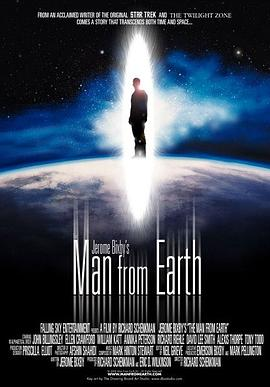
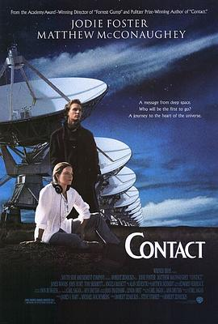
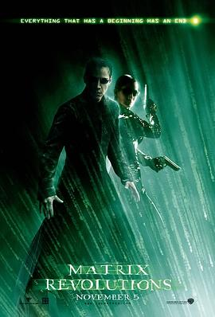
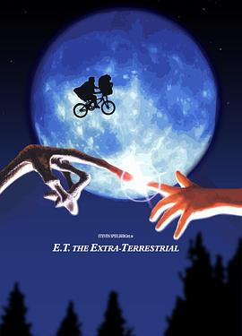
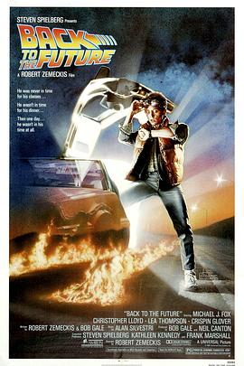
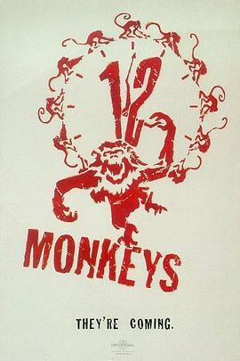
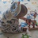

# 这个男人来自地球 (豆瓣)

**链接地址:** http://www.douban.com/doubanapp/dispatch?uri=/subject/2300586/interest/984935990
**作者:** 
**获取时间:** 2025/8/28 23:10:13
**图片数量:** 51

---

## 原始HTML内容

  
    

    
    

    <link href="//img3.doubanio.com/dae/accounts/resources/ba98e9b/shire/bundle.css" rel="stylesheet" type="text/css">

  

    

  <a href="https://accounts.douban.com/passport/login?source=movie" class="nav-login" rel="nofollow">登录/注册</a>

    

  <a href="https://www.douban.com/doubanapp/app?channel=top-nav" class="lnk-doubanapp">下载豆瓣客户端</a>
  

    <a href="https://www.douban.com/doubanapp/app?channel=qipao" class="tip-link">豆瓣 6.0 全新发布</a>
    <a href="javascript: void 0;" class="tip-close">×</a>
  

  

    
豆瓣

    
扫码直接下载

    

      <a href="https://www.douban.com/doubanapp/redirect?channel=top-nav&amp;direct_dl=1&amp;download=iOS">iPhone</a>
      ·
      <a href="https://www.douban.com/doubanapp/redirect?channel=top-nav&amp;direct_dl=1&amp;download=Android" class="download-android">Android</a>
    

  

    

  <ul>
    <li class="">
      <a href="https://www.douban.com" target="_blank" data-moreurl-dict="{&quot;from&quot;:&quot;top-nav-click-main&quot;,&quot;uid&quot;:&quot;0&quot;}">豆瓣</a>
    </li>
    <li class="">
      <a href="https://book.douban.com" target="_blank" data-moreurl-dict="{&quot;from&quot;:&quot;top-nav-click-book&quot;,&quot;uid&quot;:&quot;0&quot;}">读书</a>
    </li>
    <li class="on">
      <a href="https://movie.douban.com" data-moreurl-dict="{&quot;from&quot;:&quot;top-nav-click-movie&quot;,&quot;uid&quot;:&quot;0&quot;}">电影</a>
    </li>
    <li class="">
      <a href="https://music.douban.com" target="_blank" data-moreurl-dict="{&quot;from&quot;:&quot;top-nav-click-music&quot;,&quot;uid&quot;:&quot;0&quot;}">音乐</a>
    </li>
    <li class="">
      <a href="https://www.douban.com/podcast/" target="_blank" data-moreurl-dict="{&quot;from&quot;:&quot;top-nav-click-podcast&quot;,&quot;uid&quot;:&quot;0&quot;}">播客</a>
    </li>
    <li class="">
      <a href="https://www.douban.com/location" target="_blank" data-moreurl-dict="{&quot;from&quot;:&quot;top-nav-click-location&quot;,&quot;uid&quot;:&quot;0&quot;}">同城</a>
    </li>
    <li class="">
      <a href="https://www.douban.com/group" target="_blank" data-moreurl-dict="{&quot;from&quot;:&quot;top-nav-click-group&quot;,&quot;uid&quot;:&quot;0&quot;}">小组</a>
    </li>
    <li class="">
      <a href="https://read.douban.com/?dcs=top-nav&amp;dcm=douban" target="_blank" data-moreurl-dict="{&quot;from&quot;:&quot;top-nav-click-read&quot;,&quot;uid&quot;:&quot;0&quot;}">阅读</a>
    </li>
    <li class="">
      <a href="https://fm.douban.com/?from_=shire_top_nav" target="_blank" data-moreurl-dict="{&quot;from&quot;:&quot;top-nav-click-fm&quot;,&quot;uid&quot;:&quot;0&quot;}">FM</a>
    </li>
    <li class="">
      <a href="https://time.douban.com/?dt_time_source=douban-web_top_nav" target="_blank" data-moreurl-dict="{&quot;from&quot;:&quot;top-nav-click-time&quot;,&quot;uid&quot;:&quot;0&quot;}">时间</a>
    </li>
    <li class="">
      <a href="https://market.douban.com/?utm_campaign=douban_top_nav&amp;utm_source=douban&amp;utm_medium=pc_web" target="_blank" data-moreurl-dict="{&quot;from&quot;:&quot;top-nav-click-market&quot;,&quot;uid&quot;:&quot;0&quot;}">豆品</a>
    </li>
  </ul>

  

    

    

    <link href="//img3.doubanio.com/dae/accounts/resources/ba98e9b/movie/bundle.css" rel="stylesheet" type="text/css">

  

  

    

      <a href="https://movie.douban.com">豆瓣电影</a>
    

    

      <form action="https://search.douban.com/movie/subject_search" method="get">
        <fieldset>
          <legend>搜索：</legend>
          <label for="inp-query">
          </label>
          
<input id="inp-query" name="search_text" size="22" maxlength="60" placeholder="搜索电影、电视剧、综艺、影人" value="">

          
<input type="submit" value="搜索">

          <input type="hidden" name="cat" value="1002">
        </fieldset>
      </form>
    

  

  

  

    

  <ul>
    <li><a href="https://movie.douban.com/cinema/nowplaying/">影讯&amp;购票</a>
    </li>
    <li><a href="https://movie.douban.com/explore">选电影</a>
    </li>
    <li><a href="https://movie.douban.com/tv/">选剧集</a>
    </li>
    <li><a href="https://movie.douban.com/chart">排行榜</a>
    </li>
    <li><a href="https://movie.douban.com/review/best/">影评</a>
    </li>
    <li><a href="https://movie.douban.com/annual/2024/?fullscreen=1&amp;dt_from=movie_navigation">2024年度榜单</a>
    </li>
    <li><a href="https://c9.douban.com/app/standbyme-2024/?autorotate=false&amp;fullscreen=true&amp;hidenav=true&amp;monitor_screenshot=true&amp;df_from=web_navigation" target="_blank">2024年度报告</a>
    </li>
  </ul>

    
  

    

    
    

        

        
    

        
        
            <!-- rank label begin -->
            <link rel="stylesheet" href="https://img1.doubanio.com/cuphead/movie-static/subject/rank_label.dda40.css">
            

                
                  No.13
                
              
                <a href="https://m.douban.com/subject_collection/movie_scifi" target="_blank">评分最高科幻片</a>
              
            

            <!-- rank label end -->

    <h1>
        这个男人来自地球 The Man from Earth
            (2007)
    </h1>

        

            

            
            

                
    

        

            

                
                

    

                

        导演: <a href="https://www.douban.com/personage/27238201/" rel="v:directedBy">理查德·沙因克曼</a> 
        编剧: <a href="https://www.douban.com/personage/27219957/">杰罗姆·比克斯比</a> 
        主演: <a href="https://www.douban.com/personage/27354918/" rel="v:starring">大卫·李·史密斯</a> / <a href="https://www.douban.com/personage/27242247/" rel="v:starring">托尼·托德</a> / <a href="https://www.douban.com/personage/27253943/" rel="v:starring">约翰·比灵斯列</a> / <a href="https://www.douban.com/personage/27219937/" rel="v:starring">安妮卡·彼得森</a> / <a href="https://www.douban.com/personage/27206102/" rel="v:starring">阿丽西丝·索普</a> / <a href="https://www.douban.com/personage/27212738/" rel="v:starring">威廉·卡特</a> / <a href="https://www.douban.com/personage/27348392/" rel="v:starring">理查德·雷西尔</a> / <a href="https://www.douban.com/personage/27541458/" rel="v:starring">艾伦·克劳福德</a> / <a href="https://www.douban.com/personage/27461435/" rel="v:starring">史蒂文·利特尔</a> / <a href="https://www.douban.com/personage/27507794/" rel="v:starring">罗比·布赖恩</a> 
        类型: 剧情 / 科幻 
        
        制片国家/地区: 美国 
        语言: 英语 
        上映日期: 2007-11-13(美国) 
        片长: 87 分钟 
        又名: 地球不死人(港) / 这个人来自洞穴 / 来自地穴的男人 / 穴居人 / 地底奇人 / 长生不老 / 来自地球的男人 
        IMDb: tt0756683 

            

            
                

<link rel="stylesheet" href="https://img3.doubanio.com/cuphead/movie-static/download-output-image/index.7aaa3.css">

    

        

            

                豆瓣评分
            

          

            
            <a class="download-output-image" href="#">引用</a>
          

        

        

    <strong class="ll rating_num" property="v:average">8.5</strong>
    
    

        

        

                <a href="comments" class="rating_people">
                    399043人评价
                </a>
        

    

    
        

        
        
            5星
        
        

        45.5%
         
        

        

        
        
            4星
        
        

        38.0%
         
        

        

        
        
            3星
        
        

        13.7%
         
        

        

        
        
            2星
        
        

        2.0%
         
        

        

        
        
            1星
        
        

        0.8%
         
        

    

        

            好于 <a href="/typerank?type_name=剧情&amp;type=11&amp;interval_id=100:90&amp;action=">95% 剧情片</a> 
            好于 <a href="/typerank?type_name=科幻&amp;type=17&amp;interval_id=100:90&amp;action=">97% 科幻片</a> 
        

            
        

        
            

        
            <a href="https://www.douban.com/reason=collectwish&amp;ck=" rel="nofollow" class="j a_show_login colbutt ll" name="pbtn-2300586-wish">
                想看
            </a>
            <a href="https://www.douban.com/reason=collectcollect&amp;ck=" rel="nofollow" class="j a_show_login colbutt ll" name="pbtn-2300586-collect">
                看过
            </a>
        

            
    
    评价:
     

            
            
            
            
            
    
    <input id="n_rating" type="hidden" value="">
    

        

        

    <ul class="ul_subject_menu bicelink color_gray pt6 clearfix">
        
    
        
                
                  <li> 
    &nbsp;
        <a onclick="moreurl(this, {from:'mv_sbj_wr_cmnt_login'})" class="j a_show_login" href="https://www.douban.com/register?reason=review" rel="nofollow">写短评</a>
 </li>
                  <li> 
    
    &nbsp;
        <a onclick="moreurl(this, {from:'mv_sbj_wr_rv_login'})" class="j a_show_login" href="https://www.douban.com/register?reason=review" rel="nofollow">写影评</a>
 </li>
                    <li> 
   

   
    
    
    <a href="#" data-type="电影" data-url="https://movie.douban.com/subject/2300586/" data-desc="电影《这个男人来自地球 The Man from Earth》 (来自豆瓣) " data-title="电影《这个男人来自地球 The Man from Earth》 (来自豆瓣) " data-pic="https://img9.doubanio.com/view/photo/s_ratio_poster/public/p513303986.jpeg" class="bn-sharing ">
        分享到
    </a> &nbsp;&nbsp;
    
    <link rel="stylesheet" href="https://img1.doubanio.com/f/vendors/e8a7261937da62636d22ca4c579efc4a4d759b1b/css/ui/dialog.css">
    
    
    

  </li>
            

    </ul>

    

        
            

<link rel="stylesheet" href="https://img3.doubanio.com/cuphead/movie-static/mod/share.ee737.css" type="text/css">

    

        
        <a href="/accounts/register?reason=recommend" class="j a_show_login lnk-sharing" share-id="2300586" data-mode="plain" data-name="这个男人来自地球 The Man from Earth‎ (2007)" data-type="movie" data-desc="导演 理查德·沙因克曼 主演 大卫·李·史密斯 / 托尼·托德 / 美国 / 8.5分(399043评价)" data-href="https://movie.douban.com/subject/2300586/" data-image="https://img9.doubanio.com/view/photo/s_ratio_poster/public/p513303986.jpg" data-properties="{}" data-redir="" data-text="" data-apikey="" data-curl="" data-count="10" data-object_kind="1002" data-object_id="2300586" data-target_type="rec" data-target_action="0" data-action_props="{&quot;subject_url&quot;:&quot;https:\/\/movie.douban.com\/subject\/2300586\/&quot;,&quot;subject_title&quot;:&quot;这个男人来自地球 The Man from Earth‎ (2007)&quot;}">推荐</a>

        
    

        

    

    

    

    
    
        
            
            
    <h2>
        <i>这个男人来自地球的剧情简介</i>
              · · · · · ·
    </h2>

            

                    
                        
                                　　一个普通男人的秘密在他的辞职事件中开始显示出端倪。历史教授约翰奥德曼（David Lee Smith饰）说自己身上有一个让大家都匪夷所思的秘密，而为了保守这个秘密他不能在一个地方超过十年。他的朋友们试图去发掘他的故事中的秘密，这一举动让约翰非常生气，而他的朋友却发现约翰的故事是无法被否定也无法查证的，究竟约翰身上有着怎样的秘密？一幕幕碎片联系起来，带给我们一个意料之外的故事高潮。
                        
                        <a href="https://movie.douban.com/help/movie#t0-qs">©豆瓣</a>
            

    

    

<link rel="stylesheet" href="https://img3.doubanio.com/cuphead/movie-static/celebrity/celebrities_section.610da.css">

  
    <h2>
        <i>这个男人来自地球的演职员</i>
              · · · · · ·
            
            (
                <a href="/subject/2300586/celebrities">全部 13</a>
            )
            
    </h2>

  <ul class="celebrities-list from-subject __oneline">
        
    
  
  <li class="celebrity">
    

  <a href="https://www.douban.com/personage/27238201/" title="理查德·沙因克曼 Richard Schenkman" class="">
      

    

  </a>

    

      <a href="https://www.douban.com/personage/27238201/" title="理查德·沙因克曼 Richard Schenkman" class="name">理查德·沙因克曼</a>

      导演

    

  </li>

        
    
  
  <li class="celebrity">
    

  <a href="https://www.douban.com/personage/27354918/" title="大卫·李·史密斯 David Lee Smith" class="">
      

    

  </a>

    

      <a href="https://www.douban.com/personage/27354918/" title="大卫·李·史密斯 David Lee Smith" class="name">大卫·李·史密斯</a>

      饰 John Oldman

    

  </li>

        
    
  
  <li class="celebrity">
    

  <a href="https://www.douban.com/personage/27242247/" title="托尼·托德 Tony Todd" class="">
      

    

  </a>

    

      <a href="https://www.douban.com/personage/27242247/" title="托尼·托德 Tony Todd" class="name">托尼·托德</a>

      饰 Dan

    

  </li>

        
    
  
  <li class="celebrity">
    

  <a href="https://www.douban.com/personage/27253943/" title="约翰·比灵斯列 John Billingsley" class="">
      

    

  </a>

    

      <a href="https://www.douban.com/personage/27253943/" title="约翰·比灵斯列 John Billingsley" class="name">约翰·比灵斯列</a>

      饰 Harry

    

  </li>

        
    
  
  <li class="celebrity">
    

  <a href="https://www.douban.com/personage/27219937/" title="安妮卡·彼得森 Annika Peterson" class="">
      

    

  </a>

    

      <a href="https://www.douban.com/personage/27219937/" title="安妮卡·彼得森 Annika Peterson" class="name">安妮卡·彼得森</a>

      饰 Sandy

    

  </li>

        
    
  
  <li class="celebrity">
    

  <a href="https://www.douban.com/personage/27206102/" title="阿丽西丝·索普 Alexis Thorpe" class="">
      

    

  </a>

    

      <a href="https://www.douban.com/personage/27206102/" title="阿丽西丝·索普 Alexis Thorpe" class="name">阿丽西丝·索普</a>

      饰 Linda Murphy

    

  </li>

  </ul>

    

<link rel="stylesheet" href="https://img1.doubanio.com/f/verify/a5bc0bc0aea4221d751bc4809fd4b0a1075ad25e/entry_creator/dist/author_subject/style.css">

    

    
        

<link rel="stylesheet" href="https://img1.doubanio.com/cuphead/movie-static/subject/photos_section.45abd.css">

    
    

        
    
    
    <h2>
        <i>这个男人来自地球的图片</i>
              · · · · · ·
            
            (
                <a href="https://movie.douban.com/subject/2300586/all_photos">图片233</a>&nbsp;·&nbsp;<a href="https://movie.douban.com/subject/2300586/mupload">添加</a>
            )
            
    </h2>

        <ul class="related-pic-bd  ">
                <li>
                    
                </li>
                <li>
                    
                </li>
                <li>
                    
                </li>
                <li>
                    
                </li>
                <li>
                    
                </li>
        </ul>
    

    

    

    
        

<link rel="stylesheet" href="https://img3.doubanio.com/cuphead/movie-static/subject/recommendations.61283.css">

        

    

        
        
    <h2>
        <i>喜欢这部电影的人也喜欢</i>
              · · · · · ·
    </h2>

        
    
    

        <dl>
            <dt>
                
            </dt>
            <dd>
                <a href="https://movie.douban.com/subject/1295647/?from=subject-page">超时空接触</a>
                8.4
            </dd>
        </dl>
        <dl>
            <dt>
                
            </dt>
            <dd>
                <a href="https://movie.douban.com/subject/3073124/?from=subject-page">月球</a>
                8.5
            </dd>
        </dl>
        <dl>
            <dt>
                
            </dt>
            <dd>
                <a href="https://movie.douban.com/subject/3006772/?from=subject-page">第九区</a>
                8.4
            </dd>
        </dl>
        <dl>
            <dt>
                
            </dt>
            <dd>
                <a href="https://movie.douban.com/subject/1302467/?from=subject-page">黑客帝国3：矩阵革命</a>
                8.8
            </dd>
        </dl>
        <dl>
            <dt>
                
            </dt>
            <dd>
                <a href="https://movie.douban.com/subject/1292226/?from=subject-page">2001太空漫游</a>
                8.9
            </dd>
        </dl>
        <dl>
            <dt>
                
            </dt>
            <dd>
                <a href="https://movie.douban.com/subject/1294638/?from=subject-page">E.T.外星人</a>
                8.6
            </dd>
        </dl>
        <dl>
            <dt>
                
            </dt>
            <dd>
                <a href="https://movie.douban.com/subject/1300555/?from=subject-page">回到未来</a>
                8.8
            </dd>
        </dl>
        <dl>
            <dt>
                
            </dt>
            <dd>
                <a href="https://movie.douban.com/subject/1298744/?from=subject-page">十二猴子</a>
                8.2
            </dd>
        </dl>
        <dl>
            <dt>
                
            </dt>
            <dd>
                <a href="https://movie.douban.com/subject/3075287/?from=subject-page">源代码</a>
                8.6
            </dd>
        </dl>
        <dl>
            <dt>
                
            </dt>
            <dd>
                <a href="https://movie.douban.com/subject/1306607/?from=subject-page">K星异客</a>
                8.5
            </dd>
        </dl>
    

    

    

    
        

    
    <link rel="stylesheet" href="https://img1.doubanio.com/f/vendors/d63a579a99fd372b4398731a279a1382e6eac71e/subject-comments/comments-section.css">

    

        

            
            
        <a class="comment_btn j a_show_login" href="https://www.douban.com/register?reason=review" rel="nofollow">
            我要写短评
        </a>

            
    <h2>
        <i>这个男人来自地球的短评</i>
              · · · · · ·
            
            (
                <a href="https://movie.douban.com/subject/2300586/comments?status=P">全部 108298 条</a>
            )
            
    </h2>

        

        

        

                
        

                        <a id="hot-comments-tab" href="comments" data-id="hot" class="on">热门</a>&nbsp;/&nbsp;
                        <a id="new-comments-tab" href="comments?sort=time" data-id="new" class="j a_show_login">最新</a>&nbsp;/&nbsp;
                        <a id="following-comments-tab" href="comments?sort=follows" data-id="following" class="j a_show_login">好友</a>
        

    

        

            
    

        
        

            
    
    

        <h3>
            
                    1857

                    <input value="27247132" type="hidden">
                    <a href="javascript:;" data-id="27247132" class="j a_show_login" onclick="">有用</a>

                <!-- 删除短评 -->
            
            
                <a href="https://www.douban.com/people/lixiaolai/">笑来</a>
                    看过
                
                    2007-12-27 16:18:57
                
                
            
        </h3>
        

            
                Man from Earth = Cave Man，Earth在这里是“洞、穴”的意思。好玩的是，电影名字弄错了，并不影响观众看懂这个片子……
        

        

    

    

        

        
        

            
    
    

        <h3>
            
                    6415

                    <input value="26309108" type="hidden">
                    <a href="javascript:;" data-id="26309108" class="j a_show_login" onclick="">有用</a>

                <!-- 删除短评 -->
            
            
                <a href="https://www.douban.com/people/sirenman/">蛮爷</a>
                    看过
                    
                
                    2007-12-24 15:43:39
                
                
            
        </h3>
        

            
                我想大多数人都是搬沙发的工人。
        

        

    

    

        

        
        

            
    
    

        <h3>
            
                    1653

                    <input value="27754263" type="hidden">
                    <a href="javascript:;" data-id="27754263" class="j a_show_login" onclick="">有用</a>

                <!-- 删除短评 -->
            
            
                <a href="https://www.douban.com/people/tjz230/">影志</a>
                    看过
                    
                
                    2008-01-02 12:06:23
                
                
            
        </h3>
        

            
                电影若都这样拍不止要节省多少成本？里面关于历史、宗教、生物、心理等方面的探讨固然深刻、引人入胜，可是……带给我的思考并不多，感觉很遥远。整个片子就像小时候几个朋友围坐讲鬼故事……蛮有趣的。
        

        

    

    

        

        
        

            
    
    

        <h3>
            
                    6193

                    <input value="165425976" type="hidden">
                    <a href="javascript:;" data-id="165425976" class="j a_show_login" onclick="">有用</a>

                <!-- 删除短评 -->
            
            
                <a href="https://www.douban.com/people/Lan.die/">Lan~die</a>
                    看过
                    
                
                    2009-10-06 20:57:37
                
                
            
        </h3>
        

            
                围炉夜话神游八荒，科幻真正的魅力不是视觉效果能取代的。
        

        

    

    

        

        
        

            
    
    

        <h3>
            
                    1079

                    <input value="644686668" type="hidden">
                    <a href="javascript:;" data-id="644686668" class="j a_show_login" onclick="">有用</a>

                <!-- 删除短评 -->
            
            
                <a href="https://www.douban.com/people/beiliya/">沉歌</a>
                    看过
                    
                
                    2013-03-18 17:57:55
                
                
            
        </h3>
        

            
                哪位管理员把影志那个【意外结局】的豆列删了，我都不知道这是第几次还没看就被他剧透了，这货是反社会人格吗，要抓狂了。
        

        

    

    

        

                
                    &gt; <a href="comments?sort=new_score&amp;status=P">
                        更多短评
                            108298条
                    </a>
        

        

            

            

            

                <a class="qa" href="/help/opinion#t2-q0" target="_blank">为什么被折叠？</a>
                <a class="btn-unfold" href="#">有一些短评被折叠了</a>
                

                    评论被折叠，是因为发布这条评论的账号行为异常。评论仍可以被展开阅读，对发布人的账号不造成其他影响。如果认为有问题，可以<a href="https://help.douban.com/help/ask?category=movie">联系</a>豆瓣电影。
                

            

            

            

            
        

        

            
    

        

            你关注的人还没写过短评
        

        

    

    

            
            
        

    

<!--        此处是挂载其他页面，不是注释！不是注释！不是注释！-->
        

<link rel="stylesheet" href="https://img1.doubanio.com/misc/mixed_static/292deb5ae8f760a3.css">

    <section id="reviews-wrapper" class="reviews mod movie-content">
        <header>
            
                <a href="new_review" rel="nofollow" class="create-review comment_btn " data-isverify="False" data-verify-url="https://www.douban.com/accounts/phone/verify?redir=https://movie.douban.com/subject/2300586/new_review">
                    我要写影评
                </a>
            <h2>
                    这个男人来自地球的影评 · · · · · ·

                    ( <a href="reviews">全部 2009 条</a> )
            </h2>
        </header>

            
            

                                <a href="javascript:;;" class="cur" data-sort="">热门</a>
            

            

            

        
    

            
    
    

        

            
    
    <header class="main-hd">
        

        <a href="https://www.douban.com/people/fengguoyuanye/" class="name">风过原野</a>
            

        2007-12-27 13:52:51

    </header>

            

                <h2><a href="https://movie.douban.com/review/1268364/">他来自地球</a></h2>

                

                    

                            
这篇影评可能有剧透

                        差不多可以说，《这个男人来自地球》是2007年最让我感到惊艳的电影。投资不过一万多美元，却在IMDB上获得了高达8.4的评分。说老实话，看了洋人拍的电影，实在是替中国导演的想象力汗流不止。  故事情节很简单，场景也很“简陋”，几个人的对话就是主要情节，一间木屋的内外便是...

                        &nbsp;(<a href="javascript:;" id="toggle-1268364-copy" class="unfold" title="展开">展开</a>)
                    

                

                

                    

                

                

                    <a href="javascript:;" class="action-btn up" data-rid="1268364" title="有用">
                        
                        
                                708
                        
                    </a>
                    <a href="javascript:;" class="action-btn down" data-rid="1268364" title="没用">
                        
                        
                                124
                        
                    </a>
                    <a href="https://movie.douban.com/review/1268364/#comments" class="reply ">236回应</a>

                    <a href="javascript:;;" class="fold hidden">收起</a>
                

            

        

    

            
    
    

        

            
    
    <header class="main-hd">
        

        <a href="https://www.douban.com/people/1060007/" class="name">灵子</a>
            

        2008-01-15 23:42:17

    </header>

            

                <h2><a href="https://movie.douban.com/review/1282491/">世界奇如斯</a></h2>

                

                    

                              一个相识了十年的朋友突然对你说，自己是活了14000岁的穴居人，你该做何感受？      你大笑，你以为他疯了，你从生物学、考古学、人类学、历史学等等方面去质问他，然而你发现每一个问题他都对答如流，每一个年代他都有清晰的记忆。慢慢地，你半信半疑，甚至不经意间颠覆...

                        &nbsp;(<a href="javascript:;" id="toggle-1282491-copy" class="unfold" title="展开">展开</a>)
                    

                

                

                    

                

                

                    <a href="javascript:;" class="action-btn up" data-rid="1282491" title="有用">
                        
                        
                                485
                        
                    </a>
                    <a href="javascript:;" class="action-btn down" data-rid="1282491" title="没用">
                        
                        
                                75
                        
                    </a>
                    <a href="https://movie.douban.com/review/1282491/#comments" class="reply ">100回应</a>

                    <a href="javascript:;;" class="fold hidden">收起</a>
                

            

        

    

            
    
    

        

            
    
    <header class="main-hd">
        

        <a href="https://www.douban.com/people/siningxiang/" class="name">五乔</a>
            

        2012-09-10 09:45:50

    </header>

            

                <h2><a href="https://movie.douban.com/review/5579121/">一场不精彩的说教</a></h2>

                

                    

                            
这篇影评可能有剧透

                        作为一个影迷，我无法将《这个男人来自地球》视作一部经典，甚至无法欣赏这部电影。就电影技术上的基本元素来说，此片毫无亮点。大多时间镜头只是根据对话需要机械地在每个角色之间转换；画面的构图无甚美感；配乐——如果有任何配乐的话——完全没有起到辅助叙事的作用；节奏...

                        &nbsp;(<a href="javascript:;" id="toggle-5579121-copy" class="unfold" title="展开">展开</a>)
                    

                

                

                    

                

                

                    <a href="javascript:;" class="action-btn up" data-rid="5579121" title="有用">
                        
                        
                                569
                        
                    </a>
                    <a href="javascript:;" class="action-btn down" data-rid="5579121" title="没用">
                        
                        
                                208
                        
                    </a>
                    <a href="https://movie.douban.com/review/5579121/#comments" class="reply ">164回应</a>

                    <a href="javascript:;;" class="fold hidden">收起</a>
                

            

        

    

            
    
    

        

            
    
    <header class="main-hd">
        

        <a href="https://www.douban.com/people/yangweili/" class="name">螃蟹</a>
            

        2009-01-30 06:40:39

    </header>

            

                <h2><a href="https://movie.douban.com/review/1640424/">让我们只是海阔天空的聊一场</a></h2>

                

                    

                        有在科幻版大家闲聊的感觉，就着一个命题跑出各种匪夷所思的设定、讨论、置疑、细节和情境演变。第二遍看的时候还是蛮舒服的。  第一遍看的时候感觉很无聊，一是觉得散，剧情（主要是问题们）的推进演化毫无层次甚至毫无逻辑。二是很明显的，也被许多人诟病过的，问题根本没有...

                        &nbsp;(<a href="javascript:;" id="toggle-1640424-copy" class="unfold" title="展开">展开</a>)
                    

                

                

                    

                

                

                    <a href="javascript:;" class="action-btn up" data-rid="1640424" title="有用">
                        
                        
                                382
                        
                    </a>
                    <a href="javascript:;" class="action-btn down" data-rid="1640424" title="没用">
                        
                        
                                12
                        
                    </a>
                    <a href="https://movie.douban.com/review/1640424/#comments" class="reply ">34回应</a>

                    <a href="javascript:;;" class="fold hidden">收起</a>
                

            

        

    

            
    
    

        

            
    
    <header class="main-hd">
        

        <a href="https://www.douban.com/people/1718859/" class="name">露水十一</a>
            

        2010-02-10 00:58:36

    </header>

            

                <h2><a href="https://movie.douban.com/review/2986864/">The Man from Earth</a></h2>

                

                    

                        The Man from Earth，暗指cave man，总觉得中文怎么翻译都没那个味道。 我觉得这个片子的灵感出自那个预言者John Titor。 可惜最早看的那个版本中文翻译错误百出，对影片的理解肯定会有误。 约翰说得也对：这些教授正是完美的聆听者，对有求知欲和解密爱好者来说，这片子正中下...

                        &nbsp;(<a href="javascript:;" id="toggle-2986864-copy" class="unfold" title="展开">展开</a>)
                    

                

                

                    

                

                

                    <a href="javascript:;" class="action-btn up" data-rid="2986864" title="有用">
                        
                        
                                363
                        
                    </a>
                    <a href="javascript:;" class="action-btn down" data-rid="2986864" title="没用">
                        
                        
                                5
                        
                    </a>
                    <a href="https://movie.douban.com/review/2986864/#comments" class="reply ">15回应</a>

                    <a href="javascript:;;" class="fold hidden">收起</a>
                

            

        

    

            
    
    

        

            
    
    <header class="main-hd">
        

        <a href="https://www.douban.com/people/kuangyan/" class="name">邝言</a>
            

        2014-02-28 15:48:20

    </header>

            

                <h2><a href="https://movie.douban.com/review/6567248/">[影评]The man from earth：一个没有必要的假设</a></h2>

                

                    

                        有人问我：作为一个搞哲学的，你对这部电影怎么看？我首先回答说：电影中讨论的问题，以及讨论到的程度，对于一个搞思想史的人来说，都没有什么新鲜感可言了。对方仍旧追问我：那你的看法是什么？我想了想，这样回答了ta：  古希腊人说过：“死亡是哲学的缪斯。”哲学是从人的...

                        &nbsp;(<a href="javascript:;" id="toggle-6567248-copy" class="unfold" title="展开">展开</a>)
                    

                

                

                    

                

                

                    <a href="javascript:;" class="action-btn up" data-rid="6567248" title="有用">
                        
                        
                                146
                        
                    </a>
                    <a href="javascript:;" class="action-btn down" data-rid="6567248" title="没用">
                        
                        
                                49
                        
                    </a>
                    <a href="https://movie.douban.com/review/6567248/#comments" class="reply ">35回应</a>

                    <a href="javascript:;;" class="fold hidden">收起</a>
                

            

        

    

            
    
    

        

            
    
    <header class="main-hd">
        

        <a href="https://www.douban.com/people/RockxxPunk/" class="name">梅威斯</a>
            

        2009-01-14 16:06:08

    </header>

            

                <h2><a href="https://movie.douban.com/review/1619283/">一部让人思考的电影</a></h2>

                

                    

                        绝对是头脑风暴,我看过很多让人很绕的电影，基本都是在时间问题上引人入胜，但这类电影，如果你仔细想想，会发现众多漏洞，但你可以不信，因为电影就是很坦然的告诉你“我可没说这是真的”，一笑了知，娱乐而已。  但这个剧本，让人引发很多思考，不是简单的这个是否可能，人类...

                        &nbsp;(<a href="javascript:;" id="toggle-1619283-copy" class="unfold" title="展开">展开</a>)
                    

                

                

                    

                

                

                    <a href="javascript:;" class="action-btn up" data-rid="1619283" title="有用">
                        
                        
                                145
                        
                    </a>
                    <a href="javascript:;" class="action-btn down" data-rid="1619283" title="没用">
                        
                        
                                1
                        
                    </a>
                    <a href="https://movie.douban.com/review/1619283/#comments" class="reply ">12回应</a>

                    <a href="javascript:;;" class="fold hidden">收起</a>
                

            

        

    

    

    <!-- COLLECTED JS -->
    <!-- COLLECTED CSS -->

    

    <link rel="stylesheet" href="https://img1.doubanio.com/f/zerkalo/88118a282439e312283e886ea4c3d3e9849a8fa4/css/review/editor/ng/setting_standalone.css">
    
    
    
    
    
    
    

                

                    &gt;
                        <a href="reviews">
                            更多影评
                                2009篇
                        </a>
                

    </section>
<!-- COLLECTED JS -->

     

    
            

                    
                    

                            <a class="comment_btn j a_show_login" href="https://www.douban.com/register?reason=review" rel="nofollow">添加新讨论</a>
                        
    <h2>
        讨论区
         &nbsp; ·&nbsp; ·&nbsp; ·&nbsp; ·&nbsp; ·&nbsp; ·
    </h2>

                    

                    
  <table class="olt"><tbody><tr><td></td><td></td><td></td><td></td></tr>
        
        <tr>
          <td class="pl"><a href="https://movie.douban.com/subject/2300586/discussion/616798030/" title="他居然一直知道Will是他孩子…">他居然一直知道Will是他孩子…</a></td>
          <td class="pl">来自<a href="https://www.douban.com/people/suxiao1943/">苏晓</a></td>
          <td class="pl">26 回应</td>
          <td class="pl">2025-08-21 17:39:36</td>
        </tr>
        
        <tr>
          <td class="pl"><a href="https://movie.douban.com/subject/2300586/discussion/637806126/" title="唯一能证明他的话真假就是拿出他的学位证书">唯一能证明他的话真假就是拿出他的学位证书</a></td>
          <td class="pl">来自<a href="https://www.douban.com/people/127922296/">克里斯托服阿东</a></td>
          <td class="pl">1 回应</td>
          <td class="pl">2025-08-10 13:39:16</td>
        </tr>
        
        <tr>
          <td class="pl"><a href="https://movie.douban.com/subject/2300586/discussion/637846977/" title="。">。</a></td>
          <td class="pl">来自<a href="https://www.douban.com/people/287005872/">豆友pfyf7r6w_0</a></td>
          <td class="pl"></td>
          <td class="pl">2025-08-08 13:18:13</td>
        </tr>
        
        <tr>
          <td class="pl"><a href="https://movie.douban.com/subject/2300586/discussion/616394187/" title="如果你是壁炉旁懵逼的其中一人，你会问男主什么问题？">如果你是壁炉旁懵逼的其中一人，你会问男主什么问题？</a></td>
          <td class="pl">来自<a href="https://www.douban.com/people/175254687/">Young</a></td>
          <td class="pl">51 回应</td>
          <td class="pl">2025-07-30 15:18:33</td>
        </tr>
        
        <tr>
          <td class="pl"><a href="https://movie.douban.com/subject/2300586/discussion/637808140/" title="最后那个女的有没有上车，如果上了的话我认为不合理">最后那个女的有没有上车，如果上了的话我认为不合理</a></td>
          <td class="pl">来自<a href="https://www.douban.com/people/286354897/">瓦莱丽</a></td>
          <td class="pl">1 回应</td>
          <td class="pl">2025-07-20 04:46:37</td>
        </tr>
  </tbody></table>

                    

                        <a href="/subject/2300586/discussion/" rel="nofollow">
                            &gt; 去这部影片的讨论区（全部461条）
                        </a>
                    

            

        
    
        
                
                    

    

        <h2>
                关于《这个男人来自地球》的问题
                · · · · · ·
            
                (<a href="https://movie.douban.com/subject/2300586/questions/?from=subject">
                    全部59个
                </a>)
            
        </h2>

        <!-- 
    
    <a class='j a_show_login comment_btn'
        href='https://movie.douban.com/subject/2300586/questions/ask/?from=subject'>我来提问</a>
 -->
    

    

        <ul>
            <li>
                
                    <a href="https://movie.douban.com/subject/2300586/questions/622/?from=subject">
                        若真有这样的人存在。该怎么避免和自己的后代乱伦？
                    </a>
                
                
                    24人回答
                
            </li>
            <li>
                
                    <a href="https://movie.douban.com/subject/2300586/questions/17815/?from=subject">
                        他不会变老，那他儿子怎么不认识他？
                    </a>
                
                
                    14人回答
                
            </li>
        </ul>

        
&gt;
            <a href="https://movie.douban.com/subject/2300586/questions/?from=subject">
                全部59个问题
            </a>
        

    

            

    

            

            

                

    

        

    
    

    
    <h2>
        在哪儿看这部电影
            &nbsp;·&nbsp;·&nbsp;·&nbsp;·&nbsp;·&nbsp;·
    </h2>

    
    <ul class="bs">
                
                <li>
                        <a class="playBtn" data-cn="腾讯视频" data-impression-track="https://frodo.douban.com/rohirrim/video_tracking/impression?subject_id=2300586&amp;video_type=movie&amp;video_id=550524&amp;source=qq&amp;user_id=&amp;bid=9rNIktdbpeU&amp;platform=pc&amp;location=vendor_subject" data-click-track="https://frodo.douban.com/rohirrim/video_tracking/click?subject_id=2300586&amp;video_type=movie&amp;video_id=550524&amp;source=qq&amp;user_id=&amp;bid=9rNIktdbpeU&amp;platform=pc&amp;location=vendor_subject" data-pic="https://img3.doubanio.com/cuphead/movie-static/pics/video-qq.png" href="https://www.douban.com/link2/?url=https%3A%2F%2Fv.qq.com%2Fx%2Fcover%2F67s5g9vttbd6e6r.html%3Fptag%3Dnewdouban.movie&amp;subtype=1&amp;type=online-video" target="_blank">
                        腾讯视频
                        </a>
                    
                    
                        VIP免费观看
                    
                </li>
                
                <li>
                        <a class="playBtn" data-cn="爱奇艺" data-impression-track="https://frodo.douban.com/rohirrim/video_tracking/impression?subject_id=2300586&amp;video_type=movie&amp;video_id=351755&amp;source=iqiyi&amp;user_id=&amp;bid=9rNIktdbpeU&amp;platform=pc&amp;location=vendor_subject" data-click-track="https://frodo.douban.com/rohirrim/video_tracking/click?subject_id=2300586&amp;video_type=movie&amp;video_id=351755&amp;source=iqiyi&amp;user_id=&amp;bid=9rNIktdbpeU&amp;platform=pc&amp;location=vendor_subject" data-pic="https://img1.doubanio.com/cuphead/movie-static/pics/video-iqiyi-new.png" href="https://www.douban.com/link2/?url=http%3A%2F%2Fwww.iqiyi.com%2Fv_19rrhv5mco.html%3Fvfm%3Dm_331_dbdy%26fv%3D4904d94982104144a1548dd9040df241&amp;subtype=9&amp;type=online-video&amp;link2key=cb4c919721" target="_blank">
                        爱奇艺
                        </a>
                    
                    
                        VIP免费观看
                    
                </li>
                
                <li>
                        <a class="playBtn" data-cn="优酷视频" data-impression-track="https://frodo.douban.com/rohirrim/video_tracking/impression?subject_id=2300586&amp;video_type=movie&amp;video_id=209402&amp;source=youku&amp;user_id=&amp;bid=9rNIktdbpeU&amp;platform=pc&amp;location=vendor_subject" data-click-track="https://frodo.douban.com/rohirrim/video_tracking/click?subject_id=2300586&amp;video_type=movie&amp;video_id=209402&amp;source=youku&amp;user_id=&amp;bid=9rNIktdbpeU&amp;platform=pc&amp;location=vendor_subject" data-pic="https://img1.doubanio.com/cuphead/movie-static/pics/video-youku-new.png" href="https://www.douban.com/link2/?url=https%3A%2F%2Fv.youku.com%2Fv_show%2Fid_XNTg2OTc3OTgw.html%3Fspm%3Da2h0c.8166622.PhoneSokuProgram_2.3&amp;subtype=3&amp;type=online-video" target="_blank">
                        优酷视频
                        </a>
                    
                    
                        免费观看
                    
                </li>

    </ul>

    <!-- douban ad begin -->
    

    <!-- douban ad end -->

    

    

    

    

    
        

    
    
    <h2>
        <i>以下片单推荐</i>
              · · · · · ·
            
            (
                <a href="https://movie.douban.com/subject/2300586/doulists">全部</a>
            )
            
    </h2>

    
    <ul>
            
                <li>
                    <a href="https://www.douban.com/doulist/24213/" target="_blank">【容易忽视的好电影】</a>
                    (影志)
                </li>
            
                <li>
                    <a href="https://www.douban.com/doulist/11324/" target="_blank">【意外结局】</a>
                    (影志)
                </li>
            
                <li>
                    <a href="https://www.douban.com/doulist/259156/" target="_blank">数学、物理学生可能感兴趣的电影、纪录片</a>
                    (傑)
                </li>
            
                <li>
                    <a href="https://www.douban.com/doulist/1015865/" target="_blank">意外结局+高智商</a>
                    (鸟人与鱼)
                </li>
            
                <li>
                    <a href="https://www.douban.com/doulist/64973/" target="_blank">曾经关于时空的豆列</a>
                    (L.L)
                </li>
    </ul>

    
        

    
    
    <h2>
        <i>谁在看这部电影</i>
              · · · · · ·
    </h2>

    
    <ul>
            
            <li>
                
                

                    <a href="https://www.douban.com/people/210688885/">豆友210688885</a>
                    

                        32分钟前
                        看过
                        

                    

                

            </li>
            
            <li>
                
                

                    <a href="https://www.douban.com/people/162154546/">999</a>
                    

                        51分钟前
                        想看
                        

                    

                

            </li>
            
            <li>
                
                

                    <a href="https://www.douban.com/people/289886730/">可汗大帝</a>
                    

                        53分钟前
                        想看
                        

                    

                

            </li>
    </ul>

    
    

        
            <a href="https://movie.douban.com/subject/2300586/comments?status=P">560990人看过</a>
                &nbsp;/&nbsp;
            <a href="https://movie.douban.com/subject/2300586/comments?status=F">263438人想看</a>
    

    

<!-- douban ad begin -->

<!-- douban ad end -->

     

    

订阅这个男人来自地球的评论:  
    <a href="https://movie.douban.com/feed/subject/2300586/reviews"> feed: rss 2.0</a>

            

            

                
    
<!-- douban ad begin -->

<!-- douban ad end -->

    <!-- douban ad begin -->
    

    <!-- douban ad end -->

            

        

    

        
    

            

        

    © 2005－2025 douban.com, all rights reserved 北京豆网科技有限公司

    <a href="https://www.douban.com/about">关于豆瓣</a>
    · <a href="https://www.douban.com/jobs">在豆瓣工作</a>
    · <a href="https://www.douban.com/about?topic=contactus">联系我们</a>
    · <a href="https://www.douban.com/about/legal">法律声明</a>
    
    · <a href="https://help.douban.com/?app=movie" target="_blank">帮助中心</a>
    · <a href="https://www.douban.com/doubanapp/">移动应用</a>

    

    

    <!-- COLLECTED JS -->
        
        
    <link rel="stylesheet" type="text/css" href="https://img1.doubanio.com/f/vendors/e8a7261937da62636d22ca4c579efc4a4d759b1b/css/ui/dialog.css">
    <link rel="stylesheet" type="text/css" href="https://img1.doubanio.com/cuphead/movie-static/mod/login_pop.b2f60.css">
    
    
    

    
    
    
    
    
    
    
    
    
    

    
    
    

    

    
  

      

    <!-- dae-web-movie--default-5f9cb85759-t2x6p-->

  

---

## 纯文本内容

var _body_start = new Date();

    
    

    

  
    

  登录/注册

    
  下载豆瓣客户端
  
    豆瓣 6.0 全新发布
    ×
  
  
    豆瓣
    扫码直接下载
    
      iPhone
      ·
      Android
    
  

    

  
    
      豆瓣
    
    
      读书
    
    
      电影
    
    
      音乐
    
    
      播客
    
    
      同城
    
    
      小组
    
    
      阅读
    
    
      FM
    
    
      时间
    
    
      豆品
    
  

  

  ;window._GLOBAL_NAV = {
    DOUBAN_URL: "https://www.douban.com",
    N_NEW_NOTIS: 0,
    N_NEW_DOUMAIL: 0
  };

    

    

    

  
  
    
      豆瓣电影
    
    
      
        
          搜索：
          
          
          
          
          
        
      
    
  
  
  
    

  
    影讯&购票
    
    选电影
    
    选剧集
    
    排行榜
    
    影评
    
    2024年度榜单
    
    2024年度报告
    
  

    
  

  <li data-link="{{= url}}">
            <a href="{{= url}}" onclick="moreurl(this, {from:'movie_search_sugg', query:'{{= keyword }}', subject_id:'{{= id}}', i: '{{= index}}', type: '{{= type}}'})">
            
            

                <em>{{= title}}</em>
                {{if year}}
                    {{= year}}
                {{/if}}
                {{if sub_title}}
                     {{= sub_title}}
                {{/if}}
                {{if address}}
                     {{= address}}
                {{/if}}
                {{if episode}}
                    {{if episode=="unknow"}}
                         集数未知
                    {{else}}
                         共{{= episode}}集
                    {{/if}}
                {{/if}}
            

        </a>
        </li>
  

    

    
    
        

        
    
        
        
            
            
            
                
                  No.13
                
              
                评分最高科幻片
              
            
            

    
        这个男人来自地球 The Man from Earth
            (2007)
    

        
            

            
            
                
    
        
            
                
                

    
        
   

                

        导演: 理查德·沙因克曼
        编剧: 杰罗姆·比克斯比
        主演: 大卫·李·史密斯 / 托尼·托德 / 约翰·比灵斯列 / 安妮卡·彼得森 / 阿丽西丝·索普 / 威廉·卡特 / 理查德·雷西尔 / 艾伦·克劳福德 / 史蒂文·利特尔 / 罗比·布赖恩
        类型: 剧情 / 科幻
        
        制片国家/地区: 美国
        语言: 英语
        上映日期: 2007-11-13(美国)
        片长: 87 分钟
        又名: 地球不死人(港) / 这个人来自洞穴 / 来自地穴的男人 / 穴居人 / 地底奇人 / 长生不老 / 来自地球的男人
        IMDb: tt0756683

$(function(){
    var limit = 5
    $('#info .attrs').each(function() {
        var $list = $(this).find('a')
        var $attrs = $(this)

        if($list.length > limit) {
            $attrs.empty()
            $list.each(function(idx) {
                if (idx+1 === $list.length) {
                    $('').prepend($(this)).appendTo($attrs);
                } else {
                    $(' / ').prepend($(this)).appendTo($attrs);
                }
            })

            $attrs.append('<a href="javascript:;" class="more-attrs" title="显示更多">更多...</a>')
            $('.more-attrs').on('click', function() {
                $(this).parent().find('span').show()
                $(this).hide()
            })

            $attrs.find('span').slice(limit).hide()
        }
    })
})

            
            
                

    
        
            
                豆瓣评分
            
          
            
            引用
          
        
        

    8.5
    
    
        
        
                
                    399043人评价
                
        
    

    
        
        
        
            5星
        
        
        45.5%
        
        
        
        
        
            4星
        
        
        38.0%
        
        
        
        
        
            3星
        
        
        13.7%
        
        
        
        
        
            2星
        
        
        2.0%
        
        
        
        
        
            1星
        
        
        0.8%
        
        

    
        
            好于 95% 剧情片
            好于 97% 科幻片
        

            
        
        
            

        
            
                想看
            
            
                看过
            
        
            
    
    评价:
     

            
            
        
            
            
        
            
            
        
            
            
        
            
            
        
    
    
    

        

        

    
        
    
        
                
                   
     
        写短评
 
                   
    
     
        写影评
 
                     
   

   
    
    
    
        分享到
       
    
    
    
    
    

  
            

    

    
        $(function(){
            $(".ul_subject_menu li.rec .bn-sharing").bind("click", function(){
                $.get("/blank?sbj_page_click=bn_sharing");
            });
        });
    

        
            

    
        
    <form class="movie-share" action="/j/share" method="POST">
        

            

                <textarea name="text" class="share-text" cols="72" data-mention-api="https://api.douban.com/shuo/in/complete?alt=xd&amp;callback=?"></textarea>
                <input type="hidden" name="target-id" value="2300586">
                <input type="hidden" name="target-type" value="0">
                <input type="hidden" name="title" value="这个男人来自地球 The Man from Earth‎ (2007)">
                <input type="hidden" name="desc" value="导演 理查德·沙因克曼 主演 大卫·李·史密斯 / 托尼·托德 / 美国 / 8.5分(399043评价)">
                <input type="hidden" name="redir" value=""/>
                

            

            

                    
                <strong>这个男人来自地球 The Man from Earth‎ (2007)</strong>
                
导演 理查德·沙因克曼 主演 大卫·李·史密斯 / 托尼·托德 / 美国 / 8.5分(399043评价)

                
&nbsp;

            

        

        

            

                

                140
                
                    <input type="submit" value="推荐" />
                
            

        

    </form>
    
    

        <ul>
            {{#users}}
            <li id="{{uid}}">
              {{{username}}}&nbsp;({{{uid}}})
            </li>
            {{/users}}
        </ul>
    

    

        
        推荐

        
            $(function() {
                $('.collect_btn', '#interest_sect_level').each(function() {
                    Douban.init_collect_btn(this);
                });
                $('html').delegate(".indent .rec-sec .lnk-sharing", "click", function() {
                    moreurl(this, {
                        from : 'mv_sbj_db_share'
                    });
                });
            });
        
    
        

    
    

    

    
    
        
            
            
    
        这个男人来自地球的剧情简介
              · · · · · ·
    

            
                    
                        
                                　　一个普通男人的秘密在他的辞职事件中开始显示出端倪。历史教授约翰奥德曼（David Lee Smith饰）说自己身上有一个让大家都匪夷所思的秘密，而为了保守这个秘密他不能在一个地方超过十年。他的朋友们试图去发掘他的故事中的秘密，这一举动让约翰非常生气，而他的朋友却发现约翰的故事是无法被否定也无法查证的，究竟约翰身上有着怎样的秘密？一幕幕碎片联系起来，带给我们一个意料之外的故事高潮。
                        
                        ©豆瓣
            

    

    

  
    
        这个男人来自地球的演职员
              · · · · · ·
            
            (
                全部 13
            )
            
    

  
        
    
  
  
    

  
      
    
  

    
      理查德·沙因克曼

      导演

    
  

        
    
  
  
    

  
      
    
  

    
      大卫·李·史密斯

      饰 John Oldman

    
  

        
    
  
  
    

  
      
    
  

    
      托尼·托德

      饰 Dan

    
  

        
    
  
  
    

  
      
    
  

    
      约翰·比灵斯列

      饰 Harry

    
  

        
    
  
  
    

  
      
    
  

    
      安妮卡·彼得森

      饰 Sandy

    
  

        
    
  
  
    

  
      
    
  

    
      阿丽西丝·索普

      饰 Linda Murphy

    
  

  

    

    

    var answerObj = {
      ISALL: 'False',
      TYPE: 'movie',
      SUBJECT_ID: '2300586',
      USER_ID: 'None'
    }

    
        

    
    
        
    
    
    
        这个男人来自地球的图片
              · · · · · ·
            
            (
                图片233 · 添加
            )
            
    

        
                
                    
                
                
                    
                
                
                    
                
                
                    
                
                
                    
                
        
    

    

    

.award li { display: inline; margin-right: 5px }
.awards { margin-bottom: 20px }
.awards h2 { background: none; color: #000; font-size: 14px; padding-bottom: 5px; margin-bottom: 8px; border-bottom: 1px dashed #dddddd }
.awards .year { color: #666666; margin-left: -5px }
.mod { margin-bottom: 25px }
.mod .hd { margin-bottom: 10px }
.mod .hd h2 {margin:24px 0 3px 0}

    
        

        
    
        
        
    
        喜欢这部电影的人也喜欢
              · · · · · ·
    

        
    
    
        
            
                
                    
                
            
            
                超时空接触
                8.4
            
        
        
            
                
                    
             ...

---

## 图片列表

-  (原始链接: https://img9.doubanio.com/view/photo/s_ratio_poster/public/p513303986.jpg)
-  (原始链接: https://img2.doubanio.com/cuphead/movie-static/pics/reference.png)
-  (原始链接: https://img1.doubanio.com/f/vendors/2520c01967207a1735171056ec588c8c1257e5f8/pics/rating_icons/star_hollow_hover.png)
-  (原始链接: https://img1.doubanio.com/f/vendors/2520c01967207a1735171056ec588c8c1257e5f8/pics/rating_icons/star_hollow_hover.png)
-  (原始链接: https://img1.doubanio.com/f/vendors/2520c01967207a1735171056ec588c8c1257e5f8/pics/rating_icons/star_hollow_hover.png)
-  (原始链接: https://img1.doubanio.com/f/vendors/2520c01967207a1735171056ec588c8c1257e5f8/pics/rating_icons/star_hollow_hover.png)
-  (原始链接: https://img1.doubanio.com/f/vendors/2520c01967207a1735171056ec588c8c1257e5f8/pics/rating_icons/star_hollow_hover.png)
-  (原始链接: https://img9.doubanio.com/cuphead/movie-static/pics/short-comment.gif)
-  (原始链接: https://img1.doubanio.com/cuphead/movie-static/pics/add-review.gif)
-  (原始链接: https://img2.doubanio.com/view/photo/sqxs/public/p2417141981.jpg)
-  (原始链接: https://img9.doubanio.com/view/photo/sqxs/public/p1894473406.jpg)
-  (原始链接: https://img3.doubanio.com/view/photo/sqxs/public/p1894473353.jpg)
-  (原始链接: https://img2.doubanio.com/view/photo/sqxs/public/p2417141911.jpg)
-  (原始链接: https://img9.doubanio.com/view/photo/sqxs/public/p2911765595.jpg)
-  (原始链接: https://img1.doubanio.com/view/photo/s_ratio_poster/public/p453499268.jpg)
-  (原始链接: https://img9.doubanio.com/view/photo/s_ratio_poster/public/p449399746.jpg)
-  (原始链接: https://img1.doubanio.com/view/photo/s_ratio_poster/public/p1086352249.jpg)
-  (原始链接: https://img1.doubanio.com/view/photo/s_ratio_poster/public/p443461818.jpg)
-  (原始链接: https://img9.doubanio.com/view/photo/s_ratio_poster/public/p2560717825.jpg)
-  (原始链接: https://img3.doubanio.com/view/photo/s_ratio_poster/public/p984732992.jpg)
-  (原始链接: https://img9.doubanio.com/view/photo/s_ratio_poster/public/p475869074.jpg)
-  (原始链接: https://img1.doubanio.com/view/photo/s_ratio_poster/public/p627041570.jpg)
-  (原始链接: https://img9.doubanio.com/view/photo/s_ratio_poster/public/p988260245.jpg)
-  (原始链接: https://img1.doubanio.com/view/photo/s_ratio_poster/public/p792526748.jpg)
-  (原始链接: https://img9.doubanio.com/icon/u1256422-5.jpg)
-  (原始链接: https://img1.doubanio.com/f/zerkalo/536fd337139250b5fb3cf9e79cb65c6193f8b20b/pics/up.png)
-  (原始链接: https://img1.doubanio.com/f/zerkalo/68849027911140623cf338c9845893c4566db851/pics/down.png)
-  (原始链接: https://img9.doubanio.com/icon/u1060007-4.jpg)
-  (原始链接: https://img1.doubanio.com/f/zerkalo/536fd337139250b5fb3cf9e79cb65c6193f8b20b/pics/up.png)
-  (原始链接: https://img1.doubanio.com/f/zerkalo/68849027911140623cf338c9845893c4566db851/pics/down.png)
-  (原始链接: https://img9.doubanio.com/icon/u3333724-5.jpg)
-  (原始链接: https://img1.doubanio.com/f/zerkalo/536fd337139250b5fb3cf9e79cb65c6193f8b20b/pics/up.png)
-  (原始链接: https://img1.doubanio.com/f/zerkalo/68849027911140623cf338c9845893c4566db851/pics/down.png)
-  (原始链接: https://img3.doubanio.com/icon/u1786807-2.jpg)
-  (原始链接: https://img1.doubanio.com/f/zerkalo/536fd337139250b5fb3cf9e79cb65c6193f8b20b/pics/up.png)
-  (原始链接: https://img1.doubanio.com/f/zerkalo/68849027911140623cf338c9845893c4566db851/pics/down.png)
-  (原始链接: https://img3.doubanio.com/icon/u1718859-12.jpg)
-  (原始链接: https://img1.doubanio.com/f/zerkalo/536fd337139250b5fb3cf9e79cb65c6193f8b20b/pics/up.png)
-  (原始链接: https://img1.doubanio.com/f/zerkalo/68849027911140623cf338c9845893c4566db851/pics/down.png)
-  (原始链接: https://img9.doubanio.com/icon/u1187745-4.jpg)
-  (原始链接: https://img1.doubanio.com/f/zerkalo/536fd337139250b5fb3cf9e79cb65c6193f8b20b/pics/up.png)
-  (原始链接: https://img1.doubanio.com/f/zerkalo/68849027911140623cf338c9845893c4566db851/pics/down.png)
-  (原始链接: https://img3.doubanio.com/icon/u1536207-103.jpg)
-  (原始链接: https://img1.doubanio.com/f/zerkalo/536fd337139250b5fb3cf9e79cb65c6193f8b20b/pics/up.png)
-  (原始链接: https://img1.doubanio.com/f/zerkalo/68849027911140623cf338c9845893c4566db851/pics/down.png)
-  (原始链接: https://img3.doubanio.com/cuphead/movie-static/pics/video-qq.png)
-  (原始链接: https://img1.doubanio.com/cuphead/movie-static/pics/video-iqiyi-new.png)
-  (原始链接: https://img1.doubanio.com/cuphead/movie-static/pics/video-youku-new.png)
-  (原始链接: https://img3.doubanio.com/icon/u210688885-2.jpg)
-  (原始链接: https://img3.doubanio.com/icon/u162154546-2.jpg)
-  (原始链接: https://img2.doubanio.com/icon/u289886730-1.jpg)
