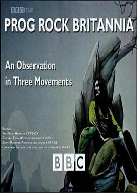
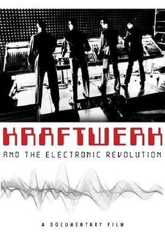
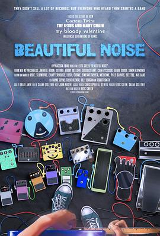
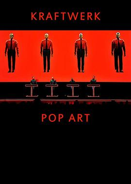
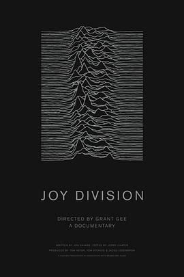
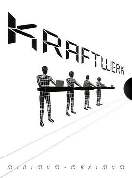
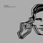

# 德国前卫摇滚：重生的德国 (豆瓣)

**链接地址:** http://www.douban.com/doubanapp/dispatch?uri=/subject/4172514/interest/985474643
**作者:** 
**获取时间:** 2025/8/28 23:06:32
**图片数量:** 48

---

## 原始HTML内容

  
    

    
    

    <link href="//img3.doubanio.com/dae/accounts/resources/ba98e9b/shire/bundle.css" rel="stylesheet" type="text/css">

  

    

  <a href="https://accounts.douban.com/passport/login?source=movie" class="nav-login" rel="nofollow">登录/注册</a>

    

  <a href="https://www.douban.com/doubanapp/app?channel=top-nav" class="lnk-doubanapp">下载豆瓣客户端</a>
  

    <a href="https://www.douban.com/doubanapp/app?channel=qipao" class="tip-link">豆瓣 6.0 全新发布</a>
    <a href="javascript: void 0;" class="tip-close">×</a>
  

  

    
豆瓣

    
扫码直接下载

    

      <a href="https://www.douban.com/doubanapp/redirect?channel=top-nav&amp;direct_dl=1&amp;download=iOS">iPhone</a>
      ·
      <a href="https://www.douban.com/doubanapp/redirect?channel=top-nav&amp;direct_dl=1&amp;download=Android" class="download-android">Android</a>
    

  

    

  <ul>
    <li class="">
      <a href="https://www.douban.com" target="_blank" data-moreurl-dict="{&quot;from&quot;:&quot;top-nav-click-main&quot;,&quot;uid&quot;:&quot;0&quot;}">豆瓣</a>
    </li>
    <li class="">
      <a href="https://book.douban.com" target="_blank" data-moreurl-dict="{&quot;from&quot;:&quot;top-nav-click-book&quot;,&quot;uid&quot;:&quot;0&quot;}">读书</a>
    </li>
    <li class="on">
      <a href="https://movie.douban.com" data-moreurl-dict="{&quot;from&quot;:&quot;top-nav-click-movie&quot;,&quot;uid&quot;:&quot;0&quot;}">电影</a>
    </li>
    <li class="">
      <a href="https://music.douban.com" target="_blank" data-moreurl-dict="{&quot;from&quot;:&quot;top-nav-click-music&quot;,&quot;uid&quot;:&quot;0&quot;}">音乐</a>
    </li>
    <li class="">
      <a href="https://www.douban.com/podcast/" target="_blank" data-moreurl-dict="{&quot;from&quot;:&quot;top-nav-click-podcast&quot;,&quot;uid&quot;:&quot;0&quot;}">播客</a>
    </li>
    <li class="">
      <a href="https://www.douban.com/location" target="_blank" data-moreurl-dict="{&quot;from&quot;:&quot;top-nav-click-location&quot;,&quot;uid&quot;:&quot;0&quot;}">同城</a>
    </li>
    <li class="">
      <a href="https://www.douban.com/group" target="_blank" data-moreurl-dict="{&quot;from&quot;:&quot;top-nav-click-group&quot;,&quot;uid&quot;:&quot;0&quot;}">小组</a>
    </li>
    <li class="">
      <a href="https://read.douban.com/?dcs=top-nav&amp;dcm=douban" target="_blank" data-moreurl-dict="{&quot;from&quot;:&quot;top-nav-click-read&quot;,&quot;uid&quot;:&quot;0&quot;}">阅读</a>
    </li>
    <li class="">
      <a href="https://fm.douban.com/?from_=shire_top_nav" target="_blank" data-moreurl-dict="{&quot;from&quot;:&quot;top-nav-click-fm&quot;,&quot;uid&quot;:&quot;0&quot;}">FM</a>
    </li>
    <li class="">
      <a href="https://time.douban.com/?dt_time_source=douban-web_top_nav" target="_blank" data-moreurl-dict="{&quot;from&quot;:&quot;top-nav-click-time&quot;,&quot;uid&quot;:&quot;0&quot;}">时间</a>
    </li>
    <li class="">
      <a href="https://market.douban.com/?utm_campaign=douban_top_nav&amp;utm_source=douban&amp;utm_medium=pc_web" target="_blank" data-moreurl-dict="{&quot;from&quot;:&quot;top-nav-click-market&quot;,&quot;uid&quot;:&quot;0&quot;}">豆品</a>
    </li>
  </ul>

  

    

    

    <link href="//img3.doubanio.com/dae/accounts/resources/ba98e9b/movie/bundle.css" rel="stylesheet" type="text/css">

  

  

    

      <a href="https://movie.douban.com">豆瓣电影</a>
    

    

      <form action="https://search.douban.com/movie/subject_search" method="get">
        <fieldset>
          <legend>搜索：</legend>
          <label for="inp-query">
          </label>
          
<input id="inp-query" name="search_text" size="22" maxlength="60" placeholder="搜索电影、电视剧、综艺、影人" value="">

          
<input type="submit" value="搜索">

          <input type="hidden" name="cat" value="1002">
        </fieldset>
      </form>
    

  

  

  

    

  <ul>
    <li><a href="https://movie.douban.com/cinema/nowplaying/">影讯&amp;购票</a>
    </li>
    <li><a href="https://movie.douban.com/explore">选电影</a>
    </li>
    <li><a href="https://movie.douban.com/tv/">选剧集</a>
    </li>
    <li><a href="https://movie.douban.com/chart">排行榜</a>
    </li>
    <li><a href="https://movie.douban.com/review/best/">影评</a>
    </li>
    <li><a href="https://movie.douban.com/annual/2024/?fullscreen=1&amp;dt_from=movie_navigation">2024年度榜单</a>
    </li>
    <li><a href="https://c9.douban.com/app/standbyme-2024/?autorotate=false&amp;fullscreen=true&amp;hidenav=true&amp;monitor_screenshot=true&amp;df_from=web_navigation" target="_blank">2024年度报告</a>
    </li>
  </ul>

    
  

    

    
    

        

        
    

        

    <h1>
        德国前卫摇滚：重生的德国 Krautrock: The Rebirth of Germany
            (2009)
    </h1>

        

            

            
            

                
    

        

            

                
                

    

                

        导演: <a href="/subject_search?search_text=Ben%20Whalley" rel="v:directedBy">Ben Whalley</a> 
        
        主演: <a href="/subject_search?search_text=can" rel="v:starring">can</a> / <a href="/subject_search?search_text=neu%21" rel="v:starring">neu!</a> / <a href="/subject_search?search_text=Amon%20D%C3%BC%C3%BCl%20II" rel="v:starring">Amon Düül II</a> 
        类型: 纪录片 / 音乐 
        
        制片国家/地区: 英国 
        语言: 英语 
        上映日期: 2009-10-23 
        片长: 58分钟 
        又名: Krautrock：重生的德国 
        IMDb: tt2033290 

            

            
                

<link rel="stylesheet" href="https://img3.doubanio.com/cuphead/movie-static/download-output-image/index.7aaa3.css">

    

        

            

                豆瓣评分
            

          

            
            <a class="download-output-image" href="#">引用</a>
          

        

        

    <strong class="ll rating_num" property="v:average">9.0</strong>
    
    

        

        

                <a href="comments" class="rating_people">
                    1432人评价
                </a>
        

    

    
        

        
        
            5星
        
        

        57.2%
         
        

        

        
        
            4星
        
        

        36.1%
         
        

        

        
        
            3星
        
        

        6.1%
         
        

        

        
        
            2星
        
        

        0.1%
         
        

        

        
        
            1星
        
        

        0.6%
         
        

    

        

            好于 <a href="/typerank?type_name=纪录片&amp;type=1&amp;interval_id=65:55&amp;action=">62% 纪录片</a> 
        

            
        

        
            

        
            <a href="https://www.douban.com/reason=collectwish&amp;ck=" rel="nofollow" class="j a_show_login colbutt ll" name="pbtn-4172514-wish">
                想看
            </a>
            <a href="https://www.douban.com/reason=collectcollect&amp;ck=" rel="nofollow" class="j a_show_login colbutt ll" name="pbtn-4172514-collect">
                看过
            </a>
        

            
    
    评价:
     

            
            
            
            
            
    
    <input id="n_rating" type="hidden" value="">
    

        

        

    <ul class="ul_subject_menu bicelink color_gray pt6 clearfix">
        
    
        
                
                  <li> 
    &nbsp;
        <a onclick="moreurl(this, {from:'mv_sbj_wr_cmnt_login'})" class="j a_show_login" href="https://www.douban.com/register?reason=review" rel="nofollow">写短评</a>
 </li>
                  <li> 
    
    &nbsp;
        <a onclick="moreurl(this, {from:'mv_sbj_wr_rv_login'})" class="j a_show_login" href="https://www.douban.com/register?reason=review" rel="nofollow">写影评</a>
 </li>
                    <li> 
   

   
    
    
    <a href="#" data-type="电影" data-url="https://movie.douban.com/subject/4172514/" data-desc="电影《德国前卫摇滚：重生的德国 Krautrock: The Rebirth of Germany》 (来自豆瓣) " data-title="电影《德国前卫摇滚：重生的德国 Krautrock: The Rebirth of Germany》 (来自豆瓣) " data-pic="https://img3.doubanio.com/view/photo/s_ratio_poster/public/p2897991913.jpeg" class="bn-sharing ">
        分享到
    </a> &nbsp;&nbsp;
    
    <link rel="stylesheet" href="https://img1.doubanio.com/f/vendors/e8a7261937da62636d22ca4c579efc4a4d759b1b/css/ui/dialog.css">
    
    
    

  </li>
            

    </ul>

    

        
            

<link rel="stylesheet" href="https://img3.doubanio.com/cuphead/movie-static/mod/share.ee737.css" type="text/css">

    

        
        <a href="/accounts/register?reason=recommend" class="j a_show_login lnk-sharing" share-id="4172514" data-mode="plain" data-name="德国前卫摇滚：重生的德国 Krautrock: The Rebirth of Germany‎ (2009)" data-type="movie" data-desc="导演 Ben Whalley 主演 can / neu! / 英国 / 9.0分(1432评价)" data-href="https://movie.douban.com/subject/4172514/" data-image="https://img3.doubanio.com/view/photo/s_ratio_poster/public/p2897991913.jpg" data-properties="{}" data-redir="" data-text="" data-apikey="" data-curl="" data-count="10" data-object_kind="1002" data-object_id="4172514" data-target_type="rec" data-target_action="0" data-action_props="{&quot;subject_url&quot;:&quot;https:\/\/movie.douban.com\/subject\/4172514\/&quot;,&quot;subject_title&quot;:&quot;德国前卫摇滚：重生的德国 Krautrock: The Rebirth of Germany‎ (2009)&quot;}">推荐</a>

        
    

        

    

    

    

    
    
        
            
            
    <h2>
        <i>德国前卫摇滚：重生的德国的剧情简介</i>
              · · · · · ·
    </h2>

            

                    
                        
                                　　该片关注了激进的一代音乐人为德国战后的文化废墟创造新音乐身份的历程。以1968至1977年间的“新乐队”、罐头乐队、浮士德和发电站等电子音乐先锋为例，分析了其作品的原创性和毫不妥协的特征。他们分享着共同的目标，以难得的前瞻性来突破阴森的过去，但尽管如此，依旧沉迷于战争的   英国音乐媒体仍将这些作品称为“泡菜摇滚”[Krautrock]。(小易甫字幕组)
                        
                        

                        

            

    

    

<link rel="stylesheet" href="https://img3.doubanio.com/cuphead/movie-static/celebrity/celebrities_section.610da.css">

    

<link rel="stylesheet" href="https://img1.doubanio.com/f/verify/a5bc0bc0aea4221d751bc4809fd4b0a1075ad25e/entry_creator/dist/author_subject/style.css">

    

    
        

<link rel="stylesheet" href="https://img1.doubanio.com/cuphead/movie-static/subject/photos_section.45abd.css">

    
    

        
    
    
    <h2>
        <i>德国前卫摇滚：重生的德国的图片</i>
              · · · · · ·
            
            (
                <a href="https://movie.douban.com/subject/4172514/all_photos">图片53</a>&nbsp;·&nbsp;<a href="https://movie.douban.com/subject/4172514/mupload">添加</a>
            )
            
    </h2>

        <ul class="related-pic-bd  ">
                <li>
                    
                </li>
                <li>
                    
                </li>
                <li>
                    
                </li>
                <li>
                    
                </li>
                <li>
                    
                </li>
        </ul>
    

    

    

    
        

<link rel="stylesheet" href="https://img3.doubanio.com/cuphead/movie-static/subject/recommendations.61283.css">

    

        
        
    <h2>
        <i>喜欢这部电影的人也喜欢</i>
              · · · · · ·
    </h2>

        
    
    

        <dl>
            <dt>
                
            </dt>
            <dd>
                <a href="https://movie.douban.com/subject/4097377/?from=subject-page">合成器英伦</a>
                9.0
            </dd>
        </dl>
        <dl>
            <dt>
                
            </dt>
            <dd>
                <a href="https://movie.douban.com/subject/3563241/?from=subject-page">不列颠前卫摇滚-对三个运动的...</a>
                8.8
            </dd>
        </dl>
        <dl>
            <dt>
                
            </dt>
            <dd>
                <a href="https://movie.douban.com/subject/4131561/?from=subject-page">发电站与电子乐革命</a>
                8.0
            </dd>
        </dl>
        <dl>
            <dt>
                
            </dt>
            <dd>
                <a href="https://movie.douban.com/subject/2287522/?from=subject-page">美丽噪音</a>
                8.7
            </dd>
        </dl>
        <dl>
            <dt>
                
            </dt>
            <dd>
                <a href="https://movie.douban.com/subject/26284536/?from=subject-page">B级片：西柏林的欲望与声音19...</a>
                9.2
            </dd>
        </dl>
        <dl>
            <dt>
                
            </dt>
            <dd>
                <a href="https://movie.douban.com/subject/26316071/?from=subject-page">Kraftwerk: Pop Art</a>
                8.8
            </dd>
        </dl>
        <dl>
            <dt>
                
            </dt>
            <dd>
                <a href="https://movie.douban.com/subject/2982145/?from=subject-page">欢乐分裂</a>
                9.0
            </dd>
        </dl>
        <dl>
            <dt>
                
            </dt>
            <dd>
                <a href="https://movie.douban.com/subject/1947460/?from=subject-page">Minimum-Maximum</a>
                9.2
            </dd>
        </dl>
        <dl>
            <dt>
                
            </dt>
            <dd>
                <a href="https://movie.douban.com/subject/2365010/?from=subject-page">工厂唱片：曼城 自快乐分裂至...</a>
                8.8
            </dd>
        </dl>
        <dl>
            <dt>
                
            </dt>
            <dd>
                <a href="https://movie.douban.com/subject/3911131/?from=subject-page">别认为我忘了：柬埔寨失去的...</a>
                8.9
            </dd>
        </dl>
    

    

    

    
        

    
    <link rel="stylesheet" href="https://img1.doubanio.com/f/vendors/d63a579a99fd372b4398731a279a1382e6eac71e/subject-comments/comments-section.css">

    

        

            
            
        <a class="comment_btn j a_show_login" href="https://www.douban.com/register?reason=review" rel="nofollow">
            我要写短评
        </a>

            
    <h2>
        <i>德国前卫摇滚：重生的德国的短评</i>
              · · · · · ·
            
            (
                <a href="https://movie.douban.com/subject/4172514/comments?status=P">全部 413 条</a>
            )
            
    </h2>

        

        

        

                
        

                        <a id="hot-comments-tab" href="comments" data-id="hot" class="on">热门</a>&nbsp;/&nbsp;
                        <a id="new-comments-tab" href="comments?sort=time" data-id="new" class="j a_show_login">最新</a>&nbsp;/&nbsp;
                        <a id="following-comments-tab" href="comments?sort=follows" data-id="following" class="j a_show_login">好友</a>
        

    

        

            
    

        
        

            
    
    

        <h3>
            
                    24

                    <input value="1219018222" type="hidden">
                    <a href="javascript:;" data-id="1219018222" class="j a_show_login" onclick="">有用</a>

                <!-- 删除短评 -->
            
            
                <a href="https://www.douban.com/people/RATMKORN/">活在门里的人</a>
                    看过
                    
                
                    2017-08-03 21:13:08
                
                
            
        </h3>
        

            
                CAN大街上捡主唱的事居然是真的。。。
        

        

    

    

        

        
        

            
    
    

        <h3>
            
                    13

                    <input value="944067893" type="hidden">
                    <a href="javascript:;" data-id="944067893" class="j a_show_login" onclick="">有用</a>

                <!-- 删除短评 -->
            
            
                <a href="https://www.douban.com/people/isolatedland/">T3的小喇叭</a>
                    看过
                    
                
                    2015-07-27 02:46:58
                
                
            
        </h3>
        

            
                大半夜睡不着看krautrock催眠也是醉惹。“我们的音乐不想做成美国式的，也不想做成英国式的，但又想国际化，只好去太空找灵感”，这句话简直2333到不行。不过片子也说了还是会受到John Cage的影响吗。ps.没字幕听德国人叫赫尔佐格略喜感，一开始以为自己听错了，后来看见金斯基顶着光头出场就信了。
        

        

    

    

        

        
        

            
    
    

        <h3>
            
                    7

                    <input value="361885693" type="hidden">
                    <a href="javascript:;" data-id="361885693" class="j a_show_login" onclick="">有用</a>

                <!-- 删除短评 -->
            
            
                <a href="https://www.douban.com/people/firedances/">小爱</a>
                    看过
                
                    2011-03-05 18:27:12
                
                
            
        </h3>
        

            
                没字幕,但是对于Krautrock迷来说肯定完全不是问题  http://v.youku.com/v_show/id_XMTc4NzI0OTIw.html
        

        

    

    

        

        
        

            
    
    

        <h3>
            
                    14

                    <input value="1312412400" type="hidden">
                    <a href="javascript:;" data-id="1312412400" class="j a_show_login" onclick="">有用</a>

                <!-- 删除短评 -->
            
            
                <a href="https://www.douban.com/people/65123912/">ewan</a>
                    看过
                    
                
                    2018-01-29 01:11:46
                
                
            
        </h3>
        

            
                从《柏林苍穹下》发现了文德斯的音乐好品味 没想到他和赫尔佐格从六十年代就开始跟阿蒙杜那帮人混在一起了
        

        

    

    

        

        
        

            
    
    

        <h3>
            
                    22

                    <input value="633989004" type="hidden">
                    <a href="javascript:;" data-id="633989004" class="j a_show_login" onclick="">有用</a>

                <!-- 删除短评 -->
            
            
                <a href="https://www.douban.com/people/tata0820/">tata</a>
                    看过
                    
                
                    2013-01-27 09:42:49
                
                
            
        </h3>
        

            
                看的还是挺激动的，其实摇滚乐在70年代中已经死了，被那帮德国佬用机器灭掉了，krautrock才是音乐革命啊，摇滚史就应该分成krautrock前和krautrock后，二个时代
        

        

    

    

        

                
                    &gt; <a href="comments?sort=new_score&amp;status=P">
                        更多短评
                            413条
                    </a>
        

        

            

            

            

                <a class="qa" href="/help/opinion#t2-q0" target="_blank">为什么被折叠？</a>
                <a class="btn-unfold" href="#">有一些短评被折叠了</a>
                

                    评论被折叠，是因为发布这条评论的账号行为异常。评论仍可以被展开阅读，对发布人的账号不造成其他影响。如果认为有问题，可以<a href="https://help.douban.com/help/ask?category=movie">联系</a>豆瓣电影。
                

            

            

            

            
        

        

            
    

        

            你关注的人还没写过短评
        

        

    

    

            
            
        

    

<!--        此处是挂载其他页面，不是注释！不是注释！不是注释！-->
        

<link rel="stylesheet" href="https://img1.doubanio.com/misc/mixed_static/292deb5ae8f760a3.css">

    <section id="reviews-wrapper" class="reviews mod movie-content">
        <header>
            
                <a href="new_review" rel="nofollow" class="create-review comment_btn " data-isverify="False" data-verify-url="https://www.douban.com/accounts/phone/verify?redir=https://movie.douban.com/subject/4172514/new_review">
                    我要写影评
                </a>
            <h2>
                    德国前卫摇滚：重生的德国的影评 · · · · · ·

                    ( <a href="reviews">全部 7 条</a> )
            </h2>
        </header>

            
            

                                <a href="javascript:;;" class="cur" data-sort="">热门</a>
            

            

            

        
    

            
    
    

        

            
    
    <header class="main-hd">
        

        <a href="https://www.douban.com/people/hefeixuefei/" class="name">音墙展开</a>
            

        2020-05-18 00:19:40

    </header>

            

                <h2><a href="https://movie.douban.com/review/12601708/">Krautrock: The Rebirth of Germany 截图</a></h2>

                

                    

                        Cluster、Faust、Kraftwerk、Neu!、Can、Brian Eno、David Bowie Wim Wernders、Rainer Werner Fassbinder、Werner Herzog Amon Duul、Popol Vuh、Tangerine Dream、Klaus Schulze they all linked!

                        &nbsp;(<a href="javascript:;" id="toggle-12601708-copy" class="unfold" title="展开">展开</a>)
                    

                

                

                    

                

                

                    <a href="javascript:;" class="action-btn up" data-rid="12601708" title="有用">
                        
                        
                                6
                        
                    </a>
                    <a href="javascript:;" class="action-btn down" data-rid="12601708" title="没用">
                        
                        
                        
                    </a>
                    <a href="https://movie.douban.com/review/12601708/#comments" class="reply ">0回应</a>

                    <a href="javascript:;;" class="fold hidden">收起</a>
                

            

        

    

            
    
    

        

            
    
    <header class="main-hd">
        

        <a href="https://www.douban.com/people/143011209/" class="name">酸性朋克</a>
            

        2019-07-16 14:52:30

    </header>

            

                <h2><a href="https://movie.douban.com/review/10312750/">作为战败国文化在音乐上的反击</a></h2>

                

                    

                        Krautrock的兴起与二战后冷战时期西德的国内环境密切相关：国家百废待兴，文化上作为战败国的劣势，以及德国人善于开拓的思维方式。 曾经kraut一词是英国人对于德国摇滚的嘲讽，认为德国作为战败国正处于文化的废墟上，摇滚在德国更是如同德国酸菜一样毫无生机，英国文化，包括...

                        &nbsp;(<a href="javascript:;" id="toggle-10312750-copy" class="unfold" title="展开">展开</a>)
                    

                

                

                    

                

                

                    <a href="javascript:;" class="action-btn up" data-rid="10312750" title="有用">
                        
                        
                                6
                        
                    </a>
                    <a href="javascript:;" class="action-btn down" data-rid="10312750" title="没用">
                        
                        
                        
                    </a>
                    <a href="https://movie.douban.com/review/10312750/#comments" class="reply ">0回应</a>

                    <a href="javascript:;;" class="fold hidden">收起</a>
                

            

        

    

            
    
    

        

            
    
    <header class="main-hd">
        

        <a href="https://www.douban.com/people/Catchtherabbit/" class="name">江一横</a>

        2025-06-10 19:07:48

    </header>

            

                <h2><a href="https://movie.douban.com/review/16769297/">码</a></h2>

                

                    

                        非常有趣(并且对音乐盲友好）！从1960s的soft and sweetie流行乐到1968电子乐“合成器是个新玩意”，Neu! ，浮士德，Kraftwerk（买得起1000的皮鞋的西装革履的剪短发的一群人与radio-activity) they are searching for German musical identity. New German Cinema德国四杰除了...

                        &nbsp;(<a href="javascript:;" id="toggle-16769297-copy" class="unfold" title="展开">展开</a>)
                    

                

                

                    

                

                

                    <a href="javascript:;" class="action-btn up" data-rid="16769297" title="有用">
                        
                        
                        
                    </a>
                    <a href="javascript:;" class="action-btn down" data-rid="16769297" title="没用">
                        
                        
                        
                    </a>
                    <a href="https://movie.douban.com/review/16769297/#comments" class="reply ">0回应</a>

                    <a href="javascript:;;" class="fold hidden">收起</a>
                

            

        

    

            
    
    

        

            
    
    <header class="main-hd">
        

        <a href="https://www.douban.com/people/210108421/" class="name">柏林秩序井然</a>
            

        2024-02-02 23:02:17

    </header>

            

                <h2><a href="https://movie.douban.com/review/15720582/">贝多芬与瓦格纳废墟:制造电流血液的工业婴儿</a></h2>

                

                    

                        看这部纪录片的时候经常会不自觉跳跃到十九世纪与二十世纪初，德国二十世纪六十年代开始的这场伴随着激进社会运动而来的Krautrock浪潮，似乎与瓦格纳在1850年和李斯特的通信中所说的预言遥相呼应： 我感到现代艺术的脉搏，我知道那种做法有一天会消亡。但我并不因为意识到这一...

                        &nbsp;(<a href="javascript:;" id="toggle-15720582-copy" class="unfold" title="展开">展开</a>)
                    

                

                

                    

                

                

                    <a href="javascript:;" class="action-btn up" data-rid="15720582" title="有用">
                        
                        
                                1
                        
                    </a>
                    <a href="javascript:;" class="action-btn down" data-rid="15720582" title="没用">
                        
                        
                        
                    </a>
                    <a href="https://movie.douban.com/review/15720582/#comments" class="reply ">0回应</a>

                    <a href="javascript:;;" class="fold hidden">收起</a>
                

            

        

    

            
    
    

        

            
    
    <header class="main-hd">
        

        <a href="https://www.douban.com/people/marsler/" class="name">乐马斯</a>
            

        2020-01-27 22:41:06

    </header>

            

                <h2><a href="https://movie.douban.com/review/12191273/">一切真实的都是美好的</a></h2>

                

                    

                        “一切真实的都是美好的，一切生活的都是美好的” 结合【无主之作】里艺术家们对“前卫艺术”的追寻，将照片转绘为素描、追求异于常人的“创意”，可以窥知一二。 没有人想蹈规循矩，所有人都想和过去一刀两断，但是就是在这种环境下，音乐不由得也搅入了各种势力角力的旋涡，...

                        &nbsp;(<a href="javascript:;" id="toggle-12191273-copy" class="unfold" title="展开">展开</a>)
                    

                

                

                    

                

                

                    <a href="javascript:;" class="action-btn up" data-rid="12191273" title="有用">
                        
                        
                                1
                        
                    </a>
                    <a href="javascript:;" class="action-btn down" data-rid="12191273" title="没用">
                        
                        
                        
                    </a>
                    <a href="https://movie.douban.com/review/12191273/#comments" class="reply ">0回应</a>

                    <a href="javascript:;;" class="fold hidden">收起</a>
                

            

        

    

            
    
    

        

            
    
    <header class="main-hd">
        

        <a href="https://www.douban.com/people/joangu/" class="name">Joan</a>
            

        2019-08-25 13:56:05

    </header>

            

                <h2><a href="https://movie.douban.com/review/10437674/">快乐的实验艺术家</a></h2>

                

                    

                        笔记。 形成自己的特征 we want to be international. and we try very hard to not to be anglophilic, not to be german. so, space is one solution. Amon Duul 对施拉格尔音乐的厌恶 majority german listen to classic music of course, and schlager. schlager has stupi...

                        &nbsp;(<a href="javascript:;" id="toggle-10437674-copy" class="unfold" title="展开">展开</a>)
                    

                

                

                    

                

                

                    <a href="javascript:;" class="action-btn up" data-rid="10437674" title="有用">
                        
                        
                                3
                        
                    </a>
                    <a href="javascript:;" class="action-btn down" data-rid="10437674" title="没用">
                        
                        
                        
                    </a>
                    <a href="https://movie.douban.com/review/10437674/#comments" class="reply ">0回应</a>

                    <a href="javascript:;;" class="fold hidden">收起</a>
                

            

        

    

            
    
    

        

            
    
    <header class="main-hd">
        

        <a href="https://www.douban.com/people/170124816/" class="name">黄铜硬币</a>
            

        2025-04-20 14:51:08

    </header>

            

                <h2><a href="https://movie.douban.com/review/16672970/">短评写不下了</a></h2>

                

                    

                        1. 摇滚版新音乐的哲学。 前卫摇滚对施拉格音乐的批判非常阿多诺，而Duul决定“真正炸点什么”又侧面让人理解了五月风暴中年轻人对阿诺多的不满。二战后失去一切(die Stunde Null)，因此战后的新音乐只能是抽象的形式。这个概括非常锐利，充满德国哲学的洞见，也从根本上解释了...

                        &nbsp;(<a href="javascript:;" id="toggle-16672970-copy" class="unfold" title="展开">展开</a>)
                    

                

                

                    

                

                

                    <a href="javascript:;" class="action-btn up" data-rid="16672970" title="有用">
                        
                        
                        
                    </a>
                    <a href="javascript:;" class="action-btn down" data-rid="16672970" title="没用">
                        
                        
                        
                    </a>
                    <a href="https://movie.douban.com/review/16672970/#comments" class="reply ">0回应</a>

                    <a href="javascript:;;" class="fold hidden">收起</a>
                

            

        

    

    

    <!-- COLLECTED JS -->
    <!-- COLLECTED CSS -->

    

    <link rel="stylesheet" href="https://img1.doubanio.com/f/zerkalo/88118a282439e312283e886ea4c3d3e9849a8fa4/css/review/editor/ng/setting_standalone.css">
    
    
    
    
    
    
    

                

                    &gt;
                        <a href="reviews">
                            更多影评
                                7篇
                        </a>
                

    </section>
<!-- COLLECTED JS -->

     

    
            

                    
                    

                            <a class="comment_btn j a_show_login" href="https://www.douban.com/register?reason=review" rel="nofollow">添加新讨论</a>
                        
    <h2>
        讨论区
         &nbsp; ·&nbsp; ·&nbsp; ·&nbsp; ·&nbsp; ·&nbsp; ·
    </h2>

                    

                    
  <table class="olt"><tbody><tr><td></td><td></td><td></td><td></td></tr>
        
        <tr>
          <td class="pl"><a href="https://movie.douban.com/subject/4172514/discussion/616680036/" title="需要本片中文字幕版本的请看这里">需要本片中文字幕版本的请看这里</a></td>
          <td class="pl">来自<a href="https://www.douban.com/people/79752376/">Ricky</a></td>
          <td class="pl">3 回应</td>
          <td class="pl">2021-12-31 00:17:09</td>
        </tr>
        
        <tr>
          <td class="pl"><a href="https://movie.douban.com/subject/4172514/discussion/616791871/" title="小叮当前来吹水">小叮当前来吹水</a></td>
          <td class="pl">来自<a href="https://www.douban.com/people/127204175/">厂牌电猫</a></td>
          <td class="pl"></td>
          <td class="pl">2020-10-26 21:07:40</td>
        </tr>
        
        <tr>
          <td class="pl"><a href="https://movie.douban.com/subject/4172514/discussion/616352443/" title="求熟肉">求熟肉</a></td>
          <td class="pl">来自<a href="https://www.douban.com/people/198259035/">mrcox</a></td>
          <td class="pl"></td>
          <td class="pl">2019-06-30 16:27:49</td>
        </tr>
        
        <tr>
          <td class="pl"><a href="https://movie.douban.com/subject/4172514/discussion/615950139/" title="谁给个度盘">谁给个度盘</a></td>
          <td class="pl">来自<a href="https://www.douban.com/people/ez2die2/">白阿瞒</a></td>
          <td class="pl"></td>
          <td class="pl">2019-01-25 15:00:24</td>
        </tr>
        
        <tr>
          <td class="pl"><a href="https://movie.douban.com/subject/4172514/discussion/27871047/" title="OLKrautrock">OLKrautrock</a></td>
          <td class="pl">来自<a href="https://www.douban.com/people/chua/">chau</a></td>
          <td class="pl"></td>
          <td class="pl">2013-02-28 22:53:41</td>
        </tr>
  </tbody></table>

                    

                        <a href="/subject/4172514/discussion/" rel="nofollow">
                            &gt; 去这部影片的讨论区（全部7条）
                        </a>
                    

            

    

            

            

                

    

    <!-- douban ad begin -->
    

    <!-- douban ad end -->

    

    

    

    

    
        

    
    
    <h2>
        <i>以下片单推荐</i>
              · · · · · ·
            
            (
                <a href="https://movie.douban.com/subject/4172514/doulists">全部</a>
            )
            
    </h2>

    
    <ul>
            
                <li>
                    <a href="https://www.douban.com/doulist/160513/" target="_blank">音乐类纪录片</a>
                    (小老鼠)
                </li>
            
                <li>
                    <a href="https://www.douban.com/doulist/810142/" target="_blank">Please kill me</a>
                    (Doublebitch)
                </li>
            
                <li>
                    <a href="https://www.douban.com/doulist/952935/" target="_blank">BBC音乐纪录片</a>
                    (WiTS)
                </li>
            
                <li>
                    <a href="https://www.douban.com/doulist/13727119/" target="_blank">My Back Pages</a>
                    (Blus)
                </li>
            
                <li>
                    <a href="https://www.douban.com/doulist/43635423/" target="_blank">9.0分以上 纪录片（200~1000人以上观看）</a>
                    (Wittgenstein)
                </li>
    </ul>

    
        

    
    
    <h2>
        <i>谁在看这部电影</i>
              · · · · · ·
    </h2>

    
    <ul>
            
            <li>
                
                

                    <a href="https://www.douban.com/people/290929503/">弥栋</a>
                    

                        30分钟前
                        想看
                        

                    

                

            </li>
            
            <li>
                
                

                    <a href="https://www.douban.com/people/261973472/">豆友D0TacGJpog</a>
                    

                        昨天
                        想看
                        

                    

                

            </li>
            
            <li>
                
                

                    <a href="https://www.douban.com/people/228505398/">Tschüsschen</a>
                    

                        8月27日
                        想看
                        

                    

                

            </li>
    </ul>

    
    

        
            <a href="https://movie.douban.com/subject/4172514/comments?status=P">2006人看过</a>
                &nbsp;/&nbsp;
            <a href="https://movie.douban.com/subject/4172514/comments?status=F">5087人想看</a>
    

    

<!-- douban ad begin -->

<!-- douban ad end -->

     

    

订阅德国前卫摇滚：重生的德国的评论:  
    <a href="https://movie.douban.com/feed/subject/4172514/reviews"> feed: rss 2.0</a>

            

            

                
    
<!-- douban ad begin -->

<!-- douban ad end -->

    <!-- douban ad begin -->
    

    <!-- douban ad end -->

            

        

    

        
    

            

        

    © 2005－2025 douban.com, all rights reserved 北京豆网科技有限公司

    <a href="https://www.douban.com/about">关于豆瓣</a>
    · <a href="https://www.douban.com/jobs">在豆瓣工作</a>
    · <a href="https://www.douban.com/about?topic=contactus">联系我们</a>
    · <a href="https://www.douban.com/about/legal">法律声明</a>
    
    · <a href="https://help.douban.com/?app=movie" target="_blank">帮助中心</a>
    · <a href="https://www.douban.com/doubanapp/">移动应用</a>

    

    

    <!-- COLLECTED JS -->
        
        
    <link rel="stylesheet" type="text/css" href="https://img1.doubanio.com/f/vendors/e8a7261937da62636d22ca4c579efc4a4d759b1b/css/ui/dialog.css">
    <link rel="stylesheet" type="text/css" href="https://img1.doubanio.com/cuphead/movie-static/mod/login_pop.b2f60.css">
    
    
    

    
    
    
    
    
    
    
    
    
    

    
    
    

    

    
  

      

    <!-- dae-web-movie--default-5f9cb85759-dq6wp-->

  

---

## 纯文本内容

var _body_start = new Date();

    
    

    

  
    

  登录/注册

    
  下载豆瓣客户端
  
    豆瓣 6.0 全新发布
    ×
  
  
    豆瓣
    扫码直接下载
    
      iPhone
      ·
      Android
    
  

    

  
    
      豆瓣
    
    
      读书
    
    
      电影
    
    
      音乐
    
    
      播客
    
    
      同城
    
    
      小组
    
    
      阅读
    
    
      FM
    
    
      时间
    
    
      豆品
    
  

  

  ;window._GLOBAL_NAV = {
    DOUBAN_URL: "https://www.douban.com",
    N_NEW_NOTIS: 0,
    N_NEW_DOUMAIL: 0
  };

    

    

    

  
  
    
      豆瓣电影
    
    
      
        
          搜索：
          
          
          
          
          
        
      
    
  
  
  
    

  
    影讯&购票
    
    选电影
    
    选剧集
    
    排行榜
    
    影评
    
    2024年度榜单
    
    2024年度报告
    
  

    
  

  <li data-link="{{= url}}">
            <a href="{{= url}}" onclick="moreurl(this, {from:'movie_search_sugg', query:'{{= keyword }}', subject_id:'{{= id}}', i: '{{= index}}', type: '{{= type}}'})">
            
            

                <em>{{= title}}</em>
                {{if year}}
                    {{= year}}
                {{/if}}
                {{if sub_title}}
                     {{= sub_title}}
                {{/if}}
                {{if address}}
                     {{= address}}
                {{/if}}
                {{if episode}}
                    {{if episode=="unknow"}}
                         集数未知
                    {{else}}
                         共{{= episode}}集
                    {{/if}}
                {{/if}}
            

        </a>
        </li>
  

    

    
    
        

        
    
        

    
        德国前卫摇滚：重生的德国 Krautrock: The Rebirth of Germany
            (2009)
    

        
            

            
            
                
    
        
            
                
                

    
        
   

                

        导演: Ben Whalley
        
        主演: can / neu! / Amon Düül II
        类型: 纪录片 / 音乐
        
        制片国家/地区: 英国
        语言: 英语
        上映日期: 2009-10-23
        片长: 58分钟
        又名: Krautrock：重生的德国
        IMDb: tt2033290

$(function(){
    var limit = 5
    $('#info .attrs').each(function() {
        var $list = $(this).find('a')
        var $attrs = $(this)

        if($list.length > limit) {
            $attrs.empty()
            $list.each(function(idx) {
                if (idx+1 === $list.length) {
                    $('').prepend($(this)).appendTo($attrs);
                } else {
                    $(' / ').prepend($(this)).appendTo($attrs);
                }
            })

            $attrs.append('<a href="javascript:;" class="more-attrs" title="显示更多">更多...</a>')
            $('.more-attrs').on('click', function() {
                $(this).parent().find('span').show()
                $(this).hide()
            })

            $attrs.find('span').slice(limit).hide()
        }
    })
})

            
            
                

    
        
            
                豆瓣评分
            
          
            
            引用
          
        
        

    9.0
    
    
        
        
                
                    1432人评价
                
        
    

    
        
        
        
            5星
        
        
        57.2%
        
        
        
        
        
            4星
        
        
        36.1%
        
        
        
        
        
            3星
        
        
        6.1%
        
        
        
        
        
            2星
        
        
        0.1%
        
        
        
        
        
            1星
        
        
        0.6%
        
        

    
        
            好于 62% 纪录片
        

            
        
        
            

        
            
                想看
            
            
                看过
            
        
            
    
    评价:
     

            
            
        
            
            
        
            
            
        
            
            
        
            
            
        
    
    
    

        

        

    
        
    
        
                
                   
     
        写短评
 
                   
    
     
        写影评
 
                     
   

   
    
    
    
        分享到
       
    
    
    
    
    

  
            

    

    
        $(function(){
            $(".ul_subject_menu li.rec .bn-sharing").bind("click", function(){
                $.get("/blank?sbj_page_click=bn_sharing");
            });
        });
    

        
            

    
        
    <form class="movie-share" action="/j/share" method="POST">
        

            

                <textarea name="text" class="share-text" cols="72" data-mention-api="https://api.douban.com/shuo/in/complete?alt=xd&amp;callback=?"></textarea>
                <input type="hidden" name="target-id" value="4172514">
                <input type="hidden" name="target-type" value="0">
                <input type="hidden" name="title" value="德国前卫摇滚：重生的德国 Krautrock: The Rebirth of Germany‎ (2009)">
                <input type="hidden" name="desc" value="导演 Ben Whalley 主演 can / neu! / 英国 / 9.0分(1432评价)">
                <input type="hidden" name="redir" value=""/>
                

            

            

                    
                <strong>德国前卫摇滚：重生的德国 Krautrock: The Rebirth of Germany‎ (2009)</strong>
                
导演 Ben Whalley 主演 can / neu! / 英国 / 9.0分(1432评价)

                
&nbsp;

            

        

        

            

                

                140
                
                    <input type="submit" value="推荐" />
                
            

        

    </form>
    
    

        <ul>
            {{#users}}
            <li id="{{uid}}">
              {{{username}}}&nbsp;({{{uid}}})
            </li>
            {{/users}}
        </ul>
    

    

        
        推荐

        
            $(function() {
                $('.collect_btn', '#interest_sect_level').each(function() {
                    Douban.init_collect_btn(this);
                });
                $('html').delegate(".indent .rec-sec .lnk-sharing", "click", function() {
                    moreurl(this, {
                        from : 'mv_sbj_db_share'
                    });
                });
            });
        
    
        

    
    

    

    
    
        
            
            
    
        德国前卫摇滚：重生的德国的剧情简介
              · · · · · ·
    

            
                    
                        
                                　　该片关注了激进的一代音乐人为德国战后的文化废墟创造新音乐身份的历程。以1968至1977年间的“新乐队”、罐头乐队、浮士德和发电站等电子音乐先锋为例，分析了其作品的原创性和毫不妥协的特征。他们分享着共同的目标，以难得的前瞻性来突破阴森的过去，但尽管如此，依旧沉迷于战争的   英国音乐媒体仍将这些作品称为“泡菜摇滚”[Krautrock]。(小易甫字幕组)
                        
                        
                        

            

    

    

    

    

    var answerObj = {
      ISALL: 'False',
      TYPE: 'movie',
      SUBJECT_ID: '4172514',
      USER_ID: 'None'
    }

    
        

    
    
        
    
    
    
        德国前卫摇滚：重生的德国的图片
              · · · · · ·
            
            (
                图片53 · 添加
            )
            
    

        
                
                    
                
                
                    
                
                
                    
                
                
                    
                
                
                    
                
        
    

    

    

.award li { display: inline; margin-right: 5px }
.awards { margin-bottom: 20px }
.awards h2 { background: none; color: #000; font-size: 14px; padding-bottom: 5px; margin-bottom: 8px; border-bottom: 1px dashed #dddddd }
.awards .year { color: #666666; margin-left: -5px }
.mod { margin-bottom: 25px }
.mod .hd { margin-bottom: 10px }
.mod .hd h2 {margin:24px 0 3px 0}

    
        

    
        
        
    
        喜欢这部电影的人也喜欢
              · · · · · ·
    

        
    
    
        
            
                
                    
                
            
            
                合成器英伦
                9.0
            
        
        
            
                
                    
                
            
            
                不列颠前卫摇滚-对三个运动的...
                8.8
            
        
        
            
                
                    
                
            
            
                发电站与电子乐革命
                8.0
            
        
        
            
                
                    
                
            
            
                美丽噪音
                8.7
            
        
        
            
                
                    
                
            
            
                B级片：西柏林的欲望与声音19...
                9.2
            
        
        
            
                
                    
                
            
            
                Kraftwerk: Pop Art
                8.8
            
        
        
            
                
                    
                
            
            
                欢乐分裂
                9.0
            
        
    ...

---

## 图片列表

-  (原始链接: https://img3.doubanio.com/view/photo/s_ratio_poster/public/p2897991913.jpg)
-  (原始链接: https://img2.doubanio.com/cuphead/movie-static/pics/reference.png)
-  (原始链接: https://img1.doubanio.com/f/vendors/2520c01967207a1735171056ec588c8c1257e5f8/pics/rating_icons/star_hollow_hover.png)
-  (原始链接: https://img1.doubanio.com/f/vendors/2520c01967207a1735171056ec588c8c1257e5f8/pics/rating_icons/star_hollow_hover.png)
-  (原始链接: https://img1.doubanio.com/f/vendors/2520c01967207a1735171056ec588c8c1257e5f8/pics/rating_icons/star_hollow_hover.png)
-  (原始链接: https://img1.doubanio.com/f/vendors/2520c01967207a1735171056ec588c8c1257e5f8/pics/rating_icons/star_hollow_hover.png)
-  (原始链接: https://img1.doubanio.com/f/vendors/2520c01967207a1735171056ec588c8c1257e5f8/pics/rating_icons/star_hollow_hover.png)
-  (原始链接: https://img9.doubanio.com/cuphead/movie-static/pics/short-comment.gif)
-  (原始链接: https://img1.doubanio.com/cuphead/movie-static/pics/add-review.gif)
-  (原始链接: https://img3.doubanio.com/view/photo/sqxs/public/p2878882752.jpg)
-  (原始链接: https://img1.doubanio.com/view/photo/sqxs/public/p2563322139.jpg)
-  (原始链接: https://img1.doubanio.com/view/photo/sqxs/public/p2563322049.jpg)
-  (原始链接: https://img1.doubanio.com/view/photo/sqxs/public/p2197336909.jpg)
-  (原始链接: https://img1.doubanio.com/view/photo/sqxs/public/p2197336899.jpg)
-  (原始链接: https://img9.doubanio.com/view/photo/s_ratio_poster/public/p2514291625.jpg)
-  (原始链接: https://img3.doubanio.com/view/photo/s_ratio_poster/public/p2456948563.jpg)
-  (原始链接: https://img2.doubanio.com/view/photo/s_ratio_poster/public/p2559389571.jpg)
-  (原始链接: https://img2.doubanio.com/view/photo/s_ratio_poster/public/p1779741401.jpg)
-  (原始链接: https://img3.doubanio.com/view/photo/s_ratio_poster/public/p2232074577.jpg)
-  (原始链接: https://img9.doubanio.com/view/photo/s_ratio_poster/public/p2529682204.jpg)
-  (原始链接: https://img1.doubanio.com/view/photo/s_ratio_poster/public/p2627378890.jpg)
-  (原始链接: https://img3.doubanio.com/view/photo/s_ratio_poster/public/p2550492983.jpg)
-  (原始链接: https://img1.doubanio.com/view/photo/s_ratio_poster/public/p2556246199.jpg)
-  (原始链接: https://img1.doubanio.com/view/photo/s_ratio_poster/public/p2245482010.jpg)
-  (原始链接: https://img3.doubanio.com/icon/u68420551-27.jpg)
-  (原始链接: https://img1.doubanio.com/f/zerkalo/536fd337139250b5fb3cf9e79cb65c6193f8b20b/pics/up.png)
-  (原始链接: https://img1.doubanio.com/f/zerkalo/68849027911140623cf338c9845893c4566db851/pics/down.png)
-  (原始链接: https://img9.doubanio.com/icon/u143011209-4.jpg)
-  (原始链接: https://img1.doubanio.com/f/zerkalo/536fd337139250b5fb3cf9e79cb65c6193f8b20b/pics/up.png)
-  (原始链接: https://img1.doubanio.com/f/zerkalo/68849027911140623cf338c9845893c4566db851/pics/down.png)
-  (原始链接: https://img1.doubanio.com/icon/u199205706-19.jpg)
-  (原始链接: https://img1.doubanio.com/f/zerkalo/536fd337139250b5fb3cf9e79cb65c6193f8b20b/pics/up.png)
-  (原始链接: https://img1.doubanio.com/f/zerkalo/68849027911140623cf338c9845893c4566db851/pics/down.png)
-  (原始链接: https://img3.doubanio.com/icon/u210108421-7.jpg)
-  (原始链接: https://img1.doubanio.com/f/zerkalo/536fd337139250b5fb3cf9e79cb65c6193f8b20b/pics/up.png)
-  (原始链接: https://img1.doubanio.com/f/zerkalo/68849027911140623cf338c9845893c4566db851/pics/down.png)
-  (原始链接: https://img9.doubanio.com/icon/u139789353-5.jpg)
-  (原始链接: https://img1.doubanio.com/f/zerkalo/536fd337139250b5fb3cf9e79cb65c6193f8b20b/pics/up.png)
-  (原始链接: https://img1.doubanio.com/f/zerkalo/68849027911140623cf338c9845893c4566db851/pics/down.png)
-  (原始链接: https://img1.doubanio.com/icon/u1341454-59.jpg)
-  (原始链接: https://img1.doubanio.com/f/zerkalo/536fd337139250b5fb3cf9e79cb65c6193f8b20b/pics/up.png)
-  (原始链接: https://img1.doubanio.com/f/zerkalo/68849027911140623cf338c9845893c4566db851/pics/down.png)
-  (原始链接: https://img3.doubanio.com/icon/u170124816-12.jpg)
-  (原始链接: https://img1.doubanio.com/f/zerkalo/536fd337139250b5fb3cf9e79cb65c6193f8b20b/pics/up.png)
-  (原始链接: https://img1.doubanio.com/f/zerkalo/68849027911140623cf338c9845893c4566db851/pics/down.png)
-  (原始链接: https://img2.doubanio.com/icon/u290929503-1.jpg)
-  (原始链接: https://img3.doubanio.com/icon/u261973472-3.jpg)
-  (原始链接: https://img3.doubanio.com/icon/u228505398-2.jpg)
