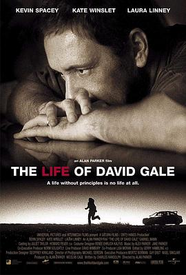
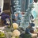

# 罪恶之家 (豆瓣)

**链接地址:** http://www.douban.com/doubanapp/dispatch?uri=/subject/25955491/interest/969604635
**作者:** 
**获取时间:** 2025/8/28 23:05:51
**图片数量:** 59

---

## 原始HTML内容

  
    

    
    

    <link href="//img3.doubanio.com/dae/accounts/resources/ba98e9b/shire/bundle.css" rel="stylesheet" type="text/css">

  

    

  <a href="https://accounts.douban.com/passport/login?source=movie" class="nav-login" rel="nofollow">登录/注册</a>

    

  <a href="https://www.douban.com/doubanapp/app?channel=top-nav" class="lnk-doubanapp">下载豆瓣客户端</a>
  

    <a href="https://www.douban.com/doubanapp/app?channel=qipao" class="tip-link">豆瓣 6.0 全新发布</a>
    <a href="javascript: void 0;" class="tip-close">×</a>
  

  

    
豆瓣

    
扫码直接下载

    

      <a href="https://www.douban.com/doubanapp/redirect?channel=top-nav&amp;direct_dl=1&amp;download=iOS">iPhone</a>
      ·
      <a href="https://www.douban.com/doubanapp/redirect?channel=top-nav&amp;direct_dl=1&amp;download=Android" class="download-android">Android</a>
    

  

    

  <ul>
    <li class="">
      <a href="https://www.douban.com" target="_blank" data-moreurl-dict="{&quot;from&quot;:&quot;top-nav-click-main&quot;,&quot;uid&quot;:&quot;0&quot;}">豆瓣</a>
    </li>
    <li class="">
      <a href="https://book.douban.com" target="_blank" data-moreurl-dict="{&quot;from&quot;:&quot;top-nav-click-book&quot;,&quot;uid&quot;:&quot;0&quot;}">读书</a>
    </li>
    <li class="on">
      <a href="https://movie.douban.com" data-moreurl-dict="{&quot;from&quot;:&quot;top-nav-click-movie&quot;,&quot;uid&quot;:&quot;0&quot;}">电影</a>
    </li>
    <li class="">
      <a href="https://music.douban.com" target="_blank" data-moreurl-dict="{&quot;from&quot;:&quot;top-nav-click-music&quot;,&quot;uid&quot;:&quot;0&quot;}">音乐</a>
    </li>
    <li class="">
      <a href="https://www.douban.com/podcast/" target="_blank" data-moreurl-dict="{&quot;from&quot;:&quot;top-nav-click-podcast&quot;,&quot;uid&quot;:&quot;0&quot;}">播客</a>
    </li>
    <li class="">
      <a href="https://www.douban.com/location" target="_blank" data-moreurl-dict="{&quot;from&quot;:&quot;top-nav-click-location&quot;,&quot;uid&quot;:&quot;0&quot;}">同城</a>
    </li>
    <li class="">
      <a href="https://www.douban.com/group" target="_blank" data-moreurl-dict="{&quot;from&quot;:&quot;top-nav-click-group&quot;,&quot;uid&quot;:&quot;0&quot;}">小组</a>
    </li>
    <li class="">
      <a href="https://read.douban.com/?dcs=top-nav&amp;dcm=douban" target="_blank" data-moreurl-dict="{&quot;from&quot;:&quot;top-nav-click-read&quot;,&quot;uid&quot;:&quot;0&quot;}">阅读</a>
    </li>
    <li class="">
      <a href="https://fm.douban.com/?from_=shire_top_nav" target="_blank" data-moreurl-dict="{&quot;from&quot;:&quot;top-nav-click-fm&quot;,&quot;uid&quot;:&quot;0&quot;}">FM</a>
    </li>
    <li class="">
      <a href="https://time.douban.com/?dt_time_source=douban-web_top_nav" target="_blank" data-moreurl-dict="{&quot;from&quot;:&quot;top-nav-click-time&quot;,&quot;uid&quot;:&quot;0&quot;}">时间</a>
    </li>
    <li class="">
      <a href="https://market.douban.com/?utm_campaign=douban_top_nav&amp;utm_source=douban&amp;utm_medium=pc_web" target="_blank" data-moreurl-dict="{&quot;from&quot;:&quot;top-nav-click-market&quot;,&quot;uid&quot;:&quot;0&quot;}">豆品</a>
    </li>
  </ul>

  

    

    

    <link href="//img3.doubanio.com/dae/accounts/resources/ba98e9b/movie/bundle.css" rel="stylesheet" type="text/css">

  

  

    

      <a href="https://movie.douban.com">豆瓣电影</a>
    

    

      <form action="https://search.douban.com/movie/subject_search" method="get">
        <fieldset>
          <legend>搜索：</legend>
          <label for="inp-query">
          </label>
          
<input id="inp-query" name="search_text" size="22" maxlength="60" placeholder="搜索电影、电视剧、综艺、影人" value="">

          
<input type="submit" value="搜索">

          <input type="hidden" name="cat" value="1002">
        </fieldset>
      </form>
    

  

  

  

    

  <ul>
    <li><a href="https://movie.douban.com/cinema/nowplaying/">影讯&amp;购票</a>
    </li>
    <li><a href="https://movie.douban.com/explore">选电影</a>
    </li>
    <li><a href="https://movie.douban.com/tv/">选剧集</a>
    </li>
    <li><a href="https://movie.douban.com/chart">排行榜</a>
    </li>
    <li><a href="https://movie.douban.com/review/best/">影评</a>
    </li>
    <li><a href="https://movie.douban.com/annual/2024/?fullscreen=1&amp;dt_from=movie_navigation">2024年度榜单</a>
    </li>
    <li><a href="https://c9.douban.com/app/standbyme-2024/?autorotate=false&amp;fullscreen=true&amp;hidenav=true&amp;monitor_screenshot=true&amp;df_from=web_navigation" target="_blank">2024年度报告</a>
    </li>
  </ul>

    
  

    

    
    

        

        
    

        
        
            <!-- rank label begin -->
            <link rel="stylesheet" href="https://img1.doubanio.com/cuphead/movie-static/subject/rank_label.dda40.css">
            

                
                  No.17
                
              
                <a href="https://m.douban.com/subject_collection/ECUMPB7SA" target="_blank">欧洲悬疑片榜</a>
              
            

            <!-- rank label end -->

    <h1>
        罪恶之家 An Inspector Calls
            (2015)
    </h1>

        

            

            
            

                
    

        

            

                
                

    

                

        导演: <a href="https://www.douban.com/personage/27528634/" rel="v:directedBy">艾斯林·沃什</a> 
        编剧: <a href="https://www.douban.com/personage/27256431/">约翰·博因顿·普里斯特利</a> / <a href="https://www.douban.com/personage/27493309/">海伦·埃德蒙森</a> 
        主演: <a href="https://www.douban.com/personage/27237603/" rel="v:starring">大卫·休里斯</a> / <a href="https://www.douban.com/personage/27237553/" rel="v:starring">米兰达·理查森</a> / <a href="https://www.douban.com/personage/27502334/" rel="v:starring">苏菲·兰朵</a> / <a href="https://www.douban.com/personage/27541291/" rel="v:starring">肯·斯托特</a> / <a href="https://www.douban.com/personage/27555934/" rel="v:starring">芬恩·科尔</a> / <a href="https://www.douban.com/personage/27497338/" rel="v:starring">克洛伊·皮里</a> / <a href="https://www.douban.com/personage/27548871/" rel="v:starring">凯尔·索列尔</a> / <a href="https://www.douban.com/personage/27577626/" rel="v:starring">弗洛拉·尼科尔森</a> / <a href="https://www.douban.com/personage/27577627/" rel="v:starring">加里·戴维斯</a> / <a href="https://www.douban.com/personage/27577628/" rel="v:starring">旺达·奥普琳斯卡</a> 
        类型: 剧情 / 悬疑 
        官方网站: <a href="http://www.bbc.co.uk/programmes/p02z80kq" rel="nofollow" target="_blank">www.bbc.co.uk/programmes/p02z80kq</a> 
        制片国家/地区: 英国 
        语言: 英语 
        上映日期: 2015-09-13(英国) 
        片长: 87分钟 
        又名: 探长来访 / 神探驾到 / 探长驾到 / 检察官来访 
        IMDb: tt4271918 

            

            
                

<link rel="stylesheet" href="https://img3.doubanio.com/cuphead/movie-static/download-output-image/index.7aaa3.css">

    

        

            

                豆瓣评分
            

          

            
            <a class="download-output-image" href="#">引用</a>
          

        

        

    <strong class="ll rating_num" property="v:average">8.3</strong>
    
    

        

        

                <a href="comments" class="rating_people">
                    135005人评价
                </a>
        

    

    
        

        
        
            5星
        
        

        34.2%
         
        

        

        
        
            4星
        
        

        47.4%
         
        

        

        
        
            3星
        
        

        16.0%
         
        

        

        
        
            2星
        
        

        1.8%
         
        

        

        
        
            1星
        
        

        0.6%
         
        

    

        

            好于 <a href="/typerank?type_name=剧情&amp;type=11&amp;interval_id=100:90&amp;action=">92% 剧情片</a> 
            好于 <a href="/typerank?type_name=悬疑&amp;type=10&amp;interval_id=100:90&amp;action=">96% 悬疑片</a> 
        

            
        

        
            

        
            <a href="https://www.douban.com/reason=collectwish&amp;ck=" rel="nofollow" class="j a_show_login colbutt ll" name="pbtn-25955491-wish">
                想看
            </a>
            <a href="https://www.douban.com/reason=collectcollect&amp;ck=" rel="nofollow" class="j a_show_login colbutt ll" name="pbtn-25955491-collect">
                看过
            </a>
        

            
    
    评价:
     

            
            
            
            
            
    
    <input id="n_rating" type="hidden" value="">
    

        

        

    <ul class="ul_subject_menu bicelink color_gray pt6 clearfix">
        
    
        
                
                  <li> 
    &nbsp;
        <a onclick="moreurl(this, {from:'mv_sbj_wr_cmnt_login'})" class="j a_show_login" href="https://www.douban.com/register?reason=review" rel="nofollow">写短评</a>
 </li>
                  <li> 
    
    &nbsp;
        <a onclick="moreurl(this, {from:'mv_sbj_wr_rv_login'})" class="j a_show_login" href="https://www.douban.com/register?reason=review" rel="nofollow">写影评</a>
 </li>
                    <li> 
   

   
    
    
    <a href="#" data-type="电影" data-url="https://movie.douban.com/subject/25955491/" data-desc="电影《罪恶之家 An Inspector Calls》 (来自豆瓣) " data-title="电影《罪恶之家 An Inspector Calls》 (来自豆瓣) " data-pic="https://img3.doubanio.com/view/photo/s_ratio_poster/public/p2371533057.jpeg" class="bn-sharing ">
        分享到
    </a> &nbsp;&nbsp;
    
    <link rel="stylesheet" href="https://img1.doubanio.com/f/vendors/e8a7261937da62636d22ca4c579efc4a4d759b1b/css/ui/dialog.css">
    
    
    

  </li>
            

    </ul>

    

        
            

<link rel="stylesheet" href="https://img3.doubanio.com/cuphead/movie-static/mod/share.ee737.css" type="text/css">

    

        
        <a href="/accounts/register?reason=recommend" class="j a_show_login lnk-sharing" share-id="25955491" data-mode="plain" data-name="罪恶之家 An Inspector Calls‎ (2015)" data-type="movie" data-desc="导演 艾斯林·沃什 主演 大卫·休里斯 / 米兰达·理查森 / 英国 / 8.3分(135005评价)" data-href="https://movie.douban.com/subject/25955491/" data-image="https://img3.doubanio.com/view/photo/s_ratio_poster/public/p2371533057.jpg" data-properties="{}" data-redir="" data-text="" data-apikey="" data-curl="" data-count="10" data-object_kind="1002" data-object_id="25955491" data-target_type="rec" data-target_action="0" data-action_props="{&quot;subject_url&quot;:&quot;https:\/\/movie.douban.com\/subject\/25955491\/&quot;,&quot;subject_title&quot;:&quot;罪恶之家 An Inspector Calls‎ (2015)&quot;}">推荐</a>

        
    

        

    

    

    

    
    
        
            
            
    <h2>
        <i>罪恶之家的剧情简介</i>
              · · · · · ·
    </h2>

            

                    
                        
                            
                                    　　亚瑟（肯·斯托特 Ken Stott 饰）是一位成功的资本家，在不久之后即将加官进爵。希拉（克洛伊·皮里 Chloe Pirrie 饰）是亚瑟的女儿，这位单纯善良的千金小姐在家宴中接受了男友杰拉德（凯尔·索列尔 Kyle Soller 饰）的求婚，两人喜结连理，亚瑟和妻子对这门亲事显然十分满意，而希拉的弟弟艾瑞克（芬恩·科尔 Finn Cole 饰）却显然并不怎么高兴。
                                         
                                    　　就在一家人欢聚一堂之时，一位不速之客的到来让五人倍感警惕。来人自称警局的探长（大卫·休里斯 David Thewlis 饰），前来为一起女工自杀的案件调查取证，而这位名为伊娃（苏菲·兰道尔 Sophie Rundle 饰）的可怜姑娘曾经在亚瑟手下的工厂里干过活，并且因为领导罢工而被亚瑟开除。亚瑟并不认为自己应该为伊娃的死负什么责任，而随着时间的推移，众人渐渐发现，在这间狭小的房间里，...
                            
                            <a href="javascript:void(0)" class="j a_show_full">(展开全部)</a>
                        
                        
                                　　亚瑟（肯·斯托特 Ken Stott 饰）是一位成功的资本家，在不久之后即将加官进爵。希拉（克洛伊·皮里 Chloe Pirrie 饰）是亚瑟的女儿，这位单纯善良的千金小姐在家宴中接受了男友杰拉德（凯尔·索列尔 Kyle Soller 饰）的求婚，两人喜结连理，亚瑟和妻子对这门亲事显然十分满意，而希拉的弟弟艾瑞克（芬恩·科尔 Finn Cole 饰）却显然并不怎么高兴。
                                     
                                　　就在一家人欢聚一堂之时，一位不速之客的到来让五人倍感警惕。来人自称警局的探长（大卫·休里斯 David Thewlis 饰），前来为一起女工自杀的案件调查取证，而这位名为伊娃（苏菲·兰道尔 Sophie Rundle 饰）的可怜姑娘曾经在亚瑟手下的工厂里干过活，并且因为领导罢工而被亚瑟开除。亚瑟并不认为自己应该为伊娃的死负什么责任，而随着时间的推移，众人渐渐发现，在这间狭小的房间里，无论是有意或无心，每一个人都是罪人。
                        
                        <a href="https://movie.douban.com/help/movie#t0-qs">©豆瓣</a>
            

    

    

<link rel="stylesheet" href="https://img3.doubanio.com/cuphead/movie-static/celebrity/celebrities_section.610da.css">

  
    <h2>
        <i>罪恶之家的演职员</i>
              · · · · · ·
            
            (
                <a href="/subject/25955491/celebrities">全部 15</a>
            )
            
    </h2>

  <ul class="celebrities-list from-subject __oneline">
        
    
  
  <li class="celebrity">
    

  <a href="https://www.douban.com/personage/27528634/" title="艾斯林·沃什 Aisling Walsh" class="">
      

    

  </a>

    

      <a href="https://www.douban.com/personage/27528634/" title="艾斯林·沃什 Aisling Walsh" class="name">艾斯林·沃什</a>

      导演

    

  </li>

        
    
  
  <li class="celebrity">
    

  <a href="https://www.douban.com/personage/27237603/" title="大卫·休里斯 David Thewlis" class="">
      

    

  </a>

    

      <a href="https://www.douban.com/personage/27237603/" title="大卫·休里斯 David Thewlis" class="name">大卫·休里斯</a>

      饰 The Inspector

    

  </li>

        
    
  
  <li class="celebrity">
    

  <a href="https://www.douban.com/personage/27237553/" title="米兰达·理查森 Miranda Richardson" class="">
      

    

  </a>

    

      <a href="https://www.douban.com/personage/27237553/" title="米兰达·理查森 Miranda Richardson" class="name">米兰达·理查森</a>

      饰 Sybil Birling

    

  </li>

        
    
  
  <li class="celebrity">
    

  <a href="https://www.douban.com/personage/27502334/" title="苏菲·兰朵 Sophie Rundle" class="">
      

    

  </a>

    

      <a href="https://www.douban.com/personage/27502334/" title="苏菲·兰朵 Sophie Rundle" class="name">苏菲·兰朵</a>

      饰 Eva

    

  </li>

        
    
  
  <li class="celebrity">
    

  <a href="https://www.douban.com/personage/27541291/" title="肯·斯托特 Ken Stott" class="">
      

    

  </a>

    

      <a href="https://www.douban.com/personage/27541291/" title="肯·斯托特 Ken Stott" class="name">肯·斯托特</a>

      饰 Arthur Birling

    

  </li>

        
    
  
  <li class="celebrity">
    

  <a href="https://www.douban.com/personage/27555934/" title="芬恩·科尔 Finn Cole" class="">
      

    

  </a>

    

      <a href="https://www.douban.com/personage/27555934/" title="芬恩·科尔 Finn Cole" class="name">芬恩·科尔</a>

      饰 Eric Birling

    

  </li>

  </ul>

    

<link rel="stylesheet" href="https://img1.doubanio.com/f/verify/a5bc0bc0aea4221d751bc4809fd4b0a1075ad25e/entry_creator/dist/author_subject/style.css">

    

    
        

<link rel="stylesheet" href="https://img1.doubanio.com/cuphead/movie-static/subject/photos_section.45abd.css">

    
    

        
    
    
    <h2>
        <i>罪恶之家的图片</i>
              · · · · · ·
            
            (
                <a href="https://movie.douban.com/subject/25955491/all_photos">图片236</a>&nbsp;·&nbsp;<a href="https://movie.douban.com/subject/25955491/mupload">添加</a>
            )
            
    </h2>

        <ul class="related-pic-bd  ">
                <li>
                    
                </li>
                <li>
                    
                </li>
                <li>
                    
                </li>
                <li>
                    
                </li>
                <li>
                    
                </li>
        </ul>
    

    

    

    
        

<link rel="stylesheet" href="https://img3.doubanio.com/cuphead/movie-static/subject/recommendations.61283.css">

    

        
        
    <h2>
        <i>喜欢这部电影的人也喜欢</i>
              · · · · · ·
    </h2>

        
    
    

        <dl>
            <dt>
                
            </dt>
            <dd>
                <a href="https://movie.douban.com/subject/1305725/?from=subject-page">大卫·戈尔的一生</a>
                8.6
            </dd>
        </dl>
        <dl>
            <dt>
                
            </dt>
            <dd>
                <a href="https://movie.douban.com/subject/26580232/?from=subject-page">看不见的客人</a>
                8.8
            </dd>
        </dl>
        <dl>
            <dt>
                
            </dt>
            <dd>
                <a href="https://movie.douban.com/subject/1397546/?from=subject-page">追随</a>
                8.9
            </dd>
        </dl>
        <dl>
            <dt>
                
            </dt>
            <dd>
                <a href="https://movie.douban.com/subject/1296141/?from=subject-page">控方证人</a>
                9.6
            </dd>
        </dl>
        <dl>
            <dt>
                
            </dt>
            <dd>
                <a href="https://movie.douban.com/subject/7059671/?from=subject-page">最佳出价</a>
                8.4
            </dd>
        </dl>
        <dl>
            <dt>
                
            </dt>
            <dd>
                <a href="https://movie.douban.com/subject/30318116/?from=subject-page">利刃出鞘</a>
                8.1
            </dd>
        </dl>
        <dl>
            <dt>
                
            </dt>
            <dd>
                <a href="https://movie.douban.com/subject/1292214/?from=subject-page">非常嫌疑犯</a>
                8.6
            </dd>
        </dl>
        <dl>
            <dt>
                
            </dt>
            <dd>
                <a href="https://movie.douban.com/subject/6985810/?from=subject-page">狩猎</a>
                9.1
            </dd>
        </dl>
        <dl>
            <dt>
                
            </dt>
            <dd>
                <a href="https://movie.douban.com/subject/1304447/?from=subject-page">记忆碎片</a>
                8.7
            </dd>
        </dl>
        <dl>
            <dt>
                
            </dt>
            <dd>
                <a href="https://movie.douban.com/subject/26703158/?from=subject-page">斯隆女士</a>
                8.8
            </dd>
        </dl>
    

    

    

    
        

    
    <link rel="stylesheet" href="https://img1.doubanio.com/f/vendors/d63a579a99fd372b4398731a279a1382e6eac71e/subject-comments/comments-section.css">

    

        

            
            
        <a class="comment_btn j a_show_login" href="https://www.douban.com/register?reason=review" rel="nofollow">
            我要写短评
        </a>

            
    <h2>
        <i>罪恶之家的短评</i>
              · · · · · ·
            
            (
                <a href="https://movie.douban.com/subject/25955491/comments?status=P">全部 40613 条</a>
            )
            
    </h2>

        

        

        

                
        

                        <a id="hot-comments-tab" href="comments" data-id="hot" class="on">热门</a>&nbsp;/&nbsp;
                        <a id="new-comments-tab" href="comments?sort=time" data-id="new" class="j a_show_login">最新</a>&nbsp;/&nbsp;
                        <a id="following-comments-tab" href="comments?sort=follows" data-id="following" class="j a_show_login">好友</a>
        

    

        

            
    

        
        

            
    
    

        <h3>
            
                    533

                    <input value="966854795" type="hidden">
                    <a href="javascript:;" data-id="966854795" class="j a_show_login" onclick="">有用</a>

                <!-- 删除短评 -->
            
            
                <a href="https://www.douban.com/people/alcudish/">肥嘟嘟左卫门</a>
                    看过
                    
                
                    2015-10-11 08:43:41
                
                
            
        </h3>
        

            
                伦敦西区三大名剧之一，If you do have fear of God.  We are responsible for each other. ，旗帜鲜明的左派观点。不过剧中人物的“罪行”，在世界上其他一些地方，简直不是事儿
        

        

    

    

        

        
        

            
    
    

        <h3>
            
                    1197

                    <input value="965891576" type="hidden">
                    <a href="javascript:;" data-id="965891576" class="j a_show_login" onclick="">有用</a>

                <!-- 删除短评 -->
            
            
                <a href="https://www.douban.com/people/blacktea077/">曾良君</a>
                    看过
                    
                
                    2015-10-07 23:51:48
                
                
            
        </h3>
        

            
                一定要拍成这样吗，我感觉我受了90分钟的教育……
        

        

    

    

        

        
        

            
    
    

        <h3>
            
                    1367

                    <input value="960326398" type="hidden">
                    <a href="javascript:;" data-id="960326398" class="j a_show_login" onclick="">有用</a>

                <!-- 删除短评 -->
            
            
                <a href="https://www.douban.com/people/xiaoxiaonong/">小小农</a>
                    看过
                    
                
                    2015-09-19 20:41:33
                
                
            
        </h3>
        

            
                一气呵成的经典。贪婪，妒忌，色欲，无情，懦弱这累累孽障是重重的石头，一层层压在善良正直宽容的土壤上，那棵绿芽是在上帝的注视下扎入黑土去往天堂的，这是嘲讽悲剧人间的完满的结局。了不起的剧作家J.B.普利斯特利。话剧舞台到大银幕，魅力不减！无耻的人从不知道悔改，TA的内心即是TA的地狱！
        

        

    

    

        

        
        

            
    
    

        <h3>
            
                    679

                    <input value="959672017" type="hidden">
                    <a href="javascript:;" data-id="959672017" class="j a_show_login" onclick="">有用</a>

                <!-- 删除短评 -->
            
            
                <a href="https://www.douban.com/people/lindadarling/">绒布狗子</a>
                    看过
                    
                
                    2015-09-17 08:45:13
                
                
            
        </h3>
        

            
                一直在疑惑督查到底是什么人，直到看评论说是上帝我才意识到。看来心里没有上帝的人就是真的没有吧。
        

        

    

    

        

        
        

            
    
    

        <h3>
            
                    288

                    <input value="962607777" type="hidden">
                    <a href="javascript:;" data-id="962607777" class="j a_show_login" onclick="">有用</a>

                <!-- 删除短评 -->
            
            
                <a href="https://www.douban.com/people/yunwaizhizhi/">韵外之致</a>
                    看过
                    
                
                    2015-09-27 22:13:28
                
                
            
        </h3>
        

            
                人吃人的故事 我们的生命互相交织 彼此负责 没有人可以独活 节奏紧凑 后20分钟更出彩 音乐赞
                
                
        

        

    

    

        

                
                    &gt; <a href="comments?sort=new_score&amp;status=P">
                        更多短评
                            40613条
                    </a>
        

        

            

            

            

                <a class="qa" href="/help/opinion#t2-q0" target="_blank">为什么被折叠？</a>
                <a class="btn-unfold" href="#">有一些短评被折叠了</a>
                

                    评论被折叠，是因为发布这条评论的账号行为异常。评论仍可以被展开阅读，对发布人的账号不造成其他影响。如果认为有问题，可以<a href="https://help.douban.com/help/ask?category=movie">联系</a>豆瓣电影。
                

            

            

            

            
        

        

            
    

        

            你关注的人还没写过短评
        

        

    

    

            
            
        

    

<!--        此处是挂载其他页面，不是注释！不是注释！不是注释！-->
        

<link rel="stylesheet" href="https://img1.doubanio.com/misc/mixed_static/292deb5ae8f760a3.css">

    <section id="reviews-wrapper" class="reviews mod movie-content">
        <header>
            
                <a href="new_review" rel="nofollow" class="create-review comment_btn " data-isverify="False" data-verify-url="https://www.douban.com/accounts/phone/verify?redir=https://movie.douban.com/subject/25955491/new_review">
                    我要写影评
                </a>
            <h2>
                    罪恶之家的影评 · · · · · ·

                    ( <a href="reviews">全部 687 条</a> )
            </h2>
        </header>

            
            

                                <a href="javascript:;;" class="cur" data-sort="">热门</a>
            

            

            

        
    

            
    
    

        

            
    
    <header class="main-hd">
        

        <a href="https://www.douban.com/people/16460262/" class="name">浮游日月星</a>
            

        2015-11-13 01:05:06

    </header>

            

                <h2><a href="https://movie.douban.com/review/7657133/">观影者的麻木不仁才更让人寒心</a></h2>

                

                    

                            
这篇影评可能有剧透

                        我在b站看的此剧，在评论区里注意到了关于《罪恶之家》的激烈讨论。令我吃惊的是，有些人在评论里反思和谴责的不是那一家人，而是为那一家人的行为各种找借口，这也就罢了，他们还要谴责女主，觉得她一步步行至山穷水尽的绝境怨不得旁人，很大一部分原因是她自己太蠢作死咎由自...

                        &nbsp;(<a href="javascript:;" id="toggle-7657133-copy" class="unfold" title="展开">展开</a>)
                    

                

                

                    

                

                

                    <a href="javascript:;" class="action-btn up" data-rid="7657133" title="有用">
                        
                        
                                1426
                        
                    </a>
                    <a href="javascript:;" class="action-btn down" data-rid="7657133" title="没用">
                        
                        
                                192
                        
                    </a>
                    <a href="https://movie.douban.com/review/7657133/#comments" class="reply ">564回应</a>

                    <a href="javascript:;;" class="fold hidden">收起</a>
                

            

        

    

            
    
    

        

            
    
    <header class="main-hd">
        

        <a href="https://www.douban.com/people/CherylGirl/" class="name">Cheryl</a>
            

        2015-09-22 21:17:36

    </header>

            

                <h2><a href="https://movie.douban.com/review/7605630/">Do You Believe in God?</a></h2>

                

                    

                            
这篇影评可能有剧透

                        先说句BBC这版An Inspector Calls改编的播出日期选的真好：2015年是原剧首演70周年(1945在苏联，1946在英国)，9.13则是作者J.B. Priestley的诞辰(1894.9.13)。  这部电视电影是BBC推出的season of classic 20th-century literature系列第2部,其余三部分别是查泰来夫人的情人，T...

                        &nbsp;(<a href="javascript:;" id="toggle-7605630-copy" class="unfold" title="展开">展开</a>)
                    

                

                

                    

                

                

                    <a href="javascript:;" class="action-btn up" data-rid="7605630" title="有用">
                        
                        
                                1244
                        
                    </a>
                    <a href="javascript:;" class="action-btn down" data-rid="7605630" title="没用">
                        
                        
                                122
                        
                    </a>
                    <a href="https://movie.douban.com/review/7605630/#comments" class="reply ">106回应</a>

                    <a href="javascript:;;" class="fold hidden">收起</a>
                

            

        

    

            
    
    

        

            
    
    <header class="main-hd">
        

        <a href="https://www.douban.com/people/3617275/" class="name">Sanzo</a>
            

        2015-10-09 20:53:00

    </header>

            

                <h2><a href="https://movie.douban.com/review/7621706/">普通爱好者的观后感</a></h2>

                

                    

                            
这篇影评可能有剧透

                        潜水豆瓣七八年，从来没有写过一篇影评，因为自己只是一个纯粹的电影爱好者，对专业方面没有什么研究，所以习惯在短评那写几句个人的感想，自娱自乐。而这次看完这部电影感触颇深，有股气在胸口，不吐不快，因此想写下个人拙见，反正在豆瓣上自己是个隐形人，也不会有人看见，...

                        &nbsp;(<a href="javascript:;" id="toggle-7621706-copy" class="unfold" title="展开">展开</a>)
                    

                

                

                    

                

                

                    <a href="javascript:;" class="action-btn up" data-rid="7621706" title="有用">
                        
                        
                                1308
                        
                    </a>
                    <a href="javascript:;" class="action-btn down" data-rid="7621706" title="没用">
                        
                        
                                119
                        
                    </a>
                    <a href="https://movie.douban.com/review/7621706/#comments" class="reply ">111回应</a>

                    <a href="javascript:;;" class="fold hidden">收起</a>
                

            

        

    

            
    
    

        

            
    
    <header class="main-hd">
        

        <a href="https://www.douban.com/people/1159296/" class="name">花生酱</a>
            

        2015-09-29 14:35:41

    </header>

            

                <h2><a href="https://movie.douban.com/review/7611759/">时代与人性</a></h2>

                

                    

                            
这篇影评可能有剧透

                        这个故事的背景设定是1912年，即第一次世界大战前2年。在第二次工业革命的推动下，资本主义正蓬勃发展，逐渐进入垄断阶段，而工人被更多地盘剥和压榨，却没有发声的权利。 原著剧作家J.B. Priestley作为一个坚定的社会主义者，在此剧中非常明显地表现出对工人阶级的同情和对资...

                        &nbsp;(<a href="javascript:;" id="toggle-7611759-copy" class="unfold" title="展开">展开</a>)
                    

                

                

                    

                

                

                    <a href="javascript:;" class="action-btn up" data-rid="7611759" title="有用">
                        
                        
                                394
                        
                    </a>
                    <a href="javascript:;" class="action-btn down" data-rid="7611759" title="没用">
                        
                        
                                38
                        
                    </a>
                    <a href="https://movie.douban.com/review/7611759/#comments" class="reply ">48回应</a>

                    <a href="javascript:;;" class="fold hidden">收起</a>
                

            

        

    

            
    
    

        

            
    
    <header class="main-hd">
        

        <a href="https://www.douban.com/people/33326955/" class="name">久违的annie</a>
            

        2015-12-13 22:49:44

    </header>

            

                <h2><a href="https://movie.douban.com/review/7690023/">说说我身边发生过的一件真实的事情</a></h2>

                

                    

                                 因为在别的影评下回复了一句话，然后被人说站在道德的高点上对别人不是故意的无针对性的错而耿耿于怀，对于这部电影中这家人到底算不算是犯罪，不去评价，只讲讲我身边真的发生过的一件事。         当事人是一对情侣，男的我见过好几次，女的只见过一次。第一次见他...

                        &nbsp;(<a href="javascript:;" id="toggle-7690023-copy" class="unfold" title="展开">展开</a>)
                    

                

                

                    

                

                

                    <a href="javascript:;" class="action-btn up" data-rid="7690023" title="有用">
                        
                        
                                159
                        
                    </a>
                    <a href="javascript:;" class="action-btn down" data-rid="7690023" title="没用">
                        
                        
                                8
                        
                    </a>
                    <a href="https://movie.douban.com/review/7690023/#comments" class="reply ">73回应</a>

                    <a href="javascript:;;" class="fold hidden">收起</a>
                

            

        

    

            
    
    

        

            
    
    <header class="main-hd">
        

        <a href="https://www.douban.com/people/47821826/" class="name">芳心暗许</a>
            

        2015-10-19 11:12:02

    </header>

            

                <h2><a href="https://movie.douban.com/review/7631784/">上帝来过</a></h2>

                

                    

                            
这篇影评可能有剧透

                              罪恶之家，英文却是 An Inspector Calls，直译过来是一个探长的来访。看之前只是知道口碑爆棚，所以看到中英文名还不太了解：这翻译是什么情况？       大致剧情是，一家人正在庆祝两大财阀联姻，忽然来了一个不速之客：探长Goold。表明身份后边说明来意：一个女孩自杀了...

                        &nbsp;(<a href="javascript:;" id="toggle-7631784-copy" class="unfold" title="展开">展开</a>)
                    

                

                

                    

                

                

                    <a href="javascript:;" class="action-btn up" data-rid="7631784" title="有用">
                        
                        
                                169
                        
                    </a>
                    <a href="javascript:;" class="action-btn down" data-rid="7631784" title="没用">
                        
                        
                                59
                        
                    </a>
                    <a href="https://movie.douban.com/review/7631784/#comments" class="reply ">47回应</a>

                    <a href="javascript:;;" class="fold hidden">收起</a>
                

            

        

    

            
    
    

        

            
    
    <header class="main-hd">
        

        <a href="https://www.douban.com/people/4220254/" class="name">击破苍穹</a>
            

        2016-02-01 22:40:48

    </header>

            

                <h2><a href="https://movie.douban.com/review/7757810/">一部让良善之人迷失思考力的戏－看看作者是怎样让你沦陷的！</a></h2>

                

                    

                            
这篇影评可能有剧透

                        an inspector calls 中文译名是《探长来访》、《罪恶之家》。 这戏本意是想让人们注意自己的言行。作为社会人的我们，每天都在被这个世界所影响，也同样每天都在影响这个社会。善待他人，才会被社会所善待。 但这部戏的剧情很难完美地撑起这个主题来。  这部剧太过戏剧化，太过...

                        &nbsp;(<a href="javascript:;" id="toggle-7757810-copy" class="unfold" title="展开">展开</a>)
                    

                

                

                    

                

                

                    <a href="javascript:;" class="action-btn up" data-rid="7757810" title="有用">
                        
                        
                                323
                        
                    </a>
                    <a href="javascript:;" class="action-btn down" data-rid="7757810" title="没用">
                        
                        
                                174
                        
                    </a>
                    <a href="https://movie.douban.com/review/7757810/#comments" class="reply ">194回应</a>

                    <a href="javascript:;;" class="fold hidden">收起</a>
                

            

        

    

            
    
    

        

            
    
    <header class="main-hd">
        

        <a href="https://www.douban.com/people/24267833/" class="name">电影小事集</a>
            

        2015-11-25 21:56:14

    </header>

            

                <h2><a href="https://movie.douban.com/review/7671434/">An Inspector Calls小事集（6件）</a></h2>

                

                    

                        （以下可能含剧透）  1. 伦敦西区三大名剧  《捕鼠器》（The Mousetrap）、《黑衣女人》（The Woman in Black）、《罪恶之家》（An lnspector Calls）被奉为“去伦敦西区必看的三大名剧”，分别连续上演了57年、20年和10年。伦敦西区是与纽约百老汇齐名的世界两大戏剧中心之一...

                        &nbsp;(<a href="javascript:;" id="toggle-7671434-copy" class="unfold" title="展开">展开</a>)
                    

                

                

                    

                

                

                    <a href="javascript:;" class="action-btn up" data-rid="7671434" title="有用">
                        
                        
                                42
                        
                    </a>
                    <a href="javascript:;" class="action-btn down" data-rid="7671434" title="没用">
                        
                        
                                1
                        
                    </a>
                    <a href="https://movie.douban.com/review/7671434/#comments" class="reply ">1回应</a>

                    <a href="javascript:;;" class="fold hidden">收起</a>
                

            

        

    

            
    
    

        

            
    
    <header class="main-hd">
        

        <a href="https://www.douban.com/people/25659873/" class="name">Venora</a>
            

        2015-10-10 21:59:01

    </header>

            

                <h2><a href="https://movie.douban.com/review/7622720/">上帝给了你机会，当你却视而不见。</a></h2>

                

                    

                        因为对这片子海报的不喜欢，所以对这片子也并不期待。但片子出乎意料想象的赞，好几次都哭了。 一个漂亮的女人，因为一家人贪婪、自私、嫉妒、虚伪和懦弱绝望到了结束自己的生命。她信仰过的上帝在她即将自杀前来到这罪恶之家。 一屋子的罪人，在上帝的质问之下，坦白了罪恶，...

                        &nbsp;(<a href="javascript:;" id="toggle-7622720-copy" class="unfold" title="展开">展开</a>)
                    

                

                

                    

                

                

                    <a href="javascript:;" class="action-btn up" data-rid="7622720" title="有用">
                        
                        
                                74
                        
                    </a>
                    <a href="javascript:;" class="action-btn down" data-rid="7622720" title="没用">
                        
                        
                                11
                        
                    </a>
                    <a href="https://movie.douban.com/review/7622720/#comments" class="reply ">4回应</a>

                    <a href="javascript:;;" class="fold hidden">收起</a>
                

            

        

    

            
    
    

        

            
    
    <header class="main-hd">
        

        <a href="https://www.douban.com/people/aspira/" class="name">落语</a>
            

        2015-12-06 20:29:19

    </header>

            

                <h2><a href="https://movie.douban.com/review/7682947/">竟然还有那么多人说姑娘活该的</a></h2>

                

                    

                            
这篇影评可能有剧透

                        无语了，电影你们都没有好好看吗， 姑娘罢工这件事你们也抱怨， 你们知道欧美如果不满意工资不满意制度甚至不满 意 国 家 都可以提反对意见，可以游行示威。。福利都是自己争取的。不要拿你的思维考虑别人的想法好吗。。。  再说这部电影，主要也不是讨论这一家人犯罪没有，整...

                        &nbsp;(<a href="javascript:;" id="toggle-7682947-copy" class="unfold" title="展开">展开</a>)
                    

                

                

                    

                

                

                    <a href="javascript:;" class="action-btn up" data-rid="7682947" title="有用">
                        
                        
                                54
                        
                    </a>
                    <a href="javascript:;" class="action-btn down" data-rid="7682947" title="没用">
                        
                        
                                9
                        
                    </a>
                    <a href="https://movie.douban.com/review/7682947/#comments" class="reply ">34回应</a>

                    <a href="javascript:;;" class="fold hidden">收起</a>
                

            

        

    

    

    <!-- COLLECTED JS -->
    <!-- COLLECTED CSS -->

    

    <link rel="stylesheet" href="https://img1.doubanio.com/f/zerkalo/88118a282439e312283e886ea4c3d3e9849a8fa4/css/review/editor/ng/setting_standalone.css">
    
    
    
    
    
    
    

                

                    &gt;
                        <a href="reviews">
                            更多影评
                                687篇
                        </a>
                

    </section>
<!-- COLLECTED JS -->

     

    
            

                    
                    

                            <a class="comment_btn j a_show_login" href="https://www.douban.com/register?reason=review" rel="nofollow">添加新讨论</a>
                        
    <h2>
        讨论区
         &nbsp; ·&nbsp; ·&nbsp; ·&nbsp; ·&nbsp; ·&nbsp; ·
    </h2>

                    

                    
  <table class="olt"><tbody><tr><td></td><td></td><td></td><td></td></tr>
        
        <tr>
          <td class="pl"><a href="https://movie.douban.com/subject/25955491/discussion/616618002/" title="这家人的儿子和女儿为啥觉得怪怪的？">这家人的儿子和女儿为啥觉得怪怪的？</a></td>
          <td class="pl">来自<a href="https://www.douban.com/people/53003962/">卡西莫多</a></td>
          <td class="pl">10 回应</td>
          <td class="pl">2025-07-01 23:03:20</td>
        </tr>
        
        <tr>
          <td class="pl"><a href="https://movie.douban.com/subject/25955491/discussion/616448281/" title="她是在嘲笑！">她是在嘲笑！</a></td>
          <td class="pl">来自<a href="https://www.douban.com/people/151089353/">公鸡飞天</a></td>
          <td class="pl">20 回应</td>
          <td class="pl">2025-07-01 23:01:19</td>
        </tr>
        
        <tr>
          <td class="pl"><a href="https://movie.douban.com/subject/25955491/discussion/613124469/" title="豆瓣太多的道德帝了，做道德帝容易，但做理性思考者很难。">豆瓣太多的道德帝了，做道德帝容易，但做理性思考...</a></td>
          <td class="pl">来自<a href="https://www.douban.com/people/4220254/">击破苍穹</a></td>
          <td class="pl">105 回应</td>
          <td class="pl">2025-05-13 21:41:30</td>
        </tr>
        
        <tr>
          <td class="pl"><a href="https://movie.douban.com/subject/25955491/discussion/616287229/" title="感觉说他们说罪恶好牵强啊，还有就是发现点漏洞">感觉说他们说罪恶好牵强啊，还有就是发现点漏洞</a></td>
          <td class="pl">来自<a href="https://www.douban.com/people/195538220/">Jake</a></td>
          <td class="pl">40 回应</td>
          <td class="pl">2025-03-17 16:03:42</td>
        </tr>
        
        <tr>
          <td class="pl"><a href="https://movie.douban.com/subject/25955491/discussion/637783555/" title="最后20分钟简直是精彩绝伦！">最后20分钟简直是精彩绝伦！</a></td>
          <td class="pl">来自<a href="https://www.douban.com/people/187978624/">不知道</a></td>
          <td class="pl"></td>
          <td class="pl">2025-03-17 14:56:10</td>
        </tr>
  </tbody></table>

                    

                        <a href="/subject/25955491/discussion/" rel="nofollow">
                            &gt; 去这部影片的讨论区（全部72条）
                        </a>
                    

            

        
    
        
                
                    

    

        <h2>
                关于《罪恶之家》的问题
                · · · · · ·
            
                (<a href="https://movie.douban.com/subject/25955491/questions/?from=subject">
                    全部51个
                </a>)
            
        </h2>

        <!-- 
    
    <a class='j a_show_login comment_btn'
        href='https://movie.douban.com/subject/25955491/questions/ask/?from=subject'>我来提问</a>
 -->
    

    

        <ul>
            <li>
                
                    <a href="https://movie.douban.com/subject/25955491/questions/59683/?from=subject">
                        这片，有没有人意识到上帝的光辉？
                    </a>
                
                
                    11人回答
                
            </li>
            <li>
                
                    <a href="https://movie.douban.com/subject/25955491/questions/59000/?from=subject">
                        古尔督察这个名字有什么象征意味么？
                    </a>
                
                
                    19人回答
                
            </li>
        </ul>

        
&gt;
            <a href="https://movie.douban.com/subject/25955491/questions/?from=subject">
                全部51个问题
            </a>
        

    

            

    

            

            

                

    

        

    
    

    
    <h2>
        在哪儿看这部电影
            &nbsp;·&nbsp;·&nbsp;·&nbsp;·&nbsp;·&nbsp;·
    </h2>

    
    <ul class="bs">
                
                <li>
                        <a class="playBtn" data-pic="https://img9.doubanio.com/cuphead/movie-static/pics/video-bilibili.png" data-cn="哔哩哔哩" data-source="8" data-impression-track="https://frodo.douban.com/rohirrim/video_tracking/impression?subject_id=25955491&amp;video_type=tv&amp;video_id=958892&amp;source=bilibili&amp;user_id=&amp;bid=rOXvCQTgHcA&amp;platform=pc&amp;location=vendor_subject" data-click-track="https://frodo.douban.com/rohirrim/video_tracking/click?subject_id=25955491&amp;video_type=tv&amp;video_id=958892&amp;source=bilibili&amp;user_id=&amp;bid=rOXvCQTgHcA&amp;platform=pc&amp;location=vendor_subject" href="javascript: void 0;">
                            哔哩哔哩
                        </a>
                    
                    
                        VIP免费观看
                    
                </li>

    </ul>

    <!-- douban ad begin -->
    

    <!-- douban ad end -->

    

    

    

    

    
        

    
    
    <h2>
        <i>以下片单推荐</i>
              · · · · · ·
            
            (
                <a href="https://movie.douban.com/subject/25955491/doulists">全部</a>
            )
            
    </h2>

    
    <ul>
            
                <li>
                    <a href="https://www.douban.com/doulist/57376/" target="_blank">那些牛叉闪闪的片子</a>
                    (💚)
                </li>
            
                <li>
                    <a href="https://www.douban.com/doulist/243559/" target="_blank">★豆瓣高分电影榜★ （中）8.5-8.3分</a>
                    (影志)
                </li>
            
                <li>
                    <a href="https://www.douban.com/doulist/30299/" target="_blank">豆瓣电影【口碑榜】2023-09-11 更新</a>
                    (影志)
                </li>
            
                <li>
                    <a href="https://www.douban.com/doulist/17315/" target="_blank">极品电影</a>
                    (waking forest)
                </li>
            
                <li>
                    <a href="https://www.douban.com/doulist/171399/" target="_blank">后天悬疑惊悚爱好者的无有之地与无妄之墟</a>
                    (JulyChan)
                </li>
    </ul>

    
        

    
    
    <h2>
        <i>谁在看这部电影</i>
              · · · · · ·
    </h2>

    
    <ul>
            
            <li>
                
                

                    <a href="https://www.douban.com/people/132636984/">南海土著</a>
                    

                        1小时前
                        想看
                        

                    

                

            </li>
            
            <li>
                
                

                    <a href="https://www.douban.com/people/197150413/">TORERO律</a>
                    

                        2小时前
                        看过
                        
    

                    

                

            </li>
            
            <li>
                
                

                    <a href="https://www.douban.com/people/173603768/">孤城吹雪</a>
                    

                        今天上午
                        看过
                        
    

                    

                

            </li>
    </ul>

    
    

        
            <a href="https://movie.douban.com/subject/25955491/comments?status=P">165600人看过</a>
                &nbsp;/&nbsp;
            <a href="https://movie.douban.com/subject/25955491/comments?status=F">129539人想看</a>
    

    

<!-- douban ad begin -->

<!-- douban ad end -->

     

    

订阅罪恶之家的评论:  
    <a href="https://movie.douban.com/feed/subject/25955491/reviews"> feed: rss 2.0</a>

            

            

                
    
<!-- douban ad begin -->

<!-- douban ad end -->

    <!-- douban ad begin -->
    

    <!-- douban ad end -->

            

        

    

        
    

            

        

    © 2005－2025 douban.com, all rights reserved 北京豆网科技有限公司

    <a href="https://www.douban.com/about">关于豆瓣</a>
    · <a href="https://www.douban.com/jobs">在豆瓣工作</a>
    · <a href="https://www.douban.com/about?topic=contactus">联系我们</a>
    · <a href="https://www.douban.com/about/legal">法律声明</a>
    
    · <a href="https://help.douban.com/?app=movie" target="_blank">帮助中心</a>
    · <a href="https://www.douban.com/doubanapp/">移动应用</a>

    

    

    <!-- COLLECTED JS -->
        
        
    <link rel="stylesheet" type="text/css" href="https://img1.doubanio.com/f/vendors/e8a7261937da62636d22ca4c579efc4a4d759b1b/css/ui/dialog.css">
    <link rel="stylesheet" type="text/css" href="https://img1.doubanio.com/cuphead/movie-static/mod/login_pop.b2f60.css">
    
    
    

    
    
    
    
    
    
    
    
    
    

    
    
    

    

    
  

      

    <!-- dae-web-movie--default-5f9cb85759-kjwlh-->

  

---

## 纯文本内容

var _body_start = new Date();

    
    

    

  
    

  登录/注册

    
  下载豆瓣客户端
  
    豆瓣 6.0 全新发布
    ×
  
  
    豆瓣
    扫码直接下载
    
      iPhone
      ·
      Android
    
  

    

  
    
      豆瓣
    
    
      读书
    
    
      电影
    
    
      音乐
    
    
      播客
    
    
      同城
    
    
      小组
    
    
      阅读
    
    
      FM
    
    
      时间
    
    
      豆品
    
  

  

  ;window._GLOBAL_NAV = {
    DOUBAN_URL: "https://www.douban.com",
    N_NEW_NOTIS: 0,
    N_NEW_DOUMAIL: 0
  };

    

    

    

  
  
    
      豆瓣电影
    
    
      
        
          搜索：
          
          
          
          
          
        
      
    
  
  
  
    

  
    影讯&购票
    
    选电影
    
    选剧集
    
    排行榜
    
    影评
    
    2024年度榜单
    
    2024年度报告
    
  

    
  

  <li data-link="{{= url}}">
            <a href="{{= url}}" onclick="moreurl(this, {from:'movie_search_sugg', query:'{{= keyword }}', subject_id:'{{= id}}', i: '{{= index}}', type: '{{= type}}'})">
            
            

                <em>{{= title}}</em>
                {{if year}}
                    {{= year}}
                {{/if}}
                {{if sub_title}}
                     {{= sub_title}}
                {{/if}}
                {{if address}}
                     {{= address}}
                {{/if}}
                {{if episode}}
                    {{if episode=="unknow"}}
                         集数未知
                    {{else}}
                         共{{= episode}}集
                    {{/if}}
                {{/if}}
            

        </a>
        </li>
  

    

    
    
        

        
    
        
        
            
            
            
                
                  No.17
                
              
                欧洲悬疑片榜
              
            
            

    
        罪恶之家 An Inspector Calls
            (2015)
    

        
            

            
            
                
    
        
            
                
                

    
        
   

                

        导演: 艾斯林·沃什
        编剧: 约翰·博因顿·普里斯特利 / 海伦·埃德蒙森
        主演: 大卫·休里斯 / 米兰达·理查森 / 苏菲·兰朵 / 肯·斯托特 / 芬恩·科尔 / 克洛伊·皮里 / 凯尔·索列尔 / 弗洛拉·尼科尔森 / 加里·戴维斯 / 旺达·奥普琳斯卡
        类型: 剧情 / 悬疑
        官方网站: www.bbc.co.uk/programmes/p02z80kq
        制片国家/地区: 英国
        语言: 英语
        上映日期: 2015-09-13(英国)
        片长: 87分钟
        又名: 探长来访 / 神探驾到 / 探长驾到 / 检察官来访
        IMDb: tt4271918

$(function(){
    var limit = 5
    $('#info .attrs').each(function() {
        var $list = $(this).find('a')
        var $attrs = $(this)

        if($list.length > limit) {
            $attrs.empty()
            $list.each(function(idx) {
                if (idx+1 === $list.length) {
                    $('').prepend($(this)).appendTo($attrs);
                } else {
                    $(' / ').prepend($(this)).appendTo($attrs);
                }
            })

            $attrs.append('<a href="javascript:;" class="more-attrs" title="显示更多">更多...</a>')
            $('.more-attrs').on('click', function() {
                $(this).parent().find('span').show()
                $(this).hide()
            })

            $attrs.find('span').slice(limit).hide()
        }
    })
})

            
            
                

    
        
            
                豆瓣评分
            
          
            
            引用
          
        
        

    8.3
    
    
        
        
                
                    135005人评价
                
        
    

    
        
        
        
            5星
        
        
        34.2%
        
        
        
        
        
            4星
        
        
        47.4%
        
        
        
        
        
            3星
        
        
        16.0%
        
        
        
        
        
            2星
        
        
        1.8%
        
        
        
        
        
            1星
        
        
        0.6%
        
        

    
        
            好于 92% 剧情片
            好于 96% 悬疑片
        

            
        
        
            

        
            
                想看
            
            
                看过
            
        
            
    
    评价:
     

            
            
        
            
            
        
            
            
        
            
            
        
            
            
        
    
    
    

        

        

    
        
    
        
                
                   
     
        写短评
 
                   
    
     
        写影评
 
                     
   

   
    
    
    
        分享到
       
    
    
    
    
    

  
            

    

    
        $(function(){
            $(".ul_subject_menu li.rec .bn-sharing").bind("click", function(){
                $.get("/blank?sbj_page_click=bn_sharing");
            });
        });
    

        
            

    
        
    <form class="movie-share" action="/j/share" method="POST">
        

            

                <textarea name="text" class="share-text" cols="72" data-mention-api="https://api.douban.com/shuo/in/complete?alt=xd&amp;callback=?"></textarea>
                <input type="hidden" name="target-id" value="25955491">
                <input type="hidden" name="target-type" value="0">
                <input type="hidden" name="title" value="罪恶之家 An Inspector Calls‎ (2015)">
                <input type="hidden" name="desc" value="导演 艾斯林·沃什 主演 大卫·休里斯 / 米兰达·理查森 / 英国 / 8.3分(135005评价)">
                <input type="hidden" name="redir" value=""/>
                

            

            

                    
                <strong>罪恶之家 An Inspector Calls‎ (2015)</strong>
                
导演 艾斯林·沃什 主演 大卫·休里斯 / 米兰达·理查森 / 英国 / 8.3分(135005评价)

                
&nbsp;

            

        

        

            

                

                140
                
                    <input type="submit" value="推荐" />
                
            

        

    </form>
    
    

        <ul>
            {{#users}}
            <li id="{{uid}}">
              {{{username}}}&nbsp;({{{uid}}})
            </li>
            {{/users}}
        </ul>
    

    

        
        推荐

        
            $(function() {
                $('.collect_btn', '#interest_sect_level').each(function() {
                    Douban.init_collect_btn(this);
                });
                $('html').delegate(".indent .rec-sec .lnk-sharing", "click", function() {
                    moreurl(this, {
                        from : 'mv_sbj_db_share'
                    });
                });
            });
        
    
        

    
    

    

    
    
        
            
            
    
        罪恶之家的剧情简介
              · · · · · ·
    

            
                    
                        
                            
                                    　　亚瑟（肯·斯托特 Ken Stott 饰）是一位成功的资本家，在不久之后即将加官进爵。希拉（克洛伊·皮里 Chloe Pirrie 饰）是亚瑟的女儿，这位单纯善良的千金小姐在家宴中接受了男友杰拉德（凯尔·索列尔 Kyle Soller 饰）的求婚，两人喜结连理，亚瑟和妻子对这门亲事显然十分满意，而希拉的弟弟艾瑞克（芬恩·科尔 Finn Cole 饰）却显然并不怎么高兴。
                                        
                                    　　就在一家人欢聚一堂之时，一位不速之客的到来让五人倍感警惕。来人自称警局的探长（大卫·休里斯 David Thewlis 饰），前来为一起女工自杀的案件调查取证，而这位名为伊娃（苏菲·兰道尔 Sophie Rundle 饰）的可怜姑娘曾经在亚瑟手下的工厂里干过活，并且因为领导罢工而被亚瑟开除。亚瑟并不认为自己应该为伊娃的死负什么责任，而随着时间的推移，众人渐渐发现，在这间狭小的房间里，...
                            
                            (展开全部)
                        
                        
                                　　亚瑟（肯·斯托特 Ken Stott 饰）是一位成功的资本家，在不久之后即将加官进爵。希拉（克洛伊·皮里 Chloe Pirrie 饰）是亚瑟的女儿，这位单纯善良的千金小姐在家宴中接受了男友杰拉德（凯尔·索列尔 Kyle Soller 饰）的求婚，两人喜结连理，亚瑟和妻子对这门亲事显然十分满意，而希拉的弟弟艾瑞克（芬恩·科尔 Finn Cole 饰）却显然并不怎么高兴。
                                    
                                　　就在一家人欢聚一堂之时，一位不速之客的到来让五人倍感警惕。来人自称警局的探长（大卫·休里斯 David Thewlis 饰），前来为一起女工自杀的案件调查取证，而这位名为伊娃（苏菲·兰道尔 Sophie Rundle 饰）的可怜姑娘曾经在亚瑟手下的工厂里干过活，并且因为领导罢工而被亚瑟开除。亚瑟并不认为自己应该为伊娃的死负什么责任，而随着时间的推移，众人渐渐发现，在这间狭小的房间里，无论是有意或无心，每一个人都是罪人。
                        
                        ©豆瓣
            

    

    

  
    
        罪恶之家的演职员
              · · · · · ·
            
            (
                全部 15
            )
            
    

  
        
    
  
  
    

  
      
    
  

    
      艾斯林·沃什

      导演

    
  

        
    
  
  
    

  
      
    
  

    
      大卫·休里斯

      饰 The Inspector

    
  

        
    
  
  
    

  
      
    
  

    
      米兰达·理查森

      饰 Sybil Birling

    
  

        
    
  
  
    

  
      
    
  

    
      苏菲·兰朵

      饰 Eva

    
  

        
    
  
  
    

  
      
    
  

    
      肯·斯托特

      饰 Arthur Birling

    
  

        
    
  
  
    

  
      
    
  

    
      芬恩·科尔

      饰 Eric Birling

    
  

  

    

    

    var answerObj = {
      ISALL: 'False',
      TYPE: 'movie',
      SUBJECT_ID: '25955491',
      USER_ID: 'None'
    }

    
        

    
    
        
    
    
    
        罪恶之家的图片
              · · · · · ·
            
            (
                图片236 · 添加
            )
            
    

        
                
                    
                
                
                    
                
                
 ...

---

## 图片列表

-  (原始链接: https://img3.doubanio.com/view/photo/s_ratio_poster/public/p2371533057.jpg)
-  (原始链接: https://img2.doubanio.com/cuphead/movie-static/pics/reference.png)
-  (原始链接: https://img1.doubanio.com/f/vendors/2520c01967207a1735171056ec588c8c1257e5f8/pics/rating_icons/star_hollow_hover.png)
-  (原始链接: https://img1.doubanio.com/f/vendors/2520c01967207a1735171056ec588c8c1257e5f8/pics/rating_icons/star_hollow_hover.png)
-  (原始链接: https://img1.doubanio.com/f/vendors/2520c01967207a1735171056ec588c8c1257e5f8/pics/rating_icons/star_hollow_hover.png)
-  (原始链接: https://img1.doubanio.com/f/vendors/2520c01967207a1735171056ec588c8c1257e5f8/pics/rating_icons/star_hollow_hover.png)
-  (原始链接: https://img1.doubanio.com/f/vendors/2520c01967207a1735171056ec588c8c1257e5f8/pics/rating_icons/star_hollow_hover.png)
-  (原始链接: https://img9.doubanio.com/cuphead/movie-static/pics/short-comment.gif)
-  (原始链接: https://img1.doubanio.com/cuphead/movie-static/pics/add-review.gif)
-  (原始链接: https://img1.doubanio.com/view/photo/sqxs/public/p2270440208.jpg)
-  (原始链接: https://img1.doubanio.com/view/photo/sqxs/public/p2267658629.jpg)
-  (原始链接: https://img2.doubanio.com/view/photo/sqxs/public/p2267656291.jpg)
-  (原始链接: https://img1.doubanio.com/view/photo/sqxs/public/p2267370019.jpg)
-  (原始链接: https://img9.doubanio.com/view/photo/sqxs/public/p2267656306.jpg)
-  (原始链接: https://img1.doubanio.com/view/photo/s_ratio_poster/public/p2186861098.jpg)
-  (原始链接: https://img9.doubanio.com/view/photo/s_ratio_poster/public/p2498971355.jpg)
-  (原始链接: https://img2.doubanio.com/view/photo/s_ratio_poster/public/p2561545031.jpg)
-  (原始链接: https://img9.doubanio.com/view/photo/s_ratio_poster/public/p1963057234.jpg)
-  (原始链接: https://img9.doubanio.com/view/photo/s_ratio_poster/public/p2039855496.jpg)
-  (原始链接: https://img3.doubanio.com/view/photo/s_ratio_poster/public/p2574172427.jpg)
-  (原始链接: https://img1.doubanio.com/view/photo/s_ratio_poster/public/p2455372830.jpg)
-  (原始链接: https://img3.doubanio.com/view/photo/s_ratio_poster/public/p1546987967.jpg)
-  (原始链接: https://img3.doubanio.com/view/photo/s_ratio_poster/public/p641688453.jpg)
-  (原始链接: https://img9.doubanio.com/view/photo/s_ratio_poster/public/p2356912156.jpg)
-  (原始链接: https://img2.doubanio.com/cuphead/movie-static/pics/comment/iphone.png)
-  (原始链接: https://img1.doubanio.com/icon/u16460262-28.jpg)
-  (原始链接: https://img1.doubanio.com/f/zerkalo/536fd337139250b5fb3cf9e79cb65c6193f8b20b/pics/up.png)
-  (原始链接: https://img1.doubanio.com/f/zerkalo/68849027911140623cf338c9845893c4566db851/pics/down.png)
-  (原始链接: https://img1.doubanio.com/icon/u1402282-28.jpg)
-  (原始链接: https://img1.doubanio.com/f/zerkalo/536fd337139250b5fb3cf9e79cb65c6193f8b20b/pics/up.png)
-  (原始链接: https://img1.doubanio.com/f/zerkalo/68849027911140623cf338c9845893c4566db851/pics/down.png)
-  (原始链接: https://img2.doubanio.com/icon/u3617275-21.jpg)
-  (原始链接: https://img1.doubanio.com/f/zerkalo/536fd337139250b5fb3cf9e79cb65c6193f8b20b/pics/up.png)
-  (原始链接: https://img1.doubanio.com/f/zerkalo/68849027911140623cf338c9845893c4566db851/pics/down.png)
-  (原始链接: https://img1.doubanio.com/icon/u1159296-10.jpg)
-  (原始链接: https://img1.doubanio.com/f/zerkalo/536fd337139250b5fb3cf9e79cb65c6193f8b20b/pics/up.png)
-  (原始链接: https://img1.doubanio.com/f/zerkalo/68849027911140623cf338c9845893c4566db851/pics/down.png)
-  (原始链接: https://img3.doubanio.com/icon/u33326955-7.jpg)
-  (原始链接: https://img1.doubanio.com/f/zerkalo/536fd337139250b5fb3cf9e79cb65c6193f8b20b/pics/up.png)
-  (原始链接: https://img1.doubanio.com/f/zerkalo/68849027911140623cf338c9845893c4566db851/pics/down.png)
-  (原始链接: https://img1.doubanio.com/icon/u47821826-9.jpg)
-  (原始链接: https://img1.doubanio.com/f/zerkalo/536fd337139250b5fb3cf9e79cb65c6193f8b20b/pics/up.png)
-  (原始链接: https://img1.doubanio.com/f/zerkalo/68849027911140623cf338c9845893c4566db851/pics/down.png)
-  (原始链接: https://img9.doubanio.com/icon/u4220254-4.jpg)
-  (原始链接: https://img1.doubanio.com/f/zerkalo/536fd337139250b5fb3cf9e79cb65c6193f8b20b/pics/up.png)
-  (原始链接: https://img1.doubanio.com/f/zerkalo/68849027911140623cf338c9845893c4566db851/pics/down.png)
-  (原始链接: https://img9.doubanio.com/icon/u24267833-4.jpg)
-  (原始链接: https://img1.doubanio.com/f/zerkalo/536fd337139250b5fb3cf9e79cb65c6193f8b20b/pics/up.png)
-  (原始链接: https://img1.doubanio.com/f/zerkalo/68849027911140623cf338c9845893c4566db851/pics/down.png)
-  (原始链接: https://img2.doubanio.com/icon/u25659873-1.jpg)
-  (原始链接: https://img1.doubanio.com/f/zerkalo/536fd337139250b5fb3cf9e79cb65c6193f8b20b/pics/up.png)
-  (原始链接: https://img1.doubanio.com/f/zerkalo/68849027911140623cf338c9845893c4566db851/pics/down.png)
-  (原始链接: https://img2.doubanio.com/icon/u4485723-11.jpg)
-  (原始链接: https://img1.doubanio.com/f/zerkalo/536fd337139250b5fb3cf9e79cb65c6193f8b20b/pics/up.png)
-  (原始链接: https://img1.doubanio.com/f/zerkalo/68849027911140623cf338c9845893c4566db851/pics/down.png)
-  (原始链接: https://img9.doubanio.com/cuphead/movie-static/pics/video-bilibili.png)
-  (原始链接: https://img2.doubanio.com/icon/u132636984-1.jpg)
-  (原始链接: https://img9.doubanio.com/icon/u197150413-5.jpg)
-  (原始链接: https://img2.doubanio.com/icon/u173603768-1.jpg)
