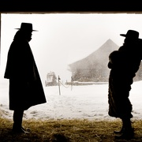
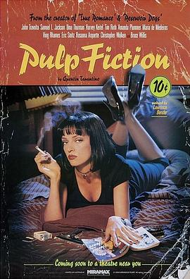
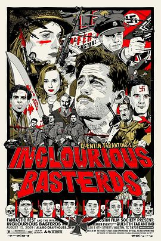
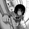

# 八恶人 (豆瓣)

**链接地址:** http://www.douban.com/doubanapp/dispatch?uri=/subject/25787888/interest/992857988
**作者:** 
**获取时间:** 2025/8/28 23:01:32
**图片数量:** 61

---

## 原始HTML内容

  
    

    
    

    <link href="//img3.doubanio.com/dae/accounts/resources/ba98e9b/shire/bundle.css" rel="stylesheet" type="text/css">

  

    

  <a href="https://accounts.douban.com/passport/login?source=movie" class="nav-login" rel="nofollow">登录/注册</a>

    

  <a href="https://www.douban.com/doubanapp/app?channel=top-nav" class="lnk-doubanapp">下载豆瓣客户端</a>
  

    <a href="https://www.douban.com/doubanapp/app?channel=qipao" class="tip-link">豆瓣 6.0 全新发布</a>
    <a href="javascript: void 0;" class="tip-close">×</a>
  

  

    
豆瓣

    
扫码直接下载

    

      <a href="https://www.douban.com/doubanapp/redirect?channel=top-nav&amp;direct_dl=1&amp;download=iOS">iPhone</a>
      ·
      <a href="https://www.douban.com/doubanapp/redirect?channel=top-nav&amp;direct_dl=1&amp;download=Android" class="download-android">Android</a>
    

  

    

  <ul>
    <li class="">
      <a href="https://www.douban.com" target="_blank" data-moreurl-dict="{&quot;from&quot;:&quot;top-nav-click-main&quot;,&quot;uid&quot;:&quot;0&quot;}">豆瓣</a>
    </li>
    <li class="">
      <a href="https://book.douban.com" target="_blank" data-moreurl-dict="{&quot;from&quot;:&quot;top-nav-click-book&quot;,&quot;uid&quot;:&quot;0&quot;}">读书</a>
    </li>
    <li class="on">
      <a href="https://movie.douban.com" data-moreurl-dict="{&quot;from&quot;:&quot;top-nav-click-movie&quot;,&quot;uid&quot;:&quot;0&quot;}">电影</a>
    </li>
    <li class="">
      <a href="https://music.douban.com" target="_blank" data-moreurl-dict="{&quot;from&quot;:&quot;top-nav-click-music&quot;,&quot;uid&quot;:&quot;0&quot;}">音乐</a>
    </li>
    <li class="">
      <a href="https://www.douban.com/podcast/" target="_blank" data-moreurl-dict="{&quot;from&quot;:&quot;top-nav-click-podcast&quot;,&quot;uid&quot;:&quot;0&quot;}">播客</a>
    </li>
    <li class="">
      <a href="https://www.douban.com/location" target="_blank" data-moreurl-dict="{&quot;from&quot;:&quot;top-nav-click-location&quot;,&quot;uid&quot;:&quot;0&quot;}">同城</a>
    </li>
    <li class="">
      <a href="https://www.douban.com/group" target="_blank" data-moreurl-dict="{&quot;from&quot;:&quot;top-nav-click-group&quot;,&quot;uid&quot;:&quot;0&quot;}">小组</a>
    </li>
    <li class="">
      <a href="https://read.douban.com/?dcs=top-nav&amp;dcm=douban" target="_blank" data-moreurl-dict="{&quot;from&quot;:&quot;top-nav-click-read&quot;,&quot;uid&quot;:&quot;0&quot;}">阅读</a>
    </li>
    <li class="">
      <a href="https://fm.douban.com/?from_=shire_top_nav" target="_blank" data-moreurl-dict="{&quot;from&quot;:&quot;top-nav-click-fm&quot;,&quot;uid&quot;:&quot;0&quot;}">FM</a>
    </li>
    <li class="">
      <a href="https://time.douban.com/?dt_time_source=douban-web_top_nav" target="_blank" data-moreurl-dict="{&quot;from&quot;:&quot;top-nav-click-time&quot;,&quot;uid&quot;:&quot;0&quot;}">时间</a>
    </li>
    <li class="">
      <a href="https://market.douban.com/?utm_campaign=douban_top_nav&amp;utm_source=douban&amp;utm_medium=pc_web" target="_blank" data-moreurl-dict="{&quot;from&quot;:&quot;top-nav-click-market&quot;,&quot;uid&quot;:&quot;0&quot;}">豆品</a>
    </li>
  </ul>

  

    

    

    <link href="//img3.doubanio.com/dae/accounts/resources/ba98e9b/movie/bundle.css" rel="stylesheet" type="text/css">

  

  

    

      <a href="https://movie.douban.com">豆瓣电影</a>
    

    

      <form action="https://search.douban.com/movie/subject_search" method="get">
        <fieldset>
          <legend>搜索：</legend>
          <label for="inp-query">
          </label>
          
<input id="inp-query" name="search_text" size="22" maxlength="60" placeholder="搜索电影、电视剧、综艺、影人" value="">

          
<input type="submit" value="搜索">

          <input type="hidden" name="cat" value="1002">
        </fieldset>
      </form>
    

  

  

  

    

  <ul>
    <li><a href="https://movie.douban.com/cinema/nowplaying/">影讯&amp;购票</a>
    </li>
    <li><a href="https://movie.douban.com/explore">选电影</a>
    </li>
    <li><a href="https://movie.douban.com/tv/">选剧集</a>
    </li>
    <li><a href="https://movie.douban.com/chart">排行榜</a>
    </li>
    <li><a href="https://movie.douban.com/review/best/">影评</a>
    </li>
    <li><a href="https://movie.douban.com/annual/2024/?fullscreen=1&amp;dt_from=movie_navigation">2024年度榜单</a>
    </li>
    <li><a href="https://c9.douban.com/app/standbyme-2024/?autorotate=false&amp;fullscreen=true&amp;hidenav=true&amp;monitor_screenshot=true&amp;df_from=web_navigation" target="_blank">2024年度报告</a>
    </li>
  </ul>

    
  

    

    
    

        

        
    

        
        
            <!-- rank label begin -->
            <link rel="stylesheet" href="https://img1.doubanio.com/cuphead/movie-static/subject/rank_label.dda40.css">
            

                
                  No.5
                
              
                <a href="https://m.douban.com/subject_collection/film_genre_47" target="_blank">评分最高西部片</a>
              
            

            <!-- rank label end -->

    <h1>
        八恶人 The Hateful Eight
            (2015)
    </h1>

        

            

            
            

                
    

        

            

                
                

    

                

        导演: <a href="https://www.douban.com/personage/27260212/" rel="v:directedBy">昆汀·塔伦蒂诺</a> 
        编剧: <a href="https://www.douban.com/personage/27260212/">昆汀·塔伦蒂诺</a> 
        主演: <a href="https://www.douban.com/personage/27260176/" rel="v:starring">塞缪尔·杰克逊</a> / <a href="https://www.douban.com/personage/27237555/" rel="v:starring">库尔特·拉塞尔</a> / <a href="https://www.douban.com/personage/27210278/" rel="v:starring">詹妮弗·杰森·李</a> / <a href="https://www.douban.com/personage/27304352/" rel="v:starring">沃尔顿·戈金斯</a> / <a href="https://www.douban.com/personage/27228489/" rel="v:starring">德米安·比齐尔</a> / <a href="https://www.douban.com/personage/27230908/" rel="v:starring">蒂姆·罗斯</a> / <a href="https://www.douban.com/personage/27233553/" rel="v:starring">迈克尔·马德森</a> / <a href="https://www.douban.com/personage/27224793/" rel="v:starring">布鲁斯·邓恩</a> / <a href="https://www.douban.com/personage/27342517/" rel="v:starring">詹姆士·帕克斯</a> / <a href="https://www.douban.com/personage/27236965/" rel="v:starring">查宁·塔图姆</a> / <a href="https://www.douban.com/personage/27545670/" rel="v:starring">丹娜·格瑞尔</a> / <a href="https://www.douban.com/personage/27246333/" rel="v:starring">佐伊·贝尔</a> / <a href="https://www.douban.com/personage/27298191/" rel="v:starring">李·霍斯利</a> 
        类型: 剧情 / 犯罪 / 西部 
        官方网站: <a href="http://thehatefuleight.com" rel="nofollow" target="_blank">thehatefuleight.com</a> 
        制片国家/地区: 美国 
        语言: 英语 / 法语 / 西班牙语 
        上映日期: 2015-12-07(洛杉矶首映) / 2015-12-30(美国) 
        片长: 168分钟(数字版) / 182分钟(胶片版) / 210分钟(加长版) 
        又名: 冰天血地8恶人(港) / 可憎八人 / The H8ful Eight / The Hateful 8 
        IMDb: tt3460252 

            

            
                

<link rel="stylesheet" href="https://img3.doubanio.com/cuphead/movie-static/download-output-image/index.7aaa3.css">

    

        

            

                豆瓣评分
            

          

            
            <a class="download-output-image" href="#">引用</a>
          

        

        

    <strong class="ll rating_num" property="v:average">8.7</strong>
    
    

        

        

                <a href="comments" class="rating_people">
                    308996人评价
                </a>
        

    

    
        

        
        
            5星
        
        

        46.0%
         
        

        

        
        
            4星
        
        

        42.7%
         
        

        

        
        
            3星
        
        

        10.1%
         
        

        

        
        
            2星
        
        

        0.8%
         
        

        

        
        
            1星
        
        

        0.3%
         
        

    

        

            好于 <a href="/typerank?type_name=剧情&amp;type=11&amp;interval_id=100:90&amp;action=">97% 剧情片</a> 
            好于 <a href="/typerank?type_name=犯罪&amp;type=3&amp;interval_id=100:90&amp;action=">98% 犯罪片</a> 
        

            
        

        
            

        
            <a href="https://www.douban.com/reason=collectwish&amp;ck=" rel="nofollow" class="j a_show_login colbutt ll" name="pbtn-25787888-wish">
                想看
            </a>
            <a href="https://www.douban.com/reason=collectcollect&amp;ck=" rel="nofollow" class="j a_show_login colbutt ll" name="pbtn-25787888-collect">
                看过
            </a>
        

            
    
    评价:
     

            
            
            
            
            
    
    <input id="n_rating" type="hidden" value="">
    

        

        

    <ul class="ul_subject_menu bicelink color_gray pt6 clearfix">
        
    
        
                
                  <li> 
    &nbsp;
        <a onclick="moreurl(this, {from:'mv_sbj_wr_cmnt_login'})" class="j a_show_login" href="https://www.douban.com/register?reason=review" rel="nofollow">写短评</a>
 </li>
                  <li> 
    
    &nbsp;
        <a onclick="moreurl(this, {from:'mv_sbj_wr_rv_login'})" class="j a_show_login" href="https://www.douban.com/register?reason=review" rel="nofollow">写影评</a>
 </li>
                    <li> 
   

   
    
    
    <a href="#" data-type="电影" data-url="https://movie.douban.com/subject/25787888/" data-desc="电影《八恶人 The Hateful Eight》 (来自豆瓣) " data-title="电影《八恶人 The Hateful Eight》 (来自豆瓣) " data-pic="https://img2.doubanio.com/view/photo/s_ratio_poster/public/p2287491621.jpeg" class="bn-sharing ">
        分享到
    </a> &nbsp;&nbsp;
    
    <link rel="stylesheet" href="https://img1.doubanio.com/f/vendors/e8a7261937da62636d22ca4c579efc4a4d759b1b/css/ui/dialog.css">
    
    
    

  </li>
            

    </ul>

    

        
            

<link rel="stylesheet" href="https://img3.doubanio.com/cuphead/movie-static/mod/share.ee737.css" type="text/css">

    

        
        <a href="/accounts/register?reason=recommend" class="j a_show_login lnk-sharing" share-id="25787888" data-mode="plain" data-name="八恶人 The Hateful Eight‎ (2015)" data-type="movie" data-desc="导演 昆汀·塔伦蒂诺 主演 塞缪尔·杰克逊 / 库尔特·拉塞尔 / 美国 / 8.7分(308996评价)" data-href="https://movie.douban.com/subject/25787888/" data-image="https://img2.doubanio.com/view/photo/s_ratio_poster/public/p2287491621.jpg" data-properties="{}" data-redir="" data-text="" data-apikey="" data-curl="" data-count="10" data-object_kind="1002" data-object_id="25787888" data-target_type="rec" data-target_action="0" data-action_props="{&quot;subject_url&quot;:&quot;https:\/\/movie.douban.com\/subject\/25787888\/&quot;,&quot;subject_title&quot;:&quot;八恶人 The Hateful Eight‎ (2015)&quot;}">推荐</a>

        
    

        

    

    

    

    
    
        
            
            
    <h2>
        <i>八恶人的剧情简介</i>
              · · · · · ·
    </h2>

            

                    
                        
                                　　寒冷的怀俄明州山谷中，一辆马车载着赏金猎人“绞刑者”约翰·鲁斯（库尔特·拉塞尔 Kurt Russell 饰）及其价值一万美元的猎物黛西·多摩格（詹妮弗·杰森·李 Jennifer Jason Leigh 饰）踏雪而行。途中，黑人赏金猎人马奎斯·沃伦少校（塞缪尔·杰克逊 Samuel L. Jackson 饰）和新人警长克里斯·马尼克斯（沃尔顿·戈金斯 Walton Goggins 饰）相继登上马车，红石镇是他们共同的目标。由于风雪太大，马车停在了米妮男装店，然而熟悉的店主人不知去向，却另有四名不速之客百无聊赖地待在店里。约翰时刻担心他人抢走猎物，马奎斯警惕地扫视面前的陌生人们，多嘴多舌的克里斯不时为紧张的气氛中加油添醋，黛西则似乎等待更大的风暴到来。
                                     
                                　　仿佛与世隔绝的小店内，即将刮起一场更为猛烈的风暴……
                        
                        <a href="https://movie.douban.com/help/movie#t0-qs">©豆瓣</a>
            

    

    

<link rel="stylesheet" href="https://img3.doubanio.com/cuphead/movie-static/celebrity/celebrities_section.610da.css">

  
    <h2>
        <i>八恶人的演职员</i>
              · · · · · ·
            
            (
                <a href="/subject/25787888/celebrities">全部 27</a>
            )
            
    </h2>

  <ul class="celebrities-list from-subject __oneline">
        
    
  
  <li class="celebrity">
    

  <a href="https://www.douban.com/personage/27260212/" title="昆汀·塔伦蒂诺 Quentin Tarantino" class="">
      

    

  </a>

    

      <a href="https://www.douban.com/personage/27260212/" title="昆汀·塔伦蒂诺 Quentin Tarantino" class="name">昆汀·塔伦蒂诺</a>

      导演

    

  </li>

        
    
  
  <li class="celebrity">
    

  <a href="https://www.douban.com/personage/27260176/" title="塞缪尔·杰克逊 Samuel L. Jackson" class="">
      

    

  </a>

    

      <a href="https://www.douban.com/personage/27260176/" title="塞缪尔·杰克逊 Samuel L. Jackson" class="name">塞缪尔·杰克逊</a>

      饰 Major Marquis Warren

    

  </li>

        
    
  
  <li class="celebrity">
    

  <a href="https://www.douban.com/personage/27237555/" title="库尔特·拉塞尔 Kurt Russell" class="">
      

    

  </a>

    

      <a href="https://www.douban.com/personage/27237555/" title="库尔特·拉塞尔 Kurt Russell" class="name">库尔特·拉塞尔</a>

      饰 John Ruth

    

  </li>

        
    
  
  <li class="celebrity">
    

  <a href="https://www.douban.com/personage/27210278/" title="詹妮弗·杰森·李 Jennifer Jason Leigh" class="">
      

    

  </a>

    

      <a href="https://www.douban.com/personage/27210278/" title="詹妮弗·杰森·李 Jennifer Jason Leigh" class="name">詹妮弗·杰森·李</a>

      饰 Daisy Domergue

    

  </li>

        
    
  
  <li class="celebrity">
    

  <a href="https://www.douban.com/personage/27304352/" title="沃尔顿·戈金斯 Walton Goggins" class="">
      

    

  </a>

    

      <a href="https://www.douban.com/personage/27304352/" title="沃尔顿·戈金斯 Walton Goggins" class="name">沃尔顿·戈金斯</a>

      饰 Sheriff Chris Mannix

    

  </li>

        
    
  
  <li class="celebrity">
    

  <a href="https://www.douban.com/personage/27228489/" title="德米安·比齐尔 Demián Bichir" class="">
      

    

  </a>

    

      <a href="https://www.douban.com/personage/27228489/" title="德米安·比齐尔 Demián Bichir" class="name">德米安·比齐尔</a>

      饰 Bob

    

  </li>

  </ul>

    

<link rel="stylesheet" href="https://img1.doubanio.com/f/verify/a5bc0bc0aea4221d751bc4809fd4b0a1075ad25e/entry_creator/dist/author_subject/style.css">

    

    
        

<link rel="stylesheet" href="https://img1.doubanio.com/cuphead/movie-static/subject/photos_section.45abd.css">

    
    

        
    
    
    <h2>
        <i>八恶人的视频和图片</i>
              · · · · · ·
            
            (
                <a href="https://movie.douban.com/subject/25787888/trailer#trailer">预告片24</a>&nbsp;|&nbsp;<a href="https://movie.douban.com/subject/25787888/all_photos">图片1204</a>&nbsp;·&nbsp;<a href="https://movie.douban.com/subject/25787888/mupload">添加</a>
            )
            
    </h2>

        <ul class="related-pic-bd  ">
                <li class="label-trailer">
                    <a class="related-pic-video" href="https://movie.douban.com/trailer/189791/#content" title="预告片" style="background-image:url(https://img3.doubanio.com/img/trailer/medium/2309941483.jpg)">
                        
预告片

                    </a>
                </li>
                <li>
                    
                </li>
                <li>
                    
                </li>
                <li>
                    
                </li>
                <li>
                    
                </li>
        </ul>
    

    

    

    

        
    <h2>
        <i>八恶人的获奖情况</i>
              · · · · · ·
            
            (
                <a href="https://movie.douban.com/subject/25787888/awards/">全部</a>
            )
            
    </h2>

    

        
        <ul class="award">
            <li>
                <a href="https://movie.douban.com/awards/Oscar/88/">第88届奥斯卡金像奖</a>
            </li>
            <li>最佳女配角(提名)</li>
            <li><a href="https://www.douban.com/personage/27210278/" target="_blank">詹妮弗·杰森·李</a></li>
        </ul>
        
        <ul class="award">
            <li>
                <a href="https://movie.douban.com/awards/golden-globes/73/">第73届金球奖</a>
            </li>
            <li>电影类 最佳女配角(提名)</li>
            <li><a href="https://www.douban.com/personage/27210278/" target="_blank">詹妮弗·杰森·李</a></li>
        </ul>
        
        <ul class="award">
            <li>
                <a href="https://movie.douban.com/awards/bafta/69/">第69届英国电影学院奖</a>
            </li>
            <li>电影奖 最佳女配角(提名)</li>
            <li><a href="https://www.douban.com/personage/27210278/" target="_blank">詹妮弗·杰森·李</a></li>
        </ul>

    
        

<link rel="stylesheet" href="https://img3.doubanio.com/cuphead/movie-static/subject/recommendations.61283.css">

    

        
        
    <h2>
        <i>喜欢这部电影的人也喜欢</i>
              · · · · · ·
    </h2>

        
    
    

        <dl>
            <dt>
                
            </dt>
            <dd>
                <a href="https://movie.douban.com/subject/6307447/?from=subject-page">被解救的姜戈</a>
                8.8
            </dd>
        </dl>
        <dl>
            <dt>
                
            </dt>
            <dd>
                <a href="https://movie.douban.com/subject/1299603/?from=subject-page">落水狗</a>
                8.4
            </dd>
        </dl>
        <dl>
            <dt>
                
            </dt>
            <dd>
                <a href="https://movie.douban.com/subject/1291832/?from=subject-page">低俗小说</a>
                8.9
            </dd>
        </dl>
        <dl>
            <dt>
                
            </dt>
            <dd>
                <a href="https://movie.douban.com/subject/1438652/?from=subject-page">无耻混蛋</a>
                8.7
            </dd>
        </dl>
        <dl>
            <dt>
                
            </dt>
            <dd>
                <a href="https://movie.douban.com/subject/1292222/?from=subject-page">出租车司机</a>
                8.6
            </dd>
        </dl>
        <dl>
            <dt>
                
            </dt>
            <dd>
                <a href="https://movie.douban.com/subject/1293350/?from=subject-page">两杆大烟枪</a>
                9.1
            </dd>
        </dl>
        <dl>
            <dt>
                
            </dt>
            <dd>
                <a href="https://movie.douban.com/subject/24750126/?from=subject-page">荒蛮故事</a>
                8.7
            </dd>
        </dl>
        <dl>
            <dt>
                
            </dt>
            <dd>
                <a href="https://movie.douban.com/subject/26952704/?from=subject-page">巴斯特·斯克鲁格斯的歌谣</a>
                8.5
            </dd>
        </dl>
        <dl>
            <dt>
                
            </dt>
            <dd>
                <a href="https://movie.douban.com/subject/1857099/?from=subject-page">老无所依</a>
                8.4
            </dd>
        </dl>
        <dl>
            <dt>
                
            </dt>
            <dd>
                <a href="https://movie.douban.com/subject/1291580/?from=subject-page">杀死比尔</a>
                8.4
            </dd>
        </dl>
    

    

    

    
        

    
    <link rel="stylesheet" href="https://img1.doubanio.com/f/vendors/d63a579a99fd372b4398731a279a1382e6eac71e/subject-comments/comments-section.css">

    

        

            
            
        <a class="comment_btn j a_show_login" href="https://www.douban.com/register?reason=review" rel="nofollow">
            我要写短评
        </a>

            
    <h2>
        <i>八恶人的短评</i>
              · · · · · ·
            
            (
                <a href="https://movie.douban.com/subject/25787888/comments?status=P">全部 75221 条</a>
            )
            
    </h2>

        

        

        

                
        

                        <a id="hot-comments-tab" href="comments" data-id="hot" class="on">热门</a>&nbsp;/&nbsp;
                        <a id="new-comments-tab" href="comments?sort=time" data-id="new" class="j a_show_login">最新</a>&nbsp;/&nbsp;
                        <a id="following-comments-tab" href="comments?sort=follows" data-id="following" class="j a_show_login">好友</a>
        

    

        

            
    

        
        

            
    
    

        <h3>
            
                    4618

                    <input value="991398041" type="hidden">
                    <a href="javascript:;" data-id="991398041" class="j a_show_login" onclick="">有用</a>

                <!-- 删除短评 -->
            
            
                <a href="https://www.douban.com/people/luhua/">芦哲峰</a>
                    看过
                    
                
                    2015-12-26 10:20:41
                
                
            
        </h3>
        

            
                昆汀版龙门客栈，话痨版无人生还。人人心肠都不软，个个死于话太多。
        

        

    

    

        

        
        

            
    
    

        <h3>
            
                    2854

                    <input value="964320317" type="hidden">
                    <a href="javascript:;" data-id="964320317" class="j a_show_login" onclick="">有用</a>

                <!-- 删除短评 -->
            
            
                <a href="https://www.douban.com/people/59604055/">梁仲雨</a>
                    看过
                    
                
                    2015-11-16 10:11:48
                
                
            
        </h3>
        

            
                落水狗的叙事结构与舞台背景，无耻混蛋的人物塑造站队与冲突，姜戈的主题升华，三部前作的糅合与突破。
年过半百的昆汀逐渐抛却了对女性的恋足癖，却愈发痴迷于爆男性蛋蛋的快感，这难道是一种中年危机的暗示？！
                
                
        

        

    

    

        

        
        

            
    
    

        <h3>
            
                    1242

                    <input value="990669053" type="hidden">
                    <a href="javascript:;" data-id="990669053" class="j a_show_login" onclick="">有用</a>

                <!-- 删除短评 -->
            
            
                <a href="https://www.douban.com/people/zhangzongqian/">亵渎电影</a>
                    看过
                    
                
                    2015-12-24 10:51:16
                
                
            
        </h3>
        

            
                明年奥斯卡最佳原创剧本应该就是这部电影，融合了[落水狗][无耻混蛋][姜戈]甚至[杀死比尔]的所有优点，对于昆汀的粉丝来说，这里有你想要的一切元素！很少能有编剧像昆汀一样，把群像的人物写的个个都那么个性鲜活，章回体的结构和叙事同样完美结合，激爽到让人觉得三个小时实在太短！★★★★★
        

        

    

    

        

        
        

            
    
    

        <h3>
            
                    400

                    <input value="991950595" type="hidden">
                    <a href="javascript:;" data-id="991950595" class="j a_show_login" onclick="">有用</a>

                <!-- 删除短评 -->
            
            
                <a href="https://www.douban.com/people/grinch/">大奇特(Grinch)</a>
                    看过
                    
                
                    2015-12-27 13:58:52
                
                
            
        </h3>
        

            
                昆汀这次并没戏仿通心粉西部片，而是做了一个自己风格的西部片。舞台剧式封闭环境下的结构化电影，全靠细节和对白来构建一个合理说辞。每个角色都试图讨价还价，每一细节也都具有存在的理由，可以说是最昆汀也最不昆汀的一部电影。但它没有任何惊喜可言，一切都在观众可以预料的范围之内。
        

        

    

    

        

        
        

            
    
    

        <h3>
            
                    954

                    <input value="991314694" type="hidden">
                    <a href="javascript:;" data-id="991314694" class="j a_show_login" onclick="">有用</a>

                <!-- 删除短评 -->
            
            
                <a href="https://www.douban.com/people/52285009/">洛风城</a>
                    看过
                    
                
                    2015-12-26 00:21:58
                
                
            
        </h3>
        

            
                昆汀的片子最大的特点就是不管是在影院看的，还是在家里看的，感觉都没什么分别。这部片子更加加深了我这种看法。
        

        

    

    

        

                
                    &gt; <a href="comments?sort=new_score&amp;status=P">
                        更多短评
                            75221条
                    </a>
        

        

            

            

            

                <a class="qa" href="/help/opinion#t2-q0" target="_blank">为什么被折叠？</a>
                <a class="btn-unfold" href="#">有一些短评被折叠了</a>
                

                    评论被折叠，是因为发布这条评论的账号行为异常。评论仍可以被展开阅读，对发布人的账号不造成其他影响。如果认为有问题，可以<a href="https://help.douban.com/help/ask?category=movie">联系</a>豆瓣电影。
                

            

            

            

            
        

        

            
    

        

            你关注的人还没写过短评
        

        

    

    

            
            
        

    

<!--        此处是挂载其他页面，不是注释！不是注释！不是注释！-->
        

<link rel="stylesheet" href="https://img1.doubanio.com/misc/mixed_static/292deb5ae8f760a3.css">

    <section id="reviews-wrapper" class="reviews mod movie-content">
        <header>
            
                <a href="new_review" rel="nofollow" class="create-review comment_btn " data-isverify="False" data-verify-url="https://www.douban.com/accounts/phone/verify?redir=https://movie.douban.com/subject/25787888/new_review">
                    我要写影评
                </a>
            <h2>
                    八恶人的影评 · · · · · ·

                    ( <a href="reviews">全部 504 条</a> )
            </h2>
        </header>

            
            

                                <a href="javascript:;;" class="cur" data-sort="">热门</a>
            

            

            

        
    

            
    
    

        

            
    
    <header class="main-hd">
        

        <a href="https://www.douban.com/people/plainchanter/" class="name">冷月獨觴</a>
            

        2015-12-28 01:56:10

    </header>

            

                <h2><a href="https://movie.douban.com/review/7708550/">“信念”之恶——以信念之名肆虐的暴力</a></h2>

                

                    

                            
这篇影评可能有剧透

                         可能因为个人口味偏重的关系，从《罪恶都市》起，昆汀一直在我关注度最高的导演名单之列。《被解放的姜戈》未能拿到奥斯卡最佳影片（所以政治标准高于文艺标准在美帝亦然），着实是一大遗憾——当年我以为这是一部昆汀风格风格大成之作，暴力不再是一味镜头前挥刃飙血，而是隐...

                        &nbsp;(<a href="javascript:;" id="toggle-7708550-copy" class="unfold" title="展开">展开</a>)
                    

                

                

                    

                

                

                    <a href="javascript:;" class="action-btn up" data-rid="7708550" title="有用">
                        
                        
                                1769
                        
                    </a>
                    <a href="javascript:;" class="action-btn down" data-rid="7708550" title="没用">
                        
                        
                                160
                        
                    </a>
                    <a href="https://movie.douban.com/review/7708550/#comments" class="reply ">265回应</a>

                    <a href="javascript:;;" class="fold hidden">收起</a>
                

            

        

    

            
    
    

        

            
    
    <header class="main-hd">
        

        <a href="https://www.douban.com/people/120496189/" class="name">石板栽花</a>
            

        2015-12-28 16:54:07

    </header>

            

                <h2><a href="https://movie.douban.com/review/7709551/">《八恶人》：展现了国家的“恶”</a></h2>

                

                    

                        《八恶人》：展现了国家的“恶”  表面上看，《八恶人》（The Hateful Eight  2015）是在展现八大恶人各自心中的仇恨，但事实上仇恨背后似乎都能找到国家的根源。本片编导的主要目的应当是展现当年美国国家的“恶”，否则，影片不会在展现“人性恶”之后以“白色地狱”来作结尾...

                        &nbsp;(<a href="javascript:;" id="toggle-7709551-copy" class="unfold" title="展开">展开</a>)
                    

                

                

                    

                

                

                    <a href="javascript:;" class="action-btn up" data-rid="7709551" title="有用">
                        
                        
                                733
                        
                    </a>
                    <a href="javascript:;" class="action-btn down" data-rid="7709551" title="没用">
                        
                        
                                185
                        
                    </a>
                    <a href="https://movie.douban.com/review/7709551/#comments" class="reply ">122回应</a>

                    <a href="javascript:;;" class="fold hidden">收起</a>
                

            

        

    

            
    
    

        

            
    
    <header class="main-hd">
        

        <a href="https://www.douban.com/people/1502959/" class="name">笑面人</a>
            

        2016-04-10 01:11:44

    </header>

            

                <h2><a href="https://movie.douban.com/review/7847013/">通过密闭空间内人数增减来叙事的有趣结构</a></h2>

                

                    

                            
这篇影评可能有剧透

                        这部影片的故事讲得非常清晰，好看。但是如果注意看昆汀在这部电影里运用的叙事技巧，会觉得更加有意思，这部电影不是话痨片，台词很多但都是对情节的展开以及结构变换有层层铺垫，并没有多少废话。其实这是一部如假包换的学院派电影。  The Hateful Eight 里面的Hateful有“针...

                        &nbsp;(<a href="javascript:;" id="toggle-7847013-copy" class="unfold" title="展开">展开</a>)
                    

                

                

                    

                

                

                    <a href="javascript:;" class="action-btn up" data-rid="7847013" title="有用">
                        
                        
                                282
                        
                    </a>
                    <a href="javascript:;" class="action-btn down" data-rid="7847013" title="没用">
                        
                        
                                4
                        
                    </a>
                    <a href="https://movie.douban.com/review/7847013/#comments" class="reply ">16回应</a>

                    <a href="javascript:;;" class="fold hidden">收起</a>
                

            

        

    

            
    
    

        

            
    
    <header class="main-hd">
        

        <a href="https://www.douban.com/people/prodill/" class="name">prodill</a>
            

        2015-12-30 08:58:22

    </header>

            

                <h2><a href="https://movie.douban.com/review/7712195/">最大的逻辑问题，来自地板下的那一枪。</a></h2>

                

                    

                        看了第二遍后，突然觉得一个问题值得商榷，黑人洋洋得意的审判面壁二人组时，被地下室的那位爆了蛋蛋，然后……就没有然后了，地下室帅哥为什么不再补第二枪？  是没子弹了？ 这是扯，明明后面抛上来两支枪。 目标不明显？ 这更扯，黑人倒地大声哀嚎，明明可以再补两枪快速解除...

                        &nbsp;(<a href="javascript:;" id="toggle-7712195-copy" class="unfold" title="展开">展开</a>)
                    

                

                

                    

                

                

                    <a href="javascript:;" class="action-btn up" data-rid="7712195" title="有用">
                        
                        
                                240
                        
                    </a>
                    <a href="javascript:;" class="action-btn down" data-rid="7712195" title="没用">
                        
                        
                                63
                        
                    </a>
                    <a href="https://movie.douban.com/review/7712195/#comments" class="reply ">183回应</a>

                    <a href="javascript:;;" class="fold hidden">收起</a>
                

            

        

    

            
    
    

        

            
    
    <header class="main-hd">
        

        <a href="https://www.douban.com/people/32023101/" class="name">Dude</a>
            

        2014-04-20 17:01:44

    </header>

            

                <h2><a href="https://movie.douban.com/review/6641689/">The Hateful Eight Live Read的一些笔记</a></h2>

                

                    

                        昆汀身穿黑色的牛仔服入场，痞气十足，全场起立鼓掌，足足四五分钟。然后昆汀说：“Now let’s welcome my luxurious cast!”然后依次入场的是Samuel Jackson, Kurt Russell, Bruce Dern, Tim Roth （我男神）, Walt Goggins, Zoe Bell, Michael Madsen等等。然后观众就疯了，...

                        &nbsp;(<a href="javascript:;" id="toggle-6641689-copy" class="unfold" title="展开">展开</a>)
                    

                

                

                    

                

                

                    <a href="javascript:;" class="action-btn up" data-rid="6641689" title="有用">
                        
                        
                                210
                        
                    </a>
                    <a href="javascript:;" class="action-btn down" data-rid="6641689" title="没用">
                        
                        
                                117
                        
                    </a>
                    <a href="https://movie.douban.com/review/6641689/#comments" class="reply ">20回应</a>

                    <a href="javascript:;;" class="fold hidden">收起</a>
                

            

        

    

            
    
    

        

            
    
    <header class="main-hd">
        

        <a href="https://www.douban.com/people/56041375/" class="name">Rollo Tomasi</a>
            

        2018-10-21 23:02:49

    </header>

            

                <h2><a href="https://movie.douban.com/review/9719193/">这封信必须是真的</a></h2>

                

                    

                            
这篇影评可能有剧透

                        完整的结论是：没有100%的证据证明信是真的，但是支持假信的证据全都立不住脚，结合全片，可以认定在导演的设计里，信是真的。 首先，判断的逻辑是这样的。虽然片中每个人说的话都可能是随口瞎编的，但如果默认每个人都说谎的话片子就没法看了。所以前提是这样的，默认大家都说...

                        &nbsp;(<a href="javascript:;" id="toggle-9719193-copy" class="unfold" title="展开">展开</a>)
                    

                

                

                    

                

                

                    <a href="javascript:;" class="action-btn up" data-rid="9719193" title="有用">
                        
                        
                                157
                        
                    </a>
                    <a href="javascript:;" class="action-btn down" data-rid="9719193" title="没用">
                        
                        
                                9
                        
                    </a>
                    <a href="https://movie.douban.com/review/9719193/#comments" class="reply ">55回应</a>

                    <a href="javascript:;;" class="fold hidden">收起</a>
                

            

        

    

            
    
    

        

            
    
    <header class="main-hd">
        

        <a href="https://www.douban.com/people/ILWTFT/" class="name">文森特九六</a>
            

        2014-04-24 18:43:54

    </header>

            

                <h2><a href="https://movie.douban.com/review/6647114/">浅谈昆汀《八恶人》剧本</a></h2>

                

                    

                          当地时间4月19日，昆汀带着12位自己精心选配的演员在洛杉矶为自己前段时间意外泄露的新片剧本《八恶人》搞了一场古灵精怪的所谓朗读会，而且仅此一场，之后的剧本将被打回重写，尤其是最后一章。之所以称之为古灵精怪，是因为虽然称其为朗读会，实际上却是融合了即兴表演、工...

                        &nbsp;(<a href="javascript:;" id="toggle-6647114-copy" class="unfold" title="展开">展开</a>)
                    

                

                

                    

                

                

                    <a href="javascript:;" class="action-btn up" data-rid="6647114" title="有用">
                        
                        
                                141
                        
                    </a>
                    <a href="javascript:;" class="action-btn down" data-rid="6647114" title="没用">
                        
                        
                                69
                        
                    </a>
                    <a href="https://movie.douban.com/review/6647114/#comments" class="reply ">20回应</a>

                    <a href="javascript:;;" class="fold hidden">收起</a>
                

            

        

    

            
    
    

        

            
    
    <header class="main-hd">
        

        <a href="https://www.douban.com/people/maverick0806/" class="name">Maverick</a>
            

        2022-05-23 12:17:52

    </header>

            

                <h2><a href="https://movie.douban.com/review/14413078/">《八恶人》电影剧本</a></h2>

                

                    

                        《八恶人》电影剧本 文/〔美国〕昆汀·塔伦蒂诺 译/曹轶 第一章 去往红石镇的最后一辆马车 外景，怀俄明冬季白雪覆盖的山脉，雪 70毫米胶片拍摄的一段白雪皑皑的巍峨山脉景象。 一个壮观的开场远景镜头，背景配以恰如其分的紧张音乐。 在70毫米超宽银幕画面中，我们看见一辆驿...

                        &nbsp;(<a href="javascript:;" id="toggle-14413078-copy" class="unfold" title="展开">展开</a>)
                    

                

                

                    

                

                

                    <a href="javascript:;" class="action-btn up" data-rid="14413078" title="有用">
                        
                        
                                94
                        
                    </a>
                    <a href="javascript:;" class="action-btn down" data-rid="14413078" title="没用">
                        
                        
                                1
                        
                    </a>
                    <a href="https://movie.douban.com/review/14413078/#comments" class="reply ">4回应</a>

                    <a href="javascript:;;" class="fold hidden">收起</a>
                

            

        

    

            
    
    

        

            
    
    <header class="main-hd">
        

        <a href="https://www.douban.com/people/53140115/" class="name">维以永不伤</a>
            

        2015-12-26 02:54:20

    </header>

            

                <h2><a href="https://movie.douban.com/review/7705039/">昆丁和八恶人--看电影到底看的是什么！？</a></h2>

                

                    

                        我承认，我有罪，我没抵挡住诱惑，我提前看了泄露版  这也是为什么我在半夜2点13打字写这篇影评的原因。  我不能理解，这样的片子，竟然还有人打五星以外的分数  我知道，你们会说，“你喜欢不代表所有人都喜欢”，“有的人就是不喜欢这种片子啊”，“太话唠了”，“太血腥了”...

                        &nbsp;(<a href="javascript:;" id="toggle-7705039-copy" class="unfold" title="展开">展开</a>)
                    

                

                

                    

                

                

                    <a href="javascript:;" class="action-btn up" data-rid="7705039" title="有用">
                        
                        
                                147
                        
                    </a>
                    <a href="javascript:;" class="action-btn down" data-rid="7705039" title="没用">
                        
                        
                                83
                        
                    </a>
                    <a href="https://movie.douban.com/review/7705039/#comments" class="reply ">96回应</a>

                    <a href="javascript:;;" class="fold hidden">收起</a>
                

            

        

    

            
    
    

        

            
    
    <header class="main-hd">
        

        <a href="https://www.douban.com/people/imedi/" class="name">meddy</a>
            

        2015-12-27 15:17:29

    </header>

            

                <h2><a href="https://movie.douban.com/review/7707403/">不完美的故事，完美的说书人</a></h2>

                

                    

                        这个世界上，有些人拍电影，巴不得一句台词都不要有，让观众将所有的注意力放在艺术的画框内，例如《聂隐娘》。而有些人拍电影，你可以闭上眼睛听完90分钟，拍得好的话，像伍迪·艾伦的大多数电影，让观众把注意力放在艺术的对白中。  但还有些人拍电影（这些人非常稀有）将画...

                        &nbsp;(<a href="javascript:;" id="toggle-7707403-copy" class="unfold" title="展开">展开</a>)
                    

                

                

                    

                

                

                    <a href="javascript:;" class="action-btn up" data-rid="7707403" title="有用">
                        
                        
                                68
                        
                    </a>
                    <a href="javascript:;" class="action-btn down" data-rid="7707403" title="没用">
                        
                        
                                13
                        
                    </a>
                    <a href="https://movie.douban.com/review/7707403/#comments" class="reply ">9回应</a>

                    <a href="javascript:;;" class="fold hidden">收起</a>
                

            

        

    

    

    <!-- COLLECTED JS -->
    <!-- COLLECTED CSS -->

    

    <link rel="stylesheet" href="https://img1.doubanio.com/f/zerkalo/88118a282439e312283e886ea4c3d3e9849a8fa4/css/review/editor/ng/setting_standalone.css">
    
    
    
    
    
    
    

                

                    &gt;
                        <a href="reviews">
                            更多影评
                                504篇
                        </a>
                

    </section>
<!-- COLLECTED JS -->

     

    
            

                    
                    

                            <a class="comment_btn j a_show_login" href="https://www.douban.com/register?reason=review" rel="nofollow">添加新讨论</a>
                        
    <h2>
        讨论区
         &nbsp; ·&nbsp; ·&nbsp; ·&nbsp; ·&nbsp; ·&nbsp; ·
    </h2>

                    

                    
  <table class="olt"><tbody><tr><td></td><td></td><td></td><td></td></tr>
        
        <tr>
          <td class="pl"><a href="https://movie.douban.com/subject/25787888/discussion/616487958/" title="女的结尾说他们有15个人是真的还是吓唬人的？">女的结尾说他们有15个人是真的还是吓唬人的？</a></td>
          <td class="pl">来自<a href="https://www.douban.com/people/83341768/">肥皂和钱队</a></td>
          <td class="pl">16 回应</td>
          <td class="pl">2025-08-27 01:20:19</td>
        </tr>
        
        <tr>
          <td class="pl"><a href="https://movie.douban.com/subject/25787888/discussion/637162802/" title="八恶人三个版本到底哪个好？">八恶人三个版本到底哪个好？</a></td>
          <td class="pl">来自<a href="https://www.douban.com/people/216010760/">花花世界</a></td>
          <td class="pl">13 回应</td>
          <td class="pl">2025-08-17 12:52:44</td>
        </tr>
        
        <tr>
          <td class="pl"><a href="https://movie.douban.com/subject/25787888/discussion/637827449/" title="黑人真的杀了老将军儿子吗？还是个圈套！">黑人真的杀了老将军儿子吗？还是个圈套！</a></td>
          <td class="pl">来自<a href="https://www.douban.com/people/3144484/">发条西红柿</a></td>
          <td class="pl">1 回应</td>
          <td class="pl">2025-08-10 22:47:16</td>
        </tr>
        
        <tr>
          <td class="pl"><a href="https://movie.douban.com/subject/25787888/discussion/637847840/" title="看完168分钟的，还有必要再看一遍b站的210吗">看完168分钟的，还有必要再看一遍b站的210吗</a></td>
          <td class="pl">来自<a href="https://www.douban.com/people/271654647/">宁可</a></td>
          <td class="pl"></td>
          <td class="pl">2025-08-09 21:34:24</td>
        </tr>
        
        <tr>
          <td class="pl"><a href="https://movie.douban.com/subject/25787888/discussion/637844897/" title="西部">西部</a></td>
          <td class="pl">来自<a href="https://www.douban.com/people/285400605/">豆友_satK8M5m0</a></td>
          <td class="pl"></td>
          <td class="pl">2025-08-03 17:26:44</td>
        </tr>
  </tbody></table>

                    

                        <a href="/subject/25787888/discussion/" rel="nofollow">
                            &gt; 去这部影片的讨论区（全部196条）
                        </a>
                    

            

        
    
        
                
                    

    

        <h2>
                关于《八恶人》的问题
                · · · · · ·
            
                (<a href="https://movie.douban.com/subject/25787888/questions/?from=subject">
                    全部139个
                </a>)
            
        </h2>

        <!-- 
    
    <a class='j a_show_login comment_btn'
        href='https://movie.douban.com/subject/25787888/questions/ask/?from=subject'>我来提问</a>
 -->
    

    

        <ul>
            <li>
                
                    <a href="https://movie.douban.com/subject/25787888/questions/66754/?from=subject">
                        red rock到底有没有15个人在哪儿等着？
                    </a>
                
                
                    31人回答
                
            </li>
            <li>
                
                    <a href="https://movie.douban.com/subject/25787888/questions/52490/?from=subject">
                        只想知道中国有没有希望？
                    </a>
                
                
                    36人回答
                
            </li>
        </ul>

        
&gt;
            <a href="https://movie.douban.com/subject/25787888/questions/?from=subject">
                全部139个问题
            </a>
        

    

            

    

            

            

                

    

        

    
    

    
    <h2>
        在哪儿看这部电影
            &nbsp;·&nbsp;·&nbsp;·&nbsp;·&nbsp;·&nbsp;·
    </h2>

    
    <ul class="bs">
                
                <li>
                        <a class="playBtn" data-cn="腾讯视频" data-impression-track="https://frodo.douban.com/rohirrim/video_tracking/impression?subject_id=25787888&amp;video_type=movie&amp;video_id=880918&amp;source=qq&amp;user_id=&amp;bid=MgMouvq6hTY&amp;platform=pc&amp;location=vendor_subject" data-click-track="https://frodo.douban.com/rohirrim/video_tracking/click?subject_id=25787888&amp;video_type=movie&amp;video_id=880918&amp;source=qq&amp;user_id=&amp;bid=MgMouvq6hTY&amp;platform=pc&amp;location=vendor_subject" data-pic="https://img3.doubanio.com/cuphead/movie-static/pics/video-qq.png" href="https://www.douban.com/link2/?url=https%3A%2F%2Fv.qq.com%2Fx%2Fcover%2F8uk2ne51y0322c7.html%3Fptag%3Dnewdouban.movie&amp;subtype=1&amp;type=online-video" target="_blank">
                        腾讯视频
                        </a>
                    
                    
                        VIP免费观看
                    
                </li>
                
                <li>
                        <a class="playBtn" data-cn="爱奇艺" data-impression-track="https://frodo.douban.com/rohirrim/video_tracking/impression?subject_id=25787888&amp;video_type=movie&amp;video_id=819868&amp;source=iqiyi&amp;user_id=&amp;bid=MgMouvq6hTY&amp;platform=pc&amp;location=vendor_subject" data-click-track="https://frodo.douban.com/rohirrim/video_tracking/click?subject_id=25787888&amp;video_type=movie&amp;video_id=819868&amp;source=iqiyi&amp;user_id=&amp;bid=MgMouvq6hTY&amp;platform=pc&amp;location=vendor_subject" data-pic="https://img1.doubanio.com/cuphead/movie-static/pics/video-iqiyi-new.png" href="https://www.douban.com/link2/?url=http%3A%2F%2Fwww.iqiyi.com%2Fv_19rr7q0bwk.html%3Fvfm%3Dm_331_dbdy%26fv%3D4904d94982104144a1548dd9040df241&amp;subtype=9&amp;type=online-video&amp;link2key=68db67ffe8" target="_blank">
                        爱奇艺
                        </a>
                    
                    
                        VIP免费观看
                    
                </li>
                
                <li>
                        <a class="playBtn" data-cn="哔哩哔哩" data-impression-track="https://frodo.douban.com/rohirrim/video_tracking/impression?subject_id=25787888&amp;video_type=movie&amp;video_id=871593&amp;source=bilibili&amp;user_id=&amp;bid=MgMouvq6hTY&amp;platform=pc&amp;location=vendor_subject" data-click-track="https://frodo.douban.com/rohirrim/video_tracking/click?subject_id=25787888&amp;video_type=movie&amp;video_id=871593&amp;source=bilibili&amp;user_id=&amp;bid=MgMouvq6hTY&amp;platform=pc&amp;location=vendor_subject" data-pic="https://img9.doubanio.com/cuphead/movie-static/pics/video-bilibili.png" href="https://www.douban.com/link2/?url=https%3A%2F%2Fm.bilibili.com%2Fbangumi%2Fplay%2Fss39161%3Fbsource%3Ddoubanh5&amp;subtype=8&amp;type=online-video" target="_blank">
                        哔哩哔哩
                        </a>
                    
                    
                        VIP免费观看
                    
                </li>
                
                <li>
                        <a class="playBtn" data-cn="优酷视频" data-impression-track="https://frodo.douban.com/rohirrim/video_tracking/impression?subject_id=25787888&amp;video_type=movie&amp;video_id=916691&amp;source=youku&amp;user_id=&amp;bid=MgMouvq6hTY&amp;platform=pc&amp;location=vendor_subject" data-click-track="https://frodo.douban.com/rohirrim/video_tracking/click?subject_id=25787888&amp;video_type=movie&amp;video_id=916691&amp;source=youku&amp;user_id=&amp;bid=MgMouvq6hTY&amp;platform=pc&amp;location=vendor_subject" data-pic="https://img1.doubanio.com/cuphead/movie-static/pics/video-youku-new.png" href="https://www.douban.com/link2/?url=https%3A%2F%2Fm.youku.com%2Falipay_video%2Fid_1b375b687bfc11e3a705.html%3Frefer%3Desfhz_operation.xuka.xj_00003036_000000_FNZfau_19010900&amp;subtype=3&amp;type=online-video&amp;link2key=68db67ffe8" target="_blank">
                        优酷视频
                        </a>
                    
                    
                        VIP免费观看
                    
                </li>

    </ul>

    <!-- douban ad begin -->
    

    <!-- douban ad end -->

    

    

        
    <h2>
        本片原声正在播放
            &nbsp;·&nbsp;·&nbsp;·&nbsp;·&nbsp;·&nbsp;·
    </h2>

        <a target="_blank" href="https://music.douban.com/subject/26671610/">去豆瓣音乐收听</a>

    

    

    

    

    
        

    
    
    <h2>
        <i>以下片单推荐</i>
              · · · · · ·
            
            (
                <a href="https://movie.douban.com/subject/25787888/doulists">全部</a>
            )
            
    </h2>

    
    <ul>
            
                <li>
                    <a href="https://www.douban.com/doulist/243559/" target="_blank">★豆瓣高分电影榜★ （中）8.5-8.3分</a>
                    (影志)
                </li>
            
                <li>
                    <a href="https://www.douban.com/doulist/30299/" target="_blank">豆瓣电影【口碑榜】2023-09-11 更新</a>
                    (影志)
                </li>
            
                <li>
                    <a href="https://www.douban.com/doulist/730752/" target="_blank">【值得期待的新片】</a>
                    (大宸)
                </li>
            
                <li>
                    <a href="https://www.douban.com/doulist/13712178/" target="_blank">评价人数超过十万的电影</a>
                    (依然饭特稀)
                </li>
            
                <li>
                    <a href="https://www.douban.com/doulist/243959/" target="_blank">有猫的电影</a>
                    (安德烈大叔)
                </li>
    </ul>

    
        

    
    
    <h2>
        <i>谁在看这部电影</i>
              · · · · · ·
    </h2>

    
    <ul>
            
            <li>
                
                

                    <a href="https://www.douban.com/people/276264644/">Jessie</a>
                    

                        2分钟前
                        看过
                        
    

                    

                

            </li>
            
            <li>
                
                

                    <a href="https://www.douban.com/people/187989440/">刀叔</a>
                    

                        36分钟前
                        想看
                        

                    

                

            </li>
            
            <li>
                
                

                    <a href="https://www.douban.com/people/132636984/">南海土著</a>
                    

                        1小时前
                        看过
                        

                    

                

            </li>
    </ul>

    
    

        
            <a href="https://movie.douban.com/subject/25787888/comments?status=P">393019人看过</a>
                &nbsp;/&nbsp;
            <a href="https://movie.douban.com/subject/25787888/comments?status=F">202583人想看</a>
    

    

<!-- douban ad begin -->

<!-- douban ad end -->

     

    

订阅八恶人的评论:  
    <a href="https://movie.douban.com/feed/subject/25787888/reviews"> feed: rss 2.0</a>

            

            

                
    
<!-- douban ad begin -->

<!-- douban ad end -->

    <!-- douban ad begin -->
    

    <!-- douban ad end -->

            

        

    

        
    

            

        

    © 2005－2025 douban.com, all rights reserved 北京豆网科技有限公司

    <a href="https://www.douban.com/about">关于豆瓣</a>
    · <a href="https://www.douban.com/jobs">在豆瓣工作</a>
    · <a href="https://www.douban.com/about?topic=contactus">联系我们</a>
    · <a href="https://www.douban.com/about/legal">法律声明</a>
    
    · <a href="https://help.douban.com/?app=movie" target="_blank">帮助中心</a>
    · <a href="https://www.douban.com/doubanapp/">移动应用</a>

    

    

    <!-- COLLECTED JS -->
        
        
    <link rel="stylesheet" type="text/css" href="https://img1.doubanio.com/f/vendors/e8a7261937da62636d22ca4c579efc4a4d759b1b/css/ui/dialog.css">
    <link rel="stylesheet" type="text/css" href="https://img1.doubanio.com/cuphead/movie-static/mod/login_pop.b2f60.css">
    
    
    

    
    
    
    
    
    
    
    
    
    

    
    
    

    

    
  

      

    <!-- dae-web-movie--default-5f9cb85759-ngdhb-->

  

---

## 纯文本内容

var _body_start = new Date();

    
    

    

  
    

  登录/注册

    
  下载豆瓣客户端
  
    豆瓣 6.0 全新发布
    ×
  
  
    豆瓣
    扫码直接下载
    
      iPhone
      ·
      Android
    
  

    

  
    
      豆瓣
    
    
      读书
    
    
      电影
    
    
      音乐
    
    
      播客
    
    
      同城
    
    
      小组
    
    
      阅读
    
    
      FM
    
    
      时间
    
    
      豆品
    
  

  

  ;window._GLOBAL_NAV = {
    DOUBAN_URL: "https://www.douban.com",
    N_NEW_NOTIS: 0,
    N_NEW_DOUMAIL: 0
  };

    

    

    

  
  
    
      豆瓣电影
    
    
      
        
          搜索：
          
          
          
          
          
        
      
    
  
  
  
    

  
    影讯&购票
    
    选电影
    
    选剧集
    
    排行榜
    
    影评
    
    2024年度榜单
    
    2024年度报告
    
  

    
  

  <li data-link="{{= url}}">
            <a href="{{= url}}" onclick="moreurl(this, {from:'movie_search_sugg', query:'{{= keyword }}', subject_id:'{{= id}}', i: '{{= index}}', type: '{{= type}}'})">
            
            

                <em>{{= title}}</em>
                {{if year}}
                    {{= year}}
                {{/if}}
                {{if sub_title}}
                     {{= sub_title}}
                {{/if}}
                {{if address}}
                     {{= address}}
                {{/if}}
                {{if episode}}
                    {{if episode=="unknow"}}
                         集数未知
                    {{else}}
                         共{{= episode}}集
                    {{/if}}
                {{/if}}
            

        </a>
        </li>
  

    

    
    
        

        
    
        
        
            
            
            
                
                  No.5
                
              
                评分最高西部片
              
            
            

    
        八恶人 The Hateful Eight
            (2015)
    

        
            

            
            
                
    
        
            
                
                

    
        
   

                

        导演: 昆汀·塔伦蒂诺
        编剧: 昆汀·塔伦蒂诺
        主演: 塞缪尔·杰克逊 / 库尔特·拉塞尔 / 詹妮弗·杰森·李 / 沃尔顿·戈金斯 / 德米安·比齐尔 / 蒂姆·罗斯 / 迈克尔·马德森 / 布鲁斯·邓恩 / 詹姆士·帕克斯 / 查宁·塔图姆 / 丹娜·格瑞尔 / 佐伊·贝尔 / 李·霍斯利
        类型: 剧情 / 犯罪 / 西部
        官方网站: thehatefuleight.com
        制片国家/地区: 美国
        语言: 英语 / 法语 / 西班牙语
        上映日期: 2015-12-07(洛杉矶首映) / 2015-12-30(美国)
        片长: 168分钟(数字版) / 182分钟(胶片版) / 210分钟(加长版)
        又名: 冰天血地8恶人(港) / 可憎八人 / The H8ful Eight / The Hateful 8
        IMDb: tt3460252

$(function(){
    var limit = 5
    $('#info .attrs').each(function() {
        var $list = $(this).find('a')
        var $attrs = $(this)

        if($list.length > limit) {
            $attrs.empty()
            $list.each(function(idx) {
                if (idx+1 === $list.length) {
                    $('').prepend($(this)).appendTo($attrs);
                } else {
                    $(' / ').prepend($(this)).appendTo($attrs);
                }
            })

            $attrs.append('<a href="javascript:;" class="more-attrs" title="显示更多">更多...</a>')
            $('.more-attrs').on('click', function() {
                $(this).parent().find('span').show()
                $(this).hide()
            })

            $attrs.find('span').slice(limit).hide()
        }
    })
})

            
            
                

    
        
            
                豆瓣评分
            
          
            
            引用
          
        
        

    8.7
    
    
        
        
                
                    308996人评价
                
        
    

    
        
        
        
            5星
        
        
        46.0%
        
        
        
        
        
            4星
        
        
        42.7%
        
        
        
        
        
            3星
        
        
        10.1%
        
        
        
        
        
            2星
        
        
        0.8%
        
        
        
        
        
            1星
        
        
        0.3%
        
        

    
        
            好于 97% 剧情片
            好于 98% 犯罪片
        

            
        
        
            

        
            
                想看
            
            
                看过
            
        
            
    
    评价:
     

            
            
        
            
            
        
            
            
        
            
            
        
            
            
        
    
    
    

        

        

    
        
    
        
                
                   
     
        写短评
 
                   
    
     
        写影评
 
                     
   

   
    
    
    
        分享到
       
    
    
    
    
    

  
            

    

    
        $(function(){
            $(".ul_subject_menu li.rec .bn-sharing").bind("click", function(){
                $.get("/blank?sbj_page_click=bn_sharing");
            });
        });
    

        
            

    
        
    <form class="movie-share" action="/j/share" method="POST">
        

            

                <textarea name="text" class="share-text" cols="72" data-mention-api="https://api.douban.com/shuo/in/complete?alt=xd&amp;callback=?"></textarea>
                <input type="hidden" name="target-id" value="25787888">
                <input type="hidden" name="target-type" value="0">
                <input type="hidden" name="title" value="八恶人 The Hateful Eight‎ (2015)">
                <input type="hidden" name="desc" value="导演 昆汀·塔伦蒂诺 主演 塞缪尔·杰克逊 / 库尔特·拉塞尔 / 美国 / 8.7分(308996评价)">
                <input type="hidden" name="redir" value=""/>
                

            

            

                    
                <strong>八恶人 The Hateful Eight‎ (2015)</strong>
                
导演 昆汀·塔伦蒂诺 主演 塞缪尔·杰克逊 / 库尔特·拉塞尔 / 美国 / 8.7分(308996评价)

                
&nbsp;

            

        

        

            

                

                140
                
                    <input type="submit" value="推荐" />
                
            

        

    </form>
    
    

        <ul>
            {{#users}}
            <li id="{{uid}}">
              {{{username}}}&nbsp;({{{uid}}})
            </li>
            {{/users}}
        </ul>
    

    

        
        推荐

        
            $(function() {
                $('.collect_btn', '#interest_sect_level').each(function() {
                    Douban.init_collect_btn(this);
                });
                $('html').delegate(".indent .rec-sec .lnk-sharing", "click", function() {
                    moreurl(this, {
                        from : 'mv_sbj_db_share'
                    });
                });
            });
        
    
        

    
    

    

    
    
        
            
            
    
        八恶人的剧情简介
              · · · · · ·
    

            
                    
                        
                                　　寒冷的怀俄明州山谷中，一辆马车载着赏金猎人“绞刑者”约翰·鲁斯（库尔特·拉塞尔 Kurt Russell 饰）及其价值一万美元的猎物黛西·多摩格（詹妮弗·杰森·李 Jennifer Jason Leigh 饰）踏雪而行。途中，黑人赏金猎人马奎斯·沃伦少校（塞缪尔·杰克逊 Samuel L. Jackson 饰）和新人警长克里斯·马尼克斯（沃尔顿·戈金斯 Walton Goggins 饰）相继登上马车，红石镇是他们共同的目标。由于风雪太大，马车停在了米妮男装店，然而熟悉的店主人不知去向，却另有四名不速之客百无聊赖地待在店里。约翰时刻担心他人抢走猎物，马奎斯警惕地扫视面前的陌生人们，多嘴多舌的克里斯不时为紧张的气氛中加油添醋，黛西则似乎等待更大的风暴到来。
                                    
                                　　仿佛与世隔绝的小店内，即将刮起一场更为猛烈的风暴……
                        
                        ©豆瓣
            

    

    

  
    
        八恶人的演职员
              · · · · · ·
            
            (
                全部 27
            )
            
    

  
        
    
  
  
    

  
      
    
  

    
      昆汀·塔伦蒂诺

      导演

    
  

        
    
  
  
    

  
      
    
  

    
      塞缪尔·杰克逊

      饰 Major Marquis Warren

    
  

        
    
  
  
    

  
      
    
  

    
      库尔特·拉塞尔

      饰 John Ruth

    
  

        
    
  
  
    

  
      
    
  

    
      詹妮弗·杰森·李

      饰 Daisy Domergue

    
  

        
    
  
  
    

  
      
    
  

    
      沃尔顿·戈金斯

      饰 Sheriff Chris Mannix

    
  

        
    
  
  
    

  
      
    
  

    
      德米安·比齐尔

      饰 Bob

    
  

  

    

    

    var answerObj = {
      ISALL: 'False',
      TYPE: 'movie',
      SUBJECT_ID: '25787888',
      USER_ID: 'None'
    }

    
        

    
    
        
    
    
    
        八恶人的视频和图片
              · · · · · ·
            
            (
                预告片24 | 图片1204 · 添加
            )
            
    

        
                
                    
                        预告片
                    
                
                
                    
                
                
                    
                
                
                    
                
                
                    
                
        
    

    

    

.award li { display: inline; margin-right: 5px }
.awards { margin-bottom: 20px }
.awards h2 { background: none; color: #000; font-size: 14px; padding-bottom: 5px; margin-bottom: 8px; border-bottom: 1px dashed #dddddd }
.awards .year { color: #666666; margin-left: -5px }
.mod { margin-bottom: 25px }
.mod .hd { margin-bottom: 10px }
....

---

## 图片列表

-  (原始链接: https://img2.doubanio.com/view/photo/s_ratio_poster/public/p2287491621.jpg)
-  (原始链接: https://img2.doubanio.com/cuphead/movie-static/pics/reference.png)
-  (原始链接: https://img1.doubanio.com/f/vendors/2520c01967207a1735171056ec588c8c1257e5f8/pics/rating_icons/star_hollow_hover.png)
-  (原始链接: https://img1.doubanio.com/f/vendors/2520c01967207a1735171056ec588c8c1257e5f8/pics/rating_icons/star_hollow_hover.png)
-  (原始链接: https://img1.doubanio.com/f/vendors/2520c01967207a1735171056ec588c8c1257e5f8/pics/rating_icons/star_hollow_hover.png)
-  (原始链接: https://img1.doubanio.com/f/vendors/2520c01967207a1735171056ec588c8c1257e5f8/pics/rating_icons/star_hollow_hover.png)
-  (原始链接: https://img1.doubanio.com/f/vendors/2520c01967207a1735171056ec588c8c1257e5f8/pics/rating_icons/star_hollow_hover.png)
-  (原始链接: https://img9.doubanio.com/cuphead/movie-static/pics/short-comment.gif)
-  (原始链接: https://img1.doubanio.com/cuphead/movie-static/pics/add-review.gif)
-  (原始链接: https://img9.doubanio.com/view/photo/sqxs/public/p2257094385.jpg)
-  (原始链接: https://img3.doubanio.com/view/photo/sqxs/public/p2302203123.jpg)
-  (原始链接: https://img3.doubanio.com/view/photo/sqxs/public/p2304967812.jpg)
-  (原始链接: https://img2.doubanio.com/view/photo/sqxs/public/p2305736271.jpg)
-  (原始链接: https://img3.doubanio.com/view/photo/s_ratio_poster/public/p1800813767.jpg)
-  (原始链接: https://img2.doubanio.com/view/photo/s_ratio_poster/public/p1851340431.jpg)
-  (原始链接: https://img3.doubanio.com/view/photo/s_ratio_poster/public/p1910902213.jpg)
-  (原始链接: https://img1.doubanio.com/view/photo/s_ratio_poster/public/p2575043939.jpg)
-  (原始链接: https://img3.doubanio.com/view/photo/s_ratio_poster/public/p792510233.jpg)
-  (原始链接: https://img1.doubanio.com/view/photo/s_ratio_poster/public/p792443418.jpg)
-  (原始链接: https://img3.doubanio.com/view/photo/s_ratio_poster/public/p2919686972.jpg)
-  (原始链接: https://img3.doubanio.com/view/photo/s_ratio_poster/public/p2539127687.jpg)
-  (原始链接: https://img1.doubanio.com/view/photo/s_ratio_poster/public/p551171670.jpg)
-  (原始链接: https://img9.doubanio.com/view/photo/s_ratio_poster/public/p2493495946.jpg)
-  (原始链接: https://img2.doubanio.com/cuphead/movie-static/pics/comment/iphone.png)
-  (原始链接: https://img3.doubanio.com/icon/u60847919-2.jpg)
-  (原始链接: https://img1.doubanio.com/f/zerkalo/536fd337139250b5fb3cf9e79cb65c6193f8b20b/pics/up.png)
-  (原始链接: https://img1.doubanio.com/f/zerkalo/68849027911140623cf338c9845893c4566db851/pics/down.png)
-  (原始链接: https://img3.doubanio.com/icon/u120496189-7.jpg)
-  (原始链接: https://img1.doubanio.com/f/zerkalo/536fd337139250b5fb3cf9e79cb65c6193f8b20b/pics/up.png)
-  (原始链接: https://img1.doubanio.com/f/zerkalo/68849027911140623cf338c9845893c4566db851/pics/down.png)
-  (原始链接: https://img9.doubanio.com/icon/u1502959-45.jpg)
-  (原始链接: https://img1.doubanio.com/f/zerkalo/536fd337139250b5fb3cf9e79cb65c6193f8b20b/pics/up.png)
-  (原始链接: https://img1.doubanio.com/f/zerkalo/68849027911140623cf338c9845893c4566db851/pics/down.png)
-  (原始链接: https://img9.doubanio.com/icon/u2346158-5.jpg)
-  (原始链接: https://img1.doubanio.com/f/zerkalo/536fd337139250b5fb3cf9e79cb65c6193f8b20b/pics/up.png)
-  (原始链接: https://img1.doubanio.com/f/zerkalo/68849027911140623cf338c9845893c4566db851/pics/down.png)
-  (原始链接: https://img1.doubanio.com/icon/u32023101-8.jpg)
-  (原始链接: https://img1.doubanio.com/f/zerkalo/536fd337139250b5fb3cf9e79cb65c6193f8b20b/pics/up.png)
-  (原始链接: https://img1.doubanio.com/f/zerkalo/68849027911140623cf338c9845893c4566db851/pics/down.png)
-  (原始链接: https://img9.doubanio.com/icon/u56041375-4.jpg)
-  (原始链接: https://img1.doubanio.com/f/zerkalo/536fd337139250b5fb3cf9e79cb65c6193f8b20b/pics/up.png)
-  (原始链接: https://img1.doubanio.com/f/zerkalo/68849027911140623cf338c9845893c4566db851/pics/down.png)
-  (原始链接: https://img1.doubanio.com/icon/u66306592-49.jpg)
-  (原始链接: https://img1.doubanio.com/f/zerkalo/536fd337139250b5fb3cf9e79cb65c6193f8b20b/pics/up.png)
-  (原始链接: https://img1.doubanio.com/f/zerkalo/68849027911140623cf338c9845893c4566db851/pics/down.png)
-  (原始链接: https://img3.doubanio.com/icon/u4843227-43.jpg)
-  (原始链接: https://img1.doubanio.com/f/zerkalo/536fd337139250b5fb3cf9e79cb65c6193f8b20b/pics/up.png)
-  (原始链接: https://img1.doubanio.com/f/zerkalo/68849027911140623cf338c9845893c4566db851/pics/down.png)
-  (原始链接: https://img1.doubanio.com/icon/user_normal.jpg)
-  (原始链接: https://img1.doubanio.com/f/zerkalo/536fd337139250b5fb3cf9e79cb65c6193f8b20b/pics/up.png)
-  (原始链接: https://img1.doubanio.com/f/zerkalo/68849027911140623cf338c9845893c4566db851/pics/down.png)
-  (原始链接: https://img1.doubanio.com/icon/u4152906-9.jpg)
-  (原始链接: https://img1.doubanio.com/f/zerkalo/536fd337139250b5fb3cf9e79cb65c6193f8b20b/pics/up.png)
-  (原始链接: https://img1.doubanio.com/f/zerkalo/68849027911140623cf338c9845893c4566db851/pics/down.png)
-  (原始链接: https://img3.doubanio.com/cuphead/movie-static/pics/video-qq.png)
-  (原始链接: https://img1.doubanio.com/cuphead/movie-static/pics/video-iqiyi-new.png)
-  (原始链接: https://img9.doubanio.com/cuphead/movie-static/pics/video-bilibili.png)
-  (原始链接: https://img1.doubanio.com/cuphead/movie-static/pics/video-youku-new.png)
-  (原始链接: https://img3.doubanio.com/icon/u276264644-12.jpg)
-  (原始链接: https://img3.doubanio.com/icon/u187989440-2.jpg)
-  (原始链接: https://img2.doubanio.com/icon/u132636984-1.jpg)
