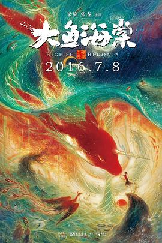
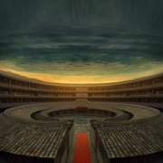
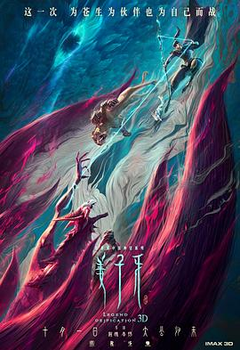
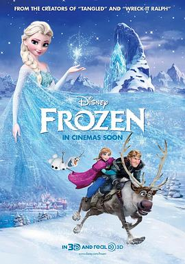

# 大鱼海棠 (豆瓣)

**链接地址:** https://www.douban.com/doubanapp/dispatch?uri=/subject/5045678/interest/1063081658
**作者:** 
**获取时间:** 2025/8/28 22:43:22
**图片数量:** 59

---

## 原始HTML内容

  
    

    
    

    <link href="//img3.doubanio.com/dae/accounts/resources/ba98e9b/shire/bundle.css" rel="stylesheet" type="text/css">

  

    

  <a href="https://accounts.douban.com/passport/login?source=movie" class="nav-login" rel="nofollow">登录/注册</a>

    

  <a href="https://www.douban.com/doubanapp/app?channel=top-nav" class="lnk-doubanapp">下载豆瓣客户端</a>
  

    <a href="https://www.douban.com/doubanapp/app?channel=qipao" class="tip-link">豆瓣 6.0 全新发布</a>
    <a href="javascript: void 0;" class="tip-close">×</a>
  

  

    
豆瓣

    
扫码直接下载

    

      <a href="https://www.douban.com/doubanapp/redirect?channel=top-nav&amp;direct_dl=1&amp;download=iOS">iPhone</a>
      ·
      <a href="https://www.douban.com/doubanapp/redirect?channel=top-nav&amp;direct_dl=1&amp;download=Android" class="download-android">Android</a>
    

  

    

  <ul>
    <li class="">
      <a href="https://www.douban.com" target="_blank" data-moreurl-dict="{&quot;from&quot;:&quot;top-nav-click-main&quot;,&quot;uid&quot;:&quot;0&quot;}">豆瓣</a>
    </li>
    <li class="">
      <a href="https://book.douban.com" target="_blank" data-moreurl-dict="{&quot;from&quot;:&quot;top-nav-click-book&quot;,&quot;uid&quot;:&quot;0&quot;}">读书</a>
    </li>
    <li class="on">
      <a href="https://movie.douban.com" data-moreurl-dict="{&quot;from&quot;:&quot;top-nav-click-movie&quot;,&quot;uid&quot;:&quot;0&quot;}">电影</a>
    </li>
    <li class="">
      <a href="https://music.douban.com" target="_blank" data-moreurl-dict="{&quot;from&quot;:&quot;top-nav-click-music&quot;,&quot;uid&quot;:&quot;0&quot;}">音乐</a>
    </li>
    <li class="">
      <a href="https://www.douban.com/podcast/" target="_blank" data-moreurl-dict="{&quot;from&quot;:&quot;top-nav-click-podcast&quot;,&quot;uid&quot;:&quot;0&quot;}">播客</a>
    </li>
    <li class="">
      <a href="https://www.douban.com/location" target="_blank" data-moreurl-dict="{&quot;from&quot;:&quot;top-nav-click-location&quot;,&quot;uid&quot;:&quot;0&quot;}">同城</a>
    </li>
    <li class="">
      <a href="https://www.douban.com/group" target="_blank" data-moreurl-dict="{&quot;from&quot;:&quot;top-nav-click-group&quot;,&quot;uid&quot;:&quot;0&quot;}">小组</a>
    </li>
    <li class="">
      <a href="https://read.douban.com/?dcs=top-nav&amp;dcm=douban" target="_blank" data-moreurl-dict="{&quot;from&quot;:&quot;top-nav-click-read&quot;,&quot;uid&quot;:&quot;0&quot;}">阅读</a>
    </li>
    <li class="">
      <a href="https://fm.douban.com/?from_=shire_top_nav" target="_blank" data-moreurl-dict="{&quot;from&quot;:&quot;top-nav-click-fm&quot;,&quot;uid&quot;:&quot;0&quot;}">FM</a>
    </li>
    <li class="">
      <a href="https://time.douban.com/?dt_time_source=douban-web_top_nav" target="_blank" data-moreurl-dict="{&quot;from&quot;:&quot;top-nav-click-time&quot;,&quot;uid&quot;:&quot;0&quot;}">时间</a>
    </li>
    <li class="">
      <a href="https://market.douban.com/?utm_campaign=douban_top_nav&amp;utm_source=douban&amp;utm_medium=pc_web" target="_blank" data-moreurl-dict="{&quot;from&quot;:&quot;top-nav-click-market&quot;,&quot;uid&quot;:&quot;0&quot;}">豆品</a>
    </li>
  </ul>

  

    

    

    <link href="//img3.doubanio.com/dae/accounts/resources/ba98e9b/movie/bundle.css" rel="stylesheet" type="text/css">

  

  

    

      <a href="https://movie.douban.com">豆瓣电影</a>
    

    

      <form action="https://search.douban.com/movie/subject_search" method="get">
        <fieldset>
          <legend>搜索：</legend>
          <label for="inp-query">
          </label>
          
<input id="inp-query" name="search_text" size="22" maxlength="60" placeholder="搜索电影、电视剧、综艺、影人" value="">

          
<input type="submit" value="搜索">

          <input type="hidden" name="cat" value="1002">
        </fieldset>
      </form>
    

  

  

  

    

  <ul>
    <li><a href="https://movie.douban.com/cinema/nowplaying/">影讯&amp;购票</a>
    </li>
    <li><a href="https://movie.douban.com/explore">选电影</a>
    </li>
    <li><a href="https://movie.douban.com/tv/">选剧集</a>
    </li>
    <li><a href="https://movie.douban.com/chart">排行榜</a>
    </li>
    <li><a href="https://movie.douban.com/review/best/">影评</a>
    </li>
    <li><a href="https://movie.douban.com/annual/2024/?fullscreen=1&amp;dt_from=movie_navigation">2024年度榜单</a>
    </li>
    <li><a href="https://c9.douban.com/app/standbyme-2024/?autorotate=false&amp;fullscreen=true&amp;hidenav=true&amp;monitor_screenshot=true&amp;df_from=web_navigation" target="_blank">2024年度报告</a>
    </li>
  </ul>

    
  

    

    
    

        

        
    

        
        
            <!-- rank label begin -->
            <link rel="stylesheet" href="https://img1.doubanio.com/cuphead/movie-static/subject/rank_label.dda40.css">
            

                
                  No.17
                
              
                <a href="https://m.douban.com/subject_collection/ECFMOYMKA" target="_blank">华语动画片榜</a>
              
            

            <!-- rank label end -->

    <h1>
        大鱼海棠
            (2016)
    </h1>

        

            

            
            

                
    

        

            

                
                

    

                

        导演: <a href="https://www.douban.com/personage/27554229/" rel="v:directedBy">梁旋</a> / <a href="https://www.douban.com/personage/27554230/" rel="v:directedBy">张春</a> 
        编剧: <a href="https://www.douban.com/personage/27554229/">梁旋</a> 
        主演: <a href="https://www.douban.com/personage/27482981/" rel="v:starring">季冠霖</a> / <a href="https://www.douban.com/personage/27574915/" rel="v:starring">苏尚卿</a> / <a href="https://www.douban.com/personage/27549169/" rel="v:starring">许魏洲</a> / <a href="https://www.douban.com/personage/27492252/" rel="v:starring">金士杰</a> / <a href="https://www.douban.com/personage/27576400/" rel="v:starring">杨婷</a> / <a href="https://www.douban.com/personage/27576401/" rel="v:starring">潘淑兰</a> / <a href="https://www.douban.com/personage/27576402/" rel="v:starring">九儿</a> / <a href="https://www.douban.com/personage/27495035/" rel="v:starring">王德顺</a> / <a href="https://www.douban.com/personage/27576405/" rel="v:starring">张媛媛</a> / <a href="https://www.douban.com/personage/27576404/" rel="v:starring">薛立方</a> / <a href="https://www.douban.com/personage/27482982/" rel="v:starring">姜广涛</a> / <a href="https://www.douban.com/personage/27551500/" rel="v:starring">张杰</a> / <a href="https://www.douban.com/personage/27576403/" rel="v:starring">马正阳</a> / <a href="https://www.douban.com/personage/27484577/" rel="v:starring">宝木中阳</a> / <a href="https://www.douban.com/personage/27568875/" rel="v:starring">刘校妤</a> 
        类型: 剧情 / 动画 / 奇幻 
        官方网站: <a href="http://www.xxbt.com" rel="nofollow" target="_blank">www.xxbt.com</a> 
        制片国家/地区: 中国大陆 
        语言: 汉语普通话 
        上映日期: 2016-07-08(中国大陆) 
        片长: 105分钟 
        又名: 大海 / 大·海 / 大鱼·海棠 / Da Hai / Big Fish &amp; Begonia / Big Fish &amp; Chinese Flowering Crabapple 
        IMDb: tt1920885 

            

            
                

<link rel="stylesheet" href="https://img3.doubanio.com/cuphead/movie-static/download-output-image/index.7aaa3.css">

    

        

            

                豆瓣评分
            

          

            
            <a class="download-output-image" href="#">引用</a>
          

        

        

    <strong class="ll rating_num" property="v:average">7.0</strong>
    
    

        

        

                <a href="comments" class="rating_people">
                    617872人评价
                </a>
        

    

    
        

        
        
            5星
        
        

        18.1%
         
        

        

        
        
            4星
        
        

        32.3%
         
        

        

        
        
            3星
        
        

        35.4%
         
        

        

        
        
            2星
        
        

        10.2%
         
        

        

        
        
            1星
        
        

        4.0%
         
        

    

        

            好于 <a href="/typerank?type_name=剧情&amp;type=11&amp;interval_id=85:75&amp;action=">80% 剧情片</a> 
            好于 <a href="/typerank?type_name=动画&amp;type=25&amp;interval_id=80:70&amp;action=">75% 动画片</a> 
        

            
        

        
            

        
            <a href="https://www.douban.com/reason=collectwish&amp;ck=" rel="nofollow" class="j a_show_login colbutt ll" name="pbtn-5045678-wish">
                想看
            </a>
            <a href="https://www.douban.com/reason=collectcollect&amp;ck=" rel="nofollow" class="j a_show_login colbutt ll" name="pbtn-5045678-collect">
                看过
            </a>
        

            
    
    评价:
     

            
            
            
            
            
    
    <input id="n_rating" type="hidden" value="">
    

        

        

    <ul class="ul_subject_menu bicelink color_gray pt6 clearfix">
        
    
        
                
                  <li> 
    &nbsp;
        <a onclick="moreurl(this, {from:'mv_sbj_wr_cmnt_login'})" class="j a_show_login" href="https://www.douban.com/register?reason=review" rel="nofollow">写短评</a>
 </li>
                  <li> 
    
    &nbsp;
        <a onclick="moreurl(this, {from:'mv_sbj_wr_rv_login'})" class="j a_show_login" href="https://www.douban.com/register?reason=review" rel="nofollow">写影评</a>
 </li>
                    <li> 
   

   
    
    
    <a href="#" data-type="电影" data-url="https://movie.douban.com/subject/5045678/" data-desc="电影《大鱼海棠》 (来自豆瓣) " data-title="电影《大鱼海棠》 (来自豆瓣) " data-pic="https://img9.doubanio.com/view/photo/s_ratio_poster/public/p2361744534.jpeg" class="bn-sharing ">
        分享到
    </a> &nbsp;&nbsp;
    
    <link rel="stylesheet" href="https://img1.doubanio.com/f/vendors/e8a7261937da62636d22ca4c579efc4a4d759b1b/css/ui/dialog.css">
    
    
    

  </li>
            

    </ul>

    

        
            

<link rel="stylesheet" href="https://img3.doubanio.com/cuphead/movie-static/mod/share.ee737.css" type="text/css">

    

        
        <a href="/accounts/register?reason=recommend" class="j a_show_login lnk-sharing" share-id="5045678" data-mode="plain" data-name="大鱼海棠‎ (2016)" data-type="movie" data-desc="导演 梁旋 主演 季冠霖 / 苏尚卿 / 中国大陆 / 7.0分(617872评价)" data-href="https://movie.douban.com/subject/5045678/" data-image="https://img9.doubanio.com/view/photo/s_ratio_poster/public/p2361744534.jpg" data-properties="{}" data-redir="" data-text="" data-apikey="" data-curl="" data-count="10" data-object_kind="1002" data-object_id="5045678" data-target_type="rec" data-target_action="0" data-action_props="{&quot;subject_url&quot;:&quot;https:\/\/movie.douban.com\/subject\/5045678\/&quot;,&quot;subject_title&quot;:&quot;大鱼海棠‎ (2016)&quot;}">推荐</a>

        
    

        

    

    

    

    
    
        
            
            
    <h2>
        <i>大鱼海棠的剧情简介</i>
              · · · · · ·
    </h2>

            

                    
                        
                                　　所有活着的人类，都是海里一条巨大的鱼；出生的时候他们从海的此岸出发。他们的生命就像横越大海，有时相遇，有时分开……死的时候，他们便到了岸，各去各的世界。
                                     
                                　　四十五亿年前，这个星球上，只有一片汪洋大海，和一群古老的大鱼。在与人类世界平行的空间里，生活着一个规规矩矩、遵守秩序的族群，他们为神工作，掌管世界万物运行规律，也掌管人类的灵魂。他们的天空与人类世界的大海相连。他们既不是神，也不是人，他们是“其他人”。
                                     
                                　　十六岁生日那天，居住在“神之围楼”里的一个名叫椿（季冠霖 配音）的女孩变作一条海豚到人间巡礼，被大海中的一张网困住，一个人类男孩因为救她而落入深海死去。为了报恩，为了让人类男孩复活，她需要在自己的世界里，历经种种困难与阻碍，帮助死后男孩的灵魂——一条拇指那么大的小鱼，成长为一条比鲸更巨大的鱼并回归大海。
                        
                        <a href="https://movie.douban.com/help/movie#t0-qs">©豆瓣</a>
            

    

    

<link rel="stylesheet" href="https://img3.doubanio.com/cuphead/movie-static/celebrity/celebrities_section.610da.css">

  
    <h2>
        <i>大鱼海棠的演职员</i>
              · · · · · ·
            
            (
                <a href="/subject/5045678/celebrities">全部 38</a>
            )
            
    </h2>

  <ul class="celebrities-list from-subject __oneline">
        
    
  
  <li class="celebrity">
    

  <a href="https://www.douban.com/personage/27554229/" title="梁旋 Xuan Liang" class="">
      

    

  </a>

    

      <a href="https://www.douban.com/personage/27554229/" title="梁旋 Xuan Liang" class="name">梁旋</a>

      导演

    

  </li>

        
    
  
  <li class="celebrity">
    

  <a href="https://www.douban.com/personage/27554230/" title="张春 Chun Zhang" class="">
      

    

  </a>

    

      <a href="https://www.douban.com/personage/27554230/" title="张春 Chun Zhang" class="name">张春</a>

      导演

    

  </li>

        
    
  
  <li class="celebrity">
    

  <a href="https://www.douban.com/personage/27482981/" title="季冠霖 Guanlin Ji" class="">
      

    

  </a>

    

      <a href="https://www.douban.com/personage/27482981/" title="季冠霖 Guanlin Ji" class="name">季冠霖</a>

      配 椿

    

  </li>

        
    
  
  <li class="celebrity">
    

  <a href="https://www.douban.com/personage/27574915/" title="苏尚卿 Shangqing Su" class="">
      

    

  </a>

    

      <a href="https://www.douban.com/personage/27574915/" title="苏尚卿 Shangqing Su" class="name">苏尚卿</a>

      配 湫

    

  </li>

        
    
  
  <li class="celebrity">
    

  <a href="https://www.douban.com/personage/27549169/" title="许魏洲 Weizhou Xu" class="">
      

    

  </a>

    

      <a href="https://www.douban.com/personage/27549169/" title="许魏洲 Weizhou Xu" class="name">许魏洲</a>

      配 鲲

    

  </li>

        
    
  
  <li class="celebrity">
    

  <a href="https://www.douban.com/personage/27492252/" title="金士杰 Shih-Chieh King" class="">
      

    

  </a>

    

      <a href="https://www.douban.com/personage/27492252/" title="金士杰 Shih-Chieh King" class="name">金士杰</a>

      配 灵婆

    

  </li>

  </ul>

    

<link rel="stylesheet" href="https://img1.doubanio.com/f/verify/a5bc0bc0aea4221d751bc4809fd4b0a1075ad25e/entry_creator/dist/author_subject/style.css">

    

    
        

<link rel="stylesheet" href="https://img1.doubanio.com/cuphead/movie-static/subject/photos_section.45abd.css">

    
    

        
    
    
    <h2>
        <i>大鱼海棠的视频和图片</i>
              · · · · · ·
            
            (
                <a href="https://movie.douban.com/subject/5045678/trailer#trailer">预告片8</a>&nbsp;|&nbsp;<a href="https://movie.douban.com/subject/5045678/all_photos">图片1017</a>&nbsp;·&nbsp;<a href="https://movie.douban.com/subject/5045678/mupload">添加</a>
            )
            
    </h2>

        <ul class="related-pic-bd  ">
                <li class="label-trailer">
                    <a class="related-pic-video" href="https://movie.douban.com/trailer/199215/#content" title="预告片" style="background-image:url(https://img1.doubanio.com/img/trailer/medium/2364371518.jpg)">
                        
预告片

                    </a>
                </li>
                <li>
                    
                </li>
                <li>
                    
                </li>
                <li>
                    
                </li>
                <li>
                    
                </li>
        </ul>
    

    

    

    

        
    <h2>
        <i>大鱼海棠的获奖情况</i>
              · · · · · ·
            
            (
                <a href="https://movie.douban.com/subject/5045678/awards/">全部</a>
            )
            
    </h2>

    

        
        <ul class="award">
            <li>
                <a href="https://movie.douban.com/awards/goldenhorse/53/">第53届台北金马影展</a>
            </li>
            <li>金马奖 最佳原创歌曲(提名)</li>
            <li></li>
        </ul>
        
        <ul class="award">
            <li>
                <a href="https://movie.douban.com/awards/golden-rooster/31/">第31届中国电影金鸡奖</a>
            </li>
            <li>最佳美术片(提名)</li>
            <li></li>
        </ul>
        
        <ul class="award">
            <li>
                <a href="https://movie.douban.com/awards/huabiao/17/">第17届中国电影华表奖</a>
            </li>
            <li>优秀故事片奖</li>
            <li></li>
        </ul>

    
        

<link rel="stylesheet" href="https://img3.doubanio.com/cuphead/movie-static/subject/recommendations.61283.css">

        

    

        
        
    <h2>
        <i>喜欢这部电影的人也喜欢</i>
              · · · · · ·
    </h2>

        
    
    

        <dl>
            <dt>
                
            </dt>
            <dd>
                <a href="https://movie.douban.com/subject/1291583/?from=subject-page">天空之城</a>
                9.2
            </dd>
        </dl>
        <dl>
            <dt>
                
            </dt>
            <dd>
                <a href="https://movie.douban.com/subject/25907124/?from=subject-page">姜子牙</a>
                6.6
            </dd>
        </dl>
        <dl>
            <dt>
                
            </dt>
            <dd>
                <a href="https://movie.douban.com/subject/1308807/?from=subject-page">哈尔的移动城堡</a>
                9.1
            </dd>
        </dl>
        <dl>
            <dt>
                
            </dt>
            <dd>
                <a href="https://movie.douban.com/subject/30331149/?from=subject-page">白蛇：缘起</a>
                7.8
            </dd>
        </dl>
        <dl>
            <dt>
                
            </dt>
            <dd>
                <a href="https://movie.douban.com/subject/4202982/?from=subject-page">冰雪奇缘</a>
                8.5
            </dd>
        </dl>
        <dl>
            <dt>
                
            </dt>
            <dd>
                <a href="https://movie.douban.com/subject/26683290/?from=subject-page">你的名字。</a>
                8.5
            </dd>
        </dl>
        <dl>
            <dt>
                
            </dt>
            <dd>
                <a href="https://movie.douban.com/subject/26277313/?from=subject-page">西游记之大圣归来</a>
                8.3
            </dd>
        </dl>
        <dl>
            <dt>
                
            </dt>
            <dd>
                <a href="https://movie.douban.com/subject/1959877/?from=subject-page">崖上的波妞</a>
                8.6
            </dd>
        </dl>
        <dl>
            <dt>
                
            </dt>
            <dd>
                <a href="https://movie.douban.com/subject/25900945/?from=subject-page">美女与野兽</a>
                7.1
            </dd>
        </dl>
        <dl>
            <dt>
                
            </dt>
            <dd>
                <a href="https://movie.douban.com/subject/1291561/?from=subject-page">千与千寻</a>
                9.4
            </dd>
        </dl>
    

    

    

    
        

    
    <link rel="stylesheet" href="https://img1.doubanio.com/f/vendors/d63a579a99fd372b4398731a279a1382e6eac71e/subject-comments/comments-section.css">

    

        

            
            
        <a class="comment_btn j a_show_login" href="https://www.douban.com/register?reason=review" rel="nofollow">
            我要写短评
        </a>

            
    <h2>
        <i>大鱼海棠的短评</i>
              · · · · · ·
            
            (
                <a href="https://movie.douban.com/subject/5045678/comments?status=P">全部 216114 条</a>
            )
            
    </h2>

        

        

        

                
        

                        <a id="hot-comments-tab" href="comments" data-id="hot" class="on">热门</a>&nbsp;/&nbsp;
                        <a id="new-comments-tab" href="comments?sort=time" data-id="new" class="j a_show_login">最新</a>&nbsp;/&nbsp;
                        <a id="following-comments-tab" href="comments?sort=follows" data-id="following" class="j a_show_login">好友</a>
        

    

        

            
    

        
        

            
    
    

        <h3>
            
                    7155

                    <input value="1059708782" type="hidden">
                    <a href="javascript:;" data-id="1059708782" class="j a_show_login" onclick="">有用</a>

                <!-- 删除短评 -->
            
            
                <a href="https://www.douban.com/people/yellyelp/">/name-?P=0/</a>
                    看过
                    
                
                    2016-07-08 17:06:58
                
                
            
        </h3>
        

            
                请告诉你的孩子 海豚和鲸鱼不是鱼 是哺乳动物
        

        

    

    

        

        
        

            
    
    

        <h3>
            
                    1834

                    <input value="1058649802" type="hidden">
                    <a href="javascript:;" data-id="1058649802" class="j a_show_login" onclick="">有用</a>

                <!-- 删除短评 -->
            
            
                <a href="https://www.douban.com/people/snoopyyer/">枫林挽秋</a>
                    看过
                    
                
                    2016-07-05 12:21:32
                
                
            
        </h3>
        

            
                如诗如画的生命礼赞。人生就是一场旅行，有从此岸穿越而出的诞生，也有到达彼岸后依依不舍的挥泪告别。要相信，生命是个奇迹。4.5。
        

        

    

    

        

        
        

            
    
    

        <h3>
            
                    8287

                    <input value="1059745887" type="hidden">
                    <a href="javascript:;" data-id="1059745887" class="j a_show_login" onclick="">有用</a>

                <!-- 删除短评 -->
            
            
                <a href="https://www.douban.com/people/qijiuzhiyue/">桃桃林林</a>
                    看过
                    
                
                    2016-07-08 19:04:29
                
                
            
        </h3>
        

            
                设定野心很大，而实际讲的故事却很小，很无趣，有种这么大设定完全被浪费掉的感觉。吉田洁的音乐确实不错，片子本身还不如当初的短片惊艳。感觉还是太仓促了，剧本要能好好打磨下，与背景结合好、更厚重些，可能会更好。
        

        

    

    

        

        
        

            
    
    

        <h3>
            
                    931

                    <input value="1059627731" type="hidden">
                    <a href="javascript:;" data-id="1059627731" class="j a_show_login" onclick="">有用</a>

                <!-- 删除短评 -->
            
            
                <a href="https://www.douban.com/people/139235085/">秋亭雨客</a>
                    看过
                    
                
                    2016-07-08 13:07:54
                
                
            
        </h3>
        

            
                在中国电影人普遍不会讲故事的今天，《大鱼·海棠》做得已经够好了。虽然故事缺乏一些张力，但至少，让我们明白，中国的动画也可以做得很精致。
        

        

    

    

        

        
        

            
    
    

        <h3>
            
                    3158

                    <input value="1059667078" type="hidden">
                    <a href="javascript:;" data-id="1059667078" class="j a_show_login" onclick="">有用</a>

                <!-- 删除短评 -->
            
            
                <a href="https://www.douban.com/people/zhangzongqian/">亵渎电影</a>
                    看过
                    
                
                    2016-07-08 15:07:42
                
                
            
        </h3>
        

            
                美术还不错，不过已经中国风夸张成日本风，就像宫崎骏他家儿子宫崎吾朗拍了一部狗血的绿茶婊玛丽苏韩国偶像剧。世界观不错，故事的逻辑不够严谨，叙事上那股劲儿上不去，就只能靠配乐加煽情撑一撑，最出彩的反而是备胎男，而大鱼鲲没有性格，这个人设瞬间崩了。不过国产动画做成这样，很不错了。
        

        

    

    

        

                
                    &gt; <a href="comments?sort=new_score&amp;status=P">
                        更多短评
                            216114条
                    </a>
        

        

            

            

            

                <a class="qa" href="/help/opinion#t2-q0" target="_blank">为什么被折叠？</a>
                <a class="btn-unfold" href="#">有一些短评被折叠了</a>
                

                    评论被折叠，是因为发布这条评论的账号行为异常。评论仍可以被展开阅读，对发布人的账号不造成其他影响。如果认为有问题，可以<a href="https://help.douban.com/help/ask?category=movie">联系</a>豆瓣电影。
                

            

            

            

            
        

        

            
    

        

            你关注的人还没写过短评
        

        

    

    

            
            
        

    

<!--        此处是挂载其他页面，不是注释！不是注释！不是注释！-->
        

<link rel="stylesheet" href="https://img1.doubanio.com/misc/mixed_static/292deb5ae8f760a3.css">

    <section id="reviews-wrapper" class="reviews mod movie-content">
        <header>
            
                <a href="new_review" rel="nofollow" class="create-review comment_btn " data-isverify="False" data-verify-url="https://www.douban.com/accounts/phone/verify?redir=https://movie.douban.com/subject/5045678/new_review">
                    我要写影评
                </a>
            <h2>
                    大鱼海棠的影评 · · · · · ·

                    ( <a href="reviews">全部 9593 条</a> )
            </h2>
        </header>

            
            

                                <a href="javascript:;;" class="cur" data-sort="">热门</a>
            

            

            

        
    

            
    
    

        

            
    
    <header class="main-hd">
        

        <a href="https://www.douban.com/people/kejinlong/" class="name">有心打扰</a>
            

        2016-07-08 05:48:18

    </header>

            

                <h2><a href="https://movie.douban.com/review/7968811/">看完电影，我哭得不成人样，太感人了！</a></h2>

                

                    

                        在影院看完《大鱼海棠》，被感动哭得不成人样，还是朋友把我扶出了影厅。出来后，还是止不住泪水，实在被影片中的爱情深深打动。这应该是我至今看过的最伟大的爱情。以下简单阐述一下我对《大鱼海棠》里爱情的理解： 1.爱一个人，就是愿意为了他与天下人为敌，哪怕是全村的人都...

                        &nbsp;(<a href="javascript:;" id="toggle-7968811-copy" class="unfold" title="展开">展开</a>)
                    

                

                

                    

                

                

                    <a href="javascript:;" class="action-btn up" data-rid="7968811" title="有用">
                        
                        
                                19102
                        
                    </a>
                    <a href="javascript:;" class="action-btn down" data-rid="7968811" title="没用">
                        
                        
                                6042
                        
                    </a>
                    <a href="https://movie.douban.com/review/7968811/#comments" class="reply ">3356回应</a>

                    <a href="javascript:;;" class="fold hidden">收起</a>
                

            

        

    

            
    
    

        

            
    
    <header class="main-hd">
        

        <a href="https://www.douban.com/people/cinestar/" class="name">天马星</a>
            

        2016-07-07 23:27:19

    </header>

            

                <h2><a href="https://movie.douban.com/review/7968519/">这TM就尴尬了</a></h2>

                

                    

                        其实《大鱼·海棠》是部挺尴尬的电影！ 你说不好吧，就会有一群人过来对你说：你懂什么？你看看满满的中国风，那满满的想象力，那宏大的世界观？中国有哪部动画能做到如此水准？你知道等了十二年就是为了它？满满的感动知道不？你懂什么是中国文化吗？不懂就多读书，OK？你有没...

                        &nbsp;(<a href="javascript:;" id="toggle-7968519-copy" class="unfold" title="展开">展开</a>)
                    

                

                

                    

                

                

                    <a href="javascript:;" class="action-btn up" data-rid="7968519" title="有用">
                        
                        
                                7150
                        
                    </a>
                    <a href="javascript:;" class="action-btn down" data-rid="7968519" title="没用">
                        
                        
                                1341
                        
                    </a>
                    <a href="https://movie.douban.com/review/7968519/#comments" class="reply ">1083回应</a>

                    <a href="javascript:;;" class="fold hidden">收起</a>
                

            

        

    

            
    
    

        

            
    
    <header class="main-hd">
        

        <a href="https://www.douban.com/people/yoyoever/" class="name">ashly</a>
            

        2016-07-08 14:54:50

    </header>

            

                <h2><a href="https://movie.douban.com/review/7969498/">呈现，就是一种价值</a></h2>

                

                    

                            
这篇影评可能有剧透

                        大鱼经过前期各种口水骂战，喷子与粉丝的角逐终于如期上映。作为一个12年前就对大鱼海棠FLASH十分钟爱的观影者想说说从影片背后想到的文化问题。 这部片子是少有的有非常浓重的文化烙印的国漫电影，也是一个全新类型的探索。它的画面，音乐，配音都毫无诟病之处，人设，世界观...

                        &nbsp;(<a href="javascript:;" id="toggle-7969498-copy" class="unfold" title="展开">展开</a>)
                    

                

                

                    

                

                

                    <a href="javascript:;" class="action-btn up" data-rid="7969498" title="有用">
                        
                        
                                4935
                        
                    </a>
                    <a href="javascript:;" class="action-btn down" data-rid="7969498" title="没用">
                        
                        
                                1135
                        
                    </a>
                    <a href="https://movie.douban.com/review/7969498/#comments" class="reply ">1558回应</a>

                    <a href="javascript:;;" class="fold hidden">收起</a>
                

            

        

    

            
    
    

        

            
    
    <header class="main-hd">
        

        <a href="https://www.douban.com/people/57436180/" class="name">小抹茶蛙蛙</a>
            

        2016-07-08 02:20:41

    </header>

            

                <h2><a href="https://movie.douban.com/review/7968722/">我影评完全被刷的看不见了</a></h2>

                

                    

                            
这篇影评可能有剧透

                        开始我就觉得这电影搞3d就挺坑，但是我忍了 成年礼变成鱼在海里转7天我忍了 为了救人你交换灵魂我忍了 男二喜爱女主我还是忍了，因为这种青春少男少女的行为我可以理解为喜爱吧 有些话说的还是蛮有道理的，做错的事情是不能弥补的，不是你想就可以，毕竟她跟灵婆交换时零婆已经...

                        &nbsp;(<a href="javascript:;" id="toggle-7968722-copy" class="unfold" title="展开">展开</a>)
                    

                

                

                    

                

                

                    <a href="javascript:;" class="action-btn up" data-rid="7968722" title="有用">
                        
                        
                                2011
                        
                    </a>
                    <a href="javascript:;" class="action-btn down" data-rid="7968722" title="没用">
                        
                        
                                436
                        
                    </a>
                    <a href="https://movie.douban.com/review/7968722/#comments" class="reply ">442回应</a>

                    <a href="javascript:;;" class="fold hidden">收起</a>
                

            

        

    

            
    
    

        

            
    
    <header class="main-hd">
        

        <a href="https://www.douban.com/people/EmeraldKinoko/" class="name">风蚀蘑菇</a>
            

        2016-07-09 08:54:56

    </header>

            

                <h2><a href="https://movie.douban.com/review/7972349/">12年打磨出巧克力味的屎，终究还是屎</a></h2>

                

                    

                            
这篇影评可能有剧透

                        图文完整版请戳这里，欢迎关注我的微信公共号。 我想了很久，仍然没想到该怎么写这篇评论的开头。对于《大鱼海棠》，不是没有过情怀，不是没有过期待。12年的时光，套用五月天的歌词来说，“期待都退化成等待。”即使后来看到种种爆料对这个片子已经很不乐观，今天上映第一天仍...

                        &nbsp;(<a href="javascript:;" id="toggle-7972349-copy" class="unfold" title="展开">展开</a>)
                    

                

                

                    

                

                

                    <a href="javascript:;" class="action-btn up" data-rid="7972349" title="有用">
                        
                        
                                1624
                        
                    </a>
                    <a href="javascript:;" class="action-btn down" data-rid="7972349" title="没用">
                        
                        
                                190
                        
                    </a>
                    <a href="https://movie.douban.com/review/7972349/#comments" class="reply ">223回应</a>

                    <a href="javascript:;;" class="fold hidden">收起</a>
                

            

        

    

            
    
    

        

            
    
    <header class="main-hd">
        

        <a href="https://www.douban.com/people/1474963/" class="name">夜深风竹</a>
            

        2016-07-11 11:04:44

    </header>

            

                <h2><a href="https://movie.douban.com/review/7981391/">大洪水并不是椿和鲲引起的，湫才是灾难的来源</a></h2>

                

                    

                            
这篇影评可能有剧透

                                昨天去影院看了这部热门动画，一直觉得有点怪，有理解不通的地方。回来看着网上那么多吐槽女主玛丽苏为爱害死全族之类的影评，我都没有什么共鸣，晚上再想了想，发现是因为我对剧情的理解始终和大家有点不一样。          之所以不觉得女主玛丽苏，是因为看片时隐隐觉...

                        &nbsp;(<a href="javascript:;" id="toggle-7981391-copy" class="unfold" title="展开">展开</a>)
                    

                

                

                    

                

                

                    <a href="javascript:;" class="action-btn up" data-rid="7981391" title="有用">
                        
                        
                                1827
                        
                    </a>
                    <a href="javascript:;" class="action-btn down" data-rid="7981391" title="没用">
                        
                        
                                185
                        
                    </a>
                    <a href="https://movie.douban.com/review/7981391/#comments" class="reply ">257回应</a>

                    <a href="javascript:;;" class="fold hidden">收起</a>
                

            

        

    

            
    
    

        

            
    
    <header class="main-hd">
        

        <a href="https://www.douban.com/people/cat_rs/" class="name">团团</a>
            

        2016-07-08 23:06:54

            <a class="rel-topic" target="_blank" href="//www.douban.com/gallery/topic/《大鱼海棠》有哪些方面值得关注？">#《大鱼海棠》有哪些方面值得关注？</a>

    </header>

            

                <h2><a href="https://movie.douban.com/review/7971246/">说说那些有身份有背景的人设……</a></h2>

                

                    

                        【在一片骂声中，我要为人设打五星，本篇只涉及人设暂不言他。。。。】 【虽然动画一开始，说他们世界的不是神，但是实际上，他们不是神，就是仙，或者是神兽。。。都是些有显赫的背景的……】 【注：本文中山海经的图片多截图自 浙江古籍出版社的《山海经》】 “北冥有鱼，其...

                        &nbsp;(<a href="javascript:;" id="toggle-7971246-copy" class="unfold" title="展开">展开</a>)
                    

                

                

                    

                

                

                    <a href="javascript:;" class="action-btn up" data-rid="7971246" title="有用">
                        
                        
                                1249
                        
                    </a>
                    <a href="javascript:;" class="action-btn down" data-rid="7971246" title="没用">
                        
                        
                                78
                        
                    </a>
                    <a href="https://movie.douban.com/review/7971246/#comments" class="reply ">180回应</a>

                    <a href="javascript:;;" class="fold hidden">收起</a>
                

            

        

    

            
    
    

        

            
    
    <header class="main-hd">
        

        <a href="https://www.douban.com/people/136932498/" class="name">青鬼院落影</a>
            

        2016-05-21 13:38:49

    </header>

            

                <h2><a href="https://movie.douban.com/review/7904416/">回击大鱼海棠抄袭的证据（大部分为转载）</a></h2>

                

                    

                        大鱼海棠的世界设定是每个人都具有神性，比如男主化生的大鱼可以操纵风，比如MV里那个可以将水染成彩霞颜色的人 男主应该已经死了，在死后的世界化为小鱼被女主收养最后一点点长大，主创原话：女主服饰是客家民族服装 不是汉服 不存在左衽一说。左衽是逝者所穿这个观点是很狭隘...

                        &nbsp;(<a href="javascript:;" id="toggle-7904416-copy" class="unfold" title="展开">展开</a>)
                    

                

                

                    

                

                

                    <a href="javascript:;" class="action-btn up" data-rid="7904416" title="有用">
                        
                        
                                2579
                        
                    </a>
                    <a href="javascript:;" class="action-btn down" data-rid="7904416" title="没用">
                        
                        
                                762
                        
                    </a>
                    <a href="https://movie.douban.com/review/7904416/#comments" class="reply ">564回应</a>

                    <a href="javascript:;;" class="fold hidden">收起</a>
                

            

        

    

            
    
    

        

            
    
    <header class="main-hd">
        

        <a href="https://www.douban.com/people/iserlohnwind/" class="name">伊谢尔伦的风</a>
            

        2016-07-09 14:19:25

    </header>

            

                <h2><a href="https://movie.douban.com/review/7973156/">不要跟绘本作者约中长篇小说</a></h2>

                

                    

                        好吧，谨慎地说，又能画故事简单的抒情绘本又能写出符合大众常规审美和道德需求的长篇故事的作者肯定是存在的。只是比较少。一般来说就是这片这样尴尬的情况了。  平心而论音乐和画面都还是不错的，当然音乐是日本人写的动画有外包给韩国这个大家都知道了。不过我觉得国产动画...

                        &nbsp;(<a href="javascript:;" id="toggle-7973156-copy" class="unfold" title="展开">展开</a>)
                    

                

                

                    

                

                

                    <a href="javascript:;" class="action-btn up" data-rid="7973156" title="有用">
                        
                        
                                384
                        
                    </a>
                    <a href="javascript:;" class="action-btn down" data-rid="7973156" title="没用">
                        
                        
                                28
                        
                    </a>
                    <a href="https://movie.douban.com/review/7973156/#comments" class="reply ">76回应</a>

                    <a href="javascript:;;" class="fold hidden">收起</a>
                

            

        

    

            
    
    

        

            
    
    <header class="main-hd">
        

        <a href="https://www.douban.com/people/4372093/" class="name">若埃尔</a>
            

        2016-07-09 00:00:38

    </header>

            

                <h2><a href="https://movie.douban.com/review/7971595/">对《大鱼海棠》剧情和价值观的一些看法</a></h2>

                

                    

                            
这篇影评可能有剧透

                        抛开那些过度宣传、饥饿营销、贩卖情怀等场外因素，为什么许多人能够接受《大圣归来》而无法接受《大鱼海棠》？  《大圣归来》很安全，因为基本上没有什么内涵，大家看电影就是图个热闹，看孙悟空多么帅，打打杀杀嬉笑怒骂90分钟就过去了。  但是看完《大鱼海棠》出来的许多人...

                        &nbsp;(<a href="javascript:;" id="toggle-7971595-copy" class="unfold" title="展开">展开</a>)
                    

                

                

                    

                

                

                    <a href="javascript:;" class="action-btn up" data-rid="7971595" title="有用">
                        
                        
                                1049
                        
                    </a>
                    <a href="javascript:;" class="action-btn down" data-rid="7971595" title="没用">
                        
                        
                                288
                        
                    </a>
                    <a href="https://movie.douban.com/review/7971595/#comments" class="reply ">452回应</a>

                    <a href="javascript:;;" class="fold hidden">收起</a>
                

            

        

    

    

    <!-- COLLECTED JS -->
    <!-- COLLECTED CSS -->

    

    <link rel="stylesheet" href="https://img1.doubanio.com/f/zerkalo/88118a282439e312283e886ea4c3d3e9849a8fa4/css/review/editor/ng/setting_standalone.css">
    
    
    
    
    
    
    

                

                    &gt;
                        <a href="reviews">
                            更多影评
                                9593篇
                        </a>
                

    </section>
<!-- COLLECTED JS -->

     

    
                
    

        

            <a class="comment_btn j a_show_login" href="https://www.douban.com/register?reason=discussion" rel="nofollow">发起新的讨论</a>
        

        

            
    <h2>
        小组讨论
         &nbsp; ·&nbsp; ·&nbsp; ·&nbsp; ·&nbsp; ·&nbsp; ·
    </h2>

        

        
  <table class="olt"><tbody><tr><td></td><td></td><td></td><td></td></tr>
        
        <tr>
          <td class="pl"><a href="https://www.douban.com/group/topic/333578111/?_spm_id=MjE2NDc0OTAz" title="本来说2025上映现在变成2028了">本来说2025上映现在变成2028了</a></td>
          <td class="pl">来自<a href="https://www.douban.com/people/216474903/">Fireacl</a></td>
          <td class="pl"></td>
          <td class="pl">2025-08-10 22:52:34</td>
        </tr>
        
        <tr>
          <td class="pl"><a href="https://www.douban.com/group/topic/326936541/?_spm_id=MTQ5Njg1NDA5" title="设定还不够大胆">设定还不够大胆</a></td>
          <td class="pl">来自<a href="https://www.douban.com/people/149685409/">克兰河</a></td>
          <td class="pl">1 回应</td>
          <td class="pl">2025-07-12 22:13:20</td>
        </tr>
        
        <tr>
          <td class="pl"><a href="https://movie.douban.com/subject/5045678/discussion/613860099/" title="为什么那么多人看不懂大鱼海棠！">为什么那么多人看不懂大鱼海棠！</a></td>
          <td class="pl">来自<a href="https://www.douban.com/people/148420843/">媛烨</a></td>
          <td class="pl">184 回应</td>
          <td class="pl">2025-03-05 16:23:26</td>
        </tr>
        
        <tr>
          <td class="pl"><a href="https://movie.douban.com/subject/5045678/discussion/637420104/" title="站在2023年，观望这部16年的作品，他是烂片吗？">站在2023年，观望这部16年的作品，他是烂片吗？</a></td>
          <td class="pl">来自<a href="https://www.douban.com/people/136837326/">吃月亮的粑粑</a></td>
          <td class="pl">24 回应</td>
          <td class="pl">2025-08-09 15:12:43</td>
        </tr>
        
        <tr>
          <td class="pl"><a href="https://movie.douban.com/subject/5045678/discussion/637535492/" title="椿在人间苦苦思念了湫100年">椿在人间苦苦思念了湫100年</a></td>
          <td class="pl">来自<a href="https://www.douban.com/people/SHOHOKUSHOHOKU/">RUKAWA</a></td>
          <td class="pl"></td>
          <td class="pl">2023-08-22 15:00:22</td>
        </tr>
  </tbody></table>

        
        

            <a href="//www.douban.com/group/751020#topics" rel="nofollow">
                &gt; 去这部电影的小组讨论（全部2条）
            </a>
        

    

        
    
        
                
                    

    

        <h2>
                关于《大鱼海棠》的问题
                · · · · · ·
            
                (<a href="https://movie.douban.com/subject/5045678/questions/?from=subject">
                    全部233个
                </a>)
            
        </h2>

        <!-- 
    
    <a class='j a_show_login comment_btn'
        href='https://movie.douban.com/subject/5045678/questions/ask/?from=subject'>我来提问</a>
 -->
    

    

        <ul>
            <li>
                
                    <a href="https://movie.douban.com/subject/5045678/questions/713905/?from=subject">
                        我就想问问那些刷千与千寻的人看过小倩么？
                    </a>
                
                
                    30人回答
                
            </li>
            <li>
                
                    <a href="https://movie.douban.com/subject/5045678/questions/713894/?from=subject">
                        何为国产动画，动画部分完全由韩国制作也算国产么？？？用情怀和2d来捞钱？
                    </a>
                
                
                    59人回答
                
            </li>
        </ul>

        
&gt;
            <a href="https://movie.douban.com/subject/5045678/questions/?from=subject">
                全部233个问题
            </a>
        

    

            

    

            

            

                

    

        

    
    

    
    <h2>
        在哪儿看这部电影
            &nbsp;·&nbsp;·&nbsp;·&nbsp;·&nbsp;·&nbsp;·
    </h2>

    
    <ul class="bs">
                
                <li>
                        <a class="playBtn" data-cn="腾讯视频" data-impression-track="https://frodo.douban.com/rohirrim/video_tracking/impression?subject_id=5045678&amp;video_type=movie&amp;video_id=292539&amp;source=qq&amp;user_id=&amp;bid=DjNdIzP85mw&amp;platform=pc&amp;location=vendor_subject" data-click-track="https://frodo.douban.com/rohirrim/video_tracking/click?subject_id=5045678&amp;video_type=movie&amp;video_id=292539&amp;source=qq&amp;user_id=&amp;bid=DjNdIzP85mw&amp;platform=pc&amp;location=vendor_subject" data-pic="https://img3.doubanio.com/cuphead/movie-static/pics/video-qq.png" href="https://www.douban.com/link2/?url=https%3A%2F%2Fv.qq.com%2Fx%2Fcover%2Fwe35g3aduiwkudp.html%3Fptag%3Dnewdouban.movie&amp;subtype=1&amp;type=online-video" target="_blank">
                        腾讯视频
                        </a>
                    
                    
                        VIP免费观看
                    
                </li>
                
                <li>
                        <a class="playBtn" data-cn="爱奇艺" data-impression-track="https://frodo.douban.com/rohirrim/video_tracking/impression?subject_id=5045678&amp;video_type=movie&amp;video_id=337762&amp;source=iqiyi&amp;user_id=&amp;bid=DjNdIzP85mw&amp;platform=pc&amp;location=vendor_subject" data-click-track="https://frodo.douban.com/rohirrim/video_tracking/click?subject_id=5045678&amp;video_type=movie&amp;video_id=337762&amp;source=iqiyi&amp;user_id=&amp;bid=DjNdIzP85mw&amp;platform=pc&amp;location=vendor_subject" data-pic="https://img1.doubanio.com/cuphead/movie-static/pics/video-iqiyi-new.png" href="https://www.douban.com/link2/?url=http%3A%2F%2Fwww.iqiyi.com%2Fv_19rrm3u1io.html%3Fvfm%3Dm_331_dbdy%26fv%3D4904d94982104144a1548dd9040df241&amp;subtype=9&amp;type=online-video&amp;link2key=eaf1ac6033" target="_blank">
                        爱奇艺
                        </a>
                    
                    
                        VIP免费观看
                    
                </li>
                
                <li>
                        <a class="playBtn" data-cn="优酷视频" data-impression-track="https://frodo.douban.com/rohirrim/video_tracking/impression?subject_id=5045678&amp;video_type=movie&amp;video_id=837796&amp;source=youku&amp;user_id=&amp;bid=DjNdIzP85mw&amp;platform=pc&amp;location=vendor_subject" data-click-track="https://frodo.douban.com/rohirrim/video_tracking/click?subject_id=5045678&amp;video_type=movie&amp;video_id=837796&amp;source=youku&amp;user_id=&amp;bid=DjNdIzP85mw&amp;platform=pc&amp;location=vendor_subject" data-pic="https://img1.doubanio.com/cuphead/movie-static/pics/video-youku-new.png" href="https://www.douban.com/link2/?url=https%3A%2F%2Fm.youku.com%2Falipay_video%2Fid_a3b10e60bce811e0bf93.html%3Frefer%3Desfhz_operation.xuka.xj_00003036_000000_FNZfau_19010900&amp;subtype=3&amp;type=online-video&amp;link2key=eaf1ac6033" target="_blank">
                        优酷视频
                        </a>
                    
                    
                        VIP免费观看
                    
                </li>

    </ul>

    <!-- douban ad begin -->
    

    <!-- douban ad end -->

    

    

        
    <h2>
        本片原声正在播放
            &nbsp;·&nbsp;·&nbsp;·&nbsp;·&nbsp;·&nbsp;·
    </h2>

        <a target="_blank" href="https://music.douban.com/subject/26817649/">去豆瓣音乐收听</a>

    

    

    

    

    
        

    
    
    <h2>
        <i>以下片单推荐</i>
              · · · · · ·
            
            (
                <a href="https://movie.douban.com/subject/5045678/doulists">全部</a>
            )
            
    </h2>

    
    <ul>
            
                <li>
                    <a href="https://www.douban.com/doulist/328167/" target="_blank">中国也有牛逼动画</a>
                    (饭夫斯基)
                </li>
            
                <li>
                    <a href="https://www.douban.com/doulist/13712178/" target="_blank">评价人数超过十万的电影</a>
                    (依然饭特稀)
                </li>
            
                <li>
                    <a href="https://www.douban.com/doulist/42966583/" target="_blank">豆瓣上评分人数超过5万评分高于7分的电影</a>
                    (Puff)
                </li>
            
                <li>
                    <a href="https://www.douban.com/doulist/1764238/" target="_blank">豆瓣上评价人数超100000的电影</a>
                    (scofieldd)
                </li>
            
                <li>
                    <a href="https://www.douban.com/doulist/30105/" target="_blank">谜语和糖果</a>
                    (怪化)
                </li>
    </ul>

    
        

    
    
    <h2>
        <i>谁在看这部电影</i>
              · · · · · ·
    </h2>

    
    <ul>
            
            <li>
                
                

                    <a href="https://www.douban.com/people/290937229/">豆友17pIFII6io</a>
                    

                        1分钟前
                        看过
                        

                    

                

            </li>
            
            <li>
                
                

                    <a href="https://www.douban.com/people/290937041/">破烂影迷</a>
                    

                        6分钟前
                        看过
                        

                    

                

            </li>
            
            <li>
                
                

                    <a href="https://www.douban.com/people/172344207/">Nothing</a>
                    

                        18分钟前
                        看过
                        
    

                    

                

            </li>
    </ul>

    
    

        
            <a href="https://movie.douban.com/subject/5045678/comments?status=P">1526702人看过</a>
                &nbsp;/&nbsp;
            <a href="https://movie.douban.com/subject/5045678/comments?status=F">69294人想看</a>
    

    

<!-- douban ad begin -->

<!-- douban ad end -->

     

    

订阅大鱼海棠的评论:  
    <a href="https://movie.douban.com/feed/subject/5045678/reviews"> feed: rss 2.0</a>

            

            

                
    
<!-- douban ad begin -->

<!-- douban ad end -->

    <!-- douban ad begin -->
    

    <!-- douban ad end -->

            

        

    

        
    

            

        

    © 2005－2025 douban.com, all rights reserved 北京豆网科技有限公司

    <a href="https://www.douban.com/about">关于豆瓣</a>
    · <a href="https://www.douban.com/jobs">在豆瓣工作</a>
    · <a href="https://www.douban.com/about?topic=contactus">联系我们</a>
    · <a href="https://www.douban.com/about/legal">法律声明</a>
    
    · <a href="https://help.douban.com/?app=movie" target="_blank">帮助中心</a>
    · <a href="https://www.douban.com/doubanapp/">移动应用</a>

    

    

    <!-- COLLECTED JS -->
        
        
    <link rel="stylesheet" type="text/css" href="https://img1.doubanio.com/f/vendors/e8a7261937da62636d22ca4c579efc4a4d759b1b/css/ui/dialog.css">
    <link rel="stylesheet" type="text/css" href="https://img1.doubanio.com/cuphead/movie-static/mod/login_pop.b2f60.css">
    
    
    

    
    
    
    
    
    
    
    
    
    

    
    
    

    

    
  

      

    <!-- dae-web-movie--default-5f9cb85759-9cdn5-->

  

---

## 纯文本内容

var _body_start = new Date();

    
    

    

  
    

  登录/注册

    
  下载豆瓣客户端
  
    豆瓣 6.0 全新发布
    ×
  
  
    豆瓣
    扫码直接下载
    
      iPhone
      ·
      Android
    
  

    

  
    
      豆瓣
    
    
      读书
    
    
      电影
    
    
      音乐
    
    
      播客
    
    
      同城
    
    
      小组
    
    
      阅读
    
    
      FM
    
    
      时间
    
    
      豆品
    
  

  

  ;window._GLOBAL_NAV = {
    DOUBAN_URL: "https://www.douban.com",
    N_NEW_NOTIS: 0,
    N_NEW_DOUMAIL: 0
  };

    

    

    

  
  
    
      豆瓣电影
    
    
      
        
          搜索：
          
          
          
          
          
        
      
    
  
  
  
    

  
    影讯&购票
    
    选电影
    
    选剧集
    
    排行榜
    
    影评
    
    2024年度榜单
    
    2024年度报告
    
  

    
  

  <li data-link="{{= url}}">
            <a href="{{= url}}" onclick="moreurl(this, {from:'movie_search_sugg', query:'{{= keyword }}', subject_id:'{{= id}}', i: '{{= index}}', type: '{{= type}}'})">
            
            

                <em>{{= title}}</em>
                {{if year}}
                    {{= year}}
                {{/if}}
                {{if sub_title}}
                     {{= sub_title}}
                {{/if}}
                {{if address}}
                     {{= address}}
                {{/if}}
                {{if episode}}
                    {{if episode=="unknow"}}
                         集数未知
                    {{else}}
                         共{{= episode}}集
                    {{/if}}
                {{/if}}
            

        </a>
        </li>
  

    

    
    
        

        
    
        
        
            
            
            
                
                  No.17
                
              
                华语动画片榜
              
            
            

    
        大鱼海棠
            (2016)
    

        
            

            
            
                
    
        
            
                
                

    
        
   

                

        导演: 梁旋 / 张春
        编剧: 梁旋
        主演: 季冠霖 / 苏尚卿 / 许魏洲 / 金士杰 / 杨婷 / 潘淑兰 / 九儿 / 王德顺 / 张媛媛 / 薛立方 / 姜广涛 / 张杰 / 马正阳 / 宝木中阳 / 刘校妤
        类型: 剧情 / 动画 / 奇幻
        官方网站: www.xxbt.com
        制片国家/地区: 中国大陆
        语言: 汉语普通话
        上映日期: 2016-07-08(中国大陆)
        片长: 105分钟
        又名: 大海 / 大·海 / 大鱼·海棠 / Da Hai / Big Fish & Begonia / Big Fish & Chinese Flowering Crabapple
        IMDb: tt1920885

$(function(){
    var limit = 5
    $('#info .attrs').each(function() {
        var $list = $(this).find('a')
        var $attrs = $(this)

        if($list.length > limit) {
            $attrs.empty()
            $list.each(function(idx) {
                if (idx+1 === $list.length) {
                    $('').prepend($(this)).appendTo($attrs);
                } else {
                    $(' / ').prepend($(this)).appendTo($attrs);
                }
            })

            $attrs.append('<a href="javascript:;" class="more-attrs" title="显示更多">更多...</a>')
            $('.more-attrs').on('click', function() {
                $(this).parent().find('span').show()
                $(this).hide()
            })

            $attrs.find('span').slice(limit).hide()
        }
    })
})

            
            
                

    
        
            
                豆瓣评分
            
          
            
            引用
          
        
        

    7.0
    
    
        
        
                
                    617872人评价
                
        
    

    
        
        
        
            5星
        
        
        18.1%
        
        
        
        
        
            4星
        
        
        32.3%
        
        
        
        
        
            3星
        
        
        35.4%
        
        
        
        
        
            2星
        
        
        10.2%
        
        
        
        
        
            1星
        
        
        4.0%
        
        

    
        
            好于 80% 剧情片
            好于 75% 动画片
        

            
        
        
            

        
            
                想看
            
            
                看过
            
        
            
    
    评价:
     

            
            
        
            
            
        
            
            
        
            
            
        
            
            
        
    
    
    

        

        

    
        
    
        
                
                   
     
        写短评
 
                   
    
     
        写影评
 
                     
   

   
    
    
    
        分享到
       
    
    
    
    
    

  
            

    

    
        $(function(){
            $(".ul_subject_menu li.rec .bn-sharing").bind("click", function(){
                $.get("/blank?sbj_page_click=bn_sharing");
            });
        });
    

        
            

    
        
    <form class="movie-share" action="/j/share" method="POST">
        

            

                <textarea name="text" class="share-text" cols="72" data-mention-api="https://api.douban.com/shuo/in/complete?alt=xd&amp;callback=?"></textarea>
                <input type="hidden" name="target-id" value="5045678">
                <input type="hidden" name="target-type" value="0">
                <input type="hidden" name="title" value="大鱼海棠‎ (2016)">
                <input type="hidden" name="desc" value="导演 梁旋 主演 季冠霖 / 苏尚卿 / 中国大陆 / 7.0分(617872评价)">
                <input type="hidden" name="redir" value=""/>
                

            

            

                    
                <strong>大鱼海棠‎ (2016)</strong>
                
导演 梁旋 主演 季冠霖 / 苏尚卿 / 中国大陆 / 7.0分(617872评价)

                
&nbsp;

            

        

        

            

                

                140
                
                    <input type="submit" value="推荐" />
                
            

        

    </form>
    
    

        <ul>
            {{#users}}
            <li id="{{uid}}">
              {{{username}}}&nbsp;({{{uid}}})
            </li>
            {{/users}}
        </ul>
    

    

        
        推荐

        
            $(function() {
                $('.collect_btn', '#interest_sect_level').each(function() {
                    Douban.init_collect_btn(this);
                });
                $('html').delegate(".indent .rec-sec .lnk-sharing", "click", function() {
                    moreurl(this, {
                        from : 'mv_sbj_db_share'
                    });
                });
            });
        
    
        

    
    

    

    
    
        
            
            
    
        大鱼海棠的剧情简介
              · · · · · ·
    

            
                    
                        
                                　　所有活着的人类，都是海里一条巨大的鱼；出生的时候他们从海的此岸出发。他们的生命就像横越大海，有时相遇，有时分开……死的时候，他们便到了岸，各去各的世界。
                                    
                                　　四十五亿年前，这个星球上，只有一片汪洋大海，和一群古老的大鱼。在与人类世界平行的空间里，生活着一个规规矩矩、遵守秩序的族群，他们为神工作，掌管世界万物运行规律，也掌管人类的灵魂。他们的天空与人类世界的大海相连。他们既不是神，也不是人，他们是“其他人”。
                                    
                                　　十六岁生日那天，居住在“神之围楼”里的一个名叫椿（季冠霖 配音）的女孩变作一条海豚到人间巡礼，被大海中的一张网困住，一个人类男孩因为救她而落入深海死去。为了报恩，为了让人类男孩复活，她需要在自己的世界里，历经种种困难与阻碍，帮助死后男孩的灵魂——一条拇指那么大的小鱼，成长为一条比鲸更巨大的鱼并回归大海。
                        
                        ©豆瓣
            

    

    

  
    
        大鱼海棠的演职员
              · · · · · ·
            
            (
                全部 38
            )
            
    

  
        
    
  
  
    

  
      
    
  

    
      梁旋

      导演

    
  

        
    
  
  
    

  
      
    
  

    
      张春

      导演

    
  

        
    
  
  
    

  
      
    
  

    
      季冠霖

      配 椿

    
  

        
    
  
  
    

  
      
    
  

    
      苏尚卿

      配 湫

    
  

        
    
  
  
    

  
      
    
  

    
      许魏洲

      配 鲲

    
  

        
    
  
  
    

  
      
    
  

    
      金士杰

      配 灵婆

    
  

  

    

    

    var answerObj = {
      ISALL: 'False',
      TYPE: 'movie',
      SUBJECT_ID: '5045678',
      USER_ID: 'None'
    }

    
        

    
    
        
    
    
    
        大鱼海棠的视频和图片
              · · · · · ·
            
            (
                预告片8 | 图片1017 · 添加
            )
            
    

        
                
                    
                        预告片
                    
                
                
                    
                
                
                    
                
                
                    
                
                
                    
                
        
    

    

    

.award li { display: inline; margin-right: 5px }
.awards { margin-bottom: 20px }
.awards h2 { background: none; color: #000; font-size: 14px; padding-bottom: 5px; margin-bottom: 8px; border-bottom: 1px dashed #dddddd }
.awards .year { color: #666666; margin-left: -5px }
.mod { margin-bottom: 25px }
.mod .hd { margin-bottom: 10px }
.mod .hd h2 {margin:24px 0 3px 0}

    
        
    
        大鱼海棠的获奖情况
              · · · · · ·
            
            (
                全部
          ...

---

## 图片列表

-  (原始链接: https://img9.doubanio.com/view/photo/s_ratio_poster/public/p2361744534.jpg)
-  (原始链接: https://img2.doubanio.com/cuphead/movie-static/pics/reference.png)
-  (原始链接: https://img1.doubanio.com/f/vendors/2520c01967207a1735171056ec588c8c1257e5f8/pics/rating_icons/star_hollow_hover.png)
-  (原始链接: https://img1.doubanio.com/f/vendors/2520c01967207a1735171056ec588c8c1257e5f8/pics/rating_icons/star_hollow_hover.png)
-  (原始链接: https://img1.doubanio.com/f/vendors/2520c01967207a1735171056ec588c8c1257e5f8/pics/rating_icons/star_hollow_hover.png)
-  (原始链接: https://img1.doubanio.com/f/vendors/2520c01967207a1735171056ec588c8c1257e5f8/pics/rating_icons/star_hollow_hover.png)
-  (原始链接: https://img1.doubanio.com/f/vendors/2520c01967207a1735171056ec588c8c1257e5f8/pics/rating_icons/star_hollow_hover.png)
-  (原始链接: https://img9.doubanio.com/cuphead/movie-static/pics/short-comment.gif)
-  (原始链接: https://img1.doubanio.com/cuphead/movie-static/pics/add-review.gif)
-  (原始链接: https://img3.doubanio.com/view/photo/sqxs/public/p1084230663.jpg)
-  (原始链接: https://img9.doubanio.com/view/photo/sqxs/public/p2356700704.jpg)
-  (原始链接: https://img3.doubanio.com/view/photo/sqxs/public/p595193403.jpg)
-  (原始链接: https://img1.doubanio.com/view/photo/sqxs/public/p2354349380.jpg)
-  (原始链接: https://img2.doubanio.com/view/photo/s_ratio_poster/public/p2892409201.jpg)
-  (原始链接: https://img1.doubanio.com/view/photo/s_ratio_poster/public/p2621219978.jpg)
-  (原始链接: https://img9.doubanio.com/view/photo/s_ratio_poster/public/p2907583906.jpg)
-  (原始链接: https://img9.doubanio.com/view/photo/s_ratio_poster/public/p2544313786.jpg)
-  (原始链接: https://img3.doubanio.com/view/photo/s_ratio_poster/public/p2151245053.jpg)
-  (原始链接: https://img2.doubanio.com/view/photo/s_ratio_poster/public/p2910701461.jpg)
-  (原始链接: https://img1.doubanio.com/view/photo/s_ratio_poster/public/p2255028780.jpg)
-  (原始链接: https://img1.doubanio.com/view/photo/s_ratio_poster/public/p2627847859.jpg)
-  (原始链接: https://img9.doubanio.com/view/photo/s_ratio_poster/public/p2417948644.jpg)
-  (原始链接: https://img1.doubanio.com/view/photo/s_ratio_poster/public/p2557573348.jpg)
-  (原始链接: https://img9.doubanio.com/icon/u37507203-214.jpg)
-  (原始链接: https://img1.doubanio.com/f/zerkalo/536fd337139250b5fb3cf9e79cb65c6193f8b20b/pics/up.png)
-  (原始链接: https://img1.doubanio.com/f/zerkalo/68849027911140623cf338c9845893c4566db851/pics/down.png)
-  (原始链接: https://img9.doubanio.com/icon/u68499588-15.jpg)
-  (原始链接: https://img1.doubanio.com/f/zerkalo/536fd337139250b5fb3cf9e79cb65c6193f8b20b/pics/up.png)
-  (原始链接: https://img1.doubanio.com/f/zerkalo/68849027911140623cf338c9845893c4566db851/pics/down.png)
-  (原始链接: https://img2.doubanio.com/icon/u2875952-31.jpg)
-  (原始链接: https://img1.doubanio.com/f/zerkalo/536fd337139250b5fb3cf9e79cb65c6193f8b20b/pics/up.png)
-  (原始链接: https://img1.doubanio.com/f/zerkalo/68849027911140623cf338c9845893c4566db851/pics/down.png)
-  (原始链接: https://img9.doubanio.com/icon/u57436180-116.jpg)
-  (原始链接: https://img1.doubanio.com/f/zerkalo/536fd337139250b5fb3cf9e79cb65c6193f8b20b/pics/up.png)
-  (原始链接: https://img1.doubanio.com/f/zerkalo/68849027911140623cf338c9845893c4566db851/pics/down.png)
-  (原始链接: https://img9.doubanio.com/icon/u4479476-6.jpg)
-  (原始链接: https://img1.doubanio.com/f/zerkalo/536fd337139250b5fb3cf9e79cb65c6193f8b20b/pics/up.png)
-  (原始链接: https://img1.doubanio.com/f/zerkalo/68849027911140623cf338c9845893c4566db851/pics/down.png)
-  (原始链接: https://img9.doubanio.com/icon/u1474963-25.jpg)
-  (原始链接: https://img1.doubanio.com/f/zerkalo/536fd337139250b5fb3cf9e79cb65c6193f8b20b/pics/up.png)
-  (原始链接: https://img1.doubanio.com/f/zerkalo/68849027911140623cf338c9845893c4566db851/pics/down.png)
-  (原始链接: https://img3.doubanio.com/icon/u9607090-3.jpg)
-  (原始链接: https://img1.doubanio.com/f/zerkalo/536fd337139250b5fb3cf9e79cb65c6193f8b20b/pics/up.png)
-  (原始链接: https://img1.doubanio.com/f/zerkalo/68849027911140623cf338c9845893c4566db851/pics/down.png)
-  (原始链接: https://img3.doubanio.com/icon/u136932498-2.jpg)
-  (原始链接: https://img1.doubanio.com/f/zerkalo/536fd337139250b5fb3cf9e79cb65c6193f8b20b/pics/up.png)
-  (原始链接: https://img1.doubanio.com/f/zerkalo/68849027911140623cf338c9845893c4566db851/pics/down.png)
-  (原始链接: https://img3.doubanio.com/icon/u1360856-37.jpg)
-  (原始链接: https://img1.doubanio.com/f/zerkalo/536fd337139250b5fb3cf9e79cb65c6193f8b20b/pics/up.png)
-  (原始链接: https://img1.doubanio.com/f/zerkalo/68849027911140623cf338c9845893c4566db851/pics/down.png)
-  (原始链接: https://img2.doubanio.com/icon/u4372093-31.jpg)
-  (原始链接: https://img1.doubanio.com/f/zerkalo/536fd337139250b5fb3cf9e79cb65c6193f8b20b/pics/up.png)
-  (原始链接: https://img1.doubanio.com/f/zerkalo/68849027911140623cf338c9845893c4566db851/pics/down.png)
-  (原始链接: https://img3.doubanio.com/cuphead/movie-static/pics/video-qq.png)
-  (原始链接: https://img1.doubanio.com/cuphead/movie-static/pics/video-iqiyi-new.png)
-  (原始链接: https://img1.doubanio.com/cuphead/movie-static/pics/video-youku-new.png)
-  (原始链接: https://img2.doubanio.com/icon/u290937229-1.jpg)
-  (原始链接: https://img2.doubanio.com/icon/u290937041-1.jpg)
-  (原始链接: https://img3.doubanio.com/icon/u172344207-2.jpg)
