# 无标题

**链接地址:** http://mp.weixin.qq.com/s?__biz=MjM5NTI4NTg2MA==&mid=2651153584&idx=1&sn=2459dc6b0a35717d94b5db218c8e84cd&chksm=bd0b1abb8a7c93adae7fa1d275dcbee5eb2da142dc07887fb99aff4d24c687c5b4219b22a6dc&mpshare=1&scene=2&srcid=0107vC7yTXP3A7PaD0AGdsl8#rd
**作者:** 
**获取时间:** 2025/8/28 22:36:48
**图片数量:** 13

---

## 原始HTML内容

 

<strong>“若有人在基督里，他就是新造的人。旧事已过，都变成新的了。 </strong>

<strong>&nbsp;&nbsp;&nbsp;&nbsp;&nbsp;&nbsp;&nbsp;&nbsp;&nbsp;&nbsp;&nbsp; &nbsp;&nbsp;&nbsp;&nbsp;&nbsp;&nbsp;&nbsp;&nbsp;&nbsp;&nbsp;&nbsp;&nbsp;&nbsp;&nbsp;&nbsp;&nbsp;&nbsp;&nbsp;&nbsp;&nbsp;&nbsp;&nbsp;&nbsp;&nbsp;&nbsp;&nbsp;&nbsp;&nbsp;&nbsp;&nbsp;&nbsp;&nbsp;——哥林多后书 5:17</strong>

<mpvoice frameborder="0" class="res_iframe js_editor_audio audio_iframe" src="/cgi-bin/readtemplate?t=tmpl/audio_tmpl&amp;name=Baptized&amp;play_length=05:12" low_size="604.47" source_size="604.5" high_size="2443.97" name="Baptized" play_length="312000" voice_encode_fileid="MjM5NTI4NTg2MF8yNjUxMTUzNTgz"></mpvoice>

 

<strong>&nbsp; &nbsp; &nbsp; &nbsp;MS China punk-gia</strong>

&nbsp; &nbsp; &nbsp; &nbsp;Whatever you think of gia's music,theformer Hang on the box front women is the one who brought Beijing punk to theworld. When Hang on the box formed in 1998,few outside China had any idea ofBeiing's thriving punk scene.a year later ,Gia and her band were pouting on thecover of Newsweek,the only Chinese band ever to do so,and the secret wasout.Billy Corgan of the Smashing Pumpkins,Marilyn Manson and the Yeah YeahYeahs all pronounced themselves fans, and soon no one could get enough of theband's brash bitch-pop.Ten years on,gia's still going strong,DJing and playingwith new band gilr kill girl.If some would argue that her music hasnot moved onmuch,she's still a joy to watch in a city where a lot of band seem to be makeup of uni-versity geeks trying to be Joy Division.And while she's fond ofgiving regular one-finger salutes,she was extraordinarily sweet and patientwhen our shoot was delayed.&nbsp;

 

&nbsp; &nbsp; &nbsp; &nbsp;无论你对Gia的音乐持何种态度，这位“挂在盒子上”乐队的女主唱却是真正将北京朋克摇滚乐推向世界的旗手，当这支全女子朋克乐队于1998年成军时，世界对北京朋克音乐的了解几乎是一张白纸。一年后，Gia(王悦)和她的乐队，骄傲地登上了新闻周刊的封面，顺便说一句，没有其他任何一支中国摇滚乐队获得过这样的待遇。她们的粉丝甚至包括了玛丽莲•曼森，碎瓜乐队的比利•柯根和Yeahyeah yeahs乐队，很快，乐迷沉迷于挂在盒子上乐队独特，尖锐的音乐风格。十年后，Gia仍然在自己的音乐世界中努力开拓，组建了自己的新乐队女杀女，也许，有人会争辩说，她的音乐是在原地踏步，仅仅是在一个拥有许多梦想成为joy division乐队再版的校园边缘青年的城市中，一个略微带有趣味的问题儿童，然而当她在镜头前撅起嘴唇，举起一个手指做出她标志性的敬礼动作时，却显示出无比的坚韧与甜蜜。

 

<strong>——《Timeout》杂志英文版</strong>

 

 

&nbsp; &nbsp; &nbsp; &nbsp;Gia Wang，原名王悦，H&amp;M2016FW“亚洲限定”系列官网首图广告上的潮流ICON；Maison Martin Margiela灵感缪斯品牌唯一一场中国大秀现场配乐以及演出嘉宾；吴亦凡，张艺兴，陈伟霆等全民男神在红毯大片里戴的手绘涂鸦帽的潮牌设计师。这位近些年来频繁出现在艺术和时尚圈的Gia，还有另外一个传奇的摇滚明星身份——享誉海内外的最具国际声誉的女子摇滚乐队Hang on the Box “挂在盒子上”的主唱。

 

2002年在豪运酒吧演出的挂在盒子上乐队主唱Gia 

 

&nbsp; &nbsp; &nbsp; &nbsp;Hang on the Box “挂在盒子上”曾以中国第一支全女子朋克乐队出道，不到半年便两度以中国新锐女孩文化代表荣登美国新闻周刊《Newsweek》封面，与毛泽东、克林顿同时出现。不久后挂盒就开始了日本亚太地区以及全美巡演，并参加了具有国际影响力的SXSW和CMJ等音乐节。作为诞生于中国朋克重要时期的首支女子朋克乐队，她们用稚嫩的肩膀扛起了朋克大旗，让世界看见了中国朋克精神，Hang on the Box “挂在盒子上”无论在中国朋克史还是世界朋克史上都有着不可撼动的地位。

 

 

挂盒在美国新闻周刊封面 1999&nbsp;

 

&nbsp; &nbsp; &nbsp; &nbsp;Hang on the Box用简单直白的配乐，书写着充满荷尔蒙的青春，她们的音乐关于青少年，关于青春，关于爱情，关于她们对时代和环境的不忿。独特的女孩双人和声，犀利不羁的词风，肆意随性的唱腔，在浑重的贝斯中掺进失真的吉他，最后用躁动的鼓点一把点燃。挂盒的音乐在瞬间从耳朵扎穿心脏，任青春的态度疯狂喷发，目空一切，唯我独尊。

 

<qqmusic class="res_iframe qqmusic_iframe js_editor_qqmusic" scrolling="no" frameborder="0" musicid="7008402" mid="002p6Nw23NMfuV" albumurl="/j/T/00374BK127nijT.jpg" audiourl="http://ws.stream.qqmusic.qq.com/C100002p6Nw23NMfuV.m4a?fromtag=46" music_name="I'm&nbsp;not&nbsp;sexy" commentid="546021736" singer="挂在盒子上&nbsp;-&nbsp;Foxy&nbsp;Lady" play_length="167000" src="/cgi-bin/readtemplate?t=tmpl/qqmusic_tmpl&amp;singer=%E6%8C%82%E5%9C%A8%E7%9B%92%E5%AD%90%E4%B8%8A%20-%20Foxy%20Lady&amp;music_name=I%27m%20not%20sexy"></qqmusic>

 

&nbsp; &nbsp; &nbsp; &nbsp; “中国第一支全英文原创摇滚乐队”、“中国第一支全女子朋克乐队”、“中国第一支被海外唱片公司首先挖掘签约的摇滚乐队”、“中国首支在海外发行专辑国内发行引进版的乐队”……太多的第一次和少年成名，让当时平均年龄20岁的挂盒不堪重负，在巨大的成功面前年轻的挂盒终于土崩瓦解，2006年挂盒8周年演出后原成员鼓手沈静退出乐队，伴随着挂盒第四张唱片《No More NiceGirls》的发布，2007年10月25日Mao live house挂盒的原成员终结演出，当时的嘉宾乐队是No Beijing浪潮核心乐队Car sick cars和粉笔线。

 

 《The BrilliantGia》摩登天空出版（2008）

 

<qqmusic class="res_iframe qqmusic_iframe js_editor_qqmusic" scrolling="no" frameborder="0" musicid="7008353" mid="0022MSRS43UEXa" albumurl="/2/c/002vEpYy4YLV2c.jpg" audiourl="http://ws.stream.qqmusic.qq.com/C1000022MSRS43UEXa.m4a?fromtag=46" music_name="Di&nbsp;Di&nbsp;Di" commentid="1281786523" singer="挂在盒子上&nbsp;-&nbsp;DI&nbsp;DI&nbsp;DI" play_length="193000" src="/cgi-bin/readtemplate?t=tmpl/qqmusic_tmpl&amp;singer=%E6%8C%82%E5%9C%A8%E7%9B%92%E5%AD%90%E4%B8%8A%20-%20DI%20DI%20DI&amp;music_name=Di%20Di%20Di"></qqmusic>

 

&nbsp; &nbsp; &nbsp; &nbsp;Gia，一个不懂服输的女孩，在乐队解散之后并没有停下脚步，2008年她与两个女孩牛方方与孔小天组建了后摇乐队GKG女杀女，自己弹吉他，同时和Bossa Nova音乐制作人黄维创作了首张个人专辑《The Brilliant Gia》，由摩登天空发行，得到沈黎晖的充分支持，不惜重金找来著名设计师张驰为Gia订制封面礼服裙，这是当时还做男装订制的设计师张驰罕见的一件女装作品。同年Gia被《Timeout》杂志英文版评选为对城市文化影响最大的40位City Hero之一，并与崔健，陈凯歌，章子怡，李宇春等人并列出现在杂志封面上。也就是从那个时候起，Gia开始涉足当代艺术领域，她的装置作品参加了2010年三里屯Soho第二届“大声展”以及天安艺术时间的“我是xxx“等重要展览。期间的一套拼贴架上绘画作品曾被沈黎晖收藏。2013年Gia创立个人品牌GiaWang，个性鲜明的涂鸦T恤和以及限量手绘的帽子成为吴亦凡、张艺兴、陈伟霆、许魏洲等全民男神衷爱的用于拍摄大片和红毯走秀的时尚单品。

 

 

《Timeout》英文版封面

 

&nbsp; &nbsp; &nbsp; &nbsp;被章子怡、李宇春、陈凯歌等人围绕着的，站在《Timeout》杂志英文版封面正中间的背带裤姑娘，就是Gia Wang。

 

<qqmusic class="res_iframe qqmusic_iframe js_editor_qqmusic" scrolling="no" frameborder="0" musicid="7008345" mid="0010K64M4WJLYW" albumurl="/2/c/002vEpYy4YLV2c.jpg" audiourl="http://ws.stream.qqmusic.qq.com/C1000010K64M4WJLYW.m4a?fromtag=46" music_name="Now&nbsp;I&nbsp;wanna&nbsp;say&nbsp;apologies&nbsp;to&nbsp;you" commentid="3584079164" singer="挂在盒子上&nbsp;-&nbsp;DI&nbsp;DI&nbsp;DI" play_length="184000" src="/cgi-bin/readtemplate?t=tmpl/qqmusic_tmpl&amp;singer=%E6%8C%82%E5%9C%A8%E7%9B%92%E5%AD%90%E4%B8%8A%20-%20DI%20DI%20DI&amp;music_name=Now%20I%20wanna%20say%20apologies%20to%20you"></qqmusic>

 

&nbsp; &nbsp; &nbsp; &nbsp;念念不忘必有回响，重组挂盒一直是Gia的愿望，虽然2010年期间，挂盒曾短暂重组，但是直到2015年给罗琦南昌个人演唱会做演出嘉宾之前，成员一直都不稳定。然而就是这场演唱会，成为了Gia人生的转折点。罗琦乐队的鼓手王冰给Gia传了福音，使她认识了神。演出当天神迹降临，当她在舞台上被光照到的一刹那，仿佛被上帝触摸到了一般，Gia就此重生。很快，Gia又奇迹般的偶遇她的发小——那个16岁时因为在马路上察琴而认识的徐京晨（杭盖乐队原成员吉他手），挂盒重组，此后乐队成员逐步稳定。

 

 Hang on the box 挂在盒子上乐队阵容

 

 贝司手 北北

 

 鼓手 杨杨

 

 键盘手 铭絮Xu Ming

 

&nbsp; &nbsp; &nbsp; &nbsp;颠覆，对于很多人来说就只是一个词而已，但是对Gia和挂盒来说就是他们一直在做的事情，一直在创造的历史。Gia和挂盒经历了无数次的成长与蜕变，从那个曾经震颤世界的单纯的女子朋克的呐喊转变为更加丰富多元的新的音乐风格。加入摩登天空之后，Hang on the box将以全新的面貌出现在大家的面前，Gia和乐队计划在春节后会录制挂盒的新专辑，Gia也会带来她的女杀女乐队专辑，以及Gia的第二张个人专辑。你将会看到不拘泥于一种音乐形式，却始终坚持自己的声音和态度，不再是朋克乐队，但内心仍然存有朋克精神的Gia和挂在盒子上乐队。未来，在摩登天空的舞台上， Gia和挂盒将会带来更有态度、更具有实力的时代音乐，继续刷新传奇，创造历史。

 

 

 

摄影师Photo by: 橙橙

造型师Stylist :Lance

服装及场地提供：Kadakada设计师集成店铺

品牌：Kadakada/Twosides/G-wen/Yohji Yamamoto/Kirumazu/LAB30515

平面设计：阮天琪

视觉总监Visual:Gia Wang

---

## 纯文本内容

“若有人在基督里，他就是新造的人。旧事已过，都变成新的了。                                            ——哥林多后书 5:17       MS China punk-gia       Whatever you think of gia's music,theformer Hang on the box front women is the one who brought Beijing punk to theworld. When Hang on the box formed in 1998,few outside China had any idea ofBeiing's thriving punk scene.a year later ,Gia and her band were pouting on thecover of Newsweek,the only Chinese band ever to do so,and the secret wasout.Billy Corgan of the Smashing Pumpkins,Marilyn Manson and the Yeah YeahYeahs all pronounced themselves fans, and soon no one could get enough of theband's brash bitch-pop.Ten years on,gia's still going strong,DJing and playingwith new band gilr kill girl.If some would argue that her music hasnot moved onmuch,she's still a joy to watch in a city where a lot of band seem to be makeup of uni-versity geeks trying to be Joy Division.And while she's fond ofgiving regular one-finger salutes,she was extraordinarily sweet and patientwhen our shoot was delayed.        无论你对Gia的音乐持何种态度，这位“挂在盒子上”乐队的女主唱却是真正将北京朋克摇滚乐推向世界的旗手，当这支全女子朋克乐队于1998年成军时，世界对北京朋克音乐的了解几乎是一张白纸。一年后，Gia(王悦)和她的乐队，骄傲地登上了新闻周刊的封面，顺便说一句，没有其他任何一支中国摇滚乐队获得过这样的待遇。她们的粉丝甚至包括了玛丽莲•曼森，碎瓜乐队的比利•柯根和Yeahyeah yeahs乐队，很快，乐迷沉迷于挂在盒子上乐队独特，尖锐的音乐风格。十年后，Gia仍然在自己的音乐世界中努力开拓，组建了自己的新乐队女杀女，也许，有人会争辩说，她的音乐是在原地踏步，仅仅是在一个拥有许多梦想成为joy division乐队再版的校园边缘青年的城市中，一个略微带有趣味的问题儿童，然而当她在镜头前撅起嘴唇，举起一个手指做出她标志性的敬礼动作时，却显示出无比的坚韧与甜蜜。——《Timeout》杂志英文版       Gia Wang，原名王悦，H&M2016FW“亚洲限定”系列官网首图广告上的潮流ICON；Maison Martin Margiela灵感缪斯品牌唯一一场中国大秀现场配乐以及演出嘉宾；吴亦凡，张艺兴，陈伟霆等全民男神在红毯大片里戴的手绘涂鸦帽的潮牌设计师。这位近些年来频繁出现在艺术和时尚圈的Gia，还有另外一个传奇的摇滚明星身份——享誉海内外的最具国际声誉的女子摇滚乐队Hang on the Box “挂在盒子上”的主唱。2002年在豪运酒吧演出的挂在盒子上乐队主唱Gia       Hang on the Box “挂在盒子上”曾以中国第一支全女子朋克乐队出道，不到半年便两度以中国新锐女孩文化代表荣登美国新闻周刊《Newsweek》封面，与毛泽东、克林顿同时出现。不久后挂盒就开始了日本亚太地区以及全美巡演，并参加了具有国际影响力的SXSW和CMJ等音乐节。作为诞生于中国朋克重要时期的首支女子朋克乐队，她们用稚嫩的肩膀扛起了朋克大旗，让世界看见了中国朋克精神，Hang on the Box “挂在盒子上”无论在中国朋克史还是世界朋克史上都有着不可撼动的地位。挂盒在美国新闻周刊封面 1999        Hang on the Box用简单直白的配乐，书写着充满荷尔蒙的青春，她们的音乐关于青少年，关于青春，关于爱情，关于她们对时代和环境的不忿。独特的女孩双人和声，犀利不羁的词风，肆意随性的唱腔，在浑重的贝斯中掺进失真的吉他，最后用躁动的鼓点一把点燃。挂盒的音乐在瞬间从耳朵扎穿心脏，任青春的态度疯狂喷发，目空一切，唯我独尊。        “中国第一支全英文原创摇滚乐队”、“中国第一支全女子朋克乐队”、“中国第一支被海外唱片公司首先挖掘签约的摇滚乐队”、“中国首支在海外发行专辑国内发行引进版的乐队”……太多的第一次和少年成名，让当时平均年龄20岁的挂盒不堪重负，在巨大的成功面前年轻的挂盒终于土崩瓦解，2006年挂盒8周年演出后原成员鼓手沈静退出乐队，伴随着挂盒第四张唱片《No More NiceGirls》的发布，2007年10月25日Mao live house挂盒的原成员终结演出，当时的嘉宾乐队是No Beijing浪潮核心乐队Car sick cars和粉笔线。《The BrilliantGia》摩登天空出版（2008）       Gia，一个不懂服输的女孩，在乐队解散之后并没有停下脚步，2008年她与两个女孩牛方方与孔小天组建了后摇乐队GKG女杀女，自己弹吉他，同时和Bossa Nova音乐制作人黄维创作了首张个人专辑《The Brilliant Gia》，由摩登天空发行，得到沈黎晖的充分支持，不惜重金找来著名设计师张驰为Gia订制封面礼服裙，这是当时还做男装订制的设计师张驰罕见的一件女装作品。同年Gia被《Timeout》杂志英文版评选为对城市文化影响最大的40位City Hero之一，并与崔健，陈凯歌，章子怡，李宇春等人并列出现在杂志封面上。也就是从那个时候起，Gia开始涉足当代艺术领域，她的装置作品参加了2010年三里屯Soho第二届“大声展”以及天安艺术时间的“我是xxx“等重要展览。期间的一套拼贴架上绘画作品曾被沈黎晖收藏。2013年Gia创立个人品牌GiaWang，个性鲜明的涂鸦T恤和以及限量手绘的帽子成为吴亦凡、张艺兴、陈伟霆、许魏洲等全民男神衷爱的用于拍摄大片和红毯走秀的时尚单品。《Timeout》英文版封面       被章子怡、李宇春、陈凯歌等人围绕着的，站在《Timeout》杂志英文版封面正中间的背带裤姑娘，就是Gia Wang。       念念不忘必有回响，重组挂盒一直是Gia的愿望，虽然2010年期间，挂盒曾短暂重组，但是直到2015年给罗琦南昌个人演唱会做演出嘉宾之前，成员一直都不稳定。然而就是这场演唱会，成为了Gia人生的转折点。罗琦乐队的鼓手王冰给Gia传了福音，使她认识了神。演出当天神迹降临，当她在舞台上被光照到的一刹那，仿佛被上帝触摸到了一般，Gia就此重生。很快，Gia又奇迹般的偶遇她的发小——那个16岁时因为在马路上察琴而认识的徐京晨（杭盖乐队原成员吉他手），挂盒重组，此后乐队成员逐步稳定。Hang on the box 挂在盒子上乐队阵容贝司手 北北鼓手 杨杨键盘手 铭絮Xu Ming       颠覆，对于很多人来说就只是一个词而已，但是对Gia和挂盒来说就是他们一直在做的事情，一直在创造的历史。Gia和挂盒经历了无数次的成长与蜕变，从那个曾经震颤世界的单纯的女子朋克的呐喊转变为更加丰富多元的新的音乐风格。加入摩登天空之后，Hang on the box将以全新的面貌出现在大家的面前，Gia和乐队计划在春节后会录制挂盒的新专辑，Gia也会带来她的女杀女乐队专辑，以及Gia的第二张个人专辑。你将会看到不拘泥于一种音乐形式，却始终坚持自己的声音和态度，不再是朋克乐队，但内心仍然存有朋克精神的Gia和挂在盒子上乐队。未来，在摩登天空的舞台上， Gia和挂盒将会带来更有态度、更具有实力的时代音乐，继续刷新传奇，创造历史。摄影师Photo by: 橙橙造型师Stylist :Lance服装及场地提供：Kadakada设计师集成店铺品牌：Kadakada/Twosides/G-wen/Yohji Yamamoto/Kirumazu/LAB30515平面设计：阮天琪视觉总监Visual:Gia Wang

---

## 图片列表

- 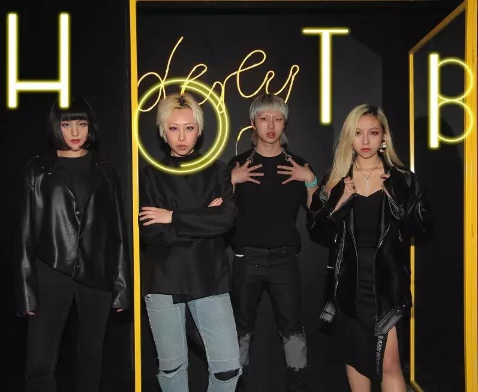 (原始链接: http://mmbiz.qpic.cn/mmbiz_jpg/Pia6jL0felKXUOkicTlicTAp3Wk0hPXV1fKGQ6GjVN5qLXm104pibDssA1iasEsTqxibp2hpAykOhgnmtHPUv0G3zVLA/0?wx_fmt=jpeg)
-  (原始链接: http://mmbiz.qpic.cn/mmbiz_jpg/Pia6jL0felKXUOkicTlicTAp3Wk0hPXV1fKUXFu5d42pQjLc1FHNuT0sDJNy6rDQEQgu96gLIicFcP5rcuXN7hInkQ/0?wx_fmt=jpeg)
- 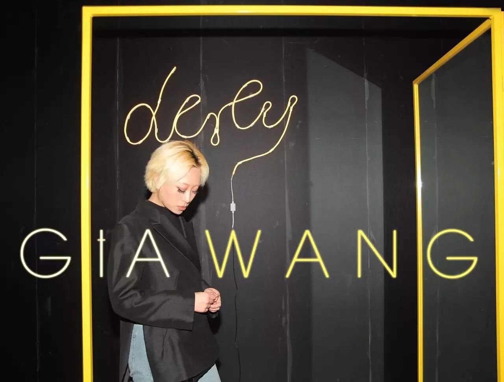 (原始链接: http://mmbiz.qpic.cn/mmbiz_jpg/Pia6jL0felKXUOkicTlicTAp3Wk0hPXV1fK7YRlPKvblMdUlaccYbeZYqhOJXq9jPymyUtxQY5xQxHiamcGNTYWZeA/0?wx_fmt=jpeg)
- 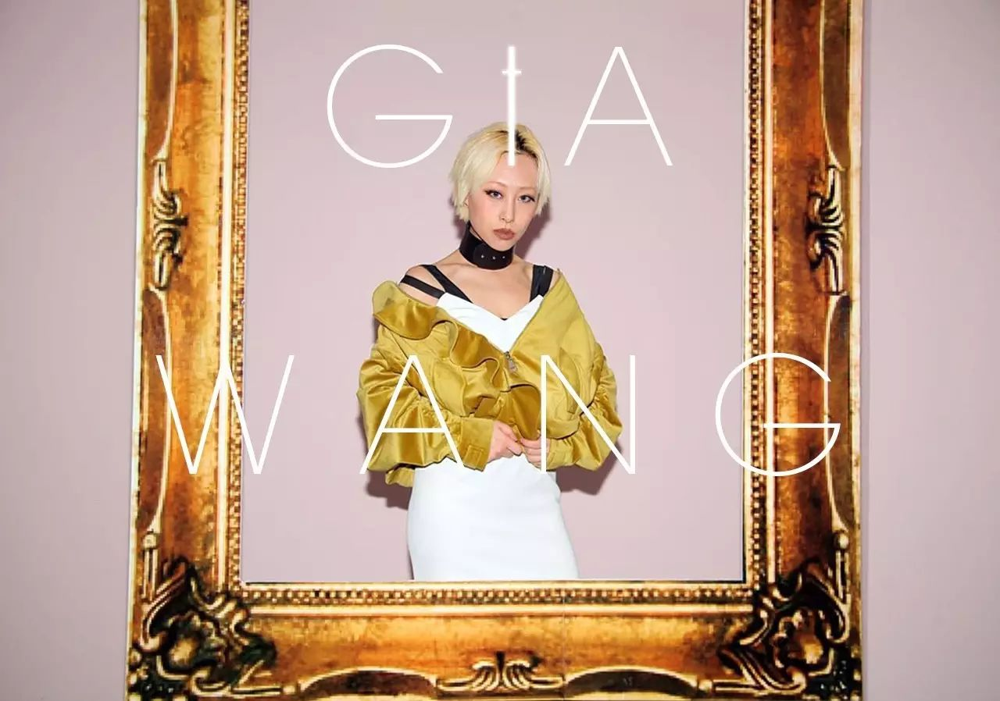 (原始链接: http://mmbiz.qpic.cn/mmbiz_jpg/Pia6jL0felKXUOkicTlicTAp3Wk0hPXV1fK0YU3fKEJS9Tfichscg1lojPicUJeWxWicibJ1IhGjxW8Nyf3v9VGFgB2og/0?wx_fmt=jpeg)
- 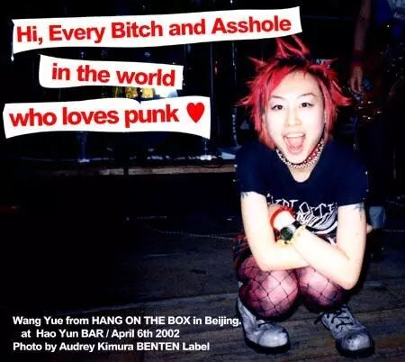 (原始链接: http://mmbiz.qpic.cn/mmbiz_jpg/Pia6jL0felKXUOkicTlicTAp3Wk0hPXV1fKpYicRmoxjj4K11oQuJro6mib5RXjUKY1kZ4ichXAgVheLxKOBftsI2DZg/0?wx_fmt=jpeg)
- 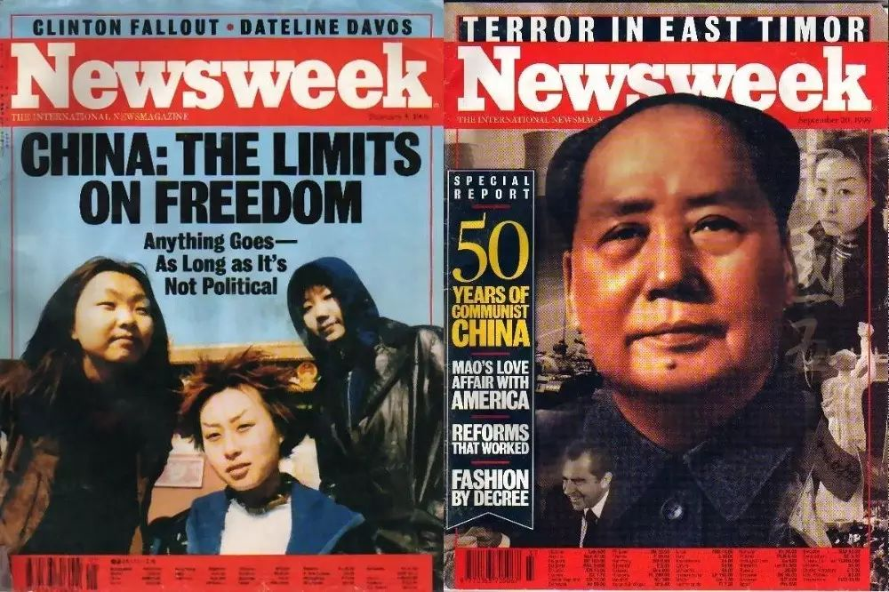 (原始链接: http://mmbiz.qpic.cn/mmbiz_jpg/Pia6jL0felKXUOkicTlicTAp3Wk0hPXV1fKn008CprDIxVATA8GrhLoqcmQJnIRaUWy5rUvprKcwNBicHFVXUpn7GQ/0?wx_fmt=jpeg)
- 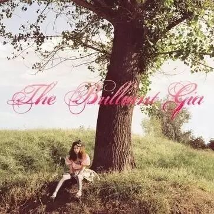 (原始链接: http://mmbiz.qpic.cn/mmbiz_jpg/Pia6jL0felKXUOkicTlicTAp3Wk0hPXV1fKmtUax5dibib9EqysmW9f1UYNlTvHh4Xw8druF68fT5FWwiapDL6ZYYl3w/0?wx_fmt=jpeg)
- 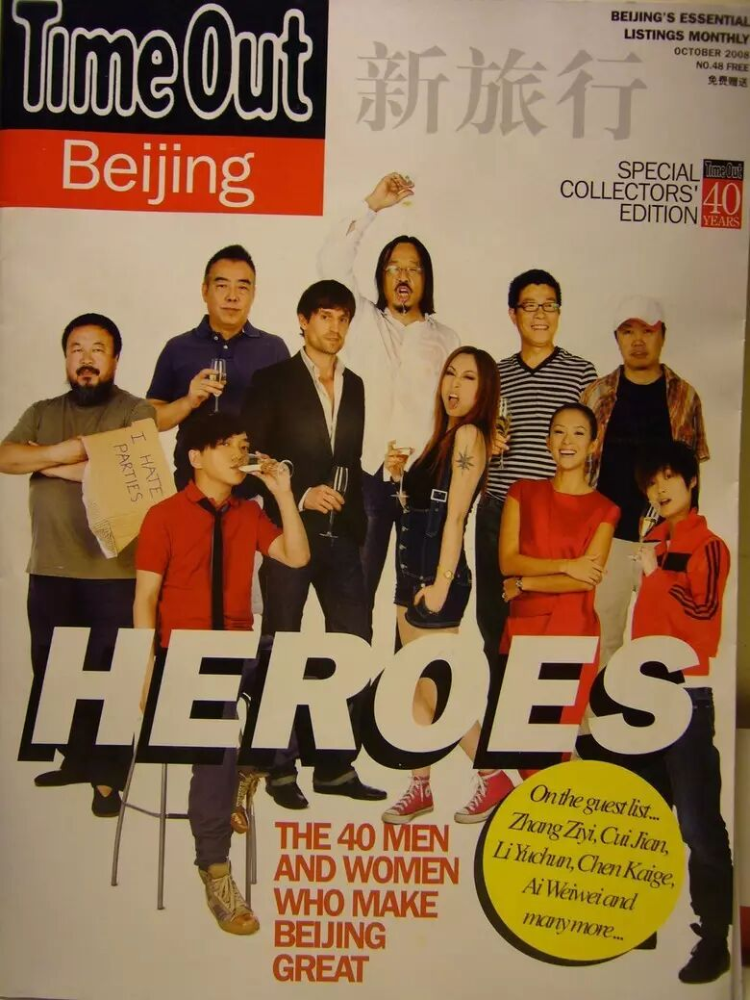 (原始链接: http://mmbiz.qpic.cn/mmbiz_jpg/Pia6jL0felKXUOkicTlicTAp3Wk0hPXV1fKqJ8rdbY6EhN0ypmz2SVZxowjEGlZewPbny4EKMff0nPXnu85uJ2A9A/0?wx_fmt=jpeg)
- 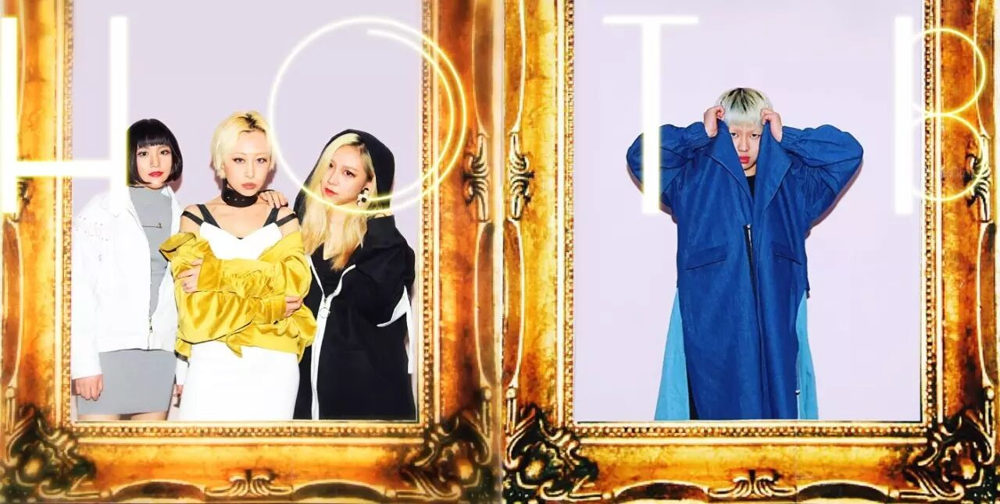 (原始链接: http://mmbiz.qpic.cn/mmbiz_jpg/Pia6jL0felKXUOkicTlicTAp3Wk0hPXV1fKr5cgdgHnic4iatZZHNlAEtiagnCBjwSHol1D6354nj64qicibPuQghpcVGw/0?wx_fmt=jpeg)
- 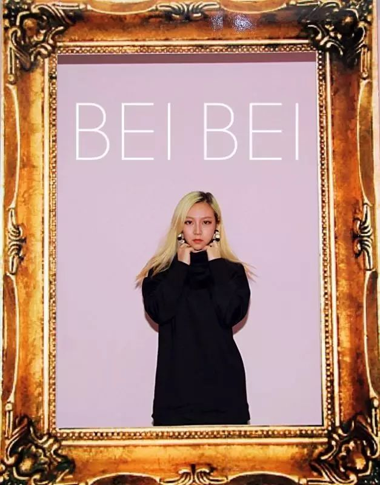 (原始链接: http://mmbiz.qpic.cn/mmbiz_jpg/Pia6jL0felKXUOkicTlicTAp3Wk0hPXV1fKJtY4rZWHqekJsTDBxysL1qLa6CmLkicMVmUsibVaDlqFYNPNm7r4eQIw/0?wx_fmt=jpeg)
- 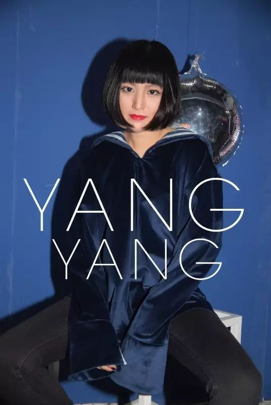 (原始链接: http://mmbiz.qpic.cn/mmbiz_jpg/Pia6jL0felKXUOkicTlicTAp3Wk0hPXV1fKkfLWVortc0LdGpt6kJy8212ENndvQDp22Z4MXQCy1R5ictUaaC4ia0wA/0?wx_fmt=jpeg)
- 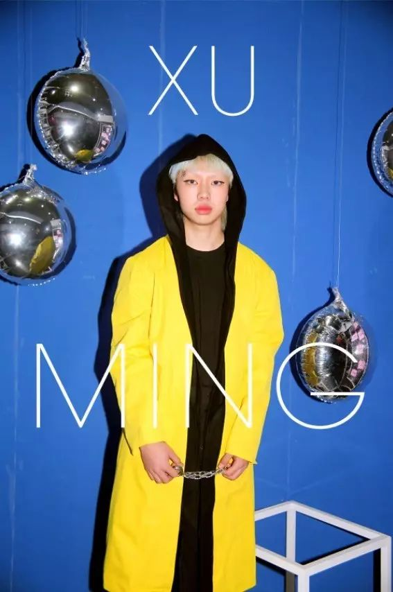 (原始链接: http://mmbiz.qpic.cn/mmbiz_jpg/Pia6jL0felKXUOkicTlicTAp3Wk0hPXV1fKqawkDj8Uuicialfbicf9KdTOEpMe3lBTl0duXMXicoZHEibuKRN00icPLX1g/0?wx_fmt=jpeg)
- 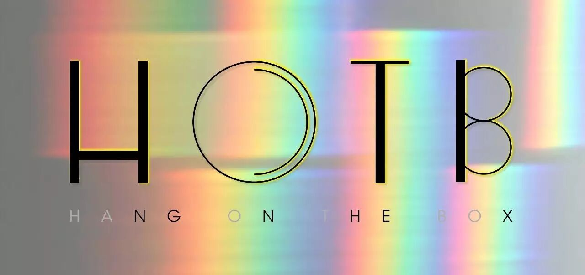 (原始链接: http://mmbiz.qpic.cn/mmbiz_jpg/Pia6jL0felKXUOkicTlicTAp3Wk0hPXV1fKGz8S06SKfV3DIHEAVLQic0SrAjqgiauicbOInqPwxrCV9Nec5NLct2fVg/0?wx_fmt=jpeg)
