# 无标题

**链接地址:** http://mp.weixin.qq.com/s?__biz=MzI0MDQ0ODI0Ng==&mid=2247484204&idx=1&sn=08696373adcea3cbdb41adf9ff55d903&chksm=e91be4b5de6c6da3d092e80ece89b5fc28248f950a510e5e62110d0bfd1968f92c63a0741c6a&mpshare=1&scene=2&srcid=0109YTpYlqlHPBLrr0yzWqhR#rd
**作者:** 全英英
**获取时间:** 2025/8/28 22:36:21
**图片数量:** 15

---

## 原始HTML内容

&nbsp;俺们那嘎达~都是东北银！

&nbsp; &nbsp; &nbsp; &nbsp; 民以食为天，在"八大"菜系里面，东北菜是没有排上号的，但这并没有妨碍它的生意。东北 菜可都是硬菜啊！以溜、炸、酱、炖为主要特点，东北菜讲究吃的豪爽，吃的过瘾。白肉血肠、锅包肉、东北乱炖、溜肉段、地三鲜、猪肉炖粉条、小鸡炖榛蘑、酱骨架，啧啧啧，想想口水都掉下来了。

 

&nbsp; &nbsp; &nbsp; &nbsp;屯子里的东北小朋友有福了，今天小编亲自当小白鼠给大家拔草——绝对是屯子里最好吃最正宗的东北菜，绿茶餐厅！Green Tea ！

&nbsp;地址：17304 105 Avenue NW, Edmonton

&nbsp;时间：10:00am-10:00pm

&nbsp;电话： 780-481-2299

&nbsp;

他们家呢以前主要是做外国人的中餐的，今年4.5月开始做春正宗的东北菜。是一对哈尔滨夫妻经营的，味道正宗倒没朋友。究竟有多正宗呢？让小编告诉你们吧。

<strong>冰糖肘子</strong>

一向只吃肉的小编尝遍了屯子里每一家东坡肘子冰糖元蹄，科科，我在这里很负责任地告诉大家，绿茶的是最最好吃的。老板亲自告诉我这道菜需要炖熬制很久，肉才会很糯很烂。我吃过熊猫大厨的冰桃原蹄，云之南的东坡肘子，他们家是我觉得肥瘦最好的。肥的地方不油不腻，瘦的地方一点也不干，皮与筋紧密相连，酱汁浓郁。话不多说，看图即可。

<strong style="font-family: 宋体; font-size: 14px;">清蒸豆豉白鱼：</strong> 

鱼是从萨斯卡通的湖里刚钓出来的，老板很热情人很nice，送我们品尝了这道菜。毫不夸张，小编吃的第一口，直接叫出来了………你没听错……叫出来了，老板做这条鱼需要用很久时间已经很好的刀工，这是他家的头牌。鱼鲜的原汁原味全部封锁在鱼肉里，入口即化的鱼肉满足了我对清蒸鱼的所有要求~

 

 

<strong>铁锅炖鱼：</strong>

嫩而入味的豆腐铺在鱼的四周，翻开鲜嫩的鱼肉，下面有炖粉条和茄子和东北高质量的木耳。绿茶的木耳经过小编东北朋友的认证，是东北纯正的好木耳，嫩而筋道。内容真的很丰富，味道很正宗，鱼的鲜美淋漓尽致，小伙伴们一定要尝试啊啊啊！！

 

<strong style="   ; ; ; ;  ">酱大骨：</strong>

想必这是吃东北菜的必点之一吧。他家的酱大骨很好吃，肉质很好，也不干，肉筋挺多的。但是就是是甜口的不是咸口的，如果吃不惯甜口菜的同学慎重尝试，但是小编觉得真的很好吃。酱汁很黏更像拔丝酱骨，哈哈。

 

<strong style="   ; ; ; ;  ">干锅肥肠</strong><strong style="   ; ; ; ;  ">/</strong><strong style="   ; ; ; ;  ">土豆片肥肠：</strong>

小编只是今天特别想吃肥肠今天，肥肠不是东北特色菜。但！是！！他们家的也很好吃！土豆片脆脆的，肥肠外表也很有嚼劲。我专门让老板给我加辣了，也很重口！干锅肥肠里的洋葱和青椒也很好吃！

但是相比他家其他的特色东北菜，小编觉得还是那些比较有吸引力。

 

<strong style="   ; ; ; ;  ">哈尔滨香肠：</strong>

东北的小伙伴说好吃炸了。具体怎么炸， 我也说不好， 亲自去尝尝呗？

 

&nbsp;

再介绍几个老板告诉我的招牌菜

<strong>溜肉段</strong>

<strong> </strong>

<strong style="   ; ; ; ;  ">锅包肉</strong>

必吃啊有木有。。。。。

 

<strong style="   ; ; ; ;  ">松鼠鱼</strong>

松鼠鱼需要提前预定，看着就过瘾。

 

<strong>酸菜鱼</strong>

<strong> </strong>

<strong>虎皮肉墩（八大碗之一）</strong><strong></strong><strong></strong>

<strong> </strong>此时此刻废话我就不多说了。。。。。。今晚再去吃一顿！

 

 

---

## 纯文本内容

俺们那嘎达~都是东北银！        民以食为天，在"八大"菜系里面，东北菜是没有排上号的，但这并没有妨碍它的生意。东北 菜可都是硬菜啊！以溜、炸、酱、炖为主要特点，东北菜讲究吃的豪爽，吃的过瘾。白肉血肠、锅包肉、东北乱炖、溜肉段、地三鲜、猪肉炖粉条、小鸡炖榛蘑、酱骨架，啧啧啧，想想口水都掉下来了。       屯子里的东北小朋友有福了，今天小编亲自当小白鼠给大家拔草——绝对是屯子里最好吃最正宗的东北菜，绿茶餐厅！Green Tea ！ 地址：17304 105 Avenue NW, Edmonton 时间：10:00am-10:00pm 电话： 780-481-2299 他们家呢以前主要是做外国人的中餐的，今年4.5月开始做春正宗的东北菜。是一对哈尔滨夫妻经营的，味道正宗倒没朋友。究竟有多正宗呢？让小编告诉你们吧。冰糖肘子一向只吃肉的小编尝遍了屯子里每一家东坡肘子冰糖元蹄，科科，我在这里很负责任地告诉大家，绿茶的是最最好吃的。老板亲自告诉我这道菜需要炖熬制很久，肉才会很糯很烂。我吃过熊猫大厨的冰桃原蹄，云之南的东坡肘子，他们家是我觉得肥瘦最好的。肥的地方不油不腻，瘦的地方一点也不干，皮与筋紧密相连，酱汁浓郁。话不多说，看图即可。清蒸豆豉白鱼：鱼是从萨斯卡通的湖里刚钓出来的，老板很热情人很nice，送我们品尝了这道菜。毫不夸张，小编吃的第一口，直接叫出来了………你没听错……叫出来了，老板做这条鱼需要用很久时间已经很好的刀工，这是他家的头牌。鱼鲜的原汁原味全部封锁在鱼肉里，入口即化的鱼肉满足了我对清蒸鱼的所有要求~铁锅炖鱼：嫩而入味的豆腐铺在鱼的四周，翻开鲜嫩的鱼肉，下面有炖粉条和茄子和东北高质量的木耳。绿茶的木耳经过小编东北朋友的认证，是东北纯正的好木耳，嫩而筋道。内容真的很丰富，味道很正宗，鱼的鲜美淋漓尽致，小伙伴们一定要尝试啊啊啊！！酱大骨：想必这是吃东北菜的必点之一吧。他家的酱大骨很好吃，肉质很好，也不干，肉筋挺多的。但是就是是甜口的不是咸口的，如果吃不惯甜口菜的同学慎重尝试，但是小编觉得真的很好吃。酱汁很黏更像拔丝酱骨，哈哈。干锅肥肠/土豆片肥肠：小编只是今天特别想吃肥肠今天，肥肠不是东北特色菜。但！是！！他们家的也很好吃！土豆片脆脆的，肥肠外表也很有嚼劲。我专门让老板给我加辣了，也很重口！干锅肥肠里的洋葱和青椒也很好吃！但是相比他家其他的特色东北菜，小编觉得还是那些比较有吸引力。哈尔滨香肠：东北的小伙伴说好吃炸了。具体怎么炸， 我也说不好， 亲自去尝尝呗？ 再介绍几个老板告诉我的招牌菜溜肉段锅包肉必吃啊有木有。。。。。松鼠鱼松鼠鱼需要提前预定，看着就过瘾。酸菜鱼虎皮肉墩（八大碗之一）此时此刻废话我就不多说了。。。。。。今晚再去吃一顿！

---

## 图片列表

-  (原始链接: http://mmbiz.qpic.cn/mmbiz_png/XA8n2XaESnSeLynYz1PuPrbRqLCMkPK0bvoDrddSQN1RtIQByH42DpficE0rPAqibfhwRBRDfbgz8m8OSk5HZjPA/0?wx_fmt=png)
- 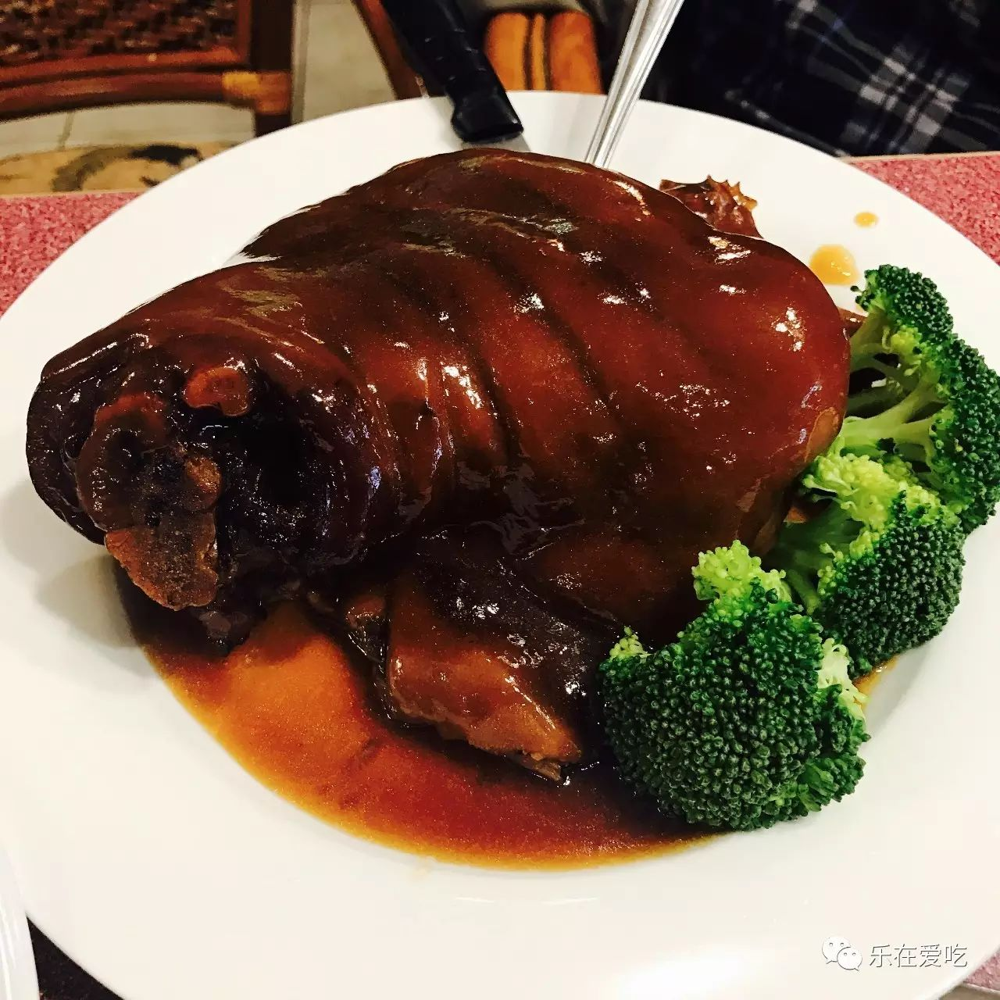 (原始链接: http://mmbiz.qpic.cn/mmbiz_jpg/XA8n2XaESnQb06ktUj74BG0YlNFibYQ6E0ZSnmebBOpmfic0F2n52HC1LFm7fSoUJPHZUhucHgKcHia9ww0UzBgyg/0?wx_fmt=jpeg)
- 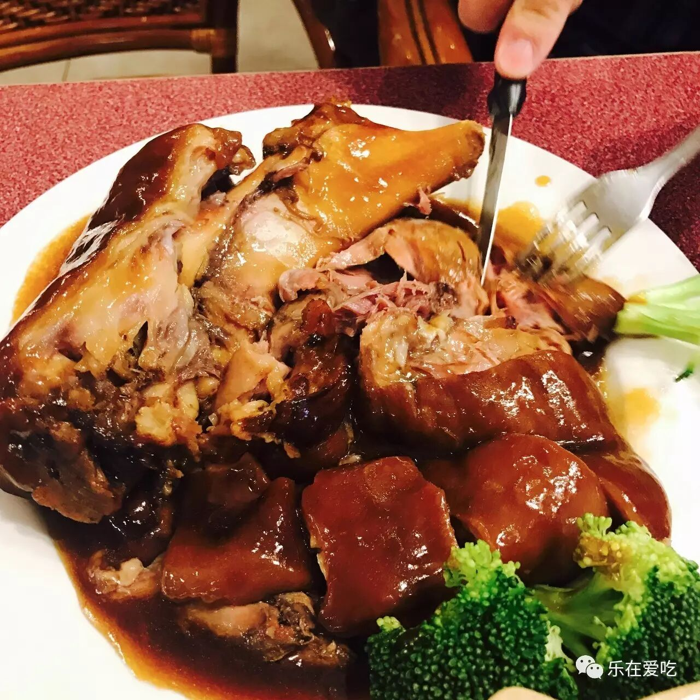 (原始链接: http://mmbiz.qpic.cn/mmbiz_jpg/XA8n2XaESnQb06ktUj74BG0YlNFibYQ6EhATgVkTicg6p8heriaHEy66NLrYAI6OcOCRYwE0K8Rk7kOzmQWfjjAdg/0?wx_fmt=jpeg)
- 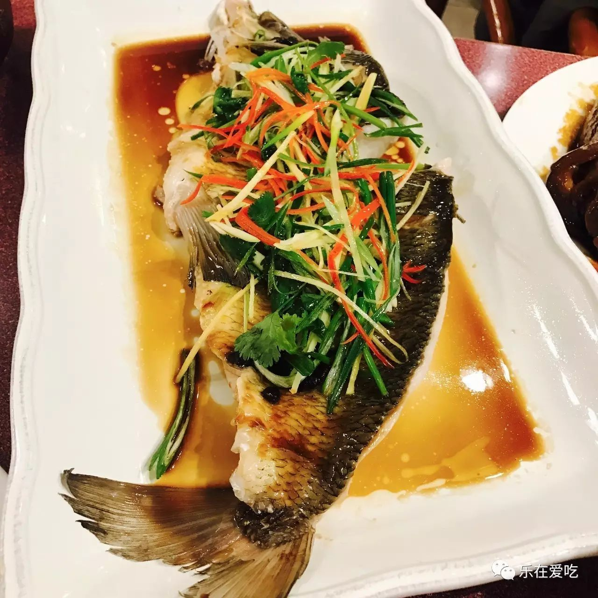 (原始链接: http://mmbiz.qpic.cn/mmbiz_jpg/XA8n2XaESnQb06ktUj74BG0YlNFibYQ6EFGZ7J32u8IDrMW8T9P4QBHvtQbIHOOaepScNdsJ39xGuYzaIFiao22w/0?wx_fmt=jpeg)
- 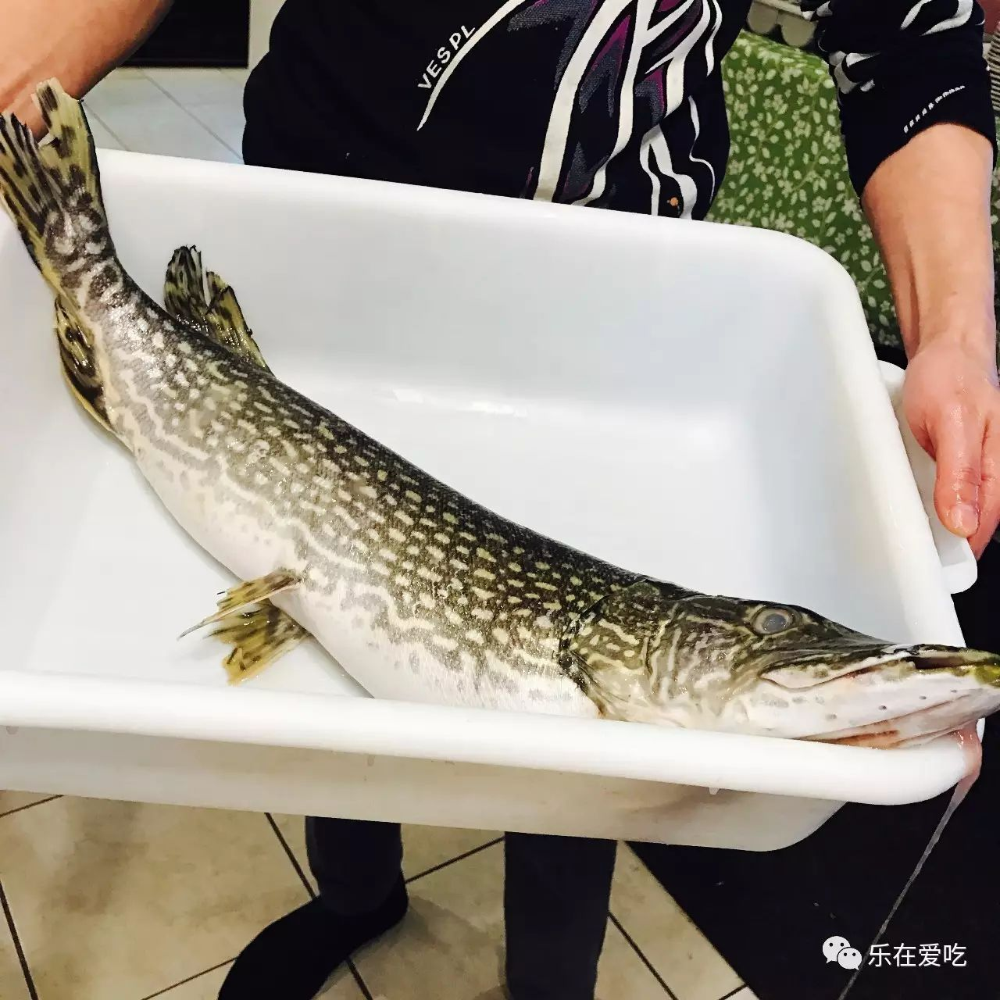 (原始链接: http://mmbiz.qpic.cn/mmbiz_jpg/XA8n2XaESnQb06ktUj74BG0YlNFibYQ6EGTpHgDKzysTnKiaE1kHdCiaIZWUgiajqsquPssT1A0Is62h8HQcCJXOJg/0?wx_fmt=jpeg)
- 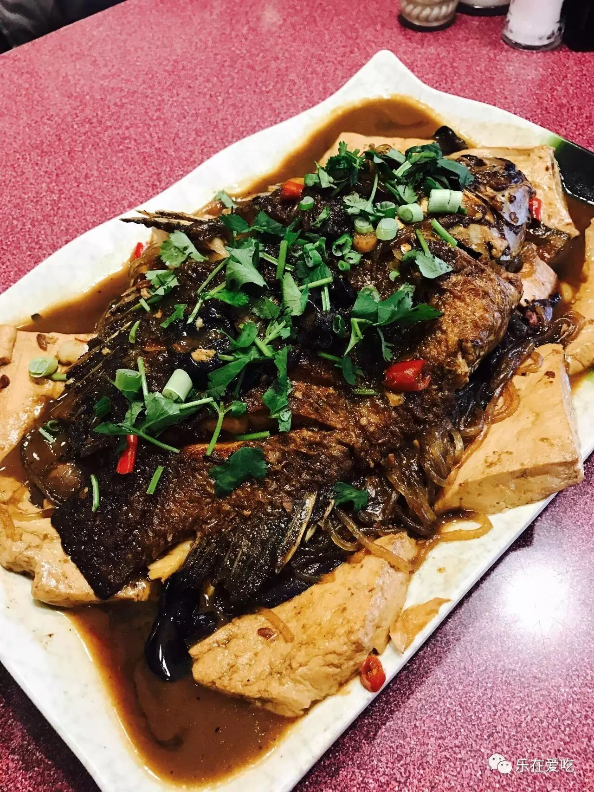 (原始链接: http://mmbiz.qpic.cn/mmbiz_jpg/XA8n2XaESnQb06ktUj74BG0YlNFibYQ6EEBNyScmWmbbze3BGicClRZYqfaI6vLRsx1wrgC0fHVic3MlWPTnAzYdQ/0?wx_fmt=jpeg)
- 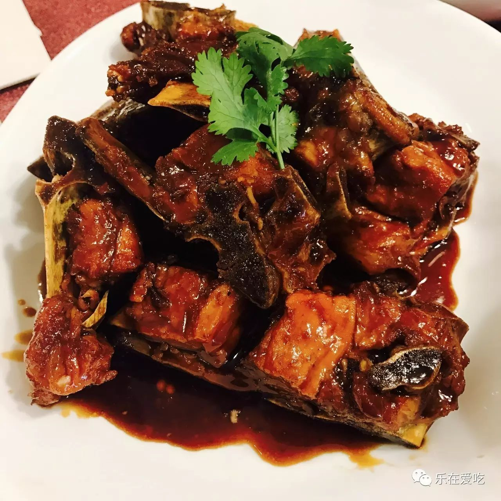 (原始链接: http://mmbiz.qpic.cn/mmbiz_jpg/XA8n2XaESnQb06ktUj74BG0YlNFibYQ6EeHlxPy9ylpJ60UYDeaK1YwDmReUWdiajldHXNLrBrIXgrYfnzvQneuQ/0?wx_fmt=jpeg)
- 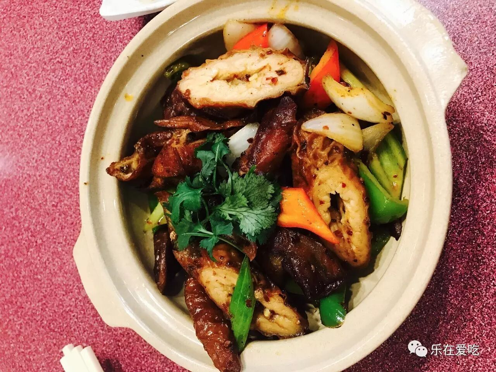 (原始链接: http://mmbiz.qpic.cn/mmbiz_jpg/XA8n2XaESnQb06ktUj74BG0YlNFibYQ6E5pWSb5DpUWbHZ65lm77sV43hibWSYIFfqibb9YOibWLanXuRGfVzXbNkw/0?wx_fmt=jpeg)
- 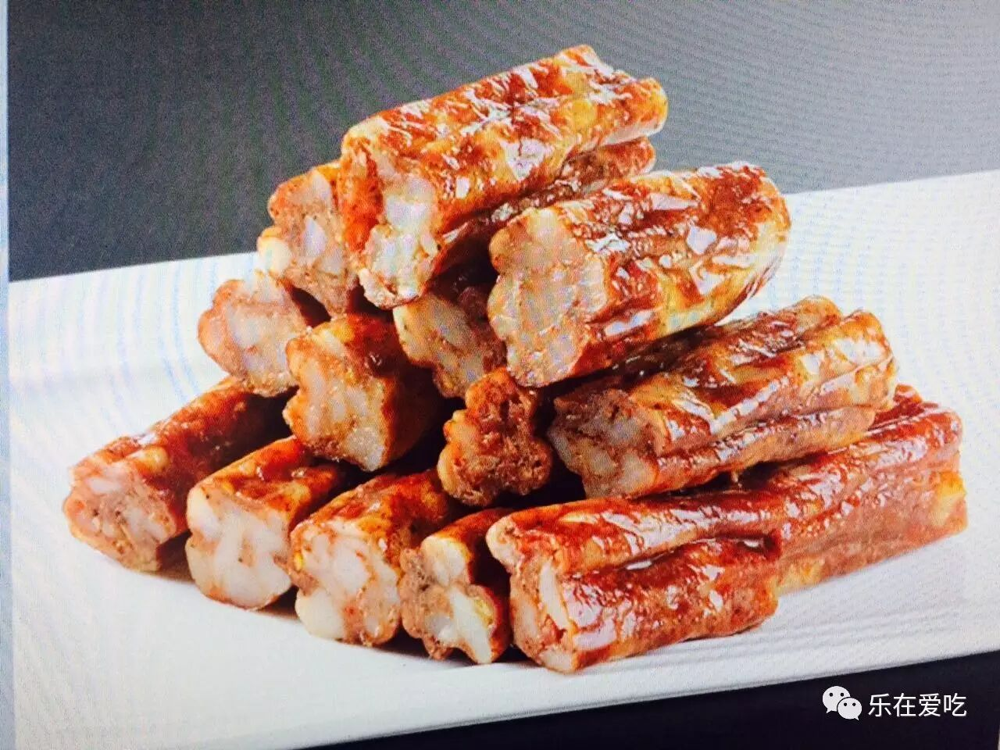 (原始链接: http://mmbiz.qpic.cn/mmbiz_jpg/XA8n2XaESnQb06ktUj74BG0YlNFibYQ6EctuU5aibPtOPPLw2htN6au82kO7aZ4sIUKUg1PucF8K3sFWGjzFXdDw/0?wx_fmt=jpeg)
- 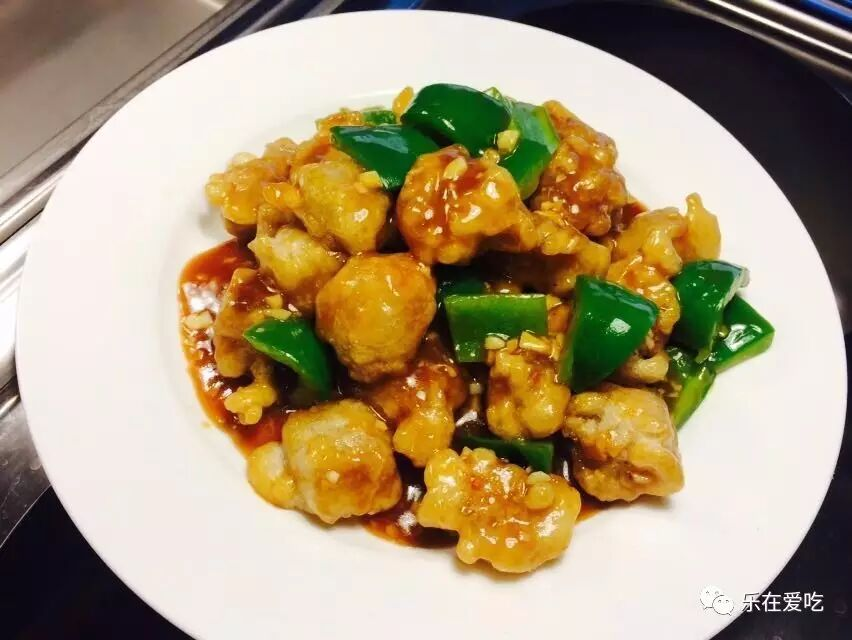 (原始链接: http://mmbiz.qpic.cn/mmbiz_jpg/XA8n2XaESnQb06ktUj74BG0YlNFibYQ6EQM0fynSywFqibY5SicZIrN297I6e5z8J7OsVo8RrtmG9x1aqRcqZicUTQ/0?wx_fmt=jpeg)
- 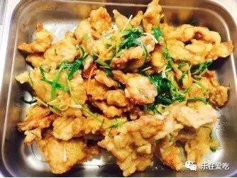 (原始链接: http://mmbiz.qpic.cn/mmbiz_jpg/XA8n2XaESnQb06ktUj74BG0YlNFibYQ6EKjr8Zk8DeFZFY0p8QzlSFv64W2vNZia7s2lcQCuGUultOEWRZAqOxKA/0?wx_fmt=jpeg)
- 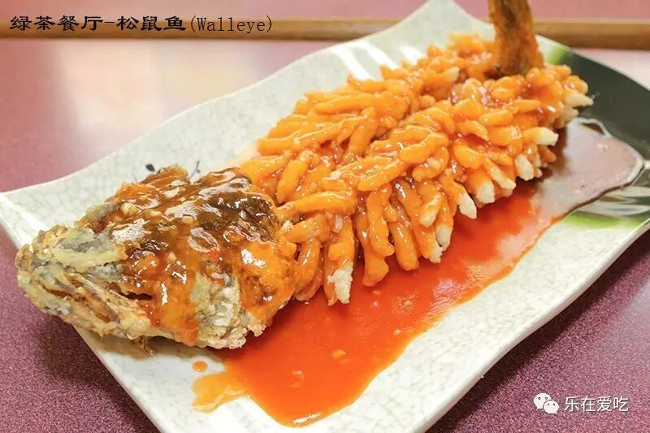 (原始链接: http://mmbiz.qpic.cn/mmbiz_jpg/XA8n2XaESnQb06ktUj74BG0YlNFibYQ6ExLctVib9alia8ia5xSgbpEITQ3q4ibpE5kkicupP67KJ45xJz9IU4OjuqLA/0?wx_fmt=jpeg)
- 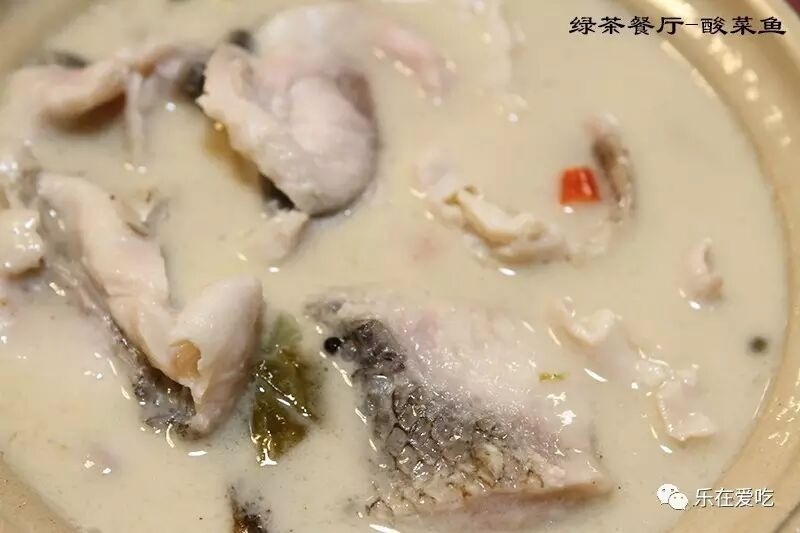 (原始链接: http://mmbiz.qpic.cn/mmbiz_jpg/XA8n2XaESnQb06ktUj74BG0YlNFibYQ6E7nLOogxwtc9nv4egXp8c6bribWl0MtiblicflJ7Lic4tRZMxedTbBrEZrg/0?wx_fmt=jpeg)
- 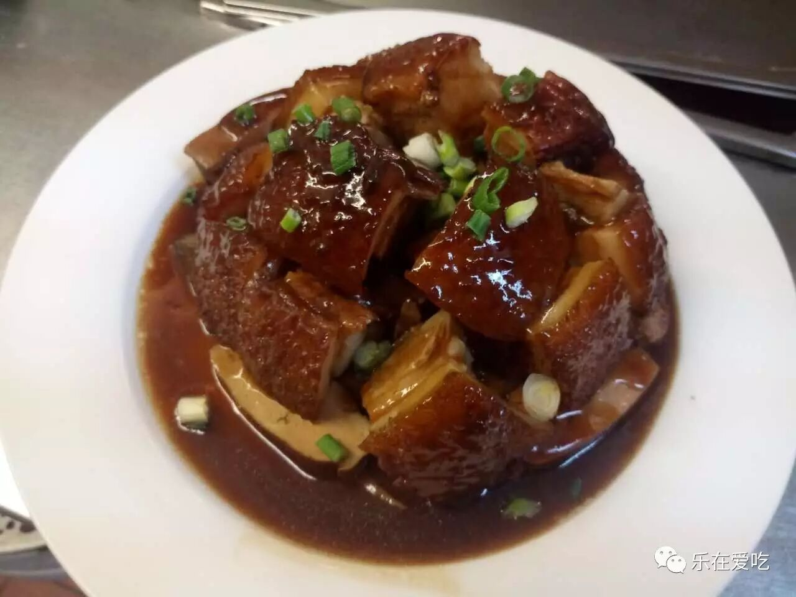 (原始链接: http://mmbiz.qpic.cn/mmbiz_jpg/XA8n2XaESnQb06ktUj74BG0YlNFibYQ6Eib5pcYURSeNnMEAZw8qDLVQ3I2ibCiae6FqhC80I6G3icDIM1YGfpWzDGQ/0?wx_fmt=jpeg)
-  (原始链接: http://mmbiz.qpic.cn/mmbiz_gif/XA8n2XaESnSeLynYz1PuPrbRqLCMkPK0183Pibwk0ibOcCzUJu6aia40PFCgWMpF9yuUxlO0HWkricYEB9kWzSicTfg/0?wx_fmt=gif)
