# 无标题

**链接地址:** http://mp.weixin.qq.com/s?__biz=MzI0MDQ0ODI0Ng==&mid=2247484644&idx=1&sn=b2348028a8f5347ac2c2dfa2b1ea7e95&chksm=e91be37dde6c6a6bbb67bf3adfd6f58447369eaac5182c24ab43d480d3caafdde58b6c7a6e6d&mpshare=1&scene=2&srcid=0307Tlb3UeKC2Sv2ovaPLy71#rd
**作者:** 叶露is cool
**获取时间:** 2025/8/28 22:34:32
**图片数量:** 17

---

## 原始HTML内容

Canada100best，每年都会举办专业美食评比，选出全加拿大100家最好吃的餐厅，埃德蒙顿上榜6家（撒花） 

 

全国第一的餐厅是 <strong>Alo</strong>，这家高端法餐位于多伦多的中国城。第二是蒙特利尔的&nbsp;Toqué,第三家也是蒙特利尔，<strong>Joe beef。</strong>

 

咱们还是先来看看

爱城上榜的六家餐厅

请mark，请repost 

别忘记收藏呀

 

 

<strong>No.6 Rostizado</strong>

摆盘就要馋死啦，能把接地气的墨西哥美食做得这么浪漫，浪漫中又饱含食物的激情与热烈，这家餐厅算是家庭聚会的首选

地址：102-10359 104St 

网址：rostizado.com

电话：7807610911

 

<strong>No.5 Clementine Restaurant</strong> 

Clementine十分适合和朋友晚上小酌聊天，Clemenine灵感来源于法国新艺术革命，

传统和古典的完美结合。

“Join us for a drink”

这句slogan太诱惑了！

Clementine鸡尾酒都以情绪和记忆命名，

所以 你喝的不是酒，而是深情款款的岁月

地址：11957Jasper Avenue NW Edmonton&nbsp; 

网址：barclementine.ca

电话：7807564570

 

<strong>No.4 Bar Bricco</strong>

Bar Bricco主要菜色为意大利餐点

非常适合姐妹聚餐和情侣约会 

同样它也承接各种小型私人聚会

地址：10347 Jasper Avenue Edmonton

网址：barbricco.com

电话：7804245588

（ 不接受预定）

 

<strong>No.3 Ucellino</strong>

采用十分现代的loft装修，

现代不失小清新 

美食风格也是现代与经典融合的意大利菜

Ucellino致力于寻找迷失的菜谱

每次去都是新发现

地址：10349 Jasper Avenue Edmoton 

网址：uccellino.ca

电话：7804260346

 

<strong>No.2 Corso 32</strong>

Daniel既是Corso32的老板，也是主厨

Corso32更讲究对创意灵感的追求

同样理念也运用于美食的烹饪

让人爱爱爱不完

地址：10345 Jasper Avenue Edmonton

网址：corso32.com

电话：7804214662

 

<strong>No.1 Rge Rd</strong>

Rge Rd是爱城最好的加拿大local cusine ，没有之一

Rge Rd灵感来源加拿大的森林与流水

其次Rge Rd活动也非常多

有时候会把餐厅小型私人pa设置在户外

宛如仙女在出外景呀

地址：10634 123St Northwest Edmonton 

网址：regerd.ca

电话：7804474577

 

接下来是卡尔加里最棒餐厅排名 

朝着美食出发

卡尔加里一点都不远，一秒就到啦！

 

 

<strong>No.8 Foreign Concept</strong>

Foreign Concept 装修采用神秘的东方风格

利用西方的食材和东方的烹饪方法混合搭配

过年过节还会有舞狮的活动

地址：1011 1St SW Calgary

网址：foreignconcept.ca

电话：4037197288

 

<strong>No.7 Model Milk</strong>

Model Milk 宛如像法国电影的片场

所有一切恰到好处，不失用心

Model Milk主菜风格也非常随心随欲

没有你吃不到，只有你想不到

它还是Pigeonhole的姐妹餐厅

地址：308 17Ave Sw Calgary

网址：MODELMILK.CA

电话：4032657343

 

<strong>No.6 Deane House</strong>

Deane House真的就是简简单单一幢房子

轻松实现美味进家的理念

不仅可以享受花园美食

落日，河景也尽收眼底

餐厅最大容量可以接受200人

如此完美的地方，也是举办婚礼热门地点

地址：806 9Ave SE Calgary

网址：deanehouse.com

电话：4032640595

 

<strong>No.5 Anju</strong>

Anju 把酸溜溜的泡菜变得超级高大上

Anju主营韩国菜

也讲究韩国，日本和西方菜式相融合

也是个撸串的好去处

地址：344 17 Avenue SW Calgary

网址：anju.ca

电话：4034603341

 

<strong>No.4 Shokunin</strong>

Shokunin是一家日料店

用料新鲜是一家日料的生命

能做到全卡尔加里排名第一的日料，

果真不同凡响

店老板还特别喜欢皮卡丘

地址：2016 4th Street Southwest Calgary

网址：SHOKUNINYYC.CA

电话：4032293444

 

<strong>No.3 Ten Foot Henry</strong>&nbsp;

简简单单的食材

简单的烹饪方法

Ten Foot Henry轻松的用餐环境

细心实践对美食的追求

地址：1209 1St ST SW Cglgary

网址：TENFOOTHENRY.COM

电话：4034755537

 

<strong>No.2 River Cafe&nbsp;</strong>

River cafe 在闹市一个安静的角落

为提供新鲜菜式 

Chef根据不同的时令菜而变化菜单

面包和甜点都是出自厨房手工

先到先得

地址：25 Prince‘s Island Park Calgary

网站：RIVER-CAFE.COM

电话：4032617670

 

<strong>No.1 Pigeonhole</strong>

Pigeonhole同样也是全国第十

pigeonhole有一半的menu是vegetarian

对于食材烹饪要求保持食物的原汁原味 

Pigeonhole的鸡尾酒也是墙裂推荐

地址：306 17th Avenue Southwest Calgary

网址：PIGEONHOLEYYC.CA

电话：4034524694

 

整理出这些信息，小编已经快要被虐死了，这些超级popular的餐厅，千万要记得提前网络和电话预定呀。

 

我们还会带来更多更好玩的资讯，不关注一下再走嘛？

 

---

## 纯文本内容

Canada100best，每年都会举办专业美食评比，选出全加拿大100家最好吃的餐厅，埃德蒙顿上榜6家（撒花）全国第一的餐厅是 Alo，这家高端法餐位于多伦多的中国城。第二是蒙特利尔的 Toqué,第三家也是蒙特利尔，Joe beef。咱们还是先来看看爱城上榜的六家餐厅请mark，请repost别忘记收藏呀No.6 Rostizado摆盘就要馋死啦，能把接地气的墨西哥美食做得这么浪漫，浪漫中又饱含食物的激情与热烈，这家餐厅算是家庭聚会的首选地址：102-10359 104St网址：rostizado.com电话：7807610911No.5 Clementine RestaurantClementine十分适合和朋友晚上小酌聊天，Clemenine灵感来源于法国新艺术革命，传统和古典的完美结合。“Join us for a drink”这句slogan太诱惑了！Clementine鸡尾酒都以情绪和记忆命名，所以 你喝的不是酒，而是深情款款的岁月地址：11957Jasper Avenue NW Edmonton 网址：barclementine.ca电话：7807564570No.4 Bar BriccoBar Bricco主要菜色为意大利餐点非常适合姐妹聚餐和情侣约会同样它也承接各种小型私人聚会地址：10347 Jasper Avenue Edmonton网址：barbricco.com电话：7804245588（ 不接受预定）No.3 Ucellino采用十分现代的loft装修，现代不失小清新美食风格也是现代与经典融合的意大利菜Ucellino致力于寻找迷失的菜谱每次去都是新发现地址：10349 Jasper Avenue Edmoton网址：uccellino.ca电话：7804260346No.2 Corso 32Daniel既是Corso32的老板，也是主厨Corso32更讲究对创意灵感的追求同样理念也运用于美食的烹饪让人爱爱爱不完地址：10345 Jasper Avenue Edmonton网址：corso32.com电话：7804214662No.1 Rge RdRge Rd是爱城最好的加拿大local cusine ，没有之一Rge Rd灵感来源加拿大的森林与流水其次Rge Rd活动也非常多有时候会把餐厅小型私人pa设置在户外宛如仙女在出外景呀地址：10634 123St Northwest Edmonton网址：regerd.ca电话：7804474577接下来是卡尔加里最棒餐厅排名朝着美食出发卡尔加里一点都不远，一秒就到啦！No.8 Foreign ConceptForeign Concept 装修采用神秘的东方风格利用西方的食材和东方的烹饪方法混合搭配过年过节还会有舞狮的活动地址：1011 1St SW Calgary网址：foreignconcept.ca电话：4037197288No.7 Model MilkModel Milk 宛如像法国电影的片场所有一切恰到好处，不失用心Model Milk主菜风格也非常随心随欲没有你吃不到，只有你想不到它还是Pigeonhole的姐妹餐厅地址：308 17Ave Sw Calgary网址：MODELMILK.CA电话：4032657343No.6 Deane HouseDeane House真的就是简简单单一幢房子轻松实现美味进家的理念不仅可以享受花园美食落日，河景也尽收眼底餐厅最大容量可以接受200人如此完美的地方，也是举办婚礼热门地点地址：806 9Ave SE Calgary网址：deanehouse.com电话：4032640595No.5 AnjuAnju 把酸溜溜的泡菜变得超级高大上Anju主营韩国菜也讲究韩国，日本和西方菜式相融合也是个撸串的好去处地址：344 17 Avenue SW Calgary网址：anju.ca电话：4034603341No.4 ShokuninShokunin是一家日料店用料新鲜是一家日料的生命能做到全卡尔加里排名第一的日料，果真不同凡响店老板还特别喜欢皮卡丘地址：2016 4th Street Southwest Calgary网址：SHOKUNINYYC.CA电话：4032293444No.3 Ten Foot Henry 简简单单的食材简单的烹饪方法Ten Foot Henry轻松的用餐环境细心实践对美食的追求地址：1209 1St ST SW Cglgary网址：TENFOOTHENRY.COM电话：4034755537No.2 River Cafe River cafe 在闹市一个安静的角落为提供新鲜菜式Chef根据不同的时令菜而变化菜单面包和甜点都是出自厨房手工先到先得地址：25 Prince‘s Island Park Calgary网站：RIVER-CAFE.COM电话：4032617670No.1 PigeonholePigeonhole同样也是全国第十pigeonhole有一半的menu是vegetarian对于食材烹饪要求保持食物的原汁原味Pigeonhole的鸡尾酒也是墙裂推荐地址：306 17th Avenue Southwest Calgary网址：PIGEONHOLEYYC.CA电话：4034524694整理出这些信息，小编已经快要被虐死了，这些超级popular的餐厅，千万要记得提前网络和电话预定呀。我们还会带来更多更好玩的资讯，不关注一下再走嘛？

---

## 图片列表

- 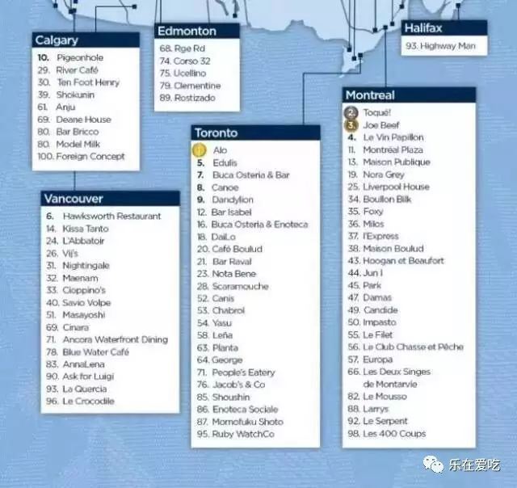 (原始链接: http://mmbiz.qpic.cn/mmbiz_jpg/XA8n2XaESnTBD4w7nlM0mnYZRDZogE4tkWukgyec69zWzCeF7TZiaUjshC4lMxefxmC4OHyJnMOw8ibCGsrFamMw/0?wx_fmt=jpeg)
- 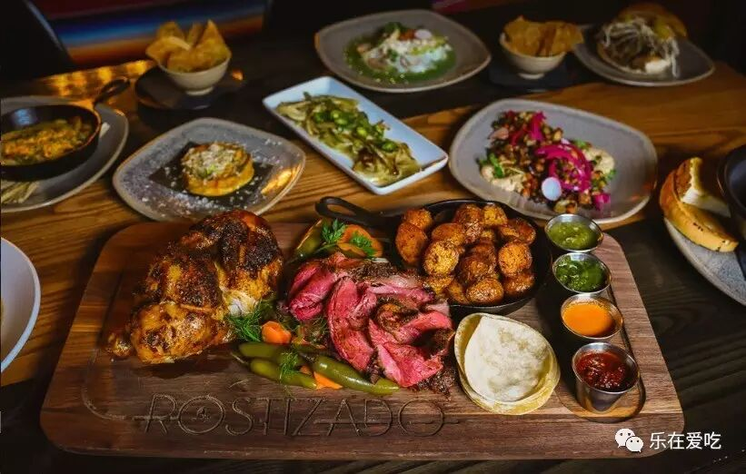 (原始链接: http://mmbiz.qpic.cn/mmbiz_jpg/XA8n2XaESnTBD4w7nlM0mnYZRDZogE4tbDJsVYsGhjjppGKEJqpCBApcWIgzj2RX8Bcv0R2SiczPnw1nGu6yOuQ/0?wx_fmt=jpeg)
-  (原始链接: http://mmbiz.qpic.cn/mmbiz_jpg/XA8n2XaESnTBD4w7nlM0mnYZRDZogE4tsYC8HVO2YelvCoHCeQoY3iaicMxHoNdK7sR1ibbBibibRe5s02pSw9icZlJw/0?wx_fmt=jpeg)
- 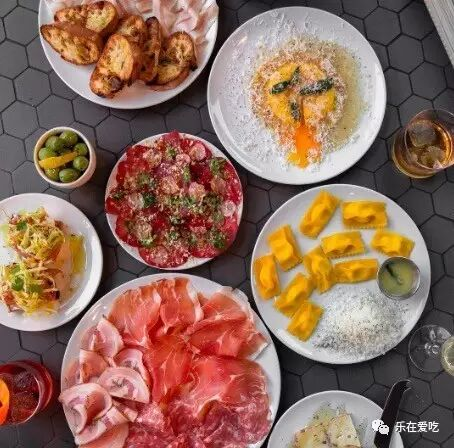 (原始链接: http://mmbiz.qpic.cn/mmbiz_jpg/XA8n2XaESnTBD4w7nlM0mnYZRDZogE4t9oImLuoCfvLRXpiaseDrhtnSoN8fJTD0lHpwsF9DppLSEBbYSruATbA/0?wx_fmt=jpeg)
- 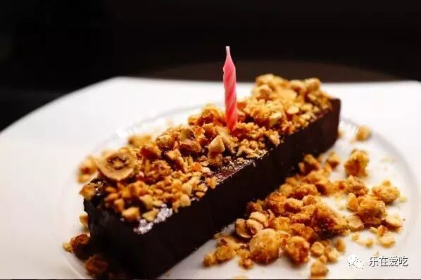 (原始链接: http://mmbiz.qpic.cn/mmbiz_jpg/XA8n2XaESnTBD4w7nlM0mnYZRDZogE4tj44PnbsJsNBPzNiaEiaRE3fXaZNojg3XrWhtMCegndLlyL3nic9dVoZgQ/0?wx_fmt=jpeg)
- 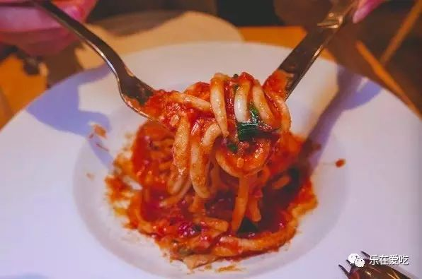 (原始链接: http://mmbiz.qpic.cn/mmbiz_jpg/XA8n2XaESnTBD4w7nlM0mnYZRDZogE4tibqUzt2FqUq1eTAVY5fks7s7tMoEgqHRGAC8NOaxLZCny8iaAns6kxDg/0?wx_fmt=jpeg)
- 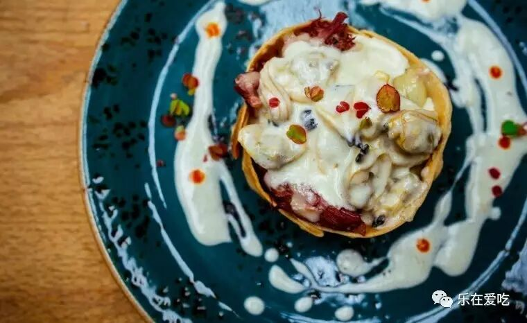 (原始链接: http://mmbiz.qpic.cn/mmbiz_jpg/XA8n2XaESnTBD4w7nlM0mnYZRDZogE4thMbD5xEI81WBTbL4ULBTqekA84HjgbORSicQFQ7kjGib2LFwBeeKtZuA/0?wx_fmt=jpeg)
-  (原始链接: http://mmbiz.qpic.cn/mmbiz_jpg/XA8n2XaESnRt0qSvIARvqlVMic49icGDptWDbnMSEnNPPM0AwKM0DjssRlDn0309lzfdwJx0ich0XejR9zKyFMvgg/0?wx_fmt=jpeg)
- 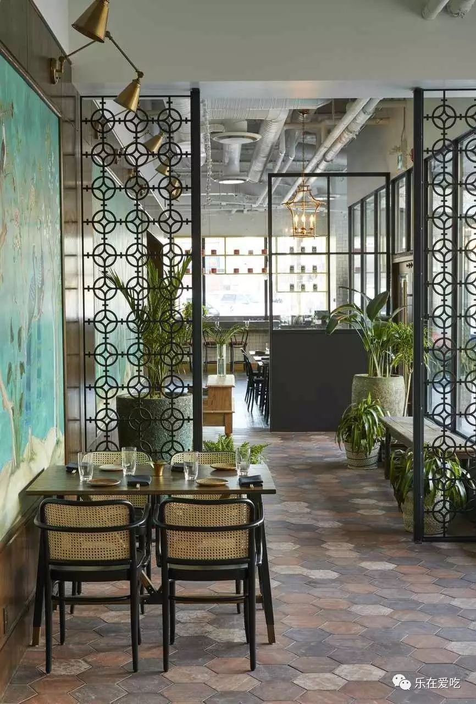 (原始链接: http://mmbiz.qpic.cn/mmbiz_jpg/XA8n2XaESnTBD4w7nlM0mnYZRDZogE4tbJBbBYiaApUwRLZTAONWn9Wv9MreJnXlebicwic4u1IG5JnGicPuqoz8Ew/0?wx_fmt=jpeg)
- 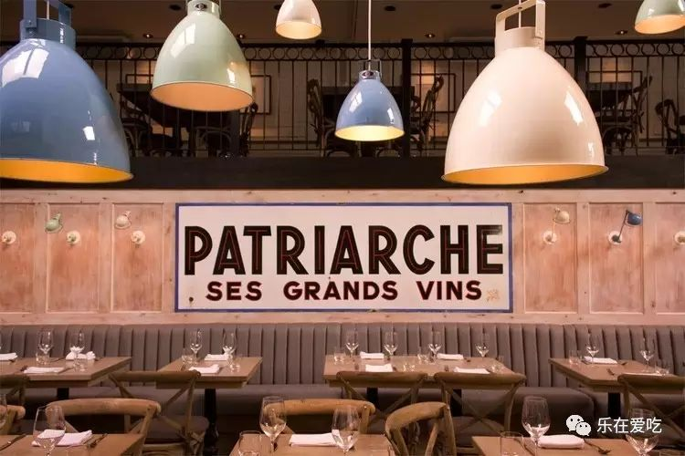 (原始链接: http://mmbiz.qpic.cn/mmbiz_jpg/XA8n2XaESnTBD4w7nlM0mnYZRDZogE4tMHKUwpNJKtUWia7HZico5Q30ERK3icJAD2I46xbnGDaVc3ib4ryTTFKsJg/0?wx_fmt=jpeg)
- 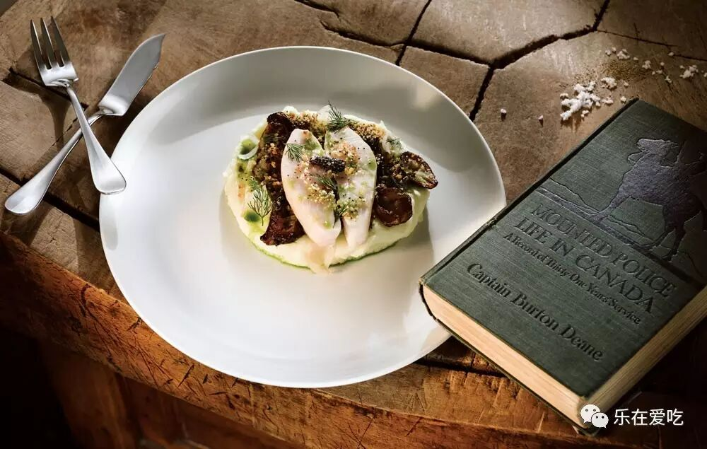 (原始链接: http://mmbiz.qpic.cn/mmbiz_jpg/XA8n2XaESnTBD4w7nlM0mnYZRDZogE4tGskFQLsUxUUACJ0dnIrj6oOib6p6g51qibDtme0YNDE9kh84FqMn7jjA/0?wx_fmt=jpeg)
- 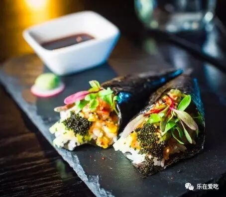 (原始链接: http://mmbiz.qpic.cn/mmbiz_jpg/XA8n2XaESnTBD4w7nlM0mnYZRDZogE4tKvw0glZO3ibDZBmKYu675eJ465hTiapknxXkHUBPib7Q09uflUFnSWBtA/0?wx_fmt=jpeg)
- 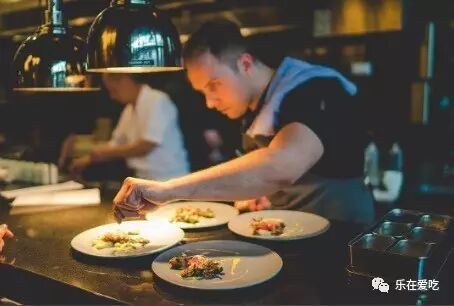 (原始链接: http://mmbiz.qpic.cn/mmbiz_jpg/XA8n2XaESnTBD4w7nlM0mnYZRDZogE4tsfXe0icYRIfnkLj6N4LQH7Beibz1JHf9f9NtkZwLJia0W1FJp1olSyiaEA/0?wx_fmt=jpeg)
- 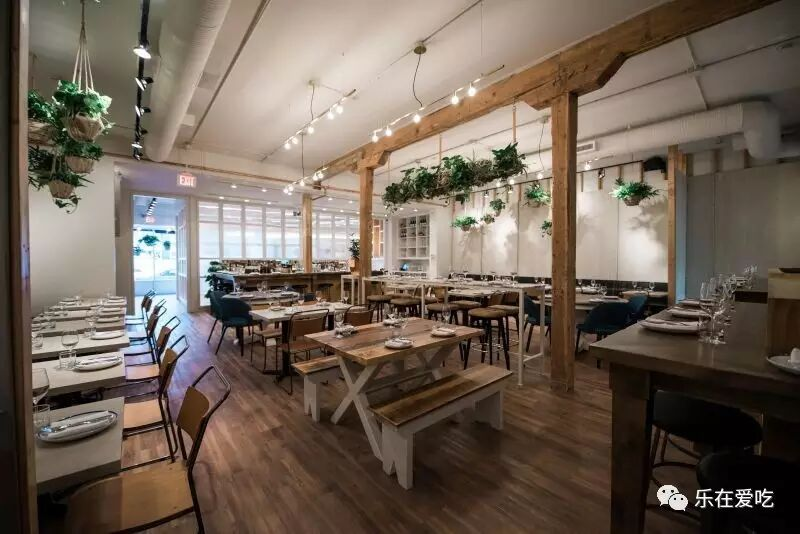 (原始链接: http://mmbiz.qpic.cn/mmbiz_jpg/XA8n2XaESnTBD4w7nlM0mnYZRDZogE4tkrJv1VEsup7aYcRqzF8KibS6qiaFq72oAJqONANJhwI7AnHrJocbdzLA/0?wx_fmt=jpeg)
- 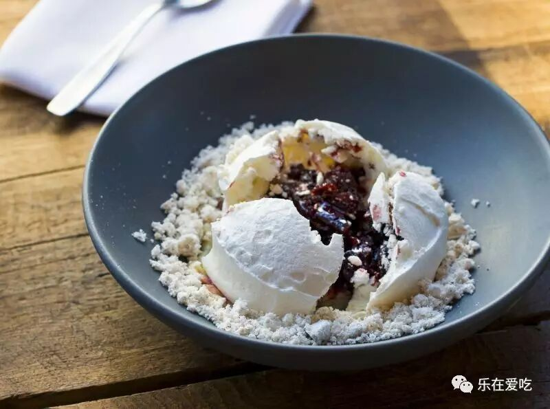 (原始链接: http://mmbiz.qpic.cn/mmbiz_jpg/XA8n2XaESnTBD4w7nlM0mnYZRDZogE4tPeZcaOcnvkKxYDTkZ1NRHN5NLSsibibN1iaBicm1kYr5eVByRJ7x8LRdeg/0?wx_fmt=jpeg)
- 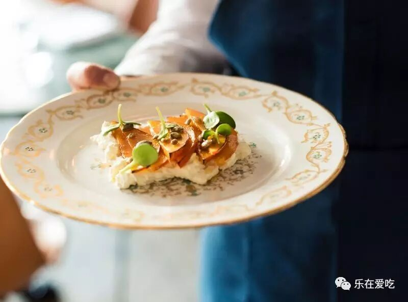 (原始链接: http://mmbiz.qpic.cn/mmbiz_jpg/XA8n2XaESnTBD4w7nlM0mnYZRDZogE4tZibzAk7qNPeMduoic5tlBbv3ic8sicWnR12xObHpcuzSY7GmBycgAvHPLw/0?wx_fmt=jpeg)
-  (原始链接: http://mmbiz.qpic.cn/mmbiz_jpg/XA8n2XaESnSZc5fiaHTAKN3ltmvFbpkclfx0RWxh1mnvib6xWrFzjNOTtiaMffON7zy6XutJx0MDFyf8ARib60icweA/0?wx_fmt=jpeg)
