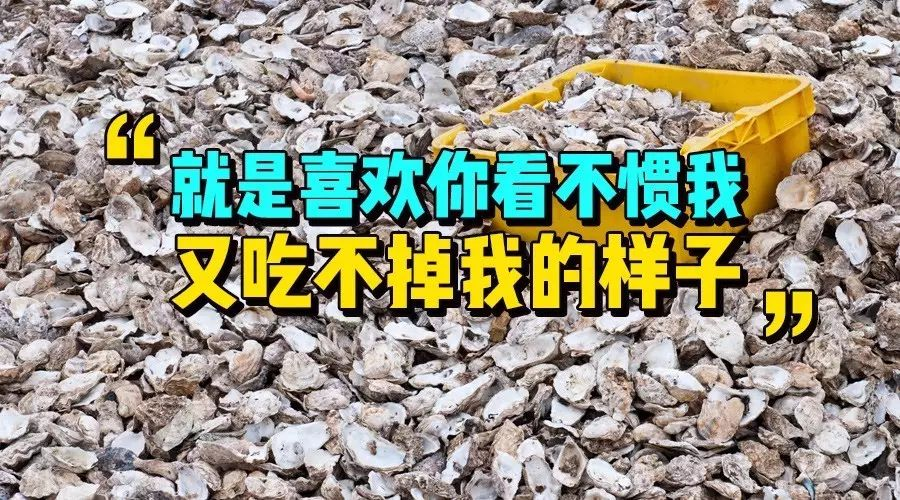
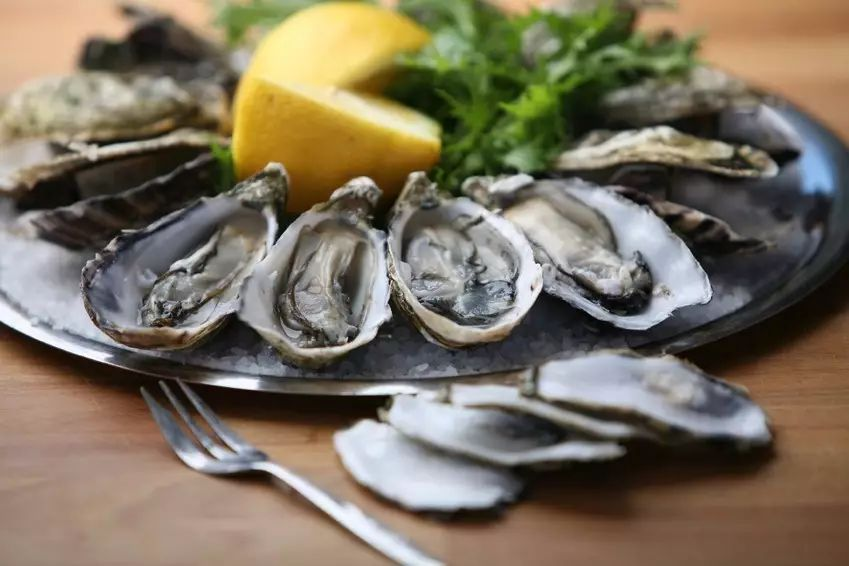
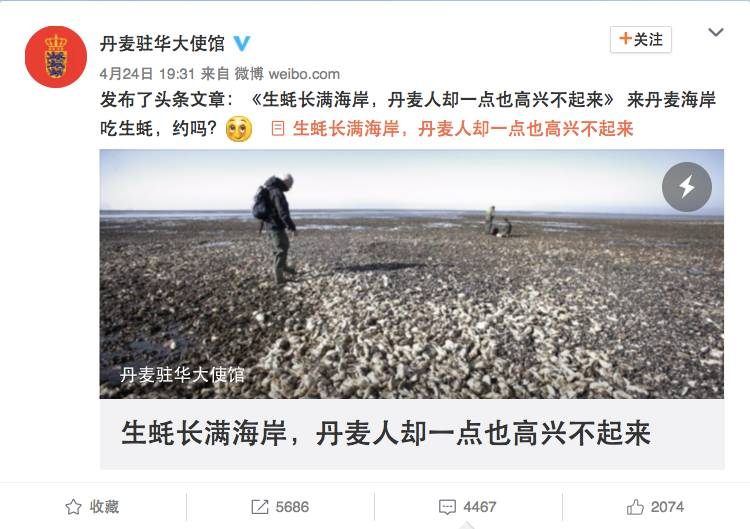
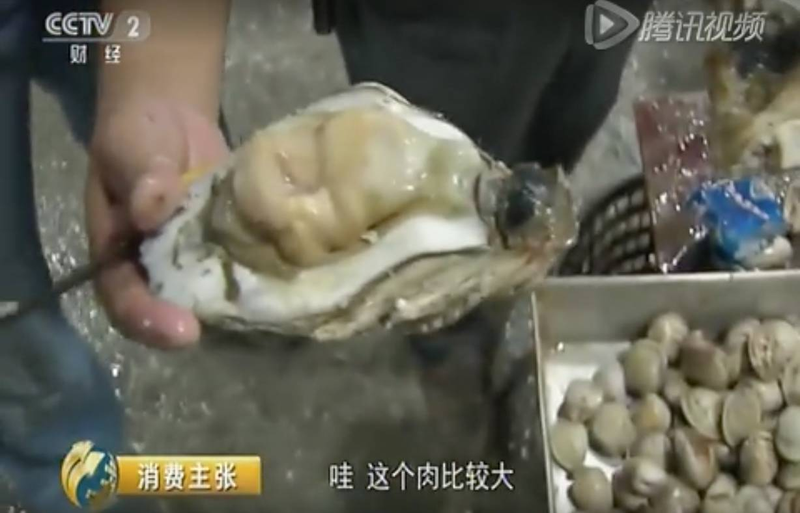
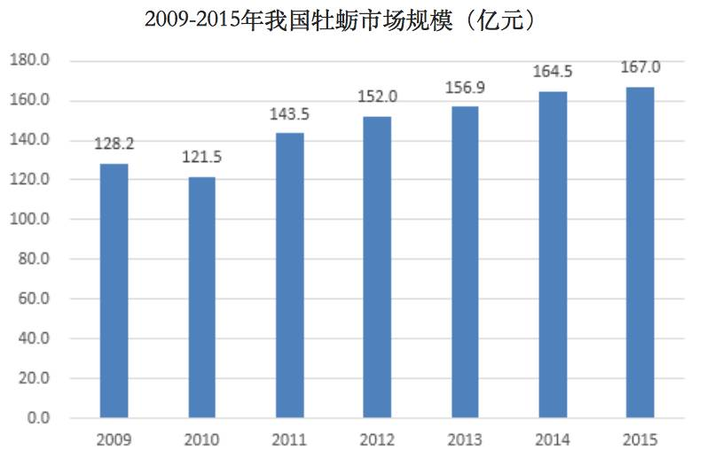
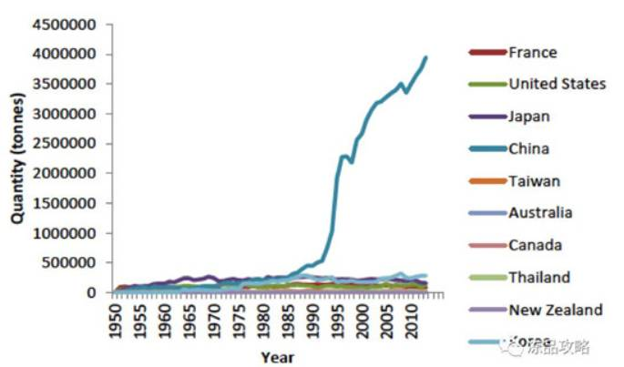
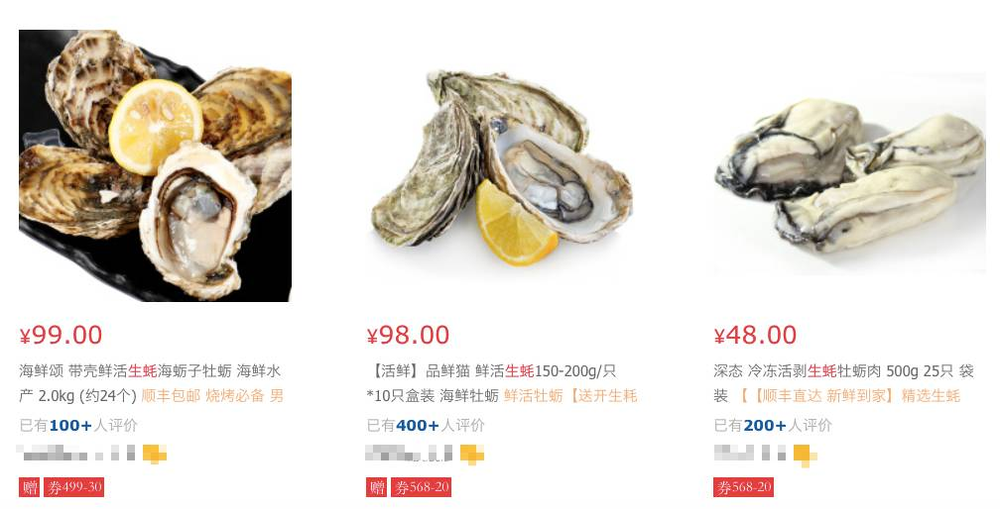
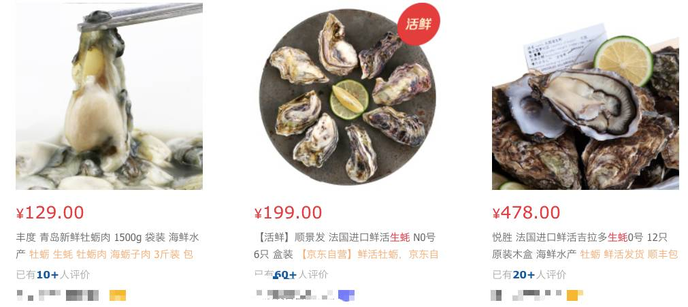

# 无标题

**链接地址:** http://mp.weixin.qq.com/s?__biz=MzA5Nzc3NTAzMA==&mid=2650969988&idx=3&sn=c90daed270e8367b20e6529e0bdcb70e&chksm=8b6d8b5dbc1a024b687946a3767ea9f139db3055228db8c98dd170eff085897be6ed67c6e2bd&mpshare=1&scene=2&srcid=0426qnsMWufM8PZSp6ypipP5#rd
**作者:** 
**获取时间:** 2025/8/28 22:31:52
**图片数量:** 13

---

## 原始HTML内容

 

生蚝，被誉为“海中牛奶”，因其营养价值之高，味道之鲜美，口感之嫩滑，受到食客的追捧，甚至有人将它称作“男人的加油站，女人的美容院”。

 

 

现在，中国人越来越喜欢吃生蚝，巨大的消费市场也使中国成为全球养殖生蚝的主要产地之一。

 

不过，最近在丹麦，由于生蚝太多，给政府造成了不小的麻烦。

 

<strong style="max-width: 100%; box-sizing: border-box !important; word-wrap: break-word !important;">丹麦生蚝泛滥，政府无可奈何</strong>

 

4月24日，丹麦驻华大使馆官方微博发布了一条文章《生蚝长满海岸，丹麦人却一点也高兴不起来》。

 

 

文章表示，一种叫做太平洋生蚝的物种入侵了丹麦，对海岸的生态环境造成了极大的破坏，这种生蚝原本不属于丹麦的海域，而是来自南方海域，经过数十年时间的生长，形成了现在如此巨大的规模。

 

丹麦的科学家和渔民已经向丹麦自然保护局投诉很多次了，但是依旧没有办法处理这些棘手的入侵者。

 
<blockquote style=" max-width: 100%; color: rgb(62, 62, 62) ; ; ; ; ; ; ; ; ; ; ; ; ">
我们鼓励大家去海岸边采集这些生蚝带回家煎炒烹炸，但实际上这只是一个象征性的活动，并没有多少人去这样做，所以根本就没有效果。
</blockquote>
 

丹麦贝类研究中心的主管Jens Kjerulf Petersen教授向自然保护局寄了一封信件，明确指出了太平洋生蚝入侵问题的严峻性。并建议当局对太平洋生蚝的分布进行测绘，采取具有可行性的方法阻止其蔓延。然而，当局对此并不感兴趣。

 

自然保护局和环境保护局回应说，当时他们没有资金的支持，因此并没有采取及时有效的措施。

 

Jens教授说，“我认为我们在2010年的时候就应该集中全力着手处理这件事情，才不会有现在这么大的麻烦出现。我没说当局没有任何作为，因为我也不能保证当时能够完全解决问题，只是我们的确是没有抓住那个好机会”。

 

环境保护局生物学家Hans Erik Svart针对这封信做出回应，他说，“我不认为我们什么都没做，只是我所作的都很难达成效果。Jens教授的确意识到了这件事情的严重性，但是我从他的信件中没有看见任何有用的建议。太平洋生蚝在瓦登海生长了几十年，我们也没有任何办法。这真的和钱没有关系，无论你给我多少钱，我也没辙”。

<strong> </strong>

<strong>“我们鼓励大家通过’吃’来消灭这些生蚝，但是大家都一张冷漠脸”。</strong>

<strong> </strong>

 

看来依靠群众的力量是行不通了，最近丹麦的有关部门开了个会，商量说看渔民们能不能做点什么。但是，渔民们也表示“这锅我也背不动”。渔民们只能说“我们对此表示极大关切”。

 

现在，有关部门正在对这一问题进行全面的调查和评估中，究竟怎样解决还得等等看。

 

每经小编发现，丹麦驻华大使馆这条微博目前以被转发5600多次，评论4400多条。要知道丹麦驻华大使馆平时微博的转发和评论数量只有两位数。

 

看见能吃的东西，中网友纷纷给丹麦出主意。

 
<blockquote style=" max-width: 100%; color: rgb(62, 62, 62) ; ; ; ; ; ; ; ; ; ; ; ; ">
@苏-大飞：苏搞好进出口检验检疫环节，大量出口到中国来吧

 

@屋里冲：叫马云过去，上淘宝，上天猫，让顺丰王卫再看看要几天运送过来
</blockquote>
 

甚至有旅游中介说：

 
<blockquote style=" max-width: 100%; color: rgb(62, 62, 62) ; ; ; ; ; ; ; ; ; ; ; ; ">
请丹麦政府为中国爱吃生蚝的重症患者开辟绿色通道，我们公司会看情况设计一条专门的吃生蚝行程，全程贴心服务，并且还可以开设吃生蚝夏令营，从简单的吃生蚝讲到物种入侵，既吃了又长了知识，还强壮了身体。
</blockquote>
 

其中，最直接的一条建议是：

 
<blockquote style=" max-width: 100%; color: rgb(62, 62, 62) ; ; ; ; ; ; ; ; ; ; ; ; ">
把签证放宽，开辟吃生蚝签证，十年内无限次往返，每次停留最长一个月，我估计五年差不多就消灭这些生蚝了。
</blockquote>
 

 

 

<strong style="max-width: 100%; box-sizing: border-box !important; word-wrap: break-word !important;">中国生蚝市场已达167亿元</strong>

 

在中国，很多人分不清生蚝和牡蛎。根据央视《消费主张》此前报道，其实，牡蛎和生蚝是一个物种。在北方海域养殖的海蛎子，就是生长了1年的牡蛎；在南方海域养育了2～3年牡蛎品种，个头相对较大，被称作生蚝。

 

 

中国人爱吃生蚝和牡蛎，使得国内的牡蛎生蚝市场规模已经高达167亿元人民币。

 

▲图片来源：中国产业信息网

 

此外，中国也是生蚝养殖大国，年产量长期保持世界第一的位置。据中产业信息网2016年12月报道，中国的海水养殖中，由于贝类投入成本低、单产高等特点，已成为沿海养殖渔民的主要经济来源，贝类养殖占海水养殖的比重高达80%；而贝类养殖中又以牡蛎养殖为主，牡蛎是中国传统的贝类养殖品种之一。

 

中国牡蛎养殖主要分布于沿海各省，具体讲有福建、山东、广东、浙江、辽宁、江苏、广西和海南；其中福建规模最大，其次为山东、广东和广西。

 

 

▲1950年-2010年全球生蚝主产国产量对比图，中国产量遥遥领先（图片来源：中国水产门户网）

 

据统计，2015年我国牡蛎（蚝）行业产量约457.34万吨，同比2014年的435.21万吨增长了5.08%，养殖面积也在不断扩大中，2015年达到141488公顷。

 

由于中国生蚝产量巨大，使得国产生蚝的价格并不太贵。每经小编（微信号：nbdnews）在某电商平台上看到，国产生蚝价格普遍在5元～10元/只左右。

 

 

但是进口生蚝价格就很贵了。例如，一种法国产生蚝12只的总价在350元，质量更好的价格高达12只478元。

 

 

所以，丹麦如果想把自己海滩上的生蚝出口给中国，还得避免价格过高，这样，中国吃货们才会买单。

 

<a href="http://mp.weixin.qq.com/s?__biz=MzA5Nzc3NTAzMA==&amp;mid=2650969984&amp;idx=1&amp;sn=c87daf3fc5b90bdac21420c71b1552f0&amp;chksm=8b6d8b59bc1a024f6853106ff6ea7c68ee0909ba06eaf67ecd8716d1a70c7d7953c1c28b7200&amp;scene=21#wechat_redirect" target="_blank" data_ue_src="http://mp.weixin.qq.com/s?__biz=MzA5Nzc3NTAzMA==&amp;mid=2650969984&amp;idx=1&amp;sn=c87daf3fc5b90bdac21420c71b1552f0&amp;chksm=8b6d8b59bc1a024f6853106ff6ea7c68ee0909ba06eaf67ecd8716d1a70c7d7953c1c28b7200&amp;scene=21#wechat_redirect" style="font-size: 14px; text-decoration: underline;">养老金支出亮黄灯：个人账户“空账”4.7万亿，进入三级风险区</a>
<section label="Copyright © 2015 Yead All Rights Reserved." style="margin: 5px auto; line-height: 25.6px; max-width: 100%; white-space: pre-wrap; background-color: rgb(255, 255, 255); box-sizing: border-box !important; word-wrap: break-word !important;"><section style="margin-top: 10px; margin-bottom: 10px; max-width: 100%; box-sizing: border-box !important; word-wrap: break-word !important;"><section style="margin-right: auto; margin-bottom: -2px; margin-left: auto; padding: 10px; max-width: 100%; border-radius: 5px; border-width: 2px; border-style: solid; border-color: rgb(197, 63, 70); color: inherit; box-sizing: border-box !important; word-wrap: break-word !important;">
<a href="http://mp.weixin.qq.com/s?__biz=MzA5Nzc3NTAzMA==&amp;mid=2650969984&amp;idx=3&amp;sn=558d8fe5d784c97a753c4176829ff30a&amp;chksm=8b6d8b59bc1a024f8e67d2c42f7cb0e42e26708ba6f5c2db67905eff8439602b7f7dee6d24bc&amp;scene=21#wechat_redirect" target="_blank" data_ue_src="http://mp.weixin.qq.com/s?__biz=MzA5Nzc3NTAzMA==&amp;mid=2650969984&amp;idx=3&amp;sn=558d8fe5d784c97a753c4176829ff30a&amp;chksm=8b6d8b59bc1a024f8e67d2c42f7cb0e42e26708ba6f5c2db67905eff8439602b7f7dee6d24bc&amp;scene=21#wechat_redirect" style="font-size: 14px; text-decoration: underline;">美女大学生主播年入200万深圳买房，“妈妈看到房后吓哭了”</a> 

<a href="http://mp.weixin.qq.com/s?__biz=MzA5Nzc3NTAzMA==&amp;mid=2650969984&amp;idx=4&amp;sn=7e61b99855c9bf3b60f96d576dbc0601&amp;chksm=8b6d8b59bc1a024f6174d12ede774d0600c0e3143578706f546be4e88db2dba692660886f93c&amp;scene=21#wechat_redirect" target="_blank" data_ue_src="http://mp.weixin.qq.com/s?__biz=MzA5Nzc3NTAzMA==&amp;mid=2650969984&amp;idx=4&amp;sn=7e61b99855c9bf3b60f96d576dbc0601&amp;chksm=8b6d8b59bc1a024f6174d12ede774d0600c0e3143578706f546be4e88db2dba692660886f93c&amp;scene=21#wechat_redirect" style="font-size: 14px; text-decoration: underline;">冯小树遭罚没4.99亿元牵出多名大佬，这些人要遭殃了！</a> 

<a href="http://mp.weixin.qq.com/s?__biz=MzA5Nzc3NTAzMA==&amp;mid=2650969984&amp;idx=5&amp;sn=eee46e1ccd57d0afbc216b7a84dac75d&amp;chksm=8b6d8b59bc1a024f26ce68baabd1bd527484dba1a3b2d0b5ca68a75b99210c9f9fd24d2a26e8&amp;scene=21#wechat_redirect" target="_blank" data_ue_src="http://mp.weixin.qq.com/s?__biz=MzA5Nzc3NTAzMA==&amp;mid=2650969984&amp;idx=5&amp;sn=eee46e1ccd57d0afbc216b7a84dac75d&amp;chksm=8b6d8b59bc1a024f26ce68baabd1bd527484dba1a3b2d0b5ca68a75b99210c9f9fd24d2a26e8&amp;scene=21#wechat_redirect" style="font-size: 14px; text-decoration: underline;">警方辟谣"鸟巢大会每人领5万" ，仍有老人坚持进京</a> 

<a href="http://mp.weixin.qq.com/s?__biz=MzA5Nzc3NTAzMA==&amp;mid=2650969977&amp;idx=1&amp;sn=6418c203973fff3f49a793490dd57319&amp;chksm=8b6d8ba0bc1a02b682a8c02bb23cbc6ac29b4251a9c71a0f0a569a3e27c8592efe721bc19ca2&amp;scene=21#wechat_redirect" target="_blank" data_ue_src="http://mp.weixin.qq.com/s?__biz=MzA5Nzc3NTAzMA==&amp;mid=2650969977&amp;idx=1&amp;sn=6418c203973fff3f49a793490dd57319&amp;chksm=8b6d8ba0bc1a02b682a8c02bb23cbc6ac29b4251a9c71a0f0a569a3e27c8592efe721bc19ca2&amp;scene=21#wechat_redirect" style="font-size: 14px; text-decoration: underline;">跌惨！股、债、商齐跌，沪指创4个月最大跌幅！这是开始还是结束？！</a> 

<a href="http://mp.weixin.qq.com/s?__biz=MzA5Nzc3NTAzMA==&amp;mid=2650969977&amp;idx=2&amp;sn=24a7643254fe91151e8cf3e3b376c0f2&amp;chksm=8b6d8ba0bc1a02b6529b704b2ab6e000811b9fc960cdeea85924269c6718b472dbf9522e739f&amp;scene=21#wechat_redirect" target="_blank" data_ue_src="http://mp.weixin.qq.com/s?__biz=MzA5Nzc3NTAzMA==&amp;mid=2650969977&amp;idx=2&amp;sn=24a7643254fe91151e8cf3e3b376c0f2&amp;chksm=8b6d8ba0bc1a02b6529b704b2ab6e000811b9fc960cdeea85924269c6718b472dbf9522e739f&amp;scene=21#wechat_redirect" style="font-size: 14px; text-decoration: underline;">中泰创展：未约定易到14亿贷款用途 目前存续正常</a> 
</section></section></section><article class="" data-author="Wxeditor" style="margin: 5px auto; white-space: normal; max-width: 100%; font-size: 14px; border-width: 0px; border-style: initial; border-color: initial; box-sizing: border-box !important; word-wrap: break-word !important;"><section class="" style="margin-right: auto; margin-left: auto; max-width: 100%; width: 240px; height: 240px; background-image: url(&quot;http://mmbiz.qpic.cn/mmbiz_png/ianq03UUWGmLt5YB9rBt8CYVjN3xib768ibIO1v0rApG32dudiaDzLLnRU4KzJKZib8rCtszoPeDWEhJk1X8jqMqarg/0?wx_fmt=png&quot;); background-size: 100%; box-sizing: border-box !important; word-wrap: break-word !important;"><section style="margin-top: 9px; margin-left: 49px; max-width: 100%; display: inline-block; box-sizing: border-box !important; word-wrap: break-word !important; width: 138px !important;"></section></section></article>

---

## 纯文本内容

生蚝，被誉为“海中牛奶”，因其营养价值之高，味道之鲜美，口感之嫩滑，受到食客的追捧，甚至有人将它称作“男人的加油站，女人的美容院”。现在，中国人越来越喜欢吃生蚝，巨大的消费市场也使中国成为全球养殖生蚝的主要产地之一。不过，最近在丹麦，由于生蚝太多，给政府造成了不小的麻烦。丹麦生蚝泛滥，政府无可奈何4月24日，丹麦驻华大使馆官方微博发布了一条文章《生蚝长满海岸，丹麦人却一点也高兴不起来》。文章表示，一种叫做太平洋生蚝的物种入侵了丹麦，对海岸的生态环境造成了极大的破坏，这种生蚝原本不属于丹麦的海域，而是来自南方海域，经过数十年时间的生长，形成了现在如此巨大的规模。丹麦的科学家和渔民已经向丹麦自然保护局投诉很多次了，但是依旧没有办法处理这些棘手的入侵者。我们鼓励大家去海岸边采集这些生蚝带回家煎炒烹炸，但实际上这只是一个象征性的活动，并没有多少人去这样做，所以根本就没有效果。丹麦贝类研究中心的主管Jens Kjerulf Petersen教授向自然保护局寄了一封信件，明确指出了太平洋生蚝入侵问题的严峻性。并建议当局对太平洋生蚝的分布进行测绘，采取具有可行性的方法阻止其蔓延。然而，当局对此并不感兴趣。自然保护局和环境保护局回应说，当时他们没有资金的支持，因此并没有采取及时有效的措施。Jens教授说，“我认为我们在2010年的时候就应该集中全力着手处理这件事情，才不会有现在这么大的麻烦出现。我没说当局没有任何作为，因为我也不能保证当时能够完全解决问题，只是我们的确是没有抓住那个好机会”。环境保护局生物学家Hans Erik Svart针对这封信做出回应，他说，“我不认为我们什么都没做，只是我所作的都很难达成效果。Jens教授的确意识到了这件事情的严重性，但是我从他的信件中没有看见任何有用的建议。太平洋生蚝在瓦登海生长了几十年，我们也没有任何办法。这真的和钱没有关系，无论你给我多少钱，我也没辙”。“我们鼓励大家通过’吃’来消灭这些生蚝，但是大家都一张冷漠脸”。看来依靠群众的力量是行不通了，最近丹麦的有关部门开了个会，商量说看渔民们能不能做点什么。但是，渔民们也表示“这锅我也背不动”。渔民们只能说“我们对此表示极大关切”。现在，有关部门正在对这一问题进行全面的调查和评估中，究竟怎样解决还得等等看。每经小编发现，丹麦驻华大使馆这条微博目前以被转发5600多次，评论4400多条。要知道丹麦驻华大使馆平时微博的转发和评论数量只有两位数。看见能吃的东西，中网友纷纷给丹麦出主意。@苏-大飞：苏搞好进出口检验检疫环节，大量出口到中国来吧@屋里冲：叫马云过去，上淘宝，上天猫，让顺丰王卫再看看要几天运送过来甚至有旅游中介说：请丹麦政府为中国爱吃生蚝的重症患者开辟绿色通道，我们公司会看情况设计一条专门的吃生蚝行程，全程贴心服务，并且还可以开设吃生蚝夏令营，从简单的吃生蚝讲到物种入侵，既吃了又长了知识，还强壮了身体。其中，最直接的一条建议是：把签证放宽，开辟吃生蚝签证，十年内无限次往返，每次停留最长一个月，我估计五年差不多就消灭这些生蚝了。中国生蚝市场已达167亿元在中国，很多人分不清生蚝和牡蛎。根据央视《消费主张》此前报道，其实，牡蛎和生蚝是一个物种。在北方海域养殖的海蛎子，就是生长了1年的牡蛎；在南方海域养育了2～3年牡蛎品种，个头相对较大，被称作生蚝。中国人爱吃生蚝和牡蛎，使得国内的牡蛎生蚝市场规模已经高达167亿元人民币。▲图片来源：中国产业信息网此外，中国也是生蚝养殖大国，年产量长期保持世界第一的位置。据中产业信息网2016年12月报道，中国的海水养殖中，由于贝类投入成本低、单产高等特点，已成为沿海养殖渔民的主要经济来源，贝类养殖占海水养殖的比重高达80%；而贝类养殖中又以牡蛎养殖为主，牡蛎是中国传统的贝类养殖品种之一。中国牡蛎养殖主要分布于沿海各省，具体讲有福建、山东、广东、浙江、辽宁、江苏、广西和海南；其中福建规模最大，其次为山东、广东和广西。▲1950年-2010年全球生蚝主产国产量对比图，中国产量遥遥领先（图片来源：中国水产门户网）据统计，2015年我国牡蛎（蚝）行业产量约457.34万吨，同比2014年的435.21万吨增长了5.08%，养殖面积也在不断扩大中，2015年达到141488公顷。由于中国生蚝产量巨大，使得国产生蚝的价格并不太贵。每经小编（微信号：nbdnews）在某电商平台上看到，国产生蚝价格普遍在5元～10元/只左右。但是进口生蚝价格就很贵了。例如，一种法国产生蚝12只的总价在350元，质量更好的价格高达12只478元。所以，丹麦如果想把自己海滩上的生蚝出口给中国，还得避免价格过高，这样，中国吃货们才会买单。养老金支出亮黄灯：个人账户“空账”4.7万亿，进入三级风险区美女大学生主播年入200万深圳买房，“妈妈看到房后吓哭了”冯小树遭罚没4.99亿元牵出多名大佬，这些人要遭殃了！警方辟谣"鸟巢大会每人领5万" ，仍有老人坚持进京跌惨！股、债、商齐跌，沪指创4个月最大跌幅！这是开始还是结束？！中泰创展：未约定易到14亿贷款用途 目前存续正常

---

## 图片列表

-  (原始链接: http://mmbiz.qpic.cn/mmbiz_jpg/ySkkicIuF2H6qsibiaa2K4W6lDOxtlSBLntQfGRf4Qfib5eibJ8yFNdX4F7Mj7kFicibw6rNYZKUCZfLn6vHsyRNmIUlw/0?wx_fmt=jpeg)
-  (原始链接: http://mmbiz.qpic.cn/mmbiz_jpg/ySkkicIuF2H6qsibiaa2K4W6lDOxtlSBLntpxawArkpwJgbyb5xWNUziadbzVfy7lufBw9jyVh0N02iacb7n8DIYFlQ/0?wx_fmt=jpeg)
-  (原始链接: http://mmbiz.qpic.cn/mmbiz_png/ajT9KUbORcyRV13lyaia5RX5Ul5J6CAbuibcicD8KCM13kiclibgVCGYcMTCLtTSPT1qtgFksPibRhLSO3v6Libxn3EFw/0?wx_fmt=png)
-  (原始链接: http://mmbiz.qpic.cn/mmbiz_jpg/qZtW6qrykmy5gQreq3AAeqavkE4XQzdrfyGYK8H7jgyickJKtUHia9OCOguA1fAG9pKmQiasnAjn1DYNXNsex048w/0?wx_fmt=jpeg)
-  (原始链接: http://mmbiz.qpic.cn/mmbiz_png/ajT9KUbORcyRV13lyaia5RX5Ul5J6CAbuApgQ1iaB7SL7d4gQ7xeArlNGBEc31SWvS6qurQw4nUgX5CKK5hQjGQQ/0?wx_fmt=png)
-  (原始链接: http://mmbiz.qpic.cn/mmbiz_png/ajT9KUbORcyRV13lyaia5RX5Ul5J6CAbu4TC6Zr261G9Lp7uV0waSvht5CYHZmhV4zBdZgmMkoSniaCFs9c5CKRg/0?wx_fmt=png)
-  (原始链接: http://mmbiz.qpic.cn/mmbiz_png/ajT9KUbORcyRV13lyaia5RX5Ul5J6CAbukLaf38SMMlYIYKpDQUUqqh7eQX8qQ4f5Cn3MgI9aibcfUwkXWIujApg/0?wx_fmt=png)
-  (原始链接: http://mmbiz.qpic.cn/mmbiz_png/ajT9KUbORcyRV13lyaia5RX5Ul5J6CAbummja1sbIDpqOeheOrH9cJBicEsU1VnNy2sxYoFHrkoibnmPl4GegSZcw/0?wx_fmt=png)
-  (原始链接: http://mmbiz.qpic.cn/mmbiz_png/ajT9KUbORcyRV13lyaia5RX5Ul5J6CAbuJW5tYyIXq7Sc2GjOkibxSc82DKEVTicHdLyIZJL5pmhJHglsfxVrykbg/0?wx_fmt=png)
-  (原始链接: http://mmbiz.qpic.cn/mmbiz_png/ajT9KUbORcyRV13lyaia5RX5Ul5J6CAbuqKOyEuKg5na56CTI3sdqjq8KnVlPcpvul7YrXzDRPibbtj8vY5moulQ/0?wx_fmt=png)
-  (原始链接: http://mmbiz.qpic.cn/mmbiz/qZtW6qrykmyrDFeeps0b8zFCNIia98icYX8LhOm4jNmfEMXzDriaE3mQSu9zVglMibm97oOheSe5YD7Yc3V92Ww41g/0.gif?tp=webp&wxfrom=5&wx_lazy=1)
-  (原始链接: http://mmbiz.qpic.cn/mmbiz_png/qZtW6qrykmzJOSakzdqsET40ciaE7cf0EytqVfzknU1QN5jibRZaKJUmSpF3VvOmBicNUepnUWs5w5VbHAEOSDswg/0?wx_fmt=png)
-  (原始链接: http://mmbiz.qpic.cn/mmbiz_jpg/qZtW6qrykmwtc4HibHx36lja1qTIKdYuaYibZlFp2xIb9bzuibOwbT2WHWwz3raKZiaNWccUK9rChAXYpYc0qdIDkw/640?wx_fmt=jpeg)
