# 无标题

**链接地址:** http://mp.weixin.qq.com/s?__biz=MjM5NjQ3MzQ2MA==&mid=2654017991&idx=1&sn=10bdd9a14d4162ef46240bb9109d776e&chksm=bd2d06dc8a5a8fca95523227c44b3d13cf1ea3d586cf9645bd2c2d387f8cf869f5ce37987971&mpshare=1&scene=2&srcid=05248d2KGO4p34HrdkMC0aNT#rd
**作者:** 大斯、小茗
**获取时间:** 2025/8/28 22:31:09
**图片数量:** 57

---

## 原始HTML内容

 

&nbsp;

 

<strong>好消息</strong>

<strong>好消息</strong><strong></strong>

<strong>好消息</strong><strong></strong>

 

<strong>你手上的中国护照</strong>

<strong>又升值啦</strong><strong></strong><strong></strong>

&nbsp;
<section style="white-space: normal; background-color: rgb(255, 255, 255); box-sizing: border-box;"><section class="Powered-by-XIUMI V5" powered-by="xiumi.us" style="box-sizing: border-box;"><section class="" style="margin-top: 10px; margin-bottom: 10px; box-sizing: border-box;"><section class="" style="width: 556px; transform: rotate(0deg); box-sizing: border-box;"><section style="width: 50px; height: 4px; background-color: rgb(47, 106, 169); box-sizing: border-box;"></section></section><section class="" style="margin-top: -4px; padding: 10px; background-color: rgb(239, 239, 239); box-sizing: border-box;"><section class="Powered-by-XIUMI V5" powered-by="xiumi.us" style="box-sizing: border-box;"><section class="" style="box-sizing: border-box;"><section class="" style="line-height: 2; letter-spacing: 0px; box-sizing: border-box;">
据央视新闻5月17日最新消息称：中国和阿根廷就双方互发10年多次有效旅游、商务签证达成一致。

 

根据修订后的协议，两国将互为对方个人游客颁发有效期为十年，可多次入出境，每次最长停留期为九十天的旅游签证。

 

<strong>上述修订后的协议将于2017年6月15日正式生效。</strong>
</section></section></section></section></section></section></section>
 

 

这意味着

<strong>阿根廷</strong>

将对中国公民

<strong>开放10年签证</strong>

&nbsp;

 

消息一出，老司机鸡冻得

一夜睡不着觉

&nbsp;&nbsp;

 

你知道吗？

阿根廷可是被称作<strong>最难签的国家</strong>&nbsp;

去年官方宣布

凡持美国、加拿大、欧盟、巴西或智利签证的

中国籍游客都可以免签进入阿根廷

老司机们高兴得奔走相告

现在10年签证又将出台

是时候

把它列入你的旅行清单了

 

对中国游客来说

阿根廷

<strong>那么远又那么近</strong>

&nbsp;

<strong>远&nbsp;</strong>是因为地理距离

不管往东走还是往西走

从中国北京到阿根廷首都布宜诺斯艾利斯

都要两万公里起

&nbsp;

<strong>近&nbsp;</strong>是因为几乎每个人

提起阿根廷

都会脱口而出

<strong>我知道！</strong>

&nbsp;

梅西和马拉多纳

 

&nbsp;

浪漫性感的探戈

&nbsp;

 

王家卫镜头下那片浓郁的色彩

&nbsp;

<strong>但阿根廷的美、阿根廷的风情</strong>

<strong>远超你想象</strong>

 

这里有<strong>南美洲的巴黎</strong>

<strong>布宜诺斯艾利斯</strong>

 

 

入选<strong>孤独星球最佳小众旅游地</strong>的&nbsp;

小瑞士<strong>巴里洛切</strong>

 

 

和“世界尽头”<strong>乌斯怀亚</strong>

 

&nbsp;

更有气势磅礴、令人战栗的

<strong>伊瓜苏大瀑布</strong>

 

&nbsp;

地球上最高的死火山

<strong>阿空加瓜峰</strong>

 

&nbsp;

可以看到<strong>“冰崩”奇观</strong>的

<strong>莫雷诺冰川</strong>

 

&nbsp;

<strong>毫不夸张地说，阿根廷</strong>

<strong>就是众多旅行者心里</strong>

<strong>终极的梦想</strong>

 

 
<h2 data-indent="0.5" style="margin-right: 0.5em; margin-left: 0.5em; white-space: normal; max-width: 100%; color: rgb(62, 62, 62); text-align: center; line-height: 2em;">南美洲的巴黎</h2><h2 data-indent="0.5" style="margin-right: 0.5em; margin-left: 0.5em; white-space: normal; max-width: 100%; color: rgb(62, 62, 62); text-align: center; line-height: 2em;">布宜诺斯艾利斯</h2>
 

 

阿根廷的首都 

在西班牙语中意为“好空气”

被誉为“南美洲巴黎”

在这里，你会发现

一个和想象中完全不同的南美

 

&nbsp;

这里有全球第二大书店的<strong>雅典人书店</strong>

书店由废弃的歌剧院改造而成

保留了原本的环形结构和穹顶壁画

富丽堂皇又具复古韵味

 

&nbsp;

在这样古典雅致的环境中阅读

也许你才会真切地体会到

阿根廷作家博尔赫斯说过的那句话

天堂应该是图书馆的模样

 

 

但当你来到<strong>博卡区</strong>

画风突变

仿佛掉入一个色彩之国

 

 

这里聚集着全市最鲜艳的建筑

每一面墙壁都被装饰得五彩斑斓

连空气都跟着变得活泼明快起来

 

 

这里是探戈的发源地

色彩鲜艳的房子之间 

是人们热情的探戈舞步

 

&nbsp;

位于五月广场内的<strong>总统府</strong> 

以其梦幻的粉色闻名遐迩

电影《贝隆夫人》里

麦当娜就是在总统府的阳台上

唱出著名的《Don't cry for me Argentina》

 

 

<strong>&nbsp;</strong>
<h2 data-indent="0.5" style="margin-right: 0.5em; margin-left: 0.5em; white-space: normal; max-width: 100%; color: rgb(62, 62, 62); text-align: center; line-height: 2em;">世界真正的尽头</h2><h2 data-indent="0.5" style="margin-right: 0.5em; margin-left: 0.5em; white-space: normal; max-width: 100%; color: rgb(62, 62, 62); text-align: center; line-height: 2em;">乌斯怀亚</h2>
 

 

乌斯怀亚是<strong>世界最南端的城市</strong>

也是全世界<strong>离南极大陆最近</strong>的地方

每到夏季，游客在此搭乘邮船

前往南极

 

 

这里的空气清冷而纯净

让人感受到南极独特而神秘的气息

 

&nbsp;

<strong>事实上</strong>

<strong>阿根廷拥有众多世界级美景</strong>

<strong>即使暂时去不了南极</strong>

<strong>你也同样能一睹</strong>

<strong>明信片上才有的震撼绝美景观</strong>

 

&nbsp;
<h3 data-indent="0.5" style="margin-right: 0.5em; margin-left: 0.5em; white-space: normal; max-width: 100%; color: rgb(62, 62, 62); text-align: center; line-height: 2em;">伊瓜苏国家公园</h3>
 

 

世界自然遗产、世界三大瀑布之一的

<strong>伊瓜苏大瀑布</strong>

（就是春光乍泄里张国荣一直想和梁朝伟去看的那个瀑布）

&nbsp;

 

横跨巴西和阿根廷两国

两国分别建造了<strong>两座国家公园</strong>

 

 

这个世界上最宽的瀑布

其核心部分被称为“魔鬼的咽喉”

 

河水咆哮着

陡然跌坠于80米深处的峡谷

仿佛直接冲入地狱深处

《孤独星球》曾将它列入

全球终极旅行榜单的TOP8

 

 

&nbsp;
<h3 data-indent="0.5" style="margin-right: 0.5em; margin-left: 0.5em; white-space: normal; max-width: 100%; color: rgb(62, 62, 62); text-align: center; line-height: 2em;">阿空加瓜峰</h3>
 

 

号称“美洲巨人”的阿空加瓜

海拔6959米

是亚洲之外最高的山峰

 

同时也是地球上最高的死火山

常年积雪的峰顶，在阳光之下异常耀眼

 

 
<h3 data-indent="0.5" style="margin-right: 0.5em; margin-left: 0.5em; white-space: normal; max-width: 100%; color: rgb(62, 62, 62); text-align: center; line-height: 2em;">莫雷诺冰川</h3>
 

 

已经20万岁的莫雷诺冰川 

是世界三大冰川之一

也是地球上仍在向前推进的

少数活冰川之一

 

 

夏季可以看到<strong>“冰崩”</strong>奇观

一块块巨大的冰块落入阿根廷湖

一声声震耳欲聋的响声让人屏息凝注

但很快，一切又都归于平静

 

 

还有

阿根廷第一座国家公园
<h3 data-indent="0.5" style="margin-right: 0.5em; margin-left: 0.5em; white-space: normal; max-width: 100%; color: rgb(62, 62, 62); text-align: center;">纳韦尔瓦皮国家公园</h3>
<strong> </strong>

 

世界最南端的国家公园和自然保护区

<h3 data-indent="0.5" style="margin-right: 0.5em; margin-left: 0.5em; white-space: normal; max-width: 100%; color: rgb(62, 62, 62); text-align: center;">火地岛国家公园</h3>
 

 

<strong>除了上述美景</strong>

<strong>你可能想不到</strong>

<strong>阿根廷还有一系列</strong>

<strong>迷人的小镇</strong>

 
<h3 data-indent="0.5" style="margin-right: 0.5em; margin-left: 0.5em; white-space: normal; max-width: 100%; color: rgb(62, 62, 62); text-align: center;"><strong>南美小瑞</strong><strong>士巴里</strong><strong>洛切</strong></h3>

 

<strong>火烈鸟和羊驼的乐园：</strong><strong style="color: rgb(6, 61, 120); line-height: 1.6;">埃尔卡拉法特</strong>

 

 

对于很多老司机而言

阿根廷还有一条代表公路旅行终极梦想的

<strong>阿根廷40号公路</strong>

&nbsp;

 

它被称为

<strong>南美版66号公路</strong>

由南至北，沿着安第斯山脉

贯穿除了火地岛以外的整个阿根廷西部

全长4900公里

 

&nbsp;

从大西洋海岸到安第斯山脊

从海平面一直上升到4905米高的山口

沿途无数美景

 

 

而在40号公路上行驶

本身就是一种

只可意会不可言传的体验

看看世界是不是真的有尽头

 

 
<section style="white-space: normal; background-color: rgb(255, 255, 255); box-sizing: border-box;"><section class="Powered-by-XIUMI V5" powered-by="xiumi.us" style="box-sizing: border-box;"><section class="" style="margin-top: 10px; margin-bottom: 10px; text-align: center; box-sizing: border-box;"><section class="" style="padding: 2px 8px; background-color: rgb(47, 106, 169); display: inline-block; vertical-align: bottom; color: rgb(255, 255, 255); box-sizing: border-box;">
<strong>Tips</strong>
</section><section class="" style="margin-top: -1.86em; padding: 2em 10px 5px; border-color: rgb(47, 106, 169); border-width: 1px; border-style: solid; box-sizing: border-box;"><section class="Powered-by-XIUMI V5" powered-by="xiumi.us" style="box-sizing: border-box;"><section class="" style="box-sizing: border-box;"><section class="" style="padding-top: 5px; padding-bottom: 5px; text-align: left; font-size: 15px; line-height: 2; letter-spacing: 0px; box-sizing: border-box;">
有个好消息必须告诉你 

持中国驾照+租租车的国际驾照认证件

就可以在阿根廷租车

&nbsp;

而且这份国际驾照认证件

有效期和你的中国驾照一样长

到期还可以免费续领

不妨先准备好

等时机一到，就能说走就走

向世界尽头出发啦！

↓↓↓

</section></section></section></section></section></section></section>
 

本文图片来源Google、Pinterest、visualhunt

 
<section style="white-space: normal; max-width: 100%; line-height: 25.6px; text-align: justify; font-family: 微软雅黑; box-sizing: border-box !important; word-wrap: break-word !important;"><section style="padding-top: 0.5em; padding-bottom: 0.5em; max-width: 100%; border-width: 0px; color: rgb(44, 51, 56); line-height: 25.6px; box-sizing: border-box !important; word-wrap: break-word !important;"><section style="padding: 0.5em; max-width: 100%; border-color: rgb(87, 189, 249); text-align: center; border-top-width: 1px; border-bottom-width: 1px; border-top-style: solid; border-bottom-style: solid; box-sizing: border-box !important; word-wrap: break-word !important;"><section style="max-width: 100%; text-align: inherit; color: rgb(121, 121, 121); font-family: inherit; font-size: 1em; text-decoration: inherit; vertical-align: middle; display: inline-block; box-sizing: border-box !important; word-wrap: break-word !important;"><section style="max-width: 100%; box-sizing: border-box !important; word-wrap: break-word !important;"><strong style="max-width: 100%; font-family: inherit; font-size: 1em; text-align: inherit; text-decoration: inherit; box-sizing: border-box !important; word-wrap: break-word !important;">点击以下关键词&nbsp;查看租租车海外自驾攻略</strong></section></section></section></section></section>
 

<a href="https://m.zuzuche.com/tantu/driving_kit/details_v2.php?country=10158&amp;poi_source=10300" target="_blank" data_ue_src="https://m.zuzuche.com/tantu/driving_kit/details_v2.php?country=10158&amp;poi_source=10300" style="max-width: 100%; box-sizing: border-box !important; word-wrap: break-word !important;"><strong style="max-width: 100%; text-align: justify; line-height: 1.75em; font-family: inherit; font-size: 14.44px; box-sizing: border-box !important; word-wrap: break-word !important;">美国自驾攻略</strong></a><strong style="max-width: 100%; text-align: justify; color: inherit; line-height: 1.75em; font-family: inherit; font-size: 14.44px; text-decoration: inherit; box-sizing: border-box !important; word-wrap: break-word !important;">&nbsp;|&nbsp;<a href="https://m.zuzuche.com/tantu/driving_kit/details_v2.php?country=10008&amp;poi_source=10300" target="_blank" data_ue_src="https://m.zuzuche.com/tantu/driving_kit/details_v2.php?country=10008&amp;poi_source=10300" style="max-width: 100%; box-sizing: border-box !important; word-wrap: break-word !important;">澳大利亚自驾攻略</a></strong><strong style="max-width: 100%; text-align: justify; color: inherit; line-height: 1.75em; font-family: inherit; font-size: 14.44px; text-decoration: inherit; box-sizing: border-box !important; word-wrap: break-word !important;">&nbsp;|&nbsp;</strong><a href="https://m.zuzuche.com/tantu/driving_kit/details_v2.php?country=10046&amp;poi_source=10300" target="_blank" data_ue_src="https://m.zuzuche.com/tantu/driving_kit/details_v2.php?country=10046&amp;poi_source=10300" style="max-width: 100%; box-sizing: border-box !important; word-wrap: break-word !important;"><strong style="max-width: 100%; text-align: justify; line-height: 1.75em; font-family: inherit; font-size: 14.44px; box-sizing: border-box !important; word-wrap: break-word !important;">德国自驾攻略</strong></a><strong style="max-width: 100%; text-align: justify; color: inherit; line-height: 1.75em; font-family: inherit; font-size: 14.44px; text-decoration: inherit; box-sizing: border-box !important; word-wrap: break-word !important;">&nbsp;|&nbsp;<a href="https://m.zuzuche.com/tantu/driving_kit/details_v2.php?country=10095&amp;poi_source=10300" target="_blank" data_ue_src="https://m.zuzuche.com/tantu/driving_kit/details_v2.php?country=10095&amp;poi_source=10300" style="max-width: 100%; box-sizing: border-box !important; word-wrap: break-word !important;">新西兰自驾攻略</a></strong><strong style="max-width: 100%; text-align: justify; color: inherit; line-height: 1.75em; font-family: inherit; font-size: 14.44px; text-decoration: inherit; box-sizing: border-box !important; word-wrap: break-word !important;">&nbsp;|&nbsp;</strong><a href="https://m.zuzuche.com/tantu/driving_kit/details_v2.php?country=10162&amp;poi_source=10300" target="_blank" data_ue_src="https://m.zuzuche.com/tantu/driving_kit/details_v2.php?country=10162&amp;poi_source=10300" style="max-width: 100%; box-sizing: border-box !important; word-wrap: break-word !important;"><strong style="max-width: 100%; text-align: justify; line-height: 1.75em; font-family: inherit; font-size: 14.44px; box-sizing: border-box !important; word-wrap: break-word !important;">法国自驾攻略</strong></a><strong style="max-width: 100%; text-align: justify; color: inherit; line-height: 1.75em; font-family: inherit; font-size: 14.44px; text-decoration: inherit; box-sizing: border-box !important; word-wrap: break-word !important;">&nbsp;|&nbsp;</strong><a href="https://m.zuzuche.com/tantu/driving_kit/details_v2.php?country=10138&amp;poi_source=10300" target="_blank" data_ue_src="https://m.zuzuche.com/tantu/driving_kit/details_v2.php?country=10138&amp;poi_source=10300" style="max-width: 100%; box-sizing: border-box !important; word-wrap: break-word !important;"><strong style="max-width: 100%; text-align: justify; line-height: 1.75em; font-family: inherit; font-size: 14.44px; box-sizing: border-box !important; word-wrap: break-word !important;">泰国自驾攻略</strong></a><strong style="max-width: 100%; text-align: justify; color: inherit; line-height: 1.75em; font-family: inherit; font-size: 14.44px; text-decoration: inherit; box-sizing: border-box !important; word-wrap: break-word !important;">&nbsp;|&nbsp;</strong><a href="https://m.zuzuche.com/magazine/?country=canada&amp;country_cn=%E5%8A%A0%E6%8B%BF%E5%A4%A7" target="_blank" data_ue_src="https://m.zuzuche.com/magazine/?country=canada&amp;country_cn=%E5%8A%A0%E6%8B%BF%E5%A4%A7" style="max-width: 100%; box-sizing: border-box !important; word-wrap: break-word !important;"><strong style="max-width: 100%; text-align: justify; line-height: 1.75em; font-family: inherit; font-size: 14.44px; box-sizing: border-box !important; word-wrap: break-word !important;">加拿大自驾攻略</strong></a><strong style="max-width: 100%; text-align: justify; line-height: 1.75em; font-family: inherit; font-size: 14.44px; box-sizing: border-box !important; word-wrap: break-word !important;">&nbsp;</strong><strong style="max-width: 100%; text-align: justify; color: inherit; line-height: 1.75em; font-family: inherit; font-size: 14.44px; text-decoration: inherit; box-sizing: border-box !important; word-wrap: break-word !important;"><strong style="max-width: 100%; color: inherit; font-family: inherit; line-height: 1.75em; font-size: 14.44px; text-decoration: inherit; box-sizing: border-box !important; word-wrap: break-word !important;">|&nbsp;</strong><strong style="max-width: 100%; font-family: inherit; line-height: 1.75em; font-size: 14.44px; box-sizing: border-box !important; word-wrap: break-word !important;"><a href="https://m.zuzuche.com/magazine/?country=turkey&amp;country_cn=%E5%9C%9F%E8%80%B3%E5%85%B6" target="_blank" data_ue_src="https://m.zuzuche.com/magazine/?country=turkey&amp;country_cn=%E5%9C%9F%E8%80%B3%E5%85%B6" style="max-width: 100%; box-sizing: border-box !important; word-wrap: break-word !important;">土耳其自驾攻略</a></strong></strong>

---

## 纯文本内容

好消息好消息好消息你手上的中国护照又升值啦 据央视新闻5月17日最新消息称：中国和阿根廷就双方互发10年多次有效旅游、商务签证达成一致。根据修订后的协议，两国将互为对方个人游客颁发有效期为十年，可多次入出境，每次最长停留期为九十天的旅游签证。上述修订后的协议将于2017年6月15日正式生效。这意味着阿根廷将对中国公民开放10年签证 消息一出，老司机鸡冻得一夜睡不着觉  你知道吗？阿根廷可是被称作最难签的国家 去年官方宣布凡持美国、加拿大、欧盟、巴西或智利签证的中国籍游客都可以免签进入阿根廷老司机们高兴得奔走相告现在10年签证又将出台是时候把它列入你的旅行清单了对中国游客来说阿根廷那么远又那么近 远 是因为地理距离不管往东走还是往西走从中国北京到阿根廷首都布宜诺斯艾利斯都要两万公里起 近 是因为几乎每个人提起阿根廷都会脱口而出我知道！ 梅西和马拉多纳 浪漫性感的探戈 王家卫镜头下那片浓郁的色彩 但阿根廷的美、阿根廷的风情远超你想象这里有南美洲的巴黎布宜诺斯艾利斯入选孤独星球最佳小众旅游地的 小瑞士巴里洛切和“世界尽头”乌斯怀亚 更有气势磅礴、令人战栗的伊瓜苏大瀑布 地球上最高的死火山阿空加瓜峰 可以看到“冰崩”奇观的莫雷诺冰川 毫不夸张地说，阿根廷就是众多旅行者心里终极的梦想南美洲的巴黎布宜诺斯艾利斯阿根廷的首都在西班牙语中意为“好空气”被誉为“南美洲巴黎”在这里，你会发现一个和想象中完全不同的南美 这里有全球第二大书店的雅典人书店书店由废弃的歌剧院改造而成保留了原本的环形结构和穹顶壁画富丽堂皇又具复古韵味 在这样古典雅致的环境中阅读也许你才会真切地体会到阿根廷作家博尔赫斯说过的那句话天堂应该是图书馆的模样但当你来到博卡区画风突变仿佛掉入一个色彩之国这里聚集着全市最鲜艳的建筑每一面墙壁都被装饰得五彩斑斓连空气都跟着变得活泼明快起来这里是探戈的发源地色彩鲜艳的房子之间是人们热情的探戈舞步 位于五月广场内的总统府以其梦幻的粉色闻名遐迩电影《贝隆夫人》里麦当娜就是在总统府的阳台上唱出著名的《Don't cry for me Argentina》 世界真正的尽头乌斯怀亚乌斯怀亚是世界最南端的城市也是全世界离南极大陆最近的地方每到夏季，游客在此搭乘邮船前往南极这里的空气清冷而纯净让人感受到南极独特而神秘的气息 事实上阿根廷拥有众多世界级美景即使暂时去不了南极你也同样能一睹明信片上才有的震撼绝美景观 伊瓜苏国家公园世界自然遗产、世界三大瀑布之一的伊瓜苏大瀑布（就是春光乍泄里张国荣一直想和梁朝伟去看的那个瀑布） 横跨巴西和阿根廷两国两国分别建造了两座国家公园这个世界上最宽的瀑布其核心部分被称为“魔鬼的咽喉”河水咆哮着陡然跌坠于80米深处的峡谷仿佛直接冲入地狱深处《孤独星球》曾将它列入全球终极旅行榜单的TOP8 阿空加瓜峰号称“美洲巨人”的阿空加瓜海拔6959米是亚洲之外最高的山峰同时也是地球上最高的死火山常年积雪的峰顶，在阳光之下异常耀眼莫雷诺冰川已经20万岁的莫雷诺冰川是世界三大冰川之一也是地球上仍在向前推进的少数活冰川之一夏季可以看到“冰崩”奇观一块块巨大的冰块落入阿根廷湖一声声震耳欲聋的响声让人屏息凝注但很快，一切又都归于平静还有阿根廷第一座国家公园纳韦尔瓦皮国家公园世界最南端的国家公园和自然保护区火地岛国家公园除了上述美景你可能想不到阿根廷还有一系列迷人的小镇南美小瑞士巴里洛切火烈鸟和羊驼的乐园：埃尔卡拉法特对于很多老司机而言阿根廷还有一条代表公路旅行终极梦想的阿根廷40号公路 它被称为南美版66号公路由南至北，沿着安第斯山脉贯穿除了火地岛以外的整个阿根廷西部全长4900公里 从大西洋海岸到安第斯山脊从海平面一直上升到4905米高的山口沿途无数美景而在40号公路上行驶本身就是一种只可意会不可言传的体验看看世界是不是真的有尽头Tips有个好消息必须告诉你持中国驾照+租租车的国际驾照认证件就可以在阿根廷租车 而且这份国际驾照认证件有效期和你的中国驾照一样长到期还可以免费续领不妨先准备好等时机一到，就能说走就走向世界尽头出发啦！↓↓↓本文图片来源Google、Pinterest、visualhunt点击以下关键词 查看租租车海外自驾攻略美国自驾攻略 | 澳大利亚自驾攻略 | 德国自驾攻略 | 新西兰自驾攻略 | 法国自驾攻略 | 泰国自驾攻略 | 加拿大自驾攻略 | 土耳其自驾攻略

---

## 图片列表

-  (原始链接: http://mmbiz.qpic.cn/mmbiz_png/hg5JBLubPg7icFOHaa7GdCbfycqMm12IEnic59CW3HyYSae9M8oeqCvZAwciblQXcMxv5icEiaqsCqaNvOlDwiceFiclQ/640?wx_fmt=png)
- 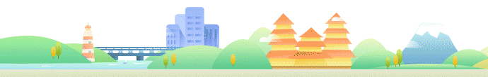 (原始链接: http://mmbiz.qpic.cn/mmbiz_gif/hg5JBLubPg4rfVShmbn0clvjV2TyjdtUS8HNNep5CePZGCmb3JXqZbbW0uW8ZpBd6TXBtiaXyCy3IyLAAcpcebw/0/mmbizgif?)
- 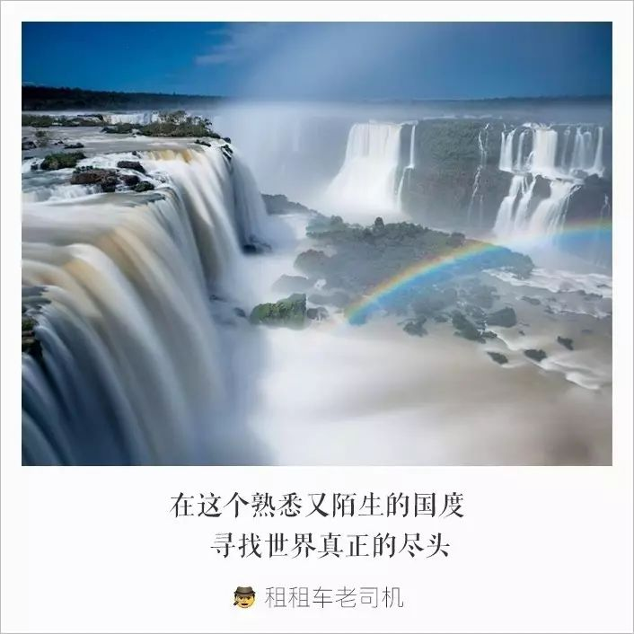 (原始链接: http://mmbiz.qpic.cn/mmbiz_jpg/ETbiaorr6E4JpBuhO5VsDDt9oM1FxGz1XpfKhOzVAJtKgFCFDlnibGcBkHMD16GgaxMibD5fN9ZKRE2FWX5Kfg57g/0?wx_fmt=jpeg)
-  (原始链接: http://mmbiz.qpic.cn/mmbiz_jpg/ETbiaorr6E4JpBuhO5VsDDt9oM1FxGz1XZxfibUL4MdCozyNPmunFgnCbsoNa5P47gJ1WYQmdwukR4LBeibrQaPicg/0?wx_fmt=jpeg)
- 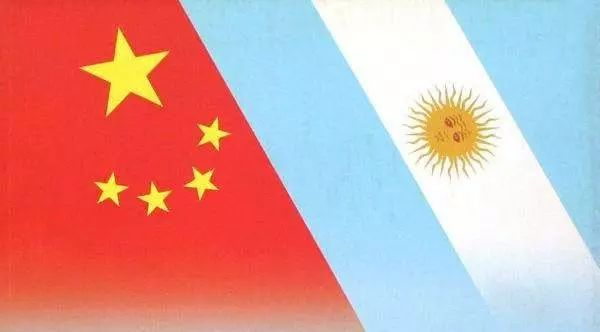 (原始链接: http://mmbiz.qpic.cn/mmbiz_jpg/ETbiaorr6E4JpBuhO5VsDDt9oM1FxGz1XhsMytPtoLicZpvOicoIBGpE1QoUkicSiaKPg5yX6ZSCWuiaYyHdGJcfdM2A/0?wx_fmt=jpeg)
-  (原始链接: http://mmbiz.qpic.cn/mmbiz_gif/ETbiaorr6E4JpBuhO5VsDDt9oM1FxGz1X71MHKZNlNOHjmTOEXEP9QdriaUuw4pibfpribJIwzAx6bIJWbsZEIXWLA/0?wx_fmt=gif)
-  (原始链接: http://mmbiz.qpic.cn/mmbiz_gif/ETbiaorr6E4KUibqnpickC98RFzwL0v3bMrTRMsGPboxuFoHe1BicAEnbKyMQdHMcibztIoyvHpuQ46DWX4TSFo3iatw/0?wx_fmt=gif)
-  (原始链接: http://mmbiz.qpic.cn/mmbiz_jpg/ETbiaorr6E4L4s844Y40heuaGRq5KImBvFrrbiccprnyIPGPrywCvkGK78HbJn16g5QibQqVINdPt5b6F0r1iaWJhQ/640?wx_fmt=jpeg)
- 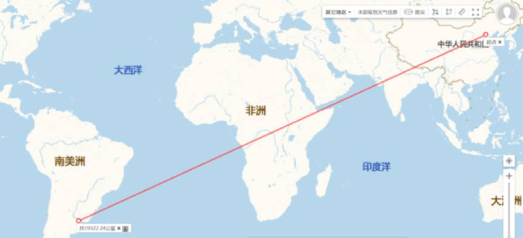 (原始链接: http://mmbiz.qpic.cn/mmbiz_png/ETbiaorr6E4JpBuhO5VsDDt9oM1FxGz1Xy82Urdm6adjAln4AalRx3vscmibicdFh3yjUmJ36Iw2R0SxVWXLCNblQ/0?wx_fmt=png)
-  (原始链接: http://mmbiz.qpic.cn/mmbiz_jpg/ETbiaorr6E4JpBuhO5VsDDt9oM1FxGz1XVulia70YHTbTSeof9twX0fREscymhRIBVEPqqFWahn4TcHpVaeOth8Q/0?wx_fmt=jpeg)
- 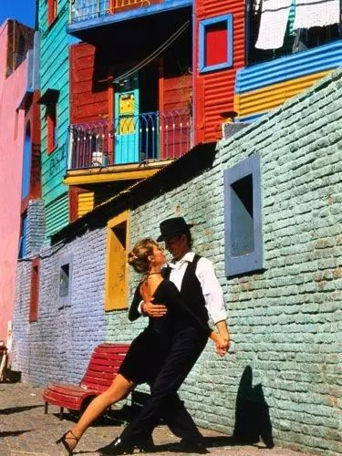 (原始链接: http://mmbiz.qpic.cn/mmbiz_jpg/ETbiaorr6E4JpBuhO5VsDDt9oM1FxGz1XvWNbLyzvQXjZ2DFSB9xCcNVR1gzJ3wibQoptpusSnmThZ6QR4xVTlSg/0?wx_fmt=jpeg)
- 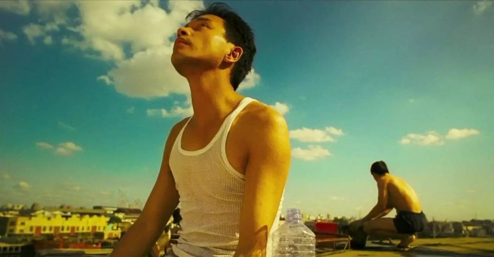 (原始链接: http://mmbiz.qpic.cn/mmbiz_jpg/ETbiaorr6E4JpBuhO5VsDDt9oM1FxGz1XqpTqPeVNfJs8lkaRfXHfibZLhySg899l9apvALiakL7m5PruaZ0m4ubA/0?wx_fmt=jpeg)
- 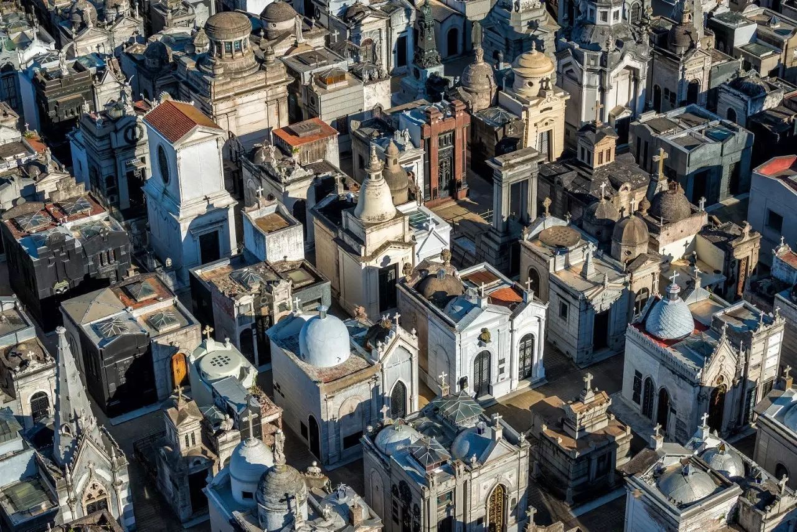 (原始链接: http://mmbiz.qpic.cn/mmbiz_jpg/ETbiaorr6E4JpBuhO5VsDDt9oM1FxGz1XnVLOibvuOEWjHFicMeS2rfiabY6ReJUe5bbIpHq5ia9FiaHIRCNr4fQz4DA/0?wx_fmt=jpeg)
- 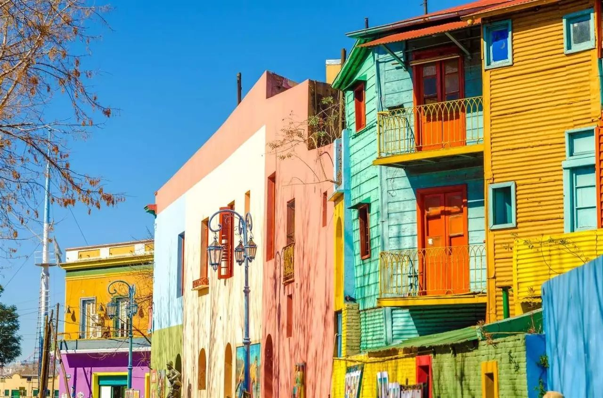 (原始链接: http://mmbiz.qpic.cn/mmbiz_jpg/ETbiaorr6E4JpBuhO5VsDDt9oM1FxGz1XslnUdyHj5YvoniaHgPESXfv0fBhZAibGGcpzBxajdUPYz8sRlWUMGLRg/0?wx_fmt=jpeg)
-  (原始链接: http://mmbiz.qpic.cn/mmbiz_jpg/ETbiaorr6E4JpBuhO5VsDDt9oM1FxGz1XCHvdS1KvydHjiao0GicQZKXHL15A4oYSnPd0Uyp2DdHW4fXWZCic4tJqA/0?wx_fmt=jpeg)
-  (原始链接: http://mmbiz.qpic.cn/mmbiz_jpg/ETbiaorr6E4JpBuhO5VsDDt9oM1FxGz1XavzE5Kwt0j02CjHYV3VIsqCh7CZ50MgFdquyyMZ1yuRmmelibkZJO5Q/0?wx_fmt=jpeg)
-  (原始链接: http://mmbiz.qpic.cn/mmbiz_jpg/ETbiaorr6E4JpBuhO5VsDDt9oM1FxGz1Xz4ibbEpwxTpibflfdm061KicS6Hr7eRBG7aiaDzrl0p9pop6BKiaMaejxbA/0?wx_fmt=jpeg)
- 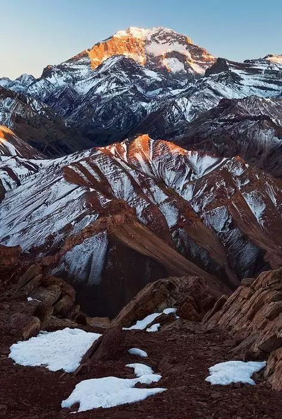 (原始链接: http://mmbiz.qpic.cn/mmbiz_jpg/ETbiaorr6E4JpBuhO5VsDDt9oM1FxGz1Xm8w8zplAc03Kl5DNE1h8zE7wemTliaIV4CBuotH8CdlsKbZZn5mZpeg/0?wx_fmt=jpeg)
- 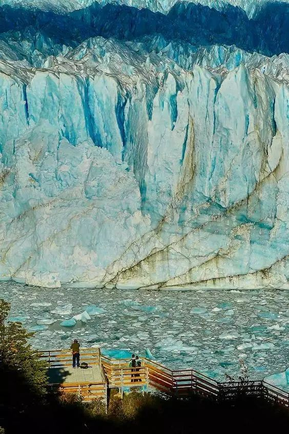 (原始链接: http://mmbiz.qpic.cn/mmbiz_jpg/ETbiaorr6E4JpBuhO5VsDDt9oM1FxGz1X5ib8dC3ichOibLSMRn2iafYuWU47onQdXXciakiaoSxXWFdpdrEXgYBr9nQw/0?wx_fmt=jpeg)
- 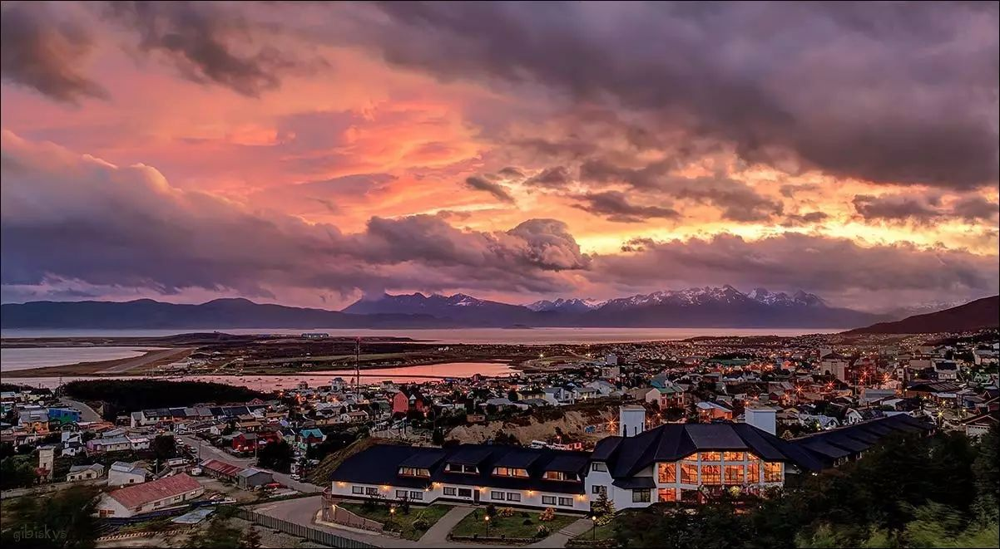 (原始链接: http://mmbiz.qpic.cn/mmbiz_jpg/ETbiaorr6E4JpBuhO5VsDDt9oM1FxGz1XekWicmfDxbQV3icIfmcibHJwnric5wlXdY3gz3t2q1Fia8FAeFkJKF1wiatw/0?wx_fmt=jpeg)
- 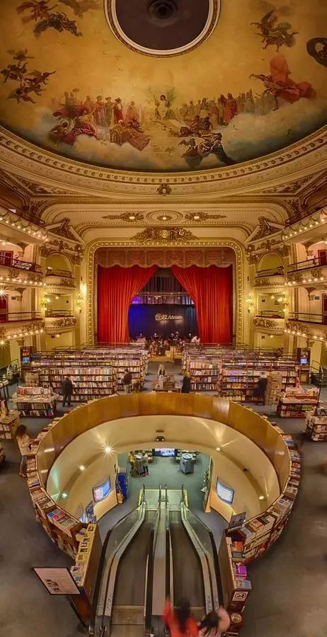 (原始链接: http://mmbiz.qpic.cn/mmbiz_jpg/ETbiaorr6E4JpBuhO5VsDDt9oM1FxGz1Xs2Put37SWzYgS1vthENoSAAQTqddI6pf3ay5YDFZZ6jDCniaSlmxEicg/0?wx_fmt=jpeg)
-  (原始链接: http://mmbiz.qpic.cn/mmbiz_jpg/ETbiaorr6E4JpBuhO5VsDDt9oM1FxGz1XpPsSNsb7nNiajCmRkv9qRF6Rjy3qvtBh0giabFUZvcFT3AQqia8pPI0hQ/0?wx_fmt=jpeg)
- 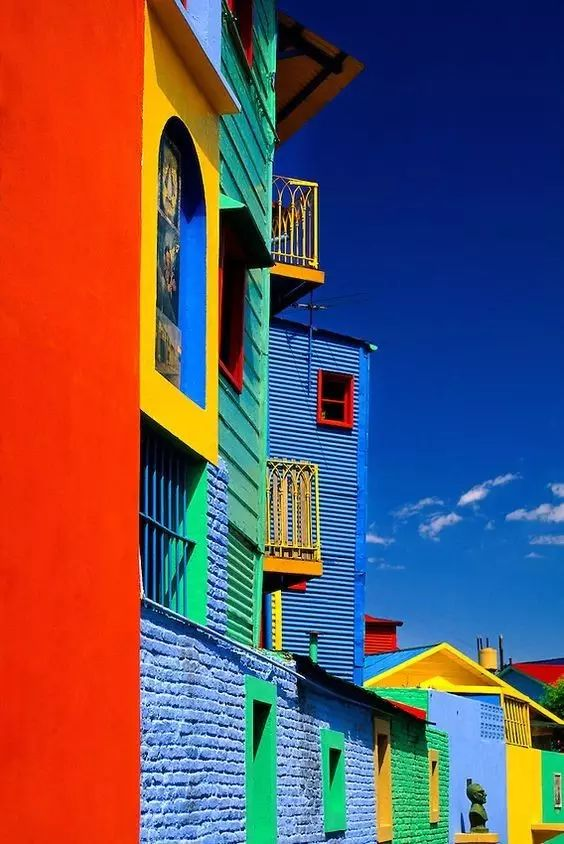 (原始链接: http://mmbiz.qpic.cn/mmbiz_jpg/ETbiaorr6E4JpBuhO5VsDDt9oM1FxGz1XIv2RGsjTWoeH3DjQrL3Kib8MnlzuTNZEWkk9HVw0by9aicJzgW0BlicLg/0?wx_fmt=jpeg)
- 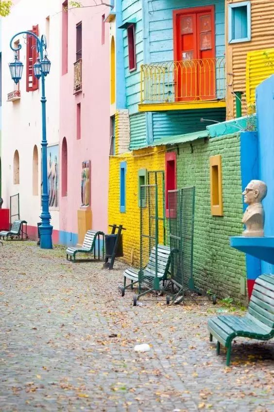 (原始链接: http://mmbiz.qpic.cn/mmbiz_jpg/ETbiaorr6E4JpBuhO5VsDDt9oM1FxGz1XFl6XOxn06RTfkxdyMbOMETcJDD4vSW7MhPKVTFdm3uTGVhTRgvRf4g/0?wx_fmt=jpeg)
- 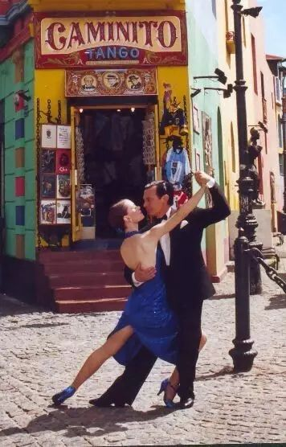 (原始链接: http://mmbiz.qpic.cn/mmbiz_jpg/ETbiaorr6E4JpBuhO5VsDDt9oM1FxGz1XicvdWZazf8Y8tBXNNFGDtEeMUBX8LUTkyPnwBtqxeFwjH98SPsRII4g/0?wx_fmt=jpeg)
- 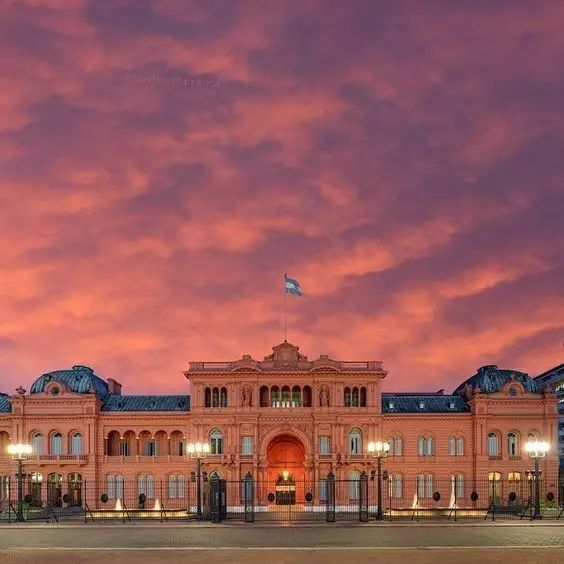 (原始链接: http://mmbiz.qpic.cn/mmbiz_jpg/ETbiaorr6E4JpBuhO5VsDDt9oM1FxGz1XI1vyqsicvbFqCoVia2Rl42BorRricaRSApCJd43AibWXp3rI8iayEXSFkdA/0?wx_fmt=jpeg)
- 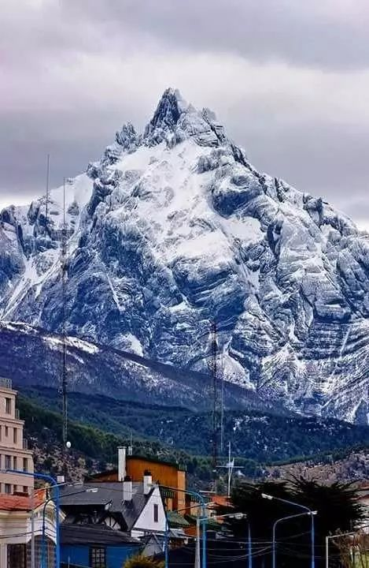 (原始链接: http://mmbiz.qpic.cn/mmbiz_jpg/ETbiaorr6E4JpBuhO5VsDDt9oM1FxGz1XtibA3k57ZYMRHJZqwdpEmAnibPZWlNOIQiaFKj1RmpHdnMdMSwW2a8KcQ/0?wx_fmt=jpeg)
-  (原始链接: http://mmbiz.qpic.cn/mmbiz_jpg/ETbiaorr6E4JpBuhO5VsDDt9oM1FxGz1XZUMyqDb0sZevaz4ur8f8SoQH6cXrjbHBwlp6ccrxImYMiacI1Pv8HvA/0?wx_fmt=jpeg)
-  (原始链接: http://mmbiz.qpic.cn/mmbiz_jpg/ETbiaorr6E4JpBuhO5VsDDt9oM1FxGz1X9csm9fQqIQSk4UsXDxKM0ZURRThdMXrw5850iaicX7qWyjicUsRW0E5kA/0?wx_fmt=jpeg)
-  (原始链接: http://mmbiz.qpic.cn/mmbiz_jpg/ETbiaorr6E4JpBuhO5VsDDt9oM1FxGz1XOIOE3aeUeUFUlVmkHdKdv8QQ6bicibibzYko2Z4ibOCI66rlxMicA5NGPMA/0?wx_fmt=jpeg)
- 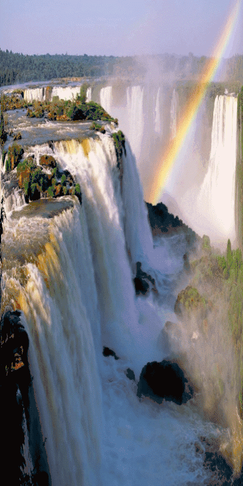 (原始链接: http://mmbiz.qpic.cn/mmbiz_gif/ETbiaorr6E4JpBuhO5VsDDt9oM1FxGz1XPCNfhcP3J0YKQNYDzmVqGb32ryTELWSIqibuC0ev762zHghL9eIiaiazg/0?wx_fmt=gif)
- 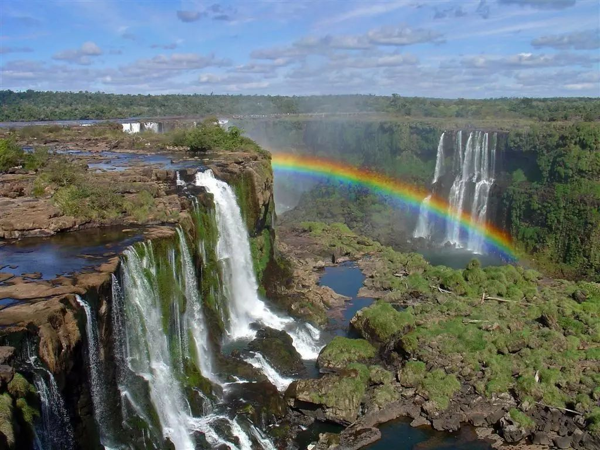 (原始链接: http://mmbiz.qpic.cn/mmbiz_jpg/ETbiaorr6E4JpBuhO5VsDDt9oM1FxGz1XzQKXzuDFzTFVl4feliaBukIzOpJbt0ictDutmQpAPr4DAEawVo4YhtZw/0?wx_fmt=jpeg)
- 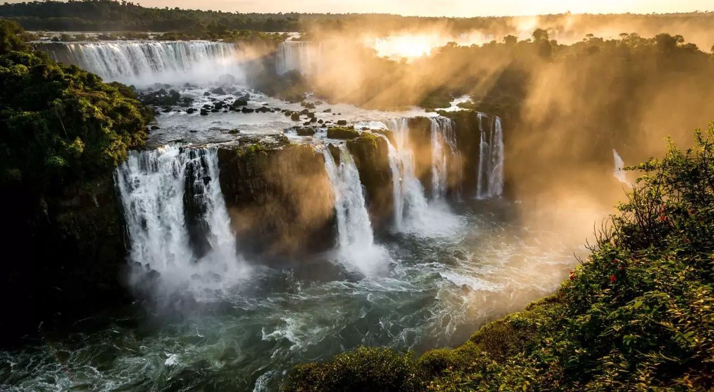 (原始链接: http://mmbiz.qpic.cn/mmbiz_jpg/ETbiaorr6E4JpBuhO5VsDDt9oM1FxGz1XvOY3ic7M5E3U0iciaRpYTg2cyiaHVic4VsWP7A517icBWwFMh3C8fFUs4QKA/0?wx_fmt=jpeg)
-  (原始链接: http://mmbiz.qpic.cn/mmbiz_jpg/ETbiaorr6E4JpBuhO5VsDDt9oM1FxGz1XicBachRuBoaiaQ5ibXIgzaVbFACscybiazSufY2KePv4gCiaHJWtFH5PyPg/0?wx_fmt=jpeg)
-  (原始链接: http://mmbiz.qpic.cn/mmbiz_jpg/ETbiaorr6E4JpBuhO5VsDDt9oM1FxGz1Xm8w8zplAc03Kl5DNE1h8zE7wemTliaIV4CBuotH8CdlsKbZZn5mZpeg/0?wx_fmt=jpeg)
- 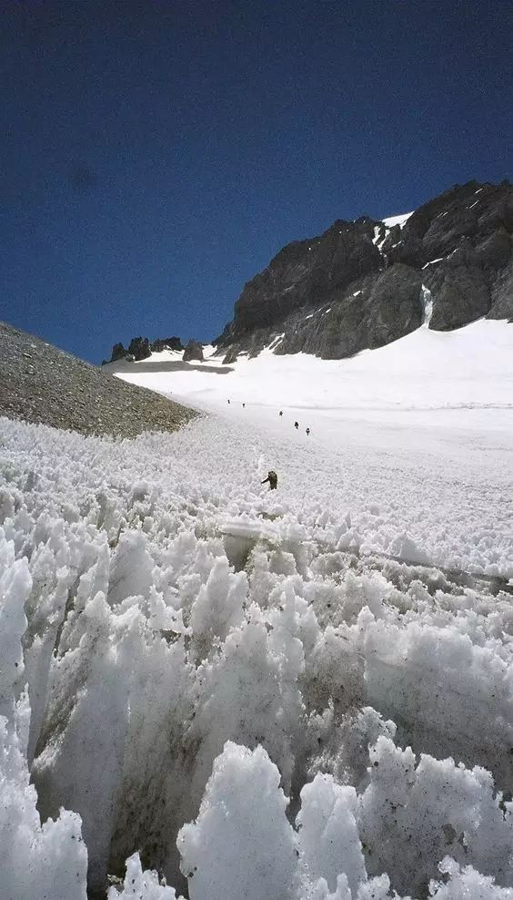 (原始链接: http://mmbiz.qpic.cn/mmbiz_jpg/ETbiaorr6E4JpBuhO5VsDDt9oM1FxGz1XdFVBcV4FRcWtZicvD5oN2iapsT3737OicnWLdVibhXJzKcKbMFgJawicQww/0?wx_fmt=jpeg)
-  (原始链接: http://mmbiz.qpic.cn/mmbiz_jpg/ETbiaorr6E4JpBuhO5VsDDt9oM1FxGz1XgzYIvnn6qnBg30H6fkqlQNdIhTo1U3gyDwoOt1PRQdgtO2tjGOeIRw/0?wx_fmt=jpeg)
- 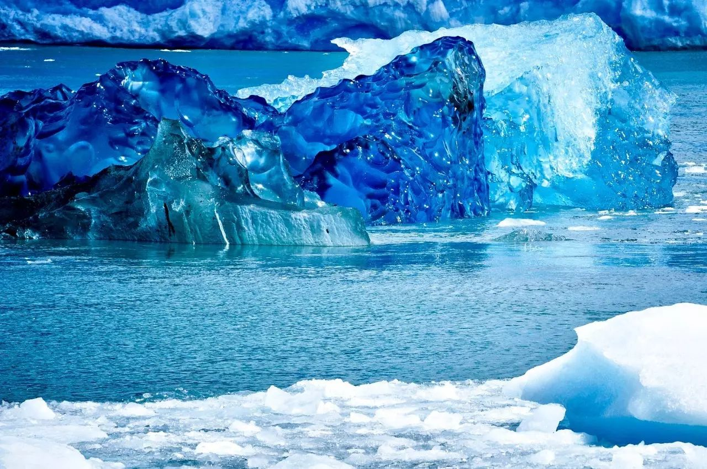 (原始链接: http://mmbiz.qpic.cn/mmbiz_jpg/ETbiaorr6E4JpBuhO5VsDDt9oM1FxGz1XXLuuUoon3lEZhGDTfTozeamic2CiaeIK9wnfwXl2wVkqUniakrYNE7a3A/0?wx_fmt=jpeg)
-  (原始链接: http://mmbiz.qpic.cn/mmbiz_jpg/ETbiaorr6E4JpBuhO5VsDDt9oM1FxGz1XrPfK0WXzd41MrWtsiacGTYAU6UoweFRj7mvSfpjeFTLcOCibzzH2FFdg/0?wx_fmt=jpeg)
-  (原始链接: http://mmbiz.qpic.cn/mmbiz_png/ETbiaorr6E4JpBuhO5VsDDt9oM1FxGz1X3ZBjiaAPHoVLfy8tDMT4W8HzTssanKGL2ByWTvvZpNiahhzFAMUtfp6A/0?wx_fmt=png)
-  (原始链接: http://mmbiz.qpic.cn/mmbiz_jpg/ETbiaorr6E4JpBuhO5VsDDt9oM1FxGz1XoJzsibfeiaGF6fWnKbvquK30ANqqJdjKI9FPvGcYGuI6YFaT2ic8foZvg/0?wx_fmt=jpeg)
- 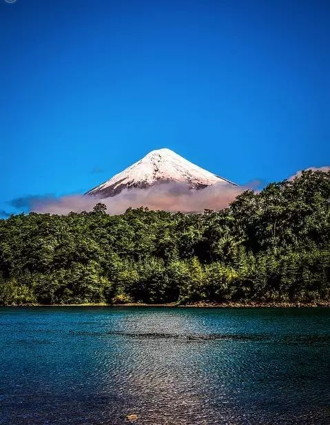 (原始链接: http://mmbiz.qpic.cn/mmbiz_jpg/ETbiaorr6E4JpBuhO5VsDDt9oM1FxGz1XwhBOzIShAhbPcia0DEgEVibLctssU93rEx0AU7w2DkSNQ2uXqA07P1ZQ/0?wx_fmt=jpeg)
-  (原始链接: http://mmbiz.qpic.cn/mmbiz_jpg/ETbiaorr6E4JpBuhO5VsDDt9oM1FxGz1XgKNQe5icFY362mlyoF7gkgodawJZ1qgOSYDSYdxbXfiagjEYq3xNMwIA/0?wx_fmt=jpeg)
- 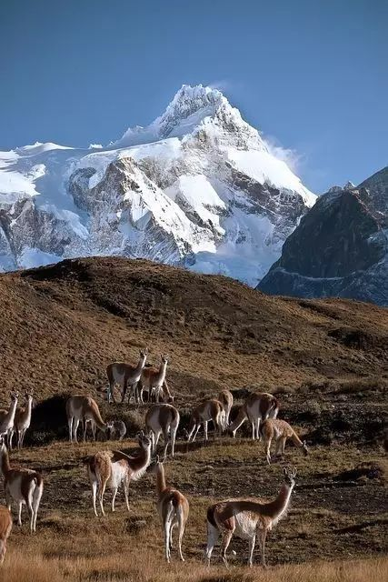 (原始链接: http://mmbiz.qpic.cn/mmbiz_jpg/ETbiaorr6E4JpBuhO5VsDDt9oM1FxGz1XIB9kAXgxib588udPr4FwyubkzIpnGP3hetSf932ls0n5ZDrMLyAxc4Q/0?wx_fmt=jpeg)
- 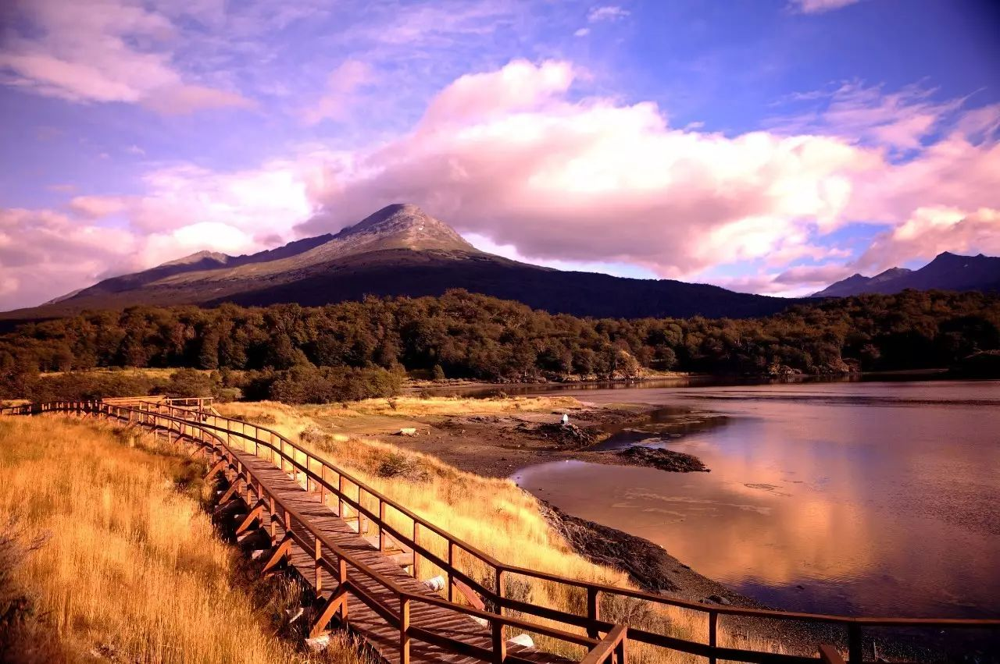 (原始链接: http://mmbiz.qpic.cn/mmbiz_jpg/ETbiaorr6E4JpBuhO5VsDDt9oM1FxGz1XKqPhuZHnMsrRsuLSaB62z1KYsxjZOS6QQicZWX6ZtWxCk1RiclYefqww/0?wx_fmt=jpeg)
- 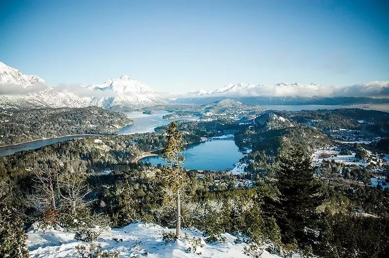 (原始链接: http://mmbiz.qpic.cn/mmbiz_jpg/ETbiaorr6E4JpBuhO5VsDDt9oM1FxGz1Xia5cknQDET9h29pM90ZQQJVFKqyXpBtM6CWRzMQfsibP1YRrkQjy9Vfw/0?wx_fmt=jpeg)
- 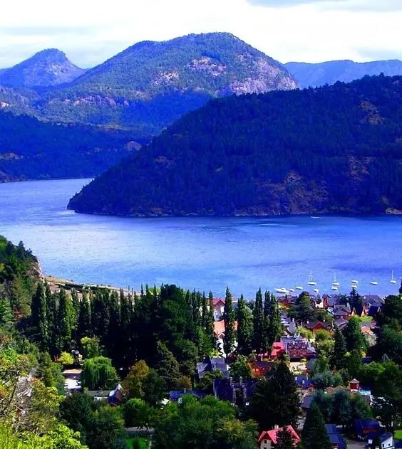 (原始链接: http://mmbiz.qpic.cn/mmbiz_jpg/ETbiaorr6E4JpBuhO5VsDDt9oM1FxGz1XQePNSez64I64vveSWPib56oXXJaJDco1SlHaLKyk2ib9PTWD48YicfQmA/0?wx_fmt=jpeg)
- 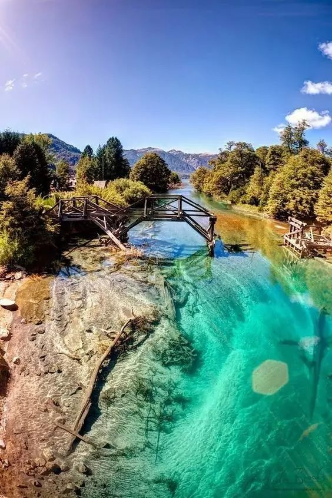 (原始链接: http://mmbiz.qpic.cn/mmbiz_jpg/ETbiaorr6E4JpBuhO5VsDDt9oM1FxGz1XrCfHxy9mNrmjpuOOQttjYe9ibT1HQQiaFzVhvDhXF7pmJrD3k1AqHu6A/0?wx_fmt=jpeg)
- 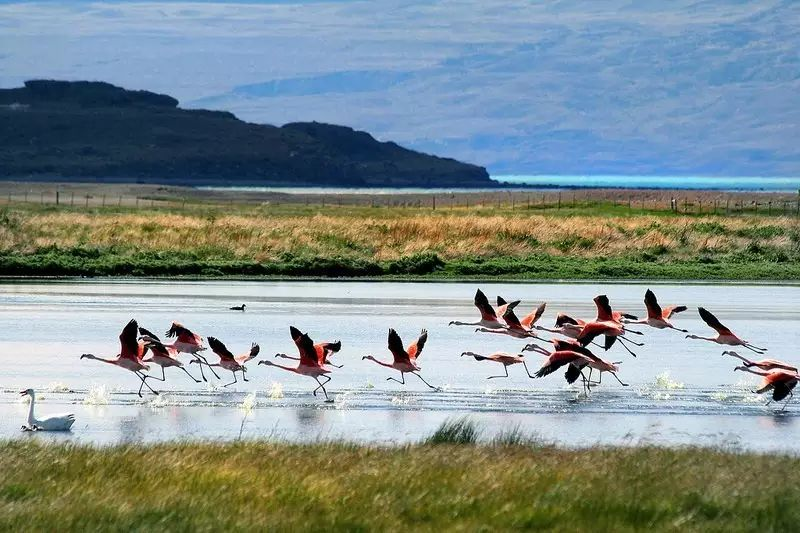 (原始链接: http://mmbiz.qpic.cn/mmbiz_jpg/ETbiaorr6E4JpBuhO5VsDDt9oM1FxGz1X9tmJKRC3wJ8fkojyhCP6ckpHCQIWmOrXib1oiawL7KbcMSaEbj7icXzAQ/0?wx_fmt=jpeg)
- 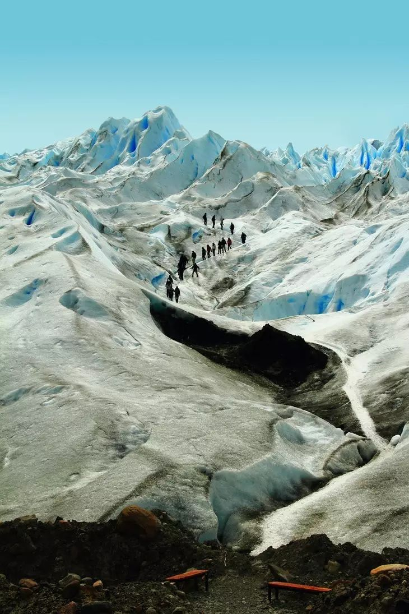 (原始链接: http://mmbiz.qpic.cn/mmbiz_jpg/ETbiaorr6E4JpBuhO5VsDDt9oM1FxGz1XbvjZ9RlS2gAUIlqR91DH7xVlooCWuCohyz4y428dd9wkvq4gVmt2Qg/0?wx_fmt=jpeg)
- 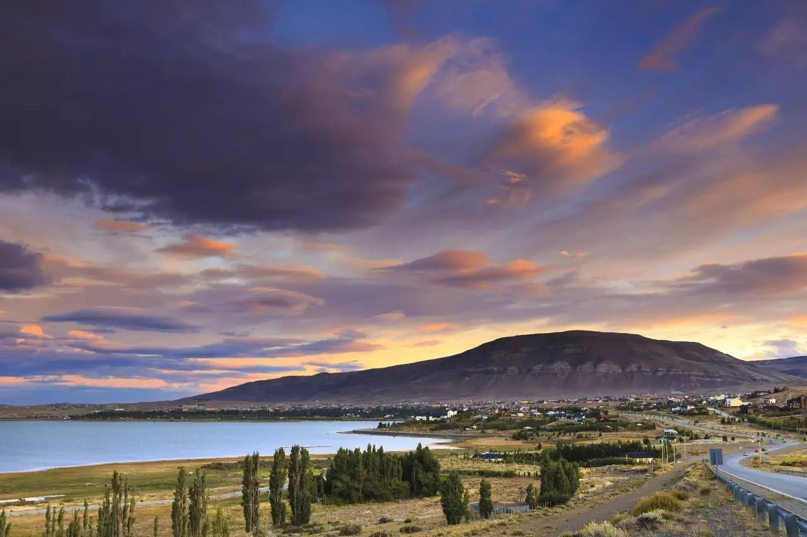 (原始链接: http://mmbiz.qpic.cn/mmbiz_jpg/ETbiaorr6E4JpBuhO5VsDDt9oM1FxGz1XkX17XxcvkRduKYd9FASbpYtSMS0skpVh5M7K3RApYdeRbcdKSibBvUg/0?wx_fmt=jpeg)
- 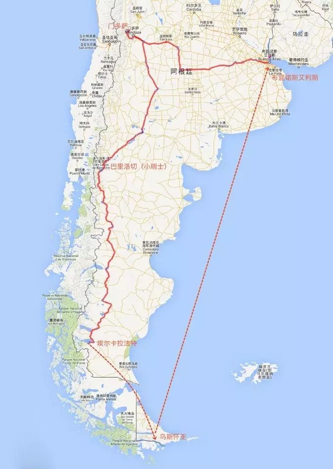 (原始链接: http://mmbiz.qpic.cn/mmbiz_jpg/ETbiaorr6E4JpBuhO5VsDDt9oM1FxGz1XbjwrXApjjpr4LiaQLbkT1RLvEH3iayxS2Dh13S1hp6STTfTJ9ibrLSqOg/0?wx_fmt=jpeg)
- 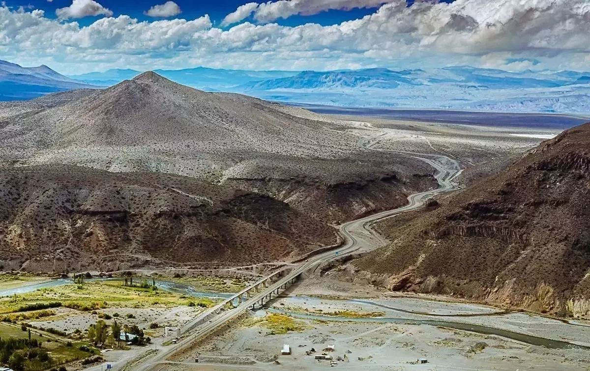 (原始链接: http://mmbiz.qpic.cn/mmbiz_jpg/ETbiaorr6E4JpBuhO5VsDDt9oM1FxGz1X1fXxHIhS4DIBuY8QCR7Pnec2l4IKeNNTaed0EVmBsM4ZB0cEqpmaTw/0?wx_fmt=jpeg)
- 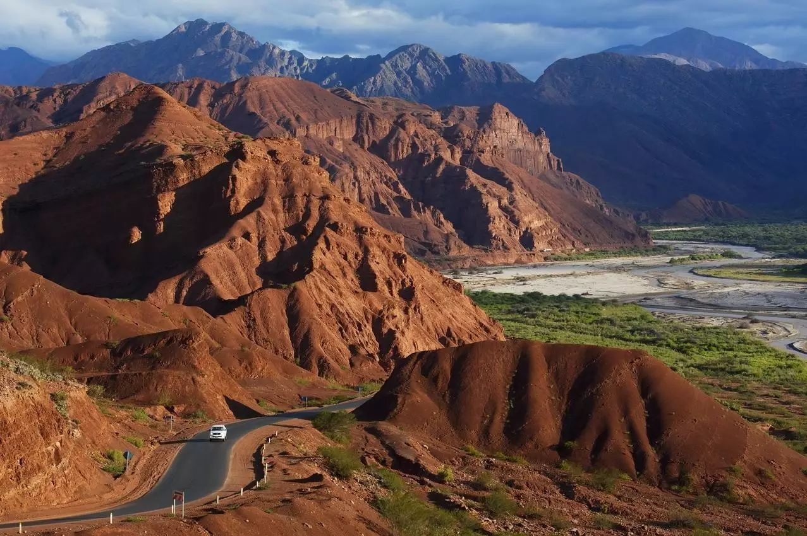 (原始链接: http://mmbiz.qpic.cn/mmbiz_jpg/ETbiaorr6E4JpBuhO5VsDDt9oM1FxGz1XoyiaD5A5e667SUVjicUysS9goibicg3QORnJcuk9ZVtFv9EKSKCohkSBbA/0?wx_fmt=jpeg)
- 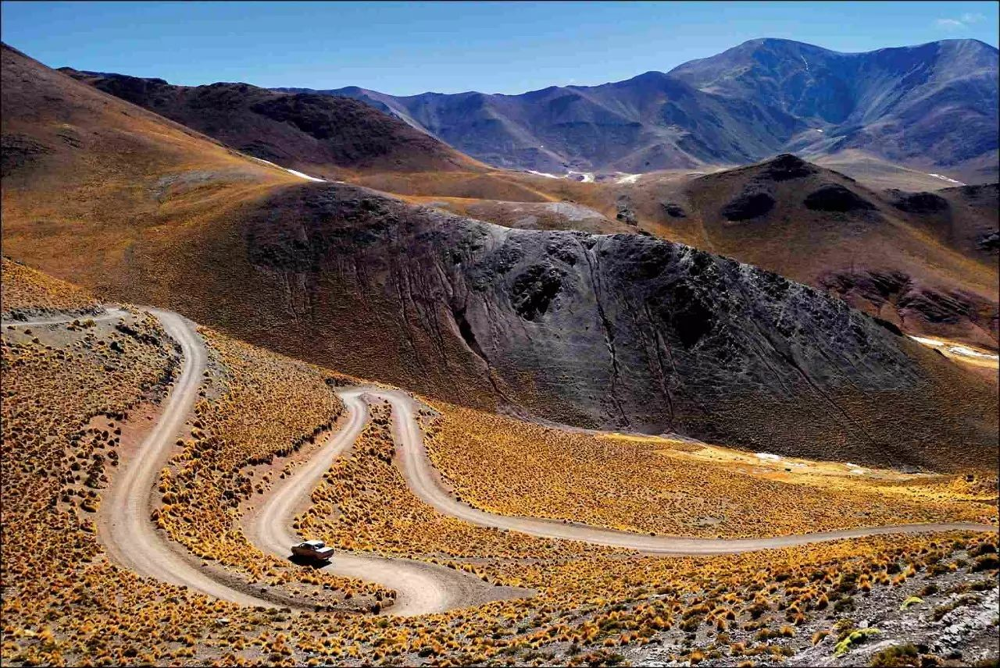 (原始链接: http://mmbiz.qpic.cn/mmbiz_jpg/ETbiaorr6E4JpBuhO5VsDDt9oM1FxGz1XhJk3FkZjj9Nx1nRxRRZJuEaDiaE7coFc30IwibjmwIgterIGCicM1mKBA/0?wx_fmt=jpeg)
- 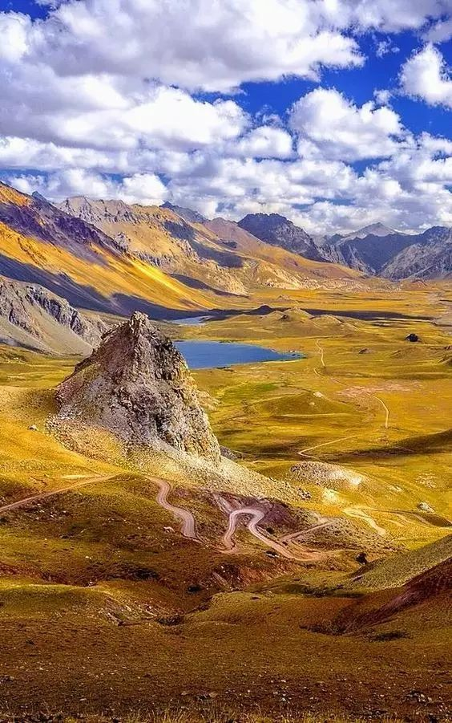 (原始链接: http://mmbiz.qpic.cn/mmbiz_jpg/ETbiaorr6E4JpBuhO5VsDDt9oM1FxGz1XrpbEmdUKGzMYpHp3kySVYz547kBP52wmjuWgazvE10dUpyW3PWQCUw/0?wx_fmt=jpeg)
-  (原始链接: http://mmbiz.qpic.cn/mmbiz_png/ETbiaorr6E4JSz2ZPXGzDI95tDx84RlKmYuE9SfmBDTwicaLiaC07ia4ibB4gxRGZGjGGOBhR5Y57erbicJlBsgdibqfQ/640?wx_fmt=png)
