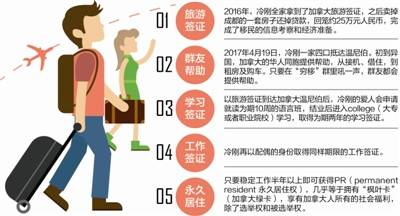

# 无标题

**链接地址:** http://mp.weixin.qq.com/s?__biz=MzI5NDMzNzM3OQ==&mid=2247484749&idx=4&sn=3a63826f9d7a5426c37743952e67f6f8&chksm=ec652b41db12a257507a38893b6b788ae978bdac488d25277c2126730f0a67935c3601d39d30&mpshare=1&scene=2&srcid=0604h8PserqkhjnYnxGhKTWv#rd
**作者:** 加国无忧
**获取时间:** 2025/8/28 22:30:28
**图片数量:** 11

---

## 原始HTML内容

<strong style="max-width: 100%; box-sizing: border-box !important; word-wrap: break-word !important;">吃喝玩乐卡尔加里 Calgary Explorer 是阿尔伯塔省政府唯一认证授权的多元文化网络平台，同时也是直接受加拿大三级政府监督支持的网络平台。致力于将中华文化带入主流社会，扩大华人在卡尔加里乃至整个阿省的影响力。吃喝玩乐卡尔加里 拥有微博，微信，微信群，QQ群，Facebook,Twitter,Instagram, Snapchat 等十多种网络媒体和报刊媒体资源，通过多语言多方式对本地华人企业进行多元文化宣传。详情可添加吃喝玩乐卡尔加里官方私人微信：1941233268</strong>

<strong style="max-width: 100%; box-sizing: border-box !important; word-wrap: break-word !important;"> </strong>

<strong style="max-width: 100%; box-sizing: border-box !important; word-wrap: break-word !important;"><strong style="max-width: 100%; box-sizing: border-box !important; word-wrap: break-word !important;"><strong style="max-width: 100%; background-color: rgb(255, 255, 255); box-sizing: border-box !important; word-wrap: break-word !important;"><strong style="max-width: 100%; box-sizing: border-box !important; word-wrap: break-word !important;">-- 我是纯情小广告，看上一眼忘不掉 --</strong></strong></strong></strong>

 

 

成都人冷刚（化名）现在拿着旅游签证住在加拿大，然而他并不是来旅游的，而是在微信做起了代购生意。他说：“虽然现在是游客身份，但我是奔着移民来的。”

 

 

今年38岁的冷刚，存款约25万元人民币，和爱人都只有高中学历，无雅思成绩。这样的情况，在国内的移民机构看来纯粹属于“拒绝接单的客户”。而就在今年4月18日，冷刚卖掉在成都的房子，携一家四口飞往加拿大。

 

冷刚说：“国内的移民中介机构营造一种假象，移民的人一定非富即贵，这是他们利用信息不对称抬高移民的门槛和价格。”其实，冷刚并不是唯一一个这么想的人。国内一小部分人正在试验“DIY移民”，且有人通过此方式成功拿到加拿大永久居住权。

 

 

<strong style="max-width: 100%; box-sizing: border-box !important; word-wrap: break-word !important;">一步一步留在加拿大</strong>

 

很多人感觉不能理解——这都什么年代了，还玩“黑在国外”那一套呢？付出这么大的代价，真的值得吗？

 

不过，小编的一位朋友对此答疑解惑——“黑”这件事，本身也在不断进化中。比如有些人拿着旅游签证跟团游，然后脱团留在国外，开始申请学生签证，最后一步一步拿到身份。

 

“为什么不直接申请学生签证呢？”“因为申请学签难度较大，而且这些人的年纪普遍偏大。”

 

“后悔了怎么办？”“再回国呗。”

 

 

与投资移民和早期技术移民相比，这群人付出的不过是时间；哪怕中途后悔或移民不成，也并不损失什么。

 

有导游表示，一些游客持旅游签证出国后，有的用旅游签证改申请学生签证。也有人是来生孩子，这两种都不算违法。

 

像以前那种在国外打着黑工，十几年不敢和家里联系的“黑”，现在基本没人愿意做这事儿。

 

 

<strong style="max-width: 100%; box-sizing: border-box !important; word-wrap: break-word !important;">在移民圈，有一个群体叫“穷移”</strong>

 

冷刚的这种移民方式叫DIY，也叫“穷移”。

 

“从未想过自己可以移民，跟所有人想的一样，能移民的非富即贵，身价百万或千万起。”但2015年10月，一切都变了。当时他新加坡的朋友发了一个移民广告，细问之下欣喜发现，不少跟他一样经济条件的人通过“穷移”已经到了想要去的国家。

 

跟妻子提起这件事情时，妻子认为他疯了，但经过一年多逛论坛问群友，冷刚进一步确定了此路可行。

 

温尼伯 

 

2016年，冷刚全家拿到了加拿大旅游签证，之后卖掉成都的一套房子还掉贷款，回笼了约25万元人民币，完成了移民的信息考察和经济准备。今年4月19日，冷刚一家抵达温尼伯。初到异国，没有订酒店，没有车，华人同胞给他提供了极大帮助，只要在“穷移”群里吼一声，群友都会提供帮助。“这些群友，有只带了1.6万加币（约9万元人民币）就过来的，做汽车销售的小孟已经在加拿大生活了好多年，就等雅思通过，PR唾手可得。还有的群友用了三年时间只花了15万元人民币，现在在加拿大政府部门工作。”

 

按照程序，以旅游签证到达温尼伯后，冷刚的妻子会申请就读为期10周的语言班，结业后进入College学习，取得为期两年的学习签证。冷刚再以配偶的身份取得同样期限的工作签证，只要稳定工作一段时间，即可获得PR（永久居住权）。

 

 

<strong style="max-width: 100%; box-sizing: border-box !important; word-wrap: break-word !important;">“穷移”群体遍布全球</strong>

 

其实，“穷移”群体并不只出现在加拿大。早前有媒体报道，国内一些家长将孩子送往澳洲留学后，以陪读的身份赴澳。这样既可以领到当地的福利，也可以申请学签，找一间学校念书。

 

其实，有能力将孩子送出国留学，家长的经济状况应该不差，那么为什么要选择“穷移”的方式呢？原因就在于“穷移”不仅省钱，而且风险较小。比如冷刚就表示：“最坏最坏的结果就是狼狈回国，也就当花了几十万来国外体验下生活好了。”

 

 

<strong style="max-width: 100%; box-sizing: border-box !important; word-wrap: break-word !important;">移民顾问：穷移风险也不小</strong>

 

据称，就加拿大而言，DIY的移民方式来源于2014年6月出台的一项新政策——持旅游签证的人在加拿大进入指定学校准备的短期课程，就符合境内申请学签的条件。“穷移”最关键的一步，是将旅游签证转为学生签证，而且通过率可以说是100%，拿到学签就可以跟留学移民一样操作了。

 

但也有移民顾问表示，穷移风险也不小：“持旅游签证在加拿大境内成功申请学生签证是有一些前提条件的，有人钻空子成功，但属于少数，这绝对不是一条可行的道路，充满风险，失败的可能性非常大。此前的移民案例还表明，一旦申请人使用不诚实手段被移民部门查实，不仅拿不到签证，而且5年之内不能再申请。”

 

 

<strong style="color: rgb(62, 62, 62); font-size: 16px; text-align: justify; white-space: normal; max-width: 100%; box-sizing: border-box !important; word-wrap: break-word !important;"><strong style="max-width: 100%; box-sizing: border-box !important; word-wrap: break-word !important;"><strong style="max-width: 100%; background-color: rgb(255, 255, 255); box-sizing: border-box !important; word-wrap: break-word !important;"><strong style="max-width: 100%; box-sizing: border-box !important; word-wrap: break-word !important;">-- 我是纯情小广告，看上一眼忘不掉 --</strong></strong></strong></strong>

<strong style="color: rgb(62, 62, 62); font-size: 16px; text-align: justify; white-space: normal; max-width: 100%; box-sizing: border-box !important; word-wrap: break-word !important;"><strong style="max-width: 100%; box-sizing: border-box !important; word-wrap: break-word !important;"><strong style="max-width: 100%; background-color: rgb(255, 255, 255); box-sizing: border-box !important; word-wrap: break-word !important;"><strong style="max-width: 100%; box-sizing: border-box !important; word-wrap: break-word !important;"></strong></strong></strong></strong>

<strong style="color: rgb(62, 62, 62); font-size: 16px; text-align: justify; white-space: normal; max-width: 100%; box-sizing: border-box !important; word-wrap: break-word !important;"><strong style="max-width: 100%; box-sizing: border-box !important; word-wrap: break-word !important;"><strong style="max-width: 100%; background-color: rgb(255, 255, 255); box-sizing: border-box !important; word-wrap: break-word !important;"><strong style="max-width: 100%; box-sizing: border-box !important; word-wrap: break-word !important;"></strong></strong></strong></strong> 

 

---

## 纯文本内容

吃喝玩乐卡尔加里 Calgary Explorer 是阿尔伯塔省政府唯一认证授权的多元文化网络平台，同时也是直接受加拿大三级政府监督支持的网络平台。致力于将中华文化带入主流社会，扩大华人在卡尔加里乃至整个阿省的影响力。吃喝玩乐卡尔加里 拥有微博，微信，微信群，QQ群，Facebook,Twitter,Instagram, Snapchat 等十多种网络媒体和报刊媒体资源，通过多语言多方式对本地华人企业进行多元文化宣传。详情可添加吃喝玩乐卡尔加里官方私人微信：1941233268-- 我是纯情小广告，看上一眼忘不掉 --成都人冷刚（化名）现在拿着旅游签证住在加拿大，然而他并不是来旅游的，而是在微信做起了代购生意。他说：“虽然现在是游客身份，但我是奔着移民来的。”今年38岁的冷刚，存款约25万元人民币，和爱人都只有高中学历，无雅思成绩。这样的情况，在国内的移民机构看来纯粹属于“拒绝接单的客户”。而就在今年4月18日，冷刚卖掉在成都的房子，携一家四口飞往加拿大。冷刚说：“国内的移民中介机构营造一种假象，移民的人一定非富即贵，这是他们利用信息不对称抬高移民的门槛和价格。”其实，冷刚并不是唯一一个这么想的人。国内一小部分人正在试验“DIY移民”，且有人通过此方式成功拿到加拿大永久居住权。一步一步留在加拿大很多人感觉不能理解——这都什么年代了，还玩“黑在国外”那一套呢？付出这么大的代价，真的值得吗？不过，小编的一位朋友对此答疑解惑——“黑”这件事，本身也在不断进化中。比如有些人拿着旅游签证跟团游，然后脱团留在国外，开始申请学生签证，最后一步一步拿到身份。“为什么不直接申请学生签证呢？”“因为申请学签难度较大，而且这些人的年纪普遍偏大。”“后悔了怎么办？”“再回国呗。”与投资移民和早期技术移民相比，这群人付出的不过是时间；哪怕中途后悔或移民不成，也并不损失什么。有导游表示，一些游客持旅游签证出国后，有的用旅游签证改申请学生签证。也有人是来生孩子，这两种都不算违法。像以前那种在国外打着黑工，十几年不敢和家里联系的“黑”，现在基本没人愿意做这事儿。在移民圈，有一个群体叫“穷移”冷刚的这种移民方式叫DIY，也叫“穷移”。“从未想过自己可以移民，跟所有人想的一样，能移民的非富即贵，身价百万或千万起。”但2015年10月，一切都变了。当时他新加坡的朋友发了一个移民广告，细问之下欣喜发现，不少跟他一样经济条件的人通过“穷移”已经到了想要去的国家。跟妻子提起这件事情时，妻子认为他疯了，但经过一年多逛论坛问群友，冷刚进一步确定了此路可行。温尼伯2016年，冷刚全家拿到了加拿大旅游签证，之后卖掉成都的一套房子还掉贷款，回笼了约25万元人民币，完成了移民的信息考察和经济准备。今年4月19日，冷刚一家抵达温尼伯。初到异国，没有订酒店，没有车，华人同胞给他提供了极大帮助，只要在“穷移”群里吼一声，群友都会提供帮助。“这些群友，有只带了1.6万加币（约9万元人民币）就过来的，做汽车销售的小孟已经在加拿大生活了好多年，就等雅思通过，PR唾手可得。还有的群友用了三年时间只花了15万元人民币，现在在加拿大政府部门工作。”按照程序，以旅游签证到达温尼伯后，冷刚的妻子会申请就读为期10周的语言班，结业后进入College学习，取得为期两年的学习签证。冷刚再以配偶的身份取得同样期限的工作签证，只要稳定工作一段时间，即可获得PR（永久居住权）。“穷移”群体遍布全球其实，“穷移”群体并不只出现在加拿大。早前有媒体报道，国内一些家长将孩子送往澳洲留学后，以陪读的身份赴澳。这样既可以领到当地的福利，也可以申请学签，找一间学校念书。其实，有能力将孩子送出国留学，家长的经济状况应该不差，那么为什么要选择“穷移”的方式呢？原因就在于“穷移”不仅省钱，而且风险较小。比如冷刚就表示：“最坏最坏的结果就是狼狈回国，也就当花了几十万来国外体验下生活好了。”移民顾问：穷移风险也不小据称，就加拿大而言，DIY的移民方式来源于2014年6月出台的一项新政策——持旅游签证的人在加拿大进入指定学校准备的短期课程，就符合境内申请学签的条件。“穷移”最关键的一步，是将旅游签证转为学生签证，而且通过率可以说是100%，拿到学签就可以跟留学移民一样操作了。但也有移民顾问表示，穷移风险也不小：“持旅游签证在加拿大境内成功申请学生签证是有一些前提条件的，有人钻空子成功，但属于少数，这绝对不是一条可行的道路，充满风险，失败的可能性非常大。此前的移民案例还表明，一旦申请人使用不诚实手段被移民部门查实，不仅拿不到签证，而且5年之内不能再申请。”-- 我是纯情小广告，看上一眼忘不掉 --

---

## 图片列表

-  (原始链接: http://mmbiz.qpic.cn/mmbiz/x0ccYC4cialHjwD5dNvLToRW8s285HZghPAD42eicAkViaAeZVM6jjfwu7ngA9JyeDnQiagichW6eWvvWTOjWkwLibww/0?)
-  (原始链接: http://mmbiz.qpic.cn/mmbiz_jpg/E5oZzDjj1kqcmzibGGbOTonJ7caYsjiaSTtMq1U3Kw5VOLtUgTSNvWXFuQqic1rM7AwibhPM0ZM41RO6DtAmU1WM3w/640?wx_fmt=jpeg)
-  (原始链接: http://mmbiz.qpic.cn/mmbiz_jpg/wbBfrFqAYvu6c0Vw1GOoMIdFUJGHAJGMqsnrZL27Mog4K4JJL9GiawGOv7mPibq36p0qGluyNxc6Lias7bbD20jgQ/640?wx_fmt=jpeg)
-  (原始链接: http://mmbiz.qpic.cn/mmbiz_jpg/wbBfrFqAYvu6c0Vw1GOoMIdFUJGHAJGMmZqtia8vpoQ2SSicqRffZdw23cQvYeQ3juglyTK6JbLQYTTY8iciaIUUyg/640?wx_fmt=jpeg)
-  (原始链接: http://mmbiz.qpic.cn/mmbiz_jpg/wbBfrFqAYvu6c0Vw1GOoMIdFUJGHAJGMm4Rq67PcyQSrLfH4UcuPqM1kBo8ZWjWGn3hytKZXHiaric0vtTFlaaOw/640?wx_fmt=jpeg)
-  (原始链接: http://mmbiz.qpic.cn/mmbiz_jpg/wbBfrFqAYvu6c0Vw1GOoMIdFUJGHAJGMQiczcp7CYMG8ZyjHIRg7ibBFpP9zmekcCGnJ1ziahN9WHNhuC8WK31hlg/640?wx_fmt=jpeg)
-  (原始链接: http://mmbiz.qpic.cn/mmbiz_jpg/wbBfrFqAYvu6c0Vw1GOoMIdFUJGHAJGMJBnMGz2raQ3j5hbDdktSxJuso4Kqq9sIGrRjkwWJZiabDkuwJaicdjDA/640?wx_fmt=jpeg)
-  (原始链接: http://mmbiz.qpic.cn/mmbiz_png/wbBfrFqAYvu6c0Vw1GOoMIdFUJGHAJGMLEdvib8oENKZibXc2oQrEc9LETH9odqEzJJUJgKjvMKHwRSCjq6LPenQ/640?wx_fmt=png)
-  (原始链接: http://mmbiz.qpic.cn/mmbiz_png/wbBfrFqAYvu6c0Vw1GOoMIdFUJGHAJGMaYvzeV2UGr8tAAPvvnUdibJXPdoJj3fibyQ33VS8sylWPC8DicgP9Eemg/640?wx_fmt=png)
-  (原始链接: http://mmbiz.qpic.cn/mmbiz_png/E5oZzDjj1kr8kc44kiaLnG0qzTiac0k9A1131oMhEUCvPwJpY4zG2mI6HhacF28Bbo4BNUspHh9FgpN4GWMyJxSQ/0?wx_fmt=png)
-  (原始链接: http://mmbiz.qpic.cn/mmbiz/E5oZzDjj1kqdHwQ2zpsHXPvFpF81yEia17OibFaAfyBwQYD1iakM7T1PlagpPx6bCbw4qeARbPEgmqPsmYtLv46cQ/640?wx_fmt=jpeg)
