# 无标题

**链接地址:** http://mp.weixin.qq.com/s?__biz=MzIyMDM3MjI1Mw==&mid=2247484611&idx=1&sn=af44b1b51b5a4e8f24deec23f2157eca&chksm=97cc48b1a0bbc1a7b1017cbe5a8628b61ebfba9037b61fbe4d703dc90be9d1e088bb8c3a8c1b&mpshare=1&scene=2&srcid=0803LM04R5jsf9UMayQ4GTqC#rd
**作者:** 爱城生活黄页
**获取时间:** 2025/8/28 22:27:44
**图片数量:** 30

---

## 原始HTML内容

 

盛夏，爱城进入八月，却没有了流火。 

 

每年得八月，有一个我们不能免俗和忽略的节日，那就是民俗节。每年都在去与不去的纠结中，还是作为一个吃货前往。人太多，队太长，民俗节对我来讲，慢慢变成了“排队节”。

 

 

经常排了好久的队，却买到了地雷“美食”，后悔不已。

 

这个民俗节，爱城生活黄页带你跳过那些雷区，看看究竟哪些民俗节美食才值得排队？

 

<strong> </strong>

<strong>❤Mango Loco - 辣味大芒果</strong>

 

国家：Guatemala 危地马拉

 

 

每一年的民俗节，都能看到无数人举着一支硕大的撒了类似辣椒面的芒果，时时羡慕不已，要追上去询问是在哪里买的。原来，大芒果来自名不见经传的危地马拉。

 

<strong> </strong>

<strong>❤Kamundele - &nbsp;刚果大肉串</strong>

 

国家：Congo 刚果

 

 

刚国特色的大肉串，配上青椒和刚果人才懂得辣椒粉，味道很特别。

 

<strong> </strong>

<strong>❤Pina Colada - 冰镇果汁朗姆酒</strong>

 

国家：Cuba 古巴 -

 

 

虽然英文叫做冰镇朗姆酒，但是民俗节上的这一款Pina Colada 却没有酒精。主料是新鲜的菠萝和椰汁，健康又美味。相信在容易口渴的民俗节，这一款一定为你带来清凉。

 

<strong> </strong>

<strong>❤Beef Soujok Wrap - 亚历山大风牛肉肠大卷</strong>

 

国家：Egypt 埃及

 

 

Alexandrian-style soujouk是一种很特别的由牛肉为原料制作的香肠，是世界上做好吃的香肠之一。制作工艺有点像我们的四川香肠。

 

<strong> </strong>

<strong>❤Baklava -&nbsp;蜜糖果仁千层酥</strong>

 

国家：Egypt 埃及

 

 

我感觉这个蜜糖千层酥好不好吃是见仁见智的。喜欢甜食的你不要错过。我个人感觉的口味有些太甜，但是埃及特色甜点，值得一试。

 

<strong> </strong>

<strong>❤Goat Curry - 山羊肉咖喱饭</strong>

 

国家：Fuji 斐济

 

 

谁说只有印度日本泰国才有咖喱的？喜欢吃羊肉又喜欢吃咖喱的不要错过这一款斐济特色的山羊肉咖喱饭。由新鲜的上羊肉，洋葱，大蒜，生姜制作而成，配上斐济特色的咖喱，别有一分风味。

 

<strong> </strong>

<strong>❤Crêpe Suzette - 香橙奶油可丽饼</strong>

 

国家：France 法国

 

 

法国馆今年无一例外全是甜食，主打可丽饼。我偷想大概是法国人太懒，可丽饼这种甜食最好准备。且一种可丽饼配上不同的topping就能变换出不同样式。不过既然是人家的镇店之宝，当然值得一试。除了香橙奶油，还有原味，巧克力，奶油等口味可以选择。

 

<strong> </strong>

<strong>❤German Bratwurst - 德国烤香肠</strong>

 

国家：Germany 德国

 

 

每年来民俗节，德国烤肠可是我必吃的美食之一。德国烤肠的特色是鲜香多汁。一根大烤肠，配上一份面包，在送一小份德国特制腌酸菜 -&nbsp;sauerkraut， 相信你已吃饱。

 

 

<strong>❤Chickpeas Curry with Rice - 鹰嘴豆咖喱饭</strong>

 

国家：India 印度

 

 

我对印度的咖喱一向有好感。这款鹰嘴豆咖喱即健康又美味，当然，唯一的缺憾是没有肉。

 

 

<strong>❤Ice Cream Palda - 柳胶面冰淇淋杯</strong>

 

国家：Azerbaijan&nbsp;阿塞拜疆

 

 

这个乍一听像是黑暗料理。味道十分特别，喜欢的人非常的喜欢，食材十分的特别，我认为有必要在这里介绍。杯子的底部是由特色的柳木的汁液做成的面条，吃起来爽滑Q，再加上冰淇淋和树莓做topping，是一道唯美的夏日甜品。

 

 

<strong>❤Chicken or Beef Satay - 沙爹烤鸡串，牛肉串</strong> 

 

国家：Malaysia &amp; Singapore 马来西亚和新加坡

 

 

看到马来西亚馆怎么能不停下来吃两串沙爹鸡肉？有一年我就是排了好久的队，当时不知道，最后没买这款肉串而买了米粉，为此后悔不已。东南亚的沙爹口味一直非常受人喜爱，这款肉串值得你排队。

 

 

<strong>❤Fresh Young Coconut - 整颗大椰子汁</strong>

 

国家：Malaysia &amp; Singapore 马来西亚和新加坡

 

 

在马来西亚馆吃完沙爹烤肉，再来一颗椰汁解渴。每年得民俗节，我们也会看到许多捧着大椰子喝的人们，这也是民俗节必喝之一。虽然椰子是冰鲜不是新鲜的，但是味道很不错。价格也公道。

 

 

<strong>❤Kabab Koobideh - 伊朗烤肉串</strong>

 

国家：Iran 伊朗

 

 

看着我就会流口水的一种肉串。我们中国人对肉串实在是有谜一样的热情。对于中东地区的美食我一直觉得很神秘。Kabab是一种中东特色的特别烤肉，味道和donair比较接近，又不同。感兴趣的一定要去试一试。

 

<strong> </strong>

<strong>❤Okonomi Yaki - 大阪烧</strong>

 

国家：Japan 日本

 

 

日本的大阪烧，日文的意思是随意，也就是随意烧，放什么都好。有点像中国的软煎饼。民俗节的大阪烧自然是简易版的，但是味道也不差，日本馆一般排队的人不是很多，所以如果不想排太久的队又想吃美食，这是一个好选择。

&nbsp;

<strong style="max-width: 100%; color: rgb(255, 41, 65); font-size: 18px; box-sizing: border-box !important; word-wrap: break-word !important;">中间插播~更多原创有意思有内涵有质量的爱城攻略，请点击下方图片，直接进入微信小程序浏览：</strong> 

<mp-miniprogram class="miniprogram_element" data-miniprogram-appid="wx4ee12c59abb3ac9d" data-miniprogram-path="pages/tongchenghuodong/tongchenghuodong" data-miniprogram-nickname="爱城生活黄页" data-miniprogram-avatar="http://mmbiz.qpic.cn/mmbiz_png/iay9ajXTTTDVdicKF5gyYcgpBRm3ps5sOVc2zQ1cLgWibWBfPq0B62hYvNmNm5eb1kPxpBKRJZ96Q0OoicL506XnbA/0?wx_fmt=png" data-miniprogram-title="点击这里，更多精彩！" data-miniprogram-imageurl="http://mmbiz.qpic.cn/mmbiz_gif/q5NfvxQZ7ibEibGbZ3ZOrGxpo21gE07BXyOficfw4ezMcteS74ErRzGo3fDOia7gACS2av2raF8KBJiahc5OC1ZWIog/0?wx_fmt=gif"></mp-miniprogram>

<strong>❤Tilapia Fish - 整条油炸罗非鱼</strong>

 

国家：Kenya - 肯尼亚

 

 

如果喜欢吃鱼，来肯尼亚馆吃一整条罗非鱼。虽然炸物不健康，可是谁能抵挡那酥脆的口感呢？

 

 

<strong>❤Bulgogi Taco - 韩国烤肉玉米薄脆卷</strong>

 

国家：Korea 韩国

 

 

爱城的韩国烤肉众多，相信民俗节的不会更有特色更正宗。但是这一小碟韩国烤肉玉米薄脆卷，传统中带着新意，值得一试。

 

 

<strong>❤Mangonadas - 辣酱芒果杯</strong>

 

国家：Mexico 墨西哥

 

 

冰鲜的芒果上撒上Chamoy - 一种墨西哥的红色酱料，Chavacano紅色果下去做基本食材，再加上辣椒，盐，糖和醋下去一起做的， 和新鲜的柠檬汁。即使你去过墨西哥，也未必品尝过这杯芒果“甜品”。

 

<strong>❤Tamales - 玉米面团包馅卷</strong>

 

国家：Nicaragua&nbsp;尼加拉瓜

 

 

拉丁美洲特色美食，味道嘛，也是见仁见智，但是既然来到了美食节，就要尝试一下没有见过的美食。玉米面团包馅卷是由香蕉叶包裹，像中国的粽子一样，通常是玉米包起来的食物。馅不是米，而是玉米面加干肉加调料。这是一种古老的印第安人的食物，比玛雅和因卡文明还要早许多年，至今大约有5000到8000年的历史了。

 

<strong> </strong>

<strong>❤Anticuchos - 牛心串烧</strong>

 

国家：Peru 秘鲁

 

 

牛心什么的，听起来很刺激。带着我们一如既往对撸串的热情，来秘鲁馆尝一下牛心串烧。秘鲁牛心串烧主要由醋，孜然腌制而成，配上烤土豆，是一番风味。

 

 

<strong>❤Scovergi （(elephant ears）- 大象耳朵</strong>

 

国家：Romania 罗马尼亚

 

 

每年民俗节大排长队的美食之一 - 大象耳朵，其实就是炸大面饼配上糖霜，味道像是中国的炸糖糕。我对老外对此的热情有着谜一般的疑惑。曾经在民俗节看见一个大妈手拎十只大饼打包回家。

 

 

<strong>❤Lefse Dog - 法兰克福香肠卷</strong>

 

国家：Scandinavia&nbsp;斯堪的纳维亚
<h2 class="hd" style="   width: 1px; height: 1px; top: -1000em; overflow: hidden; color: rgb(34, 34, 34); font-family: arial, sans-serif; white-space: normal; background-color: rgb(255, 255, 255); ">Search Results斯堪的纳维亚</h2>
 

 

法兰克福香肠因为兴起于法兰克福而得名，是一种水煮香肠。是德国香肠的一种，虽然我不知道为什么斯堪的纳维亚要买德国香肠，但是这种特别的香肠值得一试，再配上挪威大饼，是热狗中特立独行的战斗机。

 

 

<strong>❤Churros - 西班牙油条</strong>

 

国家：Spain 西班牙

 

 

民俗节你还经常可以看见拄着一根大棍子吃得不亦乐乎的人们。这个大棍子就是西班牙油条。味道嘛，油炸的甜食怎么都不会差。

 

 

<strong>❤Mango Slices with Sticky Rice - 泰式芒果糯米饭</strong>

 

国家：Thailand 泰国

 

 

好多年没吃到这个味道了，新鲜的芒果配上香软的糯米和椰汁，咬上一口是绝美的体验。泰国馆这个做的当然不精致，但是味道还不错，值得一试。

 

 

以上介绍的美食是小编多年民俗节的吃货经验，当然不能满足所有人的口味，也只是民俗节上美食的凤毛麟角。很多食物的翻译都是小编个人的创造，不当之处还请专业人士指正批评。

 

 

民俗节上一定还有更多美味新奇的食物等着我们，你不如带着探险的心情，去体验去发现。

 

 

我们爱城生活黄页是一个免费的为爱城华人量身打造的资讯信息平台，我们公众号的所有原创文章都是特意为我们爱城华人而作。我们主要的发布和强大的搜索导航功能都在微信新开发的项目微信小程序中。 

 

✌<strong style="max-width: 100%; box-sizing: border-box !important; word-wrap: break-word !important;">关于究竟什么是微信小程序？它的优点是什么，你可以点击以下链接</strong><strong style="max-width: 100%; box-sizing: border-box !important; word-wrap: break-word !important;">：</strong>

 

<a class="weapp_text_link" data-miniprogram-appid="wx4ee12c59abb3ac9d" data-miniprogram-path="pages/tongchenginfodetail/tongchenginfodetail?id=534" data-miniprogram-nickname="爱城生活黄页" style="max-width: 100%; box-sizing: border-box !important; word-wrap: break-word !important;" href="">你还不知道什么是微信小程序吗？快来get这个技能</a>

 

<a class="weapp_text_link" data-miniprogram-appid="wx4ee12c59abb3ac9d" data-miniprogram-path="pages/tongchenginfodetail/tongchenginfodetail?id=572" data-miniprogram-nickname="爱城生活黄页" style="max-width: 100%; box-sizing: border-box !important; word-wrap: break-word !important;" href="">关于小程序是否会收集您的微信隐私？</a>

 

如果我们的用心可以在某一个瞬间打动您，请您扫面下方的两个二维码关注我们的微信小程序和微信公众号，作为一个免费的爱城资讯平台，您的关注是我们继续下去的最大动力。

 

 

<strong style="max-width: 100%; box-sizing: border-box !important; word-wrap: break-word !important;">本文为原创文字，转载请注明公众号和二维码</strong><strong style="max-width: 100%; box-sizing: border-box !important; word-wrap: break-word !important;"></strong>

<strong style="max-width: 100%; box-sizing: border-box !important; word-wrap: break-word !important;"></strong>

想了解更多有意思有质量的爱城资讯，请通过微信小程序关注我们，也可以通过微信公众号与我们互动。&nbsp;<strong style="max-width: 100%; box-sizing: border-box !important; word-wrap: break-word !important;"></strong>

 

<strong style="max-width: 100%; box-sizing: border-box !important; word-wrap: break-word !important;">长按下面二维码，关注我们的公众号【埃德蒙顿生活黄页】，</strong><strong style="max-width: 100%; box-sizing: border-box !important; word-wrap: break-word !important;"><wbr style="max-width: 100%; box-sizing: border-box !important; word-wrap: break-word !important;">从此轻松使用小程序【爱城生活黄页】，<wbr style="max-width: 100%; box-sizing: border-box !important; word-wrap: break-word !important;">为您的埃德蒙顿生活做一站式导航！</strong>

<strong style="max-width: 100%; box-sizing: border-box !important; word-wrap: break-word !important;"></strong>

<strong style="max-width: 100%; box-sizing: border-box; word-wrap: break-word;">也可长按下面小程序码，直接打开小程序【爱城生活黄页】</strong>

<strong style="max-width: 100%; box-sizing: border-box !important; word-wrap: break-word !important;">注：打开一次爱城生活黄页，以后便可直接在【发现】-【小程序】<wbr style="max-width: 100%; box-sizing: border-box !important; word-wrap: break-word !important;">页面直接进入。</strong>

<strong style="max-width: 100%; box-sizing: border-box !important; word-wrap: break-word !important;"></strong>

* 以上图片来源网络，如有侵权，请及时联系我们更正

 

 

 

 

---

## 纯文本内容

盛夏，爱城进入八月，却没有了流火。每年得八月，有一个我们不能免俗和忽略的节日，那就是民俗节。每年都在去与不去的纠结中，还是作为一个吃货前往。人太多，队太长，民俗节对我来讲，慢慢变成了“排队节”。经常排了好久的队，却买到了地雷“美食”，后悔不已。这个民俗节，爱城生活黄页带你跳过那些雷区，看看究竟哪些民俗节美食才值得排队？❤Mango Loco - 辣味大芒果国家：Guatemala 危地马拉每一年的民俗节，都能看到无数人举着一支硕大的撒了类似辣椒面的芒果，时时羡慕不已，要追上去询问是在哪里买的。原来，大芒果来自名不见经传的危地马拉。❤Kamundele -  刚果大肉串国家：Congo 刚果刚国特色的大肉串，配上青椒和刚果人才懂得辣椒粉，味道很特别。❤Pina Colada - 冰镇果汁朗姆酒国家：Cuba 古巴 -虽然英文叫做冰镇朗姆酒，但是民俗节上的这一款Pina Colada 却没有酒精。主料是新鲜的菠萝和椰汁，健康又美味。相信在容易口渴的民俗节，这一款一定为你带来清凉。❤Beef Soujok Wrap - 亚历山大风牛肉肠大卷国家：Egypt 埃及Alexandrian-style soujouk是一种很特别的由牛肉为原料制作的香肠，是世界上做好吃的香肠之一。制作工艺有点像我们的四川香肠。❤Baklava - 蜜糖果仁千层酥国家：Egypt 埃及我感觉这个蜜糖千层酥好不好吃是见仁见智的。喜欢甜食的你不要错过。我个人感觉的口味有些太甜，但是埃及特色甜点，值得一试。❤Goat Curry - 山羊肉咖喱饭国家：Fuji 斐济谁说只有印度日本泰国才有咖喱的？喜欢吃羊肉又喜欢吃咖喱的不要错过这一款斐济特色的山羊肉咖喱饭。由新鲜的上羊肉，洋葱，大蒜，生姜制作而成，配上斐济特色的咖喱，别有一分风味。❤Crêpe Suzette - 香橙奶油可丽饼国家：France 法国法国馆今年无一例外全是甜食，主打可丽饼。我偷想大概是法国人太懒，可丽饼这种甜食最好准备。且一种可丽饼配上不同的topping就能变换出不同样式。不过既然是人家的镇店之宝，当然值得一试。除了香橙奶油，还有原味，巧克力，奶油等口味可以选择。❤German Bratwurst - 德国烤香肠国家：Germany 德国每年来民俗节，德国烤肠可是我必吃的美食之一。德国烤肠的特色是鲜香多汁。一根大烤肠，配上一份面包，在送一小份德国特制腌酸菜 - sauerkraut， 相信你已吃饱。❤Chickpeas Curry with Rice - 鹰嘴豆咖喱饭国家：India 印度我对印度的咖喱一向有好感。这款鹰嘴豆咖喱即健康又美味，当然，唯一的缺憾是没有肉。❤Ice Cream Palda - 柳胶面冰淇淋杯国家：Azerbaijan 阿塞拜疆这个乍一听像是黑暗料理。味道十分特别，喜欢的人非常的喜欢，食材十分的特别，我认为有必要在这里介绍。杯子的底部是由特色的柳木的汁液做成的面条，吃起来爽滑Q，再加上冰淇淋和树莓做topping，是一道唯美的夏日甜品。❤Chicken or Beef Satay - 沙爹烤鸡串，牛肉串国家：Malaysia & Singapore 马来西亚和新加坡看到马来西亚馆怎么能不停下来吃两串沙爹鸡肉？有一年我就是排了好久的队，当时不知道，最后没买这款肉串而买了米粉，为此后悔不已。东南亚的沙爹口味一直非常受人喜爱，这款肉串值得你排队。❤Fresh Young Coconut - 整颗大椰子汁国家：Malaysia & Singapore 马来西亚和新加坡在马来西亚馆吃完沙爹烤肉，再来一颗椰汁解渴。每年得民俗节，我们也会看到许多捧着大椰子喝的人们，这也是民俗节必喝之一。虽然椰子是冰鲜不是新鲜的，但是味道很不错。价格也公道。❤Kabab Koobideh - 伊朗烤肉串国家：Iran 伊朗看着我就会流口水的一种肉串。我们中国人对肉串实在是有谜一样的热情。对于中东地区的美食我一直觉得很神秘。Kabab是一种中东特色的特别烤肉，味道和donair比较接近，又不同。感兴趣的一定要去试一试。❤Okonomi Yaki - 大阪烧国家：Japan 日本日本的大阪烧，日文的意思是随意，也就是随意烧，放什么都好。有点像中国的软煎饼。民俗节的大阪烧自然是简易版的，但是味道也不差，日本馆一般排队的人不是很多，所以如果不想排太久的队又想吃美食，这是一个好选择。 中间插播~更多原创有意思有内涵有质量的爱城攻略，请点击下方图片，直接进入微信小程序浏览：❤Tilapia Fish - 整条油炸罗非鱼国家：Kenya - 肯尼亚如果喜欢吃鱼，来肯尼亚馆吃一整条罗非鱼。虽然炸物不健康，可是谁能抵挡那酥脆的口感呢？❤Bulgogi Taco - 韩国烤肉玉米薄脆卷国家：Korea 韩国爱城的韩国烤肉众多，相信民俗节的不会更有特色更正宗。但是这一小碟韩国烤肉玉米薄脆卷，传统中带着新意，值得一试。❤Mangonadas - 辣酱芒果杯国家：Mexico 墨西哥冰鲜的芒果上撒上Chamoy - 一种墨西哥的红色酱料，Chavacano紅色果下去做基本食材，再加上辣椒，盐，糖和醋下去一起做的， 和新鲜的柠檬汁。即使你去过墨西哥，也未必品尝过这杯芒果“甜品”。❤Tamales - 玉米面团包馅卷国家：Nicaragua 尼加拉瓜拉丁美洲特色美食，味道嘛，也是见仁见智，但是既然来到了美食节，就要尝试一下没有见过的美食。玉米面团包馅卷是由香蕉叶包裹，像中国的粽子一样，通常是玉米包起来的食物。馅不是米，而是玉米面加干肉加调料。这是一种古老的印第安人的食物，比玛雅和因卡文明还要早许多年，至今大约有5000到8000年的历史了。❤Anticuchos - 牛心串烧国家：Peru 秘鲁牛心什么的，听起来很刺激。带着我们一如既往对撸串的热情，来秘鲁馆尝一下牛心串烧。秘鲁牛心串烧主要由醋，孜然腌制而成，配上烤土豆，是一番风味。❤Scovergi （(elephant ears）- 大象耳朵国家：Romania 罗马尼亚每年民俗节大排长队的美食之一 - 大象耳朵，其实就是炸大面饼配上糖霜，味道像是中国的炸糖糕。我对老外对此的热情有着谜一般的疑惑。曾经在民俗节看见一个大妈手拎十只大饼打包回家。❤Lefse Dog - 法兰克福香肠卷国家：Scandinavia 斯堪的纳维亚Search Results斯堪的纳维亚法兰克福香肠因为兴起于法兰克福而得名，是一种水煮香肠。是德国香肠的一种，虽然我不知道为什么斯堪的纳维亚要买德国香肠，但是这种特别的香肠值得一试，再配上挪威大饼，是热狗中特立独行的战斗机。❤Churros - 西班牙油条国家：Spain 西班牙民俗节你还经常可以看见拄着一根大棍子吃得不亦乐乎的人们。这个大棍子就是西班牙油条。味道嘛，油炸的甜食怎么都不会差。❤Mango Slices with Sticky Rice - 泰式芒果糯米饭国家：Thailand 泰国好多年没吃到这个味道了，新鲜的芒果配上香软的糯米和椰汁，咬上一口是绝美的体验。泰国馆这个做的当然不精致，但是味道还不错，值得一试。以上介绍的美食是小编多年民俗节的吃货经验，当然不能满足所有人的口味，也只是民俗节上美食的凤毛麟角。很多食物的翻译都是小编个人的创造，不当之处还请专业人士指正批评。民俗节上一定还有更多美味新奇的食物等着我们，你不如带着探险的心情，去体验去发现。我们爱城生活黄页是一个免费的为爱城华人量身打造的资讯信息平台，我们公众号的所有原创文章都是特意为我们爱城华人而作。我们主要的发布和强大的搜索导航功能都在微信新开发的项目微信小程序中。✌关于究竟什么是微信小程序？它的优点是什么，你可以点击以下链接：你还不知道什么是微信小程序吗？快来get这个技能关于小程序是否会收集您的微信隐私？如果我们的用心可以在某一个瞬间打动您，请您扫面下方的两个二维码关注我们的微信小程序和微信公众号，作为一个免费的爱城资讯平台，您的关注是我们继续下去的最大动力。本文为原创文字，转载请注明公众号和二维码想了解更多有意思有质量的爱城资讯，请通过微信小程序关注我们，也可以通过微信公众号与我们互动。 长按下面二维码，关注我们的公众号【埃德蒙顿生活黄页】，从此轻松使用小程序【爱城生活黄页】，为您的埃德蒙顿生活做一站式导航！也可长按下面小程序码，直接打开小程序【爱城生活黄页】注：打开一次爱城生活黄页，以后便可直接在【发现】-【小程序】页面直接进入。* 以上图片来源网络，如有侵权，请及时联系我们更正

---

## 图片列表

-  (原始链接: http://mmbiz.qpic.cn/mmbiz_png/q5NfvxQZ7ibGWvmuLDRoicyJJBE4hyrriaiaufduaTzN6FBVGM4S1ibdMrJO9qY10DcUA4lDIJbAdQTB4G0NV2wr9WA/0?wx_fmt=png)
-  (原始链接: http://mmbiz.qpic.cn/mmbiz_png/q5NfvxQZ7ibGWvmuLDRoicyJJBE4hyrriaia0ac1MeRV468syicl02uIgWAOhYKSbwBSWtqo9WjbpLFo77OvIR43TfA/0?wx_fmt=png)
- 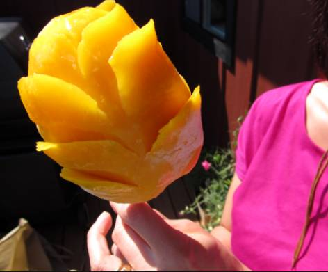 (原始链接: http://mmbiz.qpic.cn/mmbiz_png/q5NfvxQZ7ibGWvmuLDRoicyJJBE4hyrriaia2EUbjM8DzDhhayTgnP5WQAbibdicVXmxGBicp6AOJEiaweboJlpd2pu3tw/0?wx_fmt=png)
- 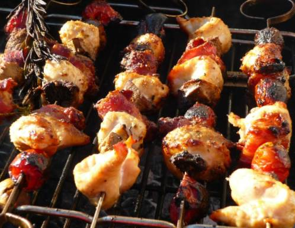 (原始链接: http://mmbiz.qpic.cn/mmbiz_png/q5NfvxQZ7ibGWvmuLDRoicyJJBE4hyrriaia2gOY2qibSzbFzn7p0mTylpBGDeQ7ic1ic2PrU3gre5AlLWQMbpqCZeibQg/0?wx_fmt=png)
-  (原始链接: http://mmbiz.qpic.cn/mmbiz_png/q5NfvxQZ7ibGWvmuLDRoicyJJBE4hyrriaianVz80FXLtnY8H8KsJrjCrLfia7bvVm24h7ibDZGQA5pF7KVCogb1FbLQ/0?wx_fmt=png)
- 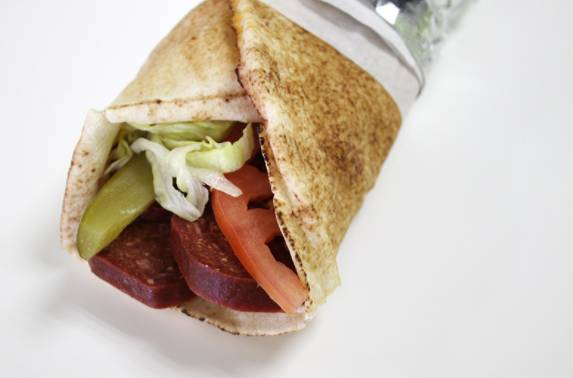 (原始链接: http://mmbiz.qpic.cn/mmbiz_png/q5NfvxQZ7ibGWvmuLDRoicyJJBE4hyrriaiadkGyYVLUvIh37Fc1BuypPqgOpC6OZ7B7jZQdLhpFxJUibbBEbibtETJQ/0?wx_fmt=png)
- 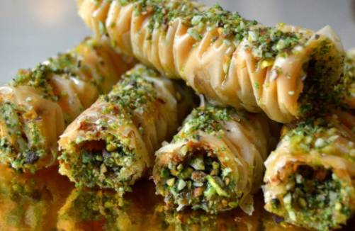 (原始链接: http://mmbiz.qpic.cn/mmbiz_png/q5NfvxQZ7ibGWvmuLDRoicyJJBE4hyrriaiaOPQ82ldjGhToq9yq2pVgZA1eSicIpvesLQDed6zfNogQQQ83AXW8mOA/0?wx_fmt=png)
- 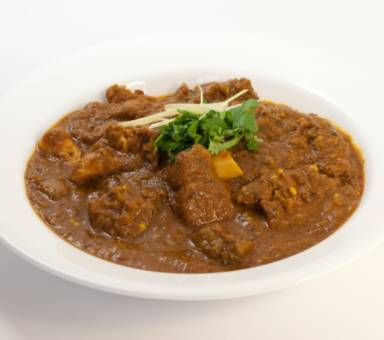 (原始链接: http://mmbiz.qpic.cn/mmbiz_png/q5NfvxQZ7ibGWvmuLDRoicyJJBE4hyrriaiahR4ZvsYkRgU63ssBbxjdRnENpr5taZxKFrn3jKDSNibMLxZ8lBGp15A/0?wx_fmt=png)
- 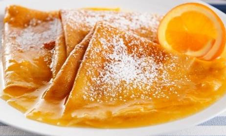 (原始链接: http://mmbiz.qpic.cn/mmbiz_png/q5NfvxQZ7ibGWvmuLDRoicyJJBE4hyrriaiaia7CKp1OxTuV1fkickYc0ia3qcsSf1SmqaV0Q749zQTlOfOpmXXOQFWOA/0?wx_fmt=png)
-  (原始链接: http://mmbiz.qpic.cn/mmbiz_png/q5NfvxQZ7ibGWvmuLDRoicyJJBE4hyrriaiajMATQibAceziaIRpZ4YSFmDfZnslkZYyU9W0CPSdN2zpZZglcKhSrAgg/0?wx_fmt=png)
- 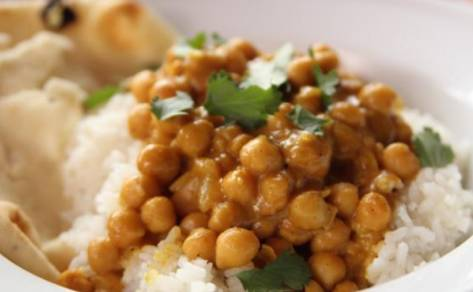 (原始链接: http://mmbiz.qpic.cn/mmbiz_png/q5NfvxQZ7ibGWvmuLDRoicyJJBE4hyrriaiak9jr8ddyKDwyfX5HMR1xQRASyC2LUjnCQCOAPMNwrFMMNlATPo65tg/0?wx_fmt=png)
- 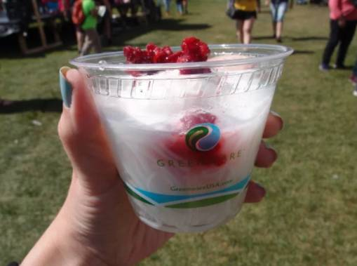 (原始链接: http://mmbiz.qpic.cn/mmbiz_png/q5NfvxQZ7ibGWvmuLDRoicyJJBE4hyrriaiarwwOMOpD6qzbh2Jb5tHMxrwcp3ibhkCg5Up9x3bgU3kqK4riakyCB52w/0?wx_fmt=png)
- 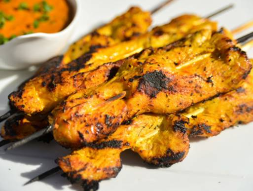 (原始链接: http://mmbiz.qpic.cn/mmbiz_png/q5NfvxQZ7ibGWvmuLDRoicyJJBE4hyrriaiakrib2PaxjCz9K1FLNIjQWaibpsuuibHKQ1GuqUWS9RhY40vHu74nKeDoA/0?wx_fmt=png)
- 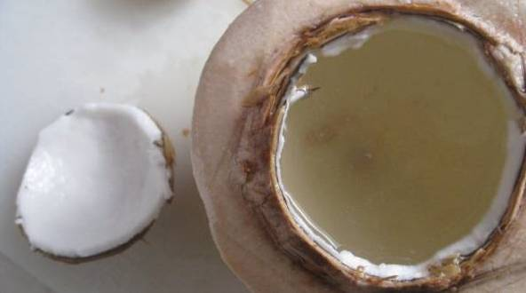 (原始链接: http://mmbiz.qpic.cn/mmbiz_png/q5NfvxQZ7ibGWvmuLDRoicyJJBE4hyrriaia6a3cItcqQnAXLs1MzAdqRPlpO4EBPmmtt7k54azX7jGueTjibPibj2OQ/0?wx_fmt=png)
-  (原始链接: http://mmbiz.qpic.cn/mmbiz_png/q5NfvxQZ7ibGWvmuLDRoicyJJBE4hyrriaiagBJ3Hic2OtZJEiafRFXyrI2PO68TIsSpicZvY4RduLO4U9TS5Tfa5ZlvQ/0?wx_fmt=png)
- 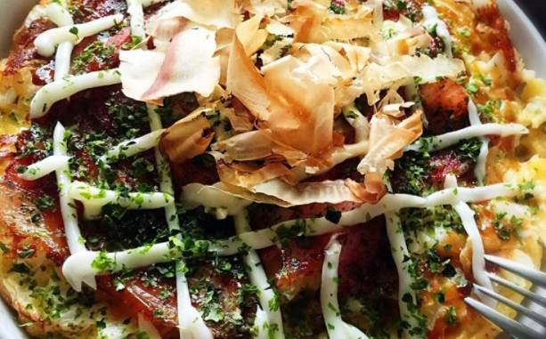 (原始链接: http://mmbiz.qpic.cn/mmbiz_png/q5NfvxQZ7ibGWvmuLDRoicyJJBE4hyrriaiaW6x5KlBjgibInTZpkOQZpcXWU2UB2jRGZfrEO34BfKT3B2f02wiaEPxw/0?wx_fmt=png)
- 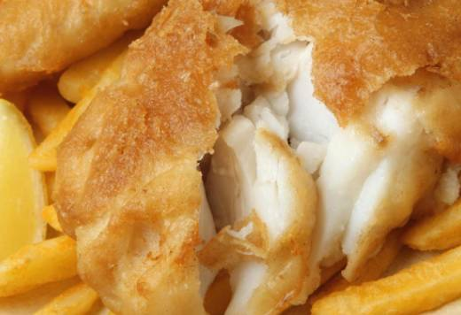 (原始链接: http://mmbiz.qpic.cn/mmbiz_png/q5NfvxQZ7ibGWvmuLDRoicyJJBE4hyrriaiaD7FhdjD1WqF6FJsyZvbke0PKs8hOunvia9GJOUns147icRuY2WicOUkzA/0?wx_fmt=png)
- 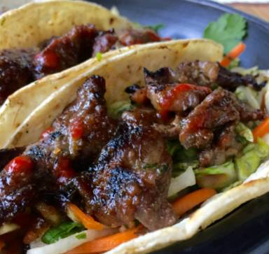 (原始链接: http://mmbiz.qpic.cn/mmbiz_png/q5NfvxQZ7ibGWvmuLDRoicyJJBE4hyrriaiaSNT3RRzQplLgVeyev18pURwbiauqgC6dvtmdN94tN9CSIcQN9WicuOqg/0?wx_fmt=png)
- 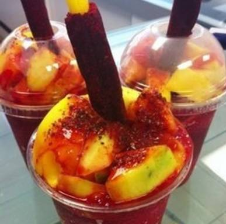 (原始链接: http://mmbiz.qpic.cn/mmbiz_png/q5NfvxQZ7ibGWvmuLDRoicyJJBE4hyrriaiag2xoGnu3bKXicaa68mGwBKjEs0HW4kqndibp8dQdRmttk2SgDZEmNa4Q/0?wx_fmt=png)
- 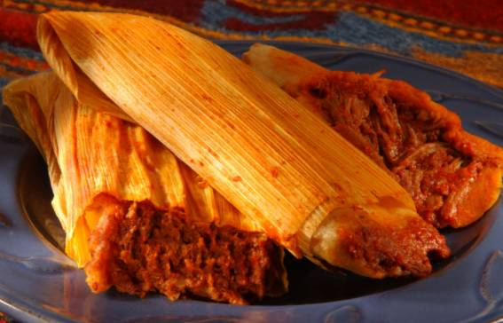 (原始链接: http://mmbiz.qpic.cn/mmbiz_png/q5NfvxQZ7ibGWvmuLDRoicyJJBE4hyrriaiavribYHficwicKdYUiccWudhsqicKRo6RSqiakU7yeOSibrL4M2WUswCt5IPMg/0?wx_fmt=png)
- 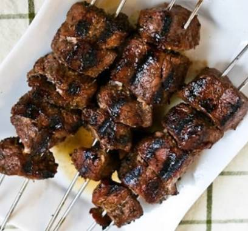 (原始链接: http://mmbiz.qpic.cn/mmbiz_png/q5NfvxQZ7ibGWvmuLDRoicyJJBE4hyrriaia4Y1ny1sRQNUz0ktbiaV9VvgicOFn3GIIXX2jdKZ94d74TLHMUqWic7ryQ/0?wx_fmt=png)
-  (原始链接: http://mmbiz.qpic.cn/mmbiz_png/q5NfvxQZ7ibGWvmuLDRoicyJJBE4hyrriaia3t8oxtB4NzevBBRYfXF3fXobJ8dRlhqU0jVLroBtSY63a4BJ9T7lAA/0?wx_fmt=png)
- 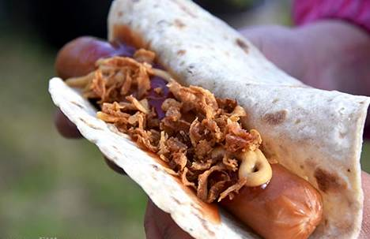 (原始链接: http://mmbiz.qpic.cn/mmbiz_png/q5NfvxQZ7ibGWvmuLDRoicyJJBE4hyrriaiaVBzHvjnhNiaaEspTATQ4s0nbSibicHak4NfygibgY56TEicYiaFbdT8js21Q/0?wx_fmt=png)
- 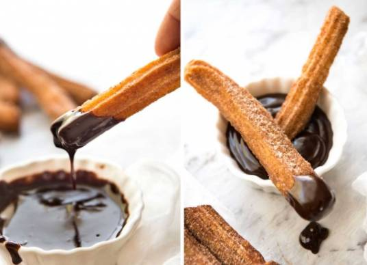 (原始链接: http://mmbiz.qpic.cn/mmbiz_png/q5NfvxQZ7ibGWvmuLDRoicyJJBE4hyrriaiawg7zuB5jJhyLdBMP5bHF5ZBXZo3hSp1aZjaIlMLHsINNF3UuYHlwPg/0?wx_fmt=png)
- 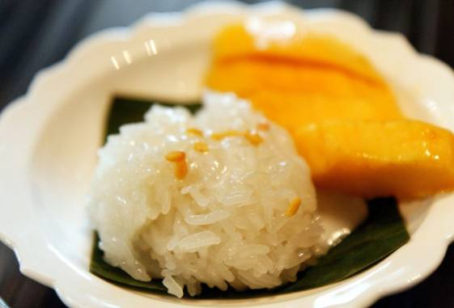 (原始链接: http://mmbiz.qpic.cn/mmbiz_png/q5NfvxQZ7ibGWvmuLDRoicyJJBE4hyrriaia7cDO8ibyB9VAnAaibs5hARiaOLkMnJv6XoQrX9UfsFia7JU9VickATPp7GA/0?wx_fmt=png)
- 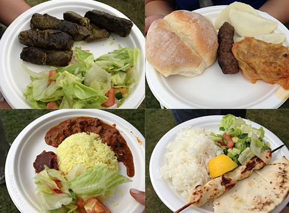 (原始链接: http://mmbiz.qpic.cn/mmbiz_png/q5NfvxQZ7ibGWvmuLDRoicyJJBE4hyrriaia88oW1yZC5lP6sQzXIibHFLC6vmMkCYw4HLx5CPC4QL340TtV40sVSkw/0?wx_fmt=png)
- 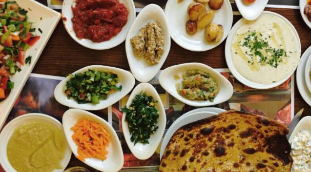 (原始链接: http://mmbiz.qpic.cn/mmbiz_png/q5NfvxQZ7ibGWvmuLDRoicyJJBE4hyrriaia2E47xKEJGkhLYHTKC0icSSibARGFiaPG5GaXt67WI51fQ9lls0LAZ1dtg/0?wx_fmt=png)
-  (原始链接: http://mmbiz.qpic.cn/mmbiz_gif/q5NfvxQZ7ibFg1mibC4ekn8QfrakTSqYYias7FnqNxZ2icdl24EKhHhkzJQQGicHRsyGjJicp9UFeXXDaOEl9jMW7lXQ/0?wx_fmt=gif)
-  (原始链接: http://mmbiz.qpic.cn/mmbiz_jpg/q5NfvxQZ7ibEqgAQiahMibS3JI82V3hLvnY30iaSiaOjJJibCPjPvRiaF7n1eTyEtbMLOictthMKRqkVHrvzZFQGUZI1qg/640?)
-  (原始链接: http://mmbiz.qpic.cn/mmbiz_jpg/q5NfvxQZ7ibExD1ibickDWf9LtnEIPESWhv779dDe36VyZenibXm7riacLQGkO0qN5k0POpP1jBEwQbnvZa8GZgZlnA/640?wx_fmt=jpeg)
