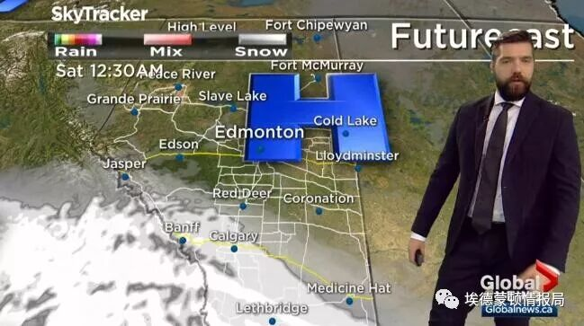
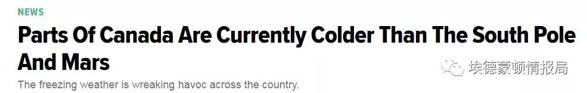
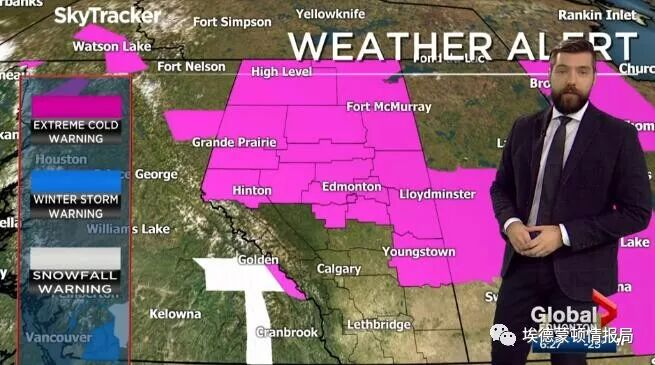
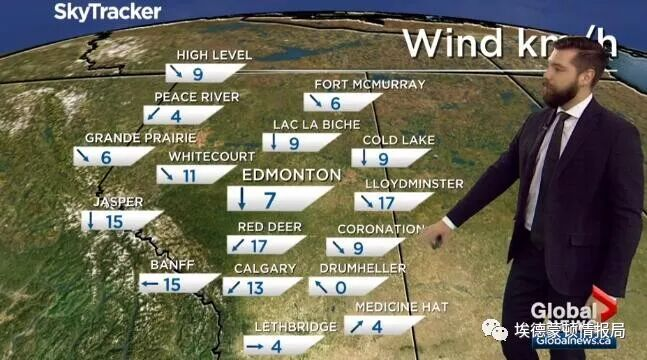
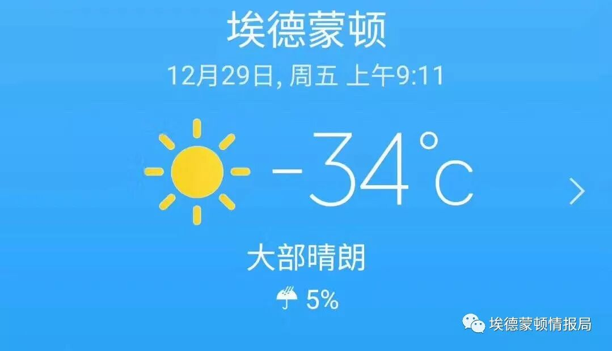
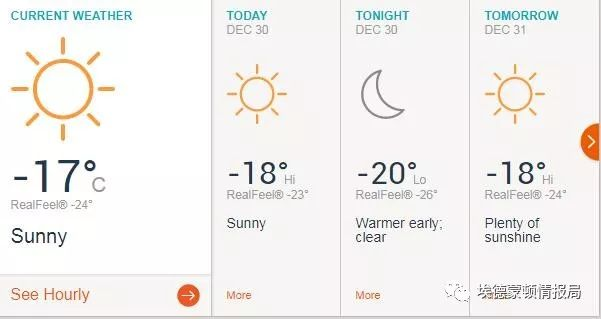
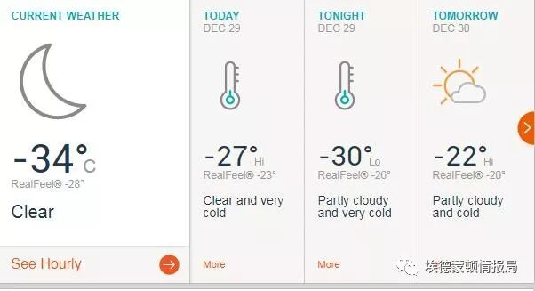
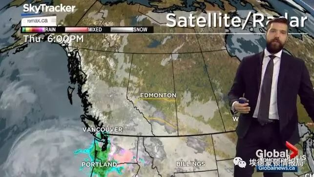
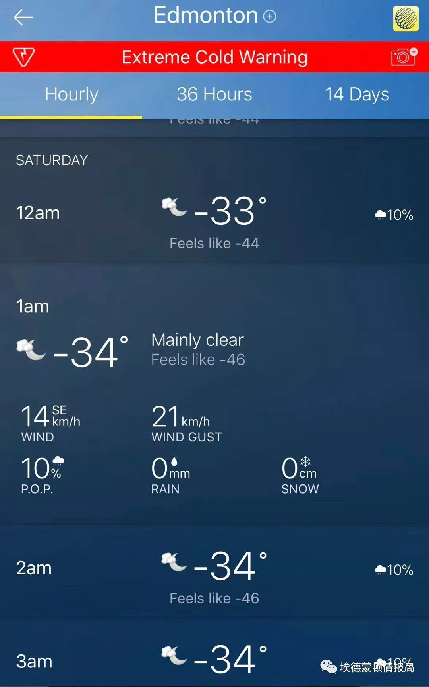
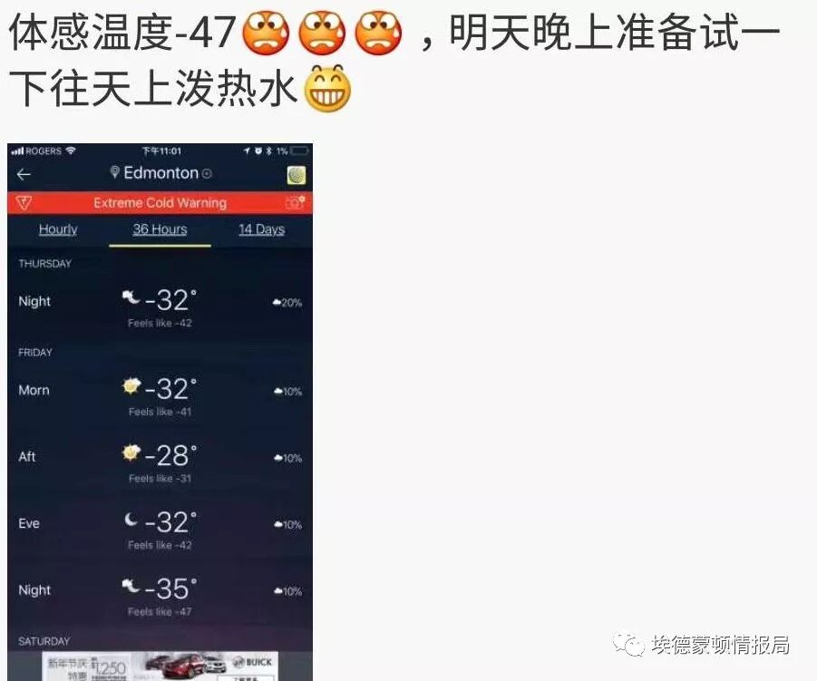

# 无标题

**链接地址:** http://mp.weixin.qq.com/s?__biz=MzAwODQwNTM4MQ==&mid=2655532667&idx=1&sn=7f1bc05fb02ac65148703b49a76ba386&chksm=80d3fe91b7a4778700d777b665c4afec508a30a5ccdcdbbf494a67fc8af4bdebeb1da885e6b1&mpshare=1&scene=2&srcid=1230OxrUpbiUdBEQHIYOtjZ2#rd
**作者:** 埃德蒙顿情报局
**获取时间:** 2025/8/28 22:21:16
**图片数量:** 23

---

## 原始HTML内容

<strong style="max-width: 100%;font-size: 18px;font-family: 微软雅黑;text-align: center;text-indent: 32px;box-sizing: border-box !important;word-wrap: break-word !important;"><strong style="max-width: 100%;line-height: 28.8px;box-sizing: border-box !important;word-wrap: break-word !important;"><strong style="max-width: 100%;line-height: 28.8px;box-sizing: border-box !important;word-wrap: break-word !important;"><strong style="max-width: 100%;line-height: 28.8px;box-sizing: border-box !important;word-wrap: break-word !important;"><strong style="max-width: 100%;line-height: 28.8px;box-sizing: border-box !important;word-wrap: break-word !important;"><strong style="max-width: 100%;line-height: 28.8px;box-sizing: border-box !important;word-wrap: break-word !important;"><strong style="max-width: 100%;line-height: 28.8px;box-sizing: border-box !important;word-wrap: break-word !important;"><strong style="max-width: 100%;line-height: 28.8px;box-sizing: border-box !important;word-wrap: break-word !important;"><strong style="max-width: 100%;line-height: 28.8px;box-sizing: border-box !important;word-wrap: break-word !important;"><strong style="max-width: 100%;line-height: 28.8px;box-sizing: border-box !important;word-wrap: break-word !important;"><strong style="max-width: 100%;line-height: 28.8px;box-sizing: border-box !important;word-wrap: break-word !important;"><strong style="max-width: 100%;line-height: 28.8px;box-sizing: border-box !important;word-wrap: break-word !important;"><strong style="max-width: 100%;line-height: 28.8px;box-sizing: border-box !important;word-wrap: break-word !important;"><strong style="max-width: 100%;line-height: 28.8px;box-sizing: border-box !important;word-wrap: break-word !important;"><strong style="max-width: 100%;line-height: 28.8px;box-sizing: border-box !important;word-wrap: break-word !important;"><strong style="max-width: 100%;line-height: 28.8px;box-sizing: border-box !important;word-wrap: break-word !important;"><strong style="max-width: 100%;line-height: 28.8px;box-sizing: border-box !important;word-wrap: break-word !important;"><strong style="max-width: 100%;line-height: 28.8px;box-sizing: border-box !important;word-wrap: break-word !important;"><strong style="max-width: 100%;line-height: 28.8px;box-sizing: border-box !important;word-wrap: break-word !important;"><strong style="max-width: 100%;line-height: 28.8px;box-sizing: border-box !important;word-wrap: break-word !important;"><strong style="max-width: 100%;line-height: 28.8px;box-sizing: border-box !important;word-wrap: break-word !important;"><strong style="max-width: 100%;line-height: 28.8px;box-sizing: border-box !important;word-wrap: break-word !important;"><strong style="max-width: 100%;line-height: 28.8px;box-sizing: border-box !important;word-wrap: break-word !important;"><strong style="max-width: 100%;line-height: 28.8px;box-sizing: border-box !important;word-wrap: break-word !important;"><strong style="max-width: 100%;line-height: 28.8px;box-sizing: border-box !important;word-wrap: break-word !important;"><strong style="max-width: 100%;line-height: 28.8px;box-sizing: border-box !important;word-wrap: break-word !important;"><strong style="max-width: 100%;line-height: 28.8px;box-sizing: border-box !important;word-wrap: break-word !important;"><strong style="max-width: 100%;line-height: 28.8px;box-sizing: border-box !important;word-wrap: break-word !important;"><strong style="max-width: 100%;line-height: 28.8px;box-sizing: border-box !important;word-wrap: break-word !important;"><strong style="max-width: 100%;line-height: 28.8px;box-sizing: border-box !important;word-wrap: break-word !important;"><strong style="max-width: 100%;line-height: 28.8px;box-sizing: border-box !important;word-wrap: break-word !important;"><strong style="max-width: 100%;line-height: 28.8px;box-sizing: border-box !important;word-wrap: break-word !important;"><strong style="max-width: 100%;line-height: 28.8px;box-sizing: border-box !important;word-wrap: break-word !important;"><strong style="max-width: 100%;line-height: 28.8px;box-sizing: border-box !important;word-wrap: break-word !important;"><strong style="max-width: 100%;line-height: 28.8px;box-sizing: border-box !important;word-wrap: break-word !important;"><strong style="max-width: 100%;line-height: 28.8px;box-sizing: border-box !important;word-wrap: break-word !important;"><strong style="max-width: 100%;line-height: 28.8px;box-sizing: border-box !important;word-wrap: break-word !important;"><strong style="max-width: 100%;line-height: 28.8px;box-sizing: border-box !important;word-wrap: break-word !important;"><strong style="max-width: 100%;line-height: 28.8px;box-sizing: border-box !important;word-wrap: break-word !important;"><strong style="max-width: 100%;line-height: 28.8px;box-sizing: border-box !important;word-wrap: break-word !important;"><strong style="max-width: 100%;line-height: 28.8px;box-sizing: border-box !important;word-wrap: break-word !important;"><strong style="max-width: 100%;line-height: 28.8px;box-sizing: border-box !important;word-wrap: break-word !important;"><strong style="max-width: 100%;line-height: 28.8px;box-sizing: border-box !important;word-wrap: break-word !important;"><strong style="max-width: 100%;line-height: 28.8px;box-sizing: border-box !important;word-wrap: break-word !important;"><strong style="max-width: 100%;line-height: 28.8px;box-sizing: border-box !important;word-wrap: break-word !important;"><strong style="max-width: 100%;line-height: 28.8px;box-sizing: border-box !important;word-wrap: break-word !important;"><strong style="max-width: 100%;line-height: 28.8px;box-sizing: border-box !important;word-wrap: break-word !important;"><strong style="max-width: 100%;line-height: 28.8px;box-sizing: border-box !important;word-wrap: break-word !important;"><strong style="max-width: 100%;line-height: 28.8px;box-sizing: border-box !important;word-wrap: break-word !important;"><strong style="max-width: 100%;line-height: 28.8px;box-sizing: border-box !important;word-wrap: break-word !important;"><strong style="max-width: 100%;line-height: 28.8px;box-sizing: border-box !important;word-wrap: break-word !important;"><strong style="max-width: 100%;line-height: 28.8px;box-sizing: border-box !important;word-wrap: break-word !important;"><strong style="max-width: 100%;line-height: 28.8px;box-sizing: border-box !important;word-wrap: break-word !important;"><strong style="max-width: 100%;line-height: 28.8px;box-sizing: border-box !important;word-wrap: break-word !important;"><strong style="max-width: 100%;line-height: 28.8px;box-sizing: border-box !important;word-wrap: break-word !important;"><strong style="max-width: 100%;line-height: 28.8px;box-sizing: border-box !important;word-wrap: break-word !important;"><strong style="max-width: 100%;line-height: 28.8px;box-sizing: border-box !important;word-wrap: break-word !important;"><strong style="max-width: 100%;line-height: 28.8px;box-sizing: border-box !important;word-wrap: break-word !important;"><strong style="max-width: 100%;line-height: 28.8px;box-sizing: border-box !important;word-wrap: break-word !important;"><strong style="max-width: 100%;line-height: 28.8px;box-sizing: border-box !important;word-wrap: break-word !important;"><strong style="max-width: 100%;line-height: 28.8px;box-sizing: border-box !important;word-wrap: break-word !important;"><strong style="max-width: 100%;line-height: 28.8px;box-sizing: border-box !important;word-wrap: break-word !important;"><strong style="max-width: 100%;line-height: 28.8px;box-sizing: border-box !important;word-wrap: break-word !important;"><strong style="max-width: 100%;line-height: 28.8px;box-sizing: border-box !important;word-wrap: break-word !important;"><strong style="max-width: 100%;line-height: 28.8px;box-sizing: border-box !important;word-wrap: break-word !important;"><strong style="max-width: 100%;line-height: 28.8px;box-sizing: border-box !important;word-wrap: break-word !important;"><strong style="max-width: 100%;line-height: 28.8px;box-sizing: border-box !important;word-wrap: break-word !important;"><strong style="max-width: 100%;line-height: 28.8px;box-sizing: border-box !important;word-wrap: break-word !important;"><strong style="max-width: 100%;line-height: 28.8px;box-sizing: border-box !important;word-wrap: break-word !important;"><strong style="max-width: 100%;line-height: 28.8px;box-sizing: border-box !important;word-wrap: break-word !important;"><strong style="max-width: 100%;line-height: 28.8px;box-sizing: border-box !important;word-wrap: break-word !important;"><strong style="max-width: 100%;line-height: 28.8px;box-sizing: border-box !important;word-wrap: break-word !important;"><strong style="max-width: 100%;line-height: 28.8px;box-sizing: border-box !important;word-wrap: break-word !important;"><strong style="max-width: 100%;line-height: 28.8px;box-sizing: border-box !important;word-wrap: break-word !important;"><strong style="max-width: 100%;line-height: 28.8px;box-sizing: border-box !important;word-wrap: break-word !important;"><strong style="max-width: 100%;line-height: 28.8px;box-sizing: border-box !important;word-wrap: break-word !important;"><strong style="max-width: 100%;line-height: 28.8px;box-sizing: border-box !important;word-wrap: break-word !important;"><strong style="max-width: 100%;line-height: 28.8px;box-sizing: border-box !important;word-wrap: break-word !important;"><strong style="max-width: 100%;line-height: 28.8px;box-sizing: border-box !important;word-wrap: break-word !important;"><strong style="max-width: 100%;line-height: 28.8px;box-sizing: border-box !important;word-wrap: break-word !important;"><strong style="max-width: 100%;line-height: 28.8px;box-sizing: border-box !important;word-wrap: break-word !important;"><strong style="max-width: 100%;line-height: 28.8px;box-sizing: border-box !important;word-wrap: break-word !important;"><strong style="max-width: 100%;line-height: 28.8px;box-sizing: border-box !important;word-wrap: break-word !important;"><strong style="max-width: 100%;line-height: 28.8px;box-sizing: border-box !important;word-wrap: break-word !important;"><strong style="max-width: 100%;line-height: 28.8px;box-sizing: border-box !important;word-wrap: break-word !important;"><strong style="max-width: 100%;line-height: 28.8px;box-sizing: border-box !important;word-wrap: break-word !important;"><strong style="max-width: 100%;line-height: 28.8px;box-sizing: border-box !important;word-wrap: break-word !important;"><strong style="max-width: 100%;line-height: 28.8px;box-sizing: border-box !important;word-wrap: break-word !important;"><strong style="max-width: 100%;line-height: 28.8px;box-sizing: border-box !important;word-wrap: break-word !important;"><strong style="max-width: 100%;line-height: 28.8px;box-sizing: border-box !important;word-wrap: break-word !important;"><strong style="max-width: 100%;line-height: 28.8px;box-sizing: border-box !important;word-wrap: break-word !important;"><strong style="max-width: 100%;line-height: 28.8px;box-sizing: border-box !important;word-wrap: break-word !important;"><strong style="max-width: 100%;line-height: 28.8px;box-sizing: border-box !important;word-wrap: break-word !important;"><strong style="max-width: 100%;line-height: 28.8px;box-sizing: border-box !important;word-wrap: break-word !important;"><strong style="max-width: 100%;line-height: 28.8px;box-sizing: border-box !important;word-wrap: break-word !important;"><strong style="max-width: 100%;line-height: 28.8px;box-sizing: border-box !important;word-wrap: break-word !important;"><strong style="max-width: 100%;line-height: 28.8px;box-sizing: border-box !important;word-wrap: break-word !important;"><strong style="max-width: 100%;line-height: 28.8px;box-sizing: border-box !important;word-wrap: break-word !important;"><strong style="max-width: 100%;line-height: 28.8px;box-sizing: border-box !important;word-wrap: break-word !important;"><strong style="max-width: 100%;line-height: 28.8px;box-sizing: border-box !important;word-wrap: break-word !important;"><strong style="max-width: 100%;line-height: 28.8px;box-sizing: border-box !important;word-wrap: break-word !important;"><strong style="max-width: 100%;line-height: 28.8px;box-sizing: border-box !important;word-wrap: break-word !important;"><strong style="max-width: 100%;line-height: 28.8px;box-sizing: border-box !important;word-wrap: break-word !important;"><strong style="max-width: 100%;line-height: 28.8px;box-sizing: border-box !important;word-wrap: break-word !important;"><strong style="max-width: 100%;line-height: 28.8px;box-sizing: border-box !important;word-wrap: break-word !important;"><strong style="max-width: 100%;line-height: 28.8px;box-sizing: border-box !important;word-wrap: break-word !important;"><strong style="max-width: 100%;line-height: 28.8px;box-sizing: border-box !important;word-wrap: break-word !important;"><strong style="max-width: 100%;line-height: 28.8px;box-sizing: border-box !important;word-wrap: break-word !important;"><strong style="max-width: 100%;line-height: 28.8px;box-sizing: border-box !important;word-wrap: break-word !important;"><strong style="max-width: 100%;line-height: 28.8px;box-sizing: border-box !important;word-wrap: break-word !important;"><strong style="max-width: 100%;line-height: 28.8px;box-sizing: border-box !important;word-wrap: break-word !important;"><strong style="max-width: 100%;line-height: 28.8px;box-sizing: border-box !important;word-wrap: break-word !important;"><strong style="max-width: 100%;line-height: 28.8px;box-sizing: border-box !important;word-wrap: break-word !important;"><strong style="max-width: 100%;line-height: 28.8px;box-sizing: border-box !important;word-wrap: break-word !important;"><strong style="max-width: 100%;line-height: 28.8px;box-sizing: border-box !important;word-wrap: break-word !important;"><strong style="max-width: 100%;line-height: 28.8px;box-sizing: border-box !important;word-wrap: break-word !important;"><strong style="max-width: 100%;line-height: 28.8px;box-sizing: border-box !important;word-wrap: break-word !important;"><strong style="max-width: 100%;line-height: 28.8px;box-sizing: border-box !important;word-wrap: break-word !important;"><strong style="max-width: 100%;line-height: 28.8px;box-sizing: border-box !important;word-wrap: break-word !important;"><strong style="max-width: 100%;line-height: 28.8px;box-sizing: border-box !important;word-wrap: break-word !important;"><strong style="max-width: 100%;line-height: 28.8px;box-sizing: border-box !important;word-wrap: break-word !important;"><strong style="max-width: 100%;line-height: 28.8px;box-sizing: border-box !important;word-wrap: break-word !important;"><strong style="max-width: 100%;line-height: 28.8px;box-sizing: border-box !important;word-wrap: break-word !important;"><strong style="max-width: 100%;line-height: 28.8px;box-sizing: border-box !important;word-wrap: break-word !important;"><strong style="max-width: 100%;line-height: 28.8px;box-sizing: border-box !important;word-wrap: break-word !important;"><strong style="max-width: 100%;line-height: 28.8px;box-sizing: border-box !important;word-wrap: break-word !important;"><strong style="max-width: 100%;line-height: 28.8px;box-sizing: border-box !important;word-wrap: break-word !important;"><strong style="max-width: 100%;line-height: 28.8px;box-sizing: border-box !important;word-wrap: break-word !important;"><strong style="max-width: 100%;line-height: 28.8px;box-sizing: border-box !important;word-wrap: break-word !important;"><strong style="max-width: 100%;line-height: 28.8px;box-sizing: border-box !important;word-wrap: break-word !important;"><strong style="max-width: 100%;line-height: 28.8px;box-sizing: border-box !important;word-wrap: break-word !important;"><strong style="max-width: 100%;line-height: 28.8px;box-sizing: border-box !important;word-wrap: break-word !important;"><strong style="max-width: 100%;line-height: 28.8px;box-sizing: border-box !important;word-wrap: break-word !important;"><strong style="max-width: 100%;line-height: 28.8px;box-sizing: border-box !important;word-wrap: break-word !important;"><strong style="max-width: 100%;line-height: 28.8px;box-sizing: border-box !important;word-wrap: break-word !important;"><strong style="max-width: 100%;line-height: 28.8px;box-sizing: border-box !important;word-wrap: break-word !important;"><strong style="max-width: 100%;line-height: 28.8px;box-sizing: border-box !important;word-wrap: break-word !important;"><strong style="max-width: 100%;line-height: 28.8px;box-sizing: border-box !important;word-wrap: break-word !important;"><strong style="max-width: 100%;line-height: 28.8px;box-sizing: border-box !important;word-wrap: break-word !important;"><strong style="max-width: 100%;line-height: 28.8px;box-sizing: border-box !important;word-wrap: break-word !important;"><strong style="max-width: 100%;line-height: 28.8px;box-sizing: border-box !important;word-wrap: break-word !important;"><strong style="max-width: 100%;line-height: 28.8px;box-sizing: border-box !important;word-wrap: break-word !important;"><strong style="max-width: 100%;line-height: 28.8px;box-sizing: border-box !important;word-wrap: break-word !important;"><strong style="max-width: 100%;line-height: 28.8px;box-sizing: border-box !important;word-wrap: break-word !important;"><strong style="max-width: 100%;line-height: 28.8px;box-sizing: border-box !important;word-wrap: break-word !important;"><strong style="max-width: 100%;line-height: 28.8px;box-sizing: border-box !important;word-wrap: break-word !important;"><strong style="max-width: 100%;line-height: 28.8px;box-sizing: border-box !important;word-wrap: break-word !important;"><strong style="max-width: 100%;line-height: 28.8px;box-sizing: border-box !important;word-wrap: break-word !important;"><strong style="max-width: 100%;line-height: 28.8px;box-sizing: border-box !important;word-wrap: break-word !important;"><strong style="max-width: 100%;line-height: 28.8px;box-sizing: border-box !important;word-wrap: break-word !important;"><strong style="max-width: 100%;line-height: 28.8px;box-sizing: border-box !important;word-wrap: break-word !important;"><strong style="max-width: 100%;line-height: 28.8px;box-sizing: border-box !important;word-wrap: break-word !important;"><strong style="max-width: 100%;line-height: 28.8px;box-sizing: border-box !important;word-wrap: break-word !important;"><strong style="max-width: 100%;line-height: 28.8px;box-sizing: border-box !important;word-wrap: break-word !important;"><strong style="max-width: 100%;line-height: 28.8px;box-sizing: border-box !important;word-wrap: break-word !important;"><strong style="max-width: 100%;line-height: 28.8px;box-sizing: border-box !important;word-wrap: break-word !important;"><strong style="max-width: 100%;line-height: 28.8px;box-sizing: border-box !important;word-wrap: break-word !important;"><strong style="max-width: 100%;line-height: 28.8px;box-sizing: border-box !important;word-wrap: break-word !important;"><strong style="max-width: 100%;line-height: 28.8px;box-sizing: border-box !important;word-wrap: break-word !important;"><strong style="max-width: 100%;line-height: 28.8px;box-sizing: border-box !important;word-wrap: break-word !important;"><strong style="max-width: 100%;line-height: 28.8px;box-sizing: border-box !important;word-wrap: break-word !important;"><strong style="max-width: 100%;line-height: 28.8px;box-sizing: border-box !important;word-wrap: break-word !important;"><strong style="max-width: 100%;line-height: 28.8px;box-sizing: border-box !important;word-wrap: break-word !important;"><strong style="max-width: 100%;line-height: 28.8px;box-sizing: border-box !important;word-wrap: break-word !important;"><strong style="max-width: 100%;line-height: 28.8px;box-sizing: border-box !important;word-wrap: break-word !important;"><strong style="max-width: 100%;line-height: 28.8px;box-sizing: border-box !important;word-wrap: break-word !important;"><strong style="max-width: 100%;line-height: 28.8px;box-sizing: border-box !important;word-wrap: break-word !important;"><strong style="max-width: 100%;line-height: 28.8px;box-sizing: border-box !important;word-wrap: break-word !important;"><strong style="max-width: 100%;line-height: 28.8px;box-sizing: border-box !important;word-wrap: break-word !important;"><strong style="max-width: 100%;line-height: 28.8px;box-sizing: border-box !important;word-wrap: break-word !important;"><strong style="max-width: 100%;line-height: 28.8px;box-sizing: border-box !important;word-wrap: break-word !important;"><strong style="max-width: 100%;line-height: 28.8px;box-sizing: border-box !important;word-wrap: break-word !important;"><strong style="max-width: 100%;line-height: 28.8px;box-sizing: border-box !important;word-wrap: break-word !important;"><strong style="max-width: 100%;line-height: 28.8px;box-sizing: border-box !important;word-wrap: break-word !important;"><strong style="max-width: 100%;line-height: 28.8px;box-sizing: border-box !important;word-wrap: break-word !important;"><strong style="max-width: 100%;line-height: 28.8px;box-sizing: border-box !important;word-wrap: break-word !important;"><strong style="max-width: 100%;line-height: 28.8px;box-sizing: border-box !important;word-wrap: break-word !important;"><strong style="max-width: 100%;line-height: 28.8px;box-sizing: border-box !important;word-wrap: break-word !important;"><strong style="max-width: 100%;line-height: 28.8px;box-sizing: border-box !important;word-wrap: break-word !important;"><strong style="max-width: 100%;line-height: 28.8px;box-sizing: border-box !important;word-wrap: break-word !important;"><strong style="max-width: 100%;line-height: 28.8px;box-sizing: border-box !important;word-wrap: break-word !important;"><strong style="max-width: 100%;line-height: 28.8px;box-sizing: border-box !important;word-wrap: break-word !important;"><strong style="max-width: 100%;line-height: 28.8px;box-sizing: border-box !important;word-wrap: break-word !important;"><strong style="max-width: 100%;line-height: 28.8px;box-sizing: border-box !important;word-wrap: break-word !important;"><strong style="max-width: 100%;line-height: 28.8px;box-sizing: border-box !important;word-wrap: break-word !important;"><strong style="max-width: 100%;line-height: 28.8px;box-sizing: border-box !important;word-wrap: break-word !important;"><strong style="max-width: 100%;line-height: 28.8px;box-sizing: border-box !important;word-wrap: break-word !important;"><strong style="max-width: 100%;line-height: 28.8px;box-sizing: border-box !important;word-wrap: break-word !important;"><strong style="max-width: 100%;line-height: 28.8px;box-sizing: border-box !important;word-wrap: break-word !important;"><strong style="max-width: 100%;line-height: 28.8px;box-sizing: border-box !important;word-wrap: break-word !important;"><strong style="max-width: 100%;line-height: 28.8px;box-sizing: border-box !important;word-wrap: break-word !important;"><strong style="max-width: 100%;line-height: 28.8px;box-sizing: border-box !important;word-wrap: break-word !important;"><strong style="max-width: 100%;line-height: 28.8px;box-sizing: border-box !important;word-wrap: break-word !important;"><strong style="max-width: 100%;line-height: 28.8px;box-sizing: border-box !important;word-wrap: break-word !important;"><strong style="max-width: 100%;line-height: 28.8px;box-sizing: border-box !important;word-wrap: break-word !important;"><strong style="max-width: 100%;line-height: 28.8px;box-sizing: border-box !important;word-wrap: break-word !important;"><strong style="max-width: 100%;line-height: 28.8px;box-sizing: border-box !important;word-wrap: break-word !important;"><strong style="max-width: 100%;line-height: 28.8px;box-sizing: border-box !important;word-wrap: break-word !important;"><strong style="max-width: 100%;line-height: 28.8px;box-sizing: border-box !important;word-wrap: break-word !important;"><strong style="max-width: 100%;line-height: 28.8px;box-sizing: border-box !important;word-wrap: break-word !important;"><strong style="max-width: 100%;line-height: 28.8px;box-sizing: border-box !important;word-wrap: break-word !important;"><strong style="max-width: 100%;line-height: 28.8px;box-sizing: border-box !important;word-wrap: break-word !important;"><strong style="max-width: 100%;line-height: 28.8px;box-sizing: border-box !important;word-wrap: break-word !important;"><strong style="max-width: 100%;line-height: 28.8px;box-sizing: border-box !important;word-wrap: break-word !important;"><strong style="max-width: 100%;line-height: 28.8px;box-sizing: border-box !important;word-wrap: break-word !important;"><strong style="max-width: 100%;line-height: 28.8px;box-sizing: border-box !important;word-wrap: break-word !important;"><strong style="max-width: 100%;line-height: 28.8px;box-sizing: border-box !important;word-wrap: break-word !important;"><strong style="max-width: 100%;line-height: 28.8px;box-sizing: border-box !important;word-wrap: break-word !important;"><strong style="max-width: 100%;line-height: 28.8px;box-sizing: border-box !important;word-wrap: break-word !important;"><strong style="max-width: 100%;line-height: 28.8px;box-sizing: border-box !important;word-wrap: break-word !important;"><strong style="max-width: 100%;line-height: 28.8px;box-sizing: border-box !important;word-wrap: break-word !important;"><strong style="max-width: 100%;line-height: 28.8px;box-sizing: border-box !important;word-wrap: break-word !important;"><strong style="max-width: 100%;line-height: 28.8px;box-sizing: border-box !important;word-wrap: break-word !important;"><strong style="max-width: 100%;line-height: 28.8px;box-sizing: border-box !important;word-wrap: break-word !important;"><strong style="max-width: 100%;line-height: 28.8px;box-sizing: border-box !important;word-wrap: break-word !important;"><strong style="max-width: 100%;line-height: 28.8px;box-sizing: border-box !important;word-wrap: break-word !important;"><strong style="max-width: 100%;line-height: 28.8px;box-sizing: border-box !important;word-wrap: break-word !important;"><strong style="max-width: 100%;line-height: 28.8px;box-sizing: border-box !important;word-wrap: break-word !important;"><strong style="max-width: 100%;line-height: 28.8px;box-sizing: border-box !important;word-wrap: break-word !important;"><strong style="max-width: 100%;line-height: 28.8px;box-sizing: border-box !important;word-wrap: break-word !important;"><strong style="max-width: 100%;line-height: 28.8px;box-sizing: border-box !important;word-wrap: break-word !important;"><strong style="max-width: 100%;line-height: 28.8px;box-sizing: border-box !important;word-wrap: break-word !important;"><strong style="max-width: 100%;line-height: 28.8px;box-sizing: border-box !important;word-wrap: break-word !important;"><strong style="max-width: 100%;line-height: 28.8px;box-sizing: border-box !important;word-wrap: break-word !important;"><strong style="max-width: 100%;line-height: 28.8px;box-sizing: border-box !important;word-wrap: break-word !important;"><strong style="max-width: 100%;line-height: 28.8px;box-sizing: border-box !important;word-wrap: break-word !important;"><strong style="max-width: 100%;line-height: 28.8px;box-sizing: border-box !important;word-wrap: break-word !important;"><strong style="max-width: 100%;line-height: 28.8px;box-sizing: border-box !important;word-wrap: break-word !important;"><strong style="max-width: 100%;line-height: 28.8px;box-sizing: border-box !important;word-wrap: break-word !important;"><strong style="max-width: 100%;line-height: 28.8px;box-sizing: border-box !important;word-wrap: break-word !important;"><strong style="max-width: 100%;line-height: 28.8px;box-sizing: border-box !important;word-wrap: break-word !important;"><strong style="max-width: 100%;line-height: 28.8px;box-sizing: border-box !important;word-wrap: break-word !important;"><strong style="max-width: 100%;line-height: 28.8px;box-sizing: border-box !important;word-wrap: break-word !important;"><strong style="max-width: 100%;line-height: 28.8px;box-sizing: border-box !important;word-wrap: break-word !important;"><strong style="max-width: 100%;line-height: 28.8px;box-sizing: border-box !important;word-wrap: break-word !important;"><strong style="max-width: 100%;line-height: 28.8px;box-sizing: border-box !important;word-wrap: break-word !important;"><strong style="max-width: 100%;line-height: 28.8px;box-sizing: border-box !important;word-wrap: break-word !important;"><strong style="max-width: 100%;line-height: 28.8px;box-sizing: border-box !important;word-wrap: break-word !important;"><strong style="max-width: 100%;line-height: 28.8px;box-sizing: border-box !important;word-wrap: break-word !important;"><strong style="max-width: 100%;line-height: 28.8px;box-sizing: border-box !important;word-wrap: break-word !important;"><strong style="max-width: 100%;line-height: 28.8px;box-sizing: border-box !important;word-wrap: break-word !important;"><strong style="max-width: 100%;line-height: 28.8px;box-sizing: border-box !important;word-wrap: break-word !important;"><strong style="max-width: 100%;line-height: 28.8px;box-sizing: border-box !important;word-wrap: break-word !important;"><strong style="max-width: 100%;line-height: 28.8px;box-sizing: border-box !important;word-wrap: break-word !important;"><strong style="max-width: 100%;line-height: 28.8px;box-sizing: border-box !important;word-wrap: break-word !important;"><strong style="max-width: 100%;line-height: 28.8px;box-sizing: border-box !important;word-wrap: break-word !important;"><strong style="max-width: 100%;line-height: 28.8px;box-sizing: border-box !important;word-wrap: break-word !important;"><strong style="max-width: 100%;line-height: 28.8px;box-sizing: border-box !important;word-wrap: break-word !important;"><strong style="max-width: 100%;line-height: 28.8px;box-sizing: border-box !important;word-wrap: break-word !important;"><strong style="max-width: 100%;line-height: 28.8px;box-sizing: border-box !important;word-wrap: break-word !important;"><strong style="max-width: 100%;line-height: 28.8px;box-sizing: border-box !important;word-wrap: break-word !important;"><strong style="max-width: 100%;line-height: 28.8px;box-sizing: border-box !important;word-wrap: break-word !important;"><strong style="max-width: 100%;line-height: 28.8px;box-sizing: border-box !important;word-wrap: break-word !important;"><strong style="max-width: 100%;line-height: 28.8px;box-sizing: border-box !important;word-wrap: break-word !important;"><strong style="max-width: 100%;line-height: 28.8px;box-sizing: border-box !important;word-wrap: break-word !important;"><strong style="max-width: 100%;line-height: 28.8px;box-sizing: border-box !important;word-wrap: break-word !important;"><strong style="max-width: 100%;line-height: 28.8px;box-sizing: border-box !important;word-wrap: break-word !important;"><strong style="max-width: 100%;line-height: 28.8px;box-sizing: border-box !important;word-wrap: break-word !important;"><strong style="max-width: 100%;line-height: 28.8px;box-sizing: border-box !important;word-wrap: break-word !important;"><strong style="max-width: 100%;line-height: 28.8px;box-sizing: border-box !important;word-wrap: break-word !important;"><strong style="max-width: 100%;line-height: 28.8px;box-sizing: border-box !important;word-wrap: break-word !important;"><strong style="max-width: 100%;line-height: 28.8px;box-sizing: border-box !important;word-wrap: break-word !important;"><strong style="max-width: 100%;line-height: 28.8px;box-sizing: border-box !important;word-wrap: break-word !important;"><strong style="max-width: 100%;line-height: 28.8px;box-sizing: border-box !important;word-wrap: break-word !important;"><strong style="max-width: 100%;line-height: 28.8px;box-sizing: border-box !important;word-wrap: break-word !important;"><strong style="max-width: 100%;line-height: 28.8px;box-sizing: border-box !important;word-wrap: break-word !important;"><strong style="max-width: 100%;line-height: 28.8px;box-sizing: border-box !important;word-wrap: break-word !important;"><strong style="max-width: 100%;line-height: 28.8px;box-sizing: border-box !important;word-wrap: break-word !important;"><strong style="max-width: 100%;line-height: 28.8px;box-sizing: border-box !important;word-wrap: break-word !important;"><strong style="max-width: 100%;line-height: 28.8px;box-sizing: border-box !important;word-wrap: break-word !important;"><strong style="max-width: 100%;line-height: 28.8px;box-sizing: border-box !important;word-wrap: break-word !important;"><strong style="max-width: 100%;line-height: 28.8px;box-sizing: border-box !important;word-wrap: break-word !important;"><strong style="max-width: 100%;line-height: 28.8px;box-sizing: border-box !important;word-wrap: break-word !important;"><strong style="max-width: 100%;line-height: 28.8px;box-sizing: border-box !important;word-wrap: break-word !important;"><strong style="max-width: 100%;line-height: 28.8px;box-sizing: border-box !important;word-wrap: break-word !important;"><strong style="max-width: 100%;line-height: 28.8px;box-sizing: border-box !important;word-wrap: break-word !important;"><strong style="max-width: 100%;line-height: 28.8px;box-sizing: border-box !important;word-wrap: break-word !important;"><strong style="max-width: 100%;line-height: 28.8px;box-sizing: border-box !important;word-wrap: break-word !important;"><strong style="max-width: 100%;line-height: 28.8px;box-sizing: border-box !important;word-wrap: break-word !important;"><strong style="max-width: 100%;line-height: 28.8px;box-sizing: border-box !important;word-wrap: break-word !important;"><strong style="max-width: 100%;line-height: 28.8px;box-sizing: border-box !important;word-wrap: break-word !important;"><strong style="max-width: 100%;line-height: 28.8px;box-sizing: border-box !important;word-wrap: break-word !important;"><strong style="max-width: 100%;line-height: 28.8px;box-sizing: border-box !important;word-wrap: break-word !important;"><strong style="max-width: 100%;line-height: 28.8px;box-sizing: border-box !important;word-wrap: break-word !important;"><strong style="max-width: 100%;line-height: 28.8px;box-sizing: border-box !important;word-wrap: break-word !important;"><strong style="max-width: 100%;line-height: 28.8px;box-sizing: border-box !important;word-wrap: break-word !important;"><strong style="max-width: 100%;line-height: 28.8px;box-sizing: border-box !important;word-wrap: break-word !important;"><strong style="max-width: 100%;line-height: 28.8px;box-sizing: border-box !important;word-wrap: break-word !important;"><strong style="max-width: 100%;line-height: 28.8px;box-sizing: border-box !important;word-wrap: break-word !important;"><strong style="max-width: 100%;line-height: 28.8px;box-sizing: border-box !important;word-wrap: break-word !important;"><strong style="max-width: 100%;line-height: 28.8px;box-sizing: border-box !important;word-wrap: break-word !important;"><strong style="max-width: 100%;line-height: 28.8px;box-sizing: border-box !important;word-wrap: break-word !important;"><strong style="max-width: 100%;line-height: 28.8px;box-sizing: border-box !important;word-wrap: break-word !important;"><strong style="max-width: 100%;line-height: 28.8px;box-sizing: border-box !important;word-wrap: break-word !important;"><strong style="max-width: 100%;line-height: 28.8px;box-sizing: border-box !important;word-wrap: break-word !important;"><strong style="max-width: 100%;line-height: 28.8px;box-sizing: border-box !important;word-wrap: break-word !important;"><strong style="max-width: 100%;line-height: 28.8px;box-sizing: border-box !important;word-wrap: break-word !important;"><strong style="max-width: 100%;line-height: 28.8px;box-sizing: border-box !important;word-wrap: break-word !important;"><strong style="max-width: 100%;line-height: 28.8px;box-sizing: border-box !important;word-wrap: break-word !important;"><strong style="max-width: 100%;line-height: 28.8px;box-sizing: border-box !important;word-wrap: break-word !important;"><strong style="max-width: 100%;line-height: 28.8px;box-sizing: border-box !important;word-wrap: break-word !important;"><strong style="max-width: 100%;line-height: 28.8px;box-sizing: border-box !important;word-wrap: break-word !important;"><strong style="max-width: 100%;line-height: 28.8px;box-sizing: border-box !important;word-wrap: break-word !important;"><strong style="max-width: 100%;line-height: 28.8px;box-sizing: border-box !important;word-wrap: break-word !important;"><strong style="max-width: 100%;line-height: 28.8px;box-sizing: border-box !important;word-wrap: break-word !important;"><strong style="max-width: 100%;line-height: 28.8px;box-sizing: border-box !important;word-wrap: break-word !important;"><strong style="max-width: 100%;line-height: 28.8px;box-sizing: border-box !important;word-wrap: break-word !important;"><strong style="max-width: 100%;line-height: 28.8px;box-sizing: border-box !important;word-wrap: break-word !important;"><strong style="max-width: 100%;line-height: 28.8px;box-sizing: border-box !important;word-wrap: break-word !important;"><strong style="max-width: 100%;line-height: 28.8px;box-sizing: border-box !important;word-wrap: break-word !important;"><strong style="max-width: 100%;line-height: 28.8px;box-sizing: border-box !important;word-wrap: break-word !important;"><strong style="max-width: 100%;line-height: 28.8px;box-sizing: border-box !important;word-wrap: break-word !important;"><strong style="max-width: 100%;line-height: 28.8px;box-sizing: border-box !important;word-wrap: break-word !important;"><strong style="max-width: 100%;line-height: 28.8px;box-sizing: border-box !important;word-wrap: break-word !important;"><strong style="max-width: 100%;line-height: 28.8px;box-sizing: border-box !important;word-wrap: break-word !important;"><strong style="max-width: 100%;line-height: 28.8px;box-sizing: border-box !important;word-wrap: break-word !important;"><strong style="max-width: 100%;line-height: 28.8px;box-sizing: border-box !important;word-wrap: break-word !important;"><strong style="max-width: 100%;line-height: 28.8px;box-sizing: border-box !important;word-wrap: break-word !important;"><strong style="max-width: 100%;line-height: 28.8px;box-sizing: border-box !important;word-wrap: break-word !important;"><strong style="max-width: 100%;line-height: 28.8px;box-sizing: border-box !important;word-wrap: break-word !important;"><strong style="max-width: 100%;line-height: 28.8px;box-sizing: border-box !important;word-wrap: break-word !important;"><strong style="max-width: 100%;line-height: 28.8px;box-sizing: border-box !important;word-wrap: break-word !important;"><strong style="max-width: 100%;line-height: 28.8px;box-sizing: border-box !important;word-wrap: break-word !important;"><strong style="max-width: 100%;line-height: 28.8px;box-sizing: border-box !important;word-wrap: break-word !important;"><strong style="max-width: 100%;line-height: 28.8px;box-sizing: border-box !important;word-wrap: break-word !important;"><strong style="max-width: 100%;line-height: 28.8px;box-sizing: border-box !important;word-wrap: break-word !important;"><strong style="max-width: 100%;line-height: 28.8px;box-sizing: border-box !important;word-wrap: break-word !important;"><strong style="max-width: 100%;line-height: 28.8px;box-sizing: border-box !important;word-wrap: break-word !important;"><strong style="max-width: 100%;line-height: 28.8px;box-sizing: border-box !important;word-wrap: break-word !important;"><strong style="max-width: 100%;line-height: 28.8px;box-sizing: border-box !important;word-wrap: break-word !important;"><strong style="max-width: 100%;line-height: 28.8px;box-sizing: border-box !important;word-wrap: break-word !important;"><strong style="max-width: 100%;line-height: 28.8px;box-sizing: border-box !important;word-wrap: break-word !important;"><strong style="max-width: 100%;line-height: 28.8px;box-sizing: border-box !important;word-wrap: break-word !important;"><strong style="max-width: 100%;line-height: 28.8px;box-sizing: border-box !important;word-wrap: break-word !important;"><strong style="max-width: 100%;line-height: 28.8px;box-sizing: border-box !important;word-wrap: break-word !important;"><strong style="max-width: 100%;line-height: 28.8px;box-sizing: border-box !important;word-wrap: break-word !important;"><strong style="max-width: 100%;line-height: 28.8px;box-sizing: border-box !important;word-wrap: break-word !important;"><strong style="max-width: 100%;line-height: 28.8px;box-sizing: border-box !important;word-wrap: break-word !important;"><strong style="max-width: 100%;line-height: 28.8px;box-sizing: border-box !important;word-wrap: break-word !important;"><strong style="max-width: 100%;line-height: 28.8px;box-sizing: border-box !important;word-wrap: break-word !important;"><strong style="max-width: 100%;line-height: 28.8px;box-sizing: border-box !important;word-wrap: break-word !important;"><strong style="max-width: 100%;line-height: 28.8px;box-sizing: border-box !important;word-wrap: break-word !important;"><strong style="max-width: 100%;line-height: 28.8px;box-sizing: border-box !important;word-wrap: break-word !important;"><strong style="max-width: 100%;line-height: 28.8px;box-sizing: border-box !important;word-wrap: break-word !important;"><strong style="max-width: 100%;line-height: 28.8px;box-sizing: border-box !important;word-wrap: break-word !important;"><strong style="max-width: 100%;line-height: 28.8px;box-sizing: border-box !important;word-wrap: break-word !important;"><strong style="max-width: 100%;line-height: 28.8px;box-sizing: border-box !important;word-wrap: break-word !important;"><strong style="max-width: 100%;line-height: 28.8px;box-sizing: border-box !important;word-wrap: break-word !important;"><strong style="max-width: 100%;line-height: 28.8px;box-sizing: border-box !important;word-wrap: break-word !important;"><strong style="max-width: 100%;line-height: 28.8px;box-sizing: border-box !important;word-wrap: break-word !important;"><strong style="max-width: 100%;line-height: 28.8px;box-sizing: border-box !important;word-wrap: break-word !important;"><strong style="max-width: 100%;line-height: 28.8px;box-sizing: border-box !important;word-wrap: break-word !important;"><strong style="max-width: 100%;line-height: 28.8px;box-sizing: border-box !important;word-wrap: break-word !important;"><strong style="max-width: 100%;line-height: 28.8px;box-sizing: border-box !important;word-wrap: break-word !important;"><strong style="max-width: 100%;line-height: 28.8px;box-sizing: border-box !important;word-wrap: break-word !important;"><strong style="max-width: 100%;line-height: 28.8px;box-sizing: border-box !important;word-wrap: break-word !important;"><strong style="max-width: 100%;line-height: 28.8px;box-sizing: border-box !important;word-wrap: break-word !important;"><strong style="max-width: 100%;line-height: 28.8px;box-sizing: border-box !important;word-wrap: break-word !important;"><strong style="max-width: 100%;line-height: 28.8px;box-sizing: border-box !important;word-wrap: break-word !important;"><strong style="max-width: 100%;line-height: 28.8px;box-sizing: border-box !important;word-wrap: break-word !important;"><strong style="max-width: 100%;line-height: 28.8px;box-sizing: border-box !important;word-wrap: break-word !important;"><strong style="max-width: 100%;line-height: 28.8px;box-sizing: border-box !important;word-wrap: break-word !important;"><strong style="max-width: 100%;line-height: 28.8px;box-sizing: border-box !important;word-wrap: break-word !important;"><strong style="max-width: 100%;line-height: 28.8px;box-sizing: border-box !important;word-wrap: break-word !important;"><strong style="max-width: 100%;line-height: 28.8px;box-sizing: border-box !important;word-wrap: break-word !important;"><strong style="max-width: 100%;line-height: 28.8px;box-sizing: border-box !important;word-wrap: break-word !important;"><strong style="max-width: 100%;line-height: 28.8px;box-sizing: border-box !important;word-wrap: break-word !important;"><strong style="max-width: 100%;line-height: 28.8px;box-sizing: border-box !important;word-wrap: break-word !important;"><strong style="max-width: 100%;line-height: 28.8px;box-sizing: border-box !important;word-wrap: break-word !important;"><strong style="max-width: 100%;line-height: 28.8px;box-sizing: border-box !important;word-wrap: break-word !important;"><strong style="max-width: 100%;line-height: 28.8px;box-sizing: border-box !important;word-wrap: break-word !important;"><strong style="max-width: 100%;line-height: 28.8px;box-sizing: border-box !important;word-wrap: break-word !important;"><strong style="max-width: 100%;line-height: 28.8px;box-sizing: border-box !important;word-wrap: break-word !important;"><strong style="max-width: 100%;line-height: 28.8px;box-sizing: border-box !important;word-wrap: break-word !important;"><strong style="max-width: 100%;line-height: 28.8px;box-sizing: border-box !important;word-wrap: break-word !important;"><strong style="max-width: 100%;line-height: 28.8px;box-sizing: border-box !important;word-wrap: break-word !important;"><strong style="max-width: 100%;line-height: 28.8px;box-sizing: border-box !important;word-wrap: break-word !important;"><strong style="max-width: 100%;line-height: 28.8px;box-sizing: border-box !important;word-wrap: break-word !important;"></strong></strong></strong></strong></strong></strong></strong></strong></strong></strong></strong></strong></strong></strong></strong></strong></strong></strong></strong></strong></strong></strong></strong></strong></strong></strong></strong></strong></strong></strong></strong></strong></strong></strong></strong></strong></strong></strong></strong></strong></strong></strong></strong></strong></strong></strong></strong></strong></strong></strong></strong></strong></strong></strong></strong></strong></strong></strong></strong></strong></strong></strong></strong></strong></strong></strong></strong></strong></strong></strong></strong></strong></strong></strong></strong></strong></strong></strong></strong></strong></strong></strong></strong></strong></strong></strong></strong></strong></strong></strong></strong></strong></strong></strong></strong></strong></strong></strong></strong></strong></strong></strong></strong></strong></strong></strong></strong></strong></strong></strong></strong></strong></strong></strong></strong></strong></strong></strong></strong></strong></strong></strong></strong></strong></strong></strong></strong></strong></strong></strong></strong></strong></strong></strong></strong></strong></strong></strong></strong></strong></strong></strong></strong></strong></strong></strong></strong></strong></strong></strong></strong></strong></strong></strong></strong></strong></strong></strong></strong></strong></strong></strong></strong></strong></strong></strong></strong></strong></strong></strong></strong></strong></strong></strong></strong></strong></strong></strong></strong></strong></strong></strong></strong></strong></strong></strong></strong></strong></strong></strong></strong></strong></strong></strong></strong></strong></strong></strong></strong></strong></strong></strong></strong></strong></strong></strong></strong></strong></strong></strong></strong></strong></strong></strong></strong></strong></strong></strong></strong></strong></strong></strong></strong></strong></strong></strong></strong></strong></strong></strong></strong></strong></strong></strong></strong></strong></strong></strong></strong></strong></strong></strong></strong></strong></strong></strong></strong></strong></strong></strong></strong></strong></strong></strong></strong></strong></strong></strong></strong></strong></strong></strong></strong></strong></strong></strong></strong></strong></strong></strong></strong></strong></strong></strong></strong></strong></strong></strong></strong></strong></strong></strong></strong></strong></strong></strong></strong></strong></strong></strong></strong></strong></strong></strong></strong></strong></strong></strong></strong></strong></strong></strong></strong></strong></strong></strong></strong></strong></strong></strong></strong></strong></strong></strong></strong></strong></strong></strong></strong></strong></strong></strong></strong></strong></strong></strong></strong></strong></strong></strong></strong></strong></strong></strong></strong></strong></strong></strong></strong></strong></strong></strong></strong></strong></strong></strong></strong></strong></strong></strong></strong></strong></strong></strong></strong></strong></strong></strong></strong></strong></strong></strong></strong></strong></strong></strong></strong></strong></strong></strong></strong></strong></strong></strong></strong></strong></strong></strong>

<strong style="max-width: 100%;box-sizing: border-box !important;word-wrap: break-word !important;">请立即点击上方蓝色字体关注</strong>

<strong style="max-width: 100%;box-sizing: border-box !important;word-wrap: break-word !important;">埃德蒙顿情报局</strong>

<strong style="max-width: 100%;box-sizing: border-box !important;word-wrap: break-word !important;">近期还有更加重要的信息发布！</strong>

<strong style="max-width: 100%;box-sizing: border-box !important;word-wrap: break-word !important;">切勿错过！</strong>

<strong style="max-width: 100%;box-sizing: border-box !important;word-wrap: break-word !important;"> </strong>

<strong style="max-width: 100%;box-sizing: border-box !important;word-wrap: break-word !important;">---&nbsp;仔细看，有亮点---</strong>

<strong style="max-width: 100%;box-sizing: border-box !important;word-wrap: break-word !important;"></strong>

 

今天是 12月29日&nbsp;星期五

马上就到新年了

但就在今天

埃德蒙顿&nbsp;所有人包括媒体和群众们都忍不住了！

 

 

因为周六明天将会更冷！！！！！

 

 

比北极和南极都冷！

 

 

比火星还要冷！

 

 

忍无可忍了！

疯狂吐槽要开始了！

 

 

12月29日 - 31日 

埃德蒙顿这几天的平均最低气温是

零下-37°C 

没错

你没看错

平均最低气温是零下-37°C！

 

 

 

平均最低体感温度是 - 45°C！

 

 

气温从中午开始就一直下降...

下降...

下降...

 

随便看一下咱们爱屯的气温都是零下-34°C左右...

 

 

根据环境局的报导 

南极的温度是零下-17°C.....

 

 

北极的温度是零下-34°C

 

本来呢，埃德蒙顿还会迎来强大降雪

还好咱们有个洛基山脉

给严严实实的阻挡过去了....

 

 

否则....极速严寒加上鹅毛大雪...

 

咱们爱屯估计就要这样了...

 

 

 

BUT....

童鞋们不要高兴的太早...

根据天气预报预计

最冷的不是昨天，也不是今天...

最冷的是明天！

 

 

 

12月30日&nbsp;周六！

埃德蒙顿&nbsp;将会迎来最最最强的极速严寒袭击！

这也是黎明前的黑暗啊！

12月31日气温就会急速回暖！

 

 

所以，童鞋们！

挺住！

 

顺便起哄一下...

 

今晚温度有零下-46°...

据说局部地区可以达到零下-55°C！

（透露一下凌晨2：00 - 3：00&nbsp;的

埃德蒙顿国际机场可以达到零下-55°C的体感温度

另一个地点是 City Hall&nbsp;的&nbsp;广场 Churchill Square）

 

大伙千万不要去体验！

千万不要！

 

速冻屯民&nbsp;不好玩！！！

 

 

 

 

Welcome to Edmonton！

 

 

<strong style="max-width: 100%;box-sizing: border-box !important;word-wrap: break-word !important;">本期爆料</strong>

<strong style="max-width: 100%;box-sizing: border-box !important;word-wrap: break-word !important;">特约赞助商</strong>

<strong style="max-width: 100%;box-sizing: border-box !important;word-wrap: break-word !important;"> </strong>

<strong style="max-width: 100%;box-sizing: border-box !important;word-wrap: break-word !important;"></strong>

<strong style="max-width: 100%;box-sizing: border-box !important;word-wrap: break-word !important;"></strong>

 

 

 

<strong style="max-width: 100%;font-size: 24px;box-sizing: border-box !important;word-wrap: break-word !important;"></strong>

  

---

## 纯文本内容

请立即点击上方蓝色字体关注埃德蒙顿情报局近期还有更加重要的信息发布！切勿错过！--- 仔细看，有亮点---今天是 12月29日 星期五马上就到新年了但就在今天埃德蒙顿 所有人包括媒体和群众们都忍不住了！因为周六明天将会更冷！！！！！比北极和南极都冷！比火星还要冷！忍无可忍了！疯狂吐槽要开始了！12月29日 - 31日埃德蒙顿这几天的平均最低气温是零下-37°C没错你没看错平均最低气温是零下-37°C！平均最低体感温度是 - 45°C！气温从中午开始就一直下降...下降...下降...随便看一下咱们爱屯的气温都是零下-34°C左右...根据环境局的报导南极的温度是零下-17°C.....北极的温度是零下-34°C本来呢，埃德蒙顿还会迎来强大降雪还好咱们有个洛基山脉给严严实实的阻挡过去了....否则....极速严寒加上鹅毛大雪...咱们爱屯估计就要这样了...BUT....童鞋们不要高兴的太早...根据天气预报预计最冷的不是昨天，也不是今天...最冷的是明天！12月30日 周六！埃德蒙顿 将会迎来最最最强的极速严寒袭击！这也是黎明前的黑暗啊！12月31日气温就会急速回暖！所以，童鞋们！挺住！顺便起哄一下...今晚温度有零下-46°...据说局部地区可以达到零下-55°C！（透露一下凌晨2：00 - 3：00 的埃德蒙顿国际机场可以达到零下-55°C的体感温度另一个地点是 City Hall 的 广场 Churchill Square）大伙千万不要去体验！千万不要！速冻屯民 不好玩！！！Welcome to Edmonton！本期爆料特约赞助商

---

## 图片列表

-  (原始链接: http://mmbiz.qpic.cn/mmbiz/x0ccYC4cialHjwD5dNvLToRW8s285HZghPAD42eicAkViaAeZVM6jjfwu7ngA9JyeDnQiagichW6eWvvWTOjWkwLibww/0?wx_fmt=gif)
-  (原始链接: https://mmbiz.qpic.cn/mmbiz_jpg/mZIpZ2dRo6bEGJj3ZeL7Xib1XedXSCvicUVee9QebibGnDy0Y1boHullFBNgiav980nlGWyCuuaZ6lSlcxQEnuXm5A/640?wx_fmt=jpeg)
-  (原始链接: https://mmbiz.qpic.cn/mmbiz_jpg/mZIpZ2dRo6a3DtpxIaPwmkF0FvyqDDXJibuzcT48q7XrURk0jEmZ4NTmblxYeEDKEla8jW1UNc0gfcGTUORfeicQ/640?wx_fmt=jpeg)
-  (原始链接: https://mmbiz.qpic.cn/mmbiz_jpg/mZIpZ2dRo6YVwLFvHLPOm0eeuuiaJ3O92BBmn4JyNrzm3OajFmVzbOuFVib7q0QFXv3ib0icXYmjRr7ruickU9kBcPA/0?wx_fmt=jpeg)
-  (原始链接: https://mmbiz.qpic.cn/mmbiz_gif/mZIpZ2dRo6YVwLFvHLPOm0eeuuiaJ3O92YYkALnqVlVm72kb3aM1cFz51n1vk57vfNb9KCxBSzV7FUIa86ZJpiaw/0?wx_fmt=gif)
-  (原始链接: https://mmbiz.qpic.cn/mmbiz_jpg/mZIpZ2dRo6YVwLFvHLPOm0eeuuiaJ3O9283YpQrdHjIFesgR4Lv7T4iaH8XJD8omonckEdnWMiabXn9qTHLCdOu9g/0?wx_fmt=jpeg)
-  (原始链接: https://mmbiz.qpic.cn/mmbiz_gif/mZIpZ2dRo6YVwLFvHLPOm0eeuuiaJ3O92beYI4TrXmUmT05iakYbAD2zIpXKATJlicF80ib0ZpakRW7q6RSWsefw8A/0?wx_fmt=gif)
-  (原始链接: https://mmbiz.qpic.cn/mmbiz_jpg/mZIpZ2dRo6YVwLFvHLPOm0eeuuiaJ3O92VjqrMTMwGItzDqYBn0a86jMHhTLAzFfIxiaCR26mRXHByGvJia3SBibGA/0?wx_fmt=jpeg)
-  (原始链接: https://mmbiz.qpic.cn/mmbiz_jpg/mZIpZ2dRo6YVwLFvHLPOm0eeuuiaJ3O92uxegGt6yPjia9ZpK5sGRicMLzJ61nlfJJBbUAh26w2icHvj6N8aaMUmmg/0?wx_fmt=jpeg)
-  (原始链接: https://mmbiz.qpic.cn/mmbiz_jpg/mZIpZ2dRo6YVwLFvHLPOm0eeuuiaJ3O929MUvUajpIvWsqoTRtJEZnicpcOxqNXQ39WVI1V9KowtRBPfJd9g7Wgg/0?wx_fmt=jpeg)
-  (原始链接: https://mmbiz.qpic.cn/mmbiz_jpg/mZIpZ2dRo6YVwLFvHLPOm0eeuuiaJ3O92EDnmvuTaichSxWb9Vp1klu7WVWS7sWIIGvpmM3XK2tvYONlMXvtX1Vg/0?wx_fmt=jpeg)
-  (原始链接: https://mmbiz.qpic.cn/mmbiz_jpg/mZIpZ2dRo6YVwLFvHLPOm0eeuuiaJ3O921gqgQsHMQ2iapLn47tKticdUaE4G0zyaRt9wiaXLC1t4U25x6SD5d03DQ/0?wx_fmt=jpeg)
-  (原始链接: https://mmbiz.qpic.cn/mmbiz_jpg/mZIpZ2dRo6YVwLFvHLPOm0eeuuiaJ3O92QcDiaB4I0M69aRSkJ0WBElhhysJtE1fVIExUeh5GhAlUXiamjRafuuyw/0?wx_fmt=jpeg)
-  (原始链接: https://mmbiz.qpic.cn/mmbiz_jpg/mZIpZ2dRo6YVwLFvHLPOm0eeuuiaJ3O922welzNg8zNKblIVUIkQ8PJydFGrS258ah7mhja1ib9Rcf4iaZib2HzS1w/0?wx_fmt=jpeg)
-  (原始链接: https://mmbiz.qpic.cn/mmbiz_jpg/mZIpZ2dRo6YVwLFvHLPOm0eeuuiaJ3O92MibC5fgrkR5Zn9am9klLhFCXf6YoZAyY8PiaVK5qreUMg14hCNrwuIMg/0?wx_fmt=jpeg)
-  (原始链接: https://mmbiz.qpic.cn/mmbiz_jpg/mZIpZ2dRo6YVwLFvHLPOm0eeuuiaJ3O92BBmn4JyNrzm3OajFmVzbOuFVib7q0QFXv3ib0icXYmjRr7ruickU9kBcPA/0?wx_fmt=jpeg)
-  (原始链接: https://mmbiz.qpic.cn/mmbiz_jpg/mZIpZ2dRo6YVwLFvHLPOm0eeuuiaJ3O92Vh1RRlo4Qqke1DRuZsB2akicVo2vPG5vcTCjD3fv1zpJrwjm2zuUtfw/0?wx_fmt=jpeg)
-  (原始链接: https://mmbiz.qpic.cn/mmbiz_jpg/mZIpZ2dRo6YVwLFvHLPOm0eeuuiaJ3O922kMPDrqDicQXW48TOYdXKHFDAH8LGiaXWXNOib62OibF5DUibOmRFkPBbNg/0?wx_fmt=jpeg)
-  (原始链接: https://mmbiz.qpic.cn/mmbiz_jpg/mZIpZ2dRo6YVwLFvHLPOm0eeuuiaJ3O92eibPfLB3X0OjoGxkou541XhlvEuKlibt2rjwL4SoQYCgKjQTG46BRSGw/0?wx_fmt=jpeg)
-  (原始链接: https://mmbiz.qpic.cn/mmbiz_jpg/mZIpZ2dRo6a3DtpxIaPwmkF0FvyqDDXJpd4ibEXurhianVxiaiaVDGcXOuqiaOUQ6JuCOscBmPGpBPxhkuicGKRLjfKQ/640?wx_fmt=jpeg)
-  (原始链接: https://mmbiz.qpic.cn/mmbiz_jpg/mZIpZ2dRo6YDjkmtQWEe3RQINrLhYYmJ8hPrcrQRqBJMKbpK1U7aTMzYUxyRKNswqffDn8lyciasjJ2dZwA5k3w/640?wx_fmt=jpeg)
-  (原始链接: https://mmbiz.qpic.cn/mmbiz_jpg/mZIpZ2dRo6aPAyJN8quGo2T0dU6VyKvTalm3Erb0ibtZjrMsrSMV7V6axcEbADv0IvzWAWsdr6FqYQZbQLmibNvA/640?wx_fmt=jpeg)
-  (原始链接: http://mmbiz.qpic.cn/mmbiz_jpg/mZIpZ2dRo6YNJxNeNqSvrNAuCqL8GGb1r4TGFibgkHyqWeJKASlDYgbFUC72Lo74GJNvDQnobR2Q0tjCR5h5ricg/640?wx_fmt=jpeg)
