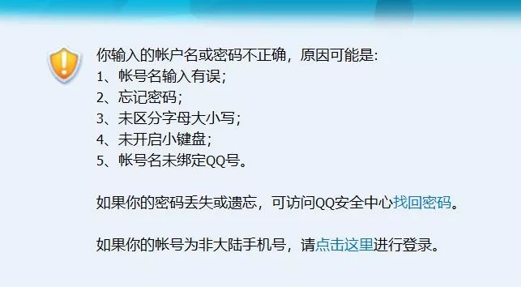
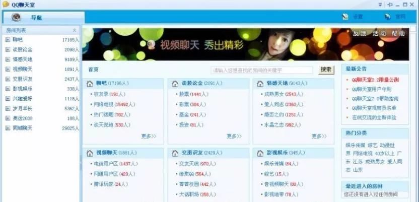
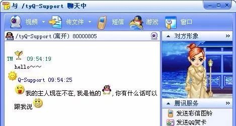
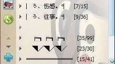
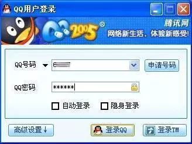
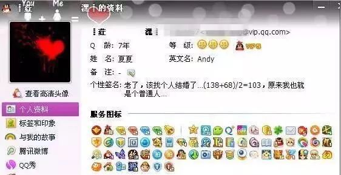

# 无标题

**链接地址:** http://mp.weixin.qq.com/s?__biz=MzI2OTA3MTA5Mg==&mid=2651769180&idx=1&sn=4b11c12bc998b145c6ba5d76f79dbf45&chksm=f11f8ec7c66807d1a198be006099f83eed1c9d21c2a50ddabdf5db09dbd172c3796cf658bb24&mpshare=1&scene=2&srcid=01074FsYmDPNlIoAJHt8HWYH#rd
**作者:** 世相君
**获取时间:** 2025/8/28 22:20:54
**图片数量:** 10

---

## 原始HTML内容

这是&nbsp;新世相&nbsp;的第&nbsp;519&nbsp;篇文章

 

 

一&nbsp;

 

今年朋友圈的第一波刷屏是“我的 18 岁”。

 

对于很多 90 后来说，那已经是十年前的事了💔 。

 

已经 28 岁的他们不得不重新登录自己的 QQ，去翻当年十八岁的照片，然后有人发现：连自己的 QQ 密码都记不得了。

 

 

<strong>突然想起来，第一批 90 后已经离开 QQ 了。</strong>

 

也许你们没注意到，从 2011 年到现在，短短六年，微信的活跃用户已经涨 9.63 亿。而 QQ 用户的活跃度已经连续四年停留在 8 亿多，今年又降了。

 

一个同事看到自己 QQ 里那些灰色头像，感慨道： 

 

“那时想方设法偷跑去网吧，就为了登 QQ 聊天，待两个小时就能聊两个小时。现在也都加了微信，24 小时有网，却不想聊了。”

 

猛然意识到，<strong>QQ 见证了我们从无话不说到无话可说的 19 年。</strong>

<strong> </strong>

 

二&nbsp;

 

QQ 开启了我们网上聊天交友的时代。

 

1999 年，腾讯推出了中国第一款点对点、一对多聊天软件 QICQ（QQ 的前身），2000 年更名为 QQ。2005 年左右，QQ 进入全盛期。

 

那时 90 后们正值青春期，刚上中学，上 QQ 找人聊天是种时尚潮流。

 

知乎上有个网友说，“初三时，还是半夜 12 点放出一点 QQ 号大家抢的时代，让同学帮我弄了一个，那个兴奋啊，加了 400 多人，看着谁在线就跟谁聊。” 

 

qq 聊天室 

 

当时有个玩法是通过年龄、性别限制来搜网友。同事就是这样搜到了自己的第一个网友，“因为她头像跟我一样，都是齐刘海黄头发包子脸。”

 

 

她们一个在武汉，一个在重庆，经常聊各自的城市、学校、考试和心仪的男孩。

 

心仪的男孩也是打 QQ 堂时认识的：“我们四次被随机分到了同一个房间，你说有缘不有缘？”

 

后来她主动加那个男孩 QQ，网恋了两年，到现在她还能背出他的 QQ 号。

 

“那大概是我们最容易信任别人，最愿意敞开自己的时候吧。”

 

 

三

 

<strong>2017 过去了，这是 iPhone 开启智能手机时代的第十年。</strong>

<strong> </strong>

<strong>十年里，中国互联网完成了从 PC 到移动端的变革，有了手机、WiFi 和 4G 网络之后，网上聊天交友变得一点也不稀奇，也不再那么让人期待。</strong>

 

我的同事已经 3 年不用 QQ 了，也很少跟人闲聊。

 

有陌生人加她，不管男女，一般不说清楚是谁，她就不会通过验证，就算加了也不聊。朋友之间没事儿也不怎么联系。

 

“有事就说事，没事儿聊什么天？”

 

 

四

 

<strong style="white-space: normal;">如今的生活也已经没有了上线下线的区别。</strong>

 

最近，我有个前同事去海南休假。担心休假期间被无止尽的工作信息骚扰，她强行把微信昵称改成了“ xxx（休假中）”。

 

即便这样，还是会有人给她发工作信息，只是会“有所忌惮”一点。例如市场部的同事有事找她，说完后会补一句：“等你休假回来再说。”

 

一个朋友曾在凌晨 2 点半收到过老板的 3 条语音信息，每条都有 60 秒。

 

“很崩溃，老担心没有及时回复的话对方会不会不开心。”

 

她怀念在 QQ 上，可以选择在线、隐身、忙碌、离开等状态，隐身时，头像会变成离线时一样的灰色。

 

 

没空回信息时，你可以把状态设置为“离开”或“忙碌”，这时有人给你发信息，会收到一条自动回复：&nbsp;&nbsp;

 

 

自动回复也是可以设置的：

 

 

当然，也有人在打游戏时把自动回复设置成“不是本人”或者“我在写作业”。

 

<strong>这些状态让 QQ 有很清晰的界限感。它们是一种表态，直接表明 “我现在能不能、或者想不想回复你”。</strong>

 

不用勉强自己去寒暄，或者迎合。这让聊天成为一件有更多主动权和更少心理负担的事。

 

<strong>而现在的通讯工具都不再有下线这回事了。</strong>

 

给人的感觉，是你永远在线，永远 available。

 

 

五

 

<strong>QQ 让我们对自己的社交更有主动权、有控制感。</strong>

 

你可以理直气壮的对某个人隐身，对另一个人隐身可见。

 

你也可以理直气壮地对好友分组。

 

办公室的一个女孩说，那时候她有 14 个好友分组：好朋友们分一组，方便约玩。普通朋友一个组，不常联系。陌生人一个组，忙的时候可以不聊，闲的时候随便找一个聊。七大姑八大姨一个组，方便 QQ 空间限制访问。

 

<strong>和很多人一样，她也有一个分组里，只有一个特别的人。“避免他淹没在茫茫QQ头像里。”</strong>

 

那时候，朋友分圈层是一件理所当然的事，大家还会比谁的 QQ 分组设计更好看。她为了让自己的分组整体排版好看，还特地把有几个组的组名设置成了空白。

 

 

现在，我们从不轻易提到自己给谁分了组。这项功能往往也被隐藏得很深，看上去，大部分好友都都显得一样重要。朋友圈有分组可见，也会小心翼翼不让人发觉。 

 

我们的社交变得有点被动，给更多人日常点赞、留言，表示自己的关注，成为一种必要的礼仪。

 

<strong>人与人的连接从一件让人期待的事，变成一件让人焦虑的事。</strong>

 

 

六

 

<strong>回头来看，90 后的 QQ 时代，上网聊天曾是一件有仪式感的事情。</strong>

 

那时上网更难，家里没电脑就偷偷去网吧，有的人上微机课时也偷偷挂着 Q。 

 

打开 QQ，输入账号和秘密点击登录，就像进入了另一个次元。它是异于日常生活的特别场景。

 

 

大家很努力的想要在 QQ 上给自己塑造一个更吸引人的形象：拖同学帮忙挂 Q 升级、偷偷用家里座机打电话充红黄蓝绿粉紫钻、装扮空间、买 QQ 秀……

 

 

最基本的选头像也要下功夫。每一种头像都代表着一类人的性格，网上还有帖子把他们一一都分析出来，供人筛选。

<strong> </strong>

<strong>那时的每个选择，都是为了告诉别人自己是一个怎样的人。</strong>

 

聊天也有仪式感。每一个状态的改变，都有对应提示音：上线下线的敲门声，加好友的咳嗽声，来信息的嘀嘀声……每一个声音，都可能影响你的心情。

 

一个读者说，<strong>“看到暗恋对象的头像从灰色变成彩色，感觉自己的心情也被点亮了，收到他的信息时，心跳也跟着‘嘀嘀嘀’的声音加速。”</strong>

 

今天，他们随时随地都可以上网，但以前的那种仪式感逐渐消失了。

 

离开 QQ 的 90 后们开始怀念那个需要一点努力才能上网聊天的时代。

 

<strong>“那时候，我们下线前会很认真地说：</strong>

<strong> </strong>

<strong>‘我下了，886’。”</strong>

 

<strong style="max-width: 100%;font-size: 15px;box-sizing: border-box !important;word-wrap: break-word !important;"> </strong>

 

<strong style="max-width: 100%;box-sizing: border-box !important;word-wrap: break-word !important;">晚祷时刻：</strong>

 

打开你的 QQ 看看，然后告诉我感受。

 

扫描二维码，关注"新世相" 

 

<strong style="max-width: 100%;box-sizing: border-box !important;word-wrap: break-word !important;">倡导有物质基础的精神生活</strong>

<strong style="max-width: 100%;box-sizing: border-box !important;word-wrap: break-word !important;">文章兼顾见识与审美</strong>

<strong style="max-width: 100%;box-sizing: border-box !important;word-wrap: break-word !important;">也许长，但必定值得耐心阅读</strong>

<strong style="max-width: 100%;box-sizing: border-box !important;word-wrap: break-word !important;">覆盖千万文艺生活家的自媒体组织</strong><strong style="max-width: 100%;line-height: 1.6;box-sizing: border-box !important;word-wrap: break-word !important;">"文艺联萌"发起者</strong> 

 

<strong style="max-width: 100%;box-sizing: border-box !important;word-wrap: break-word !important;">我们终将改变潮水的方向</strong>

---

## 纯文本内容

这是 新世相 的第 519 篇文章一 今年朋友圈的第一波刷屏是“我的 18 岁”。对于很多 90 后来说，那已经是十年前的事了💔 。已经 28 岁的他们不得不重新登录自己的 QQ，去翻当年十八岁的照片，然后有人发现：连自己的 QQ 密码都记不得了。突然想起来，第一批 90 后已经离开 QQ 了。也许你们没注意到，从 2011 年到现在，短短六年，微信的活跃用户已经涨 9.63 亿。而 QQ 用户的活跃度已经连续四年停留在 8 亿多，今年又降了。一个同事看到自己 QQ 里那些灰色头像，感慨道：“那时想方设法偷跑去网吧，就为了登 QQ 聊天，待两个小时就能聊两个小时。现在也都加了微信，24 小时有网，却不想聊了。”猛然意识到，QQ 见证了我们从无话不说到无话可说的 19 年。二 QQ 开启了我们网上聊天交友的时代。1999 年，腾讯推出了中国第一款点对点、一对多聊天软件 QICQ（QQ 的前身），2000 年更名为 QQ。2005 年左右，QQ 进入全盛期。那时 90 后们正值青春期，刚上中学，上 QQ 找人聊天是种时尚潮流。知乎上有个网友说，“初三时，还是半夜 12 点放出一点 QQ 号大家抢的时代，让同学帮我弄了一个，那个兴奋啊，加了 400 多人，看着谁在线就跟谁聊。”qq 聊天室当时有个玩法是通过年龄、性别限制来搜网友。同事就是这样搜到了自己的第一个网友，“因为她头像跟我一样，都是齐刘海黄头发包子脸。”她们一个在武汉，一个在重庆，经常聊各自的城市、学校、考试和心仪的男孩。心仪的男孩也是打 QQ 堂时认识的：“我们四次被随机分到了同一个房间，你说有缘不有缘？”后来她主动加那个男孩 QQ，网恋了两年，到现在她还能背出他的 QQ 号。“那大概是我们最容易信任别人，最愿意敞开自己的时候吧。”三2017 过去了，这是 iPhone 开启智能手机时代的第十年。十年里，中国互联网完成了从 PC 到移动端的变革，有了手机、WiFi 和 4G 网络之后，网上聊天交友变得一点也不稀奇，也不再那么让人期待。我的同事已经 3 年不用 QQ 了，也很少跟人闲聊。有陌生人加她，不管男女，一般不说清楚是谁，她就不会通过验证，就算加了也不聊。朋友之间没事儿也不怎么联系。“有事就说事，没事儿聊什么天？”四如今的生活也已经没有了上线下线的区别。最近，我有个前同事去海南休假。担心休假期间被无止尽的工作信息骚扰，她强行把微信昵称改成了“ xxx（休假中）”。即便这样，还是会有人给她发工作信息，只是会“有所忌惮”一点。例如市场部的同事有事找她，说完后会补一句：“等你休假回来再说。”一个朋友曾在凌晨 2 点半收到过老板的 3 条语音信息，每条都有 60 秒。“很崩溃，老担心没有及时回复的话对方会不会不开心。”她怀念在 QQ 上，可以选择在线、隐身、忙碌、离开等状态，隐身时，头像会变成离线时一样的灰色。没空回信息时，你可以把状态设置为“离开”或“忙碌”，这时有人给你发信息，会收到一条自动回复：  自动回复也是可以设置的：当然，也有人在打游戏时把自动回复设置成“不是本人”或者“我在写作业”。这些状态让 QQ 有很清晰的界限感。它们是一种表态，直接表明 “我现在能不能、或者想不想回复你”。不用勉强自己去寒暄，或者迎合。这让聊天成为一件有更多主动权和更少心理负担的事。而现在的通讯工具都不再有下线这回事了。给人的感觉，是你永远在线，永远 available。五QQ 让我们对自己的社交更有主动权、有控制感。你可以理直气壮的对某个人隐身，对另一个人隐身可见。你也可以理直气壮地对好友分组。办公室的一个女孩说，那时候她有 14 个好友分组：好朋友们分一组，方便约玩。普通朋友一个组，不常联系。陌生人一个组，忙的时候可以不聊，闲的时候随便找一个聊。七大姑八大姨一个组，方便 QQ 空间限制访问。和很多人一样，她也有一个分组里，只有一个特别的人。“避免他淹没在茫茫QQ头像里。”那时候，朋友分圈层是一件理所当然的事，大家还会比谁的 QQ 分组设计更好看。她为了让自己的分组整体排版好看，还特地把有几个组的组名设置成了空白。现在，我们从不轻易提到自己给谁分了组。这项功能往往也被隐藏得很深，看上去，大部分好友都都显得一样重要。朋友圈有分组可见，也会小心翼翼不让人发觉。我们的社交变得有点被动，给更多人日常点赞、留言，表示自己的关注，成为一种必要的礼仪。人与人的连接从一件让人期待的事，变成一件让人焦虑的事。六回头来看，90 后的 QQ 时代，上网聊天曾是一件有仪式感的事情。那时上网更难，家里没电脑就偷偷去网吧，有的人上微机课时也偷偷挂着 Q。打开 QQ，输入账号和秘密点击登录，就像进入了另一个次元。它是异于日常生活的特别场景。大家很努力的想要在 QQ 上给自己塑造一个更吸引人的形象：拖同学帮忙挂 Q 升级、偷偷用家里座机打电话充红黄蓝绿粉紫钻、装扮空间、买 QQ 秀……最基本的选头像也要下功夫。每一种头像都代表着一类人的性格，网上还有帖子把他们一一都分析出来，供人筛选。那时的每个选择，都是为了告诉别人自己是一个怎样的人。聊天也有仪式感。每一个状态的改变，都有对应提示音：上线下线的敲门声，加好友的咳嗽声，来信息的嘀嘀声……每一个声音，都可能影响你的心情。一个读者说，“看到暗恋对象的头像从灰色变成彩色，感觉自己的心情也被点亮了，收到他的信息时，心跳也跟着‘嘀嘀嘀’的声音加速。”今天，他们随时随地都可以上网，但以前的那种仪式感逐渐消失了。离开 QQ 的 90 后们开始怀念那个需要一点努力才能上网聊天的时代。“那时候，我们下线前会很认真地说：‘我下了，886’。”晚祷时刻：打开你的 QQ 看看，然后告诉我感受。扫描二维码，关注"新世相"倡导有物质基础的精神生活文章兼顾见识与审美也许长，但必定值得耐心阅读覆盖千万文艺生活家的自媒体组织"文艺联萌"发起者我们终将改变潮水的方向

---

## 图片列表

-  (原始链接: http://mmbiz.qpic.cn/mmbiz_jpg/5ROs96OaibIlHBiaiaEbVg06k6EL4OGxzxOQS12AicxeJk2zYFjdBdicwhbiaeghyX397GfBs4n4YE5PuoziamJDCusCg/0?wx_fmt=jpeg)
-  (原始链接: https://mmbiz.qpic.cn/mmbiz_jpg/5ROs96OaibIlHBiaiaEbVg06k6EL4OGxzxOhj3VqJAhZlRbgia8nB4kNgu4nMtvAMw1MSziaMO0Xj63OgtfX7U5eiciag/0?wx_fmt=jpeg)
-  (原始链接: https://mmbiz.qpic.cn/mmbiz_jpg/5ROs96OaibIlHBiaiaEbVg06k6EL4OGxzxOHHh0D2tZCIlib3MQP6ibz4n2bkKeEVb8IQOveAWY5MWS4icWslOoO99fg/0?wx_fmt=jpeg)
-  (原始链接: https://mmbiz.qpic.cn/mmbiz_jpg/5ROs96OaibIlHBiaiaEbVg06k6EL4OGxzxOSZA63VTCDSHUwQLOicbgxCywRd3icUos5wpn2F3eTQInmqV64jMJ2feQ/0?wx_fmt=jpeg)
-  (原始链接: https://mmbiz.qpic.cn/mmbiz_jpg/5ROs96OaibIlHBiaiaEbVg06k6EL4OGxzxOISREeuiczvqXA2P8znIickicFByDOFsPG3RYF8NNdvDHRZaRwHBbT1LibQ/0?wx_fmt=jpeg)
-  (原始链接: https://mmbiz.qpic.cn/mmbiz_jpg/5ROs96OaibIlHBiaiaEbVg06k6EL4OGxzxOKc4cyWadzWS9MESEjgyicnjFahHsaDxCSIUBWapSK7iaWm8vvS05ib5tA/0?wx_fmt=jpeg)
-  (原始链接: https://mmbiz.qpic.cn/mmbiz_jpg/5ROs96OaibIlHBiaiaEbVg06k6EL4OGxzxOWZ0lwI6LeXXCA4jUuutfBB3ez1oHzet7yu9dR06VayfCsjVdUF6YAA/0?wx_fmt=jpeg)
-  (原始链接: https://mmbiz.qpic.cn/mmbiz_jpg/5ROs96OaibIlHBiaiaEbVg06k6EL4OGxzxO5KOTCykHm68CJMImSjqNtFvU5qmmmdTIyq8ytt2d7yjppjaianPthnQ/0?wx_fmt=jpeg)
-  (原始链接: https://mmbiz.qpic.cn/mmbiz_jpg/5ROs96OaibIlHBiaiaEbVg06k6EL4OGxzxO71o5R1aPLNRpdz23GWPbtLO0A09tk8SYn1zJydQAOTxzbdpicnaWsZw/0?wx_fmt=jpeg)
-  (原始链接: http://mmbiz.qpic.cn/mmbiz/5ROs96OaibIl9PQ7mJIlBVicbjhicxc7UvSsz5FHsmx5WZkqib4UF1R2ia6wb48FAnqib0FiaddPahwtSOB2cdPN5vic6A/640?wx_fmt=jpeg)
