# 无标题

**链接地址:** http://mp.weixin.qq.com/s?__biz=MzI4MTU3NDc5NA==&mid=100000543&idx=1&sn=e0c8bdb1b4d4b095fedbd7d708eb24a7&chksm=6ba66ffa5cd1e6eccbd5fc83f1ac268457b9359e553c6008405b5a7aeb5bf99fd589a1dc46a8&mpshare=1&scene=2&srcid=0117dTypflE4MxmFqZxKnphn#rd
**作者:** cullinan
**获取时间:** 2025/8/28 22:20:30
**图片数量:** 20

---

## 原始HTML内容

 

话说爱屯的华人一说起南边，尤其是西南都趋之若鹜，近年来由于西南Riverband 附近的房子逐渐上了年头，新房和次新房资源越来越紧缺，部分人都把眼光转移到了西南更远一点的Windermere 附近区域。不可否认这个区域的确不错，但随着炒家的增多，该区价格一路走高，有一点儿小泡沫的迹象。 

 

今天要介绍的是爱城西南区更靠近城市中轴线的位于<strong>Anthony Henday Dr 以南，2号公路(机场高速)以西的55区</strong>。该区有传统生活小区有MACEWAN，RUTHERFORD，BLACKMUD CREEK，CALLAGHAN等等，还有宜居新小区ALLARD， DESROCHERS，CHAPPELLE，CAVANAGH等等。随着城市对该区域投入力度的进一步加大，41AVE SW 生活圈基本形成，这个区的未来一片大好。 

 

区域指示图:

  

专业人士推荐: 

<strong> </strong>

<strong>立足现状</strong>

我们看一下这个区域的目前拥有的资源。 

 

<strong>1.临近SOUTH COMMOM</strong>

<strong> </strong>

SOUTH COMMOM 是目前亚省最大的商业购物建筑群，商业中心内有包括IKEA，BESTBUY，CANADIAN TIRE，最大WALMART，COSTCO等以及各种品牌OUTLET和大型购物商家在内的几百家商号。可谓一站式的购物中心。

 <strong> </strong>

<strong>2.临近机场</strong>

<strong> </strong>

机场是通向世界的门户，尤其是我们华人，怀念故土及亲人的情怀多多少少都会萦绕在我们的心中，国内亲朋好友的到访以及一家人回国或者傲游世界，都需要经过这个国际机场接送机或出入。

我不止一次听到很多朋友说来回一次机场要四五十分钟或者不止一个小时，来回的折腾。而55区，去机场最远不会超过25分钟，很多地方10来分钟就可到达机场，地理位置十分优越。

 <strong> </strong>

<strong>3.小孩教育资源丰富，临近中英文学校</strong>

<strong> </strong>

随着区域人口的增加，2016-2018年该区域新建开学的学校达到了5所，加上本来就有的3所学校，本区目的K-6或-9的学校达到了8所，而著名的高中D.S. MacKenzie Jr. High School离该区域也不远。因此该区教育资源便相当丰富，孩子上学非常方便。

 

另外，随着中国经济的飞速发展，中国已经成为影响世界经济格局的核心力量，海外华人地位也日益提高。我们久居海外，我们下一代如果失去了中文语言能力，那就只能眼睁睁地看着中国机会给予了他人，因此选择一所中英文学校对于孩子的未来尤为重要。

 

创办于1985年著名中英文学校<strong>MEYONOHK</strong>，是很多华人家长比较喜欢等我学校，但该校位于MILLWOOD，然而大家都不喜欢住在MILLWOOD这个印度人区，那么白人和华人都喜欢的55将是很好的选择。从2015年开始，该校的校车已经大面积覆盖55区，上放学变得十分的方便。

  

<strong></strong> 

<strong>着眼未来</strong>

这个区域的未来前景更是一片美好。

 

<strong>1.临近可以比肩CALGARY CROSS IRON MALL 的大型OUTLET MALL。</strong>

相信大家对卡尔加里的铁十字奥莱斯商场一定不会陌生，名牌林立，常年折扣是该商场的重要特点。很快，也就是今年，埃德蒙顿也将有意见类似的商场城在机场附近开业，正如上文所述55区去机场只要10来分钟，届时该区的活跃度将进一步的提高。

   <strong> </strong>

<strong>2.附近再新开一家COSTCO</strong>

<strong> </strong>

就在机场新的OULET MALL旁边，今年会新开一间COSTCO，届时55区的居民将临近两间COSTCO，当其他区域的居民还在COSTCO焦急地排着长队等待买单的时候，55区的居民却可以闲庭信步地选择我该去附近的哪个COSTCO购物好呢？

  

 <strong>3.新的社区公共图书馆</strong>

<strong> </strong>

有关消息称，就在55区内的新开业的SUPERSTORE那个商业区内，政府今年将新开一个社区公共图书馆。大大方便了区内居民的文化生活。

<strong> </strong>

 

<strong>4.新的大型综合性医院</strong>

危重病的抢救和资料将更加便利。

<strong> </strong>

 <strong>5.未来的轻轨LRT线路</strong>

<strong> </strong>

根据规划，未来有3-4个LRT车站穿越55区，将大大方便区域内居民的出行。这个呢，等吧，至少有个希望。但是肯定的是，将来小孩长大后一定可以坐LRT回大学上学哦。

  <strong>总结优势</strong>

是不是很不错的区域呢？学校，医院，商城，景点，机场，图书馆，餐饮一应俱全。

生活便利，教育资源丰富，购物便利，出行便利，是既适合安居乐业，又适合长远投资的南部好区。

<strong>价格优势</strong>

如果你是西南区的忠实拥趸，那么我建议你重点考虑一下55区的房源，目前该区房源依然处于西南区的价格洼地。<strong>在同等价位的情况下，55区目前可以买到比56区Windermere更大更便利的房子，买到比14区Riverbend 更新更舒适的房子。</strong>

 

<strong>心动不如行动！马上拨打780-886-7186，联系爱城最专业的地产经纪Welson赵尉盛的电话探讨安居投资策略吧。母语包括普通话，广东话和，台山、开平话，英语。沟通一定无障碍。</strong>

<strong> </strong> 

---

## 纯文本内容

话说爱屯的华人一说起南边，尤其是西南都趋之若鹜，近年来由于西南Riverband 附近的房子逐渐上了年头，新房和次新房资源越来越紧缺，部分人都把眼光转移到了西南更远一点的Windermere 附近区域。不可否认这个区域的确不错，但随着炒家的增多，该区价格一路走高，有一点儿小泡沫的迹象。今天要介绍的是爱城西南区更靠近城市中轴线的位于Anthony Henday Dr 以南，2号公路(机场高速)以西的55区。该区有传统生活小区有MACEWAN，RUTHERFORD，BLACKMUD CREEK，CALLAGHAN等等，还有宜居新小区ALLARD， DESROCHERS，CHAPPELLE，CAVANAGH等等。随着城市对该区域投入力度的进一步加大，41AVE SW 生活圈基本形成，这个区的未来一片大好。区域指示图:专业人士推荐:立足现状我们看一下这个区域的目前拥有的资源。1.临近SOUTH COMMOMSOUTH COMMOM 是目前亚省最大的商业购物建筑群，商业中心内有包括IKEA，BESTBUY，CANADIAN TIRE，最大WALMART，COSTCO等以及各种品牌OUTLET和大型购物商家在内的几百家商号。可谓一站式的购物中心。2.临近机场机场是通向世界的门户，尤其是我们华人，怀念故土及亲人的情怀多多少少都会萦绕在我们的心中，国内亲朋好友的到访以及一家人回国或者傲游世界，都需要经过这个国际机场接送机或出入。我不止一次听到很多朋友说来回一次机场要四五十分钟或者不止一个小时，来回的折腾。而55区，去机场最远不会超过25分钟，很多地方10来分钟就可到达机场，地理位置十分优越。3.小孩教育资源丰富，临近中英文学校随着区域人口的增加，2016-2018年该区域新建开学的学校达到了5所，加上本来就有的3所学校，本区目的K-6或-9的学校达到了8所，而著名的高中D.S. MacKenzie Jr. High School离该区域也不远。因此该区教育资源便相当丰富，孩子上学非常方便。另外，随着中国经济的飞速发展，中国已经成为影响世界经济格局的核心力量，海外华人地位也日益提高。我们久居海外，我们下一代如果失去了中文语言能力，那就只能眼睁睁地看着中国机会给予了他人，因此选择一所中英文学校对于孩子的未来尤为重要。创办于1985年著名中英文学校MEYONOHK，是很多华人家长比较喜欢等我学校，但该校位于MILLWOOD，然而大家都不喜欢住在MILLWOOD这个印度人区，那么白人和华人都喜欢的55将是很好的选择。从2015年开始，该校的校车已经大面积覆盖55区，上放学变得十分的方便。着眼未来这个区域的未来前景更是一片美好。1.临近可以比肩CALGARY CROSS IRON MALL 的大型OUTLET MALL。相信大家对卡尔加里的铁十字奥莱斯商场一定不会陌生，名牌林立，常年折扣是该商场的重要特点。很快，也就是今年，埃德蒙顿也将有意见类似的商场城在机场附近开业，正如上文所述55区去机场只要10来分钟，届时该区的活跃度将进一步的提高。2.附近再新开一家COSTCO就在机场新的OULET MALL旁边，今年会新开一间COSTCO，届时55区的居民将临近两间COSTCO，当其他区域的居民还在COSTCO焦急地排着长队等待买单的时候，55区的居民却可以闲庭信步地选择我该去附近的哪个COSTCO购物好呢？3.新的社区公共图书馆有关消息称，就在55区内的新开业的SUPERSTORE那个商业区内，政府今年将新开一个社区公共图书馆。大大方便了区内居民的文化生活。4.新的大型综合性医院危重病的抢救和资料将更加便利。5.未来的轻轨LRT线路根据规划，未来有3-4个LRT车站穿越55区，将大大方便区域内居民的出行。这个呢，等吧，至少有个希望。但是肯定的是，将来小孩长大后一定可以坐LRT回大学上学哦。总结优势是不是很不错的区域呢？学校，医院，商城，景点，机场，图书馆，餐饮一应俱全。生活便利，教育资源丰富，购物便利，出行便利，是既适合安居乐业，又适合长远投资的南部好区。价格优势如果你是西南区的忠实拥趸，那么我建议你重点考虑一下55区的房源，目前该区房源依然处于西南区的价格洼地。在同等价位的情况下，55区目前可以买到比56区Windermere更大更便利的房子，买到比14区Riverbend 更新更舒适的房子。心动不如行动！马上拨打780-886-7186，联系爱城最专业的地产经纪Welson赵尉盛的电话探讨安居投资策略吧。母语包括普通话，广东话和，台山、开平话，英语。沟通一定无障碍。

---

## 图片列表

-  (原始链接: https://mmbiz.qpic.cn/mmbiz_gif/DtlibTiaB5adTzphkXlziaGA5icUqx2FowpEbrlAdQM09btnCV5eJQBR8tXyLNcf0licQiahf84TmFTF8oHicOjiaAwMsg/640?wx_fmt=gif)
-  (原始链接: https://mmbiz.qpic.cn/mmbiz_jpg/DtlibTiaB5adROvd1K775xdEFfkX2rnibUiavpJuldIBI5tlfmDicF0IXpWE5b0jV7XXYkqIXiaXgcktW2fjFtnd7kUg/640?wx_fmt=jpeg)
-  (原始链接: https://mmbiz.qpic.cn/mmbiz_jpg/DtlibTiaB5adTzphkXlziaGA5icUqx2FowpExMHEaichSgW0mD5ENGqMV7rt1fBuS8Ozua0dMl2tc5N44dEcTpWvnicQ/640?wx_fmt=jpeg)
- 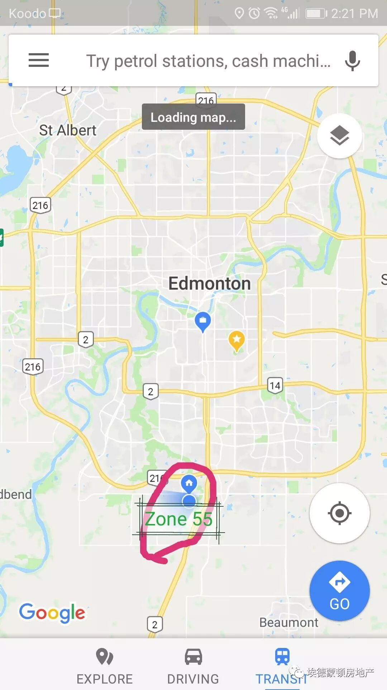 (原始链接: https://mmbiz.qpic.cn/mmbiz_jpg/DtlibTiaB5adTzphkXlziaGA5icUqx2FowpEd76uvIbStV6KNZFnFp6CH8LfaJX5FkbklX1OCIwiaKv9STMMVcs62EQ/640?wx_fmt=jpeg)
- 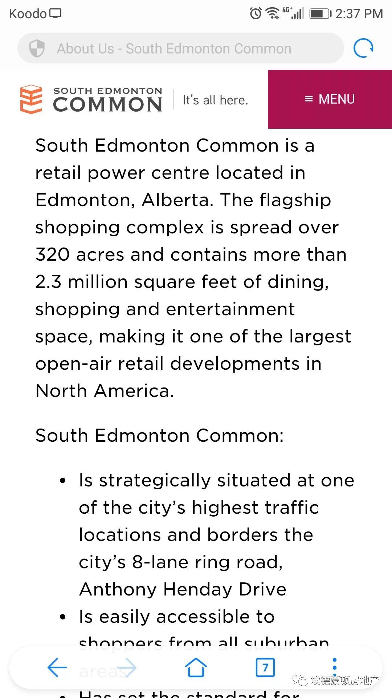 (原始链接: https://mmbiz.qpic.cn/mmbiz_jpg/DtlibTiaB5adTzphkXlziaGA5icUqx2FowpElWeRDbpBIY2Tepicw8RjmRTVg6Q8LH7RibOMBLsQ6JlvbYEcEmCpFibLg/640?wx_fmt=jpeg)
- 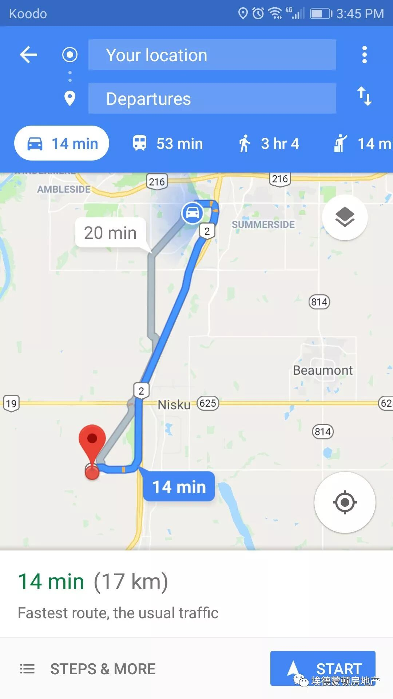 (原始链接: https://mmbiz.qpic.cn/mmbiz_jpg/DtlibTiaB5adTzphkXlziaGA5icUqx2FowpENGeVJ30Yk5ucFcic52iaHOcAo8hcxlOPmGcmwTnWKdgw4gnJiaSYf0yKQ/640?wx_fmt=jpeg)
- 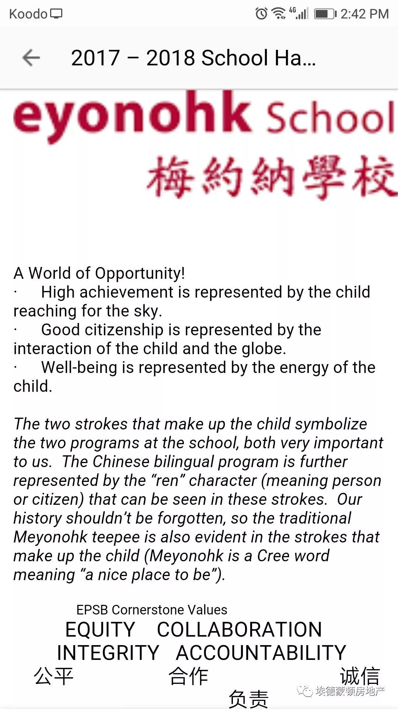 (原始链接: https://mmbiz.qpic.cn/mmbiz_jpg/DtlibTiaB5adTzphkXlziaGA5icUqx2FowpEOeBENhecATh85g5JhMm5uLBUuA0Y76seRs7mmsfQqUUwgAQT6bNJVg/640?wx_fmt=jpeg)
- 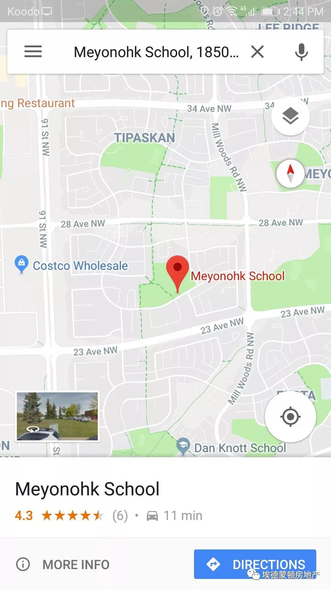 (原始链接: https://mmbiz.qpic.cn/mmbiz_jpg/DtlibTiaB5adTzphkXlziaGA5icUqx2FowpE4xWlD3PMibN3FhN8KnpNk1J7Rf5G307N2zolYvt0fR7vZcRnpNJXrTw/640?wx_fmt=jpeg)
-  (原始链接: https://mmbiz.qpic.cn/mmbiz_jpg/DtlibTiaB5adQ8CBETqLEeRbv82yDuibX6HhpuqpMibdPERgWsfpXTGvribsVLDz6RaFcfGxmM1yWmZQiadajHLT4Pgg/640?wx_fmt=jpeg)
- 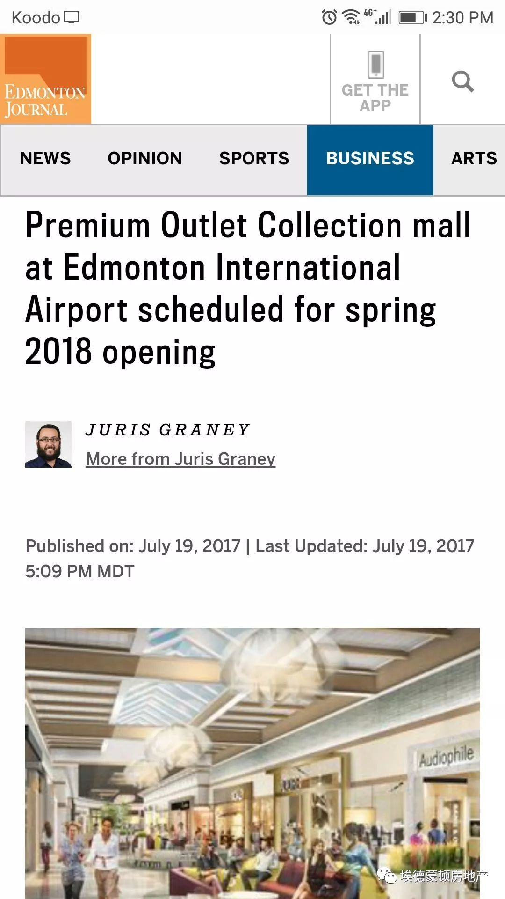 (原始链接: https://mmbiz.qpic.cn/mmbiz_jpg/DtlibTiaB5adTzphkXlziaGA5icUqx2FowpEp4oZlXGwyLNOEQmSkFgKQufUaDoUwl1Y0asc9CkWF04UyltHaCxRAg/640?wx_fmt=jpeg)
- 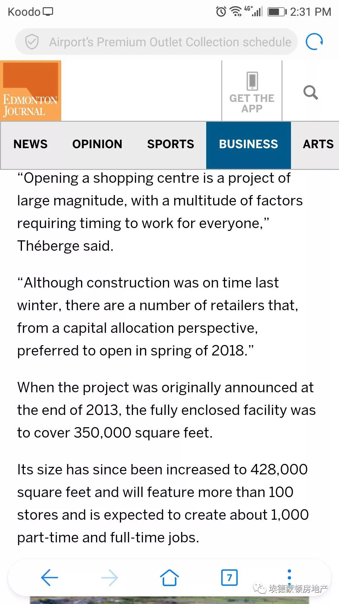 (原始链接: https://mmbiz.qpic.cn/mmbiz_jpg/DtlibTiaB5adTzphkXlziaGA5icUqx2FowpEg6f3vwib0O2kMTeAKgAH5QYLhzeOK0qujBxOwaSCx9R9AfOzAn2zK7w/640?wx_fmt=jpeg)
- 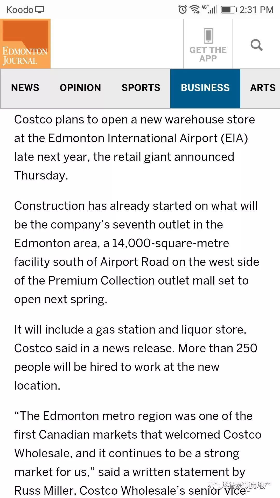 (原始链接: https://mmbiz.qpic.cn/mmbiz_jpg/DtlibTiaB5adTzphkXlziaGA5icUqx2FowpEoFicAb14zj6fvia2fPNc9N6bkLVtgfvstjU8aJVmsMfpicd3ILNUQrzJQ/640?wx_fmt=jpeg)
-  (原始链接: https://mmbiz.qpic.cn/mmbiz_jpg/DtlibTiaB5adTzphkXlziaGA5icUqx2FowpENCdMdYnI7fTaaIIbnm1ib2xovhdG6WXEEVdjI5mZGxpbAF7IUJTbeeg/640?wx_fmt=jpeg)
- 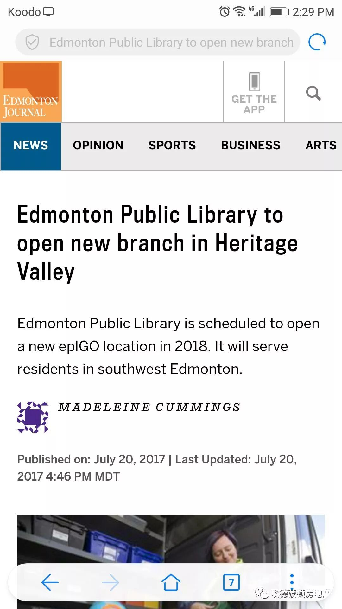 (原始链接: https://mmbiz.qpic.cn/mmbiz_jpg/DtlibTiaB5adTzphkXlziaGA5icUqx2FowpEpZZvTgdGgS9YBdmRaS63QG5nVB8sz37JzWeAm6VL9SqibrRKKQfBxLg/640?wx_fmt=jpeg)
-  (原始链接: https://mmbiz.qpic.cn/mmbiz_jpg/DtlibTiaB5adTzphkXlziaGA5icUqx2FowpErulD6bFZ10bxVZuvuEOmcPegCwYFfYADFMoD2pavWiaDZCBiar8v8ASQ/640?wx_fmt=jpeg)
- 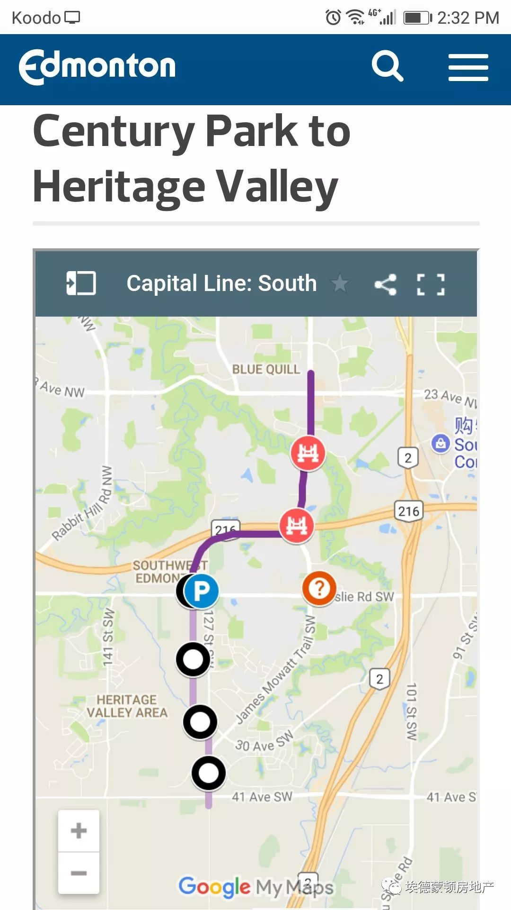 (原始链接: https://mmbiz.qpic.cn/mmbiz_jpg/DtlibTiaB5adTzphkXlziaGA5icUqx2FowpEprSG9j7fYAdx38dMuTuQVu09A5QblmTh4DicUz13iczaSrD9WS2ltuKw/640?wx_fmt=jpeg)
- 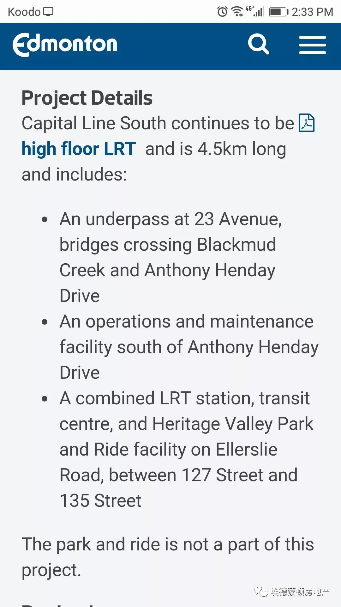 (原始链接: https://mmbiz.qpic.cn/mmbiz_jpg/DtlibTiaB5adTzphkXlziaGA5icUqx2FowpEWG40TPfKpCksJJJG8hCWppzXk7Gd4J7wdmibHngLiaE3njF30lODkAhw/640?wx_fmt=jpeg)
-  (原始链接: https://mmbiz.qpic.cn/mmbiz_jpg/DtlibTiaB5adQ8CBETqLEeRbv82yDuibX6HMgOTicKlcjZtYd3UYOZRqE3fLaxAponuPxdBQckn8AMOgwMjD9nCx6w/640?wx_fmt=jpeg)
-  (原始链接: https://mmbiz.qpic.cn/mmbiz_jpg/DtlibTiaB5adQ8CBETqLEeRbv82yDuibX6He0ke7JDYRpQZZOicpibgMmjaRSk7ODibz6Hay5Nzr2FckE8LciaaxzQEZw/640?wx_fmt=jpeg)
-  (原始链接: https://mmbiz.qpic.cn/mmbiz_jpg/DtlibTiaB5adTzphkXlziaGA5icUqx2FowpEhSUWxn7elvMAa8QzI0YRN47eHiaLXmlTA6P24ggXh6nGwgb1zmQ4ia3A/640?wx_fmt=jpeg)
