# 无标题

**链接地址:** http://mp.weixin.qq.com/s?__biz=MjM5OTgwNzk3Mg==&mid=2683707007&idx=1&sn=b2cf9facb209568d32cedfe528f4b841&chksm=bd3760f48a40e9e26a17b9707c33ae2b5f298146e916b611e1b7109fcedfe74cebbbd986539e&mpshare=1&scene=2&srcid=0214z5Oj1T7P6OCEbWsWG97N#rd
**作者:** 
**获取时间:** 2025/8/28 22:18:10
**图片数量:** 62

---

## 原始HTML内容

 

上周末，听闻期待已久的养云安缦总算正式开幕，刀哥我真是迫不及待的打了个飞机就前去一探究竟，没想到去过那么多顶级酒店，我还是被彻底被震撼到了！真可以说是一座完美融合了古典魅力与现代风格的绝佳“仙宅”！

 

 

隐藏在远离上海都市喧嚣的一处静修之地；一走进养云安缦，马上就像穿越到绝世圣地一样，顿时都觉得自己都化身成叱咤江湖的大神了呢！

 

 

迈入酒店大堂，哇！极简主义的新中式大厅高耸入云般，令人不禁抬头仰视，真是让人觉得自己的气场都立马变成七米八！

 

 

如此震撼又肃穆的中庭，也只有东京的安缦可以比了，但是在高冷肃穆范儿里多了一丝中式的优雅，贵气又不单调。

 

 

大堂外，视野无比辽阔，数棵参天大树遮天蔽日，这是穿越到古代了吗？超级大树王估计5人都无法合抱。

 

 

据说，这家全球最大占地面积的安缦，还有一个古老悠久的故事：故事缘起于距上海700公里之外的抚州农村。抚州，位于中国中东部的江西省，历史上著名的文化昌邦，是一个拥有繁茂的樟林与众多历史悠久的古村庄。2002年，因为城市的发展变迁，这些古老的中国遗迹很有可能将被新建的水库封存于水底。

 

 
<h4 class="module-heading" style="font-size: medium;white-space: normal;">当地的有识之士，决心阻止这些记录中国历史重要碎片的消逝。于是大胆的计划，将50栋明清老宅与10000多棵樟树迁移到上海，其中有些大树的寿命可以追溯到数百年前。</h4>
 

 
<h4 class="module-heading" style="font-size: medium;white-space: normal;">经过了数年的努力，樟树开始在新的生长地吐露新芽、枝繁叶茂，悠久的村庄也在一砖一瓦的精心复建下，每一块石砖都重新散发出历史的光辉。2007年，安缦也开始加入合作，共同完成了这个细致而精密的修复工程，这里的历史遗迹最终得到了妥善的保护，留存于世并发扬光大。</h4>
 

 
<h4 class="module-heading" style="font-size: medium;white-space: normal;">十年之后，养云安缦逐渐完成。这些远离尘世的樟树林用它宁静的语调，内省的静居，令古与新，自然与人造，和谐共存于此。记录着中国历史文化的遗迹被世代保存下来，而养云安缦也就成为了这段鲜活历史的一部分。</h4>
 

 

 

数百年历史的老宅在养云安缦的见证下，经过悉心迁建与扩建，每座老宅都配有最多五间卧室，均有私人庭院、宽敞起居室与用餐区、户外泳池与露天按摩浴缸。

 

 

 

室内则专注于将古与新和谐融一，与养云安缦的樟树林景致交相辉映。

 

 

这里光线充足并环拥树林风光，套房和庭阁拥有宽阔的居住空间和庭院，营造出一座跨越季节的怡人静居之感。

 

 

安放于祥和的树林中，13栋老宅院落和24间新建套房创造出一种舒适的古与新的平衡，与打造一座静谧村庄的理念相契合。

 

 

而套房则保持了安缦标志性的极简主义风格，与老宅建筑的历史感相得益彰，呈现出一种默契的动态平衡，套房均拥有轩敞明亮的卧室和起居空间。

 

 

公共区域更是有太多的亮点：

 

楠书房庄严肃静，是在26栋明清老宅中精选出的曾经作为私塾的老宅，以传承老宅的建制与精神内涵。

 

 

尽藏各式金丝楠木法宝，传承古韵，通过器物、空间的营造，提供怡情养性之所，叩启中国传统文化的智慧之门。

 

 

文化气息喷薄而出，经典却又不失简约现代。到这个现代“私塾”静静心，练练墨宝，贵族气质就在鼻尖中轻松流淌而出。

 

 

<strong>茶室</strong>

 

 

<strong>琴室</strong>

 

 

<strong>冥想室</strong>

 

 

花艺室等等真可谓充溢着中国贵族文化的世外桃源，来这里过个周末，感觉再大的压力也能瞬间满血复活了呢！

 

 

信步庭院，真的是一步一景，尤其是在中式文化与现代建筑光影的变化中显得格外的霸气又新潮！

 

 

随着脚步的变化，光影的变幻真的是极具禅意！

 

 

如果带宝宝来，也可以在这里体验各种手作，有趣又品质十足。

 

 

当然，作为全球最大的安缦，这里的大宴会厅尽显低调的奢华，霸气又菱角分明。

 

 

<strong>私人影院</strong>

 

 

除了堪称完美的客房环境，清幽仙气十足的公共区域，这里的餐厅也是相当惊艳！五个餐厅：中餐厅LAZHU，意大利餐厅ARVA，全日餐厅NAMA以及酒吧和雪茄廊，每一处都自带贵族气息，优雅又大气。从精致的正餐到轻松的露天聚餐，身处之中，就一会会儿，都会觉得自己的财富与气场在疯狂的暴涨呢！

 

<strong>意大利餐厅ARVA</strong>

 

 

在阳光明媚的午后感受光影变化带来的静谧，真是太美了！

 

 

服务员小鲜肉也是帅气十足

 

 

<strong>日料NAMA&nbsp;</strong>

 

 

在餐厅的户外休闲区域就餐更是无比惬意！

 

 
<h4 class="module-heading" style="font-size: medium;white-space: normal;">在中餐馆体验正宗美食与至臻私人餐宴，您可随意点餐或在七个私人包厢中的一个享受精美的餐点并俯瞰果园、后庭、竹林以及静谧流淌的河水。</h4>
 

 

酒吧设有舒适座椅，可与此在用餐前后享用鸡尾酒，轻松惬意。雪茄廊提供特别雪茄和红酒以及系列酒类饮品。

 

 

<strong>酒吧</strong>

 

 

<strong>咖啡厅酒廊</strong>

 

 

四面通透，阳光真是最好的心灵按摩大师！

 

 

就在窗前遥望湖外园林湖景，品一壶好茶，喝一杯咖啡，做一个静静地美男／女子吧！

 

 

最令我心醉的还是酒店现代简约的空间设计与光影变化的交织，真是美的一塌糊涂！

 

 

尤其是水面反射将世界一变为二，尽显乾坤！

 

 

夜景更是无处不体现了结构学的立体美！

 

 

如此的静谧，真是令人陶醉！

 

<h4 class="module-heading" style="font-size: medium;white-space: normal;"> </h4><h4 class="module-heading" style="font-size: medium;white-space: normal;">除了雅致舒适的环境，这里还有很多康体养生服务，比如在水疗馆里可以享受由传统中医疗法提供的保健治疗之旅。根据中医秘方并使用当地草本植物与花朵研制的精油，美容项目中提供深度治疗性水疗之旅。</h4>
 

 

或是由世界知名的康体专家为您定制的私人健康项目疗程，从运动和营养调配到冥想和中式推拿皆有。

 

 

养云安缦的美，当你走进的那一刻就能体会！再多的美景，都需要靠您的眼睛来发掘了。由于酒店新开业预订火爆，春节期间部分日期已经全部满房，作为酒店少数的合作伙伴之一，我们为大家争取到了抢先预定的机会，趁着春天降至，赶快带着家人、爱人、亲友们来一个静心之旅吧！想要第一时间体验酒店的朋友们赶紧<strong>长按下方图片扫描二维码</strong>或<strong>点击左下角“阅读原文”</strong>预订哦！

 

 

<strong>安缦养云酒店预订信息：</strong>

<strong>1.预约房间需至少提前2天，是否有房以酒店实际入住情况为准。</strong>

<strong>2.入住有效期：2018-01-20至2018-12-31</strong>

<strong>3.价格不适用日期：2018-02-17至2018-02-19</strong>

<strong>4.</strong><strong>订单确认成功后到酒店报姓名和手机号即可</strong>

<strong>5.客房：5996元起（详情点击“阅读原文”） </strong>

<strong>6.客房预付款：2000元（剩余款项客服人员会联系您支付）</strong>

<strong>7.入住时间为15:00，退房时间为12:00</strong>

<strong> </strong>

<strong style="line-height: 25.6px;"></strong>

<strong>温馨提示：</strong>

<strong>1.安缦的房价根据淡旺季价格有差别&nbsp;&nbsp;，以下所有价格均为酒店官方统一价。</strong>

<strong>2.由于酒店刚刚开业，所以非常火爆，有些日期已经订满，且目前无法在携程等平台预定。所以如果您有意预定，请及时与我们联系。另外，如果您有办理婚宴或场地租赁等特殊事宜，我们也会尽力为您争取到更多优惠哦！</strong>

<strong> </strong>

<strong>养云安缦地址：上海市闵行区元江路6161弄201111</strong>

<strong> </strong>

<strong>新先聚品预定福利（凡通过新先聚品APP平台预定，则可获得200元APP专属优惠券一张，购买其他产品可使用，详情请咨询客服）：</strong>

<strong>入住明·套房，明·客居，明·庭阁，或入住老院一卧及老院两卧，享专属优惠：</strong>

<strong> </strong>

<strong>每日双人早餐</strong>

<strong>入住期间免费双人午餐或晚餐一次</strong>

<strong>免费接送服务（往来范围为上海市区，火车站，机场）</strong>

<strong>精选楠书房文化体验活动一次</strong>

<strong>迷你吧享用且每日免费补充一次（非酒精类）</strong>

 

<strong>入住老宅，明·老宅，清·老宅，或养云·老宅，享额外专属优惠：</strong>

 

<strong>24小时贴身管家服务</strong>

<strong>免费国内长途和市内电话</strong>

<strong>免费洗衣熨烫服务（不含干洗服务）</strong>

<strong>&nbsp;</strong>

<strong>入住老宅或清·老宅的宾客享迷你吧（含酒精类饮品）及安缦窖藏精选每日免费补充一次。</strong>

<strong>&nbsp;</strong>

<strong>入住老宅五卧，明·老宅，或养云·老宅的宾客，享迷你吧无限畅饮（含酒精类饮品）。</strong>

 

<strong>以下为具体房型信息</strong>

 

<strong>明 套房</strong>

<strong> </strong>

 

<strong>面积：99平方米</strong>

<strong>明 套房大床房价格：5996元起</strong>

<strong>特色：雅致宽敞大床房，适合独自或情侣居住。</strong>

明·套房大床房面积为99平方米（950平方英尺），起居与卧室空间融为一体，配有格纹百叶窗，自然光影透窗而入。宽敞室内空间，配一张大床，两个露天庭院供客人享静谧园林景致。

 

<strong>设施：</strong>
<ul class=" list-paddingleft-2" style=""><li>
大床
</li><li>
起居空间和壁炉
</li><li>
宽敞浴室
</li><li>
双人梳洗台
</li><li>
浴缸及独立淋浴间
</li><li>
两座露天庭院
</li><li>
露天泡澡浴缸
</li><li>
宽敞衣橱
</li><li>
咖啡机、电视、保险柜、无线网络

 
</li></ul>
<strong>明 套房</strong>

<strong> </strong>

 

<strong>面积：99平方米</strong>

<strong>明 套房双床房价格：5966元/晚起</strong>

<strong>特色：雅致宽敞双床房，适合与朋友居住。</strong>

 

 

明·套房双床房面积为99平方米（950平方英尺），与明·套房大床房享相同布局，配两张双人床。室内空间宽敞，配两张单人床，两个露天庭院供客人享静谧园林景致。

 

<strong>设施：</strong>
<ul class=" list-paddingleft-2" style=""><li>
两张单人床
</li><li>
起居空间和壁炉
</li><li>
宽敞浴室
</li><li>
双人梳洗台
</li><li>
浴缸及独立淋浴间
</li><li>
两座露天庭院
</li><li>
露天泡澡浴缸
</li><li>
宽敞衣橱
</li><li>
咖啡机、电视、保险柜、无线网络

 
</li></ul>
<strong>明 客居</strong>

<strong> </strong>

 

<strong>面积：115平方米</strong>

<strong>明·客居大床房价格：9200元起</strong>

<strong>特色：古典与现代化完美结合，适合独自或情侣居住。</strong>

明·客居大床房置身于老宅四周新建的厢房内，宽敞明亮的现代室内空间配有一张大床。

 

<strong>设施：</strong>
<ul class=" list-paddingleft-2" style=""><li>
大床
</li><li>
宽敞浴室
</li><li>
双人梳洗台
</li><li>
走入式衣橱
</li><li>
浴缸及独立淋浴间
</li><li>
私人庭院
</li><li>
咖啡机、电视、保险柜、无线网络

 
</li></ul>

<strong>明 客居</strong>

<strong> </strong>

 

<strong>面积：115平方米</strong>

<strong>明·客居双床房价格：9200元起</strong>

<strong>特色：古典与现代化完美结合，适合与朋友居住。</strong>

现代舒适的明·客居双床房同样置身于老宅四周新建的厢房内，配有两张单人床。

 

<strong>设施：</strong>
<ul class=" list-paddingleft-2" style=""><li>
两张双人床
</li><li>
宽敞浴室
</li><li>
双人梳洗台
</li><li>
走入式衣橱
</li><li>
浴缸及独立淋浴间
</li><li>
私人庭院
</li><li>
咖啡机、电视、保险柜、无线网络
</li></ul>
 

<strong>明 庭阁</strong>

<strong> </strong>

 

<strong>面积：160平方米</strong>

<strong>明 庭阁价格：10350元起</strong>

<strong>特色：更为宽敞的居住环境，适合4-8位客人居住，可加床，加床需另付加床费。</strong>

<strong> </strong>

 

比明·客居更为宽敞的明·庭阁坐落于新建厢房之中，在香樟树林环绕下悠享现代居住体验。

 

<strong>设施：</strong>
<ul class=" list-paddingleft-2" style=""><li>
大床
</li><li>
宽敞浴室
</li><li>
双人梳洗台
</li><li>
走入式衣橱
</li><li>
浴缸及独立淋浴间
</li><li>
露天庭院
</li><li>
咖啡机、电视、保险柜、无线网络

 
</li></ul>
<strong>老院一卧</strong>

<strong> </strong>

 

<strong>面积：300平方米</strong>

<strong>价格：20700元起</strong>

<strong>特色：浓郁的故宅氛围，适合独自或情侣居住。</strong>

位于重建老宅之中的老院一卧配有一张特大床，古色古香的室内环境和静谧的庭院景观相得益彰。

 

<strong>设施：</strong>
<ul class=" list-paddingleft-2" style=""><li>
大床
</li><li>
宽敞浴室
</li><li>
双人梳洗台
</li><li>
走入式衣橱
</li><li>
浴缸及独立淋浴间
</li><li>
起居室与用餐区
</li><li>
露天庭院
</li><li>
宽敞泳池
</li><li>
咖啡机、电视、保险柜、无线网络
</li></ul>
 

<strong>老院两卧</strong>

<strong> </strong>

 

<strong>面积：500平方米</strong>

<strong>价格：32200元起</strong>

<strong>特色：四周环绕林地景观，两间卧室均置身于精心修复的老宅中，适合全家居住。</strong>

<strong> </strong>

<strong>设施：</strong>
<ul class=" list-paddingleft-2" style=""><li>
大床或两张双人床
</li><li>
宽敞浴室
</li><li>
双人梳洗台
</li><li>
走入式衣橱
</li><li>
浴缸及独立淋浴间
</li><li>
起居室与用餐区
</li><li>
露天庭院
</li><li>
宽敞泳池
</li><li>
咖啡机、电视、保险柜、无线网络
</li></ul>
 

<strong>老院四卧</strong>

<strong> </strong>

 

<strong>面积：886/1003平方米</strong>

<strong>价格：57500元起</strong>

<strong>特色：坐落于老宅之中的古风卧室和其位于四周新建厢房内的三间卧室一起，构成了老宅四卧典雅别致的居住环境，<strong style="white-space: normal;">适合4-8位客人居住，可加床，加床需另付加床费。</strong></strong>

 

<strong>清·老院四卧</strong>

<strong> </strong>

 

<strong>面积：823-942平方米</strong>

<strong>价格：62100元起</strong>

<strong>特色：两间古色古香的卧室置身重建的老宅建筑之中，其余两间卧室位于新建的厢房之中，住客可享森林景致，<strong style="white-space: normal;">适合4-8位客人居住，可加床，加床需另付加床费。</strong></strong>

 

 

<strong>设施：</strong>
<ul class=" list-paddingleft-2" style=""><li>
大床或两张双人床
</li><li>
宽敞浴室
</li><li>
双人梳洗台
</li><li>
走入式衣橱
</li><li>
浴缸及独立淋浴间
</li><li>
起居室与用餐区
</li><li>
私人庭院
</li><li>
私人泳池
</li><li>
咖啡机、电视、保险柜、无线网络
</li><li>
私人管家服务
</li></ul>
 

<strong>老宅五卧</strong>

<strong> </strong>

 

<strong>面积：884平方米</strong>

<strong>价格：69000元起</strong>

<strong>特色：其中两间相连卧室置身经过修复的老宅楼房之中，另外三间卧室则位于现代风格的新建厢房内。<strong style="white-space: normal;">适合4-8位客人居住，可加床，加床需另付加床费。</strong></strong>

<strong><strong style="white-space: normal;"> </strong></strong>

<strong>设施：</strong>
<ul class=" list-paddingleft-2" style=""><li>
大床或两张双人床
</li><li>
宽敞浴室
</li><li>
双人梳洗台
</li><li>
走入式衣橱
</li><li>
浴缸及独立淋浴间
</li><li>
起居室与用餐区
</li><li>
私人庭院
</li><li>
私人泳池
</li><li>
咖啡机、电视、保险柜、无线网络
</li><li>
私人管家服务
</li></ul>
 

<strong>明·老宅四卧</strong>

<strong> </strong>

 

<strong>面积：955平方米</strong>

<strong>价格：74750元起</strong>

<strong>特色：宽敞起居室位于矗立在院落中心的老宅内，四座现代卧室则位于四周新建厢房，<strong style="white-space: normal;">适合4-8位客人居住，可加床，加床需另付加床费。</strong></strong>

 

 

<strong>设施：</strong>
<ul class=" list-paddingleft-2" style=""><li>
大床或两张双人床
</li><li>
宽敞浴室
</li><li>
双人梳洗台
</li><li>
走入式衣橱
</li><li>
浴缸及独立淋浴间
</li><li>
起居室与用餐区
</li><li>
私人庭院
</li><li>
私人泳池
</li><li>
咖啡机、电视、保险柜、无线网络
</li><li>
私人管家服务

 
</li></ul>
<strong>养云 老宅四卧</strong>

<strong> </strong>

 

<strong>面积：840平方米</strong>

<strong>价格：82800元起</strong>

<strong>特色：养云·老宅四间卧室坐落在重建的老宅楼房之中，以一座庭院为中心环绕铺陈，卧室采用精致的明清风格室内装潢，独特雅致，<strong style="white-space: normal;">适合4-8位客人居住，可加床，加床需另付加床费。</strong></strong>

 

 

<strong>设施：</strong>
<ul class=" list-paddingleft-2" style=""><li>
大床
</li><li>
宽敞浴室均配有双人梳洗台
</li><li>
走入式衣橱
</li><li>
浴缸及独立淋浴间
</li><li>
起居室与用餐区
</li><li>
私人庭院
</li><li>
私人泳池
</li><li>
咖啡机、电视、保险柜、无线网络
</li><li>
私人管家服务
</li></ul>
<strong> </strong>

<strong style="max-width: 100%;box-sizing: border-box !important;word-wrap: break-word !important;">注意事项：</strong>

<strong style="max-width: 100%;box-sizing: border-box !important;word-wrap: break-word !important;">1.如因个人原因无法入住，请至少提前7个工作日与我们联系取消，否则需扣除首晚房费+税费。如提前少于3个工作日内取消，则扣除全款。&nbsp;</strong>

<strong style="max-width: 100%;background-color: rgb(255, 169, 0);box-sizing: border-box !important;word-wrap: break-word !important;"><strong style="max-width: 100%;box-sizing: border-box !important;word-wrap: break-word !important;">2.订单确认成功后到酒店报姓名和手机号即可。</strong></strong>

<strong style="max-width: 100%;box-sizing: border-box !important;word-wrap: break-word !important;">3.如有问题需要咨询，请联系微信客服号：fresherstyle2013，或于工作时间（周一至周五10-1</strong><strong style="max-width: 100%;box-sizing: border-box !important;word-wrap: break-word !important;">8点）致电：010-64639682。</strong>

 

<strong style="font-size: 16.19px;line-height: 1.6;max-width: 100%;box-sizing: border-box !important;word-wrap: break-word !important;">（原创文章，欢迎转发，谢谢关注！未经授权，严禁转载！）</strong> 

 
<fieldset style="padding: 5px;white-space: normal;font-size: 16.19px;min-width: 0px;border-width: 1px;border-style: solid;border-color: rgb(204, 204, 204);max-width: 100%;box-sizing: border-box !important;word-wrap: break-word !important;"><legend style="max-width: 100%;box-sizing: border-box !important;word-wrap: break-word !important;"><strong style="color: rgb(102, 102, 102);max-width: 100%;box-sizing: border-box !important;word-wrap: break-word !important;">新先聚品</strong></legend>
国内最大原创高端生活方式新媒体，专注于国际化深度时尚、旅游、美食、艺术、豪宅、设计、健康、科技等品质生活必备最新潮流资讯。微信：xinxianjupin 近60万高品质受众关注。
</fieldset>

---

## 纯文本内容

上周末，听闻期待已久的养云安缦总算正式开幕，刀哥我真是迫不及待的打了个飞机就前去一探究竟，没想到去过那么多顶级酒店，我还是被彻底被震撼到了！真可以说是一座完美融合了古典魅力与现代风格的绝佳“仙宅”！隐藏在远离上海都市喧嚣的一处静修之地；一走进养云安缦，马上就像穿越到绝世圣地一样，顿时都觉得自己都化身成叱咤江湖的大神了呢！迈入酒店大堂，哇！极简主义的新中式大厅高耸入云般，令人不禁抬头仰视，真是让人觉得自己的气场都立马变成七米八！如此震撼又肃穆的中庭，也只有东京的安缦可以比了，但是在高冷肃穆范儿里多了一丝中式的优雅，贵气又不单调。大堂外，视野无比辽阔，数棵参天大树遮天蔽日，这是穿越到古代了吗？超级大树王估计5人都无法合抱。据说，这家全球最大占地面积的安缦，还有一个古老悠久的故事：故事缘起于距上海700公里之外的抚州农村。抚州，位于中国中东部的江西省，历史上著名的文化昌邦，是一个拥有繁茂的樟林与众多历史悠久的古村庄。2002年，因为城市的发展变迁，这些古老的中国遗迹很有可能将被新建的水库封存于水底。当地的有识之士，决心阻止这些记录中国历史重要碎片的消逝。于是大胆的计划，将50栋明清老宅与10000多棵樟树迁移到上海，其中有些大树的寿命可以追溯到数百年前。经过了数年的努力，樟树开始在新的生长地吐露新芽、枝繁叶茂，悠久的村庄也在一砖一瓦的精心复建下，每一块石砖都重新散发出历史的光辉。2007年，安缦也开始加入合作，共同完成了这个细致而精密的修复工程，这里的历史遗迹最终得到了妥善的保护，留存于世并发扬光大。十年之后，养云安缦逐渐完成。这些远离尘世的樟树林用它宁静的语调，内省的静居，令古与新，自然与人造，和谐共存于此。记录着中国历史文化的遗迹被世代保存下来，而养云安缦也就成为了这段鲜活历史的一部分。数百年历史的老宅在养云安缦的见证下，经过悉心迁建与扩建，每座老宅都配有最多五间卧室，均有私人庭院、宽敞起居室与用餐区、户外泳池与露天按摩浴缸。室内则专注于将古与新和谐融一，与养云安缦的樟树林景致交相辉映。这里光线充足并环拥树林风光，套房和庭阁拥有宽阔的居住空间和庭院，营造出一座跨越季节的怡人静居之感。安放于祥和的树林中，13栋老宅院落和24间新建套房创造出一种舒适的古与新的平衡，与打造一座静谧村庄的理念相契合。而套房则保持了安缦标志性的极简主义风格，与老宅建筑的历史感相得益彰，呈现出一种默契的动态平衡，套房均拥有轩敞明亮的卧室和起居空间。公共区域更是有太多的亮点：楠书房庄严肃静，是在26栋明清老宅中精选出的曾经作为私塾的老宅，以传承老宅的建制与精神内涵。尽藏各式金丝楠木法宝，传承古韵，通过器物、空间的营造，提供怡情养性之所，叩启中国传统文化的智慧之门。文化气息喷薄而出，经典却又不失简约现代。到这个现代“私塾”静静心，练练墨宝，贵族气质就在鼻尖中轻松流淌而出。茶室琴室冥想室花艺室等等真可谓充溢着中国贵族文化的世外桃源，来这里过个周末，感觉再大的压力也能瞬间满血复活了呢！信步庭院，真的是一步一景，尤其是在中式文化与现代建筑光影的变化中显得格外的霸气又新潮！随着脚步的变化，光影的变幻真的是极具禅意！如果带宝宝来，也可以在这里体验各种手作，有趣又品质十足。当然，作为全球最大的安缦，这里的大宴会厅尽显低调的奢华，霸气又菱角分明。私人影院除了堪称完美的客房环境，清幽仙气十足的公共区域，这里的餐厅也是相当惊艳！五个餐厅：中餐厅LAZHU，意大利餐厅ARVA，全日餐厅NAMA以及酒吧和雪茄廊，每一处都自带贵族气息，优雅又大气。从精致的正餐到轻松的露天聚餐，身处之中，就一会会儿，都会觉得自己的财富与气场在疯狂的暴涨呢！意大利餐厅ARVA在阳光明媚的午后感受光影变化带来的静谧，真是太美了！服务员小鲜肉也是帅气十足日料NAMA 在餐厅的户外休闲区域就餐更是无比惬意！在中餐馆体验正宗美食与至臻私人餐宴，您可随意点餐或在七个私人包厢中的一个享受精美的餐点并俯瞰果园、后庭、竹林以及静谧流淌的河水。酒吧设有舒适座椅，可与此在用餐前后享用鸡尾酒，轻松惬意。雪茄廊提供特别雪茄和红酒以及系列酒类饮品。酒吧咖啡厅酒廊四面通透，阳光真是最好的心灵按摩大师！就在窗前遥望湖外园林湖景，品一壶好茶，喝一杯咖啡，做一个静静地美男／女子吧！最令我心醉的还是酒店现代简约的空间设计与光影变化的交织，真是美的一塌糊涂！尤其是水面反射将世界一变为二，尽显乾坤！夜景更是无处不体现了结构学的立体美！如此的静谧，真是令人陶醉！除了雅致舒适的环境，这里还有很多康体养生服务，比如在水疗馆里可以享受由传统中医疗法提供的保健治疗之旅。根据中医秘方并使用当地草本植物与花朵研制的精油，美容项目中提供深度治疗性水疗之旅。或是由世界知名的康体专家为您定制的私人健康项目疗程，从运动和营养调配到冥想和中式推拿皆有。养云安缦的美，当你走进的那一刻就能体会！再多的美景，都需要靠您的眼睛来发掘了。由于酒店新开业预订火爆，春节期间部分日期已经全部满房，作为酒店少数的合作伙伴之一，我们为大家争取到了抢先预定的机会，趁着春天降至，赶快带着家人、爱人、亲友们来一个静心之旅吧！想要第一时间体验酒店的朋友们赶紧长按下方图片扫描二维码或点击左下角“阅读原文”预订哦！安缦养云酒店预订信息：1.预约房间需至少提前2天，是否有房以酒店实际入住情况为准。2.入住有效期：2018-01-20至2018-12-313.价格不适用日期：2018-02-17至2018-02-194.订单确认成功后到酒店报姓名和手机号即可5.客房：5996元起（详情点击“阅读原文”）6.客房预付款：2000元（剩余款项客服人员会联系您支付）7.入住时间为15:00，退房时间为12:00温馨提示：1.安缦的房价根据淡旺季价格有差别  ，以下所有价格均为酒店官方统一价。2.由于酒店刚刚开业，所以非常火爆，有些日期已经订满，且目前无法在携程等平台预定。所以如果您有意预定，请及时与我们联系。另外，如果您有办理婚宴或场地租赁等特殊事宜，我们也会尽力为您争取到更多优惠哦！养云安缦地址：上海市闵行区元江路6161弄201111新先聚品预定福利（凡通过新先聚品APP平台预定，则可获得200元APP专属优惠券一张，购买其他产品可使用，详情请咨询客服）：入住明·套房，明·客居，明·庭阁，或入住老院一卧及老院两卧，享专属优惠：每日双人早餐入住期间免费双人午餐或晚餐一次免费接送服务（往来范围为上海市区，火车站，机场）精选楠书房文化体验活动一次迷你吧享用且每日免费补充一次（非酒精类）入住老宅，明·老宅，清·老宅，或养云·老宅，享额外专属优惠：24小时贴身管家服务免费国内长途和市内电话免费洗衣熨烫服务（不含干洗服务） 入住老宅或清·老宅的宾客享迷你吧（含酒精类饮品）及安缦窖藏精选每日免费补充一次。 入住老宅五卧，明·老宅，或养云·老宅的宾客，享迷你吧无限畅饮（含酒精类饮品）。以下为具体房型信息明 套房面积：99平方米明 套房大床房价格：5996元起特色：雅致宽敞大床房，适合独自或情侣居住。明·套房大床房面积为99平方米（950平方英尺），起居与卧室空间融为一体，配有格纹百叶窗，自然光影透窗而入。宽敞室内空间，配一张大床，两个露天庭院供客人享静谧园林景致。设施：大床起居空间和壁炉宽敞浴室双人梳洗台浴缸及独立淋浴间两座露天庭院露天泡澡浴缸宽敞衣橱咖啡机、电视、保险柜、无线网络明 套房面积：99平方米明 套房双床房价格：5966元/晚起特色：雅致宽敞双床房，适合与朋友居住。明·套房双床房面积为99平方米（950平方英尺），与明·套房大床房享相同布局，配两张双人床。室内空间宽敞，配两张单人床，两个露天庭院供客人享静谧园林景致。设施：两张单人床起居空间和壁炉宽敞浴室双人梳洗台浴缸及独立淋浴间两座露天庭院露天泡澡浴缸宽敞衣橱咖啡机、电视、保险柜、无线网络明 客居面积：115平方米明·客居大床房价格：9200元起特色：古典与现代化完美结合，适合独自或情侣居住。明·客居大床房置身于老宅四周新建的厢房内，宽敞明亮的现代室内空间配有一张大床。设施：大床宽敞浴室双人梳洗台走入式衣橱浴缸及独立淋浴间私人庭院咖啡机、电视、保险柜、无线网络明 客居面积：115平方米明·客居双床房价格：9200元起特色：古典与现代化完美结合，适合与朋友居住。现代舒适的明·客居双床房同样置身于老宅四周新建的厢房内，配有两张单人床。设施：两张双人床宽敞浴室双人梳洗台走入式衣橱浴缸及独立淋浴间私人庭院咖啡机、电视、保险柜、无线网络明 庭阁面积：160平方米明 庭阁价格：10350元起特色：更为宽敞的居住环境，适合4-8位客人居住，可加床，加床需另付加床费。比明·客居更为宽敞的明·庭阁坐落于新建厢房之中，在香樟树林环绕下悠享现代居住体验。设施：大床宽敞浴室双人梳洗台走入式衣橱浴缸及独立淋浴间露天庭院咖啡机、电视、保险柜、无线网络老院一卧面积：300平方米价格：20700元起特色：浓郁的故宅氛围，适合独自或情侣居住。位于重建老宅之中的老院一卧配有一张特大床，古色古香的室内环境和静谧的庭院景观相得益彰。设施：大床宽敞浴室双人梳洗台走入式衣橱浴缸及独立淋浴间起居室与用餐区露天庭院宽敞泳池咖啡机、电视、保险柜、无线网络老院两卧面积：500平方米价格：32200元起特色：四周环绕林地景观，两间卧室均置身于精心修复的老宅中，适合全家居住。设施：大床或两张双人床宽敞浴室双人梳洗台走入式衣橱浴缸及独立淋浴间起居室与用餐区露天庭院宽敞泳池咖啡机、电视、保险柜、无线网络老院四卧面积：886/1003平方米价格：57500元起特色：坐落于老宅之中的古风卧室和其位于四周新建厢房内的三间卧室一起，构成了老宅四卧典雅别致的居住环境，适合4-8位客人居住，可加床，加床需另付加床费。清·老院四卧面积：823-942平方米价格：62100元起特色：两间古色古香的卧室置身重建的老宅建筑之中，其余两间卧室位于新建的厢房之中，住客可享森林景致，适合4-8位客人居住，可加床，加床需另付加床费。设施：大床或两张双人床宽敞浴室双人梳洗台走入式衣橱浴缸及独立淋浴间起居室与用餐区私人庭院私人泳池咖啡机、电视、保险柜、无线网络私人管家服务老宅五卧面积：884平方米价格：69000元起特色：其中两间相连卧室置身经过修复的老宅楼房之中，另外三间卧室则位于现代风格的新建厢房内。适合4-8位客人居住，可加床，加床需另付加床费。设施：大床或两张双人床宽敞浴室双人梳洗台走入式衣橱浴缸及独立淋浴间起居室与用餐区私人庭院私人泳池咖啡机、电视、保险柜、无线网络私人管家服务明·老宅四卧面积：955平方米价格：74750元起特色：宽敞起居室位于矗立在院落中心的老宅内，四座现代卧室则位于四周新建厢房，适合4-8位客人居住，可加床，加床需另付加床费。设施：大床或两张双人床宽敞浴室双人梳洗台走入式衣橱浴缸及独立淋浴间起居室与用餐区私人庭院私人泳池咖啡机、电视、保险柜、无线网络私人管家服务养云 老宅四卧面积：840平方米价格：82800元起特色：养云·老宅四间卧室坐落在重建的老宅楼房之中，以一座庭院为中心环绕铺陈，卧室采用精致的明清风格室内装潢，独特雅致，适合4-8位客人居住，可加床，加床需另付加床费。设施：大床宽敞浴室均配有双人梳洗台走入式衣橱浴缸及独立淋浴间起居室与用餐区私人庭院私人泳池咖啡机、电视、保险柜、无线网络私人管家服务注意事项：1.如因个人原因无法入住，请至少提前7个工作日与我们联系取消，否则需扣除首晚房费+税费。如提前少于3个工作日内取消，则扣除全款。 2.订单确认成功后到酒店报姓名和手机号即可。3.如有问题需要咨询，请联系微信客服号：fresherstyle2013，或于工作时间（周一至周五10-18点）致电：010-64639682。（原创文章，欢迎转发，谢谢关注！未经授权，严禁转载！）新先聚品国内最大原创高端生活方式新媒体，专注于国际化深度时尚、旅游、美食、艺术、豪宅、设计、健康、科技等品质生活必备最新潮流资讯。微信：xinxianjupin 近60万高品质受众关注。

---

## 图片列表

- 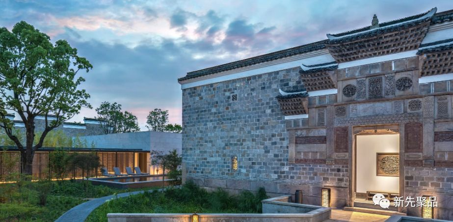 (原始链接: https://mmbiz.qpic.cn/mmbiz_png/dYyiavLsrKlvgMQVqmomIgG75pCc65B8PbrkeQ632qOTPNibUf5PsVzLzia17zchibxEpVlJC7qcEbNUF0RRPHHiaYw/640?wx_fmt=png)
- 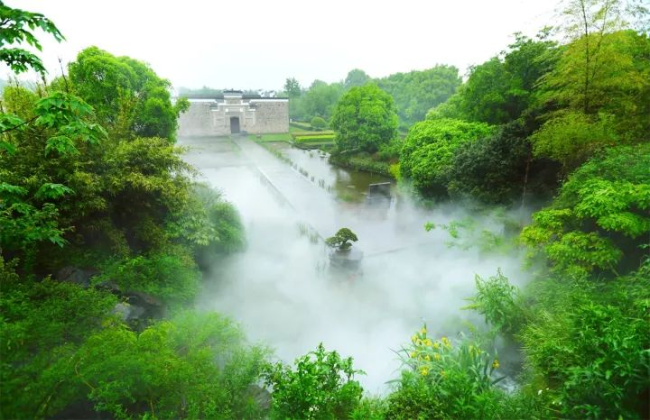 (原始链接: https://mmbiz.qpic.cn/mmbiz_jpg/UH5gXeqExM5dE2nu0YCSx7fY65Gdn3B91kC04572UYJOjIkZxjWWKJQdSxgXglLsvc3h31JzTaYS7r6WzhldNg/640?wx_fmt=jpeg)
- 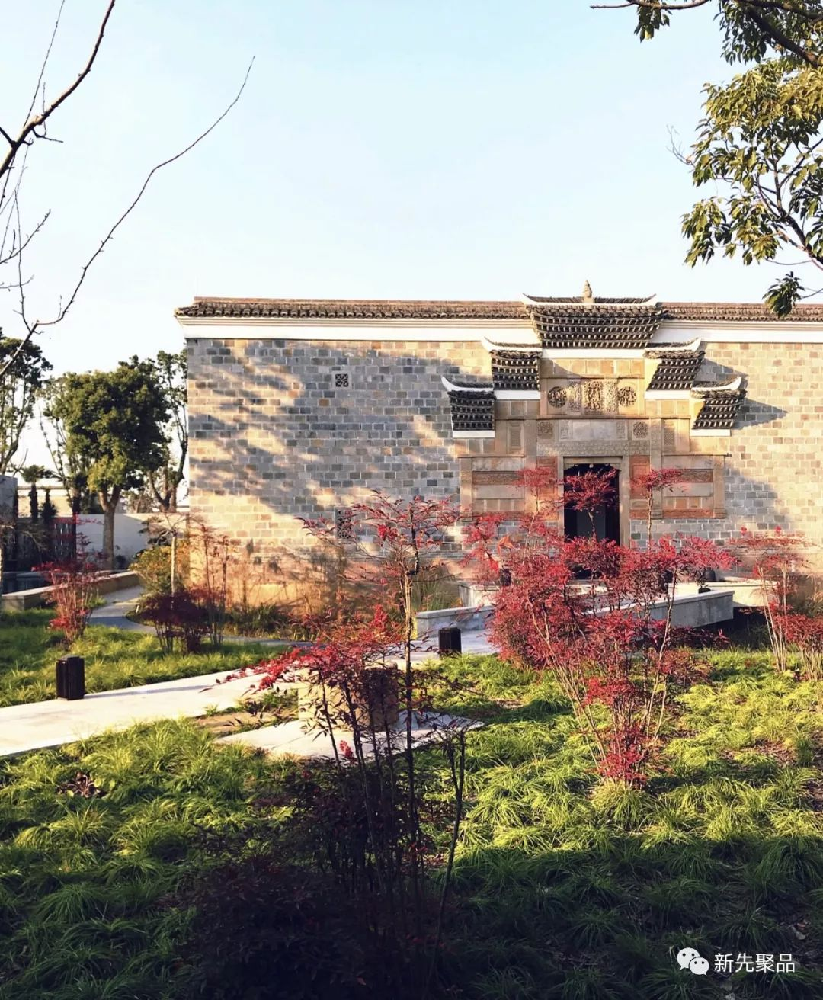 (原始链接: https://mmbiz.qpic.cn/mmbiz_jpg/dYyiavLsrKlvgMQVqmomIgG75pCc65B8PdKIdGMKnISWib5ojVxNlEicrMibHaf4N23qFENhBiae3wqiaejFyxcyGCzA/640?wx_fmt=jpeg)
- 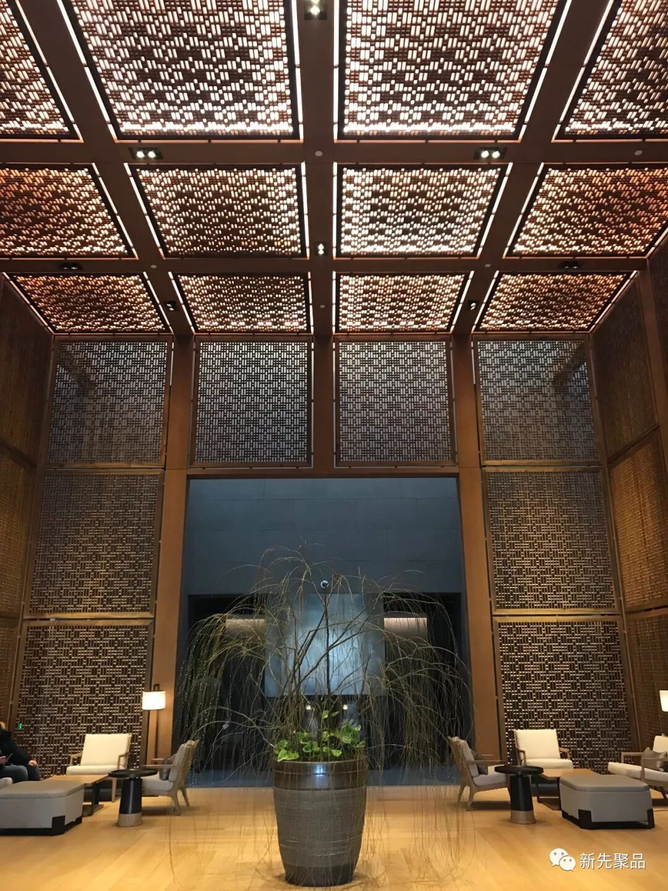 (原始链接: https://mmbiz.qpic.cn/mmbiz_jpg/dYyiavLsrKluqmjGGfsnTb93HmoPttMaowggohEbTEocnrfmkQMVKbCVTV8aEB7bGqblFhdfa89EGEibt8deSSLw/640?wx_fmt=jpeg)
- 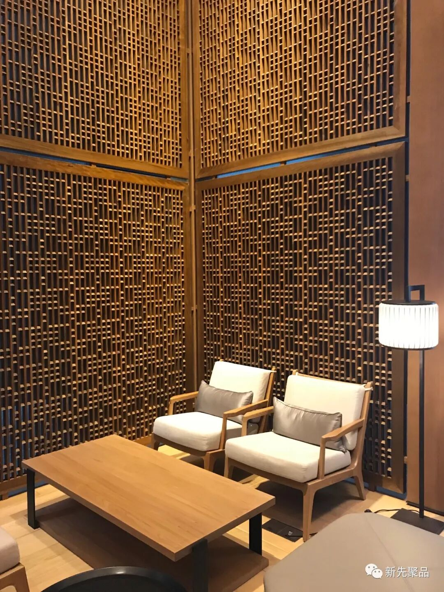 (原始链接: https://mmbiz.qpic.cn/mmbiz_jpg/dYyiavLsrKluqmjGGfsnTb93HmoPttMaoRRm5DTVV83lWanvxmvibZWyAqLlnW8Ky6PUqV1Axe83SHTwapTq63gg/640?wx_fmt=jpeg)
- 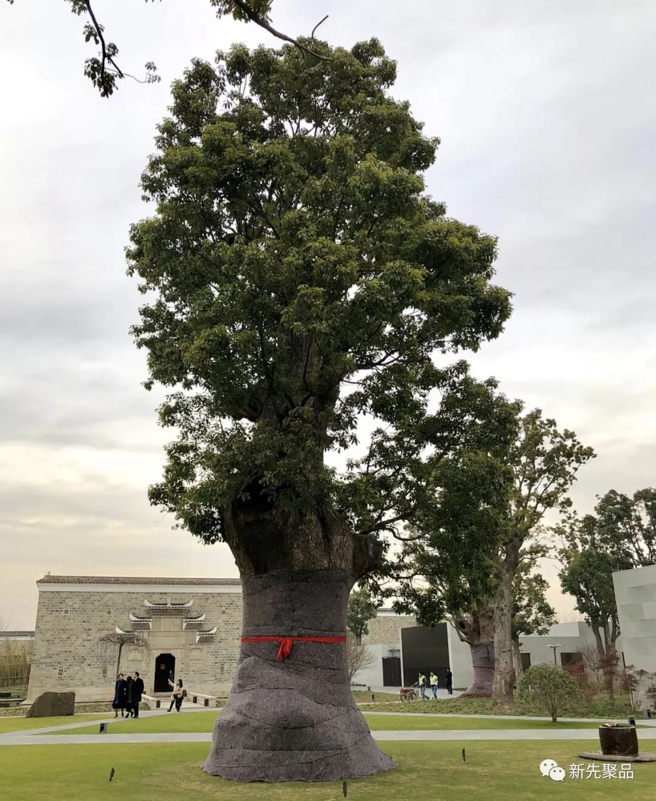 (原始链接: https://mmbiz.qpic.cn/mmbiz_jpg/dYyiavLsrKlvgMQVqmomIgG75pCc65B8PvQf3HbKyTo4QTRDbKHDzRhEMcktFxL9atQhhuANnh6eJp15AdxK63g/640?wx_fmt=jpeg)
- 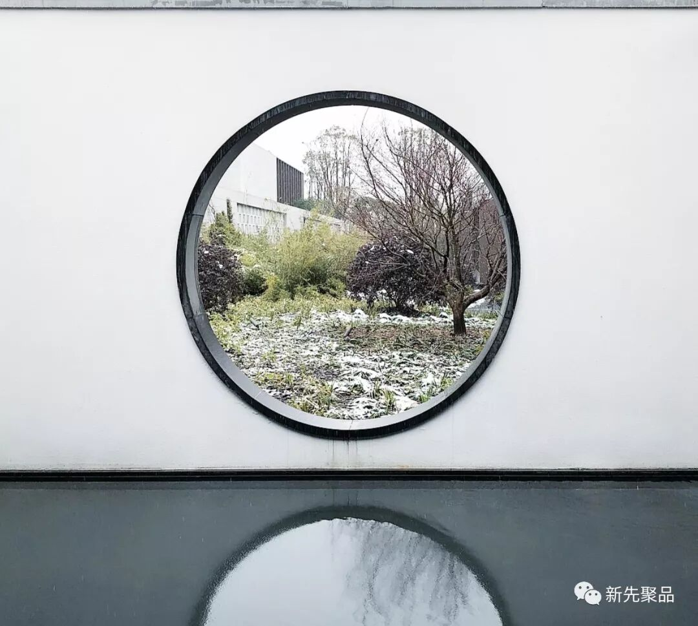 (原始链接: https://mmbiz.qpic.cn/mmbiz_jpg/dYyiavLsrKlvgMQVqmomIgG75pCc65B8PAMH8Xjjx6UicibcHpCC1or4hhgIS4GqMBWPJlYZgicL70rau7dRpzk1Gw/640?wx_fmt=jpeg)
- 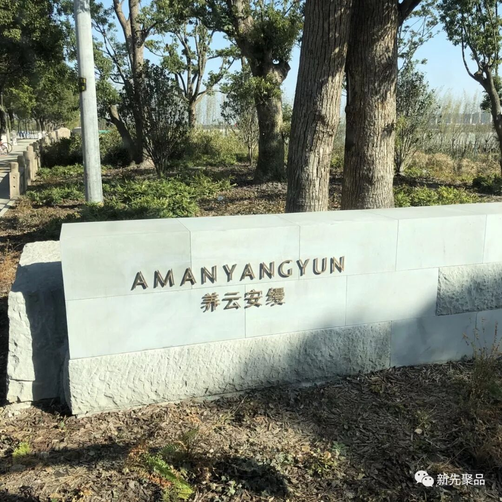 (原始链接: https://mmbiz.qpic.cn/mmbiz_jpg/dYyiavLsrKlvgMQVqmomIgG75pCc65B8PmlvL48O9GqEoMzblQv0YTyic5TQiaBSjHsPqsbXTw1cjFnPKK9kJa1tA/640?wx_fmt=jpeg)
- 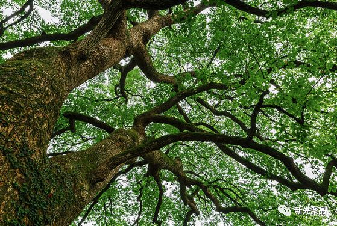 (原始链接: https://mmbiz.qpic.cn/mmbiz_png/dYyiavLsrKlvgMQVqmomIgG75pCc65B8PJftwTa6M6VVZCworfibQ1RMo2tiaxT9ia9F1bquFLzAqqmqEVMsicUeasQ/640?wx_fmt=png)
- 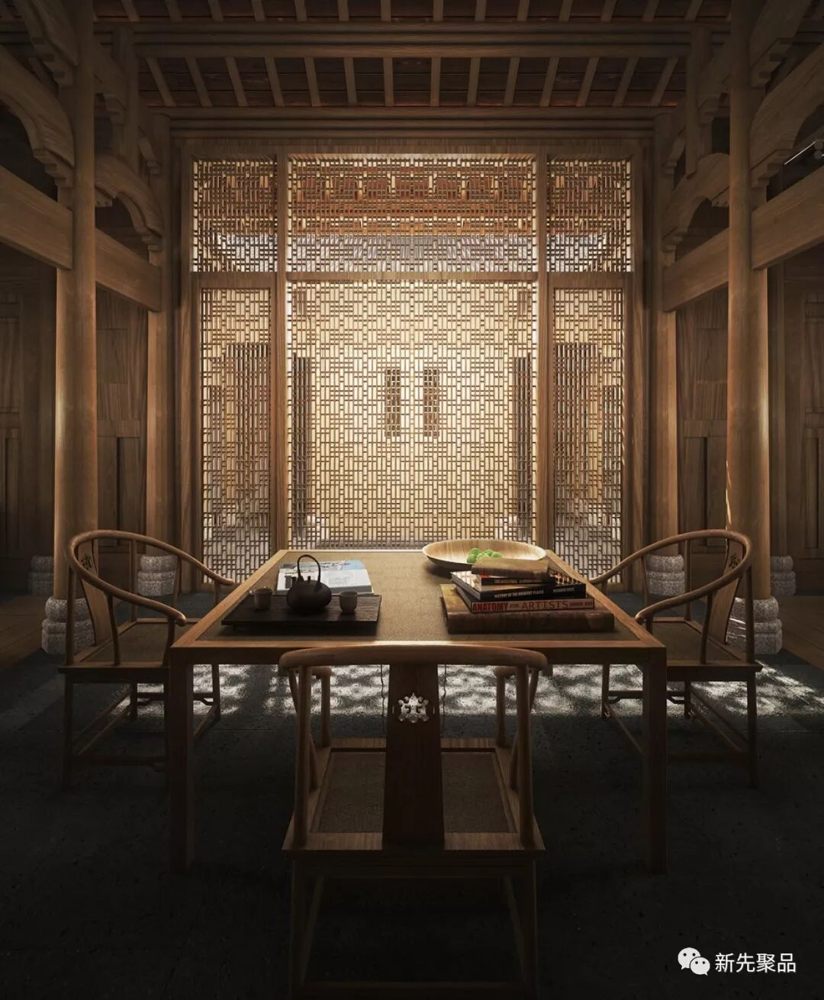 (原始链接: https://mmbiz.qpic.cn/mmbiz_jpg/dYyiavLsrKlvgMQVqmomIgG75pCc65B8PW6glwmdHySV3K4l4wM44jVGFgk638q9pNmTeznIFWvLrGxCAOXNzdQ/640?wx_fmt=jpeg)
-  (原始链接: https://mmbiz.qpic.cn/mmbiz_jpg/dYyiavLsrKlvgMQVqmomIgG75pCc65B8PJ23wXB2O8f0I0gRzCR7Hr6330UNxoPVAHbBLEC6XoBBjvga5tTjZuA/640?wx_fmt=jpeg)
- 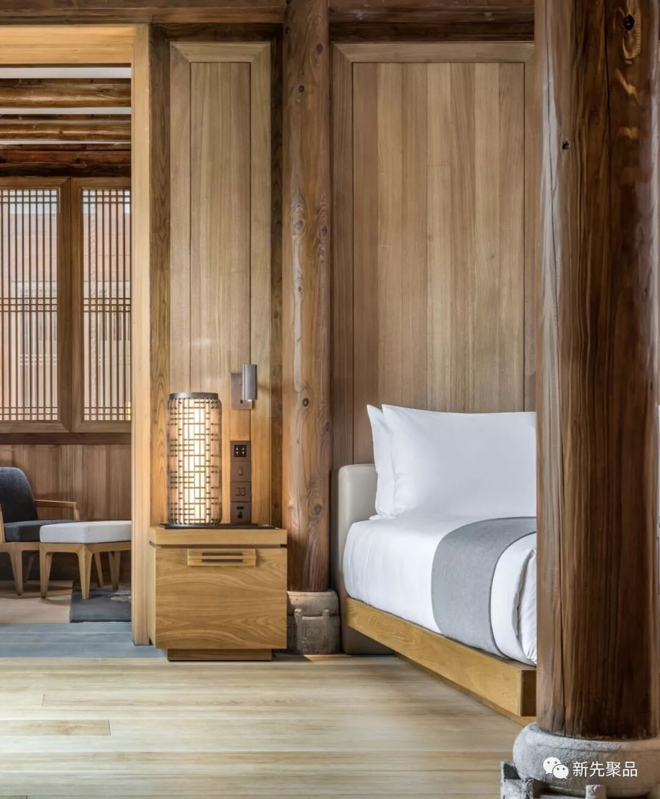 (原始链接: https://mmbiz.qpic.cn/mmbiz_jpg/dYyiavLsrKlvgMQVqmomIgG75pCc65B8PXNMLQ9bmSbm7FIarXVto8aUgeg6tiaPZBSdn0tdDtY8JKfPOuCkYdNg/640?wx_fmt=jpeg)
- 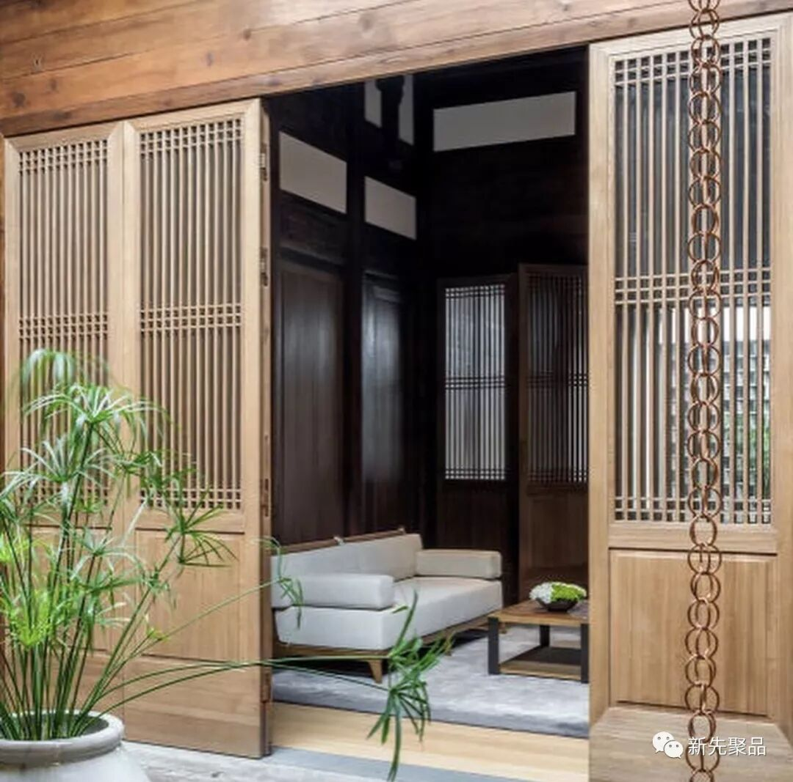 (原始链接: https://mmbiz.qpic.cn/mmbiz_jpg/dYyiavLsrKlvgMQVqmomIgG75pCc65B8PsvXf6IZ2rtFJHJahoxb45gPP9UsicB5my111TesN42KIibBK4sWLf8PQ/640?wx_fmt=jpeg)
- 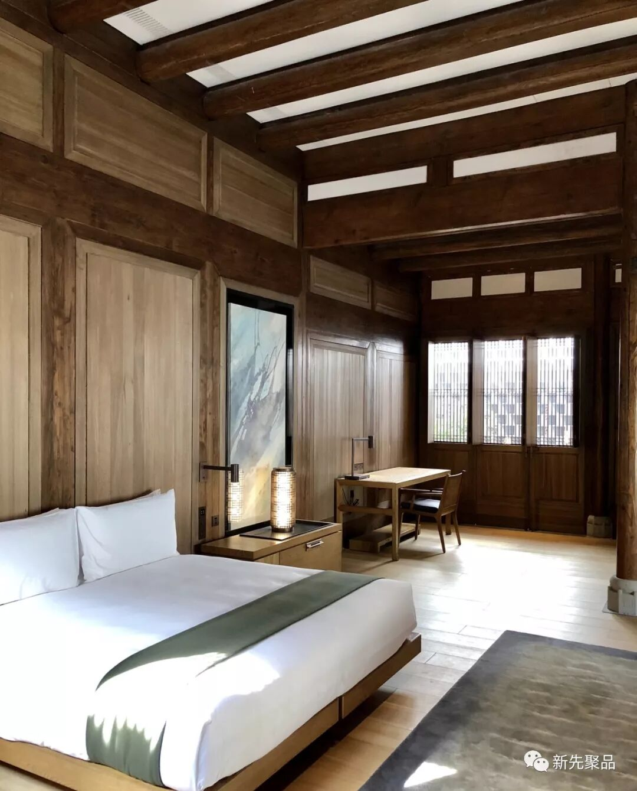 (原始链接: https://mmbiz.qpic.cn/mmbiz_jpg/dYyiavLsrKlvgMQVqmomIgG75pCc65B8PHau9xMvWibXXySricFdn0TGNjRndVvW2qJ2sUJXz5szmg9lFIR6Hnu6w/640?wx_fmt=jpeg)
- 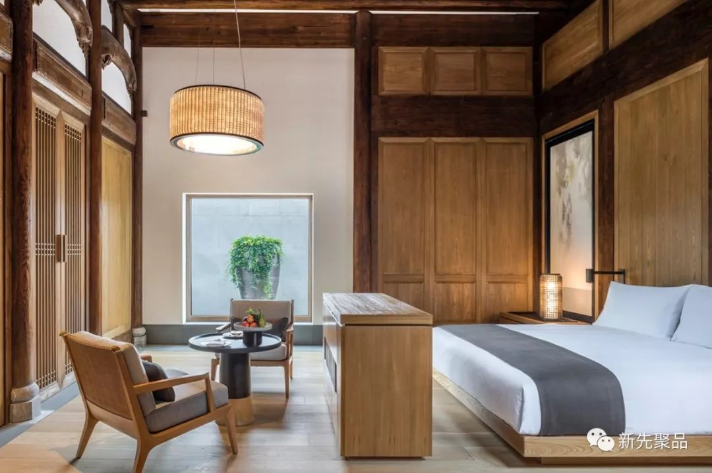 (原始链接: https://mmbiz.qpic.cn/mmbiz_jpg/dYyiavLsrKluqmjGGfsnTb93HmoPttMaoO8YgIZ4W9PONqBFVQicg6rdtYTkPJaXicGnwyYqh2ScicAibZjic3mXczbg/640?wx_fmt=jpeg)
- 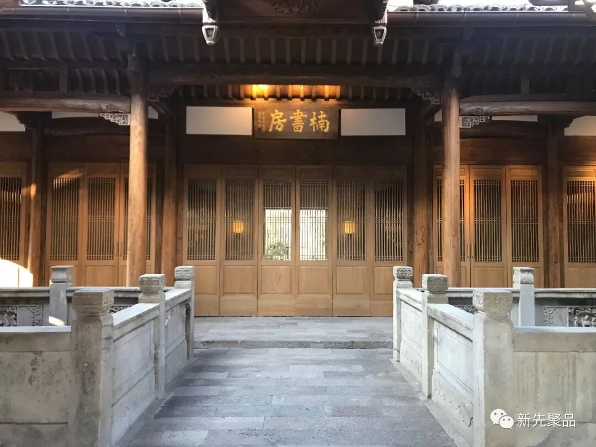 (原始链接: https://mmbiz.qpic.cn/mmbiz_jpg/dYyiavLsrKluqmjGGfsnTb93HmoPttMaosH3Bpe4vZcgPSRtia1ib8iaQaD9iap4ZOG3iaPxsq4eoxxxoqn2hfjYSzibg/640?wx_fmt=jpeg)
- 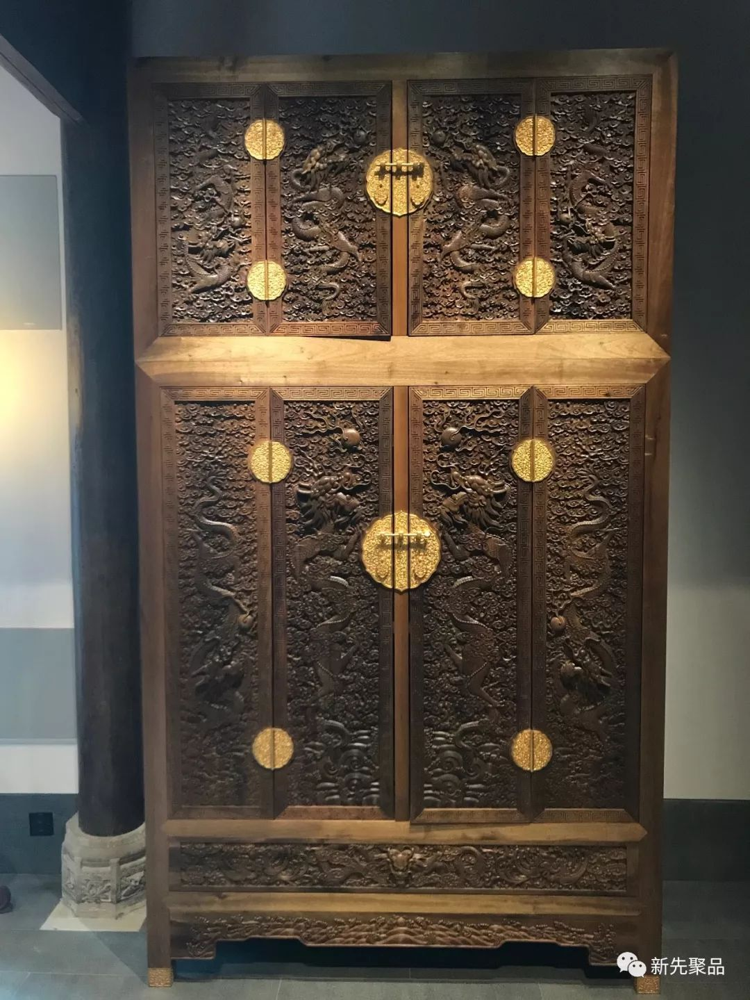 (原始链接: https://mmbiz.qpic.cn/mmbiz_jpg/dYyiavLsrKluqmjGGfsnTb93HmoPttMaoFdcsDuhkmHUZmDN3jv3HCH0cuD67nVUj4323FepxiblmTH1Z1OH0HEQ/640?wx_fmt=jpeg)
- 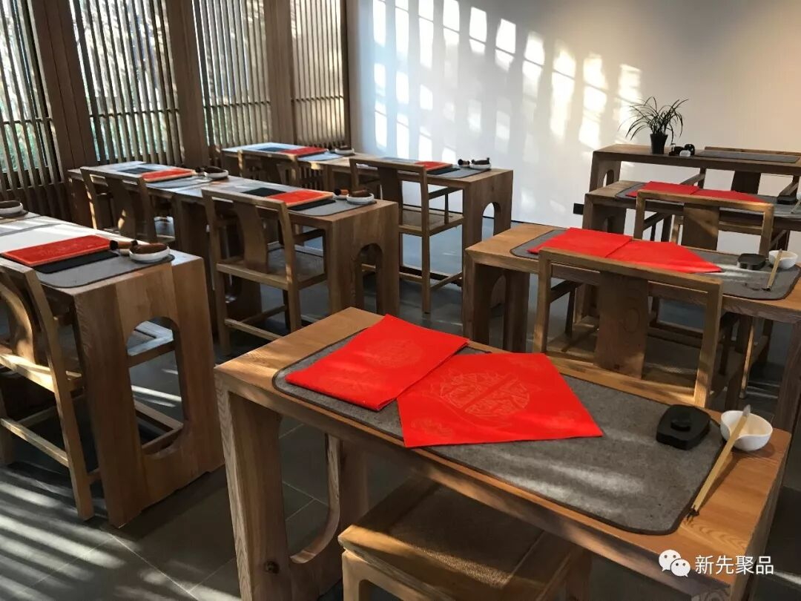 (原始链接: https://mmbiz.qpic.cn/mmbiz_jpg/dYyiavLsrKluqmjGGfsnTb93HmoPttMaoKgvsialU3ZxZL7icY8icgLWX5W8oFlb2jMnbWcQzZBdUAMdk7FXCC7Fcw/640?wx_fmt=jpeg)
- 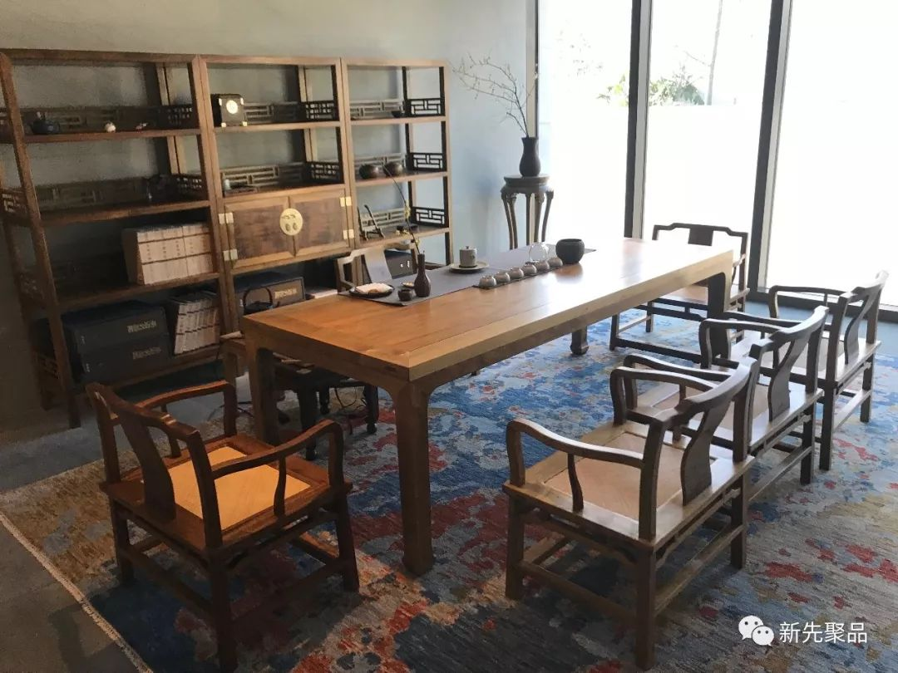 (原始链接: https://mmbiz.qpic.cn/mmbiz_jpg/dYyiavLsrKluqmjGGfsnTb93HmoPttMaoFw2wzNjoHXDBRycQLwNDWPYBM4d334wHtMvruXtHdSwGIkFDZToJiaA/640?wx_fmt=jpeg)
- 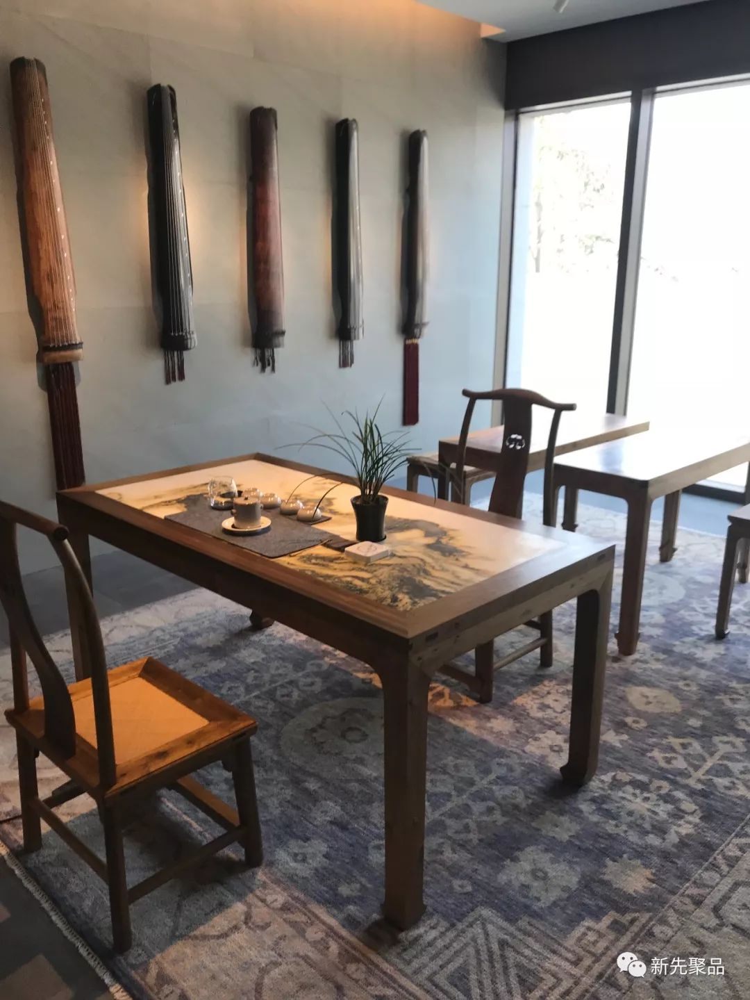 (原始链接: https://mmbiz.qpic.cn/mmbiz_jpg/dYyiavLsrKluqmjGGfsnTb93HmoPttMaoVwP530v0zMHzB0oxvA193IIn0Cfs4ZO1PSDJnpwwpFn3FlDQf6IOnA/640?wx_fmt=jpeg)
- 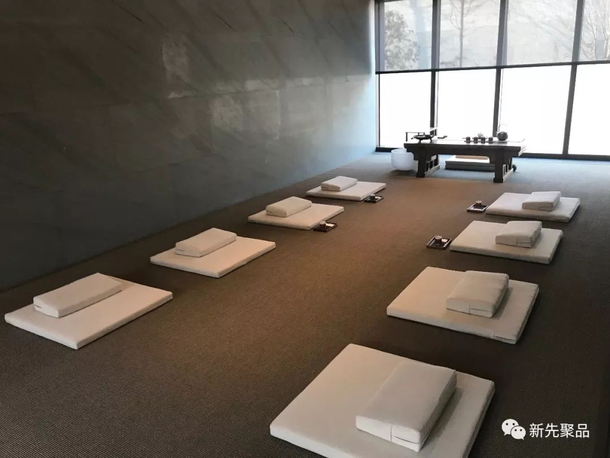 (原始链接: https://mmbiz.qpic.cn/mmbiz_jpg/dYyiavLsrKluqmjGGfsnTb93HmoPttMaoDx5k237OCtDUjUXAYrGox9iaYtgJHwIUZ8uyd8TGQHKico4J5mxSgBIQ/640?wx_fmt=jpeg)
- 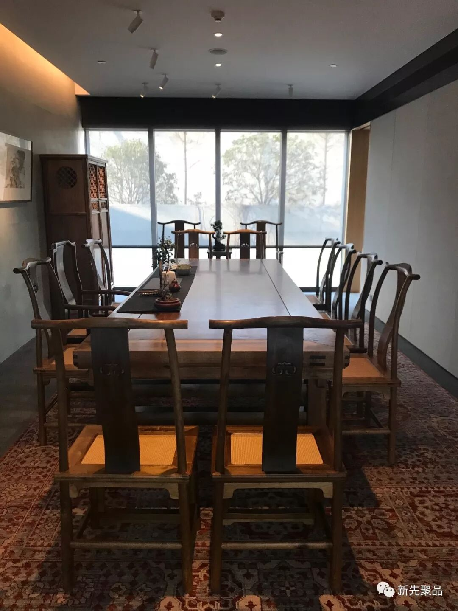 (原始链接: https://mmbiz.qpic.cn/mmbiz_jpg/dYyiavLsrKluqmjGGfsnTb93HmoPttMaoLcm4IB1dT58j5jK5bSwyfcibXU93VicLHsMwgYohfpm0vrRZSDgVdFGg/640?wx_fmt=jpeg)
- 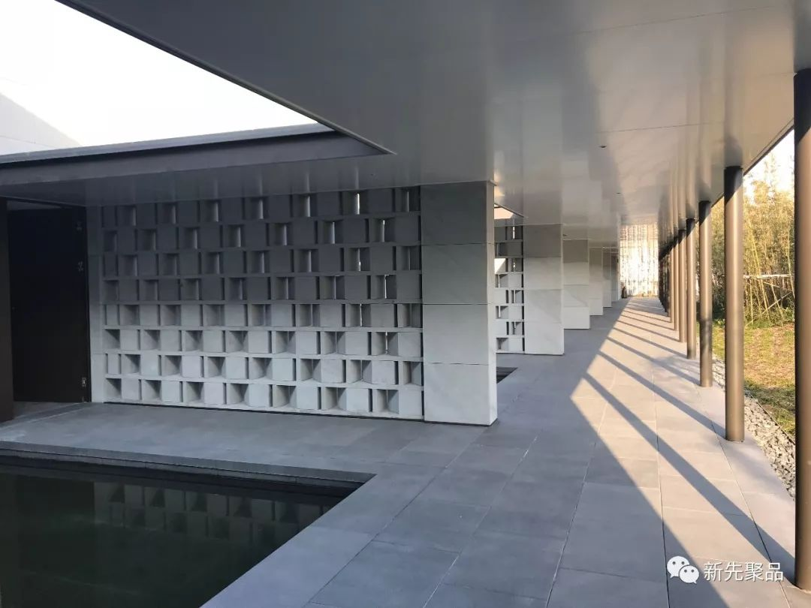 (原始链接: https://mmbiz.qpic.cn/mmbiz_jpg/dYyiavLsrKluqmjGGfsnTb93HmoPttMao2DMnrGmz1e1un1aawTDn75jib8BbOehIqGlylSYgjGF0pswHM9LGKXw/640?wx_fmt=jpeg)
- 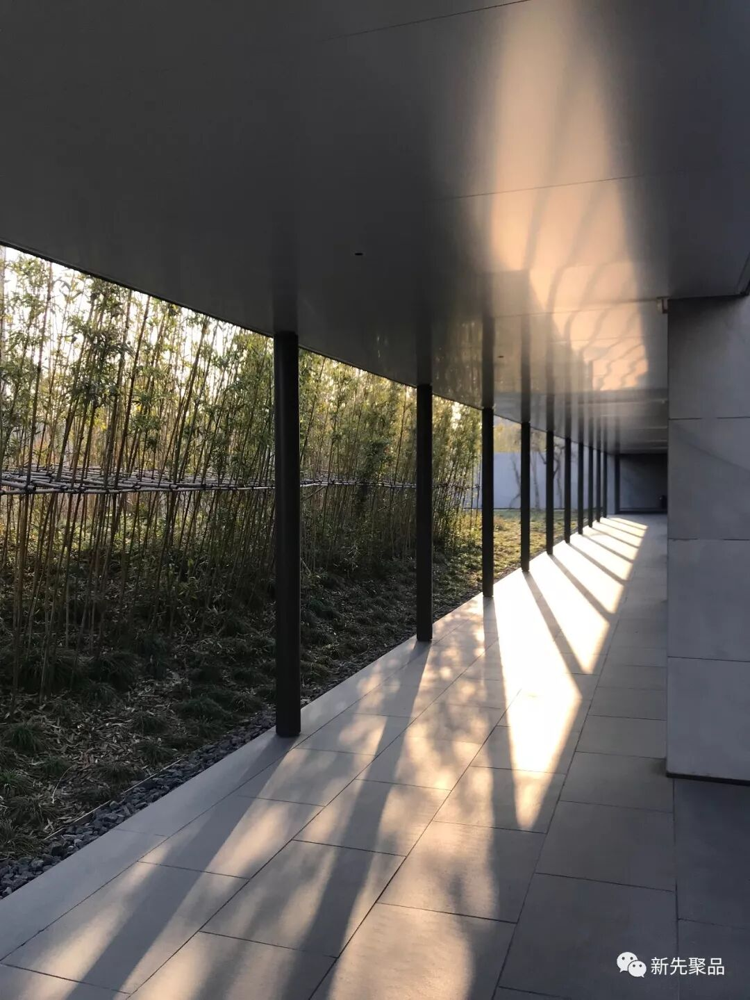 (原始链接: https://mmbiz.qpic.cn/mmbiz_jpg/dYyiavLsrKluqmjGGfsnTb93HmoPttMaocMw6sezD1aetiaSRYiazXvqiaSWD3NLbibwmgMeYwMtbtjgfUvcIw5JLnA/640?wx_fmt=jpeg)
- 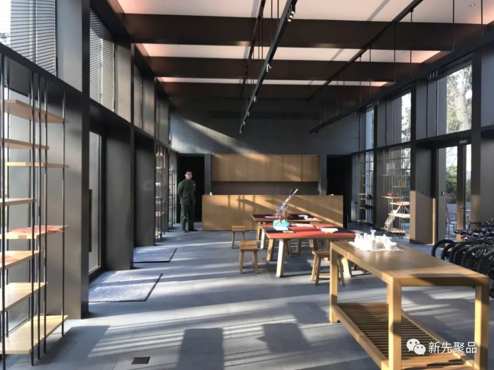 (原始链接: https://mmbiz.qpic.cn/mmbiz_jpg/dYyiavLsrKlvgMQVqmomIgG75pCc65B8PJUUawHGicyicMjBRH2Tq1NaVYGQUEnytAVCmWRkyTy6EUoBTHeSbbvmQ/640?wx_fmt=jpeg)
- 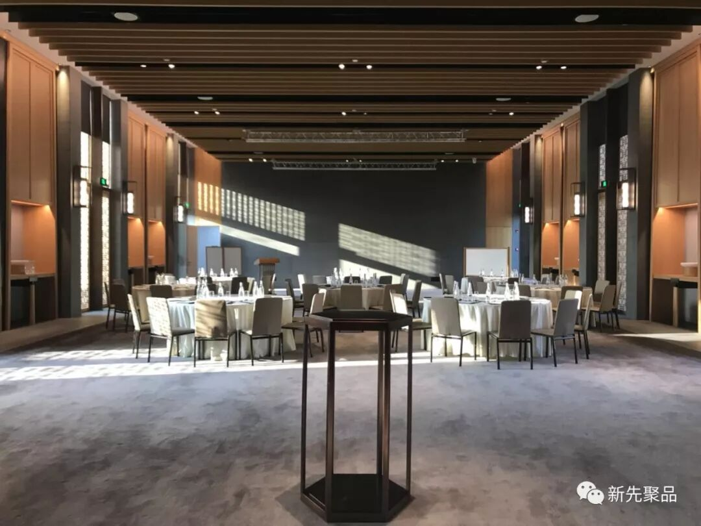 (原始链接: https://mmbiz.qpic.cn/mmbiz_jpg/dYyiavLsrKlvgMQVqmomIgG75pCc65B8PrlUe4Nib6B7icXDSS08YvphHldu2jwgFtvPrqc9o9cuIJE0FHdFvfXXQ/640?wx_fmt=jpeg)
- 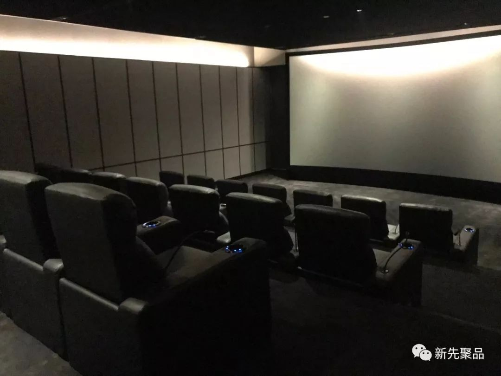 (原始链接: https://mmbiz.qpic.cn/mmbiz_jpg/dYyiavLsrKluqmjGGfsnTb93HmoPttMaoKmOdGAe3Fe9VRRUZGtyQ2vX6ffsXfflr5Fumvhlx8xDpOwNIe0rqHA/640?wx_fmt=jpeg)
- 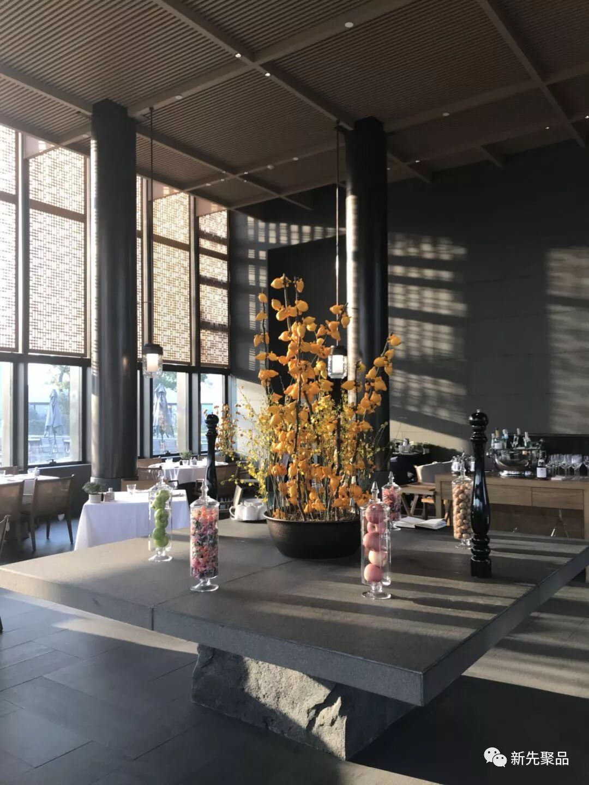 (原始链接: https://mmbiz.qpic.cn/mmbiz_jpg/dYyiavLsrKlvgMQVqmomIgG75pCc65B8P2PeB8U6gMK3aXnAZMgkCSHL17zicibkTxjeqpxicNhwC6Ojau1gMu0qyQ/640?wx_fmt=jpeg)
- 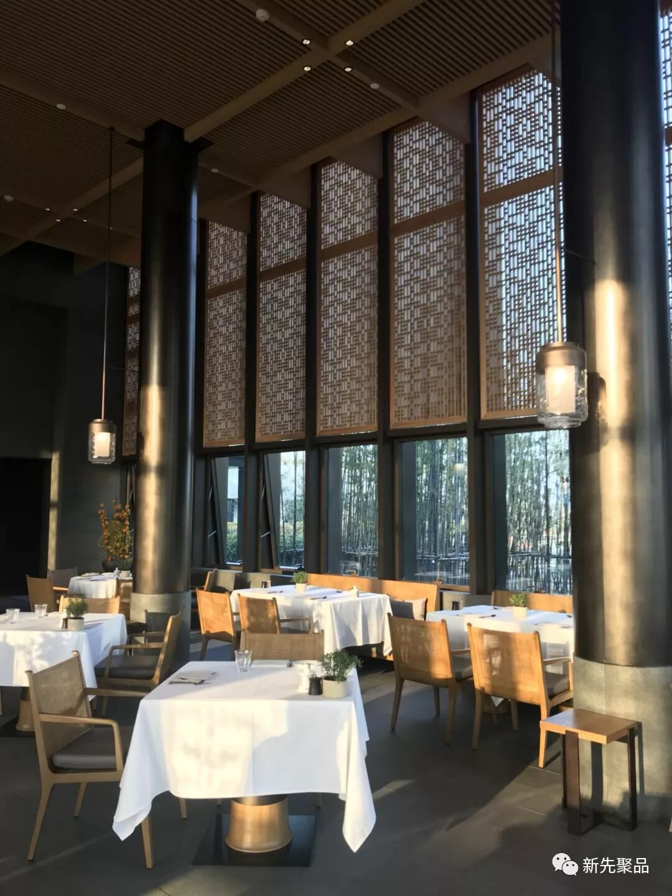 (原始链接: https://mmbiz.qpic.cn/mmbiz_jpg/dYyiavLsrKlvgMQVqmomIgG75pCc65B8P15XzVVyU4AfgaLOX7a9Zk5XquRrEuXtuZkel5Xgia7PgTKuYrlOzYdQ/640?wx_fmt=jpeg)
- 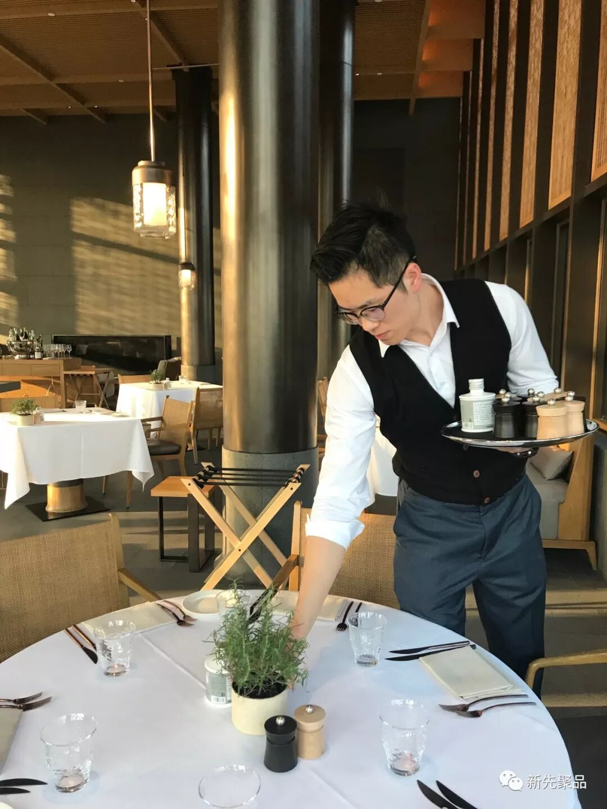 (原始链接: https://mmbiz.qpic.cn/mmbiz_jpg/dYyiavLsrKluqmjGGfsnTb93HmoPttMaobbx2OCby27k5A7rdm6LsiaxSXDFpvbLOdVZG0DU4CmiaMFzWUckjXxwQ/640?wx_fmt=jpeg)
- 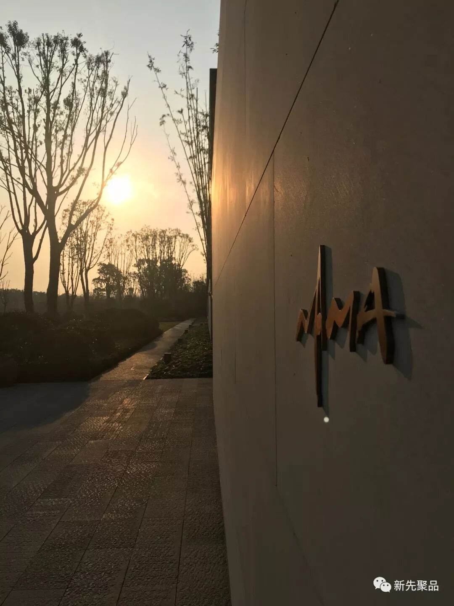 (原始链接: https://mmbiz.qpic.cn/mmbiz_jpg/dYyiavLsrKluqmjGGfsnTb93HmoPttMaobCrtSTiaJVdhtJLhZ9EM9yWeO0y6ibS6aswzEWyCDVqb4F4zHOVkhbCw/640?wx_fmt=jpeg)
- 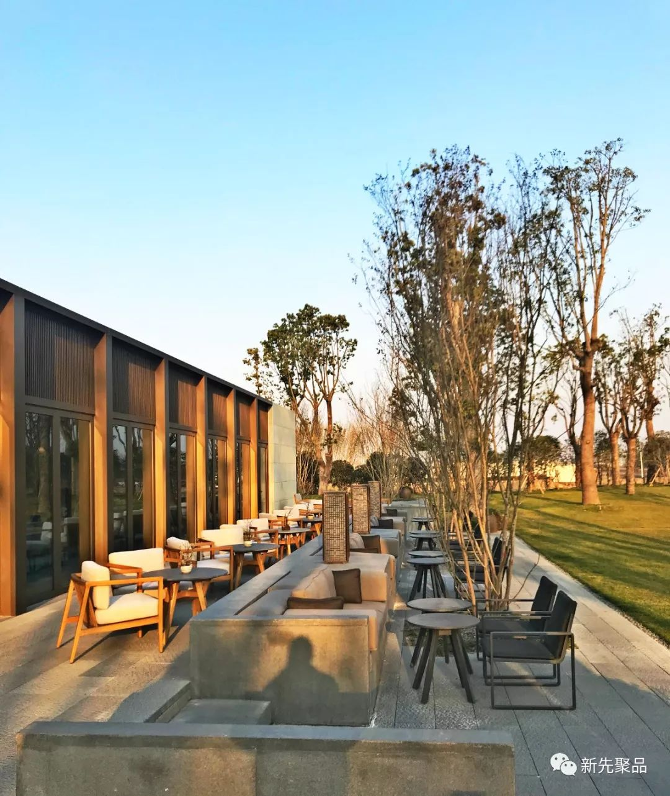 (原始链接: https://mmbiz.qpic.cn/mmbiz_jpg/dYyiavLsrKluqmjGGfsnTb93HmoPttMaowDayWKS02mekJ0gbbWOfJ9hDz0m1KNs2KWhV9T9icGicmLlZTA5tmJyA/640?wx_fmt=jpeg)
- 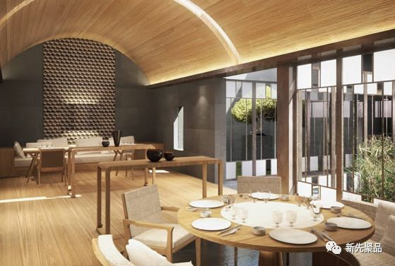 (原始链接: https://mmbiz.qpic.cn/mmbiz_png/dYyiavLsrKlvgMQVqmomIgG75pCc65B8P5xNU120wQnoZjgEjpKG3ibfGhicbho3kTz7Wsopc5XI6D3rpRL40icWNg/640?wx_fmt=png)
- 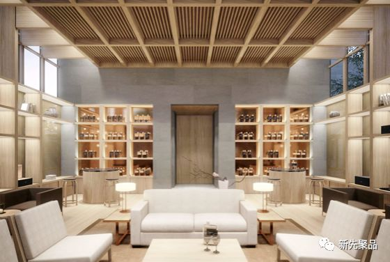 (原始链接: https://mmbiz.qpic.cn/mmbiz_png/dYyiavLsrKlvgMQVqmomIgG75pCc65B8P42INTvyZAn0EuorO37oCGD5J6GUaUDtsKLiab7AqHADaALTCTXAIwCA/640?wx_fmt=png)
- 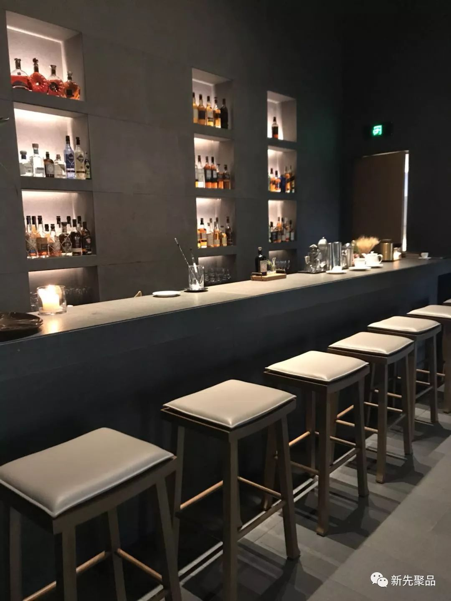 (原始链接: https://mmbiz.qpic.cn/mmbiz_jpg/dYyiavLsrKlvgMQVqmomIgG75pCc65B8Pzy68iaxgGibyYe96wicibpR9za6LOobcKAmSmagtwqRq94vMpUialcjBWMg/640?wx_fmt=jpeg)
- 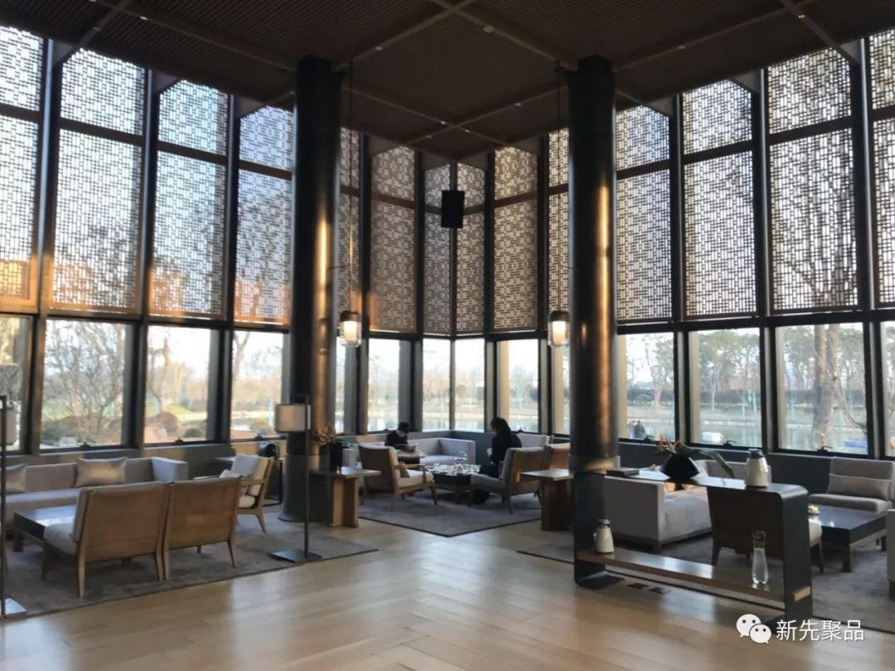 (原始链接: https://mmbiz.qpic.cn/mmbiz_jpg/dYyiavLsrKlvgMQVqmomIgG75pCc65B8P1XIFvAyibh1Juib8Hz6akicA06tNdatiaFmobNj10toSqmOAAy6ichFtOAQ/640?wx_fmt=jpeg)
- 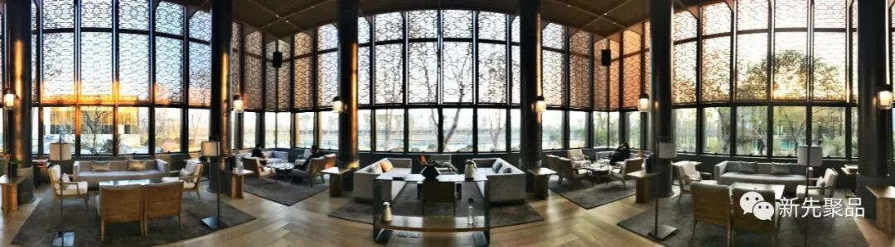 (原始链接: https://mmbiz.qpic.cn/mmbiz_jpg/dYyiavLsrKluqmjGGfsnTb93HmoPttMaoOhBS51icJKBT76EKu6Z7RkI5kmyUZqUlBeljrSTI3eN9dibLhf8uCQFw/640?wx_fmt=jpeg)
- 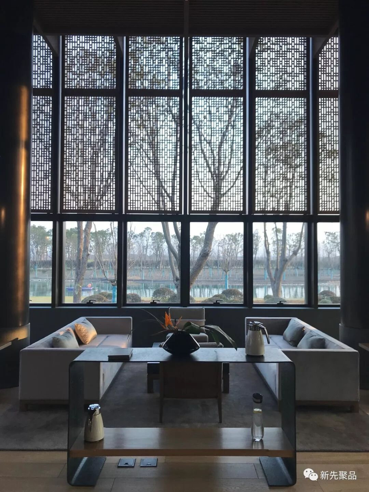 (原始链接: https://mmbiz.qpic.cn/mmbiz_jpg/dYyiavLsrKluqmjGGfsnTb93HmoPttMaoOESxsAjCjyic3wFMfyAvmj3bxLbSiaHquNTKu1Tb462gOG42vnMBZr8w/640?wx_fmt=jpeg)
- 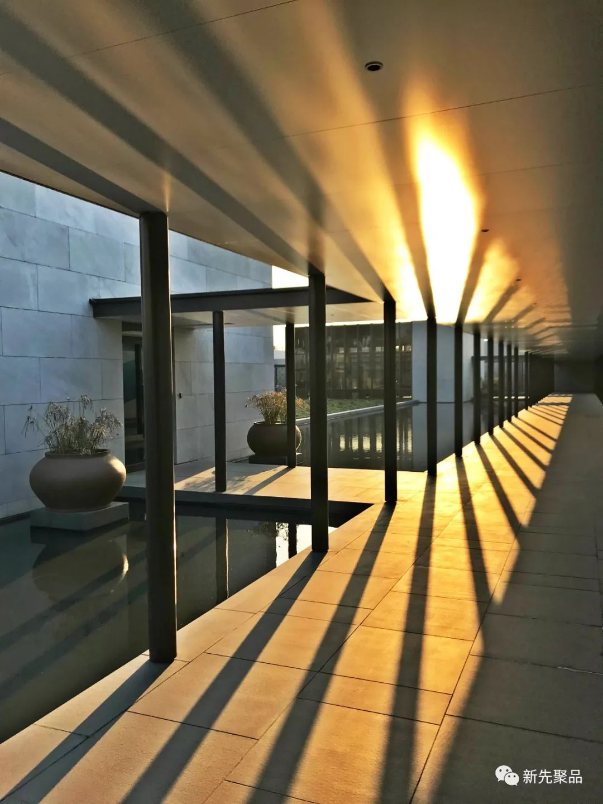 (原始链接: https://mmbiz.qpic.cn/mmbiz_jpg/dYyiavLsrKluqmjGGfsnTb93HmoPttMaonbHv22r41ibKU3dM4vpHibnYk7e5yUXbxOcjTaLyLJlOUHtVTHbOqnow/640?wx_fmt=jpeg)
- 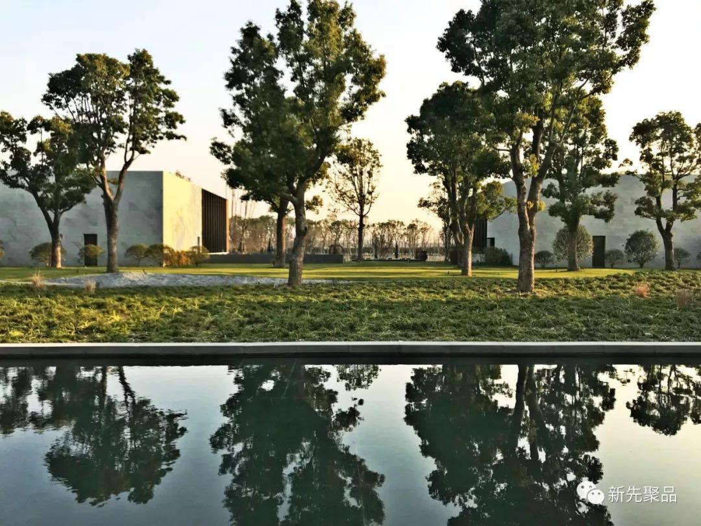 (原始链接: https://mmbiz.qpic.cn/mmbiz_jpg/dYyiavLsrKluqmjGGfsnTb93HmoPttMaoR8K05USgia1hJPibLubM5XWNeUyjhMJtkQ8Br7bhhx6NiaNq7DEnhWGcg/640?wx_fmt=jpeg)
- 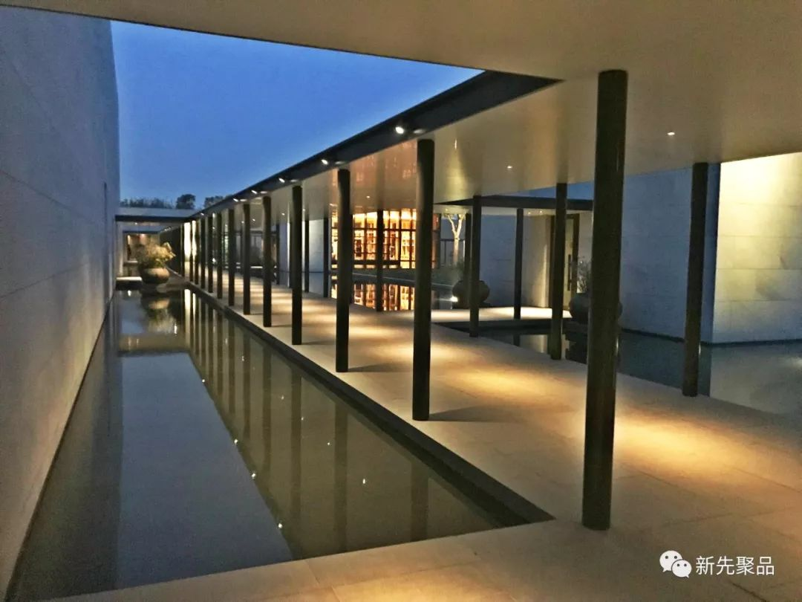 (原始链接: https://mmbiz.qpic.cn/mmbiz_jpg/dYyiavLsrKluqmjGGfsnTb93HmoPttMaol84ico1Nicuw72icuibEB6ib6PSQ040d5pMWR4twYHdN3N7nm4BSXZnic5KA/640?wx_fmt=jpeg)
- 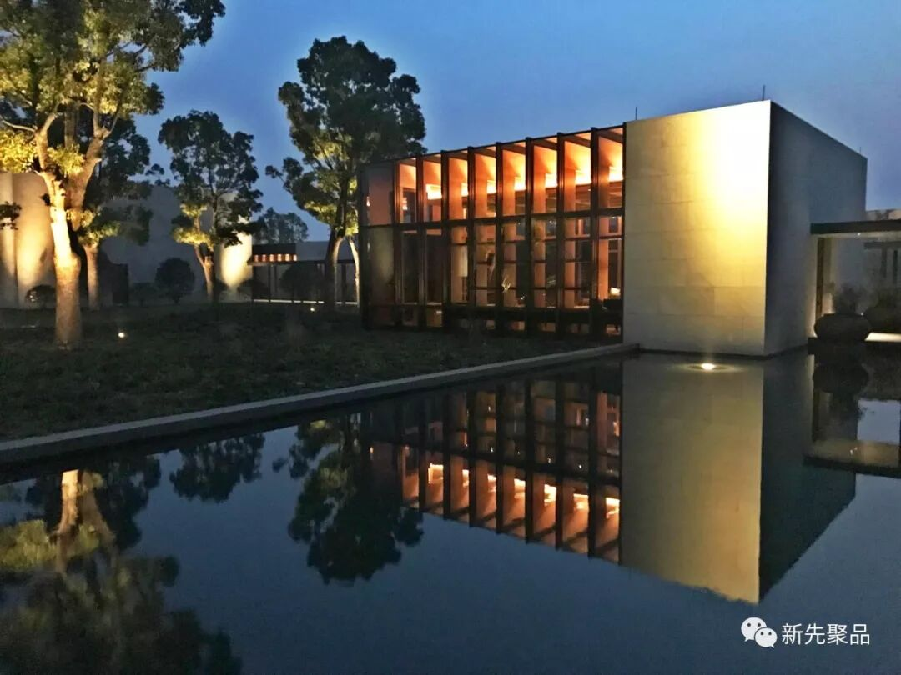 (原始链接: https://mmbiz.qpic.cn/mmbiz_jpg/dYyiavLsrKluqmjGGfsnTb93HmoPttMaoCZ63mLNExOlxQvP8e5nQX58j0mT2uJtTPnkqELdUQoPNZjElkhgnGg/640?wx_fmt=jpeg)
- 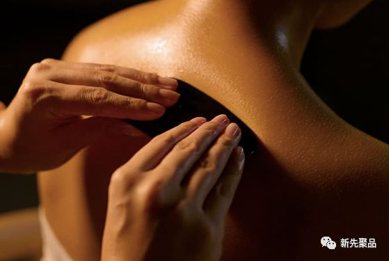 (原始链接: https://mmbiz.qpic.cn/mmbiz_png/dYyiavLsrKlvgMQVqmomIgG75pCc65B8PzEictfsbicWGpVKXt6NDxnG9olFQMgLOpL3nEWYWQXs51uC0L4CdJ27Q/640?wx_fmt=png)
- 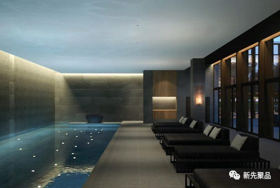 (原始链接: https://mmbiz.qpic.cn/mmbiz_png/dYyiavLsrKlvgMQVqmomIgG75pCc65B8Peea8KDEgWzlq1XloqiaculUpxbcWHD60wq29WfEfeovZKyVFibpvmafA/640?wx_fmt=png)
- 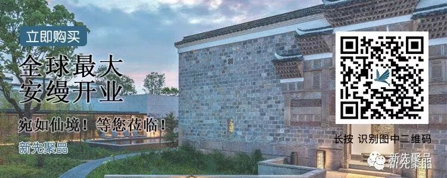 (原始链接: https://mmbiz.qpic.cn/mmbiz_jpg/dYyiavLsrKltUiaQ13ObCMtLxLSJPY3EHa3kZHqlcFvLcZLoHKUHNl0fBchDZl2W6ShQRV1X6TagHlJgUYSBoH1A/640?wx_fmt=jpeg)
- 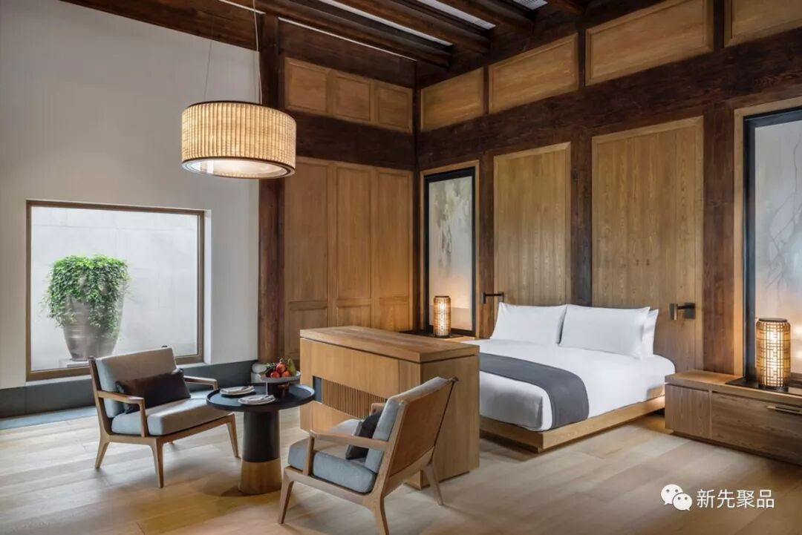 (原始链接: https://mmbiz.qpic.cn/mmbiz_jpg/dYyiavLsrKltUiaQ13ObCMtLxLSJPY3EHasZicGOibtNL5CPuSXeM5nWBRjiah4Mp5GEZia9pBLM7qlKWARe5eV0hMsw/640?wx_fmt=jpeg)
- 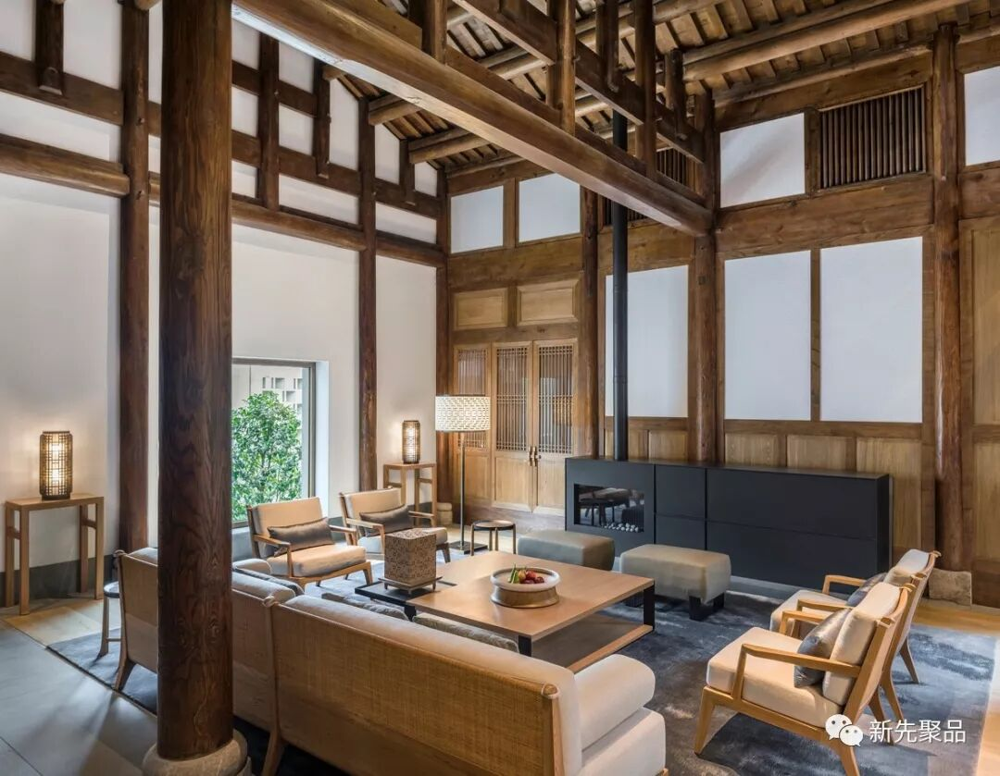 (原始链接: https://mmbiz.qpic.cn/mmbiz_jpg/dYyiavLsrKltUiaQ13ObCMtLxLSJPY3EHacfXsngVdpQYGLK1Fpmdv1zpymVSBibsDRMZEglad4Z4ERtciciarun3wQ/640?wx_fmt=jpeg)
- 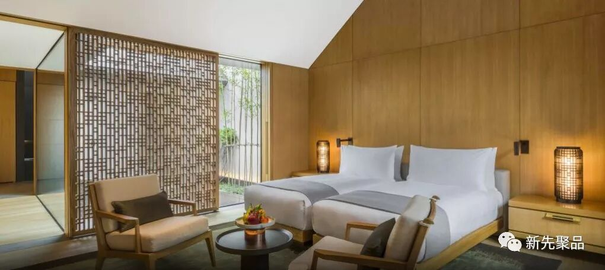 (原始链接: https://mmbiz.qpic.cn/mmbiz_jpg/dYyiavLsrKluqmjGGfsnTb93HmoPttMaoUtI3cZ4FLWXFrJ8vwC54cPCas0SLh4g2y7ktQrW6kokM3BruIfBhibg/640?wx_fmt=jpeg)
- 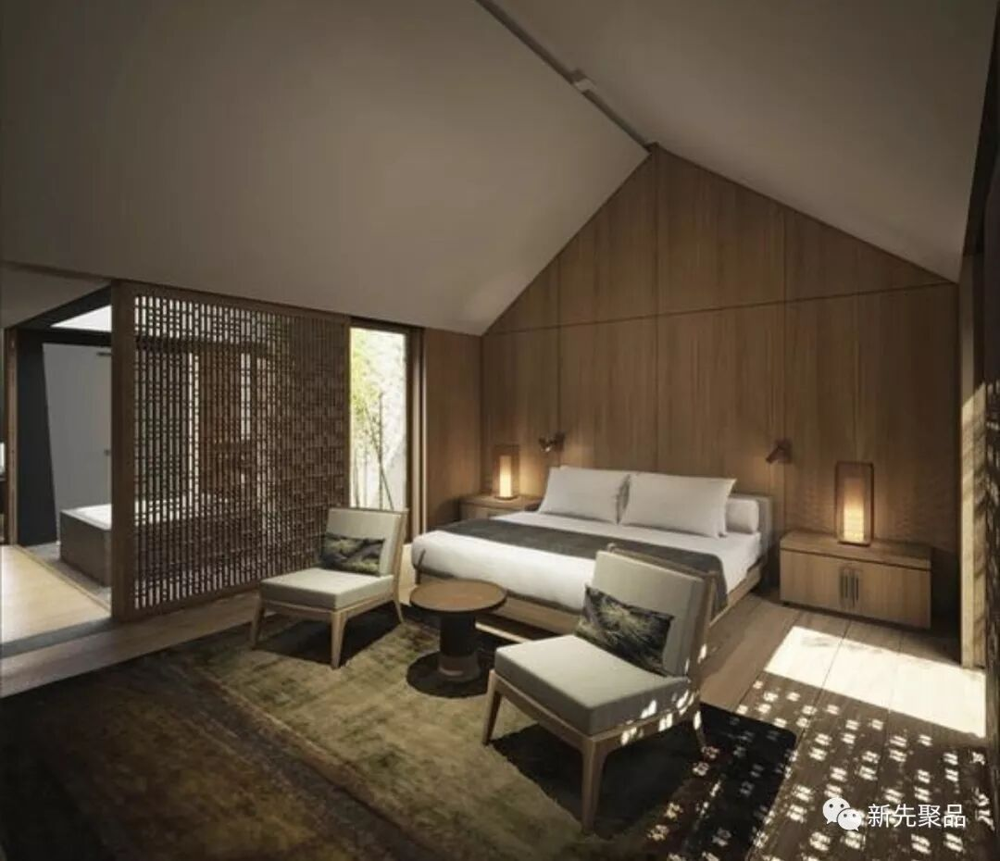 (原始链接: https://mmbiz.qpic.cn/mmbiz_jpg/dYyiavLsrKltUiaQ13ObCMtLxLSJPY3EHaQicvPS9hAt616ygYPrpjpzdBzJNy3CfYkF7LiaEG5VaSkZazX0AgLRbA/640?wx_fmt=jpeg)
- 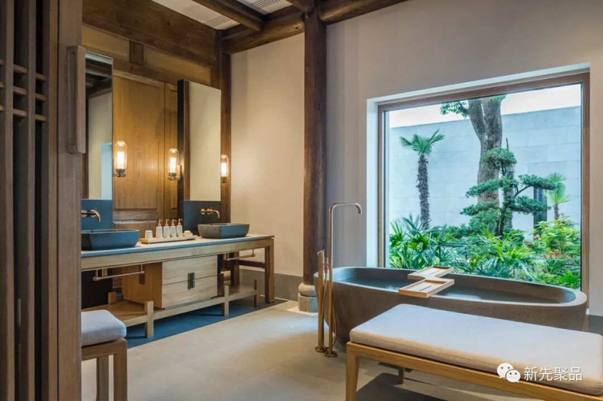 (原始链接: https://mmbiz.qpic.cn/mmbiz_jpg/dYyiavLsrKltUiaQ13ObCMtLxLSJPY3EHaRicpBuIb8Yibz6eLPbwZQKAjlknqSjiatDKiazABHkZWW87m4rL2HaS48w/640?wx_fmt=jpeg)
- 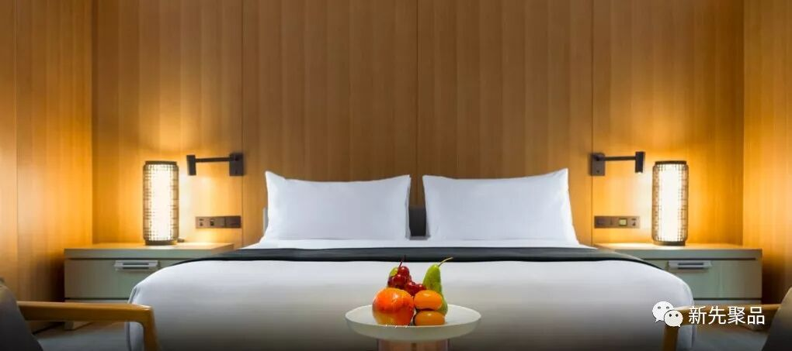 (原始链接: https://mmbiz.qpic.cn/mmbiz_jpg/dYyiavLsrKluqmjGGfsnTb93HmoPttMaoSibd6pCVPLrj4lCvGLGPqxA8gQ8yArZDN0icQgrQskd7Ow2KCYp6NLNw/640?wx_fmt=jpeg)
- 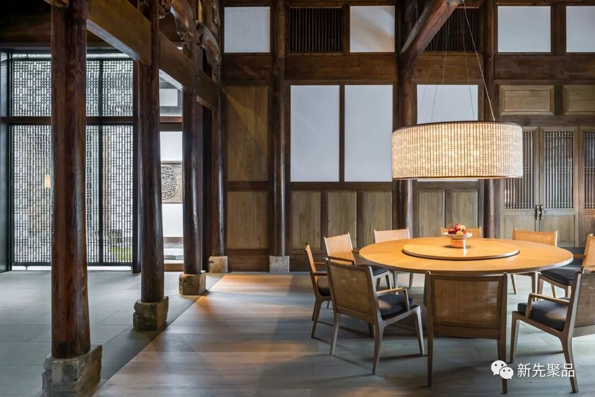 (原始链接: https://mmbiz.qpic.cn/mmbiz_jpg/dYyiavLsrKltUiaQ13ObCMtLxLSJPY3EHatOg6iadgXhwsC4VUq3x2LZA1BMiaibPd3mD9PwicY0oUXKQh52GJ7OhBMg/640?wx_fmt=jpeg)
- 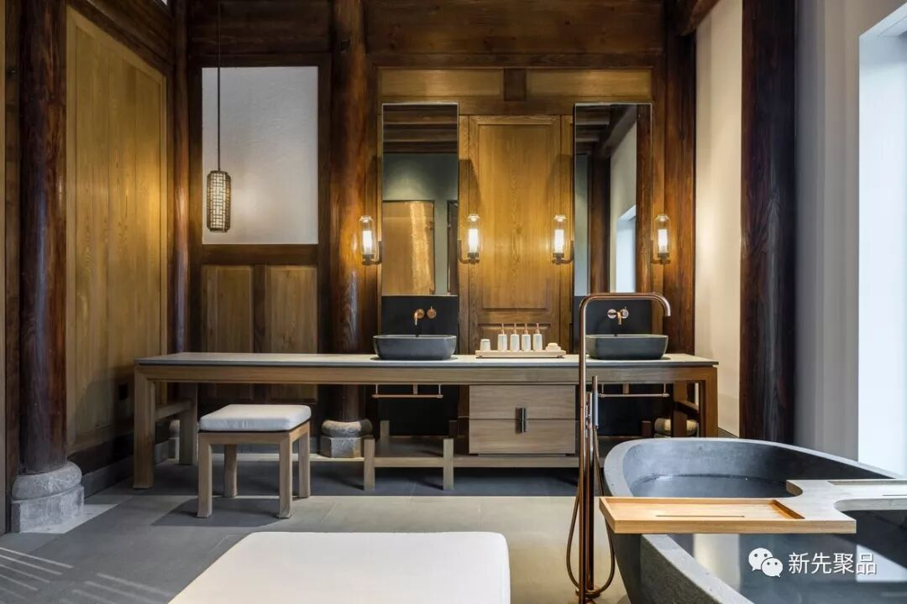 (原始链接: https://mmbiz.qpic.cn/mmbiz_jpg/dYyiavLsrKltUiaQ13ObCMtLxLSJPY3EHajSyysHjmqnojaGseALyXMx23MExtQ6yEbdW6XNIzDFxfdSaHLDvgPg/640?wx_fmt=jpeg)
- 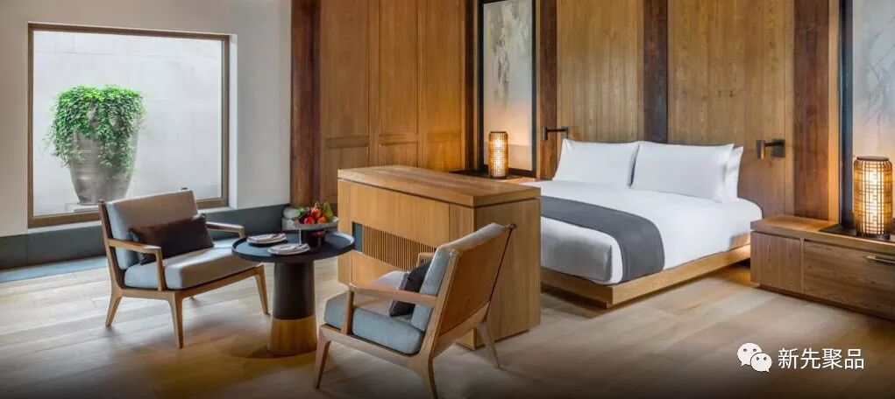 (原始链接: https://mmbiz.qpic.cn/mmbiz_jpg/dYyiavLsrKluqmjGGfsnTb93HmoPttMaoUd2JwiczXyAcBlxxXhL0nBReW3WSAbRsFicgQxz8DemLy9lFKtGk7Mlg/640?wx_fmt=jpeg)
- 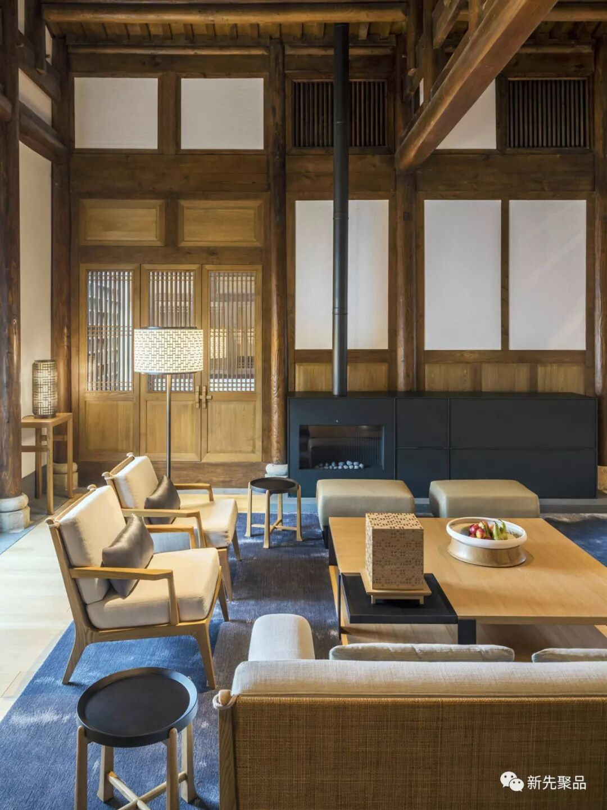 (原始链接: https://mmbiz.qpic.cn/mmbiz_jpg/dYyiavLsrKltUiaQ13ObCMtLxLSJPY3EHaXsV8wicx4C32fjdUyFT909iaKYVH35TVYBzEveBYrESfOppqVYOg52xQ/640?wx_fmt=jpeg)
- 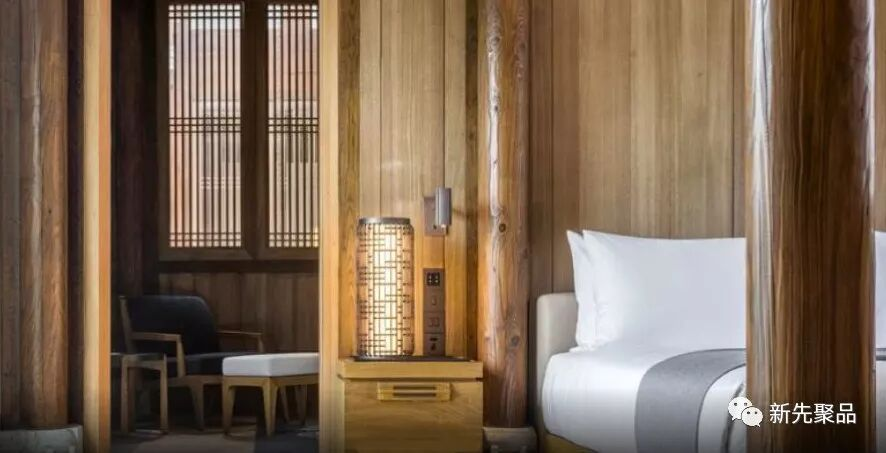 (原始链接: https://mmbiz.qpic.cn/mmbiz_jpg/dYyiavLsrKluqmjGGfsnTb93HmoPttMaoDrLhYeAk639Wtjacyib1du3VNLaG9DBJfFhAOWX3qcOR12FKdh5ibUgg/640?wx_fmt=jpeg)
-  (原始链接: https://mmbiz.qpic.cn/mmbiz_jpg/dYyiavLsrKluqmjGGfsnTb93HmoPttMaoJbjnpe3dchv0zueG8G48icjib8DficStvicvBiabUHOBuWSa0cj50Hp7R4Q/640?wx_fmt=jpeg)
- 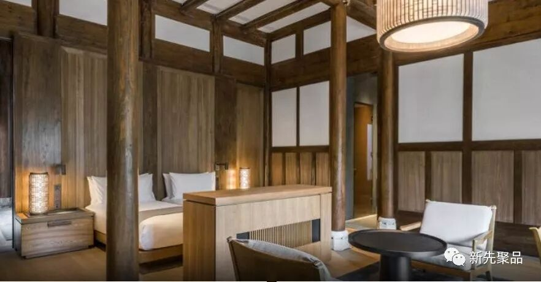 (原始链接: https://mmbiz.qpic.cn/mmbiz_jpg/dYyiavLsrKluqmjGGfsnTb93HmoPttMaohPeiciceKZR9HzgG5ibGBEIY9icSp65QhhvibjQ28QfSmpEO2rdZfwL9xQQ/640?wx_fmt=jpeg)
- 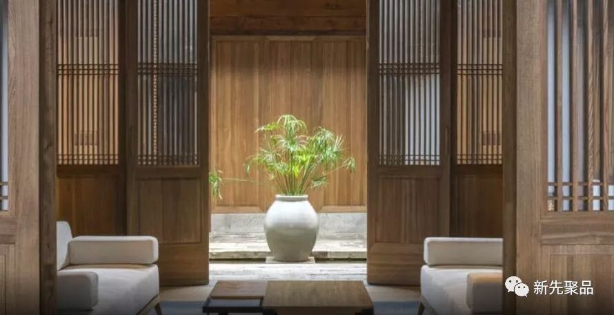 (原始链接: https://mmbiz.qpic.cn/mmbiz_jpg/dYyiavLsrKluqmjGGfsnTb93HmoPttMaoLNIRPVvNZXkoI1YefibAZ7j16V70TicEwGUUhibBTDqTj5wGTUlvAtweA/640?wx_fmt=jpeg)
- 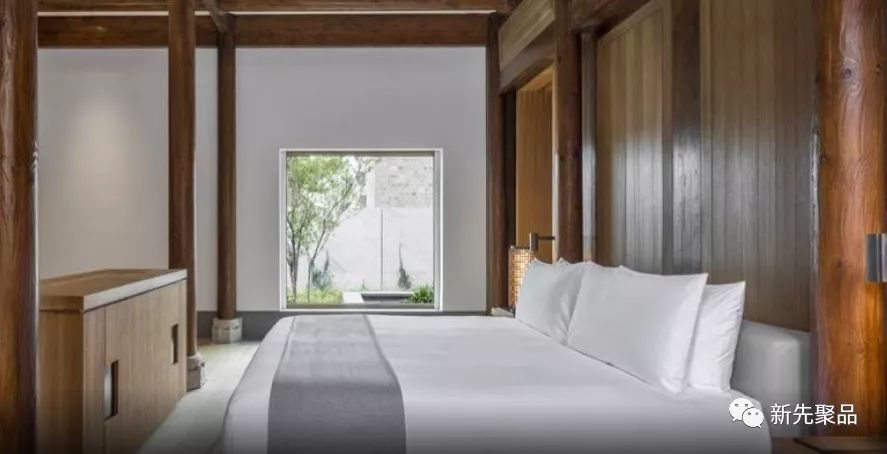 (原始链接: https://mmbiz.qpic.cn/mmbiz_jpg/dYyiavLsrKluqmjGGfsnTb93HmoPttMao5ic8jJib7pufD2BiaDDuEXJSqNG2qWUbiaX1ttOrUkzicRqsRT5LdOKICJQ/640?wx_fmt=jpeg)
- 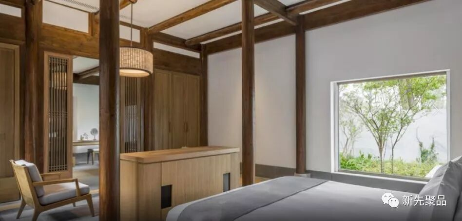 (原始链接: https://mmbiz.qpic.cn/mmbiz_jpg/dYyiavLsrKluqmjGGfsnTb93HmoPttMaosSOib9CSibcBh0kUvlic7sEHjFnGp1Y4t4TFLYzIQ3bnZ489EufgWJUFQ/640?wx_fmt=jpeg)
- 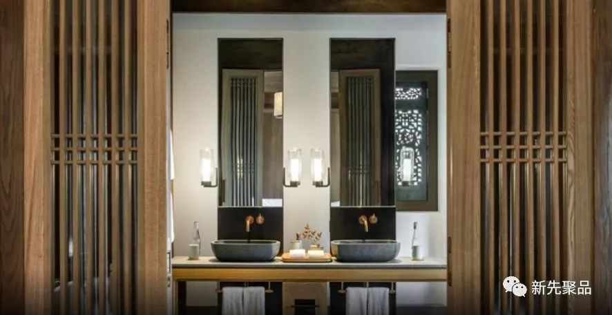 (原始链接: https://mmbiz.qpic.cn/mmbiz_jpg/dYyiavLsrKluqmjGGfsnTb93HmoPttMao6RDKTee3uDCAVtniaOh2PYZHDuHxXK9DKKLdBibcJUOjxEecHH5SmNyg/640?wx_fmt=jpeg)
