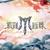
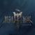
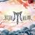

# 末路狂花 - 魏如萱 - 单曲 - 网易云音乐

**链接地址:** http://music.163.com/song/442869270?userid=1382311498
**作者:** 
**获取时间:** 2025/8/28 22:14:26
**图片数量:** 6

---

## 原始HTML内容

&nbsp;

&nbsp;

<i class="u-icn u-icn-95 f-fl"></i>
<a data-action="outchain" data-rt="" data-href="/outchain/2/442869270/" class="des s-fc7">生成外链播放器</a>

点击打开客户端

<i class="lab u-icn u-icn-37"></i>

<em class="f-ff2">末路狂花</em>
<i class="icn u-icn u-icn-87"></i>

歌手：<a class="s-fc7" href="/artist?id=9609">魏如萱</a>

所属专辑：<a href="/album?id=35016103" class="s-fc7">末路狂花</a>

<a class="u-btni u-btni-play u-btni-play-dis" title="由于版权保护，您所在的地区暂时无法使用。" href="javascript:;"><i>播放</i></a>
<a data-res-id="442869270" data-res-type="18" data-count="-1" data-fee="0" data-payed="0" data-pl="0" data-dl="0" data-cp="0" data-toast="false" data-st="-100" data-flag="260" data-res-action="fav" class="u-btni u-btni-fav " href="javascript:;">
<i>收藏</i>
</a>
<a data-res-id="442869270" data-res-type="18" data-count="-1" data-res-action="share" data-res-name="末路狂花" data-res-author="魏如萱" data-res-authors="" data-res-pic="" class="u-btni u-btni-share " href="javascript:;"><i>分享</i></a>
<a data-res-id="442869270" data-res-type="18" data-res-action="download" class="u-btni u-btni-dl " href="javascript:;"><i>下载</i></a>
<a data-res-action="comment" href="javascript:;" class="u-btni u-btni-cmmt "><i>评论</i></a>

<ins class="adsbydm" inner-prod="adbid" inner-width="200" inner-height="220" inner-src="https://iad.g.163.com/wa/ad?site=netease&amp;affiliate=music&amp;cat=detail&amp;type=logo200x220&amp;location=1" check-src="https://iad.g.163.com/wa/ad_check?site=netease&amp;affiliate=music&amp;cat=detail&amp;type=logo200x220&amp;location=1"></ins>

<h3 class="u-hd3">
包含这首歌的歌单
</h3>
<ul class="m-rctlist f-cb">
<li>

<a class="sname f-fs1 s-fc0" href="/playlist?id=6690063389" title="披荆斩棘5｜披荆斩棘2025｜歌曲合集" data-res-id="6690063389" data-res-type="13" data-res-action="log" data-res-data="recommendclick|0||song-playlist-recommend|442869270">披荆斩棘5｜披荆斩棘2025｜歌曲合集</a>

by<a class="nm nm f-thide s-fc3" href="/user/home?id=281641246" title="紫蓝粉_zlf_">紫蓝粉_zlf_</a>

</li>
<li>

<a class="sname f-fs1 s-fc0" href="/playlist?id=13994119040" title="披荆斩棘5/披哥第五季/披哥2025（更新中）" data-res-id="13994119040" data-res-type="13" data-res-action="log" data-res-data="recommendclick|1||song-playlist-recommend|442869270">披荆斩棘5/披哥第五季/披哥2025（更新中）</a>

by<a class="nm nm f-thide s-fc3" href="/user/home?id=5059461801" title="拾声的人">拾声的人</a>

</li>
<li>

<a class="sname f-fs1 s-fc0" href="/playlist?id=14120705604" title="披荆斩棘2025 | 燃爆舞台 原曲合集" data-res-id="14120705604" data-res-type="13" data-res-action="log" data-res-data="recommendclick|2||song-playlist-recommend|442869270">披荆斩棘2025 | 燃爆舞台 原曲合集</a>

by<a class="nm nm f-thide s-fc3" href="/user/home?id=13323554095" title="云综推荐官">云综推荐官</a>

</li>
</ul>
<h3 class="u-hd3">
相似歌曲
</h3>
<ul class="m-sglist f-cb">
<li>
</li><li class="f-cb">

<a href="/song?id=29343666" title="当时" class="s-fc1" data-res-id="29343666" data-res-type="18" data-res-action="log" data-res-data="recommendclick|0||song-song-recommend|442869270">当时</a>

<a class="s-fc4" href="/artist?id=10371">姚贝娜</a>

</li>

<li>
</li><li class="f-cb">

<a href="/song?id=2015088676" title="成人童话" class="s-fc1" data-res-id="2015088676" data-res-type="18" data-res-action="log" data-res-data="recommendclick|1||song-song-recommend|442869270">成人童话</a>

<a class="s-fc4" href="/artist?id=34248962">李金科</a>

</li>

<li>
</li><li class="f-cb">

<a href="/song?id=385534" title="好朋友应该做的芭乐事" class="s-fc1" data-res-id="385534" data-res-type="18" data-res-action="log" data-res-data="recommendclick|2||song-song-recommend|442869270">好朋友应该做的芭乐事</a>

<a class="s-fc4" href="/artist?id=13191">旺福</a>

</li>

<li>
</li><li class="f-cb">

<a href="/song?id=223770" title="挂在半梦半醒之间" class="s-fc1" data-res-id="223770" data-res-type="18" data-res-action="log" data-res-data="recommendclick|3||song-song-recommend|442869270">挂在半梦半醒之间</a>

<a class="s-fc4" href="/artist?id=7535">戴佩妮</a>

</li>

<li>
</li><li class="f-cb">

<a href="/song?id=2628660768" title="坏人好梦" class="s-fc1" data-res-id="2628660768" data-res-type="18" data-res-action="log" data-res-data="recommendclick|4||song-song-recommend|442869270">坏人好梦</a>

<a class="s-fc4" href="/artist?id=5379">韦礼安</a>

</li>

</ul>

<h3 class="u-hd3">
网易云音乐多端下载
</h3>
<ul class="bg f-cb">
<li><a data-res-action="bilog" data-log-action="downloadapp" data-log-json="{&quot;type&quot;:&quot;iPhone&quot;,&quot;source&quot;:&quot;detail&quot;}" href="https://itunes.apple.com/cn/app/id590338362" class="ios" hidefocus="true" target="_blank">iPhone</a></li>
<li><a data-res-action="bilog" data-log-action="downloadapp" data-log-json="{&quot;type&quot;:&quot;pc&quot;,&quot;source&quot;:&quot;detail&quot;}" href="https://music.163.com/api/pc/package/download/latest" class="pc" hidefocus="true" target="_blank">PC</a></li>
<li><a data-res-action="bilog" data-log-action="downloadapp" data-log-json="{&quot;type&quot;:&quot;android&quot;,&quot;source&quot;:&quot;detail&quot;}" href="https://music.163.com/api/android/download/latest2" class="aos" hidefocus="true" target="_blank">Android</a></li>
</ul>

同步歌单，随时畅听好音乐

<h3 class="u-hd3">
用户wiki
</h3>
<a class="wiki-edit" style="margin-top:-6px;" href="/#/wiki/song?songId=442869270&amp;type=1" target="_blank">

补充或修改歌曲资料
</a>
<a class="wiki-edit f-mgt5" href="/#/wiki/task-center/m/st/wiki/task-center/recommend" target="_blank">

用户wiki任务中心
</a>

<ul class="enter">
<li class="unit">

音乐开放平台
</li>
<li class="unit">

云村交易所
</li>
<li class="unit">

X StudioAI歌手
</li>
<li class="unit">

用户认证
</li>
<li class="unit">

AI 免费写歌
</li>
<li class="unit">

云推歌
</li>
<li class="unit">

赞赏
</li>
</ul>

<a href="//st.music.163.com/official-terms/service" target="_blank" class="item s-fc3">服务条款</a>|
<a href="//st.music.163.com/official-terms/privacy" target="_blank" class="item s-fc3">隐私政策</a>|
<a href="//st.music.163.com/official-terms/children" target="_blank" class="item s-fc3">儿童隐私政策</a>|
<a href="//music.163.com/st/staticdeal/complaints.html" target="_blank" class="item s-fc3">版权投诉</a>|
<a href="http://ir.music.163.com" target="_blank" class="item s-fc3">投资者关系</a>|
<a href="https://music.163.com/ui/resource" rel="noopener noreferrer" target="_blank" class="item s-fc3">广告合作</a>
|
<a onclick="nm.x.biLog('click', {mspm:'61f261f4b99b0d5882ce3a78',page:'web_netease_music_homepage',target:'base_fast_access'});return true;" href="//mp.music.163.com/600948c936c13f4d09752e73/contact-us-web/index.html?source=Music-Main-Station" target="_blank" class="s-fc3">联系我们</a>

<a href="https://jubao.163.com" target="_blank" class="sep alink s-fc3">廉正举报</a>
不良信息举报邮箱: 51jubao@service.netease.com

互联网宗教信息服务许可证：浙（2022）0000120
增值电信业务经营许可证：浙B2-20150198
<a href="https://beian.miit.gov.cn/#/Integrated/index" rel="noopener noreferrer" target="_blank" class="alink s-fc3">粤B2-20090191-18&nbsp;&nbsp;浙ICP备15006616号-4&nbsp;&nbsp;工业和信息化部备案管理系统网站</a>

网易公司版权所有©1997-2025杭州乐读科技有限公司运营：<a href="https://p6.music.126.net/obj/wonDlsKUwrLClGjCm8Kx/34942157981/2e30/30c1/ad1f/7be053a28e91dd8bafe49bdf6455cb2a.png" target="_blank" class="alink s-fc3">浙网文[2024] 0900-042号</a>
<a href="http://www.beian.gov.cn/portal/registerSystemInfo?recordcode=33010902002564" rel="noopener noreferrer" target="_blank" class="alink s-fc3 police-link">

浙公网安备 33010802013307号
</a>
<a href="https://y.music.163.com/m/at/661f2af6e36f7c50ead8994b" rel="noopener noreferrer" target="_blank" class="alink s-fc3 police-link">
算法服务公示信息
</a>

<a title="回到顶部" class="m-back" href="#" id="g_backtop" hidefocus="true" style="display:none;">回到顶部</a>

 
 <textarea name="jst" id="ntp-login-nav" style="display:none;">&lt;div class="lyct lyct-1 f-pr"&gt;
{if degrade}
&lt;div class="login-list" style="min-height:332px"&gt;
&lt;div class="n-log2 n-log2-1 f-cb"&gt;
&lt;div class="u-main"&gt;
&lt;div class="u-plt"&gt;&lt;/div&gt;
&lt;div class="f-mgt10"&gt;
&lt;a href="javascript:;" data-action="login" data-type="mobile" class="u-btn2 u-btn2-2"&gt;&lt;i&gt;手机号登录&lt;/i&gt;&lt;/a&gt;
&lt;/div&gt;
&lt;div class="f-mgt10"&gt;
&lt;a href="javascript:;" class="u-btn2 u-btn2-1" data-action="reg"&gt;&lt;i&gt;注　册&lt;/i&gt;&lt;/a&gt;
&lt;/div&gt;
&lt;/div&gt;
&lt;div class="u-alt"&gt;
&lt;ul&gt;
&lt;li&gt;&lt;a href="https://music.163.com/api/sns/authorize?snsType=10&amp;clientType=web2&amp;callbackType=Login&amp;forcelogin=true" target="_blank" data-action="login" data-type="thirdparty"&gt;&lt;i class="u-mlg2 u-mlg2-wx"&gt;&lt;/i&gt;微信登录&lt;/a&gt;&lt;/li&gt;
&lt;li&gt;&lt;a href="https://music.163.com/api/sns/authorize?snsType=5&amp;clientType=web2&amp;callbackType=Login&amp;forcelogin=true" target="_blank" data-action="login" data-type="thirdparty"&gt;&lt;i class="u-mlg2 u-mlg2-qq"&gt;&lt;/i&gt;QQ登录&lt;/a&gt;&lt;/li&gt;
&lt;li&gt;&lt;a href="https://music.163.com/api/sns/authorize?snsType=2&amp;clientType=web2&amp;callbackType=Login&amp;forcelogin=true" target="_blank" data-action="login" data-type="thirdparty"&gt;&lt;i class="u-mlg2 u-mlg2-sn"&gt;&lt;/i&gt;微博登录&lt;/a&gt;&lt;/li&gt;
&lt;li&gt;&lt;a href="javascript:;" data-action="login" data-type="netease"&gt;&lt;i class="u-mlg2 u-mlg2-wy"&gt;&lt;/i&gt;网易邮箱账号登录&lt;/a&gt;&lt;/li&gt;
&lt;/ul&gt;
&lt;/div&gt;
&lt;div class="u-official-terms"&gt;
&lt;input type="checkbox" id="j-official-terms"&gt;
&lt;label for="j-official-terms" style="margin-left: 2px;"&gt;同意&lt;/label&gt;
&lt;a href="http://st.music.163.com/official-terms/service" target="_blank" style="color:#507DAF"&gt;《服务条款》&lt;/a&gt;
&lt;a href="http://st.music.163.com/official-terms/privacy" target="_blank" style="color:#507DAF"&gt;《隐私政策》&lt;/a&gt;
&lt;a href="https://st.music.163.com/official-terms/children" target="_blank" style="color:#507DAF"&gt;《儿童隐私政策》&lt;/a&gt;
&lt;/div&gt;
&lt;/div&gt;
&lt;/div&gt;
{else}
&lt;div class="login-list f-hide" style="min-height:332px"&gt;
&lt;div class="n-log2 n-log2-1 f-cb"&gt;
&lt;div class="u-main"&gt;
&lt;div class="u-plt"&gt;&lt;/div&gt;
&lt;div class="f-mgt10"&gt;
&lt;a href="javascript:;" data-action="login" data-type="mobile" class="u-btn2 u-btn2-2"&gt;&lt;i&gt;手机号登录&lt;/i&gt;&lt;/a&gt;
&lt;/div&gt;
&lt;div class="f-mgt10"&gt;
&lt;a href="javascript:;" class="u-btn2 u-btn2-1" data-action="reg"&gt;&lt;i&gt;注　册&lt;/i&gt;&lt;/a&gt;
&lt;/div&gt;
&lt;/div&gt;
&lt;div class="u-alt"&gt;
&lt;ul&gt;
&lt;li&gt;&lt;a href="https://music.163.com/api/sns/authorize?snsType=10&amp;clientType=web2&amp;callbackType=Login&amp;forcelogin=true" target="_blank" data-action="login" data-type="thirdparty"&gt;&lt;i class="u-mlg2 u-mlg2-wx"&gt;&lt;/i&gt;微信登录&lt;/a&gt;&lt;/li&gt;
&lt;li&gt;&lt;a href="https://music.163.com/api/sns/authorize?snsType=5&amp;clientType=web2&amp;callbackType=Login&amp;forcelogin=true" target="_blank" data-action="login" data-type="thirdparty"&gt;&lt;i class="u-mlg2 u-mlg2-qq"&gt;&lt;/i&gt;QQ登录&lt;/a&gt;&lt;/li&gt;
&lt;li&gt;&lt;a href="https://music.163.com/api/sns/authorize?snsType=2&amp;clientType=web2&amp;callbackType=Login&amp;forcelogin=true" target="_blank" data-action="login" data-type="thirdparty"&gt;&lt;i class="u-mlg2 u-mlg2-sn"&gt;&lt;/i&gt;微博登录&lt;/a&gt;&lt;/li&gt;
&lt;li&gt;&lt;a href="javascript:;" data-action="login" data-type="netease"&gt;&lt;i class="u-mlg2 u-mlg2-wy"&gt;&lt;/i&gt;网易邮箱账号登录&lt;/a&gt;&lt;/li&gt;
&lt;/ul&gt;
&lt;/div&gt;
&lt;div class="u-official-terms"&gt;
&lt;input type="checkbox" id="j-official-terms"&gt;
&lt;label for="j-official-terms" style="margin-left: 2px;"&gt;同意&lt;/label&gt;
&lt;a href="http://st.music.163.com/official-terms/service" target="_blank" style="color:#507DAF"&gt;《服务条款》&lt;/a&gt;
&lt;a href="http://st.music.163.com/official-terms/privacy" target="_blank" style="color:#507DAF"&gt;《隐私政策》&lt;/a&gt;
&lt;a href="https://st.music.163.com/official-terms/children" target="_blank" style="color:#507DAF"&gt;《儿童隐私政策》&lt;/a&gt;
&lt;/div&gt;
&lt;/div&gt;
&lt;div class="n-scan" data-action="scan"&gt;&lt;/div&gt;
&lt;/div&gt;
&lt;div class="lg n-login-scan" id="login-qrcode" style="min-height:332px"&gt;
&lt;div class="cnt"&gt;
&lt;div class="main j-flag"&gt;
&lt;div class="f-cb"&gt;
&lt;div class="phone"&gt;&lt;/div&gt;
&lt;div class="right"&gt;
&lt;div class="title"&gt;扫码登录&lt;/div&gt;
&lt;div class="qr"&gt;
&lt;div class="tip f-dn f-link j-flag f-hide"&gt;
&lt;p&gt;二维码已失效&lt;/p&gt;
&lt;a class="u-btn2" href="javascript:;" data-action="refresh"&gt;点击刷新&lt;/a&gt;
&lt;/div&gt;
&lt;div class="canvas f-pen j-flag"&gt;&lt;/div&gt;
&lt;/div&gt;
&lt;p class="txt j-flag"&gt;使用&nbsp;&lt;a class="download-link" href="/download" target="_blank"&gt;网易云音乐APP&lt;/a&gt;&nbsp;扫码登录&lt;/p&gt;
&lt;/div&gt;
&lt;/div&gt;
&lt;/div&gt;
&lt;div class="suc j-flag f-hide"&gt;
&lt;div class="suc-icon"&gt;&lt;/div&gt;
&lt;p class="suc-txt"&gt;扫描成功&lt;/p&gt;
&lt;/div&gt;
&lt;p class="confirm j-flag f-hide"&gt;请在手机上确认登录&lt;/p&gt;
&lt;div id="otherbtn" class="otherbtn"&gt;
&lt;a class="u-btn2 other f-hide" data-action="switch"&gt;选择其他登录模式&lt;/a&gt;
&lt;/div&gt;
&lt;/div&gt;
&lt;/div&gt;
{/if}
&lt;/div&gt;
</textarea>
<textarea name="ntp" id="ntp-login-mobile" style="display:none;">&lt;div class="lyct lyct-1"&gt;
&lt;div class="n-log2 n-log2-2"&gt;
&lt;div class="j-mob"&gt;&lt;/div&gt;
&lt;div class="pwdloginwrapper f-hide"&gt;
&lt;div class="f-mgt10 inputbox"&gt;
&lt;a href="javascript:;" class="f-fr s-fc3 forget" data-action="forget"&gt;忘记密码？&lt;/a&gt;
&lt;input type="password" name="pw" id="pw" class="j-pwd u-txt password" placeholder="请输入密码" autocomplete="new-password"&gt;
&lt;/div&gt;
&lt;div class="j-err u-err" style="display:none;"&gt;&lt;i class="u-icn u-icn-25"&gt;&lt;/i&gt;&lt;span&gt;&lt;/span&gt;&lt;/div&gt;
&lt;div class="f-mgt10 actionbox"&gt;
&lt;a href="javascript:;" class="f-fr s-fc3" data-action="captchalogin"&gt;短信登录&lt;/a&gt;
&lt;label class="s-fc3"&gt;&lt;input type="checkbox" checked="checked" class="j-auto u-auto"&gt;自动登录&lt;/label&gt;
&lt;/div&gt;
&lt;/div&gt;
&lt;div class="captchaloginwrapper"&gt;
&lt;div class="f-mgt10"&gt;
&lt;input style="box-sizing: content-box;" type="text" class="j-captcha js-input u-txt u-txt2" placeholder="请输入验证码" autocomplete="off" value=""&gt;
&lt;span class="js-cd u-cd f-hide"&gt;&lt;/span&gt;
&lt;a href="javascript:;" class="js-send u-btn2 u-btn2-1" data-action="send"&gt;&lt;i&gt;获取验证码&lt;/i&gt;&lt;/a&gt;
&lt;/div&gt;
&lt;div class="j-err u-err" style="display:none;"&gt;&lt;i class="u-icn u-icn-25"&gt;&lt;/i&gt;&lt;span&gt;&lt;/span&gt;&lt;/div&gt;
&lt;div class="f-mgt10 actionbox"&gt;
&lt;a href="javascript:;" class="f-fr s-fc3 f-hide pwdlogin" data-action="pwdlogin"&gt;密码登录&lt;/a&gt;
&lt;label class="s-fc3"&gt;&lt;input type="checkbox" checked="checked" class="j-auto u-auto"&gt;自动登录&lt;/label&gt;
&lt;/div&gt;
&lt;/div&gt;
&lt;div class="f-mgt20"&gt;
&lt;div id="pwd-captcha"&gt;&lt;/div&gt;
&lt;a class="j-primary u-btn2 u-btn2-2" hidefocus="true" href="#" data-action="login"&gt;&lt;i&gt;登　录&lt;/i&gt;&lt;/a&gt;
&lt;/div&gt;
&lt;/div&gt;
&lt;div class="js-btmbar n-loglink2 f-cb"&gt;
&lt;a href="javascript:;" data-action="select" class="f-fl s-primary"&gt;&lt;&nbsp;&nbsp;其他登录方式&lt;/a&gt;
&lt;a href="javascript:;" data-action="reg" class="f-fr"&gt;没有账号？免费注册&nbsp;&nbsp;&gt;&lt;/a&gt;
&lt;/div&gt;
&lt;/div&gt;
</textarea>
<textarea name="ntp" id="ntp-login-netease" style="display:none;">&lt;div class="lyct lyct-1 f-cb"&gt;
&lt;div class="n-log2 n-log2-2"&gt;
&lt;div class="f-pr" style="z-index:5;"&gt;
&lt;input type="text" name="e" id="e" class="js-input u-txt" placeholder="请输入账号" autocomplete="off"&gt;
&lt;ul class="js-suggest u-fill" style="visibility:hidden;"&gt;&lt;/ul&gt;
&lt;/div&gt;
&lt;div class="f-mgt10"&gt;
&lt;input type="password" name="epw" id="epw" class="js-input u-txt" placeholder="请输入密码" autocomplete="new-password"&gt;
&lt;/div&gt;
&lt;div class="js-captcha"&gt;&lt;/div&gt;
&lt;div class="ScapTcha js-scaptcha"&gt;&lt;/div&gt;
&lt;div class="u-err" style="display:none;"&gt;&lt;i class="u-icn u-icn-25"&gt;&lt;/i&gt;&lt;span&gt;&lt;/span&gt;&lt;/div&gt;
&lt;div class="f-mgt10"&gt;
&lt;label class="s-fc3"&gt;&lt;input type="checkbox" checked="checked" class="u-auto"&gt;自动登录&lt;/label&gt;
&lt;a href="//reg.163.com/getpasswd/RetakePassword.jsp" target="_blank" class="f-fr s-fc3"&gt;忘记密码？&lt;/a&gt;
&lt;/div&gt;
&lt;div class="f-mgt20"&gt;
&lt;a class="js-primary u-btn2 u-btn2-2" hidefocus="true" href="#" data-action="login"&gt;&lt;i&gt;登　录&lt;/i&gt;&lt;/a&gt;
&lt;/div&gt;
&lt;/div&gt;
&lt;div class="n-loglink2"&gt;&lt;a href="javascript:;" data-action="select" class="s-primary"&gt;&lt;&nbsp;&nbsp;其他登录方式&lt;/a&gt;&lt;/div&gt;
&lt;/div&gt;
</textarea>
<textarea name="jst" id="jst-login-suggest" style="display:none;">{list suggests as item}
&lt;li class="f-thide"&gt;&lt;a href="#" data-action="suggest" title="${item|escape}"&gt;${item|escape}&lt;/a&gt;&lt;/li&gt;
{/list}
</textarea>
<textarea name="ntp" id="ntp-reg-mobile" style="display:none;">&lt;div class="lyct lyct-1 f-cb"&gt;
&lt;div class="n-log2 n-log2-2"&gt;
&lt;div class="s-fc3"&gt;&lt;label&gt;手机号：&lt;/label&gt;&lt;/div&gt;
&lt;div class="j-mob f-mgt10"&gt;&lt;/div&gt;
&lt;div class="f-mgt10 s-fc3"&gt;&lt;label&gt;密码：&lt;/label&gt;&lt;/div&gt;
&lt;div class="f-mgt10"&gt;
&lt;input type="password" class="j-pwd u-txt" placeholder="设置登录密码，不少于8位" autocomplete="new-password"&gt;
&lt;/div&gt;
&lt;div class="j-err u-err"&gt;&lt;i class="u-icn u-icn-25"&gt;&lt;/i&gt;&lt;span&gt;&lt;/span&gt;&lt;/div&gt;
&lt;div class="pwd-validation f-hide"&gt;
&lt;div class="j-err u-err j-pwd-valid"&gt;&lt;i class="u-icn"&gt;&lt;/i&gt;&lt;span&gt;密码不能包含空格&lt;/span&gt;&lt;/div&gt;
&lt;div class="j-err u-err j-pwd-valid"&gt;&lt;i class="u-icn"&gt;&lt;/i&gt;&lt;span&gt;包含字母、数字、符号中至少两种&lt;/span&gt;&lt;/div&gt;
&lt;div class="j-err u-err j-pwd-valid"&gt;&lt;i class="u-icn"&gt;&lt;/i&gt;&lt;span&gt;密码长度为8-20位&lt;/span&gt;&lt;/div&gt;
&lt;/div&gt;
&lt;div class="f-mgt20"&gt;
&lt;a class="j-btn j-nextstep u-btn2 u-btn2-2" hidefocus="true" href="javascript:;" data-action="ok"&gt;&lt;i&gt;下一步&lt;/i&gt;&lt;/a&gt;
&lt;/div&gt;
&lt;/div&gt;
&lt;div class="n-loglink2"&gt;&lt;a href="javascript:;" data-action="back" class="s-primary"&gt;&lt;&nbsp;&nbsp;返回登录&lt;/a&gt;&lt;/div&gt;
&lt;/div&gt;
</textarea>
<textarea name="ntp" id="ntp-verifycaptcha" style="display:none;">&lt;div class="lyct lyct-1 f-cb"&gt;
&lt;div class="n-log2 n-log2-2"&gt;
&lt;p class="js-tip f-hide u-tip"&gt;云音乐将不再支持 &lt;strong class="s-fc1"&gt;腾讯微博&lt;/strong&gt; 登录方式，&lt;br/&gt;请绑定手机号，以免后续无法使用该账号&lt;/p&gt;
&lt;div class="js-mobwrap f-hide f-pdb20"&gt;
&lt;p class="s-fc3"&gt;你的手机号：&lt;strong class="s-fc1"&gt;+&lt;span class="js-code"&gt;&lt;/span&gt;&nbsp;&lt;span class="js-mob"&gt;&lt;/span&gt;&lt;/strong&gt;&lt;/p&gt;
&lt;p class="s-fc4 f-mgt5"&gt;为了安全，我们会给你发送短信验证码&lt;/p&gt;
&lt;/div&gt;
&lt;div class="js-mobwrap f-hide f-pdb10"&gt;
&lt;div class="s-fc3"&gt;&lt;label class="js-lbl"&gt;&lt;/label&gt;&lt;/div&gt;
&lt;div class="j-mob f-mgt10"&gt;&lt;/div&gt;
&lt;div class="s-fc3 f-mgt10"&gt;&lt;label&gt;验证码：&lt;/label&gt;&lt;/div&gt;
&lt;/div&gt;
&lt;div id="captcha-input"&gt;
&lt;/div&gt;
&lt;div class="f-mgt20"&gt;
&lt;a class="js-next u-btn2 u-btn2-2" hidefocus="true" href="#" data-action="next"&gt;&lt;i&gt;&lt;/i&gt;&lt;/a&gt;
&lt;/div&gt;
&lt;/div&gt;
&lt;div class="js-btmbar n-loglink2 f-cb f-hide"&gt;
&lt;a href="javascript:;" data-action="back" class="js-back f-hide f-fl s-primary"&gt;&lt;&nbsp;&nbsp;返回登录&lt;/a&gt;
&lt;/div&gt;
&lt;/div&gt;
</textarea>
<textarea name="ntp" id="ntp-oldphonecheck" style="display:none;">&lt;div class="lyct lyct-1 f-cb"&gt;
&lt;div class="n-log2 n-log2-2" style="width:250px;"&gt;
&lt;p class="js-tip f-hide u-tip"&gt;云音乐将不再支持 &lt;strong class="s-fc1"&gt;腾讯微博&lt;/strong&gt; 登录方式，&lt;br/&gt;请绑定手机号，以免后续无法使用该账号&lt;/p&gt;
&lt;div class="js-mobwrap f-hide f-pdb20"&gt;
&lt;p class="s-fc3"&gt;你的手机号：&lt;strong class="s-fc1"&gt;+&lt;span class="js-code"&gt;&lt;/span&gt;&nbsp;&lt;span class="js-mob"&gt;&lt;/span&gt;&lt;/strong&gt;&lt;/p&gt;
&lt;p class="s-fc4 f-mgt5"&gt;为了安全，我们会给你发送短信验证码&lt;/p&gt;
&lt;/div&gt;
&lt;div class="js-mobwrap f-pdb10"&gt;
&lt;div class="s-fc3"&gt;
&lt;label class="js-lbl"&gt;输入要解绑的完整手机号，用于验证您的身份&lt;/label&gt;
&lt;/div&gt;
&lt;div class="f-mgt10 clearfix"&gt;
&lt;div class="u-txtwrap"&gt;
&lt;input type="text" class="js-txt u-txt" placeholder="请输入手机号" style="padding: 5px 6px;float: none;width: 100%"&gt;
&lt;/div&gt;
&lt;/div&gt;
&lt;div class="u-err f-hide f-fl"&gt;
&lt;i class="u-icn u-icn-25"&gt;&lt;/i&gt;&lt;span class="errTxt"&gt;&lt;/span&gt;
&lt;/div&gt;
&lt;/div&gt;
&lt;div class="f-mgt20 f-tc"&gt;
&lt;a class="js-next u-btn2 u-btn2-2" hidefocus="true" href="javascript:void(0);" data-action="next"&gt;&lt;i&gt;下一步&lt;/i&gt;&lt;/a&gt;
&lt;/div&gt;
&lt;/div&gt;
&lt;div class="js-btmbar n-loglink2 f-cb f-hide"&gt;
&lt;a href="javascript:;" data-action="back" class="js-back f-hide f-fl s-primary"&gt;&lt;&nbsp;&nbsp;返回登录&lt;/a&gt;
&lt;a href="javascript:;" data-action="skip" class="js-skip f-hide f-fr"&gt;跳过&nbsp;&nbsp;&gt;&lt;/a&gt;
&lt;/div&gt;
&lt;/div&gt;
</textarea>
<textarea name="jst" id="m-verifycaptcha-input" style="display:none;">&lt;div class="f-cb"&gt;
&lt;input style="box-sizing: content-box;" type="text" class="js-input u-txt u-txt2" placeholder="请输入验证码" value=""&gt;
&lt;span class="js-cd u-cd f-hide"&gt;&lt;/span&gt;
&lt;a href="#" class="js-send u-btn2 u-btn2-1 f-hide" data-action="send"&gt;&lt;i&gt;获取验证码&lt;/i&gt;&lt;/a&gt;
&lt;div class="u-err"&gt;&lt;i class="u-icn u-icn-25"&gt;&lt;/i&gt;&lt;span&gt;&lt;/span&gt;&lt;/div&gt;
&lt;/div&gt;
</textarea>
<textarea name="jst" id="m-verifycaptcha-input2" style="display:none;">&lt;div class="f-cb"&gt;
&lt;div class="u-word"&gt;
&lt;input type="text" class="js-input u-txt u-txt3" value="" maxlength="1" data-index="0"&gt;
&lt;/div&gt;
&lt;div class="u-word"&gt;
&lt;input type="text" class="js-input u-txt u-txt3" value="" maxlength="1" data-index="1"&gt;
&lt;/div&gt;
&lt;div class="u-word"&gt;
&lt;input type="text" class="js-input u-txt u-txt3" value="" maxlength="1" data-index="2"&gt;
&lt;/div&gt;
&lt;div class="u-word"&gt;
&lt;input type="text" class="js-input u-txt u-txt3" value="" maxlength="1" data-index="3"&gt;
&lt;/div&gt;
&lt;/div&gt;
&lt;div class="send"&gt;
&lt;span class="js-cd u-btn u-btn2 f-hide"&gt;&lt;/span&gt;
&lt;a href="#" class="js-send u-btn f-hide" data-action="send" style="height:31px;"&gt;&lt;i&gt;获取验证码&lt;/i&gt;&lt;/a&gt;
&lt;/div&gt;
&lt;div class="u-err"&gt;&lt;i class="u-icn u-icn-25"&gt;&lt;/i&gt;&lt;span&gt;&lt;/span&gt;&lt;/div&gt;
</textarea>
<textarea name="ntp" id="ntp-setnickname" style="display:none;">&lt;div class="lyct lyct-1 f-cb"&gt;
&lt;div class="n-log2 n-log2-3"&gt;
&lt;p class="s-fc1 f-tc"&gt;取一个昵称，让大家记住你&lt;/p&gt;
&lt;div class="f-mgt20"&gt;
&lt;input type="text" class="js-flag u-txt" placeholder="昵称不少于4个字母或2个汉字"&gt;
&lt;/div&gt;
&lt;div class="f-cb ScapTcha js-flag" style="margin-top:10px;"&gt;&lt;/div&gt;
&lt;div class="u-err js-flag" class="f-hide"&gt;&lt;i class="u-icn u-icn-25"&gt;&lt;/i&gt;&lt;span&gt;&lt;/span&gt;&lt;/div&gt;
&lt;div class="f-mgt20"&gt;
&lt;a class="u-btn2 u-btn2-2 js-flag" hidefocus="true" href="#" data-action="ok"&gt;&lt;i&gt;完成注册，开启云音乐&lt;/i&gt;&lt;/a&gt;
&lt;/div&gt;
&lt;/div&gt;
&lt;/div&gt;
</textarea>
<textarea name="ntp" id="ntp-reg-setting" style="display:none;">&lt;div class="lyct lyct-1 f-cb"&gt;
&lt;div class="n-log2 n-log2-3"&gt;
&lt;p class="js-tip s-fc1 f-tc f-mg20"&gt;取一个昵称，让大家记住你&lt;/p&gt;
&lt;div class="f-mgt20"&gt;
&lt;input type="text" class="js-input u-txt" placeholder="昵称不少于4个字母或2个汉字"&gt;
&lt;/div&gt;
&lt;div class="u-err" class="f-hide"&gt;&lt;i class="u-icn u-icn-25"&gt;&lt;/i&gt;&lt;span&gt;&lt;/span&gt;&lt;/div&gt;
&lt;div class="f-mgt20"&gt;
&lt;a class="js-primary u-btn2 u-btn2-2" hidefocus="true" href="#" data-action="ok"&gt;&lt;i&gt;完成注册，开启云音乐&lt;/i&gt;&lt;/a&gt;
&lt;/div&gt;
&lt;/div&gt;
&lt;/div&gt;
</textarea>
<textarea name="ntp" id="ntp-setpassword" style="display:none;">&lt;div class="lyct lyct-1 f-cb"&gt;
&lt;div class="n-log2 n-log2-3"&gt;
&lt;p class="js-tip u-tip f-hide"&gt;云音乐将不再支持 &lt;strong class="s-fc1"&gt;腾讯微博&lt;/strong&gt; 登录方式，&lt;br/&gt;设置登录密码，以后可以使用手机号登录&lt;/p&gt;
&lt;p class="js-tip s-fc3 f-hide"&gt;你的手机号：&lt;strong class="s-fc1"&gt;+&lt;span class="js-code"&gt;&lt;/span&gt;&nbsp;&lt;span class="js-mob"&gt;&lt;/span&gt;&lt;/strong&gt;&lt;/p&gt;
&lt;p class="js-tip s-fc3 f-mg20 f-tc f-hide"&gt;设置密码后，可以直接用该手机号+密码登录&lt;/p&gt;
&lt;div class="f-mgt10"&gt;
&lt;input type="password" class="js-input u-txt f-mgt10" placeholder="设置登录密码，不少于8位" autocomplete="new-password"&gt;
&lt;/div&gt;
&lt;div class="u-err f-hide"&gt;&lt;i class="u-icn u-icn-25"&gt;&lt;/i&gt;&lt;span&gt;&lt;/span&gt;&lt;/div&gt;
&lt;div class="pwd-validation f-hide"&gt;
&lt;div class="j-err u-err j-pwd-valid"&gt;&lt;i class="u-icn"&gt;&lt;/i&gt;&lt;span&gt;密码不能包含空格&lt;/span&gt;&lt;/div&gt;
&lt;div class="j-err u-err j-pwd-valid"&gt;&lt;i class="u-icn"&gt;&lt;/i&gt;&lt;span&gt;包含字母、数字、符号中至少两种&lt;/span&gt;&lt;/div&gt;
&lt;div class="j-err u-err j-pwd-valid"&gt;&lt;i class="u-icn"&gt;&lt;/i&gt;&lt;span&gt;密码长度为8-20位&lt;/span&gt;&lt;/div&gt;
&lt;/div&gt;
&lt;div class="f-mgt20"&gt;
&lt;a class="js-primary u-btn2 u-btn2-2" hidefocus="true" href="#" data-action="ok"&gt;&lt;i&gt;&lt;/i&gt;&lt;/a&gt;
&lt;/div&gt;
&lt;/div&gt;
&lt;div class="js-btmbar n-loglink2 f-cb f-hide"&gt;
&lt;a href="javascript:;" data-action="skip" class="f-fr"&gt;跳过&nbsp;&nbsp;&gt;&lt;/a&gt;
&lt;/div&gt;
&lt;/div&gt;
</textarea>
<textarea name="txt" id="txt-login-captcha" style="display:none;">&lt;div class="f-mgt10"&gt;
&lt;input id="captcha" type="text" class="u-txt u-code j-flag" placeholder="请输入验证码"&gt;
&lt;img class="u-captcha j-flag" src=""&gt;
&lt;/div&gt;
</textarea>
<textarea name="ntp" id="m-captcha-layer" style="display:none;">&lt;div class="wrap"&gt;
&lt;p class="s-fc3"&gt;如果你不是机器人输入验证码一定没问题！&lt;/p&gt;
&lt;p class="input f-cb j-flag"&gt;
&lt;/p&gt;
&lt;div class="u-err f-hide j-flag"&gt;&lt;i class="u-icn u-icn-25"&gt;&lt;/i&gt;账号或密码错误&lt;/div&gt;
&lt;div class="btnwrap"&gt;
&lt;a data-action="ok" class="u-btn2 u-btn2-2 u-btn2-w2" hidefocus="true" href="javascript:;"&gt;&lt;i&gt;确 定&lt;/i&gt;&lt;/a&gt;
&lt;a data-action="cc" class="u-btn2 u-btn2-1 u-btn2-w2" hidefocus="true" href="javascript:;"&gt;&lt;i&gt;取消&lt;/i&gt;&lt;/a&gt;
&lt;/div&gt;
&lt;/div&gt;
</textarea>
<textarea name="ntp" id="wgt-phone-input" style="display:none;">&lt;div class="u-phonewrap"&gt;
&lt;a class="current" href="javascript:;" data-action="toggle"&gt;
&lt;span class="j-code"&gt;+86&lt;/span&gt;
&lt;span class="icn u-icn2 u-icn2-17"&gt;&lt;/span&gt;
&lt;/a&gt;
&lt;div class="txtwrap"&gt;
&lt;input style="box-sizing: content-box;" type="text" name="p" id="p" class="j-phone txt u-txt" placeholder="请输入手机号" autocomplete="off"&gt;
&lt;/div&gt;
&lt;ul class="j-list options f-hide"&gt;&lt;/ul&gt;
&lt;/div&gt;
</textarea>
<textarea name="jst" id="wgt-countrycode-item" style="display:none;">{list countries as x}
&lt;li class="itm f-cb" data-action="select" data-index="${x_index}"&gt;
&lt;span class="lt"&gt;${x.zh}&lt;/span&gt;
&lt;span class="rt"&gt;+${x.code}&lt;/span&gt;
&lt;/li&gt;
{/list}
</textarea>
<textarea name="ntp" id="ntp-loginverify" style="display:none;">&lt;div class="lyct lyct-1 f-cb"&gt;
&lt;div class="n-log2 n-log2-3"&gt;
&lt;div class="pic"&gt;&lt;/div&gt;
&lt;p class="s-fc1 f-tc"&gt;
由于你在非受信任的设备上登录，需要进行短信验证(&lt;span class="js-mobile"&gt;&lt;/span&gt;)
&lt;/p&gt;
&lt;div class="f-mgt20"&gt;
&lt;a class="u-btn2 u-btn2-2 js-flag" hidefocus="true" data-action="ok"&gt;&lt;i&gt;通过短信验证身份&lt;/i&gt;&lt;/a&gt;
&lt;/div&gt;
&lt;/div&gt;
&lt;/div&gt;
</textarea>

<textarea name="ntp" id="m-wgt-selector" style="display:none;">&lt;div class="u-slt f-pr"&gt;&lt;span class="curr f-thide"&gt;&lt;/span&gt;&lt;i class="btn"&gt;&lt;/i&gt;&lt;ul&gt;&lt;/ul&gt;&lt;/div&gt;
</textarea>
<textarea name="jst" id="m-wgt-selector-list" style="display:none;">{list data as x}&lt;li class="f-thide"&gt;&lt;a href="#" data-value="${x.v}" title="${x.t}"&gt;${x.t}&lt;/a&gt;&lt;/li&gt;{/list}
</textarea>
<textarea name="ntp" id="m-wgt-create" style="display:none;">&lt;div class="lyct m-crgd f-cb f-tc"&gt;
&lt;p&gt;歌单名：&lt;input type="text" class="u-txt j-flag"&gt;&lt;/p&gt;
&lt;div class="u-err f-vhide j-flag"&gt;&lt;i class="u-icn u-icn-25"&gt;&lt;/i&gt;错误提示&lt;/div&gt;
&lt;p class="tip s-fc4"&gt;可通过“收藏”将音乐添加到新歌单中&lt;/p&gt;
&lt;div class="btn"&gt;
&lt;a href="javascript:;" class="u-btn2 u-btn2-2 u-btn2-w2 j-flag" hidefocus="true"&gt;&lt;i&gt;新 建&lt;/i&gt;&lt;/a&gt;
&lt;a href="javascript:;" class="u-btn2 u-btn2-1 u-btn2-w2 j-flag" hidefocus="true"&gt;&lt;i&gt;取 消&lt;/i&gt;&lt;/a&gt;
&lt;/div&gt;
&lt;/div&gt;
</textarea>
<textarea name="ntp" id="m-wgt-comment" style="display:none;">&lt;div class="u-title u-title-1"&gt;
&lt;h3&gt;&lt;span class="f-ff2"&gt;评论&lt;/span&gt;&lt;/h3&gt;&lt;span class="sub s-fc3"&gt;共&lt;span class="j-flag"&gt;0&lt;/span&gt;条评论&lt;/span&gt;
&lt;/div&gt;
&lt;div class="m-cmmt"&gt;
&lt;div class="iptarea"&gt;
&lt;div class="head"&gt;&lt;img src="http://s4.music.126.net/style/web2/img/default/default_avatar.jpg?param=50y50"&gt;&lt;/div&gt;
&lt;div class="j-flag"&gt;&lt;/div&gt;
&lt;/div&gt;
&lt;div class="cmmts j-flag"&gt;&lt;/div&gt;
&lt;div class="j-flag"&gt;&lt;/div&gt;
&lt;div class="anon-comment j-flag"&gt;
&lt;div class="des"&gt;
&lt;span
class="title"
data-type="login"&gt;
登录
&lt;/span&gt;
&lt;span&gt;
后查看精彩评论
&lt;/span&gt;
&lt;/div&gt;
&lt;a
class="button"
href="javascript:void(0)"
data-type="login"&gt;
立即登录
&lt;/a&gt;
&lt;/div&gt;
&lt;/div&gt;
</textarea>
<textarea name="ntp" id="m-wgt-comment2" style="display:none;">&lt;div class="m-dynamic"&gt;
&lt;div class="dbox dbox-cmt"&gt;
&lt;span class="darr"&gt;&lt;i class="bd"&gt;◆&lt;/i&gt;&lt;i class="bg"&gt;◆&lt;/i&gt;&lt;/span&gt;
&lt;div class="m-cmmt m-cmmt-s"&gt;
&lt;div class="iptarea j-flag"&gt;
&lt;/div&gt;
&lt;div class="cmmts"&gt;
&lt;div class="j-flag"&gt;&lt;/div&gt;
&lt;div class="dmore dmore-cmt f-cb"&gt;
&lt;div class="dhas s-fc3"&gt;后面还有&lt;span class="j-flag"&gt;0&lt;/span&gt;条评论，&lt;a data-type="viewmore" class="s-fc3 f-ff1" href="javascript:void(0)"&gt;查看更多&gt;&lt;/a&gt;&lt;/div&gt;
&lt;a data-type="cc" class="dtoggle" href="javascript:void(0)"&gt;收起&lt;i data-type="cc" class="u-icn u-icn-61"&gt;&lt;/i&gt;&lt;/a&gt;
&lt;/div&gt;
&lt;/div&gt;
&lt;/div&gt;
&lt;/div&gt;
&lt;/div&gt;
</textarea>
<textarea name="ntp" id="m-wgt-comment3" style="display:none;">&lt;div class="dcmt"&gt;
&lt;p&gt;&lt;span class="f-fw1"&gt;评论&lt;/span&gt; (&lt;span class="j-flag"&gt;&lt;/span&gt;)&lt;/p&gt;
&lt;div class="m-cmmt m-cmmt-s"&gt;
&lt;div class="iptarea j-flag"&gt;
&lt;/div&gt;
&lt;div class="cmmts j-flag"&gt;
&lt;/div&gt;
&lt;div class="j-flag"&gt;
&lt;/div&gt;
&lt;/div&gt;
&lt;/div&gt;
</textarea>
<textarea name="jst" id="m-wgt-comment-item" style="display:none;"> {list beg..end as y}
{var x=xlist[y]}
{if !!x}
&lt;div id="${x.commentId|seed}" class="itm" data-id="${x.commentId}"&gt;
&lt;div class="head"&gt;
&lt;a href="/user/home?id=${x.user.userId}"&gt;&lt;img src="${x.user.avatarUrl}?param=50y50"&gt;&lt;/a&gt;
&lt;/div&gt;
&lt;div class="cntwrap"&gt;
&lt;div class=""&gt;
&lt;div class="cnt f-brk"&gt;
&lt;a href="/user/home?id=${x.user.userId}" class="s-fc7"&gt;${escape(x.user.nickname)}&lt;/a&gt;
{if x.user.avatarDetail &amp;&amp; x.user.avatarDetail.identityIconUrl}
&lt;img style="margin-right:5px;vertical-align:-2px;" width=13 height=13 src="${x.user.avatarDetail.identityIconUrl}" /&gt;
{/if}
{if x.user.vipRights}
{if x.user.vipRights.redplus &amp;&amp; x.user.vipRights.redplus.vipCode === 300 &amp;&amp; x.user.vipRights.redplus.rights &amp;&amp; x.user.vipRights.redplus.iconUrl}
&lt;img src="${x.user.vipRights.redplus.iconUrl}"
class="brand-tag brand-svip" /&gt;
{elseif x.user.vipRights.associator &amp;&amp; x.user.vipRights.associator.rights &amp;&amp; x.user.vipRights.redVipLevel}
{if x.user.vipRights.associator.iconUrl}
&lt;img src="${x.user.vipRights.associator.iconUrl}"
class="brand-tag brand-vip" /&gt;
{elseif x.user.vipRights.redVipLevel == 1}
{if useNewVipIcon}
&lt;img src="//p5.music.126.net/obj/wonDlsKUwrLClGjCm8Kx/31289771075/9cde/206c/1521/ae97069bf19817f1fff4e3afda1d3998.png"
class="brand-tag brand-vip" /&gt;
{else}
&lt;img src="//p6.music.126.net/obj/wo3DlcOGw6DClTvDisK1/4213922817/9124/a83c/7eb7/6d7d81b608bfb56d7fb286bd8eb72346.png"
class="brand-tag brand-vip" /&gt;
{/if}
{elseif x.user.vipRights.redVipLevel == 2}
{if useNewVipIcon}
&lt;img src="//p5.music.126.net/obj/wonDlsKUwrLClGjCm8Kx/31289779981/0735/9a76/996b/2b858ffcf51cb298412b566407c4cc75.png"
class="brand-tag brand-vip" /&gt;
{else}
&lt;img src="//p5.music.126.net/obj/wo3DlcOGw6DClTvDisK1/4213922900/5a1b/446b/b722/ec5a532c258824e8b59a45c166195e90.png"
class="brand-tag brand-vip" /&gt;
{/if}
{elseif x.user.vipRights.redVipLevel == 3}
{if useNewVipIcon}
&lt;img src="//p5.music.126.net/obj/wonDlsKUwrLClGjCm8Kx/31289796623/21a9/2cb2/8817/596f81c8bb28d1bca5f332ac3dc9a79e.png"
class="brand-tag brand-vip" /&gt;
{else}
&lt;img src="//p6.music.126.net/obj/wo3DlcOGw6DClTvDisK1/4213922957/d393/4206/8928/a082dd9a7e7bb69e84b138b8df7bbcd0.png"
class="brand-tag brand-vip" /&gt;
{/if}
{elseif x.user.vipRights.redVipLevel == 4}
{if useNewVipIcon}
&lt;img src="//p5.music.126.net/obj/wonDlsKUwrLClGjCm8Kx/31289814330/170d/189e/70cb/75a12e81f2f6f92407419e417e9777b0.png"
class="brand-tag brand-vip" /&gt;
{else}
&lt;img src="//p6.music.126.net/obj/wo3DlcOGw6DClTvDisK1/4213923065/dc4e/2b9c/7677/20a6644c6e3a093d7accce919ae7b169.png"
class="brand-tag brand-vip" /&gt;
{/if}
{elseif x.user.vipRights.redVipLevel == 5}
{if useNewVipIcon}
&lt;img src="//p5.music.126.net/obj/wonDlsKUwrLClGjCm8Kx/31289819871/cae8/cbb4/63e2/feee66e7a731f20d2ce7aab9e92d1f68.png"
class="brand-tag brand-vip" /&gt;
{else}
&lt;img src="//p5.music.126.net/obj/wo3DlcOGw6DClTvDisK1/4213923094/81eb/9288/68a5/a427a0dbf899d616c3f715272a71ee59.png"
class="brand-tag brand-vip" /&gt;
{/if}
{elseif x.user.vipRights.redVipLevel == 6}
{if useNewVipIcon}
&lt;img src="//p5.music.126.net/obj/wonDlsKUwrLClGjCm8Kx/31289839236/54ce/9c06/9eae/861f11a2e2666f34ad7f201e001d9221.png"
class="brand-tag brand-vip" /&gt;
{else}
&lt;img src="//p6.music.126.net/obj/wo3DlcOGw6DClTvDisK1/4213923139/f08a/c6ea/10ee/f7e2deef21937a1042e370c47525c956.png"
class="brand-tag brand-vip" /&gt;
{/if}
{elseif x.user.vipRights.redVipLevel == 7}
{if useNewVipIcon}
&lt;img src="//p5.music.126.net/obj/wonDlsKUwrLClGjCm8Kx/31289847457/5230/7279/6543/ee2a0c6b2941a9647669e3ca522c350a.png"
class="brand-tag brand-vip" /&gt;
{else}
&lt;img src="//p5.music.126.net/obj/wo3DlcOGw6DClTvDisK1/4213923212/f4f1/83be/e735/2099233f0f7b80e35aff0ab77374ee41.png"
class="brand-tag brand-vip" /&gt;
{/if}
{/if}
{elseif x.user.vipRights.musicPackage &amp;&amp; x.user.vipRights.musicPackage.rights}
{if x.user.vipRights.musicPackage.iconUrl}
&lt;img src="${x.user.vipRights.musicPackage.iconUrl}"
class="brand-tag brand-package" /&gt;
{else}
&lt;img src="//p1.music.126.net/G2KYG9JjrGGP5grSaXOZaw==/109951163309837705.png"
class="brand-tag brand-package" /&gt;
{/if}
{elseif x.user.vipRights.redVipAnnualCount &gt;= 1}
{if useNewVipIcon}
&lt;img src="//p6.music.126.net/obj/wonDlsKUwrLClGjCm8Kx/31290261228/d8c6/b0fb/b236/ccc907aabf076e224ac6f2ae76d045e3.png" class="brand-tag brand-vip"/&gt;
{else}
&lt;img src="//p1.music.126.net/y8pM-M1mytg6B1ThedCbJA==/109951163709550847.png" class="brand-tag brand-vip"/&gt;
{/if}
{elseif x.user.vipRights.associator &amp;&amp; x.user.vipRights.associator.rights}
{if useNewVipIcon}
&lt;img src="//p6.music.126.net/obj/wonDlsKUwrLClGjCm8Kx/31289879300/0ce6/0791/894f/2d90cb8ac138e4e4eda83f13d7979e88.png"
class="brand-tag brand-vip" /&gt;
{else}
&lt;img src="//p1.music.126.net/iOnYL-pAvH2LuQfStGOjfQ==/109951163709553273.png"
class="brand-tag brand-vip" /&gt;
{/if}
{/if}
{/if}
{if !!x.beRepliedUser}
&nbsp;回复&nbsp;&lt;a href="/user/home?id=${x.beRepliedUser.userId}" class="s-fc7"&gt;${escape(x.beRepliedUser.nickname)}&lt;/a&gt;
${getAuthIcon(x.beRepliedUser)}
{if x.beRepliedUser.vipRights}
{if x.beRepliedUser.vipRights.redplus &amp;&amp; x.beRepliedUser.vipRights.redplus.vipCode === 300 &amp;&amp; x.beRepliedUser.vipRights.redplus.rights &amp;&amp; x.beRepliedUser.vipRights.redplus.iconUrl}
&lt;img src="${x.beRepliedUser.vipRights.redplus.iconUrl}"
class="brand-tag brand-svip" /&gt;
{elseif x.beRepliedUser.vipRights.associator &amp;&amp; x.beRepliedUser.vipRights.associator.rights}
{if x.beRepliedUser.vipRights.redVipAnnualCount &gt;= 1}
{if useNewVipIcon}
&lt;img src="//p6.music.126.net/obj/wonDlsKUwrLClGjCm8Kx/31290261228/d8c6/b0fb/b236/ccc907aabf076e224ac6f2ae76d045e3.png" class="brand-tag brand-vip"/&gt;
{else}
&lt;img src="//p1.music.126.net/y8pM-M1mytg6B1ThedCbJA==/109951163709550847.png" class="brand-tag brand-vip"/&gt;
{/if}
{elseif x.beRepliedUser.vipRights.associator.iconUrl}
&lt;img src="${x.beRepliedUser.vipRights.associator.iconUrl}"
class="brand-tag brand-vip" /&gt;
{else}
{if useNewVipIcon}
&lt;img src="//p6.music.126.net/obj/wonDlsKUwrLClGjCm8Kx/31289879300/0ce6/0791/894f/2d90cb8ac138e4e4eda83f13d7979e88.png"
class="brand-tag brand-vip" /&gt;
{else}
&lt;img src="//p1.music.126.net/iOnYL-pAvH2LuQfStGOjfQ==/109951163709553273.png"
class="brand-tag brand-vip" /&gt;
{/if}
{/if}
{elseif x.beRepliedUser.vipRights.musicPackage &amp;&amp; x.beRepliedUser.vipRights.musicPackage.rights}
{if x.beRepliedUser.vipRights.musicPackage.iconUrl}
&lt;img src="${x.beRepliedUser.vipRights.musicPackage.iconUrl}"
class="brand-tag brand-package" /&gt;
{else}
&lt;img src="//p1.music.126.net/G2KYG9JjrGGP5grSaXOZaw==/109951163309837705.png"
class="brand-tag brand-package" /&gt;
{/if}
{/if}
{/if}
{/if}
：${getRichText(escape(x.content),'s-fc7')}
{if !!x.expressionUrl}
&lt;div class="u-expression"&gt;&lt;img src="${x.expressionUrl}?param=70y70"&gt;&lt;/img&gt;&lt;/div&gt;
{/if}
&lt;/div&gt;
&lt;/div&gt;
{if x.beReplied&amp;&amp;x.beReplied.length}
{var replied = x.beReplied[0]}
&lt;div class="que f-brk f-pr s-fc3"&gt;
&lt;span class="darr"&gt;&lt;i class="bd"&gt;◆&lt;/i&gt;&lt;i class="bg"&gt;◆&lt;/i&gt;&lt;/span&gt;
{if (replied &amp;&amp; replied.status&gt;=0) &amp;&amp; (replied.content || replied.expressionUrl)}
&lt;a class="s-fc7" href="/user/home?id=${replied.user.userId}"&gt;${replied.user.nickname}${getAuthIcon(replied.user)}&lt;/a&gt;
{if replied.user.vipRights}
{if replied.user.vipRights.redplus &amp;&amp; replied.user.vipRights.redplus.vipCode === 300 &amp;&amp; replied.user.vipRights.redplus.rights &amp;&amp; replied.user.vipRights.redplus.iconUrl}
&lt;img src="${replied.user.vipRights.redplus.iconUrl}" class="brand-tag brand-svip" /&gt;
{elseif replied.user.vipRights.associator &amp;&amp; replied.user.vipRights.associator.rights}
{if replied.user.vipRights.redVipAnnualCount &gt;= 1}
{if useNewVipIcon}
&lt;img src="//p6.music.126.net/obj/wonDlsKUwrLClGjCm8Kx/31290261228/d8c6/b0fb/b236/ccc907aabf076e224ac6f2ae76d045e3.png" class="brand-tag brand-vip"/&gt;
{else}
&lt;img src="//p1.music.126.net/y8pM-M1mytg6B1ThedCbJA==/109951163709550847.png" class="brand-tag brand-vip"/&gt;
{/if}
{elseif replied.user.vipRights.associator.iconUrl}
&lt;img src="${replied.user.vipRights.associator.iconUrl}"
class="brand-tag brand-vip" /&gt;
{else}
{if useNewVipIcon}
&lt;img src="//p6.music.126.net/obj/wonDlsKUwrLClGjCm8Kx/31289879300/0ce6/0791/894f/2d90cb8ac138e4e4eda83f13d7979e88.png"
class="brand-tag brand-vip" /&gt;
{else}
&lt;img src="//p1.music.126.net/iOnYL-pAvH2LuQfStGOjfQ==/109951163709553273.png"
class="brand-tag brand-vip" /&gt;
{/if}
{/if}
{elseif replied.user.vipRights.musicPackage &amp;&amp; replied.user.vipRights.musicPackage.rights}
{if replied.user.vipRights.musicPackage.iconUrl}
&lt;img src="${replied.user.vipRights.musicPackage.iconUrl}"
class="brand-tag brand-package" /&gt;
{else}
&lt;img src="//p1.music.126.net/G2KYG9JjrGGP5grSaXOZaw==/109951163309837705.png"
class="brand-tag brand-package" /&gt;
{/if}
{/if}
{/if}
：${getRichText(escape(replied.content),'s-fc7')}
{if !!replied.expressionUrl}
&lt;div class="u-expression"&gt;&lt;img src="${replied.expressionUrl}?param=70y70"&gt;&lt;/img&gt;&lt;/div&gt;
{/if}
{else}
该评论已删除
{/if}
&lt;/div&gt;
{/if}
&lt;div class="rp"&gt;
&lt;div class="time s-fc4"&gt;${timeformat(x.time)}&lt;/div&gt;
{if x.topCommentId}&lt;span class="top"&gt;音乐人置顶&lt;/span&gt;{/if}
{if canTop()&amp;&amp;GUser&amp;&amp;GUser.userId&amp;&amp;(GUser.userId==x.user.userId)}
&lt;span class="dlt"&gt;{if x.topCommentId}&lt;a href="javascript:void(0)" class="s-fc3" data-id="${x.commentId}" data-tid="${x.topCommentId}" data-type="canceltop"&gt;解除置顶&lt;/a&gt;{else}&lt;a href="javascript:void(0)" class="s-fc3" data-id="${x.commentId}" data-type="gotop"&gt;置顶评论&lt;/a&gt;{/if}&lt;span class="sep"&gt;|&lt;/span&gt;&lt;/span&gt;
{/if}
{if GUser&amp;&amp;GUser.userId&amp;&amp;(GUser.userId==x.user.userId||GUser.userId==resUserId)}
&lt;span class="dlt"&gt;&lt;a href="javascript:void(0)" class="s-fc3" data-id="${x.commentId}" {if x.topCommentId}data-tid="${x.topCommentId}" {/if}data-type="delete"&gt;删除&lt;/a&gt;&lt;span class="sep"&gt;|&lt;/span&gt;&lt;/span&gt;
{else}
&lt;span class="dlt"&gt;&lt;span style="display: none;" class="j-delete-comment"&gt;&lt;a href="javascript:void(0)" class="s-fc3" data-id="${x.commentId}" {if x.topCommentId}data-tid="${x.topCommentId}" {/if}data-type="delete"&gt;删除&lt;/a&gt;&lt;span class="sep"&gt;|&lt;/span&gt;&lt;/span&gt;&lt;/span&gt;
{/if}
{if GAllowRejectComment}
{if hot||!x.isRemoveHotComment}
&lt;span class="dlt"&gt;&lt;a href="javascript:void(0)" class="s-fc3" data-id="${x.commentId}" data-type="reject"&gt;移除精彩评论&lt;/a&gt;&lt;span class="sep"&gt;|&lt;/span&gt;&lt;/span&gt;
{else}
&lt;span class="s-fc3"&gt;已移除精彩评论&lt;/span&gt;&lt;span class="sep"&gt;|&lt;/span&gt;
{/if}
{/if}
{if !x.topCommentId}&lt;a data-id="${x.commentId}" data-type="{if !x.liked}like{else}unlike{/if}" href="javascript:void(0)"&gt;&lt;i class="zan u-icn2 u-icn2-{if x.liked}13{else}12{/if}"&gt;&lt;/i&gt;{if x.likedCount} (${getPlayCount(x.likedCount)}){/if}&lt;/a&gt;
&lt;span class="sep"&gt;|&lt;/span&gt;{/if}
&lt;a href="javascript:void(0)" class="s-fc3" data-id="${x.commentId}" data-type="reply"&gt;回复&lt;/a&gt;
&lt;/div&gt;
&lt;/div&gt;
&lt;/div&gt;
{/if}
{/list}
</textarea>
<textarea name="jst" id="m-wgt-comment-item-2" style="display:none;"> {list beg..end as y}
{var x=xlist[y]}
&lt;div class="itm" data-id="${x.commentId}"&gt;
&lt;div class="head"&gt;
&lt;a href="/user/home?id=${x.user.userId}"&gt;&lt;img src="${x.user.avatarUrl}?param=50y50"&gt;&lt;/a&gt;
&lt;/div&gt;
&lt;div class="cntwrap"&gt;
&lt;div class="cnt2 f-brk"&gt;
&lt;a href="/user/home?id=${x.user.userId}" class="s-fc7"&gt;${escape(x.user.nickname)}&lt;/a&gt;
{if x.user.avatarDetail &amp;&amp; x.user.avatarDetail.identityIconUrl}
&lt;img style="margin-right:5px;vertical-align:-2px;" width=13 height=13 src="${x.user.avatarDetail.identityIconUrl}" /&gt;
{/if}
{if x.user.vipRights}
{if x.user.vipRights.redplus &amp;&amp; x.user.vipRights.redplus.vipCode === 300 &amp;&amp; x.user.vipRights.redplus.rights &amp;&amp; x.user.vipRights.redplus.iconUrl}
&lt;img src="${x.user.vipRights.redplus.iconUrl}"
class="brand-tag brand-svip" /&gt;
{elseif x.user.vipRights.associator &amp;&amp; x.user.vipRights.associator.rights}
{if x.user.vipRights.associator.iconUrl}
&lt;img src="${x.user.vipRights.associator.iconUrl}"
class="brand-tag brand-vip" /&gt;
{elseif x.user.vipRights.redVipLevel == 1}
&lt;img src="//p6.music.126.net/obj/wo3DlcOGw6DClTvDisK1/4213922817/9124/a83c/7eb7/6d7d81b608bfb56d7fb286bd8eb72346.png"
class="brand-tag brand-vip" /&gt;
{elseif x.user.vipRights.redVipLevel == 2}
&lt;img src="//p5.music.126.net/obj/wo3DlcOGw6DClTvDisK1/4213922900/5a1b/446b/b722/ec5a532c258824e8b59a45c166195e90.png"
class="brand-tag brand-vip" /&gt;
{elseif x.user.vipRights.redVipLevel == 3}
&lt;img src="//p6.music.126.net/obj/wo3DlcOGw6DClTvDisK1/4213922957/d393/4206/8928/a082dd9a7e7bb69e84b138b8df7bbcd0.png"
class="brand-tag brand-vip" /&gt;
{elseif x.user.vipRights.redVipLevel == 4}
&lt;img src="//p6.music.126.net/obj/wo3DlcOGw6DClTvDisK1/4213923065/dc4e/2b9c/7677/20a6644c6e3a093d7accce919ae7b169.png"
class="brand-tag brand-vip" /&gt;
{elseif x.user.vipRights.redVipLevel == 5}
&lt;img src="//p5.music.126.net/obj/wo3DlcOGw6DClTvDisK1/4213923094/81eb/9288/68a5/a427a0dbf899d616c3f715272a71ee59.png"
class="brand-tag brand-vip" /&gt;
{elseif x.user.vipRights.redVipLevel == 6}
&lt;img src="//p6.music.126.net/obj/wo3DlcOGw6DClTvDisK1/4213923139/f08a/c6ea/10ee/f7e2deef21937a1042e370c47525c956.png"
class="brand-tag brand-vip" /&gt;
{elseif x.user.vipRights.redVipLevel == 7}
&lt;img src="//p5.music.126.net/obj/wo3DlcOGw6DClTvDisK1/4213923212/f4f1/83be/e735/2099233f0f7b80e35aff0ab77374ee41.png"
class="brand-tag brand-vip" /&gt;
{/if}
{elseif x.user.vipRights.musicPackage &amp;&amp; x.user.vipRights.musicPackage.rights}
{if x.user.vipRights.musicPackage.iconUrl}
&lt;img src="${x.user.vipRights.musicPackage.iconUrl}"
class="brand-tag brand-package" /&gt;
{else}
&lt;img src="//p1.music.126.net/G2KYG9JjrGGP5grSaXOZaw==/109951163309837705.png"
class="brand-tag brand-package" /&gt;
{/if}
{/if}
{/if}
{if !!x.beRepliedUser}
&nbsp;回复&nbsp;&lt;a href="/user/home?id=${x.beRepliedUser.userId}" class="s-fc7"&gt;${escape(x.beRepliedUser.nickname)}&lt;/a&gt;
${getAuthIcon(x.beRepliedUser)}
{if x.beRepliedUser.vipRights}
{if x.beRepliedUser.vipRights.redplus &amp;&amp; x.beRepliedUser.vipRights.redplus.vipCode === 300 &amp;&amp; x.beRepliedUser.vipRights.redplus.rights &amp;&amp; x.beRepliedUser.vipRights.redplus.iconUrl}
&lt;img src="${x.beRepliedUser.vipRights.redplus.iconUrl}" class="brand-tag brand-svip" /&gt;
{elseif x.beRepliedUser.vipRights.associator &amp;&amp; x.beRepliedUser.vipRights.associator.rights}
{if x.beRepliedUser.vipRights.redVipAnnualCount &gt;= 1}
&lt;img src="//p1.music.126.net/y8pM-M1mytg6B1ThedCbJA==/109951163709550847.png" class="brand-tag brand-vip"/&gt;
{elseif x.beRepliedUser.vipRights.associator.iconUrl}
&lt;img src="${x.beRepliedUser.vipRights.associator.iconUrl}"
class="brand-tag brand-vip" /&gt;
{else}
&lt;img src="//p1.music.126.net/iOnYL-pAvH2LuQfStGOjfQ==/109951163709553273.png"
class="brand-tag brand-vip" /&gt;
{/if}
{elseif x.beRepliedUser.vipRights.musicPackage &amp;&amp; x.beRepliedUser.vipRights.musicPackage.rights}
{if x.beRepliedUser.vipRights.musicPackage.iconUrl}
&lt;img src="${x.beRepliedUser.vipRights.musicPackage.iconUrl}"
class="brand-tag brand-package" /&gt;
{else}
&lt;img src="//p1.music.126.net/G2KYG9JjrGGP5grSaXOZaw==/109951163309837705.png"
class="brand-tag brand-package" /&gt;
{/if}
{/if}
{/if}
{/if}
：${getRichText(escape(x.content),'s-fc7')}
{if !!x.expressionUrl}
&lt;div class="u-expression"&gt;&lt;img src="${x.expressionUrl}?param=70y70"&gt;&lt;/img&gt;&lt;/div&gt;
{/if}
&lt;/div&gt;
{if x.beReplied&amp;&amp;x.beReplied.length}
{var replied = x.beReplied[0]}
&lt;div class="que f-brk f-pr s-fc3"&gt;
&lt;span class="darr"&gt;&lt;i class="bd"&gt;◆&lt;/i&gt;&lt;i class="bg"&gt;◆&lt;/i&gt;&lt;/span&gt;
{if replied&amp;&amp;replied.content}
&lt;a class="s-fc7" href="/user/home?id=${replied.user.userId}"&gt;${replied.user.nickname}${getAuthIcon(replied.user)}&lt;/a&gt;
{if replied.user.vipRights}
{if replied.user.vipRights.redplus &amp;&amp; replied.user.vipRights.redplus.vipCode === 300 &amp;&amp; replied.user.vipRights.redplus.rights &amp;&amp; replied.user.vipRights.redplus.iconUrl}
&lt;img src="${replied.user.vipRights.redplus.iconUrl}" class="brand-tag brand-svip" /&gt;
{elseif replied.user.vipRights.associator &amp;&amp; replied.user.vipRights.associator.rights}
{if replied.user.vipRights.redVipAnnualCount &gt;= 1}
&lt;img src="//p1.music.126.net/y8pM-M1mytg6B1ThedCbJA==/109951163709550847.png" class="brand-tag brand-vip"/&gt;
{elseif replied.user.vipRights.associator.iconUrl}
&lt;img src="${replied.user.vipRights.associator.iconUrl}"
class="brand-tag brand-vip" /&gt;
{else}
&lt;img src="//p1.music.126.net/iOnYL-pAvH2LuQfStGOjfQ==/109951163709553273.png"
class="brand-tag brand-vip" /&gt;
{/if}
{elseif replied.user.vipRights.musicPackage &amp;&amp; replied.user.vipRights.musicPackage.rights}
{if replied.user.vipRights.musicPackage.iconUrl}
&lt;img src="${replied.user.vipRights.musicPackage.iconUrl}"
class="brand-tag brand-package" /&gt;
{else}
&lt;img src="//p1.music.126.net/G2KYG9JjrGGP5grSaXOZaw==/109951163309837705.png"
class="brand-tag brand-package" /&gt;
{/if}
{/if}
{/if}
：${getRichText(escape(replied.content),'s-fc7')}
{else}
该评论已删除
{/if}
&lt;/div&gt;
{/if}
&lt;div class="rp"&gt;
&lt;div class="time s-fc4"&gt;${timeformat(x.time)}&lt;/div&gt;
{if GUser&amp;&amp;GUser.userId&amp;&amp;(GUser.userId==x.user.userId||GUser.userId==resUserId)}
&lt;span class="dlt"&gt;
&lt;a href="javascript:void(0)" class="s-fc3" data-id="${x.commentId}" data-type="delete"&gt;删除&lt;/a&gt;&lt;span class="sep"&gt;|&lt;/span&gt;
&lt;/span&gt;
{else}
&lt;span class="dlt"&gt;&lt;span style="display: none;" class="j-delete-comment"&gt;&lt;a href="javascript:void(0)" class="s-fc3" data-id="${x.commentId}" {if x.topCommentId}data-tid="${x.topCommentId}" {/if}data-type="delete"&gt;删除&lt;/a&gt;&lt;span class="sep"&gt;|&lt;/span&gt;&lt;/span&gt;&lt;/span&gt;
{/if}
&lt;a data-id="${x.commentId}" data-type="{if !x.liked}like{else}unlike{/if}" href="javascript:void(0)"&gt;&lt;i class="zan u-icn2 u-icn2-{if x.liked}13{else}12{/if}"&gt;&lt;/i&gt;{if x.likedCount} (${getPlayCount(x.likedCount)}){/if}&lt;/a&gt;
&lt;span class="sep"&gt;|&lt;/span&gt;
&lt;a href="javascript:void(0)" class="s-fc3" data-id="${x.commentId}" data-type="reply"&gt;回复&lt;/a&gt;
&lt;/div&gt;
&lt;/div&gt;
&lt;/div&gt;
{/list}
</textarea>
<textarea name="jst" id="m-wgt-input-1" style="display:none;"> &lt;div class="m-cmmtipt f-cb f-pr"&gt;
&lt;div class="u-txtwrap holder-parent f-pr"&gt;
&lt;textarea class="u-txt area j-flag" data-type="" placeholder="${placeholder}"&gt;&lt;/textarea&gt;
&lt;/div&gt;
&lt;div class="btns f-cb f-pr"&gt;
&lt;i class="icn u-icn u-icn-36 j-flag"&gt;&lt;/i&gt;&lt;i class="icn u-icn u-icn-41 j-flag"&gt;&lt;/i&gt;
&lt;a href="javascript:void(0)" class="btn u-btn u-btn-1 j-flag"&gt;评论&lt;/a&gt;
&lt;span class="zs s-fc4 j-flag"&gt;110/120&lt;/span&gt;
&lt;/div&gt;
&lt;div class="corr u-arr"&gt;&lt;em class="arrline"&gt;◆&lt;/em&gt;&lt;span class="arrclr"&gt;◆&lt;/span&gt;&lt;/div&gt;
&lt;/div&gt;
</textarea>
<textarea name="jst" id="m-wgt-input-2" style="display:none;"> &lt;div class="rept m-quk m-quk-1 f-pr"&gt;
&lt;div class="iner"&gt;
&lt;div class="corr u-arr u-arr-1"&gt;&lt;em class="arrline"&gt;◆&lt;/em&gt;&lt;span class="arrclr"&gt;◆&lt;/span&gt;&lt;/div&gt;
&lt;div class="m-cmmtipt m-cmmtipt-1 f-cb f-pr"&gt;
&lt;div class="u-txtwrap holder-parent f-pr j-wrap"&gt;
&lt;textarea class="u-txt area j-flag" placeholder="${placeholder}"&gt;&lt;/textarea&gt;
&lt;/div&gt;
&lt;div class="btns f-cb f-pr"&gt;
&lt;i class="icn u-icn u-icn-36 j-flag"&gt;&lt;/i&gt;&lt;i class="icn u-icn u-icn-41 j-flag"&gt;&lt;/i&gt;
&lt;a href="javascript:void(0)" class="btn u-btn u-btn-1 j-flag"&gt;回复&lt;/a&gt;
&lt;span class="zs s-fc4 j-flag"&gt;110/120&lt;/span&gt;
&lt;/div&gt;
&lt;/div&gt;
&lt;/div&gt;
&lt;/div&gt;
</textarea>
<textarea name="jst" id="m-wgt-input-3" style="display:none;"> &lt;div class="m-cmmtipt f-cb f-pr"&gt;
&lt;div class="u-txtwrap holder-parent f-pr"&gt;
&lt;textarea class="u-txt area j-flag" placeholder="${placeholder}"&gt;&lt;/textarea&gt;
&lt;/div&gt;
&lt;div class="btns f-cb f-pr"&gt;
&lt;i class="icn u-icn u-icn-36 j-flag"&gt;&lt;/i&gt;&lt;i class="icn u-icn u-icn-41 j-flag"&gt;&lt;/i&gt;
&lt;a class="btn u-btn u-btn-1 j-flag" href="javascript:void(0)"&gt;回复&lt;/a&gt;
&lt;span class="zs s-fc4 j-flag"&gt;110/120&lt;/span&gt;
&lt;/div&gt;
&lt;/div&gt;
</textarea>
<textarea name="jst" id="m-wgt-input-4" style="display:none;"> &lt;div class="m-cmmtipt f-cb f-pr"&gt;
&lt;div class="u-txtwrap f-pr"&gt;
&lt;textarea class="u-txt area j-flag"&gt;&lt;/textarea&gt;
&lt;/div&gt;
&lt;div class="btns f-cb f-pr"&gt;
&lt;i class="icn u-icn u-icn-36 j-flag"&gt;&lt;/i&gt;&lt;i class="icn u-icn u-icn-41 j-flag" style="display:none;"&gt;&lt;/i&gt;
&lt;a class="f-fr u-btn u-btn-1 j-flag" href="javascript:void(0)"&gt;发送&lt;/a&gt;&lt;span class="zs s-fc4 j-flag"&gt;110/120&lt;/span&gt;
&lt;/div&gt;
&lt;/div&gt;
</textarea>
<textarea name="jst" id="m-wgt-input-5" style="display:none;"> &lt;div class="m-cmmtipt f-cb f-pr"&gt;
&lt;div class="u-txtwrap holder-parent f-pr"&gt;
&lt;textarea class="u-txt area j-flag" placeholder="${placeholder}"&gt;&lt;/textarea&gt;
&lt;/div&gt;
&lt;div class="btns f-cb f-pr"&gt;
&lt;i class="icn u-icn u-icn-36 j-flag"&gt;&lt;/i&gt;&lt;i class="icn u-icn u-icn-41 j-flag"&gt;&lt;/i&gt;
&lt;a class="btn u-btn u-btn-1 j-flag" href="javascript:void(0)"&gt;评论&lt;/a&gt;
&lt;span class="zs s-fc4 j-flag"&gt;110/120&lt;/span&gt;
&lt;/div&gt;
&lt;/div&gt;
</textarea>
<textarea name="jst" id="m-wgt-input-6" style="display:none;"> &lt;div class="m-cmmtipt f-cb f-pr"&gt;
&lt;div class="u-txtwrap holder-parent f-pr"&gt;
&lt;textarea class="u-txt area j-flag" placeholder="${placeholder}"&gt;&lt;/textarea&gt;
&lt;/div&gt;
&lt;div class="btns f-cb f-pr"&gt;
&lt;i class="icn u-icn u-icn-36 j-flag"&gt;&lt;/i&gt;&lt;i class="icn u-icn u-icn-41 j-flag"&gt;&lt;/i&gt;
&lt;a class="btn u-btn u-btn-1 j-flag" href="javascript:void(0)"&gt;发送&lt;/a&gt;
&lt;span class="zs s-fc4 j-flag"&gt;110/120&lt;/span&gt;
&lt;/div&gt;
&lt;/div&gt;
</textarea>
<textarea name="ntp" id="m-wgt-subscribe" style="display:none;">&lt;div class="lyct lyct-1 m-favgd f-cb"&gt;
&lt;div class="tit j-flag"&gt;&lt;i class="u-icn u-icn-33"&gt;&lt;/i&gt;新歌单&lt;/div&gt;
&lt;div class="j-flag"&gt;
&lt;div class="u-load s-fc4"&gt;&lt;i class="icn"&gt;&lt;/i&gt; 加载中...&lt;/div&gt;
&lt;/div&gt;
&lt;/div&gt;
</textarea>
<textarea name="jst" id="m-wgt-subscribe-item" style="display:none;">&lt;ul&gt;
{list beg..end as y}
{var x=xlist[y]}
&lt;li data-id="${x.id}" class="xtag {if x.trackCount+size&gt;10000}dis{/if}"&gt;
&lt;div class="item f-cb"&gt;
&lt;div class="left"&gt;
&lt;a href="javascript:void(0)" class="avatar" target="_blank"&gt;
&lt;img alt="" src="${x.coverImgUrl}?param=40y40"&gt;
{if x.highQuality}&lt;i class="u-jp u-icn2 u-icn2-jp5"&gt;&lt;/i&gt;{/if}
&lt;/a&gt;
&lt;/div&gt;
&lt;p class="name f-thide"&gt;&lt;a class="s-fc0" href="javascript:void(0)" target="_blank"&gt;${escape(cutStr(x.name,40))}&lt;/a&gt;&lt;/p&gt;
&lt;p class="s-fc3"&gt;${x.trackCount}首&lt;/p&gt;
{if x.trackCount+size&gt;10000}&lt;p class="limit"&gt;歌单已满&lt;/p&gt;{/if}
&lt;/div&gt;
&lt;/li&gt;
{/list}
&lt;/ul&gt;
</textarea>
<textarea name="ntp" id="m-wgt-forward" style="display:none;">&lt;div class="lyct lyct-1 f-cb"&gt;
&lt;div class="m-lyshare"&gt;
&lt;div class="u-txtwrap f-pr"&gt;
&lt;label style="display: block;" class="j-flag"&gt;说点什么&lt;/label&gt;
&lt;textarea class="u-txt area j-flag" text = &gt;&lt;/textarea&gt;
&lt;/div&gt;
&lt;div class="oper f-cb j-flag"&gt;
&lt;div class="face f-fl f-pr"&gt;
&lt;i class="u-icn u-icn-36 f-fl j-flag"&gt;&lt;/i&gt;
&lt;i class="u-icn u-icn-41 j-flag"&gt;&lt;/i&gt;
&lt;/div&gt;
&lt;span class="zs f-fr s-fc3 j-flag"&gt;140&lt;/span&gt;
&lt;/div&gt;
&lt;div class="btnwrap"&gt;
&lt;a class="u-btn2 u-btn2-2 u-btn2-w2 j-flag" hidefocus="true" href="#"&gt;&lt;i&gt;转发&lt;/i&gt;&lt;/a&gt;
&lt;a class="u-btn2 u-btn2-1 u-btn2-w2 j-flag" hidefocus="true" href="#"&gt;&lt;i&gt;取消&lt;/i&gt;&lt;/a&gt;
&lt;/div&gt;
&lt;div class="j-flag u-err"&gt;&lt;i class="u-icn u-icn-25"&gt;&lt;/i&gt;&lt;span&gt;&lt;/span&gt;&lt;/div&gt;
&lt;/div&gt;
&lt;/div&gt;
</textarea>
<textarea name="ntp" id="m-import-ok" style="display:none;">&lt;div class="lyct f-cb f-tc"&gt;
&lt;p class="f-fs3 f-ff2"&gt;&lt;i class="u-icn u-icn-76"&gt;&lt;/i&gt;&nbsp;&nbsp;歌曲同步完成&lt;/p&gt;
&lt;div class="lybtn"&gt;
&lt;a href="javascript:;" class="u-btn2 u-btn2-2 j-flag" hidefocus="true"&gt;&lt;i&gt;查看我的音乐&lt;/i&gt;&lt;/a&gt;
&lt;/div&gt;
&lt;/div&gt;
</textarea>
<textarea name="jst" id="m-wgt-atlist" style="display:none;"> &lt;div class="u-atlist"&gt;
{if suggests.length == 0}
&lt;p&gt;轻敲空格完成输入&lt;/p&gt;
{else}
&lt;p&gt;选择最近@的人或直接输入&lt;/p&gt;
{/if}
&lt;div class="lst"&gt;
{list suggests as suggest}
&lt;a href="javascript:;" data-index=${suggest_index} class="f-thide j-sgt"&gt;${suggest.nickname}&lt;/a&gt;
{/list}
&lt;/div&gt;
&lt;/div&gt;
</textarea>
<textarea name="jst" id="m-wgt-receiverInput" style="display:none;"> &lt;div class="ct f-pr"&gt;
&lt;div class="u-txtwrap f-pr"&gt;
&lt;div class="u-txt txtwrap j-flag"&gt;
{if receiver}
&lt;div class="blk s-fc3 j-receiver"&gt;${receiver.nickname}&lt;a href="#" class="cls" title="删除"&gt;×&lt;/a&gt;&lt;/div&gt;
{/if}
&lt;span class="holder-parent j-flag" style="float:left"&gt;
&lt;input type="text" class="txt j-flag" /&gt;
&lt;label class="holder j-flag"&gt;选择或输入好友昵称&lt;/label&gt;
&lt;/span&gt;
&lt;/div&gt;
&lt;/div&gt;
&lt;ul class="full j-flag" style="_height:182px;display:none"&gt;
{list users as user}
&lt;li class="j-item" data-userId=${user.userId} data-username=${user.nickname} data-index=${user_index}&gt;&lt;a href="#"&gt;&lt;img src=${user.avatarUrl}&gt;${user.nickname}&lt;/a&gt;&lt;/li&gt;
{/list}
&lt;/ul&gt;
&lt;div class="j-flag" style="position:absolute;left: -1000px;width:auto;"&gt;&lt;/div&gt;
&lt;/div&gt;
</textarea>
<textarea name="jst" id="m-wgt-receiverList" style="display:none;"> {list users as user}
&lt;li class="j-item" data-userId=${user.userId} data-username=${user.nickname} data-index=${user_index}&gt;&lt;a href="#"&gt;&lt;img src=${user.avatarUrl}&gt;${user.nickname}&lt;/a&gt;&lt;/li&gt;
{/list}
</textarea>
<textarea name="ntp" id="m-wgt-sharewin" style="display:none;">&lt;div class="lyct lyct-1 f-cb"&gt;
&lt;div class="m-lyshare"&gt;
&lt;ul class="m-tabs1 j-flag"&gt;
&lt;li&gt;&lt;a href="#"&gt;&lt;em&gt;分享给大家&lt;/em&gt;&lt;/a&gt;&lt;/li&gt;
&lt;li&gt;&lt;a href="#"&gt;&lt;em&gt;私信分享&lt;/em&gt;&lt;/a&gt;&lt;/li&gt;
&lt;/ul&gt;
&lt;div class="u-err j-flag" style="display:none"&gt;最多选择10位好友&lt;/div&gt;
&lt;div class="j-flag"&gt;&lt;/div&gt;
&lt;div class="j-slogan"&gt;&lt;/div&gt;
&lt;div class="u-txtwrap f-pr"&gt;
&lt;textarea class="u-txt area j-flag" placeholder="说点什么吧" data-action="txt"&gt;&lt;/textarea&gt;
&lt;div class="info f-pr j-flag" data-action="search"&gt;&lt;/div&gt;
&lt;/div&gt;
&lt;div class="oper f-cb"&gt;
&lt;div class="face f-fl f-pr"&gt;
&lt;i class="u-icn u-icn-36 f-fl j-flag" data-action="emot"&gt;&lt;/i&gt;
&lt;i class="u-icn u-icn-41 f-fl j-flag" data-action="at"&gt;&lt;/i&gt;
&lt;i class="u-icn u-icn-97 j-flag f-pr" data-action="upload" data-default&gt;&lt;/i&gt;
&lt;/div&gt;
&lt;span class="f-fr s-fc4 j-flag"&gt;140/140&lt;/span&gt;
&lt;/div&gt;
&lt;div class="f-cb j-flag"&gt;&lt;/div&gt;
&lt;div class="f-cb"&gt;
&lt;div class="btnwrap f-fl"&gt;
&lt;a class="u-btn2 u-btn2-2 u-btn2-w2 j-flag" hidefocus="true" href="javascript:;" data-action="share"&gt;&lt;i&gt;分享&lt;/i&gt;&lt;/a&gt;
&lt;a class="u-btn2 u-btn2-1 u-btn2-w2 j-flag" hidefocus="true" href="javascript:;" data-action="close"&gt;&lt;i&gt;取消&lt;/i&gt;&lt;/a&gt;
&lt;/div&gt;
&lt;div class="f-cb j-flag f-fr"&gt;
&lt;div class="share f-fr"&gt;
&lt;span class="f-fl s-fc3"&gt;同时分享到：&lt;/span&gt;
&lt;ul class="u-logo u-logo-s f-cb"&gt;
&lt;li&gt;&lt;a class="u-slg u-slg-sn j-t" data-action="sns" data-type="2" hidefocus="true" href="//music.163.com/api/sns/authorize?snsType=2&amp;clientType=web2&amp;callbackType=Binding&amp;forcelogin=true" title="新浪微博"&gt;&lt;/a&gt;&lt;/li&gt;
&lt;li&gt;&lt;a class="u-slg u-slg-db j-t" data-action="sns" data-type="3" hidefocus="true" href="//music.163.com/api/sns/authorize?snsType=3&amp;clientType=web2&amp;callbackType=Binding&amp;forcelogin=true" title="豆瓣网"&gt;&lt;/a&gt;&lt;/li&gt;
&lt;/ul&gt;
&lt;/div&gt;
&lt;/div&gt;
&lt;/div&gt;
&lt;div class="u-err j-flag"&gt;&lt;i class="u-icn u-icn-25"&gt;&lt;/i&gt;&lt;span&gt;&lt;/span&gt;&lt;/div&gt;
&lt;/div&gt;
&lt;/div&gt;
</textarea>
<textarea name="jst" id="m-search-suggest" style="display:none;">{macro listArtists(artists)}
{list artists as art}
${art.name|mark}&nbsp;
{/list}
{/macro}
&lt;div class="m-schlist"&gt;
&lt;p class="note s-fc3"&gt;&lt;a class="s-fc3 xtag" href="/search/#/?s=${keyword}&amp;type=1002"&gt;搜“${keyword|cutStr}” 相关用户&lt;/a&gt; &gt;&lt;/p&gt;
&lt;div class="rap"&gt;
{list result.order as index}
{var lst=result[index]}
{if !!lst&amp;&amp;!!lst.length}
&lt;div class="itm f-cb"&gt;
{if index=="songs"}
&lt;h3 class="hd"&gt;&lt;i class="icn u-icn u-icn-26"&gt;&lt;/i&gt;&lt;em class="f-fl"&gt;单曲&lt;/em&gt;&lt;/h3&gt;
&lt;ul class="{if index_index%2!=0}odd{/if} f-cb"&gt;
{list lst as song}
&lt;li&gt;
&lt;a class="s-fc0 f-thide xtag" href="/song?id=${song.id}"&gt;${song.name|mark}-${listArtists(song.artists)}&lt;/a&gt;
&lt;/li&gt;
{/list}
&lt;/ul&gt;
{elseif index=="artists"}
&lt;h3 class="hd"&gt;&lt;i class="icn u-icn u-icn-27"&gt;&lt;/i&gt;&lt;em class="f-fl"&gt;歌手&lt;/em&gt;&lt;/h3&gt;
&lt;ul class="{if index_index%2!=0}odd{/if} f-cb"&gt;
{list lst as artist}
&lt;li&gt;
&lt;a class="s-fc0 f-thide xtag" href="/artist?id=${artist.id}"&gt;${artist.name|mark}&lt;/a&gt;
&lt;/li&gt;
{/list}
&lt;/ul&gt;
{elseif index=="albums"}
&lt;h3 class="hd"&gt;&lt;i class="icn u-icn u-icn-28"&gt;&lt;/i&gt;&lt;em class="f-fl"&gt;专辑&lt;/em&gt;&lt;/h3&gt;
&lt;ul class="{if index_index%2!=0}odd{/if} f-cb"&gt;
{list lst as album}
&lt;li&gt;
&lt;a class="s-fc0 f-thide xtag" href="/album?id=${album.id}"&gt;${album.name|mark}{if album.artist}-${album.artist.name|mark}{/if}&lt;/a&gt;
&lt;/li&gt;
{/list}
&lt;/ul&gt;
{elseif index=="playlists"}
&lt;h3 class="hd"&gt;&lt;i class="icn u-icn u-icn-29"&gt;&lt;/i&gt;&lt;em class="f-fl"&gt;歌单&lt;/em&gt;&lt;/h3&gt;
&lt;ul class="{if index_index%2!=0}odd{/if} f-cb"&gt;
{list lst as playlist}
&lt;li&gt;
&lt;a class="s-fc0 f-thide xtag" href="/playlist?id=${playlist.id}"&gt;${playlist.name|mark}&lt;/a&gt;
&lt;/li&gt;
{/list}
&lt;/ul&gt;
{elseif index=="mvs"}
&lt;h3 class="hd"&gt;&lt;i class="icn u-icn u-icn-96"&gt;&lt;/i&gt;&lt;em class="f-fl"&gt;视频&lt;/em&gt;&lt;/h3&gt;
&lt;ul class="{if index_index%2!=0}odd{/if} f-cb"&gt;
{list lst as mv}
&lt;li&gt;
&lt;a class="s-fc0 f-thide xtag" href="/mv?id=${mv.id}"&gt;MV:${mv.name|mark}{if mv.artistName}-${mv.artistName|mark}{/if}&lt;/a&gt;
&lt;/li&gt;
{/list}
&lt;/ul&gt;
{/if}
&lt;/div&gt;
{/if}
{/list}
&lt;/div&gt;
&lt;/div&gt;
</textarea>
<textarea name="jst" id="m-search-suggest-anonymous" style="display:none;">{macro listArtists(artists)}
{list artists as art}
${art.name|mark}&nbsp;
{/list}
{/macro}
&lt;div class="m-schlist"&gt;
&lt;p class="note s-fc3"&gt;&lt;a class="s-fc3 xtag" href="/search/#/?s=${keyword}&amp;type=1002"&gt;搜“${keyword|cutStr}” 相关用户&lt;/a&gt; &gt;&lt;/p&gt;
&lt;div class="rap"&gt;
{list result.order as index}
{var lst=result[index]}
{if !!lst&amp;&amp;!!lst.length}
&lt;div class="itm f-cb"&gt;
{if index=="songs"}
&lt;h3 class="hd"&gt;&lt;i class="icn u-icn u-icn-26"&gt;&lt;/i&gt;&lt;em class="f-fl"&gt;单曲&lt;/em&gt;&lt;/h3&gt;
&lt;ul class="{if index_index%2!=0}odd{/if} f-cb"&gt;
{list lst as song}
&lt;li&gt;
&lt;a class="s-fc0 f-thide xtag" href="/login" data-action="bilog" data-log-action="impress" data-log-json='{"type":"loginLimit","from":"searchSuggest"}'&gt;${song.name|mark}-${listArtists(song.artists)}&lt;/a&gt;
&lt;/li&gt;
{/list}
&lt;/ul&gt;
{elseif index=="artists"}
&lt;h3 class="hd"&gt;&lt;i class="icn u-icn u-icn-27"&gt;&lt;/i&gt;&lt;em class="f-fl"&gt;歌手&lt;/em&gt;&lt;/h3&gt;
&lt;ul class="{if index_index%2!=0}odd{/if} f-cb"&gt;
{list lst as artist}
&lt;li&gt;
&lt;a class="s-fc0 f-thide xtag" href="/login" data-action="bilog" data-log-action="impress" data-log-json='{"type":"loginLimit","from":"searchSuggest"}'&gt;${artist.name|mark}&lt;/a&gt;
&lt;/li&gt;
{/list}
&lt;/ul&gt;
{elseif index=="albums"}
&lt;h3 class="hd"&gt;&lt;i class="icn u-icn u-icn-28"&gt;&lt;/i&gt;&lt;em class="f-fl"&gt;专辑&lt;/em&gt;&lt;/h3&gt;
&lt;ul class="{if index_index%2!=0}odd{/if} f-cb"&gt;
{list lst as album}
&lt;li&gt;
&lt;a class="s-fc0 f-thide xtag" href="/login" data-action="bilog" data-log-action="impress" data-log-json='{"type":"loginLimit","from":"searchSuggest"}'&gt;${album.name|mark}{if album.artist}-${album.artist.name|mark}{/if}&lt;/a&gt;
&lt;/li&gt;
{/list}
&lt;/ul&gt;
{elseif index=="playlists"}
&lt;h3 class="hd"&gt;&lt;i class="icn u-icn u-icn-29"&gt;&lt;/i&gt;&lt;em class="f-fl"&gt;歌单&lt;/em&gt;&lt;/h3&gt;
&lt;ul class="{if index_index%2!=0}odd{/if} f-cb"&gt;
{list lst as playlist}
&lt;li&gt;
&lt;a class="s-fc0 f-thide xtag" href="/login" data-action="bilog" data-log-action="impress" data-log-json='{"type":"loginLimit","from":"searchSuggest"}'&gt;${playlist.name|mark}&lt;/a&gt;
&lt;/li&gt;
{/list}
&lt;/ul&gt;
{elseif index=="mvs"}
&lt;h3 class="hd"&gt;&lt;i class="icn u-icn u-icn-96"&gt;&lt;/i&gt;&lt;em class="f-fl"&gt;视频&lt;/em&gt;&lt;/h3&gt;
&lt;ul class="{if index_index%2!=0}odd{/if} f-cb"&gt;
{list lst as mv}
&lt;li&gt;
&lt;a class="s-fc0 f-thide xtag" href="/login" data-action="bilog" data-log-action="impress" data-log-json='{"type":"loginLimit","from":"searchSuggest"}'&gt;MV:${mv.name|mark}{if mv.artistName}-${mv.artistName|mark}{/if}&lt;/a&gt;
&lt;/li&gt;
{/list}
&lt;/ul&gt;
{/if}
&lt;/div&gt;
{/if}
{/list}
&lt;/div&gt;
&lt;/div&gt;
</textarea>
<textarea name="jst" id="m-xwgt-share-infobar" style="display:none;">&lt;i class="highlight"&gt;&lt;/i&gt;&lt;div class="text f-fl f-fs1"&gt;&lt;p class="f-thide"&gt;${info|escape}&lt;/p&gt;&lt;/div&gt;
{if canChange}&lt;i class="f-fr icn u-icn2 u-icn2-arr"&gt;&lt;/i&gt;{/if}
</textarea>
<textarea name="jst" id="m-xwgt-share-videobar" style="display:none;">&lt;div class="text"&gt;
&lt;div class="cvr f-fl f-pr" style="background-image:url(${picUrl}?imageView&amp;thumbnail=107x60),url(${picUrl}?imageView&amp;thumbnail=107y60&amp;blur=30x15)"&gt;
&lt;/div&gt;
&lt;h3 class="f-thide f-fs1"&gt;${title}&lt;/h3&gt;
&lt;i class="f-fr icn u-icn2 u-icn2-arr"&gt;&lt;/i&gt;
&lt;/div&gt;
</textarea>
<textarea name="ntp" id="m-xwgt-share-upload" style="display:none;"> &lt;div class="f-pr choose f-cb"&gt;
&lt;ul class="pics f-pr f-cb j-flag"&gt;&lt;li class="f-pr add j-flag u-icn2 u-icn2-addimg" title="添加新图片"&gt;&lt;/li&gt;&lt;/ul&gt;
&lt;div class="f-pa tip s-fc6 j-flag"&gt;&lt;/div&gt;
&lt;/div&gt;
</textarea>
<textarea name="jst" id="m-xwgt-share-upload-preview" style="display:none;"> &lt;li class="pic f-pr{if fail} z-fail{/if}"&gt;
{if !fail}
&lt;i class="f-img icn"&gt;&lt;/i&gt;
{else}
&lt;div class="mask f-blk f-pa"&gt;&lt;/div&gt;&lt;div class="f-blk f-pa error"&gt;${fail}&lt;/div&gt;
{/if}
&lt;span class="del f-pa u-icn2 u-icn2-delimg" title="删除"&gt;&lt;/span&gt;
&lt;/li&gt;
</textarea>
<textarea name="jst" id="m-xwgt-share-upload-preview-img" style="display:none;">{if !fail}
&lt;img class="f-img" src="${url}?imageView&amp;thumbnail=80y80" draggable=false&gt;
{else}
&lt;div class="mask f-blk f-pa"&gt;&lt;/div&gt;&lt;div class="f-blk f-pa error"&gt;${fail}&lt;/div&gt;
{/if}
</textarea>
<textarea name="ntp" id="ntp-alert" style="display:none;">&lt;div class="lyct f-cb f-tc"&gt;
&lt;p class="f-fs1"&gt;
&lt;i class="u-icn u-icn-89 j-flag"&gt;&lt;/i&gt;
&lt;span class="f-fw1"&gt;&nbsp;&nbsp;&nbsp;&lt;span class="j-flag"&gt;&lt;/span&gt;&lt;/span&gt;
&lt;/p&gt;
&lt;p class="mesg j-flag"&gt;&nbsp;&lt;/p&gt;
&lt;div class="lybtn"&gt;
&lt;a href="javascript:;" class="u-btn2 u-btn2-2 u-btn2-w2 j-flag" hidefocus="true"&gt;&lt;i&gt;知道了&lt;/i&gt;&lt;/a&gt;
&lt;/div&gt;
&lt;/div&gt;
</textarea>
<textarea name="ntp" id="m-layer-commwin" style="display:none;">&lt;div class="lyct f-tc"&gt;
&lt;p class="j-t"&gt;&lt;i class="u-icn u-icn-90"&gt;&lt;/i&gt;&lt;/p&gt;
&lt;p class="j-t msg1"&gt;&lt;/p&gt;
&lt;/div&gt;
&lt;div class="j-t lsbtn f-tc"&gt;
&lt;a href="javascript:;" class="u-btn2 u-btn2-2 u-btn2-w2" hidefocus="true"&gt;&lt;i&gt;上传节目&lt;/i&gt;&lt;/a&gt;
&lt;/div&gt;
</textarea>
<textarea name="ntp" id="m-layer-delwin" style="display:none;">&lt;div class="lyct lyct-1 f-cb"&gt;
&lt;div class="n-log2 n-log2-4"&gt;
&lt;p class="js-tip u-tip-2"&gt;&lt;/p&gt;
&lt;div class="lybtn f-tc"&gt;
&lt;a href="javascript:;" class="u-btn2 u-btn2-2" hidefocus="true" data-action="ok"&gt;&lt;i&gt;删除&lt;/i&gt;&lt;/a&gt;
&lt;a href="javascript:;" class="u-btn2 u-btn2-1" hidefocus="true" data-action="cancel"&gt;&lt;i&gt;取消&lt;/i&gt;&lt;/a&gt;
&lt;/div&gt;
&lt;/div&gt;
&lt;/div&gt;
</textarea>
<textarea name="ntp" id="m-layer-termconfirm" style="display:none;">&lt;div class="m-layer-termconfirm"&gt;
&lt;div class="termconfirm-modal"&gt;
&lt;div class="termconfirm-head"&gt;
服务条款和隐私政策更新
&lt;/div&gt;
&lt;div class="termconfirm-body"&gt;
服务条款
&lt;/div&gt;
&lt;div class="termconfirm-foot"&gt;
&lt;a href="javascript:;" class="btn btn-confirm" hidefocus="true" data-action="ok"&gt;&lt;i&gt;同意&lt;/i&gt;&lt;/a&gt;
&lt;/div&gt;
&lt;/div&gt;
&lt;/div&gt;
</textarea>
<textarea name="jst" id="m-layer-commwin-btn" style="display:none;">{list buttons as item}
&lt;a hidefocus="true" class="u-btn2 ${item.klass} {if item.style}${item.style}{else}u-btn2-w2{/if}" href="#" {if !!item.action}data-action="${item.action}"{/if}&gt;&lt;i&gt;${item.text}&lt;/i&gt;&lt;/a&gt;
{/list}
</textarea>
<textarea name="ntp" id="m-layer-outershare" style="display:none;">&lt;div class="lyct lyct-1"&gt;
&lt;ul class="n-outshr f-cb"&gt;
&lt;li&gt;
&lt;a href="#" data-action="wxfrd" class="logo wxfrd"&gt;&lt;/a&gt;
&lt;a href="#" data-action="wxfrd" class="wd"&gt;微信&lt;/a&gt;
&lt;/li&gt;
&lt;!--
&lt;li&gt;
&lt;a href="#" data-action="wxevt" class="logo wxevt"&gt;&lt;/a&gt;
&lt;a href="#" data-action="wxevt" class="wd"&gt;微信朋友圈&lt;/a&gt;
&lt;/li&gt;
--&gt;
&lt;li&gt;
&lt;a href="#" data-action="yxfrd" class="logo yxfrd"&gt;&lt;/a&gt;
&lt;a href="#" data-action="yxfrd" class="wd"&gt;易信&lt;/a&gt;
&lt;/li&gt;
&lt;!--
&lt;li&gt;
&lt;a href="#" data-action="yxevt" class="logo yxevt"&gt;&lt;/a&gt;
&lt;a href="#" data-action="yxevt" class="wd"&gt;易信朋友圈&lt;/a&gt;
&lt;/li&gt;
--&gt;
&lt;li&gt;
&lt;a href="#" data-action="qzone" class="logo qzone"&gt;&lt;/a&gt;
&lt;a href="#" data-action="qzone" class="wd"&gt;QQ空间&lt;/a&gt;
&lt;/li&gt;
&lt;li&gt;
&lt;a href="#" data-action="lofte" class="logo lofte"&gt;&lt;/a&gt;
&lt;a href="#" data-action="lofte" class="wd"&gt;LOFTER&lt;/a&gt;
&lt;/li&gt;
&lt;/ul&gt;
&lt;/div&gt;
</textarea>
<textarea name="ntp" id="m-layer-tip" style="display:none;">&lt;div class="lyct f-cb f-tc"&gt;
&lt;div class="f-fs1 j-flag"&gt;message&lt;/div&gt;
&lt;div class="lybtn"&gt;
&lt;a hidefocus="true" class="u-btn2 u-btn2-2 u-btn2-w2 j-flag" href="javascript:;"&gt;&lt;i&gt;知道了&lt;/i&gt;&lt;/a&gt;
&lt;/div&gt;
&lt;/div&gt;
</textarea>
<textarea name="ntp" id="m-outshare-layer" style="display:none;">&lt;div class="lyct lyct-1 f-cb"&gt;
&lt;ul class="m-shareto f-cb j-flag"&gt;
&lt;li class="fst" data-action="sn" data-type="2"&gt;
&lt;a href="#" class="logo logo-sn"&gt;&lt;/a&gt;
&lt;a href="#" class="wd s-fc3"&gt;新浪微博&lt;/a&gt;
&lt;/li&gt;
&lt;li data-action="tx" data-type="6" style="display:none;"&gt;
&lt;a href="#" class="logo logo-tc"&gt;&lt;/a&gt;
&lt;a href="#" class="wd s-fc3"&gt;腾讯微博&lt;/a&gt;
&lt;/li&gt;
&lt;li data-action="db" data-type="3"&gt;
&lt;a href="#" class="logo logo-db"&gt;&lt;/a&gt;
&lt;a href="#" class="wd s-fc3"&gt;豆瓣&lt;/a&gt;
&lt;/li&gt;
&lt;/ul&gt;
&lt;/div&gt;
&lt;/div&gt;
</textarea>
<textarea name="ntp" id="m-sharesingle-layer" style="display:none;">&lt;div class="lyct lyct-1 f-cb"&gt;
&lt;div class="m-lyshare"&gt;
&lt;div class="u-txtwrap f-pr"&gt;
&lt;textarea data-action="txt" class="u-txt area j-flag"&gt;&lt;/textarea&gt;
&lt;/div&gt;
&lt;div class="oper f-cb"&gt;
&lt;div class="face f-fl f-pr j-flag"&gt;
&lt;i data-action="emt" class="u-icn u-icn-36 f-fl"&gt;&lt;/i&gt;
&lt;/div&gt;
&lt;span class="zs f-fr s-fc3 j-flag"&gt;140&lt;/span&gt;
&lt;/div&gt;
&lt;div class="btnwrap"&gt;
&lt;a data-action="ok" class="u-btn2 u-btn2-2 u-btn2-w2 j-flag" hidefocus="true" href="#"&gt;&lt;i&gt;分享&lt;/i&gt;&lt;/a&gt;
&lt;a data-action="cc" class="u-btn2 u-btn2-1 u-btn2-w2" hidefocus="true" href="#"&gt;&lt;i&gt;取消&lt;/i&gt;&lt;/a&gt;
&lt;/div&gt;
&lt;div class="u-err f-hide j-flag"&gt;&lt;i class="u-icn u-icn-25"&gt;&lt;/i&gt;&lt;/div&gt;
&lt;/div&gt;
&lt;/div&gt;
</textarea>
<textarea name="jst" id="m-popup-info" style="display:none;">&lt;div class="lyct f-tc"&gt;
&lt;div class="f-cb m-tipinfo"&gt;
&lt;i class="u-icn2 u-icn2-11 f-fl"&gt;&lt;/i&gt;
&lt;div class="f-fr f-pr f-fs1 tip"&gt;${tip}&lt;/div&gt;
&lt;/div&gt;
&lt;/div&gt;
&lt;div class="lsbtn f-tc"&gt;
&lt;a data-action="ok" href="javascript:void(0)" class="u-btn2 u-btn2-2 u-btn2-2-h {if oktext.length&lt;=2}u-btn2-w2{/if}" hidefocus="true"&gt;&lt;i&gt;${oktext}&lt;/i&gt;&lt;/a&gt;
&lt;a data-action="cc" href="javascript:void(0)" hidefocus="true" class="u-btn2 u-btn2-1 u-btn2-1-h {if cctext.length&lt;=2}u-btn2-w2{/if}"&gt;&lt;i&gt;${cctext}&lt;/i&gt;&lt;/a&gt;
&lt;/div&gt;
</textarea>
<textarea name="jst" id="m-popup-song-buy" style="display:none;">&lt;div class="lyct m-songpay f-tc"&gt;
&lt;div class="f-cb m-tipinfo"&gt;
&lt;i class="u-icn2 u-icn2-11 f-fl"&gt;&lt;/i&gt;
&lt;div class="f-fr f-pr f-fs1 tip"&gt;${tip}&lt;/div&gt;
&lt;/div&gt;
&lt;div class="f-pr f-tc"&gt;
&lt;a data-action="ok" href="javascript:void(0)" class="u-btn2 u-btn2-2 {if oktext.length&lt;=2}u-btn2-w2{/if}" hidefocus="true"&gt;&lt;i&gt;${oktext}&lt;/i&gt;&lt;/a&gt;
{if showSongText}&lt;a data-action="song" class="song s-fc4" href="javascript:void(0)"&gt;${songTxt}&lt;/a&gt;{/if}
&lt;/div&gt;
&lt;/div&gt;
</textarea>
<textarea name="jst" id="m-popup-alert" style="display:none;">&lt;div class="lyct f-tc"&gt;
&lt;p&gt;&lt;i class="${icon}"&gt;&lt;/i&gt;&lt;/p&gt;
&lt;p class="msg1"&gt;&lt;span class="f-fs1 s-fc1"&gt;${tip}&lt;/span&gt;&lt;/p&gt;
&lt;/div&gt;
&lt;div class="lsbtn f-tc"&gt;
{if typeof(oktext) != 'undefined'}&lt;a data-action="ok" href="javascript:void(0)" class="u-btn2 u-btn2-2 u-btn2-2-h {if oktext.length&lt;=2}u-btn2-w2{/if}" hidefocus="true"&gt;&lt;i&gt;${oktext}&lt;/i&gt;&lt;/a&gt;{/if}
{if typeof(cctext) != 'undefined'}&lt;a data-action="cc" href="javascript:void(0)" class="u-btn2 u-btn2-1 u-btn2-1-h {if cctext.length&lt;=2}u-btn2-w2{/if}" hidefocus="true"&gt;&lt;i&gt;${cctext}&lt;/i&gt;&lt;/a&gt;{/if}
&lt;/div&gt;
</textarea>
<textarea name="jst" id="m-readAll-popup-alert" style="display:none;">&lt;div class="lyct f-tc"&gt;
&lt;p&gt;&lt;i class="${icon}"&gt;&lt;/i&gt;&lt;/p&gt;
&lt;p class="msg1"&gt;&lt;span class="f-fs1 s-fc1"&gt;${tip}&lt;/span&gt;&lt;/p&gt;
&lt;/div&gt;
&lt;div class="lsbtn f-tc"&gt;
{if typeof(oktext) != 'undefined'}&lt;a data-action="ok" href="javascript:void(0)" class="u-btn2 u-btn2-2 u-btn2-2-h {if oktext.length&lt;=2}u-btn2-w2{/if}" hidefocus="true"&gt;&lt;i&gt;${oktext}&lt;/i&gt;&lt;/a&gt;{/if}
{if typeof(cctext) != 'undefined'}&lt;a data-action="cc" href="javascript:void(0)" class="u-btn2 u-btn2-1 u-btn2-1-h {if cctext.length&lt;=2}u-btn2-w2{/if}" hidefocus="true"&gt;&lt;i&gt;${cctext}&lt;/i&gt;&lt;/a&gt;{/if}
&lt;/div&gt;
</textarea>
<textarea name="txt" id="m-donate-tip" style="display:none;">&lt;p&gt;该资源为公益歌曲&lt;p&gt;
&lt;p&gt;捐赠任意金额（2~4999元）即可无限畅听下载&lt;/p&gt;
</textarea>
<textarea name="ntp" id="m-simple-share-layer" style="display:none;"> &lt;div class="lyct lyct-1"&gt;
&lt;ul class="n-outshr f-cb"&gt;
&lt;li data-type="xlwb"&gt;
&lt;a href="javascript:;" class="logo xlwb"&gt;&lt;/a&gt;
&lt;a href="javascript:;" class="wd"&gt;新浪微博&lt;/a&gt;
&lt;/li&gt;
&lt;li data-type="wx"&gt;
&lt;a href="javascript:;" class="logo wxfrd"&gt;&lt;/a&gt;
&lt;a href="javascript:;" class="wd"&gt;微信&lt;/a&gt;
&lt;/li&gt;
&lt;li data-type="yx"&gt;
&lt;a href="javascript:;" class="logo yxfrd"&gt;&lt;/a&gt;
&lt;a href="javascript:;" class="wd"&gt;易信好友&lt;/a&gt;
&lt;/li&gt;
&lt;li data-type="qzone"&gt;
&lt;a href="javascript:;" class="logo qzone"&gt;&lt;/a&gt;
&lt;a href="javascript:;" class="wd"&gt;QQ空间&lt;/a&gt;
&lt;/li&gt;
&lt;li data-type="lofter" style="display:none;"&gt;
&lt;a href="javascript:;" class="logo lofte"&gt;&lt;/a&gt;
&lt;a href="javascript:;" class="wd"&gt;LOFTER&lt;/a&gt;
&lt;/li&gt;
&lt;li data-type="db" style="display:none;"&gt;
&lt;a href="javascript:;" class="logo db"&gt;&lt;/a&gt;
&lt;a href="javascript:;" class="wd"&gt;豆瓣&lt;/a&gt;
&lt;/li&gt;
&lt;/ul&gt;
&lt;/div&gt;
</textarea>
<textarea name="txt" id="m-report-point" style="display:none;">&lt;div class="zcnt"&gt;
&lt;div class="lyct f-cb f-tc"&gt;
&lt;p class="f-fs2"&gt;悬赏1积分让大家来帮你补歌词，是否继续？&lt;/p&gt;
&lt;p style="padding-top: 10px;"&gt;若30天内歌词未补充，积分将退还给您&lt;/p&gt;
&lt;div class="lybtn"&gt;
&lt;a href="javascript:;" data-action="ok" class="u-btn2 u-btn2-2 u-btn2-w2" hidefocus="true"&gt;&lt;i&gt;继续求&lt;/i&gt;&lt;/a&gt;
&lt;a href="javascript:;" data-action="cc" class="u-btn2 u-btn2-1 u-btn2-w2" hidefocus="true"&gt;&lt;i&gt;取消&lt;/i&gt;&lt;/a&gt;
&lt;/div&gt;
&lt;/div&gt;
&lt;/div&gt;
</textarea>
<textarea name="txt" id="txt-mobilestatus" style="display:none;">&lt;div class="box f-cb"&gt;
&lt;div data-action="invalid" class="item z-first f-fl"&gt;
&lt;div class="icon"&gt;&lt;/div&gt;
&lt;p&gt;原手机号已停用&lt;/p&gt;
&lt;p class="s-fc3"&gt;(使用其他方式验证)&lt;/p&gt;
&lt;/div&gt;
&lt;div data-action="valid" class="item f-fr"&gt;
&lt;div class="icon"&gt;&lt;/div&gt;
&lt;p&gt;原手机号仍能使用&lt;/p&gt;
&lt;p class="s-fc3"&gt;(使用手机验证码验证)&lt;/p&gt;
&lt;/div&gt;
&lt;/div&gt;
</textarea>
<textarea name="jst" id="jst-mobilethirdaccount" style="display:none;">&lt;div class="box f-cb f-tc"&gt;
{if hasWx}
&lt;div data-action="10" data-type="10" class="item f-ib z-first"&gt;
&lt;div class="icon"&gt;&lt;/div&gt;
&lt;p&gt;点击使用微信验证&lt;/p&gt;
&lt;/div&gt;
{/if}
{if hasQQ}
&lt;div data-action="5" data-type="5" class="item f-ib"&gt;
&lt;div class="icon"&gt;&lt;/div&gt;
&lt;p&gt;点击使用QQ验证&lt;/p&gt;
&lt;/div&gt;
{/if}
&lt;/div&gt;
</textarea>
<textarea name="ntp" id="m-question" style="display:none;">&lt;div class="m-question"&gt;
&lt;div&gt;请填写以下安全问题的答案&lt;/div&gt;
&lt;div class="qa j-flag f-cb"&gt;
&lt;label class="f-fl"&gt;问题：&lt;/label&gt;
&lt;/div&gt;
&lt;div class="qa f-cb"&gt;
&lt;label class="f-fl"&gt;回答：&lt;/label&gt;
&lt;input type="text" class="u-txt txt f-fl j-flag"&gt;
&lt;/div&gt;
&lt;div class="u-err f-hide j-flag"&gt;&lt;i class="u-icn u-icn-25"&gt;&lt;/i&gt;账号或密码错误&lt;/div&gt;
&lt;div class="btnwrap"&gt;
&lt;a data-action="back" class="u-btn2 u-btn2-1 u-btn2-w2" hidefocus="true" href="javascript:void(0)"&gt;&lt;i&gt;上一步&lt;/i&gt;&lt;/a&gt;
&lt;a data-action="next" class="u-btn2 u-btn2-2 u-btn2-w2" hidefocus="true" href="javascript:void(0)"&gt;&lt;i&gt;下一步&lt;/i&gt;&lt;/a&gt;
&lt;/div&gt;
&lt;/div&gt;
</textarea>
<textarea name="ntp" id="g-select" style="display:none;">&lt;div class="u-slt f-ib"&gt;
&lt;span class="curr f-thide"&gt;－请选择－&lt;/span&gt;
&lt;i class="btn"&gt;&lt;/i&gt;
&lt;ul class="f-hide"&gt;
&lt;/ul&gt;
&lt;/div&gt;
</textarea>
<textarea name="ntp" id="ntp-linuxlinks" style="display:none;">&lt;div class="lyct lyct-1"&gt;
&lt;div class="dc f-cb"&gt;
&lt;ul class="links"&gt;
&lt;li class="link f-cb"&gt;
&lt;a href="" class="right" target="_blank" hidefocus="true" title="Linux版下载"&gt;deepin15（64位）&lt;/a&gt;
&lt;a href="" class="right" target="_blank" hidefocus="true" title="Linux版下载"&gt;ubuntu18.04（64位）&lt;/a&gt;
&lt;/li&gt;
&lt;/ul&gt;
&lt;/div&gt;
&lt;/div&gt;
</textarea>
<textarea name="ntp" id="ntp-pcRedirect" style="display:none;">&lt;div class="lyct lyct-1"&gt;
&lt;div class="pcdld f-cb"&gt;
&lt;img src="../../../style/web2/img/down/uwpWindown.png" alt="网易云音乐-UWP版"&gt;
&lt;p class="txt"&gt;您的系统为Windows 10，推荐下载UWP版&lt;/p&gt;
&lt;div class="choose"&gt;
&lt;a class="u-btn2 u-btn2-2" data-res-action="bilog" data-log-action="downloadapp" data-log-json='{"type":"pc","source":"downloadapp"}' href="https://www.microsoft.com/store/apps/9nblggh6g0jf" onclick="g_stat('uwp',true,event);_gaq.push(['_trackEvent','download','uwp','download']);" hidefocus="true" title="UWP版下载" target="_blank"&gt;&lt;i&gt;下载UWP版本&lt;/i&gt;&lt;/a&gt;
&lt;a class="link" data-res-action="bilog" data-log-action="downloadapp" data-log-json='{"type":"pc","source":"downloadapp"}' href="https://music.163.com/api/pc/package/download/latest" onclick="g_stat('pc',true,event);_gaq.push(['_trackEvent','download','pc','download']);" hidefocus="true" title="PC版下载" target="_blank"&gt;&lt;i&gt;继续下载PC版本&lt;/i&gt;&lt;/a&gt;
&lt;/div&gt;
&lt;/div&gt;
&lt;/div&gt;
</textarea>
<textarea name="jst" id="g-select-item" style="display:none;">{list options as o}
&lt;li class="f-thide" data-index="${o_index}"&gt;&lt;a href="javascript:;"&gt;${o|filter}&lt;/a&gt;&lt;/li&gt;
{/list}
</textarea>
<textarea name="ntp" id="m-download-layer" style="display:none;">&lt;h3 class="f-tc"&gt;使用云音乐客户端&lt;/h3&gt;
&lt;h4 class="f-tc s-fc3"&gt;即可批量下载高音质音乐&lt;/h4&gt;
&lt;div class="f-cb"&gt;
&lt;div class="f-hide wrap j-flag"&gt;
&lt;div class="left"&gt;
&lt;div data-action="download" data-src="https://music.163.com/api/osx/download/latest" class="btn btn-mac"&gt;&lt;i&gt;&lt;/i&gt;Mac版&lt;span class="ver j-flag"&gt;V1.9.1&lt;/span&gt;&lt;/div&gt;
&lt;/div&gt;
&lt;div class="right"&gt;
&lt;div class="qtcode"&gt;&lt;/div&gt;
&lt;div class="s-fc3 f-tc"&gt;扫描下载手机版&lt;/div&gt;
&lt;/div&gt;
&lt;/div&gt;
&lt;div class="f-hide wrap2 j-flag"&gt;
&lt;div&gt;
&lt;img src="../../../style/web2/img/down/down_pc_bgi.png" class="center_img" &gt;&lt;/img&gt;
&lt;/div&gt;
&lt;div class="btn btn-open-client j-flag" data-action="orpheus"&gt;打开客户端下载&lt;/div&gt;
&lt;div&gt;
&lt;a class="btn_download" href="javascript:;" data-action="download" data-src="https://music.163.com/api/pc/package/download/latest"&gt;还没有客户端？去下载&lt;/a&gt;
&lt;/div&gt;
&lt;/div&gt;
&lt;/div&gt;
</textarea>
<textarea name="ntp" id="m-audioQuality-layer" style="display:none;">&lt;h3 class="f-tc"&gt;使用云音乐客户端&lt;/h3&gt;
&lt;h4 class="f-tc s-fc3"&gt;尽享多种高品质音效&lt;/h4&gt;
&lt;div class="f-cb"&gt;
&lt;div class="wrap2"&gt;
&lt;div&gt;
&lt;img src="../../../style/web2/img/down/audio_pc_bgi.png" class="center_img" &gt;&lt;/img&gt;
&lt;/div&gt;
&lt;div class="btn btn-open-client" data-action="orpheus"&gt;打开客户端播放&lt;/div&gt;
&lt;div&gt;
&lt;a class="btn_download" href="javascript:;" data-action="download" data-src="https://music.163.com/api/pc/package/download/latest"&gt;还没有客户端？去下载&lt;/a&gt;
&lt;/div&gt;
&lt;/div&gt;
&lt;/div&gt;
</textarea>
<textarea name="ntp" id="m-programtips-layer" style="display:none;">&lt;div class="f-tc wrap "&gt;
&lt;p class="f-fs1 s-fc1 wrap-p"&gt;该资源为付费内容，扫描下方二维码，使用最新的安卓或iPhone版本购买后即可畅享&lt;/p&gt;
&lt;div class="f-tc wrap-d"&gt;
&lt;span class="qtcode j-flag"&gt;&lt;/span&gt;
&lt;/div&gt;
&lt;/div&gt;
</textarea>
<textarea name="jst" id="com-artists-title" style="display:none;">{var title=""}
{if artists &amp;&amp; artists.length}
{list artists as x}
{if x}
{var title = title + x.name}
{if x_index &lt; x_length - 1}
{var title = title + " / "}
{/if}
{/if}
{/list}
{/if}
${escape(title)}
</textarea>
<textarea name="jst" id="com-mv-artists" style="display:none;">{if artists &amp;&amp; artists.length}
&lt;span class="${boxClazz}" title="${comJST('com-artists-title', artists)}"&gt;
{list artists as x}
{if !!x}
{if !!x.id}
&lt;a href="/artist?id=${x.id}" class="${clazz}"&gt;${mark(escape(x.name))}&lt;/a&gt;
{else}
&lt;span class="${clazz}"&gt;${mark(escape(x.name))}&lt;/span&gt;
{/if}
{if x_index &lt; x_length - 1}&nbsp;/&nbsp;{/if}
{/if}
{/list}
&lt;/span&gt;
{/if}
</textarea>
<textarea name="jst" id="com-album-artists" style="display:none;">${comJST('com-mv-artists', artists, clazz, mark, boxClazz)}
</textarea>
<textarea name="jst" id="com-user-type" style="display:none;">{if x.userType==4}${before}&lt;sup class="${clazz2} u-icn2 u-icn2-music2 ${clazz}"&gt;&lt;/sup&gt;${after}{elseif x.authStatus==1}${before}&lt;sup class="u-icn u-icn-1 ${clazz}"&gt;&lt;/sup&gt;${after}{elseif (x.expertTags &amp;&amp; x.expertTags.length&gt;0) || !isEmptyObject(x.experts)}${before}&lt;sup class="u-icn u-icn-84 ${clazz}"&gt;&lt;/sup&gt;${after}{/if}
</textarea>
<textarea name="jst" id="com-user-type-icon" style="display:none;">{if loginUserProfile.avatarDetail&amp;&amp;loginUserProfile.avatarDetail.identityIconUrl}
&lt;img style="width: 20px; height: 20px;" class="person-icn" src="${loginUserProfile.avatarDetail.identityIconUrl}" /&gt;
{/if}
</textarea>
<textarea name="jst" id="com-user-type-icon-sml" style="display:none;">{if x.avatarDetail &amp;&amp; x.avatarDetail.identityIconUrl}
&lt;span class="u-icn-new-wrap"&gt;
&lt;img class="u-icn-new" src="${x.avatarDetail.identityIconUrl}"&gt;&lt;/img&gt;
&lt;/span&gt;
{/if}
</textarea>
<textarea name="ntp" id="ntp-portrait" style="display:none;">&lt;div class="m-emts z-show"&gt;
&lt;div class="j-flag emtwrap f-cb"&gt;&lt;/div&gt;
&lt;div class="page"&gt;
&lt;a href="#" hidefocus="true" class="j-flag u-btn u-btn-prv"&gt;&lt;/a&gt;&lt;em class="j-flag s-fc3"&gt;1/2&lt;/em&gt;&lt;a href="#" hidefocus="true" class="j-flag u-btn u-btn-nxt"&gt;&lt;/a&gt;
&lt;/div&gt;
&lt;/div&gt;
</textarea>
<textarea name="jst" id="jst-portrait" style="display:none;">{list plist as item}
&lt;span title="${item.key}" class="emtitm"&gt;&lt;img data-text="${item.key}" data-url="${item.key|purl}" class="f-alpha" src="${item.key|purl}"&gt;&lt;/span&gt;
{/list}
</textarea>
<textarea name="ntp" id="m-wgt-song-box" style="display:none;">&lt;div class="j-flag"&gt;&lt;/div&gt;
&lt;div class="j-flag"&gt;&lt;/div&gt;
</textarea>
<textarea name="jst" id="m-wgt-song-list" style="display:none;">&lt;table class="m-table {if type=='rank'}m-table-rank{/if}"&gt;
&lt;thead&gt;
&lt;tr&gt;
&lt;th class="first {if type=='rank'}wrk{else}w1{/if}"&gt;&lt;div class="wp"&gt;&nbsp;&lt;/div&gt;&lt;/th&gt;
&lt;th&gt;&lt;div class="wp af0"&gt;&lt;/div&gt;&lt;/th&gt;
&lt;th class="w2"&gt;&lt;div class="wp af1"&gt;&lt;/div&gt;&lt;/th&gt;
&lt;th class="w3"&gt;&lt;div class="wp af2"&gt;&lt;/div&gt;&lt;/th&gt;
&lt;th class="w4"&gt;&lt;div class="wp af3"&gt;&lt;/div&gt;&lt;/th&gt;
&lt;/tr&gt;
&lt;/thead&gt;
&lt;tbody&gt;
{list beg..end as y}
{var x=xlist[y]}
&lt;tr id="${x.id|seed}" class="{if y%2==0}even{/if} {if disable(x)}js-dis{/if}"&gt;
&lt;td class="left"&gt;
&lt;div class="hd {if type=='rank'}rank{/if}"&gt;
&lt;span data-res-id="${x.id}" data-res-type="18" data-res-action="play" {if from}data-res-from="${from.fid}" data-res-data="${from.fdata}"{/if} class="ply {if isPlaying(x)}ply-z-slt{/if}"&gt;&nbsp;&lt;/span&gt;
&lt;span class="num"&gt;${y+1}&lt;/span&gt;
{if type=='rank'}
&lt;div class="rk rk-1"&gt;
{if x.lastRank&gt;=0}
{if y-x.lastRank&gt;0}
&lt;span class="ico u-icn u-icn-74 s-fc10"&gt;${y-x.lastRank}&lt;/span&gt;
{elseif y-x.lastRank==0}
&lt;span class="ico u-icn u-icn-72 s-fc4"&gt;0&lt;/span&gt;
{else}
&lt;span class="ico u-icn u-icn-73 s-fc9"&gt;${x.lastRank-y}&lt;/span&gt;
{/if}
{else}
&lt;span class="u-icn u-icn-75"&gt;&lt;/span&gt;
{/if}
&lt;/div&gt;
{/if}
&lt;/div&gt;
&lt;/td&gt;
&lt;td class=""&gt;
&lt;div class="f-cb"&gt;
&lt;div class="tt"&gt;
&lt;div class="ttc"&gt;
&lt;span class="txt"&gt;
{var alia=songAlia(x)}
&lt;a href="/song?id=${x.id}"&gt;&lt;b title="${x.name|escape}{if alia} - (${alia|escape}){/if}"&gt;${soil(x.name)}&lt;/b&gt;&lt;/a&gt;{if alia}&lt;span title="${alia|escape}" class="s-fc8"&gt; - (${soil(alia)})&lt;/span&gt;{/if}
{if x.mvid&gt;0}
&lt;span data-res-id="${x.id}" data-res-action="mv" title="播放mv" class="mv"&gt;MV&lt;/span&gt;
{/if}
&lt;/span&gt;
&lt;/div&gt;
&lt;/div&gt;
&lt;/div&gt;
&lt;/td&gt;
&lt;td class=" s-fc3"&gt;
&lt;span class="u-dur {if canDel}candel{/if}"&gt;${dur2time(x.duration/1000)}{if x.ftype==2}&lt;i title="歌曲来自第三方网站" class="migu u-icn2 u-icn2-14"&gt;&lt;/i&gt;{/if}&lt;/span&gt;
&lt;div class="opt hshow"&gt;
&lt;a class="u-icn u-icn-81 icn-add" href="javascript:;" title="添加到播放列表" hidefocus="true"
data-res-type="18"
data-res-id="${x.id}"
data-res-action="addto"
{if from}data-res-from="${from.fid}" data-res-data="${from.fdata}"{/if}&gt;&lt;/a&gt;
&lt;span data-res-id="${x.id}" data-res-type="18" data-res-action="fav" class="icn icn-fav" title="收藏"&gt;&lt;/span&gt;
&lt;span data-res-id="${x.id}" data-res-type="18" data-res-action="share" data-res-name="{if typeof removeQuotes != 'undefined'}${removeQuotes(x.name)}{else}${x.name}{/if}" data-res-author="{list x.artists as art}${art.name}{if art_index&lt;x.artists.length-1}/{/if}{/list}" {if x.album}data-res-pic="${x.album.picUrl}"{/if} class="icn icn-share" title="分享"&gt;分享&lt;/span&gt;
&lt;span data-res-id="${x.id}" data-res-type="18" data-res-action="download" class="icn icn-dl" title="下载"&gt;&lt;/span&gt;
{if canDel}
&lt;span data-res-id="${x.id}" data-res-type="18" data-res-action="delete" class="icn icn-del" title="删除"&gt;删除&lt;/span&gt;
{/if}
&lt;/div&gt;
&lt;/td&gt;
&lt;td class=""&gt;
&lt;div class="text" title="{list x.artists as art}${art.name}{if art_index&lt;x.artists.length-1}/{/if}{/list}"&gt;
${getArtistName(x.artists, '', '', false, false, true)}
&lt;/div&gt;
&lt;/td&gt;
{if type=='dayRcmd'}
&lt;td class="hascls"&gt;
&lt;div class="f-pr"&gt;
&lt;div class="text"&gt;{if x.album}&lt;a href="/album?id=${x.album.id}" title="${x.album.name}"&gt;${x.album.name}&lt;/a&gt;{/if}&lt;/div&gt;
&lt;a href="javascript:;" data-res-action="dislike" data-res-id="${x.id}" data-res-alg="${x.alg}" class="cls u-icn u-icn-80 f-tid icn-dislike" title="不感兴趣"&gt;不感兴趣&lt;/a&gt;
&lt;/div&gt;
&lt;/td&gt;
{else}
&lt;td class=""&gt;
&lt;div class="text"&gt;
{if x.album}
&lt;a href="/album?id=${x.album.id}" title="${x.album.name|escape}"&gt;${soil(x.album.name)}&lt;/a&gt;
{/if}
&lt;/div&gt;
&lt;/td&gt;
{/if}
&lt;/tr&gt;
{/list}
&lt;/tbody&gt;
&lt;/table&gt;
</textarea>
<textarea name="jst" id="m-wgt-album-list" style="display:none;">&lt;table class="m-table {if type=='rank'}m-table-rank{else}m-table-album{/if}"&gt;
&lt;thead&gt;
&lt;tr&gt;
&lt;th class="first {if type=='rank'}wrk{else}w1{/if}"&gt;&lt;div class="wp"&gt;&nbsp;&lt;/div&gt;&lt;/th&gt;
&lt;th&gt;&lt;div class="wp"&gt;歌曲标题&lt;/div&gt;&lt;/th&gt;
&lt;th class="w2-1"&gt;&lt;div class="wp"&gt;时长&lt;/div&gt;&lt;/th&gt;
&lt;th class="w4"&gt;&lt;div class="wp"&gt;歌手&lt;/div&gt;&lt;/th&gt;
&lt;/tr&gt;
&lt;/thead&gt;
&lt;tbody&gt;
{list beg..end as y}
{var x=xlist[y]}
&lt;tr id="${x.id|seed}" class="{if y%2==0}even{/if} {if disable(x)}js-dis{/if}"&gt;
&lt;td class="left"&gt;
&lt;div class="hd {if type=='rank'}rank{/if}"&gt;
&lt;span data-res-id="${x.id}" data-res-type="18" data-res-action="play" {if from}data-res-from="${from.fid}" data-res-data="${from.fdata}"{/if} class="ply {if isPlaying(x)}ply-z-slt{/if}"&gt;&nbsp;&lt;/span&gt;
&lt;span class="num"&gt;${y+1}&lt;/span&gt;
{if type=='rank'}
&lt;div class="rk rk-1"&gt;
{if x.lastRank&gt;=0}
{if y-x.lastRank&gt;0}
&lt;span class="ico u-icn u-icn-74 s-fc10"&gt;${y-x.lastRank}&lt;/span&gt;
{elseif y-x.lastRank==0}
&lt;span class="ico u-icn u-icn-72 s-fc4"&gt;0&lt;/span&gt;
{else}
&lt;span class="ico u-icn u-icn-73 s-fc9"&gt;${x.lastRank-y}&lt;/span&gt;
{/if}
{else}
&lt;span class="u-icn u-icn-75"&gt;&lt;/span&gt;
{/if}
&lt;/div&gt;
{/if}
&lt;/div&gt;
&lt;/td&gt;
{if x.privilege.fee == 1}
&lt;td class=""&gt;
&lt;div class="f-cb"&gt;
&lt;div class="tt"&gt;
&lt;div class="ttc"&gt;
&lt;span class="txt"&gt;
&lt;i class="u-vip-icn"&gt;&lt;/i&gt;
{var alia=songAlia(x)}
&lt;a href="/song?id=${x.id}"&gt;&lt;b title="${x.name|escape}{if alia} - (${alia|escape}){/if}"&gt;${soil(x.name)}&lt;/b&gt;&lt;/a&gt;{if alia}&lt;span title="${alia|escape}" class="s-fc8"&gt; - (${soil(alia)})&lt;/span&gt;{/if}
{if x.mvid&gt;0}
&lt;span data-res-id="${x.id}" data-res-action="mv" title="播放mv" class="mv"&gt;MV&lt;/span&gt;
{/if}
&lt;/span&gt;
&lt;/div&gt;
&lt;/div&gt;
&lt;/div&gt;
&lt;/td&gt;
{else}
&lt;td class=""&gt;
&lt;div class="f-cb"&gt;
&lt;div class="tt"&gt;
&lt;div class="ttc"&gt;
&lt;span class="txt"&gt;
{var alia=songAlia(x)}
&lt;a href="/song?id=${x.id}"&gt;&lt;b title="${x.name|escape}{if alia} - (${alia|escape}){/if}"&gt;${soil(x.name)}&lt;/b&gt;&lt;/a&gt;{if alia}&lt;span title="${alia|escape}" class="s-fc8"&gt; - (${soil(alia)})&lt;/span&gt;{/if}
{if x.mvid&gt;0}
&lt;span data-res-id="${x.id}" data-res-action="mv" title="播放mv" class="mv"&gt;MV&lt;/span&gt;
{/if}
&lt;/span&gt;
&lt;/div&gt;
&lt;/div&gt;
&lt;/div&gt;
&lt;/td&gt;
{/if}
&lt;td class=" s-fc3"&gt;
&lt;span class="u-dur {if canDel}candel{/if}"&gt;${dur2time(x.duration/1000)}{if x.ftype==2}&lt;i title="歌曲来自第三方网站" class="migu u-icn2 u-icn2-14"&gt;&lt;/i&gt;{/if}&lt;/span&gt;
&lt;div class="opt hshow"&gt;
&lt;a class="u-icn u-icn-81 icn-add" href="javascript:;" title="添加到播放列表" hidefocus="true"
data-res-type="18"
data-res-id="${x.id}"
data-res-action="addto"
{if from}data-res-from="${from.fid}" data-res-data="${from.fdata}"{/if}&gt;&lt;/a&gt;
&lt;span data-res-id="${x.id}" data-res-type="18" data-res-action="fav" class="icn icn-fav" title="收藏"&gt;&lt;/span&gt;
&lt;span data-res-id="${x.id}" data-res-type="18" data-res-action="share" data-res-name="{if typeof removeQuotes != 'undefined'}${removeQuotes(x.name)}{else}${x.name}{/if}" data-res-author="{list x.artists as art}${art.name}{if art_index&lt;x.artists.length-1}/{/if}{/list}" {if x.album}data-res-pic="${x.album.picUrl}"{/if} class="icn icn-share" title="分享"&gt;分享&lt;/span&gt;
&lt;span data-res-id="${x.id}" data-res-type="18" data-res-action="download" class="icn icn-dl" title="下载"&gt;&lt;/span&gt;
{if canDel}
&lt;span data-res-id="${x.id}" data-res-type="18" data-res-action="delete" class="icn icn-del" title="删除"&gt;删除&lt;/span&gt;
{/if}
&lt;/div&gt;
&lt;/td&gt;
&lt;td class=""&gt;
&lt;div class="text" title="{list x.artists as art}${art.name}{if art_index&lt;x.artists.length-1}/{/if}{/list}"&gt;
${getArtistName(x.artists, '', '/', false, true, true)}
&lt;/div&gt;
&lt;/td&gt;
&lt;/tr&gt;
{/list}
&lt;/tbody&gt;
&lt;/table&gt;
</textarea>
<textarea name="jst" id="m-wgt-song-top50-list" style="display:none;">&lt;table class="m-table m-table-1 m-table-4"&gt;
&lt;tbody&gt;
{list beg..end as y}
{var x=xlist[y]}
&lt;tr id="${x.id|seed}" class="{if y%2==0}even{/if} {if disable(x)}js-dis{/if}"&gt;
&lt;td class="w1"&gt;
&lt;div class="hd"&gt;
&lt;span data-res-id="${x.id}" data-res-type="18" data-res-action="play" {if from}data-res-from="${from.fid}" data-res-data="${from.fdata}"{/if} class="ply {if isPlaying(x)}ply-z-slt{/if}"&gt;&nbsp;&lt;/span&gt;
&lt;span class="num"&gt;${y+1}&lt;/span&gt;
&lt;/div&gt;
&lt;/td&gt;
&lt;td class=""&gt;
&lt;div class="f-cb"&gt;
&lt;div class="tt"&gt;
&lt;div class="ttc"&gt;
&lt;span class="txt"&gt;
{var alia=songAlia(x)}
&lt;a href="/song?id=${x.id}"&gt;&lt;b title="${x.name|escape}{if alia} - (${alia|escape}){/if}"&gt;${soil(x.name)}&lt;/b&gt;&lt;/a&gt;{if alia}&lt;span title="${alia|escape}" class="s-fc8"&gt; - (${soil(alia)})&lt;/span&gt;{/if}
{if x.mvid&gt;0}
&lt;span data-res-id="${x.id}" data-res-action="mv" title="播放mv" class="mv"&gt;MV&lt;/span&gt;
{/if}
&lt;/span&gt;
&lt;/div&gt;
&lt;/div&gt;
&lt;/div&gt;
&lt;/td&gt;
&lt;td class="w2-1 s-fc3"&gt;
&lt;span class="u-dur {if canDel}candel{/if}"&gt;${dur2time(x.duration/1000)}{if x.ftype==2}&lt;i title="歌曲来自第三方网站" class="migu u-icn2 u-icn2-14"&gt;&lt;/i&gt;{/if}&lt;/span&gt;
&lt;div class="opt hshow"&gt;
&lt;a class="u-icn u-icn-81 icn-add" href="javascript:;" title="添加到播放列表" hidefocus="true"
data-res-type="18"
data-res-id="${x.id}"
data-res-action="addto"
{if from}data-res-from="${from.fid}" data-res-data="${from.fdata}"{/if}&gt;&lt;/a&gt;
&lt;span data-res-id="${x.id}" data-res-type="18" data-res-action="fav" class="icn icn-fav" title="收藏"&gt;&lt;/span&gt;
&lt;span data-res-id="${x.id}" data-res-type="18" data-res-action="share" data-res-name="{if typeof removeQuotes != 'undefined'}${removeQuotes(x.name)}{else}${x.name}{/if}" data-res-author="{list x.artists as art}${art.name}{if art_index&lt;x.artists.length-1}/{/if}{/list}" {if x.album}data-res-pic="${x.album.picUrl}"{/if} class="icn icn-share" title="分享"&gt;分享&lt;/span&gt;
&lt;span data-res-id="${x.id}" data-res-type="18" data-res-action="download" class="icn icn-dl" title="下载"&gt;&lt;/span&gt;
{if canDel}
&lt;span data-res-id="${x.id}" data-res-type="18" data-res-action="delete" class="icn icn-del" title="删除"&gt;删除&lt;/span&gt;
{/if}
&lt;/div&gt;
&lt;/td&gt;
&lt;td class="w4"&gt;
&lt;div class="text"&gt;
{if x.album}
{var transName = x.album.tns &amp;&amp; x.album.tns.length &gt; 0 ? x.album.tns[0] : ''}
&lt;a href="/album?id=${x.album.id}" title="${x.album.name|escape}{if transName} - (${transName|escape}){/if}"&gt;${soil(x.album.name)}&lt;/a&gt;
{if transName}
&lt;span title="${transName|escape}" class="s-fc8"&gt; - (${transName|escape})&lt;/span&gt;
{/if}
{/if}
&lt;/div&gt;
&lt;/td&gt;
&lt;/tr&gt;
{/list}
&lt;/tbody&gt;
&lt;/table&gt;
</textarea>
<textarea name="jst" id="m-wgt-song-rank-list" style="display:none;">&lt;table class="m-table m-table-rank"&gt;
&lt;thead&gt;
&lt;tr&gt;
&lt;th class="first w1"&gt;&lt;/th&gt;
&lt;th&gt;&lt;div class="wp"&gt;标题&lt;/div&gt;&lt;/th&gt;
&lt;th class="w2-1"&gt;&lt;div class="wp"&gt;时长&lt;/div&gt;&lt;/th&gt;
&lt;th class="w3-1"&gt;&lt;div class="wp"&gt;歌手&lt;/div&gt;&lt;/th&gt;
&lt;/tr&gt;
&lt;/thead&gt;
&lt;tbody&gt;
{list beg..end as y}
{var x=xlist[y]}
&lt;tr id="${x.id|seed}" class="{if y%2==0}even{/if} {if disable(x)}js-dis{/if}"&gt;
{if y&lt;3}
&lt;td&gt;
&lt;div class="hd"&gt;
&lt;span class="num"&gt;${y+1}&lt;/span&gt;
&lt;div class="rk "&gt;
{if x.lastRank&gt;=0}
{if y-x.lastRank&gt;0}
&lt;span class="ico u-icn u-icn-74 s-fc10"&gt;${y-x.lastRank}&lt;/span&gt;
{elseif y-x.lastRank==0}
&lt;span class="ico u-icn u-icn-72 s-fc4"&gt;0&lt;/span&gt;
{else}
&lt;span class="ico u-icn u-icn-73 s-fc9"&gt;${x.lastRank-y}&lt;/span&gt;
{/if}
{else}
&lt;span class="u-icn u-icn-75"&gt;&lt;/span&gt;
{/if}
&lt;/div&gt;
&lt;/div&gt;
&lt;/td&gt;
&lt;td class="rank"&gt;
&lt;div class="f-cb"&gt;
&lt;div class="tt"&gt;
&lt;a href="/song?id=${x.id}"&gt;{if x.album}&lt;img class="rpic" src="${x.album.picUrl}?param=50y50&amp;quality=100"&gt;{/if}&lt;/a&gt;
&lt;span data-res-id="${x.id}" data-res-type="18" data-res-action="play" {if from}data-res-from="${from.fid}" data-res-data="${from.fdata}"{/if} class="ply {if isPlaying(x)}ply-z-slt{/if}"&gt;&nbsp;&lt;/span&gt;
&lt;div class="ttc"&gt;
&lt;span class="txt"&gt;
{var alia=songAlia(x)}
&lt;a href="/song?id=${x.id}"&gt;&lt;b title="${x.name|escape}{if alia} - (${alia|escape}){/if}"&gt;${soil(x.name)}&lt;/b&gt;&lt;/a&gt;{if alia}&lt;span title="${alia|escape}" class="s-fc8"&gt; - (${soil(alia)})&lt;/span&gt;{/if}
{if x.mvid&gt;0}
&lt;span data-res-id="${x.id}" data-res-action="mv" title="播放mv" class="mv"&gt;MV&lt;/span&gt;
{/if}
&lt;/span&gt;
&lt;/div&gt;
&lt;/div&gt;
&lt;/div&gt;
&lt;/td&gt;
{else}
&lt;td&gt;
&lt;div class="hd"&gt;
&lt;span class="num"&gt;${y+1}&lt;/span&gt;
&lt;div class="rk "&gt;
{if x.lastRank&gt;=0}
{if y-x.lastRank&gt;0}
&lt;span class="ico u-icn u-icn-74 s-fc10"&gt;${y-x.lastRank}&lt;/span&gt;
{elseif y-x.lastRank==0}
&lt;span class="ico u-icn u-icn-72 s-fc4"&gt;0&lt;/span&gt;
{else}
&lt;span class="ico u-icn u-icn-73 s-fc9"&gt;${x.lastRank-y}&lt;/span&gt;
{/if}
{else}
&lt;span class="u-icn u-icn-75"&gt;&lt;/span&gt;
{/if}
&lt;/div&gt;
&lt;/div&gt;
&lt;/td&gt;
&lt;td class=""&gt;
&lt;div class="f-cb"&gt;
&lt;div class="tt"&gt;
&lt;span data-res-id="${x.id}" data-res-type="18" data-res-action="play" {if from}data-res-from="${from.fid}" data-res-data="${from.fdata}"{/if} class="ply {if isPlaying(x)}ply-z-slt{/if}"&gt;&nbsp;&lt;/span&gt;
&lt;div class="ttc"&gt;
&lt;span class="txt"&gt;
{var alia=songAlia(x)}
&lt;a href="/song?id=${x.id}"&gt;&lt;b title="${x.name|escape}{if alia} - (${alia|escape}){/if}"&gt;${soil(x.name)}&lt;/b&gt;&lt;/a&gt;{if alia}&lt;span title="${alia|escape}" class="s-fc8"&gt; - (${soil(alia)})&lt;/span&gt;{/if}
{if x.mvid&gt;0}
&lt;span data-res-id="${x.id}" data-res-action="mv" title="播放mv" class="mv"&gt;MV&lt;/span&gt;
{/if}
&lt;/span&gt;
&lt;/div&gt;
&lt;/div&gt;
&lt;/div&gt;
&lt;/td&gt;
{/if}
&lt;td class=" s-fc3"&gt;
&lt;span class="u-dur {if canDel}candel{/if}"&gt;${dur2time(x.duration/1000)}{if x.ftype==2}&lt;i title="歌曲来自第三方网站" class="migu u-icn2 u-icn2-14"&gt;&lt;/i&gt;{/if}&lt;/span&gt;
&lt;div class="opt hshow"&gt;
&lt;a class="u-icn u-icn-81 icn-add" href="javascript:;" title="添加到播放列表" hidefocus="true"
data-res-type="18"
data-res-id="${x.id}"
data-res-action="addto"
{if from}data-res-from="${from.fid}" data-res-data="${from.fdata}"{/if}&gt;&lt;/a&gt;
&lt;span data-res-id="${x.id}" data-res-type="18" data-res-action="fav" class="icn icn-fav" title="收藏"&gt;&lt;/span&gt;
&lt;span data-res-id="${x.id}" data-res-type="18" data-res-action="share" data-res-name="{if typeof removeQuotes != 'undefined'}${removeQuotes(x.name)}{else}${x.name}{/if}" data-res-author="{list x.artists as art}${art.name}{if art_index&lt;x.artists.length-1}/{/if}{/list}" {if x.album}data-res-pic="${x.album.picUrl}"{/if} class="icn icn-share" title="分享"&gt;分享&lt;/span&gt;
&lt;span data-res-id="${x.id}" data-res-type="18" data-res-action="download" class="icn icn-dl" title="下载"&gt;&lt;/span&gt;
{if canDel}
&lt;span data-res-id="${x.id}" data-res-type="18" data-res-action="delete" class="icn icn-del" title="删除"&gt;删除&lt;/span&gt;
{/if}
&lt;/div&gt;
&lt;/td&gt;
&lt;td class=""&gt;
&lt;div class="text" title="{list x.artists as art}${art.name}{if art_index&lt;x.artists.length-1}/{/if}{/list}"&gt;
${getArtistName(x.artists, '', '', false, false, true)}
&lt;/div&gt;
&lt;/td&gt;
&lt;/tr&gt;
{/list}
&lt;/tbody&gt;
&lt;/table&gt;
</textarea>
<textarea name="jst" id="m-wgt-song-pgm-list" style="display:none;">&lt;table class="m-table m-table-prog"&gt;
&lt;tbody id="song-list"&gt;
{list beg..end as y}
{var x=xlist[y]}
&lt;tr id="${x.id|seed}" class="{if y%2!=0}even{/if} {if disable(x)}js-dis{/if}"&gt;
&lt;td class="first col1"&gt;
&lt;div class="hd"&gt;
&lt;span data-res-id="${x.id}" data-res-type="18" data-res-action="play" {if from}data-res-from="${from.fid}" data-res-data="${from.fdata}"{/if} class="ply {if isPlaying(x)}ply-z-slt{/if}"&gt;&nbsp;&lt;/span&gt;
&lt;span class="num"&gt;${y+1}&lt;/span&gt;
&lt;/div&gt;
&lt;/td&gt;
&lt;td class="col2"&gt;
&lt;div class="f-cb"&gt;
&lt;div class="tt"&gt;
&lt;div class="ttc"&gt;
&lt;span class="txt"&gt;
{var alia=songAlia(x)}
&lt;a href="/song?id=${x.id}"&gt;&lt;b title="${x.name|escape}{if alia} - (${alia|escape}){/if}"&gt;${soil(x.name)}&lt;/b&gt;&lt;/a&gt;{if alia}&lt;span title="${alia|escape}" class="s-fc8"&gt; - (${soil(alia)})&lt;/span&gt;{/if}
{if x.mvid&gt;0}
&lt;span data-res-id="${x.id}" data-res-action="mv" title="播放mv" class="mv"&gt;MV&lt;/span&gt;
{/if}
&lt;/span&gt;
&lt;/div&gt;
&lt;/div&gt;
&lt;/div&gt;
&lt;/td&gt;
&lt;td class="col3 s-fc3"&gt;
&lt;span class="u-dur {if canDel}candel{/if}"&gt;${dur2time(x.duration/1000)}{if x.ftype==2}&lt;i title="歌曲来自第三方网站" class="migu u-icn2 u-icn2-14"&gt;&lt;/i&gt;{/if}&lt;/span&gt;
&lt;div class="opt hshow"&gt;
&lt;a class="u-icn u-icn-81 icn-add" href="javascript:;" title="添加到播放列表" hidefocus="true"
data-res-type="18"
data-res-id="${x.id}"
data-res-action="addto"
{if from}data-res-from="${from.fid}" data-res-data="${from.fdata}"{/if}&gt;&lt;/a&gt;
&lt;span data-res-id="${x.id}" data-res-type="18" data-res-action="fav" class="icn icn-fav" title="收藏"&gt;&lt;/span&gt;
&lt;span data-res-id="${x.id}" data-res-type="18" data-res-action="share" data-res-name="{if typeof removeQuotes != 'undefined'}${removeQuotes(x.name)}{else}${x.name}{/if}" data-res-author="{list x.artists as art}${art.name}{if art_index&lt;x.artists.length-1}/{/if}{/list}" {if x.album}data-res-pic="${x.album.picUrl}"{/if} class="icn icn-share" title="分享"&gt;分享&lt;/span&gt;
&lt;span data-res-id="${x.id}" data-res-type="18" data-res-action="download" class="icn icn-dl" title="下载"&gt;&lt;/span&gt;
{if canDel}
&lt;span data-res-id="${x.id}" data-res-type="18" data-res-action="delete" class="icn icn-del" title="删除"&gt;删除&lt;/span&gt;
{/if}
&lt;/div&gt;
&lt;/td&gt;
&lt;td class="col4"&gt;
&lt;div class="text" title="{list x.artists as art}${art.name}{if art_index&lt;x.artists.length-1}/{/if}{/list}"&gt;
${getArtistName(x.artists, '', '', false, false, true)}
&lt;/div&gt;
&lt;/td&gt;
&lt;td class="col5"&gt;
&lt;div class="text"&gt;
{if x.album}
&lt;a href="/album?id=${x.album.id}" title="${x.album.name|escape}"&gt;${soil(x.album.name)}&lt;/a&gt;
{/if}
&lt;/div&gt;
&lt;/td&gt;
&lt;/tr&gt;
{/list}
&lt;/tbody&gt;
&lt;/table&gt;
</textarea>
<textarea name="jst" id="m-wgt-song-listen" style="display:none;"> &lt;ul&gt;
{list beg..end as y}
{var x=xlist[y]}
{if extData&amp;&amp;extData.limit&amp;&amp;y&gt;=extData.limit}
{break}
{/if}
{var from=getFrom()}
&lt;li id="${x.id|seed}" {if y%2 !=0 }class='even'{/if}&gt;
&lt;div class="hd "&gt;
&lt;span data-res-id="${x.id}" data-res-type="18" data-res-action="play" {if from}data-res-from="${from.fid}" data-res-data="${from.fdata}"{/if} class="ply {if isPlaying(x)}ply-z-slt{/if}"&gt;&nbsp;&lt;/span&gt;
&lt;span class="num"&gt;${y+1}.&lt;/span&gt;
&lt;/div&gt;
&lt;div class="song"&gt;
&lt;div class="tt"&gt;
&lt;div class="ttc"&gt;
&lt;span class="txt"&gt;&lt;a href="/song?id=${x.id}"&gt;&lt;b title="${x.name}"&gt;${x.name}&lt;/b&gt;&lt;/a&gt;
&lt;span class='ar s-fc8'&gt; &lt;em&gt;-&lt;/em&gt;
${getArtistName(x.artists, 's-fc8')}
&lt;/span&gt;
&lt;/span&gt;
&lt;/div&gt;
&lt;/div&gt;
&lt;div class="opt"&gt;
&lt;a class="u-icn u-icn-81 icn-add" href="javascript:;" title="添加到播放列表" hidefocus="true" data-res-type="18" data-res-id="${x.id}" data-res-action="addto" {if from}data-res-from="${from.fid}" data-res-data="${from.fdata}"{/if}&gt;&lt;/a&gt;
&lt;span data-res-id="${x.id}" data-res-type="18" data-res-action="subscribe" class="icn icn-fav" title="收藏"&gt;&lt;/span&gt;
&lt;span data-res-id="${x.id}" data-res-type="18" data-res-action="share" data-res-name="${x.name}" data-res-author="{list x.artists as art}${art.name}{if art_index&lt;x.artists.length-1}/{/if}{/list}" class="icn icn-share" title="分享"&gt;分享&lt;/span&gt;
&lt;span data-res-id="${x.id}" data-res-type="18" data-res-action="download" class="icn icn-dl" title="下载"&gt;下载&lt;/span&gt;
&lt;/div&gt;
&lt;/div&gt;
&lt;div class="tops"&gt;
&lt;span class="bg" style='width:${x.score*100/x.max}%;'&gt;&lt;/span&gt;
{if extData.showCount&amp;&amp;x.playCount}&lt;span class="times f-ff2"&gt;${x.playCount}次&lt;/span&gt;{/if}
&lt;/div&gt;
&lt;/li&gt;
{/list}
&lt;/ul&gt;
{if extData&amp;&amp;extData.limit&amp;&amp;xlist.length&gt;extData.limit}
&lt;div class="more"&gt;
&lt;a href="/user/songs/rank?id=${hostId}" &gt;查看更多&gt;&lt;/a&gt;
&lt;/div&gt;
{/if}
</textarea>
<textarea name="jst" id="m-wgt-purchased-song-list" style="display:none;"> {list beg..end as y}
{var x=xlist[y]}
&lt;tr id="${x.id|seed}" class="{if y%2==1}even{/if} {if disable(x)}js-dis{/if}"&gt;
&lt;td class="left"&gt;
&lt;div class="hd {if type=='rank'}rank{/if}"&gt;
&lt;span data-res-id="${x.id}" data-res-type="18" data-res-action="play" {if from}data-res-from="${from.fid}" data-res-data="${from.fdata}"{/if} class="ply {if isPlaying(x)}ply-z-slt{/if}"&gt;&nbsp;&lt;/span&gt;
&lt;span class="num"&gt;${y+1}&lt;/span&gt;
{if type=='rank'}
&lt;div class="rk rk-1"&gt;
{if x.lastRank&gt;=0}
{if y-x.lastRank&gt;0}
&lt;span class="ico u-icn u-icn-74 s-fc10"&gt;${y-x.lastRank}&lt;/span&gt;
{elseif y-x.lastRank==0}
&lt;span class="ico u-icn u-icn-72 s-fc4"&gt;0&lt;/span&gt;
{else}
&lt;span class="ico u-icn u-icn-73 s-fc9"&gt;${x.lastRank-y}&lt;/span&gt;
{/if}
{else}
&lt;span class="u-icn u-icn-75"&gt;&lt;/span&gt;
{/if}
&lt;/div&gt;
{/if}
&lt;/div&gt;
&lt;/td&gt;
&lt;td class="u-hasopt"&gt;
&lt;div class="f-cb"&gt;
&lt;div class="tt"&gt;
&lt;div class="ttc"&gt;
&lt;span class="txt"&gt;
{var alia=songAlia(x)}
&lt;a href="/song?id=${x.id}"&gt;&lt;b title="${x.name|escape}{if alia} - (${alia|escape}){/if}"&gt;${soil(x.name)}&lt;/b&gt;&lt;/a&gt;{if alia}&lt;span title="${alia|escape}" class="s-fc8"&gt; - (${soil(alia)})&lt;/span&gt;{/if}
{if x.mvid&gt;0}
&lt;span data-res-id="${x.id}" data-res-action="mv" title="播放mv" class="mv"&gt;MV&lt;/span&gt;
{/if}
&lt;/span&gt;
&lt;/div&gt;
&lt;/div&gt;
&lt;div class="opt hshow"&gt;
&lt;a class="u-icn u-icn-81 icn-add" href="javascript:;" title="添加到播放列表" hidefocus="true"
data-res-type="18"
data-res-id="${x.id}"
data-res-action="addto"
{if from}data-res-from="${from.fid}" data-res-data="${from.fdata}"{/if}&gt;&lt;/a&gt;
&lt;span data-res-id="${x.id}" data-res-type="18" data-res-action="fav" class="icn icn-fav" title="收藏"&gt;&lt;/span&gt;
&lt;span data-res-id="${x.id}" data-res-type="18" data-res-action="share" data-res-name="{if typeof removeQuotes != 'undefined'}${removeQuotes(x.name)}{else}${x.name}{/if}" data-res-author="{list x.artists as art}${art.name}{if art_index&lt;x.artists.length-1}/{/if}{/list}" {if x.album}data-res-pic="${x.album.picUrl}"{/if} class="icn icn-share" title="分享"&gt;分享&lt;/span&gt;
&lt;span data-res-id="${x.id}" data-res-type="18" data-res-action="download" class="icn icn-dl" title="下载"&gt;&lt;/span&gt;
{if canDel}
&lt;span data-res-id="${x.id}" data-res-type="18" data-res-action="delete" class="icn icn-del" title="删除"&gt;删除&lt;/span&gt;
{/if}
&lt;/div&gt;
&lt;/div&gt;
&lt;/td&gt;
&lt;td class=""&gt;
&lt;div class="text" title="{list x.artists as art}${art.name}{if art_index&lt;x.artists.length-1}/{/if}{/list}"&gt;
${getArtistName(x.artists, '', '', false, false, true)}
&lt;/div&gt;
&lt;/td&gt;
&lt;td class=""&gt;
&lt;div class="text"&gt;
{if x.album}
&lt;a href="/album?id=${x.album.id}" title="${x.album.name|escape}"&gt;${soil(x.album.name)}&lt;/a&gt;
{/if}
&lt;/div&gt;
&lt;/td&gt;
&lt;td class="s-fc3"&gt;${formatTime(x.paidTime)}&lt;/td&gt;
&lt;/tr&gt;
{/list}
</textarea>
<textarea name="ntp" id="m-msg-private-send" style="display:none;">&lt;div class="lyct lyct-1 f-cb"&gt;
&lt;div class="m-lyshare m-plshare"&gt;
&lt;div class="u-err j-flag" style="display: none;"&gt;最多选择10位好友&lt;/div&gt;
&lt;div class="item item-1 f-cb"&gt;
&lt;label&gt;发 给：&lt;/label&gt;
&lt;div class="ct f-pr j-flag"&gt;
&lt;/div&gt;
&lt;/div&gt;
&lt;div class="item f-cb"&gt;
&lt;label&gt;内 容：&lt;/label&gt;
&lt;div class="ct j-flag"&gt;
&lt;/div&gt;
&lt;/div&gt;
&lt;/div&gt;
&lt;/div&gt;
</textarea>
<textarea name="jst" id="m-lyric-content" style="display:none;">{if nolyric}
&lt;p class="s-fc3"&gt;纯音乐，无歌词&lt;/p&gt;
{if thirdCopy}
&lt;br&gt;${copyFrom}
{/if}
{elseif !lines.length}
&lt;p class="s-fc3"&gt;暂时没有歌词 &lt;a data-id="${id}" data-action="feedLyric" data-code="6" href="javascript:void(0)" class="f-tdu s-fc3"&gt;求歌词&lt;/a&gt;&lt;/p&gt;
{if thirdCopy}
&lt;br&gt;${copyFrom}
{/if}
{else}
{list lines as l}
{if lines.length &gt;limit &amp;&amp; l_index==limit}
&lt;div id="flag_more" class="f-hide"&gt;
{/if}
${l.lyric}&lt;br&gt;
{if lines.length &gt; limit &amp;&amp; l_index==lines.length-1}
&lt;/div&gt;
&lt;div class="crl"&gt;
&lt;a id="flag_ctrl" href="javascript:void(0)" class="s-fc7"&gt;展开&lt;i class="u-icn u-icn-69"&gt;&lt;/i&gt;&lt;/a&gt;
&lt;/div&gt;
{/if}
{/list}
{/if}
</textarea>
<textarea name="jst" id="m-user-operation" style="display:none;">&lt;p&gt;
{if !isCloundSong}
{if !nolyric}
{if sgc}
&lt;a id="m-lyric-content-upload-button" class="f-tdu s-fc4" target="_blank" href="/#/wiki/song?songId=${songId}&amp;type=2"&gt;上传歌词&lt;/a&gt;&nbsp;
{/if}
{if lrc&amp;&amp;lrc.lyric&amp;&amp;sfy}
&lt;a class="f-tdu s-fc4" target="_blank" href="/#/wiki/song?songId=${songId}&amp;type=3"&gt;翻译歌词&lt;/a&gt;&nbsp;
{/if}
{/if}
&lt;a class="f-tdu s-fc4" href="/lyric/report?id=${songId}"&gt;{if !(lrc&amp;&amp;lrc.lyric)}歌曲{/if}报错&lt;/a&gt;
{/if}
&lt;/p&gt;
{if !nolyric}
&lt;p class="s-fc3"&gt;
{if lyricUser&amp;&amp;lyricUser.userid}
贡献滚动歌词：&lt;a class="f-tdu s-fc7" href="/user/home?id=${lyricUser.userid}"&gt;${lyricUser.nickname}&lt;/a&gt;
{/if}
{if lyricUser&amp;&amp;lyricUser.userid==0}
贡献滚动歌词：${lyricUser.nickname}
{/if}
{if transUser&amp;&amp;transUser.userid}
&nbsp;&nbsp;&nbsp;&nbsp;贡献翻译：&lt;a class="f-tdu s-fc7" href="/user/home?id=${transUser.userid}"&gt;${transUser.nickname}&lt;/a&gt;
{/if}
{if transUser&amp;&amp;transUser.userid==0}
&nbsp;&nbsp;&nbsp;&nbsp;贡献翻译：${transUser.nickname}
{/if}
{if lrc&amp;&amp;lrc.lyric&amp;&amp;qfy}
&nbsp;&nbsp;&nbsp;&nbsp;暂时没有翻译，&lt;a data-id="${songId}" data-action="feedLyric" data-code="7" href="javascript:void(0)" class="f-tdu s-fc3"&gt;求翻译&lt;/a&gt;
{/if}
&lt;/p&gt;
{/if}
&lt;/#if&gt;
</textarea>
<textarea name="jst" id="ntp-login-nav" style="display:none;">&lt;div class="lyct lyct-1 f-pr"&gt;
{if degrade}
&lt;div class="login-list" style="min-height:332px"&gt;
&lt;div class="n-log2 n-log2-1 f-cb"&gt;
&lt;div class="u-main"&gt;
&lt;div class="u-plt"&gt;&lt;/div&gt;
&lt;div class="f-mgt10"&gt;
&lt;a href="javascript:;" data-action="login" data-type="mobile" class="u-btn2 u-btn2-2"&gt;&lt;i&gt;手机号登录&lt;/i&gt;&lt;/a&gt;
&lt;/div&gt;
&lt;div class="f-mgt10"&gt;
&lt;a href="javascript:;" class="u-btn2 u-btn2-1" data-action="reg"&gt;&lt;i&gt;注　册&lt;/i&gt;&lt;/a&gt;
&lt;/div&gt;
&lt;/div&gt;
&lt;div class="u-alt"&gt;
&lt;ul&gt;
&lt;li&gt;&lt;a href="https://music.163.com/api/sns/authorize?snsType=10&amp;clientType=web2&amp;callbackType=Login&amp;forcelogin=true" target="_blank" data-action="login" data-type="thirdparty"&gt;&lt;i class="u-mlg2 u-mlg2-wx"&gt;&lt;/i&gt;微信登录&lt;/a&gt;&lt;/li&gt;
&lt;li&gt;&lt;a href="https://music.163.com/api/sns/authorize?snsType=5&amp;clientType=web2&amp;callbackType=Login&amp;forcelogin=true" target="_blank" data-action="login" data-type="thirdparty"&gt;&lt;i class="u-mlg2 u-mlg2-qq"&gt;&lt;/i&gt;QQ登录&lt;/a&gt;&lt;/li&gt;
&lt;li&gt;&lt;a href="https://music.163.com/api/sns/authorize?snsType=2&amp;clientType=web2&amp;callbackType=Login&amp;forcelogin=true" target="_blank" data-action="login" data-type="thirdparty"&gt;&lt;i class="u-mlg2 u-mlg2-sn"&gt;&lt;/i&gt;微博登录&lt;/a&gt;&lt;/li&gt;
&lt;li&gt;&lt;a href="javascript:;" data-action="login" data-type="netease"&gt;&lt;i class="u-mlg2 u-mlg2-wy"&gt;&lt;/i&gt;网易邮箱账号登录&lt;/a&gt;&lt;/li&gt;
&lt;/ul&gt;
&lt;/div&gt;
&lt;div class="u-official-terms"&gt;
&lt;input type="checkbox" id="j-official-terms"&gt;
&lt;label for="j-official-terms" style="margin-left: 2px;"&gt;同意&lt;/label&gt;
&lt;a href="http://st.music.163.com/official-terms/service" target="_blank" style="color:#507DAF"&gt;《服务条款》&lt;/a&gt;
&lt;a href="http://st.music.163.com/official-terms/privacy" target="_blank" style="color:#507DAF"&gt;《隐私政策》&lt;/a&gt;
&lt;a href="https://st.music.163.com/official-terms/children" target="_blank" style="color:#507DAF"&gt;《儿童隐私政策》&lt;/a&gt;
&lt;/div&gt;
&lt;/div&gt;
&lt;/div&gt;
{else}
&lt;div class="login-list f-hide" style="min-height:332px"&gt;
&lt;div class="n-log2 n-log2-1 f-cb"&gt;
&lt;div class="u-main"&gt;
&lt;div class="u-plt"&gt;&lt;/div&gt;
&lt;div class="f-mgt10"&gt;
&lt;a href="javascript:;" data-action="login" data-type="mobile" class="u-btn2 u-btn2-2"&gt;&lt;i&gt;手机号登录&lt;/i&gt;&lt;/a&gt;
&lt;/div&gt;
&lt;div class="f-mgt10"&gt;
&lt;a href="javascript:;" class="u-btn2 u-btn2-1" data-action="reg"&gt;&lt;i&gt;注　册&lt;/i&gt;&lt;/a&gt;
&lt;/div&gt;
&lt;/div&gt;
&lt;div class="u-alt"&gt;
&lt;ul&gt;
&lt;li&gt;&lt;a href="https://music.163.com/api/sns/authorize?snsType=10&amp;clientType=web2&amp;callbackType=Login&amp;forcelogin=true" target="_blank" data-action="login" data-type="thirdparty"&gt;&lt;i class="u-mlg2 u-mlg2-wx"&gt;&lt;/i&gt;微信登录&lt;/a&gt;&lt;/li&gt;
&lt;li&gt;&lt;a href="https://music.163.com/api/sns/authorize?snsType=5&amp;clientType=web2&amp;callbackType=Login&amp;forcelogin=true" target="_blank" data-action="login" data-type="thirdparty"&gt;&lt;i class="u-mlg2 u-mlg2-qq"&gt;&lt;/i&gt;QQ登录&lt;/a&gt;&lt;/li&gt;
&lt;li&gt;&lt;a href="https://music.163.com/api/sns/authorize?snsType=2&amp;clientType=web2&amp;callbackType=Login&amp;forcelogin=true" target="_blank" data-action="login" data-type="thirdparty"&gt;&lt;i class="u-mlg2 u-mlg2-sn"&gt;&lt;/i&gt;微博登录&lt;/a&gt;&lt;/li&gt;
&lt;li&gt;&lt;a href="javascript:;" data-action="login" data-type="netease"&gt;&lt;i class="u-mlg2 u-mlg2-wy"&gt;&lt;/i&gt;网易邮箱账号登录&lt;/a&gt;&lt;/li&gt;
&lt;/ul&gt;
&lt;/div&gt;
&lt;div class="u-official-terms"&gt;
&lt;input type="checkbox" id="j-official-terms"&gt;
&lt;label for="j-official-terms" style="margin-left: 2px;"&gt;同意&lt;/label&gt;
&lt;a href="http://st.music.163.com/official-terms/service" target="_blank" style="color:#507DAF"&gt;《服务条款》&lt;/a&gt;
&lt;a href="http://st.music.163.com/official-terms/privacy" target="_blank" style="color:#507DAF"&gt;《隐私政策》&lt;/a&gt;
&lt;a href="https://st.music.163.com/official-terms/children" target="_blank" style="color:#507DAF"&gt;《儿童隐私政策》&lt;/a&gt;
&lt;/div&gt;
&lt;/div&gt;
&lt;div class="n-scan" data-action="scan"&gt;&lt;/div&gt;
&lt;/div&gt;
&lt;div class="lg n-login-scan" id="login-qrcode" style="min-height:332px"&gt;
&lt;div class="cnt"&gt;
&lt;div class="main j-flag"&gt;
&lt;div class="f-cb"&gt;
&lt;div class="phone"&gt;&lt;/div&gt;
&lt;div class="right"&gt;
&lt;div class="title"&gt;扫码登录&lt;/div&gt;
&lt;div class="qr"&gt;
&lt;div class="tip f-dn f-link j-flag f-hide"&gt;
&lt;p&gt;二维码已失效&lt;/p&gt;
&lt;a class="u-btn2" href="javascript:;" data-action="refresh"&gt;点击刷新&lt;/a&gt;
&lt;/div&gt;
&lt;div class="canvas f-pen j-flag"&gt;&lt;/div&gt;
&lt;/div&gt;
&lt;p class="txt j-flag"&gt;使用&nbsp;&lt;a class="download-link" href="/download" target="_blank"&gt;网易云音乐APP&lt;/a&gt;&nbsp;扫码登录&lt;/p&gt;
&lt;/div&gt;
&lt;/div&gt;
&lt;/div&gt;
&lt;div class="suc j-flag f-hide"&gt;
&lt;div class="suc-icon"&gt;&lt;/div&gt;
&lt;p class="suc-txt"&gt;扫描成功&lt;/p&gt;
&lt;/div&gt;
&lt;p class="confirm j-flag f-hide"&gt;请在手机上确认登录&lt;/p&gt;
&lt;div id="otherbtn" class="otherbtn"&gt;
&lt;a class="u-btn2 other f-hide" data-action="switch"&gt;选择其他登录模式&lt;/a&gt;
&lt;/div&gt;
&lt;/div&gt;
&lt;/div&gt;
{/if}
&lt;/div&gt;
</textarea>
<textarea name="ntp" id="ntp-login-mobile" style="display:none;">&lt;div class="lyct lyct-1"&gt;
&lt;div class="n-log2 n-log2-2"&gt;
&lt;div class="j-mob"&gt;&lt;/div&gt;
&lt;div class="pwdloginwrapper f-hide"&gt;
&lt;div class="f-mgt10 inputbox"&gt;
&lt;a href="javascript:;" class="f-fr s-fc3 forget" data-action="forget"&gt;忘记密码？&lt;/a&gt;
&lt;input type="password" name="pw" id="pw" class="j-pwd u-txt password" placeholder="请输入密码" autocomplete="new-password"&gt;
&lt;/div&gt;
&lt;div class="j-err u-err" style="display:none;"&gt;&lt;i class="u-icn u-icn-25"&gt;&lt;/i&gt;&lt;span&gt;&lt;/span&gt;&lt;/div&gt;
&lt;div class="f-mgt10 actionbox"&gt;
&lt;a href="javascript:;" class="f-fr s-fc3" data-action="captchalogin"&gt;短信登录&lt;/a&gt;
&lt;label class="s-fc3"&gt;&lt;input type="checkbox" checked="checked" class="j-auto u-auto"&gt;自动登录&lt;/label&gt;
&lt;/div&gt;
&lt;/div&gt;
&lt;div class="captchaloginwrapper"&gt;
&lt;div class="f-mgt10"&gt;
&lt;input style="box-sizing: content-box;" type="text" class="j-captcha js-input u-txt u-txt2" placeholder="请输入验证码" autocomplete="off" value=""&gt;
&lt;span class="js-cd u-cd f-hide"&gt;&lt;/span&gt;
&lt;a href="javascript:;" class="js-send u-btn2 u-btn2-1" data-action="send"&gt;&lt;i&gt;获取验证码&lt;/i&gt;&lt;/a&gt;
&lt;/div&gt;
&lt;div class="j-err u-err" style="display:none;"&gt;&lt;i class="u-icn u-icn-25"&gt;&lt;/i&gt;&lt;span&gt;&lt;/span&gt;&lt;/div&gt;
&lt;div class="f-mgt10 actionbox"&gt;
&lt;a href="javascript:;" class="f-fr s-fc3 f-hide pwdlogin" data-action="pwdlogin"&gt;密码登录&lt;/a&gt;
&lt;label class="s-fc3"&gt;&lt;input type="checkbox" checked="checked" class="j-auto u-auto"&gt;自动登录&lt;/label&gt;
&lt;/div&gt;
&lt;/div&gt;
&lt;div class="f-mgt20"&gt;
&lt;div id="pwd-captcha"&gt;&lt;/div&gt;
&lt;a class="j-primary u-btn2 u-btn2-2" hidefocus="true" href="#" data-action="login"&gt;&lt;i&gt;登　录&lt;/i&gt;&lt;/a&gt;
&lt;/div&gt;
&lt;/div&gt;
&lt;div class="js-btmbar n-loglink2 f-cb"&gt;
&lt;a href="javascript:;" data-action="select" class="f-fl s-primary"&gt;&lt;&nbsp;&nbsp;其他登录方式&lt;/a&gt;
&lt;a href="javascript:;" data-action="reg" class="f-fr"&gt;没有账号？免费注册&nbsp;&nbsp;&gt;&lt;/a&gt;
&lt;/div&gt;
&lt;/div&gt;
</textarea>
<textarea name="ntp" id="ntp-login-netease" style="display:none;">&lt;div class="lyct lyct-1 f-cb"&gt;
&lt;div class="n-log2 n-log2-2"&gt;
&lt;div class="f-pr" style="z-index:5;"&gt;
&lt;input type="text" name="e" id="e" class="js-input u-txt" placeholder="请输入账号" autocomplete="off"&gt;
&lt;ul class="js-suggest u-fill" style="visibility:hidden;"&gt;&lt;/ul&gt;
&lt;/div&gt;
&lt;div class="f-mgt10"&gt;
&lt;input type="password" name="epw" id="epw" class="js-input u-txt" placeholder="请输入密码" autocomplete="new-password"&gt;
&lt;/div&gt;
&lt;div class="js-captcha"&gt;&lt;/div&gt;
&lt;div class="ScapTcha js-scaptcha"&gt;&lt;/div&gt;
&lt;div class="u-err" style="display:none;"&gt;&lt;i class="u-icn u-icn-25"&gt;&lt;/i&gt;&lt;span&gt;&lt;/span&gt;&lt;/div&gt;
&lt;div class="f-mgt10"&gt;
&lt;label class="s-fc3"&gt;&lt;input type="checkbox" checked="checked" class="u-auto"&gt;自动登录&lt;/label&gt;
&lt;a href="//reg.163.com/getpasswd/RetakePassword.jsp" target="_blank" class="f-fr s-fc3"&gt;忘记密码？&lt;/a&gt;
&lt;/div&gt;
&lt;div class="f-mgt20"&gt;
&lt;a class="js-primary u-btn2 u-btn2-2" hidefocus="true" href="#" data-action="login"&gt;&lt;i&gt;登　录&lt;/i&gt;&lt;/a&gt;
&lt;/div&gt;
&lt;/div&gt;
&lt;div class="n-loglink2"&gt;&lt;a href="javascript:;" data-action="select" class="s-primary"&gt;&lt;&nbsp;&nbsp;其他登录方式&lt;/a&gt;&lt;/div&gt;
&lt;/div&gt;
</textarea>
<textarea name="jst" id="jst-login-suggest" style="display:none;">{list suggests as item}
&lt;li class="f-thide"&gt;&lt;a href="#" data-action="suggest" title="${item|escape}"&gt;${item|escape}&lt;/a&gt;&lt;/li&gt;
{/list}
</textarea>
<textarea name="ntp" id="ntp-reg-mobile" style="display:none;">&lt;div class="lyct lyct-1 f-cb"&gt;
&lt;div class="n-log2 n-log2-2"&gt;
&lt;div class="s-fc3"&gt;&lt;label&gt;手机号：&lt;/label&gt;&lt;/div&gt;
&lt;div class="j-mob f-mgt10"&gt;&lt;/div&gt;
&lt;div class="f-mgt10 s-fc3"&gt;&lt;label&gt;密码：&lt;/label&gt;&lt;/div&gt;
&lt;div class="f-mgt10"&gt;
&lt;input type="password" class="j-pwd u-txt" placeholder="设置登录密码，不少于8位" autocomplete="new-password"&gt;
&lt;/div&gt;
&lt;div class="j-err u-err"&gt;&lt;i class="u-icn u-icn-25"&gt;&lt;/i&gt;&lt;span&gt;&lt;/span&gt;&lt;/div&gt;
&lt;div class="pwd-validation f-hide"&gt;
&lt;div class="j-err u-err j-pwd-valid"&gt;&lt;i class="u-icn"&gt;&lt;/i&gt;&lt;span&gt;密码不能包含空格&lt;/span&gt;&lt;/div&gt;
&lt;div class="j-err u-err j-pwd-valid"&gt;&lt;i class="u-icn"&gt;&lt;/i&gt;&lt;span&gt;包含字母、数字、符号中至少两种&lt;/span&gt;&lt;/div&gt;
&lt;div class="j-err u-err j-pwd-valid"&gt;&lt;i class="u-icn"&gt;&lt;/i&gt;&lt;span&gt;密码长度为8-20位&lt;/span&gt;&lt;/div&gt;
&lt;/div&gt;
&lt;div class="f-mgt20"&gt;
&lt;a class="j-btn j-nextstep u-btn2 u-btn2-2" hidefocus="true" href="javascript:;" data-action="ok"&gt;&lt;i&gt;下一步&lt;/i&gt;&lt;/a&gt;
&lt;/div&gt;
&lt;/div&gt;
&lt;div class="n-loglink2"&gt;&lt;a href="javascript:;" data-action="back" class="s-primary"&gt;&lt;&nbsp;&nbsp;返回登录&lt;/a&gt;&lt;/div&gt;
&lt;/div&gt;
</textarea>
<textarea name="ntp" id="ntp-verifycaptcha" style="display:none;">&lt;div class="lyct lyct-1 f-cb"&gt;
&lt;div class="n-log2 n-log2-2"&gt;
&lt;p class="js-tip f-hide u-tip"&gt;云音乐将不再支持 &lt;strong class="s-fc1"&gt;腾讯微博&lt;/strong&gt; 登录方式，&lt;br/&gt;请绑定手机号，以免后续无法使用该账号&lt;/p&gt;
&lt;div class="js-mobwrap f-hide f-pdb20"&gt;
&lt;p class="s-fc3"&gt;你的手机号：&lt;strong class="s-fc1"&gt;+&lt;span class="js-code"&gt;&lt;/span&gt;&nbsp;&lt;span class="js-mob"&gt;&lt;/span&gt;&lt;/strong&gt;&lt;/p&gt;
&lt;p class="s-fc4 f-mgt5"&gt;为了安全，我们会给你发送短信验证码&lt;/p&gt;
&lt;/div&gt;
&lt;div class="js-mobwrap f-hide f-pdb10"&gt;
&lt;div class="s-fc3"&gt;&lt;label class="js-lbl"&gt;&lt;/label&gt;&lt;/div&gt;
&lt;div class="j-mob f-mgt10"&gt;&lt;/div&gt;
&lt;div class="s-fc3 f-mgt10"&gt;&lt;label&gt;验证码：&lt;/label&gt;&lt;/div&gt;
&lt;/div&gt;
&lt;div id="captcha-input"&gt;
&lt;/div&gt;
&lt;div class="f-mgt20"&gt;
&lt;a class="js-next u-btn2 u-btn2-2" hidefocus="true" href="#" data-action="next"&gt;&lt;i&gt;&lt;/i&gt;&lt;/a&gt;
&lt;/div&gt;
&lt;/div&gt;
&lt;div class="js-btmbar n-loglink2 f-cb f-hide"&gt;
&lt;a href="javascript:;" data-action="back" class="js-back f-hide f-fl s-primary"&gt;&lt;&nbsp;&nbsp;返回登录&lt;/a&gt;
&lt;/div&gt;
&lt;/div&gt;
</textarea>
<textarea name="ntp" id="ntp-oldphonecheck" style="display:none;">&lt;div class="lyct lyct-1 f-cb"&gt;
&lt;div class="n-log2 n-log2-2" style="width:250px;"&gt;
&lt;p class="js-tip f-hide u-tip"&gt;云音乐将不再支持 &lt;strong class="s-fc1"&gt;腾讯微博&lt;/strong&gt; 登录方式，&lt;br/&gt;请绑定手机号，以免后续无法使用该账号&lt;/p&gt;
&lt;div class="js-mobwrap f-hide f-pdb20"&gt;
&lt;p class="s-fc3"&gt;你的手机号：&lt;strong class="s-fc1"&gt;+&lt;span class="js-code"&gt;&lt;/span&gt;&nbsp;&lt;span class="js-mob"&gt;&lt;/span&gt;&lt;/strong&gt;&lt;/p&gt;
&lt;p class="s-fc4 f-mgt5"&gt;为了安全，我们会给你发送短信验证码&lt;/p&gt;
&lt;/div&gt;
&lt;div class="js-mobwrap f-pdb10"&gt;
&lt;div class="s-fc3"&gt;
&lt;label class="js-lbl"&gt;输入要解绑的完整手机号，用于验证您的身份&lt;/label&gt;
&lt;/div&gt;
&lt;div class="f-mgt10 clearfix"&gt;
&lt;div class="u-txtwrap"&gt;
&lt;input type="text" class="js-txt u-txt" placeholder="请输入手机号" style="padding: 5px 6px;float: none;width: 100%"&gt;
&lt;/div&gt;
&lt;/div&gt;
&lt;div class="u-err f-hide f-fl"&gt;
&lt;i class="u-icn u-icn-25"&gt;&lt;/i&gt;&lt;span class="errTxt"&gt;&lt;/span&gt;
&lt;/div&gt;
&lt;/div&gt;
&lt;div class="f-mgt20 f-tc"&gt;
&lt;a class="js-next u-btn2 u-btn2-2" hidefocus="true" href="javascript:void(0);" data-action="next"&gt;&lt;i&gt;下一步&lt;/i&gt;&lt;/a&gt;
&lt;/div&gt;
&lt;/div&gt;
&lt;div class="js-btmbar n-loglink2 f-cb f-hide"&gt;
&lt;a href="javascript:;" data-action="back" class="js-back f-hide f-fl s-primary"&gt;&lt;&nbsp;&nbsp;返回登录&lt;/a&gt;
&lt;a href="javascript:;" data-action="skip" class="js-skip f-hide f-fr"&gt;跳过&nbsp;&nbsp;&gt;&lt;/a&gt;
&lt;/div&gt;
&lt;/div&gt;
</textarea>
<textarea name="jst" id="m-verifycaptcha-input" style="display:none;">&lt;div class="f-cb"&gt;
&lt;input style="box-sizing: content-box;" type="text" class="js-input u-txt u-txt2" placeholder="请输入验证码" value=""&gt;
&lt;span class="js-cd u-cd f-hide"&gt;&lt;/span&gt;
&lt;a href="#" class="js-send u-btn2 u-btn2-1 f-hide" data-action="send"&gt;&lt;i&gt;获取验证码&lt;/i&gt;&lt;/a&gt;
&lt;div class="u-err"&gt;&lt;i class="u-icn u-icn-25"&gt;&lt;/i&gt;&lt;span&gt;&lt;/span&gt;&lt;/div&gt;
&lt;/div&gt;
</textarea>
<textarea name="jst" id="m-verifycaptcha-input2" style="display:none;">&lt;div class="f-cb"&gt;
&lt;div class="u-word"&gt;
&lt;input type="text" class="js-input u-txt u-txt3" value="" maxlength="1" data-index="0"&gt;
&lt;/div&gt;
&lt;div class="u-word"&gt;
&lt;input type="text" class="js-input u-txt u-txt3" value="" maxlength="1" data-index="1"&gt;
&lt;/div&gt;
&lt;div class="u-word"&gt;
&lt;input type="text" class="js-input u-txt u-txt3" value="" maxlength="1" data-index="2"&gt;
&lt;/div&gt;
&lt;div class="u-word"&gt;
&lt;input type="text" class="js-input u-txt u-txt3" value="" maxlength="1" data-index="3"&gt;
&lt;/div&gt;
&lt;/div&gt;
&lt;div class="send"&gt;
&lt;span class="js-cd u-btn u-btn2 f-hide"&gt;&lt;/span&gt;
&lt;a href="#" class="js-send u-btn f-hide" data-action="send" style="height:31px;"&gt;&lt;i&gt;获取验证码&lt;/i&gt;&lt;/a&gt;
&lt;/div&gt;
&lt;div class="u-err"&gt;&lt;i class="u-icn u-icn-25"&gt;&lt;/i&gt;&lt;span&gt;&lt;/span&gt;&lt;/div&gt;
</textarea>
<textarea name="ntp" id="ntp-setnickname" style="display:none;">&lt;div class="lyct lyct-1 f-cb"&gt;
&lt;div class="n-log2 n-log2-3"&gt;
&lt;p class="s-fc1 f-tc"&gt;取一个昵称，让大家记住你&lt;/p&gt;
&lt;div class="f-mgt20"&gt;
&lt;input type="text" class="js-flag u-txt" placeholder="昵称不少于4个字母或2个汉字"&gt;
&lt;/div&gt;
&lt;div class="f-cb ScapTcha js-flag" style="margin-top:10px;"&gt;&lt;/div&gt;
&lt;div class="u-err js-flag" class="f-hide"&gt;&lt;i class="u-icn u-icn-25"&gt;&lt;/i&gt;&lt;span&gt;&lt;/span&gt;&lt;/div&gt;
&lt;div class="f-mgt20"&gt;
&lt;a class="u-btn2 u-btn2-2 js-flag" hidefocus="true" href="#" data-action="ok"&gt;&lt;i&gt;完成注册，开启云音乐&lt;/i&gt;&lt;/a&gt;
&lt;/div&gt;
&lt;/div&gt;
&lt;/div&gt;
</textarea>
<textarea name="ntp" id="ntp-reg-setting" style="display:none;">&lt;div class="lyct lyct-1 f-cb"&gt;
&lt;div class="n-log2 n-log2-3"&gt;
&lt;p class="js-tip s-fc1 f-tc f-mg20"&gt;取一个昵称，让大家记住你&lt;/p&gt;
&lt;div class="f-mgt20"&gt;
&lt;input type="text" class="js-input u-txt" placeholder="昵称不少于4个字母或2个汉字"&gt;
&lt;/div&gt;
&lt;div class="u-err" class="f-hide"&gt;&lt;i class="u-icn u-icn-25"&gt;&lt;/i&gt;&lt;span&gt;&lt;/span&gt;&lt;/div&gt;
&lt;div class="f-mgt20"&gt;
&lt;a class="js-primary u-btn2 u-btn2-2" hidefocus="true" href="#" data-action="ok"&gt;&lt;i&gt;完成注册，开启云音乐&lt;/i&gt;&lt;/a&gt;
&lt;/div&gt;
&lt;/div&gt;
&lt;/div&gt;
</textarea>
<textarea name="ntp" id="ntp-setpassword" style="display:none;">&lt;div class="lyct lyct-1 f-cb"&gt;
&lt;div class="n-log2 n-log2-3"&gt;
&lt;p class="js-tip u-tip f-hide"&gt;云音乐将不再支持 &lt;strong class="s-fc1"&gt;腾讯微博&lt;/strong&gt; 登录方式，&lt;br/&gt;设置登录密码，以后可以使用手机号登录&lt;/p&gt;
&lt;p class="js-tip s-fc3 f-hide"&gt;你的手机号：&lt;strong class="s-fc1"&gt;+&lt;span class="js-code"&gt;&lt;/span&gt;&nbsp;&lt;span class="js-mob"&gt;&lt;/span&gt;&lt;/strong&gt;&lt;/p&gt;
&lt;p class="js-tip s-fc3 f-mg20 f-tc f-hide"&gt;设置密码后，可以直接用该手机号+密码登录&lt;/p&gt;
&lt;div class="f-mgt10"&gt;
&lt;input type="password" class="js-input u-txt f-mgt10" placeholder="设置登录密码，不少于8位" autocomplete="new-password"&gt;
&lt;/div&gt;
&lt;div class="u-err f-hide"&gt;&lt;i class="u-icn u-icn-25"&gt;&lt;/i&gt;&lt;span&gt;&lt;/span&gt;&lt;/div&gt;
&lt;div class="pwd-validation f-hide"&gt;
&lt;div class="j-err u-err j-pwd-valid"&gt;&lt;i class="u-icn"&gt;&lt;/i&gt;&lt;span&gt;密码不能包含空格&lt;/span&gt;&lt;/div&gt;
&lt;div class="j-err u-err j-pwd-valid"&gt;&lt;i class="u-icn"&gt;&lt;/i&gt;&lt;span&gt;包含字母、数字、符号中至少两种&lt;/span&gt;&lt;/div&gt;
&lt;div class="j-err u-err j-pwd-valid"&gt;&lt;i class="u-icn"&gt;&lt;/i&gt;&lt;span&gt;密码长度为8-20位&lt;/span&gt;&lt;/div&gt;
&lt;/div&gt;
&lt;div class="f-mgt20"&gt;
&lt;a class="js-primary u-btn2 u-btn2-2" hidefocus="true" href="#" data-action="ok"&gt;&lt;i&gt;&lt;/i&gt;&lt;/a&gt;
&lt;/div&gt;
&lt;/div&gt;
&lt;div class="js-btmbar n-loglink2 f-cb f-hide"&gt;
&lt;a href="javascript:;" data-action="skip" class="f-fr"&gt;跳过&nbsp;&nbsp;&gt;&lt;/a&gt;
&lt;/div&gt;
&lt;/div&gt;
</textarea>
<textarea name="txt" id="txt-login-captcha" style="display:none;">&lt;div class="f-mgt10"&gt;
&lt;input id="captcha" type="text" class="u-txt u-code j-flag" placeholder="请输入验证码"&gt;
&lt;img class="u-captcha j-flag" src=""&gt;
&lt;/div&gt;
</textarea>
<textarea name="ntp" id="m-captcha-layer" style="display:none;">&lt;div class="wrap"&gt;
&lt;p class="s-fc3"&gt;如果你不是机器人输入验证码一定没问题！&lt;/p&gt;
&lt;p class="input f-cb j-flag"&gt;
&lt;/p&gt;
&lt;div class="u-err f-hide j-flag"&gt;&lt;i class="u-icn u-icn-25"&gt;&lt;/i&gt;账号或密码错误&lt;/div&gt;
&lt;div class="btnwrap"&gt;
&lt;a data-action="ok" class="u-btn2 u-btn2-2 u-btn2-w2" hidefocus="true" href="javascript:;"&gt;&lt;i&gt;确 定&lt;/i&gt;&lt;/a&gt;
&lt;a data-action="cc" class="u-btn2 u-btn2-1 u-btn2-w2" hidefocus="true" href="javascript:;"&gt;&lt;i&gt;取消&lt;/i&gt;&lt;/a&gt;
&lt;/div&gt;
&lt;/div&gt;
</textarea>
<textarea name="ntp" id="wgt-phone-input" style="display:none;">&lt;div class="u-phonewrap"&gt;
&lt;a class="current" href="javascript:;" data-action="toggle"&gt;
&lt;span class="j-code"&gt;+86&lt;/span&gt;
&lt;span class="icn u-icn2 u-icn2-17"&gt;&lt;/span&gt;
&lt;/a&gt;
&lt;div class="txtwrap"&gt;
&lt;input style="box-sizing: content-box;" type="text" name="p" id="p" class="j-phone txt u-txt" placeholder="请输入手机号" autocomplete="off"&gt;
&lt;/div&gt;
&lt;ul class="j-list options f-hide"&gt;&lt;/ul&gt;
&lt;/div&gt;
</textarea>
<textarea name="jst" id="wgt-countrycode-item" style="display:none;">{list countries as x}
&lt;li class="itm f-cb" data-action="select" data-index="${x_index}"&gt;
&lt;span class="lt"&gt;${x.zh}&lt;/span&gt;
&lt;span class="rt"&gt;+${x.code}&lt;/span&gt;
&lt;/li&gt;
{/list}
</textarea>
<textarea name="ntp" id="ntp-loginverify" style="display:none;">&lt;div class="lyct lyct-1 f-cb"&gt;
&lt;div class="n-log2 n-log2-3"&gt;
&lt;div class="pic"&gt;&lt;/div&gt;
&lt;p class="s-fc1 f-tc"&gt;
由于你在非受信任的设备上登录，需要进行短信验证(&lt;span class="js-mobile"&gt;&lt;/span&gt;)
&lt;/p&gt;
&lt;div class="f-mgt20"&gt;
&lt;a class="u-btn2 u-btn2-2 js-flag" hidefocus="true" data-action="ok"&gt;&lt;i&gt;通过短信验证身份&lt;/i&gt;&lt;/a&gt;
&lt;/div&gt;
&lt;/div&gt;
&lt;/div&gt;
</textarea>

---

## 纯文本内容

try{
top.matchNav("discover", "other");
}catch(e){
}

生成外链播放器

点击打开客户端

末路狂花

歌手：魏如萱
所属专辑：末路狂花

播放

收藏

分享
下载
评论

包含这首歌的歌单

披荆斩棘5｜披荆斩棘2025｜歌曲合集

by紫蓝粉_zlf_

披荆斩棘5/披哥第五季/披哥2025（更新中）

by拾声的人

披荆斩棘2025 | 燃爆舞台 原曲合集

by云综推荐官

相似歌曲

当时

姚贝娜

成人童话

李金科

好朋友应该做的芭乐事

旺福

挂在半梦半醒之间

戴佩妮

坏人好梦

韦礼安

网易云音乐多端下载

iPhone
PC
Android

同步歌单，随时畅听好音乐

用户wiki

补充或修改歌曲资料

用户wiki任务中心

音乐开放平台

云村交易所

X StudioAI歌手

用户认证

AI 免费写歌

云推歌

赞赏

服务条款|
隐私政策|
儿童隐私政策|
版权投诉|
投资者关系|
广告合作
|
联系我们

廉正举报
不良信息举报邮箱: 51jubao@service.netease.com

互联网宗教信息服务许可证：浙（2022）0000120
增值电信业务经营许可证：浙B2-20150198
粤B2-20090191-18  浙ICP备15006616号-4  工业和信息化部备案管理系统网站

网易公司版权所有©1997-2025杭州乐读科技有限公司运营：浙网文[2024] 0900-042号

浙公网安备 33010802013307号

算法服务公示信息

回到顶部
  

{if degrade}

<a href="javascript:;" data-action="login" data-type="mobile" class="u-btn2 u-btn2-2"><i>手机号登录</i></a>

<a href="javascript:;" class="u-btn2 u-btn2-1" data-action="reg"><i>注　册</i></a>

<ul>
<li><a href="https://music.163.com/api/sns/authorize?snsType=10&clientType=web2&callbackType=Login&forcelogin=true" target="_blank" data-action="login" data-type="thirdparty"><i class="u-mlg2 u-mlg2-wx"></i>微信登录</a></li>
<li><a href="https://music.163.com/api/sns/authorize?snsType=5&clientType=web2&callbackType=Login&forcelogin=true" target="_blank" data-action="login" data-type="thirdparty"><i class="u-mlg2 u-mlg2-qq"></i>QQ登录</a></li>
<li><a href="https://music.163.com/api/sns/authorize?snsType=2&clientType=web2&callbackType=Login&forcelogin=true" target="_blank" data-action="login" data-type="thirdparty"><i class="u-mlg2 u-mlg2-sn"></i>微博登录</a></li>
<li><a href="javascript:;" data-action="login" data-type="netease"><i class="u-mlg2 u-mlg2-wy"></i>网易邮箱账号登录</a></li>
</ul>

<input type="checkbox" id="j-official-terms">
<label for="j-official-terms" style="margin-left: 2px;">同意</label>
<a href="http://st.music.163.com/official-terms/service" target="_blank" style="color:#507DAF">《服务条款》</a>
<a href="http://st.music.163.com/official-terms/privacy" target="_blank" style="color:#507DAF">《隐私政策》</a>
<a href="https://st.music.163.com/official-terms/children" target="_blank" style="color:#507DAF">《儿童隐私政策》</a>

{else}

<a href="javascript:;" data-action="login" data-type="mobile" class="u-btn2 u-btn2-2"><i>手机号登录</i></a>

<a href="javascript:;" class="u-btn2 u-btn2-1" data-action="reg"><i>注　册</i></a>

<ul>
<li><a href="https://music.163.com/api/sns/authorize?snsType=10&clientType=web2&callbackType=Login&forcelogin=true" target="_blank" data-action="login" data-type="thirdparty"><i class="u-mlg2 u-mlg2-wx"></i>微信登录</a></li>
<li><a href="https://music.163.com/api/sns/authorize?snsType=5&clientType=web2&callbackType=Login&forcelogin=true" target="_blank" data-action="login" data-type="thirdparty"><i class="u-mlg2 u-mlg2-qq"></i>QQ登录</a></li>
<li><a href="https://music.163.com/api/sns/authorize?snsType=2&clientType=web2&callbackType=Login&forcelogin=true" target="_blank" data-action="login" data-type="thirdparty"><i class="u-mlg2 u-mlg2-sn"></i>微博登录</a></li>
<li><a href="javascript:;" data-action="login" data-type="netease"><i class="u-mlg2 u-mlg2-wy"></i>网易邮箱账号登录</a></li>
</ul>

<input type="checkbox" id="j-official-terms">
<label for="j-official-terms" style="margin-left: 2px;">同意</label>
<a href="http://st.music.163.com/official-terms/service" target="_blank" style="color:#507DAF">《服务条款》</a>
<a href="http://st.music.163.com/official-terms/privacy" target="_blank" style="color:#507DAF">《隐私政策》</a>
<a href="https://st.music.163.com/official-terms/children" target="_blank" style="color:#507DAF">《儿童隐私政策》</a>

扫码登录

二维码已失效

<a class="u-btn2" href="javascript:;" data-action="refresh">点击刷新</a>

使用 <a class="download-link" href="/download" target="_blank">网易云音乐APP</a> 扫码登录

扫描成功

请在手机上确认登录

<a class="u-btn2 other f-hide" data-action="switch">选择其他登录模式</a>

{/if}

<a href="javascript:;" class="f-fr s-fc3 forget" data-action="forget">忘记密码？</a>
<input type="password" name="pw" id="pw" class="j-pwd u-txt password" placeholder="请输入密码" autocomplete="new-password">

<i class="u-icn u-icn-25"></i>

<a href="javascript:;" class="f-fr s-fc3" data-action="captchalogin">短信登录</a>
<label class="s-fc3"><input type="checkbox" checked="checked" class="j-auto u-auto">自动登录</label>

<input style="box-sizing: content-box;" type="text" class="j-captcha js-input u-txt u-txt2" placeholder="请输入验证码" autocomplete="off" value="">

<a href="javascript:;" class="js-send u-btn2 u-btn2-1" data-action="send"><i>获取验证码</i></a>

<i class="u-icn u-icn-25"></i>

<a href="javascript:;" class="f-fr s-fc3 f-hide pwdlogin" data-action="pwdlogin">密码登录</a>
<label class="s-fc3"><input type="checkbox" checked="checked" class="j-auto u-auto">自动登录</label>

<a class="j-primary u-btn2 u-btn2-2" hidefocus="true" href="#" data-action="login"><i>登　录</i></a>

<a href="javascript:;" data-action="select" class="f-fl s-primary"><  其他登录方式</a>
<a href="javascript:;" data-action="reg" class="f-fr">没有账号？免费注册  ></a>

<input type="text" name="e" id="e" class="js-input u-txt" placeholder="请输入账号" autocomplete="off">
<ul class="js-suggest u-fill" style="visibility:hidden;"></ul>

<input type="password" name="epw" id="epw" class="js-input u-txt" placeholder="请输入密码" autocomplete="new-password">

<i class="u-icn u-icn-25"></i>

<label class="s-fc3"><input type="checkbox" checked="checked" class="u-auto">自动登录</label>
<a href="//reg.163.com/getpasswd/RetakePassword.jsp" target="_blank" class="f-fr s-fc3">忘记密码？</a>

<a class="js-primary u-btn2 u-btn2-2" hidefocus="true" href="#" data-action="login"><i>登　录</i></a>

<a href="javascript:;" data-action="select" class="s-primary"><  其他登录方式</a>

{list suggests as item}
<li class="f-thide"><a href="#" data-action="suggest" title="${item|escape}">${item|escape}</a></li>
{/list}

<label>手机号：</label>

<label>密码：</label>

<input type="password" class="j-pwd u-txt" placeholder="设置登录密码，不少于8位" autocomplete="new-password">

<i class="u-icn u-icn-25"></i>

<i class="u-icn"></i>密码不能包含空格

<i class="u-icn"></i>包含字母、数字、符号中至少两种

<i class="u-icn"></i>密码长度为8-20位

<a class="j-btn j-nextstep u-btn2 u-btn2-2" hidefocus="true" href="javascript:;" data-action="ok"><i>下一步</i></a>

<a href="javascript:;" data-action="back" class="s-primary"><  返回登录</a>

云音乐将不再支持 <strong class="s-fc1">腾讯微博</strong> 登录方式， 请绑定手机号，以免后续无法使用该账号

你的手机号：<strong class="s-fc1">+ </strong>

为了安全，我们会给你发送短信验证码

<label class="js-lbl"></label>

<label>验证码：</label>

<a class="js-next u-btn2 u-btn2-2" hidefocus="true" href="#" data-action="next"><i></i></a>

<a href="javascript:;" data-action="back" class="js-back f-hide f-fl s-primary"><  返回登录</a>

...

---

## 图片列表

-  (原始链接: http://p1.music.126.net/pUVA3A7XBN2WwGNXSPz4Og==/109951165958860830.jpg?param=130y130)
-  (原始链接: http://p2.music.126.net/BIlv0phY8eGHaeQhKHQ-yw==/109951171815802627.jpg?param=50y50)
-  (原始链接: http://p2.music.126.net/GZz5pKLiRC5uuaX-AXktKQ==/109951171474210701.jpg?param=50y50)
-  (原始链接: http://p2.music.126.net/pGqSTiBz9aZidR4vS1mncQ==/109951171836017450.jpg?param=50y50)
-  (原始链接: https://p5.music.126.net/obj/wo3DlcOGw6DClTvDisK1/13138582886/9567/5afa/307c/a6ba8934ef3b36208786e4445e054e04.png)
-  (原始链接: https://p6.music.126.net/obj/wo3DlcOGw6DClTvDisK1/13138667740/2d69/e968/aac8/79d601b88b5bde7f850f090db9a3f820.png)
