# 无标题

**链接地址:** http://mp.weixin.qq.com/s?__biz=MzAxMjAzMDA3MA==&mid=2653204419&idx=1&sn=74c32667f899300156b3963d5b0a57db&chksm=806816dab71f9fcc012530d756d56514eeafab6b2cdf02fa23a13fe840e28992641920ca6aab&mpshare=1&scene=2&srcid=03073U4EJgf0yMnxGo1ypN89#rd
**作者:** 北美好用推荐🌱
**获取时间:** 2025/8/28 22:14:07
**图片数量:** 116

---

## 原始HTML内容

 

赶紧来规划今年的行程啦！ 

你们有计划去哪里玩嘛？

君君无数次出去旅游

都是因为心动网红酒店！ 

今天就给你们推荐

18家遍布全球的网红酒店

好想全部去一遍！

 

 
<h1 data-v-2cd94b0d="" class="title" style="margin-bottom: 0.2rem;font-size: 0.36rem;white-space: normal;box-sizing: border-box;color: rgb(51, 51, 51);text-align: center;line-height: 1.5em;"><strong><strong style="max-width: 100%;color: rgb(62, 62, 62);font-size: 16px;text-align: center;white-space: normal;box-sizing: border-box !important;word-wrap: break-word !important;"><strong style="max-width: 100%;color: rgb(255, 127, 170);background-color: rgb(255, 255, 255);box-sizing: border-box !important;word-wrap: break-word !important;overflow-wrap: break-word !important;"></strong></strong></strong></h1><h1 data-v-2cd94b0d="" class="title" style="margin-bottom: 0.2rem;font-size: 0.36rem;white-space: normal;box-sizing: border-box;color: rgb(51, 51, 51);text-align: center;line-height: 1.5em;"><strong>1 | 墨西哥 Azulik Resort &amp; Maya Spa</strong></h1>
 

 

Azulik的原生态树屋风简直美炸天了！第一眼看到就种草了。它是建在悬崖上的，特别原始，没有浮夸的装修，没有淋浴，洗澡是用一个椰子壳和浴缸；没有电灯，每天天黑会有服务生来点蜡烛；连饮水也是百分百的雨水，甜甜的

 

 

距离坎昆机场开车一个多小时，进酒店会有人带你tour一下酒店～房型分sky villa和mayan，skyvilla 是最崖边的全海景房，房间外面有个巨大的阳台，有超美的原生态秋千、躺椅、大吊床还有一个mosaic的浴缸，美哭！！mayan偏jungle view一点，mayan的房型阳台上会有一个露天的jacuzzi，晚上喝点小酒，躺着看漫天星星体验特别美好！&nbsp;

 

 

📍Add：Tulum Ruinas Road Km. 5.5&nbsp;|&nbsp;Tulum Hotel Zone,&nbsp;Tulum 77780,&nbsp;Mexico

💰价格：3500人民币左右

预定网址：booking.com

 

<h1 data-v-2cd94b0d="" class="title" style="margin-bottom: 0.2rem;font-size: 0.36rem;white-space: normal;box-sizing: border-box;color: rgb(51, 51, 51);text-align: center;line-height: 1.5em;"><strong><strong style="max-width: 100%;color: rgb(62, 62, 62);font-size: 16px;text-align: center;white-space: normal;box-sizing: border-box !important;word-wrap: break-word !important;"><strong style="max-width: 100%;color: rgb(255, 127, 170);background-color: rgb(255, 255, 255);box-sizing: border-box !important;word-wrap: break-word !important;overflow-wrap: break-word !important;"></strong></strong></strong></h1><h1 data-v-2cd94b0d="" class="title" style="margin-bottom: 0.2rem;font-size: 0.36rem;white-space: normal;box-sizing: border-box;color: rgb(51, 51, 51);text-align: center;line-height: 1.5em;"><strong>2 | 墨西哥&nbsp;Mar Adentro</strong></h1>
 

 

Mar Adentro，又名深海长眠之地，是著名建筑师Miguel Ángel Aragonés设计的，几何线条，利落弧线，造型独特，满满的超现代感！！整个酒店几乎都是白色的极简设计，性冷淡画风，有种无欲无求的遁世之感～

 

 

Mar Adentro的镜面水池中的倒影，折射出酒店的线条设计美感，弧形泳池柔和了性冷淡的设计，显得一丝丝温柔～中间还有个鸟巢餐厅，各国料理味道都很不错，晚上建筑的的外墙会切换不同颜色的灯光，坐在水池边吃个烛光晚餐超享受！

 

 

最棒的还是所有酒店房间都可以全观海景，宽敞美貌，有个带浴缸的阳台，可以边泡澡边看夜景！酒店内到处都有沙发和躺椅，随时随地都可以躺下来享受恬静，去了一次还想再去的酒店～

 

 

📍Add：Calle Paseo Malecón San Jose, 23400 San José del Cabo, Mexico

💰价格：2500人民币左右

预定网址：booking.com

 

<strong><strong style="max-width: 100%;color: rgb(62, 62, 62);font-size: 16px;text-align: center;white-space: normal;box-sizing: border-box !important;word-wrap: break-word !important;"><strong style="max-width: 100%;color: rgb(255, 127, 170);background-color: rgb(255, 255, 255);box-sizing: border-box !important;word-wrap: break-word !important;overflow-wrap: break-word !important;"></strong></strong></strong>

<strong>3 | 希腊圣托里尼&nbsp;Astarte Suites</strong>

 

 

希腊圣托里尼，爱琴海，蓝色极致美的地方，充满了浪漫爱情的幻想～这里网红酒店特别多，最火的就是&nbsp;Astarte Suites和Katikies Hotel，这两家酒店都上过纽约时报，金融时报等等很多杂志。

 

 

圣托里尼最著名的有两个小镇可以玩，一个叫Fira，一个叫Oia。Astarte Suites位于圣托里尼的最西南端，离fira和oia都比较远，大概10公里左右，但因为避开景点胜地，享有独特的与世隔绝的安静，有着最美的无边际泳池，可以观赏火山和爱琴海的景色，所以同样吸引了很多人去住，提前半年都不一定可以订的到，所以想去住要抓紧计划喔

 

 

📍Add：Caldera - Akrotiri, Akrotiri, Santorini, 84700, Greece&nbsp;

💰价格：3500 人民币左右

预定网址：booking.com

 

<strong><strong style="max-width: 100%;color: rgb(62, 62, 62);font-size: 16px;text-align: center;white-space: normal;box-sizing: border-box !important;word-wrap: break-word !important;"><strong style="max-width: 100%;color: rgb(255, 127, 170);background-color: rgb(255, 255, 255);box-sizing: border-box !important;word-wrap: break-word !important;overflow-wrap: break-word !important;"></strong></strong></strong>

<strong>4 | 希腊圣托里尼&nbsp;Katikies Hotel</strong>

 

 

相比而言，Katikies Hotel位于oia的悬崖上，oia在圣托里尼的最北端，有古堡和风车，这里可以欣赏到全世界最美的夕阳！无数情侣都选择在这里表白或者求婚～浪漫至极！！来圣托里尼有一半都是冲着这个酒店去的，地理位置绝佳，酒店以岩洞式设计闻名，有着不一样的美腻～网红酒店的实力担当！

 

 

房间是北欧式设计，睁眼就是美到词穷的海景，而且这家酒店的服务生态度巨好，特别温暖贴心，不会让你有种陌生感！不愧是浪漫圣地的服务！缺点的话呢，房间比较小，房价大约6k+人民币，这种地方跟爱的人去一次还是炒鸡值得的！

 

 

📍Add：Main Street, Oia, 84702, Greece

💰价格：6500 人民币左右

预定网址：booking.com

 

<strong><strong style="max-width: 100%;color: rgb(62, 62, 62);font-size: 16px;text-align: center;white-space: normal;box-sizing: border-box !important;word-wrap: break-word !important;"><strong style="max-width: 100%;color: rgb(255, 127, 170);background-color: rgb(255, 255, 255);box-sizing: border-box !important;word-wrap: break-word !important;overflow-wrap: break-word !important;"></strong></strong></strong>

<strong>5 |&nbsp;摩洛哥马拉喀什 Le Riad Yasmine&nbsp;</strong>

 

 

摩洛哥是“北非的花园”也是三毛与荷西爱情的见证。Riad yasmine是摩洛哥第一网红泳池酒店，在摩洛哥西南部的城市马拉喀什。墨绿色白色的瓷砖，庭院中空的泳池，上镜top 1不夸张，很多人都是为了住这家酒店订了去北非的机票！

 

 

Riad yasmine一共只有7间客房，每一间都代表摩洛哥不同的文化风情，北非瓷砖，神秘图腾，有浓郁的北非风情～在这里你可以完全放空，躺在条纹软塌上，享受in-house chef 为你准备的摩洛哥传统点心，配上特色的薄荷茶～或者在露台欣赏medina旧城区的风景～

 

 

📍Add：209 Diour Saboun - Bab Taghzout, Medina, 40000 Marrakech

💰价格：700-900 人民币左右

预定网址：www.riad-yasmine.com&nbsp;

 

<strong><strong style="max-width: 100%;color: rgb(62, 62, 62);font-size: 16px;text-align: center;white-space: normal;box-sizing: border-box !important;word-wrap: break-word !important;"><strong style="max-width: 100%;color: rgb(255, 127, 170);background-color: rgb(255, 255, 255);box-sizing: border-box !important;word-wrap: break-word !important;overflow-wrap: break-word !important;"></strong></strong></strong>

<strong>6 |&nbsp;摩洛哥马拉喀什&nbsp;Riad Be</strong>

 

 

Riad yasmine是摩洛哥第一网红酒店，Riad Be就是第二了，比Riad yasmine容易定一些，但也要提前至少一两个月喔，刷不到第一网红就刷刷第二网红吧！Riad Be的泳池其实一点也不比Riad Yasmine差，不仔细看都没觉得他们有什么不同。同样坐落在Medina的小巷子里，你也可以看到medina的旧城风景

 

 

Riad Be的露台也布置的相当精致，有秋千，也有吊床，都是妥妥的网红拍照标配好嘛！随便拍拍都是满屏摩洛哥风情嗷嗷嗷！

 

 

📍Add：23 Derb Sidi Lahcen o Ali, Bab Doukkala,&nbsp;Medina, 40030&nbsp;

💰价格：1000－2000 人民币左右

预定网址：booking.com

 

<strong><strong style="max-width: 100%;color: rgb(62, 62, 62);font-size: 16px;text-align: center;white-space: normal;box-sizing: border-box !important;word-wrap: break-word !important;"><strong style="max-width: 100%;color: rgb(255, 127, 170);background-color: rgb(255, 255, 255);box-sizing: border-box !important;word-wrap: break-word !important;overflow-wrap: break-word !important;"></strong></strong></strong>

<strong>7 |&nbsp;芬兰&nbsp;Santa's Lgloos Arctic Circle</strong>

 

 

北欧是一个会让我上瘾的地方，前后加一起我去了大概有5，6次了吧，寒冷而寂静的地方能让人格外平静。在芬兰的玻璃屋里看极光，是人生必打卡之一喔！躺在床上就能浏览数以亿计的星星和美不胜收的极致风景，如果去的时间不错，还可以见到北极圈的极光！这里还是圣诞老人的故乡喔～

 

 

这种玻璃屋技术感超级强，即使在零下30 度的低温依然可以保持清晰的透视度，虽然看起来不大，但都配了豪华的寝具和洗漱室，有些还有桑拿室，让你在北极圈还能温暖都享受无敌的景色！

 

 

芬兰可以看极光的玻璃屋越来越多，Santa's Lgloos Arctic Circle 的内部装饰很新，有独立卫浴，360度全景玻璃屋，还提供送餐到房间内的服务喔，跟其他玻璃屋比较起来，价格更实惠，性价比更高！不过很难预订，需要提前关注喔

 

 

📍Add：Joulumaankuja 8, 96930 Rovaniemi, Finlândia

💰价格：3200 人民币左右

预定网址：booking.com

 

<strong><strong style="max-width: 100%;color: rgb(62, 62, 62);font-size: 16px;text-align: center;white-space: normal;box-sizing: border-box !important;word-wrap: break-word !important;"><strong style="max-width: 100%;color: rgb(255, 127, 170);background-color: rgb(255, 255, 255);box-sizing: border-box !important;word-wrap: break-word !important;overflow-wrap: break-word !important;"></strong></strong></strong>

<strong>8 | 意大利&nbsp;Le Sirenuse</strong>  

 

Le Sirenuse位于地中海最美丽的小镇Positano，曾经可是皇室的夏季行宫之地喔！离全球最美黄金海岸线Amalfi Coast大概开车一小时～波西塔诺可以说是ins上各大时尚旅行博主必打卡的地方之一，彩色原定教堂，五彩缤纷的小镇，通通炒鸡上镜！而且这样的照片取景只有在这家hotel才拍的到，所以他们以美爆的地中海拍照背景闻名，火爆难订，去的话都是得不停的刷页面，运气好的话会碰到有人退房喔～

 

 

酒店房间充满意大利式的奢华及优雅，并且还带有意大利南部地中海特有的色彩感，特别温馨。酒店内还有个美爆了La Sponda 餐厅，蔓延的树藤缠绕，一点优雅，一点神秘。菜品很是精致，这么美的地方吃饭，吃什么都显得不重要了

 

 

📍Add：Via Cristoforo Colombo, 30, 84017 Positano,&nbsp;SA, Italy

💰价格：6700－12000 人民币左右

预定网址：sirenuse.it/en

 
<h1 data-v-2cd94b0d="" class="title" style="box-sizing: border-box;font-size: 0.36rem;margin-bottom: 0.2rem;color: rgb(51, 51, 51);text-align: center;line-height: normal;"><strong><strong style="max-width: 100%;color: rgb(62, 62, 62);font-size: 16px;text-align: center;white-space: normal;box-sizing: border-box !important;word-wrap: break-word !important;"><strong style="max-width: 100%;color: rgb(255, 127, 170);background-color: rgb(255, 255, 255);box-sizing: border-box !important;word-wrap: break-word !important;overflow-wrap: break-word !important;"></strong></strong></strong></h1><h1 data-v-2cd94b0d="" class="title" style="box-sizing: border-box;font-size: 0.36rem;margin-bottom: 0.2rem;color: rgb(51, 51, 51);text-align: center;line-height: normal;"><strong>9 | 土耳其&nbsp;Sultan Cave Suites</strong></h1>

 

土耳其的卡帕多奇亚，世界上最接近月球表面的地方，每个来土耳其的人都会来这里体验一把住在洞穴看热气球的感觉！这家酒店也是被无数ins网红打卡过，价格很便宜，淡季去的话200人民币以内就可以搞定，旺季大概500元左右,性价比都很高，适合拍照

 

 

房间是分大洞穴也有小洞穴，每个设计都不一样。而且他们家的露台超级美喔，土耳其风情的坐垫、靠枕，丰富的果盘，再配上热气球真的是简直了！！

 

 

📍Add：Aydinli Mah. Aydinli Sok. No:40, 50180, Turkey

💰价格：600 - 700 人民币左右

预定网址：sirenuse.it/en

 
<h1 data-v-2cd94b0d="" class="title" style="box-sizing: border-box;font-size: 0.36rem;margin-bottom: 0.2rem;color: rgb(51, 51, 51);line-height: 1.5em;text-align: justify;"></h1><h1 data-v-2cd94b0d="" class="title" style="margin-bottom: 0.2rem;font-size: 0.36rem;white-space: normal;box-sizing: border-box;color: rgb(51, 51, 51);text-align: center;line-height: normal;"><strong><strong style="max-width: 100%;color: rgb(62, 62, 62);font-size: 16px;text-align: center;white-space: normal;box-sizing: border-box !important;word-wrap: break-word !important;"><strong style="max-width: 100%;color: rgb(255, 127, 170);background-color: rgb(255, 255, 255);box-sizing: border-box !important;word-wrap: break-word !important;overflow-wrap: break-word !important;"></strong></strong></strong></h1><h1 data-v-2cd94b0d="" class="title" style="margin-bottom: 0.2rem;font-size: 0.36rem;white-space: normal;box-sizing: border-box;color: rgb(51, 51, 51);text-align: center;line-height: normal;"><strong>10 | 瑞士&nbsp;Hotel Villa Honegg</strong></h1>
 

 

这家是瑞士最小的五星级酒店，在ins上十分火爆！曾由与拿破仑有过交易的家族企业经营，到了07年才被买下翻新，改造成了更加现代化的豪华酒店喔～ 这家酒店的地址位置特别好，坐落在瑞士雪山上，风景炒鸡好！冬天的话，还有很多人特地来这里滑雪、赏雪，夏天爬山打高尔夫的也不少～

 

 

Villa Honegg外表看起来略乡村，但是设施炒鸡高大上！全套影音设备、Nespresso咖啡机、Hermes沐浴套装、免费的高速wifi，可以说是非常高端了。他们一共只有20多间屋子，从来都不做任何宣传，但是由于口碑极好，慢慢的被很多人值得，一屋难求的那种！

 

 

房间分lake view和alpine view，推荐Lake View的房间，可以看到泳池和湖景喔～酒店的服务超赞，服务生态度好又贴心，还有免费的火车站接送服务和有偿的接机送机服务～

 

 

📍Add：Hotel Honegg AG, Honegg, 6373 Ennetburgen, Schweiz

💰价格：7000 人民币左右

预定网址：villa-honegg.ch/en 

 
<h1 data-v-2cd94b0d="" class="title" style="margin-bottom: 0.2rem;font-size: 0.36rem;white-space: normal;box-sizing: border-box;color: rgb(51, 51, 51);text-align: center;"> </h1>
<strong><strong style="max-width: 100%;color: rgb(62, 62, 62);font-size: 16px;text-align: center;white-space: normal;box-sizing: border-box !important;word-wrap: break-word !important;"><strong style="max-width: 100%;color: rgb(255, 127, 170);background-color: rgb(255, 255, 255);box-sizing: border-box !important;word-wrap: break-word !important;overflow-wrap: break-word !important;"></strong></strong></strong>

<strong>11 | 泰国&nbsp;Sala Ayutthaya</strong>
<h1 data-v-2cd94b0d="" class="title" style="box-sizing: border-box;font-size: 0.36rem;margin-bottom: 0.2rem;color: rgb(51, 51, 51);text-align: justify;line-height: normal;"> </h1>

 

Sala Ayutthaya是泰国ins最火网红酒店，在曼谷附近的大城府，泰国文化的发源地。这家是由泰国著名设计师Arisara Chaktranon亲自设计的Sala在泰国很多其他城市也都有设计独特的酒店，每一家酒店都有当地不同的特色～

 

 

Sala总共26间房，最独特的就是一进入酒店的红砖墙啦，跟大城府的古遗迹相呼应～这块墙可是获过设计大奖的喔！穿过这些红砖墙就可以看到与外面反差极大的Pool Court，纯白的几何墙体，淡蓝的泳池，从古典走到现代，特别有感觉！

 

 

房间的设计简单，但细节感很好，房间带有小阳台，一推开门就能看到湄南河对面的大城古迹，景色真的很棒！

 

 

📍Add：U-thong Road, Moo 4, Pratu Chai,A. Phra Nakhon Si Ayutthaya, 13000 , Thailand&nbsp;

💰价格：900 -1000 人民币左右

预定网址：bookings.com

 

<strong><strong style="max-width: 100%;color: rgb(62, 62, 62);font-size: 16px;text-align: center;white-space: normal;box-sizing: border-box !important;word-wrap: break-word !important;"><strong style="max-width: 100%;color: rgb(255, 127, 170);background-color: rgb(255, 255, 255);box-sizing: border-box !important;word-wrap: break-word !important;overflow-wrap: break-word !important;"></strong></strong></strong>

<strong>12 | 印度尼西亚巴厘岛 Kamandalu</strong>

 

最近巴厘岛又火了一家网红酒店Kamandalu，他们家的三角形泳池就漂浮在丛林里！美惨了！还有个悬浮吊椅也很火，总被刷屏，除了这些之外，这家酒店的漂浮brunch真的太赞了！！泡在水里吃饭真的是超爽！而且拍起来特别有感觉，随随便便就有种生活在巴厘岛的小仙女的感觉哈哈哈！

 

 

酒店价格不同房型和季节价格不同，平均大概¥1600-2300左右～漂浮brunch的价格大概人均70刀，丰富的食物，这样的意境，我愿意买单！

 

 

📍Add：Jalan Andong, Banjar Nagi,乌布地区,巴厘岛,巴厘省,80571, 印度尼西亚

💰价格：1300 左右

预定网址：bookings.com

 

<strong><strong style="max-width: 100%;color: rgb(62, 62, 62);font-size: 16px;text-align: center;white-space: normal;box-sizing: border-box !important;word-wrap: break-word !important;"><strong style="max-width: 100%;color: rgb(255, 127, 170);background-color: rgb(255, 255, 255);box-sizing: border-box !important;word-wrap: break-word !important;overflow-wrap: break-word !important;"></strong></strong></strong>

<strong>13 | 印度尼西亚巴厘岛&nbsp;Hideout Bali&nbsp;</strong>

 

Hideout Bali 是一间民宿，巴厘岛风情的bamboo home，全部都是用竹子搭建的，隐藏在Gunung Agung火山山脉内，屋子的主人称之为“Unique Eco Project”，希望以此传达环保的理念

 

 

和高档酒店不同，Hideout Bali只有一间屋子，最多只能睡四个人，与世隔绝，特别安静！被airbnb誉为巴厘岛最赞的住宿之一，特别火爆，想去的小伙伴记得提前三个月预定！

 

 

 

📍Add：Selat, 巴厘岛, 印度尼西亚

💰价格：135刀 左右 

预定网址：airbnb

 
<h1 data-v-2cd94b0d="" class="title" style="box-sizing: border-box;font-size: 0.36rem;margin-bottom: 0.2rem;color: rgb(51, 51, 51);text-align: center;line-height: normal;"><strong><strong style="max-width: 100%;color: rgb(62, 62, 62);font-size: 16px;text-align: center;white-space: normal;box-sizing: border-box !important;word-wrap: break-word !important;"><strong style="max-width: 100%;color: rgb(255, 127, 170);background-color: rgb(255, 255, 255);box-sizing: border-box !important;word-wrap: break-word !important;overflow-wrap: break-word !important;"></strong></strong></strong></h1><h1 data-v-2cd94b0d="" class="title" style="box-sizing: border-box;font-size: 0.36rem;margin-bottom: 0.2rem;color: rgb(51, 51, 51);text-align: center;line-height: normal;"><strong>14 | 马来西亚吉隆坡 The Face Suites&nbsp;</strong></h1>
 

 

The Face Suites是马来西亚最近超火的网红酒店，屋顶有无边际泳池，正对着吉隆坡双子塔和吉隆坡塔，风景炒鸡棒！这家酒店2016年才新开业的，设施都特别新，而且全都是酒店式公寓套房，特别宽敞，洗衣机、开放式厨房、餐具厨具、冰箱、微波炉、 电磁炉 、各种锅碗瓢盆全都有，时间充足的话还可以自己在酒店做饭，也是蛮温馨的！

 

 

这家酒店性价比特别高！一间卧室的价格为¥500-¥800左右，两间卧室¥900-¥1300，部分卧室还正对着双子塔，绝对也排的进性价比的名单里啦

 

 

📍Add：1020, Jalan Sultan Ismail, 50250 吉隆坡, 马来西亚

💰价格：500 - 1300 人民币左右

预定网址：bookings.com

 
<h1 data-v-2cd94b0d="" class="title" style="margin-bottom: 0.2rem;font-size: 0.36rem;white-space: normal;box-sizing: border-box;color: rgb(51, 51, 51);text-align: center;line-height: normal;"><strong><strong style="max-width: 100%;color: rgb(62, 62, 62);font-size: 16px;text-align: center;white-space: normal;box-sizing: border-box !important;word-wrap: break-word !important;"><strong style="max-width: 100%;color: rgb(255, 127, 170);background-color: rgb(255, 255, 255);box-sizing: border-box !important;word-wrap: break-word !important;overflow-wrap: break-word !important;"></strong></strong></strong></h1><h1 data-v-2cd94b0d="" class="title" style="margin-bottom: 0.2rem;font-size: 0.36rem;white-space: normal;box-sizing: border-box;color: rgb(51, 51, 51);text-align: center;line-height: normal;"><strong>15 | 马尔代夫 Soneva Jani</strong></h1>
 

 

去了之后才知道，原来是马尔代夫第一网红酒店！哈哈哈！误打正着！ 就是那个有滑滑梯可以滑进海里，天窗可以自动开启看星星，海上有个大电影院的酒店！超浪漫的！除此之外，酒店也有网红酒店标配的独立健身房和无边际泳池喔

 

 

这家酒店价格真的有点贵，但也是入住率百分百，需要提前很久预订喔，不愧是马尔代夫第一网红酒店

 

 

📍Add：Medhufaru Island, 20001 诺鲁, 马尔代夫

💰价格：1w - 2w 人民币左右

预定网址：bookings.com

 
<h1 data-v-2cd94b0d="" class="title" style="margin-bottom: 0.2rem;font-size: 0.36rem;white-space: normal;box-sizing: border-box;color: rgb(51, 51, 51);text-align: center;line-height: normal;"><strong><strong style="max-width: 100%;color: rgb(62, 62, 62);font-size: 16px;text-align: center;white-space: normal;box-sizing: border-box !important;word-wrap: break-word !important;"><strong style="max-width: 100%;color: rgb(255, 127, 170);background-color: rgb(255, 255, 255);box-sizing: border-box !important;word-wrap: break-word !important;overflow-wrap: break-word !important;"></strong></strong></strong></h1><h1 data-v-2cd94b0d="" class="title" style="margin-bottom: 0.2rem;font-size: 0.36rem;white-space: normal;box-sizing: border-box;color: rgb(51, 51, 51);text-align: center;line-height: normal;"><strong>16 | 美国洛杉矶&nbsp;Beverly Wilshire by Four Seasons&nbsp;</strong></h1>
 

 

这家是拍摄《风月俏佳人》的酒店，第一眼惊艳到我的是他们的泳池，仿佛每一帧，都是好莱坞电影里的画面。虽然已经有近百年的历史啦，但是好多好莱坞盛宴还是在这家酒店举行喔，名流富甲汇聚的比佛利山庄从来不缺奢华酒店，但是，承载着整个好莱坞传奇的酒店，却仅此一间！

 

 

换上四季的浴袍，看着比佛利山庄的景色，捧一杯香槟，都有种电影女主角的代入感了。酒店细节上也是满分喔，电话机上有各种充电线，Ferragamo的沐浴系列产品香味和酒店的青草气息特别，所有蘸酱和table setting都考虑周到的room service，搬上桌的瞬间就忍不住举起手机来拍摄；还有和巴黎四季一样请的世界级花艺师Jeffleathem把lobby打造得犹如艺术品般的大型花艺，跟随季节主题，时换时新。

 

 

📍Add：9500 Wilshire Boulevard,&nbsp;Beverly Hills, Los Angelous, 90212, US

💰价格：4500 人民币左右

预定网址：booking.com

 

<strong><strong style="max-width: 100%;color: rgb(62, 62, 62);font-size: 16px;text-align: center;white-space: normal;box-sizing: border-box !important;word-wrap: break-word !important;"><strong style="max-width: 100%;color: rgb(255, 127, 170);background-color: rgb(255, 255, 255);box-sizing: border-box !important;word-wrap: break-word !important;overflow-wrap: break-word !important;"></strong></strong></strong>

<strong>17 | 美国纽约&nbsp;Arlo Nomad</strong>

 

 

Arlo Nomad是纽约最火爆的ins风酒店啦，角落大床，全透明落地窗，帝国大厦城市背景，在这儿拍照特别有纽约的感觉～酒店还有个rooftop，景色也特别好，休息好去喝点酒看看夜景，也特别赞喔

 

 

房间的槽点就是很小很小，进门差不多就是床了，但是依然挡不住网红宝宝们去拍照的热情，同样需要早点预订喔

 

 

📍Add：11 East 31st Street, New York, NY 10016, US

💰价格：2000 - 3000 人民币左右

预定网址：booking.com

 

<strong><strong style="max-width: 100%;color: rgb(62, 62, 62);font-size: 16px;text-align: center;white-space: normal;box-sizing: border-box !important;word-wrap: break-word !important;"><strong style="max-width: 100%;color: rgb(255, 127, 170);background-color: rgb(255, 255, 255);box-sizing: border-box !important;word-wrap: break-word !important;overflow-wrap: break-word !important;"></strong></strong></strong>

<strong>18 | 香港 Twenty One Whitfield</strong>

 

这家酒店超火，国内的网红基本都去过！12年开的，性冷淡极简风，酒店室内窗口就对着香港岛和九龙半岛之间的维多利亚港，景色超赞！很香港！在床上或者在窗口拍照都美爆！感觉自己就睡在云端～听着音乐吃点水果脑补一下韩剧男猪脚嘤嘤～

 

 

这家酒店不仅view好，因为就在铜锣湾，逛街吃好吃的都很方便！每次去我都必吃时代广场后面的聪嫂甜品，他家的荔枝龙眼冰怎么都吃不腻吃不腻！！酒店的性价比也超高，标准价格一千多一点人民币，提前在网上预定六七百就可以搞定！&nbsp; 

 

📍Add：铜锣湾威菲路道21号

💰价格：600-1500 人民币左右

 

 这些网红酒店

你们都住过哪些呀？

下一篇还会继续分享第二波网红酒店~

 

✈️
<section class="mpa-template" data-mpa-template-id="828851" data-mpa-color="null" data-mpa-category="fav">&nbsp; &nbsp; &nbsp; &nbsp; &nbsp; &nbsp; &nbsp; &nbsp; &nbsp; &nbsp; &nbsp; &nbsp;<section class="" style="line-height: 25.6px;white-space: normal;max-width: 100%;border-width: 0px;border-style: none;background-color: rgb(255, 255, 255);margin-left: 0em;margin-right: 0em;box-sizing: border-box !important;word-wrap: break-word !important;overflow-wrap: break-word !important;">
 
</section><section class="" data-mpa-template-id="827501" data-mpa-color="null" data-mpa-category="fav" style="margin-left: 0em;margin-right: 0em;">
&nbsp;&nbsp;
<h1 style="white-space: normal;max-width: 100%;text-align: center;line-height: 1.5em;box-sizing: border-box !important;word-wrap: break-word !important;" class=""><strong style="max-width: 100%;line-height: 25.6px;font-size: 12px;box-sizing: border-box !important;word-wrap: break-word !important;" mpa-from-tpl="t" class="">纽&nbsp; &nbsp; &nbsp; 约&nbsp; &nbsp; &nbsp; 君</strong></h1>
 
<h1 style="white-space: normal;max-width: 100%;text-align: center;line-height: 1.75em;box-sizing: border-box !important;word-wrap: break-word !important;" class="">“你永远猜不到下一篇会看到什么”</h1>
 

</section></section>

---

## 纯文本内容

赶紧来规划今年的行程啦！你们有计划去哪里玩嘛？君君无数次出去旅游都是因为心动网红酒店！今天就给你们推荐18家遍布全球的网红酒店好想全部去一遍！1 | 墨西哥 Azulik Resort & Maya SpaAzulik的原生态树屋风简直美炸天了！第一眼看到就种草了。它是建在悬崖上的，特别原始，没有浮夸的装修，没有淋浴，洗澡是用一个椰子壳和浴缸；没有电灯，每天天黑会有服务生来点蜡烛；连饮水也是百分百的雨水，甜甜的距离坎昆机场开车一个多小时，进酒店会有人带你tour一下酒店～房型分sky villa和mayan，skyvilla 是最崖边的全海景房，房间外面有个巨大的阳台，有超美的原生态秋千、躺椅、大吊床还有一个mosaic的浴缸，美哭！！mayan偏jungle view一点，mayan的房型阳台上会有一个露天的jacuzzi，晚上喝点小酒，躺着看漫天星星体验特别美好！ 📍Add：Tulum Ruinas Road Km. 5.5 | Tulum Hotel Zone, Tulum 77780, Mexico💰价格：3500人民币左右预定网址：booking.com2 | 墨西哥 Mar AdentroMar Adentro，又名深海长眠之地，是著名建筑师Miguel Ángel Aragonés设计的，几何线条，利落弧线，造型独特，满满的超现代感！！整个酒店几乎都是白色的极简设计，性冷淡画风，有种无欲无求的遁世之感～Mar Adentro的镜面水池中的倒影，折射出酒店的线条设计美感，弧形泳池柔和了性冷淡的设计，显得一丝丝温柔～中间还有个鸟巢餐厅，各国料理味道都很不错，晚上建筑的的外墙会切换不同颜色的灯光，坐在水池边吃个烛光晚餐超享受！最棒的还是所有酒店房间都可以全观海景，宽敞美貌，有个带浴缸的阳台，可以边泡澡边看夜景！酒店内到处都有沙发和躺椅，随时随地都可以躺下来享受恬静，去了一次还想再去的酒店～📍Add：Calle Paseo Malecón San Jose, 23400 San José del Cabo, Mexico💰价格：2500人民币左右预定网址：booking.com3 | 希腊圣托里尼 Astarte Suites希腊圣托里尼，爱琴海，蓝色极致美的地方，充满了浪漫爱情的幻想～这里网红酒店特别多，最火的就是 Astarte Suites和Katikies Hotel，这两家酒店都上过纽约时报，金融时报等等很多杂志。圣托里尼最著名的有两个小镇可以玩，一个叫Fira，一个叫Oia。Astarte Suites位于圣托里尼的最西南端，离fira和oia都比较远，大概10公里左右，但因为避开景点胜地，享有独特的与世隔绝的安静，有着最美的无边际泳池，可以观赏火山和爱琴海的景色，所以同样吸引了很多人去住，提前半年都不一定可以订的到，所以想去住要抓紧计划喔📍Add：Caldera - Akrotiri, Akrotiri, Santorini, 84700, Greece 💰价格：3500 人民币左右预定网址：booking.com4 | 希腊圣托里尼 Katikies Hotel相比而言，Katikies Hotel位于oia的悬崖上，oia在圣托里尼的最北端，有古堡和风车，这里可以欣赏到全世界最美的夕阳！无数情侣都选择在这里表白或者求婚～浪漫至极！！来圣托里尼有一半都是冲着这个酒店去的，地理位置绝佳，酒店以岩洞式设计闻名，有着不一样的美腻～网红酒店的实力担当！房间是北欧式设计，睁眼就是美到词穷的海景，而且这家酒店的服务生态度巨好，特别温暖贴心，不会让你有种陌生感！不愧是浪漫圣地的服务！缺点的话呢，房间比较小，房价大约6k+人民币，这种地方跟爱的人去一次还是炒鸡值得的！📍Add：Main Street, Oia, 84702, Greece💰价格：6500 人民币左右预定网址：booking.com5 | 摩洛哥马拉喀什 Le Riad Yasmine 摩洛哥是“北非的花园”也是三毛与荷西爱情的见证。Riad yasmine是摩洛哥第一网红泳池酒店，在摩洛哥西南部的城市马拉喀什。墨绿色白色的瓷砖，庭院中空的泳池，上镜top 1不夸张，很多人都是为了住这家酒店订了去北非的机票！Riad yasmine一共只有7间客房，每一间都代表摩洛哥不同的文化风情，北非瓷砖，神秘图腾，有浓郁的北非风情～在这里你可以完全放空，躺在条纹软塌上，享受in-house chef 为你准备的摩洛哥传统点心，配上特色的薄荷茶～或者在露台欣赏medina旧城区的风景～📍Add：209 Diour Saboun - Bab Taghzout, Medina, 40000 Marrakech💰价格：700-900 人民币左右预定网址：www.riad-yasmine.com 6 | 摩洛哥马拉喀什 Riad BeRiad yasmine是摩洛哥第一网红酒店，Riad Be就是第二了，比Riad yasmine容易定一些，但也要提前至少一两个月喔，刷不到第一网红就刷刷第二网红吧！Riad Be的泳池其实一点也不比Riad Yasmine差，不仔细看都没觉得他们有什么不同。同样坐落在Medina的小巷子里，你也可以看到medina的旧城风景Riad Be的露台也布置的相当精致，有秋千，也有吊床，都是妥妥的网红拍照标配好嘛！随便拍拍都是满屏摩洛哥风情嗷嗷嗷！📍Add：23 Derb Sidi Lahcen o Ali, Bab Doukkala, Medina, 40030 💰价格：1000－2000 人民币左右预定网址：booking.com7 | 芬兰 Santa's Lgloos Arctic Circle北欧是一个会让我上瘾的地方，前后加一起我去了大概有5，6次了吧，寒冷而寂静的地方能让人格外平静。在芬兰的玻璃屋里看极光，是人生必打卡之一喔！躺在床上就能浏览数以亿计的星星和美不胜收的极致风景，如果去的时间不错，还可以见到北极圈的极光！这里还是圣诞老人的故乡喔～这种玻璃屋技术感超级强，即使在零下30 度的低温依然可以保持清晰的透视度，虽然看起来不大，但都配了豪华的寝具和洗漱室，有些还有桑拿室，让你在北极圈还能温暖都享受无敌的景色！芬兰可以看极光的玻璃屋越来越多，Santa's Lgloos Arctic Circle 的内部装饰很新，有独立卫浴，360度全景玻璃屋，还提供送餐到房间内的服务喔，跟其他玻璃屋比较起来，价格更实惠，性价比更高！不过很难预订，需要提前关注喔📍Add：Joulumaankuja 8, 96930 Rovaniemi, Finlândia💰价格：3200 人民币左右预定网址：booking.com8 | 意大利 Le SirenuseLe Sirenuse位于地中海最美丽的小镇Positano，曾经可是皇室的夏季行宫之地喔！离全球最美黄金海岸线Amalfi Coast大概开车一小时～波西塔诺可以说是ins上各大时尚旅行博主必打卡的地方之一，彩色原定教堂，五彩缤纷的小镇，通通炒鸡上镜！而且这样的照片取景只有在这家hotel才拍的到，所以他们以美爆的地中海拍照背景闻名，火爆难订，去的话都是得不停的刷页面，运气好的话会碰到有人退房喔～酒店房间充满意大利式的奢华及优雅，并且还带有意大利南部地中海特有的色彩感，特别温馨。酒店内还有个美爆了La Sponda 餐厅，蔓延的树藤缠绕，一点优雅，一点神秘。菜品很是精致，这么美的地方吃饭，吃什么都显得不重要了📍Add：Via Cristoforo Colombo, 30, 84017 Positano, SA, Italy💰价格：6700－12000 人民币左右预定网址：sirenuse.it/en9 | 土耳其 Sultan Cave Suites土耳其的卡帕多奇亚，世界上最接近月球表面的地方，每个来土耳其的人都会来这里体验一把住在洞穴看热气球的感觉！这家酒店也是被无数ins网红打卡过，价格很便宜，淡季去的话200人民币以内就可以搞定，旺季大概500元左右,性价比都很高，适合拍照房间是分大洞穴也有小洞穴，每个设计都不一样。而且他们家的露台超级美喔，土耳其风情的坐垫、靠枕，丰富的果盘，再配上热气球真的是简直了！！📍Add：Aydinli Mah. Aydinli Sok. No:40, 50180, Turkey💰价格：600 - 700 人民币左右预定网址：sirenuse.it/en10 | 瑞士 Hotel Villa Honegg这家是瑞士最小的五星级酒店，在ins上十分火爆！曾由与拿破仑有过交易的家族企业经营，到了07年才被买下翻新，改造成了更加现代化的豪华酒店喔～ 这家酒店的地址位置特别好，坐落在瑞士雪山上，风景炒鸡好！冬天的话，还有很多人特地来这里滑雪、赏雪，夏天爬山打高尔夫的也不少～Villa Honegg外表看起来略乡村，但是设施炒鸡高大上！全套影音设备、Nespresso咖啡机、Hermes沐浴套装、免费的高速wifi，可以说是非常高端了。他们一共只有20多间屋子，从来都不做任何宣传，但是由于口碑极好，慢慢的被很多人值得，一屋难求的那种！房间分lake view和alpine view，推荐Lake View的房间，可以看到泳池和湖景喔～酒店的服务超赞，服务生态度好又贴心，还有免费的火车站接送服务和有偿的接机送机服务～📍Add：Hotel Honegg AG, Honegg, 6373 Ennetburgen, Schweiz💰价格：7000 人民币左右预定网址：villa-honegg.ch/en11 | 泰国 Sala AyutthayaSala Ayutthaya是泰国ins最火网红酒店，在曼谷附近的大城府，泰国文化的发源地。这家是由泰国著名设计师Arisara Chaktranon亲自设计的Sala在泰国很多其他城市也都有设计独特的酒店，每一家酒店都有当地不同的特色～Sala总共26间房，最独特的就是一进入酒店的红砖墙啦，跟大城府的古遗迹相呼应～这块墙可是获过设计大奖的喔！穿过这些红砖墙就可以看到与外面反差极大的Pool Court，纯白的几何墙体，淡蓝的泳池，从古典走到现代，特别有感觉！房间的设计简单，但细节感很好，房间带有小阳台，一推开门就能看到湄南河对面的大城古迹，景色真的很棒！📍Add：U-thong Road, Moo 4, Pratu Chai,A. Phra Nakhon Si Ayutthaya, 13000 , Thailand 💰价格：900 -1000 人民币左右预定网址：bookings.com12 | 印度尼西亚巴厘岛 Kamandalu最近巴厘岛又火了一家网红酒店Kamandalu，他们家的三角形泳池就漂浮在丛林里！美惨了！还有个悬浮吊椅也很火，总被刷屏，除了这些之外，这家酒店的漂浮brunch真的太赞了！！泡在水里吃饭真的是超爽！而且拍起来特别有感觉，随随便便就有种生活在巴厘岛的小仙女的感觉哈哈哈！酒店价格不同房型和季节价格不同，平均大概¥1600-2300左右～漂浮brunch的价格大概人均70刀，丰富的食物，这样的意境，我愿意买单！📍Add：Jalan Andong, Banjar Nagi,乌布地区,巴厘岛,巴厘省,80571, 印度尼西亚💰价格：1300 左右预定网址：bookings.com13 | 印度尼西亚巴厘岛 Hideout Bali Hideout Bali 是一间民宿，巴厘岛风情的bamboo home，全部都是用竹子搭建的，隐藏在Gunung Agung火山山脉内，屋子的主人称之为“Unique Eco Project”，希望以此传达环保的理念和高档酒店不同，Hideout Bali只有一间屋子，最多只能睡四个人，与世隔绝，特别安静！被airbnb誉为巴厘岛最赞的住宿之一，特别火爆，想去的小伙伴记得提前三个月预定！📍Add：Selat, 巴厘岛, 印度尼西亚💰价格：135刀 左右预定网址：airbnb14 | 马来西亚吉隆坡 The Face Suites The Face Suites是马来西亚最近超火的网红酒店，屋顶有无边际泳池，正对着吉隆坡双子塔和吉隆坡塔，风景炒鸡棒！这家酒店2016年才新开业的，设施都特别新，而且全都是酒店式公寓套房，特别宽敞，洗衣机、开放式厨房、餐具厨具、冰箱、微波炉、 电磁炉 、各种锅碗瓢盆全都有，时间充足的话还可以自己在酒店做饭，也是蛮温馨的！这家酒店性价比特别高！一间卧室的价格为¥500-¥800左右，两间卧室¥900-¥1300，部分卧室还正对着双子塔，绝对也排的进性价比的名单里啦📍Add：1020, Jalan Sultan Ismail, 50250 吉隆坡, 马来西亚💰价格：500 - 1300 人民币左右预定网址：bookings.com15 | 马尔代夫 Soneva Jani去了之后才知道，原来是马尔代夫第一网红酒店！哈哈哈！误打正着！ 就是那个有滑滑梯可以滑进海里，天窗可以自动开启看星星，海上有个大电影院的酒店！超浪漫的！除此之外，酒店也有网红酒店标配的独立健身房和无边际泳池喔这家酒店价格真的有点贵，但也是入住率百分百，需要提前很久预订喔，不愧是马尔代夫第一网红酒店📍Add：Medhufaru Island, 20001 诺鲁, 马尔代夫💰价格：1w - 2w 人民币左右预定网址：bookings.com16 | 美国洛杉矶 Beverly Wilshire by Four Seasons 这家是拍摄《风月俏佳人》的酒店，第一眼惊艳到我的是他们的泳池，仿佛每一帧，都是好莱坞电影里的画面。虽然已经有近百年的历史啦，但是好多好莱坞盛宴还是在这家酒店举行喔，名流富甲汇聚的比佛利山庄从来不缺奢华酒店，但是，承载着整个好莱坞传奇的酒店，却仅此一间！换上四季的浴袍，看着比佛利山庄的景色，捧一杯香槟，都有种电影女主角的代入感了。酒店细节上也是满分喔，电话机上有各种充电线，Ferragamo的沐浴系列产品香味和酒店的青草气息特别，所有蘸酱和table setting都考虑周到的room service，搬上桌的瞬间就忍不住举起手机来拍摄；还有和巴黎四季一样请的世界级花艺师Jeffleathem把lobby打造得犹如艺术品般的大型花艺，跟随季节主题，时换时新。📍Add：9500 Wilshire Boulevard, Beverly Hills, Los Angelous, 90212, US💰价格：4500 人民币左右预定网址：booking.com17 | 美国纽约 Arlo NomadArlo Nomad是纽约最火爆的ins风酒店啦，角落大床，全透明落地窗，帝国大厦城市背景，在这儿拍照特别有纽约的感觉～酒店还有个rooftop，景色也特别好，休息好去喝点酒看看夜景，也特别赞喔房间的槽点就是很小很小，进门差不多就是床了，但是依然挡不住网红宝宝们去拍照的热情，同样需要早点预订喔📍Add：11 East 31st Street, New York, NY 10016, US💰价格：2000 - 3000 人民币左右预定网址：booking.com18 | 香港 Twenty One Whitfield这家酒店超火，国内的网红基本都去过！12年开的，性冷淡极简风，酒店室内窗口就对着香港岛和九龙半岛之间的维多利亚港，景色超赞！很香港！在床上或者在窗口拍照都美爆！感觉自己就睡在云端～听着音乐吃点水果脑补一下韩剧男猪脚嘤嘤～这家酒店不仅view好，因为就在铜锣湾，逛街吃好吃的都很方便！每次去我都必吃时代广场后面的聪嫂甜品，他家的荔枝龙眼冰怎么都吃不腻吃不腻！！酒店的性价比也超高，标准价格一千多一点人民币，提前在网上预定六七百就可以搞定！ 📍Add：铜锣湾威菲路道21号💰价格：600-1500 人民币左右这些网红酒店你们都住过哪些呀？下一篇还会继续分享第二波网红酒店~✈️                         纽      约      君“你永远猜不到下一篇会看到什么”

---

## 图片列表

- 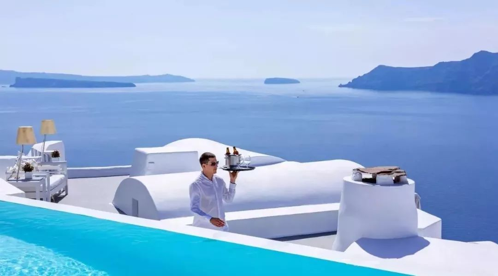 (原始链接: https://mmbiz.qpic.cn/mmbiz_jpg/1iaLjNbCegtYEFLQKUQIA6xKzQplCicZExpsibngAaib6AxMcBlXUJZXWrnq9j7wmMEfpADIgusClqSrFeDt9Aaxew/640?wx_fmt=jpeg)
-  (原始链接: http://mmbiz.qpic.cn/mmbiz_jpg/OKNJdtlGQaJuOJTyu8SE22bD4c9QKZXFAFenxFuSd4JMjerSjs6dPvnXK3ibd02jFIsmvKstvfqxveTKMPYeBDQ/640?wx_fmt=jpeg)
- 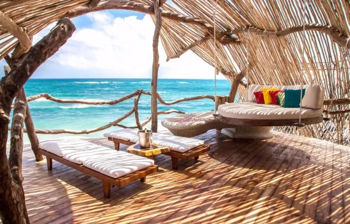 (原始链接: https://mmbiz.qpic.cn/mmbiz_jpg/8upu9Sk2EL62vDbj7FtEIdtMZMbJPWJD8KUX9gGujFRusvPT5LY4mjhHXOibUBozr2ACdF80t8QmYJOp9g4QjQw/640?wx_fmt=jpeg)
- 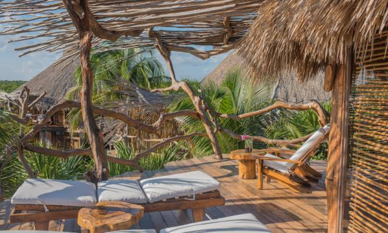 (原始链接: https://mmbiz.qpic.cn/mmbiz_png/8upu9Sk2EL62vDbj7FtEIdtMZMbJPWJDiaKicRJiaF3gQGicpdjXvzITZSUfzxqpeHrjpxRqlrJ4ga3XkhRlIvibuNg/640?wx_fmt=png)
- 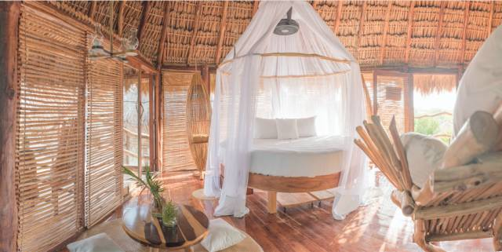 (原始链接: https://mmbiz.qpic.cn/mmbiz_png/8upu9Sk2EL62vDbj7FtEIdtMZMbJPWJD3mfYia0VZh9y1Hba7ftibb2EhMpQZkzuMCJcSRzMX0OFVgeCsMeL70Xw/640?wx_fmt=png)
- 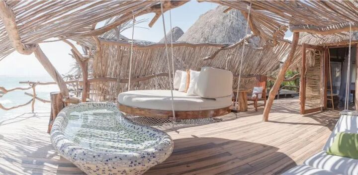 (原始链接: https://mmbiz.qpic.cn/mmbiz_jpg/8upu9Sk2EL62vDbj7FtEIdtMZMbJPWJDPXnNfribxEJT8lYBicZYFJp3uahLRsVbtrsIy1mcaPALYaTvXv0A2ic3g/640?wx_fmt=jpeg)
-  (原始链接: http://mmbiz.qpic.cn/mmbiz_jpg/OKNJdtlGQaJuOJTyu8SE22bD4c9QKZXFAFenxFuSd4JMjerSjs6dPvnXK3ibd02jFIsmvKstvfqxveTKMPYeBDQ/640?wx_fmt=jpeg)
- 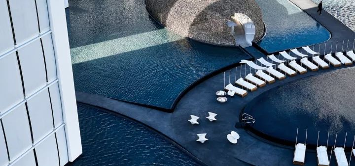 (原始链接: https://mmbiz.qpic.cn/mmbiz_jpg/8upu9Sk2EL62vDbj7FtEIdtMZMbJPWJDhfrM07QD55pk9t1OfTRrHPZlSAhxYLnRAaeDicGTE2KHibuJBcJBic3rQ/640?wx_fmt=jpeg)
- 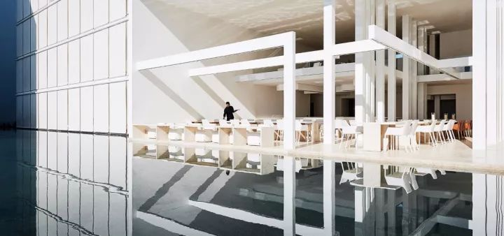 (原始链接: https://mmbiz.qpic.cn/mmbiz_jpg/8upu9Sk2EL62vDbj7FtEIdtMZMbJPWJDUxWk3TJMPe6IWmHsu3kUIQ1Qta4yDP1QkO3x8s9vVtW2Ixv1AGwibsQ/640?wx_fmt=jpeg)
- 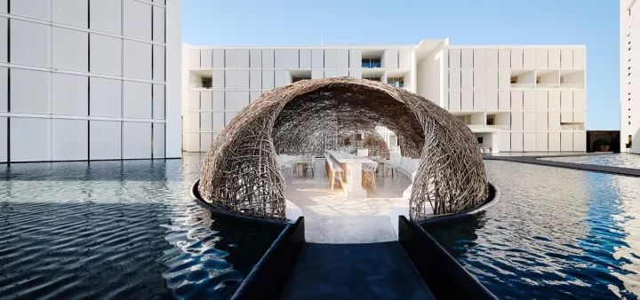 (原始链接: https://mmbiz.qpic.cn/mmbiz_jpg/8upu9Sk2EL62vDbj7FtEIdtMZMbJPWJDRvnfh8LNqSibicqrRGC5ThL4DlFT6THo11nBJZCQicbqSEMWf2BCRp4ibA/640?wx_fmt=jpeg)
- 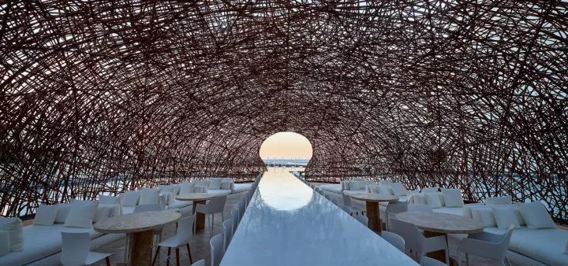 (原始链接: https://mmbiz.qpic.cn/mmbiz_jpg/8upu9Sk2EL62vDbj7FtEIdtMZMbJPWJDIC0wd2LhbEKSJJZiaMoCGKlMVs9fkK015dLicWnWicBmzkYzy9K54hS6w/640?wx_fmt=jpeg)
- 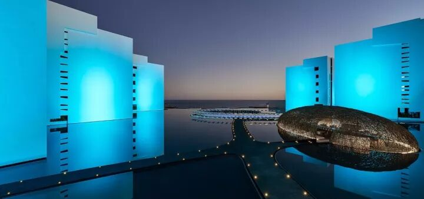 (原始链接: https://mmbiz.qpic.cn/mmbiz_jpg/8upu9Sk2EL62vDbj7FtEIdtMZMbJPWJDs6quUD1T0icZCsOibd2uZaJR8n0gG6kiaCTFyhxf6mpU06P5I5T6r3ibfQ/640?wx_fmt=jpeg)
- 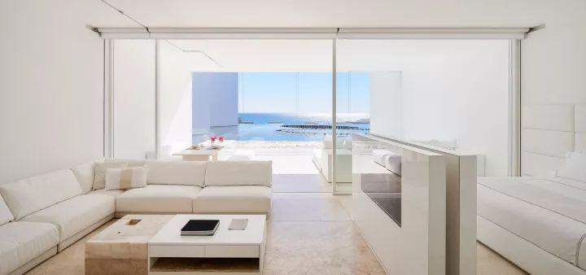 (原始链接: https://mmbiz.qpic.cn/mmbiz_jpg/8upu9Sk2EL62vDbj7FtEIdtMZMbJPWJDUrt7wVrbhibsC7ictBALYHfwAggx1tjqiawich998u6XcLQguicJCdia83MQ/640?wx_fmt=jpeg)
- 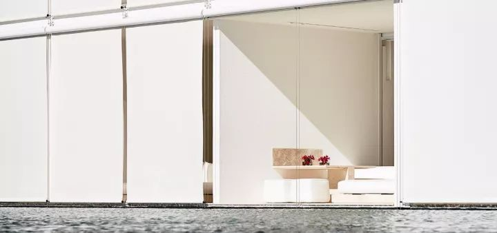 (原始链接: https://mmbiz.qpic.cn/mmbiz_jpg/8upu9Sk2EL62vDbj7FtEIdtMZMbJPWJDDAqAl1uyKIxj14ncuDvV4XLDOxic8jqCfSMicEKau5ywUczRvECOTO5w/640?wx_fmt=jpeg)
- 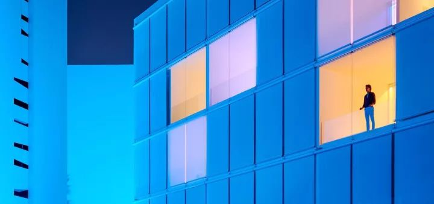 (原始链接: https://mmbiz.qpic.cn/mmbiz_jpg/8upu9Sk2EL62vDbj7FtEIdtMZMbJPWJDUI2PFJeNHib7hc8M1DkKQPRAUXpxV3Xlez22UtuJHWT5ibDcI3OWhzGw/640?wx_fmt=jpeg)
-  (原始链接: http://mmbiz.qpic.cn/mmbiz_jpg/OKNJdtlGQaJuOJTyu8SE22bD4c9QKZXFAFenxFuSd4JMjerSjs6dPvnXK3ibd02jFIsmvKstvfqxveTKMPYeBDQ/640?wx_fmt=jpeg)
- 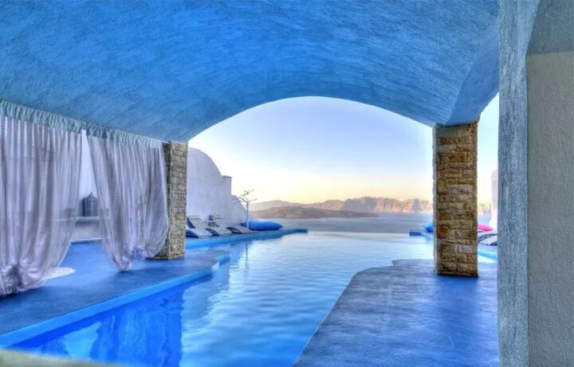 (原始链接: https://mmbiz.qpic.cn/mmbiz_jpg/8upu9Sk2EL62vDbj7FtEIdtMZMbJPWJDWjBK2mBOMd8MibVhQQJiaTdNCBicIsQE8CQ6fCbP9EyG9j6wxyv0fcmNg/640?wx_fmt=jpeg)
- 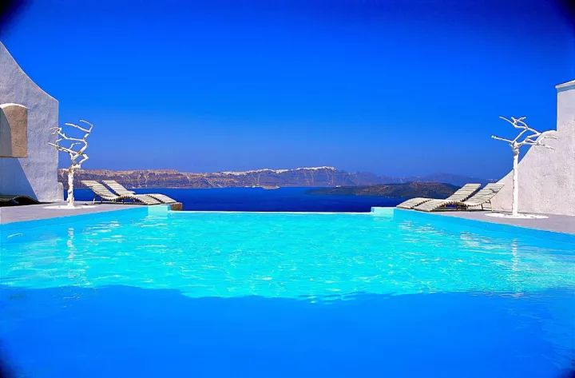 (原始链接: https://mmbiz.qpic.cn/mmbiz_jpg/8upu9Sk2EL62vDbj7FtEIdtMZMbJPWJD2CUCQibiaoVq2lTzm5LvjZ4Q7oLGAHiaJGrnJ5sQSM2UU3hribMsenuictw/640?wx_fmt=jpeg)
-  (原始链接: https://mmbiz.qpic.cn/mmbiz_jpg/8upu9Sk2EL62vDbj7FtEIdtMZMbJPWJDbGCEaUAYibMSGcXllge4TwGDW4Qk3n8mjJLiaXDGchV0yCJuXLicSOGiaw/640?wx_fmt=jpeg)
- 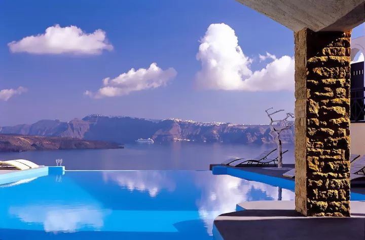 (原始链接: https://mmbiz.qpic.cn/mmbiz_jpg/8upu9Sk2EL62vDbj7FtEIdtMZMbJPWJDWRoMyiaHqZodjxpjg0qYZicHTvjiaibLlInAGq8xLnfcKSn285u1uoWOJQ/640?wx_fmt=jpeg)
-  (原始链接: http://mmbiz.qpic.cn/mmbiz_jpg/OKNJdtlGQaJuOJTyu8SE22bD4c9QKZXFAFenxFuSd4JMjerSjs6dPvnXK3ibd02jFIsmvKstvfqxveTKMPYeBDQ/640?wx_fmt=jpeg)
- 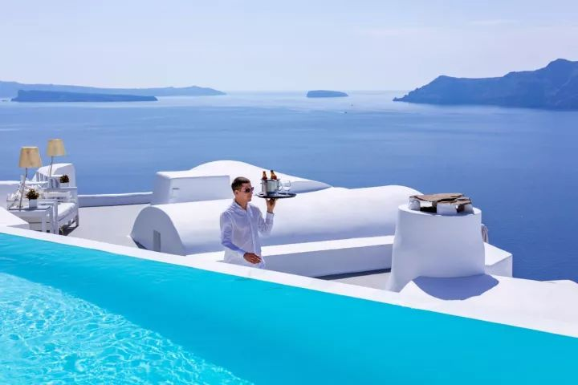 (原始链接: https://mmbiz.qpic.cn/mmbiz_jpg/8upu9Sk2EL62vDbj7FtEIdtMZMbJPWJD080O8S5XkzgqOicjtRNXpB6ZdMpvYL6M8wHlD9f8VxN6szRDItYbKgg/640?wx_fmt=jpeg)
- 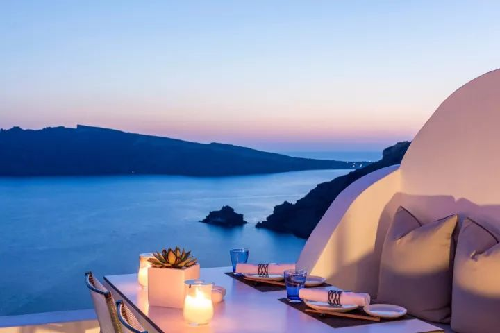 (原始链接: https://mmbiz.qpic.cn/mmbiz_jpg/8upu9Sk2EL62vDbj7FtEIdtMZMbJPWJD0nasKyVga1mAiamm8GSULauT6dcwfVdyISYxfg9JHZU97jTBWMaAr3Q/640?wx_fmt=jpeg)
- 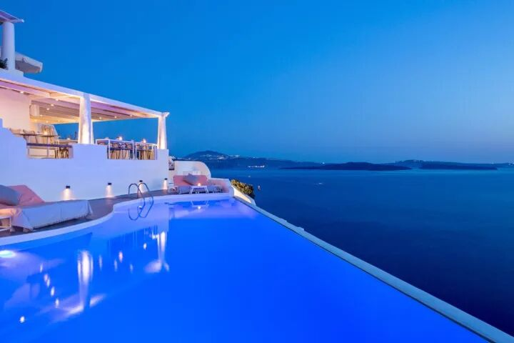 (原始链接: https://mmbiz.qpic.cn/mmbiz_jpg/8upu9Sk2EL62vDbj7FtEIdtMZMbJPWJDdEVkuSS3AmhsAmE8VicVI7N6njIpXyiaGO4wNKvic5A0PjjcKCNxktsVg/640?wx_fmt=jpeg)
- 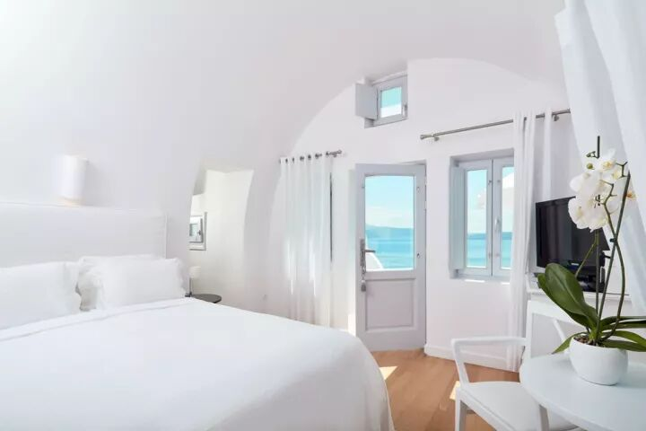 (原始链接: https://mmbiz.qpic.cn/mmbiz_jpg/8upu9Sk2EL62vDbj7FtEIdtMZMbJPWJDezvUJkbjLgWAo5owjRziciaU8wryEgcJVCsp6icRLy5o8DcfDO0EstPYQ/640?wx_fmt=jpeg)
- 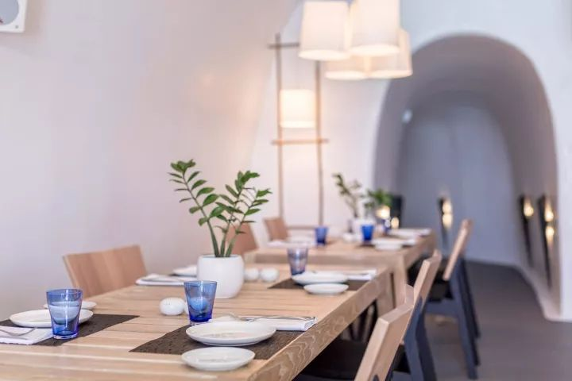 (原始链接: https://mmbiz.qpic.cn/mmbiz_jpg/8upu9Sk2EL62vDbj7FtEIdtMZMbJPWJDLKrUyicGf2MB0DPgKPx64pOOEUwd4sHxyefoTyEjyhgZjW27q9v44XQ/640?wx_fmt=jpeg)
-  (原始链接: http://mmbiz.qpic.cn/mmbiz_jpg/OKNJdtlGQaJuOJTyu8SE22bD4c9QKZXFAFenxFuSd4JMjerSjs6dPvnXK3ibd02jFIsmvKstvfqxveTKMPYeBDQ/640?wx_fmt=jpeg)
- 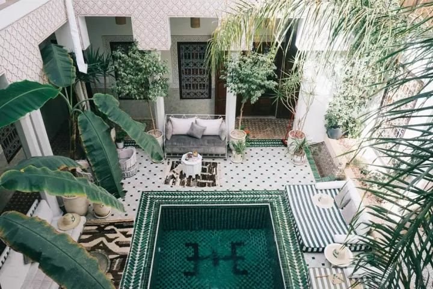 (原始链接: https://mmbiz.qpic.cn/mmbiz_jpg/8upu9Sk2EL62vDbj7FtEIdtMZMbJPWJDp0XbGkicmeoia9p9RpDVFAibWibhZQqMKQGSM7UI3Yf4Z899XZE3CzBASw/640?wx_fmt=jpeg)
- 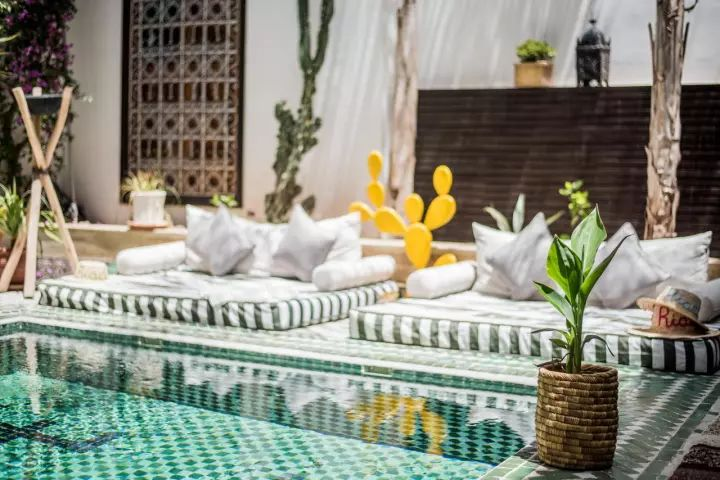 (原始链接: https://mmbiz.qpic.cn/mmbiz_jpg/8upu9Sk2EL62vDbj7FtEIdtMZMbJPWJDrbkYrvLNtbQ5wSz0AYX0KEXqPx0GBv9N2UtWCCb0KqXlMzGVQsTMBw/640?wx_fmt=jpeg)
- 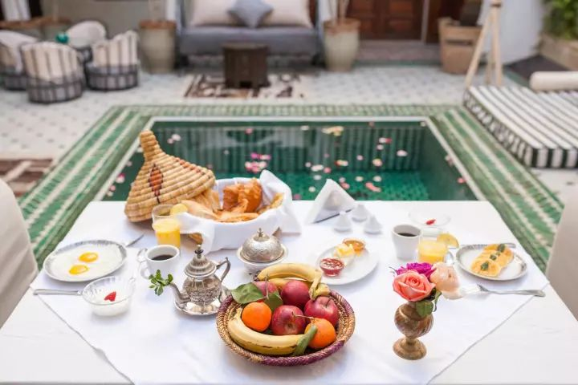 (原始链接: https://mmbiz.qpic.cn/mmbiz_jpg/8upu9Sk2EL62vDbj7FtEIdtMZMbJPWJDViaFDZlSrEn7KdrWmUbcibcsMH9lyNvfl2iasmHySM4XxiasEctCLQiaH5g/640?wx_fmt=jpeg)
- 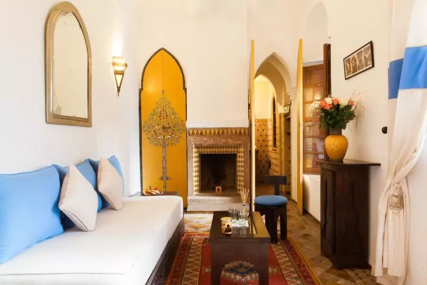 (原始链接: https://mmbiz.qpic.cn/mmbiz_jpg/8upu9Sk2EL62vDbj7FtEIdtMZMbJPWJDuzWJ6dSvptOZGc7TClVLP1HVNxd48KhCWicnjmNQLJW4faASDxwChNg/640?wx_fmt=jpeg)
- 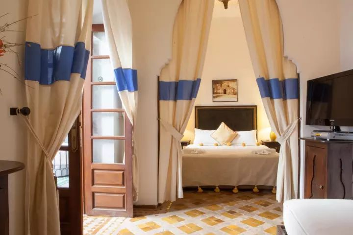 (原始链接: https://mmbiz.qpic.cn/mmbiz_jpg/8upu9Sk2EL62vDbj7FtEIdtMZMbJPWJD0dAONVib9ibZRkWuic1hk5ic0GgiaQlibQxk3icicibyibeAcqKPXNgbwHGpsR0A/640?wx_fmt=jpeg)
- 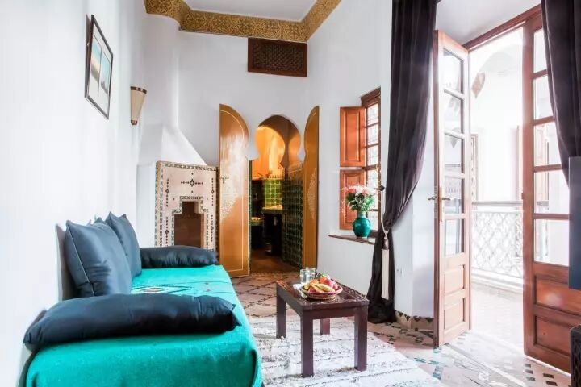 (原始链接: https://mmbiz.qpic.cn/mmbiz_jpg/8upu9Sk2EL62vDbj7FtEIdtMZMbJPWJDiaL9s41dyiaagfNZN0St5LE96nA6GicWVyqkG7nkdBQHaNXFcpXE45yqA/640?wx_fmt=jpeg)
-  (原始链接: http://mmbiz.qpic.cn/mmbiz_jpg/OKNJdtlGQaJuOJTyu8SE22bD4c9QKZXFAFenxFuSd4JMjerSjs6dPvnXK3ibd02jFIsmvKstvfqxveTKMPYeBDQ/640?wx_fmt=jpeg)
- 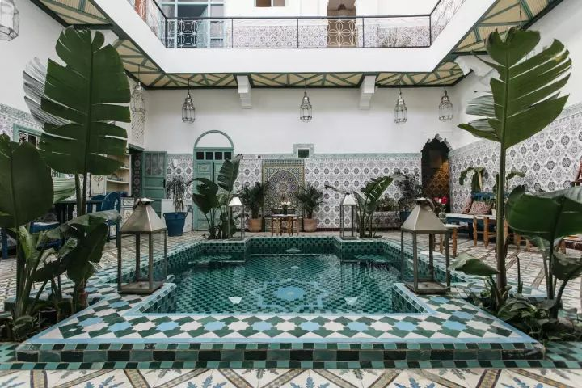 (原始链接: https://mmbiz.qpic.cn/mmbiz_jpg/8upu9Sk2EL62vDbj7FtEIdtMZMbJPWJDQL63TWVRv0vCtoYUrNCdQ2Tqbmxpbzic7Q0jQ3JiakdO9NyCTsEPUOkg/640?wx_fmt=jpeg)
- 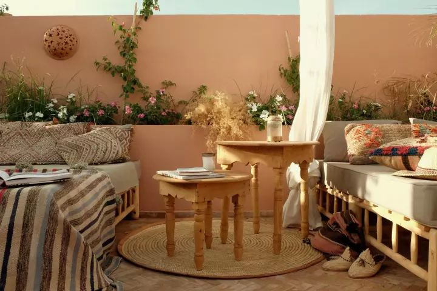 (原始链接: https://mmbiz.qpic.cn/mmbiz_jpg/8upu9Sk2EL62vDbj7FtEIdtMZMbJPWJDK0Cmyl0Q2zPAzsSO9WMK4iatYicgUUibQ6ZnXGFsuuRzBLW913vsqZTRA/640?wx_fmt=jpeg)
- 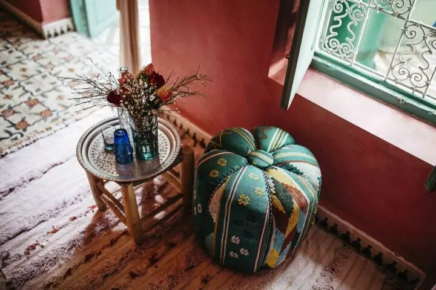 (原始链接: https://mmbiz.qpic.cn/mmbiz_jpg/8upu9Sk2EL62vDbj7FtEIdtMZMbJPWJDt83zkc01QxVM0lUyicZicXrHUchbhDbQcHDJMlgJCr6avY1EH13HCoZQ/640?wx_fmt=jpeg)
- 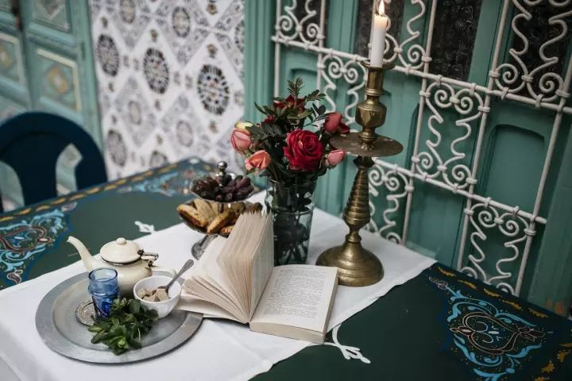 (原始链接: https://mmbiz.qpic.cn/mmbiz_jpg/8upu9Sk2EL62vDbj7FtEIdtMZMbJPWJDJnBh62qRSLG5KhSl9KkvFiaunoDX92bia1McOKDOIbrHJNvH9vicXdKibQ/640?wx_fmt=jpeg)
- 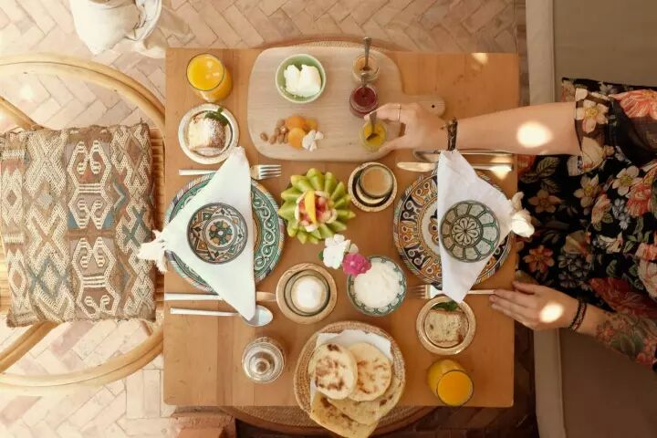 (原始链接: https://mmbiz.qpic.cn/mmbiz_jpg/8upu9Sk2EL62vDbj7FtEIdtMZMbJPWJDhvUib1yicWNOiclWIDPwThMnmC6IRVbk7CohYB0Ef9JYAeiak3Up6q7h1A/640?wx_fmt=jpeg)
-  (原始链接: http://mmbiz.qpic.cn/mmbiz_jpg/OKNJdtlGQaJuOJTyu8SE22bD4c9QKZXFAFenxFuSd4JMjerSjs6dPvnXK3ibd02jFIsmvKstvfqxveTKMPYeBDQ/640?wx_fmt=jpeg)
- 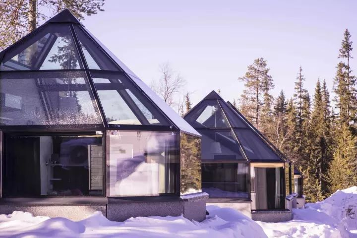 (原始链接: https://mmbiz.qpic.cn/mmbiz_jpg/8upu9Sk2EL62vDbj7FtEIdtMZMbJPWJDnoB91XxFVY8O3oIZGfP5bpt1WBsVIzNzjcnpdYaN0zBsSg0ufKda4w/640?wx_fmt=jpeg)
- 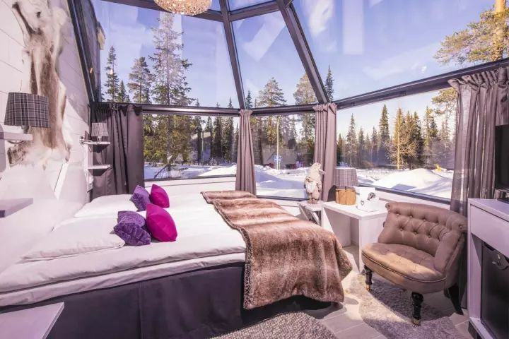 (原始链接: https://mmbiz.qpic.cn/mmbiz_jpg/8upu9Sk2EL62vDbj7FtEIdtMZMbJPWJDyqOHVk6iauzSDZaf1Rp3EibIETWjibL56UsfPvrW9niab5QrSOe8xJYsUw/640?wx_fmt=jpeg)
- 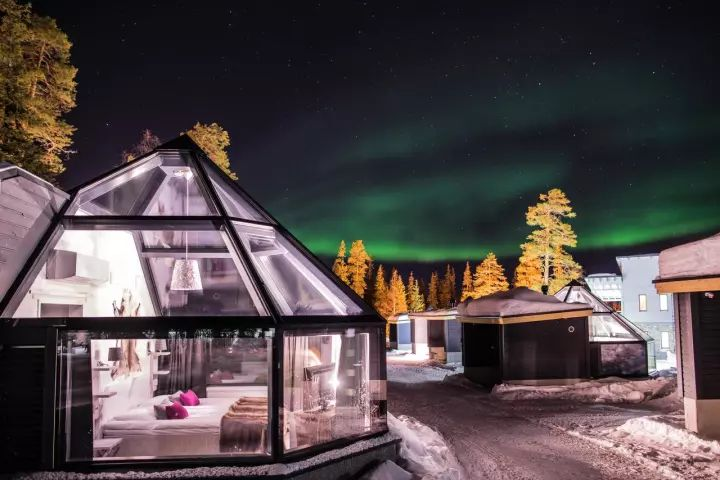 (原始链接: https://mmbiz.qpic.cn/mmbiz_jpg/8upu9Sk2EL62vDbj7FtEIdtMZMbJPWJDCMQ2gqibOqwS7aFAyLcwloIgv98mTpsrp8pCAdwcfaYtM5UCVdbxtug/640?wx_fmt=jpeg)
- 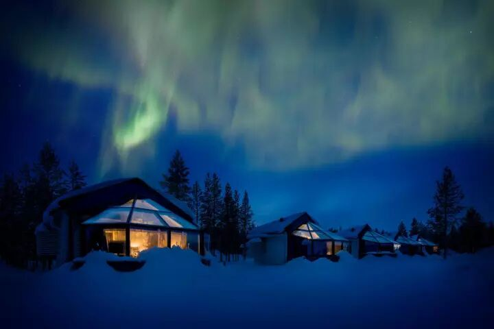 (原始链接: https://mmbiz.qpic.cn/mmbiz_jpg/8upu9Sk2EL62vDbj7FtEIdtMZMbJPWJDoLa91hjsQlw4z8AYBAb0gfcvPfh7ia1EicJLlqyV4DIP3lt014iclV6ibw/640?wx_fmt=jpeg)
- 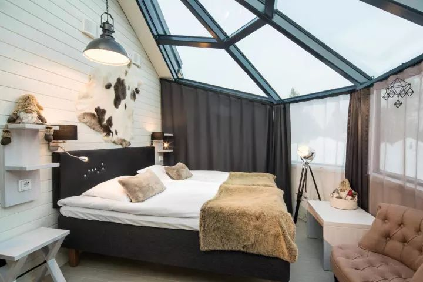 (原始链接: https://mmbiz.qpic.cn/mmbiz_jpg/8upu9Sk2EL7oAm0IYn2fuwNjIR8yupov6Jl0jz1Drjiawua3g0NBw7mPsRvI8WADsiblqXL1YY3huicknmYDNhaUQ/640?wx_fmt=jpeg)
- 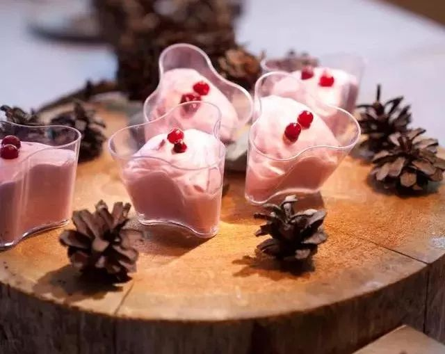 (原始链接: https://mmbiz.qpic.cn/mmbiz_jpg/8upu9Sk2EL7oAm0IYn2fuwNjIR8yupov0EMVm5QerDvN6K0uYDDdWTiaqG1Hu7upGjvhZJJV4XaqVApjJrakGfw/640?wx_fmt=jpeg)
-  (原始链接: http://mmbiz.qpic.cn/mmbiz_jpg/OKNJdtlGQaJuOJTyu8SE22bD4c9QKZXFAFenxFuSd4JMjerSjs6dPvnXK3ibd02jFIsmvKstvfqxveTKMPYeBDQ/640?wx_fmt=jpeg)
- 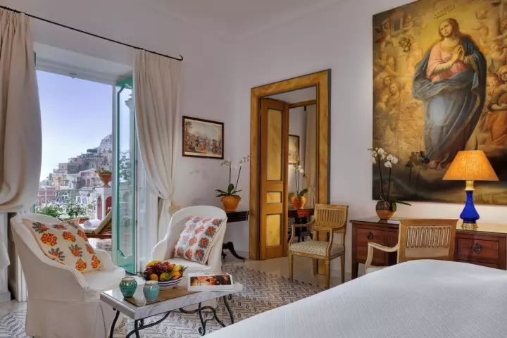 (原始链接: https://mmbiz.qpic.cn/mmbiz_jpg/8upu9Sk2EL7oAm0IYn2fuwNjIR8yupovjR1c4Ytz9JviaDqcxUf8f22gxtmxJVFLibcDicDjnMOibrueiaiaibWqF7Nag/640?wx_fmt=jpeg)
- 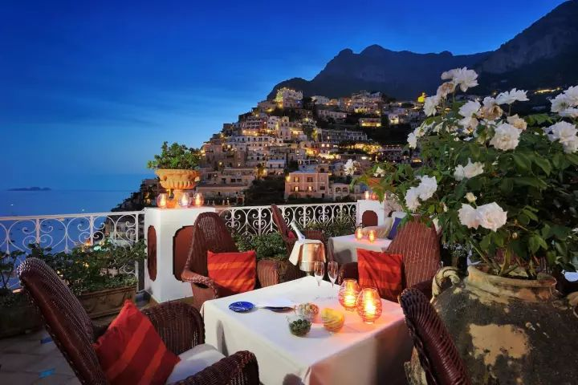 (原始链接: https://mmbiz.qpic.cn/mmbiz_jpg/8upu9Sk2EL7oAm0IYn2fuwNjIR8yupovDbM0ViaUjLy8NY2stiahCxzqJXxhBc6JGlVyuqW5jCtEIHmSQwdegtJA/640?wx_fmt=jpeg)
- 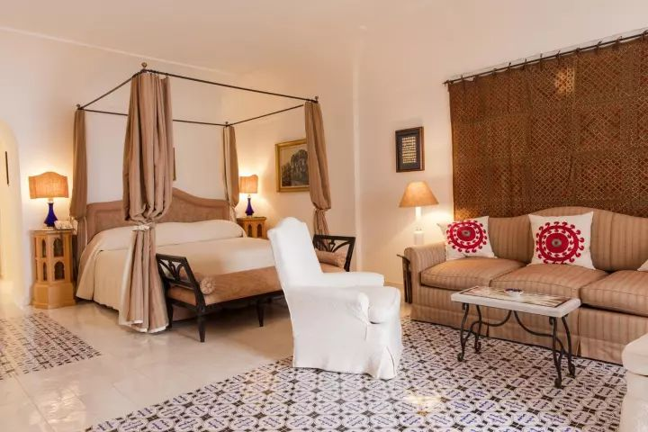 (原始链接: https://mmbiz.qpic.cn/mmbiz_jpg/8upu9Sk2EL7oAm0IYn2fuwNjIR8yupov0Re4ibtEoTUiaT3rPn4OxhBP1Zl6R4x64cYNIGZsSLXfuBc0ZEY7eR2w/640?wx_fmt=jpeg)
- 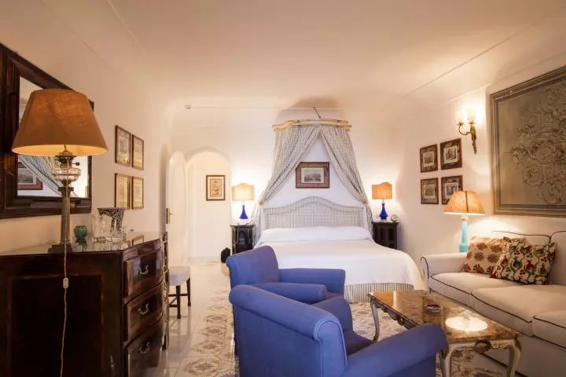 (原始链接: https://mmbiz.qpic.cn/mmbiz_jpg/8upu9Sk2EL7oAm0IYn2fuwNjIR8yupov8MFNx4tgxXTqZapF80MIrb4GHuy5bPI22NGQ4603KIMo31XyxGbJKA/640?wx_fmt=jpeg)
- 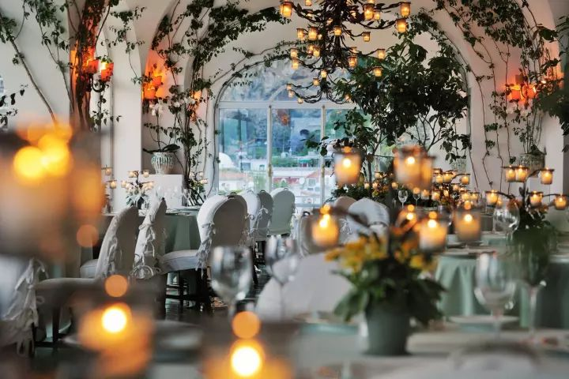 (原始链接: https://mmbiz.qpic.cn/mmbiz_jpg/8upu9Sk2EL7oAm0IYn2fuwNjIR8yupovb7elyKQib9ia0LHcw5rIu8kLtNTsTRF4uMvxEcDPt8nWhfBvfKDRIhmQ/640?wx_fmt=jpeg)
-  (原始链接: http://mmbiz.qpic.cn/mmbiz_jpg/OKNJdtlGQaJuOJTyu8SE22bD4c9QKZXFAFenxFuSd4JMjerSjs6dPvnXK3ibd02jFIsmvKstvfqxveTKMPYeBDQ/640?wx_fmt=jpeg)
-  (原始链接: https://mmbiz.qpic.cn/mmbiz_jpg/8upu9Sk2EL7oAm0IYn2fuwNjIR8yupovzdGLTN3ocXTU01kuXZZiaAJ936iaQZutKB7tCJhVnQGl5I2icI9yU19qw/640?wx_fmt=jpeg)
- 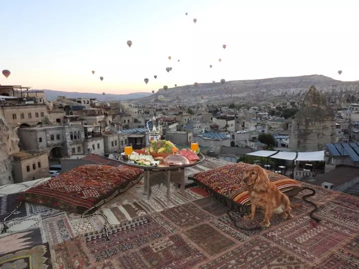 (原始链接: https://mmbiz.qpic.cn/mmbiz_jpg/8upu9Sk2EL7oAm0IYn2fuwNjIR8yupovYlE1fUtBWtt9icTtF5Fs8s1VZujBl9HMicaeKiaUic07hyYN88ExXF7SHw/640?wx_fmt=jpeg)
- 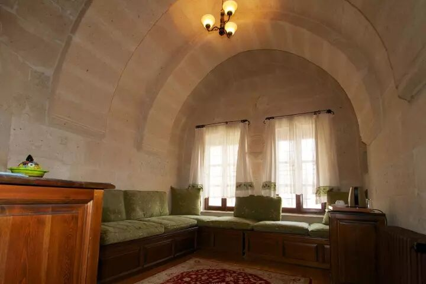 (原始链接: https://mmbiz.qpic.cn/mmbiz_jpg/8upu9Sk2EL7oAm0IYn2fuwNjIR8yupovgjScy9MGf0OrMeaTsJ896sk1AXoHQRBAyRevXq67icgicPQuEeichW9qw/640?wx_fmt=jpeg)
- 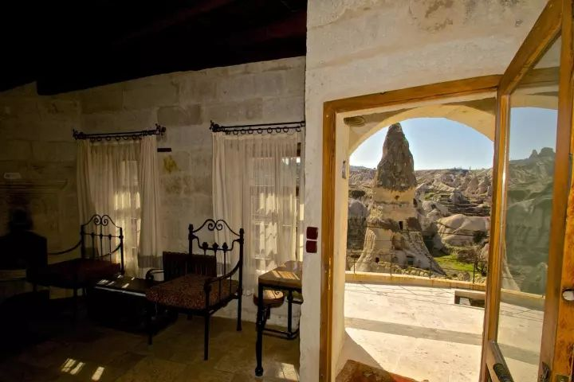 (原始链接: https://mmbiz.qpic.cn/mmbiz_jpg/8upu9Sk2EL7oAm0IYn2fuwNjIR8yupovygSPCDgEPeicics3FHiabEcITSmxm8XwNeg2tX6YpG0JqnwdeulWOlQuA/640?wx_fmt=jpeg)
- 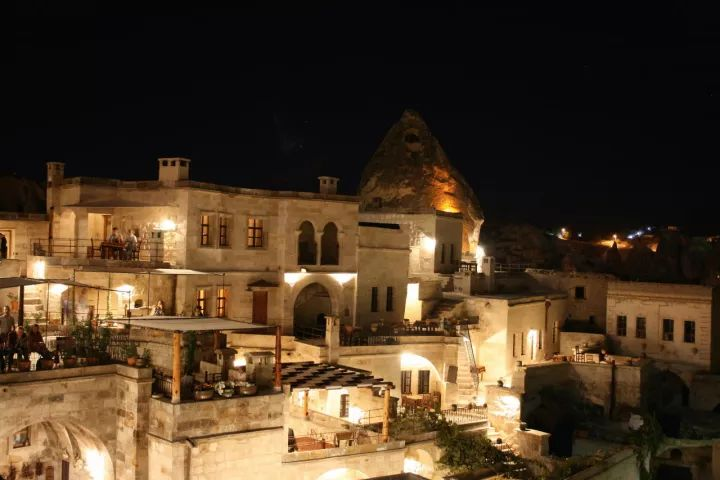 (原始链接: https://mmbiz.qpic.cn/mmbiz_jpg/8upu9Sk2EL7oAm0IYn2fuwNjIR8yupov2xuRlfCXEZXZ4HHZ3nLfTx7ATDXpgria0iaw9BzVOFUre4bDvJiaib3HYg/640?wx_fmt=jpeg)
-  (原始链接: http://mmbiz.qpic.cn/mmbiz_jpg/OKNJdtlGQaJuOJTyu8SE22bD4c9QKZXFAFenxFuSd4JMjerSjs6dPvnXK3ibd02jFIsmvKstvfqxveTKMPYeBDQ/640?wx_fmt=jpeg)
- 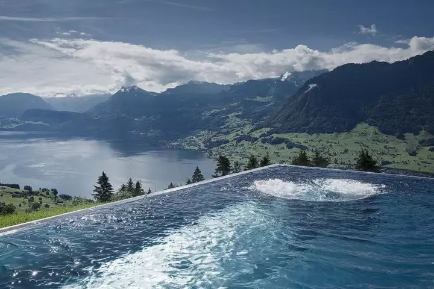 (原始链接: https://mmbiz.qpic.cn/mmbiz_jpg/8upu9Sk2EL7oAm0IYn2fuwNjIR8yupovYuUJWWzKbvHL6CNkDUY8tMVgvduS1dykSpsGibAX4zN9mN3RZfOw15Q/640?wx_fmt=jpeg)
- 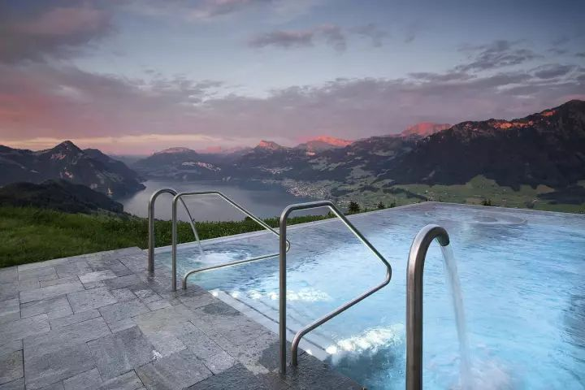 (原始链接: https://mmbiz.qpic.cn/mmbiz_jpg/8upu9Sk2EL7oAm0IYn2fuwNjIR8yupovzaJic0PNC8kbOW24CNfAukPqUbfoPPoQxwUjhzlwk524VW1Xnwrnznw/640?wx_fmt=jpeg)
- 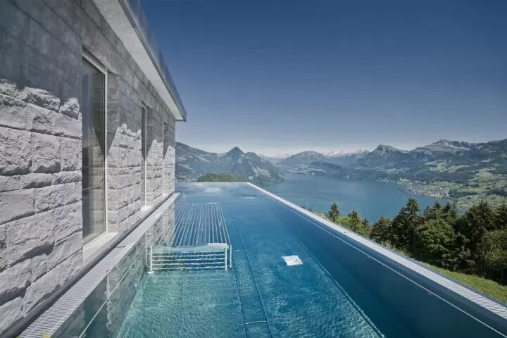 (原始链接: https://mmbiz.qpic.cn/mmbiz_jpg/8upu9Sk2EL7oAm0IYn2fuwNjIR8yupov6snKGciczk3r36nBSubbYiaQntjakGxfO5icraTrdXDwX9FTYIbuDicRHw/640?wx_fmt=jpeg)
- 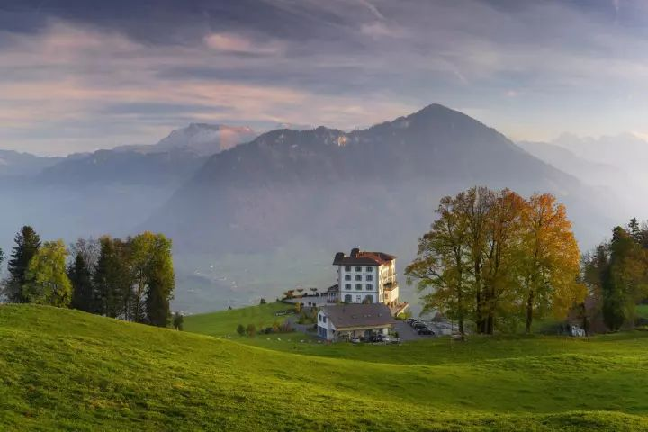 (原始链接: https://mmbiz.qpic.cn/mmbiz_jpg/8upu9Sk2EL7oAm0IYn2fuwNjIR8yupov5RFoyiavGA8NojFzOwjXWwHTIrx0Bm7vCmWJFKsJ2KRwEKENLPCmNaQ/640?wx_fmt=jpeg)
- 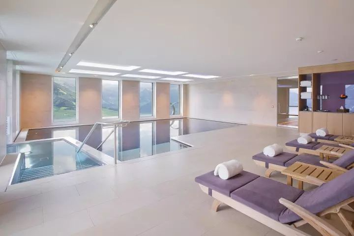 (原始链接: https://mmbiz.qpic.cn/mmbiz_jpg/8upu9Sk2EL7oAm0IYn2fuwNjIR8yupovuxSb3kcuHx0L4hQXXdFaF1C33DxvKxTn6DbleERQTJnxvRZOkia1BkQ/640?wx_fmt=jpeg)
- 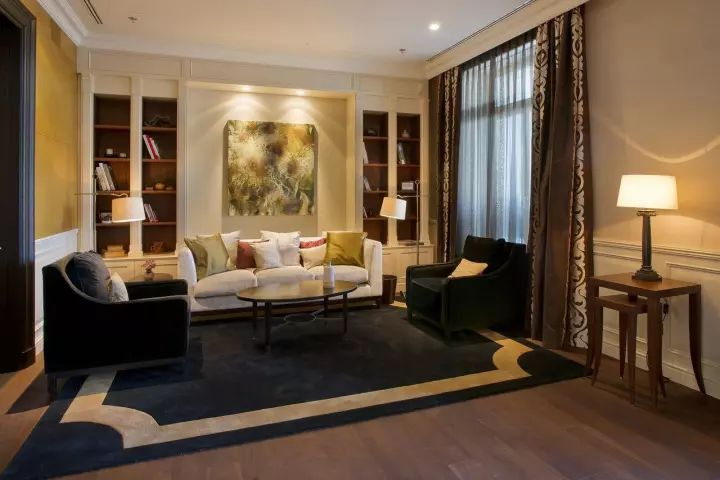 (原始链接: https://mmbiz.qpic.cn/mmbiz_jpg/8upu9Sk2EL7oAm0IYn2fuwNjIR8yupove2PG4UAwibdrgOsiad3UwMLJg1OFKbIrZmZ4aksvbsQIdUK8gExffO5w/640?wx_fmt=jpeg)
- 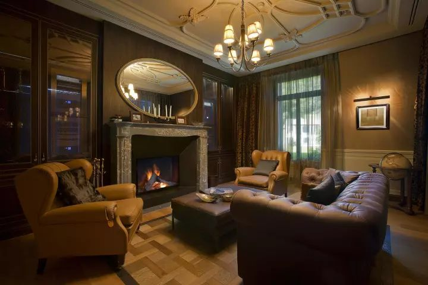 (原始链接: https://mmbiz.qpic.cn/mmbiz_jpg/8upu9Sk2EL7oAm0IYn2fuwNjIR8yupovmalr2UG4gOciahAhcy9GV4lIO0z4KtN3GZj2afDQFKrGHBkD1ktkibnA/640?wx_fmt=jpeg)
-  (原始链接: http://mmbiz.qpic.cn/mmbiz_jpg/OKNJdtlGQaJuOJTyu8SE22bD4c9QKZXFAFenxFuSd4JMjerSjs6dPvnXK3ibd02jFIsmvKstvfqxveTKMPYeBDQ/640?wx_fmt=jpeg)
- 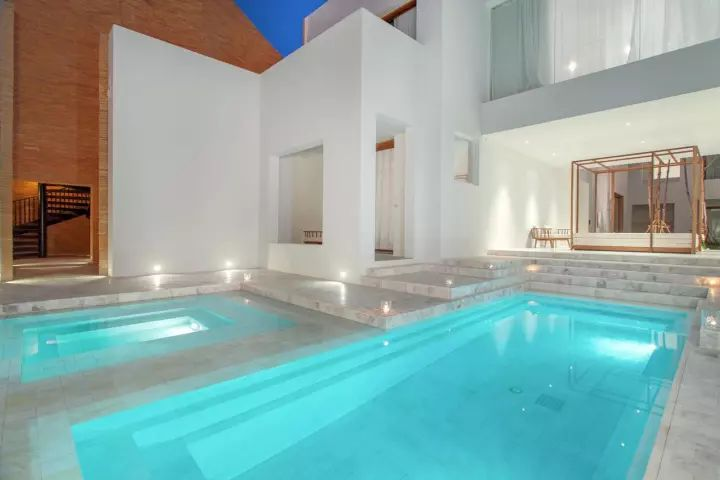 (原始链接: https://mmbiz.qpic.cn/mmbiz_jpg/8upu9Sk2EL7oAm0IYn2fuwNjIR8yupovztXLSu3DcJLD9yj2ZEGDnUBYEUSqUxqs6xrJMDGDTXA1AP5AlV3f9w/640?wx_fmt=jpeg)
- 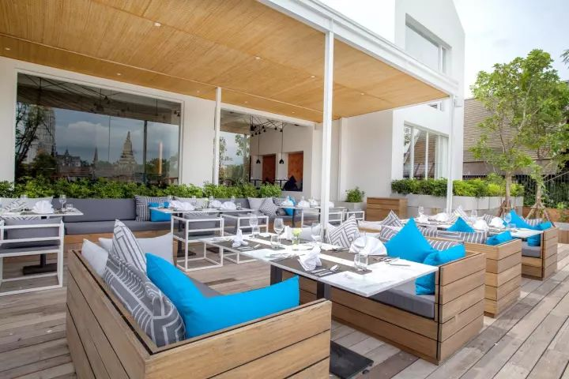 (原始链接: https://mmbiz.qpic.cn/mmbiz_jpg/8upu9Sk2EL7oAm0IYn2fuwNjIR8yupovzxJ2jIib7iasT54o8dm9ottzFQFYmTVXlEysXqaKespw4JFP15pp7fRw/640?wx_fmt=jpeg)
- 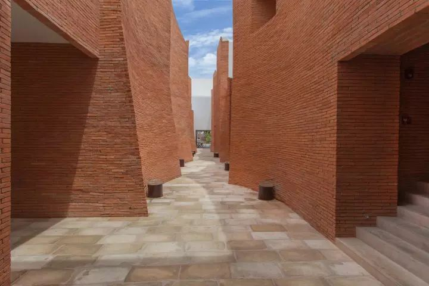 (原始链接: https://mmbiz.qpic.cn/mmbiz_jpg/8upu9Sk2EL7oAm0IYn2fuwNjIR8yupovmeKt8LQaXDQKW84gS33tJRBaFKqBSLsHhpxTIQxrJ3HhBAsGAvLwxg/640?wx_fmt=jpeg)
- 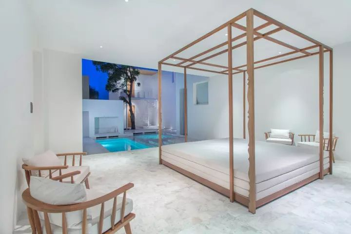 (原始链接: https://mmbiz.qpic.cn/mmbiz_jpg/8upu9Sk2EL7oAm0IYn2fuwNjIR8yupovW7wN2ZPJ8YHX3NY62eJL5VLuSJSe4APgQssZO2kr4YNiakHKupC52zw/640?wx_fmt=jpeg)
- 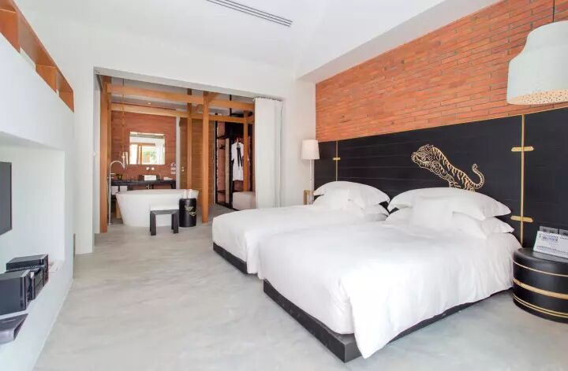 (原始链接: https://mmbiz.qpic.cn/mmbiz_jpg/8upu9Sk2EL7oAm0IYn2fuwNjIR8yupovcGeALUfG4FyI9Y0FcMxcn7A0zCjZbJ1R9capZH9pMNPFicic6ZAiaAjUw/640?wx_fmt=jpeg)
- 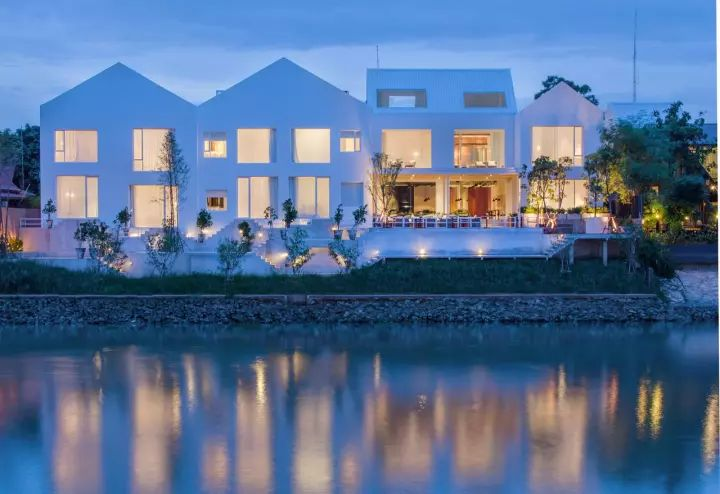 (原始链接: https://mmbiz.qpic.cn/mmbiz_jpg/8upu9Sk2EL7oAm0IYn2fuwNjIR8yupovhycshkJ8gCFDcTD3vib0J8OZ1xJSzFYTHIDibk22Kp54WsByAVE8bz0w/640?wx_fmt=jpeg)
-  (原始链接: http://mmbiz.qpic.cn/mmbiz_jpg/OKNJdtlGQaJuOJTyu8SE22bD4c9QKZXFAFenxFuSd4JMjerSjs6dPvnXK3ibd02jFIsmvKstvfqxveTKMPYeBDQ/640?wx_fmt=jpeg)
- 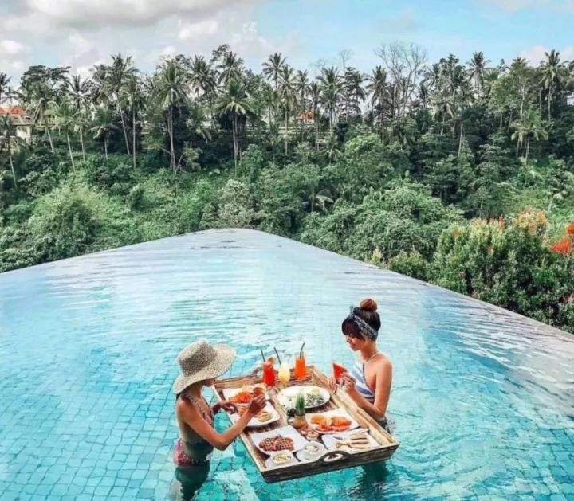 (原始链接: https://mmbiz.qpic.cn/mmbiz_jpg/8upu9Sk2EL7oAm0IYn2fuwNjIR8yupovFqYiaXt2LEZjbM4Z6tMdBzj6dvD65R460ZTfY2LpvBs8yKl5lr8el3A/640?wx_fmt=jpeg)
- 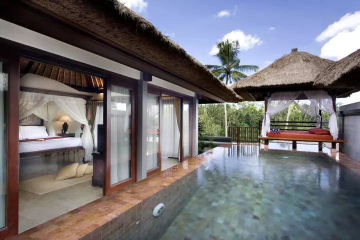 (原始链接: https://mmbiz.qpic.cn/mmbiz_jpg/8upu9Sk2EL7oAm0IYn2fuwNjIR8yupovnic5Iicecck13vibgicRTftUysiclmCiajvgj9gY0SqvZzFXDG2OviaMYVOaw/640?wx_fmt=jpeg)
- 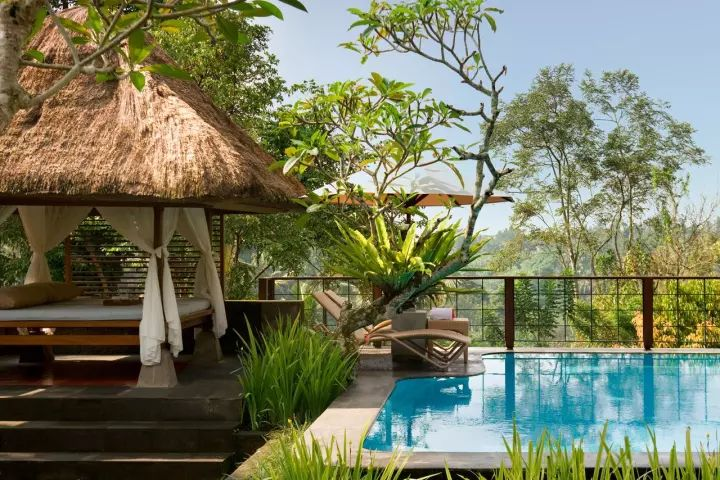 (原始链接: https://mmbiz.qpic.cn/mmbiz_jpg/8upu9Sk2EL7oAm0IYn2fuwNjIR8yupovhpALBQQXpa1rqpHzPoXoRialBeZP8wNgxSgO9ibVdBNm0xwF8icibNL5QA/640?wx_fmt=jpeg)
- 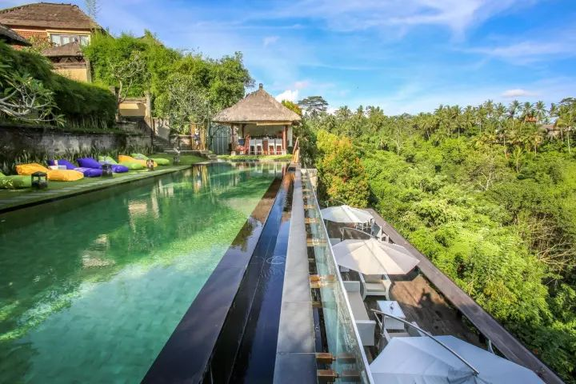 (原始链接: https://mmbiz.qpic.cn/mmbiz_jpg/8upu9Sk2EL7oAm0IYn2fuwNjIR8yupovkqXbZL4BWya86035bibvWIw68nSfZ91aMONgkq47SW3bZeic3sx1rgug/640?wx_fmt=jpeg)
- 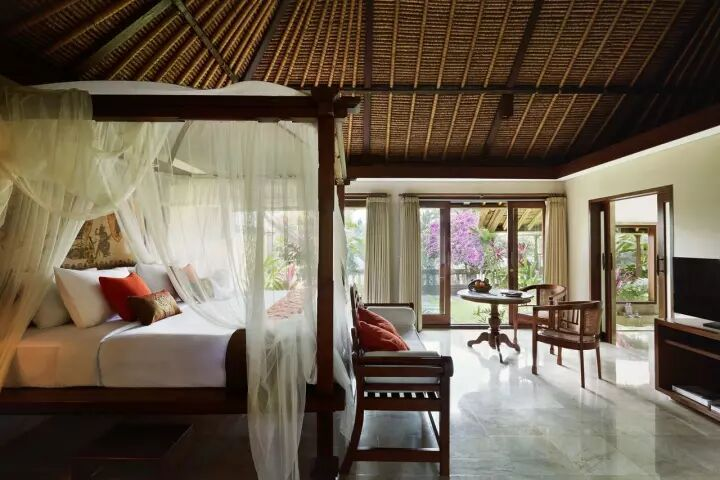 (原始链接: https://mmbiz.qpic.cn/mmbiz_jpg/8upu9Sk2EL7oAm0IYn2fuwNjIR8yupovgiaaOvrhWpfjpXRfPE4sR2txYheORXXyUd7x2c5Nnou8B3Nckq8SWXg/640?wx_fmt=jpeg)
- 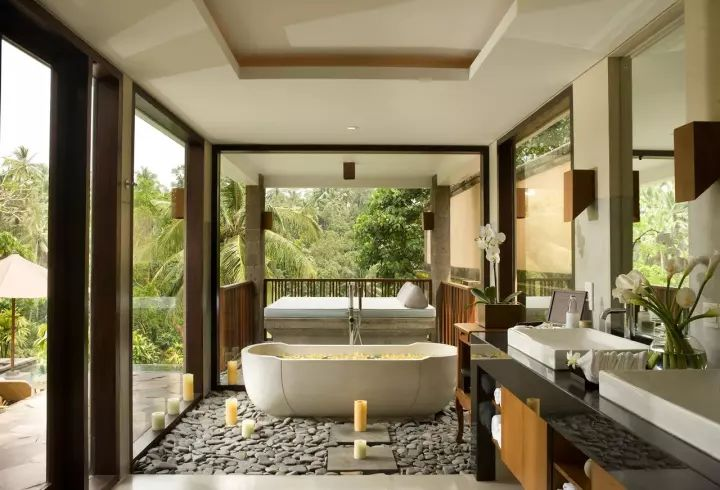 (原始链接: https://mmbiz.qpic.cn/mmbiz_jpg/8upu9Sk2EL7oAm0IYn2fuwNjIR8yupovHVI7wLR49mcyx3R5Js5UPfHFsYbKCqdVfTDGP7Uy1StUicZhgmZ80bw/640?wx_fmt=jpeg)
-  (原始链接: http://mmbiz.qpic.cn/mmbiz_jpg/OKNJdtlGQaJuOJTyu8SE22bD4c9QKZXFAFenxFuSd4JMjerSjs6dPvnXK3ibd02jFIsmvKstvfqxveTKMPYeBDQ/640?wx_fmt=jpeg)
- 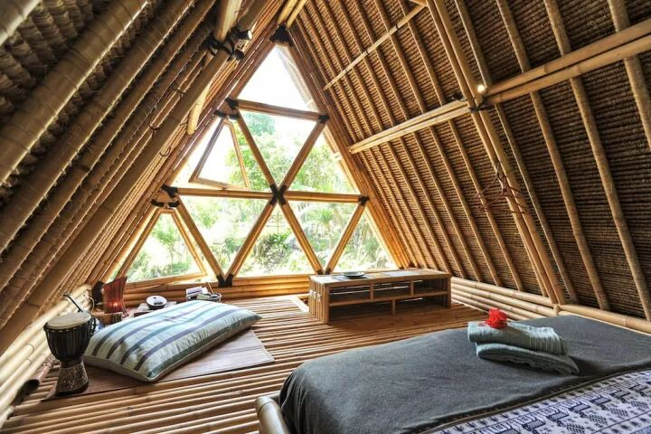 (原始链接: https://mmbiz.qpic.cn/mmbiz_jpg/8upu9Sk2EL7oAm0IYn2fuwNjIR8yupovZrM6FZks3wTenxRlcqo9xAzauAiaKawJhhkRHaGyaRia54KrFDyud4yg/640?wx_fmt=jpeg)
- 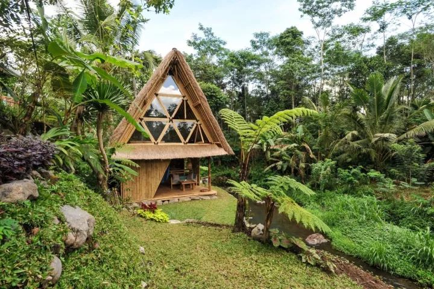 (原始链接: https://mmbiz.qpic.cn/mmbiz_jpg/8upu9Sk2EL7oAm0IYn2fuwNjIR8yupovelAcSyVuibF0ZCTSiajx8oDoviaoxS6Ze3lpyGgjdcdPO1AH1CfErMgTQ/640?wx_fmt=jpeg)
- 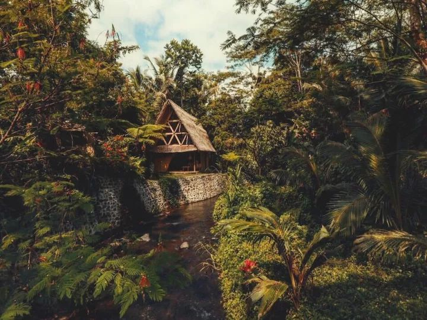 (原始链接: https://mmbiz.qpic.cn/mmbiz_jpg/8upu9Sk2EL7oAm0IYn2fuwNjIR8yupovdobfyDs7IFH6Tc9bxx5ktFesNTicwNJLEgKy4fRpUiaHxicicMUJr2QgPQ/640?wx_fmt=jpeg)
- 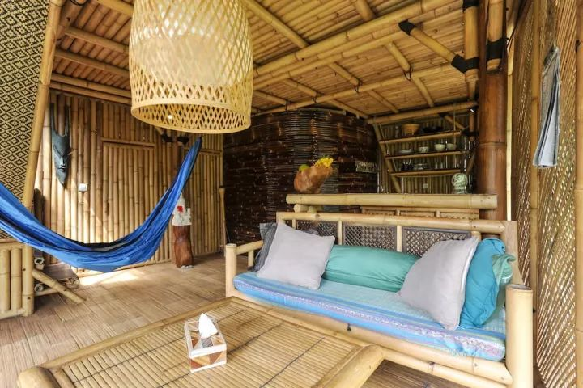 (原始链接: https://mmbiz.qpic.cn/mmbiz_jpg/8upu9Sk2EL7oAm0IYn2fuwNjIR8yupovS1bUfMLvBYOKnPFUcaf7fdWLwgmknpxXJ6NgUoI4n2Qpsoj5v50HYw/640?wx_fmt=jpeg)
- 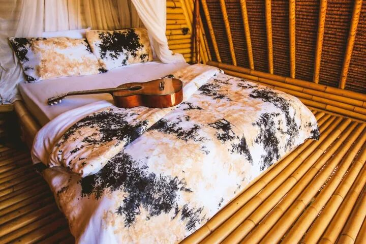 (原始链接: https://mmbiz.qpic.cn/mmbiz_jpg/8upu9Sk2EL7oAm0IYn2fuwNjIR8yupovPtmt1Br7yIR7c7ibbtgkNgS0ANb4ib1GBB3dj9OMayvDKKmjkdDiafA2A/640?wx_fmt=jpeg)
- 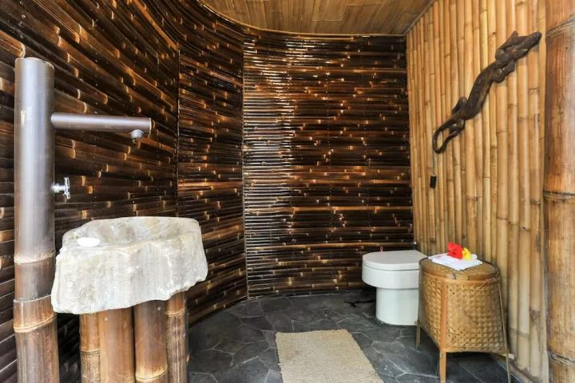 (原始链接: https://mmbiz.qpic.cn/mmbiz_jpg/8upu9Sk2EL7oAm0IYn2fuwNjIR8yupovgibyfHwb9Q2rC3IyqXBjr1WhnF4ArYJsjQLqQULeNOZzCuNOnO0EuAg/640?wx_fmt=jpeg)
-  (原始链接: http://mmbiz.qpic.cn/mmbiz_jpg/OKNJdtlGQaJuOJTyu8SE22bD4c9QKZXFAFenxFuSd4JMjerSjs6dPvnXK3ibd02jFIsmvKstvfqxveTKMPYeBDQ/640?wx_fmt=jpeg)
- 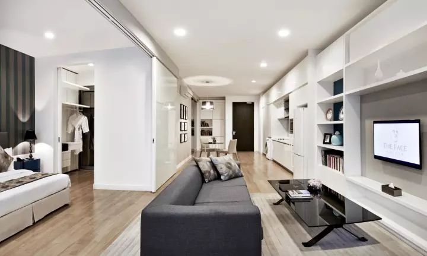 (原始链接: https://mmbiz.qpic.cn/mmbiz_jpg/8upu9Sk2EL7oAm0IYn2fuwNjIR8yupov5V3oWVGF5icBmL0pic6SutuZKRmmRNKOzZnrPW7YzcBK9Dd5xXPmEibFw/640?wx_fmt=jpeg)
- 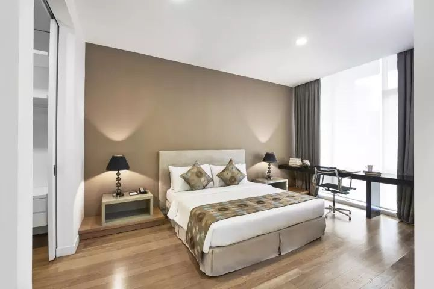 (原始链接: https://mmbiz.qpic.cn/mmbiz_jpg/8upu9Sk2EL7oAm0IYn2fuwNjIR8yupovtica7fbKYLgoVJth9KydG00yGuWzpICo5ibaAY7lMXboROlmplq2cJ5w/640?wx_fmt=jpeg)
- 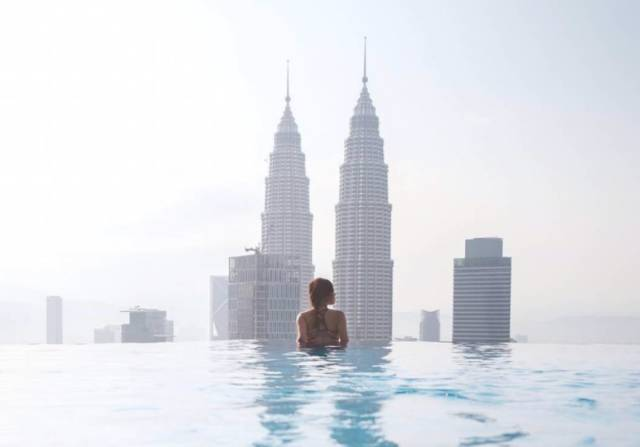 (原始链接: https://mmbiz.qpic.cn/mmbiz_png/8upu9Sk2EL7oAm0IYn2fuwNjIR8yupovEBQGQjaRHF3iakE5I0B1XZola2XMcJLFgB1VrZ5ia8jRDZH3SbXP687A/640?wx_fmt=png)
- 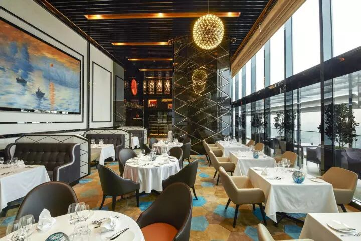 (原始链接: https://mmbiz.qpic.cn/mmbiz_jpg/8upu9Sk2EL7oAm0IYn2fuwNjIR8yupovU9Tf2I7JxyibMJDQ71cMQk8dUhGOTPCicDgyaWUMyA77qibiaWmASZVibiaw/640?wx_fmt=jpeg)
-  (原始链接: http://mmbiz.qpic.cn/mmbiz_jpg/OKNJdtlGQaJuOJTyu8SE22bD4c9QKZXFAFenxFuSd4JMjerSjs6dPvnXK3ibd02jFIsmvKstvfqxveTKMPYeBDQ/640?wx_fmt=jpeg)
- 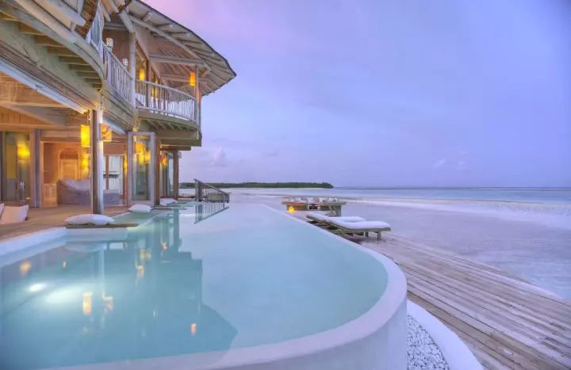 (原始链接: https://mmbiz.qpic.cn/mmbiz_jpg/8upu9Sk2EL7oAm0IYn2fuwNjIR8yupovkNx5VkUOvxS6euukVFQzgsy37jwZIDmmZsyKLkVO9WDa2Yobw5dfdQ/640?wx_fmt=jpeg)
- 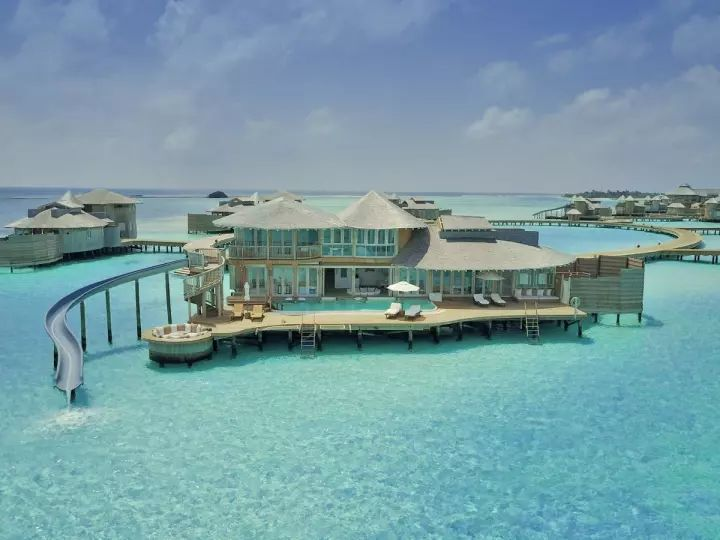 (原始链接: https://mmbiz.qpic.cn/mmbiz_jpg/8upu9Sk2EL7oAm0IYn2fuwNjIR8yupovmNsyvySS6lV9qQaLoYhQ9oj00lQybibUorE61AEhruiaiaia07n8INdgjQ/640?wx_fmt=jpeg)
- 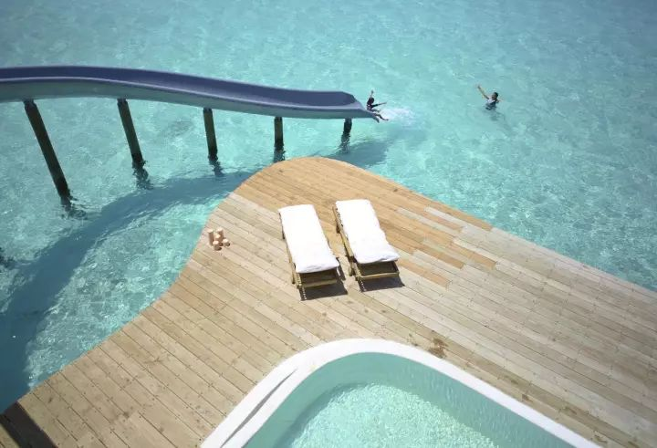 (原始链接: https://mmbiz.qpic.cn/mmbiz_jpg/8upu9Sk2EL7oAm0IYn2fuwNjIR8yupovCDKprlKdFNJ4FFw2bAiajRymsVru4lGjUPynXJhlmJayWrQOFia59mJA/640?wx_fmt=jpeg)
- 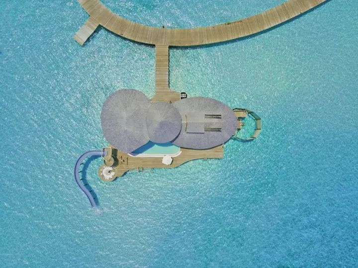 (原始链接: https://mmbiz.qpic.cn/mmbiz_jpg/8upu9Sk2EL7oAm0IYn2fuwNjIR8yupov8cbB3XpCHVmJLiaCU7s0eTlqsAycGcaCHlzIPm6P8lRcoRvTWzXh38w/640?wx_fmt=jpeg)
- 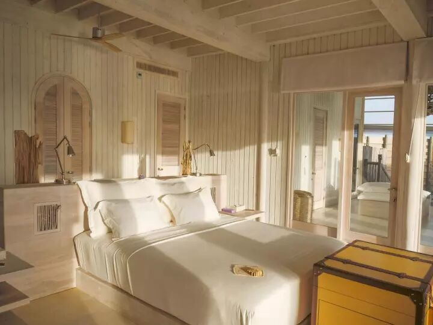 (原始链接: https://mmbiz.qpic.cn/mmbiz_jpg/8upu9Sk2EL7oAm0IYn2fuwNjIR8yupovYzHuFy7MPQKeOiadG6siaEt6FAicZWxfty6fDv8Qq1Vicu4EdJKptDB94g/640?wx_fmt=jpeg)
- 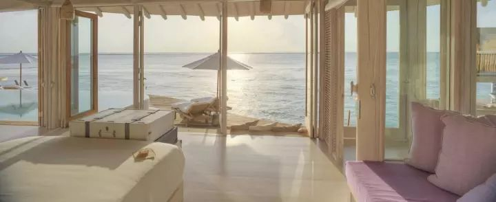 (原始链接: https://mmbiz.qpic.cn/mmbiz_jpg/8upu9Sk2EL7oAm0IYn2fuwNjIR8yupovSWkqISO3bENkHIKkf95V6kNnENyDfIvHGTtcgkm9hnTJ8aFTNPUnBA/640?wx_fmt=jpeg)
- 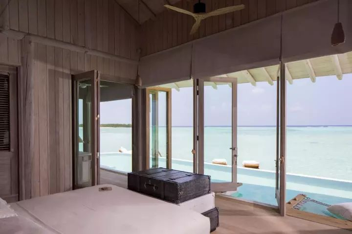 (原始链接: https://mmbiz.qpic.cn/mmbiz_jpg/8upu9Sk2EL7oAm0IYn2fuwNjIR8yupovSB5uC7rjhffRB3QyfvANZDBz8S7Lk7QCX5TCS0RXlpHfY5zrWpygag/640?wx_fmt=jpeg)
-  (原始链接: http://mmbiz.qpic.cn/mmbiz_jpg/OKNJdtlGQaJuOJTyu8SE22bD4c9QKZXFAFenxFuSd4JMjerSjs6dPvnXK3ibd02jFIsmvKstvfqxveTKMPYeBDQ/640?wx_fmt=jpeg)
- 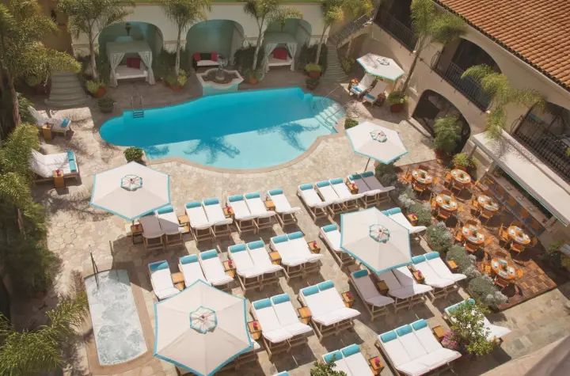 (原始链接: https://mmbiz.qpic.cn/mmbiz_jpg/8upu9Sk2EL7oAm0IYn2fuwNjIR8yupovyBlWmFm4R41YnLSToWQcehn0plaBDBsNFj8aEeItu1BicbT6rlVeG8g/640?wx_fmt=jpeg)
- 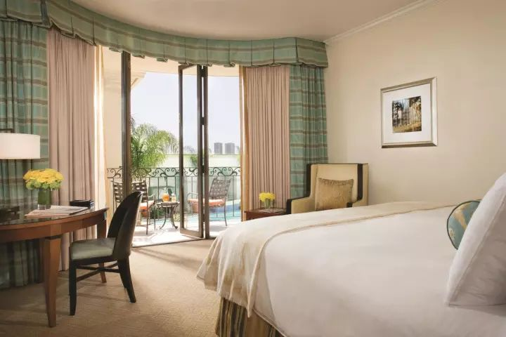 (原始链接: https://mmbiz.qpic.cn/mmbiz_jpg/8upu9Sk2EL7oAm0IYn2fuwNjIR8yupov5sq2jTNMdo9fLSD0llO2W8XN2uTDJq801TKJCTIib9xJ9A58lZ7E5Jg/640?wx_fmt=jpeg)
- 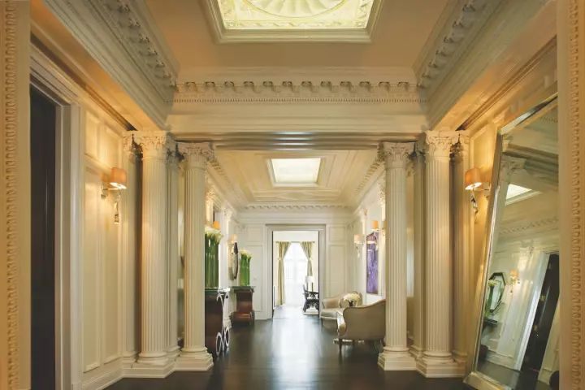 (原始链接: https://mmbiz.qpic.cn/mmbiz_jpg/8upu9Sk2EL7oAm0IYn2fuwNjIR8yupovcu7g6EI827eoT2trUhWibibac6eCk8FoM87kMfm3TK7whXhibe9cHoFjQ/640?wx_fmt=jpeg)
- 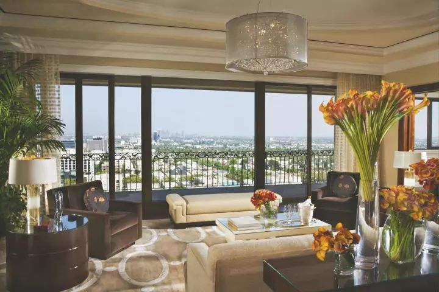 (原始链接: https://mmbiz.qpic.cn/mmbiz_jpg/8upu9Sk2EL7oAm0IYn2fuwNjIR8yupovfgE9LZ0suYjBsnLUT8JBGxKs5a0MUEiaUu2Vgbbv3bTJf8f7X9PEmibw/640?wx_fmt=jpeg)
- 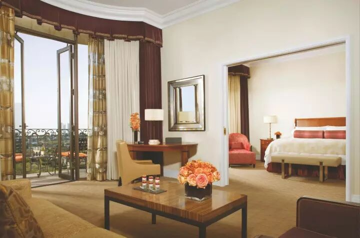 (原始链接: https://mmbiz.qpic.cn/mmbiz_jpg/8upu9Sk2EL7oAm0IYn2fuwNjIR8yupov329EDDJca5DVGibTlQFDz9MOsmoFXAgB6nC1KKzK7890fmf6phscFyw/640?wx_fmt=jpeg)
- 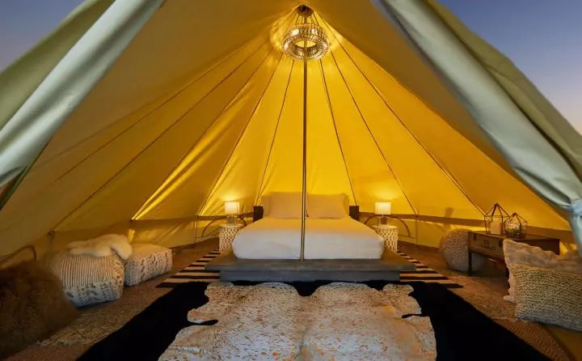 (原始链接: https://mmbiz.qpic.cn/mmbiz_jpg/8upu9Sk2EL7oAm0IYn2fuwNjIR8yupovSAYibdumDCFhaKgq6ibd2bricoJ1IFPULHcC7vo8c6qY8f1tTmAClsFdA/640?wx_fmt=jpeg)
- 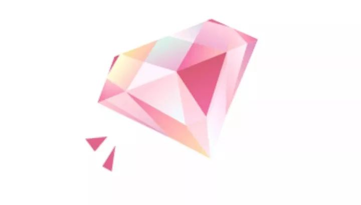 (原始链接: http://mmbiz.qpic.cn/mmbiz_jpg/OKNJdtlGQaJuOJTyu8SE22bD4c9QKZXFAFenxFuSd4JMjerSjs6dPvnXK3ibd02jFIsmvKstvfqxveTKMPYeBDQ/640?wx_fmt=jpeg)
- 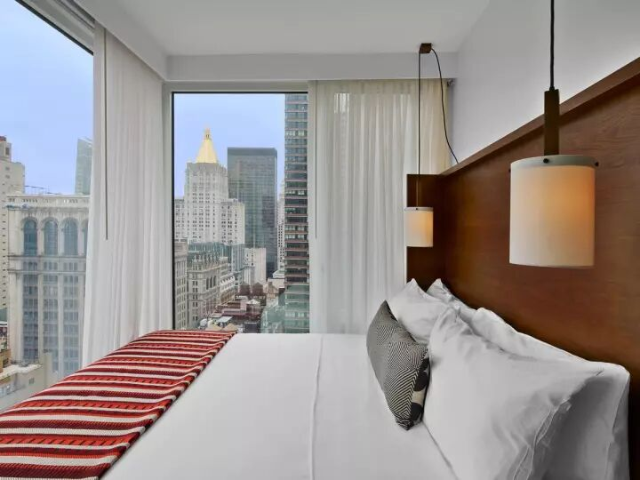 (原始链接: https://mmbiz.qpic.cn/mmbiz_jpg/8upu9Sk2EL7oAm0IYn2fuwNjIR8yupovrOrnEzvJZzJAVWvfCMxkTdSvGtFn9Xzeefl4NTtX0hX83cXOm4ZPOg/640?wx_fmt=jpeg)
- 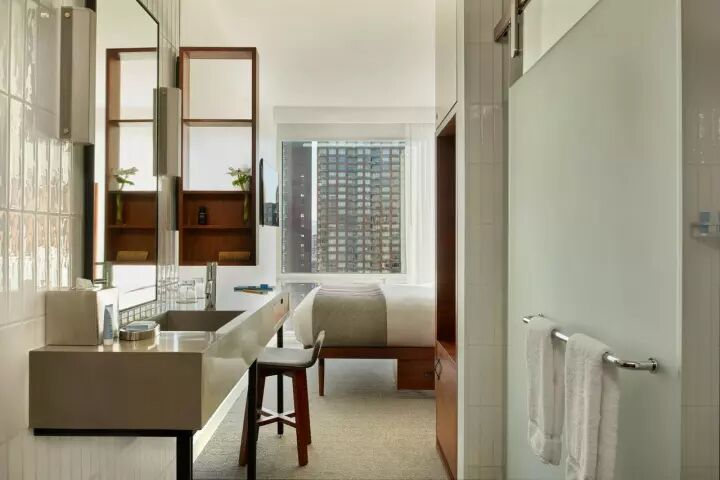 (原始链接: https://mmbiz.qpic.cn/mmbiz_jpg/8upu9Sk2EL7oAm0IYn2fuwNjIR8yupovRMKicSG5dmhIQBHJ57MasibMtGXDcWzjKC3GZsjOUcMTVHMZut8OVPpA/640?wx_fmt=jpeg)
- 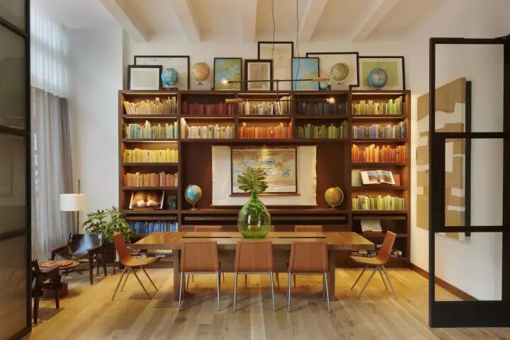 (原始链接: https://mmbiz.qpic.cn/mmbiz_jpg/8upu9Sk2EL7oAm0IYn2fuwNjIR8yupovaAEiccI3WYO3UibeGfV24b0HYaUxSqpl4WMy4IENxs9ZgVhgCWpxZW1w/640?wx_fmt=jpeg)
-  (原始链接: https://mmbiz.qpic.cn/mmbiz_jpg/8upu9Sk2EL7oAm0IYn2fuwNjIR8yupovNaWZoemK6f5FicLoV9Mc2icGZTzxfZVxbib1Mhh5HNQq8SPjGibrz9v83w/640?wx_fmt=jpeg)
-  (原始链接: http://mmbiz.qpic.cn/mmbiz_jpg/OKNJdtlGQaJuOJTyu8SE22bD4c9QKZXFAFenxFuSd4JMjerSjs6dPvnXK3ibd02jFIsmvKstvfqxveTKMPYeBDQ/640?wx_fmt=jpeg)
- 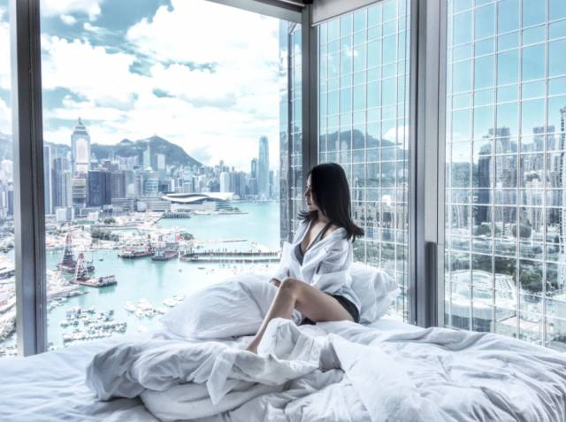 (原始链接: https://mmbiz.qpic.cn/mmbiz_png/8upu9Sk2EL7oAm0IYn2fuwNjIR8yupovXGYJYAvib9AuWLuelI1S2FibBU8vibIzE8kUnNKq8NiaAMmicwyjXK5F1jA/640?wx_fmt=png)
-  (原始链接: https://mmbiz.qpic.cn/mmbiz_gif/1iaLjNbCegtb2Oxou8VGWhOWqANKBV48uicdGF0cRBy2Y4ESkjJpUT3gRAz8HpwmrHrO0UD0PcHlQHEnVibTkuE9g/640?wx_fmt=gif)
-  (原始链接: https://mmbiz.qpic.cn/mmbiz_png/1iaLjNbCegtb2Oxou8VGWhOWqANKBV48uVAiaDt2meF66PJhzSZXMJ9Zcsb7H4a5wUzHIJwDs1iaBov0HeyYUR2AQ/640?wx_fmt=png)
