# 无标题

**链接地址:** http://mp.weixin.qq.com/s?__biz=MzI0MDQ0ODI0Ng==&mid=2247485632&idx=2&sn=1ad74021aa9c68c135da59b2813a4bc0&chksm=e91bef59de6c664f33d77618bf4864b42dcd3737ba174d6a1472129b81b211438cad59fec4af&mpshare=1&scene=2&srcid=0312neFiiYl0Hy3B5dlDu44W#rd
**作者:** 小黄鸭在多伦多
**获取时间:** 2025/8/28 22:12:41
**图片数量:** 22

---

## 原始HTML内容

<section style="white-space: normal;background-color: rgb(255, 255, 255);box-sizing: border-box;"><section class="Powered-by-XIUMI V5" style="box-sizing: border-box;"><section class="" style="box-sizing: border-box;background-color: rgba(1, 0, 0, 0);"><section class="" style="padding-right: 1px;padding-left: 1px;text-align: justify;font-size: 14px;line-height: 2;letter-spacing: 1.5px;box-sizing: border-box;">
对夏威夷原有的印象应该就是火奴鲁鲁那一条购物长街，不仅有着超低的税率，而且货品齐全，就算是多伦多被抢光了的爆品也能在那儿买到，说起来，夏威夷真的是购物者的天堂。

而今天，来说说夏威夷另一大特色，那就是吃！要说北美大陆的美食，真的能用千篇一律来形容，愿意当回头客的餐厅也是少之甚少！然而，夏威夷的日料真真的抓住了我的胃，每一餐都觉得没有吃够，每家店都觉得想再去尝尝。 

 
</section></section></section><section class="Powered-by-XIUMI V5" style="box-sizing: border-box;"><section class="" style="margin-top: 10px;margin-bottom: 10px;box-sizing: border-box;background-color: rgba(1, 0, 0, 0);"><section class="" style="display: inline-block;width: 558px;vertical-align: top;box-sizing: border-box;"><section class="Powered-by-XIUMI V5" style="box-sizing: border-box;background-color: rgba(1, 0, 0, 0);"><section class="" style="margin-top: 10px;box-sizing: border-box;"><section class="" style="display: inline-block;vertical-align: middle;width: 66.9583px;box-sizing: border-box;background-color: rgba(1, 0, 0, 0);"><section class="Powered-by-XIUMI V5" style="box-sizing: border-box;"><section class="" style="margin-top: 10px;margin-bottom: 10px;text-align: center;transform: translate3d(15px, 0px, 0px);box-sizing: border-box;background-color: rgba(1, 0, 0, 0);"><section class="" style="margin: auto;padding-right: 2px;width: 2em;display: inline-block;border-width: 3px;border-left-style: solid;border-left-color: rgb(222, 113, 98);color: rgb(222, 113, 98);line-height: 1.2;box-sizing: border-box;">
 
</section></section></section></section><section class="" style="display: inline-block;vertical-align: middle;width: 491.031px;box-sizing: border-box;background-color: rgba(1, 0, 0, 0);"><section class="Powered-by-XIUMI V5" style="box-sizing: border-box;"><section class="" style="box-sizing: border-box;background-color: rgba(1, 0, 0, 0);"><section class="" style="color: rgb(222, 113, 98);box-sizing: border-box;">
<strong style="box-sizing: border-box;">「Yakiniku Futago」</strong>
</section></section></section></section></section></section><section class="Powered-by-XIUMI V5" style="box-sizing: border-box;background-color: rgba(1, 0, 0, 0);"><section class="" style="margin-top: 10px;margin-bottom: 10px;box-sizing: border-box;"><section class="" style="padding-right: 18px;padding-left: 18px;text-align: justify;font-size: 14px;line-height: 2;letter-spacing: 3px;color: rgb(158, 87, 65);box-sizing: border-box;background-color: rgba(1, 0, 0, 0);">
做了十小时飞机，没有什么比冲出机场吃一顿烤肉更爽的了。 
</section></section></section></section></section></section><section class="Powered-by-XIUMI V5" style="box-sizing: border-box;"><section class="" style="margin-top: 10px;margin-bottom: 20px;box-sizing: border-box;background-color: rgba(1, 0, 0, 0);"><section class="" style="padding-right: 1px;padding-left: 1px;font-size: 14px;line-height: 2;letter-spacing: 1.5px;box-sizing: border-box;">
烤肉一直是人们无法拒绝的，朋友聚餐少不了，聊天畅饮也很痛快。 
</section></section></section><section class="Powered-by-XIUMI V5" style="box-sizing: border-box;"><section class="" style="margin-top: 10px;margin-bottom: 10px;text-align: center;box-sizing: border-box;background-color: rgba(1, 0, 0, 0);"><section class="" style="max-width: 100%;vertical-align: middle;display: inline-block;width: 446.396px;box-sizing: border-box;overflow: hidden !important;"></section></section></section><section class="Powered-by-XIUMI V5" style="box-sizing: border-box;"><section class="" style="box-sizing: border-box;background-color: rgba(1, 0, 0, 0);"><section class="" style="padding-right: 5px;padding-left: 5px;display: inline-block;width: 558px;vertical-align: bottom;box-sizing: border-box;"><section class="Powered-by-XIUMI V5" style="box-sizing: border-box;background-color: rgba(1, 0, 0, 0);"><section class="" style="box-sizing: border-box;"><section class="" style="padding-right: 1px;padding-left: 1px;text-align: justify;font-size: 14px;line-height: 2;letter-spacing: 1.5px;box-sizing: border-box;background-color: rgba(1, 0, 0, 0);">
这家店并没有坐落在市中心，但是进门后仍然座无虚席。uber从市中心过去10usd左右。烤肉真的超级棒，主打各种prime牛肉，也有各式set，神户牛肉也是他家的主打特色之一。说真的，日本烤肉技术是真的很赞，酱腌过的口感很棒，开到半夜，配上啤酒或者清酒，满足做了一整天飞机的胃。

人均70usd左右。 
</section></section></section></section><section class="group-empty" style="padding-right: 5px;padding-left: 5px;display: inline-block;vertical-align: bottom;width: 279px;box-sizing: border-box;"></section></section></section><section class="Powered-by-XIUMI V5" style="box-sizing: border-box;"><section class="" style="margin-top: 10px;margin-bottom: 10px;text-align: center;box-sizing: border-box;background-color: rgba(1, 0, 0, 0);"><section class="" style="max-width: 100%;vertical-align: middle;display: inline-block;box-sizing: border-box;overflow: hidden !important;"></section></section></section><section class="Powered-by-XIUMI V5" style="box-sizing: border-box;"><section class="" style="box-sizing: border-box;background-color: rgba(1, 0, 0, 0);"><section class="" style="box-sizing: border-box;">
 
</section></section></section><section class="Powered-by-XIUMI V5" style="box-sizing: border-box;"><section class="" style="box-sizing: border-box;background-color: rgba(1, 0, 0, 0);"><section class="" style="padding-right: 1px;padding-left: 1px;text-align: justify;font-size: 14px;line-height: 2;letter-spacing: 1.5px;box-sizing: border-box;">
 
</section></section></section><section class="Powered-by-XIUMI V5" style="box-sizing: border-box;"><section class="" style="box-sizing: border-box;background-color: rgba(1, 0, 0, 0);"><section class="" style="padding-right: 1px;padding-left: 1px;text-align: justify;font-size: 14px;line-height: 2;letter-spacing: 1.5px;box-sizing: border-box;">
地址：地址：949 Kapahulu Ave, Honolulu, HI 96816美国

 
</section></section></section><section class="Powered-by-XIUMI V5" style="box-sizing: border-box;"><section class="" style="margin-top: 10px;box-sizing: border-box;background-color: rgba(1, 0, 0, 0);"><section class="" style="display: inline-block;vertical-align: middle;width: 66.9583px;box-sizing: border-box;"><section class="Powered-by-XIUMI V5" style="box-sizing: border-box;background-color: rgba(1, 0, 0, 0);"><section class="" style="margin-top: 10px;margin-bottom: 10px;text-align: center;transform: translate3d(15px, 0px, 0px);box-sizing: border-box;"><section class="" style="margin: auto;padding-right: 2px;width: 2em;display: inline-block;border-width: 3px;border-left-style: solid;border-left-color: rgb(222, 113, 98);color: rgb(222, 113, 98);line-height: 1.2;box-sizing: border-box;background-color: rgba(1, 0, 0, 0);">
 
</section></section></section></section><section class="" style="display: inline-block;vertical-align: middle;width: 491.031px;box-sizing: border-box;"><section class="Powered-by-XIUMI V5" style="box-sizing: border-box;background-color: rgba(1, 0, 0, 0);"><section class="" style="box-sizing: border-box;"><section class="" style="color: rgb(222, 113, 98);box-sizing: border-box;background-color: rgba(1, 0, 0, 0);">
<strong style="box-sizing: border-box;background-color: rgba(1, 0, 0, 0);">「丸龟乌冬面」</strong>
</section></section></section></section></section></section><section class="Powered-by-XIUMI V5" style="box-sizing: border-box;"><section class="" style="margin-top: 10px;margin-bottom: 20px;box-sizing: border-box;background-color: rgba(1, 0, 0, 0);"><section class="" style="padding-right: 18px;padding-left: 18px;text-align: justify;font-size: 14px;line-height: 2;letter-spacing: 3px;color: rgb(158, 87, 65);box-sizing: border-box;">
6.99吃到夏威夷网红乌冬面 
</section></section></section><section class="Powered-by-XIUMI V5" style="box-sizing: border-box;"><section class="" style="margin-top: 10px;margin-bottom: 10px;text-align: center;box-sizing: border-box;background-color: rgba(1, 0, 0, 0);"><section class="" style="max-width: 100%;vertical-align: middle;display: inline-block;box-sizing: border-box;overflow: hidden !important;"></section></section></section><section class="Powered-by-XIUMI V5" style="box-sizing: border-box;"><section class="" style="box-sizing: border-box;background-color: rgba(1, 0, 0, 0);"><section class="" style="padding-right: 5px;padding-left: 5px;display: inline-block;vertical-align: bottom;width: 279px;box-sizing: border-box;"><section class="Powered-by-XIUMI V5" style="box-sizing: border-box;background-color: rgba(1, 0, 0, 0);"><section class="" style="margin-bottom: 2px;box-sizing: border-box;"><section class="" style="padding-right: 1px;padding-left: 1px;text-align: justify;font-size: 14px;line-height: 2;letter-spacing: 1.5px;box-sizing: border-box;background-color: rgba(1, 0, 0, 0);">
之前听人家说要排队，今天因为有时差起特别早，所以到店人不多，说真的价格实在是太便宜了！！所有东西加起来才30不到，属于自助式餐厅，不能算大餐，当个早饭或者下午点心还不错👏🏻
</section></section></section><section class="Powered-by-XIUMI V5" style="box-sizing: border-box;background-color: rgba(1, 0, 0, 0);"><section class="" style="margin-bottom: 2px;box-sizing: border-box;"><section class="" style="padding-right: 1px;padding-left: 1px;text-align: justify;font-size: 14px;line-height: 2;letter-spacing: 1.5px;box-sizing: border-box;background-color: rgba(1, 0, 0, 0);">
 
</section></section></section><section class="Powered-by-XIUMI V5" style="box-sizing: border-box;background-color: rgba(1, 0, 0, 0);"><section class="" style="box-sizing: border-box;"><section class="" style="padding-right: 1px;padding-left: 1px;text-align: justify;font-size: 14px;line-height: 2;letter-spacing: 1.5px;box-sizing: border-box;background-color: rgba(1, 0, 0, 0);">
不只有招牌乌冬面，还配有各色天妇罗以及饭团，一定不可错过的一家餐厅。 
</section></section></section></section><section class="" style="padding-right: 5px;padding-left: 5px;display: inline-block;vertical-align: bottom;width: 279px;box-sizing: border-box;"><section class="Powered-by-XIUMI V5" style="box-sizing: border-box;background-color: rgba(1, 0, 0, 0);"><section class="" style="margin-top: 10px;margin-bottom: 10px;text-align: center;box-sizing: border-box;"><section class="" style="max-width: 100%;vertical-align: middle;display: inline-block;box-sizing: border-box;background-color: rgba(1, 0, 0, 0);overflow: hidden !important;"></section></section></section></section></section></section><section class="Powered-by-XIUMI V5" style="box-sizing: border-box;"><section class="" style="margin-top: 10px;margin-bottom: 10px;text-align: center;box-sizing: border-box;background-color: rgba(1, 0, 0, 0);"><section class="" style="max-width: 100%;vertical-align: middle;display: inline-block;box-sizing: border-box;overflow: hidden !important;"></section></section></section><section class="Powered-by-XIUMI V5" style="box-sizing: border-box;"><section class="" style="margin-top: 20px;margin-bottom: 30px;box-sizing: border-box;background-color: rgba(1, 0, 0, 0);"><section class="" style="padding-right: 1px;padding-left: 1px;font-size: 14px;line-height: 2;letter-spacing: 1.5px;box-sizing: border-box;">
地址：2310 Kuhio Ave #124, Honolulu, HI 96815, 美国
</section></section></section><section class="Powered-by-XIUMI V5" style="box-sizing: border-box;"><section class="" style="margin-top: 20px;margin-bottom: 10px;box-sizing: border-box;background-color: rgba(1, 0, 0, 0);"><section class="" style="padding-right: 1px;padding-left: 1px;text-align: justify;font-size: 14px;line-height: 2;letter-spacing: 1.5px;box-sizing: border-box;">
 
</section></section></section><section class="Powered-by-XIUMI V5" style="box-sizing: border-box;"><section class="" style="margin-top: 10px;box-sizing: border-box;background-color: rgba(1, 0, 0, 0);"><section class="" style="display: inline-block;vertical-align: middle;width: 66.9583px;box-sizing: border-box;"><section class="Powered-by-XIUMI V5" style="box-sizing: border-box;background-color: rgba(1, 0, 0, 0);"><section class="" style="margin-top: 10px;margin-bottom: 10px;text-align: center;transform: translate3d(15px, 0px, 0px);box-sizing: border-box;"><section class="" style="margin: auto;padding-right: 2px;width: 2em;display: inline-block;border-width: 3px;border-left-style: solid;border-left-color: rgb(222, 113, 98);color: rgb(222, 113, 98);line-height: 1.2;box-sizing: border-box;background-color: rgba(1, 0, 0, 0);">
 
</section></section></section></section><section class="" style="display: inline-block;vertical-align: middle;width: 491.031px;box-sizing: border-box;"><section class="Powered-by-XIUMI V5" style="box-sizing: border-box;background-color: rgba(1, 0, 0, 0);"><section class="" style="box-sizing: border-box;"><section class="" style="color: rgb(222, 113, 98);box-sizing: border-box;background-color: rgba(1, 0, 0, 0);">
<strong style="box-sizing: border-box;background-color: rgba(1, 0, 0, 0);">「Alan Wong‘s」</strong>
</section></section></section></section></section></section><section class="Powered-by-XIUMI V5" style="box-sizing: border-box;"><section class="" style="margin-top: 10px;margin-bottom: 20px;box-sizing: border-box;background-color: rgba(1, 0, 0, 0);"><section class="" style="padding-right: 18px;padding-left: 18px;text-align: justify;font-size: 14px;line-height: 2;letter-spacing: 3px;color: rgb(158, 87, 65);box-sizing: border-box;">
奥巴马在当地最爱吃的餐厅之一！ 
</section></section></section><section class="Powered-by-XIUMI V5" style="box-sizing: border-box;"><section class="" style="box-sizing: border-box;background-color: rgba(1, 0, 0, 0);"><section class="" style="padding-right: 5px;padding-left: 5px;display: inline-block;vertical-align: top;width: 279px;box-shadow: rgb(0, 0, 0) 0px 0px 0px;box-sizing: border-box;"><section class="Powered-by-XIUMI V5" style="box-sizing: border-box;background-color: rgba(1, 0, 0, 0);"><section class="" style="text-align: center;box-sizing: border-box;"><section class="" style="max-width: 100%;vertical-align: middle;display: inline-block;box-sizing: border-box;background-color: rgba(1, 0, 0, 0);overflow: hidden !important;"></section></section></section><section class="Powered-by-XIUMI V5" style="box-sizing: border-box;background-color: rgba(1, 0, 0, 0);"><section class="" style="margin-top: 30px;margin-bottom: 10px;box-sizing: border-box;"><section class="" style="padding-right: 1px;padding-left: 1px;text-align: center;font-size: 14px;line-height: 2;letter-spacing: 1.5px;box-sizing: border-box;background-color: rgba(1, 0, 0, 0);">
这家店坐落的地方有点偏，座位不多，用open table定位需要预留信用卡信息。
</section></section></section></section><section class="" style="padding-right: 5px;padding-left: 5px;display: inline-block;vertical-align: top;width: 279px;box-sizing: border-box;"><section class="Powered-by-XIUMI V5" style="box-sizing: border-box;background-color: rgba(1, 0, 0, 0);"><section class="" style="text-align: center;box-sizing: border-box;"><section class="" style="max-width: 100%;vertical-align: middle;display: inline-block;box-sizing: border-box;background-color: rgba(1, 0, 0, 0);overflow: hidden !important;"></section></section></section><section class="Powered-by-XIUMI V5" style="box-sizing: border-box;background-color: rgba(1, 0, 0, 0);"><section class="" style="margin-top: 10px;margin-bottom: 10px;text-align: center;box-sizing: border-box;"><section class="" style="max-width: 100%;vertical-align: middle;display: inline-block;box-sizing: border-box;background-color: rgba(1, 0, 0, 0);overflow: hidden !important;"></section></section></section></section></section></section><section class="Powered-by-XIUMI V5" style="box-sizing: border-box;"><section class="" style="margin-top: 20px;margin-bottom: 10px;box-sizing: border-box;background-color: rgba(1, 0, 0, 0);"><section class="" style="padding-right: 1px;padding-left: 1px;text-align: justify;font-size: 14px;line-height: 2;letter-spacing: 1.5px;box-sizing: border-box;">
坐落的地方有点偏，座位不多，用open table定位需要预留信用卡信息。 沙拉🥗真的一般般，前菜点了一个seafood cake倒还是可以，没有很多腥味，但也不至于太惊艳吧。 主菜选了今日special的pork chop和pasta，pasta有点点辣酱的感觉，配上虾和蛤蜊还算鲜。但是pork chop真的有股洗洁精的味道啊，而且旁边的酱真的很难吃很难吃，我真的很怀疑奥巴马的口味，诶，我就应该来honolulu吃日料的，吃什么西餐🙄🙄  
</section></section></section><section class="Powered-by-XIUMI V5" style="box-sizing: border-box;"><section class="" style="margin-top: 10px;margin-bottom: 10px;text-align: center;box-sizing: border-box;background-color: rgba(1, 0, 0, 0);"><section class="" style="max-width: 100%;vertical-align: middle;display: inline-block;box-sizing: border-box;overflow: hidden !important;"></section></section></section><section class="Powered-by-XIUMI V5" style="box-sizing: border-box;"><section class="" style="margin-top: 20px;margin-bottom: 10px;box-sizing: border-box;background-color: rgba(1, 0, 0, 0);"><section class="" style="padding-right: 1px;padding-left: 1px;text-align: justify;font-size: 14px;line-height: 2;letter-spacing: 1.5px;box-sizing: border-box;">
 
</section></section></section><section class="Powered-by-XIUMI V5" style="box-sizing: border-box;"><section class="" style="margin-top: 20px;margin-bottom: 30px;box-sizing: border-box;background-color: rgba(1, 0, 0, 0);"><section class="" style="padding-right: 1px;padding-left: 1px;font-size: 14px;line-height: 2;letter-spacing: 1.5px;box-sizing: border-box;">
人均：70usd 

地址：1857 S King St, Honolulu, HI 96826, 美国
</section></section></section><section class="Powered-by-XIUMI V5" style="box-sizing: border-box;"><section class="" style="margin-top: 10px;box-sizing: border-box;background-color: rgba(1, 0, 0, 0);"><section class="" style="display: inline-block;vertical-align: middle;width: 66.9583px;box-sizing: border-box;"><section class="Powered-by-XIUMI V5" style="box-sizing: border-box;background-color: rgba(1, 0, 0, 0);"><section class="" style="margin-top: 10px;margin-bottom: 10px;text-align: center;transform: translate3d(15px, 0px, 0px);box-sizing: border-box;"><section class="" style="margin: auto;padding-right: 2px;width: 2em;display: inline-block;border-width: 3px;border-left-style: solid;border-left-color: rgb(222, 113, 98);color: rgb(222, 113, 98);line-height: 1.2;box-sizing: border-box;background-color: rgba(1, 0, 0, 0);">
 
</section></section></section></section><section class="" style="display: inline-block;vertical-align: middle;width: 491.031px;box-sizing: border-box;"><section class="Powered-by-XIUMI V5" style="box-sizing: border-box;background-color: rgba(1, 0, 0, 0);"><section class="" style="box-sizing: border-box;"><section class="" style="color: rgb(222, 113, 98);box-sizing: border-box;background-color: rgba(1, 0, 0, 0);">
<strong style="box-sizing: border-box;background-color: rgba(1, 0, 0, 0);">「Izakaya Takonoki」</strong>
</section></section></section><section class="Powered-by-XIUMI V5" style="box-sizing: border-box;background-color: rgba(1, 0, 0, 0);"><section class="" style="box-sizing: border-box;"><section class="" style="color: rgb(222, 113, 98);box-sizing: border-box;background-color: rgba(1, 0, 0, 0);">
 
</section></section></section></section></section></section><section class="Powered-by-XIUMI V5" style="box-sizing: border-box;"><section class="" style="margin-top: 10px;margin-bottom: 10px;box-sizing: border-box;background-color: rgba(1, 0, 0, 0);"><section class="" style="padding-right: 18px;padding-left: 18px;text-align: justify;font-size: 14px;line-height: 2;letter-spacing: 3px;color: rgb(158, 87, 65);box-sizing: border-box;">
居酒屋+烤物 
</section></section></section><section class="Powered-by-XIUMI V5" style="box-sizing: border-box;"><section class="" style="box-sizing: border-box;background-color: rgba(1, 0, 0, 0);"><section class="" style="padding-right: 5px;padding-left: 5px;display: inline-block;vertical-align: bottom;width: 279px;box-sizing: border-box;"><section class="Powered-by-XIUMI V5" style="box-sizing: border-box;background-color: rgba(1, 0, 0, 0);"><section class="" style="margin-top: 30px;margin-bottom: 10px;box-sizing: border-box;"><section class="" style="padding-right: 1px;padding-left: 1px;text-align: center;line-height: 2;letter-spacing: 1.5px;box-sizing: border-box;background-color: rgba(1, 0, 0, 0);">
晚上的飞机回的honolulu，就近选择了一家居酒屋，啤酒烤串🍺，八卦琐事，老友畅谈，生活还是那么美好！   
</section></section></section></section><section class="" style="padding-right: 5px;padding-left: 5px;display: inline-block;vertical-align: bottom;width: 279px;box-sizing: border-box;"><section class="Powered-by-XIUMI V5" style="box-sizing: border-box;background-color: rgba(1, 0, 0, 0);"><section class="" style="margin-top: 10px;margin-bottom: 10px;text-align: center;box-sizing: border-box;"><section class="" style="max-width: 100%;vertical-align: middle;display: inline-block;box-sizing: border-box;background-color: rgba(1, 0, 0, 0);overflow: hidden !important;"></section></section></section><section class="Powered-by-XIUMI V5" style="box-sizing: border-box;background-color: rgba(1, 0, 0, 0);"><section class="" style="margin-top: 10px;margin-bottom: 10px;text-align: center;box-sizing: border-box;"><section class="" style="max-width: 100%;vertical-align: middle;display: inline-block;box-sizing: border-box;background-color: rgba(1, 0, 0, 0);overflow: hidden !important;"></section></section></section></section></section></section><section class="Powered-by-XIUMI V5" style="box-sizing: border-box;"><section class="" style="box-sizing: border-box;background-color: rgba(1, 0, 0, 0);"><section class="" style="box-sizing: border-box;">
 
</section></section></section><section class="Powered-by-XIUMI V5" style="box-sizing: border-box;"><section class="" style="margin-top: 20px;margin-bottom: 10px;box-sizing: border-box;background-color: rgba(1, 0, 0, 0);"><section class="" style="padding-right: 1px;padding-left: 1px;text-align: justify;font-size: 14px;line-height: 2;letter-spacing: 1.5px;box-sizing: border-box;">
推荐它家的烤鸡翅和烤鸡腿，酥酥脆脆，肉质很嫩。在海岛当然必不可少的要点烤鱼啦！如果觉得烤串吃不饱就来一碗拉面，鲜得很！

他家提供中文menu，但说实话连我个中国人都看太不懂，还不如英文的靠谱！鸡心也是很推荐，烧的还不错，就是整体口感偏咸，不过配上啤酒也是美滋滋。 
</section></section></section><section class="Powered-by-XIUMI V5" style="box-sizing: border-box;"><section class="" style="margin-top: 10px;margin-bottom: 10px;text-align: center;box-sizing: border-box;background-color: rgba(1, 0, 0, 0);"><section class="" style="max-width: 100%;vertical-align: middle;display: inline-block;box-shadow: rgb(160, 160, 160) 0px 0px 0px;box-sizing: border-box;overflow: hidden !important;"></section></section></section><section class="Powered-by-XIUMI V5" style="box-sizing: border-box;"><section class="" style="margin-top: 20px;margin-bottom: 30px;box-sizing: border-box;background-color: rgba(1, 0, 0, 0);"><section class="" style="padding-right: 1px;padding-left: 1px;font-size: 14px;line-height: 2;letter-spacing: 1.5px;box-sizing: border-box;">
地址：355 Royal Hawaiian Ave # 201, Honolulu, HI 96815美国
</section></section></section><section class="Powered-by-XIUMI V5" style="box-sizing: border-box;"><section class="" style="margin-top: 10px;box-sizing: border-box;background-color: rgba(1, 0, 0, 0);"><section class="" style="display: inline-block;vertical-align: middle;width: 66.9583px;box-sizing: border-box;"><section class="Powered-by-XIUMI V5" style="box-sizing: border-box;background-color: rgba(1, 0, 0, 0);"><section class="" style="margin-top: 10px;margin-bottom: 10px;text-align: center;transform: translate3d(15px, 0px, 0px);box-sizing: border-box;"><section class="" style="margin: auto;padding-right: 2px;width: 2em;display: inline-block;border-width: 3px;border-left-style: solid;border-left-color: rgb(222, 113, 98);color: rgb(222, 113, 98);line-height: 1.2;box-sizing: border-box;background-color: rgba(1, 0, 0, 0);">
 
</section></section></section></section><section class="" style="display: inline-block;vertical-align: middle;width: 491.031px;box-sizing: border-box;"><section class="Powered-by-XIUMI V5" style="box-sizing: border-box;background-color: rgba(1, 0, 0, 0);"><section class="" style="box-sizing: border-box;"><section class="" style="color: rgb(222, 113, 98);box-sizing: border-box;background-color: rgba(1, 0, 0, 0);">
<strong style="box-sizing: border-box;background-color: rgba(1, 0, 0, 0);">「Musubi Cafe IYASUME」</strong>
</section></section></section></section></section></section><section class="Powered-by-XIUMI V5" style="box-sizing: border-box;"><section class="" style="margin-top: 10px;margin-bottom: 10px;box-sizing: border-box;background-color: rgba(1, 0, 0, 0);"><section class="" style="padding-right: 18px;padding-left: 18px;text-align: justify;font-size: 14px;line-height: 2;letter-spacing: 3px;color: rgb(158, 87, 65);box-sizing: border-box;">
内有乾坤的便利小店 
</section></section></section><section class="Powered-by-XIUMI V5" style="box-sizing: border-box;"><section class="" style="box-sizing: border-box;background-color: rgba(1, 0, 0, 0);"><section class="" style="padding-right: 5px;padding-left: 5px;display: inline-block;vertical-align: bottom;width: 279px;box-sizing: border-box;"><section class="Powered-by-XIUMI V5" style="box-sizing: border-box;background-color: rgba(1, 0, 0, 0);"><section class="" style="margin-top: 10px;margin-bottom: 10px;text-align: right;transform: translate3d(0px, 0px, 0px);font-size: 18px;box-sizing: border-box;"><section class="" style="max-width: 100%;vertical-align: middle;display: inline-block;width: 269px;box-sizing: border-box;background-color: rgba(1, 0, 0, 0);overflow: hidden !important;"></section></section></section><section class="Powered-by-XIUMI V5" style="box-sizing: border-box;background-color: rgba(1, 0, 0, 0);"><section class="" style="margin-top: 10px;margin-bottom: 10px;text-align: right;transform: translate3d(0px, 0px, 0px);box-sizing: border-box;"><section class="" style="max-width: 100%;vertical-align: middle;display: inline-block;width: 269px;box-sizing: border-box;background-color: rgba(1, 0, 0, 0);overflow: hidden !important;"></section></section></section></section><section class="" style="padding-right: 5px;padding-left: 5px;display: inline-block;vertical-align: bottom;width: 279px;box-sizing: border-box;"><section class="Powered-by-XIUMI V5" style="box-sizing: border-box;background-color: rgba(1, 0, 0, 0);"><section class="" style="margin-top: 10px;margin-bottom: 10px;box-sizing: border-box;"><section class="" style="padding-right: 1px;padding-left: 1px;text-align: justify;font-size: 14px;line-height: 2;letter-spacing: 1.5px;box-sizing: border-box;background-color: rgba(1, 0, 0, 0);">
看google上是一家便利店的感觉，但其实也没有那么小，有大概五六桌位子. 
</section></section></section><section class="Powered-by-XIUMI V5" style="box-sizing: border-box;background-color: rgba(1, 0, 0, 0);"><section class="" style="margin-top: 10px;margin-bottom: 10px;transform: translate3d(0px, 0px, 0px);box-sizing: border-box;"><section class="" style="max-width: 100%;vertical-align: middle;display: inline-block;width: 269px;box-shadow: rgb(0, 0, 0) 0px 0px 0px;box-sizing: border-box;background-color: rgba(1, 0, 0, 0);overflow: hidden !important;"></section></section></section></section></section></section><section class="Powered-by-XIUMI V5" style="box-sizing: border-box;"><section class="" style="box-sizing: border-box;background-color: rgba(1, 0, 0, 0);"><section class="" style="padding-right: 5px;padding-left: 5px;display: inline-block;vertical-align: bottom;width: 558px;box-sizing: border-box;"><section class="Powered-by-XIUMI V5" style="box-sizing: border-box;background-color: rgba(1, 0, 0, 0);"><section class="" style="margin-top: 10px;margin-bottom: 15px;box-sizing: border-box;"><section class="" style="text-align: center;font-size: 14px;box-sizing: border-box;background-color: rgba(1, 0, 0, 0);">
主打的就是各式午餐肉饭团🍙和一些经典日式小吃定食，关东煮还不错🍢，牛肉Don和eel bowl都还可以，就是量有点小，不过他家的价格就是很实在的，不够吃的可以点两份，miso soup好喝，我还买了一个类似于油炸大肉丸的东西，配点酱很赞。
</section></section></section></section><section class="group-empty" style="padding-right: 5px;padding-left: 5px;display: inline-block;vertical-align: bottom;width: 279px;box-sizing: border-box;"></section></section></section><section class="Powered-by-XIUMI V5" style="box-sizing: border-box;"><section class="" style="margin-top: 10px;margin-bottom: 10px;text-align: center;box-sizing: border-box;background-color: rgba(1, 0, 0, 0);"><section class="" style="max-width: 100%;vertical-align: middle;display: inline-block;box-sizing: border-box;overflow: hidden !important;"></section></section></section><section class="Powered-by-XIUMI V5" style="box-sizing: border-box;"><section class="" style="margin-top: 20px;margin-bottom: 30px;box-sizing: border-box;background-color: rgba(1, 0, 0, 0);"><section class="" style="padding-right: 1px;padding-left: 1px;text-align: justify;font-size: 14px;line-height: 2;letter-spacing: 1.5px;box-sizing: border-box;">
 

地址：2427 Kuhio Ave, Honolulu
</section></section></section><section class="Powered-by-XIUMI V5" style="box-sizing: border-box;"><section class="" style="margin-top: 10px;box-sizing: border-box;background-color: rgba(1, 0, 0, 0);"><section class="" style="display: inline-block;vertical-align: middle;width: 66.9583px;box-sizing: border-box;"><section class="Powered-by-XIUMI V5" style="box-sizing: border-box;background-color: rgba(1, 0, 0, 0);"><section class="" style="margin-top: 10px;margin-bottom: 10px;text-align: center;transform: translate3d(15px, 0px, 0px);box-sizing: border-box;"><section class="" style="margin: auto;padding-right: 2px;width: 2em;display: inline-block;border-width: 3px;border-left-style: solid;border-left-color: rgb(222, 113, 98);color: rgb(222, 113, 98);line-height: 1.2;box-sizing: border-box;background-color: rgba(1, 0, 0, 0);">
 
</section></section></section></section><section class="" style="display: inline-block;vertical-align: middle;width: 491.031px;box-sizing: border-box;"><section class="Powered-by-XIUMI V5" style="box-sizing: border-box;background-color: rgba(1, 0, 0, 0);"><section class="" style="box-sizing: border-box;"><section class="" style="color: rgb(222, 113, 98);box-sizing: border-box;background-color: rgba(1, 0, 0, 0);">
<strong style="box-sizing: border-box;background-color: rgba(1, 0, 0, 0);">「静流 sizzle」</strong>
</section></section></section></section></section></section><section class="Powered-by-XIUMI V5" style="box-sizing: border-box;"><section class="" style="margin-top: 10px;margin-bottom: 10px;box-sizing: border-box;background-color: rgba(1, 0, 0, 0);"><section class="" style="padding-right: 18px;padding-left: 18px;text-align: justify;font-size: 14px;line-height: 2;letter-spacing: 3px;color: rgb(158, 87, 65);box-sizing: border-box;">
美食plaza——满足不同的胃 
</section></section></section><section class="Powered-by-XIUMI V5" style="box-sizing: border-box;"><section class="" style="box-sizing: border-box;background-color: rgba(1, 0, 0, 0);"><section class="" style="padding-right: 5px;padding-left: 5px;display: inline-block;vertical-align: bottom;width: 279px;box-sizing: border-box;"><section class="Powered-by-XIUMI V5" style="box-sizing: border-box;background-color: rgba(1, 0, 0, 0);"><section class="" style="margin-top: 10px;margin-bottom: 15px;box-sizing: border-box;"><section class="" style="text-align: center;font-size: 14px;box-sizing: border-box;background-color: rgba(1, 0, 0, 0);">
这家店坐落在在奢侈品大道上的一个日本餐厅plaza（Waikiki Yokocho），里面有各式拉面烧烤锅物天妇罗抹茶甜品crepes等等。可以找家自己喜欢坐下来吃。 
</section></section></section><section class="Powered-by-XIUMI V5" style="box-sizing: border-box;background-color: rgba(1, 0, 0, 0);"><section class="" style="margin-top: 10px;margin-bottom: 10px;text-align: center;box-sizing: border-box;"><section class="" style="max-width: 100%;vertical-align: middle;display: inline-block;box-sizing: border-box;background-color: rgba(1, 0, 0, 0);overflow: hidden !important;"></section></section></section></section><section class="" style="padding-right: 5px;padding-left: 5px;display: inline-block;vertical-align: bottom;width: 279px;box-sizing: border-box;"><section class="Powered-by-XIUMI V5" style="box-sizing: border-box;background-color: rgba(1, 0, 0, 0);"><section class="" style="margin-top: 10px;margin-bottom: 10px;text-align: center;box-sizing: border-box;"><section class="" style="max-width: 100%;vertical-align: middle;display: inline-block;box-sizing: border-box;background-color: rgba(1, 0, 0, 0);overflow: hidden !important;"></section></section></section></section></section></section><section class="Powered-by-XIUMI V5" style="box-sizing: border-box;"><section class="" style="margin-top: 20px;box-sizing: border-box;background-color: rgba(1, 0, 0, 0);"><section class="" style="padding-right: 1px;padding-left: 1px;text-align: justify;font-size: 14px;line-height: 2;letter-spacing: 1.5px;box-sizing: border-box;">
我选择的这家在yokocho进去不远处，有我最爱的shabu-shabu，还有烧烤。（本来打算去一家韩国的shabu-shabu店，但是下午五点才开门，今天晚上有飞机，怕赶不上就进了这个plaza，亲测好吃！）这个锅就是清汤+菌菇+大白菜+海带，滚熟后下各种肉，然后肉吃完后下一碗米饭🍚！真的贼棒！因为混上了肉的味道，我很喜欢，多村并没有这类餐厅好像。一个set70usd，两个人吃绰绰有余，套餐还送四块唐扬块。很推荐！
</section></section></section><section class="Powered-by-XIUMI V5" style="box-sizing: border-box;"><section class="" style="margin-top: 10px;margin-bottom: 10px;text-align: center;box-sizing: border-box;background-color: rgba(1, 0, 0, 0);"><section class="" style="max-width: 100%;vertical-align: middle;display: inline-block;box-sizing: border-box;overflow: hidden !important;"></section></section></section><section class="Powered-by-XIUMI V5" style="box-sizing: border-box;"><section class="" style="margin-top: 20px;margin-bottom: 30px;box-sizing: border-box;background-color: rgba(1, 0, 0, 0);"><section class="" style="padding-right: 1px;padding-left: 1px;font-size: 14px;line-height: 2;letter-spacing: 1.5px;box-sizing: border-box;">
地址：2250 Kalakaua Ave, Honolulu
</section></section></section><section class="Powered-by-XIUMI V5" style="box-sizing: border-box;"><section class="" style="box-sizing: border-box;background-color: rgba(1, 0, 0, 0);"><section class="" style="padding-right: 1px;padding-left: 1px;text-align: center;line-height: 2;font-size: 14px;letter-spacing: 1.5px;box-sizing: border-box;">
看到这些美食有没有很饿啊？

快点约上小哥哥说走就走吧！

 
</section></section></section><section class="Powered-by-XIUMI V5" style="box-sizing: border-box;"><section class="" style="box-sizing: border-box;background-color: rgba(1, 0, 0, 0);"><section class="" style="padding-right: 1px;padding-left: 1px;line-height: 2;letter-spacing: 1.5px;font-size: 12px;box-sizing: border-box;">
以上所有内容整理自 

 

@小黄鸭在土伦土

 
</section></section></section><section class="Powered-by-XIUMI V5" style="box-sizing: border-box;"><section class="" style="margin-top: 10px;margin-bottom: 10px;text-align: center;box-sizing: border-box;background-color: rgba(1, 0, 0, 0);"><section class="" style="max-width: 100%;vertical-align: middle;display: inline-block;width: 279px;box-sizing: border-box;overflow: hidden !important;"></section></section></section><section class="Powered-by-XIUMI V5" style="box-sizing: border-box;"><section class="" style="box-sizing: border-box;background-color: rgba(1, 0, 0, 0);"><section class="" style="display: inline-block;vertical-align: top;width: 251.094px;background-image: url(&quot;https://mmbiz.qpic.cn/mmbiz_gif/XA8n2XaESnQxBNGgkYLelXjNEAZoSzDP9atib88OeR6aZGxWia5jQicpmc2QdfzicOp2uFpHKLvwdceEsolX41qo8g/640?wx_fmt=gif&quot;);background-position: 50% 50%;background-repeat: no-repeat;background-size: 100%;background-attachment: scroll;box-sizing: border-box;"><section class="Powered-by-XIUMI V5" style="box-sizing: border-box;background-color: rgba(1, 0, 0, 0);"><section class="" style="margin-top: 20px;margin-bottom: 20px;text-align: center;box-sizing: border-box;"><section class="" style="max-width: 100%;vertical-align: middle;display: inline-block;width: 175.76px;box-sizing: border-box;background-color: rgba(1, 0, 0, 0);overflow: hidden !important;"></section></section></section></section><section class="" style="display: inline-block;vertical-align: top;width: 306.896px;box-sizing: border-box;"><section class="Powered-by-XIUMI V5" style="box-sizing: border-box;background-color: rgba(1, 0, 0, 0);"><section class="" style="margin-top: 0.5em;margin-bottom: 0.5em;box-sizing: border-box;"><section class="" style="display: inline-block;vertical-align: top;width: 61.375px;box-sizing: border-box;background-color: rgba(1, 0, 0, 0);"><section class="Powered-by-XIUMI V5" style="box-sizing: border-box;"><section class="" style="text-align: center;box-sizing: border-box;background-color: rgba(1, 0, 0, 0);"><section class="" style="max-width: 100%;vertical-align: middle;display: inline-block;box-sizing: border-box;overflow: hidden !important;"></section></section></section></section><section class="" style="padding-right: 10px;padding-left: 10px;display: inline-block;vertical-align: top;width: 245.51px;box-sizing: border-box;background-color: rgba(1, 0, 0, 0);"><section class="Powered-by-XIUMI V5" style="box-sizing: border-box;"><section class="" style="box-sizing: border-box;background-color: rgba(1, 0, 0, 0);"><section class="" style="box-sizing: border-box;">
长按识别左侧二维码，关注我们
</section></section></section></section></section></section></section></section></section><section class="Powered-by-XIUMI V5" style="box-sizing: border-box;"><section class="" style="margin-top: 10px;margin-bottom: 10px;box-sizing: border-box;background-color: rgba(1, 0, 0, 0);"></section></section></section>
 

---

## 纯文本内容

对夏威夷原有的印象应该就是火奴鲁鲁那一条购物长街，不仅有着超低的税率，而且货品齐全，就算是多伦多被抢光了的爆品也能在那儿买到，说起来，夏威夷真的是购物者的天堂。而今天，来说说夏威夷另一大特色，那就是吃！要说北美大陆的美食，真的能用千篇一律来形容，愿意当回头客的餐厅也是少之甚少！然而，夏威夷的日料真真的抓住了我的胃，每一餐都觉得没有吃够，每家店都觉得想再去尝尝。「Yakiniku Futago」做了十小时飞机，没有什么比冲出机场吃一顿烤肉更爽的了。烤肉一直是人们无法拒绝的，朋友聚餐少不了，聊天畅饮也很痛快。这家店并没有坐落在市中心，但是进门后仍然座无虚席。uber从市中心过去10usd左右。烤肉真的超级棒，主打各种prime牛肉，也有各式set，神户牛肉也是他家的主打特色之一。说真的，日本烤肉技术是真的很赞，酱腌过的口感很棒，开到半夜，配上啤酒或者清酒，满足做了一整天飞机的胃。人均70usd左右。地址：地址：949 Kapahulu Ave, Honolulu, HI 96816美国「丸龟乌冬面」6.99吃到夏威夷网红乌冬面之前听人家说要排队，今天因为有时差起特别早，所以到店人不多，说真的价格实在是太便宜了！！所有东西加起来才30不到，属于自助式餐厅，不能算大餐，当个早饭或者下午点心还不错👏🏻不只有招牌乌冬面，还配有各色天妇罗以及饭团，一定不可错过的一家餐厅。地址：2310 Kuhio Ave #124, Honolulu, HI 96815, 美国「Alan Wong‘s」奥巴马在当地最爱吃的餐厅之一！这家店坐落的地方有点偏，座位不多，用open table定位需要预留信用卡信息。坐落的地方有点偏，座位不多，用open table定位需要预留信用卡信息。沙拉🥗真的一般般，前菜点了一个seafood cake倒还是可以，没有很多腥味，但也不至于太惊艳吧。主菜选了今日special的pork chop和pasta，pasta有点点辣酱的感觉，配上虾和蛤蜊还算鲜。但是pork chop真的有股洗洁精的味道啊，而且旁边的酱真的很难吃很难吃，我真的很怀疑奥巴马的口味，诶，我就应该来honolulu吃日料的，吃什么西餐🙄🙄人均：70usd地址：1857 S King St, Honolulu, HI 96826, 美国「Izakaya Takonoki」居酒屋+烤物晚上的飞机回的honolulu，就近选择了一家居酒屋，啤酒烤串🍺，八卦琐事，老友畅谈，生活还是那么美好！推荐它家的烤鸡翅和烤鸡腿，酥酥脆脆，肉质很嫩。在海岛当然必不可少的要点烤鱼啦！如果觉得烤串吃不饱就来一碗拉面，鲜得很！他家提供中文menu，但说实话连我个中国人都看太不懂，还不如英文的靠谱！鸡心也是很推荐，烧的还不错，就是整体口感偏咸，不过配上啤酒也是美滋滋。地址：355 Royal Hawaiian Ave # 201, Honolulu, HI 96815美国「Musubi Cafe IYASUME」内有乾坤的便利小店看google上是一家便利店的感觉，但其实也没有那么小，有大概五六桌位子.主打的就是各式午餐肉饭团🍙和一些经典日式小吃定食，关东煮还不错🍢，牛肉Don和eel bowl都还可以，就是量有点小，不过他家的价格就是很实在的，不够吃的可以点两份，miso soup好喝，我还买了一个类似于油炸大肉丸的东西，配点酱很赞。地址：2427 Kuhio Ave, Honolulu「静流 sizzle」美食plaza——满足不同的胃这家店坐落在在奢侈品大道上的一个日本餐厅plaza（Waikiki Yokocho），里面有各式拉面烧烤锅物天妇罗抹茶甜品crepes等等。可以找家自己喜欢坐下来吃。我选择的这家在yokocho进去不远处，有我最爱的shabu-shabu，还有烧烤。（本来打算去一家韩国的shabu-shabu店，但是下午五点才开门，今天晚上有飞机，怕赶不上就进了这个plaza，亲测好吃！）这个锅就是清汤+菌菇+大白菜+海带，滚熟后下各种肉，然后肉吃完后下一碗米饭🍚！真的贼棒！因为混上了肉的味道，我很喜欢，多村并没有这类餐厅好像。一个set70usd，两个人吃绰绰有余，套餐还送四块唐扬块。很推荐！地址：2250 Kalakaua Ave, Honolulu看到这些美食有没有很饿啊？快点约上小哥哥说走就走吧！以上所有内容整理自@小黄鸭在土伦土长按识别左侧二维码，关注我们

---

## 图片列表

- 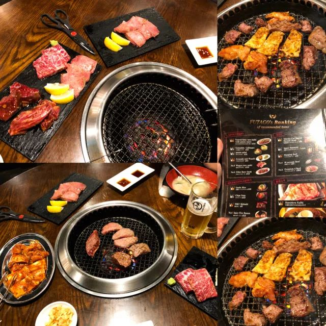 (原始链接: https://mmbiz.qpic.cn/mmbiz_jpg/XA8n2XaESnQxBNGgkYLelXjNEAZoSzDPTOHoSNJWnOzdNxHghNenhfjkIG6qtrEzph7rdQhmyicTeAkkx5LgQMg/640?wx_fmt=jpeg)
-  (原始链接: https://mmbiz.qpic.cn/mmbiz_jpg/XA8n2XaESnQxBNGgkYLelXjNEAZoSzDPqQFDQY8nIgdGd0UZglicx8icRYSvTficTX7d4ibGyGGQ1r6mIgfEs6FP6w/640?wx_fmt=jpeg)
- 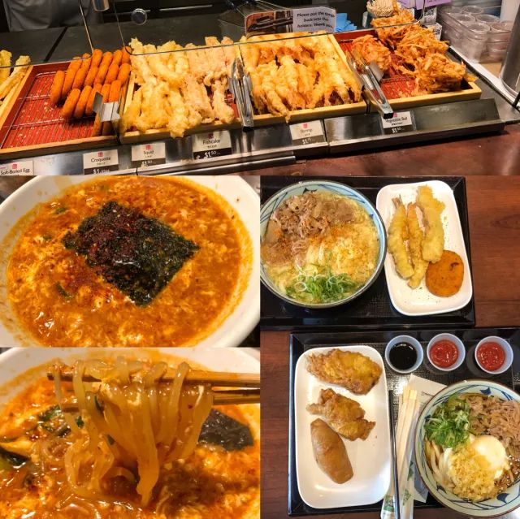 (原始链接: https://mmbiz.qpic.cn/mmbiz_jpg/XA8n2XaESnQxBNGgkYLelXjNEAZoSzDPhVVU87dJpxN7edvYH0etLLzicTzQ1sHr3JLUMRSNH7t5eD5qKicQr6TQ/640?wx_fmt=jpeg)
- 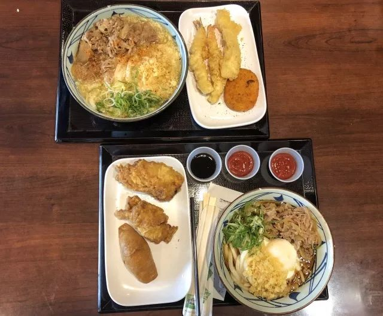 (原始链接: https://mmbiz.qpic.cn/mmbiz_jpg/XA8n2XaESnQxBNGgkYLelXjNEAZoSzDPyiaxs1PYMxEGEwJwgLxp6fGPq1BUHgCJv3n6bibs46HxicN9ZCV4f9gBQ/640?wx_fmt=jpeg)
- 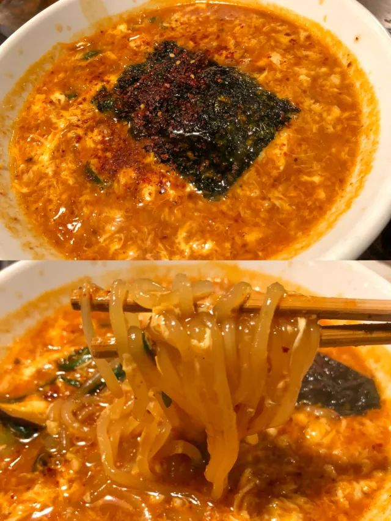 (原始链接: https://mmbiz.qpic.cn/mmbiz_jpg/XA8n2XaESnQxBNGgkYLelXjNEAZoSzDPVeNDQFrEkgUITB3vEyhVWUcJQYOe1vt6njAu2LYMFzG2rNc21WZiamg/640?wx_fmt=jpeg)
- 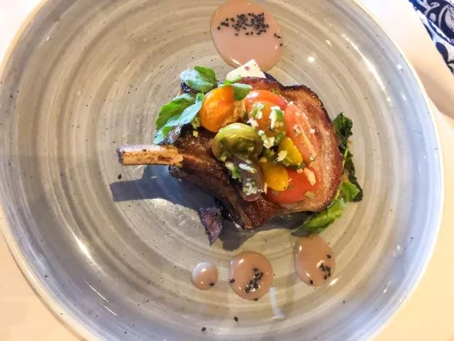 (原始链接: https://mmbiz.qpic.cn/mmbiz_jpg/XA8n2XaESnQxBNGgkYLelXjNEAZoSzDPmCOz0UZF0QPVjOMhTib9TBR9Zko7jPlOMTSlJCyylwKeejQypKHtibcg/640?wx_fmt=jpeg)
- 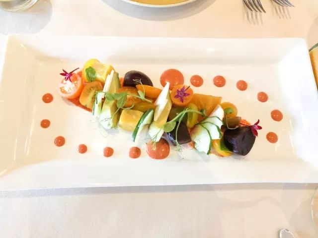 (原始链接: https://mmbiz.qpic.cn/mmbiz_jpg/XA8n2XaESnQxBNGgkYLelXjNEAZoSzDPxIt7iaiaK4AeeLsSUuQ12LLqqs0vq0L8rSB9U8Zq66ibjBW8kEia6S9KdQ/640?wx_fmt=jpeg)
- 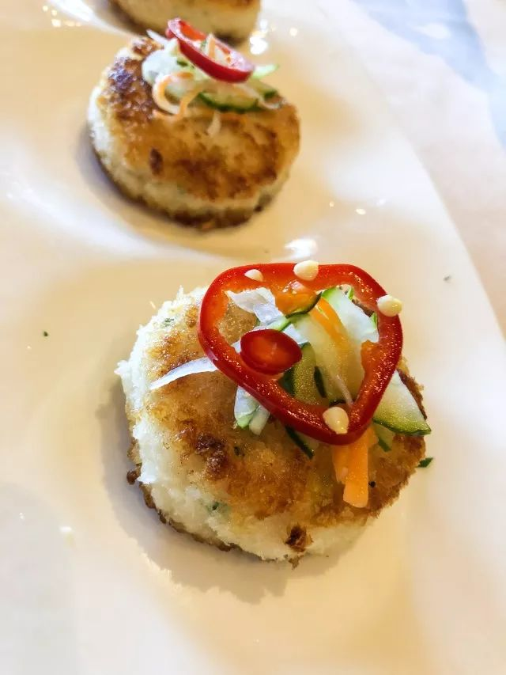 (原始链接: https://mmbiz.qpic.cn/mmbiz_jpg/XA8n2XaESnQxBNGgkYLelXjNEAZoSzDPxqnHcPjkvS4ccoYnZoq3UicMcjh6QcFve8vv2VhgaXAQsH9CaBmlrLQ/640?wx_fmt=jpeg)
- 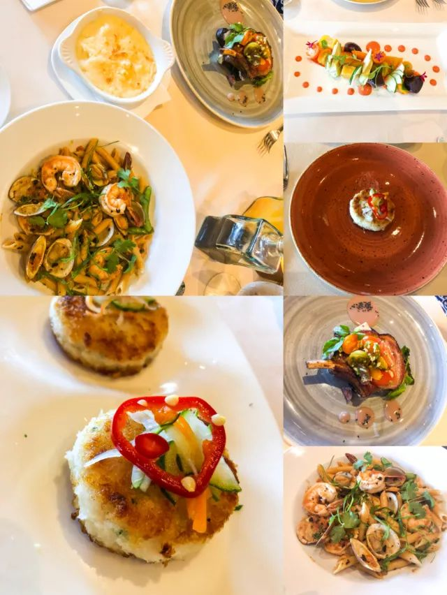 (原始链接: https://mmbiz.qpic.cn/mmbiz_jpg/XA8n2XaESnQxBNGgkYLelXjNEAZoSzDP91aDsUoGtepwRJ1ZPiagO59iamickzPttBUVN0on13Yt9I21qcPxWz0OA/640?wx_fmt=jpeg)
- 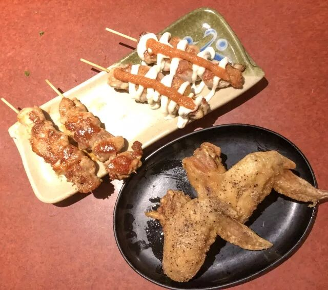 (原始链接: https://mmbiz.qpic.cn/mmbiz_jpg/XA8n2XaESnQxBNGgkYLelXjNEAZoSzDPia8icibbY0LI0nEtw9a1qjNxibJEJDL3HrdviacDDKouVE1oBWo8m9qsVUg/640?wx_fmt=jpeg)
- 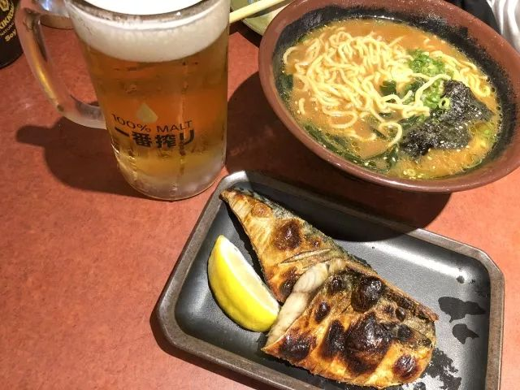 (原始链接: https://mmbiz.qpic.cn/mmbiz_jpg/XA8n2XaESnQxBNGgkYLelXjNEAZoSzDP3QsMr8PuiagUxEu8fF8nT4kDgpdFB0ZiaRJ9TTWxLuZuHiakUybInEnLw/640?wx_fmt=jpeg)
- 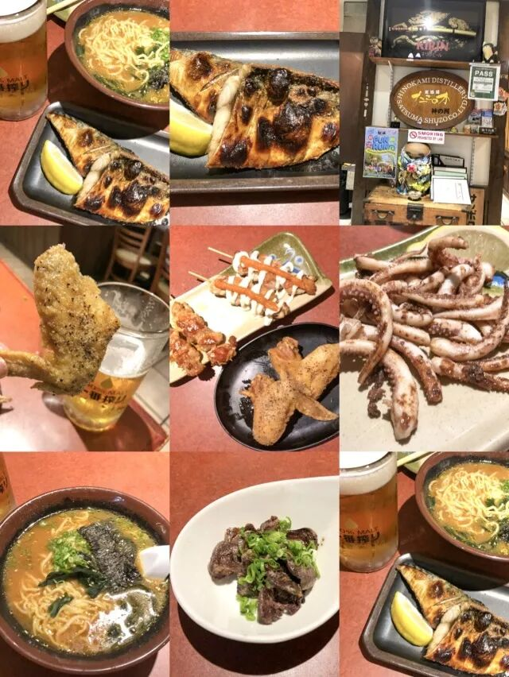 (原始链接: https://mmbiz.qpic.cn/mmbiz_jpg/XA8n2XaESnQxBNGgkYLelXjNEAZoSzDPFxOib3GZjgwZIxQPusOce3dUWW87L8JAHvibr67TTgYcmQYq9QZ9x3mA/640?wx_fmt=jpeg)
- 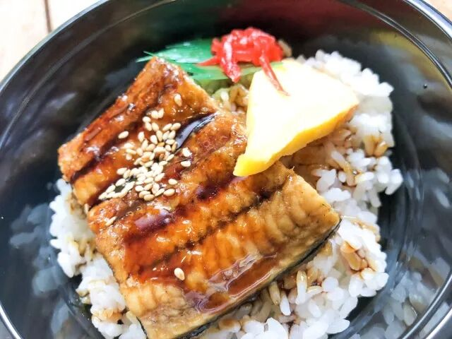 (原始链接: https://mmbiz.qpic.cn/mmbiz_jpg/XA8n2XaESnQxBNGgkYLelXjNEAZoSzDPKmhicKibcRsdwcATvVhLwm1ZmeCuP0uLVPnmPsCPw1p0jOt3ib5x3GTKg/640?wx_fmt=jpeg)
- 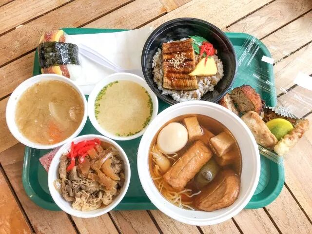 (原始链接: https://mmbiz.qpic.cn/mmbiz_jpg/XA8n2XaESnQxBNGgkYLelXjNEAZoSzDPfRpWZy6HQHNddFangGMRmLse7hx0QRTcibvbgNwfRDIkZ9ELBKqQDLg/640?wx_fmt=jpeg)
- 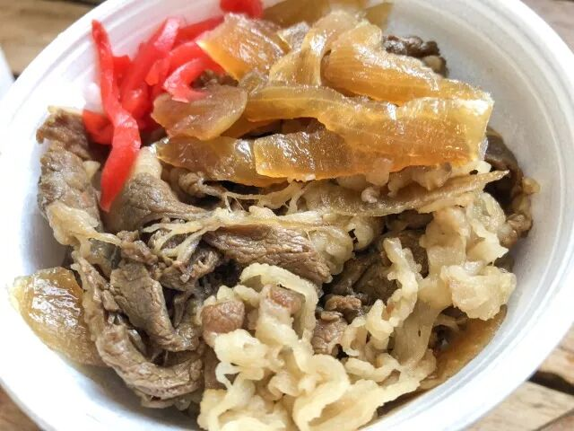 (原始链接: https://mmbiz.qpic.cn/mmbiz_jpg/XA8n2XaESnQxBNGgkYLelXjNEAZoSzDPbF27wd40Wm0FSx9z56kTZlE2n0SBxt8hhib7ciceOEFJltiaZEvWQVmlw/640?wx_fmt=jpeg)
- 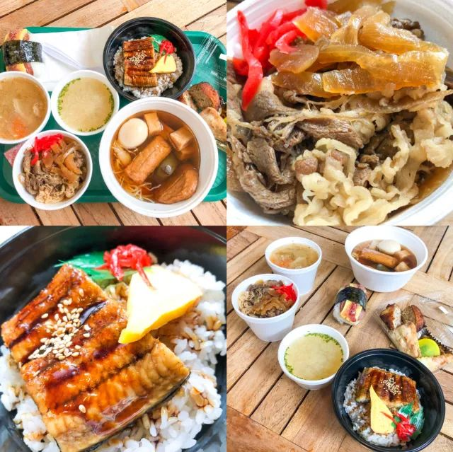 (原始链接: https://mmbiz.qpic.cn/mmbiz_jpg/XA8n2XaESnQxBNGgkYLelXjNEAZoSzDPh1yjo4edz3eBziaGpUiaYnun1AgnY9k1hKia50nvE8U4f4qRiclW825LKw/640?wx_fmt=jpeg)
- 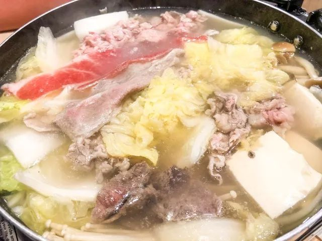 (原始链接: https://mmbiz.qpic.cn/mmbiz_jpg/XA8n2XaESnQxBNGgkYLelXjNEAZoSzDPibwZnVwZGklw361t5UqxUfibzFj2V0MnLNibawia44hND4LQjAeMibI71Iw/640?wx_fmt=jpeg)
- 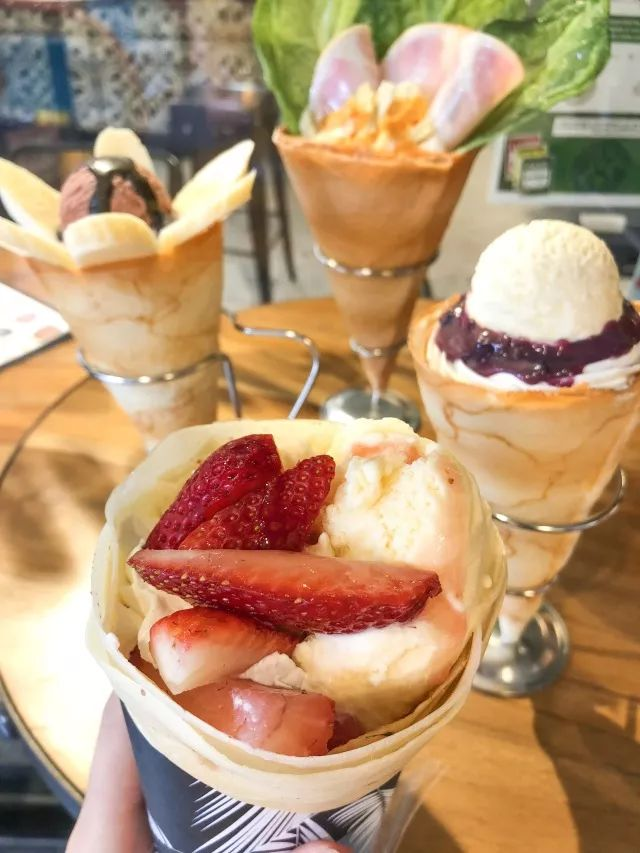 (原始链接: https://mmbiz.qpic.cn/mmbiz_jpg/XA8n2XaESnQxBNGgkYLelXjNEAZoSzDPZf4yelxEZp7UQ4pf1EpwBichmo8CpPEUvjytBQtAOT7lKibAxcicSupgw/640?wx_fmt=jpeg)
- 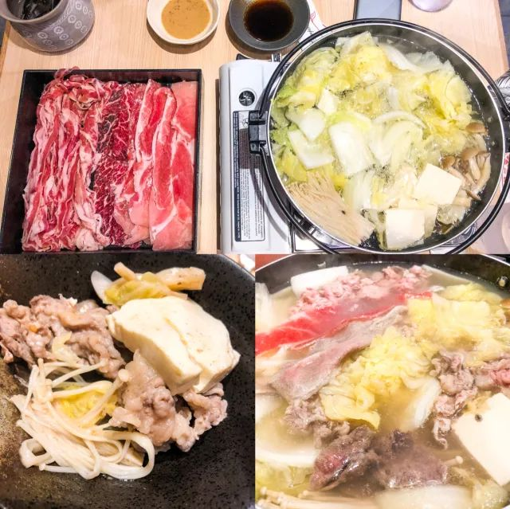 (原始链接: https://mmbiz.qpic.cn/mmbiz_jpg/XA8n2XaESnQxBNGgkYLelXjNEAZoSzDPju9riaH3FwCAHuqMkDzibS9HkBTYrzZ2sO8uuegqf9r3oiaPFksghnGVw/640?wx_fmt=jpeg)
- 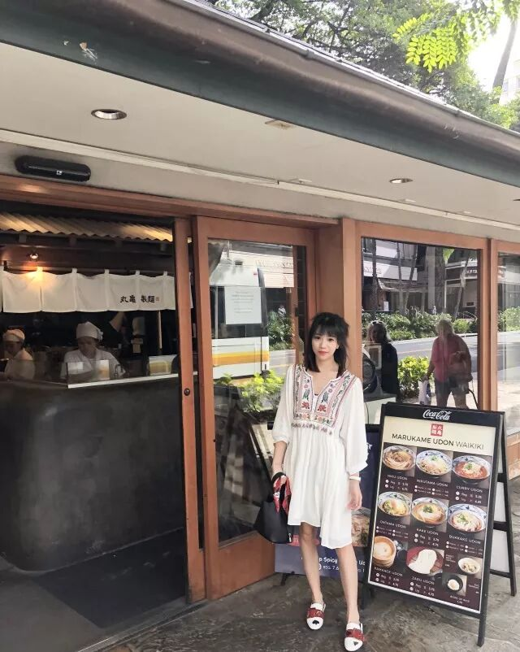 (原始链接: https://mmbiz.qpic.cn/mmbiz_jpg/XA8n2XaESnQxBNGgkYLelXjNEAZoSzDPTemQPmn3jMwI4yYbxvL3IJicPZgGC1esuZko7QmaGhOuy5Qiauic4P6gQ/640?wx_fmt=jpeg)
-  (原始链接: https://mmbiz.qpic.cn/mmbiz_jpg/XA8n2XaESnQxBNGgkYLelXjNEAZoSzDPSh1GgHrib0wPbb8842r0xicdibCXYbdInPCQAE9e14abjxiaqbpSlqHKGg/640?wx_fmt=jpeg)
- 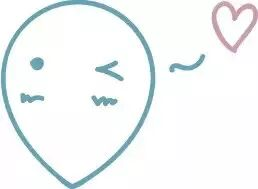 (原始链接: https://mmbiz.qpic.cn/mmbiz_jpg/XA8n2XaESnQxBNGgkYLelXjNEAZoSzDPgibAkpBJbuvCcJdL20mGezfH85F4KPJGvtEyI1FAj4mTNg5sibh2jpDA/640?wx_fmt=jpeg)
