# 无标题

**链接地址:** http://mp.weixin.qq.com/s?__biz=MjM5OTgwNzk3Mg==&mid=2683711447&idx=1&sn=2f5be0cd438daf39c0bb588c1c75c141&chksm=bd37515c8a40d84aefc3e7c62668e34f6302cac63f2f6e49b17d5a6d4cb036dab36698024b43&mpshare=1&scene=2&srcid=03218Pcx6v3bViYoDCb58FrN#rd
**作者:** 
**获取时间:** 2025/8/28 22:12:08
**图片数量:** 43

---

## 原始HTML内容

 

 

OMG！你们知道吗，连续多年世界第一的丹麦餐厅NOMA，在去年关闭之后，今年2月份重新开业啦！而且我们新先聚品在餐厅开业第一天就直接打了飞机去哥本哈根尝鲜，NOMA 2.0 真是好吃到让我们已经说不出话来了！！！简直就是顶级海鲜盛宴啊！全都是北欧新鲜食材与创意料理的完美结合！就连大厨Rene自己也说他们超越了自己（多牛逼，人家眼里根本没有对手，只有自己才是最强的！）

<strong> </strong>

<strong></strong>

 

Noma有多难定想必不用多说了，不过我们因为和餐厅有独家合作所以顺利的订到了2月22号午餐的位子，一进门就是主厨Rene带着团队大大小小一众帅哥美女在门口热情迎客，这一点是他们的传统了，谁说北欧人民不热情?! 好吧，相信大家最关注的还是菜品，据说这套新菜单整个团队准备了将近一年，当中的故事可以讲三天了，先来刷几张超级新鲜的海鲜菜品图，简直分分钟勾起食欲啊！

 

 

这肉质绝对是鲜嫩无敌！吃一口就绝对停不下来了！

 

 

用超级新鲜的海鲜煮出来的汤汁当然是鲜美无限，回味无穷啊！

 

 

大概是因为食材本身质量特别高，所以餐厅都是用看似简单的，却程序复杂的烹饪方式把本味最好的呈现出来，各种本地特色食材之间的搭配组合也颠覆了我们通常的一些食材搭配的概念，最终的效果就是1+1=11！

 

 

之所以Noma的海鲜超级赞，是因为他们经常会前往法罗群岛寻觅那些深海中的偏顶蛤、螃蟹、海螯虾，也会远赴冰岛寻找深藏在寒冷王国里的鳕鱼、海藻和凝乳。用寒冷地区独有的麝香牛、狗鱼、扇贝以及各种野生菌和野生莓等原料精心调制，所以各种菜品都带着北欧地区自然简约的清新风格哦。

 

 

鲜！嫩！香！这才是真正的海鲜应该有的味道！

 

 

您是不是已经口水横流了呢？

 

 

我们先替大家尝了好几种菜品，最爱的是南瓜籽配海胆这道，原本互不相干的两个领域的单品，被大神CP之后马上升华了，你体验过吃了最鲜美的公大闸蟹蟹膏的那种满足感吗？那么这个CP组合带来的感受就是比这种感觉更细腻，更丝滑，更优雅，更深入~～然后，高潮了！

 

 

当然其他的海鲜也是口感超爽啊，跟着我们一睹为快吧！

 

 

口感鲜美，海鲜与汤汁完美的融为一体，每一口都是精华。

 

 

独具创意的烹饪手法，让不同的食材组合出意想不到的超凡口感！这一道海鲜中散发出植物的清香，实在是绝了！

 

 

如此独特的摆盘，加上清爽的口感，赞！

 

 

看似简单吃起来可不“简单”，这细腻入微的口感，绝对是尝一口就永生难忘了！

 

 

这一道既好吃也好看，自然气息浓郁啊。

 

 

毫不夸张地说，餐厅每天从开门起就爆满到关门！而如此新鲜美味的海鲜大餐自然是引得全世界各地的食客们络绎不绝的前来一尝究竟啊！

 

 

看来Rene自己也对这套海鲜菜单非常满意，当我们和他商量何时安排我们中国老饕们来Noma2.0时，他特意把6月2日的中午唯一的private dining room包间留出来，还认真的和我说：“因为这一天是我们这一季海鲜菜单的最后一天，我认为中国客人会很喜欢的。我心里马上偷乐，绝对是<strong>福利福利福利啊！！</strong>不过可惜只有12位，加上本来就有一些铁杆粉丝去年就和我们定好了，所以只剩6位，大家速度啊，就看谁有口福了，要等下一季海鲜餐单，要11个月之后，来年了!

 

 

怪不得连续多年获得全球第一，四次获得世界最佳餐厅，每次都被极富想象力的菜品和令人叫绝的摆盘和食材搭配惊艳到，最重要的是每道菜的味道简直不要太爽了！吃一次就会惊讶于唇齿间神奇巧妙富于变化的味道！可以说这里的菜用艺术品来形容也完全不夸张。 

 

 

可以说这样的餐厅一开业，基本上就没别的餐厅什么事儿了。而且大众想要预定绝对是难上加难，<strong>不过呢朋友们也别失望啊，因为我们新先聚品和Noma有独家合作所以可以直接和大厨预定位置哦，也就是说您只要通过我们预定，就可以早于很多全球食客品尝到Noma2.0的最新菜品，绝对能羡慕死超多人啊！</strong>

 

 

不过，既然来了童话、美食王国，我们不光要去尝尝Noma 2.0， 最好能把丹麦的顶级美味一网打尽，顺便再深度体验一下北欧的历史文化，人文风情，相信绝对是令人永记一生的美好回忆呀！那么我们这次的北欧之旅到底有什么亮点呢？

 
<ul class=" list-paddingleft-2" style=""><li>
<strong style="text-align: justify;line-height: 1.6;max-width: 100%;box-sizing: border-box !important;word-wrap: break-word !important;">在哥本哈根Noma新餐厅享受味蕾盛宴</strong>
</li><li>
<strong style="text-align: justify;line-height: 1.6;max-width: 100%;box-sizing: border-box !important;word-wrap: break-word !important;">将丹麦最顶级米其林三星餐厅美食一网打尽</strong>
</li><li>
<strong>游览哈姆雷特城堡，感受北欧文艺复兴时期的魅力</strong>
</li><li>
<strong>全程入住当地五星级艺术设计酒店套房</strong>
</li><li>
<strong>中间会安排其他惊喜项目，暂不剧透</strong>

 
</li></ul>
如此震撼的味蕾盛宴之旅你是不是已经迫不及待了呢？下面，咱们赶快一起来看看整个的行程还有些什么其他亮点吧！

 

<strong>米其林三星餐厅</strong>

<strong>Geranium</strong>

 

 

Geranium是丹麦唯一的三星餐厅, 主厨Rasmus Kofoed是世界级名厨，北欧料理的代表之一，也是全球唯一一个把法国里昂博古斯世界烹饪大赛（Bocuse d‘Or）的金银铜奖得个遍的厨师。他的理念是将食客的所有感官融入美食中，回归味道，挑战创新，丰富美食。

 

 

Kofoed无疑是大神Rene之后北欧最耀眼的大厨了，他俩年龄相仿都是70后，在“哥村儿”本地的老牌豪华五星酒店和比利时一家知名两星工作多年后自己独立门户，一路走下来拿下哥村儿唯一三星实力也是超群的。

 

<strong>AOC</strong>

<strong>米其林2星餐厅</strong>

<strong> </strong>

<strong></strong>

 

在AOC餐厅，老板ChristianAarø和SørenSelin在形、香、音和味各方面向食客们提供极致的味蕾体验。食材主要采用北欧当地新鲜食材，口感纯正。

 

 

行政总厨SørenSelin和他的专业厨师团队紧密合作，努力在风格活跃的北欧美食中达到完美，侍酒师ChristianAarø品尝和选择来自旧世界和新世界地区的葡萄酒，使餐酒搭配彼此完美平衡和谐。食品和葡萄酒之间的这种互动可以通过我们的多道菜品尝菜单或少一点的建议来体验。

 

 

<strong>AMASS</strong>

<strong> </strong>

 

把加州阳光带到哥本哈根的帅气大厨 -- AMASS的老板兼大厨是美国人MATT ORLANDO，他的简历可谓是耀眼无比，15岁入行，一路做到在纽约的顶级餐厅和英国的FAT DUCK 当主厨，FAT DUCK的经历使他认识了大神RENE， 来到NOMA当了两年副主厨，又被挖回纽约知名三星PER SE当副主厨，2010年又被大神RENE请回NOMA当了两年半主厨，之后2013年开了自己的AMASS。

 

 

他的理念是要做好吃的是根本，但是又要可持续性发展，负责任地做美食。对他来说把菜做好吃了，做出艺术性来已经根本不是问题了，升华一个层次，如何减少对食材的浪费，以及充分利用食材的每一部分更具意义。

 

 

我们两年前就被他的餐厅惊艳到了，他一开始的选址就很有前瞻性，开在离市区有一段距离的空旷地带，有大片空间来种植蔬菜香料，视野无敌，大厅落地窗可以让食客们无死角欣赏日落。他的发酵土豆饼配羽衣甘蓝酱，直接将我们彻底征服，大概二两一个的饼配着恰到好处的酱一个人连吃4个，真的是停不下来啊！

 

 

<strong>Era Ora</strong>

 

 

作为拿了22年一星的“哥村儿”Legend传奇意大利餐厅，Era Ora一直是世界各地食客们的心头好之一！这里提供意大利北部最棒的美食，所有食材都是从从意大利空运的，而菜品都是按照传统手艺烹饪。

 

 

创始人Elvio来自意大利中部，30多年前他在银行工作，因为工作需要经常到“哥村儿”，当时的“哥村儿”与现在是天壤之别，除了传统食品腌小鱼儿配黑面包就是黑面包配腌小鱼儿...美食大国来的Elvio马上成了当地朋友最欢迎的外国人，每周到他家蹭饭，膜拜他从意大利带来的人间美味。

 

 

几年之后Elvio被当地好友“强迫”开了“哥村儿”第一家意大利餐厅，自己转行大厨，所有亲力亲为，然后就有了保持22年一星的传奇故事，可以说他教育了几代“哥村儿”人民的味蕾，为当地美食事业做出巨大贡献。

 

 

现在的Era Ora融合了意大利传统和北欧的创新精神，被意大利最权威的美食美酒指南GAMBERO ROSSO 大红虾评为意大利之外最好的意大利餐厅，这一殊荣让Elvio无比骄傲，知道我们中国的老饕们要来了，特地准备了特别的环节，我们暂时不剧透哦！

 

 

<strong>乐</strong>

<strong> </strong>

<strong>Distortion电音大趴</strong>

<strong> </strong>

品味美食之余，我们还将带大家去领略北欧风土人情，安排各种新鲜好玩的活动，让大家拥有最难得的旅行体验！首先喜欢派对的朋友有福了，据说那几天正值Distortion音乐节大趴，每晚在“哥村儿”街头都有超级大趴，欧美各路新锐DJ献艺，想去的朋友们我们都送票哈！<strong> </strong>

 

 

哥本哈根的distortion festival是一个疯狂的音乐节，每年的这个节日来临时，整个市中心就变成了一个大型的露天嘉年华，不管白天还是夜晚，DJ们把器械都搬到了大街上，整条街上的人都随音乐狂舞，即使你不是经常跳舞之人，也会被这疯狂的气氛带动得整个身子自己扭动起来。

 

 

<strong>哈姆雷特城堡之旅</strong>

<strong> </strong>

既然来到北欧又怎能错过城堡呢！但是欧洲城堡太多了，不可能在有限的时间内一一去一遍，所以我们此行选择了北欧保存最好的文艺复兴时期的城堡之一——哈姆雷特城堡！抛除莎士比亚所赋予的光环，这座宏伟的古堡本身也是一座极具观赏性的建筑哦！

 

 

<strong>游览市中心</strong>

<strong> </strong>

众所周知哥本哈根是安徒生童话的发源地，但这里的魅力可远不止于此哦。除了拥有北欧最多的米其林餐厅，这里还拥有超多的古堡与皇家别院，古典气息浓厚。市中心景色也是相当赞！我们本次的行程里就为大家准备了充足的时间漫步于市中心的街头巷尾，充分感受北欧的魅力哦！

 

 

<strong>住</strong> 

<strong> </strong>

除了每日享受世界顶级美食佳酿，欣赏美景，沿途的小镇观光，特别的活动，人文、风景、历史、风俗，一个不落！住宿方面我们当然也毫不怠慢啦，全程5星级住宿体验哦，下面我们来看看将会入住的酒店有多棒吧！

 

<strong>艺术酒店</strong> 

<strong> </strong>

 

这间典雅的酒店坐落在一座1903年的历史建筑内，您可以免费使用健身中心以及带桑拿浴室、土耳其浴室和小型冷水游泳池的休闲区。明亮的客房配有斯堪的纳维亚设计风格的家具、平板电视和带灰色大理石的浴室。

 

 

酒店餐厅环境宽敞优雅，使用季节性优质食材提供绝佳美味。

 

 

除此之外，酒店位置极佳，距离哥本哈根市中心的蒂沃利花园、Ny Carlsberg Glyptotek Art Museum艺术博物馆、哥本哈根国家博物馆、和丹麦设计中心等均只有一段步行路程而已，我们亲测真的是去哪都方便啊！

 

<strong></strong> 

 

怎么样，能尝到连续多年世界第一餐厅新开业的北欧海鲜饕餮盛宴，吃遍北欧顶级美食，感受丹麦童话王国的历史与文化，参加当地最具民族特色的国家级大型户外音乐节，当一把北欧人，这等机遇简直是太难得啦！位子有限还不赶快报名呀！

 

<strong>时间：5月30日~6月3日 （5天4晚）</strong>

 

<strong>费用:&nbsp;</strong>

<strong> </strong>

<strong>两人同行住一间原价：59800元/人</strong>

<strong><strong style="white-space: normal;line-height: 25.6px;"><strong style="line-height: 25.6px;">新先聚品早鸟/VIP价：</strong></strong>：52800元/人</strong>

<strong> </strong>

<strong>一人住一间原价：65800元<strong style="white-space: normal;">/人</strong></strong>

<strong><strong style="white-space: normal;line-height: 25.6px;"><strong style="line-height: 25.6px;">新先聚品早鸟/VIP价：</strong></strong>：59800元<strong style="white-space: normal;background-color: rgb(255, 169, 0);">/人</strong></strong>

<strong><strong style="white-space: normal;background-color: rgb(255, 169, 0);"> </strong></strong>

<strong><strong style="white-space: normal;background-color: rgb(255, 169, 0);"><strong style="white-space: normal;background-color: rgb(255, 169, 0);">名额：6位</strong></strong></strong>

<strong><strong style="white-space: normal;background-color: rgb(255, 169, 0);"><strong style="white-space: normal;background-color: rgb(255, 169, 0);"> </strong></strong></strong>

<strong><strong style="white-space: normal;background-color: rgb(255, 169, 0);">报名订金：1000元</strong></strong>

<strong><strong style="white-space: normal;background-color: rgb(255, 169, 0);"> </strong></strong>

<strong><strong style="white-space: normal;background-color: rgb(255, 169, 0);"></strong></strong>

<strong>享受早鸟价需于一周内（3月26日前交齐全款）</strong>

&nbsp;

<strong>Noma配酒/果汁赠送（二选一），其他餐厅酒水需自费。</strong>

 

<strong style="background-color: rgb(255, 169, 0);">我们将全程安排司机接送，并入住当地特色五星（或同档设计）酒店（具体酒店信息报名后根据实际报名人数通知）</strong>

 

 

<strong>注意事项：</strong>

<strong>1.此价格包含酒店、接送、餐费、导览费用，不包含机票、保险、签证办理费用、餐厅酒水及一切个人消费。</strong>

<strong>2.报名者需在平台支付意向报名费1000元，若最终未能成行，报名费可退；</strong>

<strong>3.因为行程的特殊性，行程费用一旦付款，不得退款，但可转给他人。若您欲转给他人，请提前至少2周与我们联系。</strong>

<strong>4.我们建议参加行程的朋友有过国外自由行经验，能够用英语沟通，而且了解国外基本就餐礼仪。</strong>

<strong>5.如有问题需要咨询，请联系微信私号：fresherstyle2013，或于工作时间（周一至周五10-18点）致电客服电话：010-64639682。</strong> 

 

 

<strong>如此行程真是一生只此一次的不二之旅啊！你还在等什么？！！</strong>

<strong style="background-color: rgb(255, 169, 0);"> </strong>

<strong style="background-color: rgb(255, 169, 0);">位置有限，<strong>感兴趣的朋友赶快</strong><strong>长按<strong>下图进入小程序预定吧！</strong></strong></strong> 

<strong><strong><mp-miniprogram class="miniprogram_element" data-miniprogram-appid="wx51299c1784a692e1" data-miniprogram-path="pages/ProductDetail/ProductDetail?id=4173d1c6-8bb3-40c1-a32f-a02d18f88007" data-miniprogram-nickname="新先聚品" data-miniprogram-avatar="http://mmbiz.qpic.cn/mmbiz_png/MZtibAuiaa0H2k5WYYH0zfFkLQ5QHX2gdySJpRA0TbKj23D7g336dbLbbWGtQorcLLKv6GUjeibVEs0gs6UcYX4hQ/0?wx_fmt=png" data-miniprogram-title="世界第一餐厅NOMA重新开业，火遍全球鲜味令人癫狂！ " data-miniprogram-imageurl="http://mmbiz.qpic.cn/mmbiz_jpg/dYyiavLsrKlsXbT1W0tCDQibrzZCp1R9gtQHqrtFoNeBttVsVOTWcRxWeLN2jh2ribOhenJ6AhpoA3ynf32CGJoMA/0?wx_fmt=jpeg"></mp-miniprogram></strong></strong>

<strong style="background-color: rgb(255, 169, 0);"><strong>长按下方二维码也可以预定噢！</strong></strong> 

 

 

<strong style="max-width: 100%;box-sizing: border-box !important;overflow-wrap: break-word !important;">（原创文章，欢迎转发，谢谢关注！未经授权，严禁转载！）</strong> 

 
<fieldset style="padding: 5px;white-space: normal;border: 1px solid rgb(204, 204, 204);color: rgb(62, 62, 62);font-size: 16.19px;min-width: 0px;max-width: 100%;background-color: rgb(255, 255, 255);box-sizing: border-box !important;"><legend style="max-width: 100%;box-sizing: border-box !important;overflow-wrap: break-word !important;"><strong style="max-width: 100%;color: rgb(102, 102, 102);box-sizing: border-box !important;overflow-wrap: break-word !important;">新先聚品</strong></legend>
国内最大原创高端生活方式新媒体，专注于国际化深度时尚、旅游、美食、艺术、豪宅、设计、健康、科技等品质生活必备最新潮流资讯。微信：xinxianjupin 近60万高品质受众关注。
</fieldset>

---

## 纯文本内容

OMG！你们知道吗，连续多年世界第一的丹麦餐厅NOMA，在去年关闭之后，今年2月份重新开业啦！而且我们新先聚品在餐厅开业第一天就直接打了飞机去哥本哈根尝鲜，NOMA 2.0 真是好吃到让我们已经说不出话来了！！！简直就是顶级海鲜盛宴啊！全都是北欧新鲜食材与创意料理的完美结合！就连大厨Rene自己也说他们超越了自己（多牛逼，人家眼里根本没有对手，只有自己才是最强的！）Noma有多难定想必不用多说了，不过我们因为和餐厅有独家合作所以顺利的订到了2月22号午餐的位子，一进门就是主厨Rene带着团队大大小小一众帅哥美女在门口热情迎客，这一点是他们的传统了，谁说北欧人民不热情?! 好吧，相信大家最关注的还是菜品，据说这套新菜单整个团队准备了将近一年，当中的故事可以讲三天了，先来刷几张超级新鲜的海鲜菜品图，简直分分钟勾起食欲啊！这肉质绝对是鲜嫩无敌！吃一口就绝对停不下来了！用超级新鲜的海鲜煮出来的汤汁当然是鲜美无限，回味无穷啊！大概是因为食材本身质量特别高，所以餐厅都是用看似简单的，却程序复杂的烹饪方式把本味最好的呈现出来，各种本地特色食材之间的搭配组合也颠覆了我们通常的一些食材搭配的概念，最终的效果就是1+1=11！之所以Noma的海鲜超级赞，是因为他们经常会前往法罗群岛寻觅那些深海中的偏顶蛤、螃蟹、海螯虾，也会远赴冰岛寻找深藏在寒冷王国里的鳕鱼、海藻和凝乳。用寒冷地区独有的麝香牛、狗鱼、扇贝以及各种野生菌和野生莓等原料精心调制，所以各种菜品都带着北欧地区自然简约的清新风格哦。鲜！嫩！香！这才是真正的海鲜应该有的味道！您是不是已经口水横流了呢？我们先替大家尝了好几种菜品，最爱的是南瓜籽配海胆这道，原本互不相干的两个领域的单品，被大神CP之后马上升华了，你体验过吃了最鲜美的公大闸蟹蟹膏的那种满足感吗？那么这个CP组合带来的感受就是比这种感觉更细腻，更丝滑，更优雅，更深入~～然后，高潮了！当然其他的海鲜也是口感超爽啊，跟着我们一睹为快吧！口感鲜美，海鲜与汤汁完美的融为一体，每一口都是精华。独具创意的烹饪手法，让不同的食材组合出意想不到的超凡口感！这一道海鲜中散发出植物的清香，实在是绝了！如此独特的摆盘，加上清爽的口感，赞！看似简单吃起来可不“简单”，这细腻入微的口感，绝对是尝一口就永生难忘了！这一道既好吃也好看，自然气息浓郁啊。毫不夸张地说，餐厅每天从开门起就爆满到关门！而如此新鲜美味的海鲜大餐自然是引得全世界各地的食客们络绎不绝的前来一尝究竟啊！看来Rene自己也对这套海鲜菜单非常满意，当我们和他商量何时安排我们中国老饕们来Noma2.0时，他特意把6月2日的中午唯一的private dining room包间留出来，还认真的和我说：“因为这一天是我们这一季海鲜菜单的最后一天，我认为中国客人会很喜欢的。我心里马上偷乐，绝对是福利福利福利啊！！不过可惜只有12位，加上本来就有一些铁杆粉丝去年就和我们定好了，所以只剩6位，大家速度啊，就看谁有口福了，要等下一季海鲜餐单，要11个月之后，来年了!怪不得连续多年获得全球第一，四次获得世界最佳餐厅，每次都被极富想象力的菜品和令人叫绝的摆盘和食材搭配惊艳到，最重要的是每道菜的味道简直不要太爽了！吃一次就会惊讶于唇齿间神奇巧妙富于变化的味道！可以说这里的菜用艺术品来形容也完全不夸张。可以说这样的餐厅一开业，基本上就没别的餐厅什么事儿了。而且大众想要预定绝对是难上加难，不过呢朋友们也别失望啊，因为我们新先聚品和Noma有独家合作所以可以直接和大厨预定位置哦，也就是说您只要通过我们预定，就可以早于很多全球食客品尝到Noma2.0的最新菜品，绝对能羡慕死超多人啊！不过，既然来了童话、美食王国，我们不光要去尝尝Noma 2.0， 最好能把丹麦的顶级美味一网打尽，顺便再深度体验一下北欧的历史文化，人文风情，相信绝对是令人永记一生的美好回忆呀！那么我们这次的北欧之旅到底有什么亮点呢？在哥本哈根Noma新餐厅享受味蕾盛宴将丹麦最顶级米其林三星餐厅美食一网打尽游览哈姆雷特城堡，感受北欧文艺复兴时期的魅力全程入住当地五星级艺术设计酒店套房中间会安排其他惊喜项目，暂不剧透如此震撼的味蕾盛宴之旅你是不是已经迫不及待了呢？下面，咱们赶快一起来看看整个的行程还有些什么其他亮点吧！米其林三星餐厅GeraniumGeranium是丹麦唯一的三星餐厅, 主厨Rasmus Kofoed是世界级名厨，北欧料理的代表之一，也是全球唯一一个把法国里昂博古斯世界烹饪大赛（Bocuse d‘Or）的金银铜奖得个遍的厨师。他的理念是将食客的所有感官融入美食中，回归味道，挑战创新，丰富美食。Kofoed无疑是大神Rene之后北欧最耀眼的大厨了，他俩年龄相仿都是70后，在“哥村儿”本地的老牌豪华五星酒店和比利时一家知名两星工作多年后自己独立门户，一路走下来拿下哥村儿唯一三星实力也是超群的。AOC米其林2星餐厅在AOC餐厅，老板ChristianAarø和SørenSelin在形、香、音和味各方面向食客们提供极致的味蕾体验。食材主要采用北欧当地新鲜食材，口感纯正。行政总厨SørenSelin和他的专业厨师团队紧密合作，努力在风格活跃的北欧美食中达到完美，侍酒师ChristianAarø品尝和选择来自旧世界和新世界地区的葡萄酒，使餐酒搭配彼此完美平衡和谐。食品和葡萄酒之间的这种互动可以通过我们的多道菜品尝菜单或少一点的建议来体验。AMASS把加州阳光带到哥本哈根的帅气大厨 -- AMASS的老板兼大厨是美国人MATT ORLANDO，他的简历可谓是耀眼无比，15岁入行，一路做到在纽约的顶级餐厅和英国的FAT DUCK 当主厨，FAT DUCK的经历使他认识了大神RENE， 来到NOMA当了两年副主厨，又被挖回纽约知名三星PER SE当副主厨，2010年又被大神RENE请回NOMA当了两年半主厨，之后2013年开了自己的AMASS。他的理念是要做好吃的是根本，但是又要可持续性发展，负责任地做美食。对他来说把菜做好吃了，做出艺术性来已经根本不是问题了，升华一个层次，如何减少对食材的浪费，以及充分利用食材的每一部分更具意义。我们两年前就被他的餐厅惊艳到了，他一开始的选址就很有前瞻性，开在离市区有一段距离的空旷地带，有大片空间来种植蔬菜香料，视野无敌，大厅落地窗可以让食客们无死角欣赏日落。他的发酵土豆饼配羽衣甘蓝酱，直接将我们彻底征服，大概二两一个的饼配着恰到好处的酱一个人连吃4个，真的是停不下来啊！Era Ora作为拿了22年一星的“哥村儿”Legend传奇意大利餐厅，Era Ora一直是世界各地食客们的心头好之一！这里提供意大利北部最棒的美食，所有食材都是从从意大利空运的，而菜品都是按照传统手艺烹饪。创始人Elvio来自意大利中部，30多年前他在银行工作，因为工作需要经常到“哥村儿”，当时的“哥村儿”与现在是天壤之别，除了传统食品腌小鱼儿配黑面包就是黑面包配腌小鱼儿...美食大国来的Elvio马上成了当地朋友最欢迎的外国人，每周到他家蹭饭，膜拜他从意大利带来的人间美味。几年之后Elvio被当地好友“强迫”开了“哥村儿”第一家意大利餐厅，自己转行大厨，所有亲力亲为，然后就有了保持22年一星的传奇故事，可以说他教育了几代“哥村儿”人民的味蕾，为当地美食事业做出巨大贡献。现在的Era Ora融合了意大利传统和北欧的创新精神，被意大利最权威的美食美酒指南GAMBERO ROSSO 大红虾评为意大利之外最好的意大利餐厅，这一殊荣让Elvio无比骄傲，知道我们中国的老饕们要来了，特地准备了特别的环节，我们暂时不剧透哦！乐Distortion电音大趴品味美食之余，我们还将带大家去领略北欧风土人情，安排各种新鲜好玩的活动，让大家拥有最难得的旅行体验！首先喜欢派对的朋友有福了，据说那几天正值Distortion音乐节大趴，每晚在“哥村儿”街头都有超级大趴，欧美各路新锐DJ献艺，想去的朋友们我们都送票哈！哥本哈根的distortion festival是一个疯狂的音乐节，每年的这个节日来临时，整个市中心就变成了一个大型的露天嘉年华，不管白天还是夜晚，DJ们把器械都搬到了大街上，整条街上的人都随音乐狂舞，即使你不是经常跳舞之人，也会被这疯狂的气氛带动得整个身子自己扭动起来。哈姆雷特城堡之旅既然来到北欧又怎能错过城堡呢！但是欧洲城堡太多了，不可能在有限的时间内一一去一遍，所以我们此行选择了北欧保存最好的文艺复兴时期的城堡之一——哈姆雷特城堡！抛除莎士比亚所赋予的光环，这座宏伟的古堡本身也是一座极具观赏性的建筑哦！游览市中心众所周知哥本哈根是安徒生童话的发源地，但这里的魅力可远不止于此哦。除了拥有北欧最多的米其林餐厅，这里还拥有超多的古堡与皇家别院，古典气息浓厚。市中心景色也是相当赞！我们本次的行程里就为大家准备了充足的时间漫步于市中心的街头巷尾，充分感受北欧的魅力哦！住除了每日享受世界顶级美食佳酿，欣赏美景，沿途的小镇观光，特别的活动，人文、风景、历史、风俗，一个不落！住宿方面我们当然也毫不怠慢啦，全程5星级住宿体验哦，下面我们来看看将会入住的酒店有多棒吧！艺术酒店这间典雅的酒店坐落在一座1903年的历史建筑内，您可以免费使用健身中心以及带桑拿浴室、土耳其浴室和小型冷水游泳池的休闲区。明亮的客房配有斯堪的纳维亚设计风格的家具、平板电视和带灰色大理石的浴室。酒店餐厅环境宽敞优雅，使用季节性优质食材提供绝佳美味。除此之外，酒店位置极佳，距离哥本哈根市中心的蒂沃利花园、Ny Carlsberg Glyptotek Art Museum艺术博物馆、哥本哈根国家博物馆、和丹麦设计中心等均只有一段步行路程而已，我们亲测真的是去哪都方便啊！怎么样，能尝到连续多年世界第一餐厅新开业的北欧海鲜饕餮盛宴，吃遍北欧顶级美食，感受丹麦童话王国的历史与文化，参加当地最具民族特色的国家级大型户外音乐节，当一把北欧人，这等机遇简直是太难得啦！位子有限还不赶快报名呀！时间：5月30日~6月3日 （5天4晚）费用: 两人同行住一间原价：59800元/人新先聚品早鸟/VIP价：：52800元/人一人住一间原价：65800元/人新先聚品早鸟/VIP价：：59800元/人名额：6位报名订金：1000元享受早鸟价需于一周内（3月26日前交齐全款） Noma配酒/果汁赠送（二选一），其他餐厅酒水需自费。我们将全程安排司机接送，并入住当地特色五星（或同档设计）酒店（具体酒店信息报名后根据实际报名人数通知）注意事项：1.此价格包含酒店、接送、餐费、导览费用，不包含机票、保险、签证办理费用、餐厅酒水及一切个人消费。2.报名者需在平台支付意向报名费1000元，若最终未能成行，报名费可退；3.因为行程的特殊性，行程费用一旦付款，不得退款，但可转给他人。若您欲转给他人，请提前至少2周与我们联系。4.我们建议参加行程的朋友有过国外自由行经验，能够用英语沟通，而且了解国外基本就餐礼仪。5.如有问题需要咨询，请联系微信私号：fresherstyle2013，或于工作时间（周一至周五10-18点）致电客服电话：010-64639682。如此行程真是一生只此一次的不二之旅啊！你还在等什么？！！位置有限，感兴趣的朋友赶快长按下图进入小程序预定吧！长按下方二维码也可以预定噢！（原创文章，欢迎转发，谢谢关注！未经授权，严禁转载！）新先聚品国内最大原创高端生活方式新媒体，专注于国际化深度时尚、旅游、美食、艺术、豪宅、设计、健康、科技等品质生活必备最新潮流资讯。微信：xinxianjupin 近60万高品质受众关注。

---

## 图片列表

- 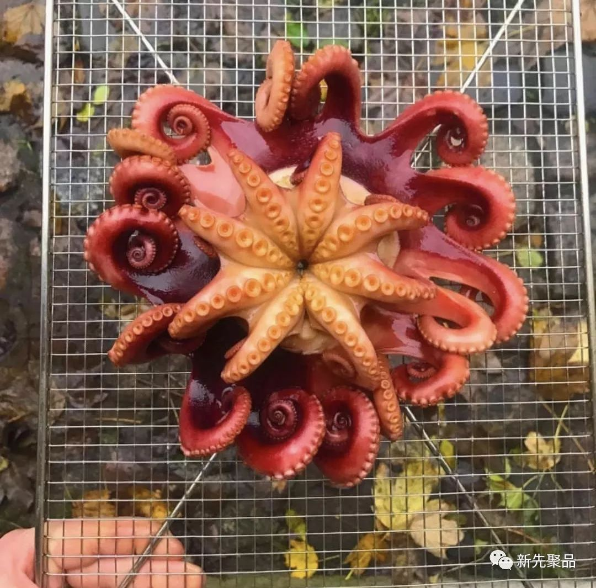 (原始链接: https://mmbiz.qpic.cn/mmbiz_jpg/dYyiavLsrKluicHYDjXhywia8eBPEdWcISYfo81xZicZ8FRybILZhpvXlb1FcLoy9vNMG7sniatTUMdEVADbLaFazGA/640?wx_fmt=jpeg)
- 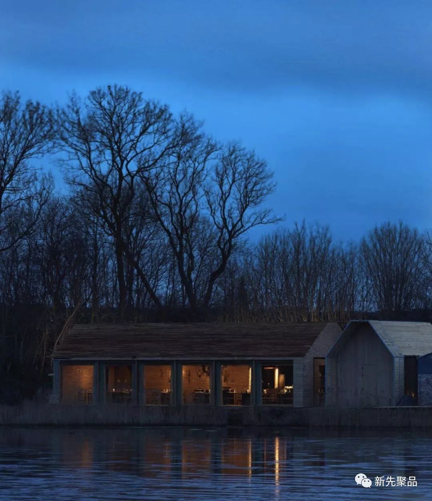 (原始链接: https://mmbiz.qpic.cn/mmbiz_jpg/dYyiavLsrKluicHYDjXhywia8eBPEdWcISYv8SyKMeEZTsuqx3W4URn9H6Y9vBMNYXjgAPBpcGLNicfZPp8mOOaDzw/640?wx_fmt=jpeg)
- 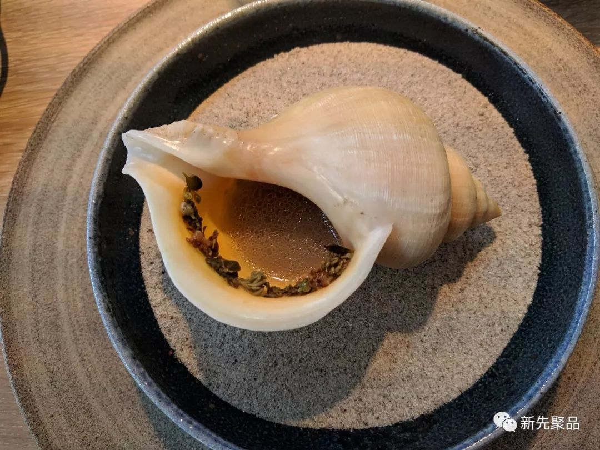 (原始链接: https://mmbiz.qpic.cn/mmbiz_jpg/dYyiavLsrKluicHYDjXhywia8eBPEdWcISYRRiaTz7KiaMsunp8kq9mQPTK6QNZ1M5sDBzJoUKIU8OUS6mDJGAX0UnQ/640?wx_fmt=jpeg)
- 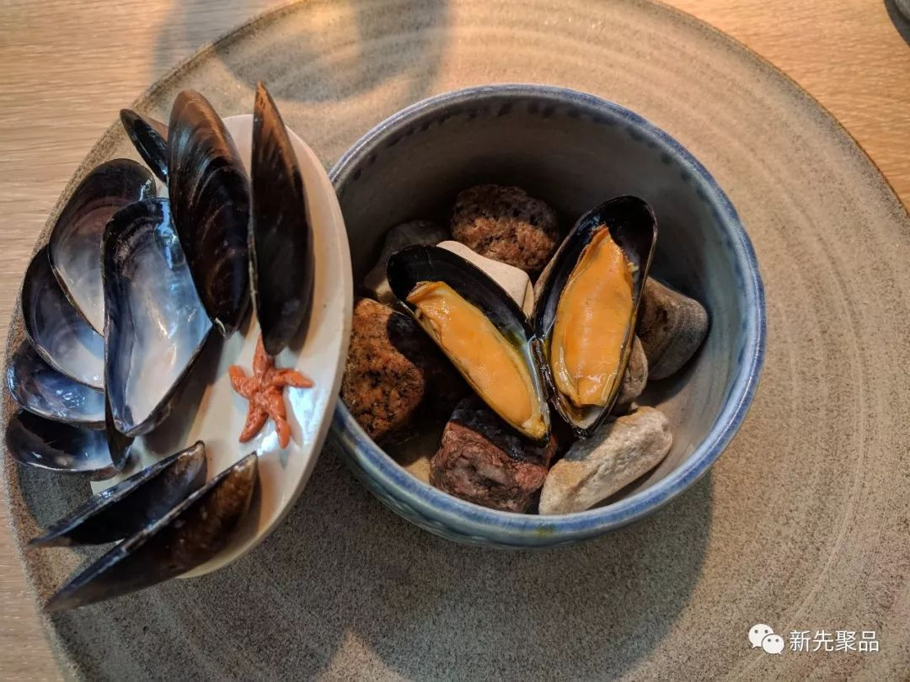 (原始链接: https://mmbiz.qpic.cn/mmbiz_jpg/dYyiavLsrKluicHYDjXhywia8eBPEdWcISYBqLEr6FOFF2NyRicQAD5QLzna5ibGg9xLmXGzf7odNUG3C3MWdPeibjJA/640?wx_fmt=jpeg)
- 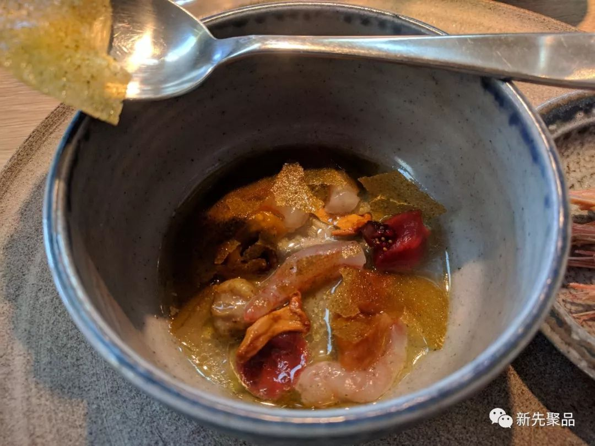 (原始链接: https://mmbiz.qpic.cn/mmbiz_jpg/dYyiavLsrKluicHYDjXhywia8eBPEdWcISYP7e0mgyXozv4PbXrPwfIEL0VPBI5icuAOzL9EelozpoQZGrla1ksOFg/640?wx_fmt=jpeg)
- 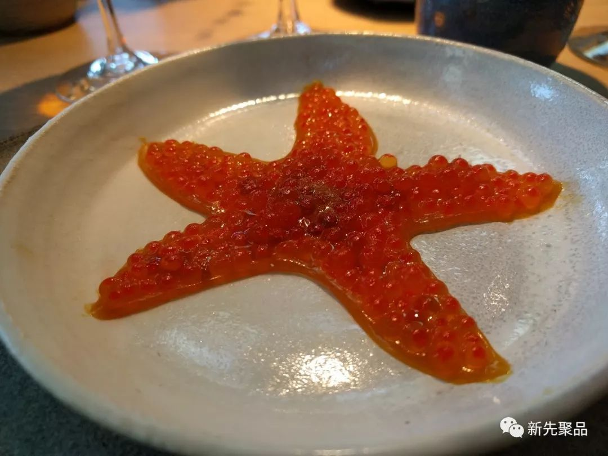 (原始链接: https://mmbiz.qpic.cn/mmbiz_jpg/dYyiavLsrKluicHYDjXhywia8eBPEdWcISYVrj9Cc5V47G8wKK3MhljUdFpZgJ2Qq3OMeLibWCe4k0zJ31JKysYUow/640?wx_fmt=jpeg)
- 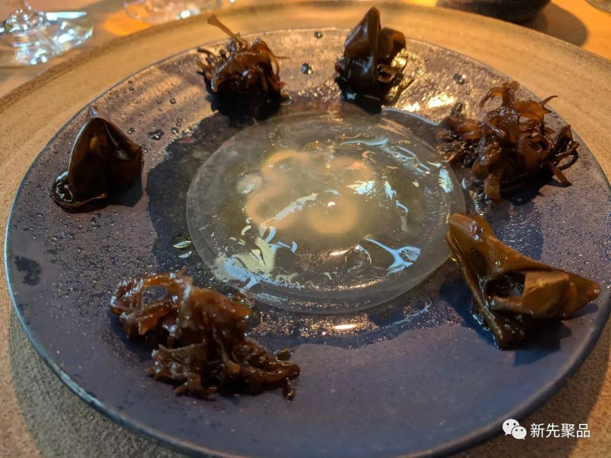 (原始链接: https://mmbiz.qpic.cn/mmbiz_jpg/dYyiavLsrKluicHYDjXhywia8eBPEdWcISYLVTdjKnEJtqqRcMPyN5jbz04y8sNK0QkSvmqYwEpu1xI6BySRMgltw/640?wx_fmt=jpeg)
- 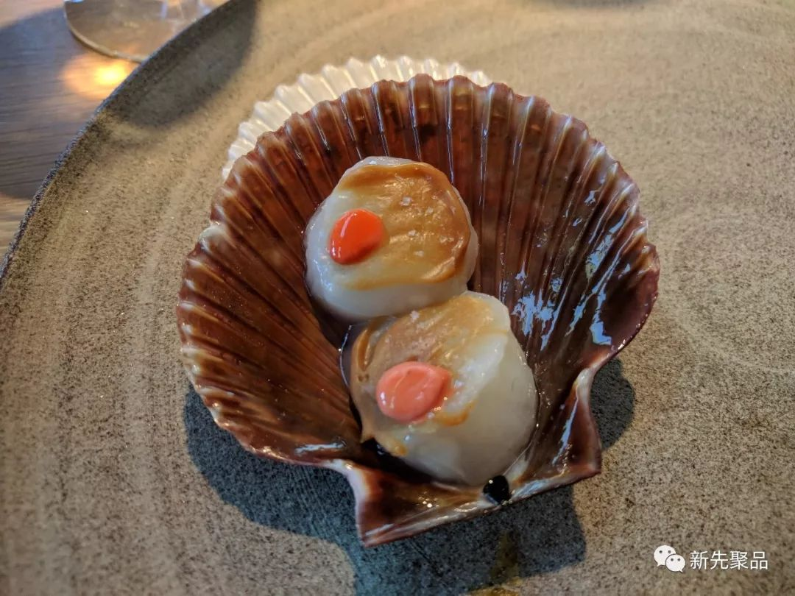 (原始链接: https://mmbiz.qpic.cn/mmbiz_jpg/dYyiavLsrKluicHYDjXhywia8eBPEdWcISYZzlPnaHMfrKRicWPiaHPUNs57cOsV6KaXZHrfJL4ojDcYhDOc2WLQWCw/640?wx_fmt=jpeg)
- 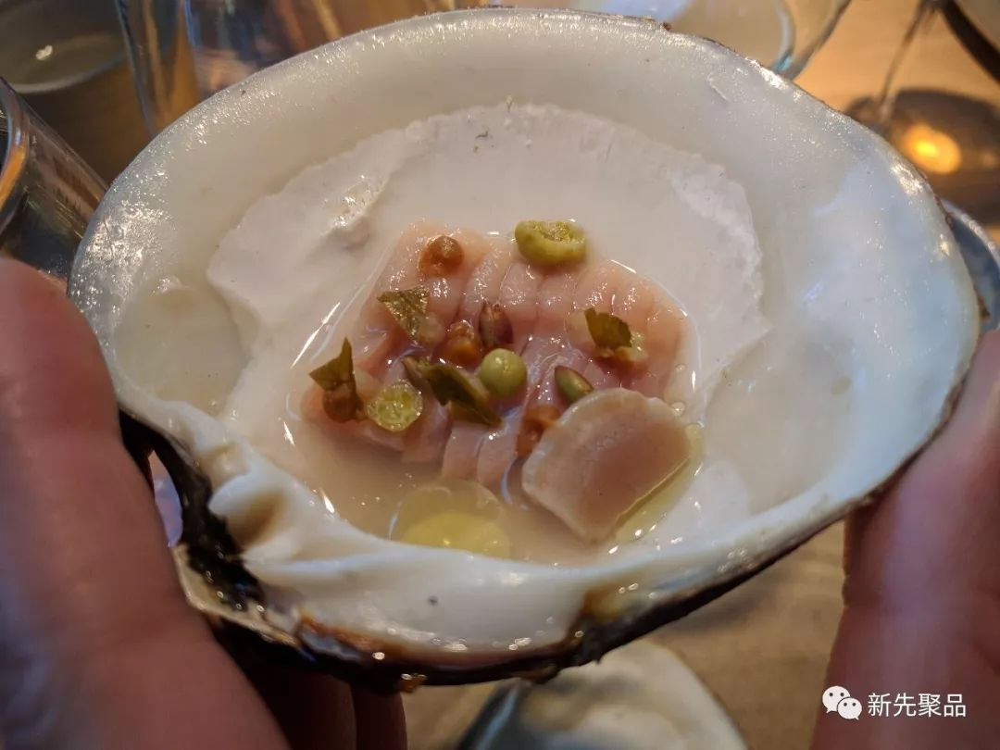 (原始链接: https://mmbiz.qpic.cn/mmbiz_jpg/dYyiavLsrKluicHYDjXhywia8eBPEdWcISYd3QCsf1QCIibssB4zsZYeb16UHzvH8bLfuL7hERUteuVrg3n0sdjj2g/640?wx_fmt=jpeg)
- 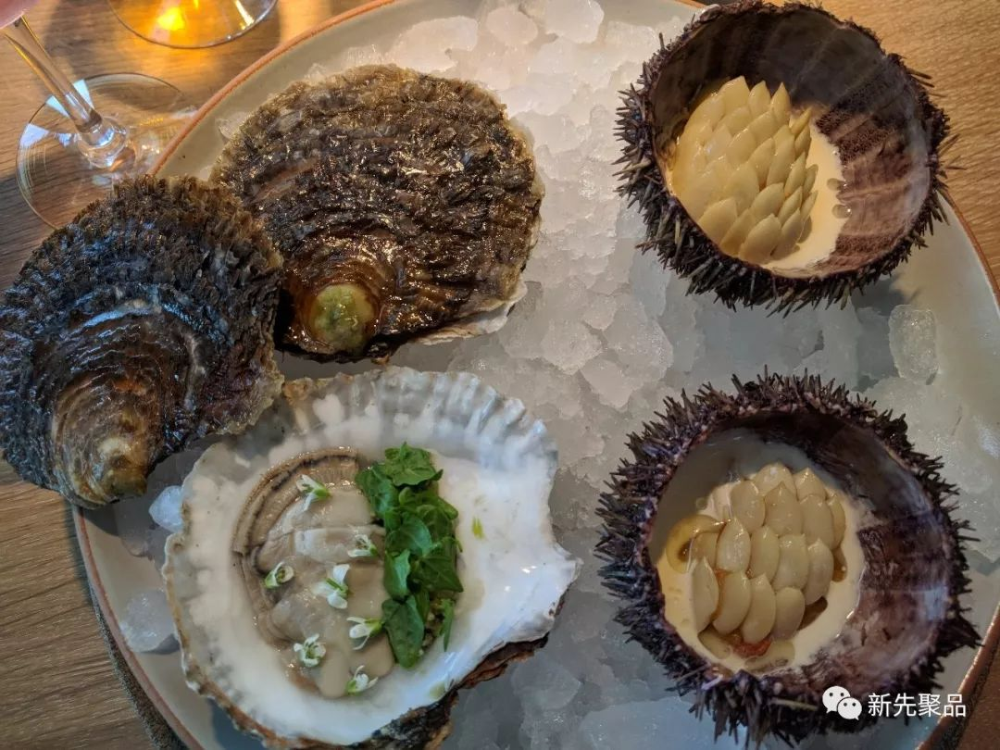 (原始链接: https://mmbiz.qpic.cn/mmbiz_jpg/dYyiavLsrKluicHYDjXhywia8eBPEdWcISYDjE9KicpXbLBib922o71q11KsHcVm8JVIXUt04rTwwEOlUgpSfMrBxMQ/640?wx_fmt=jpeg)
- 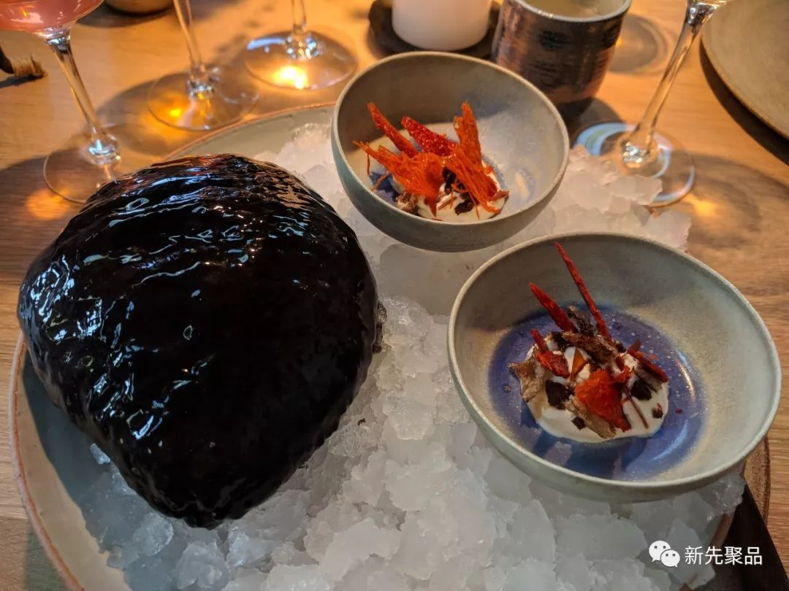 (原始链接: https://mmbiz.qpic.cn/mmbiz_jpg/dYyiavLsrKluicHYDjXhywia8eBPEdWcISYJw7RdSeRtHibQAWqPA0vgMibYQmTibJ25HU9FC5UCvrgCzO8ibvZjDYb4A/640?wx_fmt=jpeg)
- 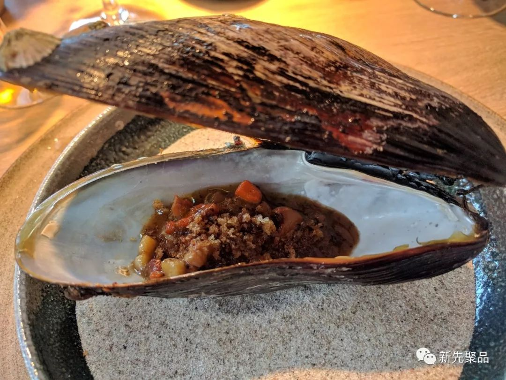 (原始链接: https://mmbiz.qpic.cn/mmbiz_jpg/dYyiavLsrKluicHYDjXhywia8eBPEdWcISYiaahMzp52PCicVWJ2WMOUcaOjp81uAYbd66KbLMIyRLNcv2iaJuEvTlrg/640?wx_fmt=jpeg)
- 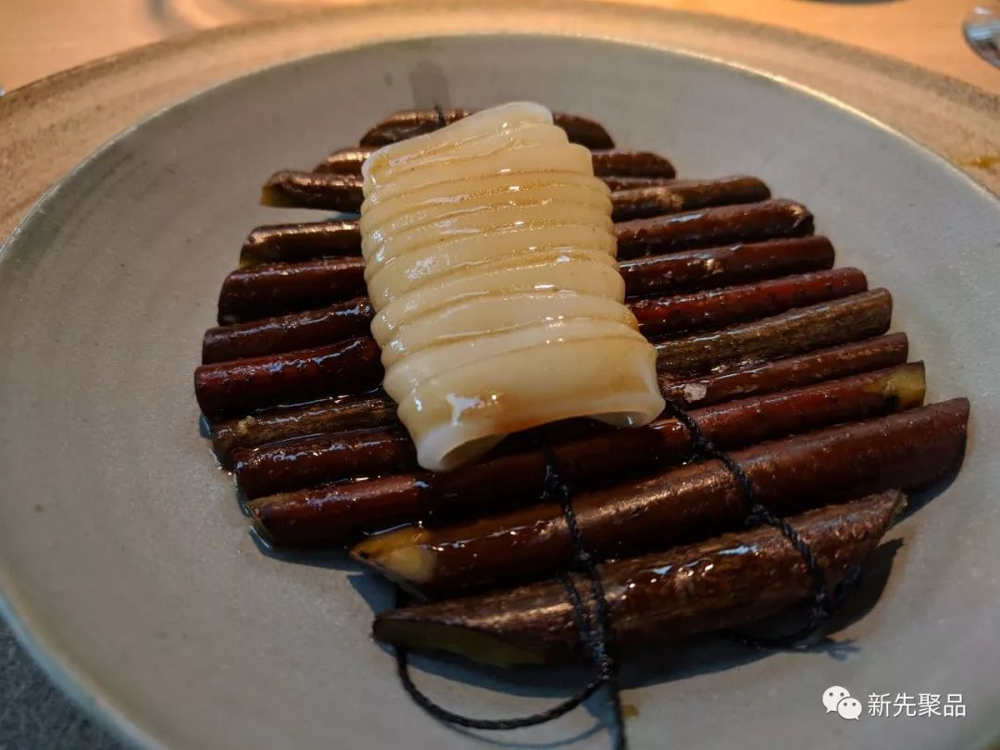 (原始链接: https://mmbiz.qpic.cn/mmbiz_jpg/dYyiavLsrKluicHYDjXhywia8eBPEdWcISYuNjkicl93j5LhxoouwjWj4ibguOJtExfDY0icMI04Z2sVtEUlabVsfnfQ/640?wx_fmt=jpeg)
- 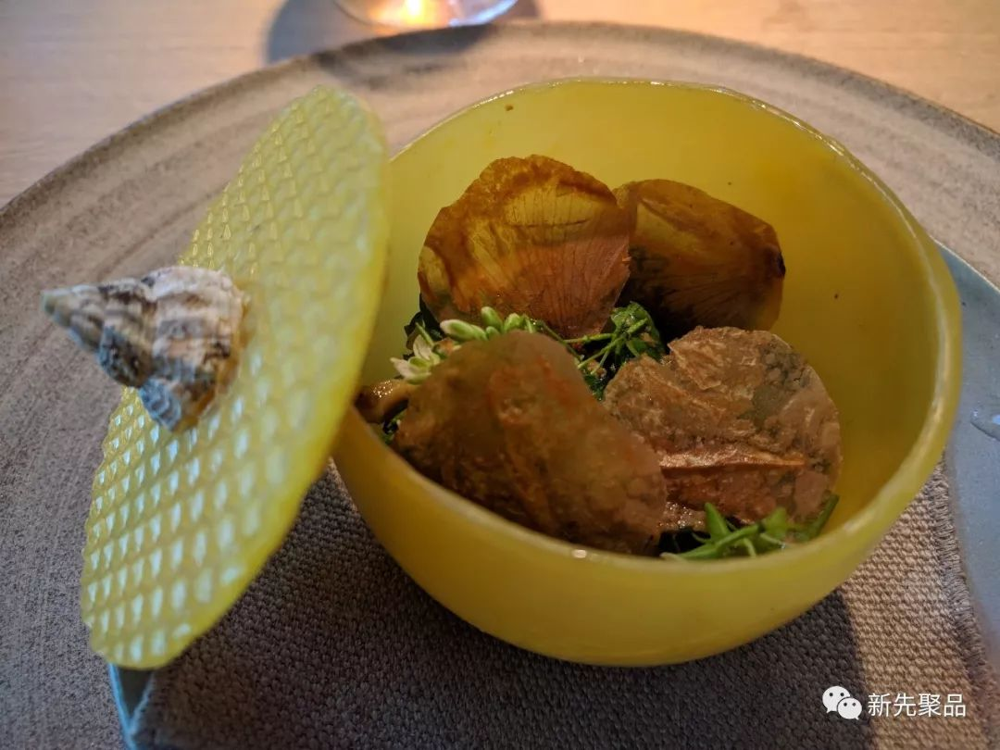 (原始链接: https://mmbiz.qpic.cn/mmbiz_jpg/dYyiavLsrKluicHYDjXhywia8eBPEdWcISYZOwsy8MAwqvyNoYbibhafHgibiboq5duAmXCmWu2DkwwCBnT1kl1NqBJw/640?wx_fmt=jpeg)
- 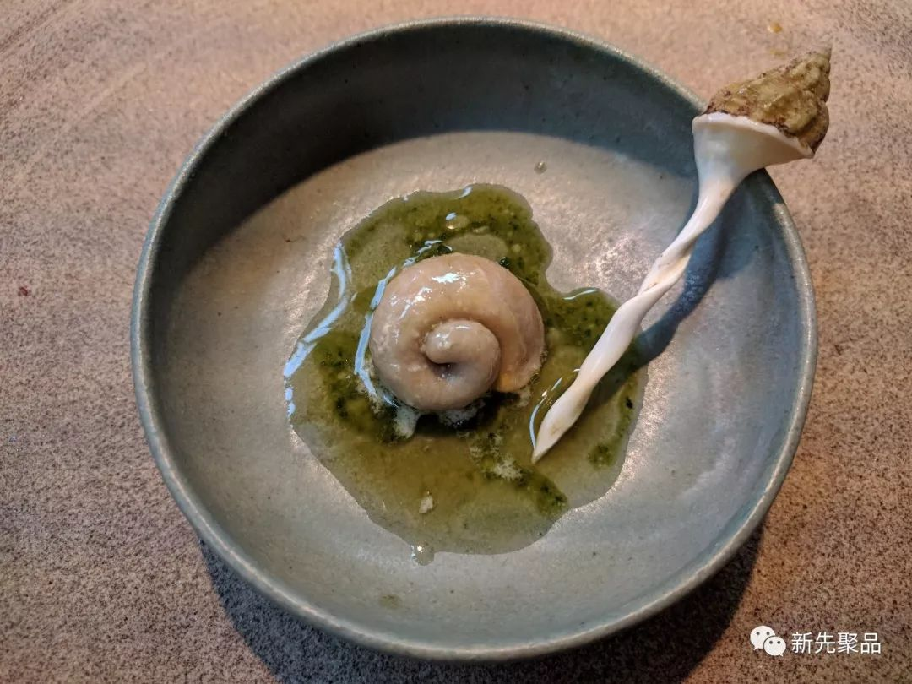 (原始链接: https://mmbiz.qpic.cn/mmbiz_jpg/dYyiavLsrKluicHYDjXhywia8eBPEdWcISYsmMiax8nsqhLdppGeYCgADys5TYvia4ibx5FicHCeUExzIDfsaicWWdckhQ/640?wx_fmt=jpeg)
- 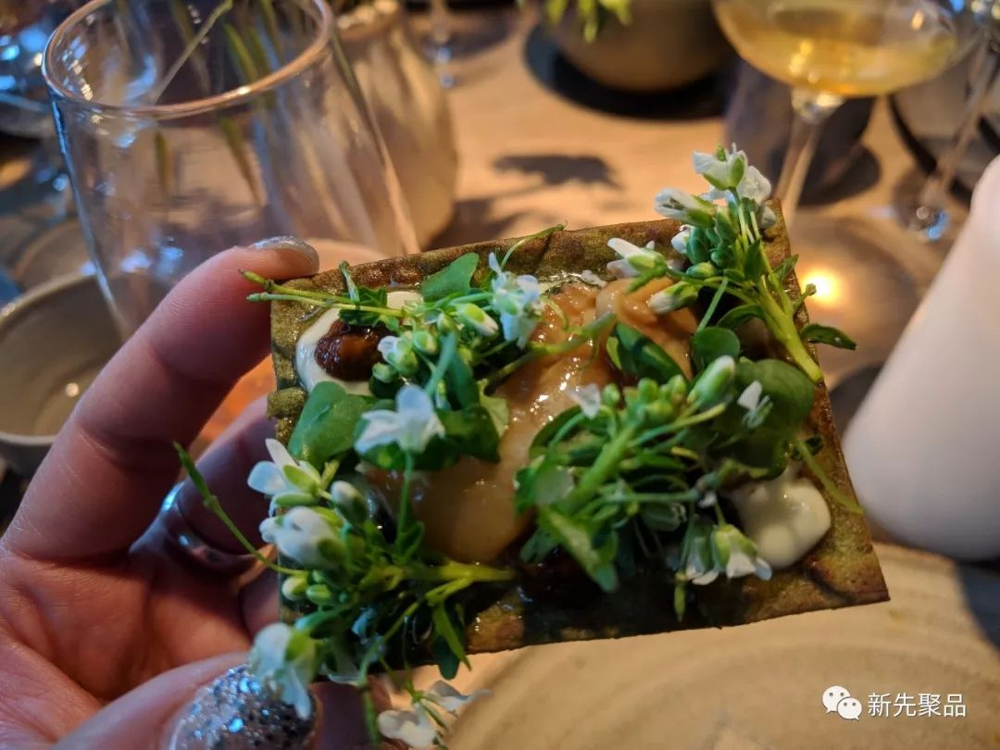 (原始链接: https://mmbiz.qpic.cn/mmbiz_jpg/dYyiavLsrKluicHYDjXhywia8eBPEdWcISYHR0azWmyFwtDbF9Voibjs4jfZbLLAc4SrwGGE63LrspciagklIica4ictg/640?wx_fmt=jpeg)
- 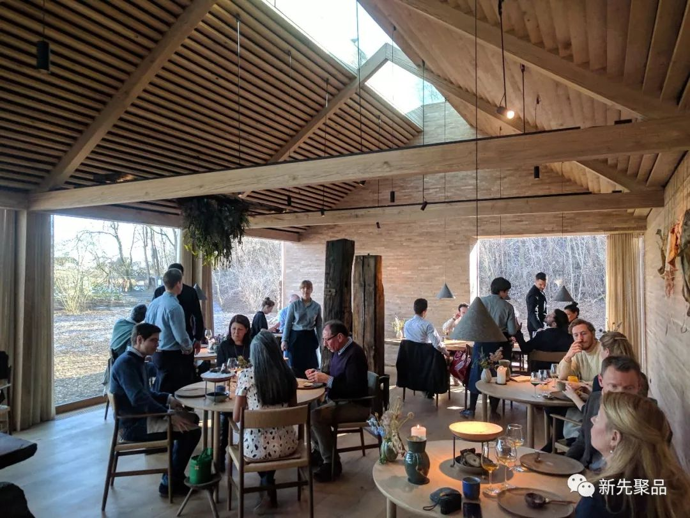 (原始链接: https://mmbiz.qpic.cn/mmbiz_jpg/dYyiavLsrKluicHYDjXhywia8eBPEdWcISYeMwIY4cnJibjk1EEJhhTE2t9lDdiaDwvud5EuPhbsmr0XXmAFU0kawpA/640?wx_fmt=jpeg)
- 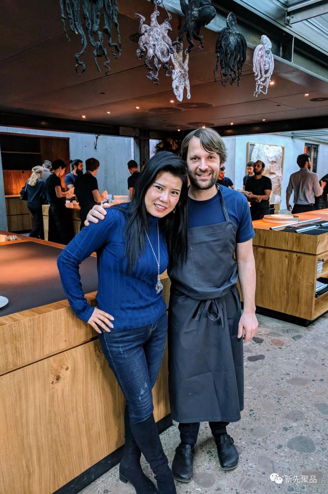 (原始链接: https://mmbiz.qpic.cn/mmbiz_jpg/dYyiavLsrKluicHYDjXhywia8eBPEdWcISYz4shib0iaWpfHTUb61KHB3vSKg5QzAsPPm25VgSQeqSZFXfzz4OAKqIQ/640?wx_fmt=jpeg)
- 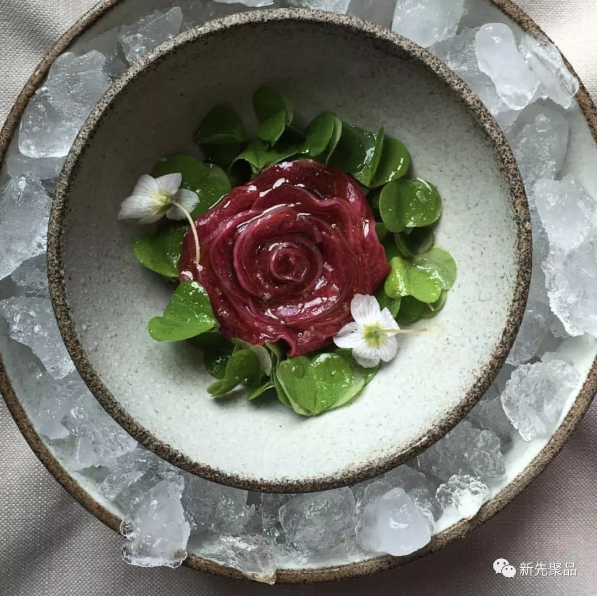 (原始链接: https://mmbiz.qpic.cn/mmbiz_jpg/dYyiavLsrKluicHYDjXhywia8eBPEdWcISYwR8FzBatZISA95dblOXKcVSzCF4yT5AkDhczNT5Tia749ktLWIlsQwg/640?wx_fmt=jpeg)
- 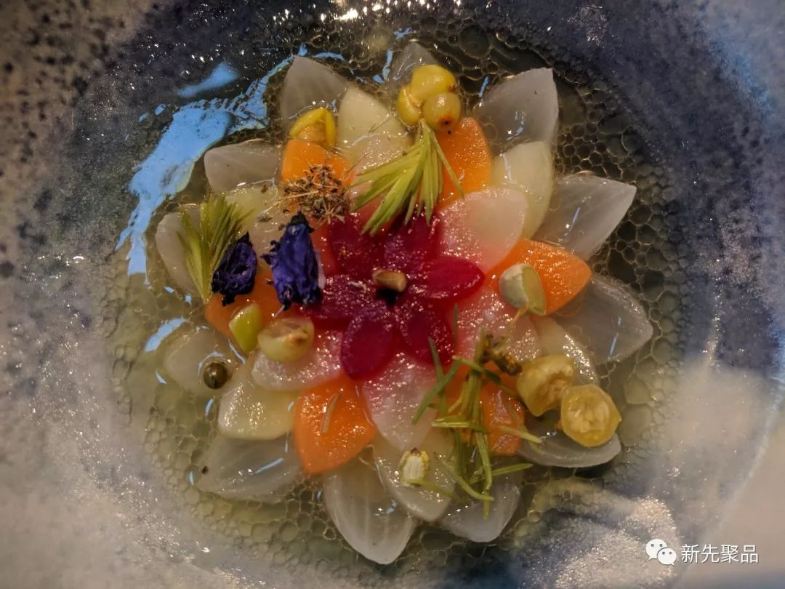 (原始链接: https://mmbiz.qpic.cn/mmbiz_jpg/dYyiavLsrKluicHYDjXhywia8eBPEdWcISY1Msjp6K4ztDnBIYHqAiaicIxPojwd5aP5wjHy2gwuCOV0icxKpmGicXbQg/640?wx_fmt=jpeg)
- 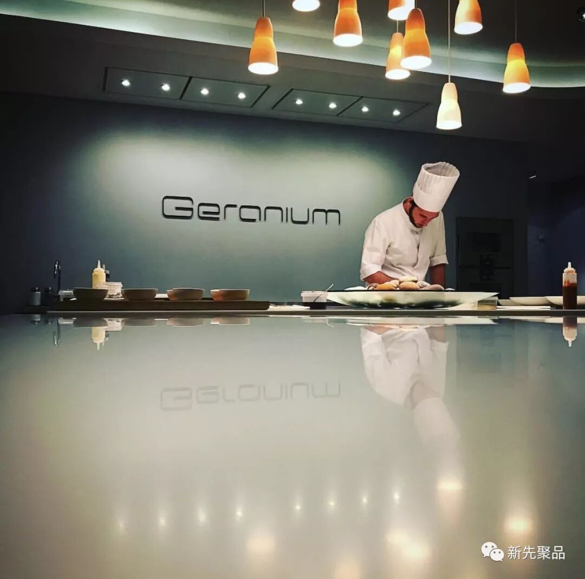 (原始链接: https://mmbiz.qpic.cn/mmbiz_jpg/dYyiavLsrKluicHYDjXhywia8eBPEdWcISYJfu8Lg3M4vujGETXLDVmRA5EXh5ZfIqCArn9SNEaEKicp8r1HHVxB0g/640?wx_fmt=jpeg)
- 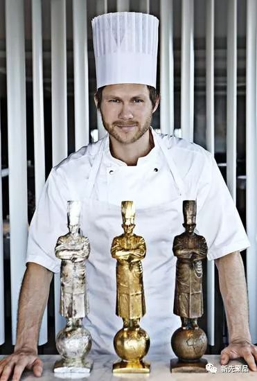 (原始链接: https://mmbiz.qpic.cn/mmbiz_jpg/dYyiavLsrKluicHYDjXhywia8eBPEdWcISYDhZFVKaZzCSqXNorFLwibvjaaUB3mL56rGRMk0k5RcqYzjhHzcCZe4A/640?wx_fmt=jpeg)
- 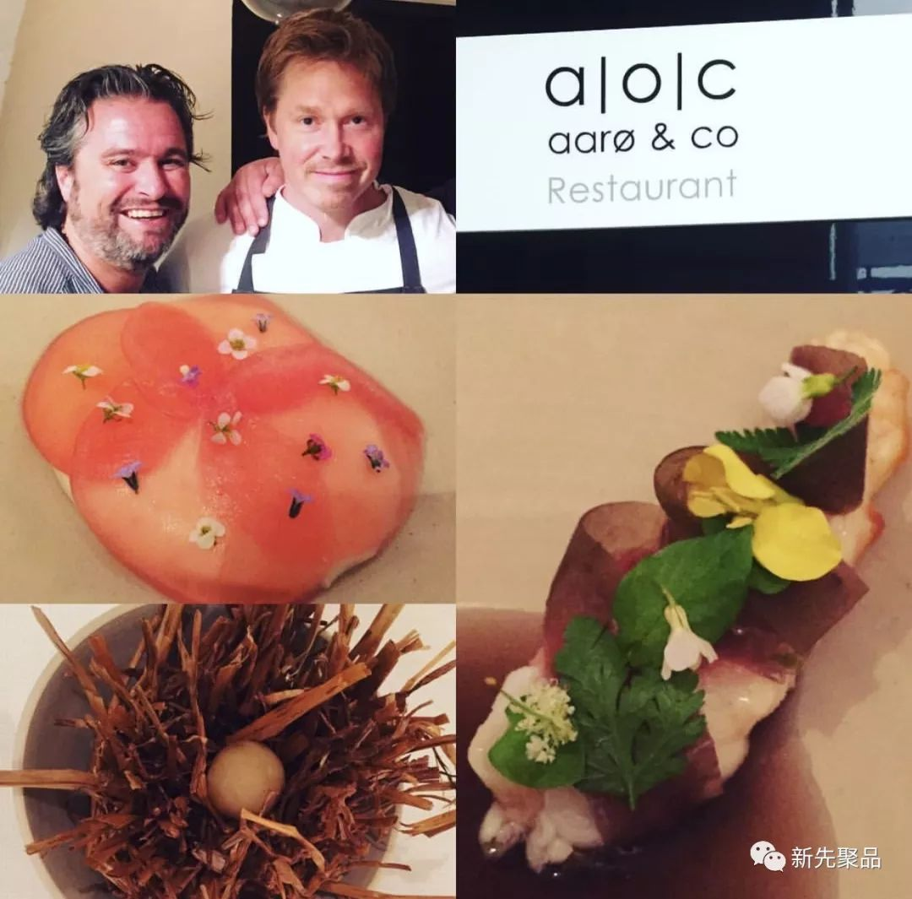 (原始链接: https://mmbiz.qpic.cn/mmbiz_jpg/dYyiavLsrKluicHYDjXhywia8eBPEdWcISYnnkQAr4hqDr5hwyJP3I0ztnhSOb5IPvicmRZUGiacgNhzvxjTV4JUN2g/640?wx_fmt=jpeg)
- 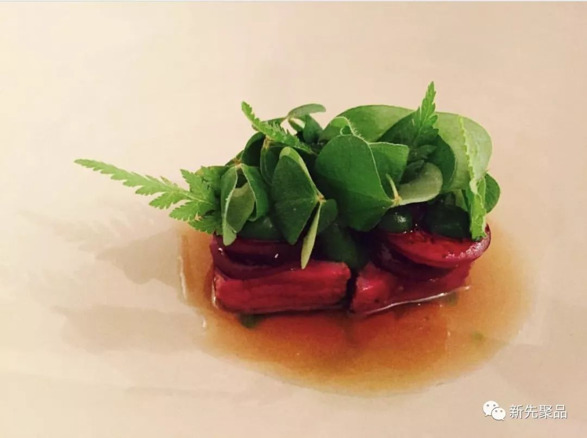 (原始链接: https://mmbiz.qpic.cn/mmbiz_jpg/dYyiavLsrKluicHYDjXhywia8eBPEdWcISYtpgQ4bdmuSfJCaINQyiavdaPGYoY4CFUreZmyqicBtFiaLDia7ayY3WBjw/640?wx_fmt=jpeg)
- 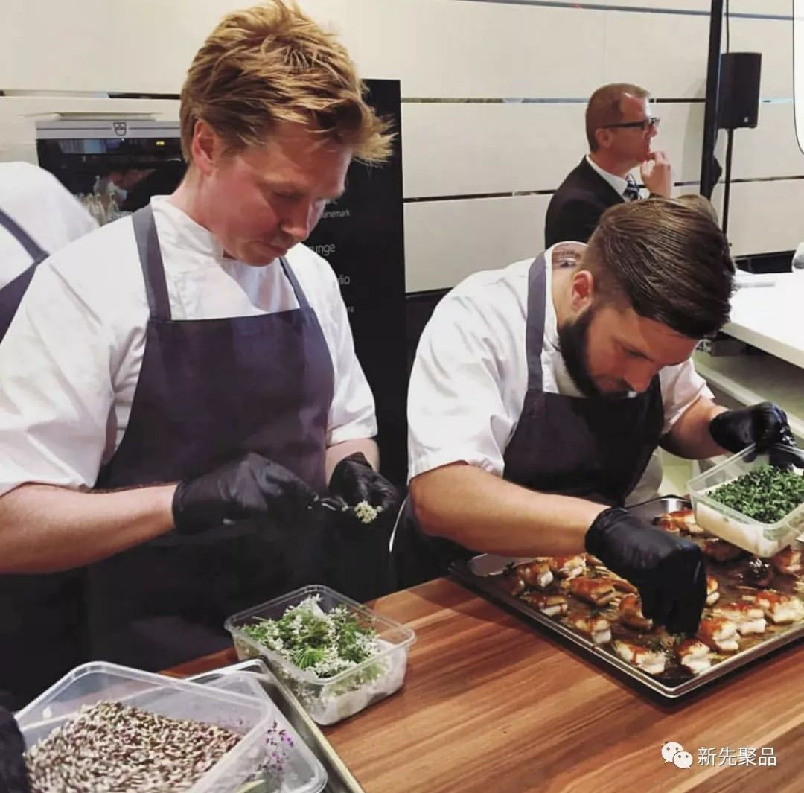 (原始链接: https://mmbiz.qpic.cn/mmbiz_jpg/dYyiavLsrKluicHYDjXhywia8eBPEdWcISYT8YsKdiaGpLcu7BLtmGNhMw3KqplNGeVfyGV4wdrG8QUPk0zFMypCsA/640?wx_fmt=jpeg)
- 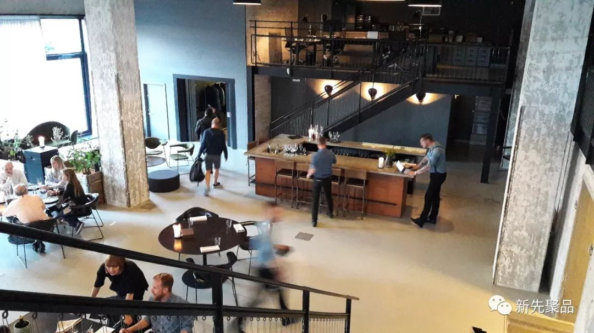 (原始链接: https://mmbiz.qpic.cn/mmbiz_jpg/dYyiavLsrKluicHYDjXhywia8eBPEdWcISYkZagmVzw9zhtMcWrL8XibYBfVUP0YG4Jricia85OtyAUKibrGZICoOHwMg/640?wx_fmt=jpeg)
- 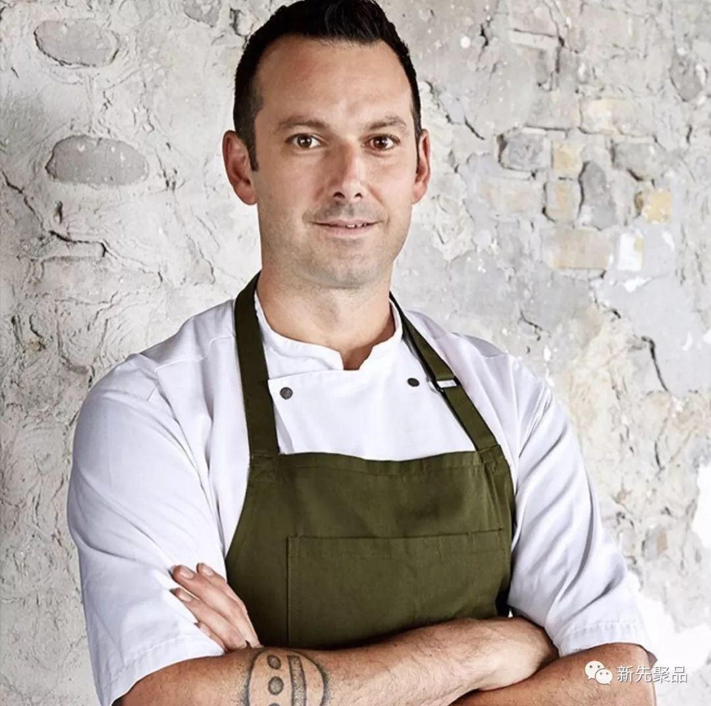 (原始链接: https://mmbiz.qpic.cn/mmbiz_jpg/dYyiavLsrKluicHYDjXhywia8eBPEdWcISYIKvqXm4AtfoCsvYzk1XKBjYDKicaOicYwjIkg2RsfyvlR58vMG7BO5iaw/640?wx_fmt=jpeg)
- 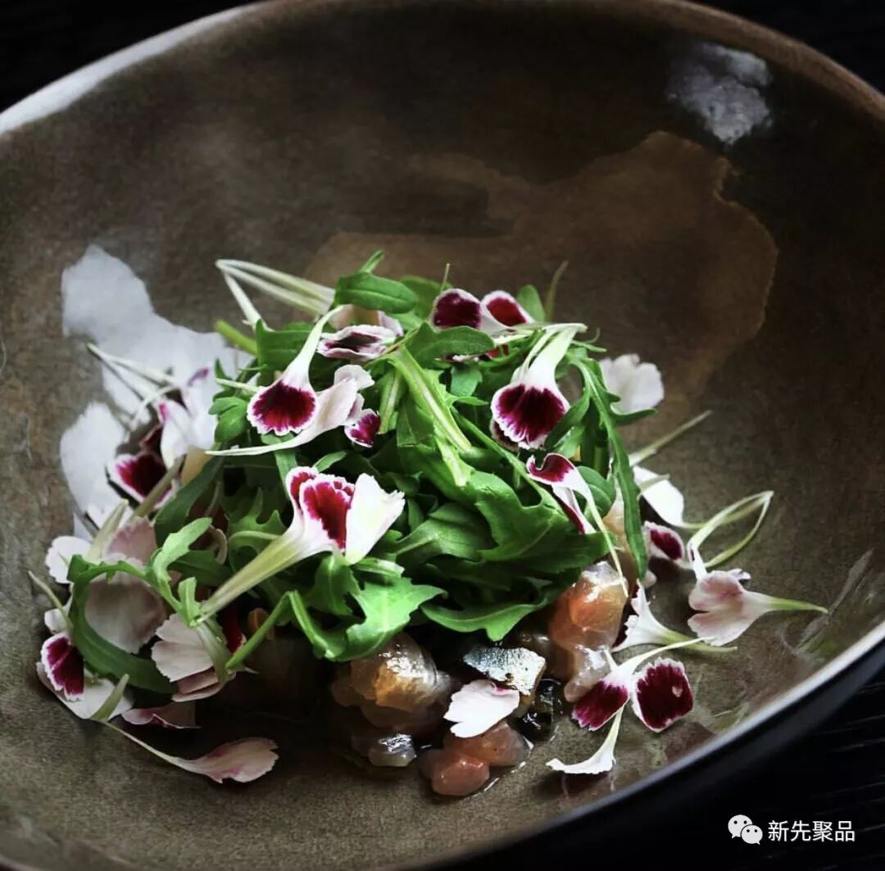 (原始链接: https://mmbiz.qpic.cn/mmbiz_jpg/dYyiavLsrKluicHYDjXhywia8eBPEdWcISYibrudcmp1dsGp5IW3oXicggtAmaVCRW9Dcic4vRibic8NGlepcIIpTiaDhzg/640?wx_fmt=jpeg)
-  (原始链接: https://mmbiz.qpic.cn/mmbiz_jpg/dYyiavLsrKluicHYDjXhywia8eBPEdWcISYvxMibXD83yuxKboZ3bG7DNYPvy4zZL2TdYsuwzWNtwd3vUYMdVamLOw/640?wx_fmt=jpeg)
- 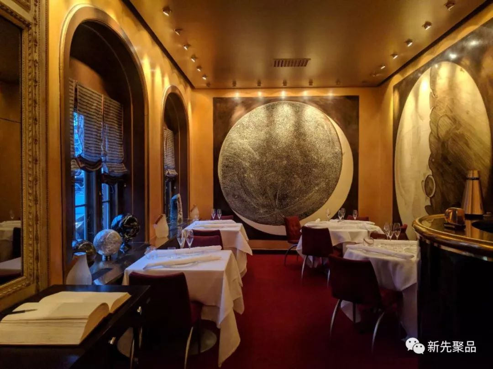 (原始链接: https://mmbiz.qpic.cn/mmbiz_jpg/dYyiavLsrKluicHYDjXhywia8eBPEdWcISYSPRGHhumwOt1usxZE2Ra2rib4CFGtw5CkUoKCRVXWBPRtsjpbG8JWxw/640?wx_fmt=jpeg)
- 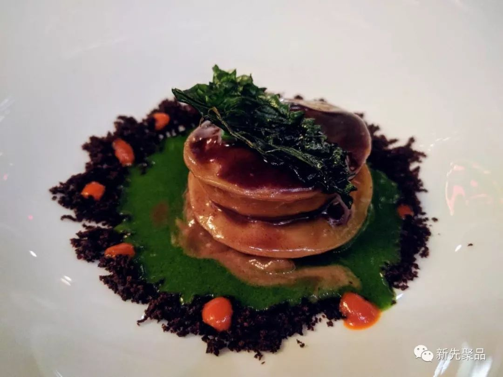 (原始链接: https://mmbiz.qpic.cn/mmbiz_jpg/dYyiavLsrKluicHYDjXhywia8eBPEdWcISYzfKTDPBUpSibS3WzM3129yehC4wvqNQhOA2Oic7xjAb6OLLlaebnzcibg/640?wx_fmt=jpeg)
- 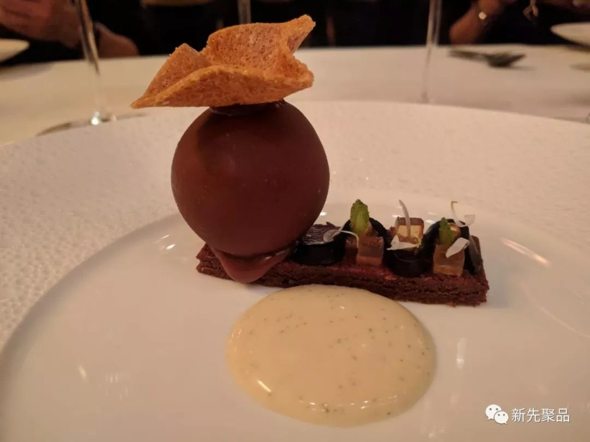 (原始链接: https://mmbiz.qpic.cn/mmbiz_jpg/dYyiavLsrKluicHYDjXhywia8eBPEdWcISYNIV5SFqwYOngutH9X4WMONWHeWEeqa1LkQg68hqO8jibRE6YZ7TxdjQ/640?wx_fmt=jpeg)
- 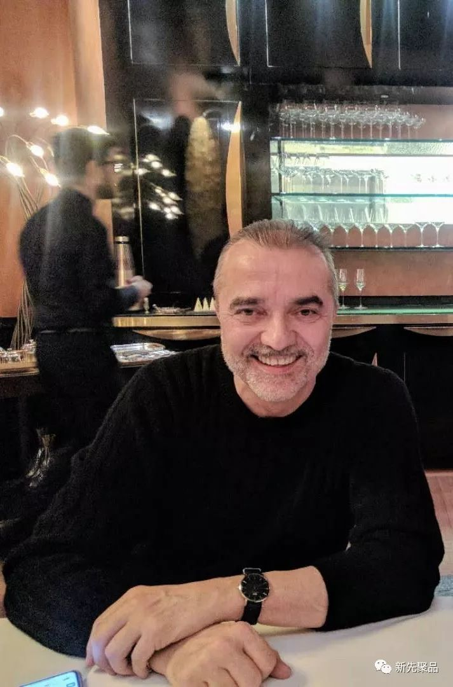 (原始链接: https://mmbiz.qpic.cn/mmbiz_jpg/dYyiavLsrKlsXbT1W0tCDQibrzZCp1R9gtafFq0snpIjdzQhKK1ty2iaoxU8gGT6Siaj6NLLYiawsFCzOZibebmSr5VQ/640?wx_fmt=jpeg)
- 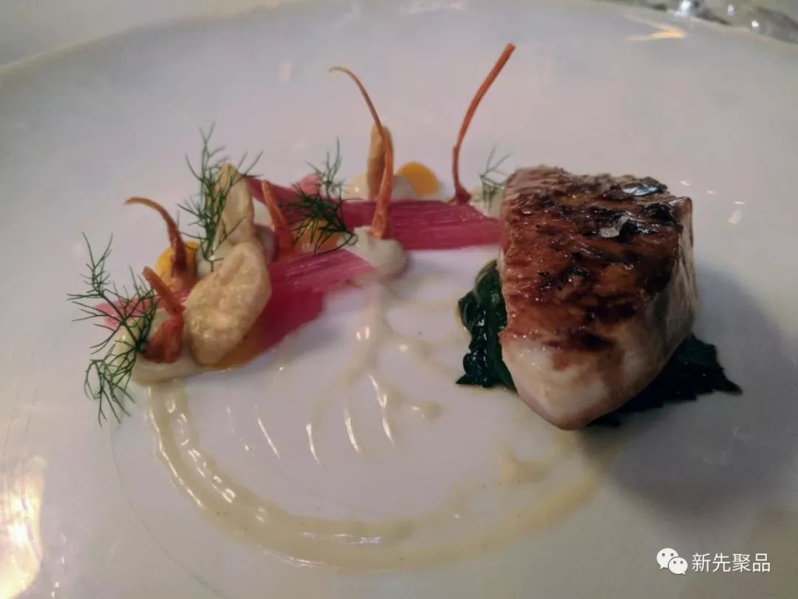 (原始链接: https://mmbiz.qpic.cn/mmbiz_jpg/dYyiavLsrKluicHYDjXhywia8eBPEdWcISYncuF1kSwQRArnTLDS2H5FlGU18r4NyBHOibm2U2wAN5ZbXvKnp1qrhw/640?wx_fmt=jpeg)
-  (原始链接: https://mmbiz.qpic.cn/mmbiz_jpg/dYyiavLsrKluicHYDjXhywia8eBPEdWcISYMqefDBB81lPBTbdZ9jhvlnZ9AbibCgyQMRhvfl6xiaiaAfjkkgMutjnqw/640?wx_fmt=jpeg)
- 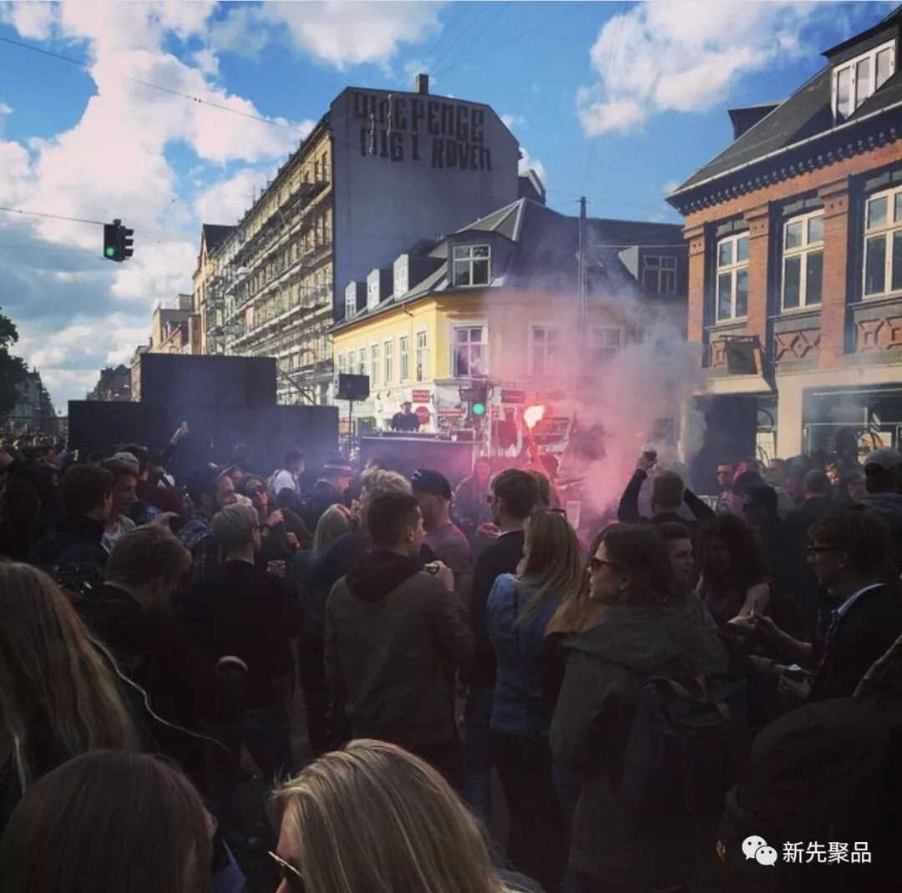 (原始链接: https://mmbiz.qpic.cn/mmbiz_jpg/dYyiavLsrKluicHYDjXhywia8eBPEdWcISYDj6riaIcRyWMA6nM27zUVibTiaEjqoBKqyS8jYenZgvMib3TV6Qc8ibr1AA/640?wx_fmt=jpeg)
- 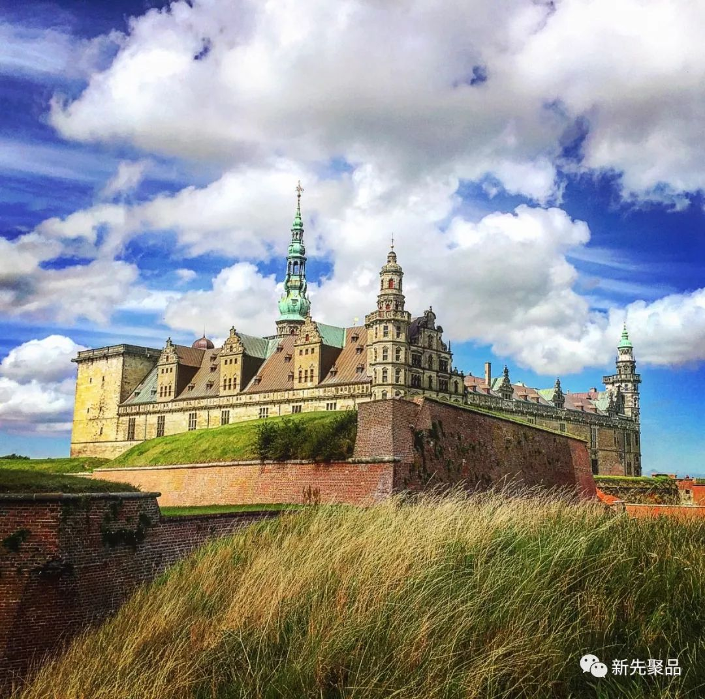 (原始链接: https://mmbiz.qpic.cn/mmbiz_jpg/dYyiavLsrKluicHYDjXhywia8eBPEdWcISYQUmuXlBkydH8KsvXRufRy3YLqib42lGt4vCBjC2C7qLk5OCsQNpqhtA/640?wx_fmt=jpeg)
- 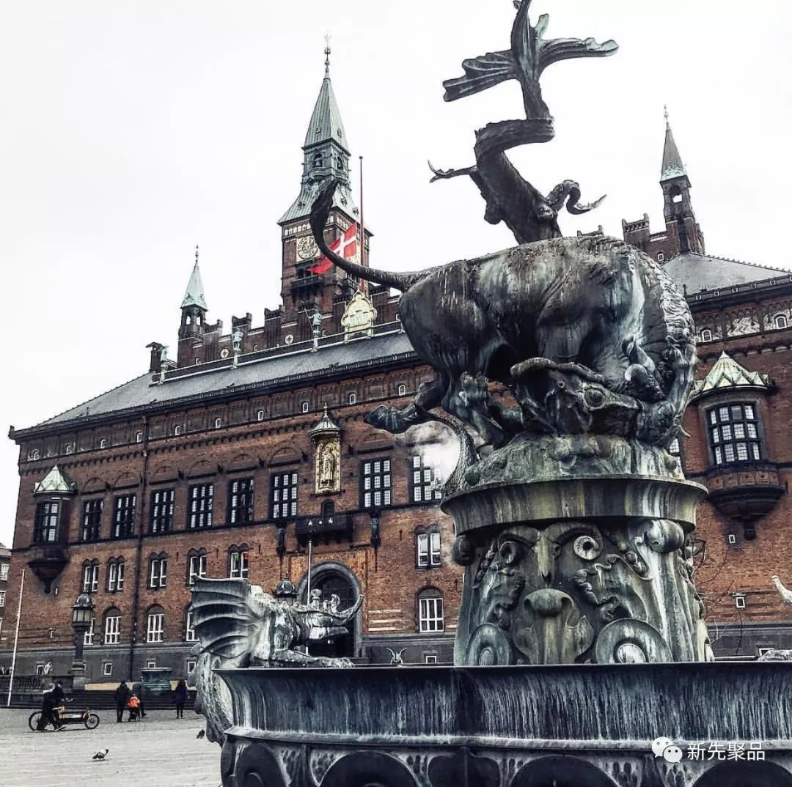 (原始链接: https://mmbiz.qpic.cn/mmbiz_jpg/dYyiavLsrKluicHYDjXhywia8eBPEdWcISYyG4JDMagB8VbKZ59D2a8xFAPcGLflRM2VRY48iaGps3ibsQFyw9stPFA/640?wx_fmt=jpeg)
- 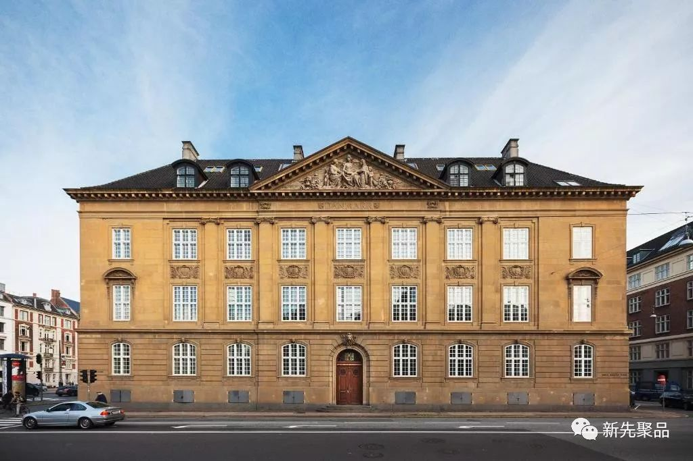 (原始链接: https://mmbiz.qpic.cn/mmbiz_jpg/dYyiavLsrKluicHYDjXhywia8eBPEdWcISYu3xHgerGMF7w1e5V9S6ibANiclOiblkOuicqQruou6WiaianOO3icpdc5yTDQ/640?wx_fmt=jpeg)
- 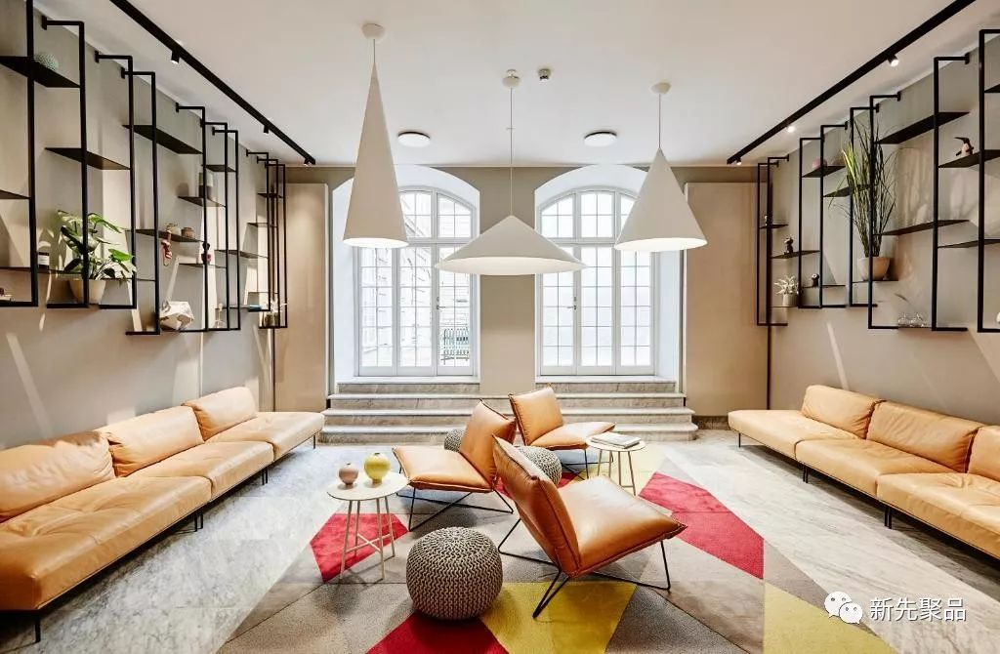 (原始链接: https://mmbiz.qpic.cn/mmbiz_jpg/dYyiavLsrKluicHYDjXhywia8eBPEdWcISYgwk5FlxMkZ0fJKcKmgRLzArHZhfjrKFWHAmic59uIODthSzbCSQ4wBw/640?wx_fmt=jpeg)
- 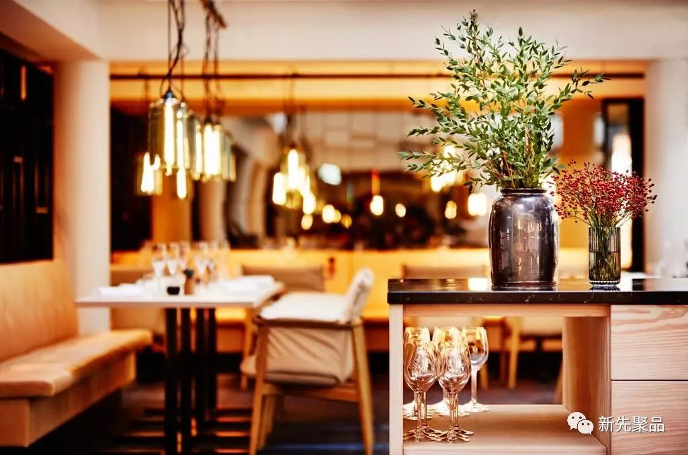 (原始链接: https://mmbiz.qpic.cn/mmbiz_jpg/dYyiavLsrKluicHYDjXhywia8eBPEdWcISYs5g5QMibcLusvWaTNnaajy3vmXSSs2tIaf2GcIM0PkcSqS20l0Po3UQ/640?wx_fmt=jpeg)
- 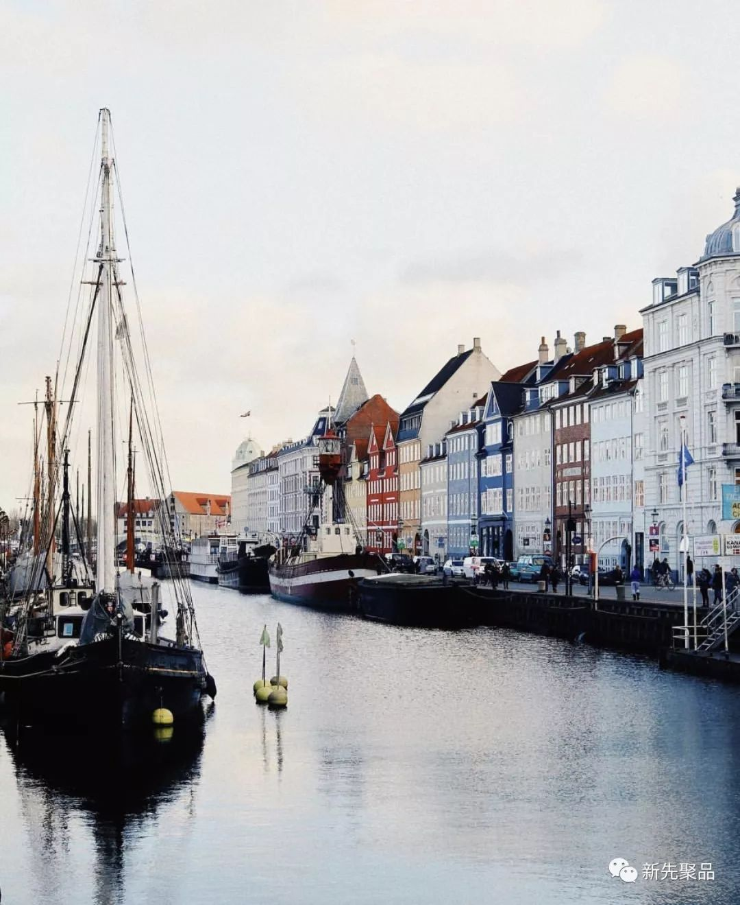 (原始链接: https://mmbiz.qpic.cn/mmbiz_jpg/dYyiavLsrKluicHYDjXhywia8eBPEdWcISYSo2oVdLEZzlDfaaCnBhtnY4MCTyQGvr9t5icmLKgjN1WaohnriaohMEA/640?wx_fmt=jpeg)
-  (原始链接: https://mmbiz.qpic.cn/mmbiz_jpg/dYyiavLsrKlsXbT1W0tCDQibrzZCp1R9gtK29OMgk3piaF9cLFHffV4Gf2mXMa8dlQsxRYBHKh67oHD26GUjW0cOA/640?wx_fmt=jpeg)
