# 无标题

**链接地址:** http://mp.weixin.qq.com/s?__biz=MjM5MDAzNzQyMA==&mid=2651379723&idx=1&sn=32a698bec37a0efdd5dd60dfb23a0c90&chksm=bdb69cc88ac115de8161f171704eeac0b76290f53f19676a12f5bf840e10d1e33551e4bb9dbb&mpshare=1&scene=2&srcid=0323zpICpwFpTmnMXO9SQ7Xr#rd
**作者:** 小奇
**获取时间:** 2025/8/28 22:11:20
**图片数量:** 35

---

## 原始HTML内容

 

今晚，《偶像练习生》第三次排名情况公布了！

 

 

从最初的100位练习生，到后来的35位，再到如今只能剩下20位，最终只有9人才能站上这个舞台。

 

上一期还没有公布考核曲目《Dream》、《听听我说的吧》中蔡徐坤和Justin的得票，他们个人得票将会改变整组命运。

 

 

 

谁能赢得这20万票的最高个人加持和每人5万票的加持，又有谁止步决赛大门呢？

 

 

<strong>想直接get最终结果的，可以直接下拉至文末哦~</strong>

 

接受残酷结果之前，还是来看看练习生们的<strong>有爱日常</strong>吧！ 

 

其实业余时间，节目组也是会给大家安排些趣味活动来放松的，比如<strong>泡泡服抢凳子</strong>游戏，让大家都穿成这个样子↓

 

 

<strong>王子异</strong>穿着“破涕为笑”泡泡服，还能来一个swag？帅中带萌~

 

 

<strong>钱正昊</strong>像一个被外星人抱走的小宝宝哈哈哈~

 

 

wuli<strong>奋哥</strong>这套衣服坐着和躺着没有差别，要多努力才能赢了这个游戏啊！你们能不能照顾下老年人！

 

 

<strong>朱星杰</strong>真人版胡巴终于上线，走起路来简直萌炸了~

 

 

 

还有<strong>走心又走肾</strong>的一趴：练习生们再次回到初登舞台的地方，写下他们参加节目以来的心情笔记。

 

 

 

可是<strong>突然灯一黑！</strong>

 

 

镜子对面竟然出现了……<strong>贞子？？？</strong>

 

 

真是吓坏宝宝们了！连滚带爬~

 

 

笔都不要了~

 

 

对不起，看到这里小奇不厚道的笑了…… 

 

但也有不中招的练习生。

 

小鬼好像不怕鬼？

 

 

林彦俊表示“呵呵”？还上前撩女鬼？嗨，最近好吗，去吃饭吗，肚子饿吗？

 

 

周美锐也是没在怕的，还吓唬对面的女鬼呢。

 

 

 

节目组还特别组织了一场<strong>吐槽大会</strong>，让大家畅所欲言！ 

 

木子洋就爆料出了卜凡的大名，圣恩还吐槽他特别爱叫人“宝宝”，集体被大家嫌弃！我们小凡凡当时就有小情绪了~！

 

 

子异吐槽了Jeffery对于鸡蛋的挚爱简直疯狂，自己竟然在宿舍备了一箱鸡蛋，还自带煮蛋器每天保证8个鸡蛋，果然两米厚的胸肌不是白吹出来的~

 

 

还有被称作洗澡战士的胖尤和彦俊，他们两个可谓是极端，一个5分钟解决，一个需要一个小时···

 

 

接下来被吐槽的是周美锐，大家吐槽美锐自从《小半》之后“性情大变”，变得特别自恋又爱化妆~爱美是没有错啦，但是美锐能从头到脚都精致起来吗~

 

 

大家这么期待美锐的颜值可是努力减肥的结果，却总被坤坤诱惑投食，没想到所有人里，最能吃的竟然是坤坤，面对爱吃却又吃不胖的坤坤，丞丞估计默默地流下了泪水。

 

 

 

好啦，笑过之后，还是来看看本期的<strong>排名情况</strong>吧！

 

上周主题考核，获得第一名的是<strong>《听听我说的吧》组</strong>，个人票数第一名是<strong>蔡徐坤</strong>。

 

 

第三次排名结果直接看图：

 

 

虽然这次的淘汰依然很残酷，但这次淘汰的练习生还有一次<strong>和导师合作舞台</strong>的机会哦，一起期待吧~

 

 

结束后，张PD还公布了<strong>最终考核的任务</strong><strong></strong>：18天之后，20位练习生将第一次在全民制作人面前进行公演直播。 

 

 

<strong>直播实时投票+线上投票</strong>，将最终确定9名出道成员。票数获得第一名的练习生，将成为出道的C位。

 

 

20位晋级的练习生已经在紧张准备新的考核曲目了，加油吧！

 

 

这4个月以来的辛酸与努力，只有练习生们自己知道。

 

即便离开这个舞台，这段经历也会成为最宝贵的财富。我们希望每个人都能拥有更美好的未来，你们都是最棒的！继续加油！

 

<strong>最后一轮投票</strong>已经开始了，别忘了给你pick的练习生投票哦！

 

 

PS：猛戳下方<strong style="max-width: 100%;box-sizing: border-box !important;word-wrap: break-word !important;">阅读原文</strong>，还有本期搞怪上线的<strong style="max-width: 100%;box-sizing: border-box !important;word-wrap: break-word !important;">《偶像有新番》</strong>！Justin撒娇卖萌、卜凡暴力强拆！练习生为抓娃娃用尽奇招……

 

<section data-color="rgb(42,107,187)" style="margin-top: 20px;font-size: 16px;white-space: normal;max-width: 100%;color: rgb(62, 62, 62);text-align: center;widows: 1;line-height: 25.6px;background-color: rgb(255, 255, 255);box-sizing: border-box !important;word-wrap: break-word !important;"><section style="margin-top: -3px;padding: 15px;max-width: 100%;border-radius: 10px;border-width: 1px;border-style: dashed;border-color: rgb(42, 107, 187);box-sizing: border-box !important;word-wrap: break-word !important;">
<strong style="max-width: 100%;box-sizing: border-box !important;word-wrap: break-word !important;">往期精选</strong>

<a href="http://mp.weixin.qq.com/s?__biz=MjM5MDAzNzQyMA==&amp;mid=2651379648&amp;idx=1&amp;sn=30ef40ce7784f115f4fe6f5c43a5de10&amp;chksm=bdb693038ac11a15b8349bb8c67a633d44380758d8d30db93af46fb779424cfd47f43eb3b78d&amp;scene=21#wechat_redirect" target="_blank" style="text-decoration: underline;font-size: 12px;color: rgb(120, 172, 254);">又一部高糖青春剧来啦！苏爆炸，甜到齁！</a> 

<a href="http://mp.weixin.qq.com/s?__biz=MjM5MDAzNzQyMA==&amp;mid=2651379563&amp;idx=1&amp;sn=b285a1f30bf47ce0cdd926972d2fef12&amp;chksm=bdb693a88ac11abeec07e4326720a2ee551b9f930d3383ee8708ec3fe4887c20a2a9c589410f&amp;scene=21#wechat_redirect" target="_blank" style="color: rgb(120, 172, 254);text-decoration: underline;max-width: 100%;font-size: 12px;box-sizing: border-box !important;word-wrap: break-word !important;">3unshine组合新剧停拍，男主蹭完热度就跑路了？</a> 

<a href="http://mp.weixin.qq.com/s?__biz=MjM5MDAzNzQyMA==&amp;mid=2651379563&amp;idx=2&amp;sn=c554f5c4e9b97e0e36cce56e00f092e7&amp;chksm=bdb693a88ac11abe529c104f91a5270d6cebc395a8a5228231026ceec6e120a6d0fa122c868c&amp;scene=21#wechat_redirect" target="_blank" style="color: rgb(120, 172, 254);text-decoration: underline;max-width: 100%;font-size: 12px;box-sizing: border-box !important;word-wrap: break-word !important;">《早班机》代班主持人范丞丞上线了，表情包大神是如何炼成的？</a> 

<a href="http://mp.weixin.qq.com/s?__biz=MjM5MDAzNzQyMA==&amp;mid=2651379490&amp;idx=1&amp;sn=0c58798635b7c35ac4dbbd06830574ad&amp;chksm=bdb693e18ac11af74e22e73493f1c4185a490627dae6e361cf2d832febc144cc9699a2c03bb7&amp;scene=21#wechat_redirect" target="_blank" style="color: rgb(120, 172, 254);max-width: 100%;box-sizing: border-box !important;word-wrap: break-word !important;">黄子韬解约再败诉？打了两年半的官司还没结束吗…</a> 

<a href="http://mp.weixin.qq.com/s?__biz=MjM5MDAzNzQyMA==&amp;mid=2651379434&amp;idx=1&amp;sn=025c1686a5c0a543de8fa71297778aa5&amp;chksm=bdb692298ac11b3f82b66022b40eed4c779090ca4aecab805e85db3f87b94667d24ab2ea76dc&amp;scene=21#wechat_redirect" target="_blank" style="color: rgb(120, 172, 254);max-width: 100%;box-sizing: border-box !important;word-wrap: break-word !important;">Hold住姐谢依霖结婚了？！但是她老公Green是谁啊…</a> 

<a href="http://mp.weixin.qq.com/s?__biz=MjM5MDAzNzQyMA==&amp;mid=2651379434&amp;idx=2&amp;sn=1aa4faac5e8e323cb30d5c485ab107eb&amp;chksm=bdb692298ac11b3f68834e7441629dbd427bef781a95376b9a6f131ebc7be5ab3963b948bc7b&amp;scene=21#wechat_redirect" target="_blank" style="color: rgb(120, 172, 254);text-decoration: underline;max-width: 100%;font-size: 12px;box-sizing: border-box !important;word-wrap: break-word !important;">《早班机》代班主持人陈立农活力上线，17岁少年的美颜秘笈是？</a>
</section></section>
 

 

<strong style="max-width: 100%;box-sizing: border-box;line-height: 24.5px;word-wrap: break-word !important;">长按识别二维码 关注爱奇艺娱乐官方微信</strong>

---

## 纯文本内容

今晚，《偶像练习生》第三次排名情况公布了！从最初的100位练习生，到后来的35位，再到如今只能剩下20位，最终只有9人才能站上这个舞台。上一期还没有公布考核曲目《Dream》、《听听我说的吧》中蔡徐坤和Justin的得票，他们个人得票将会改变整组命运。谁能赢得这20万票的最高个人加持和每人5万票的加持，又有谁止步决赛大门呢？想直接get最终结果的，可以直接下拉至文末哦~接受残酷结果之前，还是来看看练习生们的有爱日常吧！其实业余时间，节目组也是会给大家安排些趣味活动来放松的，比如泡泡服抢凳子游戏，让大家都穿成这个样子↓王子异穿着“破涕为笑”泡泡服，还能来一个swag？帅中带萌~钱正昊像一个被外星人抱走的小宝宝哈哈哈~wuli奋哥这套衣服坐着和躺着没有差别，要多努力才能赢了这个游戏啊！你们能不能照顾下老年人！朱星杰真人版胡巴终于上线，走起路来简直萌炸了~还有走心又走肾的一趴：练习生们再次回到初登舞台的地方，写下他们参加节目以来的心情笔记。可是突然灯一黑！镜子对面竟然出现了……贞子？？？真是吓坏宝宝们了！连滚带爬~笔都不要了~对不起，看到这里小奇不厚道的笑了……但也有不中招的练习生。小鬼好像不怕鬼？林彦俊表示“呵呵”？还上前撩女鬼？嗨，最近好吗，去吃饭吗，肚子饿吗？周美锐也是没在怕的，还吓唬对面的女鬼呢。节目组还特别组织了一场吐槽大会，让大家畅所欲言！木子洋就爆料出了卜凡的大名，圣恩还吐槽他特别爱叫人“宝宝”，集体被大家嫌弃！我们小凡凡当时就有小情绪了~！子异吐槽了Jeffery对于鸡蛋的挚爱简直疯狂，自己竟然在宿舍备了一箱鸡蛋，还自带煮蛋器每天保证8个鸡蛋，果然两米厚的胸肌不是白吹出来的~还有被称作洗澡战士的胖尤和彦俊，他们两个可谓是极端，一个5分钟解决，一个需要一个小时···接下来被吐槽的是周美锐，大家吐槽美锐自从《小半》之后“性情大变”，变得特别自恋又爱化妆~爱美是没有错啦，但是美锐能从头到脚都精致起来吗~大家这么期待美锐的颜值可是努力减肥的结果，却总被坤坤诱惑投食，没想到所有人里，最能吃的竟然是坤坤，面对爱吃却又吃不胖的坤坤，丞丞估计默默地流下了泪水。好啦，笑过之后，还是来看看本期的排名情况吧！上周主题考核，获得第一名的是《听听我说的吧》组，个人票数第一名是蔡徐坤。第三次排名结果直接看图：虽然这次的淘汰依然很残酷，但这次淘汰的练习生还有一次和导师合作舞台的机会哦，一起期待吧~结束后，张PD还公布了最终考核的任务：18天之后，20位练习生将第一次在全民制作人面前进行公演直播。直播实时投票+线上投票，将最终确定9名出道成员。票数获得第一名的练习生，将成为出道的C位。20位晋级的练习生已经在紧张准备新的考核曲目了，加油吧！这4个月以来的辛酸与努力，只有练习生们自己知道。即便离开这个舞台，这段经历也会成为最宝贵的财富。我们希望每个人都能拥有更美好的未来，你们都是最棒的！继续加油！最后一轮投票已经开始了，别忘了给你pick的练习生投票哦！PS：猛戳下方阅读原文，还有本期搞怪上线的《偶像有新番》！Justin撒娇卖萌、卜凡暴力强拆！练习生为抓娃娃用尽奇招……往期精选又一部高糖青春剧来啦！苏爆炸，甜到齁！3unshine组合新剧停拍，男主蹭完热度就跑路了？《早班机》代班主持人范丞丞上线了，表情包大神是如何炼成的？黄子韬解约再败诉？打了两年半的官司还没结束吗…Hold住姐谢依霖结婚了？！但是她老公Green是谁啊…《早班机》代班主持人陈立农活力上线，17岁少年的美颜秘笈是？长按识别二维码 关注爱奇艺娱乐官方微信

---

## 图片列表

-  (原始链接: https://mmbiz.qpic.cn/mmbiz_png/gSq8E7dqrod9Ju1bFoBfDYCPT1hu9zFWEezDgQQjWbk3zaGClw3UnaKBDVlibK6uV0RKrl6fWFG2aSStib6sNvOw/640?wx_fmt=png)
- 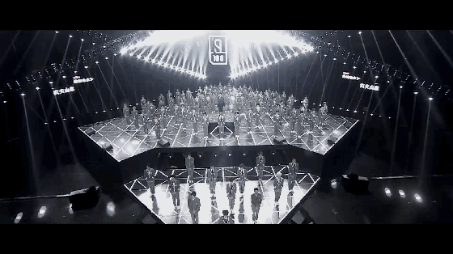 (原始链接: https://mmbiz.qpic.cn/mmbiz_gif/gSq8E7dqroe32BcaAEGx0TRR5icFA4Yz9OnxOOvgD15ItxsIrro4avrSBibS0d5Y8GBic9ozzaDR09X0esibOf8VEw/640?wx_fmt=gif)
- 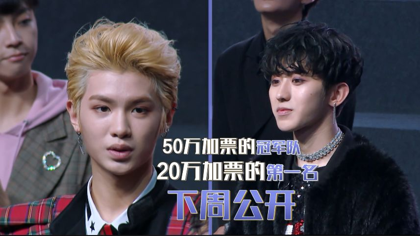 (原始链接: https://mmbiz.qpic.cn/mmbiz_png/gSq8E7dqrocCLWVGnGIJiboHxXuxpTA7d0o1VTPGLlCYqC7MS375vdOHt855jH5OLgC5qamBrMibO7gpxmzz5DCg/640?wx_fmt=png)
-  (原始链接: https://mmbiz.qpic.cn/mmbiz_gif/gSq8E7dqroe32BcaAEGx0TRR5icFA4Yz9Ev5KGSzkDiayib5o3kmQQTwXXzye3qqYv0jQBM2j6nSbeylK8a4dtpIw/640?wx_fmt=gif)
- 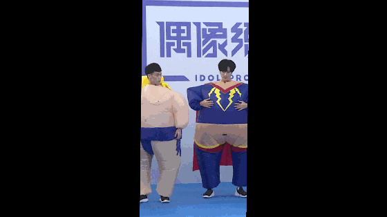 (原始链接: https://mmbiz.qpic.cn/mmbiz_gif/gSq8E7dqroe32BcaAEGx0TRR5icFA4Yz9wmetzwrtBiaeseXkw8ufOSiabD66HPbraPUhdnvH8kSKpU1gCsicARdtQ/640?wx_fmt=gif)
- 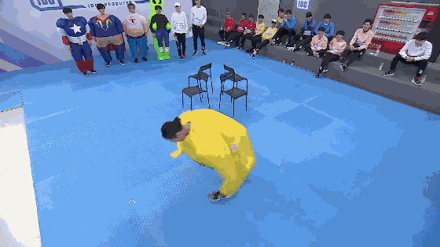 (原始链接: https://mmbiz.qpic.cn/mmbiz_gif/gSq8E7dqroe32BcaAEGx0TRR5icFA4Yz9RgictjAfXGp1iaV55f4sFfhdtdYsNPyLWoCKvGJ8gctRhiazpwnE7HRcA/640?wx_fmt=gif)
- 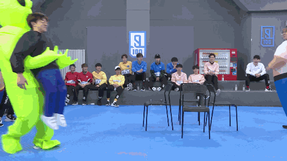 (原始链接: https://mmbiz.qpic.cn/mmbiz_gif/gSq8E7dqroe32BcaAEGx0TRR5icFA4Yz9eWBAvK2yk55iatwoM2LbH0nd1eA9OL1naichlbib2ibIbBXzC5vf2fpqwg/640?wx_fmt=gif)
- 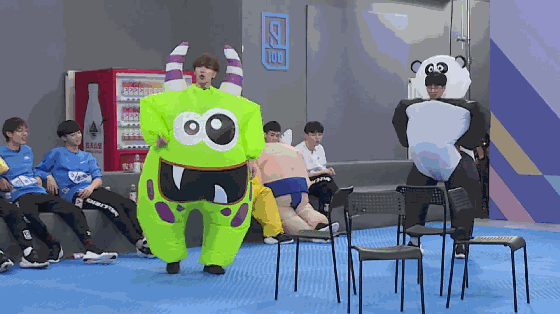 (原始链接: https://mmbiz.qpic.cn/mmbiz_gif/gSq8E7dqroe32BcaAEGx0TRR5icFA4Yz9UanlNUn44gNuIiabLmfOoGvybxBjibGabREMib3nibJC55BPAaRJQBKjKQ/640?wx_fmt=gif)
- 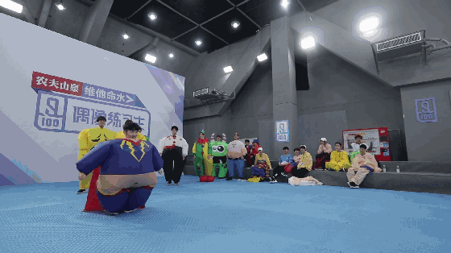 (原始链接: https://mmbiz.qpic.cn/mmbiz_gif/gSq8E7dqroe32BcaAEGx0TRR5icFA4Yz9PEFFMK6kX6MQPzavlSYFXTdS5WH4DXMSBMibRC9vKTj7vibF5OFs5p2w/640?wx_fmt=gif)
-  (原始链接: https://mmbiz.qpic.cn/mmbiz_png/gSq8E7dqroe32BcaAEGx0TRR5icFA4Yz9DzbibNicZxTGyrGFDLTkO1sZj5v2xRicYbDibHBZsib4SbZPjtCZQUDeicWw/640?wx_fmt=png)
- 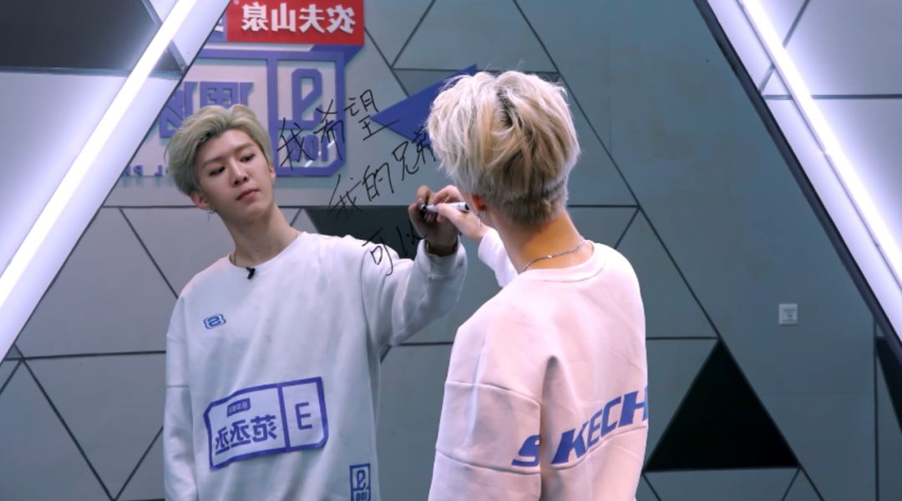 (原始链接: https://mmbiz.qpic.cn/mmbiz_png/gSq8E7dqroe32BcaAEGx0TRR5icFA4Yz9eKpOBvalicMicpyCCII6jeoDVI68f7oH5ZWG4kewfSkNLuVb6Ueo0Mrg/640?wx_fmt=png)
- 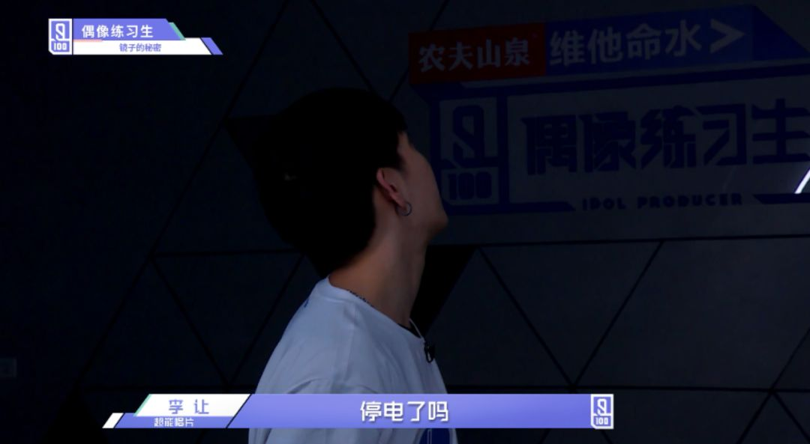 (原始链接: https://mmbiz.qpic.cn/mmbiz_png/gSq8E7dqroe32BcaAEGx0TRR5icFA4Yz90DPH7ZZTibzcw0KambHXyOgibXDbptpfoVEMLYf1j3UHM9QrmvvqnMdg/640?wx_fmt=png)
- 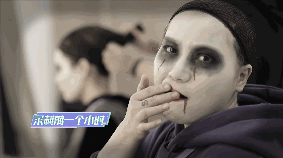 (原始链接: https://mmbiz.qpic.cn/mmbiz_gif/gSq8E7dqroe32BcaAEGx0TRR5icFA4Yz9GYv8Dl7o4A298Z0HmLrVb7g7yC4eZ2JUsL3amAxhibPKbPv8FgvXeNQ/640?wx_fmt=gif)
- 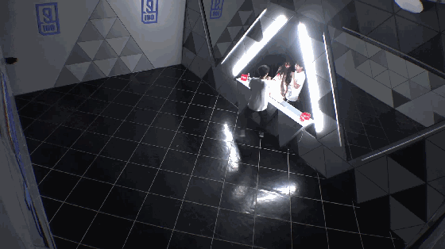 (原始链接: https://mmbiz.qpic.cn/mmbiz_gif/gSq8E7dqroe32BcaAEGx0TRR5icFA4Yz9TFMAeOoaJHUwNAfRBGoNeYRGEaKYEotNhf6J0Fjmmb9340jaGdOtIA/640?wx_fmt=gif)
-  (原始链接: https://mmbiz.qpic.cn/mmbiz_gif/gSq8E7dqroe32BcaAEGx0TRR5icFA4Yz99Q8fSjZgrn2RcwzthAKKYhkqJVw2ps8tX1TuLyKEk5SXTk6QSvRgGg/640?wx_fmt=gif)
- 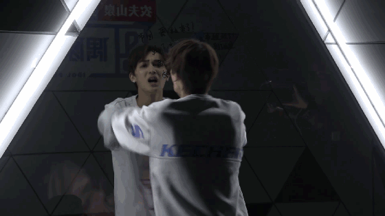 (原始链接: https://mmbiz.qpic.cn/mmbiz_gif/gSq8E7dqroe32BcaAEGx0TRR5icFA4Yz9Ha07xrVTWNxbuKUjib8Rzzt2CnyPAAAdXDCQIic6Z27E0zcX4tdq7jcA/640?wx_fmt=gif)
- 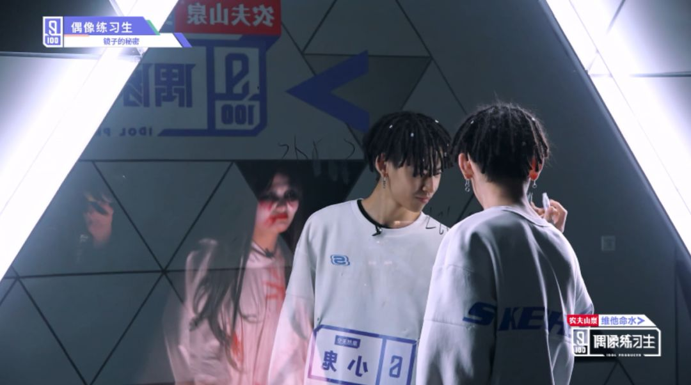 (原始链接: https://mmbiz.qpic.cn/mmbiz_png/gSq8E7dqroe32BcaAEGx0TRR5icFA4Yz9FBKW5R2ia6XqVtMvw5QT2aQ293cXRJJlQL47v40c6Z8RaGAKMdFnG6Q/640?wx_fmt=png)
-  (原始链接: https://mmbiz.qpic.cn/mmbiz_png/gSq8E7dqroe32BcaAEGx0TRR5icFA4Yz9iasYic6shHQfWJ6O8qfByd8CribL95FRGoPN5yEDuAUyszwqNVMXwcdIA/640?wx_fmt=png)
- 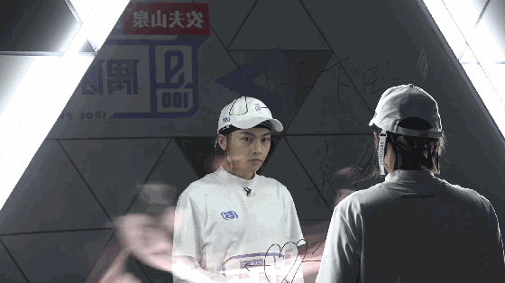 (原始链接: https://mmbiz.qpic.cn/mmbiz_gif/gSq8E7dqroe32BcaAEGx0TRR5icFA4Yz9S17wUeVoUq80uvAugsCjV4wrJB5aop9HcfjGtX6jADIic4cquQl2EYw/640?wx_fmt=gif)
- 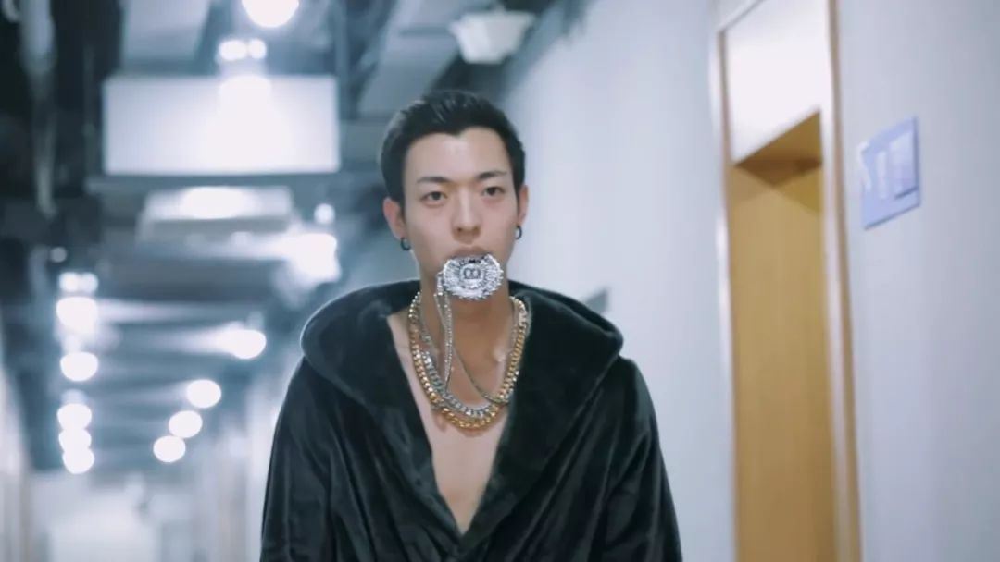 (原始链接: https://mmbiz.qpic.cn/mmbiz_jpg/gSq8E7dqroe32BcaAEGx0TRR5icFA4Yz9UIaiajrzKCtVUHycfWgQ7FW2VQmRNrQDZJ28bcFdeXzHeYicYz26u1Ow/640?wx_fmt=jpeg)
- 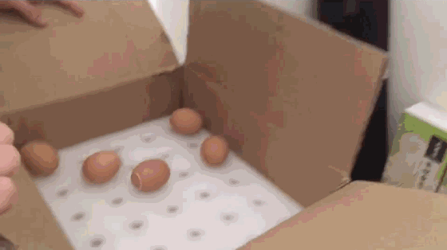 (原始链接: https://mmbiz.qpic.cn/mmbiz_gif/gSq8E7dqroe32BcaAEGx0TRR5icFA4Yz9TuxKQmMrtShAv5Hu53ht3dFZ4F4LHTNjQEe24Fowtw0ueddAe33kibg/640?wx_fmt=gif)
- 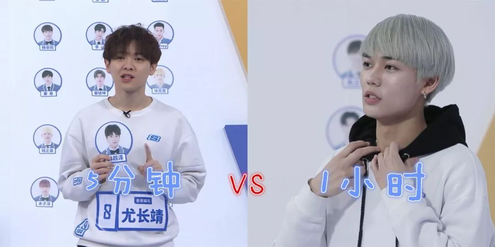 (原始链接: https://mmbiz.qpic.cn/mmbiz_jpg/gSq8E7dqroe32BcaAEGx0TRR5icFA4Yz9hsJql6lKqntWYgufpstjiceDYibKa0pRQH9BAy6pGIvDubsufw7hcpJQ/640?wx_fmt=jpeg)
-  (原始链接: https://mmbiz.qpic.cn/mmbiz_gif/gSq8E7dqroe32BcaAEGx0TRR5icFA4Yz9UwPo8L5YcPzBLaaicKrTm5OkGCYs3el7Rj8PQFAaW0aviaiajzBFCJtNA/640?wx_fmt=gif)
- 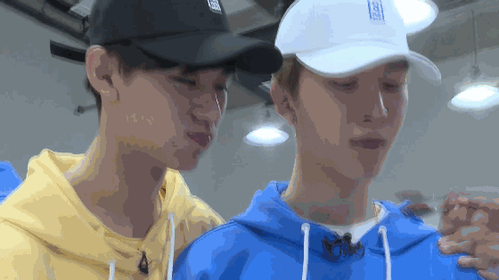 (原始链接: https://mmbiz.qpic.cn/mmbiz_gif/gSq8E7dqroe32BcaAEGx0TRR5icFA4Yz9LoMC4UJSCTbKnBKGicLG0ichHKZLmriaicFLicrXbUwzAvf9psdeWCQAU2w/640?wx_fmt=gif)
-  (原始链接: https://mmbiz.qpic.cn/mmbiz_png/gSq8E7dqroe32BcaAEGx0TRR5icFA4Yz9q9S50cy0vZpegx6ibn2ZczddbBPzL7Oaw2DSRlibnVrUfvNYYUAXHdFQ/640?wx_fmt=png)
- 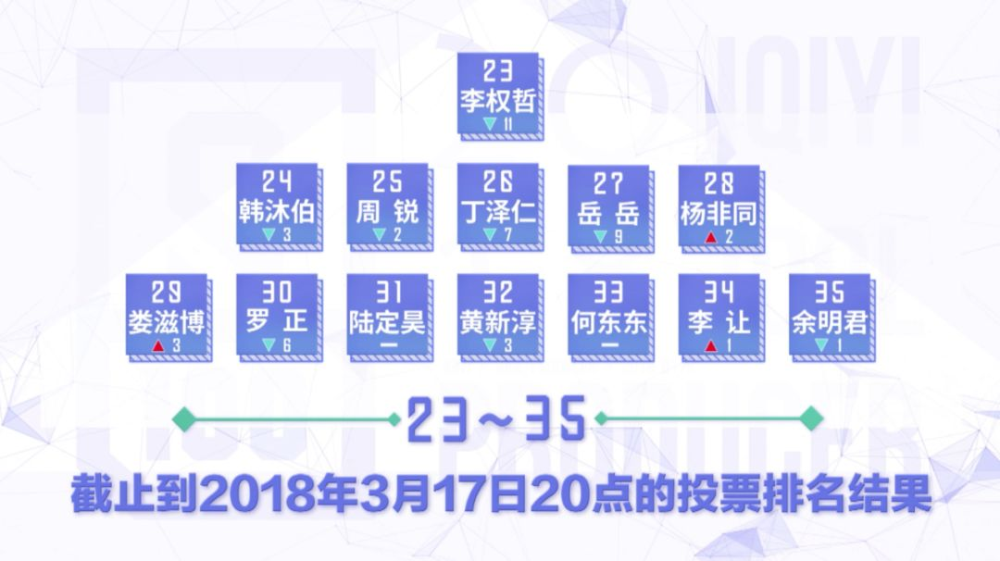 (原始链接: https://mmbiz.qpic.cn/mmbiz_png/gSq8E7dqroe32BcaAEGx0TRR5icFA4Yz9MP4ibPhA2SgdVe4oicicXs1Gy5nKZMlicxrU8JDE0tWAjlF8p29zCJEt8Q/640?wx_fmt=png)
- 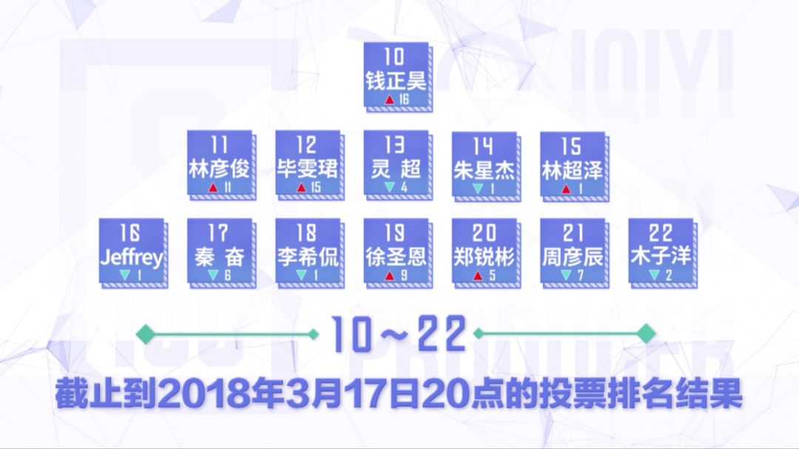 (原始链接: https://mmbiz.qpic.cn/mmbiz_png/gSq8E7dqroe32BcaAEGx0TRR5icFA4Yz97eNdxYoxm62dOSk9XQfEw4wjDx7jmYpslNuvCks255JkFseLnnibbCw/640?wx_fmt=png)
- 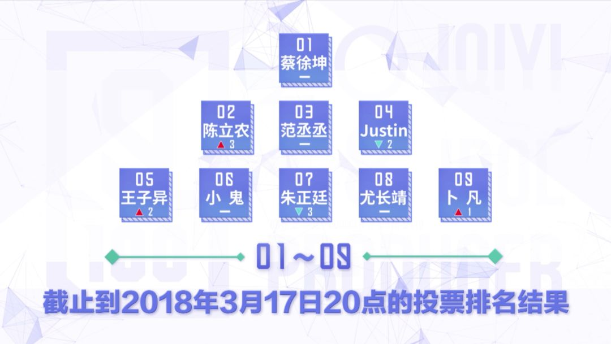 (原始链接: https://mmbiz.qpic.cn/mmbiz_png/gSq8E7dqroe32BcaAEGx0TRR5icFA4Yz93UUibZwr7VHY9qa7pnibAIt4IgyBOHCicz5BWX0PfAVCtLaGwPRZyNPqw/640?wx_fmt=png)
-  (原始链接: https://mmbiz.qpic.cn/mmbiz_gif/gSq8E7dqroe32BcaAEGx0TRR5icFA4Yz9R4WLM7rHSicZLpp6iaH0wU8SO6Tm8f6QlqeTq0m0PiaILCaWibXCwJghUA/640?wx_fmt=gif)
-  (原始链接: https://mmbiz.qpic.cn/mmbiz_png/gSq8E7dqroe32BcaAEGx0TRR5icFA4Yz9X0sQ9dfBj5eTm0Yu5ZccaDVnbWNHDVyPY8W8oCukmoHP2ZxUUz2LPw/640?wx_fmt=png)
-  (原始链接: https://mmbiz.qpic.cn/mmbiz_png/gSq8E7dqroe32BcaAEGx0TRR5icFA4Yz9Xib4Zy6VHiaPicr0X7a6iaAyMWGSBxBEUPgBcvt3hpba3AIPSAlNU4LjMQ/640?wx_fmt=png)
- 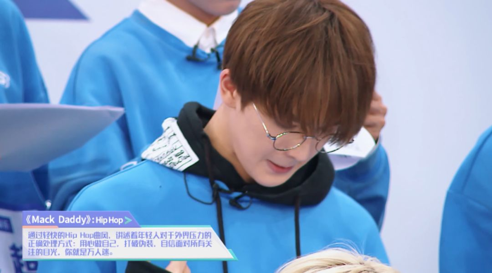 (原始链接: https://mmbiz.qpic.cn/mmbiz_png/gSq8E7dqroe32BcaAEGx0TRR5icFA4Yz9k4ssOnkWcDyKCbUgU0ORo0vXRWxumGrDRs3icWCX0fl2ZwnCkLoEcgQ/640?wx_fmt=png)
- 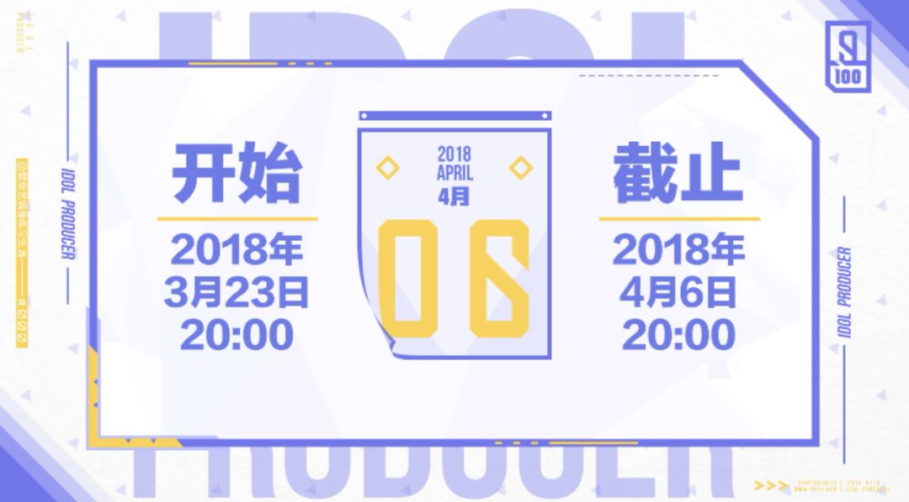 (原始链接: https://mmbiz.qpic.cn/mmbiz_png/gSq8E7dqroe32BcaAEGx0TRR5icFA4Yz9Tj5vk1piat3G8c0VtrX7h1QddqwZPl1NEvodRZou4nQyXpuTiaDRGMAw/640?wx_fmt=png)
-  (原始链接: http://mmbiz.qpic.cn/mmbiz_png/gSq8E7dqrocJzMY1RS9ia25pm92PxDBjIm4N1JriaMlicCtCexOl7dB7J7ib4kgaGZ2IXw65u3ib65ibacB1vJtGOVQw/640?wx_fmt=png)
-  (原始链接: http://mmbiz.qpic.cn/mmbiz_jpg/gSq8E7dqroeMsmJoN11CKIgmx6jHgDvVYx8AL4iaMQhcOrnuPCb0PfmpgakKAqv1qOb2oMSiasxU6nJIyXolZVfQ/640?wx_fmt=jpeg)
