# 无标题

**链接地址:** http://mp.weixin.qq.com/s?__biz=MzI0MDQ0ODI0Ng==&mid=2247485672&idx=1&sn=212c11e3911666fc1b3a2ffe7a8fdaee&chksm=e91bef71de6c6667098df6e1acde756a06b971257ff842f1e36d75c32da83136216bc5d207b2&mpshare=1&scene=2&srcid=0330hIIl0xjtoum04G2tyMd9#rd
**作者:** Nina@YEG
**获取时间:** 2025/8/28 22:10:12
**图片数量:** 37

---

## 原始HTML内容

<section style="background-color: rgb(255, 255, 255);box-sizing: border-box;"><section class="Powered-by-XIUMI V5" style="box-sizing: border-box;" powered-by="xiumi.us"><section class="" style="margin-top: 0.5em;margin-left: 30%;line-height: 1em;box-sizing: border-box;"><section class="" style="width: 0px;display: inline-block;vertical-align: bottom;border-bottom: 13px solid rgb(249, 110, 87);border-left: 13px solid transparent !important;border-right: 13px solid transparent !important;box-sizing: border-box;"></section></section></section><section class="Powered-by-XIUMI V5" style="box-sizing: border-box;" powered-by="xiumi.us"><section class="" style="margin-bottom: 0.5em;box-sizing: border-box;"><section class="" style="height: 2.4em;border-radius: 1em;background-color: rgb(249, 110, 87);box-sizing: border-box;"><section class="" style="height: 1.6em;vertical-align: top;margin: 0.3em 0.5em;display: inline-block;overflow: hidden !important;box-sizing: border-box;"></section><section style="display: inline-block;width: 72%;margin-top: 0.6em;line-height: 1;text-align: center;overflow: hidden;box-sizing: border-box;"><section class="" style="display: inline-block;overflow: hidden;color: rgb(255, 255, 255);font-size: 14px;line-height: 1.3;box-sizing: border-box;"><section style="box-sizing: border-box;">点击上方“公众号” 可以订阅哦！</section></section></section></section></section></section><section class="Powered-by-XIUMI V5" style="box-sizing: border-box;" powered-by="xiumi.us"><section class="" style="text-align: center;margin-top: 10px;margin-bottom: 10px;box-sizing: border-box;"><section class="" style="max-width: 100%;vertical-align: middle;display: inline-block;overflow: hidden !important;box-sizing: border-box;"></section></section></section><section class="Powered-by-XIUMI V5" style="box-sizing: border-box;" powered-by="xiumi.us"><section class="" style="box-sizing: border-box;"><section class="" style="box-sizing: border-box;">
上星期全球最大的Muji菜市场在日本大阪开业。等等，Muji不是那个卖小文具小衬衫给文艺小青年的性冷淡风杂货店吗？怎么开始买起了……菜？还真是，这个看上去的高大上的现代化建筑里面卖得是不折不扣的萝卜地瓜。
</section></section></section><section class="Powered-by-XIUMI V5" style="box-sizing: border-box;" powered-by="xiumi.us"><section class="" style="text-align: center;margin-top: 10px;margin-bottom: 10px;box-sizing: border-box;"><section class="" style="max-width: 100%;vertical-align: middle;display: inline-block;overflow: hidden !important;box-sizing: border-box;"></section></section></section><section class="Powered-by-XIUMI V5" style="box-sizing: border-box;" powered-by="xiumi.us"><section class="" style="box-sizing: border-box;"><section class="" style="box-sizing: border-box;">
是的，各位客官，你没有看错。如假包换的农林牧副渔。日本知名的菜市场如此之多，向来不接地气的Muji为何要如此不按套路出牌的掺和这门生意？
</section></section></section><section class="Powered-by-XIUMI V5" style="box-sizing: border-box;" powered-by="xiumi.us"><section class="" style="text-align: center;margin-top: 10px;margin-bottom: 10px;box-sizing: border-box;"><section class="" style="max-width: 100%;vertical-align: middle;display: inline-block;overflow: hidden !important;box-sizing: border-box;"></section></section></section><section class="Powered-by-XIUMI V5" style="box-sizing: border-box;" powered-by="xiumi.us"><section class="" style="box-sizing: border-box;"><section class="" style="box-sizing: border-box;">
“和田地相连”是Muji对这个菜市场的定义。就好像一座把整个食材到食物转化过程搬到消费者面前的博物馆！ 
</section></section></section><section class="Powered-by-XIUMI V5" style="box-sizing: border-box;" powered-by="xiumi.us"><section class="" style="text-align: center;margin-top: 10px;margin-bottom: 10px;box-sizing: border-box;"><section class="" style="max-width: 100%;vertical-align: middle;display: inline-block;overflow: hidden !important;box-sizing: border-box;"></section></section></section><section class="Powered-by-XIUMI V5" style="box-sizing: border-box;" powered-by="xiumi.us"><section class="" style="box-sizing: border-box;"><section class="" style="box-sizing: border-box;">
这里贩售的食材一大特色就是“鲜”。凌晨从海边打捞的各类海鲜产品不出下午就会被摆在Muji家的售货柜里；
</section></section></section><section class="Powered-by-XIUMI V5" style="box-sizing: border-box;" powered-by="xiumi.us"><section class="" style="text-align: center;margin-top: 10px;margin-bottom: 10px;box-sizing: border-box;"><section class="" style="max-width: 100%;vertical-align: middle;display: inline-block;overflow: hidden !important;box-sizing: border-box;"></section></section></section><section class="Powered-by-XIUMI V5" style="box-sizing: border-box;" powered-by="xiumi.us"><section class="" style="box-sizing: border-box;"><section class="" style="box-sizing: border-box;">
清早从地里拔起的莲藕，切开时还会冒出奶白色新鲜的汁液。而这速度，比一般的商场快了整整三倍！ 
</section></section></section><section class="Powered-by-XIUMI V5" style="box-sizing: border-box;" powered-by="xiumi.us"><section class="" style="text-align: center;margin-top: 10px;margin-bottom: 10px;box-sizing: border-box;"><section class="" style="max-width: 100%;vertical-align: middle;display: inline-block;overflow: hidden !important;box-sizing: border-box;"></section></section></section><section class="Powered-by-XIUMI V5" style="box-sizing: border-box;" powered-by="xiumi.us"><section class="" style="box-sizing: border-box;"><section class="" style="box-sizing: border-box;">
如此之外，这里的食材均有技术纯熟的师傅进行处理和烹制。他们不仅会为你展示食材最应季或适宜的烹饪方法，甚至还在市场中开展了包教包会教学班。这一条龙的服务模式可真是周到贴心。 
</section></section></section><section class="Powered-by-XIUMI V5" style="box-sizing: border-box;" powered-by="xiumi.us"><section class="" style="text-align: center;margin-top: 10px;margin-bottom: 10px;box-sizing: border-box;"><section class="" style="max-width: 100%;vertical-align: middle;display: inline-block;overflow: hidden !important;box-sizing: border-box;"></section></section></section><section class="Powered-by-XIUMI V5" style="box-sizing: border-box;" powered-by="xiumi.us"><section class="" style="box-sizing: border-box;"><section class="" style="box-sizing: border-box;">
逛得累了饿了，不如坐下来享受一顿由Muji大厨烹制的新鲜食材大餐。一份盖饭折合人民币不到60元的价格对于日本的物价来说相当良心。 
</section></section></section><section class="Powered-by-XIUMI V5" style="box-sizing: border-box;" powered-by="xiumi.us"><section class="" style="text-align: center;margin-top: 10px;margin-bottom: 10px;box-sizing: border-box;"><section class="" style="max-width: 100%;vertical-align: middle;display: inline-block;overflow: hidden !important;box-sizing: border-box;"></section></section></section><section class="Powered-by-XIUMI V5" style="box-sizing: border-box;" powered-by="xiumi.us"><section class="" style="box-sizing: border-box;"><section class="" style="box-sizing: border-box;">
除去食物，锅碗瓢盆，刀叉筷匙及一切与吃相关的周边在这里也是应有竟有。
</section></section></section><section class="Powered-by-XIUMI V5" style="box-sizing: border-box;" powered-by="xiumi.us"><section class="" style="text-align: center;margin-top: 10px;margin-bottom: 10px;box-sizing: border-box;"><section class="" style="max-width: 100%;vertical-align: middle;display: inline-block;overflow: hidden !important;box-sizing: border-box;"></section></section></section><section class="Powered-by-XIUMI V5" style="box-sizing: border-box;" powered-by="xiumi.us"><section class="" style="box-sizing: border-box;"><section class="" style="box-sizing: border-box;">
这个一体化的现代菜市场让居住在钢筋混凝土森林里太久的城市人们亲近自然，亲近食物的本源。在体验生活，回归生活本质的同时疯狂撒钱。难怪被好奇心趋势的市民们围了个水泄不通呢。 
</section></section></section><section class="Powered-by-XIUMI V5" style="box-sizing: border-box;" powered-by="xiumi.us"><section class="" style="text-align: center;margin-top: 10px;margin-bottom: 10px;box-sizing: border-box;"><section class="" style="max-width: 100%;vertical-align: middle;display: inline-block;overflow: hidden !important;box-sizing: border-box;"></section></section></section><section class="Powered-by-XIUMI V5" style="box-sizing: border-box;" powered-by="xiumi.us"><section class="" style="box-sizing: border-box;"><section class="" style="box-sizing: border-box;">
不知道身在加拿大的你，是否会感叹日本高度发达的社会体制下，人们要吃到一口充满“人情味”的有机食品是有多难……不像我们在加拿大，不想接地气都不行！其实加拿大这种把食物从生产加工运输到烹饪一一展现的销售模式并不罕见！虽没有发达的商业模式包装和现代化的建筑风格。但加拿大的一条龙市场也十分值得光顾！那么和小编一起来了解一下加拿大最具“人情味”的市集文化吧！

 
</section></section></section><section class="Powered-by-XIUMI V5" style="box-sizing: border-box;" powered-by="xiumi.us"><section class="" style="margin-right: 0%;margin-left: 0%;box-sizing: border-box;"><section class="" style="display: inline-block;width: 100%;vertical-align: top;background-position: 0% 0%;background-repeat: repeat;background-size: 68.3688%;background-attachment: scroll;background-image: url(&quot;https://mmbiz.qpic.cn/mmbiz_png/XA8n2XaESnRwLjdun6gJHiasl4Kx5lkYoAqnNT6rXsiah8z89fAclFQeygaBhDLdTgGuamAdQGVk9NZ1GsAj65Yg/640?wx_fmt=png&quot;);box-sizing: border-box;"><section class="Powered-by-XIUMI V5" style="box-sizing: border-box;" powered-by="xiumi.us"><section class="" style="box-sizing: border-box;"><section class="" style="display: inline-block;width: 100%;vertical-align: top;background-color: rgba(0, 149, 130, 0.5);padding: 5px 15px;box-sizing: border-box;"><section class="Powered-by-XIUMI V5" style="box-sizing: border-box;" powered-by="xiumi.us"><section class="" style="box-sizing: border-box;"><section class="" style="text-align: center;color: rgb(255, 255, 255);box-sizing: border-box;">
<strong style="box-sizing: border-box;">温哥华 - 固兰岛市集</strong>
</section></section></section></section></section></section><section class="Powered-by-XIUMI V5" style="box-sizing: border-box;" powered-by="xiumi.us"><section class="" style="margin-right: 0%;margin-bottom: 10px;margin-left: 0%;text-align: center;line-height: 0.8;box-sizing: border-box;"><section class="" style="width: 0px;display: inline-block;border-top: 0.8em solid rgba(0, 149, 130, 0.5);border-left: 0.7em solid transparent !important;border-right: 0.7em solid transparent !important;box-sizing: border-box;"></section></section></section><section class="Powered-by-XIUMI V5" style="box-sizing: border-box;" powered-by="xiumi.us"><section class="" style="box-sizing: border-box;"><section class="" style="display: inline-block;width: 100%;vertical-align: top;padding: 15px;box-sizing: border-box;"><section class="Powered-by-XIUMI V5" style="box-sizing: border-box;" powered-by="xiumi.us"><section class="" style="margin: 0.5em auto;text-align: center;box-sizing: border-box;"><section class="" style="max-width: 100%;border-radius: 1.5em;display: inline-block;overflow: hidden !important;box-sizing: border-box;"></section></section></section><section class="Powered-by-XIUMI V5" style="box-sizing: border-box;" powered-by="xiumi.us"><section class="" style="box-sizing: border-box;"><section class="" style="font-size: 15px;box-sizing: border-box;">
Vancouver的Granville Island Public Market位于相对独立但无比活跃的Granville半岛，也是游人如织的必到特色景点之一。
</section></section></section><section class="Powered-by-XIUMI V5" style="box-sizing: border-box;" powered-by="xiumi.us"><section class="" style="margin: 0.5em auto;text-align: center;box-sizing: border-box;"><section class="" style="max-width: 100%;border-radius: 1.5em;display: inline-block;overflow: hidden !important;box-sizing: border-box;"></section></section></section><section class="Powered-by-XIUMI V5" style="box-sizing: border-box;" powered-by="xiumi.us"><section class="" style="box-sizing: border-box;"><section class="" style="font-size: 15px;box-sizing: border-box;">
新鲜的应季莓果，刚烤出来香喷喷的全麦面包，从附近海域不捞上来还在挥动前鳌的虾蟹……各类食材任君挑选。
</section></section></section><section class="Powered-by-XIUMI V5" style="box-sizing: border-box;" powered-by="xiumi.us"><section class="" style="margin: 0.5em auto;text-align: center;box-sizing: border-box;"><section class="" style="max-width: 100%;border-radius: 1.5em;display: inline-block;overflow: hidden !important;box-sizing: border-box;"></section></section></section><section class="Powered-by-XIUMI V5" style="box-sizing: border-box;" powered-by="xiumi.us"><section class="" style="box-sizing: border-box;"><section class="" style="font-size: 15px;box-sizing: border-box;">
贩售商品包罗万象，甚至极其罕见的二手乐器或者新锐艺术家的概念设计在这里都可以以合理的价格淘到，而这些商品在一般的超市商场中绝对找不见。
</section></section></section><section class="Powered-by-XIUMI V5" style="box-sizing: border-box;" powered-by="xiumi.us"><section class="" style="margin: 0.5em auto;text-align: center;box-sizing: border-box;"><section class="" style="max-width: 100%;border-radius: 1.5em;display: inline-block;overflow: hidden !important;box-sizing: border-box;"></section></section></section><section class="Powered-by-XIUMI V5" style="box-sizing: border-box;" powered-by="xiumi.us"><section class="" style="box-sizing: border-box;"><section class="" style="font-size: 15px;box-sizing: border-box;">
这个集市最大的特点是很多物品都是现做现卖的。一边是手艺精湛的师傅用快到模糊的熟练动作揉出一块块肉桂卷，另一边是慈祥的老奶奶慢条斯理的编制着手中的羊毛毡…
</section></section></section><section class="Powered-by-XIUMI V5" style="box-sizing: border-box;" powered-by="xiumi.us"><section class="" style="margin: 0.5em auto;text-align: center;box-sizing: border-box;"><section class="" style="max-width: 100%;border-radius: 1.5em;display: inline-block;overflow: hidden !important;box-sizing: border-box;"></section></section></section><section class="Powered-by-XIUMI V5" style="box-sizing: border-box;" powered-by="xiumi.us"><section class="" style="box-sizing: border-box;"><section class="" style="font-size: 15px;box-sizing: border-box;">
大桥下码头边，看着来往的船只和对面的高楼大厦。这样慢节奏的生活是不是让你觉得口中嚼的那颗刚买的手工软糖格外甜？
</section></section></section></section></section></section></section></section></section><section class="Powered-by-XIUMI V5" style="box-sizing: border-box;" powered-by="xiumi.us"><section class="" style="margin-right: 0%;margin-left: 0%;box-sizing: border-box;"><section class="" style="display: inline-block;width: 100%;vertical-align: top;background-position: 0% 0%;background-repeat: repeat;background-size: 68.3688%;background-attachment: scroll;background-image: url(&quot;https://mmbiz.qpic.cn/mmbiz_png/XA8n2XaESnRwLjdun6gJHiasl4Kx5lkYoAqnNT6rXsiah8z89fAclFQeygaBhDLdTgGuamAdQGVk9NZ1GsAj65Yg/640?wx_fmt=png&quot;);box-sizing: border-box;"><section class="Powered-by-XIUMI V5" style="box-sizing: border-box;" powered-by="xiumi.us"><section class="" style="box-sizing: border-box;"><section class="" style="display: inline-block;width: 100%;vertical-align: top;background-color: rgba(0, 149, 130, 0.5);padding: 5px 15px;box-sizing: border-box;"><section class="Powered-by-XIUMI V5" style="box-sizing: border-box;" powered-by="xiumi.us"><section class="" style="box-sizing: border-box;"><section class="" style="text-align: center;color: rgb(255, 255, 255);box-sizing: border-box;">
<strong style="box-sizing: border-box;">多伦多 - 圣劳伦斯市集</strong>
</section></section></section></section></section></section><section class="Powered-by-XIUMI V5" style="box-sizing: border-box;" powered-by="xiumi.us"><section class="" style="margin-right: 0%;margin-bottom: 10px;margin-left: 0%;text-align: center;line-height: 0.8;box-sizing: border-box;"><section class="" style="width: 0px;display: inline-block;border-top: 0.8em solid rgba(0, 149, 130, 0.5);border-left: 0.7em solid transparent !important;border-right: 0.7em solid transparent !important;box-sizing: border-box;"></section></section></section><section class="Powered-by-XIUMI V5" style="box-sizing: border-box;" powered-by="xiumi.us"><section class="" style="box-sizing: border-box;"><section class="" style="display: inline-block;width: 100%;vertical-align: top;padding: 15px;box-sizing: border-box;"><section class="Powered-by-XIUMI V5" style="box-sizing: border-box;" powered-by="xiumi.us"><section class="" style="margin: 0.5em auto;text-align: center;box-sizing: border-box;"><section class="" style="max-width: 100%;border-radius: 1.5em;display: inline-block;overflow: hidden !important;box-sizing: border-box;"></section></section></section><section class="Powered-by-XIUMI V5" style="box-sizing: border-box;" powered-by="xiumi.us"><section class="" style="box-sizing: border-box;"><section class="" style="font-size: 15px;box-sizing: border-box;">
位于Toronto Downtown附近的St. Lawrence Market已经拥有超过200年的历史。然而悠长的岁月并没有让这座市场失去现代的活力。
</section></section></section><section class="Powered-by-XIUMI V5" style="box-sizing: border-box;" powered-by="xiumi.us"><section class="" style="margin: 0.5em auto;text-align: center;box-sizing: border-box;"><section class="" style="max-width: 100%;border-radius: 1.5em;display: inline-block;overflow: hidden !important;box-sizing: border-box;"></section></section></section><section class="Powered-by-XIUMI V5" style="box-sizing: border-box;" powered-by="xiumi.us"><section class="" style="box-sizing: border-box;"><section class="" style="font-size: 15px;box-sizing: border-box;">
这不仅是外地游客的聚集地，本地人也时常光临。特别是五彩缤纷活动丰富的夜市。吃喝玩乐样样齐备。
</section></section></section><section class="Powered-by-XIUMI V5" style="box-sizing: border-box;" powered-by="xiumi.us"><section class="" style="margin: 0.5em auto;text-align: center;box-sizing: border-box;"><section class="" style="max-width: 100%;border-radius: 1.5em;display: inline-block;overflow: hidden !important;box-sizing: border-box;"></section></section></section><section class="Powered-by-XIUMI V5" style="box-sizing: border-box;" powered-by="xiumi.us"><section class="" style="box-sizing: border-box;"><section class="" style="font-size: 15px;box-sizing: border-box;">
这个商场最大的特色就是时常有来自不同餐厅和商家的顶级名厨为大家现场展示烹饪的手法和全部制作过程，甚至不乏现代风格的高级料理！
</section></section></section><section class="Powered-by-XIUMI V5" style="box-sizing: border-box;" powered-by="xiumi.us"><section class="" style="margin: 0.5em auto;text-align: center;box-sizing: border-box;"><section class="" style="max-width: 100%;border-radius: 1.5em;display: inline-block;overflow: hidden !important;box-sizing: border-box;"></section></section></section><section class="Powered-by-XIUMI V5" style="box-sizing: border-box;" powered-by="xiumi.us"><section class="" style="box-sizing: border-box;"><section class="" style="font-size: 15px;box-sizing: border-box;">
应季的新鲜瓜果蔬菜，品质上乘的牛排绞肉，色泽丰盈油润的芝士奶油…玲琅满目的商品陈列在柜台上等待顾客们的挑选。
</section></section></section><section class="Powered-by-XIUMI V5" style="box-sizing: border-box;" powered-by="xiumi.us"><section class="" style="margin: 0.5em auto;text-align: center;box-sizing: border-box;"><section class="" style="max-width: 100%;border-radius: 1.5em;display: inline-block;overflow: hidden !important;box-sizing: border-box;"></section></section></section><section class="Powered-by-XIUMI V5" style="box-sizing: border-box;" powered-by="xiumi.us"><section class="" style="box-sizing: border-box;"><section class="" style="font-size: 15px;box-sizing: border-box;">
逛的累了不如随便找一家摊位买一份现烤的三明治。这看起来毫不起眼的小零食或许在Facebook上还有自己的粉丝专页呢！
</section></section></section></section></section></section></section></section></section><section class="Powered-by-XIUMI V5" style="box-sizing: border-box;" powered-by="xiumi.us"><section class="" style="margin-right: 0%;margin-left: 0%;box-sizing: border-box;"><section class="" style="display: inline-block;width: 100%;vertical-align: top;background-position: 0% 0%;background-repeat: repeat;background-size: 68.3688%;background-attachment: scroll;background-image: url(&quot;https://mmbiz.qpic.cn/mmbiz_png/XA8n2XaESnRwLjdun6gJHiasl4Kx5lkYoAqnNT6rXsiah8z89fAclFQeygaBhDLdTgGuamAdQGVk9NZ1GsAj65Yg/640?wx_fmt=png&quot;);box-sizing: border-box;"><section class="Powered-by-XIUMI V5" style="box-sizing: border-box;" powered-by="xiumi.us"><section class="" style="box-sizing: border-box;"><section class="" style="display: inline-block;width: 100%;vertical-align: top;background-color: rgba(0, 149, 130, 0.5);padding: 5px 15px;box-sizing: border-box;"><section class="Powered-by-XIUMI V5" style="box-sizing: border-box;" powered-by="xiumi.us"><section class="" style="box-sizing: border-box;"><section class="" style="text-align: center;color: rgb(255, 255, 255);box-sizing: border-box;">
<strong style="box-sizing: border-box;">蒙特利尔 - 让塔隆市集</strong>
</section></section></section></section></section></section><section class="Powered-by-XIUMI V5" style="box-sizing: border-box;" powered-by="xiumi.us"><section class="" style="margin-right: 0%;margin-bottom: 10px;margin-left: 0%;text-align: center;line-height: 0.8;box-sizing: border-box;"><section class="" style="width: 0px;display: inline-block;border-top: 0.8em solid rgba(0, 149, 130, 0.5);border-left: 0.7em solid transparent !important;border-right: 0.7em solid transparent !important;box-sizing: border-box;"></section></section></section><section class="Powered-by-XIUMI V5" style="box-sizing: border-box;" powered-by="xiumi.us"><section class="" style="box-sizing: border-box;"><section class="" style="display: inline-block;width: 100%;vertical-align: top;padding: 15px;box-sizing: border-box;"><section class="Powered-by-XIUMI V5" style="box-sizing: border-box;" powered-by="xiumi.us"><section class="" style="margin: 0.5em auto;text-align: center;box-sizing: border-box;"><section class="" style="max-width: 100%;border-radius: 1.5em;display: inline-block;overflow: hidden !important;box-sizing: border-box;"></section></section></section><section class="Powered-by-XIUMI V5" style="box-sizing: border-box;" powered-by="xiumi.us"><section class="" style="box-sizing: border-box;"><section class="" style="font-size: 15px;box-sizing: border-box;">
Montreal的Marché Jean-Talon是意大利区的一个欧洲风格市场，也是当地人时常光顾购物吃喝的好地方。
</section></section></section><section class="Powered-by-XIUMI V5" style="box-sizing: border-box;" powered-by="xiumi.us"><section class="" style="margin: 0.5em auto;text-align: center;box-sizing: border-box;"><section class="" style="max-width: 100%;border-radius: 1.5em;display: inline-block;overflow: hidden !important;box-sizing: border-box;"></section></section></section><section class="Powered-by-XIUMI V5" style="box-sizing: border-box;" powered-by="xiumi.us"><section class="" style="box-sizing: border-box;"><section class="" style="font-size: 15px;box-sizing: border-box;">
豪迈的商家会用卡车成箱地把早上刚从地里摘的蔬果运到集市上销售，还会慷慨地邀请你品尝，那滋味比起超市里贩售的蔬果不知鲜甜了多少倍呢！
</section></section></section><section class="Powered-by-XIUMI V5" style="box-sizing: border-box;" powered-by="xiumi.us"><section class="" style="margin: 0.5em auto;text-align: center;box-sizing: border-box;"><section class="" style="max-width: 100%;border-radius: 1.5em;display: inline-block;overflow: hidden !important;box-sizing: border-box;"></section></section></section><section class="Powered-by-XIUMI V5" style="box-sizing: border-box;" powered-by="xiumi.us"><section class="" style="box-sizing: border-box;"><section class="" style="font-size: 15px;box-sizing: border-box;">
插花，揉面包，摊煎饼，刻南瓜…逛市场的同时还可以和店家互动参与大量的手工活动。在购物的同时体验动手的乐趣。
</section></section></section><section class="Powered-by-XIUMI V5" style="box-sizing: border-box;" powered-by="xiumi.us"><section class="" style="margin: 0.5em auto;text-align: center;box-sizing: border-box;"><section class="" style="max-width: 100%;border-radius: 1.5em;display: inline-block;overflow: hidden !important;box-sizing: border-box;"></section></section></section><section class="Powered-by-XIUMI V5" style="box-sizing: border-box;" powered-by="xiumi.us"><section class="" style="box-sizing: border-box;"><section class="" style="font-size: 15px;box-sizing: border-box;">
蒙城的市集有着特有的浪漫，这里的一大特色是每到春夏就有大量的鲜花绿植销售。买一盆回去自己养护，让清新舒适的气息全年围绕在你的身旁。
</section></section></section><section class="Powered-by-XIUMI V5" style="box-sizing: border-box;" powered-by="xiumi.us"><section class="" style="margin: 0.5em auto;text-align: center;box-sizing: border-box;"><section class="" style="max-width: 100%;border-radius: 1.5em;display: inline-block;overflow: hidden !important;box-sizing: border-box;"></section></section></section><section class="Powered-by-XIUMI V5" style="box-sizing: border-box;" powered-by="xiumi.us"><section class="" style="box-sizing: border-box;"><section class="" style="font-size: 15px;box-sizing: border-box;">
在加拿大美食之乡怎么能忘记品尝当地的特色Poutine呢？一勺香浓的牛肉汁淋在金黄香酥的薯条上，伴着白色的拉丝芝士别提有多香了。这样的好味道，该是要带着心爱的人你一口我一口的分享。
</section></section></section></section></section></section></section></section></section><section class="Powered-by-XIUMI V5" style="box-sizing: border-box;" powered-by="xiumi.us"><section class="" style="margin-right: 0%;margin-left: 0%;box-sizing: border-box;"><section class="" style="display: inline-block;width: 100%;vertical-align: top;background-position: 0% 0%;background-repeat: repeat;background-size: 68.3688%;background-attachment: scroll;background-image: url(&quot;https://mmbiz.qpic.cn/mmbiz_png/XA8n2XaESnRwLjdun6gJHiasl4Kx5lkYoAqnNT6rXsiah8z89fAclFQeygaBhDLdTgGuamAdQGVk9NZ1GsAj65Yg/640?wx_fmt=png&quot;);box-sizing: border-box;"><section class="Powered-by-XIUMI V5" style="box-sizing: border-box;" powered-by="xiumi.us"><section class="" style="box-sizing: border-box;"><section class="" style="display: inline-block;width: 100%;vertical-align: top;background-color: rgba(0, 149, 130, 0.5);padding: 5px 15px;box-sizing: border-box;"><section class="Powered-by-XIUMI V5" style="box-sizing: border-box;" powered-by="xiumi.us"><section class="" style="box-sizing: border-box;"><section class="" style="text-align: center;color: rgb(255, 255, 255);box-sizing: border-box;">
<strong style="box-sizing: border-box;">埃德蒙顿 - Old Strathcona Farmers' Market</strong>
</section></section></section></section></section></section><section class="Powered-by-XIUMI V5" style="box-sizing: border-box;" powered-by="xiumi.us"><section class="" style="margin-right: 0%;margin-bottom: 10px;margin-left: 0%;text-align: center;line-height: 0.8;box-sizing: border-box;"><section class="" style="width: 0px;display: inline-block;border-top: 0.8em solid rgba(0, 149, 130, 0.5);border-left: 0.7em solid transparent !important;border-right: 0.7em solid transparent !important;box-sizing: border-box;"></section></section></section><section class="Powered-by-XIUMI V5" style="box-sizing: border-box;" powered-by="xiumi.us"><section class="" style="box-sizing: border-box;"><section class="" style="display: inline-block;width: 100%;vertical-align: top;padding: 15px;box-sizing: border-box;"><section class="Powered-by-XIUMI V5" style="box-sizing: border-box;" powered-by="xiumi.us"><section class="" style="margin: 0.5em auto;text-align: center;box-sizing: border-box;"><section class="" style="max-width: 100%;border-radius: 1.5em;display: inline-block;overflow: hidden !important;box-sizing: border-box;"></section></section></section><section class="Powered-by-XIUMI V5" style="box-sizing: border-box;" powered-by="xiumi.us"><section class="" style="box-sizing: border-box;"><section class="" style="font-size: 15px;box-sizing: border-box;">
相比起之前介绍的几个大城市的著名市集，Edmonton的这座位于老城区的农夫市场就更加贴近生活，更加本地化了。
</section></section></section><section class="Powered-by-XIUMI V5" style="box-sizing: border-box;" powered-by="xiumi.us"><section class="" style="margin: 0.5em auto;text-align: center;box-sizing: border-box;"><section class="" style="max-width: 100%;border-radius: 1.5em;display: inline-block;overflow: hidden !important;box-sizing: border-box;"></section></section></section><section class="Powered-by-XIUMI V5" style="box-sizing: border-box;" powered-by="xiumi.us"><section class="" style="box-sizing: border-box;"><section class="" style="font-size: 15px;box-sizing: border-box;">
由于爱城的冬天十分漫长，农作物成熟的周期也长，所以这个市集只在每周六开放。但是一周一次的赶集却成为本地市集爱好者每周的例行聚会。每到盛夏蛰伏了一个冬天的活力一并迸放。
</section></section></section><section class="Powered-by-XIUMI V5" style="box-sizing: border-box;" powered-by="xiumi.us"><section class="" style="margin: 0.5em auto;text-align: center;box-sizing: border-box;"><section class="" style="max-width: 100%;border-radius: 1.5em;display: inline-block;overflow: hidden !important;box-sizing: border-box;"></section></section></section><section class="Powered-by-XIUMI V5" style="box-sizing: border-box;" powered-by="xiumi.us"><section class="" style="box-sizing: border-box;"><section class="" style="font-size: 15px;box-sizing: border-box;">
每个周末农户们如期带来新鲜货品，自豪地相互调侃吹嘘着近日的收成。酸奶肉肠，泡菜果酱。这些农户用自己勤劳双手为这些看似平凡的食物注入了一味“人情的温暖”，比超市中大规模批量制造的产品多了一丝憨厚可爱。
</section></section></section><section class="Powered-by-XIUMI V5" style="box-sizing: border-box;" powered-by="xiumi.us"><section class="" style="margin: 0.5em auto;text-align: center;box-sizing: border-box;"><section class="" style="max-width: 100%;border-radius: 1.5em;display: inline-block;overflow: hidden !important;box-sizing: border-box;"></section></section></section><section class="Powered-by-XIUMI V5" style="box-sizing: border-box;" powered-by="xiumi.us"><section class="" style="box-sizing: border-box;"><section class="" style="font-size: 15px;box-sizing: border-box;">
爱城人民都是天生的乐天派。无论走过哪个摊位，店家总是会善意地拉着你聊得眉飞色舞，然后塞给你一堆吃都吃不完的samples。一圈儿逛下来正经商品没买几个，但胃已经被填了个饱。
</section></section></section><section class="Powered-by-XIUMI V5" style="box-sizing: border-box;" powered-by="xiumi.us"><section class="" style="margin: 0.5em auto;text-align: center;box-sizing: border-box;"><section class="" style="max-width: 100%;border-radius: 1.5em;display: inline-block;overflow: hidden !important;box-sizing: border-box;"></section></section></section><section class="Powered-by-XIUMI V5" style="box-sizing: border-box;" powered-by="xiumi.us"><section class="" style="box-sizing: border-box;"><section class="" style="font-size: 15px;box-sizing: border-box;">
驻足观看商家手打软糖，焦糖黄油巧克力花生碎，各种材料一一加入捣碎搅拌的过程就像制作神奇的魔法药剂。尝一口，让你体会到什么叫做“甜到忧伤”。
</section></section></section></section></section></section></section></section></section><section class="Powered-by-XIUMI V5" style="box-sizing: border-box;" powered-by="xiumi.us"><section class="" style="text-align: center;margin-top: 10px;margin-bottom: 10px;box-sizing: border-box;"><section class="" style="max-width: 100%;vertical-align: middle;display: inline-block;overflow: hidden !important;box-sizing: border-box;"></section></section></section><section class="Powered-by-XIUMI V5" style="box-sizing: border-box;" powered-by="xiumi.us"><section class="" style="box-sizing: border-box;"><section class="" style="box-sizing: border-box;">
加拿大充满“人情味”的商场市集其实遍地都是，篇幅原因小编无法一一列举。虽然加拿大当地悠然自得的生活节奏难以追赶日本Muji市场的高大上，但Muji市场想要传达的“新鲜”“自然”“回归本真”的理念，我们加拿大的市场不仅毫不逊色，甚至更加丰富多元。希望各位看官能够珍惜我们口中新鲜自然的食材，不要等到城市化过度扩张后优质食材难以寻觅价格陡升后再去惊叹那和自然隔离的恐慌。

什么样的商品最值得收藏？哪个店家带给你最多的惊喜？还有什么我们没有挖掘到的玩法？相信作为本地通的你一定有太多的体验心得迫不及待地想要与我们分享。欢迎留言告诉我们你喜欢的集市店家和商品，和我们一起分享赶集达人们的市集攻略私藏。
</section></section></section><section class="Powered-by-XIUMI V5" style="box-sizing: border-box;" powered-by="xiumi.us"><section class="" style="margin: 10px 0%;text-align: center;box-sizing: border-box;"><section class="" style="display: inline-block;width: 96%;vertical-align: top;overflow: hidden;height: 90px;border-style: solid;border-width: 0px;border-radius: 5px;border-color: rgb(164, 197, 244);padding-right: 10px;padding-left: 10px;box-shadow: rgb(133, 134, 135) 0px 0px 2px;box-sizing: border-box;"><section class="Powered-by-XIUMI V5" style="box-sizing: border-box;" powered-by="xiumi.us"><section class="" style="box-sizing: border-box;"><section class="" style="display: inline-block;vertical-align: middle;width: 23%;box-shadow: rgb(0, 0, 0) 0px 0px 0px;box-sizing: border-box;"><section class="Powered-by-XIUMI V5" style="box-sizing: border-box;" powered-by="xiumi.us"><section class="" style="margin-top: 10px;margin-bottom: 10px;box-sizing: border-box;"><section class="" style="max-width: 100%;vertical-align: middle;display: inline-block;overflow: hidden !important;box-sizing: border-box;"></section></section></section></section><section class="" style="display: inline-block;vertical-align: middle;width: 57%;box-shadow: rgb(0, 0, 0) 0px 0px 0px;padding-right: 10px;padding-left: 10px;box-sizing: border-box;"><section class="Powered-by-XIUMI V5" style="box-sizing: border-box;" powered-by="xiumi.us"><section class="" style="box-sizing: border-box;"><section class="" style="text-align: left;box-sizing: border-box;">
乐在爱吃
</section></section></section><section class="Powered-by-XIUMI V5" style="box-sizing: border-box;" powered-by="xiumi.us"><section class="" style="box-sizing: border-box;"><section class="tn-yzk-fuid-text-98718-1517277466565" style="text-align: justify;font-size: 12px;color: rgb(72, 72, 72);box-sizing: border-box;">
公众号ID：leizaiaichi 
</section></section></section></section><section class="" style="display: inline-block;vertical-align: middle;width: 20%;box-shadow: rgb(0, 0, 0) 0px 0px 0px;border-color: rgb(113, 215, 0);border-width: 0px;border-radius: 0px;border-style: none;box-sizing: border-box;"><section class="Powered-by-XIUMI V5" style="box-sizing: border-box;" powered-by="xiumi.us"><section class="" style="margin-top: 0.5em;margin-bottom: 0.5em;box-sizing: border-box;"><section class="" style="display: inline-block;border-radius: 5px;padding-right: 0.75em;padding-left: 0.75em;border-width: 1px;border-style: solid;border-color: rgb(255, 30, 21);background-color: rgb(254, 255, 255);color: rgb(255, 30, 21);line-height: 1.9;font-size: 14px;box-sizing: border-box;">
关注 
</section></section></section></section></section></section></section><section class="" style="font-size: 0px;box-sizing: border-box;"> </section></section></section><section class="Powered-by-XIUMI V5" style="box-sizing: border-box;" powered-by="xiumi.us"><section class="" style="margin: 10px 0%;text-align: center;box-sizing: border-box;"><section class="" style="display: inline-block;width: 96%;vertical-align: top;overflow: hidden;height: 90px;border-style: solid;border-width: 0px;border-radius: 5px;border-color: rgb(164, 197, 244);padding-right: 10px;padding-left: 10px;box-shadow: rgb(133, 134, 135) 0px 0px 2px;box-sizing: border-box;"><section class="Powered-by-XIUMI V5" style="box-sizing: border-box;" powered-by="xiumi.us"><section class="" style="box-sizing: border-box;"><section class="" style="display: inline-block;vertical-align: middle;width: 23%;box-shadow: rgb(0, 0, 0) 0px 0px 0px;box-sizing: border-box;"><section class="Powered-by-XIUMI V5" style="box-sizing: border-box;" powered-by="xiumi.us"><section class="" style="margin-top: 10px;margin-bottom: 10px;box-sizing: border-box;"><section class="" style="max-width: 100%;vertical-align: middle;display: inline-block;overflow: hidden !important;box-sizing: border-box;"></section></section></section></section><section class="" style="display: inline-block;vertical-align: middle;width: 57%;box-shadow: rgb(0, 0, 0) 0px 0px 0px;padding-right: 10px;padding-left: 10px;box-sizing: border-box;"><section class="Powered-by-XIUMI V5" style="box-sizing: border-box;" powered-by="xiumi.us"><section class="" style="box-sizing: border-box;"><section class="" style="text-align: left;box-sizing: border-box;">
爱吃微博
</section></section></section><section class="Powered-by-XIUMI V5" style="box-sizing: border-box;" powered-by="xiumi.us"><section class="" style="box-sizing: border-box;"><section class="tn-yzk-fuid-text-98718-1517277466565" style="text-align: justify;font-size: 12px;color: rgb(72, 72, 72);box-sizing: border-box;">
微博号ID：爱吃外卖
</section></section></section></section><section class="" style="display: inline-block;vertical-align: middle;width: 20%;box-shadow: rgb(0, 0, 0) 0px 0px 0px;border-color: rgb(113, 215, 0);border-width: 0px;border-radius: 0px;border-style: none;box-sizing: border-box;"><section class="Powered-by-XIUMI V5" style="box-sizing: border-box;" powered-by="xiumi.us"><section class="" style="margin-top: 0.5em;margin-bottom: 0.5em;box-sizing: border-box;"><section class="" style="display: inline-block;border-radius: 5px;padding-right: 0.75em;padding-left: 0.75em;border-width: 1px;border-style: solid;border-color: rgb(255, 30, 21);background-color: rgb(254, 255, 255);color: rgb(255, 30, 21);line-height: 1.9;font-size: 14px;box-sizing: border-box;">
关注
</section></section></section></section></section></section></section><section class="" style="font-size: 0px;box-sizing: border-box;"> </section></section></section><section class="Powered-by-XIUMI V5" style="box-sizing: border-box;" powered-by="xiumi.us"><section class="" style="margin-right: 0%;margin-bottom: 20px;margin-left: 0%;box-sizing: border-box;"><section class="" style="display: inline-block;vertical-align: top;width: 80%;padding-right: 5px;box-sizing: border-box;"><section class="Powered-by-XIUMI V5" style="box-sizing: border-box;" powered-by="xiumi.us"><section class="" style="margin-top: 20px;margin-right: 0%;margin-left: 0%;box-sizing: border-box;"><section class="" style="text-align: justify;color: rgb(166, 166, 166);line-height: 1.8;box-sizing: border-box;">
<strong style="box-sizing: border-box;">走过路过，不要错过这个公众号哦！ </strong>
</section></section></section></section><section class="" style="display: inline-block;vertical-align: top;width: 20%;box-sizing: border-box;"><section class="Powered-by-XIUMI V5" style="box-sizing: border-box;" powered-by="xiumi.us"><section class="" style="text-align: center;margin-right: 0%;margin-left: 0%;box-sizing: border-box;"><section class="" style="max-width: 100%;vertical-align: middle;display: inline-block;width: 100%;overflow: hidden !important;box-sizing: border-box;"></section></section></section></section></section></section></section>
 

---

## 纯文本内容

点击上方“公众号” 可以订阅哦！上星期全球最大的Muji菜市场在日本大阪开业。等等，Muji不是那个卖小文具小衬衫给文艺小青年的性冷淡风杂货店吗？怎么开始买起了……菜？还真是，这个看上去的高大上的现代化建筑里面卖得是不折不扣的萝卜地瓜。是的，各位客官，你没有看错。如假包换的农林牧副渔。日本知名的菜市场如此之多，向来不接地气的Muji为何要如此不按套路出牌的掺和这门生意？“和田地相连”是Muji对这个菜市场的定义。就好像一座把整个食材到食物转化过程搬到消费者面前的博物馆！这里贩售的食材一大特色就是“鲜”。凌晨从海边打捞的各类海鲜产品不出下午就会被摆在Muji家的售货柜里；清早从地里拔起的莲藕，切开时还会冒出奶白色新鲜的汁液。而这速度，比一般的商场快了整整三倍！如此之外，这里的食材均有技术纯熟的师傅进行处理和烹制。他们不仅会为你展示食材最应季或适宜的烹饪方法，甚至还在市场中开展了包教包会教学班。这一条龙的服务模式可真是周到贴心。逛得累了饿了，不如坐下来享受一顿由Muji大厨烹制的新鲜食材大餐。一份盖饭折合人民币不到60元的价格对于日本的物价来说相当良心。除去食物，锅碗瓢盆，刀叉筷匙及一切与吃相关的周边在这里也是应有竟有。这个一体化的现代菜市场让居住在钢筋混凝土森林里太久的城市人们亲近自然，亲近食物的本源。在体验生活，回归生活本质的同时疯狂撒钱。难怪被好奇心趋势的市民们围了个水泄不通呢。不知道身在加拿大的你，是否会感叹日本高度发达的社会体制下，人们要吃到一口充满“人情味”的有机食品是有多难……不像我们在加拿大，不想接地气都不行！其实加拿大这种把食物从生产加工运输到烹饪一一展现的销售模式并不罕见！虽没有发达的商业模式包装和现代化的建筑风格。但加拿大的一条龙市场也十分值得光顾！那么和小编一起来了解一下加拿大最具“人情味”的市集文化吧！温哥华 - 固兰岛市集Vancouver的Granville Island Public Market位于相对独立但无比活跃的Granville半岛，也是游人如织的必到特色景点之一。新鲜的应季莓果，刚烤出来香喷喷的全麦面包，从附近海域不捞上来还在挥动前鳌的虾蟹……各类食材任君挑选。贩售商品包罗万象，甚至极其罕见的二手乐器或者新锐艺术家的概念设计在这里都可以以合理的价格淘到，而这些商品在一般的超市商场中绝对找不见。这个集市最大的特点是很多物品都是现做现卖的。一边是手艺精湛的师傅用快到模糊的熟练动作揉出一块块肉桂卷，另一边是慈祥的老奶奶慢条斯理的编制着手中的羊毛毡…大桥下码头边，看着来往的船只和对面的高楼大厦。这样慢节奏的生活是不是让你觉得口中嚼的那颗刚买的手工软糖格外甜？多伦多 - 圣劳伦斯市集位于Toronto Downtown附近的St. Lawrence Market已经拥有超过200年的历史。然而悠长的岁月并没有让这座市场失去现代的活力。这不仅是外地游客的聚集地，本地人也时常光临。特别是五彩缤纷活动丰富的夜市。吃喝玩乐样样齐备。这个商场最大的特色就是时常有来自不同餐厅和商家的顶级名厨为大家现场展示烹饪的手法和全部制作过程，甚至不乏现代风格的高级料理！应季的新鲜瓜果蔬菜，品质上乘的牛排绞肉，色泽丰盈油润的芝士奶油…玲琅满目的商品陈列在柜台上等待顾客们的挑选。逛的累了不如随便找一家摊位买一份现烤的三明治。这看起来毫不起眼的小零食或许在Facebook上还有自己的粉丝专页呢！蒙特利尔 - 让塔隆市集Montreal的Marché Jean-Talon是意大利区的一个欧洲风格市场，也是当地人时常光顾购物吃喝的好地方。豪迈的商家会用卡车成箱地把早上刚从地里摘的蔬果运到集市上销售，还会慷慨地邀请你品尝，那滋味比起超市里贩售的蔬果不知鲜甜了多少倍呢！插花，揉面包，摊煎饼，刻南瓜…逛市场的同时还可以和店家互动参与大量的手工活动。在购物的同时体验动手的乐趣。蒙城的市集有着特有的浪漫，这里的一大特色是每到春夏就有大量的鲜花绿植销售。买一盆回去自己养护，让清新舒适的气息全年围绕在你的身旁。在加拿大美食之乡怎么能忘记品尝当地的特色Poutine呢？一勺香浓的牛肉汁淋在金黄香酥的薯条上，伴着白色的拉丝芝士别提有多香了。这样的好味道，该是要带着心爱的人你一口我一口的分享。埃德蒙顿 - Old Strathcona Farmers' Market相比起之前介绍的几个大城市的著名市集，Edmonton的这座位于老城区的农夫市场就更加贴近生活，更加本地化了。由于爱城的冬天十分漫长，农作物成熟的周期也长，所以这个市集只在每周六开放。但是一周一次的赶集却成为本地市集爱好者每周的例行聚会。每到盛夏蛰伏了一个冬天的活力一并迸放。每个周末农户们如期带来新鲜货品，自豪地相互调侃吹嘘着近日的收成。酸奶肉肠，泡菜果酱。这些农户用自己勤劳双手为这些看似平凡的食物注入了一味“人情的温暖”，比超市中大规模批量制造的产品多了一丝憨厚可爱。爱城人民都是天生的乐天派。无论走过哪个摊位，店家总是会善意地拉着你聊得眉飞色舞，然后塞给你一堆吃都吃不完的samples。一圈儿逛下来正经商品没买几个，但胃已经被填了个饱。驻足观看商家手打软糖，焦糖黄油巧克力花生碎，各种材料一一加入捣碎搅拌的过程就像制作神奇的魔法药剂。尝一口，让你体会到什么叫做“甜到忧伤”。加拿大充满“人情味”的商场市集其实遍地都是，篇幅原因小编无法一一列举。虽然加拿大当地悠然自得的生活节奏难以追赶日本Muji市场的高大上，但Muji市场想要传达的“新鲜”“自然”“回归本真”的理念，我们加拿大的市场不仅毫不逊色，甚至更加丰富多元。希望各位看官能够珍惜我们口中新鲜自然的食材，不要等到城市化过度扩张后优质食材难以寻觅价格陡升后再去惊叹那和自然隔离的恐慌。什么样的商品最值得收藏？哪个店家带给你最多的惊喜？还有什么我们没有挖掘到的玩法？相信作为本地通的你一定有太多的体验心得迫不及待地想要与我们分享。欢迎留言告诉我们你喜欢的集市店家和商品，和我们一起分享赶集达人们的市集攻略私藏。乐在爱吃公众号ID：leizaiaichi关注 爱吃微博微博号ID：爱吃外卖关注 走过路过，不要错过这个公众号哦！

---

## 图片列表

-  (原始链接: https://mmbiz.qpic.cn/mmbiz_png/XA8n2XaESnRwLjdun6gJHiasl4Kx5lkYojyLOSSicCwFsx8JTkgwBOb8US7OypkObricJXfLO1GNNUVAk8bG70oJw/640?wx_fmt=png)
-  (原始链接: https://mmbiz.qpic.cn/mmbiz_jpg/XA8n2XaESnRwLjdun6gJHiasl4Kx5lkYo9omBT137wZqWbQA5AeL5E9wiazC09k3KI9k6m3vjp75gljco0uEy0hA/640?wx_fmt=jpeg)
- 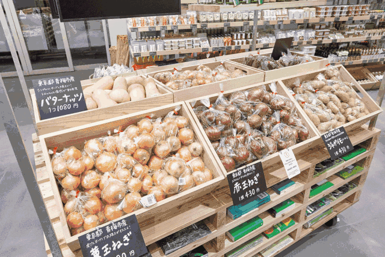 (原始链接: https://mmbiz.qpic.cn/mmbiz_gif/XA8n2XaESnRwLjdun6gJHiasl4Kx5lkYoZBA8fhbcGpsoZ2zwHIcX2XJPDdVxqtGIarFVtC7fvIkz2vMnjOibGAA/640?wx_fmt=gif)
- 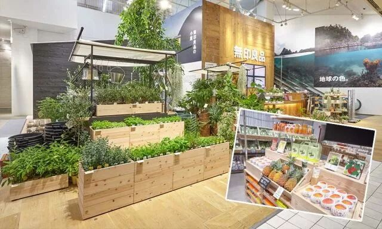 (原始链接: https://mmbiz.qpic.cn/mmbiz_jpg/XA8n2XaESnRwLjdun6gJHiasl4Kx5lkYomDoqYN322tRAx54I92jhojl3GFIiaAaoibcYwtJL5pekx8ObNrpYo9tw/640?wx_fmt=jpeg)
-  (原始链接: https://mmbiz.qpic.cn/mmbiz_jpg/XA8n2XaESnRwLjdun6gJHiasl4Kx5lkYoZnxxubDqC3xbfuTxuMgEvPribvNaYvywNI4hNC5COWfX2JXzLT7ZbGA/640?wx_fmt=jpeg)
- 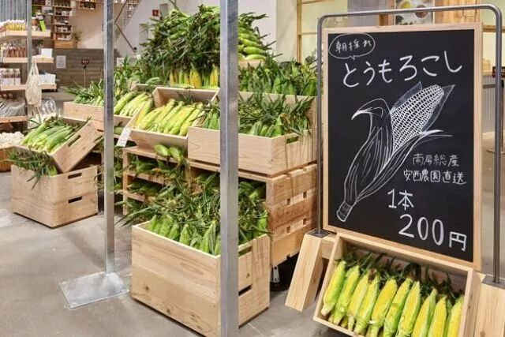 (原始链接: https://mmbiz.qpic.cn/mmbiz_jpg/XA8n2XaESnRwLjdun6gJHiasl4Kx5lkYo31PjsJ59x971OCCYfib4Ze526icZs3ObH7luYDTvfCMKdxJNs6lSX8fw/640?wx_fmt=jpeg)
- 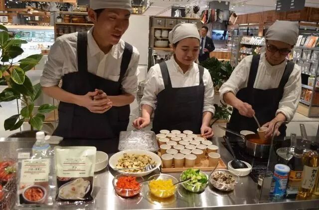 (原始链接: https://mmbiz.qpic.cn/mmbiz_jpg/XA8n2XaESnRwLjdun6gJHiasl4Kx5lkYoHibF6zII9fjd2mEibcUzscK8oJN4M0Micc0iaJ056w5N5nqtNQaUZfStNQ/640?wx_fmt=jpeg)
- 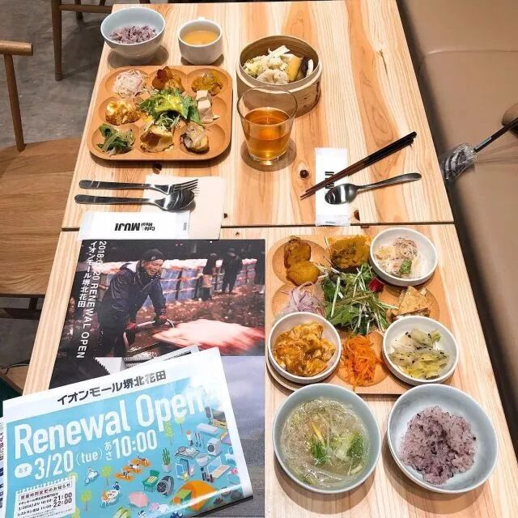 (原始链接: https://mmbiz.qpic.cn/mmbiz_jpg/XA8n2XaESnRwLjdun6gJHiasl4Kx5lkYogeBuZ5kKDNQFiboHBVmVXuvREYmicdPab3ukmibvzP52siaWWnf465ibmnw/640?wx_fmt=jpeg)
- 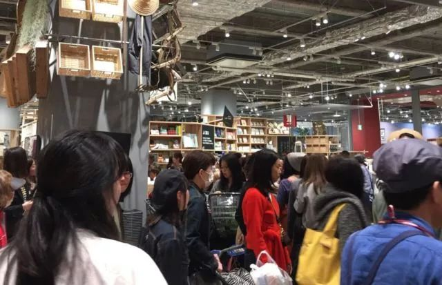 (原始链接: https://mmbiz.qpic.cn/mmbiz_jpg/XA8n2XaESnRwLjdun6gJHiasl4Kx5lkYo3MN3uYibT75JWjbBCBZaWZ2GII8cSTZCUr6ZicLH3ZOc4Cukia1icmt9icw/640?wx_fmt=jpeg)
- 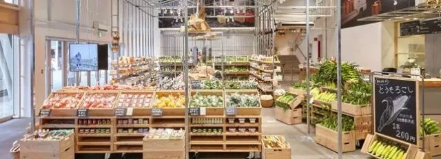 (原始链接: https://mmbiz.qpic.cn/mmbiz_jpg/XA8n2XaESnRwLjdun6gJHiasl4Kx5lkYoUuSP1QyyVEgCmpskBE3qC4mhLga2QINS4htT4j5ZAMILBTJ1I2b0Ow/640?wx_fmt=jpeg)
- 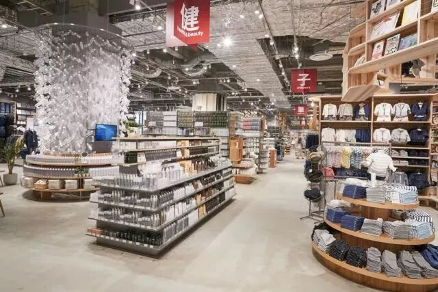 (原始链接: https://mmbiz.qpic.cn/mmbiz_jpg/XA8n2XaESnRwLjdun6gJHiasl4Kx5lkYoiaaRkxUibJLjBZxxS4T3lHsmCVqS7rUoZunTKOlMDtQJcsDjWecyyUcQ/640?wx_fmt=jpeg)
- 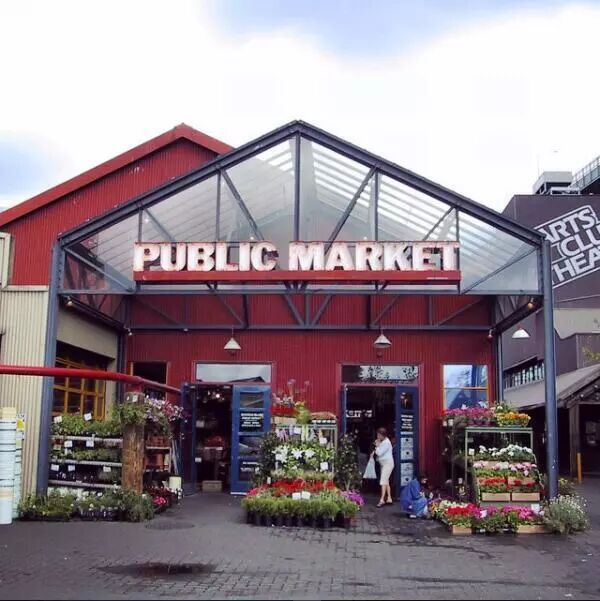 (原始链接: https://mmbiz.qpic.cn/mmbiz_jpg/XA8n2XaESnRwLjdun6gJHiasl4Kx5lkYor3De5CzFfErfqggqU6aiaePfWhb9YBayiboNtC8GfwvPHCzsOu2hfeHA/640?wx_fmt=jpeg)
-  (原始链接: https://mmbiz.qpic.cn/mmbiz_jpg/XA8n2XaESnRwLjdun6gJHiasl4Kx5lkYos5dD606VGQ3mU8s4yCiaahKiaPCwTo5fbUsfjia7qV6d4jicpFMqwjY3Yw/640?wx_fmt=jpeg)
- 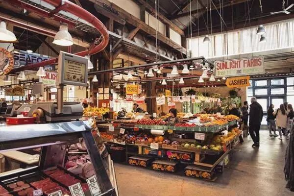 (原始链接: https://mmbiz.qpic.cn/mmbiz_jpg/XA8n2XaESnRwLjdun6gJHiasl4Kx5lkYo8mmunmodPplia7nWpLgIiaDOAEdHnOjA0aZmpb1jja7UoXvvHFckicURA/640?wx_fmt=jpeg)
- 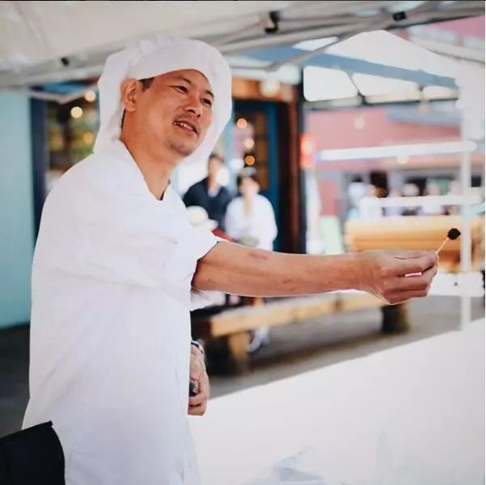 (原始链接: https://mmbiz.qpic.cn/mmbiz_jpg/XA8n2XaESnRwLjdun6gJHiasl4Kx5lkYoXz4m4evodL1Mahe50fLFhk0OB9Q1tBx0ybfohbVrTY5yBerNlwjV1Q/640?wx_fmt=jpeg)
- 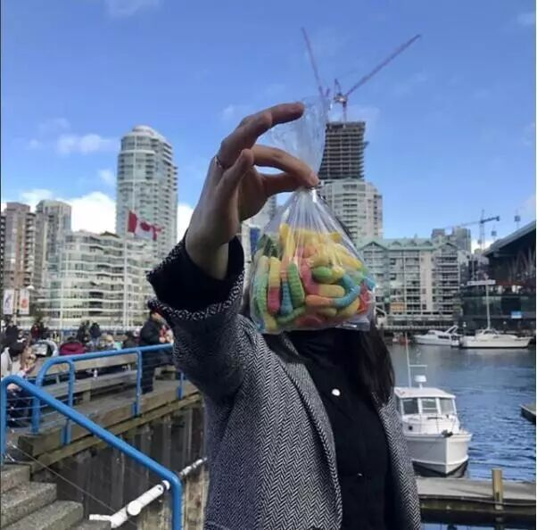 (原始链接: https://mmbiz.qpic.cn/mmbiz_jpg/XA8n2XaESnRwLjdun6gJHiasl4Kx5lkYoic8va9u4phC3WuicMKEZOggdbKUZEOVzS2h3VFahQ4oEa5etmsnagptA/640?wx_fmt=jpeg)
- 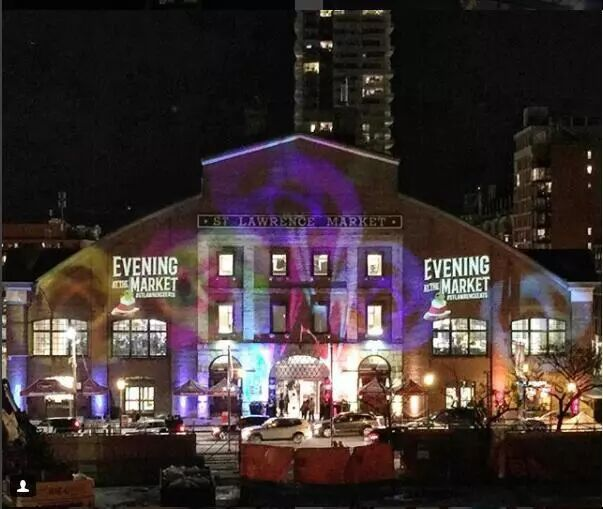 (原始链接: https://mmbiz.qpic.cn/mmbiz_jpg/XA8n2XaESnRwLjdun6gJHiasl4Kx5lkYo69ibGiaEa8ZNiaOovBoicYO8ADXQHO056FVGYBG6CibvwlctUle8NQcTmIw/640?wx_fmt=jpeg)
- 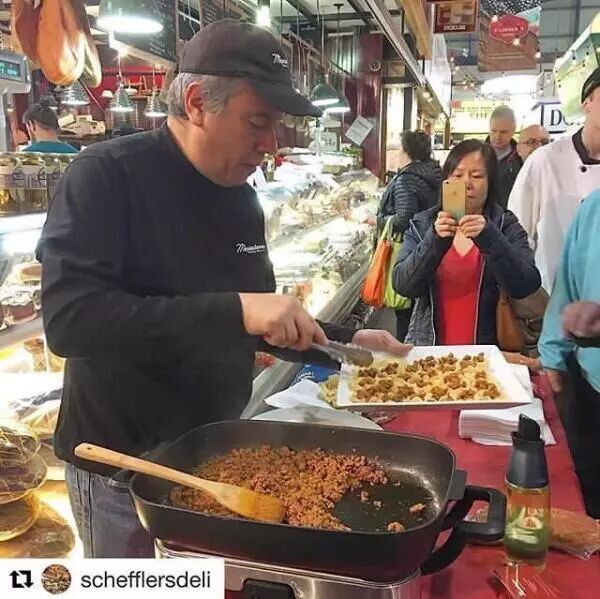 (原始链接: https://mmbiz.qpic.cn/mmbiz_jpg/XA8n2XaESnRwLjdun6gJHiasl4Kx5lkYoV7w12BzBp2ac6CPlnRVtqTpGdKqK5qbFM3Py5BP5Gk3iapRDEicWrHpw/640?wx_fmt=jpeg)
- 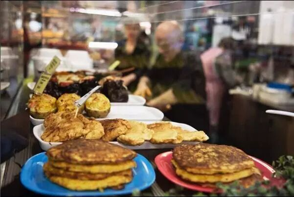 (原始链接: https://mmbiz.qpic.cn/mmbiz_jpg/XA8n2XaESnRwLjdun6gJHiasl4Kx5lkYoicvPDFRRRVIvwpHxicl4kNkArRCibLAEA2PvhgEOIicnbVIts80fYiabiaWQ/640?wx_fmt=jpeg)
- 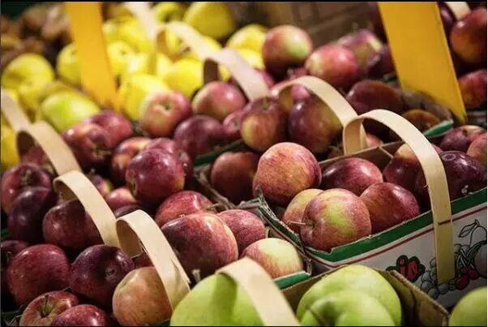 (原始链接: https://mmbiz.qpic.cn/mmbiz_jpg/XA8n2XaESnRwLjdun6gJHiasl4Kx5lkYoAfnn4iaSrS8qiaVehtwNgRicoB1V11SL9wFd3d8dw9cprHXMgCIbY4blA/640?wx_fmt=jpeg)
- 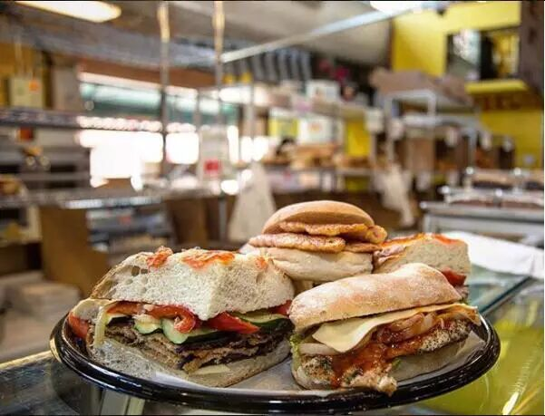 (原始链接: https://mmbiz.qpic.cn/mmbiz_jpg/XA8n2XaESnRwLjdun6gJHiasl4Kx5lkYoGIfYuevSUYiaJ9wibRxdTib0D5eJnicwHL157EU777OE5icoaTKeWNRNSdg/640?wx_fmt=jpeg)
- 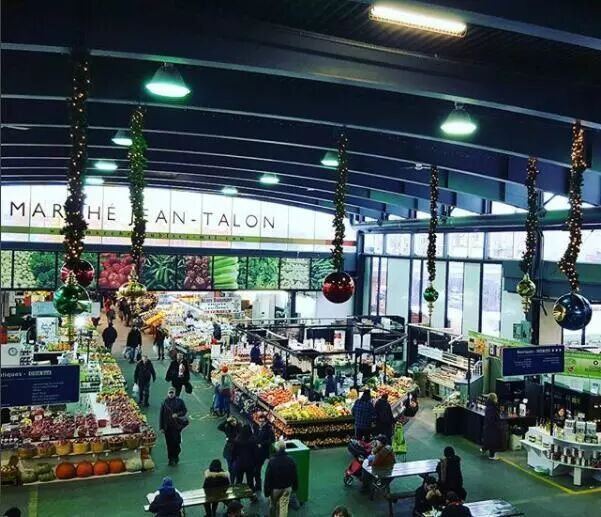 (原始链接: https://mmbiz.qpic.cn/mmbiz_jpg/XA8n2XaESnRwLjdun6gJHiasl4Kx5lkYoVgIRleqBrfqVN2muzTTYzUSx5WDMMoKqJdpRibpAKSMxqCx0icEJyZKA/640?wx_fmt=jpeg)
- 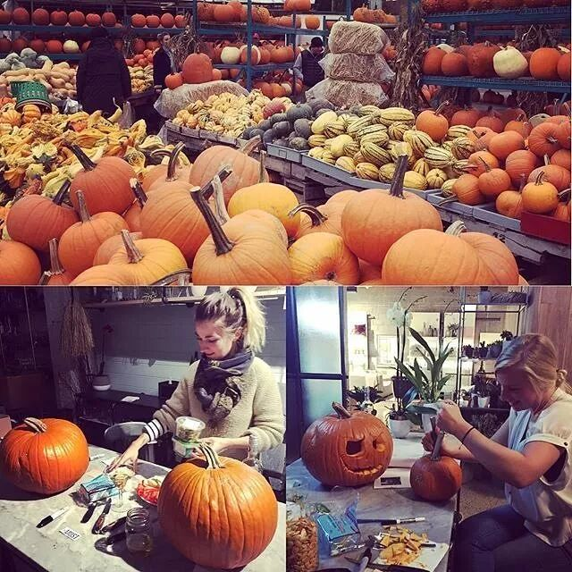 (原始链接: https://mmbiz.qpic.cn/mmbiz_jpg/XA8n2XaESnRwLjdun6gJHiasl4Kx5lkYoibdud2dh8wmnTJS0WbmRbSibNXiatpbVSW176e0dauZjNT0VCcDrWibEQQ/640?wx_fmt=jpeg)
- 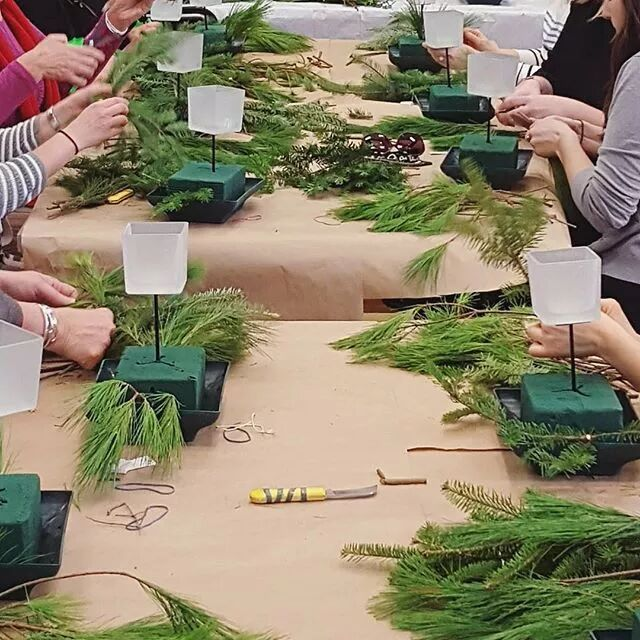 (原始链接: https://mmbiz.qpic.cn/mmbiz_jpg/XA8n2XaESnRwLjdun6gJHiasl4Kx5lkYoDh8kOGHMISh3FSQZDAt3kmhXav4yUVkbl0ocQoHCRQSgicrZROxqrvg/640?wx_fmt=jpeg)
-  (原始链接: https://mmbiz.qpic.cn/mmbiz_jpg/XA8n2XaESnRwLjdun6gJHiasl4Kx5lkYodvPLvAUm5hCBJtyx3j2WpLmNqlXkP6cngWf0vxfLwLBQ6V7dFtgT1g/640?wx_fmt=jpeg)
- 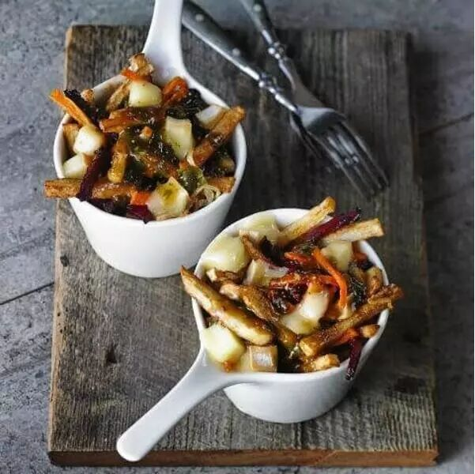 (原始链接: https://mmbiz.qpic.cn/mmbiz_jpg/XA8n2XaESnRwLjdun6gJHiasl4Kx5lkYog1AKF4ibEux5gabQ6I9jasP2c2nFb99QYMK2IKpArRmPwZluwia6nS2g/640?wx_fmt=jpeg)
-  (原始链接: https://mmbiz.qpic.cn/mmbiz_jpg/XA8n2XaESnRwLjdun6gJHiasl4Kx5lkYoBicoKA3cKgibaIfXhKxGVOebQrUbZ7zoKQBD04ia8iaqMPMOpk3TJsXUEw/640?wx_fmt=jpeg)
- 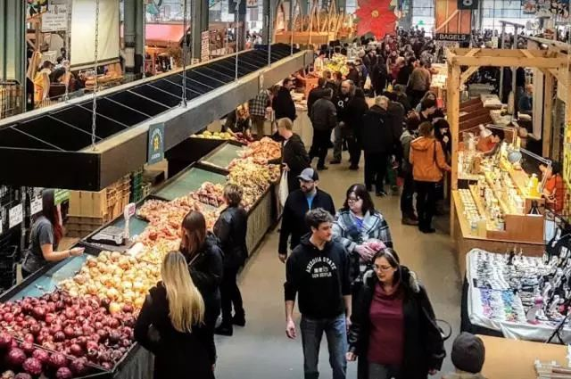 (原始链接: https://mmbiz.qpic.cn/mmbiz_jpg/XA8n2XaESnRwLjdun6gJHiasl4Kx5lkYonO5hoATQvrCkRMOyNMNKQr3VBWyjjbMZwqdY6PdSNRunSfjaEHbiczw/640?wx_fmt=jpeg)
- 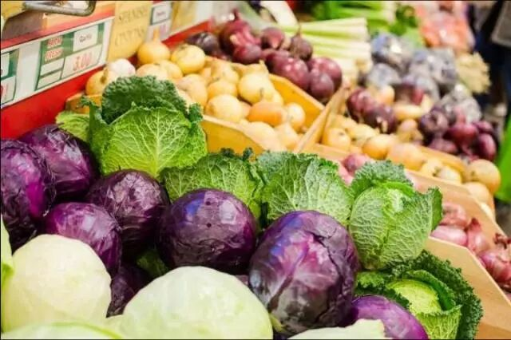 (原始链接: https://mmbiz.qpic.cn/mmbiz_jpg/XA8n2XaESnRwLjdun6gJHiasl4Kx5lkYoVFNsQxQf5RibXBShbBrSNQ4wpdpEwoJMtT1rWGNh1Olh98AfZ5ZJD8g/640?wx_fmt=jpeg)
- 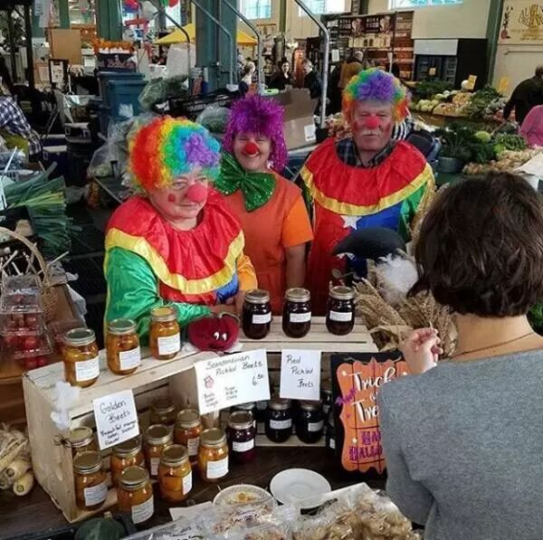 (原始链接: https://mmbiz.qpic.cn/mmbiz_jpg/XA8n2XaESnRwLjdun6gJHiasl4Kx5lkYo2mmaNE8bVlmrelGZb91kWBgiaTTNXhvhTgJlcWfpibSgBw7TRdd1gj9w/640?wx_fmt=jpeg)
- 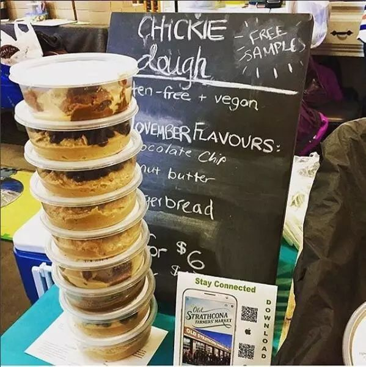 (原始链接: https://mmbiz.qpic.cn/mmbiz_jpg/XA8n2XaESnRwLjdun6gJHiasl4Kx5lkYopP5pAlicO8fEXCribYqE0D7ySuGkN62ld6WOc7hVUVelpgoWcFxtBVBg/640?wx_fmt=jpeg)
-  (原始链接: https://mmbiz.qpic.cn/mmbiz_png/XA8n2XaESnRwLjdun6gJHiasl4Kx5lkYojPibNl8cwFt7FLFoAyUCN0WibMsr6O6kV4JqM5FaYCNo8qjIsNBeJpFg/640?wx_fmt=png)
- 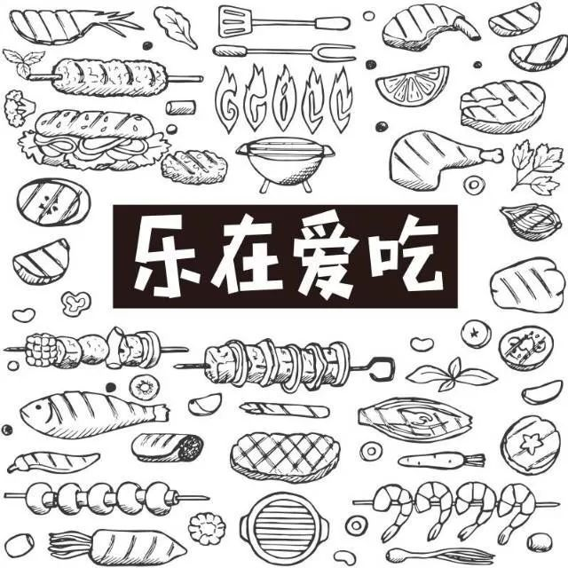 (原始链接: https://mmbiz.qpic.cn/mmbiz_jpg/XA8n2XaESnRwLjdun6gJHiasl4Kx5lkYod3Cdh0UTT6rkOY4I4cOIVh7XqGjvDBPtneHPs1iatkcwPXSNWCjBoSQ/640?wx_fmt=jpeg)
-  (原始链接: https://mmbiz.qpic.cn/mmbiz_jpg/XA8n2XaESnRwLjdun6gJHiasl4Kx5lkYoOOj1iaGCRT60rN3lPiaPib5jAsrFmQrtcUUicds5w1HSRTSOqT4NyEiaoCw/640?wx_fmt=jpeg)
-  (原始链接: https://mmbiz.qpic.cn/mmbiz_jpg/XA8n2XaESnRwLjdun6gJHiasl4Kx5lkYoUhwEQLqrFK0hA9721DFaib6E2toy8RkfciaCapPpTVgfIDP7yxWGy38Q/640?wx_fmt=jpeg)
-  (原始链接: https://mmbiz.qpic.cn/mmbiz_png/XA8n2XaESnRwLjdun6gJHiasl4Kx5lkYoSf1qOq8NqX1HDW9CRfIdHhDMayjf6axVHGnNfKOHojCm2k1u2CnFLg/640?wx_fmt=png)
-  (原始链接: https://mmbiz.qpic.cn/mmbiz_gif/XA8n2XaESnRwLjdun6gJHiasl4Kx5lkYoHhW8jc0he9B9KoLET4ibVqxicYTH95P4RNpPO7PO4xU7AccDp4AHnGrw/640?wx_fmt=gif)
