# 无标题

**链接地址:** http://mp.weixin.qq.com/s?__biz=MzI0MDQ0ODI0Ng==&mid=2247485672&idx=2&sn=40096e105ac719aaa8bfbeda1c7472a2&chksm=e91bef71de6c6667629d4ff2f89a2e3ef57bde39c9a17dcea93ade7643922492d3c07b3075e2&mpshare=1&scene=2&srcid=03305h9PPB4tfYV918EcdixH#rd
**作者:** Nina@YEG
**获取时间:** 2025/8/28 22:09:36
**图片数量:** 24

---

## 原始HTML内容

<section style="white-space: normal;background-color: rgb(255, 255, 255);box-sizing: border-box;"><section class="Powered-by-XIUMI V5" powered-by="xiumi.us" style="box-sizing: border-box;"><section class="" style="margin-bottom: 10px;box-sizing: border-box;"><section class="" style="margin-top: -0.46em;margin-bottom: 0.1em;border-top: 2px solid rgb(249, 110, 87);border-bottom: 2px solid rgb(249, 110, 87);box-sizing: border-box;"><section class="Powered-by-XIUMI V5" powered-by="xiumi.us" style="box-sizing: border-box;"><section class="" style="text-align: center;box-sizing: border-box;"><section class="" style="text-align: left;color: rgb(249, 110, 87);box-sizing: border-box;"><section style="box-sizing: border-box;">点击上方“公众号”可以订阅哦</section></section></section></section></section></section></section><section class="Powered-by-XIUMI V5" powered-by="xiumi.us" style="box-sizing: border-box;"><section class="" style="margin-top: 10px;margin-bottom: 10px;text-align: center;box-sizing: border-box;"><section class="" style="max-width: 100%;vertical-align: middle;display: inline-block;width: 279px;box-shadow: rgb(0, 0, 0) 0px 0px 0px;box-sizing: border-box;overflow: hidden !important;"></section></section></section><section class="Powered-by-XIUMI V5" powered-by="xiumi.us" style="box-sizing: border-box;"><section class="" style="box-sizing: border-box;"><section class="" style="box-sizing: border-box;">
<strong style="box-sizing: border-box;">20年前迪斯尼动画片《花木兰》在美国上映，麦当劳为了配合电影的宣传曾季节性地推出过一款叫做“木兰四川照烧“的蘸酱。 </strong>
</section></section></section><section class="Powered-by-XIUMI V5" powered-by="xiumi.us" style="box-sizing: border-box;"><section class="" style="margin-top: 10px;margin-bottom: 10px;text-align: center;box-sizing: border-box;"><section class="" style="max-width: 100%;vertical-align: middle;display: inline-block;width: 279px;box-sizing: border-box;overflow: hidden !important;"></section></section></section><section class="Powered-by-XIUMI V5" powered-by="xiumi.us" style="box-sizing: border-box;"><section class="" style="box-sizing: border-box;"><section class="" style="box-sizing: border-box;">
<strong style="box-sizing: border-box;">看起来很普通对不对？传说中它的味道有点辣，也有点甜……但具体的味道谁也说不清，因为它在市面上几乎已经绝迹了！</strong>
</section></section></section><section class="Powered-by-XIUMI V5" powered-by="xiumi.us" style="box-sizing: border-box;"><section class="" style="margin-top: 10px;margin-bottom: 10px;text-align: center;box-sizing: border-box;"><section class="" style="max-width: 100%;vertical-align: middle;display: inline-block;box-sizing: border-box;overflow: hidden !important;"></section></section></section><section class="Powered-by-XIUMI V5" powered-by="xiumi.us" style="box-sizing: border-box;"><section class="" style="box-sizing: border-box;"><section class="" style="box-sizing: border-box;">
<strong style="box-sizing: border-box;">去年一部叫做《Rick And Morty》超火动画片反复提到这个神秘的辣酱，让它一夜之间再度蹿红！ </strong>
</section></section></section><section class="Powered-by-XIUMI V5" powered-by="xiumi.us" style="box-sizing: border-box;"><section class="" style="margin-top: 10px;margin-bottom: 10px;text-align: center;box-sizing: border-box;"><section class="" style="max-width: 100%;vertical-align: middle;display: inline-block;box-sizing: border-box;overflow: hidden !important;"></section></section></section><section class="Powered-by-XIUMI V5" powered-by="xiumi.us" style="box-sizing: border-box;"><section class="" style="box-sizing: border-box;"><section class="" style="box-sizing: border-box;">
<strong style="box-sizing: border-box;">没有吃过这个辣酱的00后表示这将是人生中最大的遗憾！ </strong>
</section></section></section><section class="Powered-by-XIUMI V5" powered-by="xiumi.us" style="box-sizing: border-box;"><section class="" style="margin-top: 10px;margin-bottom: 10px;text-align: center;box-sizing: border-box;"><section class="" style="max-width: 100%;vertical-align: middle;display: inline-block;box-sizing: border-box;overflow: hidden !important;"></section></section></section><section class="Powered-by-XIUMI V5" powered-by="xiumi.us" style="box-sizing: border-box;"><section class="" style="box-sizing: border-box;"><section class="" style="box-sizing: border-box;">
<strong style="box-sizing: border-box;">这个”木兰酱“的梗被制作成各种周边，成为现象及的话题。 </strong>
</section></section></section><section class="Powered-by-XIUMI V5" powered-by="xiumi.us" style="box-sizing: border-box;"><section class="" style="margin-top: 10px;margin-bottom: 10px;text-align: center;box-sizing: border-box;"><section class="" style="max-width: 100%;vertical-align: middle;display: inline-block;box-sizing: border-box;overflow: hidden !important;"></section></section></section><section class="Powered-by-XIUMI V5" powered-by="xiumi.us" style="box-sizing: border-box;"><section class="" style="box-sizing: border-box;"><section class="" style="box-sizing: border-box;">
<strong style="box-sizing: border-box;">幸存在世的一颗原版辣酱甚至一度被拍卖到5万美金的天价！！！</strong>
</section></section></section><section class="Powered-by-XIUMI V5" powered-by="xiumi.us" style="box-sizing: border-box;"><section class="" style="margin-top: 10px;margin-bottom: 10px;text-align: center;box-sizing: border-box;"><section class="" style="max-width: 100%;vertical-align: middle;display: inline-block;box-sizing: border-box;overflow: hidden !important;"></section></section></section><section class="Powered-by-XIUMI V5" powered-by="xiumi.us" style="box-sizing: border-box;"><section class="" style="box-sizing: border-box;"><section class="" style="box-sizing: border-box;">
<strong style="box-sizing: border-box;">在群众们强烈的呼声之下，顶不住压力的麦当劳终于同意限量发售《Rick And Morty》的特别版四川辣酱。</strong>
</section></section></section><section class="Powered-by-XIUMI V5" powered-by="xiumi.us" style="box-sizing: border-box;"><section class="" style="margin-top: 10px;margin-bottom: 10px;text-align: center;box-sizing: border-box;"><section class="" style="max-width: 100%;vertical-align: middle;display: inline-block;box-sizing: border-box;overflow: hidden !important;"></section></section></section><section class="Powered-by-XIUMI V5" powered-by="xiumi.us" style="box-sizing: border-box;"><section class="" style="box-sizing: border-box;"><section class="" style="box-sizing: border-box;">
<strong style="box-sizing: border-box;">发售当天的画风是这样的， </strong>
</section></section></section><section class="Powered-by-XIUMI V5" powered-by="xiumi.us" style="box-sizing: border-box;"><section class="" style="margin-top: 10px;margin-bottom: 10px;text-align: center;box-sizing: border-box;"><section class="" style="max-width: 100%;vertical-align: middle;display: inline-block;box-sizing: border-box;overflow: hidden !important;"></section></section></section><section class="Powered-by-XIUMI V5" powered-by="xiumi.us" style="box-sizing: border-box;"><section class="" style="box-sizing: border-box;"><section class="" style="box-sizing: border-box;">
<strong style="box-sizing: border-box;">这样的，</strong>
</section></section></section><section class="Powered-by-XIUMI V5" powered-by="xiumi.us" style="box-sizing: border-box;"><section class="" style="margin-top: 10px;margin-bottom: 10px;text-align: center;box-sizing: border-box;"><section class="" style="max-width: 100%;vertical-align: middle;display: inline-block;box-sizing: border-box;overflow: hidden !important;"></section></section></section><section class="Powered-by-XIUMI V5" powered-by="xiumi.us" style="box-sizing: border-box;"><section class="" style="box-sizing: border-box;"><section class="" style="box-sizing: border-box;">
<strong style="box-sizing: border-box;">和这样的。</strong>
</section></section></section><section class="Powered-by-XIUMI V5" powered-by="xiumi.us" style="box-sizing: border-box;"><section class="" style="margin-top: 10px;margin-bottom: 10px;text-align: center;box-sizing: border-box;"><section class="" style="max-width: 100%;vertical-align: middle;display: inline-block;box-sizing: border-box;overflow: hidden !important;"></section></section></section><section class="Powered-by-XIUMI V5" powered-by="xiumi.us" style="box-sizing: border-box;"><section class="" style="box-sizing: border-box;"><section class="" style="box-sizing: border-box;">
<strong style="box-sizing: border-box;">如今四川辣酱在美国已经是麦当劳的常态蘸酱，可以在ebay上以相对合理的价格购买。</strong>
</section></section></section><section class="Powered-by-XIUMI V5" powered-by="xiumi.us" style="box-sizing: border-box;"><section class="" style="margin-top: 10px;margin-bottom: 10px;text-align: center;box-sizing: border-box;"><section class="" style="max-width: 100%;vertical-align: middle;display: inline-block;box-sizing: border-box;overflow: hidden !important;"></section></section></section><section class="Powered-by-XIUMI V5" powered-by="xiumi.us" style="box-sizing: border-box;"><section class="" style="box-sizing: border-box;"><section class="" style="box-sizing: border-box;">
<strong style="box-sizing: border-box;">距离最初的“木兰酱”上市已经20年了，而《花木兰》也开拍了真人版电影。中国女演员刘亦菲饰演的花木兰一角让不少观众满怀期待。这“木兰酱”的热度也从美国烧回了她的老家——中国！ </strong>
</section></section></section><section class="Powered-by-XIUMI V5" powered-by="xiumi.us" style="box-sizing: border-box;"><section class="" style="margin-top: 10px;margin-bottom: 10px;text-align: center;box-sizing: border-box;"><section class="" style="max-width: 100%;vertical-align: middle;display: inline-block;box-sizing: border-box;overflow: hidden !important;"></section></section></section><section class="Powered-by-XIUMI V5" powered-by="xiumi.us" style="box-sizing: border-box;"><section class="" style="box-sizing: border-box;"><section class="" style="box-sizing: border-box;">
<strong style="box-sizing: border-box;">没错，国内的小朋友们有口福啦！这位国外出道20年的网红回来啦！而且还带来了2.0的版本——宫保风味酱！</strong>
</section></section></section><section class="Powered-by-XIUMI V5" powered-by="xiumi.us" style="box-sizing: border-box;"><section class="" style="margin-top: 10px;margin-bottom: 10px;text-align: center;box-sizing: border-box;"><section class="" style="max-width: 100%;vertical-align: middle;display: inline-block;box-sizing: border-box;overflow: hidden !important;"></section></section></section><section class="Powered-by-XIUMI V5" powered-by="xiumi.us" style="box-sizing: border-box;"><section class="" style="box-sizing: border-box;"><section class="" style="box-sizing: border-box;">
<strong style="box-sizing: border-box;">3月28日开始在国内的”金拱门“就能吃到啦！ </strong>
</section></section></section><section class="Powered-by-XIUMI V5" powered-by="xiumi.us" style="box-sizing: border-box;"><section class="" style="margin-top: 10px;margin-bottom: 10px;text-align: center;box-sizing: border-box;"><section class="" style="max-width: 100%;vertical-align: middle;display: inline-block;box-sizing: border-box;overflow: hidden !important;"></section></section></section><section class="Powered-by-XIUMI V5" powered-by="xiumi.us" style="box-sizing: border-box;"><section class="" style="box-sizing: border-box;"><section class="" style="box-sizing: border-box;">
<strong style="box-sizing: border-box;">“中华赞酱组合”三名成员除了新加入的“川味赞酱”和“宫保风味赞酱”，还有常态蘸酱蒜蓉辣椒酱。</strong>

<strong style="box-sizing: border-box;"></strong>

<strong style="box-sizing: border-box;"></strong>
</section></section></section><section class="Powered-by-XIUMI V5" powered-by="xiumi.us" style="box-sizing: border-box;"><section class="" style="margin-top: 10px;margin-bottom: 10px;text-align: left;box-sizing: border-box;"><strong style="box-sizing: border-box;">看看这高大上的包装，网红海龟自带资源就是跟一般的蘸酱不一样！“麦当劳这次真是下了血本想利用这位网红的热度为自己炒卖点呢！</strong><section class="" style="max-width: 100%;vertical-align: middle;display: inline-block;box-sizing: border-box;overflow: hidden !important;"></section></section></section><section class="Powered-by-XIUMI V5" powered-by="xiumi.us" style="box-sizing: border-box;"><section class="" style="margin-top: 10px;margin-bottom: 10px;text-align: center;box-sizing: border-box;"><section class="" style="max-width: 100%;vertical-align: middle;display: inline-block;box-sizing: border-box;overflow: hidden !important;"></section></section></section><section class="Powered-by-XIUMI V5" powered-by="xiumi.us" style="box-sizing: border-box;"><section class="" style="box-sizing: border-box;"><section class="" style="box-sizing: border-box;">
<strong style="box-sizing: border-box;">不少美食届的大V也在第一时间为我们做出了评测，然而……这“中华赞酱系列”有没有传说中的那么“赞”呢？</strong>
</section></section></section><section class="Powered-by-XIUMI V5" powered-by="xiumi.us" style="box-sizing: border-box;"><section class="" style="margin-top: 10px;margin-bottom: 10px;text-align: center;box-sizing: border-box;"><section class="" style="max-width: 100%;vertical-align: middle;display: inline-block;width: 418.5px;box-sizing: border-box;overflow: hidden !important;"></section></section></section><section class="Powered-by-XIUMI V5" powered-by="xiumi.us" style="box-sizing: border-box;"><section class="" style="box-sizing: border-box;"><section class="" style="box-sizing: border-box;">
<strong style="box-sizing: border-box;">微博上的画风可以说是一边倒的疯狂吐槽。“难吃”“难吃吐了”“不明白为什么这么火”可以说是最能代表川味蘸酱的关键字了。国外身价五万的网红海龟归国后竟落得如此下场！</strong>
</section></section></section><section class="Powered-by-XIUMI V5" powered-by="xiumi.us" style="box-sizing: border-box;"><section class="" style="margin-top: 10px;margin-bottom: 10px;text-align: center;box-sizing: border-box;"><section class="" style="max-width: 100%;vertical-align: middle;display: inline-block;width: 418.5px;box-sizing: border-box;overflow: hidden !important;"></section></section></section><section class="Powered-by-XIUMI V5" powered-by="xiumi.us" style="box-sizing: border-box;"><section class="" style="box-sizing: border-box;"><section class="" style="box-sizing: border-box;">
<strong style="box-sizing: border-box;">然而同门师弟的宫保酱意外的收获好评无数，抢了网红的风头！</strong>
</section></section></section><section class="Powered-by-XIUMI V5" powered-by="xiumi.us" style="box-sizing: border-box;"><section class="" style="margin-top: 10px;margin-bottom: 10px;text-align: center;box-sizing: border-box;"><section class="" style="max-width: 100%;vertical-align: middle;display: inline-block;box-sizing: border-box;overflow: hidden !important;"></section></section></section><section class="Powered-by-XIUMI V5" powered-by="xiumi.us" style="box-sizing: border-box;"><section class="" style="box-sizing: border-box;"><section class="" style="box-sizing: border-box;">
<strong style="box-sizing: border-box;">看到这里，大家是不是很想尝试一下这后来居上的“宫保风味蘸酱”？考完试回国就可以吃到啦！欢迎来跟我们一起分享你的试吃心得呀！</strong>
</section></section></section><section class="Powered-by-XIUMI V5" powered-by="xiumi.us" style="box-sizing: border-box;"><section class="" style="margin-top: 10px;margin-bottom: 10px;text-align: center;box-sizing: border-box;"><section class="" style="max-width: 100%;vertical-align: middle;display: inline-block;box-sizing: border-box;overflow: hidden !important;"></section></section></section><section class="Powered-by-XIUMI V5" powered-by="xiumi.us" style="box-sizing: border-box;"><section class="" style="box-sizing: border-box;"><section class="" style="box-sizing: border-box;">
<strong style="box-sizing: border-box;">有了前车之鉴，加拿大的小伙伴们也不要气馁，快去《Rick And Morty》的Facebook主页上为加拿大请愿！愿望还是要有的！说不定哪天就实现了呢！不仅是川味酱！宫保酱也可能会吃得到哦！</strong>
</section></section></section><section class="Powered-by-XIUMI V5" powered-by="xiumi.us" style="box-sizing: border-box;"><section class="" style="margin-top: 10px;margin-bottom: 10px;text-align: center;box-sizing: border-box;"><section class="" style="max-width: 100%;vertical-align: middle;display: inline-block;box-sizing: border-box;overflow: hidden !important;"></section></section></section><section class="Powered-by-XIUMI V5" powered-by="xiumi.us" style="box-sizing: border-box;"><section class="" style="box-sizing: border-box;"><section class="" style="box-sizing: border-box;">
<strong style="box-sizing: border-box;">没吃过中华赞酱不要紧，麦当劳还有许多值得大书特书的美味蘸酱！小编自己曾经创下一盒麦乐鸡配三盒甜酸酱的记录呢！你最爱的麦当劳蘸酱是哪一款呢？不妨在留言区和我们一起分享你的私藏吃法！没准能够找到一大票志同道合的食友呢！</strong>
</section></section></section><section class="Powered-by-XIUMI V5" powered-by="xiumi.us" style="box-sizing: border-box;"><section class="" style="margin-top: 10px;box-sizing: border-box;"><section class="" style="padding: 10px;display: inline-block;width: 558px;border-width: 1px;border-style: solid;border-color: rgb(255, 30, 21);background-color: rgb(254, 255, 255);border-radius: 10px;box-shadow: rgb(0, 0, 0) 0px 0px 0px;box-sizing: border-box;"><section class="Powered-by-XIUMI V5" powered-by="xiumi.us" style="box-sizing: border-box;"><section class="" style="box-sizing: border-box;"><section class="" style="display: inline-block;vertical-align: middle;width: 187.594px;box-sizing: border-box;"><section class="Powered-by-XIUMI V5" powered-by="xiumi.us" style="box-sizing: border-box;"><section class="" style="text-align: center;box-sizing: border-box;"><section class="" style="max-width: 100%;vertical-align: middle;display: inline-block;box-shadow: rgb(0, 0, 0) 0px 0px 0px;box-sizing: border-box;overflow: hidden !important;"></section></section></section></section><section class="" style="padding-left: 5px;display: inline-block;vertical-align: middle;width: 348.396px;box-shadow: rgb(0, 0, 0) 0px 0px 0px;box-sizing: border-box;"><section class="Powered-by-XIUMI V5" powered-by="xiumi.us" style="box-sizing: border-box;"><section class="" style="box-sizing: border-box;"><section class="" style="text-align: justify;font-size: 14px;color: rgb(100, 100, 100);box-sizing: border-box;">
乐在爱吃

微信公众号: lezaiaichi
</section></section></section><section class="Powered-by-XIUMI V5" powered-by="xiumi.us" style="box-sizing: border-box;"><section class="" style="margin-top: 0.5em;margin-bottom: 0.5em;box-sizing: border-box;"><section class="" style="background-color: rgb(153, 166, 171);height: 1px;box-sizing: border-box;"></section></section></section><section class="Powered-by-XIUMI V5" powered-by="xiumi.us" style="box-sizing: border-box;"><section class="" style="box-sizing: border-box;"><section class="" style="text-align: justify;font-size: 12px;color: rgb(100, 100, 100);box-sizing: border-box;">
我们为解决“今天吃什么”的世界级难题而生！
</section></section></section></section></section></section></section></section></section><section class="Powered-by-XIUMI V5" powered-by="xiumi.us" style="box-sizing: border-box;"><section class="" style="margin-top: 8px;margin-left: 167.396px;line-height: 1em;text-align: center;box-sizing: border-box;"><section class="" style="width: 0px;display: inline-block;vertical-align: bottom;border-bottom: 13px solid rgb(0, 0, 0);box-sizing: border-box;border-left: 13px solid transparent !important;border-right: 13px solid transparent !important;"></section></section></section><section class="Powered-by-XIUMI V5" powered-by="xiumi.us" style="box-sizing: border-box;"><section class="" style="box-sizing: border-box;"><section class="" style="display: inline-block;width: 558px;vertical-align: top;background-image: url(&quot;https://mmbiz.qpic.cn/mmbiz_gif/XA8n2XaESnRzHrFibkVGBXdeib6CD1rTMN2sQn63X2eYnw1XYR0qJKRejA2UhvzGicfLEvEpSDkG7wkoDT2CPPY3Q/640?wx_fmt=gif&quot;);background-position: 0% 0%;background-repeat: repeat;background-size: 103.933%;background-attachment: scroll;background-color: rgb(254, 255, 255);box-sizing: border-box;"><section class="Powered-by-XIUMI V5" powered-by="xiumi.us" style="box-sizing: border-box;"><section class="" style="box-sizing: border-box;"><section class="" style="display: inline-block;vertical-align: top;width: 446.396px;box-sizing: border-box;"><section class="Powered-by-XIUMI V5" powered-by="xiumi.us" style="box-sizing: border-box;"><section class="" style="margin-top: 5px;margin-bottom: 5px;box-sizing: border-box;"><section class="" style="padding-right: 10px;padding-left: 10px;color: rgb(255, 255, 255);font-size: 14px;line-height: 1.6;box-sizing: border-box;">
关注我，你的眼睛会怀孕
</section></section></section></section><section class="" style="display: inline-block;vertical-align: top;width: 111.594px;box-sizing: border-box;"><section class="Powered-by-XIUMI V5" powered-by="xiumi.us" style="box-sizing: border-box;"><section class="" style="margin-top: 5px;text-align: center;font-size: 15px;box-sizing: border-box;"><section class="" style="max-width: 100%;vertical-align: middle;display: inline-block;width: 100.427px;box-sizing: border-box;overflow: hidden !important;"></section></section>
 
<section class="" style="max-width: 100%;vertical-align: middle;display: inline-block;width: 100.427px;box-sizing: border-box;overflow: hidden !important;"> </section>
 
</section></section></section></section></section></section></section></section>
 

---

## 纯文本内容

点击上方“公众号”可以订阅哦20年前迪斯尼动画片《花木兰》在美国上映，麦当劳为了配合电影的宣传曾季节性地推出过一款叫做“木兰四川照烧“的蘸酱。看起来很普通对不对？传说中它的味道有点辣，也有点甜……但具体的味道谁也说不清，因为它在市面上几乎已经绝迹了！去年一部叫做《Rick And Morty》超火动画片反复提到这个神秘的辣酱，让它一夜之间再度蹿红！没有吃过这个辣酱的00后表示这将是人生中最大的遗憾！这个”木兰酱“的梗被制作成各种周边，成为现象及的话题。幸存在世的一颗原版辣酱甚至一度被拍卖到5万美金的天价！！！在群众们强烈的呼声之下，顶不住压力的麦当劳终于同意限量发售《Rick And Morty》的特别版四川辣酱。发售当天的画风是这样的，这样的，和这样的。如今四川辣酱在美国已经是麦当劳的常态蘸酱，可以在ebay上以相对合理的价格购买。距离最初的“木兰酱”上市已经20年了，而《花木兰》也开拍了真人版电影。中国女演员刘亦菲饰演的花木兰一角让不少观众满怀期待。这“木兰酱”的热度也从美国烧回了她的老家——中国！没错，国内的小朋友们有口福啦！这位国外出道20年的网红回来啦！而且还带来了2.0的版本——宫保风味酱！3月28日开始在国内的”金拱门“就能吃到啦！“中华赞酱组合”三名成员除了新加入的“川味赞酱”和“宫保风味赞酱”，还有常态蘸酱蒜蓉辣椒酱。看看这高大上的包装，网红海龟自带资源就是跟一般的蘸酱不一样！“麦当劳这次真是下了血本想利用这位网红的热度为自己炒卖点呢！不少美食届的大V也在第一时间为我们做出了评测，然而……这“中华赞酱系列”有没有传说中的那么“赞”呢？微博上的画风可以说是一边倒的疯狂吐槽。“难吃”“难吃吐了”“不明白为什么这么火”可以说是最能代表川味蘸酱的关键字了。国外身价五万的网红海龟归国后竟落得如此下场！然而同门师弟的宫保酱意外的收获好评无数，抢了网红的风头！看到这里，大家是不是很想尝试一下这后来居上的“宫保风味蘸酱”？考完试回国就可以吃到啦！欢迎来跟我们一起分享你的试吃心得呀！有了前车之鉴，加拿大的小伙伴们也不要气馁，快去《Rick And Morty》的Facebook主页上为加拿大请愿！愿望还是要有的！说不定哪天就实现了呢！不仅是川味酱！宫保酱也可能会吃得到哦！没吃过中华赞酱不要紧，麦当劳还有许多值得大书特书的美味蘸酱！小编自己曾经创下一盒麦乐鸡配三盒甜酸酱的记录呢！你最爱的麦当劳蘸酱是哪一款呢？不妨在留言区和我们一起分享你的私藏吃法！没准能够找到一大票志同道合的食友呢！乐在爱吃微信公众号: lezaiaichi我们为解决“今天吃什么”的世界级难题而生！关注我，你的眼睛会怀孕

---

## 图片列表

- 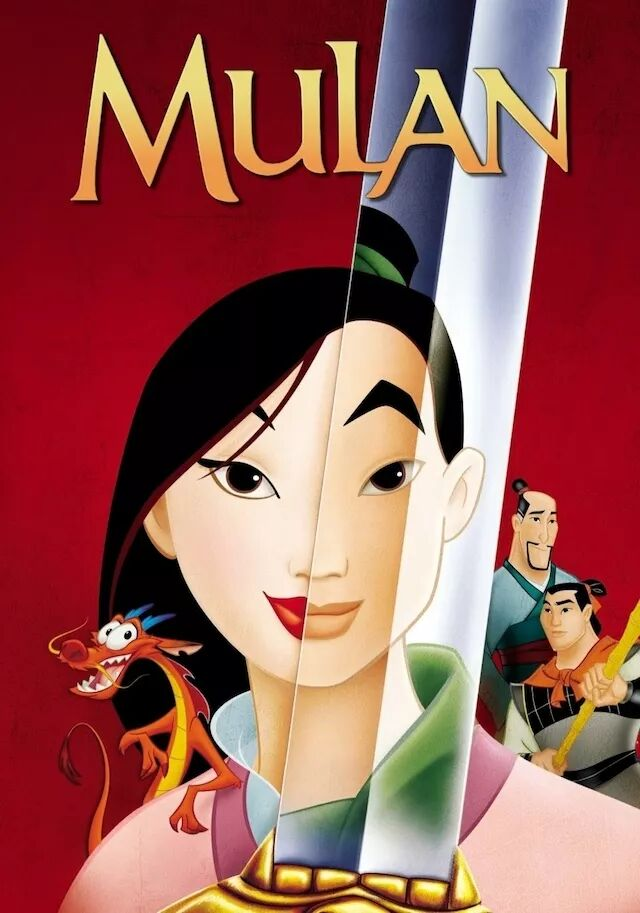 (原始链接: https://mmbiz.qpic.cn/mmbiz_jpg/XA8n2XaESnRzHrFibkVGBXdeib6CD1rTMNSGXv2vWFPoicRptjlH5r4xBzvalb4Dnpb94vMDFhOibHVJcAfHklq6Bw/640?wx_fmt=jpeg)
- 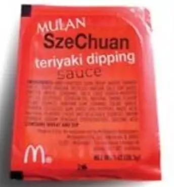 (原始链接: https://mmbiz.qpic.cn/mmbiz_jpg/XA8n2XaESnRzHrFibkVGBXdeib6CD1rTMNaZxr0kcvjWUDqQSaa7hddkpZDpgVtWPxetFtk5neY30BolhuFNjfibA/640?wx_fmt=jpeg)
-  (原始链接: https://mmbiz.qpic.cn/mmbiz_gif/XA8n2XaESnRzHrFibkVGBXdeib6CD1rTMNPb1p1M9T3uRjW8aual0wBOzrWv7Ugib5S1XqvZFXGf0vJGMJcONx6nA/640?wx_fmt=gif)
- 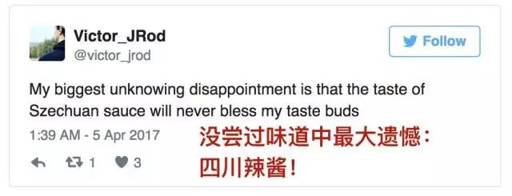 (原始链接: https://mmbiz.qpic.cn/mmbiz_jpg/XA8n2XaESnRzHrFibkVGBXdeib6CD1rTMNFUFo4pdE8gKVTCr6o8XLP4IEFcUBglbickDk1ia0AeYsgvCxTucDTVTA/640?wx_fmt=jpeg)
- 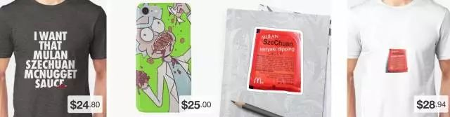 (原始链接: https://mmbiz.qpic.cn/mmbiz_jpg/XA8n2XaESnRzHrFibkVGBXdeib6CD1rTMNpEyrutFOicxqJQcdVdy2n5VmXQxtu2oLm3h8RaQOgHlSYWD2L5m5Ijw/640?wx_fmt=jpeg)
- 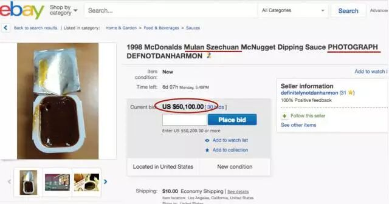 (原始链接: https://mmbiz.qpic.cn/mmbiz_jpg/XA8n2XaESnRzHrFibkVGBXdeib6CD1rTMNDMFLtZgXGib8URSgeBQzjOmosnfL6AnXh1YNOZmLkibR3yFRBibWSUjSA/640?wx_fmt=jpeg)
-  (原始链接: https://mmbiz.qpic.cn/mmbiz_jpg/XA8n2XaESnRzHrFibkVGBXdeib6CD1rTMNoicyrDs83wKubDwWlO3wb6O6SicH26eXqIicJ9fTdc4rQbCokhI9RYvJg/640?wx_fmt=jpeg)
-  (原始链接: https://mmbiz.qpic.cn/mmbiz_jpg/XA8n2XaESnRzHrFibkVGBXdeib6CD1rTMNibRWrmuyev8cBm6EyzZFh0biakHS756xZqicylEHfwJQPh0FdmJ86ltNA/640?wx_fmt=jpeg)
-  (原始链接: https://mmbiz.qpic.cn/mmbiz_jpg/XA8n2XaESnRzHrFibkVGBXdeib6CD1rTMNNqLeic1jsv5XFzia14iauwzh0ZAvsthxWTQZ7QdRtrdS1oN2HpHzDNLXQ/640?wx_fmt=jpeg)
-  (原始链接: https://mmbiz.qpic.cn/mmbiz_jpg/XA8n2XaESnRzHrFibkVGBXdeib6CD1rTMNrLl2w9Sr69PHHzpWgicH9rGIsZ2uzMYsreUhUsX200vR5XT0ggYsb4A/640?wx_fmt=jpeg)
- 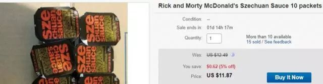 (原始链接: https://mmbiz.qpic.cn/mmbiz_jpg/XA8n2XaESnRzHrFibkVGBXdeib6CD1rTMNcCymWxwWsQQGppXAdqR0KnJ0KCkg4LTeAVcxiclJZjIPFCtFmTEQiapw/640?wx_fmt=jpeg)
-  (原始链接: https://mmbiz.qpic.cn/mmbiz_jpg/XA8n2XaESnRzHrFibkVGBXdeib6CD1rTMNdocOh0P3icXxSpAxXYPibTJNw2kZZh8uLtMbAhWgp27xSN8gUDvWaBvw/640?wx_fmt=jpeg)
-  (原始链接: https://mmbiz.qpic.cn/mmbiz_jpg/XA8n2XaESnRzHrFibkVGBXdeib6CD1rTMNKHEy5kFg7YmojyB8foS2E5zH1HjGknBmaicMGlM26rZfMhOV3GR5BIA/640?wx_fmt=jpeg)
- 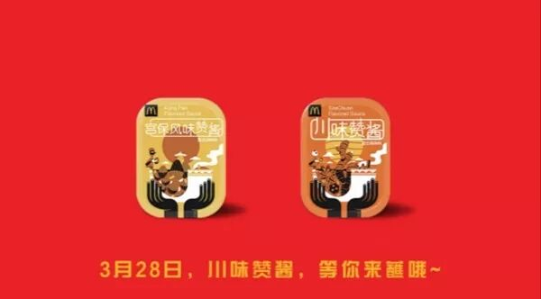 (原始链接: https://mmbiz.qpic.cn/mmbiz_jpg/XA8n2XaESnRzHrFibkVGBXdeib6CD1rTMNwJxPNx6REJPTzYDagF69jocErAbaEOUVia7SKBbl7J22ftYPoRiaS8fA/640?wx_fmt=jpeg)
- 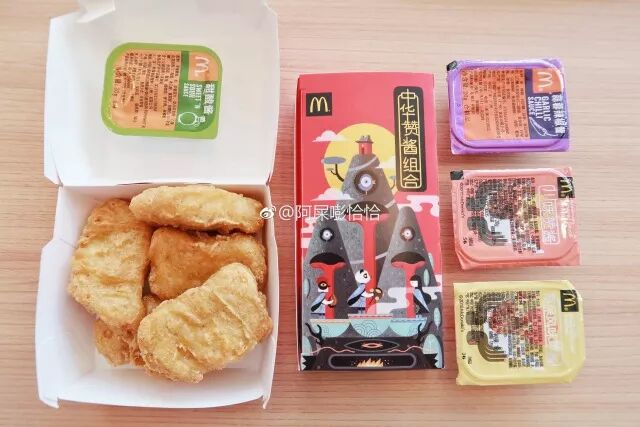 (原始链接: https://mmbiz.qpic.cn/mmbiz_jpg/XA8n2XaESnRzHrFibkVGBXdeib6CD1rTMNMsmagG62GnojhUIkTyHGH3ey9w4tPl4prXfThnapbsBqkNNJ7v77YA/640?wx_fmt=jpeg)
- 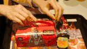 (原始链接: https://mmbiz.qpic.cn/mmbiz_gif/XA8n2XaESnRzHrFibkVGBXdeib6CD1rTMNx5EAEEZdxUKofASNvibu0HI88GgYNicNjjCGsXib6jv9Yjo2GHwOFNANg/640?wx_fmt=gif)
- 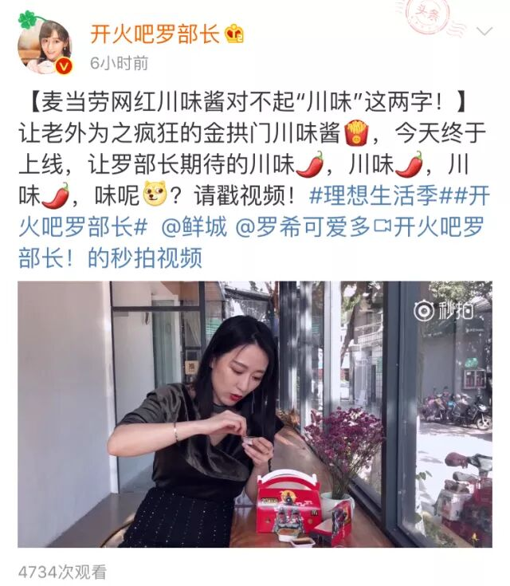 (原始链接: https://mmbiz.qpic.cn/mmbiz_jpg/XA8n2XaESnRzHrFibkVGBXdeib6CD1rTMN1xunpOh7MPShfwn2abhK8HsqM5KuWJHHh0VWTW2nElENGlMqAQEibtQ/640?wx_fmt=jpeg)
- 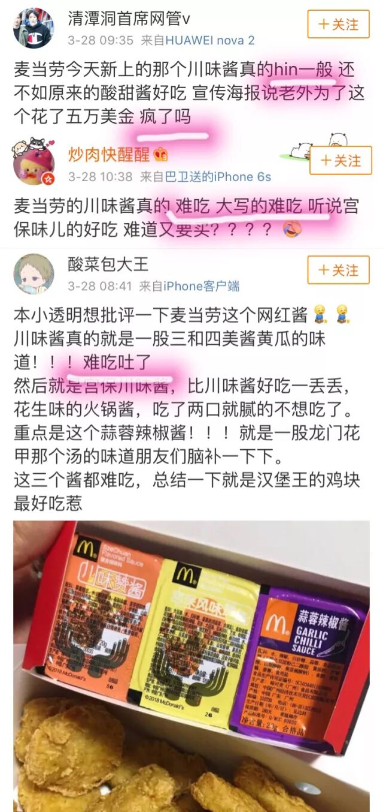 (原始链接: https://mmbiz.qpic.cn/mmbiz_jpg/XA8n2XaESnRzHrFibkVGBXdeib6CD1rTMNBEF6uqia64aLInRyldoWzo1OnSoqrmhTl2Rc9RH0I22Xxt7iciaeewnEg/640?wx_fmt=jpeg)
- 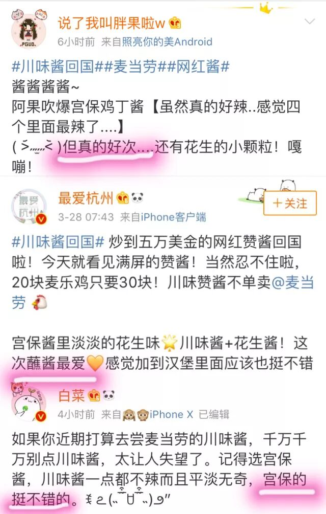 (原始链接: https://mmbiz.qpic.cn/mmbiz_jpg/XA8n2XaESnRzHrFibkVGBXdeib6CD1rTMNia4ibOUNbmxnHlzEMhjZzaFaF0RTHziaNPOBEGYUrCKGOlfIGib11flxHg/640?wx_fmt=jpeg)
- 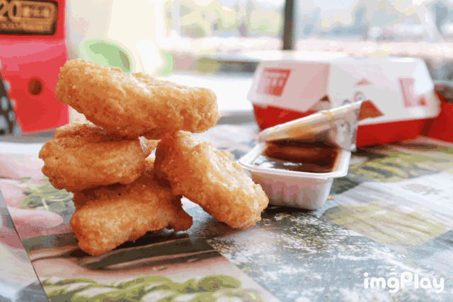 (原始链接: https://mmbiz.qpic.cn/mmbiz_gif/XA8n2XaESnRzHrFibkVGBXdeib6CD1rTMNoc8lgUAjPwouJk4wibBu72NyibeK9icYak3mSeNtAfPEZNIo8b6lDnMOg/640?wx_fmt=gif)
- 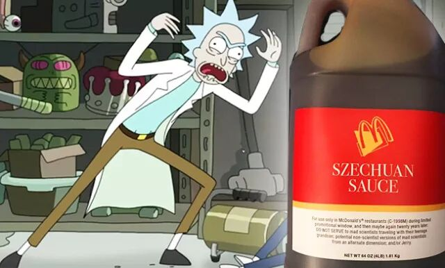 (原始链接: https://mmbiz.qpic.cn/mmbiz_jpg/XA8n2XaESnRzHrFibkVGBXdeib6CD1rTMNf4GbpibZjR11CnWugm5bKKqibavb43dyows36ibajicHjzuNlbq8Saibpvw/640?wx_fmt=jpeg)
- 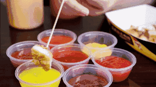 (原始链接: https://mmbiz.qpic.cn/mmbiz_gif/XA8n2XaESnRzHrFibkVGBXdeib6CD1rTMNXdqBgCsicCw0o1oBiakkL6RYFh0QCbkMibrTV1pZEAMCk1oBWSpvUFveA/640?wx_fmt=gif)
-  (原始链接: https://mmbiz.qpic.cn/mmbiz_jpg/XA8n2XaESnRzHrFibkVGBXdeib6CD1rTMN5pkib740DoHaO54TZJAgXsLwiatlxW7mpWTibJgb4rtN1nYFh2FgMCKDw/640?wx_fmt=jpeg)
-  (原始链接: https://mmbiz.qpic.cn/mmbiz_png/XA8n2XaESnRzHrFibkVGBXdeib6CD1rTMNHa8iaWIPAH4RoB0NshbD0wCuPkAExV1jZxswtRyXNcTy7vZ8w8Kq4QQ/640?wx_fmt=png)
