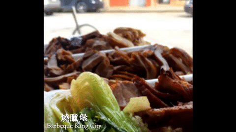
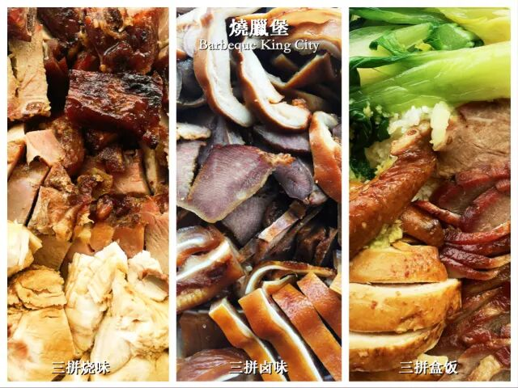
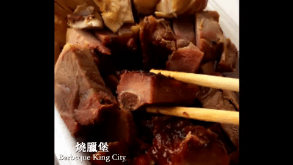
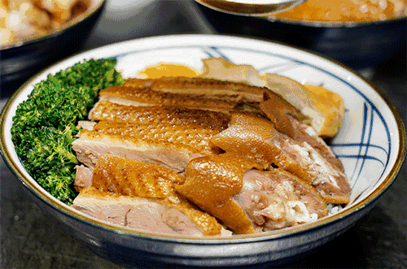

# 无标题

**链接地址:** http://mp.weixin.qq.com/s?__biz=MzI0MDQ0ODI0Ng==&mid=2247485676&idx=1&sn=319e3801f8834cbd3ef040c04cac4dd6&chksm=e91bef75de6c6663adeab14a5c07dbee08151d391a99097b0c206a368c82f6a028643fc6502b&mpshare=1&scene=2&srcid=0403A1QuppGXHIhpzupz8vfj#rd
**作者:** Nina@YEG
**获取时间:** 2025/8/28 22:09:02
**图片数量:** 16

---

## 原始HTML内容

<section style="background-color: rgb(255, 255, 255);box-sizing: border-box;"><section class="Powered-by-XIUMI V5" style="box-sizing: border-box;" powered-by="xiumi.us"><section class="" style="text-align: center;margin-top: 10px;margin-bottom: 10px;box-sizing: border-box;"><section class="" style="max-width: 100%;vertical-align: middle;display: inline-block;overflow: hidden !important;box-sizing: border-box;"></section></section></section><section class="Powered-by-XIUMI V5" style="box-sizing: border-box;" powered-by="xiumi.us"><section class="" style="margin-right: 0%;margin-bottom: 10px;margin-left: 0%;box-sizing: border-box;"><section class="" style="display: inline-block;width: 100%;vertical-align: top;padding: 20px 10px;box-shadow: rgb(0, 0, 0) 0px 0px 0px inset;box-sizing: border-box;"><section class="Powered-by-XIUMI V5" style="box-sizing: border-box;" powered-by="xiumi.us"><section class="" style="margin: 10px 0%;transform: translate3d(0px, 0px, 0px);-webkit-transform: translate3d(0px, 0px, 0px);-moz-transform: translate3d(0px, 0px, 0px);-o-transform: translate3d(0px, 0px, 0px);text-align: center;box-sizing: border-box;"><section class="" style="text-align: left;font-size: 14px;color: rgb(152, 157, 107);line-height: 2;letter-spacing: 2px;box-sizing: border-box;">
还记得周星驰著名电影《食神》中那碗“吃得人感动流泪”的“黯然销魂饭”吗？没错！那便是叉烧饭了。对于很多出生成长在南部沿海省份的同学们来说，烧腊味是打娘胎里开始就闻着无比熟悉的味道。而对那些不是闻着烧腊长大的同学们来说，在埃德蒙顿这样中餐文化的城市待久了，相信也绝不会对这经典的粤式风味感到陌生。
</section></section></section></section></section></section><section class="Powered-by-XIUMI V5" style="box-sizing: border-box;" powered-by="xiumi.us"><section class="" style="text-align: center;margin-top: 10px;margin-bottom: 10px;box-sizing: border-box;"><section class="" style="max-width: 100%;vertical-align: middle;display: inline-block;overflow: hidden !important;box-sizing: border-box;"></section></section></section><section class="Powered-by-XIUMI V5" style="box-sizing: border-box;" powered-by="xiumi.us"><section class="" style="margin-right: 0%;margin-bottom: 10px;margin-left: 0%;box-sizing: border-box;"><section class="" style="display: inline-block;width: 100%;vertical-align: top;padding: 20px 10px;box-shadow: rgb(0, 0, 0) 0px 0px 0px inset;box-sizing: border-box;"><section class="Powered-by-XIUMI V5" style="box-sizing: border-box;" powered-by="xiumi.us"><section class="" style="margin: 10px 0%;transform: translate3d(0px, 0px, 0px);-webkit-transform: translate3d(0px, 0px, 0px);-moz-transform: translate3d(0px, 0px, 0px);-o-transform: translate3d(0px, 0px, 0px);text-align: center;box-sizing: border-box;"><section class="" style="text-align: left;font-size: 14px;color: rgb(152, 157, 107);line-height: 2;letter-spacing: 2px;box-sizing: border-box;">
对于烧腊的口味，每家店都有着自己独特的制作工艺和调味秘方。但你要问小编最喜欢的烧腊店是哪家？还是位于唐人街这家烧腊堡。别看这家店门面朴素狭小，名气可是很大的嘞！你要是问老屯儿民们哪家烧腊好，多半会跟你说烧腊堡。
</section></section></section></section></section></section><section class="Powered-by-XIUMI V5" style="box-sizing: border-box;" powered-by="xiumi.us"><section class="" style="text-align: center;margin-top: 10px;margin-bottom: 10px;box-sizing: border-box;"><section class="" style="max-width: 100%;vertical-align: middle;display: inline-block;overflow: hidden !important;box-sizing: border-box;"></section></section></section><section class="Powered-by-XIUMI V5" style="box-sizing: border-box;" powered-by="xiumi.us"><section class="" style="margin-right: 0%;margin-bottom: 10px;margin-left: 0%;box-sizing: border-box;"><section class="" style="display: inline-block;width: 100%;vertical-align: top;padding: 20px 10px;box-shadow: rgb(0, 0, 0) 0px 0px 0px inset;box-sizing: border-box;"><section class="Powered-by-XIUMI V5" style="box-sizing: border-box;" powered-by="xiumi.us"><section class="" style="margin: 10px 0%;transform: translate3d(0px, 0px, 0px);-webkit-transform: translate3d(0px, 0px, 0px);-moz-transform: translate3d(0px, 0px, 0px);-o-transform: translate3d(0px, 0px, 0px);text-align: center;box-sizing: border-box;"><section class="" style="text-align: left;font-size: 14px;color: rgb(152, 157, 107);line-height: 2;letter-spacing: 2px;box-sizing: border-box;">
站在烧腊堡取外卖的小一阵子功夫，陆续涌进来好几位购买烧腊的顾客。老板娘自豪地跟我说：“都是老顾客啦！吃惯了这家隔三差五的就来买一次。”作为一个几十年的老店会受到老一辈屯民的长期青睐并非没有道理，今天小编就给大家总结了<strong style="box-sizing: border-box;">六个你不能错过烧腊堡的理由</strong>！
</section></section></section></section></section></section><section class="Powered-by-XIUMI V5" style="box-sizing: border-box;" powered-by="xiumi.us"><section class="" style="margin-right: 0%;margin-bottom: -10px;margin-left: 0%;box-sizing: border-box;"><section class="" style="text-align: center;font-size: 18px;box-sizing: border-box;">
<strong style="box-sizing: border-box;">一.设备齐全</strong>
</section></section></section><section class="Powered-by-XIUMI V5" style="box-sizing: border-box;" powered-by="xiumi.us"><section class="" style="text-align: center;box-sizing: border-box;"><section class="" style="display: inline-block;vertical-align: middle;width: 20%;box-sizing: border-box;"><section class="Powered-by-XIUMI V5" style="box-sizing: border-box;" powered-by="xiumi.us"><section class="" style="margin-right: 0%;margin-left: 0%;box-sizing: border-box;"><section class="" style="max-width: 100%;vertical-align: middle;display: inline-block;width: 100%;overflow: hidden !important;box-sizing: border-box;"><svg xmlns="http://www.w3.org/2000/svg" x="0px" y="0px" viewBox="0 0 294.7 95.1" style="vertical-align: middle;max-width: 100%;box-sizing: border-box;" width="100%"><g style="box-sizing: border-box;"><path d="M53.6,95.1c2.2-0.2,4.4-0.3,6.7-0.5c12.2-1.1,24-3.6,34.6-10.1c5-3.1,9.5-6.7,14.3-10.1c3.7-2.6,7.3-5.3,11-7.8   c4.8-3.3,10.2-5.1,15.9-6c12.3-2,23.9,0.5,35.1,5.4c4.7,2.1,9.3,4.5,14,6.4c6.8,2.8,14,4.3,21.5,4.4c10.1,0.1,19.3-2.9,27.7-8.2   c0.1,0,0.1-0.1,0.2-0.3c-0.2,0-0.3,0-0.5,0.1C220,74.1,206,73,192.3,66.7c-5.3-2.4-9.9-5.8-14.7-9c-7.5-5.1-15.3-9.6-23.9-12.5   c-11.8-3.9-23.3-3.1-34.8,1.3c-7.4,2.8-14.5,6.5-21.4,10.3c-6.4,3.5-13,6.8-19.8,9.6c-10.9,4.5-21.7,4.9-33.1,1.9   C31.2,64.7,21.8,50.9,26,35c4.1-15.3,16.5-20.3,27.3-19.9C57.5,15.3,61.4,16,65,18c6.2,3.5,9.3,9.3,10.6,16   c0.9,4.7-0.2,9.1-3.3,12.8c-1.5,1.8-3.3,3.3-5.6,3.9c-4.2,1-8.3-1.9-9.3-6.4c-0.4-2-0.2-4,0.6-5.8c0.7-1.6,1.4-3.1,2.2-4.8   c-0.3,0.1-0.6,0.1-0.9,0.2c-2.3,1.2-4.8,2.1-6.9,3.6c-3.8,2.5-5.3,6-4.2,10.7C50,56,55.5,62.1,63.4,63.2c8.2,1.2,15.2-1.6,20.4-8   c3.7-4.6,3.7-10,2-15.4c-0.7-2.1-0.5-3.4,0.8-5.1c2.6-3.5,4.3-7.4,4.7-11.8c0.6-7.6-2.6-13.2-8.8-17.3c-6.5-4.3-13.5-5.2-21-3.6   C57,2.8,52.9,4.4,49,6.5c-0.5,0.2-0.9,0.5-1.4,0.7c-3.1-3.3-6.9-5.5-11.3-6.5c-6.7-1.6-13.2-0.5-18.9,3.1   c-4.8,3.1-7.7,7.9-8.9,13.6c-1,4.9-0.5,9.7,1.2,14.4c0.3,0.7,0.1,1.2-0.4,1.8c-2.1,2.7-4.3,5.3-6,8.2C-0.8,49-1.1,56.5,2.9,63.8   c8.2,14.7,20,25.1,36.3,29.9c2.2,0.7,4.6,0.8,6.9,1.2c0.4,0.1,0.8,0.2,1.1,0.2C49.4,95.1,51.5,95.1,53.6,95.1z" fill="rgb(0,0,0)" style="box-sizing: border-box;"></path><path d="M294.5,57.2c-1.2,0.9-2.3,1.7-3.5,2.5c-2.5,1.7-5.1,3.1-8.1,3.3c-1.6,0.1-3.3,0-4.8-0.5c-4.8-1.7-9.4-3.7-14.1-5.7   c-4.4-1.8-8.9-3.3-13.8-3.2c-2.3,0.1-4.6,0.4-6.9,0.8c-4.2,0.7-5.5,0.4-8.7-2.3c-2.7,6.3-8.1,8.4-14.3,9.6   c-6,1.1-11.4-0.3-16.5-3.4c-6.5-4-8.1-10.2-6.1-16.9c0.9-3,3.3-4.8,6.1-6.2c6.8-3.3,13-0.1,16.3,4.8c1.2,1.8,1.5,3.8,0.3,5.7   c-0.3,0.5-0.7,0.8-1.4,0.5c-0.7-0.2-1.6-0.3-2.4-0.4c-2.6-0.1-4.3,1.2-4.9,3.5c-0.5,2.1,0.6,4.6,2.7,5.5c3.4,1.5,6.7,0.8,9.6-1.3   c2.6-1.9,3.2-4.9,3.6-7.8c1.3-10.8-9-19.4-18.9-18.7c-8.6,0.6-16.7,6.7-18.5,14.5c-2.1,9,2.6,19.1,11,23.5c5.9,3,12.1,3.2,18.5,2.1   c3-0.5,5.8-1.5,8.5-2.8c5.4-2.6,10.8-4.8,16.7-6c3.2-0.7,6.2-0.1,9.2,0.9c5.6,2,11.1,4,16.7,5.9c3.4,1.2,6.9,1.9,10.6,1.9   c5.5-0.1,11.5-4.4,13.3-9.6C294.6,57.4,294.6,57.3,294.5,57.2z" fill="rgb(0,0,0)" style="box-sizing: border-box;"></path></g></svg></section></section></section></section><section class="" style="display: inline-block;vertical-align: middle;width: 20%;box-sizing: border-box;"><section class="Powered-by-XIUMI V5" style="box-sizing: border-box;" powered-by="xiumi.us"><section class="" style="margin-right: 0%;margin-left: 0%;box-sizing: border-box;"><section class="" style="max-width: 100%;vertical-align: middle;display: inline-block;width: 100%;overflow: hidden !important;box-sizing: border-box;"><svg xmlns="http://www.w3.org/2000/svg" x="0px" y="0px" viewBox="0 0 294.7 95.1" style="vertical-align: middle;max-width: 100%;box-sizing: border-box;" width="100%"><g style="box-sizing: border-box;"><path d="M241.1,95.1c-2.2-0.2-4.4-0.3-6.7-0.5c-12.2-1.1-24.1-3.6-34.6-10.1c-5-3.1-9.5-6.7-14.3-10.1c-3.7-2.6-7.3-5.3-11.1-7.8   c-4.8-3.3-10.2-5.1-15.9-6c-12.3-2-23.9,0.5-35.1,5.4c-4.7,2.1-9.3,4.5-14,6.4c-6.9,2.8-14,4.3-21.5,4.4   c-10.1,0.1-19.3-2.9-27.8-8.2c-0.1,0-0.1-0.1-0.2-0.3c0.2,0,0.3,0,0.5,0.1c14.2,5.7,28.1,4.6,41.8-1.6c5.3-2.4,9.9-5.8,14.7-9   c7.5-5.1,15.3-9.6,23.9-12.5c11.8-3.9,23.4-3.1,34.8,1.3c7.5,2.8,14.5,6.5,21.5,10.3c6.4,3.5,13,6.8,19.8,9.6   c10.9,4.5,21.7,4.9,33.2,1.9c13.3-3.6,22.7-17.4,18.5-33.2c-4.1-15.3-16.5-20.3-27.4-19.9c-4.1,0.1-8.1,0.8-11.6,2.9   c-6.2,3.5-9.3,9.3-10.6,16c-0.9,4.7,0.2,9.1,3.3,12.8c1.5,1.8,3.3,3.3,5.6,3.9c4.2,1,8.3-1.9,9.3-6.4c0.4-2,0.2-4-0.6-5.8   c-0.7-1.6-1.4-3.1-2.2-4.8c0.3,0.1,0.6,0.1,0.9,0.2c2.3,1.2,4.8,2.1,6.9,3.6c3.8,2.5,5.3,6,4.2,10.7c-1.8,7.9-7.3,13.9-15.1,15.1   c-8.2,1.2-15.2-1.6-20.4-8c-3.7-4.6-3.7-10-2-15.4c0.7-2.1,0.5-3.4-0.8-5.1c-2.6-3.5-4.3-7.4-4.7-11.8c-0.6-7.6,2.6-13.2,8.8-17.3   c6.5-4.3,13.5-5.2,21-3.6c4.4,0.9,8.5,2.5,12.4,4.6c0.5,0.2,0.9,0.5,1.4,0.7c3.1-3.3,6.9-5.5,11.3-6.5c6.7-1.6,13.2-0.5,18.9,3.1   c4.8,3.1,7.7,7.9,8.9,13.6c1,4.9,0.5,9.7-1.2,14.4c-0.3,0.7-0.1,1.2,0.4,1.8c2.1,2.7,4.3,5.3,6,8.2c4.1,7.2,4.5,14.7,0.4,22.1   c-8.2,14.7-20,25.1-36.3,29.9c-2.2,0.7-4.6,0.8-6.9,1.2c-0.4,0.1-0.8,0.2-1.2,0.2C245.3,95.1,243.2,95.1,241.1,95.1z" fill="rgb(0,0,0)" style="box-sizing: border-box;"></path><path d="M0.1,57.2c1.2,0.9,2.3,1.7,3.5,2.5c2.5,1.7,5.1,3.1,8.1,3.3c1.6,0.1,3.3,0,4.8-0.5c4.8-1.7,9.4-3.7,14.1-5.7   c4.4-1.8,8.9-3.3,13.8-3.2c2.3,0.1,4.6,0.4,6.9,0.8c4.2,0.7,5.5,0.4,8.7-2.3c2.7,6.3,8.2,8.4,14.3,9.6c6,1.1,11.4-0.3,16.5-3.4   c6.5-4,8.2-10.2,6.1-16.9c-0.9-3-3.3-4.8-6.1-6.2c-6.8-3.3-13-0.1-16.3,4.8c-1.2,1.8-1.5,3.8-0.3,5.7c0.3,0.5,0.7,0.8,1.4,0.5   c0.7-0.2,1.6-0.3,2.4-0.4c2.6-0.1,4.3,1.2,4.9,3.5c0.5,2.1-0.6,4.6-2.7,5.5c-3.4,1.5-6.7,0.8-9.6-1.3c-2.6-1.9-3.2-4.9-3.6-7.8   c-1.3-10.8,9-19.4,19-18.7c8.6,0.6,16.7,6.7,18.5,14.5c2.1,9-2.6,19.1-11,23.5c-5.9,3-12.1,3.2-18.5,2.1c-3-0.5-5.8-1.5-8.5-2.8   c-5.4-2.6-10.9-4.8-16.7-6c-3.2-0.7-6.2-0.1-9.2,0.9c-5.6,2-11.1,4-16.7,5.9c-3.4,1.2-6.9,1.9-10.6,1.9C7.8,66.9,1.8,62.6,0,57.4   C0,57.4,0,57.3,0.1,57.2z" fill="rgb(0,0,0)" style="box-sizing: border-box;"></path></g></svg></section></section></section></section></section></section><section class="Powered-by-XIUMI V5" style="box-sizing: border-box;" powered-by="xiumi.us"><section class="" style="text-align: center;margin-top: 10px;margin-bottom: 10px;box-sizing: border-box;"><section class="" style="max-width: 100%;vertical-align: middle;display: inline-block;overflow: hidden !important;box-sizing: border-box;"></section></section></section><section class="Powered-by-XIUMI V5" style="box-sizing: border-box;" powered-by="xiumi.us"><section class="" style="margin-right: 0%;margin-bottom: 10px;margin-left: 0%;box-sizing: border-box;"><section class="" style="display: inline-block;width: 100%;vertical-align: top;padding: 20px 10px;box-shadow: rgb(0, 0, 0) 0px 0px 0px inset;box-sizing: border-box;"><section class="Powered-by-XIUMI V5" style="box-sizing: border-box;" powered-by="xiumi.us"><section class="" style="margin: 10px 0%;transform: translate3d(0px, 0px, 0px);-webkit-transform: translate3d(0px, 0px, 0px);-moz-transform: translate3d(0px, 0px, 0px);-o-transform: translate3d(0px, 0px, 0px);text-align: center;box-sizing: border-box;"><section class="" style="text-align: left;font-size: 14px;color: rgb(152, 157, 107);line-height: 2;letter-spacing: 2px;box-sizing: border-box;">
烧腊的工艺和设备都极其复杂，是一个耗费人力和空间的活儿。没有个十几年经验的师傅根本做不出品质优质的烧腊，所以能拥有自己烧腊部的饭店并不多。<strong style="box-sizing: border-box;">其实屯子里很多知名饭店的烧腊都是从烧腊堡进货的哦。</strong>
</section></section></section></section></section></section><section class="Powered-by-XIUMI V5" style="box-sizing: border-box;" powered-by="xiumi.us"><section class="" style="margin-right: 0%;margin-bottom: -10px;margin-left: 0%;box-sizing: border-box;"><section class="" style="text-align: center;font-size: 18px;box-sizing: border-box;">
<strong style="box-sizing: border-box;">二.品质新鲜 </strong>
</section></section></section><section class="Powered-by-XIUMI V5" style="box-sizing: border-box;" powered-by="xiumi.us"><section class="" style="text-align: center;box-sizing: border-box;"><section class="" style="display: inline-block;vertical-align: middle;width: 20%;box-sizing: border-box;"><section class="Powered-by-XIUMI V5" style="box-sizing: border-box;" powered-by="xiumi.us"><section class="" style="margin-right: 0%;margin-left: 0%;box-sizing: border-box;"><section class="" style="max-width: 100%;vertical-align: middle;display: inline-block;width: 100%;box-shadow: rgb(0, 0, 0) 0px 0px 0px;overflow: hidden !important;box-sizing: border-box;"><svg xmlns="http://www.w3.org/2000/svg" x="0px" y="0px" viewBox="0 0 294.7 95.1" style="vertical-align: middle;max-width: 100%;box-sizing: border-box;" width="100%"><g style="box-sizing: border-box;"><path d="M53.6,95.1c2.2-0.2,4.4-0.3,6.7-0.5c12.2-1.1,24-3.6,34.6-10.1c5-3.1,9.5-6.7,14.3-10.1c3.7-2.6,7.3-5.3,11-7.8   c4.8-3.3,10.2-5.1,15.9-6c12.3-2,23.9,0.5,35.1,5.4c4.7,2.1,9.3,4.5,14,6.4c6.8,2.8,14,4.3,21.5,4.4c10.1,0.1,19.3-2.9,27.7-8.2   c0.1,0,0.1-0.1,0.2-0.3c-0.2,0-0.3,0-0.5,0.1C220,74.1,206,73,192.3,66.7c-5.3-2.4-9.9-5.8-14.7-9c-7.5-5.1-15.3-9.6-23.9-12.5   c-11.8-3.9-23.3-3.1-34.8,1.3c-7.4,2.8-14.5,6.5-21.4,10.3c-6.4,3.5-13,6.8-19.8,9.6c-10.9,4.5-21.7,4.9-33.1,1.9   C31.2,64.7,21.8,50.9,26,35c4.1-15.3,16.5-20.3,27.3-19.9C57.5,15.3,61.4,16,65,18c6.2,3.5,9.3,9.3,10.6,16   c0.9,4.7-0.2,9.1-3.3,12.8c-1.5,1.8-3.3,3.3-5.6,3.9c-4.2,1-8.3-1.9-9.3-6.4c-0.4-2-0.2-4,0.6-5.8c0.7-1.6,1.4-3.1,2.2-4.8   c-0.3,0.1-0.6,0.1-0.9,0.2c-2.3,1.2-4.8,2.1-6.9,3.6c-3.8,2.5-5.3,6-4.2,10.7C50,56,55.5,62.1,63.4,63.2c8.2,1.2,15.2-1.6,20.4-8   c3.7-4.6,3.7-10,2-15.4c-0.7-2.1-0.5-3.4,0.8-5.1c2.6-3.5,4.3-7.4,4.7-11.8c0.6-7.6-2.6-13.2-8.8-17.3c-6.5-4.3-13.5-5.2-21-3.6   C57,2.8,52.9,4.4,49,6.5c-0.5,0.2-0.9,0.5-1.4,0.7c-3.1-3.3-6.9-5.5-11.3-6.5c-6.7-1.6-13.2-0.5-18.9,3.1   c-4.8,3.1-7.7,7.9-8.9,13.6c-1,4.9-0.5,9.7,1.2,14.4c0.3,0.7,0.1,1.2-0.4,1.8c-2.1,2.7-4.3,5.3-6,8.2C-0.8,49-1.1,56.5,2.9,63.8   c8.2,14.7,20,25.1,36.3,29.9c2.2,0.7,4.6,0.8,6.9,1.2c0.4,0.1,0.8,0.2,1.1,0.2C49.4,95.1,51.5,95.1,53.6,95.1z" fill="rgb(0,0,0)" style="box-sizing: border-box;"></path><path d="M294.5,57.2c-1.2,0.9-2.3,1.7-3.5,2.5c-2.5,1.7-5.1,3.1-8.1,3.3c-1.6,0.1-3.3,0-4.8-0.5c-4.8-1.7-9.4-3.7-14.1-5.7   c-4.4-1.8-8.9-3.3-13.8-3.2c-2.3,0.1-4.6,0.4-6.9,0.8c-4.2,0.7-5.5,0.4-8.7-2.3c-2.7,6.3-8.1,8.4-14.3,9.6   c-6,1.1-11.4-0.3-16.5-3.4c-6.5-4-8.1-10.2-6.1-16.9c0.9-3,3.3-4.8,6.1-6.2c6.8-3.3,13-0.1,16.3,4.8c1.2,1.8,1.5,3.8,0.3,5.7   c-0.3,0.5-0.7,0.8-1.4,0.5c-0.7-0.2-1.6-0.3-2.4-0.4c-2.6-0.1-4.3,1.2-4.9,3.5c-0.5,2.1,0.6,4.6,2.7,5.5c3.4,1.5,6.7,0.8,9.6-1.3   c2.6-1.9,3.2-4.9,3.6-7.8c1.3-10.8-9-19.4-18.9-18.7c-8.6,0.6-16.7,6.7-18.5,14.5c-2.1,9,2.6,19.1,11,23.5c5.9,3,12.1,3.2,18.5,2.1   c3-0.5,5.8-1.5,8.5-2.8c5.4-2.6,10.8-4.8,16.7-6c3.2-0.7,6.2-0.1,9.2,0.9c5.6,2,11.1,4,16.7,5.9c3.4,1.2,6.9,1.9,10.6,1.9   c5.5-0.1,11.5-4.4,13.3-9.6C294.6,57.4,294.6,57.3,294.5,57.2z" fill="rgb(0,0,0)" style="box-sizing: border-box;"></path></g></svg></section></section></section></section><section class="" style="display: inline-block;vertical-align: middle;width: 20%;box-sizing: border-box;"><section class="Powered-by-XIUMI V5" style="box-sizing: border-box;" powered-by="xiumi.us"><section class="" style="margin-right: 0%;margin-left: 0%;box-sizing: border-box;"><section class="" style="max-width: 100%;vertical-align: middle;display: inline-block;width: 100%;overflow: hidden !important;box-sizing: border-box;"><svg xmlns="http://www.w3.org/2000/svg" x="0px" y="0px" viewBox="0 0 294.7 95.1" style="vertical-align: middle;max-width: 100%;box-sizing: border-box;" width="100%"><g style="box-sizing: border-box;"><path d="M241.1,95.1c-2.2-0.2-4.4-0.3-6.7-0.5c-12.2-1.1-24.1-3.6-34.6-10.1c-5-3.1-9.5-6.7-14.3-10.1c-3.7-2.6-7.3-5.3-11.1-7.8   c-4.8-3.3-10.2-5.1-15.9-6c-12.3-2-23.9,0.5-35.1,5.4c-4.7,2.1-9.3,4.5-14,6.4c-6.9,2.8-14,4.3-21.5,4.4   c-10.1,0.1-19.3-2.9-27.8-8.2c-0.1,0-0.1-0.1-0.2-0.3c0.2,0,0.3,0,0.5,0.1c14.2,5.7,28.1,4.6,41.8-1.6c5.3-2.4,9.9-5.8,14.7-9   c7.5-5.1,15.3-9.6,23.9-12.5c11.8-3.9,23.4-3.1,34.8,1.3c7.5,2.8,14.5,6.5,21.5,10.3c6.4,3.5,13,6.8,19.8,9.6   c10.9,4.5,21.7,4.9,33.2,1.9c13.3-3.6,22.7-17.4,18.5-33.2c-4.1-15.3-16.5-20.3-27.4-19.9c-4.1,0.1-8.1,0.8-11.6,2.9   c-6.2,3.5-9.3,9.3-10.6,16c-0.9,4.7,0.2,9.1,3.3,12.8c1.5,1.8,3.3,3.3,5.6,3.9c4.2,1,8.3-1.9,9.3-6.4c0.4-2,0.2-4-0.6-5.8   c-0.7-1.6-1.4-3.1-2.2-4.8c0.3,0.1,0.6,0.1,0.9,0.2c2.3,1.2,4.8,2.1,6.9,3.6c3.8,2.5,5.3,6,4.2,10.7c-1.8,7.9-7.3,13.9-15.1,15.1   c-8.2,1.2-15.2-1.6-20.4-8c-3.7-4.6-3.7-10-2-15.4c0.7-2.1,0.5-3.4-0.8-5.1c-2.6-3.5-4.3-7.4-4.7-11.8c-0.6-7.6,2.6-13.2,8.8-17.3   c6.5-4.3,13.5-5.2,21-3.6c4.4,0.9,8.5,2.5,12.4,4.6c0.5,0.2,0.9,0.5,1.4,0.7c3.1-3.3,6.9-5.5,11.3-6.5c6.7-1.6,13.2-0.5,18.9,3.1   c4.8,3.1,7.7,7.9,8.9,13.6c1,4.9,0.5,9.7-1.2,14.4c-0.3,0.7-0.1,1.2,0.4,1.8c2.1,2.7,4.3,5.3,6,8.2c4.1,7.2,4.5,14.7,0.4,22.1   c-8.2,14.7-20,25.1-36.3,29.9c-2.2,0.7-4.6,0.8-6.9,1.2c-0.4,0.1-0.8,0.2-1.2,0.2C245.3,95.1,243.2,95.1,241.1,95.1z" fill="rgb(0,0,0)" style="box-sizing: border-box;"></path><path d="M0.1,57.2c1.2,0.9,2.3,1.7,3.5,2.5c2.5,1.7,5.1,3.1,8.1,3.3c1.6,0.1,3.3,0,4.8-0.5c4.8-1.7,9.4-3.7,14.1-5.7   c4.4-1.8,8.9-3.3,13.8-3.2c2.3,0.1,4.6,0.4,6.9,0.8c4.2,0.7,5.5,0.4,8.7-2.3c2.7,6.3,8.2,8.4,14.3,9.6c6,1.1,11.4-0.3,16.5-3.4   c6.5-4,8.2-10.2,6.1-16.9c-0.9-3-3.3-4.8-6.1-6.2c-6.8-3.3-13-0.1-16.3,4.8c-1.2,1.8-1.5,3.8-0.3,5.7c0.3,0.5,0.7,0.8,1.4,0.5   c0.7-0.2,1.6-0.3,2.4-0.4c2.6-0.1,4.3,1.2,4.9,3.5c0.5,2.1-0.6,4.6-2.7,5.5c-3.4,1.5-6.7,0.8-9.6-1.3c-2.6-1.9-3.2-4.9-3.6-7.8   c-1.3-10.8,9-19.4,19-18.7c8.6,0.6,16.7,6.7,18.5,14.5c2.1,9-2.6,19.1-11,23.5c-5.9,3-12.1,3.2-18.5,2.1c-3-0.5-5.8-1.5-8.5-2.8   c-5.4-2.6-10.9-4.8-16.7-6c-3.2-0.7-6.2-0.1-9.2,0.9c-5.6,2-11.1,4-16.7,5.9c-3.4,1.2-6.9,1.9-10.6,1.9C7.8,66.9,1.8,62.6,0,57.4   C0,57.4,0,57.3,0.1,57.2z" fill="rgb(0,0,0)" style="box-sizing: border-box;"></path></g></svg></section></section></section></section></section></section><section class="Powered-by-XIUMI V5" style="box-sizing: border-box;" powered-by="xiumi.us"><section class="" style="text-align: center;margin-top: 10px;margin-bottom: 10px;box-sizing: border-box;"><section class="" style="max-width: 100%;vertical-align: middle;display: inline-block;overflow: hidden !important;box-sizing: border-box;"></section></section></section><section class="Powered-by-XIUMI V5" style="box-sizing: border-box;" powered-by="xiumi.us"><section class="" style="margin-right: 0%;margin-bottom: 10px;margin-left: 0%;box-sizing: border-box;"><section class="" style="display: inline-block;width: 100%;vertical-align: top;padding: 20px 10px;box-shadow: rgb(0, 0, 0) 0px 0px 0px inset;box-sizing: border-box;"><section class="Powered-by-XIUMI V5" style="box-sizing: border-box;" powered-by="xiumi.us"><section class="" style="margin: 10px 0%;transform: translate3d(0px, 0px, 0px);-webkit-transform: translate3d(0px, 0px, 0px);-moz-transform: translate3d(0px, 0px, 0px);-o-transform: translate3d(0px, 0px, 0px);text-align: center;box-sizing: border-box;"><section class="" style="text-align: left;font-size: 14px;color: rgb(152, 157, 107);line-height: 2;letter-spacing: 2px;box-sizing: border-box;">
烧腊堡的烧腊坚持“<strong style="box-sizing: border-box;">现点现切</strong>”，因为只有这样鲜嫩的肉汁才不会随着时间而冷却流失，皮质的脆糯和肉质的柔嫩才能被最大限度的保存。拿到烧腊的同时老板娘一直嘱咐我要趁热早点吃。其实我站在柜台边看师傅动作利索地斩件时，口水都流了下来。而且根本不用担心他们会贩卖过期食品，好多枪手的烧物下午去晚了都会没货呢！
</section></section></section></section></section></section><section class="Powered-by-XIUMI V5" style="box-sizing: border-box;" powered-by="xiumi.us"><section class="" style="margin-right: 0%;margin-bottom: -10px;margin-left: 0%;box-sizing: border-box;"><section class="" style="text-align: center;font-size: 18px;box-sizing: border-box;">
<strong style="box-sizing: border-box;">三. 口味正宗 </strong>
</section></section></section><section class="Powered-by-XIUMI V5" style="box-sizing: border-box;" powered-by="xiumi.us"><section class="" style="text-align: center;box-sizing: border-box;"><section class="" style="display: inline-block;vertical-align: middle;width: 20%;box-sizing: border-box;"><section class="Powered-by-XIUMI V5" style="box-sizing: border-box;" powered-by="xiumi.us"><section class="" style="margin-right: 0%;margin-left: 0%;box-sizing: border-box;"><section class="" style="max-width: 100%;vertical-align: middle;display: inline-block;width: 100%;overflow: hidden !important;box-sizing: border-box;"><svg xmlns="http://www.w3.org/2000/svg" x="0px" y="0px" viewBox="0 0 294.7 95.1" style="vertical-align: middle;max-width: 100%;box-sizing: border-box;" width="100%"><g style="box-sizing: border-box;"><path d="M53.6,95.1c2.2-0.2,4.4-0.3,6.7-0.5c12.2-1.1,24-3.6,34.6-10.1c5-3.1,9.5-6.7,14.3-10.1c3.7-2.6,7.3-5.3,11-7.8   c4.8-3.3,10.2-5.1,15.9-6c12.3-2,23.9,0.5,35.1,5.4c4.7,2.1,9.3,4.5,14,6.4c6.8,2.8,14,4.3,21.5,4.4c10.1,0.1,19.3-2.9,27.7-8.2   c0.1,0,0.1-0.1,0.2-0.3c-0.2,0-0.3,0-0.5,0.1C220,74.1,206,73,192.3,66.7c-5.3-2.4-9.9-5.8-14.7-9c-7.5-5.1-15.3-9.6-23.9-12.5   c-11.8-3.9-23.3-3.1-34.8,1.3c-7.4,2.8-14.5,6.5-21.4,10.3c-6.4,3.5-13,6.8-19.8,9.6c-10.9,4.5-21.7,4.9-33.1,1.9   C31.2,64.7,21.8,50.9,26,35c4.1-15.3,16.5-20.3,27.3-19.9C57.5,15.3,61.4,16,65,18c6.2,3.5,9.3,9.3,10.6,16   c0.9,4.7-0.2,9.1-3.3,12.8c-1.5,1.8-3.3,3.3-5.6,3.9c-4.2,1-8.3-1.9-9.3-6.4c-0.4-2-0.2-4,0.6-5.8c0.7-1.6,1.4-3.1,2.2-4.8   c-0.3,0.1-0.6,0.1-0.9,0.2c-2.3,1.2-4.8,2.1-6.9,3.6c-3.8,2.5-5.3,6-4.2,10.7C50,56,55.5,62.1,63.4,63.2c8.2,1.2,15.2-1.6,20.4-8   c3.7-4.6,3.7-10,2-15.4c-0.7-2.1-0.5-3.4,0.8-5.1c2.6-3.5,4.3-7.4,4.7-11.8c0.6-7.6-2.6-13.2-8.8-17.3c-6.5-4.3-13.5-5.2-21-3.6   C57,2.8,52.9,4.4,49,6.5c-0.5,0.2-0.9,0.5-1.4,0.7c-3.1-3.3-6.9-5.5-11.3-6.5c-6.7-1.6-13.2-0.5-18.9,3.1   c-4.8,3.1-7.7,7.9-8.9,13.6c-1,4.9-0.5,9.7,1.2,14.4c0.3,0.7,0.1,1.2-0.4,1.8c-2.1,2.7-4.3,5.3-6,8.2C-0.8,49-1.1,56.5,2.9,63.8   c8.2,14.7,20,25.1,36.3,29.9c2.2,0.7,4.6,0.8,6.9,1.2c0.4,0.1,0.8,0.2,1.1,0.2C49.4,95.1,51.5,95.1,53.6,95.1z" fill="rgb(0,0,0)" style="box-sizing: border-box;"></path><path d="M294.5,57.2c-1.2,0.9-2.3,1.7-3.5,2.5c-2.5,1.7-5.1,3.1-8.1,3.3c-1.6,0.1-3.3,0-4.8-0.5c-4.8-1.7-9.4-3.7-14.1-5.7   c-4.4-1.8-8.9-3.3-13.8-3.2c-2.3,0.1-4.6,0.4-6.9,0.8c-4.2,0.7-5.5,0.4-8.7-2.3c-2.7,6.3-8.1,8.4-14.3,9.6   c-6,1.1-11.4-0.3-16.5-3.4c-6.5-4-8.1-10.2-6.1-16.9c0.9-3,3.3-4.8,6.1-6.2c6.8-3.3,13-0.1,16.3,4.8c1.2,1.8,1.5,3.8,0.3,5.7   c-0.3,0.5-0.7,0.8-1.4,0.5c-0.7-0.2-1.6-0.3-2.4-0.4c-2.6-0.1-4.3,1.2-4.9,3.5c-0.5,2.1,0.6,4.6,2.7,5.5c3.4,1.5,6.7,0.8,9.6-1.3   c2.6-1.9,3.2-4.9,3.6-7.8c1.3-10.8-9-19.4-18.9-18.7c-8.6,0.6-16.7,6.7-18.5,14.5c-2.1,9,2.6,19.1,11,23.5c5.9,3,12.1,3.2,18.5,2.1   c3-0.5,5.8-1.5,8.5-2.8c5.4-2.6,10.8-4.8,16.7-6c3.2-0.7,6.2-0.1,9.2,0.9c5.6,2,11.1,4,16.7,5.9c3.4,1.2,6.9,1.9,10.6,1.9   c5.5-0.1,11.5-4.4,13.3-9.6C294.6,57.4,294.6,57.3,294.5,57.2z" fill="rgb(0,0,0)" style="box-sizing: border-box;"></path></g></svg></section></section></section></section><section class="" style="display: inline-block;vertical-align: middle;width: 20%;box-sizing: border-box;"><section class="Powered-by-XIUMI V5" style="box-sizing: border-box;" powered-by="xiumi.us"><section class="" style="margin-right: 0%;margin-left: 0%;box-sizing: border-box;"><section class="" style="max-width: 100%;vertical-align: middle;display: inline-block;width: 100%;overflow: hidden !important;box-sizing: border-box;"><svg xmlns="http://www.w3.org/2000/svg" x="0px" y="0px" viewBox="0 0 294.7 95.1" style="vertical-align: middle;max-width: 100%;box-sizing: border-box;" width="100%"><g style="box-sizing: border-box;"><path d="M241.1,95.1c-2.2-0.2-4.4-0.3-6.7-0.5c-12.2-1.1-24.1-3.6-34.6-10.1c-5-3.1-9.5-6.7-14.3-10.1c-3.7-2.6-7.3-5.3-11.1-7.8   c-4.8-3.3-10.2-5.1-15.9-6c-12.3-2-23.9,0.5-35.1,5.4c-4.7,2.1-9.3,4.5-14,6.4c-6.9,2.8-14,4.3-21.5,4.4   c-10.1,0.1-19.3-2.9-27.8-8.2c-0.1,0-0.1-0.1-0.2-0.3c0.2,0,0.3,0,0.5,0.1c14.2,5.7,28.1,4.6,41.8-1.6c5.3-2.4,9.9-5.8,14.7-9   c7.5-5.1,15.3-9.6,23.9-12.5c11.8-3.9,23.4-3.1,34.8,1.3c7.5,2.8,14.5,6.5,21.5,10.3c6.4,3.5,13,6.8,19.8,9.6   c10.9,4.5,21.7,4.9,33.2,1.9c13.3-3.6,22.7-17.4,18.5-33.2c-4.1-15.3-16.5-20.3-27.4-19.9c-4.1,0.1-8.1,0.8-11.6,2.9   c-6.2,3.5-9.3,9.3-10.6,16c-0.9,4.7,0.2,9.1,3.3,12.8c1.5,1.8,3.3,3.3,5.6,3.9c4.2,1,8.3-1.9,9.3-6.4c0.4-2,0.2-4-0.6-5.8   c-0.7-1.6-1.4-3.1-2.2-4.8c0.3,0.1,0.6,0.1,0.9,0.2c2.3,1.2,4.8,2.1,6.9,3.6c3.8,2.5,5.3,6,4.2,10.7c-1.8,7.9-7.3,13.9-15.1,15.1   c-8.2,1.2-15.2-1.6-20.4-8c-3.7-4.6-3.7-10-2-15.4c0.7-2.1,0.5-3.4-0.8-5.1c-2.6-3.5-4.3-7.4-4.7-11.8c-0.6-7.6,2.6-13.2,8.8-17.3   c6.5-4.3,13.5-5.2,21-3.6c4.4,0.9,8.5,2.5,12.4,4.6c0.5,0.2,0.9,0.5,1.4,0.7c3.1-3.3,6.9-5.5,11.3-6.5c6.7-1.6,13.2-0.5,18.9,3.1   c4.8,3.1,7.7,7.9,8.9,13.6c1,4.9,0.5,9.7-1.2,14.4c-0.3,0.7-0.1,1.2,0.4,1.8c2.1,2.7,4.3,5.3,6,8.2c4.1,7.2,4.5,14.7,0.4,22.1   c-8.2,14.7-20,25.1-36.3,29.9c-2.2,0.7-4.6,0.8-6.9,1.2c-0.4,0.1-0.8,0.2-1.2,0.2C245.3,95.1,243.2,95.1,241.1,95.1z" fill="rgb(0,0,0)" style="box-sizing: border-box;"></path><path d="M0.1,57.2c1.2,0.9,2.3,1.7,3.5,2.5c2.5,1.7,5.1,3.1,8.1,3.3c1.6,0.1,3.3,0,4.8-0.5c4.8-1.7,9.4-3.7,14.1-5.7   c4.4-1.8,8.9-3.3,13.8-3.2c2.3,0.1,4.6,0.4,6.9,0.8c4.2,0.7,5.5,0.4,8.7-2.3c2.7,6.3,8.2,8.4,14.3,9.6c6,1.1,11.4-0.3,16.5-3.4   c6.5-4,8.2-10.2,6.1-16.9c-0.9-3-3.3-4.8-6.1-6.2c-6.8-3.3-13-0.1-16.3,4.8c-1.2,1.8-1.5,3.8-0.3,5.7c0.3,0.5,0.7,0.8,1.4,0.5   c0.7-0.2,1.6-0.3,2.4-0.4c2.6-0.1,4.3,1.2,4.9,3.5c0.5,2.1-0.6,4.6-2.7,5.5c-3.4,1.5-6.7,0.8-9.6-1.3c-2.6-1.9-3.2-4.9-3.6-7.8   c-1.3-10.8,9-19.4,19-18.7c8.6,0.6,16.7,6.7,18.5,14.5c2.1,9-2.6,19.1-11,23.5c-5.9,3-12.1,3.2-18.5,2.1c-3-0.5-5.8-1.5-8.5-2.8   c-5.4-2.6-10.9-4.8-16.7-6c-3.2-0.7-6.2-0.1-9.2,0.9c-5.6,2-11.1,4-16.7,5.9c-3.4,1.2-6.9,1.9-10.6,1.9C7.8,66.9,1.8,62.6,0,57.4   C0,57.4,0,57.3,0.1,57.2z" fill="rgb(0,0,0)" style="box-sizing: border-box;"></path></g></svg></section></section></section></section></section></section><section class="Powered-by-XIUMI V5" style="box-sizing: border-box;" powered-by="xiumi.us"><section class="" style="text-align: center;margin-top: 10px;margin-bottom: 10px;box-sizing: border-box;"><section class="" style="max-width: 100%;vertical-align: middle;display: inline-block;overflow: hidden !important;box-sizing: border-box;"></section></section></section><section class="Powered-by-XIUMI V5" style="box-sizing: border-box;" powered-by="xiumi.us"><section class="" style="margin-right: 0%;margin-bottom: 10px;margin-left: 0%;box-sizing: border-box;"><section class="" style="display: inline-block;width: 100%;vertical-align: top;padding: 20px 10px;box-shadow: rgb(0, 0, 0) 0px 0px 0px inset;box-sizing: border-box;"><section class="Powered-by-XIUMI V5" style="box-sizing: border-box;" powered-by="xiumi.us"><section class="" style="margin: 10px 0%;transform: translate3d(0px, 0px, 0px);-webkit-transform: translate3d(0px, 0px, 0px);-moz-transform: translate3d(0px, 0px, 0px);-o-transform: translate3d(0px, 0px, 0px);text-align: center;box-sizing: border-box;"><section class="" style="text-align: left;font-size: 14px;color: rgb(152, 157, 107);line-height: 2;letter-spacing: 2px;box-sizing: border-box;">
口味的正宗当然是老顾客们不断回购的首要原因。烧腊堡坚持使用独家秘方腌制，烧制和卤制自家精选食材。<strong style="box-sizing: border-box;">匠心独运的同时传承了最道地的港式烧味的经典</strong>。脆皮叉烧瘦而不柴甜咸适中；经典烧鸭汁水浓郁肥而不腻；卤水猪耳酱香咸糯清脆爽口……每一口咬下去扎实饱满的肉香弥漫唇齿之间，连我的香港朋友都称赞“真係正宗又好食！”
</section></section></section></section></section></section><section class="Powered-by-XIUMI V5" style="box-sizing: border-box;" powered-by="xiumi.us"><section class="" style="margin-right: 0%;margin-bottom: -10px;margin-left: 0%;box-sizing: border-box;"><section class="" style="text-align: center;font-size: 18px;box-sizing: border-box;">
<strong style="box-sizing: border-box;">四.快捷方便 </strong>
</section></section></section><section class="Powered-by-XIUMI V5" style="box-sizing: border-box;" powered-by="xiumi.us"><section class="" style="text-align: center;box-sizing: border-box;"><section class="" style="display: inline-block;vertical-align: middle;width: 20%;box-sizing: border-box;"><section class="Powered-by-XIUMI V5" style="box-sizing: border-box;" powered-by="xiumi.us"><section class="" style="margin-right: 0%;margin-left: 0%;box-sizing: border-box;"><section class="" style="max-width: 100%;vertical-align: middle;display: inline-block;width: 100%;overflow: hidden !important;box-sizing: border-box;"><svg xmlns="http://www.w3.org/2000/svg" x="0px" y="0px" viewBox="0 0 294.7 95.1" style="vertical-align: middle;max-width: 100%;box-sizing: border-box;" width="100%"><g style="box-sizing: border-box;"><path d="M53.6,95.1c2.2-0.2,4.4-0.3,6.7-0.5c12.2-1.1,24-3.6,34.6-10.1c5-3.1,9.5-6.7,14.3-10.1c3.7-2.6,7.3-5.3,11-7.8   c4.8-3.3,10.2-5.1,15.9-6c12.3-2,23.9,0.5,35.1,5.4c4.7,2.1,9.3,4.5,14,6.4c6.8,2.8,14,4.3,21.5,4.4c10.1,0.1,19.3-2.9,27.7-8.2   c0.1,0,0.1-0.1,0.2-0.3c-0.2,0-0.3,0-0.5,0.1C220,74.1,206,73,192.3,66.7c-5.3-2.4-9.9-5.8-14.7-9c-7.5-5.1-15.3-9.6-23.9-12.5   c-11.8-3.9-23.3-3.1-34.8,1.3c-7.4,2.8-14.5,6.5-21.4,10.3c-6.4,3.5-13,6.8-19.8,9.6c-10.9,4.5-21.7,4.9-33.1,1.9   C31.2,64.7,21.8,50.9,26,35c4.1-15.3,16.5-20.3,27.3-19.9C57.5,15.3,61.4,16,65,18c6.2,3.5,9.3,9.3,10.6,16   c0.9,4.7-0.2,9.1-3.3,12.8c-1.5,1.8-3.3,3.3-5.6,3.9c-4.2,1-8.3-1.9-9.3-6.4c-0.4-2-0.2-4,0.6-5.8c0.7-1.6,1.4-3.1,2.2-4.8   c-0.3,0.1-0.6,0.1-0.9,0.2c-2.3,1.2-4.8,2.1-6.9,3.6c-3.8,2.5-5.3,6-4.2,10.7C50,56,55.5,62.1,63.4,63.2c8.2,1.2,15.2-1.6,20.4-8   c3.7-4.6,3.7-10,2-15.4c-0.7-2.1-0.5-3.4,0.8-5.1c2.6-3.5,4.3-7.4,4.7-11.8c0.6-7.6-2.6-13.2-8.8-17.3c-6.5-4.3-13.5-5.2-21-3.6   C57,2.8,52.9,4.4,49,6.5c-0.5,0.2-0.9,0.5-1.4,0.7c-3.1-3.3-6.9-5.5-11.3-6.5c-6.7-1.6-13.2-0.5-18.9,3.1   c-4.8,3.1-7.7,7.9-8.9,13.6c-1,4.9-0.5,9.7,1.2,14.4c0.3,0.7,0.1,1.2-0.4,1.8c-2.1,2.7-4.3,5.3-6,8.2C-0.8,49-1.1,56.5,2.9,63.8   c8.2,14.7,20,25.1,36.3,29.9c2.2,0.7,4.6,0.8,6.9,1.2c0.4,0.1,0.8,0.2,1.1,0.2C49.4,95.1,51.5,95.1,53.6,95.1z" fill="rgb(0,0,0)" style="box-sizing: border-box;"></path><path d="M294.5,57.2c-1.2,0.9-2.3,1.7-3.5,2.5c-2.5,1.7-5.1,3.1-8.1,3.3c-1.6,0.1-3.3,0-4.8-0.5c-4.8-1.7-9.4-3.7-14.1-5.7   c-4.4-1.8-8.9-3.3-13.8-3.2c-2.3,0.1-4.6,0.4-6.9,0.8c-4.2,0.7-5.5,0.4-8.7-2.3c-2.7,6.3-8.1,8.4-14.3,9.6   c-6,1.1-11.4-0.3-16.5-3.4c-6.5-4-8.1-10.2-6.1-16.9c0.9-3,3.3-4.8,6.1-6.2c6.8-3.3,13-0.1,16.3,4.8c1.2,1.8,1.5,3.8,0.3,5.7   c-0.3,0.5-0.7,0.8-1.4,0.5c-0.7-0.2-1.6-0.3-2.4-0.4c-2.6-0.1-4.3,1.2-4.9,3.5c-0.5,2.1,0.6,4.6,2.7,5.5c3.4,1.5,6.7,0.8,9.6-1.3   c2.6-1.9,3.2-4.9,3.6-7.8c1.3-10.8-9-19.4-18.9-18.7c-8.6,0.6-16.7,6.7-18.5,14.5c-2.1,9,2.6,19.1,11,23.5c5.9,3,12.1,3.2,18.5,2.1   c3-0.5,5.8-1.5,8.5-2.8c5.4-2.6,10.8-4.8,16.7-6c3.2-0.7,6.2-0.1,9.2,0.9c5.6,2,11.1,4,16.7,5.9c3.4,1.2,6.9,1.9,10.6,1.9   c5.5-0.1,11.5-4.4,13.3-9.6C294.6,57.4,294.6,57.3,294.5,57.2z" fill="rgb(0,0,0)" style="box-sizing: border-box;"></path></g></svg></section></section></section></section><section class="" style="display: inline-block;vertical-align: middle;width: 20%;box-sizing: border-box;"><section class="Powered-by-XIUMI V5" style="box-sizing: border-box;" powered-by="xiumi.us"><section class="" style="margin-right: 0%;margin-left: 0%;box-sizing: border-box;"><section class="" style="max-width: 100%;vertical-align: middle;display: inline-block;width: 100%;overflow: hidden !important;box-sizing: border-box;"><svg xmlns="http://www.w3.org/2000/svg" x="0px" y="0px" viewBox="0 0 294.7 95.1" style="vertical-align: middle;max-width: 100%;box-sizing: border-box;" width="100%"><g style="box-sizing: border-box;"><path d="M241.1,95.1c-2.2-0.2-4.4-0.3-6.7-0.5c-12.2-1.1-24.1-3.6-34.6-10.1c-5-3.1-9.5-6.7-14.3-10.1c-3.7-2.6-7.3-5.3-11.1-7.8   c-4.8-3.3-10.2-5.1-15.9-6c-12.3-2-23.9,0.5-35.1,5.4c-4.7,2.1-9.3,4.5-14,6.4c-6.9,2.8-14,4.3-21.5,4.4   c-10.1,0.1-19.3-2.9-27.8-8.2c-0.1,0-0.1-0.1-0.2-0.3c0.2,0,0.3,0,0.5,0.1c14.2,5.7,28.1,4.6,41.8-1.6c5.3-2.4,9.9-5.8,14.7-9   c7.5-5.1,15.3-9.6,23.9-12.5c11.8-3.9,23.4-3.1,34.8,1.3c7.5,2.8,14.5,6.5,21.5,10.3c6.4,3.5,13,6.8,19.8,9.6   c10.9,4.5,21.7,4.9,33.2,1.9c13.3-3.6,22.7-17.4,18.5-33.2c-4.1-15.3-16.5-20.3-27.4-19.9c-4.1,0.1-8.1,0.8-11.6,2.9   c-6.2,3.5-9.3,9.3-10.6,16c-0.9,4.7,0.2,9.1,3.3,12.8c1.5,1.8,3.3,3.3,5.6,3.9c4.2,1,8.3-1.9,9.3-6.4c0.4-2,0.2-4-0.6-5.8   c-0.7-1.6-1.4-3.1-2.2-4.8c0.3,0.1,0.6,0.1,0.9,0.2c2.3,1.2,4.8,2.1,6.9,3.6c3.8,2.5,5.3,6,4.2,10.7c-1.8,7.9-7.3,13.9-15.1,15.1   c-8.2,1.2-15.2-1.6-20.4-8c-3.7-4.6-3.7-10-2-15.4c0.7-2.1,0.5-3.4-0.8-5.1c-2.6-3.5-4.3-7.4-4.7-11.8c-0.6-7.6,2.6-13.2,8.8-17.3   c6.5-4.3,13.5-5.2,21-3.6c4.4,0.9,8.5,2.5,12.4,4.6c0.5,0.2,0.9,0.5,1.4,0.7c3.1-3.3,6.9-5.5,11.3-6.5c6.7-1.6,13.2-0.5,18.9,3.1   c4.8,3.1,7.7,7.9,8.9,13.6c1,4.9,0.5,9.7-1.2,14.4c-0.3,0.7-0.1,1.2,0.4,1.8c2.1,2.7,4.3,5.3,6,8.2c4.1,7.2,4.5,14.7,0.4,22.1   c-8.2,14.7-20,25.1-36.3,29.9c-2.2,0.7-4.6,0.8-6.9,1.2c-0.4,0.1-0.8,0.2-1.2,0.2C245.3,95.1,243.2,95.1,241.1,95.1z" fill="rgb(0,0,0)" style="box-sizing: border-box;"></path><path d="M0.1,57.2c1.2,0.9,2.3,1.7,3.5,2.5c2.5,1.7,5.1,3.1,8.1,3.3c1.6,0.1,3.3,0,4.8-0.5c4.8-1.7,9.4-3.7,14.1-5.7   c4.4-1.8,8.9-3.3,13.8-3.2c2.3,0.1,4.6,0.4,6.9,0.8c4.2,0.7,5.5,0.4,8.7-2.3c2.7,6.3,8.2,8.4,14.3,9.6c6,1.1,11.4-0.3,16.5-3.4   c6.5-4,8.2-10.2,6.1-16.9c-0.9-3-3.3-4.8-6.1-6.2c-6.8-3.3-13-0.1-16.3,4.8c-1.2,1.8-1.5,3.8-0.3,5.7c0.3,0.5,0.7,0.8,1.4,0.5   c0.7-0.2,1.6-0.3,2.4-0.4c2.6-0.1,4.3,1.2,4.9,3.5c0.5,2.1-0.6,4.6-2.7,5.5c-3.4,1.5-6.7,0.8-9.6-1.3c-2.6-1.9-3.2-4.9-3.6-7.8   c-1.3-10.8,9-19.4,19-18.7c8.6,0.6,16.7,6.7,18.5,14.5c2.1,9-2.6,19.1-11,23.5c-5.9,3-12.1,3.2-18.5,2.1c-3-0.5-5.8-1.5-8.5-2.8   c-5.4-2.6-10.9-4.8-16.7-6c-3.2-0.7-6.2-0.1-9.2,0.9c-5.6,2-11.1,4-16.7,5.9c-3.4,1.2-6.9,1.9-10.6,1.9C7.8,66.9,1.8,62.6,0,57.4   C0,57.4,0,57.3,0.1,57.2z" fill="rgb(0,0,0)" style="box-sizing: border-box;"></path></g></svg></section></section></section></section></section></section><section class="Powered-by-XIUMI V5" style="box-sizing: border-box;" powered-by="xiumi.us"><section class="" style="text-align: center;margin-top: 10px;margin-bottom: 10px;box-sizing: border-box;"><section class="" style="max-width: 100%;vertical-align: middle;display: inline-block;overflow: hidden !important;box-sizing: border-box;"></section></section></section><section class="Powered-by-XIUMI V5" style="box-sizing: border-box;" powered-by="xiumi.us"><section class="" style="margin-right: 0%;margin-bottom: 10px;margin-left: 0%;box-sizing: border-box;"><section class="" style="display: inline-block;width: 100%;vertical-align: top;padding: 20px 10px;box-shadow: rgb(0, 0, 0) 0px 0px 0px inset;box-sizing: border-box;"><section class="Powered-by-XIUMI V5" style="box-sizing: border-box;" powered-by="xiumi.us"><section class="" style="margin: 10px 0%;transform: translate3d(0px, 0px, 0px);-webkit-transform: translate3d(0px, 0px, 0px);-moz-transform: translate3d(0px, 0px, 0px);-o-transform: translate3d(0px, 0px, 0px);text-align: center;box-sizing: border-box;"><section class="" style="text-align: left;font-size: 14px;color: rgb(152, 157, 107);line-height: 2;letter-spacing: 2px;box-sizing: border-box;">
烧腊堡位于市中心的唐人街区，无论是市区工作的上班族或是居住市区的学生党。下班下课后来购买一份心仪的餐点都是再方便不过的。
</section></section></section></section></section></section><section class="Powered-by-XIUMI V5" style="box-sizing: border-box;" powered-by="xiumi.us"><section class="" style="margin-right: 0%;margin-bottom: -10px;margin-left: 0%;box-sizing: border-box;"><section class="" style="text-align: center;font-size: 18px;box-sizing: border-box;">
<strong style="box-sizing: border-box;">五.经济实惠 </strong>
</section></section></section><section class="Powered-by-XIUMI V5" style="box-sizing: border-box;" powered-by="xiumi.us"><section class="" style="text-align: center;box-sizing: border-box;"><section class="" style="display: inline-block;vertical-align: middle;width: 20%;box-sizing: border-box;"><section class="Powered-by-XIUMI V5" style="box-sizing: border-box;" powered-by="xiumi.us"><section class="" style="margin-right: 0%;margin-left: 0%;box-sizing: border-box;"><section class="" style="max-width: 100%;vertical-align: middle;display: inline-block;width: 100%;overflow: hidden !important;box-sizing: border-box;"><svg xmlns="http://www.w3.org/2000/svg" x="0px" y="0px" viewBox="0 0 294.7 95.1" style="vertical-align: middle;max-width: 100%;box-sizing: border-box;" width="100%"><g style="box-sizing: border-box;"><path d="M53.6,95.1c2.2-0.2,4.4-0.3,6.7-0.5c12.2-1.1,24-3.6,34.6-10.1c5-3.1,9.5-6.7,14.3-10.1c3.7-2.6,7.3-5.3,11-7.8   c4.8-3.3,10.2-5.1,15.9-6c12.3-2,23.9,0.5,35.1,5.4c4.7,2.1,9.3,4.5,14,6.4c6.8,2.8,14,4.3,21.5,4.4c10.1,0.1,19.3-2.9,27.7-8.2   c0.1,0,0.1-0.1,0.2-0.3c-0.2,0-0.3,0-0.5,0.1C220,74.1,206,73,192.3,66.7c-5.3-2.4-9.9-5.8-14.7-9c-7.5-5.1-15.3-9.6-23.9-12.5   c-11.8-3.9-23.3-3.1-34.8,1.3c-7.4,2.8-14.5,6.5-21.4,10.3c-6.4,3.5-13,6.8-19.8,9.6c-10.9,4.5-21.7,4.9-33.1,1.9   C31.2,64.7,21.8,50.9,26,35c4.1-15.3,16.5-20.3,27.3-19.9C57.5,15.3,61.4,16,65,18c6.2,3.5,9.3,9.3,10.6,16   c0.9,4.7-0.2,9.1-3.3,12.8c-1.5,1.8-3.3,3.3-5.6,3.9c-4.2,1-8.3-1.9-9.3-6.4c-0.4-2-0.2-4,0.6-5.8c0.7-1.6,1.4-3.1,2.2-4.8   c-0.3,0.1-0.6,0.1-0.9,0.2c-2.3,1.2-4.8,2.1-6.9,3.6c-3.8,2.5-5.3,6-4.2,10.7C50,56,55.5,62.1,63.4,63.2c8.2,1.2,15.2-1.6,20.4-8   c3.7-4.6,3.7-10,2-15.4c-0.7-2.1-0.5-3.4,0.8-5.1c2.6-3.5,4.3-7.4,4.7-11.8c0.6-7.6-2.6-13.2-8.8-17.3c-6.5-4.3-13.5-5.2-21-3.6   C57,2.8,52.9,4.4,49,6.5c-0.5,0.2-0.9,0.5-1.4,0.7c-3.1-3.3-6.9-5.5-11.3-6.5c-6.7-1.6-13.2-0.5-18.9,3.1   c-4.8,3.1-7.7,7.9-8.9,13.6c-1,4.9-0.5,9.7,1.2,14.4c0.3,0.7,0.1,1.2-0.4,1.8c-2.1,2.7-4.3,5.3-6,8.2C-0.8,49-1.1,56.5,2.9,63.8   c8.2,14.7,20,25.1,36.3,29.9c2.2,0.7,4.6,0.8,6.9,1.2c0.4,0.1,0.8,0.2,1.1,0.2C49.4,95.1,51.5,95.1,53.6,95.1z" fill="rgb(0,0,0)" style="box-sizing: border-box;"></path><path d="M294.5,57.2c-1.2,0.9-2.3,1.7-3.5,2.5c-2.5,1.7-5.1,3.1-8.1,3.3c-1.6,0.1-3.3,0-4.8-0.5c-4.8-1.7-9.4-3.7-14.1-5.7   c-4.4-1.8-8.9-3.3-13.8-3.2c-2.3,0.1-4.6,0.4-6.9,0.8c-4.2,0.7-5.5,0.4-8.7-2.3c-2.7,6.3-8.1,8.4-14.3,9.6   c-6,1.1-11.4-0.3-16.5-3.4c-6.5-4-8.1-10.2-6.1-16.9c0.9-3,3.3-4.8,6.1-6.2c6.8-3.3,13-0.1,16.3,4.8c1.2,1.8,1.5,3.8,0.3,5.7   c-0.3,0.5-0.7,0.8-1.4,0.5c-0.7-0.2-1.6-0.3-2.4-0.4c-2.6-0.1-4.3,1.2-4.9,3.5c-0.5,2.1,0.6,4.6,2.7,5.5c3.4,1.5,6.7,0.8,9.6-1.3   c2.6-1.9,3.2-4.9,3.6-7.8c1.3-10.8-9-19.4-18.9-18.7c-8.6,0.6-16.7,6.7-18.5,14.5c-2.1,9,2.6,19.1,11,23.5c5.9,3,12.1,3.2,18.5,2.1   c3-0.5,5.8-1.5,8.5-2.8c5.4-2.6,10.8-4.8,16.7-6c3.2-0.7,6.2-0.1,9.2,0.9c5.6,2,11.1,4,16.7,5.9c3.4,1.2,6.9,1.9,10.6,1.9   c5.5-0.1,11.5-4.4,13.3-9.6C294.6,57.4,294.6,57.3,294.5,57.2z" fill="rgb(0,0,0)" style="box-sizing: border-box;"></path></g></svg></section></section></section></section><section class="" style="display: inline-block;vertical-align: middle;width: 20%;box-sizing: border-box;"><section class="Powered-by-XIUMI V5" style="box-sizing: border-box;" powered-by="xiumi.us"><section class="" style="margin-right: 0%;margin-left: 0%;box-sizing: border-box;"><section class="" style="max-width: 100%;vertical-align: middle;display: inline-block;width: 100%;overflow: hidden !important;box-sizing: border-box;"><svg xmlns="http://www.w3.org/2000/svg" x="0px" y="0px" viewBox="0 0 294.7 95.1" style="vertical-align: middle;max-width: 100%;box-sizing: border-box;" width="100%"><g style="box-sizing: border-box;"><path d="M241.1,95.1c-2.2-0.2-4.4-0.3-6.7-0.5c-12.2-1.1-24.1-3.6-34.6-10.1c-5-3.1-9.5-6.7-14.3-10.1c-3.7-2.6-7.3-5.3-11.1-7.8   c-4.8-3.3-10.2-5.1-15.9-6c-12.3-2-23.9,0.5-35.1,5.4c-4.7,2.1-9.3,4.5-14,6.4c-6.9,2.8-14,4.3-21.5,4.4   c-10.1,0.1-19.3-2.9-27.8-8.2c-0.1,0-0.1-0.1-0.2-0.3c0.2,0,0.3,0,0.5,0.1c14.2,5.7,28.1,4.6,41.8-1.6c5.3-2.4,9.9-5.8,14.7-9   c7.5-5.1,15.3-9.6,23.9-12.5c11.8-3.9,23.4-3.1,34.8,1.3c7.5,2.8,14.5,6.5,21.5,10.3c6.4,3.5,13,6.8,19.8,9.6   c10.9,4.5,21.7,4.9,33.2,1.9c13.3-3.6,22.7-17.4,18.5-33.2c-4.1-15.3-16.5-20.3-27.4-19.9c-4.1,0.1-8.1,0.8-11.6,2.9   c-6.2,3.5-9.3,9.3-10.6,16c-0.9,4.7,0.2,9.1,3.3,12.8c1.5,1.8,3.3,3.3,5.6,3.9c4.2,1,8.3-1.9,9.3-6.4c0.4-2,0.2-4-0.6-5.8   c-0.7-1.6-1.4-3.1-2.2-4.8c0.3,0.1,0.6,0.1,0.9,0.2c2.3,1.2,4.8,2.1,6.9,3.6c3.8,2.5,5.3,6,4.2,10.7c-1.8,7.9-7.3,13.9-15.1,15.1   c-8.2,1.2-15.2-1.6-20.4-8c-3.7-4.6-3.7-10-2-15.4c0.7-2.1,0.5-3.4-0.8-5.1c-2.6-3.5-4.3-7.4-4.7-11.8c-0.6-7.6,2.6-13.2,8.8-17.3   c6.5-4.3,13.5-5.2,21-3.6c4.4,0.9,8.5,2.5,12.4,4.6c0.5,0.2,0.9,0.5,1.4,0.7c3.1-3.3,6.9-5.5,11.3-6.5c6.7-1.6,13.2-0.5,18.9,3.1   c4.8,3.1,7.7,7.9,8.9,13.6c1,4.9,0.5,9.7-1.2,14.4c-0.3,0.7-0.1,1.2,0.4,1.8c2.1,2.7,4.3,5.3,6,8.2c4.1,7.2,4.5,14.7,0.4,22.1   c-8.2,14.7-20,25.1-36.3,29.9c-2.2,0.7-4.6,0.8-6.9,1.2c-0.4,0.1-0.8,0.2-1.2,0.2C245.3,95.1,243.2,95.1,241.1,95.1z" fill="rgb(0,0,0)" style="box-sizing: border-box;"></path><path d="M0.1,57.2c1.2,0.9,2.3,1.7,3.5,2.5c2.5,1.7,5.1,3.1,8.1,3.3c1.6,0.1,3.3,0,4.8-0.5c4.8-1.7,9.4-3.7,14.1-5.7   c4.4-1.8,8.9-3.3,13.8-3.2c2.3,0.1,4.6,0.4,6.9,0.8c4.2,0.7,5.5,0.4,8.7-2.3c2.7,6.3,8.2,8.4,14.3,9.6c6,1.1,11.4-0.3,16.5-3.4   c6.5-4,8.2-10.2,6.1-16.9c-0.9-3-3.3-4.8-6.1-6.2c-6.8-3.3-13-0.1-16.3,4.8c-1.2,1.8-1.5,3.8-0.3,5.7c0.3,0.5,0.7,0.8,1.4,0.5   c0.7-0.2,1.6-0.3,2.4-0.4c2.6-0.1,4.3,1.2,4.9,3.5c0.5,2.1-0.6,4.6-2.7,5.5c-3.4,1.5-6.7,0.8-9.6-1.3c-2.6-1.9-3.2-4.9-3.6-7.8   c-1.3-10.8,9-19.4,19-18.7c8.6,0.6,16.7,6.7,18.5,14.5c2.1,9-2.6,19.1-11,23.5c-5.9,3-12.1,3.2-18.5,2.1c-3-0.5-5.8-1.5-8.5-2.8   c-5.4-2.6-10.9-4.8-16.7-6c-3.2-0.7-6.2-0.1-9.2,0.9c-5.6,2-11.1,4-16.7,5.9c-3.4,1.2-6.9,1.9-10.6,1.9C7.8,66.9,1.8,62.6,0,57.4   C0,57.4,0,57.3,0.1,57.2z" fill="rgb(0,0,0)" style="box-sizing: border-box;"></path></g></svg></section></section></section></section></section></section><section class="Powered-by-XIUMI V5" style="box-sizing: border-box;" powered-by="xiumi.us"><section class="" style="text-align: center;margin-top: 10px;margin-bottom: 10px;box-sizing: border-box;"><section class="" style="max-width: 100%;vertical-align: middle;display: inline-block;overflow: hidden !important;box-sizing: border-box;"></section></section></section><section class="Powered-by-XIUMI V5" style="box-sizing: border-box;" powered-by="xiumi.us"><section class="" style="margin-right: 0%;margin-bottom: 10px;margin-left: 0%;box-sizing: border-box;"><section class="" style="display: inline-block;width: 100%;vertical-align: top;padding: 20px 10px;box-shadow: rgb(0, 0, 0) 0px 0px 0px inset;box-sizing: border-box;"><section class="Powered-by-XIUMI V5" style="box-sizing: border-box;" powered-by="xiumi.us"><section class="" style="margin: 10px 0%;transform: translate3d(0px, 0px, 0px);-webkit-transform: translate3d(0px, 0px, 0px);-moz-transform: translate3d(0px, 0px, 0px);-o-transform: translate3d(0px, 0px, 0px);text-align: center;box-sizing: border-box;"><section class="" style="text-align: left;font-size: 14px;color: rgb(152, 157, 107);line-height: 2;letter-spacing: 2px;box-sizing: border-box;">
烧腊堡最让我震惊的是其<strong style="box-sizing: border-box;">价格的实惠和分量的巨大</strong>。一份<strong style="box-sizing: border-box;">$9.5的三拼盒饭</strong>居然装到饭盒快要爆开合不上！我也是第一次见识了“图片仅供参考”，但实物比图片还要丰富实惠的例子。这对工薪阶层和外卖学生党来说真是再好不过的福利了。胃口小一点的人绝对是一顿吃不完的节奏呢！
</section></section></section></section></section></section><section class="Powered-by-XIUMI V5" style="box-sizing: border-box;" powered-by="xiumi.us"><section class="" style="margin-right: 0%;margin-bottom: -10px;margin-left: 0%;box-sizing: border-box;"><section class="" style="text-align: center;font-size: 18px;box-sizing: border-box;">
<strong style="box-sizing: border-box;">六.品种繁多</strong>
</section></section></section><section class="Powered-by-XIUMI V5" style="box-sizing: border-box;" powered-by="xiumi.us"><section class="" style="text-align: center;box-sizing: border-box;"><section class="" style="display: inline-block;vertical-align: middle;width: 20%;box-sizing: border-box;"><section class="Powered-by-XIUMI V5" style="box-sizing: border-box;" powered-by="xiumi.us"><section class="" style="margin-right: 0%;margin-left: 0%;box-sizing: border-box;"><section class="" style="max-width: 100%;vertical-align: middle;display: inline-block;width: 100%;overflow: hidden !important;box-sizing: border-box;"><svg xmlns="http://www.w3.org/2000/svg" x="0px" y="0px" viewBox="0 0 294.7 95.1" style="vertical-align: middle;max-width: 100%;box-sizing: border-box;" width="100%"><g style="box-sizing: border-box;"><path d="M53.6,95.1c2.2-0.2,4.4-0.3,6.7-0.5c12.2-1.1,24-3.6,34.6-10.1c5-3.1,9.5-6.7,14.3-10.1c3.7-2.6,7.3-5.3,11-7.8   c4.8-3.3,10.2-5.1,15.9-6c12.3-2,23.9,0.5,35.1,5.4c4.7,2.1,9.3,4.5,14,6.4c6.8,2.8,14,4.3,21.5,4.4c10.1,0.1,19.3-2.9,27.7-8.2   c0.1,0,0.1-0.1,0.2-0.3c-0.2,0-0.3,0-0.5,0.1C220,74.1,206,73,192.3,66.7c-5.3-2.4-9.9-5.8-14.7-9c-7.5-5.1-15.3-9.6-23.9-12.5   c-11.8-3.9-23.3-3.1-34.8,1.3c-7.4,2.8-14.5,6.5-21.4,10.3c-6.4,3.5-13,6.8-19.8,9.6c-10.9,4.5-21.7,4.9-33.1,1.9   C31.2,64.7,21.8,50.9,26,35c4.1-15.3,16.5-20.3,27.3-19.9C57.5,15.3,61.4,16,65,18c6.2,3.5,9.3,9.3,10.6,16   c0.9,4.7-0.2,9.1-3.3,12.8c-1.5,1.8-3.3,3.3-5.6,3.9c-4.2,1-8.3-1.9-9.3-6.4c-0.4-2-0.2-4,0.6-5.8c0.7-1.6,1.4-3.1,2.2-4.8   c-0.3,0.1-0.6,0.1-0.9,0.2c-2.3,1.2-4.8,2.1-6.9,3.6c-3.8,2.5-5.3,6-4.2,10.7C50,56,55.5,62.1,63.4,63.2c8.2,1.2,15.2-1.6,20.4-8   c3.7-4.6,3.7-10,2-15.4c-0.7-2.1-0.5-3.4,0.8-5.1c2.6-3.5,4.3-7.4,4.7-11.8c0.6-7.6-2.6-13.2-8.8-17.3c-6.5-4.3-13.5-5.2-21-3.6   C57,2.8,52.9,4.4,49,6.5c-0.5,0.2-0.9,0.5-1.4,0.7c-3.1-3.3-6.9-5.5-11.3-6.5c-6.7-1.6-13.2-0.5-18.9,3.1   c-4.8,3.1-7.7,7.9-8.9,13.6c-1,4.9-0.5,9.7,1.2,14.4c0.3,0.7,0.1,1.2-0.4,1.8c-2.1,2.7-4.3,5.3-6,8.2C-0.8,49-1.1,56.5,2.9,63.8   c8.2,14.7,20,25.1,36.3,29.9c2.2,0.7,4.6,0.8,6.9,1.2c0.4,0.1,0.8,0.2,1.1,0.2C49.4,95.1,51.5,95.1,53.6,95.1z" fill="rgb(0,0,0)" style="box-sizing: border-box;"></path><path d="M294.5,57.2c-1.2,0.9-2.3,1.7-3.5,2.5c-2.5,1.7-5.1,3.1-8.1,3.3c-1.6,0.1-3.3,0-4.8-0.5c-4.8-1.7-9.4-3.7-14.1-5.7   c-4.4-1.8-8.9-3.3-13.8-3.2c-2.3,0.1-4.6,0.4-6.9,0.8c-4.2,0.7-5.5,0.4-8.7-2.3c-2.7,6.3-8.1,8.4-14.3,9.6   c-6,1.1-11.4-0.3-16.5-3.4c-6.5-4-8.1-10.2-6.1-16.9c0.9-3,3.3-4.8,6.1-6.2c6.8-3.3,13-0.1,16.3,4.8c1.2,1.8,1.5,3.8,0.3,5.7   c-0.3,0.5-0.7,0.8-1.4,0.5c-0.7-0.2-1.6-0.3-2.4-0.4c-2.6-0.1-4.3,1.2-4.9,3.5c-0.5,2.1,0.6,4.6,2.7,5.5c3.4,1.5,6.7,0.8,9.6-1.3   c2.6-1.9,3.2-4.9,3.6-7.8c1.3-10.8-9-19.4-18.9-18.7c-8.6,0.6-16.7,6.7-18.5,14.5c-2.1,9,2.6,19.1,11,23.5c5.9,3,12.1,3.2,18.5,2.1   c3-0.5,5.8-1.5,8.5-2.8c5.4-2.6,10.8-4.8,16.7-6c3.2-0.7,6.2-0.1,9.2,0.9c5.6,2,11.1,4,16.7,5.9c3.4,1.2,6.9,1.9,10.6,1.9   c5.5-0.1,11.5-4.4,13.3-9.6C294.6,57.4,294.6,57.3,294.5,57.2z" fill="rgb(0,0,0)" style="box-sizing: border-box;"></path></g></svg></section></section></section></section><section class="" style="display: inline-block;vertical-align: middle;width: 20%;box-sizing: border-box;"><section class="Powered-by-XIUMI V5" style="box-sizing: border-box;" powered-by="xiumi.us"><section class="" style="margin-right: 0%;margin-left: 0%;box-sizing: border-box;"><section class="" style="max-width: 100%;vertical-align: middle;display: inline-block;width: 100%;overflow: hidden !important;box-sizing: border-box;"><svg xmlns="http://www.w3.org/2000/svg" x="0px" y="0px" viewBox="0 0 294.7 95.1" style="vertical-align: middle;max-width: 100%;box-sizing: border-box;" width="100%"><g style="box-sizing: border-box;"><path d="M241.1,95.1c-2.2-0.2-4.4-0.3-6.7-0.5c-12.2-1.1-24.1-3.6-34.6-10.1c-5-3.1-9.5-6.7-14.3-10.1c-3.7-2.6-7.3-5.3-11.1-7.8   c-4.8-3.3-10.2-5.1-15.9-6c-12.3-2-23.9,0.5-35.1,5.4c-4.7,2.1-9.3,4.5-14,6.4c-6.9,2.8-14,4.3-21.5,4.4   c-10.1,0.1-19.3-2.9-27.8-8.2c-0.1,0-0.1-0.1-0.2-0.3c0.2,0,0.3,0,0.5,0.1c14.2,5.7,28.1,4.6,41.8-1.6c5.3-2.4,9.9-5.8,14.7-9   c7.5-5.1,15.3-9.6,23.9-12.5c11.8-3.9,23.4-3.1,34.8,1.3c7.5,2.8,14.5,6.5,21.5,10.3c6.4,3.5,13,6.8,19.8,9.6   c10.9,4.5,21.7,4.9,33.2,1.9c13.3-3.6,22.7-17.4,18.5-33.2c-4.1-15.3-16.5-20.3-27.4-19.9c-4.1,0.1-8.1,0.8-11.6,2.9   c-6.2,3.5-9.3,9.3-10.6,16c-0.9,4.7,0.2,9.1,3.3,12.8c1.5,1.8,3.3,3.3,5.6,3.9c4.2,1,8.3-1.9,9.3-6.4c0.4-2,0.2-4-0.6-5.8   c-0.7-1.6-1.4-3.1-2.2-4.8c0.3,0.1,0.6,0.1,0.9,0.2c2.3,1.2,4.8,2.1,6.9,3.6c3.8,2.5,5.3,6,4.2,10.7c-1.8,7.9-7.3,13.9-15.1,15.1   c-8.2,1.2-15.2-1.6-20.4-8c-3.7-4.6-3.7-10-2-15.4c0.7-2.1,0.5-3.4-0.8-5.1c-2.6-3.5-4.3-7.4-4.7-11.8c-0.6-7.6,2.6-13.2,8.8-17.3   c6.5-4.3,13.5-5.2,21-3.6c4.4,0.9,8.5,2.5,12.4,4.6c0.5,0.2,0.9,0.5,1.4,0.7c3.1-3.3,6.9-5.5,11.3-6.5c6.7-1.6,13.2-0.5,18.9,3.1   c4.8,3.1,7.7,7.9,8.9,13.6c1,4.9,0.5,9.7-1.2,14.4c-0.3,0.7-0.1,1.2,0.4,1.8c2.1,2.7,4.3,5.3,6,8.2c4.1,7.2,4.5,14.7,0.4,22.1   c-8.2,14.7-20,25.1-36.3,29.9c-2.2,0.7-4.6,0.8-6.9,1.2c-0.4,0.1-0.8,0.2-1.2,0.2C245.3,95.1,243.2,95.1,241.1,95.1z" fill="rgb(0,0,0)" style="box-sizing: border-box;"></path><path d="M0.1,57.2c1.2,0.9,2.3,1.7,3.5,2.5c2.5,1.7,5.1,3.1,8.1,3.3c1.6,0.1,3.3,0,4.8-0.5c4.8-1.7,9.4-3.7,14.1-5.7   c4.4-1.8,8.9-3.3,13.8-3.2c2.3,0.1,4.6,0.4,6.9,0.8c4.2,0.7,5.5,0.4,8.7-2.3c2.7,6.3,8.2,8.4,14.3,9.6c6,1.1,11.4-0.3,16.5-3.4   c6.5-4,8.2-10.2,6.1-16.9c-0.9-3-3.3-4.8-6.1-6.2c-6.8-3.3-13-0.1-16.3,4.8c-1.2,1.8-1.5,3.8-0.3,5.7c0.3,0.5,0.7,0.8,1.4,0.5   c0.7-0.2,1.6-0.3,2.4-0.4c2.6-0.1,4.3,1.2,4.9,3.5c0.5,2.1-0.6,4.6-2.7,5.5c-3.4,1.5-6.7,0.8-9.6-1.3c-2.6-1.9-3.2-4.9-3.6-7.8   c-1.3-10.8,9-19.4,19-18.7c8.6,0.6,16.7,6.7,18.5,14.5c2.1,9-2.6,19.1-11,23.5c-5.9,3-12.1,3.2-18.5,2.1c-3-0.5-5.8-1.5-8.5-2.8   c-5.4-2.6-10.9-4.8-16.7-6c-3.2-0.7-6.2-0.1-9.2,0.9c-5.6,2-11.1,4-16.7,5.9c-3.4,1.2-6.9,1.9-10.6,1.9C7.8,66.9,1.8,62.6,0,57.4   C0,57.4,0,57.3,0.1,57.2z" fill="rgb(0,0,0)" style="box-sizing: border-box;"></path></g></svg></section></section></section></section></section></section><section class="Powered-by-XIUMI V5" style="box-sizing: border-box;" powered-by="xiumi.us"><section class="" style="text-align: center;box-sizing: border-box;"><section class="" style="display: inline-block;width: 300px;height: 280px;vertical-align: top;overflow: hidden;background-position: 50% 50%;background-repeat: no-repeat;background-size: contain;background-attachment: scroll;background-image: url(&quot;https://mmbiz.qpic.cn/mmbiz_png/XA8n2XaESnTibveibkF7NeeyexSbkuDlvoRGzIfW0rBmlHEpEcG2W8EIkyAjicuw0a1AuiahFEzYKkyZPjLbVhBaZg/640?wx_fmt=gif&quot;);box-sizing: border-box;"><section class="Powered-by-XIUMI V5" style="box-sizing: border-box;" powered-by="xiumi.us"><section class="" style="box-sizing: border-box;"><section class="" style="text-align: left;box-sizing: border-box;">
 
</section></section></section><section class="Powered-by-XIUMI V5" style="box-sizing: border-box;" powered-by="xiumi.us"><section class="" style="text-align: right;margin: -20px 0% -12px;box-sizing: border-box;"><section class="" style="max-width: 100%;vertical-align: middle;display: inline-block;width: 20%;overflow: hidden !important;box-sizing: border-box;"></section></section></section><section class="Powered-by-XIUMI V5" style="box-sizing: border-box;" powered-by="xiumi.us"><section class="" style="margin-top: 20px;margin-right: 0%;margin-left: 0%;box-sizing: border-box;"><section class="" style="display: inline-block;vertical-align: top;width: 40%;padding-right: 3px;box-sizing: border-box;"><section class="Powered-by-XIUMI V5" style="box-sizing: border-box;" powered-by="xiumi.us"><section class="" style="box-sizing: border-box;"><section class="" style="font-size: 13px;line-height: 1.5;box-sizing: border-box;">
<strong style="box-sizing: border-box;">蜜汁叉烧</strong>

<strong style="box-sizing: border-box;">脆皮火肉</strong>

<strong style="box-sizing: border-box;">卤水鸭</strong>

<strong style="box-sizing: border-box;">烧鸭</strong>

<strong style="box-sizing: border-box;">盐水鸡</strong>

<strong style="box-sizing: border-box;">桂花香肠</strong>
</section></section></section></section><section class="" style="display: inline-block;vertical-align: top;width: 40%;padding-right: 3px;box-sizing: border-box;"><section class="Powered-by-XIUMI V5" style="box-sizing: border-box;" powered-by="xiumi.us"><section class="" style="box-sizing: border-box;"><section class="" style="font-size: 13px;line-height: 1.5;box-sizing: border-box;">
<strong style="box-sizing: border-box;">豉油鸡</strong>

<strong style="box-sizing: border-box;">蜜汁排骨</strong>

<strong style="box-sizing: border-box;">卤水鸭翅</strong>

<strong style="box-sizing: border-box;">卤水猪耳</strong>

<strong style="box-sizing: border-box;">卤水猪肚</strong>

<strong style="box-sizing: border-box;">……</strong>
</section></section></section></section></section></section><section class="Powered-by-XIUMI V5" style="box-sizing: border-box;" powered-by="xiumi.us"><section class="" style="box-sizing: border-box;"><section class="" style="display: inline-block;width: 80%;vertical-align: top;padding-right: 3px;box-sizing: border-box;"><section class="Powered-by-XIUMI V5" style="box-sizing: border-box;" powered-by="xiumi.us"><section class="" style="box-sizing: border-box;"><section class="" style="text-align: left;box-sizing: border-box;">
 
</section></section></section></section></section></section></section></section></section><section class="Powered-by-XIUMI V5" style="box-sizing: border-box;" powered-by="xiumi.us"><section class="" style="box-sizing: border-box;"><section class="" style="box-sizing: border-box;">
 
</section></section></section><section class="Powered-by-XIUMI V5" style="box-sizing: border-box;" powered-by="xiumi.us"><section class="" style="margin: -110px 0% 10px;transform: translate3d(-20px, 0px, 0px);-webkit-transform: translate3d(-20px, 0px, 0px);-moz-transform: translate3d(-20px, 0px, 0px);-o-transform: translate3d(-20px, 0px, 0px);box-sizing: border-box;"><section class="" style="max-width: 100%;vertical-align: middle;display: inline-block;width: 40%;overflow: hidden !important;box-sizing: border-box;"></section></section></section><section class="Powered-by-XIUMI V5" style="box-sizing: border-box;" powered-by="xiumi.us"><section class="" style="margin-right: 0%;margin-bottom: 10px;margin-left: 0%;box-sizing: border-box;"><section class="" style="display: inline-block;width: 100%;vertical-align: top;padding: 20px 10px;box-shadow: rgb(0, 0, 0) 0px 0px 0px inset;box-sizing: border-box;"><section class="Powered-by-XIUMI V5" style="box-sizing: border-box;" powered-by="xiumi.us"><section class="" style="margin: 10px 0%;transform: translate3d(0px, 0px, 0px);-webkit-transform: translate3d(0px, 0px, 0px);-moz-transform: translate3d(0px, 0px, 0px);-o-transform: translate3d(0px, 0px, 0px);text-align: center;box-sizing: border-box;"><section class="" style="text-align: left;font-size: 14px;color: rgb(152, 157, 107);line-height: 2;letter-spacing: 2px;box-sizing: border-box;">
丰富的菜单是不是让你眼花缭乱不知该从哪里点起？没关系，烧腊堡特别推出的<strong style="box-sizing: border-box;">三味拼盘</strong>，让顾客根据自己的喜好选择组合，最大程度的满足各位美食家挑剔的味蕾。让你们也体会到那“吃得让人感动流泪”的味道是如何让人“黯然销魂”！
</section></section></section></section></section></section><section class="Powered-by-XIUMI V5" style="box-sizing: border-box;" powered-by="xiumi.us"><section class="" style="text-align: center;margin-top: 10px;margin-bottom: 10px;box-sizing: border-box;"><section class="" style="max-width: 100%;vertical-align: middle;display: inline-block;overflow: hidden !important;box-sizing: border-box;"></section></section></section><section class="Powered-by-XIUMI V5" style="box-sizing: border-box;" powered-by="xiumi.us"><section class="" style="margin: 10px 0%;box-sizing: border-box;"><section class="" style="text-align: center;font-size: 14px;color: rgb(99, 79, 4);box-sizing: border-box;">
“黯然销魂”的蜜汁叉烧
</section></section></section><section class="Powered-by-XIUMI V5" style="box-sizing: border-box;" powered-by="xiumi.us"><section class="" style="text-align: center;margin-top: 10px;margin-bottom: 10px;box-sizing: border-box;"><section class="" style="max-width: 100%;vertical-align: middle;display: inline-block;overflow: hidden !important;box-sizing: border-box;"></section></section></section><section class="Powered-by-XIUMI V5" style="box-sizing: border-box;" powered-by="xiumi.us"><section class="" style="margin: 10px 0%;box-sizing: border-box;"><section class="" style="text-align: center;font-size: 14px;color: rgb(99, 79, 4);box-sizing: border-box;">
让人食指大动的咸水鸡
</section></section></section><section class="Powered-by-XIUMI V5" style="box-sizing: border-box;" powered-by="xiumi.us"><section class="" style="text-align: center;margin-top: 10px;margin-bottom: 10px;box-sizing: border-box;"><section class="" style="max-width: 100%;vertical-align: middle;display: inline-block;overflow: hidden !important;box-sizing: border-box;"></section></section></section><section class="Powered-by-XIUMI V5" style="box-sizing: border-box;" powered-by="xiumi.us"><section class="" style="margin: 10px 0%;box-sizing: border-box;"><section class="" style="text-align: center;font-size: 14px;color: rgb(99, 79, 4);box-sizing: border-box;">
小编的最爱蜜汁排骨
</section></section></section><section class="Powered-by-XIUMI V5" style="box-sizing: border-box;" powered-by="xiumi.us"><section class="" style="text-align: center;margin-top: 10px;margin-bottom: 10px;box-sizing: border-box;"><section class="" style="max-width: 100%;vertical-align: middle;display: inline-block;overflow: hidden !important;box-sizing: border-box;"></section></section></section><section class="Powered-by-XIUMI V5" style="box-sizing: border-box;" powered-by="xiumi.us"><section class="" style="margin: 10px 0%;box-sizing: border-box;"><section class="" style="text-align: center;font-size: 14px;color: rgb(99, 79, 4);box-sizing: border-box;">
还有越啃越香停不下嘴的卤水鸭翅…
</section></section></section><section class="Powered-by-XIUMI V5" style="box-sizing: border-box;" powered-by="xiumi.us"><section class="" style="margin-right: 0%;margin-bottom: 10px;margin-left: 0%;box-sizing: border-box;"><section class="" style="display: inline-block;width: 100%;vertical-align: top;padding: 20px 10px;box-shadow: rgb(0, 0, 0) 0px 0px 0px inset;box-sizing: border-box;"><section class="Powered-by-XIUMI V5" style="box-sizing: border-box;" powered-by="xiumi.us"><section class="" style="margin: 10px 0%;transform: translate3d(0px, 0px, 0px);-webkit-transform: translate3d(0px, 0px, 0px);-moz-transform: translate3d(0px, 0px, 0px);-o-transform: translate3d(0px, 0px, 0px);text-align: center;box-sizing: border-box;"><section class="" style="text-align: left;font-size: 14px;color: rgb(152, 157, 107);line-height: 2;letter-spacing: 2px;box-sizing: border-box;">
近日<strong style="box-sizing: border-box;">烧腊堡特别加入了爱吃的外卖服务</strong>，更是方便了住得稍远的顾客群体，让你懒得出门躺在家中也可以分分钟享受到热乎乎烧腊送上门的服务。

📞17804282211

📍10606 97 St NW, Edmonton, AB

🕰11:00 - 17:45 | Mon - Sun

 

<strong style="box-sizing: border-box;">别忘记下载和使用爱吃APP下单哦！</strong>
</section></section></section></section></section></section><section class="Powered-by-XIUMI V5" style="box-sizing: border-box;" powered-by="xiumi.us"><section class="" style="text-align: center;margin-top: 10px;margin-bottom: 10px;box-sizing: border-box;"><section class="" style="max-width: 100%;vertical-align: middle;display: inline-block;overflow: hidden !important;box-sizing: border-box;"></section></section></section><section class="Powered-by-XIUMI V5" style="box-sizing: border-box;" powered-by="xiumi.us"><section class="" style="margin-right: 0%;margin-bottom: 10px;margin-left: 0%;box-sizing: border-box;"><section class="" style="display: inline-block;width: 100%;vertical-align: top;padding: 20px 10px;box-shadow: rgb(0, 0, 0) 0px 0px 0px inset;box-sizing: border-box;"><section class="Powered-by-XIUMI V5" style="box-sizing: border-box;" powered-by="xiumi.us"><section class="" style="margin: 10px 0%;transform: translate3d(0px, 0px, 0px);-webkit-transform: translate3d(0px, 0px, 0px);-moz-transform: translate3d(0px, 0px, 0px);-o-transform: translate3d(0px, 0px, 0px);text-align: center;box-sizing: border-box;"><section class="" style="text-align: left;font-size: 14px;color: rgb(152, 157, 107);line-height: 2;letter-spacing: 2px;box-sizing: border-box;">
烧腊堡的烧腊，

像家的味道。

是一种不会出错的安心感。

有一种说不出的温柔。

在你最饿的时候填饱你的胃，

在你最累的时候填满你的心。
</section></section></section></section></section></section><section class="Powered-by-XIUMI V5" style="box-sizing: border-box;" powered-by="xiumi.us"><section class="" style="margin-right: 0%;margin-left: 0%;box-sizing: border-box;"><section class="" style="display: inline-block;vertical-align: middle;width: 80%;box-sizing: border-box;"><section class="Powered-by-XIUMI V5" style="box-sizing: border-box;" powered-by="xiumi.us"><section class="" style="margin-top: 10px;margin-bottom: 10px;text-align: center;box-sizing: border-box;"><section class="" style="display: inline-block;box-sizing: border-box;"><section style="max-width: 100%;font-size: 0px;padding-bottom: 3px;box-sizing: border-box;"><section style="display: inline-block;vertical-align: middle;box-sizing: border-box;"><section style="width: 5px;height: 1px;background-color: rgb(217, 217, 217);box-sizing: border-box;"></section><section style="width: 1px;height: 5px;margin-top: -3px;margin-right: auto;margin-left: auto;background-color: rgb(217, 217, 217);box-sizing: border-box;"></section></section><section style="margin-top: -1px;margin-right: -5px;margin-left: -5px;width: 100%;display: inline-block;vertical-align: middle;padding-right: 8px;padding-left: 8px;box-sizing: border-box;"><section style="width: 100%;height: 1px;background-color: rgb(217, 217, 217);box-sizing: border-box;"></section></section><section style="display: inline-block;vertical-align: middle;box-sizing: border-box;"><section style="width: 5px;height: 1px;background-color: rgb(217, 217, 217);box-sizing: border-box;"></section><section style="width: 1px;height: 5px;margin-top: -3px;margin-right: auto;margin-left: auto;background-color: rgb(217, 217, 217);box-sizing: border-box;"></section></section></section><section class="" style="padding-left: 15px;padding-right: 15px;color: rgb(161, 161, 161);box-sizing: border-box;">
关注这个干货满满的公众号

听说会有好事发生~
</section><section style="max-width: 100%;font-size: 0px;box-sizing: border-box;"><section style="display: inline-block;vertical-align: middle;box-sizing: border-box;"><section style="width: 5px;height: 1px;background-color: rgb(217, 217, 217);box-sizing: border-box;"></section><section style="width: 1px;height: 5px;margin-top: -3px;margin-right: auto;margin-left: auto;background-color: rgb(217, 217, 217);box-sizing: border-box;"></section></section><section style="margin-top: -1px;margin-right: -5px;margin-left: -5px;width: 100%;display: inline-block;vertical-align: middle;padding-right: 8px;padding-left: 8px;box-sizing: border-box;"><section style="width: 100%;height: 1px;background-color: rgb(217, 217, 217);box-sizing: border-box;"></section></section><section style="display: inline-block;vertical-align: middle;box-sizing: border-box;"><section style="width: 5px;height: 1px;background-color: rgb(217, 217, 217);box-sizing: border-box;"></section><section style="width: 1px;height: 5px;margin-top: -3px;margin-right: auto;margin-left: auto;background-color: rgb(217, 217, 217);box-sizing: border-box;"></section></section></section></section></section></section></section><section class="" style="display: inline-block;vertical-align: middle;width: 20%;box-sizing: border-box;"><section class="Powered-by-XIUMI V5" style="box-sizing: border-box;" powered-by="xiumi.us"><section class="" style="text-align: center;margin: -10px 0% 10px;box-sizing: border-box;"><section class="" style="max-width: 100%;vertical-align: middle;display: inline-block;width: 100%;overflow: hidden !important;box-sizing: border-box;"></section></section></section></section></section></section></section>
 

---

## 纯文本内容

还记得周星驰著名电影《食神》中那碗“吃得人感动流泪”的“黯然销魂饭”吗？没错！那便是叉烧饭了。对于很多出生成长在南部沿海省份的同学们来说，烧腊味是打娘胎里开始就闻着无比熟悉的味道。而对那些不是闻着烧腊长大的同学们来说，在埃德蒙顿这样中餐文化的城市待久了，相信也绝不会对这经典的粤式风味感到陌生。对于烧腊的口味，每家店都有着自己独特的制作工艺和调味秘方。但你要问小编最喜欢的烧腊店是哪家？还是位于唐人街这家烧腊堡。别看这家店门面朴素狭小，名气可是很大的嘞！你要是问老屯儿民们哪家烧腊好，多半会跟你说烧腊堡。站在烧腊堡取外卖的小一阵子功夫，陆续涌进来好几位购买烧腊的顾客。老板娘自豪地跟我说：“都是老顾客啦！吃惯了这家隔三差五的就来买一次。”作为一个几十年的老店会受到老一辈屯民的长期青睐并非没有道理，今天小编就给大家总结了六个你不能错过烧腊堡的理由！一.设备齐全烧腊的工艺和设备都极其复杂，是一个耗费人力和空间的活儿。没有个十几年经验的师傅根本做不出品质优质的烧腊，所以能拥有自己烧腊部的饭店并不多。其实屯子里很多知名饭店的烧腊都是从烧腊堡进货的哦。二.品质新鲜烧腊堡的烧腊坚持“现点现切”，因为只有这样鲜嫩的肉汁才不会随着时间而冷却流失，皮质的脆糯和肉质的柔嫩才能被最大限度的保存。拿到烧腊的同时老板娘一直嘱咐我要趁热早点吃。其实我站在柜台边看师傅动作利索地斩件时，口水都流了下来。而且根本不用担心他们会贩卖过期食品，好多枪手的烧物下午去晚了都会没货呢！三. 口味正宗口味的正宗当然是老顾客们不断回购的首要原因。烧腊堡坚持使用独家秘方腌制，烧制和卤制自家精选食材。匠心独运的同时传承了最道地的港式烧味的经典。脆皮叉烧瘦而不柴甜咸适中；经典烧鸭汁水浓郁肥而不腻；卤水猪耳酱香咸糯清脆爽口……每一口咬下去扎实饱满的肉香弥漫唇齿之间，连我的香港朋友都称赞“真係正宗又好食！”四.快捷方便烧腊堡位于市中心的唐人街区，无论是市区工作的上班族或是居住市区的学生党。下班下课后来购买一份心仪的餐点都是再方便不过的。五.经济实惠烧腊堡最让我震惊的是其价格的实惠和分量的巨大。一份$9.5的三拼盒饭居然装到饭盒快要爆开合不上！我也是第一次见识了“图片仅供参考”，但实物比图片还要丰富实惠的例子。这对工薪阶层和外卖学生党来说真是再好不过的福利了。胃口小一点的人绝对是一顿吃不完的节奏呢！六.品种繁多蜜汁叉烧脆皮火肉卤水鸭烧鸭盐水鸡桂花香肠豉油鸡蜜汁排骨卤水鸭翅卤水猪耳卤水猪肚……丰富的菜单是不是让你眼花缭乱不知该从哪里点起？没关系，烧腊堡特别推出的三味拼盘，让顾客根据自己的喜好选择组合，最大程度的满足各位美食家挑剔的味蕾。让你们也体会到那“吃得让人感动流泪”的味道是如何让人“黯然销魂”！“黯然销魂”的蜜汁叉烧让人食指大动的咸水鸡小编的最爱蜜汁排骨还有越啃越香停不下嘴的卤水鸭翅…近日烧腊堡特别加入了爱吃的外卖服务，更是方便了住得稍远的顾客群体，让你懒得出门躺在家中也可以分分钟享受到热乎乎烧腊送上门的服务。📞17804282211📍10606 97 St NW, Edmonton, AB🕰11:00 - 17:45 | Mon - Sun别忘记下载和使用爱吃APP下单哦！烧腊堡的烧腊，像家的味道。是一种不会出错的安心感。有一种说不出的温柔。在你最饿的时候填饱你的胃，在你最累的时候填满你的心。关注这个干货满满的公众号听说会有好事发生~

---

## 图片列表

-  (原始链接: https://mmbiz.qpic.cn/mmbiz_png/XA8n2XaESnTibveibkF7NeeyexSbkuDlvobb8PbzbRVZGPPauntfib95NqfGwH28CeicduJc5DCA6c2KFNA5c2Fia7A/640?wx_fmt=png)
-  (原始链接: https://mmbiz.qpic.cn/mmbiz_jpg/XA8n2XaESnTibveibkF7NeeyexSbkuDlvomXnb70BhFeFAss15MawJ2A6e3A5oYPT4mia5RWLYUOJ1YiblvLu4K6Tw/640?wx_fmt=jpeg)
-  (原始链接: https://mmbiz.qpic.cn/mmbiz_gif/XA8n2XaESnTibveibkF7NeeyexSbkuDlvoMGIzHQHnaUoMoib70ibW1epIOkFglq2xfhcSpIMDfaNvXOUBaibcHcNvw/640?wx_fmt=gif)
-  (原始链接: https://mmbiz.qpic.cn/mmbiz_jpg/XA8n2XaESnTibveibkF7NeeyexSbkuDlvoicuJibudbZ8vQ64ILCDhhszgf3hIp11DlJhClK3gLj5PxDUQpdKibKMtw/640?wx_fmt=jpeg)
-  (原始链接: https://mmbiz.qpic.cn/mmbiz_gif/XA8n2XaESnTibveibkF7NeeyexSbkuDlvoKHCYgW6U6tvGTVemZwIf3SUss9iaRxB0XRwTGaNWKY5YCtW6c7Ycfxw/640?wx_fmt=gif)
-  (原始链接: https://mmbiz.qpic.cn/mmbiz_jpg/XA8n2XaESnTibveibkF7NeeyexSbkuDlvomqz2ibbOvB2YfGwwdd4tuerl1NLArUOMLFLh0ia91xITqlbb6BOUsu0A/640?wx_fmt=jpeg)
-  (原始链接: https://mmbiz.qpic.cn/mmbiz_gif/XA8n2XaESnTibveibkF7NeeyexSbkuDlvon5JicVNbTOoYzu6Pvy9qC2uBXZxzibEmO4paVyTjjB6n1HgxNyZ7mvnw/640?wx_fmt=gif)
-  (原始链接: https://mmbiz.qpic.cn/mmbiz_jpg/XA8n2XaESnTibveibkF7NeeyexSbkuDlvouleLQuWfBCqewLGys2Gw6YSHxIpqIz9AR4pMPuodeEhUmFGMiaznIUA/640?wx_fmt=jpeg)
-  (原始链接: https://mmbiz.qpic.cn/mmbiz_png/XA8n2XaESnTibveibkF7NeeyexSbkuDlvoZBJHgpstRcMDs9skYDVibCYqjaWvl2YvIuThSv2ZicW7yiav4jT6uRVbA/640?wx_fmt=png)
-  (原始链接: https://mmbiz.qpic.cn/mmbiz_png/XA8n2XaESnTibveibkF7NeeyexSbkuDlvoDdkXf7uEBSplFV5vTAEvXQQ1NHHp4gaon0biaic9T17XV8bml4b6SrOQ/640?wx_fmt=png)
-  (原始链接: https://mmbiz.qpic.cn/mmbiz_gif/XA8n2XaESnTibveibkF7NeeyexSbkuDlvoKeuFETicZLhU7IPy7IWtburfKHWufPo0CfsvT9aJBrlwZ2HshznT42Q/640?wx_fmt=gif)
-  (原始链接: https://mmbiz.qpic.cn/mmbiz_gif/XA8n2XaESnTibveibkF7NeeyexSbkuDlvoVymMicqCziasPlTHnwfibAge1TAgn63BiaUwR4FWuXBGoPvFt0ZjsbX1kw/640?wx_fmt=gif)
-  (原始链接: https://mmbiz.qpic.cn/mmbiz_gif/XA8n2XaESnTibveibkF7NeeyexSbkuDlvooGLFCKaia5nkibbwxfjtxob0DMXW2NZ5k3g0sibOM6Z1m9G8KNv3J7TZg/640?wx_fmt=gif)
-  (原始链接: https://mmbiz.qpic.cn/mmbiz_jpg/XA8n2XaESnTibveibkF7NeeyexSbkuDlvoKpGeF8MG4j2AFHC6nk3XgiaNg0A4HKc3Ae282hRgTBKHjPuwfgawq4Q/640?wx_fmt=jpeg)
-  (原始链接: https://mmbiz.qpic.cn/mmbiz_gif/XA8n2XaESnTibveibkF7NeeyexSbkuDlvoibBHOeIBibTiaSwLAzL4XW7TSwhz032oNW2swezjEV0JN41d0U5Zee5aA/640?wx_fmt=gif)
-  (原始链接: https://mmbiz.qpic.cn/mmbiz_gif/XA8n2XaESnTibveibkF7NeeyexSbkuDlvoALcXQVibhSic4E5zgdsCeCzsyyhjZCM5qONQFXIHUkQDjV2NCbnPiarcw/640?wx_fmt=gif)
