# 无标题

**链接地址:** http://mp.weixin.qq.com/s?__biz=MzI0MDQ0ODI0Ng==&mid=2247485681&idx=1&sn=2f6b0bd8cd6b20dce610b8236a0ceaa4&chksm=e91bef68de6c667e25fed9b3c7dfa514694fab70e30d9df0c67089d5b6e9d8986cbf52b26dd3&mpshare=1&scene=2&srcid=0404uNnN6bqG7vwsOiupQKEz#rd
**作者:** Nina@YEG
**获取时间:** 2025/8/28 22:08:36
**图片数量:** 79

---

## 原始HTML内容

<section style="background-color: rgb(255, 255, 255);box-sizing: border-box;"><section class="Powered-by-XIUMI V5" style="box-sizing: border-box;" powered-by="xiumi.us"><section class="" style="margin: 10px 0%;box-sizing: border-box;"><section class="" style="display: inline-block;width: 100%;vertical-align: top;background-position: 300% 16.782%;background-repeat: repeat;background-size: 100.078%;background-attachment: scroll;line-height: 1.6;letter-spacing: 0px;padding: 10px;background-image: url(&quot;https://mmbiz.qpic.cn/mmbiz_gif/XA8n2XaESnQk83tTYqZzIWgcdjtefibLFmBBfVxUaP1kxK1QVkBXrc8luiatpQX0g6ULCInIANkolhIVMX5WJwGQ/640?wx_fmt=gif&quot;);box-sizing: border-box;"><section class="Powered-by-XIUMI V5" style="box-sizing: border-box;" powered-by="xiumi.us"><section class="" style="text-align: center;margin-right: 0%;margin-left: 0%;opacity: 0.8;box-sizing: border-box;"><section class="" style="max-width: 100%;vertical-align: middle;display: inline-block;overflow: hidden !important;box-sizing: border-box;"></section></section></section><section class="Powered-by-XIUMI V5" style="box-sizing: border-box;" powered-by="xiumi.us"><section class="" style="margin: -20px 0% 10px;transform: translate3d(-1px, 0px, 0px);-webkit-transform: translate3d(-1px, 0px, 0px);-moz-transform: translate3d(-1px, 0px, 0px);-o-transform: translate3d(-1px, 0px, 0px);box-sizing: border-box;"><section class="" style="max-width: 100%;vertical-align: middle;display: inline-block;width: 45%;overflow: hidden !important;box-sizing: border-box;"></section></section></section><section class="Powered-by-XIUMI V5" style="box-sizing: border-box;" powered-by="xiumi.us"><section class="" style="box-sizing: border-box;"><section class="" style="text-align: justify;color: rgb(72, 72, 72);font-size: 14px;box-sizing: border-box;">
“如果櫻花常開，我們的生命常在，那麼兩廂邂逅就不會動人情懷。”

 

——東山魁夷&nbsp;《一片樹葉》
</section></section></section></section></section></section><section class="Powered-by-XIUMI V5" style="box-sizing: border-box;" powered-by="xiumi.us"><section class="" style="margin: 10px 0%;box-sizing: border-box;"><section class="" style="display: inline-block;width: 100%;vertical-align: top;background-image: url(&quot;https://mmbiz.qpic.cn/mmbiz_jpg/XA8n2XaESnQk83tTYqZzIWgcdjtefibLF7I3RvAWU9WnqKo7kGEEDhOcUAzFbLYTsk6iaxIrcvficj7JD2fSfTaBw/640?wx_fmt=jpeg&quot;);background-position: 51.0827% -9.4556%;background-repeat: repeat;background-size: 107.915%;background-attachment: scroll;padding: 10px;box-sizing: border-box;"><section class="Powered-by-XIUMI V5" style="box-sizing: border-box;" powered-by="xiumi.us"><section class="" style="box-sizing: border-box;"><section class="" style="text-align: justify;font-size: 14px;line-height: 1.8;padding-right: 10px;padding-left: 10px;color: rgb(122, 98, 103);letter-spacing: 2.5px;box-sizing: border-box;">
阳春三月正值樱花盛放。站在一树灿烂之下，看着这花瓣零落的你曾否感叹这满树芳华的飘渺易逝？正是这样，樱花的盛开才备受爱花赏花之人的珍视。然而樱花的花瓣难以被时光封存，人们对于樱花美好的期愿却被赋予在樱花相关的事物上。于是一系列以樱花作为主题的“限定品”应运而生。
</section></section></section></section></section></section><section class="Powered-by-XIUMI V5" style="box-sizing: border-box;" powered-by="xiumi.us"><section class="" style="margin: 15px 0%;text-align: center;box-sizing: border-box;"><section class="" style="box-sizing: border-box;"><section style="float: right;width: 20px;height: 20px;background-color: rgb(249, 174, 165);box-sizing: border-box;"></section><section style="clear: both;box-sizing: border-box;"></section><section style="margin-top: -10px;margin-bottom: -10px;padding-right: 10px;padding-left: 10px;display: inline-block;vertical-align: top;width: 100%;box-sizing: border-box;"><section class="" style="border-width: 2px;border-style: solid;border-color: rgba(255, 255, 255, 0);background-color: rgba(246, 212, 218, 0.58);box-sizing: border-box;"><section class="Powered-by-XIUMI V5" style="box-sizing: border-box;" powered-by="xiumi.us"><section class="" style="margin-right: 0%;margin-left: 0%;box-sizing: border-box;"><section class="" style="max-width: 100%;vertical-align: middle;display: inline-block;border-width: 0px;box-shadow: rgb(0, 0, 0) 0px 0px 0px;overflow: hidden !important;box-sizing: border-box;"></section></section></section></section></section><section style="width: 20px;height: 20px;background-color: rgb(249, 174, 165);box-sizing: border-box;"></section><section style="clear: both;box-sizing: border-box;"></section></section></section></section><section class="Powered-by-XIUMI V5" style="box-sizing: border-box;" powered-by="xiumi.us"><section class="" style="margin: 10px 0%;box-sizing: border-box;"><section class="" style="display: inline-block;width: 100%;vertical-align: top;background-image: url(&quot;https://mmbiz.qpic.cn/mmbiz_jpg/XA8n2XaESnQk83tTYqZzIWgcdjtefibLF7I3RvAWU9WnqKo7kGEEDhOcUAzFbLYTsk6iaxIrcvficj7JD2fSfTaBw/640?wx_fmt=jpeg&quot;);background-position: 51.0827% -9.4556%;background-repeat: repeat;background-size: 107.915%;background-attachment: scroll;padding: 10px;box-sizing: border-box;"><section class="Powered-by-XIUMI V5" style="box-sizing: border-box;" powered-by="xiumi.us"><section class="" style="box-sizing: border-box;"><section class="" style="text-align: justify;font-size: 14px;line-height: 1.8;padding-right: 10px;padding-left: 10px;color: rgb(122, 98, 103);letter-spacing: 2.5px;box-sizing: border-box;">
樱花好看，但是樱花的果实却难以下咽。而樱花本身除了一股若有似无的淡雅清香，尝起来并无特别引人向往的味道。于是以樱花作为主题的食品必须另辟蹊径。每年伊始各大商家争相推出的樱花口味和包装的限量新品都是广大外貌协会吃货们关注的焦点，但其和包装期待值相差悬殊的口味总是引起大家的一致差评。
</section></section></section></section></section></section><section class="Powered-by-XIUMI V5" style="box-sizing: border-box;" powered-by="xiumi.us"><section class="" style="margin: 15px 0%;text-align: center;box-sizing: border-box;"><section class="" style="box-sizing: border-box;"><section style="float: right;width: 20px;height: 20px;background-color: rgb(249, 174, 165);box-sizing: border-box;"></section><section style="clear: both;box-sizing: border-box;"></section><section style="margin-top: -10px;margin-bottom: -10px;padding-right: 10px;padding-left: 10px;display: inline-block;vertical-align: top;width: 100%;box-sizing: border-box;"><section class="" style="border-width: 2px;border-style: solid;border-color: rgba(255, 255, 255, 0);background-color: rgba(246, 212, 218, 0.58);box-sizing: border-box;"><section class="Powered-by-XIUMI V5" style="box-sizing: border-box;" powered-by="xiumi.us"><section class="" style="margin-right: 0%;margin-left: 0%;box-sizing: border-box;"><section class="" style="max-width: 100%;vertical-align: middle;display: inline-block;border-width: 0px;box-shadow: rgb(0, 0, 0) 0px 0px 0px;overflow: hidden !important;box-sizing: border-box;"></section></section></section></section></section><section style="width: 20px;height: 20px;background-color: rgb(249, 174, 165);box-sizing: border-box;"></section><section style="clear: both;box-sizing: border-box;"></section></section></section></section><section class="Powered-by-XIUMI V5" style="box-sizing: border-box;" powered-by="xiumi.us"><section class="" style="margin: 10px 0%;text-align: center;box-sizing: border-box;"><section class="" style="box-sizing: border-box;"><section style="width: 20px;height: 20px;background-color: rgb(249, 174, 165);box-sizing: border-box;"></section><section style="clear: both;box-sizing: border-box;"></section><section style="margin-top: -10px;margin-bottom: -10px;padding-right: 10px;padding-left: 10px;display: inline-block;vertical-align: top;width: 100%;box-sizing: border-box;"><section class="" style="border-width: 2px;border-style: solid;border-color: rgba(255, 255, 255, 0);padding: 10px;background-color: rgba(246, 212, 218, 0.58);box-sizing: border-box;"><section class="Powered-by-XIUMI V5" style="box-sizing: border-box;" powered-by="xiumi.us"><section class="" style="margin: 10px 0%;box-sizing: border-box;"><section class="" style="font-size: 14px;line-height: 1.8;padding-right: 10px;padding-left: 10px;color: rgb(164, 114, 112);box-sizing: border-box;">
<strong style="box-sizing: border-box;">真的有这么难吃吗？</strong>

今天小编就带大家来盘点一下2018新鲜出炉的”樱花限定“的食品们！
</section></section></section></section></section><section style="width: 20px;height: 20px;float: right;background-color: rgb(249, 174, 165);box-sizing: border-box;"></section><section style="clear: both;box-sizing: border-box;"></section></section></section></section><section class="Powered-by-XIUMI V5" style="box-sizing: border-box;" powered-by="xiumi.us"><section class="" style="margin: 15px 0%;text-align: center;box-sizing: border-box;"><section class="" style="box-sizing: border-box;"><section style="width: 20px;height: 20px;background-color: rgb(249, 174, 165);box-sizing: border-box;"></section><section style="clear: both;box-sizing: border-box;"></section><section style="margin-top: -10px;margin-bottom: -10px;padding-right: 10px;padding-left: 10px;display: inline-block;vertical-align: top;width: 100%;box-sizing: border-box;"><section class="" style="border-width: 2px;border-style: solid;border-color: rgba(255, 255, 255, 0);padding: 10px;background-color: rgba(246, 212, 218, 0.58);box-sizing: border-box;"><section class="Powered-by-XIUMI V5" style="box-sizing: border-box;" powered-by="xiumi.us"><section class="" style="box-sizing: border-box;"><section class="" style="display: inline-block;width: 100%;vertical-align: top;box-sizing: border-box;"><section class="Powered-by-XIUMI V5" style="box-sizing: border-box;" powered-by="xiumi.us"><section class="" style="margin-top: 10px;margin-bottom: 10px;box-sizing: border-box;"><section class="" style="display: inline-block;vertical-align: middle;text-align: left;box-sizing: border-box;"><section style="width: 6.5em;margin-left: auto;box-sizing: border-box;"><section class="" style="max-width: 100%;display: inline-block;overflow: hidden !important;box-sizing: border-box;"></section></section><section class="" style="line-height: 2;text-align: center;font-size: 14px;color: rgb(164, 114, 112);box-sizing: border-box;">
<strong style="box-sizing: border-box;">满开の春限定 —— 可口可乐樱花瓶</strong>
</section><section style="width: 6.5em;box-sizing: border-box;"><section class="" style="max-width: 100%;display: inline-block;overflow: hidden !important;box-sizing: border-box;"></section></section></section></section></section><section class="Powered-by-XIUMI V5" style="box-sizing: border-box;" powered-by="xiumi.us"><section class="" style="margin-top: 10px;margin-bottom: 10px;box-sizing: border-box;"><section class="" style="max-width: 100%;vertical-align: middle;display: inline-block;overflow: hidden !important;box-sizing: border-box;"></section></section></section><section class="Powered-by-XIUMI V5" style="box-sizing: border-box;" powered-by="xiumi.us"><section class="" style="box-sizing: border-box;"><section class="" style="text-align: left;box-sizing: border-box;">
 
</section></section></section></section></section></section><section class="Powered-by-XIUMI V5" style="box-sizing: border-box;" powered-by="xiumi.us"><section class="" style="box-sizing: border-box;"><section class="" style="text-align: justify;font-size: 14px;color: rgb(164, 114, 112);line-height: 1.8;letter-spacing: 2.5px;box-sizing: border-box;">
去年2月可口可乐公司的第一代樱花限定可乐瓶在日本一经推出就大获好评，受到年轻人的疯狂追捧。今年1月22日可口可乐乘胜追击推出了2018版“Coca-Cola Slim Bottle 櫻花版”更是获得超出预期的反响。
</section></section></section><section class="Powered-by-XIUMI V5" style="box-sizing: border-box;" powered-by="xiumi.us"><section class="" style="box-sizing: border-box;"><section class="" style="text-align: left;box-sizing: border-box;">
 
</section></section></section><section class="Powered-by-XIUMI V5" style="box-sizing: border-box;" powered-by="xiumi.us"><section class="" style="margin-right: 0%;margin-bottom: 10px;margin-left: 0%;box-sizing: border-box;"><section class="" style="max-width: 100%;vertical-align: middle;display: inline-block;overflow: hidden !important;box-sizing: border-box;"></section></section></section><section class="Powered-by-XIUMI V5" style="box-sizing: border-box;" powered-by="xiumi.us"><section class="" style="box-sizing: border-box;"><section class="" style="text-align: left;box-sizing: border-box;">
 
</section></section></section><section class="Powered-by-XIUMI V5" style="box-sizing: border-box;" powered-by="xiumi.us"><section class="" style="box-sizing: border-box;"><section class="" style="text-align: justify;font-size: 14px;color: rgb(164, 114, 112);line-height: 1.8;letter-spacing: 2.5px;box-sizing: border-box;">
同时推出了桃子口味也是十分讨喜。但是已经喝到的同学们表示“味道和正常的可乐一模一样”。对比起一瓶125日币（约合7.5rmb）的价格只相当于收藏了一个限定可乐瓶，对于并非狂热的可乐瓶或者樱花制品收集者来说确实有点不值哦！
</section></section></section><section class="Powered-by-XIUMI V5" style="box-sizing: border-box;" powered-by="xiumi.us"><section class="" style="box-sizing: border-box;"><section class="" style="text-align: left;box-sizing: border-box;">
 
</section></section></section><section class="Powered-by-XIUMI V5" style="box-sizing: border-box;" powered-by="xiumi.us"><section class="" style="margin-top: 10px;margin-right: 0%;margin-left: 0%;box-sizing: border-box;"><section class="" style="max-width: 100%;vertical-align: middle;display: inline-block;box-shadow: rgb(0, 0, 0) 0px 0px 0px;overflow: hidden !important;box-sizing: border-box;"></section></section></section><section class="Powered-by-XIUMI V5" style="box-sizing: border-box;" powered-by="xiumi.us"><section class="" style="margin-right: 0%;margin-bottom: 10px;margin-left: 0%;box-sizing: border-box;"><section class="" style="width: 100%;background-image: linear-gradient(to top, rgb(248, 225, 223) 0%, rgba(249, 174, 165, 0.33) 100%);box-sizing: border-box;"><section class="" style="padding: 5px 10px;box-shadow: rgb(0, 0, 0) 0px 0px 0px;box-sizing: border-box;"><section class="Powered-by-XIUMI V5" style="box-sizing: border-box;" powered-by="xiumi.us"><section class="" style="box-sizing: border-box;"><section class="" style="display: inline-block;vertical-align: middle;width: 88%;box-sizing: border-box;"><section class="Powered-by-XIUMI V5" style="box-sizing: border-box;" powered-by="xiumi.us"><section class="" style="margin-right: 0%;margin-left: 0%;box-sizing: border-box;"><section class="" style="color: rgb(122, 98, 103);text-align: left;font-size: 14px;box-sizing: border-box;">
🛒 多伦多和温哥华的T&amp;T超市
</section></section></section></section><section class="" style="display: inline-block;vertical-align: middle;width: 12%;box-sizing: border-box;"><section class="Powered-by-XIUMI V5" style="box-sizing: border-box;" powered-by="xiumi.us"><section class="" style="margin-right: 0%;margin-left: 0%;box-sizing: border-box;"><section class="" style="max-width: 100%;vertical-align: middle;display: inline-block;width: 80%;overflow: hidden !important;box-sizing: border-box;"></section></section></section></section></section></section></section></section></section></section></section></section><section style="width: 20px;height: 20px;float: right;background-color: rgb(249, 174, 165);box-sizing: border-box;"></section><section style="clear: both;box-sizing: border-box;"></section></section></section></section><section class="Powered-by-XIUMI V5" style="box-sizing: border-box;" powered-by="xiumi.us"><section class="" style="margin: 15px 0%;text-align: center;box-sizing: border-box;"><section class="" style="box-sizing: border-box;"><section style="width: 20px;height: 20px;background-color: rgb(249, 174, 165);box-sizing: border-box;"></section><section style="clear: both;box-sizing: border-box;"></section><section style="margin-top: -10px;margin-bottom: -10px;padding-right: 10px;padding-left: 10px;display: inline-block;vertical-align: top;width: 100%;box-sizing: border-box;"><section class="" style="border-width: 2px;border-style: solid;border-color: rgba(255, 255, 255, 0);padding: 10px;background-color: rgba(246, 212, 218, 0.58);box-sizing: border-box;"><section class="Powered-by-XIUMI V5" style="box-sizing: border-box;" powered-by="xiumi.us"><section class="" style="box-sizing: border-box;"><section class="" style="display: inline-block;width: 100%;vertical-align: top;box-sizing: border-box;"><section class="Powered-by-XIUMI V5" style="box-sizing: border-box;" powered-by="xiumi.us"><section class="" style="margin-top: 10px;margin-bottom: 10px;box-sizing: border-box;"><section class="" style="display: inline-block;vertical-align: middle;text-align: left;box-sizing: border-box;"><section style="width: 6.5em;margin-left: auto;box-sizing: border-box;"><section class="" style="max-width: 100%;display: inline-block;overflow: hidden !important;box-sizing: border-box;"></section></section><section class="" style="line-height: 2;text-align: center;font-size: 14px;color: rgb(164, 114, 112);box-sizing: border-box;">
<strong style="box-sizing: border-box;">春季の限定&nbsp; ——&nbsp;</strong><strong style="letter-spacing: 0px;box-sizing: border-box;">Royce樱花生巧</strong>
</section><section style="width: 6.5em;box-sizing: border-box;"><section class="" style="max-width: 100%;display: inline-block;overflow: hidden !important;box-sizing: border-box;"></section></section></section></section></section><section class="Powered-by-XIUMI V5" style="box-sizing: border-box;" powered-by="xiumi.us"><section class="" style="margin-top: 10px;margin-bottom: 10px;box-sizing: border-box;"><section class="" style="max-width: 100%;vertical-align: middle;display: inline-block;overflow: hidden !important;box-sizing: border-box;"></section></section></section><section class="Powered-by-XIUMI V5" style="box-sizing: border-box;" powered-by="xiumi.us"><section class="" style="box-sizing: border-box;"><section class="" style="text-align: left;box-sizing: border-box;">
 
</section></section></section></section></section></section><section class="Powered-by-XIUMI V5" style="box-sizing: border-box;" powered-by="xiumi.us"><section class="" style="box-sizing: border-box;"><section class="" style="text-align: justify;font-size: 14px;color: rgb(164, 114, 112);line-height: 1.8;letter-spacing: 2.5px;box-sizing: border-box;">
北海道的Royce也推出了人气第一产品NAMA生巧的樱花口味限定版。吃过这个系列巧克力的同学们相信一定被那种入口即化醇厚香浓的口感所折服。这个樱花的“季节限定”口味也是一经推出就遭到疯抢！
</section></section></section><section class="Powered-by-XIUMI V5" style="box-sizing: border-box;" powered-by="xiumi.us"><section class="" style="box-sizing: border-box;"><section class="" style="text-align: left;box-sizing: border-box;">
 
</section></section></section><section class="Powered-by-XIUMI V5" style="box-sizing: border-box;" powered-by="xiumi.us"><section class="" style="margin-right: 0%;margin-bottom: 10px;margin-left: 0%;box-sizing: border-box;"><section class="" style="max-width: 100%;vertical-align: middle;display: inline-block;overflow: hidden !important;box-sizing: border-box;"></section></section></section><section class="Powered-by-XIUMI V5" style="box-sizing: border-box;" powered-by="xiumi.us"><section class="" style="box-sizing: border-box;"><section class="" style="text-align: left;box-sizing: border-box;">
 
</section></section></section><section class="Powered-by-XIUMI V5" style="box-sizing: border-box;" powered-by="xiumi.us"><section class="" style="box-sizing: border-box;"><section class="" style="text-align: justify;font-size: 14px;color: rgb(164, 114, 112);line-height: 1.8;letter-spacing: 2.5px;box-sizing: border-box;">
这软萌的颜值是不是立刻征服了各位的少女心？不过她除了闻起来有一股淡淡的樱花香气并无特别。吃起来有股杏仁味，有一点像甜齁了的护嗓糖。相比原版的口味和口感，樱花限定版可以说除了颜值在线其余均不合格。
</section></section></section><section class="Powered-by-XIUMI V5" style="box-sizing: border-box;" powered-by="xiumi.us"><section class="" style="box-sizing: border-box;"><section class="" style="text-align: left;box-sizing: border-box;">
 
</section></section></section><section class="Powered-by-XIUMI V5" style="box-sizing: border-box;" powered-by="xiumi.us"><section class="" style="margin-top: 10px;margin-right: 0%;margin-left: 0%;box-sizing: border-box;"><section class="" style="max-width: 100%;vertical-align: middle;display: inline-block;box-shadow: rgb(0, 0, 0) 0px 0px 0px;overflow: hidden !important;box-sizing: border-box;"></section></section></section><section class="Powered-by-XIUMI V5" style="box-sizing: border-box;" powered-by="xiumi.us"><section class="" style="margin-right: 0%;margin-bottom: 10px;margin-left: 0%;box-sizing: border-box;"><section class="" style="width: 100%;background-image: linear-gradient(to top, rgb(248, 225, 223) 0%, rgba(249, 174, 165, 0.33) 100%);box-sizing: border-box;"><section class="" style="padding: 5px 10px;box-shadow: rgb(0, 0, 0) 0px 0px 0px;box-sizing: border-box;"><section class="Powered-by-XIUMI V5" style="box-sizing: border-box;" powered-by="xiumi.us"><section class="" style="box-sizing: border-box;"><section class="" style="display: inline-block;vertical-align: middle;width: 88%;box-sizing: border-box;"><section class="Powered-by-XIUMI V5" style="box-sizing: border-box;" powered-by="xiumi.us"><section class="" style="margin-right: 0%;margin-left: 0%;box-sizing: border-box;"><section class="" style="text-align: left;color: rgb(122, 98, 103);font-size: 14px;box-sizing: border-box;">
🛒 淘宝代购转运吧，亲。
</section></section></section></section><section class="" style="display: inline-block;vertical-align: middle;width: 12%;box-sizing: border-box;"><section class="Powered-by-XIUMI V5" style="box-sizing: border-box;" powered-by="xiumi.us"><section class="" style="margin-right: 0%;margin-left: 0%;box-sizing: border-box;"><section class="" style="max-width: 100%;vertical-align: middle;display: inline-block;width: 80%;overflow: hidden !important;box-sizing: border-box;"></section></section></section></section></section></section></section></section></section></section></section></section><section style="width: 20px;height: 20px;float: right;background-color: rgb(249, 174, 165);box-sizing: border-box;"></section><section style="clear: both;box-sizing: border-box;"></section></section></section></section><section class="Powered-by-XIUMI V5" style="box-sizing: border-box;" powered-by="xiumi.us"><section class="" style="margin: 15px 0%;text-align: center;box-sizing: border-box;"><section class="" style="box-sizing: border-box;"><section style="width: 20px;height: 20px;background-color: rgb(249, 174, 165);box-sizing: border-box;"></section><section style="clear: both;box-sizing: border-box;"></section><section style="margin-top: -10px;margin-bottom: -10px;padding-right: 10px;padding-left: 10px;display: inline-block;vertical-align: top;width: 100%;box-sizing: border-box;"><section class="" style="border-width: 2px;border-style: solid;border-color: rgba(255, 255, 255, 0);padding: 10px;background-color: rgba(246, 212, 218, 0.58);box-sizing: border-box;"><section class="Powered-by-XIUMI V5" style="box-sizing: border-box;" powered-by="xiumi.us"><section class="" style="box-sizing: border-box;"><section class="" style="display: inline-block;width: 100%;vertical-align: top;box-sizing: border-box;"><section class="Powered-by-XIUMI V5" style="box-sizing: border-box;" powered-by="xiumi.us"><section class="" style="margin-top: 10px;margin-bottom: 10px;box-sizing: border-box;"><section class="" style="display: inline-block;vertical-align: middle;text-align: left;box-sizing: border-box;"><section style="width: 6.5em;margin-left: auto;box-sizing: border-box;"><section class="" style="max-width: 100%;display: inline-block;overflow: hidden !important;box-sizing: border-box;"></section></section><section class="" style="line-height: 2;text-align: center;font-size: 14px;color: rgb(164, 114, 112);box-sizing: border-box;">
<strong style="box-sizing: border-box;">天猫の限定 —— 樱花百奇礼盒</strong>
</section><section style="width: 6.5em;box-sizing: border-box;"><section class="" style="max-width: 100%;display: inline-block;overflow: hidden !important;box-sizing: border-box;"></section></section></section></section></section><section class="Powered-by-XIUMI V5" style="box-sizing: border-box;" powered-by="xiumi.us"><section class="" style="margin-top: 10px;margin-bottom: 10px;box-sizing: border-box;"><section class="" style="max-width: 100%;vertical-align: middle;display: inline-block;overflow: hidden !important;box-sizing: border-box;"></section></section></section><section class="Powered-by-XIUMI V5" style="box-sizing: border-box;" powered-by="xiumi.us"><section class="" style="box-sizing: border-box;"><section class="" style="text-align: left;box-sizing: border-box;">
 
</section></section></section></section></section></section><section class="Powered-by-XIUMI V5" style="box-sizing: border-box;" powered-by="xiumi.us"><section class="" style="box-sizing: border-box;"><section class="" style="text-align: justify;font-size: 14px;color: rgb(164, 114, 112);line-height: 1.8;letter-spacing: 2.5px;box-sizing: border-box;">
就在昨天4月2日，天猫的格力高旗舰店刚刚限量发售了包含2盒樱花杏仁和2盒樱花慕斯口味的百奇饼干礼盒！还特别请来了赵丽颖作为商品推广大使。这奢华的包装设计还有推广阵容可以说是非常走心让人满怀期待了！
</section></section></section><section class="Powered-by-XIUMI V5" style="box-sizing: border-box;" powered-by="xiumi.us"><section class="" style="box-sizing: border-box;"><section class="" style="text-align: left;box-sizing: border-box;">
 
</section></section></section><section class="Powered-by-XIUMI V5" style="box-sizing: border-box;" powered-by="xiumi.us"><section class="" style="margin-right: 0%;margin-bottom: 10px;margin-left: 0%;box-sizing: border-box;"><section class="" style="max-width: 100%;vertical-align: middle;display: inline-block;overflow: hidden !important;box-sizing: border-box;"></section></section></section><section class="Powered-by-XIUMI V5" style="box-sizing: border-box;" powered-by="xiumi.us"><section class="" style="box-sizing: border-box;"><section class="" style="text-align: left;box-sizing: border-box;">
 
</section></section></section><section class="Powered-by-XIUMI V5" style="box-sizing: border-box;" powered-by="xiumi.us"><section class="" style="box-sizing: border-box;"><section class="" style="text-align: justify;font-size: 14px;color: rgb(164, 114, 112);line-height: 1.8;letter-spacing: 2.5px;box-sizing: border-box;">
换了个口味和包装果然不一样，109rmb的价格都够买普通的百奇十几盒啦！但是看在这走心的包装和赠送的创意樱花伞的份儿上，收藏一套也是值得的。小编还没来得及品尝，传说中由日本甜品名师细川先生亲自调配的口味，就让我们拭目以待吧！
</section></section></section><section class="Powered-by-XIUMI V5" style="box-sizing: border-box;" powered-by="xiumi.us"><section class="" style="box-sizing: border-box;"><section class="" style="text-align: left;box-sizing: border-box;">
 
</section></section></section><section class="Powered-by-XIUMI V5" style="box-sizing: border-box;" powered-by="xiumi.us"><section class="" style="margin-top: 10px;margin-right: 0%;margin-left: 0%;box-sizing: border-box;"><section class="" style="max-width: 100%;vertical-align: middle;display: inline-block;box-shadow: rgb(0, 0, 0) 0px 0px 0px;overflow: hidden !important;box-sizing: border-box;"></section></section></section><section class="Powered-by-XIUMI V5" style="box-sizing: border-box;" powered-by="xiumi.us"><section class="" style="margin-right: 0%;margin-bottom: 10px;margin-left: 0%;box-sizing: border-box;"><section class="" style="width: 100%;background-image: linear-gradient(to top, rgb(248, 225, 223) 0%, rgba(249, 174, 165, 0.33) 100%);box-sizing: border-box;"><section class="" style="padding: 5px 10px;box-shadow: rgb(0, 0, 0) 0px 0px 0px;box-sizing: border-box;"><section class="Powered-by-XIUMI V5" style="box-sizing: border-box;" powered-by="xiumi.us"><section class="" style="box-sizing: border-box;"><section class="" style="display: inline-block;vertical-align: middle;width: 88%;box-sizing: border-box;"><section class="Powered-by-XIUMI V5" style="box-sizing: border-box;" powered-by="xiumi.us"><section class="" style="margin-right: 0%;margin-left: 0%;box-sizing: border-box;"><section class="" style="text-align: left;color: rgb(122, 98, 103);font-size: 14px;box-sizing: border-box;">
🛒天猫代购吧，亲~
</section></section></section></section><section class="" style="display: inline-block;vertical-align: middle;width: 12%;box-sizing: border-box;"><section class="Powered-by-XIUMI V5" style="box-sizing: border-box;" powered-by="xiumi.us"><section class="" style="margin-right: 0%;margin-left: 0%;box-sizing: border-box;"><section class="" style="max-width: 100%;vertical-align: middle;display: inline-block;width: 80%;overflow: hidden !important;box-sizing: border-box;"></section></section></section></section></section></section></section></section></section></section></section></section><section style="width: 20px;height: 20px;float: right;background-color: rgb(249, 174, 165);box-sizing: border-box;"></section><section style="clear: both;box-sizing: border-box;"></section></section></section></section><section class="Powered-by-XIUMI V5" style="box-sizing: border-box;" powered-by="xiumi.us"><section class="" style="margin: 15px 0%;text-align: center;box-sizing: border-box;"><section class="" style="box-sizing: border-box;"><section style="width: 20px;height: 20px;background-color: rgb(249, 174, 165);box-sizing: border-box;"></section><section style="clear: both;box-sizing: border-box;"></section><section style="margin-top: -10px;margin-bottom: -10px;padding-right: 10px;padding-left: 10px;display: inline-block;vertical-align: top;width: 100%;box-sizing: border-box;"><section class="" style="border-width: 2px;border-style: solid;border-color: rgba(255, 255, 255, 0);padding: 10px;background-color: rgba(246, 212, 218, 0.58);box-sizing: border-box;"><section class="Powered-by-XIUMI V5" style="box-sizing: border-box;" powered-by="xiumi.us"><section class="" style="box-sizing: border-box;"><section class="" style="display: inline-block;width: 100%;vertical-align: top;box-sizing: border-box;"><section class="Powered-by-XIUMI V5" style="box-sizing: border-box;" powered-by="xiumi.us"><section class="" style="margin-top: 10px;margin-bottom: 10px;box-sizing: border-box;"><section class="" style="display: inline-block;vertical-align: middle;text-align: left;box-sizing: border-box;"><section style="width: 6.5em;margin-left: auto;box-sizing: border-box;"><section class="" style="max-width: 100%;display: inline-block;overflow: hidden !important;box-sizing: border-box;"></section></section><section class="" style="line-height: 2;text-align: center;font-size: 14px;color: rgb(164, 114, 112);box-sizing: border-box;">
<strong style="box-sizing: border-box;">星巴克日本樱花限量系列</strong>
</section><section style="width: 6.5em;box-sizing: border-box;"><section class="" style="max-width: 100%;display: inline-block;overflow: hidden !important;box-sizing: border-box;"></section></section></section></section></section><section class="Powered-by-XIUMI V5" style="box-sizing: border-box;" powered-by="xiumi.us"><section class="" style="margin-top: 10px;margin-bottom: 10px;box-sizing: border-box;"><section class="" style="max-width: 100%;vertical-align: middle;display: inline-block;overflow: hidden !important;box-sizing: border-box;"></section></section></section><section class="Powered-by-XIUMI V5" style="box-sizing: border-box;" powered-by="xiumi.us"><section class="" style="box-sizing: border-box;"><section class="" style="text-align: left;box-sizing: border-box;">
 
</section></section></section></section></section></section><section class="Powered-by-XIUMI V5" style="box-sizing: border-box;" powered-by="xiumi.us"><section class="" style="box-sizing: border-box;"><section class="" style="text-align: justify;font-size: 14px;color: rgb(164, 114, 112);line-height: 1.8;letter-spacing: 2.5px;box-sizing: border-box;">
在樱花季圈钱绝不手软的一大代表就是星巴克了。每年定会限量限购的发售一大堆让人想全部收入囊中的樱花杯和高颜值的饮品。这次分别推出三款饮品：樱花草莓麻薯星冰乐，樱花草莓牛奶拿铁和樱花草莓粉红果茶，是不是光看颜值就已经被圈粉了呢？
</section></section></section><section class="Powered-by-XIUMI V5" style="box-sizing: border-box;" powered-by="xiumi.us"><section class="" style="box-sizing: border-box;"><section class="" style="text-align: left;box-sizing: border-box;">
 
</section></section></section><section class="Powered-by-XIUMI V5" style="box-sizing: border-box;" powered-by="xiumi.us"><section class="" style="margin-right: 0%;margin-bottom: 10px;margin-left: 0%;box-sizing: border-box;"><section class="" style="max-width: 100%;vertical-align: middle;display: inline-block;overflow: hidden !important;box-sizing: border-box;"></section></section></section><section class="Powered-by-XIUMI V5" style="box-sizing: border-box;" powered-by="xiumi.us"><section class="" style="box-sizing: border-box;"><section class="" style="text-align: left;box-sizing: border-box;">
 
</section></section></section><section class="Powered-by-XIUMI V5" style="box-sizing: border-box;" powered-by="xiumi.us"><section class="" style="box-sizing: border-box;"><section class="" style="text-align: justify;font-size: 14px;color: rgb(164, 114, 112);line-height: 1.8;letter-spacing: 2.5px;box-sizing: border-box;">
其实要说味道跟普通的草莓饮品并无二至，但是光听这个名字就感觉格调不一样了有木有？另外推出的樱花包装的咖啡豆和咖啡粉虽没有樱花口味的噱头，但粉色少女心的外表让人看了赏心悦目，恨不得一起塞进自己的购物车。
</section></section></section><section class="Powered-by-XIUMI V5" style="box-sizing: border-box;" powered-by="xiumi.us"><section class="" style="box-sizing: border-box;"><section class="" style="text-align: left;box-sizing: border-box;">
 
</section></section></section><section class="Powered-by-XIUMI V5" style="box-sizing: border-box;" powered-by="xiumi.us"><section class="" style="margin-top: 10px;margin-right: 0%;margin-left: 0%;box-sizing: border-box;"><section class="" style="max-width: 100%;vertical-align: middle;display: inline-block;box-shadow: rgb(0, 0, 0) 0px 0px 0px;overflow: hidden !important;box-sizing: border-box;"></section></section></section><section class="Powered-by-XIUMI V5" style="box-sizing: border-box;" powered-by="xiumi.us"><section class="" style="margin-right: 0%;margin-bottom: 10px;margin-left: 0%;box-sizing: border-box;"><section class="" style="width: 100%;background-image: linear-gradient(to top, rgb(248, 225, 223) 0%, rgba(249, 174, 165, 0.33) 100%);box-sizing: border-box;"><section class="" style="padding: 5px 10px;box-shadow: rgb(0, 0, 0) 0px 0px 0px;box-sizing: border-box;"><section class="Powered-by-XIUMI V5" style="box-sizing: border-box;" powered-by="xiumi.us"><section class="" style="box-sizing: border-box;"><section class="" style="display: inline-block;vertical-align: middle;width: 88%;box-sizing: border-box;"><section class="Powered-by-XIUMI V5" style="box-sizing: border-box;" powered-by="xiumi.us"><section class="" style="margin-right: 0%;margin-left: 0%;box-sizing: border-box;"><section class="" style="text-align: left;color: rgb(122, 98, 103);font-size: 14px;box-sizing: border-box;">
🛒 日本代购，了解一下？
</section></section></section></section><section class="" style="display: inline-block;vertical-align: middle;width: 12%;box-sizing: border-box;"><section class="Powered-by-XIUMI V5" style="box-sizing: border-box;" powered-by="xiumi.us"><section class="" style="margin-right: 0%;margin-left: 0%;box-sizing: border-box;"><section class="" style="max-width: 100%;vertical-align: middle;display: inline-block;width: 80%;overflow: hidden !important;box-sizing: border-box;"></section></section></section></section></section></section></section></section></section></section></section></section><section style="width: 20px;height: 20px;float: right;background-color: rgb(249, 174, 165);box-sizing: border-box;"></section><section style="clear: both;box-sizing: border-box;"></section></section></section></section><section class="Powered-by-XIUMI V5" style="box-sizing: border-box;" powered-by="xiumi.us"><section class="" style="margin: 15px 0%;text-align: center;box-sizing: border-box;"><section class="" style="box-sizing: border-box;"><section style="width: 20px;height: 20px;background-color: rgb(249, 174, 165);box-sizing: border-box;"></section><section style="clear: both;box-sizing: border-box;"></section><section style="margin-top: -10px;margin-bottom: -10px;padding-right: 10px;padding-left: 10px;display: inline-block;vertical-align: top;width: 100%;box-sizing: border-box;"><section class="" style="border-width: 2px;border-style: solid;border-color: rgba(255, 255, 255, 0);padding: 10px;background-color: rgba(246, 212, 218, 0.58);box-sizing: border-box;"><section class="Powered-by-XIUMI V5" style="box-sizing: border-box;" powered-by="xiumi.us"><section class="" style="box-sizing: border-box;"><section class="" style="display: inline-block;width: 100%;vertical-align: top;box-sizing: border-box;"><section class="Powered-by-XIUMI V5" style="box-sizing: border-box;" powered-by="xiumi.us"><section class="" style="margin-top: 10px;margin-bottom: 10px;box-sizing: border-box;"><section class="" style="display: inline-block;vertical-align: middle;text-align: left;box-sizing: border-box;"><section style="width: 6.5em;margin-left: auto;box-sizing: border-box;"><section class="" style="max-width: 100%;display: inline-block;overflow: hidden !important;box-sizing: border-box;"></section></section><section class="" style="line-height: 2;text-align: center;font-size: 14px;color: rgb(164, 114, 112);box-sizing: border-box;">
<strong style="box-sizing: border-box;">绿碧茶园 - Lupicia樱花花果茶系列</strong>
</section><section style="width: 6.5em;box-sizing: border-box;"><section class="" style="max-width: 100%;display: inline-block;overflow: hidden !important;box-sizing: border-box;"></section></section></section></section></section><section class="Powered-by-XIUMI V5" style="box-sizing: border-box;" powered-by="xiumi.us"><section class="" style="margin-top: 10px;margin-bottom: 10px;box-sizing: border-box;"><section class="" style="max-width: 100%;vertical-align: middle;display: inline-block;overflow: hidden !important;box-sizing: border-box;"></section></section></section><section class="Powered-by-XIUMI V5" style="box-sizing: border-box;" powered-by="xiumi.us"><section class="" style="box-sizing: border-box;"><section class="" style="text-align: left;box-sizing: border-box;">
 
</section></section></section></section></section></section><section class="Powered-by-XIUMI V5" style="box-sizing: border-box;" powered-by="xiumi.us"><section class="" style="box-sizing: border-box;"><section class="" style="text-align: justify;font-size: 14px;color: rgb(164, 114, 112);line-height: 1.8;letter-spacing: 2.5px;box-sizing: border-box;">
绿碧茶园也是日本一家以花茶为主要产品的国际知名企业。2018年早春又推出了品种丰富的樱花花果茶系列礼盒，简直让人眼花缭乱目不暇接。每一种茶的口味由制茶师手工挑选上好原料精心调配，符合现代人口味的同时颇具日式风韵。口感丰富香味宜人，是小公举们下午茶时的不二选择。
</section></section></section><section class="Powered-by-XIUMI V5" style="box-sizing: border-box;" powered-by="xiumi.us"><section class="" style="box-sizing: border-box;"><section class="" style="text-align: left;box-sizing: border-box;">
 
</section></section></section><section class="Powered-by-XIUMI V5" style="box-sizing: border-box;" powered-by="xiumi.us"><section class="" style="margin-right: 0%;margin-bottom: 10px;margin-left: 0%;box-sizing: border-box;"><section class="" style="max-width: 100%;vertical-align: middle;display: inline-block;overflow: hidden !important;box-sizing: border-box;"></section></section></section><section class="Powered-by-XIUMI V5" style="box-sizing: border-box;" powered-by="xiumi.us"><section class="" style="box-sizing: border-box;"><section class="" style="text-align: left;box-sizing: border-box;">
 
</section></section></section><section class="Powered-by-XIUMI V5" style="box-sizing: border-box;" powered-by="xiumi.us"><section class="" style="box-sizing: border-box;"><section class="" style="text-align: justify;font-size: 14px;color: rgb(164, 114, 112);line-height: 1.8;letter-spacing: 2.5px;box-sizing: border-box;">
不同尺寸大小的礼盒包装美观精致，拿去送人也逼格满满倍儿有面子。他们家还出品了早春限定的腌渍樱花罐头和樱花果酱。小编有品尝过之前的腌渍樱花，几乎就是一坨盐，拿水稀释开也依然难以下咽。不过拿来做高颜值的甜品的装饰倒是不错的选择！
</section></section></section><section class="Powered-by-XIUMI V5" style="box-sizing: border-box;" powered-by="xiumi.us"><section class="" style="box-sizing: border-box;"><section class="" style="text-align: left;box-sizing: border-box;">
 
</section></section></section><section class="Powered-by-XIUMI V5" style="box-sizing: border-box;" powered-by="xiumi.us"><section class="" style="margin-top: 10px;margin-right: 0%;margin-left: 0%;box-sizing: border-box;"><section class="" style="max-width: 100%;vertical-align: middle;display: inline-block;box-shadow: rgb(0, 0, 0) 0px 0px 0px;overflow: hidden !important;box-sizing: border-box;"></section></section></section><section class="Powered-by-XIUMI V5" style="box-sizing: border-box;" powered-by="xiumi.us"><section class="" style="margin-right: 0%;margin-bottom: 10px;margin-left: 0%;box-sizing: border-box;"><section class="" style="width: 100%;background-image: linear-gradient(to top, rgb(248, 225, 223) 0%, rgba(249, 174, 165, 0.33) 100%);box-sizing: border-box;"><section class="" style="padding: 5px 10px;box-shadow: rgb(0, 0, 0) 0px 0px 0px;box-sizing: border-box;"><section class="Powered-by-XIUMI V5" style="box-sizing: border-box;" powered-by="xiumi.us"><section class="" style="box-sizing: border-box;"><section class="" style="display: inline-block;vertical-align: middle;width: 88%;box-sizing: border-box;"><section class="Powered-by-XIUMI V5" style="box-sizing: border-box;" powered-by="xiumi.us"><section class="" style="margin-right: 0%;margin-left: 0%;box-sizing: border-box;"><section class="" style="text-align: left;color: rgb(122, 98, 103);font-size: 14px;box-sizing: border-box;">
🛒&nbsp;Lupicia的USA Online Store有售哦~
</section></section></section></section><section class="" style="display: inline-block;vertical-align: middle;width: 12%;box-sizing: border-box;"><section class="Powered-by-XIUMI V5" style="box-sizing: border-box;" powered-by="xiumi.us"><section class="" style="margin-right: 0%;margin-left: 0%;box-sizing: border-box;"><section class="" style="max-width: 100%;vertical-align: middle;display: inline-block;width: 80%;overflow: hidden !important;box-sizing: border-box;"></section></section></section></section></section></section></section></section></section></section></section></section><section style="width: 20px;height: 20px;float: right;background-color: rgb(249, 174, 165);box-sizing: border-box;"></section><section style="clear: both;box-sizing: border-box;"></section></section></section></section><section class="Powered-by-XIUMI V5" style="box-sizing: border-box;" powered-by="xiumi.us"><section class="" style="margin: 15px 0%;text-align: center;box-sizing: border-box;"><section class="" style="box-sizing: border-box;"><section style="width: 20px;height: 20px;background-color: rgb(249, 174, 165);box-sizing: border-box;"></section><section style="clear: both;box-sizing: border-box;"></section><section style="margin-top: -10px;margin-bottom: -10px;padding-right: 10px;padding-left: 10px;display: inline-block;vertical-align: top;width: 100%;box-sizing: border-box;"><section class="" style="border-width: 2px;border-style: solid;border-color: rgba(255, 255, 255, 0);padding: 10px;background-color: rgba(246, 212, 218, 0.58);box-sizing: border-box;"><section class="Powered-by-XIUMI V5" style="box-sizing: border-box;" powered-by="xiumi.us"><section class="" style="box-sizing: border-box;"><section class="" style="display: inline-block;width: 100%;vertical-align: top;box-sizing: border-box;"><section class="Powered-by-XIUMI V5" style="box-sizing: border-box;" powered-by="xiumi.us"><section class="" style="margin-top: 10px;margin-bottom: 10px;box-sizing: border-box;"><section class="" style="display: inline-block;vertical-align: middle;text-align: left;box-sizing: border-box;"><section style="width: 6.5em;margin-left: auto;box-sizing: border-box;"><section class="" style="max-width: 100%;display: inline-block;overflow: hidden !important;box-sizing: border-box;"></section></section><section class="" style="line-height: 2;text-align: center;font-size: 14px;color: rgb(164, 114, 112);box-sizing: border-box;">
<strong style="box-sizing: border-box;">朝日樱花生啤 &amp; 樱の宴发泡酒</strong>
</section><section style="width: 6.5em;box-sizing: border-box;"><section class="" style="max-width: 100%;display: inline-block;overflow: hidden !important;box-sizing: border-box;"></section></section></section></section></section><section class="Powered-by-XIUMI V5" style="box-sizing: border-box;" powered-by="xiumi.us"><section class="" style="margin-top: 10px;margin-bottom: 10px;box-sizing: border-box;"><section class="" style="max-width: 100%;vertical-align: middle;display: inline-block;overflow: hidden !important;box-sizing: border-box;"></section></section></section><section class="Powered-by-XIUMI V5" style="box-sizing: border-box;" powered-by="xiumi.us"><section class="" style="box-sizing: border-box;"><section class="" style="text-align: left;box-sizing: border-box;">
 
</section></section></section></section></section></section><section class="Powered-by-XIUMI V5" style="box-sizing: border-box;" powered-by="xiumi.us"><section class="" style="box-sizing: border-box;"><section class="" style="text-align: justify;font-size: 14px;color: rgb(164, 114, 112);line-height: 1.8;letter-spacing: 2.5px;box-sizing: border-box;">
朝日啤酒集团为了庆祝成立30周年的庆典也在今年1月30日推出了樱花特别包装的生啤。一贯以冷酷银色包装示人的朝日啤酒一改常态的粉嫩装扮起来。虽然口味跟樱花并没有半毛钱关系，但这样的包装相信又会引起不少女性顾客的追捧吧！
</section></section></section><section class="Powered-by-XIUMI V5" style="box-sizing: border-box;" powered-by="xiumi.us"><section class="" style="box-sizing: border-box;"><section class="" style="text-align: left;box-sizing: border-box;">
 
</section></section></section><section class="Powered-by-XIUMI V5" style="box-sizing: border-box;" powered-by="xiumi.us"><section class="" style="margin-right: 0%;margin-bottom: 10px;margin-left: 0%;box-sizing: border-box;"><section class="" style="max-width: 100%;vertical-align: middle;display: inline-block;overflow: hidden !important;box-sizing: border-box;"></section></section></section><section class="Powered-by-XIUMI V5" style="box-sizing: border-box;" powered-by="xiumi.us"><section class="" style="box-sizing: border-box;"><section class="" style="text-align: left;box-sizing: border-box;">
 
</section></section></section><section class="Powered-by-XIUMI V5" style="box-sizing: border-box;" powered-by="xiumi.us"><section class="" style="box-sizing: border-box;"><section class="" style="text-align: justify;font-size: 14px;color: rgb(164, 114, 112);line-height: 1.8;letter-spacing: 2.5px;box-sizing: border-box;">
同时推出的新品“樱の宴”发泡酒，在原本清爽甘冽的口感上增加令人愉悦的花果芳香，变得更加甜蜜诱人。试想在春日里举着这样一瓶小酒坐在樱花树下和友人一起赏花野餐谈笑风生是多么让人心旷神怡！
</section></section></section><section class="Powered-by-XIUMI V5" style="box-sizing: border-box;" powered-by="xiumi.us"><section class="" style="box-sizing: border-box;"><section class="" style="text-align: left;box-sizing: border-box;">
 
</section></section></section><section class="Powered-by-XIUMI V5" style="box-sizing: border-box;" powered-by="xiumi.us"><section class="" style="margin-top: 10px;margin-right: 0%;margin-left: 0%;box-sizing: border-box;"><section class="" style="max-width: 100%;vertical-align: middle;display: inline-block;box-shadow: rgb(0, 0, 0) 0px 0px 0px;overflow: hidden !important;box-sizing: border-box;"></section></section></section><section class="Powered-by-XIUMI V5" style="box-sizing: border-box;" powered-by="xiumi.us"><section class="" style="margin-right: 0%;margin-bottom: 10px;margin-left: 0%;box-sizing: border-box;"><section class="" style="width: 100%;background-image: linear-gradient(to top, rgb(248, 225, 223) 0%, rgba(249, 174, 165, 0.33) 100%);box-sizing: border-box;"><section class="" style="padding: 5px 10px;box-shadow: rgb(0, 0, 0) 0px 0px 0px;box-sizing: border-box;"><section class="Powered-by-XIUMI V5" style="box-sizing: border-box;" powered-by="xiumi.us"><section class="" style="box-sizing: border-box;"><section class="" style="display: inline-block;vertical-align: middle;width: 88%;box-sizing: border-box;"><section class="Powered-by-XIUMI V5" style="box-sizing: border-box;" powered-by="xiumi.us"><section class="" style="margin-right: 0%;margin-left: 0%;box-sizing: border-box;"><section class="" style="text-align: left;color: rgb(122, 98, 103);font-size: 14px;box-sizing: border-box;">
🛒 要啥自行车？
</section></section></section></section><section class="" style="display: inline-block;vertical-align: middle;width: 12%;box-sizing: border-box;"><section class="Powered-by-XIUMI V5" style="box-sizing: border-box;" powered-by="xiumi.us"><section class="" style="margin-right: 0%;margin-left: 0%;box-sizing: border-box;"><section class="" style="max-width: 100%;vertical-align: middle;display: inline-block;width: 80%;overflow: hidden !important;box-sizing: border-box;"></section></section></section></section></section></section></section></section></section></section></section></section><section style="width: 20px;height: 20px;float: right;background-color: rgb(249, 174, 165);box-sizing: border-box;"></section><section style="clear: both;box-sizing: border-box;"></section></section></section></section><section class="Powered-by-XIUMI V5" style="box-sizing: border-box;" powered-by="xiumi.us"><section class="" style="margin: 15px 0%;text-align: center;box-sizing: border-box;"><section class="" style="box-sizing: border-box;"><section style="width: 20px;height: 20px;background-color: rgb(249, 174, 165);box-sizing: border-box;"></section><section style="clear: both;box-sizing: border-box;"></section><section style="margin-top: -10px;margin-bottom: -10px;padding-right: 10px;padding-left: 10px;display: inline-block;vertical-align: top;width: 100%;box-sizing: border-box;"><section class="" style="border-width: 2px;border-style: solid;border-color: rgba(255, 255, 255, 0);padding: 10px;background-color: rgba(246, 212, 218, 0.58);box-sizing: border-box;"><section class="Powered-by-XIUMI V5" style="box-sizing: border-box;" powered-by="xiumi.us"><section class="" style="box-sizing: border-box;"><section class="" style="display: inline-block;width: 100%;vertical-align: top;box-sizing: border-box;"><section class="Powered-by-XIUMI V5" style="box-sizing: border-box;" powered-by="xiumi.us"><section class="" style="margin-top: 10px;margin-bottom: 10px;box-sizing: border-box;"><section class="" style="display: inline-block;vertical-align: middle;text-align: left;box-sizing: border-box;"><section style="width: 6.5em;margin-left: auto;box-sizing: border-box;"><section class="" style="max-width: 100%;display: inline-block;overflow: hidden !important;box-sizing: border-box;"></section></section><section class="" style="line-height: 2;text-align: center;font-size: 14px;color: rgb(164, 114, 112);box-sizing: border-box;">
<strong style="box-sizing: border-box;">石匠制果樱花年轮蛋糕</strong>
</section><section style="width: 6.5em;box-sizing: border-box;"><section class="" style="max-width: 100%;display: inline-block;overflow: hidden !important;box-sizing: border-box;"></section></section></section></section></section><section class="Powered-by-XIUMI V5" style="box-sizing: border-box;" powered-by="xiumi.us"><section class="" style="margin-top: 10px;margin-bottom: 10px;box-sizing: border-box;"><section class="" style="max-width: 100%;vertical-align: middle;display: inline-block;overflow: hidden !important;box-sizing: border-box;"></section></section></section><section class="Powered-by-XIUMI V5" style="box-sizing: border-box;" powered-by="xiumi.us"><section class="" style="box-sizing: border-box;"><section class="" style="text-align: left;box-sizing: border-box;">
 
</section></section></section></section></section></section><section class="Powered-by-XIUMI V5" style="box-sizing: border-box;" powered-by="xiumi.us"><section class="" style="box-sizing: border-box;"><section class="" style="text-align: justify;font-size: 14px;color: rgb(164, 114, 112);line-height: 1.8;letter-spacing: 2.5px;box-sizing: border-box;">
石匠制果的这颗樱花味年轮蛋糕在口味上可能算最不会出错的了。甜度适中柔软蓬松，美型的同时口感也没有打折扣。美中不足就是保质期只有15天，需要支付高昂的快递费才能享用。而且4月21日就截至发售了，想吃到的同学们可得赶快预定咯！
</section></section></section><section class="Powered-by-XIUMI V5" style="box-sizing: border-box;" powered-by="xiumi.us"><section class="" style="box-sizing: border-box;"><section class="" style="text-align: left;box-sizing: border-box;">
 
</section></section></section><section class="Powered-by-XIUMI V5" style="box-sizing: border-box;" powered-by="xiumi.us"><section class="" style="margin-top: 10px;margin-right: 0%;margin-left: 0%;box-sizing: border-box;"><section class="" style="max-width: 100%;vertical-align: middle;display: inline-block;box-shadow: rgb(0, 0, 0) 0px 0px 0px;overflow: hidden !important;box-sizing: border-box;"></section></section></section><section class="Powered-by-XIUMI V5" style="box-sizing: border-box;" powered-by="xiumi.us"><section class="" style="margin-right: 0%;margin-bottom: 10px;margin-left: 0%;box-sizing: border-box;"><section class="" style="width: 100%;background-image: linear-gradient(to top, rgb(248, 225, 223) 0%, rgba(249, 174, 165, 0.33) 100%);box-sizing: border-box;"><section class="" style="padding: 5px 10px;box-shadow: rgb(0, 0, 0) 0px 0px 0px;box-sizing: border-box;"><section class="Powered-by-XIUMI V5" style="box-sizing: border-box;" powered-by="xiumi.us"><section class="" style="box-sizing: border-box;"><section class="" style="display: inline-block;vertical-align: middle;width: 88%;box-sizing: border-box;"><section class="Powered-by-XIUMI V5" style="box-sizing: border-box;" powered-by="xiumi.us"><section class="" style="margin-right: 0%;margin-left: 0%;box-sizing: border-box;"><section class="" style="text-align: left;color: rgb(122, 98, 103);font-size: 14px;box-sizing: border-box;">
🛒 日本乐天直邮哦~
</section></section></section></section><section class="" style="display: inline-block;vertical-align: middle;width: 12%;box-sizing: border-box;"><section class="Powered-by-XIUMI V5" style="box-sizing: border-box;" powered-by="xiumi.us"><section class="" style="margin-right: 0%;margin-left: 0%;box-sizing: border-box;"><section class="" style="max-width: 100%;vertical-align: middle;display: inline-block;width: 80%;overflow: hidden !important;box-sizing: border-box;"></section></section></section></section></section></section></section></section></section></section></section></section><section style="width: 20px;height: 20px;float: right;background-color: rgb(249, 174, 165);box-sizing: border-box;"></section><section style="clear: both;box-sizing: border-box;"></section></section></section></section><section class="Powered-by-XIUMI V5" style="box-sizing: border-box;" powered-by="xiumi.us"><section class="" style="margin: 15px 0%;text-align: center;box-sizing: border-box;"><section class="" style="box-sizing: border-box;"><section style="width: 20px;height: 20px;background-color: rgb(249, 174, 165);box-sizing: border-box;"></section><section style="clear: both;box-sizing: border-box;"></section><section style="margin-top: -10px;margin-bottom: -10px;padding-right: 10px;padding-left: 10px;display: inline-block;vertical-align: top;width: 100%;box-sizing: border-box;"><section class="" style="border-width: 2px;border-style: solid;border-color: rgba(255, 255, 255, 0);padding: 10px;background-color: rgba(246, 212, 218, 0.58);box-sizing: border-box;"><section class="Powered-by-XIUMI V5" style="box-sizing: border-box;" powered-by="xiumi.us"><section class="" style="box-sizing: border-box;"><section class="" style="display: inline-block;width: 100%;vertical-align: top;box-sizing: border-box;"><section class="Powered-by-XIUMI V5" style="box-sizing: border-box;" powered-by="xiumi.us"><section class="" style="margin-top: 10px;margin-bottom: 10px;box-sizing: border-box;"><section class="" style="display: inline-block;vertical-align: middle;text-align: left;box-sizing: border-box;"><section style="width: 6.5em;margin-left: auto;box-sizing: border-box;"><section class="" style="max-width: 100%;display: inline-block;overflow: hidden !important;box-sizing: border-box;"></section></section><section class="" style="line-height: 2;text-align: center;font-size: 14px;color: rgb(164, 114, 112);box-sizing: border-box;">
<strong style="box-sizing: border-box;">哈根达斯樱花限量冰淇淋</strong>
</section><section style="width: 6.5em;box-sizing: border-box;"><section class="" style="max-width: 100%;display: inline-block;overflow: hidden !important;box-sizing: border-box;"></section></section></section></section></section><section class="Powered-by-XIUMI V5" style="box-sizing: border-box;" powered-by="xiumi.us"><section class="" style="margin-top: 10px;margin-bottom: 10px;box-sizing: border-box;"><section class="" style="max-width: 100%;vertical-align: middle;display: inline-block;overflow: hidden !important;box-sizing: border-box;"></section></section></section><section class="Powered-by-XIUMI V5" style="box-sizing: border-box;" powered-by="xiumi.us"><section class="" style="box-sizing: border-box;"><section class="" style="text-align: left;box-sizing: border-box;">
 
</section></section></section></section></section></section><section class="Powered-by-XIUMI V5" style="box-sizing: border-box;" powered-by="xiumi.us"><section class="" style="box-sizing: border-box;"><section class="" style="text-align: justify;font-size: 14px;color: rgb(164, 114, 112);line-height: 1.8;letter-spacing: 2.5px;box-sizing: border-box;">
喜欢推出限量品炒噱头的哈根达斯这个春天也没闲着。之前的樱花樱桃口味就获得了极高的讨论度，而麻薯系列更是创下发售当天即售罄的传奇记录。最近推出的新·华麻薯系列的樱花麻薯口味冰淇淋更是惹人瞩目。Q弹的樱花麻薯搭配香甜的樱花酱，奶味丰盈花香清爽甜咸平衡口感丰富，就像和煦的春风轻柔地扫过脸颊，吃一口仿佛心都像奶油一般融化了呢！
</section></section></section><section class="Powered-by-XIUMI V5" style="box-sizing: border-box;" powered-by="xiumi.us"><section class="" style="box-sizing: border-box;"><section class="" style="text-align: left;box-sizing: border-box;">
 
</section></section></section><section class="Powered-by-XIUMI V5" style="box-sizing: border-box;" powered-by="xiumi.us"><section class="" style="margin-top: 10px;margin-right: 0%;margin-left: 0%;box-sizing: border-box;"><section class="" style="max-width: 100%;vertical-align: middle;display: inline-block;box-shadow: rgb(0, 0, 0) 0px 0px 0px;overflow: hidden !important;box-sizing: border-box;"></section></section></section><section class="Powered-by-XIUMI V5" style="box-sizing: border-box;" powered-by="xiumi.us"><section class="" style="margin-right: 0%;margin-bottom: 10px;margin-left: 0%;box-sizing: border-box;"><section class="" style="width: 100%;background-image: linear-gradient(to top, rgb(248, 225, 223) 0%, rgba(249, 174, 165, 0.33) 100%);box-sizing: border-box;"><section class="" style="padding: 5px 10px;box-shadow: rgb(0, 0, 0) 0px 0px 0px;box-sizing: border-box;"><section class="Powered-by-XIUMI V5" style="box-sizing: border-box;" powered-by="xiumi.us"><section class="" style="box-sizing: border-box;"><section class="" style="display: inline-block;vertical-align: middle;width: 88%;box-sizing: border-box;"><section class="Powered-by-XIUMI V5" style="box-sizing: border-box;" powered-by="xiumi.us"><section class="" style="margin-right: 0%;margin-left: 0%;box-sizing: border-box;"><section class="" style="text-align: left;color: rgb(122, 98, 103);font-size: 14px;box-sizing: border-box;">
🛒 你和日本的距离只有一张机票。
</section></section></section></section><section class="" style="display: inline-block;vertical-align: middle;width: 12%;box-sizing: border-box;"><section class="Powered-by-XIUMI V5" style="box-sizing: border-box;" powered-by="xiumi.us"><section class="" style="margin-right: 0%;margin-left: 0%;box-sizing: border-box;"><section class="" style="max-width: 100%;vertical-align: middle;display: inline-block;width: 80%;overflow: hidden !important;box-sizing: border-box;"></section></section></section></section></section></section></section></section></section></section></section></section><section style="width: 20px;height: 20px;float: right;background-color: rgb(249, 174, 165);box-sizing: border-box;"></section><section style="clear: both;box-sizing: border-box;"></section></section></section></section><section class="Powered-by-XIUMI V5" style="box-sizing: border-box;" powered-by="xiumi.us"><section class="" style="text-align: center;margin-top: 10px;margin-bottom: 10px;box-sizing: border-box;"><section class="" style="max-width: 100%;vertical-align: middle;display: inline-block;overflow: hidden !important;box-sizing: border-box;"></section></section></section><section class="Powered-by-XIUMI V5" style="box-sizing: border-box;" powered-by="xiumi.us"><section class="" style="margin-right: 0%;margin-left: 0%;box-sizing: border-box;"><section class="" style="color: rgb(241, 171, 168);text-align: center;font-size: 14px;line-height: 1.8;letter-spacing: 2.5px;box-sizing: border-box;">
还有一些高颜值的与樱花有关的单品，

大家自行感受一下她们萌到犯规的颜值吧！
</section></section></section><section class="Powered-by-XIUMI V5" style="box-sizing: border-box;" powered-by="xiumi.us"><section class="" style="margin-top: 10px;margin-bottom: 10px;box-sizing: border-box;"><section class="" style="max-width: 100%;vertical-align: middle;display: inline-block;width: 70%;overflow: hidden !important;box-sizing: border-box;"></section></section></section><section class="Powered-by-XIUMI V5" style="box-sizing: border-box;" powered-by="xiumi.us"><section class="" style="text-align: center;margin-top: 10px;margin-right: 0%;margin-left: 0%;box-sizing: border-box;"><section class="" style="max-width: 100%;vertical-align: middle;display: inline-block;box-shadow: rgb(0, 0, 0) 0px 0px 0px;overflow: hidden !important;box-sizing: border-box;"></section></section></section><section class="Powered-by-XIUMI V5" style="box-sizing: border-box;" powered-by="xiumi.us"><section class="" style="margin-right: 0%;margin-bottom: 10px;margin-left: 0%;text-align: center;box-sizing: border-box;"><section class="" style="width: 100%;background-image: linear-gradient(to top, rgb(248, 225, 223) 0%, rgba(249, 174, 165, 0.33) 100%);box-sizing: border-box;"><section class="" style="padding: 5px 10px;box-shadow: rgb(0, 0, 0) 0px 0px 0px;box-sizing: border-box;"><section class="Powered-by-XIUMI V5" style="box-sizing: border-box;" powered-by="xiumi.us"><section class="" style="box-sizing: border-box;"><section class="" style="display: inline-block;vertical-align: middle;width: 88%;box-sizing: border-box;"><section class="Powered-by-XIUMI V5" style="box-sizing: border-box;" powered-by="xiumi.us"><section class="" style="margin-right: 0%;margin-left: 0%;box-sizing: border-box;"><section class="" style="color: rgb(122, 98, 103);text-align: left;font-size: 14px;line-height: 1.8;letter-spacing: 2.5px;box-sizing: border-box;">
“荣泰楼”樱花水信玄饼
</section></section></section></section><section class="" style="display: inline-block;vertical-align: middle;width: 12%;box-sizing: border-box;"><section class="Powered-by-XIUMI V5" style="box-sizing: border-box;" powered-by="xiumi.us"><section class="" style="margin-right: 0%;margin-left: 0%;box-sizing: border-box;"><section class="" style="max-width: 100%;vertical-align: middle;display: inline-block;width: 80%;overflow: hidden !important;box-sizing: border-box;"></section></section></section></section></section></section></section></section></section></section><section class="Powered-by-XIUMI V5" style="box-sizing: border-box;" powered-by="xiumi.us"><section class="" style="text-align: center;margin-top: 10px;margin-right: 0%;margin-left: 0%;box-sizing: border-box;"><section class="" style="max-width: 100%;vertical-align: middle;display: inline-block;box-shadow: rgb(0, 0, 0) 0px 0px 0px;overflow: hidden !important;box-sizing: border-box;"></section></section></section><section class="Powered-by-XIUMI V5" style="box-sizing: border-box;" powered-by="xiumi.us"><section class="" style="margin-right: 0%;margin-bottom: 10px;margin-left: 0%;text-align: center;box-sizing: border-box;"><section class="" style="width: 100%;background-image: linear-gradient(to top, rgb(248, 225, 223) 0%, rgba(249, 174, 165, 0.33) 100%);box-sizing: border-box;"><section class="" style="padding: 5px 10px;box-shadow: rgb(0, 0, 0) 0px 0px 0px;box-sizing: border-box;"><section class="Powered-by-XIUMI V5" style="box-sizing: border-box;" powered-by="xiumi.us"><section class="" style="box-sizing: border-box;"><section class="" style="display: inline-block;vertical-align: middle;width: 88%;box-sizing: border-box;"><section class="Powered-by-XIUMI V5" style="box-sizing: border-box;" powered-by="xiumi.us"><section class="" style="margin-right: 0%;margin-left: 0%;box-sizing: border-box;"><section class="" style="text-align: left;color: rgb(122, 98, 103);font-size: 14px;line-height: 1.8;letter-spacing: 2.5px;box-sizing: border-box;">
日本奈良北冈本店樱花酒
</section></section></section></section><section class="" style="display: inline-block;vertical-align: middle;width: 12%;box-sizing: border-box;"><section class="Powered-by-XIUMI V5" style="box-sizing: border-box;" powered-by="xiumi.us"><section class="" style="margin-right: 0%;margin-left: 0%;box-sizing: border-box;"><section class="" style="max-width: 100%;vertical-align: middle;display: inline-block;width: 80%;overflow: hidden !important;box-sizing: border-box;"></section></section></section></section></section></section></section></section></section></section><section class="Powered-by-XIUMI V5" style="box-sizing: border-box;" powered-by="xiumi.us"><section class="" style="text-align: center;margin-top: 10px;margin-right: 0%;margin-left: 0%;box-sizing: border-box;"><section class="" style="max-width: 100%;vertical-align: middle;display: inline-block;box-shadow: rgb(0, 0, 0) 0px 0px 0px;overflow: hidden !important;box-sizing: border-box;"></section></section></section><section class="Powered-by-XIUMI V5" style="box-sizing: border-box;" powered-by="xiumi.us"><section class="" style="margin-right: 0%;margin-bottom: 10px;margin-left: 0%;text-align: center;box-sizing: border-box;"><section class="" style="width: 100%;background-image: linear-gradient(to top, rgb(248, 225, 223) 0%, rgba(249, 174, 165, 0.33) 100%);box-sizing: border-box;"><section class="" style="padding: 5px 10px;box-shadow: rgb(0, 0, 0) 0px 0px 0px;box-sizing: border-box;"><section class="Powered-by-XIUMI V5" style="box-sizing: border-box;" powered-by="xiumi.us"><section class="" style="box-sizing: border-box;"><section class="" style="display: inline-block;vertical-align: middle;width: 88%;box-sizing: border-box;"><section class="Powered-by-XIUMI V5" style="box-sizing: border-box;" powered-by="xiumi.us"><section class="" style="margin-right: 0%;margin-left: 0%;box-sizing: border-box;"><section class="" style="text-align: left;color: rgb(122, 98, 103);font-size: 14px;line-height: 1.8;letter-spacing: 2.5px;box-sizing: border-box;">
Tea Boutique的樱花拿铁
</section></section></section></section><section class="" style="display: inline-block;vertical-align: middle;width: 12%;box-sizing: border-box;"><section class="Powered-by-XIUMI V5" style="box-sizing: border-box;" powered-by="xiumi.us"><section class="" style="margin-right: 0%;margin-left: 0%;box-sizing: border-box;"><section class="" style="max-width: 100%;vertical-align: middle;display: inline-block;width: 80%;overflow: hidden !important;box-sizing: border-box;"></section></section></section></section></section></section></section></section></section></section><section class="Powered-by-XIUMI V5" style="box-sizing: border-box;" powered-by="xiumi.us"><section class="" style="text-align: center;margin-top: 10px;margin-right: 0%;margin-left: 0%;box-sizing: border-box;"><section class="" style="max-width: 100%;vertical-align: middle;display: inline-block;box-shadow: rgb(0, 0, 0) 0px 0px 0px;overflow: hidden !important;box-sizing: border-box;"></section></section></section><section class="Powered-by-XIUMI V5" style="box-sizing: border-box;" powered-by="xiumi.us"><section class="" style="margin-right: 0%;margin-bottom: 10px;margin-left: 0%;text-align: center;box-sizing: border-box;"><section class="" style="width: 100%;background-image: linear-gradient(to top, rgb(248, 225, 223) 0%, rgba(249, 174, 165, 0.33) 100%);box-sizing: border-box;"><section class="" style="padding: 5px 10px;box-shadow: rgb(0, 0, 0) 0px 0px 0px;box-sizing: border-box;"><section class="Powered-by-XIUMI V5" style="box-sizing: border-box;" powered-by="xiumi.us"><section class="" style="box-sizing: border-box;"><section class="" style="display: inline-block;vertical-align: middle;width: 88%;box-sizing: border-box;"><section class="Powered-by-XIUMI V5" style="box-sizing: border-box;" powered-by="xiumi.us"><section class="" style="margin-right: 0%;margin-left: 0%;box-sizing: border-box;"><section class="" style="text-align: left;color: rgb(122, 98, 103);font-size: 14px;line-height: 1.8;letter-spacing: 2.5px;box-sizing: border-box;">
春季限定的粉嫩红牛
</section></section></section></section><section class="" style="display: inline-block;vertical-align: middle;width: 12%;box-sizing: border-box;"><section class="Powered-by-XIUMI V5" style="box-sizing: border-box;" powered-by="xiumi.us"><section class="" style="margin-right: 0%;margin-left: 0%;box-sizing: border-box;"><section class="" style="max-width: 100%;vertical-align: middle;display: inline-block;width: 80%;overflow: hidden !important;box-sizing: border-box;"></section></section></section></section></section></section></section></section></section></section><section class="Powered-by-XIUMI V5" style="box-sizing: border-box;" powered-by="xiumi.us"><section class="" style="text-align: center;margin-top: 10px;margin-right: 0%;margin-left: 0%;box-sizing: border-box;"><section class="" style="max-width: 100%;vertical-align: middle;display: inline-block;box-shadow: rgb(0, 0, 0) 0px 0px 0px;overflow: hidden !important;box-sizing: border-box;"></section></section></section><section class="Powered-by-XIUMI V5" style="box-sizing: border-box;" powered-by="xiumi.us"><section class="" style="margin-right: 0%;margin-bottom: 10px;margin-left: 0%;text-align: center;box-sizing: border-box;"><section class="" style="width: 100%;background-image: linear-gradient(to top, rgb(248, 225, 223) 0%, rgba(249, 174, 165, 0.33) 100%);box-sizing: border-box;"><section class="" style="padding: 5px 10px;box-shadow: rgb(0, 0, 0) 0px 0px 0px;box-sizing: border-box;"><section class="Powered-by-XIUMI V5" style="box-sizing: border-box;" powered-by="xiumi.us"><section class="" style="box-sizing: border-box;"><section class="" style="display: inline-block;vertical-align: middle;width: 88%;box-sizing: border-box;"><section class="Powered-by-XIUMI V5" style="box-sizing: border-box;" powered-by="xiumi.us"><section class="" style="margin-right: 0%;margin-left: 0%;box-sizing: border-box;"><section class="" style="text-align: left;color: rgb(122, 98, 103);font-size: 14px;line-height: 1.8;letter-spacing: 2.5px;box-sizing: border-box;">
不二家的樱花口味奶糖和软糖
</section></section></section></section><section class="" style="display: inline-block;vertical-align: middle;width: 12%;box-sizing: border-box;"><section class="Powered-by-XIUMI V5" style="box-sizing: border-box;" powered-by="xiumi.us"><section class="" style="margin-right: 0%;margin-left: 0%;box-sizing: border-box;"><section class="" style="max-width: 100%;vertical-align: middle;display: inline-block;width: 80%;overflow: hidden !important;box-sizing: border-box;"></section></section></section></section></section></section></section></section></section></section><section class="Powered-by-XIUMI V5" style="box-sizing: border-box;" powered-by="xiumi.us"><section class="" style="text-align: center;margin-top: 10px;margin-right: 0%;margin-left: 0%;box-sizing: border-box;"><section class="" style="max-width: 100%;vertical-align: middle;display: inline-block;box-shadow: rgb(0, 0, 0) 0px 0px 0px;overflow: hidden !important;box-sizing: border-box;"></section></section></section><section class="Powered-by-XIUMI V5" style="box-sizing: border-box;" powered-by="xiumi.us"><section class="" style="margin-right: 0%;margin-bottom: 10px;margin-left: 0%;text-align: center;box-sizing: border-box;"><section class="" style="width: 100%;background-image: linear-gradient(to top, rgb(248, 225, 223) 0%, rgba(249, 174, 165, 0.33) 100%);box-sizing: border-box;"><section class="" style="padding: 5px 10px;box-shadow: rgb(0, 0, 0) 0px 0px 0px;box-sizing: border-box;"><section class="Powered-by-XIUMI V5" style="box-sizing: border-box;" powered-by="xiumi.us"><section class="" style="box-sizing: border-box;"><section class="" style="display: inline-block;vertical-align: middle;width: 88%;box-sizing: border-box;"><section class="Powered-by-XIUMI V5" style="box-sizing: border-box;" powered-by="xiumi.us"><section class="" style="margin-right: 0%;margin-left: 0%;box-sizing: border-box;"><section class="" style="text-align: left;color: rgb(122, 98, 103);font-size: 14px;line-height: 1.8;letter-spacing: 2.5px;box-sizing: border-box;">
Kracie的樱花口味香体糖
</section></section></section></section><section class="" style="display: inline-block;vertical-align: middle;width: 12%;box-sizing: border-box;"><section class="Powered-by-XIUMI V5" style="box-sizing: border-box;" powered-by="xiumi.us"><section class="" style="margin-right: 0%;margin-left: 0%;box-sizing: border-box;"><section class="" style="max-width: 100%;vertical-align: middle;display: inline-block;width: 80%;overflow: hidden !important;box-sizing: border-box;"></section></section></section></section></section></section></section></section></section></section><section class="Powered-by-XIUMI V5" style="box-sizing: border-box;" powered-by="xiumi.us"><section class="" style="text-align: center;margin-top: 10px;margin-right: 0%;margin-left: 0%;box-sizing: border-box;"><section class="" style="max-width: 100%;vertical-align: middle;display: inline-block;box-shadow: rgb(0, 0, 0) 0px 0px 0px;overflow: hidden !important;box-sizing: border-box;"></section></section></section><section class="Powered-by-XIUMI V5" style="box-sizing: border-box;" powered-by="xiumi.us"><section class="" style="margin-right: 0%;margin-bottom: 10px;margin-left: 0%;text-align: center;box-sizing: border-box;"><section class="" style="width: 100%;background-image: linear-gradient(to top, rgb(248, 225, 223) 0%, rgba(249, 174, 165, 0.33) 100%);box-sizing: border-box;"><section class="" style="padding: 5px 10px;box-shadow: rgb(0, 0, 0) 0px 0px 0px;box-sizing: border-box;"><section class="Powered-by-XIUMI V5" style="box-sizing: border-box;" powered-by="xiumi.us"><section class="" style="box-sizing: border-box;"><section class="" style="display: inline-block;vertical-align: middle;width: 88%;box-sizing: border-box;"><section class="Powered-by-XIUMI V5" style="box-sizing: border-box;" powered-by="xiumi.us"><section class="" style="margin-right: 0%;margin-left: 0%;box-sizing: border-box;"><section class="" style="text-align: left;color: rgb(122, 98, 103);font-size: 14px;line-height: 1.8;letter-spacing: 2.5px;box-sizing: border-box;">
我唯一买得起的“樱花限定”…
</section></section></section></section><section class="" style="display: inline-block;vertical-align: middle;width: 12%;box-sizing: border-box;"><section class="Powered-by-XIUMI V5" style="box-sizing: border-box;" powered-by="xiumi.us"><section class="" style="margin-right: 0%;margin-left: 0%;box-sizing: border-box;"><section class="" style="max-width: 100%;vertical-align: middle;display: inline-block;width: 80%;overflow: hidden !important;box-sizing: border-box;"></section></section></section></section></section></section></section></section></section></section><section class="Powered-by-XIUMI V5" style="box-sizing: border-box;" powered-by="xiumi.us"><section class="" style="margin-top: 10px;margin-bottom: 10px;box-sizing: border-box;"><section class="" style="max-width: 100%;vertical-align: middle;display: inline-block;width: 45%;overflow: hidden !important;box-sizing: border-box;"></section></section></section><section class="Powered-by-XIUMI V5" style="box-sizing: border-box;" powered-by="xiumi.us"><section class="" style="margin: 10px 0%;box-sizing: border-box;"><section class="" style="display: inline-block;width: 100%;vertical-align: top;background-image: url(&quot;https://mmbiz.qpic.cn/mmbiz_jpg/XA8n2XaESnQk83tTYqZzIWgcdjtefibLF7I3RvAWU9WnqKo7kGEEDhOcUAzFbLYTsk6iaxIrcvficj7JD2fSfTaBw/640?wx_fmt=jpeg&quot;);background-position: 51.0827% -9.4556%;background-repeat: repeat;background-size: 107.915%;background-attachment: scroll;padding: 10px;box-sizing: border-box;"><section class="Powered-by-XIUMI V5" style="box-sizing: border-box;" powered-by="xiumi.us"><section class="" style="box-sizing: border-box;"><section class="" style="text-align: justify;font-size: 14px;line-height: 1.8;padding-right: 10px;padding-left: 10px;color: rgb(122, 98, 103);letter-spacing: 2.5px;box-sizing: border-box;">
小编写到这里不得不感叹一句：“你们这些女孩子的钱真好骗啊！”看到这些可爱的包装就不淡定；看到“限定”二字就乖乖交上自己的荷包！你要说大家不知道这些“美食”可能中看不中吃吗？都是成年人心里这点樱树还是有的。但光这包装的颜值就让消费者感受到极大的满足！毕竟吃得开心才是最重要的呀！
</section></section></section></section></section></section><section class="Powered-by-XIUMI V5" style="box-sizing: border-box;" powered-by="xiumi.us"><section class="" style="margin: 15px 0%;text-align: center;box-sizing: border-box;"><section class="" style="box-sizing: border-box;"><section style="float: right;width: 20px;height: 20px;background-color: rgb(249, 174, 165);box-sizing: border-box;"></section><section style="clear: both;box-sizing: border-box;"></section><section style="margin-top: -10px;margin-bottom: -10px;padding-right: 10px;padding-left: 10px;display: inline-block;vertical-align: top;width: 100%;box-sizing: border-box;"><section class="" style="border-width: 2px;border-style: solid;border-color: rgba(255, 255, 255, 0);background-color: rgba(246, 212, 218, 0.58);box-sizing: border-box;"><section class="Powered-by-XIUMI V5" style="box-sizing: border-box;" powered-by="xiumi.us"><section class="" style="margin-right: 0%;margin-left: 0%;box-sizing: border-box;"><section class="" style="max-width: 100%;vertical-align: middle;display: inline-block;border-width: 0px;box-shadow: rgb(0, 0, 0) 0px 0px 0px;overflow: hidden !important;box-sizing: border-box;"></section></section></section></section></section><section style="width: 20px;height: 20px;background-color: rgb(249, 174, 165);box-sizing: border-box;"></section><section style="clear: both;box-sizing: border-box;"></section></section></section></section><section class="Powered-by-XIUMI V5" style="box-sizing: border-box;" powered-by="xiumi.us"><section class="" style="margin: 10px 0%;box-sizing: border-box;"><section class="" style="display: inline-block;width: 100%;vertical-align: top;background-image: url(&quot;https://mmbiz.qpic.cn/mmbiz_jpg/XA8n2XaESnQk83tTYqZzIWgcdjtefibLF7I3RvAWU9WnqKo7kGEEDhOcUAzFbLYTsk6iaxIrcvficj7JD2fSfTaBw/640?wx_fmt=jpeg&quot;);background-position: 51.0827% -9.4556%;background-repeat: repeat;background-size: 107.915%;background-attachment: scroll;padding: 10px;box-sizing: border-box;"><section class="Powered-by-XIUMI V5" style="box-sizing: border-box;" powered-by="xiumi.us"><section class="" style="box-sizing: border-box;"><section class="" style="text-align: justify;font-size: 14px;line-height: 1.8;padding-right: 10px;padding-left: 10px;color: rgb(122, 98, 103);letter-spacing: 2.5px;box-sizing: border-box;">
想来樱花这物种本是在中国境内发现，但其繁衍培育基本都是在日本。不得不感叹日本对于自己本国文化的发扬光大和在商品化道路上所做的不懈努力。
</section></section></section></section></section></section><section class="Powered-by-XIUMI V5" style="box-sizing: border-box;" powered-by="xiumi.us"><section class="" style="text-align: right;margin-top: 10px;margin-bottom: 10px;box-sizing: border-box;"><section class="" style="max-width: 100%;vertical-align: middle;display: inline-block;width: 45%;overflow: hidden !important;box-sizing: border-box;"></section></section></section><section class="Powered-by-XIUMI V5" style="box-sizing: border-box;" powered-by="xiumi.us"><section class="" style="margin: 10px 0%;box-sizing: border-box;"><section class="" style="display: inline-block;width: 100%;vertical-align: top;background-image: url(&quot;https://mmbiz.qpic.cn/mmbiz_jpg/XA8n2XaESnQk83tTYqZzIWgcdjtefibLF7I3RvAWU9WnqKo7kGEEDhOcUAzFbLYTsk6iaxIrcvficj7JD2fSfTaBw/640?wx_fmt=jpeg&quot;);background-position: 51.0827% -9.4556%;background-repeat: repeat;background-size: 107.915%;background-attachment: scroll;padding: 10px;box-sizing: border-box;"><section class="Powered-by-XIUMI V5" style="box-sizing: border-box;" powered-by="xiumi.us"><section class="" style="box-sizing: border-box;"><section class="" style="text-align: justify;font-size: 14px;line-height: 1.8;padding-right: 10px;padding-left: 10px;color: rgb(122, 98, 103);letter-spacing: 2.5px;box-sizing: border-box;">
其实我国也有很多象征中华名族品格的娇艳美丽的花朵：坚强贞洁的梅，淡泊名利的菊，优雅华贵的牡丹，出淤泥而不染的莲。但是为什么她们就没有相关的“限定品“呢？
</section></section></section></section></section></section><section class="Powered-by-XIUMI V5" style="box-sizing: border-box;" powered-by="xiumi.us"><section class="" style="margin-top: 10px;margin-bottom: 10px;box-sizing: border-box;"><section class="" style="max-width: 100%;vertical-align: middle;display: inline-block;width: 45%;overflow: hidden !important;box-sizing: border-box;"></section></section></section><section class="Powered-by-XIUMI V5" style="box-sizing: border-box;" powered-by="xiumi.us"><section class="" style="margin: 10px 0%;box-sizing: border-box;"><section class="" style="display: inline-block;width: 100%;vertical-align: top;background-image: url(&quot;https://mmbiz.qpic.cn/mmbiz_jpg/XA8n2XaESnQk83tTYqZzIWgcdjtefibLF7I3RvAWU9WnqKo7kGEEDhOcUAzFbLYTsk6iaxIrcvficj7JD2fSfTaBw/640?wx_fmt=jpeg&quot;);background-position: 51.0827% -9.4556%;background-repeat: repeat;background-size: 107.915%;background-attachment: scroll;padding: 10px;box-sizing: border-box;"><section class="Powered-by-XIUMI V5" style="box-sizing: border-box;" powered-by="xiumi.us"><section class="" style="box-sizing: border-box;"><section class="" style="text-align: justify;font-size: 14px;line-height: 1.8;padding-right: 10px;padding-left: 10px;color: rgb(122, 98, 103);letter-spacing: 2.5px;box-sizing: border-box;">
小编也很希望有朝一日能够吃到玉兰味的月饼，桂花味的粽子，杜鹃味的汤圆儿，山茶味的饺子呀…（吃货陷入了无边遐想中……）
</section></section></section></section></section></section><section class="Powered-by-XIUMI V5" style="box-sizing: border-box;" powered-by="xiumi.us"><section class="" style="text-align: center;margin-top: 10px;margin-bottom: 10px;box-sizing: border-box;"><section class="" style="max-width: 100%;vertical-align: middle;display: inline-block;width: 23%;overflow: hidden !important;box-sizing: border-box;"></section></section></section><section class="Powered-by-XIUMI V5" style="box-sizing: border-box;" powered-by="xiumi.us"><section class="" style="margin: 10px 0%;box-sizing: border-box;"><section class="" style="display: inline-block;width: 100%;vertical-align: top;background-position: 300% 16.782%;background-repeat: repeat;background-size: 100.078%;background-attachment: scroll;line-height: 1.6;letter-spacing: 0px;padding: 10px;background-image: url(&quot;https://mmbiz.qpic.cn/mmbiz_gif/XA8n2XaESnQk83tTYqZzIWgcdjtefibLFmBBfVxUaP1kxK1QVkBXrc8luiatpQX0g6ULCInIANkolhIVMX5WJwGQ/640?wx_fmt=gif&quot;);box-sizing: border-box;"><section class="Powered-by-XIUMI V5" style="box-sizing: border-box;" powered-by="xiumi.us"><section class="" style="text-align: center;margin-right: 0%;margin-left: 0%;opacity: 0.8;box-sizing: border-box;"><section class="" style="max-width: 100%;vertical-align: middle;display: inline-block;overflow: hidden !important;box-sizing: border-box;"></section></section></section><section class="Powered-by-XIUMI V5" style="box-sizing: border-box;" powered-by="xiumi.us"><section class="" style="margin: -20px 0% 10px;transform: translate3d(-1px, 0px, 0px);-webkit-transform: translate3d(-1px, 0px, 0px);-moz-transform: translate3d(-1px, 0px, 0px);-o-transform: translate3d(-1px, 0px, 0px);box-sizing: border-box;"><section class="" style="max-width: 100%;vertical-align: middle;display: inline-block;width: 45%;overflow: hidden !important;box-sizing: border-box;"></section></section></section><section class="Powered-by-XIUMI V5" style="box-sizing: border-box;" powered-by="xiumi.us"><section class="" style="box-sizing: border-box;"><section class="" style="color: rgb(164, 114, 112);text-align: justify;font-size: 14px;letter-spacing: 2.5px;line-height: 2.5;box-sizing: border-box;">
想吃日本限定的樱花美食？

不如一张机票去日本吃个尽兴！
</section></section></section></section></section></section><section class="Powered-by-XIUMI V5" style="box-sizing: border-box;" powered-by="xiumi.us"><section class="" style="margin-top: 10px;margin-bottom: 10px;text-align: center;box-sizing: border-box;"><section class="" style="display: inline-block;vertical-align: middle;text-align: left;box-sizing: border-box;"><section style="width: 6.5em;box-sizing: border-box;"><section class="" style="max-width: 100%;display: inline-block;overflow: hidden !important;box-sizing: border-box;"></section></section><section class="" style="font-size: 14px;line-height: 2;text-align: center;color: rgb(241, 171, 168);box-sizing: border-box;">
<a href="http://mp.weixin.qq.com/s?__biz=MzI0MDQ0ODI0Ng==&amp;mid=2247483807&amp;idx=1&amp;sn=5142b3dcc2ae9d3fba6355ed4957542b&amp;chksm=e91be606de6c6f10f0f7b1484bf197f578e9bf13089938c572442f5b2730111b5ff61daef5d2&amp;scene=21#wechat_redirect" target="_blank" style="color: rgb(120, 172, 254);text-decoration: underline;"><strong style="color: rgb(164, 114, 112);font-size: 14px;letter-spacing: 2.5px;text-align: center;white-space: normal;background-color: rgb(255, 255, 255);box-sizing: border-box;">【戳】如何在加拿大办理日本旅游签证？不走弯路！让小编手把手带你办理</strong><strong style="color: rgb(164, 114, 112);font-size: 14px;letter-spacing: 2.5px;text-align: center;white-space: normal;background-color: rgb(255, 255, 255);box-sizing: border-box;">。</strong></a> 
</section><section style="width: 6.5em;margin-left: auto;box-sizing: border-box;"><section class="" style="max-width: 100%;display: inline-block;overflow: hidden !important;box-sizing: border-box;"></section></section></section></section></section><section class="Powered-by-XIUMI V5" style="box-sizing: border-box;" powered-by="xiumi.us"><section class="" style="box-sizing: border-box;"><section class="" style="display: inline-block;width: 70%;vertical-align: bottom;box-sizing: border-box;"><section class="Powered-by-XIUMI V5" style="box-sizing: border-box;" powered-by="xiumi.us"><section class="" style="margin-right: 0%;margin-left: 0%;box-sizing: border-box;"><section class="" style="max-width: 100%;vertical-align: middle;display: inline-block;width: 100%;overflow: hidden !important;box-sizing: border-box;"></section></section></section></section></section></section><section class="Powered-by-XIUMI V5" style="box-sizing: border-box;" powered-by="xiumi.us"><section class="" style="text-align: center;margin: -5px 0% -60px;box-sizing: border-box;"><section class="" style="display: inline-block;vertical-align: top;width: 20%;box-sizing: border-box;"><section class="Powered-by-XIUMI V5" style="box-sizing: border-box;" powered-by="xiumi.us"><section class="" style="margin-top: 10px;margin-bottom: 10px;text-align: right;font-size: 21px;box-sizing: border-box;"><section class="" style="padding: 3px;border-width: 1px;border-style: solid;border-color: rgb(247, 222, 223);display: inline-block;box-sizing: border-box;"><section class="" style="padding: 0.1em 0.3em;background-color: rgb(247, 222, 223);color: rgb(122, 98, 103);font-size: 18px;box-sizing: border-box;">
你 

们的关注

 
</section></section></section></section></section><section class="" style="display: inline-block;vertical-align: top;width: 20%;box-sizing: border-box;"><section class="Powered-by-XIUMI V5" style="box-sizing: border-box;" powered-by="xiumi.us"><section class="" style="margin: 40px 0% 10px;text-align: left;transform: translate3d(-1px, 0px, 0px);-webkit-transform: translate3d(-1px, 0px, 0px);-moz-transform: translate3d(-1px, 0px, 0px);-o-transform: translate3d(-1px, 0px, 0px);font-size: 21px;box-sizing: border-box;"><section class="" style="padding: 3px;border-width: 1px;border-style: solid;border-color: rgb(247, 222, 223);display: inline-block;box-sizing: border-box;"><section class="" style="padding: 0.1em 0.3em;background-color: rgb(247, 222, 223);color: rgb(122, 98, 103);font-size: 18px;box-sizing: border-box;">
是我的动力

 
</section></section></section></section></section></section></section><section class="Powered-by-XIUMI V5" style="box-sizing: border-box;" powered-by="xiumi.us"><section class="" style="text-align: right;box-sizing: border-box;"><section class="" style="display: inline-block;width: 90%;vertical-align: bottom;box-sizing: border-box;"><section class="Powered-by-XIUMI V5" style="box-sizing: border-box;" powered-by="xiumi.us"><section class="" style="text-align: center;margin-right: 0%;margin-bottom: 10px;margin-left: 0%;box-sizing: border-box;"><section class="" style="max-width: 100%;vertical-align: middle;display: inline-block;overflow: hidden !important;box-sizing: border-box;"></section></section></section></section></section></section><section class="Powered-by-XIUMI V5" style="box-sizing: border-box;" powered-by="xiumi.us"><section class="" style="text-align: center;margin: 10px 0%;box-sizing: border-box;"><section class="" style="max-width: 100%;vertical-align: middle;display: inline-block;overflow: hidden !important;box-sizing: border-box;"></section></section></section><section class="Powered-by-XIUMI V5" style="box-sizing: border-box;" powered-by="xiumi.us"><section class="" style="margin-top: -60px;margin-right: 0%;margin-left: 0%;box-sizing: border-box;"><section class="" style="display: inline-block;width: 100%;vertical-align: top;padding-right: 15px;padding-left: 15px;box-sizing: border-box;"><section class="Powered-by-XIUMI V5" style="box-sizing: border-box;" powered-by="xiumi.us"><section class="" style="margin-right: 0%;margin-left: 0%;box-sizing: border-box;"><section class="" style="display: inline-block;vertical-align: top;width: 38.2%;box-shadow: rgb(0, 0, 0) 0px 0px 0px;box-sizing: border-box;"><section class="Powered-by-XIUMI V5" style="box-sizing: border-box;" powered-by="xiumi.us"><section class="" style="font-size: 35px;text-align: center;box-sizing: border-box;"><section class="" style="box-sizing: border-box;margin: auto;width: 3em;height: 3em;vertical-align: top;background-position: center center;background-repeat: no-repeat;background-size: cover;display: inline-block;border-style: solid;border-width: 3px;border-radius: 0px;border-color: rgb(255, 255, 255);box-shadow: rgb(124, 126, 129) 0.615661px 0.788011px 10px;background-image: url(&quot;https://mmbiz.qpic.cn/mmbiz_jpg/XA8n2XaESnQk83tTYqZzIWgcdjtefibLFA7xAkDnxojj6jibuBUVVRIxCbHIRC2pV37bEmtaWvuMQjbgxus1iaLzg/640?wx_fmt=jpeg&quot;);"><section class="" style="width: 100%;height: 100%;overflow: hidden;box-sizing: border-box;"></section></section></section></section></section><section class="" style="display: inline-block;vertical-align: top;width: 61.8%;padding-left: 10px;border-width: 0px;box-shadow: rgb(0, 0, 0) 0px 0px 0px;box-sizing: border-box;"><section class="Powered-by-XIUMI V5" style="box-sizing: border-box;" powered-by="xiumi.us"><section class="" style="text-align: center;margin: 50px 0% 10px;box-sizing: border-box;"><section class="" style="display: inline-block;vertical-align: top;padding-right: 8px;padding-left: 8px;border-bottom-left-radius: 0.5em;border-bottom-right-radius: 0.5em;background-color: rgb(242, 186, 201);color: rgb(58, 22, 21);box-sizing: border-box;">
<strong style="box-sizing: border-box;">食悦</strong>
</section></section></section><section class="Powered-by-XIUMI V5" style="box-sizing: border-box;" powered-by="xiumi.us"><section class="" style="box-sizing: border-box;"><section class="" style="text-align: center;font-size: 14px;color: rgb(124, 126, 129);box-sizing: border-box;">
专注美食，悦食悦己。
</section></section></section></section></section></section></section></section></section></section>
 

---

## 纯文本内容

“如果櫻花常開，我們的生命常在，那麼兩廂邂逅就不會動人情懷。”——東山魁夷 《一片樹葉》阳春三月正值樱花盛放。站在一树灿烂之下，看着这花瓣零落的你曾否感叹这满树芳华的飘渺易逝？正是这样，樱花的盛开才备受爱花赏花之人的珍视。然而樱花的花瓣难以被时光封存，人们对于樱花美好的期愿却被赋予在樱花相关的事物上。于是一系列以樱花作为主题的“限定品”应运而生。樱花好看，但是樱花的果实却难以下咽。而樱花本身除了一股若有似无的淡雅清香，尝起来并无特别引人向往的味道。于是以樱花作为主题的食品必须另辟蹊径。每年伊始各大商家争相推出的樱花口味和包装的限量新品都是广大外貌协会吃货们关注的焦点，但其和包装期待值相差悬殊的口味总是引起大家的一致差评。真的有这么难吃吗？今天小编就带大家来盘点一下2018新鲜出炉的”樱花限定“的食品们！满开の春限定 —— 可口可乐樱花瓶去年2月可口可乐公司的第一代樱花限定可乐瓶在日本一经推出就大获好评，受到年轻人的疯狂追捧。今年1月22日可口可乐乘胜追击推出了2018版“Coca-Cola Slim Bottle 櫻花版”更是获得超出预期的反响。同时推出了桃子口味也是十分讨喜。但是已经喝到的同学们表示“味道和正常的可乐一模一样”。对比起一瓶125日币（约合7.5rmb）的价格只相当于收藏了一个限定可乐瓶，对于并非狂热的可乐瓶或者樱花制品收集者来说确实有点不值哦！🛒 多伦多和温哥华的T&T超市春季の限定  —— Royce樱花生巧北海道的Royce也推出了人气第一产品NAMA生巧的樱花口味限定版。吃过这个系列巧克力的同学们相信一定被那种入口即化醇厚香浓的口感所折服。这个樱花的“季节限定”口味也是一经推出就遭到疯抢！这软萌的颜值是不是立刻征服了各位的少女心？不过她除了闻起来有一股淡淡的樱花香气并无特别。吃起来有股杏仁味，有一点像甜齁了的护嗓糖。相比原版的口味和口感，樱花限定版可以说除了颜值在线其余均不合格。🛒 淘宝代购转运吧，亲。天猫の限定 —— 樱花百奇礼盒就在昨天4月2日，天猫的格力高旗舰店刚刚限量发售了包含2盒樱花杏仁和2盒樱花慕斯口味的百奇饼干礼盒！还特别请来了赵丽颖作为商品推广大使。这奢华的包装设计还有推广阵容可以说是非常走心让人满怀期待了！换了个口味和包装果然不一样，109rmb的价格都够买普通的百奇十几盒啦！但是看在这走心的包装和赠送的创意樱花伞的份儿上，收藏一套也是值得的。小编还没来得及品尝，传说中由日本甜品名师细川先生亲自调配的口味，就让我们拭目以待吧！🛒天猫代购吧，亲~星巴克日本樱花限量系列在樱花季圈钱绝不手软的一大代表就是星巴克了。每年定会限量限购的发售一大堆让人想全部收入囊中的樱花杯和高颜值的饮品。这次分别推出三款饮品：樱花草莓麻薯星冰乐，樱花草莓牛奶拿铁和樱花草莓粉红果茶，是不是光看颜值就已经被圈粉了呢？其实要说味道跟普通的草莓饮品并无二至，但是光听这个名字就感觉格调不一样了有木有？另外推出的樱花包装的咖啡豆和咖啡粉虽没有樱花口味的噱头，但粉色少女心的外表让人看了赏心悦目，恨不得一起塞进自己的购物车。🛒 日本代购，了解一下？绿碧茶园 - Lupicia樱花花果茶系列绿碧茶园也是日本一家以花茶为主要产品的国际知名企业。2018年早春又推出了品种丰富的樱花花果茶系列礼盒，简直让人眼花缭乱目不暇接。每一种茶的口味由制茶师手工挑选上好原料精心调配，符合现代人口味的同时颇具日式风韵。口感丰富香味宜人，是小公举们下午茶时的不二选择。不同尺寸大小的礼盒包装美观精致，拿去送人也逼格满满倍儿有面子。他们家还出品了早春限定的腌渍樱花罐头和樱花果酱。小编有品尝过之前的腌渍樱花，几乎就是一坨盐，拿水稀释开也依然难以下咽。不过拿来做高颜值的甜品的装饰倒是不错的选择！🛒 Lupicia的USA Online Store有售哦~朝日樱花生啤 & 樱の宴发泡酒朝日啤酒集团为了庆祝成立30周年的庆典也在今年1月30日推出了樱花特别包装的生啤。一贯以冷酷银色包装示人的朝日啤酒一改常态的粉嫩装扮起来。虽然口味跟樱花并没有半毛钱关系，但这样的包装相信又会引起不少女性顾客的追捧吧！同时推出的新品“樱の宴”发泡酒，在原本清爽甘冽的口感上增加令人愉悦的花果芳香，变得更加甜蜜诱人。试想在春日里举着这样一瓶小酒坐在樱花树下和友人一起赏花野餐谈笑风生是多么让人心旷神怡！🛒 要啥自行车？石匠制果樱花年轮蛋糕石匠制果的这颗樱花味年轮蛋糕在口味上可能算最不会出错的了。甜度适中柔软蓬松，美型的同时口感也没有打折扣。美中不足就是保质期只有15天，需要支付高昂的快递费才能享用。而且4月21日就截至发售了，想吃到的同学们可得赶快预定咯！🛒 日本乐天直邮哦~哈根达斯樱花限量冰淇淋喜欢推出限量品炒噱头的哈根达斯这个春天也没闲着。之前的樱花樱桃口味就获得了极高的讨论度，而麻薯系列更是创下发售当天即售罄的传奇记录。最近推出的新·华麻薯系列的樱花麻薯口味冰淇淋更是惹人瞩目。Q弹的樱花麻薯搭配香甜的樱花酱，奶味丰盈花香清爽甜咸平衡口感丰富，就像和煦的春风轻柔地扫过脸颊，吃一口仿佛心都像奶油一般融化了呢！🛒 你和日本的距离只有一张机票。还有一些高颜值的与樱花有关的单品，大家自行感受一下她们萌到犯规的颜值吧！“荣泰楼”樱花水信玄饼日本奈良北冈本店樱花酒Tea Boutique的樱花拿铁春季限定的粉嫩红牛不二家的樱花口味奶糖和软糖Kracie的樱花口味香体糖我唯一买得起的“樱花限定”…小编写到这里不得不感叹一句：“你们这些女孩子的钱真好骗啊！”看到这些可爱的包装就不淡定；看到“限定”二字就乖乖交上自己的荷包！你要说大家不知道这些“美食”可能中看不中吃吗？都是成年人心里这点樱树还是有的。但光这包装的颜值就让消费者感受到极大的满足！毕竟吃得开心才是最重要的呀！想来樱花这物种本是在中国境内发现，但其繁衍培育基本都是在日本。不得不感叹日本对于自己本国文化的发扬光大和在商品化道路上所做的不懈努力。其实我国也有很多象征中华名族品格的娇艳美丽的花朵：坚强贞洁的梅，淡泊名利的菊，优雅华贵的牡丹，出淤泥而不染的莲。但是为什么她们就没有相关的“限定品“呢？小编也很希望有朝一日能够吃到玉兰味的月饼，桂花味的粽子，杜鹃味的汤圆儿，山茶味的饺子呀…（吃货陷入了无边遐想中……）想吃日本限定的樱花美食？不如一张机票去日本吃个尽兴！【戳】如何在加拿大办理日本旅游签证？不走弯路！让小编手把手带你办理。你们的关注是我的动力食悦专注美食，悦食悦己。

---

## 图片列表

-  (原始链接: https://mmbiz.qpic.cn/mmbiz_png/XA8n2XaESnQk83tTYqZzIWgcdjtefibLFibxXH72GGVSyWNmkICA41Wpszib5iasHIfjtfmfOiax3pddNibMWmWEo9lg/640?wx_fmt=png)
-  (原始链接: https://mmbiz.qpic.cn/mmbiz_png/XA8n2XaESnQk83tTYqZzIWgcdjtefibLFBksV52YE66xJdJIcw7IXovSJBSA2tkl8MsJeYybDjIiaiavBmrKPf4kQ/640?wx_fmt=png)
-  (原始链接: https://mmbiz.qpic.cn/mmbiz_gif/XA8n2XaESnQk83tTYqZzIWgcdjtefibLFNEbiaLIdr8vwRep5SV18icXl1puAjJT61YsPZYtZTW9JC1Tt57GiakNFA/640?wx_fmt=gif)
- 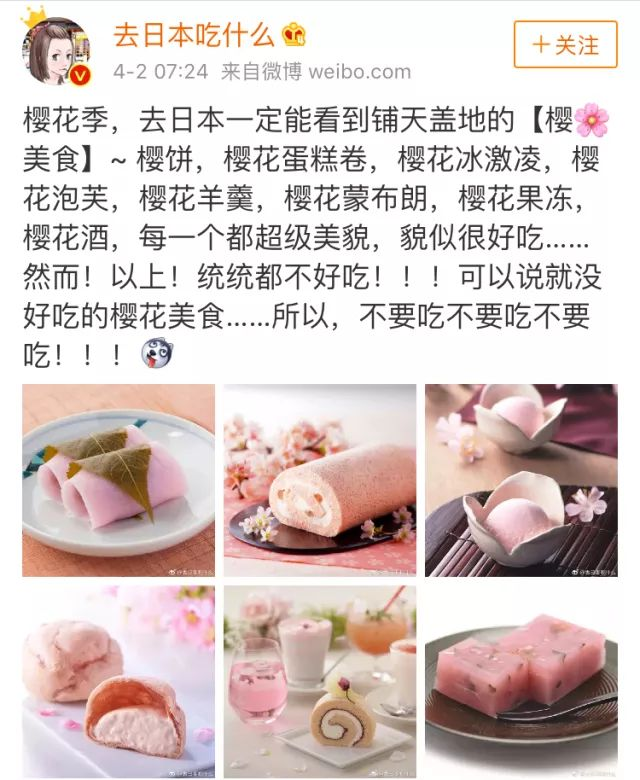 (原始链接: https://mmbiz.qpic.cn/mmbiz_jpg/XA8n2XaESnQk83tTYqZzIWgcdjtefibLF1ovKzy51vd5KGxKD4h4PHsS5nsicMbZRichG0dYwnANrW75vIduBTiccw/640?wx_fmt=jpeg)
-  (原始链接: https://mmbiz.qpic.cn/mmbiz_png/XA8n2XaESnQk83tTYqZzIWgcdjtefibLFhOSW4WdtRQHN5Jt5r0QAD0ZErNdUkrdXRgfOpbVH2LhQeTozJpaQlw/640?wx_fmt=png)
-  (原始链接: https://mmbiz.qpic.cn/mmbiz_png/XA8n2XaESnQk83tTYqZzIWgcdjtefibLFBksV52YE66xJdJIcw7IXovSJBSA2tkl8MsJeYybDjIiaiavBmrKPf4kQ/640?wx_fmt=png)
- 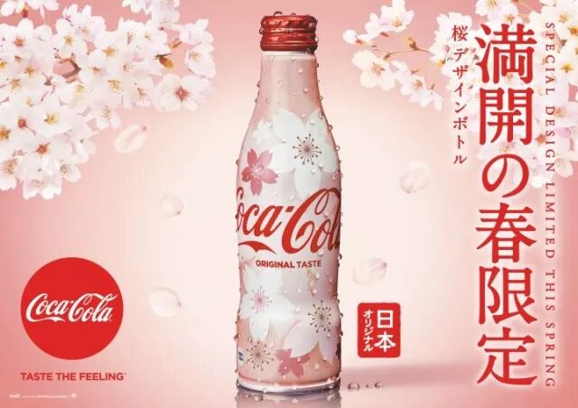 (原始链接: https://mmbiz.qpic.cn/mmbiz_jpg/XA8n2XaESnQk83tTYqZzIWgcdjtefibLFCAg4Bz9r4PdHhSMSOjk8tRYibibkmSmzriabpltZUhCfg8GgKrDEDNeOQ/640?wx_fmt=jpeg)
-  (原始链接: https://mmbiz.qpic.cn/mmbiz_jpg/XA8n2XaESnQk83tTYqZzIWgcdjtefibLFRsia2qPtbxc5mrPUpSNqgyzjDUquQSk53V1DIE8qiaZZorzhsxSI3rkQ/640?wx_fmt=jpeg)
- 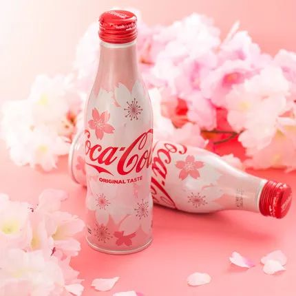 (原始链接: https://mmbiz.qpic.cn/mmbiz_jpg/XA8n2XaESnQk83tTYqZzIWgcdjtefibLFlZxSafkFtyB1sUG7187yiaQCjGVIPgFA5NFGJXiaJCupKNFdDcOPPUHw/640?wx_fmt=jpeg)
-  (原始链接: https://mmbiz.qpic.cn/mmbiz_png/XA8n2XaESnQk83tTYqZzIWgcdjtefibLFk1k6P8Mk6NeKOx5DjY4XcLwkzAOiaOkgE5KbgNfroib6bWAoYqZxWj1A/640?wx_fmt=png)
-  (原始链接: https://mmbiz.qpic.cn/mmbiz_png/XA8n2XaESnQk83tTYqZzIWgcdjtefibLFhOSW4WdtRQHN5Jt5r0QAD0ZErNdUkrdXRgfOpbVH2LhQeTozJpaQlw/640?wx_fmt=png)
-  (原始链接: https://mmbiz.qpic.cn/mmbiz_png/XA8n2XaESnQk83tTYqZzIWgcdjtefibLFBksV52YE66xJdJIcw7IXovSJBSA2tkl8MsJeYybDjIiaiavBmrKPf4kQ/640?wx_fmt=png)
- 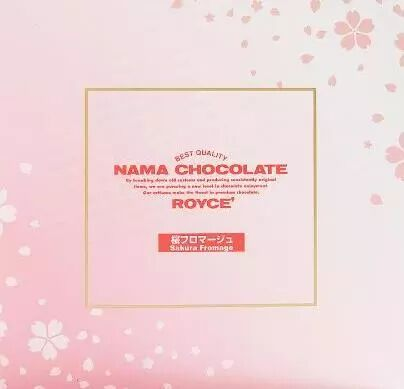 (原始链接: https://mmbiz.qpic.cn/mmbiz_jpg/XA8n2XaESnQk83tTYqZzIWgcdjtefibLF1yHFleh5cq2iaU7Tn8kSLFJWjyaQmSJdcNIp0ciapT7ic8fZmvAwhRNuA/640?wx_fmt=jpeg)
- 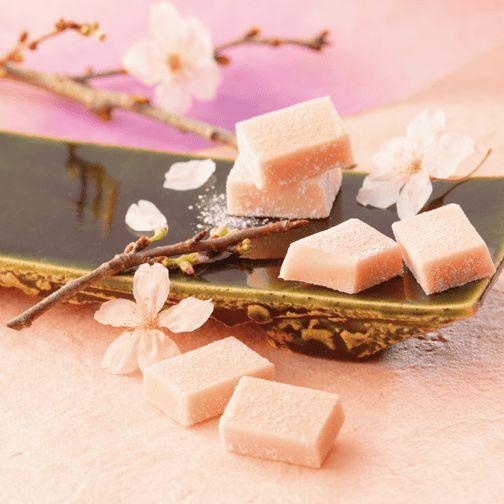 (原始链接: https://mmbiz.qpic.cn/mmbiz_png/XA8n2XaESnQk83tTYqZzIWgcdjtefibLFz0EdnFOSoA9mN8SibvyMHS7AlWK3vFtmbY68Ody1pgCTQB4NW8PJKZw/640?wx_fmt=png)
- 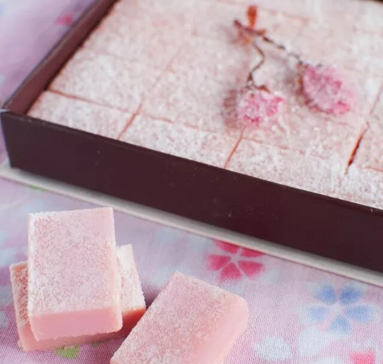 (原始链接: https://mmbiz.qpic.cn/mmbiz_jpg/XA8n2XaESnQk83tTYqZzIWgcdjtefibLFNr4zmZ0rhzchQZEAuIClg9FShBgZsYicibicGjAGUMO2yQCNiaKpY749Ww/640?wx_fmt=jpeg)
-  (原始链接: https://mmbiz.qpic.cn/mmbiz_png/XA8n2XaESnQk83tTYqZzIWgcdjtefibLFk1k6P8Mk6NeKOx5DjY4XcLwkzAOiaOkgE5KbgNfroib6bWAoYqZxWj1A/640?wx_fmt=png)
-  (原始链接: https://mmbiz.qpic.cn/mmbiz_png/XA8n2XaESnQk83tTYqZzIWgcdjtefibLFhOSW4WdtRQHN5Jt5r0QAD0ZErNdUkrdXRgfOpbVH2LhQeTozJpaQlw/640?wx_fmt=png)
-  (原始链接: https://mmbiz.qpic.cn/mmbiz_png/XA8n2XaESnQk83tTYqZzIWgcdjtefibLFBksV52YE66xJdJIcw7IXovSJBSA2tkl8MsJeYybDjIiaiavBmrKPf4kQ/640?wx_fmt=png)
- 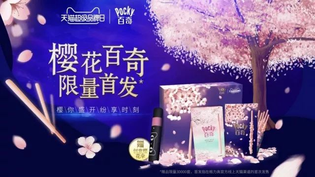 (原始链接: https://mmbiz.qpic.cn/mmbiz_jpg/XA8n2XaESnQk83tTYqZzIWgcdjtefibLF3X7MUWmtzvGWLzJjnpo7uG8hHCiak10OZAPVWG51xlP39vnvQ4MBuLQ/640?wx_fmt=jpeg)
- 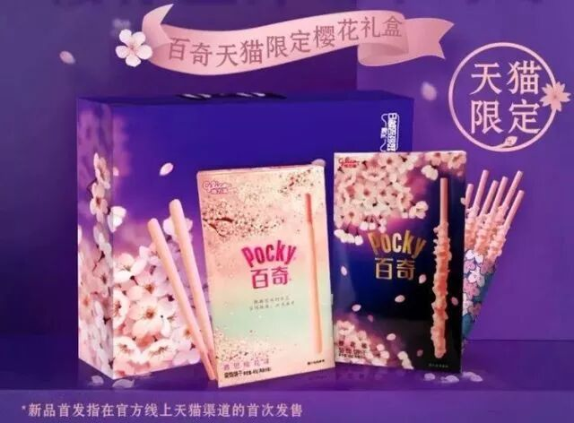 (原始链接: https://mmbiz.qpic.cn/mmbiz_jpg/XA8n2XaESnQk83tTYqZzIWgcdjtefibLFhK1nSMQHlsEp3zcFhyvBNicx88KhhLeswtjjMoVGzGNVYICHQLXur7w/640?wx_fmt=jpeg)
- 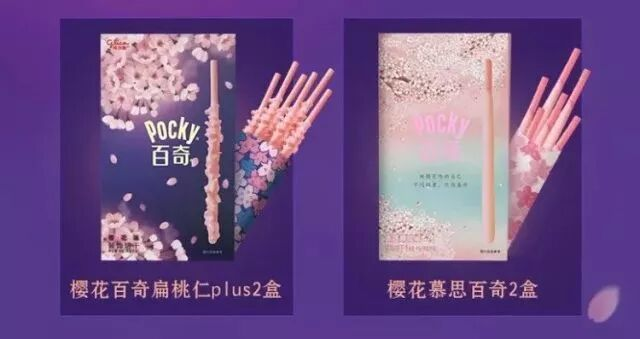 (原始链接: https://mmbiz.qpic.cn/mmbiz_jpg/XA8n2XaESnQk83tTYqZzIWgcdjtefibLFYWhwCw3dmFfClNH4PvticjicCI8agUUZVYaLuGibITYMBBpoVFibV5wwAQ/640?wx_fmt=jpeg)
-  (原始链接: https://mmbiz.qpic.cn/mmbiz_png/XA8n2XaESnQk83tTYqZzIWgcdjtefibLFk1k6P8Mk6NeKOx5DjY4XcLwkzAOiaOkgE5KbgNfroib6bWAoYqZxWj1A/640?wx_fmt=png)
-  (原始链接: https://mmbiz.qpic.cn/mmbiz_png/XA8n2XaESnQk83tTYqZzIWgcdjtefibLFhOSW4WdtRQHN5Jt5r0QAD0ZErNdUkrdXRgfOpbVH2LhQeTozJpaQlw/640?wx_fmt=png)
-  (原始链接: https://mmbiz.qpic.cn/mmbiz_png/XA8n2XaESnQk83tTYqZzIWgcdjtefibLFBksV52YE66xJdJIcw7IXovSJBSA2tkl8MsJeYybDjIiaiavBmrKPf4kQ/640?wx_fmt=png)
-  (原始链接: https://mmbiz.qpic.cn/mmbiz_jpg/XA8n2XaESnQk83tTYqZzIWgcdjtefibLFQE3thbyhSS9IoUbLdVdv6FFuZuF4vvyHueYLEgRwct5ibQ8emPRZxEA/640?wx_fmt=jpeg)
- 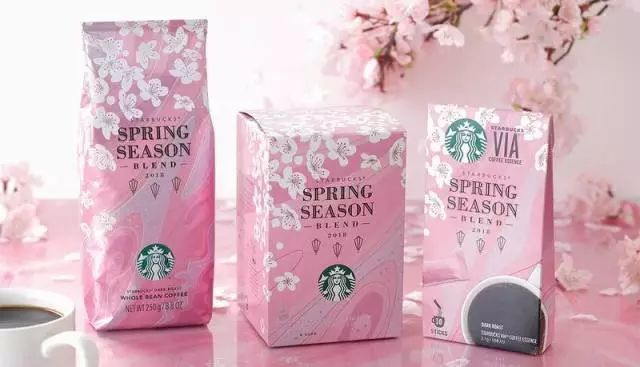 (原始链接: https://mmbiz.qpic.cn/mmbiz_jpg/XA8n2XaESnQk83tTYqZzIWgcdjtefibLFd9RrybvibLXgyBcDia9Y2QDQhiccGtqvRiagPyjeicoxMxCAO87umvHLibYg/640?wx_fmt=jpeg)
-  (原始链接: https://mmbiz.qpic.cn/mmbiz_jpg/XA8n2XaESnQk83tTYqZzIWgcdjtefibLF9fIIFjXVSY0qRkZQotoXlBbU4rJFGV5ay9BiajLuAKagOXEEttVVmiag/640?wx_fmt=jpeg)
-  (原始链接: https://mmbiz.qpic.cn/mmbiz_png/XA8n2XaESnQk83tTYqZzIWgcdjtefibLFk1k6P8Mk6NeKOx5DjY4XcLwkzAOiaOkgE5KbgNfroib6bWAoYqZxWj1A/640?wx_fmt=png)
-  (原始链接: https://mmbiz.qpic.cn/mmbiz_png/XA8n2XaESnQk83tTYqZzIWgcdjtefibLFhOSW4WdtRQHN5Jt5r0QAD0ZErNdUkrdXRgfOpbVH2LhQeTozJpaQlw/640?wx_fmt=png)
-  (原始链接: https://mmbiz.qpic.cn/mmbiz_png/XA8n2XaESnQk83tTYqZzIWgcdjtefibLFBksV52YE66xJdJIcw7IXovSJBSA2tkl8MsJeYybDjIiaiavBmrKPf4kQ/640?wx_fmt=png)
- 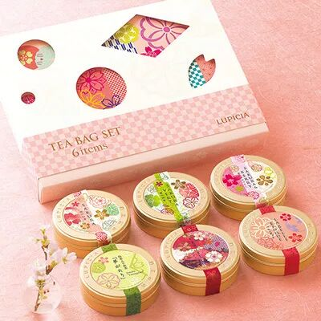 (原始链接: https://mmbiz.qpic.cn/mmbiz_jpg/XA8n2XaESnQk83tTYqZzIWgcdjtefibLF89lHLZZfAC3GkWcVfmbuavicxrJlIueI6DomkiaPtottQRTbSqqtW5fw/640?wx_fmt=jpeg)
- 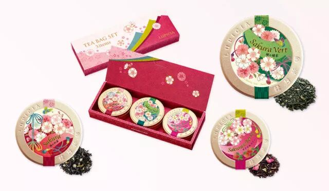 (原始链接: https://mmbiz.qpic.cn/mmbiz_jpg/XA8n2XaESnQk83tTYqZzIWgcdjtefibLFicUgibowa6pnBiaPnaDeLXPs8oT0icU54Q1MZcuAubx1AU7nTTvtGZn1zQ/640?wx_fmt=jpeg)
- 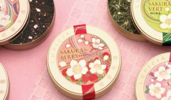 (原始链接: https://mmbiz.qpic.cn/mmbiz_png/XA8n2XaESnQk83tTYqZzIWgcdjtefibLFZicyJsaj1Aao5af6vMxqgzvFyPpF9kV46t2zEFSY7dPd3mhsFGiax67g/640?wx_fmt=png)
-  (原始链接: https://mmbiz.qpic.cn/mmbiz_png/XA8n2XaESnQk83tTYqZzIWgcdjtefibLFk1k6P8Mk6NeKOx5DjY4XcLwkzAOiaOkgE5KbgNfroib6bWAoYqZxWj1A/640?wx_fmt=png)
-  (原始链接: https://mmbiz.qpic.cn/mmbiz_png/XA8n2XaESnQk83tTYqZzIWgcdjtefibLFhOSW4WdtRQHN5Jt5r0QAD0ZErNdUkrdXRgfOpbVH2LhQeTozJpaQlw/640?wx_fmt=png)
-  (原始链接: https://mmbiz.qpic.cn/mmbiz_png/XA8n2XaESnQk83tTYqZzIWgcdjtefibLFBksV52YE66xJdJIcw7IXovSJBSA2tkl8MsJeYybDjIiaiavBmrKPf4kQ/640?wx_fmt=png)
- 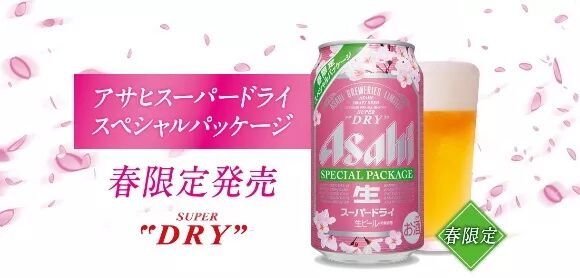 (原始链接: https://mmbiz.qpic.cn/mmbiz_jpg/XA8n2XaESnQk83tTYqZzIWgcdjtefibLF2SbicIg0eEV2ssJ1BkibibN7nia40TdNyRE76FcsddAZJ9PkDpedZT5icoQ/640?wx_fmt=jpeg)
- 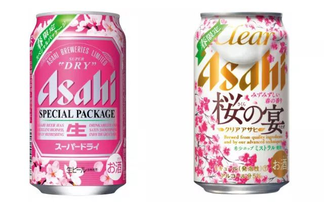 (原始链接: https://mmbiz.qpic.cn/mmbiz_jpg/XA8n2XaESnQk83tTYqZzIWgcdjtefibLFgR3GhY9wdib3Wg8ibK1nRrfG76goxZadXoR98haW5Asn059cdDGBib4xw/640?wx_fmt=jpeg)
- 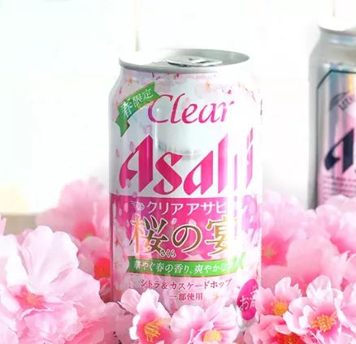 (原始链接: https://mmbiz.qpic.cn/mmbiz_jpg/XA8n2XaESnQk83tTYqZzIWgcdjtefibLFBKwpAJdSvzJuExkQBiciba9kHwup5Ovb4MRbZOulEWJ8eibMQxHqM63FA/640?wx_fmt=jpeg)
-  (原始链接: https://mmbiz.qpic.cn/mmbiz_png/XA8n2XaESnQk83tTYqZzIWgcdjtefibLFk1k6P8Mk6NeKOx5DjY4XcLwkzAOiaOkgE5KbgNfroib6bWAoYqZxWj1A/640?wx_fmt=png)
-  (原始链接: https://mmbiz.qpic.cn/mmbiz_png/XA8n2XaESnQk83tTYqZzIWgcdjtefibLFhOSW4WdtRQHN5Jt5r0QAD0ZErNdUkrdXRgfOpbVH2LhQeTozJpaQlw/640?wx_fmt=png)
-  (原始链接: https://mmbiz.qpic.cn/mmbiz_png/XA8n2XaESnQk83tTYqZzIWgcdjtefibLFBksV52YE66xJdJIcw7IXovSJBSA2tkl8MsJeYybDjIiaiavBmrKPf4kQ/640?wx_fmt=png)
- 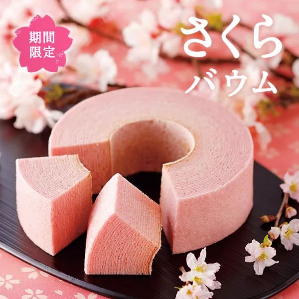 (原始链接: https://mmbiz.qpic.cn/mmbiz_jpg/XA8n2XaESnQk83tTYqZzIWgcdjtefibLFvFID3AuL1sZoY8PdiaS4Gl6rFn8XOIBJoE4K2QKYHTH8Wib7wOQRM90Q/640?wx_fmt=jpeg)
-  (原始链接: https://mmbiz.qpic.cn/mmbiz_jpg/XA8n2XaESnQk83tTYqZzIWgcdjtefibLFKNNYRdP8wg19CRdwU9LMG5ey52QvhSlZibSILcw31uV7ySwFnPqURSg/640?wx_fmt=jpeg)
-  (原始链接: https://mmbiz.qpic.cn/mmbiz_png/XA8n2XaESnQk83tTYqZzIWgcdjtefibLFk1k6P8Mk6NeKOx5DjY4XcLwkzAOiaOkgE5KbgNfroib6bWAoYqZxWj1A/640?wx_fmt=png)
-  (原始链接: https://mmbiz.qpic.cn/mmbiz_png/XA8n2XaESnQk83tTYqZzIWgcdjtefibLFhOSW4WdtRQHN5Jt5r0QAD0ZErNdUkrdXRgfOpbVH2LhQeTozJpaQlw/640?wx_fmt=png)
-  (原始链接: https://mmbiz.qpic.cn/mmbiz_png/XA8n2XaESnQk83tTYqZzIWgcdjtefibLFBksV52YE66xJdJIcw7IXovSJBSA2tkl8MsJeYybDjIiaiavBmrKPf4kQ/640?wx_fmt=png)
- 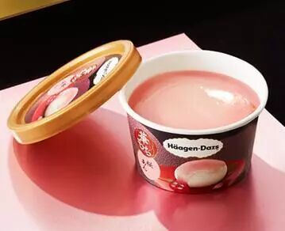 (原始链接: https://mmbiz.qpic.cn/mmbiz_jpg/XA8n2XaESnQk83tTYqZzIWgcdjtefibLF0FlROmHCUPMJibsiaRIIQiaiaXZs5K3jIKnuCXffhFd8kjh21qd77b76yA/640?wx_fmt=jpeg)
- 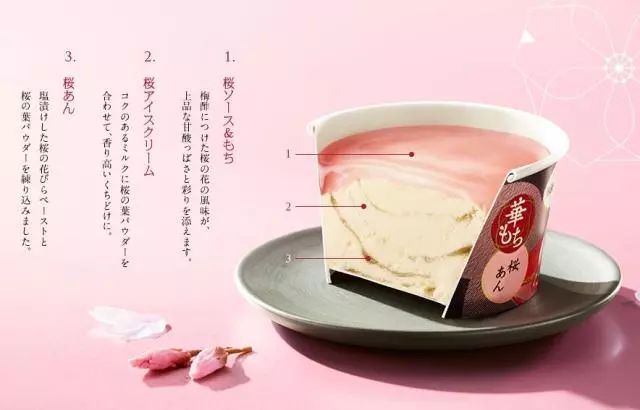 (原始链接: https://mmbiz.qpic.cn/mmbiz_jpg/XA8n2XaESnQk83tTYqZzIWgcdjtefibLFj5fGyySjC8TQBueBXzqHLbPA3thnasfI0F597hEbHiau5bbic4yAII0A/640?wx_fmt=jpeg)
-  (原始链接: https://mmbiz.qpic.cn/mmbiz_png/XA8n2XaESnQk83tTYqZzIWgcdjtefibLFk1k6P8Mk6NeKOx5DjY4XcLwkzAOiaOkgE5KbgNfroib6bWAoYqZxWj1A/640?wx_fmt=png)
-  (原始链接: https://mmbiz.qpic.cn/mmbiz_png/XA8n2XaESnQk83tTYqZzIWgcdjtefibLFRgicic42prVQtZDVb2icHKcEA4qgQGwyXBpPcfhzWQAtsUwb6iauccPWXA/640?wx_fmt=png)
-  (原始链接: https://mmbiz.qpic.cn/mmbiz_png/XA8n2XaESnQk83tTYqZzIWgcdjtefibLF5feEGOzv8sicFudS8oMd9rdBbWmKh2Kp1iaNgmCpEaHnra4ibnoLknjHg/640?wx_fmt=png)
- 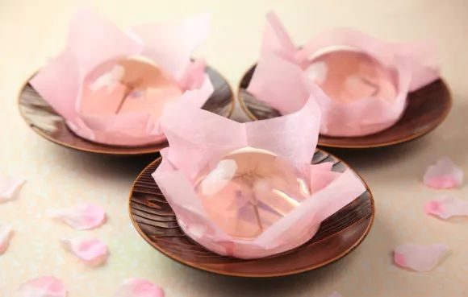 (原始链接: https://mmbiz.qpic.cn/mmbiz_jpg/XA8n2XaESnQk83tTYqZzIWgcdjtefibLFVh0gZW08cp5gwsrSso1JxvCBFIczOIKyJBsGDtiaqHBgrjL2zWxhKqA/640?wx_fmt=jpeg)
-  (原始链接: https://mmbiz.qpic.cn/mmbiz_png/XA8n2XaESnQk83tTYqZzIWgcdjtefibLFk1k6P8Mk6NeKOx5DjY4XcLwkzAOiaOkgE5KbgNfroib6bWAoYqZxWj1A/640?wx_fmt=png)
-  (原始链接: https://mmbiz.qpic.cn/mmbiz_jpg/XA8n2XaESnQk83tTYqZzIWgcdjtefibLFCK17QqBajxG0MNzGCTp2J7ibnrc4WSMibx1QHicreZfGVUibwm0tHZqtFw/640?wx_fmt=jpeg)
-  (原始链接: https://mmbiz.qpic.cn/mmbiz_png/XA8n2XaESnQk83tTYqZzIWgcdjtefibLFk1k6P8Mk6NeKOx5DjY4XcLwkzAOiaOkgE5KbgNfroib6bWAoYqZxWj1A/640?wx_fmt=png)
-  (原始链接: https://mmbiz.qpic.cn/mmbiz_jpg/XA8n2XaESnQk83tTYqZzIWgcdjtefibLFneuias3ISY8fmkk2iaNeWt3X2jWNLbnvr0o8kAPXVR8M1hQJja8z0p3Q/640?wx_fmt=jpeg)
-  (原始链接: https://mmbiz.qpic.cn/mmbiz_png/XA8n2XaESnQk83tTYqZzIWgcdjtefibLFk1k6P8Mk6NeKOx5DjY4XcLwkzAOiaOkgE5KbgNfroib6bWAoYqZxWj1A/640?wx_fmt=png)
- 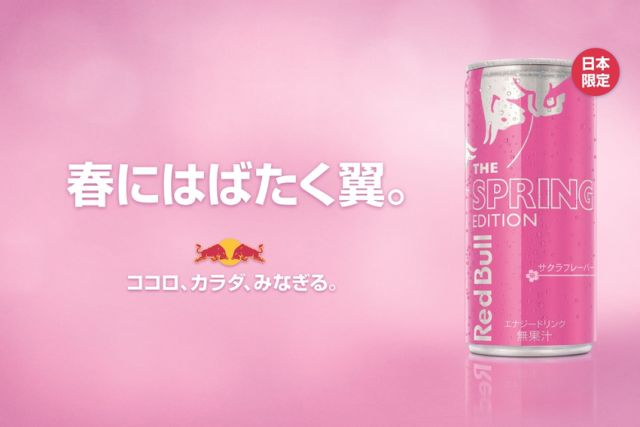 (原始链接: https://mmbiz.qpic.cn/mmbiz_png/XA8n2XaESnQk83tTYqZzIWgcdjtefibLF1znThf6Q57XW68nekvEMuqvw0o4zvAOWicXfdrPCW2aHsOek4JELeIA/640?wx_fmt=png)
-  (原始链接: https://mmbiz.qpic.cn/mmbiz_png/XA8n2XaESnQk83tTYqZzIWgcdjtefibLFk1k6P8Mk6NeKOx5DjY4XcLwkzAOiaOkgE5KbgNfroib6bWAoYqZxWj1A/640?wx_fmt=png)
- 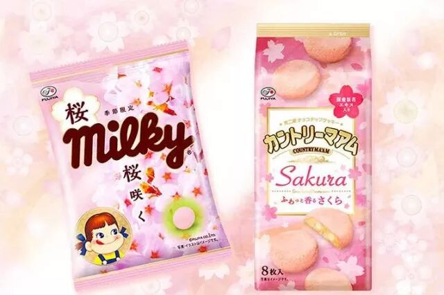 (原始链接: https://mmbiz.qpic.cn/mmbiz_jpg/XA8n2XaESnQk83tTYqZzIWgcdjtefibLFnMlVibnycxicd7kmnWHbHiaiao4ia8g4iacbiciawkms1Ueg1Q4WxFFozAKILg/640?wx_fmt=jpeg)
-  (原始链接: https://mmbiz.qpic.cn/mmbiz_png/XA8n2XaESnQk83tTYqZzIWgcdjtefibLFk1k6P8Mk6NeKOx5DjY4XcLwkzAOiaOkgE5KbgNfroib6bWAoYqZxWj1A/640?wx_fmt=png)
- 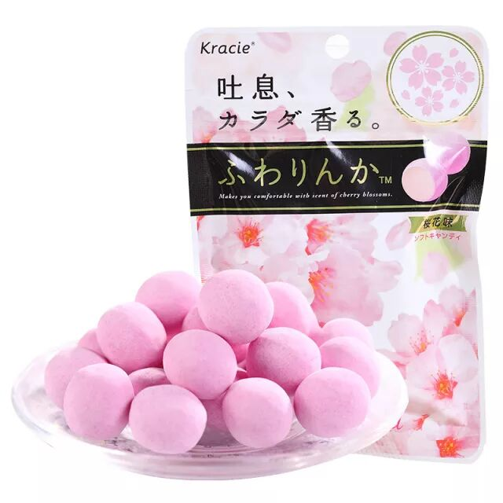 (原始链接: https://mmbiz.qpic.cn/mmbiz_jpg/XA8n2XaESnQk83tTYqZzIWgcdjtefibLFFLzYTJiaHDT1MCm6TNdOYMxf0UwpZzAtuE1hFYoFGNaMu98tibjXT95Q/640?wx_fmt=jpeg)
-  (原始链接: https://mmbiz.qpic.cn/mmbiz_png/XA8n2XaESnQk83tTYqZzIWgcdjtefibLFk1k6P8Mk6NeKOx5DjY4XcLwkzAOiaOkgE5KbgNfroib6bWAoYqZxWj1A/640?wx_fmt=png)
- 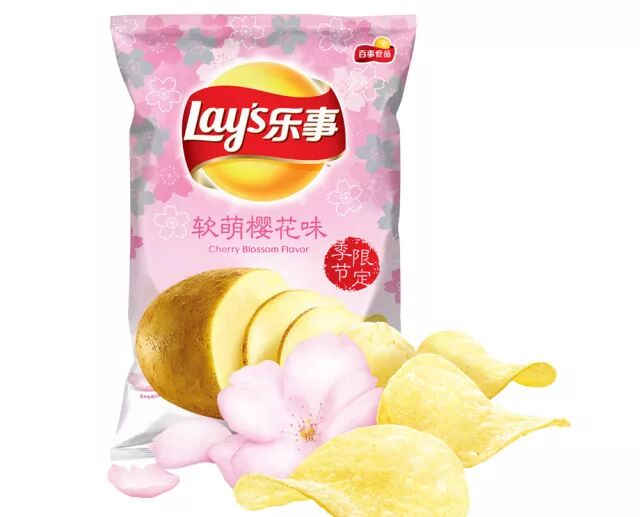 (原始链接: https://mmbiz.qpic.cn/mmbiz_jpg/XA8n2XaESnQk83tTYqZzIWgcdjtefibLFn4fLS4ibhPXmSZiawhSvAkDvGcbzbN9sSqhfJ8yias1CbBLT87xC1qRgg/640?wx_fmt=jpeg)
-  (原始链接: https://mmbiz.qpic.cn/mmbiz_png/XA8n2XaESnQk83tTYqZzIWgcdjtefibLFk1k6P8Mk6NeKOx5DjY4XcLwkzAOiaOkgE5KbgNfroib6bWAoYqZxWj1A/640?wx_fmt=png)
-  (原始链接: https://mmbiz.qpic.cn/mmbiz_png/XA8n2XaESnQk83tTYqZzIWgcdjtefibLFBksV52YE66xJdJIcw7IXovSJBSA2tkl8MsJeYybDjIiaiavBmrKPf4kQ/640?wx_fmt=png)
-  (原始链接: https://mmbiz.qpic.cn/mmbiz_gif/XA8n2XaESnQk83tTYqZzIWgcdjtefibLFLMRCt7qE3Ecv6Iic2G9sRs8wKReGfvyCDrYEjwaZPG9KTpVSYIY0GVw/640?wx_fmt=gif)
-  (原始链接: https://mmbiz.qpic.cn/mmbiz_png/XA8n2XaESnQk83tTYqZzIWgcdjtefibLFhOSW4WdtRQHN5Jt5r0QAD0ZErNdUkrdXRgfOpbVH2LhQeTozJpaQlw/640?wx_fmt=png)
-  (原始链接: https://mmbiz.qpic.cn/mmbiz_png/XA8n2XaESnQk83tTYqZzIWgcdjtefibLFBksV52YE66xJdJIcw7IXovSJBSA2tkl8MsJeYybDjIiaiavBmrKPf4kQ/640?wx_fmt=png)
-  (原始链接: https://mmbiz.qpic.cn/mmbiz_png/XA8n2XaESnQk83tTYqZzIWgcdjtefibLFk1k6P8Mk6NeKOx5DjY4XcLwkzAOiaOkgE5KbgNfroib6bWAoYqZxWj1A/640?wx_fmt=png)
-  (原始链接: https://mmbiz.qpic.cn/mmbiz_jpg/XA8n2XaESnQk83tTYqZzIWgcdjtefibLFjEtpCr4BURq7SVkPYsg84WseRBic28Uunk5KSyBQohFtmtPxUfsicuSA/640?wx_fmt=jpeg)
-  (原始链接: https://mmbiz.qpic.cn/mmbiz_png/XA8n2XaESnQk83tTYqZzIWgcdjtefibLFBksV52YE66xJdJIcw7IXovSJBSA2tkl8MsJeYybDjIiaiavBmrKPf4kQ/640?wx_fmt=png)
-  (原始链接: https://mmbiz.qpic.cn/mmbiz_png/XA8n2XaESnQk83tTYqZzIWgcdjtefibLFBksV52YE66xJdJIcw7IXovSJBSA2tkl8MsJeYybDjIiaiavBmrKPf4kQ/640?wx_fmt=png)
-  (原始链接: https://mmbiz.qpic.cn/mmbiz_png/XA8n2XaESnQk83tTYqZzIWgcdjtefibLFhOSW4WdtRQHN5Jt5r0QAD0ZErNdUkrdXRgfOpbVH2LhQeTozJpaQlw/640?wx_fmt=png)
-  (原始链接: https://mmbiz.qpic.cn/mmbiz_png/XA8n2XaESnQk83tTYqZzIWgcdjtefibLF5feEGOzv8sicFudS8oMd9rdBbWmKh2Kp1iaNgmCpEaHnra4ibnoLknjHg/640?wx_fmt=png)
-  (原始链接: https://mmbiz.qpic.cn/mmbiz_png/XA8n2XaESnQk83tTYqZzIWgcdjtefibLFRgicic42prVQtZDVb2icHKcEA4qgQGwyXBpPcfhzWQAtsUwb6iauccPWXA/640?wx_fmt=png)
-  (原始链接: https://mmbiz.qpic.cn/mmbiz_gif/XA8n2XaESnQk83tTYqZzIWgcdjtefibLFplCibcfzciaj5lXpoxXx8XGOjE7tY4diahUMIAiaAibiaUZempIbGhtSdJng/640?wx_fmt=gif)
-  (原始链接: https://mmbiz.qpic.cn/mmbiz_jpg/XA8n2XaESnQk83tTYqZzIWgcdjtefibLFA7xAkDnxojj6jibuBUVVRIxCbHIRC2pV37bEmtaWvuMQjbgxus1iaLzg/640?wx_fmt=jpeg)
