# 无标题

**链接地址:** http://mp.weixin.qq.com/s?__biz=MzI0MDQ0ODI0Ng==&mid=2247485714&idx=1&sn=3d1b260984375df49b78d75de3ac493b&chksm=e91bee8bde6c679d06ce8ecfbf2d3a2a9df5a3bb45d526ae895cc11cf0a768b9f7aa56837a6b&mpshare=1&scene=2&srcid=0415n5axSqmPFCjpXUfjMUwy#rd
**作者:** 爱喝咖啡の食小悦
**获取时间:** 2025/8/28 22:04:57
**图片数量:** 46

---

## 原始HTML内容

<section style="background-color: rgb(255, 255, 255);box-sizing: border-box;"><section class="Powered-by-XIUMI V5" style="box-sizing: border-box;" powered-by="xiumi.us"><section class="" style="margin: 10px 0%;box-sizing: border-box;"><section class="" style="display: inline-block;width: 100%;vertical-align: top;padding-right: 10px;padding-left: 10px;box-sizing: border-box;"><section class="Powered-by-XIUMI V5" style="box-sizing: border-box;" powered-by="xiumi.us"><section class="" style="text-align: center;margin: 10px 0% 20px;box-sizing: border-box;"><section class="" style="display: inline-block;width: 97%;vertical-align: top;box-shadow: rgb(140, 140, 140) 0px 0px 3px;box-sizing: border-box;"><section class="Powered-by-XIUMI V5" style="box-sizing: border-box;" powered-by="xiumi.us"><section class="" style="margin-top: 20px;margin-right: 0%;margin-left: 0%;box-sizing: border-box;"><section class="" style="max-width: 100%;vertical-align: middle;display: inline-block;width: 98%;overflow: hidden !important;box-sizing: border-box;"></section></section></section><section class="Powered-by-XIUMI V5" style="box-sizing: border-box;" powered-by="xiumi.us"><section class="" style="margin-right: 0%;margin-bottom: -22px;margin-left: 0%;box-sizing: border-box;"><section class="" style="max-width: 100%;vertical-align: middle;display: inline-block;box-shadow: rgb(0, 0, 0) 0px 0px 0px;overflow: hidden !important;box-sizing: border-box;"></section></section></section></section></section></section></section></section></section><section class="Powered-by-XIUMI V5" style="box-sizing: border-box;" powered-by="xiumi.us"><section class="" style="box-sizing: border-box;"><section class="" style="display: inline-block;width: 100%;vertical-align: top;box-sizing: border-box;"><section class="Powered-by-XIUMI V5" style="box-sizing: border-box;" powered-by="xiumi.us"><section class="" style="box-sizing: border-box;"><section class="" style="text-align: center;font-size: 14px;box-sizing: border-box;">
“安静的呆在咖啡馆，喝着咖啡。

手中捧着最爱的书。安静的度过一整天。”

 
</section></section></section></section></section></section><section class="Powered-by-XIUMI V5" style="box-sizing: border-box;" powered-by="xiumi.us"><section class="" style="margin-top: 0.5em;margin-bottom: 0.5em;box-sizing: border-box;"><section class="" style="border-radius: 0.5em 0.5em 0px 0px;background-color: rgb(152, 157, 107);box-sizing: border-box;"><section class="Powered-by-XIUMI V5" style="box-sizing: border-box;" powered-by="xiumi.us"><section class="" style="margin-right: 0%;margin-left: 0%;transform: translate3d(10px, 0px, 0px);box-sizing: border-box;"><section class="" style="display: inline-block;box-sizing: border-box;"><section style="width: 0px;display: inline-block;vertical-align: top;border-right: 0.5em solid rgb(255, 255, 255);border-bottom: 1em solid rgb(255, 255, 255);border-left: 0.5em solid transparent !important;border-top: 1em solid transparent !important;box-sizing: border-box;"></section><section class="" style="height: 2em;line-height: 2em;padding-right: 10px;padding-left: 10px;min-width: 6em;display: inline-block;vertical-align: top;background-color: rgb(255, 255, 255);text-align: center;color: rgb(161, 102, 44);box-sizing: border-box;">
生活需要仪式感，复习考试亦然
</section><section style="width: 0px;display: inline-block;vertical-align: top;border-left: 0.5em solid rgb(255, 255, 255);border-top: 1em solid rgb(255, 255, 255);border-right: 0.5em solid transparent !important;border-bottom: 1em solid transparent !important;box-sizing: border-box;"></section></section></section></section></section><section class="" style="border-radius: 0px 0px 0.5em 0.5em;border-right: 1px solid rgb(192, 200, 209);border-bottom: 1px solid rgb(192, 200, 209);border-left: 1px solid rgb(192, 200, 209);border-top: none rgb(192, 200, 209);padding-right: 10px;padding-left: 10px;box-sizing: border-box;"><section class="Powered-by-XIUMI V5" style="box-sizing: border-box;" powered-by="xiumi.us"><section class="" style="margin-right: 0%;margin-bottom: 10px;margin-left: 0%;box-sizing: border-box;"><section class="" style="text-align: justify;padding: 5px 10px;font-size: 14px;letter-spacing: 2px;line-height: 1.8;color: rgba(62, 62, 62, 0.66);box-sizing: border-box;">
紧张的期末考试周即将来袭，头疼堆积如山的书本作业的同时，还要头疼没有一个安静的好环境供你安心啃书？人潮拥挤的图书馆真的能让你放弃和小伙伴打闹静下心来复习一页PPT？躺在安稳熟悉的家中你确定可以放下玩得正嗨的手游集中精力做一道习题？一个好的学习环境不仅可以舒缓期末考试带给你的压力，还可以提高你的学习效率，达到事半功倍的效果。厌倦了在学校快餐店排队购买稀释过的廉价咖啡和干巴巴的曲奇饼？何苦煎熬了自己的心智再虐待自己的胃？生活需要仪式感，复习考试亦然。你值得被更好的对待！这些高格调的“舒压咖啡厅”配得上如此努力复习的你！
</section></section></section></section></section></section><section class="Powered-by-XIUMI V5" style="box-sizing: border-box;" powered-by="xiumi.us"><section class="" style="margin: 10px 0%;box-sizing: border-box;"><section class="" style="display: inline-block;vertical-align: middle;width: 50%;box-sizing: border-box;"><section class="Powered-by-XIUMI V5" style="box-sizing: border-box;" powered-by="xiumi.us"><section class="" style="margin: 30px 0% 10px;text-align: center;box-sizing: border-box;"><section class="" style="display: inline-block;border-width: 2px;border-style: solid;border-color: transparent;padding: 0.1em 0.3em;color: rgba(85, 103, 66, 0.75);font-size: 12px;letter-spacing: 0px;box-sizing: border-box;">
“咖啡這種東西

很容易受時間影響，

人也一樣，

不需要著急。”&nbsp;

 
</section></section></section></section><section class="" style="display: inline-block;vertical-align: middle;width: 50%;box-sizing: border-box;"><section class="Powered-by-XIUMI V5" style="box-sizing: border-box;" powered-by="xiumi.us"><section class="" style="margin-top: 10px;margin-bottom: 10px;text-align: center;box-sizing: border-box;"><section class="" style="display: inline-block;box-sizing: border-box;"><section style="width: 5.6em;height: 5.6em;margin: 1.2em auto;padding: 0.28em;border-width: 1px;border-style: solid;transform: rotate(45deg);-webkit-transform: rotate(45deg);-moz-transform: rotate(45deg);-o-transform: rotate(45deg);border-color: rgb(152, 157, 107);box-sizing: border-box;"><section style="width: 5em;height: 5em;overflow: hidden;box-sizing: border-box;"><section style="transform: rotate(-45deg);-webkit-transform: rotate(-45deg);-moz-transform: rotate(-45deg);-o-transform: rotate(-45deg);box-sizing: border-box;"><section class="" style="width: 7em;height: 7em;margin: -1em;background-position: 16.3462% 0%;background-repeat: no-repeat;background-size: 174.286%;background-image: url(&quot;https://mmbiz.qpic.cn/mmbiz_jpg/XA8n2XaESnTmicQ66UtloHdPmFsBJAicwY7WwVAu8EbO1iaichIHtG7NICHEGYRr7kKhkcpPbbIK1MrOzzX18HMWJA/640?wx_fmt=jpeg&quot;);box-sizing: border-box;max-width: 150% !important;"><section class="" style="width: 100%;height: 100%;overflow: hidden;box-sizing: border-box;"></section></section></section></section></section></section></section></section></section></section></section><section class="Powered-by-XIUMI V5" style="box-sizing: border-box;" powered-by="xiumi.us"><section class="" style="margin-top: 0.5em;margin-bottom: 0.5em;box-sizing: border-box;"><section class="" style="border-radius: 0.5em 0.5em 0px 0px;background-color: rgb(152, 157, 107);box-sizing: border-box;"><section class="Powered-by-XIUMI V5" style="box-sizing: border-box;" powered-by="xiumi.us"><section class="" style="margin-right: 0%;margin-left: 0%;transform: translate3d(10px, 0px, 0px);box-sizing: border-box;"><section class="" style="display: inline-block;box-sizing: border-box;"><section style="width: 0px;display: inline-block;vertical-align: top;border-right: 0.5em solid rgb(255, 255, 255);border-bottom: 1em solid rgb(255, 255, 255);border-left: 0.5em solid transparent !important;border-top: 1em solid transparent !important;box-sizing: border-box;"></section><section class="" style="height: 2em;line-height: 2em;padding-right: 10px;padding-left: 10px;min-width: 6em;display: inline-block;vertical-align: top;background-color: rgb(255, 255, 255);text-align: center;color: rgb(161, 102, 44);box-sizing: border-box;">
所谓的“解压咖啡厅”
</section><section style="width: 0px;display: inline-block;vertical-align: top;border-left: 0.5em solid rgb(255, 255, 255);border-top: 1em solid rgb(255, 255, 255);border-right: 0.5em solid transparent !important;border-bottom: 1em solid transparent !important;box-sizing: border-box;"></section></section></section></section></section><section class="" style="border-radius: 0px 0px 0.5em 0.5em;border-right: 1px solid rgb(192, 200, 209);border-bottom: 1px solid rgb(192, 200, 209);border-left: 1px solid rgb(192, 200, 209);border-top: none rgb(192, 200, 209);padding-right: 10px;padding-left: 10px;box-sizing: border-box;"><section class="Powered-by-XIUMI V5" style="box-sizing: border-box;" powered-by="xiumi.us"><section class="" style="margin-right: 0%;margin-bottom: 10px;margin-left: 0%;box-sizing: border-box;"><section class="" style="text-align: justify;padding: 5px 10px;font-size: 14px;letter-spacing: 2px;line-height: 1.8;color: rgba(62, 62, 62, 0.66);box-sizing: border-box;">
爱城的咖啡文化繁荣发达，不乏个性迥异特色彰显的咖啡厅。然而配得上“舒压”这样主题的读书咖啡厅如此筛选下来，所剩无几。那我们就先来了解一下，这几座咖啡厅在众多选手中脱颖而出的关键所在吧。
</section></section></section><section class="Powered-by-XIUMI V5" style="box-sizing: border-box;" powered-by="xiumi.us"><section class="" style="margin-top: 10px;margin-bottom: 10px;padding-left: 0.2em;box-sizing: border-box;"><section class="" style="display: inline-block;box-sizing: border-box;"><section class="" style="width: 3.3em;height: 3.3em;display: inline-block;vertical-align: top;margin-left: -0.2em;border-width: 3px;border-style: solid;border-color: white;margin-right: -3.3em;transform: rotate(0deg);border-radius: 100%;background-position: center center;background-repeat: no-repeat;background-size: cover;background-image: url(&quot;https://mmbiz.qpic.cn/mmbiz_jpg/XA8n2XaESnTmicQ66UtloHdPmFsBJAicwYg26WJ4mT7E6aHE3eNvvtUVlcgWf9eqq688WBKtAdvHej1ydfo2lRiaw/640?wx_fmt=jpeg&quot;);box-sizing: border-box;"><section class="" style="width: 100%;height: 100%;overflow: hidden;box-sizing: border-box;"></section></section><section style="padding-left: 3.4em;margin-top: -3em;border-radius: 1.5em;background-color: rgb(152, 157, 107);box-sizing: border-box;"><section class="" style="display: inline-block;vertical-align: top;color: rgb(255, 255, 255);font-size: 28px;text-align: center;padding-right: 15px;padding-left: 10px;box-sizing: border-box;">
安静舒缓 
</section></section></section></section></section><section class="Powered-by-XIUMI V5" style="box-sizing: border-box;" powered-by="xiumi.us"><section class="" style="margin-right: 0%;margin-bottom: 10px;margin-left: 0%;box-sizing: border-box;"><section class="" style="text-align: justify;padding: 5px 10px;font-size: 14px;letter-spacing: 2px;line-height: 1.8;color: rgba(62, 62, 62, 0.66);box-sizing: border-box;">
嘈杂的地理位置，络绎不绝的客流和喧闹背景音乐都让不少知名咖啡厅在这一轮就遗憾出局。
</section></section></section><section class="Powered-by-XIUMI V5" style="box-sizing: border-box;" powered-by="xiumi.us"><section class="" style="margin-top: 10px;margin-bottom: 10px;padding-left: 0.2em;box-sizing: border-box;"><section class="" style="display: inline-block;box-sizing: border-box;"><section class="" style="width: 3.3em;height: 3.3em;display: inline-block;vertical-align: top;margin-left: -0.2em;border-width: 3px;border-style: solid;border-color: white;margin-right: -3.3em;transform: rotate(0deg);border-radius: 100%;background-position: center center;background-repeat: no-repeat;background-size: cover;background-image: url(&quot;https://mmbiz.qpic.cn/mmbiz_jpg/XA8n2XaESnTmicQ66UtloHdPmFsBJAicwYAw0Ap15USJs8r1KPMbEhz4tfYMI5khvGl6hibiaT4ibb3ERGbU2AuiaRbw/640?wx_fmt=jpeg&quot;);box-sizing: border-box;"><section class="" style="width: 100%;height: 100%;overflow: hidden;box-sizing: border-box;"></section></section><section style="padding-left: 3.4em;margin-top: -3em;border-radius: 1.5em;background-color: rgb(152, 157, 107);box-sizing: border-box;text-align: center;"><section class="" style="display: inline-block;vertical-align: top;color: rgb(255, 255, 255);font-size: 28px;text-align: center;padding-right: 15px;padding-left: 10px;box-sizing: border-box;">
照明充足 
</section></section></section></section></section><section class="Powered-by-XIUMI V5" style="box-sizing: border-box;" powered-by="xiumi.us"><section class="" style="margin-right: 0%;margin-bottom: 10px;margin-left: 0%;box-sizing: border-box;"><section class="" style="text-align: justify;padding: 5px 10px;font-size: 14px;letter-spacing: 2px;line-height: 1.8;color: rgba(62, 62, 62, 0.66);box-sizing: border-box;">
在适宜的光下线读书学习才能保护我们的眼睛。过于阴暗的环境容易产生压抑和倦怠的情绪。
</section></section></section><section class="Powered-by-XIUMI V5" style="box-sizing: border-box;" powered-by="xiumi.us"><section class="" style="margin-top: 10px;margin-bottom: 10px;padding-left: 0.2em;box-sizing: border-box;"><section class="" style="display: inline-block;box-sizing: border-box;"><section class="" style="width: 3.3em;height: 3.3em;display: inline-block;vertical-align: top;margin-left: -0.2em;border-width: 3px;border-style: solid;border-color: white;margin-right: -3.3em;transform: rotate(0deg);border-radius: 100%;background-position: center center;background-repeat: no-repeat;background-size: cover;background-image: url(&quot;https://mmbiz.qpic.cn/mmbiz_jpg/XA8n2XaESnTmicQ66UtloHdPmFsBJAicwYNsoIMcfsXQE7QFzlJibUYt0VPYHl97oxbmtZULZYwnsNpgiawaUJ12UA/640?wx_fmt=jpeg&quot;);box-sizing: border-box;"><section class="" style="width: 100%;height: 100%;overflow: hidden;box-sizing: border-box;"></section></section><section style="padding-left: 3.4em;margin-top: -3em;border-radius: 1.5em;background-color: rgb(152, 157, 107);box-sizing: border-box;"><section class="" style="display: inline-block;vertical-align: top;color: rgb(255, 255, 255);font-size: 28px;text-align: center;padding-right: 15px;padding-left: 10px;box-sizing: border-box;">
简洁明朗 
</section></section></section></section></section><section class="Powered-by-XIUMI V5" style="box-sizing: border-box;" powered-by="xiumi.us"><section class="" style="margin-right: 0%;margin-bottom: 10px;margin-left: 0%;box-sizing: border-box;"><section class="" style="text-align: justify;padding: 5px 10px;font-size: 14px;letter-spacing: 2px;line-height: 1.8;color: rgba(62, 62, 62, 0.66);box-sizing: border-box;">
简洁优雅的设计和明朗自然的陈设可以保持高度的注意力，提高学习效率，减少不必要的分心。
</section></section></section><section class="Powered-by-XIUMI V5" style="box-sizing: border-box;" powered-by="xiumi.us"><section class="" style="margin-top: 0.5em;margin-bottom: 0.5em;box-sizing: border-box;"><section class="" style="max-width: 100%;vertical-align: middle;display: inline-block;overflow: hidden !important;box-sizing: border-box;"></section></section></section><section class="Powered-by-XIUMI V5" style="box-sizing: border-box;" powered-by="xiumi.us"><section class="" style="box-sizing: border-box;"><section class="" style="display: inline-block;width: 100%;vertical-align: top;box-sizing: border-box;"><section class="Powered-by-XIUMI V5" style="box-sizing: border-box;" powered-by="xiumi.us"><section class="" style="box-sizing: border-box;"><section class="" style="font-size: 14px;letter-spacing: 2px;color: rgba(62, 62, 62, 0.66);box-sizing: border-box;">
既然筛选条件已经列出来了，那就跟随食悦一起去这些简约不失精致，优雅不失活力的咖啡厅一探究竟吧。
</section></section></section></section></section></section></section></section></section><section class="Powered-by-XIUMI V5" style="box-sizing: border-box;" powered-by="xiumi.us"><section class="" style="margin: 10px 0%;box-sizing: border-box;"><section class="" style="display: inline-block;vertical-align: middle;width: 50%;box-sizing: border-box;"><section class="Powered-by-XIUMI V5" style="box-sizing: border-box;" powered-by="xiumi.us"><section class="" style="margin: 30px 0% 10px;text-align: center;box-sizing: border-box;"><section class="" style="display: inline-block;border-width: 2px;border-style: solid;border-color: transparent;padding: 0.1em 0.3em;color: rgba(85, 103, 66, 0.75);font-size: 12px;letter-spacing: 0px;box-sizing: border-box;">
“咖啡終究是咖啡，

即使放瞭再多的糖，

也掩蓋不瞭

它那淡淡的苦味。”

 
</section></section></section></section><section class="" style="display: inline-block;vertical-align: middle;width: 50%;box-sizing: border-box;"><section class="Powered-by-XIUMI V5" style="box-sizing: border-box;" powered-by="xiumi.us"><section class="" style="margin-top: 10px;margin-bottom: 10px;text-align: center;box-sizing: border-box;"><section class="" style="display: inline-block;box-sizing: border-box;"><section style="width: 5.6em;height: 5.6em;margin: 1.2em auto;padding: 0.28em;border-width: 1px;border-style: solid;transform: rotate(45deg);-webkit-transform: rotate(45deg);-moz-transform: rotate(45deg);-o-transform: rotate(45deg);border-color: rgb(152, 157, 107);box-sizing: border-box;"><section style="width: 5em;height: 5em;overflow: hidden;box-sizing: border-box;"><section style="transform: rotate(-45deg);-webkit-transform: rotate(-45deg);-moz-transform: rotate(-45deg);-o-transform: rotate(-45deg);box-sizing: border-box;"><section class="" style="width: 7em;height: 7em;margin: -1em;background-position: 0% 0%;background-repeat: no-repeat;background-size: 134.244%;background-image: url(&quot;https://mmbiz.qpic.cn/mmbiz_jpg/XA8n2XaESnTmicQ66UtloHdPmFsBJAicwYGyLO1AuJw9ibictxkJV9mzqEibLQdLiczKpoRPHJMYm8nQicmeSaqzbkNiaw/640?wx_fmt=jpeg&quot;);box-sizing: border-box;max-width: 150% !important;"><section class="" style="width: 100%;height: 100%;overflow: hidden;box-sizing: border-box;"></section></section></section></section></section></section></section></section></section></section></section><section class="Powered-by-XIUMI V5" style="box-sizing: border-box;" powered-by="xiumi.us"><section class="" style="margin-top: 0.5em;margin-bottom: 0.5em;box-sizing: border-box;"><section class="" style="border-radius: 0.5em 0.5em 0px 0px;background-color: rgb(152, 157, 107);box-sizing: border-box;"><section class="Powered-by-XIUMI V5" style="box-sizing: border-box;" powered-by="xiumi.us"><section class="" style="margin-right: 0%;margin-left: 0%;transform: translate3d(10px, 0px, 0px);box-sizing: border-box;"><section class="" style="display: inline-block;box-sizing: border-box;"><section style="width: 0px;display: inline-block;vertical-align: top;border-right: 0.5em solid rgb(255, 255, 255);border-bottom: 1em solid rgb(255, 255, 255);border-left: 0.5em solid transparent !important;border-top: 1em solid transparent !important;box-sizing: border-box;"></section><section class="" style="height: 2em;line-height: 2em;padding-right: 10px;padding-left: 10px;min-width: 6em;display: inline-block;vertical-align: top;background-color: rgb(255, 255, 255);text-align: center;color: rgb(161, 102, 44);box-sizing: border-box;">
<strong style="box-sizing: border-box;">Cafe Bicyclette</strong>
</section><section style="width: 0px;display: inline-block;vertical-align: top;border-left: 0.5em solid rgb(255, 255, 255);border-top: 1em solid rgb(255, 255, 255);border-right: 0.5em solid transparent !important;border-bottom: 1em solid transparent !important;box-sizing: border-box;"></section></section></section></section></section><section class="" style="border-radius: 0px 0px 0.5em 0.5em;border-right: 1px solid rgb(192, 200, 209);border-bottom: 1px solid rgb(192, 200, 209);border-left: 1px solid rgb(192, 200, 209);border-top: none rgb(192, 200, 209);padding-right: 10px;padding-left: 10px;box-shadow: rgb(0, 0, 0) 0px 0px 0px;box-sizing: border-box;"><section class="Powered-by-XIUMI V5" style="box-sizing: border-box;" powered-by="xiumi.us"><section class="" style="box-sizing: border-box;"><section class="" style="display: inline-block;width: 100%;vertical-align: top;box-sizing: border-box;"><section class="Powered-by-XIUMI V5" style="box-sizing: border-box;" powered-by="xiumi.us"><section class="" style="box-sizing: border-box;"><section class="" style="text-align: justify;font-size: 14px;color: rgba(62, 62, 62, 0.66);letter-spacing: 2px;box-sizing: border-box;">
爱城东部的咖啡厅数量不算多，但<strong style="box-sizing: border-box;">Cafe Bicyclette</strong>绝对算其中非常有特色的一个。Cite Francophone法国文化中心广场的一楼，周围被古老的教堂学校和林间荫道环抱，静谧又温馨。夏天的时候还可以坐在露台上沐浴阳光的温柔。
</section></section></section></section></section></section><section class="Powered-by-XIUMI V5" style="box-sizing: border-box;" powered-by="xiumi.us"><section class="" style="text-align: center;margin: 10px 0% 20px;box-sizing: border-box;"><section class="" style="display: inline-block;width: 97%;vertical-align: top;box-shadow: rgb(140, 140, 140) 0px 0px 3px;box-sizing: border-box;"><section class="Powered-by-XIUMI V5" style="box-sizing: border-box;" powered-by="xiumi.us"><section class="" style="margin-top: 6px;margin-right: 0%;margin-left: 0%;box-sizing: border-box;"><section class="" style="max-width: 100%;vertical-align: middle;display: inline-block;width: 96%;box-shadow: rgb(0, 0, 0) 0px 0px 0px;overflow: hidden !important;box-sizing: border-box;"></section></section></section><section class="Powered-by-XIUMI V5" style="box-sizing: border-box;" powered-by="xiumi.us"><section class="" style="margin-right: 0%;margin-bottom: -22px;margin-left: 0%;box-sizing: border-box;"><section class="" style="max-width: 100%;vertical-align: middle;display: inline-block;box-shadow: rgb(0, 0, 0) 0px 0px 0px;overflow: hidden !important;box-sizing: border-box;"></section></section></section></section></section></section><section class="Powered-by-XIUMI V5" style="box-sizing: border-box;" powered-by="xiumi.us"><section class="" style="box-sizing: border-box;"><section class="" style="display: inline-block;width: 100%;vertical-align: top;box-sizing: border-box;"><section class="Powered-by-XIUMI V5" style="box-sizing: border-box;" powered-by="xiumi.us"><section class="" style="box-sizing: border-box;"><section class="" style="font-size: 14px;color: rgba(62, 62, 62, 0.66);letter-spacing: 2px;box-sizing: border-box;">
下沉花园式的广场，倾斜的透明玻璃墙。春赏花来冬赏雪。广阔的视野和充足的光线，让心境更加豁达明朗。光滑简洁的实木桌椅更显宁静雅致。砖墙上的一排书架陈列着优雅古朴的法语书籍，墙上黑白的版画彰显复古别致。浓郁的咖啡香味将顾客带到那个古典与时尚相互冲击又融合的现代巴黎。
</section></section></section></section></section></section><section class="Powered-by-XIUMI V5" style="box-sizing: border-box;" powered-by="xiumi.us"><section class="" style="text-align: center;margin: 10px 0% 20px;box-sizing: border-box;"><section class="" style="display: inline-block;width: 97%;vertical-align: top;box-shadow: rgb(140, 140, 140) 0px 0px 3px;box-sizing: border-box;"><section class="Powered-by-XIUMI V5" style="box-sizing: border-box;" powered-by="xiumi.us"><section class="" style="margin-top: 10px;margin-bottom: 10px;box-sizing: border-box;"><section class="" style="max-width: 100%;vertical-align: middle;display: inline-block;overflow: hidden !important;box-sizing: border-box;"></section></section></section><section class="Powered-by-XIUMI V5" style="box-sizing: border-box;" powered-by="xiumi.us"><section class="" style="margin-right: 0%;margin-bottom: -22px;margin-left: 0%;box-sizing: border-box;"><section class="" style="max-width: 100%;vertical-align: middle;display: inline-block;box-shadow: rgb(0, 0, 0) 0px 0px 0px;overflow: hidden !important;box-sizing: border-box;"></section></section></section></section></section></section><section class="Powered-by-XIUMI V5" style="box-sizing: border-box;" powered-by="xiumi.us"><section class="" style="box-sizing: border-box;"><section class="" style="display: inline-block;width: 100%;vertical-align: top;box-sizing: border-box;"><section class="Powered-by-XIUMI V5" style="box-sizing: border-box;" powered-by="xiumi.us"><section class="" style="box-sizing: border-box;"><section class="" style="text-align: justify;font-size: 14px;letter-spacing: 2px;color: rgba(62, 62, 62, 0.66);box-sizing: border-box;">
这里的咖啡有着传统法式拿铁咖啡的精致优雅。拉花图案的精细走心程度让人不禁拍手称赞。柔和的奶香中透出一丝苦涩，若有似无的酸被砂糖的蜜甜调和。简洁的白色瓷杯握在手中，被氤氲的柔软气息所抚摸。靠着舒服的棉枕，仿佛能够感受到时光在指尖不经意的流淌。
</section></section></section></section></section></section><section class="Powered-by-XIUMI V5" style="box-sizing: border-box;" powered-by="xiumi.us"><section class="" style="text-align: center;margin: 10px 0% 20px;box-sizing: border-box;"><section class="" style="display: inline-block;width: 97%;vertical-align: top;box-shadow: rgb(140, 140, 140) 0px 0px 3px;box-sizing: border-box;"><section class="Powered-by-XIUMI V5" style="box-sizing: border-box;" powered-by="xiumi.us"><section class="" style="margin-top: 6px;margin-right: 0%;margin-left: 0%;box-sizing: border-box;"><section class="" style="max-width: 100%;vertical-align: middle;display: inline-block;width: 96%;box-shadow: rgb(0, 0, 0) 0px 0px 0px;overflow: hidden !important;box-sizing: border-box;"></section></section></section><section class="Powered-by-XIUMI V5" style="box-sizing: border-box;" powered-by="xiumi.us"><section class="" style="margin-right: 0%;margin-bottom: -22px;margin-left: 0%;box-sizing: border-box;"><section class="" style="max-width: 100%;vertical-align: middle;display: inline-block;box-shadow: rgb(0, 0, 0) 0px 0px 0px;overflow: hidden !important;box-sizing: border-box;"></section></section></section></section></section></section><section class="Powered-by-XIUMI V5" style="box-sizing: border-box;" powered-by="xiumi.us"><section class="" style="box-sizing: border-box;"><section class="" style="display: inline-block;width: 100%;vertical-align: top;box-sizing: border-box;"><section class="Powered-by-XIUMI V5" style="box-sizing: border-box;" powered-by="xiumi.us"><section class="" style="box-sizing: border-box;"><section class="" style="font-size: 14px;color: rgba(62, 62, 62, 0.66);letter-spacing: 2px;box-sizing: border-box;">
店内菜单均以法语书写，这或许让不会法语的小伙伴有些犯难。不过不用担心，热情耐心的店员会一一为你解答。菜单的丰富程度超出一般咖啡厅的水准。牛角包，法式煎饼，欧姆雷蛋饼和颇负盛名的Poutine一应俱全，甚至还推出丰盛的晚餐。就算在这里坐一整天也有丰富的餐点可供选择。
</section></section></section></section></section></section><section class="Powered-by-XIUMI V5" style="box-sizing: border-box;" powered-by="xiumi.us"><section class="" style="text-align: center;margin-top: 10px;margin-bottom: 10px;box-sizing: border-box;"><section class="" style="max-width: 100%;vertical-align: middle;display: inline-block;overflow: hidden !important;box-sizing: border-box;"></section></section></section><section class="Powered-by-XIUMI V5" style="box-sizing: border-box;" powered-by="xiumi.us"><section class="" style="box-sizing: border-box;"><section class="" style="display: inline-block;width: 100%;vertical-align: top;box-sizing: border-box;"><section class="Powered-by-XIUMI V5" style="box-sizing: border-box;" powered-by="xiumi.us"><section class="" style="margin: 10px 0%;box-sizing: border-box;"><section class="" style="display: inline-block;vertical-align: top;width: 60%;padding-right: 5px;box-sizing: border-box;"><section class="Powered-by-XIUMI V5" style="box-sizing: border-box;" powered-by="xiumi.us"><section class="" style="text-align: center;margin-right: 0%;margin-left: 0%;box-sizing: border-box;"><section class="" style="max-width: 100%;vertical-align: middle;display: inline-block;border-style: solid;border-width: 5px;border-radius: 0px;border-color: rgb(15, 14, 14);overflow: hidden !important;box-sizing: border-box;"></section></section></section></section><section class="" style="display: inline-block;vertical-align: top;width: 40%;padding-left: 5px;box-sizing: border-box;"><section class="Powered-by-XIUMI V5" style="box-sizing: border-box;" powered-by="xiumi.us"><section class="" style="margin: -3px 0% 10px;transform: translate3d(-10px, 0px, 0px);-webkit-transform: translate3d(-10px, 0px, 0px);-moz-transform: translate3d(-10px, 0px, 0px);-o-transform: translate3d(-10px, 0px, 0px);box-sizing: border-box;"><section class="" style="display: inline-block;width: 120px;height: 115px;vertical-align: top;overflow: hidden;background-position: 50% 50%;background-repeat: no-repeat;background-size: contain;background-attachment: scroll;background-image: url(&quot;https://mmbiz.qpic.cn/mmbiz_png/XA8n2XaESnTmicQ66UtloHdPmFsBJAicwYiacN7ibiaM6noBcILegIjiarv8V3dJRUnZo7nXlymgWen44kDgcRZB4b0g/640?wx_fmt=png&quot;);box-sizing: border-box;"><section class="Powered-by-XIUMI V5" style="box-sizing: border-box;" powered-by="xiumi.us"><section class="" style="margin-top: 85px;margin-right: 0%;margin-left: 0%;box-sizing: border-box;"><section class="tn-yzk-fuid-text-19830-1522301449749" style="text-align: center;line-height: 1.3;font-size: 12px;box-sizing: border-box;">
<strong style="box-sizing: border-box;">Cafe&nbsp;Bicyclette</strong>
</section></section></section></section></section></section><section class="Powered-by-XIUMI V5" style="box-sizing: border-box;" powered-by="xiumi.us"><section class="" style="margin-right: 0%;margin-left: 0%;box-sizing: border-box;"><section class="" style="font-size: 12px;box-sizing: border-box;">
(587)524-8090

8627 - 91 Street, Edmonton, AB&nbsp;

THR - SAT&nbsp; &nbsp; 08:30–22:00&nbsp;&nbsp;

SUN - WED&nbsp; &nbsp;08:30–17:00&nbsp;&nbsp;
</section></section></section></section></section></section></section></section></section></section></section></section><section class="Powered-by-XIUMI V5" style="box-sizing: border-box;" powered-by="xiumi.us"><section class="" style="margin: 10px 0%;box-sizing: border-box;"><section class="" style="display: inline-block;vertical-align: middle;width: 50%;box-sizing: border-box;"><section class="Powered-by-XIUMI V5" style="box-sizing: border-box;" powered-by="xiumi.us"><section class="" style="margin: 30px 0% 10px;text-align: center;box-sizing: border-box;"><section class="" style="display: inline-block;border-width: 2px;border-style: solid;border-color: transparent;padding: 0.1em 0.3em;color: rgba(85, 103, 66, 0.75);font-size: 12px;letter-spacing: 0px;box-sizing: border-box;">
“我們匆匆地走，

偶爾望望咖啡色的回憶，

所以便忘記咖啡色

是會騙人的,

紛繁冗雜的開出藏海花。"

 
</section></section></section></section><section class="" style="display: inline-block;vertical-align: middle;width: 50%;box-sizing: border-box;"><section class="Powered-by-XIUMI V5" style="box-sizing: border-box;" powered-by="xiumi.us"><section class="" style="margin-top: 10px;margin-bottom: 10px;text-align: center;box-sizing: border-box;"><section class="" style="display: inline-block;box-sizing: border-box;"><section style="width: 5.6em;height: 5.6em;margin: 1.2em auto;padding: 0.28em;border-width: 1px;border-style: solid;transform: rotate(45deg);-webkit-transform: rotate(45deg);-moz-transform: rotate(45deg);-o-transform: rotate(45deg);border-color: rgb(152, 157, 107);box-sizing: border-box;"><section style="width: 5em;height: 5em;overflow: hidden;box-sizing: border-box;"><section style="transform: rotate(-45deg);-webkit-transform: rotate(-45deg);-moz-transform: rotate(-45deg);-o-transform: rotate(-45deg);box-sizing: border-box;"><section class="" style="width: 7em;height: 7em;margin: -1em;background-position: center center;background-repeat: no-repeat;background-size: cover;background-image: url(&quot;https://mmbiz.qpic.cn/mmbiz_jpg/XA8n2XaESnTmicQ66UtloHdPmFsBJAicwYgSicQ1aGRzibutB4iceTEIDia7aKDeO5BweL8A0J72oI9qlqd2iaLqJfnTA/640?wx_fmt=jpeg&quot;);box-sizing: border-box;max-width: 150% !important;"><section class="" style="width: 100%;height: 100%;overflow: hidden;box-sizing: border-box;"></section></section></section></section></section></section></section></section></section></section></section><section class="Powered-by-XIUMI V5" style="box-sizing: border-box;" powered-by="xiumi.us"><section class="" style="margin-top: 0.5em;margin-bottom: 0.5em;box-sizing: border-box;"><section class="" style="border-radius: 0.5em 0.5em 0px 0px;background-color: rgb(152, 157, 107);box-sizing: border-box;"><section class="Powered-by-XIUMI V5" style="box-sizing: border-box;" powered-by="xiumi.us"><section class="" style="margin-right: 0%;margin-left: 0%;transform: translate3d(10px, 0px, 0px);box-sizing: border-box;"><section class="" style="display: inline-block;box-sizing: border-box;"><section style="width: 0px;display: inline-block;vertical-align: top;border-right: 0.5em solid rgb(255, 255, 255);border-bottom: 1em solid rgb(255, 255, 255);border-left: 0.5em solid transparent !important;border-top: 1em solid transparent !important;box-sizing: border-box;"></section><section class="" style="height: 2em;line-height: 2em;padding-right: 10px;padding-left: 10px;min-width: 6em;display: inline-block;vertical-align: top;background-color: rgb(255, 255, 255);text-align: center;color: rgb(161, 102, 44);box-sizing: border-box;">
<strong style="box-sizing: border-box;">Brown Butter Cafe</strong>
</section><section style="width: 0px;display: inline-block;vertical-align: top;border-left: 0.5em solid rgb(255, 255, 255);border-top: 1em solid rgb(255, 255, 255);border-right: 0.5em solid transparent !important;border-bottom: 1em solid transparent !important;box-sizing: border-box;"></section></section></section></section></section><section class="" style="border-radius: 0px 0px 0.5em 0.5em;border-right: 1px solid rgb(192, 200, 209);border-bottom: 1px solid rgb(192, 200, 209);border-left: 1px solid rgb(192, 200, 209);border-top: none rgb(192, 200, 209);padding-right: 10px;padding-left: 10px;box-shadow: rgb(0, 0, 0) 0px 0px 0px;box-sizing: border-box;"><section class="Powered-by-XIUMI V5" style="box-sizing: border-box;" powered-by="xiumi.us"><section class="" style="box-sizing: border-box;"><section class="" style="display: inline-block;width: 100%;vertical-align: top;box-sizing: border-box;"><section class="Powered-by-XIUMI V5" style="box-sizing: border-box;" powered-by="xiumi.us"><section class="" style="box-sizing: border-box;"><section class="" style="font-size: 14px;color: rgba(62, 62, 62, 0.66);letter-spacing: 2px;box-sizing: border-box;">
爱城南部作为城市的文化经济新兴区，近期数以百计理念前卫的新餐厅如雨后春笋般冒了出来。<strong style="box-sizing: border-box;">Brown Butter Cafe</strong>作为其中颇具代表性的一位从开业至今短短数月已然风靡了各大网红博主的instagram。其极简的店面和新颖的口味受到追逐时尚和品质生活的年轻人的青睐。
</section></section></section></section></section></section><section class="Powered-by-XIUMI V5" style="box-sizing: border-box;" powered-by="xiumi.us"><section class="" style="text-align: center;margin: 10px 0% 20px;box-sizing: border-box;"><section class="" style="display: inline-block;width: 97%;vertical-align: top;box-shadow: rgb(140, 140, 140) 0px 0px 3px;box-sizing: border-box;"><section class="Powered-by-XIUMI V5" style="box-sizing: border-box;" powered-by="xiumi.us"><section class="" style="margin-top: 6px;margin-right: 0%;margin-left: 0%;box-sizing: border-box;"><section class="" style="max-width: 100%;vertical-align: middle;display: inline-block;width: 96%;box-shadow: rgb(0, 0, 0) 0px 0px 0px;overflow: hidden !important;box-sizing: border-box;"></section></section></section><section class="Powered-by-XIUMI V5" style="box-sizing: border-box;" powered-by="xiumi.us"><section class="" style="margin-right: 0%;margin-bottom: -22px;margin-left: 0%;box-sizing: border-box;"><section class="" style="max-width: 100%;vertical-align: middle;display: inline-block;box-shadow: rgb(0, 0, 0) 0px 0px 0px;overflow: hidden !important;box-sizing: border-box;"></section></section></section></section></section></section><section class="Powered-by-XIUMI V5" style="box-sizing: border-box;" powered-by="xiumi.us"><section class="" style="box-sizing: border-box;"><section class="" style="display: inline-block;width: 100%;vertical-align: top;box-sizing: border-box;"><section class="Powered-by-XIUMI V5" style="box-sizing: border-box;" powered-by="xiumi.us"><section class="" style="box-sizing: border-box;"><section class="" style="text-align: justify;font-size: 14px;letter-spacing: 2px;color: rgba(62, 62, 62, 0.66);box-sizing: border-box;">
东西通透的落地玻璃窗让咖啡厅中的顾客既可以呼吸朝阳的青春活力，又可以沐浴落日的温暖宁静。象牙白和浅色木质装潢的混搭营造出一种轻松随性的环境，给紧张焦虑的快节奏生活做减法。店内特别供应免费的青瓜薄荷水和柠檬蜂蜜水，提神醒脑，就算坐在里面看一天的书也不会感到枯燥乏味。
</section></section></section></section></section></section><section class="Powered-by-XIUMI V5" style="box-sizing: border-box;" powered-by="xiumi.us"><section class="" style="text-align: center;margin: 10px 0% 20px;box-sizing: border-box;"><section class="" style="display: inline-block;width: 97%;vertical-align: top;box-shadow: rgb(140, 140, 140) 0px 0px 3px;box-sizing: border-box;"><section class="Powered-by-XIUMI V5" style="box-sizing: border-box;" powered-by="xiumi.us"><section class="" style="margin-top: 10px;margin-bottom: 10px;box-sizing: border-box;"><section class="" style="max-width: 100%;vertical-align: middle;display: inline-block;overflow: hidden !important;box-sizing: border-box;"></section></section></section><section class="Powered-by-XIUMI V5" style="box-sizing: border-box;" powered-by="xiumi.us"><section class="" style="margin-right: 0%;margin-bottom: -22px;margin-left: 0%;box-sizing: border-box;"><section class="" style="max-width: 100%;vertical-align: middle;display: inline-block;box-shadow: rgb(0, 0, 0) 0px 0px 0px;overflow: hidden !important;box-sizing: border-box;"></section></section></section></section></section></section><section class="Powered-by-XIUMI V5" style="box-sizing: border-box;" powered-by="xiumi.us"><section class="" style="box-sizing: border-box;"><section class="" style="display: inline-block;width: 100%;vertical-align: top;box-sizing: border-box;"><section class="Powered-by-XIUMI V5" style="box-sizing: border-box;" powered-by="xiumi.us"><section class="" style="box-sizing: border-box;"><section class="" style="text-align: justify;font-size: 14px;letter-spacing: 2px;color: rgba(62, 62, 62, 0.66);box-sizing: border-box;">
店主是一对韩裔夫妻，所以他们家的餐点和传统的咖啡店比起来形式和口味都颇为不同。无论是牛油果蛋黄芝士堡还是水果奶油杏仁堡，各类精致小点满足你多样口味的同时满足你挑剔的胃。除了传统的咖啡茶饮，特别推出多款不含咖啡因的饮品。比如这杯清爽解腻的蜂蜜柚子茶汽水，是食悦的挚爱。
</section></section></section></section></section></section><section class="Powered-by-XIUMI V5" style="box-sizing: border-box;" powered-by="xiumi.us"><section class="" style="text-align: center;margin: 10px 0% 20px;box-sizing: border-box;"><section class="" style="display: inline-block;width: 97%;vertical-align: top;box-shadow: rgb(140, 140, 140) 0px 0px 3px;box-sizing: border-box;"><section class="Powered-by-XIUMI V5" style="box-sizing: border-box;" powered-by="xiumi.us"><section class="" style="margin-top: 6px;margin-right: 0%;margin-left: 0%;box-sizing: border-box;"><section class="" style="max-width: 100%;vertical-align: middle;display: inline-block;width: 96%;box-shadow: rgb(0, 0, 0) 0px 0px 0px;overflow: hidden !important;box-sizing: border-box;"></section></section></section><section class="Powered-by-XIUMI V5" style="box-sizing: border-box;" powered-by="xiumi.us"><section class="" style="margin-right: 0%;margin-bottom: -22px;margin-left: 0%;box-sizing: border-box;"><section class="" style="max-width: 100%;vertical-align: middle;display: inline-block;box-shadow: rgb(0, 0, 0) 0px 0px 0px;overflow: hidden !important;box-sizing: border-box;"></section></section></section></section></section></section><section class="Powered-by-XIUMI V5" style="box-sizing: border-box;" powered-by="xiumi.us"><section class="" style="box-sizing: border-box;"><section class="" style="display: inline-block;width: 100%;vertical-align: top;box-sizing: border-box;"><section class="Powered-by-XIUMI V5" style="box-sizing: border-box;" powered-by="xiumi.us"><section class="" style="box-sizing: border-box;"><section class="" style="text-align: justify;font-size: 14px;letter-spacing: 2px;color: rgba(62, 62, 62, 0.66);box-sizing: border-box;">
店内环境极为安静，连背景音乐都没有，是一个极其适宜抱着艰涩课本埋头苦读的好氛围。但也不用担心这冷淡的气氛让人心生寒意，和善体贴的店员总会在需要服务的时候用最暖心的笑容传递他们对每一位顾客的珍视。不过他们家周末两天和晚上均不营业，所以打算前往打卡的小伙伴们注意规划时间安排。
</section></section></section><section class="Powered-by-XIUMI V5" style="box-sizing: border-box;" powered-by="xiumi.us"><section class="" style="text-align: center;margin-top: 10px;margin-bottom: 10px;box-sizing: border-box;"><section class="" style="max-width: 100%;vertical-align: middle;display: inline-block;overflow: hidden !important;box-sizing: border-box;"></section></section></section></section></section></section><section class="Powered-by-XIUMI V5" style="box-sizing: border-box;" powered-by="xiumi.us"><section class="" style="margin: 10px 0%;box-sizing: border-box;"><section class="" style="display: inline-block;vertical-align: top;width: 60%;padding-right: 5px;box-sizing: border-box;"><section class="Powered-by-XIUMI V5" style="box-sizing: border-box;" powered-by="xiumi.us"><section class="" style="text-align: center;margin-right: 0%;margin-left: 0%;box-sizing: border-box;"><section class="" style="max-width: 100%;vertical-align: middle;display: inline-block;border-style: solid;border-width: 5px;border-radius: 0px;border-color: rgb(15, 14, 14);overflow: hidden !important;box-sizing: border-box;"></section></section></section></section><section class="" style="display: inline-block;vertical-align: top;width: 40%;padding-left: 5px;box-sizing: border-box;"><section class="Powered-by-XIUMI V5" style="box-sizing: border-box;" powered-by="xiumi.us"><section class="" style="margin: -3px 0% 10px;transform: translate3d(-10px, 0px, 0px);-webkit-transform: translate3d(-10px, 0px, 0px);-moz-transform: translate3d(-10px, 0px, 0px);-o-transform: translate3d(-10px, 0px, 0px);box-sizing: border-box;"><section class="" style="display: inline-block;width: 120px;height: 115px;vertical-align: top;overflow: hidden;background-position: 50% 50%;background-repeat: no-repeat;background-size: contain;background-attachment: scroll;background-image: url(&quot;https://mmbiz.qpic.cn/mmbiz_png/XA8n2XaESnTmicQ66UtloHdPmFsBJAicwYiacN7ibiaM6noBcILegIjiarv8V3dJRUnZo7nXlymgWen44kDgcRZB4b0g/640?wx_fmt=png&quot;);box-sizing: border-box;"><section class="Powered-by-XIUMI V5" style="box-sizing: border-box;" powered-by="xiumi.us"><section class="" style="margin-top: 85px;margin-right: 0%;margin-left: 0%;box-sizing: border-box;"><section class="tn-yzk-fuid-text-19830-1522301449749" style="text-align: center;line-height: 1.3;font-size: 12px;box-sizing: border-box;">
<strong style="box-sizing: border-box;">Brown Butter&nbsp;</strong>
</section></section></section></section></section></section><section class="Powered-by-XIUMI V5" style="box-sizing: border-box;" powered-by="xiumi.us"><section class="" style="margin-right: 0%;margin-left: 0%;box-sizing: border-box;"><section class="" style="font-size: 12px;box-sizing: border-box;">
&nbsp;(780) 752-9900

1528 91 St SW, Edmonton, AB

MON - FRI&nbsp;

8:00 - 17:00
</section></section></section></section></section></section></section></section></section><section class="Powered-by-XIUMI V5" style="box-sizing: border-box;" powered-by="xiumi.us"><section class="" style="margin: 10px 0%;box-sizing: border-box;"><section class="" style="display: inline-block;vertical-align: middle;width: 50%;box-sizing: border-box;"><section class="Powered-by-XIUMI V5" style="box-sizing: border-box;" powered-by="xiumi.us"><section class="" style="margin: 30px 0% 10px;text-align: center;box-sizing: border-box;"><section class="" style="display: inline-block;border-width: 2px;border-style: solid;border-color: transparent;padding: 0.1em 0.3em;color: rgba(85, 103, 66, 0.75);font-size: 12px;letter-spacing: 0px;box-sizing: border-box;">
"我用咖啡拉花

拉出白色的線煮一杯眷戀，

你側臉在咖啡表面

形成瞭思念形成懷念。"

 
</section></section></section></section><section class="" style="display: inline-block;vertical-align: middle;width: 50%;box-sizing: border-box;"><section class="Powered-by-XIUMI V5" style="box-sizing: border-box;" powered-by="xiumi.us"><section class="" style="margin-top: 10px;margin-bottom: 10px;text-align: center;box-sizing: border-box;"><section class="" style="display: inline-block;box-sizing: border-box;"><section style="width: 5.6em;height: 5.6em;margin: 1.2em auto;padding: 0.28em;border-width: 1px;border-style: solid;transform: rotate(45deg);-webkit-transform: rotate(45deg);-moz-transform: rotate(45deg);-o-transform: rotate(45deg);border-color: rgb(152, 157, 107);box-sizing: border-box;"><section style="width: 5em;height: 5em;overflow: hidden;box-sizing: border-box;"><section style="transform: rotate(-45deg);-webkit-transform: rotate(-45deg);-moz-transform: rotate(-45deg);-o-transform: rotate(-45deg);box-sizing: border-box;"><section class="" style="width: 7em;height: 7em;margin: -1em;background-position: center center;background-repeat: no-repeat;background-size: cover;background-image: url(&quot;https://mmbiz.qpic.cn/mmbiz_jpg/XA8n2XaESnTmicQ66UtloHdPmFsBJAicwYMyMGfCsnO58VdCLeOrTwtIEibMIoWQobZOUPn2ZaRKYHfIfSHjHnNUA/640?wx_fmt=jpeg&quot;);box-sizing: border-box;max-width: 150% !important;"><section class="" style="width: 100%;height: 100%;overflow: hidden;box-sizing: border-box;"></section></section></section></section></section></section></section></section></section></section></section><section class="Powered-by-XIUMI V5" style="box-sizing: border-box;" powered-by="xiumi.us"><section class="" style="margin-top: 0.5em;margin-bottom: 0.5em;box-sizing: border-box;"><section class="" style="border-radius: 0.5em 0.5em 0px 0px;background-color: rgb(152, 157, 107);box-sizing: border-box;"><section class="Powered-by-XIUMI V5" style="box-sizing: border-box;" powered-by="xiumi.us"><section class="" style="margin-right: 0%;margin-left: 0%;transform: translate3d(10px, 0px, 0px);box-sizing: border-box;"><section class="" style="display: inline-block;box-sizing: border-box;"><section style="width: 0px;display: inline-block;vertical-align: top;border-right: 0.5em solid rgb(255, 255, 255);border-bottom: 1em solid rgb(255, 255, 255);border-left: 0.5em solid transparent !important;border-top: 1em solid transparent !important;box-sizing: border-box;"></section><section class="" style="height: 2em;line-height: 2em;padding-right: 10px;padding-left: 10px;min-width: 6em;display: inline-block;vertical-align: top;background-color: rgb(255, 255, 255);text-align: center;color: rgb(161, 102, 44);box-sizing: border-box;">
<strong style="box-sizing: border-box;">Ace Coffee Roasters</strong>
</section><section style="width: 0px;display: inline-block;vertical-align: top;border-left: 0.5em solid rgb(255, 255, 255);border-top: 1em solid rgb(255, 255, 255);border-right: 0.5em solid transparent !important;border-bottom: 1em solid transparent !important;box-sizing: border-box;"></section></section></section></section></section><section class="" style="border-radius: 0px 0px 0.5em 0.5em;border-right: 1px solid rgb(192, 200, 209);border-bottom: 1px solid rgb(192, 200, 209);border-left: 1px solid rgb(192, 200, 209);border-top: none rgb(192, 200, 209);padding-right: 10px;padding-left: 10px;box-shadow: rgb(0, 0, 0) 0px 0px 0px;box-sizing: border-box;"><section class="Powered-by-XIUMI V5" style="box-sizing: border-box;" powered-by="xiumi.us"><section class="" style="box-sizing: border-box;"><section class="" style="display: inline-block;width: 100%;vertical-align: top;box-sizing: border-box;"><section class="Powered-by-XIUMI V5" style="box-sizing: border-box;" powered-by="xiumi.us"><section class="" style="box-sizing: border-box;"><section class="" style="text-align: justify;font-size: 14px;letter-spacing: 2px;color: rgba(62, 62, 62, 0.66);box-sizing: border-box;">
虽然你可能没有去过这家咖啡的实体店，但是他家的咖啡你可能无意间已经品尝过了。作为爱城众多中高档餐厅（比如Cafe Leva）的咖啡豆供应商，隐藏在喧闹的Whyte Ave附近的<strong style="box-sizing: border-box;">Ace Coffee Roasters</strong>咖啡工厂近月内也开业了自己的咖啡厅部门。&nbsp;
</section></section></section></section></section></section><section class="Powered-by-XIUMI V5" style="box-sizing: border-box;" powered-by="xiumi.us"><section class="" style="text-align: center;margin: 10px 0% 20px;box-sizing: border-box;"><section class="" style="display: inline-block;width: 97%;vertical-align: top;box-shadow: rgb(140, 140, 140) 0px 0px 3px;box-sizing: border-box;"><section class="Powered-by-XIUMI V5" style="box-sizing: border-box;" powered-by="xiumi.us"><section class="" style="margin-top: 6px;margin-right: 0%;margin-left: 0%;box-sizing: border-box;"><section class="" style="max-width: 100%;vertical-align: middle;display: inline-block;width: 96%;box-shadow: rgb(0, 0, 0) 0px 0px 0px;overflow: hidden !important;box-sizing: border-box;"></section></section></section><section class="Powered-by-XIUMI V5" style="box-sizing: border-box;" powered-by="xiumi.us"><section class="" style="margin-right: 0%;margin-bottom: -22px;margin-left: 0%;box-sizing: border-box;"><section class="" style="max-width: 100%;vertical-align: middle;display: inline-block;box-shadow: rgb(0, 0, 0) 0px 0px 0px;overflow: hidden !important;box-sizing: border-box;"></section></section></section></section></section></section><section class="Powered-by-XIUMI V5" style="box-sizing: border-box;" powered-by="xiumi.us"><section class="" style="box-sizing: border-box;"><section class="" style="display: inline-block;width: 100%;vertical-align: top;box-sizing: border-box;"><section class="Powered-by-XIUMI V5" style="box-sizing: border-box;" powered-by="xiumi.us"><section class="" style="box-sizing: border-box;"><section class="" style="text-align: justify;font-size: 14px;letter-spacing: 2px;color: rgba(62, 62, 62, 0.66);box-sizing: border-box;">
北欧极简风木制吊顶配合大理石台面的别致优雅，蕨类植物深陷在木制桌椅粗犷的龟裂纹理里愈加舒展。天窗中透出的丝丝光线像舞台射灯一样打在今日的主角咖啡身上。这里的菜单品种简约，但风味均为上乘。是真正的咖啡爱好者品鉴咖啡和交流心得的天堂。
</section></section></section></section></section></section><section class="Powered-by-XIUMI V5" style="box-sizing: border-box;" powered-by="xiumi.us"><section class="" style="text-align: center;margin: 10px 0% 20px;box-sizing: border-box;"><section class="" style="display: inline-block;width: 97%;vertical-align: top;box-shadow: rgb(140, 140, 140) 0px 0px 3px;box-sizing: border-box;"><section class="Powered-by-XIUMI V5" style="box-sizing: border-box;" powered-by="xiumi.us"><section class="" style="margin-top: 10px;margin-bottom: 10px;box-sizing: border-box;"><section class="" style="max-width: 100%;vertical-align: middle;display: inline-block;overflow: hidden !important;box-sizing: border-box;"></section></section></section><section class="Powered-by-XIUMI V5" style="box-sizing: border-box;" powered-by="xiumi.us"><section class="" style="margin-right: 0%;margin-bottom: -22px;margin-left: 0%;box-sizing: border-box;"><section class="" style="max-width: 100%;vertical-align: middle;display: inline-block;box-shadow: rgb(0, 0, 0) 0px 0px 0px;overflow: hidden !important;box-sizing: border-box;"></section></section></section></section></section></section><section class="Powered-by-XIUMI V5" style="box-sizing: border-box;" powered-by="xiumi.us"><section class="" style="box-sizing: border-box;"><section class="" style="display: inline-block;width: 100%;vertical-align: top;box-sizing: border-box;"><section class="Powered-by-XIUMI V5" style="box-sizing: border-box;" powered-by="xiumi.us"><section class="" style="box-sizing: border-box;"><section class="" style="text-align: justify;font-size: 14px;letter-spacing: 2px;color: rgba(62, 62, 62, 0.66);box-sizing: border-box;">
都说这里的咖啡应该喝斋的，不加糖不加奶，体验咖啡最原始本质的酸涩和醇厚。点了一份开心果甜甜圈配搭，咬下去是满口黄油的浓郁和果仁酥脆的清香。学识渊博的店员在冲泡咖啡的同时会为你自豪地讲述他家咖啡的制作工艺和历史文化。
</section></section></section></section></section></section><section class="Powered-by-XIUMI V5" style="box-sizing: border-box;" powered-by="xiumi.us"><section class="" style="text-align: center;margin: 10px 0% 20px;box-sizing: border-box;"><section class="" style="display: inline-block;width: 97%;vertical-align: top;box-shadow: rgb(140, 140, 140) 0px 0px 3px;box-sizing: border-box;"><section class="Powered-by-XIUMI V5" style="box-sizing: border-box;" powered-by="xiumi.us"><section class="" style="margin-top: 6px;margin-right: 0%;margin-left: 0%;box-sizing: border-box;"><section class="" style="max-width: 100%;vertical-align: middle;display: inline-block;width: 96%;box-shadow: rgb(0, 0, 0) 0px 0px 0px;overflow: hidden !important;box-sizing: border-box;"></section></section></section><section class="Powered-by-XIUMI V5" style="box-sizing: border-box;" powered-by="xiumi.us"><section class="" style="margin-right: 0%;margin-bottom: -22px;margin-left: 0%;box-sizing: border-box;"><section class="" style="max-width: 100%;vertical-align: middle;display: inline-block;box-shadow: rgb(0, 0, 0) 0px 0px 0px;overflow: hidden !important;box-sizing: border-box;"></section></section></section></section></section></section><section class="Powered-by-XIUMI V5" style="box-sizing: border-box;" powered-by="xiumi.us"><section class="" style="box-sizing: border-box;"><section class="" style="display: inline-block;width: 100%;vertical-align: top;box-sizing: border-box;"><section class="Powered-by-XIUMI V5" style="box-sizing: border-box;" powered-by="xiumi.us"><section class="" style="box-sizing: border-box;"><section class="" style="text-align: justify;font-size: 14px;letter-spacing: 2px;color: rgba(62, 62, 62, 0.66);box-sizing: border-box;">
说起来这家店的任性不仅限于极简风格的菜单。一周只营业周末三天可能会让冒然决定前往的顾客大失所望。但对于复习考试的同学们来说这悠然又不失书卷气息的环境却是集中精力潜心修学的好地方，毕竟比一杯咖啡还要提神的东西，可能就是第二杯咖啡了吧。
</section></section></section></section></section></section><section class="Powered-by-XIUMI V5" style="box-sizing: border-box;" powered-by="xiumi.us"><section class="" style="box-sizing: border-box;"><section class="" style="display: inline-block;width: 100%;vertical-align: top;box-sizing: border-box;"><section class="Powered-by-XIUMI V5" style="box-sizing: border-box;" powered-by="xiumi.us"><section class="" style="text-align: center;margin-top: 10px;margin-bottom: 10px;box-sizing: border-box;"><section class="" style="max-width: 100%;vertical-align: middle;display: inline-block;box-shadow: rgb(0, 0, 0) 0px 0px 0px;overflow: hidden !important;box-sizing: border-box;"></section></section></section><section class="Powered-by-XIUMI V5" style="box-sizing: border-box;" powered-by="xiumi.us"><section class="" style="margin: 10px 0%;box-sizing: border-box;"><section class="" style="display: inline-block;vertical-align: top;width: 60%;padding-right: 5px;box-sizing: border-box;"><section class="Powered-by-XIUMI V5" style="box-sizing: border-box;" powered-by="xiumi.us"><section class="" style="text-align: center;margin-right: 0%;margin-left: 0%;box-sizing: border-box;"><section class="" style="max-width: 100%;vertical-align: middle;display: inline-block;border-style: solid;border-width: 5px;border-radius: 0px;border-color: rgb(15, 14, 14);overflow: hidden !important;box-sizing: border-box;"></section></section></section></section><section class="" style="display: inline-block;vertical-align: top;width: 40%;padding-left: 5px;box-sizing: border-box;"><section class="Powered-by-XIUMI V5" style="box-sizing: border-box;" powered-by="xiumi.us"><section class="" style="margin: -3px 0% 10px;transform: translate3d(-10px, 0px, 0px);-webkit-transform: translate3d(-10px, 0px, 0px);-moz-transform: translate3d(-10px, 0px, 0px);-o-transform: translate3d(-10px, 0px, 0px);box-sizing: border-box;"><section class="" style="display: inline-block;width: 120px;height: 115px;vertical-align: top;overflow: hidden;background-position: 50% 50%;background-repeat: no-repeat;background-size: contain;background-attachment: scroll;background-image: url(&quot;https://mmbiz.qpic.cn/mmbiz_png/XA8n2XaESnTmicQ66UtloHdPmFsBJAicwYiacN7ibiaM6noBcILegIjiarv8V3dJRUnZo7nXlymgWen44kDgcRZB4b0g/640?wx_fmt=png&quot;);box-sizing: border-box;"><section class="Powered-by-XIUMI V5" style="box-sizing: border-box;" powered-by="xiumi.us"><section class="" style="margin-top: 85px;margin-right: 0%;margin-left: 0%;box-sizing: border-box;"><section class="tn-yzk-fuid-text-19830-1522301449749" style="text-align: center;line-height: 1.3;font-size: 12px;box-sizing: border-box;">
<strong style="box-sizing: border-box;">Ace Coffee</strong>
</section></section></section></section></section></section><section class="Powered-by-XIUMI V5" style="box-sizing: border-box;" powered-by="xiumi.us"><section class="" style="margin-right: 0%;margin-left: 0%;box-sizing: border-box;"><section class="" style="font-size: 12px;box-sizing: border-box;">
(780) 244-0223

10055 80 Ave NW, Edmonton, AB

FRI - SUN

8:00 - 16:00
</section></section></section></section></section></section></section></section></section></section></section></section><section class="Powered-by-XIUMI V5" style="box-sizing: border-box;" powered-by="xiumi.us"><section class="" style="margin: 10px 0%;box-sizing: border-box;"><section class="" style="display: inline-block;vertical-align: middle;width: 50%;box-sizing: border-box;"><section class="Powered-by-XIUMI V5" style="box-sizing: border-box;" powered-by="xiumi.us"><section class="" style="margin: 30px 0% 10px;text-align: center;box-sizing: border-box;"><section class="" style="display: inline-block;border-width: 2px;border-style: solid;border-color: transparent;padding: 0.1em 0.3em;color: rgba(85, 103, 66, 0.75);font-size: 12px;letter-spacing: 0px;box-sizing: border-box;">
“時間可以使人成熟，

咖啡久瞭會是什么樣的呢？

酒應該是&nbsp;

時間越久越好對嗎？

咖啡是不是也是如此的嗎？”

 
</section></section></section></section><section class="" style="display: inline-block;vertical-align: middle;width: 50%;box-sizing: border-box;"><section class="Powered-by-XIUMI V5" style="box-sizing: border-box;" powered-by="xiumi.us"><section class="" style="margin-top: 10px;margin-bottom: 10px;text-align: center;box-sizing: border-box;"><section class="" style="display: inline-block;box-sizing: border-box;"><section style="width: 5.6em;height: 5.6em;margin: 1.2em auto;padding: 0.28em;border-width: 1px;border-style: solid;transform: rotate(45deg);-webkit-transform: rotate(45deg);-moz-transform: rotate(45deg);-o-transform: rotate(45deg);border-color: rgb(152, 157, 107);box-sizing: border-box;"><section style="width: 5em;height: 5em;overflow: hidden;box-sizing: border-box;"><section style="transform: rotate(-45deg);-webkit-transform: rotate(-45deg);-moz-transform: rotate(-45deg);-o-transform: rotate(-45deg);box-sizing: border-box;"><section class="" style="width: 7em;height: 7em;margin: -1em;background-position: center center;background-repeat: no-repeat;background-size: cover;background-image: url(&quot;https://mmbiz.qpic.cn/mmbiz_jpg/XA8n2XaESnTmicQ66UtloHdPmFsBJAicwYQovZdIyrficFMkcVrdzu36p5qxgePrrufsDKuSM7fmc9zMBfoG11AwQ/640?wx_fmt=jpeg&quot;);box-sizing: border-box;max-width: 150% !important;"><section class="" style="width: 100%;height: 100%;overflow: hidden;box-sizing: border-box;"></section></section></section></section></section></section></section></section></section></section></section><section class="Powered-by-XIUMI V5" style="box-sizing: border-box;" powered-by="xiumi.us"><section class="" style="margin-top: 10px;margin-bottom: 10px;box-sizing: border-box;"><section class="" style="padding-left: 2em;box-sizing: border-box;"><section class="" style="width: 100%;display: inline-block;overflow: hidden !important;box-sizing: border-box;"></section></section><section class="" style="transform: rotate(0.1deg);-webkit-transform: rotate(0.1deg);-moz-transform: rotate(0.1deg);-o-transform: rotate(0.1deg);box-sizing: border-box;"><section style="width: 4.5em;height: 4.5em;margin-bottom: -1.2em;margin-top: -2.3em;border-width: 2px;border-style: solid;border-color: rgb(125, 106, 96);box-sizing: border-box;"></section><section style="width: 100%;box-sizing: border-box;"><section class="" style="float: left;padding: 5px;margin-left: 3em;line-height: 1;margin-right: 5px;background-color: rgb(125, 106, 96);box-sizing: border-box;"><section class="Powered-by-XIUMI V5" style="box-sizing: border-box;" powered-by="xiumi.us"><section class="" style="box-sizing: border-box;"><section class="" style="font-size: 14px;color: rgb(255, 255, 255);box-sizing: border-box;">
<strong style="box-sizing: border-box;">Paramo Cafe</strong>
</section></section></section></section><section class="" style="padding-top: 5px;box-sizing: border-box;min-height: 4.5em !important;"><section class="Powered-by-XIUMI V5" style="box-sizing: border-box;" powered-by="xiumi.us"><section class="" style="box-sizing: border-box;"><section class="" style="font-size: 14px;color: rgba(62, 62, 62, 0.66);letter-spacing: 1px;padding-right: 10px;padding-left: 10px;text-align: justify;box-sizing: border-box;">
来自于委内瑞拉的国际连锁咖啡品牌Paramo Cafe近日在爱城的北部也开设了新店。现代感十足的建筑，透亮的巨型落地窗，优雅简洁的白色桌椅…甚至还有可供客人肆意落座的白色书架台阶。温暖轻快的气质是她的标签。采用口味顺滑甘甜的南美产咖啡豆，清淡雅致，是在倦乏的春日下午陪伴你阅读的最佳搭档。

电话：&nbsp;(780) 250-9900

地址：Unit 110, 9940 137 Ave, Emonton, AB
</section></section></section></section><section style="clear: both;box-sizing: border-box;"></section></section></section></section></section><section class="Powered-by-XIUMI V5" style="box-sizing: border-box;" powered-by="xiumi.us"><section class="" style="text-align: center;margin-top: 10px;margin-bottom: 10px;box-sizing: border-box;"><section class="" style="max-width: 100%;vertical-align: middle;display: inline-block;overflow: hidden !important;box-sizing: border-box;"></section></section></section><section class="Powered-by-XIUMI V5" style="box-sizing: border-box;" powered-by="xiumi.us"><section class="" style="margin: 10px 0%;box-sizing: border-box;"><section class="" style="display: inline-block;width: 100%;vertical-align: top;box-sizing: border-box;"><section class="Powered-by-XIUMI V5" style="box-sizing: border-box;" powered-by="xiumi.us"><section class="" style="transform: translate3d(-15px, 0px, 0px);margin-right: 0%;margin-left: 0%;box-sizing: border-box;"><section class="" style="display: inline-block;vertical-align: top;width: 38%;box-sizing: border-box;"><section class="Powered-by-XIUMI V5" style="box-sizing: border-box;" powered-by="xiumi.us"><section class="" style="margin: 10px 0%;transform: translate3d(30px, 0px, 0px);-webkit-transform: translate3d(30px, 0px, 0px);-moz-transform: translate3d(30px, 0px, 0px);-o-transform: translate3d(30px, 0px, 0px);box-sizing: border-box;"><section class="" style="display: inline-block;width: 100%;vertical-align: top;border-width: 3px;border-radius: 0px;border-style: solid;border-color: rgb(202, 220, 234);background-color: rgba(85, 103, 66, 0.18);box-sizing: border-box;"><section class="Powered-by-XIUMI V5" style="box-sizing: border-box;" powered-by="xiumi.us"><section class="" style="margin-top: 30px;margin-right: 0%;margin-left: 0%;box-sizing: border-box;"><section class="" style="text-align: center;font-size: 14px;letter-spacing: 0px;color: rgb(166, 166, 166);box-sizing: border-box;">
<strong style="box-sizing: border-box;">The Colombian Coffee &amp; Bar</strong>
</section></section></section><section class="Powered-by-XIUMI V5" style="box-sizing: border-box;" powered-by="xiumi.us"><section class="" style="text-align: center;box-sizing: border-box;"><section class="" style="display: inline-block;width: 80%;vertical-align: top;box-sizing: border-box;"><section class="Powered-by-XIUMI V5" style="box-sizing: border-box;" powered-by="xiumi.us"><section class="" style="margin-top: 0.5em;margin-bottom: 0.5em;box-sizing: border-box;"><section style="border-top: 1px dashed rgb(166, 166, 166);box-sizing: border-box;" class=""></section></section></section></section></section></section></section></section></section></section><section class="" style="display: inline-block;vertical-align: top;width: 62%;padding-left: 5px;box-sizing: border-box;"><section class="Powered-by-XIUMI V5" style="box-sizing: border-box;" powered-by="xiumi.us"><section class="" style="text-align: center;margin: 20px 0% 10px;box-sizing: border-box;"><section class="" style="max-width: 100%;vertical-align: middle;display: inline-block;overflow: hidden !important;box-sizing: border-box;"></section></section></section></section></section></section><section class="Powered-by-XIUMI V5" style="box-sizing: border-box;" powered-by="xiumi.us"><section class="" style="text-align: center;box-sizing: border-box;"><section class="" style="display: inline-block;width: 90%;vertical-align: top;box-sizing: border-box;"><section class="Powered-by-XIUMI V5" style="box-sizing: border-box;" powered-by="xiumi.us"><section class="" style="margin-top: 0.5em;margin-bottom: 0.5em;box-sizing: border-box;"><section style="border-top: 1px dashed rgb(202, 220, 234);box-sizing: border-box;" class=""></section></section></section><section class="Powered-by-XIUMI V5" style="box-sizing: border-box;" powered-by="xiumi.us"><section class="" style="box-sizing: border-box;"><section class="" style="color: rgba(62, 62, 62, 0.66);font-size: 14px;text-align: justify;letter-spacing: 1px;box-sizing: border-box;">
<strong style="box-sizing: border-box;">The Colombia Coffee &amp; Bar</strong>也是不到一个月前才在爱城西部开业的一家别致高雅的咖啡店。而这之前他们在爱城的咖啡界早已颇负盛名。男店主出生成长在哥伦比亚的一座咖啡园，从小饱受咖啡文化熏陶的他决心把这迷人的香气从他的家乡带到加拿大。木质调的陈设让人心情宁静，铁锈色的吊灯引人心驰神往在那种新鲜烘焙好的咖啡豆独特的自然芬芳中。

电话：(780) 757-9195

地址：1-10340 134 St NW, Edmonton, AB
</section></section></section><section class="Powered-by-XIUMI V5" style="box-sizing: border-box;" powered-by="xiumi.us"><section class="" style="margin-top: 0.5em;margin-bottom: 0.5em;box-sizing: border-box;"><section style="border-top: 1px dashed rgb(202, 220, 234);box-sizing: border-box;" class=""></section></section></section></section></section></section></section></section></section><section class="Powered-by-XIUMI V5" style="box-sizing: border-box;" powered-by="xiumi.us"><section class="" style="text-align: center;margin-top: 10px;margin-bottom: 10px;box-sizing: border-box;"><section class="" style="max-width: 100%;vertical-align: middle;display: inline-block;overflow: hidden !important;box-sizing: border-box;"></section></section></section><section class="Powered-by-XIUMI V5" style="box-sizing: border-box;" powered-by="xiumi.us"><section class="" style="margin: 10px 0%;box-sizing: border-box;"><section class="" style="display: inline-block;width: 100%;vertical-align: top;box-sizing: border-box;"><section class="Powered-by-XIUMI V5" style="box-sizing: border-box;" powered-by="xiumi.us"><section class="" style="text-align: center;margin-right: 0%;margin-left: 0%;box-sizing: border-box;"><section class="" style="display: inline-block;vertical-align: middle;width: 40%;border-style: none;border-width: 0px;border-radius: 0px;border-color: rgb(62, 62, 62);box-sizing: border-box;"><section class="Powered-by-XIUMI V5" style="box-sizing: border-box;" powered-by="xiumi.us"><section class="" style="margin-top: -13px;margin-right: 0%;margin-left: 0%;box-sizing: border-box;"><section class="" style="display: inline-block;width: 100%;vertical-align: top;border-style: solid;border-width: 2px;border-radius: 0px;border-color: rgb(62, 62, 62);box-sizing: border-box;"><section class="Powered-by-XIUMI V5" style="box-sizing: border-box;" powered-by="xiumi.us"><section class="" style="box-sizing: border-box;"><section class="" style="display: inline-block;vertical-align: top;width: 73%;border-top: 2px none rgb(62, 62, 62);border-top-left-radius: 0px;border-left: 2px none rgb(62, 62, 62);border-bottom-left-radius: 0px;border-bottom: 2px none rgb(62, 62, 62);border-bottom-right-radius: 0px;line-height: 1.5;box-sizing: border-box;"><section class="Powered-by-XIUMI V5" style="box-sizing: border-box;" powered-by="xiumi.us"><section class="" style="margin-top: 10px;margin-bottom: 10px;box-sizing: border-box;"><section class="" style="max-width: 100%;vertical-align: middle;display: inline-block;overflow: hidden !important;box-sizing: border-box;"></section></section></section></section><section class="group-empty" style="display: inline-block;vertical-align: top;width: 26%;border-width: 0px;border-radius: 0px;border-style: none none none solid;border-color: rgb(62, 62, 62);box-sizing: border-box;"></section></section></section></section></section></section></section><section class="" style="display: inline-block;vertical-align: middle;width: 60%;border-width: 0px;box-sizing: border-box;"><section class="Powered-by-XIUMI V5" style="box-sizing: border-box;" powered-by="xiumi.us"><section class="" style="box-sizing: border-box;"><section class="" style="font-size: 14px;padding-right: 10px;padding-left: 10px;line-height: 1.6;letter-spacing: 2px;color: rgba(62, 62, 62, 0.66);box-sizing: border-box;">
<strong style="box-sizing: border-box;">The Little Brick</strong>

 
</section></section></section></section></section></section><section class="Powered-by-XIUMI V5" style="box-sizing: border-box;" powered-by="xiumi.us"><section class="" style="text-align: center;margin-top: -30px;margin-right: 0%;margin-left: 0%;box-sizing: border-box;"><section class="" style="display: inline-block;vertical-align: top;width: 32%;box-sizing: border-box;"><section class="Powered-by-XIUMI V5" style="box-sizing: border-box;" powered-by="xiumi.us"><section class="" style="box-sizing: border-box;"><section class="" style="text-align: left;box-sizing: border-box;">
 
</section></section></section></section><section class="" style="display: inline-block;vertical-align: top;width: 68%;box-sizing: border-box;"><section class="Powered-by-XIUMI V5" style="box-sizing: border-box;" powered-by="xiumi.us"><section class="" style="margin-top: 10px;margin-bottom: 10px;box-sizing: border-box;"><section class="" style="max-width: 100%;vertical-align: middle;display: inline-block;box-shadow: rgb(0, 0, 0) 0px 0px 0px;overflow: hidden !important;box-sizing: border-box;"></section></section></section></section></section></section></section></section></section><section class="Powered-by-XIUMI V5" style="box-sizing: border-box;" powered-by="xiumi.us"><section class="" style="margin: 10px 0%;box-sizing: border-box;"><section class="" style="display: inline-block;width: 100%;vertical-align: top;padding: 15px;background-position: 25.8037% -43.1473%;background-repeat: repeat;background-size: 29.7866%;background-attachment: scroll;background-image: url(&quot;https://mmbiz.qpic.cn/mmbiz_png/XA8n2XaESnTmicQ66UtloHdPmFsBJAicwY5ZdJmXEVTYRFH6pVMLIERJLMoetrl0vXPYAb1CG7p9PWqPeDbetkvQ/640?wx_fmt=png&quot;);box-sizing: border-box;"><section class="Powered-by-XIUMI V5" style="box-sizing: border-box;" powered-by="xiumi.us"><section class="" style="box-sizing: border-box;"><section class="" style="font-size: 14px;color: rgb(127, 127, 127);letter-spacing: 1px;text-align: justify;box-sizing: border-box;">
从照片上来看，这舒适温馨的环境可真不像一个对外营业的场所呢！但这家名为“<strong style="box-sizing: border-box;">The Little Brick</strong>”的咖啡小店，可是一个隐藏在城市中心腹地居民房屋内的咖啡爱好者们交流聚会的好地方。不仅有高品质的咖啡和酒饮，还有满满一菜单的精致早午餐供你享用。端一杯咖啡拿一本书坐在安静闲适的露天阳台上，有一种家的安全放松感。

电话：(780) 705-1230

地址：10004 90 St NW, Edmonton, AB
</section></section></section></section></section></section><section class="Powered-by-XIUMI V5" style="box-sizing: border-box;" powered-by="xiumi.us"><section class="" style="text-align: center;margin-top: 10px;margin-bottom: 10px;box-sizing: border-box;"><section class="" style="max-width: 100%;vertical-align: middle;display: inline-block;overflow: hidden !important;box-sizing: border-box;"></section></section></section><section class="Powered-by-XIUMI V5" style="box-sizing: border-box;" powered-by="xiumi.us"><section class="" style="margin-top: 0.5em;margin-bottom: 0.5em;box-sizing: border-box;"><section class="" style="border-radius: 0.5em 0.5em 0px 0px;background-color: rgb(152, 157, 107);box-sizing: border-box;"><section class="Powered-by-XIUMI V5" style="box-sizing: border-box;" powered-by="xiumi.us"><section class="" style="margin-right: 0%;margin-left: 0%;transform: translate3d(10px, 0px, 0px);box-sizing: border-box;"><section class="" style="display: inline-block;box-sizing: border-box;"><section style="width: 0px;display: inline-block;vertical-align: top;border-right: 0.5em solid rgb(255, 255, 255);border-bottom: 1em solid rgb(255, 255, 255);border-left: 0.5em solid transparent !important;border-top: 1em solid transparent !important;box-sizing: border-box;"></section><section class="" style="height: 2em;line-height: 2em;padding-right: 10px;padding-left: 10px;min-width: 6em;display: inline-block;vertical-align: top;background-color: rgb(255, 255, 255);text-align: center;color: rgb(161, 102, 44);box-sizing: border-box;">
结语

 
</section><section style="width: 0px;display: inline-block;vertical-align: top;border-left: 0.5em solid rgb(255, 255, 255);border-top: 1em solid rgb(255, 255, 255);border-right: 0.5em solid transparent !important;border-bottom: 1em solid transparent !important;box-sizing: border-box;"></section></section></section></section></section><section class="" style="border-radius: 0px 0px 0.5em 0.5em;border-right: 1px solid rgb(192, 200, 209);border-bottom: 1px solid rgb(192, 200, 209);border-left: 1px solid rgb(192, 200, 209);border-top: none rgb(192, 200, 209);padding-right: 10px;padding-left: 10px;box-sizing: border-box;"><section class="Powered-by-XIUMI V5" style="box-sizing: border-box;" powered-by="xiumi.us"><section class="" style="margin-right: 0%;margin-bottom: 10px;margin-left: 0%;box-sizing: border-box;"><section class="" style="text-align: justify;padding: 5px 10px;font-size: 14px;letter-spacing: 2px;line-height: 1.8;color: rgba(62, 62, 62, 0.66);box-sizing: border-box;">
爱城有品格又适于阅读的“解压咖啡厅”远远不止文中提到的这几家。每个人都会有自己心中的那个“她”。无论是舒适的环境，咖啡的品质，亦或是热情的店员。一家吸引着你去了又去的咖啡馆定是有她过人的地方。欢迎热爱咖啡和咖啡文化的你和我们一起分享你最喜爱的咖啡馆，让期末备考的同学们在紧张的复习生活之余，能有一个放松身心缓解压力的好去处。食悦在这里祝愿各位备考的同学在期末考试中都能取得优异的成绩，美好的春季假期在不远处像你们招手呀！
</section></section></section></section></section></section><section class="Powered-by-XIUMI V5" style="box-sizing: border-box;" powered-by="xiumi.us"><section class="" style="margin-top: 10px;margin-bottom: 10px;box-sizing: border-box;"><section class="" style="width: 100%;box-sizing: border-box;"><section class="" style="display: inline-block;vertical-align: top;max-width: 100%;border-radius: 3px 3px 0px 0px;margin-right: 3px;background-color: rgba(85, 103, 66, 0.75);color: rgb(255, 255, 255);padding-left: 6px;padding-right: 6px;letter-spacing: 2px;box-sizing: border-box;">
继续阅读
</section> </section><section class="" style="width: 100%;font-size: 0px;margin-top: -2px;box-sizing: border-box;"><section style="display: inline-block;vertical-align: top;width: 100%;margin-right: -6px;border-bottom: 2px solid rgb(152, 157, 107);box-sizing: border-box;"></section><section style="display: inline-block;vertical-align: top;margin-top: -2px;width: 6px;height: 6px;border-radius: 50%;background-color: rgb(152, 157, 107);box-sizing: border-box;"></section></section></section></section><section class="Powered-by-XIUMI V5" style="box-sizing: border-box;" powered-by="xiumi.us"><section class="" style="margin: 10px 0%;box-sizing: border-box;"><section class="" style="display: inline-block;width: 100%;vertical-align: top;background-position: 45.8042% 54.8387%;background-repeat: repeat;background-size: 99.3712%;background-attachment: scroll;padding: 30px;background-image: url(&quot;https://mmbiz.qpic.cn/mmbiz_jpg/XA8n2XaESnTmicQ66UtloHdPmFsBJAicwYITFhbbZRibhMRKdSZad9rP2okZFAxVBKJg4YXloiaPlfxQxo3WTzCyyw/640?wx_fmt=jpeg&quot;);box-sizing: border-box;"><section class="Powered-by-XIUMI V5" style="box-sizing: border-box;" powered-by="xiumi.us"><section class="" style="box-sizing: border-box;"><section class="" style="display: inline-block;width: 100%;padding: 10px;border-width: 0px;border-radius: 0px;border-style: none;border-color: rgb(62, 62, 62);vertical-align: top;box-sizing: border-box;"><section class="Powered-by-XIUMI V5" style="box-sizing: border-box;" powered-by="xiumi.us"><section class="" style="box-sizing: border-box;"><section class="" style="text-align: center;color: rgb(251, 249, 249);box-sizing: border-box;">
<a href="http://mp.weixin.qq.com/s?__biz=MzI0MDQ0ODI0Ng==&amp;mid=2247485065&amp;idx=1&amp;sn=e04f49dff0f9607f2d3ddc69d6f576a4&amp;chksm=e91be110de6c6806a75c2d77c278bc3c31eb1b0a279a01608b3741b06a479b63019c815ea30b&amp;scene=21#wechat_redirect" target="_blank" style="text-shadow: rgb(0, 0, 0) 2px 0px 2px;box-sizing: border-box;color: rgb(255, 255, 255);text-decoration: underline;"><strong style="box-sizing: border-box;">不喜欢这几家？</strong><strong style="box-sizing: border-box;"></strong></a>

<a href="http://mp.weixin.qq.com/s?__biz=MzI0MDQ0ODI0Ng==&amp;mid=2247485065&amp;idx=1&amp;sn=e04f49dff0f9607f2d3ddc69d6f576a4&amp;chksm=e91be110de6c6806a75c2d77c278bc3c31eb1b0a279a01608b3741b06a479b63019c815ea30b&amp;scene=21#wechat_redirect" target="_blank" style="text-shadow: rgb(0, 0, 0) 2px 0px 2px;box-sizing: border-box;color: rgb(255, 255, 255);text-decoration: underline;"><strong style="box-sizing: border-box;">还</strong><strong style="letter-spacing: 0px;box-sizing: border-box;">有别的咖啡店推荐哦！</strong><strong style="letter-spacing: 0px;box-sizing: border-box;"></strong></a>
</section></section></section></section></section></section></section></section></section><section class="Powered-by-XIUMI V5" style="box-sizing: border-box;" powered-by="xiumi.us"><section class="" style="margin: 10px 0%;box-sizing: border-box;"><section class="" style="display: inline-block;width: 100%;vertical-align: top;background-position: 45.8042% 21.409%;background-repeat: repeat;background-size: 99.3712%;background-attachment: scroll;padding: 30px;background-image: url(&quot;https://mmbiz.qpic.cn/mmbiz_jpg/XA8n2XaESnTmicQ66UtloHdPmFsBJAicwYseENXurNFA5AlOfBxpSibUR1L1oHAZzS9ibtnxIO5CVDB9FMuHSqU2mw/640?wx_fmt=jpeg&quot;);box-sizing: border-box;"><section class="Powered-by-XIUMI V5" style="box-sizing: border-box;" powered-by="xiumi.us"><section class="" style="box-sizing: border-box;"><section class="" style="display: inline-block;width: 100%;vertical-align: top;padding: 10px;border-width: 0px;border-radius: 0px;border-style: none;border-color: rgb(62, 62, 62);box-sizing: border-box;"><section class="Powered-by-XIUMI V5" style="box-sizing: border-box;" powered-by="xiumi.us"><section class="" style="box-sizing: border-box;"><section class="" style="text-align: center;color: rgb(251, 249, 249);box-sizing: border-box;">
<a href="http://mp.weixin.qq.com/s?__biz=MzI0MDQ0ODI0Ng==&amp;mid=2247485684&amp;idx=1&amp;sn=8090ac62d1ddc63d268b3422a2822e8c&amp;chksm=e91bef6dde6c667b703d74766b6a6bb8b199c3e8e3acdb279a63e0c17ad7027e4a70e53986c2&amp;scene=21#wechat_redirect" target="_blank" style="text-shadow: rgb(0, 0, 0) 2px 0px 2px;background-color: rgba(249, 245, 245, 0);box-sizing: border-box;color: rgb(255, 255, 255);text-decoration: underline;"><strong style="box-sizing: border-box;">有毒的不是咖啡，</strong><strong style="box-sizing: border-box;"></strong></a>

<a href="http://mp.weixin.qq.com/s?__biz=MzI0MDQ0ODI0Ng==&amp;mid=2247485684&amp;idx=1&amp;sn=8090ac62d1ddc63d268b3422a2822e8c&amp;chksm=e91bef6dde6c667b703d74766b6a6bb8b199c3e8e3acdb279a63e0c17ad7027e4a70e53986c2&amp;scene=21#wechat_redirect" target="_blank" style="text-shadow: rgb(0, 0, 0) 2px 0px 2px;background-color: rgba(249, 245, 245, 0);box-sizing: border-box;color: rgb(255, 255, 255);text-decoration: underline;"><strong style="box-sizing: border-box;">而是你短浅的见识。</strong><strong style="box-sizing: border-box;"></strong><strong style="box-sizing: border-box;"></strong></a>
</section></section></section></section></section></section></section></section></section><section class="Powered-by-XIUMI V5" style="box-sizing: border-box;" powered-by="xiumi.us"><section class="" style="margin: 10px 0%;box-sizing: border-box;"><section class="" style="display: inline-block;width: 100%;vertical-align: top;background-position: 102.651% 62.2843%;background-repeat: repeat;background-size: 101.825%;background-attachment: scroll;padding: 30px;background-image: url(&quot;https://mmbiz.qpic.cn/mmbiz_jpg/XA8n2XaESnTmicQ66UtloHdPmFsBJAicwYwANdOpJ725DZQc6icKHBcYXBedPbyrRacNlWK9obHjUJVoT07KnKd1g/640?wx_fmt=jpeg&quot;);box-sizing: border-box;"><section class="Powered-by-XIUMI V5" style="box-sizing: border-box;" powered-by="xiumi.us"><section class="" style="box-sizing: border-box;"><section class="" style="display: inline-block;width: 100%;vertical-align: top;padding: 10px;border-width: 0px;border-radius: 0px;border-style: none;border-color: rgb(62, 62, 62);box-sizing: border-box;"><section class="Powered-by-XIUMI V5" style="box-sizing: border-box;" powered-by="xiumi.us"><section class="" style="box-sizing: border-box;"><section class="" style="text-align: center;color: rgb(251, 249, 249);box-sizing: border-box;">
<a href="http://mp.weixin.qq.com/s?__biz=MzI0MDQ0ODI0Ng==&amp;mid=2247484963&amp;idx=1&amp;sn=8320ddfaff4d34c830068f1ed4a86a57&amp;chksm=e91be1bade6c68ac1ff633e8f86b0320ec363b7341aa8a75dc1c009a0fe77004bb5d2274cbb4&amp;scene=21#wechat_redirect" target="_blank" style="color: rgb(255, 255, 255);text-decoration: underline;"><strong>起床吃饭啦！</strong><strong></strong></a>

<a href="http://mp.weixin.qq.com/s?__biz=MzI0MDQ0ODI0Ng==&amp;mid=2247484963&amp;idx=1&amp;sn=8320ddfaff4d34c830068f1ed4a86a57&amp;chksm=e91be1bade6c68ac1ff633e8f86b0320ec363b7341aa8a75dc1c009a0fe77004bb5d2274cbb4&amp;scene=21#wechat_redirect" target="_blank" style="color: rgb(255, 255, 255);text-decoration: underline;"><strong>大学附近最棒的五家早午餐！</strong><strong></strong></a>
</section></section></section></section></section></section></section></section></section><section class="Powered-by-XIUMI V5" style="box-sizing: border-box;" powered-by="xiumi.us"><section class="" style="margin-top: 0.5em;margin-bottom: 0.5em;text-align: center;box-sizing: border-box;"><section class="" style="max-width: 100%;vertical-align: middle;display: inline-block;overflow: hidden !important;box-sizing: border-box;"></section></section></section><section class="Powered-by-XIUMI V5" style="box-sizing: border-box;" powered-by="xiumi.us"><section class="" style="text-align: center;margin: 10px 0%;box-sizing: border-box;"><section class="" style="max-width: 100%;vertical-align: middle;display: inline-block;border-width: 0px;box-shadow: rgb(0, 0, 0) 0px 0px 0px;overflow: hidden !important;box-sizing: border-box;"></section></section></section><section class="Powered-by-XIUMI V5" style="box-sizing: border-box;" powered-by="xiumi.us"><section class="" style="margin-top: -60px;margin-right: 0%;margin-left: 0%;box-sizing: border-box;"><section class="" style="display: inline-block;width: 100%;vertical-align: top;padding-right: 15px;padding-left: 15px;box-sizing: border-box;"><section class="Powered-by-XIUMI V5" style="box-sizing: border-box;" powered-by="xiumi.us"><section class="" style="margin-right: 0%;margin-left: 0%;box-sizing: border-box;"><section class="" style="display: inline-block;vertical-align: top;width: 38.2%;box-shadow: rgb(0, 0, 0) 0px 0px 0px;box-sizing: border-box;"><section class="Powered-by-XIUMI V5" style="box-sizing: border-box;" powered-by="xiumi.us"><section class="" style="font-size: 35px;text-align: center;box-sizing: border-box;"><section class="" style="box-sizing: border-box;margin: auto;width: 3em;height: 3em;vertical-align: top;background-position: center center;background-repeat: no-repeat;background-size: cover;display: inline-block;border-style: solid;border-width: 3px;border-radius: 0px;border-color: rgb(255, 255, 255);box-shadow: rgb(124, 126, 129) 0.615661px 0.788011px 10px;background-image: url(&quot;https://mmbiz.qpic.cn/mmbiz_jpg/XA8n2XaESnTmicQ66UtloHdPmFsBJAicwYXtfhQtJyich92RoibwFN8xbEOfP473rm661l0TcnQNYDicUC5Er9VAFLQ/640?wx_fmt=jpeg&quot;);"><section class="" style="width: 100%;height: 100%;overflow: hidden;box-sizing: border-box;"></section></section></section></section></section><section class="" style="display: inline-block;vertical-align: top;width: 61.8%;padding-left: 10px;border-width: 0px;box-shadow: rgb(0, 0, 0) 0px 0px 0px;box-sizing: border-box;"><section class="Powered-by-XIUMI V5" style="box-sizing: border-box;" powered-by="xiumi.us"><section class="" style="text-align: center;margin: 50px 0% 10px;box-sizing: border-box;"><section class="" style="display: inline-block;vertical-align: top;padding-right: 8px;padding-left: 8px;border-bottom-left-radius: 0.5em;border-bottom-right-radius: 0.5em;background-color: rgb(152, 157, 107);color: rgb(255, 255, 255);box-sizing: border-box;">
食悦foodjoy
</section></section></section><section class="Powered-by-XIUMI V5" style="box-sizing: border-box;" powered-by="xiumi.us"><section class="" style="box-sizing: border-box;"><section class="" style="text-align: center;font-size: 14px;color: rgb(124, 126, 129);box-sizing: border-box;">
需要金主大大“爱的供养”
</section></section></section></section></section></section></section></section></section></section>
 

---

## 纯文本内容

“安静的呆在咖啡馆，喝着咖啡。手中捧着最爱的书。安静的度过一整天。”生活需要仪式感，复习考试亦然紧张的期末考试周即将来袭，头疼堆积如山的书本作业的同时，还要头疼没有一个安静的好环境供你安心啃书？人潮拥挤的图书馆真的能让你放弃和小伙伴打闹静下心来复习一页PPT？躺在安稳熟悉的家中你确定可以放下玩得正嗨的手游集中精力做一道习题？一个好的学习环境不仅可以舒缓期末考试带给你的压力，还可以提高你的学习效率，达到事半功倍的效果。厌倦了在学校快餐店排队购买稀释过的廉价咖啡和干巴巴的曲奇饼？何苦煎熬了自己的心智再虐待自己的胃？生活需要仪式感，复习考试亦然。你值得被更好的对待！这些高格调的“舒压咖啡厅”配得上如此努力复习的你！“咖啡這種東西很容易受時間影響，人也一樣，不需要著急。” 所谓的“解压咖啡厅”爱城的咖啡文化繁荣发达，不乏个性迥异特色彰显的咖啡厅。然而配得上“舒压”这样主题的读书咖啡厅如此筛选下来，所剩无几。那我们就先来了解一下，这几座咖啡厅在众多选手中脱颖而出的关键所在吧。安静舒缓嘈杂的地理位置，络绎不绝的客流和喧闹背景音乐都让不少知名咖啡厅在这一轮就遗憾出局。照明充足在适宜的光下线读书学习才能保护我们的眼睛。过于阴暗的环境容易产生压抑和倦怠的情绪。简洁明朗简洁优雅的设计和明朗自然的陈设可以保持高度的注意力，提高学习效率，减少不必要的分心。既然筛选条件已经列出来了，那就跟随食悦一起去这些简约不失精致，优雅不失活力的咖啡厅一探究竟吧。“咖啡終究是咖啡，即使放瞭再多的糖，也掩蓋不瞭它那淡淡的苦味。”Cafe Bicyclette爱城东部的咖啡厅数量不算多，但Cafe Bicyclette绝对算其中非常有特色的一个。Cite Francophone法国文化中心广场的一楼，周围被古老的教堂学校和林间荫道环抱，静谧又温馨。夏天的时候还可以坐在露台上沐浴阳光的温柔。下沉花园式的广场，倾斜的透明玻璃墙。春赏花来冬赏雪。广阔的视野和充足的光线，让心境更加豁达明朗。光滑简洁的实木桌椅更显宁静雅致。砖墙上的一排书架陈列着优雅古朴的法语书籍，墙上黑白的版画彰显复古别致。浓郁的咖啡香味将顾客带到那个古典与时尚相互冲击又融合的现代巴黎。这里的咖啡有着传统法式拿铁咖啡的精致优雅。拉花图案的精细走心程度让人不禁拍手称赞。柔和的奶香中透出一丝苦涩，若有似无的酸被砂糖的蜜甜调和。简洁的白色瓷杯握在手中，被氤氲的柔软气息所抚摸。靠着舒服的棉枕，仿佛能够感受到时光在指尖不经意的流淌。店内菜单均以法语书写，这或许让不会法语的小伙伴有些犯难。不过不用担心，热情耐心的店员会一一为你解答。菜单的丰富程度超出一般咖啡厅的水准。牛角包，法式煎饼，欧姆雷蛋饼和颇负盛名的Poutine一应俱全，甚至还推出丰盛的晚餐。就算在这里坐一整天也有丰富的餐点可供选择。Cafe Bicyclette(587)524-80908627 - 91 Street, Edmonton, AB THR - SAT    08:30–22:00  SUN - WED   08:30–17:00  “我們匆匆地走，偶爾望望咖啡色的回憶，所以便忘記咖啡色是會騙人的,紛繁冗雜的開出藏海花。"Brown Butter Cafe爱城南部作为城市的文化经济新兴区，近期数以百计理念前卫的新餐厅如雨后春笋般冒了出来。Brown Butter Cafe作为其中颇具代表性的一位从开业至今短短数月已然风靡了各大网红博主的instagram。其极简的店面和新颖的口味受到追逐时尚和品质生活的年轻人的青睐。东西通透的落地玻璃窗让咖啡厅中的顾客既可以呼吸朝阳的青春活力，又可以沐浴落日的温暖宁静。象牙白和浅色木质装潢的混搭营造出一种轻松随性的环境，给紧张焦虑的快节奏生活做减法。店内特别供应免费的青瓜薄荷水和柠檬蜂蜜水，提神醒脑，就算坐在里面看一天的书也不会感到枯燥乏味。店主是一对韩裔夫妻，所以他们家的餐点和传统的咖啡店比起来形式和口味都颇为不同。无论是牛油果蛋黄芝士堡还是水果奶油杏仁堡，各类精致小点满足你多样口味的同时满足你挑剔的胃。除了传统的咖啡茶饮，特别推出多款不含咖啡因的饮品。比如这杯清爽解腻的蜂蜜柚子茶汽水，是食悦的挚爱。店内环境极为安静，连背景音乐都没有，是一个极其适宜抱着艰涩课本埋头苦读的好氛围。但也不用担心这冷淡的气氛让人心生寒意，和善体贴的店员总会在需要服务的时候用最暖心的笑容传递他们对每一位顾客的珍视。不过他们家周末两天和晚上均不营业，所以打算前往打卡的小伙伴们注意规划时间安排。Brown Butter  (780) 752-99001528 91 St SW, Edmonton, ABMON - FRI 8:00 - 17:00"我用咖啡拉花拉出白色的線煮一杯眷戀，你側臉在咖啡表面形成瞭思念形成懷念。"Ace Coffee Roasters虽然你可能没有去过这家咖啡的实体店，但是他家的咖啡你可能无意间已经品尝过了。作为爱城众多中高档餐厅（比如Cafe Leva）的咖啡豆供应商，隐藏在喧闹的Whyte Ave附近的Ace Coffee Roasters咖啡工厂近月内也开业了自己的咖啡厅部门。 北欧极简风木制吊顶配合大理石台面的别致优雅，蕨类植物深陷在木制桌椅粗犷的龟裂纹理里愈加舒展。天窗中透出的丝丝光线像舞台射灯一样打在今日的主角咖啡身上。这里的菜单品种简约，但风味均为上乘。是真正的咖啡爱好者品鉴咖啡和交流心得的天堂。都说这里的咖啡应该喝斋的，不加糖不加奶，体验咖啡最原始本质的酸涩和醇厚。点了一份开心果甜甜圈配搭，咬下去是满口黄油的浓郁和果仁酥脆的清香。学识渊博的店员在冲泡咖啡的同时会为你自豪地讲述他家咖啡的制作工艺和历史文化。说起来这家店的任性不仅限于极简风格的菜单。一周只营业周末三天可能会让冒然决定前往的顾客大失所望。但对于复习考试的同学们来说这悠然又不失书卷气息的环境却是集中精力潜心修学的好地方，毕竟比一杯咖啡还要提神的东西，可能就是第二杯咖啡了吧。Ace Coffee(780) 244-022310055 80 Ave NW, Edmonton, ABFRI - SUN8:00 - 16:00“時間可以使人成熟，咖啡久瞭會是什么樣的呢？酒應該是 時間越久越好對嗎？咖啡是不是也是如此的嗎？”Paramo Cafe来自于委内瑞拉的国际连锁咖啡品牌Paramo Cafe近日在爱城的北部也开设了新店。现代感十足的建筑，透亮的巨型落地窗，优雅简洁的白色桌椅…甚至还有可供客人肆意落座的白色书架台阶。温暖轻快的气质是她的标签。采用口味顺滑甘甜的南美产咖啡豆，清淡雅致，是在倦乏的春日下午陪伴你阅读的最佳搭档。电话： (780) 250-9900地址：Unit 110, 9940 137 Ave, Emonton, ABThe Colombian Coffee & BarThe Colombia Coffee & Bar也是不到一个月前才在爱城西部开业的一家别致高雅的咖啡店。而这之前他们在爱城的咖啡界早已颇负盛名。男店主出生成长在哥伦比亚的一座咖啡园，从小饱受咖啡文化熏陶的他决心把这迷人的香气从他的家乡带到加拿大。木质调的陈设让人心情宁静，铁锈色的吊灯引人心驰神往在那种新鲜烘焙好的咖啡豆独特的自然芬芳中。电话：(780) 757-9195地址：1-10340 134 St NW, Edmonton, ABThe Little Brick从照片上来看，这舒适温馨的环境可真不像一个对外营业的场所呢！但这家名为“The Little Brick”的咖啡小店，可是一个隐藏在城市中心腹地居民房屋内的咖啡爱好者们交流聚会的好地方。不仅有高品质的咖啡和酒饮，还有满满一菜单的精致早午餐供你享用。端一杯咖啡拿一本书坐在安静闲适的露天阳台上，有一种家的安全放松感。电话：(780) 705-1230地址：10004 90 St NW, Edmonton, AB结语爱城有品格又适于阅读的“解压咖啡厅”远远不止文中提到的这几家。每个人都会有自己心中的那个“她”。无论是舒适的环境，咖啡的品质，亦或是热情的店员。一家吸引着你去了又去的咖啡馆定是有她过人的地方。欢迎热爱咖啡和咖啡文化的你和我们一起分享你最喜爱的咖啡馆，让期末备考的同学们在紧张的复习生活之余，能有一个放松身心缓解压力的好去处。食悦在这里祝愿各位备考的同学在期末考试中都能取得优异的成绩，美好的春季假期在不远处像你们招手呀！继续阅读 不喜欢这几家？还有别的咖啡店推荐哦！有毒的不是咖啡，而是你短浅的见识。起床吃饭啦！大学附近最棒的五家早午餐！食悦foodjoy需要金主大大“爱的供养”

---

## 图片列表

-  (原始链接: https://mmbiz.qpic.cn/mmbiz_jpg/XA8n2XaESnTmicQ66UtloHdPmFsBJAicwYcEv4IZsS0hhHXaHFuQl7Z2aiaxeVQ8joMA9N8Yj1f8lQGbFRJWn1CIw/640?wx_fmt=jpeg)
-  (原始链接: https://mmbiz.qpic.cn/mmbiz_png/XA8n2XaESnTmicQ66UtloHdPmFsBJAicwYicpmibMU7pbWty31Yn7Aibmicab78WwbPYFPeicMEJnOa1aIcjvKstdsMxg/640?wx_fmt=png)
-  (原始链接: https://mmbiz.qpic.cn/mmbiz_jpg/XA8n2XaESnTmicQ66UtloHdPmFsBJAicwY7WwVAu8EbO1iaichIHtG7NICHEGYRr7kKhkcpPbbIK1MrOzzX18HMWJA/640?wx_fmt=jpeg)
-  (原始链接: https://mmbiz.qpic.cn/mmbiz_jpg/XA8n2XaESnTmicQ66UtloHdPmFsBJAicwYg26WJ4mT7E6aHE3eNvvtUVlcgWf9eqq688WBKtAdvHej1ydfo2lRiaw/640?wx_fmt=jpeg)
- 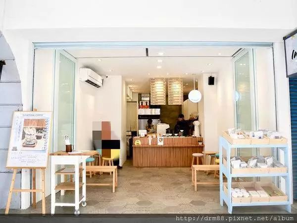 (原始链接: https://mmbiz.qpic.cn/mmbiz_jpg/XA8n2XaESnTmicQ66UtloHdPmFsBJAicwYAw0Ap15USJs8r1KPMbEhz4tfYMI5khvGl6hibiaT4ibb3ERGbU2AuiaRbw/640?wx_fmt=jpeg)
-  (原始链接: https://mmbiz.qpic.cn/mmbiz_jpg/XA8n2XaESnTmicQ66UtloHdPmFsBJAicwYNsoIMcfsXQE7QFzlJibUYt0VPYHl97oxbmtZULZYwnsNpgiawaUJ12UA/640?wx_fmt=jpeg)
-  (原始链接: https://mmbiz.qpic.cn/mmbiz_gif/XA8n2XaESnTmicQ66UtloHdPmFsBJAicwYQ3vLUFnibZtVtX4l33ASY3JLkZLMkqekD2ejg5ic66ISnT5WCOJT2KIQ/640?wx_fmt=gif)
-  (原始链接: https://mmbiz.qpic.cn/mmbiz_jpg/XA8n2XaESnTmicQ66UtloHdPmFsBJAicwYGyLO1AuJw9ibictxkJV9mzqEibLQdLiczKpoRPHJMYm8nQicmeSaqzbkNiaw/640?wx_fmt=jpeg)
- 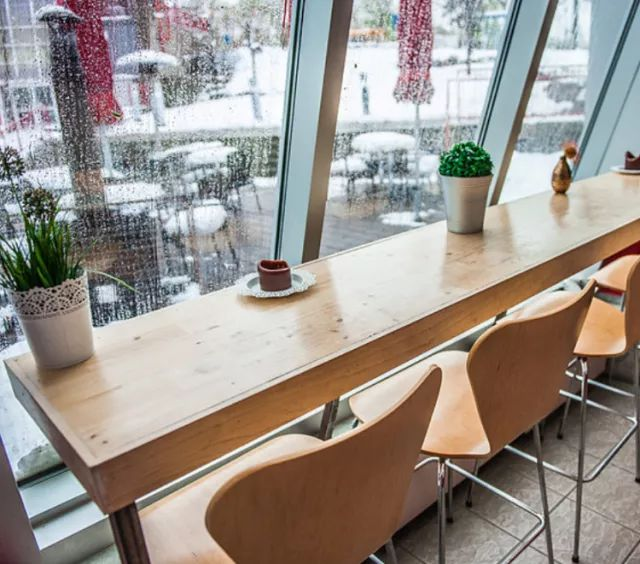 (原始链接: https://mmbiz.qpic.cn/mmbiz_jpg/XA8n2XaESnTmicQ66UtloHdPmFsBJAicwYcKClYyo5DQJqBYA168XrZPjRC8pWlnCiap8Qb7czVQAiaOdwlrRxnv1Q/640?wx_fmt=jpeg)
-  (原始链接: https://mmbiz.qpic.cn/mmbiz_png/XA8n2XaESnTmicQ66UtloHdPmFsBJAicwYicpmibMU7pbWty31Yn7Aibmicab78WwbPYFPeicMEJnOa1aIcjvKstdsMxg/640?wx_fmt=png)
- 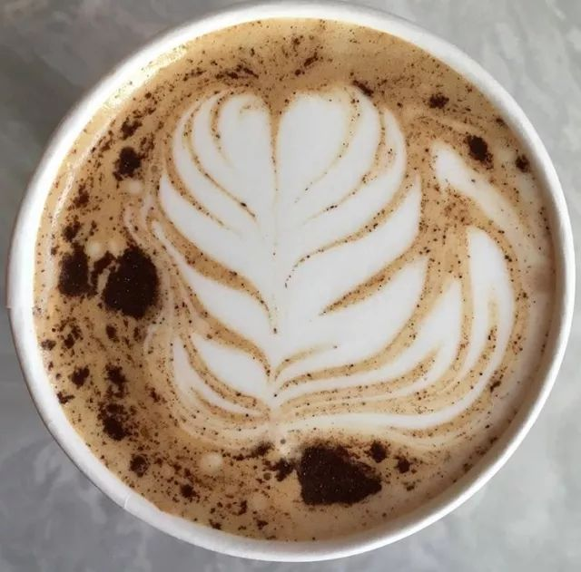 (原始链接: https://mmbiz.qpic.cn/mmbiz_jpg/XA8n2XaESnTmicQ66UtloHdPmFsBJAicwYQoC9vMkI2JxFkNpob2aOw9IN2vicvH76ID9hOx3hwTnHhUTAfgGBWBw/640?wx_fmt=jpeg)
-  (原始链接: https://mmbiz.qpic.cn/mmbiz_png/XA8n2XaESnTmicQ66UtloHdPmFsBJAicwYicpmibMU7pbWty31Yn7Aibmicab78WwbPYFPeicMEJnOa1aIcjvKstdsMxg/640?wx_fmt=png)
- 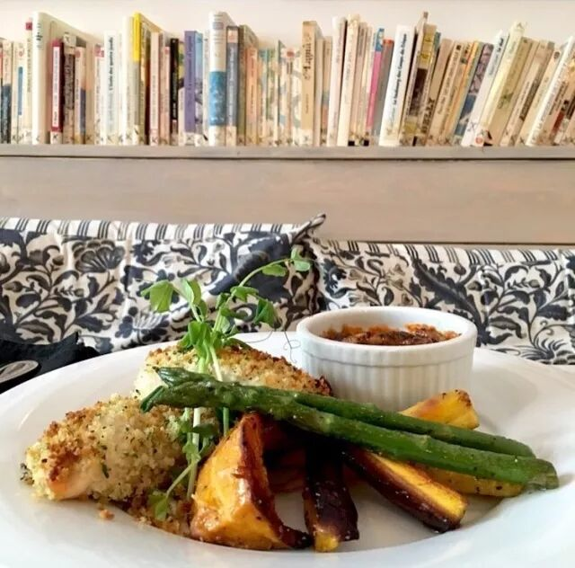 (原始链接: https://mmbiz.qpic.cn/mmbiz_jpg/XA8n2XaESnTmicQ66UtloHdPmFsBJAicwYkrntDplXNF9CxsVaAUYkgVlicdusftTkePqZGXgAxiblOP47Jd0TJosw/640?wx_fmt=jpeg)
-  (原始链接: https://mmbiz.qpic.cn/mmbiz_png/XA8n2XaESnTmicQ66UtloHdPmFsBJAicwYicpmibMU7pbWty31Yn7Aibmicab78WwbPYFPeicMEJnOa1aIcjvKstdsMxg/640?wx_fmt=png)
-  (原始链接: https://mmbiz.qpic.cn/mmbiz_png/XA8n2XaESnTmicQ66UtloHdPmFsBJAicwYD6vR09G6RzA1QpudQ6CAsBUYlPZEs2vicyICnNovliaGtUUVhdI4vChQ/640?wx_fmt=png)
- 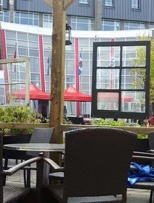 (原始链接: https://mmbiz.qpic.cn/mmbiz_jpg/XA8n2XaESnTmicQ66UtloHdPmFsBJAicwYyQOsSn9PttfYTqXZoX3hB8psZjPaIiaYx67VRBxz2nHOeQHTulxBznA/640?wx_fmt=jpeg)
-  (原始链接: https://mmbiz.qpic.cn/mmbiz_jpg/XA8n2XaESnTmicQ66UtloHdPmFsBJAicwYgSicQ1aGRzibutB4iceTEIDia7aKDeO5BweL8A0J72oI9qlqd2iaLqJfnTA/640?wx_fmt=jpeg)
- 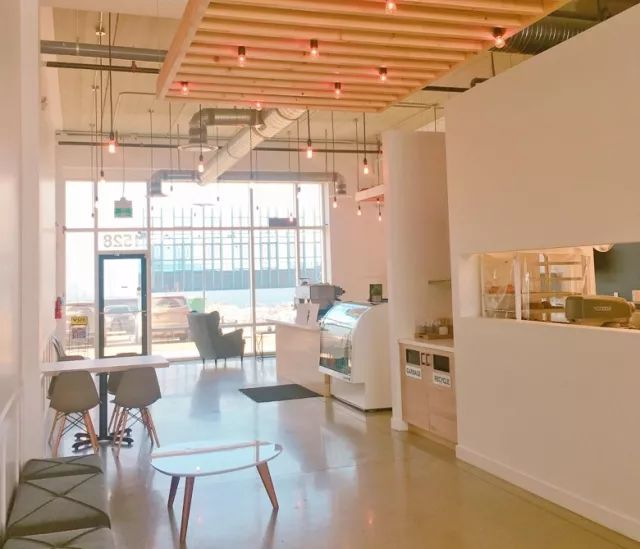 (原始链接: https://mmbiz.qpic.cn/mmbiz_jpg/XA8n2XaESnTmicQ66UtloHdPmFsBJAicwYXaStq8OandNDQPqlHvYbe1wKAfJ3j3Ys8vicIibKtkBqoxdaic3Eaib3nw/640?wx_fmt=jpeg)
-  (原始链接: https://mmbiz.qpic.cn/mmbiz_png/XA8n2XaESnTmicQ66UtloHdPmFsBJAicwYicpmibMU7pbWty31Yn7Aibmicab78WwbPYFPeicMEJnOa1aIcjvKstdsMxg/640?wx_fmt=png)
- 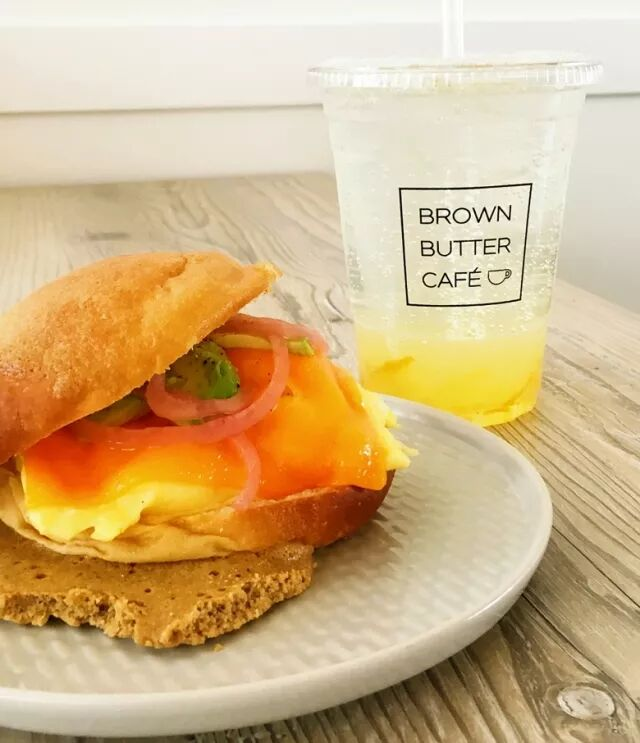 (原始链接: https://mmbiz.qpic.cn/mmbiz_jpg/XA8n2XaESnTmicQ66UtloHdPmFsBJAicwY9OicDAufMDiaeWc989PNVpk35nFyghno8iakptISP7G0BSdYMPXicZnfiaA/640?wx_fmt=jpeg)
-  (原始链接: https://mmbiz.qpic.cn/mmbiz_png/XA8n2XaESnTmicQ66UtloHdPmFsBJAicwYicpmibMU7pbWty31Yn7Aibmicab78WwbPYFPeicMEJnOa1aIcjvKstdsMxg/640?wx_fmt=png)
- 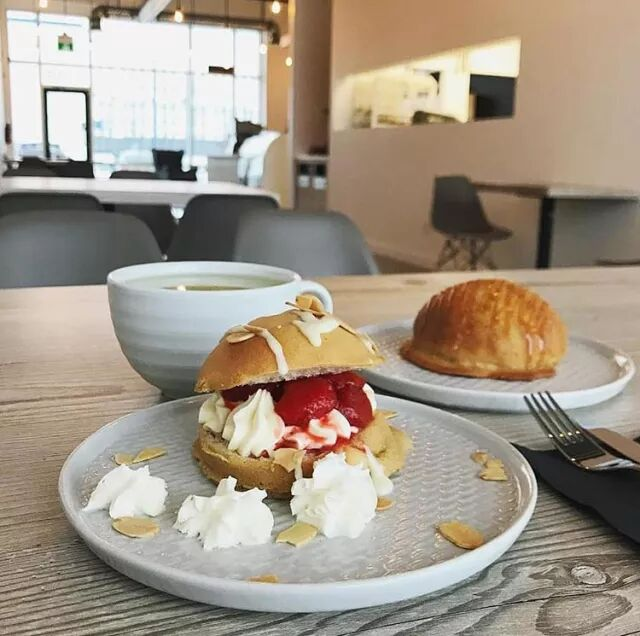 (原始链接: https://mmbiz.qpic.cn/mmbiz_jpg/XA8n2XaESnTmicQ66UtloHdPmFsBJAicwYR2oIjZMvjC0WrXh90yYrbiaKYBVorJVmzH3lJzfuh7cicbjRD7sSDhgg/640?wx_fmt=jpeg)
-  (原始链接: https://mmbiz.qpic.cn/mmbiz_png/XA8n2XaESnTmicQ66UtloHdPmFsBJAicwYicpmibMU7pbWty31Yn7Aibmicab78WwbPYFPeicMEJnOa1aIcjvKstdsMxg/640?wx_fmt=png)
-  (原始链接: https://mmbiz.qpic.cn/mmbiz_png/XA8n2XaESnTmicQ66UtloHdPmFsBJAicwYFY3fMe3WtynvG8CMIHicbgzZj2zlFhzEA8eIfPCDPhibFI79cfLymuog/640?wx_fmt=png)
- 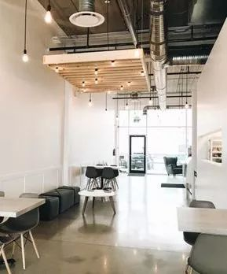 (原始链接: https://mmbiz.qpic.cn/mmbiz_jpg/XA8n2XaESnTmicQ66UtloHdPmFsBJAicwYIoibr3lZGib7IYOrECT6JhOlyzvSrSuFD29ibvQUiaD13E59EtEnoWLxxw/640?wx_fmt=jpeg)
- 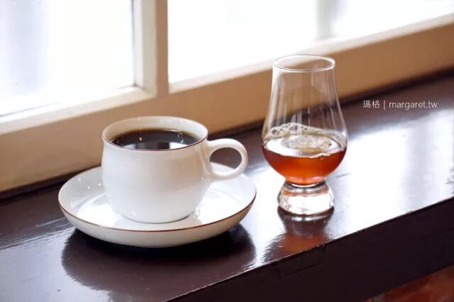 (原始链接: https://mmbiz.qpic.cn/mmbiz_jpg/XA8n2XaESnTmicQ66UtloHdPmFsBJAicwYMyMGfCsnO58VdCLeOrTwtIEibMIoWQobZOUPn2ZaRKYHfIfSHjHnNUA/640?wx_fmt=jpeg)
- 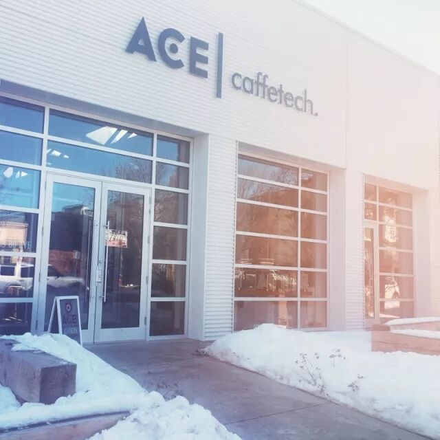 (原始链接: https://mmbiz.qpic.cn/mmbiz_jpg/XA8n2XaESnTmicQ66UtloHdPmFsBJAicwYBdlmJqOfOMkuzdaLKZia90u9PnMibib3yjhzJXZ9ibZANmMlia1x0ibAHicsw/640?wx_fmt=jpeg)
-  (原始链接: https://mmbiz.qpic.cn/mmbiz_png/XA8n2XaESnTmicQ66UtloHdPmFsBJAicwYicpmibMU7pbWty31Yn7Aibmicab78WwbPYFPeicMEJnOa1aIcjvKstdsMxg/640?wx_fmt=png)
- 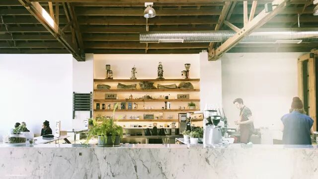 (原始链接: https://mmbiz.qpic.cn/mmbiz_jpg/XA8n2XaESnTmicQ66UtloHdPmFsBJAicwYx0xzu5E9oFrL70tZVzumHFUhnFOwZeeIgxq4CAIqjlWVjWatkfvSrg/640?wx_fmt=jpeg)
-  (原始链接: https://mmbiz.qpic.cn/mmbiz_png/XA8n2XaESnTmicQ66UtloHdPmFsBJAicwYicpmibMU7pbWty31Yn7Aibmicab78WwbPYFPeicMEJnOa1aIcjvKstdsMxg/640?wx_fmt=png)
- 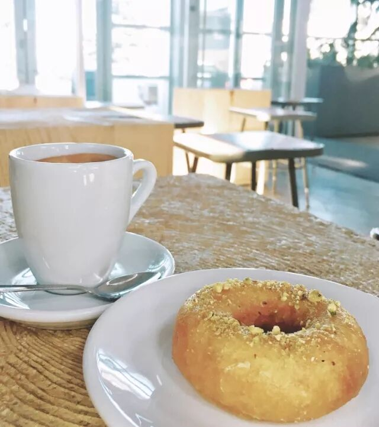 (原始链接: https://mmbiz.qpic.cn/mmbiz_jpg/XA8n2XaESnTmicQ66UtloHdPmFsBJAicwYZXHfKydb5QIAW1CD2qnUtKdBL65eyDQ44w0YXbfBriapNpKpCvQ7VDw/640?wx_fmt=jpeg)
-  (原始链接: https://mmbiz.qpic.cn/mmbiz_png/XA8n2XaESnTmicQ66UtloHdPmFsBJAicwYicpmibMU7pbWty31Yn7Aibmicab78WwbPYFPeicMEJnOa1aIcjvKstdsMxg/640?wx_fmt=png)
-  (原始链接: https://mmbiz.qpic.cn/mmbiz_png/XA8n2XaESnTmicQ66UtloHdPmFsBJAicwYD6vR09G6RzA1QpudQ6CAsBUYlPZEs2vicyICnNovliaGtUUVhdI4vChQ/640?wx_fmt=png)
- 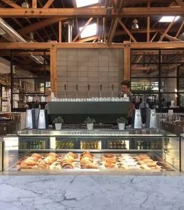 (原始链接: https://mmbiz.qpic.cn/mmbiz_jpg/XA8n2XaESnTmicQ66UtloHdPmFsBJAicwYR3oK28KOXfW9cvf1BO9DLTmRWv8M8sUg4hic3AiaxCvMDdyhWhjstrLQ/640?wx_fmt=jpeg)
-  (原始链接: https://mmbiz.qpic.cn/mmbiz_jpg/XA8n2XaESnTmicQ66UtloHdPmFsBJAicwYQovZdIyrficFMkcVrdzu36p5qxgePrrufsDKuSM7fmc9zMBfoG11AwQ/640?wx_fmt=jpeg)
- 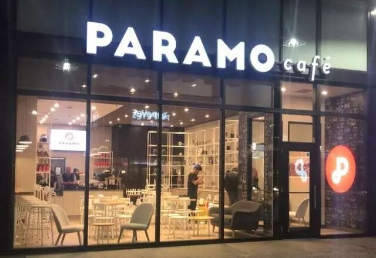 (原始链接: https://mmbiz.qpic.cn/mmbiz_jpg/XA8n2XaESnTmicQ66UtloHdPmFsBJAicwYqGI8uVj1Ky7INBA4CiawrqwBn4QyTmEiaMyHicicmD6CMRWN2T1BQZictxQ/640?wx_fmt=jpeg)
-  (原始链接: https://mmbiz.qpic.cn/mmbiz_png/XA8n2XaESnTmicQ66UtloHdPmFsBJAicwYseTBxibxIBZC19TCO5Vm05pibdIZwjRJ0ZdicvBpdPhqMkBSiaMFeZLraQ/640?wx_fmt=png)
- 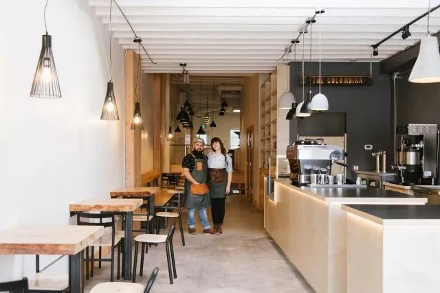 (原始链接: https://mmbiz.qpic.cn/mmbiz_jpg/XA8n2XaESnTmicQ66UtloHdPmFsBJAicwY3ZkGfL9kOoZMFzPc0YSLySooNZiczibibZgJOJPW93oPGiczYYFs8SSO9Q/640?wx_fmt=jpeg)
-  (原始链接: https://mmbiz.qpic.cn/mmbiz_png/XA8n2XaESnTmicQ66UtloHdPmFsBJAicwYseTBxibxIBZC19TCO5Vm05pibdIZwjRJ0ZdicvBpdPhqMkBSiaMFeZLraQ/640?wx_fmt=png)
- 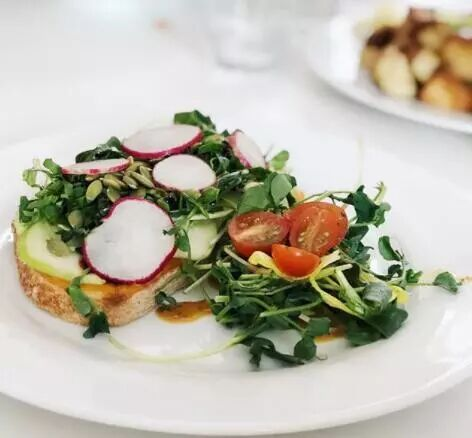 (原始链接: https://mmbiz.qpic.cn/mmbiz_jpg/XA8n2XaESnTmicQ66UtloHdPmFsBJAicwYBFRV0BHRjvgIH8yNLwN0NXZsf2Ys1ibrazOiaOmd86ibxzgLQD4o2cI7A/640?wx_fmt=jpeg)
- 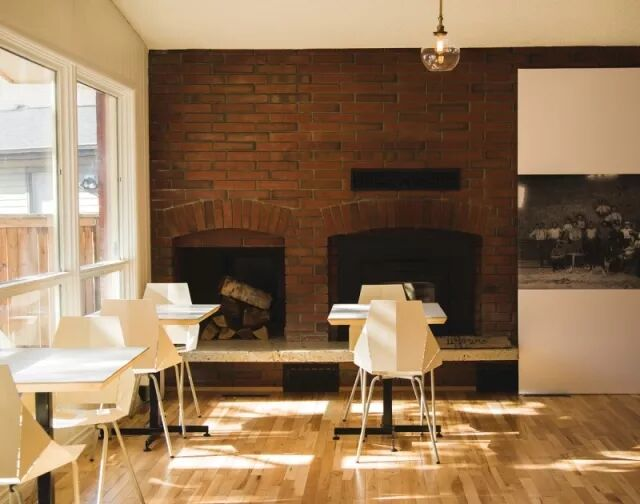 (原始链接: https://mmbiz.qpic.cn/mmbiz_jpg/XA8n2XaESnTmicQ66UtloHdPmFsBJAicwYiacRFoJBXibHuiadR37oCc2kcQOV7S1Ur8WCicRFRfEXcDLIQWTNicSfY2g/640?wx_fmt=jpeg)
-  (原始链接: https://mmbiz.qpic.cn/mmbiz_png/XA8n2XaESnTmicQ66UtloHdPmFsBJAicwYD6vR09G6RzA1QpudQ6CAsBUYlPZEs2vicyICnNovliaGtUUVhdI4vChQ/640?wx_fmt=png)
-  (原始链接: https://mmbiz.qpic.cn/mmbiz_png/XA8n2XaESnTmicQ66UtloHdPmFsBJAicwY3a2egRItMMIWC85k2sHG63jwIW4bjONQzD93Hr4wetmAO2YDTfIoBA/640?wx_fmt=png)
-  (原始链接: https://mmbiz.qpic.cn/mmbiz_gif/XA8n2XaESnTmicQ66UtloHdPmFsBJAicwYHUV5ptfN4Mvs8pqRIYErmykGTQ0DujptbJBqibp5g9Rib0icsaIdSwrYA/640?wx_fmt=gif)
-  (原始链接: https://mmbiz.qpic.cn/mmbiz_gif/XA8n2XaESnTmicQ66UtloHdPmFsBJAicwYSibJHSsq89HibG3cya1gue6HJ7MuUtgUamIXO8oL868oWDrJw5NZicjHA/640?wx_fmt=gif)
-  (原始链接: https://mmbiz.qpic.cn/mmbiz_jpg/XA8n2XaESnTmicQ66UtloHdPmFsBJAicwYXtfhQtJyich92RoibwFN8xbEOfP473rm661l0TcnQNYDicUC5Er9VAFLQ/640?wx_fmt=jpeg)
