# 无标题

**链接地址:** http://mp.weixin.qq.com/s?__biz=MzUzMTI3MjY0Mg==&mid=100000145&idx=1&sn=5e6757626f350e7763a00dbc2d82fc89&chksm=7a44473c4d33ce2ae5e3ecd5330357b74897610b38895bf9ff74b287fb8e9dc05eb3941354b4&mpshare=1&scene=2&srcid=0405oXm2ea6geAFV5m7iYI1V#rd
**作者:** Kay
**获取时间:** 2025/8/28 22:03:49
**图片数量:** 197

---

## 原始HTML内容

 
<section class="_wxbEditor" style="white-space: normal;"><section style="width: 563px;"><section style="font-size: 14px; text-align: justify; color: rgb(73, 73, 74);">
致中国的各位：

 

在我80年的人生里，从未想过有一天能像25号中午那样，和大家一起做菜、用餐。感受到了大家扑面而来的大好青年气质！

 

虽然只是短短的半天，但我非常开心。谢谢你们！请再来日本哟。回国路上请注意安全。保重，再会！

 

田中泰子

 

送上我亲手制作的毛线洗碗刷和可以二次利用的垃圾袋。煎饼和糖果请在路上吃吧！

 
</section><section style="width: 563px;"><section style="margin-right: auto; margin-left: auto; width: 30px; transform: translateZ(10px);"><section style="width: 0px; height: 0px; border-bottom: 30px solid rgb(51, 51, 51); border-left: 15px solid transparent; border-right: 15px solid transparent;"></section><section style="margin-top: -28px; width: 0px; height: 0px; border-bottom: 30px solid rgb(254, 254, 254); border-left: 15px solid transparent; border-right: 15px solid transparent;"></section></section></section><section style="margin-top: -2px; border-width: 15px; border-style: solid; -webkit-border-image: url(https://mmbiz.qpic.cn/mmbiz_png/L6HdGyg0k5TBnlvgSykCODyWkFgby4GY7nDaf1pZaov0k7PhmVWX9u2c07dnBQK7iaRFiccmHc1cq5brZSibozibvQ/640?wx_fmt=png) 15 fill;">

</section></section></section>
 

照片中间双手比“V”的可爱奶奶就是上面给我们写信的田中泰子。在我们结束4天津和野行程，即将离开的时候，奶奶已经早早地守候在车站，带着她亲手给我们准备的礼物和零食，来为我们送行。

 

第一次见到奶奶是两天前学做料理的时候，奶奶临时来厨房帮忙。我们都没有想到，这位跟我们并没有太多交流的老人家，回家之后竟然花了这么多心思准备礼物和书信。最打动人的时刻，往往都会毫无防备地发生，队里可爱的主播小野栗呀已经不知道是第几次泪洒津和野。

 

 

“你们跟我从电视里看到的中国人不一样”。这句话在我短短两次造访津和野的时间里，我听到过很多当地人这么说。在地处偏远的小镇上，很少有外国来访者，他们对于“中国人”的印象往往来自于媒体。“中国游客赴日爆买”、“中国威胁论”这样的新闻在日本的各大主流媒体都曾有报道。对于我们的到访，有些当地人心里是有疑问的，“他们来这里干什么？”

 

当看到我们的队员正在认真了解当地历史文化、学习传统舞蹈、茶道、积极与当地人讨论交流时，他们的疑问便烟消云散了。“在交流的过程中我们也对中国有了更多的了解。很高兴你们能来津和野，希望你们能常来。”几位日本朋友当下决定9月的时候要跟着x++一起去深圳访问。这样的互动让我觉得，我们正在做一件很有意义的事情。

 

 
<section data-width="100%" style="white-space: normal; display: flex; justify-content: center; width: 563px;"><section data-width="100%" style="margin-top: 10px; margin-right: auto; margin-left: auto; padding: 10px; width: 563px; display: flex;"><section style="width: 20px; border-top: 1px solid rgb(72, 83, 75);"></section><section data-width="100%" style="margin-left: 5px; width: 237.75px; border-top: 1px solid rgb(72, 83, 75);"></section><section style="margin-top: -16px; padding-right: 6px; padding-left: 6px; width: 40px; background-image: initial; background-position: initial; background-size: initial; background-repeat: initial; background-attachment: initial; background-origin: initial; background-clip: initial;"><section style="width: 30px;"></section></section><section data-width="100%" style="margin-right: 5px; width: 237.75px; border-top: 1px solid rgb(72, 83, 75);"></section><section style="width: 20px; border-top: 1px solid rgb(72, 83, 75);"> </section></section></section>
Hi，欢迎开启x++间隔游 

我是游记写了半个月的小Kay

 

 

回到这次的出行，虽然我是第二次去津和野了，有些活动已经参加过一次，但还是感觉很不一样。尤其是，又认识了一群超级优秀的队友！
<section class="_wxbEditor" style="white-space: normal;">
 
<section class="_wxb-style" data-tools="135编辑器" data-id="86426" style="line-height: 25.6px; border: 0px none;"><section style="margin: 1em auto; padding: 5px; text-align: center; border: 1px solid rgb(221, 221, 221); overflow: hidden;">

← 左右滑动了解本期小伙伴 →
</section></section></section>
 

经过一段时间的相处，现在再看出发前大家自己填的人物卡，有了物是人非的感觉对他们更深刻的了解，所以我觉得有必要为大家重新做个出场人物介绍。

 

 

春荣，人称“池老师”，会写歌会唱还会弹吉他，在大家旅途疲惫的时候也顺带算个命，或者帮大家做推拿按摩，这次其实是x++专门请来拍纪录片的。

 

 

梅梅，温柔的小女生。一路上展现出令人拜服的超高情商，每个人跟她相处都觉得很舒服，非常会照顾人。有专业的日语翻译能力，而且声音好好听啊。

 

 

金城，人称“金老师”，别看人物卡上不好惹的样子，其实非常腼腆爱笑脾气好。一路上虽然话不多，但是帮我们拍了超多美美的照片。

 

 

Maggie，大家都叫她小一，是非常有领导力的小姐姐。她在上海有自己的设计工作室，一路上为我们补充了相当丰富的建筑学知识。

 

 

罗超，虽然年纪不大，但是非让我们叫他超哥。在大家讨论意见不同的时候，他总能找到一个点来调和双方观点。关于游泳健身方面的疑问超哥能提供专业见解。

 

 

小野栗呀，简称利亚，在被池老师拍到的时候瞬间化身美食主播。作为兼职淘宝店主，每天的出场服装配饰妆容都很Fashion，经常让人忘了她在银行工作。爱笑，同时也爱哭。

 

 

三蛋，网络人称“撒旦君”，我们叫他“撒老师”。不说话的时候是非常厉害的画家，说话的时候，观点非常犀利，脑洞清奇。是参观美术馆的必备队友。

 

 

冰灵，见多识广的小姐姐，足迹几乎遍布全球。从事教育行业，对于人生有非常深刻的思考，抛出的问题对大家很有启发性。

 

好啦，队员介绍完毕，现在出发~&nbsp;

 

<section class="_wxbEditor"><section class="RankEditor" style="border: 0px none;"><section style="width:100%; text-align:center;"><section style="display: inline-block; height: 50px; padding-top: 3px; padding-right: 3px; padding-left: 3px; background-image: url(https://mmbiz.qpic.cn/mmbiz_png/L6HdGyg0k5TZLfw7NUENqFxnCR0hfUzlOcKYlCSkywMfnqBAveQYXkTHnzHVEAPosUhXQI6CdzkNB7x7r7dicEg/640?wx_fmt=png); background-size: 100% 100%;"><section style="padding: 2px; background-color: rgb(240, 170, 37);"><section style="padding-right: 20px; padding-left: 20px; background-color: rgb(255, 214, 52); border-radius: 3px; height: 31px;"><section style="width: 100%; padding-top: 2px;"><section style="width:40px; margin-left:-15px;"></section></section><section style="width: 100%; line-height: 22px;">
<strong>Day 1 大阪</strong>
</section><section style="width:100%;"><section style="width:40px; margin-left:-15px; float:right; margin-right:-15px;"></section></section></section></section></section></section></section></section>

 

时间：2018年4月22日，大阪时间19：30

地点：日本第一的横纲炸串

叙述人：池老师

 

 

“他问我‘什么是有趣？’这一下把我问住了。”

“这是我人生中最长的6个小时。”

“对了，还问我‘你觉得什么是仪式感？’，嗯，仪式感。”

“今天把这一年的话都说完了。”

“哎呀，这几天要尽量避免跟他有任何眼神上的接触。”

“他平时也是这么问问题的么？”

“太累了。” 

 

被吐槽的人是x++间隔游组织者BOBO，此时他刚接上冰灵，正在赶往饭店的路上。不知道他有没有接连不断地打喷嚏。

 

今天是本期间隔游的第一天，BOBO一早在机场等候陆续抵达大阪的各位队员，将他们送上去集合点的火车，再由我在车站接队员们去办理酒店入住。池老师也在机场，拍摄每位队员抵达的情景作为纪录片素材。在接机的间隙，两个人总要聊点什么吧，于是BOBO和池老师开启了尬聊模式。

 

在饭桌前听了以上吐槽的我们都大笑不止。嗯，这些问题确实很BOBO。

<section class="_wxbEditor"><section class="RankEditor" style="border: 0px none;"><section style="width:100%; text-align:center;"><section style="display: inline-block; height: 50px; padding-top: 3px; padding-right: 3px; padding-left: 3px; background-image: url(https://mmbiz.qpic.cn/mmbiz_png/L6HdGyg0k5TZLfw7NUENqFxnCR0hfUzlOcKYlCSkywMfnqBAveQYXkTHnzHVEAPosUhXQI6CdzkNB7x7r7dicEg/640?wx_fmt=png); background-size: 100% 100%;"><section style="padding: 2px; background-color: rgb(240, 170, 37);"><section style="padding-right: 20px; padding-left: 20px; background-color: rgb(255, 214, 52); border-radius: 3px; height: 31px;"><section style="width: 100%; padding-top: 2px;"><section style="width:40px; margin-left:-15px;"></section></section><section style="width: 100%; line-height: 22px;">
<strong>Day 2 大阪-津和野</strong>
</section><section style="width:100%;"><section style="width:40px; margin-left:-15px; float:right; margin-right:-15px;"></section></section></section></section></section></section></section></section>
 

 

 

早上9点，在JR大阪站与连夜赶来的金老师接上头，全员集合完毕。辗转3趟火车，在下午2点的时候火车抵达了津和野站。x++在当地的同事宫武优太郎和灏哥已经在车站等我们啦。

 
<section style="padding-top: 15px; padding-bottom: 15px; white-space: normal; width: 563px; display: -webkit-flex; justify-content: center;"><section style="width: 30px;"><section style="margin-top: -9px; width: 30px;"></section></section><section style="margin-left: -17px;"><section style="padding-right: 20px; padding-left: 20px; line-height: 30px; background-color: rgb(245, 185, 48); color: rgb(255, 255, 255);">01. 古桥酒造</section></section><section style="margin-left: -18px; width: 30px;"><section style="padding-top: 11px; width: 30px;"></section></section></section>
 

 

所有事情的开始都可以用酒来庆祝，我们的出行也是，所以放下行李我们直奔古桥酒厂。上次来的时候是冬季，正是酿酒的季节，老板带我们参观了酿酒车间、发酵室。春季再来的时候酒已经酿好了，所以我们品尝到了今年的原浆新酒，味道甜甜的很好喝，但是后劲也非常大。

 

 

冰灵发现了一件不同寻常的东西，正是上期的x++队员一起为古桥先生做的感谢卡，古桥先生专门装了相框摆在店里。旁边的电脑上展示的是朋友们在北京如故照相馆为"初阵"拍的宣传照。

 

感谢上期x++一脸幸福团全体团友、设计师Neo友情支持

 

 
<section style="padding-top: 15px; padding-bottom: 15px; white-space: normal; width: 563px; display: -webkit-flex; justify-content: center;"><section style="width: 30px;"><section style="margin-top: -9px; width: 30px;"></section></section><section style="margin-left: -17px;"><section style="padding-right: 20px; padding-left: 20px; line-height: 30px; background-color: rgb(245, 185, 48); color: rgb(255, 255, 255);">02. 农具店</section></section><section style="margin-left: -18px; width: 30px;"><section style="padding-top: 11px; width: 30px;"></section></section></section>
 

顺路去探望了对门农具店的奶奶，每次见到她的时候她都是精致又优雅。一楼是商品区，陈列着各种工具、种子、肥料等，还有奶奶收集来的艺术家们创作的陶瓷器具。

 

 

Perlaky也来了，他跟我说今年旅游学博士结业以后，他将回到家乡匈牙利照顾父母，带着女朋友回去开始新生活。他说他非常不舍得离开津和野，离开日本，这里是他的第二故乡。

 

 

二楼是奶奶住的地方，她跟我们聊起她的女儿。女儿曾在京都的大学学习设计，毕业后选择回到津和野，在镇上的美术馆工作，同时也帮助外来移民融入当地的生活。后来去美术馆参观的时候，我们还碰到了她，文末的视频里也有她哦。

 
<section class="_wxbEditor" style="white-space: normal;"><section style="padding-top: 15px; padding-bottom: 15px; width: 563px; display: -webkit-flex; justify-content: center;"><section style="width: 30px;"><section style="margin-top: -9px; width: 30px;"></section></section><section style="margin-left: -17px;"><section style="padding-right: 20px; padding-left: 20px; line-height: 30px; background-color: rgb(245, 185, 48); color: rgb(255, 255, 255);">03. 艺术料理</section></section><section style="margin-left: -18px; width: 30px;"><section style="padding-top: 11px; width: 30px;"></section></section></section></section>
 

 

晚上的艺术料理体验是在山脚下的共享空间Familiar举行。泡完温泉的我们沿着乡间小路走了差不多15分钟，路上大家聊着天，看着路边的稻田和群山，听蛙鸣和各种昆虫奏的交响乐，油菜花和紫藤竞相开放，田间的风又柔又润。池老师和超哥还在露台上弹起了吉他，我们轻轻地和着拍子。

 

 

这次料理所有的蔬菜都是主厨山田自己种的，他还有个爱好是调制不同的酱料。山野菜天妇罗、小葱饼、鲜嫩的鸡肉等都体现出他高超的厨艺，食材的搭配上也是别出心裁。梅梅给予主厨山田极高的评价。

 

 

山田是这个共享空间的副会长，他去了很多国家以后决定回到日本，要在津和野开辟出自己的王国。第一步先从生产蔬菜粮食开始，到制作美味可口的饭菜，再到养殖家禽，今后希望可以自己生产能源（油），进一步地实现自己真正独立的愿景。

 

<section class="_wxbEditor"><section class="RankEditor" style="border: 0px none;"><section style="width:100%; text-align:center;"><section style="display: inline-block; height: 50px; padding-top: 3px; padding-right: 3px; padding-left: 3px; background-image: url(https://mmbiz.qpic.cn/mmbiz_png/L6HdGyg0k5TZLfw7NUENqFxnCR0hfUzlOcKYlCSkywMfnqBAveQYXkTHnzHVEAPosUhXQI6CdzkNB7x7r7dicEg/640?wx_fmt=png); background-size: 100% 100%;"><section style="padding: 2px; background-color: rgb(240, 170, 37);"><section style="padding-right: 20px; padding-left: 20px; background-color: rgb(255, 214, 52); border-radius: 3px; height: 31px;"><section style="width: 100%; padding-top: 2px;"><section style="width:40px; margin-left:-15px;"></section></section><section style="width: 100%; line-height: 22px;">
<strong>Day 3 津和野</strong>
</section><section style="width:100%;"><section style="width:40px; margin-left:-15px; float:right; margin-right:-15px;"></section></section></section></section></section></section></section></section>
 
<section class="_wxbEditor" style="white-space: normal;"><section style="padding-top: 15px; padding-bottom: 15px; width: 563px; display: -webkit-flex; justify-content: center;"><section style="width: 30px;"><section style="margin-top: -9px; width: 30px;"></section></section><section style="margin-left: -17px;"><section style="padding-right: 20px; padding-left: 20px; line-height: 30px; background-color: rgb(245, 185, 48); color: rgb(255, 255, 255);">04. 日本遗产馆</section></section><section style="margin-left: -18px; width: 30px;"><section style="padding-top: 11px; width: 30px;"></section></section></section></section>
 

 

四月的第二个星期天，樱花开得正好的时候，在津和野会举行一年一度的“流镝马”盛事。这一比赛历史悠久，可以追溯到12世纪的幕府时代。男子们盛装骑着马，从赛道的一端出发，在快马飞奔的过程中要射三个地方的靶子。“流镝马”、“鹭舞”和“津和野踊”，组成津和野三大传统祭典。

 

 

“百景图”里描绘的是近300年前津和野的样子，墙上的大地图甚至精确到每户人家的名字。为了保护城区的历史风貌，当地政府也推行了很多政策和补贴。其他地方街上常见的自动贩卖机、空调主机等现代化机械，在这里都要被装上木质围栏或者涂成相近的颜色。

 
<section class="_wxbEditor" style="white-space: normal;"><section style="padding-top: 15px; padding-bottom: 15px; width: 563px; display: -webkit-flex; justify-content: center;"><section style="width: 30px;"><section style="margin-top: -9px; width: 30px;"></section></section><section style="margin-left: -17px;"><section style="padding-right: 20px; padding-left: 20px; line-height: 30px; background-color: rgb(245, 185, 48); color: rgb(255, 255, 255);">05. 舞蹈课</section></section><section style="margin-left: -18px; width: 30px;"><section style="padding-top: 11px; width: 30px;"></section></section></section></section>
 

 

“津和野踊”是在8月中旬盂兰盆节那天夜里全民参与的盛大祭奠。起源是津和野的城主为了攻下一座守卫森严的敌人城堡，命武士们穿上舞蹈服装掩盖身上的盔甲，用轻柔缓慢的动作以及袖口系铃铛，掩盖身上武器碰撞的声音，终于在夜色的掩护下攻下了敌城。BOBO和金老师特别适合出演武士。

 

 

教我们跳舞的安达嘉奶奶今年76岁了，她将自己的一生都奉献给了舞蹈艺术。奶奶是个特别风趣幽默的人，教我们动作的时候用英语打着节拍，口头禅是“记不住也没关系哦”。她说昨天晚上思考了很久，想了很多办法，希望能让我们这群外国人学会舞蹈动作。

 
<section class="_wxbEditor" style="white-space: normal;"><section style="padding-top: 15px; padding-bottom: 15px; width: 563px; display: -webkit-flex; justify-content: center;"><section style="width: 30px;"><section style="margin-top: -9px; width: 30px;"></section></section><section style="margin-left: -17px;"><section style="padding-right: 20px; padding-left: 20px; line-height: 30px; background-color: rgb(245, 185, 48); color: rgb(255, 255, 255);">06. 学校旧址</section></section><section style="margin-left: -18px; width: 30px;"><section style="padding-top: 11px; width: 30px;"></section></section></section></section>
 
<section class="_wxbEditor"><section><section data-width="50%" style="display: inline-block; vertical-align: top; width: 50%;"><section style=" text-align: center; margin: 0.5em; box-shadow: rgb(102, 102, 102) 3.53553px 3.53553px 8px;  "><section style="overflow: hidden; margin: 0px auto; width: 100%; padding-bottom: 100%; height: 0px; background-image: url(https://mmbiz.qpic.cn/mmbiz_jpg/L6HdGyg0k5Tw9jxWtXwibkfpKvcKrDeIgYYHc12gZYvc0vha7iafmqlMLZTsUc9LMjJwKibiaLksbO9I3jPianAEABA/640?wx_fmt=jpeg); background-position: 50% 50%; background-size: cover;"></section></section></section><section data-width="50%" style="display: inline-block; vertical-align: top; width: 50%;"><section style=" text-align: center; margin: 0.5em; box-shadow: rgb(102, 102, 102) 3.53553px 3.53553px 8px; "><section style="overflow: hidden; margin: 0px auto; width: 100%; padding-bottom: 100%; height: 0px; background-image: url(https://mmbiz.qpic.cn/mmbiz_jpg/L6HdGyg0k5Tw9jxWtXwibkfpKvcKrDeIgjoPf8YGrGciakfus9W5NkqJBoBQNPib8xfoJM6fTLJZN89Dw7DCfLrvw/640?wx_fmt=jpeg); background-position: 50% 50%; background-size: cover;"></section></section></section></section><section><section data-width="50%" style="display: inline-block; vertical-align: top; width: 50%;"><section style=" text-align: center; margin: 0.5em; box-shadow: rgb(102, 102, 102) 3.53553px 3.53553px 8px; "><section style="overflow: hidden; margin: 0px auto; width: 100%; padding-bottom: 100%; height: 0px; background-image: url(https://mmbiz.qpic.cn/mmbiz_jpg/L6HdGyg0k5Tw9jxWtXwibkfpKvcKrDeIgMrHcDYxFu2WonYOoZFpuN8KCvlKWsN80kdOHicsBSermjXqqh5apXRQ/640?wx_fmt=jpeg); background-position: 50% 50%; background-size: cover;"></section></section></section><section data-width="50%" style="display: inline-block; vertical-align: top; width: 50%;"><section style=" text-align: center; margin: 0.5em; box-shadow: rgb(102, 102, 102) 3.53553px 3.53553px 8px; "><section style="overflow: hidden; margin: 0px auto; width: 100%; padding-bottom: 100%; height: 0px; background-image: url(https://mmbiz.qpic.cn/mmbiz_jpg/L6HdGyg0k5TBnlvgSykCODyWkFgby4GYAvVGbDSYuUg8laRb8UTiafKJt7KKMEaxDcrhjMuq9tIPoia0lMedLFbA/640?wx_fmt=jpeg); background-position: 50% 50%; background-size: cover;"></section></section></section></section></section>
 

第二次来拜访灏哥的羊毛毡工作室，这里多了很多可爱的新作品，有胸针、冰箱贴还有明信片（文末有福利）。灏哥讲到他骑自行车环游日本时，骑到北海道时遇上大地震，朋友们打电话给他，叫他找地方躲避，他说看着周围空旷的天地，仿佛感受到了大地的脉搏。冰灵听了灏哥的故事感触特别深，接连问了很多引人思考的问题。

 
<section class="_wxbEditor" style="white-space: normal;"><section style="padding-top: 15px; padding-bottom: 15px; width: 563px; display: -webkit-flex; justify-content: center;"><section style="width: 30px;"><section style="margin-top: -9px; width: 30px;"></section></section><section style="margin-left: -17px;"><section style="padding-right: 20px; padding-left: 20px; line-height: 30px; background-color: rgb(245, 185, 48); color: rgb(255, 255, 255);">07. 福田花艺</section></section><section style="margin-left: -18px; width: 30px;"><section style="padding-top: 11px; width: 30px;"></section></section></section></section>
 
<section class="_wxbEditor"><section><section data-width="50%" style="display: inline-block; vertical-align: top; width: 50%;"><section style=" text-align: center; margin: 0.5em; box-shadow: rgb(102, 102, 102) 3.53553px 3.53553px 8px;  "><section style="overflow: hidden;margin: 0 auto;width:100%;padding-bottom:100%;height:0px;background-image:url(https://mmbiz.qpic.cn/mmbiz_jpg/L6HdGyg0k5Tw9jxWtXwibkfpKvcKrDeIg19OjxKuwUOM4UArickmUVpv79fdT5VzjkmvkAqxx4eyYviauV5VwIbKA/640?wx_fmt=jpeg);background-position:50% 50%;background-size: cover;"></section></section></section><section data-width="50%" style="display: inline-block; vertical-align: top; width: 50%;"><section style=" text-align: center; margin: 0.5em; box-shadow: rgb(102, 102, 102) 3.53553px 3.53553px 8px; "><section style="overflow: hidden;margin: 0 auto;width:100%;padding-bottom:100%;height:0px;background-image:url(https://mmbiz.qpic.cn/mmbiz_jpg/L6HdGyg0k5Tw9jxWtXwibkfpKvcKrDeIgH3LtPj78YjrNfZ86cnpO1oiaJAQ0huFWiaSSVLtVJD2zI7L84iaDE5swA/640?wx_fmt=jpeg);background-position:50% 50%;background-size: cover;"></section></section></section></section><section><section data-width="50%" style="display: inline-block; vertical-align: top; width: 50%;"><section style=" text-align: center; margin: 0.5em; box-shadow: rgb(102, 102, 102) 3.53553px 3.53553px 8px; "><section style="overflow: hidden;margin: 0 auto;width:100%;padding-bottom:100%;height:0px;background-image:url(https://mmbiz.qpic.cn/mmbiz_jpg/L6HdGyg0k5Tw9jxWtXwibkfpKvcKrDeIgsJQVdEQ01voMJkNM6kryW3Axf2tpTbTCdiasMDnUtkO9kicichLu41nxw/640?wx_fmt=jpeg);background-position:50% 50%;background-size: cover;"></section></section></section><section data-width="50%" style="display: inline-block; vertical-align: top; width: 50%;"><section style=" text-align: center; margin: 0.5em; box-shadow: rgb(102, 102, 102) 3.53553px 3.53553px 8px; "><section style="overflow: hidden;margin: 0 auto;width:100%;padding-bottom:100%;height:0px;background-image:url(https://mmbiz.qpic.cn/mmbiz_jpg/L6HdGyg0k5Tw9jxWtXwibkfpKvcKrDeIga5hMMtEJHfIXvibVpDtUiacQ0Mcf7ABd1KN5LMNzbXaq80lTrbM7fgOA/640?wx_fmt=jpeg);background-position:50% 50%;background-size: cover;"></section></section></section></section></section>
 

福田桂子老师特意抬出了榻榻米，邀请我们的队员上去体验完整的日式茶道礼仪，我们派出梅梅、利亚、超哥作为代表。后来他们说最难忘的是跪了半个小时，腿太疼了。茶点的甘甜衬出了抹茶有点苦涩的清香，搭配起来非常完美。

 
<section class="_wxbEditor" style="white-space: normal;"><section style="padding-top: 15px; padding-bottom: 15px; width: 563px; display: -webkit-flex; justify-content: center;"><section style="width: 30px;"><section style="margin-top: -9px; width: 30px;"></section></section><section style="margin-left: -17px;"><section style="padding-right: 20px; padding-left: 20px; line-height: 30px; background-color: rgb(245, 185, 48); color: rgb(255, 255, 255);">08. 古桥酒会</section></section><section style="margin-left: -18px; width: 30px;"><section style="padding-top: 11px; width: 30px;"></section></section></section></section>
 

 

带着昨天参观酒造的时候买的10多瓶各式清酒，晚上我们决定喝个痛快。BOBO、小一和我负责为大家倒酒。主人古桥先生为我们讲起了如何品酒，负责当地教育的会长回忆起他当年在马达加斯加教日语的往事。后来酒过三巡，白井小哥哥跳起了机械舞，安达嘉奶奶回去换上演出服为我们表演了她自创的舞蹈。

 

 

他们的真诚和热情让我们觉得很感动，于是在利亚的提议下，我们合唱了两首邓丽君的歌作为感谢。唱完歌，安达嘉奶奶带着我们学起了日本幼儿园小朋友的集体舞。宫武说，他从幼儿园毕业后有20年没跳过这些舞了。每个人都沉浸在欢乐的气氛里，特别放松，特别享受。

 

 

结束的时候照例来张大合影，但是我一定要把这张单独放出来，因为万能的池老师跟广告画版都这么搭！

 

<section class="_wxbEditor"><section class="RankEditor" style="border: 0px none;"><section style="width:100%; text-align:center;"><section style="display: inline-block; height: 50px; padding-top: 3px; padding-right: 3px; padding-left: 3px; background-image: url(https://mmbiz.qpic.cn/mmbiz_png/L6HdGyg0k5TZLfw7NUENqFxnCR0hfUzlOcKYlCSkywMfnqBAveQYXkTHnzHVEAPosUhXQI6CdzkNB7x7r7dicEg/640?wx_fmt=png); background-size: 100% 100%;"><section style="padding: 2px; background-color: rgb(240, 170, 37);"><section style="padding-right: 20px; padding-left: 20px; background-color: rgb(255, 214, 52); border-radius: 3px; height: 31px;"><section style="width: 100%; padding-top: 2px;"><section style="width:40px; margin-left:-15px;"></section></section><section style="width: 100%; line-height: 22px;">
<strong>Day 4 津和野</strong>
</section><section style="width:100%;"><section style="width:40px; margin-left:-15px; float:right; margin-right:-15px;"></section></section></section></section></section></section></section></section>
 
<section class="_wxbEditor" style="white-space: normal;"><section style="padding-top: 15px; padding-bottom: 15px; width: 563px; display: -webkit-flex; justify-content: center;"><section style="width: 30px;"><section style="margin-top: -9px; width: 30px;"></section></section><section style="margin-left: -17px;"><section style="padding-right: 20px; padding-left: 20px; line-height: 30px; background-color: rgb(245, 185, 48); color: rgb(255, 255, 255);">09. 农业体验</section></section><section style="margin-left: -18px; width: 30px;"><section style="padding-top: 11px; width: 30px;"></section></section></section></section>
 

 

上次带我们拔胡萝卜的智子现在在准备中午的料理，她的爸爸来为我们介绍山林管理方面的知识。山里的竹林很茂密，竹子的根系发达，而且只用1年的时间就能长得比树高。这不仅会影响到山里其他植物的生长，也会影响到以这些植物为生的动物的生存，动物缺乏食物，就会下山来农田里找吃的。所以山上竹子的数量是要被控制的，人们也想了很多办法来利用竹林，比如做竹笋料理、竹制工艺品等。

 

 

利亚在仔细观察的是三宅家大棚里种的甜瓜苗。为了保证甜瓜的品质，一颗苗上只允许结一个瓜。去过日本的朋友一定都知道日本的水果非常贵，水果价格跟这样的种植方式是有关系的。期待夏天的时候我还能回到津和野，那个时候甜瓜就成熟啦。

 
<section class="_wxbEditor" style="white-space: normal;"><section style="padding-top: 15px; padding-bottom: 15px; width: 563px; display: -webkit-flex; justify-content: center;"><section style="width: 30px;"><section style="margin-top: -9px; width: 30px;"></section></section><section style="margin-left: -17px;"><section style="padding-right: 20px; padding-left: 20px; line-height: 30px; background-color: rgb(245, 185, 48); color: rgb(255, 255, 255);">10. 制作竹筷</section></section><section style="margin-left: -18px; width: 30px;"><section style="padding-top: 11px; width: 30px;"></section></section></section></section>
 

 

穿绿衣服的爷爷今天来教我们做竹筷，他已经80多岁了，干起活来还是手脚麻利，而且他是自己开着车带着工具过来的。爷爷带来了很多自己的作品，竹编的小筐、竹篮、手镯、玩具小猴等等，无一不是精巧绝伦。

 

 

爷爷还根据自己的创作习惯，将工具改造的顺手，图上的那把刀就是他自己改造的。竹棍在他手里没几下就变成了竹筷，再用砂纸打磨几下就能用了。我也跃跃欲试，可是刀和竹棍在我手里非常不听话，不是没削直就是削多了，完全不像看到的那么简单。只有撒老师学起来得心应手， 削完筷子还跟老爷爷学了编戒指。

 
<section class="_wxbEditor" style="white-space: normal;"><section style="padding-top: 15px; padding-bottom: 15px; width: 563px; display: -webkit-flex; justify-content: center;"><section style="width: 30px;"><section style="margin-top: -9px; width: 30px;"></section></section><section style="margin-left: -17px;"><section style="padding-right: 20px; padding-left: 20px; line-height: 30px; background-color: rgb(245, 185, 48); color: rgb(255, 255, 255);">11. 制作竹笋料理</section></section><section style="margin-left: -18px; width: 30px;"><section style="padding-top: 11px; width: 30px;"></section></section></section></section>
 

 

智子上次教我们做了寿喜锅和稻荷寿司，这次的竹笋料理里有很多菜式，竹笋饭、炸春卷、竹笋浓汤、拌竹笋等。我印象最深刻的是竹笋浓汤，有点像西式的奶油蘑菇汤，但是相比更清淡，还有一粒粒的竹笋在汤里，口感很棒，喝起来很有趣！

 

 

梅梅和利亚小心翼翼地包着春卷，生怕里面的馅料洒出来。吃完饭闲谈之间又引发了一轮辩论，“人口数量与科技发展之间有没有关联”。不知道是不是我们激烈的辩论，给开头为我们送行的田中泰子奶奶留下了“大好青年气质”的印象。

 
<section class="_wxbEditor" style="white-space: normal;"><section style="padding-top: 15px; padding-bottom: 15px; width: 563px; display: -webkit-flex; justify-content: center;"><section style="width: 30px;"><section style="margin-top: -9px; width: 30px;"></section></section><section style="margin-left: -17px;"><section style="padding-right: 20px; padding-left: 20px; line-height: 30px; background-color: rgb(245, 185, 48); color: rgb(255, 255, 255);">12. 安野光雅美术馆</section></section><section style="margin-left: -18px; width: 30px;"><section style="padding-top: 11px; width: 30px;"></section></section></section></section>
 

 

安野光雅是享誉世界的绘本作家，他的作品充满想象力与好奇心，善于将艺术与科学融为充满幽默的视觉游戏。他生于津和野，作品里记录了很多小时候的趣事。这些清新淡雅的绘画、充满童趣的故事，结合梅梅温柔的朗读和翻译，经常让我们会心一笑。

 

 

美术馆里还有一个带穹顶的放映厅，投影里讲述的是安野光雅观察津和野的星空作为创作源泉的故事。伴着轻柔的音乐，灿烂的星河，讲述者娓娓动听的声音，耳边很快响起了队友们均匀的呼吸声，666。

 

 

美术馆里还有一间仿昭和时期的木制教室，撒老师站在讲台前，为我们这些小学生上了一节很生动的美术课：“搞创作的人都是骗子，不要和他们谈恋爱。”为什么这么说呢，因为艺术家脑中都有一个构想出来的世界，他们说服别人相信这个世界存在的能力越强，他就越是成功。这样一说真的很有道理啊撒老师。

 
<section class="_wxbEditor" style="white-space: normal;"><section style="padding-top: 15px; padding-bottom: 15px; width: 563px; display: -webkit-flex; justify-content: center;"><section style="width: 30px;"><section style="margin-top: -9px; width: 30px;"></section></section><section style="margin-left: -17px;"><section style="padding-right: 20px; padding-left: 20px; line-height: 30px; background-color: rgb(245, 185, 48); color: rgb(255, 255, 255);">13. Blue Boar</section></section><section style="margin-left: -18px; width: 30px;"><section style="padding-top: 11px; width: 30px;"></section></section></section></section>
 

 

Saki也是我们上次拜访过的人，这次得知了一些她野猪肉事业的新进展。她的公司刚刚注册好了，起名为“Blue Boar”, 直译就是“蓝色的野猪”。她解释到，这个名字来自于“Bluebird”，知更鸟，传说里是给人带来幸福和喜悦的鸟。她希望她的产品也能给别人带来幸福和喜悦。善于发问的BOBO：“能带来幸福和喜悦，所以竟然要吃掉它？” Saki：“ Emmmm..That's a good question.”

 

<section class="_wxbEditor"><section class="RankEditor" style="border: 0px none;"><section style="width:100%; text-align:center;"><section style="display: inline-block; height: 50px; padding-top: 3px; padding-right: 3px; padding-left: 3px; background-image: url(https://mmbiz.qpic.cn/mmbiz_png/L6HdGyg0k5TZLfw7NUENqFxnCR0hfUzlOcKYlCSkywMfnqBAveQYXkTHnzHVEAPosUhXQI6CdzkNB7x7r7dicEg/640?wx_fmt=png); background-size: 100% 100%;"><section style="padding: 2px; background-color: rgb(240, 170, 37);"><section style="padding-right: 20px; padding-left: 20px; background-color: rgb(255, 214, 52); border-radius: 3px; height: 31px;"><section style="width: 100%; padding-top: 2px;"><section style="width:40px; margin-left:-15px;"></section></section><section style="width: 100%; line-height: 22px;">
<strong>Day 5 津和野</strong>
</section><section style="width:100%;"><section style="width:40px; margin-left:-15px; float:right; margin-right:-15px;"></section></section></section></section></section></section></section></section>
 
<section class="_wxbEditor" style="white-space: normal;"><section style="padding-top: 15px; padding-bottom: 15px; width: 563px; display: -webkit-flex; justify-content: center;"><section style="width: 30px;"><section style="margin-top: -9px; width: 30px;"></section></section><section style="margin-left: -17px;"><section style="padding-right: 20px; padding-left: 20px; line-height: 30px; background-color: rgb(245, 185, 48); color: rgb(255, 255, 255);">14. 太鼓谷稻城神社</section></section><section style="margin-left: -18px; width: 30px;"><section style="padding-top: 11px; width: 30px;"></section></section></section></section>
 

 

爬了将近半个小时的山，我们来到了位于山顶的神社。在这里，津和野的风光一览无余。被群山环绕的津和野，有清澈的河水流过街市，房舍依河而建，处处透露着清爽淳朴的气息，仿佛时间在这里也慢了下来。上山路上，超哥问了山冈教授很多关于日本神道教的问题，我们在一旁的听众也跟着涨了不少知识。

 

 

在神社旧殿的背后，还有一处几乎不为人知的微型神社，上面摆满了信徒们捐赠的狐狸像。狐狸是稻荷神的使者，有什么想跟稻荷神说的话，都要通过使者传递。金老师的这张照片，将神社里静谧的氛围完美地保存了下来。

 
<section class="_wxbEditor" style="white-space: normal;"><section style="padding-top: 15px; padding-bottom: 15px; width: 563px; display: -webkit-flex; justify-content: center;"><section style="width: 30px;"><section style="margin-top: -9px; width: 30px;"></section></section><section style="margin-left: -17px;"><section style="padding-right: 20px; padding-left: 20px; line-height: 30px; background-color: rgb(245, 185, 48); color: rgb(255, 255, 255);">15. 永明寺</section></section><section style="margin-left: -18px; width: 30px;"><section style="padding-top: 11px; width: 30px;"></section></section></section></section>
 
<section class="_wxbEditor"><section><section data-width="50%" style="display: inline-block; vertical-align: top; width: 50%;"><section style=" text-align: center; margin: 0.5em; box-shadow: rgb(102, 102, 102) 3.53553px 3.53553px 8px;  "><section style="overflow: hidden;margin: 0 auto;width:100%;padding-bottom:100%;height:0px;background-image:url(https://mmbiz.qpic.cn/mmbiz_jpg/L6HdGyg0k5Tw9jxWtXwibkfpKvcKrDeIg0StPmN5A9y5hjyVuhlu4mDw6WQkLqKBHSL6ibJEHqTDSYtysqwHSPRA/640?wx_fmt=jpeg);background-position:50% 50%;background-size: cover;"></section></section></section><section data-width="50%" style="display: inline-block; vertical-align: top; width: 50%;"><section style=" text-align: center; margin: 0.5em; box-shadow: rgb(102, 102, 102) 3.53553px 3.53553px 8px; "><section style="overflow: hidden;margin: 0 auto;width:100%;padding-bottom:100%;height:0px;background-image:url(https://mmbiz.qpic.cn/mmbiz_jpg/L6HdGyg0k5Tw9jxWtXwibkfpKvcKrDeIgksLnxMlia0lIFGqNtTZaPMODSwOH8m5cXOUfDl764rgB9nSZCVqb8Lg/640?wx_fmt=jpeg);background-position:50% 50%;background-size: cover;"></section></section></section></section><section><section data-width="50%" style="display: inline-block; vertical-align: top; width: 50%;"><section style=" text-align: center; margin: 0.5em; box-shadow: rgb(102, 102, 102) 3.53553px 3.53553px 8px; "><section style="overflow: hidden;margin: 0 auto;width:100%;padding-bottom:100%;height:0px;background-image:url(https://mmbiz.qpic.cn/mmbiz_jpg/L6HdGyg0k5Tw9jxWtXwibkfpKvcKrDeIg9DxgDuWqeiaErDFnw5NGsLPDevtUIicRsDRciaicof370sySibpNeBvNBmg/640?wx_fmt=jpeg);background-position:50% 50%;background-size: cover;"></section></section></section><section data-width="50%" style="display: inline-block; vertical-align: top; width: 50%;"><section style=" text-align: center; margin: 0.5em; box-shadow: rgb(102, 102, 102) 3.53553px 3.53553px 8px; "><section style="overflow: hidden;margin: 0 auto;width:100%;padding-bottom:100%;height:0px;background-image:url(https://mmbiz.qpic.cn/mmbiz_jpg/L6HdGyg0k5Tw9jxWtXwibkfpKvcKrDeIgOXicCLTugPWibqm3yzF30otA2NLHXS3U5Ric9RowRTnOoLy73fTJRDbWQ/640?wx_fmt=jpeg);background-position:50% 50%;background-size: cover;"></section></section></section></section></section>
 

永明寺距今已有六七百年的历史，寺庙内的很多装饰都受到了唐代的影响。有画着杭州西湖的屏风、题着《枫桥夜泊》的寒山寺石碑拓片、菩萨像等等。山冈教授和住持表示，虽然川菜听起来很好吃，但是清淡的杭州菜更合日本人的口味。我的第二本x++间隔游手册上也盖上了永明寺的印章。

 
<section class="_wxbEditor" style="white-space: normal;"><section style="padding-top: 15px; padding-bottom: 15px; width: 563px; display: -webkit-flex; justify-content: center;"><section style="width: 30px;"><section style="margin-top: -9px; width: 30px;"></section></section><section style="margin-left: -17px;"><section style="padding-right: 20px; padding-left: 20px; line-height: 30px; background-color: rgb(245, 185, 48); color: rgb(255, 255, 255);">16. 蜂蜜生产</section></section><section style="margin-left: -18px; width: 30px;"><section style="padding-top: 11px; width: 30px;"></section></section></section></section>
 

 

养蜂场是在津和野下属的须川，当地人口只有几百户。接近蜂箱之前我们需要全副武装。超哥非常nice地帮利亚整理好面罩。

 

 

每个蜂箱里都有一只蜂后，它是蜜蜂群体中唯一能产卵的雌蜂，身体比较尖长，显得翅膀有点短。用蜂王浆饲喂的雌蜂会发育成新的蜂后，届时老蜂后会将住所留给女儿，带着自己的部下去开辟新领地。

 
<section class="_wxbEditor" style="white-space: normal;"><section style="padding-top: 15px; padding-bottom: 15px; width: 563px; display: -webkit-flex; justify-content: center;"><section style="width: 30px;"><section style="margin-top: -9px; width: 30px;"></section></section><section style="margin-left: -17px;"><section style="padding-right: 20px; padding-left: 20px; line-height: 30px; background-color: rgb(245, 185, 48); color: rgb(255, 255, 255);">17. 自然课</section></section><section style="margin-left: -18px; width: 30px;"><section style="padding-top: 11px; width: 30px;"></section></section></section></section>
 
<section class="_wxbEditor"><section><section data-width="50%" style="display: inline-block; vertical-align: top; width: 50%;"><section style=" text-align: center; margin: 0.5em; box-shadow: rgb(102, 102, 102) 3.53553px 3.53553px 8px;  "><section style="overflow: hidden;margin: 0 auto;width:100%;padding-bottom:100%;height:0px;background-image:url(https://mmbiz.qpic.cn/mmbiz_jpg/L6HdGyg0k5Tw9jxWtXwibkfpKvcKrDeIgtQ6icaGCCGgXNib32TZKeBkPBYvUDjLBVjJibibqydibn1nDBSkd4VXuM8A/640?wx_fmt=jpeg);background-position:50% 50%;background-size: cover;"></section></section></section><section data-width="50%" style="display: inline-block; vertical-align: top; width: 50%;"><section style=" text-align: center; margin: 0.5em; box-shadow: rgb(102, 102, 102) 3.53553px 3.53553px 8px; "><section style="overflow: hidden;margin: 0 auto;width:100%;padding-bottom:100%;height:0px;background-image:url(https://mmbiz.qpic.cn/mmbiz_jpg/L6HdGyg0k5Tw9jxWtXwibkfpKvcKrDeIgDibZeg8GlE63ZVZxQQPJ6ic4x2BCLHebITxgBQeicictj4ib7NGxlVvvd9g/640?wx_fmt=jpeg);background-position:50% 50%;background-size: cover;"></section></section></section></section><section><section data-width="50%" style="display: inline-block; vertical-align: top; width: 50%;"><section style=" text-align: center; margin: 0.5em; box-shadow: rgb(102, 102, 102) 3.53553px 3.53553px 8px; "><section style="overflow: hidden;margin: 0 auto;width:100%;padding-bottom:100%;height:0px;background-image:url(https://mmbiz.qpic.cn/mmbiz_jpg/L6HdGyg0k5Tw9jxWtXwibkfpKvcKrDeIgNnzCx63PodfLb7qAiclbibjdHGYnQ7vRM8hEj3cJOHQok5zmEWBLicDtg/640?wx_fmt=jpeg);background-position:50% 50%;background-size: cover;"></section></section></section><section data-width="50%" style="display: inline-block; vertical-align: top; width: 50%;"><section style=" text-align: center; margin: 0.5em; box-shadow: rgb(102, 102, 102) 3.53553px 3.53553px 8px; "><section style="overflow: hidden;margin: 0 auto;width:100%;padding-bottom:100%;height:0px;background-image:url(https://mmbiz.qpic.cn/mmbiz_jpg/L6HdGyg0k5Tw9jxWtXwibkfpKvcKrDeIgWq7kia8icCiaoCMoUAjQc6puOjUSfF6PSGK5PufgVG003WGfHgqAoOaMg/640?wx_fmt=jpeg);background-position:50% 50%;background-size: cover;"></section></section></section></section></section>
 

带着从养蜂场买的蜂蜜，我们来上一节小学生的自然课，课程内容包括劈柴和做松饼。我劈柴喂马面朝大海春暖花开的梦就这么碎了，因为劈柴是个体力活，斧子重不说，还要用特别大的力气才能把木材劈开。小一也感慨道，脱离了城市的便利，如果把我们放在自然环境里，可能我们都很难生存。

 
<section class="_wxbEditor" style="white-space: normal;"><section style="padding-top: 15px; padding-bottom: 15px; width: 563px; display: -webkit-flex; justify-content: center;"><section style="width: 30px;"><section style="margin-top: -9px; width: 30px;"></section></section><section style="margin-left: -17px;"><section style="padding-right: 20px; padding-left: 20px; line-height: 30px; background-color: rgb(245, 185, 48); color: rgb(255, 255, 255);">18. 中日交流会</section></section><section style="margin-left: -18px; width: 30px;"><section style="padding-top: 11px; width: 30px;"></section></section></section></section>
 

 

津和野的行程即将结束，很多朋友都赶来与我们聚餐。大家围成一圈席地而坐，介绍自己，同时也分享自己定居津和野的感受。他们中的很多人也并非津和野出生，不少是来自东京、大阪那样的大城市，工作之后选择来到津和野。一轮自我介绍下来差不多2个小时就过去了。辛苦灏哥、梅梅、金老师、池老师为我们翻译。

 

 
<section class="_wxbEditor"><section class="RankEditor" style="border: 0px none;"><section style="width:100%; text-align:center;"><section style="display: inline-block; height: 50px; padding-top: 3px; padding-right: 3px; padding-left: 3px; background-image: url(https://mmbiz.qpic.cn/mmbiz_png/L6HdGyg0k5TZLfw7NUENqFxnCR0hfUzlOcKYlCSkywMfnqBAveQYXkTHnzHVEAPosUhXQI6CdzkNB7x7r7dicEg/640?wx_fmt=png); background-size: 100% 100%;"><section style="padding: 2px; background-color: rgb(240, 170, 37);"><section style="padding-right: 20px; padding-left: 20px; background-color: rgb(255, 214, 52); border-radius: 3px; height: 31px;"><section style="width: 100%; padding-top: 2px;"><section style="width:40px; margin-left:-15px;"></section></section><section style="width: 100%; line-height: 22px;">
<strong>Day 6 津和野-冈山</strong>
</section><section style="width:100%;"><section style="width:40px; margin-left:-15px; float:right; margin-right:-15px;"></section></section></section></section></section></section></section></section>
 

 

 

 

早上宫武、灏哥帮我们把行李送到车站，田中奶奶和山田大厨来为我们送行，冰灵将准备好的中国结作为礼物送给他们留念。BOBO和梅梅要在津和野多留几天，与当地组织讨论合作细节。我和金老师要肩负起带队的任务，感觉又紧张又刺激。

 
<section class="_wxbEditor" style="white-space: normal;"><section style="padding-top: 15px; padding-bottom: 15px; width: 563px; display: -webkit-flex; justify-content: center;"><section style="width: 30px;"><section style="margin-top: -9px; width: 30px;"></section></section><section style="margin-left: -17px;"><section style="padding-right: 20px; padding-left: 20px; line-height: 30px; background-color: rgb(245, 185, 48); color: rgb(255, 255, 255);">19. 仓敷</section></section><section style="margin-left: -18px; width: 30px;"><section style="padding-top: 11px; width: 30px;"></section></section></section></section><section class="_wxbEditor"><section><section data-width="50%" style="display: inline-block; vertical-align: top; width: 50%;"><section style=" text-align: center; margin: 0.5em; box-shadow: rgb(102, 102, 102) 3.53553px 3.53553px 8px;  "><section style="overflow: hidden;margin: 0 auto;width:100%;padding-bottom:100%;height:0px;background-image:url(https://mmbiz.qpic.cn/mmbiz_jpg/L6HdGyg0k5Tw9jxWtXwibkfpKvcKrDeIgCIzJcHrpdkicwBia456EJL9V7u0OiaT25s52icwzSthvkYQ2IzNTNAWUzg/640?wx_fmt=jpeg);background-position:50% 50%;background-size: cover;"></section></section></section><section data-width="50%" style="display: inline-block; vertical-align: top; width: 50%;"><section style=" text-align: center; margin: 0.5em; box-shadow: rgb(102, 102, 102) 3.53553px 3.53553px 8px; "><section style="overflow: hidden;margin: 0 auto;width:100%;padding-bottom:100%;height:0px;background-image:url(https://mmbiz.qpic.cn/mmbiz_jpg/L6HdGyg0k5TBnlvgSykCODyWkFgby4GY8rQ4TdXMiaYz8dowfBdfjtt2UYtDpNpjpQPN53SXdMHeLicMSM8M0I3A/640?wx_fmt=jpeg);background-position:50% 50%;background-size: cover;"></section></section></section></section><section><section data-width="50%" style="display: inline-block; vertical-align: top; width: 50%;"><section style=" text-align: center; margin: 0.5em; box-shadow: rgb(102, 102, 102) 3.53553px 3.53553px 8px; "><section style="overflow: hidden;margin: 0 auto;width:100%;padding-bottom:100%;height:0px;background-image:url(https://mmbiz.qpic.cn/mmbiz_jpg/L6HdGyg0k5Tw9jxWtXwibkfpKvcKrDeIgPlaeANKLQia35TEPZQg2IvuyFV6R7pZjpl2xtibkXsAY9Zrffng4Kibew/640?wx_fmt=jpeg);background-position:50% 50%;background-size: cover;"></section></section></section><section data-width="50%" style="display: inline-block; vertical-align: top; width: 50%;"><section style=" text-align: center; margin: 0.5em; box-shadow: rgb(102, 102, 102) 3.53553px 3.53553px 8px; "><section style="overflow: hidden;margin: 0 auto;width:100%;padding-bottom:100%;height:0px;background-image:url(https://mmbiz.qpic.cn/mmbiz_jpg/L6HdGyg0k5Tw9jxWtXwibkfpKvcKrDeIgRMIOhLygFEic0jXHOZJJYZckOuTxSLHdKiagVOlIPKsv3lAnTMpEyXibw/640?wx_fmt=jpeg);background-position:50% 50%;background-size: cover;"></section></section></section></section></section>
 

到冈山的酒店放下行李，我们动身前往不远的仓敷美观地区。这里是江户时代开始兴盛的水乡，沿河的传统建筑里经营着经过现代化设计的咖啡馆和店铺。同时，仓敷是牛仔布的重要产地，当地著名的常春藤广场就是由19世纪的纺织工厂改建而来，并获得了日本建筑界的最高奖——建筑师学会奖。保留红砖，经过绿植，地砖，吊顶的装修和改造，庭院内洋溢着明治时期的浪漫氛围。仓敷我最喜欢的地方要数豆柴咖啡馆了，不过里面的狗子好高冷，一点都不亲人。

 
<section class="_wxbEditor"><section style="text-align:center;"></section><section style="margin-top: -10px;text-align: center;"><section style="width:33%;float:left;display: inline-block;padding:0px 2px;box-sizing:border-box;"></section><section style="width:33%;display: inline-block;padding:0px 2px;float: left;box-sizing:border-box;"></section><section style="width:33%;display: inline-block;padding:0px 2px;float: left;box-sizing:border-box;"></section></section><section style="margin:0px 2%;">
 
</section></section>
回到冈山的自由活动时间里，一个偶像团体在书店门口诞生了。主要成员：金老师、利亚、撒旦，成员平均年龄：18岁。

 

<section class="_wxbEditor"><section class="RankEditor" style="border: 0px none;"><section style="width:100%; text-align:center;"><section style="display: inline-block; height: 50px; padding-top: 3px; padding-right: 3px; padding-left: 3px; background-image: url(https://mmbiz.qpic.cn/mmbiz_png/L6HdGyg0k5TZLfw7NUENqFxnCR0hfUzlOcKYlCSkywMfnqBAveQYXkTHnzHVEAPosUhXQI6CdzkNB7x7r7dicEg/640?wx_fmt=png); background-size: 100% 100%;"><section style="padding: 2px; background-color: rgb(240, 170, 37);"><section style="padding-right: 20px; padding-left: 20px; background-color: rgb(255, 214, 52); border-radius: 3px; height: 31px;"><section style="width: 100%; padding-top: 2px;"><section style="width:40px; margin-left:-15px;"></section></section><section style="width: 100%; line-height: 22px;">
<strong>Day 7 冈山-直岛</strong>
</section><section style="width:100%;"><section style="width:40px; margin-left:-15px; float:right; margin-right:-15px;"></section></section></section></section></section></section></section></section>
 

 

 

早上7点半从冈山出发，在10点左右我们乘渡轮抵达了行程的最后一站-直岛。连渡轮上都是草间弥生标志性的波点。

 
<section class="_wxbEditor" style="white-space: normal;"><section style="padding-top: 15px; padding-bottom: 15px; width: 563px; display: -webkit-flex; justify-content: center;"><section style="width: 30px;"><section style="margin-top: -9px; width: 30px;"></section></section><section style="margin-left: -17px;"><section style="padding-right: 20px; padding-left: 20px; line-height: 30px; background-color: rgb(245, 185, 48); color: rgb(255, 255, 255);">20. 直岛钱汤</section></section><section style="margin-left: -18px; width: 30px;"><section style="padding-top: 11px; width: 30px;"></section></section></section></section>
 
<section class="_wxbEditor"><section><section data-width="50%" style="display: inline-block; vertical-align: top; width: 50%;"><section style=" text-align: center; margin: 0.5em; box-shadow: rgb(102, 102, 102) 3.53553px 3.53553px 8px;  "><section style="overflow: hidden;margin: 0 auto;width:100%;padding-bottom:100%;height:0px;background-image:url(https://mmbiz.qpic.cn/mmbiz_jpg/L6HdGyg0k5Tw9jxWtXwibkfpKvcKrDeIgTYOCzMe7Tp6yZKIX7FKMibsMRoI2ib1lH4CPucNUVEsTYAcLvN1sDDkg/640?wx_fmt=jpeg);background-position:50% 50%;background-size: cover;"></section></section></section><section data-width="50%" style="display: inline-block; vertical-align: top; width: 50%;"><section style=" text-align: center; margin: 0.5em; box-shadow: rgb(102, 102, 102) 3.53553px 3.53553px 8px; "><section style="overflow: hidden;margin: 0 auto;width:100%;padding-bottom:100%;height:0px;background-image:url(https://mmbiz.qpic.cn/mmbiz_jpg/L6HdGyg0k5TBnlvgSykCODyWkFgby4GYwvJwQOaI1FpKATFibGHmfWhNmCWqY1Pvj4NibFpQjnKMhYibia9AwCk7xw/640?wx_fmt=jpeg);background-position:50% 50%;background-size: cover;"></section></section></section></section><section><section data-width="50%" style="display: inline-block; vertical-align: top; width: 50%;"><section style=" text-align: center; margin: 0.5em; box-shadow: rgb(102, 102, 102) 3.53553px 3.53553px 8px; "><section style="overflow: hidden;margin: 0 auto;width:100%;padding-bottom:100%;height:0px;background-image:url(https://mmbiz.qpic.cn/mmbiz_jpg/L6HdGyg0k5TBnlvgSykCODyWkFgby4GYLIcXzNJzd2eAYibU16fjZywjfCOicq12hTZr0Hm0xeQxc8SbbJbTHicNw/640?wx_fmt=jpeg);background-position:50% 50%;background-size: cover;"></section></section></section><section data-width="50%" style="display: inline-block; vertical-align: top; width: 50%;"><section style=" text-align: center; margin: 0.5em; box-shadow: rgb(102, 102, 102) 3.53553px 3.53553px 8px; "><section style="overflow: hidden;margin: 0 auto;width:100%;padding-bottom:100%;height:0px;background-image:url(https://mmbiz.qpic.cn/mmbiz_jpg/L6HdGyg0k5TBnlvgSykCODyWkFgby4GYSiaZx1kBZ2PDrIRUWYoDanBQrZeEbFlx3OIxAc0pJavqyFQb8yqvMUw/640?wx_fmt=jpeg);background-position:50% 50%;background-size: cover;"></section></section></section></section></section>
 

趁着取自行车的队伍排队太长，我们先走到旁边岔路里的直岛钱汤参观。由于是公共假日，早上钱汤破例作为景点开放给游客参观。男孩们对可以参观女浴室表现出极大的热情表示很淡定。艺术家大竹伸朗的想象力果然跟我们撒老师有一拼。

 

 

骑上小车前往地中美术馆，在电助力器的推动下，上坡毫不费力。海边的风吹过脸颊，格外惬意。

 
<section class="_wxbEditor" style="white-space: normal;"><section style="padding-top: 15px; padding-bottom: 15px; width: 563px; display: -webkit-flex; justify-content: center;"><section style="width: 30px;"><section style="margin-top: -9px; width: 30px;"></section></section><section style="margin-left: -17px;"><section style="padding-right: 20px; padding-left: 20px; line-height: 30px; background-color: rgb(245, 185, 48); color: rgb(255, 255, 255);">21. 地中美术馆&nbsp;</section></section><section style="margin-left: -18px; width: 30px;"><section style="padding-top: 11px; width: 30px;"></section></section></section></section>
 
<section class="_wxbEditor"><section><section data-width="50%" style="display: inline-block; vertical-align: top; width: 50%;"><section style=" text-align: center; margin: 0.5em; box-shadow: rgb(102, 102, 102) 3.53553px 3.53553px 8px;  "><section style="overflow: hidden;margin: 0 auto;width:100%;padding-bottom:100%;height:0px;background-image:url(https://mmbiz.qpic.cn/mmbiz_jpg/L6HdGyg0k5Tw9jxWtXwibkfpKvcKrDeIgiajH0Z9m4HM5MIJJVbkuY2ezaQSbI2o3GWXWPEBJe3cja9ExW0oIrtQ/640?wx_fmt=jpeg);background-position:50% 50%;background-size: cover;"></section></section></section><section data-width="50%" style="display: inline-block; vertical-align: top; width: 50%;"><section style=" text-align: center; margin: 0.5em; box-shadow: rgb(102, 102, 102) 3.53553px 3.53553px 8px; "><section style="overflow: hidden;margin: 0 auto;width:100%;padding-bottom:100%;height:0px;background-image:url(https://mmbiz.qpic.cn/mmbiz_jpg/L6HdGyg0k5TBnlvgSykCODyWkFgby4GYgz4K7m8XfpWibodwAnI3bogmmpOH5M2DDQwn3mMwPyOiaEOd1YRudBAw/640?wx_fmt=jpeg);background-position:50% 50%;background-size: cover;"></section></section></section></section><section><section data-width="50%" style="display: inline-block; vertical-align: top; width: 50%;"><section style=" text-align: center; margin: 0.5em; box-shadow: rgb(102, 102, 102) 3.53553px 3.53553px 8px; "><section style="overflow: hidden;margin: 0 auto;width:100%;padding-bottom:100%;height:0px;background-image:url(https://mmbiz.qpic.cn/mmbiz_jpg/L6HdGyg0k5Tw9jxWtXwibkfpKvcKrDeIgoX4CBvkf7rSwvKb80b0EGYdLMqgrmsTw6P5BTxcJPBsIn3OM8nYo9A/640?wx_fmt=jpeg);background-position:50% 50%;background-size: cover;"></section></section></section><section data-width="50%" style="display: inline-block; vertical-align: top; width: 50%;"><section style=" text-align: center; margin: 0.5em; box-shadow: rgb(102, 102, 102) 3.53553px 3.53553px 8px; "><section style="overflow: hidden;margin: 0 auto;width:100%;padding-bottom:100%;height:0px;background-image:url(https://mmbiz.qpic.cn/mmbiz_jpg/L6HdGyg0k5TBnlvgSykCODyWkFgby4GY8rnD6FfpvakRp5QIxKZaAFKSKF1jFibFJRkOQe3kpzsOM7gLC1gt3BQ/640?wx_fmt=jpeg);background-position:50% 50%;background-size: cover;"></section></section></section></section></section>
 

地中美术馆和Benesse House的建筑主体都是由安藤忠雄设计的，里面陈列的作品来自世界各地的其他艺术家。建筑和艺术正好是小一和撒老师的强项，参观的时候大家紧紧围绕在他们的身边，生怕漏听一句讲解。

 
<section class="_wxbEditor" style="white-space: normal;"><section style="padding-top: 15px; padding-bottom: 15px; width: 563px; display: -webkit-flex; justify-content: center;"><section style="width: 30px;"><section style="margin-top: -9px; width: 30px;"></section></section><section style="margin-left: -17px;"><section style="padding-right: 20px; padding-left: 20px; line-height: 30px; background-color: rgb(245, 185, 48); color: rgb(255, 255, 255);">22. Benesse House&nbsp;</section></section><section style="margin-left: -18px; width: 30px;"><section style="padding-top: 11px; width: 30px;"></section></section></section></section>
 
<section class="_wxbEditor"><section><section data-width="50%" style="display: inline-block; vertical-align: top; width: 50%;"><section style=" text-align: center; margin: 0.5em; box-shadow: rgb(102, 102, 102) 3.53553px 3.53553px 8px;  "><section style="overflow: hidden;margin: 0 auto;width:100%;padding-bottom:100%;height:0px;background-image:url(https://mmbiz.qpic.cn/mmbiz_jpg/L6HdGyg0k5Tw9jxWtXwibkfpKvcKrDeIgibib4yHUoz5aUFACwck0s5x1Xb2XcSjibhaPuNmB9TrYQx3BaGmXOkXUQ/640?wx_fmt=jpeg);background-position:50% 50%;background-size: cover;"></section></section></section><section data-width="50%" style="display: inline-block; vertical-align: top; width: 50%;"><section style=" text-align: center; margin: 0.5em; box-shadow: rgb(102, 102, 102) 3.53553px 3.53553px 8px; "><section style="overflow: hidden;margin: 0 auto;width:100%;padding-bottom:100%;height:0px;background-image:url(https://mmbiz.qpic.cn/mmbiz_jpg/L6HdGyg0k5Tw9jxWtXwibkfpKvcKrDeIg57QpOx9L0mRzposVoscS5AXP7Z3hThG5VQ66rI4AsAlNrCKiamYS60g/640?wx_fmt=jpeg);background-position:50% 50%;background-size: cover;"></section></section></section></section><section><section data-width="50%" style="display: inline-block; vertical-align: top; width: 50%;"><section style=" text-align: center; margin: 0.5em; box-shadow: rgb(102, 102, 102) 3.53553px 3.53553px 8px; "><section style="overflow: hidden;margin: 0 auto;width:100%;padding-bottom:100%;height:0px;background-image:url(https://mmbiz.qpic.cn/mmbiz_jpg/L6HdGyg0k5Tw9jxWtXwibkfpKvcKrDeIgicO6qfsYoHAbHQbSn7IcV91gENQQ9vDL6ibBkB2NbBic7FVvsR2hk7GiaA/640?wx_fmt=jpeg);background-position:50% 50%;background-size: cover;"></section></section></section><section data-width="50%" style="display: inline-block; vertical-align: top; width: 50%;"><section style=" text-align: center; margin: 0.5em; box-shadow: rgb(102, 102, 102) 3.53553px 3.53553px 8px; "><section style="overflow: hidden;margin: 0 auto;width:100%;padding-bottom:100%;height:0px;background-image:url(https://mmbiz.qpic.cn/mmbiz_jpg/L6HdGyg0k5Tw9jxWtXwibkfpKvcKrDeIgmTu2JTbl6kMqtl4bbneQ4T76wDJdc6ZWbOSmcMticaoNZulxhSztricA/640?wx_fmt=jpeg);background-position:50% 50%;background-size: cover;"></section></section></section></section></section>

在沙滩上散步、在树荫下坐着喝啤酒聊天、在儿童乐园荡秋千玩跷跷板、沿着湖和海骑车、边走路边笑，每个人都呈现出了最真实、最快乐的自己。我们还很不厚道地给留守津和野的BOBO和梅梅直播，可把他们羡慕坏了。

 

 
<section class="_wxbEditor"><section class="RankEditor" style="border: 0px none;"><section style="width:100%; text-align:center;"><section style="display: inline-block; height: 50px; padding-top: 3px; padding-right: 3px; padding-left: 3px; background-image: url(https://mmbiz.qpic.cn/mmbiz_png/L6HdGyg0k5TZLfw7NUENqFxnCR0hfUzlOcKYlCSkywMfnqBAveQYXkTHnzHVEAPosUhXQI6CdzkNB7x7r7dicEg/640?wx_fmt=png); background-size: 100% 100%;"><section style="padding: 2px; background-color: rgb(240, 170, 37);"><section style="padding-right: 20px; padding-left: 20px; background-color: rgb(255, 214, 52); border-radius: 3px; height: 31px;"><section style="width: 100%; padding-top: 2px;"><section style="width:40px; margin-left:-15px;"></section></section><section style="width: 100%; line-height: 22px;">
<strong>后续</strong>
</section><section style="width:100%;"><section style="width:40px; margin-left:-15px; float:right; margin-right:-15px;"></section></section></section></section></section></section></section></section>
 

 

玩到最开心的时候分别也就不远了，接下来的路上大家各奔东西。超哥、金老师、池老师当晚回到了东京，我带着撒旦、冰灵、小一、利亚第二天早上去机场。除了玩的很痛快，我们更珍惜的是路上与所有人的交流和分享，以及出行途中的创造和新事情的开始。

 
<section class="_wxbEditor"><section data-width="98%" style="width:98%;margin:10px auto;"><section><section data-width="33.333%" style="display: inline-block; vertical-align: top; width: 33.333%;"><section style=" text-align: center; box-shadow: rgb(102, 102, 102) 3.53553px 3.53553px 8px;  "><section style="overflow: hidden;margin: 0 auto;width:100%;padding-bottom:100%;height:0px;background-image:url(https://mmbiz.qpic.cn/mmbiz_png/L6HdGyg0k5TBnlvgSykCODyWkFgby4GYtStGXIOG4bQJCWmib3vOaFtJgka3mNdKsXcwjzUoqhrbfoufl0B2C4w/640?wx_fmt=png);background-position:50% 50%;background-size: cover;"></section></section></section><section data-width="33.333%" style="display: inline-block; vertical-align: top; width: 33.333%;"><section style=" text-align: center; box-shadow: rgb(102, 102, 102) 3.53553px 3.53553px 8px; "><section style="overflow: hidden;margin: 0 auto;width:100%;padding-bottom:100%;height:0px;background-image:url(https://mmbiz.qpic.cn/mmbiz_png/L6HdGyg0k5TBnlvgSykCODyWkFgby4GYnsc0biahPHgbQtianQgVtxONG9ZMtMsdkLPhTdgr9dtatSzcK4yTFibYg/640?wx_fmt=png);background-position:50% 50%;background-size: cover;"></section></section></section><section data-width="33.333%" style="display: inline-block; vertical-align: top; width: 33.333%;"><section style=" text-align: center; box-shadow: rgb(102, 102, 102) 3.53553px 3.53553px 8px; "><section style="overflow: hidden;margin: 0 auto;width:100%;padding-bottom:100%;height:0px;background-image:url(https://mmbiz.qpic.cn/mmbiz_png/L6HdGyg0k5TBnlvgSykCODyWkFgby4GYscGQmBbuoePgC2HsQNL9ovJJwIEh9FG8p3f7icIKBCcgQahJnQT2Kcw/640?wx_fmt=png);background-position:50% 50%;background-size: cover;"></section></section></section></section><section style="text-align:center;"><section data-width="33.333%" style="display: inline-block; vertical-align: top; width: 33.333%;"><section style=" text-align: center; box-shadow: rgb(102, 102, 102) 3.53553px 3.53553px 8px; "><section style="overflow: hidden;margin: 0 auto;width:100%;padding-bottom:100%;height:0px;background-image:url(https://mmbiz.qpic.cn/mmbiz_jpg/L6HdGyg0k5TBnlvgSykCODyWkFgby4GY7oicSx8CWDEudxD3jUpjoibGbeLzo2BJGO8UFEy2icL6ib3VQzTiaBkM2FQ/640?wx_fmt=jpeg);background-position:50% 50%;background-size: cover;"></section></section></section><section data-width="33.333%" style="display: inline-block; vertical-align: top; width: 33.333%;"><section style=" text-align: center; box-shadow: rgb(102, 102, 102) 3.53553px 3.53553px 8px; "><section style="overflow: hidden;margin: 0 auto;width:100%;padding-bottom:100%;height:0px;background-image:url(https://mmbiz.qpic.cn/mmbiz_png/L6HdGyg0k5TBnlvgSykCODyWkFgby4GYssXTWfaTfUFwjszibQnjVnGalTRpkiaWUbiazefNhYZMLUrp9riaqENZ3w/640?wx_fmt=png);background-position:50% 50%;background-size: cover;"></section></section></section></section><section style="text-align:center;margin-bottom:5px;"><section data-width="33.333%" style="display: inline-block; vertical-align: top; width: 33.333%;"><section style=" text-align: center; box-shadow: rgb(102, 102, 102) 3.53553px 3.53553px 8px; "><section style="overflow: hidden;margin: 0 auto;width:100%;padding-bottom:100%;height:0px;background-image:url(https://mmbiz.qpic.cn/mmbiz_jpg/L6HdGyg0k5TBnlvgSykCODyWkFgby4GYZ1CtJu8hlt9IAQTyxS7zUu9locAJRhYibHicvHFjWVhiaCNnDUPd9dacg/640?wx_fmt=jpeg);background-position:50% 50%;background-size: cover;"></section></section></section></section></section></section>
 

每个人都有自己独特的收获，比如撒旦以津和野为主题的创作，池老师还在配音和篡改中的纪录片，超哥实现了当一次领队的愿望，金老师拍了很多很棒的照片，利亚全程作为美食主播和纪录片女主角，小一有了日本设计师的联系方式，冰灵跟灏哥关于人生的讨论，梅梅和古桥酒造的合作，还有我们所有人之间的友谊和共同的难忘经历。 

 
<ul class=" list-paddingleft-2" style="list-style-type: circle;"><li>
信件翻译-梅梅
</li><li>
图片来源-金城&amp;Kay&amp;宫武优太郎
</li><li>
插画作品-撒旦君
</li><li>
视频截图-池春荣
</li><li>
游记编辑-Kay
</li></ul>

还是那句话，这些只是我们缘分的开始，期待将来跟大家有更多的互动和合作。

 

<section class="_wxbEditor"><section class="RankEditor" style="border: 0px none;"><section style="width:100%; text-align:center;"><section style="display: inline-block; height: 50px; padding-top: 3px; padding-right: 3px; padding-left: 3px; background-image: url(https://mmbiz.qpic.cn/mmbiz_png/L6HdGyg0k5TZLfw7NUENqFxnCR0hfUzlOcKYlCSkywMfnqBAveQYXkTHnzHVEAPosUhXQI6CdzkNB7x7r7dicEg/640?wx_fmt=png); background-size: 100% 100%;"><section style="padding: 2px; background-color: rgb(240, 170, 37);"><section style="padding-right: 20px; padding-left: 20px; background-color: rgb(255, 214, 52); border-radius: 3px; height: 31px;"><section style="width: 100%; padding-top: 2px;"><section style="width:40px; margin-left:-15px;"></section></section><section style="width: 100%; line-height: 22px;">
<strong>相关资料</strong>
</section><section style="width:100%;"><section style="width:40px; margin-left:-15px; float:right; margin-right:-15px;"></section></section></section></section></section></section></section></section>

 

上篇文章末尾的视频记录了中方出行人员对津和野的感悟，这次我们来看看津和野当地居民是怎么说的。 

 

<iframe class="video_iframe" data-vidtype="2" height="310" width="500" data-ratio="1.7666666666666666" data-w="848" frameborder="0" data-src="https://v.qq.com/iframe/preview.html?vid=s0628rpb0i2&amp;auto=0" allowfullscreen=""></iframe>

感谢Hymn、金静视频支持

 
<ul class=" list-paddingleft-2" style="width: 534.844px; white-space: normal;"><li>
行程介绍<a href="http://mp.weixin.qq.com/s?__biz=MzUzMTI3MjY0Mg==&amp;mid=2247484230&amp;idx=1&amp;sn=d5fb4277c46c40bdd915f459e125405b&amp;chksm=fa4445ebcd33ccfdb277548d068ea2b2cf273a2eed5298ca3e07cf737afef5c4e3606575af63&amp;scene=21#wechat_redirect">【工作太忙没时间旅行？总有一款“间隔游”适合你！】</a> 
</li><li>
往期游记<a href="http://mp.weixin.qq.com/s?__biz=MzUzMTI3MjY0Mg==&amp;mid=2247484089&amp;idx=1&amp;sn=30d429d8b337540138069503b538a396&amp;chksm=fa444414cd33cd023a7d3cd04efbe0b252c54bda502da708aeb2b25ca535cbd0a0e9c7792aa7&amp;scene=21#wechat_redirect">【你从未见过的日本】</a>
</li><li>
理念介绍<a href="http://mp.weixin.qq.com/s?__biz=MzUzMTI3MjY0Mg==&amp;mid=2247484159&amp;idx=1&amp;sn=5111eb2a288374d7568368a7378fb6d3&amp;chksm=fa444452cd33cd44355a05509107b53527024fe72f1d4b5bbd1fad679bd8437a24bea3b60ec0&amp;scene=21#wechat_redirect">【x++间隔游是什么】</a>
</li></ul>
 

<section class="_wxbEditor"><section class="RankEditor" style="border: 0px none;"><section style="width:100%; text-align:center;"><section style="display: inline-block; height: 50px; padding-top: 3px; padding-right: 3px; padding-left: 3px; background-image: url(https://mmbiz.qpic.cn/mmbiz_png/L6HdGyg0k5TZLfw7NUENqFxnCR0hfUzlOcKYlCSkywMfnqBAveQYXkTHnzHVEAPosUhXQI6CdzkNB7x7r7dicEg/640?wx_fmt=png); background-size: 100% 100%;"><section style="padding: 2px; background-color: rgb(240, 170, 37);"><section style="padding-right: 20px; padding-left: 20px; background-color: rgb(255, 214, 52); border-radius: 3px; height: 31px;"><section style="width: 100%; padding-top: 2px;"><section style="width:40px; margin-left:-15px;"></section></section><section style="width: 100%; line-height: 22px;">
<strong>粉丝福利</strong>
</section><section style="width:100%;"><section style="width:40px; margin-left:-15px; float:right; margin-right:-15px;"></section></section></section></section></section></section></section></section>

 

说好的福利来惹~ 下文5个团期中，第一位成功报名的队友，你将获得羊毛毡造型师灏哥手工制作的超萌猫屁屁冰箱贴一枚！价值200+人民币，手快有，手慢无~

 

 

其他4个团期中，第一位成功报名的队友将获得古桥酒造的“初阵”清酒一瓶~

 

 

只送酒，只送酒，只送酒！这么可爱的小姐姐，只能凭各人本事撩。感谢模特包小包和北京如故照相馆友情支持。

 

 
<section class="_wxbEditor"><section class="RankEditor" style="border: 0px none;"><section style="width:100%; text-align:center;"><section style="display: inline-block; height: 50px; padding-top: 3px; padding-right: 3px; padding-left: 3px; background-image: url(https://mmbiz.qpic.cn/mmbiz_png/L6HdGyg0k5TZLfw7NUENqFxnCR0hfUzlOcKYlCSkywMfnqBAveQYXkTHnzHVEAPosUhXQI6CdzkNB7x7r7dicEg/640?wx_fmt=png); background-size: 100% 100%;"><section style="padding: 2px; background-color: rgb(240, 170, 37);"><section style="padding-right: 20px; padding-left: 20px; background-color: rgb(255, 214, 52); border-radius: 3px; height: 31px;"><section style="width: 100%; padding-top: 2px;"><section style="width:40px; margin-left:-15px;"></section></section><section style="width: 100%; line-height: 22px;">
<strong>2018下半年出行计划</strong>
</section><section style="width:100%;"><section style="width:40px; margin-left:-15px; float:right; margin-right:-15px;"></section></section></section></section></section></section></section></section>
 
<section class="_wxbEditor" style="white-space: normal;"><section style="padding-top: 15px; padding-bottom: 15px; width: 563px; display: -webkit-flex; justify-content: center;"><section style="width: 30px;"><section style="margin-top: -9px; width: 30px;"></section></section><section style="margin-left: -17px;"><section style="padding-right: 20px; padding-left: 20px; line-height: 30px; background-color: rgb(245, 185, 48); color: rgb(255, 255, 255);">x++日本间隔游</section></section><section style="margin-left: -18px; width: 30px;"><section style="padding-top: 11px; width: 30px;"></section></section></section></section>
 
<ol class=" list-paddingleft-2" style="width: 534.844px; white-space: normal;"><li>
<strong>暑期</strong>
</li><ul class=" list-paddingleft-2" style="width: 479.594px;"><li>
7.15 - 7.22，8天7晚
</li><li>
前往大阪、岛根、濑户内海
</li><li>
限10人
</li></ul>
 
<li>
<strong>枫叶季</strong>
</li><ul class=" list-paddingleft-2" style="width: 479.594px;"><li>
11.25 - 12.02，8天7晚
</li><li>
前往大阪、岛根、濑户内海
</li><li>
限10人
</li></ul></ol>
 

*集合、解散时间均为大阪时间下午3：00，请酌情购买机票并预留交通时间

 
<section class="_wxbEditor" style="white-space: normal;"><section style="padding-top: 15px; padding-bottom: 15px; width: 563px; display: -webkit-flex; justify-content: center;"><section style="width: 30px;"><section style="margin-top: -9px; width: 30px;"></section></section><section style="margin-left: -17px;"><section style="padding-right: 20px; padding-left: 20px; line-height: 30px; background-color: rgb(245, 185, 48); color: rgb(255, 255, 255);">x++美国间隔游</section></section><section style="margin-left: -18px; width: 30px;"><section style="padding-top: 11px; width: 30px;"></section></section></section></section>
 
<ol class=" list-paddingleft-2" style="width: 534.844px; white-space: normal;"><li>
<strong>中秋节</strong>
</li><ul class=" list-paddingleft-2" style="width: 479.594px;"><li>
9.22 - 9.29，8天7晚
</li><li>
前往波士顿
</li><li>
内容包括MIT创业团队交流、小镇艺术家交流、波士顿历史文化徒步、巧克力品牌交流、水族馆后台交流，出海钓龙虾、蓝人秀、朗姆酒厂参观等
</li><li>
限10人
</li></ul></ol>
 
<section class="_wxbEditor" style="white-space: normal;"><section style="padding-top: 15px; padding-bottom: 15px; width: 563px; display: -webkit-flex; justify-content: center;"><section style="width: 30px;"><section style="margin-top: -9px; width: 30px;"></section></section><section style="margin-left: -17px;"><section style="padding-right: 20px; padding-left: 20px; line-height: 30px; background-color: rgb(245, 185, 48); color: rgb(255, 255, 255);">特别企划</section></section><section style="margin-left: -18px; width: 30px;"><section style="padding-top: 11px; width: 30px;"></section></section></section></section>
 
<ol class=" list-paddingleft-2" style="width: 534.844px; white-space: normal;"><li>
<strong>毕业旅行间隔游</strong>
</li><ul class=" list-paddingleft-2" style="list-style-type: circle;"><li>
7.29 - 8.05，8天7晚
</li><li>
前往大阪、岛根、濑户内海
</li><li>
限10人
</li></ul>
 
<li>
<strong>暑期亲子游</strong>
</li><ul class=" list-paddingleft-2" style="width: 479.594px;"><li>
x++ &amp; 踏实游学
</li><li>
8.08 - 8.15，8天7晚
</li></ul><ul class=" list-paddingleft-2" style="width: 479.594px;"><li>
前往大阪、岛根
</li><li>
内容包括中日家庭交流互动、野营、采摘、艺术家工作室交流、日式便当制作等
</li><li>
限6个家庭

</li></ul><li>
<strong>花艺间隔游</strong>
</li><ul class=" list-paddingleft-2" style="list-style-type: circle;"><li>
x++ &amp; Monster Bento花艺工作室
</li><li>
8.25 - 8.31，7天6晚
</li><li>
前往大阪、岛根
</li><li>
内容包括日式花道培训、植物习性山间研习、活花束制作、中日行业交流等，适合花艺从业者及爱好者
</li><li>
限10人
</li></ul></ol>
 

其他出行时间、目的地，或有订制需求，请咨询客服

 

<section class="_wxbEditor"><section class="RankEditor" style="border: 0px none;"><section style="width:100%; text-align:center;"><section style="display: inline-block; height: 50px; padding-top: 3px; padding-right: 3px; padding-left: 3px; background-image: url(https://mmbiz.qpic.cn/mmbiz_png/L6HdGyg0k5TZLfw7NUENqFxnCR0hfUzlOcKYlCSkywMfnqBAveQYXkTHnzHVEAPosUhXQI6CdzkNB7x7r7dicEg/640?wx_fmt=png); background-size: 100% 100%;"><section style="padding: 2px; background-color: rgb(240, 170, 37);"><section style="padding-right: 20px; padding-left: 20px; background-color: rgb(255, 214, 52); border-radius: 3px; height: 31px;"><section style="width: 100%; padding-top: 2px;"><section style="width:40px; margin-left:-15px;"></section></section><section style="width: 100%; line-height: 22px;">
<strong>报名流程</strong>
</section><section style="width:100%;"><section style="width:40px; margin-left:-15px; float:right; margin-right:-15px;"></section></section></section></section></section></section></section></section>
 

 
<ul class=" list-paddingleft-2" style="list-style-type: circle;"><li>
咨询客服 -&gt; 填写报名表 -&gt; 电话面试 -&gt; 支付定金 -&gt; 报名成功
</li><li>
因名额有限，x++不能保证每位申请者都能入选，请认真填写报名表及回答问题，提高入选机会，敬请谅解。
</li></ul>
 

<section class="_wxbEditor"><section class="RankEditor" style="border: 0px none;"><section style="width:100%; text-align:center;"><section style="display: inline-block; height: 50px; padding-top: 3px; padding-right: 3px; padding-left: 3px; background-image: url(https://mmbiz.qpic.cn/mmbiz_png/L6HdGyg0k5TZLfw7NUENqFxnCR0hfUzlOcKYlCSkywMfnqBAveQYXkTHnzHVEAPosUhXQI6CdzkNB7x7r7dicEg/640?wx_fmt=png); background-size: 100% 100%;"><section style="padding: 2px; background-color: rgb(240, 170, 37);"><section style="padding-right: 20px; padding-left: 20px; background-color: rgb(255, 214, 52); border-radius: 3px; height: 31px;"><section style="width: 100%; padding-top: 2px;"><section style="width:40px; margin-left:-15px;"></section></section><section style="width: 100%; line-height: 22px;">
<strong>费用说明</strong>
</section><section style="width:100%;"><section style="width:40px; margin-left:-15px; float:right; margin-right:-15px;"></section></section></section></section></section></section></section></section>
 

 
<ul class=" list-paddingleft-2" style="list-style-type: circle;"><li>
机票、签证费用自理
</li><li>
x++间隔游服务包含：
</li><ul class=" list-paddingleft-2" style="list-style-type: disc;"><li>
全程领队、翻译、跟拍服务
</li><li>
个人名片、手册等出行物料制作
</li><li>
安排参观、体验、分享活动，及场地租用
</li><li>
行程内公共交通、当地地陪及当地专车接送
</li><li>
全程精品酒店、民宿体验
</li><li>
当地特色餐饮
</li><li>
旅行意外险
</li></ul><li>
活动预算每人1万元人民币起，指定团期和不定期优惠请咨询客服 
</li></ul>
 

<section class="_wxbEditor"><section class="RankEditor" style="border: 0px none;"><section style="width:100%; text-align:center;"><section style="display: inline-block; height: 50px; padding-top: 3px; padding-right: 3px; padding-left: 3px; background-image: url(https://mmbiz.qpic.cn/mmbiz_png/L6HdGyg0k5TZLfw7NUENqFxnCR0hfUzlOcKYlCSkywMfnqBAveQYXkTHnzHVEAPosUhXQI6CdzkNB7x7r7dicEg/640?wx_fmt=png); background-size: 100% 100%;"><section style="padding: 2px; background-color: rgb(240, 170, 37);"><section style="padding-right: 20px; padding-left: 20px; background-color: rgb(255, 214, 52); border-radius: 3px; height: 31px;"><section style="width: 100%; padding-top: 2px;"><section style="width:40px; margin-left:-15px;"></section></section><section style="width: 100%; line-height: 22px;">
<strong>联系我们</strong>
</section><section style="width:100%;"><section style="width:40px; margin-left:-15px; float:right; margin-right:-15px;"></section></section></section></section></section></section></section></section>
 

 

相关咨询请添加小客服：

 

 

 

<strong>获取更多信息，请关注公众号</strong>

 

 
<section class="_wxbEditor" style="white-space: normal;"><section>

</section></section>
x++间隔游

 

不是一次购物旅游

不去人潮涌动的景点

融入当地社区与文化

注重实践与交流

打开对生活的好奇心

---

## 纯文本内容

致中国的各位：在我80年的人生里，从未想过有一天能像25号中午那样，和大家一起做菜、用餐。感受到了大家扑面而来的大好青年气质！虽然只是短短的半天，但我非常开心。谢谢你们！请再来日本哟。回国路上请注意安全。保重，再会！田中泰子送上我亲手制作的毛线洗碗刷和可以二次利用的垃圾袋。煎饼和糖果请在路上吃吧！照片中间双手比“V”的可爱奶奶就是上面给我们写信的田中泰子。在我们结束4天津和野行程，即将离开的时候，奶奶已经早早地守候在车站，带着她亲手给我们准备的礼物和零食，来为我们送行。第一次见到奶奶是两天前学做料理的时候，奶奶临时来厨房帮忙。我们都没有想到，这位跟我们并没有太多交流的老人家，回家之后竟然花了这么多心思准备礼物和书信。最打动人的时刻，往往都会毫无防备地发生，队里可爱的主播小野栗呀已经不知道是第几次泪洒津和野。“你们跟我从电视里看到的中国人不一样”。这句话在我短短两次造访津和野的时间里，我听到过很多当地人这么说。在地处偏远的小镇上，很少有外国来访者，他们对于“中国人”的印象往往来自于媒体。“中国游客赴日爆买”、“中国威胁论”这样的新闻在日本的各大主流媒体都曾有报道。对于我们的到访，有些当地人心里是有疑问的，“他们来这里干什么？”当看到我们的队员正在认真了解当地历史文化、学习传统舞蹈、茶道、积极与当地人讨论交流时，他们的疑问便烟消云散了。“在交流的过程中我们也对中国有了更多的了解。很高兴你们能来津和野，希望你们能常来。”几位日本朋友当下决定9月的时候要跟着x++一起去深圳访问。这样的互动让我觉得，我们正在做一件很有意义的事情。Hi，欢迎开启x++间隔游我是游记写了半个月的小Kay回到这次的出行，虽然我是第二次去津和野了，有些活动已经参加过一次，但还是感觉很不一样。尤其是，又认识了一群超级优秀的队友！← 左右滑动了解本期小伙伴 →经过一段时间的相处，现在再看出发前大家自己填的人物卡，有了物是人非的感觉对他们更深刻的了解，所以我觉得有必要为大家重新做个出场人物介绍。春荣，人称“池老师”，会写歌会唱还会弹吉他，在大家旅途疲惫的时候也顺带算个命，或者帮大家做推拿按摩，这次其实是x++专门请来拍纪录片的。梅梅，温柔的小女生。一路上展现出令人拜服的超高情商，每个人跟她相处都觉得很舒服，非常会照顾人。有专业的日语翻译能力，而且声音好好听啊。金城，人称“金老师”，别看人物卡上不好惹的样子，其实非常腼腆爱笑脾气好。一路上虽然话不多，但是帮我们拍了超多美美的照片。Maggie，大家都叫她小一，是非常有领导力的小姐姐。她在上海有自己的设计工作室，一路上为我们补充了相当丰富的建筑学知识。罗超，虽然年纪不大，但是非让我们叫他超哥。在大家讨论意见不同的时候，他总能找到一个点来调和双方观点。关于游泳健身方面的疑问超哥能提供专业见解。小野栗呀，简称利亚，在被池老师拍到的时候瞬间化身美食主播。作为兼职淘宝店主，每天的出场服装配饰妆容都很Fashion，经常让人忘了她在银行工作。爱笑，同时也爱哭。三蛋，网络人称“撒旦君”，我们叫他“撒老师”。不说话的时候是非常厉害的画家，说话的时候，观点非常犀利，脑洞清奇。是参观美术馆的必备队友。冰灵，见多识广的小姐姐，足迹几乎遍布全球。从事教育行业，对于人生有非常深刻的思考，抛出的问题对大家很有启发性。好啦，队员介绍完毕，现在出发~ Day 1 大阪时间：2018年4月22日，大阪时间19：30地点：日本第一的横纲炸串叙述人：池老师“他问我‘什么是有趣？’这一下把我问住了。”“这是我人生中最长的6个小时。”“对了，还问我‘你觉得什么是仪式感？’，嗯，仪式感。”“今天把这一年的话都说完了。”“哎呀，这几天要尽量避免跟他有任何眼神上的接触。”“他平时也是这么问问题的么？”“太累了。”被吐槽的人是x++间隔游组织者BOBO，此时他刚接上冰灵，正在赶往饭店的路上。不知道他有没有接连不断地打喷嚏。今天是本期间隔游的第一天，BOBO一早在机场等候陆续抵达大阪的各位队员，将他们送上去集合点的火车，再由我在车站接队员们去办理酒店入住。池老师也在机场，拍摄每位队员抵达的情景作为纪录片素材。在接机的间隙，两个人总要聊点什么吧，于是BOBO和池老师开启了尬聊模式。在饭桌前听了以上吐槽的我们都大笑不止。嗯，这些问题确实很BOBO。Day 2 大阪-津和野早上9点，在JR大阪站与连夜赶来的金老师接上头，全员集合完毕。辗转3趟火车，在下午2点的时候火车抵达了津和野站。x++在当地的同事宫武优太郎和灏哥已经在车站等我们啦。01. 古桥酒造所有事情的开始都可以用酒来庆祝，我们的出行也是，所以放下行李我们直奔古桥酒厂。上次来的时候是冬季，正是酿酒的季节，老板带我们参观了酿酒车间、发酵室。春季再来的时候酒已经酿好了，所以我们品尝到了今年的原浆新酒，味道甜甜的很好喝，但是后劲也非常大。冰灵发现了一件不同寻常的东西，正是上期的x++队员一起为古桥先生做的感谢卡，古桥先生专门装了相框摆在店里。旁边的电脑上展示的是朋友们在北京如故照相馆为"初阵"拍的宣传照。感谢上期x++一脸幸福团全体团友、设计师Neo友情支持02. 农具店顺路去探望了对门农具店的奶奶，每次见到她的时候她都是精致又优雅。一楼是商品区，陈列着各种工具、种子、肥料等，还有奶奶收集来的艺术家们创作的陶瓷器具。Perlaky也来了，他跟我说今年旅游学博士结业以后，他将回到家乡匈牙利照顾父母，带着女朋友回去开始新生活。他说他非常不舍得离开津和野，离开日本，这里是他的第二故乡。二楼是奶奶住的地方，她跟我们聊起她的女儿。女儿曾在京都的大学学习设计，毕业后选择回到津和野，在镇上的美术馆工作，同时也帮助外来移民融入当地的生活。后来去美术馆参观的时候，我们还碰到了她，文末的视频里也有她哦。03. 艺术料理晚上的艺术料理体验是在山脚下的共享空间Familiar举行。泡完温泉的我们沿着乡间小路走了差不多15分钟，路上大家聊着天，看着路边的稻田和群山，听蛙鸣和各种昆虫奏的交响乐，油菜花和紫藤竞相开放，田间的风又柔又润。池老师和超哥还在露台上弹起了吉他，我们轻轻地和着拍子。这次料理所有的蔬菜都是主厨山田自己种的，他还有个爱好是调制不同的酱料。山野菜天妇罗、小葱饼、鲜嫩的鸡肉等都体现出他高超的厨艺，食材的搭配上也是别出心裁。梅梅给予主厨山田极高的评价。山田是这个共享空间的副会长，他去了很多国家以后决定回到日本，要在津和野开辟出自己的王国。第一步先从生产蔬菜粮食开始，到制作美味可口的饭菜，再到养殖家禽，今后希望可以自己生产能源（油），进一步地实现自己真正独立的愿景。Day 3 津和野04. 日本遗产馆四月的第二个星期天，樱花开得正好的时候，在津和野会举行一年一度的“流镝马”盛事。这一比赛历史悠久，可以追溯到12世纪的幕府时代。男子们盛装骑着马，从赛道的一端出发，在快马飞奔的过程中要射三个地方的靶子。“流镝马”、“鹭舞”和“津和野踊”，组成津和野三大传统祭典。“百景图”里描绘的是近300年前津和野的样子，墙上的大地图甚至精确到每户人家的名字。为了保护城区的历史风貌，当地政府也推行了很多政策和补贴。其他地方街上常见的自动贩卖机、空调主机等现代化机械，在这里都要被装上木质围栏或者涂成相近的颜色。05. 舞蹈课“津和野踊”是在8月中旬盂兰盆节那天夜里全民参与的盛大祭奠。起源是津和野的城主为了攻下一座守卫森严的敌人城堡，命武士们穿上舞蹈服装掩盖身上的盔甲，用轻柔缓慢的动作以及袖口系铃铛，掩盖身上武器碰撞的声音，终于在夜色的掩护下攻下了敌城。BOBO和金老师特别适合出演武士。教我们跳舞的安达嘉奶奶今年76岁了，她将自己的一生都奉献给了舞蹈艺术。奶奶是个特别风趣幽默的人，教我们动作的时候用英语打着节拍，口头禅是“记不住也没关系哦”。她说昨天晚上思考了很久，想了很多办法，希望能让我们这群外国人学会舞蹈动作。06. 学校旧址第二次来拜访灏哥的羊毛毡工作室，这里多了很多可爱的新作品，有胸针、冰箱贴还有明信片（文末有福利）。灏哥讲到他骑自行车环游日本时，骑到北海道时遇上大地震，朋友们打电话给他，叫他找地方躲避，他说看着周围空旷的天地，仿佛感受到了大地的脉搏。冰灵听了灏哥的故事感触特别深，接连问了很多引人思考的问题。07. 福田花艺福田桂子老师特意抬出了榻榻米，邀请我们的队员上去体验完整的日式茶道礼仪，我们派出梅梅、利亚、超哥作为代表。后来他们说最难忘的是跪了半个小时，腿太疼了。茶点的甘甜衬出了抹茶有点苦涩的清香，搭配起来非常完美。08. 古桥酒会带着昨天参观酒造的时候买的10多瓶各式清酒，晚上我们决定喝个痛快。BOBO、小一和我负责为大家倒酒。主人古桥先生为我们讲起了如何品酒，负责当地教育的会长回忆起他当年在马达加斯加教日语的往事。后来酒过三巡，白井小哥哥跳起了机械舞，安达嘉奶奶回去换上演出服为我们表演了她自创的舞蹈。他们的真诚和热情让我们觉得很感动，于是在利亚的提议下，我们合唱了两首邓丽君的歌作为感谢。唱完歌，安达嘉奶奶带着我们学起了日本幼儿园小朋友的集体舞。宫武说，他从幼儿园毕业后有20年没跳过这些舞了。每个人都沉浸在欢乐的气氛里，特别放松，特别享受。结束的时候照例来张大合影，但是我一定要把这张单独放出来，因为万能的池老师跟广告画版都这么搭！Day 4 津和野09. 农业体验上次带我们拔胡萝卜的智子现在在准备中午的料理，她的爸爸来为我们介绍山林管理方面的知识。山里的竹林很茂密，竹子的根系发达，而且只用1年的时间就能长得比树高。这不仅会影响到山里其他植物的生长，也会影响到以这些植物为生的动物的生存，动物缺乏食物，就会下山来农田里找吃的。所以山上竹子的数量是要被控制的，人们也想了很多办法来利用竹林，比如做竹笋料理、竹制工艺品等。利亚在仔细观察的是三宅家大棚里种的甜瓜苗。为了保证甜瓜的品质，一颗苗上只允许结一个瓜。去过日本的朋友一定都知道日本的水果非常贵，水果价格跟这样的种植方式是有关系的。期待夏天的时候我还能回到津和野，那个时候甜瓜就成熟啦。10. 制作竹筷穿绿衣服的爷爷今天来教我们做竹筷，他已经80多岁了，干起活来还是手脚麻利，而且他是自己开着车带着工具过来的。爷爷带来了很多自己的作品，竹编的小筐、竹篮、手镯、玩具小猴等等，无一不是精巧绝伦。爷爷还根据自己的创作习惯，将工具改造的顺手，图上的那把刀就是他自己改造的。竹棍在他手里没几下就变成了竹筷，再用砂纸打磨几下就能用了。我也跃跃欲试，可是刀和竹棍在我手里非常不听话，不是没削直就是削多了，完全不像看到的那么简单。只有撒老师学起来得心应手， 削完筷子还跟老爷爷学了编戒指。11. 制作竹笋料理智子上次教我们做了寿喜锅和稻荷寿司，这次的竹笋料理里有很多菜式，竹笋饭、炸春卷、竹笋浓汤、拌竹笋等。我印象最深刻的是竹笋浓汤，有点像西式的奶油蘑菇汤，但是相比更清淡，还有一粒粒的竹笋在汤里，口感很棒，喝起来很有趣！梅梅和利亚小心翼翼地包着春卷，生怕里面的馅料洒出来。吃完饭闲谈之间又引发了一轮辩论，“人口数量与科技发展之间有没有关联”。不知道是不是我们激烈的辩论，给开头为我们送行的田中泰子奶奶留下了“大好青年气质”的印象。12. 安野光雅美术馆安野光雅是享誉世界的绘本作家，他的作品充满想象力与好奇心，善于将艺术与科学融为充满幽默的视觉游戏。他生于津和野，作品里记录了很多小时候的趣事。这些清新淡雅的绘画、充满童趣的故事，结合梅梅温柔的朗读和翻译，经常让我们会心一笑。美术馆里还有一个带穹顶的放映厅，投影里讲述的是安野光雅观察津和野的星空作为创作源泉的故事。伴着轻柔的音乐，灿烂的星河，讲述者娓娓动听的声音，耳边很快响起了队友们均匀的呼吸声，666。美术馆里还有一间仿昭和时期的木制教室，撒老师站在讲台前，为我们这些小学生上了一节很生动的美术课：“搞创作的人都是骗子，不要和他们谈恋爱。”为什么这么说呢，因为艺术家脑中都有一个构想出来的世界，他们说服别人相信这个世界存在的能力越强，他就越是成功。这样一说真的很有道理啊撒老师。13. Blue BoarSaki也是我们上次拜访过的人，这次得知了一些她野猪肉事业的新进展。她的公司刚刚注册好了，起名为“Blue Boar”, 直译就是“蓝色的野猪”。她解释到，这个名字来自于“Bluebird”，知更鸟，传说里是给人带来幸福和喜悦的鸟。她希望她的产品也能给别人带来幸福和喜悦。善于发问的BOBO：“能带来幸福和喜悦，所以竟然要吃掉它？” Saki：“ Emmmm..That's a good question.”Day 5 津和野14. 太鼓谷稻城神社爬了将近半个小时的山，我们来到了位于山顶的神社。在这里，津和野的风光一览无余。被群山环绕的津和野，有清澈的河水流过街市，房舍依河而建，处处透露着清爽淳朴的气息，仿佛时间在这里也慢了下来。上山路上，超哥问了山冈教授很多关于日本神道教的问题，我们在一旁的听众也跟着涨了不少知识。在神社旧殿的背后，还有一处几乎不为人知的微型神社，上面摆满了信徒们捐赠的狐狸像。狐狸是稻荷神的使者，有什么想跟稻荷神说的话，都要通过使者传递。金老师的这张照片，将神社里静谧的氛围完美地保存了下来。15. 永明寺永明寺距今已有六七百年的历史，寺庙内的很多装饰都受到了唐代的影响。有画着杭州西湖的屏风、题着《枫桥夜泊》的寒山寺石碑拓片、菩萨像等等。山冈教授和住持表示，虽然川菜听起来很好吃，但是清淡的杭州菜更合日本人的口味。我的第二本x++间隔游手册上也盖上了永明寺的印章。16. 蜂蜜生产养蜂场是在津和野下属的须川，当地人口只有几百户。接近蜂箱之前我们需要全副武装。超哥非常nice地帮利亚整理好面罩。每个蜂箱里都有一只蜂后，它是蜜蜂群体中唯一能产卵的雌蜂，身体比较尖长，显得翅膀有点短。用蜂王浆饲喂的雌蜂会发育成新的蜂后，届时老蜂后会将住所留给女儿，带着自己的部下去开辟新领地。17. 自然课带着从养蜂场买的蜂蜜，我们来上一节小学生的自然课，课程内容包括劈柴和做松饼。我劈柴喂马面朝大海春暖花开的梦就这么碎了，因为劈柴是个体力活，斧子重不说，还要用特别大的力气才能把木材劈开。小一也感慨道，脱离了城市的便利，如果把我们放在自然环境里，可能我们都很难生存。18. 中日交流会津和野的行程即将结束，很多朋友都赶来与我们聚餐。大家围成一圈席地而坐，介绍自己，同时也分享自己定居津和野的感受。他们中的很多人也并非津和野出生，不少是来自东京、大阪那样的大城市，工作之后选择来到津和野。一轮自我介绍下来差不多2个小时就过去了。辛苦灏哥、梅梅、金老师、池老师为我们翻译。Day 6 津和野-冈山早上宫武、灏哥帮我们把行李送到车站，田中奶奶和山田大厨来为我们送行，冰灵将准备好的中国结作为礼物送给他们留念。BOBO和梅梅要在津和野多留几天，与当地组织讨论合作细节。我和金老师要肩负起带队的任务，感觉又紧张又刺激。19. 仓敷到冈山的酒店放下行李，我们动身前往不远的仓敷美观地区。这里是江户时代开始兴盛的水乡，沿河的传统建筑里经营着经过现代化设计的咖啡馆和店铺。同时，仓敷是牛仔布的重要产地，当地著名的常春藤广场就是由19世纪的纺织工厂改建而来，并获得了日本建筑界的最高奖——建筑师学会奖。保留红砖，经过绿植，地砖，吊顶的装修和改造，庭院内洋溢着明治时期的浪漫氛围。仓敷我最喜欢的地方要数豆柴咖啡馆了，不过里面的狗子好高冷，一点都不亲人。回到冈山的自由活动时间里，一个偶像团体在书店门口诞生了。主要成员：金老师、利亚、撒旦，成员平均年龄：18岁。Day 7 冈山-直岛早上7点半从冈山出发，在10点左右我们乘渡轮抵达了行程的最后一站-直岛。连渡轮上都是草间弥生标志性的波点。20. 直岛钱汤趁着取自行车的队伍排队太长，我们先走到旁边岔路里的直岛钱汤参观。由于是公共假日，早上钱汤破例作为景点开放给游客参观。男孩们对可以参观女浴室表现出极大的热情表示很淡定。艺术家大竹伸朗的想象力果然跟我们撒老师有一拼。骑上小车前往地中美术馆，在电助力器的推动下，上坡毫不费力。海边的风吹过脸颊，格外惬意。21. 地中美术馆 地中美术馆和Benesse House的建筑主体都是由安藤忠雄设计的，里面陈列的作品来自世界各地的其他艺术家。建筑和艺术正好是小一和撒老师的强项，参观的时候大家紧紧围绕在他们的身边，生怕漏听一句讲解。22. Benesse House 在沙滩上散步、在树荫下坐着喝啤酒聊天、在儿童乐园荡秋千玩跷跷板、沿着湖和海骑车、边走路边笑，每个人都呈现出了最真实、最快乐的自己。我们还很不厚道地给留守津和野的BOBO和梅梅直播，可把他们羡慕坏了。后续玩到最开心的时候分别也就不远了，接下来的路上大家各奔东西。超哥、金老师、池老师当晚回到了东京，我带着撒旦、冰灵、小一、利亚第二天早上去机场。除了玩的很痛快，我们更珍惜的是路上与所有人的交流和分享，以及出行途中的创造和新事情的开始。每个人都有自己独特的收获，比如撒旦以津和野为主题的创作，池老师还在配音和篡改中的纪录片，超哥实现了当一次领队的愿望，金老师拍了很多很棒的照片，利亚全程作为美食主播和纪录片女主角，小一有了日本设计师的联系方式，冰灵跟灏哥关于人生的讨论，梅梅和古桥酒造的合作，还有我们所有人之间的友谊和共同的难忘经历。信件翻译-梅梅图片来源-金城&Kay&宫武优太郎插画作品-撒旦君视频截图-池春荣游记编辑-Kay还是那句话，这些只是我们缘分的开始，期待将来跟大家有更多的互动和合作。相关资料上篇文章末尾的视频记录了中方出行人员对津和野的感悟，这次我们来看看津和野当地居民是怎么说的。感谢Hymn、金静视频支持行程介绍【工作太忙没时间旅行？总有一款“间隔游”适合你！】往期游记【你从未见过的日本】理念介绍【x++间隔游是什么】粉丝福利说好的福利来惹~ 下文5个团期中，第一位成功报名的队友，你将获得羊毛毡造型师灏哥手工制作的超萌猫屁屁冰箱贴一枚！价值200+人民币，手快有，手慢无~其他4个团期中，第一位成功报名的队友将获得古桥酒造的“初阵”清酒一瓶~只送酒，只送酒，只送酒！这么可爱的小姐姐，只能凭各人本事撩。感谢模特包小包和北京如故照相馆友情支持。2018下半年出行计划x++日本间隔游暑期7.15 - 7.22，8天7晚前往大阪、岛根、濑户内海限10人枫叶季11.25 - 12.02，8天7晚前往大阪、岛根、濑户内海限10人*集合、解散时间均为大阪时间下午3：00，请酌情购买机票并预留交通时间x++美国间隔游中秋节9.22 - 9.29，8天7晚前往波士顿内容包括MIT创业团队交流、小镇艺术家交流、波士顿历史文化徒步、巧克力品牌交流、水族馆后台交流，出海钓龙虾、蓝人秀、朗姆酒厂参观等限10人特别企划毕业旅行间隔游7.29 - 8.05，8天7晚前往大阪、岛根、濑户内海限10人暑期亲子游x++ & 踏实游学8.08 - 8.15，8天7晚前往大阪、岛根内容包括中日家庭交流互动、野营、采摘、艺术家工作室交流、日式便当制作等限6个家庭花艺间隔游x++ & Monster Bento花艺工作室8.25 - 8.31，7天6晚前往大阪、岛根内容包括日式花道培训、植物习性山间研习、活花束制作、中日行业交流等，适合花艺从业者及爱好者限10人其他出行时间、目的地，或有订制需求，请咨询客服报名流程咨询客服 -> 填写报名表 -> 电话面试 -> 支付定金 -> 报名成功因名额有限，x++不能保证每位申请者都能入选，请认真填写报名表及回答问题，提高入选机会，敬请谅解。费用说明机票、签证费用自理x++间隔游服务包含：全程领队、翻译、跟拍服务个人名片、手册等出行物料制作安排参观、体验、分享活动，及场地租用行程内公共交通、当地地陪及当地专车接送全程精品酒店、民宿体验当地特色餐饮旅行意外险活动预算每人1万元人民币起，指定团期和不定期优惠请咨询客服联系我们相关咨询请添加小客服：获取更多信息，请关注公众号x++间隔游不是一次购物旅游不去人潮涌动的景点融入当地社区与文化注重实践与交流打开对生活的好奇心

---

## 图片列表

- 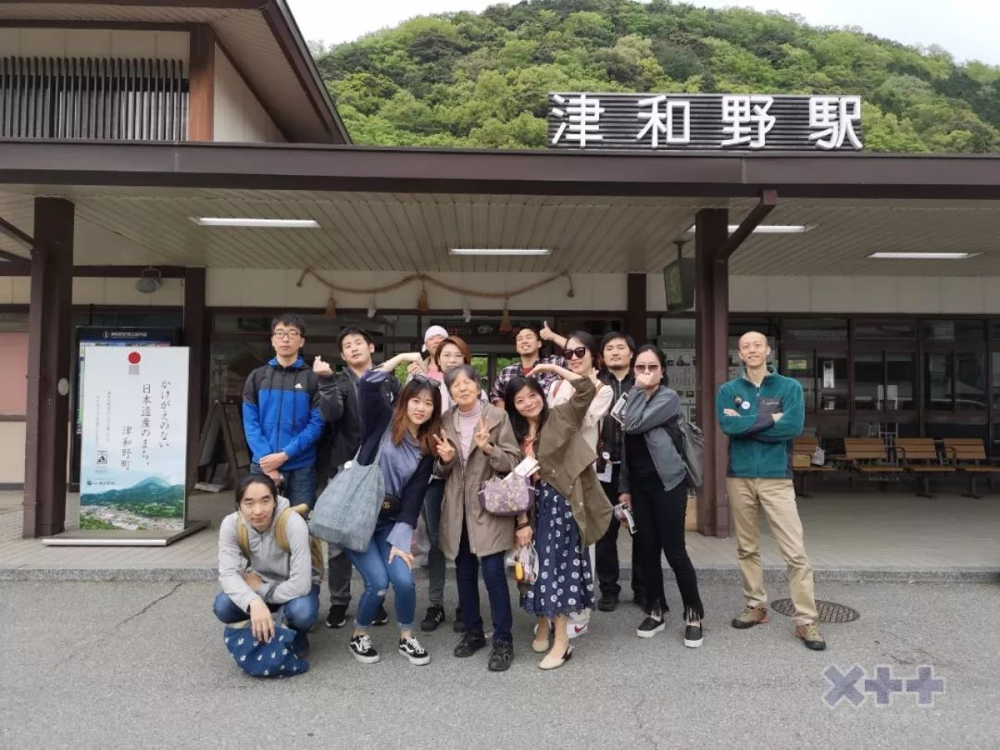 (原始链接: https://mmbiz.qpic.cn/mmbiz_jpg/L6HdGyg0k5Tw9jxWtXwibkfpKvcKrDeIgt03AAYlKu9Zy5fK8cF6uSnYhv3ZbyibHs05NK3R2JDZSwibprqI2xwGw/640?wx_fmt=jpeg)
- 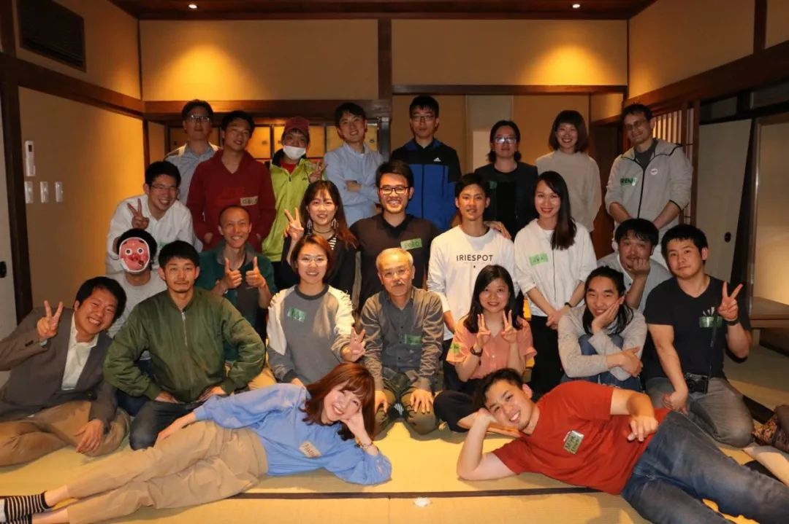 (原始链接: https://mmbiz.qpic.cn/mmbiz_jpg/L6HdGyg0k5Tw9jxWtXwibkfpKvcKrDeIgKd3kd0n7micULVPRR2IcXDz9XhWXNMT1jJIoFb9g3S3zYdoh8F2aUCw/640?wx_fmt=jpeg)
-  (原始链接: https://mmbiz.qpic.cn/mmbiz_png/L6HdGyg0k5Tw9jxWtXwibkfpKvcKrDeIgSKu3rdBGLb5WV24iaH9EAssSk247J3opG7gzaKO1GysDRwmoUxPericQ/640?wx_fmt=png)
- 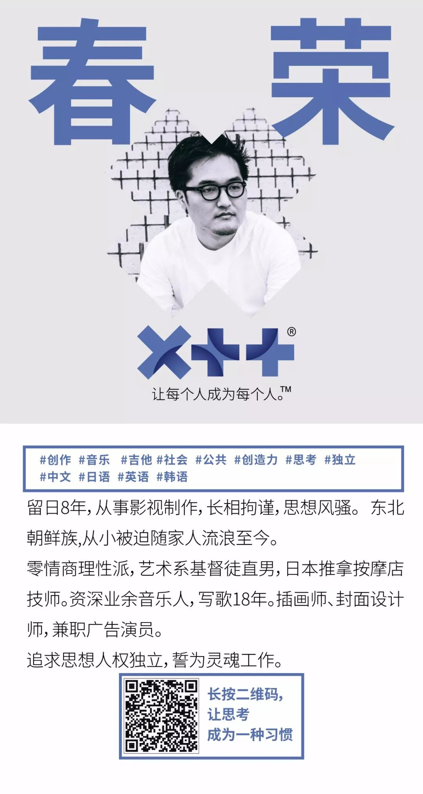 (原始链接: https://mmbiz.qpic.cn/mmbiz_jpg/L6HdGyg0k5Tw9jxWtXwibkfpKvcKrDeIgOicRyPBPzXm03vov2VBramThM544hdGIJnclNE8orwVJcECWlNdfibfw/640?wx_fmt=jpeg)
-  (原始链接: https://mmbiz.qpic.cn/mmbiz_jpg/L6HdGyg0k5Tw9jxWtXwibkfpKvcKrDeIgFzSACVmO8GmC5ZxAvJia9QzckUFH75mqjGr5lADQBGxLBujRl246Q4w/640?wx_fmt=jpeg)
- 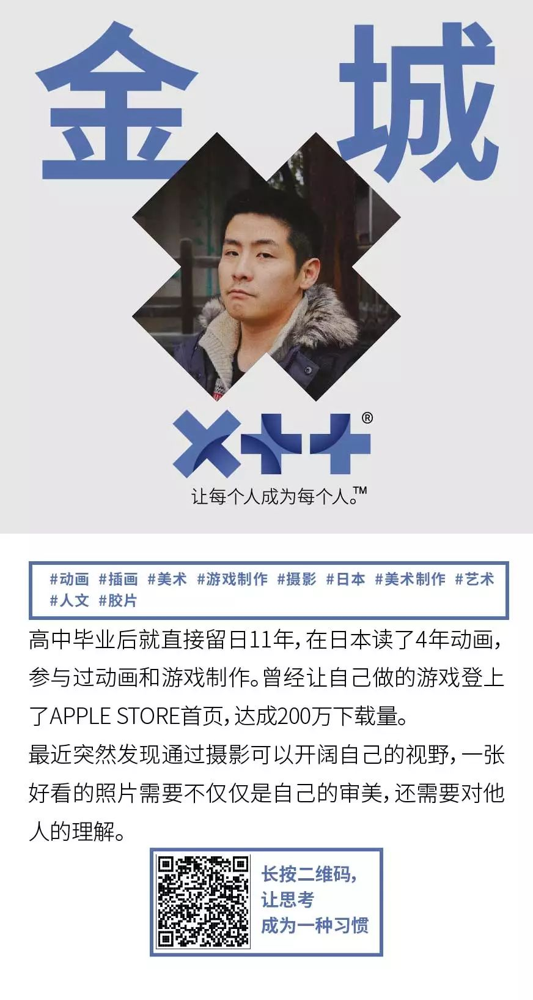 (原始链接: https://mmbiz.qpic.cn/mmbiz_jpg/L6HdGyg0k5Tw9jxWtXwibkfpKvcKrDeIglRFiaKicNFSHadY8ZrgtpVoLMZ0DO0Wch1hm4eELja3uIGsiccSThhYfQ/640?wx_fmt=jpeg)
- 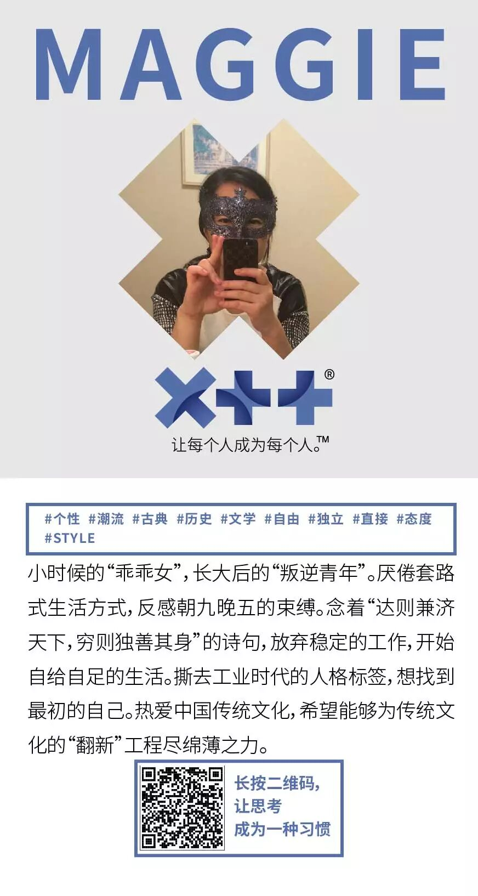 (原始链接: https://mmbiz.qpic.cn/mmbiz_jpg/L6HdGyg0k5Tw9jxWtXwibkfpKvcKrDeIgIsva7p1QuF06Oic9D3ibVq2wmicZ1o3Bc0Iecp6t5vicrYdVFcw2Ep9zjw/640?wx_fmt=jpeg)
- 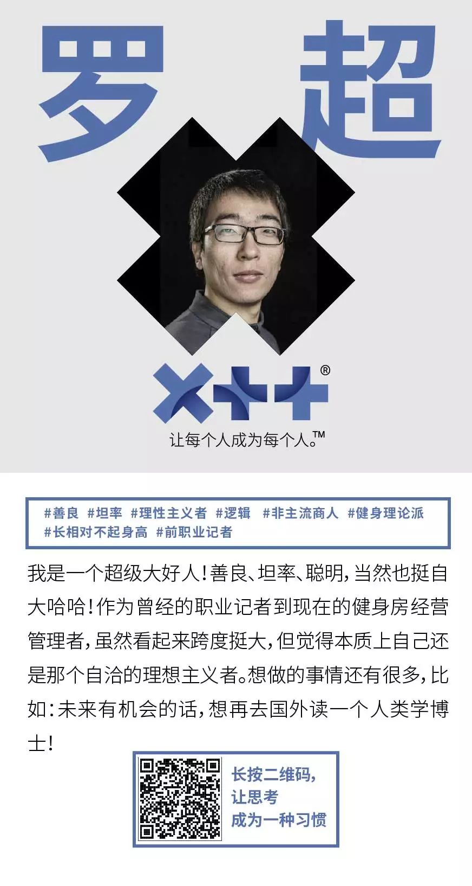 (原始链接: https://mmbiz.qpic.cn/mmbiz_jpg/L6HdGyg0k5Tw9jxWtXwibkfpKvcKrDeIgqkWNbGe0Oic36VzMoViaAibR2xOkhSAJ2O59K6SD5rESVMhhd5Bic3vkibA/640?wx_fmt=jpeg)
-  (原始链接: https://mmbiz.qpic.cn/mmbiz_jpg/L6HdGyg0k5Tw9jxWtXwibkfpKvcKrDeIgOicPbZqDicbSXVlelZXvmCNxjzpolpe879AMian6CpU7ibMH253hZMrEZw/640?wx_fmt=jpeg)
- 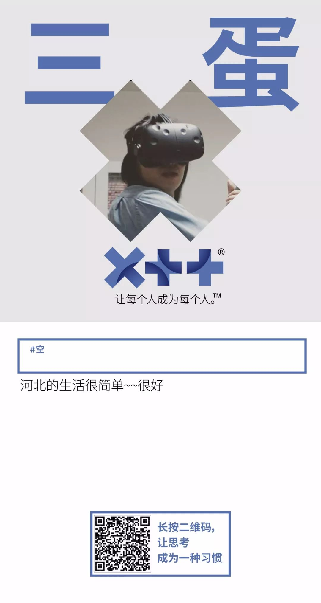 (原始链接: https://mmbiz.qpic.cn/mmbiz_jpg/L6HdGyg0k5Tw9jxWtXwibkfpKvcKrDeIgawzmhBnUVguTcibWiakeLurbxhwrwIRXrXZ9jOiceowGMGZeHe3zJy4MQ/640?wx_fmt=jpeg)
- 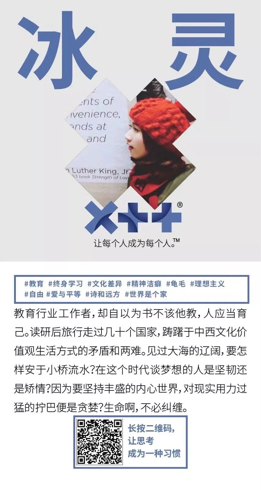 (原始链接: https://mmbiz.qpic.cn/mmbiz_jpg/L6HdGyg0k5Tw9jxWtXwibkfpKvcKrDeIgcKrWibIav3nUYMxH4ic2dYyvdjnkvNFNZo4Nr1sVmXR9eLtCxsrd1Etw/640?wx_fmt=jpeg)
- 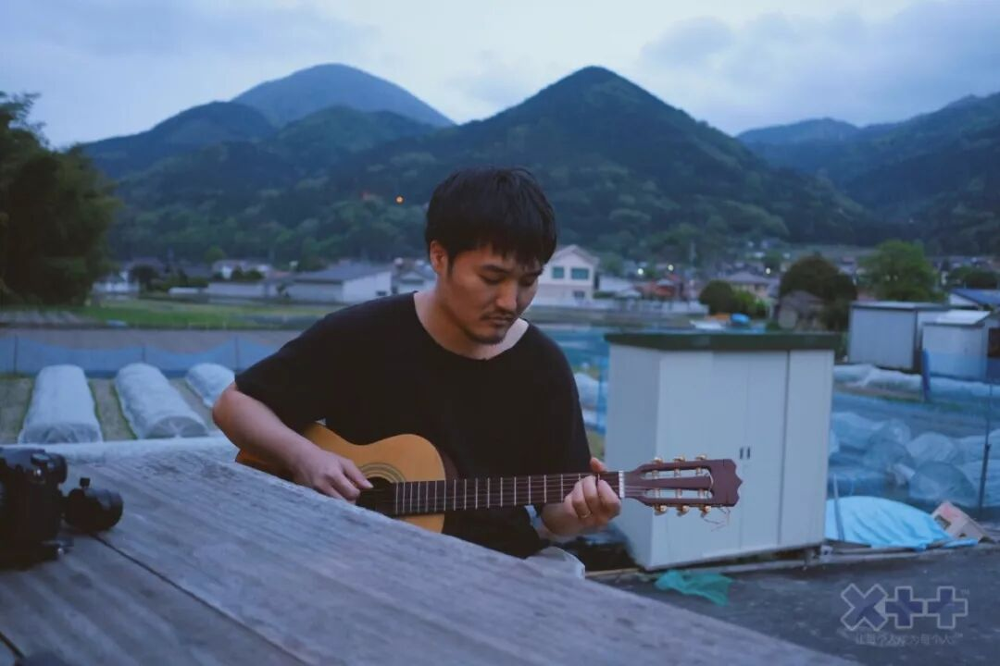 (原始链接: https://mmbiz.qpic.cn/mmbiz_jpg/L6HdGyg0k5Tw9jxWtXwibkfpKvcKrDeIgtNqBz1MeUYaw9ddFtnrLYKLqfF7g35AqXv5KAmia3WxR7ZpXDzq42aA/640?wx_fmt=jpeg)
- 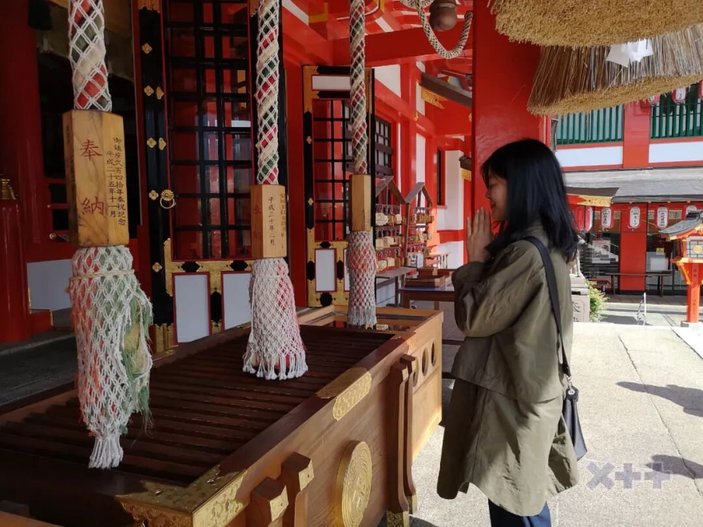 (原始链接: https://mmbiz.qpic.cn/mmbiz_jpg/L6HdGyg0k5Tw9jxWtXwibkfpKvcKrDeIgHwzeRpwN5HKw528cicNZXs2CULCVZYlpnpupYQcXD4lsSP65oSgtwVA/640?wx_fmt=jpeg)
- 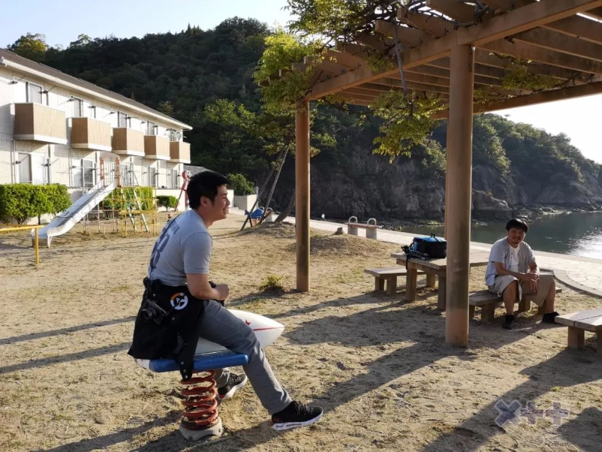 (原始链接: https://mmbiz.qpic.cn/mmbiz_jpg/L6HdGyg0k5Tw9jxWtXwibkfpKvcKrDeIgrBlwiaicJLux2OeUcYqsoYN9YXIRibdlicoJib2SoEzRDexqmOdgo9GyRxA/640?wx_fmt=jpeg)
- 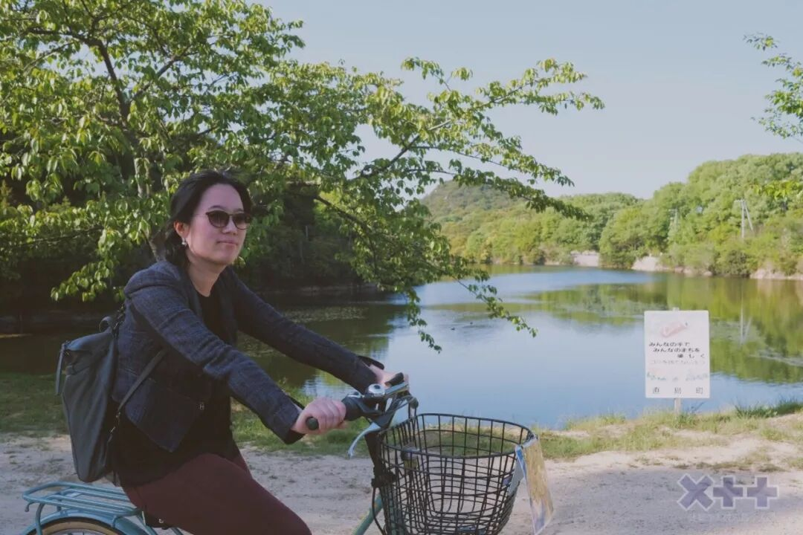 (原始链接: https://mmbiz.qpic.cn/mmbiz_jpg/L6HdGyg0k5Tw9jxWtXwibkfpKvcKrDeIgRpeIHic6SiaDAHbsicWv1iaCZkLsEo1rNMF7BOtvoFLicx0EFAhPL3gAUuw/640?wx_fmt=jpeg)
- 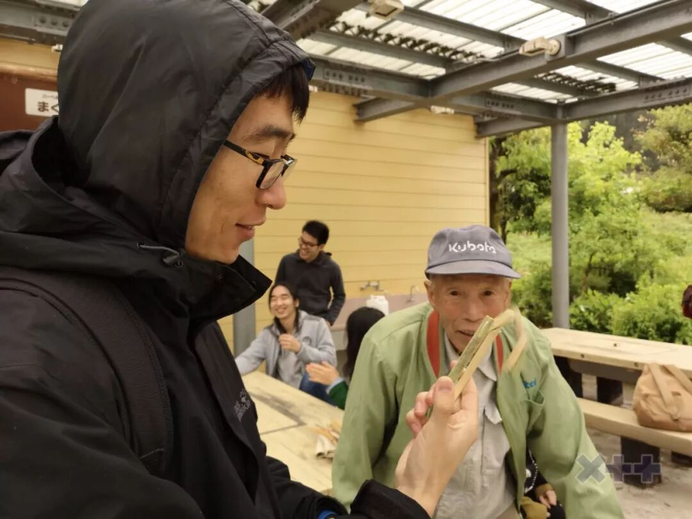 (原始链接: https://mmbiz.qpic.cn/mmbiz_jpg/L6HdGyg0k5Tw9jxWtXwibkfpKvcKrDeIgbzB0d7GeribgaJlJ1sm08GHiaD6GoiaEjNicEIH8pGV6PziaFkrOyECtl4w/640?wx_fmt=jpeg)
- 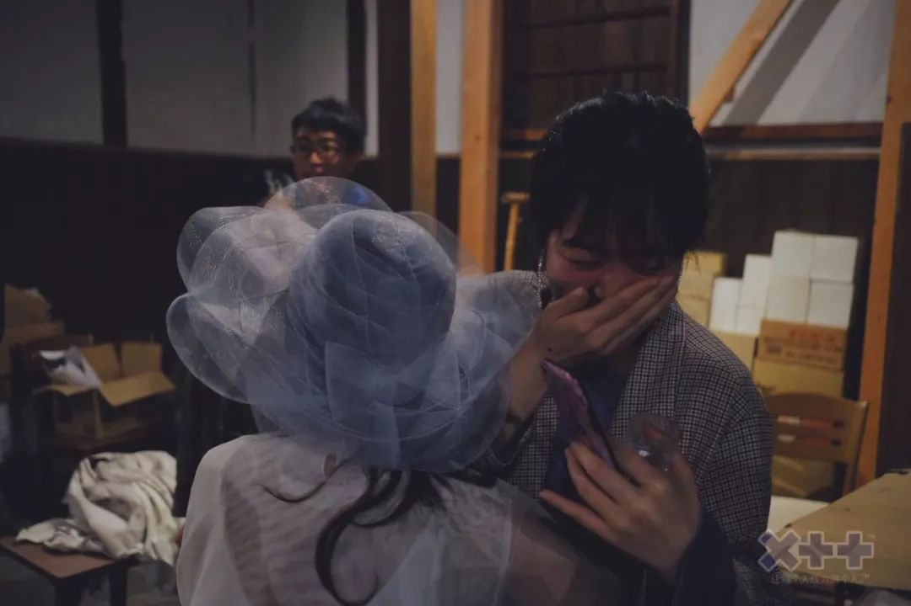 (原始链接: https://mmbiz.qpic.cn/mmbiz_jpg/L6HdGyg0k5Tw9jxWtXwibkfpKvcKrDeIgNvzcGhJX9Q0QhPprlSicODzJW66GY8YpMzn3AickEJ7cE6jX8ez7QjCg/640?wx_fmt=jpeg)
- 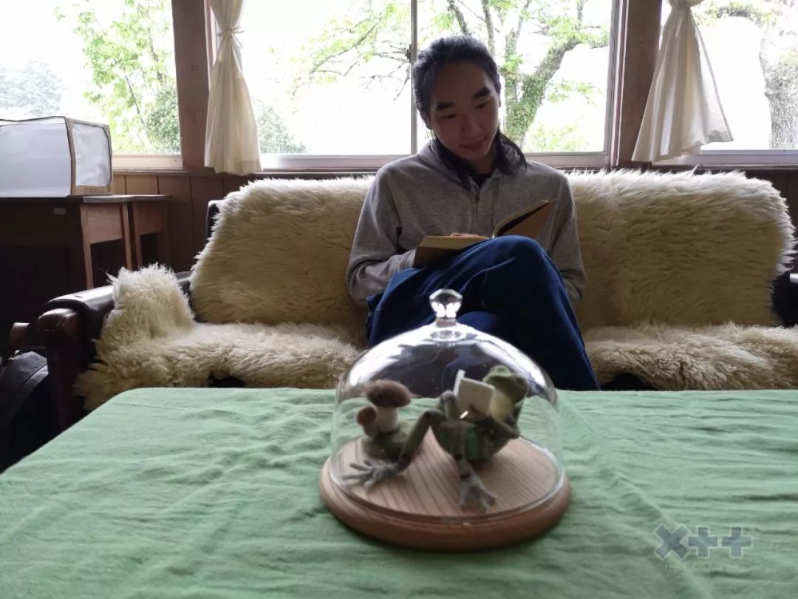 (原始链接: https://mmbiz.qpic.cn/mmbiz_jpg/L6HdGyg0k5Tw9jxWtXwibkfpKvcKrDeIgaw0Z99OS4kUPDyU722pHKbJKWXms92DdJvcfOOEfzPT1r5f7xpciajQ/640?wx_fmt=jpeg)
- 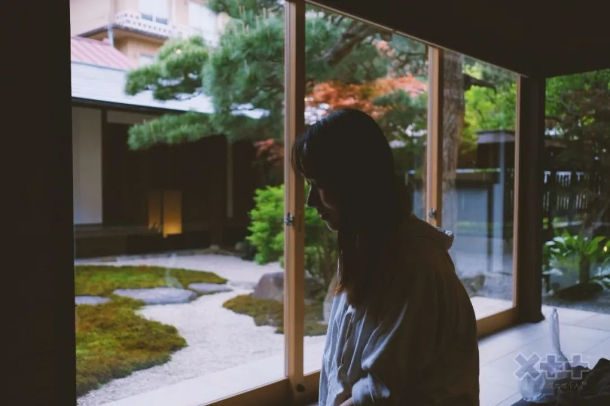 (原始链接: https://mmbiz.qpic.cn/mmbiz_jpg/L6HdGyg0k5Tw9jxWtXwibkfpKvcKrDeIgC5gX2c7gCFy81CmflpzoTkicOfGYpSg5BicGL0uyk8FibkfoOuxXqiap3w/640?wx_fmt=jpeg)
-  (原始链接: https://mmbiz.qpic.cn/mmbiz_png/L6HdGyg0k5TZLfw7NUENqFxnCR0hfUzlhicQGX3KAcsYo2cgb0SrJBA06bZ83cmFyT5ia3l04cGmTVpGZpaMQ2Vw/640?wx_fmt=png)
-  (原始链接: https://mmbiz.qpic.cn/mmbiz_png/L6HdGyg0k5TZLfw7NUENqFxnCR0hfUzlhicQGX3KAcsYo2cgb0SrJBA06bZ83cmFyT5ia3l04cGmTVpGZpaMQ2Vw/640?wx_fmt=png)
-  (原始链接: https://mmbiz.qpic.cn/mmbiz_png/L6HdGyg0k5TZLfw7NUENqFxnCR0hfUzlyPGXfrLWl3ZJySicHrMPVoRXUoLkleuzZNRlqsRuLicbQCWjAcfv1d7g/640?wx_fmt=png)
-  (原始链接: https://mmbiz.qpic.cn/mmbiz_png/L6HdGyg0k5TZLfw7NUENqFxnCR0hfUzlyPGXfrLWl3ZJySicHrMPVoRXUoLkleuzZNRlqsRuLicbQCWjAcfv1d7g/640?wx_fmt=png)
- 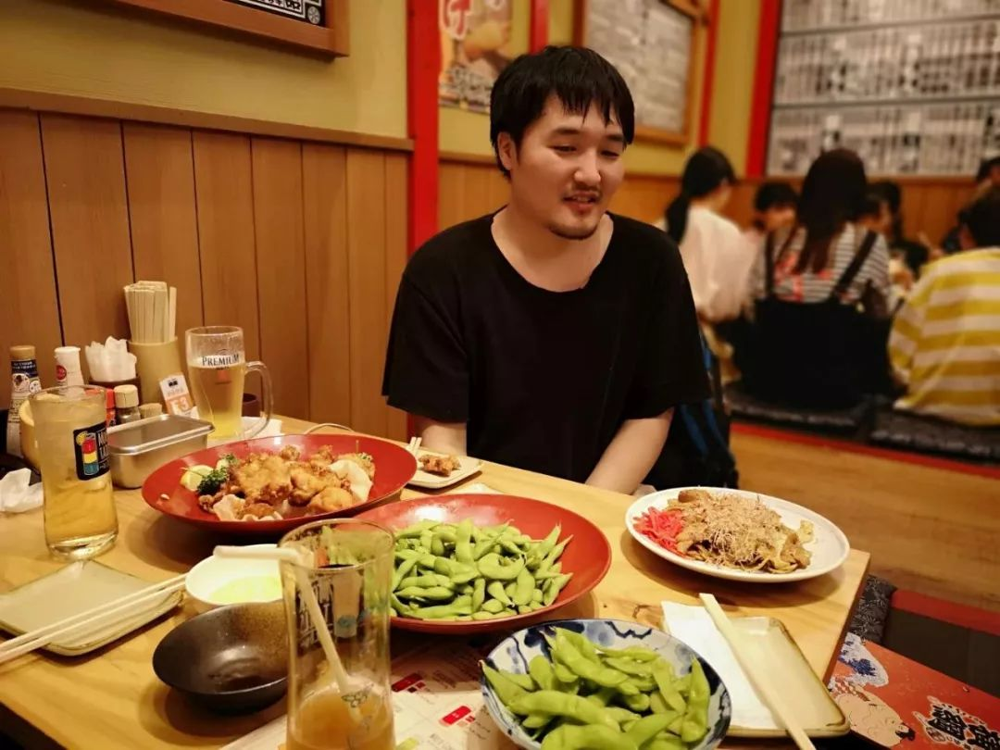 (原始链接: https://mmbiz.qpic.cn/mmbiz_jpg/L6HdGyg0k5Tw9jxWtXwibkfpKvcKrDeIgeZBSaXY2AJ2Ugw7wNETY8KaA3vayFib4VjYV9ouYjXD3mc8uEYUG0Aw/640?wx_fmt=jpeg)
-  (原始链接: https://mmbiz.qpic.cn/mmbiz_png/L6HdGyg0k5TgBUgdUXkE2SDYfBRYoPmqibWDjqPtp1DJWYcxEIE0Jicbcp7tib4dGib3L6CXgqSMUicVAtpZpjFZlgw/640?wx_fmt=png)
-  (原始链接: https://mmbiz.qpic.cn/mmbiz_png/L6HdGyg0k5TZLfw7NUENqFxnCR0hfUzlhicQGX3KAcsYo2cgb0SrJBA06bZ83cmFyT5ia3l04cGmTVpGZpaMQ2Vw/640?wx_fmt=png)
-  (原始链接: https://mmbiz.qpic.cn/mmbiz_png/L6HdGyg0k5TZLfw7NUENqFxnCR0hfUzlhicQGX3KAcsYo2cgb0SrJBA06bZ83cmFyT5ia3l04cGmTVpGZpaMQ2Vw/640?wx_fmt=png)
-  (原始链接: https://mmbiz.qpic.cn/mmbiz_png/L6HdGyg0k5TZLfw7NUENqFxnCR0hfUzlyPGXfrLWl3ZJySicHrMPVoRXUoLkleuzZNRlqsRuLicbQCWjAcfv1d7g/640?wx_fmt=png)
- 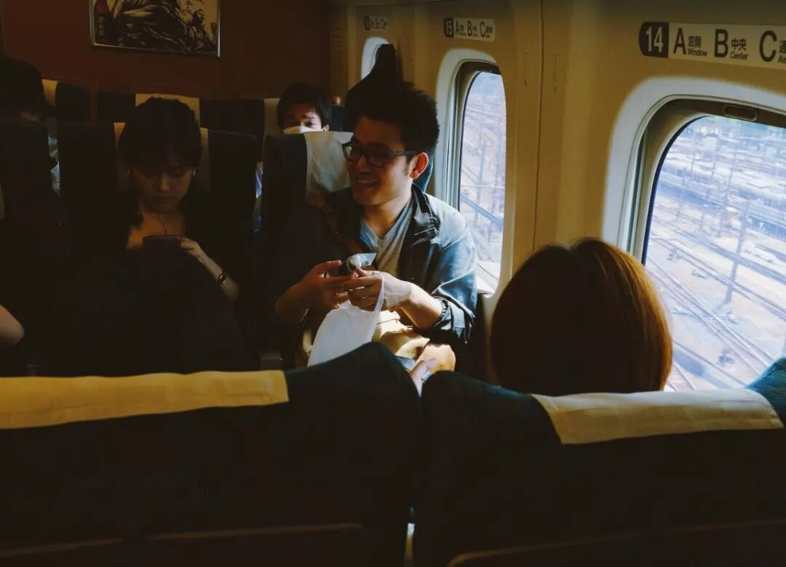 (原始链接: https://mmbiz.qpic.cn/mmbiz_jpg/L6HdGyg0k5Tw9jxWtXwibkfpKvcKrDeIg1GoaSMeguhQicShc9JqbS9EFBN6cQmTU6b2H545Jlib4icxJQN6I3aeTw/640?wx_fmt=jpeg)
-  (原始链接: https://mmbiz.qpic.cn/mmbiz_png/L6HdGyg0k5TZLfw7NUENqFxnCR0hfUzlra17QBdRBQjhSfYnbjogCNK30oKulAZOvOeqFa9au7rwIKHvKZopRQ/640?wx_fmt=png)
-  (原始链接: https://mmbiz.qpic.cn/mmbiz_png/L6HdGyg0k5TZLfw7NUENqFxnCR0hfUzlzTGJ4rH4WxfONNBZ3MzOs8NlN5tpHxmK85yYfUghwKichMcGBK3IkvQ/640?wx_fmt=png)
- 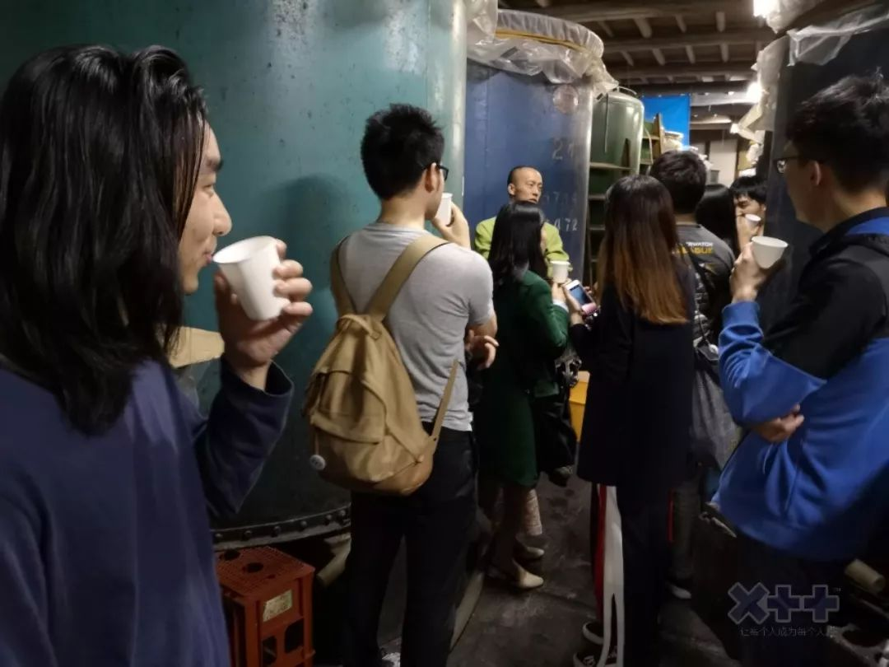 (原始链接: https://mmbiz.qpic.cn/mmbiz_jpg/L6HdGyg0k5Tw9jxWtXwibkfpKvcKrDeIgibKZ4yx7HAtUODeCjNgxic1JWia1KkAoibqT0cgsibyAxXSiaI8ZmcC9Q0vw/640?wx_fmt=jpeg)
- 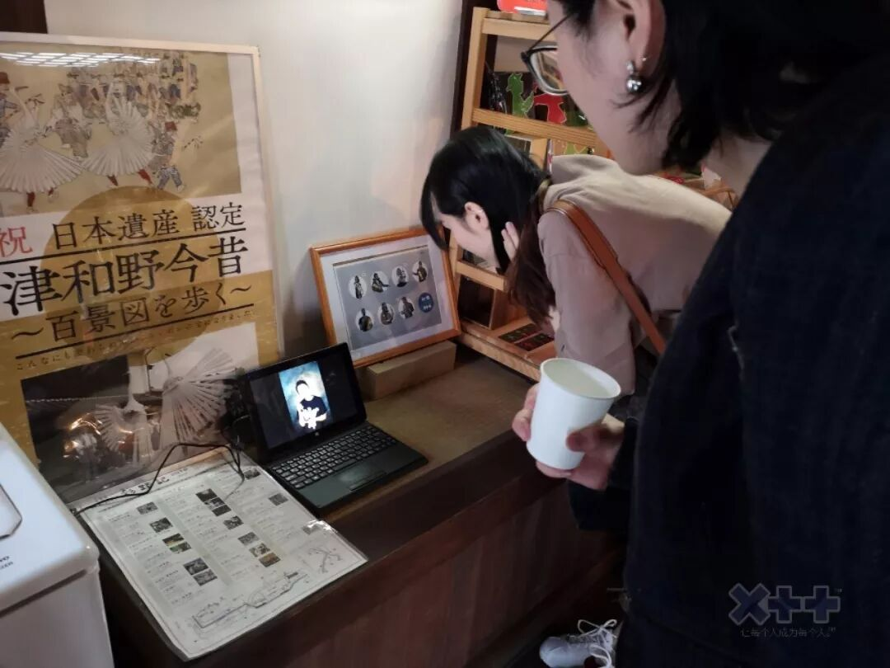 (原始链接: https://mmbiz.qpic.cn/mmbiz_jpg/L6HdGyg0k5Tw9jxWtXwibkfpKvcKrDeIgHaboG9ibxsJDHMW1haVA8IjHPAA4DgxgTgg9dY9CG3DLzKJHdc44Jeg/640?wx_fmt=jpeg)
- 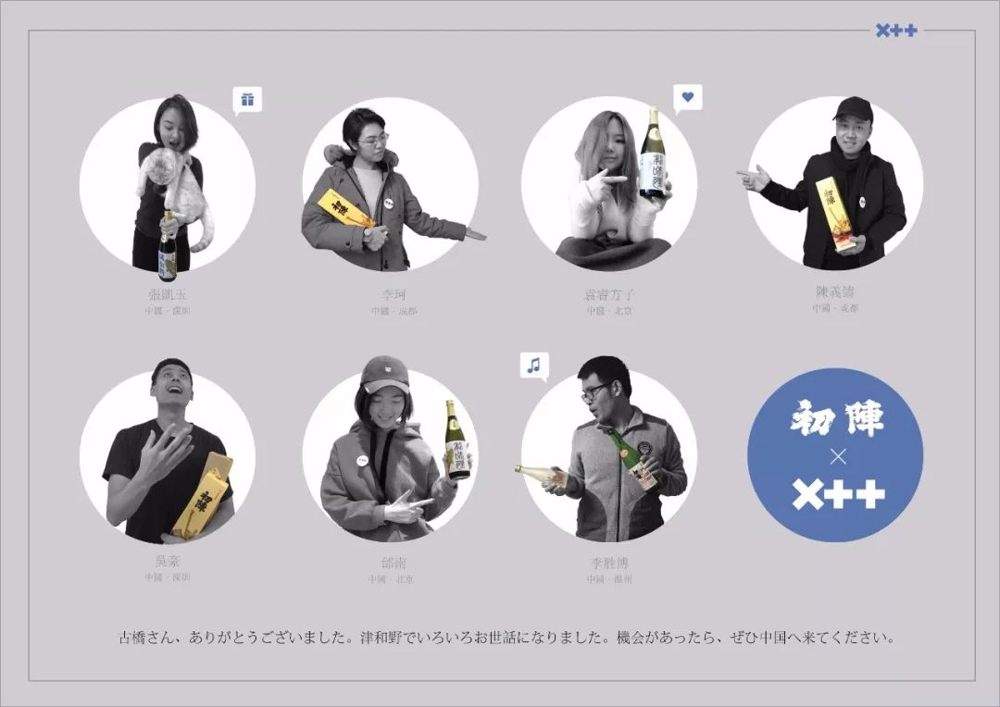 (原始链接: https://mmbiz.qpic.cn/mmbiz_jpg/L6HdGyg0k5RFCJs2qpUPAiarl2iczR8tGGhSPw7E5no4icLmu651aed3xGytZD63ecygn3jQfTLKqFkZZes2TmFag/640?wx_fmt=jpeg)
-  (原始链接: https://mmbiz.qpic.cn/mmbiz_png/L6HdGyg0k5TZLfw7NUENqFxnCR0hfUzlra17QBdRBQjhSfYnbjogCNK30oKulAZOvOeqFa9au7rwIKHvKZopRQ/640?wx_fmt=png)
-  (原始链接: https://mmbiz.qpic.cn/mmbiz_png/L6HdGyg0k5TZLfw7NUENqFxnCR0hfUzlzTGJ4rH4WxfONNBZ3MzOs8NlN5tpHxmK85yYfUghwKichMcGBK3IkvQ/640?wx_fmt=png)
- 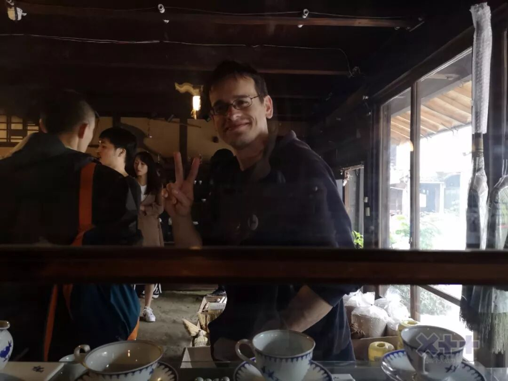 (原始链接: https://mmbiz.qpic.cn/mmbiz_jpg/L6HdGyg0k5Tw9jxWtXwibkfpKvcKrDeIg2ggdk1KBBEwVml2h5ya7zp6vogDueicJYA51X5KoN78H0H8FKT3eUFw/640?wx_fmt=jpeg)
- 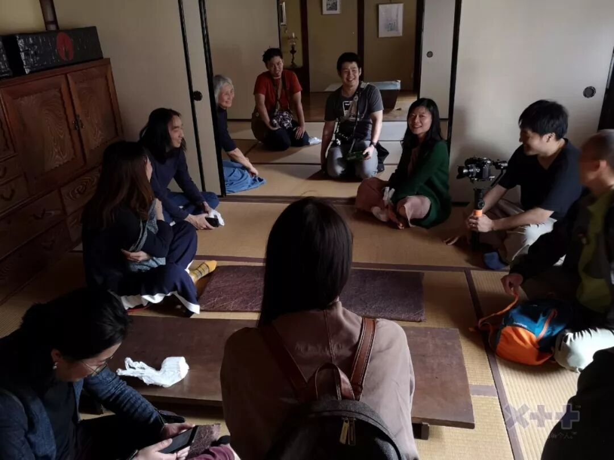 (原始链接: https://mmbiz.qpic.cn/mmbiz_jpg/L6HdGyg0k5Tw9jxWtXwibkfpKvcKrDeIghQafcKzbCVxkZXArDWGxe3zOqgueVfPAU3YuDdUZKoOqkMmob12uicw/640?wx_fmt=jpeg)
-  (原始链接: https://mmbiz.qpic.cn/mmbiz_png/L6HdGyg0k5TZLfw7NUENqFxnCR0hfUzlra17QBdRBQjhSfYnbjogCNK30oKulAZOvOeqFa9au7rwIKHvKZopRQ/640?wx_fmt=png)
-  (原始链接: https://mmbiz.qpic.cn/mmbiz_png/L6HdGyg0k5TZLfw7NUENqFxnCR0hfUzlzTGJ4rH4WxfONNBZ3MzOs8NlN5tpHxmK85yYfUghwKichMcGBK3IkvQ/640?wx_fmt=png)
- 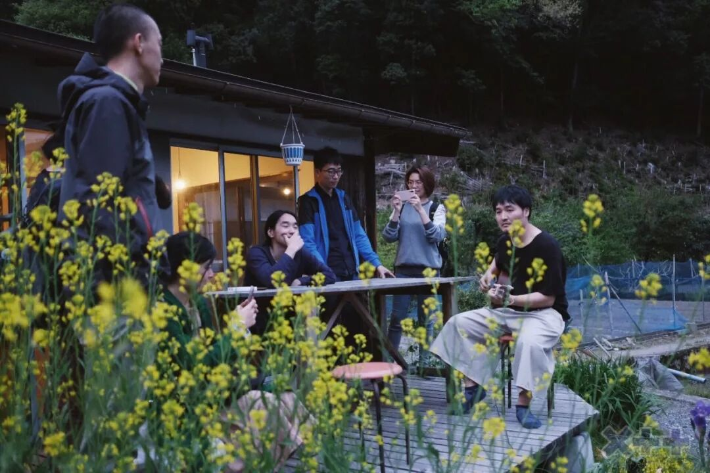 (原始链接: https://mmbiz.qpic.cn/mmbiz_jpg/L6HdGyg0k5TBnlvgSykCODyWkFgby4GYhxbSSmwHEmv4nY0RVKNMclDiasQg9wSv97PPxbF6jrsnC4eFmL4ibp2g/640?wx_fmt=jpeg)
- 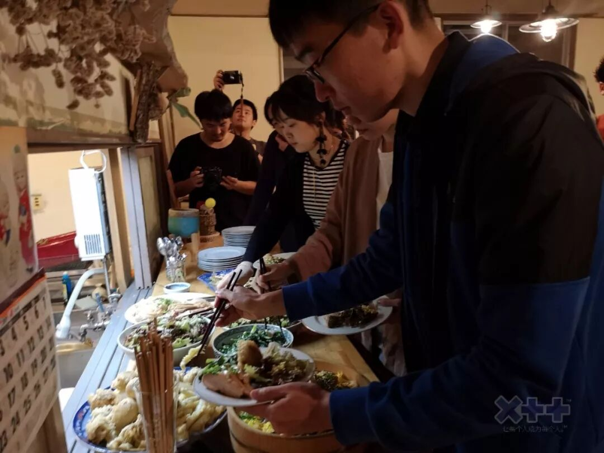 (原始链接: https://mmbiz.qpic.cn/mmbiz_jpg/L6HdGyg0k5Tw9jxWtXwibkfpKvcKrDeIgJPDoFgvOpnXkdicjq330WPqTsGyhKeSbpA0eQGTTTlKIs2wz6E9rCSg/640?wx_fmt=jpeg)
- 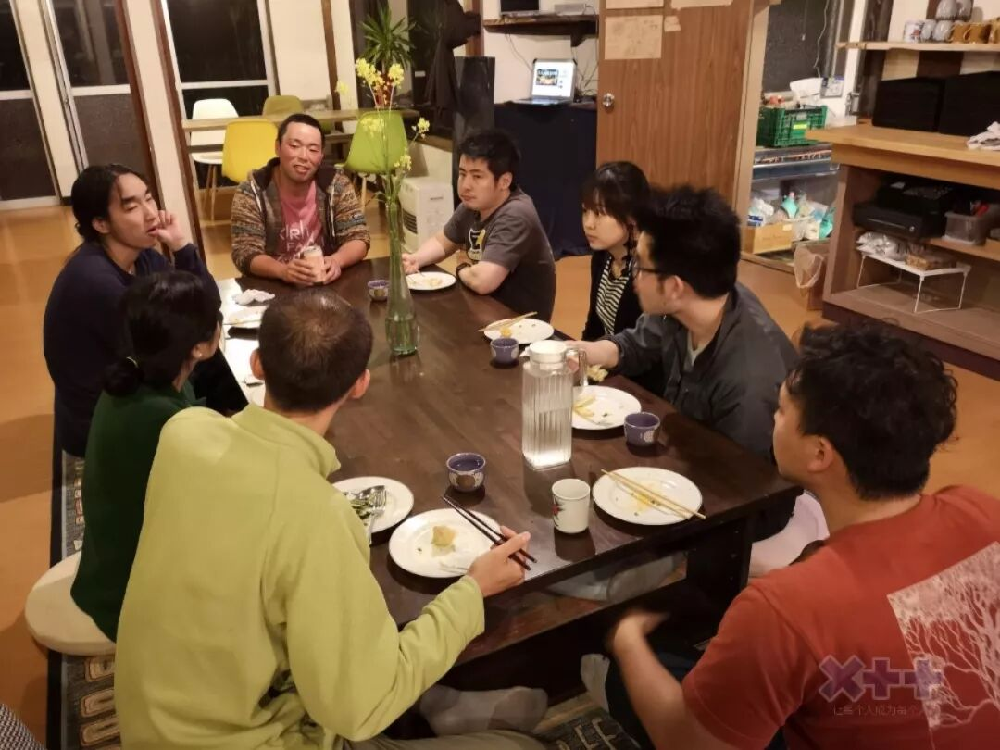 (原始链接: https://mmbiz.qpic.cn/mmbiz_jpg/L6HdGyg0k5Tw9jxWtXwibkfpKvcKrDeIgH8ZvA7aiaiaicylQFiaTDkrtWrTwBsOnSKo16aPR4UmpZuu7IP9lIHbIog/640?wx_fmt=jpeg)
-  (原始链接: https://mmbiz.qpic.cn/mmbiz_png/L6HdGyg0k5TZLfw7NUENqFxnCR0hfUzlhicQGX3KAcsYo2cgb0SrJBA06bZ83cmFyT5ia3l04cGmTVpGZpaMQ2Vw/640?wx_fmt=png)
-  (原始链接: https://mmbiz.qpic.cn/mmbiz_png/L6HdGyg0k5TZLfw7NUENqFxnCR0hfUzlhicQGX3KAcsYo2cgb0SrJBA06bZ83cmFyT5ia3l04cGmTVpGZpaMQ2Vw/640?wx_fmt=png)
-  (原始链接: https://mmbiz.qpic.cn/mmbiz_png/L6HdGyg0k5TZLfw7NUENqFxnCR0hfUzlyPGXfrLWl3ZJySicHrMPVoRXUoLkleuzZNRlqsRuLicbQCWjAcfv1d7g/640?wx_fmt=png)
-  (原始链接: https://mmbiz.qpic.cn/mmbiz_png/L6HdGyg0k5TZLfw7NUENqFxnCR0hfUzlra17QBdRBQjhSfYnbjogCNK30oKulAZOvOeqFa9au7rwIKHvKZopRQ/640?wx_fmt=png)
-  (原始链接: https://mmbiz.qpic.cn/mmbiz_png/L6HdGyg0k5TZLfw7NUENqFxnCR0hfUzlzTGJ4rH4WxfONNBZ3MzOs8NlN5tpHxmK85yYfUghwKichMcGBK3IkvQ/640?wx_fmt=png)
- 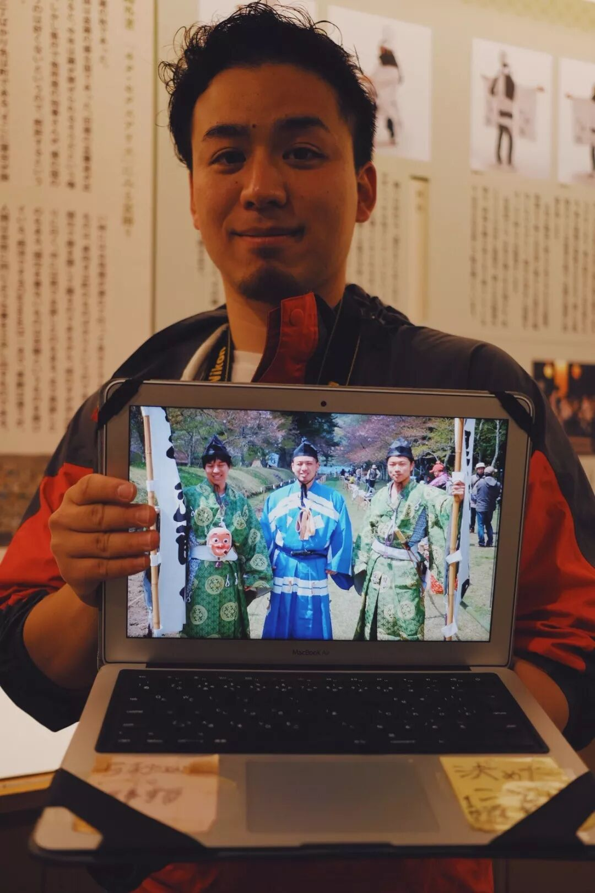 (原始链接: https://mmbiz.qpic.cn/mmbiz_jpg/L6HdGyg0k5Tw9jxWtXwibkfpKvcKrDeIgSibbhS8qArIcNhaAd0YDxZhyN85L4yghuz6IgJ6BAzg1nVicPywTAsBg/640?wx_fmt=jpeg)
- 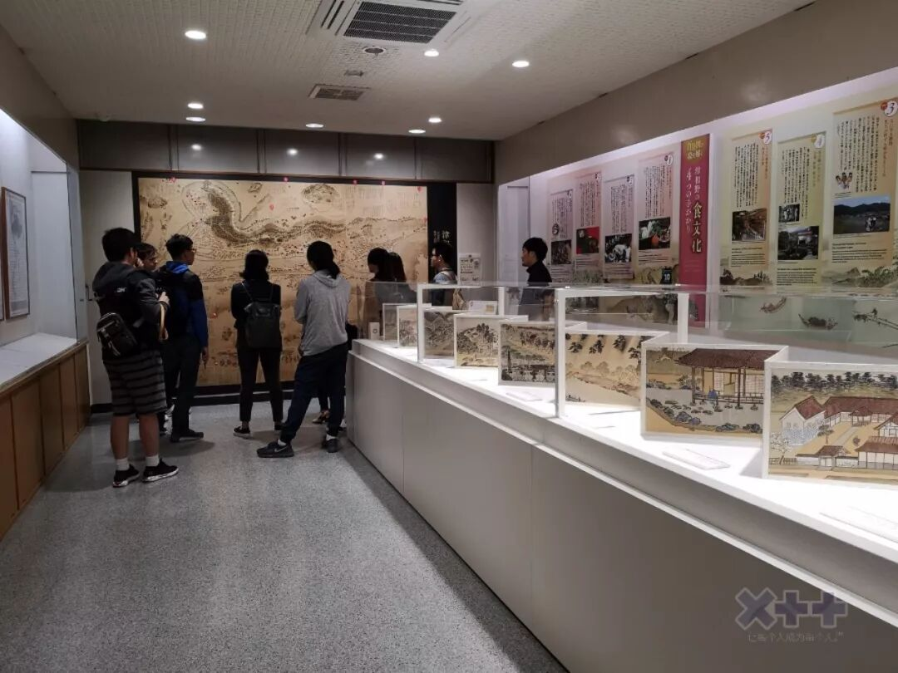 (原始链接: https://mmbiz.qpic.cn/mmbiz_jpg/L6HdGyg0k5Tw9jxWtXwibkfpKvcKrDeIg9JwW1Kwia9CBPX9SO5UKicgSXmgXnp2914a4Ric6g6ecMps1uTs7Xib7vw/640?wx_fmt=jpeg)
-  (原始链接: https://mmbiz.qpic.cn/mmbiz_png/L6HdGyg0k5TZLfw7NUENqFxnCR0hfUzlra17QBdRBQjhSfYnbjogCNK30oKulAZOvOeqFa9au7rwIKHvKZopRQ/640?wx_fmt=png)
-  (原始链接: https://mmbiz.qpic.cn/mmbiz_png/L6HdGyg0k5TZLfw7NUENqFxnCR0hfUzlzTGJ4rH4WxfONNBZ3MzOs8NlN5tpHxmK85yYfUghwKichMcGBK3IkvQ/640?wx_fmt=png)
- 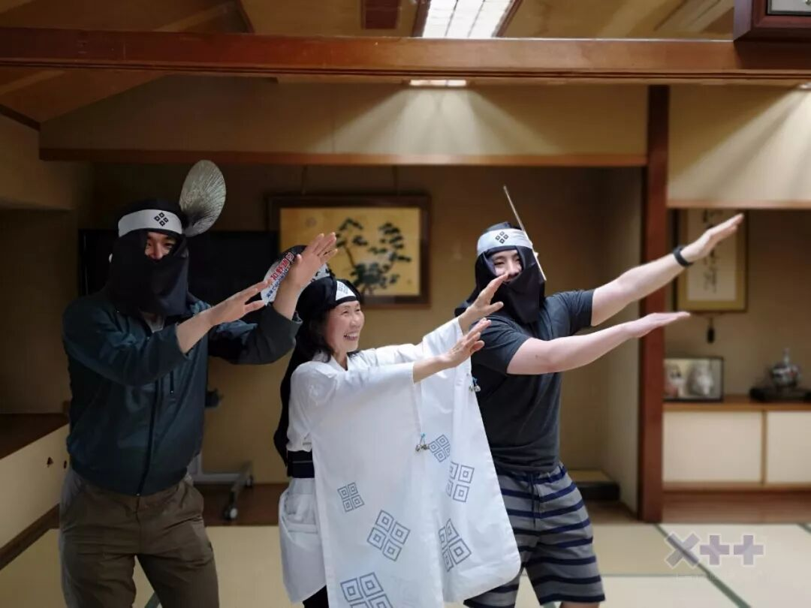 (原始链接: https://mmbiz.qpic.cn/mmbiz_jpg/L6HdGyg0k5Tw9jxWtXwibkfpKvcKrDeIggMu7rKSrStFibVMqPficdJJXdic6NKEzpFUuR3suDMW1R8M88FolVUvaA/640?wx_fmt=jpeg)
- 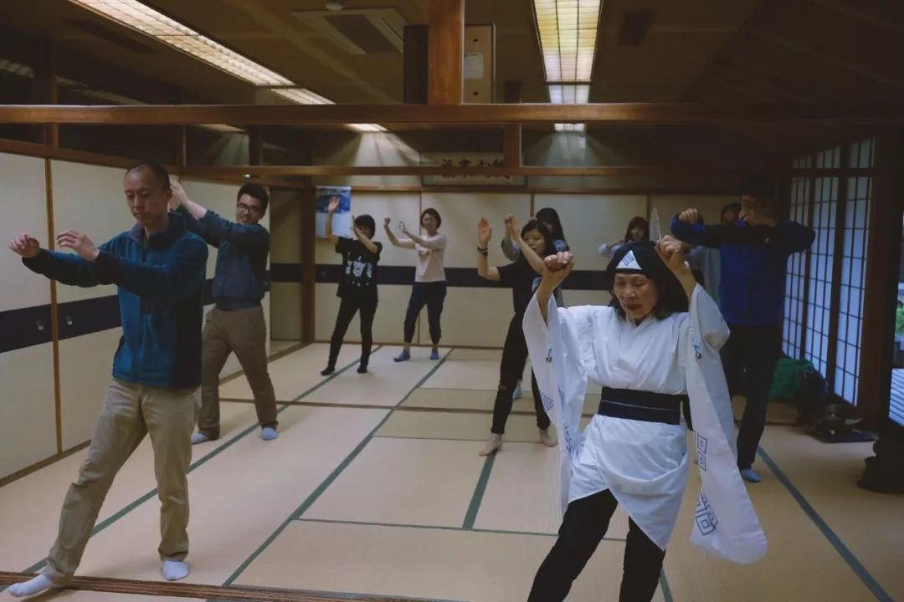 (原始链接: https://mmbiz.qpic.cn/mmbiz_jpg/L6HdGyg0k5Tw9jxWtXwibkfpKvcKrDeIgFfC8sNyJhqOibKXcBibvyvIgyPwwu2AAYmdehqt1VgOML3YQxSetJq3g/640?wx_fmt=jpeg)
-  (原始链接: https://mmbiz.qpic.cn/mmbiz_png/L6HdGyg0k5TZLfw7NUENqFxnCR0hfUzlra17QBdRBQjhSfYnbjogCNK30oKulAZOvOeqFa9au7rwIKHvKZopRQ/640?wx_fmt=png)
-  (原始链接: https://mmbiz.qpic.cn/mmbiz_png/L6HdGyg0k5TZLfw7NUENqFxnCR0hfUzlzTGJ4rH4WxfONNBZ3MzOs8NlN5tpHxmK85yYfUghwKichMcGBK3IkvQ/640?wx_fmt=png)
- 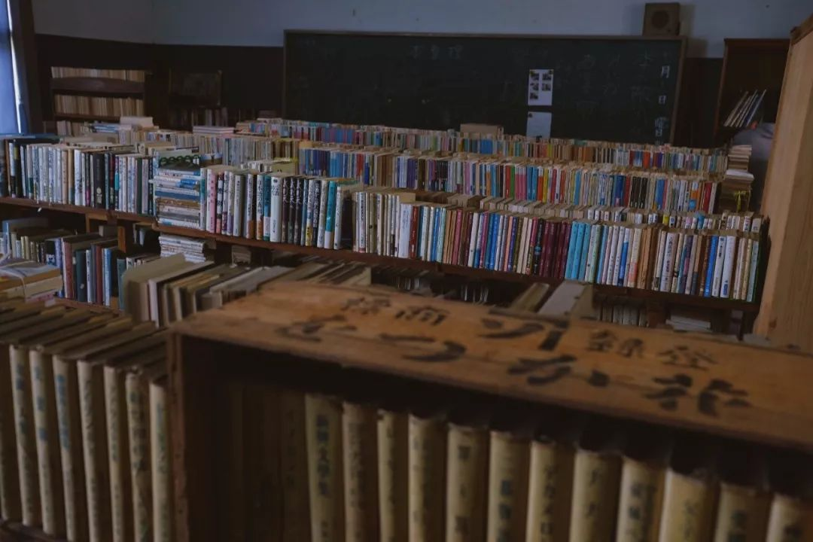 (原始链接: https://mmbiz.qpic.cn/mmbiz_jpg/L6HdGyg0k5Tw9jxWtXwibkfpKvcKrDeIgYYHc12gZYvc0vha7iafmqlMLZTsUc9LMjJwKibiaLksbO9I3jPianAEABA/640?wx_fmt=jpeg)
- 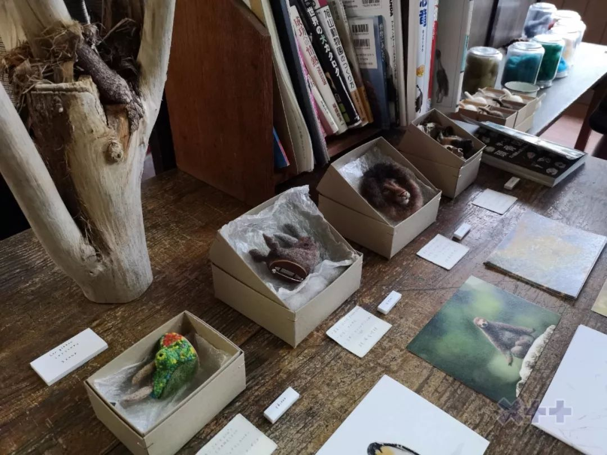 (原始链接: https://mmbiz.qpic.cn/mmbiz_jpg/L6HdGyg0k5Tw9jxWtXwibkfpKvcKrDeIgjoPf8YGrGciakfus9W5NkqJBoBQNPib8xfoJM6fTLJZN89Dw7DCfLrvw/640?wx_fmt=jpeg)
- 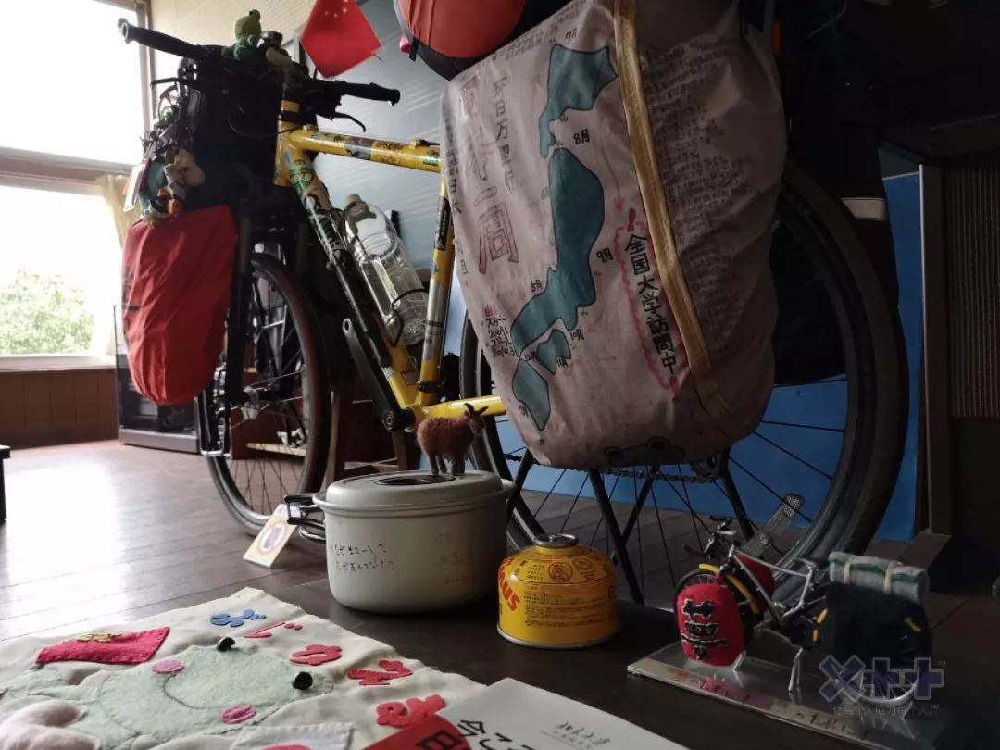 (原始链接: https://mmbiz.qpic.cn/mmbiz_jpg/L6HdGyg0k5Tw9jxWtXwibkfpKvcKrDeIgMrHcDYxFu2WonYOoZFpuN8KCvlKWsN80kdOHicsBSermjXqqh5apXRQ/640?wx_fmt=jpeg)
- 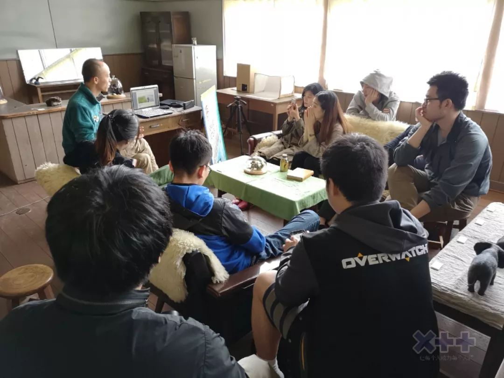 (原始链接: https://mmbiz.qpic.cn/mmbiz_jpg/L6HdGyg0k5TBnlvgSykCODyWkFgby4GYAvVGbDSYuUg8laRb8UTiafKJt7KKMEaxDcrhjMuq9tIPoia0lMedLFbA/640?wx_fmt=jpeg)
-  (原始链接: https://mmbiz.qpic.cn/mmbiz_png/L6HdGyg0k5TZLfw7NUENqFxnCR0hfUzlra17QBdRBQjhSfYnbjogCNK30oKulAZOvOeqFa9au7rwIKHvKZopRQ/640?wx_fmt=png)
-  (原始链接: https://mmbiz.qpic.cn/mmbiz_png/L6HdGyg0k5TZLfw7NUENqFxnCR0hfUzlzTGJ4rH4WxfONNBZ3MzOs8NlN5tpHxmK85yYfUghwKichMcGBK3IkvQ/640?wx_fmt=png)
- 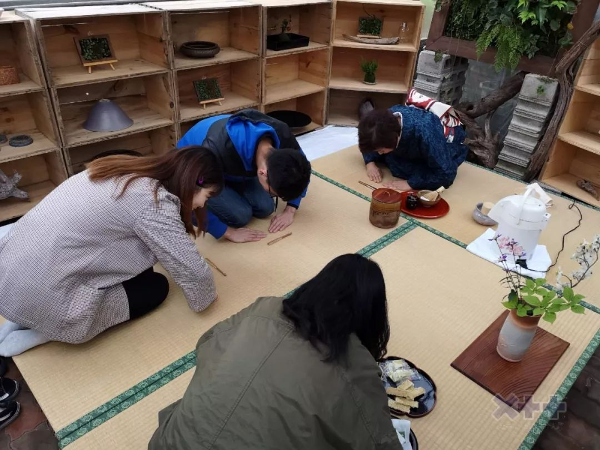 (原始链接: https://mmbiz.qpic.cn/mmbiz_jpg/L6HdGyg0k5Tw9jxWtXwibkfpKvcKrDeIg19OjxKuwUOM4UArickmUVpv79fdT5VzjkmvkAqxx4eyYviauV5VwIbKA/640?wx_fmt=jpeg)
- 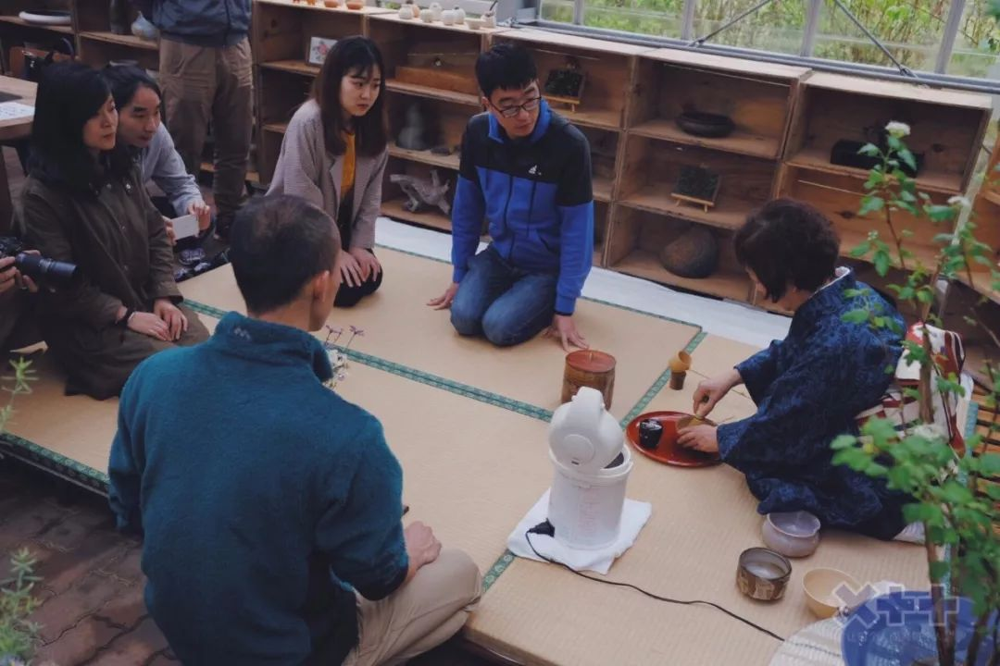 (原始链接: https://mmbiz.qpic.cn/mmbiz_jpg/L6HdGyg0k5Tw9jxWtXwibkfpKvcKrDeIgH3LtPj78YjrNfZ86cnpO1oiaJAQ0huFWiaSSVLtVJD2zI7L84iaDE5swA/640?wx_fmt=jpeg)
- 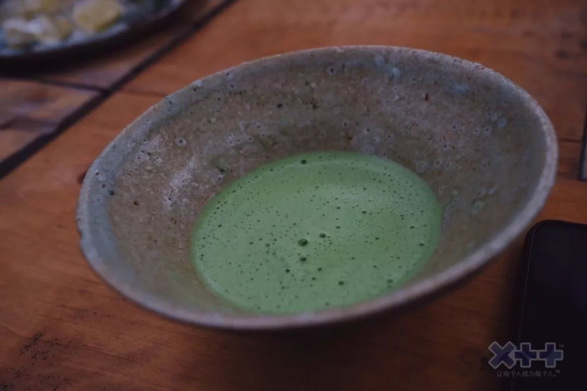 (原始链接: https://mmbiz.qpic.cn/mmbiz_jpg/L6HdGyg0k5Tw9jxWtXwibkfpKvcKrDeIgsJQVdEQ01voMJkNM6kryW3Axf2tpTbTCdiasMDnUtkO9kicichLu41nxw/640?wx_fmt=jpeg)
- 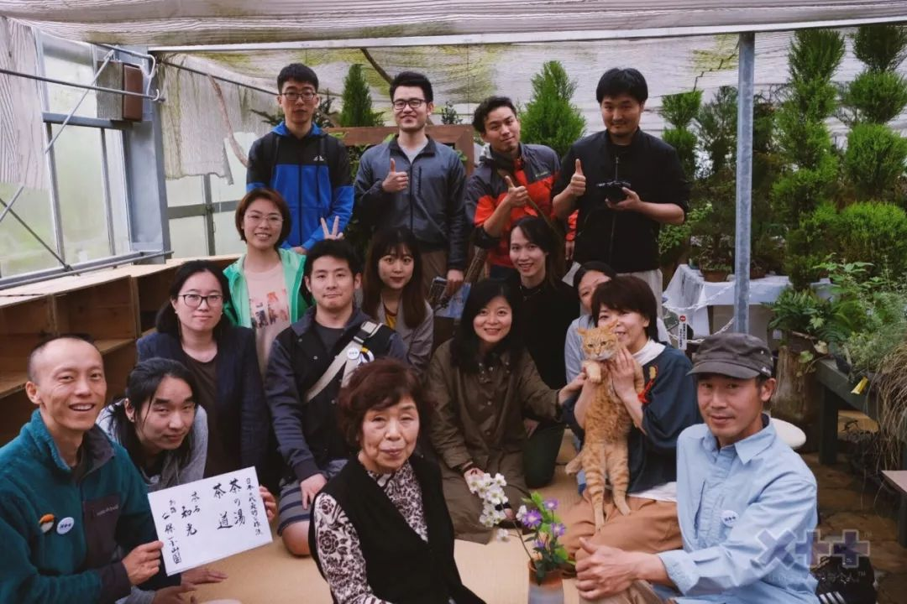 (原始链接: https://mmbiz.qpic.cn/mmbiz_jpg/L6HdGyg0k5Tw9jxWtXwibkfpKvcKrDeIga5hMMtEJHfIXvibVpDtUiacQ0Mcf7ABd1KN5LMNzbXaq80lTrbM7fgOA/640?wx_fmt=jpeg)
-  (原始链接: https://mmbiz.qpic.cn/mmbiz_png/L6HdGyg0k5TZLfw7NUENqFxnCR0hfUzlra17QBdRBQjhSfYnbjogCNK30oKulAZOvOeqFa9au7rwIKHvKZopRQ/640?wx_fmt=png)
-  (原始链接: https://mmbiz.qpic.cn/mmbiz_png/L6HdGyg0k5TZLfw7NUENqFxnCR0hfUzlzTGJ4rH4WxfONNBZ3MzOs8NlN5tpHxmK85yYfUghwKichMcGBK3IkvQ/640?wx_fmt=png)
- 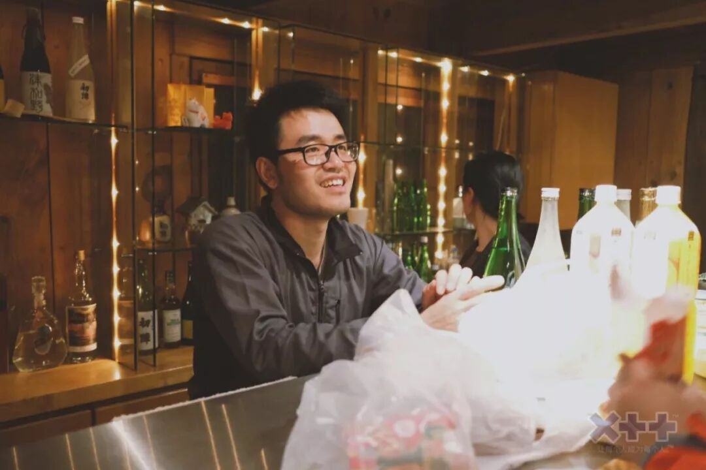 (原始链接: https://mmbiz.qpic.cn/mmbiz_jpg/L6HdGyg0k5Tw9jxWtXwibkfpKvcKrDeIgTlPp3uOYfqK5WRdCCO5GiaENs69gadXtuOepMq7TKWzo1Zp2HiaWgWVg/640?wx_fmt=jpeg)
- 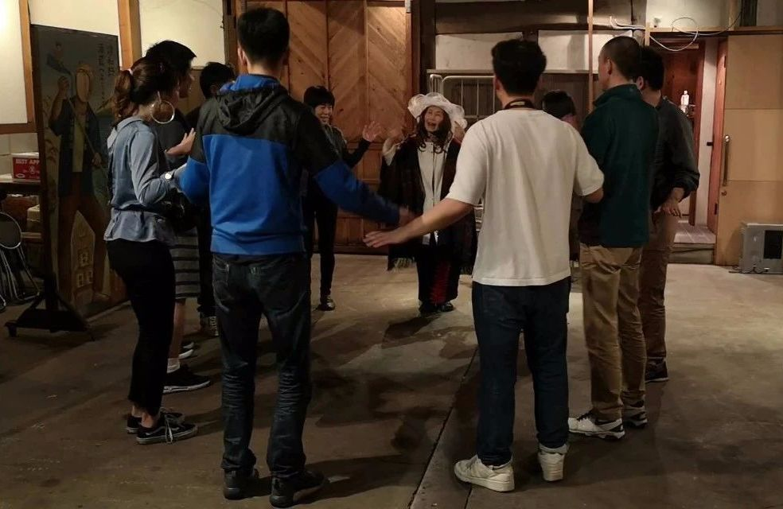 (原始链接: https://mmbiz.qpic.cn/mmbiz_png/L6HdGyg0k5TBnlvgSykCODyWkFgby4GYStcXsUxLsM3moNUD6iaIBfiaKp4ctHz64tF4DCiaza3EtiaABfK84TFiaPw/640?wx_fmt=png)
- 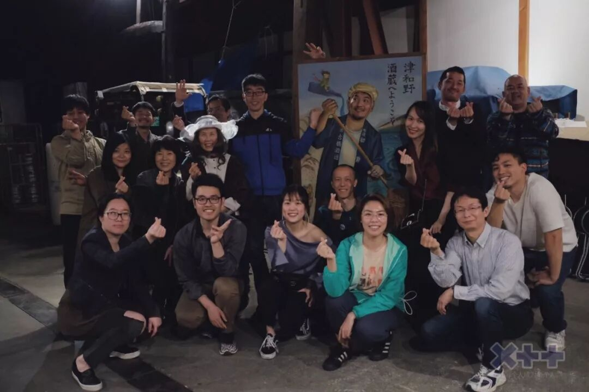 (原始链接: https://mmbiz.qpic.cn/mmbiz_jpg/L6HdGyg0k5Tw9jxWtXwibkfpKvcKrDeIgvz7ABz0OpA34iamqxtibaFpAlHBXIkXkFuYSZFfPSXMIrr9zSvibiaiaksg/640?wx_fmt=jpeg)
-  (原始链接: https://mmbiz.qpic.cn/mmbiz_png/L6HdGyg0k5TZLfw7NUENqFxnCR0hfUzlhicQGX3KAcsYo2cgb0SrJBA06bZ83cmFyT5ia3l04cGmTVpGZpaMQ2Vw/640?wx_fmt=png)
-  (原始链接: https://mmbiz.qpic.cn/mmbiz_png/L6HdGyg0k5TZLfw7NUENqFxnCR0hfUzlhicQGX3KAcsYo2cgb0SrJBA06bZ83cmFyT5ia3l04cGmTVpGZpaMQ2Vw/640?wx_fmt=png)
-  (原始链接: https://mmbiz.qpic.cn/mmbiz_png/L6HdGyg0k5TZLfw7NUENqFxnCR0hfUzlyPGXfrLWl3ZJySicHrMPVoRXUoLkleuzZNRlqsRuLicbQCWjAcfv1d7g/640?wx_fmt=png)
-  (原始链接: https://mmbiz.qpic.cn/mmbiz_png/L6HdGyg0k5TZLfw7NUENqFxnCR0hfUzlra17QBdRBQjhSfYnbjogCNK30oKulAZOvOeqFa9au7rwIKHvKZopRQ/640?wx_fmt=png)
-  (原始链接: https://mmbiz.qpic.cn/mmbiz_png/L6HdGyg0k5TZLfw7NUENqFxnCR0hfUzlzTGJ4rH4WxfONNBZ3MzOs8NlN5tpHxmK85yYfUghwKichMcGBK3IkvQ/640?wx_fmt=png)
- 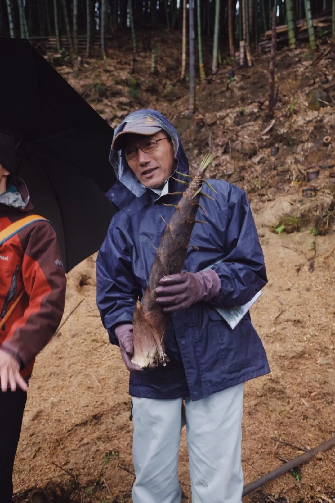 (原始链接: https://mmbiz.qpic.cn/mmbiz_jpg/L6HdGyg0k5Tw9jxWtXwibkfpKvcKrDeIgQhOibyDgyEq09Qs41icQMRJQ9CiadqmMFK9Dj2ufhmWrvibJnlV3EG2Maw/640?wx_fmt=jpeg)
- 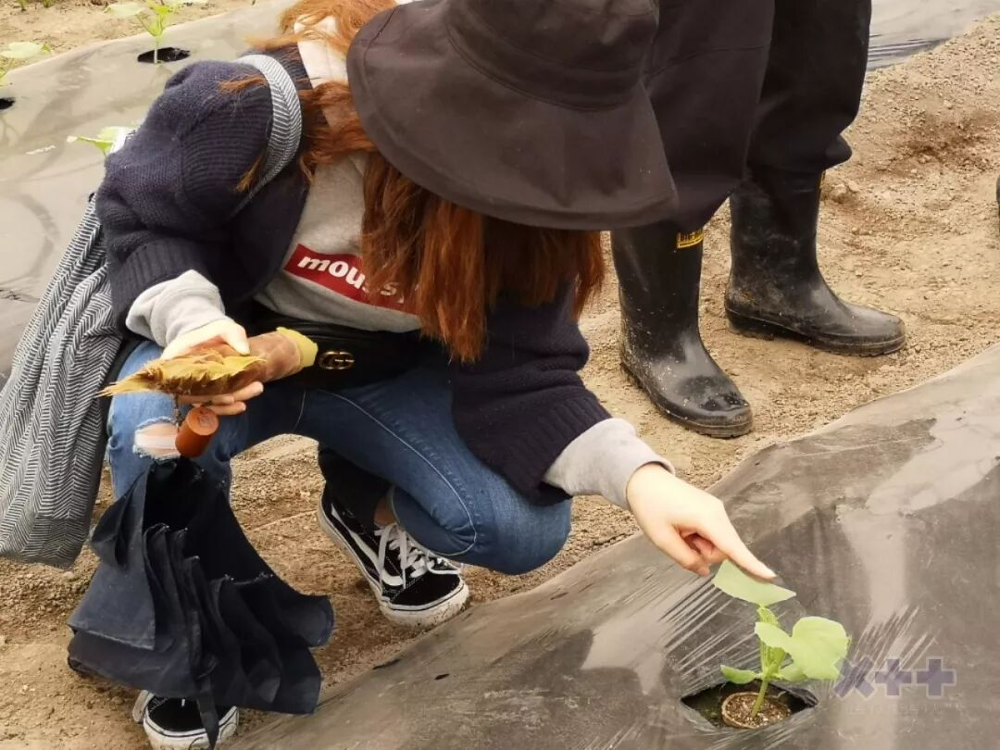 (原始链接: https://mmbiz.qpic.cn/mmbiz_jpg/L6HdGyg0k5Tw9jxWtXwibkfpKvcKrDeIgkSDhzRVciccA7XFD04AE7nkCkL3vMHbJlTeTib3rFfib7KSxVAttvE12Q/640?wx_fmt=jpeg)
-  (原始链接: https://mmbiz.qpic.cn/mmbiz_png/L6HdGyg0k5TZLfw7NUENqFxnCR0hfUzlra17QBdRBQjhSfYnbjogCNK30oKulAZOvOeqFa9au7rwIKHvKZopRQ/640?wx_fmt=png)
-  (原始链接: https://mmbiz.qpic.cn/mmbiz_png/L6HdGyg0k5TZLfw7NUENqFxnCR0hfUzlzTGJ4rH4WxfONNBZ3MzOs8NlN5tpHxmK85yYfUghwKichMcGBK3IkvQ/640?wx_fmt=png)
- 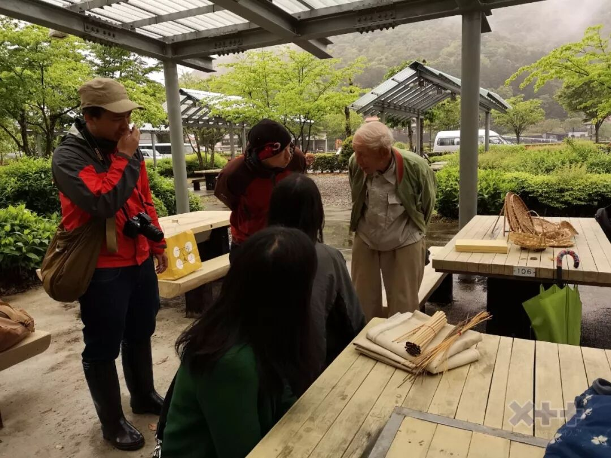 (原始链接: https://mmbiz.qpic.cn/mmbiz_jpg/L6HdGyg0k5Tw9jxWtXwibkfpKvcKrDeIgsfGaYIFA9tOQFL0vXceqymM9XUOpXmI5uk2RK26qJpXLBic2VcaodIw/640?wx_fmt=jpeg)
- 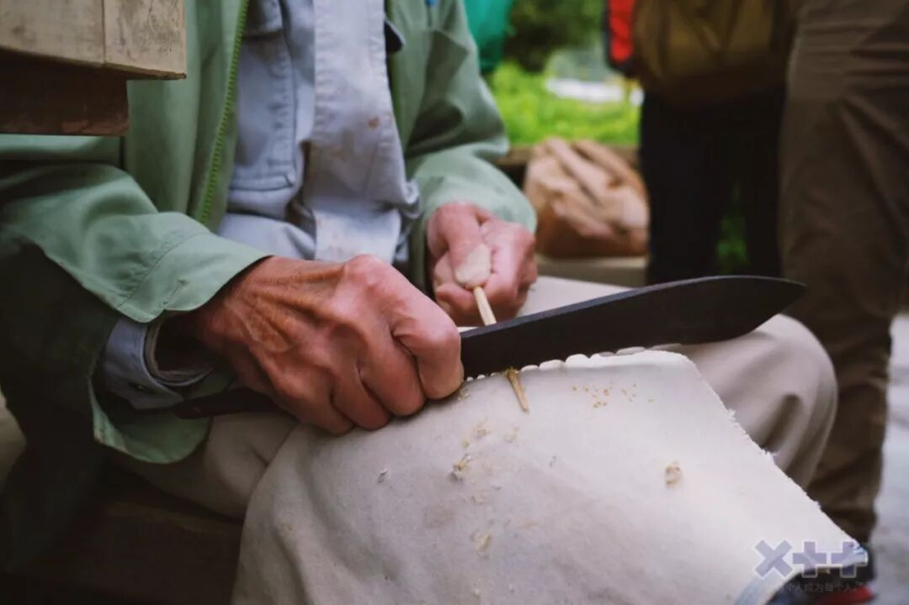 (原始链接: https://mmbiz.qpic.cn/mmbiz_jpg/L6HdGyg0k5Tw9jxWtXwibkfpKvcKrDeIgW6X2P7IJgZOibgDYdAwMwcicXicFHwKg6DwZDB1EdEaibbb0ORzmGNolyg/640?wx_fmt=jpeg)
-  (原始链接: https://mmbiz.qpic.cn/mmbiz_png/L6HdGyg0k5TZLfw7NUENqFxnCR0hfUzlra17QBdRBQjhSfYnbjogCNK30oKulAZOvOeqFa9au7rwIKHvKZopRQ/640?wx_fmt=png)
-  (原始链接: https://mmbiz.qpic.cn/mmbiz_png/L6HdGyg0k5TZLfw7NUENqFxnCR0hfUzlzTGJ4rH4WxfONNBZ3MzOs8NlN5tpHxmK85yYfUghwKichMcGBK3IkvQ/640?wx_fmt=png)
- 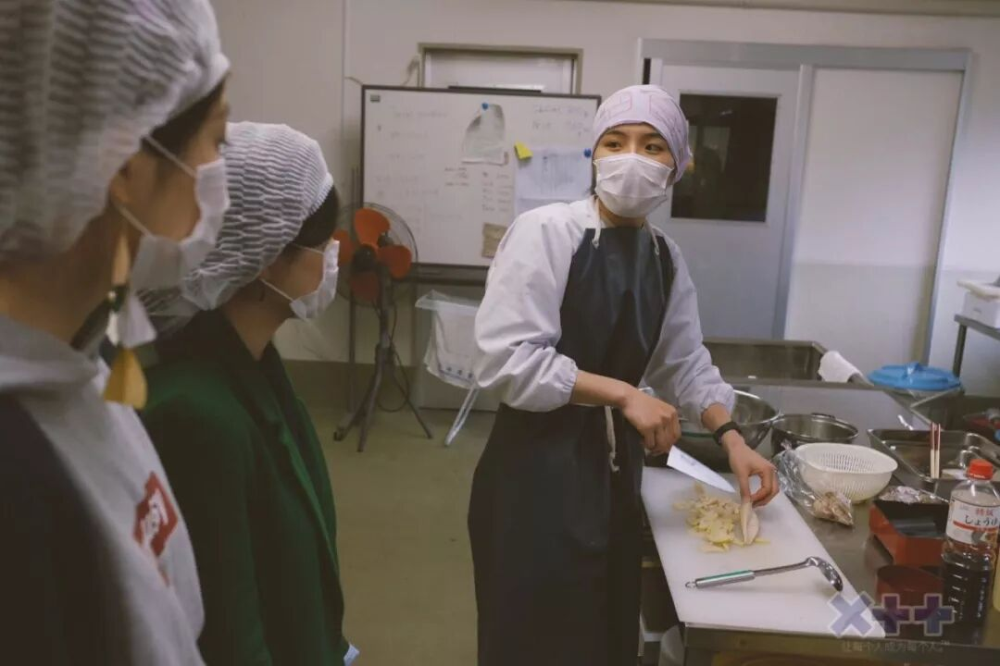 (原始链接: https://mmbiz.qpic.cn/mmbiz_jpg/L6HdGyg0k5Tw9jxWtXwibkfpKvcKrDeIgbbZlKWbIfmaPUibAO0GnkJlk5epeD8shAD7Jj8WHONqNr6Wyw6vCvjg/640?wx_fmt=jpeg)
- 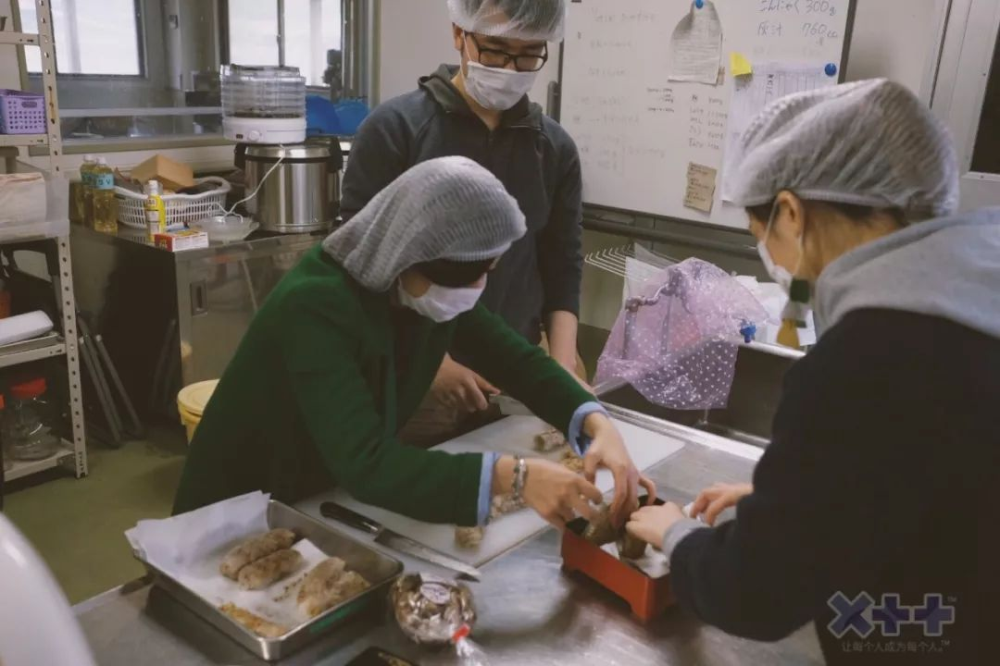 (原始链接: https://mmbiz.qpic.cn/mmbiz_jpg/L6HdGyg0k5Tw9jxWtXwibkfpKvcKrDeIgkF4qkIflC90wBlo3PqQeCxPqUsF01nEPOrFialRbr0wic0DS8C0tMqVg/640?wx_fmt=jpeg)
-  (原始链接: https://mmbiz.qpic.cn/mmbiz_png/L6HdGyg0k5TZLfw7NUENqFxnCR0hfUzlra17QBdRBQjhSfYnbjogCNK30oKulAZOvOeqFa9au7rwIKHvKZopRQ/640?wx_fmt=png)
-  (原始链接: https://mmbiz.qpic.cn/mmbiz_png/L6HdGyg0k5TZLfw7NUENqFxnCR0hfUzlzTGJ4rH4WxfONNBZ3MzOs8NlN5tpHxmK85yYfUghwKichMcGBK3IkvQ/640?wx_fmt=png)
-  (原始链接: https://mmbiz.qpic.cn/mmbiz_png/L6HdGyg0k5TBnlvgSykCODyWkFgby4GYJxCjiburj6Id77ncwptABkA3iba9R5EOp09Q10uGib23v3fUSt3M1Lr9w/640?wx_fmt=png)
- 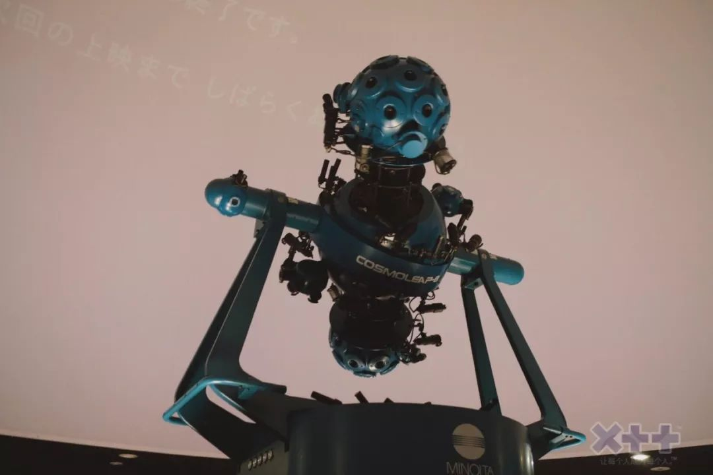 (原始链接: https://mmbiz.qpic.cn/mmbiz_jpg/L6HdGyg0k5Tw9jxWtXwibkfpKvcKrDeIg1Fso4pRyBBczvLlcib51jMR5ZsPF15uU2VwgY0dyf1ff4eKFwucWO0g/640?wx_fmt=jpeg)
- 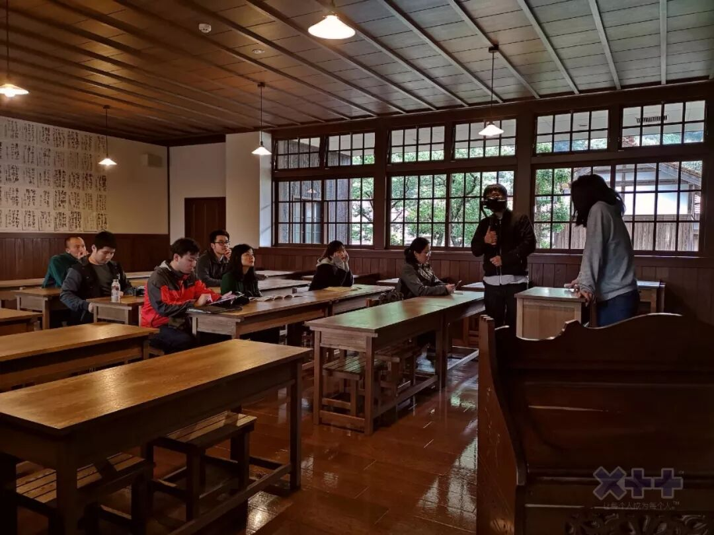 (原始链接: https://mmbiz.qpic.cn/mmbiz_jpg/L6HdGyg0k5Tw9jxWtXwibkfpKvcKrDeIg1ibnlhKMp18FISiaUwtwOoglvm02o6AjNlgzHpuCX2WzSv1XtuDeicpPA/640?wx_fmt=jpeg)
-  (原始链接: https://mmbiz.qpic.cn/mmbiz_png/L6HdGyg0k5TZLfw7NUENqFxnCR0hfUzlra17QBdRBQjhSfYnbjogCNK30oKulAZOvOeqFa9au7rwIKHvKZopRQ/640?wx_fmt=png)
-  (原始链接: https://mmbiz.qpic.cn/mmbiz_png/L6HdGyg0k5TZLfw7NUENqFxnCR0hfUzlzTGJ4rH4WxfONNBZ3MzOs8NlN5tpHxmK85yYfUghwKichMcGBK3IkvQ/640?wx_fmt=png)
- 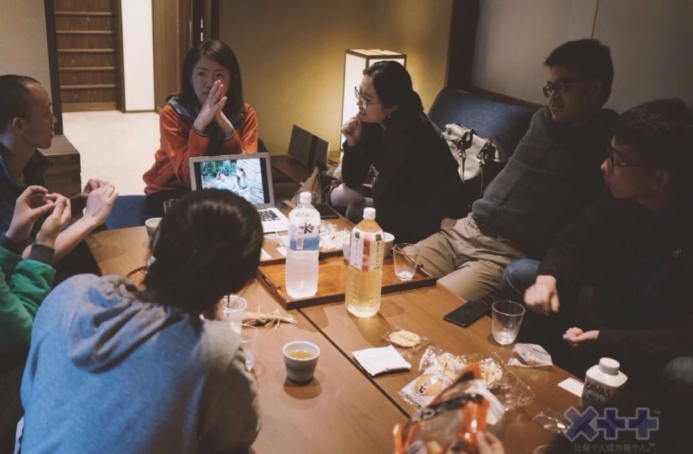 (原始链接: https://mmbiz.qpic.cn/mmbiz_png/L6HdGyg0k5TBnlvgSykCODyWkFgby4GYQN3nAyIkiaXnSsdYkB2za3gHqHRrL5zVbZWjog52OALnPG6T35OdbIQ/640?wx_fmt=png)
-  (原始链接: https://mmbiz.qpic.cn/mmbiz_png/L6HdGyg0k5TZLfw7NUENqFxnCR0hfUzlhicQGX3KAcsYo2cgb0SrJBA06bZ83cmFyT5ia3l04cGmTVpGZpaMQ2Vw/640?wx_fmt=png)
-  (原始链接: https://mmbiz.qpic.cn/mmbiz_png/L6HdGyg0k5TZLfw7NUENqFxnCR0hfUzlyPGXfrLWl3ZJySicHrMPVoRXUoLkleuzZNRlqsRuLicbQCWjAcfv1d7g/640?wx_fmt=png)
-  (原始链接: https://mmbiz.qpic.cn/mmbiz_png/L6HdGyg0k5TZLfw7NUENqFxnCR0hfUzlyPGXfrLWl3ZJySicHrMPVoRXUoLkleuzZNRlqsRuLicbQCWjAcfv1d7g/640?wx_fmt=png)
-  (原始链接: https://mmbiz.qpic.cn/mmbiz_png/L6HdGyg0k5TZLfw7NUENqFxnCR0hfUzlra17QBdRBQjhSfYnbjogCNK30oKulAZOvOeqFa9au7rwIKHvKZopRQ/640?wx_fmt=png)
-  (原始链接: https://mmbiz.qpic.cn/mmbiz_png/L6HdGyg0k5TZLfw7NUENqFxnCR0hfUzlzTGJ4rH4WxfONNBZ3MzOs8NlN5tpHxmK85yYfUghwKichMcGBK3IkvQ/640?wx_fmt=png)
- 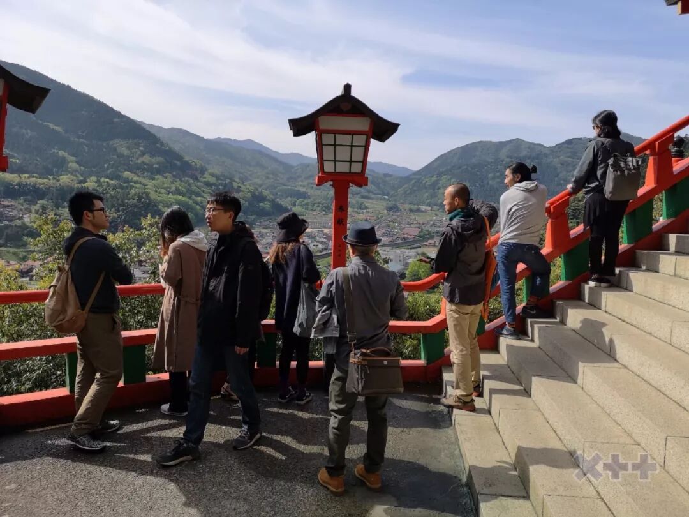 (原始链接: https://mmbiz.qpic.cn/mmbiz_jpg/L6HdGyg0k5Tw9jxWtXwibkfpKvcKrDeIgIxwDGnMdCg3Fx2CiavXVKLchA6H3cSSgUmwANZiaicAsKgXm2W6BeNw3A/640?wx_fmt=jpeg)
- 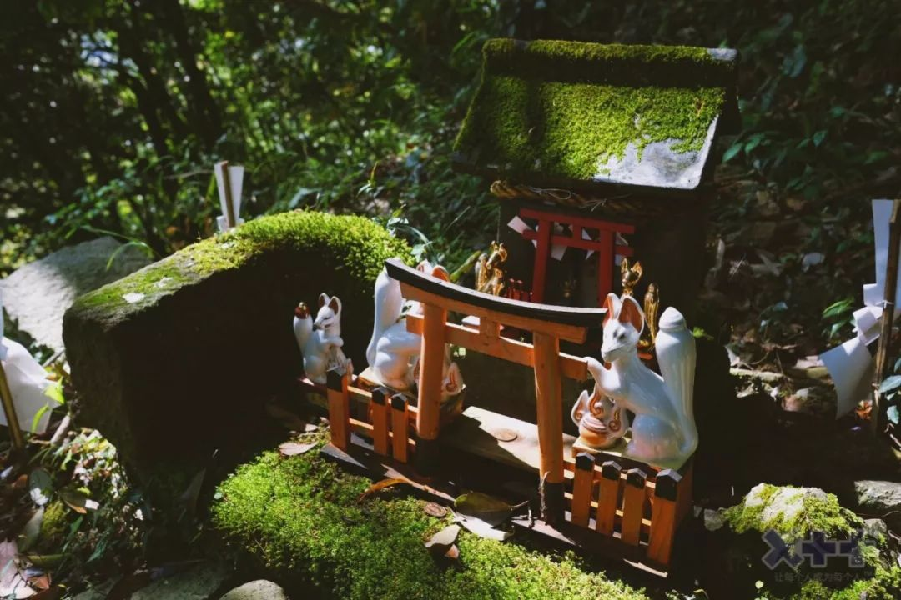 (原始链接: https://mmbiz.qpic.cn/mmbiz_jpg/L6HdGyg0k5TBnlvgSykCODyWkFgby4GYtOeBwaUlMIn1ic8FJH14bxLic6ADA1nA6WpTTYhhsEU5aX9iciccP7OxDQ/640?wx_fmt=jpeg)
-  (原始链接: https://mmbiz.qpic.cn/mmbiz_png/L6HdGyg0k5TZLfw7NUENqFxnCR0hfUzlra17QBdRBQjhSfYnbjogCNK30oKulAZOvOeqFa9au7rwIKHvKZopRQ/640?wx_fmt=png)
-  (原始链接: https://mmbiz.qpic.cn/mmbiz_png/L6HdGyg0k5TZLfw7NUENqFxnCR0hfUzlzTGJ4rH4WxfONNBZ3MzOs8NlN5tpHxmK85yYfUghwKichMcGBK3IkvQ/640?wx_fmt=png)
- 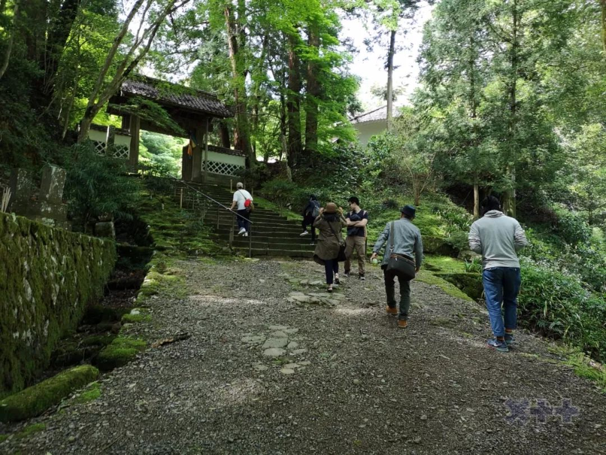 (原始链接: https://mmbiz.qpic.cn/mmbiz_jpg/L6HdGyg0k5Tw9jxWtXwibkfpKvcKrDeIg0StPmN5A9y5hjyVuhlu4mDw6WQkLqKBHSL6ibJEHqTDSYtysqwHSPRA/640?wx_fmt=jpeg)
- 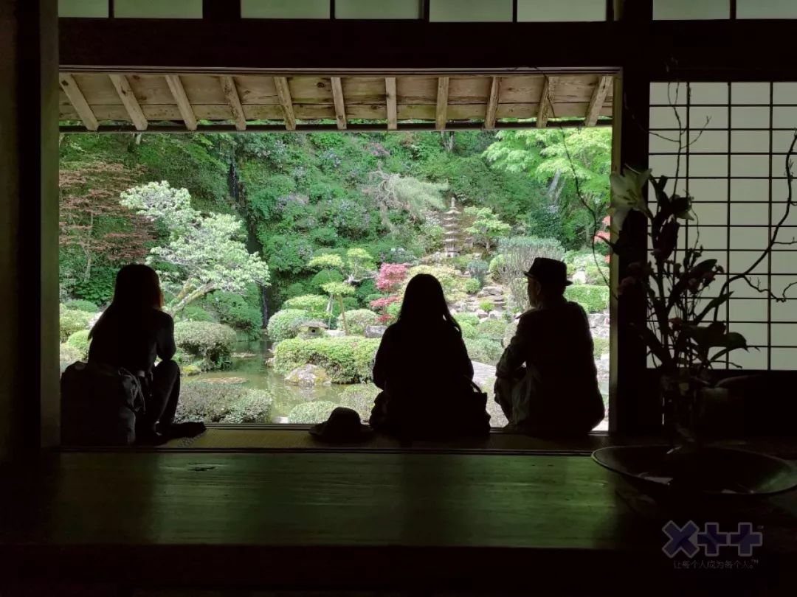 (原始链接: https://mmbiz.qpic.cn/mmbiz_jpg/L6HdGyg0k5Tw9jxWtXwibkfpKvcKrDeIgksLnxMlia0lIFGqNtTZaPMODSwOH8m5cXOUfDl764rgB9nSZCVqb8Lg/640?wx_fmt=jpeg)
- 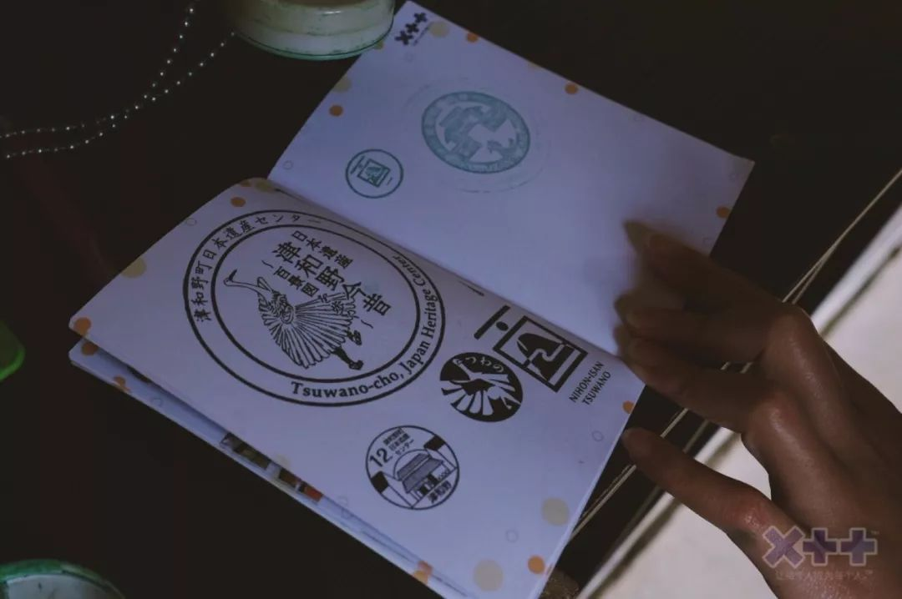 (原始链接: https://mmbiz.qpic.cn/mmbiz_jpg/L6HdGyg0k5Tw9jxWtXwibkfpKvcKrDeIg9DxgDuWqeiaErDFnw5NGsLPDevtUIicRsDRciaicof370sySibpNeBvNBmg/640?wx_fmt=jpeg)
- 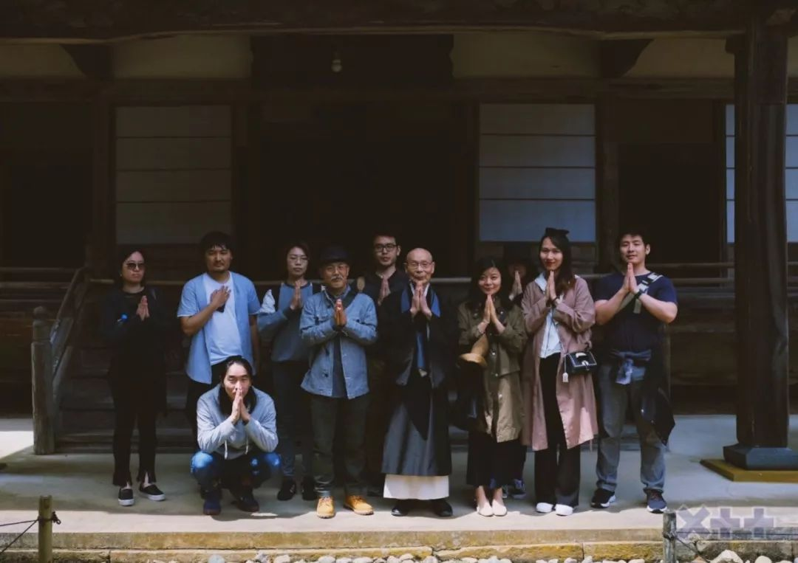 (原始链接: https://mmbiz.qpic.cn/mmbiz_jpg/L6HdGyg0k5Tw9jxWtXwibkfpKvcKrDeIgOXicCLTugPWibqm3yzF30otA2NLHXS3U5Ric9RowRTnOoLy73fTJRDbWQ/640?wx_fmt=jpeg)
-  (原始链接: https://mmbiz.qpic.cn/mmbiz_png/L6HdGyg0k5TZLfw7NUENqFxnCR0hfUzlra17QBdRBQjhSfYnbjogCNK30oKulAZOvOeqFa9au7rwIKHvKZopRQ/640?wx_fmt=png)
-  (原始链接: https://mmbiz.qpic.cn/mmbiz_png/L6HdGyg0k5TZLfw7NUENqFxnCR0hfUzlzTGJ4rH4WxfONNBZ3MzOs8NlN5tpHxmK85yYfUghwKichMcGBK3IkvQ/640?wx_fmt=png)
- 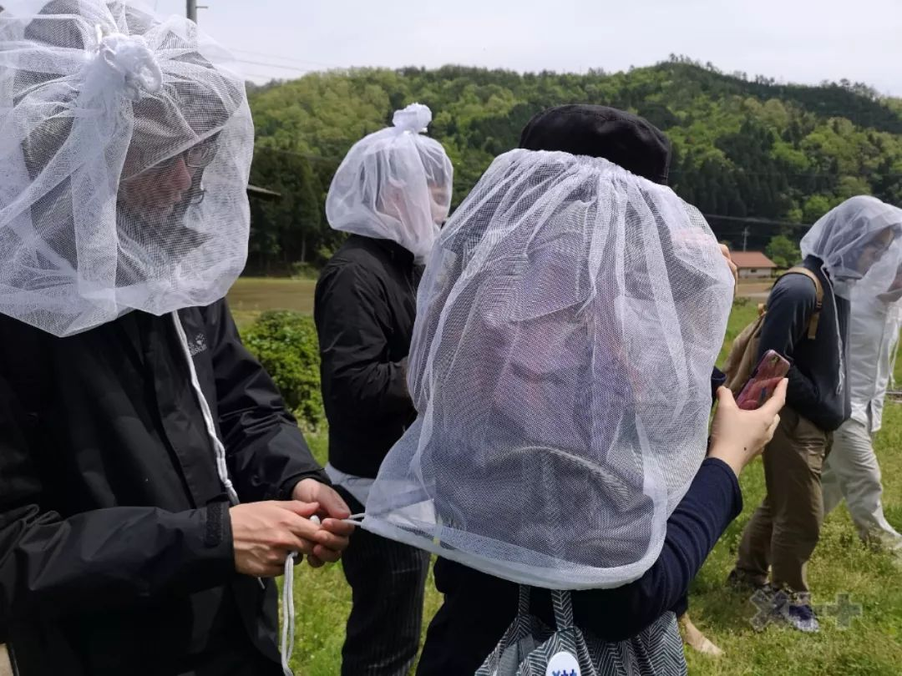 (原始链接: https://mmbiz.qpic.cn/mmbiz_jpg/L6HdGyg0k5Tw9jxWtXwibkfpKvcKrDeIgeFIibuiax8v8Z3ibGzav606oIB9bTMUsXKjqBNxBSVQn0fZufYJhjdnrg/640?wx_fmt=jpeg)
- 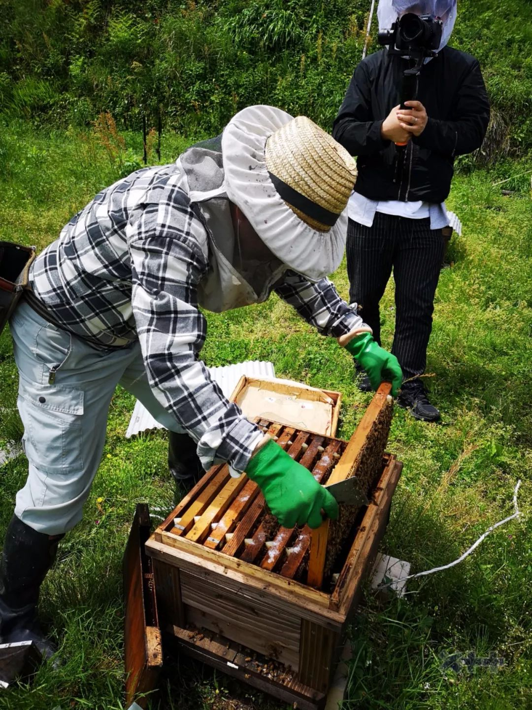 (原始链接: https://mmbiz.qpic.cn/mmbiz_jpg/L6HdGyg0k5Tw9jxWtXwibkfpKvcKrDeIghEBYJP7PMS5xiaMvqM5HwZr7th1pNHFHCmuesUUbWKfTKticnibZdRdLg/640?wx_fmt=jpeg)
-  (原始链接: https://mmbiz.qpic.cn/mmbiz_png/L6HdGyg0k5TZLfw7NUENqFxnCR0hfUzlra17QBdRBQjhSfYnbjogCNK30oKulAZOvOeqFa9au7rwIKHvKZopRQ/640?wx_fmt=png)
-  (原始链接: https://mmbiz.qpic.cn/mmbiz_png/L6HdGyg0k5TZLfw7NUENqFxnCR0hfUzlzTGJ4rH4WxfONNBZ3MzOs8NlN5tpHxmK85yYfUghwKichMcGBK3IkvQ/640?wx_fmt=png)
- 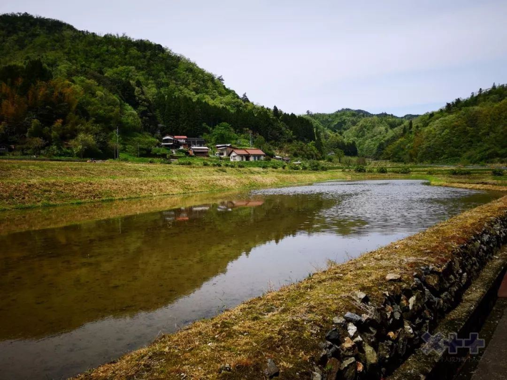 (原始链接: https://mmbiz.qpic.cn/mmbiz_jpg/L6HdGyg0k5Tw9jxWtXwibkfpKvcKrDeIgtQ6icaGCCGgXNib32TZKeBkPBYvUDjLBVjJibibqydibn1nDBSkd4VXuM8A/640?wx_fmt=jpeg)
- 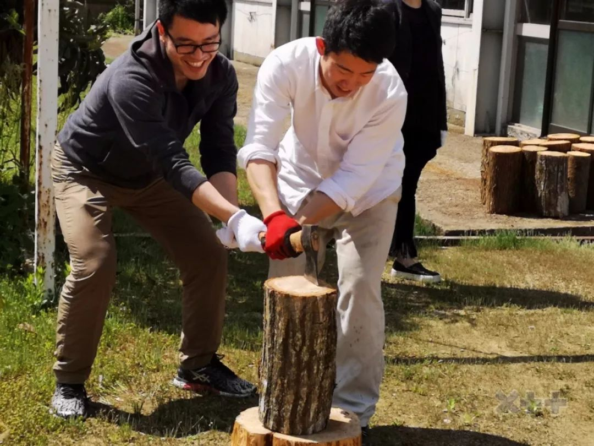 (原始链接: https://mmbiz.qpic.cn/mmbiz_jpg/L6HdGyg0k5Tw9jxWtXwibkfpKvcKrDeIgDibZeg8GlE63ZVZxQQPJ6ic4x2BCLHebITxgBQeicictj4ib7NGxlVvvd9g/640?wx_fmt=jpeg)
- 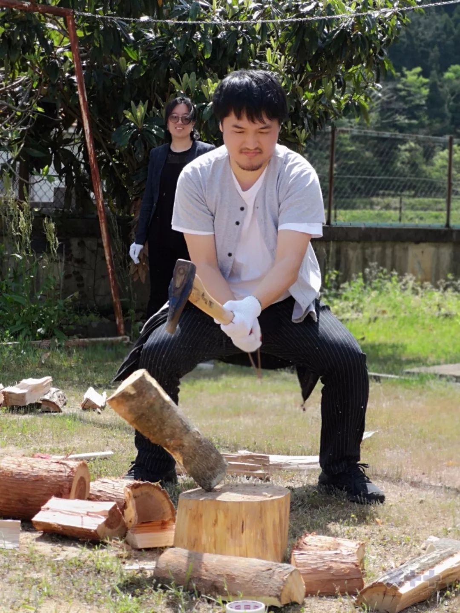 (原始链接: https://mmbiz.qpic.cn/mmbiz_jpg/L6HdGyg0k5Tw9jxWtXwibkfpKvcKrDeIgNnzCx63PodfLb7qAiclbibjdHGYnQ7vRM8hEj3cJOHQok5zmEWBLicDtg/640?wx_fmt=jpeg)
- 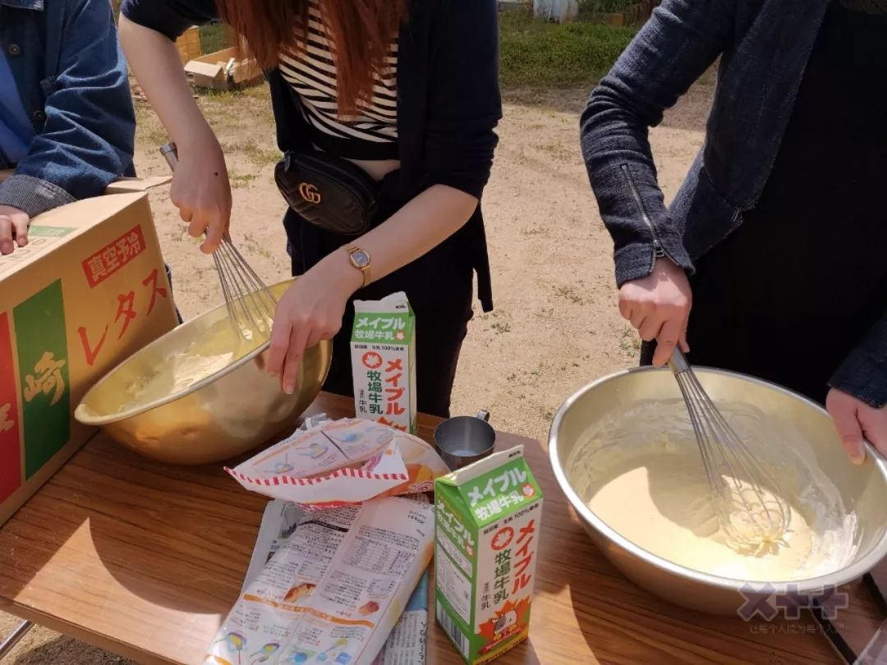 (原始链接: https://mmbiz.qpic.cn/mmbiz_jpg/L6HdGyg0k5Tw9jxWtXwibkfpKvcKrDeIgWq7kia8icCiaoCMoUAjQc6puOjUSfF6PSGK5PufgVG003WGfHgqAoOaMg/640?wx_fmt=jpeg)
-  (原始链接: https://mmbiz.qpic.cn/mmbiz_png/L6HdGyg0k5TZLfw7NUENqFxnCR0hfUzlra17QBdRBQjhSfYnbjogCNK30oKulAZOvOeqFa9au7rwIKHvKZopRQ/640?wx_fmt=png)
-  (原始链接: https://mmbiz.qpic.cn/mmbiz_png/L6HdGyg0k5TZLfw7NUENqFxnCR0hfUzlzTGJ4rH4WxfONNBZ3MzOs8NlN5tpHxmK85yYfUghwKichMcGBK3IkvQ/640?wx_fmt=png)
- 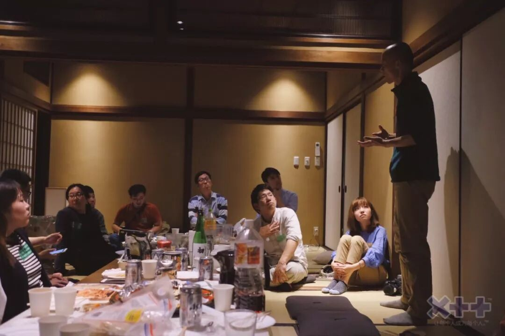 (原始链接: https://mmbiz.qpic.cn/mmbiz_jpg/L6HdGyg0k5Tw9jxWtXwibkfpKvcKrDeIgCPL3dneIIMoVqmlt77VdkcXfwKtPyPhrKIFibweq9Nn7LPudP9E27DA/640?wx_fmt=jpeg)
-  (原始链接: https://mmbiz.qpic.cn/mmbiz_png/L6HdGyg0k5TZLfw7NUENqFxnCR0hfUzlhicQGX3KAcsYo2cgb0SrJBA06bZ83cmFyT5ia3l04cGmTVpGZpaMQ2Vw/640?wx_fmt=png)
-  (原始链接: https://mmbiz.qpic.cn/mmbiz_png/L6HdGyg0k5TZLfw7NUENqFxnCR0hfUzlyPGXfrLWl3ZJySicHrMPVoRXUoLkleuzZNRlqsRuLicbQCWjAcfv1d7g/640?wx_fmt=png)
- 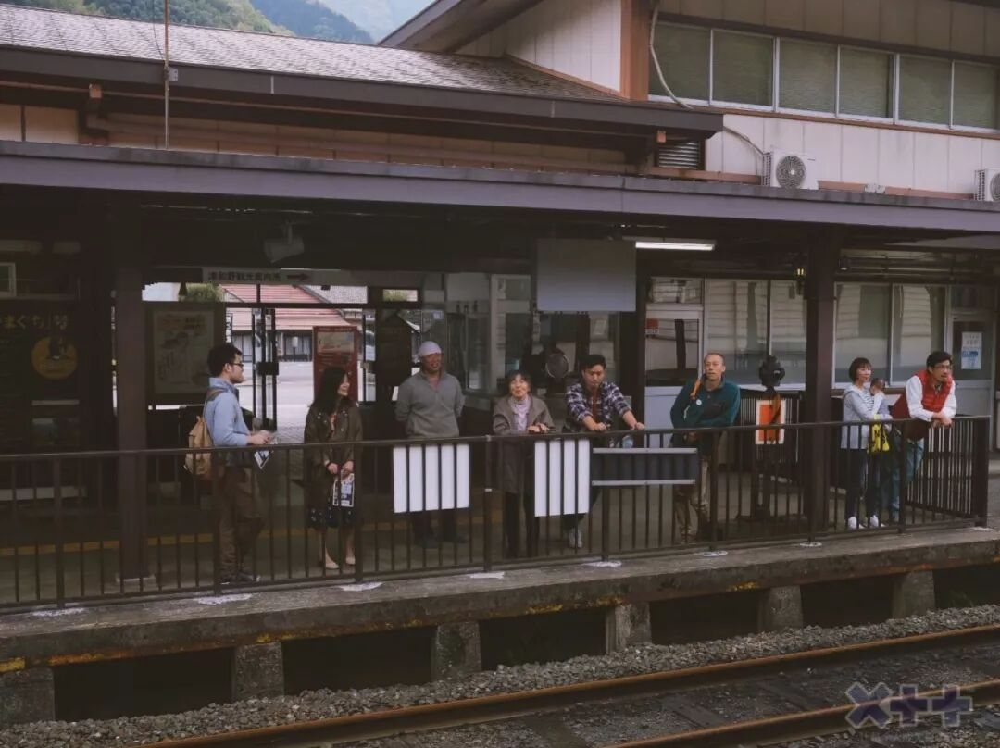 (原始链接: https://mmbiz.qpic.cn/mmbiz_jpg/L6HdGyg0k5TBnlvgSykCODyWkFgby4GY6e77LNVbFffgfuC3sB9K8av2qqA0f6z41vYqVHfJqLicick3fM3E2h5Q/640?wx_fmt=jpeg)
-  (原始链接: https://mmbiz.qpic.cn/mmbiz_png/L6HdGyg0k5TZLfw7NUENqFxnCR0hfUzlra17QBdRBQjhSfYnbjogCNK30oKulAZOvOeqFa9au7rwIKHvKZopRQ/640?wx_fmt=png)
-  (原始链接: https://mmbiz.qpic.cn/mmbiz_png/L6HdGyg0k5TZLfw7NUENqFxnCR0hfUzlzTGJ4rH4WxfONNBZ3MzOs8NlN5tpHxmK85yYfUghwKichMcGBK3IkvQ/640?wx_fmt=png)
- 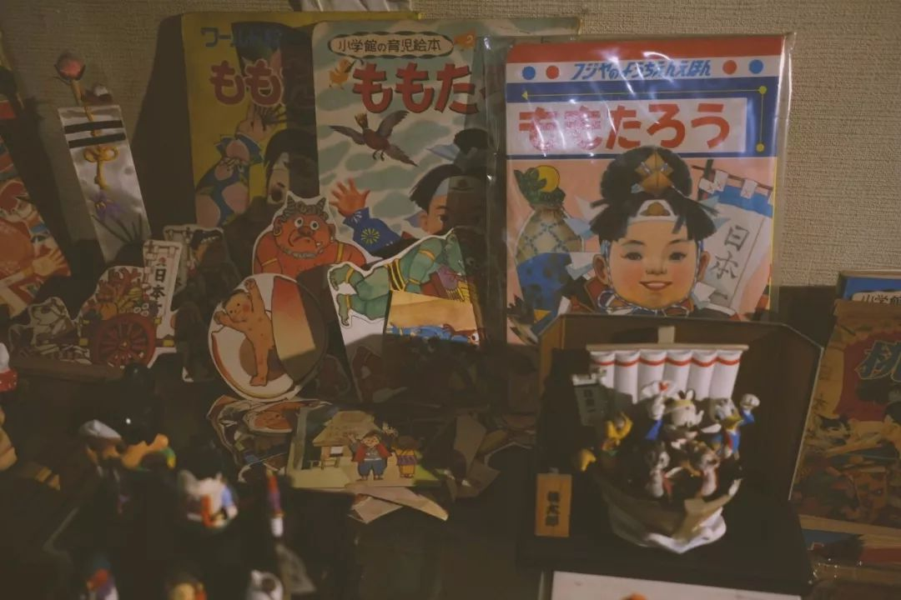 (原始链接: https://mmbiz.qpic.cn/mmbiz_jpg/L6HdGyg0k5Tw9jxWtXwibkfpKvcKrDeIgCIzJcHrpdkicwBia456EJL9V7u0OiaT25s52icwzSthvkYQ2IzNTNAWUzg/640?wx_fmt=jpeg)
- 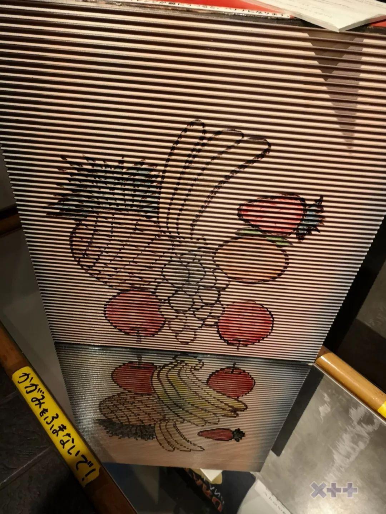 (原始链接: https://mmbiz.qpic.cn/mmbiz_jpg/L6HdGyg0k5TBnlvgSykCODyWkFgby4GY8rQ4TdXMiaYz8dowfBdfjtt2UYtDpNpjpQPN53SXdMHeLicMSM8M0I3A/640?wx_fmt=jpeg)
- 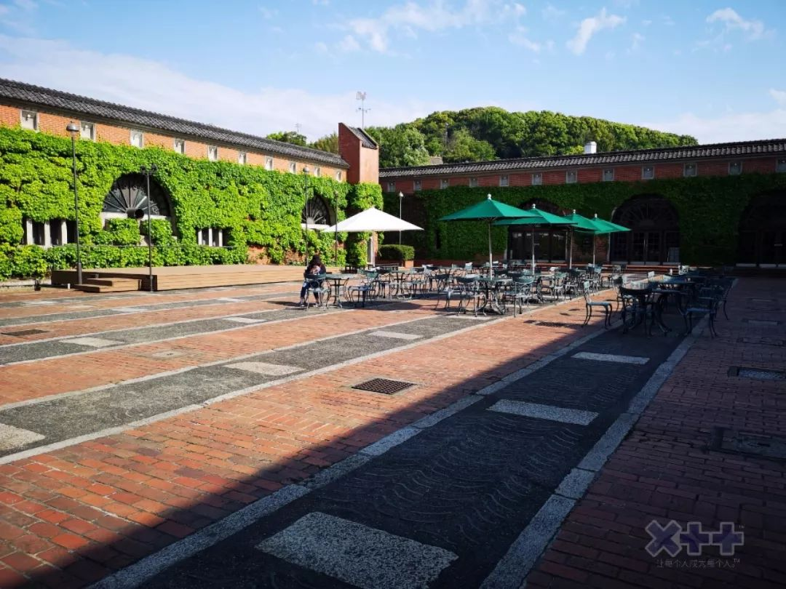 (原始链接: https://mmbiz.qpic.cn/mmbiz_jpg/L6HdGyg0k5Tw9jxWtXwibkfpKvcKrDeIgPlaeANKLQia35TEPZQg2IvuyFV6R7pZjpl2xtibkXsAY9Zrffng4Kibew/640?wx_fmt=jpeg)
- 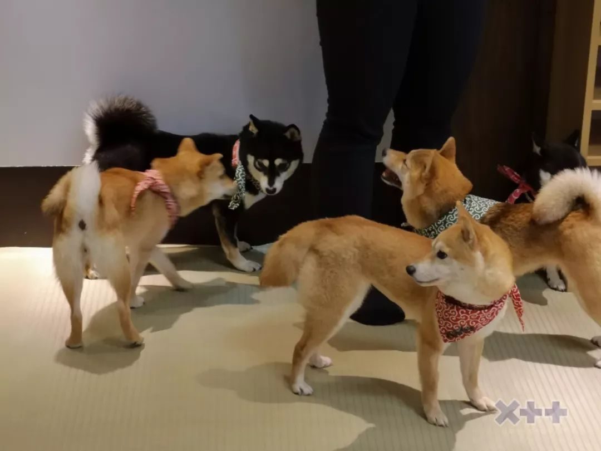 (原始链接: https://mmbiz.qpic.cn/mmbiz_jpg/L6HdGyg0k5Tw9jxWtXwibkfpKvcKrDeIgRMIOhLygFEic0jXHOZJJYZckOuTxSLHdKiagVOlIPKsv3lAnTMpEyXibw/640?wx_fmt=jpeg)
-  (原始链接: https://mmbiz.qpic.cn/mmbiz_png/L6HdGyg0k5TZLfw7NUENqFxnCR0hfUzlNfD6GGAGXcwibtmm2tpTvtOar8vAD9wMVeSkI0YWYzHZkUxTiagUQKgQ/640?wx_fmt=png)
- 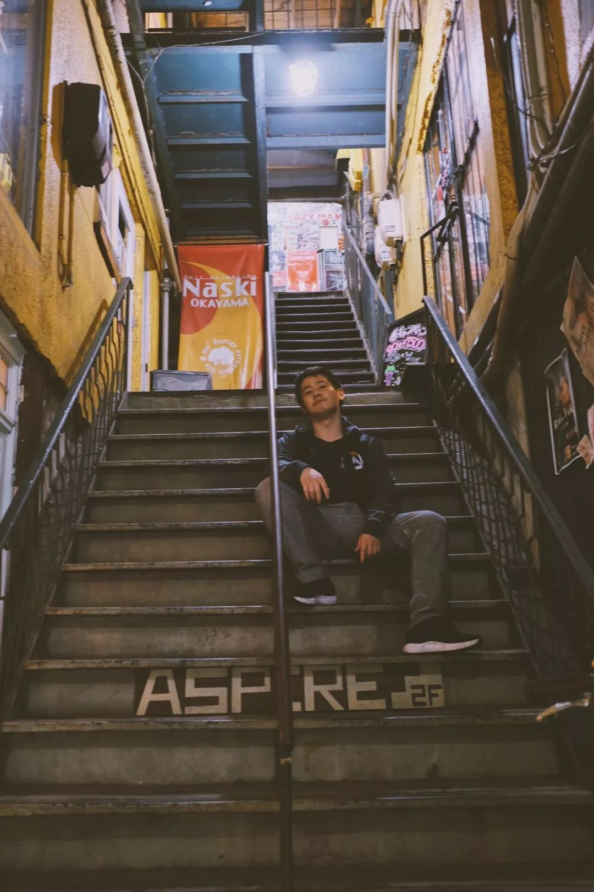 (原始链接: https://mmbiz.qpic.cn/mmbiz_jpg/L6HdGyg0k5Tw9jxWtXwibkfpKvcKrDeIg2CxiaeIZU8E1lTxMIuud3TXq9VmGSJIuG8MS4r95qFWocgbHSCeSzuA/640?wx_fmt=jpeg)
- 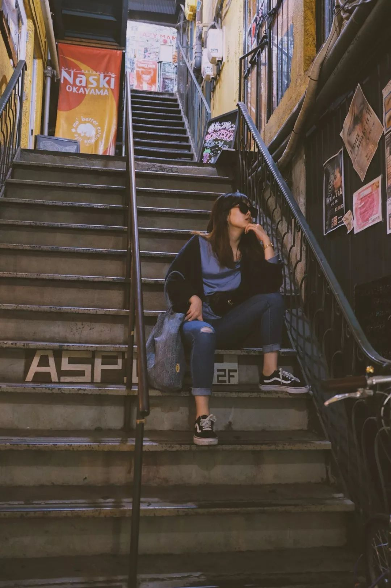 (原始链接: https://mmbiz.qpic.cn/mmbiz_jpg/L6HdGyg0k5Tw9jxWtXwibkfpKvcKrDeIgLica0GPpxxeNz8HyupCYw5Odib3gdVcdscajIuSicffY2uibQtvguycrGw/640?wx_fmt=jpeg)
- 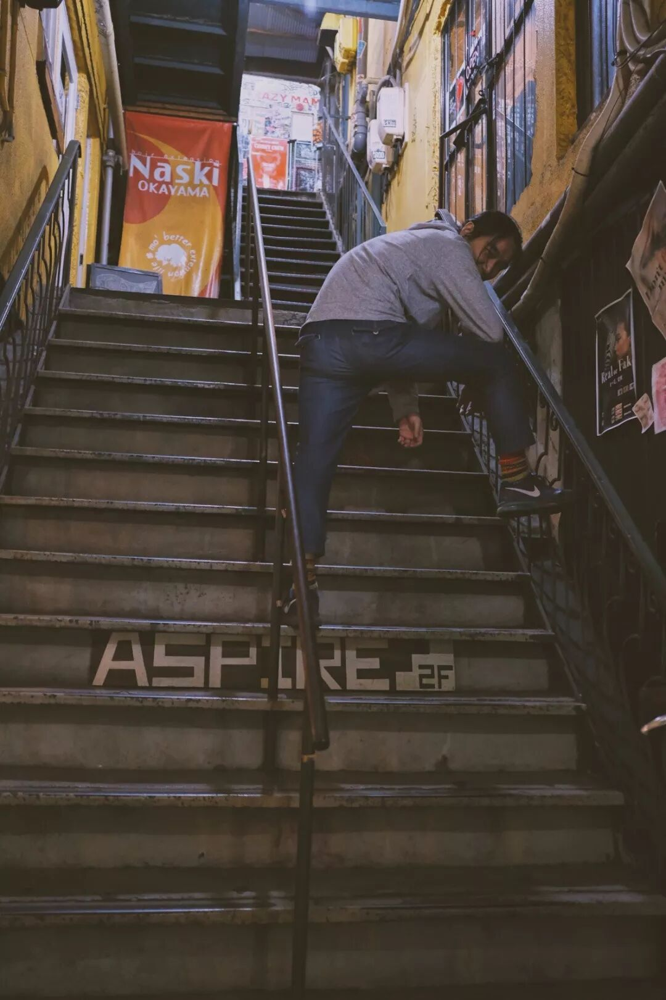 (原始链接: https://mmbiz.qpic.cn/mmbiz_jpg/L6HdGyg0k5Tw9jxWtXwibkfpKvcKrDeIg6gh0DhjOvY9hMWjgxop5EI1yV7xCO1rxxpQZrbo2JgicLWJF8X20Whw/640?wx_fmt=jpeg)
-  (原始链接: https://mmbiz.qpic.cn/mmbiz_png/L6HdGyg0k5TZLfw7NUENqFxnCR0hfUzlhicQGX3KAcsYo2cgb0SrJBA06bZ83cmFyT5ia3l04cGmTVpGZpaMQ2Vw/640?wx_fmt=png)
-  (原始链接: https://mmbiz.qpic.cn/mmbiz_png/L6HdGyg0k5TZLfw7NUENqFxnCR0hfUzlhicQGX3KAcsYo2cgb0SrJBA06bZ83cmFyT5ia3l04cGmTVpGZpaMQ2Vw/640?wx_fmt=png)
-  (原始链接: https://mmbiz.qpic.cn/mmbiz_png/L6HdGyg0k5TZLfw7NUENqFxnCR0hfUzlyPGXfrLWl3ZJySicHrMPVoRXUoLkleuzZNRlqsRuLicbQCWjAcfv1d7g/640?wx_fmt=png)
- 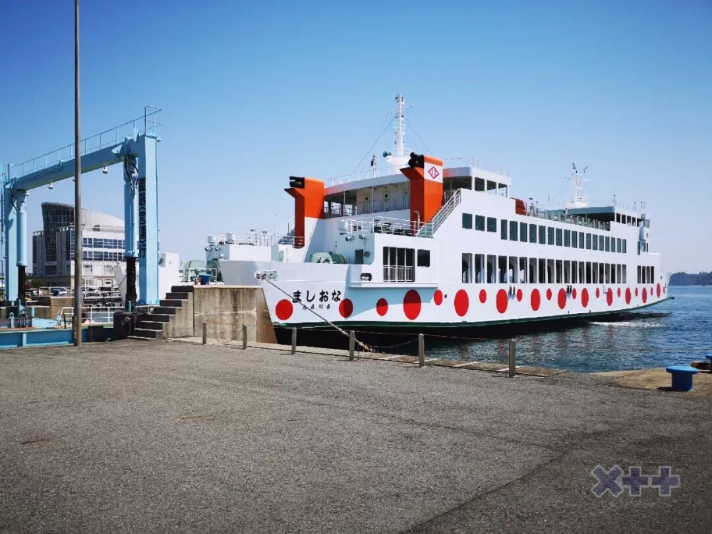 (原始链接: https://mmbiz.qpic.cn/mmbiz_jpg/L6HdGyg0k5Tw9jxWtXwibkfpKvcKrDeIg6w2icC9ibX9GRTouFjeK3yDuhfUMgKWBWWSFdMYdxRSVx6LJJXCyP2JA/640?wx_fmt=jpeg)
-  (原始链接: https://mmbiz.qpic.cn/mmbiz_png/L6HdGyg0k5TZLfw7NUENqFxnCR0hfUzlra17QBdRBQjhSfYnbjogCNK30oKulAZOvOeqFa9au7rwIKHvKZopRQ/640?wx_fmt=png)
-  (原始链接: https://mmbiz.qpic.cn/mmbiz_png/L6HdGyg0k5TZLfw7NUENqFxnCR0hfUzlzTGJ4rH4WxfONNBZ3MzOs8NlN5tpHxmK85yYfUghwKichMcGBK3IkvQ/640?wx_fmt=png)
- 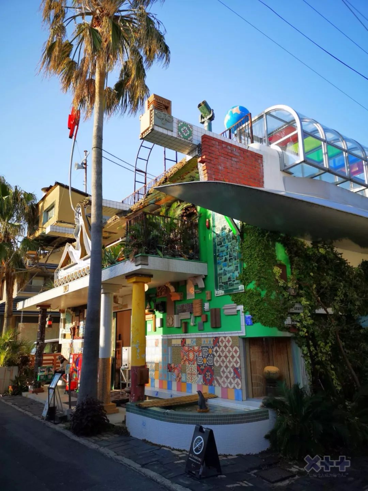 (原始链接: https://mmbiz.qpic.cn/mmbiz_jpg/L6HdGyg0k5Tw9jxWtXwibkfpKvcKrDeIgTYOCzMe7Tp6yZKIX7FKMibsMRoI2ib1lH4CPucNUVEsTYAcLvN1sDDkg/640?wx_fmt=jpeg)
- 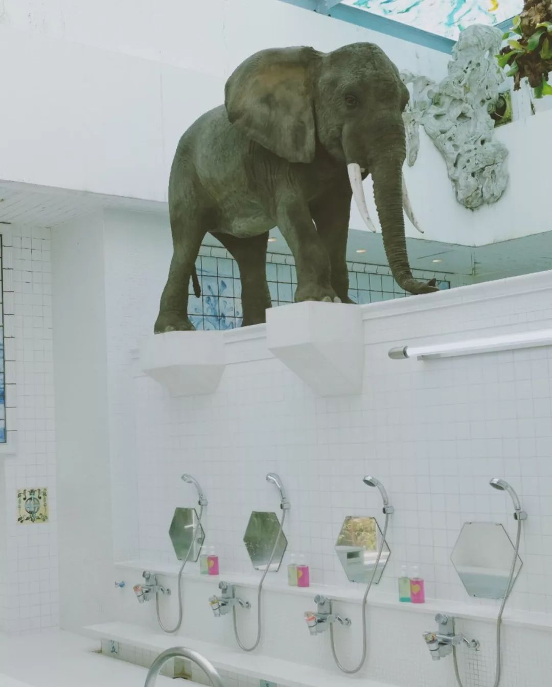 (原始链接: https://mmbiz.qpic.cn/mmbiz_jpg/L6HdGyg0k5TBnlvgSykCODyWkFgby4GYwvJwQOaI1FpKATFibGHmfWhNmCWqY1Pvj4NibFpQjnKMhYibia9AwCk7xw/640?wx_fmt=jpeg)
- 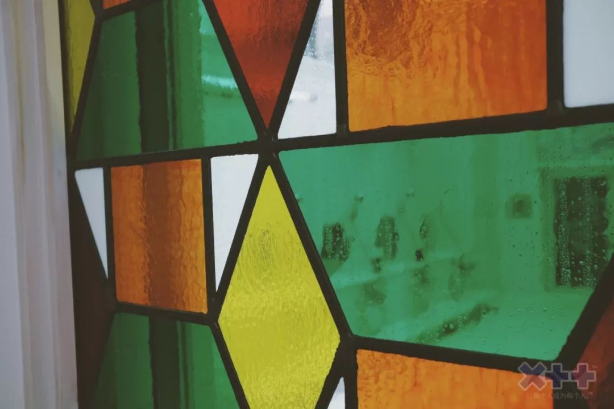 (原始链接: https://mmbiz.qpic.cn/mmbiz_jpg/L6HdGyg0k5TBnlvgSykCODyWkFgby4GYLIcXzNJzd2eAYibU16fjZywjfCOicq12hTZr0Hm0xeQxc8SbbJbTHicNw/640?wx_fmt=jpeg)
- 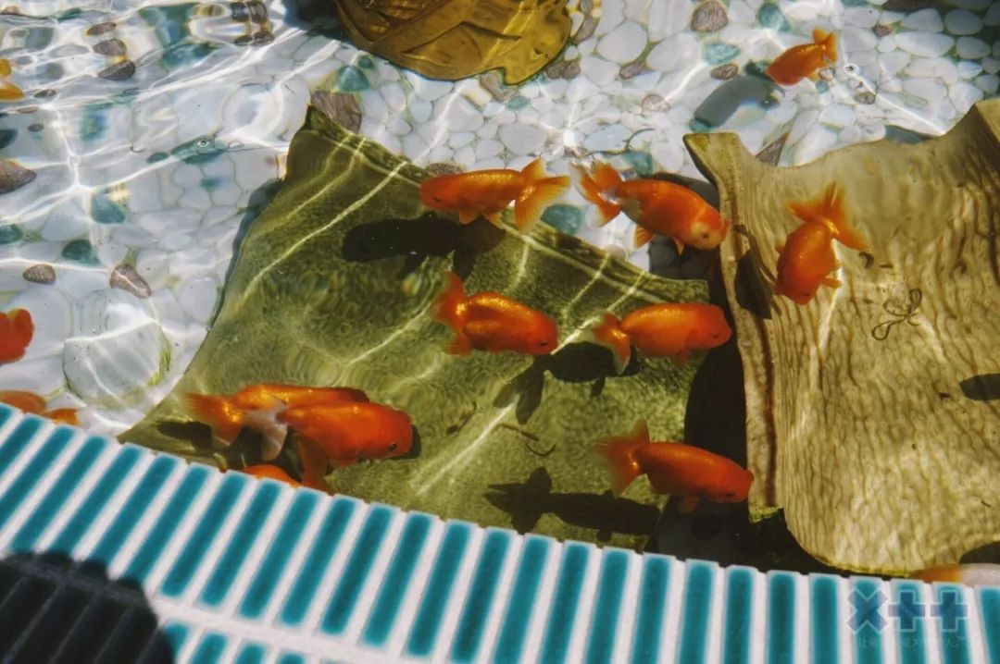 (原始链接: https://mmbiz.qpic.cn/mmbiz_jpg/L6HdGyg0k5TBnlvgSykCODyWkFgby4GYSiaZx1kBZ2PDrIRUWYoDanBQrZeEbFlx3OIxAc0pJavqyFQb8yqvMUw/640?wx_fmt=jpeg)
- 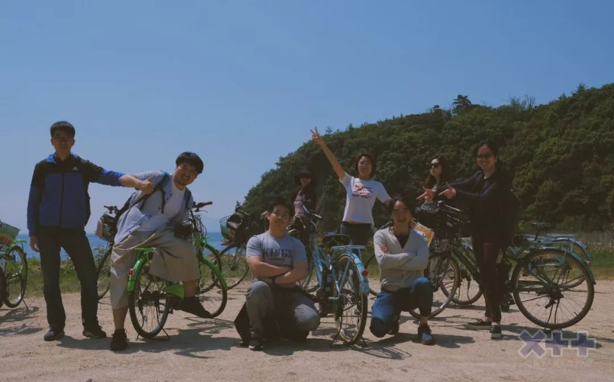 (原始链接: https://mmbiz.qpic.cn/mmbiz_jpg/L6HdGyg0k5TBnlvgSykCODyWkFgby4GYGp3VHr1EXicesNEZLichhWHicrM6CjOJ0HVQVvvGX7SzrfEbMB7zicic1lw/640?wx_fmt=jpeg)
-  (原始链接: https://mmbiz.qpic.cn/mmbiz_png/L6HdGyg0k5TZLfw7NUENqFxnCR0hfUzlra17QBdRBQjhSfYnbjogCNK30oKulAZOvOeqFa9au7rwIKHvKZopRQ/640?wx_fmt=png)
-  (原始链接: https://mmbiz.qpic.cn/mmbiz_png/L6HdGyg0k5TZLfw7NUENqFxnCR0hfUzlzTGJ4rH4WxfONNBZ3MzOs8NlN5tpHxmK85yYfUghwKichMcGBK3IkvQ/640?wx_fmt=png)
- 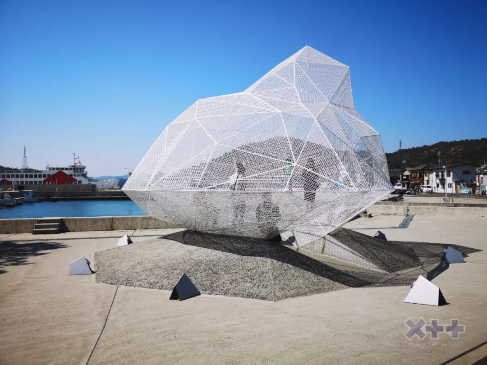 (原始链接: https://mmbiz.qpic.cn/mmbiz_jpg/L6HdGyg0k5Tw9jxWtXwibkfpKvcKrDeIgiajH0Z9m4HM5MIJJVbkuY2ezaQSbI2o3GWXWPEBJe3cja9ExW0oIrtQ/640?wx_fmt=jpeg)
- 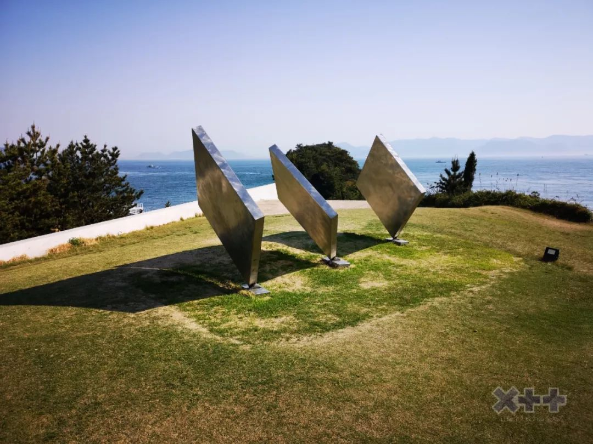 (原始链接: https://mmbiz.qpic.cn/mmbiz_jpg/L6HdGyg0k5TBnlvgSykCODyWkFgby4GYgz4K7m8XfpWibodwAnI3bogmmpOH5M2DDQwn3mMwPyOiaEOd1YRudBAw/640?wx_fmt=jpeg)
- 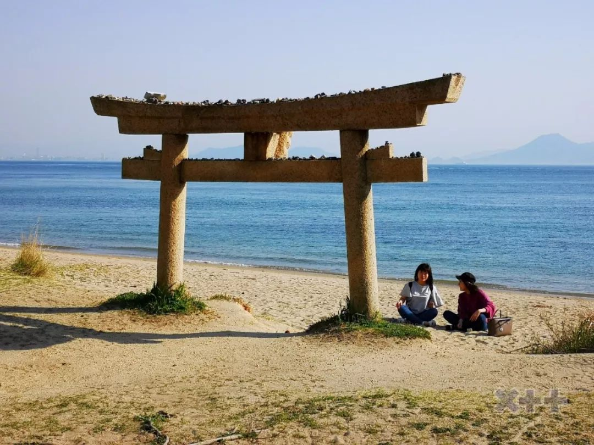 (原始链接: https://mmbiz.qpic.cn/mmbiz_jpg/L6HdGyg0k5Tw9jxWtXwibkfpKvcKrDeIgoX4CBvkf7rSwvKb80b0EGYdLMqgrmsTw6P5BTxcJPBsIn3OM8nYo9A/640?wx_fmt=jpeg)
-  (原始链接: https://mmbiz.qpic.cn/mmbiz_jpg/L6HdGyg0k5TBnlvgSykCODyWkFgby4GY8rnD6FfpvakRp5QIxKZaAFKSKF1jFibFJRkOQe3kpzsOM7gLC1gt3BQ/640?wx_fmt=jpeg)
-  (原始链接: https://mmbiz.qpic.cn/mmbiz_png/L6HdGyg0k5TZLfw7NUENqFxnCR0hfUzlra17QBdRBQjhSfYnbjogCNK30oKulAZOvOeqFa9au7rwIKHvKZopRQ/640?wx_fmt=png)
-  (原始链接: https://mmbiz.qpic.cn/mmbiz_png/L6HdGyg0k5TZLfw7NUENqFxnCR0hfUzlzTGJ4rH4WxfONNBZ3MzOs8NlN5tpHxmK85yYfUghwKichMcGBK3IkvQ/640?wx_fmt=png)
- 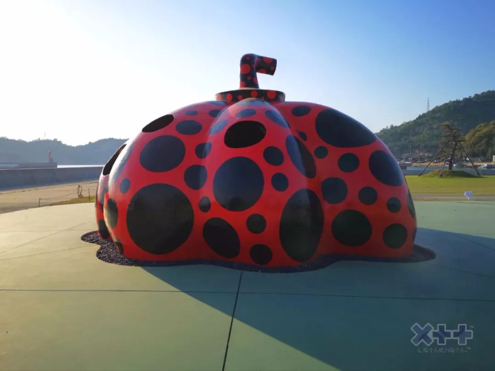 (原始链接: https://mmbiz.qpic.cn/mmbiz_jpg/L6HdGyg0k5Tw9jxWtXwibkfpKvcKrDeIgibib4yHUoz5aUFACwck0s5x1Xb2XcSjibhaPuNmB9TrYQx3BaGmXOkXUQ/640?wx_fmt=jpeg)
- 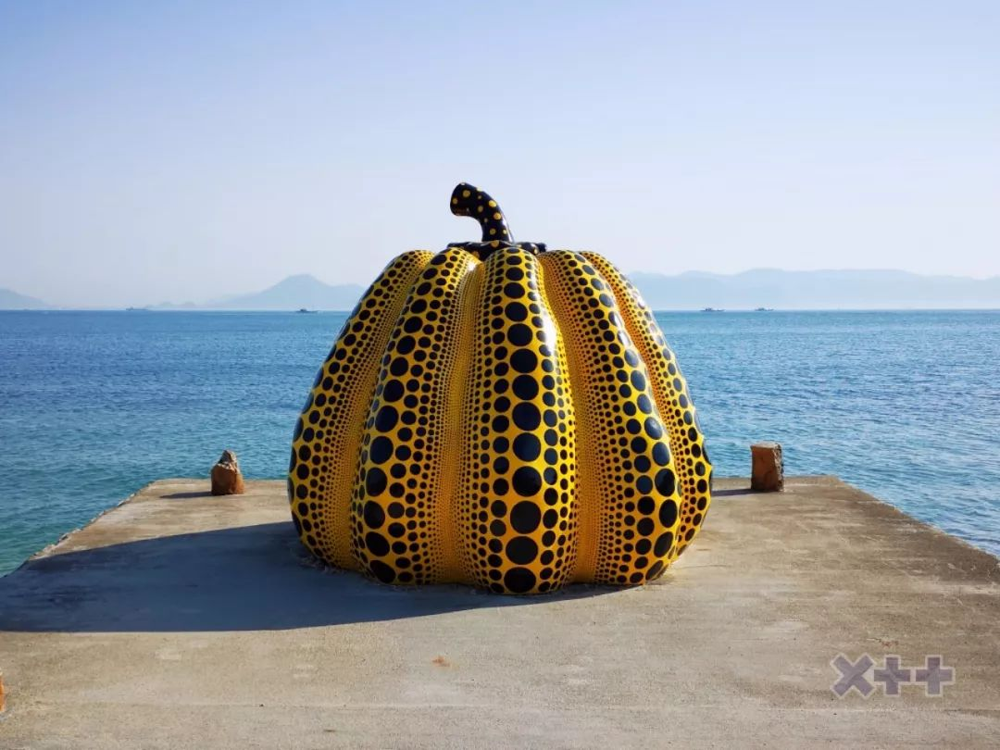 (原始链接: https://mmbiz.qpic.cn/mmbiz_jpg/L6HdGyg0k5Tw9jxWtXwibkfpKvcKrDeIg57QpOx9L0mRzposVoscS5AXP7Z3hThG5VQ66rI4AsAlNrCKiamYS60g/640?wx_fmt=jpeg)
- 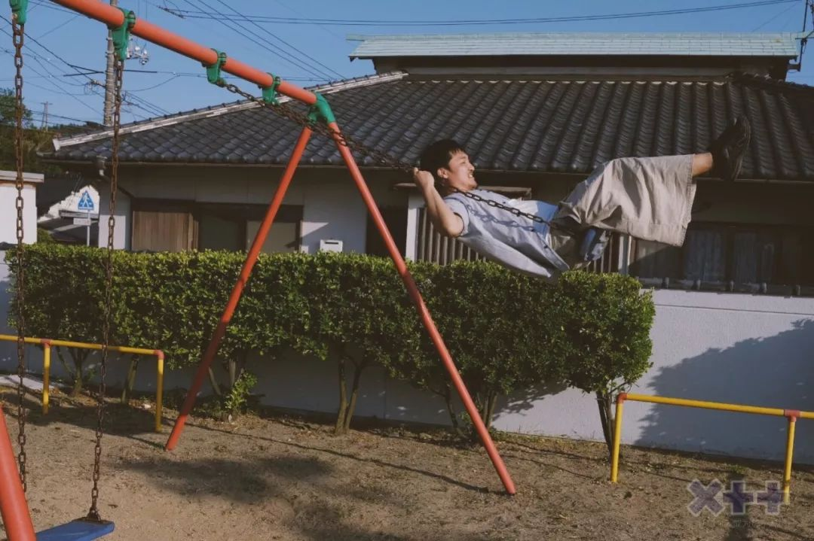 (原始链接: https://mmbiz.qpic.cn/mmbiz_jpg/L6HdGyg0k5Tw9jxWtXwibkfpKvcKrDeIgicO6qfsYoHAbHQbSn7IcV91gENQQ9vDL6ibBkB2NbBic7FVvsR2hk7GiaA/640?wx_fmt=jpeg)
- 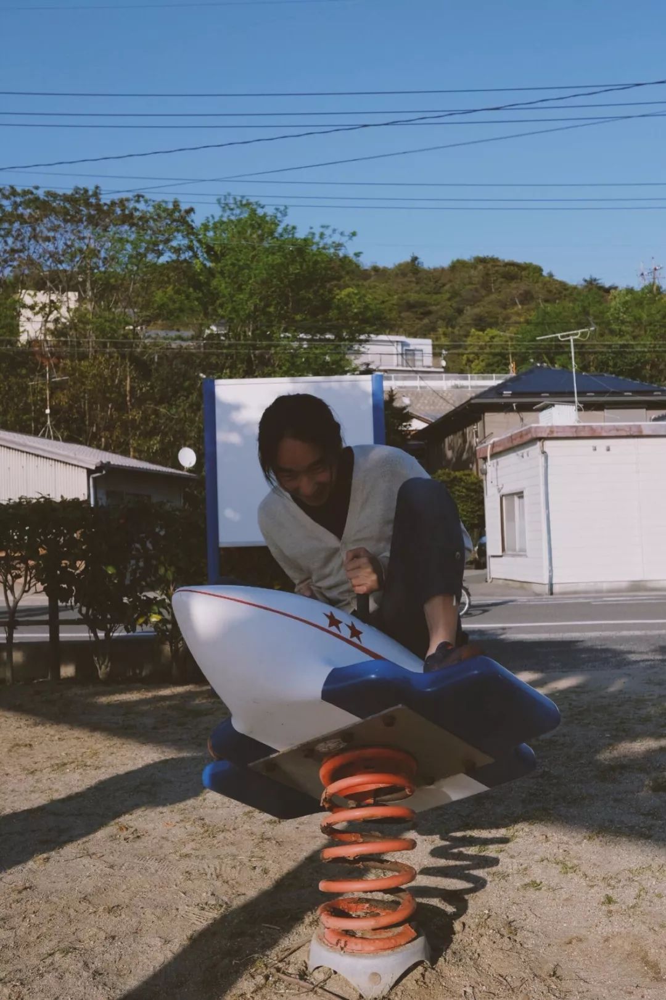 (原始链接: https://mmbiz.qpic.cn/mmbiz_jpg/L6HdGyg0k5Tw9jxWtXwibkfpKvcKrDeIgmTu2JTbl6kMqtl4bbneQ4T76wDJdc6ZWbOSmcMticaoNZulxhSztricA/640?wx_fmt=jpeg)
-  (原始链接: https://mmbiz.qpic.cn/mmbiz_png/L6HdGyg0k5TZLfw7NUENqFxnCR0hfUzlhicQGX3KAcsYo2cgb0SrJBA06bZ83cmFyT5ia3l04cGmTVpGZpaMQ2Vw/640?wx_fmt=png)
-  (原始链接: https://mmbiz.qpic.cn/mmbiz_png/L6HdGyg0k5TZLfw7NUENqFxnCR0hfUzlhicQGX3KAcsYo2cgb0SrJBA06bZ83cmFyT5ia3l04cGmTVpGZpaMQ2Vw/640?wx_fmt=png)
-  (原始链接: https://mmbiz.qpic.cn/mmbiz_png/L6HdGyg0k5TZLfw7NUENqFxnCR0hfUzlyPGXfrLWl3ZJySicHrMPVoRXUoLkleuzZNRlqsRuLicbQCWjAcfv1d7g/640?wx_fmt=png)
- 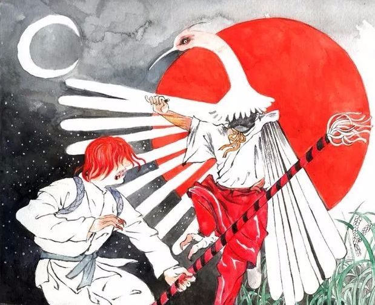 (原始链接: https://mmbiz.qpic.cn/mmbiz_png/L6HdGyg0k5TBnlvgSykCODyWkFgby4GYtStGXIOG4bQJCWmib3vOaFtJgka3mNdKsXcwjzUoqhrbfoufl0B2C4w/640?wx_fmt=png)
- 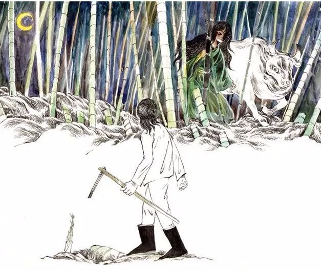 (原始链接: https://mmbiz.qpic.cn/mmbiz_png/L6HdGyg0k5TBnlvgSykCODyWkFgby4GYnsc0biahPHgbQtianQgVtxONG9ZMtMsdkLPhTdgr9dtatSzcK4yTFibYg/640?wx_fmt=png)
- 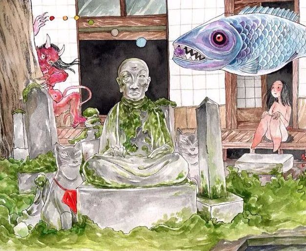 (原始链接: https://mmbiz.qpic.cn/mmbiz_png/L6HdGyg0k5TBnlvgSykCODyWkFgby4GYscGQmBbuoePgC2HsQNL9ovJJwIEh9FG8p3f7icIKBCcgQahJnQT2Kcw/640?wx_fmt=png)
- 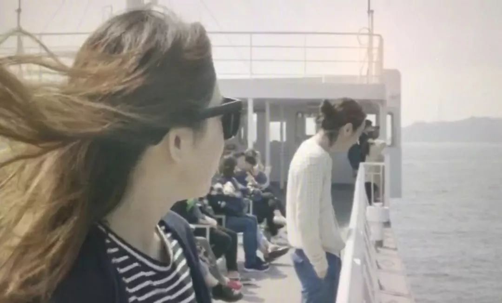 (原始链接: https://mmbiz.qpic.cn/mmbiz_jpg/L6HdGyg0k5TBnlvgSykCODyWkFgby4GY7oicSx8CWDEudxD3jUpjoibGbeLzo2BJGO8UFEy2icL6ib3VQzTiaBkM2FQ/640?wx_fmt=jpeg)
- 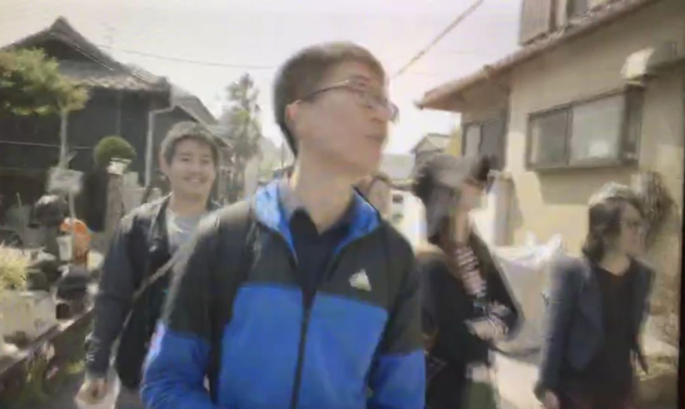 (原始链接: https://mmbiz.qpic.cn/mmbiz_png/L6HdGyg0k5TBnlvgSykCODyWkFgby4GYssXTWfaTfUFwjszibQnjVnGalTRpkiaWUbiazefNhYZMLUrp9riaqENZ3w/640?wx_fmt=png)
- 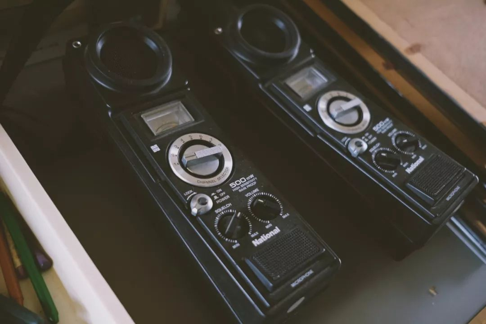 (原始链接: https://mmbiz.qpic.cn/mmbiz_jpg/L6HdGyg0k5TBnlvgSykCODyWkFgby4GYZ1CtJu8hlt9IAQTyxS7zUu9locAJRhYibHicvHFjWVhiaCNnDUPd9dacg/640?wx_fmt=jpeg)
-  (原始链接: https://mmbiz.qpic.cn/mmbiz_png/L6HdGyg0k5TZLfw7NUENqFxnCR0hfUzlhicQGX3KAcsYo2cgb0SrJBA06bZ83cmFyT5ia3l04cGmTVpGZpaMQ2Vw/640?wx_fmt=png)
-  (原始链接: https://mmbiz.qpic.cn/mmbiz_png/L6HdGyg0k5TZLfw7NUENqFxnCR0hfUzlhicQGX3KAcsYo2cgb0SrJBA06bZ83cmFyT5ia3l04cGmTVpGZpaMQ2Vw/640?wx_fmt=png)
-  (原始链接: https://mmbiz.qpic.cn/mmbiz_png/L6HdGyg0k5TZLfw7NUENqFxnCR0hfUzlyPGXfrLWl3ZJySicHrMPVoRXUoLkleuzZNRlqsRuLicbQCWjAcfv1d7g/640?wx_fmt=png)
-  (原始链接: https://mmbiz.qpic.cn/mmbiz_png/L6HdGyg0k5TZLfw7NUENqFxnCR0hfUzlyPGXfrLWl3ZJySicHrMPVoRXUoLkleuzZNRlqsRuLicbQCWjAcfv1d7g/640?wx_fmt=png)
-  (原始链接: https://mmbiz.qpic.cn/mmbiz_png/L6HdGyg0k5TZLfw7NUENqFxnCR0hfUzlhicQGX3KAcsYo2cgb0SrJBA06bZ83cmFyT5ia3l04cGmTVpGZpaMQ2Vw/640?wx_fmt=png)
-  (原始链接: https://mmbiz.qpic.cn/mmbiz_png/L6HdGyg0k5TZLfw7NUENqFxnCR0hfUzlhicQGX3KAcsYo2cgb0SrJBA06bZ83cmFyT5ia3l04cGmTVpGZpaMQ2Vw/640?wx_fmt=png)
-  (原始链接: https://mmbiz.qpic.cn/mmbiz_png/L6HdGyg0k5TZLfw7NUENqFxnCR0hfUzlyPGXfrLWl3ZJySicHrMPVoRXUoLkleuzZNRlqsRuLicbQCWjAcfv1d7g/640?wx_fmt=png)
-  (原始链接: https://mmbiz.qpic.cn/mmbiz_png/L6HdGyg0k5TZLfw7NUENqFxnCR0hfUzlyPGXfrLWl3ZJySicHrMPVoRXUoLkleuzZNRlqsRuLicbQCWjAcfv1d7g/640?wx_fmt=png)
- 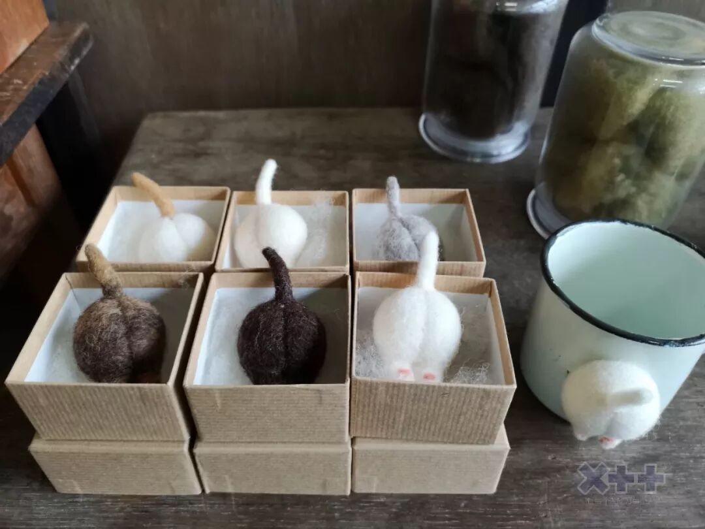 (原始链接: https://mmbiz.qpic.cn/mmbiz_jpg/L6HdGyg0k5TZLfw7NUENqFxnCR0hfUzlnVVdJcBgBdXel84grtUZPjSdfTbInA8hPBRTeV6ztxQ1v2asNDZRAg/640?wx_fmt=jpeg)
-  (原始链接: https://mmbiz.qpic.cn/mmbiz_jpg/L6HdGyg0k5TZLfw7NUENqFxnCR0hfUzlrWNDg58cwomuwNJ0Q957JRjn5iajyrCUoeK2EF5awZpfiahLnsd9D2QQ/640?wx_fmt=jpeg)
-  (原始链接: https://mmbiz.qpic.cn/mmbiz_png/L6HdGyg0k5TZLfw7NUENqFxnCR0hfUzlhicQGX3KAcsYo2cgb0SrJBA06bZ83cmFyT5ia3l04cGmTVpGZpaMQ2Vw/640?wx_fmt=png)
-  (原始链接: https://mmbiz.qpic.cn/mmbiz_png/L6HdGyg0k5TZLfw7NUENqFxnCR0hfUzlhicQGX3KAcsYo2cgb0SrJBA06bZ83cmFyT5ia3l04cGmTVpGZpaMQ2Vw/640?wx_fmt=png)
-  (原始链接: https://mmbiz.qpic.cn/mmbiz_png/L6HdGyg0k5TZLfw7NUENqFxnCR0hfUzlyPGXfrLWl3ZJySicHrMPVoRXUoLkleuzZNRlqsRuLicbQCWjAcfv1d7g/640?wx_fmt=png)
-  (原始链接: https://mmbiz.qpic.cn/mmbiz_png/L6HdGyg0k5TZLfw7NUENqFxnCR0hfUzlra17QBdRBQjhSfYnbjogCNK30oKulAZOvOeqFa9au7rwIKHvKZopRQ/640?wx_fmt=png)
-  (原始链接: https://mmbiz.qpic.cn/mmbiz_png/L6HdGyg0k5TZLfw7NUENqFxnCR0hfUzlzTGJ4rH4WxfONNBZ3MzOs8NlN5tpHxmK85yYfUghwKichMcGBK3IkvQ/640?wx_fmt=png)
-  (原始链接: https://mmbiz.qpic.cn/mmbiz_png/L6HdGyg0k5TZLfw7NUENqFxnCR0hfUzlra17QBdRBQjhSfYnbjogCNK30oKulAZOvOeqFa9au7rwIKHvKZopRQ/640?wx_fmt=png)
-  (原始链接: https://mmbiz.qpic.cn/mmbiz_png/L6HdGyg0k5TZLfw7NUENqFxnCR0hfUzlzTGJ4rH4WxfONNBZ3MzOs8NlN5tpHxmK85yYfUghwKichMcGBK3IkvQ/640?wx_fmt=png)
-  (原始链接: https://mmbiz.qpic.cn/mmbiz_png/L6HdGyg0k5TZLfw7NUENqFxnCR0hfUzlra17QBdRBQjhSfYnbjogCNK30oKulAZOvOeqFa9au7rwIKHvKZopRQ/640?wx_fmt=png)
-  (原始链接: https://mmbiz.qpic.cn/mmbiz_png/L6HdGyg0k5TZLfw7NUENqFxnCR0hfUzlzTGJ4rH4WxfONNBZ3MzOs8NlN5tpHxmK85yYfUghwKichMcGBK3IkvQ/640?wx_fmt=png)
-  (原始链接: https://mmbiz.qpic.cn/mmbiz_png/L6HdGyg0k5TZLfw7NUENqFxnCR0hfUzlhicQGX3KAcsYo2cgb0SrJBA06bZ83cmFyT5ia3l04cGmTVpGZpaMQ2Vw/640?wx_fmt=png)
-  (原始链接: https://mmbiz.qpic.cn/mmbiz_png/L6HdGyg0k5TZLfw7NUENqFxnCR0hfUzlhicQGX3KAcsYo2cgb0SrJBA06bZ83cmFyT5ia3l04cGmTVpGZpaMQ2Vw/640?wx_fmt=png)
-  (原始链接: https://mmbiz.qpic.cn/mmbiz_png/L6HdGyg0k5TZLfw7NUENqFxnCR0hfUzlyPGXfrLWl3ZJySicHrMPVoRXUoLkleuzZNRlqsRuLicbQCWjAcfv1d7g/640?wx_fmt=png)
-  (原始链接: https://mmbiz.qpic.cn/mmbiz_png/L6HdGyg0k5TZLfw7NUENqFxnCR0hfUzlhicQGX3KAcsYo2cgb0SrJBA06bZ83cmFyT5ia3l04cGmTVpGZpaMQ2Vw/640?wx_fmt=png)
-  (原始链接: https://mmbiz.qpic.cn/mmbiz_png/L6HdGyg0k5TZLfw7NUENqFxnCR0hfUzlhicQGX3KAcsYo2cgb0SrJBA06bZ83cmFyT5ia3l04cGmTVpGZpaMQ2Vw/640?wx_fmt=png)
-  (原始链接: https://mmbiz.qpic.cn/mmbiz_png/L6HdGyg0k5TZLfw7NUENqFxnCR0hfUzlyPGXfrLWl3ZJySicHrMPVoRXUoLkleuzZNRlqsRuLicbQCWjAcfv1d7g/640?wx_fmt=png)
-  (原始链接: https://mmbiz.qpic.cn/mmbiz_png/L6HdGyg0k5TZLfw7NUENqFxnCR0hfUzlhicQGX3KAcsYo2cgb0SrJBA06bZ83cmFyT5ia3l04cGmTVpGZpaMQ2Vw/640?wx_fmt=png)
-  (原始链接: https://mmbiz.qpic.cn/mmbiz_png/L6HdGyg0k5TZLfw7NUENqFxnCR0hfUzlhicQGX3KAcsYo2cgb0SrJBA06bZ83cmFyT5ia3l04cGmTVpGZpaMQ2Vw/640?wx_fmt=png)
-  (原始链接: https://mmbiz.qpic.cn/mmbiz_png/L6HdGyg0k5TZLfw7NUENqFxnCR0hfUzlyPGXfrLWl3ZJySicHrMPVoRXUoLkleuzZNRlqsRuLicbQCWjAcfv1d7g/640?wx_fmt=png)
-  (原始链接: https://mmbiz.qpic.cn/mmbiz_jpg/L6HdGyg0k5SCbPVjhia6xG0GlgHM7WqbW7ADCNAXFwU8jvW8jniblIHee9TGIcHichlicFAm85MSPbrDUWTGxKK3dQ/640?wx_fmt=jpeg)
-  (原始链接: https://mmbiz.qpic.cn/mmbiz_jpg/L6HdGyg0k5SCbPVjhia6xG0GlgHM7WqbWaR1G9221BwERpUzibu3EHHkN4lJhcatFY9Hq7e3miaicakcYlBHWSgJew/640?wx_fmt=jpeg)
-  (原始链接: https://mmbiz.qpic.cn/mmbiz_png/L6HdGyg0k5Sx7lg6uNt8fibSKV00CkbpCnAxjoIfJic1rRLGnHt5FEowfUywNibbcLvOxagKmokhgZcIWYGVZibFWA/640?wx_fmt=png)
-  (原始链接: https://mmbiz.qpic.cn/mmbiz_jpg/L6HdGyg0k5RuvZqibTm2T5TaLDkMPWGV09CrTBmIxnzmnjlTiaAxqQAliaWpSBnQDdQNYOeQ01ib1ujkcG9viayvIwQ/640?wx_fmt=jpeg)
