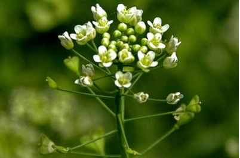
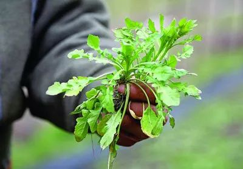
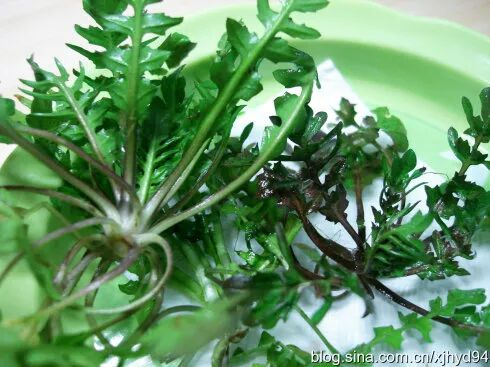
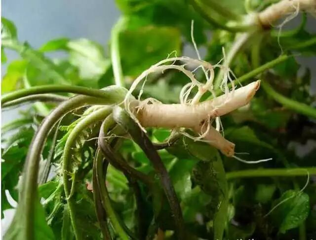
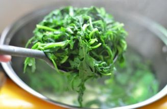
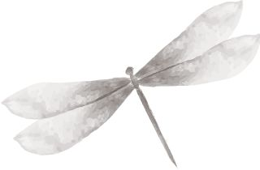
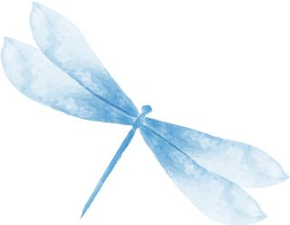
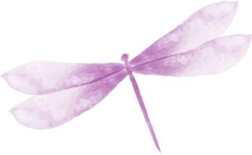
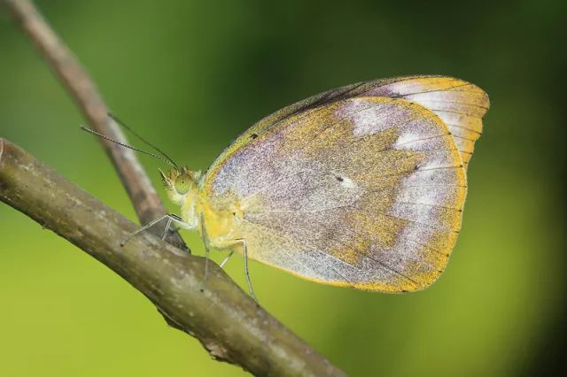
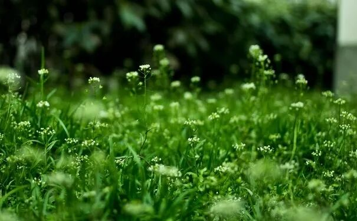

# 无标题

**链接地址:** http://mp.weixin.qq.com/s?__biz=MzI0MDQ0ODI0Ng==&mid=2247485721&idx=1&sn=13cdaf7ac7ff82782b161956a2bffbfd&chksm=e91bee80de6c6796294dacf44f03073532e75ae922f912fb33250ac61274d6a6ad76fd9abf4e&mpshare=1&scene=2&srcid=0419VwyCJtGsLq2IkKMGrdiT#rd
**作者:** 雪媛
**获取时间:** 2025/8/28 22:02:16
**图片数量:** 18

---

## 原始HTML内容

<section style="background-color: rgb(255, 255, 255);box-sizing: border-box;"><section class="Powered-by-XIUMI V5" style="box-sizing: border-box;" powered-by="xiumi.us"><section class="" style="box-sizing: border-box;"><section class="" style="color: rgba(22, 61, 24, 0.76);font-size: 14px;padding-right: 15px;padding-left: 15px;line-height: 1.6;box-sizing: border-box;">
© 图片来源网络，文章版权归属本公号
</section></section></section><section class="Powered-by-XIUMI V5" style="box-sizing: border-box;" powered-by="xiumi.us"><section class="" style="text-align: center;margin: 10px 0%;box-sizing: border-box;"><section class="" style="display: inline-block;width: 120px;height: 120px;vertical-align: top;overflow: hidden;background-position: 0% 0%;background-repeat: no-repeat;background-size: 100%;background-attachment: scroll;background-image: url(&quot;https://mmbiz.qpic.cn/mmbiz_gif/XA8n2XaESnTvoVL2aSOPT7OicP26KzfnUnn1Y7RMyFNABuPcLMqh8utnLd37nODC1PlBcdAThicZTUrlIPxjl7pQ/640?wx_fmt=gif&quot;);box-sizing: border-box;"><section class="Powered-by-XIUMI V5" style="box-sizing: border-box;" powered-by="xiumi.us"><section class="" style="margin-top: 40px;margin-right: 0%;margin-left: 0%;box-sizing: border-box;"><section class="" style="font-size: 18px;color: rgb(4, 84, 18);line-height: 1.3;box-sizing: border-box;">
<strong style="box-sizing: border-box;">写在</strong>

<strong style="box-sizing: border-box;">前面</strong>
</section></section></section></section></section></section><section class="Powered-by-XIUMI V5" style="box-sizing: border-box;" powered-by="xiumi.us"><section class="" style="margin: 10px 0%;box-sizing: border-box;"><section class="" style="display: inline-block;width: 100%;vertical-align: top;padding: 15px;border-width: 1px;border-radius: 0px;border-style: solid;border-color: rgb(255, 255, 255);background-position: 75.0303% 15.3758%;background-repeat: repeat;background-size: 107.589%;background-attachment: scroll;box-shadow: rgb(0, 0, 0) 0px 0px 0px;background-image: url(&quot;https://mmbiz.qpic.cn/mmbiz_gif/XA8n2XaESnTvoVL2aSOPT7OicP26KzfnUeW9lG2hozBfaNaH40mysaAveLoicSTyNX02y7JS7WqUIKvDd1mngQEw/640?wx_fmt=gif&quot;);box-sizing: border-box;"><section class="Powered-by-XIUMI V5" style="box-sizing: border-box;" powered-by="xiumi.us"><section class="" style="box-sizing: border-box;"><section class="" style="font-size: 14px;color: rgba(22, 61, 24, 0.76);text-align: justify;box-sizing: border-box;">
看了一下最近的文章标题，不是以“！”结尾，就是以“？”结尾。为了冲点击率不得不安排“UC震惊体”。其实生活中哪有这么多的一惊一乍？

 

平安是福，平淡是真。
</section></section></section></section></section></section><section class="Powered-by-XIUMI V5" style="box-sizing: border-box;" powered-by="xiumi.us"><section class="" style="text-align: center;transform: translate3d(15px, 0px, 0px);-webkit-transform: translate3d(15px, 0px, 0px);-moz-transform: translate3d(15px, 0px, 0px);-o-transform: translate3d(15px, 0px, 0px);box-sizing: border-box;"><section class="" style="display: inline-block;vertical-align: top;overflow: hidden;height: 240px;width: 210px;background-position: 50% 50%;background-repeat: no-repeat;background-size: contain;background-attachment: scroll;box-shadow: rgb(0, 0, 0) 0px 0px 0px;background-image: url(&quot;https://mmbiz.qpic.cn/mmbiz_png/XA8n2XaESnTvoVL2aSOPT7OicP26KzfnUqicqP5rgpR2SIyQhlBVPIOc8hHuJwQB4IQdyNhnqPIV9elTniaSstBYQ/640?wx_fmt=gif&quot;);box-sizing: border-box;"><section class="Powered-by-XIUMI V5" style="box-sizing: border-box;" powered-by="xiumi.us"><section class="" style="margin-top: 80px;margin-right: 0%;margin-left: 0%;transform: translate3d(-12px, 0px, 0px);box-sizing: border-box;"><section class="" style="display: inline-block;vertical-align: middle;width: 20%;border-width: 0px;padding-right: 5px;padding-left: 5px;box-sizing: border-box;"><section class="Powered-by-XIUMI V5" style="box-sizing: border-box;" powered-by="xiumi.us"><section class="" style="margin-right: 0%;margin-left: 0%;box-sizing: border-box;"><section class="" style="display: inline-block;border-width: 2px;border-style: solid;border-color: transparent;padding: 0.1em 0.3em;color: rgb(19, 124, 115);line-height: 1.2;box-sizing: border-box;">
薺菜煮雞蛋

 
</section></section></section></section><section class="" style="display: inline-block;vertical-align: middle;width: 30%;border-left: 1px solid rgb(19, 124, 115);border-bottom-left-radius: 0px;padding-right: 5px;padding-left: 5px;box-sizing: border-box;"><section class="Powered-by-XIUMI V5" style="box-sizing: border-box;" powered-by="xiumi.us"><section class="" style="box-sizing: border-box;"><section class="" style="font-size: 18px;color: rgba(22, 61, 24, 0.76);line-height: 1.2;box-sizing: border-box;">
<strong style="box-sizing: border-box;">三</strong>

<strong style="box-sizing: border-box;">月</strong>

<strong style="box-sizing: border-box;">三</strong>
</section></section></section></section></section></section></section></section></section><section class="Powered-by-XIUMI V5" style="box-sizing: border-box;" powered-by="xiumi.us"><section class="" style="box-sizing: border-box;"><section class="" style="box-sizing: border-box;">
 
</section></section></section><section class="Powered-by-XIUMI V5" style="box-sizing: border-box;" powered-by="xiumi.us"><section class="" style="box-sizing: border-box;"><section class="" style="color: rgba(22, 61, 24, 0.76);font-size: 14px;padding-right: 15px;padding-left: 15px;line-height: 1.6;box-sizing: border-box;">
今天是农历三月三，是我国古代的节日上巳节，也是祭拜伏羲和女娲的日子。踏青出游，野餐采花，正是年轻男女不负春光谈情说爱的绝好时节。

 

《西湖游览志》中提到了“三月三日男女皆戴齐菜花“的习俗。江南地区还有“三月三，荠菜煮鸡蛋”的说法。

 

荠菜，作为田间地头的时令野蔬，也理所当然的被搬上了平名百姓的餐桌。
</section></section></section><section class="Powered-by-XIUMI V5" style="box-sizing: border-box;" powered-by="xiumi.us"><section class="" style="box-sizing: border-box;"><section class="" style="box-sizing: border-box;">
 
</section></section></section><section class="Powered-by-XIUMI V5" style="box-sizing: border-box;" powered-by="xiumi.us"><section class="" style="text-align: center;margin-top: 0.5em;margin-bottom: 0.5em;padding-left: 0.5em;padding-right: 0.5em;box-sizing: border-box;"><section class="" style="box-sizing: border-box;width: 100%;border-width: 4px;border-style: solid;border-color: white;box-shadow: rgb(102, 102, 102) 3.53553px 3.53553px 8px;display: inline-block;height: auto !important;overflow: hidden !important;"></section></section></section><section class="Powered-by-XIUMI V5" style="box-sizing: border-box;" powered-by="xiumi.us"><section class="" style="box-sizing: border-box;"><section class="" style="box-sizing: border-box;">
 
</section></section></section><section class="Powered-by-XIUMI V5" style="box-sizing: border-box;" powered-by="xiumi.us"><section class="" style="box-sizing: border-box;"><section class="" style="color: rgba(22, 61, 24, 0.76);padding-right: 15px;padding-left: 15px;line-height: 1.6;box-sizing: border-box;">
记得我小时候，每年四月初我妈都会踩着自行车带着我去家附近的桃花林里挖荠菜。

 

唯一能让我周末的早上乖乖起床不懒床的事儿，就只有挖荠菜了。

 

坐在妈妈自行车的后座上，迎着风不自觉欢欣鼓舞地挥动着双手。仿佛我迎接的不是一场辛苦的劳作，而是一个堂而皇之逃避学业重负的借口。

 
</section></section></section><section class="Powered-by-XIUMI V5" style="box-sizing: border-box;" powered-by="xiumi.us"><section class="" style="margin: 10px 0%;box-sizing: border-box;"><section class="" style="display: inline-block;vertical-align: top;width: 70%;box-sizing: border-box;"><section class="Powered-by-XIUMI V5" style="box-sizing: border-box;" powered-by="xiumi.us"><section class="" style="font-size: 58px;margin-top: 10px;margin-bottom: 10px;text-align: center;box-sizing: border-box;"><section class="" style="display: inline-block;vertical-align: middle;margin-right: -1.5em;box-sizing: border-box;"><section style="width: 5px;height: 5px;transform: rotate(0deg);-webkit-transform: rotate(0deg);-moz-transform: rotate(0deg);-o-transform: rotate(0deg);margin-left: auto;margin-right: -3px;border-radius: 50%;background-color: rgb(11, 145, 34);box-sizing: border-box;"></section><section style="width: 1.5em;height: 3em;margin-top: -3px;margin-bottom: -3px;border-radius: 1.5em 0px 0px 1.5em;border-top: 1px solid rgb(11, 145, 34);border-left: 1px solid rgb(11, 145, 34);border-bottom: 1px solid rgb(11, 145, 34);border-right-color: rgb(11, 145, 34);box-sizing: border-box;"></section><section style="width: 5px;height: 5px;margin-left: auto;margin-right: -3px;border-radius: 50%;background-color: rgb(11, 145, 34);box-sizing: border-box;"></section></section><section class="" style="display: inline-block;vertical-align: middle;width: 3em;height: 3em;transform: rotate(0deg);-webkit-transform: rotate(0deg);-moz-transform: rotate(0deg);-o-transform: rotate(0deg);padding: 5px;box-sizing: border-box;"><section class="" style="width: 100%;height: 100%;border-radius: 100%;background-position: center center;background-repeat: no-repeat;background-size: cover;background-image: url(&quot;https://mmbiz.qpic.cn/mmbiz_jpg/XA8n2XaESnTvoVL2aSOPT7OicP26KzfnUwaqjlspL1rHvlcnXOPFV2xsOCYJTr4ERX6Sd5KugGy1eibJPODrnaRQ/640?wx_fmt=jpeg&quot;);box-sizing: border-box;"><section class="" style="width: 100%;height: 100%;overflow: hidden;box-sizing: border-box;"></section></section></section></section></section><section class="Powered-by-XIUMI V5" style="box-sizing: border-box;" powered-by="xiumi.us"><section class="" style="margin-top: 20px;margin-right: 0%;margin-left: 0%;box-sizing: border-box;"><section class="" style="color: rgba(22, 61, 24, 0.76);text-align: center;line-height: 1.8;font-size: 14px;box-sizing: border-box;">
惟荠天所赐，青青被陵冈， 

珍美屏盐酪，耿介凌雪霜。 采撷无阙日，烹饪有秘方，

侯火地炉暖，加糁沙钵香。 尚嫌杂笋蕨，而况污膏粱。 炊粳及煮饼，得此生辉光。 
</section></section></section></section><section class="" style="display: inline-block;vertical-align: top;width: 30%;box-sizing: border-box;"><section class="Powered-by-XIUMI V5" style="box-sizing: border-box;" powered-by="xiumi.us"><section class="" style="margin-top: 10px;margin-bottom: 10px;text-align: center;transform: translate3d(-5px, 0px, 0px);-webkit-transform: translate3d(-5px, 0px, 0px);-moz-transform: translate3d(-5px, 0px, 0px);-o-transform: translate3d(-5px, 0px, 0px);box-sizing: border-box;"><section class="" style="width: 5px;display: inline-block;vertical-align: bottom;box-sizing: border-box;"><section style="height: 30px;width: 0px;margin: auto;border-left: 1px solid rgb(11, 145, 34);border-top-color: rgb(11, 145, 34);border-right-color: rgb(11, 145, 34);border-bottom-color: rgb(11, 145, 34);box-sizing: border-box;"></section><section style="width: 5px;height: 5px;margin: auto;border-radius: 50%;background-color: rgb(11, 145, 34);box-sizing: border-box;"></section></section><section class="" style="display: inline-block;vertical-align: top;width: 1.6em;font-size: 28px;color: rgb(11, 145, 34);text-align: justify;box-sizing: border-box;">
食荠十韵

 

节选

 
</section><section class="" style="width: 5px;display: inline-block;vertical-align: top;box-sizing: border-box;"><section style="width: 5px;height: 5px;margin: auto;border-radius: 50%;background-color: rgb(11, 145, 34);box-sizing: border-box;"></section><section style="height: 30px;width: 0px;margin: auto;border-left: 1px solid rgb(11, 145, 34);border-top-color: rgb(11, 145, 34);border-right-color: rgb(11, 145, 34);border-bottom-color: rgb(11, 145, 34);box-sizing: border-box;"></section></section></section></section><section class="Powered-by-XIUMI V5" style="box-sizing: border-box;" powered-by="xiumi.us"><section class="" style="margin-top: 10px;margin-bottom: 10px;text-align: center;font-size: 11px;box-sizing: border-box;"><section class="" style="padding: 4px;display: inline-block;background-color: rgb(198, 41, 0);box-sizing: border-box;"><section class="" style="border-color: white;width: 1.6em;height: 1.6em;border-style: solid;border-width: 1px;font-size: 17px;line-height: 1.5em;color: rgb(255, 255, 255);box-sizing: border-box;">
<strong style="box-sizing: border-box;">宋</strong>
</section></section></section></section><section class="Powered-by-XIUMI V5" style="box-sizing: border-box;" powered-by="xiumi.us"><section class="" style="box-sizing: border-box;"><section class="" style="text-align: center;line-height: 1.3;color: rgb(11, 145, 34);box-sizing: border-box;">
<strong style="box-sizing: border-box;">陆游</strong>
</section></section></section></section></section></section><section class="Powered-by-XIUMI V5" style="box-sizing: border-box;" powered-by="xiumi.us"><section class="" style="box-sizing: border-box;"><section class="" style="box-sizing: border-box;">
 
</section></section></section><section class="Powered-by-XIUMI V5" style="box-sizing: border-box;" powered-by="xiumi.us"><section class="" style="box-sizing: border-box;"><section class="" style="color: rgba(22, 61, 24, 0.76);font-size: 14px;text-align: justify;padding-right: 15px;padding-left: 15px;line-height: 1.6;box-sizing: border-box;">
荠菜因其耐寒的属性，是遍布我国大江南北最常见的野菜之一。然这稀松平常落地生根的野物，却引得历代好食文人争先恐后地将自己的笔墨泼洒在这羸弱株苗之上。陆游颂吟十韵去赞叹荠菜的味美如“天所赐”。苏东坡也曾赋它“君若知此味，则陆海八珍，皆可鄙厌也”。

 

这萋萋野草备受食客的宠爱，难道从古至今就没有人试图把这它的美味圈进自家的菜园子吗？

 
</section></section></section><section class="Powered-by-XIUMI V5" style="box-sizing: border-box;" powered-by="xiumi.us"><section class="" style="text-align: center;margin-top: 0.5em;margin-bottom: 0.5em;padding-left: 0.5em;padding-right: 0.5em;box-sizing: border-box;"><section class="" style="box-sizing: border-box;width: 100%;border-width: 4px;border-style: solid;border-color: white;box-shadow: rgb(102, 102, 102) 3.53553px 3.53553px 8px;display: inline-block;height: auto !important;overflow: hidden !important;"></section></section></section><section class="Powered-by-XIUMI V5" style="box-sizing: border-box;" powered-by="xiumi.us"><section class="" style="box-sizing: border-box;"><section class="" style="box-sizing: border-box;">
 
</section></section></section><section class="Powered-by-XIUMI V5" style="box-sizing: border-box;" powered-by="xiumi.us"><section class="" style="box-sizing: border-box;"><section class="" style="text-align: justify;color: rgba(22, 61, 24, 0.76);font-size: 14px;padding-right: 15px;padding-left: 15px;line-height: 1.6;box-sizing: border-box;">
将荠菜的驯化可以追溯到汉朝年间，然而遗憾的是“这种菜蔬并不如它们的兄弟芸薹配合。后者成就了白菜油菜的霸业，而前者又退回到了山茅野菜的行列之中（史军）。”

 

荠菜如此生命力顽强的物种，将山林野地霸占为自己的游乐场，被捧回到温室里却是个娇惯矫情的小公主。因其自身种子的重量和休眠特性，为其大批量的被端上好吃狗儿的餐桌添了不少堵。
</section></section></section><section class="Powered-by-XIUMI V5" style="box-sizing: border-box;" powered-by="xiumi.us"><section class="" style="box-sizing: border-box;"><section class="" style="box-sizing: border-box;">
 
</section></section></section><section class="Powered-by-XIUMI V5" style="box-sizing: border-box;" powered-by="xiumi.us"><section class="" style="text-align: center;margin-top: 0.5em;margin-bottom: 0.5em;padding-left: 0.5em;padding-right: 0.5em;box-sizing: border-box;"><section class="" style="box-sizing: border-box;width: 100%;border-width: 4px;border-style: solid;border-color: white;box-shadow: rgb(102, 102, 102) 0.2em 0.2em 0.5em;display: inline-block;height: auto !important;overflow: hidden !important;"></section></section></section><section class="Powered-by-XIUMI V5" style="box-sizing: border-box;" powered-by="xiumi.us"><section class="" style="box-sizing: border-box;"><section class="" style="box-sizing: border-box;">
 
</section></section></section><section class="Powered-by-XIUMI V5" style="box-sizing: border-box;" powered-by="xiumi.us"><section class="" style="box-sizing: border-box;"><section class="" style="text-align: justify;color: rgba(22, 61, 24, 0.76);font-size: 14px;padding-right: 15px;padding-left: 15px;line-height: 1.6;box-sizing: border-box;">
随着人们对于荠菜日益增长的需求，20世纪后期荠菜的种植技术也才日趋成熟。然而人工种植出来的荠菜清新翠绿幼嫩健壮，却唯独缺少了那种被风沙侵蚀过扎根于贫瘠土壤顽强存活后才特有的紫色烙印。一种说法是这被低温催化而生的紫色是氨基酸呈现的颜色，也就是所谓的天然鲜味剂。 
</section></section></section><section class="Powered-by-XIUMI V5" style="box-sizing: border-box;" powered-by="xiumi.us"><section class="" style="box-sizing: border-box;"><section class="" style="box-sizing: border-box;">
 
</section></section></section><section class="Powered-by-XIUMI V5" style="box-sizing: border-box;" powered-by="xiumi.us"><section class="" style="text-align: center;margin-top: 0.5em;margin-bottom: 0.5em;padding-left: 0.5em;padding-right: 0.5em;box-sizing: border-box;"><section class="" style="box-sizing: border-box;width: 100%;border-width: 4px;border-style: solid;border-color: white;box-shadow: rgb(102, 102, 102) 0.2em 0.2em 0.5em;display: inline-block;height: auto !important;overflow: hidden !important;"></section></section></section><section class="Powered-by-XIUMI V5" style="box-sizing: border-box;" powered-by="xiumi.us"><section class="" style="box-sizing: border-box;"><section class="" style="box-sizing: border-box;">
 
</section></section></section><section class="Powered-by-XIUMI V5" style="box-sizing: border-box;" powered-by="xiumi.us"><section class="" style="box-sizing: border-box;"><section class="" style="color: rgba(22, 61, 24, 0.76);font-size: 14px;text-align: justify;padding-right: 15px;padding-left: 15px;line-height: 1.6;box-sizing: border-box;">
荠菜的鲜味用文字来描述着实让人犯难。苏轼评价他“虽不甘于五味，而有味外之美”，史军说它像是“麦芽糖浆混上了新鲜菠菜”。要我说，她倒是没麦芽糖那么甜，也没菠菜那么嫩。它的鲜味儿太丰富卓绝，就好比找一口大缸把全世界所有的菜蔬剁碎搅匀，然后把其中所有的鲜味儿一股脑地提取出来一样。

 

荠菜还有一股子莽撞的“清香”，这清香按汪曾祺的话讲，就如同“坐在河边闻到新涨的春水的气味。” 这股味道吃一口便让人记忆深刻，引索脑中对于味道的注解竟无法有任何味道能与之归类。你只能任凭它蛮横地占领你味觉体验的一方席位。难怪自古便有“以荠菜花置灶陉上，以厌虫蚁”之说。

 
</section></section></section><section class="Powered-by-XIUMI V5" style="box-sizing: border-box;" powered-by="xiumi.us"><section class="" style="text-align: center;margin-top: 0.5em;margin-bottom: 0.5em;padding-left: 0.5em;padding-right: 0.5em;box-sizing: border-box;"><section class="" style="box-sizing: border-box;width: 100%;border-width: 4px;border-style: solid;border-color: white;box-shadow: rgb(102, 102, 102) 0.2em 0.2em 0.5em;display: inline-block;height: auto !important;overflow: hidden !important;"></section></section></section><section class="Powered-by-XIUMI V5" style="box-sizing: border-box;" powered-by="xiumi.us"><section class="" style="box-sizing: border-box;"><section class="" style="box-sizing: border-box;">
 
</section></section></section><section class="Powered-by-XIUMI V5" style="box-sizing: border-box;" powered-by="xiumi.us"><section class="" style="box-sizing: border-box;"><section class="" style="color: rgba(22, 61, 24, 0.76);font-size: 14px;padding-right: 15px;padding-left: 15px;line-height: 1.6;box-sizing: border-box;">
荠菜的采收，不以“采”，也不以“摘”来形容。虽是个直立匍匐生长在土地上的物种，但这个“挖”字取得是极为贴切。挖荠菜最好用的工具不是锄头也不是剪子，而是那一把平铲。需悉心拨开那环抱的野草，快速果断一铲子下去斩断根脉，铲头一翘将荠菜的草叶撑起，方可捡起扔进菜娄。

 

荠菜的奶白色根须实则营养价值最高，但颇不易咀嚼，故在处理清洗之时尽数剔去。

 
</section></section></section><section class="Powered-by-XIUMI V5" style="box-sizing: border-box;" powered-by="xiumi.us"><section class="" style="text-align: center;margin-top: 0.5em;margin-bottom: 0.5em;padding-left: 0.5em;padding-right: 0.5em;box-sizing: border-box;"><section class="" style="box-sizing: border-box;width: 100%;border-width: 4px;border-style: solid;border-color: white;box-shadow: rgb(102, 102, 102) 0.2em 0.2em 0.5em;display: inline-block;height: auto !important;overflow: hidden !important;"></section></section></section><section class="Powered-by-XIUMI V5" style="box-sizing: border-box;" powered-by="xiumi.us"><section class="" style="margin: 10px 0%;box-sizing: border-box;"><section class="" style="display: inline-block;width: 100%;vertical-align: top;box-sizing: border-box;"><section class="Powered-by-XIUMI V5" style="box-sizing: border-box;" powered-by="xiumi.us"><section class="" style="margin-right: 0%;margin-left: 0%;box-sizing: border-box;"><section class="" style="max-width: 100%;vertical-align: middle;display: inline-block;width: 50%;overflow: hidden !important;box-sizing: border-box;"></section></section></section><section class="Powered-by-XIUMI V5" style="box-sizing: border-box;" powered-by="xiumi.us"><section class="" style="box-sizing: border-box;"><section class="" style="box-sizing: border-box;">
 
</section></section></section><section class="Powered-by-XIUMI V5" style="box-sizing: border-box;" powered-by="xiumi.us"><section class="" style="box-sizing: border-box;"><section class="" style="text-align: center;font-size: 14px;color: rgb(93, 99, 52);line-height: 1.6;padding-right: 15px;padding-left: 15px;box-sizing: border-box;">
“其法取荠一二升许，净择，入淘米三合，冷水三升，生姜不去皮，捶两指大同入釜中，浇生油一砚壳，当于羹面上……不得入盐醋”

—— 【宋】苏轼 《与徐十二书》
</section></section></section><section class="Powered-by-XIUMI V5" style="box-sizing: border-box;" powered-by="xiumi.us"><section class="" style="box-sizing: border-box;"><section class="" style="box-sizing: border-box;">
 
</section></section></section><section class="Powered-by-XIUMI V5" style="box-sizing: border-box;" powered-by="xiumi.us"><section class="" style="text-align: right;margin-top: 10px;margin-bottom: 10px;box-sizing: border-box;"><section class="" style="max-width: 100%;vertical-align: middle;display: inline-block;width: 50%;overflow: hidden !important;box-sizing: border-box;"></section></section></section></section></section></section><section class="Powered-by-XIUMI V5" style="box-sizing: border-box;" powered-by="xiumi.us"><section class="" style="box-sizing: border-box;"><section class="" style="color: rgba(22, 61, 24, 0.76);padding-right: 15px;padding-left: 15px;line-height: 1.6;box-sizing: border-box;">
荠菜的做法也是多种多样。除了前面提到的炒蛋和苏轼建议的煮羹，煲汤，烙饼，包馄饨，无所不能。而我家里习惯的吃法，是素炒。将荠菜择好淘净沥干，蒜片下油锅煸干与之翻炒。大火不过片刻转熟，溢出汤汁下食盐翻转均匀即可出锅。

 

这么做倒不是图个省事儿。在我看来荠菜那超凡的“味外之美”，不应被当作任何食物的配衬。少许的油盐即可将其鲜美全盘逼出。淋一点翠绿的汁液在热腾腾的米饭上拌食，其鲜香沁人心脾。细细咀嚼之下，包裹着米饭殷实的颗粒在唇舌间游走，过齿难忘。

 
</section></section></section><section class="Powered-by-XIUMI V5" style="box-sizing: border-box;" powered-by="xiumi.us"><section class="" style="box-sizing: border-box;"><section class="" style="box-sizing: border-box;">
 
</section></section></section><section class="Powered-by-XIUMI V5" style="box-sizing: border-box;" powered-by="xiumi.us"><section class="" style="margin: 10px 0%;text-align: center;box-sizing: border-box;"><section class="" style="display: inline-block;vertical-align: middle;width: 38%;box-sizing: border-box;"><section class="Powered-by-XIUMI V5" style="box-sizing: border-box;" powered-by="xiumi.us"><section class="" style="text-align: right;margin: -40px 0% 10px;transform: translate3d(10px, 0px, 0px);-webkit-transform: translate3d(10px, 0px, 0px);-moz-transform: translate3d(10px, 0px, 0px);-o-transform: translate3d(10px, 0px, 0px);box-sizing: border-box;"><section class="" style="max-width: 100%;vertical-align: middle;display: inline-block;width: 40%;overflow: hidden !important;box-sizing: border-box;"></section></section></section><section class="Powered-by-XIUMI V5" style="box-sizing: border-box;" powered-by="xiumi.us"><section class="" style="box-sizing: border-box;"><section class="" style="text-align: left;box-sizing: border-box;">
 
</section></section></section><section class="Powered-by-XIUMI V5" style="box-sizing: border-box;" powered-by="xiumi.us"><section class="" style="margin-top: 10px;margin-bottom: 10px;box-sizing: border-box;"><section class="" style="max-width: 100%;vertical-align: middle;display: inline-block;width: 60%;overflow: hidden !important;box-sizing: border-box;"></section></section></section></section><section class="" style="display: inline-block;vertical-align: middle;width: 24%;border-style: none solid;border-left-width: 1px;border-radius: 0px;border-color: rgb(19, 124, 115);border-right-width: 1px;box-sizing: border-box;"><section class="Powered-by-XIUMI V5" style="box-sizing: border-box;" powered-by="xiumi.us"><section class="" style="margin: -10px 0% 10px;font-size: 26px;box-sizing: border-box;"><section class="" style="width: 2em;display: inline-block;vertical-align: middle;box-sizing: border-box;"><section class="tn-yzk-fuid-text-50504-1519614176385" style="border-width: 1px;border-style: dashed;border-color: rgba(22, 61, 24, 0.76);width: 2em;height: 2em;float: left;line-height: 2em;box-sizing: border-box;color: rgba(22, 61, 24, 0.76);">
<strong style="box-sizing: border-box;">荠</strong>
</section><section style="width: 2em;box-sizing: border-box;"><section style="width: 0px;height: 2em;margin-right: auto;margin-bottom: -1em;margin-left: auto;border-left: 1px solid rgb(230, 230, 230);border-top-color: rgb(230, 230, 230);border-right-color: rgb(230, 230, 230);border-bottom-color: rgb(230, 230, 230);box-sizing: border-box;"></section><section style="width: 2em;height: 0px;border-top: 1px solid rgb(230, 230, 230);border-right-color: rgb(230, 230, 230);border-bottom-color: rgb(230, 230, 230);border-left-color: rgb(230, 230, 230);box-sizing: border-box;"></section></section><section style="clear: both;box-sizing: border-box;"></section></section></section></section><section class="Powered-by-XIUMI V5" style="box-sizing: border-box;" powered-by="xiumi.us"><section class="" style="margin-right: 0%;margin-bottom: -10px;margin-left: 0%;font-size: 26px;box-sizing: border-box;"><section class="" style="width: 2em;display: inline-block;vertical-align: middle;box-sizing: border-box;"><section class="tn-yzk-fuid-text-38523-1519614189394" style="border-width: 1px;border-style: dashed;border-color: rgba(22, 61, 24, 0.76);width: 2em;height: 2em;float: left;line-height: 2em;box-sizing: border-box;color: rgba(22, 61, 24, 0.76);">
<strong style="box-sizing: border-box;">节</strong>
</section><section style="width: 2em;box-sizing: border-box;"><section style="width: 0px;height: 2em;margin-right: auto;margin-bottom: -1em;margin-left: auto;border-left: 1px solid rgb(230, 230, 230);border-top-color: rgb(230, 230, 230);border-right-color: rgb(230, 230, 230);border-bottom-color: rgb(230, 230, 230);box-sizing: border-box;"></section><section style="width: 2em;height: 0px;border-top: 1px solid rgb(230, 230, 230);border-right-color: rgb(230, 230, 230);border-bottom-color: rgb(230, 230, 230);border-left-color: rgb(230, 230, 230);box-sizing: border-box;"></section></section><section style="clear: both;box-sizing: border-box;"></section></section></section></section></section><section class="" style="display: inline-block;vertical-align: middle;width: 38%;border-width: 0px;box-sizing: border-box;"><section class="Powered-by-XIUMI V5" style="box-sizing: border-box;" powered-by="xiumi.us"><section class="" style="margin-top: 10px;margin-bottom: 10px;box-sizing: border-box;"><section class="" style="max-width: 100%;vertical-align: middle;display: inline-block;width: 80%;overflow: hidden !important;box-sizing: border-box;"></section></section></section></section></section></section><section class="Powered-by-XIUMI V5" style="box-sizing: border-box;" powered-by="xiumi.us"><section class="" style="box-sizing: border-box;"><section class="" style="box-sizing: border-box;">
 
</section></section></section><section class="Powered-by-XIUMI V5" style="box-sizing: border-box;" powered-by="xiumi.us"><section class="" style="text-align: center;margin-top: 0.5em;margin-bottom: 0.5em;padding-left: 0.5em;padding-right: 0.5em;box-sizing: border-box;"><section class="" style="box-sizing: border-box;width: 100%;border-width: 4px;border-style: solid;border-color: white;box-shadow: rgb(102, 102, 102) 0.2em 0.2em 0.5em;display: inline-block;height: auto !important;overflow: hidden !important;"></section></section></section><section class="Powered-by-XIUMI V5" style="box-sizing: border-box;" powered-by="xiumi.us"><section class="" style="box-sizing: border-box;"><section class="" style="box-sizing: border-box;">
 
</section></section></section><section class="Powered-by-XIUMI V5" style="box-sizing: border-box;" powered-by="xiumi.us"><section class="" style="box-sizing: border-box;"><section class="" style="color: rgba(22, 61, 24, 0.76);padding-right: 15px;padding-left: 15px;line-height: 1.6;box-sizing: border-box;">
荠菜纵然美味，但挖荠菜的过程却不见得轻松。

 

春食在野。

 

开发区的桃花林地下都是新翻的土地，十分易于荠菜的生长。田坎修葺得十分整洁，如同小姑娘头顶上乖巧的辫子。粉蝶在花间草上追逐嬉戏，在阳光的照射下格外耀眼生动。桃树的株型矮实，比我的身高也没有高出太多，但舒展的枝桠却总是不小心刮坏我的马尾辫。

 
</section></section></section><section class="Powered-by-XIUMI V5" style="box-sizing: border-box;" powered-by="xiumi.us"><section class="" style="text-align: center;margin-top: 0.5em;margin-bottom: 0.5em;padding-left: 0.5em;padding-right: 0.5em;box-sizing: border-box;"><section class="" style="box-sizing: border-box;width: 100%;border-width: 4px;border-style: solid;border-color: white;box-shadow: rgb(102, 102, 102) 0.2em 0.2em 0.5em;display: inline-block;height: auto !important;overflow: hidden !important;"></section></section></section><section class="Powered-by-XIUMI V5" style="box-sizing: border-box;" powered-by="xiumi.us"><section class="" style="box-sizing: border-box;"><section class="" style="box-sizing: border-box;">
 
</section></section></section><section class="Powered-by-XIUMI V5" style="box-sizing: border-box;" powered-by="xiumi.us"><section class="" style="box-sizing: border-box;"><section class="" style="color: rgba(22, 61, 24, 0.76);font-size: 14px;padding-right: 15px;padding-left: 15px;line-height: 1.6;box-sizing: border-box;">
桃花的脸上透着娇羞，在枝头嫩叶中躲躲藏藏。一阵春风拂来她便像被挠了痒痒肉一般，笑得像个憨厚的姑娘。

 

妈妈会为我采紫花地丁和蒲公英来编织一个花冠。但我不安分地总想爬上远处的梨树去触摸它更高大的枝桠和洁白的花儿。

 
</section></section></section><section class="Powered-by-XIUMI V5" style="box-sizing: border-box;" powered-by="xiumi.us"><section class="" style="text-align: center;margin-top: 0.5em;margin-bottom: 0.5em;padding-left: 0.5em;padding-right: 0.5em;box-sizing: border-box;"><section class="" style="box-sizing: border-box;width: 100%;border-width: 4px;border-style: solid;border-color: white;box-shadow: rgb(102, 102, 102) 0.2em 0.2em 0.5em;display: inline-block;height: auto !important;overflow: hidden !important;"></section></section></section><section class="Powered-by-XIUMI V5" style="box-sizing: border-box;" powered-by="xiumi.us"><section class="" style="box-sizing: border-box;"><section class="" style="box-sizing: border-box;">
 
</section></section></section><section class="Powered-by-XIUMI V5" style="box-sizing: border-box;" powered-by="xiumi.us"><section class="" style="box-sizing: border-box;"><section class="" style="text-align: justify;color: rgba(22, 61, 24, 0.76);font-size: 14px;padding-right: 15px;padding-left: 15px;line-height: 1.6;box-sizing: border-box;">
猫着腰在田间挖不了多久，需停下来坐在田坎上休息。早上出门还穿着妈妈亲手织的薄毛衣，到了正午就要脱下来。不一会儿汗就泌出了前额，浸湿了后背和胸膛。微风似有若无的吹着，让汗蒸干的速度加快了一点。

 

学着像大人一样从保温壶里倒一杯茶在瓶盖中放凉。若有所思的望着田埂远方树林的广阔无垠，不曾设想近二十年以后的今天我会坐在电脑前感叹那时还尚未出现的感伤。

 
</section></section></section><section class="Powered-by-XIUMI V5" style="box-sizing: border-box;" powered-by="xiumi.us"><section class="" style="text-align: center;margin-top: 0.5em;margin-bottom: 0.5em;padding-left: 0.5em;padding-right: 0.5em;box-sizing: border-box;"><section class="" style="box-sizing: border-box;width: 100%;border-width: 4px;border-style: solid;border-color: white;box-shadow: rgb(102, 102, 102) 3.53553px 3.53553px 8px;display: inline-block;height: auto !important;overflow: hidden !important;"></section></section></section><section class="Powered-by-XIUMI V5" style="box-sizing: border-box;" powered-by="xiumi.us"><section class="" style="box-sizing: border-box;"><section class="" style="box-sizing: border-box;">
 
</section></section></section><section class="Powered-by-XIUMI V5" style="box-sizing: border-box;" powered-by="xiumi.us"><section class="" style="box-sizing: border-box;"><section class="" style="color: rgba(22, 61, 24, 0.76);padding-right: 15px;padding-left: 15px;line-height: 1.6;box-sizing: border-box;">
荠菜从抽芽到开花结籽不过十余天的光景，所以一年中能供贪恋享受这样时光的机会并不多。开了花的荠菜涩口嚼不烂，便吃不得了。

 

家附近的农田在我离乡读书后不久被迅速铲平，盖起了一平米几万的商品楼房。儿时的娱乐活动随着我的成长和城市的变迁渐渐不复踪影，现在想要挖到野生的荠菜，恐怕在那不单靠骑着自行车才能抵达的远方。

 

当然家里也没了自行车。

 

所以这般被汗水浸湿的踏青仪式，自然而然的被其他更加新奇有趣的活动所替代。

 
</section></section></section><section class="Powered-by-XIUMI V5" style="box-sizing: border-box;" powered-by="xiumi.us"><section class="" style="text-align: center;margin-top: 0.5em;margin-bottom: 0.5em;padding-left: 0.5em;padding-right: 0.5em;box-sizing: border-box;"><section class="" style="box-sizing: border-box;width: 100%;border-width: 4px;border-style: solid;border-color: white;box-shadow: rgb(102, 102, 102) 3.53553px 3.53553px 8px;display: inline-block;height: auto !important;overflow: hidden !important;"></section></section></section><section class="Powered-by-XIUMI V5" style="box-sizing: border-box;" powered-by="xiumi.us"><section class="" style="box-sizing: border-box;"><section class="" style="box-sizing: border-box;">
 
</section></section></section><section class="Powered-by-XIUMI V5" style="box-sizing: border-box;" powered-by="xiumi.us"><section class="" style="box-sizing: border-box;"><section class="" style="color: rgba(22, 61, 24, 0.76);font-size: 14px;padding-right: 15px;padding-left: 15px;line-height: 1.6;box-sizing: border-box;">
离家十年，对于荠菜的回忆也逐渐淡去。纵使加拿大的山林野地里长遍了这文中提到的美味，但我也无心一个人拿个铲子跑到那林地中去翻翘，我怕独自择菜的寂寞过程会让我流下思乡的泪水。

 

猛然从机械化的城市生活中惊醒，才发自己已经和童年家乡的生活隔离。每天要故作完好不容差错的遭受社会的审视，就像饱尝化肥浇灌孕育而来的健壮菜蔬，面相姣好光鲜亮丽的被摆布在超级市场里供人选购。

 

而那些顽强的荠菜呢？他们肆意地侵占了田间地头的缝隙，野蛮地汲取着阳光和雨水的养分。想来，也只有这样些的野物，还能够深怀着对泥土的眷恋，低下头深情地拥抱着养育它的土地。

 
</section></section></section><section class="Powered-by-XIUMI V5" style="box-sizing: border-box;" powered-by="xiumi.us"><section class="" style="text-align: center;margin: 10px 0%;box-sizing: border-box;"><section class="" style="display: inline-block;vertical-align: top;overflow: hidden;height: 120px;width: 120px;background-position: 0% 0%;background-repeat: no-repeat;background-size: 100%;background-attachment: scroll;box-shadow: rgb(0, 0, 0) 0px 0px 0px;background-image: url(&quot;https://mmbiz.qpic.cn/mmbiz_gif/XA8n2XaESnTvoVL2aSOPT7OicP26KzfnUnn1Y7RMyFNABuPcLMqh8utnLd37nODC1PlBcdAThicZTUrlIPxjl7pQ/640?wx_fmt=gif&quot;);box-sizing: border-box;"><section class="Powered-by-XIUMI V5" style="box-sizing: border-box;" powered-by="xiumi.us"><section class="" style="margin-top: 40px;margin-right: 0%;margin-left: 0%;box-sizing: border-box;"><section class="" style="font-size: 18px;color: rgb(4, 84, 18);line-height: 1.3;box-sizing: border-box;">
<strong style="box-sizing: border-box;">写在</strong>

<strong style="box-sizing: border-box;">后面</strong>
</section></section></section></section></section></section><section class="Powered-by-XIUMI V5" style="box-sizing: border-box;" powered-by="xiumi.us"><section class="" style="margin: 10px 0%;box-sizing: border-box;"><section class="" style="display: inline-block;width: 100%;vertical-align: top;padding: 15px;border-width: 1px;border-radius: 0px;border-style: solid;border-color: rgb(255, 255, 255);background-position: 75.0303% 15.3758%;background-repeat: repeat;background-size: 107.589%;background-attachment: scroll;background-image: url(&quot;https://mmbiz.qpic.cn/mmbiz_gif/XA8n2XaESnTvoVL2aSOPT7OicP26KzfnUeW9lG2hozBfaNaH40mysaAveLoicSTyNX02y7JS7WqUIKvDd1mngQEw/640?wx_fmt=gif&quot;);box-sizing: border-box;"><section class="Powered-by-XIUMI V5" style="box-sizing: border-box;" powered-by="xiumi.us"><section class="" style="box-sizing: border-box;"><section class="" style="text-align: justify;font-size: 14px;color: rgba(22, 61, 24, 0.76);box-sizing: border-box;">
这篇文章没有广告的植入，没有花哨的gif配图，也不填充搞笑烂梗。这么长，可能读到这里的人寥寥无几。

 

还记得我小时侯第一次阅读到语文书中那些作家们笔下的茴香豆，酸醋栗和黄油烙饼的那种沉醉与惊喜。心浮气躁的社会留给文字的时间不多，但我依然陶醉于文字那浩瀚无垠的魅力。它给予你想象的空间和思考的余地。

 

希望籍以这篇文章，你们也可以和我一样用心灵去体会到优美文字所表达出的对生活的热爱和对食物的珍惜。
</section></section></section></section></section></section><section class="Powered-by-XIUMI V5" style="box-sizing: border-box;" powered-by="xiumi.us"><section class="" style="text-align: center;box-sizing: border-box;"><section class="" style="display: inline-block;width: 300px;height: 110px;vertical-align: top;overflow: hidden;background-position: 50% 50%;background-repeat: no-repeat;background-size: contain;background-attachment: scroll;background-image: url(&quot;https://mmbiz.qpic.cn/mmbiz_gif/XA8n2XaESnTvoVL2aSOPT7OicP26KzfnUSzXIcWlCeszTRo9aJC4gBXIZ12U2uXgibloWsIyiaxREkBC1StdYB61Q/640?wx_fmt=gif&quot;);box-sizing: border-box;"><section class="Powered-by-XIUMI V5" style="box-sizing: border-box;" powered-by="xiumi.us"><section class="" style="margin-top: 40px;margin-right: 0%;margin-left: 0%;box-sizing: border-box;"><section class="" style="font-size: 14px;color: rgb(4, 84, 18);box-sizing: border-box;">
<strong style="box-sizing: border-box;">“得鱼去换红蒸米，呼子来挑荠菜花。”</strong>

<strong style="box-sizing: border-box;">——【宋】叶茵 </strong>
</section></section></section></section></section></section><section class="Powered-by-XIUMI V5" style="box-sizing: border-box;" powered-by="xiumi.us"><section class="" style="box-sizing: border-box;"><section class="" style="display: inline-block;width: 100%;vertical-align: top;box-sizing: border-box;"><section class="Powered-by-XIUMI V5" style="box-sizing: border-box;" powered-by="xiumi.us"><section class="" style="box-sizing: border-box;"><section class="" style="box-sizing: border-box;">
 
</section></section></section><section class="Powered-by-XIUMI V5" style="box-sizing: border-box;" powered-by="xiumi.us"><section class="" style="box-sizing: border-box;"><section class="" style="font-size: 14px;color: rgba(22, 61, 24, 0.76);box-sizing: border-box;">
<strong style="box-sizing: border-box;">献给我的母亲。</strong>
</section></section></section><section class="Powered-by-XIUMI V5" style="box-sizing: border-box;" powered-by="xiumi.us"><section class="" style="box-sizing: border-box;"><section class="" style="box-sizing: border-box;">
 
</section></section></section></section></section></section><section class="Powered-by-XIUMI V5" style="box-sizing: border-box;" powered-by="xiumi.us"><section class="" style="text-align: center;margin-top: 10px;margin-bottom: 10px;box-sizing: border-box;"><section class="" style="max-width: 100%;vertical-align: middle;display: inline-block;width: 20%;overflow: hidden !important;box-sizing: border-box;"></section></section></section></section>
 

---

## 纯文本内容

© 图片来源网络，文章版权归属本公号写在前面看了一下最近的文章标题，不是以“！”结尾，就是以“？”结尾。为了冲点击率不得不安排“UC震惊体”。其实生活中哪有这么多的一惊一乍？平安是福，平淡是真。薺菜煮雞蛋三月三今天是农历三月三，是我国古代的节日上巳节，也是祭拜伏羲和女娲的日子。踏青出游，野餐采花，正是年轻男女不负春光谈情说爱的绝好时节。《西湖游览志》中提到了“三月三日男女皆戴齐菜花“的习俗。江南地区还有“三月三，荠菜煮鸡蛋”的说法。荠菜，作为田间地头的时令野蔬，也理所当然的被搬上了平名百姓的餐桌。记得我小时候，每年四月初我妈都会踩着自行车带着我去家附近的桃花林里挖荠菜。唯一能让我周末的早上乖乖起床不懒床的事儿，就只有挖荠菜了。坐在妈妈自行车的后座上，迎着风不自觉欢欣鼓舞地挥动着双手。仿佛我迎接的不是一场辛苦的劳作，而是一个堂而皇之逃避学业重负的借口。惟荠天所赐，青青被陵冈，珍美屏盐酪，耿介凌雪霜。采撷无阙日，烹饪有秘方，侯火地炉暖，加糁沙钵香。尚嫌杂笋蕨，而况污膏粱。炊粳及煮饼，得此生辉光。食荠十韵节选宋陆游荠菜因其耐寒的属性，是遍布我国大江南北最常见的野菜之一。然这稀松平常落地生根的野物，却引得历代好食文人争先恐后地将自己的笔墨泼洒在这羸弱株苗之上。陆游颂吟十韵去赞叹荠菜的味美如“天所赐”。苏东坡也曾赋它“君若知此味，则陆海八珍，皆可鄙厌也”。这萋萋野草备受食客的宠爱，难道从古至今就没有人试图把这它的美味圈进自家的菜园子吗？将荠菜的驯化可以追溯到汉朝年间，然而遗憾的是“这种菜蔬并不如它们的兄弟芸薹配合。后者成就了白菜油菜的霸业，而前者又退回到了山茅野菜的行列之中（史军）。”荠菜如此生命力顽强的物种，将山林野地霸占为自己的游乐场，被捧回到温室里却是个娇惯矫情的小公主。因其自身种子的重量和休眠特性，为其大批量的被端上好吃狗儿的餐桌添了不少堵。随着人们对于荠菜日益增长的需求，20世纪后期荠菜的种植技术也才日趋成熟。然而人工种植出来的荠菜清新翠绿幼嫩健壮，却唯独缺少了那种被风沙侵蚀过扎根于贫瘠土壤顽强存活后才特有的紫色烙印。一种说法是这被低温催化而生的紫色是氨基酸呈现的颜色，也就是所谓的天然鲜味剂。荠菜的鲜味用文字来描述着实让人犯难。苏轼评价他“虽不甘于五味，而有味外之美”，史军说它像是“麦芽糖浆混上了新鲜菠菜”。要我说，她倒是没麦芽糖那么甜，也没菠菜那么嫩。它的鲜味儿太丰富卓绝，就好比找一口大缸把全世界所有的菜蔬剁碎搅匀，然后把其中所有的鲜味儿一股脑地提取出来一样。荠菜还有一股子莽撞的“清香”，这清香按汪曾祺的话讲，就如同“坐在河边闻到新涨的春水的气味。” 这股味道吃一口便让人记忆深刻，引索脑中对于味道的注解竟无法有任何味道能与之归类。你只能任凭它蛮横地占领你味觉体验的一方席位。难怪自古便有“以荠菜花置灶陉上，以厌虫蚁”之说。荠菜的采收，不以“采”，也不以“摘”来形容。虽是个直立匍匐生长在土地上的物种，但这个“挖”字取得是极为贴切。挖荠菜最好用的工具不是锄头也不是剪子，而是那一把平铲。需悉心拨开那环抱的野草，快速果断一铲子下去斩断根脉，铲头一翘将荠菜的草叶撑起，方可捡起扔进菜娄。荠菜的奶白色根须实则营养价值最高，但颇不易咀嚼，故在处理清洗之时尽数剔去。“其法取荠一二升许，净择，入淘米三合，冷水三升，生姜不去皮，捶两指大同入釜中，浇生油一砚壳，当于羹面上……不得入盐醋”—— 【宋】苏轼 《与徐十二书》荠菜的做法也是多种多样。除了前面提到的炒蛋和苏轼建议的煮羹，煲汤，烙饼，包馄饨，无所不能。而我家里习惯的吃法，是素炒。将荠菜择好淘净沥干，蒜片下油锅煸干与之翻炒。大火不过片刻转熟，溢出汤汁下食盐翻转均匀即可出锅。这么做倒不是图个省事儿。在我看来荠菜那超凡的“味外之美”，不应被当作任何食物的配衬。少许的油盐即可将其鲜美全盘逼出。淋一点翠绿的汁液在热腾腾的米饭上拌食，其鲜香沁人心脾。细细咀嚼之下，包裹着米饭殷实的颗粒在唇舌间游走，过齿难忘。荠节荠菜纵然美味，但挖荠菜的过程却不见得轻松。春食在野。开发区的桃花林地下都是新翻的土地，十分易于荠菜的生长。田坎修葺得十分整洁，如同小姑娘头顶上乖巧的辫子。粉蝶在花间草上追逐嬉戏，在阳光的照射下格外耀眼生动。桃树的株型矮实，比我的身高也没有高出太多，但舒展的枝桠却总是不小心刮坏我的马尾辫。桃花的脸上透着娇羞，在枝头嫩叶中躲躲藏藏。一阵春风拂来她便像被挠了痒痒肉一般，笑得像个憨厚的姑娘。妈妈会为我采紫花地丁和蒲公英来编织一个花冠。但我不安分地总想爬上远处的梨树去触摸它更高大的枝桠和洁白的花儿。猫着腰在田间挖不了多久，需停下来坐在田坎上休息。早上出门还穿着妈妈亲手织的薄毛衣，到了正午就要脱下来。不一会儿汗就泌出了前额，浸湿了后背和胸膛。微风似有若无的吹着，让汗蒸干的速度加快了一点。学着像大人一样从保温壶里倒一杯茶在瓶盖中放凉。若有所思的望着田埂远方树林的广阔无垠，不曾设想近二十年以后的今天我会坐在电脑前感叹那时还尚未出现的感伤。荠菜从抽芽到开花结籽不过十余天的光景，所以一年中能供贪恋享受这样时光的机会并不多。开了花的荠菜涩口嚼不烂，便吃不得了。家附近的农田在我离乡读书后不久被迅速铲平，盖起了一平米几万的商品楼房。儿时的娱乐活动随着我的成长和城市的变迁渐渐不复踪影，现在想要挖到野生的荠菜，恐怕在那不单靠骑着自行车才能抵达的远方。当然家里也没了自行车。所以这般被汗水浸湿的踏青仪式，自然而然的被其他更加新奇有趣的活动所替代。离家十年，对于荠菜的回忆也逐渐淡去。纵使加拿大的山林野地里长遍了这文中提到的美味，但我也无心一个人拿个铲子跑到那林地中去翻翘，我怕独自择菜的寂寞过程会让我流下思乡的泪水。猛然从机械化的城市生活中惊醒，才发自己已经和童年家乡的生活隔离。每天要故作完好不容差错的遭受社会的审视，就像饱尝化肥浇灌孕育而来的健壮菜蔬，面相姣好光鲜亮丽的被摆布在超级市场里供人选购。而那些顽强的荠菜呢？他们肆意地侵占了田间地头的缝隙，野蛮地汲取着阳光和雨水的养分。想来，也只有这样些的野物，还能够深怀着对泥土的眷恋，低下头深情地拥抱着养育它的土地。写在后面这篇文章没有广告的植入，没有花哨的gif配图，也不填充搞笑烂梗。这么长，可能读到这里的人寥寥无几。还记得我小时侯第一次阅读到语文书中那些作家们笔下的茴香豆，酸醋栗和黄油烙饼的那种沉醉与惊喜。心浮气躁的社会留给文字的时间不多，但我依然陶醉于文字那浩瀚无垠的魅力。它给予你想象的空间和思考的余地。希望籍以这篇文章，你们也可以和我一样用心灵去体会到优美文字所表达出的对生活的热爱和对食物的珍惜。“得鱼去换红蒸米，呼子来挑荠菜花。”——【宋】叶茵献给我的母亲。

---

## 图片列表

-  (原始链接: https://mmbiz.qpic.cn/mmbiz_jpg/XA8n2XaESnTvoVL2aSOPT7OicP26KzfnUkxRr4ia0mhvyl6KSNWI9vWqGgFQPokbgsSA4ZCcMvEiaKTrNqmIN9UgA/640?wx_fmt=jpeg)
-  (原始链接: https://mmbiz.qpic.cn/mmbiz_jpg/XA8n2XaESnTvoVL2aSOPT7OicP26KzfnUwaqjlspL1rHvlcnXOPFV2xsOCYJTr4ERX6Sd5KugGy1eibJPODrnaRQ/640?wx_fmt=jpeg)
-  (原始链接: https://mmbiz.qpic.cn/mmbiz_png/XA8n2XaESnTvoVL2aSOPT7OicP26KzfnUDR59xcXFT3Sc625ibtMGe3Ja3tf2OnWZEiaZ4a8wRnYu4VERrNIXXlHA/640?wx_fmt=png)
-  (原始链接: https://mmbiz.qpic.cn/mmbiz_jpg/XA8n2XaESnTvoVL2aSOPT7OicP26KzfnUvKtmtbpk9CQs9VEoHzyPTiaJ3vHtZcsrNJbnFvsZoVJOh8spyhockWQ/640?wx_fmt=jpeg)
-  (原始链接: https://mmbiz.qpic.cn/mmbiz_jpg/XA8n2XaESnTvoVL2aSOPT7OicP26KzfnULT4UaXeymmOiah9K4TQDvDPMoYHAbAlDCusJAvaZHiaQia6AOiaINvM4cw/640?wx_fmt=jpeg)
-  (原始链接: https://mmbiz.qpic.cn/mmbiz_jpg/XA8n2XaESnTvoVL2aSOPT7OicP26KzfnUgFGs7RGWnzYx9gTpO3mJjCdiaHDLBAmAS5XmzbXKvKvyO2PYldpY9QQ/640?wx_fmt=jpeg)
-  (原始链接: https://mmbiz.qpic.cn/mmbiz_png/XA8n2XaESnTvoVL2aSOPT7OicP26KzfnUxj4Sf9jNeYJTgZyXflpaiaKkI10ble6Qxx4F2WREkcM1VKzruqI7ickQ/640?wx_fmt=png)
-  (原始链接: https://mmbiz.qpic.cn/mmbiz_png/XA8n2XaESnTvoVL2aSOPT7OicP26KzfnUT7gv5PYT6w21yUmIjRRicyx6lefdKvNwERgk3icw4uCiaW1w9CxSDiafrQ/640?wx_fmt=png)
-  (原始链接: https://mmbiz.qpic.cn/mmbiz_png/XA8n2XaESnTvoVL2aSOPT7OicP26KzfnUgcnLjr3DPEopPL2ZxJV8BR16ibB2IUHIMA1MeDEPM5jJ5RGeEZ3ITAA/640?wx_fmt=png)
-  (原始链接: https://mmbiz.qpic.cn/mmbiz_png/XA8n2XaESnTvoVL2aSOPT7OicP26KzfnUeV1HnwRltxfXojvF83X4YibKca6ujfwgGRxgh63YwmXv4iapjJtNNiaYw/640?wx_fmt=gif)
-  (原始链接: https://mmbiz.qpic.cn/mmbiz_png/XA8n2XaESnTvoVL2aSOPT7OicP26KzfnUHI5xUjCt685ia6cfeld7Nv1lqIXic3OlNibK8Qzed1K5lzeAB8iaP5aTfw/640?wx_fmt=gif)
-  (原始链接: https://mmbiz.qpic.cn/mmbiz_png/XA8n2XaESnTvoVL2aSOPT7OicP26KzfnUiafEamnHjPTOPVrzF7A69LTguVDiayms5vxlo8FJWicHK1yNZO6Igke6w/640?wx_fmt=gif)
-  (原始链接: https://mmbiz.qpic.cn/mmbiz_jpg/XA8n2XaESnTvoVL2aSOPT7OicP26KzfnUjERxzhUm4amhvWTTtMNCej8alibroHssmFXNT3SthZArEibOwA8D42OA/640?wx_fmt=jpeg)
-  (原始链接: https://mmbiz.qpic.cn/mmbiz_jpg/XA8n2XaESnTvoVL2aSOPT7OicP26KzfnUfwSPmoSToCLVzT2YJPYibeFI5CDBwkMW2AkEbdKiaet0Om5U8aIgDokA/640?wx_fmt=jpeg)
-  (原始链接: https://mmbiz.qpic.cn/mmbiz_jpg/XA8n2XaESnTvoVL2aSOPT7OicP26KzfnUBHXo4AEMibXjfUI8LsofHlHd6VIJleLSClgvIvDiblDs7YbnANCjEZqw/640?wx_fmt=jpeg)
-  (原始链接: https://mmbiz.qpic.cn/mmbiz_jpg/XA8n2XaESnTvoVL2aSOPT7OicP26KzfnU9tq5gGEoH48kGUjQicJ8U0ib7ic3LicrbPYvSabeeZzN3pZwulM6iaXHUNQ/640?wx_fmt=jpeg)
-  (原始链接: https://mmbiz.qpic.cn/mmbiz_jpg/XA8n2XaESnTvoVL2aSOPT7OicP26KzfnU7WEWxvlzWuEPEc4lZAApMDLjf7hSpbsrXsvthfsBTmGcjaqGTke7icQ/640?wx_fmt=jpeg)
-  (原始链接: https://mmbiz.qpic.cn/mmbiz_png/XA8n2XaESnTvoVL2aSOPT7OicP26KzfnUgpk4aAibc8V9sk6rlcQJ8txAbpWaCBBDVibicjvTjUfMiaPSmBygL4VNibg/640?wx_fmt=png)
