# 无标题

**链接地址:** http://mp.weixin.qq.com/s?__biz=MzI0MDQ0ODI0Ng==&mid=2247485728&idx=1&sn=76f135a880482810e0fb37dab3b3f282&chksm=e91beeb9de6c67afa229718acc0d6a1e965365d3fe67bb7bb6f48476c0ccde61125cfcab080b&mpshare=1&scene=2&srcid=0422GMBzxox9KsQT8alQyG27#rd
**作者:** 食素悦
**获取时间:** 2025/8/28 22:01:30
**图片数量:** 36

---

## 原始HTML内容

<section style="background-color: rgb(255, 255, 255);box-sizing: border-box;"><section class="Powered-by-XIUMI V5" style="box-sizing: border-box;" powered-by="xiumi.us"><section class="" style="text-align: center;box-sizing: border-box;"><section class="" style="display: inline-block;width: 100%;vertical-align: top;padding: 10px 20px;background-color: rgba(211, 250, 223, 0.31);box-sizing: border-box;"><section class="Powered-by-XIUMI V5" style="box-sizing: border-box;" powered-by="xiumi.us"><section class="" style="margin-top: 10px;margin-bottom: 10px;box-sizing: border-box;"><section class="" style="display: inline-block;vertical-align: middle;box-sizing: border-box;"><section class="" style="max-width: 100%;display: inline-block;vertical-align: bottom;width: 1.6em;overflow: hidden !important;box-sizing: border-box;"></section><section class="" style="display: inline-block;vertical-align: bottom;padding-left: 5px;padding-right: 5px;line-height: 1.2em;margin-bottom: 2px;letter-spacing: 2px;color: rgb(16, 46, 21);box-sizing: border-box;">
<strong style="box-sizing: border-box;">春天来了添点绿</strong>
</section></section></section></section><section class="Powered-by-XIUMI V5" style="box-sizing: border-box;" powered-by="xiumi.us"><section class="" style="margin: 15px 0%;box-sizing: border-box;"><section class="" style="box-sizing: border-box;"><section style="float: right;width: 20px;height: 20px;background-color: rgba(159, 220, 162, 0.76);box-sizing: border-box;"></section><section style="clear: both;box-sizing: border-box;"></section><section style="margin-top: -10px;margin-bottom: -10px;padding-right: 10px;padding-left: 10px;display: inline-block;vertical-align: top;width: 100%;box-sizing: border-box;"><section class="" style="border-width: 2px;border-style: solid;border-color: rgba(255, 255, 255, 0);background-color: rgba(246, 212, 218, 0.58);box-sizing: border-box;"><section class="Powered-by-XIUMI V5" style="box-sizing: border-box;" powered-by="xiumi.us"><section class="" style="margin-right: 0%;margin-left: 0%;box-sizing: border-box;"><section class="" style="max-width: 100%;vertical-align: middle;display: inline-block;border-width: 0px;box-shadow: rgb(0, 0, 0) 0px 0px 0px;overflow: hidden !important;box-sizing: border-box;"></section></section></section></section></section><section style="width: 20px;height: 20px;background-color: rgba(159, 220, 162, 0.76);box-sizing: border-box;"></section><section style="clear: both;box-sizing: border-box;"></section></section></section></section><section class="Powered-by-XIUMI V5" style="box-sizing: border-box;" powered-by="xiumi.us"><section class="" style="box-sizing: border-box;"><section class="" style="font-size: 14px;color: rgb(16, 46, 21);text-align: justify;line-height: 1.8;letter-spacing: 2px;box-sizing: border-box;">
这几天温度的急速飙升让屯子实现了凛冬入春的无接对接，这给在羽绒服里藏了一整个冬天的肥肉们了一记狠狠的震慑！俗话说的好：“四月不减肥，五月徒伤悲，六月路人雷，七月男友没……”减肥的计划是不是也该提上各位小仙女的日程了呢？春天都来了，夏天还会远吗？
</section></section></section><section class="Powered-by-XIUMI V5" style="box-sizing: border-box;" powered-by="xiumi.us"><section class="" style="margin: 15px 0%;box-sizing: border-box;"><section class="" style="box-sizing: border-box;"><section style="float: right;width: 20px;height: 20px;background-color: rgba(159, 220, 162, 0.76);box-sizing: border-box;"></section><section style="clear: both;box-sizing: border-box;"></section><section style="margin-top: -10px;margin-bottom: -10px;padding-right: 10px;padding-left: 10px;display: inline-block;vertical-align: top;width: 100%;box-sizing: border-box;"><section class="" style="border-width: 2px;border-style: solid;border-color: rgba(255, 255, 255, 0);background-color: rgba(246, 212, 218, 0.58);box-sizing: border-box;"><section class="Powered-by-XIUMI V5" style="box-sizing: border-box;" powered-by="xiumi.us"><section class="" style="margin-right: 0%;margin-left: 0%;box-sizing: border-box;"><section class="" style="max-width: 100%;vertical-align: middle;display: inline-block;border-width: 0px;box-shadow: rgb(0, 0, 0) 0px 0px 0px;overflow: hidden !important;box-sizing: border-box;"></section></section></section></section></section><section style="width: 20px;height: 20px;background-color: rgba(159, 220, 162, 0.76);box-sizing: border-box;"></section><section style="clear: both;box-sizing: border-box;"></section></section></section></section><section class="Powered-by-XIUMI V5" style="box-sizing: border-box;" powered-by="xiumi.us"><section class="" style="box-sizing: border-box;"><section class="" style="text-align: justify;font-size: 14px;color: rgb(16, 46, 21);line-height: 1.8;letter-spacing: 2px;box-sizing: border-box;">
吃素的好处很多，不仅可以提高脾胃功能，还能促进身体代谢。一年中最适宜吃素的季节就是现在啦！一提到素食，很多人的第一印象都是上图那样寡淡的沙拉或者蔬菜汤。其实随着“素食主义”的发展壮大，素食的品种和花样都越来越丰富，有些甚至做得比肉更好吃呢！
</section></section></section><section class="Powered-by-XIUMI V5" style="box-sizing: border-box;" powered-by="xiumi.us"><section class="" style="margin: 15px 0%;box-sizing: border-box;"><section class="" style="box-sizing: border-box;"><section style="float: right;width: 20px;height: 20px;background-color: rgba(159, 220, 162, 0.76);box-sizing: border-box;"></section><section style="clear: both;box-sizing: border-box;"></section><section style="margin-top: -10px;margin-bottom: -10px;padding-right: 10px;padding-left: 10px;display: inline-block;vertical-align: top;width: 100%;box-sizing: border-box;"><section class="" style="border-width: 2px;border-style: solid;border-color: rgba(255, 255, 255, 0);background-color: rgba(246, 212, 218, 0.58);box-sizing: border-box;"><section class="Powered-by-XIUMI V5" style="box-sizing: border-box;" powered-by="xiumi.us"><section class="" style="margin-right: 0%;margin-left: 0%;box-sizing: border-box;"><section class="" style="max-width: 100%;vertical-align: middle;display: inline-block;border-width: 0px;box-shadow: rgb(0, 0, 0) 0px 0px 0px;overflow: hidden !important;box-sizing: border-box;"></section></section></section></section></section><section style="width: 20px;height: 20px;background-color: rgba(159, 220, 162, 0.76);box-sizing: border-box;"></section><section style="clear: both;box-sizing: border-box;"></section></section></section></section><section class="Powered-by-XIUMI V5" style="box-sizing: border-box;" powered-by="xiumi.us"><section class="" style="box-sizing: border-box;"><section class="" style="text-align: justify;font-size: 14px;color: rgb(16, 46, 21);line-height: 1.8;letter-spacing: 2px;box-sizing: border-box;">
看！素食不仅品种多样，拍起照来也格外清新上镜哦！今天食悦为大家盘点了爱屯几家超高颜值的素食餐厅，带大家去体验一下这些不为大众所熟知的美味！满足口腹的同时还能瘦身减脂。而且这些素食餐厅装潢也十分美型，她们在等待各位小仙女们前往打卡拍照哦！
</section></section></section><section class="Powered-by-XIUMI V5" style="box-sizing: border-box;" powered-by="xiumi.us"><section class="" style="box-sizing: border-box;"><section class="" style="text-align: left;box-sizing: border-box;">
 
</section></section></section><section class="Powered-by-XIUMI V5" style="box-sizing: border-box;" powered-by="xiumi.us"><section class="" style="margin-top: 10px;margin-bottom: 10px;box-sizing: border-box;"><section class="" style="max-width: 100%;vertical-align: middle;display: inline-block;width: 40%;overflow: hidden !important;box-sizing: border-box;"></section></section></section><section class="Powered-by-XIUMI V5" style="box-sizing: border-box;" powered-by="xiumi.us"><section class="" style="box-sizing: border-box;"><section class="" style="display: inline-block;vertical-align: top;width: 10%;box-sizing: border-box;"><section class="Powered-by-XIUMI V5" style="box-sizing: border-box;" powered-by="xiumi.us"><section class="" style="margin-right: 0%;margin-left: 0%;box-sizing: border-box;"><section class="" style="max-width: 100%;vertical-align: middle;display: inline-block;width: 90%;overflow: hidden !important;box-sizing: border-box;"></section></section></section></section><section class="" style="display: inline-block;vertical-align: top;width: 90%;padding-left: 5px;box-sizing: border-box;"><section class="Powered-by-XIUMI V5" style="box-sizing: border-box;" powered-by="xiumi.us"><section class="" style="margin-top: 5px;margin-right: 0%;margin-left: 0%;box-sizing: border-box;"><section class="" style="text-align: left;font-size: 18px;color: rgb(16, 46, 21);box-sizing: border-box;">
<strong style="box-sizing: border-box;">Cafe Mosaics</strong>
</section></section></section></section></section></section><section class="Powered-by-XIUMI V5" style="box-sizing: border-box;" powered-by="xiumi.us"><section class="" style="margin: 0.5em auto;box-sizing: border-box;"><section class="" style="max-width: 100%;display: inline-block;border-color: rgb(204, 204, 204);border-width: 8px;border-style: solid;overflow: hidden !important;box-sizing: border-box;"></section></section></section><section class="Powered-by-XIUMI V5" style="box-sizing: border-box;" powered-by="xiumi.us"><section class="" style="box-sizing: border-box;"><section class="" style="text-align: left;box-sizing: border-box;">
 
</section></section></section><section class="Powered-by-XIUMI V5" style="box-sizing: border-box;" powered-by="xiumi.us"><section class="" style="box-sizing: border-box;"><section class="" style="text-align: justify;font-size: 14px;color: rgb(16, 46, 21);line-height: 1.8;letter-spacing: 2px;box-sizing: border-box;">
<strong style="box-sizing: border-box;">Cafe Mosaics</strong>是爱城最古老的素食餐厅之一，她活跃在繁华喧闹的Whyte Ave已经超过了25年的历史。在一个慵懒的下午倚在落地窗边的小木椅子上发呆，看着来往的车辆行人，享受咖啡香甜而又苦涩气息的安抚，是很多屯民打卡Whyte Ave必做的事情之一。
</section></section></section><section class="Powered-by-XIUMI V5" style="box-sizing: border-box;" powered-by="xiumi.us"><section class="" style="box-sizing: border-box;"><section class="" style="text-align: left;box-sizing: border-box;">
 
</section></section></section><section class="Powered-by-XIUMI V5" style="box-sizing: border-box;" powered-by="xiumi.us"><section class="" style="margin: 0.5em auto;box-sizing: border-box;"><section class="" style="max-width: 100%;display: inline-block;border-color: rgb(204, 204, 204);border-width: 8px;border-style: solid;overflow: hidden !important;box-sizing: border-box;"></section></section></section><section class="Powered-by-XIUMI V5" style="box-sizing: border-box;" powered-by="xiumi.us"><section class="" style="box-sizing: border-box;"><section class="" style="text-align: left;box-sizing: border-box;">
 
</section></section></section><section class="Powered-by-XIUMI V5" style="box-sizing: border-box;" powered-by="xiumi.us"><section class="" style="box-sizing: border-box;"><section class="" style="text-align: justify;font-size: 14px;color: rgb(16, 46, 21);line-height: 1.8;letter-spacing: 2px;box-sizing: border-box;">
这家餐厅的整体风格非常清新透亮。木制家具搭配大量的绿植，营造出家庭的舒适温馨感。洁白的餐具和木制的桌椅，透着一丝随性的同时充分体现了简约设计感的巧思。哪怕是放在架子上陶罐的角度也是经过精心的调整，在细节上凸显着这家店的小巧别致。
</section></section></section><section class="Powered-by-XIUMI V5" style="box-sizing: border-box;" powered-by="xiumi.us"><section class="" style="box-sizing: border-box;"><section class="" style="text-align: left;box-sizing: border-box;">
 
</section></section></section><section class="Powered-by-XIUMI V5" style="box-sizing: border-box;" powered-by="xiumi.us"><section class="" style="margin: 0.5em auto;box-sizing: border-box;"><section class="" style="max-width: 100%;display: inline-block;border-color: rgb(204, 204, 204);border-width: 8px;border-style: solid;overflow: hidden !important;box-sizing: border-box;"></section></section></section><section class="Powered-by-XIUMI V5" style="box-sizing: border-box;" powered-by="xiumi.us"><section class="" style="box-sizing: border-box;"><section class="" style="text-align: left;box-sizing: border-box;">
 
</section></section></section><section class="Powered-by-XIUMI V5" style="box-sizing: border-box;" powered-by="xiumi.us"><section class="" style="box-sizing: border-box;"><section class="" style="text-align: justify;font-size: 14px;color: rgb(16, 46, 21);line-height: 1.8;letter-spacing: 2px;box-sizing: border-box;">
她家的食品的特色就是化繁为简，选取最简单的健康食材用最少的加工方式在厨房里手工制作。素食的魅力在于用植物性的食材去模仿各种不同非素食食材的质感和口味。而且从名字上来看大多猜不出其中使用的原料。她们家的菜单甚是有趣，看名字就像是猜字谜。
</section></section></section><section class="Powered-by-XIUMI V5" style="box-sizing: border-box;" powered-by="xiumi.us"><section class="" style="box-sizing: border-box;"><section class="" style="text-align: left;box-sizing: border-box;">
 
</section></section></section><section class="Powered-by-XIUMI V5" style="box-sizing: border-box;" powered-by="xiumi.us"><section class="" style="margin: 0.5em auto;box-sizing: border-box;"><section class="" style="max-width: 100%;display: inline-block;border-color: rgb(204, 204, 204);border-width: 8px;border-style: solid;overflow: hidden !important;box-sizing: border-box;"></section></section></section><section class="Powered-by-XIUMI V5" style="box-sizing: border-box;" powered-by="xiumi.us"><section class="" style="box-sizing: border-box;"><section class="" style="text-align: left;box-sizing: border-box;">
 
</section></section></section><section class="Powered-by-XIUMI V5" style="box-sizing: border-box;" powered-by="xiumi.us"><section class="" style="box-sizing: border-box;"><section class="" style="text-align: justify;font-size: 14px;color: rgb(16, 46, 21);line-height: 1.8;letter-spacing: 2px;box-sizing: border-box;">
虽说会详细的标注含有的食材成分，但其味道却给了用餐者极大的<strong style="box-sizing: border-box;">想</strong>（踩）<strong style="box-sizing: border-box;">象</strong>（雷）空间。很多非素食主义者来店里都免不了尝试一下她家特色的“鸡翅”，“黄金小马驹”和“嬉笑的猴子火锅”呢。一些会让你讶异于世上竟有如此这般好吃的素食；还有一些嘛，至少可以给你打开新世界的一扇大门啊。
</section></section></section><section class="Powered-by-XIUMI V5" style="box-sizing: border-box;" powered-by="xiumi.us"><section class="" style="box-sizing: border-box;"><section class="" style="text-align: left;box-sizing: border-box;">
 
</section></section></section><section class="Powered-by-XIUMI V5" style="box-sizing: border-box;" powered-by="xiumi.us"><section class="" style="margin: 0.5em auto;box-sizing: border-box;"><section class="" style="max-width: 100%;display: inline-block;border-color: rgb(204, 204, 204);border-width: 8px;border-style: solid;overflow: hidden !important;box-sizing: border-box;"></section></section></section><section class="Powered-by-XIUMI V5" style="box-sizing: border-box;" powered-by="xiumi.us"><section class="" style="box-sizing: border-box;"><section class="" style="text-align: left;box-sizing: border-box;">
 
</section></section></section><section class="Powered-by-XIUMI V5" style="box-sizing: border-box;" powered-by="xiumi.us"><section class="" style="box-sizing: border-box;"><section class="" style="text-align: justify;font-size: 14px;color: rgb(16, 46, 21);line-height: 1.8;letter-spacing: 2px;box-sizing: border-box;">
这家店像一个本地文化的交融传承中心一样，在夏天的时候会开放自己的阳光露台，并举办各种类型数量繁多的的Live音乐会和新锐艺术家的画展。一边喝着清爽的夏日特饮，一边听着燥热的摇滚或轻柔的民谣，和朋友们晒着太阳聊聊天。最美妙的夏日Patio Life不过如此了吧。
</section></section></section><section class="Powered-by-XIUMI V5" style="box-sizing: border-box;" powered-by="xiumi.us"><section class="" style="box-sizing: border-box;"><section class="" style="text-align: left;box-sizing: border-box;">
 
</section></section></section><section class="Powered-by-XIUMI V5" style="box-sizing: border-box;" powered-by="xiumi.us"><section class="" style="margin: 0.5em auto;box-sizing: border-box;"><section class="" style="max-width: 100%;display: inline-block;border-color: rgb(204, 204, 204);border-width: 8px;border-style: solid;overflow: hidden !important;box-sizing: border-box;"></section></section></section><section class="Powered-by-XIUMI V5" style="box-sizing: border-box;" powered-by="xiumi.us"><section class="" style="box-sizing: border-box;"><section class="" style="text-align: left;font-size: 14px;color: rgb(16, 46, 21);box-sizing: border-box;">
<strong style="box-sizing: border-box;">Cafe Mosaics</strong>

📞&nbsp;(780) 433-9702

📍 10844 82 Ave NW, Edmonton, AB

🗓 MON - SUN 10:00 - 22:00

🌐&nbsp;&nbsp;https://www.cafemosaics.com
</section></section></section><section class="Powered-by-XIUMI V5" style="box-sizing: border-box;" powered-by="xiumi.us"><section class="" style="box-sizing: border-box;"><section class="" style="text-align: left;box-sizing: border-box;">
 
</section></section></section><section class="Powered-by-XIUMI V5" style="box-sizing: border-box;" powered-by="xiumi.us"><section class="" style="margin-top: 10px;margin-bottom: 10px;box-sizing: border-box;"><section class="" style="max-width: 100%;vertical-align: middle;display: inline-block;width: 40%;overflow: hidden !important;box-sizing: border-box;"></section></section></section><section class="Powered-by-XIUMI V5" style="box-sizing: border-box;" powered-by="xiumi.us"><section class="" style="box-sizing: border-box;"><section class="" style="display: inline-block;vertical-align: top;width: 10%;box-sizing: border-box;"><section class="Powered-by-XIUMI V5" style="box-sizing: border-box;" powered-by="xiumi.us"><section class="" style="margin-right: 0%;margin-left: 0%;box-sizing: border-box;"><section class="" style="max-width: 100%;vertical-align: middle;display: inline-block;width: 90%;overflow: hidden !important;box-sizing: border-box;"></section></section></section></section><section class="" style="display: inline-block;vertical-align: top;width: 90%;padding-left: 5px;box-sizing: border-box;"><section class="Powered-by-XIUMI V5" style="box-sizing: border-box;" powered-by="xiumi.us"><section class="" style="margin-top: 5px;margin-right: 0%;margin-left: 0%;box-sizing: border-box;"><section class="" style="text-align: left;font-size: 18px;color: rgb(16, 46, 21);box-sizing: border-box;">
<strong style="box-sizing: border-box;">The Moth Cafe</strong>
</section></section></section></section></section></section><section class="Powered-by-XIUMI V5" style="box-sizing: border-box;" powered-by="xiumi.us"><section class="" style="margin: 0.5em auto;box-sizing: border-box;"><section class="" style="max-width: 100%;display: inline-block;border-color: rgb(204, 204, 204);border-width: 8px;border-style: solid;overflow: hidden !important;box-sizing: border-box;"></section></section></section><section class="Powered-by-XIUMI V5" style="box-sizing: border-box;" powered-by="xiumi.us"><section class="" style="box-sizing: border-box;"><section class="" style="text-align: left;box-sizing: border-box;">
 
</section></section></section><section class="Powered-by-XIUMI V5" style="box-sizing: border-box;" powered-by="xiumi.us"><section class="" style="box-sizing: border-box;"><section class="" style="text-align: justify;font-size: 14px;color: rgb(16, 46, 21);line-height: 1.8;letter-spacing: 2px;box-sizing: border-box;">
<strong style="box-sizing: border-box;">The Moth Cafe</strong><strong style="box-sizing: border-box;"></strong>作为Cafe Mosaics的姐妹店，从开业初就备受爱屯美食圈的关注。她和Mosaics在装修风格和菜单理念上都极其相似，不过Moth在料理上的尝试更加新颖大胆，更大的空间也让家庭式的素食餐厅发展成为中型聚会的理想场地。
</section></section></section><section class="Powered-by-XIUMI V5" style="box-sizing: border-box;" powered-by="xiumi.us"><section class="" style="box-sizing: border-box;"><section class="" style="text-align: left;box-sizing: border-box;">
 
</section></section></section><section class="Powered-by-XIUMI V5" style="box-sizing: border-box;" powered-by="xiumi.us"><section class="" style="margin: 0.5em auto;box-sizing: border-box;"><section class="" style="max-width: 100%;display: inline-block;border-color: rgb(204, 204, 204);border-width: 8px;border-style: solid;overflow: hidden !important;box-sizing: border-box;"></section></section></section><section class="Powered-by-XIUMI V5" style="box-sizing: border-box;" powered-by="xiumi.us"><section class="" style="box-sizing: border-box;"><section class="" style="text-align: left;box-sizing: border-box;">
 
</section></section></section><section class="Powered-by-XIUMI V5" style="box-sizing: border-box;" powered-by="xiumi.us"><section class="" style="box-sizing: border-box;"><section class="" style="text-align: justify;font-size: 14px;color: rgb(16, 46, 21);line-height: 1.8;letter-spacing: 2px;box-sizing: border-box;">
这个舒适的阁楼角落，你或许已经在小姐妹们的朋友圈里看过了。墙上的灰色蛾子图腾是最经典的打卡机位。绿植藤蔓肆意地攀爬在木制吊顶上，做旧红铜色的吊灯营造出自然和现代化的冲突美。双面采光的落地窗明媚温暖，精致又松弛的氛围让你在市中心的喧闹中享受到片刻的宁静。
</section></section></section><section class="Powered-by-XIUMI V5" style="box-sizing: border-box;" powered-by="xiumi.us"><section class="" style="box-sizing: border-box;"><section class="" style="text-align: left;box-sizing: border-box;">
 
</section></section></section><section class="Powered-by-XIUMI V5" style="box-sizing: border-box;" powered-by="xiumi.us"><section class="" style="margin: 0.5em auto;box-sizing: border-box;"><section class="" style="max-width: 100%;display: inline-block;border-color: rgb(204, 204, 204);border-width: 8px;border-style: solid;overflow: hidden !important;box-sizing: border-box;"></section></section></section><section class="Powered-by-XIUMI V5" style="box-sizing: border-box;" powered-by="xiumi.us"><section class="" style="box-sizing: border-box;"><section class="" style="text-align: left;box-sizing: border-box;">
 
</section></section></section><section class="Powered-by-XIUMI V5" style="box-sizing: border-box;" powered-by="xiumi.us"><section class="" style="box-sizing: border-box;"><section class="" style="text-align: justify;font-size: 14px;color: rgb(16, 46, 21);line-height: 1.8;letter-spacing: 2px;box-sizing: border-box;">
干燥腌制后的菠萝蜜对鸡肉的质感和口味都模仿地惟妙惟肖；咸香的秘制豆腐干塞在三明治中完美的代替了火腿切片；还有那培根，你能想象得到它其实是晒干的椰肉烤制而成吗？素食菜单为食材的加工制作创造了太多的可能性，每一个选择都像一场充满刺激的<strong style="box-sizing: border-box;">探</strong>（作）<strong style="box-sizing: border-box;">险</strong>（死）。
</section></section></section><section class="Powered-by-XIUMI V5" style="box-sizing: border-box;" powered-by="xiumi.us"><section class="" style="box-sizing: border-box;"><section class="" style="text-align: left;box-sizing: border-box;">
 
</section></section></section><section class="Powered-by-XIUMI V5" style="box-sizing: border-box;" powered-by="xiumi.us"><section class="" style="margin: 0.5em auto;box-sizing: border-box;"><section class="" style="max-width: 100%;display: inline-block;border-color: rgb(204, 204, 204);border-width: 8px;border-style: solid;overflow: hidden !important;box-sizing: border-box;"></section></section></section><section class="Powered-by-XIUMI V5" style="box-sizing: border-box;" powered-by="xiumi.us"><section class="" style="box-sizing: border-box;"><section class="" style="text-align: left;box-sizing: border-box;">
 
</section></section></section><section class="Powered-by-XIUMI V5" style="box-sizing: border-box;" powered-by="xiumi.us"><section class="" style="box-sizing: border-box;"><section class="" style="text-align: justify;font-size: 14px;color: rgb(16, 46, 21);line-height: 1.8;letter-spacing: 2px;box-sizing: border-box;">
菜色的丰富程度和用材的广泛都超过了普通素食店。食悦尤其喜欢她家出品的摆盘，配合明亮的光线和背景，怎样照都是艺术级别的食物摄影呢！另外她家的饮品也非常丰富：豆蔻玫瑰拿铁，薰衣草柠檬冰茶，莲花依兰金汤尼…光听这些浪漫的名字是不是已经让你心驰神往了呢？
</section></section></section><section class="Powered-by-XIUMI V5" style="box-sizing: border-box;" powered-by="xiumi.us"><section class="" style="box-sizing: border-box;"><section class="" style="text-align: left;box-sizing: border-box;">
 
</section></section></section><section class="Powered-by-XIUMI V5" style="box-sizing: border-box;" powered-by="xiumi.us"><section class="" style="margin: 0.5em auto;box-sizing: border-box;"><section class="" style="max-width: 100%;display: inline-block;border-color: rgb(204, 204, 204);border-width: 8px;border-style: solid;overflow: hidden !important;box-sizing: border-box;"></section></section></section><section class="Powered-by-XIUMI V5" style="box-sizing: border-box;" powered-by="xiumi.us"><section class="" style="box-sizing: border-box;"><section class="" style="text-align: left;box-sizing: border-box;">
 
</section></section></section><section class="Powered-by-XIUMI V5" style="box-sizing: border-box;" powered-by="xiumi.us"><section class="" style="box-sizing: border-box;"><section class="" style="text-align: justify;font-size: 14px;color: rgb(16, 46, 21);line-height: 1.8;letter-spacing: 2px;box-sizing: border-box;">
Moth Cafe传承了Mosaics对于音乐的喜爱，每个周末或者特别的活动节日都会邀请DJ来现场打碟营造气氛……等等，DJ？打碟？在素食餐厅？是的，这样新奇的想法和搭配可能也只有Moth敢于尝试了。而且你看，人还多得需要排队等位呢！这样的创意给这家店频添了几份个性。
</section></section></section><section class="Powered-by-XIUMI V5" style="box-sizing: border-box;" powered-by="xiumi.us"><section class="" style="box-sizing: border-box;"><section class="" style="text-align: left;box-sizing: border-box;">
 
</section></section></section><section class="Powered-by-XIUMI V5" style="box-sizing: border-box;" powered-by="xiumi.us"><section class="" style="margin: 0.5em auto;box-sizing: border-box;"><section class="" style="max-width: 100%;display: inline-block;border-color: rgb(204, 204, 204);border-width: 8px;border-style: solid;overflow: hidden !important;box-sizing: border-box;"></section></section></section><section class="Powered-by-XIUMI V5" style="box-sizing: border-box;" powered-by="xiumi.us"><section class="" style="box-sizing: border-box;"><section class="" style="text-align: left;font-size: 14px;color: rgb(16, 46, 21);box-sizing: border-box;">
<strong style="box-sizing: border-box;">The Moth Cafe</strong>

📞&nbsp;(780) 244-9702

📍 9449 Jasper Ave, Edmonton, AB

🗓 MON - SUN 10:00 - 22:00

🌐&nbsp;&nbsp;https://www.themothcafe.com
</section></section></section><section class="Powered-by-XIUMI V5" style="box-sizing: border-box;" powered-by="xiumi.us"><section class="" style="box-sizing: border-box;"><section class="" style="text-align: left;box-sizing: border-box;">
 
</section></section></section><section class="Powered-by-XIUMI V5" style="box-sizing: border-box;" powered-by="xiumi.us"><section class="" style="margin-top: 10px;margin-bottom: 10px;box-sizing: border-box;"><section class="" style="max-width: 100%;vertical-align: middle;display: inline-block;width: 40%;overflow: hidden !important;box-sizing: border-box;"></section></section></section><section class="Powered-by-XIUMI V5" style="box-sizing: border-box;" powered-by="xiumi.us"><section class="" style="box-sizing: border-box;"><section class="" style="display: inline-block;vertical-align: top;width: 10%;box-sizing: border-box;"><section class="Powered-by-XIUMI V5" style="box-sizing: border-box;" powered-by="xiumi.us"><section class="" style="margin-right: 0%;margin-left: 0%;box-sizing: border-box;"><section class="" style="max-width: 100%;vertical-align: middle;display: inline-block;width: 90%;overflow: hidden !important;box-sizing: border-box;"></section></section></section></section><section class="" style="display: inline-block;vertical-align: top;width: 90%;padding-left: 5px;box-sizing: border-box;"><section class="Powered-by-XIUMI V5" style="box-sizing: border-box;" powered-by="xiumi.us"><section class="" style="margin-top: 5px;margin-right: 0%;margin-left: 0%;box-sizing: border-box;"><section class="" style="text-align: left;font-size: 18px;color: rgb(16, 46, 21);box-sizing: border-box;">
<strong style="box-sizing: border-box;">Noorish&nbsp;</strong>
</section></section></section></section></section></section><section class="Powered-by-XIUMI V5" style="box-sizing: border-box;" powered-by="xiumi.us"><section class="" style="margin: 0.5em auto;box-sizing: border-box;"><section class="" style="max-width: 100%;display: inline-block;border-color: rgb(204, 204, 204);border-width: 8px;border-style: solid;overflow: hidden !important;box-sizing: border-box;"></section></section></section><section class="Powered-by-XIUMI V5" style="box-sizing: border-box;" powered-by="xiumi.us"><section class="" style="box-sizing: border-box;"><section class="" style="text-align: left;box-sizing: border-box;">
 
</section></section></section><section class="Powered-by-XIUMI V5" style="box-sizing: border-box;" powered-by="xiumi.us"><section class="" style="box-sizing: border-box;"><section class="" style="text-align: justify;font-size: 14px;color: rgb(16, 46, 21);line-height: 1.8;letter-spacing: 2px;box-sizing: border-box;">
比起前面提到的两家温馨舒适风格的素食餐厅，<strong>Noorish</strong>有着更神秘冷艳，难以捉摸的脾性。推开门拂面而来的是袅袅来自异域的熏香，座椅上镂空的雕花诉说着南亚名族的风情。古印度风格的佛像挂毯还有水晶洞组成了一个神秘的能量磁场，这家小店的特立独行在食悦的心中留下极其深刻的印象。
</section></section></section><section class="Powered-by-XIUMI V5" style="box-sizing: border-box;" powered-by="xiumi.us"><section class="" style="box-sizing: border-box;"><section class="" style="text-align: left;box-sizing: border-box;">
 
</section></section></section><section class="Powered-by-XIUMI V5" style="box-sizing: border-box;" powered-by="xiumi.us"><section class="" style="margin: 0.5em auto;box-sizing: border-box;"><section class="" style="max-width: 100%;display: inline-block;border-color: rgb(204, 204, 204);border-width: 8px;border-style: solid;overflow: hidden !important;box-sizing: border-box;"></section></section></section><section class="Powered-by-XIUMI V5" style="box-sizing: border-box;" powered-by="xiumi.us"><section class="" style="box-sizing: border-box;"><section class="" style="text-align: left;box-sizing: border-box;">
 
</section></section></section><section class="Powered-by-XIUMI V5" style="box-sizing: border-box;" powered-by="xiumi.us"><section class="" style="box-sizing: border-box;"><section class="" style="text-align: justify;font-size: 14px;color: rgb(16, 46, 21);line-height: 1.8;letter-spacing: 2px;box-sizing: border-box;">
夏季会开放面对林荫小道的露台，而冬天坐在用绿植装点的窗边晒着太阳也很是惬意。门口的角落里小小的舞台，是供新锐音乐家们演奏或者即兴创作的地方。她家坚持使用有机蔬菜作为原料，甚至在城市郊区还建立了有机蔬菜的特供农场。这或许也是这家店的产品相对售价高昂的因素之一吧。
</section></section></section><section class="Powered-by-XIUMI V5" style="box-sizing: border-box;" powered-by="xiumi.us"><section class="" style="box-sizing: border-box;"><section class="" style="text-align: left;box-sizing: border-box;">
 
</section></section></section><section class="Powered-by-XIUMI V5" style="box-sizing: border-box;" powered-by="xiumi.us"><section class="" style="margin: 0.5em auto;box-sizing: border-box;"><section class="" style="max-width: 100%;display: inline-block;border-color: rgb(204, 204, 204);border-width: 8px;border-style: solid;overflow: hidden !important;box-sizing: border-box;"></section></section></section><section class="Powered-by-XIUMI V5" style="box-sizing: border-box;" powered-by="xiumi.us"><section class="" style="box-sizing: border-box;"><section class="" style="text-align: left;box-sizing: border-box;">
 
</section></section></section><section class="Powered-by-XIUMI V5" style="box-sizing: border-box;" powered-by="xiumi.us"><section class="" style="box-sizing: border-box;"><section class="" style="text-align: justify;font-size: 14px;color: rgb(16, 46, 21);line-height: 1.8;letter-spacing: 2px;box-sizing: border-box;">
在店员的推荐下品尝了她家颇富盛名的彩虹“肉汁”薯条。红薯，紫薯和土豆油炸过后淋上味噌佐以烤制的羽衣甘蓝，过渡油炸和咸度过量都让食悦爱不起来；另一份素鸡米粉配料丰富：豆芽，胡萝卜丝，紫甘蓝，杏仁沙爹酱还有素食鱼露，但搭起来味道和口感都不是很和谐，而且也很咸……
</section></section></section><section class="Powered-by-XIUMI V5" style="box-sizing: border-box;" powered-by="xiumi.us"><section class="" style="box-sizing: border-box;"><section class="" style="text-align: left;box-sizing: border-box;">
 
</section></section></section><section class="Powered-by-XIUMI V5" style="box-sizing: border-box;" powered-by="xiumi.us"><section class="" style="margin: 0.5em auto;box-sizing: border-box;"><section class="" style="max-width: 100%;display: inline-block;border-color: rgb(204, 204, 204);border-width: 8px;border-style: solid;overflow: hidden !important;box-sizing: border-box;"></section></section></section><section class="Powered-by-XIUMI V5" style="box-sizing: border-box;" powered-by="xiumi.us"><section class="" style="box-sizing: border-box;"><section class="" style="text-align: left;box-sizing: border-box;">
 
</section></section></section><section class="Powered-by-XIUMI V5" style="box-sizing: border-box;" powered-by="xiumi.us"><section class="" style="box-sizing: border-box;"><section class="" style="text-align: justify;font-size: 14px;color: rgb(16, 46, 21);line-height: 1.8;letter-spacing: 2px;box-sizing: border-box;">
就在我快要放弃的时候，美味的“蓝色魔法”香蕉奶昔将局面扳回一城。香滑浓稠的口感和甜度适中的口味都让我一秒钟就爱上了这款饮料。另外她家的饮用水也都是透明的果冻蓝，传说中是添加了一种天然的蓝绿色藻类而自然呈现的颜色，具有排毒减肥和促进脑细胞运作的功效。说得神乎其神，我差点都信了。
</section></section></section><section class="Powered-by-XIUMI V5" style="box-sizing: border-box;" powered-by="xiumi.us"><section class="" style="box-sizing: border-box;"><section class="" style="text-align: left;box-sizing: border-box;">
 
</section></section></section><section class="Powered-by-XIUMI V5" style="box-sizing: border-box;" powered-by="xiumi.us"><section class="" style="margin: 0.5em auto;box-sizing: border-box;"><section class="" style="max-width: 100%;display: inline-block;border-color: rgb(204, 204, 204);border-width: 8px;border-style: solid;overflow: hidden !important;box-sizing: border-box;"></section></section></section><section class="Powered-by-XIUMI V5" style="box-sizing: border-box;" powered-by="xiumi.us"><section class="" style="box-sizing: border-box;"><section class="" style="text-align: left;box-sizing: border-box;">
 
</section></section></section><section class="Powered-by-XIUMI V5" style="box-sizing: border-box;" powered-by="xiumi.us"><section class="" style="box-sizing: border-box;"><section class="" style="text-align: justify;font-size: 14px;color: rgb(16, 46, 21);line-height: 1.8;letter-spacing: 2px;box-sizing: border-box;">
然而Noorish的花样远远不止于此。她向公众开放厨房进行健康素食菜谱烹调的课程，在2011年还在地下室开放了瑜伽馆。并且食悦最喜欢的一点是，在她家吃到喜爱的食物甚至可以方便地在店内就直接购买到制作菜肴使用的原料和周边产品呢！这对于非素食者来说就像<strong style="box-sizing: border-box;">探</strong>（挖）<strong style="box-sizing: border-box;">索</strong>（坑）一个完全未知的领域一样。
</section></section></section><section class="Powered-by-XIUMI V5" style="box-sizing: border-box;" powered-by="xiumi.us"><section class="" style="box-sizing: border-box;"><section class="" style="text-align: left;box-sizing: border-box;">
 
</section></section></section><section class="Powered-by-XIUMI V5" style="box-sizing: border-box;" powered-by="xiumi.us"><section class="" style="margin: 0.5em auto;box-sizing: border-box;"><section class="" style="max-width: 100%;display: inline-block;border-color: rgb(204, 204, 204);border-width: 8px;border-style: solid;overflow: hidden !important;box-sizing: border-box;"></section></section></section><section class="Powered-by-XIUMI V5" style="box-sizing: border-box;" powered-by="xiumi.us"><section class="" style="box-sizing: border-box;"><section class="" style="text-align: left;font-size: 14px;color: rgb(16, 46, 21);box-sizing: border-box;">
<strong style="box-sizing: border-box;">Noorish</strong>

📞&nbsp;(780) 756-6880

📍 8440 109 St NW, Edmonton, AB&nbsp;

🗓 MON Closed&nbsp; &nbsp; &nbsp;&nbsp;&nbsp;&nbsp;&nbsp;&nbsp;&nbsp;&nbsp;&nbsp;&nbsp;&nbsp;&nbsp;&nbsp;TUE 11:00 - 22:00

&nbsp; &nbsp; &nbsp;WED 11:00 - 22:00&nbsp; &nbsp; &nbsp; &nbsp;THR 11:00 - 22:00

&nbsp; &nbsp; &nbsp;FRI 11:00 - 23:00&nbsp; &nbsp; &nbsp;&nbsp;&nbsp;&nbsp;&nbsp; SAT 11:00 - 23:00 

&nbsp; &nbsp; &nbsp;SUN 11:00 - 21:00 

🌐&nbsp;&nbsp;http://noorish.ca
</section></section></section><section class="Powered-by-XIUMI V5" style="box-sizing: border-box;" powered-by="xiumi.us"><section class="" style="box-sizing: border-box;"><section class="" style="text-align: left;box-sizing: border-box;">
 
</section></section></section><section class="Powered-by-XIUMI V5" style="box-sizing: border-box;" powered-by="xiumi.us"><section class="" style="margin-top: 10px;margin-bottom: 10px;box-sizing: border-box;"><section class="" style="max-width: 100%;vertical-align: middle;display: inline-block;width: 40%;overflow: hidden !important;box-sizing: border-box;"></section></section></section><section class="Powered-by-XIUMI V5" style="box-sizing: border-box;" powered-by="xiumi.us"><section class="" style="margin: 15px 0%;box-sizing: border-box;"><section class="" style="box-sizing: border-box;"><section style="float: right;width: 20px;height: 20px;background-color: rgba(159, 220, 162, 0.76);box-sizing: border-box;"></section><section style="clear: both;box-sizing: border-box;"></section><section style="margin-top: -10px;margin-bottom: -10px;padding-right: 10px;padding-left: 10px;display: inline-block;vertical-align: top;width: 100%;box-sizing: border-box;"><section class="" style="border-width: 2px;border-style: solid;border-color: rgba(255, 255, 255, 0);background-color: rgba(246, 212, 218, 0.58);box-sizing: border-box;"><section class="Powered-by-XIUMI V5" style="box-sizing: border-box;" powered-by="xiumi.us"><section class="" style="margin-right: 0%;margin-left: 0%;box-sizing: border-box;"><section class="" style="max-width: 100%;vertical-align: middle;display: inline-block;border-width: 0px;box-shadow: rgb(0, 0, 0) 0px 0px 0px;overflow: hidden !important;box-sizing: border-box;"></section></section></section></section></section><section style="width: 20px;height: 20px;background-color: rgba(159, 220, 162, 0.76);box-sizing: border-box;"></section><section style="clear: both;box-sizing: border-box;"></section></section></section></section><section class="Powered-by-XIUMI V5" style="box-sizing: border-box;" powered-by="xiumi.us"><section class="" style="box-sizing: border-box;"><section class="" style="text-align: justify;font-size: 14px;color: rgb(16, 46, 21);line-height: 1.8;letter-spacing: 2px;box-sizing: border-box;">
其实屯子里还有很多提供精美餐点的素食餐厅。比如上图这道Asian Tacos就来自于著名的亚洲菜系素食餐厅Loma House。更多美味的素食餐厅还需要大家多去发掘。如果你有心水的素食餐厅，也不妨给食悦留言和大家一起分享。
</section></section></section><section class="Powered-by-XIUMI V5" style="box-sizing: border-box;" powered-by="xiumi.us"><section class="" style="margin: 15px 0%;box-sizing: border-box;"><section class="" style="box-sizing: border-box;"><section style="float: right;width: 20px;height: 20px;background-color: rgba(159, 220, 162, 0.76);box-sizing: border-box;"></section><section style="clear: both;box-sizing: border-box;"></section><section style="margin-top: -10px;margin-bottom: -10px;padding-right: 10px;padding-left: 10px;display: inline-block;vertical-align: top;width: 100%;box-sizing: border-box;"><section class="" style="border-width: 2px;border-style: solid;border-color: rgba(255, 255, 255, 0);background-color: rgba(246, 212, 218, 0.58);box-sizing: border-box;"><section class="Powered-by-XIUMI V5" style="box-sizing: border-box;" powered-by="xiumi.us"><section class="" style="margin-right: 0%;margin-left: 0%;box-sizing: border-box;"><section class="" style="max-width: 100%;vertical-align: middle;display: inline-block;border-width: 0px;box-shadow: rgb(0, 0, 0) 0px 0px 0px;overflow: hidden !important;box-sizing: border-box;"></section></section></section></section></section><section style="width: 20px;height: 20px;background-color: rgba(159, 220, 162, 0.76);box-sizing: border-box;"></section><section style="clear: both;box-sizing: border-box;"></section></section></section></section><section class="Powered-by-XIUMI V5" style="box-sizing: border-box;" powered-by="xiumi.us"><section class="" style="box-sizing: border-box;"><section class="" style="text-align: justify;font-size: 14px;color: rgb(16, 46, 21);line-height: 1.8;letter-spacing: 2px;box-sizing: border-box;">
无论是出于生理，心理或信仰等任何因素的素食主义，食悦都希望大家都能给予足够的<strong style="box-sizing: border-box;">相互理解和尊重</strong>。对于肉食系的小伙伴们，食悦也希望你们有机会能够去体验感受一下素食菜肴的精致巧妙，受到更多的启发。希望大家都能合理膳食，享受一个自然健康有活力的<strong style="box-sizing: border-box;">悦食人生</strong>。
</section></section></section><section class="Powered-by-XIUMI V5" style="box-sizing: border-box;" powered-by="xiumi.us"><section class="" style="box-sizing: border-box;"><section class="" style="text-align: left;box-sizing: border-box;">
 
</section></section></section><section class="Powered-by-XIUMI V5" style="box-sizing: border-box;" powered-by="xiumi.us"><section class="" style="margin-top: 10px;margin-bottom: 10px;box-sizing: border-box;"><section class="" style="max-width: 100%;vertical-align: middle;display: inline-block;overflow: hidden !important;box-sizing: border-box;"></section></section></section><section class="Powered-by-XIUMI V5" style="box-sizing: border-box;" powered-by="xiumi.us"><section class="" style="margin-top: 10px;margin-bottom: 10px;box-sizing: border-box;"><section class="" style="display: inline-block;vertical-align: middle;box-sizing: border-box;"><section class="" style="display: inline-block;vertical-align: bottom;padding-left: 5px;padding-right: 5px;line-height: 1.2em;margin-bottom: 2px;color: rgb(16, 46, 21);box-sizing: border-box;">
<strong style="box-sizing: border-box;">往期精彩回顾</strong>
</section><section class="" style="max-width: 100%;display: inline-block;vertical-align: bottom;width: 1.6em;overflow: hidden !important;box-sizing: border-box;"></section></section></section></section><section class="Powered-by-XIUMI V5" style="box-sizing: border-box;" powered-by="xiumi.us"><section class="" style="margin: 10px 0%;box-sizing: border-box;"><section class="" style="display: inline-block;width: 100%;vertical-align: top;background-position: 102.651% 62.2843%;background-repeat: repeat;background-size: 101.825%;background-attachment: scroll;padding: 30px;box-shadow: rgb(0, 0, 0) 0px 0px 0px;background-image: url(&quot;https://mmbiz.qpic.cn/mmbiz_jpg/XA8n2XaESnQRtCz3ib2sNFhBgfjYffPCNtgNzAznwc8CnngenwkticxBGicEObqxo00zctpeOQ6BZvPTUjGjFHsJQ/640?wx_fmt=jpeg&quot;);box-sizing: border-box;"><section class="Powered-by-XIUMI V5" style="box-sizing: border-box;" powered-by="xiumi.us"><section class="" style="box-sizing: border-box;"><section class="" style="display: inline-block;width: 100%;vertical-align: top;padding: 10px;border-width: 0px;border-radius: 0px;border-style: none;border-color: rgb(62, 62, 62);box-sizing: border-box;"><section class="Powered-by-XIUMI V5" style="box-sizing: border-box;" powered-by="xiumi.us"><section class="" style="box-sizing: border-box;"><section class="" style="color: rgb(251, 249, 249);box-sizing: border-box;">
<a href="https://mp.weixin.qq.com/s?__biz=MzI0MDQ0ODI0Ng==&amp;mid=2247485505&amp;idx=1&amp;sn=4099704a8953b0fa8fef954f59d8a8bc&amp;chksm=e91befd8de6c66ced8eba731fde5ad65a172d8cf2d8c336e6c14950729419338b529b50adc2b&amp;scene=21#wechat_redirect" target="_blank" style="text-shadow: rgb(0, 0, 0) 2px 0px 2px;box-sizing: border-box;color: rgb(255, 255, 255);text-decoration: underline;"><strong style="box-sizing: border-box;">考试季</strong><strong style="letter-spacing: 0px;box-sizing: border-box;">如何能</strong></a>

<a href="https://mp.weixin.qq.com/s?__biz=MzI0MDQ0ODI0Ng==&amp;mid=2247485505&amp;idx=1&amp;sn=4099704a8953b0fa8fef954f59d8a8bc&amp;chksm=e91befd8de6c66ced8eba731fde5ad65a172d8cf2d8c336e6c14950729419338b529b50adc2b&amp;scene=21#wechat_redirect" target="_blank" style="text-shadow: rgb(0, 0, 0) 2px 0px 2px;box-sizing: border-box;color: rgb(255, 255, 255);text-decoration: underline;"><strong style="box-sizing: border-box;">不浑浑噩噩的度过每一天？</strong></a>
</section></section></section></section></section></section></section></section></section><section class="Powered-by-XIUMI V5" style="box-sizing: border-box;" powered-by="xiumi.us"><section class="" style="margin: 10px 0%;box-sizing: border-box;"><section class="" style="display: inline-block;width: 100%;vertical-align: top;background-position: 102.651% 62.2843%;background-repeat: repeat;background-size: 101.825%;background-attachment: scroll;padding: 30px;background-image: url(&quot;https://mmbiz.qpic.cn/mmbiz_jpg/XA8n2XaESnQRtCz3ib2sNFhBgfjYffPCNopKTVKPQ9fO2XibbxJScFBUYlNvWCGyQPy0tibLY0dQGdiciaSfA1EMuaA/640?wx_fmt=jpeg&quot;);box-sizing: border-box;"><section class="Powered-by-XIUMI V5" style="box-sizing: border-box;" powered-by="xiumi.us"><section class="" style="box-sizing: border-box;"><section class="" style="display: inline-block;width: 100%;vertical-align: top;padding: 10px;border-width: 0px;border-radius: 0px;border-style: none;border-color: rgb(62, 62, 62);box-sizing: border-box;"><section class="Powered-by-XIUMI V5" style="box-sizing: border-box;" powered-by="xiumi.us"><section class="" style="box-sizing: border-box;"><section class="" style="color: rgb(251, 249, 249);box-sizing: border-box;">
<a href="https://mp.weixin.qq.com/s?__biz=MzI0MDQ0ODI0Ng==&amp;mid=2247484806&amp;idx=1&amp;sn=cc3b041f49f4f744c880606c9e2716d0&amp;chksm=e91be21fde6c6b09ad26d2078460566e5b2c647eae2322e8fe4e534c53b4d2096fdcf296192e&amp;scene=21#wechat_redirect" target="_blank" style="text-shadow: rgb(0, 0, 0) 2px 0px 2px;box-sizing: border-box;color: rgb(255, 255, 255);text-decoration: underline;"><strong style="box-sizing: border-box;">屯子里最棒的五家日料，</strong></a>

<a href="https://mp.weixin.qq.com/s?__biz=MzI0MDQ0ODI0Ng==&amp;mid=2247484806&amp;idx=1&amp;sn=cc3b041f49f4f744c880606c9e2716d0&amp;chksm=e91be21fde6c6b09ad26d2078460566e5b2c647eae2322e8fe4e534c53b4d2096fdcf296192e&amp;scene=21#wechat_redirect" target="_blank" style="text-shadow: rgb(0, 0, 0) 2px 0px 2px;box-sizing: border-box;color: rgb(255, 255, 255);text-decoration: underline;"><strong style="box-sizing: border-box;">你被种草了吗？</strong></a>
</section></section></section></section></section></section></section></section></section><section class="Powered-by-XIUMI V5" style="box-sizing: border-box;" powered-by="xiumi.us"><section class="" style="margin: 10px 0%;box-sizing: border-box;"><section class="" style="display: inline-block;width: 100%;vertical-align: top;background-position: 102.651% 62.2843%;background-repeat: repeat;background-size: 101.825%;background-attachment: scroll;padding: 30px;background-image: url(&quot;https://mmbiz.qpic.cn/mmbiz_jpg/XA8n2XaESnQRtCz3ib2sNFhBgfjYffPCNZlTmP1462sHveq6DajMiae3LCGHrEjBd5nsycJBib5NW1jz3nrBQPEiaQ/640?wx_fmt=jpeg&quot;);box-sizing: border-box;"><section class="Powered-by-XIUMI V5" style="box-sizing: border-box;" powered-by="xiumi.us"><section class="" style="box-sizing: border-box;"><section class="" style="display: inline-block;width: 100%;vertical-align: top;padding: 10px;border-width: 0px;border-radius: 0px;border-style: none;border-color: rgb(62, 62, 62);box-sizing: border-box;"><section class="Powered-by-XIUMI V5" style="box-sizing: border-box;" powered-by="xiumi.us"><section class="" style="box-sizing: border-box;"><section class="" style="color: rgb(251, 249, 249);box-sizing: border-box;">
<a href="https://mp.weixin.qq.com/s?__biz=MzI0MDQ0ODI0Ng==&amp;mid=2247484216&amp;idx=1&amp;sn=dfdee93a35c91d312e1f737e74be21ce&amp;chksm=e91be4a1de6c6db7b3e28f7870c1c3bafe7dc5311f33b9a3518a5c76b9f4066e27c9539b29a6&amp;scene=21#wechat_redirect" target="_blank" style="text-shadow: rgb(0, 0, 0) 2px 0px 2px;box-sizing: border-box;color: rgb(255, 255, 255);text-decoration: underline;"><strong style="box-sizing: border-box;">Woodwork，</strong></a>

<a href="https://mp.weixin.qq.com/s?__biz=MzI0MDQ0ODI0Ng==&amp;mid=2247484216&amp;idx=1&amp;sn=dfdee93a35c91d312e1f737e74be21ce&amp;chksm=e91be4a1de6c6db7b3e28f7870c1c3bafe7dc5311f33b9a3518a5c76b9f4066e27c9539b29a6&amp;scene=21#wechat_redirect" target="_blank" style="text-shadow: rgb(0, 0, 0) 2px 0px 2px;box-sizing: border-box;color: rgb(255, 255, 255);text-decoration: underline;"><strong style="box-sizing: border-box;">来自炭火的诚意。</strong></a>
</section></section></section></section></section></section></section></section></section><section class="Powered-by-XIUMI V5" style="box-sizing: border-box;" powered-by="xiumi.us"><section class="" style="margin-top: 10px;margin-bottom: 10px;box-sizing: border-box;"><section class="" style="max-width: 100%;vertical-align: middle;display: inline-block;width: 40%;overflow: hidden !important;box-sizing: border-box;"></section></section></section><section class="Powered-by-XIUMI V5" style="box-sizing: border-box;" powered-by="xiumi.us"><section class="" style="margin: 10px 0%;box-sizing: border-box;"><section class="" style="max-width: 100%;vertical-align: middle;display: inline-block;overflow: hidden !important;box-sizing: border-box;"></section></section></section><section class="Powered-by-XIUMI V5" style="box-sizing: border-box;" powered-by="xiumi.us"><section class="" style="margin-top: -60px;margin-right: 0%;margin-left: 0%;box-sizing: border-box;"><section class="" style="display: inline-block;width: 100%;vertical-align: top;padding-right: 15px;padding-left: 15px;box-sizing: border-box;"><section class="Powered-by-XIUMI V5" style="box-sizing: border-box;" powered-by="xiumi.us"><section class="" style="margin-right: 0%;margin-left: 0%;box-sizing: border-box;"><section class="" style="display: inline-block;vertical-align: top;width: 38.2%;box-shadow: rgb(0, 0, 0) 0px 0px 0px;box-sizing: border-box;"><section class="Powered-by-XIUMI V5" style="box-sizing: border-box;" powered-by="xiumi.us"><section class="" style="font-size: 35px;box-sizing: border-box;"><section class="" style="box-sizing: border-box;margin: auto;width: 3em;height: 3em;vertical-align: top;background-position: center center;background-repeat: no-repeat;background-size: cover;display: inline-block;border-style: solid;border-width: 3px;border-radius: 0px;border-color: rgb(255, 255, 255);box-shadow: rgb(124, 126, 129) 0.615661px 0.788011px 10px;background-image: url(&quot;https://mmbiz.qpic.cn/mmbiz_jpg/XA8n2XaESnQRtCz3ib2sNFhBgfjYffPCNIsQCXHiaoFjoJQoa80ib57vuvdlDGOKCz1RTl9H3X9TL6sgOvNTpSPpQ/640?wx_fmt=jpeg&quot;);"><section class="" style="width: 100%;height: 100%;overflow: hidden;box-sizing: border-box;"></section></section></section></section></section><section class="" style="display: inline-block;vertical-align: top;width: 61.8%;padding-left: 10px;border-width: 0px;box-shadow: rgb(0, 0, 0) 0px 0px 0px;box-sizing: border-box;"><section class="Powered-by-XIUMI V5" style="box-sizing: border-box;" powered-by="xiumi.us"><section class="" style="margin: 50px 0% 10px;box-sizing: border-box;"><section class="" style="display: inline-block;vertical-align: top;padding-right: 8px;padding-left: 8px;border-bottom-left-radius: 0.5em;border-bottom-right-radius: 0.5em;color: rgb(255, 255, 255);background-color: rgb(152, 157, 107);box-sizing: border-box;">
食悦foodjoy
</section></section></section><section class="Powered-by-XIUMI V5" style="box-sizing: border-box;" powered-by="xiumi.us"><section class="" style="box-sizing: border-box;"><section class="" style="text-align: justify;font-size: 14px;color: rgb(124, 126, 129);box-sizing: border-box;">
与你分享美食的喜悦，和吐槽。
</section></section></section></section></section></section></section></section></section><section class="Powered-by-XIUMI V5" style="box-sizing: border-box;" powered-by="xiumi.us"><section class="" style="box-sizing: border-box;"><section class="" style="text-align: left;box-sizing: border-box;">
 
</section></section></section></section></section></section></section>
 

---

## 纯文本内容

春天来了添点绿这几天温度的急速飙升让屯子实现了凛冬入春的无接对接，这给在羽绒服里藏了一整个冬天的肥肉们了一记狠狠的震慑！俗话说的好：“四月不减肥，五月徒伤悲，六月路人雷，七月男友没……”减肥的计划是不是也该提上各位小仙女的日程了呢？春天都来了，夏天还会远吗？吃素的好处很多，不仅可以提高脾胃功能，还能促进身体代谢。一年中最适宜吃素的季节就是现在啦！一提到素食，很多人的第一印象都是上图那样寡淡的沙拉或者蔬菜汤。其实随着“素食主义”的发展壮大，素食的品种和花样都越来越丰富，有些甚至做得比肉更好吃呢！看！素食不仅品种多样，拍起照来也格外清新上镜哦！今天食悦为大家盘点了爱屯几家超高颜值的素食餐厅，带大家去体验一下这些不为大众所熟知的美味！满足口腹的同时还能瘦身减脂。而且这些素食餐厅装潢也十分美型，她们在等待各位小仙女们前往打卡拍照哦！Cafe MosaicsCafe Mosaics是爱城最古老的素食餐厅之一，她活跃在繁华喧闹的Whyte Ave已经超过了25年的历史。在一个慵懒的下午倚在落地窗边的小木椅子上发呆，看着来往的车辆行人，享受咖啡香甜而又苦涩气息的安抚，是很多屯民打卡Whyte Ave必做的事情之一。这家餐厅的整体风格非常清新透亮。木制家具搭配大量的绿植，营造出家庭的舒适温馨感。洁白的餐具和木制的桌椅，透着一丝随性的同时充分体现了简约设计感的巧思。哪怕是放在架子上陶罐的角度也是经过精心的调整，在细节上凸显着这家店的小巧别致。她家的食品的特色就是化繁为简，选取最简单的健康食材用最少的加工方式在厨房里手工制作。素食的魅力在于用植物性的食材去模仿各种不同非素食食材的质感和口味。而且从名字上来看大多猜不出其中使用的原料。她们家的菜单甚是有趣，看名字就像是猜字谜。虽说会详细的标注含有的食材成分，但其味道却给了用餐者极大的想（踩）象（雷）空间。很多非素食主义者来店里都免不了尝试一下她家特色的“鸡翅”，“黄金小马驹”和“嬉笑的猴子火锅”呢。一些会让你讶异于世上竟有如此这般好吃的素食；还有一些嘛，至少可以给你打开新世界的一扇大门啊。这家店像一个本地文化的交融传承中心一样，在夏天的时候会开放自己的阳光露台，并举办各种类型数量繁多的的Live音乐会和新锐艺术家的画展。一边喝着清爽的夏日特饮，一边听着燥热的摇滚或轻柔的民谣，和朋友们晒着太阳聊聊天。最美妙的夏日Patio Life不过如此了吧。Cafe Mosaics📞 (780) 433-9702📍 10844 82 Ave NW, Edmonton, AB🗓 MON - SUN 10:00 - 22:00🌐  https://www.cafemosaics.comThe Moth CafeThe Moth Cafe作为Cafe Mosaics的姐妹店，从开业初就备受爱屯美食圈的关注。她和Mosaics在装修风格和菜单理念上都极其相似，不过Moth在料理上的尝试更加新颖大胆，更大的空间也让家庭式的素食餐厅发展成为中型聚会的理想场地。这个舒适的阁楼角落，你或许已经在小姐妹们的朋友圈里看过了。墙上的灰色蛾子图腾是最经典的打卡机位。绿植藤蔓肆意地攀爬在木制吊顶上，做旧红铜色的吊灯营造出自然和现代化的冲突美。双面采光的落地窗明媚温暖，精致又松弛的氛围让你在市中心的喧闹中享受到片刻的宁静。干燥腌制后的菠萝蜜对鸡肉的质感和口味都模仿地惟妙惟肖；咸香的秘制豆腐干塞在三明治中完美的代替了火腿切片；还有那培根，你能想象得到它其实是晒干的椰肉烤制而成吗？素食菜单为食材的加工制作创造了太多的可能性，每一个选择都像一场充满刺激的探（作）险（死）。菜色的丰富程度和用材的广泛都超过了普通素食店。食悦尤其喜欢她家出品的摆盘，配合明亮的光线和背景，怎样照都是艺术级别的食物摄影呢！另外她家的饮品也非常丰富：豆蔻玫瑰拿铁，薰衣草柠檬冰茶，莲花依兰金汤尼…光听这些浪漫的名字是不是已经让你心驰神往了呢？Moth Cafe传承了Mosaics对于音乐的喜爱，每个周末或者特别的活动节日都会邀请DJ来现场打碟营造气氛……等等，DJ？打碟？在素食餐厅？是的，这样新奇的想法和搭配可能也只有Moth敢于尝试了。而且你看，人还多得需要排队等位呢！这样的创意给这家店频添了几份个性。The Moth Cafe📞 (780) 244-9702📍 9449 Jasper Ave, Edmonton, AB🗓 MON - SUN 10:00 - 22:00🌐  https://www.themothcafe.comNoorish 比起前面提到的两家温馨舒适风格的素食餐厅，Noorish有着更神秘冷艳，难以捉摸的脾性。推开门拂面而来的是袅袅来自异域的熏香，座椅上镂空的雕花诉说着南亚名族的风情。古印度风格的佛像挂毯还有水晶洞组成了一个神秘的能量磁场，这家小店的特立独行在食悦的心中留下极其深刻的印象。夏季会开放面对林荫小道的露台，而冬天坐在用绿植装点的窗边晒着太阳也很是惬意。门口的角落里小小的舞台，是供新锐音乐家们演奏或者即兴创作的地方。她家坚持使用有机蔬菜作为原料，甚至在城市郊区还建立了有机蔬菜的特供农场。这或许也是这家店的产品相对售价高昂的因素之一吧。在店员的推荐下品尝了她家颇富盛名的彩虹“肉汁”薯条。红薯，紫薯和土豆油炸过后淋上味噌佐以烤制的羽衣甘蓝，过渡油炸和咸度过量都让食悦爱不起来；另一份素鸡米粉配料丰富：豆芽，胡萝卜丝，紫甘蓝，杏仁沙爹酱还有素食鱼露，但搭起来味道和口感都不是很和谐，而且也很咸……就在我快要放弃的时候，美味的“蓝色魔法”香蕉奶昔将局面扳回一城。香滑浓稠的口感和甜度适中的口味都让我一秒钟就爱上了这款饮料。另外她家的饮用水也都是透明的果冻蓝，传说中是添加了一种天然的蓝绿色藻类而自然呈现的颜色，具有排毒减肥和促进脑细胞运作的功效。说得神乎其神，我差点都信了。然而Noorish的花样远远不止于此。她向公众开放厨房进行健康素食菜谱烹调的课程，在2011年还在地下室开放了瑜伽馆。并且食悦最喜欢的一点是，在她家吃到喜爱的食物甚至可以方便地在店内就直接购买到制作菜肴使用的原料和周边产品呢！这对于非素食者来说就像探（挖）索（坑）一个完全未知的领域一样。Noorish📞 (780) 756-6880📍 8440 109 St NW, Edmonton, AB 🗓 MON Closed                 TUE 11:00 - 22:00     WED 11:00 - 22:00       THR 11:00 - 22:00     FRI 11:00 - 23:00          SAT 11:00 - 23:00     SUN 11:00 - 21:00🌐  http://noorish.ca其实屯子里还有很多提供精美餐点的素食餐厅。比如上图这道Asian Tacos就来自于著名的亚洲菜系素食餐厅Loma House。更多美味的素食餐厅还需要大家多去发掘。如果你有心水的素食餐厅，也不妨给食悦留言和大家一起分享。无论是出于生理，心理或信仰等任何因素的素食主义，食悦都希望大家都能给予足够的相互理解和尊重。对于肉食系的小伙伴们，食悦也希望你们有机会能够去体验感受一下素食菜肴的精致巧妙，受到更多的启发。希望大家都能合理膳食，享受一个自然健康有活力的悦食人生。往期精彩回顾考试季如何能不浑浑噩噩的度过每一天？屯子里最棒的五家日料，你被种草了吗？Woodwork，来自炭火的诚意。食悦foodjoy与你分享美食的喜悦，和吐槽。

---

## 图片列表

-  (原始链接: https://mmbiz.qpic.cn/mmbiz_png/XA8n2XaESnQRtCz3ib2sNFhBgfjYffPCNN3Lu0cITeEr678hBzvfXM2envduBibGBTGMn1Zbmhr1s9DWembEwNLg/640?wx_fmt=png)
-  (原始链接: https://mmbiz.qpic.cn/mmbiz_jpg/XA8n2XaESnQRtCz3ib2sNFhBgfjYffPCN3wTTZw3iak2H8bO7EwU0OoPwXhaDhOv9N2D1dsYhHaPicR31bHTb5qvg/640?wx_fmt=jpeg)
- 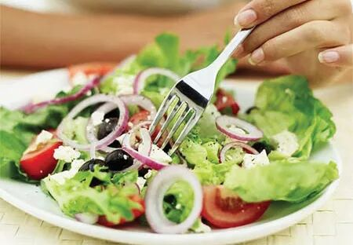 (原始链接: https://mmbiz.qpic.cn/mmbiz_jpg/XA8n2XaESnQRtCz3ib2sNFhBgfjYffPCNJr20sDF1EcjOOdAQyfAjwCtzF7m6S1SKlytqXEicIYF4NEAw6CRrh5g/640?wx_fmt=jpeg)
-  (原始链接: https://mmbiz.qpic.cn/mmbiz_jpg/XA8n2XaESnQRtCz3ib2sNFhBgfjYffPCNsMje0tC9KvfCiawHCaFBqCGTfyKibX460DG2dRmKNEm0X10rIBYa27Cw/640?wx_fmt=jpeg)
-  (原始链接: https://mmbiz.qpic.cn/mmbiz_png/XA8n2XaESnQRtCz3ib2sNFhBgfjYffPCNeqpM2kqkvlc1yPC5BOibyFHgFvZ9QYDdMum2JeKMzO4Wpmt4orUd0ibA/640?wx_fmt=png)
-  (原始链接: https://mmbiz.qpic.cn/mmbiz_png/XA8n2XaESnQRtCz3ib2sNFhBgfjYffPCNMhicI29ibfuVS7DFcc2MxvicoKudBbbcQ0qhIHFMicqTkT1ILd0nptqnQA/640?wx_fmt=png)
- 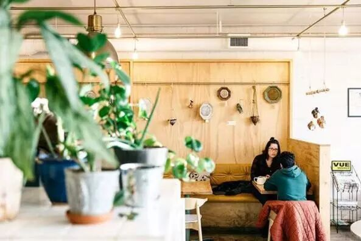 (原始链接: https://mmbiz.qpic.cn/mmbiz_jpg/XA8n2XaESnQRtCz3ib2sNFhBgfjYffPCNervCA6a5MlGyfed4supK9GicTvedibnfn8OAK1siazgh8OtTcIlbfNQDA/640?wx_fmt=jpeg)
- 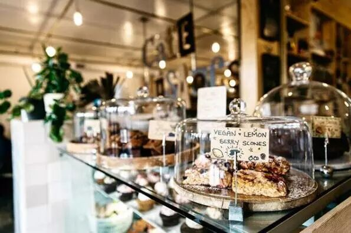 (原始链接: https://mmbiz.qpic.cn/mmbiz_jpg/XA8n2XaESnQRtCz3ib2sNFhBgfjYffPCNJOWmKg0ZMWXA4l8Xq9Cw8BdxicYXxEiaC6epmiaGRaRkIrJQ6b5IsJiaoQ/640?wx_fmt=jpeg)
- 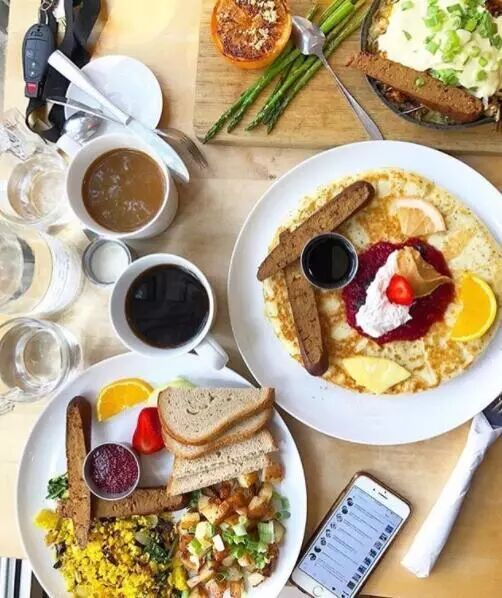 (原始链接: https://mmbiz.qpic.cn/mmbiz_jpg/XA8n2XaESnQRtCz3ib2sNFhBgfjYffPCNXR7h7F2txo28EN2X5A1CChAJ68QqrwSqEP3vMibUdAUyGvibFlTAiaujA/640?wx_fmt=jpeg)
- 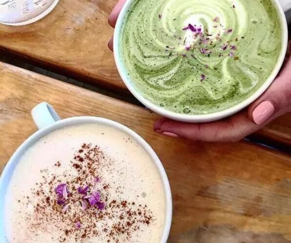 (原始链接: https://mmbiz.qpic.cn/mmbiz_jpg/XA8n2XaESnQRtCz3ib2sNFhBgfjYffPCNw2PcUWic68jDZ4hXyQRlU7xd7ibKv2LF1xtibIXwsI41PJRfdAN3HRgng/640?wx_fmt=jpeg)
- 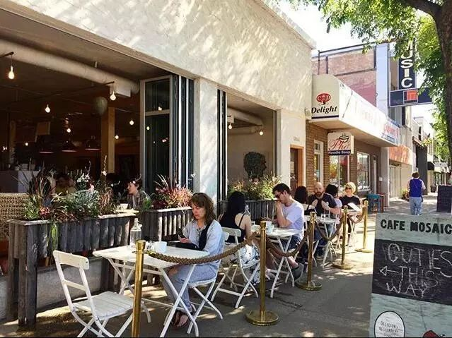 (原始链接: https://mmbiz.qpic.cn/mmbiz_jpg/XA8n2XaESnQRtCz3ib2sNFhBgfjYffPCNf0R3aSuBnG6ca4qaIyB7QUFrccicyp4aibcwOCCkzZ225qgg3dd8O05g/640?wx_fmt=jpeg)
- 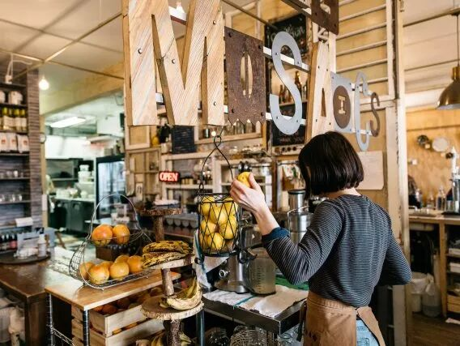 (原始链接: https://mmbiz.qpic.cn/mmbiz_jpg/XA8n2XaESnQRtCz3ib2sNFhBgfjYffPCNwq7sM4xuQKSmOf4q6beIIlZVT3VypEmjdlzGVm36W2CsPENP4GyaKQ/640?wx_fmt=jpeg)
-  (原始链接: https://mmbiz.qpic.cn/mmbiz_png/XA8n2XaESnQRtCz3ib2sNFhBgfjYffPCNeqpM2kqkvlc1yPC5BOibyFHgFvZ9QYDdMum2JeKMzO4Wpmt4orUd0ibA/640?wx_fmt=png)
-  (原始链接: https://mmbiz.qpic.cn/mmbiz_png/XA8n2XaESnQRtCz3ib2sNFhBgfjYffPCNMhicI29ibfuVS7DFcc2MxvicoKudBbbcQ0qhIHFMicqTkT1ILd0nptqnQA/640?wx_fmt=png)
- 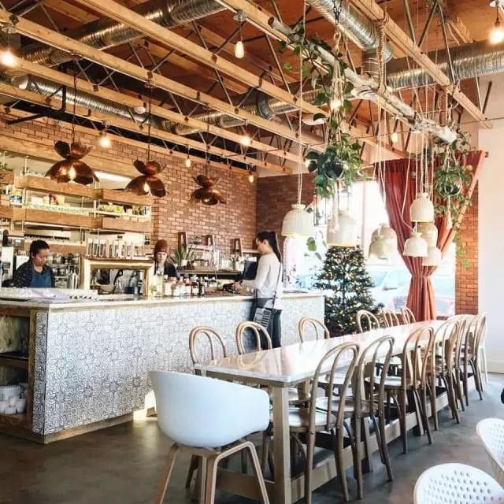 (原始链接: https://mmbiz.qpic.cn/mmbiz_jpg/XA8n2XaESnQRtCz3ib2sNFhBgfjYffPCNdwWUsjsUCvX7m2WIHE3mm49RkCdvLbu5V9k3vqSibGB9c7ASf5Iyz7w/640?wx_fmt=jpeg)
- 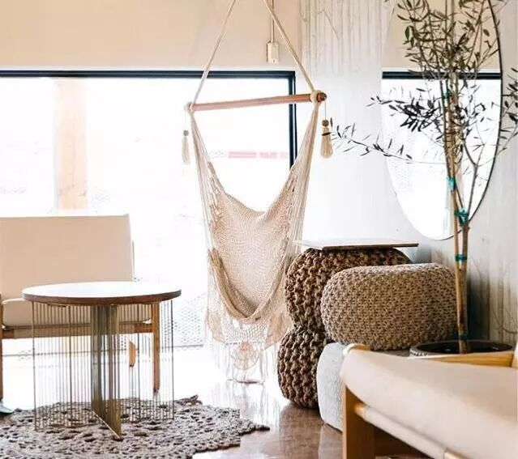 (原始链接: https://mmbiz.qpic.cn/mmbiz_jpg/XA8n2XaESnQRtCz3ib2sNFhBgfjYffPCNVQ0DILHh1TcmG6kxFJtKoGMAX78nvHRwFeHUicOJEnTFzZ2MCp4AFdQ/640?wx_fmt=jpeg)
- 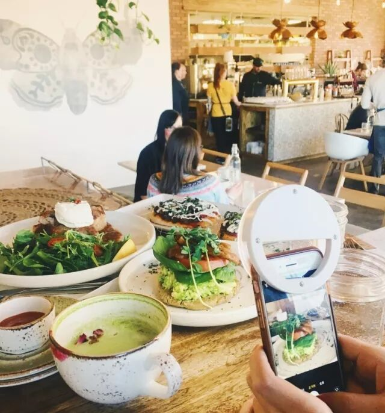 (原始链接: https://mmbiz.qpic.cn/mmbiz_jpg/XA8n2XaESnQRtCz3ib2sNFhBgfjYffPCNpMxXn3dPc4pCicVdUFutQIl5cjjVb2yQouQV5aBAib6YsyGSibAgV0mbw/640?wx_fmt=jpeg)
- 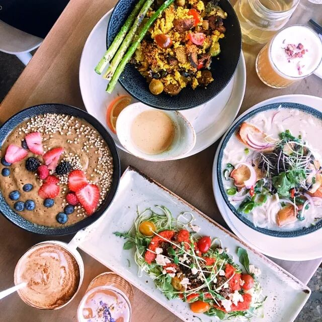 (原始链接: https://mmbiz.qpic.cn/mmbiz_jpg/XA8n2XaESnQRtCz3ib2sNFhBgfjYffPCNm7nONia5F4m6HKlVuDRCjVLCo7DjLuWsr4aQ0cS2GjQzFmMhswVBlsQ/640?wx_fmt=jpeg)
- 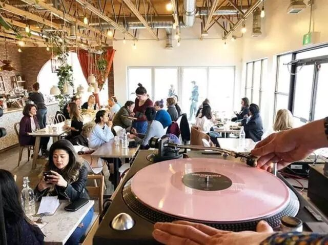 (原始链接: https://mmbiz.qpic.cn/mmbiz_jpg/XA8n2XaESnQRtCz3ib2sNFhBgfjYffPCNVtDGY52x4k40FfynYMbIQ0gHcxntYU498TFRnibP39WsDYjDovWWJSQ/640?wx_fmt=jpeg)
- 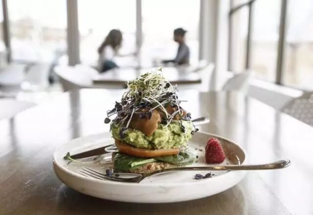 (原始链接: https://mmbiz.qpic.cn/mmbiz_jpg/XA8n2XaESnQRtCz3ib2sNFhBgfjYffPCNOT9CAM9gkkQfcMX5PCsicvx5RVmZ3oPzTOdHF7MPUKp41D5REHvn64w/640?wx_fmt=jpeg)
-  (原始链接: https://mmbiz.qpic.cn/mmbiz_png/XA8n2XaESnQRtCz3ib2sNFhBgfjYffPCNeqpM2kqkvlc1yPC5BOibyFHgFvZ9QYDdMum2JeKMzO4Wpmt4orUd0ibA/640?wx_fmt=png)
-  (原始链接: https://mmbiz.qpic.cn/mmbiz_png/XA8n2XaESnQRtCz3ib2sNFhBgfjYffPCNMhicI29ibfuVS7DFcc2MxvicoKudBbbcQ0qhIHFMicqTkT1ILd0nptqnQA/640?wx_fmt=png)
- 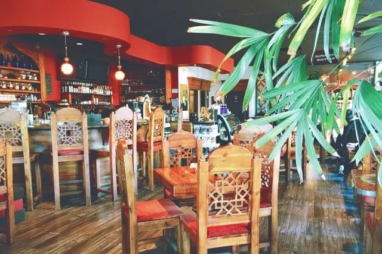 (原始链接: https://mmbiz.qpic.cn/mmbiz_jpg/XA8n2XaESnQRtCz3ib2sNFhBgfjYffPCN9eChAnnOT39bm3RpsrBWial7PQpmZibLzqKa3fNiacibibSSKcU3JcDpjBw/640?wx_fmt=jpeg)
- 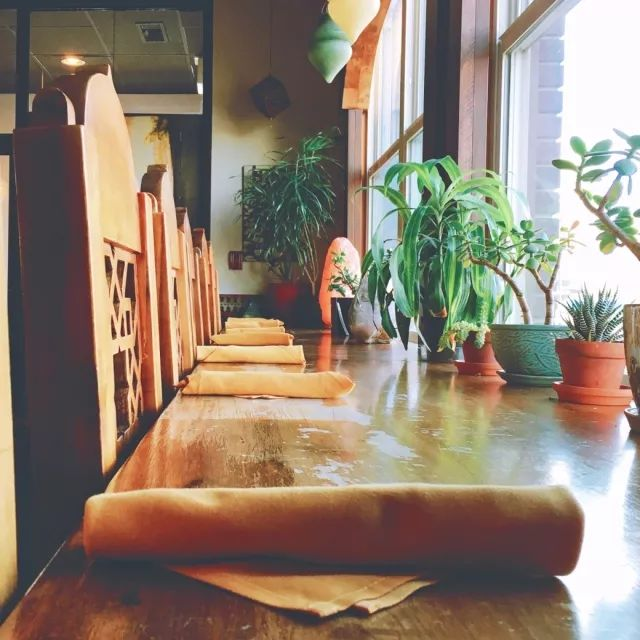 (原始链接: https://mmbiz.qpic.cn/mmbiz_jpg/XA8n2XaESnQRtCz3ib2sNFhBgfjYffPCNM6pmNURxyBB6IbiaygfB7doovs1dBib7TdeXxbY6SeKicTle3lCPv3e2w/640?wx_fmt=jpeg)
- 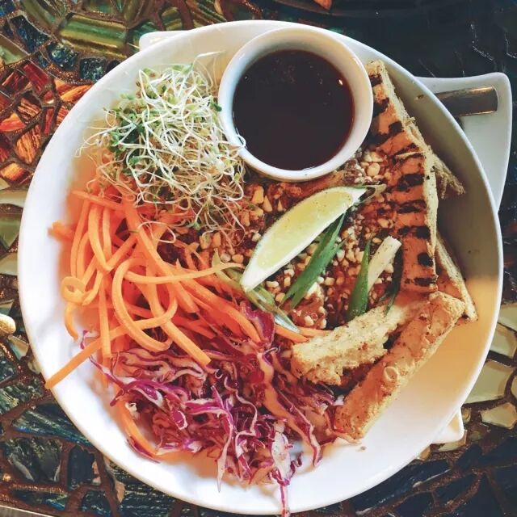 (原始链接: https://mmbiz.qpic.cn/mmbiz_jpg/XA8n2XaESnQRtCz3ib2sNFhBgfjYffPCN0cKOsmgLpwjTZATMHqEXRfXwmfGLxict7nzhmELyW1eAHiaTgIFO0Qog/640?wx_fmt=jpeg)
- 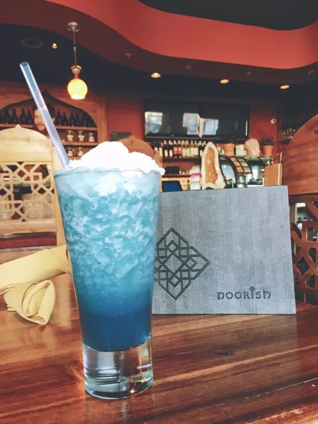 (原始链接: https://mmbiz.qpic.cn/mmbiz_jpg/XA8n2XaESnQRtCz3ib2sNFhBgfjYffPCN54fnSUD8WdAHBe9Q44RU2xG0frLNkNicnpxaNsGLHVedmSDPfaFLyqw/640?wx_fmt=jpeg)
- 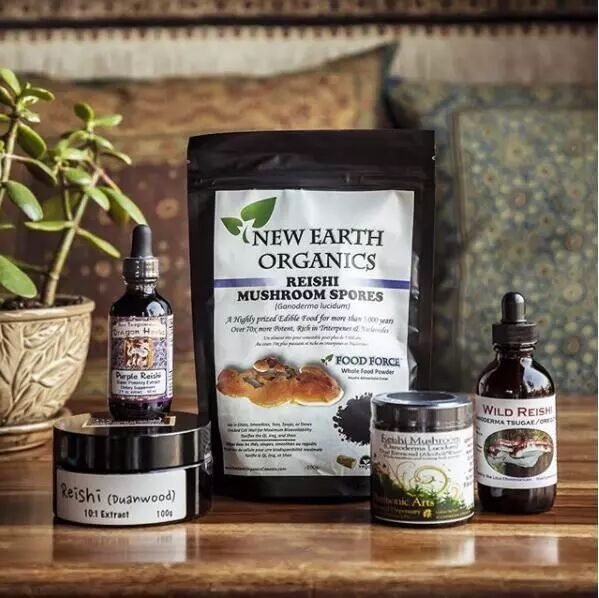 (原始链接: https://mmbiz.qpic.cn/mmbiz_jpg/XA8n2XaESnQRtCz3ib2sNFhBgfjYffPCNZAgz6zPLribCPAOn6dGJhCcJdsTBykZjS0EgLj5XVhd7ws07xJxvk0A/640?wx_fmt=jpeg)
- 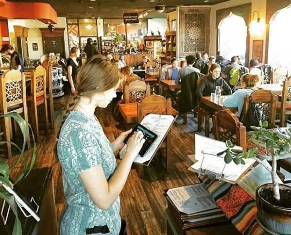 (原始链接: https://mmbiz.qpic.cn/mmbiz_jpg/XA8n2XaESnQRtCz3ib2sNFhBgfjYffPCNcEZvuFTbFXHgAyyhQJtbKmqnp0nvLxibCoVr0a9GB8VYYAvNuHzPZDA/640?wx_fmt=jpeg)
-  (原始链接: https://mmbiz.qpic.cn/mmbiz_png/XA8n2XaESnQRtCz3ib2sNFhBgfjYffPCNeqpM2kqkvlc1yPC5BOibyFHgFvZ9QYDdMum2JeKMzO4Wpmt4orUd0ibA/640?wx_fmt=png)
- 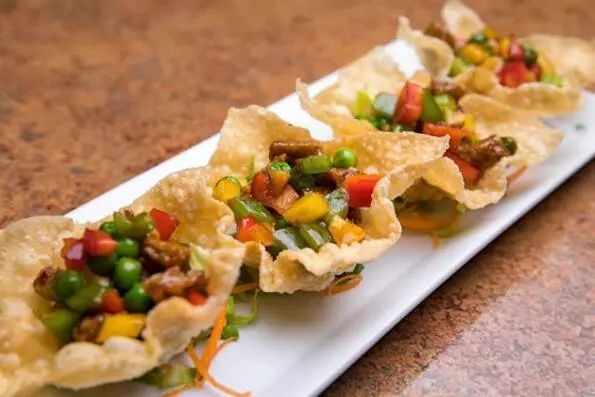 (原始链接: https://mmbiz.qpic.cn/mmbiz_jpg/XA8n2XaESnQRtCz3ib2sNFhBgfjYffPCNzx8apkJUe0TicPMfTic8VibjO1XUmSNHIIMhy5rBGtm2bzvYUpprarcWw/640?wx_fmt=jpeg)
- 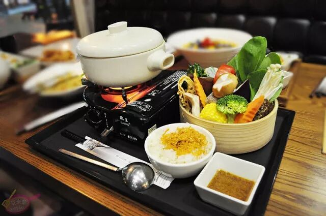 (原始链接: https://mmbiz.qpic.cn/mmbiz_jpg/XA8n2XaESnQRtCz3ib2sNFhBgfjYffPCN6JcW7YbhSAn6YPakI4R4BxEoVYLe2SMqeyGgmtkSRpOJlic7fzicLXgw/640?wx_fmt=jpeg)
-  (原始链接: https://mmbiz.qpic.cn/mmbiz_png/XA8n2XaESnQRtCz3ib2sNFhBgfjYffPCN8YeMB9JFgcicakaaHGXvhuaqDZFEFCxxy7NaTibLUMCmgpXPOWLAx3Ow/640?wx_fmt=png)
-  (原始链接: https://mmbiz.qpic.cn/mmbiz_png/XA8n2XaESnQRtCz3ib2sNFhBgfjYffPCNRfQKITAuzuG1wDpOyNFib2zALSiaWSV2JEEdoZ6qCHibmcQJyg65TDpjg/640?wx_fmt=png)
-  (原始链接: https://mmbiz.qpic.cn/mmbiz_png/XA8n2XaESnQRtCz3ib2sNFhBgfjYffPCNeqpM2kqkvlc1yPC5BOibyFHgFvZ9QYDdMum2JeKMzO4Wpmt4orUd0ibA/640?wx_fmt=png)
- 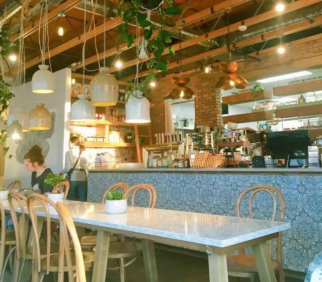 (原始链接: https://mmbiz.qpic.cn/mmbiz_jpg/XA8n2XaESnQRtCz3ib2sNFhBgfjYffPCNfiblic0tu5B5W26yG26YIF7yhA5RmP04j1xaia080T4N2rw13M2LB5n4A/640?wx_fmt=jpeg)
-  (原始链接: https://mmbiz.qpic.cn/mmbiz_jpg/XA8n2XaESnQRtCz3ib2sNFhBgfjYffPCNIsQCXHiaoFjoJQoa80ib57vuvdlDGOKCz1RTl9H3X9TL6sgOvNTpSPpQ/640?wx_fmt=jpeg)
