# 无标题

**链接地址:** http://mp.weixin.qq.com/s?__biz=MzI0MDQ0ODI0Ng==&mid=2247485737&idx=1&sn=b6024ac9646b49fd190cdc4274c196c5&chksm=e91beeb0de6c67a6c414385730e72f70ea0fdeac9a295c9c10a710068c0ff4d2d446cf6bad5b&mpshare=1&scene=2&srcid=0424DwIjCwVuG9B5hfbvk2D0#rd
**作者:** 食酒悦
**获取时间:** 2025/8/28 22:01:02
**图片数量:** 39

---

## 原始HTML内容

<section style="background-color: rgb(255, 255, 255);box-sizing: border-box;"><section class="Powered-by-XIUMI V5" style="box-sizing: border-box;" powered-by="xiumi.us"><section class="" style="text-align: center;box-sizing: border-box;"><section class="" style="display: inline-block;width: 98%;vertical-align: top;box-shadow: rgba(177, 160, 254, 0.39) 2.82843px 2.82843px 4px;border-color: rgba(169, 169, 169, 0.53);border-width: 4px;border-radius: 4px;border-style: outset;box-sizing: border-box;"><section class="Powered-by-XIUMI V5" style="box-sizing: border-box;" powered-by="xiumi.us"><section class="" style="box-sizing: border-box;"><section class="" style="display: inline-block;vertical-align: bottom;width: 33.33%;box-sizing: border-box;"><section class="Powered-by-XIUMI V5" style="box-sizing: border-box;" powered-by="xiumi.us"><section class="" style="margin-right: 0%;margin-left: 0%;box-sizing: border-box;"><section class="" style="max-width: 100%;vertical-align: middle;display: inline-block;overflow: hidden !important;box-sizing: border-box;"></section></section></section><section class="Powered-by-XIUMI V5" style="box-sizing: border-box;" powered-by="xiumi.us"><section class="" style="margin-right: 0%;margin-left: 0%;box-sizing: border-box;"><section class="" style="max-width: 100%;vertical-align: middle;display: inline-block;overflow: hidden !important;box-sizing: border-box;"></section></section></section></section><section class="" style="display: inline-block;vertical-align: bottom;width: 33.33%;box-sizing: border-box;"><section class="Powered-by-XIUMI V5" style="box-sizing: border-box;" powered-by="xiumi.us"><section class="" style="box-sizing: border-box;"><section class="" style="font-size: 12px;color: rgb(114, 113, 113);box-sizing: border-box;">
<strong style="box-sizing: border-box;">倾</strong><strong style="box-sizing: border-box;">诚</strong><strong style="letter-spacing: 0px;box-sizing: border-box;">为您服务！</strong> 
</section></section></section><section class="Powered-by-XIUMI V5" style="box-sizing: border-box;" powered-by="xiumi.us"><section class="" style="box-sizing: border-box;"><section class="" style="display: inline-block;width: 100%;vertical-align: top;overflow-x: auto;overflow-y: hidden;box-sizing: border-box;-webkit-overflow-scrolling: touch;"><section style="width: 300%;min-width: 100%;max-width: 300% !important;box-sizing: border-box;"><section class="Powered-by-XIUMI V5" style="display: inline-block;width: 33.3333%;vertical-align: top;box-sizing: border-box;" powered-by="xiumi.us"><section class="" style="text-align: right;margin-right: 0%;margin-left: 0%;box-sizing: border-box;"><section class="" style="max-width: 100%;vertical-align: middle;display: inline-block;overflow: hidden !important;box-sizing: border-box;"></section></section></section><section class="Powered-by-XIUMI V5" style="display: inline-block;width: 33.3333%;vertical-align: top;box-sizing: border-box;" powered-by="xiumi.us"><section class="" style="margin-right: 0%;margin-left: 0%;box-sizing: border-box;"><section class="" style="max-width: 100%;vertical-align: middle;display: inline-block;overflow: hidden !important;box-sizing: border-box;"></section></section></section><section class="Powered-by-XIUMI V5" style="display: inline-block;width: 33.3333%;vertical-align: top;box-sizing: border-box;" powered-by="xiumi.us"><section class="" style="text-align: left;margin-right: 0%;margin-left: 0%;box-sizing: border-box;"><section class="" style="max-width: 100%;vertical-align: middle;display: inline-block;overflow: hidden !important;box-sizing: border-box;"></section></section></section></section></section></section></section><section class="Powered-by-XIUMI V5" style="box-sizing: border-box;" powered-by="xiumi.us"><section class="" style="margin-right: 0%;margin-left: 0%;box-sizing: border-box;"><section class="" style="max-width: 100%;vertical-align: middle;display: inline-block;overflow: hidden !important;box-sizing: border-box;"></section></section></section></section><section class="" style="display: inline-block;vertical-align: bottom;width: 33.33%;box-sizing: border-box;"><section class="Powered-by-XIUMI V5" style="box-sizing: border-box;" powered-by="xiumi.us"><section class="" style="margin-right: 0%;margin-left: 0%;box-sizing: border-box;"><section class="" style="max-width: 100%;vertical-align: middle;display: inline-block;box-shadow: rgb(0, 0, 0) 0px 0px 0px;overflow: hidden !important;box-sizing: border-box;"></section></section></section><section class="Powered-by-XIUMI V5" style="box-sizing: border-box;" powered-by="xiumi.us"><section class="" style="margin-right: 0%;margin-left: 0%;box-sizing: border-box;"><section class="" style="max-width: 100%;vertical-align: middle;display: inline-block;width: 80%;overflow: hidden !important;box-sizing: border-box;"></section></section></section><section class="Powered-by-XIUMI V5" style="box-sizing: border-box;" powered-by="xiumi.us"><section class="" style="margin-right: 0%;margin-left: 0%;box-sizing: border-box;"><section class="" style="display: inline-block;border-width: 2px;border-style: solid;border-color: rgba(0, 0, 0, 0);padding: 0.1em 0.3em;color: rgb(62, 62, 62);line-height: 1.5;letter-spacing: 0px;font-size: 10px;box-sizing: border-box;">
长按二维码

获得更多资讯
</section></section></section></section></section></section></section></section></section><section class="Powered-by-XIUMI V5" style="box-sizing: border-box;" powered-by="xiumi.us"><section class="" style="margin-top: 10px;margin-bottom: 10px;box-sizing: border-box;"><section class="" style="padding-top: 2px;padding-bottom: 2px;box-sizing: border-box;"><section style="height: 4px;transform: rotate(0deg);-webkit-transform: rotate(0deg);-moz-transform: rotate(0deg);-o-transform: rotate(0deg);float: left;margin-top: -3px;background-color: rgb(254, 255, 255);box-sizing: border-box;"><section style="width: 4px;height: 4px;border-radius: 100%;float: left;background-color: rgba(227, 170, 78, 0.94);box-sizing: border-box;"></section><section style="width: 4px;height: 4px;border-radius: 100%;margin-left: 0.5em;float: left;background-color: rgba(227, 170, 78, 0.94);box-sizing: border-box;"></section><section style="width: 4px;height: 4px;border-radius: 100%;margin-left: 0.5em;float: left;background-color: rgba(227, 170, 78, 0.94);box-sizing: border-box;"></section><section style="width: 4px;height: 4px;border-radius: 100%;margin-left: 0.5em;float: left;background-color: rgba(227, 170, 78, 0.94);box-sizing: border-box;"></section><section style="width: 4px;height: 4px;border-radius: 100%;margin-left: 0.5em;float: left;background-color: rgba(227, 170, 78, 0.94);box-sizing: border-box;"></section></section><section style="border-top: 1px solid rgba(227, 170, 78, 0.94);margin-top: -2px;border-right-color: rgba(227, 170, 78, 0.94);border-bottom-color: rgba(227, 170, 78, 0.94);border-left-color: rgba(227, 170, 78, 0.94);box-sizing: border-box;"></section><section class="" style="width: 100%;padding: 10px;box-sizing: border-box;"><section class="Powered-by-XIUMI V5" style="box-sizing: border-box;" powered-by="xiumi.us"><section class="" style="box-sizing: border-box;"><section class="" style="text-align: center;letter-spacing: 2px;line-height: 1;box-sizing: border-box;">
<strong style="box-sizing: border-box;">置顶广告专区</strong> 

<strong style="box-sizing: border-box;">金主大大的广告不仅可以看，还可以“玩”。</strong>

<strong style="box-sizing: border-box;">滑动箭头解锁更多信息哦~</strong>
</section></section></section></section><section style="width: 100%;text-align: right;box-sizing: border-box;"><section style="height: 4px;margin-top: -2px;float: right;transform: rotate(0deg);-webkit-transform: rotate(0deg);-moz-transform: rotate(0deg);-o-transform: rotate(0deg);background-color: rgb(254, 255, 255);box-sizing: border-box;"><section style="width: 4px;height: 4px;border-radius: 100%;float: left;background-color: rgba(227, 170, 78, 0.94);box-sizing: border-box;"></section><section style="width: 4px;height: 4px;border-radius: 100%;margin-left: 0.5em;float: left;background-color: rgba(227, 170, 78, 0.94);box-sizing: border-box;"></section><section style="width: 4px;height: 4px;border-radius: 100%;margin-left: 0.5em;float: left;background-color: rgba(227, 170, 78, 0.94);box-sizing: border-box;"></section><section style="width: 4px;height: 4px;border-radius: 100%;margin-left: 0.5em;float: left;background-color: rgba(227, 170, 78, 0.94);box-sizing: border-box;"></section><section style="width: 4px;height: 4px;border-radius: 100%;margin-left: 0.5em;float: left;background-color: rgba(227, 170, 78, 0.94);box-sizing: border-box;"></section></section><section style="clear: both;box-sizing: border-box;"></section><section style="border-top: 1px solid rgba(227, 170, 78, 0.94);margin-top: -2px;margin-bottom: 2px;border-right-color: rgba(227, 170, 78, 0.94);border-bottom-color: rgba(227, 170, 78, 0.94);border-left-color: rgba(227, 170, 78, 0.94);box-sizing: border-box;"></section></section></section></section></section><section class="Powered-by-XIUMI V5" style="box-sizing: border-box;" powered-by="xiumi.us"><section class="" style="box-sizing: border-box;"><section class="" style="box-sizing: border-box;">
 
</section></section></section><section class="Powered-by-XIUMI V5" style="box-sizing: border-box;" powered-by="xiumi.us"><section class="" style="box-sizing: border-box;"><section class="" style="font-size: 14px;letter-spacing: 0px;padding-right: 25px;padding-left: 25px;line-height: 1.8;box-sizing: border-box;">
©本文章配图除由食悦foodjoy拍摄外，均转自Baijiu官方Instagram: baijiu_yeg.&nbsp;
</section></section></section><section class="Powered-by-XIUMI V5" style="box-sizing: border-box;" powered-by="xiumi.us"><section class="" style="text-align: center;margin-top: 10px;margin-bottom: 10px;box-sizing: border-box;"><section class="" style="max-width: 100%;vertical-align: middle;display: inline-block;overflow: hidden !important;box-sizing: border-box;"></section></section></section><section class="Powered-by-XIUMI V5" style="box-sizing: border-box;" powered-by="xiumi.us"><section class="" style="text-align: center;margin: -60px 0% 10px;box-sizing: border-box;"><section class="" style="max-width: 100%;vertical-align: middle;display: inline-block;overflow: hidden !important;box-sizing: border-box;"></section></section></section><section class="Powered-by-XIUMI V5" style="box-sizing: border-box;" powered-by="xiumi.us"><section class="" style="margin: 10px 0%;box-sizing: border-box;"><section class="" style="display: inline-block;width: 100%;vertical-align: top;box-sizing: border-box;"><section class="Powered-by-XIUMI V5" style="box-sizing: border-box;" powered-by="xiumi.us"><section class="" style="margin-right: 0%;margin-bottom: -40px;margin-left: 0%;box-sizing: border-box;"> </section></section></section></section></section><section class="Powered-by-XIUMI V5" style="box-sizing: border-box;" powered-by="xiumi.us"><section class="" style="text-align: center;margin-top: 10px;margin-bottom: 10px;box-sizing: border-box;"><section class="" style="display: inline-block;box-sizing: border-box;"> <section class="" style="display: inline-block;vertical-align: top;margin-top: 0.6em;margin-left: -1em;color: rgb(121, 49, 49);letter-spacing: 2px;box-sizing: border-box;">
<strong style="box-sizing: border-box;">&nbsp;白酒，不卖白酒</strong>
</section></section></section></section><section class="Powered-by-XIUMI V5" style="box-sizing: border-box;" powered-by="xiumi.us"><section class="" style="box-sizing: border-box;"><section class="" style="display: inline-block;width: 100%;vertical-align: top;box-sizing: border-box;"><section class="Powered-by-XIUMI V5" style="box-sizing: border-box;" powered-by="xiumi.us"><section class="" style="font-size: 70px;text-align: center;margin-right: 0%;margin-left: 0%;box-sizing: border-box;"><section class="" style="box-sizing: border-box;display: inline-block;vertical-align: bottom;margin: auto;width: 3em;height: 3em;border-radius: 100%;background-image: url(&quot;https://mmbiz.qpic.cn/mmbiz_png/XA8n2XaESnTKfJ5S4zVSlKsbiaDgjgdBle15DLI7jXDciaLMenlpXia59dA8vy5CQrn9ZQ9Y2eQeZ7ibiahmZ0WI5qg/640?wx_fmt=png&quot;);background-position: center center;background-repeat: no-repeat;background-size: cover;"><section class="" style="width: 100%;height: 100%;overflow: hidden;box-sizing: border-box;"></section></section></section></section><section class="Powered-by-XIUMI V5" style="box-sizing: border-box;" powered-by="xiumi.us"><section class="" style="font-size: 51px;text-align: center;margin-top: -3.5em;margin-right: 0%;margin-left: 0%;box-sizing: border-box;"><section class="" style="box-sizing: border-box;display: inline-block;vertical-align: bottom;margin: auto;width: 3em;height: 3em;border-radius: 100%;background-position: 89.3004% 0%;background-repeat: no-repeat;background-size: 175.139%;box-shadow: rgb(0, 0, 0) 0px 0px 0px;background-image: url(&quot;https://mmbiz.qpic.cn/mmbiz_jpg/XA8n2XaESnTKfJ5S4zVSlKsbiaDgjgdBlzC1HneicZCk8jVMVP2IP0yCf9mN5ibFWw1GurkO7BIIwoUopRYFBa9vQ/640?wx_fmt=jpeg&quot;);"><section class="" style="width: 100%;height: 100%;overflow: hidden;box-sizing: border-box;"></section></section></section></section><section class="Powered-by-XIUMI V5" style="box-sizing: border-box;" powered-by="xiumi.us"><section class="" style="box-sizing: border-box;"><section class="" style="box-sizing: border-box;">
 
</section></section></section></section></section></section><section class="Powered-by-XIUMI V5" style="box-sizing: border-box;" powered-by="xiumi.us"><section class="" style="box-sizing: border-box;"><section class="" style="box-sizing: border-box;">
 
</section></section></section><section class="Powered-by-XIUMI V5" style="box-sizing: border-box;" powered-by="xiumi.us"><section class="" style="box-sizing: border-box;"><section class="" style="text-align: justify;font-size: 14px;letter-spacing: 2.5px;padding-right: 25px;padding-left: 25px;line-height: 1.8;box-sizing: border-box;">
前几日天气转暖，随手搜了一下屯子里新开的小酒馆，想要写给快考完试可以尽情放飞自我的你们。浏览了全加拿大评价最高的酒吧列表，其中一个读起来有点熟悉的名字吸引了我的注意。

 

“<strong style="box-sizing: border-box;">Baijiu</strong>”，应该是“<strong style="box-sizing: border-box;">白酒</strong>”吧。

 

这样一家有着文艺气息中文名儿的西人酒吧到底何德何能能够作为<strong style="box-sizing: border-box;">全屯仅有的两家</strong><strong style="box-sizing: border-box;">店</strong>入选<strong style="box-sizing: border-box;">TOP50</strong>的榜单呢？这引起了我的强烈好奇心。 
</section></section></section><section class="Powered-by-XIUMI V5" style="box-sizing: border-box;" powered-by="xiumi.us"><section class="" style="box-sizing: border-box;"><section class="" style="box-sizing: border-box;">
 
</section></section></section><section class="Powered-by-XIUMI V5" style="box-sizing: border-box;" powered-by="xiumi.us"><section class="" style="text-align: center;margin-top: 0.5em;margin-bottom: 0.5em;padding-left: 0.5em;padding-right: 0.5em;box-sizing: border-box;"><section class="" style="box-sizing: border-box;width: 100%;box-shadow: rgb(102, 102, 102) 3.53553px 3.53553px 8px;display: inline-block;height: auto !important;overflow: hidden !important;border-color: white;"></section></section></section><section class="Powered-by-XIUMI V5" style="box-sizing: border-box;" powered-by="xiumi.us"><section class="" style="box-sizing: border-box;"><section class="" style="box-sizing: border-box;">
 
</section></section></section><section class="Powered-by-XIUMI V5" style="box-sizing: border-box;" powered-by="xiumi.us"><section class="" style="box-sizing: border-box;"><section class="" style="text-align: justify;font-size: 14px;letter-spacing: 2.5px;padding-right: 25px;padding-left: 25px;line-height: 1.8;box-sizing: border-box;">
事不宜迟，伴随着内心巨大的疑惑和好奇，造访了这座藏匿在城市中心Mercer仓库的<strong style="box-sizing: border-box;">低调但独具魅力的小酒馆</strong>。

 

104st串联起了从Jasper Ave到Rogers Place的一整条熙熙攘攘的新酒吧街，鳞次栉比绚烂夺目的霓虹招牌仿佛挥动裙摆跳动撩人探戈的舞女，每一位都在殷勤地搂着你说“这位客官，这边请”。

 
</section></section></section><section class="Powered-by-XIUMI V5" style="box-sizing: border-box;" powered-by="xiumi.us"><section class="" style="box-sizing: border-box;"><section class="" style="text-align: justify;font-size: 14px;letter-spacing: 2.5px;padding-right: 25px;padding-left: 25px;line-height: 1.8;box-sizing: border-box;">
粉色霓虹灯在华灯初上的夜晚闪烁着神秘魅惑的光芒。踩着做旧的木制阶梯登上二楼逼仄的走廊，一扇透着微弱红色光芒的小门出现在眼前。 
</section></section></section><section class="Powered-by-XIUMI V5" style="box-sizing: border-box;" powered-by="xiumi.us"><section class="" style="box-sizing: border-box;"><section class="" style="box-sizing: border-box;">
 
</section></section></section><section class="Powered-by-XIUMI V5" style="box-sizing: border-box;" powered-by="xiumi.us"><section class="" style="text-align: center;margin-top: 0.5em;margin-bottom: 0.5em;padding-left: 0.5em;padding-right: 0.5em;box-sizing: border-box;"><section class="" style="box-sizing: border-box;width: 100%;box-shadow: rgb(102, 102, 102) 3.53553px 3.53553px 8px;display: inline-block;height: auto !important;overflow: hidden !important;border-color: white;"></section></section></section><section class="Powered-by-XIUMI V5" style="box-sizing: border-box;" powered-by="xiumi.us"><section class="" style="box-sizing: border-box;"><section class="" style="box-sizing: border-box;">
 
</section></section></section><section class="Powered-by-XIUMI V5" style="box-sizing: border-box;" powered-by="xiumi.us"><section class="" style="box-sizing: border-box;"><section class="" style="text-align: justify;font-size: 14px;letter-spacing: 2.5px;padding-right: 25px;padding-left: 25px;line-height: 1.8;box-sizing: border-box;">
推门而入，即跨越了时间和距离的结界。这极度复古气息的装修让我仿佛置身于上世纪二十年代<strong style="box-sizing: border-box;">纸醉金迷</strong>的上海滩。松石绿的墙上是巨型抽象的孔雀与玫瑰壁纸，做旧皮质的老沙发被岁月打磨侵蚀后散发出雪茄般的迷人香气。藏匿在角落黑暗中的凤尾竹被栽种在青花瓷盆里，有一种无法言说的迷离孤寂。桌上栩栩如生憨态可掬的弥勒佛瓷像映射着那个时代特有的<strong style="box-sizing: border-box;">灯红酒绿</strong>。

 

<strong style="box-sizing: border-box;">这样的老电影般的场景，危险且神秘。</strong>
</section></section></section><section class="Powered-by-XIUMI V5" style="box-sizing: border-box;" powered-by="xiumi.us"><section class="" style="box-sizing: border-box;"><section class="" style="box-sizing: border-box;">
 
</section></section></section><section class="Powered-by-XIUMI V5" style="box-sizing: border-box;" powered-by="xiumi.us"><section class="" style="text-align: center;margin-top: 0.5em;margin-bottom: 0.5em;padding-left: 0.5em;padding-right: 0.5em;box-sizing: border-box;"><section class="" style="box-sizing: border-box;width: 100%;box-shadow: rgb(102, 102, 102) 0.2em 0.2em 0.5em;display: inline-block;height: auto !important;overflow: hidden !important;border-color: white;"></section></section></section><section class="Powered-by-XIUMI V5" style="box-sizing: border-box;" powered-by="xiumi.us"><section class="" style="box-sizing: border-box;"><section class="" style="box-sizing: border-box;">
 
</section></section></section><section class="Powered-by-XIUMI V5" style="box-sizing: border-box;" powered-by="xiumi.us"><section class="" style="box-sizing: border-box;"><section class="" style="text-align: justify;font-size: 14px;letter-spacing: 2.5px;padding-right: 25px;padding-left: 25px;line-height: 1.8;box-sizing: border-box;">
<strong style="box-sizing: border-box;">精致优雅，被武装到每一个角落。</strong>让我想起《花样年华》里穿着刺绣旗袍摇曳生姿的张曼玉的背影。

 

暧昧氤氲的气息四散开来。这样昏暗的灯光下的Baijiu，似乎藏着一位落魄的千金大小姐，蜷缩在阴暗的角落里抽着烟，通过阁楼的小窗注视着街头的车水马龙来排遣内心的寂寥，默默叹息着负心情郎的潇洒与无情。 
</section></section></section><section class="Powered-by-XIUMI V5" style="box-sizing: border-box;" powered-by="xiumi.us"><section class="" style="box-sizing: border-box;"><section class="" style="box-sizing: border-box;">
 
</section></section></section><section class="Powered-by-XIUMI V5" style="box-sizing: border-box;" powered-by="xiumi.us"><section class="" style="text-align: center;margin-top: 10px;margin-bottom: 10px;box-sizing: border-box;"><section class="" style="display: inline-block;box-sizing: border-box;"> <section class="" style="display: inline-block;vertical-align: top;margin-top: 0.6em;margin-left: -1em;color: rgb(121, 49, 49);letter-spacing: 2px;box-sizing: border-box;">
<strong style="box-sizing: border-box;">&nbsp;This is New School</strong>
</section></section></section></section><section class="Powered-by-XIUMI V5" style="box-sizing: border-box;" powered-by="xiumi.us"><section class="" style="box-sizing: border-box;"><section class="" style="box-sizing: border-box;">
 
</section></section></section><section class="Powered-by-XIUMI V5" style="box-sizing: border-box;" powered-by="xiumi.us"><section class="" style="text-align: center;margin-top: 0.5em;margin-bottom: 0.5em;padding-left: 0.5em;padding-right: 0.5em;box-sizing: border-box;"><section class="" style="box-sizing: border-box;width: 100%;box-shadow: rgb(102, 102, 102) 3.53553px 3.53553px 8px;display: inline-block;height: auto !important;overflow: hidden !important;border-color: white;"></section></section></section><section class="Powered-by-XIUMI V5" style="box-sizing: border-box;" powered-by="xiumi.us"><section class="" style="box-sizing: border-box;"><section class="" style="box-sizing: border-box;">
 
</section></section></section><section class="Powered-by-XIUMI V5" style="box-sizing: border-box;" powered-by="xiumi.us"><section class="" style="box-sizing: border-box;"><section class="" style="text-align: justify;font-size: 14px;letter-spacing: 2.5px;padding-right: 25px;padding-left: 25px;line-height: 1.8;box-sizing: border-box;">
<strong style="box-sizing: border-box;">“热闹是他们的，我什么也没有。”</strong>

 

这样矫情的小情绪没能维持多久，汹涌的<strong style="box-sizing: border-box;">嘻哈饶舌背景音乐</strong>和嘈杂躁动的人群将我又拽回了现实。周末的夜晚果然繁忙拥挤，不到下午六点所有的<strong style="box-sizing: border-box;">座位早被预订一空</strong>。

 
</section></section></section><section class="Powered-by-XIUMI V5" style="box-sizing: border-box;" powered-by="xiumi.us"><section class="" style="text-align: center;margin-top: 0.5em;margin-bottom: 0.5em;padding-left: 0.5em;padding-right: 0.5em;box-sizing: border-box;"><section class="" style="box-sizing: border-box;width: 100%;box-shadow: rgb(102, 102, 102) 0.2em 0.2em 0.5em;display: inline-block;height: auto !important;overflow: hidden !important;border-color: white;"></section></section></section><section class="Powered-by-XIUMI V5" style="box-sizing: border-box;" powered-by="xiumi.us"><section class="" style="box-sizing: border-box;"><section class="" style="text-align: justify;font-size: 14px;letter-spacing: 2.5px;padding-right: 25px;padding-left: 25px;line-height: 1.8;box-sizing: border-box;">
 

怯生生地绕到吧台的角落入座。环视四周，浓妆艳抹妖娆高冷的服务生走来走去，穿着花衬衫的调酒师们忙着在吧台耍那花哨的把戏。 

 

是的，无论包装得多么新潮不羁，Baijiu依然是一家现代化小酒馆无疑。
</section></section></section><section class="Powered-by-XIUMI V5" style="box-sizing: border-box;" powered-by="xiumi.us"><section class="" style="box-sizing: border-box;"><section class="" style="box-sizing: border-box;">
 
</section></section></section><section class="Powered-by-XIUMI V5" style="box-sizing: border-box;" powered-by="xiumi.us"><section class="" style="text-align: center;margin-top: 0.5em;margin-bottom: 0.5em;padding-left: 0.5em;padding-right: 0.5em;box-sizing: border-box;"><section class="" style="box-sizing: border-box;width: 100%;box-shadow: rgb(102, 102, 102) 3.53553px 3.53553px 8px;display: inline-block;height: auto !important;overflow: hidden !important;border-color: white;"></section></section></section><section class="Powered-by-XIUMI V5" style="box-sizing: border-box;" powered-by="xiumi.us"><section class="" style="box-sizing: border-box;"><section class="" style="box-sizing: border-box;">
 
</section></section></section><section class="Powered-by-XIUMI V5" style="box-sizing: border-box;" powered-by="xiumi.us"><section class="" style="box-sizing: border-box;"><section class="" style="text-align: justify;font-size: 14px;letter-spacing: 2.5px;padding-right: 25px;padding-left: 25px;line-height: 1.8;box-sizing: border-box;">
翻开菜单仔细阅读，才真正理解到所谓“<strong style="box-sizing: border-box;">new school 中国风</strong>”的含义。这里的bar food真是太有特色了！没有fried chicken，没有poutine，也没有calamari这些普通酒吧里常见的货色，而是“如假包换”的煎饺，茶叶蛋，牛肉面和烤鸭腿这些<strong style="box-sizing: border-box;">传统的中国菜</strong>。而且盛饭装菜的碗碟也极其考究，年年有余的青花碟，万福无疆的花瓷碗，倍受岁月洗刷打磨伤痕累累的乌木筷…这些仿古的餐具也不知道老板是从哪里淘来的呢。
</section></section></section><section class="Powered-by-XIUMI V5" style="box-sizing: border-box;" powered-by="xiumi.us"><section class="" style="box-sizing: border-box;"><section class="" style="box-sizing: border-box;">
 
</section></section></section><section class="Powered-by-XIUMI V5" style="box-sizing: border-box;" powered-by="xiumi.us"><section class="" style="text-align: center;margin-top: 0.5em;margin-bottom: 0.5em;padding-left: 0.5em;padding-right: 0.5em;box-sizing: border-box;"><section class="" style="box-sizing: border-box;width: 100%;box-shadow: rgb(102, 102, 102) 0.2em 0.2em 0.5em;display: inline-block;height: auto !important;overflow: hidden !important;border-color: white;"></section></section></section><section class="Powered-by-XIUMI V5" style="box-sizing: border-box;" powered-by="xiumi.us"><section class="" style="box-sizing: border-box;"><section class="" style="box-sizing: border-box;">
 
</section></section></section><section class="Powered-by-XIUMI V5" style="box-sizing: border-box;" powered-by="xiumi.us"><section class="" style="box-sizing: border-box;"><section class="" style="text-align: justify;font-size: 14px;letter-spacing: 2.5px;padding-right: 25px;padding-left: 25px;line-height: 1.8;box-sizing: border-box;">
去之前有做好心理准备，通常这样以风格环境为“特色”的餐厅，其食物基本不会好吃到哪里去。去的路上我甚至都想好了这篇文章的标题——<strong style="box-sizing: border-box;">“看加拿大人怎么祸害我国宝贵的餐饮文化。”</strong>这样“搅合”中国博大精深美食文化的餐厅怎么能放过，口诛笔伐之可谓民心所向万众期待。 

 

<strong style="box-sizing: border-box;">然而，我错了。而且错得离谱。</strong>
</section></section></section><section class="Powered-by-XIUMI V5" style="box-sizing: border-box;" powered-by="xiumi.us"><section class="" style="box-sizing: border-box;"><section class="" style="box-sizing: border-box;">
 
</section></section></section><section class="Powered-by-XIUMI V5" style="box-sizing: border-box;" powered-by="xiumi.us"><section class="" style="text-align: center;margin-top: 0.5em;margin-bottom: 0.5em;padding-left: 0.5em;padding-right: 0.5em;box-sizing: border-box;"><section class="" style="box-sizing: border-box;width: 100%;box-shadow: rgb(102, 102, 102) 0.2em 0.2em 0.5em;display: inline-block;height: auto !important;overflow: hidden !important;border-color: white;"></section></section></section><section class="Powered-by-XIUMI V5" style="box-sizing: border-box;" powered-by="xiumi.us"><section class="" style="box-sizing: border-box;"><section class="" style="box-sizing: border-box;">
 
</section></section></section><section class="Powered-by-XIUMI V5" style="box-sizing: border-box;" powered-by="xiumi.us"><section class="" style="box-sizing: border-box;"><section class="" style="text-align: justify;font-size: 14px;letter-spacing: 2.5px;padding-right: 25px;padding-left: 25px;line-height: 1.8;box-sizing: border-box;">
点了一份他家的招牌菜“<strong style="box-sizing: border-box;">Bao</strong>”，还在寻思难不成是传说中的包子吗？上来一看，原来是荷叶饼蒸肉。柔软蓬松的荷叶蒸饼确实是国内吃到的那种味道，但里面的内陷更加精彩张扬。红烧五花肉盈润香嫩，糖盐的比例极好，是佐酒的好物。关键是别出心裁加入的酸渍的包菜和紫甘蓝，去腥解腻开胃爽口。让我顿时对他家其他的菜色充满了期待。

 

这样的味道和品质，以Fuison菜系作为品鉴标准，<strong style="box-sizing: border-box;">我真得骂不出口</strong>。
</section></section></section><section class="Powered-by-XIUMI V5" style="box-sizing: border-box;" powered-by="xiumi.us"><section class="" style="box-sizing: border-box;"><section class="" style="box-sizing: border-box;">
 
</section></section></section><section class="Powered-by-XIUMI V5" style="box-sizing: border-box;" powered-by="xiumi.us"><section class="" style="text-align: center;margin-top: 0.5em;margin-bottom: 0.5em;padding-left: 0.5em;padding-right: 0.5em;box-sizing: border-box;"><section class="" style="box-sizing: border-box;width: 100%;box-shadow: rgb(102, 102, 102) 0.2em 0.2em 0.5em;display: inline-block;height: auto !important;overflow: hidden !important;border-color: white;"></section></section></section><section class="Powered-by-XIUMI V5" style="box-sizing: border-box;" powered-by="xiumi.us"><section class="" style="box-sizing: border-box;"><section class="" style="box-sizing: border-box;">
 
</section></section></section><section class="Powered-by-XIUMI V5" style="box-sizing: border-box;" powered-by="xiumi.us"><section class="" style="box-sizing: border-box;"><section class="" style="text-align: justify;font-size: 14px;letter-spacing: 2.5px;padding-right: 25px;padding-left: 25px;line-height: 1.8;box-sizing: border-box;">
鸡尾酒点的是极具特色的Kowloon Blood Alley（九龙血巷），《血巷》这部1955年的老电影讲述的正是一位船长带领一众村民逃“难”去往香港的故事。点的时候贴心的调酒师小哥哥还特别叮嘱我这款酒味道极其浓烈。其被炭火烤过的特殊烟熏味来自梅斯卡尔龙舌兰酒，而血红的色泽则来源于红梅酿制的波特酒。这样铁血豪情硬汉本色的酒体和电影本身的基调是一种完美的融合。 
</section></section></section><section class="Powered-by-XIUMI V5" style="box-sizing: border-box;" powered-by="xiumi.us"><section class="" style="box-sizing: border-box;"><section class="" style="box-sizing: border-box;">
 
</section></section></section><section class="Powered-by-XIUMI V5" style="box-sizing: border-box;" powered-by="xiumi.us"><section class="" style="text-align: center;margin-top: 0.5em;margin-bottom: 0.5em;padding-left: 0.5em;padding-right: 0.5em;box-sizing: border-box;"><section class="" style="box-sizing: border-box;width: 100%;box-shadow: rgb(102, 102, 102) 0.2em 0.2em 0.5em;display: inline-block;height: auto !important;overflow: hidden !important;border-color: white;"></section></section></section><section class="Powered-by-XIUMI V5" style="box-sizing: border-box;" powered-by="xiumi.us"><section class="" style="box-sizing: border-box;"><section class="" style="box-sizing: border-box;">
 
</section></section></section><section class="Powered-by-XIUMI V5" style="box-sizing: border-box;" powered-by="xiumi.us"><section class="" style="box-sizing: border-box;"><section class="" style="text-align: justify;font-size: 14px;letter-spacing: 2.5px;padding-right: 25px;padding-left: 25px;line-height: 1.8;box-sizing: border-box;">
最后的甜品是酥炸面包夹自制抹茶冰淇淋。这个甜品不算太传统，也不算很稀奇。但这家的尤为好吃。炸至金黄酥脆的面包外皮内里依然柔软绵密。韵味悠长香甜中带一丝苦涩的抹茶冰淇淋肆意渗进面包微小的孔隙，咬下去是浓郁香滑的奶油爆浆。油的味道很新鲜，没有陈腐之味。面包质感和口味都极佳，空口吃也透出淡淡麦子的香甜。 
</section></section></section><section class="Powered-by-XIUMI V5" style="box-sizing: border-box;" powered-by="xiumi.us"><section class="" style="box-sizing: border-box;"><section class="" style="box-sizing: border-box;">
 
</section></section></section><section class="Powered-by-XIUMI V5" style="box-sizing: border-box;" powered-by="xiumi.us"><section class="" style="text-align: center;margin-top: 10px;margin-bottom: 10px;box-sizing: border-box;"><section class="" style="display: inline-block;box-sizing: border-box;"> <section class="" style="display: inline-block;vertical-align: top;margin-top: 0.6em;margin-left: -1em;color: rgb(121, 49, 49);letter-spacing: 2px;box-sizing: border-box;">
<strong style="box-sizing: border-box;">&nbsp;中华美食文化的“革新”</strong>
</section></section></section></section><section class="Powered-by-XIUMI V5" style="box-sizing: border-box;" powered-by="xiumi.us"><section class="" style="box-sizing: border-box;"><section class="" style="box-sizing: border-box;">
 
</section></section></section><section class="Powered-by-XIUMI V5" style="box-sizing: border-box;" powered-by="xiumi.us"><section class="" style="text-align: center;margin-top: 0.5em;margin-bottom: 0.5em;padding-left: 0.5em;padding-right: 0.5em;box-sizing: border-box;"><section class="" style="box-sizing: border-box;width: 100%;display: inline-block;height: auto !important;overflow: hidden !important;border-color: white;box-shadow: rgb(102, 102, 102) 3.53553px 3.53553px 8px;"></section></section></section><section class="Powered-by-XIUMI V5" style="box-sizing: border-box;" powered-by="xiumi.us"><section class="" style="box-sizing: border-box;"><section class="" style="box-sizing: border-box;">
 
</section></section></section><section class="Powered-by-XIUMI V5" style="box-sizing: border-box;" powered-by="xiumi.us"><section class="" style="box-sizing: border-box;"><section class="" style="text-align: justify;font-size: 14px;letter-spacing: 2.5px;padding-right: 25px;padding-left: 25px;line-height: 1.8;box-sizing: border-box;">
时间不到晚上7点，店内已经人声鼎沸座无虚席。任何肤色，名族，信仰的人在这里都能找到自己心爱的酒饮和食物。看着他们笨拙地使用着筷子,手口并用地享受着这并不传统的“中餐”，感叹中华美食在和西方美食文化的碰撞之下尽幻化出如此瑰丽神奇的后现代产物。

 

精致法式西餐的烹饪手法Mix传统中华料理的菜谱；黄种人的传统美食文化混搭黑人街头嘻哈音乐。这是对中华美食的一场<strong style="box-sizing: border-box;">革新</strong>，也是对中国文化的一次<strong style="box-sizing: border-box;">颠覆</strong>。
</section></section></section><section class="Powered-by-XIUMI V5" style="box-sizing: border-box;" powered-by="xiumi.us"><section class="" style="box-sizing: border-box;"><section class="" style="box-sizing: border-box;">
 
</section></section></section><section class="Powered-by-XIUMI V5" style="box-sizing: border-box;" powered-by="xiumi.us"><section class="" style="box-sizing: border-box;"><section class="" style="display: inline-block;vertical-align: top;width: 50%;border-radius: 0px;padding-right: 5px;box-sizing: border-box;"><section class="Powered-by-XIUMI V5" style="box-sizing: border-box;" powered-by="xiumi.us"><section class="" style="font-size: 38px;text-align: right;margin-right: 0%;margin-bottom: 5px;margin-left: 0%;box-sizing: border-box;"><section class="" style="box-sizing: border-box;margin: auto;width: 3em;height: 3em;vertical-align: top;background-position: center center;background-repeat: no-repeat;background-size: cover;display: inline-block;border-width: 0px;border-radius: 100% 0px 0px;border-style: none;border-color: rgb(62, 62, 62);box-shadow: rgb(0, 0, 0) 0px 0px 0px;background-image: url(&quot;https://mmbiz.qpic.cn/mmbiz_jpg/XA8n2XaESnTKfJ5S4zVSlKsbiaDgjgdBlVs4gKOxj6s8lB8UJkLblZKAL96bUiaQVUE4WINO8bmhQDZ3DfccVH0Q/640?wx_fmt=jpeg&quot;);"><section class="" style="width: 100%;height: 100%;overflow: hidden;box-sizing: border-box;"></section></section></section></section><section class="Powered-by-XIUMI V5" style="box-sizing: border-box;" powered-by="xiumi.us"><section class="" style="font-size: 38px;text-align: right;margin-top: 10px;margin-right: 0%;margin-left: 0%;box-sizing: border-box;"><section class="" style="box-sizing: border-box;margin: auto;width: 3em;height: 3em;vertical-align: top;background-position: 30.0014% 100%;background-repeat: no-repeat;background-size: 116.923%;display: inline-block;border-width: 0px;border-radius: 0% 0px 0px 100%;border-style: none;border-color: rgb(62, 62, 62);background-image: url(&quot;https://mmbiz.qpic.cn/mmbiz_jpg/XA8n2XaESnTKfJ5S4zVSlKsbiaDgjgdBln7eIzydwcKID5ES8ZiaJk1xLdZ9gOxm77QIbia4ey1d92lZibTibibWtdxQ/640?wx_fmt=jpeg&quot;);"><section class="" style="width: 100%;height: 100%;overflow: hidden;box-sizing: border-box;"></section></section></section></section></section><section class="" style="display: inline-block;vertical-align: top;width: 50%;padding-left: 5px;box-sizing: border-box;"><section class="Powered-by-XIUMI V5" style="box-sizing: border-box;" powered-by="xiumi.us"><section class="" style="font-size: 38px;margin-right: 0%;margin-bottom: 5px;margin-left: 0%;box-sizing: border-box;"><section class="" style="box-sizing: border-box;margin: auto;width: 3em;height: 3em;vertical-align: top;background-position: 100% 0%;background-repeat: no-repeat;background-size: 103.479%;display: inline-block;border-width: 0px;border-radius: 0% 100% 0px 0px;border-style: none;border-color: rgb(62, 62, 62);background-image: url(&quot;https://mmbiz.qpic.cn/mmbiz_jpg/XA8n2XaESnTKfJ5S4zVSlKsbiaDgjgdBl8bYtBVicJEX5FbG41ojBbJPHDSGVmlWGVMibpYuTyvia61UsxDlDHFW9Q/640?wx_fmt=jpeg&quot;);"><section class="" style="width: 100%;height: 100%;overflow: hidden;box-sizing: border-box;"></section></section></section></section><section class="Powered-by-XIUMI V5" style="box-sizing: border-box;" powered-by="xiumi.us"><section class="" style="font-size: 38px;margin-top: 10px;margin-right: 0%;margin-left: 0%;box-sizing: border-box;"><section class="" style="box-sizing: border-box;margin: auto;width: 3em;height: 3em;vertical-align: top;background-position: 100% 93.454%;background-repeat: no-repeat;background-size: 127.507%;display: inline-block;border-width: 0px;border-radius: 0% 0px 100%;border-style: none;border-color: rgb(62, 62, 62);background-image: url(&quot;https://mmbiz.qpic.cn/mmbiz_jpg/XA8n2XaESnTKfJ5S4zVSlKsbiaDgjgdBlicEwlYbTSCZMTZHlh422lzibYmeFjBowfgaWtdQPxvsftExVuv2W4QFQ/640?wx_fmt=jpeg&quot;);"><section class="" style="width: 100%;height: 100%;overflow: hidden;box-sizing: border-box;"></section></section></section></section></section></section></section><section class="Powered-by-XIUMI V5" style="box-sizing: border-box;" powered-by="xiumi.us"><section class="" style="box-sizing: border-box;"><section class="" style="box-sizing: border-box;">
 
</section></section></section><section class="Powered-by-XIUMI V5" style="box-sizing: border-box;" powered-by="xiumi.us"><section class="" style="box-sizing: border-box;"><section class="" style="text-align: justify;font-size: 14px;letter-spacing: 2.5px;padding-right: 25px;padding-left: 25px;line-height: 1.8;box-sizing: border-box;">
可惜食悦的胃太小，能享用的东西不多。看了下网上的风评，这几道菜不仅卖相好而且味道也很不错。如果你们他日有幸光顾Baijiu，不妨点来尝尝。

 

顺时针方向依次：

<strong style="box-sizing: border-box;">四川油封鸡</strong><strong style="box-sizing: border-box;"> </strong>(Confit chicken)

<strong style="box-sizing: border-box;">猪肉虾仁生煎包</strong> （Lion's head dumplings)&nbsp;&nbsp;

<strong style="box-sizing: border-box;">各种特色的Bao</strong>，偶尔会有特殊馅料供应

<strong style="box-sizing: border-box;">茶叶蛋</strong>&nbsp; (Deviled tea eggs)

 

这些道菜最让人拍案叫绝的点在于他们都长了副传统中国菜的模样，可是选材，烹调手法和调味都融入了丰富多元的世界文化。熟悉的同时又惊险刺激，对于我们中国食客来说也是一场<strong style="box-sizing: border-box;">味蕾的冒险</strong>。
</section></section></section><section class="Powered-by-XIUMI V5" style="box-sizing: border-box;" powered-by="xiumi.us"><section class="" style="box-sizing: border-box;"><section class="" style="box-sizing: border-box;">
 
</section></section></section><section class="Powered-by-XIUMI V5" style="box-sizing: border-box;" powered-by="xiumi.us"><section class="" style="text-align: center;margin-top: 0.5em;margin-bottom: 0.5em;padding-left: 0.5em;padding-right: 0.5em;box-sizing: border-box;"><section class="" style="box-sizing: border-box;width: 100%;box-shadow: rgb(102, 102, 102) 3.53553px 3.53553px 8px;display: inline-block;height: auto !important;overflow: hidden !important;border-color: white;"></section></section></section><section class="Powered-by-XIUMI V5" style="box-sizing: border-box;" powered-by="xiumi.us"><section class="" style="box-sizing: border-box;"><section class="" style="box-sizing: border-box;">
 
</section></section></section><section class="Powered-by-XIUMI V5" style="box-sizing: border-box;" powered-by="xiumi.us"><section class="" style="box-sizing: border-box;"><section class="" style="text-align: justify;font-size: 14px;letter-spacing: 2.5px;padding-right: 25px;padding-left: 25px;line-height: 1.8;box-sizing: border-box;">
你们就不好奇能设计出这样新奇古怪酒吧的老板是何许人也？他有中国血统吗？他是年轻人吗？是的，年轻有为的Kevin Cam不仅拥有Baijiu这家超赞中国风的酒吧，还是124st上那家超酷的现代工业风小酒吧<strong style="box-sizing: border-box;">North 53</strong>的老板。同时，他的另一个正在装修的同样位于104st的新酒吧也会在几个月以后问世营业。食悦也是很期待这家新店呢~

 

写到这里，不得不感叹，有钱真好！等食悦哪天有钱了，也想开酒吧。而且要一开开好几家。一家用来赚钱，而另外几家呢？也用来赚钱。😂😂😂
</section></section></section><section class="Powered-by-XIUMI V5" style="box-sizing: border-box;" powered-by="xiumi.us"><section class="" style="box-sizing: border-box;"><section class="" style="display: inline-block;width: 100%;vertical-align: top;box-sizing: border-box;"><section class="Powered-by-XIUMI V5" style="box-sizing: border-box;" powered-by="xiumi.us"><section class="" style="box-sizing: border-box;"><section class="" style="box-sizing: border-box;">
 
</section></section></section><section class="Powered-by-XIUMI V5" style="box-sizing: border-box;" powered-by="xiumi.us"><section class="" style="text-align: center;margin-top: 10px;margin-bottom: 10px;box-sizing: border-box;"><section class="" style="max-width: 100%;vertical-align: middle;display: inline-block;overflow: hidden !important;box-sizing: border-box;"></section></section></section><section class="Powered-by-XIUMI V5" style="box-sizing: border-box;" powered-by="xiumi.us"><section class="" style="text-align: center;margin: -60px 0% 10px;box-sizing: border-box;"><section class="" style="max-width: 100%;vertical-align: middle;display: inline-block;overflow: hidden !important;box-sizing: border-box;"></section></section></section><section class="Powered-by-XIUMI V5" style="box-sizing: border-box;" powered-by="xiumi.us"><section class="" style="box-sizing: border-box;"><section class="" style="font-size: 14px;color: rgb(121, 49, 49);padding-right: 25px;padding-left: 25px;box-sizing: border-box;">
<strong style="box-sizing: border-box;">Baijiu</strong>

📞&nbsp;(780) 421-7060

📍 10359 104 St NW, Edmonton, AB

🗓 TUE - THR 17:00 - 00:00

&nbsp; &nbsp; &nbsp;FRI - SAT 17:00 - 01:00 

&nbsp;&nbsp;&nbsp;&nbsp; SUN - MON Closed 

🌐&nbsp;&nbsp;https://baijiuyeg.com
</section></section></section><section class="Powered-by-XIUMI V5" style="box-sizing: border-box;" powered-by="xiumi.us"><section class="" style="box-sizing: border-box;"><section class="" style="box-sizing: border-box;">
 
</section></section></section></section></section></section><section class="Powered-by-XIUMI V5" style="box-sizing: border-box;" powered-by="xiumi.us"><section class="" style="text-align: center;margin-top: 10px;margin-bottom: 10px;box-sizing: border-box;"><section class="" style="max-width: 100%;vertical-align: middle;display: inline-block;overflow: hidden !important;box-sizing: border-box;"></section></section></section><section class="Powered-by-XIUMI V5" style="box-sizing: border-box;" powered-by="xiumi.us"><section class="" style="text-align: center;margin-top: 10px;margin-bottom: 10px;box-sizing: border-box;"><section class="" style="max-width: 100%;vertical-align: middle;display: inline-block;width: 80%;overflow: hidden !important;box-sizing: border-box;"></section></section></section><section class="Powered-by-XIUMI V5" style="box-sizing: border-box;" powered-by="xiumi.us"><section class="" style="box-sizing: border-box;"><section class="" style="box-sizing: border-box;">
 
</section></section></section><section class="Powered-by-XIUMI V5" style="box-sizing: border-box;" powered-by="xiumi.us"><section class="" style="text-align: center;margin-top: 10px;margin-bottom: 10px;box-sizing: border-box;"><section class="" style="display: inline-block;box-sizing: border-box;"> <section class="" style="display: inline-block;vertical-align: top;margin-top: 0.6em;margin-left: -1em;color: rgb(121, 49, 49);letter-spacing: 2px;box-sizing: border-box;">
<strong style="box-sizing: border-box;">&nbsp;食悦带你继续吃</strong>
</section></section></section></section><section class="Powered-by-XIUMI V5" style="box-sizing: border-box;" powered-by="xiumi.us"><section class="" style="margin: 10px 0%;box-sizing: border-box;"><section class="" style="display: inline-block;width: 100%;vertical-align: top;background-position: 54.5856% 38.0287%;background-repeat: repeat;background-size: 101.825%;background-attachment: scroll;padding: 30px;background-image: url(&quot;https://mmbiz.qpic.cn/mmbiz_jpg/XA8n2XaESnTKfJ5S4zVSlKsbiaDgjgdBlIorA4Ym1oPUSIibM91cqDXr1b3NIz7BNBwJTpEmLJnGV1H90ia3ErAtg/640?wx_fmt=jpeg&quot;);box-sizing: border-box;"><section class="Powered-by-XIUMI V5" style="box-sizing: border-box;" powered-by="xiumi.us"><section class="" style="box-sizing: border-box;"><section class="" style="display: inline-block;width: 100%;vertical-align: top;padding: 10px;border-width: 0px;border-radius: 0px;border-style: none;border-color: rgb(62, 62, 62);box-sizing: border-box;"><section class="Powered-by-XIUMI V5" style="box-sizing: border-box;" powered-by="xiumi.us"><section class="" style="box-sizing: border-box;"><section class="" style="text-align: center;color: rgb(251, 249, 249);box-sizing: border-box;">
<a href="https://mp.weixin.qq.com/s?__biz=MzI0MDQ0ODI0Ng==&amp;mid=2247484644&amp;idx=1&amp;sn=b2348028a8f5347ac2c2dfa2b1ea7e95&amp;chksm=e91be37dde6c6a6bbb67bf3adfd6f58447369eaac5182c24ab43d480d3caafdde58b6c7a6e6d&amp;scene=21#wechat_redirect" target="_blank" style="text-shadow: rgb(0, 0, 0) 2px 0px 2px;box-sizing: border-box;color: rgb(255, 255, 255);text-decoration: underline;"><strong style="box-sizing: border-box;">Top50的另一家爱屯酒吧在哪儿？</strong></a>

<a href="https://mp.weixin.qq.com/s?__biz=MzI0MDQ0ODI0Ng==&amp;mid=2247484644&amp;idx=1&amp;sn=b2348028a8f5347ac2c2dfa2b1ea7e95&amp;chksm=e91be37dde6c6a6bbb67bf3adfd6f58447369eaac5182c24ab43d480d3caafdde58b6c7a6e6d&amp;scene=21#wechat_redirect" target="_blank" style="text-shadow: rgb(0, 0, 0) 2px 0px 2px;box-sizing: border-box;color: rgb(255, 255, 255);text-decoration: underline;"><strong style="box-sizing: border-box;">Clementine，就决定是你了！</strong></a>
</section></section></section></section></section></section></section></section></section><section class="Powered-by-XIUMI V5" style="box-sizing: border-box;" powered-by="xiumi.us"><section class="" style="margin: 10px 0%;box-sizing: border-box;"><section class="" style="display: inline-block;width: 100%;vertical-align: top;background-position: 102.651% 62.2843%;background-repeat: repeat;background-size: 101.825%;background-attachment: scroll;padding: 30px;background-image: url(&quot;https://mmbiz.qpic.cn/mmbiz_jpg/XA8n2XaESnTKfJ5S4zVSlKsbiaDgjgdBlicqx7Tghl7MaXewJnMLxKkec7HFtD1FDiaOjefdg4NYqwvugq0ibkeldg/640?wx_fmt=jpeg&quot;);box-sizing: border-box;"><section class="Powered-by-XIUMI V5" style="box-sizing: border-box;" powered-by="xiumi.us"><section class="" style="box-sizing: border-box;"><section class="" style="display: inline-block;width: 100%;vertical-align: top;padding: 10px;border-width: 0px;border-radius: 0px;border-style: none;border-color: rgb(62, 62, 62);box-sizing: border-box;"><section class="Powered-by-XIUMI V5" style="box-sizing: border-box;" powered-by="xiumi.us"><section class="" style="box-sizing: border-box;"><section class="" style="text-align: center;color: rgb(251, 249, 249);box-sizing: border-box;">
<a href="https://mp.weixin.qq.com/s?__biz=MzI0MDQ0ODI0Ng==&amp;mid=2247485447&amp;idx=1&amp;sn=f80a09c55c55d02053504097de2a91a8&amp;chksm=e91bef9ede6c6688eb874f7fafdd4ee29877c469f62b923eeb59b6dd9cbb211cb539c3bdd285&amp;scene=21#wechat_redirect" target="_blank" style="text-shadow: rgb(0, 0, 0) 2px 0px 2px;box-sizing: border-box;color: rgb(255, 255, 255);text-decoration: underline;"><strong style="box-sizing: border-box;">味道最“巴适”的川菜馆在哪儿？</strong></a>

<a href="https://mp.weixin.qq.com/s?__biz=MzI0MDQ0ODI0Ng==&amp;mid=2247485447&amp;idx=1&amp;sn=f80a09c55c55d02053504097de2a91a8&amp;chksm=e91bef9ede6c6688eb874f7fafdd4ee29877c469f62b923eeb59b6dd9cbb211cb539c3bdd285&amp;scene=21#wechat_redirect" target="_blank" style="text-shadow: rgb(0, 0, 0) 2px 0px 2px;box-sizing: border-box;color: rgb(255, 255, 255);text-decoration: underline;"><strong style="box-sizing: border-box;">阿细味道，就决定是你了！</strong></a>
</section></section></section></section></section></section></section></section></section><section class="Powered-by-XIUMI V5" style="box-sizing: border-box;" powered-by="xiumi.us"><section class="" style="margin: 10px 0%;box-sizing: border-box;"><section class="" style="display: inline-block;width: 100%;vertical-align: top;background-position: 102.651% 62.2843%;background-repeat: repeat;background-size: 101.825%;background-attachment: scroll;padding: 30px;background-image: url(&quot;https://mmbiz.qpic.cn/mmbiz_jpg/XA8n2XaESnTKfJ5S4zVSlKsbiaDgjgdBlXXeic3ibH4cSxAVDpuVBtKWqEjXCIZMVWSoPL7N8zWqVaLhpYZUULFYw/640?wx_fmt=jpeg&quot;);box-sizing: border-box;"><section class="Powered-by-XIUMI V5" style="box-sizing: border-box;" powered-by="xiumi.us"><section class="" style="box-sizing: border-box;"><section class="" style="display: inline-block;width: 100%;vertical-align: top;padding: 10px;border-width: 0px;border-radius: 0px;border-style: none;border-color: rgb(62, 62, 62);box-sizing: border-box;"><section class="Powered-by-XIUMI V5" style="box-sizing: border-box;" powered-by="xiumi.us"><section class="" style="box-sizing: border-box;"><section class="" style="text-align: center;color: rgb(251, 249, 249);box-sizing: border-box;">
<a href="https://mp.weixin.qq.com/s?__biz=MzI0MDQ0ODI0Ng==&amp;mid=2247484318&amp;idx=1&amp;sn=3e9206ffda16a3a628242e3f39a2d942&amp;chksm=e91be407de6c6d11842308cf521bc1714a294e3da826f11f873e33bab9b176696faeaf34243d&amp;scene=21#wechat_redirect" target="_blank" style="text-shadow: rgb(0, 0, 0) 2px 0px 2px;box-sizing: border-box;color: rgb(255, 255, 255);text-decoration: underline;"><strong style="box-sizing: border-box;">吾胃安处即吾乡，</strong></a>

<a href="https://mp.weixin.qq.com/s?__biz=MzI0MDQ0ODI0Ng==&amp;mid=2247484318&amp;idx=1&amp;sn=3e9206ffda16a3a628242e3f39a2d942&amp;chksm=e91be407de6c6d11842308cf521bc1714a294e3da826f11f873e33bab9b176696faeaf34243d&amp;scene=21#wechat_redirect" target="_blank" style="text-shadow: rgb(0, 0, 0) 2px 0px 2px;box-sizing: border-box;color: rgb(255, 255, 255);text-decoration: underline;"><strong style="box-sizing: border-box;">中国胃权威盘点爱屯中餐馆！</strong></a>
</section></section></section></section></section></section></section></section></section><section class="Powered-by-XIUMI V5" style="box-sizing: border-box;" powered-by="xiumi.us"><section class="" style="text-align: center;margin-top: 10px;margin-bottom: 10px;box-sizing: border-box;"><section class="" style="max-width: 100%;vertical-align: middle;display: inline-block;overflow: hidden !important;box-sizing: border-box;"></section></section></section><section class="Powered-by-XIUMI V5" style="box-sizing: border-box;" powered-by="xiumi.us"><section class="" style="text-align: center;margin: 10px 0%;box-sizing: border-box;"><section class="" style="max-width: 100%;vertical-align: middle;display: inline-block;border-width: 0px;box-shadow: rgb(0, 0, 0) 0px 0px 0px;overflow: hidden !important;box-sizing: border-box;"></section></section></section><section class="Powered-by-XIUMI V5" style="box-sizing: border-box;" powered-by="xiumi.us"><section class="" style="margin-top: -60px;margin-right: 0%;margin-left: 0%;box-sizing: border-box;"><section class="" style="display: inline-block;width: 100%;vertical-align: top;padding-right: 15px;padding-left: 15px;box-sizing: border-box;"><section class="Powered-by-XIUMI V5" style="box-sizing: border-box;" powered-by="xiumi.us"><section class="" style="margin-right: 0%;margin-left: 0%;box-sizing: border-box;"><section class="" style="display: inline-block;vertical-align: top;width: 38.2%;box-shadow: rgb(0, 0, 0) 0px 0px 0px;box-sizing: border-box;"><section class="Powered-by-XIUMI V5" style="box-sizing: border-box;" powered-by="xiumi.us"><section class="" style="font-size: 35px;text-align: center;box-sizing: border-box;"><section class="" style="box-sizing: border-box;margin: auto;width: 3em;height: 3em;vertical-align: top;background-position: center center;background-repeat: no-repeat;background-size: cover;display: inline-block;border-style: solid;border-width: 3px;border-radius: 0px;border-color: rgb(255, 255, 255);box-shadow: rgb(124, 126, 129) 0.615661px 0.788011px 10px;background-image: url(&quot;https://mmbiz.qpic.cn/mmbiz_jpg/XA8n2XaESnTKfJ5S4zVSlKsbiaDgjgdBlIU4IibKqFcjVqJ7M7Ay7iczzytv6WkSIAUh8yxPNs0vKucVW36d9O4TA/640?wx_fmt=jpeg&quot;);"><section class="" style="width: 100%;height: 100%;overflow: hidden;box-sizing: border-box;"></section></section></section></section></section><section class="" style="display: inline-block;vertical-align: top;width: 61.8%;padding-left: 10px;border-width: 0px;box-shadow: rgb(0, 0, 0) 0px 0px 0px;box-sizing: border-box;"><section class="Powered-by-XIUMI V5" style="box-sizing: border-box;" powered-by="xiumi.us"><section class="" style="text-align: center;margin: 50px 0% 10px;box-sizing: border-box;"><section class="" style="display: inline-block;vertical-align: top;padding-right: 8px;padding-left: 8px;border-bottom-left-radius: 0.5em;border-bottom-right-radius: 0.5em;color: rgb(255, 255, 255);background-color: rgb(121, 49, 49);box-sizing: border-box;">
食悦foodjoy
</section></section></section><section class="Powered-by-XIUMI V5" style="box-sizing: border-box;" powered-by="xiumi.us"><section class="" style="box-sizing: border-box;"><section class="" style="text-align: center;font-size: 14px;color: rgb(124, 126, 129);letter-spacing: 1.8px;box-sizing: border-box;">
终于有金主大大了，下个月又能给大家推送“人均$200+”这种文章了。
</section></section></section></section></section></section></section></section></section><section class="Powered-by-XIUMI V5" style="box-sizing: border-box;" powered-by="xiumi.us"><section class="" style="box-sizing: border-box;"><section class="" style="box-sizing: border-box;">
 
</section></section></section></section>
 

---

## 纯文本内容

倾诚为您服务！长按二维码获得更多资讯置顶广告专区金主大大的广告不仅可以看，还可以“玩”。滑动箭头解锁更多信息哦~©本文章配图除由食悦foodjoy拍摄外，均转自Baijiu官方Instagram: baijiu_yeg.   白酒，不卖白酒前几日天气转暖，随手搜了一下屯子里新开的小酒馆，想要写给快考完试可以尽情放飞自我的你们。浏览了全加拿大评价最高的酒吧列表，其中一个读起来有点熟悉的名字吸引了我的注意。“Baijiu”，应该是“白酒”吧。这样一家有着文艺气息中文名儿的西人酒吧到底何德何能能够作为全屯仅有的两家店入选TOP50的榜单呢？这引起了我的强烈好奇心。事不宜迟，伴随着内心巨大的疑惑和好奇，造访了这座藏匿在城市中心Mercer仓库的低调但独具魅力的小酒馆。104st串联起了从Jasper Ave到Rogers Place的一整条熙熙攘攘的新酒吧街，鳞次栉比绚烂夺目的霓虹招牌仿佛挥动裙摆跳动撩人探戈的舞女，每一位都在殷勤地搂着你说“这位客官，这边请”。粉色霓虹灯在华灯初上的夜晚闪烁着神秘魅惑的光芒。踩着做旧的木制阶梯登上二楼逼仄的走廊，一扇透着微弱红色光芒的小门出现在眼前。推门而入，即跨越了时间和距离的结界。这极度复古气息的装修让我仿佛置身于上世纪二十年代纸醉金迷的上海滩。松石绿的墙上是巨型抽象的孔雀与玫瑰壁纸，做旧皮质的老沙发被岁月打磨侵蚀后散发出雪茄般的迷人香气。藏匿在角落黑暗中的凤尾竹被栽种在青花瓷盆里，有一种无法言说的迷离孤寂。桌上栩栩如生憨态可掬的弥勒佛瓷像映射着那个时代特有的灯红酒绿。这样的老电影般的场景，危险且神秘。精致优雅，被武装到每一个角落。让我想起《花样年华》里穿着刺绣旗袍摇曳生姿的张曼玉的背影。暧昧氤氲的气息四散开来。这样昏暗的灯光下的Baijiu，似乎藏着一位落魄的千金大小姐，蜷缩在阴暗的角落里抽着烟，通过阁楼的小窗注视着街头的车水马龙来排遣内心的寂寥，默默叹息着负心情郎的潇洒与无情。  This is New School“热闹是他们的，我什么也没有。”这样矫情的小情绪没能维持多久，汹涌的嘻哈饶舌背景音乐和嘈杂躁动的人群将我又拽回了现实。周末的夜晚果然繁忙拥挤，不到下午六点所有的座位早被预订一空。怯生生地绕到吧台的角落入座。环视四周，浓妆艳抹妖娆高冷的服务生走来走去，穿着花衬衫的调酒师们忙着在吧台耍那花哨的把戏。是的，无论包装得多么新潮不羁，Baijiu依然是一家现代化小酒馆无疑。翻开菜单仔细阅读，才真正理解到所谓“new school 中国风”的含义。这里的bar food真是太有特色了！没有fried chicken，没有poutine，也没有calamari这些普通酒吧里常见的货色，而是“如假包换”的煎饺，茶叶蛋，牛肉面和烤鸭腿这些传统的中国菜。而且盛饭装菜的碗碟也极其考究，年年有余的青花碟，万福无疆的花瓷碗，倍受岁月洗刷打磨伤痕累累的乌木筷…这些仿古的餐具也不知道老板是从哪里淘来的呢。去之前有做好心理准备，通常这样以风格环境为“特色”的餐厅，其食物基本不会好吃到哪里去。去的路上我甚至都想好了这篇文章的标题——“看加拿大人怎么祸害我国宝贵的餐饮文化。”这样“搅合”中国博大精深美食文化的餐厅怎么能放过，口诛笔伐之可谓民心所向万众期待。然而，我错了。而且错得离谱。点了一份他家的招牌菜“Bao”，还在寻思难不成是传说中的包子吗？上来一看，原来是荷叶饼蒸肉。柔软蓬松的荷叶蒸饼确实是国内吃到的那种味道，但里面的内陷更加精彩张扬。红烧五花肉盈润香嫩，糖盐的比例极好，是佐酒的好物。关键是别出心裁加入的酸渍的包菜和紫甘蓝，去腥解腻开胃爽口。让我顿时对他家其他的菜色充满了期待。这样的味道和品质，以Fuison菜系作为品鉴标准，我真得骂不出口。鸡尾酒点的是极具特色的Kowloon Blood Alley（九龙血巷），《血巷》这部1955年的老电影讲述的正是一位船长带领一众村民逃“难”去往香港的故事。点的时候贴心的调酒师小哥哥还特别叮嘱我这款酒味道极其浓烈。其被炭火烤过的特殊烟熏味来自梅斯卡尔龙舌兰酒，而血红的色泽则来源于红梅酿制的波特酒。这样铁血豪情硬汉本色的酒体和电影本身的基调是一种完美的融合。最后的甜品是酥炸面包夹自制抹茶冰淇淋。这个甜品不算太传统，也不算很稀奇。但这家的尤为好吃。炸至金黄酥脆的面包外皮内里依然柔软绵密。韵味悠长香甜中带一丝苦涩的抹茶冰淇淋肆意渗进面包微小的孔隙，咬下去是浓郁香滑的奶油爆浆。油的味道很新鲜，没有陈腐之味。面包质感和口味都极佳，空口吃也透出淡淡麦子的香甜。  中华美食文化的“革新”时间不到晚上7点，店内已经人声鼎沸座无虚席。任何肤色，名族，信仰的人在这里都能找到自己心爱的酒饮和食物。看着他们笨拙地使用着筷子,手口并用地享受着这并不传统的“中餐”，感叹中华美食在和西方美食文化的碰撞之下尽幻化出如此瑰丽神奇的后现代产物。精致法式西餐的烹饪手法Mix传统中华料理的菜谱；黄种人的传统美食文化混搭黑人街头嘻哈音乐。这是对中华美食的一场革新，也是对中国文化的一次颠覆。可惜食悦的胃太小，能享用的东西不多。看了下网上的风评，这几道菜不仅卖相好而且味道也很不错。如果你们他日有幸光顾Baijiu，不妨点来尝尝。顺时针方向依次：四川油封鸡 (Confit chicken)猪肉虾仁生煎包 （Lion's head dumplings)  各种特色的Bao，偶尔会有特殊馅料供应茶叶蛋  (Deviled tea eggs)这些道菜最让人拍案叫绝的点在于他们都长了副传统中国菜的模样，可是选材，烹调手法和调味都融入了丰富多元的世界文化。熟悉的同时又惊险刺激，对于我们中国食客来说也是一场味蕾的冒险。你们就不好奇能设计出这样新奇古怪酒吧的老板是何许人也？他有中国血统吗？他是年轻人吗？是的，年轻有为的Kevin Cam不仅拥有Baijiu这家超赞中国风的酒吧，还是124st上那家超酷的现代工业风小酒吧North 53的老板。同时，他的另一个正在装修的同样位于104st的新酒吧也会在几个月以后问世营业。食悦也是很期待这家新店呢~写到这里，不得不感叹，有钱真好！等食悦哪天有钱了，也想开酒吧。而且要一开开好几家。一家用来赚钱，而另外几家呢？也用来赚钱。😂😂😂Baijiu📞 (780) 421-7060📍 10359 104 St NW, Edmonton, AB🗓 TUE - THR 17:00 - 00:00     FRI - SAT 17:00 - 01:00     SUN - MON Closed🌐  https://baijiuyeg.com  食悦带你继续吃Top50的另一家爱屯酒吧在哪儿？Clementine，就决定是你了！味道最“巴适”的川菜馆在哪儿？阿细味道，就决定是你了！吾胃安处即吾乡，中国胃权威盘点爱屯中餐馆！食悦foodjoy终于有金主大大了，下个月又能给大家推送“人均$200+”这种文章了。

---

## 图片列表

-  (原始链接: https://mmbiz.qpic.cn/mmbiz_gif/XA8n2XaESnTKfJ5S4zVSlKsbiaDgjgdBlz77T72iaKvKticQ1AjAIfpBLrd1tDddvltc4ibV59lU99icqyeqxrHnZZg/640?wx_fmt=gif)
-  (原始链接: https://mmbiz.qpic.cn/mmbiz_png/XA8n2XaESnTKfJ5S4zVSlKsbiaDgjgdBljankjwKg5NZuCz0GHKqkTbXkWJLHRmYRvpk8S4k8icKt9PBOIlvr7bQ/640?wx_fmt=png)
-  (原始链接: https://mmbiz.qpic.cn/mmbiz_gif/XA8n2XaESnTKfJ5S4zVSlKsbiaDgjgdBlgYVXqYZrLQbA6t2JhXUEYUXTDJ426kuXo8KadvnS8IK3K4ic9MM7y9w/640?wx_fmt=gif)
-  (原始链接: https://mmbiz.qpic.cn/mmbiz_png/XA8n2XaESnTKfJ5S4zVSlKsbiaDgjgdBlxIPP6edgjKBuG5Tjkf8R63Xryo25XLsY1hLMia7nHmZE6IiaNEteAbZQ/640?wx_fmt=gif)
-  (原始链接: https://mmbiz.qpic.cn/mmbiz_png/XA8n2XaESnTKfJ5S4zVSlKsbiaDgjgdBlj5WibXkLx8c1R8mSdeO5HSaMiatJYASaRy1HJ3w1Z0QnIibG3cSJc4DRg/640?wx_fmt=gif)
-  (原始链接: https://mmbiz.qpic.cn/mmbiz_jpg/XA8n2XaESnTKfJ5S4zVSlKsbiaDgjgdBlib58z4BhTExdA3sKxHtZoh6iaVhHGFHK4LesFFYt8NmODaGibl6J8tecA/640?wx_fmt=jpeg)
-  (原始链接: https://mmbiz.qpic.cn/mmbiz_png/XA8n2XaESnTKfJ5S4zVSlKsbiaDgjgdBl3ZqT33GJSyDiagMKRURxm1bh4Ezsat5dVT3AibIXCBQn6qAL5Hq1daPg/640?wx_fmt=png)
-  (原始链接: https://mmbiz.qpic.cn/mmbiz_jpg/XA8n2XaESnTKfJ5S4zVSlKsbiaDgjgdBlGFbEv8Ta5g2uu8Rzd1qAoCtfx0yboHgRc36G2smkXcDW6zKAdGEYRw/640?wx_fmt=jpeg)
- 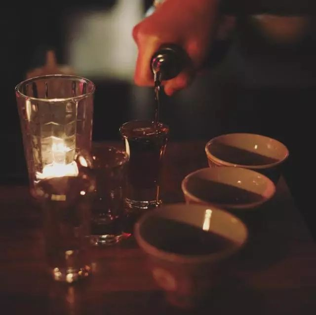 (原始链接: https://mmbiz.qpic.cn/mmbiz_jpg/XA8n2XaESnTKfJ5S4zVSlKsbiaDgjgdBlWS12qZnz3ib8m5gPFAiaJwjZcC5icSnjvfibcR3T0NCgGKca7Uaib2pBeiaA/640?wx_fmt=jpeg)
-  (原始链接: https://mmbiz.qpic.cn/mmbiz_png/XA8n2XaESnTKfJ5S4zVSlKsbiaDgjgdBlICWYo1uppvnHz5MCLskkQ8I5OXicpteNhnW5IRf9BocnoolcloeANtA/640?wx_fmt=png)
-  (原始链接: https://mmbiz.qpic.cn/mmbiz_png/XA8n2XaESnTKfJ5S4zVSlKsbiaDgjgdBlicD9nLKjCEsyTr4viadlUYPMmZ2YLEN2CNTRQ1cFDLYONbdxRuE5Kk2g/640?wx_fmt=png)
-  (原始链接: https://mmbiz.qpic.cn/mmbiz_png/XA8n2XaESnTKfJ5S4zVSlKsbiaDgjgdBle15DLI7jXDciaLMenlpXia59dA8vy5CQrn9ZQ9Y2eQeZ7ibiahmZ0WI5qg/640?wx_fmt=png)
- 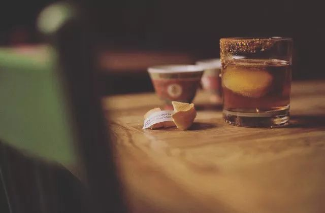 (原始链接: https://mmbiz.qpic.cn/mmbiz_jpg/XA8n2XaESnTKfJ5S4zVSlKsbiaDgjgdBlzC1HneicZCk8jVMVP2IP0yCf9mN5ibFWw1GurkO7BIIwoUopRYFBa9vQ/640?wx_fmt=jpeg)
- 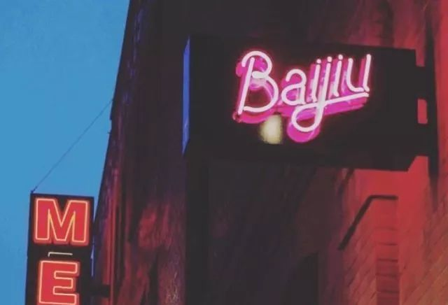 (原始链接: https://mmbiz.qpic.cn/mmbiz_jpg/XA8n2XaESnTKfJ5S4zVSlKsbiaDgjgdBl7BkTWDQjeCQECxibOnROiaHnIOOJkjb99giaZUibZuo54OcSzSdncS4eJA/640?wx_fmt=jpeg)
- 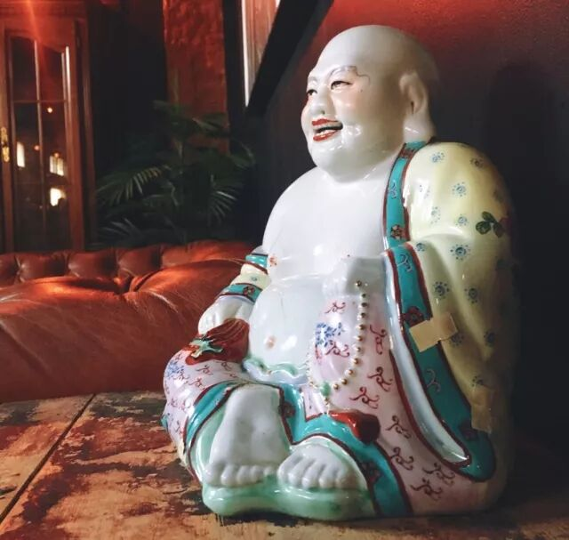 (原始链接: https://mmbiz.qpic.cn/mmbiz_jpg/XA8n2XaESnTKfJ5S4zVSlKsbiaDgjgdBlObhAiaiapXUcVyWtVE7vD2RPU79XDRuuOsNdib9SZbLEnxDJiahlyVHhUg/640?wx_fmt=jpeg)
- 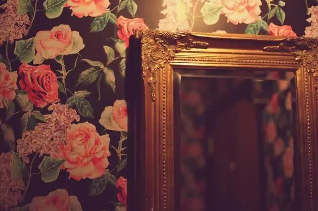 (原始链接: https://mmbiz.qpic.cn/mmbiz_jpg/XA8n2XaESnTKfJ5S4zVSlKsbiaDgjgdBl6icFLKzA06x6icre9tuxCJjuttv4Pj5IzPqAOSLP08Ps10Gn8icGicPbDA/640?wx_fmt=jpeg)
-  (原始链接: https://mmbiz.qpic.cn/mmbiz_png/XA8n2XaESnTKfJ5S4zVSlKsbiaDgjgdBlicD9nLKjCEsyTr4viadlUYPMmZ2YLEN2CNTRQ1cFDLYONbdxRuE5Kk2g/640?wx_fmt=png)
- 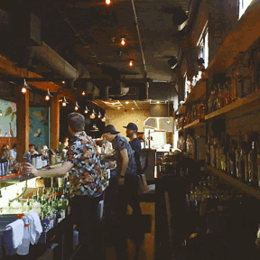 (原始链接: https://mmbiz.qpic.cn/mmbiz_gif/XA8n2XaESnTKfJ5S4zVSlKsbiaDgjgdBl8wrPYOaXRBdfuVE5Og9WcjRSkYjROZI6HeicsRGLcyEsYK8UUYnib3mA/640?wx_fmt=gif)
-  (原始链接: https://mmbiz.qpic.cn/mmbiz_jpg/XA8n2XaESnTKfJ5S4zVSlKsbiaDgjgdBlEib49QLC3Rw8C5XWfdj3qDGyVRIibRXeCX88DOv72w1m30dx0FDqyBtw/640?wx_fmt=jpeg)
- 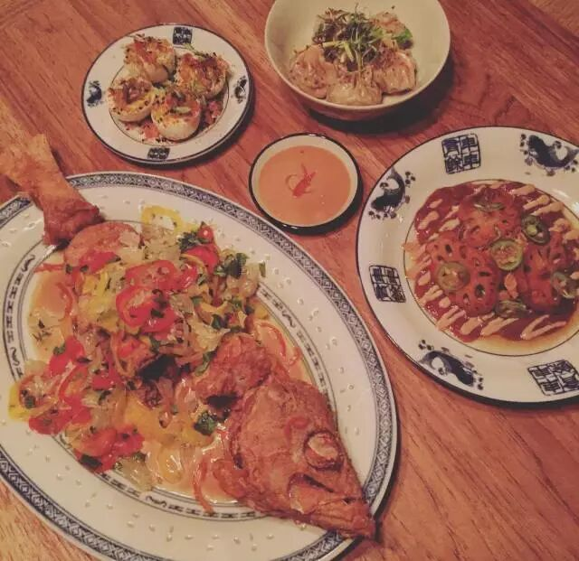 (原始链接: https://mmbiz.qpic.cn/mmbiz_jpg/XA8n2XaESnTKfJ5S4zVSlKsbiaDgjgdBlThqFLoBBNI16rUClBYXALjqywEiaaiaHCctL94NWDgGg4kkOGjHBNXUg/640?wx_fmt=jpeg)
- 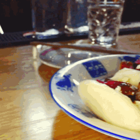 (原始链接: https://mmbiz.qpic.cn/mmbiz_gif/XA8n2XaESnTKfJ5S4zVSlKsbiaDgjgdBlrhWYc5IonmxACIbI1w6UFoicU7hlD3zkTtQia3ee82N1Sw8dP6GTWPjQ/640?wx_fmt=gif)
- 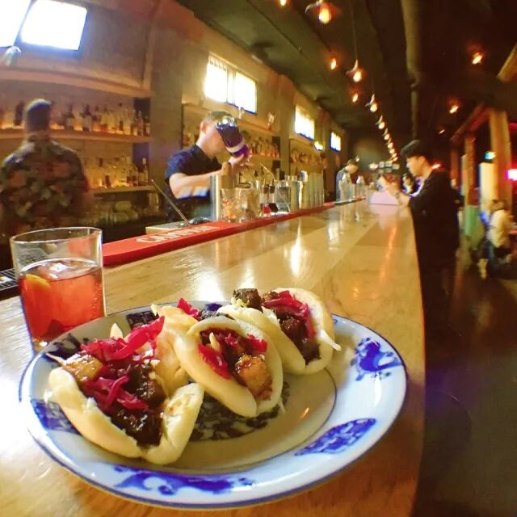 (原始链接: https://mmbiz.qpic.cn/mmbiz_jpg/XA8n2XaESnTKfJ5S4zVSlKsbiaDgjgdBlDa4GwJNq2geV9YuVd24D6B0coKibfjLcZpXPiauA1lFQq1ZGTIqZZ3cA/640?wx_fmt=jpeg)
- 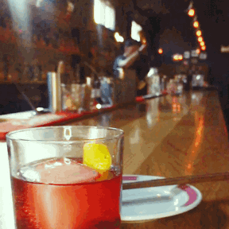 (原始链接: https://mmbiz.qpic.cn/mmbiz_gif/XA8n2XaESnTKfJ5S4zVSlKsbiaDgjgdBlS3IaTqKZytUfvxob51DicptRhTkpA7NZoml8b2icibzXxyFQPQ78p71wQ/640?wx_fmt=gif)
- 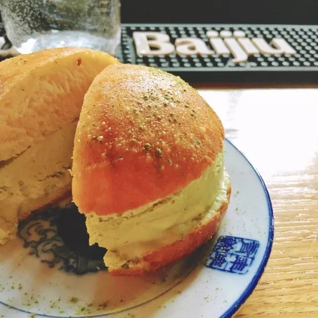 (原始链接: https://mmbiz.qpic.cn/mmbiz_jpg/XA8n2XaESnTKfJ5S4zVSlKsbiaDgjgdBlzXOS5R4JSteXCVjEh23J212pZyibQlWY9m6ppYseQYHIWyCuWIntMgw/640?wx_fmt=jpeg)
-  (原始链接: https://mmbiz.qpic.cn/mmbiz_png/XA8n2XaESnTKfJ5S4zVSlKsbiaDgjgdBlicD9nLKjCEsyTr4viadlUYPMmZ2YLEN2CNTRQ1cFDLYONbdxRuE5Kk2g/640?wx_fmt=png)
-  (原始链接: https://mmbiz.qpic.cn/mmbiz_gif/XA8n2XaESnTKfJ5S4zVSlKsbiaDgjgdBlFlp3fiaURk4HyRgbQ6zlDa8bBrY5soIvozKQaZfV1JpELgelZEQQPZw/640?wx_fmt=gif)
- 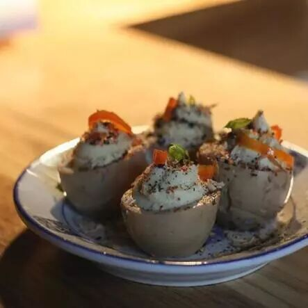 (原始链接: https://mmbiz.qpic.cn/mmbiz_jpg/XA8n2XaESnTKfJ5S4zVSlKsbiaDgjgdBlVs4gKOxj6s8lB8UJkLblZKAL96bUiaQVUE4WINO8bmhQDZ3DfccVH0Q/640?wx_fmt=jpeg)
- 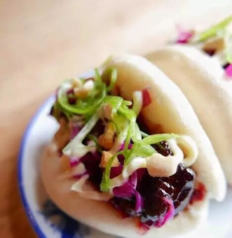 (原始链接: https://mmbiz.qpic.cn/mmbiz_jpg/XA8n2XaESnTKfJ5S4zVSlKsbiaDgjgdBln7eIzydwcKID5ES8ZiaJk1xLdZ9gOxm77QIbia4ey1d92lZibTibibWtdxQ/640?wx_fmt=jpeg)
- 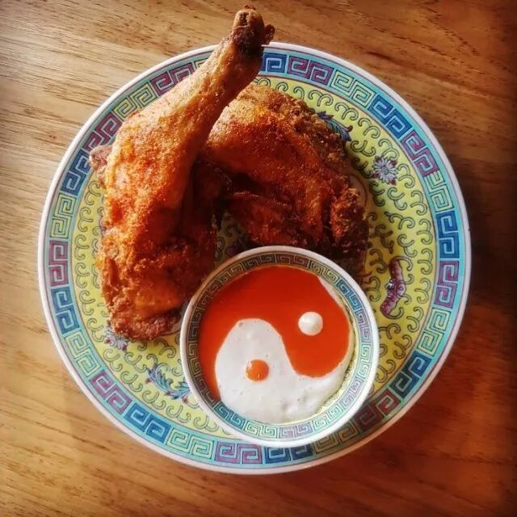 (原始链接: https://mmbiz.qpic.cn/mmbiz_jpg/XA8n2XaESnTKfJ5S4zVSlKsbiaDgjgdBl8bYtBVicJEX5FbG41ojBbJPHDSGVmlWGVMibpYuTyvia61UsxDlDHFW9Q/640?wx_fmt=jpeg)
- 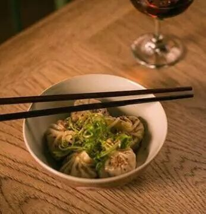 (原始链接: https://mmbiz.qpic.cn/mmbiz_jpg/XA8n2XaESnTKfJ5S4zVSlKsbiaDgjgdBlicEwlYbTSCZMTZHlh422lzibYmeFjBowfgaWtdQPxvsftExVuv2W4QFQ/640?wx_fmt=jpeg)
- 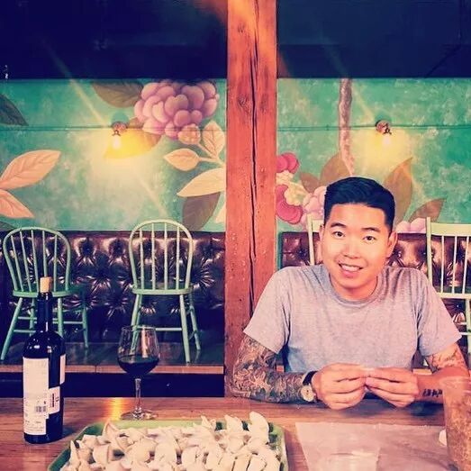 (原始链接: https://mmbiz.qpic.cn/mmbiz_jpg/XA8n2XaESnTKfJ5S4zVSlKsbiaDgjgdBlyA9aU7VficWBDrl4ia5JBlmhhiaaapXyiaugwJ5IyOUAPOQxZOzwv2lVicw/640?wx_fmt=jpeg)
- 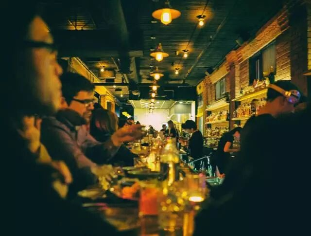 (原始链接: https://mmbiz.qpic.cn/mmbiz_jpg/XA8n2XaESnTKfJ5S4zVSlKsbiaDgjgdBlIt5smiaOz9dJW7icjEkPsGwkAEQk4JNNkXESGVW6haeibTo7ZTS3YHmxg/640?wx_fmt=jpeg)
- 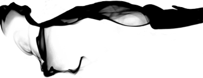 (原始链接: https://mmbiz.qpic.cn/mmbiz_png/XA8n2XaESnTKfJ5S4zVSlKsbiaDgjgdBlLP6glGTqvGyXogPnMACrYDEqHynTNGE44QvtKHzA5nGNcQFfMia74icA/640?wx_fmt=png)
-  (原始链接: https://mmbiz.qpic.cn/mmbiz_png/XA8n2XaESnTKfJ5S4zVSlKsbiaDgjgdBloVoRpMQ5Oh6HFicsu775CO4NG9R3Qfsy9UEMxezfyxBvtz9V6IslGPw/640?wx_fmt=png)
-  (原始链接: https://mmbiz.qpic.cn/mmbiz_gif/XA8n2XaESnTKfJ5S4zVSlKsbiaDgjgdBlQfyPvUJ2n6BOzcuPzws7FzIKnE1vMHn7nSXpsK3COW6yZsC6IOUogw/640?wx_fmt=gif)
-  (原始链接: https://mmbiz.qpic.cn/mmbiz_png/XA8n2XaESnTKfJ5S4zVSlKsbiaDgjgdBlicD9nLKjCEsyTr4viadlUYPMmZ2YLEN2CNTRQ1cFDLYONbdxRuE5Kk2g/640?wx_fmt=png)
-  (原始链接: https://mmbiz.qpic.cn/mmbiz_gif/XA8n2XaESnTKfJ5S4zVSlKsbiaDgjgdBlKEnxgdIxzYVUS7EHOmYM8hYhlfosezMmSiamAiarZpkHiajj1Gr4YlNNQ/640?wx_fmt=gif)
- 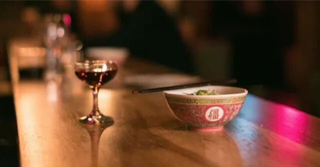 (原始链接: https://mmbiz.qpic.cn/mmbiz_jpg/XA8n2XaESnTKfJ5S4zVSlKsbiaDgjgdBlELeIOEZKS8spjMdJCGbXRibIRiaicU1K5nlhe0KChzNW5U7fdFRn8u45g/640?wx_fmt=jpeg)
-  (原始链接: https://mmbiz.qpic.cn/mmbiz_jpg/XA8n2XaESnTKfJ5S4zVSlKsbiaDgjgdBlIU4IibKqFcjVqJ7M7Ay7iczzytv6WkSIAUh8yxPNs0vKucVW36d9O4TA/640?wx_fmt=jpeg)
