# 无标题

**链接地址:** http://mp.weixin.qq.com/s?__biz=MzI0MDQ0ODI0Ng==&mid=2247485745&idx=1&sn=7c2e70c968e312ba246c54253a6055d0&chksm=e91beea8de6c67beb7fbdb07e0be4874dd617a3319350148604504503d2553da3c9ad0d1755b&mpshare=1&scene=2&srcid=0428BmmsOZRvJiFvWzcVfr4R#rd
**作者:** 食不大不小悦
**获取时间:** 2025/8/28 22:00:00
**图片数量:** 40

---

## 原始HTML内容

<section style="background-color: rgb(255, 255, 255);box-sizing: border-box;"><section class="Powered-by-XIUMI V5" style="box-sizing: border-box;" powered-by="xiumi.us"><section class="" style="text-align: center;box-sizing: border-box;"><section class="" style="display: inline-block;width: 98%;vertical-align: top;box-shadow: rgba(177, 160, 254, 0.39) 2.82843px 2.82843px 4px;border-color: rgba(169, 169, 169, 0.53);border-width: 4px;border-radius: 4px;border-style: outset;box-sizing: border-box;"><section class="Powered-by-XIUMI V5" style="box-sizing: border-box;" powered-by="xiumi.us"><section class="" style="box-sizing: border-box;"><section class="" style="display: inline-block;vertical-align: bottom;width: 33.33%;box-sizing: border-box;"><section class="Powered-by-XIUMI V5" style="box-sizing: border-box;" powered-by="xiumi.us"><section class="" style="margin-right: 0%;margin-left: 0%;box-sizing: border-box;"><section class="" style="max-width: 100%;vertical-align: middle;display: inline-block;overflow: hidden !important;box-sizing: border-box;"></section></section></section><section class="Powered-by-XIUMI V5" style="box-sizing: border-box;" powered-by="xiumi.us"><section class="" style="margin-right: 0%;margin-left: 0%;box-sizing: border-box;"><section class="" style="max-width: 100%;vertical-align: middle;display: inline-block;overflow: hidden !important;box-sizing: border-box;"></section></section></section></section><section class="" style="display: inline-block;vertical-align: bottom;width: 33.33%;box-sizing: border-box;"><section class="Powered-by-XIUMI V5" style="box-sizing: border-box;" powered-by="xiumi.us"><section class="" style="box-sizing: border-box;"><section class="" style="font-size: 12px;color: rgb(114, 113, 113);box-sizing: border-box;">
<strong style="box-sizing: border-box;">倾</strong><strong style="box-sizing: border-box;">诚</strong><strong style="letter-spacing: 0px;box-sizing: border-box;">为您服务！</strong> 
</section></section></section><section class="Powered-by-XIUMI V5" style="box-sizing: border-box;" powered-by="xiumi.us"><section class="" style="box-sizing: border-box;"><section class="" style="display: inline-block;width: 100%;vertical-align: top;overflow-x: auto;overflow-y: hidden;box-sizing: border-box;-webkit-overflow-scrolling: touch;"><section style="width: 300%;min-width: 100%;max-width: 300% !important;box-sizing: border-box;"><section class="Powered-by-XIUMI V5" style="display: inline-block;width: 33.3333%;vertical-align: top;box-sizing: border-box;" powered-by="xiumi.us"><section class="" style="text-align: right;margin-right: 0%;margin-left: 0%;box-sizing: border-box;"><section class="" style="max-width: 100%;vertical-align: middle;display: inline-block;overflow: hidden !important;box-sizing: border-box;"></section></section></section><section class="Powered-by-XIUMI V5" style="display: inline-block;width: 33.3333%;vertical-align: top;box-sizing: border-box;" powered-by="xiumi.us"><section class="" style="margin-right: 0%;margin-left: 0%;box-sizing: border-box;"><section class="" style="max-width: 100%;vertical-align: middle;display: inline-block;overflow: hidden !important;box-sizing: border-box;"></section></section></section><section class="Powered-by-XIUMI V5" style="display: inline-block;width: 33.3333%;vertical-align: top;box-sizing: border-box;" powered-by="xiumi.us"><section class="" style="text-align: left;margin-right: 0%;margin-left: 0%;box-sizing: border-box;"><section class="" style="max-width: 100%;vertical-align: middle;display: inline-block;overflow: hidden !important;box-sizing: border-box;"></section></section></section></section></section></section></section><section class="Powered-by-XIUMI V5" style="box-sizing: border-box;" powered-by="xiumi.us"><section class="" style="margin-right: 0%;margin-left: 0%;box-sizing: border-box;"><section class="" style="max-width: 100%;vertical-align: middle;display: inline-block;overflow: hidden !important;box-sizing: border-box;"></section></section></section></section><section class="" style="display: inline-block;vertical-align: bottom;width: 33.33%;box-sizing: border-box;"><section class="Powered-by-XIUMI V5" style="box-sizing: border-box;" powered-by="xiumi.us"><section class="" style="margin-right: 0%;margin-left: 0%;box-sizing: border-box;"><section class="" style="max-width: 100%;vertical-align: middle;display: inline-block;box-shadow: rgb(0, 0, 0) 0px 0px 0px;overflow: hidden !important;box-sizing: border-box;"></section></section></section><section class="Powered-by-XIUMI V5" style="box-sizing: border-box;" powered-by="xiumi.us"><section class="" style="margin-right: 0%;margin-left: 0%;box-sizing: border-box;"><section class="" style="max-width: 100%;vertical-align: middle;display: inline-block;width: 80%;overflow: hidden !important;box-sizing: border-box;"></section></section></section><section class="Powered-by-XIUMI V5" style="box-sizing: border-box;" powered-by="xiumi.us"><section class="" style="margin-right: 0%;margin-left: 0%;box-sizing: border-box;"><section class="" style="display: inline-block;border-width: 2px;border-style: solid;border-color: rgba(0, 0, 0, 0);padding: 0.1em 0.3em;color: rgb(62, 62, 62);line-height: 1.5;letter-spacing: 0px;font-size: 10px;box-sizing: border-box;">
长按二维码

获得更多资讯
</section></section></section></section></section></section></section></section></section><section class="Powered-by-XIUMI V5" style="box-sizing: border-box;" powered-by="xiumi.us"><section class="" style="margin-top: 10px;margin-bottom: 10px;box-sizing: border-box;"><section class="" style="padding-top: 2px;padding-bottom: 2px;box-sizing: border-box;"><section style="height: 4px;transform: rotate(0deg);-webkit-transform: rotate(0deg);-moz-transform: rotate(0deg);-o-transform: rotate(0deg);float: left;margin-top: -3px;background-color: rgb(254, 255, 255);box-sizing: border-box;"><section style="width: 4px;height: 4px;border-radius: 100%;float: left;background-color: rgba(227, 170, 78, 0.94);box-sizing: border-box;"></section><section style="width: 4px;height: 4px;border-radius: 100%;margin-left: 0.5em;float: left;background-color: rgba(227, 170, 78, 0.94);box-sizing: border-box;"></section><section style="width: 4px;height: 4px;border-radius: 100%;margin-left: 0.5em;float: left;background-color: rgba(227, 170, 78, 0.94);box-sizing: border-box;"></section><section style="width: 4px;height: 4px;border-radius: 100%;margin-left: 0.5em;float: left;background-color: rgba(227, 170, 78, 0.94);box-sizing: border-box;"></section><section style="width: 4px;height: 4px;border-radius: 100%;margin-left: 0.5em;float: left;background-color: rgba(227, 170, 78, 0.94);box-sizing: border-box;"></section></section><section style="border-top: 1px solid rgba(227, 170, 78, 0.94);margin-top: -2px;border-right-color: rgba(227, 170, 78, 0.94);border-bottom-color: rgba(227, 170, 78, 0.94);border-left-color: rgba(227, 170, 78, 0.94);box-sizing: border-box;"></section><section class="" style="width: 100%;padding: 10px;box-sizing: border-box;"><section class="Powered-by-XIUMI V5" style="box-sizing: border-box;" powered-by="xiumi.us"><section class="" style="box-sizing: border-box;"><section class="" style="text-align: center;letter-spacing: 2px;line-height: 1;box-sizing: border-box;">
<strong style="box-sizing: border-box;">置顶广告专区</strong> 

<strong style="box-sizing: border-box;">金主大大的广告不仅可以看，还可以“玩”。</strong>

<strong style="box-sizing: border-box;">滑动箭头解锁更多信息哦~</strong>
</section></section></section></section><section style="width: 100%;text-align: right;box-sizing: border-box;"><section style="height: 4px;margin-top: -2px;float: right;transform: rotate(0deg);-webkit-transform: rotate(0deg);-moz-transform: rotate(0deg);-o-transform: rotate(0deg);background-color: rgb(254, 255, 255);box-sizing: border-box;"><section style="width: 4px;height: 4px;border-radius: 100%;float: left;background-color: rgba(227, 170, 78, 0.94);box-sizing: border-box;"></section><section style="width: 4px;height: 4px;border-radius: 100%;margin-left: 0.5em;float: left;background-color: rgba(227, 170, 78, 0.94);box-sizing: border-box;"></section><section style="width: 4px;height: 4px;border-radius: 100%;margin-left: 0.5em;float: left;background-color: rgba(227, 170, 78, 0.94);box-sizing: border-box;"></section><section style="width: 4px;height: 4px;border-radius: 100%;margin-left: 0.5em;float: left;background-color: rgba(227, 170, 78, 0.94);box-sizing: border-box;"></section><section style="width: 4px;height: 4px;border-radius: 100%;margin-left: 0.5em;float: left;background-color: rgba(227, 170, 78, 0.94);box-sizing: border-box;"></section></section><section style="clear: both;box-sizing: border-box;"></section><section style="border-top: 1px solid rgba(227, 170, 78, 0.94);margin-top: -2px;margin-bottom: 2px;border-right-color: rgba(227, 170, 78, 0.94);border-bottom-color: rgba(227, 170, 78, 0.94);border-left-color: rgba(227, 170, 78, 0.94);box-sizing: border-box;"></section></section></section></section></section><section class="Powered-by-XIUMI V5" style="box-sizing: border-box;" powered-by="xiumi.us"><section class="" style="box-sizing: border-box;"><section class="" style="box-sizing: border-box;">
 
</section></section></section><section class="Powered-by-XIUMI V5" style="box-sizing: border-box;" powered-by="xiumi.us"><section class="" style="margin-top: 0.5em;margin-bottom: 0.5em;box-sizing: border-box;"><section class="" style="display: inline-block;vertical-align: top;width: 80%;text-align: right;padding-right: 10px;padding-left: 10px;box-sizing: border-box;"><section class="Powered-by-XIUMI V5" style="box-sizing: border-box;" powered-by="xiumi.us"><section class="" style="box-sizing: border-box;"><section class="" style="font-size: 14px;box-sizing: border-box;">
食悦
</section></section></section><section class="Powered-by-XIUMI V5" style="box-sizing: border-box;" powered-by="xiumi.us"><section class="" style="box-sizing: border-box;"><section class="" style="display: inline-block;vertical-align: middle;background-color: rgb(80, 210, 213);padding: 8px;border-radius: 0.5em;max-width: 90% !important;box-sizing: border-box;"><section class="Powered-by-XIUMI V5" style="box-sizing: border-box;" powered-by="xiumi.us"><section class="" style="box-sizing: border-box;"><section class="" style="text-align: left;color: rgb(255, 255, 255);font-size: 14px;box-sizing: border-box;">
完了，这周的五的推文找不到话题了。想得我脑袋都要秃顶了。
</section></section></section></section><section class="" style="width: 0px;border-left: 10px solid rgb(80, 210, 213);display: inline-block;margin-top: 1em;vertical-align: top;border-top: 6px solid transparent !important;border-bottom: 6px solid transparent !important;box-sizing: border-box;"></section></section></section></section><section class="" style="display: inline-block;vertical-align: top;width: 20%;box-sizing: border-box;"><section class="Powered-by-XIUMI V5" style="box-sizing: border-box;" powered-by="xiumi.us"><section class="" style="font-size: 19px;text-align: center;box-sizing: border-box;"><section class="" style="box-sizing: border-box;margin: auto;width: 3em;height: 3em;vertical-align: top;background-position: 55.5546% 38.8882%;background-repeat: no-repeat;background-size: 131.035%;display: inline-block;background-image: url(&quot;https://mmbiz.qpic.cn/mmbiz_png/XA8n2XaESnRb29ibNXMVEUZJckfg0ReFLJcUjLMic2K7ia7sXfRgHycdQ0KT1epvKYj76R5H403qWdtA06Sy6EF0Q/640?wx_fmt=png&quot;);"><section class="" style="width: 100%;height: 100%;overflow: hidden;box-sizing: border-box;"></section></section></section></section></section></section></section><section class="Powered-by-XIUMI V5" style="box-sizing: border-box;" powered-by="xiumi.us"><section class="" style="margin-top: 0.5em;margin-bottom: 0.5em;box-sizing: border-box;"><section class="" style="display: inline-block;vertical-align: top;width: 20%;box-sizing: border-box;"><section class="Powered-by-XIUMI V5" style="box-sizing: border-box;" powered-by="xiumi.us"><section class="" style="font-size: 19px;text-align: center;box-sizing: border-box;"><section class="" style="box-sizing: border-box;margin: auto;width: 3em;height: 3em;vertical-align: top;background-position: 96.3402% 0%;background-repeat: no-repeat;background-size: 148.368%;display: inline-block;background-image: url(&quot;https://mmbiz.qpic.cn/mmbiz_jpg/XA8n2XaESnRb29ibNXMVEUZJckfg0ReFLiaIksAL911GbhDxka3mGOkoIXjE4kMiavxUxW8I9VfK6njDDCeNdqXlQ/640?wx_fmt=jpeg&quot;);"><section class="" style="width: 100%;height: 100%;overflow: hidden;box-sizing: border-box;"></section></section></section></section></section><section class="" style="display: inline-block;vertical-align: top;width: 80%;padding-right: 10px;padding-left: 10px;box-sizing: border-box;"><section class="Powered-by-XIUMI V5" style="box-sizing: border-box;" powered-by="xiumi.us"><section class="" style="box-sizing: border-box;"><section class="" style="font-size: 14px;box-sizing: border-box;">
老大
</section></section></section><section class="Powered-by-XIUMI V5" style="box-sizing: border-box;" powered-by="xiumi.us"><section class="" style="box-sizing: border-box;"><section class="" style="width: 0px;border-right: 10px solid rgb(80, 210, 213);display: inline-block;margin-top: 1em;vertical-align: top;border-top: 6px solid transparent !important;border-bottom: 6px solid transparent !important;box-sizing: border-box;"></section><section class="" style="display: inline-block;vertical-align: middle;background-color: rgb(80, 210, 213);padding: 8px;border-radius: 0.5em;max-width: 90% !important;box-sizing: border-box;"><section class="Powered-by-XIUMI V5" style="box-sizing: border-box;" powered-by="xiumi.us"><section class="" style="box-sizing: border-box;"><section class="" style="color: rgb(255, 255, 255);font-size: 14px;box-sizing: border-box;">
随便找个Opentable加拿大Top100餐厅写写呗。
</section></section></section></section></section></section></section></section></section><section class="Powered-by-XIUMI V5" style="box-sizing: border-box;" powered-by="xiumi.us"><section class="" style="margin-top: 0.5em;margin-bottom: 0.5em;box-sizing: border-box;"><section class="" style="display: inline-block;vertical-align: top;width: 80%;text-align: right;padding-right: 10px;padding-left: 10px;box-sizing: border-box;"><section class="Powered-by-XIUMI V5" style="box-sizing: border-box;" powered-by="xiumi.us"><section class="" style="box-sizing: border-box;"><section class="" style="font-size: 14px;box-sizing: border-box;">
食悦
</section></section></section><section class="Powered-by-XIUMI V5" style="box-sizing: border-box;" powered-by="xiumi.us"><section class="" style="box-sizing: border-box;"><section class="" style="display: inline-block;vertical-align: middle;background-color: rgb(80, 210, 213);padding: 8px;border-radius: 0.5em;max-width: 90% !important;box-sizing: border-box;"><section class="Powered-by-XIUMI V5" style="box-sizing: border-box;" powered-by="xiumi.us"><section class="" style="box-sizing: border-box;"><section class="" style="text-align: left;color: rgb(255, 255, 255);font-size: 14px;box-sizing: border-box;">
写来写去就那几个，我不腻，观众都看腻了。
</section></section></section></section><section class="" style="width: 0px;border-left: 10px solid rgb(80, 210, 213);display: inline-block;margin-top: 1em;vertical-align: top;border-top: 6px solid transparent !important;border-bottom: 6px solid transparent !important;box-sizing: border-box;"></section></section></section></section><section class="" style="display: inline-block;vertical-align: top;width: 20%;box-sizing: border-box;"><section class="Powered-by-XIUMI V5" style="box-sizing: border-box;" powered-by="xiumi.us"><section class="" style="font-size: 19px;text-align: center;box-sizing: border-box;"><section class="" style="box-sizing: border-box;margin: auto;width: 3em;height: 3em;vertical-align: top;background-position: 55.5546% 38.8882%;background-repeat: no-repeat;background-size: 131.035%;display: inline-block;background-image: url(&quot;https://mmbiz.qpic.cn/mmbiz_png/XA8n2XaESnRb29ibNXMVEUZJckfg0ReFLJcUjLMic2K7ia7sXfRgHycdQ0KT1epvKYj76R5H403qWdtA06Sy6EF0Q/640?wx_fmt=png&quot;);"><section class="" style="width: 100%;height: 100%;overflow: hidden;box-sizing: border-box;"></section></section></section></section></section></section></section><section class="Powered-by-XIUMI V5" style="box-sizing: border-box;" powered-by="xiumi.us"><section class="" style="margin-top: 0.5em;margin-bottom: 0.5em;box-sizing: border-box;"><section class="" style="display: inline-block;vertical-align: top;width: 20%;box-sizing: border-box;"><section class="Powered-by-XIUMI V5" style="box-sizing: border-box;" powered-by="xiumi.us"><section class="" style="font-size: 19px;text-align: center;box-sizing: border-box;"><section class="" style="box-sizing: border-box;margin: auto;width: 3em;height: 3em;vertical-align: top;background-position: 96.3402% 0%;background-repeat: no-repeat;background-size: 148.368%;display: inline-block;background-image: url(&quot;https://mmbiz.qpic.cn/mmbiz_jpg/XA8n2XaESnRb29ibNXMVEUZJckfg0ReFLiaIksAL911GbhDxka3mGOkoIXjE4kMiavxUxW8I9VfK6njDDCeNdqXlQ/640?wx_fmt=jpeg&quot;);"><section class="" style="width: 100%;height: 100%;overflow: hidden;box-sizing: border-box;"></section></section></section></section></section><section class="" style="display: inline-block;vertical-align: top;width: 80%;padding-right: 10px;padding-left: 10px;box-sizing: border-box;"><section class="Powered-by-XIUMI V5" style="box-sizing: border-box;" powered-by="xiumi.us"><section class="" style="box-sizing: border-box;"><section class="" style="font-size: 14px;box-sizing: border-box;">
老大
</section></section></section><section class="Powered-by-XIUMI V5" style="box-sizing: border-box;" powered-by="xiumi.us"><section class="" style="box-sizing: border-box;"><section class="" style="width: 0px;border-right: 10px solid rgb(80, 210, 213);display: inline-block;margin-top: 1em;vertical-align: top;border-top: 6px solid transparent !important;border-bottom: 6px solid transparent !important;box-sizing: border-box;"></section><section class="" style="display: inline-block;vertical-align: middle;background-color: rgb(80, 210, 213);padding: 8px;border-radius: 0.5em;max-width: 90% !important;box-sizing: border-box;"><section class="Powered-by-XIUMI V5" style="box-sizing: border-box;" powered-by="xiumi.us"><section class="" style="box-sizing: border-box;"><section class="" style="color: rgb(255, 255, 255);font-size: 14px;box-sizing: border-box;">
嗯？我怎么听说里面有个大家都没吃过的“奇葩”呢？
</section></section></section></section></section></section></section></section></section><section class="Powered-by-XIUMI V5" style="box-sizing: border-box;" powered-by="xiumi.us"><section class="" style="margin: 10px 0%;box-sizing: border-box;"><section class="" style="display: inline-block;width: 100%;vertical-align: top;background-color: rgb(238, 234, 242);padding-right: 3px;padding-left: 3px;box-sizing: border-box;"><section class="Powered-by-XIUMI V5" style="box-sizing: border-box;" powered-by="xiumi.us"><section class="" style="box-sizing: border-box;"><section class="" style="display: inline-block;vertical-align: top;width: 10%;padding-right: 3px;padding-left: 3px;box-sizing: border-box;"><section class="Powered-by-XIUMI V5" style="box-sizing: border-box;" powered-by="xiumi.us"><section class="" style="text-align: center;margin: 13px 0% 10px;box-sizing: border-box;"><section class="" style="max-width: 100%;vertical-align: middle;display: inline-block;overflow: hidden !important;box-sizing: border-box;"></section></section></section></section><section class="" style="display: inline-block;vertical-align: top;width: 70%;padding-right: 5px;padding-left: 5px;box-sizing: border-box;"><section class="Powered-by-XIUMI V5" style="box-sizing: border-box;" powered-by="xiumi.us"><section class="" style="margin-top: 10px;margin-bottom: 10px;box-sizing: border-box;"><section class="" style="display: inline-block;width: 100%;border-width: 1px;border-style: solid;border-color: rgb(255, 255, 255);padding: 5px 10px;background-color: rgb(255, 255, 255);box-shadow: rgb(170, 170, 170) 0px 0px 5px;border-radius: 0.6em;box-sizing: border-box;"><section class="Powered-by-XIUMI V5" style="box-sizing: border-box;" powered-by="xiumi.us"><section class="" style="box-sizing: border-box;"><section class="" style="color: rgb(51, 51, 51);font-size: 14px;box-sizing: border-box;">
哈？叫啥？我赶紧去搜搜！
</section></section></section></section></section></section></section><section class="" style="display: inline-block;vertical-align: top;width: 20%;box-sizing: border-box;"><section class="Powered-by-XIUMI V5" style="box-sizing: border-box;" powered-by="xiumi.us"><section class="" style="margin-top: 3px;margin-right: 0%;margin-left: 0%;box-sizing: border-box;"><section class="" style="display: inline-block;vertical-align: top;width: 50%;padding-right: 3px;padding-left: 3px;box-sizing: border-box;"><section class="Powered-by-XIUMI V5" style="box-sizing: border-box;" powered-by="xiumi.us"><section class="" style="text-align: center;margin-top: 10px;margin-bottom: 10px;box-sizing: border-box;"><section class="" style="max-width: 100%;vertical-align: middle;display: inline-block;overflow: hidden !important;box-sizing: border-box;"></section></section></section></section><section class="" style="display: inline-block;vertical-align: top;width: 50%;padding-right: 3px;padding-left: 3px;box-sizing: border-box;"><section class="Powered-by-XIUMI V5" style="box-sizing: border-box;" powered-by="xiumi.us"><section class="" style="text-align: center;margin-top: 10px;margin-bottom: 10px;box-sizing: border-box;"><section class="" style="max-width: 100%;vertical-align: middle;display: inline-block;overflow: hidden !important;box-sizing: border-box;"></section></section></section></section></section></section></section></section></section></section></section></section><section class="Powered-by-XIUMI V5" style="box-sizing: border-box;" powered-by="xiumi.us"><section class="" style="box-sizing: border-box;"><section class="" style="box-sizing: border-box;">
 
</section></section></section><section class="Powered-by-XIUMI V5" style="box-sizing: border-box;" powered-by="xiumi.us"><section class="" style="margin: 10px 0%;box-sizing: border-box;"><section class="" style="text-align: justify;font-size: 14px;color: rgb(173, 158, 159);line-height: 1.9;letter-spacing: 1px;padding-right: 20px;padding-left: 20px;box-sizing: border-box;">
食小悦满怀好奇地打开了Opentable这个世界性权威定桌+食评网站，搜索了<strong style="box-sizing: border-box;">加拿大2017年的Top100榜单</strong>在埃德蒙顿地区的入选餐厅，发现里面果然有一家没有去过听起来很是陌生。
</section></section></section><section class="Powered-by-XIUMI V5" style="box-sizing: border-box;" powered-by="xiumi.us"><section class="" style="box-sizing: border-box;"><section class="" style="box-sizing: border-box;">
 
</section></section></section><section class="Powered-by-XIUMI V5" style="box-sizing: border-box;" powered-by="xiumi.us"><section class="" style="text-align: center;margin-top: 10px;margin-bottom: 10px;box-sizing: border-box;"><section class="" style="max-width: 100%;vertical-align: middle;display: inline-block;overflow: hidden !important;box-sizing: border-box;"></section></section></section><section class="Powered-by-XIUMI V5" style="box-sizing: border-box;" powered-by="xiumi.us"><section class="" style="box-sizing: border-box;"><section class="" style="box-sizing: border-box;">
 
</section></section></section><section class="Powered-by-XIUMI V5" style="box-sizing: border-box;" powered-by="xiumi.us"><section class="" style="margin: 10px 0%;box-sizing: border-box;"><section class="" style="text-align: justify;font-size: 14px;color: rgb(173, 158, 159);line-height: 1.9;letter-spacing: 1px;padding-right: 20px;padding-left: 20px;box-sizing: border-box;">
不过名字陌生咱不怕，咱认得后面那四个字母啊！<strong style="box-sizing: border-box;">NAIT</strong>！这不是咱赫赫有名的北阿尔伯塔理工学院吗？怎么学校食堂也能入选加拿大Top100餐厅的榜单了？这个门槛是不是也有点太低了？都是实力认证实在消费过的美食家不存在刷分的嫌疑。难道是我今天打开网页的姿势有误吗？
</section></section></section><section class="Powered-by-XIUMI V5" style="box-sizing: border-box;" powered-by="xiumi.us"><section class="" style="box-sizing: border-box;"><section class="" style="box-sizing: border-box;">
 
</section></section></section><section class="Powered-by-XIUMI V5" style="box-sizing: border-box;" powered-by="xiumi.us"><section class="" style="text-align: center;margin-top: 10px;margin-bottom: 10px;box-sizing: border-box;"><section class="" style="max-width: 100%;vertical-align: middle;display: inline-block;overflow: hidden !important;box-sizing: border-box;"></section></section></section><section class="Powered-by-XIUMI V5" style="box-sizing: border-box;" powered-by="xiumi.us"><section class="" style="box-sizing: border-box;"><section class="" style="box-sizing: border-box;">
 
</section></section></section><section class="Powered-by-XIUMI V5" style="box-sizing: border-box;" powered-by="xiumi.us"><section class="" style="margin: 10px 0%;box-sizing: border-box;"><section class="" style="text-align: justify;font-size: 14px;color: rgb(173, 158, 159);line-height: 1.9;letter-spacing: 1px;padding-right: 20px;padding-left: 20px;box-sizing: border-box;">
简单地扫了一遍简介，原来这个食堂是“真·实验料理”啊！不过实验对象不是食材料理本身，而是各位食客啊！因为你们品尝的不是专业厨师的作品，而是这些还没毕业学生的“<strong style="box-sizing: border-box;">In-Class Assignment</strong>”啊！！！
</section></section></section><section class="Powered-by-XIUMI V5" style="box-sizing: border-box;" powered-by="xiumi.us"><section class="" style="box-sizing: border-box;"><section class="" style="box-sizing: border-box;">
 
</section></section></section><section class="Powered-by-XIUMI V5" style="box-sizing: border-box;" powered-by="xiumi.us"><section class="" style="text-align: center;margin-top: 10px;margin-bottom: 10px;box-sizing: border-box;"><section class="" style="max-width: 100%;vertical-align: middle;display: inline-block;overflow: hidden !important;box-sizing: border-box;"></section></section></section><section class="Powered-by-XIUMI V5" style="box-sizing: border-box;" powered-by="xiumi.us"><section class="" style="box-sizing: border-box;"><section class="" style="box-sizing: border-box;">
 
</section></section></section><section class="Powered-by-XIUMI V5" style="box-sizing: border-box;" powered-by="xiumi.us"><section class="" style="margin: 10px 0%;box-sizing: border-box;"><section class="" style="text-align: justify;font-size: 14px;color: rgb(173, 158, 159);line-height: 1.9;letter-spacing: 1px;padding-right: 20px;padding-left: 20px;box-sizing: border-box;">
看《食戟之灵》的时候，各位童鞋有没有羡慕那些美食家坐在评委席上点评着远月学院学生创意十足的料理作品呢？不要犹豫！来NAIT的Ernest's满足你的戏瘾吧！
</section></section></section><section class="Powered-by-XIUMI V5" style="box-sizing: border-box;" powered-by="xiumi.us"><section class="" style="box-sizing: border-box;"><section class="" style="box-sizing: border-box;">
 
</section></section></section><section class="Powered-by-XIUMI V5" style="box-sizing: border-box;" powered-by="xiumi.us"><section class="" style="text-align: center;margin-top: 10px;margin-bottom: 10px;box-sizing: border-box;"><section class="" style="max-width: 100%;vertical-align: middle;display: inline-block;overflow: hidden !important;box-sizing: border-box;"></section></section></section><section class="Powered-by-XIUMI V5" style="box-sizing: border-box;" powered-by="xiumi.us"><section class="" style="box-sizing: border-box;"><section class="" style="box-sizing: border-box;">
 
</section></section></section><section class="Powered-by-XIUMI V5" style="box-sizing: border-box;" powered-by="xiumi.us"><section class="" style="margin: 10px 0%;box-sizing: border-box;"><section class="" style="text-align: justify;font-size: 14px;color: rgb(173, 158, 159);line-height: 1.9;letter-spacing: 1px;padding-right: 20px;padding-left: 20px;box-sizing: border-box;">
看我左手右手一个慢动作，速度定位一套带走。嗯？怎么订不上？我想吃饭的时间咋都没座位？食悦还没给他们发推文就已经火成这样了吗？上google查了一下营业时间。来，你们来感受一下它的<strong style="box-sizing: border-box;">魔性</strong>。

 

每个餐期就<strong style="box-sizing: border-box;">营业一个小时</strong>😃。

拜托，一个小时我饭都吃不完好吗？

 

<strong style="box-sizing: border-box;">周末还休息</strong>😃。

真想抓着老板的领子咆哮：“喂！你到底有没有认真在做生意啊！”
</section></section></section><section class="Powered-by-XIUMI V5" style="box-sizing: border-box;" powered-by="xiumi.us"><section class="" style="box-sizing: border-box;"><section class="" style="box-sizing: border-box;">
 
</section></section></section><section class="Powered-by-XIUMI V5" style="box-sizing: border-box;" powered-by="xiumi.us"><section class="" style="margin-top: 0.5em;margin-bottom: 0.5em;text-align: center;box-sizing: border-box;"><section class="" style="border-width: 1px;border-style: solid;border-color: rgb(204, 204, 204);box-shadow: rgb(204, 204, 204) 1px 1px 5px;display: inline-block;width: 100%;box-sizing: border-box;"><section class="" style="max-width: 100%;display: inline-block;overflow: hidden !important;box-sizing: border-box;"></section><section style="width: 100%;height: 1em;margin-top: -0.92em;box-sizing: border-box;"><section style="width: 45%;height: 1em;display: inline-block;vertical-align: top;background-color: rgb(254, 255, 255);box-sizing: border-box;"></section><section style="width: 0px;margin: auto;display: inline-block;vertical-align: top;border-left: 0.8em solid rgb(255, 255, 255);border-right: 0.8em solid rgb(255, 255, 255);border-bottom: 0.8em solid white;border-top: 0.55em solid transparent !important;box-sizing: border-box;"></section><section style="width: 45%;height: 1em;display: inline-block;vertical-align: top;background-color: rgb(254, 255, 255);box-sizing: border-box;"></section></section><section style="width: 100%;margin-top: -1em;box-sizing: border-box;"><section style="width: 10%;height: 1em;display: inline-block;vertical-align: top;background-color: rgb(254, 255, 255);box-sizing: border-box;"></section><section style="width: 10%;height: 1em;margin-left: 80%;display: inline-block;vertical-align: top;background-color: rgb(254, 255, 255);box-sizing: border-box;"></section></section><section class="" style="margin-top: -0.6em;padding: 10px;box-sizing: border-box;"><section class="Powered-by-XIUMI V5" style="box-sizing: border-box;" powered-by="xiumi.us"><section class="" style="box-sizing: border-box;"><section class="" style="font-size: 14px;text-align: left;color: rgb(173, 158, 159);box-sizing: border-box;">
你们搜寻到隐藏在人群中的幸平，阿尔迪尼，一色慧了吗？这些优秀的学子说不定会成为未来的米其林三星大厨哦！图片来源：NAIT官网
</section></section></section></section></section></section></section><section class="Powered-by-XIUMI V5" style="box-sizing: border-box;" powered-by="xiumi.us"><section class="" style="box-sizing: border-box;"><section class="" style="box-sizing: border-box;">
 
</section></section></section><section class="Powered-by-XIUMI V5" style="box-sizing: border-box;" powered-by="xiumi.us"><section class="" style="margin: 10px 0%;box-sizing: border-box;"><section class="" style="text-align: justify;font-size: 14px;color: rgb(173, 158, 159);line-height: 1.9;letter-spacing: 1px;padding-right: 20px;padding-left: 20px;box-sizing: border-box;">
不过也不难理解，毕竟在这家店“工作”的都是学生嘛！无论是负责烹调菜肴的<strong style="box-sizing: border-box;">厨师学生</strong>，还是志愿提供服务的来自<strong style="box-sizing: border-box;">酒店管理专业的学生</strong>，周末不上课自然餐厅就不营业啦！夏天餐厅还会任性地放好久暑假呢！
</section></section></section><section class="Powered-by-XIUMI V5" style="box-sizing: border-box;" powered-by="xiumi.us"><section class="" style="box-sizing: border-box;"><section class="" style="box-sizing: border-box;">
 
</section></section></section><section class="Powered-by-XIUMI V5" style="box-sizing: border-box;" powered-by="xiumi.us"><section class="" style="margin-top: 0.5em;margin-bottom: 0.5em;text-align: center;box-sizing: border-box;"><section class="" style="border-width: 1px;border-style: solid;border-color: rgb(204, 204, 204);box-shadow: rgb(204, 204, 204) 1px 1px 5px;display: inline-block;width: 100%;box-sizing: border-box;"><section class="" style="max-width: 100%;display: inline-block;overflow: hidden !important;box-sizing: border-box;"></section><section style="width: 100%;height: 1em;margin-top: -0.92em;box-sizing: border-box;"><section style="width: 45%;height: 1em;display: inline-block;vertical-align: top;background-color: rgb(254, 255, 255);box-sizing: border-box;"></section><section style="width: 0px;margin: auto;display: inline-block;vertical-align: top;border-left: 0.8em solid rgb(255, 255, 255);border-right: 0.8em solid rgb(255, 255, 255);border-bottom: 0.8em solid white;border-top: 0.55em solid transparent !important;box-sizing: border-box;"></section><section style="width: 45%;height: 1em;display: inline-block;vertical-align: top;background-color: rgb(254, 255, 255);box-sizing: border-box;"></section></section><section style="width: 100%;margin-top: -1em;box-sizing: border-box;"><section style="width: 10%;height: 1em;display: inline-block;vertical-align: top;background-color: rgb(254, 255, 255);box-sizing: border-box;"></section><section style="width: 10%;height: 1em;margin-left: 80%;display: inline-block;vertical-align: top;background-color: rgb(254, 255, 255);box-sizing: border-box;"></section></section><section class="" style="margin-top: -0.6em;padding: 10px;box-sizing: border-box;"><section class="Powered-by-XIUMI V5" style="box-sizing: border-box;" powered-by="xiumi.us"><section class="" style="box-sizing: border-box;"><section class="" style="text-align: left;font-size: 14px;color: rgb(173, 158, 159);box-sizing: border-box;">
将课堂搬到餐厅实地演练，这种模式既能锻炼学生的业务能力，又能给学校增加一部分经济收入，还能为学校的学生和教职员工提供一个不错的餐饮场所。真是一举三得啊！图片来源：Licia Dantas from Ernest's Google Homepage
</section></section></section></section></section></section></section><section class="Powered-by-XIUMI V5" style="box-sizing: border-box;" powered-by="xiumi.us"><section class="" style="box-sizing: border-box;"><section class="" style="box-sizing: border-box;">
 
</section></section></section><section class="Powered-by-XIUMI V5" style="box-sizing: border-box;" powered-by="xiumi.us"><section class="" style="margin: 10px 0%;box-sizing: border-box;"><section class="" style="text-align: justify;font-size: 14px;color: rgb(173, 158, 159);line-height: 1.9;letter-spacing: 1px;padding-right: 20px;padding-left: 20px;box-sizing: border-box;">
虽说这家餐厅排进Top100的榜单只是近些年的事情，但自1963年NAIT初建立厨艺和食品学专业的时候就存在了。2003年赞助商John Hokanson筹集300多万刀的基金，在2005年重新修缮了这个部门后以其在餐饮行业工作了45年的父亲的名字冠名。

 

这里给大家插播一则关于他父亲的励志故事，这位阿省颇有影响力的餐饮业大佬在15岁时就辍学开始打工。他的第一份工作是在麦当劳大酒店（就是你们喝下午茶拍照的那里）洗锅。所以梦想还是要有的，搞不好热爱美食的各位吃货哪天真像这位老爷子的后人一样建立起自己的“远月学院”呢？
</section></section></section><section class="Powered-by-XIUMI V5" style="box-sizing: border-box;" powered-by="xiumi.us"><section class="" style="box-sizing: border-box;"><section class="" style="box-sizing: border-box;">
 
</section></section></section><section class="Powered-by-XIUMI V5" style="box-sizing: border-box;" powered-by="xiumi.us"><section class="" style="margin-top: 10px;margin-bottom: 10px;text-align: center;box-sizing: border-box;"><section class="" style="display: inline-block;vertical-align: top;box-sizing: border-box;"><section style="display: inline-block;vertical-align: middle;width: 1.5em;height: 1.5em;border-radius: 50%;background-color: rgb(255, 203, 5);box-sizing: border-box;"></section><section style="display: inline-block;vertical-align: middle;margin-left: -0.8em;width: 0px;border-right: 1em solid rgb(255, 255, 255);border-top: 0.6em solid transparent !important;border-bottom: 0.6em solid transparent !important;box-sizing: border-box;"></section></section><section class="" style="display: inline-block;vertical-align: middle;color: rgb(180, 160, 67);font-size: 22px;box-sizing: border-box;">
<strong style="box-sizing: border-box;">&nbsp;Ernest's</strong>
</section></section></section><section class="Powered-by-XIUMI V5" style="box-sizing: border-box;" powered-by="xiumi.us"><section class="" style="margin: 10px 0%;box-sizing: border-box;"><section class="" style="display: inline-block;width: 100%;vertical-align: top;background-image: url(&quot;https://mmbiz.qpic.cn/mmbiz_jpg/XA8n2XaESnRb29ibNXMVEUZJckfg0ReFLQPXOTTol3OicmB1K67jXdQbm3ChhRdDm8ma8O56qxtICtf6zFwmokwA/640?wx_fmt=jpeg&quot;);background-position: 55.6015% 33.1154%;background-repeat: repeat;background-size: 100.637%;background-attachment: scroll;padding: 10px;box-shadow: rgb(0, 0, 0) 0px 0px 0px;box-sizing: border-box;"><section class="Powered-by-XIUMI V5" style="box-sizing: border-box;" powered-by="xiumi.us"><section class="" style="text-align: center;margin-top: 0.5em;margin-bottom: 0.5em;padding-left: 0.5em;padding-right: 0.5em;box-sizing: border-box;"><section class="" style="box-sizing: border-box;width: 100%;border-width: 2px;border-style: solid;border-color: white;display: inline-block;box-shadow: rgb(102, 102, 102) 3.53553px 3.53553px 8px;height: auto !important;overflow: hidden !important;"></section></section></section><section class="Powered-by-XIUMI V5" style="box-sizing: border-box;" powered-by="xiumi.us"><section class="" style="box-sizing: border-box;"><section class="" style="box-sizing: border-box;">
 
</section></section></section><section class="Powered-by-XIUMI V5" style="box-sizing: border-box;" powered-by="xiumi.us"><section class="" style="margin: 10px 0%;box-sizing: border-box;"><section class="" style="font-size: 14px;color: rgb(114, 150, 188);line-height: 1.9;letter-spacing: 1px;padding-right: 20px;padding-left: 20px;text-align: justify;box-sizing: border-box;">
位于NAIT校园教学楼里的Ernest's距离停车场咫尺之遥，免费停车十分方便。古典优雅的装修风格看起来就像一个毫无作妖成分的普通西餐厅。墙上的Logo是一把放在勺子上的叉子，十分直观易懂。
</section></section></section><section class="Powered-by-XIUMI V5" style="box-sizing: border-box;" powered-by="xiumi.us"><section class="" style="box-sizing: border-box;"><section class="" style="box-sizing: border-box;">
 
</section></section></section><section class="Powered-by-XIUMI V5" style="box-sizing: border-box;" powered-by="xiumi.us"><section class="" style="text-align: center;margin-top: 0.5em;margin-bottom: 0.5em;padding-left: 0.5em;padding-right: 0.5em;box-sizing: border-box;"><section class="" style="box-sizing: border-box;border-width: 3px;border-style: solid;border-color: white;display: inline-block;box-shadow: rgb(102, 102, 102) 3.53553px 3.53553px 8px;width: 100%;height: auto !important;overflow: hidden !important;"></section></section></section><section class="Powered-by-XIUMI V5" style="box-sizing: border-box;" powered-by="xiumi.us"><section class="" style="box-sizing: border-box;"><section class="" style="box-sizing: border-box;">
 
</section></section></section><section class="Powered-by-XIUMI V5" style="box-sizing: border-box;" powered-by="xiumi.us"><section class="" style="margin: 10px 0%;box-sizing: border-box;"><section class="" style="text-align: justify;font-size: 14px;color: rgb(114, 150, 188);line-height: 1.9;letter-spacing: 1px;padding-right: 20px;padding-left: 20px;box-sizing: border-box;">
墙上的酒瓶刀具雕塑还是透露着一丝的新潮设计感。虽然餐厅对外开放，但周围用餐的客人大多是学校里的教师和职工。一些上了年纪的爷爷奶奶围坐在一起慢声细语地聊着天，优雅地享受着闲适的午餐时光。
</section></section></section><section class="Powered-by-XIUMI V5" style="box-sizing: border-box;" powered-by="xiumi.us"><section class="" style="box-sizing: border-box;"><section class="" style="box-sizing: border-box;">
 
</section></section></section><section class="Powered-by-XIUMI V5" style="box-sizing: border-box;" powered-by="xiumi.us"><section class="" style="text-align: center;margin-top: 0.5em;margin-bottom: 0.5em;padding-left: 0.5em;padding-right: 0.5em;box-sizing: border-box;"><section class="" style="box-sizing: border-box;border-width: 1px;border-style: solid;border-color: white;display: inline-block;box-shadow: rgb(102, 102, 102) 3.53553px 3.53553px 8px;width: 100%;height: auto !important;overflow: hidden !important;"></section></section></section><section class="Powered-by-XIUMI V5" style="box-sizing: border-box;" powered-by="xiumi.us"><section class="" style="box-sizing: border-box;"><section class="" style="box-sizing: border-box;">
 
</section></section></section><section class="Powered-by-XIUMI V5" style="box-sizing: border-box;" powered-by="xiumi.us"><section class="" style="margin: 10px 0%;box-sizing: border-box;"><section class="" style="text-align: justify;font-size: 14px;color: rgb(114, 150, 188);letter-spacing: 1px;line-height: 1.9;padding-right: 20px;padding-left: 20px;box-sizing: border-box;">
服务生首先送上的前餐是爆米花……嗯，就是普通的没有添加任何风味的爆米花。一瞬间以为自己穿越到了专播烂片的日场电影院。随后端上的面包黄油还算走心。面食制品的种类丰富：松软的面包和磨牙的薄脆烤饼，嘎吱啃完几乎吃了个半饱。 
</section></section></section><section class="Powered-by-XIUMI V5" style="box-sizing: border-box;" powered-by="xiumi.us"><section class="" style="box-sizing: border-box;"><section class="" style="box-sizing: border-box;">
 
</section></section></section><section class="Powered-by-XIUMI V5" style="box-sizing: border-box;" powered-by="xiumi.us"><section class="" style="text-align: center;margin-top: 0.5em;margin-bottom: 0.5em;padding-left: 0.5em;padding-right: 0.5em;box-sizing: border-box;"><section class="" style="box-sizing: border-box;width: 100%;border-width: 4px;border-style: solid;border-color: white;box-shadow: rgb(102, 102, 102) 0.2em 0.2em 0.5em;display: inline-block;height: auto !important;overflow: hidden !important;"></section></section></section><section class="Powered-by-XIUMI V5" style="box-sizing: border-box;" powered-by="xiumi.us"><section class="" style="box-sizing: border-box;"><section class="" style="box-sizing: border-box;">
 
</section></section></section><section class="Powered-by-XIUMI V5" style="box-sizing: border-box;" powered-by="xiumi.us"><section class="" style="margin: 10px 0%;box-sizing: border-box;"><section class="" style="text-align: justify;font-size: 14px;color: rgb(114, 150, 188);letter-spacing: 1px;line-height: 1.9;padding-right: 20px;padding-left: 20px;box-sizing: border-box;">
然而好景不长，随后端出的当日例汤口味非常毁灭。配料太过敷衍不够浓稠，过甜调味完全抹杀了蔬菜的本味。不禁让我怀疑他们是不是在本应该放盐的步骤大脑短暂地被外星人劫持而参加了什么邪教组织。服务生跟我们自豪地介绍，“是学生们早上新鲜做的哦~”抱歉，这个味道我是拒绝的。
</section></section></section><section class="Powered-by-XIUMI V5" style="box-sizing: border-box;" powered-by="xiumi.us"><section class="" style="box-sizing: border-box;"><section class="" style="box-sizing: border-box;">
 
</section></section></section><section class="Powered-by-XIUMI V5" style="box-sizing: border-box;" powered-by="xiumi.us"><section class="" style="text-align: center;margin-top: 0.5em;margin-bottom: 0.5em;padding-left: 0.5em;padding-right: 0.5em;box-sizing: border-box;"><section class="" style="box-sizing: border-box;border-width: 2px;border-style: solid;border-color: white;display: inline-block;box-shadow: rgb(102, 102, 102) 3.53553px 3.53553px 8px;width: 100%;height: auto !important;overflow: hidden !important;"></section></section></section><section class="Powered-by-XIUMI V5" style="box-sizing: border-box;" powered-by="xiumi.us"><section class="" style="box-sizing: border-box;"><section class="" style="box-sizing: border-box;">
 
</section></section></section><section class="Powered-by-XIUMI V5" style="box-sizing: border-box;" powered-by="xiumi.us"><section class="" style="margin: 10px 0%;box-sizing: border-box;"><section class="" style="text-align: justify;font-size: 14px;color: rgb(114, 150, 188);line-height: 1.9;letter-spacing: 1px;padding-right: 20px;padding-left: 20px;box-sizing: border-box;">
另一份前菜是番茄马苏里拉芝士沙拉。摆盘的逼格是到位了，但为了美感没有把番茄芝麻菜等食材切碎搅匀所以味道的融合平衡就难以兼具。
</section></section></section><section class="Powered-by-XIUMI V5" style="box-sizing: border-box;" powered-by="xiumi.us"><section class="" style="box-sizing: border-box;"><section class="" style="box-sizing: border-box;">
 
</section></section></section><section class="Powered-by-XIUMI V5" style="box-sizing: border-box;" powered-by="xiumi.us"><section class="" style="text-align: center;margin-top: 0.5em;margin-bottom: 0.5em;padding-left: 0.5em;padding-right: 0.5em;box-sizing: border-box;"><section class="" style="box-sizing: border-box;border-width: 2px;border-style: solid;border-color: white;display: inline-block;box-shadow: rgb(102, 102, 102) 3.53553px 3.53553px 8px;width: 100%;height: auto !important;overflow: hidden !important;"></section></section></section><section class="Powered-by-XIUMI V5" style="box-sizing: border-box;" powered-by="xiumi.us"><section class="" style="margin: 10px 0%;box-sizing: border-box;"><section class="" style="text-align: justify;font-size: 14px;color: rgb(114, 150, 188);line-height: 1.9;letter-spacing: 1px;padding-right: 20px;padding-left: 20px;box-sizing: border-box;">
 

 

大块的新鲜芝士一如既往的醇滑，配上口味传统直观的柠檬罗勒油醋，太规范了，并没有带给我太大的惊喜。
</section></section></section><section class="Powered-by-XIUMI V5" style="box-sizing: border-box;" powered-by="xiumi.us"><section class="" style="box-sizing: border-box;"><section class="" style="box-sizing: border-box;">
 
</section></section></section><section class="Powered-by-XIUMI V5" style="box-sizing: border-box;" powered-by="xiumi.us"><section class="" style="text-align: center;margin-top: 0.5em;margin-bottom: 0.5em;padding-left: 0.5em;padding-right: 0.5em;box-sizing: border-box;"><section class="" style="box-sizing: border-box;border-width: 2px;border-style: solid;border-color: white;display: inline-block;box-shadow: rgb(102, 102, 102) 3.53553px 3.53553px 8px;width: 100%;height: auto !important;overflow: hidden !important;"></section></section></section><section class="Powered-by-XIUMI V5" style="box-sizing: border-box;" powered-by="xiumi.us"><section class="" style="box-sizing: border-box;"><section class="" style="box-sizing: border-box;">
 
</section></section></section><section class="Powered-by-XIUMI V5" style="box-sizing: border-box;" powered-by="xiumi.us"><section class="" style="margin: 10px 0%;box-sizing: border-box;"><section class="" style="text-align: justify;font-size: 14px;color: rgb(114, 150, 188);line-height: 1.9;letter-spacing: 1px;padding-right: 20px;padding-left: 20px;box-sizing: border-box;">
主菜的Striploin Steak佐大黄甜菜根汁，也是非常经典的搭配了。让人吐槽的是牛排也太小了吧！才刚刚赶上我手掌的一半大！我们家猫一顿吃的都比这个多好吧？不过配菜里散落的薄薄的烤紫薯片有让我稍微惊喜一下，对于整道菜口味口感的调节都有着极大的提升。
</section></section></section><section class="Powered-by-XIUMI V5" style="box-sizing: border-box;" powered-by="xiumi.us"><section class="" style="box-sizing: border-box;"><section class="" style="box-sizing: border-box;">
 
</section></section></section><section class="Powered-by-XIUMI V5" style="box-sizing: border-box;" powered-by="xiumi.us"><section class="" style="text-align: center;margin-top: 0.5em;margin-bottom: 0.5em;padding-left: 0.5em;padding-right: 0.5em;box-sizing: border-box;"><section class="" style="box-sizing: border-box;border-width: 2px;border-style: solid;border-color: white;display: inline-block;box-shadow: rgb(102, 102, 102) 3.53553px 3.53553px 8px;width: 100%;height: auto !important;overflow: hidden !important;"></section></section></section><section class="Powered-by-XIUMI V5" style="box-sizing: border-box;" powered-by="xiumi.us"><section class="" style="box-sizing: border-box;"><section class="" style="box-sizing: border-box;">
 
</section></section></section><section class="Powered-by-XIUMI V5" style="box-sizing: border-box;" powered-by="xiumi.us"><section class="" style="margin: 10px 0%;box-sizing: border-box;"><section class="" style="text-align: justify;font-size: 14px;color: rgb(114, 150, 188);line-height: 1.9;letter-spacing: 1px;padding-right: 20px;padding-left: 20px;box-sizing: border-box;">
要的三分熟，深切一刀检查一下还算合格。如果遇到火候没有把控好而被退菜，那个学生的心里一定会很受打击吧！食悦说菜虽然嘴上很mean，但真正让我气到退菜的还是极少的。
</section></section></section><section class="Powered-by-XIUMI V5" style="box-sizing: border-box;" powered-by="xiumi.us"><section class="" style="box-sizing: border-box;"><section class="" style="box-sizing: border-box;">
 
</section></section></section><section class="Powered-by-XIUMI V5" style="box-sizing: border-box;" powered-by="xiumi.us"><section class="" style="text-align: center;margin-top: 0.5em;margin-bottom: 0.5em;padding-left: 0.5em;padding-right: 0.5em;box-sizing: border-box;"><section class="" style="box-sizing: border-box;border-width: 2px;border-style: solid;border-color: white;display: inline-block;box-shadow: rgb(102, 102, 102) 3.53553px 3.53553px 8px;width: 100%;height: auto !important;overflow: hidden !important;"></section></section></section><section class="Powered-by-XIUMI V5" style="box-sizing: border-box;" powered-by="xiumi.us"><section class="" style="box-sizing: border-box;"><section class="" style="box-sizing: border-box;">
 
</section></section></section><section class="Powered-by-XIUMI V5" style="box-sizing: border-box;" powered-by="xiumi.us"><section class="" style="margin: 10px 0%;box-sizing: border-box;"><section class="" style="text-align: justify;font-size: 14px;color: rgb(114, 150, 188);line-height: 1.9;letter-spacing: 1px;padding-right: 20px;padding-left: 20px;box-sizing: border-box;">
另外一道主菜是巴马火腿卷煎鮟鱇鱼炖饭。这算是整个菜单上相对来说最不寻常的一道菜肴了。我去餐厅点菜通常都奔着最奇葩的那几道点，因为我口味太猎奇了，一般小牛小鸡儿已经满足不了我的胃口了。
</section></section></section><section class="Powered-by-XIUMI V5" style="box-sizing: border-box;" powered-by="xiumi.us"><section class="" style="box-sizing: border-box;"><section class="" style="box-sizing: border-box;">
 
</section></section></section><section class="Powered-by-XIUMI V5" style="box-sizing: border-box;" powered-by="xiumi.us"><section class="" style="margin-top: 0.5em;margin-bottom: 0.5em;text-align: center;box-sizing: border-box;"><section class="" style="border-width: 1px;border-style: solid;border-color: rgb(204, 204, 204);box-shadow: rgb(204, 204, 204) 1px 1px 5px;display: inline-block;width: 100%;box-sizing: border-box;"><section class="" style="max-width: 100%;display: inline-block;box-shadow: rgb(0, 0, 0) 0px 0px 0px;overflow: hidden !important;box-sizing: border-box;"></section><section style="width: 100%;height: 1em;margin-top: -0.92em;box-sizing: border-box;"><section style="width: 45%;height: 1em;display: inline-block;vertical-align: top;background-color: rgb(254, 255, 255);box-sizing: border-box;"></section><section style="width: 0px;margin: auto;display: inline-block;vertical-align: top;border-left: 0.8em solid rgb(255, 255, 255);border-right: 0.8em solid rgb(255, 255, 255);border-bottom: 0.8em solid white;border-top: 0.55em solid transparent !important;box-sizing: border-box;"></section><section style="width: 45%;height: 1em;display: inline-block;vertical-align: top;background-color: rgb(254, 255, 255);box-sizing: border-box;"></section></section><section style="width: 100%;margin-top: -1em;box-sizing: border-box;"><section style="width: 10%;height: 1em;display: inline-block;vertical-align: top;background-color: rgb(254, 255, 255);box-sizing: border-box;"></section><section style="width: 10%;height: 1em;margin-left: 80%;display: inline-block;vertical-align: top;background-color: rgb(254, 255, 255);box-sizing: border-box;"></section></section><section class="" style="margin-top: -0.6em;padding: 10px;box-sizing: border-box;"><section class="Powered-by-XIUMI V5" style="box-sizing: border-box;" powered-by="xiumi.us"><section class="" style="box-sizing: border-box;"><section class="" style="text-align: left;font-size: 14px;color: rgb(173, 158, 159);box-sizing: border-box;">
鮟鱇鱼，也叫结巴鱼。英文是monkfish。因为生活在深海里没有光线，所以周围的鱼几乎都是瞎的。既然谁也看不见谁，索性就长了一副放飞自我的外貌。图片来源：East Coast Export Group.
</section></section></section></section></section></section></section><section class="Powered-by-XIUMI V5" style="box-sizing: border-box;" powered-by="xiumi.us"><section class="" style="box-sizing: border-box;"><section class="" style="box-sizing: border-box;">
 
</section></section></section><section class="Powered-by-XIUMI V5" style="box-sizing: border-box;" powered-by="xiumi.us"><section class="" style="margin: 10px 0%;box-sizing: border-box;"><section class="" style="text-align: justify;font-size: 14px;color: rgb(114, 150, 188);line-height: 1.9;letter-spacing: 1px;padding-right: 20px;padding-left: 20px;box-sizing: border-box;">
有爱的鮟鱇鱼是我在西餐中十分喜爱的食材。中餐常用的红烧，酥炸和糖醋等做法都是对这很丑可是很温柔的美味的亵渎。
</section></section></section><section class="Powered-by-XIUMI V5" style="box-sizing: border-box;" powered-by="xiumi.us"><section class="" style="box-sizing: border-box;"><section class="" style="box-sizing: border-box;">
 
</section></section></section><section class="Powered-by-XIUMI V5" style="box-sizing: border-box;" powered-by="xiumi.us"><section class="" style="text-align: center;margin-top: 0.5em;margin-bottom: 0.5em;padding-left: 0.5em;padding-right: 0.5em;box-sizing: border-box;"><section class="" style="box-sizing: border-box;border-width: 1px;border-style: solid;border-color: white;display: inline-block;box-shadow: rgb(102, 102, 102) 3.53553px 3.53553px 8px;width: 100%;height: auto !important;overflow: hidden !important;"></section></section></section><section class="Powered-by-XIUMI V5" style="box-sizing: border-box;" powered-by="xiumi.us"><section class="" style="box-sizing: border-box;"><section class="" style="box-sizing: border-box;">
 
</section></section></section><section class="Powered-by-XIUMI V5" style="box-sizing: border-box;" powered-by="xiumi.us"><section class="" style="margin: 10px 0%;box-sizing: border-box;"><section class="" style="text-align: justify;font-size: 14px;color: rgb(114, 150, 188);letter-spacing: 1px;line-height: 1.9;padding-right: 20px;padding-left: 20px;box-sizing: border-box;">
来自陆地哺乳动微脆焦香的重咸包裹来自海洋鱼类柔韧紧致的淡咸再加上融化在口里芝士粉末来自奶制品的若有似无的微咸，都是咸叠加起来却演奏出一曲平衡美妙的乐章。是整个进餐过程中唯一超出我期望值的菜。 
</section></section></section><section class="Powered-by-XIUMI V5" style="box-sizing: border-box;" powered-by="xiumi.us"><section class="" style="box-sizing: border-box;"><section class="" style="box-sizing: border-box;">
 
</section></section></section><section class="Powered-by-XIUMI V5" style="box-sizing: border-box;" powered-by="xiumi.us"><section class="" style="text-align: center;margin-top: 0.5em;margin-bottom: 0.5em;padding-left: 0.5em;padding-right: 0.5em;box-sizing: border-box;"><section class="" style="box-sizing: border-box;border-width: 2px;border-style: solid;border-color: white;display: inline-block;box-shadow: rgb(102, 102, 102) 3.53553px 3.53553px 8px;width: 100%;height: auto !important;overflow: hidden !important;"></section></section></section><section class="Powered-by-XIUMI V5" style="box-sizing: border-box;" powered-by="xiumi.us"><section class="" style="box-sizing: border-box;"><section class="" style="box-sizing: border-box;">
 
</section></section></section><section class="Powered-by-XIUMI V5" style="box-sizing: border-box;" powered-by="xiumi.us"><section class="" style="margin: 10px 0%;box-sizing: border-box;"><section class="" style="text-align: justify;font-size: 14px;color: rgb(114, 150, 188);line-height: 1.9;letter-spacing: 1px;padding-right: 20px;padding-left: 20px;box-sizing: border-box;">
当我预感这次的进餐体验将在循规蹈矩古板无趣的基调中结束时，服务生走过来说：“我们今天的特色甜品是‘辣椒冰淇淋’哦！”What？这么奇葩的甜品我怎么能够错过呢？于是这盆长得类似某种宠物小精灵的冰火两重天式甜品就被端了上来。
</section></section></section><section class="Powered-by-XIUMI V5" style="box-sizing: border-box;" powered-by="xiumi.us"><section class="" style="box-sizing: border-box;"><section class="" style="box-sizing: border-box;">
 
</section></section></section><section class="Powered-by-XIUMI V5" style="box-sizing: border-box;" powered-by="xiumi.us"><section class="" style="text-align: center;margin-top: 0.5em;margin-bottom: 0.5em;padding-left: 0.5em;padding-right: 0.5em;box-sizing: border-box;"><section class="" style="box-sizing: border-box;border-width: 2px;border-style: solid;border-color: white;display: inline-block;box-shadow: rgb(102, 102, 102) 3.53553px 3.53553px 8px;width: 100%;height: auto !important;overflow: hidden !important;"></section></section></section><section class="Powered-by-XIUMI V5" style="box-sizing: border-box;" powered-by="xiumi.us"><section class="" style="box-sizing: border-box;"><section class="" style="box-sizing: border-box;">
 
</section></section></section><section class="Powered-by-XIUMI V5" style="box-sizing: border-box;" powered-by="xiumi.us"><section class="" style="margin: 10px 0%;box-sizing: border-box;"><section class="" style="text-align: justify;font-size: 14px;color: rgb(114, 150, 188);line-height: 1.9;letter-spacing: 1px;padding-right: 20px;padding-left: 20px;box-sizing: border-box;">
将剁碎的Jalapeño辣椒掺进香草口味的冰淇淋，挤上一点柠檬汁。本以为下面的底衬会是Crème brûlée那种柔软滑嫩的口感，结果是玉米味的Butter cake。添加了玉米粉导致口感粗糙而且锅底部分容易焦糊。我可以感受到学生们为了创新的强烈求生欲！好吧，这道墨西哥风味的猎奇甜品的确给我留下了深刻的印象！
</section></section></section><section class="Powered-by-XIUMI V5" style="box-sizing: border-box;" powered-by="xiumi.us"><section class="" style="box-sizing: border-box;"><section class="" style="box-sizing: border-box;">
 
</section></section></section></section></section></section><section class="Powered-by-XIUMI V5" style="box-sizing: border-box;" powered-by="xiumi.us"><section class="" style="margin-top: 10px;margin-bottom: 10px;text-align: center;box-sizing: border-box;"><section class="" style="display: inline-block;vertical-align: top;box-sizing: border-box;"><section style="display: inline-block;vertical-align: middle;width: 1.5em;height: 1.5em;border-radius: 50%;background-color: rgb(255, 203, 5);box-sizing: border-box;"></section><section style="display: inline-block;vertical-align: middle;margin-left: -0.8em;width: 0px;border-right: 1em solid rgb(255, 255, 255);border-top: 0.6em solid transparent !important;border-bottom: 0.6em solid transparent !important;box-sizing: border-box;"></section></section><section class="" style="display: inline-block;vertical-align: middle;color: rgb(180, 160, 67);font-size: 22px;box-sizing: border-box;">
<strong style="box-sizing: border-box;">&nbsp;总了个结</strong>
</section></section></section><section class="Powered-by-XIUMI V5" style="box-sizing: border-box;" powered-by="xiumi.us"><section class="" style="margin: 10px 0%;box-sizing: border-box;"><section class="" style="text-align: justify;font-size: 14px;color: rgb(173, 158, 159);line-height: 1.9;letter-spacing: 1px;padding-right: 20px;padding-left: 20px;box-sizing: border-box;">
其实Ernest's并不会像我们幻想的那样能够吃到学生创意非凡天马行空的料理，他们其实是按照导师的要求在一次次精准地试图重现那几道菜单上固定的菜谱而已。这些菜谱实际上都是非常基础本分的，并不存在太多可以玩出花样的余地。

 

而对于Opentable上迷之高分我的理解其一部分原因可能是，用餐者大多能够体谅实习学生的不易，会给予额外的宽容。看着服务我们的韩国小妹妹用听不大懂的英语非常拘谨但是努力地跟我们介绍着菜单，就算她忘记在前菜后撤去桌上的餐盘和刀叉我们也不会因为这些细节就去刻意刁难。这样充满关怀的温暖想法很容易去左右我们对于用餐体验的评判。

 

这种宽容和鼓励对于这个产业的起步者可能是至关重要的。但这也侧面说明了纵使如此相对权威的榜单上也极有可能出现你吃了以后想要求退款的餐厅。对于用餐体验的评价是多么的主观的一件事，再多的参考都不能代表你真实的感触。即使食悦经常用“加拿大Top100”，“爱屯前三”这样的骇人听闻危言耸听的标题把你们骗进来，然后在里面大肆吐槽操持好耿直的人设，但我还是希望你们能够轻松且理性的对待，不要让这些实际上微不足道的“他人的感受”去左右甚至怀疑自己的判断。

 

食悦一直相信，“吃”也是讲究天时地利的迷信。你最爱吃的那家餐厅或许根本就不躺在任何人的榜单里。只有当你在某种特定的环境和心境下去吃到她的时候，你才会发自内心地感叹道：“哦，原来你也在这里。“
</section></section></section><section class="Powered-by-XIUMI V5" style="box-sizing: border-box;" powered-by="xiumi.us"><section class="" style="text-align: center;margin-top: 10px;margin-bottom: 10px;box-sizing: border-box;"><section class="" style="max-width: 100%;vertical-align: middle;display: inline-block;overflow: hidden !important;box-sizing: border-box;"></section></section></section><section class="Powered-by-XIUMI V5" style="box-sizing: border-box;" powered-by="xiumi.us"><section class="" style="text-align: center;margin-top: 10px;margin-bottom: 10px;box-sizing: border-box;"><section class="" style="max-width: 100%;vertical-align: middle;display: inline-block;overflow: hidden !important;box-sizing: border-box;"></section></section></section><section class="Powered-by-XIUMI V5" style="box-sizing: border-box;" powered-by="xiumi.us"><section class="" style="box-sizing: border-box;"><section class="" style="font-size: 14px;color: rgb(114, 150, 188);padding-right: 25px;padding-left: 25px;box-sizing: border-box;">
<strong style="box-sizing: border-box;">Ernest's</strong>

📞&nbsp;(780) 471-8676

📍&nbsp;10701 118 Ave NW, Edmonton, AB

🗓 缘分，understand？

🌐&nbsp;&nbsp;http://www.nait.ca/96351.htm

🍽️&nbsp;https://www.opentable.com/ernests-at-nait
</section></section></section><section class="Powered-by-XIUMI V5" style="box-sizing: border-box;" powered-by="xiumi.us"><section class="" style="box-sizing: border-box;"><section class="" style="box-sizing: border-box;">
 
</section></section></section><section class="Powered-by-XIUMI V5" style="box-sizing: border-box;" powered-by="xiumi.us"><section class="" style="text-align: center;margin-top: 10px;margin-bottom: 10px;box-sizing: border-box;"><section class="" style="max-width: 100%;vertical-align: middle;display: inline-block;overflow: hidden !important;box-sizing: border-box;"></section></section></section><section class="Powered-by-XIUMI V5" style="box-sizing: border-box;" powered-by="xiumi.us"><section class="" style="margin-top: 10px;margin-bottom: 10px;text-align: center;box-sizing: border-box;"><section class="" style="display: inline-block;vertical-align: top;box-sizing: border-box;"><section style="display: inline-block;vertical-align: middle;width: 1.5em;height: 1.5em;border-radius: 50%;background-color: rgb(255, 203, 5);box-sizing: border-box;"></section><section style="display: inline-block;vertical-align: middle;margin-left: -0.8em;width: 0px;border-right: 1em solid rgb(255, 255, 255);border-top: 0.6em solid transparent !important;border-bottom: 0.6em solid transparent !important;box-sizing: border-box;"></section></section><section class="" style="display: inline-block;vertical-align: middle;color: rgb(180, 160, 67);font-size: 22px;box-sizing: border-box;">
<strong style="box-sizing: border-box;">&nbsp;不喜欢这家？还有别的！</strong>
</section></section></section><section class="Powered-by-XIUMI V5" style="box-sizing: border-box;" powered-by="xiumi.us"><section class="" style="margin: 10px 0%;box-sizing: border-box;"><section class="" style="display: inline-block;width: 100%;vertical-align: top;background-position: 102.651% 55.3833%;background-repeat: repeat;background-size: 101.825%;background-attachment: scroll;padding: 30px;background-image: url(&quot;https://mmbiz.qpic.cn/mmbiz_jpg/XA8n2XaESnRb29ibNXMVEUZJckfg0ReFLLqV0nOU3q7c4SnzvZwCiaBQqy05qrPba2MwlNdrXtiaTCbr9wT8EricAA/640?wx_fmt=jpeg&quot;);box-sizing: border-box;"><section class="Powered-by-XIUMI V5" style="box-sizing: border-box;" powered-by="xiumi.us"><section class="" style="box-sizing: border-box;"><section class="" style="display: inline-block;width: 100%;vertical-align: top;padding: 10px;border-width: 0px;border-radius: 0px;border-style: none;border-color: rgb(62, 62, 62);box-sizing: border-box;"><section class="Powered-by-XIUMI V5" style="box-sizing: border-box;" powered-by="xiumi.us"><section class="" style="box-sizing: border-box;"><section class="" style="text-align: center;color: rgb(251, 249, 249);box-sizing: border-box;">
<a href="https://mp.weixin.qq.com/s?__biz=MzI0MDQ0ODI0Ng==&amp;mid=2247485692&amp;idx=1&amp;sn=0b824f4cfaa185f5151cf9a105ee7d75&amp;chksm=e91bef65de6c6673f1beb59affb93035e3ad875e7f2bb6e8e06d876636932516b0db4b1d662f&amp;scene=21#wechat_redirect" target="_blank" style="text-shadow: rgb(0, 0, 0) 2px 0px 2px;box-sizing: border-box;color: rgb(255, 255, 255);text-decoration: underline;"><strong style="box-sizing: border-box;">不求最好，但求最贵！</strong></a>

<a href="https://mp.weixin.qq.com/s?__biz=MzI0MDQ0ODI0Ng==&amp;mid=2247485692&amp;idx=1&amp;sn=0b824f4cfaa185f5151cf9a105ee7d75&amp;chksm=e91bef65de6c6673f1beb59affb93035e3ad875e7f2bb6e8e06d876636932516b0db4b1d662f&amp;scene=21#wechat_redirect" target="_blank" style="text-shadow: rgb(0, 0, 0) 2px 0px 2px;box-sizing: border-box;color: rgb(255, 255, 255);text-decoration: underline;"><strong style="box-sizing: border-box;">人均$200+最接近米其林的餐厅！</strong></a>
</section></section></section></section></section></section></section></section></section><section class="Powered-by-XIUMI V5" style="box-sizing: border-box;" powered-by="xiumi.us"><section class="" style="margin: 10px 0%;box-sizing: border-box;"><section class="" style="display: inline-block;width: 100%;vertical-align: top;background-position: 102.651% 62.2843%;background-repeat: repeat;background-size: 101.825%;background-attachment: scroll;padding: 30px;background-image: url(&quot;https://mmbiz.qpic.cn/mmbiz_jpg/XA8n2XaESnRb29ibNXMVEUZJckfg0ReFLhNRjAKxibjiaOD3F24S6BhRfOYhzbTpy6TVnSL0RMC2we6mcmvuCLZMQ/640?wx_fmt=jpeg&quot;);box-sizing: border-box;"><section class="Powered-by-XIUMI V5" style="box-sizing: border-box;" powered-by="xiumi.us"><section class="" style="box-sizing: border-box;"><section class="" style="display: inline-block;width: 100%;vertical-align: top;padding: 10px;border-width: 0px;border-radius: 0px;border-style: none;border-color: rgb(62, 62, 62);box-sizing: border-box;"><section class="Powered-by-XIUMI V5" style="box-sizing: border-box;" powered-by="xiumi.us"><section class="" style="box-sizing: border-box;"><section class="" style="text-align: center;color: rgb(251, 249, 249);box-sizing: border-box;">
<a href="https://mp.weixin.qq.com/s?__biz=MzI0MDQ0ODI0Ng==&amp;mid=2247484079&amp;idx=1&amp;sn=7e530fb4e68274ff0b6da1a2c7106b5c&amp;chksm=e91be536de6c6c2036439ba9cc35e7f1bbc7263ad66edd7e9d45ed68e9eddf4d6182087396ab&amp;scene=21#wechat_redirect" target="_blank" style="text-shadow: rgb(10, 11, 10) 2px 0px 2px;box-sizing: border-box;color: rgb(255, 255, 255);text-decoration: underline;"><strong style="box-sizing: border-box;">High Level Dinner，</strong></a>

<a href="https://mp.weixin.qq.com/s?__biz=MzI0MDQ0ODI0Ng==&amp;mid=2247484079&amp;idx=1&amp;sn=7e530fb4e68274ff0b6da1a2c7106b5c&amp;chksm=e91be536de6c6c2036439ba9cc35e7f1bbc7263ad66edd7e9d45ed68e9eddf4d6182087396ab&amp;scene=21#wechat_redirect" target="_blank" style="text-shadow: rgb(10, 11, 10) 2px 0px 2px;box-sizing: border-box;color: rgb(255, 255, 255);text-decoration: underline;"><strong style="box-sizing: border-box;">这家餐厅Level有点High！</strong></a>
</section></section></section></section></section></section></section></section></section><section class="Powered-by-XIUMI V5" style="box-sizing: border-box;" powered-by="xiumi.us"><section class="" style="margin: 10px 0%;box-sizing: border-box;"><section class="" style="display: inline-block;width: 100%;vertical-align: top;background-position: 102.651% 62.2843%;background-repeat: repeat;background-size: 101.825%;background-attachment: scroll;padding: 30px;background-image: url(&quot;https://mmbiz.qpic.cn/mmbiz_jpg/XA8n2XaESnRb29ibNXMVEUZJckfg0ReFLTkU2q4HUvnrAMGPSPZG659LqlXfYDpeQmINbuwiaHRkDkTjWLPsU7Ow/640?wx_fmt=jpeg&quot;);box-sizing: border-box;"><section class="Powered-by-XIUMI V5" style="box-sizing: border-box;" powered-by="xiumi.us"><section class="" style="box-sizing: border-box;"><section class="" style="display: inline-block;width: 100%;vertical-align: top;padding: 10px;border-width: 0px;border-radius: 0px;border-style: none;border-color: rgb(62, 62, 62);box-sizing: border-box;"><section class="Powered-by-XIUMI V5" style="box-sizing: border-box;" powered-by="xiumi.us"><section class="" style="box-sizing: border-box;"><section class="" style="text-align: center;color: rgb(251, 249, 249);box-sizing: border-box;">
<a href="https://mp.weixin.qq.com/s?__biz=MzI0MDQ0ODI0Ng==&amp;mid=2247484644&amp;idx=1&amp;sn=b2348028a8f5347ac2c2dfa2b1ea7e95&amp;chksm=e91be37dde6c6a6bbb67bf3adfd6f58447369eaac5182c24ab43d480d3caafdde58b6c7a6e6d&amp;scene=21#wechat_redirect" target="_blank" style="text-shadow: rgb(0, 0, 0) 2px 0px 2px;box-sizing: border-box;color: rgb(255, 255, 255);text-decoration: underline;"><strong style="box-sizing: border-box;">加拿大Top100餐厅，</strong></a>

<a href="https://mp.weixin.qq.com/s?__biz=MzI0MDQ0ODI0Ng==&amp;mid=2247484644&amp;idx=1&amp;sn=b2348028a8f5347ac2c2dfa2b1ea7e95&amp;chksm=e91be37dde6c6a6bbb67bf3adfd6f58447369eaac5182c24ab43d480d3caafdde58b6c7a6e6d&amp;scene=21#wechat_redirect" target="_blank" style="text-shadow: rgb(0, 0, 0) 2px 0px 2px;box-sizing: border-box;color: rgb(255, 255, 255);text-decoration: underline;"><strong style="box-sizing: border-box;">爱屯上榜六家，马起来慢慢吃！</strong></a>
</section></section></section></section></section></section></section></section></section></section><section style="background-color: rgb(255, 255, 255);box-sizing: border-box;"><section class="Powered-by-XIUMI V5" style="box-sizing: border-box;" powered-by="xiumi.us"><section class="" style="text-align: center;margin-top: 10px;margin-bottom: 10px;box-sizing: border-box;"><section class="" style="max-width: 100%;vertical-align: middle;display: inline-block;overflow: hidden !important;box-sizing: border-box;"></section></section></section><section class="Powered-by-XIUMI V5" style="box-sizing: border-box;" powered-by="xiumi.us"><section class="" style="text-align: center;margin: 10px 0%;box-sizing: border-box;"><section class="" style="max-width: 100%;vertical-align: middle;display: inline-block;border-width: 0px;box-shadow: rgb(0, 0, 0) 0px 0px 0px;overflow: hidden !important;box-sizing: border-box;"></section></section></section><section class="Powered-by-XIUMI V5" style="box-sizing: border-box;" powered-by="xiumi.us"><section class="" style="margin-top: -60px;margin-right: 0%;margin-left: 0%;box-sizing: border-box;"><section class="" style="display: inline-block;width: 100%;vertical-align: top;padding-right: 15px;padding-left: 15px;box-sizing: border-box;"><section class="Powered-by-XIUMI V5" style="box-sizing: border-box;" powered-by="xiumi.us"><section class="" style="margin-right: 0%;margin-left: 0%;box-sizing: border-box;"><section class="" style="display: inline-block;vertical-align: top;width: 38.2%;box-shadow: rgb(0, 0, 0) 0px 0px 0px;box-sizing: border-box;"><section class="Powered-by-XIUMI V5" style="box-sizing: border-box;" powered-by="xiumi.us"><section class="" style="font-size: 35px;text-align: center;box-sizing: border-box;"><section class="" style="box-sizing: border-box;margin: auto;width: 3em;height: 3em;vertical-align: top;background-position: center center;background-repeat: no-repeat;background-size: cover;display: inline-block;border-style: solid;border-width: 2px;border-radius: 0px;border-color: rgb(255, 255, 255);box-shadow: rgb(124, 126, 129) 0.615661px 0.788011px 10px;background-image: url(&quot;https://mmbiz.qpic.cn/mmbiz_jpg/XA8n2XaESnRb29ibNXMVEUZJckfg0ReFLDO92x7uF1tCqgdXia4zlVa43a2YAFoWuJUgAqGqSs2UeRfVu4CAU0Iw/640?wx_fmt=jpeg&quot;);"><section class="" style="width: 100%;height: 100%;overflow: hidden;box-sizing: border-box;"></section></section></section></section></section><section class="" style="display: inline-block;vertical-align: top;width: 61.8%;padding-left: 10px;border-width: 0px;box-shadow: rgb(0, 0, 0) 0px 0px 0px;box-sizing: border-box;"><section class="Powered-by-XIUMI V5" style="box-sizing: border-box;" powered-by="xiumi.us"><section class="" style="text-align: center;margin: 50px 0% 10px;box-sizing: border-box;"><section class="" style="display: inline-block;vertical-align: top;padding-right: 8px;padding-left: 8px;border-bottom-left-radius: 0.5em;border-bottom-right-radius: 0.5em;color: rgb(255, 255, 255);background-color: rgb(246, 208, 207);box-sizing: border-box;">
食悦foodjoy
</section></section></section><section class="Powered-by-XIUMI V5" style="box-sizing: border-box;" powered-by="xiumi.us"><section class="" style="box-sizing: border-box;"><section class="" style="text-align: center;font-size: 14px;color: rgb(124, 126, 129);box-sizing: border-box;">
食悦，吐槽也是一种快乐。
</section></section></section></section></section></section></section></section></section></section>

---

## 纯文本内容

倾诚为您服务！长按二维码获得更多资讯置顶广告专区金主大大的广告不仅可以看，还可以“玩”。滑动箭头解锁更多信息哦~食悦完了，这周的五的推文找不到话题了。想得我脑袋都要秃顶了。老大随便找个Opentable加拿大Top100餐厅写写呗。食悦写来写去就那几个，我不腻，观众都看腻了。老大嗯？我怎么听说里面有个大家都没吃过的“奇葩”呢？哈？叫啥？我赶紧去搜搜！食小悦满怀好奇地打开了Opentable这个世界性权威定桌+食评网站，搜索了加拿大2017年的Top100榜单在埃德蒙顿地区的入选餐厅，发现里面果然有一家没有去过听起来很是陌生。不过名字陌生咱不怕，咱认得后面那四个字母啊！NAIT！这不是咱赫赫有名的北阿尔伯塔理工学院吗？怎么学校食堂也能入选加拿大Top100餐厅的榜单了？这个门槛是不是也有点太低了？都是实力认证实在消费过的美食家不存在刷分的嫌疑。难道是我今天打开网页的姿势有误吗？简单地扫了一遍简介，原来这个食堂是“真·实验料理”啊！不过实验对象不是食材料理本身，而是各位食客啊！因为你们品尝的不是专业厨师的作品，而是这些还没毕业学生的“In-Class Assignment”啊！！！看《食戟之灵》的时候，各位童鞋有没有羡慕那些美食家坐在评委席上点评着远月学院学生创意十足的料理作品呢？不要犹豫！来NAIT的Ernest's满足你的戏瘾吧！看我左手右手一个慢动作，速度定位一套带走。嗯？怎么订不上？我想吃饭的时间咋都没座位？食悦还没给他们发推文就已经火成这样了吗？上google查了一下营业时间。来，你们来感受一下它的魔性。每个餐期就营业一个小时😃。拜托，一个小时我饭都吃不完好吗？周末还休息😃。真想抓着老板的领子咆哮：“喂！你到底有没有认真在做生意啊！”你们搜寻到隐藏在人群中的幸平，阿尔迪尼，一色慧了吗？这些优秀的学子说不定会成为未来的米其林三星大厨哦！图片来源：NAIT官网不过也不难理解，毕竟在这家店“工作”的都是学生嘛！无论是负责烹调菜肴的厨师学生，还是志愿提供服务的来自酒店管理专业的学生，周末不上课自然餐厅就不营业啦！夏天餐厅还会任性地放好久暑假呢！将课堂搬到餐厅实地演练，这种模式既能锻炼学生的业务能力，又能给学校增加一部分经济收入，还能为学校的学生和教职员工提供一个不错的餐饮场所。真是一举三得啊！图片来源：Licia Dantas from Ernest's Google Homepage虽说这家餐厅排进Top100的榜单只是近些年的事情，但自1963年NAIT初建立厨艺和食品学专业的时候就存在了。2003年赞助商John Hokanson筹集300多万刀的基金，在2005年重新修缮了这个部门后以其在餐饮行业工作了45年的父亲的名字冠名。这里给大家插播一则关于他父亲的励志故事，这位阿省颇有影响力的餐饮业大佬在15岁时就辍学开始打工。他的第一份工作是在麦当劳大酒店（就是你们喝下午茶拍照的那里）洗锅。所以梦想还是要有的，搞不好热爱美食的各位吃货哪天真像这位老爷子的后人一样建立起自己的“远月学院”呢？ Ernest's位于NAIT校园教学楼里的Ernest's距离停车场咫尺之遥，免费停车十分方便。古典优雅的装修风格看起来就像一个毫无作妖成分的普通西餐厅。墙上的Logo是一把放在勺子上的叉子，十分直观易懂。墙上的酒瓶刀具雕塑还是透露着一丝的新潮设计感。虽然餐厅对外开放，但周围用餐的客人大多是学校里的教师和职工。一些上了年纪的爷爷奶奶围坐在一起慢声细语地聊着天，优雅地享受着闲适的午餐时光。服务生首先送上的前餐是爆米花……嗯，就是普通的没有添加任何风味的爆米花。一瞬间以为自己穿越到了专播烂片的日场电影院。随后端上的面包黄油还算走心。面食制品的种类丰富：松软的面包和磨牙的薄脆烤饼，嘎吱啃完几乎吃了个半饱。然而好景不长，随后端出的当日例汤口味非常毁灭。配料太过敷衍不够浓稠，过甜调味完全抹杀了蔬菜的本味。不禁让我怀疑他们是不是在本应该放盐的步骤大脑短暂地被外星人劫持而参加了什么邪教组织。服务生跟我们自豪地介绍，“是学生们早上新鲜做的哦~”抱歉，这个味道我是拒绝的。另一份前菜是番茄马苏里拉芝士沙拉。摆盘的逼格是到位了，但为了美感没有把番茄芝麻菜等食材切碎搅匀所以味道的融合平衡就难以兼具。大块的新鲜芝士一如既往的醇滑，配上口味传统直观的柠檬罗勒油醋，太规范了，并没有带给我太大的惊喜。主菜的Striploin Steak佐大黄甜菜根汁，也是非常经典的搭配了。让人吐槽的是牛排也太小了吧！才刚刚赶上我手掌的一半大！我们家猫一顿吃的都比这个多好吧？不过配菜里散落的薄薄的烤紫薯片有让我稍微惊喜一下，对于整道菜口味口感的调节都有着极大的提升。要的三分熟，深切一刀检查一下还算合格。如果遇到火候没有把控好而被退菜，那个学生的心里一定会很受打击吧！食悦说菜虽然嘴上很mean，但真正让我气到退菜的还是极少的。另外一道主菜是巴马火腿卷煎鮟鱇鱼炖饭。这算是整个菜单上相对来说最不寻常的一道菜肴了。我去餐厅点菜通常都奔着最奇葩的那几道点，因为我口味太猎奇了，一般小牛小鸡儿已经满足不了我的胃口了。鮟鱇鱼，也叫结巴鱼。英文是monkfish。因为生活在深海里没有光线，所以周围的鱼几乎都是瞎的。既然谁也看不见谁，索性就长了一副放飞自我的外貌。图片来源：East Coast Export Group.有爱的鮟鱇鱼是我在西餐中十分喜爱的食材。中餐常用的红烧，酥炸和糖醋等做法都是对这很丑可是很温柔的美味的亵渎。来自陆地哺乳动微脆焦香的重咸包裹来自海洋鱼类柔韧紧致的淡咸再加上融化在口里芝士粉末来自奶制品的若有似无的微咸，都是咸叠加起来却演奏出一曲平衡美妙的乐章。是整个进餐过程中唯一超出我期望值的菜。当我预感这次的进餐体验将在循规蹈矩古板无趣的基调中结束时，服务生走过来说：“我们今天的特色甜品是‘辣椒冰淇淋’哦！”What？这么奇葩的甜品我怎么能够错过呢？于是这盆长得类似某种宠物小精灵的冰火两重天式甜品就被端了上来。将剁碎的Jalapeño辣椒掺进香草口味的冰淇淋，挤上一点柠檬汁。本以为下面的底衬会是Crème brûlée那种柔软滑嫩的口感，结果是玉米味的Butter cake。添加了玉米粉导致口感粗糙而且锅底部分容易焦糊。我可以感受到学生们为了创新的强烈求生欲！好吧，这道墨西哥风味的猎奇甜品的确给我留下了深刻的印象！ 总了个结其实Ernest's并不会像我们幻想的那样能够吃到学生创意非凡天马行空的料理，他们其实是按照导师的要求在一次次精准地试图重现那几道菜单上固定的菜谱而已。这些菜谱实际上都是非常基础本分的，并不存在太多可以玩出花样的余地。而对于Opentable上迷之高分我的理解其一部分原因可能是，用餐者大多能够体谅实习学生的不易，会给予额外的宽容。看着服务我们的韩国小妹妹用听不大懂的英语非常拘谨但是努力地跟我们介绍着菜单，就算她忘记在前菜后撤去桌上的餐盘和刀叉我们也不会因为这些细节就去刻意刁难。这样充满关怀的温暖想法很容易去左右我们对于用餐体验的评判。这种宽容和鼓励对于这个产业的起步者可能是至关重要的。但这也侧面说明了纵使如此相对权威的榜单上也极有可能出现你吃了以后想要求退款的餐厅。对于用餐体验的评价是多么的主观的一件事，再多的参考都不能代表你真实的感触。即使食悦经常用“加拿大Top100”，“爱屯前三”这样的骇人听闻危言耸听的标题把你们骗进来，然后在里面大肆吐槽操持好耿直的人设，但我还是希望你们能够轻松且理性的对待，不要让这些实际上微不足道的“他人的感受”去左右甚至怀疑自己的判断。食悦一直相信，“吃”也是讲究天时地利的迷信。你最爱吃的那家餐厅或许根本就不躺在任何人的榜单里。只有当你在某种特定的环境和心境下去吃到她的时候，你才会发自内心地感叹道：“哦，原来你也在这里。“Ernest's📞 (780) 471-8676📍 10701 118 Ave NW, Edmonton, AB🗓 缘分，understand？🌐  http://www.nait.ca/96351.htm🍽️ https://www.opentable.com/ernests-at-nait 不喜欢这家？还有别的！不求最好，但求最贵！人均$200+最接近米其林的餐厅！High Level Dinner，这家餐厅Level有点High！加拿大Top100餐厅，爱屯上榜六家，马起来慢慢吃！食悦foodjoy食悦，吐槽也是一种快乐。

---

## 图片列表

-  (原始链接: https://mmbiz.qpic.cn/mmbiz_gif/XA8n2XaESnRb29ibNXMVEUZJckfg0ReFLwOKjpKczOKriaZwR7icicEFa5EX6st7s3q8aAWYAMcZ7h97nmNuIiarliaw/640?wx_fmt=gif)
-  (原始链接: https://mmbiz.qpic.cn/mmbiz_png/XA8n2XaESnRb29ibNXMVEUZJckfg0ReFLj1qKZtOe4bELVwusL0xtfB6h1qAJaVONd2A1YDmfTg9cK3czt5htiaA/640?wx_fmt=png)
-  (原始链接: https://mmbiz.qpic.cn/mmbiz_gif/XA8n2XaESnRb29ibNXMVEUZJckfg0ReFLdenn7GMaOrzYD9HMYiaF2pLV2ic04CT77UG4pTdtUibGqlKRODOjpEENw/640?wx_fmt=gif)
-  (原始链接: https://mmbiz.qpic.cn/mmbiz_png/XA8n2XaESnRb29ibNXMVEUZJckfg0ReFLyoIjbZywNmUwTLtCFe7qSicfxliark5Yhsa4u5AkbqptH3iakic43TS0OA/640?wx_fmt=gif)
-  (原始链接: https://mmbiz.qpic.cn/mmbiz_png/XA8n2XaESnRb29ibNXMVEUZJckfg0ReFLYoy6SZtHe9B6UeOU82531Or8ApQJj86RwWhRL3CeujE9BE2hdc8KPw/640?wx_fmt=gif)
-  (原始链接: https://mmbiz.qpic.cn/mmbiz_jpg/XA8n2XaESnRb29ibNXMVEUZJckfg0ReFL5Lgn8907Dnpy5icaUbYltlFCPoZlaoYVtmxBEslLYOerNwH9ZPsDNdg/640?wx_fmt=jpeg)
-  (原始链接: https://mmbiz.qpic.cn/mmbiz_png/XA8n2XaESnRb29ibNXMVEUZJckfg0ReFLrfJib4jVB9351A2qIPfuX7e91Eicz7v6WEEND23O9uTah0w6VxmUDHgw/640?wx_fmt=png)
-  (原始链接: https://mmbiz.qpic.cn/mmbiz_jpg/XA8n2XaESnRb29ibNXMVEUZJckfg0ReFL62tkaiaytPn5icjPZO0FAWJuC8hQliccRfs9YrEgVtr6xkzes7qbadfZA/640?wx_fmt=jpeg)
- 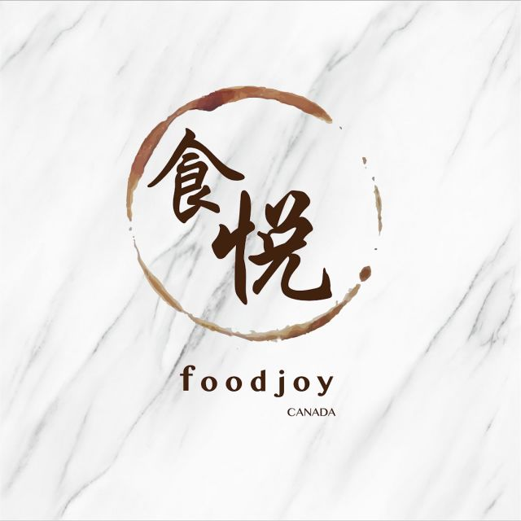 (原始链接: https://mmbiz.qpic.cn/mmbiz_png/XA8n2XaESnRb29ibNXMVEUZJckfg0ReFLJcUjLMic2K7ia7sXfRgHycdQ0KT1epvKYj76R5H403qWdtA06Sy6EF0Q/640?wx_fmt=png)
-  (原始链接: https://mmbiz.qpic.cn/mmbiz_jpg/XA8n2XaESnRb29ibNXMVEUZJckfg0ReFLiaIksAL911GbhDxka3mGOkoIXjE4kMiavxUxW8I9VfK6njDDCeNdqXlQ/640?wx_fmt=jpeg)
-  (原始链接: https://mmbiz.qpic.cn/mmbiz_png/XA8n2XaESnRb29ibNXMVEUZJckfg0ReFLJcUjLMic2K7ia7sXfRgHycdQ0KT1epvKYj76R5H403qWdtA06Sy6EF0Q/640?wx_fmt=png)
-  (原始链接: https://mmbiz.qpic.cn/mmbiz_jpg/XA8n2XaESnRb29ibNXMVEUZJckfg0ReFLiaIksAL911GbhDxka3mGOkoIXjE4kMiavxUxW8I9VfK6njDDCeNdqXlQ/640?wx_fmt=jpeg)
-  (原始链接: https://mmbiz.qpic.cn/mmbiz_png/XA8n2XaESnRb29ibNXMVEUZJckfg0ReFLXrqUm5uEwFVCutT5XwbtqAS4HHicn1UkGyDsH3nGibvNbCibZDkDQbiczQ/640?wx_fmt=png)
-  (原始链接: https://mmbiz.qpic.cn/mmbiz_png/XA8n2XaESnRb29ibNXMVEUZJckfg0ReFLicYYyJdTOpGPBAJHpJLHy1OLS40oBGCnQWunrLjZggyCLpu5c9yn28w/640?wx_fmt=png)
-  (原始链接: https://mmbiz.qpic.cn/mmbiz_png/XA8n2XaESnRb29ibNXMVEUZJckfg0ReFLClAcz8cztkFdEptyumI6ItdbCRzibCicepFv2weonia3Im0x0g3abCcrg/640?wx_fmt=png)
- 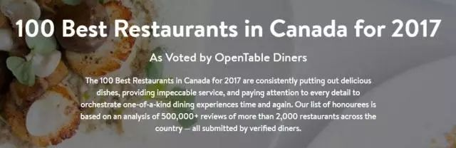 (原始链接: https://mmbiz.qpic.cn/mmbiz_jpg/XA8n2XaESnRb29ibNXMVEUZJckfg0ReFLmWib9tjEGG13Wwkd2GziarDzrupw1ib3j56qwQ0bejxWibyibSrWNWYEQLA/640?wx_fmt=jpeg)
- 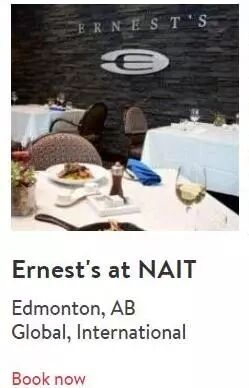 (原始链接: https://mmbiz.qpic.cn/mmbiz_jpg/XA8n2XaESnRb29ibNXMVEUZJckfg0ReFLGsn9ibnwic48Wiaa3RXTibfzGHmxrCsmNUEwl0TTsQAT289UCVFDFUL4Eg/640?wx_fmt=jpeg)
-  (原始链接: https://mmbiz.qpic.cn/mmbiz_jpg/XA8n2XaESnRb29ibNXMVEUZJckfg0ReFL8wQG9I3vMQCU2BWqmvqE7qhftbNa4ttZ4puZcYR70n0PnX5ia4COvfg/640?wx_fmt=jpeg)
- 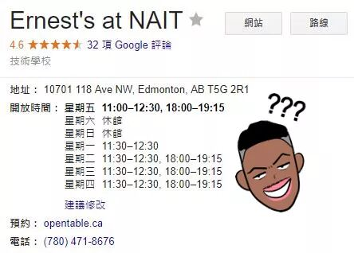 (原始链接: https://mmbiz.qpic.cn/mmbiz_jpg/XA8n2XaESnRb29ibNXMVEUZJckfg0ReFLRqkeSwGmth9WTFUzHgwoNhttv47VicjibU2p2BNrYbBqII9xxXudR9Hw/640?wx_fmt=jpeg)
- 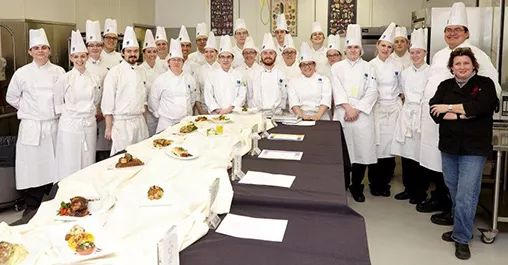 (原始链接: https://mmbiz.qpic.cn/mmbiz_jpg/XA8n2XaESnRb29ibNXMVEUZJckfg0ReFLWFtGFdZOegUhvWBxichLRCqsT2cYbO4wBAbY6fhO6xUBgZxqSA3LgDQ/640?wx_fmt=jpeg)
- 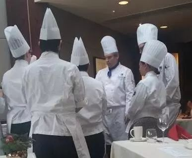 (原始链接: https://mmbiz.qpic.cn/mmbiz_jpg/XA8n2XaESnRb29ibNXMVEUZJckfg0ReFLGa1SINFnZBlbHYTrRs6UKXUZgBDCwO6ZhXCsmRAF2gwnoJJb7H6Epw/640?wx_fmt=jpeg)
- 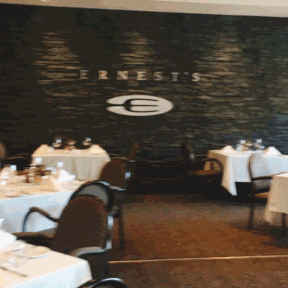 (原始链接: https://mmbiz.qpic.cn/mmbiz_gif/XA8n2XaESnRb29ibNXMVEUZJckfg0ReFLjYcxnWh1grxjUwRCQ2APLDO3tTjoqmCYibicGcSATp1whXXnu3GY6oIg/640?wx_fmt=gif)
- 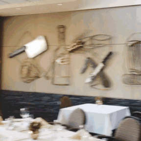 (原始链接: https://mmbiz.qpic.cn/mmbiz_gif/XA8n2XaESnRb29ibNXMVEUZJckfg0ReFLTYPDTbEc3Xoe4UPbKf5GFqzqu99kOSNgrRGRgO5cRdUk417dZ0T1Mw/640?wx_fmt=gif)
- 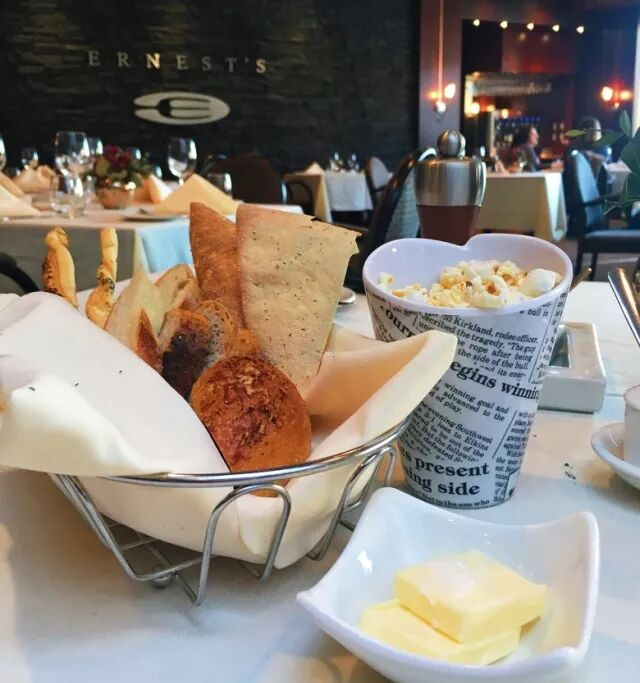 (原始链接: https://mmbiz.qpic.cn/mmbiz_jpg/XA8n2XaESnRb29ibNXMVEUZJckfg0ReFL0d07W2VUb1CZzKOE6byPTr9Y6DE4z72RqInLPyb5jc3wNhGUgPnwBg/640?wx_fmt=jpeg)
- 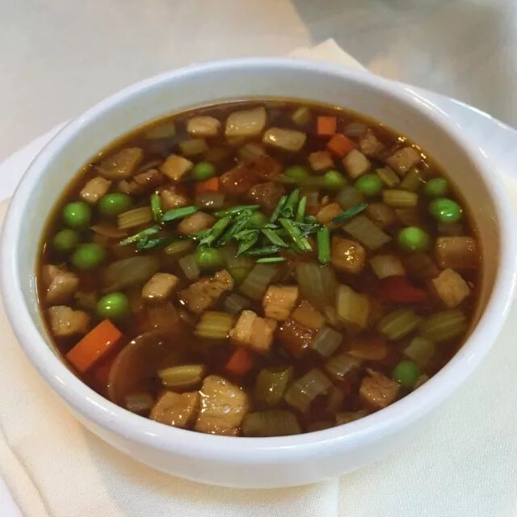 (原始链接: https://mmbiz.qpic.cn/mmbiz_jpg/XA8n2XaESnRb29ibNXMVEUZJckfg0ReFLziapMibD2ccwm2NbiaJgs8BIhqoGJjXJOZywjZv7rokqKP03DVuhvAptw/640?wx_fmt=jpeg)
- 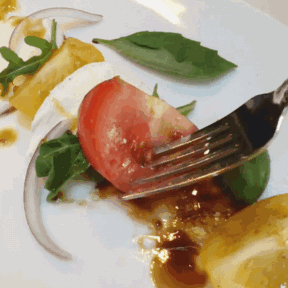 (原始链接: https://mmbiz.qpic.cn/mmbiz_gif/XA8n2XaESnRb29ibNXMVEUZJckfg0ReFL2pVbHvxmwYxNJkU8YwvP7BcfBue1bCr79AY3YSx8M47NVnv5a8wFkw/640?wx_fmt=gif)
- 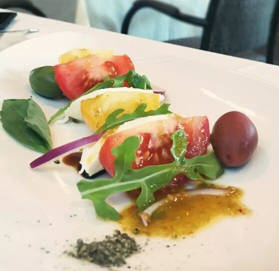 (原始链接: https://mmbiz.qpic.cn/mmbiz_jpg/XA8n2XaESnRb29ibNXMVEUZJckfg0ReFL8aHruibjtWSIKic4ke2R01WibUMUC890jNu9QKa2CO2jakVStzSsqBGIw/640?wx_fmt=jpeg)
- 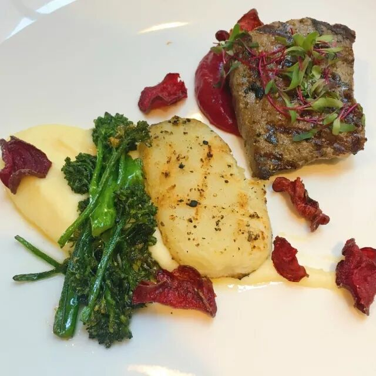 (原始链接: https://mmbiz.qpic.cn/mmbiz_jpg/XA8n2XaESnRb29ibNXMVEUZJckfg0ReFL7ibphmOzpWE6WQB8d9msh67WZ6oJo3JyYxic5T6OOOWiaBOcoZPZSbxAg/640?wx_fmt=jpeg)
- 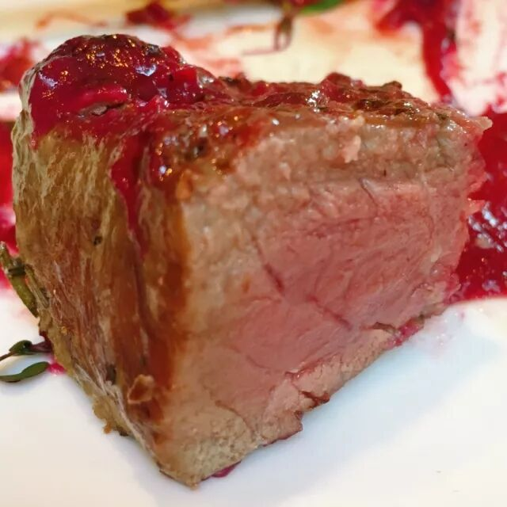 (原始链接: https://mmbiz.qpic.cn/mmbiz_jpg/XA8n2XaESnRb29ibNXMVEUZJckfg0ReFL2DvJHUxicaSRUgtMgGr2qtic8v0ybQiaCVPTHcL9ZAMAotZXgbIDhLhRA/640?wx_fmt=jpeg)
- 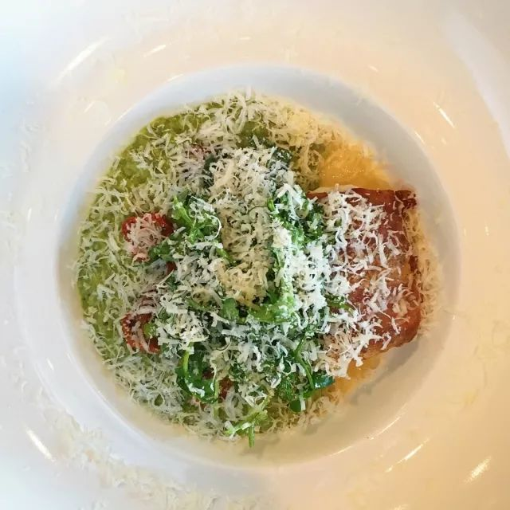 (原始链接: https://mmbiz.qpic.cn/mmbiz_jpg/XA8n2XaESnRb29ibNXMVEUZJckfg0ReFLytNB0aUHziasP5WapvVXt66Lt4ibjxfXCCuVWhialLMzXvicH5R10NicWUA/640?wx_fmt=jpeg)
-  (原始链接: https://mmbiz.qpic.cn/mmbiz_jpg/XA8n2XaESnRb29ibNXMVEUZJckfg0ReFL83m8mfEmM1cWEUicyuOZskUEGa2m9kMCyEgmdAB7ibJwaEicpcBicd6cDw/640?wx_fmt=jpeg)
- 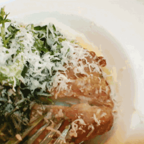 (原始链接: https://mmbiz.qpic.cn/mmbiz_gif/XA8n2XaESnRb29ibNXMVEUZJckfg0ReFLNJ3oQXSEkN06b0twqSew8n6JrEOLNRE14lFCibKWpo1UN4p0uzlE4DA/640?wx_fmt=gif)
- 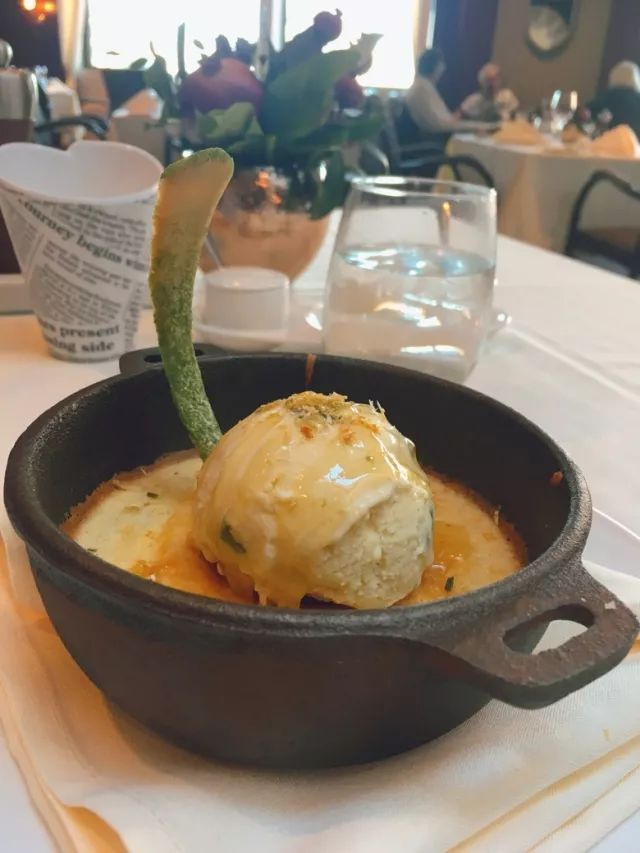 (原始链接: https://mmbiz.qpic.cn/mmbiz_jpg/XA8n2XaESnRb29ibNXMVEUZJckfg0ReFLz5CJqPRvLKibwsicm7AtSVibfEw0qOFW8kTibwSbfC9a85KRZNmk2Z9bGg/640?wx_fmt=jpeg)
- 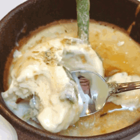 (原始链接: https://mmbiz.qpic.cn/mmbiz_gif/XA8n2XaESnRb29ibNXMVEUZJckfg0ReFLHWwnBg9QaWLxposcWvb5ra8YNnMtueY0Nc6ls9piaduqXqicibJ5xXmSw/640?wx_fmt=gif)
-  (原始链接: https://mmbiz.qpic.cn/mmbiz_png/XA8n2XaESnRb29ibNXMVEUZJckfg0ReFLafLAsv5kQtiaRCMAZ6sV9iaaic9uqxwibBoZxTJ5iau55HwnRs7ft7r5GZg/640?wx_fmt=png)
- 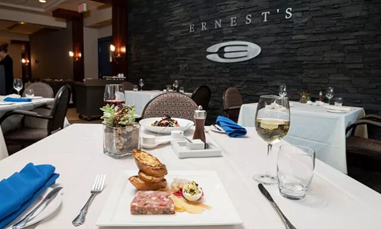 (原始链接: https://mmbiz.qpic.cn/mmbiz_jpg/XA8n2XaESnRb29ibNXMVEUZJckfg0ReFLJJKGE20Ywjjx22WiavDLR80J01z2jVxmqF4cLhmdhZIkFeJCszvE23g/640?wx_fmt=jpeg)
-  (原始链接: https://mmbiz.qpic.cn/mmbiz_png/XA8n2XaESnRb29ibNXMVEUZJckfg0ReFLafLAsv5kQtiaRCMAZ6sV9iaaic9uqxwibBoZxTJ5iau55HwnRs7ft7r5GZg/640?wx_fmt=png)
-  (原始链接: https://mmbiz.qpic.cn/mmbiz_png/XA8n2XaESnRb29ibNXMVEUZJckfg0ReFLafLAsv5kQtiaRCMAZ6sV9iaaic9uqxwibBoZxTJ5iau55HwnRs7ft7r5GZg/640?wx_fmt=png)
- 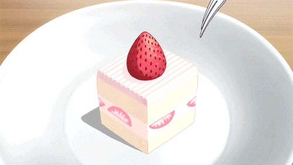 (原始链接: https://mmbiz.qpic.cn/mmbiz_gif/XA8n2XaESnRb29ibNXMVEUZJckfg0ReFLw6pH65dM8j0qdZEB3I7xCkH9Dc8ib9VuDJJ0vmkwttUuicA6oES65R4A/640?wx_fmt=gif)
-  (原始链接: https://mmbiz.qpic.cn/mmbiz_jpg/XA8n2XaESnRb29ibNXMVEUZJckfg0ReFLDO92x7uF1tCqgdXia4zlVa43a2YAFoWuJUgAqGqSs2UeRfVu4CAU0Iw/640?wx_fmt=jpeg)
