# 无标题

**链接地址:** http://mp.weixin.qq.com/s?__biz=MzI0MDQ0ODI0Ng==&mid=2247485774&idx=1&sn=c8b5d28d1ffe54868af3287bbe159978&chksm=e91beed7de6c67c134f4b752d9cd55fd010f3df8a751b43b9e8c7510c041a57892b915319e9a&mpshare=1&scene=2&srcid=05100O3VDaaH2hB7EAVfww9x#rd
**作者:** 食海鲜悦
**获取时间:** 2025/8/28 21:56:06
**图片数量:** 35

---

## 原始HTML内容

<section style="box-sizing: border-box;"><section class="Powered-by-XIUMI V5" style="box-sizing: border-box;" powered-by="xiumi.us"><section class="" style="text-align: center;box-sizing: border-box;"><section class="" style="display: inline-block;width: 98%;vertical-align: top;box-shadow: rgba(177, 160, 254, 0.39) 2.82843px 2.82843px 4px;border-color: rgba(169, 169, 169, 0.53);border-width: 4px;border-radius: 4px;border-style: outset;box-sizing: border-box;"><section class="Powered-by-XIUMI V5" style="box-sizing: border-box;" powered-by="xiumi.us"><section class="" style="box-sizing: border-box;"><section class="" style="display: inline-block;vertical-align: bottom;width: 33.33%;box-sizing: border-box;"><section class="Powered-by-XIUMI V5" style="box-sizing: border-box;" powered-by="xiumi.us"><section class="" style="margin-right: 0%;margin-left: 0%;box-sizing: border-box;"><section class="" style="max-width: 100%;vertical-align: middle;display: inline-block;overflow: hidden !important;box-sizing: border-box;"></section></section></section><section class="Powered-by-XIUMI V5" style="box-sizing: border-box;" powered-by="xiumi.us"><section class="" style="margin-right: 0%;margin-left: 0%;box-sizing: border-box;"><section class="" style="max-width: 100%;vertical-align: middle;display: inline-block;overflow: hidden !important;box-sizing: border-box;"></section></section></section></section><section class="" style="display: inline-block;vertical-align: bottom;width: 33.33%;box-sizing: border-box;"><section class="Powered-by-XIUMI V5" style="box-sizing: border-box;" powered-by="xiumi.us"><section class="" style="box-sizing: border-box;"><section class="" style="font-size: 12px;color: rgb(114, 113, 113);box-sizing: border-box;">
<strong style="box-sizing: border-box;">倾</strong><strong style="box-sizing: border-box;">诚</strong><strong style="letter-spacing: 0px;box-sizing: border-box;">为您服务！</strong> 
</section></section></section><section class="Powered-by-XIUMI V5" style="box-sizing: border-box;" powered-by="xiumi.us"><section class="" style="box-sizing: border-box;"><section class="" style="display: inline-block;width: 100%;vertical-align: top;overflow-x: auto;overflow-y: hidden;box-sizing: border-box;-webkit-overflow-scrolling: touch;"><section style="width: 300%;min-width: 100%;max-width: 300% !important;box-sizing: border-box;"><section class="Powered-by-XIUMI V5" style="display: inline-block;width: 33.3333%;vertical-align: top;box-sizing: border-box;" powered-by="xiumi.us"><section class="" style="text-align: right;margin-right: 0%;margin-left: 0%;box-sizing: border-box;"><section class="" style="max-width: 100%;vertical-align: middle;display: inline-block;overflow: hidden !important;box-sizing: border-box;"></section></section></section><section class="Powered-by-XIUMI V5" style="display: inline-block;width: 33.3333%;vertical-align: top;box-sizing: border-box;" powered-by="xiumi.us"><section class="" style="margin-right: 0%;margin-left: 0%;box-sizing: border-box;"><section class="" style="max-width: 100%;vertical-align: middle;display: inline-block;overflow: hidden !important;box-sizing: border-box;"></section></section></section><section class="Powered-by-XIUMI V5" style="display: inline-block;width: 33.3333%;vertical-align: top;box-sizing: border-box;" powered-by="xiumi.us"><section class="" style="text-align: left;margin-right: 0%;margin-left: 0%;box-sizing: border-box;"><section class="" style="max-width: 100%;vertical-align: middle;display: inline-block;overflow: hidden !important;box-sizing: border-box;"></section></section></section></section></section></section></section><section class="Powered-by-XIUMI V5" style="box-sizing: border-box;" powered-by="xiumi.us"><section class="" style="margin-right: 0%;margin-left: 0%;box-sizing: border-box;"><section class="" style="max-width: 100%;vertical-align: middle;display: inline-block;overflow: hidden !important;box-sizing: border-box;"></section></section></section></section><section class="" style="display: inline-block;vertical-align: bottom;width: 33.33%;box-sizing: border-box;"><section class="Powered-by-XIUMI V5" style="box-sizing: border-box;" powered-by="xiumi.us"><section class="" style="margin-right: 0%;margin-left: 0%;box-sizing: border-box;"><section class="" style="max-width: 100%;vertical-align: middle;display: inline-block;box-shadow: rgb(0, 0, 0) 0px 0px 0px;overflow: hidden !important;box-sizing: border-box;"></section></section></section><section class="Powered-by-XIUMI V5" style="box-sizing: border-box;" powered-by="xiumi.us"><section class="" style="margin-right: 0%;margin-left: 0%;box-sizing: border-box;"><section class="" style="max-width: 100%;vertical-align: middle;display: inline-block;width: 80%;overflow: hidden !important;box-sizing: border-box;"></section></section></section><section class="Powered-by-XIUMI V5" style="box-sizing: border-box;" powered-by="xiumi.us"><section class="" style="margin-right: 0%;margin-left: 0%;box-sizing: border-box;"><section class="" style="display: inline-block;border-width: 2px;border-style: solid;border-color: rgba(0, 0, 0, 0);padding: 0.1em 0.3em;color: rgb(62, 62, 62);line-height: 1.5;letter-spacing: 0px;font-size: 10px;box-sizing: border-box;">
长按二维码

获得更多资讯
</section></section></section></section></section></section></section></section></section><section class="Powered-by-XIUMI V5" style="box-sizing: border-box;" powered-by="xiumi.us"><section class="" style="margin-top: 10px;margin-bottom: 10px;box-sizing: border-box;"><section class="" style="padding-top: 2px;padding-bottom: 2px;box-sizing: border-box;"><section style="height: 4px;transform: rotate(0deg);-webkit-transform: rotate(0deg);-moz-transform: rotate(0deg);-o-transform: rotate(0deg);float: left;margin-top: -3px;background-color: rgb(255, 255, 255);box-sizing: border-box;"><section style="width: 4px;height: 4px;border-radius: 100%;float: left;background-color: rgba(227, 170, 78, 0.94);box-sizing: border-box;"></section><section style="width: 4px;height: 4px;border-radius: 100%;margin-left: 0.5em;float: left;background-color: rgba(227, 170, 78, 0.94);box-sizing: border-box;"></section><section style="width: 4px;height: 4px;border-radius: 100%;margin-left: 0.5em;float: left;background-color: rgba(227, 170, 78, 0.94);box-sizing: border-box;"></section><section style="width: 4px;height: 4px;border-radius: 100%;margin-left: 0.5em;float: left;background-color: rgba(227, 170, 78, 0.94);box-sizing: border-box;"></section><section style="width: 4px;height: 4px;border-radius: 100%;margin-left: 0.5em;float: left;background-color: rgba(227, 170, 78, 0.94);box-sizing: border-box;"></section></section><section style="border-top: 1px solid rgba(227, 170, 78, 0.94);margin-top: -2px;border-right-color: rgba(227, 170, 78, 0.94);border-bottom-color: rgba(227, 170, 78, 0.94);border-left-color: rgba(227, 170, 78, 0.94);box-sizing: border-box;"></section><section class="" style="width: 100%;padding: 10px;box-sizing: border-box;"><section class="Powered-by-XIUMI V5" style="box-sizing: border-box;" powered-by="xiumi.us"><section class="" style="box-sizing: border-box;"><section class="" style="text-align: center;letter-spacing: 2px;line-height: 1;box-sizing: border-box;">
<strong style="box-sizing: border-box;">置顶广告专区</strong> 

<strong style="box-sizing: border-box;">金主大大的广告不仅可以看，还可以“玩”。</strong>

<strong style="box-sizing: border-box;">滑动箭头解锁更多信息哦~</strong>
</section></section></section></section><section style="width: 100%;text-align: right;box-sizing: border-box;"><section style="height: 4px;margin-top: -2px;float: right;transform: rotate(0deg);-webkit-transform: rotate(0deg);-moz-transform: rotate(0deg);-o-transform: rotate(0deg);background-color: rgb(255, 255, 255);box-sizing: border-box;"><section style="width: 4px;height: 4px;border-radius: 100%;float: left;background-color: rgba(227, 170, 78, 0.94);box-sizing: border-box;"></section><section style="width: 4px;height: 4px;border-radius: 100%;margin-left: 0.5em;float: left;background-color: rgba(227, 170, 78, 0.94);box-sizing: border-box;"></section><section style="width: 4px;height: 4px;border-radius: 100%;margin-left: 0.5em;float: left;background-color: rgba(227, 170, 78, 0.94);box-sizing: border-box;"></section><section style="width: 4px;height: 4px;border-radius: 100%;margin-left: 0.5em;float: left;background-color: rgba(227, 170, 78, 0.94);box-sizing: border-box;"></section><section style="width: 4px;height: 4px;border-radius: 100%;margin-left: 0.5em;float: left;background-color: rgba(227, 170, 78, 0.94);box-sizing: border-box;"></section></section><section style="clear: both;box-sizing: border-box;"></section><section style="border-top: 1px solid rgba(227, 170, 78, 0.94);margin-top: -2px;margin-bottom: 2px;border-right-color: rgba(227, 170, 78, 0.94);border-bottom-color: rgba(227, 170, 78, 0.94);border-left-color: rgba(227, 170, 78, 0.94);box-sizing: border-box;"></section></section></section></section></section><section class="Powered-by-XIUMI V5" style="box-sizing: border-box;" powered-by="xiumi.us"><section class="" style="margin-top: 0.5em;margin-bottom: 0.5em;text-align: center;box-sizing: border-box;"> <section class="" style="padding: 0.5em;box-sizing: border-box;"><section class="Powered-by-XIUMI V5" style="box-sizing: border-box;" powered-by="xiumi.us"><section class="" style="box-sizing: border-box;"><section class="" style="color: rgb(42, 52, 58);font-size: 14px;letter-spacing: 2px;box-sizing: border-box;">
不要错过文章底部的超精彩Vlog哦！
</section></section></section></section> </section></section><section class="Powered-by-XIUMI V5" style="box-sizing: border-box;" powered-by="xiumi.us"><section class="" style="margin: 10px 0%;box-sizing: border-box;"><section class="" style="display: inline-block;width: 100%;vertical-align: top;background-position: 166.738% 29.5052%;background-repeat: repeat;background-size: 101.825%;background-attachment: scroll;padding: 30px;background-image: url(&quot;https://mmbiz.qpic.cn/mmbiz_jpg/XA8n2XaESnTIgeuM50CjapPPeGibf95wqR7Y8y00y15efjSpvL3ZNEvN1zvXYa3900ibePT60b5iaEydcuTiblxq0A/640?wx_fmt=jpeg&quot;);box-sizing: border-box;"><section class="Powered-by-XIUMI V5" style="box-sizing: border-box;" powered-by="xiumi.us"><section class="" style="box-sizing: border-box;"><section class="" style="display: inline-block;width: 100%;vertical-align: top;padding: 10px;border-width: 3px;border-radius: 0px;border-style: solid;border-color: rgb(255, 255, 255);background-color: rgba(62, 62, 62, 0.37);box-sizing: border-box;"><section class="Powered-by-XIUMI V5" style="box-sizing: border-box;" powered-by="xiumi.us"><section class="" style="box-sizing: border-box;"><section class="" style="text-align: center;box-sizing: border-box;">
<strong style="box-sizing: border-box;">让热辣小龙虾火爆这个夏天吧！</strong>

<strong style="box-sizing: border-box;"> </strong>

<strong style="box-sizing: border-box;">The Captain's Boil</strong>

<strong style="box-sizing: border-box;">"Feast like a pirate,&nbsp;</strong><strong style="font-size: 12px;letter-spacing: 0px;box-sizing: border-box;">dine like a captain!"</strong>
</section></section></section></section></section></section></section></section></section><section class="Powered-by-XIUMI V5" style="box-sizing: border-box;" powered-by="xiumi.us"><section class="" style="margin-top: 10px;margin-bottom: 10px;box-sizing: border-box;"><section class="" style="border-width: 3px;border-style: solid;border-color: black;padding: 3px;box-sizing: border-box;"><section class="" style="border-color: rgb(128, 128, 128);border-width: 1px;border-style: solid;padding: 10px;background-color: rgba(228, 228, 228, 0.58);box-sizing: border-box;"><section class="Powered-by-XIUMI V5" style="box-sizing: border-box;" powered-by="xiumi.us"><section class="" style="margin-top: 0.5em;margin-bottom: 0.5em;box-sizing: border-box;"><section class="" style="display: inline-block;vertical-align: top;width: 20%;box-sizing: border-box;"><section class="Powered-by-XIUMI V5" style="box-sizing: border-box;" powered-by="xiumi.us"><section class="" style="text-align: center;box-sizing: border-box;"><section class="" style="max-width: 100%;vertical-align: middle;display: inline-block;overflow: hidden !important;box-sizing: border-box;"></section></section></section></section><section class="" style="display: inline-block;vertical-align: top;width: 80%;padding-right: 10px;padding-left: 10px;box-sizing: border-box;"><section class="Powered-by-XIUMI V5" style="box-sizing: border-box;" powered-by="xiumi.us"><section class="" style="box-sizing: border-box;"><section class="" style="font-size: 14px;box-sizing: border-box;">
爱屯吃货
</section></section></section><section class="Powered-by-XIUMI V5" style="box-sizing: border-box;" powered-by="xiumi.us"><section class="" style="box-sizing: border-box;"><section class="" style="width: 0px;border-right: 10px solid rgb(255, 255, 255);display: inline-block;margin-top: 1em;vertical-align: top;border-top: 6px solid transparent !important;border-bottom: 6px solid transparent !important;box-sizing: border-box;"></section><section class="" style="display: inline-block;vertical-align: middle;background-color: rgb(255, 255, 255);padding: 8px;border-radius: 0.5em;max-width: 90% !important;box-sizing: border-box;"><section class="Powered-by-XIUMI V5" style="box-sizing: border-box;" powered-by="xiumi.us"><section class="" style="box-sizing: border-box;"><section class="" style="font-size: 14px;box-sizing: border-box;">
喂，食悦，你造吗？爱屯南边新开了一家海鲜店！超火！
</section></section></section></section></section></section></section></section></section><section class="Powered-by-XIUMI V5" style="box-sizing: border-box;" powered-by="xiumi.us"><section class="" style="margin-top: 0.5em;margin-bottom: 0.5em;box-sizing: border-box;"><section class="" style="display: inline-block;vertical-align: top;width: 80%;text-align: right;padding-right: 10px;padding-left: 10px;box-sizing: border-box;"><section class="Powered-by-XIUMI V5" style="box-sizing: border-box;" powered-by="xiumi.us"><section class="" style="box-sizing: border-box;"><section class="" style="font-size: 14px;box-sizing: border-box;">
食悦foodjoy
</section></section></section><section class="Powered-by-XIUMI V5" style="box-sizing: border-box;" powered-by="xiumi.us"><section class="" style="box-sizing: border-box;"><section class="" style="display: inline-block;vertical-align: middle;background-color: rgb(160, 217, 97);padding: 8px;border-radius: 0.5em;max-width: 90% !important;box-sizing: border-box;"><section class="Powered-by-XIUMI V5" style="box-sizing: border-box;" powered-by="xiumi.us"><section class="" style="box-sizing: border-box;"><section class="" style="text-align: left;font-size: 14px;box-sizing: border-box;">
海鲜？超火？有多火？
</section></section></section></section><section class="" style="width: 0px;border-left: 10px solid rgb(160, 217, 97);display: inline-block;margin-top: 1em;vertical-align: top;border-top: 6px solid transparent !important;border-bottom: 6px solid transparent !important;box-sizing: border-box;"></section></section></section></section><section class="" style="display: inline-block;vertical-align: top;width: 20%;box-sizing: border-box;"><section class="Powered-by-XIUMI V5" style="box-sizing: border-box;" powered-by="xiumi.us"><section class="" style="text-align: center;box-sizing: border-box;"><section class="" style="max-width: 100%;vertical-align: middle;display: inline-block;border-style: solid;border-width: 1px;border-radius: 0px;border-color: rgb(62, 62, 62);overflow: hidden !important;box-sizing: border-box;"></section></section></section></section></section></section><section class="Powered-by-XIUMI V5" style="box-sizing: border-box;" powered-by="xiumi.us"><section class="" style="margin-top: 0.5em;margin-bottom: 0.5em;box-sizing: border-box;"><section class="" style="display: inline-block;vertical-align: top;width: 20%;box-sizing: border-box;"><section class="Powered-by-XIUMI V5" style="box-sizing: border-box;" powered-by="xiumi.us"><section class="" style="text-align: center;box-sizing: border-box;"><section class="" style="max-width: 100%;vertical-align: middle;display: inline-block;overflow: hidden !important;box-sizing: border-box;"></section></section></section></section><section class="" style="display: inline-block;vertical-align: top;width: 80%;padding-right: 10px;padding-left: 10px;box-sizing: border-box;"><section class="Powered-by-XIUMI V5" style="box-sizing: border-box;" powered-by="xiumi.us"><section class="" style="box-sizing: border-box;"><section class="" style="font-size: 14px;box-sizing: border-box;">
爱屯吃货
</section></section></section><section class="Powered-by-XIUMI V5" style="box-sizing: border-box;" powered-by="xiumi.us"><section class="" style="box-sizing: border-box;"><section class="" style="width: 0px;border-right: 10px solid rgb(255, 255, 255);display: inline-block;margin-top: 1em;vertical-align: top;border-top: 6px solid transparent !important;border-bottom: 6px solid transparent !important;box-sizing: border-box;"></section><section class="" style="display: inline-block;vertical-align: middle;background-color: rgb(255, 255, 255);padding: 8px;border-radius: 0.5em;max-width: 90% !important;box-sizing: border-box;"><section class="Powered-by-XIUMI V5" style="box-sizing: border-box;" powered-by="xiumi.us"><section class="" style="box-sizing: border-box;"><section class="" style="font-size: 14px;box-sizing: border-box;">
听说排队要排一个多小时才能吃得上呢！
</section></section></section></section></section></section></section></section></section><section class="Powered-by-XIUMI V5" style="box-sizing: border-box;" powered-by="xiumi.us"><section class="" style="margin-top: 0.5em;margin-bottom: 0.5em;box-sizing: border-box;"><section class="" style="display: inline-block;vertical-align: top;width: 80%;text-align: right;padding-right: 10px;padding-left: 10px;box-sizing: border-box;"><section class="Powered-by-XIUMI V5" style="box-sizing: border-box;" powered-by="xiumi.us"><section class="" style="box-sizing: border-box;"><section class="" style="font-size: 14px;box-sizing: border-box;">
食悦foodjoy
</section></section></section><section class="Powered-by-XIUMI V5" style="box-sizing: border-box;" powered-by="xiumi.us"><section class="" style="box-sizing: border-box;"><section class="" style="display: inline-block;vertical-align: middle;background-color: rgb(160, 217, 97);padding: 8px;border-radius: 0.5em;max-width: 90% !important;box-sizing: border-box;"><section class="Powered-by-XIUMI V5" style="box-sizing: border-box;" powered-by="xiumi.us"><section class="" style="box-sizing: border-box;"><section class="" style="text-align: left;font-size: 14px;box-sizing: border-box;">
哇！那我可一定得去看看了！
</section></section></section></section><section class="" style="width: 0px;border-left: 10px solid rgb(160, 217, 97);display: inline-block;margin-top: 1em;vertical-align: top;border-top: 6px solid transparent !important;border-bottom: 6px solid transparent !important;box-sizing: border-box;"></section></section></section></section><section class="" style="display: inline-block;vertical-align: top;width: 20%;box-sizing: border-box;"><section class="Powered-by-XIUMI V5" style="box-sizing: border-box;" powered-by="xiumi.us"><section class="" style="text-align: center;box-sizing: border-box;"><section class="" style="max-width: 100%;vertical-align: middle;display: inline-block;border-style: solid;border-width: 1px;border-radius: 0px;border-color: rgb(62, 62, 62);overflow: hidden !important;box-sizing: border-box;"></section></section></section></section></section></section><section class="Powered-by-XIUMI V5" style="box-sizing: border-box;" powered-by="xiumi.us"><section class="" style="box-sizing: border-box;"><section class="" style="text-align: center;box-sizing: border-box;">
 
</section></section></section></section></section></section></section><section class="Powered-by-XIUMI V5" style="box-sizing: border-box;" powered-by="xiumi.us"><section class="" style="margin-top: 0.5em;margin-bottom: 0.5em;box-sizing: border-box;"><section style="border-top: 5px dashed rgb(249, 110, 87);box-sizing: border-box;" class=""></section></section></section><section class="Powered-by-XIUMI V5" style="box-sizing: border-box;" powered-by="xiumi.us"><section class="" style="text-align: center;margin-top: 0.5em;margin-bottom: 0.5em;padding-left: 0.5em;padding-right: 0.5em;box-sizing: border-box;"><section class="" style="box-sizing: border-box;width: 100%;box-shadow: rgb(102, 102, 102) 3.53553px 3.53553px 8px;display: inline-block;height: auto !important;overflow: hidden !important;border-color: white;"></section></section></section><section class="Powered-by-XIUMI V5" style="box-sizing: border-box;" powered-by="xiumi.us"><section class="" style="box-sizing: border-box;"><section class="" style="text-align: center;font-size: 12px;color: rgba(62, 62, 62, 0.37);box-sizing: border-box;">
图片来源：thecaptainsboil.com
</section></section></section><section class="Powered-by-XIUMI V5" style="box-sizing: border-box;" powered-by="xiumi.us"><section class="" style="box-sizing: border-box;"><section class="" style="box-sizing: border-box;">
 
</section></section></section><section class="Powered-by-XIUMI V5" style="box-sizing: border-box;" powered-by="xiumi.us"><section class="" style="box-sizing: border-box;"><section class="" style="text-align: justify;padding-right: 10px;padding-left: 10px;font-size: 14px;color: rgba(62, 62, 62, 0.72);letter-spacing: 0px;box-sizing: border-box;">
带着满心的好奇点开这家爱城南部South Common的始创于加拿大多伦多的<strong style="box-sizing: border-box;">Cajun</strong>香辣风味海鲜店的主页。哇！我看到了什么？加拿大人终于开始会吃河道里泛滥的<strong style="box-sizing: border-box;">小龙虾</strong>了吗？难道是借鉴了咱大中华料理麻辣小龙虾的精髓？说起来“Cajun”是来自加拿大法国后裔在南下迁徙的过程中逐步发展创造出的一种风味。以红辣椒，胡椒，牛至，洋葱等原料混合制作的辛香味型，结合了法国，墨西哥，印第安甚至亚洲的等多个国家民族的美食烹调特色。对于俺们中国胃来说，是非常容易接受的！事不宜迟，快跟随食悦一起出发一探究竟吧！ 
</section></section></section><section class="Powered-by-XIUMI V5" style="box-sizing: border-box;" powered-by="xiumi.us"><section class="" style="box-sizing: border-box;"><section class="" style="box-sizing: border-box;">
 
</section></section></section><section class="Powered-by-XIUMI V5" style="box-sizing: border-box;" powered-by="xiumi.us"><section class="" style="text-align: center;margin-top: 0.5em;margin-bottom: 0.5em;padding-left: 0.5em;padding-right: 0.5em;box-sizing: border-box;"><section class="" style="box-sizing: border-box;width: 100%;box-shadow: rgb(102, 102, 102) 0.2em 0.2em 0.5em;display: inline-block;height: auto !important;overflow: hidden !important;border-color: white;"></section></section></section><section class="Powered-by-XIUMI V5" style="box-sizing: border-box;" powered-by="xiumi.us"><section class="" style="box-sizing: border-box;"><section class="" style="box-sizing: border-box;">
 
</section></section></section><section class="Powered-by-XIUMI V5" style="box-sizing: border-box;" powered-by="xiumi.us"><section class="" style="box-sizing: border-box;"><section class="" style="text-align: justify;padding-right: 10px;padding-left: 10px;font-size: 14px;color: rgba(62, 62, 62, 0.72);letter-spacing: 0px;box-sizing: border-box;">
机智的食悦挑了通常客流量最少的周二下午6店前往进餐。一到门口看见满满的车流和乌泱泱的人群，心中惊呼大事不好。传说中的排队一小时难道就要被俺撞到了吗？一进门，哇果然坐得满满当当！被服务生告知就算一个人也要<strong style="box-sizing: border-box;">等位40分钟</strong>。
</section></section></section><section class="Powered-by-XIUMI V5" style="box-sizing: border-box;" powered-by="xiumi.us"><section class="" style="box-sizing: border-box;"><section class="" style="box-sizing: border-box;">
 
</section></section></section><section class="Powered-by-XIUMI V5" style="box-sizing: border-box;" powered-by="xiumi.us"><section class="" style="text-align: center;margin-top: 10px;margin-bottom: 10px;box-sizing: border-box;"><section class="" style="max-width: 100%;vertical-align: middle;display: inline-block;box-shadow: rgb(0, 0, 0) 0px 0px 0px;width: 50%;overflow: hidden !important;box-sizing: border-box;"></section></section></section><section class="Powered-by-XIUMI V5" style="box-sizing: border-box;" powered-by="xiumi.us"><section class="" style="box-sizing: border-box;"><section class="" style="box-sizing: border-box;">
 
</section></section></section><section class="Powered-by-XIUMI V5" style="box-sizing: border-box;" powered-by="xiumi.us"><section class="" style="box-sizing: border-box;"><section class="" style="text-align: justify;padding-right: 10px;padding-left: 10px;font-size: 14px;color: rgba(62, 62, 62, 0.72);letter-spacing: 0px;box-sizing: border-box;">
还好我去之前已经做好了充分的等位心理准备。在伴随肚子饿得咕咕叫的漫长过程中耐心消磨难捱的时光。在充满<strong style="box-sizing: border-box;">海盗船风格</strong>装潢的店里绕圈打转了n久，终于轮到我上桌了！
</section></section></section><section class="Powered-by-XIUMI V5" style="box-sizing: border-box;" powered-by="xiumi.us"><section class="" style="box-sizing: border-box;"><section class="" style="box-sizing: border-box;">
 
</section></section></section><section class="Powered-by-XIUMI V5" style="box-sizing: border-box;" powered-by="xiumi.us"><section class="" style="text-align: center;margin-top: 0.5em;margin-bottom: 0.5em;padding-left: 0.5em;padding-right: 0.5em;box-sizing: border-box;"><section class="" style="box-sizing: border-box;width: 100%;box-shadow: rgb(102, 102, 102) 3.53553px 3.53553px 8px;display: inline-block;height: auto !important;overflow: hidden !important;border-color: white;"></section></section></section><section class="Powered-by-XIUMI V5" style="box-sizing: border-box;" powered-by="xiumi.us"><section class="" style="box-sizing: border-box;"><section class="" style="box-sizing: border-box;">
 
</section></section></section><section class="Powered-by-XIUMI V5" style="box-sizing: border-box;" powered-by="xiumi.us"><section class="" style="box-sizing: border-box;"><section class="" style="text-align: justify;padding-right: 10px;padding-left: 10px;font-size: 14px;color: rgba(62, 62, 62, 0.72);letter-spacing: 0px;box-sizing: border-box;">
落座的时候桌上已经铺好了餐桌纸，备好了充足的纸巾，一次性塑料手套。连围裙都特别设计成了<strong style="box-sizing: border-box;">水手服</strong>，还分女生款和男生款式。简直不能更<strong style="box-sizing: border-box;">贴心</strong>了！
</section></section></section><section class="Powered-by-XIUMI V5" style="box-sizing: border-box;" powered-by="xiumi.us"><section class="" style="box-sizing: border-box;"><section class="" style="box-sizing: border-box;">
 
</section></section></section><section class="Powered-by-XIUMI V5" style="box-sizing: border-box;" powered-by="xiumi.us"><section class="" style="text-align: center;margin-top: 0.5em;margin-bottom: 0.5em;padding-left: 0.5em;padding-right: 0.5em;box-sizing: border-box;"><section class="" style="box-sizing: border-box;width: 100%;box-shadow: rgb(102, 102, 102) 0.2em 0.2em 0.5em;display: inline-block;height: auto !important;overflow: hidden !important;border-color: white;"></section></section></section><section class="Powered-by-XIUMI V5" style="box-sizing: border-box;" powered-by="xiumi.us"><section class="" style="box-sizing: border-box;"><section class="" style="box-sizing: border-box;">
 
</section></section></section><section class="Powered-by-XIUMI V5" style="box-sizing: border-box;" powered-by="xiumi.us"><section class="" style="box-sizing: border-box;"><section class="" style="text-align: justify;padding-right: 10px;padding-left: 10px;font-size: 14px;color: rgba(62, 62, 62, 0.72);letter-spacing: 0px;box-sizing: border-box;">
菜单的设计非常五彩绚烂简单易懂。首先你要选择你想吃的<strong style="box-sizing: border-box;">食材和磅数</strong>，比如小龙虾和青口。一些商品类似龙虾是整只贩售的，所以重量会以单只的磅数为准。一些新鲜海产的价格按照时价收费没有标注，记得点之前跟服务生确认一下，免得收到账单时吓到模糊。

 

选完食材以后接着选择<strong style="box-sizing: border-box;">风味</strong>。一般人都会选择他们家最特色的融合了Cajun，蒜香和柠檬胡椒的Captain's Boil风味。

 

第三步是选择<strong style="box-sizing: border-box;">辣度</strong>。他们家辣度完全适应当地白人口味，所以我认为大部分华人顾客可以至少勇敢尝试到Medium，也不怕被辣得上蹿下跳。

 

最后是可以选择添加的<strong style="box-sizing: border-box;">配菜</strong>。食悦点了玉米，土豆，和藕片这三种辣味香锅类菜肴不可或缺的经典搭配。
</section></section></section><section class="Powered-by-XIUMI V5" style="box-sizing: border-box;" powered-by="xiumi.us"><section class="" style="box-sizing: border-box;"><section class="" style="box-sizing: border-box;">
 
</section></section></section><section class="Powered-by-XIUMI V5" style="box-sizing: border-box;" powered-by="xiumi.us"><section class="" style="text-align: center;margin-top: 0.5em;margin-bottom: 0.5em;padding-left: 0.5em;padding-right: 0.5em;box-sizing: border-box;"><section class="" style="box-sizing: border-box;width: 100%;box-shadow: rgb(102, 102, 102) 0.2em 0.2em 0.5em;display: inline-block;height: auto !important;overflow: hidden !important;border-color: white;"></section></section></section><section class="Powered-by-XIUMI V5" style="box-sizing: border-box;" powered-by="xiumi.us"><section class="" style="box-sizing: border-box;"><section class="" style="box-sizing: border-box;">
 
</section></section></section><section class="Powered-by-XIUMI V5" style="box-sizing: border-box;" powered-by="xiumi.us"><section class="" style="box-sizing: border-box;"><section class="" style="text-align: justify;padding-right: 10px;padding-left: 10px;font-size: 14px;color: rgba(62, 62, 62, 0.72);letter-spacing: 0px;box-sizing: border-box;">
等了没多久，服务生就抱着小铁桶端上来第一道火爆小龙虾。他们家的特色就是这种蒸煮类的食材都抛弃了传统容器而改用<strong style="box-sizing: border-box;">塑料袋包装</strong>，让食客们方便取用和打包。不过请各位顾客放心，这些塑料袋都使用的是耐高温经过检验的材质，不会在烹煮食用过程中释放出有毒有害物质。
</section></section></section><section class="Powered-by-XIUMI V5" style="box-sizing: border-box;" powered-by="xiumi.us"><section class="" style="box-sizing: border-box;"><section class="" style="box-sizing: border-box;">
 
</section></section></section><section class="Powered-by-XIUMI V5" style="box-sizing: border-box;" powered-by="xiumi.us"><section class="" style="text-align: center;margin-top: 0.5em;margin-bottom: 0.5em;padding-left: 0.5em;padding-right: 0.5em;box-sizing: border-box;"><section class="" style="box-sizing: border-box;width: 100%;box-shadow: rgb(102, 102, 102) 0.2em 0.2em 0.5em;display: inline-block;height: auto !important;overflow: hidden !important;border-color: white;"></section></section></section><section class="Powered-by-XIUMI V5" style="box-sizing: border-box;" powered-by="xiumi.us"><section class="" style="box-sizing: border-box;"><section class="" style="box-sizing: border-box;">
 
</section></section></section><section class="Powered-by-XIUMI V5" style="box-sizing: border-box;" powered-by="xiumi.us"><section class="" style="box-sizing: border-box;"><section class="" style="text-align: justify;padding-right: 10px;padding-left: 10px;font-size: 14px;color: rgba(62, 62, 62, 0.72);letter-spacing: 0px;box-sizing: border-box;">
比起中国的麻辣小龙虾，Captain's Boil的小龙虾少了麻味，但是<strong style="box-sizing: border-box;">香料的使用更为丰富</strong>，多了一丢丢的甜润，入口滋味平衡爽滑很多。而且吃完不会口干想要狂喝水。美中不足就是土豆切太大块，不方便分享食用，也够不软绵入味。
</section></section></section><section class="Powered-by-XIUMI V5" style="box-sizing: border-box;" powered-by="xiumi.us"><section class="" style="box-sizing: border-box;"><section class="" style="box-sizing: border-box;">
 
</section></section></section><section class="Powered-by-XIUMI V5" style="box-sizing: border-box;" powered-by="xiumi.us"><section class="" style="text-align: center;margin-top: 0.5em;margin-bottom: 0.5em;padding-left: 0.5em;padding-right: 0.5em;box-sizing: border-box;"><section class="" style="box-sizing: border-box;width: 100%;box-shadow: rgb(102, 102, 102) 0.2em 0.2em 0.5em;display: inline-block;height: auto !important;overflow: hidden !important;border-color: white;"></section></section></section><section class="Powered-by-XIUMI V5" style="box-sizing: border-box;" powered-by="xiumi.us"><section class="" style="box-sizing: border-box;"><section class="" style="box-sizing: border-box;">
 
</section></section></section><section class="Powered-by-XIUMI V5" style="box-sizing: border-box;" powered-by="xiumi.us"><section class="" style="box-sizing: border-box;"><section class="" style="text-align: justify;padding-right: 10px;padding-left: 10px;font-size: 14px;color: rgba(62, 62, 62, 0.72);letter-spacing: 0px;box-sizing: border-box;">
<strong style="box-sizing: border-box;">剥小龙虾的步骤</strong>其实十分简单。抓着身体和头的部分一拧，藏在虾头里的肉就会被完整的抽弹出来。然后把肉塞到嘴里一吸，整个体腔里的爽弹肉质就可以一口被吸进嘴里。最后别忘了拿起虾头再唑一口，所有被酱汁凝炼后的精华都藏在这里！熟练的人3秒钟就可以完整地消灭掉一整只小龙虾呢！
</section></section></section><section class="Powered-by-XIUMI V5" style="box-sizing: border-box;" powered-by="xiumi.us"><section class="" style="box-sizing: border-box;"><section class="" style="box-sizing: border-box;">
 
</section></section></section><section class="Powered-by-XIUMI V5" style="box-sizing: border-box;" powered-by="xiumi.us"><section class="" style="text-align: center;margin-top: 0.5em;margin-bottom: 0.5em;padding-left: 0.5em;padding-right: 0.5em;box-sizing: border-box;"><section class="" style="box-sizing: border-box;width: 100%;box-shadow: rgb(102, 102, 102) 0.2em 0.2em 0.5em;display: inline-block;height: auto !important;overflow: hidden !important;border-color: white;"></section></section></section><section class="Powered-by-XIUMI V5" style="box-sizing: border-box;" powered-by="xiumi.us"><section class="" style="box-sizing: border-box;"><section class="" style="box-sizing: border-box;">
 
</section></section></section><section class="Powered-by-XIUMI V5" style="box-sizing: border-box;" powered-by="xiumi.us"><section class="" style="box-sizing: border-box;"><section class="" style="text-align: justify;padding-right: 10px;padding-left: 10px;font-size: 14px;color: rgba(62, 62, 62, 0.72);letter-spacing: 0px;box-sizing: border-box;">
红彤彤的虾身剥出来<strong style="box-sizing: border-box;">比拇指还粗</strong>，非常Q弹多汁。一磅说实话根本不够食悦一个人吃。真担心加拿大人学会吃这玩意儿以后，加拿大的小龙虾会被吃到濒临灭绝呢！
</section></section></section><section class="Powered-by-XIUMI V5" style="box-sizing: border-box;" powered-by="xiumi.us"><section class="" style="box-sizing: border-box;"><section class="" style="box-sizing: border-box;">
 
</section></section></section><section class="Powered-by-XIUMI V5" style="box-sizing: border-box;" powered-by="xiumi.us"><section class="" style="text-align: center;margin-top: 0.5em;margin-bottom: 0.5em;padding-left: 0.5em;padding-right: 0.5em;box-sizing: border-box;"><section class="" style="box-sizing: border-box;width: 100%;box-shadow: rgb(102, 102, 102) 0.2em 0.2em 0.5em;display: inline-block;height: auto !important;overflow: hidden !important;border-color: white;"></section></section></section><section class="Powered-by-XIUMI V5" style="box-sizing: border-box;" powered-by="xiumi.us"><section class="" style="box-sizing: border-box;"><section class="" style="box-sizing: border-box;">
 
</section></section></section><section class="Powered-by-XIUMI V5" style="box-sizing: border-box;" powered-by="xiumi.us"><section class="" style="box-sizing: border-box;"><section class="" style="text-align: justify;padding-right: 10px;padding-left: 10px;font-size: 14px;color: rgba(62, 62, 62, 0.72);letter-spacing: 0px;box-sizing: border-box;">
接下来上桌的<strong style="box-sizing: border-box;">雪蟹腿</strong>也已经从中劈开被处理好了。每一根蟹腿都比食悦的前臂还要长。
</section></section></section><section class="Powered-by-XIUMI V5" style="box-sizing: border-box;" powered-by="xiumi.us"><section class="" style="box-sizing: border-box;"><section class="" style="box-sizing: border-box;">
 
</section></section></section><section class="Powered-by-XIUMI V5" style="box-sizing: border-box;" powered-by="xiumi.us"><section class="" style="text-align: center;margin-top: 0.5em;margin-bottom: 0.5em;padding-left: 0.5em;padding-right: 0.5em;box-sizing: border-box;"><section class="" style="box-sizing: border-box;width: 100%;box-shadow: rgb(102, 102, 102) 0.2em 0.2em 0.5em;display: inline-block;height: auto !important;overflow: hidden !important;border-color: white;"></section></section></section><section class="Powered-by-XIUMI V5" style="box-sizing: border-box;" powered-by="xiumi.us"><section class="" style="box-sizing: border-box;"><section class="" style="box-sizing: border-box;">
 
</section></section></section><section class="Powered-by-XIUMI V5" style="box-sizing: border-box;" powered-by="xiumi.us"><section class="" style="box-sizing: border-box;"><section class="" style="text-align: justify;padding-right: 10px;padding-left: 10px;font-size: 14px;color: rgba(62, 62, 62, 0.72);letter-spacing: 0px;box-sizing: border-box;">
蟹螯用提供的镊子剪刀等工具轻松撬开，里面是饱满新鲜的蟹肉。不过雪蟹作为寒带深海水产，用他们家特色酱料烹调以后会有点略咸，口味清淡的小伙伴们注意避开。
</section></section></section><section class="Powered-by-XIUMI V5" style="box-sizing: border-box;" powered-by="xiumi.us"><section class="" style="box-sizing: border-box;"><section class="" style="box-sizing: border-box;">
 
</section></section></section><section class="Powered-by-XIUMI V5" style="box-sizing: border-box;" powered-by="xiumi.us"><section class="" style="text-align: center;margin-top: 0.5em;margin-bottom: 0.5em;padding-left: 0.5em;padding-right: 0.5em;box-sizing: border-box;"><section class="" style="box-sizing: border-box;width: 100%;box-shadow: rgb(102, 102, 102) 0.2em 0.2em 0.5em;display: inline-block;height: auto !important;overflow: hidden !important;border-color: white;"></section></section></section><section class="Powered-by-XIUMI V5" style="box-sizing: border-box;" powered-by="xiumi.us"><section class="" style="box-sizing: border-box;"><section class="" style="box-sizing: border-box;">
 
</section></section></section><section class="Powered-by-XIUMI V5" style="box-sizing: border-box;" powered-by="xiumi.us"><section class="" style="box-sizing: border-box;"><section class="" style="text-align: justify;padding-right: 10px;padding-left: 10px;font-size: 14px;color: rgba(62, 62, 62, 0.72);letter-spacing: 0px;box-sizing: border-box;">
抽出来的雪蟹螯duang~duang~的，隔着屏幕都可以感受到那份Q弹鲜甜。
</section></section></section><section class="Powered-by-XIUMI V5" style="box-sizing: border-box;" powered-by="xiumi.us"><section class="" style="box-sizing: border-box;"><section class="" style="box-sizing: border-box;">
 
</section></section></section><section class="Powered-by-XIUMI V5" style="box-sizing: border-box;" powered-by="xiumi.us"><section class="" style="text-align: center;margin-top: 0.5em;margin-bottom: 0.5em;padding-left: 0.5em;padding-right: 0.5em;box-sizing: border-box;"><section class="" style="box-sizing: border-box;width: 100%;box-shadow: rgb(102, 102, 102) 0.2em 0.2em 0.5em;display: inline-block;height: auto !important;overflow: hidden !important;border-color: white;"></section></section></section><section class="Powered-by-XIUMI V5" style="box-sizing: border-box;" powered-by="xiumi.us"><section class="" style="box-sizing: border-box;"><section class="" style="box-sizing: border-box;">
 
</section></section></section><section class="Powered-by-XIUMI V5" style="box-sizing: border-box;" powered-by="xiumi.us"><section class="" style="box-sizing: border-box;"><section class="" style="text-align: center;padding-right: 10px;padding-left: 10px;font-size: 14px;color: rgba(62, 62, 62, 0.72);letter-spacing: 0px;box-sizing: border-box;">
感受一下饱满的蟹腿从关节里抽出来的瞬间。
</section></section></section><section class="Powered-by-XIUMI V5" style="box-sizing: border-box;" powered-by="xiumi.us"><section class="" style="box-sizing: border-box;"><section class="" style="box-sizing: border-box;">
 
</section></section></section><section class="Powered-by-XIUMI V5" style="box-sizing: border-box;" powered-by="xiumi.us"><section class="" style="text-align: center;margin-top: 0.5em;margin-bottom: 0.5em;padding-left: 0.5em;padding-right: 0.5em;box-sizing: border-box;"><section class="" style="box-sizing: border-box;width: 100%;box-shadow: rgb(102, 102, 102) 0.2em 0.2em 0.5em;display: inline-block;height: auto !important;overflow: hidden !important;border-color: white;"></section></section></section><section class="Powered-by-XIUMI V5" style="box-sizing: border-box;" powered-by="xiumi.us"><section class="" style="box-sizing: border-box;"><section class="" style="box-sizing: border-box;">
 
</section></section></section><section class="Powered-by-XIUMI V5" style="box-sizing: border-box;" powered-by="xiumi.us"><section class="" style="box-sizing: border-box;"><section class="" style="text-align: justify;padding-right: 10px;padding-left: 10px;font-size: 14px;color: rgba(62, 62, 62, 0.72);letter-spacing: 0px;box-sizing: border-box;">
接下来上桌的<strong style="box-sizing: border-box;">龙虾</strong>从塑料袋里一拖出来就引起了全场的注意！哇也太大一只了吧！虾螯的Size已经赶上食悦的大脸了！而且厨师特别细心地已经用夹子夹碎了虾鳌上最坚硬的部分，你不需要怎么费力气就可以把钳子里的嫩肉抽出来吃掉啦！
</section></section></section><section class="Powered-by-XIUMI V5" style="box-sizing: border-box;" powered-by="xiumi.us"><section class="" style="box-sizing: border-box;"><section class="" style="box-sizing: border-box;">
 
</section></section></section><section class="Powered-by-XIUMI V5" style="box-sizing: border-box;" powered-by="xiumi.us"><section class="" style="text-align: center;margin-top: 0.5em;margin-bottom: 0.5em;padding-left: 0.5em;padding-right: 0.5em;box-sizing: border-box;"><section class="" style="box-sizing: border-box;width: 100%;box-shadow: rgb(102, 102, 102) 0.2em 0.2em 0.5em;display: inline-block;height: auto !important;overflow: hidden !important;border-color: white;"></section></section></section><section class="Powered-by-XIUMI V5" style="box-sizing: border-box;" powered-by="xiumi.us"><section class="" style="box-sizing: border-box;"><section class="" style="box-sizing: border-box;">
 
</section></section></section><section class="Powered-by-XIUMI V5" style="box-sizing: border-box;" powered-by="xiumi.us"><section class="" style="box-sizing: border-box;"><section class="" style="text-align: justify;padding-right: 10px;padding-left: 10px;font-size: 14px;color: rgba(62, 62, 62, 0.72);letter-spacing: 0px;box-sizing: border-box;">
从中间的刨开的龙虾肉体晶莹透亮，拿手指戳下去汁水会biu~biu~地冒出来！十分紧致鲜甜。搭配爽脆的香辣<strong style="box-sizing: border-box;">藕片</strong>和<strong style="box-sizing: border-box;">玉米</strong>，十分过瘾。
</section></section></section><section class="Powered-by-XIUMI V5" style="box-sizing: border-box;" powered-by="xiumi.us"><section class="" style="box-sizing: border-box;"><section class="" style="box-sizing: border-box;">
 
</section></section></section><section class="Powered-by-XIUMI V5" style="box-sizing: border-box;" powered-by="xiumi.us"><section class="" style="text-align: center;margin-top: 0.5em;margin-bottom: 0.5em;padding-left: 0.5em;padding-right: 0.5em;box-sizing: border-box;"><section class="" style="box-sizing: border-box;width: 100%;box-shadow: rgb(102, 102, 102) 3.53553px 3.53553px 8px;display: inline-block;height: auto !important;overflow: hidden !important;border-color: white;"></section></section></section><section class="Powered-by-XIUMI V5" style="box-sizing: border-box;" powered-by="xiumi.us"><section class="" style="box-sizing: border-box;"><section class="" style="box-sizing: border-box;">
 
</section></section></section><section class="Powered-by-XIUMI V5" style="box-sizing: border-box;" powered-by="xiumi.us"><section class="" style="box-sizing: border-box;"><section class="" style="padding-right: 10px;padding-left: 10px;font-size: 14px;color: rgba(62, 62, 62, 0.72);text-align: justify;letter-spacing: 0px;box-sizing: border-box;">
最后上桌的<strong style="box-sizing: border-box;">Cajun风味海鲜炒饭</strong>也十分美味。足够三四人一同享用的大盘炒饭里塞满了新鲜的虾仁和带子粒，用口味微辣滋味香浓的Cajun酱料翻炒后，粒粒分明的米饭浓缩了来自海洋鲜嫩肥美的精华。
</section></section></section><section class="Powered-by-XIUMI V5" style="box-sizing: border-box;" powered-by="xiumi.us"><section class="" style="box-sizing: border-box;"><section class="" style="box-sizing: border-box;">
 
</section></section></section><section class="Powered-by-XIUMI V5" style="box-sizing: border-box;" powered-by="xiumi.us"><section class="" style="text-align: center;margin-top: 0.5em;margin-bottom: 0.5em;padding-left: 0.5em;padding-right: 0.5em;box-sizing: border-box;"><section class="" style="box-sizing: border-box;width: 100%;box-shadow: rgb(102, 102, 102) 0.2em 0.2em 0.5em;display: inline-block;height: auto !important;overflow: hidden !important;border-color: white;"></section></section></section><section class="Powered-by-XIUMI V5" style="box-sizing: border-box;" powered-by="xiumi.us"><section class="" style="box-sizing: border-box;"><section class="" style="text-align: center;font-size: 12px;color: rgba(62, 62, 62, 0.37);box-sizing: border-box;">
图片来源：thecaptainsboil.com
</section></section></section><section class="Powered-by-XIUMI V5" style="box-sizing: border-box;" powered-by="xiumi.us"><section class="" style="box-sizing: border-box;"><section class="" style="box-sizing: border-box;">
 
</section></section></section><section class="Powered-by-XIUMI V5" style="box-sizing: border-box;" powered-by="xiumi.us"><section class="" style="box-sizing: border-box;"><section class="" style="padding-right: 10px;padding-left: 10px;font-size: 14px;color: rgba(62, 62, 62, 0.72);text-align: justify;letter-spacing: 0px;box-sizing: border-box;">
如果你觉得上述菜肴过于丰盛难以消化，也欢迎你来Captain's Boil享受这个<strong style="box-sizing: border-box;">超值的午饭套餐</strong>！用秘制酱料烧制的鱼虾青口蛤蜊和白米饭真是天生一对。
</section></section></section><section class="Powered-by-XIUMI V5" style="box-sizing: border-box;" powered-by="xiumi.us"><section class="" style="box-sizing: border-box;"><section class="" style="box-sizing: border-box;">
 
</section></section></section><section class="Powered-by-XIUMI V5" style="box-sizing: border-box;" powered-by="xiumi.us"><section class="" style="text-align: center;margin-top: 0.5em;margin-bottom: 0.5em;padding-left: 0.5em;padding-right: 0.5em;box-sizing: border-box;"><section class="" style="box-sizing: border-box;width: 100%;box-shadow: rgb(102, 102, 102) 0.2em 0.2em 0.5em;display: inline-block;height: auto !important;overflow: hidden !important;border-color: white;"></section></section></section><section class="Powered-by-XIUMI V5" style="box-sizing: border-box;" powered-by="xiumi.us"><section class="" style="box-sizing: border-box;"><section class="" style="box-sizing: border-box;">
 
</section></section></section><section class="Powered-by-XIUMI V5" style="box-sizing: border-box;" powered-by="xiumi.us"><section class="" style="box-sizing: border-box;"><section class="" style="padding-right: 10px;padding-left: 10px;font-size: 14px;color: rgba(62, 62, 62, 0.72);text-align: justify;letter-spacing: 0px;box-sizing: border-box;">
总体来说，在Captain's Boil的这次进餐经历是十分愉快的。这家饭店的主旨就在于把新鲜的海鲜直接搬上你的餐桌。他们摈弃了刀叉和碗盘这些复杂的现代餐饮文明，让你“hands on”地感受到海鲜原始野蛮的鲜味冲击。正如他家的响亮口号那般，

 

<strong style="box-sizing: border-box;">"Feast like a pirate, dine like a captain!"&nbsp;</strong>

 

这家店的正确打开方式是，夏天的傍晚约上三五好友每人抱瓶小啤酒，大快朵颐地点它好几十磅小龙虾，一边吹牛一边用店里的超大电视看球赛的直播。不过由于他们生意过于火爆不接受定位，想去尝鲜又不愿意等位的小伙伴记得避开用餐高峰期前往哦！ 
</section></section></section><section class="Powered-by-XIUMI V5" style="box-sizing: border-box;" powered-by="xiumi.us"><section class="" style="box-sizing: border-box;"><section class="" style="box-sizing: border-box;">
 
</section></section></section><section class="Powered-by-XIUMI V5" style="box-sizing: border-box;" powered-by="xiumi.us"><section class="" style="text-align: center;margin-top: 0.5em;margin-bottom: 0.5em;padding-left: 0.5em;padding-right: 0.5em;box-sizing: border-box;"><section class="" style="box-sizing: border-box;width: 100%;box-shadow: rgb(102, 102, 102) 0.2em 0.2em 0.5em;display: inline-block;height: auto !important;overflow: hidden !important;border-color: white;"></section></section></section><section class="Powered-by-XIUMI V5" style="box-sizing: border-box;" powered-by="xiumi.us"><section class="" style="box-sizing: border-box;"><section class="" style="text-align: center;font-size: 12px;color: rgba(62, 62, 62, 0.37);box-sizing: border-box;">
图片来源：thecaptainsboil.com
</section></section></section><section class="Powered-by-XIUMI V5" style="box-sizing: border-box;" powered-by="xiumi.us"><section class="" style="box-sizing: border-box;"><section class="" style="box-sizing: border-box;">
 
</section></section></section><section class="Powered-by-XIUMI V5" style="box-sizing: border-box;" powered-by="xiumi.us"><section class="" style="box-sizing: border-box;"><section class="" style="font-size: 14px;padding-right: 15px;padding-left: 15px;box-sizing: border-box;">
<strong style="box-sizing: border-box;">The Captain's Boil</strong>

📞&nbsp; (780) 485-8756

📍 2051 98 St NW, Edmonton, AB

🗓 MON - THR 11:00 - 23:00

&nbsp; &nbsp; &nbsp;FRI - SAT 11:00 - 00:00 

&nbsp;&nbsp;&nbsp;&nbsp; SUN 11:00 - 22:00 

🌐&nbsp;&nbsp;https://www.thecaptainsboil.com 

💰&nbsp; $$$
</section></section></section><section class="Powered-by-XIUMI V5" style="box-sizing: border-box;" powered-by="xiumi.us"><section class="" style="margin-top: 10px;margin-bottom: 10px;text-align: center;box-sizing: border-box;"><section class="" style="display: inline-block;vertical-align: middle;padding-right: 6px;padding-left: 6px;box-sizing: border-box;"><section class="" style="border-bottom: 2px solid rgb(249, 110, 87);transform: rotate(0deg);padding-right: 10px;padding-left: 10px;box-sizing: border-box;">
<strong style="box-sizing: border-box;">精彩Vlog不要错过哦！</strong>
</section><section style="margin-top: -7px;box-sizing: border-box;"><section style="float: left;width: 0px;margin-left: -6px;border-left: 10px solid rgb(249, 110, 87);border-top: 6px solid rgb(255, 255, 255);border-bottom: 6px solid rgb(255, 255, 255);box-sizing: border-box;"></section><section style="float: right;width: 0px;margin-right: -6px;border-right: 10px solid rgb(249, 110, 87);border-top: 6px solid rgb(255, 255, 255);border-bottom: 6px solid rgb(255, 255, 255);box-sizing: border-box;"></section><section style="clear: both;box-sizing: border-box;"></section></section><section style="margin-top: -9px;display: inline-block;vertical-align: top;width: 100%;box-sizing: border-box;"><section style="float: left;width: 0px;margin-left: -4px;border-left: 3px solid rgb(255, 255, 255);border-top: 3px solid transparent !important;border-bottom: 3px solid transparent !important;box-sizing: border-box;"></section><section style="float: right;width: 0px;margin-right: -4px;border-right: 3px solid rgb(255, 255, 255);border-top: 3px solid transparent !important;border-bottom: 3px solid transparent !important;box-sizing: border-box;"></section><section style="clear: both;box-sizing: border-box;"></section></section></section></section></section><section class="Powered-by-XIUMI V5" style="box-sizing: border-box;" powered-by="xiumi.us"><section class="" style="box-sizing: border-box;"><section class="" style="box-sizing: border-box;">
<iframe class="video_iframe" data-vidtype="2" allowfullscreen="" frameborder="0" data-ratio="1.7647058823529411" data-w="480" data-src="https://v.qq.com/iframe/preview.html?vid=t06491s116m&amp;width=500&amp;height=375&amp;auto=0"></iframe> 
</section></section></section><section class="Powered-by-XIUMI V5" style="box-sizing: border-box;" powered-by="xiumi.us"><section class="" style="margin-top: 0.5em;margin-bottom: 0.5em;box-sizing: border-box;"><section style="border-top: 10px dashed rgb(249, 110, 87);box-sizing: border-box;" class=""></section></section></section><section class="Powered-by-XIUMI V5" style="box-sizing: border-box;" powered-by="xiumi.us"><section class="" style="margin-top: 10px;margin-bottom: 10px;text-align: center;box-sizing: border-box;"><section class="" style="display: inline-block;vertical-align: middle;box-sizing: border-box;"><section style="height: 5px;line-height: 5px;box-sizing: border-box;"><section style="padding-right: 8px;padding-left: 3px;display: inline-block;vertical-align: bottom;background-color: rgb(255, 255, 255);box-sizing: border-box;">    <section style="clear: both;box-sizing: border-box;"></section></section></section><section class="" style="border-top: 1px solid rgb(210, 210, 210);border-bottom: 1px solid rgb(210, 210, 210);margin-top: -3px;margin-bottom: -3px;padding: 3px 6px;box-sizing: border-box;">
<strong style="box-sizing: border-box;">往期精彩回顾</strong>
</section><section style="height: 5px;line-height: 5px;box-sizing: border-box;"><section style="padding-right: 8px;padding-left: 3px;display: inline-block;vertical-align: top;background-color: rgb(255, 255, 255);box-sizing: border-box;">    </section><section style="clear: both;box-sizing: border-box;"></section></section></section></section></section><section class="Powered-by-XIUMI V5" style="box-sizing: border-box;" powered-by="xiumi.us"><section class="" style="margin: 10px 0%;box-sizing: border-box;"><section class="" style="display: inline-block;width: 100%;vertical-align: top;background-position: 55.7299% 55.8483%;background-repeat: repeat;background-size: 101.825%;background-attachment: scroll;padding: 30px;border-width: 3px;border-radius: 0px;border-style: solid;border-color: rgb(0, 0, 0);background-image: url(&quot;https://mmbiz.qpic.cn/mmbiz_jpg/XA8n2XaESnTIgeuM50CjapPPeGibf95wqAdK87S8I2lznWPlaibnbiacPicr89hPuJ8j7NPXe0RjVewrYIKHb0JdWQ/640?wx_fmt=jpeg&quot;);box-sizing: border-box;"><section class="Powered-by-XIUMI V5" style="box-sizing: border-box;" powered-by="xiumi.us"><section class="" style="box-sizing: border-box;"><section class="" style="display: inline-block;width: 100%;vertical-align: top;padding: 10px;border-width: 3px;border-radius: 0px;border-style: solid;border-color: rgb(255, 255, 255);background-color: rgba(62, 62, 62, 0.37);box-sizing: border-box;"><section class="Powered-by-XIUMI V5" style="box-sizing: border-box;" powered-by="xiumi.us"><section class="" style="box-sizing: border-box;"><section class="" style="text-align: center;color: rgb(255, 255, 255);box-sizing: border-box;">
<a href="https://mp.weixin.qq.com/s?__biz=MzI0MDQ0ODI0Ng==&amp;mid=2247485708&amp;idx=1&amp;sn=a6d0aaeb60b7b17f1dc2a93d6c40eabd&amp;chksm=e91bee95de6c6783b7103cc127aa0165e1151dad9d9d5f3ca1909ec72ad12eb22c60dc64a51c&amp;scene=21#wechat_redirect" target="_blank"><strong style="box-sizing: border-box;">Baekjeong这家韩国烤肉，</strong></a>

<a href="https://mp.weixin.qq.com/s?__biz=MzI0MDQ0ODI0Ng==&amp;mid=2247485708&amp;idx=1&amp;sn=a6d0aaeb60b7b17f1dc2a93d6c40eabd&amp;chksm=e91bee95de6c6783b7103cc127aa0165e1151dad9d9d5f3ca1909ec72ad12eb22c60dc64a51c&amp;scene=21#wechat_redirect" target="_blank"><strong style="box-sizing: border-box;">我愿意给五星好评！</strong></a>
</section></section></section></section></section></section></section></section></section><section class="Powered-by-XIUMI V5" style="box-sizing: border-box;" powered-by="xiumi.us"><section class="" style="margin: 10px 0%;box-sizing: border-box;"><section class="" style="display: inline-block;width: 100%;vertical-align: top;background-position: 88.3457% 23.7524%;background-repeat: repeat;background-size: 101.825%;background-attachment: scroll;padding: 30px;border-width: 3px;border-radius: 0px;border-style: solid;border-color: rgb(0, 0, 0);background-image: url(&quot;https://mmbiz.qpic.cn/mmbiz_png/XA8n2XaESnTIgeuM50CjapPPeGibf95wqYxoMlvSCvegX99FvzJ9uw4BN6Tuo6uibvhT2sd5w2OwWT2e0icnZEEMg/640?wx_fmt=png&quot;);box-sizing: border-box;"><section class="Powered-by-XIUMI V5" style="box-sizing: border-box;" powered-by="xiumi.us"><section class="" style="box-sizing: border-box;"><section class="" style="display: inline-block;width: 100%;vertical-align: top;padding: 10px;border-width: 3px;border-radius: 0px;border-style: solid;border-color: rgb(255, 255, 255);background-color: rgba(62, 62, 62, 0.37);box-sizing: border-box;"><section class="Powered-by-XIUMI V5" style="box-sizing: border-box;" powered-by="xiumi.us"><section class="" style="box-sizing: border-box;"><section class="" style="text-align: center;color: rgb(255, 255, 255);box-sizing: border-box;">
<a href="https://mp.weixin.qq.com/s?__biz=MzI0MDQ0ODI0Ng==&amp;mid=2247485724&amp;idx=1&amp;sn=55f00d38cc4b1fa548704e8afd68bb36&amp;chksm=e91bee85de6c6793202d1326e7c80b7166bbdc031d4bf1835de8e969f9ac75395ef6c449d089&amp;scene=21#wechat_redirect" target="_blank"><strong style="box-sizing: border-box;">Oh My Sweet Jesus!&nbsp;</strong></a>

<a href="https://mp.weixin.qq.com/s?__biz=MzI0MDQ0ODI0Ng==&amp;mid=2247485724&amp;idx=1&amp;sn=55f00d38cc4b1fa548704e8afd68bb36&amp;chksm=e91bee85de6c6793202d1326e7c80b7166bbdc031d4bf1835de8e969f9ac75395ef6c449d089&amp;scene=21#wechat_redirect" target="_blank"><strong style="box-sizing: border-box;">拔草巨无霸网红冰淇淋店！</strong></a>
</section></section></section></section></section></section></section></section></section><section class="Powered-by-XIUMI V5" style="box-sizing: border-box;" powered-by="xiumi.us"><section class="" style="margin: 10px 0%;box-sizing: border-box;"><section class="" style="display: inline-block;width: 100%;vertical-align: top;background-position: -25.8096% 44.6904%;background-repeat: repeat;background-size: 101.825%;background-attachment: scroll;padding: 30px;border-width: 3px;border-radius: 0px;border-style: solid;border-color: rgb(0, 0, 0);background-image: url(&quot;https://mmbiz.qpic.cn/mmbiz_jpg/XA8n2XaESnTIgeuM50CjapPPeGibf95wq4ZUHib6SeFLxs1ZOctesCBYicFRibib7FsxO6FBOsicv5ftSxkw4LIrCCxQ/640?wx_fmt=jpeg&quot;);box-sizing: border-box;"><section class="Powered-by-XIUMI V5" style="box-sizing: border-box;" powered-by="xiumi.us"><section class="" style="box-sizing: border-box;"><section class="" style="display: inline-block;width: 100%;vertical-align: top;padding: 10px;border-width: 3px;border-radius: 0px;border-style: solid;border-color: rgb(255, 255, 255);background-color: rgba(62, 62, 62, 0.37);box-sizing: border-box;"><section class="Powered-by-XIUMI V5" style="box-sizing: border-box;" powered-by="xiumi.us"><section class="" style="box-sizing: border-box;"><section class="" style="text-align: center;color: rgb(255, 255, 255);box-sizing: border-box;">
<a href="https://mp.weixin.qq.com/s?__biz=MzI0MDQ0ODI0Ng==&amp;mid=2247485737&amp;idx=1&amp;sn=b6024ac9646b49fd190cdc4274c196c5&amp;chksm=e91beeb0de6c67a6c414385730e72f70ea0fdeac9a295c9c10a710068c0ff4d2d446cf6bad5b&amp;scene=21#wechat_redirect" target="_blank"><strong style="box-sizing: border-box;">排名加拿大Top50的奇葩中餐？</strong></a>

<a href="https://mp.weixin.qq.com/s?__biz=MzI0MDQ0ODI0Ng==&amp;mid=2247485737&amp;idx=1&amp;sn=b6024ac9646b49fd190cdc4274c196c5&amp;chksm=e91beeb0de6c67a6c414385730e72f70ea0fdeac9a295c9c10a710068c0ff4d2d446cf6bad5b&amp;scene=21#wechat_redirect" target="_blank"><strong style="box-sizing: border-box;">社会我“白酒”皮瞎你的眼！</strong></a>
</section></section></section></section></section></section></section></section></section><section class="Powered-by-XIUMI V5" style="box-sizing: border-box;" powered-by="xiumi.us"><section class="" style="margin-top: 0.5em;margin-bottom: 0.5em;box-sizing: border-box;"><section style="border-top: 10px dashed rgb(249, 110, 87);box-sizing: border-box;" class=""></section></section></section><section class="Powered-by-XIUMI V5" style="box-sizing: border-box;" powered-by="xiumi.us"><section class="" style="margin: 10px 0%;box-sizing: border-box;"><section class="" style="display: inline-block;width: 100%;vertical-align: top;background-color: rgb(255, 255, 255);padding: 15px;border-color: rgb(204, 204, 204);border-width: 0px;border-radius: 0px;border-style: solid;box-sizing: border-box;"><section class="Powered-by-XIUMI V5" style="box-sizing: border-box;" powered-by="xiumi.us"><section class="" style="text-align: center;margin-right: 0%;margin-bottom: 10px;margin-left: 0%;box-sizing: border-box;"><section class="" style="max-width: 100%;vertical-align: middle;display: inline-block;box-shadow: rgb(0, 0, 0) 0px 0px 0px;overflow: hidden !important;box-sizing: border-box;"></section></section></section><section class="Powered-by-XIUMI V5" style="box-sizing: border-box;" powered-by="xiumi.us"><section class="" style="box-sizing: border-box;"><section class="" style="display: inline-block;vertical-align: middle;width: 35%;border-right: 1px solid rgb(62, 62, 62);border-top-right-radius: 0px;box-sizing: border-box;"><section class="Powered-by-XIUMI V5" style="box-sizing: border-box;" powered-by="xiumi.us"><section class="" style="text-align: center;margin-right: 0%;margin-left: 0%;box-sizing: border-box;"><section class="" style="max-width: 100%;vertical-align: middle;display: inline-block;border-width: 0px;overflow: hidden !important;box-sizing: border-box;"></section></section></section></section><section class="" style="display: inline-block;vertical-align: middle;width: 65%;box-shadow: rgb(0, 0, 0) 0px 0px 0px;padding-left: 5px;box-sizing: border-box;"><section class="Powered-by-XIUMI V5" style="box-sizing: border-box;" powered-by="xiumi.us"><section class="" style="box-sizing: border-box;"><section class="" style="text-align: justify;font-size: 12px;color: rgba(62, 62, 62, 0.72);box-sizing: border-box;">
“上帝让人必须吃饭才能生存。因此他用食欲促使人们开饭，并用吃饭带来的快乐作为给人类的奖赏。”
</section></section></section><section class="Powered-by-XIUMI V5" style="box-sizing: border-box;" powered-by="xiumi.us"><section class="" style="margin-top: 0.5em;margin-bottom: 0.5em;box-sizing: border-box;"><section class="" style="background-color: rgb(153, 166, 171);height: 1px;box-sizing: border-box;"></section></section></section><section class="Powered-by-XIUMI V5" style="box-sizing: border-box;" powered-by="xiumi.us"><section class="" style="box-sizing: border-box;"><section class="" style="text-align: center;color: rgba(62, 62, 62, 0.72);box-sizing: border-box;">
<strong style="box-sizing: border-box;">食悦 foodjoy </strong>
</section></section></section></section></section></section></section></section></section><section class="Powered-by-XIUMI V5" style="box-sizing: border-box;" powered-by="xiumi.us"><section class="" style="box-sizing: border-box;"><section class="" style="box-sizing: border-box;">
喜欢这篇文章？记得&nbsp;<strong style="box-sizing: border-box;">分享</strong><strong style="box-sizing: border-box;">&nbsp;</strong>给小伙伴们看哦！
</section></section></section></section>

---

## 纯文本内容

倾诚为您服务！长按二维码获得更多资讯置顶广告专区金主大大的广告不仅可以看，还可以“玩”。滑动箭头解锁更多信息哦~ 不要错过文章底部的超精彩Vlog哦！ 让热辣小龙虾火爆这个夏天吧！The Captain's Boil"Feast like a pirate, dine like a captain!"爱屯吃货喂，食悦，你造吗？爱屯南边新开了一家海鲜店！超火！食悦foodjoy海鲜？超火？有多火？爱屯吃货听说排队要排一个多小时才能吃得上呢！食悦foodjoy哇！那我可一定得去看看了！图片来源：thecaptainsboil.com带着满心的好奇点开这家爱城南部South Common的始创于加拿大多伦多的Cajun香辣风味海鲜店的主页。哇！我看到了什么？加拿大人终于开始会吃河道里泛滥的小龙虾了吗？难道是借鉴了咱大中华料理麻辣小龙虾的精髓？说起来“Cajun”是来自加拿大法国后裔在南下迁徙的过程中逐步发展创造出的一种风味。以红辣椒，胡椒，牛至，洋葱等原料混合制作的辛香味型，结合了法国，墨西哥，印第安甚至亚洲的等多个国家民族的美食烹调特色。对于俺们中国胃来说，是非常容易接受的！事不宜迟，快跟随食悦一起出发一探究竟吧！机智的食悦挑了通常客流量最少的周二下午6店前往进餐。一到门口看见满满的车流和乌泱泱的人群，心中惊呼大事不好。传说中的排队一小时难道就要被俺撞到了吗？一进门，哇果然坐得满满当当！被服务生告知就算一个人也要等位40分钟。还好我去之前已经做好了充分的等位心理准备。在伴随肚子饿得咕咕叫的漫长过程中耐心消磨难捱的时光。在充满海盗船风格装潢的店里绕圈打转了n久，终于轮到我上桌了！落座的时候桌上已经铺好了餐桌纸，备好了充足的纸巾，一次性塑料手套。连围裙都特别设计成了水手服，还分女生款和男生款式。简直不能更贴心了！菜单的设计非常五彩绚烂简单易懂。首先你要选择你想吃的食材和磅数，比如小龙虾和青口。一些商品类似龙虾是整只贩售的，所以重量会以单只的磅数为准。一些新鲜海产的价格按照时价收费没有标注，记得点之前跟服务生确认一下，免得收到账单时吓到模糊。选完食材以后接着选择风味。一般人都会选择他们家最特色的融合了Cajun，蒜香和柠檬胡椒的Captain's Boil风味。第三步是选择辣度。他们家辣度完全适应当地白人口味，所以我认为大部分华人顾客可以至少勇敢尝试到Medium，也不怕被辣得上蹿下跳。最后是可以选择添加的配菜。食悦点了玉米，土豆，和藕片这三种辣味香锅类菜肴不可或缺的经典搭配。等了没多久，服务生就抱着小铁桶端上来第一道火爆小龙虾。他们家的特色就是这种蒸煮类的食材都抛弃了传统容器而改用塑料袋包装，让食客们方便取用和打包。不过请各位顾客放心，这些塑料袋都使用的是耐高温经过检验的材质，不会在烹煮食用过程中释放出有毒有害物质。比起中国的麻辣小龙虾，Captain's Boil的小龙虾少了麻味，但是香料的使用更为丰富，多了一丢丢的甜润，入口滋味平衡爽滑很多。而且吃完不会口干想要狂喝水。美中不足就是土豆切太大块，不方便分享食用，也够不软绵入味。剥小龙虾的步骤其实十分简单。抓着身体和头的部分一拧，藏在虾头里的肉就会被完整的抽弹出来。然后把肉塞到嘴里一吸，整个体腔里的爽弹肉质就可以一口被吸进嘴里。最后别忘了拿起虾头再唑一口，所有被酱汁凝炼后的精华都藏在这里！熟练的人3秒钟就可以完整地消灭掉一整只小龙虾呢！红彤彤的虾身剥出来比拇指还粗，非常Q弹多汁。一磅说实话根本不够食悦一个人吃。真担心加拿大人学会吃这玩意儿以后，加拿大的小龙虾会被吃到濒临灭绝呢！接下来上桌的雪蟹腿也已经从中劈开被处理好了。每一根蟹腿都比食悦的前臂还要长。蟹螯用提供的镊子剪刀等工具轻松撬开，里面是饱满新鲜的蟹肉。不过雪蟹作为寒带深海水产，用他们家特色酱料烹调以后会有点略咸，口味清淡的小伙伴们注意避开。抽出来的雪蟹螯duang~duang~的，隔着屏幕都可以感受到那份Q弹鲜甜。感受一下饱满的蟹腿从关节里抽出来的瞬间。接下来上桌的龙虾从塑料袋里一拖出来就引起了全场的注意！哇也太大一只了吧！虾螯的Size已经赶上食悦的大脸了！而且厨师特别细心地已经用夹子夹碎了虾鳌上最坚硬的部分，你不需要怎么费力气就可以把钳子里的嫩肉抽出来吃掉啦！从中间的刨开的龙虾肉体晶莹透亮，拿手指戳下去汁水会biu~biu~地冒出来！十分紧致鲜甜。搭配爽脆的香辣藕片和玉米，十分过瘾。最后上桌的Cajun风味海鲜炒饭也十分美味。足够三四人一同享用的大盘炒饭里塞满了新鲜的虾仁和带子粒，用口味微辣滋味香浓的Cajun酱料翻炒后，粒粒分明的米饭浓缩了来自海洋鲜嫩肥美的精华。图片来源：thecaptainsboil.com如果你觉得上述菜肴过于丰盛难以消化，也欢迎你来Captain's Boil享受这个超值的午饭套餐！用秘制酱料烧制的鱼虾青口蛤蜊和白米饭真是天生一对。总体来说，在Captain's Boil的这次进餐经历是十分愉快的。这家饭店的主旨就在于把新鲜的海鲜直接搬上你的餐桌。他们摈弃了刀叉和碗盘这些复杂的现代餐饮文明，让你“hands on”地感受到海鲜原始野蛮的鲜味冲击。正如他家的响亮口号那般，"Feast like a pirate, dine like a captain!" 这家店的正确打开方式是，夏天的傍晚约上三五好友每人抱瓶小啤酒，大快朵颐地点它好几十磅小龙虾，一边吹牛一边用店里的超大电视看球赛的直播。不过由于他们生意过于火爆不接受定位，想去尝鲜又不愿意等位的小伙伴记得避开用餐高峰期前往哦！图片来源：thecaptainsboil.comThe Captain's Boil📞  (780) 485-8756📍 2051 98 St NW, Edmonton, AB🗓 MON - THR 11:00 - 23:00     FRI - SAT 11:00 - 00:00     SUN 11:00 - 22:00🌐  https://www.thecaptainsboil.com 💰  $$$精彩Vlog不要错过哦！    往期精彩回顾    Baekjeong这家韩国烤肉，我愿意给五星好评！Oh My Sweet Jesus! 拔草巨无霸网红冰淇淋店！排名加拿大Top50的奇葩中餐？社会我“白酒”皮瞎你的眼！“上帝让人必须吃饭才能生存。因此他用食欲促使人们开饭，并用吃饭带来的快乐作为给人类的奖赏。”食悦 foodjoy喜欢这篇文章？记得 分享 给小伙伴们看哦！

---

## 图片列表

-  (原始链接: https://mmbiz.qpic.cn/mmbiz_gif/XA8n2XaESnTIgeuM50CjapPPeGibf95wqnDblK0h7uGicMhiag6mBNV5icykiaIgOMplkkXTTIcoo3Kx5Q8Ip5rYpOg/640?wx_fmt=gif)
-  (原始链接: https://mmbiz.qpic.cn/mmbiz_png/XA8n2XaESnTIgeuM50CjapPPeGibf95wqAtIFAxb7DNibopfK6X3zZk3icOJjGswa0bnnO66ebccv3BEwIRFh1Ouw/640?wx_fmt=png)
-  (原始链接: https://mmbiz.qpic.cn/mmbiz_gif/XA8n2XaESnTIgeuM50CjapPPeGibf95wqO46n6ynhpAOftr4iajzUX3iaFevQfX2gkcVsraadicA4PH0Djso3wO98g/640?wx_fmt=gif)
-  (原始链接: https://mmbiz.qpic.cn/mmbiz_png/XA8n2XaESnTIgeuM50CjapPPeGibf95wqgGqgdpHCBkkibOfPgrJPrdVo3cXC9ia8yICvW06wBD6eqOvFQibGIdPbA/640?wx_fmt=gif)
-  (原始链接: https://mmbiz.qpic.cn/mmbiz_png/XA8n2XaESnTIgeuM50CjapPPeGibf95wqaEgxaQ8WwsY7HibmfGoqBXr8iaTf5Uf1Atvg8dXUw74QX7Ct82nOhbgg/640?wx_fmt=gif)
-  (原始链接: https://mmbiz.qpic.cn/mmbiz_jpg/XA8n2XaESnTIgeuM50CjapPPeGibf95wqtRGEtM4b9IGybA78QjRD1UOqO6E32TF4bWW1ls9LABvOuDKF3QhNiaw/640?wx_fmt=jpeg)
-  (原始链接: https://mmbiz.qpic.cn/mmbiz_png/XA8n2XaESnTIgeuM50CjapPPeGibf95wqRTlXg9affRmOCz3dgf2f08LwDdMib2e4XGDfvpJD4C0WNfOfLPlDO1w/640?wx_fmt=png)
-  (原始链接: https://mmbiz.qpic.cn/mmbiz_jpg/XA8n2XaESnTIgeuM50CjapPPeGibf95wqOdtSNtxPxmh8EZR5vu7DbWFUYxJPfFDia0yHF60Nk0HjFQWVR2ZZBMg/640?wx_fmt=jpeg)
-  (原始链接: https://mmbiz.qpic.cn/mmbiz_png/XA8n2XaESnTIgeuM50CjapPPeGibf95wq1PRjzLIleUf3CTYu0eZGiaqWJgxMe0zqDxaYR0ISzPzXlbRbfk01Xow/640?wx_fmt=png)
-  (原始链接: https://mmbiz.qpic.cn/mmbiz_png/XA8n2XaESnTIgeuM50CjapPPeGibf95wqfrAG8qNCrDIc0tjI7WSGp0S0ePsOvXrNZ0Xd9K97rbTPpuqibD1dSAQ/640?wx_fmt=png)
-  (原始链接: https://mmbiz.qpic.cn/mmbiz_png/XA8n2XaESnTIgeuM50CjapPPeGibf95wqCVHB8icYU7OicfUroDAW39ARvicOuSYiaHRdzp4rMnxXV3xqAyvicztmtzw/640?wx_fmt=png)
- 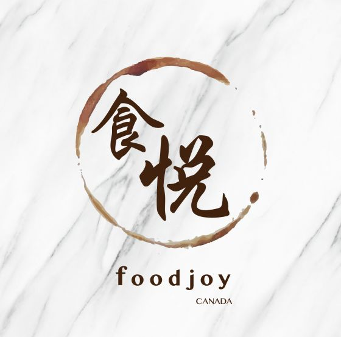 (原始链接: https://mmbiz.qpic.cn/mmbiz_png/XA8n2XaESnTIgeuM50CjapPPeGibf95wqa9l6BPje7FzBaA4dtKyzPHgfvljSJ0SdibSUcGkIlooyY7wjicLBcdOQ/640?wx_fmt=png)
-  (原始链接: https://mmbiz.qpic.cn/mmbiz_png/XA8n2XaESnTIgeuM50CjapPPeGibf95wqCVHB8icYU7OicfUroDAW39ARvicOuSYiaHRdzp4rMnxXV3xqAyvicztmtzw/640?wx_fmt=png)
-  (原始链接: https://mmbiz.qpic.cn/mmbiz_png/XA8n2XaESnTIgeuM50CjapPPeGibf95wqa9l6BPje7FzBaA4dtKyzPHgfvljSJ0SdibSUcGkIlooyY7wjicLBcdOQ/640?wx_fmt=png)
- 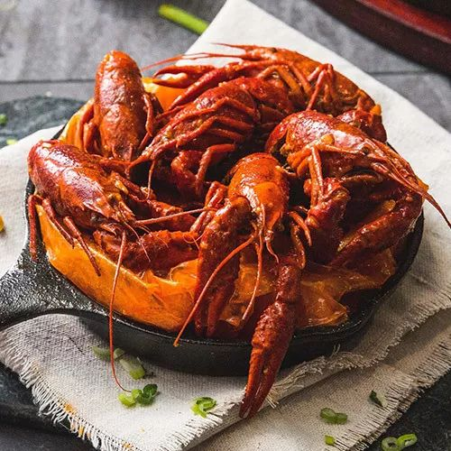 (原始链接: https://mmbiz.qpic.cn/mmbiz_jpg/XA8n2XaESnTIgeuM50CjapPPeGibf95wq97MxVxgv6oRLzhFJsXF6rXF8C4KlXEw3CKuJZKFiaEMzWa7m1CkgqUQ/640?wx_fmt=jpeg)
- 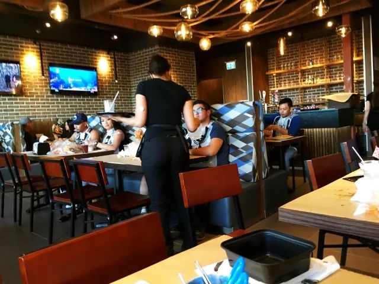 (原始链接: https://mmbiz.qpic.cn/mmbiz_jpg/XA8n2XaESnTIgeuM50CjapPPeGibf95wqeRRFSstYQ5U50aDRibLibIdSs3YetH80ZkUWdwTGIkia97ibENub1u5emg/640?wx_fmt=jpeg)
-  (原始链接: https://mmbiz.qpic.cn/mmbiz_jpg/XA8n2XaESnTIgeuM50CjapPPeGibf95wqqKHaeL3mmDvtvEQ96Tg1BZARfiaD64jibicbdSic6cuPSiaeS19Aiabl0vag/640?wx_fmt=jpeg)
- 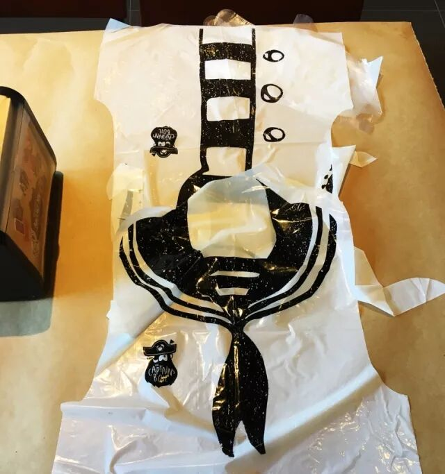 (原始链接: https://mmbiz.qpic.cn/mmbiz_jpg/XA8n2XaESnTIgeuM50CjapPPeGibf95wqcCZAojRhmNj7Q1iaCTHBNktnoEE2tB0Fibltcv84wQl9aaFlIQBVAgcg/640?wx_fmt=jpeg)
- 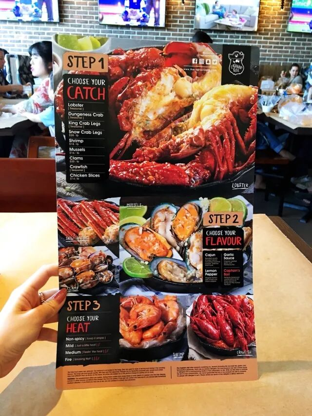 (原始链接: https://mmbiz.qpic.cn/mmbiz_jpg/XA8n2XaESnTIgeuM50CjapPPeGibf95wqjDq6WycS3e9bsK0mbmkpWvClLJaAhic849UL3CUGDtTIqibsM9iaWMib1Q/640?wx_fmt=jpeg)
- 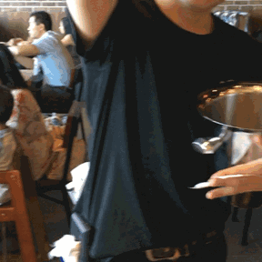 (原始链接: https://mmbiz.qpic.cn/mmbiz_gif/XA8n2XaESnTIgeuM50CjapPPeGibf95wq05iauruSuctZdcQ5JOMl862WjYonznyKIBVhAL4POszA0RdnHaFV4qw/640?wx_fmt=gif)
- 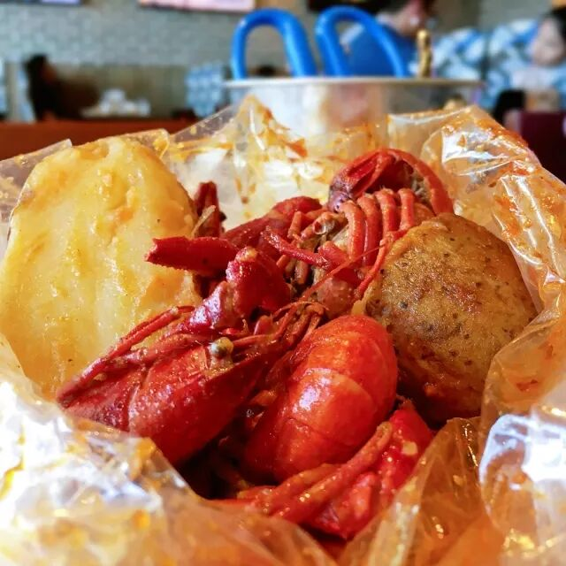 (原始链接: https://mmbiz.qpic.cn/mmbiz_jpg/XA8n2XaESnTIgeuM50CjapPPeGibf95wqciayJrRIzxVf7XBZo9AmWLs1WwZ8Ppia7b2ZeMdgL72TF6emvWQAibVCg/640?wx_fmt=jpeg)
- 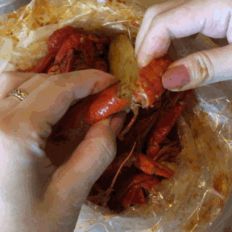 (原始链接: https://mmbiz.qpic.cn/mmbiz_gif/XA8n2XaESnTIgeuM50CjapPPeGibf95wqTZIPUCnIwHP281oxxlrR0DsYCh6odUiaHAl3E9dQFDFa1pOQ6FSvNpQ/640?wx_fmt=gif)
- 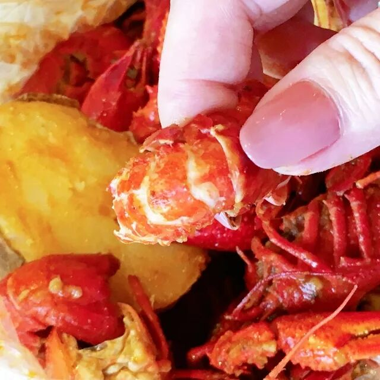 (原始链接: https://mmbiz.qpic.cn/mmbiz_jpg/XA8n2XaESnTIgeuM50CjapPPeGibf95wqRzDrQ9I9pxhrhuAAQg6mrho1HMg5rzKVQ1PAxPLMhEQXtY9wTmV4Pg/640?wx_fmt=jpeg)
- 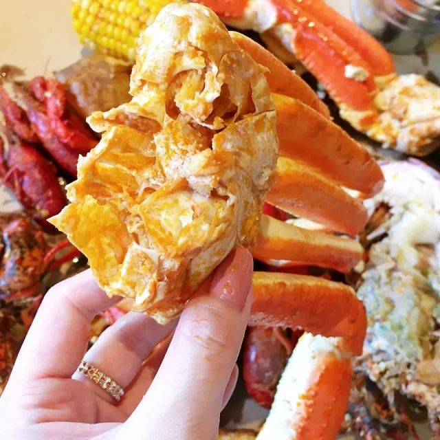 (原始链接: https://mmbiz.qpic.cn/mmbiz_jpg/XA8n2XaESnTIgeuM50CjapPPeGibf95wq04mCdFbFDLEr6qAtpOEAvb9kEIt4pMF6ZgyP0zAIXqZp690ibTa0Ubg/640?wx_fmt=jpeg)
- 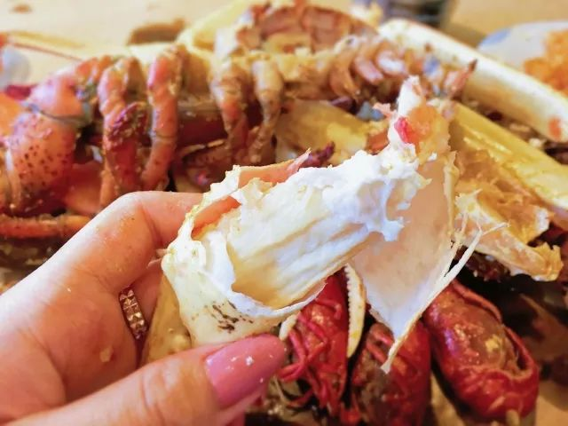 (原始链接: https://mmbiz.qpic.cn/mmbiz_jpg/XA8n2XaESnTIgeuM50CjapPPeGibf95wqzaubECial3Sw0IuiaaDTV5VoxOy6hfYRcWXzKRYVWBKiaHtz3ibBddSsEA/640?wx_fmt=jpeg)
- 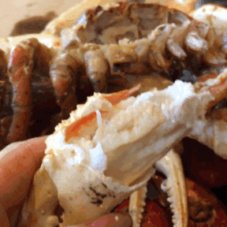 (原始链接: https://mmbiz.qpic.cn/mmbiz_gif/XA8n2XaESnTIgeuM50CjapPPeGibf95wqMGmDic6n7BInWJiavkG3dgTgtcdGU2hR2MNTZcuaFhUXrUS7ia11ECXkg/640?wx_fmt=gif)
- 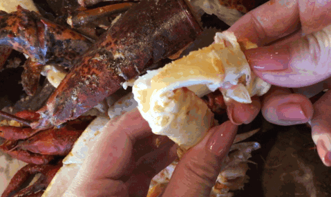 (原始链接: https://mmbiz.qpic.cn/mmbiz_gif/XA8n2XaESnTIgeuM50CjapPPeGibf95wqoOMw4xoTRoQWdOrhib7sVFM2IxBibsxMMnxBvau7FNbHHKR0Xiaol9zMA/640?wx_fmt=gif)
- 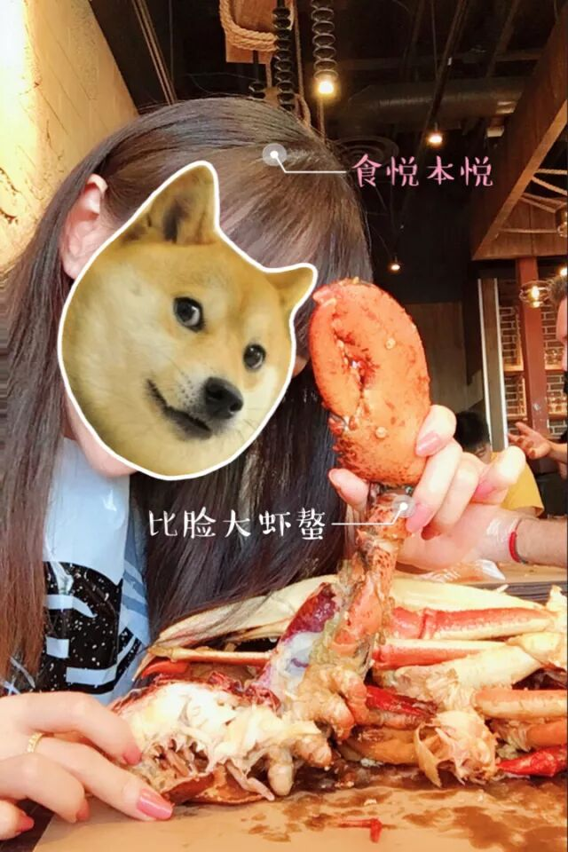 (原始链接: https://mmbiz.qpic.cn/mmbiz_jpg/XA8n2XaESnTIgeuM50CjapPPeGibf95wqic52N8UliaYBiaqv58Ynkqr9xDHzU0K20v0n38ibDqwsFrqcmlUVcBWiamQ/640?wx_fmt=jpeg)
- 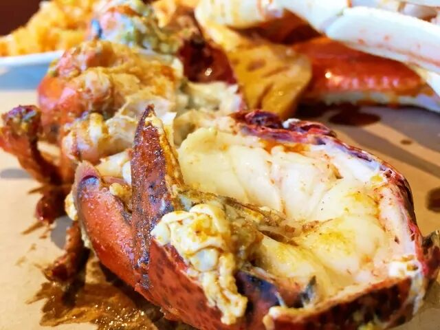 (原始链接: https://mmbiz.qpic.cn/mmbiz_jpg/XA8n2XaESnTIgeuM50CjapPPeGibf95wqnzjSsFYwhGMtlaWJst6klFib7JtzF3LCIQYWtSelH3kZVdBic74RkgIg/640?wx_fmt=jpeg)
- 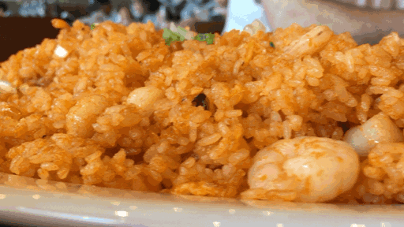 (原始链接: https://mmbiz.qpic.cn/mmbiz_gif/XA8n2XaESnTIgeuM50CjapPPeGibf95wqnBRHvhlZJEQUfuH6dic9AoBy38n3NagRCicFSNrJR5JZWIOFI5D0uJWQ/640?wx_fmt=gif)
- 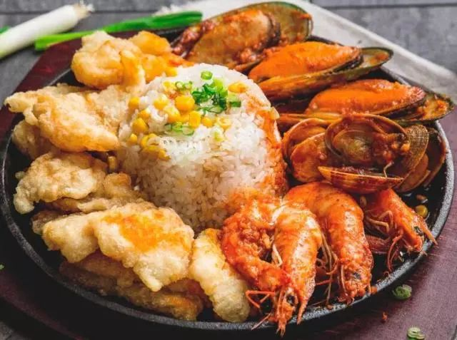 (原始链接: https://mmbiz.qpic.cn/mmbiz_jpg/XA8n2XaESnTIgeuM50CjapPPeGibf95wqgVoRaibqIlRdiabEYh5lTiaTmb7GWRNN2icJFHYF6Drakx3PfgW4SsKoYA/640?wx_fmt=jpeg)
-  (原始链接: https://mmbiz.qpic.cn/mmbiz_jpg/XA8n2XaESnTIgeuM50CjapPPeGibf95wqd53Pn85pvsjia1SuZ4YKboibV5E0oY3sVV4JjmcdPT0A7wmiahzFtFCHA/640?wx_fmt=jpeg)
- 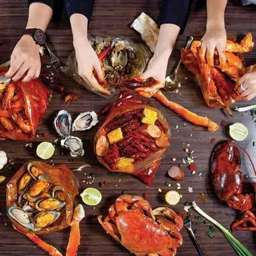 (原始链接: https://mmbiz.qpic.cn/mmbiz_jpg/XA8n2XaESnTIgeuM50CjapPPeGibf95wqR7Y8y00y15efjSpvL3ZNEvN1zvXYa3900ibePT60b5iaEydcuTiblxq0A/640?wx_fmt=jpeg)
-  (原始链接: https://mmbiz.qpic.cn/mmbiz_jpg/XA8n2XaESnTIgeuM50CjapPPeGibf95wqXEaLgmLYeLw1oqejKoFn1bHYY21cvnicT4EG9iaibyibRlaHcTQB0WkyIQ/640?wx_fmt=jpeg)
-  (原始链接: https://mmbiz.qpic.cn/mmbiz_jpg/XA8n2XaESnTIgeuM50CjapPPeGibf95wqzmOeRLe6Z0GF1ZACEyulsvjKln9HYGI5ygkqLiahI8qj4YCXOlN6opA/640?wx_fmt=jpeg)
