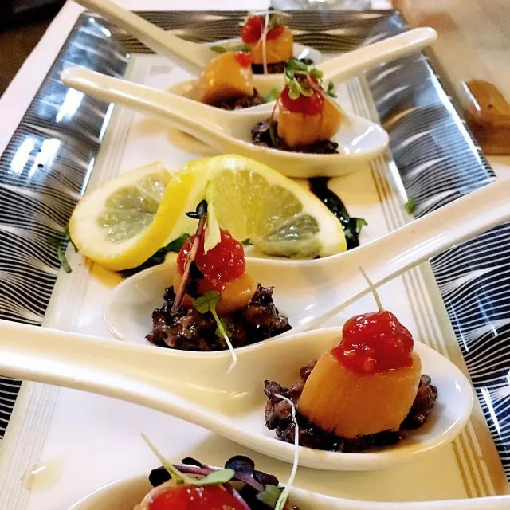
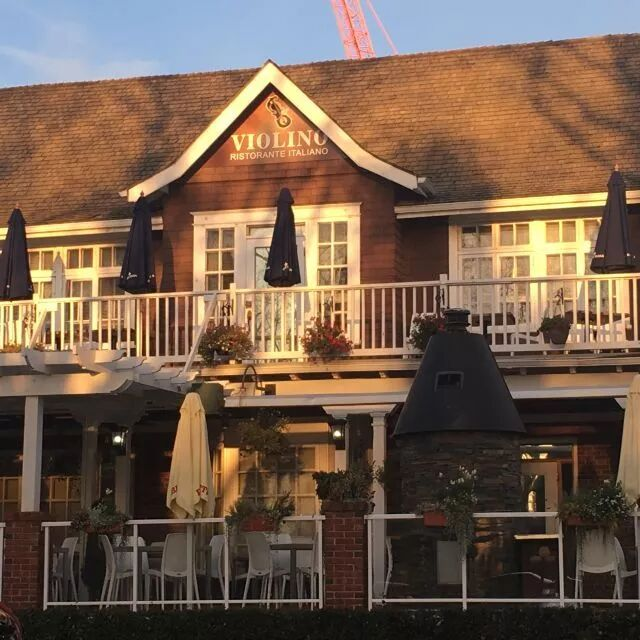

# 无标题

**链接地址:** http://mp.weixin.qq.com/s?__biz=MzI0MDQ0ODI0Ng==&mid=2247485775&idx=1&sn=9756a6b972a4ef0eb1b2ba833e66b550&chksm=e91beed6de6c67c05b175be3463803da8f5ea49258a3c57f0dafdcb4af9fd3798240e6f15804&mpshare=1&scene=2&srcid=0512gXGEb9eA5PNn8neUdtYZ#rd
**作者:** 起不来床不吃早饭
**获取时间:** 2025/8/28 21:54:46
**图片数量:** 59

---

## 原始HTML内容

<section style="box-sizing: border-box;"><section class="Powered-by-XIUMI V5" style="box-sizing: border-box;" powered-by="xiumi.us"><section class="" style="text-align: center;box-sizing: border-box;"><section class="" style="display: inline-block;width: 98%;vertical-align: top;box-shadow: rgba(177, 160, 254, 0.39) 2.82843px 2.82843px 4px;border-color: rgba(169, 169, 169, 0.53);border-width: 4px;border-radius: 4px;border-style: outset;box-sizing: border-box;"><section class="Powered-by-XIUMI V5" style="box-sizing: border-box;" powered-by="xiumi.us"><section class="" style="box-sizing: border-box;"><section class="" style="display: inline-block;vertical-align: bottom;width: 33.33%;box-sizing: border-box;"><section class="Powered-by-XIUMI V5" style="box-sizing: border-box;" powered-by="xiumi.us"><section class="" style="margin-right: 0%;margin-left: 0%;box-sizing: border-box;"><section class="" style="max-width: 100%;vertical-align: middle;display: inline-block;overflow: hidden !important;box-sizing: border-box;"></section></section></section><section class="Powered-by-XIUMI V5" style="box-sizing: border-box;" powered-by="xiumi.us"><section class="" style="margin-right: 0%;margin-left: 0%;box-sizing: border-box;"><section class="" style="max-width: 100%;vertical-align: middle;display: inline-block;overflow: hidden !important;box-sizing: border-box;"></section></section></section></section><section class="" style="display: inline-block;vertical-align: bottom;width: 33.33%;box-sizing: border-box;"><section class="Powered-by-XIUMI V5" style="box-sizing: border-box;" powered-by="xiumi.us"><section class="" style="box-sizing: border-box;"><section class="" style="font-size: 12px;color: rgb(114, 113, 113);box-sizing: border-box;">
<strong style="box-sizing: border-box;">倾</strong><strong style="box-sizing: border-box;">诚</strong><strong style="letter-spacing: 0px;box-sizing: border-box;">为您服务！</strong> 
</section></section></section><section class="Powered-by-XIUMI V5" style="box-sizing: border-box;" powered-by="xiumi.us"><section class="" style="box-sizing: border-box;"><section class="" style="display: inline-block;width: 100%;vertical-align: top;overflow-x: auto;overflow-y: hidden;box-sizing: border-box;-webkit-overflow-scrolling: touch;"><section style="width: 300%;min-width: 100%;max-width: 300% !important;box-sizing: border-box;"><section class="Powered-by-XIUMI V5" style="display: inline-block;width: 33.3333%;vertical-align: top;box-sizing: border-box;" powered-by="xiumi.us"><section class="" style="text-align: right;margin-right: 0%;margin-left: 0%;box-sizing: border-box;"><section class="" style="max-width: 100%;vertical-align: middle;display: inline-block;overflow: hidden !important;box-sizing: border-box;"></section></section></section><section class="Powered-by-XIUMI V5" style="display: inline-block;width: 33.3333%;vertical-align: top;box-sizing: border-box;" powered-by="xiumi.us"><section class="" style="margin-right: 0%;margin-left: 0%;box-sizing: border-box;"><section class="" style="max-width: 100%;vertical-align: middle;display: inline-block;overflow: hidden !important;box-sizing: border-box;"></section></section></section><section class="Powered-by-XIUMI V5" style="display: inline-block;width: 33.3333%;vertical-align: top;box-sizing: border-box;" powered-by="xiumi.us"><section class="" style="text-align: left;margin-right: 0%;margin-left: 0%;box-sizing: border-box;"><section class="" style="max-width: 100%;vertical-align: middle;display: inline-block;overflow: hidden !important;box-sizing: border-box;"></section></section></section></section></section></section></section><section class="Powered-by-XIUMI V5" style="box-sizing: border-box;" powered-by="xiumi.us"><section class="" style="margin-right: 0%;margin-left: 0%;box-sizing: border-box;"><section class="" style="max-width: 100%;vertical-align: middle;display: inline-block;overflow: hidden !important;box-sizing: border-box;"></section></section></section></section><section class="" style="display: inline-block;vertical-align: bottom;width: 33.33%;box-sizing: border-box;"><section class="Powered-by-XIUMI V5" style="box-sizing: border-box;" powered-by="xiumi.us"><section class="" style="margin-right: 0%;margin-left: 0%;box-sizing: border-box;"><section class="" style="max-width: 100%;vertical-align: middle;display: inline-block;box-shadow: rgb(0, 0, 0) 0px 0px 0px;overflow: hidden !important;box-sizing: border-box;"></section></section></section><section class="Powered-by-XIUMI V5" style="box-sizing: border-box;" powered-by="xiumi.us"><section class="" style="margin-right: 0%;margin-left: 0%;box-sizing: border-box;"><section class="" style="max-width: 100%;vertical-align: middle;display: inline-block;width: 80%;overflow: hidden !important;box-sizing: border-box;"></section></section></section><section class="Powered-by-XIUMI V5" style="box-sizing: border-box;" powered-by="xiumi.us"><section class="" style="margin-right: 0%;margin-left: 0%;box-sizing: border-box;"><section class="" style="display: inline-block;border-width: 2px;border-style: solid;border-color: rgba(0, 0, 0, 0);padding: 0.1em 0.3em;color: rgb(62, 62, 62);line-height: 1.5;letter-spacing: 0px;font-size: 10px;box-sizing: border-box;">
长按二维码

获得更多资讯
</section></section></section></section></section></section></section></section></section><section class="Powered-by-XIUMI V5" style="box-sizing: border-box;" powered-by="xiumi.us"><section class="" style="margin-top: 10px;margin-bottom: 10px;box-sizing: border-box;"><section class="" style="padding-top: 2px;padding-bottom: 2px;box-sizing: border-box;"><section style="height: 4px;transform: rotate(0deg);-webkit-transform: rotate(0deg);-moz-transform: rotate(0deg);-o-transform: rotate(0deg);float: left;margin-top: -3px;background-color: rgb(255, 255, 255);box-sizing: border-box;"><section style="width: 4px;height: 4px;border-radius: 100%;float: left;background-color: rgba(227, 170, 78, 0.94);box-sizing: border-box;"></section><section style="width: 4px;height: 4px;border-radius: 100%;margin-left: 0.5em;float: left;background-color: rgba(227, 170, 78, 0.94);box-sizing: border-box;"></section><section style="width: 4px;height: 4px;border-radius: 100%;margin-left: 0.5em;float: left;background-color: rgba(227, 170, 78, 0.94);box-sizing: border-box;"></section><section style="width: 4px;height: 4px;border-radius: 100%;margin-left: 0.5em;float: left;background-color: rgba(227, 170, 78, 0.94);box-sizing: border-box;"></section><section style="width: 4px;height: 4px;border-radius: 100%;margin-left: 0.5em;float: left;background-color: rgba(227, 170, 78, 0.94);box-sizing: border-box;"></section></section><section style="border-top: 1px solid rgba(227, 170, 78, 0.94);margin-top: -2px;border-right-color: rgba(227, 170, 78, 0.94);border-bottom-color: rgba(227, 170, 78, 0.94);border-left-color: rgba(227, 170, 78, 0.94);box-sizing: border-box;"></section><section class="" style="width: 100%;padding: 10px;box-sizing: border-box;"><section class="Powered-by-XIUMI V5" style="box-sizing: border-box;" powered-by="xiumi.us"><section class="" style="box-sizing: border-box;"><section class="" style="text-align: center;letter-spacing: 2px;line-height: 1;box-sizing: border-box;">
<strong style="box-sizing: border-box;">置顶广告专区</strong> 

<strong style="box-sizing: border-box;">金主大大的广告不仅可以看，还可以“玩”。</strong>

<strong style="box-sizing: border-box;">滑动箭头解锁更多信息哦~</strong>
</section></section></section></section><section style="width: 100%;text-align: right;box-sizing: border-box;"><section style="height: 4px;margin-top: -2px;float: right;transform: rotate(0deg);-webkit-transform: rotate(0deg);-moz-transform: rotate(0deg);-o-transform: rotate(0deg);background-color: rgb(255, 255, 255);box-sizing: border-box;"><section style="width: 4px;height: 4px;border-radius: 100%;float: left;background-color: rgba(227, 170, 78, 0.94);box-sizing: border-box;"></section><section style="width: 4px;height: 4px;border-radius: 100%;margin-left: 0.5em;float: left;background-color: rgba(227, 170, 78, 0.94);box-sizing: border-box;"></section><section style="width: 4px;height: 4px;border-radius: 100%;margin-left: 0.5em;float: left;background-color: rgba(227, 170, 78, 0.94);box-sizing: border-box;"></section><section style="width: 4px;height: 4px;border-radius: 100%;margin-left: 0.5em;float: left;background-color: rgba(227, 170, 78, 0.94);box-sizing: border-box;"></section><section style="width: 4px;height: 4px;border-radius: 100%;margin-left: 0.5em;float: left;background-color: rgba(227, 170, 78, 0.94);box-sizing: border-box;"></section></section><section style="clear: both;box-sizing: border-box;"></section><section style="border-top: 1px solid rgba(227, 170, 78, 0.94);margin-top: -2px;margin-bottom: 2px;border-right-color: rgba(227, 170, 78, 0.94);border-bottom-color: rgba(227, 170, 78, 0.94);border-left-color: rgba(227, 170, 78, 0.94);box-sizing: border-box;"></section></section></section></section></section><section class="Powered-by-XIUMI V5" style="box-sizing: border-box;" powered-by="xiumi.us"><section class="" style="margin: 10px 0%;box-sizing: border-box;"><section class="" style="display: inline-block;width: 100%;vertical-align: top;background-image: url(&quot;https://mmbiz.qpic.cn/mmbiz_jpg/XA8n2XaESnRSrj1pYPNvvTY005bqZDdXkOqmUgLvHO826GFLcXuKP6BNsq2iaZOOWhgriabKc5zoFj9k7DXaXgrQ/640?wx_fmt=jpeg&quot;);background-position: 51.0827% -9.4556%;background-repeat: repeat;background-size: 107.915%;background-attachment: scroll;padding: 10px;box-shadow: rgb(0, 0, 0) 0px 0px 0px;box-sizing: border-box;"><section class="Powered-by-XIUMI V5" style="box-sizing: border-box;" powered-by="xiumi.us"><section class="" style="text-align: center;margin-top: 10px;margin-bottom: 10px;overflow: hidden;box-sizing: border-box;"><section class="" style="width: 18em;height: 18em;margin-right: auto;margin-left: auto;border-radius: 100%;box-sizing: border-box;"><section style="display: table;width: 100%;height: 100%;border-width: 2px;border-style: solid;border-color: rgb(237, 200, 197);border-radius: 100%;box-sizing: border-box;"><section class="" style="display: table-cell;vertical-align: middle;width: 100%;line-height: 1.2;padding: 15px;border-radius: 100%;background-image: url(&quot;https://mmbiz.qpic.cn/mmbiz_jpg/XA8n2XaESnRSrj1pYPNvvTY005bqZDdX21AmcZfBhwEz1AwSictBZVvROXtrQdw7RPtQia7oYsdNicXTsOkwTF73Q/640?wx_fmt=jpeg&quot;);background-position: 50% 50%;background-repeat: no-repeat;background-size: cover;background-attachment: scroll;box-sizing: border-box;"><section class="Powered-by-XIUMI V5" style="box-sizing: border-box;" powered-by="xiumi.us"><section class="" style="box-sizing: border-box;"><section class="" style="color: rgb(168, 73, 79);font-size: 14px;line-height: 1.6;letter-spacing: 2px;box-sizing: border-box;">
再爱睡懒觉的人 

也无法拒绝

一顿美味营养的

<strong style="box-sizing: border-box;">早午餐</strong> 

 

 
</section></section></section></section></section></section></section></section><section class="Powered-by-XIUMI V5" style="box-sizing: border-box;" powered-by="xiumi.us"><section class="" style="box-sizing: border-box;"><section class="" style="box-sizing: border-box;">
 
</section></section></section><section class="Powered-by-XIUMI V5" style="box-sizing: border-box;" powered-by="xiumi.us"><section class="" style="text-align: center;margin: 10px 0%;box-sizing: border-box;"><section class="" style="display: inline-block;width: 100%;vertical-align: top;box-shadow: rgba(0, 0, 0, 0.53) 0px 0px 0px;border-width: 0px;border-radius: 0px;border-style: none;border-color: rgb(62, 62, 62);padding: 10px;background-color: rgb(246, 208, 207);box-sizing: border-box;"><section class="Powered-by-XIUMI V5" style="box-sizing: border-box;" powered-by="xiumi.us"><section class="" style="box-sizing: border-box;"><section class="" style="display: inline-block;width: 100%;vertical-align: top;box-shadow: rgba(0, 0, 0, 0.53) 0px 0px 8px inset;padding: 10px;background-color: rgb(255, 255, 255);box-sizing: border-box;"><section class="Powered-by-XIUMI V5" style="box-sizing: border-box;" powered-by="xiumi.us"><section class="" style="box-sizing: border-box;"><section class="" style="max-width: 100%;vertical-align: middle;display: inline-block;box-shadow: rgb(0, 0, 0) 0px 0px 0px;overflow: hidden !important;box-sizing: border-box;"></section></section></section></section></section></section></section></section></section><section class="Powered-by-XIUMI V5" style="box-sizing: border-box;" powered-by="xiumi.us"><section class="" style="box-sizing: border-box;"><section class="" style="box-sizing: border-box;">
 
</section></section></section><section class="Powered-by-XIUMI V5" style="box-sizing: border-box;" powered-by="xiumi.us"><section class="" style="text-align: center;margin: 30px 0% 10px;box-sizing: border-box;"><section class="" style="display: inline-block;width: 90%;vertical-align: top;border-width: 0px;box-shadow: rgb(170, 170, 170) 2px 0px 10px;padding: 10px;border-radius: 0px;border-style: none;border-color: rgb(255, 255, 255);background-color: rgba(255, 255, 255, 0.58);box-sizing: border-box;"><section class="Powered-by-XIUMI V5" style="box-sizing: border-box;" powered-by="xiumi.us"><section class="" style="text-align: left;margin: -40px 0% 10px;transform: translate3d(-25px, 0px, 0px);-webkit-transform: translate3d(-25px, 0px, 0px);-moz-transform: translate3d(-25px, 0px, 0px);-o-transform: translate3d(-25px, 0px, 0px);font-size: 14px;box-sizing: border-box;"><section class="" style="max-width: 100%;vertical-align: middle;display: inline-block;width: 60%;box-shadow: rgb(0, 0, 0) 0px 0px 0px;overflow: hidden !important;box-sizing: border-box;"></section></section></section><section class="Powered-by-XIUMI V5" style="box-sizing: border-box;" powered-by="xiumi.us"><section class="" style="box-sizing: border-box;"><section class="" style="text-align: justify;padding-right: 10px;padding-left: 10px;font-size: 14px;color: rgb(164, 114, 112);letter-spacing: 1px;box-sizing: border-box;">
爱城的春天是一年四季中最美妙也是最短暂的季节。春天里最幸福的事儿，莫过于窝在舒适温馨的餐厅享用一顿美好休闲的早午餐！坐在春日午后的露台上沐浴着柔和的阳光，感受着清风的抚摸，和朋友亲人聊聊知心话，是不是非常惬意呀？如果你还在头疼那么多美型优雅的餐厅不知道该选择哪家，食悦为大家总结了7家特供母亲节早午餐套餐的餐厅，赶快去定位不然就没位置啦！
</section></section></section><section class="Powered-by-XIUMI V5" style="box-sizing: border-box;" powered-by="xiumi.us"><section class="" style="text-align: right;margin-right: 0%;margin-bottom: -10px;margin-left: 0%;transform: translate3d(25px, 0px, 0px);box-sizing: border-box;"><section class="" style="max-width: 100%;vertical-align: middle;display: inline-block;width: 39%;overflow: hidden !important;box-sizing: border-box;"></section></section></section></section></section></section><section class="Powered-by-XIUMI V5" style="box-sizing: border-box;" powered-by="xiumi.us"><section class="" style="box-sizing: border-box;"><section class="" style="box-sizing: border-box;">
 
</section></section></section><section class="Powered-by-XIUMI V5" style="box-sizing: border-box;" powered-by="xiumi.us"><section class="" style="box-sizing: border-box;"><section class="" style="text-align: center;font-size: 18px;color: rgb(155, 17, 30);box-sizing: border-box;">
<strong style="box-sizing: border-box;">Fairmont Hotel Macdonald</strong>
</section></section></section><section class="Powered-by-XIUMI V5" style="box-sizing: border-box;" powered-by="xiumi.us"><section class="" style="text-align: center;box-sizing: border-box;"><section class="" style="display: inline-block;vertical-align: middle;width: 20%;box-sizing: border-box;"><section class="Powered-by-XIUMI V5" style="box-sizing: border-box;" powered-by="xiumi.us"><section class="" style="margin-right: 0%;margin-left: 0%;box-sizing: border-box;"><section class="" style="max-width: 100%;vertical-align: middle;display: inline-block;overflow: hidden !important;box-sizing: border-box;"><svg xmlns="http://www.w3.org/2000/svg" x="0px" y="0px" viewBox="0 0 298.9 128.6" style="vertical-align: middle;max-width: 100%;box-sizing: border-box;" width="298.9"><g style="box-sizing: border-box;"><path style="box-sizing: border-box;" d="M106.2,73.8c-6.7,0-12.9-1.7-18.3-5.1C78.8,62.9,73.6,52.6,74.4,42c0.1-0.9,0.9-1.6,1.8-1.5   c0.9,0.1,1.6,0.9,1.5,1.8c-0.7,9.4,3.9,18.5,12.1,23.7c11.1,7,26.5,5.9,42.3-3.1c0.8-0.5,1.8-0.2,2.3,0.6c0.5,0.8,0.2,1.8-0.6,2.3   C124.2,71,114.8,73.8,106.2,73.8z" fill="rgb(191, 39, 52)"></path><g style="box-sizing: border-box;"><path style="stroke: rgb(255, 255, 255);stroke-linecap: round;stroke-linejoin: round;box-sizing: border-box;" d="M155.4,17c2.3,0,6.7,0.3,9.9,1.3    c4.4,1.3,9.2,4.5,11.8,8.8c1.1,1.9,1.8,4.1,2.6,6.2c0.4,1.2,1.4,3,1.4,4.3c0,0,0.4,1.3-0.4,2.3c-0.9,1-3.7,1.9-7.2,2    c-5.8,0.1-11.6-2.6-14-8.9c-1.3-3.6-1.9-7.7-4.6-10.5c-1.1-1.1-5-4.7-5-4.7S153.2,17,155.4,17z" fill="rgb(191, 39, 52)"></path><path style="stroke: rgb(255, 255, 255);stroke-linecap: round;stroke-linejoin: round;box-sizing: border-box;" d="M175.7,30c0.1,0.2,0.2,0.5,0.3,0.5    c-0.9-0.8-0.4-5.9-0.3-7c0.1-2.2,0.5-4.3,1.5-6.3c2.3-4.9,11.5-12.6,11.5-12.6s-0.6,8.2,3.6,15.2c2.9,4.8,0.7,13.4-3.9,16.9    c-2.1,1.6-5.9,3.7-9.4,2.2C178.9,38.9,174.9,27.8,175.7,30z" fill="rgb(191, 39, 52)"></path><path style="stroke: rgb(255, 255, 255);stroke-linecap: round;stroke-linejoin: round;box-sizing: border-box;" d="M168.9,26c0.2-3.6,1.1-7.1,1.2-10.7    c0-1-0.4-4.5-2.3-7.3c4.3,3.2,11.5,9.7,14.6,14.3c3.9,6,5.2,11,4.7,18.5c-0.4,5-4.1,9.3-4.1,9.3c-1.7-1.3-3.6-2-5.2-3.4    C172.3,41.8,168.5,33.8,168.9,26z" fill="rgb(191, 39, 52)"></path><path style="box-sizing: border-box;" d="M183,50.2c0.2-5.1-0.2-10.5-3-14.9c-0.3-0.5-0.7-1-1-1.6c-0.2-0.3-1.2-1.8-1.2-1.8    S176.9,40.7,183,50.2z" fill="rgb(255, 255, 255)"></path><path style="stroke: rgb(255, 255, 255);stroke-linecap: round;stroke-linejoin: round;box-sizing: border-box;" d="M182.9,50.4c-0.8-0.9-2.7-3.7-4.1-6.5    c-1.4-2.8-3.8-7.3-5.8-9.4c-2-2.1-4-3.2-5.2-3.1c-1.2,0-2.5,0.2-2.5,0.2S164,28.8,160,29c-4.1,0.2-5,3.1-5,3.1s-2-0.6-3.9,1.1    c-1.9,1.6-4.7,8.1-4.7,8.1s5-5,9.9-4.6c3.9,0.3,8,1.2,13.1,5.8s6.3,6.6,9.5,7.7C183.2,51.6,183.7,51.3,182.9,50.4z" fill="rgb(191, 39, 52)"></path><path style="stroke: rgb(255, 255, 255);stroke-linecap: round;stroke-linejoin: round;box-sizing: border-box;" d="M183,50.2c0.3-1.2,0.7-4.5,0.7-7.6    s0.1-8.3,0.9-11.1c0.8-2.8,2.1-4.6,3.2-5.1c1.1-0.5,2.3-0.9,2.3-0.9s-0.1-3,3.6-4.7c3.7-1.7,5.8,0.5,5.8,0.5s1.5-1.4,4-0.8    c2.4,0.6,5.3,2.9,5.3,2.9s-5.2,0.3-8.4,2.6c-3.2,2.2-6.7,4.5-9.1,10.9c-2.4,6.4-2.6,8.9-5,11.4C183.3,51.4,182.7,51.4,183,50.2z" fill="rgb(191, 39, 52)"></path></g><path style="stroke: rgb(255, 255, 255);stroke-linecap: round;stroke-linejoin: round;box-sizing: border-box;" d="M221.6,89.1c0,0-3.6-1-4.8-1.1   c-1.1-0.1-4.1-0.9-6.8-2s-7.1-2.8-9.8-3c-2.7-0.3-4.7,0.2-5.5,1s-1.6,1.7-1.6,1.7s-2.6-1.1-5.3,1.5s-1.6,5.1-1.6,5.1   s-1.7,0.8-2,3.1c-0.3,2.3,0.4,3,0.3,4.4c-0.1,1.4-0.6,2.5-0.6,2.5s1.6-0.4,2.5-2.1s0.4-3.6,3.5-5.6c3-2,5.2-2.8,11.6-2.7   c6.3,0.1,9.4-0.5,12.3-1.7C217.7,88.6,221.6,89.1,221.6,89.1z" fill="rgb(191, 39, 52)"></path><path style="stroke: rgb(255, 255, 255);stroke-linecap: round;stroke-linejoin: round;box-sizing: border-box;" d="M73.6,72.9c0,0-3.9,1.5-4.9,2.1   c-1.1,0.6-4.2,1.9-7.3,2.6c-3.1,0.8-8.1,2.2-10.6,3.7s-4,3.2-4.2,4.4c-0.2,1.2-0.3,2.5-0.3,2.5s-3,0.7-3.7,4.8   c-0.7,4.1,1.9,5.6,1.9,5.6s-1,1.9,0.2,4.1s2.4,2.4,3.2,3.7c0.8,1.4,1.1,2.6,1.1,2.6s1.2-1.3,0.9-3.5c-0.3-2.1-2-3.5-0.6-7.2   s2.8-5.9,8.5-9.9s8-6.6,9.8-9.5C69.9,75,73.6,72.9,73.6,72.9z" fill="rgb(191, 39, 52)"></path><path style="stroke: rgb(255, 255, 255);stroke-linecap: round;stroke-linejoin: round;box-sizing: border-box;" d="M235.3,45c0,0-3.7-3.3-7.8-3.5   c-4.3-0.2-7.6,2.9-9.4,6.4c-1.9,3.7-3.4,7.8-4.1,11.9c-0.9,4.8-0.9,9.6,0.2,14.3c1,3.9,4.4,14.2,4.4,14.2S211,78.7,208,74.1   c-2.9-4.4-5.4-10.2-4.9-15.6c0.4-4.7,3.9-5.6,3.9-5.6s-2.2-1.8-0.9-5.9c1.8-5.4,7.7-4.3,7.7-4.3s-0.5-2.5,2.8-4.2s5.3,0.5,5.3,0.5   s2.5-2.4,7.3-0.3C233.8,41,235.3,45,235.3,45z" fill="rgb(191, 39, 52)"></path><path style="stroke: rgb(255, 255, 255);stroke-linecap: round;stroke-linejoin: round;box-sizing: border-box;" d="M133.4,24c0,0-5-0.3-8.3,2.2   c-3.5,2.5-4.1,7-3.3,10.9c0.8,4.1,2.3,8.2,4.2,11.8c2.3,4.3,5.3,8,9.2,11c3.2,2.4,12.4,8.3,12.4,8.3s-11.9-2.7-17.2-4.4   c-5-1.6-10.6-4.6-13.6-9c-2.6-3.9-0.5-6.8-0.5-6.8s-2.9,0-4.4-4c-2-5.3,3.3-8.2,3.3-8.2s-2-1.7-0.5-5s4.4-2.9,4.4-2.9   s0.4-3.4,5.5-4.8C129.7,21.9,133.4,24,133.4,24z" fill="rgb(191, 39, 52)"></path><g style="box-sizing: border-box;"><path style="stroke: rgb(255, 255, 255);stroke-linecap: round;stroke-linejoin: round;box-sizing: border-box;" d="M73.1,11.2C75.2,8.3,81,0.5,81,0.5    s0.7,1.1,1.7,4.8c0.8,3.1,1.6,6.1,2.1,9.3c0.2,1.4,0.5,2.9,0.4,4.4c-0.5,5.9-5.1,13.4-12.2,12.9c0,0-4.2-3.8-4.2-9.4    C68.9,17.4,71.1,14,73.1,11.2z" fill="rgb(191, 39, 52)"></path><path style="box-sizing: border-box;" d="M73.3,29.9c0,0.2,0.2,1.6,0.1,1.7c3.7-3.1,4.5-9.8,3.9-14.1c-0.3,0.3-0.6,0.8-0.8,1.2    C74.2,22.4,73.1,25.6,73.3,29.9z" fill="rgb(255, 255, 255)"></path><path style="stroke: rgb(255, 255, 255);stroke-linecap: round;stroke-linejoin: round;box-sizing: border-box;" d="M56.7,15.5c4.6,1.9,8.8,3,11,7.1    c3.3,5.9,2,10.6,2,10.6s-2.7,1.6-5.3,1C59,33.1,53.8,29.5,52,25.3c-1.7-3.8-3.2-14-3.2-14S55.4,15,56.7,15.5z" fill="rgb(191, 39, 52)"></path><path style="box-sizing: border-box;" d="M60.2,24.2c0.1,3.2,4.1,6.6,6.8,8c0.7,0.4,2,0.6,2.8,0.5c-0.7-1.8-2.7-4.3-4.2-5.4    C63.9,26.1,60.2,23.6,60.2,24.2z" fill="rgb(255, 255, 255)"></path><path style="stroke: rgb(255, 255, 255);stroke-linecap: round;stroke-linejoin: round;box-sizing: border-box;" d="M60.1,60.1c-1.3-5.3-0.9-9.5,1.8-13.7    c4-6.2,10.3-7.5,10.3-7.5s1.3,2.8,2.2,5.5c1.6,5,1,10.1-2,14c-2.8,3.5-9.7,10.4-9.7,10.4S61,63.7,60.1,60.1z" fill="rgb(191, 39, 52)"></path><path style="box-sizing: border-box;" d="M66,52c3.1-3,5.3-7.1,5.8-10.1c0.1-0.8,0-2.2-0.4-2.9c-1.6,1.2-3.5,4-4.1,5.9    C66.8,46.9,65.5,52.5,66,52z" fill="rgb(255, 255, 255)"></path><path style="stroke: rgb(255, 255, 255);stroke-linecap: round;stroke-linejoin: round;box-sizing: border-box;" d="M48.1,38.9c3.3-3.3,7-4.4,10.7-4.4    s10.7,0.7,10.7,0.7c1.1,0.7-1.5,5.3-6,9c-3,2.4-5.4,4.8-9.6,5c-2.7,0.1-8.8-0.5-11-2C42.1,46.6,44.9,42.2,48.1,38.9z" fill="rgb(191, 39, 52)"></path><path style="box-sizing: border-box;" d="M58.4,40.8c2.7-0.3,4.2-0.6,6.7-1.7c1.6-0.7,3.5-2.3,5.1-3c-5.4-1.2-11,1.5-14.6,5    C56.1,40.8,57.8,40.9,58.4,40.8z" fill="rgb(255, 255, 255)"></path><path style="stroke: rgb(255, 255, 255);stroke-linecap: round;stroke-linejoin: round;box-sizing: border-box;" d="M73.8,40.2c1.9-1.2,4.4-1,6.5-0.6    c6.5,1.2,10.1,3.4,12.3,8.3c1.9,4.3,2.7,7.6,6.3,11c-1.1-1-4.9-1-6.4-1.2c-1.9-0.2-3.8-0.4-5.7-0.7c-3.7-0.6-7.4-2.8-9.8-5.7    C74.7,48.4,73.4,40.4,73.8,40.2z" fill="rgb(191, 39, 52)"></path><path style="box-sizing: border-box;" d="M78.2,45.4c1.6,1.5,5.9,3,6.6,4.9c0,0-0.8-2.1-2-4.2c-1.2-2.1-2.6-3.7-4.4-4.9    c-1.6-1.1-4.1-1.8-4.1-1.8S75.8,43.1,78.2,45.4z" fill="rgb(255, 255, 255)"></path><path style="stroke: rgb(255, 255, 255);stroke-linecap: round;stroke-linejoin: round;box-sizing: border-box;" d="M77.1,36c0.7-3.9,0.9-4.2,2.9-6.6    c2.8-3.1,9.2-5,14.5-4.4c4.6,0.5,9,2.8,13.5,5.2c-0.7-0.3-2.6,1-3.1,1.3c-1.4,0.7-2.9,1.5-4.3,2.3c-3.2,1.7-6.3,3.9-9.7,5.2    c-3.1,1.1-6.9,1.5-10.1,0.7c-1.2-0.3-3.1-1.2-3.6-2.4C76.9,36.4,77.1,36,77.1,36z" fill="rgb(191, 39, 52)"></path><path style="box-sizing: border-box;" d="M89.8,31.3c-3.2,0.4-9.7,1.3-11.5,4.3c-0.1,0.2-0.6,1.6-0.6,1.6C81.9,36.5,86.8,34.7,89.8,31.3z" fill="rgb(255, 255, 255)"></path><path style="stroke: rgb(255, 255, 255);stroke-linecap: round;stroke-linejoin: round;box-sizing: border-box;" d="M68.7,34.7c-0.5,2.3,1.1,4.6,3.4,5    c2.3,0.5,4.6-1,5-3.4c0.5-2.3-1-4.6-3.4-5C71.4,30.9,69.1,32.4,68.7,34.7z" fill="rgb(191, 39, 52)"></path></g><g style="box-sizing: border-box;"><path style="stroke: rgb(255, 255, 255);stroke-linecap: round;stroke-linejoin: round;box-sizing: border-box;" d="M40.7,72.8c0,0-17.2,3.6-27.8-0.2    c-6.3-2.3-8.2-4.2-8.2-6.3C4.7,64,6,63.5,6,63.5s-7.6-3.3-5-9.2s9.8-3.1,9.8-3.1s0.4-2.9,4.9-2.9C26.5,48.1,40.7,72.8,40.7,72.8z" fill="rgb(191, 39, 52)"></path><path style="stroke: rgb(255, 255, 255);stroke-linecap: round;stroke-linejoin: round;box-sizing: border-box;" d="M30.2,61.2c7,4.8,10.5,11.6,10.5,11.6    S30.4,73.3,23.5,71c-7.2-2.4-11.4-11.6-11.4-11.6S23.9,56.9,30.2,61.2z" fill="rgb(191, 39, 52)"></path><path style="stroke: rgb(255, 255, 255);stroke-linecap: round;stroke-linejoin: round;box-sizing: border-box;" d="M40.7,72.9c0,0-2.8-3.8-3.5-4.8    S34.8,65,32.4,63s-6.7-4.9-8.3-7.3c-1.6-2.4-2.2-4.5-1.8-5.7c0.3-1.2,0.8-2.4,0.8-2.4s-2.4-1.9-1.2-5.8c1.1-3.9,4.1-4.1,4.1-4.1    s-0.1-2.1,1.9-3.5c2-1.5,3.1-1.1,4.4-1.9c1.3-0.8-1.9,3.9-2.2,7.8c-0.3,3.9,0,6.4,3.3,12.3S37.6,61.6,38,65    C38.3,69.5,40.7,72.9,40.7,72.9z" fill="rgb(191, 39, 52)"></path><path style="stroke: rgb(255, 255, 255);stroke-linecap: round;stroke-linejoin: round;box-sizing: border-box;" d="M40.7,72.9c0,0-4.4-0.1-5.6,0    c-1.2,0-4.9,0.1-7.9-0.7c-3-0.7-7.3-2.5-10.2-2.4c-2.9,0.2-4.9,1-5.7,1.9s-1.4,2-1.4,2s-3-0.7-5.4,2.5c-2.5,3.2-0.9,5.7-0.9,5.7    S1.9,83.1,2,85.6c0,2.5,1,3.1,1.1,4.7s2-3.8,4.9-6.4s5.1-3.8,11.9-4.7c6.7-0.9,9.9-2.1,12.9-3.8C36.5,73,40.7,72.9,40.7,72.9z" fill="rgb(191, 39, 52)"></path></g><path style="box-sizing: border-box;" d="M193.1,81.5c-11.4,0-25.7-4.9-37-8.7c-2.3-0.8-4.5-1.5-6.5-2.2c-24.6-8-45.8-10.9-69,0.9   c-15.1,7.7-27.6,8.6-40.6,2.8c-0.8-0.4-1.2-1.3-0.8-2.2c0.4-0.8,1.3-1.2,2.2-0.8c12,5.3,23.7,4.5,37.8-2.8   c24.3-12.3,46.2-9.4,71.6-1.1c2,0.7,4.2,1.4,6.6,2.2c14.6,5,34.6,11.8,45.2,6.8c0.8-0.4,1.8,0,2.2,0.8c0.4,0.8,0,1.8-0.8,2.2   C200.8,80.9,197.1,81.5,193.1,81.5z" fill="rgb(191, 39, 52)"></path><path style="box-sizing: border-box;" d="M182.6,49.6c-0.9,0.3-1.3,1.2-1,2.1c6.9,19.5,26.3,35.6,46.6,39.3c16.1,2.9,30.2-2.4,40.8-14.9   c0.6-0.7,0.5-1.7-0.2-2.3c-0.7-0.6-1.8-0.5-2.3,0.2c-9.8,12.5-23.3,16.5-38.2,13.8c-19.1-3.5-37-18.7-43.5-37.1   C184.4,49.7,183.5,49.3,182.6,49.6z" fill="rgb(191, 39, 52)"></path><path style="box-sizing: border-box;" d="M143.3,80.5c-0.3,0-0.6-0.1-0.9-0.2c-0.8-0.5-1-1.5-0.5-2.3c0.4-0.7,10.9-17.3,30.9-15.3   c17.6,1.7,30.9,13.6,31.4,14.1c0.7,0.6,0.7,1.7,0.1,2.3c-0.6,0.7-1.7,0.7-2.3,0.1c-0.1-0.1-13-11.7-29.6-13.3   c-17.9-1.8-27.3,13.1-27.7,13.7C144.4,80.2,143.9,80.5,143.3,80.5z" fill="rgb(191, 39, 52)"></path><g style="box-sizing: border-box;"><path style="stroke: rgb(255, 255, 255);stroke-linecap: round;stroke-linejoin: round;box-sizing: border-box;" d="M144.8,68.5c-1-2.9-2.9-7.5-3.8-10.4    c-0.3-0.8-1.2-3.6-1.2-3.6s-6.5,8.6-8.1,13.1c-2.1,5.7-2.2,9.2,0.1,15.2c1.5,4,5.9,6.7,5.9,6.7c1.2-1.4,2.8-2.4,3.9-4    C145.2,80.2,146.9,74.8,144.8,68.5z" fill="rgb(191, 39, 52)"></path><path style="box-sizing: border-box;" d="M137.6,89.5c-1.3-4.1-2.4-8.6-0.9-12.8c0.2-0.5,0.4-1,0.6-1.5c0.1-0.3,0.6-1.8,0.6-1.8    S140.8,80.3,137.6,89.5z" fill="rgb(255, 255, 255)"></path><path style="stroke: rgb(255, 255, 255);stroke-linecap: round;stroke-linejoin: round;box-sizing: border-box;" d="M164.8,70.2c-2.1,0-6.2,0.4-9.2,1.3    c-4.1,1.2-8.4,4.9-10.7,8.7c-1,1.6-1.7,2.5-2.3,4.3c-0.4,1-1.3,2.6-1.2,3.7c0,0-0.4,1.1,0.5,1.9c0.8,0.8,3.5,1.5,6.8,1.5    c5.5,0,10.8-2.4,12.8-7.7c1.1-3.1,1.5-6.6,3.9-9c1-1,4.5-4.1,4.5-4.1S166.9,70.2,164.8,70.2z" fill="rgb(191, 39, 52)"></path><path style="box-sizing: border-box;" d="M148.4,86.8c-2.4,2-6.8,2.8-6.8,2.8c1.3-1.6,2.6-3.6,4.1-4.9c1.8-1.6,3.5-2.6,5.8-3.2    c0.1,0,1.5-0.3,1.5-0.1C153,81.5,150.7,84.8,148.4,86.8z" fill="rgb(255, 255, 255)"></path><path style="stroke: rgb(255, 255, 255);stroke-linecap: round;stroke-linejoin: round;box-sizing: border-box;" d="M164.7,105c-4.4-6.2-2.9-10-13.6-12.7    c-2.2-0.5-6-1.1-8.1,0.5c-0.7,0.5-1.2,2-1.4,2.9c-0.7,3.6,3.6,8.7,6.3,10.7c4.7,3.5,9.5,2.6,15,2.3c3-0.2,5.1-1,5.1-1    C166.8,107.3,165.6,106.3,164.7,105z" fill="rgb(191, 39, 52)"></path><path style="box-sizing: border-box;" d="M145,97.3c-0.7-0.5-1.7-1.5-2-2.3s0-1.5,2-1.2c1.2,0.2,3.7,2,4.8,3.3c1.1,1.4,2.9,4.7,2.9,4.7    C151,99.5,147.4,98.8,145,97.3z" fill="rgb(255, 255, 255)"></path><path style="stroke: rgb(255, 255, 255);stroke-linecap: round;stroke-linejoin: round;box-sizing: border-box;" d="M134.9,98.7c1.1-2.2,0.1-5.4-1.7-5.6    c-8.3-1.2-13-0.8-18.4,5.8c-1.6,2-3.9,4.9-7.5,6.8c0,0,4.8,0.9,5.9,1.1C123.1,109.1,131.1,106.6,134.9,98.7z" fill="rgb(191, 39, 52)"></path><path style="box-sizing: border-box;" d="M132.3,97.6c-1,0.8-2.1,1.4-3.3,1.7c-2.1,0.6-4.3,1-6.7,1c0,0,3-1.9,3.9-2.5c1.5-1,2.5-1.7,4-2.5    c0.9-0.5,2.6-1,3.4,0C134.3,96.1,132.8,97.2,132.3,97.6z" fill="rgb(255, 255, 255)"></path><path style="stroke: rgb(255, 255, 255);stroke-linecap: round;stroke-linejoin: round;box-sizing: border-box;" d="M131.6,82.8c-1.3-3.2-4.7-5.7-8.5-6.7    c-4.9-1.2-16.1-1.5-16.1-1.5s5.1,8.7,7.1,11.7c2.7,3.9,7.2,6.5,11.4,6.3c2.4-0.1,6.5,0,8.3-2.8C133.9,89.9,132.4,84.7,131.6,82.8z" fill="rgb(191, 39, 52)"></path><path style="box-sizing: border-box;" d="M123.4,82.9c2.9,0.4,5.1,0.8,7.4,2.9c0.7,0.6,3.1,4,3.1,4S126.3,89.7,123.4,82.9z" fill="rgb(255, 255, 255)"></path><path style="stroke: rgb(255, 255, 255);stroke-linecap: round;stroke-linejoin: round;box-sizing: border-box;" d="M132.4,103.1c-2,3.7-2,6.9-1.2,10.5    s3.6,8.3,5.4,14.5c-1.1-3.8,3.8-6.5,6.4-12.2c1.9-4.2,2.6-9.7,0.7-13.4c-1.1-2.1-3.3-5.4-6.4-5.7    C137.5,96.9,133.8,100.5,132.4,103.1z" fill="rgb(191, 39, 52)"></path><path style="box-sizing: border-box;" d="M137.3,109.3c-0.9-2.7-1.6-4.9-0.9-7.9c0.2-0.9,1.9-4.6,1.9-4.6S141.4,103.6,137.3,109.3z" fill="rgb(255, 255, 255)"></path><path style="stroke: rgb(255, 255, 255);stroke-linecap: round;stroke-linejoin: round;box-sizing: border-box;" d="M133.6,92.8c0.2,2.4,2.3,4.2,4.7,4    s4.2-2.3,4-4.7c-0.2-2.4-2.3-4.2-4.7-4C135.2,88.2,133.4,90.3,133.6,92.8z" fill="rgb(191, 39, 52)"></path></g><path style="box-sizing: border-box;" d="M286.4,63.9c-4.2-0.3-9.4,2.3-11.8,4.1c-3.3,2.4-12.7,11.3-13.8,12.4c-4.4,4.3-2.6,6.1,1.9,1.7   c5.1-5,11.3-10.2,13.5-11.9c2.5-1.9,6.9-3.8,10-3.6c4.5,0.3,8.1,2.8,9.4,6.5s0.5,8.4-3.6,10.5c-2.1,1-4.6,1.5-6.8,0.8   c-1.1-0.3-2.3-0.8-2.9-1.9c-0.5-0.9-0.5-2.7,1-2.9c1.3-0.1,2.7,0,4-0.5c0.8-0.3,1.4-1.5,1.5-2.3c0.2-2-1.6-3.9-3.6-3.9   c-1.8,0-4,1.3-5.1,2.9l0,0c-0.6,0.7-1,1.4-1.2,2.2c-0.7,2.7,0.8,5.8,3.1,7.7c3.4,2.9,8.2,2.4,11.4,0.8c5.5-2.7,6.6-9.7,4.9-14.5   C296.5,67.4,292,64.2,286.4,63.9z" fill="rgb(191, 39, 52)"></path><path style="box-sizing: border-box;" d="M268.8,75c5.9-9.7,8.6-25.3-4.9-34.7c-4-2.8-8.8-3.1-12.2-3.1c-4.7-0.1-9.9,3.1-12.4,7.1   c-3.3,5.3-3.2,12,1,16.7c2.2,2.5,8.2,5.2,12.8,1.2c4.6-4.1,2.8-9,1.2-10.9c-1.7-1.8-5.2-2.5-7.3-0.6c-2.5,2.2-1.2,4.7-0.5,5.5   c0.7,0.7,1.6,1.3,2.3,1.1c0.8-0.4,1.4-0.4,1.7-0.1c0.1,0.1,0.9,1.5-0.6,2.9c-3.6,3.2-7.4-0.3-8.3-1.2c-3.2-3.6-3-11.7,1.7-15.9   c7.8-7,20.9-2.1,25.4,6.7c4.9,9.8,0.5,20.8-5.4,28.9C261.2,81.6,264,82.9,268.8,75z" fill="rgb(191, 39, 52)"></path></g></svg></section></section></section></section><section class="" style="display: inline-block;vertical-align: middle;width: 20%;box-sizing: border-box;"><section class="Powered-by-XIUMI V5" style="box-sizing: border-box;" powered-by="xiumi.us"><section class="" style="margin-right: 0%;margin-left: 0%;box-sizing: border-box;"><section class="" style="max-width: 100%;vertical-align: middle;display: inline-block;overflow: hidden !important;box-sizing: border-box;"><svg xmlns="http://www.w3.org/2000/svg" x="0px" y="0px" viewBox="0 0 298.9 128.6" style="vertical-align: middle;max-width: 100%;box-sizing: border-box;" width="298.9"><g style="box-sizing: border-box;"><path style="box-sizing: border-box;" d="M193.3,73.8c-8.6,0-18-2.7-27.5-8.1c-0.8-0.5-1.1-1.5-0.6-2.3c0.5-0.8,1.5-1.1,2.3-0.6   c15.9,9,31.4,10.2,42.4,3.1c8.2-5.2,12.8-14.2,12.1-23.7c-0.1-0.9,0.6-1.7,1.5-1.8c0.9-0.1,1.7,0.6,1.8,1.5   c0.8,10.6-4.4,20.9-13.6,26.7C206.3,72.1,200.1,73.8,193.3,73.8z" fill="rgb(191, 39, 52)"></path><g style="box-sizing: border-box;"><path style="stroke: rgb(255, 255, 255);stroke-width: 1.0012;stroke-linecap: round;stroke-linejoin: round;box-sizing: border-box;" d="M144,17    c-2.3,0-6.7,0.3-9.9,1.3c-4.5,1.3-9.3,4.5-11.8,8.8c-1.1,1.9-1.8,4.1-2.6,6.2c-0.4,1.2-1.4,3-1.4,4.3c0,0-0.4,1.3,0.4,2.3    c0.9,1,3.7,1.9,7.3,2c5.9,0.1,11.6-2.6,14-8.9c1.3-3.6,1.9-7.7,4.6-10.5c1.1-1.1,5-4.7,5-4.7S146.3,17,144,17z" fill="rgb(191, 39, 52)"></path><path style="stroke: rgb(255, 255, 255);stroke-width: 1.0012;stroke-linecap: round;stroke-linejoin: round;box-sizing: border-box;" d="M123.6,30    c-0.1,0.2-0.2,0.5-0.3,0.5c0.9-0.8,0.4-5.9,0.3-7c-0.1-2.2-0.5-4.3-1.5-6.3c-2.3-4.9-11.5-12.6-11.5-12.6s0.6,8.2-3.6,15.2    c-2.9,4.8-0.7,13.4,4,16.9c2.1,1.6,5.9,3.7,9.4,2.2C120.4,38.9,124.4,27.8,123.6,30z" fill="rgb(191, 39, 52)"></path><path style="stroke: rgb(255, 255, 255);stroke-width: 1.0012;stroke-linecap: round;stroke-linejoin: round;box-sizing: border-box;" d="M130.5,26    c-0.2-3.6-1.1-7.1-1.2-10.7c0-1,0.4-4.5,2.3-7.3c-4.3,3.2-11.6,9.7-14.6,14.3c-3.9,6-5.2,11-4.7,18.5c0.4,5,4.1,9.3,4.1,9.3    c1.7-1.3,3.6-2,5.2-3.4C127,41.8,130.8,33.8,130.5,26z" fill="rgb(191, 39, 52)"></path><path style="box-sizing: border-box;" d="M116.4,50.2c-0.2-5.1,0.2-10.5,3-14.9c0.3-0.5,0.7-1,1-1.6c0.2-0.3,1.2-1.8,1.2-1.8    S122.5,40.7,116.4,50.2z" fill="rgb(255, 255, 255)"></path><path style="stroke: rgb(255, 255, 255);stroke-width: 1.0012;stroke-linecap: round;stroke-linejoin: round;box-sizing: border-box;" d="M116.4,50.4    c0.8-0.9,2.7-3.7,4.1-6.5s3.8-7.3,5.8-9.4c2-2.1,4-3.2,5.2-3.1c1.2,0,2.5,0.2,2.5,0.2s1.3-2.7,5.4-2.5c4.1,0.2,5,3.1,5,3.1    s2-0.6,3.9,1.1c1.9,1.6,4.7,8.1,4.7,8.1s-5-5-9.9-4.6c-3.9,0.3-8,1.2-13.1,5.8c-5.1,4.6-6.3,6.6-9.5,7.7    C116.1,51.6,115.6,51.3,116.4,50.4z" fill="rgb(191, 39, 52)"></path><path style="stroke: rgb(255, 255, 255);stroke-width: 1.0012;stroke-linecap: round;stroke-linejoin: round;box-sizing: border-box;" d="M116.4,50.2    c-0.3-1.2-0.7-4.5-0.7-7.6s-0.1-8.3-0.9-11.1s-2.1-4.6-3.2-5.1s-2.3-0.9-2.3-0.9s0.1-3-3.7-4.7c-3.7-1.7-5.8,0.5-5.8,0.5    s-1.5-1.4-4-0.8c-2.4,0.6-5.3,2.9-5.3,2.9s5.2,0.3,8.4,2.6c3.2,2.2,6.7,4.5,9.1,10.9s2.6,8.9,5,11.4    C116.1,51.4,116.7,51.4,116.4,50.2z" fill="rgb(191, 39, 52)"></path></g><path style="stroke: rgb(255, 255, 255);stroke-width: 1.0012;stroke-linecap: round;stroke-linejoin: round;box-sizing: border-box;" d="M77.7,89.1   c0,0,3.6-1,4.8-1.1c1.1-0.1,4.1-0.9,6.8-2c2.7-1.1,7.1-2.8,9.8-3c2.7-0.3,4.7,0.2,5.5,1s1.6,1.7,1.6,1.7s2.6-1.1,5.3,1.5   c2.7,2.6,1.6,5.1,1.6,5.1s1.7,0.8,2.1,3.1c0.3,2.3-0.4,3-0.3,4.4s0.6,2.5,0.6,2.5s-1.6-0.4-2.5-2.1s-0.4-3.6-3.5-5.6   c-3-2-5.3-2.8-11.6-2.7c-6.3,0.1-9.4-0.5-12.4-1.7C81.5,88.6,77.7,89.1,77.7,89.1z" fill="rgb(191, 39, 52)"></path><path style="stroke: rgb(255, 255, 255);stroke-width: 1.0012;stroke-linecap: round;stroke-linejoin: round;box-sizing: border-box;" d="M226,72.9   c0,0,3.9,1.5,5,2.1s4.2,1.9,7.4,2.6c3.1,0.8,8.1,2.2,10.7,3.7c2.5,1.5,4,3.2,4.3,4.4c0.2,1.2,0.3,2.5,0.3,2.5s3,0.7,3.7,4.8   c0.7,4.1-1.9,5.6-1.9,5.6s1,1.9-0.2,4.1s-2.4,2.4-3.2,3.7c-0.8,1.4-1.1,2.6-1.1,2.6s-1.2-1.3-0.9-3.5c0.3-2.1,2-3.5,0.6-7.2   s-2.9-5.9-8.6-9.9c-5.7-4-8-6.6-9.8-9.5C229.7,75,226,72.9,226,72.9z" fill="rgb(191, 39, 52)"></path><path style="stroke: rgb(255, 255, 255);stroke-width: 1.0012;stroke-linecap: round;stroke-linejoin: round;box-sizing: border-box;" d="M63.9,45   c0,0,3.7-3.3,7.9-3.5c4.3-0.2,7.6,2.9,9.4,6.4c1.9,3.7,3.4,7.8,4.1,11.9c0.9,4.8,0.9,9.6-0.3,14.3c-1,3.9-4.4,14.2-4.4,14.2   s7.6-9.6,10.7-14.2c2.9-4.4,5.4-10.2,5-15.6c-0.4-4.7-3.9-5.6-3.9-5.6s2.2-1.8,0.9-5.9c-1.8-5.4-7.7-4.3-7.7-4.3s0.5-2.5-2.8-4.2   S77.5,39,77.5,39s-2.5-2.4-7.3-0.3C65.4,41,63.9,45,63.9,45z" fill="rgb(191, 39, 52)"></path><path style="stroke: rgb(255, 255, 255);stroke-width: 1.0012;stroke-linecap: round;stroke-linejoin: round;box-sizing: border-box;" d="M166.1,24   c0,0,5-0.3,8.3,2.2c3.5,2.5,4.1,7,3.3,10.9c-0.8,4.1-2.3,8.2-4.2,11.8c-2.3,4.3-5.3,8-9.2,11c-3.2,2.4-12.4,8.3-12.4,8.3   s12-2.7,17.3-4.4c5-1.6,10.6-4.6,13.6-9c2.7-3.9,0.5-6.8,0.5-6.8s2.9,0,4.4-4c2-5.3-3.3-8.2-3.3-8.2s2-1.7,0.5-5s-4.4-2.9-4.4-2.9   s-0.4-3.4-5.5-4.8C169.8,21.9,166.1,24,166.1,24z" fill="rgb(191, 39, 52)"></path><g style="box-sizing: border-box;"><path style="stroke: rgb(255, 255, 255);stroke-width: 1.0012;stroke-linecap: round;stroke-linejoin: round;box-sizing: border-box;" d="M226.5,11.2    c-2.1-2.9-7.9-10.7-7.9-10.7s-0.7,1.1-1.7,4.8c-0.8,3.1-1.6,6.1-2.1,9.3c-0.2,1.4-0.5,2.9-0.4,4.4c0.5,5.9,5.1,13.4,12.2,12.9    c0,0,4.3-3.8,4.2-9.4C230.7,17.4,228.5,14,226.5,11.2z" fill="rgb(191, 39, 52)"></path><path style="box-sizing: border-box;" d="M226.3,29.9c0,0.2-0.2,1.6-0.1,1.7c-3.7-3.1-4.5-9.8-3.9-14.1c0.3,0.3,0.6,0.8,0.8,1.2    C225.4,22.4,226.5,25.6,226.3,29.9z" fill="rgb(255, 255, 255)"></path><path style="stroke: rgb(255, 255, 255);stroke-width: 1.0012;stroke-linecap: round;stroke-linejoin: round;box-sizing: border-box;" d="M242.9,15.5    c-4.6,1.9-8.8,3-11.1,7.1c-3.3,5.9-2,10.6-2,10.6s2.7,1.6,5.4,1c5.4-1.1,10.7-4.7,12.5-8.9c1.7-3.8,3.2-14,3.2-14    S244.2,15,242.9,15.5z" fill="rgb(191, 39, 52)"></path><path style="box-sizing: border-box;" d="M239.4,24.2c-0.1,3.2-4.1,6.6-6.8,8c-0.7,0.4-2,0.6-2.8,0.5c0.7-1.8,2.7-4.3,4.2-5.4    C235.7,26.1,239.4,23.6,239.4,24.2z" fill="rgb(255, 255, 255)"></path><path style="stroke: rgb(255, 255, 255);stroke-width: 1.0012;stroke-linecap: round;stroke-linejoin: round;box-sizing: border-box;" d="M239.6,60.1    c1.3-5.3,0.9-9.5-1.8-13.7c-4-6.2-10.4-7.5-10.4-7.5s-1.3,2.8-2.2,5.5c-1.6,5-1,10.1,2,14c2.8,3.5,9.7,10.4,9.7,10.4    S238.7,63.7,239.6,60.1z" fill="rgb(191, 39, 52)"></path><path style="box-sizing: border-box;" d="M233.6,52c-3.1-3-5.3-7.1-5.8-10.1c-0.1-0.8,0-2.2,0.4-2.9c1.6,1.2,3.5,4,4.1,5.9    C232.9,46.9,234.1,52.5,233.6,52z" fill="rgb(255, 255, 255)"></path><path style="stroke: rgb(255, 255, 255);stroke-width: 1.0012;stroke-linecap: round;stroke-linejoin: round;box-sizing: border-box;" d="M251.5,38.9    c-3.3-3.3-7-4.4-10.7-4.4s-10.7,0.7-10.7,0.7c-1.1,0.7,1.5,5.3,6,9c3,2.4,5.4,4.8,9.7,5c2.7,0.1,8.8-0.5,11-2    C257.6,46.6,254.8,42.2,251.5,38.9z" fill="rgb(191, 39, 52)"></path><path style="box-sizing: border-box;" d="M241.2,40.8c-2.7-0.3-4.2-0.6-6.7-1.7c-1.6-0.7-3.5-2.3-5.1-3c5.4-1.2,11,1.5,14.6,5    C243.5,40.8,241.9,40.9,241.2,40.8z" fill="rgb(255, 255, 255)"></path><path style="stroke: rgb(255, 255, 255);stroke-width: 1.0012;stroke-linecap: round;stroke-linejoin: round;box-sizing: border-box;" d="M225.8,40.2    c-1.9-1.2-4.4-1-6.5-0.6c-6.5,1.2-10.1,3.4-12.4,8.3c-2,4.3-2.8,7.6-6.4,11c1.1-1,5-1,6.4-1.2c1.9-0.2,3.8-0.4,5.7-0.7    c3.7-0.6,7.4-2.8,9.9-5.7C224.9,48.4,226.2,40.4,225.8,40.2z" fill="rgb(191, 39, 52)"></path><path style="box-sizing: border-box;" d="M221.4,45.4c-1.6,1.5-5.9,3-6.7,4.9c0,0,0.8-2.1,2-4.2c1.2-2.1,2.6-3.7,4.4-4.9    c1.6-1.1,4.1-1.8,4.1-1.8S223.8,43.1,221.4,45.4z" fill="rgb(255, 255, 255)"></path><path style="stroke: rgb(255, 255, 255);stroke-width: 1.0012;stroke-linecap: round;stroke-linejoin: round;box-sizing: border-box;" d="M222.5,36    c-0.7-3.9-0.9-4.2-2.9-6.6c-2.8-3.1-9.2-5-14.5-4.4c-4.6,0.5-9,2.8-13.6,5.2c0.7-0.3,2.6,1,3.1,1.3c1.4,0.7,2.9,1.5,4.3,2.3    c3.2,1.7,6.3,3.9,9.7,5.2c3.1,1.1,6.9,1.5,10.1,0.7c1.2-0.3,3.1-1.2,3.6-2.4C222.7,36.4,222.5,36,222.5,36z" fill="rgb(191, 39, 52)"></path><path style="box-sizing: border-box;" d="M209.8,31.3c3.2,0.4,9.7,1.3,11.6,4.3c0.1,0.2,0.6,1.6,0.7,1.6C217.7,36.5,212.7,34.7,209.8,31.3z" fill="rgb(255, 255, 255)"></path><path style="stroke: rgb(255, 255, 255);stroke-width: 1.0012;stroke-linecap: round;stroke-linejoin: round;box-sizing: border-box;" d="M230.9,34.7    c0.5,2.3-1.1,4.6-3.4,5c-2.3,0.5-4.6-1-5-3.4c-0.5-2.3,1.1-4.6,3.4-5C228.2,30.9,230.5,32.4,230.9,34.7z" fill="rgb(191, 39, 52)"></path></g><g style="box-sizing: border-box;"><path style="stroke: rgb(255, 255, 255);stroke-width: 1.0012;stroke-linecap: round;stroke-linejoin: round;box-sizing: border-box;" d="M259,72.8    c0,0,17.2,3.6,27.9-0.2c6.3-2.3,8.2-4.2,8.2-6.3c0-2.3-1.3-2.9-1.3-2.9s7.6-3.3,5-9.2s-9.8-3.1-9.8-3.1s-0.4-2.9-4.9-2.9    C273.2,48.1,259,72.8,259,72.8z" fill="rgb(191, 39, 52)"></path><path style="stroke: rgb(255, 255, 255);stroke-width: 1.0012;stroke-linecap: round;stroke-linejoin: round;box-sizing: border-box;" d="M269.5,61.2    c-7,4.8-10.6,11.6-10.6,11.6s10.3,0.5,17.3-1.8c7.2-2.4,11.4-11.6,11.4-11.6S275.8,56.9,269.5,61.2z" fill="rgb(191, 39, 52)"></path><path style="stroke: rgb(255, 255, 255);stroke-width: 1.0012;stroke-linecap: round;stroke-linejoin: round;box-sizing: border-box;" d="M259,72.9    c0,0,2.8-3.8,3.5-4.8s2.4-3.1,4.9-5.1c2.4-2,6.7-4.9,8.3-7.3c1.6-2.4,2.2-4.5,1.9-5.7c-0.3-1.2-0.8-2.4-0.8-2.4s2.4-1.9,1.2-5.8    c-1.1-3.9-4.1-4.1-4.1-4.1s0.1-2.1-1.9-3.5c-2-1.5-3.1-1.1-4.4-1.9c-1.3-0.8,1.9,3.9,2.2,7.8c0.4,3.9,0,6.4-3.3,12.3    s-4.2,9.2-4.6,12.6C261.3,69.5,259,72.9,259,72.9z" fill="rgb(191, 39, 52)"></path><path style="stroke: rgb(255, 255, 255);stroke-width: 1.0012;stroke-linecap: round;stroke-linejoin: round;box-sizing: border-box;" d="M259,72.9    c0,0,4.4-0.1,5.6,0c1.2,0,4.9,0.1,7.9-0.7c3-0.7,7.3-2.5,10.2-2.4c2.9,0.2,4.9,1,5.7,1.9c0.8,0.9,1.4,2,1.4,2s2.9-0.8,5.4,2.5    c2.5,3.2,0.9,5.7,0.9,5.7s1.7,1.2,1.7,3.7s-1,3.1-1.1,4.7s-2-3.8-4.9-6.4s-5.1-3.8-11.9-4.7c-6.8-0.9-9.9-2.1-12.9-3.8    C263.2,73,259,72.9,259,72.9z" fill="rgb(191, 39, 52)"></path></g><path style="box-sizing: border-box;" d="M106.1,81.5c-4,0-7.7-0.6-10.7-2c-0.8-0.4-1.2-1.4-0.8-2.2c0.4-0.8,1.4-1.2,2.2-0.8   c10.6,5,30.7-1.8,45.4-6.8c2.3-0.8,4.5-1.5,6.5-2.2c25.5-8.2,47.4-11.2,71.8,1.1c14.2,7.2,25.8,8.1,37.9,2.8c0.8-0.4,1.8,0,2.2,0.8   c0.4,0.8,0,1.8-0.8,2.2c-12.9,5.7-25.8,4.8-40.7-2.8c-23.3-11.8-44.5-8.9-69.2-0.9c-2,0.6-4.2,1.4-6.5,2.2   C132,76.7,117.6,81.5,106.1,81.5z" fill="rgb(191, 39, 52)"></path><path style="box-sizing: border-box;" d="M116.7,49.6c0.9,0.3,1.3,1.2,1,2.1C110.9,71.1,91.3,87.3,71.1,91c-16.2,2.9-30.3-2.4-40.9-15   c-0.6-0.7-0.5-1.7,0.2-2.3c0.7-0.6,1.8-0.5,2.3,0.2C42.6,86.4,56.1,90.4,71,87.7c19.2-3.5,37.1-18.7,43.6-37.1   C114.9,49.7,115.9,49.3,116.7,49.6z" fill="rgb(191, 39, 52)"></path><path style="box-sizing: border-box;" d="M156.1,80.5c-0.6,0-1.1-0.3-1.4-0.8c-0.4-0.7-9.9-15.5-27.8-13.7c-16.6,1.5-29.5,13.2-29.6,13.3   c-0.7,0.6-1.7,0.6-2.3-0.1c-0.6-0.7-0.6-1.7,0.1-2.3c0.6-0.5,13.9-12.5,31.6-14.1c20-2,30.5,14.6,31,15.3c0.5,0.8,0.2,1.8-0.5,2.3   C156.7,80.4,156.4,80.5,156.1,80.5z" fill="rgb(191, 39, 52)"></path><g style="box-sizing: border-box;"><path style="stroke: rgb(255, 255, 255);stroke-width: 1.0012;stroke-linecap: round;stroke-linejoin: round;box-sizing: border-box;" d="M154.7,68.5    c1-2.9,2.9-7.5,3.8-10.4c0.3-0.8,1.2-3.6,1.2-3.6s6.5,8.6,8.2,13.1c2.1,5.7,2.2,9.2-0.1,15.2c-1.5,4-5.9,6.7-5.9,6.7    c-1.2-1.4-2.8-2.4-3.9-4C154.2,80.2,152.5,74.8,154.7,68.5z" fill="rgb(191, 39, 52)"></path><path style="box-sizing: border-box;" d="M161.9,89.5c1.4-4.1,2.4-8.6,0.9-12.8c-0.2-0.5-0.4-1-0.6-1.5c-0.1-0.3-0.6-1.8-0.6-1.8    S158.6,80.3,161.9,89.5z" fill="rgb(255, 255, 255)"></path><path style="stroke: rgb(255, 255, 255);stroke-width: 1.0012;stroke-linecap: round;stroke-linejoin: round;box-sizing: border-box;" d="M134.6,70.2    c2.1,0,6.2,0.4,9.2,1.3c4.1,1.2,8.4,4.9,10.7,8.7c1,1.6,1.7,2.5,2.3,4.3c0.4,1,1.3,2.6,1.2,3.7c0,0,0.4,1.1-0.5,1.9    c-0.8,0.8-3.5,1.5-6.9,1.5c-5.5,0-10.8-2.4-12.8-7.7c-1.1-3.1-1.5-6.6-3.9-9c-1-1-4.5-4.1-4.5-4.1S132.5,70.2,134.6,70.2z" fill="rgb(191, 39, 52)"></path><path style="box-sizing: border-box;" d="M151,86.8c2.4,2,6.8,2.8,6.8,2.8c-1.3-1.6-2.6-3.6-4.1-4.9c-1.8-1.6-3.5-2.6-5.8-3.2    c-0.1,0-1.5-0.3-1.6-0.1C146.4,81.5,148.7,84.8,151,86.8z" fill="rgb(255, 255, 255)"></path><path style="stroke: rgb(255, 255, 255);stroke-width: 1.0012;stroke-linecap: round;stroke-linejoin: round;box-sizing: border-box;" d="M134.6,105    c4.4-6.2,2.9-10,13.6-12.7c2.2-0.5,6-1.1,8.1,0.5c0.7,0.5,1.2,2,1.4,2.9c0.7,3.6-3.6,8.7-6.3,10.7c-4.7,3.5-9.5,2.6-15,2.3    c-3-0.2-5.1-1-5.1-1C132.6,107.3,133.7,106.3,134.6,105z" fill="rgb(191, 39, 52)"></path><path style="box-sizing: border-box;" d="M154.5,97.3c0.7-0.5,1.7-1.5,2-2.3s0-1.5-2-1.2c-1.2,0.2-3.7,2-4.8,3.3c-1.1,1.4-2.9,4.7-2.9,4.7    C148.5,99.5,152.1,98.8,154.5,97.3z" fill="rgb(255, 255, 255)"></path><path style="stroke: rgb(255, 255, 255);stroke-width: 1.0012;stroke-linecap: round;stroke-linejoin: round;box-sizing: border-box;" d="M164.6,98.7    c-1.1-2.2-0.1-5.4,1.7-5.6c8.3-1.2,13-0.8,18.5,5.8c1.6,2,3.9,4.9,7.5,6.8c0,0-4.8,0.9-5.9,1.1    C176.4,109.1,168.4,106.6,164.6,98.7z" fill="rgb(191, 39, 52)"></path><path style="box-sizing: border-box;" d="M167.2,97.6c1,0.8,2.1,1.4,3.3,1.7c2.1,0.6,4.3,1,6.7,1c0,0-3-1.9-3.9-2.5c-1.5-1-2.5-1.7-4-2.5    c-0.9-0.5-2.6-1-3.4,0C165.2,96.1,166.6,97.2,167.2,97.6z" fill="rgb(255, 255, 255)"></path><path style="stroke: rgb(255, 255, 255);stroke-width: 1.0012;stroke-linecap: round;stroke-linejoin: round;box-sizing: border-box;" d="M167.8,82.8    c1.3-3.2,4.7-5.7,8.5-6.7c4.9-1.2,16.2-1.5,16.2-1.5s-5.1,8.7-7.1,11.7c-2.7,3.9-7.2,6.5-11.4,6.3c-2.4-0.1-6.5,0-8.3-2.8    C165.6,89.9,167,84.7,167.8,82.8z" fill="rgb(191, 39, 52)"></path><path style="box-sizing: border-box;" d="M176,82.9c-2.9,0.4-5.1,0.8-7.4,2.9c-0.7,0.6-3.1,4-3.1,4S173.1,89.7,176,82.9z" fill="rgb(255, 255, 255)"></path><path style="stroke: rgb(255, 255, 255);stroke-width: 1.0012;stroke-linecap: round;stroke-linejoin: round;box-sizing: border-box;" d="M167,103.1    c2,3.7,2,6.9,1.2,10.5s-3.6,8.3-5.5,14.5c1.1-3.8-3.8-6.5-6.5-12.2c-2-4.2-2.6-9.7-0.7-13.4c1.1-2.1,3.3-5.4,6.4-5.7    C162,96.9,165.6,100.5,167,103.1z" fill="rgb(191, 39, 52)"></path><path style="box-sizing: border-box;" d="M162.1,109.3c0.9-2.7,1.6-4.9,0.9-7.9c-0.2-0.9-1.9-4.6-1.9-4.6S158,103.6,162.1,109.3z" fill="rgb(255, 255, 255)"></path><path style="stroke: rgb(255, 255, 255);stroke-width: 1.0012;stroke-linecap: round;stroke-linejoin: round;box-sizing: border-box;" d="M165.8,92.8    c-0.2,2.4-2.3,4.2-4.7,4s-4.2-2.3-4-4.7c0.2-2.4,2.3-4.2,4.7-4C164.2,88.2,166,90.3,165.8,92.8z" fill="rgb(191, 39, 52)"></path></g><path style="box-sizing: border-box;" d="M12.6,63.9c4.2-0.3,9.4,2.3,11.8,4.1c3.3,2.4,12.7,11.3,13.8,12.4c4.4,4.3,2.6,6.1-1.9,1.7   c-5.1-5-11.3-10.2-13.6-11.9c-2.5-1.9-6.9-3.8-10-3.6c-4.5,0.3-8.1,2.8-9.4,6.5C2.1,76.7,2.9,81.5,7,83.5c2.1,1,4.6,1.5,6.8,0.8   c1.1-0.3,2.3-0.8,2.9-1.9c0.5-0.9,0.5-2.7-1-2.9c-1.3-0.1-2.7,0-4-0.5c-0.8-0.3-1.4-1.5-1.5-2.3c-0.2-2,1.6-3.9,3.6-3.9   c1.8,0,4,1.3,5.1,2.9l0,0c0.6,0.7,1,1.4,1.2,2.2c0.7,2.7-0.8,5.8-3.1,7.7c-3.4,2.9-8.2,2.4-11.4,0.8C0.1,83.7-1,76.7,0.7,71.9   C2.6,67.4,7.1,64.2,12.6,63.9z" fill="rgb(191, 39, 52)"></path><path style="box-sizing: border-box;" d="M30.3,75c-5.9-9.7-8.6-25.3,4.9-34.7c4-2.8,8.9-3.1,12.2-3.1c4.8-0.1,9.9,3.1,12.4,7.1   c3.3,5.3,3.2,12-1,16.7c-2.2,2.5-8.3,5.2-12.8,1.2c-4.6-4.1-2.8-9-1.2-10.9c1.7-1.8,5.2-2.5,7.3-0.6c2.5,2.2,1.2,4.7,0.5,5.5   c-0.7,0.7-1.6,1.3-2.3,1.1c-0.8-0.4-1.4-0.4-1.7-0.1c-0.1,0.1-0.9,1.5,0.6,2.9c3.6,3.2,7.4-0.3,8.3-1.2c3.2-3.6,3-11.7-1.7-15.9   c-7.8-7-21-2.1-25.4,6.7c-4.9,9.8-0.6,20.8,5.4,28.9C38,81.6,35.1,82.9,30.3,75z" fill="rgb(191, 39, 52)"></path></g></svg></section></section></section></section></section></section><section class="Powered-by-XIUMI V5" style="box-sizing: border-box;" powered-by="xiumi.us"><section class="" style="text-align: center;margin: 10px 0%;box-sizing: border-box;"><section class="" style="display: inline-block;width: 100%;vertical-align: top;box-shadow: rgba(0, 0, 0, 0.53) 0px 0px 0px;border-width: 0px;border-radius: 0px;border-style: none;border-color: rgb(62, 62, 62);padding: 10px;background-color: rgb(246, 208, 207);box-sizing: border-box;"><section class="Powered-by-XIUMI V5" style="box-sizing: border-box;" powered-by="xiumi.us"><section class="" style="box-sizing: border-box;"><section class="" style="display: inline-block;width: 100%;vertical-align: top;box-shadow: rgba(0, 0, 0, 0.53) 0px 0px 8px inset;padding: 10px;background-color: rgb(255, 255, 255);box-sizing: border-box;"><section class="Powered-by-XIUMI V5" style="box-sizing: border-box;" powered-by="xiumi.us"><section class="" style="box-sizing: border-box;"><section class="" style="max-width: 100%;vertical-align: middle;display: inline-block;box-shadow: rgb(0, 0, 0) 0px 0px 0px;overflow: hidden !important;box-sizing: border-box;"></section></section></section></section></section></section></section></section></section><section class="Powered-by-XIUMI V5" style="box-sizing: border-box;" powered-by="xiumi.us"><section class="" style="box-sizing: border-box;"><section class="" style="text-align: center;font-size: 12px;color: rgba(62, 62, 62, 0.37);box-sizing: border-box;">
图片来源：myhotelwedding.com
</section></section></section><section class="Powered-by-XIUMI V5" style="box-sizing: border-box;" powered-by="xiumi.us"><section class="" style="text-align: center;margin: 30px 0% 10px;box-sizing: border-box;"><section class="" style="display: inline-block;width: 90%;vertical-align: top;border-width: 0px;box-shadow: rgb(170, 170, 170) 2px 0px 10px;padding: 10px;border-radius: 0px;border-style: none;border-color: rgb(255, 255, 255);background-color: rgba(255, 255, 255, 0.58);box-sizing: border-box;"><section class="Powered-by-XIUMI V5" style="box-sizing: border-box;" powered-by="xiumi.us"><section class="" style="text-align: left;margin: -40px 0% 10px;transform: translate3d(-25px, 0px, 0px);-webkit-transform: translate3d(-25px, 0px, 0px);-moz-transform: translate3d(-25px, 0px, 0px);-o-transform: translate3d(-25px, 0px, 0px);font-size: 14px;box-sizing: border-box;"><section class="" style="max-width: 100%;vertical-align: middle;display: inline-block;width: 60%;box-shadow: rgb(0, 0, 0) 0px 0px 0px;overflow: hidden !important;box-sizing: border-box;"></section></section></section><section class="Powered-by-XIUMI V5" style="box-sizing: border-box;" powered-by="xiumi.us"><section class="" style="box-sizing: border-box;"><section class="" style="text-align: justify;padding-right: 10px;padding-left: 10px;font-size: 14px;color: rgb(164, 114, 112);letter-spacing: 1px;box-sizing: border-box;">
说到位于女王饭店Faimont Hotel Macdonald中Harvest Room的古典英式下午茶，可能各位小仙女早就去打过卡了。但是她家的母亲节特供早午餐却是在另一个更加浪漫梦幻的<strong style="box-sizing: border-box;">Wedgewood Room</strong>举行哦！这个房间可是食悦最希望能用来举行婚礼的会场哦！薄荷绿的墙纸和奢华的水晶大吊灯，270度超大广角玻璃门推开步入下沉阶梯式花园，壮阔的北萨河风景尽收眼底。
</section></section></section><section class="Powered-by-XIUMI V5" style="box-sizing: border-box;" powered-by="xiumi.us"><section class="" style="text-align: right;margin-right: 0%;margin-bottom: -10px;margin-left: 0%;transform: translate3d(25px, 0px, 0px);box-sizing: border-box;"><section class="" style="max-width: 100%;vertical-align: middle;display: inline-block;width: 39%;overflow: hidden !important;box-sizing: border-box;"></section></section></section></section></section></section><section class="Powered-by-XIUMI V5" style="box-sizing: border-box;" powered-by="xiumi.us"><section class="" style="box-sizing: border-box;"><section class="" style="box-sizing: border-box;">
 
</section></section></section><section class="Powered-by-XIUMI V5" style="box-sizing: border-box;" powered-by="xiumi.us"><section class="" style="text-align: center;margin: 10px 0%;box-sizing: border-box;"><section class="" style="display: inline-block;width: 100%;vertical-align: top;box-shadow: rgba(0, 0, 0, 0.53) 0px 0px 0px;border-width: 0px;border-radius: 0px;border-style: none;border-color: rgb(62, 62, 62);padding: 10px;background-color: rgb(246, 208, 207);box-sizing: border-box;"><section class="Powered-by-XIUMI V5" style="box-sizing: border-box;" powered-by="xiumi.us"><section class="" style="box-sizing: border-box;"><section class="" style="display: inline-block;width: 100%;vertical-align: top;box-shadow: rgba(0, 0, 0, 0.53) 0px 0px 8px inset;padding: 10px;background-color: rgb(255, 255, 255);box-sizing: border-box;"><section class="Powered-by-XIUMI V5" style="box-sizing: border-box;" powered-by="xiumi.us"><section class="" style="box-sizing: border-box;"><section class="" style="max-width: 100%;vertical-align: middle;display: inline-block;box-shadow: rgb(0, 0, 0) 0px 0px 0px;overflow: hidden !important;box-sizing: border-box;"></section></section></section></section></section></section></section></section></section><section class="Powered-by-XIUMI V5" style="box-sizing: border-box;" powered-by="xiumi.us"><section class="" style="box-sizing: border-box;"><section class="" style="text-align: center;font-size: 12px;color: rgba(62, 62, 62, 0.37);box-sizing: border-box;">
图片来源：avenue.com
</section></section></section><section class="Powered-by-XIUMI V5" style="box-sizing: border-box;" powered-by="xiumi.us"><section class="" style="text-align: center;margin: 30px 0% 10px;box-sizing: border-box;"><section class="" style="display: inline-block;width: 90%;vertical-align: top;border-width: 0px;box-shadow: rgb(170, 170, 170) 2px 0px 10px;padding: 10px;border-radius: 0px;border-style: none;border-color: rgb(255, 255, 255);background-color: rgba(255, 255, 255, 0.58);box-sizing: border-box;"><section class="Powered-by-XIUMI V5" style="box-sizing: border-box;" powered-by="xiumi.us"><section class="" style="text-align: left;margin: -40px 0% 10px;transform: translate3d(-25px, 0px, 0px);-webkit-transform: translate3d(-25px, 0px, 0px);-moz-transform: translate3d(-25px, 0px, 0px);-o-transform: translate3d(-25px, 0px, 0px);font-size: 14px;box-sizing: border-box;"><section class="" style="max-width: 100%;vertical-align: middle;display: inline-block;width: 60%;box-shadow: rgb(0, 0, 0) 0px 0px 0px;overflow: hidden !important;box-sizing: border-box;"></section></section></section><section class="Powered-by-XIUMI V5" style="box-sizing: border-box;" powered-by="xiumi.us"><section class="" style="box-sizing: border-box;"><section class="" style="text-align: justify;padding-right: 10px;padding-left: 10px;font-size: 14px;color: rgb(164, 114, 112);letter-spacing: 1px;box-sizing: border-box;">
这次早午餐Buffet套餐包含精美的餐前小点，丰富的前餐和特制法式煎饼，欧姆蕾等丰盛的主菜。而且如果天气状况允许还可以坐在视野超级广阔的露台上进餐。不过一位79$的价格着实不便宜，而且提前两周的时候我试着预定了一下已经订不上位了。所以想去吃的小伙伴可能需要多打电话去碰碰运气了。
</section></section></section><section class="Powered-by-XIUMI V5" style="box-sizing: border-box;" powered-by="xiumi.us"><section class="" style="text-align: right;margin-right: 0%;margin-bottom: -10px;margin-left: 0%;transform: translate3d(25px, 0px, 0px);box-sizing: border-box;"><section class="" style="max-width: 100%;vertical-align: middle;display: inline-block;width: 39%;overflow: hidden !important;box-sizing: border-box;"></section></section></section></section></section></section><section class="Powered-by-XIUMI V5" style="box-sizing: border-box;" powered-by="xiumi.us"><section class="" style="box-sizing: border-box;"><section class="" style="box-sizing: border-box;">
 
</section></section></section><section class="Powered-by-XIUMI V5" style="box-sizing: border-box;" powered-by="xiumi.us"><section class="" style="text-align: center;margin: 10px 0%;box-sizing: border-box;"><section class="" style="display: inline-block;width: 100%;vertical-align: top;box-shadow: rgba(0, 0, 0, 0.53) 0px 0px 0px;border-width: 0px;border-radius: 0px;border-style: none;border-color: rgb(62, 62, 62);padding: 10px;background-color: rgb(246, 208, 207);box-sizing: border-box;"><section class="Powered-by-XIUMI V5" style="box-sizing: border-box;" powered-by="xiumi.us"><section class="" style="box-sizing: border-box;"><section class="" style="display: inline-block;width: 100%;vertical-align: top;box-shadow: rgba(0, 0, 0, 0.53) 0px 0px 8px inset;padding: 10px;background-color: rgb(255, 255, 255);box-sizing: border-box;"><section class="Powered-by-XIUMI V5" style="box-sizing: border-box;" powered-by="xiumi.us"><section class="" style="box-sizing: border-box;"><section class="" style="max-width: 100%;vertical-align: middle;display: inline-block;box-shadow: rgb(0, 0, 0) 0px 0px 0px;overflow: hidden !important;box-sizing: border-box;"></section></section></section></section></section></section></section></section></section><section class="Powered-by-XIUMI V5" style="box-sizing: border-box;" powered-by="xiumi.us"><section class="" style="text-align: center;margin: -15px 0% 8px;box-sizing: border-box;"><section class="" style="display: inline-block;width: 100%;vertical-align: top;background-color: rgb(246, 208, 207);border-style: none;border-width: 0px;border-radius: 0px;border-color: rgb(255, 255, 255);padding: 5px;box-shadow: rgb(0, 0, 0) 0px 0px 0px;box-sizing: border-box;"><section class="Powered-by-XIUMI V5" style="box-sizing: border-box;" powered-by="xiumi.us"><section class="" style="margin-right: 0%;margin-left: 0%;box-sizing: border-box;"><section class="" style="display: inline-block;width: 100%;border-width: 2px;border-style: solid;border-color: rgb(255, 255, 255);padding-left: 10px;border-radius: 0px;box-shadow: rgb(0, 0, 0) 0px 0px 0px;box-sizing: border-box;"><section class="Powered-by-XIUMI V5" style="box-sizing: border-box;" powered-by="xiumi.us"><section class="" style="box-sizing: border-box;"><section class="" style="display: inline-block;vertical-align: top;width: 20%;border-width: 0px;box-sizing: border-box;"><section class="Powered-by-XIUMI V5" style="box-sizing: border-box;" powered-by="xiumi.us"><section class="" style="text-align: left;margin-top: -60px;margin-right: 0%;margin-left: 0%;box-sizing: border-box;"><section class="" style="max-width: 100%;vertical-align: middle;display: inline-block;width: 100%;overflow: hidden !important;box-sizing: border-box;"></section></section></section></section><section class="" style="display: inline-block;vertical-align: top;width: 80%;box-shadow: rgb(0, 0, 0) 0px 0px 0px;box-sizing: border-box;"><section class="Powered-by-XIUMI V5" style="box-sizing: border-box;" powered-by="xiumi.us"><section class="" style="box-sizing: border-box;"><section class="" style="font-size: 12px;color: rgba(62, 62, 62, 0.37);box-sizing: border-box;">
图片来源：fairmontmoments.com
</section></section></section><section class="Powered-by-XIUMI V5" style="box-sizing: border-box;" powered-by="xiumi.us"><section class="" style="margin-top: 10px;margin-right: 0%;margin-left: 0%;box-sizing: border-box;"><section class="" style="text-align: left;color: rgb(164, 114, 112);font-size: 12px;box-sizing: border-box;">
<strong style="box-sizing: border-box;">Fairmont Hotel Macdonald</strong>

📞&nbsp;(780) 424-5181

📍&nbsp;10065 100 St NW, Edmonton, AB

🗓 10:00 - 14:00 May 13, 2018

🌐&nbsp;&nbsp;https://www.opentable.ca/r/sunday-brunch-fairmont-hotel-macdonald-edmonton?page=1
</section></section></section></section></section></section></section></section></section></section></section></section><section class="Powered-by-XIUMI V5" style="box-sizing: border-box;" powered-by="xiumi.us"><section class="" style="box-sizing: border-box;"><section class="" style="box-sizing: border-box;">
 
</section></section></section><section class="Powered-by-XIUMI V5" style="box-sizing: border-box;" powered-by="xiumi.us"><section class="" style="box-sizing: border-box;"><section class="" style="text-align: center;font-size: 18px;color: rgb(155, 17, 30);box-sizing: border-box;">
<strong style="box-sizing: border-box;">Riverside Bistro</strong>
</section></section></section><section class="Powered-by-XIUMI V5" style="box-sizing: border-box;" powered-by="xiumi.us"><section class="" style="text-align: center;box-sizing: border-box;"><section class="" style="display: inline-block;vertical-align: middle;width: 20%;box-sizing: border-box;"><section class="Powered-by-XIUMI V5" style="box-sizing: border-box;" powered-by="xiumi.us"><section class="" style="margin-right: 0%;margin-left: 0%;box-sizing: border-box;"><section class="" style="max-width: 100%;vertical-align: middle;display: inline-block;overflow: hidden !important;box-sizing: border-box;"><svg xmlns="http://www.w3.org/2000/svg" x="0px" y="0px" viewBox="0 0 298.9 128.6" style="vertical-align: middle;max-width: 100%;box-sizing: border-box;" width="298.9"><g style="box-sizing: border-box;"><path style="box-sizing: border-box;" d="M106.2,73.8c-6.7,0-12.9-1.7-18.3-5.1C78.8,62.9,73.6,52.6,74.4,42c0.1-0.9,0.9-1.6,1.8-1.5   c0.9,0.1,1.6,0.9,1.5,1.8c-0.7,9.4,3.9,18.5,12.1,23.7c11.1,7,26.5,5.9,42.3-3.1c0.8-0.5,1.8-0.2,2.3,0.6c0.5,0.8,0.2,1.8-0.6,2.3   C124.2,71,114.8,73.8,106.2,73.8z" fill="rgb(191, 39, 52)"></path><g style="box-sizing: border-box;"><path style="stroke: rgb(255, 255, 255);stroke-linecap: round;stroke-linejoin: round;box-sizing: border-box;" d="M155.4,17c2.3,0,6.7,0.3,9.9,1.3    c4.4,1.3,9.2,4.5,11.8,8.8c1.1,1.9,1.8,4.1,2.6,6.2c0.4,1.2,1.4,3,1.4,4.3c0,0,0.4,1.3-0.4,2.3c-0.9,1-3.7,1.9-7.2,2    c-5.8,0.1-11.6-2.6-14-8.9c-1.3-3.6-1.9-7.7-4.6-10.5c-1.1-1.1-5-4.7-5-4.7S153.2,17,155.4,17z" fill="rgb(191, 39, 52)"></path><path style="stroke: rgb(255, 255, 255);stroke-linecap: round;stroke-linejoin: round;box-sizing: border-box;" d="M175.7,30c0.1,0.2,0.2,0.5,0.3,0.5    c-0.9-0.8-0.4-5.9-0.3-7c0.1-2.2,0.5-4.3,1.5-6.3c2.3-4.9,11.5-12.6,11.5-12.6s-0.6,8.2,3.6,15.2c2.9,4.8,0.7,13.4-3.9,16.9    c-2.1,1.6-5.9,3.7-9.4,2.2C178.9,38.9,174.9,27.8,175.7,30z" fill="rgb(191, 39, 52)"></path><path style="stroke: rgb(255, 255, 255);stroke-linecap: round;stroke-linejoin: round;box-sizing: border-box;" d="M168.9,26c0.2-3.6,1.1-7.1,1.2-10.7    c0-1-0.4-4.5-2.3-7.3c4.3,3.2,11.5,9.7,14.6,14.3c3.9,6,5.2,11,4.7,18.5c-0.4,5-4.1,9.3-4.1,9.3c-1.7-1.3-3.6-2-5.2-3.4    C172.3,41.8,168.5,33.8,168.9,26z" fill="rgb(191, 39, 52)"></path><path style="box-sizing: border-box;" d="M183,50.2c0.2-5.1-0.2-10.5-3-14.9c-0.3-0.5-0.7-1-1-1.6c-0.2-0.3-1.2-1.8-1.2-1.8    S176.9,40.7,183,50.2z" fill="rgb(255, 255, 255)"></path><path style="stroke: rgb(255, 255, 255);stroke-linecap: round;stroke-linejoin: round;box-sizing: border-box;" d="M182.9,50.4c-0.8-0.9-2.7-3.7-4.1-6.5    c-1.4-2.8-3.8-7.3-5.8-9.4c-2-2.1-4-3.2-5.2-3.1c-1.2,0-2.5,0.2-2.5,0.2S164,28.8,160,29c-4.1,0.2-5,3.1-5,3.1s-2-0.6-3.9,1.1    c-1.9,1.6-4.7,8.1-4.7,8.1s5-5,9.9-4.6c3.9,0.3,8,1.2,13.1,5.8s6.3,6.6,9.5,7.7C183.2,51.6,183.7,51.3,182.9,50.4z" fill="rgb(191, 39, 52)"></path><path style="stroke: rgb(255, 255, 255);stroke-linecap: round;stroke-linejoin: round;box-sizing: border-box;" d="M183,50.2c0.3-1.2,0.7-4.5,0.7-7.6    s0.1-8.3,0.9-11.1c0.8-2.8,2.1-4.6,3.2-5.1c1.1-0.5,2.3-0.9,2.3-0.9s-0.1-3,3.6-4.7c3.7-1.7,5.8,0.5,5.8,0.5s1.5-1.4,4-0.8    c2.4,0.6,5.3,2.9,5.3,2.9s-5.2,0.3-8.4,2.6c-3.2,2.2-6.7,4.5-9.1,10.9c-2.4,6.4-2.6,8.9-5,11.4C183.3,51.4,182.7,51.4,183,50.2z" fill="rgb(191, 39, 52)"></path></g><path style="stroke: rgb(255, 255, 255);stroke-linecap: round;stroke-linejoin: round;box-sizing: border-box;" d="M221.6,89.1c0,0-3.6-1-4.8-1.1   c-1.1-0.1-4.1-0.9-6.8-2s-7.1-2.8-9.8-3c-2.7-0.3-4.7,0.2-5.5,1s-1.6,1.7-1.6,1.7s-2.6-1.1-5.3,1.5s-1.6,5.1-1.6,5.1   s-1.7,0.8-2,3.1c-0.3,2.3,0.4,3,0.3,4.4c-0.1,1.4-0.6,2.5-0.6,2.5s1.6-0.4,2.5-2.1s0.4-3.6,3.5-5.6c3-2,5.2-2.8,11.6-2.7   c6.3,0.1,9.4-0.5,12.3-1.7C217.7,88.6,221.6,89.1,221.6,89.1z" fill="rgb(191, 39, 52)"></path><path style="stroke: rgb(255, 255, 255);stroke-linecap: round;stroke-linejoin: round;box-sizing: border-box;" d="M73.6,72.9c0,0-3.9,1.5-4.9,2.1   c-1.1,0.6-4.2,1.9-7.3,2.6c-3.1,0.8-8.1,2.2-10.6,3.7s-4,3.2-4.2,4.4c-0.2,1.2-0.3,2.5-0.3,2.5s-3,0.7-3.7,4.8   c-0.7,4.1,1.9,5.6,1.9,5.6s-1,1.9,0.2,4.1s2.4,2.4,3.2,3.7c0.8,1.4,1.1,2.6,1.1,2.6s1.2-1.3,0.9-3.5c-0.3-2.1-2-3.5-0.6-7.2   s2.8-5.9,8.5-9.9s8-6.6,9.8-9.5C69.9,75,73.6,72.9,73.6,72.9z" fill="rgb(191, 39, 52)"></path><path style="stroke: rgb(255, 255, 255);stroke-linecap: round;stroke-linejoin: round;box-sizing: border-box;" d="M235.3,45c0,0-3.7-3.3-7.8-3.5   c-4.3-0.2-7.6,2.9-9.4,6.4c-1.9,3.7-3.4,7.8-4.1,11.9c-0.9,4.8-0.9,9.6,0.2,14.3c1,3.9,4.4,14.2,4.4,14.2S211,78.7,208,74.1   c-2.9-4.4-5.4-10.2-4.9-15.6c0.4-4.7,3.9-5.6,3.9-5.6s-2.2-1.8-0.9-5.9c1.8-5.4,7.7-4.3,7.7-4.3s-0.5-2.5,2.8-4.2s5.3,0.5,5.3,0.5   s2.5-2.4,7.3-0.3C233.8,41,235.3,45,235.3,45z" fill="rgb(191, 39, 52)"></path><path style="stroke: rgb(255, 255, 255);stroke-linecap: round;stroke-linejoin: round;box-sizing: border-box;" d="M133.4,24c0,0-5-0.3-8.3,2.2   c-3.5,2.5-4.1,7-3.3,10.9c0.8,4.1,2.3,8.2,4.2,11.8c2.3,4.3,5.3,8,9.2,11c3.2,2.4,12.4,8.3,12.4,8.3s-11.9-2.7-17.2-4.4   c-5-1.6-10.6-4.6-13.6-9c-2.6-3.9-0.5-6.8-0.5-6.8s-2.9,0-4.4-4c-2-5.3,3.3-8.2,3.3-8.2s-2-1.7-0.5-5s4.4-2.9,4.4-2.9   s0.4-3.4,5.5-4.8C129.7,21.9,133.4,24,133.4,24z" fill="rgb(191, 39, 52)"></path><g style="box-sizing: border-box;"><path style="stroke: rgb(255, 255, 255);stroke-linecap: round;stroke-linejoin: round;box-sizing: border-box;" d="M73.1,11.2C75.2,8.3,81,0.5,81,0.5    s0.7,1.1,1.7,4.8c0.8,3.1,1.6,6.1,2.1,9.3c0.2,1.4,0.5,2.9,0.4,4.4c-0.5,5.9-5.1,13.4-12.2,12.9c0,0-4.2-3.8-4.2-9.4    C68.9,17.4,71.1,14,73.1,11.2z" fill="rgb(191, 39, 52)"></path><path style="box-sizing: border-box;" d="M73.3,29.9c0,0.2,0.2,1.6,0.1,1.7c3.7-3.1,4.5-9.8,3.9-14.1c-0.3,0.3-0.6,0.8-0.8,1.2    C74.2,22.4,73.1,25.6,73.3,29.9z" fill="rgb(255, 255, 255)"></path><path style="stroke: rgb(255, 255, 255);stroke-linecap: round;stroke-linejoin: round;box-sizing: border-box;" d="M56.7,15.5c4.6,1.9,8.8,3,11,7.1    c3.3,5.9,2,10.6,2,10.6s-2.7,1.6-5.3,1C59,33.1,53.8,29.5,52,25.3c-1.7-3.8-3.2-14-3.2-14S55.4,15,56.7,15.5z" fill="rgb(191, 39, 52)"></path><path style="box-sizing: border-box;" d="M60.2,24.2c0.1,3.2,4.1,6.6,6.8,8c0.7,0.4,2,0.6,2.8,0.5c-0.7-1.8-2.7-4.3-4.2-5.4    C63.9,26.1,60.2,23.6,60.2,24.2z" fill="rgb(255, 255, 255)"></path><path style="stroke: rgb(255, 255, 255);stroke-linecap: round;stroke-linejoin: round;box-sizing: border-box;" d="M60.1,60.1c-1.3-5.3-0.9-9.5,1.8-13.7    c4-6.2,10.3-7.5,10.3-7.5s1.3,2.8,2.2,5.5c1.6,5,1,10.1-2,14c-2.8,3.5-9.7,10.4-9.7,10.4S61,63.7,60.1,60.1z" fill="rgb(191, 39, 52)"></path><path style="box-sizing: border-box;" d="M66,52c3.1-3,5.3-7.1,5.8-10.1c0.1-0.8,0-2.2-0.4-2.9c-1.6,1.2-3.5,4-4.1,5.9    C66.8,46.9,65.5,52.5,66,52z" fill="rgb(255, 255, 255)"></path><path style="stroke: rgb(255, 255, 255);stroke-linecap: round;stroke-linejoin: round;box-sizing: border-box;" d="M48.1,38.9c3.3-3.3,7-4.4,10.7-4.4    s10.7,0.7,10.7,0.7c1.1,0.7-1.5,5.3-6,9c-3,2.4-5.4,4.8-9.6,5c-2.7,0.1-8.8-0.5-11-2C42.1,46.6,44.9,42.2,48.1,38.9z" fill="rgb(191, 39, 52)"></path><path style="box-sizing: border-box;" d="M58.4,40.8c2.7-0.3,4.2-0.6,6.7-1.7c1.6-0.7,3.5-2.3,5.1-3c-5.4-1.2-11,1.5-14.6,5    C56.1,40.8,57.8,40.9,58.4,40.8z" fill="rgb(255, 255, 255)"></path><path style="stroke: rgb(255, 255, 255);stroke-linecap: round;stroke-linejoin: round;box-sizing: border-box;" d="M73.8,40.2c1.9-1.2,4.4-1,6.5-0.6    c6.5,1.2,10.1,3.4,12.3,8.3c1.9,4.3,2.7,7.6,6.3,11c-1.1-1-4.9-1-6.4-1.2c-1.9-0.2-3.8-0.4-5.7-0.7c-3.7-0.6-7.4-2.8-9.8-5.7    C74.7,48.4,73.4,40.4,73.8,40.2z" fill="rgb(191, 39, 52)"></path><path style="box-sizing: border-box;" d="M78.2,45.4c1.6,1.5,5.9,3,6.6,4.9c0,0-0.8-2.1-2-4.2c-1.2-2.1-2.6-3.7-4.4-4.9    c-1.6-1.1-4.1-1.8-4.1-1.8S75.8,43.1,78.2,45.4z" fill="rgb(255, 255, 255)"></path><path style="stroke: rgb(255, 255, 255);stroke-linecap: round;stroke-linejoin: round;box-sizing: border-box;" d="M77.1,36c0.7-3.9,0.9-4.2,2.9-6.6    c2.8-3.1,9.2-5,14.5-4.4c4.6,0.5,9,2.8,13.5,5.2c-0.7-0.3-2.6,1-3.1,1.3c-1.4,0.7-2.9,1.5-4.3,2.3c-3.2,1.7-6.3,3.9-9.7,5.2    c-3.1,1.1-6.9,1.5-10.1,0.7c-1.2-0.3-3.1-1.2-3.6-2.4C76.9,36.4,77.1,36,77.1,36z" fill="rgb(191, 39, 52)"></path><path style="box-sizing: border-box;" d="M89.8,31.3c-3.2,0.4-9.7,1.3-11.5,4.3c-0.1,0.2-0.6,1.6-0.6,1.6C81.9,36.5,86.8,34.7,89.8,31.3z" fill="rgb(255, 255, 255)"></path><path style="stroke: rgb(255, 255, 255);stroke-linecap: round;stroke-linejoin: round;box-sizing: border-box;" d="M68.7,34.7c-0.5,2.3,1.1,4.6,3.4,5    c2.3,0.5,4.6-1,5-3.4c0.5-2.3-1-4.6-3.4-5C71.4,30.9,69.1,32.4,68.7,34.7z" fill="rgb(191, 39, 52)"></path></g><g style="box-sizing: border-box;"><path style="stroke: rgb(255, 255, 255);stroke-linecap: round;stroke-linejoin: round;box-sizing: border-box;" d="M40.7,72.8c0,0-17.2,3.6-27.8-0.2    c-6.3-2.3-8.2-4.2-8.2-6.3C4.7,64,6,63.5,6,63.5s-7.6-3.3-5-9.2s9.8-3.1,9.8-3.1s0.4-2.9,4.9-2.9C26.5,48.1,40.7,72.8,40.7,72.8z" fill="rgb(191, 39, 52)"></path><path style="stroke: rgb(255, 255, 255);stroke-linecap: round;stroke-linejoin: round;box-sizing: border-box;" d="M30.2,61.2c7,4.8,10.5,11.6,10.5,11.6    S30.4,73.3,23.5,71c-7.2-2.4-11.4-11.6-11.4-11.6S23.9,56.9,30.2,61.2z" fill="rgb(191, 39, 52)"></path><path style="stroke: rgb(255, 255, 255);stroke-linecap: round;stroke-linejoin: round;box-sizing: border-box;" d="M40.7,72.9c0,0-2.8-3.8-3.5-4.8    S34.8,65,32.4,63s-6.7-4.9-8.3-7.3c-1.6-2.4-2.2-4.5-1.8-5.7c0.3-1.2,0.8-2.4,0.8-2.4s-2.4-1.9-1.2-5.8c1.1-3.9,4.1-4.1,4.1-4.1    s-0.1-2.1,1.9-3.5c2-1.5,3.1-1.1,4.4-1.9c1.3-0.8-1.9,3.9-2.2,7.8c-0.3,3.9,0,6.4,3.3,12.3S37.6,61.6,38,65    C38.3,69.5,40.7,72.9,40.7,72.9z" fill="rgb(191, 39, 52)"></path><path style="stroke: rgb(255, 255, 255);stroke-linecap: round;stroke-linejoin: round;box-sizing: border-box;" d="M40.7,72.9c0,0-4.4-0.1-5.6,0    c-1.2,0-4.9,0.1-7.9-0.7c-3-0.7-7.3-2.5-10.2-2.4c-2.9,0.2-4.9,1-5.7,1.9s-1.4,2-1.4,2s-3-0.7-5.4,2.5c-2.5,3.2-0.9,5.7-0.9,5.7    S1.9,83.1,2,85.6c0,2.5,1,3.1,1.1,4.7s2-3.8,4.9-6.4s5.1-3.8,11.9-4.7c6.7-0.9,9.9-2.1,12.9-3.8C36.5,73,40.7,72.9,40.7,72.9z" fill="rgb(191, 39, 52)"></path></g><path style="box-sizing: border-box;" d="M193.1,81.5c-11.4,0-25.7-4.9-37-8.7c-2.3-0.8-4.5-1.5-6.5-2.2c-24.6-8-45.8-10.9-69,0.9   c-15.1,7.7-27.6,8.6-40.6,2.8c-0.8-0.4-1.2-1.3-0.8-2.2c0.4-0.8,1.3-1.2,2.2-0.8c12,5.3,23.7,4.5,37.8-2.8   c24.3-12.3,46.2-9.4,71.6-1.1c2,0.7,4.2,1.4,6.6,2.2c14.6,5,34.6,11.8,45.2,6.8c0.8-0.4,1.8,0,2.2,0.8c0.4,0.8,0,1.8-0.8,2.2   C200.8,80.9,197.1,81.5,193.1,81.5z" fill="rgb(191, 39, 52)"></path><path style="box-sizing: border-box;" d="M182.6,49.6c-0.9,0.3-1.3,1.2-1,2.1c6.9,19.5,26.3,35.6,46.6,39.3c16.1,2.9,30.2-2.4,40.8-14.9   c0.6-0.7,0.5-1.7-0.2-2.3c-0.7-0.6-1.8-0.5-2.3,0.2c-9.8,12.5-23.3,16.5-38.2,13.8c-19.1-3.5-37-18.7-43.5-37.1   C184.4,49.7,183.5,49.3,182.6,49.6z" fill="rgb(191, 39, 52)"></path><path style="box-sizing: border-box;" d="M143.3,80.5c-0.3,0-0.6-0.1-0.9-0.2c-0.8-0.5-1-1.5-0.5-2.3c0.4-0.7,10.9-17.3,30.9-15.3   c17.6,1.7,30.9,13.6,31.4,14.1c0.7,0.6,0.7,1.7,0.1,2.3c-0.6,0.7-1.7,0.7-2.3,0.1c-0.1-0.1-13-11.7-29.6-13.3   c-17.9-1.8-27.3,13.1-27.7,13.7C144.4,80.2,143.9,80.5,143.3,80.5z" fill="rgb(191, 39, 52)"></path><g style="box-sizing: border-box;"><path style="stroke: rgb(255, 255, 255);stroke-linecap: round;stroke-linejoin: round;box-sizing: border-box;" d="M144.8,68.5c-1-2.9-2.9-7.5-3.8-10.4    c-0.3-0.8-1.2-3.6-1.2-3.6s-6.5,8.6-8.1,13.1c-2.1,5.7-2.2,9.2,0.1,15.2c1.5,4,5.9,6.7,5.9,6.7c1.2-1.4,2.8-2.4,3.9-4    C145.2,80.2,146.9,74.8,144.8,68.5z" fill="rgb(191, 39, 52)"></path><path style="box-sizing: border-box;" d="M137.6,89.5c-1.3-4.1-2.4-8.6-0.9-12.8c0.2-0.5,0.4-1,0.6-1.5c0.1-0.3,0.6-1.8,0.6-1.8    S140.8,80.3,137.6,89.5z" fill="rgb(255, 255, 255)"></path><path style="stroke: rgb(255, 255, 255);stroke-linecap: round;stroke-linejoin: round;box-sizing: border-box;" d="M164.8,70.2c-2.1,0-6.2,0.4-9.2,1.3    c-4.1,1.2-8.4,4.9-10.7,8.7c-1,1.6-1.7,2.5-2.3,4.3c-0.4,1-1.3,2.6-1.2,3.7c0,0-0.4,1.1,0.5,1.9c0.8,0.8,3.5,1.5,6.8,1.5    c5.5,0,10.8-2.4,12.8-7.7c1.1-3.1,1.5-6.6,3.9-9c1-1,4.5-4.1,4.5-4.1S166.9,70.2,164.8,70.2z" fill="rgb(191, 39, 52)"></path><path style="box-sizing: border-box;" d="M148.4,86.8c-2.4,2-6.8,2.8-6.8,2.8c1.3-1.6,2.6-3.6,4.1-4.9c1.8-1.6,3.5-2.6,5.8-3.2    c0.1,0,1.5-0.3,1.5-0.1C153,81.5,150.7,84.8,148.4,86.8z" fill="rgb(255, 255, 255)"></path><path style="stroke: rgb(255, 255, 255);stroke-linecap: round;stroke-linejoin: round;box-sizing: border-box;" d="M164.7,105c-4.4-6.2-2.9-10-13.6-12.7    c-2.2-0.5-6-1.1-8.1,0.5c-0.7,0.5-1.2,2-1.4,2.9c-0.7,3.6,3.6,8.7,6.3,10.7c4.7,3.5,9.5,2.6,15,2.3c3-0.2,5.1-1,5.1-1    C166.8,107.3,165.6,106.3,164.7,105z" fill="rgb(191, 39, 52)"></path><path style="box-sizing: border-box;" d="M145,97.3c-0.7-0.5-1.7-1.5-2-2.3s0-1.5,2-1.2c1.2,0.2,3.7,2,4.8,3.3c1.1,1.4,2.9,4.7,2.9,4.7    C151,99.5,147.4,98.8,145,97.3z" fill="rgb(255, 255, 255)"></path><path style="stroke: rgb(255, 255, 255);stroke-linecap: round;stroke-linejoin: round;box-sizing: border-box;" d="M134.9,98.7c1.1-2.2,0.1-5.4-1.7-5.6    c-8.3-1.2-13-0.8-18.4,5.8c-1.6,2-3.9,4.9-7.5,6.8c0,0,4.8,0.9,5.9,1.1C123.1,109.1,131.1,106.6,134.9,98.7z" fill="rgb(191, 39, 52)"></path><path style="box-sizing: border-box;" d="M132.3,97.6c-1,0.8-2.1,1.4-3.3,1.7c-2.1,0.6-4.3,1-6.7,1c0,0,3-1.9,3.9-2.5c1.5-1,2.5-1.7,4-2.5    c0.9-0.5,2.6-1,3.4,0C134.3,96.1,132.8,97.2,132.3,97.6z" fill="rgb(255, 255, 255)"></path><path style="stroke: rgb(255, 255, 255);stroke-linecap: round;stroke-linejoin: round;box-sizing: border-box;" d="M131.6,82.8c-1.3-3.2-4.7-5.7-8.5-6.7    c-4.9-1.2-16.1-1.5-16.1-1.5s5.1,8.7,7.1,11.7c2.7,3.9,7.2,6.5,11.4,6.3c2.4-0.1,6.5,0,8.3-2.8C133.9,89.9,132.4,84.7,131.6,82.8z" fill="rgb(191, 39, 52)"></path><path style="box-sizing: border-box;" d="M123.4,82.9c2.9,0.4,5.1,0.8,7.4,2.9c0.7,0.6,3.1,4,3.1,4S126.3,89.7,123.4,82.9z" fill="rgb(255, 255, 255)"></path><path style="stroke: rgb(255, 255, 255);stroke-linecap: round;stroke-linejoin: round;box-sizing: border-box;" d="M132.4,103.1c-2,3.7-2,6.9-1.2,10.5    s3.6,8.3,5.4,14.5c-1.1-3.8,3.8-6.5,6.4-12.2c1.9-4.2,2.6-9.7,0.7-13.4c-1.1-2.1-3.3-5.4-6.4-5.7    C137.5,96.9,133.8,100.5,132.4,103.1z" fill="rgb(191, 39, 52)"></path><path style="box-sizing: border-box;" d="M137.3,109.3c-0.9-2.7-1.6-4.9-0.9-7.9c0.2-0.9,1.9-4.6,1.9-4.6S141.4,103.6,137.3,109.3z" fill="rgb(255, 255, 255)"></path><path style="stroke: rgb(255, 255, 255);stroke-linecap: round;stroke-linejoin: round;box-sizing: border-box;" d="M133.6,92.8c0.2,2.4,2.3,4.2,4.7,4    s4.2-2.3,4-4.7c-0.2-2.4-2.3-4.2-4.7-4C135.2,88.2,133.4,90.3,133.6,92.8z" fill="rgb(191, 39, 52)"></path></g><path style="box-sizing: border-box;" d="M286.4,63.9c-4.2-0.3-9.4,2.3-11.8,4.1c-3.3,2.4-12.7,11.3-13.8,12.4c-4.4,4.3-2.6,6.1,1.9,1.7   c5.1-5,11.3-10.2,13.5-11.9c2.5-1.9,6.9-3.8,10-3.6c4.5,0.3,8.1,2.8,9.4,6.5s0.5,8.4-3.6,10.5c-2.1,1-4.6,1.5-6.8,0.8   c-1.1-0.3-2.3-0.8-2.9-1.9c-0.5-0.9-0.5-2.7,1-2.9c1.3-0.1,2.7,0,4-0.5c0.8-0.3,1.4-1.5,1.5-2.3c0.2-2-1.6-3.9-3.6-3.9   c-1.8,0-4,1.3-5.1,2.9l0,0c-0.6,0.7-1,1.4-1.2,2.2c-0.7,2.7,0.8,5.8,3.1,7.7c3.4,2.9,8.2,2.4,11.4,0.8c5.5-2.7,6.6-9.7,4.9-14.5   C296.5,67.4,292,64.2,286.4,63.9z" fill="rgb(191, 39, 52)"></path><path style="box-sizing: border-box;" d="M268.8,75c5.9-9.7,8.6-25.3-4.9-34.7c-4-2.8-8.8-3.1-12.2-3.1c-4.7-0.1-9.9,3.1-12.4,7.1   c-3.3,5.3-3.2,12,1,16.7c2.2,2.5,8.2,5.2,12.8,1.2c4.6-4.1,2.8-9,1.2-10.9c-1.7-1.8-5.2-2.5-7.3-0.6c-2.5,2.2-1.2,4.7-0.5,5.5   c0.7,0.7,1.6,1.3,2.3,1.1c0.8-0.4,1.4-0.4,1.7-0.1c0.1,0.1,0.9,1.5-0.6,2.9c-3.6,3.2-7.4-0.3-8.3-1.2c-3.2-3.6-3-11.7,1.7-15.9   c7.8-7,20.9-2.1,25.4,6.7c4.9,9.8,0.5,20.8-5.4,28.9C261.2,81.6,264,82.9,268.8,75z" fill="rgb(191, 39, 52)"></path></g></svg></section></section></section></section><section class="" style="display: inline-block;vertical-align: middle;width: 20%;box-sizing: border-box;"><section class="Powered-by-XIUMI V5" style="box-sizing: border-box;" powered-by="xiumi.us"><section class="" style="margin-right: 0%;margin-left: 0%;box-sizing: border-box;"><section class="" style="max-width: 100%;vertical-align: middle;display: inline-block;overflow: hidden !important;box-sizing: border-box;"><svg xmlns="http://www.w3.org/2000/svg" x="0px" y="0px" viewBox="0 0 298.9 128.6" style="vertical-align: middle;max-width: 100%;box-sizing: border-box;" width="298.9"><g style="box-sizing: border-box;"><path style="box-sizing: border-box;" d="M193.3,73.8c-8.6,0-18-2.7-27.5-8.1c-0.8-0.5-1.1-1.5-0.6-2.3c0.5-0.8,1.5-1.1,2.3-0.6   c15.9,9,31.4,10.2,42.4,3.1c8.2-5.2,12.8-14.2,12.1-23.7c-0.1-0.9,0.6-1.7,1.5-1.8c0.9-0.1,1.7,0.6,1.8,1.5   c0.8,10.6-4.4,20.9-13.6,26.7C206.3,72.1,200.1,73.8,193.3,73.8z" fill="rgb(191, 39, 52)"></path><g style="box-sizing: border-box;"><path style="stroke: rgb(255, 255, 255);stroke-width: 1.0012;stroke-linecap: round;stroke-linejoin: round;box-sizing: border-box;" d="M144,17    c-2.3,0-6.7,0.3-9.9,1.3c-4.5,1.3-9.3,4.5-11.8,8.8c-1.1,1.9-1.8,4.1-2.6,6.2c-0.4,1.2-1.4,3-1.4,4.3c0,0-0.4,1.3,0.4,2.3    c0.9,1,3.7,1.9,7.3,2c5.9,0.1,11.6-2.6,14-8.9c1.3-3.6,1.9-7.7,4.6-10.5c1.1-1.1,5-4.7,5-4.7S146.3,17,144,17z" fill="rgb(191, 39, 52)"></path><path style="stroke: rgb(255, 255, 255);stroke-width: 1.0012;stroke-linecap: round;stroke-linejoin: round;box-sizing: border-box;" d="M123.6,30    c-0.1,0.2-0.2,0.5-0.3,0.5c0.9-0.8,0.4-5.9,0.3-7c-0.1-2.2-0.5-4.3-1.5-6.3c-2.3-4.9-11.5-12.6-11.5-12.6s0.6,8.2-3.6,15.2    c-2.9,4.8-0.7,13.4,4,16.9c2.1,1.6,5.9,3.7,9.4,2.2C120.4,38.9,124.4,27.8,123.6,30z" fill="rgb(191, 39, 52)"></path><path style="stroke: rgb(255, 255, 255);stroke-width: 1.0012;stroke-linecap: round;stroke-linejoin: round;box-sizing: border-box;" d="M130.5,26    c-0.2-3.6-1.1-7.1-1.2-10.7c0-1,0.4-4.5,2.3-7.3c-4.3,3.2-11.6,9.7-14.6,14.3c-3.9,6-5.2,11-4.7,18.5c0.4,5,4.1,9.3,4.1,9.3    c1.7-1.3,3.6-2,5.2-3.4C127,41.8,130.8,33.8,130.5,26z" fill="rgb(191, 39, 52)"></path><path style="box-sizing: border-box;" d="M116.4,50.2c-0.2-5.1,0.2-10.5,3-14.9c0.3-0.5,0.7-1,1-1.6c0.2-0.3,1.2-1.8,1.2-1.8    S122.5,40.7,116.4,50.2z" fill="rgb(255, 255, 255)"></path><path style="stroke: rgb(255, 255, 255);stroke-width: 1.0012;stroke-linecap: round;stroke-linejoin: round;box-sizing: border-box;" d="M116.4,50.4    c0.8-0.9,2.7-3.7,4.1-6.5s3.8-7.3,5.8-9.4c2-2.1,4-3.2,5.2-3.1c1.2,0,2.5,0.2,2.5,0.2s1.3-2.7,5.4-2.5c4.1,0.2,5,3.1,5,3.1    s2-0.6,3.9,1.1c1.9,1.6,4.7,8.1,4.7,8.1s-5-5-9.9-4.6c-3.9,0.3-8,1.2-13.1,5.8c-5.1,4.6-6.3,6.6-9.5,7.7    C116.1,51.6,115.6,51.3,116.4,50.4z" fill="rgb(191, 39, 52)"></path><path style="stroke: rgb(255, 255, 255);stroke-width: 1.0012;stroke-linecap: round;stroke-linejoin: round;box-sizing: border-box;" d="M116.4,50.2    c-0.3-1.2-0.7-4.5-0.7-7.6s-0.1-8.3-0.9-11.1s-2.1-4.6-3.2-5.1s-2.3-0.9-2.3-0.9s0.1-3-3.7-4.7c-3.7-1.7-5.8,0.5-5.8,0.5    s-1.5-1.4-4-0.8c-2.4,0.6-5.3,2.9-5.3,2.9s5.2,0.3,8.4,2.6c3.2,2.2,6.7,4.5,9.1,10.9s2.6,8.9,5,11.4    C116.1,51.4,116.7,51.4,116.4,50.2z" fill="rgb(191, 39, 52)"></path></g><path style="stroke: rgb(255, 255, 255);stroke-width: 1.0012;stroke-linecap: round;stroke-linejoin: round;box-sizing: border-box;" d="M77.7,89.1   c0,0,3.6-1,4.8-1.1c1.1-0.1,4.1-0.9,6.8-2c2.7-1.1,7.1-2.8,9.8-3c2.7-0.3,4.7,0.2,5.5,1s1.6,1.7,1.6,1.7s2.6-1.1,5.3,1.5   c2.7,2.6,1.6,5.1,1.6,5.1s1.7,0.8,2.1,3.1c0.3,2.3-0.4,3-0.3,4.4s0.6,2.5,0.6,2.5s-1.6-0.4-2.5-2.1s-0.4-3.6-3.5-5.6   c-3-2-5.3-2.8-11.6-2.7c-6.3,0.1-9.4-0.5-12.4-1.7C81.5,88.6,77.7,89.1,77.7,89.1z" fill="rgb(191, 39, 52)"></path><path style="stroke: rgb(255, 255, 255);stroke-width: 1.0012;stroke-linecap: round;stroke-linejoin: round;box-sizing: border-box;" d="M226,72.9   c0,0,3.9,1.5,5,2.1s4.2,1.9,7.4,2.6c3.1,0.8,8.1,2.2,10.7,3.7c2.5,1.5,4,3.2,4.3,4.4c0.2,1.2,0.3,2.5,0.3,2.5s3,0.7,3.7,4.8   c0.7,4.1-1.9,5.6-1.9,5.6s1,1.9-0.2,4.1s-2.4,2.4-3.2,3.7c-0.8,1.4-1.1,2.6-1.1,2.6s-1.2-1.3-0.9-3.5c0.3-2.1,2-3.5,0.6-7.2   s-2.9-5.9-8.6-9.9c-5.7-4-8-6.6-9.8-9.5C229.7,75,226,72.9,226,72.9z" fill="rgb(191, 39, 52)"></path><path style="stroke: rgb(255, 255, 255);stroke-width: 1.0012;stroke-linecap: round;stroke-linejoin: round;box-sizing: border-box;" d="M63.9,45   c0,0,3.7-3.3,7.9-3.5c4.3-0.2,7.6,2.9,9.4,6.4c1.9,3.7,3.4,7.8,4.1,11.9c0.9,4.8,0.9,9.6-0.3,14.3c-1,3.9-4.4,14.2-4.4,14.2   s7.6-9.6,10.7-14.2c2.9-4.4,5.4-10.2,5-15.6c-0.4-4.7-3.9-5.6-3.9-5.6s2.2-1.8,0.9-5.9c-1.8-5.4-7.7-4.3-7.7-4.3s0.5-2.5-2.8-4.2   S77.5,39,77.5,39s-2.5-2.4-7.3-0.3C65.4,41,63.9,45,63.9,45z" fill="rgb(191, 39, 52)"></path><path style="stroke: rgb(255, 255, 255);stroke-width: 1.0012;stroke-linecap: round;stroke-linejoin: round;box-sizing: border-box;" d="M166.1,24   c0,0,5-0.3,8.3,2.2c3.5,2.5,4.1,7,3.3,10.9c-0.8,4.1-2.3,8.2-4.2,11.8c-2.3,4.3-5.3,8-9.2,11c-3.2,2.4-12.4,8.3-12.4,8.3   s12-2.7,17.3-4.4c5-1.6,10.6-4.6,13.6-9c2.7-3.9,0.5-6.8,0.5-6.8s2.9,0,4.4-4c2-5.3-3.3-8.2-3.3-8.2s2-1.7,0.5-5s-4.4-2.9-4.4-2.9   s-0.4-3.4-5.5-4.8C169.8,21.9,166.1,24,166.1,24z" fill="rgb(191, 39, 52)"></path><g style="box-sizing: border-box;"><path style="stroke: rgb(255, 255, 255);stroke-width: 1.0012;stroke-linecap: round;stroke-linejoin: round;box-sizing: border-box;" d="M226.5,11.2    c-2.1-2.9-7.9-10.7-7.9-10.7s-0.7,1.1-1.7,4.8c-0.8,3.1-1.6,6.1-2.1,9.3c-0.2,1.4-0.5,2.9-0.4,4.4c0.5,5.9,5.1,13.4,12.2,12.9    c0,0,4.3-3.8,4.2-9.4C230.7,17.4,228.5,14,226.5,11.2z" fill="rgb(191, 39, 52)"></path><path style="box-sizing: border-box;" d="M226.3,29.9c0,0.2-0.2,1.6-0.1,1.7c-3.7-3.1-4.5-9.8-3.9-14.1c0.3,0.3,0.6,0.8,0.8,1.2    C225.4,22.4,226.5,25.6,226.3,29.9z" fill="rgb(255, 255, 255)"></path><path style="stroke: rgb(255, 255, 255);stroke-width: 1.0012;stroke-linecap: round;stroke-linejoin: round;box-sizing: border-box;" d="M242.9,15.5    c-4.6,1.9-8.8,3-11.1,7.1c-3.3,5.9-2,10.6-2,10.6s2.7,1.6,5.4,1c5.4-1.1,10.7-4.7,12.5-8.9c1.7-3.8,3.2-14,3.2-14    S244.2,15,242.9,15.5z" fill="rgb(191, 39, 52)"></path><path style="box-sizing: border-box;" d="M239.4,24.2c-0.1,3.2-4.1,6.6-6.8,8c-0.7,0.4-2,0.6-2.8,0.5c0.7-1.8,2.7-4.3,4.2-5.4    C235.7,26.1,239.4,23.6,239.4,24.2z" fill="rgb(255, 255, 255)"></path><path style="stroke: rgb(255, 255, 255);stroke-width: 1.0012;stroke-linecap: round;stroke-linejoin: round;box-sizing: border-box;" d="M239.6,60.1    c1.3-5.3,0.9-9.5-1.8-13.7c-4-6.2-10.4-7.5-10.4-7.5s-1.3,2.8-2.2,5.5c-1.6,5-1,10.1,2,14c2.8,3.5,9.7,10.4,9.7,10.4    S238.7,63.7,239.6,60.1z" fill="rgb(191, 39, 52)"></path><path style="box-sizing: border-box;" d="M233.6,52c-3.1-3-5.3-7.1-5.8-10.1c-0.1-0.8,0-2.2,0.4-2.9c1.6,1.2,3.5,4,4.1,5.9    C232.9,46.9,234.1,52.5,233.6,52z" fill="rgb(255, 255, 255)"></path><path style="stroke: rgb(255, 255, 255);stroke-width: 1.0012;stroke-linecap: round;stroke-linejoin: round;box-sizing: border-box;" d="M251.5,38.9    c-3.3-3.3-7-4.4-10.7-4.4s-10.7,0.7-10.7,0.7c-1.1,0.7,1.5,5.3,6,9c3,2.4,5.4,4.8,9.7,5c2.7,0.1,8.8-0.5,11-2    C257.6,46.6,254.8,42.2,251.5,38.9z" fill="rgb(191, 39, 52)"></path><path style="box-sizing: border-box;" d="M241.2,40.8c-2.7-0.3-4.2-0.6-6.7-1.7c-1.6-0.7-3.5-2.3-5.1-3c5.4-1.2,11,1.5,14.6,5    C243.5,40.8,241.9,40.9,241.2,40.8z" fill="rgb(255, 255, 255)"></path><path style="stroke: rgb(255, 255, 255);stroke-width: 1.0012;stroke-linecap: round;stroke-linejoin: round;box-sizing: border-box;" d="M225.8,40.2    c-1.9-1.2-4.4-1-6.5-0.6c-6.5,1.2-10.1,3.4-12.4,8.3c-2,4.3-2.8,7.6-6.4,11c1.1-1,5-1,6.4-1.2c1.9-0.2,3.8-0.4,5.7-0.7    c3.7-0.6,7.4-2.8,9.9-5.7C224.9,48.4,226.2,40.4,225.8,40.2z" fill="rgb(191, 39, 52)"></path><path style="box-sizing: border-box;" d="M221.4,45.4c-1.6,1.5-5.9,3-6.7,4.9c0,0,0.8-2.1,2-4.2c1.2-2.1,2.6-3.7,4.4-4.9    c1.6-1.1,4.1-1.8,4.1-1.8S223.8,43.1,221.4,45.4z" fill="rgb(255, 255, 255)"></path><path style="stroke: rgb(255, 255, 255);stroke-width: 1.0012;stroke-linecap: round;stroke-linejoin: round;box-sizing: border-box;" d="M222.5,36    c-0.7-3.9-0.9-4.2-2.9-6.6c-2.8-3.1-9.2-5-14.5-4.4c-4.6,0.5-9,2.8-13.6,5.2c0.7-0.3,2.6,1,3.1,1.3c1.4,0.7,2.9,1.5,4.3,2.3    c3.2,1.7,6.3,3.9,9.7,5.2c3.1,1.1,6.9,1.5,10.1,0.7c1.2-0.3,3.1-1.2,3.6-2.4C222.7,36.4,222.5,36,222.5,36z" fill="rgb(191, 39, 52)"></path><path style="box-sizing: border-box;" d="M209.8,31.3c3.2,0.4,9.7,1.3,11.6,4.3c0.1,0.2,0.6,1.6,0.7,1.6C217.7,36.5,212.7,34.7,209.8,31.3z" fill="rgb(255, 255, 255)"></path><path style="stroke: rgb(255, 255, 255);stroke-width: 1.0012;stroke-linecap: round;stroke-linejoin: round;box-sizing: border-box;" d="M230.9,34.7    c0.5,2.3-1.1,4.6-3.4,5c-2.3,0.5-4.6-1-5-3.4c-0.5-2.3,1.1-4.6,3.4-5C228.2,30.9,230.5,32.4,230.9,34.7z" fill="rgb(191, 39, 52)"></path></g><g style="box-sizing: border-box;"><path style="stroke: rgb(255, 255, 255);stroke-width: 1.0012;stroke-linecap: round;stroke-linejoin: round;box-sizing: border-box;" d="M259,72.8    c0,0,17.2,3.6,27.9-0.2c6.3-2.3,8.2-4.2,8.2-6.3c0-2.3-1.3-2.9-1.3-2.9s7.6-3.3,5-9.2s-9.8-3.1-9.8-3.1s-0.4-2.9-4.9-2.9    C273.2,48.1,259,72.8,259,72.8z" fill="rgb(191, 39, 52)"></path><path style="stroke: rgb(255, 255, 255);stroke-width: 1.0012;stroke-linecap: round;stroke-linejoin: round;box-sizing: border-box;" d="M269.5,61.2    c-7,4.8-10.6,11.6-10.6,11.6s10.3,0.5,17.3-1.8c7.2-2.4,11.4-11.6,11.4-11.6S275.8,56.9,269.5,61.2z" fill="rgb(191, 39, 52)"></path><path style="stroke: rgb(255, 255, 255);stroke-width: 1.0012;stroke-linecap: round;stroke-linejoin: round;box-sizing: border-box;" d="M259,72.9    c0,0,2.8-3.8,3.5-4.8s2.4-3.1,4.9-5.1c2.4-2,6.7-4.9,8.3-7.3c1.6-2.4,2.2-4.5,1.9-5.7c-0.3-1.2-0.8-2.4-0.8-2.4s2.4-1.9,1.2-5.8    c-1.1-3.9-4.1-4.1-4.1-4.1s0.1-2.1-1.9-3.5c-2-1.5-3.1-1.1-4.4-1.9c-1.3-0.8,1.9,3.9,2.2,7.8c0.4,3.9,0,6.4-3.3,12.3    s-4.2,9.2-4.6,12.6C261.3,69.5,259,72.9,259,72.9z" fill="rgb(191, 39, 52)"></path><path style="stroke: rgb(255, 255, 255);stroke-width: 1.0012;stroke-linecap: round;stroke-linejoin: round;box-sizing: border-box;" d="M259,72.9    c0,0,4.4-0.1,5.6,0c1.2,0,4.9,0.1,7.9-0.7c3-0.7,7.3-2.5,10.2-2.4c2.9,0.2,4.9,1,5.7,1.9c0.8,0.9,1.4,2,1.4,2s2.9-0.8,5.4,2.5    c2.5,3.2,0.9,5.7,0.9,5.7s1.7,1.2,1.7,3.7s-1,3.1-1.1,4.7s-2-3.8-4.9-6.4s-5.1-3.8-11.9-4.7c-6.8-0.9-9.9-2.1-12.9-3.8    C263.2,73,259,72.9,259,72.9z" fill="rgb(191, 39, 52)"></path></g><path style="box-sizing: border-box;" d="M106.1,81.5c-4,0-7.7-0.6-10.7-2c-0.8-0.4-1.2-1.4-0.8-2.2c0.4-0.8,1.4-1.2,2.2-0.8   c10.6,5,30.7-1.8,45.4-6.8c2.3-0.8,4.5-1.5,6.5-2.2c25.5-8.2,47.4-11.2,71.8,1.1c14.2,7.2,25.8,8.1,37.9,2.8c0.8-0.4,1.8,0,2.2,0.8   c0.4,0.8,0,1.8-0.8,2.2c-12.9,5.7-25.8,4.8-40.7-2.8c-23.3-11.8-44.5-8.9-69.2-0.9c-2,0.6-4.2,1.4-6.5,2.2   C132,76.7,117.6,81.5,106.1,81.5z" fill="rgb(191, 39, 52)"></path><path style="box-sizing: border-box;" d="M116.7,49.6c0.9,0.3,1.3,1.2,1,2.1C110.9,71.1,91.3,87.3,71.1,91c-16.2,2.9-30.3-2.4-40.9-15   c-0.6-0.7-0.5-1.7,0.2-2.3c0.7-0.6,1.8-0.5,2.3,0.2C42.6,86.4,56.1,90.4,71,87.7c19.2-3.5,37.1-18.7,43.6-37.1   C114.9,49.7,115.9,49.3,116.7,49.6z" fill="rgb(191, 39, 52)"></path><path style="box-sizing: border-box;" d="M156.1,80.5c-0.6,0-1.1-0.3-1.4-0.8c-0.4-0.7-9.9-15.5-27.8-13.7c-16.6,1.5-29.5,13.2-29.6,13.3   c-0.7,0.6-1.7,0.6-2.3-0.1c-0.6-0.7-0.6-1.7,0.1-2.3c0.6-0.5,13.9-12.5,31.6-14.1c20-2,30.5,14.6,31,15.3c0.5,0.8,0.2,1.8-0.5,2.3   C156.7,80.4,156.4,80.5,156.1,80.5z" fill="rgb(191, 39, 52)"></path><g style="box-sizing: border-box;"><path style="stroke: rgb(255, 255, 255);stroke-width: 1.0012;stroke-linecap: round;stroke-linejoin: round;box-sizing: border-box;" d="M154.7,68.5    c1-2.9,2.9-7.5,3.8-10.4c0.3-0.8,1.2-3.6,1.2-3.6s6.5,8.6,8.2,13.1c2.1,5.7,2.2,9.2-0.1,15.2c-1.5,4-5.9,6.7-5.9,6.7    c-1.2-1.4-2.8-2.4-3.9-4C154.2,80.2,152.5,74.8,154.7,68.5z" fill="rgb(191, 39, 52)"></path><path style="box-sizing: border-box;" d="M161.9,89.5c1.4-4.1,2.4-8.6,0.9-12.8c-0.2-0.5-0.4-1-0.6-1.5c-0.1-0.3-0.6-1.8-0.6-1.8    S158.6,80.3,161.9,89.5z" fill="rgb(255, 255, 255)"></path><path style="stroke: rgb(255, 255, 255);stroke-width: 1.0012;stroke-linecap: round;stroke-linejoin: round;box-sizing: border-box;" d="M134.6,70.2    c2.1,0,6.2,0.4,9.2,1.3c4.1,1.2,8.4,4.9,10.7,8.7c1,1.6,1.7,2.5,2.3,4.3c0.4,1,1.3,2.6,1.2,3.7c0,0,0.4,1.1-0.5,1.9    c-0.8,0.8-3.5,1.5-6.9,1.5c-5.5,0-10.8-2.4-12.8-7.7c-1.1-3.1-1.5-6.6-3.9-9c-1-1-4.5-4.1-4.5-4.1S132.5,70.2,134.6,70.2z" fill="rgb(191, 39, 52)"></path><path style="box-sizing: border-box;" d="M151,86.8c2.4,2,6.8,2.8,6.8,2.8c-1.3-1.6-2.6-3.6-4.1-4.9c-1.8-1.6-3.5-2.6-5.8-3.2    c-0.1,0-1.5-0.3-1.6-0.1C146.4,81.5,148.7,84.8,151,86.8z" fill="rgb(255, 255, 255)"></path><path style="stroke: rgb(255, 255, 255);stroke-width: 1.0012;stroke-linecap: round;stroke-linejoin: round;box-sizing: border-box;" d="M134.6,105    c4.4-6.2,2.9-10,13.6-12.7c2.2-0.5,6-1.1,8.1,0.5c0.7,0.5,1.2,2,1.4,2.9c0.7,3.6-3.6,8.7-6.3,10.7c-4.7,3.5-9.5,2.6-15,2.3    c-3-0.2-5.1-1-5.1-1C132.6,107.3,133.7,106.3,134.6,105z" fill="rgb(191, 39, 52)"></path><path style="box-sizing: border-box;" d="M154.5,97.3c0.7-0.5,1.7-1.5,2-2.3s0-1.5-2-1.2c-1.2,0.2-3.7,2-4.8,3.3c-1.1,1.4-2.9,4.7-2.9,4.7    C148.5,99.5,152.1,98.8,154.5,97.3z" fill="rgb(255, 255, 255)"></path><path style="stroke: rgb(255, 255, 255);stroke-width: 1.0012;stroke-linecap: round;stroke-linejoin: round;box-sizing: border-box;" d="M164.6,98.7    c-1.1-2.2-0.1-5.4,1.7-5.6c8.3-1.2,13-0.8,18.5,5.8c1.6,2,3.9,4.9,7.5,6.8c0,0-4.8,0.9-5.9,1.1    C176.4,109.1,168.4,106.6,164.6,98.7z" fill="rgb(191, 39, 52)"></path><path style="box-sizing: border-box;" d="M167.2,97.6c1,0.8,2.1,1.4,3.3,1.7c2.1,0.6,4.3,1,6.7,1c0,0-3-1.9-3.9-2.5c-1.5-1-2.5-1.7-4-2.5    c-0.9-0.5-2.6-1-3.4,0C165.2,96.1,166.6,97.2,167.2,97.6z" fill="rgb(255, 255, 255)"></path><path style="stroke: rgb(255, 255, 255);stroke-width: 1.0012;stroke-linecap: round;stroke-linejoin: round;box-sizing: border-box;" d="M167.8,82.8    c1.3-3.2,4.7-5.7,8.5-6.7c4.9-1.2,16.2-1.5,16.2-1.5s-5.1,8.7-7.1,11.7c-2.7,3.9-7.2,6.5-11.4,6.3c-2.4-0.1-6.5,0-8.3-2.8    C165.6,89.9,167,84.7,167.8,82.8z" fill="rgb(191, 39, 52)"></path><path style="box-sizing: border-box;" d="M176,82.9c-2.9,0.4-5.1,0.8-7.4,2.9c-0.7,0.6-3.1,4-3.1,4S173.1,89.7,176,82.9z" fill="rgb(255, 255, 255)"></path><path style="stroke: rgb(255, 255, 255);stroke-width: 1.0012;stroke-linecap: round;stroke-linejoin: round;box-sizing: border-box;" d="M167,103.1    c2,3.7,2,6.9,1.2,10.5s-3.6,8.3-5.5,14.5c1.1-3.8-3.8-6.5-6.5-12.2c-2-4.2-2.6-9.7-0.7-13.4c1.1-2.1,3.3-5.4,6.4-5.7    C162,96.9,165.6,100.5,167,103.1z" fill="rgb(191, 39, 52)"></path><path style="box-sizing: border-box;" d="M162.1,109.3c0.9-2.7,1.6-4.9,0.9-7.9c-0.2-0.9-1.9-4.6-1.9-4.6S158,103.6,162.1,109.3z" fill="rgb(255, 255, 255)"></path><path style="stroke: rgb(255, 255, 255);stroke-width: 1.0012;stroke-linecap: round;stroke-linejoin: round;box-sizing: border-box;" d="M165.8,92.8    c-0.2,2.4-2.3,4.2-4.7,4s-4.2-2.3-4-4.7c0.2-2.4,2.3-4.2,4.7-4C164.2,88.2,166,90.3,165.8,92.8z" fill="rgb(191, 39, 52)"></path></g><path style="box-sizing: border-box;" d="M12.6,63.9c4.2-0.3,9.4,2.3,11.8,4.1c3.3,2.4,12.7,11.3,13.8,12.4c4.4,4.3,2.6,6.1-1.9,1.7   c-5.1-5-11.3-10.2-13.6-11.9c-2.5-1.9-6.9-3.8-10-3.6c-4.5,0.3-8.1,2.8-9.4,6.5C2.1,76.7,2.9,81.5,7,83.5c2.1,1,4.6,1.5,6.8,0.8   c1.1-0.3,2.3-0.8,2.9-1.9c0.5-0.9,0.5-2.7-1-2.9c-1.3-0.1-2.7,0-4-0.5c-0.8-0.3-1.4-1.5-1.5-2.3c-0.2-2,1.6-3.9,3.6-3.9   c1.8,0,4,1.3,5.1,2.9l0,0c0.6,0.7,1,1.4,1.2,2.2c0.7,2.7-0.8,5.8-3.1,7.7c-3.4,2.9-8.2,2.4-11.4,0.8C0.1,83.7-1,76.7,0.7,71.9   C2.6,67.4,7.1,64.2,12.6,63.9z" fill="rgb(191, 39, 52)"></path><path style="box-sizing: border-box;" d="M30.3,75c-5.9-9.7-8.6-25.3,4.9-34.7c4-2.8,8.9-3.1,12.2-3.1c4.8-0.1,9.9,3.1,12.4,7.1   c3.3,5.3,3.2,12-1,16.7c-2.2,2.5-8.3,5.2-12.8,1.2c-4.6-4.1-2.8-9-1.2-10.9c1.7-1.8,5.2-2.5,7.3-0.6c2.5,2.2,1.2,4.7,0.5,5.5   c-0.7,0.7-1.6,1.3-2.3,1.1c-0.8-0.4-1.4-0.4-1.7-0.1c-0.1,0.1-0.9,1.5,0.6,2.9c3.6,3.2,7.4-0.3,8.3-1.2c3.2-3.6,3-11.7-1.7-15.9   c-7.8-7-21-2.1-25.4,6.7c-4.9,9.8-0.6,20.8,5.4,28.9C38,81.6,35.1,82.9,30.3,75z" fill="rgb(191, 39, 52)"></path></g></svg></section></section></section></section></section></section><section class="Powered-by-XIUMI V5" style="box-sizing: border-box;" powered-by="xiumi.us"><section class="" style="text-align: center;margin: 10px 0%;box-sizing: border-box;"><section class="" style="display: inline-block;width: 100%;vertical-align: top;box-shadow: rgba(0, 0, 0, 0.53) 0px 0px 0px;border-width: 0px;border-radius: 0px;border-style: none;border-color: rgb(62, 62, 62);padding: 10px;background-color: rgb(246, 208, 207);box-sizing: border-box;"><section class="Powered-by-XIUMI V5" style="box-sizing: border-box;" powered-by="xiumi.us"><section class="" style="box-sizing: border-box;"><section class="" style="display: inline-block;width: 100%;vertical-align: top;box-shadow: rgba(0, 0, 0, 0.53) 0px 0px 8px inset;padding: 10px;background-color: rgb(255, 255, 255);box-sizing: border-box;"><section class="Powered-by-XIUMI V5" style="box-sizing: border-box;" powered-by="xiumi.us"><section class="" style="box-sizing: border-box;"><section class="" style="max-width: 100%;vertical-align: middle;display: inline-block;box-shadow: rgb(0, 0, 0) 0px 0px 0px;overflow: hidden !important;box-sizing: border-box;"></section></section></section></section></section></section></section></section></section><section class="Powered-by-XIUMI V5" style="box-sizing: border-box;" powered-by="xiumi.us"><section class="" style="box-sizing: border-box;"><section class="" style="text-align: center;font-size: 12px;color: rgba(62, 62, 62, 0.37);box-sizing: border-box;">
图片来源：srawlins30 from instagram
</section></section></section><section class="Powered-by-XIUMI V5" style="box-sizing: border-box;" powered-by="xiumi.us"><section class="" style="text-align: center;margin: 30px 0% 10px;box-sizing: border-box;"><section class="" style="display: inline-block;width: 90%;vertical-align: top;border-width: 0px;box-shadow: rgb(170, 170, 170) 2px 0px 10px;padding: 10px;border-radius: 0px;border-style: none;border-color: rgb(255, 255, 255);background-color: rgba(255, 255, 255, 0.58);box-sizing: border-box;"><section class="Powered-by-XIUMI V5" style="box-sizing: border-box;" powered-by="xiumi.us"><section class="" style="text-align: left;margin: -40px 0% 10px;transform: translate3d(-25px, 0px, 0px);-webkit-transform: translate3d(-25px, 0px, 0px);-moz-transform: translate3d(-25px, 0px, 0px);-o-transform: translate3d(-25px, 0px, 0px);font-size: 14px;box-sizing: border-box;"><section class="" style="max-width: 100%;vertical-align: middle;display: inline-block;width: 60%;box-shadow: rgb(0, 0, 0) 0px 0px 0px;overflow: hidden !important;box-sizing: border-box;"></section></section></section><section class="Powered-by-XIUMI V5" style="box-sizing: border-box;" powered-by="xiumi.us"><section class="" style="box-sizing: border-box;"><section class="" style="text-align: justify;padding-right: 10px;padding-left: 10px;font-size: 14px;color: rgb(164, 114, 112);letter-spacing: 1px;box-sizing: border-box;">
想看河景又不想花那么多钱消费早午餐，不妨去Fairmont隔壁Marriott的<strong style="box-sizing: border-box;">Riverside Bistro</strong>。一位39$的价格确实良心不少，而且还是包含酒水和风味烤牛肉在内的Buffet哦！现代化酒吧风的室内装修或许不是那么适合吃早午餐，但是移步阶梯式阳台，有舒适的躺椅和阳伞。这样广阔的视野十分适合举着鸡尾酒懒洋洋地陷在沙发里聊聊八卦。不过他们家的餐饮风格也是现代美式酒吧，音乐可能会有点小吵哦。
</section></section></section><section class="Powered-by-XIUMI V5" style="box-sizing: border-box;" powered-by="xiumi.us"><section class="" style="text-align: right;margin-right: 0%;margin-bottom: -10px;margin-left: 0%;transform: translate3d(25px, 0px, 0px);box-sizing: border-box;"><section class="" style="max-width: 100%;vertical-align: middle;display: inline-block;width: 39%;overflow: hidden !important;box-sizing: border-box;"></section></section></section></section></section></section><section class="Powered-by-XIUMI V5" style="box-sizing: border-box;" powered-by="xiumi.us"><section class="" style="box-sizing: border-box;"><section class="" style="box-sizing: border-box;">
 
</section></section></section><section class="Powered-by-XIUMI V5" style="box-sizing: border-box;" powered-by="xiumi.us"><section class="" style="text-align: center;margin: 10px 0%;box-sizing: border-box;"><section class="" style="display: inline-block;width: 100%;vertical-align: top;box-shadow: rgba(0, 0, 0, 0.53) 0px 0px 0px;border-width: 0px;border-radius: 0px;border-style: none;border-color: rgb(62, 62, 62);padding: 10px;background-color: rgb(246, 208, 207);box-sizing: border-box;"><section class="Powered-by-XIUMI V5" style="box-sizing: border-box;" powered-by="xiumi.us"><section class="" style="box-sizing: border-box;"><section class="" style="display: inline-block;width: 100%;vertical-align: top;box-shadow: rgba(0, 0, 0, 0.53) 0px 0px 8px inset;padding: 10px;background-color: rgb(255, 255, 255);box-sizing: border-box;"><section class="Powered-by-XIUMI V5" style="box-sizing: border-box;" powered-by="xiumi.us"><section class="" style="box-sizing: border-box;"><section class="" style="max-width: 100%;vertical-align: middle;display: inline-block;box-shadow: rgb(0, 0, 0) 0px 0px 0px;overflow: hidden !important;box-sizing: border-box;"></section></section></section></section></section></section></section></section></section><section class="Powered-by-XIUMI V5" style="box-sizing: border-box;" powered-by="xiumi.us"><section class="" style="text-align: center;margin: -15px 0% 8px;box-sizing: border-box;"><section class="" style="display: inline-block;width: 100%;vertical-align: top;background-color: rgb(246, 208, 207);border-style: none;border-width: 0px;border-radius: 0px;border-color: rgb(255, 255, 255);padding: 5px;box-shadow: rgb(0, 0, 0) 0px 0px 0px;box-sizing: border-box;"><section class="Powered-by-XIUMI V5" style="box-sizing: border-box;" powered-by="xiumi.us"><section class="" style="margin-right: 0%;margin-left: 0%;box-sizing: border-box;"><section class="" style="display: inline-block;width: 100%;border-width: 2px;border-style: solid;border-color: rgb(255, 255, 255);padding-left: 10px;border-radius: 0px;box-shadow: rgb(0, 0, 0) 0px 0px 0px;box-sizing: border-box;"><section class="Powered-by-XIUMI V5" style="box-sizing: border-box;" powered-by="xiumi.us"><section class="" style="box-sizing: border-box;"><section class="" style="display: inline-block;vertical-align: top;width: 20%;border-width: 0px;box-sizing: border-box;"><section class="Powered-by-XIUMI V5" style="box-sizing: border-box;" powered-by="xiumi.us"><section class="" style="text-align: left;margin-top: -60px;margin-right: 0%;margin-left: 0%;box-sizing: border-box;"><section class="" style="max-width: 100%;vertical-align: middle;display: inline-block;width: 100%;overflow: hidden !important;box-sizing: border-box;"></section></section></section></section><section class="" style="display: inline-block;vertical-align: top;width: 80%;box-shadow: rgb(0, 0, 0) 0px 0px 0px;box-sizing: border-box;"><section class="Powered-by-XIUMI V5" style="box-sizing: border-box;" powered-by="xiumi.us"><section class="" style="box-sizing: border-box;"><section class="" style="font-size: 12px;color: rgba(62, 62, 62, 0.37);box-sizing: border-box;">
图片来源：opentable.com
</section></section></section><section class="Powered-by-XIUMI V5" style="box-sizing: border-box;" powered-by="xiumi.us"><section class="" style="margin-top: 10px;margin-right: 0%;margin-left: 0%;box-sizing: border-box;"><section class="" style="text-align: left;color: rgb(164, 114, 112);font-size: 12px;box-sizing: border-box;">
<strong style="box-sizing: border-box;">Riverside Bistro</strong>

📞&nbsp;(780) 945-4747

📍&nbsp;1 Thornton Ct NW, Edmonton, AB

🗓 10:00 - 14:00 May 13, 2018

🌐&nbsp;&nbsp;https://www.opentable.ca/r/riverside-bistro-courtyard-by-marriott-edmonton?page=1
</section></section></section></section></section></section></section></section></section></section></section></section><section class="Powered-by-XIUMI V5" style="box-sizing: border-box;" powered-by="xiumi.us"><section class="" style="box-sizing: border-box;"><section class="" style="box-sizing: border-box;">
 
</section></section></section><section class="Powered-by-XIUMI V5" style="box-sizing: border-box;" powered-by="xiumi.us"><section class="" style="box-sizing: border-box;"><section class="" style="text-align: center;font-size: 18px;color: rgb(155, 17, 30);box-sizing: border-box;">
<strong style="box-sizing: border-box;">The Butternut Tree</strong>
</section></section></section><section class="Powered-by-XIUMI V5" style="box-sizing: border-box;" powered-by="xiumi.us"><section class="" style="text-align: center;box-sizing: border-box;"><section class="" style="display: inline-block;vertical-align: middle;width: 20%;box-sizing: border-box;"><section class="Powered-by-XIUMI V5" style="box-sizing: border-box;" powered-by="xiumi.us"><section class="" style="margin-right: 0%;margin-left: 0%;box-sizing: border-box;"><section class="" style="max-width: 100%;vertical-align: middle;display: inline-block;overflow: hidden !important;box-sizing: border-box;"><svg xmlns="http://www.w3.org/2000/svg" x="0px" y="0px" viewBox="0 0 298.9 128.6" style="vertical-align: middle;max-width: 100%;box-sizing: border-box;" width="298.9"><g style="box-sizing: border-box;"><path style="box-sizing: border-box;" d="M106.2,73.8c-6.7,0-12.9-1.7-18.3-5.1C78.8,62.9,73.6,52.6,74.4,42c0.1-0.9,0.9-1.6,1.8-1.5   c0.9,0.1,1.6,0.9,1.5,1.8c-0.7,9.4,3.9,18.5,12.1,23.7c11.1,7,26.5,5.9,42.3-3.1c0.8-0.5,1.8-0.2,2.3,0.6c0.5,0.8,0.2,1.8-0.6,2.3   C124.2,71,114.8,73.8,106.2,73.8z" fill="rgb(191, 39, 52)"></path><g style="box-sizing: border-box;"><path style="stroke: rgb(255, 255, 255);stroke-linecap: round;stroke-linejoin: round;box-sizing: border-box;" d="M155.4,17c2.3,0,6.7,0.3,9.9,1.3    c4.4,1.3,9.2,4.5,11.8,8.8c1.1,1.9,1.8,4.1,2.6,6.2c0.4,1.2,1.4,3,1.4,4.3c0,0,0.4,1.3-0.4,2.3c-0.9,1-3.7,1.9-7.2,2    c-5.8,0.1-11.6-2.6-14-8.9c-1.3-3.6-1.9-7.7-4.6-10.5c-1.1-1.1-5-4.7-5-4.7S153.2,17,155.4,17z" fill="rgb(191, 39, 52)"></path><path style="stroke: rgb(255, 255, 255);stroke-linecap: round;stroke-linejoin: round;box-sizing: border-box;" d="M175.7,30c0.1,0.2,0.2,0.5,0.3,0.5    c-0.9-0.8-0.4-5.9-0.3-7c0.1-2.2,0.5-4.3,1.5-6.3c2.3-4.9,11.5-12.6,11.5-12.6s-0.6,8.2,3.6,15.2c2.9,4.8,0.7,13.4-3.9,16.9    c-2.1,1.6-5.9,3.7-9.4,2.2C178.9,38.9,174.9,27.8,175.7,30z" fill="rgb(191, 39, 52)"></path><path style="stroke: rgb(255, 255, 255);stroke-linecap: round;stroke-linejoin: round;box-sizing: border-box;" d="M168.9,26c0.2-3.6,1.1-7.1,1.2-10.7    c0-1-0.4-4.5-2.3-7.3c4.3,3.2,11.5,9.7,14.6,14.3c3.9,6,5.2,11,4.7,18.5c-0.4,5-4.1,9.3-4.1,9.3c-1.7-1.3-3.6-2-5.2-3.4    C172.3,41.8,168.5,33.8,168.9,26z" fill="rgb(191, 39, 52)"></path><path style="box-sizing: border-box;" d="M183,50.2c0.2-5.1-0.2-10.5-3-14.9c-0.3-0.5-0.7-1-1-1.6c-0.2-0.3-1.2-1.8-1.2-1.8    S176.9,40.7,183,50.2z" fill="rgb(255, 255, 255)"></path><path style="stroke: rgb(255, 255, 255);stroke-linecap: round;stroke-linejoin: round;box-sizing: border-box;" d="M182.9,50.4c-0.8-0.9-2.7-3.7-4.1-6.5    c-1.4-2.8-3.8-7.3-5.8-9.4c-2-2.1-4-3.2-5.2-3.1c-1.2,0-2.5,0.2-2.5,0.2S164,28.8,160,29c-4.1,0.2-5,3.1-5,3.1s-2-0.6-3.9,1.1    c-1.9,1.6-4.7,8.1-4.7,8.1s5-5,9.9-4.6c3.9,0.3,8,1.2,13.1,5.8s6.3,6.6,9.5,7.7C183.2,51.6,183.7,51.3,182.9,50.4z" fill="rgb(191, 39, 52)"></path><path style="stroke: rgb(255, 255, 255);stroke-linecap: round;stroke-linejoin: round;box-sizing: border-box;" d="M183,50.2c0.3-1.2,0.7-4.5,0.7-7.6    s0.1-8.3,0.9-11.1c0.8-2.8,2.1-4.6,3.2-5.1c1.1-0.5,2.3-0.9,2.3-0.9s-0.1-3,3.6-4.7c3.7-1.7,5.8,0.5,5.8,0.5s1.5-1.4,4-0.8    c2.4,0.6,5.3,2.9,5.3,2.9s-5.2,0.3-8.4,2.6c-3.2,2.2-6.7,4.5-9.1,10.9c-2.4,6.4-2.6,8.9-5,11.4C183.3,51.4,182.7,51.4,183,50.2z" fill="rgb(191, 39, 52)"></path></g><path style="stroke: rgb(255, 255, 255);stroke-linecap: round;stroke-linejoin: round;box-sizing: border-box;" d="M221.6,89.1c0,0-3.6-1-4.8-1.1   c-1.1-0.1-4.1-0.9-6.8-2s-7.1-2.8-9.8-3c-2.7-0.3-4.7,0.2-5.5,1s-1.6,1.7-1.6,1.7s-2.6-1.1-5.3,1.5s-1.6,5.1-1.6,5.1   s-1.7,0.8-2,3.1c-0.3,2.3,0.4,3,0.3,4.4c-0.1,1.4-0.6,2.5-0.6,2.5s1.6-0.4,2.5-2.1s0.4-3.6,3.5-5.6c3-2,5.2-2.8,11.6-2.7   c6.3,0.1,9.4-0.5,12.3-1.7C217.7,88.6,221.6,89.1,221.6,89.1z" fill="rgb(191, 39, 52)"></path><path style="stroke: rgb(255, 255, 255);stroke-linecap: round;stroke-linejoin: round;box-sizing: border-box;" d="M73.6,72.9c0,0-3.9,1.5-4.9,2.1   c-1.1,0.6-4.2,1.9-7.3,2.6c-3.1,0.8-8.1,2.2-10.6,3.7s-4,3.2-4.2,4.4c-0.2,1.2-0.3,2.5-0.3,2.5s-3,0.7-3.7,4.8   c-0.7,4.1,1.9,5.6,1.9,5.6s-1,1.9,0.2,4.1s2.4,2.4,3.2,3.7c0.8,1.4,1.1,2.6,1.1,2.6s1.2-1.3,0.9-3.5c-0.3-2.1-2-3.5-0.6-7.2   s2.8-5.9,8.5-9.9s8-6.6,9.8-9.5C69.9,75,73.6,72.9,73.6,72.9z" fill="rgb(191, 39, 52)"></path><path style="stroke: rgb(255, 255, 255);stroke-linecap: round;stroke-linejoin: round;box-sizing: border-box;" d="M235.3,45c0,0-3.7-3.3-7.8-3.5   c-4.3-0.2-7.6,2.9-9.4,6.4c-1.9,3.7-3.4,7.8-4.1,11.9c-0.9,4.8-0.9,9.6,0.2,14.3c1,3.9,4.4,14.2,4.4,14.2S211,78.7,208,74.1   c-2.9-4.4-5.4-10.2-4.9-15.6c0.4-4.7,3.9-5.6,3.9-5.6s-2.2-1.8-0.9-5.9c1.8-5.4,7.7-4.3,7.7-4.3s-0.5-2.5,2.8-4.2s5.3,0.5,5.3,0.5   s2.5-2.4,7.3-0.3C233.8,41,235.3,45,235.3,45z" fill="rgb(191, 39, 52)"></path><path style="stroke: rgb(255, 255, 255);stroke-linecap: round;stroke-linejoin: round;box-sizing: border-box;" d="M133.4,24c0,0-5-0.3-8.3,2.2   c-3.5,2.5-4.1,7-3.3,10.9c0.8,4.1,2.3,8.2,4.2,11.8c2.3,4.3,5.3,8,9.2,11c3.2,2.4,12.4,8.3,12.4,8.3s-11.9-2.7-17.2-4.4   c-5-1.6-10.6-4.6-13.6-9c-2.6-3.9-0.5-6.8-0.5-6.8s-2.9,0-4.4-4c-2-5.3,3.3-8.2,3.3-8.2s-2-1.7-0.5-5s4.4-2.9,4.4-2.9   s0.4-3.4,5.5-4.8C129.7,21.9,133.4,24,133.4,24z" fill="rgb(191, 39, 52)"></path><g style="box-sizing: border-box;"><path style="stroke: rgb(255, 255, 255);stroke-linecap: round;stroke-linejoin: round;box-sizing: border-box;" d="M73.1,11.2C75.2,8.3,81,0.5,81,0.5    s0.7,1.1,1.7,4.8c0.8,3.1,1.6,6.1,2.1,9.3c0.2,1.4,0.5,2.9,0.4,4.4c-0.5,5.9-5.1,13.4-12.2,12.9c0,0-4.2-3.8-4.2-9.4    C68.9,17.4,71.1,14,73.1,11.2z" fill="rgb(191, 39, 52)"></path><path style="box-sizing: border-box;" d="M73.3,29.9c0,0.2,0.2,1.6,0.1,1.7c3.7-3.1,4.5-9.8,3.9-14.1c-0.3,0.3-0.6,0.8-0.8,1.2    C74.2,22.4,73.1,25.6,73.3,29.9z" fill="rgb(255, 255, 255)"></path><path style="stroke: rgb(255, 255, 255);stroke-linecap: round;stroke-linejoin: round;box-sizing: border-box;" d="M56.7,15.5c4.6,1.9,8.8,3,11,7.1    c3.3,5.9,2,10.6,2,10.6s-2.7,1.6-5.3,1C59,33.1,53.8,29.5,52,25.3c-1.7-3.8-3.2-14-3.2-14S55.4,15,56.7,15.5z" fill="rgb(191, 39, 52)"></path><path style="box-sizing: border-box;" d="M60.2,24.2c0.1,3.2,4.1,6.6,6.8,8c0.7,0.4,2,0.6,2.8,0.5c-0.7-1.8-2.7-4.3-4.2-5.4    C63.9,26.1,60.2,23.6,60.2,24.2z" fill="rgb(255, 255, 255)"></path><path style="stroke: rgb(255, 255, 255);stroke-linecap: round;stroke-linejoin: round;box-sizing: border-box;" d="M60.1,60.1c-1.3-5.3-0.9-9.5,1.8-13.7    c4-6.2,10.3-7.5,10.3-7.5s1.3,2.8,2.2,5.5c1.6,5,1,10.1-2,14c-2.8,3.5-9.7,10.4-9.7,10.4S61,63.7,60.1,60.1z" fill="rgb(191, 39, 52)"></path><path style="box-sizing: border-box;" d="M66,52c3.1-3,5.3-7.1,5.8-10.1c0.1-0.8,0-2.2-0.4-2.9c-1.6,1.2-3.5,4-4.1,5.9    C66.8,46.9,65.5,52.5,66,52z" fill="rgb(255, 255, 255)"></path><path style="stroke: rgb(255, 255, 255);stroke-linecap: round;stroke-linejoin: round;box-sizing: border-box;" d="M48.1,38.9c3.3-3.3,7-4.4,10.7-4.4    s10.7,0.7,10.7,0.7c1.1,0.7-1.5,5.3-6,9c-3,2.4-5.4,4.8-9.6,5c-2.7,0.1-8.8-0.5-11-2C42.1,46.6,44.9,42.2,48.1,38.9z" fill="rgb(191, 39, 52)"></path><path style="box-sizing: border-box;" d="M58.4,40.8c2.7-0.3,4.2-0.6,6.7-1.7c1.6-0.7,3.5-2.3,5.1-3c-5.4-1.2-11,1.5-14.6,5    C56.1,40.8,57.8,40.9,58.4,40.8z" fill="rgb(255, 255, 255)"></path><path style="stroke: rgb(255, 255, 255);stroke-linecap: round;stroke-linejoin: round;box-sizing: border-box;" d="M73.8,40.2c1.9-1.2,4.4-1,6.5-0.6    c6.5,1.2,10.1,3.4,12.3,8.3c1.9,4.3,2.7,7.6,6.3,11c-1.1-1-4.9-1-6.4-1.2c-1.9-0.2-3.8-0.4-5.7-0.7c-3.7-0.6-7.4-2.8-9.8-5.7    C74.7,48.4,73.4,40.4,73.8,40.2z" fill="rgb(191, 39, 52)"></path><path style="box-sizing: border-box;" d="M78.2,45.4c1.6,1.5,5.9,3,6.6,4.9c0,0-0.8-2.1-2-4.2c-1.2-2.1-2.6-3.7-4.4-4.9    c-1.6-1.1-4.1-1.8-4.1-1.8S75.8,43.1,78.2,45.4z" fill="rgb(255, 255, 255)"></path><path style="stroke: rgb(255, 255, 255);stroke-linecap: round;stroke-linejoin: round;box-sizing: border-box;" d="M77.1,36c0.7-3.9,0.9-4.2,2.9-6.6    c2.8-3.1,9.2-5,14.5-4.4c4.6,0.5,9,2.8,13.5,5.2c-0.7-0.3-2.6,1-3.1,1.3c-1.4,0.7-2.9,1.5-4.3,2.3c-3.2,1.7-6.3,3.9-9.7,5.2    c-3.1,1.1-6.9,1.5-10.1,0.7c-1.2-0.3-3.1-1.2-3.6-2.4C76.9,36.4,77.1,36,77.1,36z" fill="rgb(191, 39, 52)"></path><path style="box-sizing: border-box;" d="M89.8,31.3c-3.2,0.4-9.7,1.3-11.5,4.3c-0.1,0.2-0.6,1.6-0.6,1.6C81.9,36.5,86.8,34.7,89.8,31.3z" fill="rgb(255, 255, 255)"></path><path style="stroke: rgb(255, 255, 255);stroke-linecap: round;stroke-linejoin: round;box-sizing: border-box;" d="M68.7,34.7c-0.5,2.3,1.1,4.6,3.4,5    c2.3,0.5,4.6-1,5-3.4c0.5-2.3-1-4.6-3.4-5C71.4,30.9,69.1,32.4,68.7,34.7z" fill="rgb(191, 39, 52)"></path></g><g style="box-sizing: border-box;"><path style="stroke: rgb(255, 255, 255);stroke-linecap: round;stroke-linejoin: round;box-sizing: border-box;" d="M40.7,72.8c0,0-17.2,3.6-27.8-0.2    c-6.3-2.3-8.2-4.2-8.2-6.3C4.7,64,6,63.5,6,63.5s-7.6-3.3-5-9.2s9.8-3.1,9.8-3.1s0.4-2.9,4.9-2.9C26.5,48.1,40.7,72.8,40.7,72.8z" fill="rgb(191, 39, 52)"></path><path style="stroke: rgb(255, 255, 255);stroke-linecap: round;stroke-linejoin: round;box-sizing: border-box;" d="M30.2,61.2c7,4.8,10.5,11.6,10.5,11.6    S30.4,73.3,23.5,71c-7.2-2.4-11.4-11.6-11.4-11.6S23.9,56.9,30.2,61.2z" fill="rgb(191, 39, 52)"></path><path style="stroke: rgb(255, 255, 255);stroke-linecap: round;stroke-linejoin: round;box-sizing: border-box;" d="M40.7,72.9c0,0-2.8-3.8-3.5-4.8    S34.8,65,32.4,63s-6.7-4.9-8.3-7.3c-1.6-2.4-2.2-4.5-1.8-5.7c0.3-1.2,0.8-2.4,0.8-2.4s-2.4-1.9-1.2-5.8c1.1-3.9,4.1-4.1,4.1-4.1    s-0.1-2.1,1.9-3.5c2-1.5,3.1-1.1,4.4-1.9c1.3-0.8-1.9,3.9-2.2,7.8c-0.3,3.9,0,6.4,3.3,12.3S37.6,61.6,38,65    C38.3,69.5,40.7,72.9,40.7,72.9z" fill="rgb(191, 39, 52)"></path><path style="stroke: rgb(255, 255, 255);stroke-linecap: round;stroke-linejoin: round;box-sizing: border-box;" d="M40.7,72.9c0,0-4.4-0.1-5.6,0    c-1.2,0-4.9,0.1-7.9-0.7c-3-0.7-7.3-2.5-10.2-2.4c-2.9,0.2-4.9,1-5.7,1.9s-1.4,2-1.4,2s-3-0.7-5.4,2.5c-2.5,3.2-0.9,5.7-0.9,5.7    S1.9,83.1,2,85.6c0,2.5,1,3.1,1.1,4.7s2-3.8,4.9-6.4s5.1-3.8,11.9-4.7c6.7-0.9,9.9-2.1,12.9-3.8C36.5,73,40.7,72.9,40.7,72.9z" fill="rgb(191, 39, 52)"></path></g><path style="box-sizing: border-box;" d="M193.1,81.5c-11.4,0-25.7-4.9-37-8.7c-2.3-0.8-4.5-1.5-6.5-2.2c-24.6-8-45.8-10.9-69,0.9   c-15.1,7.7-27.6,8.6-40.6,2.8c-0.8-0.4-1.2-1.3-0.8-2.2c0.4-0.8,1.3-1.2,2.2-0.8c12,5.3,23.7,4.5,37.8-2.8   c24.3-12.3,46.2-9.4,71.6-1.1c2,0.7,4.2,1.4,6.6,2.2c14.6,5,34.6,11.8,45.2,6.8c0.8-0.4,1.8,0,2.2,0.8c0.4,0.8,0,1.8-0.8,2.2   C200.8,80.9,197.1,81.5,193.1,81.5z" fill="rgb(191, 39, 52)"></path><path style="box-sizing: border-box;" d="M182.6,49.6c-0.9,0.3-1.3,1.2-1,2.1c6.9,19.5,26.3,35.6,46.6,39.3c16.1,2.9,30.2-2.4,40.8-14.9   c0.6-0.7,0.5-1.7-0.2-2.3c-0.7-0.6-1.8-0.5-2.3,0.2c-9.8,12.5-23.3,16.5-38.2,13.8c-19.1-3.5-37-18.7-43.5-37.1   C184.4,49.7,183.5,49.3,182.6,49.6z" fill="rgb(191, 39, 52)"></path><path style="box-sizing: border-box;" d="M143.3,80.5c-0.3,0-0.6-0.1-0.9-0.2c-0.8-0.5-1-1.5-0.5-2.3c0.4-0.7,10.9-17.3,30.9-15.3   c17.6,1.7,30.9,13.6,31.4,14.1c0.7,0.6,0.7,1.7,0.1,2.3c-0.6,0.7-1.7,0.7-2.3,0.1c-0.1-0.1-13-11.7-29.6-13.3   c-17.9-1.8-27.3,13.1-27.7,13.7C144.4,80.2,143.9,80.5,143.3,80.5z" fill="rgb(191, 39, 52)"></path><g style="box-sizing: border-box;"><path style="stroke: rgb(255, 255, 255);stroke-linecap: round;stroke-linejoin: round;box-sizing: border-box;" d="M144.8,68.5c-1-2.9-2.9-7.5-3.8-10.4    c-0.3-0.8-1.2-3.6-1.2-3.6s-6.5,8.6-8.1,13.1c-2.1,5.7-2.2,9.2,0.1,15.2c1.5,4,5.9,6.7,5.9,6.7c1.2-1.4,2.8-2.4,3.9-4    C145.2,80.2,146.9,74.8,144.8,68.5z" fill="rgb(191, 39, 52)"></path><path style="box-sizing: border-box;" d="M137.6,89.5c-1.3-4.1-2.4-8.6-0.9-12.8c0.2-0.5,0.4-1,0.6-1.5c0.1-0.3,0.6-1.8,0.6-1.8    S140.8,80.3,137.6,89.5z" fill="rgb(255, 255, 255)"></path><path style="stroke: rgb(255, 255, 255);stroke-linecap: round;stroke-linejoin: round;box-sizing: border-box;" d="M164.8,70.2c-2.1,0-6.2,0.4-9.2,1.3    c-4.1,1.2-8.4,4.9-10.7,8.7c-1,1.6-1.7,2.5-2.3,4.3c-0.4,1-1.3,2.6-1.2,3.7c0,0-0.4,1.1,0.5,1.9c0.8,0.8,3.5,1.5,6.8,1.5    c5.5,0,10.8-2.4,12.8-7.7c1.1-3.1,1.5-6.6,3.9-9c1-1,4.5-4.1,4.5-4.1S166.9,70.2,164.8,70.2z" fill="rgb(191, 39, 52)"></path><path style="box-sizing: border-box;" d="M148.4,86.8c-2.4,2-6.8,2.8-6.8,2.8c1.3-1.6,2.6-3.6,4.1-4.9c1.8-1.6,3.5-2.6,5.8-3.2    c0.1,0,1.5-0.3,1.5-0.1C153,81.5,150.7,84.8,148.4,86.8z" fill="rgb(255, 255, 255)"></path><path style="stroke: rgb(255, 255, 255);stroke-linecap: round;stroke-linejoin: round;box-sizing: border-box;" d="M164.7,105c-4.4-6.2-2.9-10-13.6-12.7    c-2.2-0.5-6-1.1-8.1,0.5c-0.7,0.5-1.2,2-1.4,2.9c-0.7,3.6,3.6,8.7,6.3,10.7c4.7,3.5,9.5,2.6,15,2.3c3-0.2,5.1-1,5.1-1    C166.8,107.3,165.6,106.3,164.7,105z" fill="rgb(191, 39, 52)"></path><path style="box-sizing: border-box;" d="M145,97.3c-0.7-0.5-1.7-1.5-2-2.3s0-1.5,2-1.2c1.2,0.2,3.7,2,4.8,3.3c1.1,1.4,2.9,4.7,2.9,4.7    C151,99.5,147.4,98.8,145,97.3z" fill="rgb(255, 255, 255)"></path><path style="stroke: rgb(255, 255, 255);stroke-linecap: round;stroke-linejoin: round;box-sizing: border-box;" d="M134.9,98.7c1.1-2.2,0.1-5.4-1.7-5.6    c-8.3-1.2-13-0.8-18.4,5.8c-1.6,2-3.9,4.9-7.5,6.8c0,0,4.8,0.9,5.9,1.1C123.1,109.1,131.1,106.6,134.9,98.7z" fill="rgb(191, 39, 52)"></path><path style="box-sizing: border-box;" d="M132.3,97.6c-1,0.8-2.1,1.4-3.3,1.7c-2.1,0.6-4.3,1-6.7,1c0,0,3-1.9,3.9-2.5c1.5-1,2.5-1.7,4-2.5    c0.9-0.5,2.6-1,3.4,0C134.3,96.1,132.8,97.2,132.3,97.6z" fill="rgb(255, 255, 255)"></path><path style="stroke: rgb(255, 255, 255);stroke-linecap: round;stroke-linejoin: round;box-sizing: border-box;" d="M131.6,82.8c-1.3-3.2-4.7-5.7-8.5-6.7    c-4.9-1.2-16.1-1.5-16.1-1.5s5.1,8.7,7.1,11.7c2.7,3.9,7.2,6.5,11.4,6.3c2.4-0.1,6.5,0,8.3-2.8C133.9,89.9,132.4,84.7,131.6,82.8z" fill="rgb(191, 39, 52)"></path><path style="box-sizing: border-box;" d="M123.4,82.9c2.9,0.4,5.1,0.8,7.4,2.9c0.7,0.6,3.1,4,3.1,4S126.3,89.7,123.4,82.9z" fill="rgb(255, 255, 255)"></path><path style="stroke: rgb(255, 255, 255);stroke-linecap: round;stroke-linejoin: round;box-sizing: border-box;" d="M132.4,103.1c-2,3.7-2,6.9-1.2,10.5    s3.6,8.3,5.4,14.5c-1.1-3.8,3.8-6.5,6.4-12.2c1.9-4.2,2.6-9.7,0.7-13.4c-1.1-2.1-3.3-5.4-6.4-5.7    C137.5,96.9,133.8,100.5,132.4,103.1z" fill="rgb(191, 39, 52)"></path><path style="box-sizing: border-box;" d="M137.3,109.3c-0.9-2.7-1.6-4.9-0.9-7.9c0.2-0.9,1.9-4.6,1.9-4.6S141.4,103.6,137.3,109.3z" fill="rgb(255, 255, 255)"></path><path style="stroke: rgb(255, 255, 255);stroke-linecap: round;stroke-linejoin: round;box-sizing: border-box;" d="M133.6,92.8c0.2,2.4,2.3,4.2,4.7,4    s4.2-2.3,4-4.7c-0.2-2.4-2.3-4.2-4.7-4C135.2,88.2,133.4,90.3,133.6,92.8z" fill="rgb(191, 39, 52)"></path></g><path style="box-sizing: border-box;" d="M286.4,63.9c-4.2-0.3-9.4,2.3-11.8,4.1c-3.3,2.4-12.7,11.3-13.8,12.4c-4.4,4.3-2.6,6.1,1.9,1.7   c5.1-5,11.3-10.2,13.5-11.9c2.5-1.9,6.9-3.8,10-3.6c4.5,0.3,8.1,2.8,9.4,6.5s0.5,8.4-3.6,10.5c-2.1,1-4.6,1.5-6.8,0.8   c-1.1-0.3-2.3-0.8-2.9-1.9c-0.5-0.9-0.5-2.7,1-2.9c1.3-0.1,2.7,0,4-0.5c0.8-0.3,1.4-1.5,1.5-2.3c0.2-2-1.6-3.9-3.6-3.9   c-1.8,0-4,1.3-5.1,2.9l0,0c-0.6,0.7-1,1.4-1.2,2.2c-0.7,2.7,0.8,5.8,3.1,7.7c3.4,2.9,8.2,2.4,11.4,0.8c5.5-2.7,6.6-9.7,4.9-14.5   C296.5,67.4,292,64.2,286.4,63.9z" fill="rgb(191, 39, 52)"></path><path style="box-sizing: border-box;" d="M268.8,75c5.9-9.7,8.6-25.3-4.9-34.7c-4-2.8-8.8-3.1-12.2-3.1c-4.7-0.1-9.9,3.1-12.4,7.1   c-3.3,5.3-3.2,12,1,16.7c2.2,2.5,8.2,5.2,12.8,1.2c4.6-4.1,2.8-9,1.2-10.9c-1.7-1.8-5.2-2.5-7.3-0.6c-2.5,2.2-1.2,4.7-0.5,5.5   c0.7,0.7,1.6,1.3,2.3,1.1c0.8-0.4,1.4-0.4,1.7-0.1c0.1,0.1,0.9,1.5-0.6,2.9c-3.6,3.2-7.4-0.3-8.3-1.2c-3.2-3.6-3-11.7,1.7-15.9   c7.8-7,20.9-2.1,25.4,6.7c4.9,9.8,0.5,20.8-5.4,28.9C261.2,81.6,264,82.9,268.8,75z" fill="rgb(191, 39, 52)"></path></g></svg></section></section></section></section><section class="" style="display: inline-block;vertical-align: middle;width: 20%;box-sizing: border-box;"><section class="Powered-by-XIUMI V5" style="box-sizing: border-box;" powered-by="xiumi.us"><section class="" style="margin-right: 0%;margin-left: 0%;box-sizing: border-box;"><section class="" style="max-width: 100%;vertical-align: middle;display: inline-block;overflow: hidden !important;box-sizing: border-box;"><svg xmlns="http://www.w3.org/2000/svg" x="0px" y="0px" viewBox="0 0 298.9 128.6" style="vertical-align: middle;max-width: 100%;box-sizing: border-box;" width="298.9"><g style="box-sizing: border-box;"><path style="box-sizing: border-box;" d="M193.3,73.8c-8.6,0-18-2.7-27.5-8.1c-0.8-0.5-1.1-1.5-0.6-2.3c0.5-0.8,1.5-1.1,2.3-0.6   c15.9,9,31.4,10.2,42.4,3.1c8.2-5.2,12.8-14.2,12.1-23.7c-0.1-0.9,0.6-1.7,1.5-1.8c0.9-0.1,1.7,0.6,1.8,1.5   c0.8,10.6-4.4,20.9-13.6,26.7C206.3,72.1,200.1,73.8,193.3,73.8z" fill="rgb(191, 39, 52)"></path><g style="box-sizing: border-box;"><path style="stroke: rgb(255, 255, 255);stroke-width: 1.0012;stroke-linecap: round;stroke-linejoin: round;box-sizing: border-box;" d="M144,17    c-2.3,0-6.7,0.3-9.9,1.3c-4.5,1.3-9.3,4.5-11.8,8.8c-1.1,1.9-1.8,4.1-2.6,6.2c-0.4,1.2-1.4,3-1.4,4.3c0,0-0.4,1.3,0.4,2.3    c0.9,1,3.7,1.9,7.3,2c5.9,0.1,11.6-2.6,14-8.9c1.3-3.6,1.9-7.7,4.6-10.5c1.1-1.1,5-4.7,5-4.7S146.3,17,144,17z" fill="rgb(191, 39, 52)"></path><path style="stroke: rgb(255, 255, 255);stroke-width: 1.0012;stroke-linecap: round;stroke-linejoin: round;box-sizing: border-box;" d="M123.6,30    c-0.1,0.2-0.2,0.5-0.3,0.5c0.9-0.8,0.4-5.9,0.3-7c-0.1-2.2-0.5-4.3-1.5-6.3c-2.3-4.9-11.5-12.6-11.5-12.6s0.6,8.2-3.6,15.2    c-2.9,4.8-0.7,13.4,4,16.9c2.1,1.6,5.9,3.7,9.4,2.2C120.4,38.9,124.4,27.8,123.6,30z" fill="rgb(191, 39, 52)"></path><path style="stroke: rgb(255, 255, 255);stroke-width: 1.0012;stroke-linecap: round;stroke-linejoin: round;box-sizing: border-box;" d="M130.5,26    c-0.2-3.6-1.1-7.1-1.2-10.7c0-1,0.4-4.5,2.3-7.3c-4.3,3.2-11.6,9.7-14.6,14.3c-3.9,6-5.2,11-4.7,18.5c0.4,5,4.1,9.3,4.1,9.3    c1.7-1.3,3.6-2,5.2-3.4C127,41.8,130.8,33.8,130.5,26z" fill="rgb(191, 39, 52)"></path><path style="box-sizing: border-box;" d="M116.4,50.2c-0.2-5.1,0.2-10.5,3-14.9c0.3-0.5,0.7-1,1-1.6c0.2-0.3,1.2-1.8,1.2-1.8    S122.5,40.7,116.4,50.2z" fill="rgb(255, 255, 255)"></path><path style="stroke: rgb(255, 255, 255);stroke-width: 1.0012;stroke-linecap: round;stroke-linejoin: round;box-sizing: border-box;" d="M116.4,50.4    c0.8-0.9,2.7-3.7,4.1-6.5s3.8-7.3,5.8-9.4c2-2.1,4-3.2,5.2-3.1c1.2,0,2.5,0.2,2.5,0.2s1.3-2.7,5.4-2.5c4.1,0.2,5,3.1,5,3.1    s2-0.6,3.9,1.1c1.9,1.6,4.7,8.1,4.7,8.1s-5-5-9.9-4.6c-3.9,0.3-8,1.2-13.1,5.8c-5.1,4.6-6.3,6.6-9.5,7.7    C116.1,51.6,115.6,51.3,116.4,50.4z" fill="rgb(191, 39, 52)"></path><path style="stroke: rgb(255, 255, 255);stroke-width: 1.0012;stroke-linecap: round;stroke-linejoin: round;box-sizing: border-box;" d="M116.4,50.2    c-0.3-1.2-0.7-4.5-0.7-7.6s-0.1-8.3-0.9-11.1s-2.1-4.6-3.2-5.1s-2.3-0.9-2.3-0.9s0.1-3-3.7-4.7c-3.7-1.7-5.8,0.5-5.8,0.5    s-1.5-1.4-4-0.8c-2.4,0.6-5.3,2.9-5.3,2.9s5.2,0.3,8.4,2.6c3.2,2.2,6.7,4.5,9.1,10.9s2.6,8.9,5,11.4    C116.1,51.4,116.7,51.4,116.4,50.2z" fill="rgb(191, 39, 52)"></path></g><path style="stroke: rgb(255, 255, 255);stroke-width: 1.0012;stroke-linecap: round;stroke-linejoin: round;box-sizing: border-box;" d="M77.7,89.1   c0,0,3.6-1,4.8-1.1c1.1-0.1,4.1-0.9,6.8-2c2.7-1.1,7.1-2.8,9.8-3c2.7-0.3,4.7,0.2,5.5,1s1.6,1.7,1.6,1.7s2.6-1.1,5.3,1.5   c2.7,2.6,1.6,5.1,1.6,5.1s1.7,0.8,2.1,3.1c0.3,2.3-0.4,3-0.3,4.4s0.6,2.5,0.6,2.5s-1.6-0.4-2.5-2.1s-0.4-3.6-3.5-5.6   c-3-2-5.3-2.8-11.6-2.7c-6.3,0.1-9.4-0.5-12.4-1.7C81.5,88.6,77.7,89.1,77.7,89.1z" fill="rgb(191, 39, 52)"></path><path style="stroke: rgb(255, 255, 255);stroke-width: 1.0012;stroke-linecap: round;stroke-linejoin: round;box-sizing: border-box;" d="M226,72.9   c0,0,3.9,1.5,5,2.1s4.2,1.9,7.4,2.6c3.1,0.8,8.1,2.2,10.7,3.7c2.5,1.5,4,3.2,4.3,4.4c0.2,1.2,0.3,2.5,0.3,2.5s3,0.7,3.7,4.8   c0.7,4.1-1.9,5.6-1.9,5.6s1,1.9-0.2,4.1s-2.4,2.4-3.2,3.7c-0.8,1.4-1.1,2.6-1.1,2.6s-1.2-1.3-0.9-3.5c0.3-2.1,2-3.5,0.6-7.2   s-2.9-5.9-8.6-9.9c-5.7-4-8-6.6-9.8-9.5C229.7,75,226,72.9,226,72.9z" fill="rgb(191, 39, 52)"></path><path style="stroke: rgb(255, 255, 255);stroke-width: 1.0012;stroke-linecap: round;stroke-linejoin: round;box-sizing: border-box;" d="M63.9,45   c0,0,3.7-3.3,7.9-3.5c4.3-0.2,7.6,2.9,9.4,6.4c1.9,3.7,3.4,7.8,4.1,11.9c0.9,4.8,0.9,9.6-0.3,14.3c-1,3.9-4.4,14.2-4.4,14.2   s7.6-9.6,10.7-14.2c2.9-4.4,5.4-10.2,5-15.6c-0.4-4.7-3.9-5.6-3.9-5.6s2.2-1.8,0.9-5.9c-1.8-5.4-7.7-4.3-7.7-4.3s0.5-2.5-2.8-4.2   S77.5,39,77.5,39s-2.5-2.4-7.3-0.3C65.4,41,63.9,45,63.9,45z" fill="rgb(191, 39, 52)"></path><path style="stroke: rgb(255, 255, 255);stroke-width: 1.0012;stroke-linecap: round;stroke-linejoin: round;box-sizing: border-box;" d="M166.1,24   c0,0,5-0.3,8.3,2.2c3.5,2.5,4.1,7,3.3,10.9c-0.8,4.1-2.3,8.2-4.2,11.8c-2.3,4.3-5.3,8-9.2,11c-3.2,2.4-12.4,8.3-12.4,8.3   s12-2.7,17.3-4.4c5-1.6,10.6-4.6,13.6-9c2.7-3.9,0.5-6.8,0.5-6.8s2.9,0,4.4-4c2-5.3-3.3-8.2-3.3-8.2s2-1.7,0.5-5s-4.4-2.9-4.4-2.9   s-0.4-3.4-5.5-4.8C169.8,21.9,166.1,24,166.1,24z" fill="rgb(191, 39, 52)"></path><g style="box-sizing: border-box;"><path style="stroke: rgb(255, 255, 255);stroke-width: 1.0012;stroke-linecap: round;stroke-linejoin: round;box-sizing: border-box;" d="M226.5,11.2    c-2.1-2.9-7.9-10.7-7.9-10.7s-0.7,1.1-1.7,4.8c-0.8,3.1-1.6,6.1-2.1,9.3c-0.2,1.4-0.5,2.9-0.4,4.4c0.5,5.9,5.1,13.4,12.2,12.9    c0,0,4.3-3.8,4.2-9.4C230.7,17.4,228.5,14,226.5,11.2z" fill="rgb(191, 39, 52)"></path><path style="box-sizing: border-box;" d="M226.3,29.9c0,0.2-0.2,1.6-0.1,1.7c-3.7-3.1-4.5-9.8-3.9-14.1c0.3,0.3,0.6,0.8,0.8,1.2    C225.4,22.4,226.5,25.6,226.3,29.9z" fill="rgb(255, 255, 255)"></path><path style="stroke: rgb(255, 255, 255);stroke-width: 1.0012;stroke-linecap: round;stroke-linejoin: round;box-sizing: border-box;" d="M242.9,15.5    c-4.6,1.9-8.8,3-11.1,7.1c-3.3,5.9-2,10.6-2,10.6s2.7,1.6,5.4,1c5.4-1.1,10.7-4.7,12.5-8.9c1.7-3.8,3.2-14,3.2-14    S244.2,15,242.9,15.5z" fill="rgb(191, 39, 52)"></path><path style="box-sizing: border-box;" d="M239.4,24.2c-0.1,3.2-4.1,6.6-6.8,8c-0.7,0.4-2,0.6-2.8,0.5c0.7-1.8,2.7-4.3,4.2-5.4    C235.7,26.1,239.4,23.6,239.4,24.2z" fill="rgb(255, 255, 255)"></path><path style="stroke: rgb(255, 255, 255);stroke-width: 1.0012;stroke-linecap: round;stroke-linejoin: round;box-sizing: border-box;" d="M239.6,60.1    c1.3-5.3,0.9-9.5-1.8-13.7c-4-6.2-10.4-7.5-10.4-7.5s-1.3,2.8-2.2,5.5c-1.6,5-1,10.1,2,14c2.8,3.5,9.7,10.4,9.7,10.4    S238.7,63.7,239.6,60.1z" fill="rgb(191, 39, 52)"></path><path style="box-sizing: border-box;" d="M233.6,52c-3.1-3-5.3-7.1-5.8-10.1c-0.1-0.8,0-2.2,0.4-2.9c1.6,1.2,3.5,4,4.1,5.9    C232.9,46.9,234.1,52.5,233.6,52z" fill="rgb(255, 255, 255)"></path><path style="stroke: rgb(255, 255, 255);stroke-width: 1.0012;stroke-linecap: round;stroke-linejoin: round;box-sizing: border-box;" d="M251.5,38.9    c-3.3-3.3-7-4.4-10.7-4.4s-10.7,0.7-10.7,0.7c-1.1,0.7,1.5,5.3,6,9c3,2.4,5.4,4.8,9.7,5c2.7,0.1,8.8-0.5,11-2    C257.6,46.6,254.8,42.2,251.5,38.9z" fill="rgb(191, 39, 52)"></path><path style="box-sizing: border-box;" d="M241.2,40.8c-2.7-0.3-4.2-0.6-6.7-1.7c-1.6-0.7-3.5-2.3-5.1-3c5.4-1.2,11,1.5,14.6,5    C243.5,40.8,241.9,40.9,241.2,40.8z" fill="rgb(255, 255, 255)"></path><path style="stroke: rgb(255, 255, 255);stroke-width: 1.0012;stroke-linecap: round;stroke-linejoin: round;box-sizing: border-box;" d="M225.8,40.2    c-1.9-1.2-4.4-1-6.5-0.6c-6.5,1.2-10.1,3.4-12.4,8.3c-2,4.3-2.8,7.6-6.4,11c1.1-1,5-1,6.4-1.2c1.9-0.2,3.8-0.4,5.7-0.7    c3.7-0.6,7.4-2.8,9.9-5.7C224.9,48.4,226.2,40.4,225.8,40.2z" fill="rgb(191, 39, 52)"></path><path style="box-sizing: border-box;" d="M221.4,45.4c-1.6,1.5-5.9,3-6.7,4.9c0,0,0.8-2.1,2-4.2c1.2-2.1,2.6-3.7,4.4-4.9    c1.6-1.1,4.1-1.8,4.1-1.8S223.8,43.1,221.4,45.4z" fill="rgb(255, 255, 255)"></path><path style="stroke: rgb(255, 255, 255);stroke-width: 1.0012;stroke-linecap: round;stroke-linejoin: round;box-sizing: border-box;" d="M222.5,36    c-0.7-3.9-0.9-4.2-2.9-6.6c-2.8-3.1-9.2-5-14.5-4.4c-4.6,0.5-9,2.8-13.6,5.2c0.7-0.3,2.6,1,3.1,1.3c1.4,0.7,2.9,1.5,4.3,2.3    c3.2,1.7,6.3,3.9,9.7,5.2c3.1,1.1,6.9,1.5,10.1,0.7c1.2-0.3,3.1-1.2,3.6-2.4C222.7,36.4,222.5,36,222.5,36z" fill="rgb(191, 39, 52)"></path><path style="box-sizing: border-box;" d="M209.8,31.3c3.2,0.4,9.7,1.3,11.6,4.3c0.1,0.2,0.6,1.6,0.7,1.6C217.7,36.5,212.7,34.7,209.8,31.3z" fill="rgb(255, 255, 255)"></path><path style="stroke: rgb(255, 255, 255);stroke-width: 1.0012;stroke-linecap: round;stroke-linejoin: round;box-sizing: border-box;" d="M230.9,34.7    c0.5,2.3-1.1,4.6-3.4,5c-2.3,0.5-4.6-1-5-3.4c-0.5-2.3,1.1-4.6,3.4-5C228.2,30.9,230.5,32.4,230.9,34.7z" fill="rgb(191, 39, 52)"></path></g><g style="box-sizing: border-box;"><path style="stroke: rgb(255, 255, 255);stroke-width: 1.0012;stroke-linecap: round;stroke-linejoin: round;box-sizing: border-box;" d="M259,72.8    c0,0,17.2,3.6,27.9-0.2c6.3-2.3,8.2-4.2,8.2-6.3c0-2.3-1.3-2.9-1.3-2.9s7.6-3.3,5-9.2s-9.8-3.1-9.8-3.1s-0.4-2.9-4.9-2.9    C273.2,48.1,259,72.8,259,72.8z" fill="rgb(191, 39, 52)"></path><path style="stroke: rgb(255, 255, 255);stroke-width: 1.0012;stroke-linecap: round;stroke-linejoin: round;box-sizing: border-box;" d="M269.5,61.2    c-7,4.8-10.6,11.6-10.6,11.6s10.3,0.5,17.3-1.8c7.2-2.4,11.4-11.6,11.4-11.6S275.8,56.9,269.5,61.2z" fill="rgb(191, 39, 52)"></path><path style="stroke: rgb(255, 255, 255);stroke-width: 1.0012;stroke-linecap: round;stroke-linejoin: round;box-sizing: border-box;" d="M259,72.9    c0,0,2.8-3.8,3.5-4.8s2.4-3.1,4.9-5.1c2.4-2,6.7-4.9,8.3-7.3c1.6-2.4,2.2-4.5,1.9-5.7c-0.3-1.2-0.8-2.4-0.8-2.4s2.4-1.9,1.2-5.8    c-1.1-3.9-4.1-4.1-4.1-4.1s0.1-2.1-1.9-3.5c-2-1.5-3.1-1.1-4.4-1.9c-1.3-0.8,1.9,3.9,2.2,7.8c0.4,3.9,0,6.4-3.3,12.3    s-4.2,9.2-4.6,12.6C261.3,69.5,259,72.9,259,72.9z" fill="rgb(191, 39, 52)"></path><path style="stroke: rgb(255, 255, 255);stroke-width: 1.0012;stroke-linecap: round;stroke-linejoin: round;box-sizing: border-box;" d="M259,72.9    c0,0,4.4-0.1,5.6,0c1.2,0,4.9,0.1,7.9-0.7c3-0.7,7.3-2.5,10.2-2.4c2.9,0.2,4.9,1,5.7,1.9c0.8,0.9,1.4,2,1.4,2s2.9-0.8,5.4,2.5    c2.5,3.2,0.9,5.7,0.9,5.7s1.7,1.2,1.7,3.7s-1,3.1-1.1,4.7s-2-3.8-4.9-6.4s-5.1-3.8-11.9-4.7c-6.8-0.9-9.9-2.1-12.9-3.8    C263.2,73,259,72.9,259,72.9z" fill="rgb(191, 39, 52)"></path></g><path style="box-sizing: border-box;" d="M106.1,81.5c-4,0-7.7-0.6-10.7-2c-0.8-0.4-1.2-1.4-0.8-2.2c0.4-0.8,1.4-1.2,2.2-0.8   c10.6,5,30.7-1.8,45.4-6.8c2.3-0.8,4.5-1.5,6.5-2.2c25.5-8.2,47.4-11.2,71.8,1.1c14.2,7.2,25.8,8.1,37.9,2.8c0.8-0.4,1.8,0,2.2,0.8   c0.4,0.8,0,1.8-0.8,2.2c-12.9,5.7-25.8,4.8-40.7-2.8c-23.3-11.8-44.5-8.9-69.2-0.9c-2,0.6-4.2,1.4-6.5,2.2   C132,76.7,117.6,81.5,106.1,81.5z" fill="rgb(191, 39, 52)"></path><path style="box-sizing: border-box;" d="M116.7,49.6c0.9,0.3,1.3,1.2,1,2.1C110.9,71.1,91.3,87.3,71.1,91c-16.2,2.9-30.3-2.4-40.9-15   c-0.6-0.7-0.5-1.7,0.2-2.3c0.7-0.6,1.8-0.5,2.3,0.2C42.6,86.4,56.1,90.4,71,87.7c19.2-3.5,37.1-18.7,43.6-37.1   C114.9,49.7,115.9,49.3,116.7,49.6z" fill="rgb(191, 39, 52)"></path><path style="box-sizing: border-box;" d="M156.1,80.5c-0.6,0-1.1-0.3-1.4-0.8c-0.4-0.7-9.9-15.5-27.8-13.7c-16.6,1.5-29.5,13.2-29.6,13.3   c-0.7,0.6-1.7,0.6-2.3-0.1c-0.6-0.7-0.6-1.7,0.1-2.3c0.6-0.5,13.9-12.5,31.6-14.1c20-2,30.5,14.6,31,15.3c0.5,0.8,0.2,1.8-0.5,2.3   C156.7,80.4,156.4,80.5,156.1,80.5z" fill="rgb(191, 39, 52)"></path><g style="box-sizing: border-box;"><path style="stroke: rgb(255, 255, 255);stroke-width: 1.0012;stroke-linecap: round;stroke-linejoin: round;box-sizing: border-box;" d="M154.7,68.5    c1-2.9,2.9-7.5,3.8-10.4c0.3-0.8,1.2-3.6,1.2-3.6s6.5,8.6,8.2,13.1c2.1,5.7,2.2,9.2-0.1,15.2c-1.5,4-5.9,6.7-5.9,6.7    c-1.2-1.4-2.8-2.4-3.9-4C154.2,80.2,152.5,74.8,154.7,68.5z" fill="rgb(191, 39, 52)"></path><path style="box-sizing: border-box;" d="M161.9,89.5c1.4-4.1,2.4-8.6,0.9-12.8c-0.2-0.5-0.4-1-0.6-1.5c-0.1-0.3-0.6-1.8-0.6-1.8    S158.6,80.3,161.9,89.5z" fill="rgb(255, 255, 255)"></path><path style="stroke: rgb(255, 255, 255);stroke-width: 1.0012;stroke-linecap: round;stroke-linejoin: round;box-sizing: border-box;" d="M134.6,70.2    c2.1,0,6.2,0.4,9.2,1.3c4.1,1.2,8.4,4.9,10.7,8.7c1,1.6,1.7,2.5,2.3,4.3c0.4,1,1.3,2.6,1.2,3.7c0,0,0.4,1.1-0.5,1.9    c-0.8,0.8-3.5,1.5-6.9,1.5c-5.5,0-10.8-2.4-12.8-7.7c-1.1-3.1-1.5-6.6-3.9-9c-1-1-4.5-4.1-4.5-4.1S132.5,70.2,134.6,70.2z" fill="rgb(191, 39, 52)"></path><path style="box-sizing: border-box;" d="M151,86.8c2.4,2,6.8,2.8,6.8,2.8c-1.3-1.6-2.6-3.6-4.1-4.9c-1.8-1.6-3.5-2.6-5.8-3.2    c-0.1,0-1.5-0.3-1.6-0.1C146.4,81.5,148.7,84.8,151,86.8z" fill="rgb(255, 255, 255)"></path><path style="stroke: rgb(255, 255, 255);stroke-width: 1.0012;stroke-linecap: round;stroke-linejoin: round;box-sizing: border-box;" d="M134.6,105    c4.4-6.2,2.9-10,13.6-12.7c2.2-0.5,6-1.1,8.1,0.5c0.7,0.5,1.2,2,1.4,2.9c0.7,3.6-3.6,8.7-6.3,10.7c-4.7,3.5-9.5,2.6-15,2.3    c-3-0.2-5.1-1-5.1-1C132.6,107.3,133.7,106.3,134.6,105z" fill="rgb(191, 39, 52)"></path><path style="box-sizing: border-box;" d="M154.5,97.3c0.7-0.5,1.7-1.5,2-2.3s0-1.5-2-1.2c-1.2,0.2-3.7,2-4.8,3.3c-1.1,1.4-2.9,4.7-2.9,4.7    C148.5,99.5,152.1,98.8,154.5,97.3z" fill="rgb(255, 255, 255)"></path><path style="stroke: rgb(255, 255, 255);stroke-width: 1.0012;stroke-linecap: round;stroke-linejoin: round;box-sizing: border-box;" d="M164.6,98.7    c-1.1-2.2-0.1-5.4,1.7-5.6c8.3-1.2,13-0.8,18.5,5.8c1.6,2,3.9,4.9,7.5,6.8c0,0-4.8,0.9-5.9,1.1    C176.4,109.1,168.4,106.6,164.6,98.7z" fill="rgb(191, 39, 52)"></path><path style="box-sizing: border-box;" d="M167.2,97.6c1,0.8,2.1,1.4,3.3,1.7c2.1,0.6,4.3,1,6.7,1c0,0-3-1.9-3.9-2.5c-1.5-1-2.5-1.7-4-2.5    c-0.9-0.5-2.6-1-3.4,0C165.2,96.1,166.6,97.2,167.2,97.6z" fill="rgb(255, 255, 255)"></path><path style="stroke: rgb(255, 255, 255);stroke-width: 1.0012;stroke-linecap: round;stroke-linejoin: round;box-sizing: border-box;" d="M167.8,82.8    c1.3-3.2,4.7-5.7,8.5-6.7c4.9-1.2,16.2-1.5,16.2-1.5s-5.1,8.7-7.1,11.7c-2.7,3.9-7.2,6.5-11.4,6.3c-2.4-0.1-6.5,0-8.3-2.8    C165.6,89.9,167,84.7,167.8,82.8z" fill="rgb(191, 39, 52)"></path><path style="box-sizing: border-box;" d="M176,82.9c-2.9,0.4-5.1,0.8-7.4,2.9c-0.7,0.6-3.1,4-3.1,4S173.1,89.7,176,82.9z" fill="rgb(255, 255, 255)"></path><path style="stroke: rgb(255, 255, 255);stroke-width: 1.0012;stroke-linecap: round;stroke-linejoin: round;box-sizing: border-box;" d="M167,103.1    c2,3.7,2,6.9,1.2,10.5s-3.6,8.3-5.5,14.5c1.1-3.8-3.8-6.5-6.5-12.2c-2-4.2-2.6-9.7-0.7-13.4c1.1-2.1,3.3-5.4,6.4-5.7    C162,96.9,165.6,100.5,167,103.1z" fill="rgb(191, 39, 52)"></path><path style="box-sizing: border-box;" d="M162.1,109.3c0.9-2.7,1.6-4.9,0.9-7.9c-0.2-0.9-1.9-4.6-1.9-4.6S158,103.6,162.1,109.3z" fill="rgb(255, 255, 255)"></path><path style="stroke: rgb(255, 255, 255);stroke-width: 1.0012;stroke-linecap: round;stroke-linejoin: round;box-sizing: border-box;" d="M165.8,92.8    c-0.2,2.4-2.3,4.2-4.7,4s-4.2-2.3-4-4.7c0.2-2.4,2.3-4.2,4.7-4C164.2,88.2,166,90.3,165.8,92.8z" fill="rgb(191, 39, 52)"></path></g><path style="box-sizing: border-box;" d="M12.6,63.9c4.2-0.3,9.4,2.3,11.8,4.1c3.3,2.4,12.7,11.3,13.8,12.4c4.4,4.3,2.6,6.1-1.9,1.7   c-5.1-5-11.3-10.2-13.6-11.9c-2.5-1.9-6.9-3.8-10-3.6c-4.5,0.3-8.1,2.8-9.4,6.5C2.1,76.7,2.9,81.5,7,83.5c2.1,1,4.6,1.5,6.8,0.8   c1.1-0.3,2.3-0.8,2.9-1.9c0.5-0.9,0.5-2.7-1-2.9c-1.3-0.1-2.7,0-4-0.5c-0.8-0.3-1.4-1.5-1.5-2.3c-0.2-2,1.6-3.9,3.6-3.9   c1.8,0,4,1.3,5.1,2.9l0,0c0.6,0.7,1,1.4,1.2,2.2c0.7,2.7-0.8,5.8-3.1,7.7c-3.4,2.9-8.2,2.4-11.4,0.8C0.1,83.7-1,76.7,0.7,71.9   C2.6,67.4,7.1,64.2,12.6,63.9z" fill="rgb(191, 39, 52)"></path><path style="box-sizing: border-box;" d="M30.3,75c-5.9-9.7-8.6-25.3,4.9-34.7c4-2.8,8.9-3.1,12.2-3.1c4.8-0.1,9.9,3.1,12.4,7.1   c3.3,5.3,3.2,12-1,16.7c-2.2,2.5-8.3,5.2-12.8,1.2c-4.6-4.1-2.8-9-1.2-10.9c1.7-1.8,5.2-2.5,7.3-0.6c2.5,2.2,1.2,4.7,0.5,5.5   c-0.7,0.7-1.6,1.3-2.3,1.1c-0.8-0.4-1.4-0.4-1.7-0.1c-0.1,0.1-0.9,1.5,0.6,2.9c3.6,3.2,7.4-0.3,8.3-1.2c3.2-3.6,3-11.7-1.7-15.9   c-7.8-7-21-2.1-25.4,6.7c-4.9,9.8-0.6,20.8,5.4,28.9C38,81.6,35.1,82.9,30.3,75z" fill="rgb(191, 39, 52)"></path></g></svg></section></section></section></section></section></section><section class="Powered-by-XIUMI V5" style="box-sizing: border-box;" powered-by="xiumi.us"><section class="" style="text-align: center;margin: 10px 0%;box-sizing: border-box;"><section class="" style="display: inline-block;width: 100%;vertical-align: top;box-shadow: rgba(0, 0, 0, 0.53) 0px 0px 0px;border-width: 0px;border-radius: 0px;border-style: none;border-color: rgb(62, 62, 62);padding: 10px;background-color: rgb(246, 208, 207);box-sizing: border-box;"><section class="Powered-by-XIUMI V5" style="box-sizing: border-box;" powered-by="xiumi.us"><section class="" style="box-sizing: border-box;"><section class="" style="display: inline-block;width: 100%;vertical-align: top;box-shadow: rgba(0, 0, 0, 0.53) 0px 0px 8px inset;padding: 10px;background-color: rgb(255, 255, 255);box-sizing: border-box;"><section class="Powered-by-XIUMI V5" style="box-sizing: border-box;" powered-by="xiumi.us"><section class="" style="box-sizing: border-box;"><section class="" style="max-width: 100%;vertical-align: middle;display: inline-block;box-shadow: rgb(0, 0, 0) 0px 0px 0px;overflow: hidden !important;box-sizing: border-box;"></section></section></section></section></section></section></section></section></section><section class="Powered-by-XIUMI V5" style="box-sizing: border-box;" powered-by="xiumi.us"><section class="" style="box-sizing: border-box;"><section class="" style="text-align: center;font-size: 12px;color: rgba(62, 62, 62, 0.37);box-sizing: border-box;">
图片来源：thebutternuttree instagram
</section></section></section><section class="Powered-by-XIUMI V5" style="box-sizing: border-box;" powered-by="xiumi.us"><section class="" style="text-align: center;margin: 30px 0% 10px;box-sizing: border-box;"><section class="" style="display: inline-block;width: 90%;vertical-align: top;border-width: 0px;box-shadow: rgb(170, 170, 170) 2px 0px 10px;padding: 10px;border-radius: 0px;border-style: none;border-color: rgb(255, 255, 255);background-color: rgba(255, 255, 255, 0.58);box-sizing: border-box;"><section class="Powered-by-XIUMI V5" style="box-sizing: border-box;" powered-by="xiumi.us"><section class="" style="text-align: left;margin: -40px 0% 10px;transform: translate3d(-25px, 0px, 0px);-webkit-transform: translate3d(-25px, 0px, 0px);-moz-transform: translate3d(-25px, 0px, 0px);-o-transform: translate3d(-25px, 0px, 0px);font-size: 14px;box-sizing: border-box;"><section class="" style="max-width: 100%;vertical-align: middle;display: inline-block;width: 60%;box-shadow: rgb(0, 0, 0) 0px 0px 0px;overflow: hidden !important;box-sizing: border-box;"></section></section></section><section class="Powered-by-XIUMI V5" style="box-sizing: border-box;" powered-by="xiumi.us"><section class="" style="box-sizing: border-box;"><section class="" style="text-align: justify;padding-right: 10px;padding-left: 10px;font-size: 14px;color: rgb(164, 114, 112);letter-spacing: 1px;box-sizing: border-box;">
可以吃到早午餐的好风景餐厅可不止上面提到的两家。去年新开业的<strong style="box-sizing: border-box;">The&nbsp;</strong><strong style="box-sizing: border-box;">Butternut Tree</strong>在几个月前开展的周日早午餐也广受欢迎。270度广角采光极好的落地窗全方位环视省议会，High Level Bridge和维多利亚公园。夏天还会有可爱的蒸汽小火车在葱翠树林的掩映下呼啸而过。坐在沉稳的黑色木椅上感受着爱城历史文化气息的熏陶，有完全不输河景餐厅的景观。
</section></section></section><section class="Powered-by-XIUMI V5" style="box-sizing: border-box;" powered-by="xiumi.us"><section class="" style="text-align: right;margin-right: 0%;margin-bottom: -10px;margin-left: 0%;transform: translate3d(25px, 0px, 0px);box-sizing: border-box;"><section class="" style="max-width: 100%;vertical-align: middle;display: inline-block;width: 39%;overflow: hidden !important;box-sizing: border-box;"></section></section></section></section></section></section><section class="Powered-by-XIUMI V5" style="box-sizing: border-box;" powered-by="xiumi.us"><section class="" style="box-sizing: border-box;"><section class="" style="box-sizing: border-box;">
 
</section></section></section><section class="Powered-by-XIUMI V5" style="box-sizing: border-box;" powered-by="xiumi.us"><section class="" style="text-align: center;margin: 10px 0%;box-sizing: border-box;"><section class="" style="display: inline-block;width: 100%;vertical-align: top;box-shadow: rgba(0, 0, 0, 0.53) 0px 0px 0px;border-width: 0px;border-radius: 0px;border-style: none;border-color: rgb(62, 62, 62);padding: 10px;background-color: rgb(246, 208, 207);box-sizing: border-box;"><section class="Powered-by-XIUMI V5" style="box-sizing: border-box;" powered-by="xiumi.us"><section class="" style="box-sizing: border-box;"><section class="" style="display: inline-block;width: 100%;vertical-align: top;box-shadow: rgba(0, 0, 0, 0.53) 0px 0px 8px inset;padding: 10px;background-color: rgb(255, 255, 255);box-sizing: border-box;"><section class="Powered-by-XIUMI V5" style="box-sizing: border-box;" powered-by="xiumi.us"><section class="" style="box-sizing: border-box;"><section class="" style="max-width: 100%;vertical-align: middle;display: inline-block;box-shadow: rgb(0, 0, 0) 0px 0px 0px;overflow: hidden !important;box-sizing: border-box;"></section></section></section></section></section></section></section></section></section><section class="Powered-by-XIUMI V5" style="box-sizing: border-box;" powered-by="xiumi.us"><section class="" style="box-sizing: border-box;"><section class="" style="text-align: center;font-size: 12px;color: rgba(62, 62, 62, 0.37);box-sizing: border-box;">
图片来源：thebutternuttree instagram
</section></section></section><section class="Powered-by-XIUMI V5" style="box-sizing: border-box;" powered-by="xiumi.us"><section class="" style="text-align: center;margin: 30px 0% 10px;box-sizing: border-box;"><section class="" style="display: inline-block;width: 90%;vertical-align: top;border-width: 0px;box-shadow: rgb(170, 170, 170) 2px 0px 10px;padding: 10px;border-radius: 0px;border-style: none;border-color: rgb(255, 255, 255);background-color: rgba(255, 255, 255, 0.58);box-sizing: border-box;"><section class="Powered-by-XIUMI V5" style="box-sizing: border-box;" powered-by="xiumi.us"><section class="" style="text-align: left;margin: -40px 0% 10px;transform: translate3d(-25px, 0px, 0px);-webkit-transform: translate3d(-25px, 0px, 0px);-moz-transform: translate3d(-25px, 0px, 0px);-o-transform: translate3d(-25px, 0px, 0px);font-size: 14px;box-sizing: border-box;"><section class="" style="max-width: 100%;vertical-align: middle;display: inline-block;width: 60%;box-shadow: rgb(0, 0, 0) 0px 0px 0px;overflow: hidden !important;box-sizing: border-box;"></section></section></section><section class="Powered-by-XIUMI V5" style="box-sizing: border-box;" powered-by="xiumi.us"><section class="" style="box-sizing: border-box;"><section class="" style="text-align: justify;padding-right: 10px;padding-left: 10px;font-size: 14px;color: rgb(164, 114, 112);letter-spacing: 1px;box-sizing: border-box;">
这家餐厅坚持采用加拿大本地天然的食材，菜肴的风格大胆创新，不拘泥于一种流派。选材丰富多彩，摆盘也十分精致美型。虽说价格有点小贵，但各种微妙的细节是小仙女们进行早午餐聚会的首选！而且她家早午餐的菜单也有别于其他家单调华夫饼和可丽饼的狭窄选择。是食悦最期待的一家。之后食悦会详细写这家餐厅的用餐心得，敬请期待。
</section></section></section><section class="Powered-by-XIUMI V5" style="box-sizing: border-box;" powered-by="xiumi.us"><section class="" style="text-align: right;margin-right: 0%;margin-bottom: -10px;margin-left: 0%;transform: translate3d(25px, 0px, 0px);box-sizing: border-box;"><section class="" style="max-width: 100%;vertical-align: middle;display: inline-block;width: 39%;overflow: hidden !important;box-sizing: border-box;"></section></section></section></section></section></section><section class="Powered-by-XIUMI V5" style="box-sizing: border-box;" powered-by="xiumi.us"><section class="" style="box-sizing: border-box;"><section class="" style="box-sizing: border-box;">
 
</section></section></section><section class="Powered-by-XIUMI V5" style="box-sizing: border-box;" powered-by="xiumi.us"><section class="" style="text-align: center;margin: 10px 0%;box-sizing: border-box;"><section class="" style="display: inline-block;width: 100%;vertical-align: top;box-shadow: rgba(0, 0, 0, 0.53) 0px 0px 0px;border-width: 0px;border-radius: 0px;border-style: none;border-color: rgb(62, 62, 62);padding: 10px;background-color: rgb(246, 208, 207);box-sizing: border-box;"><section class="Powered-by-XIUMI V5" style="box-sizing: border-box;" powered-by="xiumi.us"><section class="" style="box-sizing: border-box;"><section class="" style="display: inline-block;width: 100%;vertical-align: top;box-shadow: rgba(0, 0, 0, 0.53) 0px 0px 8px inset;padding: 10px;background-color: rgb(255, 255, 255);box-sizing: border-box;"><section class="Powered-by-XIUMI V5" style="box-sizing: border-box;" powered-by="xiumi.us"><section class="" style="box-sizing: border-box;"><section class="" style="max-width: 100%;vertical-align: middle;display: inline-block;box-shadow: rgb(0, 0, 0) 0px 0px 0px;overflow: hidden !important;box-sizing: border-box;"></section></section></section></section></section></section></section></section></section><section class="Powered-by-XIUMI V5" style="box-sizing: border-box;" powered-by="xiumi.us"><section class="" style="text-align: center;margin: -15px 0% 8px;box-sizing: border-box;"><section class="" style="display: inline-block;width: 100%;vertical-align: top;background-color: rgb(246, 208, 207);border-style: none;border-width: 0px;border-radius: 0px;border-color: rgb(255, 255, 255);padding: 5px;box-shadow: rgb(0, 0, 0) 0px 0px 0px;box-sizing: border-box;"><section class="Powered-by-XIUMI V5" style="box-sizing: border-box;" powered-by="xiumi.us"><section class="" style="margin-right: 0%;margin-left: 0%;box-sizing: border-box;"><section class="" style="display: inline-block;width: 100%;border-width: 2px;border-style: solid;border-color: rgb(255, 255, 255);padding-left: 10px;border-radius: 0px;box-shadow: rgb(0, 0, 0) 0px 0px 0px;box-sizing: border-box;"><section class="Powered-by-XIUMI V5" style="box-sizing: border-box;" powered-by="xiumi.us"><section class="" style="box-sizing: border-box;"><section class="" style="display: inline-block;vertical-align: top;width: 20%;border-width: 0px;box-sizing: border-box;"><section class="Powered-by-XIUMI V5" style="box-sizing: border-box;" powered-by="xiumi.us"><section class="" style="text-align: left;margin-top: -60px;margin-right: 0%;margin-left: 0%;box-sizing: border-box;"><section class="" style="max-width: 100%;vertical-align: middle;display: inline-block;width: 100%;overflow: hidden !important;box-sizing: border-box;"></section></section></section></section><section class="" style="display: inline-block;vertical-align: top;width: 80%;box-shadow: rgb(0, 0, 0) 0px 0px 0px;box-sizing: border-box;"><section class="Powered-by-XIUMI V5" style="box-sizing: border-box;" powered-by="xiumi.us"><section class="" style="box-sizing: border-box;"><section class="" style="font-size: 12px;color: rgba(62, 62, 62, 0.37);box-sizing: border-box;">
图片来源：thebutternuttree instagram
</section></section></section><section class="Powered-by-XIUMI V5" style="box-sizing: border-box;" powered-by="xiumi.us"><section class="" style="margin-top: 10px;margin-right: 0%;margin-left: 0%;box-sizing: border-box;"><section class="" style="text-align: left;color: rgb(164, 114, 112);font-size: 12px;box-sizing: border-box;">
<strong style="box-sizing: border-box;">The Butternut Tree</strong>

📞&nbsp;(780) 760-2271

📍&nbsp;&nbsp;9707 110 St NW #101, Edmonton, AB

🗓 10:00 - 13:00 May 13, 2018

🌐&nbsp;&nbsp;https://www.opentable.ca/r/the-butternut-tree-edmonton?page=1
</section></section></section></section></section></section></section></section></section></section></section></section><section class="Powered-by-XIUMI V5" style="box-sizing: border-box;" powered-by="xiumi.us"><section class="" style="box-sizing: border-box;"><section class="" style="box-sizing: border-box;">
 
</section></section></section><section class="Powered-by-XIUMI V5" style="box-sizing: border-box;" powered-by="xiumi.us"><section class="" style="box-sizing: border-box;"><section class="" style="text-align: center;font-size: 18px;color: rgb(155, 17, 30);box-sizing: border-box;">
<strong style="box-sizing: border-box;">The Creperie</strong>
</section></section></section><section class="Powered-by-XIUMI V5" style="box-sizing: border-box;" powered-by="xiumi.us"><section class="" style="text-align: center;box-sizing: border-box;"><section class="" style="display: inline-block;vertical-align: middle;width: 20%;box-sizing: border-box;"><section class="Powered-by-XIUMI V5" style="box-sizing: border-box;" powered-by="xiumi.us"><section class="" style="margin-right: 0%;margin-left: 0%;box-sizing: border-box;"><section class="" style="max-width: 100%;vertical-align: middle;display: inline-block;overflow: hidden !important;box-sizing: border-box;"><svg xmlns="http://www.w3.org/2000/svg" x="0px" y="0px" viewBox="0 0 298.9 128.6" style="vertical-align: middle;max-width: 100%;box-sizing: border-box;" width="298.9"><g style="box-sizing: border-box;"><path style="box-sizing: border-box;" d="M106.2,73.8c-6.7,0-12.9-1.7-18.3-5.1C78.8,62.9,73.6,52.6,74.4,42c0.1-0.9,0.9-1.6,1.8-1.5   c0.9,0.1,1.6,0.9,1.5,1.8c-0.7,9.4,3.9,18.5,12.1,23.7c11.1,7,26.5,5.9,42.3-3.1c0.8-0.5,1.8-0.2,2.3,0.6c0.5,0.8,0.2,1.8-0.6,2.3   C124.2,71,114.8,73.8,106.2,73.8z" fill="rgb(191, 39, 52)"></path><g style="box-sizing: border-box;"><path style="stroke: rgb(255, 255, 255);stroke-linecap: round;stroke-linejoin: round;box-sizing: border-box;" d="M155.4,17c2.3,0,6.7,0.3,9.9,1.3    c4.4,1.3,9.2,4.5,11.8,8.8c1.1,1.9,1.8,4.1,2.6,6.2c0.4,1.2,1.4,3,1.4,4.3c0,0,0.4,1.3-0.4,2.3c-0.9,1-3.7,1.9-7.2,2    c-5.8,0.1-11.6-2.6-14-8.9c-1.3-3.6-1.9-7.7-4.6-10.5c-1.1-1.1-5-4.7-5-4.7S153.2,17,155.4,17z" fill="rgb(191, 39, 52)"></path><path style="stroke: rgb(255, 255, 255);stroke-linecap: round;stroke-linejoin: round;box-sizing: border-box;" d="M175.7,30c0.1,0.2,0.2,0.5,0.3,0.5    c-0.9-0.8-0.4-5.9-0.3-7c0.1-2.2,0.5-4.3,1.5-6.3c2.3-4.9,11.5-12.6,11.5-12.6s-0.6,8.2,3.6,15.2c2.9,4.8,0.7,13.4-3.9,16.9    c-2.1,1.6-5.9,3.7-9.4,2.2C178.9,38.9,174.9,27.8,175.7,30z" fill="rgb(191, 39, 52)"></path><path style="stroke: rgb(255, 255, 255);stroke-linecap: round;stroke-linejoin: round;box-sizing: border-box;" d="M168.9,26c0.2-3.6,1.1-7.1,1.2-10.7    c0-1-0.4-4.5-2.3-7.3c4.3,3.2,11.5,9.7,14.6,14.3c3.9,6,5.2,11,4.7,18.5c-0.4,5-4.1,9.3-4.1,9.3c-1.7-1.3-3.6-2-5.2-3.4    C172.3,41.8,168.5,33.8,168.9,26z" fill="rgb(191, 39, 52)"></path><path style="box-sizing: border-box;" d="M183,50.2c0.2-5.1-0.2-10.5-3-14.9c-0.3-0.5-0.7-1-1-1.6c-0.2-0.3-1.2-1.8-1.2-1.8    S176.9,40.7,183,50.2z" fill="rgb(255, 255, 255)"></path><path style="stroke: rgb(255, 255, 255);stroke-linecap: round;stroke-linejoin: round;box-sizing: border-box;" d="M182.9,50.4c-0.8-0.9-2.7-3.7-4.1-6.5    c-1.4-2.8-3.8-7.3-5.8-9.4c-2-2.1-4-3.2-5.2-3.1c-1.2,0-2.5,0.2-2.5,0.2S164,28.8,160,29c-4.1,0.2-5,3.1-5,3.1s-2-0.6-3.9,1.1    c-1.9,1.6-4.7,8.1-4.7,8.1s5-5,9.9-4.6c3.9,0.3,8,1.2,13.1,5.8s6.3,6.6,9.5,7.7C183.2,51.6,183.7,51.3,182.9,50.4z" fill="rgb(191, 39, 52)"></path><path style="stroke: rgb(255, 255, 255);stroke-linecap: round;stroke-linejoin: round;box-sizing: border-box;" d="M183,50.2c0.3-1.2,0.7-4.5,0.7-7.6    s0.1-8.3,0.9-11.1c0.8-2.8,2.1-4.6,3.2-5.1c1.1-0.5,2.3-0.9,2.3-0.9s-0.1-3,3.6-4.7c3.7-1.7,5.8,0.5,5.8,0.5s1.5-1.4,4-0.8    c2.4,0.6,5.3,2.9,5.3,2.9s-5.2,0.3-8.4,2.6c-3.2,2.2-6.7,4.5-9.1,10.9c-2.4,6.4-2.6,8.9-5,11.4C183.3,51.4,182.7,51.4,183,50.2z" fill="rgb(191, 39, 52)"></path></g><path style="stroke: rgb(255, 255, 255);stroke-linecap: round;stroke-linejoin: round;box-sizing: border-box;" d="M221.6,89.1c0,0-3.6-1-4.8-1.1   c-1.1-0.1-4.1-0.9-6.8-2s-7.1-2.8-9.8-3c-2.7-0.3-4.7,0.2-5.5,1s-1.6,1.7-1.6,1.7s-2.6-1.1-5.3,1.5s-1.6,5.1-1.6,5.1   s-1.7,0.8-2,3.1c-0.3,2.3,0.4,3,0.3,4.4c-0.1,1.4-0.6,2.5-0.6,2.5s1.6-0.4,2.5-2.1s0.4-3.6,3.5-5.6c3-2,5.2-2.8,11.6-2.7   c6.3,0.1,9.4-0.5,12.3-1.7C217.7,88.6,221.6,89.1,221.6,89.1z" fill="rgb(191, 39, 52)"></path><path style="stroke: rgb(255, 255, 255);stroke-linecap: round;stroke-linejoin: round;box-sizing: border-box;" d="M73.6,72.9c0,0-3.9,1.5-4.9,2.1   c-1.1,0.6-4.2,1.9-7.3,2.6c-3.1,0.8-8.1,2.2-10.6,3.7s-4,3.2-4.2,4.4c-0.2,1.2-0.3,2.5-0.3,2.5s-3,0.7-3.7,4.8   c-0.7,4.1,1.9,5.6,1.9,5.6s-1,1.9,0.2,4.1s2.4,2.4,3.2,3.7c0.8,1.4,1.1,2.6,1.1,2.6s1.2-1.3,0.9-3.5c-0.3-2.1-2-3.5-0.6-7.2   s2.8-5.9,8.5-9.9s8-6.6,9.8-9.5C69.9,75,73.6,72.9,73.6,72.9z" fill="rgb(191, 39, 52)"></path><path style="stroke: rgb(255, 255, 255);stroke-linecap: round;stroke-linejoin: round;box-sizing: border-box;" d="M235.3,45c0,0-3.7-3.3-7.8-3.5   c-4.3-0.2-7.6,2.9-9.4,6.4c-1.9,3.7-3.4,7.8-4.1,11.9c-0.9,4.8-0.9,9.6,0.2,14.3c1,3.9,4.4,14.2,4.4,14.2S211,78.7,208,74.1   c-2.9-4.4-5.4-10.2-4.9-15.6c0.4-4.7,3.9-5.6,3.9-5.6s-2.2-1.8-0.9-5.9c1.8-5.4,7.7-4.3,7.7-4.3s-0.5-2.5,2.8-4.2s5.3,0.5,5.3,0.5   s2.5-2.4,7.3-0.3C233.8,41,235.3,45,235.3,45z" fill="rgb(191, 39, 52)"></path><path style="stroke: rgb(255, 255, 255);stroke-linecap: round;stroke-linejoin: round;box-sizing: border-box;" d="M133.4,24c0,0-5-0.3-8.3,2.2   c-3.5,2.5-4.1,7-3.3,10.9c0.8,4.1,2.3,8.2,4.2,11.8c2.3,4.3,5.3,8,9.2,11c3.2,2.4,12.4,8.3,12.4,8.3s-11.9-2.7-17.2-4.4   c-5-1.6-10.6-4.6-13.6-9c-2.6-3.9-0.5-6.8-0.5-6.8s-2.9,0-4.4-4c-2-5.3,3.3-8.2,3.3-8.2s-2-1.7-0.5-5s4.4-2.9,4.4-2.9   s0.4-3.4,5.5-4.8C129.7,21.9,133.4,24,133.4,24z" fill="rgb(191, 39, 52)"></path><g style="box-sizing: border-box;"><path style="stroke: rgb(255, 255, 255);stroke-linecap: round;stroke-linejoin: round;box-sizing: border-box;" d="M73.1,11.2C75.2,8.3,81,0.5,81,0.5    s0.7,1.1,1.7,4.8c0.8,3.1,1.6,6.1,2.1,9.3c0.2,1.4,0.5,2.9,0.4,4.4c-0.5,5.9-5.1,13.4-12.2,12.9c0,0-4.2-3.8-4.2-9.4    C68.9,17.4,71.1,14,73.1,11.2z" fill="rgb(191, 39, 52)"></path><path style="box-sizing: border-box;" d="M73.3,29.9c0,0.2,0.2,1.6,0.1,1.7c3.7-3.1,4.5-9.8,3.9-14.1c-0.3,0.3-0.6,0.8-0.8,1.2    C74.2,22.4,73.1,25.6,73.3,29.9z" fill="rgb(255, 255, 255)"></path><path style="stroke: rgb(255, 255, 255);stroke-linecap: round;stroke-linejoin: round;box-sizing: border-box;" d="M56.7,15.5c4.6,1.9,8.8,3,11,7.1    c3.3,5.9,2,10.6,2,10.6s-2.7,1.6-5.3,1C59,33.1,53.8,29.5,52,25.3c-1.7-3.8-3.2-14-3.2-14S55.4,15,56.7,15.5z" fill="rgb(191, 39, 52)"></path><path style="box-sizing: border-box;" d="M60.2,24.2c0.1,3.2,4.1,6.6,6.8,8c0.7,0.4,2,0.6,2.8,0.5c-0.7-1.8-2.7-4.3-4.2-5.4    C63.9,26.1,60.2,23.6,60.2,24.2z" fill="rgb(255, 255, 255)"></path><path style="stroke: rgb(255, 255, 255);stroke-linecap: round;stroke-linejoin: round;box-sizing: border-box;" d="M60.1,60.1c-1.3-5.3-0.9-9.5,1.8-13.7    c4-6.2,10.3-7.5,10.3-7.5s1.3,2.8,2.2,5.5c1.6,5,1,10.1-2,14c-2.8,3.5-9.7,10.4-9.7,10.4S61,63.7,60.1,60.1z" fill="rgb(191, 39, 52)"></path><path style="box-sizing: border-box;" d="M66,52c3.1-3,5.3-7.1,5.8-10.1c0.1-0.8,0-2.2-0.4-2.9c-1.6,1.2-3.5,4-4.1,5.9    C66.8,46.9,65.5,52.5,66,52z" fill="rgb(255, 255, 255)"></path><path style="stroke: rgb(255, 255, 255);stroke-linecap: round;stroke-linejoin: round;box-sizing: border-box;" d="M48.1,38.9c3.3-3.3,7-4.4,10.7-4.4    s10.7,0.7,10.7,0.7c1.1,0.7-1.5,5.3-6,9c-3,2.4-5.4,4.8-9.6,5c-2.7,0.1-8.8-0.5-11-2C42.1,46.6,44.9,42.2,48.1,38.9z" fill="rgb(191, 39, 52)"></path><path style="box-sizing: border-box;" d="M58.4,40.8c2.7-0.3,4.2-0.6,6.7-1.7c1.6-0.7,3.5-2.3,5.1-3c-5.4-1.2-11,1.5-14.6,5    C56.1,40.8,57.8,40.9,58.4,40.8z" fill="rgb(255, 255, 255)"></path><path style="stroke: rgb(255, 255, 255);stroke-linecap: round;stroke-linejoin: round;box-sizing: border-box;" d="M73.8,40.2c1.9-1.2,4.4-1,6.5-0.6    c6.5,1.2,10.1,3.4,12.3,8.3c1.9,4.3,2.7,7.6,6.3,11c-1.1-1-4.9-1-6.4-1.2c-1.9-0.2-3.8-0.4-5.7-0.7c-3.7-0.6-7.4-2.8-9.8-5.7    C74.7,48.4,73.4,40.4,73.8,40.2z" fill="rgb(191, 39, 52)"></path><path style="box-sizing: border-box;" d="M78.2,45.4c1.6,1.5,5.9,3,6.6,4.9c0,0-0.8-2.1-2-4.2c-1.2-2.1-2.6-3.7-4.4-4.9    c-1.6-1.1-4.1-1.8-4.1-1.8S75.8,43.1,78.2,45.4z" fill="rgb(255, 255, 255)"></path><path style="stroke: rgb(255, 255, 255);stroke-linecap: round;stroke-linejoin: round;box-sizing: border-box;" d="M77.1,36c0.7-3.9,0.9-4.2,2.9-6.6    c2.8-3.1,9.2-5,14.5-4.4c4.6,0.5,9,2.8,13.5,5.2c-0.7-0.3-2.6,1-3.1,1.3c-1.4,0.7-2.9,1.5-4.3,2.3c-3.2,1.7-6.3,3.9-9.7,5.2    c-3.1,1.1-6.9,1.5-10.1,0.7c-1.2-0.3-3.1-1.2-3.6-2.4C76.9,36.4,77.1,36,77.1,36z" fill="rgb(191, 39, 52)"></path><path style="box-sizing: border-box;" d="M89.8,31.3c-3.2,0.4-9.7,1.3-11.5,4.3c-0.1,0.2-0.6,1.6-0.6,1.6C81.9,36.5,86.8,34.7,89.8,31.3z" fill="rgb(255, 255, 255)"></path><path style="stroke: rgb(255, 255, 255);stroke-linecap: round;stroke-linejoin: round;box-sizing: border-box;" d="M68.7,34.7c-0.5,2.3,1.1,4.6,3.4,5    c2.3,0.5,4.6-1,5-3.4c0.5-2.3-1-4.6-3.4-5C71.4,30.9,69.1,32.4,68.7,34.7z" fill="rgb(191, 39, 52)"></path></g><g style="box-sizing: border-box;"><path style="stroke: rgb(255, 255, 255);stroke-linecap: round;stroke-linejoin: round;box-sizing: border-box;" d="M40.7,72.8c0,0-17.2,3.6-27.8-0.2    c-6.3-2.3-8.2-4.2-8.2-6.3C4.7,64,6,63.5,6,63.5s-7.6-3.3-5-9.2s9.8-3.1,9.8-3.1s0.4-2.9,4.9-2.9C26.5,48.1,40.7,72.8,40.7,72.8z" fill="rgb(191, 39, 52)"></path><path style="stroke: rgb(255, 255, 255);stroke-linecap: round;stroke-linejoin: round;box-sizing: border-box;" d="M30.2,61.2c7,4.8,10.5,11.6,10.5,11.6    S30.4,73.3,23.5,71c-7.2-2.4-11.4-11.6-11.4-11.6S23.9,56.9,30.2,61.2z" fill="rgb(191, 39, 52)"></path><path style="stroke: rgb(255, 255, 255);stroke-linecap: round;stroke-linejoin: round;box-sizing: border-box;" d="M40.7,72.9c0,0-2.8-3.8-3.5-4.8    S34.8,65,32.4,63s-6.7-4.9-8.3-7.3c-1.6-2.4-2.2-4.5-1.8-5.7c0.3-1.2,0.8-2.4,0.8-2.4s-2.4-1.9-1.2-5.8c1.1-3.9,4.1-4.1,4.1-4.1    s-0.1-2.1,1.9-3.5c2-1.5,3.1-1.1,4.4-1.9c1.3-0.8-1.9,3.9-2.2,7.8c-0.3,3.9,0,6.4,3.3,12.3S37.6,61.6,38,65    C38.3,69.5,40.7,72.9,40.7,72.9z" fill="rgb(191, 39, 52)"></path><path style="stroke: rgb(255, 255, 255);stroke-linecap: round;stroke-linejoin: round;box-sizing: border-box;" d="M40.7,72.9c0,0-4.4-0.1-5.6,0    c-1.2,0-4.9,0.1-7.9-0.7c-3-0.7-7.3-2.5-10.2-2.4c-2.9,0.2-4.9,1-5.7,1.9s-1.4,2-1.4,2s-3-0.7-5.4,2.5c-2.5,3.2-0.9,5.7-0.9,5.7    S1.9,83.1,2,85.6c0,2.5,1,3.1,1.1,4.7s2-3.8,4.9-6.4s5.1-3.8,11.9-4.7c6.7-0.9,9.9-2.1,12.9-3.8C36.5,73,40.7,72.9,40.7,72.9z" fill="rgb(191, 39, 52)"></path></g><path style="box-sizing: border-box;" d="M193.1,81.5c-11.4,0-25.7-4.9-37-8.7c-2.3-0.8-4.5-1.5-6.5-2.2c-24.6-8-45.8-10.9-69,0.9   c-15.1,7.7-27.6,8.6-40.6,2.8c-0.8-0.4-1.2-1.3-0.8-2.2c0.4-0.8,1.3-1.2,2.2-0.8c12,5.3,23.7,4.5,37.8-2.8   c24.3-12.3,46.2-9.4,71.6-1.1c2,0.7,4.2,1.4,6.6,2.2c14.6,5,34.6,11.8,45.2,6.8c0.8-0.4,1.8,0,2.2,0.8c0.4,0.8,0,1.8-0.8,2.2   C200.8,80.9,197.1,81.5,193.1,81.5z" fill="rgb(191, 39, 52)"></path><path style="box-sizing: border-box;" d="M182.6,49.6c-0.9,0.3-1.3,1.2-1,2.1c6.9,19.5,26.3,35.6,46.6,39.3c16.1,2.9,30.2-2.4,40.8-14.9   c0.6-0.7,0.5-1.7-0.2-2.3c-0.7-0.6-1.8-0.5-2.3,0.2c-9.8,12.5-23.3,16.5-38.2,13.8c-19.1-3.5-37-18.7-43.5-37.1   C184.4,49.7,183.5,49.3,182.6,49.6z" fill="rgb(191, 39, 52)"></path><path style="box-sizing: border-box;" d="M143.3,80.5c-0.3,0-0.6-0.1-0.9-0.2c-0.8-0.5-1-1.5-0.5-2.3c0.4-0.7,10.9-17.3,30.9-15.3   c17.6,1.7,30.9,13.6,31.4,14.1c0.7,0.6,0.7,1.7,0.1,2.3c-0.6,0.7-1.7,0.7-2.3,0.1c-0.1-0.1-13-11.7-29.6-13.3   c-17.9-1.8-27.3,13.1-27.7,13.7C144.4,80.2,143.9,80.5,143.3,80.5z" fill="rgb(191, 39, 52)"></path><g style="box-sizing: border-box;"><path style="stroke: rgb(255, 255, 255);stroke-linecap: round;stroke-linejoin: round;box-sizing: border-box;" d="M144.8,68.5c-1-2.9-2.9-7.5-3.8-10.4    c-0.3-0.8-1.2-3.6-1.2-3.6s-6.5,8.6-8.1,13.1c-2.1,5.7-2.2,9.2,0.1,15.2c1.5,4,5.9,6.7,5.9,6.7c1.2-1.4,2.8-2.4,3.9-4    C145.2,80.2,146.9,74.8,144.8,68.5z" fill="rgb(191, 39, 52)"></path><path style="box-sizing: border-box;" d="M137.6,89.5c-1.3-4.1-2.4-8.6-0.9-12.8c0.2-0.5,0.4-1,0.6-1.5c0.1-0.3,0.6-1.8,0.6-1.8    S140.8,80.3,137.6,89.5z" fill="rgb(255, 255, 255)"></path><path style="stroke: rgb(255, 255, 255);stroke-linecap: round;stroke-linejoin: round;box-sizing: border-box;" d="M164.8,70.2c-2.1,0-6.2,0.4-9.2,1.3    c-4.1,1.2-8.4,4.9-10.7,8.7c-1,1.6-1.7,2.5-2.3,4.3c-0.4,1-1.3,2.6-1.2,3.7c0,0-0.4,1.1,0.5,1.9c0.8,0.8,3.5,1.5,6.8,1.5    c5.5,0,10.8-2.4,12.8-7.7c1.1-3.1,1.5-6.6,3.9-9c1-1,4.5-4.1,4.5-4.1S166.9,70.2,164.8,70.2z" fill="rgb(191, 39, 52)"></path><path style="box-sizing: border-box;" d="M148.4,86.8c-2.4,2-6.8,2.8-6.8,2.8c1.3-1.6,2.6-3.6,4.1-4.9c1.8-1.6,3.5-2.6,5.8-3.2    c0.1,0,1.5-0.3,1.5-0.1C153,81.5,150.7,84.8,148.4,86.8z" fill="rgb(255, 255, 255)"></path><path style="stroke: rgb(255, 255, 255);stroke-linecap: round;stroke-linejoin: round;box-sizing: border-box;" d="M164.7,105c-4.4-6.2-2.9-10-13.6-12.7    c-2.2-0.5-6-1.1-8.1,0.5c-0.7,0.5-1.2,2-1.4,2.9c-0.7,3.6,3.6,8.7,6.3,10.7c4.7,3.5,9.5,2.6,15,2.3c3-0.2,5.1-1,5.1-1    C166.8,107.3,165.6,106.3,164.7,105z" fill="rgb(191, 39, 52)"></path><path style="box-sizing: border-box;" d="M145,97.3c-0.7-0.5-1.7-1.5-2-2.3s0-1.5,2-1.2c1.2,0.2,3.7,2,4.8,3.3c1.1,1.4,2.9,4.7,2.9,4.7    C151,99.5,147.4,98.8,145,97.3z" fill="rgb(255, 255, 255)"></path><path style="stroke: rgb(255, 255, 255);stroke-linecap: round;stroke-linejoin: round;box-sizing: border-box;" d="M134.9,98.7c1.1-2.2,0.1-5.4-1.7-5.6    c-8.3-1.2-13-0.8-18.4,5.8c-1.6,2-3.9,4.9-7.5,6.8c0,0,4.8,0.9,5.9,1.1C123.1,109.1,131.1,106.6,134.9,98.7z" fill="rgb(191, 39, 52)"></path><path style="box-sizing: border-box;" d="M132.3,97.6c-1,0.8-2.1,1.4-3.3,1.7c-2.1,0.6-4.3,1-6.7,1c0,0,3-1.9,3.9-2.5c1.5-1,2.5-1.7,4-2.5    c0.9-0.5,2.6-1,3.4,0C134.3,96.1,132.8,97.2,132.3,97.6z" fill="rgb(255, 255, 255)"></path><path style="stroke: rgb(255, 255, 255);stroke-linecap: round;stroke-linejoin: round;box-sizing: border-box;" d="M131.6,82.8c-1.3-3.2-4.7-5.7-8.5-6.7    c-4.9-1.2-16.1-1.5-16.1-1.5s5.1,8.7,7.1,11.7c2.7,3.9,7.2,6.5,11.4,6.3c2.4-0.1,6.5,0,8.3-2.8C133.9,89.9,132.4,84.7,131.6,82.8z" fill="rgb(191, 39, 52)"></path><path style="box-sizing: border-box;" d="M123.4,82.9c2.9,0.4,5.1,0.8,7.4,2.9c0.7,0.6,3.1,4,3.1,4S126.3,89.7,123.4,82.9z" fill="rgb(255, 255, 255)"></path><path style="stroke: rgb(255, 255, 255);stroke-linecap: round;stroke-linejoin: round;box-sizing: border-box;" d="M132.4,103.1c-2,3.7-2,6.9-1.2,10.5    s3.6,8.3,5.4,14.5c-1.1-3.8,3.8-6.5,6.4-12.2c1.9-4.2,2.6-9.7,0.7-13.4c-1.1-2.1-3.3-5.4-6.4-5.7    C137.5,96.9,133.8,100.5,132.4,103.1z" fill="rgb(191, 39, 52)"></path><path style="box-sizing: border-box;" d="M137.3,109.3c-0.9-2.7-1.6-4.9-0.9-7.9c0.2-0.9,1.9-4.6,1.9-4.6S141.4,103.6,137.3,109.3z" fill="rgb(255, 255, 255)"></path><path style="stroke: rgb(255, 255, 255);stroke-linecap: round;stroke-linejoin: round;box-sizing: border-box;" d="M133.6,92.8c0.2,2.4,2.3,4.2,4.7,4    s4.2-2.3,4-4.7c-0.2-2.4-2.3-4.2-4.7-4C135.2,88.2,133.4,90.3,133.6,92.8z" fill="rgb(191, 39, 52)"></path></g><path style="box-sizing: border-box;" d="M286.4,63.9c-4.2-0.3-9.4,2.3-11.8,4.1c-3.3,2.4-12.7,11.3-13.8,12.4c-4.4,4.3-2.6,6.1,1.9,1.7   c5.1-5,11.3-10.2,13.5-11.9c2.5-1.9,6.9-3.8,10-3.6c4.5,0.3,8.1,2.8,9.4,6.5s0.5,8.4-3.6,10.5c-2.1,1-4.6,1.5-6.8,0.8   c-1.1-0.3-2.3-0.8-2.9-1.9c-0.5-0.9-0.5-2.7,1-2.9c1.3-0.1,2.7,0,4-0.5c0.8-0.3,1.4-1.5,1.5-2.3c0.2-2-1.6-3.9-3.6-3.9   c-1.8,0-4,1.3-5.1,2.9l0,0c-0.6,0.7-1,1.4-1.2,2.2c-0.7,2.7,0.8,5.8,3.1,7.7c3.4,2.9,8.2,2.4,11.4,0.8c5.5-2.7,6.6-9.7,4.9-14.5   C296.5,67.4,292,64.2,286.4,63.9z" fill="rgb(191, 39, 52)"></path><path style="box-sizing: border-box;" d="M268.8,75c5.9-9.7,8.6-25.3-4.9-34.7c-4-2.8-8.8-3.1-12.2-3.1c-4.7-0.1-9.9,3.1-12.4,7.1   c-3.3,5.3-3.2,12,1,16.7c2.2,2.5,8.2,5.2,12.8,1.2c4.6-4.1,2.8-9,1.2-10.9c-1.7-1.8-5.2-2.5-7.3-0.6c-2.5,2.2-1.2,4.7-0.5,5.5   c0.7,0.7,1.6,1.3,2.3,1.1c0.8-0.4,1.4-0.4,1.7-0.1c0.1,0.1,0.9,1.5-0.6,2.9c-3.6,3.2-7.4-0.3-8.3-1.2c-3.2-3.6-3-11.7,1.7-15.9   c7.8-7,20.9-2.1,25.4,6.7c4.9,9.8,0.5,20.8-5.4,28.9C261.2,81.6,264,82.9,268.8,75z" fill="rgb(191, 39, 52)"></path></g></svg></section></section></section></section><section class="" style="display: inline-block;vertical-align: middle;width: 20%;box-sizing: border-box;"><section class="Powered-by-XIUMI V5" style="box-sizing: border-box;" powered-by="xiumi.us"><section class="" style="margin-right: 0%;margin-left: 0%;box-sizing: border-box;"><section class="" style="max-width: 100%;vertical-align: middle;display: inline-block;overflow: hidden !important;box-sizing: border-box;"><svg xmlns="http://www.w3.org/2000/svg" x="0px" y="0px" viewBox="0 0 298.9 128.6" style="vertical-align: middle;max-width: 100%;box-sizing: border-box;" width="298.9"><g style="box-sizing: border-box;"><path style="box-sizing: border-box;" d="M193.3,73.8c-8.6,0-18-2.7-27.5-8.1c-0.8-0.5-1.1-1.5-0.6-2.3c0.5-0.8,1.5-1.1,2.3-0.6   c15.9,9,31.4,10.2,42.4,3.1c8.2-5.2,12.8-14.2,12.1-23.7c-0.1-0.9,0.6-1.7,1.5-1.8c0.9-0.1,1.7,0.6,1.8,1.5   c0.8,10.6-4.4,20.9-13.6,26.7C206.3,72.1,200.1,73.8,193.3,73.8z" fill="rgb(191, 39, 52)"></path><g style="box-sizing: border-box;"><path style="stroke: rgb(255, 255, 255);stroke-width: 1.0012;stroke-linecap: round;stroke-linejoin: round;box-sizing: border-box;" d="M144,17    c-2.3,0-6.7,0.3-9.9,1.3c-4.5,1.3-9.3,4.5-11.8,8.8c-1.1,1.9-1.8,4.1-2.6,6.2c-0.4,1.2-1.4,3-1.4,4.3c0,0-0.4,1.3,0.4,2.3    c0.9,1,3.7,1.9,7.3,2c5.9,0.1,11.6-2.6,14-8.9c1.3-3.6,1.9-7.7,4.6-10.5c1.1-1.1,5-4.7,5-4.7S146.3,17,144,17z" fill="rgb(191, 39, 52)"></path><path style="stroke: rgb(255, 255, 255);stroke-width: 1.0012;stroke-linecap: round;stroke-linejoin: round;box-sizing: border-box;" d="M123.6,30    c-0.1,0.2-0.2,0.5-0.3,0.5c0.9-0.8,0.4-5.9,0.3-7c-0.1-2.2-0.5-4.3-1.5-6.3c-2.3-4.9-11.5-12.6-11.5-12.6s0.6,8.2-3.6,15.2    c-2.9,4.8-0.7,13.4,4,16.9c2.1,1.6,5.9,3.7,9.4,2.2C120.4,38.9,124.4,27.8,123.6,30z" fill="rgb(191, 39, 52)"></path><path style="stroke: rgb(255, 255, 255);stroke-width: 1.0012;stroke-linecap: round;stroke-linejoin: round;box-sizing: border-box;" d="M130.5,26    c-0.2-3.6-1.1-7.1-1.2-10.7c0-1,0.4-4.5,2.3-7.3c-4.3,3.2-11.6,9.7-14.6,14.3c-3.9,6-5.2,11-4.7,18.5c0.4,5,4.1,9.3,4.1,9.3    c1.7-1.3,3.6-2,5.2-3.4C127,41.8,130.8,33.8,130.5,26z" fill="rgb(191, 39, 52)"></path><path style="box-sizing: border-box;" d="M116.4,50.2c-0.2-5.1,0.2-10.5,3-14.9c0.3-0.5,0.7-1,1-1.6c0.2-0.3,1.2-1.8,1.2-1.8    S122.5,40.7,116.4,50.2z" fill="rgb(255, 255, 255)"></path><path style="stroke: rgb(255, 255, 255);stroke-width: 1.0012;stroke-linecap: round;stroke-linejoin: round;box-sizing: border-box;" d="M116.4,50.4    c0.8-0.9,2.7-3.7,4.1-6.5s3.8-7.3,5.8-9.4c2-2.1,4-3.2,5.2-3.1c1.2,0,2.5,0.2,2.5,0.2s1.3-2.7,5.4-2.5c4.1,0.2,5,3.1,5,3.1    s2-0.6,3.9,1.1c1.9,1.6,4.7,8.1,4.7,8.1s-5-5-9.9-4.6c-3.9,0.3-8,1.2-13.1,5.8c-5.1,4.6-6.3,6.6-9.5,7.7    C116.1,51.6,115.6,51.3,116.4,50.4z" fill="rgb(191, 39, 52)"></path><path style="stroke: rgb(255, 255, 255);stroke-width: 1.0012;stroke-linecap: round;stroke-linejoin: round;box-sizing: border-box;" d="M116.4,50.2    c-0.3-1.2-0.7-4.5-0.7-7.6s-0.1-8.3-0.9-11.1s-2.1-4.6-3.2-5.1s-2.3-0.9-2.3-0.9s0.1-3-3.7-4.7c-3.7-1.7-5.8,0.5-5.8,0.5    s-1.5-1.4-4-0.8c-2.4,0.6-5.3,2.9-5.3,2.9s5.2,0.3,8.4,2.6c3.2,2.2,6.7,4.5,9.1,10.9s2.6,8.9,5,11.4    C116.1,51.4,116.7,51.4,116.4,50.2z" fill="rgb(191, 39, 52)"></path></g><path style="stroke: rgb(255, 255, 255);stroke-width: 1.0012;stroke-linecap: round;stroke-linejoin: round;box-sizing: border-box;" d="M77.7,89.1   c0,0,3.6-1,4.8-1.1c1.1-0.1,4.1-0.9,6.8-2c2.7-1.1,7.1-2.8,9.8-3c2.7-0.3,4.7,0.2,5.5,1s1.6,1.7,1.6,1.7s2.6-1.1,5.3,1.5   c2.7,2.6,1.6,5.1,1.6,5.1s1.7,0.8,2.1,3.1c0.3,2.3-0.4,3-0.3,4.4s0.6,2.5,0.6,2.5s-1.6-0.4-2.5-2.1s-0.4-3.6-3.5-5.6   c-3-2-5.3-2.8-11.6-2.7c-6.3,0.1-9.4-0.5-12.4-1.7C81.5,88.6,77.7,89.1,77.7,89.1z" fill="rgb(191, 39, 52)"></path><path style="stroke: rgb(255, 255, 255);stroke-width: 1.0012;stroke-linecap: round;stroke-linejoin: round;box-sizing: border-box;" d="M226,72.9   c0,0,3.9,1.5,5,2.1s4.2,1.9,7.4,2.6c3.1,0.8,8.1,2.2,10.7,3.7c2.5,1.5,4,3.2,4.3,4.4c0.2,1.2,0.3,2.5,0.3,2.5s3,0.7,3.7,4.8   c0.7,4.1-1.9,5.6-1.9,5.6s1,1.9-0.2,4.1s-2.4,2.4-3.2,3.7c-0.8,1.4-1.1,2.6-1.1,2.6s-1.2-1.3-0.9-3.5c0.3-2.1,2-3.5,0.6-7.2   s-2.9-5.9-8.6-9.9c-5.7-4-8-6.6-9.8-9.5C229.7,75,226,72.9,226,72.9z" fill="rgb(191, 39, 52)"></path><path style="stroke: rgb(255, 255, 255);stroke-width: 1.0012;stroke-linecap: round;stroke-linejoin: round;box-sizing: border-box;" d="M63.9,45   c0,0,3.7-3.3,7.9-3.5c4.3-0.2,7.6,2.9,9.4,6.4c1.9,3.7,3.4,7.8,4.1,11.9c0.9,4.8,0.9,9.6-0.3,14.3c-1,3.9-4.4,14.2-4.4,14.2   s7.6-9.6,10.7-14.2c2.9-4.4,5.4-10.2,5-15.6c-0.4-4.7-3.9-5.6-3.9-5.6s2.2-1.8,0.9-5.9c-1.8-5.4-7.7-4.3-7.7-4.3s0.5-2.5-2.8-4.2   S77.5,39,77.5,39s-2.5-2.4-7.3-0.3C65.4,41,63.9,45,63.9,45z" fill="rgb(191, 39, 52)"></path><path style="stroke: rgb(255, 255, 255);stroke-width: 1.0012;stroke-linecap: round;stroke-linejoin: round;box-sizing: border-box;" d="M166.1,24   c0,0,5-0.3,8.3,2.2c3.5,2.5,4.1,7,3.3,10.9c-0.8,4.1-2.3,8.2-4.2,11.8c-2.3,4.3-5.3,8-9.2,11c-3.2,2.4-12.4,8.3-12.4,8.3   s12-2.7,17.3-4.4c5-1.6,10.6-4.6,13.6-9c2.7-3.9,0.5-6.8,0.5-6.8s2.9,0,4.4-4c2-5.3-3.3-8.2-3.3-8.2s2-1.7,0.5-5s-4.4-2.9-4.4-2.9   s-0.4-3.4-5.5-4.8C169.8,21.9,166.1,24,166.1,24z" fill="rgb(191, 39, 52)"></path><g style="box-sizing: border-box;"><path style="stroke: rgb(255, 255, 255);stroke-width: 1.0012;stroke-linecap: round;stroke-linejoin: round;box-sizing: border-box;" d="M226.5,11.2    c-2.1-2.9-7.9-10.7-7.9-10.7s-0.7,1.1-1.7,4.8c-0.8,3.1-1.6,6.1-2.1,9.3c-0.2,1.4-0.5,2.9-0.4,4.4c0.5,5.9,5.1,13.4,12.2,12.9    c0,0,4.3-3.8,4.2-9.4C230.7,17.4,228.5,14,226.5,11.2z" fill="rgb(191, 39, 52)"></path><path style="box-sizing: border-box;" d="M226.3,29.9c0,0.2-0.2,1.6-0.1,1.7c-3.7-3.1-4.5-9.8-3.9-14.1c0.3,0.3,0.6,0.8,0.8,1.2    C225.4,22.4,226.5,25.6,226.3,29.9z" fill="rgb(255, 255, 255)"></path><path style="stroke: rgb(255, 255, 255);stroke-width: 1.0012;stroke-linecap: round;stroke-linejoin: round;box-sizing: border-box;" d="M242.9,15.5    c-4.6,1.9-8.8,3-11.1,7.1c-3.3,5.9-2,10.6-2,10.6s2.7,1.6,5.4,1c5.4-1.1,10.7-4.7,12.5-8.9c1.7-3.8,3.2-14,3.2-14    S244.2,15,242.9,15.5z" fill="rgb(191, 39, 52)"></path><path style="box-sizing: border-box;" d="M239.4,24.2c-0.1,3.2-4.1,6.6-6.8,8c-0.7,0.4-2,0.6-2.8,0.5c0.7-1.8,2.7-4.3,4.2-5.4    C235.7,26.1,239.4,23.6,239.4,24.2z" fill="rgb(255, 255, 255)"></path><path style="stroke: rgb(255, 255, 255);stroke-width: 1.0012;stroke-linecap: round;stroke-linejoin: round;box-sizing: border-box;" d="M239.6,60.1    c1.3-5.3,0.9-9.5-1.8-13.7c-4-6.2-10.4-7.5-10.4-7.5s-1.3,2.8-2.2,5.5c-1.6,5-1,10.1,2,14c2.8,3.5,9.7,10.4,9.7,10.4    S238.7,63.7,239.6,60.1z" fill="rgb(191, 39, 52)"></path><path style="box-sizing: border-box;" d="M233.6,52c-3.1-3-5.3-7.1-5.8-10.1c-0.1-0.8,0-2.2,0.4-2.9c1.6,1.2,3.5,4,4.1,5.9    C232.9,46.9,234.1,52.5,233.6,52z" fill="rgb(255, 255, 255)"></path><path style="stroke: rgb(255, 255, 255);stroke-width: 1.0012;stroke-linecap: round;stroke-linejoin: round;box-sizing: border-box;" d="M251.5,38.9    c-3.3-3.3-7-4.4-10.7-4.4s-10.7,0.7-10.7,0.7c-1.1,0.7,1.5,5.3,6,9c3,2.4,5.4,4.8,9.7,5c2.7,0.1,8.8-0.5,11-2    C257.6,46.6,254.8,42.2,251.5,38.9z" fill="rgb(191, 39, 52)"></path><path style="box-sizing: border-box;" d="M241.2,40.8c-2.7-0.3-4.2-0.6-6.7-1.7c-1.6-0.7-3.5-2.3-5.1-3c5.4-1.2,11,1.5,14.6,5    C243.5,40.8,241.9,40.9,241.2,40.8z" fill="rgb(255, 255, 255)"></path><path style="stroke: rgb(255, 255, 255);stroke-width: 1.0012;stroke-linecap: round;stroke-linejoin: round;box-sizing: border-box;" d="M225.8,40.2    c-1.9-1.2-4.4-1-6.5-0.6c-6.5,1.2-10.1,3.4-12.4,8.3c-2,4.3-2.8,7.6-6.4,11c1.1-1,5-1,6.4-1.2c1.9-0.2,3.8-0.4,5.7-0.7    c3.7-0.6,7.4-2.8,9.9-5.7C224.9,48.4,226.2,40.4,225.8,40.2z" fill="rgb(191, 39, 52)"></path><path style="box-sizing: border-box;" d="M221.4,45.4c-1.6,1.5-5.9,3-6.7,4.9c0,0,0.8-2.1,2-4.2c1.2-2.1,2.6-3.7,4.4-4.9    c1.6-1.1,4.1-1.8,4.1-1.8S223.8,43.1,221.4,45.4z" fill="rgb(255, 255, 255)"></path><path style="stroke: rgb(255, 255, 255);stroke-width: 1.0012;stroke-linecap: round;stroke-linejoin: round;box-sizing: border-box;" d="M222.5,36    c-0.7-3.9-0.9-4.2-2.9-6.6c-2.8-3.1-9.2-5-14.5-4.4c-4.6,0.5-9,2.8-13.6,5.2c0.7-0.3,2.6,1,3.1,1.3c1.4,0.7,2.9,1.5,4.3,2.3    c3.2,1.7,6.3,3.9,9.7,5.2c3.1,1.1,6.9,1.5,10.1,0.7c1.2-0.3,3.1-1.2,3.6-2.4C222.7,36.4,222.5,36,222.5,36z" fill="rgb(191, 39, 52)"></path><path style="box-sizing: border-box;" d="M209.8,31.3c3.2,0.4,9.7,1.3,11.6,4.3c0.1,0.2,0.6,1.6,0.7,1.6C217.7,36.5,212.7,34.7,209.8,31.3z" fill="rgb(255, 255, 255)"></path><path style="stroke: rgb(255, 255, 255);stroke-width: 1.0012;stroke-linecap: round;stroke-linejoin: round;box-sizing: border-box;" d="M230.9,34.7    c0.5,2.3-1.1,4.6-3.4,5c-2.3,0.5-4.6-1-5-3.4c-0.5-2.3,1.1-4.6,3.4-5C228.2,30.9,230.5,32.4,230.9,34.7z" fill="rgb(191, 39, 52)"></path></g><g style="box-sizing: border-box;"><path style="stroke: rgb(255, 255, 255);stroke-width: 1.0012;stroke-linecap: round;stroke-linejoin: round;box-sizing: border-box;" d="M259,72.8    c0,0,17.2,3.6,27.9-0.2c6.3-2.3,8.2-4.2,8.2-6.3c0-2.3-1.3-2.9-1.3-2.9s7.6-3.3,5-9.2s-9.8-3.1-9.8-3.1s-0.4-2.9-4.9-2.9    C273.2,48.1,259,72.8,259,72.8z" fill="rgb(191, 39, 52)"></path><path style="stroke: rgb(255, 255, 255);stroke-width: 1.0012;stroke-linecap: round;stroke-linejoin: round;box-sizing: border-box;" d="M269.5,61.2    c-7,4.8-10.6,11.6-10.6,11.6s10.3,0.5,17.3-1.8c7.2-2.4,11.4-11.6,11.4-11.6S275.8,56.9,269.5,61.2z" fill="rgb(191, 39, 52)"></path><path style="stroke: rgb(255, 255, 255);stroke-width: 1.0012;stroke-linecap: round;stroke-linejoin: round;box-sizing: border-box;" d="M259,72.9    c0,0,2.8-3.8,3.5-4.8s2.4-3.1,4.9-5.1c2.4-2,6.7-4.9,8.3-7.3c1.6-2.4,2.2-4.5,1.9-5.7c-0.3-1.2-0.8-2.4-0.8-2.4s2.4-1.9,1.2-5.8    c-1.1-3.9-4.1-4.1-4.1-4.1s0.1-2.1-1.9-3.5c-2-1.5-3.1-1.1-4.4-1.9c-1.3-0.8,1.9,3.9,2.2,7.8c0.4,3.9,0,6.4-3.3,12.3    s-4.2,9.2-4.6,12.6C261.3,69.5,259,72.9,259,72.9z" fill="rgb(191, 39, 52)"></path><path style="stroke: rgb(255, 255, 255);stroke-width: 1.0012;stroke-linecap: round;stroke-linejoin: round;box-sizing: border-box;" d="M259,72.9    c0,0,4.4-0.1,5.6,0c1.2,0,4.9,0.1,7.9-0.7c3-0.7,7.3-2.5,10.2-2.4c2.9,0.2,4.9,1,5.7,1.9c0.8,0.9,1.4,2,1.4,2s2.9-0.8,5.4,2.5    c2.5,3.2,0.9,5.7,0.9,5.7s1.7,1.2,1.7,3.7s-1,3.1-1.1,4.7s-2-3.8-4.9-6.4s-5.1-3.8-11.9-4.7c-6.8-0.9-9.9-2.1-12.9-3.8    C263.2,73,259,72.9,259,72.9z" fill="rgb(191, 39, 52)"></path></g><path style="box-sizing: border-box;" d="M106.1,81.5c-4,0-7.7-0.6-10.7-2c-0.8-0.4-1.2-1.4-0.8-2.2c0.4-0.8,1.4-1.2,2.2-0.8   c10.6,5,30.7-1.8,45.4-6.8c2.3-0.8,4.5-1.5,6.5-2.2c25.5-8.2,47.4-11.2,71.8,1.1c14.2,7.2,25.8,8.1,37.9,2.8c0.8-0.4,1.8,0,2.2,0.8   c0.4,0.8,0,1.8-0.8,2.2c-12.9,5.7-25.8,4.8-40.7-2.8c-23.3-11.8-44.5-8.9-69.2-0.9c-2,0.6-4.2,1.4-6.5,2.2   C132,76.7,117.6,81.5,106.1,81.5z" fill="rgb(191, 39, 52)"></path><path style="box-sizing: border-box;" d="M116.7,49.6c0.9,0.3,1.3,1.2,1,2.1C110.9,71.1,91.3,87.3,71.1,91c-16.2,2.9-30.3-2.4-40.9-15   c-0.6-0.7-0.5-1.7,0.2-2.3c0.7-0.6,1.8-0.5,2.3,0.2C42.6,86.4,56.1,90.4,71,87.7c19.2-3.5,37.1-18.7,43.6-37.1   C114.9,49.7,115.9,49.3,116.7,49.6z" fill="rgb(191, 39, 52)"></path><path style="box-sizing: border-box;" d="M156.1,80.5c-0.6,0-1.1-0.3-1.4-0.8c-0.4-0.7-9.9-15.5-27.8-13.7c-16.6,1.5-29.5,13.2-29.6,13.3   c-0.7,0.6-1.7,0.6-2.3-0.1c-0.6-0.7-0.6-1.7,0.1-2.3c0.6-0.5,13.9-12.5,31.6-14.1c20-2,30.5,14.6,31,15.3c0.5,0.8,0.2,1.8-0.5,2.3   C156.7,80.4,156.4,80.5,156.1,80.5z" fill="rgb(191, 39, 52)"></path><g style="box-sizing: border-box;"><path style="stroke: rgb(255, 255, 255);stroke-width: 1.0012;stroke-linecap: round;stroke-linejoin: round;box-sizing: border-box;" d="M154.7,68.5    c1-2.9,2.9-7.5,3.8-10.4c0.3-0.8,1.2-3.6,1.2-3.6s6.5,8.6,8.2,13.1c2.1,5.7,2.2,9.2-0.1,15.2c-1.5,4-5.9,6.7-5.9,6.7    c-1.2-1.4-2.8-2.4-3.9-4C154.2,80.2,152.5,74.8,154.7,68.5z" fill="rgb(191, 39, 52)"></path><path style="box-sizing: border-box;" d="M161.9,89.5c1.4-4.1,2.4-8.6,0.9-12.8c-0.2-0.5-0.4-1-0.6-1.5c-0.1-0.3-0.6-1.8-0.6-1.8    S158.6,80.3,161.9,89.5z" fill="rgb(255, 255, 255)"></path><path style="stroke: rgb(255, 255, 255);stroke-width: 1.0012;stroke-linecap: round;stroke-linejoin: round;box-sizing: border-box;" d="M134.6,70.2    c2.1,0,6.2,0.4,9.2,1.3c4.1,1.2,8.4,4.9,10.7,8.7c1,1.6,1.7,2.5,2.3,4.3c0.4,1,1.3,2.6,1.2,3.7c0,0,0.4,1.1-0.5,1.9    c-0.8,0.8-3.5,1.5-6.9,1.5c-5.5,0-10.8-2.4-12.8-7.7c-1.1-3.1-1.5-6.6-3.9-9c-1-1-4.5-4.1-4.5-4.1S132.5,70.2,134.6,70.2z" fill="rgb(191, 39, 52)"></path><path style="box-sizing: border-box;" d="M151,86.8c2.4,2,6.8,2.8,6.8,2.8c-1.3-1.6-2.6-3.6-4.1-4.9c-1.8-1.6-3.5-2.6-5.8-3.2    c-0.1,0-1.5-0.3-1.6-0.1C146.4,81.5,148.7,84.8,151,86.8z" fill="rgb(255, 255, 255)"></path><path style="stroke: rgb(255, 255, 255);stroke-width: 1.0012;stroke-linecap: round;stroke-linejoin: round;box-sizing: border-box;" d="M134.6,105    c4.4-6.2,2.9-10,13.6-12.7c2.2-0.5,6-1.1,8.1,0.5c0.7,0.5,1.2,2,1.4,2.9c0.7,3.6-3.6,8.7-6.3,10.7c-4.7,3.5-9.5,2.6-15,2.3    c-3-0.2-5.1-1-5.1-1C132.6,107.3,133.7,106.3,134.6,105z" fill="rgb(191, 39, 52)"></path><path style="box-sizing: border-box;" d="M154.5,97.3c0.7-0.5,1.7-1.5,2-2.3s0-1.5-2-1.2c-1.2,0.2-3.7,2-4.8,3.3c-1.1,1.4-2.9,4.7-2.9,4.7    C148.5,99.5,152.1,98.8,154.5,97.3z" fill="rgb(255, 255, 255)"></path><path style="stroke: rgb(255, 255, 255);stroke-width: 1.0012;stroke-linecap: round;stroke-linejoin: round;box-sizing: border-box;" d="M164.6,98.7    c-1.1-2.2-0.1-5.4,1.7-5.6c8.3-1.2,13-0.8,18.5,5.8c1.6,2,3.9,4.9,7.5,6.8c0,0-4.8,0.9-5.9,1.1    C176.4,109.1,168.4,106.6,164.6,98.7z" fill="rgb(191, 39, 52)"></path><path style="box-sizing: border-box;" d="M167.2,97.6c1,0.8,2.1,1.4,3.3,1.7c2.1,0.6,4.3,1,6.7,1c0,0-3-1.9-3.9-2.5c-1.5-1-2.5-1.7-4-2.5    c-0.9-0.5-2.6-1-3.4,0C165.2,96.1,166.6,97.2,167.2,97.6z" fill="rgb(255, 255, 255)"></path><path style="stroke: rgb(255, 255, 255);stroke-width: 1.0012;stroke-linecap: round;stroke-linejoin: round;box-sizing: border-box;" d="M167.8,82.8    c1.3-3.2,4.7-5.7,8.5-6.7c4.9-1.2,16.2-1.5,16.2-1.5s-5.1,8.7-7.1,11.7c-2.7,3.9-7.2,6.5-11.4,6.3c-2.4-0.1-6.5,0-8.3-2.8    C165.6,89.9,167,84.7,167.8,82.8z" fill="rgb(191, 39, 52)"></path><path style="box-sizing: border-box;" d="M176,82.9c-2.9,0.4-5.1,0.8-7.4,2.9c-0.7,0.6-3.1,4-3.1,4S173.1,89.7,176,82.9z" fill="rgb(255, 255, 255)"></path><path style="stroke: rgb(255, 255, 255);stroke-width: 1.0012;stroke-linecap: round;stroke-linejoin: round;box-sizing: border-box;" d="M167,103.1    c2,3.7,2,6.9,1.2,10.5s-3.6,8.3-5.5,14.5c1.1-3.8-3.8-6.5-6.5-12.2c-2-4.2-2.6-9.7-0.7-13.4c1.1-2.1,3.3-5.4,6.4-5.7    C162,96.9,165.6,100.5,167,103.1z" fill="rgb(191, 39, 52)"></path><path style="box-sizing: border-box;" d="M162.1,109.3c0.9-2.7,1.6-4.9,0.9-7.9c-0.2-0.9-1.9-4.6-1.9-4.6S158,103.6,162.1,109.3z" fill="rgb(255, 255, 255)"></path><path style="stroke: rgb(255, 255, 255);stroke-width: 1.0012;stroke-linecap: round;stroke-linejoin: round;box-sizing: border-box;" d="M165.8,92.8    c-0.2,2.4-2.3,4.2-4.7,4s-4.2-2.3-4-4.7c0.2-2.4,2.3-4.2,4.7-4C164.2,88.2,166,90.3,165.8,92.8z" fill="rgb(191, 39, 52)"></path></g><path style="box-sizing: border-box;" d="M12.6,63.9c4.2-0.3,9.4,2.3,11.8,4.1c3.3,2.4,12.7,11.3,13.8,12.4c4.4,4.3,2.6,6.1-1.9,1.7   c-5.1-5-11.3-10.2-13.6-11.9c-2.5-1.9-6.9-3.8-10-3.6c-4.5,0.3-8.1,2.8-9.4,6.5C2.1,76.7,2.9,81.5,7,83.5c2.1,1,4.6,1.5,6.8,0.8   c1.1-0.3,2.3-0.8,2.9-1.9c0.5-0.9,0.5-2.7-1-2.9c-1.3-0.1-2.7,0-4-0.5c-0.8-0.3-1.4-1.5-1.5-2.3c-0.2-2,1.6-3.9,3.6-3.9   c1.8,0,4,1.3,5.1,2.9l0,0c0.6,0.7,1,1.4,1.2,2.2c0.7,2.7-0.8,5.8-3.1,7.7c-3.4,2.9-8.2,2.4-11.4,0.8C0.1,83.7-1,76.7,0.7,71.9   C2.6,67.4,7.1,64.2,12.6,63.9z" fill="rgb(191, 39, 52)"></path><path style="box-sizing: border-box;" d="M30.3,75c-5.9-9.7-8.6-25.3,4.9-34.7c4-2.8,8.9-3.1,12.2-3.1c4.8-0.1,9.9,3.1,12.4,7.1   c3.3,5.3,3.2,12-1,16.7c-2.2,2.5-8.3,5.2-12.8,1.2c-4.6-4.1-2.8-9-1.2-10.9c1.7-1.8,5.2-2.5,7.3-0.6c2.5,2.2,1.2,4.7,0.5,5.5   c-0.7,0.7-1.6,1.3-2.3,1.1c-0.8-0.4-1.4-0.4-1.7-0.1c-0.1,0.1-0.9,1.5,0.6,2.9c3.6,3.2,7.4-0.3,8.3-1.2c3.2-3.6,3-11.7-1.7-15.9   c-7.8-7-21-2.1-25.4,6.7c-4.9,9.8-0.6,20.8,5.4,28.9C38,81.6,35.1,82.9,30.3,75z" fill="rgb(191, 39, 52)"></path></g></svg></section></section></section></section></section></section><section class="Powered-by-XIUMI V5" style="box-sizing: border-box;" powered-by="xiumi.us"><section class="" style="text-align: center;margin: 10px 0%;box-sizing: border-box;"><section class="" style="display: inline-block;width: 100%;vertical-align: top;box-shadow: rgba(0, 0, 0, 0.53) 0px 0px 0px;border-width: 0px;border-radius: 0px;border-style: none;border-color: rgb(62, 62, 62);padding: 10px;background-color: rgb(246, 208, 207);box-sizing: border-box;"><section class="Powered-by-XIUMI V5" style="box-sizing: border-box;" powered-by="xiumi.us"><section class="" style="box-sizing: border-box;"><section class="" style="display: inline-block;width: 100%;vertical-align: top;box-shadow: rgba(0, 0, 0, 0.53) 0px 0px 8px inset;padding: 10px;background-color: rgb(255, 255, 255);box-sizing: border-box;"><section class="Powered-by-XIUMI V5" style="box-sizing: border-box;" powered-by="xiumi.us"><section class="" style="box-sizing: border-box;"><section class="" style="max-width: 100%;vertical-align: middle;display: inline-block;box-shadow: rgb(0, 0, 0) 0px 0px 0px;overflow: hidden !important;box-sizing: border-box;"></section></section></section></section></section></section></section></section></section><section class="Powered-by-XIUMI V5" style="box-sizing: border-box;" powered-by="xiumi.us"><section class="" style="box-sizing: border-box;"><section class="" style="text-align: center;font-size: 12px;color: rgba(62, 62, 62, 0.37);box-sizing: border-box;">
图片来源：opentable.com
</section></section></section><section class="Powered-by-XIUMI V5" style="box-sizing: border-box;" powered-by="xiumi.us"><section class="" style="text-align: center;margin: 30px 0% 10px;box-sizing: border-box;"><section class="" style="display: inline-block;width: 90%;vertical-align: top;border-width: 0px;box-shadow: rgb(170, 170, 170) 2px 0px 10px;padding: 10px;border-radius: 0px;border-style: none;border-color: rgb(255, 255, 255);background-color: rgba(255, 255, 255, 0.58);box-sizing: border-box;"><section class="Powered-by-XIUMI V5" style="box-sizing: border-box;" powered-by="xiumi.us"><section class="" style="text-align: left;margin: -40px 0% 10px;transform: translate3d(-25px, 0px, 0px);-webkit-transform: translate3d(-25px, 0px, 0px);-moz-transform: translate3d(-25px, 0px, 0px);-o-transform: translate3d(-25px, 0px, 0px);font-size: 14px;box-sizing: border-box;"><section class="" style="max-width: 100%;vertical-align: middle;display: inline-block;width: 60%;box-shadow: rgb(0, 0, 0) 0px 0px 0px;overflow: hidden !important;box-sizing: border-box;"></section></section></section><section class="Powered-by-XIUMI V5" style="box-sizing: border-box;" powered-by="xiumi.us"><section class="" style="box-sizing: border-box;"><section class="" style="text-align: justify;padding-right: 10px;padding-left: 10px;font-size: 14px;color: rgb(164, 114, 112);letter-spacing: 1px;box-sizing: border-box;">
坐落于DT的Old Spaghetti Factory旁边的<strong style="box-sizing: border-box;">The Creperie</strong>是这个城市最神秘的餐厅之一。你可能从她身边经过无数次都没有发现她的存在。深藏在地窖中的迷你门面并不阻碍他在这个现代化城市中活力十足的生存，是一家拥有超过了42年历史的纯正法式餐厅。这家以法式煎饼起家并闻名的小店，现在更多的人慕名而来是为了体验它古典奢华风格的法式西餐。一位35.95$的价格却包含完整的前餐主菜和甜品，也是非常划算的哦。
</section></section></section><section class="Powered-by-XIUMI V5" style="box-sizing: border-box;" powered-by="xiumi.us"><section class="" style="text-align: right;margin-right: 0%;margin-bottom: -10px;margin-left: 0%;transform: translate3d(25px, 0px, 0px);box-sizing: border-box;"><section class="" style="max-width: 100%;vertical-align: middle;display: inline-block;width: 39%;box-shadow: rgb(0, 0, 0) 0px 0px 0px;overflow: hidden !important;box-sizing: border-box;"></section></section></section></section></section></section><section class="Powered-by-XIUMI V5" style="box-sizing: border-box;" powered-by="xiumi.us"><section class="" style="box-sizing: border-box;"><section class="" style="box-sizing: border-box;">
 
</section></section></section><section class="Powered-by-XIUMI V5" style="box-sizing: border-box;" powered-by="xiumi.us"><section class="" style="text-align: center;margin: 10px 0%;box-sizing: border-box;"><section class="" style="display: inline-block;width: 100%;vertical-align: top;box-shadow: rgba(0, 0, 0, 0.53) 0px 0px 0px;border-width: 0px;border-radius: 0px;border-style: none;border-color: rgb(62, 62, 62);padding: 10px;background-color: rgb(246, 208, 207);box-sizing: border-box;"><section class="Powered-by-XIUMI V5" style="box-sizing: border-box;" powered-by="xiumi.us"><section class="" style="box-sizing: border-box;"><section class="" style="display: inline-block;width: 100%;vertical-align: top;box-shadow: rgba(0, 0, 0, 0.53) 0px 0px 8px inset;padding: 10px;background-color: rgb(255, 255, 255);box-sizing: border-box;"><section class="Powered-by-XIUMI V5" style="box-sizing: border-box;" powered-by="xiumi.us"><section class="" style="box-sizing: border-box;"><section class="" style="max-width: 100%;vertical-align: middle;display: inline-block;box-shadow: rgb(0, 0, 0) 0px 0px 0px;overflow: hidden !important;box-sizing: border-box;"></section></section></section></section></section></section></section></section></section><section class="Powered-by-XIUMI V5" style="box-sizing: border-box;" powered-by="xiumi.us"><section class="" style="text-align: center;margin: -15px 0% 8px;box-sizing: border-box;"><section class="" style="display: inline-block;width: 100%;vertical-align: top;background-color: rgb(246, 208, 207);border-style: none;border-width: 0px;border-radius: 0px;border-color: rgb(255, 255, 255);padding: 5px;box-shadow: rgb(0, 0, 0) 0px 0px 0px;box-sizing: border-box;"><section class="Powered-by-XIUMI V5" style="box-sizing: border-box;" powered-by="xiumi.us"><section class="" style="margin-right: 0%;margin-left: 0%;box-sizing: border-box;"><section class="" style="display: inline-block;width: 100%;border-width: 2px;border-style: solid;border-color: rgb(255, 255, 255);padding-left: 10px;border-radius: 0px;box-shadow: rgb(0, 0, 0) 0px 0px 0px;box-sizing: border-box;"><section class="Powered-by-XIUMI V5" style="box-sizing: border-box;" powered-by="xiumi.us"><section class="" style="box-sizing: border-box;"><section class="" style="display: inline-block;vertical-align: top;width: 20%;border-width: 0px;box-sizing: border-box;"><section class="Powered-by-XIUMI V5" style="box-sizing: border-box;" powered-by="xiumi.us"><section class="" style="text-align: left;margin-top: -60px;margin-right: 0%;margin-left: 0%;box-sizing: border-box;"><section class="" style="max-width: 100%;vertical-align: middle;display: inline-block;width: 100%;overflow: hidden !important;box-sizing: border-box;"></section></section></section></section><section class="" style="display: inline-block;vertical-align: top;width: 80%;box-shadow: rgb(0, 0, 0) 0px 0px 0px;box-sizing: border-box;"><section class="Powered-by-XIUMI V5" style="box-sizing: border-box;" powered-by="xiumi.us"><section class="" style="box-sizing: border-box;"><section class="" style="font-size: 12px;color: rgba(62, 62, 62, 0.37);box-sizing: border-box;">
图片来源：thecreperie.com
</section></section></section><section class="Powered-by-XIUMI V5" style="box-sizing: border-box;" powered-by="xiumi.us"><section class="" style="margin-top: 10px;margin-right: 0%;margin-left: 0%;box-sizing: border-box;"><section class="" style="text-align: left;color: rgb(164, 114, 112);font-size: 12px;box-sizing: border-box;">
<strong style="box-sizing: border-box;">The Creperie</strong>

📞&nbsp;(780) 420-6656

📍&nbsp;10220 103 St NW, Edmonton, AB

🗓 10:00 - 14:00 May 13, 2018

🌐&nbsp;&nbsp;https://www.opentable.ca/the-creperie-edmonton?page=1
</section></section></section></section></section></section></section></section></section></section></section></section><section class="Powered-by-XIUMI V5" style="box-sizing: border-box;" powered-by="xiumi.us"><section class="" style="box-sizing: border-box;"><section class="" style="box-sizing: border-box;">
 
</section></section></section><section class="Powered-by-XIUMI V5" style="box-sizing: border-box;" powered-by="xiumi.us"><section class="" style="box-sizing: border-box;"><section class="" style="text-align: center;font-size: 18px;color: rgb(155, 17, 30);box-sizing: border-box;">
<strong style="box-sizing: border-box;">Wildflower Grill</strong>
</section></section></section><section class="Powered-by-XIUMI V5" style="box-sizing: border-box;" powered-by="xiumi.us"><section class="" style="text-align: center;box-sizing: border-box;"><section class="" style="display: inline-block;vertical-align: middle;width: 20%;box-sizing: border-box;"><section class="Powered-by-XIUMI V5" style="box-sizing: border-box;" powered-by="xiumi.us"><section class="" style="margin-right: 0%;margin-left: 0%;box-sizing: border-box;"><section class="" style="max-width: 100%;vertical-align: middle;display: inline-block;overflow: hidden !important;box-sizing: border-box;"><svg xmlns="http://www.w3.org/2000/svg" x="0px" y="0px" viewBox="0 0 298.9 128.6" style="vertical-align: middle;max-width: 100%;box-sizing: border-box;" width="298.9"><g style="box-sizing: border-box;"><path style="box-sizing: border-box;" d="M106.2,73.8c-6.7,0-12.9-1.7-18.3-5.1C78.8,62.9,73.6,52.6,74.4,42c0.1-0.9,0.9-1.6,1.8-1.5   c0.9,0.1,1.6,0.9,1.5,1.8c-0.7,9.4,3.9,18.5,12.1,23.7c11.1,7,26.5,5.9,42.3-3.1c0.8-0.5,1.8-0.2,2.3,0.6c0.5,0.8,0.2,1.8-0.6,2.3   C124.2,71,114.8,73.8,106.2,73.8z" fill="rgb(191, 39, 52)"></path><g style="box-sizing: border-box;"><path style="stroke: rgb(255, 255, 255);stroke-linecap: round;stroke-linejoin: round;box-sizing: border-box;" d="M155.4,17c2.3,0,6.7,0.3,9.9,1.3    c4.4,1.3,9.2,4.5,11.8,8.8c1.1,1.9,1.8,4.1,2.6,6.2c0.4,1.2,1.4,3,1.4,4.3c0,0,0.4,1.3-0.4,2.3c-0.9,1-3.7,1.9-7.2,2    c-5.8,0.1-11.6-2.6-14-8.9c-1.3-3.6-1.9-7.7-4.6-10.5c-1.1-1.1-5-4.7-5-4.7S153.2,17,155.4,17z" fill="rgb(191, 39, 52)"></path><path style="stroke: rgb(255, 255, 255);stroke-linecap: round;stroke-linejoin: round;box-sizing: border-box;" d="M175.7,30c0.1,0.2,0.2,0.5,0.3,0.5    c-0.9-0.8-0.4-5.9-0.3-7c0.1-2.2,0.5-4.3,1.5-6.3c2.3-4.9,11.5-12.6,11.5-12.6s-0.6,8.2,3.6,15.2c2.9,4.8,0.7,13.4-3.9,16.9    c-2.1,1.6-5.9,3.7-9.4,2.2C178.9,38.9,174.9,27.8,175.7,30z" fill="rgb(191, 39, 52)"></path><path style="stroke: rgb(255, 255, 255);stroke-linecap: round;stroke-linejoin: round;box-sizing: border-box;" d="M168.9,26c0.2-3.6,1.1-7.1,1.2-10.7    c0-1-0.4-4.5-2.3-7.3c4.3,3.2,11.5,9.7,14.6,14.3c3.9,6,5.2,11,4.7,18.5c-0.4,5-4.1,9.3-4.1,9.3c-1.7-1.3-3.6-2-5.2-3.4    C172.3,41.8,168.5,33.8,168.9,26z" fill="rgb(191, 39, 52)"></path><path style="box-sizing: border-box;" d="M183,50.2c0.2-5.1-0.2-10.5-3-14.9c-0.3-0.5-0.7-1-1-1.6c-0.2-0.3-1.2-1.8-1.2-1.8    S176.9,40.7,183,50.2z" fill="rgb(255, 255, 255)"></path><path style="stroke: rgb(255, 255, 255);stroke-linecap: round;stroke-linejoin: round;box-sizing: border-box;" d="M182.9,50.4c-0.8-0.9-2.7-3.7-4.1-6.5    c-1.4-2.8-3.8-7.3-5.8-9.4c-2-2.1-4-3.2-5.2-3.1c-1.2,0-2.5,0.2-2.5,0.2S164,28.8,160,29c-4.1,0.2-5,3.1-5,3.1s-2-0.6-3.9,1.1    c-1.9,1.6-4.7,8.1-4.7,8.1s5-5,9.9-4.6c3.9,0.3,8,1.2,13.1,5.8s6.3,6.6,9.5,7.7C183.2,51.6,183.7,51.3,182.9,50.4z" fill="rgb(191, 39, 52)"></path><path style="stroke: rgb(255, 255, 255);stroke-linecap: round;stroke-linejoin: round;box-sizing: border-box;" d="M183,50.2c0.3-1.2,0.7-4.5,0.7-7.6    s0.1-8.3,0.9-11.1c0.8-2.8,2.1-4.6,3.2-5.1c1.1-0.5,2.3-0.9,2.3-0.9s-0.1-3,3.6-4.7c3.7-1.7,5.8,0.5,5.8,0.5s1.5-1.4,4-0.8    c2.4,0.6,5.3,2.9,5.3,2.9s-5.2,0.3-8.4,2.6c-3.2,2.2-6.7,4.5-9.1,10.9c-2.4,6.4-2.6,8.9-5,11.4C183.3,51.4,182.7,51.4,183,50.2z" fill="rgb(191, 39, 52)"></path></g><path style="stroke: rgb(255, 255, 255);stroke-linecap: round;stroke-linejoin: round;box-sizing: border-box;" d="M221.6,89.1c0,0-3.6-1-4.8-1.1   c-1.1-0.1-4.1-0.9-6.8-2s-7.1-2.8-9.8-3c-2.7-0.3-4.7,0.2-5.5,1s-1.6,1.7-1.6,1.7s-2.6-1.1-5.3,1.5s-1.6,5.1-1.6,5.1   s-1.7,0.8-2,3.1c-0.3,2.3,0.4,3,0.3,4.4c-0.1,1.4-0.6,2.5-0.6,2.5s1.6-0.4,2.5-2.1s0.4-3.6,3.5-5.6c3-2,5.2-2.8,11.6-2.7   c6.3,0.1,9.4-0.5,12.3-1.7C217.7,88.6,221.6,89.1,221.6,89.1z" fill="rgb(191, 39, 52)"></path><path style="stroke: rgb(255, 255, 255);stroke-linecap: round;stroke-linejoin: round;box-sizing: border-box;" d="M73.6,72.9c0,0-3.9,1.5-4.9,2.1   c-1.1,0.6-4.2,1.9-7.3,2.6c-3.1,0.8-8.1,2.2-10.6,3.7s-4,3.2-4.2,4.4c-0.2,1.2-0.3,2.5-0.3,2.5s-3,0.7-3.7,4.8   c-0.7,4.1,1.9,5.6,1.9,5.6s-1,1.9,0.2,4.1s2.4,2.4,3.2,3.7c0.8,1.4,1.1,2.6,1.1,2.6s1.2-1.3,0.9-3.5c-0.3-2.1-2-3.5-0.6-7.2   s2.8-5.9,8.5-9.9s8-6.6,9.8-9.5C69.9,75,73.6,72.9,73.6,72.9z" fill="rgb(191, 39, 52)"></path><path style="stroke: rgb(255, 255, 255);stroke-linecap: round;stroke-linejoin: round;box-sizing: border-box;" d="M235.3,45c0,0-3.7-3.3-7.8-3.5   c-4.3-0.2-7.6,2.9-9.4,6.4c-1.9,3.7-3.4,7.8-4.1,11.9c-0.9,4.8-0.9,9.6,0.2,14.3c1,3.9,4.4,14.2,4.4,14.2S211,78.7,208,74.1   c-2.9-4.4-5.4-10.2-4.9-15.6c0.4-4.7,3.9-5.6,3.9-5.6s-2.2-1.8-0.9-5.9c1.8-5.4,7.7-4.3,7.7-4.3s-0.5-2.5,2.8-4.2s5.3,0.5,5.3,0.5   s2.5-2.4,7.3-0.3C233.8,41,235.3,45,235.3,45z" fill="rgb(191, 39, 52)"></path><path style="stroke: rgb(255, 255, 255);stroke-linecap: round;stroke-linejoin: round;box-sizing: border-box;" d="M133.4,24c0,0-5-0.3-8.3,2.2   c-3.5,2.5-4.1,7-3.3,10.9c0.8,4.1,2.3,8.2,4.2,11.8c2.3,4.3,5.3,8,9.2,11c3.2,2.4,12.4,8.3,12.4,8.3s-11.9-2.7-17.2-4.4   c-5-1.6-10.6-4.6-13.6-9c-2.6-3.9-0.5-6.8-0.5-6.8s-2.9,0-4.4-4c-2-5.3,3.3-8.2,3.3-8.2s-2-1.7-0.5-5s4.4-2.9,4.4-2.9   s0.4-3.4,5.5-4.8C129.7,21.9,133.4,24,133.4,24z" fill="rgb(191, 39, 52)"></path><g style="box-sizing: border-box;"><path style="stroke: rgb(255, 255, 255);stroke-linecap: round;stroke-linejoin: round;box-sizing: border-box;" d="M73.1,11.2C75.2,8.3,81,0.5,81,0.5    s0.7,1.1,1.7,4.8c0.8,3.1,1.6,6.1,2.1,9.3c0.2,1.4,0.5,2.9,0.4,4.4c-0.5,5.9-5.1,13.4-12.2,12.9c0,0-4.2-3.8-4.2-9.4    C68.9,17.4,71.1,14,73.1,11.2z" fill="rgb(191, 39, 52)"></path><path style="box-sizing: border-box;" d="M73.3,29.9c0,0.2,0.2,1.6,0.1,1.7c3.7-3.1,4.5-9.8,3.9-14.1c-0.3,0.3-0.6,0.8-0.8,1.2    C74.2,22.4,73.1,25.6,73.3,29.9z" fill="rgb(255, 255, 255)"></path><path style="stroke: rgb(255, 255, 255);stroke-linecap: round;stroke-linejoin: round;box-sizing: border-box;" d="M56.7,15.5c4.6,1.9,8.8,3,11,7.1    c3.3,5.9,2,10.6,2,10.6s-2.7,1.6-5.3,1C59,33.1,53.8,29.5,52,25.3c-1.7-3.8-3.2-14-3.2-14S55.4,15,56.7,15.5z" fill="rgb(191, 39, 52)"></path><path style="box-sizing: border-box;" d="M60.2,24.2c0.1,3.2,4.1,6.6,6.8,8c0.7,0.4,2,0.6,2.8,0.5c-0.7-1.8-2.7-4.3-4.2-5.4    C63.9,26.1,60.2,23.6,60.2,24.2z" fill="rgb(255, 255, 255)"></path><path style="stroke: rgb(255, 255, 255);stroke-linecap: round;stroke-linejoin: round;box-sizing: border-box;" d="M60.1,60.1c-1.3-5.3-0.9-9.5,1.8-13.7    c4-6.2,10.3-7.5,10.3-7.5s1.3,2.8,2.2,5.5c1.6,5,1,10.1-2,14c-2.8,3.5-9.7,10.4-9.7,10.4S61,63.7,60.1,60.1z" fill="rgb(191, 39, 52)"></path><path style="box-sizing: border-box;" d="M66,52c3.1-3,5.3-7.1,5.8-10.1c0.1-0.8,0-2.2-0.4-2.9c-1.6,1.2-3.5,4-4.1,5.9    C66.8,46.9,65.5,52.5,66,52z" fill="rgb(255, 255, 255)"></path><path style="stroke: rgb(255, 255, 255);stroke-linecap: round;stroke-linejoin: round;box-sizing: border-box;" d="M48.1,38.9c3.3-3.3,7-4.4,10.7-4.4    s10.7,0.7,10.7,0.7c1.1,0.7-1.5,5.3-6,9c-3,2.4-5.4,4.8-9.6,5c-2.7,0.1-8.8-0.5-11-2C42.1,46.6,44.9,42.2,48.1,38.9z" fill="rgb(191, 39, 52)"></path><path style="box-sizing: border-box;" d="M58.4,40.8c2.7-0.3,4.2-0.6,6.7-1.7c1.6-0.7,3.5-2.3,5.1-3c-5.4-1.2-11,1.5-14.6,5    C56.1,40.8,57.8,40.9,58.4,40.8z" fill="rgb(255, 255, 255)"></path><path style="stroke: rgb(255, 255, 255);stroke-linecap: round;stroke-linejoin: round;box-sizing: border-box;" d="M73.8,40.2c1.9-1.2,4.4-1,6.5-0.6    c6.5,1.2,10.1,3.4,12.3,8.3c1.9,4.3,2.7,7.6,6.3,11c-1.1-1-4.9-1-6.4-1.2c-1.9-0.2-3.8-0.4-5.7-0.7c-3.7-0.6-7.4-2.8-9.8-5.7    C74.7,48.4,73.4,40.4,73.8,40.2z" fill="rgb(191, 39, 52)"></path><path style="box-sizing: border-box;" d="M78.2,45.4c1.6,1.5,5.9,3,6.6,4.9c0,0-0.8-2.1-2-4.2c-1.2-2.1-2.6-3.7-4.4-4.9    c-1.6-1.1-4.1-1.8-4.1-1.8S75.8,43.1,78.2,45.4z" fill="rgb(255, 255, 255)"></path><path style="stroke: rgb(255, 255, 255);stroke-linecap: round;stroke-linejoin: round;box-sizing: border-box;" d="M77.1,36c0.7-3.9,0.9-4.2,2.9-6.6    c2.8-3.1,9.2-5,14.5-4.4c4.6,0.5,9,2.8,13.5,5.2c-0.7-0.3-2.6,1-3.1,1.3c-1.4,0.7-2.9,1.5-4.3,2.3c-3.2,1.7-6.3,3.9-9.7,5.2    c-3.1,1.1-6.9,1.5-10.1,0.7c-1.2-0.3-3.1-1.2-3.6-2.4C76.9,36.4,77.1,36,77.1,36z" fill="rgb(191, 39, 52)"></path><path style="box-sizing: border-box;" d="M89.8,31.3c-3.2,0.4-9.7,1.3-11.5,4.3c-0.1,0.2-0.6,1.6-0.6,1.6C81.9,36.5,86.8,34.7,89.8,31.3z" fill="rgb(255, 255, 255)"></path><path style="stroke: rgb(255, 255, 255);stroke-linecap: round;stroke-linejoin: round;box-sizing: border-box;" d="M68.7,34.7c-0.5,2.3,1.1,4.6,3.4,5    c2.3,0.5,4.6-1,5-3.4c0.5-2.3-1-4.6-3.4-5C71.4,30.9,69.1,32.4,68.7,34.7z" fill="rgb(191, 39, 52)"></path></g><g style="box-sizing: border-box;"><path style="stroke: rgb(255, 255, 255);stroke-linecap: round;stroke-linejoin: round;box-sizing: border-box;" d="M40.7,72.8c0,0-17.2,3.6-27.8-0.2    c-6.3-2.3-8.2-4.2-8.2-6.3C4.7,64,6,63.5,6,63.5s-7.6-3.3-5-9.2s9.8-3.1,9.8-3.1s0.4-2.9,4.9-2.9C26.5,48.1,40.7,72.8,40.7,72.8z" fill="rgb(191, 39, 52)"></path><path style="stroke: rgb(255, 255, 255);stroke-linecap: round;stroke-linejoin: round;box-sizing: border-box;" d="M30.2,61.2c7,4.8,10.5,11.6,10.5,11.6    S30.4,73.3,23.5,71c-7.2-2.4-11.4-11.6-11.4-11.6S23.9,56.9,30.2,61.2z" fill="rgb(191, 39, 52)"></path><path style="stroke: rgb(255, 255, 255);stroke-linecap: round;stroke-linejoin: round;box-sizing: border-box;" d="M40.7,72.9c0,0-2.8-3.8-3.5-4.8    S34.8,65,32.4,63s-6.7-4.9-8.3-7.3c-1.6-2.4-2.2-4.5-1.8-5.7c0.3-1.2,0.8-2.4,0.8-2.4s-2.4-1.9-1.2-5.8c1.1-3.9,4.1-4.1,4.1-4.1    s-0.1-2.1,1.9-3.5c2-1.5,3.1-1.1,4.4-1.9c1.3-0.8-1.9,3.9-2.2,7.8c-0.3,3.9,0,6.4,3.3,12.3S37.6,61.6,38,65    C38.3,69.5,40.7,72.9,40.7,72.9z" fill="rgb(191, 39, 52)"></path><path style="stroke: rgb(255, 255, 255);stroke-linecap: round;stroke-linejoin: round;box-sizing: border-box;" d="M40.7,72.9c0,0-4.4-0.1-5.6,0    c-1.2,0-4.9,0.1-7.9-0.7c-3-0.7-7.3-2.5-10.2-2.4c-2.9,0.2-4.9,1-5.7,1.9s-1.4,2-1.4,2s-3-0.7-5.4,2.5c-2.5,3.2-0.9,5.7-0.9,5.7    S1.9,83.1,2,85.6c0,2.5,1,3.1,1.1,4.7s2-3.8,4.9-6.4s5.1-3.8,11.9-4.7c6.7-0.9,9.9-2.1,12.9-3.8C36.5,73,40.7,72.9,40.7,72.9z" fill="rgb(191, 39, 52)"></path></g><path style="box-sizing: border-box;" d="M193.1,81.5c-11.4,0-25.7-4.9-37-8.7c-2.3-0.8-4.5-1.5-6.5-2.2c-24.6-8-45.8-10.9-69,0.9   c-15.1,7.7-27.6,8.6-40.6,2.8c-0.8-0.4-1.2-1.3-0.8-2.2c0.4-0.8,1.3-1.2,2.2-0.8c12,5.3,23.7,4.5,37.8-2.8   c24.3-12.3,46.2-9.4,71.6-1.1c2,0.7,4.2,1.4,6.6,2.2c14.6,5,34.6,11.8,45.2,6.8c0.8-0.4,1.8,0,2.2,0.8c0.4,0.8,0,1.8-0.8,2.2   C200.8,80.9,197.1,81.5,193.1,81.5z" fill="rgb(191, 39, 52)"></path><path style="box-sizing: border-box;" d="M182.6,49.6c-0.9,0.3-1.3,1.2-1,2.1c6.9,19.5,26.3,35.6,46.6,39.3c16.1,2.9,30.2-2.4,40.8-14.9   c0.6-0.7,0.5-1.7-0.2-2.3c-0.7-0.6-1.8-0.5-2.3,0.2c-9.8,12.5-23.3,16.5-38.2,13.8c-19.1-3.5-37-18.7-43.5-37.1   C184.4,49.7,183.5,49.3,182.6,49.6z" fill="rgb(191, 39, 52)"></path><path style="box-sizing: border-box;" d="M143.3,80.5c-0.3,0-0.6-0.1-0.9-0.2c-0.8-0.5-1-1.5-0.5-2.3c0.4-0.7,10.9-17.3,30.9-15.3   c17.6,1.7,30.9,13.6,31.4,14.1c0.7,0.6,0.7,1.7,0.1,2.3c-0.6,0.7-1.7,0.7-2.3,0.1c-0.1-0.1-13-11.7-29.6-13.3   c-17.9-1.8-27.3,13.1-27.7,13.7C144.4,80.2,143.9,80.5,143.3,80.5z" fill="rgb(191, 39, 52)"></path><g style="box-sizing: border-box;"><path style="stroke: rgb(255, 255, 255);stroke-linecap: round;stroke-linejoin: round;box-sizing: border-box;" d="M144.8,68.5c-1-2.9-2.9-7.5-3.8-10.4    c-0.3-0.8-1.2-3.6-1.2-3.6s-6.5,8.6-8.1,13.1c-2.1,5.7-2.2,9.2,0.1,15.2c1.5,4,5.9,6.7,5.9,6.7c1.2-1.4,2.8-2.4,3.9-4    C145.2,80.2,146.9,74.8,144.8,68.5z" fill="rgb(191, 39, 52)"></path><path style="box-sizing: border-box;" d="M137.6,89.5c-1.3-4.1-2.4-8.6-0.9-12.8c0.2-0.5,0.4-1,0.6-1.5c0.1-0.3,0.6-1.8,0.6-1.8    S140.8,80.3,137.6,89.5z" fill="rgb(255, 255, 255)"></path><path style="stroke: rgb(255, 255, 255);stroke-linecap: round;stroke-linejoin: round;box-sizing: border-box;" d="M164.8,70.2c-2.1,0-6.2,0.4-9.2,1.3    c-4.1,1.2-8.4,4.9-10.7,8.7c-1,1.6-1.7,2.5-2.3,4.3c-0.4,1-1.3,2.6-1.2,3.7c0,0-0.4,1.1,0.5,1.9c0.8,0.8,3.5,1.5,6.8,1.5    c5.5,0,10.8-2.4,12.8-7.7c1.1-3.1,1.5-6.6,3.9-9c1-1,4.5-4.1,4.5-4.1S166.9,70.2,164.8,70.2z" fill="rgb(191, 39, 52)"></path><path style="box-sizing: border-box;" d="M148.4,86.8c-2.4,2-6.8,2.8-6.8,2.8c1.3-1.6,2.6-3.6,4.1-4.9c1.8-1.6,3.5-2.6,5.8-3.2    c0.1,0,1.5-0.3,1.5-0.1C153,81.5,150.7,84.8,148.4,86.8z" fill="rgb(255, 255, 255)"></path><path style="stroke: rgb(255, 255, 255);stroke-linecap: round;stroke-linejoin: round;box-sizing: border-box;" d="M164.7,105c-4.4-6.2-2.9-10-13.6-12.7    c-2.2-0.5-6-1.1-8.1,0.5c-0.7,0.5-1.2,2-1.4,2.9c-0.7,3.6,3.6,8.7,6.3,10.7c4.7,3.5,9.5,2.6,15,2.3c3-0.2,5.1-1,5.1-1    C166.8,107.3,165.6,106.3,164.7,105z" fill="rgb(191, 39, 52)"></path><path style="box-sizing: border-box;" d="M145,97.3c-0.7-0.5-1.7-1.5-2-2.3s0-1.5,2-1.2c1.2,0.2,3.7,2,4.8,3.3c1.1,1.4,2.9,4.7,2.9,4.7    C151,99.5,147.4,98.8,145,97.3z" fill="rgb(255, 255, 255)"></path><path style="stroke: rgb(255, 255, 255);stroke-linecap: round;stroke-linejoin: round;box-sizing: border-box;" d="M134.9,98.7c1.1-2.2,0.1-5.4-1.7-5.6    c-8.3-1.2-13-0.8-18.4,5.8c-1.6,2-3.9,4.9-7.5,6.8c0,0,4.8,0.9,5.9,1.1C123.1,109.1,131.1,106.6,134.9,98.7z" fill="rgb(191, 39, 52)"></path><path style="box-sizing: border-box;" d="M132.3,97.6c-1,0.8-2.1,1.4-3.3,1.7c-2.1,0.6-4.3,1-6.7,1c0,0,3-1.9,3.9-2.5c1.5-1,2.5-1.7,4-2.5    c0.9-0.5,2.6-1,3.4,0C134.3,96.1,132.8,97.2,132.3,97.6z" fill="rgb(255, 255, 255)"></path><path style="stroke: rgb(255, 255, 255);stroke-linecap: round;stroke-linejoin: round;box-sizing: border-box;" d="M131.6,82.8c-1.3-3.2-4.7-5.7-8.5-6.7    c-4.9-1.2-16.1-1.5-16.1-1.5s5.1,8.7,7.1,11.7c2.7,3.9,7.2,6.5,11.4,6.3c2.4-0.1,6.5,0,8.3-2.8C133.9,89.9,132.4,84.7,131.6,82.8z" fill="rgb(191, 39, 52)"></path><path style="box-sizing: border-box;" d="M123.4,82.9c2.9,0.4,5.1,0.8,7.4,2.9c0.7,0.6,3.1,4,3.1,4S126.3,89.7,123.4,82.9z" fill="rgb(255, 255, 255)"></path><path style="stroke: rgb(255, 255, 255);stroke-linecap: round;stroke-linejoin: round;box-sizing: border-box;" d="M132.4,103.1c-2,3.7-2,6.9-1.2,10.5    s3.6,8.3,5.4,14.5c-1.1-3.8,3.8-6.5,6.4-12.2c1.9-4.2,2.6-9.7,0.7-13.4c-1.1-2.1-3.3-5.4-6.4-5.7    C137.5,96.9,133.8,100.5,132.4,103.1z" fill="rgb(191, 39, 52)"></path><path style="box-sizing: border-box;" d="M137.3,109.3c-0.9-2.7-1.6-4.9-0.9-7.9c0.2-0.9,1.9-4.6,1.9-4.6S141.4,103.6,137.3,109.3z" fill="rgb(255, 255, 255)"></path><path style="stroke: rgb(255, 255, 255);stroke-linecap: round;stroke-linejoin: round;box-sizing: border-box;" d="M133.6,92.8c0.2,2.4,2.3,4.2,4.7,4    s4.2-2.3,4-4.7c-0.2-2.4-2.3-4.2-4.7-4C135.2,88.2,133.4,90.3,133.6,92.8z" fill="rgb(191, 39, 52)"></path></g><path style="box-sizing: border-box;" d="M286.4,63.9c-4.2-0.3-9.4,2.3-11.8,4.1c-3.3,2.4-12.7,11.3-13.8,12.4c-4.4,4.3-2.6,6.1,1.9,1.7   c5.1-5,11.3-10.2,13.5-11.9c2.5-1.9,6.9-3.8,10-3.6c4.5,0.3,8.1,2.8,9.4,6.5s0.5,8.4-3.6,10.5c-2.1,1-4.6,1.5-6.8,0.8   c-1.1-0.3-2.3-0.8-2.9-1.9c-0.5-0.9-0.5-2.7,1-2.9c1.3-0.1,2.7,0,4-0.5c0.8-0.3,1.4-1.5,1.5-2.3c0.2-2-1.6-3.9-3.6-3.9   c-1.8,0-4,1.3-5.1,2.9l0,0c-0.6,0.7-1,1.4-1.2,2.2c-0.7,2.7,0.8,5.8,3.1,7.7c3.4,2.9,8.2,2.4,11.4,0.8c5.5-2.7,6.6-9.7,4.9-14.5   C296.5,67.4,292,64.2,286.4,63.9z" fill="rgb(191, 39, 52)"></path><path style="box-sizing: border-box;" d="M268.8,75c5.9-9.7,8.6-25.3-4.9-34.7c-4-2.8-8.8-3.1-12.2-3.1c-4.7-0.1-9.9,3.1-12.4,7.1   c-3.3,5.3-3.2,12,1,16.7c2.2,2.5,8.2,5.2,12.8,1.2c4.6-4.1,2.8-9,1.2-10.9c-1.7-1.8-5.2-2.5-7.3-0.6c-2.5,2.2-1.2,4.7-0.5,5.5   c0.7,0.7,1.6,1.3,2.3,1.1c0.8-0.4,1.4-0.4,1.7-0.1c0.1,0.1,0.9,1.5-0.6,2.9c-3.6,3.2-7.4-0.3-8.3-1.2c-3.2-3.6-3-11.7,1.7-15.9   c7.8-7,20.9-2.1,25.4,6.7c4.9,9.8,0.5,20.8-5.4,28.9C261.2,81.6,264,82.9,268.8,75z" fill="rgb(191, 39, 52)"></path></g></svg></section></section></section></section><section class="" style="display: inline-block;vertical-align: middle;width: 20%;box-sizing: border-box;"><section class="Powered-by-XIUMI V5" style="box-sizing: border-box;" powered-by="xiumi.us"><section class="" style="margin-right: 0%;margin-left: 0%;box-sizing: border-box;"><section class="" style="max-width: 100%;vertical-align: middle;display: inline-block;overflow: hidden !important;box-sizing: border-box;"><svg xmlns="http://www.w3.org/2000/svg" x="0px" y="0px" viewBox="0 0 298.9 128.6" style="vertical-align: middle;max-width: 100%;box-sizing: border-box;" width="298.9"><g style="box-sizing: border-box;"><path style="box-sizing: border-box;" d="M193.3,73.8c-8.6,0-18-2.7-27.5-8.1c-0.8-0.5-1.1-1.5-0.6-2.3c0.5-0.8,1.5-1.1,2.3-0.6   c15.9,9,31.4,10.2,42.4,3.1c8.2-5.2,12.8-14.2,12.1-23.7c-0.1-0.9,0.6-1.7,1.5-1.8c0.9-0.1,1.7,0.6,1.8,1.5   c0.8,10.6-4.4,20.9-13.6,26.7C206.3,72.1,200.1,73.8,193.3,73.8z" fill="rgb(191, 39, 52)"></path><g style="box-sizing: border-box;"><path style="stroke: rgb(255, 255, 255);stroke-width: 1.0012;stroke-linecap: round;stroke-linejoin: round;box-sizing: border-box;" d="M144,17    c-2.3,0-6.7,0.3-9.9,1.3c-4.5,1.3-9.3,4.5-11.8,8.8c-1.1,1.9-1.8,4.1-2.6,6.2c-0.4,1.2-1.4,3-1.4,4.3c0,0-0.4,1.3,0.4,2.3    c0.9,1,3.7,1.9,7.3,2c5.9,0.1,11.6-2.6,14-8.9c1.3-3.6,1.9-7.7,4.6-10.5c1.1-1.1,5-4.7,5-4.7S146.3,17,144,17z" fill="rgb(191, 39, 52)"></path><path style="stroke: rgb(255, 255, 255);stroke-width: 1.0012;stroke-linecap: round;stroke-linejoin: round;box-sizing: border-box;" d="M123.6,30    c-0.1,0.2-0.2,0.5-0.3,0.5c0.9-0.8,0.4-5.9,0.3-7c-0.1-2.2-0.5-4.3-1.5-6.3c-2.3-4.9-11.5-12.6-11.5-12.6s0.6,8.2-3.6,15.2    c-2.9,4.8-0.7,13.4,4,16.9c2.1,1.6,5.9,3.7,9.4,2.2C120.4,38.9,124.4,27.8,123.6,30z" fill="rgb(191, 39, 52)"></path><path style="stroke: rgb(255, 255, 255);stroke-width: 1.0012;stroke-linecap: round;stroke-linejoin: round;box-sizing: border-box;" d="M130.5,26    c-0.2-3.6-1.1-7.1-1.2-10.7c0-1,0.4-4.5,2.3-7.3c-4.3,3.2-11.6,9.7-14.6,14.3c-3.9,6-5.2,11-4.7,18.5c0.4,5,4.1,9.3,4.1,9.3    c1.7-1.3,3.6-2,5.2-3.4C127,41.8,130.8,33.8,130.5,26z" fill="rgb(191, 39, 52)"></path><path style="box-sizing: border-box;" d="M116.4,50.2c-0.2-5.1,0.2-10.5,3-14.9c0.3-0.5,0.7-1,1-1.6c0.2-0.3,1.2-1.8,1.2-1.8    S122.5,40.7,116.4,50.2z" fill="rgb(255, 255, 255)"></path><path style="stroke: rgb(255, 255, 255);stroke-width: 1.0012;stroke-linecap: round;stroke-linejoin: round;box-sizing: border-box;" d="M116.4,50.4    c0.8-0.9,2.7-3.7,4.1-6.5s3.8-7.3,5.8-9.4c2-2.1,4-3.2,5.2-3.1c1.2,0,2.5,0.2,2.5,0.2s1.3-2.7,5.4-2.5c4.1,0.2,5,3.1,5,3.1    s2-0.6,3.9,1.1c1.9,1.6,4.7,8.1,4.7,8.1s-5-5-9.9-4.6c-3.9,0.3-8,1.2-13.1,5.8c-5.1,4.6-6.3,6.6-9.5,7.7    C116.1,51.6,115.6,51.3,116.4,50.4z" fill="rgb(191, 39, 52)"></path><path style="stroke: rgb(255, 255, 255);stroke-width: 1.0012;stroke-linecap: round;stroke-linejoin: round;box-sizing: border-box;" d="M116.4,50.2    c-0.3-1.2-0.7-4.5-0.7-7.6s-0.1-8.3-0.9-11.1s-2.1-4.6-3.2-5.1s-2.3-0.9-2.3-0.9s0.1-3-3.7-4.7c-3.7-1.7-5.8,0.5-5.8,0.5    s-1.5-1.4-4-0.8c-2.4,0.6-5.3,2.9-5.3,2.9s5.2,0.3,8.4,2.6c3.2,2.2,6.7,4.5,9.1,10.9s2.6,8.9,5,11.4    C116.1,51.4,116.7,51.4,116.4,50.2z" fill="rgb(191, 39, 52)"></path></g><path style="stroke: rgb(255, 255, 255);stroke-width: 1.0012;stroke-linecap: round;stroke-linejoin: round;box-sizing: border-box;" d="M77.7,89.1   c0,0,3.6-1,4.8-1.1c1.1-0.1,4.1-0.9,6.8-2c2.7-1.1,7.1-2.8,9.8-3c2.7-0.3,4.7,0.2,5.5,1s1.6,1.7,1.6,1.7s2.6-1.1,5.3,1.5   c2.7,2.6,1.6,5.1,1.6,5.1s1.7,0.8,2.1,3.1c0.3,2.3-0.4,3-0.3,4.4s0.6,2.5,0.6,2.5s-1.6-0.4-2.5-2.1s-0.4-3.6-3.5-5.6   c-3-2-5.3-2.8-11.6-2.7c-6.3,0.1-9.4-0.5-12.4-1.7C81.5,88.6,77.7,89.1,77.7,89.1z" fill="rgb(191, 39, 52)"></path><path style="stroke: rgb(255, 255, 255);stroke-width: 1.0012;stroke-linecap: round;stroke-linejoin: round;box-sizing: border-box;" d="M226,72.9   c0,0,3.9,1.5,5,2.1s4.2,1.9,7.4,2.6c3.1,0.8,8.1,2.2,10.7,3.7c2.5,1.5,4,3.2,4.3,4.4c0.2,1.2,0.3,2.5,0.3,2.5s3,0.7,3.7,4.8   c0.7,4.1-1.9,5.6-1.9,5.6s1,1.9-0.2,4.1s-2.4,2.4-3.2,3.7c-0.8,1.4-1.1,2.6-1.1,2.6s-1.2-1.3-0.9-3.5c0.3-2.1,2-3.5,0.6-7.2   s-2.9-5.9-8.6-9.9c-5.7-4-8-6.6-9.8-9.5C229.7,75,226,72.9,226,72.9z" fill="rgb(191, 39, 52)"></path><path style="stroke: rgb(255, 255, 255);stroke-width: 1.0012;stroke-linecap: round;stroke-linejoin: round;box-sizing: border-box;" d="M63.9,45   c0,0,3.7-3.3,7.9-3.5c4.3-0.2,7.6,2.9,9.4,6.4c1.9,3.7,3.4,7.8,4.1,11.9c0.9,4.8,0.9,9.6-0.3,14.3c-1,3.9-4.4,14.2-4.4,14.2   s7.6-9.6,10.7-14.2c2.9-4.4,5.4-10.2,5-15.6c-0.4-4.7-3.9-5.6-3.9-5.6s2.2-1.8,0.9-5.9c-1.8-5.4-7.7-4.3-7.7-4.3s0.5-2.5-2.8-4.2   S77.5,39,77.5,39s-2.5-2.4-7.3-0.3C65.4,41,63.9,45,63.9,45z" fill="rgb(191, 39, 52)"></path><path style="stroke: rgb(255, 255, 255);stroke-width: 1.0012;stroke-linecap: round;stroke-linejoin: round;box-sizing: border-box;" d="M166.1,24   c0,0,5-0.3,8.3,2.2c3.5,2.5,4.1,7,3.3,10.9c-0.8,4.1-2.3,8.2-4.2,11.8c-2.3,4.3-5.3,8-9.2,11c-3.2,2.4-12.4,8.3-12.4,8.3   s12-2.7,17.3-4.4c5-1.6,10.6-4.6,13.6-9c2.7-3.9,0.5-6.8,0.5-6.8s2.9,0,4.4-4c2-5.3-3.3-8.2-3.3-8.2s2-1.7,0.5-5s-4.4-2.9-4.4-2.9   s-0.4-3.4-5.5-4.8C169.8,21.9,166.1,24,166.1,24z" fill="rgb(191, 39, 52)"></path><g style="box-sizing: border-box;"><path style="stroke: rgb(255, 255, 255);stroke-width: 1.0012;stroke-linecap: round;stroke-linejoin: round;box-sizing: border-box;" d="M226.5,11.2    c-2.1-2.9-7.9-10.7-7.9-10.7s-0.7,1.1-1.7,4.8c-0.8,3.1-1.6,6.1-2.1,9.3c-0.2,1.4-0.5,2.9-0.4,4.4c0.5,5.9,5.1,13.4,12.2,12.9    c0,0,4.3-3.8,4.2-9.4C230.7,17.4,228.5,14,226.5,11.2z" fill="rgb(191, 39, 52)"></path><path style="box-sizing: border-box;" d="M226.3,29.9c0,0.2-0.2,1.6-0.1,1.7c-3.7-3.1-4.5-9.8-3.9-14.1c0.3,0.3,0.6,0.8,0.8,1.2    C225.4,22.4,226.5,25.6,226.3,29.9z" fill="rgb(255, 255, 255)"></path><path style="stroke: rgb(255, 255, 255);stroke-width: 1.0012;stroke-linecap: round;stroke-linejoin: round;box-sizing: border-box;" d="M242.9,15.5    c-4.6,1.9-8.8,3-11.1,7.1c-3.3,5.9-2,10.6-2,10.6s2.7,1.6,5.4,1c5.4-1.1,10.7-4.7,12.5-8.9c1.7-3.8,3.2-14,3.2-14    S244.2,15,242.9,15.5z" fill="rgb(191, 39, 52)"></path><path style="box-sizing: border-box;" d="M239.4,24.2c-0.1,3.2-4.1,6.6-6.8,8c-0.7,0.4-2,0.6-2.8,0.5c0.7-1.8,2.7-4.3,4.2-5.4    C235.7,26.1,239.4,23.6,239.4,24.2z" fill="rgb(255, 255, 255)"></path><path style="stroke: rgb(255, 255, 255);stroke-width: 1.0012;stroke-linecap: round;stroke-linejoin: round;box-sizing: border-box;" d="M239.6,60.1    c1.3-5.3,0.9-9.5-1.8-13.7c-4-6.2-10.4-7.5-10.4-7.5s-1.3,2.8-2.2,5.5c-1.6,5-1,10.1,2,14c2.8,3.5,9.7,10.4,9.7,10.4    S238.7,63.7,239.6,60.1z" fill="rgb(191, 39, 52)"></path><path style="box-sizing: border-box;" d="M233.6,52c-3.1-3-5.3-7.1-5.8-10.1c-0.1-0.8,0-2.2,0.4-2.9c1.6,1.2,3.5,4,4.1,5.9    C232.9,46.9,234.1,52.5,233.6,52z" fill="rgb(255, 255, 255)"></path><path style="stroke: rgb(255, 255, 255);stroke-width: 1.0012;stroke-linecap: round;stroke-linejoin: round;box-sizing: border-box;" d="M251.5,38.9    c-3.3-3.3-7-4.4-10.7-4.4s-10.7,0.7-10.7,0.7c-1.1,0.7,1.5,5.3,6,9c3,2.4,5.4,4.8,9.7,5c2.7,0.1,8.8-0.5,11-2    C257.6,46.6,254.8,42.2,251.5,38.9z" fill="rgb(191, 39, 52)"></path><path style="box-sizing: border-box;" d="M241.2,40.8c-2.7-0.3-4.2-0.6-6.7-1.7c-1.6-0.7-3.5-2.3-5.1-3c5.4-1.2,11,1.5,14.6,5    C243.5,40.8,241.9,40.9,241.2,40.8z" fill="rgb(255, 255, 255)"></path><path style="stroke: rgb(255, 255, 255);stroke-width: 1.0012;stroke-linecap: round;stroke-linejoin: round;box-sizing: border-box;" d="M225.8,40.2    c-1.9-1.2-4.4-1-6.5-0.6c-6.5,1.2-10.1,3.4-12.4,8.3c-2,4.3-2.8,7.6-6.4,11c1.1-1,5-1,6.4-1.2c1.9-0.2,3.8-0.4,5.7-0.7    c3.7-0.6,7.4-2.8,9.9-5.7C224.9,48.4,226.2,40.4,225.8,40.2z" fill="rgb(191, 39, 52)"></path><path style="box-sizing: border-box;" d="M221.4,45.4c-1.6,1.5-5.9,3-6.7,4.9c0,0,0.8-2.1,2-4.2c1.2-2.1,2.6-3.7,4.4-4.9    c1.6-1.1,4.1-1.8,4.1-1.8S223.8,43.1,221.4,45.4z" fill="rgb(255, 255, 255)"></path><path style="stroke: rgb(255, 255, 255);stroke-width: 1.0012;stroke-linecap: round;stroke-linejoin: round;box-sizing: border-box;" d="M222.5,36    c-0.7-3.9-0.9-4.2-2.9-6.6c-2.8-3.1-9.2-5-14.5-4.4c-4.6,0.5-9,2.8-13.6,5.2c0.7-0.3,2.6,1,3.1,1.3c1.4,0.7,2.9,1.5,4.3,2.3    c3.2,1.7,6.3,3.9,9.7,5.2c3.1,1.1,6.9,1.5,10.1,0.7c1.2-0.3,3.1-1.2,3.6-2.4C222.7,36.4,222.5,36,222.5,36z" fill="rgb(191, 39, 52)"></path><path style="box-sizing: border-box;" d="M209.8,31.3c3.2,0.4,9.7,1.3,11.6,4.3c0.1,0.2,0.6,1.6,0.7,1.6C217.7,36.5,212.7,34.7,209.8,31.3z" fill="rgb(255, 255, 255)"></path><path style="stroke: rgb(255, 255, 255);stroke-width: 1.0012;stroke-linecap: round;stroke-linejoin: round;box-sizing: border-box;" d="M230.9,34.7    c0.5,2.3-1.1,4.6-3.4,5c-2.3,0.5-4.6-1-5-3.4c-0.5-2.3,1.1-4.6,3.4-5C228.2,30.9,230.5,32.4,230.9,34.7z" fill="rgb(191, 39, 52)"></path></g><g style="box-sizing: border-box;"><path style="stroke: rgb(255, 255, 255);stroke-width: 1.0012;stroke-linecap: round;stroke-linejoin: round;box-sizing: border-box;" d="M259,72.8    c0,0,17.2,3.6,27.9-0.2c6.3-2.3,8.2-4.2,8.2-6.3c0-2.3-1.3-2.9-1.3-2.9s7.6-3.3,5-9.2s-9.8-3.1-9.8-3.1s-0.4-2.9-4.9-2.9    C273.2,48.1,259,72.8,259,72.8z" fill="rgb(191, 39, 52)"></path><path style="stroke: rgb(255, 255, 255);stroke-width: 1.0012;stroke-linecap: round;stroke-linejoin: round;box-sizing: border-box;" d="M269.5,61.2    c-7,4.8-10.6,11.6-10.6,11.6s10.3,0.5,17.3-1.8c7.2-2.4,11.4-11.6,11.4-11.6S275.8,56.9,269.5,61.2z" fill="rgb(191, 39, 52)"></path><path style="stroke: rgb(255, 255, 255);stroke-width: 1.0012;stroke-linecap: round;stroke-linejoin: round;box-sizing: border-box;" d="M259,72.9    c0,0,2.8-3.8,3.5-4.8s2.4-3.1,4.9-5.1c2.4-2,6.7-4.9,8.3-7.3c1.6-2.4,2.2-4.5,1.9-5.7c-0.3-1.2-0.8-2.4-0.8-2.4s2.4-1.9,1.2-5.8    c-1.1-3.9-4.1-4.1-4.1-4.1s0.1-2.1-1.9-3.5c-2-1.5-3.1-1.1-4.4-1.9c-1.3-0.8,1.9,3.9,2.2,7.8c0.4,3.9,0,6.4-3.3,12.3    s-4.2,9.2-4.6,12.6C261.3,69.5,259,72.9,259,72.9z" fill="rgb(191, 39, 52)"></path><path style="stroke: rgb(255, 255, 255);stroke-width: 1.0012;stroke-linecap: round;stroke-linejoin: round;box-sizing: border-box;" d="M259,72.9    c0,0,4.4-0.1,5.6,0c1.2,0,4.9,0.1,7.9-0.7c3-0.7,7.3-2.5,10.2-2.4c2.9,0.2,4.9,1,5.7,1.9c0.8,0.9,1.4,2,1.4,2s2.9-0.8,5.4,2.5    c2.5,3.2,0.9,5.7,0.9,5.7s1.7,1.2,1.7,3.7s-1,3.1-1.1,4.7s-2-3.8-4.9-6.4s-5.1-3.8-11.9-4.7c-6.8-0.9-9.9-2.1-12.9-3.8    C263.2,73,259,72.9,259,72.9z" fill="rgb(191, 39, 52)"></path></g><path style="box-sizing: border-box;" d="M106.1,81.5c-4,0-7.7-0.6-10.7-2c-0.8-0.4-1.2-1.4-0.8-2.2c0.4-0.8,1.4-1.2,2.2-0.8   c10.6,5,30.7-1.8,45.4-6.8c2.3-0.8,4.5-1.5,6.5-2.2c25.5-8.2,47.4-11.2,71.8,1.1c14.2,7.2,25.8,8.1,37.9,2.8c0.8-0.4,1.8,0,2.2,0.8   c0.4,0.8,0,1.8-0.8,2.2c-12.9,5.7-25.8,4.8-40.7-2.8c-23.3-11.8-44.5-8.9-69.2-0.9c-2,0.6-4.2,1.4-6.5,2.2   C132,76.7,117.6,81.5,106.1,81.5z" fill="rgb(191, 39, 52)"></path><path style="box-sizing: border-box;" d="M116.7,49.6c0.9,0.3,1.3,1.2,1,2.1C110.9,71.1,91.3,87.3,71.1,91c-16.2,2.9-30.3-2.4-40.9-15   c-0.6-0.7-0.5-1.7,0.2-2.3c0.7-0.6,1.8-0.5,2.3,0.2C42.6,86.4,56.1,90.4,71,87.7c19.2-3.5,37.1-18.7,43.6-37.1   C114.9,49.7,115.9,49.3,116.7,49.6z" fill="rgb(191, 39, 52)"></path><path style="box-sizing: border-box;" d="M156.1,80.5c-0.6,0-1.1-0.3-1.4-0.8c-0.4-0.7-9.9-15.5-27.8-13.7c-16.6,1.5-29.5,13.2-29.6,13.3   c-0.7,0.6-1.7,0.6-2.3-0.1c-0.6-0.7-0.6-1.7,0.1-2.3c0.6-0.5,13.9-12.5,31.6-14.1c20-2,30.5,14.6,31,15.3c0.5,0.8,0.2,1.8-0.5,2.3   C156.7,80.4,156.4,80.5,156.1,80.5z" fill="rgb(191, 39, 52)"></path><g style="box-sizing: border-box;"><path style="stroke: rgb(255, 255, 255);stroke-width: 1.0012;stroke-linecap: round;stroke-linejoin: round;box-sizing: border-box;" d="M154.7,68.5    c1-2.9,2.9-7.5,3.8-10.4c0.3-0.8,1.2-3.6,1.2-3.6s6.5,8.6,8.2,13.1c2.1,5.7,2.2,9.2-0.1,15.2c-1.5,4-5.9,6.7-5.9,6.7    c-1.2-1.4-2.8-2.4-3.9-4C154.2,80.2,152.5,74.8,154.7,68.5z" fill="rgb(191, 39, 52)"></path><path style="box-sizing: border-box;" d="M161.9,89.5c1.4-4.1,2.4-8.6,0.9-12.8c-0.2-0.5-0.4-1-0.6-1.5c-0.1-0.3-0.6-1.8-0.6-1.8    S158.6,80.3,161.9,89.5z" fill="rgb(255, 255, 255)"></path><path style="stroke: rgb(255, 255, 255);stroke-width: 1.0012;stroke-linecap: round;stroke-linejoin: round;box-sizing: border-box;" d="M134.6,70.2    c2.1,0,6.2,0.4,9.2,1.3c4.1,1.2,8.4,4.9,10.7,8.7c1,1.6,1.7,2.5,2.3,4.3c0.4,1,1.3,2.6,1.2,3.7c0,0,0.4,1.1-0.5,1.9    c-0.8,0.8-3.5,1.5-6.9,1.5c-5.5,0-10.8-2.4-12.8-7.7c-1.1-3.1-1.5-6.6-3.9-9c-1-1-4.5-4.1-4.5-4.1S132.5,70.2,134.6,70.2z" fill="rgb(191, 39, 52)"></path><path style="box-sizing: border-box;" d="M151,86.8c2.4,2,6.8,2.8,6.8,2.8c-1.3-1.6-2.6-3.6-4.1-4.9c-1.8-1.6-3.5-2.6-5.8-3.2    c-0.1,0-1.5-0.3-1.6-0.1C146.4,81.5,148.7,84.8,151,86.8z" fill="rgb(255, 255, 255)"></path><path style="stroke: rgb(255, 255, 255);stroke-width: 1.0012;stroke-linecap: round;stroke-linejoin: round;box-sizing: border-box;" d="M134.6,105    c4.4-6.2,2.9-10,13.6-12.7c2.2-0.5,6-1.1,8.1,0.5c0.7,0.5,1.2,2,1.4,2.9c0.7,3.6-3.6,8.7-6.3,10.7c-4.7,3.5-9.5,2.6-15,2.3    c-3-0.2-5.1-1-5.1-1C132.6,107.3,133.7,106.3,134.6,105z" fill="rgb(191, 39, 52)"></path><path style="box-sizing: border-box;" d="M154.5,97.3c0.7-0.5,1.7-1.5,2-2.3s0-1.5-2-1.2c-1.2,0.2-3.7,2-4.8,3.3c-1.1,1.4-2.9,4.7-2.9,4.7    C148.5,99.5,152.1,98.8,154.5,97.3z" fill="rgb(255, 255, 255)"></path><path style="stroke: rgb(255, 255, 255);stroke-width: 1.0012;stroke-linecap: round;stroke-linejoin: round;box-sizing: border-box;" d="M164.6,98.7    c-1.1-2.2-0.1-5.4,1.7-5.6c8.3-1.2,13-0.8,18.5,5.8c1.6,2,3.9,4.9,7.5,6.8c0,0-4.8,0.9-5.9,1.1    C176.4,109.1,168.4,106.6,164.6,98.7z" fill="rgb(191, 39, 52)"></path><path style="box-sizing: border-box;" d="M167.2,97.6c1,0.8,2.1,1.4,3.3,1.7c2.1,0.6,4.3,1,6.7,1c0,0-3-1.9-3.9-2.5c-1.5-1-2.5-1.7-4-2.5    c-0.9-0.5-2.6-1-3.4,0C165.2,96.1,166.6,97.2,167.2,97.6z" fill="rgb(255, 255, 255)"></path><path style="stroke: rgb(255, 255, 255);stroke-width: 1.0012;stroke-linecap: round;stroke-linejoin: round;box-sizing: border-box;" d="M167.8,82.8    c1.3-3.2,4.7-5.7,8.5-6.7c4.9-1.2,16.2-1.5,16.2-1.5s-5.1,8.7-7.1,11.7c-2.7,3.9-7.2,6.5-11.4,6.3c-2.4-0.1-6.5,0-8.3-2.8    C165.6,89.9,167,84.7,167.8,82.8z" fill="rgb(191, 39, 52)"></path><path style="box-sizing: border-box;" d="M176,82.9c-2.9,0.4-5.1,0.8-7.4,2.9c-0.7,0.6-3.1,4-3.1,4S173.1,89.7,176,82.9z" fill="rgb(255, 255, 255)"></path><path style="stroke: rgb(255, 255, 255);stroke-width: 1.0012;stroke-linecap: round;stroke-linejoin: round;box-sizing: border-box;" d="M167,103.1    c2,3.7,2,6.9,1.2,10.5s-3.6,8.3-5.5,14.5c1.1-3.8-3.8-6.5-6.5-12.2c-2-4.2-2.6-9.7-0.7-13.4c1.1-2.1,3.3-5.4,6.4-5.7    C162,96.9,165.6,100.5,167,103.1z" fill="rgb(191, 39, 52)"></path><path style="box-sizing: border-box;" d="M162.1,109.3c0.9-2.7,1.6-4.9,0.9-7.9c-0.2-0.9-1.9-4.6-1.9-4.6S158,103.6,162.1,109.3z" fill="rgb(255, 255, 255)"></path><path style="stroke: rgb(255, 255, 255);stroke-width: 1.0012;stroke-linecap: round;stroke-linejoin: round;box-sizing: border-box;" d="M165.8,92.8    c-0.2,2.4-2.3,4.2-4.7,4s-4.2-2.3-4-4.7c0.2-2.4,2.3-4.2,4.7-4C164.2,88.2,166,90.3,165.8,92.8z" fill="rgb(191, 39, 52)"></path></g><path style="box-sizing: border-box;" d="M12.6,63.9c4.2-0.3,9.4,2.3,11.8,4.1c3.3,2.4,12.7,11.3,13.8,12.4c4.4,4.3,2.6,6.1-1.9,1.7   c-5.1-5-11.3-10.2-13.6-11.9c-2.5-1.9-6.9-3.8-10-3.6c-4.5,0.3-8.1,2.8-9.4,6.5C2.1,76.7,2.9,81.5,7,83.5c2.1,1,4.6,1.5,6.8,0.8   c1.1-0.3,2.3-0.8,2.9-1.9c0.5-0.9,0.5-2.7-1-2.9c-1.3-0.1-2.7,0-4-0.5c-0.8-0.3-1.4-1.5-1.5-2.3c-0.2-2,1.6-3.9,3.6-3.9   c1.8,0,4,1.3,5.1,2.9l0,0c0.6,0.7,1,1.4,1.2,2.2c0.7,2.7-0.8,5.8-3.1,7.7c-3.4,2.9-8.2,2.4-11.4,0.8C0.1,83.7-1,76.7,0.7,71.9   C2.6,67.4,7.1,64.2,12.6,63.9z" fill="rgb(191, 39, 52)"></path><path style="box-sizing: border-box;" d="M30.3,75c-5.9-9.7-8.6-25.3,4.9-34.7c4-2.8,8.9-3.1,12.2-3.1c4.8-0.1,9.9,3.1,12.4,7.1   c3.3,5.3,3.2,12-1,16.7c-2.2,2.5-8.3,5.2-12.8,1.2c-4.6-4.1-2.8-9-1.2-10.9c1.7-1.8,5.2-2.5,7.3-0.6c2.5,2.2,1.2,4.7,0.5,5.5   c-0.7,0.7-1.6,1.3-2.3,1.1c-0.8-0.4-1.4-0.4-1.7-0.1c-0.1,0.1-0.9,1.5,0.6,2.9c3.6,3.2,7.4-0.3,8.3-1.2c3.2-3.6,3-11.7-1.7-15.9   c-7.8-7-21-2.1-25.4,6.7c-4.9,9.8-0.6,20.8,5.4,28.9C38,81.6,35.1,82.9,30.3,75z" fill="rgb(191, 39, 52)"></path></g></svg></section></section></section></section></section></section><section class="Powered-by-XIUMI V5" style="box-sizing: border-box;" powered-by="xiumi.us"><section class="" style="text-align: center;margin: 10px 0%;box-sizing: border-box;"><section class="" style="display: inline-block;width: 100%;vertical-align: top;box-shadow: rgba(0, 0, 0, 0.53) 0px 0px 0px;border-width: 0px;border-radius: 0px;border-style: none;border-color: rgb(62, 62, 62);padding: 10px;background-color: rgb(246, 208, 207);box-sizing: border-box;"><section class="Powered-by-XIUMI V5" style="box-sizing: border-box;" powered-by="xiumi.us"><section class="" style="box-sizing: border-box;"><section class="" style="display: inline-block;width: 100%;vertical-align: top;box-shadow: rgba(0, 0, 0, 0.53) 0px 0px 8px inset;padding: 10px;background-color: rgb(255, 255, 255);box-sizing: border-box;"><section class="Powered-by-XIUMI V5" style="box-sizing: border-box;" powered-by="xiumi.us"><section class="" style="box-sizing: border-box;"><section class="" style="max-width: 100%;vertical-align: middle;display: inline-block;box-shadow: rgb(0, 0, 0) 0px 0px 0px;overflow: hidden !important;box-sizing: border-box;"></section></section></section></section></section></section></section></section></section><section class="Powered-by-XIUMI V5" style="box-sizing: border-box;" powered-by="xiumi.us"><section class="" style="box-sizing: border-box;"><section class="" style="text-align: center;font-size: 12px;color: rgba(62, 62, 62, 0.37);box-sizing: border-box;">
图片来源：eatwildyeg instagram
</section></section></section><section class="Powered-by-XIUMI V5" style="box-sizing: border-box;" powered-by="xiumi.us"><section class="" style="text-align: center;margin: 30px 0% 10px;box-sizing: border-box;"><section class="" style="display: inline-block;width: 90%;vertical-align: top;border-width: 0px;box-shadow: rgb(170, 170, 170) 2px 0px 10px;padding: 10px;border-radius: 0px;border-style: none;border-color: rgb(255, 255, 255);background-color: rgba(255, 255, 255, 0.58);box-sizing: border-box;"><section class="Powered-by-XIUMI V5" style="box-sizing: border-box;" powered-by="xiumi.us"><section class="" style="text-align: left;margin: -40px 0% 10px;transform: translate3d(-25px, 0px, 0px);-webkit-transform: translate3d(-25px, 0px, 0px);-moz-transform: translate3d(-25px, 0px, 0px);-o-transform: translate3d(-25px, 0px, 0px);font-size: 14px;box-sizing: border-box;"><section class="" style="max-width: 100%;vertical-align: middle;display: inline-block;width: 60%;box-shadow: rgb(0, 0, 0) 0px 0px 0px;overflow: hidden !important;box-sizing: border-box;"></section></section></section><section class="Powered-by-XIUMI V5" style="box-sizing: border-box;" powered-by="xiumi.us"><section class="" style="box-sizing: border-box;"><section class="" style="text-align: justify;padding-right: 10px;padding-left: 10px;font-size: 14px;color: rgb(164, 114, 112);letter-spacing: 1px;box-sizing: border-box;">
位于城市中心<strong style="box-sizing: border-box;">Wildflower Grill</strong>的早午餐也十分吸引人。他们家的风格低调不张扬，却在业界口碑良好获奖无数。如果你还没有去打卡过这家餐厅就一定要赶快了，因为她家的菜单更新换代非常快哦！春夏坐在张开的绿色阳伞下惬意吹着微风，品尝着她家精致的菜肴和清新的鸡尾酒才是最正确的打开方式。菜品数量极其丰富，让人选择困难。真期待这家别具现代风情极度融合各种风格的餐厅可以玩出什么新花样呢？
</section></section></section><section class="Powered-by-XIUMI V5" style="box-sizing: border-box;" powered-by="xiumi.us"><section class="" style="text-align: right;margin-right: 0%;margin-bottom: -10px;margin-left: 0%;transform: translate3d(25px, 0px, 0px);box-sizing: border-box;"><section class="" style="max-width: 100%;vertical-align: middle;display: inline-block;width: 39%;overflow: hidden !important;box-sizing: border-box;"></section></section></section></section></section></section><section class="Powered-by-XIUMI V5" style="box-sizing: border-box;" powered-by="xiumi.us"><section class="" style="box-sizing: border-box;"><section class="" style="box-sizing: border-box;">
 
</section></section></section><section class="Powered-by-XIUMI V5" style="box-sizing: border-box;" powered-by="xiumi.us"><section class="" style="text-align: center;margin: 10px 0%;box-sizing: border-box;"><section class="" style="display: inline-block;width: 100%;vertical-align: top;box-shadow: rgba(0, 0, 0, 0.53) 0px 0px 0px;border-width: 0px;border-radius: 0px;border-style: none;border-color: rgb(62, 62, 62);padding: 10px;background-color: rgb(246, 208, 207);box-sizing: border-box;"><section class="Powered-by-XIUMI V5" style="box-sizing: border-box;" powered-by="xiumi.us"><section class="" style="box-sizing: border-box;"><section class="" style="display: inline-block;width: 100%;vertical-align: top;box-shadow: rgba(0, 0, 0, 0.53) 0px 0px 8px inset;padding: 10px;background-color: rgb(255, 255, 255);box-sizing: border-box;"><section class="Powered-by-XIUMI V5" style="box-sizing: border-box;" powered-by="xiumi.us"><section class="" style="box-sizing: border-box;"><section class="" style="max-width: 100%;vertical-align: middle;display: inline-block;box-shadow: rgb(0, 0, 0) 0px 0px 0px;overflow: hidden !important;box-sizing: border-box;"></section></section></section></section></section></section></section></section></section><section class="Powered-by-XIUMI V5" style="box-sizing: border-box;" powered-by="xiumi.us"><section class="" style="text-align: center;margin: -15px 0% 8px;box-sizing: border-box;"><section class="" style="display: inline-block;width: 100%;vertical-align: top;background-color: rgb(246, 208, 207);border-style: none;border-width: 0px;border-radius: 0px;border-color: rgb(255, 255, 255);padding: 5px;box-shadow: rgb(0, 0, 0) 0px 0px 0px;box-sizing: border-box;"><section class="Powered-by-XIUMI V5" style="box-sizing: border-box;" powered-by="xiumi.us"><section class="" style="margin-right: 0%;margin-left: 0%;box-sizing: border-box;"><section class="" style="display: inline-block;width: 100%;border-width: 2px;border-style: solid;border-color: rgb(255, 255, 255);padding-left: 10px;border-radius: 0px;box-shadow: rgb(0, 0, 0) 0px 0px 0px;box-sizing: border-box;"><section class="Powered-by-XIUMI V5" style="box-sizing: border-box;" powered-by="xiumi.us"><section class="" style="box-sizing: border-box;"><section class="" style="display: inline-block;vertical-align: top;width: 20%;border-width: 0px;box-sizing: border-box;"><section class="Powered-by-XIUMI V5" style="box-sizing: border-box;" powered-by="xiumi.us"><section class="" style="text-align: left;margin-top: -60px;margin-right: 0%;margin-left: 0%;box-sizing: border-box;"><section class="" style="max-width: 100%;vertical-align: middle;display: inline-block;width: 100%;overflow: hidden !important;box-sizing: border-box;"></section></section></section></section><section class="" style="display: inline-block;vertical-align: top;width: 80%;box-shadow: rgb(0, 0, 0) 0px 0px 0px;box-sizing: border-box;"><section class="Powered-by-XIUMI V5" style="box-sizing: border-box;" powered-by="xiumi.us"><section class="" style="box-sizing: border-box;"><section class="" style="font-size: 12px;color: rgba(62, 62, 62, 0.37);box-sizing: border-box;">
图片来源：Wildflower Google Page
</section></section></section><section class="Powered-by-XIUMI V5" style="box-sizing: border-box;" powered-by="xiumi.us"><section class="" style="margin-top: 10px;margin-right: 0%;margin-left: 0%;box-sizing: border-box;"><section class="" style="text-align: left;color: rgb(164, 114, 112);font-size: 12px;box-sizing: border-box;">
<strong style="box-sizing: border-box;">Wildflower Grill</strong>

📞&nbsp;(780) 990-1938

📍&nbsp;10009 107 St NW, Edmonton, AB

🗓 11:00 - 14:00 May 13, 2018

🌐&nbsp;&nbsp;https://www.opentable.ca/wildflower-grill?page=1
</section></section></section></section></section></section></section></section></section></section></section></section><section class="Powered-by-XIUMI V5" style="box-sizing: border-box;" powered-by="xiumi.us"><section class="" style="box-sizing: border-box;"><section class="" style="box-sizing: border-box;">
 
</section></section></section><section class="Powered-by-XIUMI V5" style="box-sizing: border-box;" powered-by="xiumi.us"><section class="" style="box-sizing: border-box;"><section class="" style="text-align: center;font-size: 18px;color: rgb(155, 17, 30);box-sizing: border-box;">
<strong style="box-sizing: border-box;">Violino Gastronomia Italiana</strong>

</section></section></section><section class="Powered-by-XIUMI V5" style="box-sizing: border-box;" powered-by="xiumi.us"><section class="" style="text-align: center;box-sizing: border-box;"><section class="" style="display: inline-block;vertical-align: middle;width: 20%;box-sizing: border-box;"><section class="Powered-by-XIUMI V5" style="box-sizing: border-box;" powered-by="xiumi.us"><section class="" style="margin-right: 0%;margin-left: 0%;box-sizing: border-box;"><section class="" style="max-width: 100%;vertical-align: middle;display: inline-block;overflow: hidden !important;box-sizing: border-box;"><svg xmlns="http://www.w3.org/2000/svg" x="0px" y="0px" viewBox="0 0 298.9 128.6" style="vertical-align: middle;max-width: 100%;box-sizing: border-box;" width="298.9"><g style="box-sizing: border-box;"><path style="box-sizing: border-box;" d="M106.2,73.8c-6.7,0-12.9-1.7-18.3-5.1C78.8,62.9,73.6,52.6,74.4,42c0.1-0.9,0.9-1.6,1.8-1.5   c0.9,0.1,1.6,0.9,1.5,1.8c-0.7,9.4,3.9,18.5,12.1,23.7c11.1,7,26.5,5.9,42.3-3.1c0.8-0.5,1.8-0.2,2.3,0.6c0.5,0.8,0.2,1.8-0.6,2.3   C124.2,71,114.8,73.8,106.2,73.8z" fill="rgb(191, 39, 52)"></path><g style="box-sizing: border-box;"><path style="stroke: rgb(255, 255, 255);stroke-linecap: round;stroke-linejoin: round;box-sizing: border-box;" d="M155.4,17c2.3,0,6.7,0.3,9.9,1.3    c4.4,1.3,9.2,4.5,11.8,8.8c1.1,1.9,1.8,4.1,2.6,6.2c0.4,1.2,1.4,3,1.4,4.3c0,0,0.4,1.3-0.4,2.3c-0.9,1-3.7,1.9-7.2,2    c-5.8,0.1-11.6-2.6-14-8.9c-1.3-3.6-1.9-7.7-4.6-10.5c-1.1-1.1-5-4.7-5-4.7S153.2,17,155.4,17z" fill="rgb(191, 39, 52)"></path><path style="stroke: rgb(255, 255, 255);stroke-linecap: round;stroke-linejoin: round;box-sizing: border-box;" d="M175.7,30c0.1,0.2,0.2,0.5,0.3,0.5    c-0.9-0.8-0.4-5.9-0.3-7c0.1-2.2,0.5-4.3,1.5-6.3c2.3-4.9,11.5-12.6,11.5-12.6s-0.6,8.2,3.6,15.2c2.9,4.8,0.7,13.4-3.9,16.9    c-2.1,1.6-5.9,3.7-9.4,2.2C178.9,38.9,174.9,27.8,175.7,30z" fill="rgb(191, 39, 52)"></path><path style="stroke: rgb(255, 255, 255);stroke-linecap: round;stroke-linejoin: round;box-sizing: border-box;" d="M168.9,26c0.2-3.6,1.1-7.1,1.2-10.7    c0-1-0.4-4.5-2.3-7.3c4.3,3.2,11.5,9.7,14.6,14.3c3.9,6,5.2,11,4.7,18.5c-0.4,5-4.1,9.3-4.1,9.3c-1.7-1.3-3.6-2-5.2-3.4    C172.3,41.8,168.5,33.8,168.9,26z" fill="rgb(191, 39, 52)"></path><path style="box-sizing: border-box;" d="M183,50.2c0.2-5.1-0.2-10.5-3-14.9c-0.3-0.5-0.7-1-1-1.6c-0.2-0.3-1.2-1.8-1.2-1.8    S176.9,40.7,183,50.2z" fill="rgb(255, 255, 255)"></path><path style="stroke: rgb(255, 255, 255);stroke-linecap: round;stroke-linejoin: round;box-sizing: border-box;" d="M182.9,50.4c-0.8-0.9-2.7-3.7-4.1-6.5    c-1.4-2.8-3.8-7.3-5.8-9.4c-2-2.1-4-3.2-5.2-3.1c-1.2,0-2.5,0.2-2.5,0.2S164,28.8,160,29c-4.1,0.2-5,3.1-5,3.1s-2-0.6-3.9,1.1    c-1.9,1.6-4.7,8.1-4.7,8.1s5-5,9.9-4.6c3.9,0.3,8,1.2,13.1,5.8s6.3,6.6,9.5,7.7C183.2,51.6,183.7,51.3,182.9,50.4z" fill="rgb(191, 39, 52)"></path><path style="stroke: rgb(255, 255, 255);stroke-linecap: round;stroke-linejoin: round;box-sizing: border-box;" d="M183,50.2c0.3-1.2,0.7-4.5,0.7-7.6    s0.1-8.3,0.9-11.1c0.8-2.8,2.1-4.6,3.2-5.1c1.1-0.5,2.3-0.9,2.3-0.9s-0.1-3,3.6-4.7c3.7-1.7,5.8,0.5,5.8,0.5s1.5-1.4,4-0.8    c2.4,0.6,5.3,2.9,5.3,2.9s-5.2,0.3-8.4,2.6c-3.2,2.2-6.7,4.5-9.1,10.9c-2.4,6.4-2.6,8.9-5,11.4C183.3,51.4,182.7,51.4,183,50.2z" fill="rgb(191, 39, 52)"></path></g><path style="stroke: rgb(255, 255, 255);stroke-linecap: round;stroke-linejoin: round;box-sizing: border-box;" d="M221.6,89.1c0,0-3.6-1-4.8-1.1   c-1.1-0.1-4.1-0.9-6.8-2s-7.1-2.8-9.8-3c-2.7-0.3-4.7,0.2-5.5,1s-1.6,1.7-1.6,1.7s-2.6-1.1-5.3,1.5s-1.6,5.1-1.6,5.1   s-1.7,0.8-2,3.1c-0.3,2.3,0.4,3,0.3,4.4c-0.1,1.4-0.6,2.5-0.6,2.5s1.6-0.4,2.5-2.1s0.4-3.6,3.5-5.6c3-2,5.2-2.8,11.6-2.7   c6.3,0.1,9.4-0.5,12.3-1.7C217.7,88.6,221.6,89.1,221.6,89.1z" fill="rgb(191, 39, 52)"></path><path style="stroke: rgb(255, 255, 255);stroke-linecap: round;stroke-linejoin: round;box-sizing: border-box;" d="M73.6,72.9c0,0-3.9,1.5-4.9,2.1   c-1.1,0.6-4.2,1.9-7.3,2.6c-3.1,0.8-8.1,2.2-10.6,3.7s-4,3.2-4.2,4.4c-0.2,1.2-0.3,2.5-0.3,2.5s-3,0.7-3.7,4.8   c-0.7,4.1,1.9,5.6,1.9,5.6s-1,1.9,0.2,4.1s2.4,2.4,3.2,3.7c0.8,1.4,1.1,2.6,1.1,2.6s1.2-1.3,0.9-3.5c-0.3-2.1-2-3.5-0.6-7.2   s2.8-5.9,8.5-9.9s8-6.6,9.8-9.5C69.9,75,73.6,72.9,73.6,72.9z" fill="rgb(191, 39, 52)"></path><path style="stroke: rgb(255, 255, 255);stroke-linecap: round;stroke-linejoin: round;box-sizing: border-box;" d="M235.3,45c0,0-3.7-3.3-7.8-3.5   c-4.3-0.2-7.6,2.9-9.4,6.4c-1.9,3.7-3.4,7.8-4.1,11.9c-0.9,4.8-0.9,9.6,0.2,14.3c1,3.9,4.4,14.2,4.4,14.2S211,78.7,208,74.1   c-2.9-4.4-5.4-10.2-4.9-15.6c0.4-4.7,3.9-5.6,3.9-5.6s-2.2-1.8-0.9-5.9c1.8-5.4,7.7-4.3,7.7-4.3s-0.5-2.5,2.8-4.2s5.3,0.5,5.3,0.5   s2.5-2.4,7.3-0.3C233.8,41,235.3,45,235.3,45z" fill="rgb(191, 39, 52)"></path><path style="stroke: rgb(255, 255, 255);stroke-linecap: round;stroke-linejoin: round;box-sizing: border-box;" d="M133.4,24c0,0-5-0.3-8.3,2.2   c-3.5,2.5-4.1,7-3.3,10.9c0.8,4.1,2.3,8.2,4.2,11.8c2.3,4.3,5.3,8,9.2,11c3.2,2.4,12.4,8.3,12.4,8.3s-11.9-2.7-17.2-4.4   c-5-1.6-10.6-4.6-13.6-9c-2.6-3.9-0.5-6.8-0.5-6.8s-2.9,0-4.4-4c-2-5.3,3.3-8.2,3.3-8.2s-2-1.7-0.5-5s4.4-2.9,4.4-2.9   s0.4-3.4,5.5-4.8C129.7,21.9,133.4,24,133.4,24z" fill="rgb(191, 39, 52)"></path><g style="box-sizing: border-box;"><path style="stroke: rgb(255, 255, 255);stroke-linecap: round;stroke-linejoin: round;box-sizing: border-box;" d="M73.1,11.2C75.2,8.3,81,0.5,81,0.5    s0.7,1.1,1.7,4.8c0.8,3.1,1.6,6.1,2.1,9.3c0.2,1.4,0.5,2.9,0.4,4.4c-0.5,5.9-5.1,13.4-12.2,12.9c0,0-4.2-3.8-4.2-9.4    C68.9,17.4,71.1,14,73.1,11.2z" fill="rgb(191, 39, 52)"></path><path style="box-sizing: border-box;" d="M73.3,29.9c0,0.2,0.2,1.6,0.1,1.7c3.7-3.1,4.5-9.8,3.9-14.1c-0.3,0.3-0.6,0.8-0.8,1.2    C74.2,22.4,73.1,25.6,73.3,29.9z" fill="rgb(255, 255, 255)"></path><path style="stroke: rgb(255, 255, 255);stroke-linecap: round;stroke-linejoin: round;box-sizing: border-box;" d="M56.7,15.5c4.6,1.9,8.8,3,11,7.1    c3.3,5.9,2,10.6,2,10.6s-2.7,1.6-5.3,1C59,33.1,53.8,29.5,52,25.3c-1.7-3.8-3.2-14-3.2-14S55.4,15,56.7,15.5z" fill="rgb(191, 39, 52)"></path><path style="box-sizing: border-box;" d="M60.2,24.2c0.1,3.2,4.1,6.6,6.8,8c0.7,0.4,2,0.6,2.8,0.5c-0.7-1.8-2.7-4.3-4.2-5.4    C63.9,26.1,60.2,23.6,60.2,24.2z" fill="rgb(255, 255, 255)"></path><path style="stroke: rgb(255, 255, 255);stroke-linecap: round;stroke-linejoin: round;box-sizing: border-box;" d="M60.1,60.1c-1.3-5.3-0.9-9.5,1.8-13.7    c4-6.2,10.3-7.5,10.3-7.5s1.3,2.8,2.2,5.5c1.6,5,1,10.1-2,14c-2.8,3.5-9.7,10.4-9.7,10.4S61,63.7,60.1,60.1z" fill="rgb(191, 39, 52)"></path><path style="box-sizing: border-box;" d="M66,52c3.1-3,5.3-7.1,5.8-10.1c0.1-0.8,0-2.2-0.4-2.9c-1.6,1.2-3.5,4-4.1,5.9    C66.8,46.9,65.5,52.5,66,52z" fill="rgb(255, 255, 255)"></path><path style="stroke: rgb(255, 255, 255);stroke-linecap: round;stroke-linejoin: round;box-sizing: border-box;" d="M48.1,38.9c3.3-3.3,7-4.4,10.7-4.4    s10.7,0.7,10.7,0.7c1.1,0.7-1.5,5.3-6,9c-3,2.4-5.4,4.8-9.6,5c-2.7,0.1-8.8-0.5-11-2C42.1,46.6,44.9,42.2,48.1,38.9z" fill="rgb(191, 39, 52)"></path><path style="box-sizing: border-box;" d="M58.4,40.8c2.7-0.3,4.2-0.6,6.7-1.7c1.6-0.7,3.5-2.3,5.1-3c-5.4-1.2-11,1.5-14.6,5    C56.1,40.8,57.8,40.9,58.4,40.8z" fill="rgb(255, 255, 255)"></path><path style="stroke: rgb(255, 255, 255);stroke-linecap: round;stroke-linejoin: round;box-sizing: border-box;" d="M73.8,40.2c1.9-1.2,4.4-1,6.5-0.6    c6.5,1.2,10.1,3.4,12.3,8.3c1.9,4.3,2.7,7.6,6.3,11c-1.1-1-4.9-1-6.4-1.2c-1.9-0.2-3.8-0.4-5.7-0.7c-3.7-0.6-7.4-2.8-9.8-5.7    C74.7,48.4,73.4,40.4,73.8,40.2z" fill="rgb(191, 39, 52)"></path><path style="box-sizing: border-box;" d="M78.2,45.4c1.6,1.5,5.9,3,6.6,4.9c0,0-0.8-2.1-2-4.2c-1.2-2.1-2.6-3.7-4.4-4.9    c-1.6-1.1-4.1-1.8-4.1-1.8S75.8,43.1,78.2,45.4z" fill="rgb(255, 255, 255)"></path><path style="stroke: rgb(255, 255, 255);stroke-linecap: round;stroke-linejoin: round;box-sizing: border-box;" d="M77.1,36c0.7-3.9,0.9-4.2,2.9-6.6    c2.8-3.1,9.2-5,14.5-4.4c4.6,0.5,9,2.8,13.5,5.2c-0.7-0.3-2.6,1-3.1,1.3c-1.4,0.7-2.9,1.5-4.3,2.3c-3.2,1.7-6.3,3.9-9.7,5.2    c-3.1,1.1-6.9,1.5-10.1,0.7c-1.2-0.3-3.1-1.2-3.6-2.4C76.9,36.4,77.1,36,77.1,36z" fill="rgb(191, 39, 52)"></path><path style="box-sizing: border-box;" d="M89.8,31.3c-3.2,0.4-9.7,1.3-11.5,4.3c-0.1,0.2-0.6,1.6-0.6,1.6C81.9,36.5,86.8,34.7,89.8,31.3z" fill="rgb(255, 255, 255)"></path><path style="stroke: rgb(255, 255, 255);stroke-linecap: round;stroke-linejoin: round;box-sizing: border-box;" d="M68.7,34.7c-0.5,2.3,1.1,4.6,3.4,5    c2.3,0.5,4.6-1,5-3.4c0.5-2.3-1-4.6-3.4-5C71.4,30.9,69.1,32.4,68.7,34.7z" fill="rgb(191, 39, 52)"></path></g><g style="box-sizing: border-box;"><path style="stroke: rgb(255, 255, 255);stroke-linecap: round;stroke-linejoin: round;box-sizing: border-box;" d="M40.7,72.8c0,0-17.2,3.6-27.8-0.2    c-6.3-2.3-8.2-4.2-8.2-6.3C4.7,64,6,63.5,6,63.5s-7.6-3.3-5-9.2s9.8-3.1,9.8-3.1s0.4-2.9,4.9-2.9C26.5,48.1,40.7,72.8,40.7,72.8z" fill="rgb(191, 39, 52)"></path><path style="stroke: rgb(255, 255, 255);stroke-linecap: round;stroke-linejoin: round;box-sizing: border-box;" d="M30.2,61.2c7,4.8,10.5,11.6,10.5,11.6    S30.4,73.3,23.5,71c-7.2-2.4-11.4-11.6-11.4-11.6S23.9,56.9,30.2,61.2z" fill="rgb(191, 39, 52)"></path><path style="stroke: rgb(255, 255, 255);stroke-linecap: round;stroke-linejoin: round;box-sizing: border-box;" d="M40.7,72.9c0,0-2.8-3.8-3.5-4.8    S34.8,65,32.4,63s-6.7-4.9-8.3-7.3c-1.6-2.4-2.2-4.5-1.8-5.7c0.3-1.2,0.8-2.4,0.8-2.4s-2.4-1.9-1.2-5.8c1.1-3.9,4.1-4.1,4.1-4.1    s-0.1-2.1,1.9-3.5c2-1.5,3.1-1.1,4.4-1.9c1.3-0.8-1.9,3.9-2.2,7.8c-0.3,3.9,0,6.4,3.3,12.3S37.6,61.6,38,65    C38.3,69.5,40.7,72.9,40.7,72.9z" fill="rgb(191, 39, 52)"></path><path style="stroke: rgb(255, 255, 255);stroke-linecap: round;stroke-linejoin: round;box-sizing: border-box;" d="M40.7,72.9c0,0-4.4-0.1-5.6,0    c-1.2,0-4.9,0.1-7.9-0.7c-3-0.7-7.3-2.5-10.2-2.4c-2.9,0.2-4.9,1-5.7,1.9s-1.4,2-1.4,2s-3-0.7-5.4,2.5c-2.5,3.2-0.9,5.7-0.9,5.7    S1.9,83.1,2,85.6c0,2.5,1,3.1,1.1,4.7s2-3.8,4.9-6.4s5.1-3.8,11.9-4.7c6.7-0.9,9.9-2.1,12.9-3.8C36.5,73,40.7,72.9,40.7,72.9z" fill="rgb(191, 39, 52)"></path></g><path style="box-sizing: border-box;" d="M193.1,81.5c-11.4,0-25.7-4.9-37-8.7c-2.3-0.8-4.5-1.5-6.5-2.2c-24.6-8-45.8-10.9-69,0.9   c-15.1,7.7-27.6,8.6-40.6,2.8c-0.8-0.4-1.2-1.3-0.8-2.2c0.4-0.8,1.3-1.2,2.2-0.8c12,5.3,23.7,4.5,37.8-2.8   c24.3-12.3,46.2-9.4,71.6-1.1c2,0.7,4.2,1.4,6.6,2.2c14.6,5,34.6,11.8,45.2,6.8c0.8-0.4,1.8,0,2.2,0.8c0.4,0.8,0,1.8-0.8,2.2   C200.8,80.9,197.1,81.5,193.1,81.5z" fill="rgb(191, 39, 52)"></path><path style="box-sizing: border-box;" d="M182.6,49.6c-0.9,0.3-1.3,1.2-1,2.1c6.9,19.5,26.3,35.6,46.6,39.3c16.1,2.9,30.2-2.4,40.8-14.9   c0.6-0.7,0.5-1.7-0.2-2.3c-0.7-0.6-1.8-0.5-2.3,0.2c-9.8,12.5-23.3,16.5-38.2,13.8c-19.1-3.5-37-18.7-43.5-37.1   C184.4,49.7,183.5,49.3,182.6,49.6z" fill="rgb(191, 39, 52)"></path><path style="box-sizing: border-box;" d="M143.3,80.5c-0.3,0-0.6-0.1-0.9-0.2c-0.8-0.5-1-1.5-0.5-2.3c0.4-0.7,10.9-17.3,30.9-15.3   c17.6,1.7,30.9,13.6,31.4,14.1c0.7,0.6,0.7,1.7,0.1,2.3c-0.6,0.7-1.7,0.7-2.3,0.1c-0.1-0.1-13-11.7-29.6-13.3   c-17.9-1.8-27.3,13.1-27.7,13.7C144.4,80.2,143.9,80.5,143.3,80.5z" fill="rgb(191, 39, 52)"></path><g style="box-sizing: border-box;"><path style="stroke: rgb(255, 255, 255);stroke-linecap: round;stroke-linejoin: round;box-sizing: border-box;" d="M144.8,68.5c-1-2.9-2.9-7.5-3.8-10.4    c-0.3-0.8-1.2-3.6-1.2-3.6s-6.5,8.6-8.1,13.1c-2.1,5.7-2.2,9.2,0.1,15.2c1.5,4,5.9,6.7,5.9,6.7c1.2-1.4,2.8-2.4,3.9-4    C145.2,80.2,146.9,74.8,144.8,68.5z" fill="rgb(191, 39, 52)"></path><path style="box-sizing: border-box;" d="M137.6,89.5c-1.3-4.1-2.4-8.6-0.9-12.8c0.2-0.5,0.4-1,0.6-1.5c0.1-0.3,0.6-1.8,0.6-1.8    S140.8,80.3,137.6,89.5z" fill="rgb(255, 255, 255)"></path><path style="stroke: rgb(255, 255, 255);stroke-linecap: round;stroke-linejoin: round;box-sizing: border-box;" d="M164.8,70.2c-2.1,0-6.2,0.4-9.2,1.3    c-4.1,1.2-8.4,4.9-10.7,8.7c-1,1.6-1.7,2.5-2.3,4.3c-0.4,1-1.3,2.6-1.2,3.7c0,0-0.4,1.1,0.5,1.9c0.8,0.8,3.5,1.5,6.8,1.5    c5.5,0,10.8-2.4,12.8-7.7c1.1-3.1,1.5-6.6,3.9-9c1-1,4.5-4.1,4.5-4.1S166.9,70.2,164.8,70.2z" fill="rgb(191, 39, 52)"></path><path style="box-sizing: border-box;" d="M148.4,86.8c-2.4,2-6.8,2.8-6.8,2.8c1.3-1.6,2.6-3.6,4.1-4.9c1.8-1.6,3.5-2.6,5.8-3.2    c0.1,0,1.5-0.3,1.5-0.1C153,81.5,150.7,84.8,148.4,86.8z" fill="rgb(255, 255, 255)"></path><path style="stroke: rgb(255, 255, 255);stroke-linecap: round;stroke-linejoin: round;box-sizing: border-box;" d="M164.7,105c-4.4-6.2-2.9-10-13.6-12.7    c-2.2-0.5-6-1.1-8.1,0.5c-0.7,0.5-1.2,2-1.4,2.9c-0.7,3.6,3.6,8.7,6.3,10.7c4.7,3.5,9.5,2.6,15,2.3c3-0.2,5.1-1,5.1-1    C166.8,107.3,165.6,106.3,164.7,105z" fill="rgb(191, 39, 52)"></path><path style="box-sizing: border-box;" d="M145,97.3c-0.7-0.5-1.7-1.5-2-2.3s0-1.5,2-1.2c1.2,0.2,3.7,2,4.8,3.3c1.1,1.4,2.9,4.7,2.9,4.7    C151,99.5,147.4,98.8,145,97.3z" fill="rgb(255, 255, 255)"></path><path style="stroke: rgb(255, 255, 255);stroke-linecap: round;stroke-linejoin: round;box-sizing: border-box;" d="M134.9,98.7c1.1-2.2,0.1-5.4-1.7-5.6    c-8.3-1.2-13-0.8-18.4,5.8c-1.6,2-3.9,4.9-7.5,6.8c0,0,4.8,0.9,5.9,1.1C123.1,109.1,131.1,106.6,134.9,98.7z" fill="rgb(191, 39, 52)"></path><path style="box-sizing: border-box;" d="M132.3,97.6c-1,0.8-2.1,1.4-3.3,1.7c-2.1,0.6-4.3,1-6.7,1c0,0,3-1.9,3.9-2.5c1.5-1,2.5-1.7,4-2.5    c0.9-0.5,2.6-1,3.4,0C134.3,96.1,132.8,97.2,132.3,97.6z" fill="rgb(255, 255, 255)"></path><path style="stroke: rgb(255, 255, 255);stroke-linecap: round;stroke-linejoin: round;box-sizing: border-box;" d="M131.6,82.8c-1.3-3.2-4.7-5.7-8.5-6.7    c-4.9-1.2-16.1-1.5-16.1-1.5s5.1,8.7,7.1,11.7c2.7,3.9,7.2,6.5,11.4,6.3c2.4-0.1,6.5,0,8.3-2.8C133.9,89.9,132.4,84.7,131.6,82.8z" fill="rgb(191, 39, 52)"></path><path style="box-sizing: border-box;" d="M123.4,82.9c2.9,0.4,5.1,0.8,7.4,2.9c0.7,0.6,3.1,4,3.1,4S126.3,89.7,123.4,82.9z" fill="rgb(255, 255, 255)"></path><path style="stroke: rgb(255, 255, 255);stroke-linecap: round;stroke-linejoin: round;box-sizing: border-box;" d="M132.4,103.1c-2,3.7-2,6.9-1.2,10.5    s3.6,8.3,5.4,14.5c-1.1-3.8,3.8-6.5,6.4-12.2c1.9-4.2,2.6-9.7,0.7-13.4c-1.1-2.1-3.3-5.4-6.4-5.7    C137.5,96.9,133.8,100.5,132.4,103.1z" fill="rgb(191, 39, 52)"></path><path style="box-sizing: border-box;" d="M137.3,109.3c-0.9-2.7-1.6-4.9-0.9-7.9c0.2-0.9,1.9-4.6,1.9-4.6S141.4,103.6,137.3,109.3z" fill="rgb(255, 255, 255)"></path><path style="stroke: rgb(255, 255, 255);stroke-linecap: round;stroke-linejoin: round;box-sizing: border-box;" d="M133.6,92.8c0.2,2.4,2.3,4.2,4.7,4    s4.2-2.3,4-4.7c-0.2-2.4-2.3-4.2-4.7-4C135.2,88.2,133.4,90.3,133.6,92.8z" fill="rgb(191, 39, 52)"></path></g><path style="box-sizing: border-box;" d="M286.4,63.9c-4.2-0.3-9.4,2.3-11.8,4.1c-3.3,2.4-12.7,11.3-13.8,12.4c-4.4,4.3-2.6,6.1,1.9,1.7   c5.1-5,11.3-10.2,13.5-11.9c2.5-1.9,6.9-3.8,10-3.6c4.5,0.3,8.1,2.8,9.4,6.5s0.5,8.4-3.6,10.5c-2.1,1-4.6,1.5-6.8,0.8   c-1.1-0.3-2.3-0.8-2.9-1.9c-0.5-0.9-0.5-2.7,1-2.9c1.3-0.1,2.7,0,4-0.5c0.8-0.3,1.4-1.5,1.5-2.3c0.2-2-1.6-3.9-3.6-3.9   c-1.8,0-4,1.3-5.1,2.9l0,0c-0.6,0.7-1,1.4-1.2,2.2c-0.7,2.7,0.8,5.8,3.1,7.7c3.4,2.9,8.2,2.4,11.4,0.8c5.5-2.7,6.6-9.7,4.9-14.5   C296.5,67.4,292,64.2,286.4,63.9z" fill="rgb(191, 39, 52)"></path><path style="box-sizing: border-box;" d="M268.8,75c5.9-9.7,8.6-25.3-4.9-34.7c-4-2.8-8.8-3.1-12.2-3.1c-4.7-0.1-9.9,3.1-12.4,7.1   c-3.3,5.3-3.2,12,1,16.7c2.2,2.5,8.2,5.2,12.8,1.2c4.6-4.1,2.8-9,1.2-10.9c-1.7-1.8-5.2-2.5-7.3-0.6c-2.5,2.2-1.2,4.7-0.5,5.5   c0.7,0.7,1.6,1.3,2.3,1.1c0.8-0.4,1.4-0.4,1.7-0.1c0.1,0.1,0.9,1.5-0.6,2.9c-3.6,3.2-7.4-0.3-8.3-1.2c-3.2-3.6-3-11.7,1.7-15.9   c7.8-7,20.9-2.1,25.4,6.7c4.9,9.8,0.5,20.8-5.4,28.9C261.2,81.6,264,82.9,268.8,75z" fill="rgb(191, 39, 52)"></path></g></svg></section></section></section></section><section class="" style="display: inline-block;vertical-align: middle;width: 20%;box-sizing: border-box;"><section class="Powered-by-XIUMI V5" style="box-sizing: border-box;" powered-by="xiumi.us"><section class="" style="margin-right: 0%;margin-left: 0%;box-sizing: border-box;"><section class="" style="max-width: 100%;vertical-align: middle;display: inline-block;overflow: hidden !important;box-sizing: border-box;"><svg xmlns="http://www.w3.org/2000/svg" x="0px" y="0px" viewBox="0 0 298.9 128.6" style="vertical-align: middle;max-width: 100%;box-sizing: border-box;" width="298.9"><g style="box-sizing: border-box;"><path style="box-sizing: border-box;" d="M193.3,73.8c-8.6,0-18-2.7-27.5-8.1c-0.8-0.5-1.1-1.5-0.6-2.3c0.5-0.8,1.5-1.1,2.3-0.6   c15.9,9,31.4,10.2,42.4,3.1c8.2-5.2,12.8-14.2,12.1-23.7c-0.1-0.9,0.6-1.7,1.5-1.8c0.9-0.1,1.7,0.6,1.8,1.5   c0.8,10.6-4.4,20.9-13.6,26.7C206.3,72.1,200.1,73.8,193.3,73.8z" fill="rgb(191, 39, 52)"></path><g style="box-sizing: border-box;"><path style="stroke: rgb(255, 255, 255);stroke-width: 1.0012;stroke-linecap: round;stroke-linejoin: round;box-sizing: border-box;" d="M144,17    c-2.3,0-6.7,0.3-9.9,1.3c-4.5,1.3-9.3,4.5-11.8,8.8c-1.1,1.9-1.8,4.1-2.6,6.2c-0.4,1.2-1.4,3-1.4,4.3c0,0-0.4,1.3,0.4,2.3    c0.9,1,3.7,1.9,7.3,2c5.9,0.1,11.6-2.6,14-8.9c1.3-3.6,1.9-7.7,4.6-10.5c1.1-1.1,5-4.7,5-4.7S146.3,17,144,17z" fill="rgb(191, 39, 52)"></path><path style="stroke: rgb(255, 255, 255);stroke-width: 1.0012;stroke-linecap: round;stroke-linejoin: round;box-sizing: border-box;" d="M123.6,30    c-0.1,0.2-0.2,0.5-0.3,0.5c0.9-0.8,0.4-5.9,0.3-7c-0.1-2.2-0.5-4.3-1.5-6.3c-2.3-4.9-11.5-12.6-11.5-12.6s0.6,8.2-3.6,15.2    c-2.9,4.8-0.7,13.4,4,16.9c2.1,1.6,5.9,3.7,9.4,2.2C120.4,38.9,124.4,27.8,123.6,30z" fill="rgb(191, 39, 52)"></path><path style="stroke: rgb(255, 255, 255);stroke-width: 1.0012;stroke-linecap: round;stroke-linejoin: round;box-sizing: border-box;" d="M130.5,26    c-0.2-3.6-1.1-7.1-1.2-10.7c0-1,0.4-4.5,2.3-7.3c-4.3,3.2-11.6,9.7-14.6,14.3c-3.9,6-5.2,11-4.7,18.5c0.4,5,4.1,9.3,4.1,9.3    c1.7-1.3,3.6-2,5.2-3.4C127,41.8,130.8,33.8,130.5,26z" fill="rgb(191, 39, 52)"></path><path style="box-sizing: border-box;" d="M116.4,50.2c-0.2-5.1,0.2-10.5,3-14.9c0.3-0.5,0.7-1,1-1.6c0.2-0.3,1.2-1.8,1.2-1.8    S122.5,40.7,116.4,50.2z" fill="rgb(255, 255, 255)"></path><path style="stroke: rgb(255, 255, 255);stroke-width: 1.0012;stroke-linecap: round;stroke-linejoin: round;box-sizing: border-box;" d="M116.4,50.4    c0.8-0.9,2.7-3.7,4.1-6.5s3.8-7.3,5.8-9.4c2-2.1,4-3.2,5.2-3.1c1.2,0,2.5,0.2,2.5,0.2s1.3-2.7,5.4-2.5c4.1,0.2,5,3.1,5,3.1    s2-0.6,3.9,1.1c1.9,1.6,4.7,8.1,4.7,8.1s-5-5-9.9-4.6c-3.9,0.3-8,1.2-13.1,5.8c-5.1,4.6-6.3,6.6-9.5,7.7    C116.1,51.6,115.6,51.3,116.4,50.4z" fill="rgb(191, 39, 52)"></path><path style="stroke: rgb(255, 255, 255);stroke-width: 1.0012;stroke-linecap: round;stroke-linejoin: round;box-sizing: border-box;" d="M116.4,50.2    c-0.3-1.2-0.7-4.5-0.7-7.6s-0.1-8.3-0.9-11.1s-2.1-4.6-3.2-5.1s-2.3-0.9-2.3-0.9s0.1-3-3.7-4.7c-3.7-1.7-5.8,0.5-5.8,0.5    s-1.5-1.4-4-0.8c-2.4,0.6-5.3,2.9-5.3,2.9s5.2,0.3,8.4,2.6c3.2,2.2,6.7,4.5,9.1,10.9s2.6,8.9,5,11.4    C116.1,51.4,116.7,51.4,116.4,50.2z" fill="rgb(191, 39, 52)"></path></g><path style="stroke: rgb(255, 255, 255);stroke-width: 1.0012;stroke-linecap: round;stroke-linejoin: round;box-sizing: border-box;" d="M77.7,89.1   c0,0,3.6-1,4.8-1.1c1.1-0.1,4.1-0.9,6.8-2c2.7-1.1,7.1-2.8,9.8-3c2.7-0.3,4.7,0.2,5.5,1s1.6,1.7,1.6,1.7s2.6-1.1,5.3,1.5   c2.7,2.6,1.6,5.1,1.6,5.1s1.7,0.8,2.1,3.1c0.3,2.3-0.4,3-0.3,4.4s0.6,2.5,0.6,2.5s-1.6-0.4-2.5-2.1s-0.4-3.6-3.5-5.6   c-3-2-5.3-2.8-11.6-2.7c-6.3,0.1-9.4-0.5-12.4-1.7C81.5,88.6,77.7,89.1,77.7,89.1z" fill="rgb(191, 39, 52)"></path><path style="stroke: rgb(255, 255, 255);stroke-width: 1.0012;stroke-linecap: round;stroke-linejoin: round;box-sizing: border-box;" d="M226,72.9   c0,0,3.9,1.5,5,2.1s4.2,1.9,7.4,2.6c3.1,0.8,8.1,2.2,10.7,3.7c2.5,1.5,4,3.2,4.3,4.4c0.2,1.2,0.3,2.5,0.3,2.5s3,0.7,3.7,4.8   c0.7,4.1-1.9,5.6-1.9,5.6s1,1.9-0.2,4.1s-2.4,2.4-3.2,3.7c-0.8,1.4-1.1,2.6-1.1,2.6s-1.2-1.3-0.9-3.5c0.3-2.1,2-3.5,0.6-7.2   s-2.9-5.9-8.6-9.9c-5.7-4-8-6.6-9.8-9.5C229.7,75,226,72.9,226,72.9z" fill="rgb(191, 39, 52)"></path><path style="stroke: rgb(255, 255, 255);stroke-width: 1.0012;stroke-linecap: round;stroke-linejoin: round;box-sizing: border-box;" d="M63.9,45   c0,0,3.7-3.3,7.9-3.5c4.3-0.2,7.6,2.9,9.4,6.4c1.9,3.7,3.4,7.8,4.1,11.9c0.9,4.8,0.9,9.6-0.3,14.3c-1,3.9-4.4,14.2-4.4,14.2   s7.6-9.6,10.7-14.2c2.9-4.4,5.4-10.2,5-15.6c-0.4-4.7-3.9-5.6-3.9-5.6s2.2-1.8,0.9-5.9c-1.8-5.4-7.7-4.3-7.7-4.3s0.5-2.5-2.8-4.2   S77.5,39,77.5,39s-2.5-2.4-7.3-0.3C65.4,41,63.9,45,63.9,45z" fill="rgb(191, 39, 52)"></path><path style="stroke: rgb(255, 255, 255);stroke-width: 1.0012;stroke-linecap: round;stroke-linejoin: round;box-sizing: border-box;" d="M166.1,24   c0,0,5-0.3,8.3,2.2c3.5,2.5,4.1,7,3.3,10.9c-0.8,4.1-2.3,8.2-4.2,11.8c-2.3,4.3-5.3,8-9.2,11c-3.2,2.4-12.4,8.3-12.4,8.3   s12-2.7,17.3-4.4c5-1.6,10.6-4.6,13.6-9c2.7-3.9,0.5-6.8,0.5-6.8s2.9,0,4.4-4c2-5.3-3.3-8.2-3.3-8.2s2-1.7,0.5-5s-4.4-2.9-4.4-2.9   s-0.4-3.4-5.5-4.8C169.8,21.9,166.1,24,166.1,24z" fill="rgb(191, 39, 52)"></path><g style="box-sizing: border-box;"><path style="stroke: rgb(255, 255, 255);stroke-width: 1.0012;stroke-linecap: round;stroke-linejoin: round;box-sizing: border-box;" d="M226.5,11.2    c-2.1-2.9-7.9-10.7-7.9-10.7s-0.7,1.1-1.7,4.8c-0.8,3.1-1.6,6.1-2.1,9.3c-0.2,1.4-0.5,2.9-0.4,4.4c0.5,5.9,5.1,13.4,12.2,12.9    c0,0,4.3-3.8,4.2-9.4C230.7,17.4,228.5,14,226.5,11.2z" fill="rgb(191, 39, 52)"></path><path style="box-sizing: border-box;" d="M226.3,29.9c0,0.2-0.2,1.6-0.1,1.7c-3.7-3.1-4.5-9.8-3.9-14.1c0.3,0.3,0.6,0.8,0.8,1.2    C225.4,22.4,226.5,25.6,226.3,29.9z" fill="rgb(255, 255, 255)"></path><path style="stroke: rgb(255, 255, 255);stroke-width: 1.0012;stroke-linecap: round;stroke-linejoin: round;box-sizing: border-box;" d="M242.9,15.5    c-4.6,1.9-8.8,3-11.1,7.1c-3.3,5.9-2,10.6-2,10.6s2.7,1.6,5.4,1c5.4-1.1,10.7-4.7,12.5-8.9c1.7-3.8,3.2-14,3.2-14    S244.2,15,242.9,15.5z" fill="rgb(191, 39, 52)"></path><path style="box-sizing: border-box;" d="M239.4,24.2c-0.1,3.2-4.1,6.6-6.8,8c-0.7,0.4-2,0.6-2.8,0.5c0.7-1.8,2.7-4.3,4.2-5.4    C235.7,26.1,239.4,23.6,239.4,24.2z" fill="rgb(255, 255, 255)"></path><path style="stroke: rgb(255, 255, 255);stroke-width: 1.0012;stroke-linecap: round;stroke-linejoin: round;box-sizing: border-box;" d="M239.6,60.1    c1.3-5.3,0.9-9.5-1.8-13.7c-4-6.2-10.4-7.5-10.4-7.5s-1.3,2.8-2.2,5.5c-1.6,5-1,10.1,2,14c2.8,3.5,9.7,10.4,9.7,10.4    S238.7,63.7,239.6,60.1z" fill="rgb(191, 39, 52)"></path><path style="box-sizing: border-box;" d="M233.6,52c-3.1-3-5.3-7.1-5.8-10.1c-0.1-0.8,0-2.2,0.4-2.9c1.6,1.2,3.5,4,4.1,5.9    C232.9,46.9,234.1,52.5,233.6,52z" fill="rgb(255, 255, 255)"></path><path style="stroke: rgb(255, 255, 255);stroke-width: 1.0012;stroke-linecap: round;stroke-linejoin: round;box-sizing: border-box;" d="M251.5,38.9    c-3.3-3.3-7-4.4-10.7-4.4s-10.7,0.7-10.7,0.7c-1.1,0.7,1.5,5.3,6,9c3,2.4,5.4,4.8,9.7,5c2.7,0.1,8.8-0.5,11-2    C257.6,46.6,254.8,42.2,251.5,38.9z" fill="rgb(191, 39, 52)"></path><path style="box-sizing: border-box;" d="M241.2,40.8c-2.7-0.3-4.2-0.6-6.7-1.7c-1.6-0.7-3.5-2.3-5.1-3c5.4-1.2,11,1.5,14.6,5    C243.5,40.8,241.9,40.9,241.2,40.8z" fill="rgb(255, 255, 255)"></path><path style="stroke: rgb(255, 255, 255);stroke-width: 1.0012;stroke-linecap: round;stroke-linejoin: round;box-sizing: border-box;" d="M225.8,40.2    c-1.9-1.2-4.4-1-6.5-0.6c-6.5,1.2-10.1,3.4-12.4,8.3c-2,4.3-2.8,7.6-6.4,11c1.1-1,5-1,6.4-1.2c1.9-0.2,3.8-0.4,5.7-0.7    c3.7-0.6,7.4-2.8,9.9-5.7C224.9,48.4,226.2,40.4,225.8,40.2z" fill="rgb(191, 39, 52)"></path><path style="box-sizing: border-box;" d="M221.4,45.4c-1.6,1.5-5.9,3-6.7,4.9c0,0,0.8-2.1,2-4.2c1.2-2.1,2.6-3.7,4.4-4.9    c1.6-1.1,4.1-1.8,4.1-1.8S223.8,43.1,221.4,45.4z" fill="rgb(255, 255, 255)"></path><path style="stroke: rgb(255, 255, 255);stroke-width: 1.0012;stroke-linecap: round;stroke-linejoin: round;box-sizing: border-box;" d="M222.5,36    c-0.7-3.9-0.9-4.2-2.9-6.6c-2.8-3.1-9.2-5-14.5-4.4c-4.6,0.5-9,2.8-13.6,5.2c0.7-0.3,2.6,1,3.1,1.3c1.4,0.7,2.9,1.5,4.3,2.3    c3.2,1.7,6.3,3.9,9.7,5.2c3.1,1.1,6.9,1.5,10.1,0.7c1.2-0.3,3.1-1.2,3.6-2.4C222.7,36.4,222.5,36,222.5,36z" fill="rgb(191, 39, 52)"></path><path style="box-sizing: border-box;" d="M209.8,31.3c3.2,0.4,9.7,1.3,11.6,4.3c0.1,0.2,0.6,1.6,0.7,1.6C217.7,36.5,212.7,34.7,209.8,31.3z" fill="rgb(255, 255, 255)"></path><path style="stroke: rgb(255, 255, 255);stroke-width: 1.0012;stroke-linecap: round;stroke-linejoin: round;box-sizing: border-box;" d="M230.9,34.7    c0.5,2.3-1.1,4.6-3.4,5c-2.3,0.5-4.6-1-5-3.4c-0.5-2.3,1.1-4.6,3.4-5C228.2,30.9,230.5,32.4,230.9,34.7z" fill="rgb(191, 39, 52)"></path></g><g style="box-sizing: border-box;"><path style="stroke: rgb(255, 255, 255);stroke-width: 1.0012;stroke-linecap: round;stroke-linejoin: round;box-sizing: border-box;" d="M259,72.8    c0,0,17.2,3.6,27.9-0.2c6.3-2.3,8.2-4.2,8.2-6.3c0-2.3-1.3-2.9-1.3-2.9s7.6-3.3,5-9.2s-9.8-3.1-9.8-3.1s-0.4-2.9-4.9-2.9    C273.2,48.1,259,72.8,259,72.8z" fill="rgb(191, 39, 52)"></path><path style="stroke: rgb(255, 255, 255);stroke-width: 1.0012;stroke-linecap: round;stroke-linejoin: round;box-sizing: border-box;" d="M269.5,61.2    c-7,4.8-10.6,11.6-10.6,11.6s10.3,0.5,17.3-1.8c7.2-2.4,11.4-11.6,11.4-11.6S275.8,56.9,269.5,61.2z" fill="rgb(191, 39, 52)"></path><path style="stroke: rgb(255, 255, 255);stroke-width: 1.0012;stroke-linecap: round;stroke-linejoin: round;box-sizing: border-box;" d="M259,72.9    c0,0,2.8-3.8,3.5-4.8s2.4-3.1,4.9-5.1c2.4-2,6.7-4.9,8.3-7.3c1.6-2.4,2.2-4.5,1.9-5.7c-0.3-1.2-0.8-2.4-0.8-2.4s2.4-1.9,1.2-5.8    c-1.1-3.9-4.1-4.1-4.1-4.1s0.1-2.1-1.9-3.5c-2-1.5-3.1-1.1-4.4-1.9c-1.3-0.8,1.9,3.9,2.2,7.8c0.4,3.9,0,6.4-3.3,12.3    s-4.2,9.2-4.6,12.6C261.3,69.5,259,72.9,259,72.9z" fill="rgb(191, 39, 52)"></path><path style="stroke: rgb(255, 255, 255);stroke-width: 1.0012;stroke-linecap: round;stroke-linejoin: round;box-sizing: border-box;" d="M259,72.9    c0,0,4.4-0.1,5.6,0c1.2,0,4.9,0.1,7.9-0.7c3-0.7,7.3-2.5,10.2-2.4c2.9,0.2,4.9,1,5.7,1.9c0.8,0.9,1.4,2,1.4,2s2.9-0.8,5.4,2.5    c2.5,3.2,0.9,5.7,0.9,5.7s1.7,1.2,1.7,3.7s-1,3.1-1.1,4.7s-2-3.8-4.9-6.4s-5.1-3.8-11.9-4.7c-6.8-0.9-9.9-2.1-12.9-3.8    C263.2,73,259,72.9,259,72.9z" fill="rgb(191, 39, 52)"></path></g><path style="box-sizing: border-box;" d="M106.1,81.5c-4,0-7.7-0.6-10.7-2c-0.8-0.4-1.2-1.4-0.8-2.2c0.4-0.8,1.4-1.2,2.2-0.8   c10.6,5,30.7-1.8,45.4-6.8c2.3-0.8,4.5-1.5,6.5-2.2c25.5-8.2,47.4-11.2,71.8,1.1c14.2,7.2,25.8,8.1,37.9,2.8c0.8-0.4,1.8,0,2.2,0.8   c0.4,0.8,0,1.8-0.8,2.2c-12.9,5.7-25.8,4.8-40.7-2.8c-23.3-11.8-44.5-8.9-69.2-0.9c-2,0.6-4.2,1.4-6.5,2.2   C132,76.7,117.6,81.5,106.1,81.5z" fill="rgb(191, 39, 52)"></path><path style="box-sizing: border-box;" d="M116.7,49.6c0.9,0.3,1.3,1.2,1,2.1C110.9,71.1,91.3,87.3,71.1,91c-16.2,2.9-30.3-2.4-40.9-15   c-0.6-0.7-0.5-1.7,0.2-2.3c0.7-0.6,1.8-0.5,2.3,0.2C42.6,86.4,56.1,90.4,71,87.7c19.2-3.5,37.1-18.7,43.6-37.1   C114.9,49.7,115.9,49.3,116.7,49.6z" fill="rgb(191, 39, 52)"></path><path style="box-sizing: border-box;" d="M156.1,80.5c-0.6,0-1.1-0.3-1.4-0.8c-0.4-0.7-9.9-15.5-27.8-13.7c-16.6,1.5-29.5,13.2-29.6,13.3   c-0.7,0.6-1.7,0.6-2.3-0.1c-0.6-0.7-0.6-1.7,0.1-2.3c0.6-0.5,13.9-12.5,31.6-14.1c20-2,30.5,14.6,31,15.3c0.5,0.8,0.2,1.8-0.5,2.3   C156.7,80.4,156.4,80.5,156.1,80.5z" fill="rgb(191, 39, 52)"></path><g style="box-sizing: border-box;"><path style="stroke: rgb(255, 255, 255);stroke-width: 1.0012;stroke-linecap: round;stroke-linejoin: round;box-sizing: border-box;" d="M154.7,68.5    c1-2.9,2.9-7.5,3.8-10.4c0.3-0.8,1.2-3.6,1.2-3.6s6.5,8.6,8.2,13.1c2.1,5.7,2.2,9.2-0.1,15.2c-1.5,4-5.9,6.7-5.9,6.7    c-1.2-1.4-2.8-2.4-3.9-4C154.2,80.2,152.5,74.8,154.7,68.5z" fill="rgb(191, 39, 52)"></path><path style="box-sizing: border-box;" d="M161.9,89.5c1.4-4.1,2.4-8.6,0.9-12.8c-0.2-0.5-0.4-1-0.6-1.5c-0.1-0.3-0.6-1.8-0.6-1.8    S158.6,80.3,161.9,89.5z" fill="rgb(255, 255, 255)"></path><path style="stroke: rgb(255, 255, 255);stroke-width: 1.0012;stroke-linecap: round;stroke-linejoin: round;box-sizing: border-box;" d="M134.6,70.2    c2.1,0,6.2,0.4,9.2,1.3c4.1,1.2,8.4,4.9,10.7,8.7c1,1.6,1.7,2.5,2.3,4.3c0.4,1,1.3,2.6,1.2,3.7c0,0,0.4,1.1-0.5,1.9    c-0.8,0.8-3.5,1.5-6.9,1.5c-5.5,0-10.8-2.4-12.8-7.7c-1.1-3.1-1.5-6.6-3.9-9c-1-1-4.5-4.1-4.5-4.1S132.5,70.2,134.6,70.2z" fill="rgb(191, 39, 52)"></path><path style="box-sizing: border-box;" d="M151,86.8c2.4,2,6.8,2.8,6.8,2.8c-1.3-1.6-2.6-3.6-4.1-4.9c-1.8-1.6-3.5-2.6-5.8-3.2    c-0.1,0-1.5-0.3-1.6-0.1C146.4,81.5,148.7,84.8,151,86.8z" fill="rgb(255, 255, 255)"></path><path style="stroke: rgb(255, 255, 255);stroke-width: 1.0012;stroke-linecap: round;stroke-linejoin: round;box-sizing: border-box;" d="M134.6,105    c4.4-6.2,2.9-10,13.6-12.7c2.2-0.5,6-1.1,8.1,0.5c0.7,0.5,1.2,2,1.4,2.9c0.7,3.6-3.6,8.7-6.3,10.7c-4.7,3.5-9.5,2.6-15,2.3    c-3-0.2-5.1-1-5.1-1C132.6,107.3,133.7,106.3,134.6,105z" fill="rgb(191, 39, 52)"></path><path style="box-sizing: border-box;" d="M154.5,97.3c0.7-0.5,1.7-1.5,2-2.3s0-1.5-2-1.2c-1.2,0.2-3.7,2-4.8,3.3c-1.1,1.4-2.9,4.7-2.9,4.7    C148.5,99.5,152.1,98.8,154.5,97.3z" fill="rgb(255, 255, 255)"></path><path style="stroke: rgb(255, 255, 255);stroke-width: 1.0012;stroke-linecap: round;stroke-linejoin: round;box-sizing: border-box;" d="M164.6,98.7    c-1.1-2.2-0.1-5.4,1.7-5.6c8.3-1.2,13-0.8,18.5,5.8c1.6,2,3.9,4.9,7.5,6.8c0,0-4.8,0.9-5.9,1.1    C176.4,109.1,168.4,106.6,164.6,98.7z" fill="rgb(191, 39, 52)"></path><path style="box-sizing: border-box;" d="M167.2,97.6c1,0.8,2.1,1.4,3.3,1.7c2.1,0.6,4.3,1,6.7,1c0,0-3-1.9-3.9-2.5c-1.5-1-2.5-1.7-4-2.5    c-0.9-0.5-2.6-1-3.4,0C165.2,96.1,166.6,97.2,167.2,97.6z" fill="rgb(255, 255, 255)"></path><path style="stroke: rgb(255, 255, 255);stroke-width: 1.0012;stroke-linecap: round;stroke-linejoin: round;box-sizing: border-box;" d="M167.8,82.8    c1.3-3.2,4.7-5.7,8.5-6.7c4.9-1.2,16.2-1.5,16.2-1.5s-5.1,8.7-7.1,11.7c-2.7,3.9-7.2,6.5-11.4,6.3c-2.4-0.1-6.5,0-8.3-2.8    C165.6,89.9,167,84.7,167.8,82.8z" fill="rgb(191, 39, 52)"></path><path style="box-sizing: border-box;" d="M176,82.9c-2.9,0.4-5.1,0.8-7.4,2.9c-0.7,0.6-3.1,4-3.1,4S173.1,89.7,176,82.9z" fill="rgb(255, 255, 255)"></path><path style="stroke: rgb(255, 255, 255);stroke-width: 1.0012;stroke-linecap: round;stroke-linejoin: round;box-sizing: border-box;" d="M167,103.1    c2,3.7,2,6.9,1.2,10.5s-3.6,8.3-5.5,14.5c1.1-3.8-3.8-6.5-6.5-12.2c-2-4.2-2.6-9.7-0.7-13.4c1.1-2.1,3.3-5.4,6.4-5.7    C162,96.9,165.6,100.5,167,103.1z" fill="rgb(191, 39, 52)"></path><path style="box-sizing: border-box;" d="M162.1,109.3c0.9-2.7,1.6-4.9,0.9-7.9c-0.2-0.9-1.9-4.6-1.9-4.6S158,103.6,162.1,109.3z" fill="rgb(255, 255, 255)"></path><path style="stroke: rgb(255, 255, 255);stroke-width: 1.0012;stroke-linecap: round;stroke-linejoin: round;box-sizing: border-box;" d="M165.8,92.8    c-0.2,2.4-2.3,4.2-4.7,4s-4.2-2.3-4-4.7c0.2-2.4,2.3-4.2,4.7-4C164.2,88.2,166,90.3,165.8,92.8z" fill="rgb(191, 39, 52)"></path></g><path style="box-sizing: border-box;" d="M12.6,63.9c4.2-0.3,9.4,2.3,11.8,4.1c3.3,2.4,12.7,11.3,13.8,12.4c4.4,4.3,2.6,6.1-1.9,1.7   c-5.1-5-11.3-10.2-13.6-11.9c-2.5-1.9-6.9-3.8-10-3.6c-4.5,0.3-8.1,2.8-9.4,6.5C2.1,76.7,2.9,81.5,7,83.5c2.1,1,4.6,1.5,6.8,0.8   c1.1-0.3,2.3-0.8,2.9-1.9c0.5-0.9,0.5-2.7-1-2.9c-1.3-0.1-2.7,0-4-0.5c-0.8-0.3-1.4-1.5-1.5-2.3c-0.2-2,1.6-3.9,3.6-3.9   c1.8,0,4,1.3,5.1,2.9l0,0c0.6,0.7,1,1.4,1.2,2.2c0.7,2.7-0.8,5.8-3.1,7.7c-3.4,2.9-8.2,2.4-11.4,0.8C0.1,83.7-1,76.7,0.7,71.9   C2.6,67.4,7.1,64.2,12.6,63.9z" fill="rgb(191, 39, 52)"></path><path style="box-sizing: border-box;" d="M30.3,75c-5.9-9.7-8.6-25.3,4.9-34.7c4-2.8,8.9-3.1,12.2-3.1c4.8-0.1,9.9,3.1,12.4,7.1   c3.3,5.3,3.2,12-1,16.7c-2.2,2.5-8.3,5.2-12.8,1.2c-4.6-4.1-2.8-9-1.2-10.9c1.7-1.8,5.2-2.5,7.3-0.6c2.5,2.2,1.2,4.7,0.5,5.5   c-0.7,0.7-1.6,1.3-2.3,1.1c-0.8-0.4-1.4-0.4-1.7-0.1c-0.1,0.1-0.9,1.5,0.6,2.9c3.6,3.2,7.4-0.3,8.3-1.2c3.2-3.6,3-11.7-1.7-15.9   c-7.8-7-21-2.1-25.4,6.7c-4.9,9.8-0.6,20.8,5.4,28.9C38,81.6,35.1,82.9,30.3,75z" fill="rgb(191, 39, 52)"></path></g></svg></section></section></section></section></section></section><section class="Powered-by-XIUMI V5" style="box-sizing: border-box;" powered-by="xiumi.us"><section class="" style="text-align: center;margin: 10px 0%;box-sizing: border-box;"><section class="" style="display: inline-block;width: 100%;vertical-align: top;box-shadow: rgba(0, 0, 0, 0.53) 0px 0px 0px;border-width: 0px;border-radius: 0px;border-style: none;border-color: rgb(62, 62, 62);padding: 10px;background-color: rgb(246, 208, 207);box-sizing: border-box;"><section class="Powered-by-XIUMI V5" style="box-sizing: border-box;" powered-by="xiumi.us"><section class="" style="box-sizing: border-box;"><section class="" style="display: inline-block;width: 100%;vertical-align: top;box-shadow: rgba(0, 0, 0, 0.53) 0px 0px 8px inset;padding: 10px;background-color: rgb(255, 255, 255);box-sizing: border-box;"><section class="Powered-by-XIUMI V5" style="box-sizing: border-box;" powered-by="xiumi.us"><section class="" style="box-sizing: border-box;"><section class="" style="max-width: 100%;vertical-align: middle;display: inline-block;box-shadow: rgb(0, 0, 0) 0px 0px 0px;overflow: hidden !important;box-sizing: border-box;"></section></section></section></section></section></section></section></section></section><section class="Powered-by-XIUMI V5" style="box-sizing: border-box;" powered-by="xiumi.us"><section class="" style="box-sizing: border-box;"><section class="" style="box-sizing: border-box;">
 
</section></section></section><section class="Powered-by-XIUMI V5" style="box-sizing: border-box;" powered-by="xiumi.us"><section class="" style="text-align: center;margin: 30px 0% 10px;box-sizing: border-box;"><section class="" style="display: inline-block;width: 90%;vertical-align: top;border-width: 0px;box-shadow: rgb(170, 170, 170) 2px 0px 10px;padding: 10px;border-radius: 0px;border-style: none;border-color: rgb(255, 255, 255);background-color: rgba(255, 255, 255, 0.58);box-sizing: border-box;"><section class="Powered-by-XIUMI V5" style="box-sizing: border-box;" powered-by="xiumi.us"><section class="" style="text-align: left;margin: -40px 0% 10px;transform: translate3d(-25px, 0px, 0px);-webkit-transform: translate3d(-25px, 0px, 0px);-moz-transform: translate3d(-25px, 0px, 0px);-o-transform: translate3d(-25px, 0px, 0px);font-size: 14px;box-sizing: border-box;"><section class="" style="max-width: 100%;vertical-align: middle;display: inline-block;width: 60%;box-shadow: rgb(0, 0, 0) 0px 0px 0px;overflow: hidden !important;box-sizing: border-box;"></section></section></section><section class="Powered-by-XIUMI V5" style="box-sizing: border-box;" powered-by="xiumi.us"><section class="" style="box-sizing: border-box;"><section class="" style="text-align: justify;padding-right: 10px;padding-left: 10px;font-size: 14px;color: rgb(164, 114, 112);letter-spacing: 1px;box-sizing: border-box;">
<strong style="box-sizing: border-box;">Violino Gastronomia Italiana</strong>也是食悦心中十分浪漫典雅的意大利餐厅之一。林荫小道掩映着一座古老庄园改造而成的用餐环境极其古朴舒适。优雅的大提琴雕塑和庄重白色的餐桌桌布是这家餐厅的标志。双层露台上种满了灿烂缤纷的花卉，望出去也是精心打理的生机盎然花圃。而且母亲节这家餐厅提供的极其奢华的59$早午餐套餐包含一共五道菜肴，延续着典型法式摆盘的精美优雅，滋味也充满了惊喜。
</section></section></section><section class="Powered-by-XIUMI V5" style="box-sizing: border-box;" powered-by="xiumi.us"><section class="" style="text-align: right;margin-right: 0%;margin-bottom: -10px;margin-left: 0%;transform: translate3d(25px, 0px, 0px);box-sizing: border-box;"><section class="" style="max-width: 100%;vertical-align: middle;display: inline-block;width: 39%;overflow: hidden !important;box-sizing: border-box;"></section></section></section></section></section></section><section class="Powered-by-XIUMI V5" style="box-sizing: border-box;" powered-by="xiumi.us"><section class="" style="box-sizing: border-box;"><section class="" style="box-sizing: border-box;">
 
</section></section></section><section class="Powered-by-XIUMI V5" style="box-sizing: border-box;" powered-by="xiumi.us"><section class="" style="text-align: center;margin: 10px 0%;box-sizing: border-box;"><section class="" style="display: inline-block;width: 100%;vertical-align: top;box-shadow: rgba(0, 0, 0, 0.53) 0px 0px 0px;border-width: 0px;border-radius: 0px;border-style: none;border-color: rgb(62, 62, 62);padding: 10px;background-color: rgb(246, 208, 207);box-sizing: border-box;"><section class="Powered-by-XIUMI V5" style="box-sizing: border-box;" powered-by="xiumi.us"><section class="" style="box-sizing: border-box;"><section class="" style="display: inline-block;width: 100%;vertical-align: top;box-shadow: rgba(0, 0, 0, 0.53) 0px 0px 8px inset;padding: 10px;background-color: rgb(255, 255, 255);box-sizing: border-box;"><section class="Powered-by-XIUMI V5" style="box-sizing: border-box;" powered-by="xiumi.us"><section class="" style="box-sizing: border-box;"><section class="" style="max-width: 100%;vertical-align: middle;display: inline-block;box-shadow: rgb(0, 0, 0) 0px 0px 0px;overflow: hidden !important;box-sizing: border-box;"></section></section></section></section></section></section></section></section></section><section class="Powered-by-XIUMI V5" style="box-sizing: border-box;" powered-by="xiumi.us"><section class="" style="text-align: center;margin: -15px 0% 8px;box-sizing: border-box;"><section class="" style="display: inline-block;width: 100%;vertical-align: top;background-color: rgb(246, 208, 207);border-style: none;border-width: 0px;border-radius: 0px;border-color: rgb(255, 255, 255);padding: 5px;box-shadow: rgb(0, 0, 0) 0px 0px 0px;box-sizing: border-box;"><section class="Powered-by-XIUMI V5" style="box-sizing: border-box;" powered-by="xiumi.us"><section class="" style="margin-right: 0%;margin-left: 0%;box-sizing: border-box;"><section class="" style="display: inline-block;width: 100%;border-width: 2px;border-style: solid;border-color: rgb(255, 255, 255);padding-left: 10px;border-radius: 0px;box-shadow: rgb(0, 0, 0) 0px 0px 0px;box-sizing: border-box;"><section class="Powered-by-XIUMI V5" style="box-sizing: border-box;" powered-by="xiumi.us"><section class="" style="box-sizing: border-box;"><section class="" style="display: inline-block;vertical-align: top;width: 20%;border-width: 0px;box-sizing: border-box;"><section class="Powered-by-XIUMI V5" style="box-sizing: border-box;" powered-by="xiumi.us"><section class="" style="text-align: left;margin-top: -60px;margin-right: 0%;margin-left: 0%;box-sizing: border-box;"><section class="" style="max-width: 100%;vertical-align: middle;display: inline-block;width: 100%;overflow: hidden !important;box-sizing: border-box;"></section></section></section></section><section class="" style="display: inline-block;vertical-align: top;width: 80%;box-shadow: rgb(0, 0, 0) 0px 0px 0px;box-sizing: border-box;"><section class="Powered-by-XIUMI V5" style="box-sizing: border-box;" powered-by="xiumi.us"><section class="" style="box-sizing: border-box;"><section class="" style="font-size: 12px;color: rgba(62, 62, 62, 0.37);box-sizing: border-box;">
图片来源：opentable.com
</section></section></section><section class="Powered-by-XIUMI V5" style="box-sizing: border-box;" powered-by="xiumi.us"><section class="" style="margin-top: 10px;margin-right: 0%;margin-left: 0%;box-sizing: border-box;"><section class="" style="text-align: left;color: rgb(164, 114, 112);font-size: 12px;box-sizing: border-box;">
<strong style="box-sizing: border-box;">Violino Gastronomia Italiana</strong>

📞&nbsp;&nbsp;(780) 757-8701

📍&nbsp;10133 125 St NW, Edmonton, AB

🗓 11:00 - 15:30 May 13, 2018

🌐&nbsp;&nbsp;https://www.opentable.ca/violino-gastronomia-italiana?page=1
</section></section></section></section></section></section></section></section></section></section></section></section><section class="Powered-by-XIUMI V5" style="box-sizing: border-box;" powered-by="xiumi.us"><section class="" style="box-sizing: border-box;"><section class="" style="box-sizing: border-box;">
 
</section></section></section><section class="Powered-by-XIUMI V5" style="box-sizing: border-box;" powered-by="xiumi.us"><section class="" style="box-sizing: border-box;"><section class="" style="text-align: center;font-size: 18px;color: rgb(155, 17, 30);box-sizing: border-box;">
<strong style="box-sizing: border-box;">Ampersand27</strong>
</section></section></section><section class="Powered-by-XIUMI V5" style="box-sizing: border-box;" powered-by="xiumi.us"><section class="" style="text-align: center;box-sizing: border-box;"><section class="" style="display: inline-block;vertical-align: middle;width: 20%;box-sizing: border-box;"><section class="Powered-by-XIUMI V5" style="box-sizing: border-box;" powered-by="xiumi.us"><section class="" style="margin-right: 0%;margin-left: 0%;box-sizing: border-box;"><section class="" style="max-width: 100%;vertical-align: middle;display: inline-block;overflow: hidden !important;box-sizing: border-box;"><svg xmlns="http://www.w3.org/2000/svg" x="0px" y="0px" viewBox="0 0 298.9 128.6" style="vertical-align: middle;max-width: 100%;box-sizing: border-box;" width="298.9"><g style="box-sizing: border-box;"><path style="box-sizing: border-box;" d="M106.2,73.8c-6.7,0-12.9-1.7-18.3-5.1C78.8,62.9,73.6,52.6,74.4,42c0.1-0.9,0.9-1.6,1.8-1.5   c0.9,0.1,1.6,0.9,1.5,1.8c-0.7,9.4,3.9,18.5,12.1,23.7c11.1,7,26.5,5.9,42.3-3.1c0.8-0.5,1.8-0.2,2.3,0.6c0.5,0.8,0.2,1.8-0.6,2.3   C124.2,71,114.8,73.8,106.2,73.8z" fill="rgb(191, 39, 52)"></path><g style="box-sizing: border-box;"><path style="stroke: rgb(255, 255, 255);stroke-linecap: round;stroke-linejoin: round;box-sizing: border-box;" d="M155.4,17c2.3,0,6.7,0.3,9.9,1.3    c4.4,1.3,9.2,4.5,11.8,8.8c1.1,1.9,1.8,4.1,2.6,6.2c0.4,1.2,1.4,3,1.4,4.3c0,0,0.4,1.3-0.4,2.3c-0.9,1-3.7,1.9-7.2,2    c-5.8,0.1-11.6-2.6-14-8.9c-1.3-3.6-1.9-7.7-4.6-10.5c-1.1-1.1-5-4.7-5-4.7S153.2,17,155.4,17z" fill="rgb(191, 39, 52)"></path><path style="stroke: rgb(255, 255, 255);stroke-linecap: round;stroke-linejoin: round;box-sizing: border-box;" d="M175.7,30c0.1,0.2,0.2,0.5,0.3,0.5    c-0.9-0.8-0.4-5.9-0.3-7c0.1-2.2,0.5-4.3,1.5-6.3c2.3-4.9,11.5-12.6,11.5-12.6s-0.6,8.2,3.6,15.2c2.9,4.8,0.7,13.4-3.9,16.9    c-2.1,1.6-5.9,3.7-9.4,2.2C178.9,38.9,174.9,27.8,175.7,30z" fill="rgb(191, 39, 52)"></path><path style="stroke: rgb(255, 255, 255);stroke-linecap: round;stroke-linejoin: round;box-sizing: border-box;" d="M168.9,26c0.2-3.6,1.1-7.1,1.2-10.7    c0-1-0.4-4.5-2.3-7.3c4.3,3.2,11.5,9.7,14.6,14.3c3.9,6,5.2,11,4.7,18.5c-0.4,5-4.1,9.3-4.1,9.3c-1.7-1.3-3.6-2-5.2-3.4    C172.3,41.8,168.5,33.8,168.9,26z" fill="rgb(191, 39, 52)"></path><path style="box-sizing: border-box;" d="M183,50.2c0.2-5.1-0.2-10.5-3-14.9c-0.3-0.5-0.7-1-1-1.6c-0.2-0.3-1.2-1.8-1.2-1.8    S176.9,40.7,183,50.2z" fill="rgb(255, 255, 255)"></path><path style="stroke: rgb(255, 255, 255);stroke-linecap: round;stroke-linejoin: round;box-sizing: border-box;" d="M182.9,50.4c-0.8-0.9-2.7-3.7-4.1-6.5    c-1.4-2.8-3.8-7.3-5.8-9.4c-2-2.1-4-3.2-5.2-3.1c-1.2,0-2.5,0.2-2.5,0.2S164,28.8,160,29c-4.1,0.2-5,3.1-5,3.1s-2-0.6-3.9,1.1    c-1.9,1.6-4.7,8.1-4.7,8.1s5-5,9.9-4.6c3.9,0.3,8,1.2,13.1,5.8s6.3,6.6,9.5,7.7C183.2,51.6,183.7,51.3,182.9,50.4z" fill="rgb(191, 39, 52)"></path><path style="stroke: rgb(255, 255, 255);stroke-linecap: round;stroke-linejoin: round;box-sizing: border-box;" d="M183,50.2c0.3-1.2,0.7-4.5,0.7-7.6    s0.1-8.3,0.9-11.1c0.8-2.8,2.1-4.6,3.2-5.1c1.1-0.5,2.3-0.9,2.3-0.9s-0.1-3,3.6-4.7c3.7-1.7,5.8,0.5,5.8,0.5s1.5-1.4,4-0.8    c2.4,0.6,5.3,2.9,5.3,2.9s-5.2,0.3-8.4,2.6c-3.2,2.2-6.7,4.5-9.1,10.9c-2.4,6.4-2.6,8.9-5,11.4C183.3,51.4,182.7,51.4,183,50.2z" fill="rgb(191, 39, 52)"></path></g><path style="stroke: rgb(255, 255, 255);stroke-linecap: round;stroke-linejoin: round;box-sizing: border-box;" d="M221.6,89.1c0,0-3.6-1-4.8-1.1   c-1.1-0.1-4.1-0.9-6.8-2s-7.1-2.8-9.8-3c-2.7-0.3-4.7,0.2-5.5,1s-1.6,1.7-1.6,1.7s-2.6-1.1-5.3,1.5s-1.6,5.1-1.6,5.1   s-1.7,0.8-2,3.1c-0.3,2.3,0.4,3,0.3,4.4c-0.1,1.4-0.6,2.5-0.6,2.5s1.6-0.4,2.5-2.1s0.4-3.6,3.5-5.6c3-2,5.2-2.8,11.6-2.7   c6.3,0.1,9.4-0.5,12.3-1.7C217.7,88.6,221.6,89.1,221.6,89.1z" fill="rgb(191, 39, 52)"></path><path style="stroke: rgb(255, 255, 255);stroke-linecap: round;stroke-linejoin: round;box-sizing: border-box;" d="M73.6,72.9c0,0-3.9,1.5-4.9,2.1   c-1.1,0.6-4.2,1.9-7.3,2.6c-3.1,0.8-8.1,2.2-10.6,3.7s-4,3.2-4.2,4.4c-0.2,1.2-0.3,2.5-0.3,2.5s-3,0.7-3.7,4.8   c-0.7,4.1,1.9,5.6,1.9,5.6s-1,1.9,0.2,4.1s2.4,2.4,3.2,3.7c0.8,1.4,1.1,2.6,1.1,2.6s1.2-1.3,0.9-3.5c-0.3-2.1-2-3.5-0.6-7.2   s2.8-5.9,8.5-9.9s8-6.6,9.8-9.5C69.9,75,73.6,72.9,73.6,72.9z" fill="rgb(191, 39, 52)"></path><path style="stroke: rgb(255, 255, 255);stroke-linecap: round;stroke-linejoin: round;box-sizing: border-box;" d="M235.3,45c0,0-3.7-3.3-7.8-3.5   c-4.3-0.2-7.6,2.9-9.4,6.4c-1.9,3.7-3.4,7.8-4.1,11.9c-0.9,4.8-0.9,9.6,0.2,14.3c1,3.9,4.4,14.2,4.4,14.2S211,78.7,208,74.1   c-2.9-4.4-5.4-10.2-4.9-15.6c0.4-4.7,3.9-5.6,3.9-5.6s-2.2-1.8-0.9-5.9c1.8-5.4,7.7-4.3,7.7-4.3s-0.5-2.5,2.8-4.2s5.3,0.5,5.3,0.5   s2.5-2.4,7.3-0.3C233.8,41,235.3,45,235.3,45z" fill="rgb(191, 39, 52)"></path><path style="stroke: rgb(255, 255, 255);stroke-linecap: round;stroke-linejoin: round;box-sizing: border-box;" d="M133.4,24c0,0-5-0.3-8.3,2.2   c-3.5,2.5-4.1,7-3.3,10.9c0.8,4.1,2.3,8.2,4.2,11.8c2.3,4.3,5.3,8,9.2,11c3.2,2.4,12.4,8.3,12.4,8.3s-11.9-2.7-17.2-4.4   c-5-1.6-10.6-4.6-13.6-9c-2.6-3.9-0.5-6.8-0.5-6.8s-2.9,0-4.4-4c-2-5.3,3.3-8.2,3.3-8.2s-2-1.7-0.5-5s4.4-2.9,4.4-2.9   s0.4-3.4,5.5-4.8C129.7,21.9,133.4,24,133.4,24z" fill="rgb(191, 39, 52)"></path><g style="box-sizing: border-box;"><path style="stroke: rgb(255, 255, 255);stroke-linecap: round;stroke-linejoin: round;box-sizing: border-box;" d="M73.1,11.2C75.2,8.3,81,0.5,81,0.5    s0.7,1.1,1.7,4.8c0.8,3.1,1.6,6.1,2.1,9.3c0.2,1.4,0.5,2.9,0.4,4.4c-0.5,5.9-5.1,13.4-12.2,12.9c0,0-4.2-3.8-4.2-9.4    C68.9,17.4,71.1,14,73.1,11.2z" fill="rgb(191, 39, 52)"></path><path style="box-sizing: border-box;" d="M73.3,29.9c0,0.2,0.2,1.6,0.1,1.7c3.7-3.1,4.5-9.8,3.9-14.1c-0.3,0.3-0.6,0.8-0.8,1.2    C74.2,22.4,73.1,25.6,73.3,29.9z" fill="rgb(255, 255, 255)"></path><path style="stroke: rgb(255, 255, 255);stroke-linecap: round;stroke-linejoin: round;box-sizing: border-box;" d="M56.7,15.5c4.6,1.9,8.8,3,11,7.1    c3.3,5.9,2,10.6,2,10.6s-2.7,1.6-5.3,1C59,33.1,53.8,29.5,52,25.3c-1.7-3.8-3.2-14-3.2-14S55.4,15,56.7,15.5z" fill="rgb(191, 39, 52)"></path><path style="box-sizing: border-box;" d="M60.2,24.2c0.1,3.2,4.1,6.6,6.8,8c0.7,0.4,2,0.6,2.8,0.5c-0.7-1.8-2.7-4.3-4.2-5.4    C63.9,26.1,60.2,23.6,60.2,24.2z" fill="rgb(255, 255, 255)"></path><path style="stroke: rgb(255, 255, 255);stroke-linecap: round;stroke-linejoin: round;box-sizing: border-box;" d="M60.1,60.1c-1.3-5.3-0.9-9.5,1.8-13.7    c4-6.2,10.3-7.5,10.3-7.5s1.3,2.8,2.2,5.5c1.6,5,1,10.1-2,14c-2.8,3.5-9.7,10.4-9.7,10.4S61,63.7,60.1,60.1z" fill="rgb(191, 39, 52)"></path><path style="box-sizing: border-box;" d="M66,52c3.1-3,5.3-7.1,5.8-10.1c0.1-0.8,0-2.2-0.4-2.9c-1.6,1.2-3.5,4-4.1,5.9    C66.8,46.9,65.5,52.5,66,52z" fill="rgb(255, 255, 255)"></path><path style="stroke: rgb(255, 255, 255);stroke-linecap: round;stroke-linejoin: round;box-sizing: border-box;" d="M48.1,38.9c3.3-3.3,7-4.4,10.7-4.4    s10.7,0.7,10.7,0.7c1.1,0.7-1.5,5.3-6,9c-3,2.4-5.4,4.8-9.6,5c-2.7,0.1-8.8-0.5-11-2C42.1,46.6,44.9,42.2,48.1,38.9z" fill="rgb(191, 39, 52)"></path><path style="box-sizing: border-box;" d="M58.4,40.8c2.7-0.3,4.2-0.6,6.7-1.7c1.6-0.7,3.5-2.3,5.1-3c-5.4-1.2-11,1.5-14.6,5    C56.1,40.8,57.8,40.9,58.4,40.8z" fill="rgb(255, 255, 255)"></path><path style="stroke: rgb(255, 255, 255);stroke-linecap: round;stroke-linejoin: round;box-sizing: border-box;" d="M73.8,40.2c1.9-1.2,4.4-1,6.5-0.6    c6.5,1.2,10.1,3.4,12.3,8.3c1.9,4.3,2.7,7.6,6.3,11c-1.1-1-4.9-1-6.4-1.2c-1.9-0.2-3.8-0.4-5.7-0.7c-3.7-0.6-7.4-2.8-9.8-5.7    C74.7,48.4,73.4,40.4,73.8,40.2z" fill="rgb(191, 39, 52)"></path><path style="box-sizing: border-box;" d="M78.2,45.4c1.6,1.5,5.9,3,6.6,4.9c0,0-0.8-2.1-2-4.2c-1.2-2.1-2.6-3.7-4.4-4.9    c-1.6-1.1-4.1-1.8-4.1-1.8S75.8,43.1,78.2,45.4z" fill="rgb(255, 255, 255)"></path><path style="stroke: rgb(255, 255, 255);stroke-linecap: round;stroke-linejoin: round;box-sizing: border-box;" d="M77.1,36c0.7-3.9,0.9-4.2,2.9-6.6    c2.8-3.1,9.2-5,14.5-4.4c4.6,0.5,9,2.8,13.5,5.2c-0.7-0.3-2.6,1-3.1,1.3c-1.4,0.7-2.9,1.5-4.3,2.3c-3.2,1.7-6.3,3.9-9.7,5.2    c-3.1,1.1-6.9,1.5-10.1,0.7c-1.2-0.3-3.1-1.2-3.6-2.4C76.9,36.4,77.1,36,77.1,36z" fill="rgb(191, 39, 52)"></path><path style="box-sizing: border-box;" d="M89.8,31.3c-3.2,0.4-9.7,1.3-11.5,4.3c-0.1,0.2-0.6,1.6-0.6,1.6C81.9,36.5,86.8,34.7,89.8,31.3z" fill="rgb(255, 255, 255)"></path><path style="stroke: rgb(255, 255, 255);stroke-linecap: round;stroke-linejoin: round;box-sizing: border-box;" d="M68.7,34.7c-0.5,2.3,1.1,4.6,3.4,5    c2.3,0.5,4.6-1,5-3.4c0.5-2.3-1-4.6-3.4-5C71.4,30.9,69.1,32.4,68.7,34.7z" fill="rgb(191, 39, 52)"></path></g><g style="box-sizing: border-box;"><path style="stroke: rgb(255, 255, 255);stroke-linecap: round;stroke-linejoin: round;box-sizing: border-box;" d="M40.7,72.8c0,0-17.2,3.6-27.8-0.2    c-6.3-2.3-8.2-4.2-8.2-6.3C4.7,64,6,63.5,6,63.5s-7.6-3.3-5-9.2s9.8-3.1,9.8-3.1s0.4-2.9,4.9-2.9C26.5,48.1,40.7,72.8,40.7,72.8z" fill="rgb(191, 39, 52)"></path><path style="stroke: rgb(255, 255, 255);stroke-linecap: round;stroke-linejoin: round;box-sizing: border-box;" d="M30.2,61.2c7,4.8,10.5,11.6,10.5,11.6    S30.4,73.3,23.5,71c-7.2-2.4-11.4-11.6-11.4-11.6S23.9,56.9,30.2,61.2z" fill="rgb(191, 39, 52)"></path><path style="stroke: rgb(255, 255, 255);stroke-linecap: round;stroke-linejoin: round;box-sizing: border-box;" d="M40.7,72.9c0,0-2.8-3.8-3.5-4.8    S34.8,65,32.4,63s-6.7-4.9-8.3-7.3c-1.6-2.4-2.2-4.5-1.8-5.7c0.3-1.2,0.8-2.4,0.8-2.4s-2.4-1.9-1.2-5.8c1.1-3.9,4.1-4.1,4.1-4.1    s-0.1-2.1,1.9-3.5c2-1.5,3.1-1.1,4.4-1.9c1.3-0.8-1.9,3.9-2.2,7.8c-0.3,3.9,0,6.4,3.3,12.3S37.6,61.6,38,65    C38.3,69.5,40.7,72.9,40.7,72.9z" fill="rgb(191, 39, 52)"></path><path style="stroke: rgb(255, 255, 255);stroke-linecap: round;stroke-linejoin: round;box-sizing: border-box;" d="M40.7,72.9c0,0-4.4-0.1-5.6,0    c-1.2,0-4.9,0.1-7.9-0.7c-3-0.7-7.3-2.5-10.2-2.4c-2.9,0.2-4.9,1-5.7,1.9s-1.4,2-1.4,2s-3-0.7-5.4,2.5c-2.5,3.2-0.9,5.7-0.9,5.7    S1.9,83.1,2,85.6c0,2.5,1,3.1,1.1,4.7s2-3.8,4.9-6.4s5.1-3.8,11.9-4.7c6.7-0.9,9.9-2.1,12.9-3.8C36.5,73,40.7,72.9,40.7,72.9z" fill="rgb(191, 39, 52)"></path></g><path style="box-sizing: border-box;" d="M193.1,81.5c-11.4,0-25.7-4.9-37-8.7c-2.3-0.8-4.5-1.5-6.5-2.2c-24.6-8-45.8-10.9-69,0.9   c-15.1,7.7-27.6,8.6-40.6,2.8c-0.8-0.4-1.2-1.3-0.8-2.2c0.4-0.8,1.3-1.2,2.2-0.8c12,5.3,23.7,4.5,37.8-2.8   c24.3-12.3,46.2-9.4,71.6-1.1c2,0.7,4.2,1.4,6.6,2.2c14.6,5,34.6,11.8,45.2,6.8c0.8-0.4,1.8,0,2.2,0.8c0.4,0.8,0,1.8-0.8,2.2   C200.8,80.9,197.1,81.5,193.1,81.5z" fill="rgb(191, 39, 52)"></path><path style="box-sizing: border-box;" d="M182.6,49.6c-0.9,0.3-1.3,1.2-1,2.1c6.9,19.5,26.3,35.6,46.6,39.3c16.1,2.9,30.2-2.4,40.8-14.9   c0.6-0.7,0.5-1.7-0.2-2.3c-0.7-0.6-1.8-0.5-2.3,0.2c-9.8,12.5-23.3,16.5-38.2,13.8c-19.1-3.5-37-18.7-43.5-37.1   C184.4,49.7,183.5,49.3,182.6,49.6z" fill="rgb(191, 39, 52)"></path><path style="box-sizing: border-box;" d="M143.3,80.5c-0.3,0-0.6-0.1-0.9-0.2c-0.8-0.5-1-1.5-0.5-2.3c0.4-0.7,10.9-17.3,30.9-15.3   c17.6,1.7,30.9,13.6,31.4,14.1c0.7,0.6,0.7,1.7,0.1,2.3c-0.6,0.7-1.7,0.7-2.3,0.1c-0.1-0.1-13-11.7-29.6-13.3   c-17.9-1.8-27.3,13.1-27.7,13.7C144.4,80.2,143.9,80.5,143.3,80.5z" fill="rgb(191, 39, 52)"></path><g style="box-sizing: border-box;"><path style="stroke: rgb(255, 255, 255);stroke-linecap: round;stroke-linejoin: round;box-sizing: border-box;" d="M144.8,68.5c-1-2.9-2.9-7.5-3.8-10.4    c-0.3-0.8-1.2-3.6-1.2-3.6s-6.5,8.6-8.1,13.1c-2.1,5.7-2.2,9.2,0.1,15.2c1.5,4,5.9,6.7,5.9,6.7c1.2-1.4,2.8-2.4,3.9-4    C145.2,80.2,146.9,74.8,144.8,68.5z" fill="rgb(191, 39, 52)"></path><path style="box-sizing: border-box;" d="M137.6,89.5c-1.3-4.1-2.4-8.6-0.9-12.8c0.2-0.5,0.4-1,0.6-1.5c0.1-0.3,0.6-1.8,0.6-1.8    S140.8,80.3,137.6,89.5z" fill="rgb(255, 255, 255)"></path><path style="stroke: rgb(255, 255, 255);stroke-linecap: round;stroke-linejoin: round;box-sizing: border-box;" d="M164.8,70.2c-2.1,0-6.2,0.4-9.2,1.3    c-4.1,1.2-8.4,4.9-10.7,8.7c-1,1.6-1.7,2.5-2.3,4.3c-0.4,1-1.3,2.6-1.2,3.7c0,0-0.4,1.1,0.5,1.9c0.8,0.8,3.5,1.5,6.8,1.5    c5.5,0,10.8-2.4,12.8-7.7c1.1-3.1,1.5-6.6,3.9-9c1-1,4.5-4.1,4.5-4.1S166.9,70.2,164.8,70.2z" fill="rgb(191, 39, 52)"></path><path style="box-sizing: border-box;" d="M148.4,86.8c-2.4,2-6.8,2.8-6.8,2.8c1.3-1.6,2.6-3.6,4.1-4.9c1.8-1.6,3.5-2.6,5.8-3.2    c0.1,0,1.5-0.3,1.5-0.1C153,81.5,150.7,84.8,148.4,86.8z" fill="rgb(255, 255, 255)"></path><path style="stroke: rgb(255, 255, 255);stroke-linecap: round;stroke-linejoin: round;box-sizing: border-box;" d="M164.7,105c-4.4-6.2-2.9-10-13.6-12.7    c-2.2-0.5-6-1.1-8.1,0.5c-0.7,0.5-1.2,2-1.4,2.9c-0.7,3.6,3.6,8.7,6.3,10.7c4.7,3.5,9.5,2.6,15,2.3c3-0.2,5.1-1,5.1-1    C166.8,107.3,165.6,106.3,164.7,105z" fill="rgb(191, 39, 52)"></path><path style="box-sizing: border-box;" d="M145,97.3c-0.7-0.5-1.7-1.5-2-2.3s0-1.5,2-1.2c1.2,0.2,3.7,2,4.8,3.3c1.1,1.4,2.9,4.7,2.9,4.7    C151,99.5,147.4,98.8,145,97.3z" fill="rgb(255, 255, 255)"></path><path style="stroke: rgb(255, 255, 255);stroke-linecap: round;stroke-linejoin: round;box-sizing: border-box;" d="M134.9,98.7c1.1-2.2,0.1-5.4-1.7-5.6    c-8.3-1.2-13-0.8-18.4,5.8c-1.6,2-3.9,4.9-7.5,6.8c0,0,4.8,0.9,5.9,1.1C123.1,109.1,131.1,106.6,134.9,98.7z" fill="rgb(191, 39, 52)"></path><path style="box-sizing: border-box;" d="M132.3,97.6c-1,0.8-2.1,1.4-3.3,1.7c-2.1,0.6-4.3,1-6.7,1c0,0,3-1.9,3.9-2.5c1.5-1,2.5-1.7,4-2.5    c0.9-0.5,2.6-1,3.4,0C134.3,96.1,132.8,97.2,132.3,97.6z" fill="rgb(255, 255, 255)"></path><path style="stroke: rgb(255, 255, 255);stroke-linecap: round;stroke-linejoin: round;box-sizing: border-box;" d="M131.6,82.8c-1.3-3.2-4.7-5.7-8.5-6.7    c-4.9-1.2-16.1-1.5-16.1-1.5s5.1,8.7,7.1,11.7c2.7,3.9,7.2,6.5,11.4,6.3c2.4-0.1,6.5,0,8.3-2.8C133.9,89.9,132.4,84.7,131.6,82.8z" fill="rgb(191, 39, 52)"></path><path style="box-sizing: border-box;" d="M123.4,82.9c2.9,0.4,5.1,0.8,7.4,2.9c0.7,0.6,3.1,4,3.1,4S126.3,89.7,123.4,82.9z" fill="rgb(255, 255, 255)"></path><path style="stroke: rgb(255, 255, 255);stroke-linecap: round;stroke-linejoin: round;box-sizing: border-box;" d="M132.4,103.1c-2,3.7-2,6.9-1.2,10.5    s3.6,8.3,5.4,14.5c-1.1-3.8,3.8-6.5,6.4-12.2c1.9-4.2,2.6-9.7,0.7-13.4c-1.1-2.1-3.3-5.4-6.4-5.7    C137.5,96.9,133.8,100.5,132.4,103.1z" fill="rgb(191, 39, 52)"></path><path style="box-sizing: border-box;" d="M137.3,109.3c-0.9-2.7-1.6-4.9-0.9-7.9c0.2-0.9,1.9-4.6,1.9-4.6S141.4,103.6,137.3,109.3z" fill="rgb(255, 255, 255)"></path><path style="stroke: rgb(255, 255, 255);stroke-linecap: round;stroke-linejoin: round;box-sizing: border-box;" d="M133.6,92.8c0.2,2.4,2.3,4.2,4.7,4    s4.2-2.3,4-4.7c-0.2-2.4-2.3-4.2-4.7-4C135.2,88.2,133.4,90.3,133.6,92.8z" fill="rgb(191, 39, 52)"></path></g><path style="box-sizing: border-box;" d="M286.4,63.9c-4.2-0.3-9.4,2.3-11.8,4.1c-3.3,2.4-12.7,11.3-13.8,12.4c-4.4,4.3-2.6,6.1,1.9,1.7   c5.1-5,11.3-10.2,13.5-11.9c2.5-1.9,6.9-3.8,10-3.6c4.5,0.3,8.1,2.8,9.4,6.5s0.5,8.4-3.6,10.5c-2.1,1-4.6,1.5-6.8,0.8   c-1.1-0.3-2.3-0.8-2.9-1.9c-0.5-0.9-0.5-2.7,1-2.9c1.3-0.1,2.7,0,4-0.5c0.8-0.3,1.4-1.5,1.5-2.3c0.2-2-1.6-3.9-3.6-3.9   c-1.8,0-4,1.3-5.1,2.9l0,0c-0.6,0.7-1,1.4-1.2,2.2c-0.7,2.7,0.8,5.8,3.1,7.7c3.4,2.9,8.2,2.4,11.4,0.8c5.5-2.7,6.6-9.7,4.9-14.5   C296.5,67.4,292,64.2,286.4,63.9z" fill="rgb(191, 39, 52)"></path><path style="box-sizing: border-box;" d="M268.8,75c5.9-9.7,8.6-25.3-4.9-34.7c-4-2.8-8.8-3.1-12.2-3.1c-4.7-0.1-9.9,3.1-12.4,7.1   c-3.3,5.3-3.2,12,1,16.7c2.2,2.5,8.2,5.2,12.8,1.2c4.6-4.1,2.8-9,1.2-10.9c-1.7-1.8-5.2-2.5-7.3-0.6c-2.5,2.2-1.2,4.7-0.5,5.5   c0.7,0.7,1.6,1.3,2.3,1.1c0.8-0.4,1.4-0.4,1.7-0.1c0.1,0.1,0.9,1.5-0.6,2.9c-3.6,3.2-7.4-0.3-8.3-1.2c-3.2-3.6-3-11.7,1.7-15.9   c7.8-7,20.9-2.1,25.4,6.7c4.9,9.8,0.5,20.8-5.4,28.9C261.2,81.6,264,82.9,268.8,75z" fill="rgb(191, 39, 52)"></path></g></svg></section></section></section></section><section class="" style="display: inline-block;vertical-align: middle;width: 20%;box-sizing: border-box;"><section class="Powered-by-XIUMI V5" style="box-sizing: border-box;" powered-by="xiumi.us"><section class="" style="margin-right: 0%;margin-left: 0%;box-sizing: border-box;"><section class="" style="max-width: 100%;vertical-align: middle;display: inline-block;overflow: hidden !important;box-sizing: border-box;"><svg xmlns="http://www.w3.org/2000/svg" x="0px" y="0px" viewBox="0 0 298.9 128.6" style="vertical-align: middle;max-width: 100%;box-sizing: border-box;" width="298.9"><g style="box-sizing: border-box;"><path style="box-sizing: border-box;" d="M193.3,73.8c-8.6,0-18-2.7-27.5-8.1c-0.8-0.5-1.1-1.5-0.6-2.3c0.5-0.8,1.5-1.1,2.3-0.6   c15.9,9,31.4,10.2,42.4,3.1c8.2-5.2,12.8-14.2,12.1-23.7c-0.1-0.9,0.6-1.7,1.5-1.8c0.9-0.1,1.7,0.6,1.8,1.5   c0.8,10.6-4.4,20.9-13.6,26.7C206.3,72.1,200.1,73.8,193.3,73.8z" fill="rgb(191, 39, 52)"></path><g style="box-sizing: border-box;"><path style="stroke: rgb(255, 255, 255);stroke-width: 1.0012;stroke-linecap: round;stroke-linejoin: round;box-sizing: border-box;" d="M144,17    c-2.3,0-6.7,0.3-9.9,1.3c-4.5,1.3-9.3,4.5-11.8,8.8c-1.1,1.9-1.8,4.1-2.6,6.2c-0.4,1.2-1.4,3-1.4,4.3c0,0-0.4,1.3,0.4,2.3    c0.9,1,3.7,1.9,7.3,2c5.9,0.1,11.6-2.6,14-8.9c1.3-3.6,1.9-7.7,4.6-10.5c1.1-1.1,5-4.7,5-4.7S146.3,17,144,17z" fill="rgb(191, 39, 52)"></path><path style="stroke: rgb(255, 255, 255);stroke-width: 1.0012;stroke-linecap: round;stroke-linejoin: round;box-sizing: border-box;" d="M123.6,30    c-0.1,0.2-0.2,0.5-0.3,0.5c0.9-0.8,0.4-5.9,0.3-7c-0.1-2.2-0.5-4.3-1.5-6.3c-2.3-4.9-11.5-12.6-11.5-12.6s0.6,8.2-3.6,15.2    c-2.9,4.8-0.7,13.4,4,16.9c2.1,1.6,5.9,3.7,9.4,2.2C120.4,38.9,124.4,27.8,123.6,30z" fill="rgb(191, 39, 52)"></path><path style="stroke: rgb(255, 255, 255);stroke-width: 1.0012;stroke-linecap: round;stroke-linejoin: round;box-sizing: border-box;" d="M130.5,26    c-0.2-3.6-1.1-7.1-1.2-10.7c0-1,0.4-4.5,2.3-7.3c-4.3,3.2-11.6,9.7-14.6,14.3c-3.9,6-5.2,11-4.7,18.5c0.4,5,4.1,9.3,4.1,9.3    c1.7-1.3,3.6-2,5.2-3.4C127,41.8,130.8,33.8,130.5,26z" fill="rgb(191, 39, 52)"></path><path style="box-sizing: border-box;" d="M116.4,50.2c-0.2-5.1,0.2-10.5,3-14.9c0.3-0.5,0.7-1,1-1.6c0.2-0.3,1.2-1.8,1.2-1.8    S122.5,40.7,116.4,50.2z" fill="rgb(255, 255, 255)"></path><path style="stroke: rgb(255, 255, 255);stroke-width: 1.0012;stroke-linecap: round;stroke-linejoin: round;box-sizing: border-box;" d="M116.4,50.4    c0.8-0.9,2.7-3.7,4.1-6.5s3.8-7.3,5.8-9.4c2-2.1,4-3.2,5.2-3.1c1.2,0,2.5,0.2,2.5,0.2s1.3-2.7,5.4-2.5c4.1,0.2,5,3.1,5,3.1    s2-0.6,3.9,1.1c1.9,1.6,4.7,8.1,4.7,8.1s-5-5-9.9-4.6c-3.9,0.3-8,1.2-13.1,5.8c-5.1,4.6-6.3,6.6-9.5,7.7    C116.1,51.6,115.6,51.3,116.4,50.4z" fill="rgb(191, 39, 52)"></path><path style="stroke: rgb(255, 255, 255);stroke-width: 1.0012;stroke-linecap: round;stroke-linejoin: round;box-sizing: border-box;" d="M116.4,50.2    c-0.3-1.2-0.7-4.5-0.7-7.6s-0.1-8.3-0.9-11.1s-2.1-4.6-3.2-5.1s-2.3-0.9-2.3-0.9s0.1-3-3.7-4.7c-3.7-1.7-5.8,0.5-5.8,0.5    s-1.5-1.4-4-0.8c-2.4,0.6-5.3,2.9-5.3,2.9s5.2,0.3,8.4,2.6c3.2,2.2,6.7,4.5,9.1,10.9s2.6,8.9,5,11.4    C116.1,51.4,116.7,51.4,116.4,50.2z" fill="rgb(191, 39, 52)"></path></g><path style="stroke: rgb(255, 255, 255);stroke-width: 1.0012;stroke-linecap: round;stroke-linejoin: round;box-sizing: border-box;" d="M77.7,89.1   c0,0,3.6-1,4.8-1.1c1.1-0.1,4.1-0.9,6.8-2c2.7-1.1,7.1-2.8,9.8-3c2.7-0.3,4.7,0.2,5.5,1s1.6,1.7,1.6,1.7s2.6-1.1,5.3,1.5   c2.7,2.6,1.6,5.1,1.6,5.1s1.7,0.8,2.1,3.1c0.3,2.3-0.4,3-0.3,4.4s0.6,2.5,0.6,2.5s-1.6-0.4-2.5-2.1s-0.4-3.6-3.5-5.6   c-3-2-5.3-2.8-11.6-2.7c-6.3,0.1-9.4-0.5-12.4-1.7C81.5,88.6,77.7,89.1,77.7,89.1z" fill="rgb(191, 39, 52)"></path><path style="stroke: rgb(255, 255, 255);stroke-width: 1.0012;stroke-linecap: round;stroke-linejoin: round;box-sizing: border-box;" d="M226,72.9   c0,0,3.9,1.5,5,2.1s4.2,1.9,7.4,2.6c3.1,0.8,8.1,2.2,10.7,3.7c2.5,1.5,4,3.2,4.3,4.4c0.2,1.2,0.3,2.5,0.3,2.5s3,0.7,3.7,4.8   c0.7,4.1-1.9,5.6-1.9,5.6s1,1.9-0.2,4.1s-2.4,2.4-3.2,3.7c-0.8,1.4-1.1,2.6-1.1,2.6s-1.2-1.3-0.9-3.5c0.3-2.1,2-3.5,0.6-7.2   s-2.9-5.9-8.6-9.9c-5.7-4-8-6.6-9.8-9.5C229.7,75,226,72.9,226,72.9z" fill="rgb(191, 39, 52)"></path><path style="stroke: rgb(255, 255, 255);stroke-width: 1.0012;stroke-linecap: round;stroke-linejoin: round;box-sizing: border-box;" d="M63.9,45   c0,0,3.7-3.3,7.9-3.5c4.3-0.2,7.6,2.9,9.4,6.4c1.9,3.7,3.4,7.8,4.1,11.9c0.9,4.8,0.9,9.6-0.3,14.3c-1,3.9-4.4,14.2-4.4,14.2   s7.6-9.6,10.7-14.2c2.9-4.4,5.4-10.2,5-15.6c-0.4-4.7-3.9-5.6-3.9-5.6s2.2-1.8,0.9-5.9c-1.8-5.4-7.7-4.3-7.7-4.3s0.5-2.5-2.8-4.2   S77.5,39,77.5,39s-2.5-2.4-7.3-0.3C65.4,41,63.9,45,63.9,45z" fill="rgb(191, 39, 52)"></path><path style="stroke: rgb(255, 255, 255);stroke-width: 1.0012;stroke-linecap: round;stroke-linejoin: round;box-sizing: border-box;" d="M166.1,24   c0,0,5-0.3,8.3,2.2c3.5,2.5,4.1,7,3.3,10.9c-0.8,4.1-2.3,8.2-4.2,11.8c-2.3,4.3-5.3,8-9.2,11c-3.2,2.4-12.4,8.3-12.4,8.3   s12-2.7,17.3-4.4c5-1.6,10.6-4.6,13.6-9c2.7-3.9,0.5-6.8,0.5-6.8s2.9,0,4.4-4c2-5.3-3.3-8.2-3.3-8.2s2-1.7,0.5-5s-4.4-2.9-4.4-2.9   s-0.4-3.4-5.5-4.8C169.8,21.9,166.1,24,166.1,24z" fill="rgb(191, 39, 52)"></path><g style="box-sizing: border-box;"><path style="stroke: rgb(255, 255, 255);stroke-width: 1.0012;stroke-linecap: round;stroke-linejoin: round;box-sizing: border-box;" d="M226.5,11.2    c-2.1-2.9-7.9-10.7-7.9-10.7s-0.7,1.1-1.7,4.8c-0.8,3.1-1.6,6.1-2.1,9.3c-0.2,1.4-0.5,2.9-0.4,4.4c0.5,5.9,5.1,13.4,12.2,12.9    c0,0,4.3-3.8,4.2-9.4C230.7,17.4,228.5,14,226.5,11.2z" fill="rgb(191, 39, 52)"></path><path style="box-sizing: border-box;" d="M226.3,29.9c0,0.2-0.2,1.6-0.1,1.7c-3.7-3.1-4.5-9.8-3.9-14.1c0.3,0.3,0.6,0.8,0.8,1.2    C225.4,22.4,226.5,25.6,226.3,29.9z" fill="rgb(255, 255, 255)"></path><path style="stroke: rgb(255, 255, 255);stroke-width: 1.0012;stroke-linecap: round;stroke-linejoin: round;box-sizing: border-box;" d="M242.9,15.5    c-4.6,1.9-8.8,3-11.1,7.1c-3.3,5.9-2,10.6-2,10.6s2.7,1.6,5.4,1c5.4-1.1,10.7-4.7,12.5-8.9c1.7-3.8,3.2-14,3.2-14    S244.2,15,242.9,15.5z" fill="rgb(191, 39, 52)"></path><path style="box-sizing: border-box;" d="M239.4,24.2c-0.1,3.2-4.1,6.6-6.8,8c-0.7,0.4-2,0.6-2.8,0.5c0.7-1.8,2.7-4.3,4.2-5.4    C235.7,26.1,239.4,23.6,239.4,24.2z" fill="rgb(255, 255, 255)"></path><path style="stroke: rgb(255, 255, 255);stroke-width: 1.0012;stroke-linecap: round;stroke-linejoin: round;box-sizing: border-box;" d="M239.6,60.1    c1.3-5.3,0.9-9.5-1.8-13.7c-4-6.2-10.4-7.5-10.4-7.5s-1.3,2.8-2.2,5.5c-1.6,5-1,10.1,2,14c2.8,3.5,9.7,10.4,9.7,10.4    S238.7,63.7,239.6,60.1z" fill="rgb(191, 39, 52)"></path><path style="box-sizing: border-box;" d="M233.6,52c-3.1-3-5.3-7.1-5.8-10.1c-0.1-0.8,0-2.2,0.4-2.9c1.6,1.2,3.5,4,4.1,5.9    C232.9,46.9,234.1,52.5,233.6,52z" fill="rgb(255, 255, 255)"></path><path style="stroke: rgb(255, 255, 255);stroke-width: 1.0012;stroke-linecap: round;stroke-linejoin: round;box-sizing: border-box;" d="M251.5,38.9    c-3.3-3.3-7-4.4-10.7-4.4s-10.7,0.7-10.7,0.7c-1.1,0.7,1.5,5.3,6,9c3,2.4,5.4,4.8,9.7,5c2.7,0.1,8.8-0.5,11-2    C257.6,46.6,254.8,42.2,251.5,38.9z" fill="rgb(191, 39, 52)"></path><path style="box-sizing: border-box;" d="M241.2,40.8c-2.7-0.3-4.2-0.6-6.7-1.7c-1.6-0.7-3.5-2.3-5.1-3c5.4-1.2,11,1.5,14.6,5    C243.5,40.8,241.9,40.9,241.2,40.8z" fill="rgb(255, 255, 255)"></path><path style="stroke: rgb(255, 255, 255);stroke-width: 1.0012;stroke-linecap: round;stroke-linejoin: round;box-sizing: border-box;" d="M225.8,40.2    c-1.9-1.2-4.4-1-6.5-0.6c-6.5,1.2-10.1,3.4-12.4,8.3c-2,4.3-2.8,7.6-6.4,11c1.1-1,5-1,6.4-1.2c1.9-0.2,3.8-0.4,5.7-0.7    c3.7-0.6,7.4-2.8,9.9-5.7C224.9,48.4,226.2,40.4,225.8,40.2z" fill="rgb(191, 39, 52)"></path><path style="box-sizing: border-box;" d="M221.4,45.4c-1.6,1.5-5.9,3-6.7,4.9c0,0,0.8-2.1,2-4.2c1.2-2.1,2.6-3.7,4.4-4.9    c1.6-1.1,4.1-1.8,4.1-1.8S223.8,43.1,221.4,45.4z" fill="rgb(255, 255, 255)"></path><path style="stroke: rgb(255, 255, 255);stroke-width: 1.0012;stroke-linecap: round;stroke-linejoin: round;box-sizing: border-box;" d="M222.5,36    c-0.7-3.9-0.9-4.2-2.9-6.6c-2.8-3.1-9.2-5-14.5-4.4c-4.6,0.5-9,2.8-13.6,5.2c0.7-0.3,2.6,1,3.1,1.3c1.4,0.7,2.9,1.5,4.3,2.3    c3.2,1.7,6.3,3.9,9.7,5.2c3.1,1.1,6.9,1.5,10.1,0.7c1.2-0.3,3.1-1.2,3.6-2.4C222.7,36.4,222.5,36,222.5,36z" fill="rgb(191, 39, 52)"></path><path style="box-sizing: border-box;" d="M209.8,31.3c3.2,0.4,9.7,1.3,11.6,4.3c0.1,0.2,0.6,1.6,0.7,1.6C217.7,36.5,212.7,34.7,209.8,31.3z" fill="rgb(255, 255, 255)"></path><path style="stroke: rgb(255, 255, 255);stroke-width: 1.0012;stroke-linecap: round;stroke-linejoin: round;box-sizing: border-box;" d="M230.9,34.7    c0.5,2.3-1.1,4.6-3.4,5c-2.3,0.5-4.6-1-5-3.4c-0.5-2.3,1.1-4.6,3.4-5C228.2,30.9,230.5,32.4,230.9,34.7z" fill="rgb(191, 39, 52)"></path></g><g style="box-sizing: border-box;"><path style="stroke: rgb(255, 255, 255);stroke-width: 1.0012;stroke-linecap: round;stroke-linejoin: round;box-sizing: border-box;" d="M259,72.8    c0,0,17.2,3.6,27.9-0.2c6.3-2.3,8.2-4.2,8.2-6.3c0-2.3-1.3-2.9-1.3-2.9s7.6-3.3,5-9.2s-9.8-3.1-9.8-3.1s-0.4-2.9-4.9-2.9    C273.2,48.1,259,72.8,259,72.8z" fill="rgb(191, 39, 52)"></path><path style="stroke: rgb(255, 255, 255);stroke-width: 1.0012;stroke-linecap: round;stroke-linejoin: round;box-sizing: border-box;" d="M269.5,61.2    c-7,4.8-10.6,11.6-10.6,11.6s10.3,0.5,17.3-1.8c7.2-2.4,11.4-11.6,11.4-11.6S275.8,56.9,269.5,61.2z" fill="rgb(191, 39, 52)"></path><path style="stroke: rgb(255, 255, 255);stroke-width: 1.0012;stroke-linecap: round;stroke-linejoin: round;box-sizing: border-box;" d="M259,72.9    c0,0,2.8-3.8,3.5-4.8s2.4-3.1,4.9-5.1c2.4-2,6.7-4.9,8.3-7.3c1.6-2.4,2.2-4.5,1.9-5.7c-0.3-1.2-0.8-2.4-0.8-2.4s2.4-1.9,1.2-5.8    c-1.1-3.9-4.1-4.1-4.1-4.1s0.1-2.1-1.9-3.5c-2-1.5-3.1-1.1-4.4-1.9c-1.3-0.8,1.9,3.9,2.2,7.8c0.4,3.9,0,6.4-3.3,12.3    s-4.2,9.2-4.6,12.6C261.3,69.5,259,72.9,259,72.9z" fill="rgb(191, 39, 52)"></path><path style="stroke: rgb(255, 255, 255);stroke-width: 1.0012;stroke-linecap: round;stroke-linejoin: round;box-sizing: border-box;" d="M259,72.9    c0,0,4.4-0.1,5.6,0c1.2,0,4.9,0.1,7.9-0.7c3-0.7,7.3-2.5,10.2-2.4c2.9,0.2,4.9,1,5.7,1.9c0.8,0.9,1.4,2,1.4,2s2.9-0.8,5.4,2.5    c2.5,3.2,0.9,5.7,0.9,5.7s1.7,1.2,1.7,3.7s-1,3.1-1.1,4.7s-2-3.8-4.9-6.4s-5.1-3.8-11.9-4.7c-6.8-0.9-9.9-2.1-12.9-3.8    C263.2,73,259,72.9,259,72.9z" fill="rgb(191, 39, 52)"></path></g><path style="box-sizing: border-box;" d="M106.1,81.5c-4,0-7.7-0.6-10.7-2c-0.8-0.4-1.2-1.4-0.8-2.2c0.4-0.8,1.4-1.2,2.2-0.8   c10.6,5,30.7-1.8,45.4-6.8c2.3-0.8,4.5-1.5,6.5-2.2c25.5-8.2,47.4-11.2,71.8,1.1c14.2,7.2,25.8,8.1,37.9,2.8c0.8-0.4,1.8,0,2.2,0.8   c0.4,0.8,0,1.8-0.8,2.2c-12.9,5.7-25.8,4.8-40.7-2.8c-23.3-11.8-44.5-8.9-69.2-0.9c-2,0.6-4.2,1.4-6.5,2.2   C132,76.7,117.6,81.5,106.1,81.5z" fill="rgb(191, 39, 52)"></path><path style="box-sizing: border-box;" d="M116.7,49.6c0.9,0.3,1.3,1.2,1,2.1C110.9,71.1,91.3,87.3,71.1,91c-16.2,2.9-30.3-2.4-40.9-15   c-0.6-0.7-0.5-1.7,0.2-2.3c0.7-0.6,1.8-0.5,2.3,0.2C42.6,86.4,56.1,90.4,71,87.7c19.2-3.5,37.1-18.7,43.6-37.1   C114.9,49.7,115.9,49.3,116.7,49.6z" fill="rgb(191, 39, 52)"></path><path style="box-sizing: border-box;" d="M156.1,80.5c-0.6,0-1.1-0.3-1.4-0.8c-0.4-0.7-9.9-15.5-27.8-13.7c-16.6,1.5-29.5,13.2-29.6,13.3   c-0.7,0.6-1.7,0.6-2.3-0.1c-0.6-0.7-0.6-1.7,0.1-2.3c0.6-0.5,13.9-12.5,31.6-14.1c20-2,30.5,14.6,31,15.3c0.5,0.8,0.2,1.8-0.5,2.3   C156.7,80.4,156.4,80.5,156.1,80.5z" fill="rgb(191, 39, 52)"></path><g style="box-sizing: border-box;"><path style="stroke: rgb(255, 255, 255);stroke-width: 1.0012;stroke-linecap: round;stroke-linejoin: round;box-sizing: border-box;" d="M154.7,68.5    c1-2.9,2.9-7.5,3.8-10.4c0.3-0.8,1.2-3.6,1.2-3.6s6.5,8.6,8.2,13.1c2.1,5.7,2.2,9.2-0.1,15.2c-1.5,4-5.9,6.7-5.9,6.7    c-1.2-1.4-2.8-2.4-3.9-4C154.2,80.2,152.5,74.8,154.7,68.5z" fill="rgb(191, 39, 52)"></path><path style="box-sizing: border-box;" d="M161.9,89.5c1.4-4.1,2.4-8.6,0.9-12.8c-0.2-0.5-0.4-1-0.6-1.5c-0.1-0.3-0.6-1.8-0.6-1.8    S158.6,80.3,161.9,89.5z" fill="rgb(255, 255, 255)"></path><path style="stroke: rgb(255, 255, 255);stroke-width: 1.0012;stroke-linecap: round;stroke-linejoin: round;box-sizing: border-box;" d="M134.6,70.2    c2.1,0,6.2,0.4,9.2,1.3c4.1,1.2,8.4,4.9,10.7,8.7c1,1.6,1.7,2.5,2.3,4.3c0.4,1,1.3,2.6,1.2,3.7c0,0,0.4,1.1-0.5,1.9    c-0.8,0.8-3.5,1.5-6.9,1.5c-5.5,0-10.8-2.4-12.8-7.7c-1.1-3.1-1.5-6.6-3.9-9c-1-1-4.5-4.1-4.5-4.1S132.5,70.2,134.6,70.2z" fill="rgb(191, 39, 52)"></path><path style="box-sizing: border-box;" d="M151,86.8c2.4,2,6.8,2.8,6.8,2.8c-1.3-1.6-2.6-3.6-4.1-4.9c-1.8-1.6-3.5-2.6-5.8-3.2    c-0.1,0-1.5-0.3-1.6-0.1C146.4,81.5,148.7,84.8,151,86.8z" fill="rgb(255, 255, 255)"></path><path style="stroke: rgb(255, 255, 255);stroke-width: 1.0012;stroke-linecap: round;stroke-linejoin: round;box-sizing: border-box;" d="M134.6,105    c4.4-6.2,2.9-10,13.6-12.7c2.2-0.5,6-1.1,8.1,0.5c0.7,0.5,1.2,2,1.4,2.9c0.7,3.6-3.6,8.7-6.3,10.7c-4.7,3.5-9.5,2.6-15,2.3    c-3-0.2-5.1-1-5.1-1C132.6,107.3,133.7,106.3,134.6,105z" fill="rgb(191, 39, 52)"></path><path style="box-sizing: border-box;" d="M154.5,97.3c0.7-0.5,1.7-1.5,2-2.3s0-1.5-2-1.2c-1.2,0.2-3.7,2-4.8,3.3c-1.1,1.4-2.9,4.7-2.9,4.7    C148.5,99.5,152.1,98.8,154.5,97.3z" fill="rgb(255, 255, 255)"></path><path style="stroke: rgb(255, 255, 255);stroke-width: 1.0012;stroke-linecap: round;stroke-linejoin: round;box-sizing: border-box;" d="M164.6,98.7    c-1.1-2.2-0.1-5.4,1.7-5.6c8.3-1.2,13-0.8,18.5,5.8c1.6,2,3.9,4.9,7.5,6.8c0,0-4.8,0.9-5.9,1.1    C176.4,109.1,168.4,106.6,164.6,98.7z" fill="rgb(191, 39, 52)"></path><path style="box-sizing: border-box;" d="M167.2,97.6c1,0.8,2.1,1.4,3.3,1.7c2.1,0.6,4.3,1,6.7,1c0,0-3-1.9-3.9-2.5c-1.5-1-2.5-1.7-4-2.5    c-0.9-0.5-2.6-1-3.4,0C165.2,96.1,166.6,97.2,167.2,97.6z" fill="rgb(255, 255, 255)"></path><path style="stroke: rgb(255, 255, 255);stroke-width: 1.0012;stroke-linecap: round;stroke-linejoin: round;box-sizing: border-box;" d="M167.8,82.8    c1.3-3.2,4.7-5.7,8.5-6.7c4.9-1.2,16.2-1.5,16.2-1.5s-5.1,8.7-7.1,11.7c-2.7,3.9-7.2,6.5-11.4,6.3c-2.4-0.1-6.5,0-8.3-2.8    C165.6,89.9,167,84.7,167.8,82.8z" fill="rgb(191, 39, 52)"></path><path style="box-sizing: border-box;" d="M176,82.9c-2.9,0.4-5.1,0.8-7.4,2.9c-0.7,0.6-3.1,4-3.1,4S173.1,89.7,176,82.9z" fill="rgb(255, 255, 255)"></path><path style="stroke: rgb(255, 255, 255);stroke-width: 1.0012;stroke-linecap: round;stroke-linejoin: round;box-sizing: border-box;" d="M167,103.1    c2,3.7,2,6.9,1.2,10.5s-3.6,8.3-5.5,14.5c1.1-3.8-3.8-6.5-6.5-12.2c-2-4.2-2.6-9.7-0.7-13.4c1.1-2.1,3.3-5.4,6.4-5.7    C162,96.9,165.6,100.5,167,103.1z" fill="rgb(191, 39, 52)"></path><path style="box-sizing: border-box;" d="M162.1,109.3c0.9-2.7,1.6-4.9,0.9-7.9c-0.2-0.9-1.9-4.6-1.9-4.6S158,103.6,162.1,109.3z" fill="rgb(255, 255, 255)"></path><path style="stroke: rgb(255, 255, 255);stroke-width: 1.0012;stroke-linecap: round;stroke-linejoin: round;box-sizing: border-box;" d="M165.8,92.8    c-0.2,2.4-2.3,4.2-4.7,4s-4.2-2.3-4-4.7c0.2-2.4,2.3-4.2,4.7-4C164.2,88.2,166,90.3,165.8,92.8z" fill="rgb(191, 39, 52)"></path></g><path style="box-sizing: border-box;" d="M12.6,63.9c4.2-0.3,9.4,2.3,11.8,4.1c3.3,2.4,12.7,11.3,13.8,12.4c4.4,4.3,2.6,6.1-1.9,1.7   c-5.1-5-11.3-10.2-13.6-11.9c-2.5-1.9-6.9-3.8-10-3.6c-4.5,0.3-8.1,2.8-9.4,6.5C2.1,76.7,2.9,81.5,7,83.5c2.1,1,4.6,1.5,6.8,0.8   c1.1-0.3,2.3-0.8,2.9-1.9c0.5-0.9,0.5-2.7-1-2.9c-1.3-0.1-2.7,0-4-0.5c-0.8-0.3-1.4-1.5-1.5-2.3c-0.2-2,1.6-3.9,3.6-3.9   c1.8,0,4,1.3,5.1,2.9l0,0c0.6,0.7,1,1.4,1.2,2.2c0.7,2.7-0.8,5.8-3.1,7.7c-3.4,2.9-8.2,2.4-11.4,0.8C0.1,83.7-1,76.7,0.7,71.9   C2.6,67.4,7.1,64.2,12.6,63.9z" fill="rgb(191, 39, 52)"></path><path style="box-sizing: border-box;" d="M30.3,75c-5.9-9.7-8.6-25.3,4.9-34.7c4-2.8,8.9-3.1,12.2-3.1c4.8-0.1,9.9,3.1,12.4,7.1   c3.3,5.3,3.2,12-1,16.7c-2.2,2.5-8.3,5.2-12.8,1.2c-4.6-4.1-2.8-9-1.2-10.9c1.7-1.8,5.2-2.5,7.3-0.6c2.5,2.2,1.2,4.7,0.5,5.5   c-0.7,0.7-1.6,1.3-2.3,1.1c-0.8-0.4-1.4-0.4-1.7-0.1c-0.1,0.1-0.9,1.5,0.6,2.9c3.6,3.2,7.4-0.3,8.3-1.2c3.2-3.6,3-11.7-1.7-15.9   c-7.8-7-21-2.1-25.4,6.7c-4.9,9.8-0.6,20.8,5.4,28.9C38,81.6,35.1,82.9,30.3,75z" fill="rgb(191, 39, 52)"></path></g></svg></section></section></section></section></section></section><section class="Powered-by-XIUMI V5" style="box-sizing: border-box;" powered-by="xiumi.us"><section class="" style="text-align: center;margin: 10px 0%;box-sizing: border-box;"><section class="" style="display: inline-block;width: 100%;vertical-align: top;box-shadow: rgba(0, 0, 0, 0.53) 0px 0px 0px;border-width: 0px;border-radius: 0px;border-style: none;border-color: rgb(62, 62, 62);padding: 10px;background-color: rgb(246, 208, 207);box-sizing: border-box;"><section class="Powered-by-XIUMI V5" style="box-sizing: border-box;" powered-by="xiumi.us"><section class="" style="box-sizing: border-box;"><section class="" style="display: inline-block;width: 100%;vertical-align: top;box-shadow: rgba(0, 0, 0, 0.53) 0px 0px 8px inset;padding: 10px;background-color: rgb(255, 255, 255);box-sizing: border-box;"><section class="Powered-by-XIUMI V5" style="box-sizing: border-box;" powered-by="xiumi.us"><section class="" style="box-sizing: border-box;"><section class="" style="max-width: 100%;vertical-align: middle;display: inline-block;box-shadow: rgb(0, 0, 0) 0px 0px 0px;overflow: hidden !important;box-sizing: border-box;"></section></section></section></section></section></section></section></section></section><section class="Powered-by-XIUMI V5" style="box-sizing: border-box;" powered-by="xiumi.us"><section class="" style="box-sizing: border-box;"><section class="" style="text-align: center;font-size: 12px;color: rgba(62, 62, 62, 0.37);box-sizing: border-box;">
图片来源：ampersand27.com
</section></section></section><section class="Powered-by-XIUMI V5" style="box-sizing: border-box;" powered-by="xiumi.us"><section class="" style="text-align: center;margin: 30px 0% 10px;box-sizing: border-box;"><section class="" style="display: inline-block;width: 90%;vertical-align: top;border-width: 0px;box-shadow: rgb(170, 170, 170) 2px 0px 10px;padding: 10px;border-radius: 0px;border-style: none;border-color: rgb(255, 255, 255);background-color: rgba(255, 255, 255, 0.58);box-sizing: border-box;"><section class="Powered-by-XIUMI V5" style="box-sizing: border-box;" powered-by="xiumi.us"><section class="" style="text-align: left;margin: -40px 0% 10px;transform: translate3d(-25px, 0px, 0px);-webkit-transform: translate3d(-25px, 0px, 0px);-moz-transform: translate3d(-25px, 0px, 0px);-o-transform: translate3d(-25px, 0px, 0px);font-size: 14px;box-sizing: border-box;"><section class="" style="max-width: 100%;vertical-align: middle;display: inline-block;width: 60%;box-shadow: rgb(0, 0, 0) 0px 0px 0px;overflow: hidden !important;box-sizing: border-box;"></section></section></section><section class="Powered-by-XIUMI V5" style="box-sizing: border-box;" powered-by="xiumi.us"><section class="" style="box-sizing: border-box;"><section class="" style="text-align: justify;padding-right: 10px;padding-left: 10px;font-size: 14px;color: rgb(164, 114, 112);letter-spacing: 1px;box-sizing: border-box;">
爱吃早午餐的食客应该对Whyte Ave上的<strong style="box-sizing: border-box;">Ampersand 27</strong>不会感到陌生。非常喜欢他们家别具装置艺术感的室内设计，即现代又有深度。朝向步行街的露台特别适合约上三五好友一起享用一顿chatty的早午餐。这次母亲节推出的特供早午餐包括烟熏三文鱼，松露炒蛋和烤肋眼牛排三道菜，而且仅售$25每客，还包含一份来自Jacek Chocolate的小礼物。十分具有吸引力。去吃过她家很多次，从来没有失望过。
</section></section></section><section class="Powered-by-XIUMI V5" style="box-sizing: border-box;" powered-by="xiumi.us"><section class="" style="text-align: right;margin-right: 0%;margin-bottom: -10px;margin-left: 0%;transform: translate3d(25px, 0px, 0px);box-sizing: border-box;"><section class="" style="max-width: 100%;vertical-align: middle;display: inline-block;width: 39%;overflow: hidden !important;box-sizing: border-box;"></section></section></section></section></section></section><section class="Powered-by-XIUMI V5" style="box-sizing: border-box;" powered-by="xiumi.us"><section class="" style="box-sizing: border-box;"><section class="" style="box-sizing: border-box;">
 
</section></section></section><section class="Powered-by-XIUMI V5" style="box-sizing: border-box;" powered-by="xiumi.us"><section class="" style="text-align: center;margin: 10px 0%;box-sizing: border-box;"><section class="" style="display: inline-block;width: 100%;vertical-align: top;box-shadow: rgba(0, 0, 0, 0.53) 0px 0px 0px;border-width: 0px;border-radius: 0px;border-style: none;border-color: rgb(62, 62, 62);padding: 10px;background-color: rgb(246, 208, 207);box-sizing: border-box;"><section class="Powered-by-XIUMI V5" style="box-sizing: border-box;" powered-by="xiumi.us"><section class="" style="box-sizing: border-box;"><section class="" style="display: inline-block;width: 100%;vertical-align: top;box-shadow: rgba(0, 0, 0, 0.53) 0px 0px 8px inset;padding: 10px;background-color: rgb(255, 255, 255);box-sizing: border-box;"><section class="Powered-by-XIUMI V5" style="box-sizing: border-box;" powered-by="xiumi.us"><section class="" style="box-sizing: border-box;"><section class="" style="max-width: 100%;vertical-align: middle;display: inline-block;box-shadow: rgb(0, 0, 0) 0px 0px 0px;overflow: hidden !important;box-sizing: border-box;"></section></section></section></section></section></section></section></section></section><section class="Powered-by-XIUMI V5" style="box-sizing: border-box;" powered-by="xiumi.us"><section class="" style="text-align: center;margin: -15px 0% 8px;box-sizing: border-box;"><section class="" style="display: inline-block;width: 100%;vertical-align: top;background-color: rgb(246, 208, 207);border-style: none;border-width: 0px;border-radius: 0px;border-color: rgb(255, 255, 255);padding: 5px;box-shadow: rgb(0, 0, 0) 0px 0px 0px;box-sizing: border-box;"><section class="Powered-by-XIUMI V5" style="box-sizing: border-box;" powered-by="xiumi.us"><section class="" style="margin-right: 0%;margin-left: 0%;box-sizing: border-box;"><section class="" style="display: inline-block;width: 100%;border-width: 2px;border-style: solid;border-color: rgb(255, 255, 255);padding-left: 10px;border-radius: 0px;box-shadow: rgb(0, 0, 0) 0px 0px 0px;box-sizing: border-box;"><section class="Powered-by-XIUMI V5" style="box-sizing: border-box;" powered-by="xiumi.us"><section class="" style="box-sizing: border-box;"><section class="" style="display: inline-block;vertical-align: top;width: 20%;border-width: 0px;box-sizing: border-box;"><section class="Powered-by-XIUMI V5" style="box-sizing: border-box;" powered-by="xiumi.us"><section class="" style="text-align: left;margin-top: -60px;margin-right: 0%;margin-left: 0%;box-sizing: border-box;"><section class="" style="max-width: 100%;vertical-align: middle;display: inline-block;width: 100%;overflow: hidden !important;box-sizing: border-box;"></section></section></section></section><section class="" style="display: inline-block;vertical-align: top;width: 80%;box-shadow: rgb(0, 0, 0) 0px 0px 0px;box-sizing: border-box;"><section class="Powered-by-XIUMI V5" style="box-sizing: border-box;" powered-by="xiumi.us"><section class="" style="box-sizing: border-box;"><section class="" style="font-size: 12px;color: rgba(62, 62, 62, 0.37);box-sizing: border-box;">
图片来源：ampersand27yeg instagram
</section></section></section><section class="Powered-by-XIUMI V5" style="box-sizing: border-box;" powered-by="xiumi.us"><section class="" style="margin-top: 10px;margin-right: 0%;margin-left: 0%;box-sizing: border-box;"><section class="" style="text-align: left;color: rgb(164, 114, 112);font-size: 12px;box-sizing: border-box;">
<strong style="box-sizing: border-box;">Ampersand 27</strong>

📞&nbsp;(780) 757-2727

📍&nbsp;10612 82 Ave NW, Edmonton, AB

🗓 10:00 - 15:00 May 13, 2018

🌐&nbsp;&nbsp;https://www.opentable.ca/ampersand27?page=1
</section></section></section></section></section></section></section></section></section></section></section></section><section class="Powered-by-XIUMI V5" style="box-sizing: border-box;" powered-by="xiumi.us"><section class="" style="box-sizing: border-box;"><section class="" style="box-sizing: border-box;">
 
</section></section></section><section class="Powered-by-XIUMI V5" style="box-sizing: border-box;" powered-by="xiumi.us"><section class="" style="text-align: center;margin-top: 10px;margin-bottom: 10px;overflow: hidden;box-sizing: border-box;"><section class="" style="width: 18em;height: 18em;margin-right: auto;margin-left: auto;border-radius: 100%;box-sizing: border-box;"><section style="display: table;width: 100%;height: 100%;border-width: 2px;border-style: solid;border-color: rgb(237, 200, 197);border-radius: 100%;box-sizing: border-box;"><section class="" style="display: table-cell;vertical-align: middle;width: 100%;line-height: 1.2;padding: 15px;border-radius: 100%;background-image: url(&quot;https://mmbiz.qpic.cn/mmbiz_jpg/XA8n2XaESnRSrj1pYPNvvTY005bqZDdXLQBtRbd1kBT4h7Vwhxr13n0ybUfsLj7s4xR45SPyKARKzPYehUHdng/640?wx_fmt=jpeg&quot;);background-position: 50% 50%;background-repeat: no-repeat;background-size: 149.254%;background-attachment: scroll;box-sizing: border-box;"><section class="Powered-by-XIUMI V5" style="box-sizing: border-box;" powered-by="xiumi.us"><section class="" style="box-sizing: border-box;"><section class="" style="color: rgb(168, 73, 79);line-height: 1.6;box-sizing: border-box;">
"brunch is such a versatile meal since you can play on both the sweet and savory in your dishes."

——&nbsp;<strong style="box-sizing: border-box;">Marcus Samuelsson</strong>

 
</section></section></section></section></section></section></section></section><section class="Powered-by-XIUMI V5" style="box-sizing: border-box;" powered-by="xiumi.us"><section class="" style="box-sizing: border-box;"><section class="" style="box-sizing: border-box;">
 
</section></section></section><section class="Powered-by-XIUMI V5" style="box-sizing: border-box;" powered-by="xiumi.us"><section class="" style="text-align: center;margin: 10px 0%;box-sizing: border-box;"><section class="" style="display: inline-block;width: 100%;vertical-align: top;box-shadow: rgba(0, 0, 0, 0.53) 0px 0px 0px;border-width: 0px;border-radius: 0px;border-style: none;border-color: rgb(62, 62, 62);padding: 10px;background-color: rgb(246, 208, 207);box-sizing: border-box;"><section class="Powered-by-XIUMI V5" style="box-sizing: border-box;" powered-by="xiumi.us"><section class="" style="box-sizing: border-box;"><section class="" style="display: inline-block;width: 100%;vertical-align: top;box-shadow: rgba(0, 0, 0, 0.53) 0px 0px 8px inset;padding: 10px;background-color: rgb(255, 255, 255);box-sizing: border-box;"><section class="Powered-by-XIUMI V5" style="box-sizing: border-box;" powered-by="xiumi.us"><section class="" style="box-sizing: border-box;"><section class="" style="max-width: 100%;vertical-align: middle;display: inline-block;box-shadow: rgb(0, 0, 0) 0px 0px 0px;overflow: hidden !important;box-sizing: border-box;"></section></section></section></section></section></section></section></section></section><section class="Powered-by-XIUMI V5" style="box-sizing: border-box;" powered-by="xiumi.us"><section class="" style="box-sizing: border-box;"><section class="" style="box-sizing: border-box;">
 
</section></section></section><section class="Powered-by-XIUMI V5" style="box-sizing: border-box;" powered-by="xiumi.us"><section class="" style="text-align: center;box-sizing: border-box;"><section class="" style="max-width: 100%;display: inline-block;width: 100%;overflow: hidden !important;box-sizing: border-box;"></section></section></section><section class="Powered-by-XIUMI V5" style="box-sizing: border-box;" powered-by="xiumi.us"><section class="" style="margin-top: 10px;margin-bottom: 10px;box-sizing: border-box;"><section class="" style="display: inline-block;width: 100%;border-width: 1px;border-style: solid;border-color: rgba(255, 255, 255, 0.58);padding: 10px;background-color: rgba(255, 255, 255, 0.58);box-shadow: rgb(193, 120, 117) 2px 0px 4px;box-sizing: border-box;"><section class="Powered-by-XIUMI V5" style="box-sizing: border-box;" powered-by="xiumi.us"><section class="" style="box-sizing: border-box;"><section class="" style="font-size: 14px;color: rgb(164, 114, 112);letter-spacing: 2px;padding-right: 10px;padding-left: 10px;box-sizing: border-box;">
其实屯子里美味健康的<strong style="box-sizing: border-box;">早午餐餐厅</strong>还有很多，食悦会慢慢在之后的特辑中分享给你们。记得关注我们公众号，及时查看我们的推文哟！
</section></section></section></section></section></section><section class="Powered-by-XIUMI V5" style="box-sizing: border-box;" powered-by="xiumi.us"><section class="" style="text-align: center;box-sizing: border-box;"><section class="" style="max-width: 100%;display: inline-block;width: 100%;overflow: hidden !important;box-sizing: border-box;"></section></section></section></section></section></section><section class="Powered-by-XIUMI V5" style="box-sizing: border-box;" powered-by="xiumi.us"><section class="" style="text-align: center;margin-top: 10px;margin-bottom: 10px;box-sizing: border-box;"><section class="" style="max-width: 100%;vertical-align: middle;display: inline-block;width: 60%;overflow: hidden !important;box-sizing: border-box;"></section></section></section><section class="Powered-by-XIUMI V5" style="box-sizing: border-box;" powered-by="xiumi.us"><section class="" style="margin: 10px 0%;box-sizing: border-box;"><section class="" style="display: inline-block;width: 100%;vertical-align: top;background-position: 102.651% 62.2843%;background-repeat: repeat;background-size: 101.825%;background-attachment: scroll;padding: 30px;background-image: url(&quot;https://mmbiz.qpic.cn/mmbiz_jpg/XA8n2XaESnRSrj1pYPNvvTY005bqZDdXFNYeLoJRefszUShP1ZPf9soNSicFicHkqKiaAFOGcibwzUGpT5Njt2QQVw/640?wx_fmt=jpeg&quot;);box-sizing: border-box;"><section class="Powered-by-XIUMI V5" style="box-sizing: border-box;" powered-by="xiumi.us"><section class="" style="box-sizing: border-box;"><section class="" style="display: inline-block;width: 100%;vertical-align: top;padding: 10px;border-width: 0px;border-radius: 0px;border-style: none;border-color: rgb(62, 62, 62);box-sizing: border-box;"><section class="Powered-by-XIUMI V5" style="box-sizing: border-box;" powered-by="xiumi.us"><section class="" style="box-sizing: border-box;"><section class="" style="text-align: center;color: rgb(251, 249, 249);box-sizing: border-box;">
<a href="https://mp.weixin.qq.com/s?__biz=MzI0MDQ0ODI0Ng==&amp;mid=2247484963&amp;idx=1&amp;sn=8320ddfaff4d34c830068f1ed4a86a57&amp;chksm=e91be1bade6c68ac1ff633e8f86b0320ec363b7341aa8a75dc1c009a0fe77004bb5d2274cbb4&amp;scene=21#wechat_redirect" target="_blank"><strong style="box-sizing: border-box;">起床吃饭啦！</strong></a>

<a href="https://mp.weixin.qq.com/s?__biz=MzI0MDQ0ODI0Ng==&amp;mid=2247484963&amp;idx=1&amp;sn=8320ddfaff4d34c830068f1ed4a86a57&amp;chksm=e91be1bade6c68ac1ff633e8f86b0320ec363b7341aa8a75dc1c009a0fe77004bb5d2274cbb4&amp;scene=21#wechat_redirect" target="_blank"><strong style="box-sizing: border-box;">大学附近最棒的五家早午餐！</strong></a>
</section></section></section></section></section></section></section></section></section><section class="Powered-by-XIUMI V5" style="box-sizing: border-box;" powered-by="xiumi.us"><section class="" style="margin: 10px 0%;box-sizing: border-box;"><section class="" style="display: inline-block;width: 100%;vertical-align: top;background-position: 102.651% 62.2843%;background-repeat: repeat;background-size: 101.825%;background-attachment: scroll;padding: 30px;background-image: url(&quot;https://mmbiz.qpic.cn/mmbiz_jpg/XA8n2XaESnRSrj1pYPNvvTY005bqZDdXSayrqLa0oSdhBdO30NaSSWia5caLY34Zib72wYYbibEKJYLqZEtXWjfNw/640?wx_fmt=jpeg&quot;);box-sizing: border-box;"><section class="Powered-by-XIUMI V5" style="box-sizing: border-box;" powered-by="xiumi.us"><section class="" style="box-sizing: border-box;"><section class="" style="display: inline-block;width: 100%;vertical-align: top;padding: 10px;border-width: 0px;border-radius: 0px;border-style: none;border-color: rgb(62, 62, 62);box-sizing: border-box;"><section class="Powered-by-XIUMI V5" style="box-sizing: border-box;" powered-by="xiumi.us"><section class="" style="box-sizing: border-box;"><section class="" style="text-align: center;color: rgb(251, 249, 249);box-sizing: border-box;">
<a href="https://mp.weixin.qq.com/s?__biz=MzI0MDQ0ODI0Ng==&amp;mid=2247485714&amp;idx=1&amp;sn=3d1b260984375df49b78d75de3ac493b&amp;chksm=e91bee8bde6c679d06ce8ecfbf2d3a2a9df5a3bb45d526ae895cc11cf0a768b9f7aa56837a6b&amp;scene=21#wechat_redirect" target="_blank"><strong style="box-sizing: border-box;">温暖治愈</strong></a>

<a href="https://mp.weixin.qq.com/s?__biz=MzI0MDQ0ODI0Ng==&amp;mid=2247485714&amp;idx=1&amp;sn=3d1b260984375df49b78d75de3ac493b&amp;chksm=e91bee8bde6c679d06ce8ecfbf2d3a2a9df5a3bb45d526ae895cc11cf0a768b9f7aa56837a6b&amp;scene=21#wechat_redirect" target="_blank"><strong style="box-sizing: border-box;">这些爱屯咖啡厅值得你来打卡！</strong></a>
</section></section></section></section></section></section></section></section></section><section class="Powered-by-XIUMI V5" style="transform: rotateZ(180deg);-webkit-transform: rotateZ(180deg);-moz-transform: rotateZ(180deg);-o-transform: rotateZ(180deg);box-sizing: border-box;" powered-by="xiumi.us"><section class="" style="text-align: center;margin-top: 10px;margin-bottom: 10px;box-sizing: border-box;"><section class="" style="max-width: 100%;vertical-align: middle;display: inline-block;width: 60%;overflow: hidden !important;box-sizing: border-box;"></section></section></section><section class="Powered-by-XIUMI V5" style="box-sizing: border-box;" powered-by="xiumi.us"><section class="" style="margin: 10px 0%;box-sizing: border-box;"><section class="" style="display: inline-block;width: 100%;vertical-align: top;background-color: rgb(255, 255, 255);padding: 15px;border-color: rgb(204, 204, 204);border-width: 0px;border-radius: 0px;border-style: solid;box-sizing: border-box;"><section class="Powered-by-XIUMI V5" style="box-sizing: border-box;" powered-by="xiumi.us"><section class="" style="text-align: center;margin-right: 0%;margin-bottom: 10px;margin-left: 0%;box-sizing: border-box;"><section class="" style="max-width: 100%;vertical-align: middle;display: inline-block;box-shadow: rgb(0, 0, 0) 0px 0px 0px;overflow: hidden !important;box-sizing: border-box;"></section></section></section><section class="Powered-by-XIUMI V5" style="box-sizing: border-box;" powered-by="xiumi.us"><section class="" style="box-sizing: border-box;"><section class="" style="display: inline-block;vertical-align: middle;width: 35%;border-right: 1px solid rgb(62, 62, 62);border-top-right-radius: 0px;box-sizing: border-box;"><section class="Powered-by-XIUMI V5" style="box-sizing: border-box;" powered-by="xiumi.us"><section class="" style="text-align: center;margin-right: 0%;margin-left: 0%;box-sizing: border-box;"><section class="" style="max-width: 100%;vertical-align: middle;display: inline-block;border-width: 0px;overflow: hidden !important;box-sizing: border-box;"></section></section></section></section><section class="" style="display: inline-block;vertical-align: middle;width: 65%;box-shadow: rgb(0, 0, 0) 0px 0px 0px;padding-left: 5px;box-sizing: border-box;"><section class="Powered-by-XIUMI V5" style="box-sizing: border-box;" powered-by="xiumi.us"><section class="" style="box-sizing: border-box;"><section class="" style="text-align: justify;font-size: 12px;color: rgba(62, 62, 62, 0.72);box-sizing: border-box;">
“上帝让人必须吃饭才能生存。因此他用食欲促使人们开饭，并用吃饭带来的快乐作为给人类的奖赏。”
</section></section></section><section class="Powered-by-XIUMI V5" style="box-sizing: border-box;" powered-by="xiumi.us"><section class="" style="margin-top: 0.5em;margin-bottom: 0.5em;box-sizing: border-box;"><section class="" style="background-color: rgb(153, 166, 171);height: 1px;box-sizing: border-box;"></section></section></section><section class="Powered-by-XIUMI V5" style="box-sizing: border-box;" powered-by="xiumi.us"><section class="" style="box-sizing: border-box;"><section class="" style="text-align: center;color: rgba(62, 62, 62, 0.72);box-sizing: border-box;">
<strong style="box-sizing: border-box;">食悦 foodjoy </strong>
</section></section></section></section></section></section></section></section></section><section class="Powered-by-XIUMI V5" style="box-sizing: border-box;" powered-by="xiumi.us"><section class="" style="box-sizing: border-box;"><section class="" style="font-size: 14px;color: rgba(62, 62, 62, 0.66);text-align: center;box-sizing: border-box;">
喜欢这篇文章，记得<strong style="box-sizing: border-box;">&nbsp;转发</strong>&nbsp;给更多的朋友们看哦~😘&nbsp;
</section></section></section></section>
 

---

## 纯文本内容

倾诚为您服务！长按二维码获得更多资讯置顶广告专区金主大大的广告不仅可以看，还可以“玩”。滑动箭头解锁更多信息哦~再爱睡懒觉的人也无法拒绝一顿美味营养的早午餐爱城的春天是一年四季中最美妙也是最短暂的季节。春天里最幸福的事儿，莫过于窝在舒适温馨的餐厅享用一顿美好休闲的早午餐！坐在春日午后的露台上沐浴着柔和的阳光，感受着清风的抚摸，和朋友亲人聊聊知心话，是不是非常惬意呀？如果你还在头疼那么多美型优雅的餐厅不知道该选择哪家，食悦为大家总结了7家特供母亲节早午餐套餐的餐厅，赶快去定位不然就没位置啦！Fairmont Hotel Macdonald图片来源：myhotelwedding.com说到位于女王饭店Faimont Hotel Macdonald中Harvest Room的古典英式下午茶，可能各位小仙女早就去打过卡了。但是她家的母亲节特供早午餐却是在另一个更加浪漫梦幻的Wedgewood Room举行哦！这个房间可是食悦最希望能用来举行婚礼的会场哦！薄荷绿的墙纸和奢华的水晶大吊灯，270度超大广角玻璃门推开步入下沉阶梯式花园，壮阔的北萨河风景尽收眼底。图片来源：avenue.com这次早午餐Buffet套餐包含精美的餐前小点，丰富的前餐和特制法式煎饼，欧姆蕾等丰盛的主菜。而且如果天气状况允许还可以坐在视野超级广阔的露台上进餐。不过一位79$的价格着实不便宜，而且提前两周的时候我试着预定了一下已经订不上位了。所以想去吃的小伙伴可能需要多打电话去碰碰运气了。图片来源：fairmontmoments.comFairmont Hotel Macdonald📞 (780) 424-5181📍 10065 100 St NW, Edmonton, AB🗓 10:00 - 14:00 May 13, 2018🌐  https://www.opentable.ca/r/sunday-brunch-fairmont-hotel-macdonald-edmonton?page=1Riverside Bistro图片来源：srawlins30 from instagram想看河景又不想花那么多钱消费早午餐，不妨去Fairmont隔壁Marriott的Riverside Bistro。一位39$的价格确实良心不少，而且还是包含酒水和风味烤牛肉在内的Buffet哦！现代化酒吧风的室内装修或许不是那么适合吃早午餐，但是移步阶梯式阳台，有舒适的躺椅和阳伞。这样广阔的视野十分适合举着鸡尾酒懒洋洋地陷在沙发里聊聊八卦。不过他们家的餐饮风格也是现代美式酒吧，音乐可能会有点小吵哦。图片来源：opentable.comRiverside Bistro📞 (780) 945-4747📍 1 Thornton Ct NW, Edmonton, AB🗓 10:00 - 14:00 May 13, 2018🌐  https://www.opentable.ca/r/riverside-bistro-courtyard-by-marriott-edmonton?page=1The Butternut Tree图片来源：thebutternuttree instagram可以吃到早午餐的好风景餐厅可不止上面提到的两家。去年新开业的The Butternut Tree在几个月前开展的周日早午餐也广受欢迎。270度广角采光极好的落地窗全方位环视省议会，High Level Bridge和维多利亚公园。夏天还会有可爱的蒸汽小火车在葱翠树林的掩映下呼啸而过。坐在沉稳的黑色木椅上感受着爱城历史文化气息的熏陶，有完全不输河景餐厅的景观。图片来源：thebutternuttree instagram这家餐厅坚持采用加拿大本地天然的食材，菜肴的风格大胆创新，不拘泥于一种流派。选材丰富多彩，摆盘也十分精致美型。虽说价格有点小贵，但各种微妙的细节是小仙女们进行早午餐聚会的首选！而且她家早午餐的菜单也有别于其他家单调华夫饼和可丽饼的狭窄选择。是食悦最期待的一家。之后食悦会详细写这家餐厅的用餐心得，敬请期待。图片来源：thebutternuttree instagramThe Butternut Tree📞 (780) 760-2271📍  9707 110 St NW #101, Edmonton, AB🗓 10:00 - 13:00 May 13, 2018🌐  https://www.opentable.ca/r/the-butternut-tree-edmonton?page=1The Creperie图片来源：opentable.com坐落于DT的Old Spaghetti Factory旁边的The Creperie是这个城市最神秘的餐厅之一。你可能从她身边经过无数次都没有发现她的存在。深藏在地窖中的迷你门面并不阻碍他在这个现代化城市中活力十足的生存，是一家拥有超过了42年历史的纯正法式餐厅。这家以法式煎饼起家并闻名的小店，现在更多的人慕名而来是为了体验它古典奢华风格的法式西餐。一位35.95$的价格却包含完整的前餐主菜和甜品，也是非常划算的哦。图片来源：thecreperie.comThe Creperie📞 (780) 420-6656📍 10220 103 St NW, Edmonton, AB🗓 10:00 - 14:00 May 13, 2018🌐  https://www.opentable.ca/the-creperie-edmonton?page=1Wildflower Grill图片来源：eatwildyeg instagram位于城市中心Wildflower Grill的早午餐也十分吸引人。他们家的风格低调不张扬，却在业界口碑良好获奖无数。如果你还没有去打卡过这家餐厅就一定要赶快了，因为她家的菜单更新换代非常快哦！春夏坐在张开的绿色阳伞下惬意吹着微风，品尝着她家精致的菜肴和清新的鸡尾酒才是最正确的打开方式。菜品数量极其丰富，让人选择困难。真期待这家别具现代风情极度融合各种风格的餐厅可以玩出什么新花样呢？图片来源：Wildflower Google PageWildflower Grill📞 (780) 990-1938📍 10009 107 St NW, Edmonton, AB🗓 11:00 - 14:00 May 13, 2018🌐  https://www.opentable.ca/wildflower-grill?page=1Violino Gastronomia ItalianaViolino Gastronomia Italiana也是食悦心中十分浪漫典雅的意大利餐厅之一。林荫小道掩映着一座古老庄园改造而成的用餐环境极其古朴舒适。优雅的大提琴雕塑和庄重白色的餐桌桌布是这家餐厅的标志。双层露台上种满了灿烂缤纷的花卉，望出去也是精心打理的生机盎然花圃。而且母亲节这家餐厅提供的极其奢华的59$早午餐套餐包含一共五道菜肴，延续着典型法式摆盘的精美优雅，滋味也充满了惊喜。图片来源：opentable.comViolino Gastronomia Italiana📞  (780) 757-8701📍 10133 125 St NW, Edmonton, AB🗓 11:00 - 15:30 May 13, 2018🌐  https://www.opentable.ca/violino-gastronomia-italiana?page=1Ampersand27图片来源：ampersand27.com爱吃早午餐的食客应该对Whyte Ave上的Ampersand 27不会感到陌生。非常喜欢他们家别具装置艺术感的室内设计，即现代又有深度。朝向步行街的露台特别适合约上三五好友一起享用一顿chatty的早午餐。这次母亲节推出的特供早午餐包括烟熏三文鱼，松露炒蛋和烤肋眼牛排三道菜，而且仅售$25每客，还包含一份来自Jacek Chocolate的小礼物。十分具有吸引力。去吃过她家很多次，从来没有失望过。图片来源：ampersand27yeg instagramAmpersand 27📞 (780) 757-2727📍 10612 82 Ave NW, Edmonton, AB🗓 10:00 - 15:00 May 13, 2018🌐  https://www.opentable.ca/ampersand27?page=1"brunch is such a versatile meal since you can play on both the sweet and savory in your dishes."—— Marcus Samuelsson其实屯子里美味健康的早午餐餐厅还有很多，食悦会慢慢在之后的特辑中分享给你们。记得关注我们公众号，及时查看我们的推文哟！起床吃饭啦！大学附近最棒的五家早午餐！温暖治愈这些爱屯咖啡厅值得你来打卡！“上帝让人必须吃饭才能生存。因此他用食欲促使人们开饭，并用吃饭带来的快乐作为给人类的奖赏。”食悦 foodjoy喜欢这篇文章，记得 转发 给更多的朋友们看哦~😘

---

## 图片列表

-  (原始链接: https://mmbiz.qpic.cn/mmbiz_gif/XA8n2XaESnRSrj1pYPNvvTY005bqZDdXD3DShhV6H41k3ibag4NgbKurWrHTyAzwZPosqUKOhIas0OAFby7ISrg/640?wx_fmt=gif)
-  (原始链接: https://mmbiz.qpic.cn/mmbiz_png/XA8n2XaESnRSrj1pYPNvvTY005bqZDdX1zZL3LrvBiaQGCTkMF1lGtAqNCUk2E676VBO8yyGhRDTTdGsPia8duuQ/640?wx_fmt=png)
-  (原始链接: https://mmbiz.qpic.cn/mmbiz_gif/XA8n2XaESnRSrj1pYPNvvTY005bqZDdXKsnxoqwhKZj29ol6CZbqJ59sBLZribia8F2iap6jUUzNib0uOU5aJq4lEw/640?wx_fmt=gif)
-  (原始链接: https://mmbiz.qpic.cn/mmbiz_png/XA8n2XaESnRSrj1pYPNvvTY005bqZDdXDVniasNGaPudDl7U4XdebpeicNqeD5IMHasWxGeI5f0IIsoF4LiavzIEQ/640?wx_fmt=gif)
-  (原始链接: https://mmbiz.qpic.cn/mmbiz_png/XA8n2XaESnRSrj1pYPNvvTY005bqZDdXW5IAlMDgqQY8G2v7n7aD6KR7aj09epL3neX0libqnDK6SU8DtdvaSLQ/640?wx_fmt=gif)
-  (原始链接: https://mmbiz.qpic.cn/mmbiz_jpg/XA8n2XaESnRSrj1pYPNvvTY005bqZDdXPO2yN6VYBV7kzD6cEdgvhcicBVeIE8ic1pVJHRKuBJiaGGATq4OSzGarQ/640?wx_fmt=jpeg)
-  (原始链接: https://mmbiz.qpic.cn/mmbiz_png/XA8n2XaESnRSrj1pYPNvvTY005bqZDdXWa2POBKFcRib0Hs2ibs8XTg4hb09OpekDJYrrSnSL9Y0vz76JsNLTkLQ/640?wx_fmt=png)
-  (原始链接: https://mmbiz.qpic.cn/mmbiz_jpg/XA8n2XaESnRSrj1pYPNvvTY005bqZDdXNKEdezPW5FKEkmeWQvkBtsdiarsTIO4hXw4pP0ibL8mMjQ569JoKutibA/640?wx_fmt=jpeg)
-  (原始链接: https://mmbiz.qpic.cn/mmbiz_jpg/XA8n2XaESnRSrj1pYPNvvTY005bqZDdXTSXgIJODL7RfCnXg4LRnkwUYwAUxAZGr6q2e7n1PPqM8GvwwI41Sibw/640?wx_fmt=jpeg)
-  (原始链接: https://mmbiz.qpic.cn/mmbiz_png/XA8n2XaESnRSrj1pYPNvvTY005bqZDdXu9AovwiclqJ3xeeicEqwfRUrZlyyW4L9m8Zv5y25icBUGoeiaRJZn2ZKsw/640?wx_fmt=png)
-  (原始链接: https://mmbiz.qpic.cn/mmbiz_png/XA8n2XaESnRSrj1pYPNvvTY005bqZDdXBpfRFpNiaKsY0iamyT8w9ficXodf18NFQjJSYgE37F9u60eUuic3dPeZKg/640?wx_fmt=png)
-  (原始链接: https://mmbiz.qpic.cn/mmbiz_jpg/XA8n2XaESnRSrj1pYPNvvTY005bqZDdXgz9G9fiaDfB5AD1I8rUAaYRrV4s8sjoxNx4Ymuiapj1BojJbK176aZBA/640?wx_fmt=jpeg)
-  (原始链接: https://mmbiz.qpic.cn/mmbiz_png/XA8n2XaESnRSrj1pYPNvvTY005bqZDdXu9AovwiclqJ3xeeicEqwfRUrZlyyW4L9m8Zv5y25icBUGoeiaRJZn2ZKsw/640?wx_fmt=png)
-  (原始链接: https://mmbiz.qpic.cn/mmbiz_png/XA8n2XaESnRSrj1pYPNvvTY005bqZDdXBpfRFpNiaKsY0iamyT8w9ficXodf18NFQjJSYgE37F9u60eUuic3dPeZKg/640?wx_fmt=png)
-  (原始链接: https://mmbiz.qpic.cn/mmbiz_jpg/XA8n2XaESnRSrj1pYPNvvTY005bqZDdX8f5m7wCchmUZiaNgXCfSy6AtNuJoK4mYNXPDaoS63mHVKn8bt5ib7qPg/640?wx_fmt=jpeg)
-  (原始链接: https://mmbiz.qpic.cn/mmbiz_png/XA8n2XaESnRSrj1pYPNvvTY005bqZDdXu9AovwiclqJ3xeeicEqwfRUrZlyyW4L9m8Zv5y25icBUGoeiaRJZn2ZKsw/640?wx_fmt=png)
-  (原始链接: https://mmbiz.qpic.cn/mmbiz_png/XA8n2XaESnRSrj1pYPNvvTY005bqZDdXBpfRFpNiaKsY0iamyT8w9ficXodf18NFQjJSYgE37F9u60eUuic3dPeZKg/640?wx_fmt=png)
-  (原始链接: https://mmbiz.qpic.cn/mmbiz_jpg/XA8n2XaESnRSrj1pYPNvvTY005bqZDdXfsHDiblKBfCYAGNRDUFjByp0ic1RicARIKHTj0B2HzhE2zMfKKZahoYOg/640?wx_fmt=jpeg)
-  (原始链接: https://mmbiz.qpic.cn/mmbiz_png/XA8n2XaESnRSrj1pYPNvvTY005bqZDdXakZxGdpIlRqdqPuEOKuzVfAue1yCRVbrF6dvKmAhdLicK8fo9boGGWQ/640?wx_fmt=png)
-  (原始链接: https://mmbiz.qpic.cn/mmbiz_jpg/XA8n2XaESnRSrj1pYPNvvTY005bqZDdXaullZuFAicCwaxgkE2WNxvm5Exiby7I5ibzmLM5bln0WyA7Bw6anwzMbg/640?wx_fmt=jpeg)
-  (原始链接: https://mmbiz.qpic.cn/mmbiz_png/XA8n2XaESnRSrj1pYPNvvTY005bqZDdXu9AovwiclqJ3xeeicEqwfRUrZlyyW4L9m8Zv5y25icBUGoeiaRJZn2ZKsw/640?wx_fmt=png)
-  (原始链接: https://mmbiz.qpic.cn/mmbiz_png/XA8n2XaESnRSrj1pYPNvvTY005bqZDdXBpfRFpNiaKsY0iamyT8w9ficXodf18NFQjJSYgE37F9u60eUuic3dPeZKg/640?wx_fmt=png)
-  (原始链接: https://mmbiz.qpic.cn/mmbiz_jpg/XA8n2XaESnRSrj1pYPNvvTY005bqZDdX6Sn2GibyxibFWnzFXHwicwK0hRclpKB48lUwkCee0Rq6GIibGfGfha2HvQ/640?wx_fmt=jpeg)
-  (原始链接: https://mmbiz.qpic.cn/mmbiz_png/XA8n2XaESnRSrj1pYPNvvTY005bqZDdXakZxGdpIlRqdqPuEOKuzVfAue1yCRVbrF6dvKmAhdLicK8fo9boGGWQ/640?wx_fmt=png)
-  (原始链接: https://mmbiz.qpic.cn/mmbiz_jpg/XA8n2XaESnRSrj1pYPNvvTY005bqZDdXCZicRGkHpsQJOVA7LIibZCg7676ickQialttKI4oibPXe6uenaiba0FjicJnw/640?wx_fmt=jpeg)
-  (原始链接: https://mmbiz.qpic.cn/mmbiz_png/XA8n2XaESnRSrj1pYPNvvTY005bqZDdXu9AovwiclqJ3xeeicEqwfRUrZlyyW4L9m8Zv5y25icBUGoeiaRJZn2ZKsw/640?wx_fmt=png)
-  (原始链接: https://mmbiz.qpic.cn/mmbiz_png/XA8n2XaESnRSrj1pYPNvvTY005bqZDdXBpfRFpNiaKsY0iamyT8w9ficXodf18NFQjJSYgE37F9u60eUuic3dPeZKg/640?wx_fmt=png)
-  (原始链接: https://mmbiz.qpic.cn/mmbiz_jpg/XA8n2XaESnRSrj1pYPNvvTY005bqZDdXYrRZm57SO2ILErlAB4diaFRlYvNhReyVCN3KTvu4qSfGCibOziaRZlfgg/640?wx_fmt=jpeg)
-  (原始链接: https://mmbiz.qpic.cn/mmbiz_png/XA8n2XaESnRSrj1pYPNvvTY005bqZDdXu9AovwiclqJ3xeeicEqwfRUrZlyyW4L9m8Zv5y25icBUGoeiaRJZn2ZKsw/640?wx_fmt=png)
-  (原始链接: https://mmbiz.qpic.cn/mmbiz_png/XA8n2XaESnRSrj1pYPNvvTY005bqZDdXBpfRFpNiaKsY0iamyT8w9ficXodf18NFQjJSYgE37F9u60eUuic3dPeZKg/640?wx_fmt=png)
-  (原始链接: https://mmbiz.qpic.cn/mmbiz_jpg/XA8n2XaESnRSrj1pYPNvvTY005bqZDdX7HN9kdwKg00ymbicrnSzrMFaNXicTaqNiakAaSvicqtpiaWjVwYPyubBMZA/640?wx_fmt=jpeg)
-  (原始链接: https://mmbiz.qpic.cn/mmbiz_png/XA8n2XaESnRSrj1pYPNvvTY005bqZDdXakZxGdpIlRqdqPuEOKuzVfAue1yCRVbrF6dvKmAhdLicK8fo9boGGWQ/640?wx_fmt=png)
-  (原始链接: https://mmbiz.qpic.cn/mmbiz_jpg/XA8n2XaESnRSrj1pYPNvvTY005bqZDdXZdx9xNvN72TSSYmNkb0OeToUPuJrXnxj1srqaaEmuNPZMLoSLGCsDA/640?wx_fmt=jpeg)
-  (原始链接: https://mmbiz.qpic.cn/mmbiz_png/XA8n2XaESnRSrj1pYPNvvTY005bqZDdXu9AovwiclqJ3xeeicEqwfRUrZlyyW4L9m8Zv5y25icBUGoeiaRJZn2ZKsw/640?wx_fmt=png)
-  (原始链接: https://mmbiz.qpic.cn/mmbiz_png/XA8n2XaESnRSrj1pYPNvvTY005bqZDdXBpfRFpNiaKsY0iamyT8w9ficXodf18NFQjJSYgE37F9u60eUuic3dPeZKg/640?wx_fmt=png)
-  (原始链接: https://mmbiz.qpic.cn/mmbiz_jpg/XA8n2XaESnRSrj1pYPNvvTY005bqZDdXhdO7jmXaEcibbAICX3fCFgWB1V5yyo4tT0CjxGSnlwea9gV4DClia1JQ/640?wx_fmt=jpeg)
-  (原始链接: https://mmbiz.qpic.cn/mmbiz_png/XA8n2XaESnRSrj1pYPNvvTY005bqZDdXakZxGdpIlRqdqPuEOKuzVfAue1yCRVbrF6dvKmAhdLicK8fo9boGGWQ/640?wx_fmt=png)
-  (原始链接: https://mmbiz.qpic.cn/mmbiz_jpg/XA8n2XaESnRSrj1pYPNvvTY005bqZDdXjVH8ZNCQ1R4ISibQHutd3eekk8MT93cZhUDcjqX5ibwibxd439flM5agw/640?wx_fmt=jpeg)
-  (原始链接: https://mmbiz.qpic.cn/mmbiz_png/XA8n2XaESnRSrj1pYPNvvTY005bqZDdXu9AovwiclqJ3xeeicEqwfRUrZlyyW4L9m8Zv5y25icBUGoeiaRJZn2ZKsw/640?wx_fmt=png)
-  (原始链接: https://mmbiz.qpic.cn/mmbiz_png/XA8n2XaESnRSrj1pYPNvvTY005bqZDdXBpfRFpNiaKsY0iamyT8w9ficXodf18NFQjJSYgE37F9u60eUuic3dPeZKg/640?wx_fmt=png)
-  (原始链接: https://mmbiz.qpic.cn/mmbiz_jpg/XA8n2XaESnRSrj1pYPNvvTY005bqZDdXeDM4PEpGza6YTyUibCSEpFuMicTN0yMNVy7uuOicnJssuWouuEmsYiafPw/640?wx_fmt=jpeg)
-  (原始链接: https://mmbiz.qpic.cn/mmbiz_png/XA8n2XaESnRSrj1pYPNvvTY005bqZDdXakZxGdpIlRqdqPuEOKuzVfAue1yCRVbrF6dvKmAhdLicK8fo9boGGWQ/640?wx_fmt=png)
-  (原始链接: https://mmbiz.qpic.cn/mmbiz_jpg/XA8n2XaESnRSrj1pYPNvvTY005bqZDdXSmhMW9qR2PrrjAxUaJZySNdOgVLYE4rQAhuytemajNKMkpBB0OWh9A/640?wx_fmt=jpeg)
-  (原始链接: https://mmbiz.qpic.cn/mmbiz_png/XA8n2XaESnRSrj1pYPNvvTY005bqZDdXu9AovwiclqJ3xeeicEqwfRUrZlyyW4L9m8Zv5y25icBUGoeiaRJZn2ZKsw/640?wx_fmt=png)
-  (原始链接: https://mmbiz.qpic.cn/mmbiz_png/XA8n2XaESnRSrj1pYPNvvTY005bqZDdXBpfRFpNiaKsY0iamyT8w9ficXodf18NFQjJSYgE37F9u60eUuic3dPeZKg/640?wx_fmt=png)
-  (原始链接: https://mmbiz.qpic.cn/mmbiz_jpg/XA8n2XaESnRSrj1pYPNvvTY005bqZDdXozEEtia1dic4IXickRNaglkQt95JG4fWmlc824RQWaVkfV1FcOI7zOkRQ/640?wx_fmt=jpeg)
-  (原始链接: https://mmbiz.qpic.cn/mmbiz_png/XA8n2XaESnRSrj1pYPNvvTY005bqZDdXakZxGdpIlRqdqPuEOKuzVfAue1yCRVbrF6dvKmAhdLicK8fo9boGGWQ/640?wx_fmt=png)
-  (原始链接: https://mmbiz.qpic.cn/mmbiz_jpg/XA8n2XaESnRSrj1pYPNvvTY005bqZDdXbM2MoWicUlWWiaK1p4RA2dbnsibU6cbW2RGecFNJcYB0KGIRLricnvnLmQ/640?wx_fmt=jpeg)
-  (原始链接: https://mmbiz.qpic.cn/mmbiz_png/XA8n2XaESnRSrj1pYPNvvTY005bqZDdXu9AovwiclqJ3xeeicEqwfRUrZlyyW4L9m8Zv5y25icBUGoeiaRJZn2ZKsw/640?wx_fmt=png)
-  (原始链接: https://mmbiz.qpic.cn/mmbiz_png/XA8n2XaESnRSrj1pYPNvvTY005bqZDdXBpfRFpNiaKsY0iamyT8w9ficXodf18NFQjJSYgE37F9u60eUuic3dPeZKg/640?wx_fmt=png)
-  (原始链接: https://mmbiz.qpic.cn/mmbiz_jpg/XA8n2XaESnRSrj1pYPNvvTY005bqZDdXicadAItiboDleQj78IMSMFG43nzrmkAqONSTyVCO2Fcx9ACPCJ7VOCdQ/640?wx_fmt=jpeg)
-  (原始链接: https://mmbiz.qpic.cn/mmbiz_png/XA8n2XaESnRSrj1pYPNvvTY005bqZDdXakZxGdpIlRqdqPuEOKuzVfAue1yCRVbrF6dvKmAhdLicK8fo9boGGWQ/640?wx_fmt=png)
-  (原始链接: https://mmbiz.qpic.cn/mmbiz_jpg/XA8n2XaESnRSrj1pYPNvvTY005bqZDdXlcV6O5YibdXtqCBXWq06pmpyYtAg2cWI1Ho4LNHqRtJlVBiaE36XR4Xw/640?wx_fmt=jpeg)
-  (原始链接: https://mmbiz.qpic.cn/mmbiz_png/XA8n2XaESnRSrj1pYPNvvTY005bqZDdXHIDqiaaFFFXLambyicMicxxrYvPh73mgeia9LrJ6hecOAWicPvxRfMSgU4A/640?wx_fmt=png)
-  (原始链接: https://mmbiz.qpic.cn/mmbiz_png/XA8n2XaESnRSrj1pYPNvvTY005bqZDdXLJLxmuEdMx6mJFib5NUExQ4jFW9R3Csba83tyFzia5MxYe12Zzcxyw6A/640?wx_fmt=png)
-  (原始链接: https://mmbiz.qpic.cn/mmbiz_png/XA8n2XaESnRSrj1pYPNvvTY005bqZDdX4ytRH7jtfXY81O22ezficE59yWB4KCibQNFubCicI5qcDVHFHoasFticJw/640?wx_fmt=png)
-  (原始链接: https://mmbiz.qpic.cn/mmbiz_png/XA8n2XaESnRSrj1pYPNvvTY005bqZDdX4ytRH7jtfXY81O22ezficE59yWB4KCibQNFubCicI5qcDVHFHoasFticJw/640?wx_fmt=png)
-  (原始链接: https://mmbiz.qpic.cn/mmbiz_jpg/XA8n2XaESnRSrj1pYPNvvTY005bqZDdX95j8C1okbefcgd3t1icaUVdQMbQwnM2KIrFmAAmWJhyo68icT1pqroHw/640?wx_fmt=jpeg)
-  (原始链接: https://mmbiz.qpic.cn/mmbiz_jpg/XA8n2XaESnRSrj1pYPNvvTY005bqZDdX4rAXj3ZlJxVHwwFjncjfxdIibxxFGCcA2m4uuGLiafmtJQx0YCmsCuPA/640?wx_fmt=jpeg)
