# 无标题

**链接地址:** http://mp.weixin.qq.com/s?__biz=MzI2NTE1ODgwOQ==&mid=2649604168&idx=1&sn=438e5561b3e454f2df48174b2a2f5796&chksm=f2b8c9bec5cf40a8c2a760d491dd5efd253438db97eb93015d960ab3abc36d46188375687223&mpshare=1&scene=2&srcid=0521sJOMjcuJ8BHdbV7dHnZR#rd
**作者:** 饼饼我的饼饼
**获取时间:** 2025/8/28 21:52:54
**图片数量:** 51

---

## 原始HTML内容

<section style="box-sizing: border-box;"><section class="Powered-by-XIUMI V5" style="box-sizing: border-box;" powered-by="xiumi.us"><section class="" style="box-sizing: border-box;"><section class="" style="display: inline-block;vertical-align: top;width: 51%;box-sizing: border-box;"><section class="Powered-by-XIUMI V5" style="box-sizing: border-box;" powered-by="xiumi.us"><section class="" style="margin-top: 40px;margin-right: 0%;margin-left: 0%;box-sizing: border-box;"><section class="" style="letter-spacing: 0px;color: rgb(228, 117, 68);box-sizing: border-box;">
<strong style="box-sizing: border-box;">快，点击蓝字关注这个公众号，一起涨姿势～</strong>
</section></section></section></section><section class="" style="display: inline-block;vertical-align: top;width: 49%;box-sizing: border-box;"><section class="Powered-by-XIUMI V5" style="box-sizing: border-box;" powered-by="xiumi.us"><section class="" style="text-align: center;margin-top: 10px;margin-bottom: 10px;box-sizing: border-box;"><section class="" style="max-width: 100%;vertical-align: middle;display: inline-block;overflow: hidden !important;box-sizing: border-box;"></section></section></section></section></section></section><section class="Powered-by-XIUMI V5" style="box-sizing: border-box;" powered-by="xiumi.us"><section class="" style="box-sizing: border-box;"><section class="" style="box-sizing: border-box;">

</section></section></section><section class="Powered-by-XIUMI V5" style="box-sizing: border-box;" powered-by="xiumi.us"><section class="" style="margin-top: 10px;margin-bottom: 10px;box-sizing: border-box;"><section class="" style="height: 1.4em;border-left: 1px solid rgb(228, 117, 68);margin-bottom: -0.9em;margin-left: 0.5em;box-sizing: border-box;"></section><section class="" style="width: 2.5em;border-top: 1px solid rgb(228, 117, 68);box-sizing: border-box;"></section><section class="" style="padding-right: 0.5em;padding-left: 0.5em;box-sizing: border-box;"><section class="" style="padding: 10px;box-sizing: border-box;"><section class="Powered-by-XIUMI V5" style="box-sizing: border-box;" powered-by="xiumi.us"><section class="" style="box-sizing: border-box;"><section class="" style="text-align: center;font-size: 14px;color: rgb(160, 160, 160);box-sizing: border-box;">
你们身边有没有一种朋友…

一起出去吃饭，问他吃什么

他说：无所谓，都行啊

然后你说吃韩餐吧他说不要

你说吃日餐吧他说吃不太饱

然后你就炸了，质问他那到底吃什么啊？！

然后他淡淡地说：无所谓啊……
</section></section></section><section class="Powered-by-XIUMI V5" style="box-sizing: border-box;" powered-by="xiumi.us"><section class="" style="text-align: center;margin-top: 10px;margin-bottom: 10px;box-sizing: border-box;"><section class="" style="max-width: 100%;vertical-align: middle;display: inline-block;width: 60%;overflow: hidden !important;box-sizing: border-box;"></section></section></section><section class="Powered-by-XIUMI V5" style="box-sizing: border-box;" powered-by="xiumi.us"><section class="" style="box-sizing: border-box;"><section class="" style="text-align: center;font-size: 14px;color: rgb(160, 160, 160);box-sizing: border-box;">
 

俗话说得好

“十里不同风，百里不同俗”

一方水土养一方人

不同地域的人性格不一样

饮食习惯与饮食风俗、饮食味道也不一样

特别是在充满着来自五湖四海小伙伴的爱屯

所以小编觉得大多数时候

<strong style="box-sizing: border-box;">火锅</strong>都是个不错的选择

<strong>可以点自己爱吃的汤底</strong>

<strong>调自己喜欢的酱料</strong>

<strong>选自己偏爱的菜</strong>

简直完美！

纵使夏日将近，火锅店也是个绝佳去处

<strong style="box-sizing: border-box;">“围着火炉吃西瓜”</strong>

<strong style="box-sizing: border-box;">“开着空调吃火锅”</strong>

<strong>你说奢不奢侈！奢不奢侈！！</strong>

我就是颜色不一样的烟火( • ̀ω•́ )✧
</section></section></section><section class="Powered-by-XIUMI V5" style="box-sizing: border-box;" powered-by="xiumi.us"><section class="" style="text-align: center;margin-top: 10px;margin-bottom: 10px;box-sizing: border-box;"><section class="" style="max-width: 100%;vertical-align: middle;display: inline-block;width: 40%;overflow: hidden !important;box-sizing: border-box;"></section></section></section><section class="Powered-by-XIUMI V5" style="box-sizing: border-box;" powered-by="xiumi.us"><section class="" style="box-sizing: border-box;"><section class="" style="text-align: center;font-size: 14px;color: rgb(160, 160, 160);box-sizing: border-box;">
前两周回国朋友带我这个土包子

第一次尝试了海底捞

然后为了让我见见世面

特地为我点了一份捞面

非常有中国特色了哈哈&nbsp;
</section></section></section><section class="Powered-by-XIUMI V5" style="box-sizing: border-box;" powered-by="xiumi.us"><section class="" style="text-align: center;margin-top: 10px;margin-bottom: 10px;box-sizing: border-box;"><section class="" style="max-width: 100%;vertical-align: middle;display: inline-block;overflow: hidden !important;box-sizing: border-box;"></section></section></section><section class="Powered-by-XIUMI V5" style="box-sizing: border-box;" powered-by="xiumi.us"><section class="" style="box-sizing: border-box;"><section class="" style="text-align: center;font-size: 14px;color: rgb(160, 160, 160);box-sizing: border-box;">
 

好了废话不多说（已经说了不少了）

这次小编为大家准备了

<strong style="box-sizing: border-box;">埃德蒙顿火锅店大汇总</strong>

走过路过不要错过啦！

请上座——
</section></section></section><section class="Powered-by-XIUMI V5" style="box-sizing: border-box;" powered-by="xiumi.us"><section class="" style="text-align: center;margin-top: 10px;margin-bottom: 10px;box-sizing: border-box;"><section class="" style="max-width: 100%;vertical-align: middle;display: inline-block;overflow: hidden !important;box-sizing: border-box;"></section></section></section></section></section><section class="" style="width: 2.5em;margin-left: auto;box-sizing: border-box;"><section style="width: 2.5em;border-top: 1px solid rgb(228, 117, 68);box-sizing: border-box;"></section><section style="height: 1.4em;border-left: 1px solid rgb(228, 117, 68);margin-top: -0.9em;margin-left: 2em;box-sizing: border-box;"></section></section></section></section><section class="Powered-by-XIUMI V5" style="box-sizing: border-box;" powered-by="xiumi.us"><section class="" style="margin-top: 8px;margin-right: 0%;margin-left: 0%;box-sizing: border-box;"><section class="" style="display: inline-block;vertical-align: top;box-sizing: border-box;"><section class="" style="background-color: rgb(197, 36, 36);color: rgb(255, 255, 255);font-size: 18px;padding-left: 5px;padding-right: 5px;margin-bottom: 4px;box-sizing: border-box;">
1. 明火锅 (Asian Express Hotpot)
</section><section style="border-top: 2px dotted rgb(95, 94, 102);width: 100%;box-sizing: border-box;"></section></section></section></section><section class="Powered-by-XIUMI V5" style="box-sizing: border-box;" powered-by="xiumi.us"><section class="" style="text-align: center;margin-top: 10px;margin-bottom: 10px;box-sizing: border-box;"><section class="" style="max-width: 100%;vertical-align: middle;display: inline-block;overflow: hidden !important;box-sizing: border-box;"></section></section></section><section class="Powered-by-XIUMI V5" style="box-sizing: border-box;" powered-by="xiumi.us"><section class="" style="text-align: center;margin-top: 10px;margin-bottom: 10px;box-sizing: border-box;"><section class="" style="max-width: 100%;vertical-align: middle;display: inline-block;overflow: hidden !important;box-sizing: border-box;"></section></section></section><section class="Powered-by-XIUMI V5" style="box-sizing: border-box;" powered-by="xiumi.us"><section class="" style="box-sizing: border-box;"><section class="" style="text-align: justify;font-size: 15px;color: rgb(117, 114, 114);letter-spacing: 0px;line-height: 1.8;padding-top: 2px;padding-bottom: 2px;box-sizing: border-box;">
埃德蒙顿第一家一人一锅健康火锅buffet。小编来屯吃的第一顿就是在市区的明火锅，菜品丰富，生意一直是很好的。

后来开了南部店，对于住在南边的朋友来说更是十分方便~ 而且停车场很宽敞（对我来说十分重要哈哈哈）！

有一次跟一个吃货小学妹去，吃的午市套餐。吃完以后送了甜点冰淇淋，然后她觉得太好吃了还想再要，又有点不好意思。结果服务员很热情地又给了她一份，可把她高兴坏了！单纯的孩纸~~(￣▽￣)

<em>店内支持【支付宝】和【微信支付】哦！</em>
</section></section></section><section class="Powered-by-XIUMI V5" style="box-sizing: border-box;" powered-by="xiumi.us"><section class="" style="text-align: center;margin-top: 10px;margin-bottom: 10px;box-sizing: border-box;"><section class="" style="max-width: 100%;vertical-align: middle;display: inline-block;overflow: hidden !important;box-sizing: border-box;"></section></section></section><section class="Powered-by-XIUMI V5" style="box-sizing: border-box;" powered-by="xiumi.us"><section class="" style="box-sizing: border-box;"><section class="" style="text-align: justify;font-size: 15px;color: rgb(117, 114, 114);letter-spacing: 0px;line-height: 1.8;padding-top: 2px;padding-bottom: 2px;box-sizing: border-box;">
<strong style="letter-spacing: 0px;box-sizing: border-box;">市中心店</strong> 

<strong style="box-sizing: border-box;">地址</strong>：10586-100 ST

<strong style="box-sizing: border-box;">电话</strong>：(780) 421-8300

<strong style="box-sizing: border-box;">南部店</strong>

<strong style="box-sizing: border-box;">地址</strong>：10412-63 Ave

<strong style="box-sizing: border-box;">电话</strong>： (780) 988-3318

<strong style="box-sizing: border-box;">营业时间</strong>：周一至周四：11:00am-1:30am

&nbsp; &nbsp; &nbsp; &nbsp; &nbsp; &nbsp; &nbsp; &nbsp; &nbsp; &nbsp;周五至周六：11:00am-2:30am
</section></section></section><section class="Powered-by-XIUMI V5" style="box-sizing: border-box;" powered-by="xiumi.us"><section class="" style="margin-top: 8px;margin-right: 0%;margin-left: 0%;box-sizing: border-box;"><section class="" style="display: inline-block;vertical-align: top;box-sizing: border-box;"><section class="" style="background-color: rgb(197, 36, 36);color: rgb(255, 255, 255);font-size: 18px;padding-left: 5px;padding-right: 5px;margin-bottom: 4px;box-sizing: border-box;">
2. 重庆火锅 (Chinese Hotpot Buffet)
</section><section style="border-top: 2px dotted rgb(95, 94, 102);width: 100%;box-sizing: border-box;"></section></section></section></section><section class="Powered-by-XIUMI V5" style="box-sizing: border-box;" powered-by="xiumi.us"><section class="" style="text-align: center;margin-top: 10px;margin-bottom: 10px;box-sizing: border-box;"><section class="" style="max-width: 100%;vertical-align: middle;display: inline-block;overflow: hidden !important;box-sizing: border-box;"></section></section></section><section class="Powered-by-XIUMI V5" style="box-sizing: border-box;" powered-by="xiumi.us"><section class="" style="text-align: center;margin-top: 10px;margin-bottom: 10px;box-sizing: border-box;"><section class="" style="max-width: 100%;vertical-align: middle;display: inline-block;overflow: hidden !important;box-sizing: border-box;"></section></section></section><section class="Powered-by-XIUMI V5" style="box-sizing: border-box;" powered-by="xiumi.us"><section class="" style="box-sizing: border-box;"><section class="" style="text-align: justify;font-size: 15px;color: rgb(117, 114, 114);letter-spacing: 0px;line-height: 1.8;padding-top: 2px;padding-bottom: 2px;box-sizing: border-box;">
可以自己去拿菜的真&nbsp;<strong style="box-sizing: border-box;">·</strong> Buffet&nbsp;

第一个印象是停车场！巨！大！（请原谅我对停车场的执念…）里面也是超大空间！还有多人聚会的大桌子！但是每次去还是要排队！〒▽〒&nbsp; 心塞塞
</section></section></section><section class="Powered-by-XIUMI V5" style="box-sizing: border-box;" powered-by="xiumi.us"><section class="" style="text-align: center;margin-top: 10px;margin-bottom: 10px;box-sizing: border-box;"><section class="" style="max-width: 100%;vertical-align: middle;display: inline-block;overflow: hidden !important;box-sizing: border-box;"></section></section></section><section class="Powered-by-XIUMI V5" style="box-sizing: border-box;" powered-by="xiumi.us"><section class="" style="box-sizing: border-box;"><section class="" style="text-align: justify;font-size: 15px;color: rgb(117, 114, 114);letter-spacing: 0px;line-height: 1.8;padding-top: 2px;padding-bottom: 2px;box-sizing: border-box;">
菜品超级丰富，我喜欢自己去拿吃的！因为一旦有点饱了我就站起来去溜一圈拿点东西，回来哇感觉好像又能吃点了；又有点饱了我就又站起来去转一圈又拿点东西……火锅限时两小时什么的好像就是为了我这种人而写的？！ 
</section></section></section><section class="Powered-by-XIUMI V5" style="box-sizing: border-box;" powered-by="xiumi.us"><section class="" style="text-align: center;margin-top: 10px;margin-bottom: 10px;box-sizing: border-box;"><section class="" style="max-width: 100%;vertical-align: middle;display: inline-block;width: 50%;overflow: hidden !important;box-sizing: border-box;"></section></section></section><section class="Powered-by-XIUMI V5" style="box-sizing: border-box;" powered-by="xiumi.us"><section class="" style="box-sizing: border-box;"><section class="" style="text-align: justify;font-size: 15px;color: rgb(117, 114, 114);letter-spacing: 0px;line-height: 1.8;padding-top: 2px;padding-bottom: 2px;box-sizing: border-box;">
去老板那里偷了几张图给大家感受一下，他的技术我就不予评价了，说了可能会扣工资的_(:D)∠)_&nbsp; 
</section></section></section><section class="Powered-by-XIUMI V5" style="box-sizing: border-box;" powered-by="xiumi.us"><section class="" style="text-align: center;margin-top: 10px;margin-bottom: 10px;box-sizing: border-box;"><section class="" style="max-width: 100%;vertical-align: middle;display: inline-block;overflow: hidden !important;box-sizing: border-box;"></section></section></section><section class="Powered-by-XIUMI V5" style="box-sizing: border-box;" powered-by="xiumi.us"><section class="" style="text-align: center;margin-top: 10px;margin-bottom: 10px;box-sizing: border-box;"><section class="" style="max-width: 100%;vertical-align: middle;display: inline-block;overflow: hidden !important;box-sizing: border-box;"></section></section></section><section class="Powered-by-XIUMI V5" style="box-sizing: border-box;" powered-by="xiumi.us"><section class="" style="box-sizing: border-box;"><section class="" style="box-sizing: border-box;">
 
</section></section></section><section class="Powered-by-XIUMI V5" style="box-sizing: border-box;" powered-by="xiumi.us"><section class="" style="text-align: center;margin-top: 10px;margin-bottom: 10px;box-sizing: border-box;"><section class="" style="max-width: 100%;vertical-align: middle;display: inline-block;overflow: hidden !important;box-sizing: border-box;"></section></section></section><section class="Powered-by-XIUMI V5" style="box-sizing: border-box;" powered-by="xiumi.us"><section class="" style="text-align: center;margin-top: 10px;margin-bottom: 10px;box-sizing: border-box;"><section class="" style="max-width: 100%;vertical-align: middle;display: inline-block;overflow: hidden !important;box-sizing: border-box;"></section></section></section><section class="Powered-by-XIUMI V5" style="box-sizing: border-box;" powered-by="xiumi.us"><section class="" style="box-sizing: border-box;"><section class="" style="text-align: justify;font-size: 15px;color: rgb(117, 114, 114);letter-spacing: 0px;line-height: 1.8;padding-top: 2px;padding-bottom: 2px;box-sizing: border-box;">
但是相信我！！！别相信这些图！你们去看了就知道！！
</section></section></section><section class="Powered-by-XIUMI V5" style="box-sizing: border-box;" powered-by="xiumi.us"><section class="" style="box-sizing: border-box;"><section class="" style="text-align: justify;font-size: 15px;color: rgb(117, 114, 114);letter-spacing: 0px;line-height: 1.8;padding-top: 2px;padding-bottom: 2px;box-sizing: border-box;">
<strong style="box-sizing: border-box;">地址</strong>：5420 Calgary Trail NW

<strong style="box-sizing: border-box;">电话</strong>：(780) 758-8895

<strong style="box-sizing: border-box;">营业时间</strong>：周日至周四 11:00am-12:00 midnight

&nbsp; &nbsp; &nbsp; &nbsp; &nbsp; &nbsp; &nbsp; &nbsp; &nbsp; &nbsp;周五至周六 11:00am-1:00am&nbsp;&nbsp;
</section></section></section><section class="Powered-by-XIUMI V5" style="box-sizing: border-box;" powered-by="xiumi.us"><section class="" style="margin-top: 8px;margin-right: 0%;margin-left: 0%;box-sizing: border-box;"><section class="" style="display: inline-block;vertical-align: top;box-sizing: border-box;"><section class="" style="background-color: rgb(197, 36, 36);color: rgb(255, 255, 255);font-size: 18px;padding-left: 5px;padding-right: 5px;margin-bottom: 4px;box-sizing: border-box;">
3. 麻辣鲜 (Taste of Szechuan)
</section><section style="border-top: 2px dotted rgb(95, 94, 102);width: 100%;box-sizing: border-box;"></section></section></section></section><section class="Powered-by-XIUMI V5" style="box-sizing: border-box;" powered-by="xiumi.us"><section class="" style="text-align: center;margin-top: 10px;margin-bottom: 10px;box-sizing: border-box;"><section class="" style="max-width: 100%;vertical-align: middle;display: inline-block;overflow: hidden !important;box-sizing: border-box;"></section></section></section><section class="Powered-by-XIUMI V5" style="box-sizing: border-box;" powered-by="xiumi.us"><section class="" style="text-align: center;margin-top: 10px;margin-bottom: 10px;box-sizing: border-box;"><section class="" style="max-width: 100%;vertical-align: middle;display: inline-block;overflow: hidden !important;box-sizing: border-box;"></section></section></section><section class="Powered-by-XIUMI V5" style="box-sizing: border-box;" powered-by="xiumi.us"><section class="" style="box-sizing: border-box;"><section class="" style="text-align: justify;font-size: 15px;color: rgb(117, 114, 114);letter-spacing: 0px;line-height: 1.8;padding-top: 2px;padding-bottom: 2px;box-sizing: border-box;">
内饰干净整洁，通风系统很好，是一家吃完身上不怎么留味的火锅店 ~ 
</section></section></section><section class="Powered-by-XIUMI V5" style="box-sizing: border-box;" powered-by="xiumi.us"><section class="" style="text-align: center;margin-top: 10px;margin-bottom: 10px;box-sizing: border-box;"><section class="" style="max-width: 100%;vertical-align: middle;display: inline-block;overflow: hidden !important;box-sizing: border-box;"></section></section></section><section class="Powered-by-XIUMI V5" style="box-sizing: border-box;" powered-by="xiumi.us"><section class="" style="box-sizing: border-box;"><section class="" style="text-align: justify;font-size: 15px;color: rgb(117, 114, 114);letter-spacing: 0px;line-height: 1.8;padding-top: 2px;padding-bottom: 2px;box-sizing: border-box;">
近期还推出了午市套餐，热闹但不嘈杂，是我和闺蜜谈心八卦的秘密基地hiahia！ 

羊肩肉很薄，食材很新鲜，味道很正。虽然很多人都推荐招牌麻辣汤底，但是不太吃辣的小编还是最喜欢菌菇汤底，鲜~

<em style="color: rgb(117, 114, 114);font-size: 15px;text-align: justify;white-space: normal;">店内支持【支付宝】和【微信支付】哦！</em>
</section></section></section><section class="Powered-by-XIUMI V5" style="box-sizing: border-box;" powered-by="xiumi.us"><section class="" style="box-sizing: border-box;"><section class="" style="text-align: justify;font-size: 15px;color: rgb(117, 114, 114);letter-spacing: 0px;line-height: 1.8;padding-top: 2px;padding-bottom: 2px;box-sizing: border-box;">
<strong style="box-sizing: border-box;">地址</strong>：3855 99 St NW

<strong style="box-sizing: border-box;">电话</strong>：(780) 988-5966

<strong style="box-sizing: border-box;">营业时间</strong>：周日至周四 11:30am-10:00pm

&nbsp; &nbsp; &nbsp; &nbsp; &nbsp; &nbsp; &nbsp; &nbsp; &nbsp; &nbsp;周五至周六 11:30am- 11:00pm&nbsp;
</section></section></section><section class="Powered-by-XIUMI V5" style="box-sizing: border-box;" powered-by="xiumi.us"><section class="" style="margin-top: 8px;margin-right: 0%;margin-left: 0%;box-sizing: border-box;"><section class="" style="display: inline-block;vertical-align: top;box-sizing: border-box;"><section class="" style="background-color: rgb(197, 36, 36);color: rgb(255, 255, 255);font-size: 18px;padding-left: 5px;padding-right: 5px;margin-bottom: 4px;box-sizing: border-box;">
4. 德记火锅 (Chili Hotpot)
</section><section style="border-top: 2px dotted rgb(95, 94, 102);width: 100%;box-sizing: border-box;"></section></section></section></section><section class="Powered-by-XIUMI V5" style="box-sizing: border-box;" powered-by="xiumi.us"><section class="" style="text-align: center;margin-top: 10px;margin-bottom: 10px;box-sizing: border-box;"><section class="" style="max-width: 100%;vertical-align: middle;display: inline-block;overflow: hidden !important;box-sizing: border-box;"></section></section></section><section class="Powered-by-XIUMI V5" style="box-sizing: border-box;" powered-by="xiumi.us"><section class="" style="text-align: center;margin-top: 10px;margin-bottom: 10px;box-sizing: border-box;"><section class="" style="max-width: 100%;vertical-align: middle;display: inline-block;overflow: hidden !important;box-sizing: border-box;"></section></section></section><section class="Powered-by-XIUMI V5" style="box-sizing: border-box;" powered-by="xiumi.us"><section class="" style="box-sizing: border-box;"><section class="" style="text-align: justify;font-size: 15px;color: rgb(117, 114, 114);letter-spacing: 0px;line-height: 1.8;padding-top: 2px;padding-bottom: 2px;box-sizing: border-box;">
一人一锅形式，推荐德记墨鱼丸，还有自制牛/猪肉滑，很喜欢那里的冻柠茶。
</section></section></section><section class="Powered-by-XIUMI V5" style="box-sizing: border-box;" powered-by="xiumi.us"><section class="" style="text-align: center;margin-top: 10px;margin-bottom: 10px;box-sizing: border-box;"><section class="" style="max-width: 100%;vertical-align: middle;display: inline-block;overflow: hidden !important;box-sizing: border-box;"></section></section></section><section class="Powered-by-XIUMI V5" style="box-sizing: border-box;" powered-by="xiumi.us"><section class="" style="box-sizing: border-box;"><section class="" style="text-align: justify;font-size: 15px;color: rgb(117, 114, 114);letter-spacing: 0px;line-height: 1.8;padding-top: 2px;padding-bottom: 2px;box-sizing: border-box;">
还是挑重点说吧， 

<strong style="box-sizing: border-box;">每晚9点以后8折！8折！！</strong>

虽然9点以后吃火锅感觉有点罪恶？但是——
</section></section></section><section class="Powered-by-XIUMI V5" style="box-sizing: border-box;" powered-by="xiumi.us"><section class="" style="text-align: center;margin-top: 10px;margin-bottom: 10px;box-sizing: border-box;"><section class="" style="max-width: 100%;vertical-align: middle;display: inline-block;width: 70%;overflow: hidden !important;box-sizing: border-box;"></section></section><section class="" style="text-align: left;margin-top: 10px;margin-bottom: 10px;box-sizing: border-box;"><section class="" style="max-width: 100%;vertical-align: middle;display: inline-block;width: 70%;overflow: hidden !important;box-sizing: border-box;"><em style="color: rgb(117, 114, 114);font-size: 15px;text-align: justify;white-space: normal;">店内还支持【支付宝】和【微信支付】哦！</em></section></section></section><section class="Powered-by-XIUMI V5" style="box-sizing: border-box;" powered-by="xiumi.us"><section class="" style="box-sizing: border-box;"><section class="" style="text-align: justify;font-size: 15px;color: rgb(117, 114, 114);letter-spacing: 0px;line-height: 1.8;padding-top: 2px;padding-bottom: 2px;box-sizing: border-box;">
<strong style="box-sizing: border-box;">地址</strong>：7219 104 St NW

<strong style="box-sizing: border-box;">电话</strong>：(780) 421-8300

<strong style="box-sizing: border-box;">营业时间</strong>：周日至周四 11:00am-1:00am

&nbsp; &nbsp; &nbsp; &nbsp; &nbsp; &nbsp; &nbsp; &nbsp; &nbsp; &nbsp;周五至周六 11:00am- 2:00am&nbsp;&nbsp;
</section></section></section><section class="Powered-by-XIUMI V5" style="box-sizing: border-box;" powered-by="xiumi.us"><section class="" style="margin-top: 8px;margin-right: 0%;margin-left: 0%;box-sizing: border-box;"><section class="" style="display: inline-block;vertical-align: top;box-sizing: border-box;"><section class="" style="background-color: rgb(197, 36, 36);color: rgb(255, 255, 255);font-size: 18px;padding-left: 5px;padding-right: 5px;margin-bottom: 4px;box-sizing: border-box;">
5. 刘一手火锅
</section><section style="border-top: 2px dotted rgb(95, 94, 102);width: 100%;box-sizing: border-box;"></section></section></section></section><section class="Powered-by-XIUMI V5" style="box-sizing: border-box;" powered-by="xiumi.us"><section class="" style="text-align: center;margin-top: 10px;margin-bottom: 10px;box-sizing: border-box;"><section class="" style="max-width: 100%;vertical-align: middle;display: inline-block;overflow: hidden !important;box-sizing: border-box;"></section></section></section><section class="Powered-by-XIUMI V5" style="box-sizing: border-box;" powered-by="xiumi.us"><section class="" style="text-align: center;margin-top: 10px;margin-bottom: 10px;box-sizing: border-box;"><section class="" style="max-width: 100%;vertical-align: middle;display: inline-block;overflow: hidden !important;box-sizing: border-box;"></section></section></section><section class="Powered-by-XIUMI V5" style="box-sizing: border-box;" powered-by="xiumi.us"><section class="" style="box-sizing: border-box;"><section class="" style="text-align: justify;font-size: 15px;color: rgb(117, 114, 114);letter-spacing: 0px;line-height: 1.8;padding-top: 2px;padding-bottom: 2px;box-sizing: border-box;">
国际连锁的刘一手，拥有新鲜优质的火锅食材。

第一次在这里尝试了黄喉，烫到刚刚开始发卷，用筷子夹住抖一下有弹性的卷时最好。调料一蘸，一口吃到嘴里，啊，美味！(～￣▽￣)～&nbsp;

小牛牛油造型很特别，不过不是buffet，要自己点菜，吃很饱还是有点小贵的。
</section></section></section><section class="Powered-by-XIUMI V5" style="box-sizing: border-box;" powered-by="xiumi.us"><section class="" style="text-align: center;margin-top: 10px;margin-bottom: 10px;box-sizing: border-box;"><section class="" style="max-width: 100%;vertical-align: middle;display: inline-block;overflow: hidden !important;box-sizing: border-box;"></section></section></section><section class="Powered-by-XIUMI V5" style="box-sizing: border-box;" powered-by="xiumi.us"><section class="" style="text-align: center;margin-top: 10px;margin-bottom: 10px;box-sizing: border-box;"><section class="" style="max-width: 100%;vertical-align: middle;display: inline-block;overflow: hidden !important;box-sizing: border-box;"></section></section></section><section class="Powered-by-XIUMI V5" style="box-sizing: border-box;" powered-by="xiumi.us"><section class="" style="box-sizing: border-box;"><section class="" style="text-align: justify;font-size: 15px;color: rgb(117, 114, 114);letter-spacing: 0px;line-height: 1.8;padding-top: 2px;padding-bottom: 2px;box-sizing: border-box;">
<strong style="box-sizing: border-box;">地址</strong>：9700 105 Ave NW #168

<strong style="box-sizing: border-box;">电话</strong>：(780) 425-8888

<strong style="box-sizing: border-box;">营业时间</strong>：有点复杂，我就偷懒截个图了

&nbsp; &nbsp; &nbsp; &nbsp; &nbsp; &nbsp; &nbsp; &nbsp; &nbsp; (～￣▽￣)～&nbsp;
</section></section></section><section class="Powered-by-XIUMI V5" style="box-sizing: border-box;" powered-by="xiumi.us"><section class="" style="text-align: center;margin-top: 10px;margin-bottom: 10px;box-sizing: border-box;"><section class="" style="max-width: 100%;vertical-align: middle;display: inline-block;overflow: hidden !important;box-sizing: border-box;"></section></section><section class="" style="text-align: center;margin-top: 10px;margin-bottom: 10px;box-sizing: border-box;"><section class="" style="max-width: 100%;vertical-align: middle;display: inline-block;overflow: hidden !important;box-sizing: border-box;"></section></section><section class="Powered-by-XIUMI V5" powered-by="xiumi.us" style="white-space: normal;box-sizing: border-box;"><section class="" style="margin-top: 8px;box-sizing: border-box;"><section class="" style="display: inline-block;vertical-align: top;box-sizing: border-box;"><section class="" style="margin-bottom: 4px;padding-right: 5px;padding-left: 5px;background-color: rgb(197, 36, 36);color: rgb(255, 255, 255);font-size: 18px;box-sizing: border-box;">
6. 97涮涮锅 (97 Hot Pot)
</section><section style="border-top: 2px dotted rgb(95, 94, 102);width: 206.078px;box-sizing: border-box;"></section></section></section></section><section class="Powered-by-XIUMI V5" powered-by="xiumi.us" style="white-space: normal;box-sizing: border-box;"><section class="" style="margin-top: 10px;margin-bottom: 10px;text-align: center;box-sizing: border-box;"><section class="" style="max-width: 100%;vertical-align: middle;display: inline-block;box-sizing: border-box;overflow: hidden !important;"></section></section></section><section class="Powered-by-XIUMI V5" powered-by="xiumi.us" style="white-space: normal;box-sizing: border-box;"><section class="" style="margin-top: 10px;margin-bottom: 10px;text-align: center;box-sizing: border-box;"><section class="" style="max-width: 100%;vertical-align: middle;display: inline-block;box-sizing: border-box;overflow: hidden !important;"></section></section></section><section class="Powered-by-XIUMI V5" powered-by="xiumi.us" style="white-space: normal;box-sizing: border-box;"><section class="" style="margin-top: 10px;margin-bottom: 10px;text-align: center;box-sizing: border-box;"><section class="" style="max-width: 100%;vertical-align: middle;display: inline-block;box-sizing: border-box;overflow: hidden !important;"></section></section></section><section class="Powered-by-XIUMI V5" powered-by="xiumi.us" style="white-space: normal;box-sizing: border-box;"><section class="" style="box-sizing: border-box;"><section class="" style="padding-top: 2px;padding-bottom: 2px;text-align: justify;font-size: 15px;color: rgb(117, 114, 114);letter-spacing: 0px;line-height: 1.8;box-sizing: border-box;">
这个小编没有亲自去过，看到特别推荐有松露真菌汤底，四川辣鸡汤底，香草羊滑等，还有东南亚汤粉面，听说很多菲律宾和越南人都会去~
</section></section></section><section class="Powered-by-XIUMI V5" powered-by="xiumi.us" style="white-space: normal;box-sizing: border-box;"><section class="" style="box-sizing: border-box;"><section class="" style="padding-top: 2px;padding-bottom: 2px;text-align: justify;font-size: 15px;color: rgb(117, 114, 114);letter-spacing: 0px;line-height: 1.8;box-sizing: border-box;">
<strong style="box-sizing: border-box;">地址</strong>：10602 97 St NW

<strong style="box-sizing: border-box;">电话</strong>：(527) 521-1888

<strong style="box-sizing: border-box;">营业时间</strong>：周日至周四 11:00am-12:00 midnight

&nbsp; &nbsp; &nbsp; &nbsp; &nbsp; &nbsp; &nbsp; &nbsp; &nbsp; &nbsp;周五至周六 11:00am- 2:00am&nbsp;&nbsp;
</section></section></section></section><section class="Powered-by-XIUMI V5" style="box-sizing: border-box;" powered-by="xiumi.us"><section class="" style="margin-top: 8px;margin-right: 0%;margin-left: 0%;box-sizing: border-box;"><section class="" style="display: inline-block;vertical-align: top;box-sizing: border-box;"><section class="" style="background-color: rgb(197, 36, 36);color: rgb(255, 255, 255);font-size: 18px;padding-left: 5px;padding-right: 5px;margin-bottom: 4px;box-sizing: border-box;">
7.一品火锅 (King's Hot Pot and Karaoke)
</section><section style="border-top: 2px dotted rgb(95, 94, 102);width: 100%;box-sizing: border-box;"></section></section></section></section><section class="Powered-by-XIUMI V5" style="box-sizing: border-box;" powered-by="xiumi.us"><section class="" style="text-align: center;margin-top: 10px;margin-bottom: 10px;box-sizing: border-box;"><section class="" style="max-width: 100%;vertical-align: middle;display: inline-block;overflow: hidden !important;box-sizing: border-box;"></section></section></section><section class="Powered-by-XIUMI V5" style="box-sizing: border-box;" powered-by="xiumi.us"><section class="" style="text-align: center;margin-top: 10px;margin-bottom: 10px;box-sizing: border-box;"><section class="" style="max-width: 100%;vertical-align: middle;display: inline-block;overflow: hidden !important;box-sizing: border-box;"></section></section></section><section class="Powered-by-XIUMI V5" style="box-sizing: border-box;" powered-by="xiumi.us"><section class="" style="text-align: center;margin-top: 10px;margin-bottom: 10px;box-sizing: border-box;"><section class="" style="max-width: 100%;vertical-align: middle;display: inline-block;overflow: hidden !important;box-sizing: border-box;"></section></section></section><section class="Powered-by-XIUMI V5" style="box-sizing: border-box;" powered-by="xiumi.us"><section class="" style="text-align: center;margin-top: 10px;margin-bottom: 10px;box-sizing: border-box;"><section class="" style="max-width: 100%;vertical-align: middle;display: inline-block;overflow: hidden !important;box-sizing: border-box;"></section></section></section><section class="Powered-by-XIUMI V5" style="box-sizing: border-box;" powered-by="xiumi.us"><section class="" style="box-sizing: border-box;"><section class="" style="text-align: justify;font-size: 15px;color: rgb(117, 114, 114);letter-spacing: 0px;line-height: 1.8;padding-top: 2px;padding-bottom: 2px;box-sizing: border-box;">
一个唱歌、美食两不误的地儿。

西边唯一的火锅，比较便宜，性价比高。还有山西风味手拉扯面，炒饭，混沌等小吃。
</section></section></section><section class="Powered-by-XIUMI V5" style="box-sizing: border-box;" powered-by="xiumi.us"><section class="" style="box-sizing: border-box;"><section class="" style="text-align: justify;font-size: 15px;color: rgb(117, 114, 114);letter-spacing: 0px;line-height: 1.8;padding-top: 2px;padding-bottom: 2px;box-sizing: border-box;">
<strong style="box-sizing: border-box;">地址</strong>：15041 Stony Plain Rd

<strong style="box-sizing: border-box;">电话</strong>：(780) 705-9168

<strong style="box-sizing: border-box;">营业时间</strong>：周一至周日 11:00am- 12:00 midnight
</section></section></section><section class="Powered-by-XIUMI V5" style="box-sizing: border-box;" powered-by="xiumi.us"><section class="" style="margin: 10px 0%;box-sizing: border-box;"><section class="" style="display: inline-block;vertical-align: middle;width: 45%;padding-right: 10px;box-sizing: border-box;"><section class="Powered-by-XIUMI V5" style="box-sizing: border-box;" powered-by="xiumi.us"><section class="" style="margin-top: 0.5em;margin-bottom: 0.5em;box-sizing: border-box;"><section class="" style="background-color: rgb(226, 0, 0);height: 3px;box-sizing: border-box;"></section></section></section></section><section class="" style="display: inline-block;vertical-align: middle;width: 10%;box-sizing: border-box;"><section class="Powered-by-XIUMI V5" style="box-sizing: border-box;" powered-by="xiumi.us"><section class="" style="text-align: center;margin-top: 10px;margin-bottom: 10px;box-sizing: border-box;"><section class="" style="max-width: 100%;vertical-align: middle;display: inline-block;width: 90%;overflow: hidden !important;box-sizing: border-box;"></section></section></section></section><section class="" style="display: inline-block;vertical-align: middle;width: 45%;padding-left: 10px;box-sizing: border-box;"><section class="Powered-by-XIUMI V5" style="box-sizing: border-box;" powered-by="xiumi.us"><section class="" style="margin-top: 0.5em;margin-bottom: 0.5em;box-sizing: border-box;"><section class="" style="background-color: rgb(226, 0, 0);height: 3px;box-sizing: border-box;"></section></section></section></section></section></section><section class="Powered-by-XIUMI V5" style="box-sizing: border-box;" powered-by="xiumi.us"><section class="" style="box-sizing: border-box;"><section class="" style="text-align: center;font-size: 15px;color: rgb(117, 114, 114);letter-spacing: 0px;line-height: 1.8;padding-top: 2px;padding-bottom: 2px;box-sizing: border-box;">
据说清代乾隆皇帝也吃火锅成癖

他曾多次游江南

每到一地，都备有火锅

相传，他于嘉庆元年正月在宫中大摆“千叟宴”

全席共上火锅1550余个

应邀品尝者达5000余人

成为历史上最大的一次火锅盛宴！
</section></section></section><section class="Powered-by-XIUMI V5" style="box-sizing: border-box;" powered-by="xiumi.us"><section class="" style="margin-top: 10px;margin-right: 0%;margin-left: 0%;box-sizing: border-box;"><section class="" style="display: inline-block;vertical-align: top;width: 50%;box-sizing: border-box;"><section class="Powered-by-XIUMI V5" style="box-sizing: border-box;" powered-by="xiumi.us"><section class="" style="text-align: center;margin: 80px 0% 10px;font-size: 24px;box-sizing: border-box;"><section class="" style="display: inline-block;width: 3.6em;height: 3.6em;padding: 0.15em;transform: rotate(45deg);-webkit-transform: rotate(45deg);-moz-transform: rotate(45deg);-o-transform: rotate(45deg);border-radius: 50% 0px 50% 50%;background-color: rgb(254, 84, 121);box-sizing: border-box;"><section style="width: 3.3em;height: 3.3em;margin: auto;display: inline-block;vertical-align: bottom;border-radius: 100%;background-color: rgb(255, 255, 255);box-sizing: border-box;"><section style="display: table;width: 100%;height: 3.3em;box-sizing: border-box;"><section class="" style="display: table-cell;vertical-align: middle;width: 100%;line-height: 1.2;transform: rotate(-45deg);-webkit-transform: rotate(-45deg);-moz-transform: rotate(-45deg);-o-transform: rotate(-45deg);font-size: 48px;color: rgb(245, 148, 159);box-sizing: border-box;">
<strong style="box-sizing: border-box;">爽</strong>
</section></section></section></section></section></section></section><section class="" style="display: inline-block;vertical-align: top;width: 50%;box-sizing: border-box;"><section class="Powered-by-XIUMI V5" style="box-sizing: border-box;" powered-by="xiumi.us"><section class="" style="text-align: center;font-size: 37px;margin-top: 10px;margin-right: 0%;margin-left: 0%;box-sizing: border-box;"><section class="" style="box-sizing: border-box;display: inline-block;vertical-align: top;width: 3em;height: 3em;margin: auto;border-radius: 100%;border-width: 6px;border-style: solid;border-color: rgb(255, 220, 218);background-position: center center;background-repeat: no-repeat;background-size: cover;background-image: url(&quot;https://mmbiz.qpic.cn/mmbiz_jpg/D1nJqnhkPyJYUBJka1q470ibOiauBaDoTULibewuvRoElCjoWdicJaubwjqDx7OoZCJQ4EvmtdspZZ8VyvlZCwSWLw/640?wx_fmt=jpeg&quot;);"><section class="" style="width: 100%;height: 100%;overflow: hidden;box-sizing: border-box;"></section></section></section></section><section class="Powered-by-XIUMI V5" style="box-sizing: border-box;" powered-by="xiumi.us"><section class="" style="text-align: center;font-size: 38px;margin-top: 10px;margin-right: 0%;margin-left: 0%;box-sizing: border-box;"><section class="" style="box-sizing: border-box;display: inline-block;vertical-align: top;width: 3em;height: 3em;margin: auto;border-radius: 100%;border-width: 6px;border-style: solid;border-color: rgb(255, 220, 218);background-position: 0% 22.8155%;background-repeat: no-repeat;background-size: 100%;background-image: url(&quot;https://mmbiz.qpic.cn/mmbiz_jpg/D1nJqnhkPyJYUBJka1q470ibOiauBaDoTUGRExndTFEURbeH4xRiamej4BexaibUV3PLKGsL1iaJyTuvoa9EGbL2lsQ/640?wx_fmt=jpeg&quot;);"><section class="" style="width: 100%;height: 100%;overflow: hidden;box-sizing: border-box;"></section></section></section></section></section></section></section><section class="Powered-by-XIUMI V5" style="box-sizing: border-box;" powered-by="xiumi.us"><section class="" style="box-sizing: border-box;"><section class="" style="text-align: center;font-size: 15px;color: rgb(117, 114, 114);letter-spacing: 0px;line-height: 1.8;padding-top: 2px;padding-bottom: 2px;box-sizing: border-box;">
 

现在的我们即使是平民百姓

在爱屯拥有这么多的选择

也都可以随时想吃就能吃到各种火锅啦！

喜欢吃火锅

更确切地说是喜欢和喜欢的人一起吃火锅的感觉

三五成群

在谈天说地中加深对彼此的了解

 

提起火锅我有非常多的回忆

以致过了多年偶尔想起还会噗嗤一笑

《银魂》里的火锅将军那集

还有闺蜜喝火锅汤底烫到嘴这件事

到现在还是我们茶余饭后的谈资

还有那些周到的朋友们 

在吃火锅的整个过程中都会喊着: 

“毛肚好啦，羊肉快夹，猪血要老啦…”

仿佛自己是个被喂食的婴儿

备受呵护

种种的种种

让我们对火锅更是备爱有加

那就话不多说，快快喊上三五好友

拿着这份清单

一起去你心仪的火锅店

享受这个美好的长周末吧！

 

哦对了本小编给微生活设计了新的logo

以前的实在看不下去了

以下是投票~

<iframe scrolling="no" frameborder="0" class="vote_iframe js_editor_vote_card" data-display-style="height: 172px;" data-display-src="/cgi-bin/readtemplate?t=vote/vote-new_tmpl&amp;__biz=MzI2NTE1ODgwOQ==&amp;supervoteid=449214110&amp;token=1328804211&amp;lang=zh_CN" data-src="/mp/newappmsgvote?action=show&amp;__biz=MzI2NTE1ODgwOQ==&amp;supervoteid=449214110#wechat_redirect" data-supervoteid="449214110" allowfullscreen=""></iframe>

 

皮一下很开心~随意投，反正两个都是我们的logo

打个小广告

想要安装【支付宝】和【微信支付】的商家

可以跟我联系哈~
</section></section></section><section class="Powered-by-XIUMI V5" style="box-sizing: border-box;" powered-by="xiumi.us"><section class="" style="text-align: center;margin: 10px 0%;box-sizing: border-box;"><section class="" style="max-width: 100%;vertical-align: middle;display: inline-block;width: 30%;border-style: solid;border-width: 3px;border-radius: 50%;border-color: rgb(255, 255, 255) rgba(187, 123, 70, 0.48) rgba(187, 123, 70, 0.48);overflow: hidden !important;box-sizing: border-box;"></section></section></section><section class="Powered-by-XIUMI V5" style="box-sizing: border-box;" powered-by="xiumi.us"><section class="" style="box-sizing: border-box;"><section class="" style="color: rgb(174, 173, 173);font-size: 14px;box-sizing: border-box;">
作者:饼饼我的饼饼

刀剑江湖 快意人生 

勾搭|投稿|商业合作:lovesy810 
</section></section></section><section class="Powered-by-XIUMI V5" style="box-sizing: border-box;" powered-by="xiumi.us"><section class="" style="box-sizing: border-box;"><section class="" style="box-sizing: border-box;">
 
</section></section></section><section class="Powered-by-XIUMI V5" style="box-sizing: border-box;" powered-by="xiumi.us"><section class="" style="margin: 40px 0% 10px;box-sizing: border-box;"><section class="" style="display: inline-block;width: 100%;border-width: 5px;border-style: double;border-color: rgb(247, 202, 201);padding: 10px;border-radius: 2px;box-sizing: border-box;"><section class="Powered-by-XIUMI V5" style="box-sizing: border-box;" powered-by="xiumi.us"><section class="" style="transform: translate3d(20px, 0px, 0px);font-size: 11px;margin-top: -50px;margin-right: 0%;margin-left: 0%;box-sizing: border-box;"><section class="" style="box-sizing: border-box;width: 7em;height: 7em;display: inline-block;vertical-align: bottom;background-position: 44.1595% 45.455%;background-repeat: no-repeat;background-size: 137.143%;border-width: 4px;border-radius: 100%;border-style: double;border-color: rgb(247, 202, 201);background-image: url(&quot;https://mmbiz.qpic.cn/mmbiz_jpg/D1nJqnhkPyJYUBJka1q470ibOiauBaDoTUr46HFZwMSrAZTbT2bibM3xCtWLSNIQibBMZCHnMTyjVt0L5kib4T0Zvmw/640?wx_fmt=jpeg&quot;);"><section class="" style="width: 100%;height: 100%;overflow: hidden;box-sizing: border-box;"></section></section></section></section><section class="Powered-by-XIUMI V5" style="box-sizing: border-box;" powered-by="xiumi.us"><section class="" style="margin: -30px 0% 30px;box-sizing: border-box;"><section class="" style="display: inline-block;vertical-align: top;width: 61.8%;padding-right: 15px;padding-left: 15px;box-sizing: border-box;"><section class="Powered-by-XIUMI V5" style="box-sizing: border-box;" powered-by="xiumi.us"><section class="" style="margin-top: 40px;margin-right: 0%;margin-left: 0%;box-sizing: border-box;"><section class="" style="color: rgb(160, 160, 160);font-size: 14px;box-sizing: border-box;">
<strong style="box-sizing: border-box;">埃德蒙顿微生活</strong>

<strong style="box-sizing: border-box;">Life-of-Edmonton</strong>

&nbsp;爱埃德蒙顿的孩纸

&nbsp;都在这里~
</section></section></section></section><section class="" style="display: inline-block;vertical-align: top;width: 38.2%;box-sizing: border-box;"><section class="Powered-by-XIUMI V5" style="box-sizing: border-box;" powered-by="xiumi.us"><section class="" style="text-align: center;margin-top: 10px;margin-bottom: 10px;box-sizing: border-box;"><section class="" style="max-width: 100%;vertical-align: middle;display: inline-block;width: 100%;overflow: hidden !important;box-sizing: border-box;"></section></section></section></section></section></section><section class="Powered-by-XIUMI V5" style="box-sizing: border-box;" powered-by="xiumi.us"><section class="" style="margin-top: -30px;margin-right: 0%;margin-left: 0%;box-sizing: border-box;"><section class="" style="display: inline-block;vertical-align: top;width: 61.8%;padding-right: 15px;padding-left: 15px;box-sizing: border-box;"><section class="Powered-by-XIUMI V5" style="box-sizing: border-box;" powered-by="xiumi.us"><section class="" style="transform: translate3d(5px, 0px, 0px);-webkit-transform: translate3d(5px, 0px, 0px);-moz-transform: translate3d(5px, 0px, 0px);-o-transform: translate3d(5px, 0px, 0px);box-sizing: border-box;"><section class="" style="color: rgb(160, 160, 160);font-size: 14px;box-sizing: border-box;">
风里雨里 这里等你
</section></section></section></section><section class="" style="display: inline-block;vertical-align: top;width: 38.2%;box-sizing: border-box;"><section class="Powered-by-XIUMI V5" style="box-sizing: border-box;" powered-by="xiumi.us"><section class="" style="transform: translate3d(10px, 0px, 0px);-webkit-transform: translate3d(10px, 0px, 0px);-moz-transform: translate3d(10px, 0px, 0px);-o-transform: translate3d(10px, 0px, 0px);box-sizing: border-box;"><section class="" style="color: rgb(160, 160, 160);font-size: 14px;box-sizing: border-box;">
长按二维码关注
</section></section></section></section></section></section></section></section></section><section class="Powered-by-XIUMI V5" style="box-sizing: border-box;" powered-by="xiumi.us"><section class="" style="box-sizing: border-box;"><section class="" style="box-sizing: border-box;"><section style="box-sizing: border-box;"><section class="Powered-by-XIUMI V5" style="box-sizing: border-box;" powered-by="xiumi.us"><section class="" style="margin-top: 10px;margin-bottom: 10px;padding-right: 3px;padding-left: 3px;box-sizing: border-box;"><section class="" style="display: inline-block;width: 100%;vertical-align: top;margin-top: 1.15em;box-sizing: border-box;"><section style="width: 100%;box-sizing: border-box;"><section style="width: 6px;height: 6px;margin-top: -3px;border-radius: 100%;float: left;background-color: rgba(255, 255, 255, 0);box-sizing: border-box;"></section><section style="border-top: 1px solid rgb(174, 173, 173);width: 99.9%;box-sizing: border-box;"></section></section><section style="text-align: right;margin-top: -1.1em;box-sizing: border-box;"><section class="" style="display: inline-block;vertical-align: top;background-color: rgb(255, 255, 255);text-align: left;padding: 3px 10px;color: rgba(255, 175, 37, 0);box-sizing: border-box;">
请输入标题 &nbsp; &nbsp; bcdef
</section></section></section></section></section><section class="Powered-by-XIUMI V5" style="box-sizing: border-box;" powered-by="xiumi.us"><section class="" style="margin-top: 10px;margin-bottom: 10px;padding-right: 3px;padding-left: 3px;box-sizing: border-box;"><section class="" style="width: 6px;height: 6px;margin-right: -3px;margin-top: -3px;float: right;border-radius: 100%;box-sizing: border-box;"></section><section class="" style="border-width: 0px 1px 1px 0px;border-style: solid;border-bottom-color: transparent;border-right-color: transparent;padding-right: 10px;padding-bottom: 5px;padding-left: 10px;width: 100%;box-sizing: border-box;"><section class="Powered-by-XIUMI V5" style="box-sizing: border-box;" powered-by="xiumi.us"><section class="" style="box-sizing: border-box;"><section class="" style="text-align: right;font-size: 14px;color: rgb(174, 173, 173);line-height: 1.7;box-sizing: border-box;">
埃德蒙顿微生活是“吃喝玩乐埃德蒙顿”旗下，为埃德蒙顿地区的居民提供每日最新的吃喝玩乐、工作学习、商业投资的媒体平台 。

关心埃德蒙顿民生，关注埃德蒙顿的发展。

我们的目标是以最新、最快、最及时的方式报道埃德蒙顿的新鲜事 。
</section></section></section></section><section class="" style="width: 6px;height: 6px;margin-top: -3px;margin-left: -3px;border-radius: 100%;box-sizing: border-box;"></section></section></section><section class="Powered-by-XIUMI V5" style="box-sizing: border-box;" powered-by="xiumi.us"><section class="" style="margin-top: -10px;margin-right: 0%;margin-left: 0%;padding-right: 3px;padding-left: 3px;box-sizing: border-box;"><section class="" style="display: inline-block;width: 100%;vertical-align: top;margin-bottom: -0.65em;margin-top: 0.95em;box-sizing: border-box;"><section style="width: 100%;box-sizing: border-box;"><section style="border-top: 1px solid rgb(174, 173, 173);width: 99.9%;float: left;box-sizing: border-box;"></section><section style="width: 6px;height: 6px;margin-top: -3px;border-radius: 100%;float: right;box-sizing: border-box;"></section></section><section class="" style="display: inline-block;margin-top: -1em;vertical-align: top;background-color: rgb(255, 255, 255);padding: 3px 10px;color: transparent;box-sizing: border-box;">
请输入标题 &nbsp; &nbsp; abcdefg
</section></section></section></section></section></section></section></section><section class="Powered-by-XIUMI V5" style="box-sizing: border-box;" powered-by="xiumi.us"><section class="" style="margin-top: 10px;margin-bottom: 10px;box-sizing: border-box;"><section class="" style="width: 100%;box-sizing: border-box;"><section class="" style="display: inline-block;vertical-align: top;max-width: 100%;border-radius: 3px 3px 0px 0px;margin-right: 3px;background-color: rgb(135, 198, 197);color: rgb(255, 255, 255);font-size: 18px;padding-left: 6px;padding-right: 6px;box-sizing: border-box;">
往期精选
</section> </section><section class="" style="width: 100%;font-size: 0px;margin-top: -2px;box-sizing: border-box;"><section style="display: inline-block;vertical-align: top;width: 100%;margin-right: -6px;border-bottom: 2px solid rgb(135, 198, 197);box-sizing: border-box;"></section><section style="display: inline-block;vertical-align: top;margin-top: -2px;width: 6px;height: 6px;border-radius: 50%;background-color: rgb(135, 198, 197);box-sizing: border-box;"></section></section></section></section><section class="Powered-by-XIUMI V5" style="box-sizing: border-box;" powered-by="xiumi.us"><section class="" style="margin: 10px 0%;box-sizing: border-box;"><section class="" style="display: inline-block;width: 100%;vertical-align: top;background-position: 55.6015% 33.1154%;background-repeat: repeat;background-size: 100.637%;background-attachment: scroll;padding: 30px;background-image: url(&quot;https://mmbiz.qpic.cn/mmbiz_jpg/D1nJqnhkPyJYUBJka1q470ibOiauBaDoTUicwuLY6Xl6ANlGAicicjVE56omHTyX0OtBllhGOQibmvlRL3kGWnxzvYrw/640?wx_fmt=jpeg&quot;);box-sizing: border-box;"><section class="Powered-by-XIUMI V5" style="box-sizing: border-box;" powered-by="xiumi.us"><section class="" style="box-sizing: border-box;"><section class="" style="display: inline-block;width: 100%;vertical-align: top;background-color: rgba(115, 215, 218, 0.37);padding: 10px;border-width: 0px;border-radius: 0px;border-style: none;border-color: rgb(62, 62, 62);box-sizing: border-box;"><section class="Powered-by-XIUMI V5" style="box-sizing: border-box;" powered-by="xiumi.us"><section class="" style="box-sizing: border-box;"><section class="" style="text-align: center;font-size: 18px;box-sizing: border-box;">
<a href="http://mp.weixin.qq.com/s?__biz=MzI2NTE1ODgwOQ==&amp;mid=2649604057&amp;idx=1&amp;sn=f959daec476edc1921484ea003ba945d&amp;chksm=f2b8b62fc5cf3f395f95f0b9417618149b5fa8702c63308234981d04708a18b58a276afc1fa4&amp;scene=21#wechat_redirect" target="_blank"><strong style="box-sizing: border-box;">这么多精彩活动的五月，你确定还要宅在家里吗？</strong></a>
</section></section></section></section></section></section></section></section></section><section class="Powered-by-XIUMI V5" style="box-sizing: border-box;" powered-by="xiumi.us"><section class="" style="margin: 10px 0%;box-sizing: border-box;"><section class="" style="display: inline-block;width: 100%;vertical-align: top;background-position: 55.6015% 33.1154%;background-repeat: repeat;background-size: 100.637%;background-attachment: scroll;padding: 30px;background-image: url(&quot;https://mmbiz.qpic.cn/mmbiz_jpg/D1nJqnhkPyJYUBJka1q470ibOiauBaDoTUNFal4V85jo1vuictqM0pm76QXnzxQcAT7tP0oIhqjh1FZQEZRsD2vAw/640?wx_fmt=jpeg&quot;);box-sizing: border-box;"><section class="Powered-by-XIUMI V5" style="box-sizing: border-box;" powered-by="xiumi.us"><section class="" style="box-sizing: border-box;"><section class="" style="display: inline-block;width: 100%;vertical-align: top;background-color: rgba(115, 215, 218, 0.37);padding: 10px;border-width: 0px;border-radius: 0px;border-style: none;border-color: rgb(62, 62, 62);box-sizing: border-box;"><section class="Powered-by-XIUMI V5" style="box-sizing: border-box;" powered-by="xiumi.us"><section class="" style="box-sizing: border-box;"><section class="" style="text-align: center;color: rgb(255, 255, 255);font-size: 18px;box-sizing: border-box;">
<a href="http://mp.weixin.qq.com/s?__biz=MzI2NTE1ODgwOQ==&amp;mid=2649604156&amp;idx=1&amp;sn=e24dc24592ca85856c9249eb8b4269ba&amp;chksm=f2b8c9cac5cf40dc2803cdbac91dbbb55ce653761b038015b11b8d4790c67186b4132255299b&amp;scene=21#wechat_redirect" target="_blank"><strong>第一期《爱屯周末去哪儿》，让你的周末不再单调！</strong></a>
</section></section></section></section></section></section></section></section></section><section class="Powered-by-XIUMI V5" style="box-sizing: border-box;" powered-by="xiumi.us"><section class="" style="margin: 10px 0%;box-sizing: border-box;"><section class="" style="display: inline-block;width: 100%;vertical-align: top;background-position: 468.722% 34.0761%;background-repeat: repeat;background-size: 100.637%;background-attachment: scroll;padding: 30px;background-image: url(&quot;https://mmbiz.qpic.cn/mmbiz_jpg/D1nJqnhkPyJYUBJka1q470ibOiauBaDoTUsU6ianG81mWWkxkvsrxYsSia80uicPzTK2rjQ2ia98tCIwYLksaKwD5NYA/640?wx_fmt=jpeg&quot;);box-sizing: border-box;"><section class="Powered-by-XIUMI V5" style="box-sizing: border-box;" powered-by="xiumi.us"><section class="" style="box-sizing: border-box;"><section class="" style="display: inline-block;width: 100%;vertical-align: top;background-color: rgba(115, 215, 218, 0.37);padding: 10px;border-width: 0px;border-radius: 0px;border-style: none;border-color: rgb(62, 62, 62);box-sizing: border-box;"><section class="Powered-by-XIUMI V5" style="box-sizing: border-box;" powered-by="xiumi.us"><section class="" style="box-sizing: border-box;"><section class="" style="text-align: center;color: rgb(255, 255, 255);font-size: 18px;box-sizing: border-box;">
<a href="http://mp.weixin.qq.com/s?__biz=MzI2NTE1ODgwOQ==&amp;mid=2649604090&amp;idx=1&amp;sn=1ad695d7ccf31afbb9a2f3448d247a1b&amp;chksm=f2b8b60cc5cf3f1aad1b2fa1c198563d22580c39abe160e1fb376bca005e4b1fa2dbcec3df8e&amp;scene=21#wechat_redirect" target="_blank"><strong>主人请带我去这里！爱屯狗狗公园一览~</strong></a>
</section></section></section></section></section></section></section></section></section><section class="Powered-by-XIUMI V5" style="box-sizing: border-box;" powered-by="xiumi.us"><section class="" style="box-sizing: border-box;"><section class="" style="box-sizing: border-box;">
 
</section></section></section></section>
特约赞助：

---

## 纯文本内容

快，点击蓝字关注这个公众号，一起涨姿势～你们身边有没有一种朋友…一起出去吃饭，问他吃什么他说：无所谓，都行啊然后你说吃韩餐吧他说不要你说吃日餐吧他说吃不太饱然后你就炸了，质问他那到底吃什么啊？！然后他淡淡地说：无所谓啊……俗话说得好“十里不同风，百里不同俗”一方水土养一方人不同地域的人性格不一样饮食习惯与饮食风俗、饮食味道也不一样特别是在充满着来自五湖四海小伙伴的爱屯所以小编觉得大多数时候火锅都是个不错的选择可以点自己爱吃的汤底调自己喜欢的酱料选自己偏爱的菜简直完美！纵使夏日将近，火锅店也是个绝佳去处“围着火炉吃西瓜”“开着空调吃火锅”你说奢不奢侈！奢不奢侈！！我就是颜色不一样的烟火( • ̀ω•́ )✧前两周回国朋友带我这个土包子第一次尝试了海底捞然后为了让我见见世面特地为我点了一份捞面非常有中国特色了哈哈 好了废话不多说（已经说了不少了）这次小编为大家准备了埃德蒙顿火锅店大汇总走过路过不要错过啦！请上座——1. 明火锅 (Asian Express Hotpot)埃德蒙顿第一家一人一锅健康火锅buffet。小编来屯吃的第一顿就是在市区的明火锅，菜品丰富，生意一直是很好的。后来开了南部店，对于住在南边的朋友来说更是十分方便~ 而且停车场很宽敞（对我来说十分重要哈哈哈）！有一次跟一个吃货小学妹去，吃的午市套餐。吃完以后送了甜点冰淇淋，然后她觉得太好吃了还想再要，又有点不好意思。结果服务员很热情地又给了她一份，可把她高兴坏了！单纯的孩纸~~(￣▽￣)店内支持【支付宝】和【微信支付】哦！市中心店地址：10586-100 ST电话：(780) 421-8300南部店地址：10412-63 Ave电话： (780) 988-3318营业时间：周一至周四：11:00am-1:30am                   周五至周六：11:00am-2:30am2. 重庆火锅 (Chinese Hotpot Buffet)可以自己去拿菜的真 · Buffet 第一个印象是停车场！巨！大！（请原谅我对停车场的执念…）里面也是超大空间！还有多人聚会的大桌子！但是每次去还是要排队！〒▽〒  心塞塞菜品超级丰富，我喜欢自己去拿吃的！因为一旦有点饱了我就站起来去溜一圈拿点东西，回来哇感觉好像又能吃点了；又有点饱了我就又站起来去转一圈又拿点东西……火锅限时两小时什么的好像就是为了我这种人而写的？！去老板那里偷了几张图给大家感受一下，他的技术我就不予评价了，说了可能会扣工资的_(:D)∠)_ 但是相信我！！！别相信这些图！你们去看了就知道！！地址：5420 Calgary Trail NW电话：(780) 758-8895营业时间：周日至周四 11:00am-12:00 midnight                   周五至周六 11:00am-1:00am  3. 麻辣鲜 (Taste of Szechuan)内饰干净整洁，通风系统很好，是一家吃完身上不怎么留味的火锅店 ~近期还推出了午市套餐，热闹但不嘈杂，是我和闺蜜谈心八卦的秘密基地hiahia！羊肩肉很薄，食材很新鲜，味道很正。虽然很多人都推荐招牌麻辣汤底，但是不太吃辣的小编还是最喜欢菌菇汤底，鲜~店内支持【支付宝】和【微信支付】哦！地址：3855 99 St NW电话：(780) 988-5966营业时间：周日至周四 11:30am-10:00pm                   周五至周六 11:30am- 11:00pm 4. 德记火锅 (Chili Hotpot)一人一锅形式，推荐德记墨鱼丸，还有自制牛/猪肉滑，很喜欢那里的冻柠茶。还是挑重点说吧，每晚9点以后8折！8折！！虽然9点以后吃火锅感觉有点罪恶？但是——店内还支持【支付宝】和【微信支付】哦！地址：7219 104 St NW电话：(780) 421-8300营业时间：周日至周四 11:00am-1:00am                   周五至周六 11:00am- 2:00am  5. 刘一手火锅国际连锁的刘一手，拥有新鲜优质的火锅食材。第一次在这里尝试了黄喉，烫到刚刚开始发卷，用筷子夹住抖一下有弹性的卷时最好。调料一蘸，一口吃到嘴里，啊，美味！(～￣▽￣)～ 小牛牛油造型很特别，不过不是buffet，要自己点菜，吃很饱还是有点小贵的。地址：9700 105 Ave NW #168电话：(780) 425-8888营业时间：有点复杂，我就偷懒截个图了                  (～￣▽￣)～ 6. 97涮涮锅 (97 Hot Pot)这个小编没有亲自去过，看到特别推荐有松露真菌汤底，四川辣鸡汤底，香草羊滑等，还有东南亚汤粉面，听说很多菲律宾和越南人都会去~地址：10602 97 St NW电话：(527) 521-1888营业时间：周日至周四 11:00am-12:00 midnight                   周五至周六 11:00am- 2:00am  7.一品火锅 (King's Hot Pot and Karaoke)一个唱歌、美食两不误的地儿。西边唯一的火锅，比较便宜，性价比高。还有山西风味手拉扯面，炒饭，混沌等小吃。地址：15041 Stony Plain Rd电话：(780) 705-9168营业时间：周一至周日 11:00am- 12:00 midnight据说清代乾隆皇帝也吃火锅成癖他曾多次游江南每到一地，都备有火锅相传，他于嘉庆元年正月在宫中大摆“千叟宴”全席共上火锅1550余个应邀品尝者达5000余人成为历史上最大的一次火锅盛宴！爽现在的我们即使是平民百姓在爱屯拥有这么多的选择也都可以随时想吃就能吃到各种火锅啦！喜欢吃火锅更确切地说是喜欢和喜欢的人一起吃火锅的感觉三五成群在谈天说地中加深对彼此的了解提起火锅我有非常多的回忆以致过了多年偶尔想起还会噗嗤一笑《银魂》里的火锅将军那集还有闺蜜喝火锅汤底烫到嘴这件事到现在还是我们茶余饭后的谈资还有那些周到的朋友们在吃火锅的整个过程中都会喊着:“毛肚好啦，羊肉快夹，猪血要老啦…”仿佛自己是个被喂食的婴儿备受呵护种种的种种让我们对火锅更是备爱有加那就话不多说，快快喊上三五好友拿着这份清单一起去你心仪的火锅店享受这个美好的长周末吧！哦对了本小编给微生活设计了新的logo以前的实在看不下去了以下是投票~皮一下很开心~随意投，反正两个都是我们的logo打个小广告想要安装【支付宝】和【微信支付】的商家可以跟我联系哈~作者:饼饼我的饼饼刀剑江湖 快意人生勾搭|投稿|商业合作:lovesy810埃德蒙顿微生活Life-of-Edmonton 爱埃德蒙顿的孩纸 都在这里~风里雨里 这里等你长按二维码关注请输入标题     bcdef埃德蒙顿微生活是“吃喝玩乐埃德蒙顿”旗下，为埃德蒙顿地区的居民提供每日最新的吃喝玩乐、工作学习、商业投资的媒体平台 。关心埃德蒙顿民生，关注埃德蒙顿的发展。我们的目标是以最新、最快、最及时的方式报道埃德蒙顿的新鲜事 。请输入标题     abcdefg往期精选 这么多精彩活动的五月，你确定还要宅在家里吗？第一期《爱屯周末去哪儿》，让你的周末不再单调！主人请带我去这里！爱屯狗狗公园一览~特约赞助：

---

## 图片列表

-  (原始链接: https://mmbiz.qpic.cn/mmbiz_png/D1nJqnhkPyJYUBJka1q470ibOiauBaDoTULgicGFwbicPicyoMZNM12eRkicrNp0QhlIzNpB762Mot2MwmHUpTb7A9uw/640?wx_fmt=png)
-  (原始链接: https://mmbiz.qpic.cn/mmbiz_jpg/mZIpZ2dRo6ZVoJhUecmkegkWqzRmL9rPG0o5dC4A2b2rmKExo9cF7qY7zZ8iapWicrE102u46qXAgBN661mHscUQ/640?wx_fmt=jpeg)
-  (原始链接: https://mmbiz.qpic.cn/mmbiz_jpg/D1nJqnhkPyJT4U32Y548Hw5aBlviccaDpkfNVYF9uRyc8DkjQYVxHibVjQqeC0eFuWFl7ndQqvSrQu6yx3XXefhg/640?wx_fmt=jpeg)
-  (原始链接: https://mmbiz.qpic.cn/mmbiz_jpg/D1nJqnhkPyJMnbYWl1jibuWOJhwEH9ALftJic1p4AOTYRM288ia0RibgNzECAWsU2VghE4oe7ibX1P86O43YhlJ9BZg/640?wx_fmt=jpeg)
-  (原始链接: https://mmbiz.qpic.cn/mmbiz_jpg/mZIpZ2dRo6bEGJj3ZeL7Xib1XedXSCvicUVee9QebibGnDy0Y1boHullFBNgiav980nlGWyCuuaZ6lSlcxQEnuXm5A/640?wx_fmt=jpeg)
-  (原始链接: https://mmbiz.qpic.cn/mmbiz_jpg/D1nJqnhkPyJYUBJka1q470ibOiauBaDoTUsfHnZAXpX2aibg3PvnZgjACKY47X9Mj3YTIFF5bptD0rYPEWvTXsVYA/640?wx_fmt=jpeg)
-  (原始链接: https://mmbiz.qpic.cn/mmbiz_jpg/D1nJqnhkPyJYUBJka1q470ibOiauBaDoTUAInejt29Bra65UqNKe6KOUicBfyf7nfYSNZS1zxT7awXCtvOrKOiafmQ/640?wx_fmt=jpeg)
- 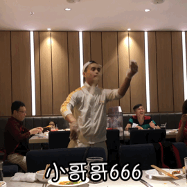 (原始链接: https://mmbiz.qpic.cn/mmbiz_gif/D1nJqnhkPyJYUBJka1q470ibOiauBaDoTUP4gF1J6CPFrCcp0TXX3vbLvBz4gpjuDcxxib4D52IKX7UXjcWwiaop2g/640?wx_fmt=gif)
- 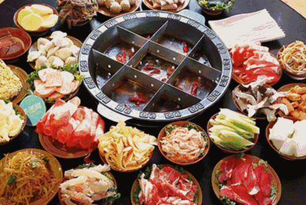 (原始链接: https://mmbiz.qpic.cn/mmbiz_gif/D1nJqnhkPyJYUBJka1q470ibOiauBaDoTU6UBjhYCVbbYCK2Zy9HRmYL5HtmgiaA2HweJWVHWPU9YkMuYFGKRnRmQ/640?wx_fmt=gif)
- 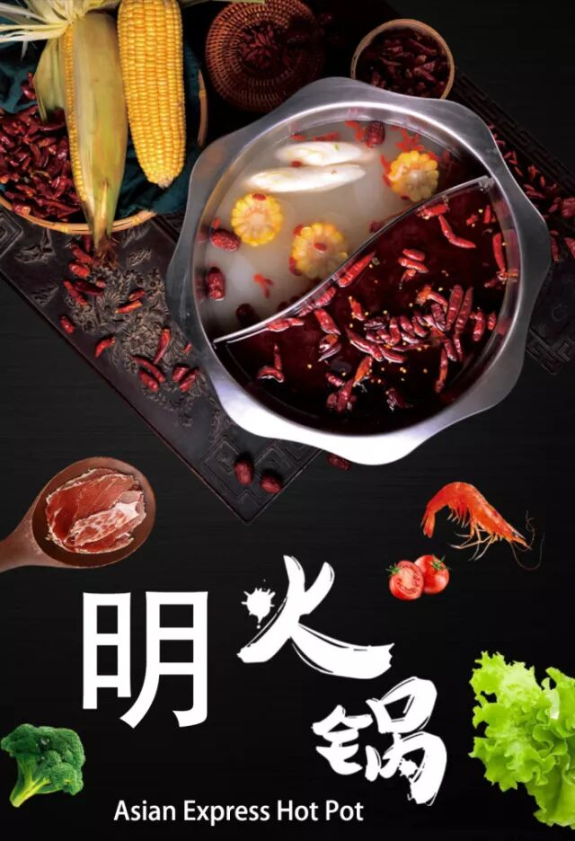 (原始链接: https://mmbiz.qpic.cn/mmbiz_jpg/D1nJqnhkPyJYUBJka1q470ibOiauBaDoTUyPlshYJcce3U2ibibKZ7dFl4G5uZqUU40oqDaqShwHAIocTubiajVXiaJw/640?wx_fmt=jpeg)
- 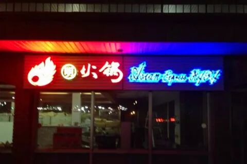 (原始链接: https://mmbiz.qpic.cn/mmbiz_jpg/D1nJqnhkPyJYUBJka1q470ibOiauBaDoTUiaIETOyxElQPibqGhicv01M8kHqeJiaTZic8TzlYcTVmnForAAq1AUqiaYxA/640?wx_fmt=jpeg)
- 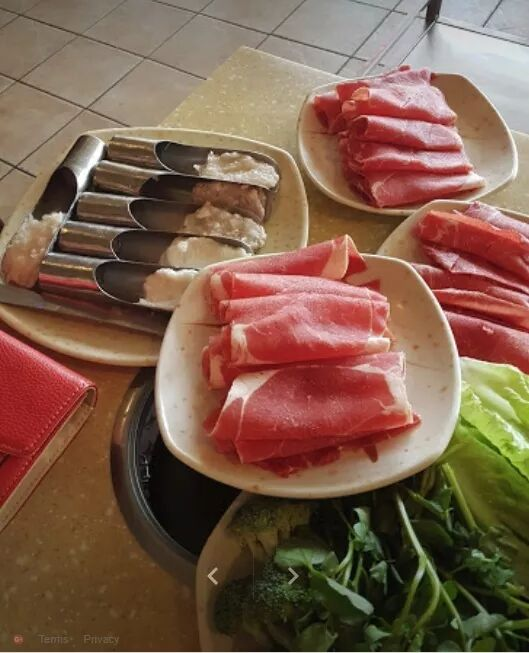 (原始链接: https://mmbiz.qpic.cn/mmbiz_jpg/D1nJqnhkPyJYUBJka1q470ibOiauBaDoTUNnNa2icZoMicJrEI7s6kdW4sibzR0dcQ2MicEWSibefqyT9tjSDSRG61Yfg/640?wx_fmt=jpeg)
- 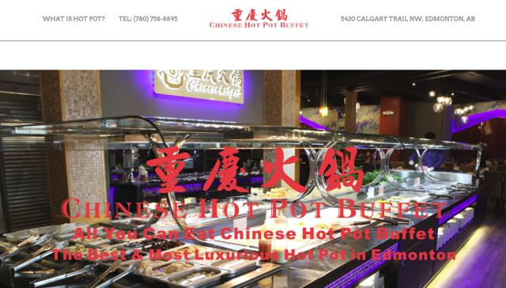 (原始链接: https://mmbiz.qpic.cn/mmbiz_png/D1nJqnhkPyJYUBJka1q470ibOiauBaDoTU5mAHWSSIftkFO5pG6CE7oZg560zeSibgRVuuAiaJo5UWTuCfvLvqIxkw/640?wx_fmt=png)
- 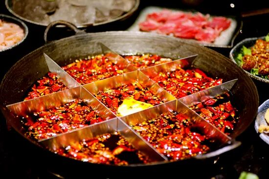 (原始链接: https://mmbiz.qpic.cn/mmbiz_jpg/D1nJqnhkPyJYUBJka1q470ibOiauBaDoTUlCZJGoKdDTTkAOLFNiaibMus7w597NHLuk5H1VZzNo1CwFe2hvnpLL5Q/640?wx_fmt=jpeg)
-  (原始链接: https://res.wx.qq.com/mpres/htmledition/images/icon/common/emotion_panel/emoji_ios/u1F602.png)
- 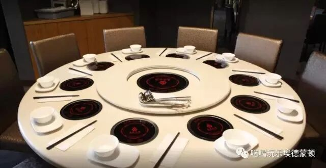 (原始链接: https://mmbiz.qpic.cn/mmbiz_jpg/D1nJqnhkPyJYUBJka1q470ibOiauBaDoTUmRz4dRI9uhMEdLqK9tgNM2nmFUqblr0e0yiclfzSSibq6vIQTwjxMomw/640?wx_fmt=jpeg)
-  (原始链接: https://mmbiz.qpic.cn/mmbiz_gif/D1nJqnhkPyJYUBJka1q470ibOiauBaDoTUvib2ibBUsjs9yPnG9T5Dl1OhmI1mDxJvKUu1jlj20Cria5ib9n5xfUFwyw/640?wx_fmt=gif)
- 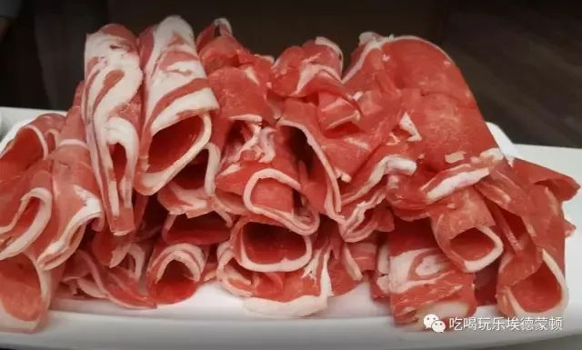 (原始链接: https://mmbiz.qpic.cn/mmbiz_jpg/D1nJqnhkPyJYUBJka1q470ibOiauBaDoTUVzibqheicTwGzJfibFx0lDzx8ImmiaJhAK3EG0UCCAV4QcUUwZuXgNzF6w/640?wx_fmt=jpeg)
- 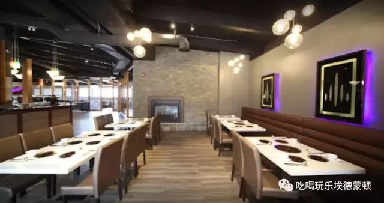 (原始链接: https://mmbiz.qpic.cn/mmbiz_jpg/D1nJqnhkPyJYUBJka1q470ibOiauBaDoTUbFJep37mFlqu2tleA9uH4clbF2uPLFr47nfrNB32raU25t5GrHnbWQ/640?wx_fmt=jpeg)
- 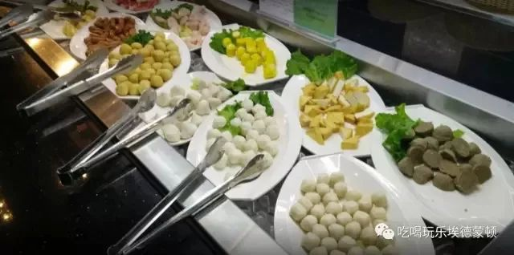 (原始链接: https://mmbiz.qpic.cn/mmbiz_jpg/D1nJqnhkPyJYUBJka1q470ibOiauBaDoTUDbsTibTXUViaI3PyuXn8NJ1K6Q0B8q3Zias1GZmckEHXZB11gAXVUI2Zw/640?wx_fmt=jpeg)
-  (原始链接: https://mmbiz.qpic.cn/mmbiz_jpg/D1nJqnhkPyJYUBJka1q470ibOiauBaDoTUiaKH7ReoPiaUia52xKUHOeVgnibOwVgGZ9bMhloCchKqKdHYeKqwTaDaBw/640?wx_fmt=jpeg)
-  (原始链接: https://res.wx.qq.com/mpres/htmledition/images/icon/common/emotion_panel/emoji_wx/2_04.png)
- 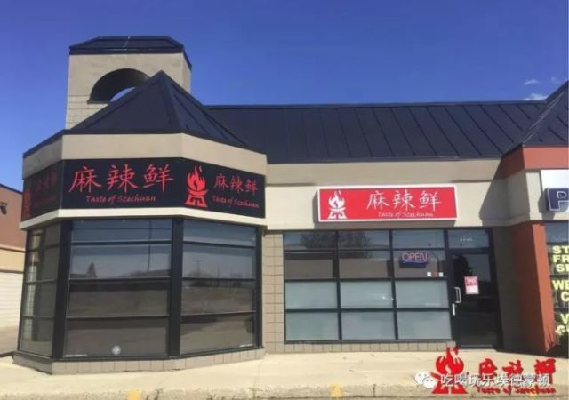 (原始链接: https://mmbiz.qpic.cn/mmbiz_png/D1nJqnhkPyJYUBJka1q470ibOiauBaDoTUWnuYqm2I3Yb2fm9IvhZEQ07ic8EoGd05icgJnVfSJpApgkmQI9k9czYw/640?wx_fmt=png)
- 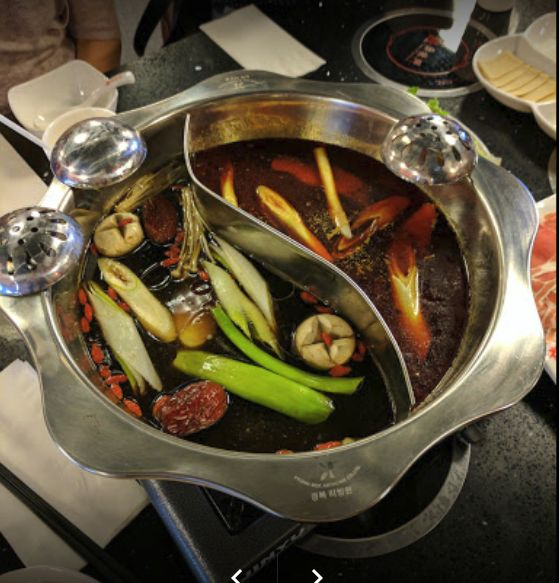 (原始链接: https://mmbiz.qpic.cn/mmbiz_png/D1nJqnhkPyJYUBJka1q470ibOiauBaDoTUl0IEa5PPQ5vSHTKPzzqToRzibibXn9vYuIwCt2WR0xWZonRqNFdHZJHA/640?wx_fmt=png)
- 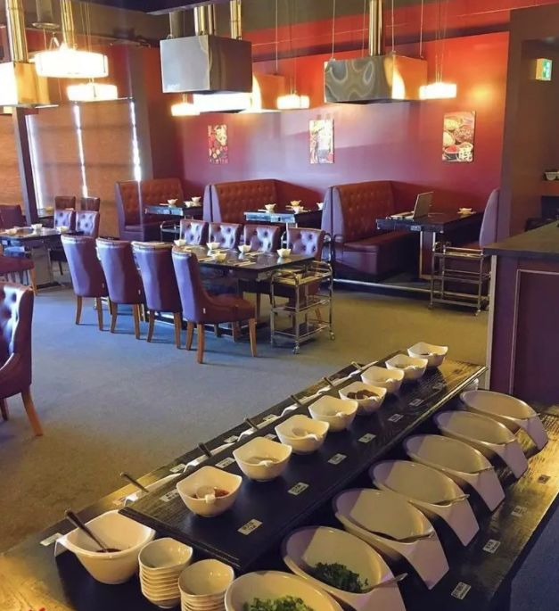 (原始链接: https://mmbiz.qpic.cn/mmbiz_png/D1nJqnhkPyJYUBJka1q470ibOiauBaDoTUM2FbLib55KQAuib0sYmsuz4UibYY0rFt2bw3lABqdzxgAAuYic3ABprmvQ/640?wx_fmt=png)
- 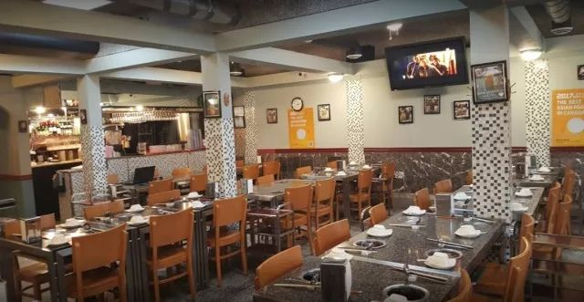 (原始链接: https://mmbiz.qpic.cn/mmbiz_jpg/D1nJqnhkPyJYUBJka1q470ibOiauBaDoTUEFbczGf8q3Mz7fyAcecLuw0lbUC6ictLiaTLDC7zbtQ3uSxP9icrYj58w/640?wx_fmt=jpeg)
- 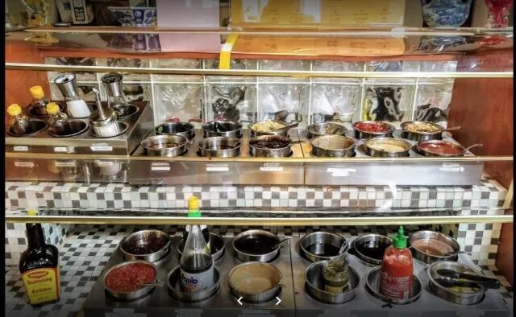 (原始链接: https://mmbiz.qpic.cn/mmbiz_jpg/D1nJqnhkPyJYUBJka1q470ibOiauBaDoTUctbiarP2micmAdYN2WDIfHUUCs37kyIlcfAxrk3Q1ibnHpjicYYDPowo3A/640?wx_fmt=jpeg)
-  (原始链接: https://mmbiz.qpic.cn/mmbiz_jpg/D1nJqnhkPyJYUBJka1q470ibOiauBaDoTUaZ8tEjOxQF6iaZZHibqd2ibGWFRbH8380NIJ9A6MZjOsZ3mHeejFcH80g/640?wx_fmt=jpeg)
-  (原始链接: https://mmbiz.qpic.cn/mmbiz_jpg/D1nJqnhkPyJYUBJka1q470ibOiauBaDoTU0BOjQO8OUUjT3I20j57asnjlMlZNiaWQ6GqOeYOX92pxA83fFMtbT7g/640?wx_fmt=jpeg)
- 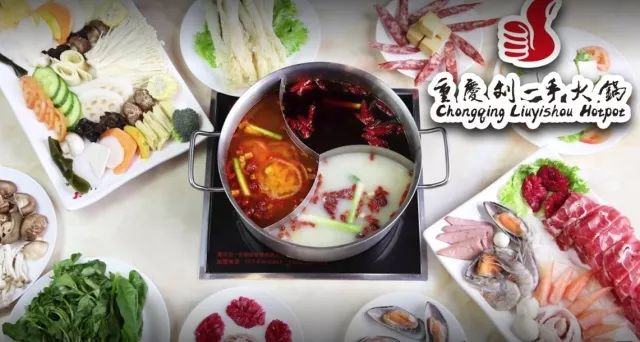 (原始链接: https://mmbiz.qpic.cn/mmbiz_jpg/D1nJqnhkPyJYUBJka1q470ibOiauBaDoTUfLk9M8tITOvUHuW4H58UCW7FKibjKhdibUaJ6QjPw0bdJjd5eS4csY7A/640?wx_fmt=jpeg)
- 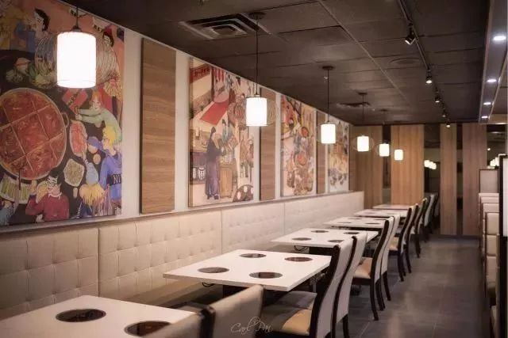 (原始链接: https://mmbiz.qpic.cn/mmbiz_jpg/D1nJqnhkPyJYUBJka1q470ibOiauBaDoTUrNVg8qRJjCzKHjcXJ3420gUpw3X9ic3QkXuIGOpoGJLV17ZwaJMBU3A/640?wx_fmt=jpeg)
- 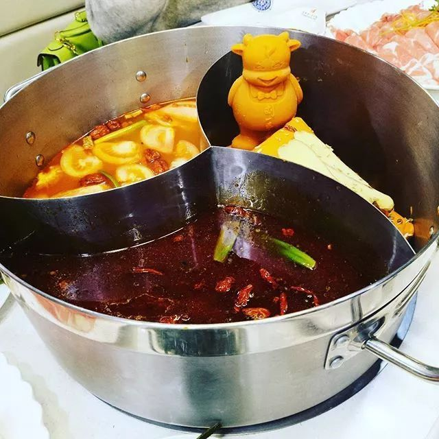 (原始链接: https://mmbiz.qpic.cn/mmbiz_jpg/D1nJqnhkPyJYUBJka1q470ibOiauBaDoTUIZ0mk4GV1j69QiakE1Fibk687ia69zqLBqXesicIDU1Z9BIt6vRSrLfj9w/640?wx_fmt=jpeg)
- 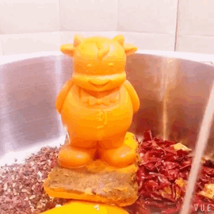 (原始链接: https://mmbiz.qpic.cn/mmbiz_gif/D1nJqnhkPyJYUBJka1q470ibOiauBaDoTUcykk4HkricI0AkRsQGkRuMczkQIt5SmLLD3QJK4ibyDjNYJWMicibnB5dg/640?wx_fmt=gif)
- 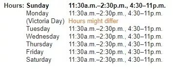 (原始链接: https://mmbiz.qpic.cn/mmbiz_jpg/D1nJqnhkPyJYUBJka1q470ibOiauBaDoTUt5m15hF9R9U6kOokTAdfHX7K1Kib0whAicBCrcxVEHRYDfDDwgXycqeA/640?wx_fmt=jpeg)
-  (原始链接: https://mmbiz.qpic.cn/mmbiz_jpg/D1nJqnhkPyLo3L0iawegpPefdoialIOMJsLYAWDKWZibActHTInqxOYIqm69LVFG0zLVDT3SI3PON4Sz2gvhHH80g/640?wx_fmt=jpeg)
- 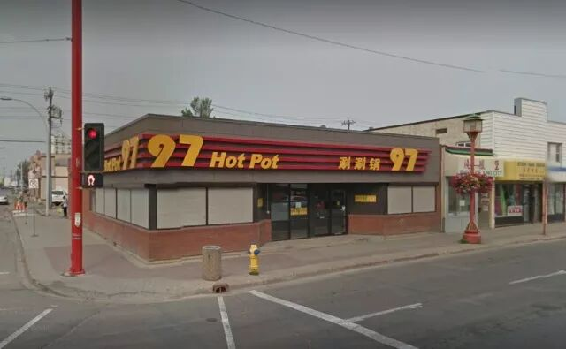 (原始链接: https://mmbiz.qpic.cn/mmbiz_jpg/D1nJqnhkPyJYUBJka1q470ibOiauBaDoTUFPpugVhrGWhyUUMRueoOr0RSsYvmtnMu7Xz3PiaibtvZKUicVaYEL9Utw/640?wx_fmt=jpeg)
- 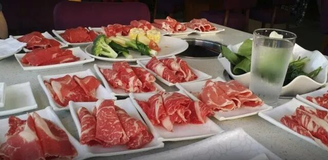 (原始链接: https://mmbiz.qpic.cn/mmbiz_jpg/D1nJqnhkPyJYUBJka1q470ibOiauBaDoTUrA7YkUPfAcYVBqPE14njzew1c96du4gTicdLiab4R1iahjm1dWAkDNHrg/640?wx_fmt=jpeg)
- 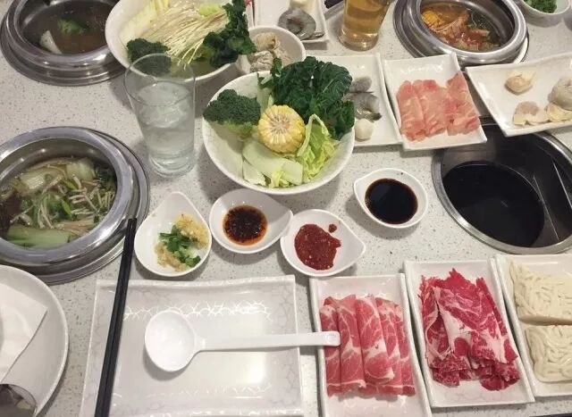 (原始链接: https://mmbiz.qpic.cn/mmbiz_jpg/D1nJqnhkPyJYUBJka1q470ibOiauBaDoTUVjQtMMO5b0l8ldLHAnvwGgFwGEvetZUDu5wSOQGZIRicIiaR8npY5yIg/640?wx_fmt=jpeg)
-  (原始链接: https://mmbiz.qpic.cn/mmbiz_jpg/D1nJqnhkPyJYUBJka1q470ibOiauBaDoTUX5gZeuRycVvzorn2BKFXPLt92wiaIVsWokicefQwArgbS9AsicrOBN0tQ/640?wx_fmt=jpeg)
- 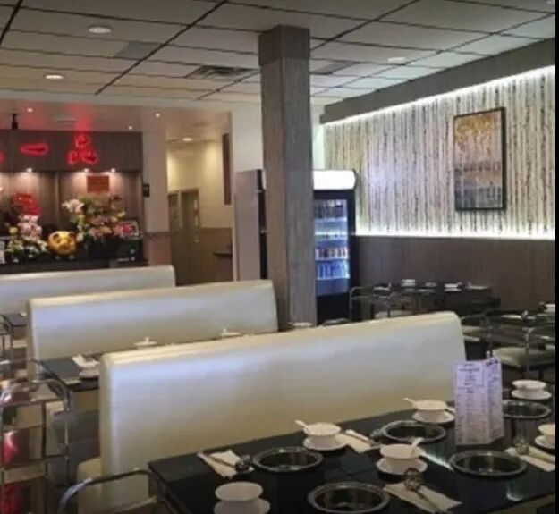 (原始链接: https://mmbiz.qpic.cn/mmbiz_jpg/D1nJqnhkPyJYUBJka1q470ibOiauBaDoTUgGlS9WVTgYfiaBic937micicMlYib4icPmOFv30avJGK3mWgLVHibicU0ceHEw/640?wx_fmt=jpeg)
- 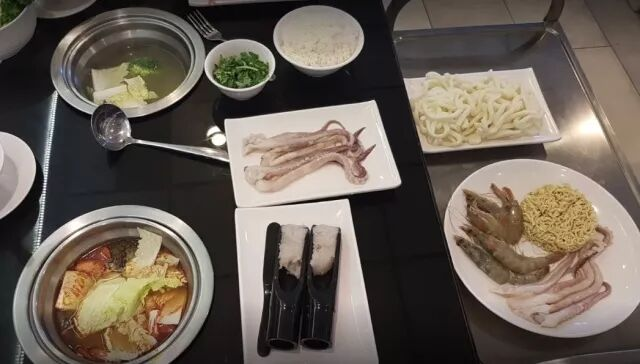 (原始链接: https://mmbiz.qpic.cn/mmbiz_jpg/D1nJqnhkPyJYUBJka1q470ibOiauBaDoTUOibxIB76QibHhOVGiaEhrOktanU5ibaQu1wZzNIzQJ6z64axHVp47ddWgw/640?wx_fmt=jpeg)
- 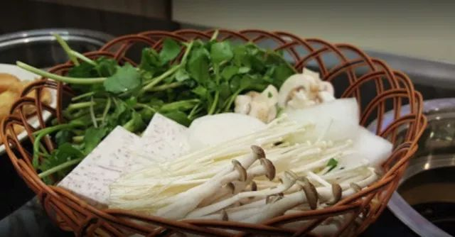 (原始链接: https://mmbiz.qpic.cn/mmbiz_jpg/D1nJqnhkPyJYUBJka1q470ibOiauBaDoTUbgTc0RdP8cva6h41eKNkxddVuhgo4vvmU7KZd0ju0SMKIv2W5O82tA/640?wx_fmt=jpeg)
-  (原始链接: https://mmbiz.qpic.cn/mmbiz_png/D1nJqnhkPyJYUBJka1q470ibOiauBaDoTUBQu4rib0lQlAs20kGuSqow1Gf16NL9CiaAVm1ibWHDG3F3IoVia8ib1VTSQ/640?wx_fmt=png)
-  (原始链接: https://mmbiz.qpic.cn/mmbiz_jpg/D1nJqnhkPyJYUBJka1q470ibOiauBaDoTULibewuvRoElCjoWdicJaubwjqDx7OoZCJQ4EvmtdspZZ8VyvlZCwSWLw/640?wx_fmt=jpeg)
-  (原始链接: https://mmbiz.qpic.cn/mmbiz_jpg/D1nJqnhkPyJYUBJka1q470ibOiauBaDoTUGRExndTFEURbeH4xRiamej4BexaibUV3PLKGsL1iaJyTuvoa9EGbL2lsQ/640?wx_fmt=jpeg)
-  (原始链接: https://res.wx.qq.com/mpres/htmledition/images/icon/common/emotion_panel/emoji_wx/2_04.png)
-  (原始链接: https://mmbiz.qpic.cn/mmbiz_jpg/D1nJqnhkPyJYUBJka1q470ibOiauBaDoTUq161jd6rPR7m7eVQWJFwgwYckxCrQEqa09BoP8V3Vh5sBZ0rQEvn4A/640?wx_fmt=jpeg)
- 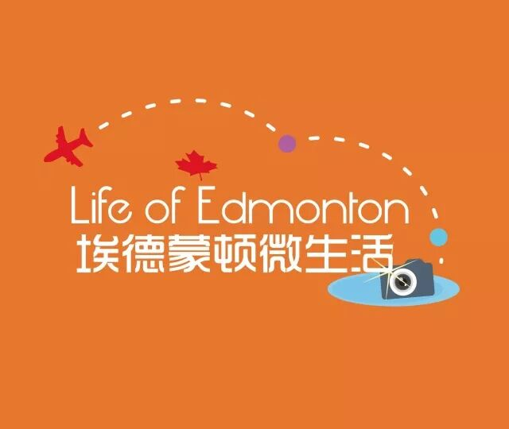 (原始链接: https://mmbiz.qpic.cn/mmbiz_jpg/D1nJqnhkPyJYUBJka1q470ibOiauBaDoTUr46HFZwMSrAZTbT2bibM3xCtWLSNIQibBMZCHnMTyjVt0L5kib4T0Zvmw/640?wx_fmt=jpeg)
-  (原始链接: https://mmbiz.qpic.cn/mmbiz_png/D1nJqnhkPyJYUBJka1q470ibOiauBaDoTUb4vQNlFLZnnAfHIZEbaXmDLia6wUqOxvziabdYW7zUPnBCSqdAzA0iabg/640?wx_fmt=png)
-  (原始链接: https://mmbiz.qpic.cn/mmbiz_png/D1nJqnhkPyJYUBJka1q470ibOiauBaDoTUCAS4COkLyoC71hiaEXnSb2cg0Lu08T4k4xY5A4yxZR3xGBTQiab1zwhw/640?wx_fmt=png)
- 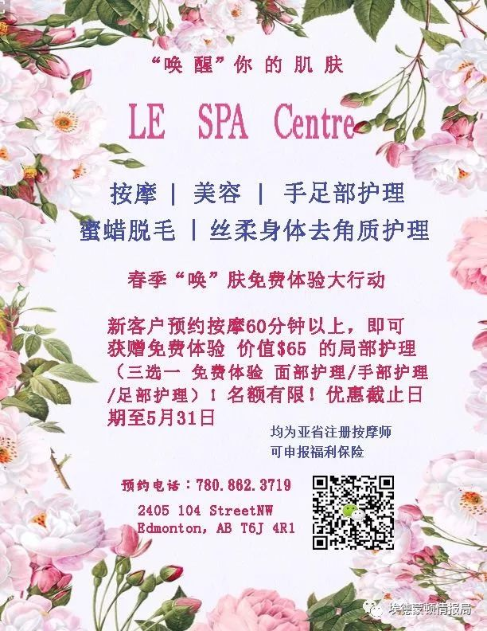 (原始链接: https://mmbiz.qpic.cn/mmbiz_jpg/mZIpZ2dRo6aOFLVaA1F7NEzpXsZmpFhzPNr1YtpiadFMLj364C1k4zdMDuGuPkVOc6zLibZ3ibcAgKn1kZgSFFIyw/640?wx_fmt=jpeg)
