# 无标题

**链接地址:** http://mp.weixin.qq.com/s?__biz=MjM5ODgwNDY1Mg==&mid=2650329459&idx=1&sn=22ba10274d9177083073a07d6f530afd&chksm=bec95cb089bed5a6595dfdda5aef596d1895282ab6c612c23b6214f9f496e0d9e90e1e4c4dc4&mpshare=1&scene=2&srcid=0626j8KtFjtYBciabUuBNGMg#rd
**作者:** 
**获取时间:** 2025/8/28 21:50:09
**图片数量:** 25

---

## 原始HTML内容

&nbsp;

 
<section class="" data-id="35362" data-color="rgb(235, 103, 148)" data-custom="rgb(239, 112, 96)" style="white-space: normal;max-width: 100%;box-sizing: border-box;border-width: 0px;border-style: none;border-color: initial;word-wrap: break-word !important;"><section class="" style="margin-right: auto;margin-left: auto;padding: 1px;max-width: 100%;box-sizing: border-box;border-width: 1px;border-style: solid;border-color: rgb(235, 103, 148);word-wrap: break-word !important;overflow-wrap: break-word !important;"><section style="padding: 1px;max-width: 100%;box-sizing: border-box;border-width: 1px;border-style: solid;border-color: rgb(235, 103, 148);word-wrap: break-word !important;overflow-wrap: break-word !important;"><section class="" data-style="line-height:24px;color:rgb(89, 89, 89); font-size:14px" style="padding: 15px;max-width: 100%;box-sizing: border-box;border-width: 1px;border-style: solid;border-color: rgb(235, 103, 148);word-wrap: break-word !important;overflow-wrap: break-word !important;"><section style="max-width: 100%;box-sizing: border-box !important;word-wrap: break-word !important;"><article><section class="" style="max-width: 100%;white-space: normal;background-color: rgb(255, 255, 255);box-sizing: border-box !important;word-wrap: break-word !important;"><section class="" powered-by="xiumi.us" style="max-width: 100%;box-sizing: border-box !important;word-wrap: break-word !important;"><section class="">
这两天演员俞飞鸿关于大龄单身女性的一则对话，被各种转发送上了热搜。

 

 

虽然这是她两年前做客某综艺节目时，与主持人窦文涛和冯唐的对话。但在二次截图后的传播下，还是有了不少讨论度，而未婚的俞飞鸿在各种尖锐问题下的应对和措辞都堪称模板典范。

 

因为是探讨男女感情关系为主题，所以节目一开始窦文涛就从老友俞飞鸿自身的情况聊起，直接问她，<strong>“为什么这么长时间一直单身到现在？</strong>”俞飞鸿则回答的大方又得体，<strong><strong>“我觉得哪个阶段更舒适，就处在哪个阶段”</strong>。&nbsp;</strong>

 

 

接着窦文涛继续发问：“<strong>长时间一个人呆着，精神正常吗？”</strong> 

 

 

据说这个问题是出自某一个群体。这个群体的人觉得，女人到了一定年纪不结婚就是有病的；认为正常形态下女人就应该依附于男人。

 

好在俞飞鸿头脑清醒，非常精准的找到关键点，<strong>“身边很多单身男性，精神世界很丰富，难道女性单身就会不正常吗？”</strong>

 

 

冯唐继续问，<strong>“你一个人待着烦吗？需要吃点东西，跟人聊聊天？”&nbsp;</strong> 

 

 

在俞飞鸿眼中，聊天只是一种表达和沟通的方式，<strong>“如果自己精神世界足够丰富的话，不需要。”</strong>

 

 

显然这个答案是令他不满意的，冯唐拐着弯儿继续问，<strong>“比如开瓶酒一个人喝不完，点俩菜多啊，一个菜少？都没感觉到？”</strong>

 

 

潜台词就是，一个人吃饭逛街多凄凉啊！

 

然而俞飞鸿完全不care，<strong>“我没觉得这是个问题”</strong>。

 

 

结婚也好、恋爱也罢，又不是为了喝完一瓶酒，吃完两道菜。

 

 

大美人将婚姻的关系看得如此透彻，但冯唐依然是典型的直男观点。

 

 

<strong>将婚姻看做是交换，因为亏欠而选择结婚</strong>，这样的看法被俞飞鸿一针见血的指出来了。

首先她反驳了关于“婚姻是施舍”的说法：

 

 

然后她这样解释自己关于婚姻的态度：

 

 

此外，她认为婚姻不应该是感恩，也不应该是束缚，而是<strong>“我爱你，我希望你能得到幸福”</strong>。

 

 

毕竟在结婚这件事上，男人往往更理性，比起选择人生挚爱，更多的是选择合适的生活拍档。 

 

而女人选择结婚的对象，通常建立在“爱情至上”的基础上，即哪怕你不那么好，但因为我爱你，所以我要嫁给你。

 

对她来说，<strong>两个人的孤独，才是最悲伤的</strong>。&nbsp;

 

 

看完整个访谈，濛小主就明白像俞飞鸿这样的女人，是足够担得起“优秀”二字的。

 

<strong>自信，独立，从容也坚韧，不妄自菲薄，也不高傲自大，只管坚持所坚持的</strong>，其他任人评说。

 

 

俞飞鸿的这些话之所以能引起十多万人转发，不仅仅是因为很多人喜欢她，更多是因为大家在俞飞鸿身上看到了一个女人理想的状态。

 

 

俞飞鸿出生在知识分子家庭，做过童星，16岁时当过女主角，大学专业课和文化课都是第一名，毕业后还留校当了助教，一年后辞职跑去美国深造，回国后凭借《牵手》走红。

 

 

28岁的她出演《小李飞刀》中的“惊鸿仙子”，她的出场让观众惊叹，被称为史上最美仙子。

 

 

在她最红的时候，她却选择做制片人、当导演，不断的继续学习和前进。如今47岁的她，无论是外貌还是形态都保持得非常完美，岁月留给她的只有优雅与成熟。

 

这或许就是女人最好的生活状态了吧...... 

 

<strong>濛小主感叹：</strong>这样的俞飞鸿，真的太酷了！

 

</section></section></section>

</article></section></section></section></section></section>

---

## 纯文本内容

这两天演员俞飞鸿关于大龄单身女性的一则对话，被各种转发送上了热搜。虽然这是她两年前做客某综艺节目时，与主持人窦文涛和冯唐的对话。但在二次截图后的传播下，还是有了不少讨论度，而未婚的俞飞鸿在各种尖锐问题下的应对和措辞都堪称模板典范。因为是探讨男女感情关系为主题，所以节目一开始窦文涛就从老友俞飞鸿自身的情况聊起，直接问她，“为什么这么长时间一直单身到现在？”俞飞鸿则回答的大方又得体，“我觉得哪个阶段更舒适，就处在哪个阶段”。 接着窦文涛继续发问：“长时间一个人呆着，精神正常吗？”据说这个问题是出自某一个群体。这个群体的人觉得，女人到了一定年纪不结婚就是有病的；认为正常形态下女人就应该依附于男人。好在俞飞鸿头脑清醒，非常精准的找到关键点，“身边很多单身男性，精神世界很丰富，难道女性单身就会不正常吗？”冯唐继续问，“你一个人待着烦吗？需要吃点东西，跟人聊聊天？” 在俞飞鸿眼中，聊天只是一种表达和沟通的方式，“如果自己精神世界足够丰富的话，不需要。”显然这个答案是令他不满意的，冯唐拐着弯儿继续问，“比如开瓶酒一个人喝不完，点俩菜多啊，一个菜少？都没感觉到？”潜台词就是，一个人吃饭逛街多凄凉啊！然而俞飞鸿完全不care，“我没觉得这是个问题”。结婚也好、恋爱也罢，又不是为了喝完一瓶酒，吃完两道菜。大美人将婚姻的关系看得如此透彻，但冯唐依然是典型的直男观点。将婚姻看做是交换，因为亏欠而选择结婚，这样的看法被俞飞鸿一针见血的指出来了。首先她反驳了关于“婚姻是施舍”的说法：然后她这样解释自己关于婚姻的态度：此外，她认为婚姻不应该是感恩，也不应该是束缚，而是“我爱你，我希望你能得到幸福”。毕竟在结婚这件事上，男人往往更理性，比起选择人生挚爱，更多的是选择合适的生活拍档。而女人选择结婚的对象，通常建立在“爱情至上”的基础上，即哪怕你不那么好，但因为我爱你，所以我要嫁给你。对她来说，两个人的孤独，才是最悲伤的。 看完整个访谈，濛小主就明白像俞飞鸿这样的女人，是足够担得起“优秀”二字的。自信，独立，从容也坚韧，不妄自菲薄，也不高傲自大，只管坚持所坚持的，其他任人评说。俞飞鸿的这些话之所以能引起十多万人转发，不仅仅是因为很多人喜欢她，更多是因为大家在俞飞鸿身上看到了一个女人理想的状态。俞飞鸿出生在知识分子家庭，做过童星，16岁时当过女主角，大学专业课和文化课都是第一名，毕业后还留校当了助教，一年后辞职跑去美国深造，回国后凭借《牵手》走红。28岁的她出演《小李飞刀》中的“惊鸿仙子”，她的出场让观众惊叹，被称为史上最美仙子。在她最红的时候，她却选择做制片人、当导演，不断的继续学习和前进。如今47岁的她，无论是外貌还是形态都保持得非常完美，岁月留给她的只有优雅与成熟。这或许就是女人最好的生活状态了吧......濛小主感叹：这样的俞飞鸿，真的太酷了！

---

## 图片列表

-  (原始链接: https://mmbiz.qpic.cn/mmbiz/dBribqkYvkc3274iazOQGMrajfPpzK8opWyC3yKKvvmqC3ssWRdQdpTjofdR0oBvIX7JT0VmTQ4WYB62ibopskgmQ/640?wx_fmt=gif)
- 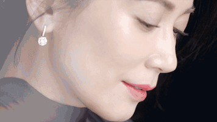 (原始链接: https://mmbiz.qpic.cn/mmbiz_gif/8DoQ2HTrG9w6LXk4icwC3Ym9EetNYmiaNyScEstGhy29rwNpuL9wDVZRIcofe3mibeK5ms7GK07S5icxDGgPlYCANQ/640?wx_fmt=gif)
- 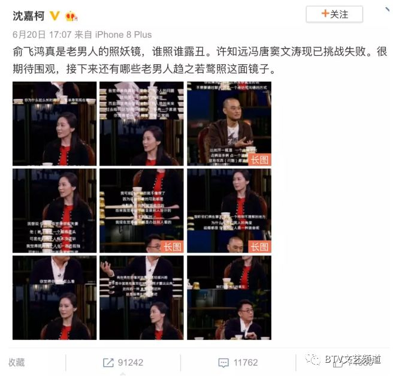 (原始链接: https://mmbiz.qpic.cn/mmbiz_png/dBribqkYvkc1tRDcrLgwMZShiaIgVhvfXJNyJpSnnYAa9JSribXFCyQ5FvqGqAA0SzAaFFBTqJxoLibPTLiakia77mYw/640?wx_fmt=png)
- 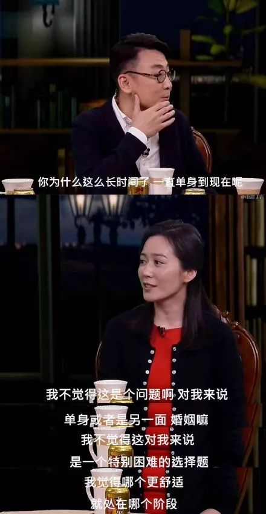 (原始链接: https://mmbiz.qpic.cn/mmbiz_jpg/q8Mibl7B27B14OEzQnlaEubj1oJ0wChibk9mnKGiaWWRjsjmhNXg9hvciaTCUGCdV8a5wexZOLZiaFDrTGRNpMeic6gg/640?wx_fmt=jpeg)
- 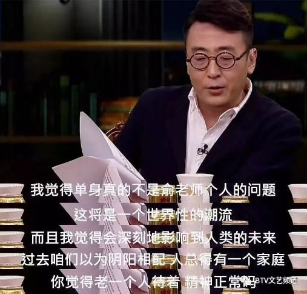 (原始链接: https://mmbiz.qpic.cn/mmbiz_png/dBribqkYvkc1tRDcrLgwMZShiaIgVhvfXJ6MVyH3EAl9MoloxjBVWFFXV7b9W42VDRibUH7a9k1Zmm8NE6mznv1VA/640?wx_fmt=png)
- 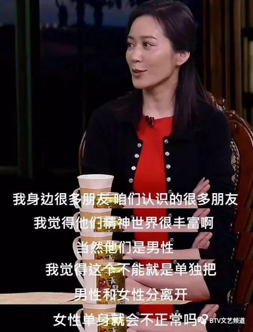 (原始链接: https://mmbiz.qpic.cn/mmbiz_png/dBribqkYvkc1tRDcrLgwMZShiaIgVhvfXJsCtEfjHMkXZY8hCSotg9ymUK6b8uyzhC7GOC5h1O2suHCd9Hl7AVvA/640?wx_fmt=png)
- 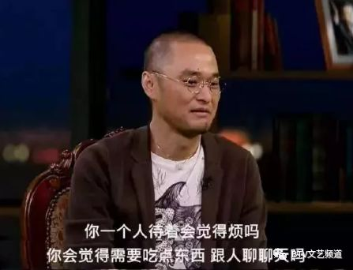 (原始链接: https://mmbiz.qpic.cn/mmbiz_png/dBribqkYvkc1tRDcrLgwMZShiaIgVhvfXJx71Yo6Ll42IXql5WcQ8ykbCgg6QQvDKeo6ZhGXfjOKkWhk9Lo9vNxQ/640?wx_fmt=png)
- 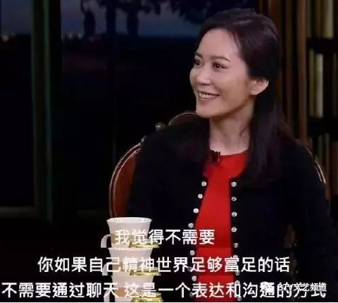 (原始链接: https://mmbiz.qpic.cn/mmbiz_png/dBribqkYvkc1tRDcrLgwMZShiaIgVhvfXJP317LWSZNP5giayHgibvp5aLQhHJibtHBL6AArmKE7Lzzjz72PzB1LuSg/640?wx_fmt=png)
- 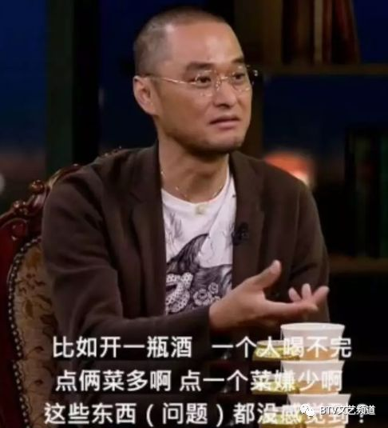 (原始链接: https://mmbiz.qpic.cn/mmbiz_png/dBribqkYvkc1tRDcrLgwMZShiaIgVhvfXJ8GIiajthiaLVEYOGmQDQBLXUHtCmibYHjSttz20MPjn1orujjnThxH66g/640?wx_fmt=png)
- 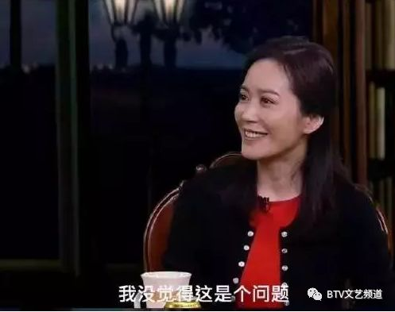 (原始链接: https://mmbiz.qpic.cn/mmbiz_png/dBribqkYvkc1tRDcrLgwMZShiaIgVhvfXJJWYsEROshYXOnichKcHPZWySxbqIBiacCDILhicATYpIKTk87tiaFbgf2g/640?wx_fmt=png)
- 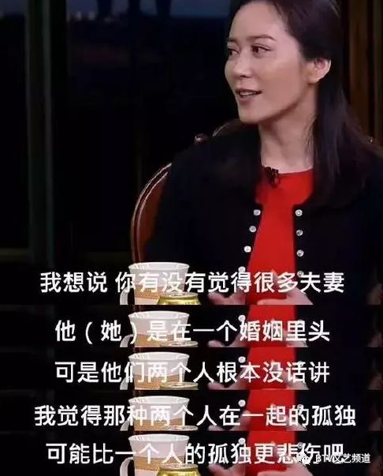 (原始链接: https://mmbiz.qpic.cn/mmbiz_png/dBribqkYvkc1tRDcrLgwMZShiaIgVhvfXJ3qxKiajH081UVJGEFobC5iaZia3RK534J2sxP1ceic15ty7vX83sqerXrQ/640?wx_fmt=png)
- 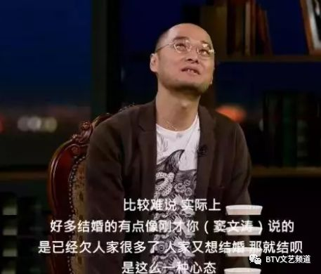 (原始链接: https://mmbiz.qpic.cn/mmbiz_png/dBribqkYvkc1tRDcrLgwMZShiaIgVhvfXJKYbj4tAj2v8TpuuqQquyBDmXnQp5EeUkNnA3knILS58XxNoGGrtBvQ/640?wx_fmt=png)
- 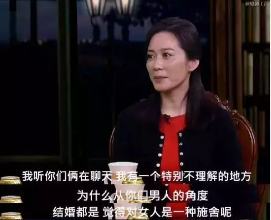 (原始链接: https://mmbiz.qpic.cn/mmbiz_jpg/qLwf4bzZmvkqxHQIUK7OtN3ItaCMegEMTFrGwBWDE306G5Vaq7O9R9UBnpWH9bmAp6crofVsictXlmbuzXeyC7w/640?wx_fmt=jpeg)
- 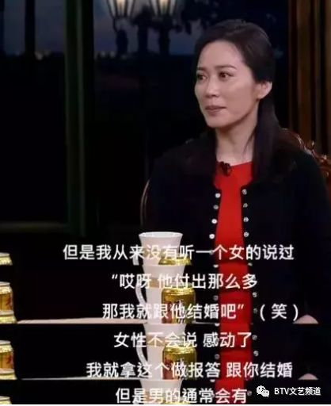 (原始链接: https://mmbiz.qpic.cn/mmbiz_png/dBribqkYvkc1tRDcrLgwMZShiaIgVhvfXJIwJZQv73VkfmhZrcV4fn1aOOgJSg3kL4BftFEcC8oKOfEXqxsYP6fA/640?wx_fmt=png)
- 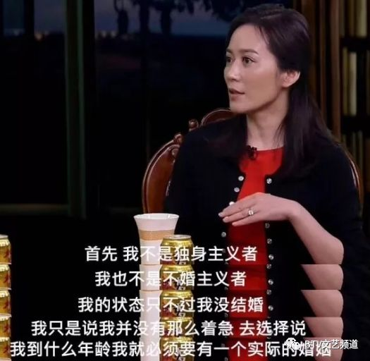 (原始链接: https://mmbiz.qpic.cn/mmbiz_png/dBribqkYvkc1tRDcrLgwMZShiaIgVhvfXJ2CaqUUJfJGuLINRjQlD6zNbJz8hVMVia4NhnhbR2jia4fV1HGnqKyUgQ/640?wx_fmt=png)
- 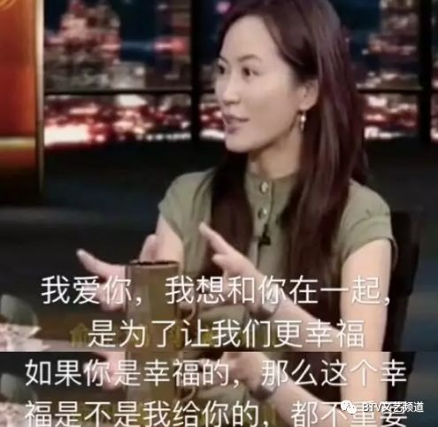 (原始链接: https://mmbiz.qpic.cn/mmbiz_png/dBribqkYvkc1tRDcrLgwMZShiaIgVhvfXJTQ6VUDe0gRcFYyDYVibBshYDEO6xc35FnOkNKotg5SyrbtC1ZvMvEPQ/640?wx_fmt=png)
- 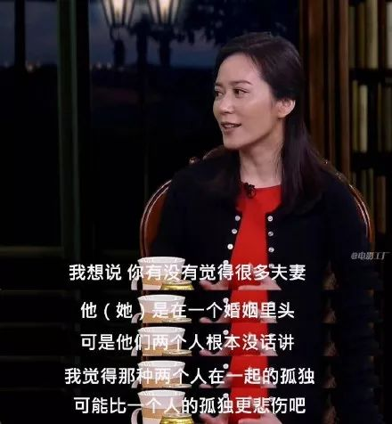 (原始链接: https://mmbiz.qpic.cn/mmbiz_jpg/q8Mibl7B27B14OEzQnlaEubj1oJ0wChibks99F6HICoV9XicURBkIdY9233Q7Jf7cjbtQJSyAVePU3UJiaaI7My43A/640?wx_fmt=jpeg)
- 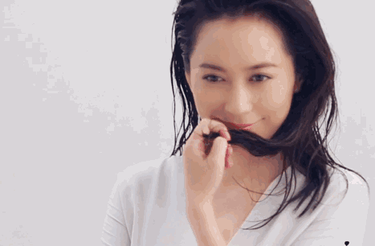 (原始链接: https://mmbiz.qpic.cn/mmbiz_gif/8DoQ2HTrG9w6LXk4icwC3Ym9EetNYmiaNyBMibclJRyVEmJdiaWg5YsP2KUic0ibSYTeemIzrcbictIxYWRWNPtTyI6icA/640?wx_fmt=gif)
-  (原始链接: https://mmbiz.qpic.cn/mmbiz_png/dBribqkYvkc1tRDcrLgwMZShiaIgVhvfXJicsPAkYEia6WfpTlJhvcjW1fupLXEaxjVYbxeW8Aiac2riajmZrwoSlalw/640?wx_fmt=png)
- 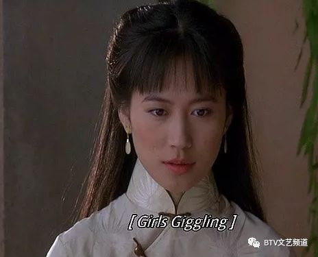 (原始链接: https://mmbiz.qpic.cn/mmbiz_png/dBribqkYvkc1tRDcrLgwMZShiaIgVhvfXJGwCU2XV6TPmmrSRic3MPEkwYl8qSJfgIUc2RjCzmEEwZtKQAlu5eclw/640?wx_fmt=png)
-  (原始链接: https://mmbiz.qpic.cn/mmbiz_png/dBribqkYvkc1tRDcrLgwMZShiaIgVhvfXJYmh01xdtRTPicKPxnxo7t432jppJxSnibTf5mczy4aBIgYUoMzPv1Qew/640?wx_fmt=png)
-  (原始链接: https://mmbiz.qpic.cn/mmbiz_png/dBribqkYvkc1tRDcrLgwMZShiaIgVhvfXJFPxQ6GIw88Js6tQX5WPtZPJralsiaWl3zGORStjP3bJAd6IZz7eVFpQ/640?wx_fmt=png)
- 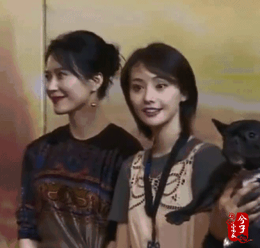 (原始链接: https://mmbiz.qpic.cn/mmbiz_gif/qLwf4bzZmvkqxHQIUK7OtN3ItaCMegEM7lvAiaUT4DyNMfROK2HBdkkbiaq7gQKaQWUhAc42ecicskhwqDlzgQc5A/640?wx_fmt=gif)
-  (原始链接: https://mmbiz.qpic.cn/mmbiz_gif/qLwf4bzZmvkqxHQIUK7OtN3ItaCMegEM9DL04Nt3twrrpKG1EsSRCZyoNsSAcnzEZjEGKZiakia2EgmJMTyGiaN6Q/640?wx_fmt=gif)
- 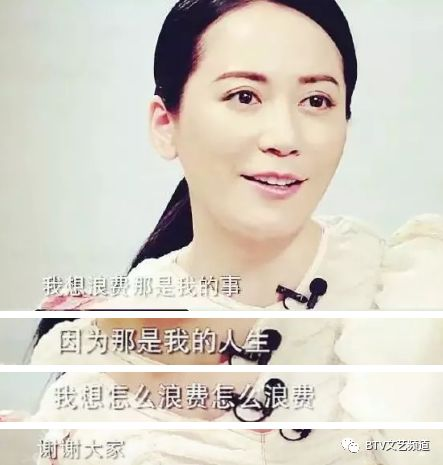 (原始链接: https://mmbiz.qpic.cn/mmbiz_png/dBribqkYvkc1tRDcrLgwMZShiaIgVhvfXJ43O4mMohkbJjgNiaLoRWdcWw9sHVkkoicjOC7LQGT7ULNCBS6bkmbtZA/640?wx_fmt=png)
