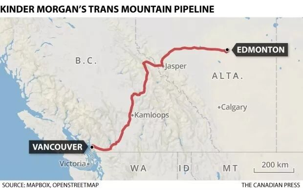
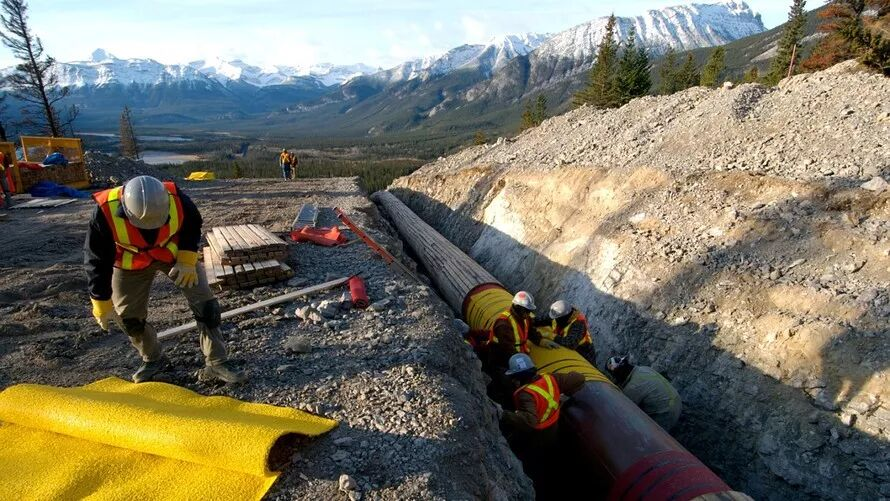
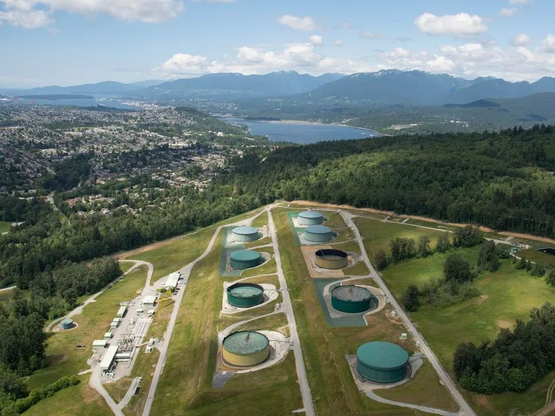
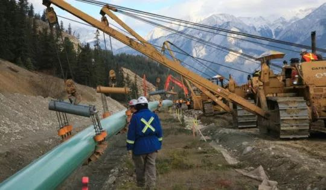
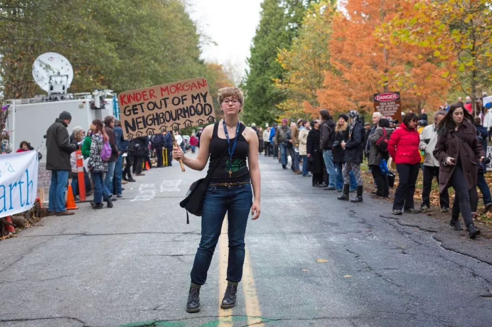
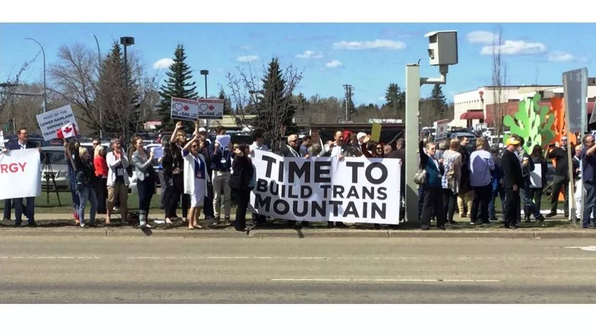
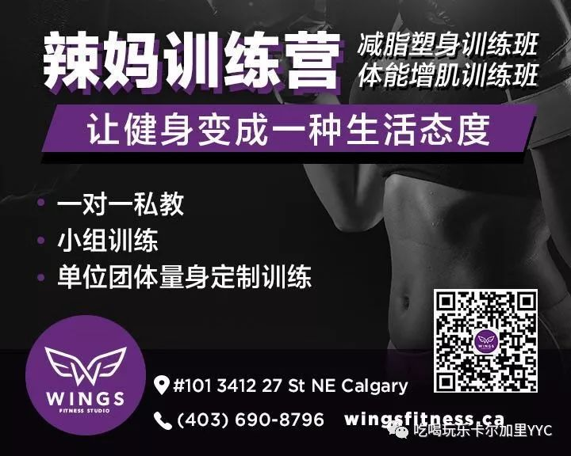

# 无标题

**链接地址:** http://mp.weixin.qq.com/s?__biz=MzI5NDMzNzM3OQ==&mid=2247487222&idx=1&sn=c9ab5e73fea6e3ccab213972a4a4c1eb&chksm=ec6520fadb12a9ece921f49757be516bae4f117725a88572b4cb67aff3914e4685614465c82e&mpshare=1&scene=2&srcid=0706AfkaLvapUFRUO5zwDadB#rd
**作者:** 发际线堪忧的雪芙
**获取时间:** 2025/8/28 21:49:03
**图片数量:** 19

---

## 原始HTML内容

<section class="" style="max-width: 100%;color: rgb(51, 51, 51);">&nbsp;<section class="" ng-click="onClick($event)" ng-model="eo.text" ng-style=" {
  'font-size'   : eo.fontSize,
  'font-family' : eo.fontFamily,
  'font-style'  : eo.fontStyle,
  'color'       : (eo.color || theme.majorColor),
} " placeholder="{ 点击编辑 }" stop-propagation="click mousedown mouseup" tn-edit-content="true" tn-page-editable="text0" tn-page-editable-type="ed-type-text" ui-on-drop="block($event)" style="margin-top: 0.7em;margin-left: -0.4em;padding: 1em;max-width: 100%;border-radius: 1em;width: 510.25px;color: inherit;font-family: inherit;font-size: 1em;display: inline-block;background-color: rgb(250, 200, 255);box-sizing: border-box !important;word-wrap: break-word !important;">&nbsp;&nbsp;&nbsp;吃喝玩乐卡尔加里YYC&nbsp;最近要大送豪礼，包括苹果 iPhone X！</section></section>
 
<section class="" style="max-width: 100%;color: rgb(51, 51, 51);"><section class="" ng-click="onClick($event)" ng-model="eo.text" ng-style=" {
  'font-size'   : eo.fontSize,
  'font-family' : eo.fontFamily,
  'font-style'  : eo.fontStyle,
  'color'       : (eo.color || theme.majorColor),
} " placeholder="{ 点击编辑 }" stop-propagation="click mousedown mouseup" tn-edit-content="true" tn-page-editable="text0" tn-page-editable-type="ed-type-text" ui-on-drop="block($event)" style="margin-top: 0.7em;margin-right: -0.4em;padding: 1em;max-width: 100%;border-radius: 1em;width: 510.25px;color: inherit;font-family: inherit;font-size: 1em;display: inline-block;background-color: rgb(188, 227, 249);box-sizing: border-box !important;word-wrap: break-word !important;">没错没错，记得『点击蓝字加关注』哟！机会随时到来！</section>&nbsp;&nbsp;</section><section class="" style="margin-top: 0.8em;margin-bottom: 0.5em;max-width: 100%;color: rgb(51, 51, 51);">
 
</section><section style="max-width: 100%;color: rgb(51, 51, 51);">真心实意，为您推荐！</section><section style="max-width: 100%;color: rgb(51, 51, 51);"> </section>

 

自从今年5月28日在渥太华达成联邦收购Trans Mountain管道的协议以来，关于管道何时重新动工的问题一直都悬而未决没有得到确切的答案。 Kinder Morgan公司曾经在4月停止了对该项目的全部支出，并预备在未来几个月内将管道出售给联邦政府。

 

 

近日内，联邦政府的一位官员透露，Trans Mountain Pipeline LP已于6月14日签署了EDC担保贷款工具的信贷协议。Kinder Morgan将获得了一笔最多高达<strong>10亿加币</strong>的重启资金。这笔资金将由加拿大<strong>出口发展局</strong>担保的基金提供，并且不需要该公司在短期内直接偿还。这笔贷款担保能够确切提供多少金额的详细信息现在还尚未被公布。目前联邦政府正在建立所谓的建造信贷机构去帮助管道重新动工可以如期进行。

 

 

阿尔伯塔省石油销售委员会首席执行官兼前尼克森风险管理副总裁理查德马森说：这样的机构在建设项目中司空见惯，因为它能够帮项目有效地规避资金不足带来的风险。一旦项目从各个机构借来足够的资金，政府就可以向市场发行债券。通过发行债券或联邦政府直接注入资金来融资，是获得所需流动资金最灵活的方式。

 

 

这周二，Trans Mountain向国家能源委员会提交了为期六个月的建设工作总结表。管道重新动工的工作预计将从7月底开始。项目将率先在埃德蒙顿和贾斯珀国家公园之间的290公里长的管道路线上开展。预计下游工作将于9月下旬在不列颠哥伦比亚省北汤普森地区开展。现阶段的工作内容主要包括路线准备，清理，测量，标记。而真正的管道铺设将于2019年进行。

 

 

然而整个项目的重新动工不仅在于工地施工上的问题。工作计划还包括建设扩建项目所需的各种活动，包括获取所需许可证，调解地区法律法规和完成建设合同等等。整个项目的前期建设将于2020年完成——如果一切顺利的话。

 

 

Trans Mountain管道的建设目前重新动工的计划已非常明确，但反对者的声音从未消停。就在这个周二绿色和平组织的活动人士在温哥华举行了200多人参加的抗议活动以反对加拿大联邦政府以45亿美元购买管道扩建的项目。但无论反对的声音多么强烈，这个漫长的管道建设之路终于艰辛地往前又迈（蠕）动了一小步。管道的重新动工无疑会为阿省提供更多的工作机会和发展方向。希望这是阿省经济形式好转的一个小小里程碑。将阿省的石油早日输送出去，是这个省民众们共同的心愿。

文章信息来源：Globalnews，由你们敬爱的副局长半夜爆肝整理。

 

欢迎大家添加&nbsp;神通广大&nbsp;吃喝玩乐&nbsp;服务微信&nbsp;为好友！

相互照应，十分必要！

扫码即可！

 

 

 
<section style="max-width: 100%;color: rgb(51, 51, 51);">真诚为您推荐！</section><section class="" data-style="white-space: normal; text-align: left;font-size: 14px;line-height: 1.5em; color: rgb(12, 12, 12);" style="max-width: 100%;color: rgb(51, 51, 51);"><section style="margin-top: -1.2em;max-width: 100%;box-sizing: border-box;color: rgb(166, 166, 166);text-align: center;border-width: initial;border-style: none;border-color: initial;line-height: 1.4;word-wrap: break-word !important;"> </section><section class="" data-style="white-space: normal; text-align: left;font-size: 14px;line-height: 1.5em; color: rgb(12, 12, 12);" style="padding: 16px 16px 10px;max-width: 100%;box-sizing: border-box;font-size: 1em;line-height: 1.4;word-wrap: break-word !important;">
<strong style="max-width: 100%;color: rgb(62, 62, 62);font-size: 18px;text-align: justify;box-sizing: border-box !important;word-wrap: break-word !important;"><strong style="max-width: 100%;box-sizing: border-box !important;word-wrap: break-word !important;"><strong style="max-width: 100%;box-sizing: border-box !important;word-wrap: break-word !important;"><strong style="max-width: 100%;box-sizing: border-box !important;word-wrap: break-word !important;"></strong></strong></strong></strong>

<strong style="max-width: 100%;font-size: 18px;text-align: justify;box-sizing: border-box !important;word-wrap: break-word !important;"><strong style="max-width: 100%;box-sizing: border-box !important;word-wrap: break-word !important;"><strong style="max-width: 100%;box-sizing: border-box !important;word-wrap: break-word !important;"><strong style="max-width: 100%;box-sizing: border-box !important;word-wrap: break-word !important;"></strong></strong></strong></strong> 

 

<strong style="max-width: 100%;font-size: 18px;text-align: justify;box-sizing: border-box !important;word-wrap: break-word !important;"><strong style="max-width: 100%;box-sizing: border-box !important;word-wrap: break-word !important;"><strong style="max-width: 100%;box-sizing: border-box !important;word-wrap: break-word !important;"><strong style="max-width: 100%;box-sizing: border-box !important;word-wrap: break-word !important;"></strong></strong></strong></strong>

<strong style="max-width: 100%;font-size: 18px;text-align: justify;box-sizing: border-box !important;word-wrap: break-word !important;"><strong style="max-width: 100%;box-sizing: border-box !important;word-wrap: break-word !important;"><strong style="max-width: 100%;box-sizing: border-box !important;word-wrap: break-word !important;"><strong style="max-width: 100%;box-sizing: border-box !important;word-wrap: break-word !important;"></strong></strong></strong></strong> 

 

</section></section>
 

---

## 纯文本内容

吃喝玩乐卡尔加里YYC 最近要大送豪礼，包括苹果 iPhone X！没错没错，记得『点击蓝字加关注』哟！机会随时到来！  真心实意，为您推荐！自从今年5月28日在渥太华达成联邦收购Trans Mountain管道的协议以来，关于管道何时重新动工的问题一直都悬而未决没有得到确切的答案。 Kinder Morgan公司曾经在4月停止了对该项目的全部支出，并预备在未来几个月内将管道出售给联邦政府。近日内，联邦政府的一位官员透露，Trans Mountain Pipeline LP已于6月14日签署了EDC担保贷款工具的信贷协议。Kinder Morgan将获得了一笔最多高达10亿加币的重启资金。这笔资金将由加拿大出口发展局担保的基金提供，并且不需要该公司在短期内直接偿还。这笔贷款担保能够确切提供多少金额的详细信息现在还尚未被公布。目前联邦政府正在建立所谓的建造信贷机构去帮助管道重新动工可以如期进行。阿尔伯塔省石油销售委员会首席执行官兼前尼克森风险管理副总裁理查德马森说：这样的机构在建设项目中司空见惯，因为它能够帮项目有效地规避资金不足带来的风险。一旦项目从各个机构借来足够的资金，政府就可以向市场发行债券。通过发行债券或联邦政府直接注入资金来融资，是获得所需流动资金最灵活的方式。这周二，Trans Mountain向国家能源委员会提交了为期六个月的建设工作总结表。管道重新动工的工作预计将从7月底开始。项目将率先在埃德蒙顿和贾斯珀国家公园之间的290公里长的管道路线上开展。预计下游工作将于9月下旬在不列颠哥伦比亚省北汤普森地区开展。现阶段的工作内容主要包括路线准备，清理，测量，标记。而真正的管道铺设将于2019年进行。然而整个项目的重新动工不仅在于工地施工上的问题。工作计划还包括建设扩建项目所需的各种活动，包括获取所需许可证，调解地区法律法规和完成建设合同等等。整个项目的前期建设将于2020年完成——如果一切顺利的话。Trans Mountain管道的建设目前重新动工的计划已非常明确，但反对者的声音从未消停。就在这个周二绿色和平组织的活动人士在温哥华举行了200多人参加的抗议活动以反对加拿大联邦政府以45亿美元购买管道扩建的项目。但无论反对的声音多么强烈，这个漫长的管道建设之路终于艰辛地往前又迈（蠕）动了一小步。管道的重新动工无疑会为阿省提供更多的工作机会和发展方向。希望这是阿省经济形式好转的一个小小里程碑。将阿省的石油早日输送出去，是这个省民众们共同的心愿。文章信息来源：Globalnews，由你们敬爱的副局长半夜爆肝整理。欢迎大家添加 神通广大 吃喝玩乐 服务微信 为好友！相互照应，十分必要！扫码即可！真诚为您推荐！

---

## 图片列表

-  (原始链接: https://mmbiz.qpic.cn/mmbiz/MVPvEL7Qg0EXNGDDXjhn7BQlLVZfE4a72NDhuKJZheaZoX3JcYZ8wicrltbzurnAx8Urww68iaiaaC541u0miaUGqg/640?)
-  (原始链接: https://mmbiz.qpic.cn/mmbiz/MVPvEL7Qg0EXNGDDXjhn7BQlLVZfE4a7eyibPmHcP5XBsBl0KZPM0LQibDWticwHV1SSxz8Ha4rjtk93ZD4sTPSsg/640?)
-  (原始链接: https://mmbiz.qpic.cn/mmbiz_jpg/E5oZzDjj1krUQpM9bj5FdOK0iarqXud4mIKoW6C1kXSpOayiaq1XfqH0dOt23X9s4d8FkYtGk0OqCrx3URk3zXiaQ/640?wx_fmt=jpeg)
-  (原始链接: https://mmbiz.qpic.cn/mmbiz_jpg/E5oZzDjj1krg70S5dqqia8wpBmp0u7ibWvurxxBrwHU6YUHpdrKOPJ2thhiaQAWncywSIyP6RaAFxH9WzMUvUFkbA/640?wx_fmt=jpeg)
-  (原始链接: https://mmbiz.qpic.cn/mmbiz_jpg/E5oZzDjj1koIN1Y38icljFMX6zwK8pw7b53PvUZlk9gXsIh45VRRWgBJXibBqiaeeJJv68NkFKuicodbcqOWCXUHicw/640?wx_fmt=jpeg)
-  (原始链接: https://mmbiz.qpic.cn/mmbiz_png/E5oZzDjj1korznwXHmfQ7aYIaG0UJMDRhykrwCMh7dttU2MfsKwBQ3VbBbfUujjQeR6KFxbyiaUlJDPafL6fcwQ/640?wx_fmt=png)
-  (原始链接: https://mmbiz.qpic.cn/mmbiz_jpg/E5oZzDjj1kqmHzibTcMweIBVmWxBX7oaibgHAicsX8Cc8IUicpJZsXyMWibuXS6KtZRLMjbG6muNoZhAicL4iaMd1mb8w/640?wx_fmt=jpeg)
-  (原始链接: https://mmbiz.qpic.cn/mmbiz_jpg/E5oZzDjj1kqmHzibTcMweIBVmWxBX7oaibzveiamp95ibVDXZs3hFT2ZybEbDxUJQ2CBqyJSXz89tZicPAKqCMbDyhA/640?wx_fmt=jpeg)
-  (原始链接: https://mmbiz.qpic.cn/mmbiz_jpg/E5oZzDjj1kqmHzibTcMweIBVmWxBX7oaibcq4bzlwMt8hYsIy3gMl2JJ9icOvbHtbZAVLhn522qLBXjlpzk4cczQw/640?wx_fmt=jpeg)
-  (原始链接: https://mmbiz.qpic.cn/mmbiz_jpg/E5oZzDjj1kqmHzibTcMweIBVmWxBX7oaibaZrH7ZEzdR5e2icnyJNgib3KaEdYQ8icTbVj2WRSkcvKgWAXSSf50Zdiag/640?wx_fmt=jpeg)
-  (原始链接: https://mmbiz.qpic.cn/mmbiz_jpg/E5oZzDjj1kqmHzibTcMweIBVmWxBX7oaibEscHVrRgInM6cdibT66QlNsba6NTneMOF3QWL0L4dMDt0As5d0Cp03A/640?wx_fmt=jpeg)
-  (原始链接: https://mmbiz.qpic.cn/mmbiz_jpg/E5oZzDjj1kqmHzibTcMweIBVmWxBX7oaibU1pmze499KhdxX69AqTK1KlSHWV3DtsQuPFRzVIa2ekZwREia0D8RXQ/640?wx_fmt=jpeg)
-  (原始链接: https://mmbiz.qpic.cn/mmbiz_jpg/mZIpZ2dRo6Z5Lg6L4yBuvZf7QibxfKVYiaibWZ0TgYUSaib6Kt9bF0BhOS7r5v3zCAdNJ6PubAKsoohqPxVjIFWX9w/640?wx_fmt=jpeg)
-  (原始链接: https://mmbiz.qpic.cn/mmbiz_jpg/E5oZzDjj1kqmyBd2wXyJpdlTKRQv5yEo8q6MibdN8KaEpc8HasuicnnICaTm5SyBmFzYHh7Ypj7IianbCxEfHk2lg/640?wx_fmt=jpeg)
-  (原始链接: https://mmbiz.qpic.cn/mmbiz_jpg/E5oZzDjj1kqOCLqCN2NbQAMUbagjVS03xgLrw0N6XMoBSZS1ykNxrwfWZiaj5dHXZWqFdCfVurm8R3oSF82FJqQ/640?wx_fmt=jpeg)
-  (原始链接: https://mmbiz.qpic.cn/mmbiz_jpg/E5oZzDjj1koNJW9uUHaESKwdYBXwmKW1qj69v3qOjy7szM8OibukgwicGibjP2x1Xeqic9bKbg2a2f2qRBSzicsX20w/640?wx_fmt=jpeg)
-  (原始链接: https://mmbiz.qpic.cn/mmbiz_jpg/E5oZzDjj1koNJW9uUHaESKwdYBXwmKW1N0JZ1iaAG5IJ84TC3KQzv1rNHdaiaic9ZibfOCBUL1yhIWnK0ScaWEibQ4A/640?wx_fmt=jpeg)
-  (原始链接: https://mmbiz.qpic.cn/mmbiz_jpg/E5oZzDjj1krFNNmqiaVW3RVdTIANicfJ6BibMoyEmfm5Bscqn3NFAArz5lafNH1OTexHamNNp51ibcpFJqJKHjhiahw/640?wx_fmt=jpeg)
-  (原始链接: http://mmbiz.qpic.cn/mmbiz/E5oZzDjj1kqdHwQ2zpsHXPvFpF81yEia17OibFaAfyBwQYD1iakM7T1PlagpPx6bCbw4qeARbPEgmqPsmYtLv46cQ/640?wx_fmt=jpeg)
