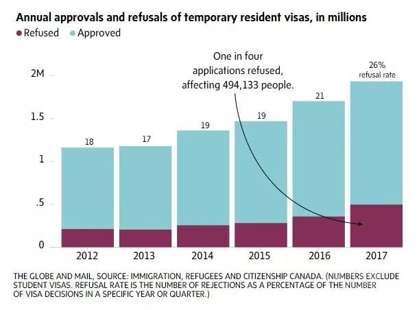
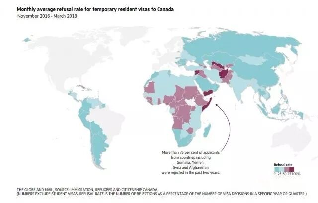
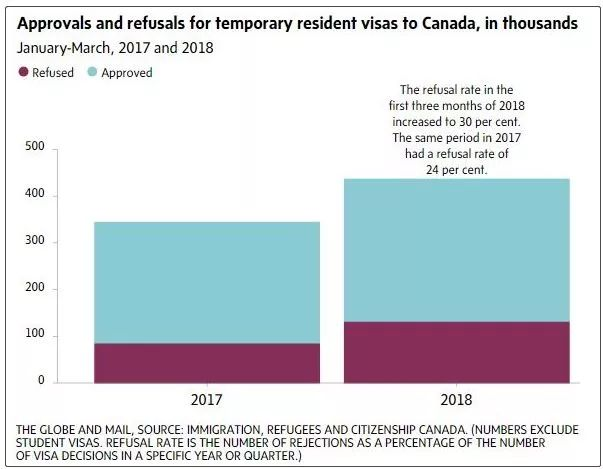

# 无标题

**链接地址:** http://mp.weixin.qq.com/s?__biz=MzI5NDMzNzM3OQ==&mid=2247487319&idx=1&sn=267a3ba8b5d485ce5682e6252eaae73e&chksm=ec65215bdb12a84d3a555043fcb2b9dea608294920742115d1cc4feba878b08c767d47a82dcc&mpshare=1&scene=2&srcid=0714oS1QB5MGVT4s607Cndir#rd
**作者:** 
**获取时间:** 2025/8/28 21:47:25
**图片数量:** 17

---

## 原始HTML内容

<section class="" style="max-width: 100%;color: rgb(51, 51, 51);">&nbsp;<section class="" ng-click="onClick($event)" ng-model="eo.text" ng-style=" {
  'font-size'   : eo.fontSize,
  'font-family' : eo.fontFamily,
  'font-style'  : eo.fontStyle,
  'color'       : (eo.color || theme.majorColor),
} " placeholder="{ 点击编辑 }" stop-propagation="click mousedown mouseup" tn-edit-content="true" tn-page-editable="text0" tn-page-editable-type="ed-type-text" ui-on-drop="block($event)" style="margin-top: 0.7em;margin-left: -0.4em;padding: 1em;max-width: 100%;border-radius: 1em;width: 510.25px;color: inherit;font-family: inherit;font-size: 1em;display: inline-block;background-color: rgb(250, 200, 255);box-sizing: border-box !important;word-wrap: break-word !important;">&nbsp;&nbsp;&nbsp;吃喝玩乐卡尔加里YYC&nbsp;最近要大送豪礼，包括苹果 iPhone X！</section></section>
 
<section class="" style="max-width: 100%;color: rgb(51, 51, 51);"><section class="" ng-click="onClick($event)" ng-model="eo.text" ng-style=" {
  'font-size'   : eo.fontSize,
  'font-family' : eo.fontFamily,
  'font-style'  : eo.fontStyle,
  'color'       : (eo.color || theme.majorColor),
} " placeholder="{ 点击编辑 }" stop-propagation="click mousedown mouseup" tn-edit-content="true" tn-page-editable="text0" tn-page-editable-type="ed-type-text" ui-on-drop="block($event)" style="margin-top: 0.7em;margin-right: -0.4em;padding: 1em;max-width: 100%;border-radius: 1em;width: 510.25px;color: inherit;font-family: inherit;font-size: 1em;display: inline-block;background-color: rgb(188, 227, 249);box-sizing: border-box !important;word-wrap: break-word !important;">没错没错，记得『点击蓝字加关注』哟！机会随时到来！</section>&nbsp;&nbsp;</section><section class="" style="margin-top: 0.8em;margin-bottom: 0.5em;max-width: 100%;color: rgb(51, 51, 51);">
 
</section><section style="max-width: 100%;color: rgb(51, 51, 51);">真心实意，为您推荐！</section>
 

 

据环球邮报报道，<strong style="max-width: 100%;box-sizing: border-box !important;word-wrap: break-word !important;">仅去年一年，加拿大拒绝了近600,000名想要短暂停留的人，旅行目的包括旅游、上学、商业、学术会议或仅仅是为了看望家人。</strong>根据“环球邮报”获得的数据，被拒人数激增，自2012年以来被拒人数翻了一倍多。

2012年，拒绝的数量约占加拿大访客签证申请总数的18％（不包括学生签证）。截至去年，拒签率已上升至26％。

<strong style="max-width: 100%;box-sizing: border-box !important;word-wrap: break-word !important;">而在今年的前三个月，拒签率再次上升至约30％。同时，学生签证的拒签率也从2012年的26％上升到去年的33％。</strong>

The Globe从联邦移民部门获得的统计数据表明，拒绝率最高的是非洲和中东地区。在过去两年中，加拿大拒绝了索马里、也门、叙利亚和阿富汗等国75％以上的游客申请。

其他国家也受到影响。大约200名代表，包括数十名中国政府官员，被拒绝参加最近在温哥华举行的世界广东社区联合会会议。

当学者们在5月初聚集在女王大学参加年度非洲研究会议时，有十几个空位。因为来自非洲的12名受邀学者被拒签或无法及时获得签证。

<strong style="max-width: 100%;box-sizing: border-box !important;word-wrap: break-word !important;">加拿大的签证难度</strong>

世界经济论坛每年对世界各地的旅游和旅游竞争力进行研究，该组织将加拿大的签证要求列为世界上最复杂和最不透明的要求。

2017年的一项调查显示，136个国家的签证申请难度排名从易到难，<strong style="max-width: 100%;box-sizing: border-box !important;word-wrap: break-word !important;">加拿大排名第120位——与2013年初的调查结果相比下降了14位。</strong>

申请过程将变得更加困难。从7月31日开始，来自非洲，欧洲和中东的签证申请人将被要求在外国申请中心提供指纹。该规则将于12月底对亚洲人和拉丁美洲人实施。

<strong style="max-width: 100%;box-sizing: border-box !important;word-wrap: break-word !important;">大多数被拒签的情况，加拿大官员表示，拒签的原因包括申请人没有证明有足够的资金支付他们的住宿费用，或者与加拿大有密切的家庭或经济联系，并且与他们的祖国关系不紧密。</strong>

<strong style="max-width: 100%;box-sizing: border-box !important;word-wrap: break-word !important;">申请在不断增加</strong> 

加拿大签证申请近年来飙升至创纪录水平。申请数量从2012年的约130万增加到去年的约230万。许多新申请人是来自中国和印度等蓬勃发展国家的游客或商务访客，他们有更多的旅行资金。但是，伴随着申请人数激增，拒绝的数量也越来越大。

<strong style="max-width: 100%;box-sizing: border-box !important;word-wrap: break-word !important;">签证申请数量激增可能导致过于仓促的处理系统出现错误和随意的拒绝。拒绝信的陈述通常是简洁而宽泛，不解释拒绝的具体原因。</strong>

在许多情况下，加拿大的公务人员都没有机会作出决定，因为加拿大已将部分工作外包给申请人所在国家的私营公司。

<strong style="max-width: 100%;box-sizing: border-box !important;word-wrap: break-word !important;">并非所有申请人都是平等的</strong>

政府否认有申请歧视。“来自世界各地的所有申请均按照相同的标准进行评估，”Ker 女士说。

但并非每个申请人都是平等的。根据移民部长Ahmed Hussen的新闻秘书Mathieu Genest的说法，签证官考虑的其中一个因素是“母国的经济和政治稳定”。

“如果人签证申请被拒绝仅仅是因为申请人来自一个经历过战争或侵犯人权的国家，就推论他们不会回去，他们的申请因此得到不同的对待，这很令人担忧。

文章来源：加拿大第一生活

 

欢迎大家添加&nbsp;神通广大&nbsp;吃喝玩乐&nbsp;服务微信&nbsp;为好友！

相互照应，十分必要！

扫码即可！

 

 

 
<section style="max-width: 100%;color: rgb(51, 51, 51);">真诚为您推荐！</section><section class="" data-style="white-space: normal; text-align: left;font-size: 14px;line-height: 1.5em; color: rgb(12, 12, 12);" style="max-width: 100%;color: rgb(51, 51, 51);"><section style="margin-top: -1.2em;max-width: 100%;box-sizing: border-box;color: rgb(166, 166, 166);text-align: center;border-width: initial;border-style: none;border-color: initial;line-height: 1.4;word-wrap: break-word !important;"> </section><section class="" data-style="white-space: normal; text-align: left;font-size: 14px;line-height: 1.5em; color: rgb(12, 12, 12);" style="padding: 16px 16px 10px;max-width: 100%;box-sizing: border-box;font-size: 1em;line-height: 1.4;word-wrap: break-word !important;">
<strong style="max-width: 100%;color: rgb(62, 62, 62);font-size: 18px;text-align: justify;box-sizing: border-box !important;word-wrap: break-word !important;"><strong style="max-width: 100%;box-sizing: border-box !important;word-wrap: break-word !important;"><strong style="max-width: 100%;box-sizing: border-box !important;word-wrap: break-word !important;"><strong style="max-width: 100%;box-sizing: border-box !important;word-wrap: break-word !important;"></strong></strong></strong></strong>

<strong style="max-width: 100%;font-size: 18px;text-align: justify;box-sizing: border-box !important;word-wrap: break-word !important;"><strong style="max-width: 100%;box-sizing: border-box !important;word-wrap: break-word !important;"><strong style="max-width: 100%;box-sizing: border-box !important;word-wrap: break-word !important;"><strong style="max-width: 100%;box-sizing: border-box !important;word-wrap: break-word !important;"></strong></strong></strong></strong> 

 

<strong style="max-width: 100%;font-size: 18px;text-align: justify;box-sizing: border-box !important;word-wrap: break-word !important;"><strong style="max-width: 100%;box-sizing: border-box !important;word-wrap: break-word !important;"><strong style="max-width: 100%;box-sizing: border-box !important;word-wrap: break-word !important;"><strong style="max-width: 100%;box-sizing: border-box !important;word-wrap: break-word !important;"></strong></strong></strong></strong>

<strong style="max-width: 100%;font-size: 18px;text-align: justify;box-sizing: border-box !important;word-wrap: break-word !important;"><strong style="max-width: 100%;box-sizing: border-box !important;word-wrap: break-word !important;"><strong style="max-width: 100%;box-sizing: border-box !important;word-wrap: break-word !important;"><strong style="max-width: 100%;box-sizing: border-box !important;word-wrap: break-word !important;"></strong></strong></strong></strong> 

 

</section></section>
 

---

## 纯文本内容

吃喝玩乐卡尔加里YYC 最近要大送豪礼，包括苹果 iPhone X！没错没错，记得『点击蓝字加关注』哟！机会随时到来！  真心实意，为您推荐！据环球邮报报道，仅去年一年，加拿大拒绝了近600,000名想要短暂停留的人，旅行目的包括旅游、上学、商业、学术会议或仅仅是为了看望家人。根据“环球邮报”获得的数据，被拒人数激增，自2012年以来被拒人数翻了一倍多。2012年，拒绝的数量约占加拿大访客签证申请总数的18％（不包括学生签证）。截至去年，拒签率已上升至26％。而在今年的前三个月，拒签率再次上升至约30％。同时，学生签证的拒签率也从2012年的26％上升到去年的33％。The Globe从联邦移民部门获得的统计数据表明，拒绝率最高的是非洲和中东地区。在过去两年中，加拿大拒绝了索马里、也门、叙利亚和阿富汗等国75％以上的游客申请。其他国家也受到影响。大约200名代表，包括数十名中国政府官员，被拒绝参加最近在温哥华举行的世界广东社区联合会会议。当学者们在5月初聚集在女王大学参加年度非洲研究会议时，有十几个空位。因为来自非洲的12名受邀学者被拒签或无法及时获得签证。加拿大的签证难度世界经济论坛每年对世界各地的旅游和旅游竞争力进行研究，该组织将加拿大的签证要求列为世界上最复杂和最不透明的要求。2017年的一项调查显示，136个国家的签证申请难度排名从易到难，加拿大排名第120位——与2013年初的调查结果相比下降了14位。申请过程将变得更加困难。从7月31日开始，来自非洲，欧洲和中东的签证申请人将被要求在外国申请中心提供指纹。该规则将于12月底对亚洲人和拉丁美洲人实施。大多数被拒签的情况，加拿大官员表示，拒签的原因包括申请人没有证明有足够的资金支付他们的住宿费用，或者与加拿大有密切的家庭或经济联系，并且与他们的祖国关系不紧密。申请在不断增加加拿大签证申请近年来飙升至创纪录水平。申请数量从2012年的约130万增加到去年的约230万。许多新申请人是来自中国和印度等蓬勃发展国家的游客或商务访客，他们有更多的旅行资金。但是，伴随着申请人数激增，拒绝的数量也越来越大。签证申请数量激增可能导致过于仓促的处理系统出现错误和随意的拒绝。拒绝信的陈述通常是简洁而宽泛，不解释拒绝的具体原因。在许多情况下，加拿大的公务人员都没有机会作出决定，因为加拿大已将部分工作外包给申请人所在国家的私营公司。并非所有申请人都是平等的政府否认有申请歧视。“来自世界各地的所有申请均按照相同的标准进行评估，”Ker 女士说。但并非每个申请人都是平等的。根据移民部长Ahmed Hussen的新闻秘书Mathieu Genest的说法，签证官考虑的其中一个因素是“母国的经济和政治稳定”。“如果人签证申请被拒绝仅仅是因为申请人来自一个经历过战争或侵犯人权的国家，就推论他们不会回去，他们的申请因此得到不同的对待，这很令人担忧。文章来源：加拿大第一生活欢迎大家添加 神通广大 吃喝玩乐 服务微信 为好友！相互照应，十分必要！扫码即可！真诚为您推荐！

---

## 图片列表

-  (原始链接: https://mmbiz.qpic.cn/mmbiz/MVPvEL7Qg0EXNGDDXjhn7BQlLVZfE4a72NDhuKJZheaZoX3JcYZ8wicrltbzurnAx8Urww68iaiaaC541u0miaUGqg/640?)
-  (原始链接: https://mmbiz.qpic.cn/mmbiz/MVPvEL7Qg0EXNGDDXjhn7BQlLVZfE4a7eyibPmHcP5XBsBl0KZPM0LQibDWticwHV1SSxz8Ha4rjtk93ZD4sTPSsg/640?)
-  (原始链接: https://mmbiz.qpic.cn/mmbiz_jpg/E5oZzDjj1krg70S5dqqia8wpBmp0u7ibWvurxxBrwHU6YUHpdrKOPJ2thhiaQAWncywSIyP6RaAFxH9WzMUvUFkbA/640?wx_fmt=jpeg)
-  (原始链接: http://mmbiz.qpic.cn/mmbiz_jpg/E5oZzDjj1kqcmzibGGbOTonJ7caYsjiaSTtMq1U3Kw5VOLtUgTSNvWXFuQqic1rM7AwibhPM0ZM41RO6DtAmU1WM3w/640?wx_fmt=jpeg)
-  (原始链接: https://mmbiz.qpic.cn/mmbiz_jpg/E5oZzDjj1koIN1Y38icljFMX6zwK8pw7b53PvUZlk9gXsIh45VRRWgBJXibBqiaeeJJv68NkFKuicodbcqOWCXUHicw/640?wx_fmt=jpeg)
-  (原始链接: https://mmbiz.qpic.cn/mmbiz_png/E5oZzDjj1korznwXHmfQ7aYIaG0UJMDRhykrwCMh7dttU2MfsKwBQ3VbBbfUujjQeR6KFxbyiaUlJDPafL6fcwQ/640?wx_fmt=png)
-  (原始链接: https://mmbiz.qpic.cn/mmbiz_jpg/FdGp0vZFBP8q3kRyIkTaglyvcJxA6NFlPdDlBichBFr1NF3RuIYj4wiafZFmeibFwoK2xxSrjQLBicM4n3US46xv1w/640?wx_fmt=jpeg)
-  (原始链接: https://mmbiz.qpic.cn/mmbiz_jpg/FdGp0vZFBP8q3kRyIkTaglyvcJxA6NFlv06MjFMeib0eZBPOT2bVXDGbpYA1s6Xs3ApMWrQUibKmeG4jbYF2owWw/640?wx_fmt=jpeg)
-  (原始链接: https://mmbiz.qpic.cn/mmbiz_jpg/FdGp0vZFBP8q3kRyIkTaglyvcJxA6NFlxUGbF6YrUmx4S3emdaWicBRNN8BCGjh25miaicAaHMNykiaLMmOMmP7GYA/640?wx_fmt=jpeg)
-  (原始链接: https://mmbiz.qpic.cn/mmbiz_gif/GBY2M172g0d1OBqXQvS5cPHygdclkJ6eQ5zwQOUtaZtv4Iq1fnDj1picpKrZ7hhWNr8QsicM7mIzqq0cibrTBP9icg/640?wx_fmt=gif)
-  (原始链接: https://mmbiz.qpic.cn/mmbiz_jpg/mZIpZ2dRo6Z5Lg6L4yBuvZf7QibxfKVYiaibWZ0TgYUSaib6Kt9bF0BhOS7r5v3zCAdNJ6PubAKsoohqPxVjIFWX9w/640?wx_fmt=jpeg)
-  (原始链接: https://mmbiz.qpic.cn/mmbiz_jpg/E5oZzDjj1kqmyBd2wXyJpdlTKRQv5yEo8q6MibdN8KaEpc8HasuicnnICaTm5SyBmFzYHh7Ypj7IianbCxEfHk2lg/640?wx_fmt=jpeg)
-  (原始链接: https://mmbiz.qpic.cn/mmbiz_jpg/E5oZzDjj1kqOCLqCN2NbQAMUbagjVS03xgLrw0N6XMoBSZS1ykNxrwfWZiaj5dHXZWqFdCfVurm8R3oSF82FJqQ/640?wx_fmt=jpeg)
-  (原始链接: https://mmbiz.qpic.cn/mmbiz_jpg/E5oZzDjj1koNJW9uUHaESKwdYBXwmKW1qj69v3qOjy7szM8OibukgwicGibjP2x1Xeqic9bKbg2a2f2qRBSzicsX20w/640?wx_fmt=jpeg)
-  (原始链接: https://mmbiz.qpic.cn/mmbiz_jpg/E5oZzDjj1koNJW9uUHaESKwdYBXwmKW1N0JZ1iaAG5IJ84TC3KQzv1rNHdaiaic9ZibfOCBUL1yhIWnK0ScaWEibQ4A/640?wx_fmt=jpeg)
-  (原始链接: https://mmbiz.qpic.cn/mmbiz_jpg/E5oZzDjj1krFNNmqiaVW3RVdTIANicfJ6BibMoyEmfm5Bscqn3NFAArz5lafNH1OTexHamNNp51ibcpFJqJKHjhiahw/640?wx_fmt=jpeg)
-  (原始链接: http://mmbiz.qpic.cn/mmbiz/E5oZzDjj1kqdHwQ2zpsHXPvFpF81yEia17OibFaAfyBwQYD1iakM7T1PlagpPx6bCbw4qeARbPEgmqPsmYtLv46cQ/640?wx_fmt=jpeg)
