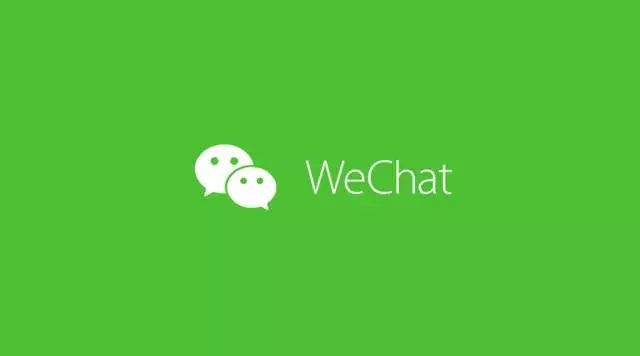
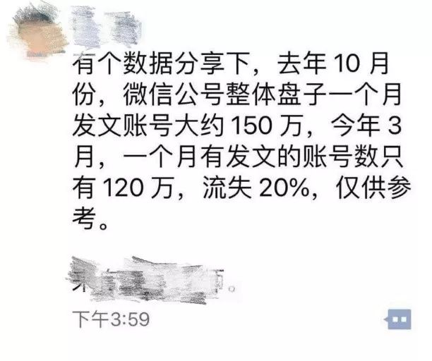
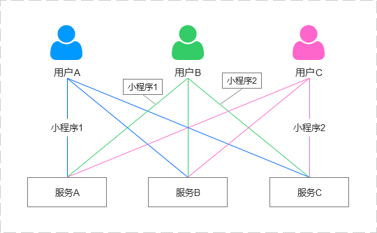
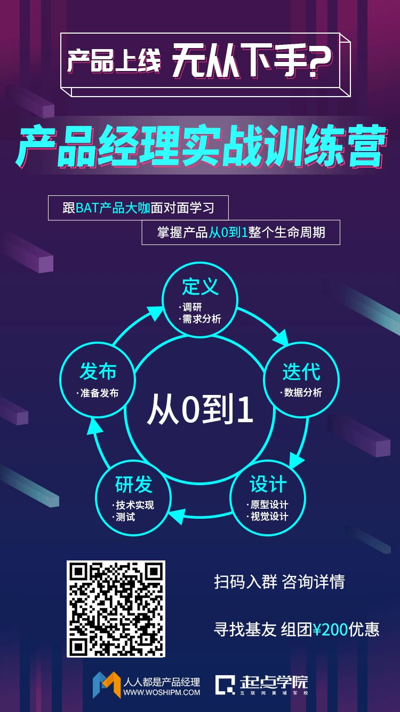

# 无标题

**链接地址:** http://mp.weixin.qq.com/s?__biz=MjM5OTEwNjI2MA==&mid=2651739641&idx=1&sn=67d58d153b7358b5fec7230c5de764cf&chksm=bd3a76428a4dff54515245ac59b699188315ab6e481bff79cf2bc0bed867254d54b1bcc94015&mpshare=1&scene=2&srcid=0716fdaP59N7uCkExWRKowaP#rd
**作者:** tommy
**获取时间:** 2025/8/28 21:47:01
**图片数量:** 5

---

## 原始HTML内容

<section data-role="outer" label="Powered by 135editor.com" style="font-size: 16px;" data-mpa-powered-by="yiban.io"><section data-role="outer" label="Powered by 135editor.com">

作者：tommy

微信公众号：ShadyDesign（ID：ShadyDesign）

全文共 4356 字 2 图，阅读超过 9 分钟

 

———— / BEGIN / ————

 

2018年以前，我们时常能听到“微信老了”这样的评论出现。

 

然而进入2018年之后，确切地说是3月份之后，微信突然发力，敏感的看客隐约察觉到：

 
<section class="_135editor" data-tools="135编辑器" data-id="87860" style="border-width: 0px;border-style: none;border-color: initial;"><section style="width:100%;" data-width="100%"><section style="width:80%;margin:10px auto;line-height:1.75em;color:#a1a1a1;font-size:14px;" class="135brush" data-width="80%">“微信的世界仿佛要变天了”。</section></section></section>
 

<strong>一、回顾18年上半年微信动作</strong>

 

从3月份到现在的短短4个月时间，几乎可以说是微信自小程序发布后变动最频繁的时间。

 

既然现在要复盘微信的2018年上半场，不妨回顾一下半年来微信都有哪些动作。

 

<strong>（1）主界面新增任务栏，下拉可以找到用过的小程序</strong>

 

小程序的第一个触手可得的入口，表明微信准备好了开始给小程序更多的流量。

 

<strong>（2）小程序菜单升级，并支持小程序间快捷切换</strong>

 

微信为小程序开放的另一个流量入口，小程序间可以互相引流。

 

<strong>（3）小程序支持新类目——小游戏</strong>

 

小程序探索的另一个大方向，由跳一跳引爆的小游戏已然攻占各种群。

 

<strong>（4）公众号文章内可以直接看到好友留言</strong>

 

我猜测这是微信的一次激活用户的行为，在这个功能发布的几天后，一组数据验证了我的猜测：微信公众号的内容产出走低，微信需要用一种方式激活用户打开公众号文章甚至互动，从而逆向激活公众号运营者持续输出内容。

 

 

<strong>（5）微信搜索全面升级</strong>

 

通过本次搜一搜的升级整合了微信的几乎整个内容生态。

 

<strong>（6）可以把浏览的文章缩小为浮窗</strong>

 

针对订阅号的一次极为有利的交互升级。

 

<strong>（7）亲属卡代付功能</strong>

 

通过金钱进一步巩固用户最亲近的关系链在微信上的留存。

 

<strong>（8）可以直接浏览订阅号的消息</strong>

 

用户更加接近内容，以信息流的样式把关注的公众号推送按发布时间排序，并且折叠了三条及以后的内容。

 

微信的官方说法是“提升阅读效率”，但是是一个“未完成的功能”。

 

以上是微信的主要变化的汇总，实际上微信的动作远不止于此，期间还夹杂了一系列的UI、UE调整，例如：阅读文章顶栏变成了白色，微信内的网页跳转过程中底部会出现类似浏览器的前进、后退按钮操作栏等20余处改动。

 

同时不要忘了，在这期间小程序也在保持着更新。

 

作为一个坐拥10亿月活的成熟App来讲，这样的更新频度和力度都是不常见的，稍有不慎就会引起用户的反感甚至流失。

 

为何微信这样一个超级App，会出现如此频繁地更新？

 

<strong>二、原因何在？</strong>

 

频繁更新背后，是压力所致？还是计划之内？

 

我猜测有以下几个主要原因：

 

<strong>1. 来自腾讯战略的内部压力</strong>

 

4月12日的“互联网+”数字经济峰会上，小马哥提出了1357战略[1]，其中的“7”指7种工具：公众号、小程序、移动支付、社交广告、企业微信、云计算、大数据与人工智能。

 

除了“云计算、大数据与人工智能”两个幕后工具外，另外五个工具无一不指向微信。微信在整个腾讯战略中所肩负的重量，不言而喻。

 

<strong>2. 头腾大战带来的外部压力</strong>

 

抖音的迅速崛起给了腾讯莫大的压力，以至于不得不复活微视与之相抗，那么作为腾讯最大的流量入口，微信此时势必也要参与到“保卫战”中。

 

抖音的娱乐属性难以动摇“熟人关系链”这一微信的根基（推测熟人间不会天天在抖音里嗨聊吧），但巨大流量下也为社交提供了更多可能性，微信不得不防。

 

<strong>3. 微信要激活用户，刷新用户对自己的认知</strong>

 

随着微信进入自己生命的第七年，我们已经对微信太过熟悉了，以至于有些忽略了它的存在，好像对彼此太过熟悉的老夫老妻，然而这样的情况并不是一个产品所乐于见到的。

 

而微信现在由内到外，浓妆艳抹地改变自己，进入第二春，希望重新回到用户的视线中，让用户再一次感受到自己是一个生动的产品。

 

而这样的感觉，上一次好像还是“摇一摇”的时候。

 

<strong>4. 微信积累了巨大的势能需要爆发</strong>

 

微信经过多年的成长，其内容生态、服务生态都已经建立，随着小程序势盛和搜一搜整合形成的巨大势能，在短期内爆发可能会将微信带到一个新的高度。

 

如果此时再缓步前进，则可能像漏气的轮胎一样没有声响，前功尽弃。

 

<strong>三、从经营商城到建设城市</strong>

 

再回到小马哥的“1357战略”中，“3”是指“三件事”，即腾讯要专注<strong>做连接、做工具、做生态</strong>。

 

毫无疑问地，微信又将扮演重要角色。

 

此时的微信要干一件大事：连接一切。

 

那么为了达成这个目标，变化也就是必然的了。

 

我认为最主要的是层次（或者说维度）和角色上的变化，微信希望从经营一座商城变为建设一座城市。

 

我们可以通过对比小程序上线前后的微信，来体会这种变化：

 

在小程序上线之前，微信和所有其他App是在同一个层次上的。

 

那时候尽管订阅号和服务号俱全，但由于产品形态的原因，微信仍然是相对封闭的，微信开放的是“入口”，扮演的是“管道”的角色，它在自己的身体上挖通了管道，让用户和内容、服务连接起来。

 

尽管提供了一系列的功能支持，让服务端能够在微信内完成业务，但一个个分离的服务号和订阅号并没有形成集群，公众号被收在了“文件夹”中，服务号散落在聊天消息里，每个号有自己的动能，但并未形成整体产生势能。

 

小程序的上线改变了一切。

 

上线之初，“干掉App store”的呼声就很高——甚至“小程序”这个名字，也是因为在苹果的压力下，微信放弃了原本“应用号”的叫法。

 

小程序发布之后，微信“下沉”了。

 

这种下沉是角色上的转变，微信从经营一个“商城”变为了建设一个“城市”，此时它扮演的是“基础”的角色。

 

原本的“城市”是互联网，微信和所有其他App都生活在这座城市中；突然之间，微信在这之上建立了一个能够覆盖整个城市的平台，使得原本生活在城市中的人和企业都能够搬到这个平台上来，并且将原本的城市变成了自己的地基。

 

小程序上线之初，众多创业者和产品经理们开始思考：

 
<section class="_135editor" data-tools="135编辑器" data-id="87860" style="border-width: 0px;border-style: none;border-color: initial;"><section style="width:100%;" data-width="100%"><section style="width:80%;margin:10px auto;line-height:1.75em;color:#a1a1a1;font-size:14px;" class="135brush" data-width="80%">“我们的App该往哪里去？”</section></section></section>
 

现在看来，当年提出这样的问题是因为和微信站在了同一个层次上，认为微信和自己是割裂的，既然是割裂的就可能存在竞争。

 

当时，凡是产品带有社交属性的创业团队中，一个普遍的焦虑是：

 
<section class="_135editor" data-tools="135编辑器" data-id="87860" style="border-width: 0px;border-style: none;border-color: initial;"><section style="width:100%;" data-width="100%"><section style="width:80%;margin:10px auto;line-height:1.75em;color:#a1a1a1;font-size:14px;" class="135brush" data-width="80%">“我的用户跑到微信去了怎么办？”</section></section></section>
 

然而现在我们发现：小程序的价值之一就是“当我的用户跑到微信去之后还有可能是我的用户，甚至微信的用户就是我的用户”，甚至现在很多公司已经All in小程序。

 

巨头把自己的流量拿出来给大家用很常见，但微信的流量之大和所能支持的业务之广，是没有其他任何一个产品能够做到的。

 

微信不紧不慢地用近两年的时间把小程序养大，如今它准备好了和订阅号、微信支付、搜一搜一同承担起连接一切的重任。

 

<strong>四、从App到“类OS”的野心</strong>

 

微信用七年的时间成为了一个史无前例的超级App，直到今天越来越看到“微信OS”（OS：操作系统）初具雏形；那么，它是如何从一个App跨越成为一个“类OS”的？

 

在我看来，小程序和搜索缺一不可。

 

小程序提供了连接的能力，将用户和内容、服务连接在一次。

 

然而每次连接只是形成了一条线——对一个体量如此庞大的微信来说，这样的效率太低太低了。

 

这个时候就必然需要搜索的介入，通过搜索可以同时产生无数条线；线的这一头是用户，另一头可以是商品，可以是内容，可以是其他任何的服务。

 

而当越来越多的用户通过搜索进行连接的时候，在微信之上就形成了一张无限大的网，这张网可以包罗一切。

 

以搜索和小程序去整合各个服务，可以在微信之中形成巨大的势能。

 

 

我们可以设想这样的一个场景：

 
<section class="_135editor" data-tools="135编辑器" data-id="87860" style="border-width: 0px;border-style: none;border-color: initial;"><section style="width:100%;" data-width="100%"><section style="width:80%;margin:10px auto;line-height:1.75em;color:#a1a1a1;font-size:14px;" class="135brush" data-width="80%">一天晚上，和三五好友在群里商量着晚上聚个会，有人要撸串、有人要啤酒、有人要玩牌，随即微信“私人助理”及时出现，直接在群聊里帮你们完成了购买，甚至还帮好友叫好了到你家的车。</section></section></section>
 

这样的生活是不是很未来？

 

这时你还需要其他的任何一个app吗？

 

这或许就是微信的野心。

 

这个场景中想象的微信“私人助理”并不是没有可能出现的，以腾讯的海量数据和技术实力加上微信的应用场景，唯一阻碍它的也许是微信一直以来的产品观：“不主动打扰用户”。

 

除了重新安装微信首次登录时候的一条来自微信团队的“欢迎回到微信”，相信你没有收到过任何一条来自微信官方主动发送的通知吧？

 

如果能够找到一个足够“优雅、矜持”的让“私人助理”介入的方式，相信我们就能“活在未来”了。

 

当我无论干什么都会以“打开微信”这个动作为起点时，我就完完全全地被微信收获了。

 

当微信收获了足够多的“我”之后，“微信OS”的时代即宣告来临。

 

<strong>五、为什么是微信</strong>

 

说了这么多，为什么微信能够做到这一切？

 

因为它<strong>收获了用户作为“人”的身份。</strong>

 

任何一个人在使用任何一款产品的时候是带有“身份”，或者说“属性”的。

 

具体来说：

 
<section class="_135editor" data-tools="135编辑器" data-id="87860" style="border-width: 0px;border-style: none;border-color: initial;"><section style="width:100%;" data-width="100%"><section style="width:80%;margin:10px auto;line-height:1.75em;color:#a1a1a1;font-size:14px;" class="135brush" data-width="80%">当我使用“饮水机”的时候，我的“身份/属性”是“渴”，玩游戏时我的“身份/属性”变成了“娱乐、休闲、竞技”，到了约见在行行家的时候又变成了“求知、解惑”。</section></section></section>
 

因为这种身份的转变，当我们打开一个App时是有各种各样的预期的。

 

那么这个产品是否满足了我的预期，表现90分还是60分决定了我是否会继续使用这个App？

 

同时也是因为有这样的身份转变，产生了不同的互联网赛道，有了不同的垂直行业。

 

这也是为什么，产品经理需要关注自己的产品解决了用户的哪些“核心需求”，从“核心需求”能够扩展出多少其他的需求——<strong>这个需求面决定了产品能够覆盖的“广度”</strong>。

 

微信在一开始的时候解决的是“实时沟通”这个核心需求，这是由它的IM（即时通讯）属性决定的。

 

但这个需求是包容性最强的需求——沟通可以是任何内容的。

 

当用户体量足够大，用户关系链沉淀足够强壮之后，微信引入了公众号、支付等内容，通过六年的公众号培育和五年的微信支付发展，它又进一步牢牢掌握了用户“获取信息”和“完成交易”两大习惯。

 

除了“游戏、娱乐”和基本的衣食住行之外，微信几乎掌握了一个人能拥有的所有“身份/属性”：沟通、获取信息、交易。

 

对于这样的一个产品，我们是很难形成一个清晰的预期的，就像今天很难给微信一个准确的定义一样。

 

当我以一个“完整的人”的身份进入微信，而它也越来越能够满足我各种需求，这是很可怕一件事。

 

对比BAT，百度的搜索、阿里的电商终究是某些场景的聚合，扩展起来是有很大难度的，看看阿里做社交的路就知道有多难了，当不需要获取信息的时候百度更加派不上用处。

 

因此只有微信能够达到今天的高度，得益于腾讯一贯以来的社交基因。

 

<strong>六、影响</strong>

 

微信的下沉对创业来说是件好事：我们终于不用把微信当做敌人了（社交产品除外）。

 

以微信一贯的矜持和操守，大家或许能够相对公平地竞争。

 

然而凡事都一定是有两面性的。

 

我总是说不清原因地感觉：当越来越多的企业进入小程序的时候，各个产品的“个性”会越来越少，就好像今天所有手机长成一个样子，难免怀念当年各家争奇斗艳的年代。

 

尽管如此，作为一名产品经理，希望能看到微信“攻城拔寨”中的每一场战役。

 

但微信一家独大的中国互联网，又有什么意思呢？

 

另外还有一件事：苹果和微信之间或许会有一场战争，但这场战争好比两个核武国家之间的对垒，任谁都不敢有什么大动作，且看将来如何暗流涌动。

 

注释：

 

[1]1357战略：4月12日，马化腾在“互联网+”数字经济峰会上提出1357战略，即“一个目标、三个角色、五个领域、七种工具”。

 

———— / END / ————

 

 

———— / 推荐阅读 / ————
<ul class=" list-paddingleft-2" style="list-style-type: square;"><li>
<a href="http://mp.weixin.qq.com/s?__biz=MjM5OTEwNjI2MA==&amp;mid=2651734202&amp;idx=1&amp;sn=c7cd321dead13809603f47883fa50511&amp;chksm=bd3a63018a4dea176e9c285f7935a0cc781d74b74080272098ee976fc893dfb6de3f84f48dd5&amp;scene=21#wechat_redirect" target="_blank">我脑中的未来微信</a>
</li><li>
<a href="http://mp.weixin.qq.com/s?__biz=MjM5OTEwNjI2MA==&amp;mid=2651734381&amp;idx=1&amp;sn=9ac53405f87262d285c03141c4d9f72c&amp;chksm=bd3a62d68a4debc01bdd0bc783cc37cf3c2cbf4ab4902e9b1321923d93474ff09e6d958a8f67&amp;scene=21#wechat_redirect" target="_blank">不酷的微信，焦虑的腾讯</a>
</li><li>
<a href="http://mp.weixin.qq.com/s?__biz=MjM5OTEwNjI2MA==&amp;mid=2651738051&amp;idx=1&amp;sn=75012b047395d938d697d03eab3ac709&amp;chksm=bd3a6c788a4de56e85d670d7642c48aebb41b946aaea1c79479a329e51737ab07af3cc40c403&amp;scene=21#wechat_redirect" target="_blank">10亿微信，从输入输出到社会化操作系统</a>
</li><li>
<a href="http://mp.weixin.qq.com/s?__biz=MjM5OTEwNjI2MA==&amp;mid=2651737551&amp;idx=1&amp;sn=252c13385744303eab9b2d77c37037a1&amp;chksm=bd3a6e748a4de7623b16637751b7a507b78aede5778734ae004065c2350d12ce336908800741&amp;scene=21#wechat_redirect" target="_blank">7年时间、64次迭代、10亿月活，微信凭什么？</a>
</li><li>
<a href="http://mp.weixin.qq.com/s?__biz=MjM5OTEwNjI2MA==&amp;mid=2651734547&amp;idx=1&amp;sn=5b3bbf4ae4651ccf7822edfb0a16ddc2&amp;chksm=bd3a61a88a4de8be8d8e344317e9d12f4f88b9ceb681b4bdbb3be1a4044a2531c9b5233263b8&amp;scene=21#wechat_redirect" target="_blank">从微信版本历史，学产品功能迭代和用户体验</a>
</li><li>
<a href="http://mp.weixin.qq.com/s?__biz=MjM5OTEwNjI2MA==&amp;mid=2651734360&amp;idx=3&amp;sn=1382172b70fecb120d7a0da3d9eadd10&amp;chksm=bd3a62e38a4debf5d3239af94da2944c0f80d1ac632a84a8869e4089a3935df5d64bc6fed3f2&amp;scene=21#wechat_redirect" target="_blank">微信创始团队成员：解读微信团队的实验室文化</a>
</li></ul>
 

 

 

产品大咖带你从入门到精通全方位学习

实战演练体验产品从0到1全过程！

点击“<strong>阅读原文</strong>”查看课程详情
</section></section>

---

## 纯文本内容

作者：tommy微信公众号：ShadyDesign（ID：ShadyDesign）全文共 4356 字 2 图，阅读超过 9 分钟———— / BEGIN / ————2018年以前，我们时常能听到“微信老了”这样的评论出现。然而进入2018年之后，确切地说是3月份之后，微信突然发力，敏感的看客隐约察觉到：“微信的世界仿佛要变天了”。一、回顾18年上半年微信动作从3月份到现在的短短4个月时间，几乎可以说是微信自小程序发布后变动最频繁的时间。既然现在要复盘微信的2018年上半场，不妨回顾一下半年来微信都有哪些动作。（1）主界面新增任务栏，下拉可以找到用过的小程序小程序的第一个触手可得的入口，表明微信准备好了开始给小程序更多的流量。（2）小程序菜单升级，并支持小程序间快捷切换微信为小程序开放的另一个流量入口，小程序间可以互相引流。（3）小程序支持新类目——小游戏小程序探索的另一个大方向，由跳一跳引爆的小游戏已然攻占各种群。（4）公众号文章内可以直接看到好友留言我猜测这是微信的一次激活用户的行为，在这个功能发布的几天后，一组数据验证了我的猜测：微信公众号的内容产出走低，微信需要用一种方式激活用户打开公众号文章甚至互动，从而逆向激活公众号运营者持续输出内容。（5）微信搜索全面升级通过本次搜一搜的升级整合了微信的几乎整个内容生态。（6）可以把浏览的文章缩小为浮窗针对订阅号的一次极为有利的交互升级。（7）亲属卡代付功能通过金钱进一步巩固用户最亲近的关系链在微信上的留存。（8）可以直接浏览订阅号的消息用户更加接近内容，以信息流的样式把关注的公众号推送按发布时间排序，并且折叠了三条及以后的内容。微信的官方说法是“提升阅读效率”，但是是一个“未完成的功能”。以上是微信的主要变化的汇总，实际上微信的动作远不止于此，期间还夹杂了一系列的UI、UE调整，例如：阅读文章顶栏变成了白色，微信内的网页跳转过程中底部会出现类似浏览器的前进、后退按钮操作栏等20余处改动。同时不要忘了，在这期间小程序也在保持着更新。作为一个坐拥10亿月活的成熟App来讲，这样的更新频度和力度都是不常见的，稍有不慎就会引起用户的反感甚至流失。为何微信这样一个超级App，会出现如此频繁地更新？二、原因何在？频繁更新背后，是压力所致？还是计划之内？我猜测有以下几个主要原因：1. 来自腾讯战略的内部压力4月12日的“互联网+”数字经济峰会上，小马哥提出了1357战略[1]，其中的“7”指7种工具：公众号、小程序、移动支付、社交广告、企业微信、云计算、大数据与人工智能。除了“云计算、大数据与人工智能”两个幕后工具外，另外五个工具无一不指向微信。微信在整个腾讯战略中所肩负的重量，不言而喻。2. 头腾大战带来的外部压力抖音的迅速崛起给了腾讯莫大的压力，以至于不得不复活微视与之相抗，那么作为腾讯最大的流量入口，微信此时势必也要参与到“保卫战”中。抖音的娱乐属性难以动摇“熟人关系链”这一微信的根基（推测熟人间不会天天在抖音里嗨聊吧），但巨大流量下也为社交提供了更多可能性，微信不得不防。3. 微信要激活用户，刷新用户对自己的认知随着微信进入自己生命的第七年，我们已经对微信太过熟悉了，以至于有些忽略了它的存在，好像对彼此太过熟悉的老夫老妻，然而这样的情况并不是一个产品所乐于见到的。而微信现在由内到外，浓妆艳抹地改变自己，进入第二春，希望重新回到用户的视线中，让用户再一次感受到自己是一个生动的产品。而这样的感觉，上一次好像还是“摇一摇”的时候。4. 微信积累了巨大的势能需要爆发微信经过多年的成长，其内容生态、服务生态都已经建立，随着小程序势盛和搜一搜整合形成的巨大势能，在短期内爆发可能会将微信带到一个新的高度。如果此时再缓步前进，则可能像漏气的轮胎一样没有声响，前功尽弃。三、从经营商城到建设城市再回到小马哥的“1357战略”中，“3”是指“三件事”，即腾讯要专注做连接、做工具、做生态。毫无疑问地，微信又将扮演重要角色。此时的微信要干一件大事：连接一切。那么为了达成这个目标，变化也就是必然的了。我认为最主要的是层次（或者说维度）和角色上的变化，微信希望从经营一座商城变为建设一座城市。我们可以通过对比小程序上线前后的微信，来体会这种变化：在小程序上线之前，微信和所有其他App是在同一个层次上的。那时候尽管订阅号和服务号俱全，但由于产品形态的原因，微信仍然是相对封闭的，微信开放的是“入口”，扮演的是“管道”的角色，它在自己的身体上挖通了管道，让用户和内容、服务连接起来。尽管提供了一系列的功能支持，让服务端能够在微信内完成业务，但一个个分离的服务号和订阅号并没有形成集群，公众号被收在了“文件夹”中，服务号散落在聊天消息里，每个号有自己的动能，但并未形成整体产生势能。小程序的上线改变了一切。上线之初，“干掉App store”的呼声就很高——甚至“小程序”这个名字，也是因为在苹果的压力下，微信放弃了原本“应用号”的叫法。小程序发布之后，微信“下沉”了。这种下沉是角色上的转变，微信从经营一个“商城”变为了建设一个“城市”，此时它扮演的是“基础”的角色。原本的“城市”是互联网，微信和所有其他App都生活在这座城市中；突然之间，微信在这之上建立了一个能够覆盖整个城市的平台，使得原本生活在城市中的人和企业都能够搬到这个平台上来，并且将原本的城市变成了自己的地基。小程序上线之初，众多创业者和产品经理们开始思考：“我们的App该往哪里去？”现在看来，当年提出这样的问题是因为和微信站在了同一个层次上，认为微信和自己是割裂的，既然是割裂的就可能存在竞争。当时，凡是产品带有社交属性的创业团队中，一个普遍的焦虑是：“我的用户跑到微信去了怎么办？”然而现在我们发现：小程序的价值之一就是“当我的用户跑到微信去之后还有可能是我的用户，甚至微信的用户就是我的用户”，甚至现在很多公司已经All in小程序。巨头把自己的流量拿出来给大家用很常见，但微信的流量之大和所能支持的业务之广，是没有其他任何一个产品能够做到的。微信不紧不慢地用近两年的时间把小程序养大，如今它准备好了和订阅号、微信支付、搜一搜一同承担起连接一切的重任。四、从App到“类OS”的野心微信用七年的时间成为了一个史无前例的超级App，直到今天越来越看到“微信OS”（OS：操作系统）初具雏形；那么，它是如何从一个App跨越成为一个“类OS”的？在我看来，小程序和搜索缺一不可。小程序提供了连接的能力，将用户和内容、服务连接在一次。然而每次连接只是形成了一条线——对一个体量如此庞大的微信来说，这样的效率太低太低了。这个时候就必然需要搜索的介入，通过搜索可以同时产生无数条线；线的这一头是用户，另一头可以是商品，可以是内容，可以是其他任何的服务。而当越来越多的用户通过搜索进行连接的时候，在微信之上就形成了一张无限大的网，这张网可以包罗一切。以搜索和小程序去整合各个服务，可以在微信之中形成巨大的势能。我们可以设想这样的一个场景：一天晚上，和三五好友在群里商量着晚上聚个会，有人要撸串、有人要啤酒、有人要玩牌，随即微信“私人助理”及时出现，直接在群聊里帮你们完成了购买，甚至还帮好友叫好了到你家的车。这样的生活是不是很未来？这时你还需要其他的任何一个app吗？这或许就是微信的野心。这个场景中想象的微信“私人助理”并不是没有可能出现的，以腾讯的海量数据和技术实力加上微信的应用场景，唯一阻碍它的也许是微信一直以来的产品观：“不主动打扰用户”。除了重新安装微信首次登录时候的一条来自微信团队的“欢迎回到微信”，相信你没有收到过任何一条来自微信官方主动发送的通知吧？如果能够找到一个足够“优雅、矜持”的让“私人助理”介入的方式，相信我们就能“活在未来”了。当我无论干什么都会以“打开微信”这个动作为起点时，我就完完全全地被微信收获了。当微信收获了足够多的“我”之后，“微信OS”的时代即宣告来临。五、为什么是微信说了这么多，为什么微信能够做到这一切？因为它收获了用户作为“人”的身份。任何一个人在使用任何一款产品的时候是带有“身份”，或者说“属性”的。具体来说：当我使用“饮水机”的时候，我的“身份/属性”是“渴”，玩游戏时我的“身份/属性”变成了“娱乐、休闲、竞技”，到了约见在行行家的时候又变成了“求知、解惑”。因为这种身份的转变，当我们打开一个App时是有各种各样的预期的。那么这个产品是否满足了我的预期，表现90分还是60分决定了我是否会继续使用这个App？同时也是因为有这样的身份转变，产生了不同的互联网赛道，有了不同的垂直行业。这也是为什么，产品经理需要关注自己的产品解决了用户的哪些“核心需求”，从“核心需求”能够扩展出多少其他的需求——这个需求面决定了产品能够覆盖的“广度”。微信在一开始的时候解决的是“实时沟通”这个核心需求，这是由它的IM（即时通讯）属性决定的。但这个需求是包容性最强的需求——沟通可以是任何内容的。当用户体量足够大，用户关系链沉淀足够强壮之后，微信引入了公众号、支付等内容，通过六年的公众号培育和五年的微信支付发展，它又进一步牢牢掌握了用户“获取信息”和“完成交易”两大习惯。除了“游戏、娱乐”和基本的衣食住行之外，微信几乎掌握了一个人能拥有的所有“身份/属性”：沟通、获取信息、交易。对于这样的一个产品，我们是很难形成一个清晰的预期的，就像今天很难给微信一个准确的定义一样。当我以一个“完整的人”的身份进入微信，而它也越来越能够满足我各种需求，这是很可怕一件事。对比BAT，百度的搜索、阿里的电商终究是某些场景的聚合，扩展起来是有很大难度的，看看阿里做社交的路就知道有多难了，当不需要获取信息的时候百度更加派不上用处。因此只有微信能够达到今天的高度，得益于腾讯一贯以来的社交基因。六、影响微信的下沉对创业来说是件好事：我们终于不用把微信当做敌人了（社交产品除外）。以微信一贯的矜持和操守，大家或许能够相对公平地竞争。然而凡事都一定是有两面性的。我总是说不清原因地感觉：当越来越多的企业进入小程序的时候，各个产品的“个性”会越来越少，就好像今天所有手机长成一个样子，难免怀念当年各家争奇斗艳的年代。尽管如此，作为一名产品经理，希望能看到微信“攻城拔寨”中的每一场战役。但微信一家独大的中国互联网，又有什么意思呢？另外还有一件事：苹果和微信之间或许会有一场战争，但这场战争好比两个核武国家之间的对垒，任谁都不敢有什么大动作，且看将来如何暗流涌动。注释：[1]1357战略：4月12日，马化腾在“互联网+”数字经济峰会上提出1357战略，即“一个目标、三个角色、五个领域、七种工具”。———— / END / ———————— / 推荐阅读 / ————我脑中的未来微信不酷的微信，焦虑的腾讯10亿微信，从输入输出到社会化操作系统7年时间、64次迭代、10亿月活，微信凭什么？从微信版本历史，学产品功能迭代和用户体验微信创始团队成员：解读微信团队的实验室文化产品大咖带你从入门到精通全方位学习实战演练体验产品从0到1全过程！点击“阅读原文”查看课程详情

---

## 图片列表

-  (原始链接: https://mmbiz.qpic.cn/mmbiz_jpg/icHOSb47jqpVXhOnJJvWicGV4KNRqV8zqibogDyy1y2hPNOCAkQ8sq9BAwULqtO1Qv3312tn9Joicxo1s9E035tT8g/640)
-  (原始链接: https://mmbiz.qpic.cn/mmbiz_jpg/icHOSb47jqpVXhOnJJvWicGV4KNRqV8zqib6KA2IpvHnjYBUXCj02kbHqlKoNN4ic5QGMczokWarWQz3VnXtOqCkCw/640)
-  (原始链接: https://mmbiz.qpic.cn/mmbiz_png/icHOSb47jqpVXhOnJJvWicGV4KNRqV8zqib6NDialLyWYXVTmwQ9FicO44Jn2FkdDIqWib9fMUicbT0nZnfKd8JqhMszg/640)
-  (原始链接: https://mmbiz.qpic.cn/mmbiz_jpg/icHOSb47jqpVXhOnJJvWicGV4KNRqV8zqib74iceHe5SmghIIwnBNIc5CP0RDbcqXQwmrOGBlJ3euY36icD2QwMS8BA/640)
-  (原始链接: https://mmbiz.qpic.cn/mmbiz_png/icHOSb47jqpVXhOnJJvWicGV4KNRqV8zqibk8DWibG4anjJ9YyVMibja6q6brG1rngEeSiciaF7oWvjm94r1QdpImcWVA/640)
