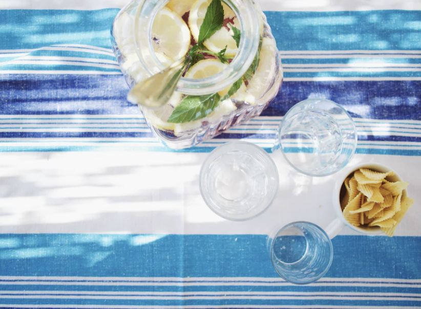
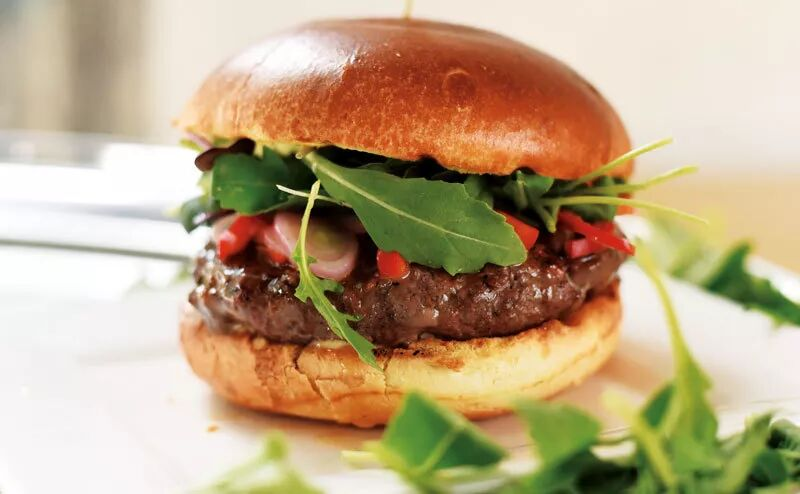
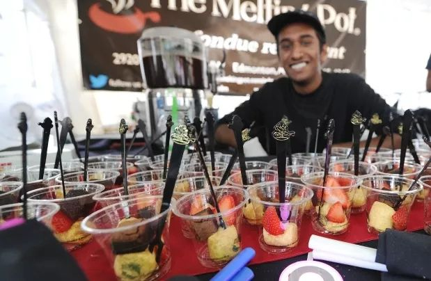
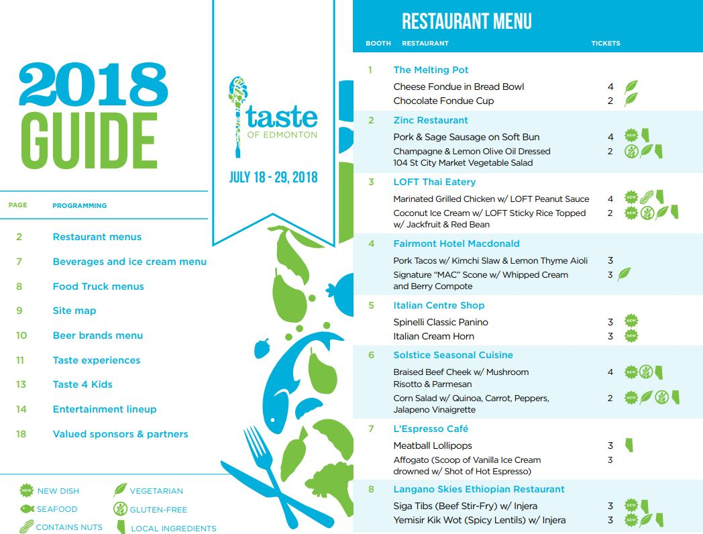
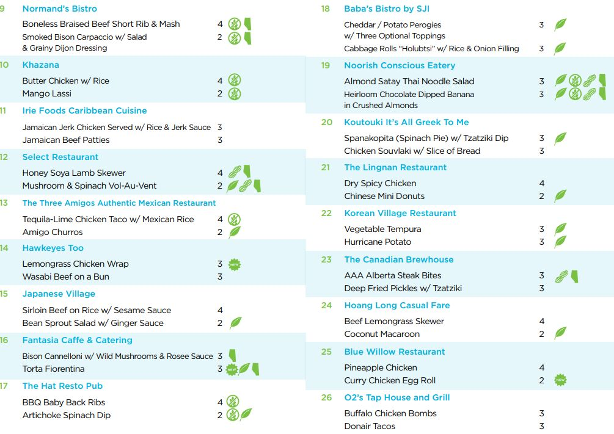
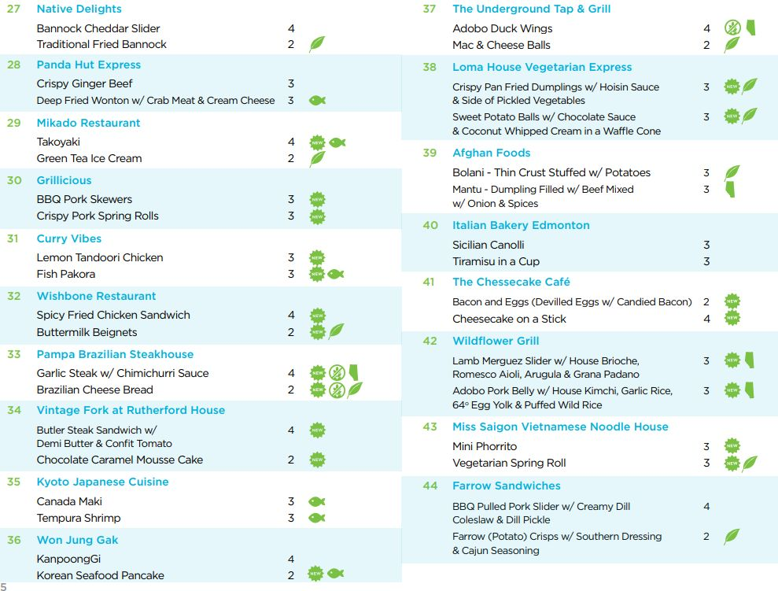
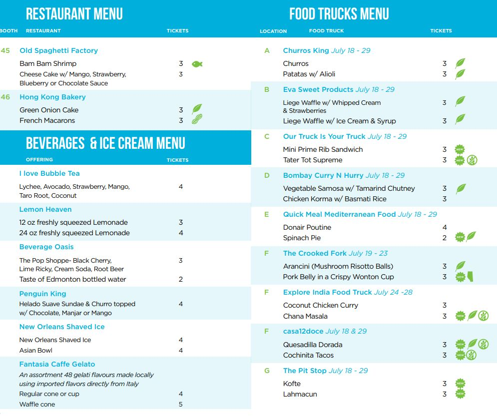
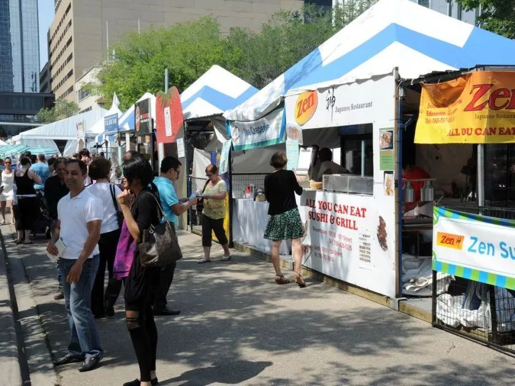
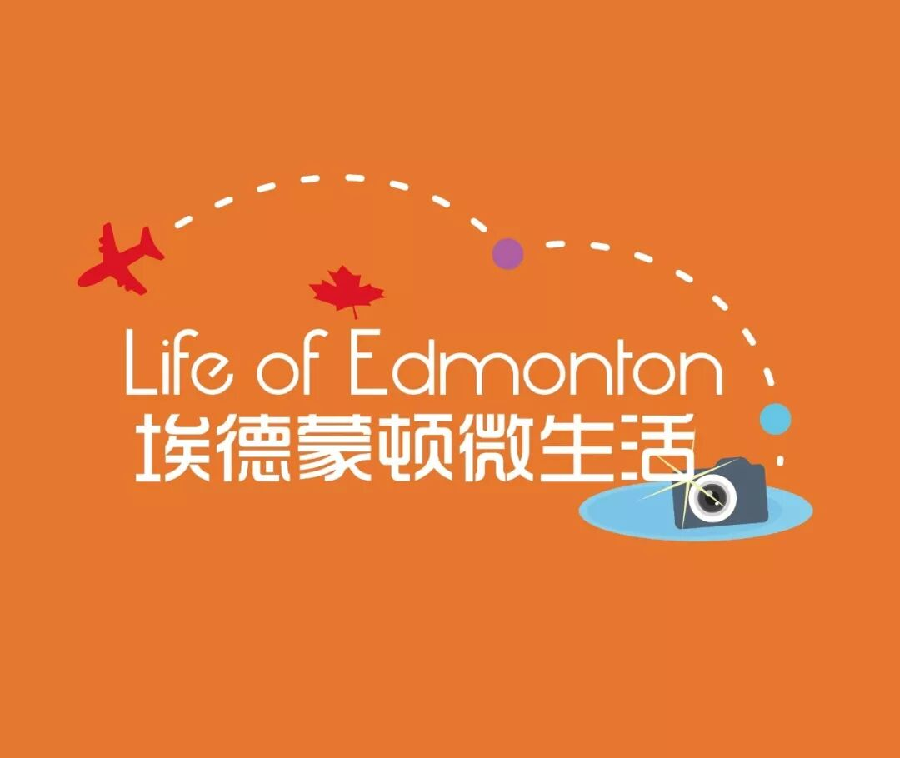

# 无标题

**链接地址:** http://mp.weixin.qq.com/s?__biz=MzI2NTE1ODgwOQ==&mid=2649604545&idx=1&sn=08c41e88ba4060a26c26a8aac8fbb94f&chksm=f2b8c837c5cf4121f316e9b70ef72d38a95e473a28a526f2d5730635a7a4614571987f79c7ec&mpshare=1&scene=2&srcid=0718mFyw88yNve1CWKDz7OFC#rd
**作者:** 饼饼我的饼饼
**获取时间:** 2025/8/28 21:46:17
**图片数量:** 28

---

## 原始HTML内容

<section style="box-sizing: border-box;"><section class="Powered-by-XIUMI V5" style="box-sizing: border-box;" powered-by="xiumi.us"><section class="" style="margin: 10px 0%;box-sizing: border-box;"><section class="" style="display: inline-block;width: 100%;vertical-align: top;background-position: 0% 0%;background-repeat: repeat;background-size: 68.3688%;background-attachment: scroll;padding: 0px;background-image: url(&quot;https://mmbiz.qpic.cn/mmbiz_png/gH4p5a4q5h0ribATg7PeQ7mA8L0EZFBV1vhdG5uEgLad8t3pIehWFQDdowUYVLKOWTwwCLGLXD3JYoLdRjbSjHw/640?wx_fmt=png&quot;);box-sizing: border-box;"><section class="Powered-by-XIUMI V5" style="box-sizing: border-box;" powered-by="xiumi.us"><section class="" style="box-sizing: border-box;"><section class="" style="display: inline-block;vertical-align: middle;width: 10%;box-sizing: border-box;"><section class="Powered-by-XIUMI V5" style="box-sizing: border-box;" powered-by="xiumi.us"><section class="" style="text-align: center;margin-top: 10px;margin-bottom: 10px;box-sizing: border-box;"><section class="" style="max-width: 100%;vertical-align: middle;display: inline-block;width: 70%;overflow: hidden !important;box-sizing: border-box;"></section></section></section></section><section class="" style="display: inline-block;vertical-align: middle;width: 90%;padding: 0px 0px 0px 10px;box-sizing: border-box;"><section class="Powered-by-XIUMI V5" style="box-sizing: border-box;" powered-by="xiumi.us"><section class="" style="margin: 20px 0% 0px;box-sizing: border-box;"><section class="" style="text-align: center;font-size: 14px;box-sizing: border-box;">
点击上方蓝字，关注更多活动哦
</section></section></section></section></section></section></section></section></section><section class="Powered-by-XIUMI V5" style="box-sizing: border-box;" powered-by="xiumi.us"><section class="" style="margin: 10px 0%;transform: translate3d(10px, 0px, 0px);-webkit-transform: translate3d(10px, 0px, 0px);-moz-transform: translate3d(10px, 0px, 0px);-o-transform: translate3d(10px, 0px, 0px);box-sizing: border-box;"><section class="" style="display: inline-block;width: 93%;vertical-align: top;background-color: rgb(255, 255, 255);padding: 10px 0px;box-shadow: rgb(185, 185, 185) 2px 0px 6px;box-sizing: border-box;"><section class="Powered-by-XIUMI V5" style="box-sizing: border-box;" powered-by="xiumi.us"><section class="" style="text-align: right;transform: translate3d(10px, 0px, 0px);-webkit-transform: translate3d(10px, 0px, 0px);-moz-transform: translate3d(10px, 0px, 0px);-o-transform: translate3d(10px, 0px, 0px);box-sizing: border-box;"><section class="" style="display: inline-block;width: 100%;vertical-align: top;background-position: 97.3668% 0.281%;background-repeat: repeat-y;background-size: 89.3853%;background-attachment: scroll;padding: 0px 30px 0px 0px;box-shadow: rgb(0, 0, 0) 0px 0px 0px;background-image: url(&quot;https://mmbiz.qpic.cn/mmbiz_png/WGGLLXFtvqxFe8lCsHKc0nYaGMWGLcpmnicibSia3icYGzib7Lx2tBrs97YR0iawd9C0esIKhW0OhUCg5dSgLpdM3XNw/640?wx_fmt=png&quot;);box-sizing: border-box;"><section class="Powered-by-XIUMI V5" style="box-sizing: border-box;" powered-by="xiumi.us"><section class="" style="text-align: center;margin: 0px 0%;box-sizing: border-box;"><section class="" style="max-width: 100%;vertical-align: middle;display: inline-block;overflow: hidden !important;box-sizing: border-box;"></section></section></section></section></section></section></section></section></section><section class="Powered-by-XIUMI V5" style="box-sizing: border-box;" powered-by="xiumi.us"><section class="" style="box-sizing: border-box;"><section class="" style="box-sizing: border-box;">
 
</section></section></section><section class="Powered-by-XIUMI V5" style="box-sizing: border-box;" powered-by="xiumi.us"><section class="" style="box-sizing: border-box;"><section class="" style="box-sizing: border-box;">

</section></section></section><section class="Powered-by-XIUMI V5" style="box-sizing: border-box;" powered-by="xiumi.us"><section class="" style="box-sizing: border-box;"><section class="" style="box-sizing: border-box;">
 
</section></section></section><section class="Powered-by-XIUMI V5" style="box-sizing: border-box;" powered-by="xiumi.us"><section class="" style="margin: 10px 0%;box-sizing: border-box;"><section class="" style="display: inline-block;width: 100%;vertical-align: top;background-color: rgb(212, 236, 220);padding: 10px 0px 0px;box-sizing: border-box;"><section class="Powered-by-XIUMI V5" style="box-sizing: border-box;" powered-by="xiumi.us"><section class="" style="box-sizing: border-box;"><section class="" style="display: inline-block;width: 100%;vertical-align: top;padding: 10px 15px;box-sizing: border-box;"><section class="Powered-by-XIUMI V5" style="box-sizing: border-box;" powered-by="xiumi.us"><section class="" style="box-sizing: border-box;"><section class="" style="text-align: justify;font-size: 15px;color: rgb(79, 118, 120);line-height: 1.8;box-sizing: border-box;">
<strong style="box-sizing: border-box;">Taste of Edmonton</strong>
</section></section></section><section class="Powered-by-XIUMI V5" style="box-sizing: border-box;" powered-by="xiumi.us"><section class="" style="box-sizing: border-box;"><section class="" style="text-align: justify;font-size: 15px;color: rgb(79, 118, 120);line-height: 1.8;box-sizing: border-box;">
埃德蒙顿美食节已经成为了埃德蒙顿30多年以来标志性的夏日最盛大的活动之一了，这个加拿大西部最大的户外美食和音乐节，在2017年被两次评选为“埃德蒙顿最受欢迎的夏日活动”！ 

自1984年以来，Taste of Edmonton一直为各大餐厅提供各类样品。不确定某个餐厅是否好吃符合你的口味？不想花昂贵的价钱就能吃到各类特色菜品？想一顿就尝上个十几家饭馆或甜品？想和朋友一起吃吃喝喝逛逛聊天凑热闹？那Taste of Edmonton绝对是正确的选择啦！

小编四年前还当过美食节的Security，现在想想也是好笑，就我这看到流浪汉就想跑的小身板还当保安哈哈哈，当初纯粹就是为了去蹭当义工拿到的饭票。不过也是一次相当有趣的经历啦！
</section></section></section><section class="Powered-by-XIUMI V5" style="box-sizing: border-box;" powered-by="xiumi.us"><section class="" style="text-align: center;margin-top: 10px;margin-bottom: 10px;box-sizing: border-box;"><section class="" style="max-width: 100%;vertical-align: middle;display: inline-block;overflow: hidden !important;box-sizing: border-box;"></section></section></section><section class="Powered-by-XIUMI V5" style="box-sizing: border-box;" powered-by="xiumi.us"><section class="" style="box-sizing: border-box;"><section class="" style="text-align: center;font-size: 12px;box-sizing: border-box;">
图片来源：Tasteofedm.ca
</section></section></section></section></section></section><section class="Powered-by-XIUMI V5" style="box-sizing: border-box;" powered-by="xiumi.us"><section class="" style="text-align: center;margin: -5px 0% -3px;box-sizing: border-box;"><section class="" style="max-width: 100%;vertical-align: middle;display: inline-block;overflow: hidden !important;box-sizing: border-box;"><svg xmlns="http://www.w3.org/2000/svg" x="0px" y="0px" viewBox="0 0 630.7 35" style="vertical-align: middle;max-width: 100%;box-sizing: border-box;" width="630.7"><g style="box-sizing: border-box;"><g style="box-sizing: border-box;"><path style="box-sizing: border-box;" d="M10.9,19.9c6,0,10.9,6.7,10.9,15H0C0,26.7,4.9,19.9,10.9,19.9z" fill="#ffffff"></path><path style="box-sizing: border-box;" d="M32.6,19.9c6,0,10.9,6.7,10.9,15H21.7C21.7,26.7,26.6,19.9,32.6,19.9z" fill="#ffffff"></path><path style="box-sizing: border-box;" d="M54.4,19.9c6,0,10.9,6.7,10.9,15H43.5C43.5,26.7,48.4,19.9,54.4,19.9z" fill="#ffffff"></path><path style="box-sizing: border-box;" d="M76.1,19.9c6,0,10.9,6.7,10.9,15H65.2C65.2,26.7,70.1,19.9,76.1,19.9z" fill="#ffffff"></path><path style="box-sizing: border-box;" d="M97.8,19.9c6,0,10.9,6.7,10.9,15H87C87,26.7,91.8,19.9,97.8,19.9z" fill="#ffffff"></path><path style="box-sizing: border-box;" d="M119.6,19.9c6,0,10.9,6.7,10.9,15h-21.7C108.7,26.7,113.6,19.9,119.6,19.9z" fill="#ffffff"></path><path style="box-sizing: border-box;" d="M141.3,19.9c6,0,10.9,6.7,10.9,15h-21.7C130.4,26.7,135.3,19.9,141.3,19.9z" fill="#ffffff"></path><path style="box-sizing: border-box;" d="M163.1,19.9c6,0,10.9,6.7,10.9,15h-21.7C152.2,26.7,157.1,19.9,163.1,19.9z" fill="#ffffff"></path></g><g style="box-sizing: border-box;"><path style="box-sizing: border-box;" d="M184.9,20c6,0,10.9,6.7,10.9,15H174C174,26.7,178.9,20,184.9,20z" fill="#ffffff"></path><path style="box-sizing: border-box;" d="M206.6,20c6,0,10.9,6.7,10.9,15h-21.7C195.7,26.7,200.6,20,206.6,20z" fill="#ffffff"></path><path style="box-sizing: border-box;" d="M228.4,20c6,0,10.9,6.7,10.9,15h-21.7C217.5,26.7,222.4,20,228.4,20z" fill="#ffffff"></path><path style="box-sizing: border-box;" d="M250.1,20c6,0,10.9,6.7,10.9,15h-21.7C239.2,26.7,244.1,20,250.1,20z" fill="#ffffff"></path><path style="box-sizing: border-box;" d="M271.8,20c6,0,10.9,6.7,10.9,15H261C261,26.7,265.8,20,271.8,20z" fill="#ffffff"></path><path style="box-sizing: border-box;" d="M293.6,20c6,0,10.9,6.7,10.9,15h-21.7C282.7,26.7,287.6,20,293.6,20z" fill="#ffffff"></path><path style="box-sizing: border-box;" d="M315.3,20c6,0,10.9,6.7,10.9,15h-21.7C304.4,26.7,309.3,20,315.3,20z" fill="#ffffff"></path><path style="box-sizing: border-box;" d="M337.1,20c6,0,10.9,6.7,10.9,15h-21.7C326.2,26.7,331.1,20,337.1,20z" fill="#ffffff"></path></g><g style="box-sizing: border-box;"><path style="box-sizing: border-box;" d="M358.9,19.9c6,0,10.9,6.7,10.9,15H348C348,26.7,352.9,19.9,358.9,19.9z" fill="#ffffff"></path><path style="box-sizing: border-box;" d="M380.6,19.9c6,0,10.9,6.7,10.9,15h-21.7C369.7,26.7,374.6,19.9,380.6,19.9z" fill="#ffffff"></path><path style="box-sizing: border-box;" d="M402.4,19.9c6,0,10.9,6.7,10.9,15h-21.7C391.5,26.7,396.4,19.9,402.4,19.9z" fill="#ffffff"></path><path style="box-sizing: border-box;" d="M424.1,19.9c6,0,10.9,6.7,10.9,15h-21.7C413.2,26.7,418.1,19.9,424.1,19.9z" fill="#ffffff"></path><path style="box-sizing: border-box;" d="M445.8,19.9c6,0,10.9,6.7,10.9,15H435C435,26.7,439.8,19.9,445.8,19.9z" fill="#ffffff"></path><path style="box-sizing: border-box;" d="M467.6,19.9c6,0,10.9,6.7,10.9,15h-21.7C456.7,26.7,461.6,19.9,467.6,19.9z" fill="#ffffff"></path><path style="box-sizing: border-box;" d="M489.3,19.9c6,0,10.9,6.7,10.9,15h-21.7C478.4,26.7,483.3,19.9,489.3,19.9z" fill="#ffffff"></path><path style="box-sizing: border-box;" d="M511.1,19.9c6,0,10.9,6.7,10.9,15h-21.7C500.2,26.7,505.1,19.9,511.1,19.9z" fill="#ffffff"></path></g><g style="box-sizing: border-box;"><path style="box-sizing: border-box;" d="M532.9,20c6,0,10.9,6.7,10.9,15H522C522,26.7,526.9,20,532.9,20z" fill="#ffffff"></path><path style="box-sizing: border-box;" d="M554.6,20c6,0,10.9,6.7,10.9,15h-21.7C543.7,26.7,548.6,20,554.6,20z" fill="#ffffff"></path><path style="box-sizing: border-box;" d="M576.4,20c6,0,10.9,6.7,10.9,15h-21.7C565.5,26.7,570.4,20,576.4,20z" fill="#ffffff"></path><path style="box-sizing: border-box;" d="M598.1,20c6,0,10.9,6.7,10.9,15h-21.7C587.2,26.7,592.1,20,598.1,20z" fill="#ffffff"></path><path style="box-sizing: border-box;" d="M619.8,20c6,0,10.9,6.7,10.9,15H609C609,26.7,613.8,20,619.8,20z" fill="#ffffff"></path></g></g></svg></section></section></section></section></section></section><section class="Powered-by-XIUMI V5" style="box-sizing: border-box;" powered-by="xiumi.us"><section class="" style="text-align: center;margin-top: 10px;margin-bottom: 10px;box-sizing: border-box;"><section class="" style="max-width: 100%;vertical-align: middle;display: inline-block;width: 20%;overflow: hidden !important;box-sizing: border-box;"></section></section></section><section class="Powered-by-XIUMI V5" style="box-sizing: border-box;" powered-by="xiumi.us"><section class="" style="text-align: center;margin: 20px 0% 10px;box-sizing: border-box;"><section class="" style="display: inline-block;background-image: linear-gradient(to left, rgb(253, 213, 231), rgb(194, 226, 249));padding: 0px;border-style: solid;border-width: 1px;border-radius: 0px;border-color: rgb(62, 62, 62);box-sizing: border-box;"><section class="Powered-by-XIUMI V5" style="box-sizing: border-box;" powered-by="xiumi.us"><section class="" style="margin: -10px 0% 5px;transform: translate3d(-5px, 0px, 0px);-webkit-transform: translate3d(-5px, 0px, 0px);-moz-transform: translate3d(-5px, 0px, 0px);-o-transform: translate3d(-5px, 0px, 0px);box-sizing: border-box;"><section class="" style="display: inline-block;background-color: rgb(255, 255, 255);padding: 5px;border-style: solid;border-width: 1px;border-radius: 0px;border-color: rgb(62, 62, 62);box-sizing: border-box;"><section class="Powered-by-XIUMI V5" style="box-sizing: border-box;" powered-by="xiumi.us"><section class="" style="box-sizing: border-box;"><section class="" style="text-align: left;font-size: 21px;padding: 0px 5px;color: rgb(235, 43, 43);box-sizing: border-box;">
<strong style="box-sizing: border-box;">重要通知！！</strong> 
</section></section></section></section></section></section></section></section></section><section class="Powered-by-XIUMI V5" style="box-sizing: border-box;" powered-by="xiumi.us"><section class="" style="margin: 15px 0%;box-sizing: border-box;"><section class="" style="font-size: 15px;line-height: 2;padding: 0px 20px;letter-spacing: 2px;color: rgb(100, 124, 107);box-sizing: border-box;">
<strong style="box-sizing: border-box;">因为Churchill Square地铁施工的原因，今年的Taste of Edmonton将会在Alberta Legislature grounds举办。具体时间地点如下：</strong>

<strong style="box-sizing: border-box;"> </strong>

<strong style="box-sizing: border-box;">时间</strong>：7月18日-7月29日

7月18日：11am-8pm

7月19-28日：11am-11pm 

7月29日：11am-8pm 

<strong style="box-sizing: border-box;">地点</strong>：Capital Plaza, 9820 107 Street&nbsp;

<strong style="box-sizing: border-box;">网站</strong>：https://tasteofedm.ca/ 
</section></section></section><section class="Powered-by-XIUMI V5" style="box-sizing: border-box;" powered-by="xiumi.us"><section class="" style="text-align: center;margin-top: 10px;margin-bottom: 10px;box-sizing: border-box;"><section class="" style="max-width: 100%;vertical-align: middle;display: inline-block;overflow: hidden !important;box-sizing: border-box;"></section></section></section><section class="Powered-by-XIUMI V5" style="box-sizing: border-box;" powered-by="xiumi.us"><section class="" style="box-sizing: border-box;"><section class="" style="text-align: center;font-size: 12px;box-sizing: border-box;">
图片来源：Tasteofedm.ca
</section></section></section><section class="Powered-by-XIUMI V5" style="box-sizing: border-box;" powered-by="xiumi.us"><section class="" style="box-sizing: border-box;"><section class="" style="box-sizing: border-box;">
 
</section></section></section><section class="Powered-by-XIUMI V5" style="box-sizing: border-box;" powered-by="xiumi.us"><section class="" style="text-align: center;margin-top: 10px;margin-bottom: 10px;box-sizing: border-box;"><section class="" style="max-width: 100%;vertical-align: middle;display: inline-block;width: 20%;overflow: hidden !important;box-sizing: border-box;"></section></section></section><section class="Powered-by-XIUMI V5" style="box-sizing: border-box;" powered-by="xiumi.us"><section class="" style="text-align: center;margin: 20px 0% 10px;box-sizing: border-box;"><section class="" style="display: inline-block;background-image: linear-gradient(to left, rgb(253, 213, 231), rgb(194, 226, 249));padding: 0px;border-style: solid;border-width: 1px;border-radius: 0px;border-color: rgb(62, 62, 62);box-sizing: border-box;"><section class="Powered-by-XIUMI V5" style="box-sizing: border-box;" powered-by="xiumi.us"><section class="" style="margin: -10px 0% 5px;transform: translate3d(-5px, 0px, 0px);-webkit-transform: translate3d(-5px, 0px, 0px);-moz-transform: translate3d(-5px, 0px, 0px);-o-transform: translate3d(-5px, 0px, 0px);box-sizing: border-box;"><section class="" style="display: inline-block;background-color: rgb(255, 255, 255);padding: 5px;border-style: solid;border-width: 1px;border-radius: 0px;border-color: rgb(62, 62, 62);box-sizing: border-box;"><section class="Powered-by-XIUMI V5" style="box-sizing: border-box;" powered-by="xiumi.us"><section class="" style="box-sizing: border-box;"><section class="" style="text-align: left;font-size: 21px;padding: 0px 5px;box-sizing: border-box;">
<strong style="box-sizing: border-box;">如何购票及如何省钱？</strong>
</section></section></section></section></section></section></section></section></section><section class="Powered-by-XIUMI V5" style="box-sizing: border-box;" powered-by="xiumi.us"><section class="" style="text-align: center;margin-top: 10px;margin-bottom: 10px;box-sizing: border-box;"><section class="" style="max-width: 100%;vertical-align: middle;display: inline-block;overflow: hidden !important;box-sizing: border-box;"></section></section></section><section class="Powered-by-XIUMI V5" style="box-sizing: border-box;" powered-by="xiumi.us"><section class="" style="margin: 15px 0%;box-sizing: border-box;"><section class="" style="font-size: 15px;line-height: 2;padding: 0px 20px;letter-spacing: 2px;color: rgb(100, 124, 107);box-sizing: border-box;">
<strong style="box-sizing: border-box;">只要在7月18号当天或之前购票，就可以有$10的折扣哦！</strong>

<strong style="box-sizing: border-box;">预售票价（包含GST）：$57, 40张 </strong>

<strong style="box-sizing: border-box;">现场购票（包含GST）：$67, 40张</strong>

 

您可以选择在网上购票也可以去以下地点购票（如果网上购票会额外收取$3.50的服务费）：

<strong style="box-sizing: border-box;">The&nbsp;Events Edmonton&nbsp;Office</strong>&nbsp;

Monday to Friday 9am to 4pm

(10178 106 Street NW)

 

<strong style="box-sizing: border-box;">TGP Locations:</strong>

TGP Warehouse Market (14505 Yellowhead Trail NW)

TGP Your Ottewll Grocer (6204 90 Avenue NW)

TGP Your Gold Bar Grocer (5036 106 Avenue NW)

 

<strong style="box-sizing: border-box;">Co-Op Gas Bars:</strong>

Edmonton

Sherwood Park

Fort Saskatchewan

Stony Plain

Spruce Grove

Co-Op Food Stores in:

Stony Plain

Fort Saskatchewan
</section></section></section><section class="Powered-by-XIUMI V5" style="box-sizing: border-box;" powered-by="xiumi.us"><section class="" style="text-align: center;margin-top: 10px;margin-bottom: 10px;box-sizing: border-box;"><section class="" style="max-width: 100%;vertical-align: middle;display: inline-block;overflow: hidden !important;box-sizing: border-box;"></section></section></section><section class="Powered-by-XIUMI V5" style="box-sizing: border-box;" powered-by="xiumi.us"><section class="" style="box-sizing: border-box;"><section class="" style="text-align: center;font-size: 12px;box-sizing: border-box;">
图片来源：Tasteofedm.ca
</section></section></section><section class="Powered-by-XIUMI V5" style="box-sizing: border-box;" powered-by="xiumi.us"><section class="" style="box-sizing: border-box;"><section class="" style="box-sizing: border-box;">
 
</section></section></section><section class="Powered-by-XIUMI V5" style="box-sizing: border-box;" powered-by="xiumi.us"><section class="" style="text-align: center;margin-top: 10px;margin-bottom: 10px;box-sizing: border-box;"><section class="" style="max-width: 100%;vertical-align: middle;display: inline-block;width: 25%;overflow: hidden !important;box-sizing: border-box;"></section></section></section><section class="Powered-by-XIUMI V5" style="box-sizing: border-box;" powered-by="xiumi.us"><section class="" style="text-align: center;margin: 20px 0% 10px;box-sizing: border-box;"><section class="" style="display: inline-block;background-image: linear-gradient(to left, rgb(253, 213, 231), rgb(194, 226, 249));padding: 0px;border-style: solid;border-width: 1px;border-radius: 0px;border-color: rgb(62, 62, 62);box-sizing: border-box;"><section class="Powered-by-XIUMI V5" style="box-sizing: border-box;" powered-by="xiumi.us"><section class="" style="margin: -10px 0% 5px;transform: translate3d(-5px, 0px, 0px);-webkit-transform: translate3d(-5px, 0px, 0px);-moz-transform: translate3d(-5px, 0px, 0px);-o-transform: translate3d(-5px, 0px, 0px);box-sizing: border-box;"><section class="" style="display: inline-block;background-color: rgb(255, 255, 255);padding: 5px;border-style: solid;border-width: 1px;border-radius: 0px;border-color: rgb(62, 62, 62);box-sizing: border-box;"><section class="Powered-by-XIUMI V5" style="box-sizing: border-box;" powered-by="xiumi.us"><section class="" style="box-sizing: border-box;"><section class="" style="text-align: left;font-size: 14px;padding: 0px 5px;box-sizing: border-box;">
<strong style="box-sizing: border-box;">如何前往Taste of Edmonton?</strong>
</section></section></section></section></section></section></section></section></section><section class="Powered-by-XIUMI V5" style="box-sizing: border-box;" powered-by="xiumi.us"><section class="" style="margin: 15px 0%;box-sizing: border-box;"><section class="" style="font-size: 15px;line-height: 2;padding: 0px 20px;letter-spacing: 2px;color: rgb(100, 124, 107);box-sizing: border-box;">
<strong style="box-sizing: border-box;">摆渡车服务</strong>

可以把车停在MacEwan City Centre Campus West Parkade (University Services Centre) west of 109 Street, 然后坐由Yellow Cab提供的免

费摆渡车。

停车费用:

- 每半个小时$5（6am-6pm), daytime最多付$15 

- 6pm-6am晚间停车$12

哪里去乘坐摆渡车？

- 在停车场的西南角

哪里乘坐摆渡车回停车场？

- 回程摆渡车在107 Street, 99 Ave

 

<strong style="box-sizing: border-box;">道路封闭和改道</strong>

以下道路从<strong style="box-sizing: border-box;">7月14日到8月1日</strong>将会被封闭，请注意绕道而行。 

- 从107 St到109 St，99 Ave完全封闭 

- 108 St完全封闭，从99 Ave一直到Impark停车场入口 

公交车路线同理。
</section></section></section><section class="Powered-by-XIUMI V5" style="box-sizing: border-box;" powered-by="xiumi.us"><section class="" style="text-align: center;margin-top: 10px;margin-bottom: 10px;box-sizing: border-box;"><section class="" style="max-width: 100%;vertical-align: middle;display: inline-block;overflow: hidden !important;box-sizing: border-box;"></section></section></section><section class="Powered-by-XIUMI V5" style="box-sizing: border-box;" powered-by="xiumi.us"><section class="" style="box-sizing: border-box;"><section class="" style="text-align: center;font-size: 12px;box-sizing: border-box;">
图片来源：ottawacitizen.com
</section></section></section><section class="Powered-by-XIUMI V5" style="box-sizing: border-box;" powered-by="xiumi.us"><section class="" style="box-sizing: border-box;"><section class="" style="box-sizing: border-box;">
 
</section></section></section><section class="Powered-by-XIUMI V5" style="box-sizing: border-box;" powered-by="xiumi.us"><section class="" style="text-align: center;margin-top: 10px;margin-bottom: 10px;box-sizing: border-box;"><section class="" style="max-width: 100%;vertical-align: middle;display: inline-block;width: 20%;overflow: hidden !important;box-sizing: border-box;"></section></section></section><section class="Powered-by-XIUMI V5" style="box-sizing: border-box;" powered-by="xiumi.us"><section class="" style="text-align: center;margin: 20px 0% 10px;box-sizing: border-box;"><section class="" style="display: inline-block;background-image: linear-gradient(to left, rgb(253, 213, 231), rgb(194, 226, 249));padding: 0px;border-style: solid;border-width: 1px;border-radius: 0px;border-color: rgb(62, 62, 62);box-sizing: border-box;"><section class="Powered-by-XIUMI V5" style="box-sizing: border-box;" powered-by="xiumi.us"><section class="" style="margin: -10px 0% 5px;transform: translate3d(-5px, 0px, 0px);-webkit-transform: translate3d(-5px, 0px, 0px);-moz-transform: translate3d(-5px, 0px, 0px);-o-transform: translate3d(-5px, 0px, 0px);box-sizing: border-box;"><section class="" style="display: inline-block;background-color: rgb(255, 255, 255);padding: 5px;border-style: solid;border-width: 1px;border-radius: 0px;border-color: rgb(62, 62, 62);box-sizing: border-box;"><section class="Powered-by-XIUMI V5" style="box-sizing: border-box;" powered-by="xiumi.us"><section class="" style="box-sizing: border-box;"><section class="" style="text-align: left;font-size: 21px;padding: 0px 5px;box-sizing: border-box;">
<strong style="box-sizing: border-box;">今年美食节到底有什么好吃的？</strong> 
</section></section></section></section></section></section></section></section></section><section class="Powered-by-XIUMI V5" style="box-sizing: border-box;" powered-by="xiumi.us"><section class="" style="margin: 15px 0%;box-sizing: border-box;"><section class="" style="font-size: 15px;line-height: 2;padding: 0px 20px;letter-spacing: 2px;color: rgb(89, 115, 150);box-sizing: border-box;">
那么这次美食节具体有什么好吃的呢？

官方在官网上友情提供了当天的Tasting Guide，在<strong style="box-sizing: border-box;">https://tasteofedm.ca/</strong>可以下载哦！上面详细划分成了三大板块：餐厅、食物餐车(Food Truck)和饮料甜品，每个品种有什么allergen、需要几个tickets都有详细说明，还提供了地图方便大家寻找。

以下是Guide的截取图：
</section></section></section><section class="Powered-by-XIUMI V5" style="box-sizing: border-box;" powered-by="xiumi.us"><section class="" style="text-align: center;margin-top: 10px;margin-bottom: 10px;box-sizing: border-box;"><section class="" style="max-width: 100%;vertical-align: middle;display: inline-block;overflow: hidden !important;box-sizing: border-box;"></section></section></section><section class="Powered-by-XIUMI V5" style="box-sizing: border-box;" powered-by="xiumi.us"><section class="" style="text-align: center;margin-top: 10px;margin-bottom: 10px;box-sizing: border-box;"><section class="" style="max-width: 100%;vertical-align: middle;display: inline-block;overflow: hidden !important;box-sizing: border-box;"></section></section></section><section class="Powered-by-XIUMI V5" style="box-sizing: border-box;" powered-by="xiumi.us"><section class="" style="text-align: center;margin-top: 10px;margin-bottom: 10px;box-sizing: border-box;"><section class="" style="max-width: 100%;vertical-align: middle;display: inline-block;overflow: hidden !important;box-sizing: border-box;"></section></section></section><section class="Powered-by-XIUMI V5" style="box-sizing: border-box;" powered-by="xiumi.us"><section class="" style="text-align: center;margin-top: 10px;margin-bottom: 10px;box-sizing: border-box;"><section class="" style="max-width: 100%;vertical-align: middle;display: inline-block;overflow: hidden !important;box-sizing: border-box;"></section></section></section><section class="Powered-by-XIUMI V5" style="box-sizing: border-box;" powered-by="xiumi.us"><section class="" style="text-align: center;margin-top: 10px;margin-bottom: 10px;box-sizing: border-box;"><section class="" style="max-width: 100%;vertical-align: middle;display: inline-block;width: 30%;overflow: hidden !important;box-sizing: border-box;"></section></section></section><section class="Powered-by-XIUMI V5" style="box-sizing: border-box;" powered-by="xiumi.us"><section class="" style="text-align: center;margin: 20px 0% 10px;box-sizing: border-box;"><section class="" style="display: inline-block;background-image: linear-gradient(to left, rgb(253, 213, 231), rgb(194, 226, 249));padding: 0px;border-style: solid;border-width: 1px;border-radius: 0px;border-color: rgb(62, 62, 62);box-sizing: border-box;"><section class="Powered-by-XIUMI V5" style="box-sizing: border-box;" powered-by="xiumi.us"><section class="" style="margin: -10px 0% 5px;transform: translate3d(-5px, 0px, 0px);-webkit-transform: translate3d(-5px, 0px, 0px);-moz-transform: translate3d(-5px, 0px, 0px);-o-transform: translate3d(-5px, 0px, 0px);box-sizing: border-box;"><section class="" style="display: inline-block;background-color: rgb(255, 255, 255);padding: 5px;border-style: solid;border-width: 1px;border-radius: 0px;border-color: rgb(62, 62, 62);box-sizing: border-box;"><section class="Powered-by-XIUMI V5" style="box-sizing: border-box;" powered-by="xiumi.us"><section class="" style="box-sizing: border-box;"><section class="" style="text-align: left;font-size: 21px;padding: 0px 5px;box-sizing: border-box;">
<strong style="box-sizing: border-box;">其他常见问题解答</strong> 
</section></section></section></section></section></section></section></section></section><section class="Powered-by-XIUMI V5" style="box-sizing: border-box;" powered-by="xiumi.us"><section class="" style="margin: 15px 0%;box-sizing: border-box;"><section class="" style="font-size: 15px;line-height: 2;padding: 0px 20px;letter-spacing: 2px;color: rgb(100, 124, 107);box-sizing: border-box;">
<strong style="box-sizing: border-box;">问：</strong>如果我有剩余的票，我该怎么办？

<strong style="box-sizing: border-box;">答：</strong>如果您有剩余的票，建议您可以在Info Booth捐掉它们。

<strong style="box-sizing: border-box;"> </strong>

<strong style="box-sizing: border-box;">问：</strong>现场有ATM机吗？

<strong style="box-sizing: border-box;">答：</strong>有的，ATM机在Info Booth附近。

<strong style="box-sizing: border-box;"> </strong>

<strong style="box-sizing: border-box;">问：</strong>现场有卫生间吗？

<strong style="box-sizing: border-box;">答：</strong>有移动卫生间，具体请查看地图。

<strong style="box-sizing: border-box;"> </strong>

<strong style="box-sizing: border-box;">问：</strong>能带宠物去吗？

<strong style="box-sizing: border-box;">答：</strong>是不允许带宠物的，除非是Guide dog （Public Health Act Food Regulation Section#38）.

<strong style="box-sizing: border-box;"> </strong>

<strong style="box-sizing: border-box;">问：</strong>如果下雨，活动还会举办吗？

<strong style="box-sizing: border-box;">答：</strong>是的！不管是下雨天晴活动都会照常举办。
</section></section></section><section class="Powered-by-XIUMI V5" style="box-sizing: border-box;" powered-by="xiumi.us"><section class="" style="text-align: center;margin-top: 10px;margin-bottom: 10px;box-sizing: border-box;"><section class="" style="max-width: 100%;vertical-align: middle;display: inline-block;overflow: hidden !important;box-sizing: border-box;"></section></section></section><section class="Powered-by-XIUMI V5" style="box-sizing: border-box;" powered-by="xiumi.us"><section class="" style="box-sizing: border-box;"><section class="" style="text-align: center;font-size: 12px;box-sizing: border-box;">
图片来源：Edmonton Journal
</section></section></section><section class="Powered-by-XIUMI V5" style="box-sizing: border-box;" powered-by="xiumi.us"><section class="" style="text-align: center;margin: 30px 0% 5px;box-sizing: border-box;"><section class="" style="display: inline-block;width: 95%;vertical-align: top;box-shadow: rgb(185, 185, 185) 1.41421px 1.41421px 6px;padding: 10px 10px 5px;box-sizing: border-box;"><section class="Powered-by-XIUMI V5" style="box-sizing: border-box;" powered-by="xiumi.us"><section class="" style="margin: 0px 0% 15px;box-sizing: border-box;"><section class="" style="max-width: 100%;vertical-align: middle;display: inline-block;box-shadow: rgb(0, 0, 0) 0px 0px 0px;overflow: hidden !important;box-sizing: border-box;"></section></section></section></section></section></section><section class="Powered-by-XIUMI V5" style="box-sizing: border-box;" powered-by="xiumi.us"><section class="" style="text-align: center;margin: 5px 0% 10px;box-sizing: border-box;"><section class="" style="display: inline-block;width: 95%;vertical-align: top;box-shadow: rgb(185, 185, 185) 1.41421px 1.41421px 6px;padding: 10px 10px 15px;box-sizing: border-box;"><section class="Powered-by-XIUMI V5" style="box-sizing: border-box;" powered-by="xiumi.us"><section class="" style="margin: -30px 0% 0px;box-sizing: border-box;"><section class="" style="display: inline-block;vertical-align: top;width: 50%;box-sizing: border-box;"><section class="Powered-by-XIUMI V5" style="box-sizing: border-box;" powered-by="xiumi.us"><section class="" style="margin: 0px 0%;box-sizing: border-box;"><section class="" style="max-width: 100%;vertical-align: middle;display: inline-block;box-shadow: rgb(0, 0, 0) 0px 0px 0px;width: 95%;overflow: hidden !important;box-sizing: border-box;"></section></section></section></section><section class="" style="display: inline-block;vertical-align: top;width: 50%;box-shadow: rgb(0, 0, 0) 0px 0px 0px;box-sizing: border-box;"><section class="Powered-by-XIUMI V5" style="box-sizing: border-box;" powered-by="xiumi.us"><section class="" style="margin: 0px 0%;box-sizing: border-box;"><section class="" style="max-width: 100%;vertical-align: middle;display: inline-block;width: 95%;overflow: hidden !important;box-sizing: border-box;"></section></section></section></section></section></section><section class="Powered-by-XIUMI V5" style="box-sizing: border-box;" powered-by="xiumi.us"><section class="" style="margin: 8px 0% 18px;box-sizing: border-box;"><section style="border-top: 1px dashed rgb(185, 185, 185);box-sizing: border-box;" class=""></section></section></section><section class="Powered-by-XIUMI V5" style="box-sizing: border-box;" powered-by="xiumi.us"><section class="" style="text-align: left;transform: translate3d(-10px, 0px, 0px);-webkit-transform: translate3d(-10px, 0px, 0px);-moz-transform: translate3d(-10px, 0px, 0px);-o-transform: translate3d(-10px, 0px, 0px);box-sizing: border-box;"><section class="" style="font-size: 15px;box-sizing: border-box;">
今天有着32度的超高气温

小区里有一家人在售卖冰棍

看上去差不多才上幼儿园的小男孩

举着自己的手绘小牌子：

“来买冰棍啦，$1一根”

我停下来买了一根

看着小男孩晒得红扑扑的脸

笑得好灿烂

天气虽然炎热 

但是更热情是人们的心

上周末去Legislature的时候

正巧看到在烈日下

为这次Taste of Edmonton

搭帐篷辛苦准备的工作人员

希望大家每天都能开开心心 

更多精彩活动请关注这周的

《爱屯周末去哪儿》哦！
</section></section></section></section></section></section><section class="Powered-by-XIUMI V5" style="box-sizing: border-box;" powered-by="xiumi.us"><section class="" style="box-sizing: border-box;"><section class="" style="box-sizing: border-box;">
 
</section></section></section><section class="Powered-by-XIUMI V5" style="box-sizing: border-box;" powered-by="xiumi.us"><section class="" style="box-sizing: border-box;"><section class="" style="box-sizing: border-box;">
 
</section></section></section><section class="Powered-by-XIUMI V5" style="box-sizing: border-box;" powered-by="xiumi.us"><section class="" style="text-align: center;margin: 10px 0%;box-sizing: border-box;"><section class="" style="max-width: 100%;vertical-align: middle;display: inline-block;width: 30%;border-style: solid;border-width: 3px;border-radius: 50%;border-color: rgb(255, 255, 255) rgba(187, 123, 70, 0.48) rgba(187, 123, 70, 0.48);overflow: hidden !important;box-sizing: border-box;"></section></section></section><section class="Powered-by-XIUMI V5" style="box-sizing: border-box;" powered-by="xiumi.us"><section class="" style="box-sizing: border-box;"><section class="" style="color: rgb(174, 173, 173);font-size: 14px;box-sizing: border-box;">
编辑:饼饼我的饼饼

刀剑江湖 快意人生 

商业合作/广告投放

微信号: lovesy810 
</section></section></section><section class="Powered-by-XIUMI V5" style="box-sizing: border-box;" powered-by="xiumi.us"><section class="" style="box-sizing: border-box;"><section class="" style="box-sizing: border-box;">
 
</section></section></section><section class="Powered-by-XIUMI V5" style="box-sizing: border-box;" powered-by="xiumi.us"><section class="" style="margin: 40px 0% 10px;box-sizing: border-box;"><section class="" style="display: inline-block;width: 100%;border-width: 5px;border-style: double;border-color: rgb(247, 202, 201);padding: 10px;border-radius: 2px;box-sizing: border-box;"><section class="Powered-by-XIUMI V5" style="box-sizing: border-box;" powered-by="xiumi.us"><section class="" style="transform: translate3d(20px, 0px, 0px);-webkit-transform: translate3d(20px, 0px, 0px);-moz-transform: translate3d(20px, 0px, 0px);-o-transform: translate3d(20px, 0px, 0px);font-size: 11px;margin: -50px 0% 0px;box-sizing: border-box;"><section class="" style="box-sizing: border-box;width: 7em;height: 7em;display: inline-block;vertical-align: bottom;border-radius: 100%;border-width: 4px;border-style: double;border-color: rgb(247, 202, 201);background-position: 44.1595% 45.455%;background-repeat: no-repeat;background-size: 137.143%;background-image: url(&quot;https://mmbiz.qpic.cn/mmbiz_jpg/D1nJqnhkPyJRiafSDlfM9XBdn8Pnndf1amAYn4s4BZH8A0fst7dW5hWfiaPWJDuUEKtKVeILMMpNkqgYZuLmQicJA/640?wx_fmt=jpegorient&quot;);"><section class="" style="width: 100%;height: 100%;overflow: hidden;box-sizing: border-box;"></section></section></section></section><section class="Powered-by-XIUMI V5" style="box-sizing: border-box;" powered-by="xiumi.us"><section class="" style="margin: -30px 0% 30px;box-sizing: border-box;"><section class="" style="display: inline-block;vertical-align: top;width: 61.8%;padding: 0px 15px;box-sizing: border-box;"><section class="Powered-by-XIUMI V5" style="box-sizing: border-box;" powered-by="xiumi.us"><section class="" style="margin: 40px 0% 0px;box-sizing: border-box;"><section class="" style="color: rgb(160, 160, 160);font-size: 14px;box-sizing: border-box;">
<strong style="box-sizing: border-box;">埃德蒙顿微生活</strong>

<strong style="box-sizing: border-box;">Life-of-Edmonton</strong>

&nbsp;爱埃德蒙顿的孩纸

&nbsp;都在这里~
</section></section></section></section><section class="" style="display: inline-block;vertical-align: top;width: 38.2%;box-sizing: border-box;"><section class="Powered-by-XIUMI V5" style="box-sizing: border-box;" powered-by="xiumi.us"><section class="" style="text-align: center;margin-top: 10px;margin-bottom: 10px;box-sizing: border-box;"><section class="" style="max-width: 100%;vertical-align: middle;display: inline-block;width: 100%;overflow: hidden !important;box-sizing: border-box;"></section></section></section></section></section></section><section class="Powered-by-XIUMI V5" style="box-sizing: border-box;" powered-by="xiumi.us"><section class="" style="margin: -30px 0% 0px;box-sizing: border-box;"><section class="" style="display: inline-block;vertical-align: top;width: 61.8%;padding: 0px 15px;box-sizing: border-box;"><section class="Powered-by-XIUMI V5" style="box-sizing: border-box;" powered-by="xiumi.us"><section class="" style="transform: translate3d(5px, 0px, 0px);-webkit-transform: translate3d(5px, 0px, 0px);-moz-transform: translate3d(5px, 0px, 0px);-o-transform: translate3d(5px, 0px, 0px);box-sizing: border-box;"><section class="" style="color: rgb(160, 160, 160);font-size: 14px;box-sizing: border-box;">
风里雨里 这里等你
</section></section></section></section><section class="" style="display: inline-block;vertical-align: top;width: 38.2%;box-sizing: border-box;"><section class="Powered-by-XIUMI V5" style="box-sizing: border-box;" powered-by="xiumi.us"><section class="" style="transform: translate3d(10px, 0px, 0px);-webkit-transform: translate3d(10px, 0px, 0px);-moz-transform: translate3d(10px, 0px, 0px);-o-transform: translate3d(10px, 0px, 0px);box-sizing: border-box;"><section class="" style="color: rgb(160, 160, 160);font-size: 14px;box-sizing: border-box;">
长按二维码关注
</section></section></section></section></section></section></section></section></section><section class="Powered-by-XIUMI V5" style="box-sizing: border-box;" powered-by="xiumi.us"><section class="" style="box-sizing: border-box;"><section class="" style="box-sizing: border-box;">
 
</section></section></section><section class="Powered-by-XIUMI V5" style="box-sizing: border-box;" powered-by="xiumi.us"><section class="" style="margin-top: 10px;margin-bottom: 10px;padding: 0px 3px;box-sizing: border-box;"><section class="" style="display: inline-block;width: 100%;vertical-align: top;margin-top: 1.15em;box-sizing: border-box;"><section style="width: 100%;box-sizing: border-box;"><section style="width: 6px;height: 6px;margin-top: -3px;border-radius: 100%;float: left;background-color: rgba(255, 255, 255, 0);box-sizing: border-box;"></section><section style="border-top: 1px solid rgb(174, 173, 173);width: 99.9%;box-sizing: border-box;"></section></section><section style="text-align: right;margin: -1.1em 0px 0px;box-sizing: border-box;"><section class="" style="display: inline-block;vertical-align: top;background-color: rgb(255, 255, 255);text-align: left;padding: 3px 10px;color: rgba(255, 175, 37, 0);box-sizing: border-box;">
请输入标题 &nbsp; &nbsp; bcdef
</section></section></section></section></section><section class="Powered-by-XIUMI V5" style="box-sizing: border-box;" powered-by="xiumi.us"><section class="" style="box-sizing: border-box;"><section class="" style="text-align: right;font-size: 14px;color: rgb(174, 173, 173);line-height: 1.7;box-sizing: border-box;">
埃德蒙顿微生活是“吃喝玩乐埃德蒙顿”旗下，为埃德蒙顿地区的居民提供每日最新的吃喝玩乐、工作学习、商业投资的媒体平台 。

关心埃德蒙顿民生，关注埃德蒙顿的发展。

我们的目标是以最新、最快、最及时的方式 报道埃德蒙顿的新鲜事 。

 
</section></section></section><section class="Powered-by-XIUMI V5" style="box-sizing: border-box;" powered-by="xiumi.us"><section class="" style="margin: -10px 0% 0px;padding: 0px 3px;box-sizing: border-box;"><section class="" style="display: inline-block;width: 100%;vertical-align: top;margin-bottom: -0.65em;margin-top: 0.95em;box-sizing: border-box;"><section style="width: 100%;box-sizing: border-box;"><section style="border-top: 1px solid rgb(174, 173, 173);width: 99.9%;float: left;box-sizing: border-box;"></section><section style="width: 6px;height: 6px;margin-top: -3px;border-radius: 100%;float: right;box-sizing: border-box;"></section></section><section class="" style="display: inline-block;margin-top: -1em;vertical-align: top;background-color: rgb(255, 255, 255);padding: 3px 10px;color: transparent;box-sizing: border-box;">
请输入标题 &nbsp; &nbsp; abcdefg
</section></section></section></section></section>

---

## 纯文本内容

点击上方蓝字，关注更多活动哦Taste of Edmonton埃德蒙顿美食节已经成为了埃德蒙顿30多年以来标志性的夏日最盛大的活动之一了，这个加拿大西部最大的户外美食和音乐节，在2017年被两次评选为“埃德蒙顿最受欢迎的夏日活动”！自1984年以来，Taste of Edmonton一直为各大餐厅提供各类样品。不确定某个餐厅是否好吃符合你的口味？不想花昂贵的价钱就能吃到各类特色菜品？想一顿就尝上个十几家饭馆或甜品？想和朋友一起吃吃喝喝逛逛聊天凑热闹？那Taste of Edmonton绝对是正确的选择啦！小编四年前还当过美食节的Security，现在想想也是好笑，就我这看到流浪汉就想跑的小身板还当保安哈哈哈，当初纯粹就是为了去蹭当义工拿到的饭票。不过也是一次相当有趣的经历啦！图片来源：Tasteofedm.ca重要通知！！因为Churchill Square地铁施工的原因，今年的Taste of Edmonton将会在Alberta Legislature grounds举办。具体时间地点如下：时间：7月18日-7月29日7月18日：11am-8pm7月19-28日：11am-11pm7月29日：11am-8pm地点：Capital Plaza, 9820 107 Street 网站：https://tasteofedm.ca/ 图片来源：Tasteofedm.ca如何购票及如何省钱？只要在7月18号当天或之前购票，就可以有$10的折扣哦！预售票价（包含GST）：$57, 40张现场购票（包含GST）：$67, 40张您可以选择在网上购票也可以去以下地点购票（如果网上购票会额外收取$3.50的服务费）：The Events Edmonton Office Monday to Friday 9am to 4pm(10178 106 Street NW)TGP Locations:TGP Warehouse Market(14505 Yellowhead Trail NW)TGP Your Ottewll Grocer(6204 90 Avenue NW)TGP Your Gold Bar Grocer(5036 106 Avenue NW)Co-Op Gas Bars:EdmontonSherwood ParkFort SaskatchewanStony PlainSpruce GroveCo-Op Food Stores in:Stony PlainFort Saskatchewan图片来源：Tasteofedm.ca如何前往Taste of Edmonton?摆渡车服务可以把车停在MacEwan City Centre Campus West Parkade (University Services Centre) west of 109 Street, 然后坐由Yellow Cab提供的免费摆渡车。停车费用:- 每半个小时$5（6am-6pm), daytime最多付$15- 6pm-6am晚间停车$12哪里去乘坐摆渡车？- 在停车场的西南角哪里乘坐摆渡车回停车场？- 回程摆渡车在107 Street, 99 Ave道路封闭和改道以下道路从7月14日到8月1日将会被封闭，请注意绕道而行。- 从107 St到109 St，99 Ave完全封闭- 108 St完全封闭，从99 Ave一直到Impark停车场入口公交车路线同理。图片来源：ottawacitizen.com今年美食节到底有什么好吃的？那么这次美食节具体有什么好吃的呢？官方在官网上友情提供了当天的Tasting Guide，在https://tasteofedm.ca/可以下载哦！上面详细划分成了三大板块：餐厅、食物餐车(Food Truck)和饮料甜品，每个品种有什么allergen、需要几个tickets都有详细说明，还提供了地图方便大家寻找。以下是Guide的截取图：其他常见问题解答问：如果我有剩余的票，我该怎么办？答：如果您有剩余的票，建议您可以在Info Booth捐掉它们。问：现场有ATM机吗？答：有的，ATM机在Info Booth附近。问：现场有卫生间吗？答：有移动卫生间，具体请查看地图。问：能带宠物去吗？答：是不允许带宠物的，除非是Guide dog （Public Health Act Food Regulation Section#38）.问：如果下雨，活动还会举办吗？答：是的！不管是下雨天晴活动都会照常举办。图片来源：Edmonton Journal今天有着32度的超高气温小区里有一家人在售卖冰棍看上去差不多才上幼儿园的小男孩举着自己的手绘小牌子：“来买冰棍啦，$1一根”我停下来买了一根看着小男孩晒得红扑扑的脸笑得好灿烂天气虽然炎热但是更热情是人们的心上周末去Legislature的时候正巧看到在烈日下为这次Taste of Edmonton搭帐篷辛苦准备的工作人员希望大家每天都能开开心心更多精彩活动请关注这周的《爱屯周末去哪儿》哦！编辑:饼饼我的饼饼刀剑江湖 快意人生商业合作/广告投放微信号: lovesy810埃德蒙顿微生活Life-of-Edmonton 爱埃德蒙顿的孩纸 都在这里~风里雨里 这里等你长按二维码关注请输入标题     bcdef埃德蒙顿微生活是“吃喝玩乐埃德蒙顿”旗下，为埃德蒙顿地区的居民提供每日最新的吃喝玩乐、工作学习、商业投资的媒体平台 。关心埃德蒙顿民生，关注埃德蒙顿的发展。我们的目标是以最新、最快、最及时的方式 报道埃德蒙顿的新鲜事 。请输入标题     abcdefg

---

## 图片列表

-  (原始链接: https://mmbiz.qpic.cn/mmbiz_gif/hJ8KMqyOR9jicdQ8iaCl6Qe44Mgd5lCEdNgd1P3DVnDhI44en9pd9NZhiaI7nNkEOubJGbj3uKsueGkv3fB1WdutA/640?wx_fmt=gif)
-  (原始链接: https://mmbiz.qpic.cn/mmbiz_png/e3Ix7DRxXicuTjSJUqdFSZ6oNqNS7AAVXHgFt37hJA5JGCV8iaQz2AYv7wwa7eXXkZGNfSpld3p03mibNtgibrGQ6w/640?wx_fmt=png)
-  (原始链接: https://mmbiz.qpic.cn/mmbiz_jpg/mZIpZ2dRo6ZVoJhUecmkegkWqzRmL9rPG0o5dC4A2b2rmKExo9cF7qY7zZ8iapWicrE102u46qXAgBN661mHscUQ/640?wx_fmt=jpeg)
-  (原始链接: https://mmbiz.qpic.cn/mmbiz_jpg/D1nJqnhkPyJT4U32Y548Hw5aBlviccaDpkfNVYF9uRyc8DkjQYVxHibVjQqeC0eFuWFl7ndQqvSrQu6yx3XXefhg/640?wx_fmt=jpeg)
-  (原始链接: https://mmbiz.qpic.cn/mmbiz_jpg/D1nJqnhkPyJMnbYWl1jibuWOJhwEH9ALftJic1p4AOTYRM288ia0RibgNzECAWsU2VghE4oe7ibX1P86O43YhlJ9BZg/640?wx_fmt=jpeg)
-  (原始链接: https://mmbiz.qpic.cn/mmbiz_jpg/mZIpZ2dRo6bEGJj3ZeL7Xib1XedXSCvicUVee9QebibGnDy0Y1boHullFBNgiav980nlGWyCuuaZ6lSlcxQEnuXm5A/640?wx_fmt=jpeg)
-  (原始链接: https://mmbiz.qpic.cn/mmbiz_jpg/D1nJqnhkPyLo3L0iawegpPefdoialIOMJsLYAWDKWZibActHTInqxOYIqm69LVFG0zLVDT3SI3PON4Sz2gvhHH80g/640?wx_fmt=jpeg)
-  (原始链接: https://mmbiz.qpic.cn/mmbiz_jpg/D1nJqnhkPyJRiafSDlfM9XBdn8Pnndf1aZPQJ27zBuUggYm6B8DcGVCy0x6Ake2I89YSE6agrjN810Q94BbfQRQ/640?wx_fmt=jpegorient)
-  (原始链接: https://mmbiz.qpic.cn/mmbiz_png/pUBGQpJAM3n2xM5XPiayNEXh6oAYIusTUJ6nuEaeeYeMk7CNXv0ZKyR8jEdjZicTlYnic0BQFIFCd00GZDmeks8cQ/640?wx_fmt=png)
-  (原始链接: https://mmbiz.qpic.cn/mmbiz_jpg/D1nJqnhkPyJRiafSDlfM9XBdn8Pnndf1aHCibFIStsLpoUde95NIEUaxYHRCBhA91YB1CbcGaReub4dGK0g4gFBA/640?wx_fmt=jpegorient)
-  (原始链接: https://mmbiz.qpic.cn/mmbiz_png/wdlIq3icwxpJH6gXIo2GcKqQQsClq2hHs2jSrIFkCY8LYMR4k5g63VHhnX4RHCZqe1vmujQIfV7uq8eGjcPwWeA/640?wx_fmt=png)
-  (原始链接: https://mmbiz.qpic.cn/mmbiz_png/D1nJqnhkPyJRiafSDlfM9XBdn8Pnndf1alUf6onyVHAWE7m1BbkibVJMBVxHE7CJsSnrGdtjSCpCsKqjyh7b8H9A/640?wx_fmt=pngorient)
-  (原始链接: https://mmbiz.qpic.cn/mmbiz_jpg/D1nJqnhkPyJRiafSDlfM9XBdn8Pnndf1aaaSFp160kfR6Lic0ru3v0rCUqZ81SIsUPiauPm17ySicVtTftMlWIluIA/640?wx_fmt=jpegorient)
-  (原始链接: https://mmbiz.qpic.cn/mmbiz_png/lLB1YPtyRPV3VvhKIy0AY1PXQw2q71BCfibIiaXrseiakCp8yma2GJMmDMqysOUWE0tsKZTOtJt9fpDmPEjKHlxbA/640?wx_fmt=png)
-  (原始链接: https://mmbiz.qpic.cn/mmbiz_jpg/D1nJqnhkPyJRiafSDlfM9XBdn8Pnndf1arSah6axdLAkcZqfGIpTdEMeGQwcs7KBe6dDeS2WFft2flMicbGgfPvA/640?wx_fmt=jpegorient)
-  (原始链接: https://mmbiz.qpic.cn/mmbiz_png/lzs2wI1WH0gWeqrud94NdbXq6u1Bs1WxZ7jvQXtz4ZN5X69NfEiaP905deF1UdmaecKxjVkILJibaK8riatlvbekw/640?wx_fmt=png)
-  (原始链接: https://mmbiz.qpic.cn/mmbiz_png/D1nJqnhkPyJRiafSDlfM9XBdn8Pnndf1aG5QC9GpGgH0PeQtggUQ9kuiaiabn9UP16VEeCW9cZSr2cQSYTVV9FUlw/640?wx_fmt=pngorient)
-  (原始链接: https://mmbiz.qpic.cn/mmbiz_png/D1nJqnhkPyJRiafSDlfM9XBdn8Pnndf1ar4PDExlU9TY3Gf6Uk1OdibehJLs8gdo3uCibr5ojAoPwndiczk1qAYxww/640?wx_fmt=pngorient)
-  (原始链接: https://mmbiz.qpic.cn/mmbiz_png/D1nJqnhkPyJRiafSDlfM9XBdn8Pnndf1aswNlAtyLJTe1vG2lrhYUicAaiacy5iaILAdun9qPo4kNRqXW7YmYYw3rg/640?wx_fmt=pngorient)
-  (原始链接: https://mmbiz.qpic.cn/mmbiz_png/D1nJqnhkPyJRiafSDlfM9XBdn8Pnndf1a2MfqBEQrGzwGIzBiazom1s2WQOFgfCHulb1UKdqFPicHw0ql5ZHX7H9Q/640?wx_fmt=pngorient)
-  (原始链接: https://mmbiz.qpic.cn/mmbiz_png/TiaN4tIpHUs6qBQuibcYIIzJYHnMBsIrT6vHCJ6PXiahNzyclPKqzgjHPKzxE26WS8HVw91J3dibRx4fxsP4QRVUmw/640?wx_fmt=png)
-  (原始链接: https://mmbiz.qpic.cn/mmbiz_jpg/D1nJqnhkPyJRiafSDlfM9XBdn8Pnndf1aVDJr9qgibeQav6rGOZMvibtAZDnib76pKCxWAncebXDEWFpxjfIJKaJQA/640?wx_fmt=jpegorient)
-  (原始链接: https://mmbiz.qpic.cn/mmbiz_png/2q3VMAqtPehSQyo841xCmIbl2jErA2eRrHdmpicymPlKgpWqXrQciaVUPLic9NY4oSicahoHCS329TnQK8prkOmsaA/640?wx_fmt=png)
-  (原始链接: https://mmbiz.qpic.cn/mmbiz_png/xU7l5lyv3EIRvrfibVgbe77TF1YdlTdnyJHDJS0BI9pOicgRCVmW4YIEAiarCNrcjEwujGLoU80Kq7SEhQcfYsnEg/640?wx_fmt=png)
-  (原始链接: https://mmbiz.qpic.cn/mmbiz_png/xU7l5lyv3EIRvrfibVgbe77TF1YdlTdnyJHDJS0BI9pOicgRCVmW4YIEAiarCNrcjEwujGLoU80Kq7SEhQcfYsnEg/640?wx_fmt=png)
-  (原始链接: https://mmbiz.qpic.cn/mmbiz_jpg/D1nJqnhkPyJRiafSDlfM9XBdn8Pnndf1a0BniaQZRic64ufqNSQk49MKbibjzPjuib6JS5m1e5o2O8uPwmPLCMvaXKA/640?wx_fmt=jpegorient)
-  (原始链接: https://mmbiz.qpic.cn/mmbiz_jpg/D1nJqnhkPyJRiafSDlfM9XBdn8Pnndf1amAYn4s4BZH8A0fst7dW5hWfiaPWJDuUEKtKVeILMMpNkqgYZuLmQicJA/640?wx_fmt=jpegorient)
-  (原始链接: https://mmbiz.qpic.cn/mmbiz_png/D1nJqnhkPyJRiafSDlfM9XBdn8Pnndf1ac0VWQYWT51iapxu3kZm8xOxXL1ibfHBUjsLECAKacoRR59Z1HFp0ia27g/640?wx_fmt=pngorient)
