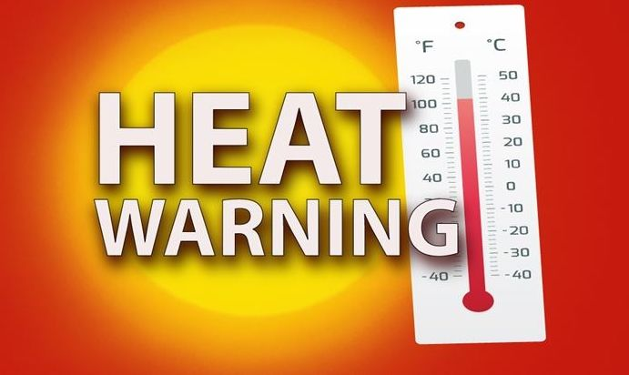
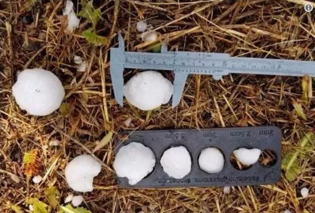
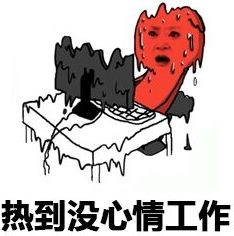
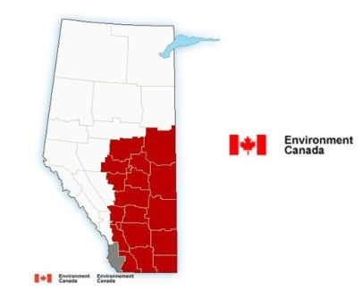
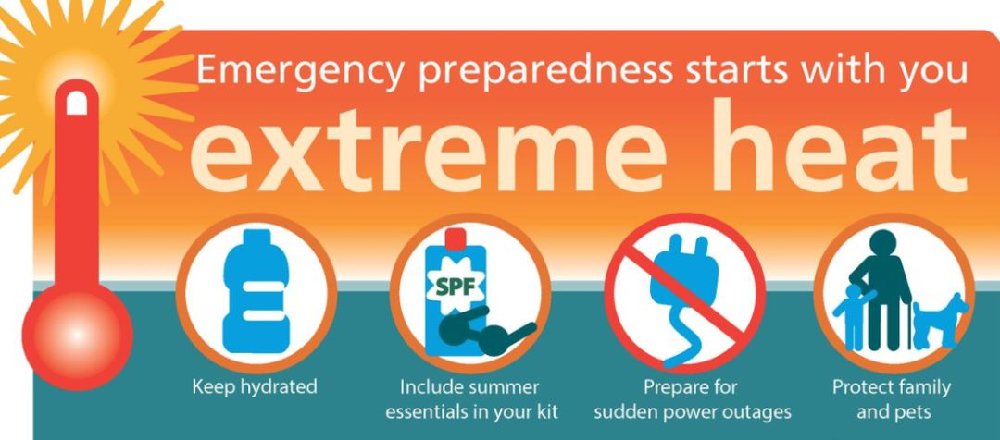

# 无标题

**链接地址:** http://mp.weixin.qq.com/s?__biz=MzI5NDMzNzM3OQ==&mid=2247487617&idx=1&sn=5437980d3635d289175589e7e7df869d&chksm=ec653e8ddb12b79b66ebcd565ff4fc316ca0ac8e3e3299b670cd1ba83d0aa3fcc5e139297ad1&mpshare=1&scene=2&srcid=0808Xoyc8uoAvSsnUQhH3h92#rd
**作者:** 雪糊要吃冰淇淋
**获取时间:** 2025/8/28 21:41:59
**图片数量:** 20

---

## 原始HTML内容

<section class="" style="max-width: 100%;color: rgb(51, 51, 51);">&nbsp;<section class="" ng-click="onClick($event)" ng-model="eo.text" ng-style=" {
  'font-size'   : eo.fontSize,
  'font-family' : eo.fontFamily,
  'font-style'  : eo.fontStyle,
  'color'       : (eo.color || theme.majorColor),
} " placeholder="{ 点击编辑 }" stop-propagation="click mousedown mouseup" tn-edit-content="true" tn-page-editable="text0" tn-page-editable-type="ed-type-text" ui-on-drop="block($event)" style="margin-top: 0.7em;margin-left: -0.4em;padding: 1em;max-width: 100%;border-radius: 1em;width: 510.25px;color: inherit;font-family: inherit;font-size: 1em;display: inline-block;background-color: rgb(250, 200, 255);box-sizing: border-box !important;word-wrap: break-word !important;">&nbsp;&nbsp;&nbsp;吃喝玩乐卡尔加里YYC&nbsp;最近要大送豪礼，包括苹果 iPhone X！</section></section>
 
<section class="" style="max-width: 100%;color: rgb(51, 51, 51);"><section class="" ng-click="onClick($event)" ng-model="eo.text" ng-style=" {
  'font-size'   : eo.fontSize,
  'font-family' : eo.fontFamily,
  'font-style'  : eo.fontStyle,
  'color'       : (eo.color || theme.majorColor),
} " placeholder="{ 点击编辑 }" stop-propagation="click mousedown mouseup" tn-edit-content="true" tn-page-editable="text0" tn-page-editable-type="ed-type-text" ui-on-drop="block($event)" style="margin-top: 0.7em;margin-right: -0.4em;padding: 1em;max-width: 100%;border-radius: 1em;width: 510.25px;color: inherit;font-family: inherit;font-size: 1em;display: inline-block;background-color: rgb(188, 227, 249);box-sizing: border-box !important;word-wrap: break-word !important;">没错没错，记得『点击蓝字加关注』哟！机会随时到来！</section>&nbsp;&nbsp;</section><section class="" style="margin-top: 0.8em;margin-bottom: 0.5em;max-width: 100%;color: rgb(51, 51, 51);">
 
</section><section style="max-width: 100%;color: rgb(51, 51, 51);">真心实意，为您推荐！</section><section style="max-width: 100%;color: rgb(51, 51, 51);"> </section>

 

八月七日，正好是今年的立秋之日。 

但阿省乃至整个加拿大的居民都开始感受到了所谓“秋老虎”的厉害。

 

 

前几天才跟大家炫耀过咱阿省特产的乒乓球大小的冰雹，

本以为今年夏天最热的几天已经过去了。

但，显然本局还是大意了。

这不，强对流天气造成的酷暑高温瞬间就给大家伙来了个下马威。

 

 

加拿大环境部周一上午10点32分左右向阿尔伯塔省各地发出了高温预警。

阿尔伯塔的整个中部，南部和东南部地区，

在未来的五日中都将持续进入高温蒸笼模式。

白天最高温度不会低于30℃。

一些地区甚至会超过34℃。

 

 

<strong>尤其是卡尔加里和其附近区域近日的温度，</strong>

<strong>甚至可能打破历史同期记录！</strong>

 

 

预计这次高温情况会持续到这个周五才会有所舒缓。

而这次高温的范围甚是广泛，

连加国传统避暑胜地新不伦瑞克省，新斯科舍省和爱德华王子岛都无一幸免。

 

 

在这次高温热浪的强袭之下，

目前加国上下范围内只有一个省份免受袭击。

那就是曼尼托巴省。

虽然没有受到高温预警的袭击，但也不代表温度就一定凉快。

周中热浪也会通过该省南部入侵。

不知道到时温度会不会也一举冲破30℃？

导致全加上下一片“火海”？

 

 

 

伯塔省卫生服务中心（AHS）&nbsp;&nbsp;在热警告期间建议如下：

 
<ul style="" class=" list-paddingleft-2"><li>
考虑将户外活动重新安排到一天中较凉快的时段。
</li><li>
经常休息，在有室内冷气设备的公共建筑（包括商场或室内游泳池）常待。
</li><li>
多喝水和其他不含酒精，不含咖啡因的饮料，以保持水分。
</li><li>
不要将任何人或宠物留在封闭的车辆内。
</li><li>
在户外活动前至少20分钟前涂抹至少防晒系数（SPF）30的防晒霜。并经常重新涂抹（按照产品标签上的指示）。
</li><li>
戴宽边帽和太阳镜（带UVA / UVB CSA认证印章）。
</li><li>
穿浅色长袖衬衫和遮盖皮肤的裤子。

 
</li></ul>
AHS在其网站上表示，对于婴儿和儿童，户外工作者，老年人，及患有的疾病的人来说，这次热浪的袭击可能特别严重。希望大家提前做好准备，注意防暑。

 

文章信息来源：CTV News

 

欢迎大家添加&nbsp;神通广大&nbsp;吃喝玩乐&nbsp;服务微信&nbsp;为好友！

相互照应，十分必要！

扫码即可！

 

 

 
<section style="max-width: 100%;color: rgb(51, 51, 51);">真诚为您推荐！</section><section class="" data-style="white-space: normal; text-align: left;font-size: 14px;line-height: 1.5em; color: rgb(12, 12, 12);" style="max-width: 100%;color: rgb(51, 51, 51);"><section style="margin-top: -1.2em;max-width: 100%;box-sizing: border-box;color: rgb(166, 166, 166);text-align: center;border-width: initial;border-style: none;border-color: initial;line-height: 1.4;word-wrap: break-word !important;"> </section><section class="" data-style="white-space: normal; text-align: left;font-size: 14px;line-height: 1.5em; color: rgb(12, 12, 12);" style="padding: 16px 16px 10px;max-width: 100%;box-sizing: border-box;font-size: 1em;line-height: 1.4;word-wrap: break-word !important;">
<strong style="max-width: 100%;color: rgb(62, 62, 62);font-size: 18px;text-align: justify;box-sizing: border-box !important;word-wrap: break-word !important;"><strong style="max-width: 100%;box-sizing: border-box !important;word-wrap: break-word !important;"><strong style="max-width: 100%;box-sizing: border-box !important;word-wrap: break-word !important;"><strong style="max-width: 100%;box-sizing: border-box !important;word-wrap: break-word !important;"></strong></strong></strong></strong>

<strong style="max-width: 100%;font-size: 18px;text-align: justify;box-sizing: border-box !important;word-wrap: break-word !important;"><strong style="max-width: 100%;box-sizing: border-box !important;word-wrap: break-word !important;"><strong style="max-width: 100%;box-sizing: border-box !important;word-wrap: break-word !important;"><strong style="max-width: 100%;box-sizing: border-box !important;word-wrap: break-word !important;"></strong></strong></strong></strong> 

 

<strong style="max-width: 100%;font-size: 18px;text-align: justify;box-sizing: border-box !important;word-wrap: break-word !important;"><strong style="max-width: 100%;box-sizing: border-box !important;word-wrap: break-word !important;"><strong style="max-width: 100%;box-sizing: border-box !important;word-wrap: break-word !important;"><strong style="max-width: 100%;box-sizing: border-box !important;word-wrap: break-word !important;"></strong></strong></strong></strong>

<strong style="max-width: 100%;font-size: 18px;text-align: justify;box-sizing: border-box !important;word-wrap: break-word !important;"><strong style="max-width: 100%;box-sizing: border-box !important;word-wrap: break-word !important;"><strong style="max-width: 100%;box-sizing: border-box !important;word-wrap: break-word !important;"><strong style="max-width: 100%;box-sizing: border-box !important;word-wrap: break-word !important;"></strong></strong></strong></strong> 

 

</section></section>
 

---

## 纯文本内容

吃喝玩乐卡尔加里YYC 最近要大送豪礼，包括苹果 iPhone X！没错没错，记得『点击蓝字加关注』哟！机会随时到来！  真心实意，为您推荐！八月七日，正好是今年的立秋之日。但阿省乃至整个加拿大的居民都开始感受到了所谓“秋老虎”的厉害。前几天才跟大家炫耀过咱阿省特产的乒乓球大小的冰雹，本以为今年夏天最热的几天已经过去了。但，显然本局还是大意了。这不，强对流天气造成的酷暑高温瞬间就给大家伙来了个下马威。加拿大环境部周一上午10点32分左右向阿尔伯塔省各地发出了高温预警。阿尔伯塔的整个中部，南部和东南部地区，在未来的五日中都将持续进入高温蒸笼模式。白天最高温度不会低于30℃。一些地区甚至会超过34℃。尤其是卡尔加里和其附近区域近日的温度，甚至可能打破历史同期记录！预计这次高温情况会持续到这个周五才会有所舒缓。而这次高温的范围甚是广泛，连加国传统避暑胜地新不伦瑞克省，新斯科舍省和爱德华王子岛都无一幸免。在这次高温热浪的强袭之下，目前加国上下范围内只有一个省份免受袭击。那就是曼尼托巴省。虽然没有受到高温预警的袭击，但也不代表温度就一定凉快。周中热浪也会通过该省南部入侵。不知道到时温度会不会也一举冲破30℃？导致全加上下一片“火海”？伯塔省卫生服务中心（AHS）  在热警告期间建议如下：考虑将户外活动重新安排到一天中较凉快的时段。经常休息，在有室内冷气设备的公共建筑（包括商场或室内游泳池）常待。多喝水和其他不含酒精，不含咖啡因的饮料，以保持水分。不要将任何人或宠物留在封闭的车辆内。在户外活动前至少20分钟前涂抹至少防晒系数（SPF）30的防晒霜。并经常重新涂抹（按照产品标签上的指示）。戴宽边帽和太阳镜（带UVA / UVB CSA认证印章）。穿浅色长袖衬衫和遮盖皮肤的裤子。AHS在其网站上表示，对于婴儿和儿童，户外工作者，老年人，及患有的疾病的人来说，这次热浪的袭击可能特别严重。希望大家提前做好准备，注意防暑。文章信息来源：CTV News欢迎大家添加 神通广大 吃喝玩乐 服务微信 为好友！相互照应，十分必要！扫码即可！真诚为您推荐！

---

## 图片列表

-  (原始链接: https://mmbiz.qpic.cn/mmbiz/MVPvEL7Qg0EXNGDDXjhn7BQlLVZfE4a72NDhuKJZheaZoX3JcYZ8wicrltbzurnAx8Urww68iaiaaC541u0miaUGqg/640?)
-  (原始链接: https://mmbiz.qpic.cn/mmbiz/MVPvEL7Qg0EXNGDDXjhn7BQlLVZfE4a7eyibPmHcP5XBsBl0KZPM0LQibDWticwHV1SSxz8Ha4rjtk93ZD4sTPSsg/640?)
-  (原始链接: https://mmbiz.qpic.cn/mmbiz_jpg/E5oZzDjj1krUQpM9bj5FdOK0iarqXud4mIKoW6C1kXSpOayiaq1XfqH0dOt23X9s4d8FkYtGk0OqCrx3URk3zXiaQ/640?wx_fmt=jpeg)
-  (原始链接: https://mmbiz.qpic.cn/mmbiz_jpg/E5oZzDjj1krg70S5dqqia8wpBmp0u7ibWvurxxBrwHU6YUHpdrKOPJ2thhiaQAWncywSIyP6RaAFxH9WzMUvUFkbA/640?wx_fmt=jpeg)
-  (原始链接: https://mmbiz.qpic.cn/mmbiz_jpg/E5oZzDjj1koIN1Y38icljFMX6zwK8pw7b53PvUZlk9gXsIh45VRRWgBJXibBqiaeeJJv68NkFKuicodbcqOWCXUHicw/640?wx_fmt=jpeg)
-  (原始链接: https://mmbiz.qpic.cn/mmbiz_png/E5oZzDjj1korznwXHmfQ7aYIaG0UJMDRhykrwCMh7dttU2MfsKwBQ3VbBbfUujjQeR6KFxbyiaUlJDPafL6fcwQ/640?wx_fmt=png)
-  (原始链接: https://mmbiz.qpic.cn/mmbiz_png/E5oZzDjj1koxRsbp2Y0Ta9YMgW6u3T6vZEP6gjSkKctUEwryZ2iciaYLtGJrFgcsO0WYMBQ9P1rXX5nj1kicwyJFw/640?wx_fmt=png)
-  (原始链接: https://mmbiz.qpic.cn/mmbiz_png/E5oZzDjj1koxRsbp2Y0Ta9YMgW6u3T6v6DApNM9I8SKdr47Hyon4BykEGjXC3buXiaEGB2WCamLOASqx6AwR0jA/640?wx_fmt=png)
-  (原始链接: https://mmbiz.qpic.cn/mmbiz_png/E5oZzDjj1koxRsbp2Y0Ta9YMgW6u3T6vaicq4bV4N03TGyyncQn5ibrGr7LmshodHM3gXSibwV76Agaqwnnoo5p1w/640?wx_fmt=png)
-  (原始链接: https://mmbiz.qpic.cn/mmbiz_png/E5oZzDjj1koxRsbp2Y0Ta9YMgW6u3T6vD2dzcZwwicSYWk2jJHvfFBdJI4cMeTibmDDXE1ryVVicicfBH7ma7Y0p1g/640?wx_fmt=png)
-  (原始链接: https://mmbiz.qpic.cn/mmbiz_jpg/E5oZzDjj1koxRsbp2Y0Ta9YMgW6u3T6vtccd2mJgIvGz4OtbA7LibtjX6OgsuQCQiaMqpBDsVVYJqd6UmMMbHOJA/640?wx_fmt=jpeg)
-  (原始链接: https://mmbiz.qpic.cn/mmbiz_jpg/E5oZzDjj1koxRsbp2Y0Ta9YMgW6u3T6vicP5VVnG3D56kYeIL7yzCfJV2nC0zoGZhZydekIn3jFugDAicSiaI9nLg/640?wx_fmt=jpeg)
-  (原始链接: https://mmbiz.qpic.cn/mmbiz_png/E5oZzDjj1koxRsbp2Y0Ta9YMgW6u3T6vr0ZMZgGfn4ACrw9k724MXC5woUmCm0d6KLTwrV8Fia96fhqFbG2FmsQ/640?wx_fmt=png)
-  (原始链接: https://mmbiz.qpic.cn/mmbiz_jpg/mZIpZ2dRo6Z5Lg6L4yBuvZf7QibxfKVYiaibWZ0TgYUSaib6Kt9bF0BhOS7r5v3zCAdNJ6PubAKsoohqPxVjIFWX9w/640?wx_fmt=jpeg)
-  (原始链接: https://mmbiz.qpic.cn/mmbiz_jpg/E5oZzDjj1kqmyBd2wXyJpdlTKRQv5yEo8q6MibdN8KaEpc8HasuicnnICaTm5SyBmFzYHh7Ypj7IianbCxEfHk2lg/640?wx_fmt=jpeg)
-  (原始链接: https://mmbiz.qpic.cn/mmbiz_jpg/E5oZzDjj1kqOCLqCN2NbQAMUbagjVS03xgLrw0N6XMoBSZS1ykNxrwfWZiaj5dHXZWqFdCfVurm8R3oSF82FJqQ/640?wx_fmt=jpeg)
-  (原始链接: https://mmbiz.qpic.cn/mmbiz_jpg/E5oZzDjj1koNJW9uUHaESKwdYBXwmKW1qj69v3qOjy7szM8OibukgwicGibjP2x1Xeqic9bKbg2a2f2qRBSzicsX20w/640?wx_fmt=jpeg)
-  (原始链接: https://mmbiz.qpic.cn/mmbiz_jpg/E5oZzDjj1koNJW9uUHaESKwdYBXwmKW1N0JZ1iaAG5IJ84TC3KQzv1rNHdaiaic9ZibfOCBUL1yhIWnK0ScaWEibQ4A/640?wx_fmt=jpeg)
-  (原始链接: https://mmbiz.qpic.cn/mmbiz_jpg/E5oZzDjj1krFNNmqiaVW3RVdTIANicfJ6BibMoyEmfm5Bscqn3NFAArz5lafNH1OTexHamNNp51ibcpFJqJKHjhiahw/640?wx_fmt=jpeg)
-  (原始链接: http://mmbiz.qpic.cn/mmbiz/E5oZzDjj1kqdHwQ2zpsHXPvFpF81yEia17OibFaAfyBwQYD1iakM7T1PlagpPx6bCbw4qeARbPEgmqPsmYtLv46cQ/640?wx_fmt=jpeg)
