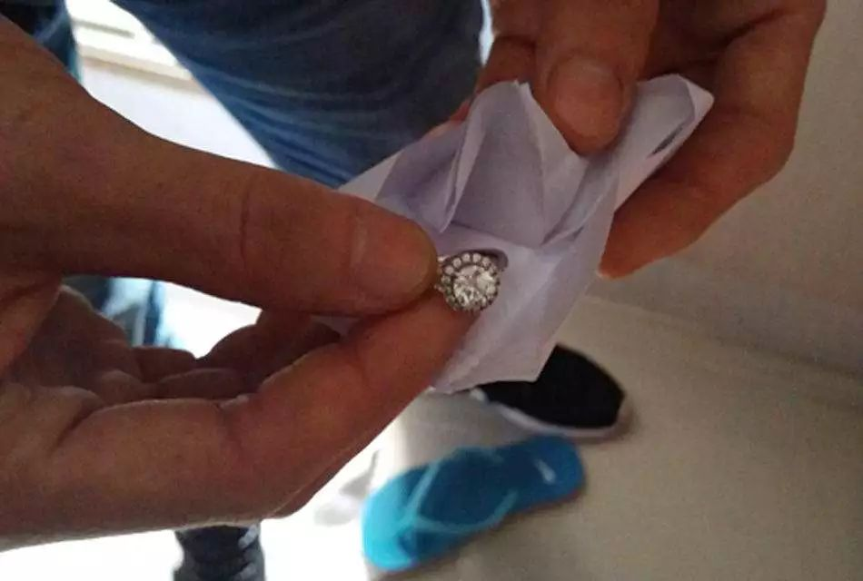
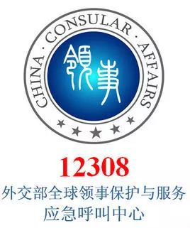
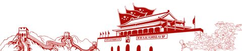

# 无标题

**链接地址:** http://mp.weixin.qq.com/s?__biz=MzI5NDMzNzM3OQ==&mid=2247487670&idx=1&sn=4cde7023389d6afa81d9d05f31faea58&chksm=ec653ebadb12b7ac842e61997d17df2e2b09a5c40e603e4f38cfbc2817989b0e0e413fc4f78a&mpshare=1&scene=2&srcid=08128H3pmd5shXOJGxGveLIK#rd
**作者:** 
**获取时间:** 2025/8/28 21:39:44
**图片数量:** 27

---

## 原始HTML内容

<section class="" style="max-width: 100%;color: rgb(51, 51, 51);">&nbsp;<section class="" ng-click="onClick($event)" ng-model="eo.text" ng-style=" {
  'font-size'   : eo.fontSize,
  'font-family' : eo.fontFamily,
  'font-style'  : eo.fontStyle,
  'color'       : (eo.color || theme.majorColor),
} " placeholder="{ 点击编辑 }" stop-propagation="click mousedown mouseup" tn-edit-content="true" tn-page-editable="text0" tn-page-editable-type="ed-type-text" ui-on-drop="block($event)" style="margin-top: 0.7em;margin-left: -0.4em;padding: 1em;max-width: 100%;border-radius: 1em;width: 510.25px;color: inherit;font-family: inherit;font-size: 1em;display: inline-block;background-color: rgb(250, 200, 255);box-sizing: border-box !important;word-wrap: break-word !important;">&nbsp;&nbsp;&nbsp;吃喝玩乐卡尔加里YYC&nbsp;最近要大送豪礼，包括苹果 iPhone X！</section></section>
 
<section class="" style="max-width: 100%;color: rgb(51, 51, 51);"><section class="" ng-click="onClick($event)" ng-model="eo.text" ng-style=" {
  'font-size'   : eo.fontSize,
  'font-family' : eo.fontFamily,
  'font-style'  : eo.fontStyle,
  'color'       : (eo.color || theme.majorColor),
} " placeholder="{ 点击编辑 }" stop-propagation="click mousedown mouseup" tn-edit-content="true" tn-page-editable="text0" tn-page-editable-type="ed-type-text" ui-on-drop="block($event)" style="margin-top: 0.7em;margin-right: -0.4em;padding: 1em;max-width: 100%;border-radius: 1em;width: 510.25px;color: inherit;font-family: inherit;font-size: 1em;display: inline-block;background-color: rgb(188, 227, 249);box-sizing: border-box !important;word-wrap: break-word !important;">没错没错，记得『点击蓝字加关注』哟！机会随时到来！</section>&nbsp;&nbsp;</section><section class="" style="margin-top: 0.8em;margin-bottom: 0.5em;max-width: 100%;color: rgb(51, 51, 51);">
 
</section><section style="max-width: 100%;color: rgb(51, 51, 51);">真心实意，为您推荐！</section><section style="max-width: 100%;color: rgb(51, 51, 51);"> </section>

 

2018年是中加外交史上极其具有历史意义的一年。两年前，中国国务院总理李克强与来华访问的加拿大总理特鲁多共同宣布2018年为中加旅游年，旨在两国研讨未来措施﹐协调游客流量﹐致力宣传加拿大和中国的旅游活动。

 

但是，随着近期中国赴加拿大旅游的人数增多，一些专门针对华人的恶性事件接连不断，这引起了中国驻加拿大卡尔加里总领馆的注意。

 

近期，卡尔加里市连续发生几起中国游客财物丢失或被盗案件。

 

望近日内计划赴卡尔加里旅游工作和学习的华人引起注意。

 

 

<strong>事件一：一名赴加旅游的中国游客不慎将价值昂贵的</strong><strong>结婚钻戒</strong><strong>遗忘在酒店房间后</strong><strong>丢失</strong><strong>。</strong>

 

 

 

 

<strong>事件二：一名赴加旅游的中国游客在机场租车后将存放贵重物品的</strong><strong>背包</strong><strong>放在驾驶座上，到后备厢搬运行李期间，背包被</strong><strong>抢劫</strong><strong>。</strong>

 

 

 

 

<strong>事件三：一名赴加旅游的中国游客在收费停车场停车期间，车门被无损伤</strong><strong>撬开</strong><strong>，车内数千元</strong><strong>现金</strong><strong>被盗。</strong>

 

 

 

 

&nbsp;&nbsp;&nbsp;&nbsp;&nbsp;&nbsp;&nbsp;尽管当地警方接报后积极介入，但破案尚需时日。<o:p>　　</o:p>

　　加拿大社会治安总体良好，但是针对游客的盗抢案件时有发生。<o:p>　</o:p>

<o:p>　</o:p>

　　中国驻卡尔加里总领馆提醒来加中国公民提高安全意识，加强防范，保管好贵重物品和个人财物，不给犯罪分子可趁之机。如有案件发生，请及时报警求助。<o:p>　　</o:p>
<section class="" powered-by="xiumi.us" style="max-width: 100%;box-sizing: border-box;color: rgb(51, 51, 51);"><section class="" style="max-width: 100%;box-sizing: border-box;word-wrap: break-word !important;"><section class="" style="padding: 10px;max-width: 100%;box-sizing: border-box;display: inline-block;width: 663.45px;vertical-align: top;box-shadow: rgb(0, 0, 0) 0px 0px 0px;word-wrap: break-word !important;"><section class="" powered-by="xiumi.us" style="max-width: 100%;box-sizing: border-box;word-wrap: break-word !important;"><section class="" style="margin-top: 15px;margin-bottom: 15px;max-width: 100%;box-sizing: border-box;word-wrap: break-word !important;"><section class="" style="padding-right: 10px;padding-bottom: 10px;padding-left: 10px;max-width: 100%;box-sizing: border-box;display: inline-block;width: 611.275px;vertical-align: top;box-shadow: rgb(152, 152, 152) 0px 0px 2px;border-width: 2px 0px 0px;border-radius: 10px;border-style: solid;border-color: rgb(62, 133, 73) rgb(62, 62, 62) rgb(62, 62, 62);background-color: rgb(255, 255, 255);word-wrap: break-word !important;"><section class="" powered-by="xiumi.us" style="max-width: 100%;box-sizing: border-box;word-wrap: break-word !important;"><section class="" style="margin-bottom: 15px;max-width: 100%;box-sizing: border-box;word-wrap: break-word !important;"><section class="" style="padding-right: 10px;padding-left: 10px;max-width: 100%;box-sizing: border-box;display: inline-block;vertical-align: top;border-bottom-left-radius: 0.5em;border-bottom-right-radius: 0.5em;background-color: rgb(255, 0, 0);color: rgb(255, 255, 255);word-wrap: break-word !important;">
<strong style="max-width: 100%;box-sizing: border-box;word-wrap: break-word !important;">中国驻外使领馆可以帮大家做什么？</strong>
</section></section></section><section class="" powered-by="xiumi.us" style="max-width: 100%;box-sizing: border-box;word-wrap: break-word !important;"><section class="" style="max-width: 100%;box-sizing: border-box;word-wrap: break-word !important;"><section class="" style="max-width: 100%;box-sizing: border-box;text-align: justify;font-size: 14px;color: rgb(100, 100, 100);line-height: 1.8;word-wrap: break-word !important;">
当中国公民在海外遭遇意外时，中国驻外使领馆会将事故通知国内亲属，或者在海外遇到生计困难时，协助你与国内亲属联系，以便及时解决费用问题；如果与当地人发生民事纠纷，中国驻外使领馆可以帮助推荐当地律师、翻译、医生，协助进行诉讼或寻求医疗救助等。
</section></section></section></section></section></section></section></section></section><section class="" powered-by="xiumi.us" style="max-width: 100%;box-sizing: border-box;color: rgb(51, 51, 51);"><section class="" style="margin-top: 0.5em;margin-bottom: 0.5em;padding-right: 0.5em;padding-left: 0.5em;max-width: 100%;box-sizing: border-box;word-wrap: break-word !important;"><section class="" style="max-width: 100%;box-sizing: border-box;width: 646.45px;box-shadow: rgb(102, 102, 102) 3.53553px 3.53553px 8px;display: inline-block;border-color: white;word-wrap: break-word !important;height: auto !important;overflow: hidden !important;"></section></section></section><section class="" powered-by="xiumi.us" style="max-width: 100%;box-sizing: border-box;color: rgb(51, 51, 51);"><section class="" style="max-width: 100%;box-sizing: border-box;word-wrap: break-word !important;"><section class="" style="padding: 10px;max-width: 100%;box-sizing: border-box;display: inline-block;width: 663.45px;vertical-align: top;box-shadow: rgb(0, 0, 0) 0px 0px 0px;word-wrap: break-word !important;"><section class="" powered-by="xiumi.us" style="max-width: 100%;box-sizing: border-box;word-wrap: break-word !important;"><section class="" style="max-width: 100%;box-sizing: border-box;word-wrap: break-word !important;"><section class="" style="max-width: 100%;box-sizing: border-box;font-size: 14px;text-align: left;word-wrap: break-word !important;">
<strong style="max-width: 100%;box-sizing: border-box;word-wrap: break-word !important;">中华人民共和国驻卡尔加里总领事馆</strong>

<strong style="max-width: 100%;box-sizing: border-box;word-wrap: break-word !important;"> </strong>

领事服务区域：阿尔伯塔省、萨斯喀切温省、西北地区（Alberta, Saskatchewan and&nbsp;Northwest Territories）。

加拿大全国统一报警电话:911。<o:p>　　</o:p>

外交部全球领事保护与服务应急呼叫中心：011-8610-12308或011-8610-59913991。<o:p>　　</o:p>

驻卡尔加里总领馆领保求助电话：001-4035376907。<o:p>　　</o:p>

 
</section></section></section></section></section></section><section class="" powered-by="xiumi.us" style="max-width: 100%;box-sizing: border-box;color: rgb(51, 51, 51);"><section class="" style="max-width: 100%;box-sizing: border-box;word-wrap: break-word !important;"><section class="" style="max-width: 100%;box-sizing: border-box;text-align: left;word-wrap: break-word !important;">
 
</section></section></section><section class="" powered-by="xiumi.us" style="max-width: 100%;box-sizing: border-box;color: rgb(51, 51, 51);"><section class="" style="margin-top: 0.5em;margin-bottom: 0.5em;max-width: 100%;box-sizing: border-box;word-wrap: break-word !important;"><section class="" style="margin-top: 0.2em;max-width: 100%;box-sizing: border-box;display: inline-block;float: left;width: 298.55px;border-width: 1px;border-style: dotted;border-color: rgb(249, 110, 87);word-wrap: break-word !important;"></section><section class="" style="margin-top: 0.2em;max-width: 100%;box-sizing: border-box;display: inline-block;float: right;width: 298.55px;border-width: 1px;border-style: dotted;border-color: rgb(249, 110, 87);word-wrap: break-word !important;"></section><section class="" style="margin: auto;max-width: 100%;box-sizing: border-box;width: 0.5em;height: 0.5em;word-wrap: break-word !important;"><section style="max-width: 100%;box-sizing: border-box;transform: rotate(45deg);word-wrap: break-word !important;"><section style="max-width: 100%;box-sizing: border-box;width: 0.5em;height: 0.5em;background-color: rgb(249, 110, 87);word-wrap: break-word !important;"></section></section></section></section></section><section class="" powered-by="xiumi.us" style="max-width: 100%;box-sizing: border-box;color: rgb(51, 51, 51);"><section class="" style="margin-top: 10px;margin-bottom: 10px;max-width: 100%;box-sizing: border-box;word-wrap: break-word !important;"><section class="" style="max-width: 100%;box-sizing: border-box;display: inline-block;vertical-align: top;word-wrap: break-word !important;"><section style="margin-right: -1px;margin-left: auto;max-width: 100%;box-sizing: border-box;width: 12px;height: 12px;border-top: 3px solid rgb(249, 110, 87);border-right: 3px solid rgb(249, 110, 87);transform: rotate(0deg);word-wrap: break-word !important;"></section><section style="margin-top: -11px;margin-bottom: -11px;padding: 4px;max-width: 100%;box-sizing: border-box;border-width: 1px;border-style: solid;border-color: rgb(223, 223, 223);word-wrap: break-word !important;"><section class="" style="padding-right: 6px;padding-left: 6px;max-width: 100%;box-sizing: border-box;border-width: 1px;border-style: solid;border-color: rgb(223, 223, 223);color: rgb(255, 0, 0);word-wrap: break-word !important;">
<strong style="max-width: 100%;box-sizing: border-box;word-wrap: break-word !important;">中国领事保护和协助情况</strong>
</section></section><section style="margin-left: -1px;max-width: 100%;box-sizing: border-box;width: 12px;height: 12px;border-bottom: 3px solid rgb(249, 110, 87);border-left: 3px solid rgb(249, 110, 87);transform: rotate(0deg);word-wrap: break-word !important;"></section></section></section></section><section class="" powered-by="xiumi.us" style="max-width: 100%;box-sizing: border-box;color: rgb(51, 51, 51);"><section class="" style="margin-top: 0.5em;margin-bottom: 0.5em;max-width: 100%;box-sizing: border-box;word-wrap: break-word !important;"><section class="" style="max-width: 100%;box-sizing: border-box;display: inline-block;vertical-align: middle;word-wrap: break-word !important;"><section style="max-width: 100%;box-sizing: border-box;width: 7px;height: 7px;display: inline-block;vertical-align: middle;transform: rotate(45deg);background-color: rgb(100, 124, 107);word-wrap: break-word !important;"></section><section class="" style="padding-right: 5px;padding-left: 5px;max-width: 100%;box-sizing: border-box;display: inline-block;vertical-align: middle;font-size: 22px;color: rgb(158, 123, 123);word-wrap: break-word !important;">
<strong style="max-width: 100%;box-sizing: border-box;word-wrap: break-word !important;">01</strong>
</section><section style="max-width: 100%;box-sizing: border-box;display: inline-block;vertical-align: middle;width: 7px;height: 7px;transform: rotate(45deg);background-color: rgb(100, 124, 107);word-wrap: break-word !important;"></section></section></section></section><section class="" powered-by="xiumi.us" style="max-width: 100%;box-sizing: border-box;color: rgb(51, 51, 51);"><section class="" style="max-width: 100%;box-sizing: border-box;word-wrap: break-word !important;"><section class="" style="max-width: 100%;box-sizing: border-box;display: inline-block;vertical-align: top;width: 331.725px;word-wrap: break-word !important;"><section class="" powered-by="xiumi.us" style="max-width: 100%;box-sizing: border-box;word-wrap: break-word !important;"><section class="" style="margin-top: 10px;margin-bottom: 10px;max-width: 100%;box-sizing: border-box;word-wrap: break-word !important;"><section class="" style="max-width: 100%;box-sizing: border-box;vertical-align: middle;display: inline-block;width: 165.863px;border-style: double;border-width: 2px;border-radius: 0px;border-color: rgb(144, 166, 176);box-shadow: rgb(0, 0, 0) 0px 0px 0px;word-wrap: break-word !important;overflow: hidden !important;"></section></section></section></section><section class="" style="max-width: 100%;box-sizing: border-box;display: inline-block;vertical-align: top;width: 331.725px;word-wrap: break-word !important;"><section class="" powered-by="xiumi.us" style="max-width: 100%;box-sizing: border-box;word-wrap: break-word !important;"><section class="" style="margin-top: 10px;margin-bottom: 10px;max-width: 100%;box-sizing: border-box;opacity: 0.26;word-wrap: break-word !important;"><section class="" style="max-width: 100%;box-sizing: border-box;width: 331.725px;height: 5px;background-image: linear-gradient(to left, rgb(100, 124, 107) 0%, rgb(255, 255, 255) 100%);word-wrap: break-word !important;"></section></section></section><section class="" powered-by="xiumi.us" style="max-width: 100%;box-sizing: border-box;word-wrap: break-word !important;"><section class="" style="max-width: 100%;box-sizing: border-box;word-wrap: break-word !important;"><section class="" style="max-width: 100%;box-sizing: border-box;font-size: 14px;color: rgb(255, 0, 0);text-align: left;word-wrap: break-word !important;">
<strong style="max-width: 100%;box-sizing: border-box;word-wrap: break-word !important;">发生恐怖袭击、自然灾害、动乱等</strong>
</section></section></section></section></section></section><section class="" powered-by="xiumi.us" style="max-width: 100%;box-sizing: border-box;color: rgb(51, 51, 51);"><section class="" style="margin-top: 15px;margin-bottom: 15px;max-width: 100%;box-sizing: border-box;word-wrap: break-word !important;"><section class="" style="padding-right: 20px;padding-left: 20px;max-width: 100%;box-sizing: border-box;font-size: 14px;text-align: justify;line-height: 2;letter-spacing: 1px;color: rgb(100, 124, 107);word-wrap: break-word !important;">
　当地突然发生恐怖袭击、自然灾害或人为动乱等，不要等，第一时间可以打电话给中国驻外使领馆，前往寻求帮助。在情况紧急的时候，可能旅行社、航空公司都无法立刻帮助撤离，但中国驻外使领馆可能会协调资源，在非常紧急的情况下联系专机协助中国公民撤离危险区。所以，在到达目的地手机开机后，收到的那条关于当地使领馆电话的短信就非常重要了，一定要保存下来，不要随意删除。
</section></section></section><section class="" powered-by="xiumi.us" style="max-width: 100%;box-sizing: border-box;color: rgb(51, 51, 51);"><section class="" style="margin-top: 0.5em;margin-bottom: 0.5em;max-width: 100%;box-sizing: border-box;word-wrap: break-word !important;"><section class="" style="max-width: 100%;box-sizing: border-box;display: inline-block;vertical-align: middle;word-wrap: break-word !important;"><section style="max-width: 100%;box-sizing: border-box;width: 7px;height: 7px;display: inline-block;vertical-align: middle;transform: rotate(45deg);background-color: rgb(100, 124, 107);word-wrap: break-word !important;"></section><section class="" style="padding-right: 5px;padding-left: 5px;max-width: 100%;box-sizing: border-box;display: inline-block;vertical-align: middle;font-size: 22px;color: rgb(158, 123, 123);word-wrap: break-word !important;">
<strong style="max-width: 100%;box-sizing: border-box;word-wrap: break-word !important;">02</strong>
</section><section style="max-width: 100%;box-sizing: border-box;display: inline-block;vertical-align: middle;width: 7px;height: 7px;transform: rotate(45deg);background-color: rgb(100, 124, 107);word-wrap: break-word !important;"></section></section></section></section><section class="" powered-by="xiumi.us" style="max-width: 100%;box-sizing: border-box;color: rgb(51, 51, 51);"><section class="" style="max-width: 100%;box-sizing: border-box;word-wrap: break-word !important;"><section class="" style="max-width: 100%;box-sizing: border-box;display: inline-block;vertical-align: top;width: 331.725px;word-wrap: break-word !important;"><section class="" powered-by="xiumi.us" style="max-width: 100%;box-sizing: border-box;word-wrap: break-word !important;"><section class="" style="margin-top: 10px;margin-bottom: 10px;max-width: 100%;box-sizing: border-box;word-wrap: break-word !important;"><section class="" style="max-width: 100%;box-sizing: border-box;vertical-align: middle;display: inline-block;width: 165.863px;border-style: double;border-width: 2px;border-radius: 0px;border-color: rgb(144, 166, 176);box-shadow: rgb(0, 0, 0) 0px 0px 0px;word-wrap: break-word !important;overflow: hidden !important;"></section></section></section></section><section class="" style="max-width: 100%;box-sizing: border-box;display: inline-block;vertical-align: top;width: 331.725px;word-wrap: break-word !important;"><section class="" powered-by="xiumi.us" style="max-width: 100%;box-sizing: border-box;word-wrap: break-word !important;"><section class="" style="margin-top: 10px;margin-bottom: 10px;max-width: 100%;box-sizing: border-box;opacity: 0.26;word-wrap: break-word !important;"><section class="" style="max-width: 100%;box-sizing: border-box;width: 331.725px;height: 5px;background-image: linear-gradient(to left, rgb(100, 124, 107) 0%, rgb(255, 255, 255) 100%);word-wrap: break-word !important;"></section></section></section><section class="" powered-by="xiumi.us" style="max-width: 100%;box-sizing: border-box;word-wrap: break-word !important;"><section class="" style="max-width: 100%;box-sizing: border-box;word-wrap: break-word !important;"><section class="" style="max-width: 100%;box-sizing: border-box;text-align: left;font-size: 14px;color: rgb(255, 0, 0);word-wrap: break-word !important;">
<strong style="max-width: 100%;box-sizing: border-box;word-wrap: break-word !important;">持有效护照及签证出入境受阻</strong>
</section></section></section></section></section></section><section class="" powered-by="xiumi.us" style="max-width: 100%;box-sizing: border-box;color: rgb(51, 51, 51);"><section class="" style="margin-top: 15px;margin-bottom: 15px;max-width: 100%;box-sizing: border-box;word-wrap: break-word !important;"><section class="" style="padding-right: 20px;padding-left: 20px;max-width: 100%;box-sizing: border-box;text-align: justify;font-size: 14px;line-height: 2;letter-spacing: 1px;color: rgb(100, 124, 107);word-wrap: break-word !important;">
如果在出入境时，持有的护照、签证、资料都合乎要求，但是海关工作人员却因为各种可能不合理的理由拒绝入境或者阻止离境，那么在这个时候，可要求与中国驻当地使领馆联系，寻求协调和帮助。因为出入境受阻的情况和原因有很多，可能中间也存在一些误会，虽然决定权还是在该国出入境机构，但中国驻外使领馆可以向有关当局了解情况，进行必要的交涉。
</section></section></section><section class="" powered-by="xiumi.us" style="max-width: 100%;box-sizing: border-box;color: rgb(51, 51, 51);"><section class="" style="margin-top: 0.5em;margin-bottom: 0.5em;max-width: 100%;box-sizing: border-box;word-wrap: break-word !important;"><section class="" style="max-width: 100%;box-sizing: border-box;display: inline-block;vertical-align: middle;word-wrap: break-word !important;"><section style="max-width: 100%;box-sizing: border-box;width: 7px;height: 7px;display: inline-block;vertical-align: middle;transform: rotate(45deg);background-color: rgb(100, 124, 107);word-wrap: break-word !important;"></section><section class="" style="padding-right: 5px;padding-left: 5px;max-width: 100%;box-sizing: border-box;display: inline-block;vertical-align: middle;font-size: 22px;color: rgb(158, 123, 123);word-wrap: break-word !important;">
<strong style="max-width: 100%;box-sizing: border-box;word-wrap: break-word !important;">03</strong>
</section><section style="max-width: 100%;box-sizing: border-box;display: inline-block;vertical-align: middle;width: 7px;height: 7px;transform: rotate(45deg);background-color: rgb(100, 124, 107);word-wrap: break-word !important;"></section></section></section></section><section class="" powered-by="xiumi.us" style="max-width: 100%;box-sizing: border-box;color: rgb(51, 51, 51);"><section class="" style="max-width: 100%;box-sizing: border-box;word-wrap: break-word !important;"><section class="" style="max-width: 100%;box-sizing: border-box;display: inline-block;vertical-align: top;width: 331.725px;word-wrap: break-word !important;"><section class="" powered-by="xiumi.us" style="max-width: 100%;box-sizing: border-box;word-wrap: break-word !important;"><section class="" style="margin-top: 10px;margin-bottom: 10px;max-width: 100%;box-sizing: border-box;word-wrap: break-word !important;"><section class="" style="max-width: 100%;box-sizing: border-box;vertical-align: middle;display: inline-block;width: 165.863px;border-style: double;border-width: 2px;border-radius: 0px;border-color: rgb(144, 166, 176);box-shadow: rgb(0, 0, 0) 0px 0px 0px;word-wrap: break-word !important;overflow: hidden !important;"></section></section></section></section><section class="" style="max-width: 100%;box-sizing: border-box;display: inline-block;vertical-align: top;width: 331.725px;word-wrap: break-word !important;"><section class="" powered-by="xiumi.us" style="max-width: 100%;box-sizing: border-box;word-wrap: break-word !important;"><section class="" style="margin-top: 10px;margin-bottom: 10px;max-width: 100%;box-sizing: border-box;opacity: 0.26;word-wrap: break-word !important;"><section class="" style="max-width: 100%;box-sizing: border-box;width: 331.725px;height: 5px;background-image: linear-gradient(to left, rgb(100, 124, 107) 0%, rgb(255, 255, 255) 100%);word-wrap: break-word !important;"></section></section></section><section class="" powered-by="xiumi.us" style="max-width: 100%;box-sizing: border-box;word-wrap: break-word !important;"><section class="" style="max-width: 100%;box-sizing: border-box;word-wrap: break-word !important;"><section class="" style="max-width: 100%;box-sizing: border-box;text-align: left;font-size: 14px;color: rgb(255, 0, 0);word-wrap: break-word !important;">
<strong style="max-width: 100%;box-sizing: border-box;word-wrap: break-word !important;">护照遗失、被偷抢</strong>
</section></section></section></section></section></section><section class="" powered-by="xiumi.us" style="max-width: 100%;box-sizing: border-box;color: rgb(51, 51, 51);"><section class="" style="margin-top: 15px;margin-bottom: 15px;max-width: 100%;box-sizing: border-box;word-wrap: break-word !important;"><section class="" style="padding-right: 20px;padding-left: 20px;max-width: 100%;box-sizing: border-box;text-align: justify;font-size: 14px;line-height: 2;letter-spacing: 1px;color: rgb(100, 124, 107);word-wrap: break-word !important;">
这是中国公民寻求中国驻外使领馆帮助最常见的情况了。发生这种情况时，应该首先向当地警察部门报案，有了报案的记录之后，再持本人有关身份材料及其复印件和照片到中国驻外使领馆申请补发护照或旅行证件。与此同时，可能护照遗失或被偷抢时，也会遭遇财产损失，那么在遇到这种经济困难时，也可以与中国驻外使领馆联系，让家人通过使领馆汇钱救急。
</section></section></section><section class="" powered-by="xiumi.us" style="max-width: 100%;box-sizing: border-box;color: rgb(51, 51, 51);"><section class="" style="margin-top: 0.5em;margin-bottom: 0.5em;max-width: 100%;box-sizing: border-box;word-wrap: break-word !important;"><section class="" style="max-width: 100%;box-sizing: border-box;display: inline-block;vertical-align: middle;word-wrap: break-word !important;"><section style="max-width: 100%;box-sizing: border-box;width: 7px;height: 7px;display: inline-block;vertical-align: middle;transform: rotate(45deg);background-color: rgb(100, 124, 107);word-wrap: break-word !important;"></section><section class="" style="padding-right: 5px;padding-left: 5px;max-width: 100%;box-sizing: border-box;display: inline-block;vertical-align: middle;font-size: 22px;color: rgb(158, 123, 123);word-wrap: break-word !important;">
<strong style="max-width: 100%;box-sizing: border-box;word-wrap: break-word !important;">04</strong>
</section><section style="max-width: 100%;box-sizing: border-box;display: inline-block;vertical-align: middle;width: 7px;height: 7px;transform: rotate(45deg);background-color: rgb(100, 124, 107);word-wrap: break-word !important;"></section></section></section></section><section class="" powered-by="xiumi.us" style="max-width: 100%;box-sizing: border-box;color: rgb(51, 51, 51);"><section class="" style="max-width: 100%;box-sizing: border-box;word-wrap: break-word !important;"><section class="" style="max-width: 100%;box-sizing: border-box;display: inline-block;vertical-align: top;width: 331.725px;word-wrap: break-word !important;"><section class="" powered-by="xiumi.us" style="max-width: 100%;box-sizing: border-box;word-wrap: break-word !important;"><section class="" style="margin-top: 10px;margin-bottom: 10px;max-width: 100%;box-sizing: border-box;word-wrap: break-word !important;"><section class="" style="max-width: 100%;box-sizing: border-box;vertical-align: middle;display: inline-block;width: 165.863px;border-style: double;border-width: 2px;border-radius: 0px;border-color: rgb(144, 166, 176);box-shadow: rgb(0, 0, 0) 0px 0px 0px;word-wrap: break-word !important;overflow: hidden !important;"></section></section></section></section><section class="" style="max-width: 100%;box-sizing: border-box;display: inline-block;vertical-align: top;width: 331.725px;word-wrap: break-word !important;"><section class="" powered-by="xiumi.us" style="max-width: 100%;box-sizing: border-box;word-wrap: break-word !important;"><section class="" style="margin-top: 10px;margin-bottom: 10px;max-width: 100%;box-sizing: border-box;opacity: 0.26;word-wrap: break-word !important;"><section class="" style="max-width: 100%;box-sizing: border-box;width: 331.725px;height: 5px;background-image: linear-gradient(to left, rgb(100, 124, 107) 0%, rgb(255, 255, 255) 100%);word-wrap: break-word !important;"></section></section></section><section class="" powered-by="xiumi.us" style="max-width: 100%;box-sizing: border-box;word-wrap: break-word !important;"><section class="" style="max-width: 100%;box-sizing: border-box;word-wrap: break-word !important;"><section class="" style="max-width: 100%;box-sizing: border-box;text-align: left;font-size: 14px;color: rgb(255, 0, 0);word-wrap: break-word !important;">
<strong style="max-width: 100%;box-sizing: border-box;word-wrap: break-word !important;">绑架，威胁，恐吓等</strong>
</section></section></section></section></section></section><section class="" powered-by="xiumi.us" style="max-width: 100%;box-sizing: border-box;color: rgb(51, 51, 51);"><section class="" style="margin-top: 15px;margin-bottom: 15px;max-width: 100%;box-sizing: border-box;word-wrap: break-word !important;"><section class="" style="padding-right: 20px;padding-left: 20px;max-width: 100%;box-sizing: border-box;text-align: justify;font-size: 14px;line-height: 2;letter-spacing: 1px;color: rgb(100, 124, 107);word-wrap: break-word !important;">
这是在海外发生危险的极端个案，但近期也发生了类似的案件，引发了普遍关注。一般来说，出外旅游居住时都要时常和国内的家人保持联系，一旦失联，在各种方式无法联系上的情况下，家人可以向中国驻外使领馆报告情况，工作人员会请所在国寻找失踪者或解救被绑架者。
</section></section></section><section class="" powered-by="xiumi.us" style="max-width: 100%;box-sizing: border-box;color: rgb(51, 51, 51);"><section class="" style="margin-top: 0.5em;margin-bottom: 0.5em;max-width: 100%;box-sizing: border-box;word-wrap: break-word !important;"><section class="" style="margin-top: 0.2em;max-width: 100%;box-sizing: border-box;display: inline-block;float: left;width: 298.55px;border-width: 1px;border-style: dotted;border-color: rgb(249, 110, 87);word-wrap: break-word !important;"></section><section class="" style="margin-top: 0.2em;max-width: 100%;box-sizing: border-box;display: inline-block;float: right;width: 298.55px;border-width: 1px;border-style: dotted;border-color: rgb(249, 110, 87);word-wrap: break-word !important;"></section><section class="" style="margin: auto;max-width: 100%;box-sizing: border-box;width: 0.5em;height: 0.5em;word-wrap: break-word !important;"><section style="max-width: 100%;box-sizing: border-box;transform: rotate(45deg);word-wrap: break-word !important;"><section style="max-width: 100%;box-sizing: border-box;width: 0.5em;height: 0.5em;background-color: rgb(249, 110, 87);word-wrap: break-word !important;"></section></section></section></section></section><section class="" powered-by="xiumi.us" style="max-width: 100%;box-sizing: border-box;color: rgb(51, 51, 51);"><section class="" style="margin-top: 0.5em;margin-bottom: 0.5em;padding-right: 0.5em;padding-left: 0.5em;max-width: 100%;box-sizing: border-box;word-wrap: break-word !important;"><section class="" style="max-width: 100%;box-sizing: border-box;width: 646.45px;box-shadow: rgb(102, 102, 102) 0.2em 0.2em 0.5em;display: inline-block;border-color: white;word-wrap: break-word !important;height: auto !important;overflow: hidden !important;"></section></section></section><section class="" powered-by="xiumi.us" style="max-width: 100%;box-sizing: border-box;color: rgb(51, 51, 51);"><section class="" style="margin-top: 15px;margin-bottom: 15px;max-width: 100%;box-sizing: border-box;word-wrap: break-word !important;"><section class="" style="padding-right: 10px;padding-bottom: 10px;padding-left: 10px;max-width: 100%;box-sizing: border-box;display: inline-block;width: 630.275px;vertical-align: top;box-shadow: rgb(152, 152, 152) 0px 0px 2px;border-width: 2px 0px 0px;border-radius: 10px;border-style: solid;border-color: rgb(62, 133, 73) rgb(62, 62, 62) rgb(62, 62, 62);background-color: rgb(255, 255, 255);word-wrap: break-word !important;"><section class="" powered-by="xiumi.us" style="max-width: 100%;box-sizing: border-box;word-wrap: break-word !important;"><section class="" style="margin-bottom: 15px;max-width: 100%;box-sizing: border-box;word-wrap: break-word !important;"><section class="" style="padding-right: 10px;padding-left: 10px;max-width: 100%;box-sizing: border-box;display: inline-block;vertical-align: top;border-bottom-left-radius: 0.5em;border-bottom-right-radius: 0.5em;background-color: rgb(255, 0, 0);color: rgb(255, 255, 255);word-wrap: break-word !important;">
<strong style="max-width: 100%;box-sizing: border-box;word-wrap: break-word !important;">12308热线</strong>
</section></section></section><section class="" powered-by="xiumi.us" style="max-width: 100%;box-sizing: border-box;word-wrap: break-word !important;"><section class="" style="max-width: 100%;box-sizing: border-box;word-wrap: break-word !important;"><section class="" style="max-width: 100%;box-sizing: border-box;text-align: justify;font-size: 14px;color: rgb(100, 100, 100);line-height: 1.8;word-wrap: break-word !important;">
12308热线于2014年9月2日正式启动运行，全年无休24小时向海外中国公民和企业提供领事保护咨询与服务。呼叫中心热线电话号码为12308（或59913991，在国外拨打方式与拨打北京市电话号码相同）。中国公民在海外遭遇重大事故、自然灾害等人身安全受到威胁的紧急情况，可以拨打12308热线，按“0”再按“9”优先转人工服务。如有其他领事保护与协助请求，或需要咨询护照、签证以及各国安全情况等信息，建议优先登陆中国领事服务网以及中国驻相关国家使领馆网站获取信息，或是通过12308热线自助语音服务查询。
</section></section></section></section></section></section><section class="" powered-by="xiumi.us" style="max-width: 100%;box-sizing: border-box;color: rgb(51, 51, 51);"><section class="" style="margin-top: 0.5em;margin-bottom: 0.5em;padding-right: 0.5em;padding-left: 0.5em;max-width: 100%;box-sizing: border-box;word-wrap: break-word !important;"><section class="" style="max-width: 100%;box-sizing: border-box;width: 646.45px;box-shadow: rgb(102, 102, 102) 3.53553px 3.53553px 8px;display: inline-block;border-color: white;word-wrap: break-word !important;height: auto !important;overflow: hidden !important;"></section></section></section><section class="" powered-by="xiumi.us" style="max-width: 100%;box-sizing: border-box;color: rgb(51, 51, 51);"><section class="" style="margin-top: 10px;max-width: 100%;box-sizing: border-box;word-wrap: break-word !important;"><section class="" style="max-width: 100%;box-sizing: border-box;vertical-align: middle;display: inline-block;box-shadow: rgb(0, 0, 0) 0px 0px 0px;word-wrap: break-word !important;overflow: hidden !important;"></section></section></section>
　　

<o:p>文章综合编辑自：中国驻加拿大卡尔加里总领事馆官方网站</o:p>

<o:p> </o:p>

欢迎大家添加&nbsp;神通广大&nbsp;吃喝玩乐&nbsp;服务微信&nbsp;为好友！

相互照应，十分必要！

扫码即可！

 

 

 

 
<section style="max-width: 100%;color: rgb(51, 51, 51);">真诚为您推荐！</section><section class="" data-style="white-space: normal; text-align: left;font-size: 14px;line-height: 1.5em; color: rgb(12, 12, 12);" style="max-width: 100%;color: rgb(51, 51, 51);"><section style="margin-top: -1.2em;max-width: 100%;box-sizing: border-box;color: rgb(166, 166, 166);text-align: center;border-width: initial;border-style: none;border-color: initial;line-height: 1.4;word-wrap: break-word !important;"> </section><section class="" data-style="white-space: normal; text-align: left;font-size: 14px;line-height: 1.5em; color: rgb(12, 12, 12);" style="padding: 16px 16px 10px;max-width: 100%;box-sizing: border-box;font-size: 1em;line-height: 1.4;word-wrap: break-word !important;">
<strong style="max-width: 100%;color: rgb(62, 62, 62);font-size: 18px;text-align: justify;box-sizing: border-box !important;word-wrap: break-word !important;"><strong style="max-width: 100%;box-sizing: border-box !important;word-wrap: break-word !important;"><strong style="max-width: 100%;box-sizing: border-box !important;word-wrap: break-word !important;"><strong style="max-width: 100%;box-sizing: border-box !important;word-wrap: break-word !important;"></strong></strong></strong></strong>

<strong style="max-width: 100%;font-size: 18px;text-align: justify;box-sizing: border-box !important;word-wrap: break-word !important;"><strong style="max-width: 100%;box-sizing: border-box !important;word-wrap: break-word !important;"><strong style="max-width: 100%;box-sizing: border-box !important;word-wrap: break-word !important;"><strong style="max-width: 100%;box-sizing: border-box !important;word-wrap: break-word !important;"></strong></strong></strong></strong> 

 

<strong style="max-width: 100%;font-size: 18px;text-align: justify;box-sizing: border-box !important;word-wrap: break-word !important;"><strong style="max-width: 100%;box-sizing: border-box !important;word-wrap: break-word !important;"><strong style="max-width: 100%;box-sizing: border-box !important;word-wrap: break-word !important;"><strong style="max-width: 100%;box-sizing: border-box !important;word-wrap: break-word !important;"></strong></strong></strong></strong>

<strong style="max-width: 100%;font-size: 18px;text-align: justify;box-sizing: border-box !important;word-wrap: break-word !important;"><strong style="max-width: 100%;box-sizing: border-box !important;word-wrap: break-word !important;"><strong style="max-width: 100%;box-sizing: border-box !important;word-wrap: break-word !important;"><strong style="max-width: 100%;box-sizing: border-box !important;word-wrap: break-word !important;"></strong></strong></strong></strong> 

 

</section></section>
<o:p> </o:p> 

<o:p> </o:p>

 

---

## 纯文本内容

吃喝玩乐卡尔加里YYC 最近要大送豪礼，包括苹果 iPhone X！没错没错，记得『点击蓝字加关注』哟！机会随时到来！  真心实意，为您推荐！2018年是中加外交史上极其具有历史意义的一年。两年前，中国国务院总理李克强与来华访问的加拿大总理特鲁多共同宣布2018年为中加旅游年，旨在两国研讨未来措施﹐协调游客流量﹐致力宣传加拿大和中国的旅游活动。但是，随着近期中国赴加拿大旅游的人数增多，一些专门针对华人的恶性事件接连不断，这引起了中国驻加拿大卡尔加里总领馆的注意。近期，卡尔加里市连续发生几起中国游客财物丢失或被盗案件。望近日内计划赴卡尔加里旅游工作和学习的华人引起注意。事件一：一名赴加旅游的中国游客不慎将价值昂贵的结婚钻戒遗忘在酒店房间后丢失。事件二：一名赴加旅游的中国游客在机场租车后将存放贵重物品的背包放在驾驶座上，到后备厢搬运行李期间，背包被抢劫。事件三：一名赴加旅游的中国游客在收费停车场停车期间，车门被无损伤撬开，车内数千元现金被盗。       尽管当地警方接报后积极介入，但破案尚需时日。　　　　加拿大社会治安总体良好，但是针对游客的盗抢案件时有发生。　　　　中国驻卡尔加里总领馆提醒来加中国公民提高安全意识，加强防范，保管好贵重物品和个人财物，不给犯罪分子可趁之机。如有案件发生，请及时报警求助。　　中国驻外使领馆可以帮大家做什么？当中国公民在海外遭遇意外时，中国驻外使领馆会将事故通知国内亲属，或者在海外遇到生计困难时，协助你与国内亲属联系，以便及时解决费用问题；如果与当地人发生民事纠纷，中国驻外使领馆可以帮助推荐当地律师、翻译、医生，协助进行诉讼或寻求医疗救助等。中华人民共和国驻卡尔加里总领事馆领事服务区域：阿尔伯塔省、萨斯喀切温省、西北地区（Alberta, Saskatchewan and Northwest Territories）。加拿大全国统一报警电话:911。　　外交部全球领事保护与服务应急呼叫中心：011-8610-12308或011-8610-59913991。　　驻卡尔加里总领馆领保求助电话：001-4035376907。　　中国领事保护和协助情况01发生恐怖袭击、自然灾害、动乱等　当地突然发生恐怖袭击、自然灾害或人为动乱等，不要等，第一时间可以打电话给中国驻外使领馆，前往寻求帮助。在情况紧急的时候，可能旅行社、航空公司都无法立刻帮助撤离，但中国驻外使领馆可能会协调资源，在非常紧急的情况下联系专机协助中国公民撤离危险区。所以，在到达目的地手机开机后，收到的那条关于当地使领馆电话的短信就非常重要了，一定要保存下来，不要随意删除。02持有效护照及签证出入境受阻如果在出入境时，持有的护照、签证、资料都合乎要求，但是海关工作人员却因为各种可能不合理的理由拒绝入境或者阻止离境，那么在这个时候，可要求与中国驻当地使领馆联系，寻求协调和帮助。因为出入境受阻的情况和原因有很多，可能中间也存在一些误会，虽然决定权还是在该国出入境机构，但中国驻外使领馆可以向有关当局了解情况，进行必要的交涉。03护照遗失、被偷抢这是中国公民寻求中国驻外使领馆帮助最常见的情况了。发生这种情况时，应该首先向当地警察部门报案，有了报案的记录之后，再持本人有关身份材料及其复印件和照片到中国驻外使领馆申请补发护照或旅行证件。与此同时，可能护照遗失或被偷抢时，也会遭遇财产损失，那么在遇到这种经济困难时，也可以与中国驻外使领馆联系，让家人通过使领馆汇钱救急。04绑架，威胁，恐吓等这是在海外发生危险的极端个案，但近期也发生了类似的案件，引发了普遍关注。一般来说，出外旅游居住时都要时常和国内的家人保持联系，一旦失联，在各种方式无法联系上的情况下，家人可以向中国驻外使领馆报告情况，工作人员会请所在国寻找失踪者或解救被绑架者。12308热线12308热线于2014年9月2日正式启动运行，全年无休24小时向海外中国公民和企业提供领事保护咨询与服务。呼叫中心热线电话号码为12308（或59913991，在国外拨打方式与拨打北京市电话号码相同）。中国公民在海外遭遇重大事故、自然灾害等人身安全受到威胁的紧急情况，可以拨打12308热线，按“0”再按“9”优先转人工服务。如有其他领事保护与协助请求，或需要咨询护照、签证以及各国安全情况等信息，建议优先登陆中国领事服务网以及中国驻相关国家使领馆网站获取信息，或是通过12308热线自助语音服务查询。　　文章综合编辑自：中国驻加拿大卡尔加里总领事馆官方网站欢迎大家添加 神通广大 吃喝玩乐 服务微信 为好友！相互照应，十分必要！扫码即可！真诚为您推荐！

---

## 图片列表

-  (原始链接: https://mmbiz.qpic.cn/mmbiz/MVPvEL7Qg0EXNGDDXjhn7BQlLVZfE4a72NDhuKJZheaZoX3JcYZ8wicrltbzurnAx8Urww68iaiaaC541u0miaUGqg/640?)
-  (原始链接: https://mmbiz.qpic.cn/mmbiz/MVPvEL7Qg0EXNGDDXjhn7BQlLVZfE4a7eyibPmHcP5XBsBl0KZPM0LQibDWticwHV1SSxz8Ha4rjtk93ZD4sTPSsg/640?)
-  (原始链接: https://mmbiz.qpic.cn/mmbiz_jpg/E5oZzDjj1krUQpM9bj5FdOK0iarqXud4mIKoW6C1kXSpOayiaq1XfqH0dOt23X9s4d8FkYtGk0OqCrx3URk3zXiaQ/640?wx_fmt=jpeg)
-  (原始链接: https://mmbiz.qpic.cn/mmbiz_jpg/E5oZzDjj1krg70S5dqqia8wpBmp0u7ibWvurxxBrwHU6YUHpdrKOPJ2thhiaQAWncywSIyP6RaAFxH9WzMUvUFkbA/640?wx_fmt=jpeg)
-  (原始链接: https://mmbiz.qpic.cn/mmbiz_jpg/E5oZzDjj1koIN1Y38icljFMX6zwK8pw7b53PvUZlk9gXsIh45VRRWgBJXibBqiaeeJJv68NkFKuicodbcqOWCXUHicw/640?wx_fmt=jpeg)
-  (原始链接: https://mmbiz.qpic.cn/mmbiz_png/E5oZzDjj1korznwXHmfQ7aYIaG0UJMDRhykrwCMh7dttU2MfsKwBQ3VbBbfUujjQeR6KFxbyiaUlJDPafL6fcwQ/640?wx_fmt=png)
-  (原始链接: https://mmbiz.qpic.cn/mmbiz_jpg/E5oZzDjj1krln4ibiaKZUg678W0MVJicnPd0HZOodgqHyxf7Nes87M8IJpprkVDrvxiaJicpOyVquxqW0hY9s6D7qvw/640?wx_fmt=jpeg)
-  (原始链接: https://mmbiz.qpic.cn/mmbiz_jpg/E5oZzDjj1krln4ibiaKZUg678W0MVJicnPdhnmHkVj8PxHHKVAawLsxYUMyMqgP4Crr3ROVjLlCsPnblnRbT4gY9A/640?wx_fmt=jpeg)
-  (原始链接: https://mmbiz.qpic.cn/mmbiz_jpg/E5oZzDjj1krln4ibiaKZUg678W0MVJicnPdr5JpF1vEn7LjxblnVNuHcXaicEuFha4oRlrLyNyfoNNIa75iaSY6n2Yg/640?wx_fmt=jpeg)
-  (原始链接: https://mmbiz.qpic.cn/mmbiz_jpg/E5oZzDjj1krln4ibiaKZUg678W0MVJicnPdtRmhVoOYAicoZmfYcRjcSDRRc983opwiciaqx9Etyaw6fIyrMOO1rZFRg/640?wx_fmt=jpeg)
-  (原始链接: https://mmbiz.qpic.cn/mmbiz_jpg/E5oZzDjj1krln4ibiaKZUg678W0MVJicnPd9VLpjA3aicljUEWdDbuibEcJTz27mw5wQ2QiajhqrkicLEJT49ib8dPxnCQ/640?wx_fmt=jpeg)
-  (原始链接: https://mmbiz.qpic.cn/mmbiz_jpg/E5oZzDjj1krln4ibiaKZUg678W0MVJicnPdiaKCSiaOibic0mr3tMTWRr28ibgGCJlusx0P6Pejss2sP14P7VpPWJY3tOA/640?wx_fmt=jpeg)
-  (原始链接: https://mmbiz.qpic.cn/mmbiz_jpg/mZIpZ2dRo6bS98Gjyic25RFLu9QxAxERXeME13kibvkAiakA7CvDDJSoS7X8o04M7EjLnRzn0eZYA4k19IyUw2mbg/640?wx_fmt=jpeg)
-  (原始链接: https://mmbiz.qpic.cn/mmbiz_jpg/mZIpZ2dRo6bS98Gjyic25RFLu9QxAxERXnsrAcIXAUdZ1wvoICVIibOcXOzicyq86mnkZEdNV7JyL5aNkiceaOrwTA/640?wx_fmt=jpeg)
-  (原始链接: https://mmbiz.qpic.cn/mmbiz_jpg/mZIpZ2dRo6bS98Gjyic25RFLu9QxAxERX1Ho7zboCydib4iaSeR4dYmXwP8j018SI5LGJgeVAQYJcqtV9HRJITRMg/640?wx_fmt=jpeg)
-  (原始链接: https://mmbiz.qpic.cn/mmbiz_jpg/mZIpZ2dRo6bS98Gjyic25RFLu9QxAxERXvVSypuByIYPsu5dJibjW1v22uz5Uf6cHDem5IGmic8mAMdS1zKNbHscw/640?wx_fmt=jpeg)
-  (原始链接: https://mmbiz.qpic.cn/mmbiz_jpg/mZIpZ2dRo6bS98Gjyic25RFLu9QxAxERX9Ibo96WtpIVS0rPicWODoibSa99DiaBdFIjedDS0a9L9fIm3y42gOsCmw/640?wx_fmt=jpeg)
-  (原始链接: https://mmbiz.qpic.cn/mmbiz_jpg/mZIpZ2dRo6bS98Gjyic25RFLu9QxAxERXwBZAFo1DIWF626Z32JuIeianEnKyQx8wVQS82v6tbMXuSCL7BZz1JHQ/640?wx_fmt=jpeg)
-  (原始链接: https://mmbiz.qpic.cn/mmbiz_jpg/mZIpZ2dRo6bS98Gjyic25RFLu9QxAxERXIY6j7YqWmVru8OhBH7rniadvYhY55EVUIddy1fKHr6rUy0icdkQ9m6nA/640?wx_fmt=jpeg)
-  (原始链接: https://mmbiz.qpic.cn/mmbiz_png/mZIpZ2dRo6bS98Gjyic25RFLu9QxAxERXS3whcmZ1WYT5bkngFMBa2pjTHlSQibyCcf1ZY0xno8jNnxDjp6nspuA/640?wx_fmt=png)
-  (原始链接: https://mmbiz.qpic.cn/mmbiz_jpg/mZIpZ2dRo6Z5Lg6L4yBuvZf7QibxfKVYiaibWZ0TgYUSaib6Kt9bF0BhOS7r5v3zCAdNJ6PubAKsoohqPxVjIFWX9w/640?wx_fmt=jpeg)
-  (原始链接: https://mmbiz.qpic.cn/mmbiz_jpg/E5oZzDjj1kqmyBd2wXyJpdlTKRQv5yEo8q6MibdN8KaEpc8HasuicnnICaTm5SyBmFzYHh7Ypj7IianbCxEfHk2lg/640?wx_fmt=jpeg)
-  (原始链接: https://mmbiz.qpic.cn/mmbiz_jpg/E5oZzDjj1kqOCLqCN2NbQAMUbagjVS03xgLrw0N6XMoBSZS1ykNxrwfWZiaj5dHXZWqFdCfVurm8R3oSF82FJqQ/640?wx_fmt=jpeg)
-  (原始链接: https://mmbiz.qpic.cn/mmbiz_jpg/E5oZzDjj1koNJW9uUHaESKwdYBXwmKW1qj69v3qOjy7szM8OibukgwicGibjP2x1Xeqic9bKbg2a2f2qRBSzicsX20w/640?wx_fmt=jpeg)
-  (原始链接: https://mmbiz.qpic.cn/mmbiz_jpg/E5oZzDjj1koNJW9uUHaESKwdYBXwmKW1N0JZ1iaAG5IJ84TC3KQzv1rNHdaiaic9ZibfOCBUL1yhIWnK0ScaWEibQ4A/640?wx_fmt=jpeg)
-  (原始链接: https://mmbiz.qpic.cn/mmbiz_jpg/E5oZzDjj1krFNNmqiaVW3RVdTIANicfJ6BibMoyEmfm5Bscqn3NFAArz5lafNH1OTexHamNNp51ibcpFJqJKHjhiahw/640?wx_fmt=jpeg)
-  (原始链接: http://mmbiz.qpic.cn/mmbiz/E5oZzDjj1kqdHwQ2zpsHXPvFpF81yEia17OibFaAfyBwQYD1iakM7T1PlagpPx6bCbw4qeARbPEgmqPsmYtLv46cQ/640?wx_fmt=jpeg)
