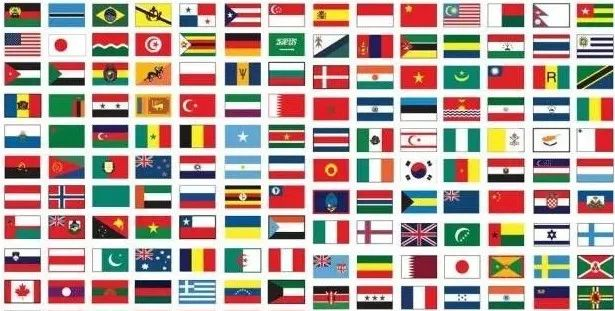
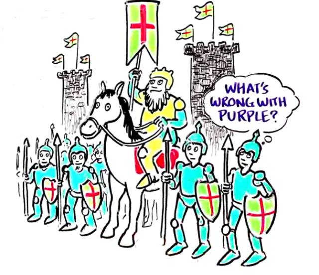
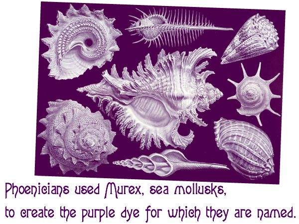
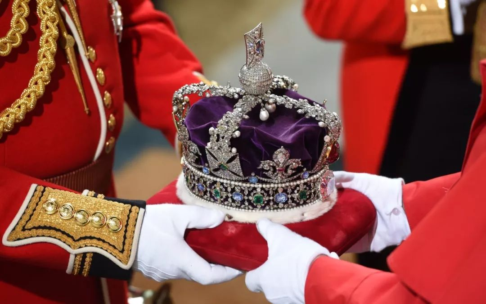
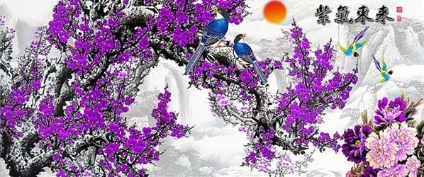
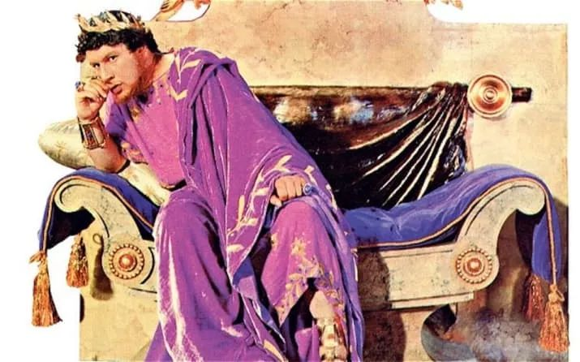
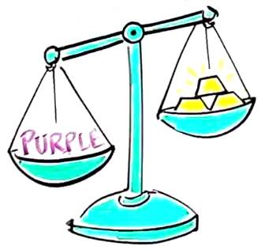
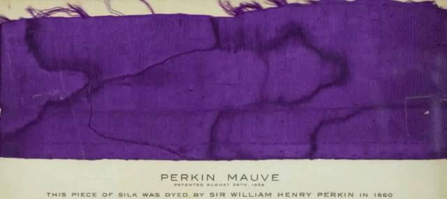

# 无标题

**链接地址:** http://mp.weixin.qq.com/s?__biz=MzI5NDMzNzM3OQ==&mid=2247487670&idx=8&sn=3da84d3cf7c32e56c4313f55900bb97a&chksm=ec653ebadb12b7ac2f6ac8f4ae5724773db382c5e09cd727378f0c79c20f4a4fa19436b921c9&mpshare=1&scene=2&srcid=08126kwBnKvwvPCANau0vUGT#rd
**作者:** 
**获取时间:** 2025/8/28 21:39:56
**图片数量:** 23

---

## 原始HTML内容

<section class="" style="max-width: 100%;color: rgb(51, 51, 51);">&nbsp;<section class="" ng-click="onClick($event)" ng-model="eo.text" ng-style=" {
  'font-size'   : eo.fontSize,
  'font-family' : eo.fontFamily,
  'font-style'  : eo.fontStyle,
  'color'       : (eo.color || theme.majorColor),
} " placeholder="{ 点击编辑 }" stop-propagation="click mousedown mouseup" tn-edit-content="true" tn-page-editable="text0" tn-page-editable-type="ed-type-text" ui-on-drop="block($event)" style="margin-top: 0.7em;margin-left: -0.4em;padding: 1em;max-width: 100%;border-radius: 1em;width: 510.25px;color: inherit;font-family: inherit;font-size: 1em;display: inline-block;background-color: rgb(250, 200, 255);box-sizing: border-box !important;word-wrap: break-word !important;">&nbsp;&nbsp;&nbsp;吃喝玩乐卡尔加里YYC&nbsp;最近要大送豪礼，包括苹果 iPhone X！</section></section>
 
<section class="" style="max-width: 100%;color: rgb(51, 51, 51);"><section class="" ng-click="onClick($event)" ng-model="eo.text" ng-style=" {
  'font-size'   : eo.fontSize,
  'font-family' : eo.fontFamily,
  'font-style'  : eo.fontStyle,
  'color'       : (eo.color || theme.majorColor),
} " placeholder="{ 点击编辑 }" stop-propagation="click mousedown mouseup" tn-edit-content="true" tn-page-editable="text0" tn-page-editable-type="ed-type-text" ui-on-drop="block($event)" style="margin-top: 0.7em;margin-right: -0.4em;padding: 1em;max-width: 100%;border-radius: 1em;width: 510.25px;color: inherit;font-family: inherit;font-size: 1em;display: inline-block;background-color: rgb(188, 227, 249);box-sizing: border-box !important;word-wrap: break-word !important;">没错没错，记得『点击蓝字加关注』哟！机会随时到来！</section>&nbsp;&nbsp;</section><section class="" style="margin-top: 0.8em;margin-bottom: 0.5em;max-width: 100%;color: rgb(51, 51, 51);">
 
</section><section style="max-width: 100%;color: rgb(51, 51, 51);">真心实意，为您推荐！</section><section style="max-width: 100%;color: rgb(51, 51, 51);"> </section>

 

来源：多伦多华人圈&nbsp;&nbsp;&nbsp;微信号：gtalife

 

你知道吗？

世界上199个国家，

无论历代王朝，还是当今，

<strong style="max-width: 100%;box-sizing: border-box !important;word-wrap: break-word !important;">几乎没有哪个国家的国旗使用紫色</strong>！

 

 

紫色不是很常见的颜色吗？

紫色在现在也是很潮的颜色呀！

为什么国旗都不使用紫色？

难道紫色招谁惹谁了？

这到底是为什么？

 

 

这要从很久以前说起了，几个世纪以来<strong style="max-width: 100%;box-sizing: border-box !important;word-wrap: break-word !important;">紫色象征皇室身份和地位</strong>，曾经伊丽莎白女王还下过一道禁令，非皇室人员不许穿戴紫色服饰！她也是下此禁令的第一人！

 

 

俗话说，物以稀为贵，难道是紫色比较稀缺？

 

没错，紫色曾经<strong style="max-width: 100%;box-sizing: border-box !important;word-wrap: break-word !important;">极其珍贵，比金子还贵出几倍！</strong>因为它的初始染料非常稀缺，当初大部分紫色的染料，都来自腓尼基的贸易之都提尔（现在的黎巴嫩古城），染料商从小海螺的身上提取出染料，不仅提取工序非常复杂，提炼1克染料需要10000多只小海螺，而且这些海螺仅仅生存在地中海的提尔地区！

 

正因如此，紫色只有富人才用得起，所以<strong style="max-width: 100%;box-sizing: border-box !important;word-wrap: break-word !important;">穿戴紫色成了皇室阶级的特权</strong>，紫色也代表着<strong style="max-width: 100%;box-sizing: border-box !important;word-wrap: break-word !important;">神圣与灵性</strong>，在古代欧洲穿戴紫色服饰的皇室，常被认为是<strong style="max-width: 100%;box-sizing: border-box !important;word-wrap: break-word !important;">上帝的后裔！</strong> 

 

 

而在中国古代，帝王所住的地方叫<strong style="max-width: 100%;color: rgb(79, 79, 79);font-size: 15px;letter-spacing: 0.544px;box-sizing: border-box !important;word-wrap: break-word !important;">紫禁城</strong>，“<strong style="max-width: 100%;color: rgb(79, 79, 79);font-size: 15px;letter-spacing: 0.544px;box-sizing: border-box !important;word-wrap: break-word !important;">紫气东来</strong>”那是有祥瑞产生，想必这其间也多少有些渊源。

 

 

可有时，紫色对于皇室而言都太过昂贵。

 

传说在3世纪，罗马帝国国王三世Aurelion就不允许妻子购买提尔制的紫色丝绸披肩，因为一条披肩的价格差不多是黄金价格的三倍。<strong style="max-width: 100%;color: rgb(79, 79, 79);letter-spacing: 0.544px;box-sizing: border-box !important;word-wrap: break-word !important;">一小磅紫色染料的价格可以买三磅黄金</strong>，相当于现在的56000美元（折合人民币37万元）。

 

 

是不是贵的离谱？买区区1磅紫色染料的钱，可以精打细算地环游世界去了！

 

所以，没有一个国家能够富裕到在国旗上使用紫色。

 

直到1856年，一位18岁的英国化学家W.H.Perkin在尝试合成一种抗疟疾的药物时，意外发现了紫色化合物，这种化合物可以给布料染色，于是他为染料申请了专利，之后紫色染料被大规模生产。

 

 

也就从那时候开始，紫色才成为每个人都能买得起的颜色，随之而来，<strong style="max-width: 100%;color: rgb(79, 79, 79);font-size: 15px;letter-spacing: 0.544px;box-sizing: border-box !important;word-wrap: break-word !important;">紫色走下神坛</strong>，再也不是特权身份的象征，皇室成员们也不再尊崇紫色。

 

 

紫色不再是特权的专属，也不再是身份的象征，但各国的国旗还是没有变化。

 

1900年之后，许多国家重新设计了国旗，但还是几乎没有国家的国旗使用紫色。

 

欢迎大家添加&nbsp;神通广大&nbsp;吃喝玩乐&nbsp;服务微信&nbsp;为好友！

相互照应，十分必要！

扫码即可！

 

 

 

 
<section style="max-width: 100%;color: rgb(51, 51, 51);">真诚为您推荐！</section><section class="" data-style="white-space: normal; text-align: left;font-size: 14px;line-height: 1.5em; color: rgb(12, 12, 12);" style="max-width: 100%;color: rgb(51, 51, 51);"><section style="margin-top: -1.2em;max-width: 100%;box-sizing: border-box;color: rgb(166, 166, 166);text-align: center;border-width: initial;border-style: none;border-color: initial;line-height: 1.4;word-wrap: break-word !important;"> </section><section class="" data-style="white-space: normal; text-align: left;font-size: 14px;line-height: 1.5em; color: rgb(12, 12, 12);" style="padding: 16px 16px 10px;max-width: 100%;box-sizing: border-box;font-size: 1em;line-height: 1.4;word-wrap: break-word !important;">
<strong style="max-width: 100%;color: rgb(62, 62, 62);font-size: 18px;text-align: justify;box-sizing: border-box !important;word-wrap: break-word !important;"><strong style="max-width: 100%;box-sizing: border-box !important;word-wrap: break-word !important;"><strong style="max-width: 100%;box-sizing: border-box !important;word-wrap: break-word !important;"><strong style="max-width: 100%;box-sizing: border-box !important;word-wrap: break-word !important;"></strong></strong></strong></strong>

<strong style="max-width: 100%;font-size: 18px;text-align: justify;box-sizing: border-box !important;word-wrap: break-word !important;"><strong style="max-width: 100%;box-sizing: border-box !important;word-wrap: break-word !important;"><strong style="max-width: 100%;box-sizing: border-box !important;word-wrap: break-word !important;"><strong style="max-width: 100%;box-sizing: border-box !important;word-wrap: break-word !important;"></strong></strong></strong></strong> 

 

<strong style="max-width: 100%;font-size: 18px;text-align: justify;box-sizing: border-box !important;word-wrap: break-word !important;"><strong style="max-width: 100%;box-sizing: border-box !important;word-wrap: break-word !important;"><strong style="max-width: 100%;box-sizing: border-box !important;word-wrap: break-word !important;"><strong style="max-width: 100%;box-sizing: border-box !important;word-wrap: break-word !important;"></strong></strong></strong></strong>

<strong style="max-width: 100%;font-size: 18px;text-align: justify;box-sizing: border-box !important;word-wrap: break-word !important;"><strong style="max-width: 100%;box-sizing: border-box !important;word-wrap: break-word !important;"><strong style="max-width: 100%;box-sizing: border-box !important;word-wrap: break-word !important;"><strong style="max-width: 100%;box-sizing: border-box !important;word-wrap: break-word !important;"></strong></strong></strong></strong> 

 

</section></section>
 

---

## 纯文本内容

吃喝玩乐卡尔加里YYC 最近要大送豪礼，包括苹果 iPhone X！没错没错，记得『点击蓝字加关注』哟！机会随时到来！  真心实意，为您推荐！来源：多伦多华人圈   微信号：gtalife你知道吗？世界上199个国家，无论历代王朝，还是当今，几乎没有哪个国家的国旗使用紫色！紫色不是很常见的颜色吗？紫色在现在也是很潮的颜色呀！为什么国旗都不使用紫色？难道紫色招谁惹谁了？这到底是为什么？这要从很久以前说起了，几个世纪以来紫色象征皇室身份和地位，曾经伊丽莎白女王还下过一道禁令，非皇室人员不许穿戴紫色服饰！她也是下此禁令的第一人！俗话说，物以稀为贵，难道是紫色比较稀缺？没错，紫色曾经极其珍贵，比金子还贵出几倍！因为它的初始染料非常稀缺，当初大部分紫色的染料，都来自腓尼基的贸易之都提尔（现在的黎巴嫩古城），染料商从小海螺的身上提取出染料，不仅提取工序非常复杂，提炼1克染料需要10000多只小海螺，而且这些海螺仅仅生存在地中海的提尔地区！正因如此，紫色只有富人才用得起，所以穿戴紫色成了皇室阶级的特权，紫色也代表着神圣与灵性，在古代欧洲穿戴紫色服饰的皇室，常被认为是上帝的后裔！而在中国古代，帝王所住的地方叫紫禁城，“紫气东来”那是有祥瑞产生，想必这其间也多少有些渊源。可有时，紫色对于皇室而言都太过昂贵。传说在3世纪，罗马帝国国王三世Aurelion就不允许妻子购买提尔制的紫色丝绸披肩，因为一条披肩的价格差不多是黄金价格的三倍。一小磅紫色染料的价格可以买三磅黄金，相当于现在的56000美元（折合人民币37万元）。是不是贵的离谱？买区区1磅紫色染料的钱，可以精打细算地环游世界去了！所以，没有一个国家能够富裕到在国旗上使用紫色。直到1856年，一位18岁的英国化学家W.H.Perkin在尝试合成一种抗疟疾的药物时，意外发现了紫色化合物，这种化合物可以给布料染色，于是他为染料申请了专利，之后紫色染料被大规模生产。也就从那时候开始，紫色才成为每个人都能买得起的颜色，随之而来，紫色走下神坛，再也不是特权身份的象征，皇室成员们也不再尊崇紫色。紫色不再是特权的专属，也不再是身份的象征，但各国的国旗还是没有变化。1900年之后，许多国家重新设计了国旗，但还是几乎没有国家的国旗使用紫色。欢迎大家添加 神通广大 吃喝玩乐 服务微信 为好友！相互照应，十分必要！扫码即可！真诚为您推荐！

---

## 图片列表

-  (原始链接: https://mmbiz.qpic.cn/mmbiz/MVPvEL7Qg0EXNGDDXjhn7BQlLVZfE4a72NDhuKJZheaZoX3JcYZ8wicrltbzurnAx8Urww68iaiaaC541u0miaUGqg/640?)
-  (原始链接: https://mmbiz.qpic.cn/mmbiz/MVPvEL7Qg0EXNGDDXjhn7BQlLVZfE4a7eyibPmHcP5XBsBl0KZPM0LQibDWticwHV1SSxz8Ha4rjtk93ZD4sTPSsg/640?)
-  (原始链接: https://mmbiz.qpic.cn/mmbiz_jpg/E5oZzDjj1krUQpM9bj5FdOK0iarqXud4mIKoW6C1kXSpOayiaq1XfqH0dOt23X9s4d8FkYtGk0OqCrx3URk3zXiaQ/640?wx_fmt=jpeg)
-  (原始链接: https://mmbiz.qpic.cn/mmbiz_jpg/E5oZzDjj1krg70S5dqqia8wpBmp0u7ibWvurxxBrwHU6YUHpdrKOPJ2thhiaQAWncywSIyP6RaAFxH9WzMUvUFkbA/640?wx_fmt=jpeg)
-  (原始链接: https://mmbiz.qpic.cn/mmbiz_jpg/E5oZzDjj1koIN1Y38icljFMX6zwK8pw7b53PvUZlk9gXsIh45VRRWgBJXibBqiaeeJJv68NkFKuicodbcqOWCXUHicw/640?wx_fmt=jpeg)
-  (原始链接: https://mmbiz.qpic.cn/mmbiz_png/E5oZzDjj1korznwXHmfQ7aYIaG0UJMDRhykrwCMh7dttU2MfsKwBQ3VbBbfUujjQeR6KFxbyiaUlJDPafL6fcwQ/640?wx_fmt=png)
-  (原始链接: https://mmbiz.qpic.cn/mmbiz_jpg/giaE4iaUME1lYNueAicibOic17d0Y3Jv6jN2c4jCic7efEc1wibedqUaXibDdxxWlNQAQe7xvNNoE8mlKtAqghLxicRicbaw/640?wx_fmt=jpeg)
-  (原始链接: https://mmbiz.qpic.cn/mmbiz_png/oBtb2k4CL8PriaWDIUj6s6wOBXvibXKm6iaTicboic3NzwNeY20gTT5ia6hGKu9Cz6AmO6cIyLxW1ibOtbDTho1ib11Ghg/640?wx_fmt=png)
-  (原始链接: https://mmbiz.qpic.cn/mmbiz_jpg/oBtb2k4CL8PriaWDIUj6s6wOBXvibXKm6iaz4iaI8spmicSVg7URaadcx8rA7iczwaOCaYfgSreKcSN1AYfDhd1mA5JA/640?wx_fmt=jpeg)
-  (原始链接: https://mmbiz.qpic.cn/mmbiz_png/ZEclZqfGeO20XLjMFibLYXSXQsjp9dH1kYJqbG3XTfdcfANou325QMat78I4dWH3FHthicCxa2pFWRyRQwGibqF0g/640?wx_fmt=png)
-  (原始链接: https://mmbiz.qpic.cn/mmbiz_jpg/ZEclZqfGeO20XLjMFibLYXSXQsjp9dH1kxyy5okOEI6dRrWWdbtcQPY5QpKSAHWDTCeUWRZfupry5iaKlas9xicbQ/640?wx_fmt=jpeg)
-  (原始链接: https://mmbiz.qpic.cn/mmbiz_jpg/giaE4iaUME1lYNueAicibOic17d0Y3Jv6jN2cTzmy4MVhoWQD3LLZ8lQc6wlKfxa1TCn54BMNY44UDa9RewRh7G91Fw/640?wx_fmt=jpeg)
-  (原始链接: https://mmbiz.qpic.cn/mmbiz_jpg/ZEclZqfGeO20XLjMFibLYXSXQsjp9dH1kL6MFwTibY9icpfFAP7NNc5iayEaGlAxq0WQ3mkTMCJVeAZOoibDU9zFlww/640?wx_fmt=jpeg)
-  (原始链接: https://mmbiz.qpic.cn/mmbiz_png/oBtb2k4CL8PriaWDIUj6s6wOBXvibXKm6iaibZKZpxacFiauHvgUQ5tHFJJS5kEx83g4HUwwSBHyBmtibPU3DV21jlSQ/640?wx_fmt=png)
-  (原始链接: https://mmbiz.qpic.cn/mmbiz_jpg/oBtb2k4CL8PriaWDIUj6s6wOBXvibXKm6iazibOY1yZib64JoKuCSzQHEraibF6SXNBFg4Ce8CibPtpohQwibqMbxBa89g/640?wx_fmt=jpeg)
-  (原始链接: https://mmbiz.qpic.cn/mmbiz_png/oBtb2k4CL8PriaWDIUj6s6wOBXvibXKm6iaEic40rBSJ2b5m0Qb5BDU2BqR7XMtrDULcqiaiaMgBNEn8I5gV2eatcNTg/640?wx_fmt=png)
-  (原始链接: https://mmbiz.qpic.cn/mmbiz_jpg/mZIpZ2dRo6Z5Lg6L4yBuvZf7QibxfKVYiaibWZ0TgYUSaib6Kt9bF0BhOS7r5v3zCAdNJ6PubAKsoohqPxVjIFWX9w/640?wx_fmt=jpeg)
-  (原始链接: https://mmbiz.qpic.cn/mmbiz_jpg/E5oZzDjj1kqmyBd2wXyJpdlTKRQv5yEo8q6MibdN8KaEpc8HasuicnnICaTm5SyBmFzYHh7Ypj7IianbCxEfHk2lg/640?wx_fmt=jpeg)
-  (原始链接: https://mmbiz.qpic.cn/mmbiz_jpg/E5oZzDjj1kqOCLqCN2NbQAMUbagjVS03xgLrw0N6XMoBSZS1ykNxrwfWZiaj5dHXZWqFdCfVurm8R3oSF82FJqQ/640?wx_fmt=jpeg)
-  (原始链接: https://mmbiz.qpic.cn/mmbiz_jpg/E5oZzDjj1koNJW9uUHaESKwdYBXwmKW1qj69v3qOjy7szM8OibukgwicGibjP2x1Xeqic9bKbg2a2f2qRBSzicsX20w/640?wx_fmt=jpeg)
-  (原始链接: https://mmbiz.qpic.cn/mmbiz_jpg/E5oZzDjj1koNJW9uUHaESKwdYBXwmKW1N0JZ1iaAG5IJ84TC3KQzv1rNHdaiaic9ZibfOCBUL1yhIWnK0ScaWEibQ4A/640?wx_fmt=jpeg)
-  (原始链接: https://mmbiz.qpic.cn/mmbiz_jpg/E5oZzDjj1krFNNmqiaVW3RVdTIANicfJ6BibMoyEmfm5Bscqn3NFAArz5lafNH1OTexHamNNp51ibcpFJqJKHjhiahw/640?wx_fmt=jpeg)
-  (原始链接: http://mmbiz.qpic.cn/mmbiz/E5oZzDjj1kqdHwQ2zpsHXPvFpF81yEia17OibFaAfyBwQYD1iakM7T1PlagpPx6bCbw4qeARbPEgmqPsmYtLv46cQ/640?wx_fmt=jpeg)
