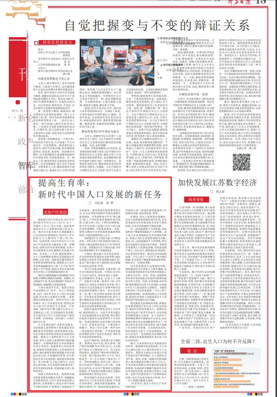
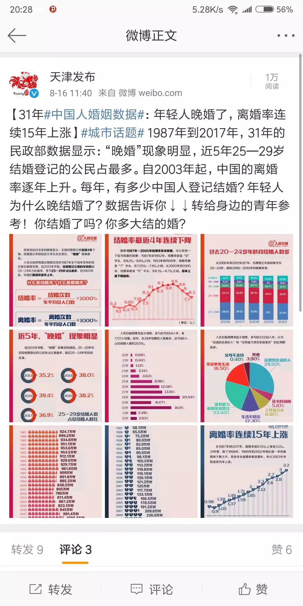
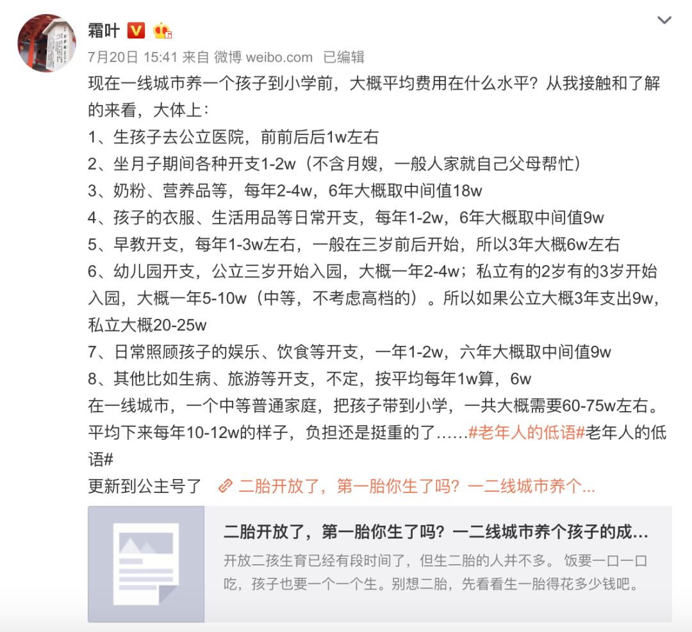

# 无标题

**链接地址:** http://mp.weixin.qq.com/s?__biz=MzA4ODkwOTk0OA==&mid=2652676032&idx=1&sn=90b33c41c3ed494658f985d4155be2d1&chksm=8bcaced3bcbd47c50744a2dc19a2ea4eb44935851a64daeb94135b4bd5705400e1d0e05e638a&mpshare=1&scene=2&srcid=0816f5fN5QgMSwc1XIjYx5Sz#rd
**作者:** 
**获取时间:** 2025/8/28 21:37:59
**图片数量:** 11

---

## 原始HTML内容

可规定40岁以下公民不论男女，每年必须以工资的一定比例缴纳生育基金，并进入个人账户。家庭在生育第二胎及以上时，可申请取出生育基金并领取生育补贴，用于补偿妇女及其家庭在生育期中断劳动而造成的短期收入损失。

8月14日，江苏省委机关报《新华日报》在第13版“思想周刊·智库”栏目刊发了刘志彪、张晔联合撰写的题为《提高生育率：新时代中国人口发展的新任务》的署名文章。今天这篇文章广为流传，因其观点较为激进，也引发了不少热议。

作者刘志彪、张晔来自南京大学长江产业经济研究院。文章指出，“少子化”的后果是十分严重的，提高生育率应成为新时代中国人口发展面临的新任务。“我们认为我国鼓励生育的措施可分为短期、中期和长期的应对政策。”

“短期内，应全面放开生育，优先发展幼教产业和公共托幼服务，加强国家义务教育体系。”文章指出，“立刻全面放开生育。我国女性的生育高峰在25-30岁。”

“中期内，建议建立生育基金制度，并妥善利用好存量的社会抚养费，通过花费较小的经济手段来鼓励家庭生育；延长产假并建立育儿假制度；制定鼓励生育的住房政策，等等。”

“可规定40岁以下公民不论男女，每年必须以工资的一定比例缴纳生育基金，并进入个人账户。家庭在生育第二胎及以上时，可申请取出生育基金并领取生育补贴，用于补偿妇女及其家庭在生育期中断劳动而造成的短期收入损失。如公民未生育二孩，账户资金则待退休时再行取出。生育基金采用现收现付制，即个人累计缴纳而尚未取出的生育基金，可用于政府对其他家庭的生育补贴支付，不足部分再由国家财政补贴。”

“长期内，待以上政策效应递减时，应充分发挥财税政策的调节作用，对多孩家庭和女性再就业的企业给予税收优惠，并对多孩家庭给予财政补贴。”
<h2 style="box-sizing: inherit;padding-left: 10px;margin-top: 44px;margin-bottom: 20px;font-weight: 700;line-height: 1.4;font-size: 20px;border-left: 5px solid rgb(22, 119, 217);">以下是全文，原文标题《提高生育率： 新时代中国人口发展的新任务》</h2>
国家统计局今年初公布，2017年中国大陆全年出生人口1723万，比上一年减少了63万，显示全面二孩政策导致的出生人口高峰很可能已经过去。这一观点从目前各地卫计委披露的人口出生情况中得到验证：2018年上半年的新生儿人数同比下降了约15%-20%。这意味着，2018年的出生人口比2017年还将有较大幅度的下降。更糟的是，按照2010年的普查数据，未来十年内我国的生育旺盛期妇女将减少约40%。在未来二三年内，随着我国第三次人口高峰期的育龄妇女逐渐退出育龄期，以及全面二孩政策实施导致的生育堆积效应释放结束，我国的人口出生率必然面临断崖式下跌。“少子化”的后果是十分严重的，提高生育率应成为新时代中国人口发展面临的新任务。

我们认为我国鼓励生育的措施可分为短期、中期和长期的应对政策。短期内，应全面放开生育，优先发展幼教产业和公共托幼服务，加强国家义务教育体系。

立刻全面放开生育。我国女性的生育高峰在25-30岁。从人口结构来看，1975-1985年出生人口的生育意愿较强，但目前已过最佳生育期，二孩积累效应将释放完毕。而90年代人口相对减少，加上生育观念改变，指望这部分人担当生育重任不太现实。只有1986-1990年回声婴儿潮出生的人口，总数高达1.2亿，又有较强的生育意愿，且目前仍有2年左右的时间处于最佳生育期。应利用这一时间窗口，立刻全面放开生育。

大力发展幼教产业和托幼服务。目前低龄儿童的照料主要是通过母亲兼职甚至全职照料、祖辈的照料支持，以及分散且昂贵的市场化托幼机构实现的。随着人口老龄化和个人主义的发展，老年人承担儿童照料的可能性越来越小。应明确国家在公共托幼服务中的主体责任，重建国家公共托幼体系，探索将学前教育纳入义务教育的可能性；通过税收优惠政策鼓励企业兴建民办幼儿园，并加强政府管理；社区街道也可设立托幼机构，提供基层保育服务。努力形成“公立幼儿园为主，民办幼儿园为辅，社区街道托幼机构补充”的多层次的托幼体系，帮助家庭分担儿童照料责任。

加强义务教育体系。我国很多地区把素质教育理解为早放学，普遍缩短义务教育时间，以至于很多家庭花费大量时间、金钱和精力，接送小孩并奔波于各种培训班，严重增加了家庭抚育子女的成本。要改变现有素质教育的方式，以公办学校为载体在学校内部展开素质教育。可考虑恢复小学生“朝八晚五”的上下学时间和实施弹性放学制度，以便与职工的上下班时间相衔接。也可针对双职工家庭9岁以下的儿童开设寒暑期班，开展素质教育。为此，要努力增加中小学的基础设施和师资供给，并提高教师的收入水平。

发挥基层计生干部的力量，引导舆论宣传。应纠正把人当作负担的片面认识，形成“人既是消费者更是生产者”的科学人口观。发挥基层计生干部的力量，引导社会恢复和树立多子多福的理念。

中期内，建议建立生育基金制度，并妥善利用好存量的社会抚养费，通过花费较小的经济手段来鼓励家庭生育；延长产假并建立育儿假制度；制定鼓励生育的住房政策，等等。

设立生育基金制度，尽量实现二孩生育补贴的自我运转。可规定40岁以下公民不论男女，每年必须以工资的一定比例缴纳生育基金，并进入个人账户。家庭在生育第二胎及以上时，可申请取出生育基金并领取生育补贴，用于补偿妇女及其家庭在生育期中断劳动而造成的短期收入损失。如公民未生育二孩，账户资金则待退休时再行取出。生育基金采用现收现付制，即个人累计缴纳而尚未取出的生育基金，可用于政府对其他家庭的生育补贴支付，不足部分再由国家财政补贴。

提取存量抚养费资金用于生育补贴，减轻财政压力。目前不应再对超生子女的家庭收取社会抚养费，相反我们应提取存量的社会抚养费用于生育补贴。考虑到我国社会抚养费已经征收了30年，存量资金应是一个极为庞大的数字，理论上可以支撑一两年内对二孩家庭的生育补贴。可考虑将存量抚养费资金用于充实生育基金，或作为生育基金的初始资金。

延长产假时间，考虑建立育儿假制度。我国从2016年起，将头胎和二胎产假分别调整为30天和128天，丈夫的陪产假从10天增加到15天。但与发达国家相比，我国的产假时间仍然较短。可先将二胎产假延长到6-8个月，育儿假延至一年，丈夫的陪产假延至3个月。等时机成熟后，再对生育二胎以上的夫妇延长产假或引入育儿假。为减轻企业负担，妇女在产假或育儿假期间的薪资，可考虑按比例或以固定金额由国家财政或生育基金支付。

制定鼓励生育的住房政策。居住条件对人口生育率有较大影响，可考虑住房政策向二胎或多胎家庭倾斜。如提供长租房，对二胎或多胎家庭优先；对低收入的二胎或多胎家庭提供3年的租房补贴，或房贷优惠，等等。

长期内，待以上政策效应递减时，应充分发挥财税政策的调节作用，对多孩家庭和女性再就业的企业给予税收优惠，并对多孩家庭给予财政补贴。

对二孩家庭减免个人所得税，或是按照孩子数量累进抵扣个人所得税。由于孩子在未来缴纳社会养老保险等税金，家庭已为社会养老体系做出贡献。因此，向二孩家庭抵扣个人所得税，用以弥补家庭的生育成本是合理的。考虑到未来我国人口老龄化加剧，社保基金缺口增大，为长远计，税收抵扣必须适度，并注重其经济效率。建议仅对多孩家庭的第二个以上孩子（六岁以下）集中抵扣税额，也可按孩子数量累进抵扣所得税，同时设立一定的封顶额。

对多孩家庭进行适度财政补贴。税收抵扣仅对中高收入人群有激励，但对边际税率很低甚至是零税率的低收入人群并无作用。在这一阶段，各级财政有必要对多孩家庭尤其是经济困难家庭加大财力支持。包括：生育奖励，如对孕期、哺乳期的妇女给予生育津贴，对家庭6岁以下儿童发放育儿津贴等。为提高补贴效率，可仅对家庭第二个以上孩子发放财政补贴。如果国家财力上仍有困难，建议针对低收入家庭或是在人口老龄化较严重的地区加以实施。

通过税收支持或财政补贴，鼓励企业保留或提供生育后再上岗妇女的岗位，减轻妇女职业发展压力。我国妇女就业率远高于世界平均水平，妇女的就业保障措施尤为重要。由于女性在产假和哺乳期间可能被迫中止劳动，企业为减少损失往往选择解雇怀孕员工，导致女性生育后丧失原有职位，极大削弱了妇女的生育意愿。尤其是高知女性，职业发展压力更大，生育意愿更低。可对企业进行一定的税收支持或财政补贴，鼓励企业保留或提供生育后再上岗妇女的岗位。

最后，生育政策应充分考虑地区的差异性。随着城市化进程加快，人口向中心城市迁移，中小城市的年轻人口大量流失。我国东北地区以及部分计划生育执行较严格的地区，人口老龄化尤为严重。相反，东部一线城市仍然面临着人地资源紧张和极大的人口压力。中央应制定鼓励生育政策的基本框架和原则，各地政府可根据当地的生育率以及老龄化程度，制定地方性的人口政策。这样不仅能促进人口发展的地区均衡，而且可总结各地试点经验，为下一步大规模实施奠定基础。

 

 

在这条建议里，还提到了提取存量的社会抚养费，这个社会抚养费在我们国家已经征收了30年，就是当年甚至直到现在还在对“超生”的家庭，收取的罚款。

 

<em style="max-width: 100%;box-sizing: border-box !important;word-wrap: break-word !important;">张艺谋超生罚款7487854元</em>

 

如果我没记错的话，住房公积金不买房也可以取出来用是最近两年才陆续开始的。如果刚刚把公积金取出来的家庭还没有生育二胎，这笔钱恐怕在手里还没焐热，就要再交到生育基金里了。

 

这个建议乍一看好像可以鼓励生育，缓解我国人口老龄化和少子化的趋势，但细分析起来却经不起推敲，反倒有种，头疼医脚的感觉。

 

<strong style="max-width: 100%;box-sizing: border-box !important;word-wrap: break-word !important;">现在的人们为什么不愿意结婚，不愿意生孩子了呢？</strong>

 

首先在婚恋市场，人们的观念早已经发生了变化。即便我们不愿意承认，但现实却是，已经到了或者超过适婚年龄的小伙子们，如果无车无房，在婚恋市场里，竞争力是要大打折扣的。

 

而这些“硬件条件”在一线城市里想要达标，已经越来越难。

 

 

在人民日报微博发起的关于晚婚的调查显示：有44.5%的人因为没有能力负担家庭责任、生活不稳定、工作压力大而不愿结婚。

 

 

在这种观念基础上构建的婚姻和家庭，有不少人是在懵懂的年纪，因为对方各项“硬件条件”都不错而结的婚。这样的婚姻感情基础是薄弱的，这也间接导致了离婚率的大幅上升。

 

<strong style="max-width: 100%;box-sizing: border-box !important;word-wrap: break-word !important;">再说说生育意愿—— </strong>

 

现在在职场上，“女人当男人用，男人当牲口用”，明的暗的“996”可不是开玩笑的。

 

女人的工作能力不比男人差已经有目共睹。在事业上升期，因为怀孕育儿耽误一两年，就很有可能会断送一个上升期女性的职业生涯。

 

有多少职场女性在面试时为了求得一个职位隐瞒已婚的事实，又有多少是在“再不生孩子就可能这辈子都没机会生育了”的情况下才选择要小孩的？

 

生一个尚且如此，“二孩”“多胎”就更别提了。

 

<strong style="max-width: 100%;box-sizing: border-box !important;word-wrap: break-word !important;">咱们再来说说养孩子——</strong>

 

这可是一笔巨大的开销，月嫂、育儿嫂，兴趣班、早教班、课后班、择校费……微薄知名大V霜叶，曾经计算过，在一线城市，一个中等普通家庭，把一个孩子养育到小学前，一共大概需要60-75万的费用。

 

这期间，夫妻两个还要还房贷、车贷，负担四个老人的养老医疗费用，生活质量下降，消费降级基本是不可避免的。 

 

 

应该不只我一个人能察觉到身边年轻妈妈们的变化——<strong style="max-width: 100%;box-sizing: border-box !important;word-wrap: break-word !important;">朋友圈里当年风花雪月，酒吧、演唱会的小仙女们，在生了小孩之后，十个里有七个，做起了微商，卖起了面膜或是童装</strong>。

 

这就是一个普通家庭，在有了下一代之后的真实写照。

 

现在已经和20年前不一样了，经历了消费主义观念洗礼的这代人，已经错过了“穷养”的窗口期。

 

对他们来说，把自己的孩子送回老家，让父母把孩子“穷养”长大在观念上不能接受，客观条件上也做不到——有些三四线城市的物价水平不比一二线低。

 

“<strong style="max-width: 100%;box-sizing: border-box !important;word-wrap: break-word !important;">房价是最好的避孕药</strong>”这个说法不是空穴来风，“老龄化”、“少子化”问题的关键还是在于，水涨船高并且居高不下的房价、物价、教育、医疗、养老等生存成本。

 

不解决这些问题，任何一个理性的个人或家庭都会选择晚婚晚育。即便是生育，在只养育一个孩子都要掏空“六个钱包”的情况下，广大感慨着“生不起、养不起”的普通家庭，也很难做出“二孩”甚至“多胎”的艰难决定。

 
<section class="" data-tools="135编辑器" data-id="92990" style="max-width: 100%;box-sizing: border-box;letter-spacing: 0.544px;font-size: 16px;font-family: Helvetica, Arial, sans-serif;border-width: 0px;border-style: none;border-color: initial;word-wrap: break-word !important;"><section data-bgless="spin" data-bglessp="280" data-bgopacity="50%" data-width="100%" style="padding-top: 5px;padding-bottom: 5px;max-width: 100%;box-sizing: border-box;width: 676.992px;background: rgb(115, 216, 224);color: rgb(255, 255, 255);word-wrap: break-word !important;"><section style="margin: 0.1em auto;max-width: 100%;text-align: center;box-sizing: border-box !important;word-wrap: break-word !important;"><section style="max-width: 100%;display: inline-block;box-sizing: border-box !important;word-wrap: break-word !important;"><section style="max-width: 100%;box-sizing: border-box !important;word-wrap: break-word !important;">▼点击关键词查看英语学习班</section></section></section></section></section><section class="" data-tools="135编辑器" data-id="92836" style="max-width: 100%;box-sizing: border-box;letter-spacing: 0.544px;font-size: 16px;font-family: Helvetica, Arial, sans-serif;border-width: 0px;border-style: none;border-color: initial;word-wrap: break-word !important;"><section data-width="100%" style="padding-top: 10px;padding-bottom: 3.5em;max-width: 100%;box-sizing: border-box;width: 676.992px;text-align: center;word-wrap: break-word !important;"><section style="margin-bottom: -6px;max-width: 100%;display: flex;justify-content: flex-start;box-sizing: border-box !important;word-wrap: break-word !important;"><section style="max-width: 100%;width: 140px;z-index: 999;box-sizing: border-box !important;word-wrap: break-word !important;"></section></section><section style="padding: 10px 20px;max-width: 100%;box-sizing: border-box;word-wrap: break-word !important;"><section style="margin-bottom: -2.8em;max-width: 100%;display: flex;justify-content: flex-start;box-sizing: border-box !important;word-wrap: break-word !important;"><section style="margin-left: 13px;max-width: 100%;width: 6px;height: 6px;background-image: initial;background-position: initial;background-size: initial;background-repeat: initial;background-attachment: initial;background-origin: initial;background-clip: initial;z-index: 999;box-sizing: border-box !important;word-wrap: break-word !important;"></section></section><section style="padding: 15px;max-width: 100%;box-sizing: border-box;border-radius: 15px;background-image: initial;background-position: initial;background-size: initial;background-repeat: initial;background-attachment: initial;background-origin: initial;background-clip: initial;box-shadow: rgb(202, 216, 231) 3px 3px 5px;word-wrap: break-word !important;"><section style="max-width: 100%;box-sizing: border-box;border-width: 1px;border-style: solid;border-color: rgb(29, 167, 160);word-wrap: break-word !important;"><section class="" data-brushtype="text" style="padding: 0.6em 1em;max-width: 100%;box-sizing: border-box;font-size: 14px;word-wrap: break-word !important;">
 

<a href="http://mp.weixin.qq.com/s?__biz=MzA4ODkwOTk0OA==&amp;mid=2652675074&amp;idx=1&amp;sn=7d80fdc576c6e2229c815c199fb4da3e&amp;scene=21#wechat_redirect" target="_blank" se_prerender_url="complete" style="color: rgb(0, 0, 0);-webkit-tap-highlight-color: rgba(0, 0, 0, 0);max-width: 100%;font-size: 12px;box-sizing: border-box !important;word-wrap: break-word !important;">0-6岁口语听力系统启蒙班</a>

<a href="http://mp.weixin.qq.com/s?__biz=MzA4ODkwOTk0OA==&amp;mid=2652675126&amp;idx=2&amp;sn=1755601221a07f03d8026db366d0cd21&amp;scene=21#wechat_redirect" target="_blank" se_prerender_url="complete" style="color: rgb(0, 0, 0);-webkit-tap-highlight-color: rgba(0, 0, 0, 0);max-width: 100%;font-size: 12px;font-family: 微软雅黑;letter-spacing: 0px;box-sizing: border-box !important;word-wrap: break-word !important;">6个月麻辣英语自然拼读基础班</a>

<a href="http://mp.weixin.qq.com/s?__biz=MzA4ODkwOTk0OA==&amp;mid=2652674981&amp;idx=2&amp;sn=c55fb4f04859388daff4a9830f91dbda&amp;scene=21#wechat_redirect" target="_blank" se_prerender_url="complete" style="color: rgb(0, 0, 0);-webkit-tap-highlight-color: rgba(0, 0, 0, 0);max-width: 100%;font-size: 12px;letter-spacing: 0px;font-family: 微软雅黑;box-sizing: border-box !important;word-wrap: break-word !important;">廖彩杏上半年26周半年学习班</a>

<a href="http://mp.weixin.qq.com/s?__biz=MzA4ODkwOTk0OA==&amp;mid=2652675065&amp;idx=1&amp;sn=d1326760cfb938e576c0f426877c33a8&amp;scene=21#wechat_redirect" target="_blank" se_prerender_url="complete" style="color: rgb(0, 0, 0);-webkit-tap-highlight-color: rgba(0, 0, 0, 0);max-width: 100%;font-size: 12px;box-sizing: border-box !important;word-wrap: break-word !important;">跟《绝望主妇》学英语口语</a>

<a href="http://mp.weixin.qq.com/s?__biz=MzA4ODkwOTk0OA==&amp;mid=2652674162&amp;idx=1&amp;sn=8c6510363c4de88eb54082cdc6796f7d&amp;chksm=8bcac961bcbd4077f78f160ea63ed2c3230bf74eeb65e27b464c4804b58a23431da01bba4ca0&amp;scene=21#wechat_redirect" target="_blank" se_prerender_url="complete" style="color: rgb(87, 107, 149);-webkit-tap-highlight-color: rgba(0, 0, 0, 0);max-width: 100%;box-sizing: border-box !important;word-wrap: break-word !important;">特级线上英语导师一对一课程</a>

 
</section></section></section><section style="margin-top: -1.2em;margin-right: 4em;max-width: 100%;display: flex;justify-content: flex-end;box-sizing: border-box !important;word-wrap: break-word !important;"><section style="max-width: 100%;width: 6px;height: 0.3em;background-image: initial;background-position: initial;background-size: initial;background-repeat: initial;background-attachment: initial;background-origin: initial;background-clip: initial;z-index: 999;box-sizing: border-box !important;word-wrap: break-word !important;"></section></section><section style="margin-top: -3.4em;margin-right: 13px;max-width: 100%;display: flex;justify-content: flex-end;box-sizing: border-box !important;word-wrap: break-word !important;"><section style="max-width: 100%;width: 6px;height: 1em;background-image: initial;background-position: initial;background-size: initial;background-repeat: initial;background-attachment: initial;background-origin: initial;background-clip: initial;z-index: 999;box-sizing: border-box !important;word-wrap: break-word !important;"></section></section></section></section><section style="margin-top: -50px;margin-right: 25px;max-width: 100%;display: flex;justify-content: flex-end;box-sizing: border-box !important;word-wrap: break-word !important;"><section style="max-width: 100%;width: 140px;z-index: 999;box-sizing: border-box !important;word-wrap: break-word !important;"></section></section></section><section class="" data-tools="135编辑器" data-id="92990" style="max-width: 100%;box-sizing: border-box;letter-spacing: 0.544px;font-size: 16px;font-family: Helvetica, Arial, sans-serif;border-width: 0px;border-style: none;border-color: initial;word-wrap: break-word !important;"><section data-bgless="spin" data-bglessp="280" data-bgopacity="50%" data-width="100%" style="padding-top: 5px;padding-bottom: 5px;max-width: 100%;box-sizing: border-box;width: 676.992px;background: rgb(115, 216, 224);color: rgb(255, 255, 255);word-wrap: break-word !important;"><section style="margin: 0.1em auto;max-width: 100%;text-align: center;box-sizing: border-box !important;word-wrap: break-word !important;"><section style="max-width: 100%;display: inline-block;box-sizing: border-box !important;word-wrap: break-word !important;"><section style="max-width: 100%;box-sizing: border-box !important;word-wrap: break-word !important;"><section style="max-width: 100%;box-sizing: border-box !important;word-wrap: break-word !important;">▼点击阅读原文 </section><section style="max-width: 100%;display: inline-block;box-sizing: border-box !important;word-wrap: break-word !important;">
收听麻辣英语线上荔枝微课
无限次永久回放</section></section><section style="max-width: 100%;box-sizing: border-box !important;word-wrap: break-word !important;"><section style="max-width: 100%;display: inline-block;box-sizing: border-box !important;word-wrap: break-word !important;">线下地点：中国海洋大学外国语学院</section></section></section></section></section></section><section class="" data-tools="135编辑器" data-id="92111" style="max-width: 100%;box-sizing: border-box;letter-spacing: 0.544px;font-size: 16px;font-family: Helvetica, Arial, sans-serif;border-width: 0px;border-style: none;border-color: initial;word-wrap: break-word !important;"><section data-width="100%" style="max-width: 100%;width: 676.992px;text-align: center;box-sizing: border-box !important;word-wrap: break-word !important;"></section></section><section class="" data-tools="135编辑器" data-id="89745" style="max-width: 100%;box-sizing: border-box;letter-spacing: 0.544px;font-size: 16px;font-family: Helvetica, Arial, sans-serif;border-width: 0px;border-style: none;border-color: initial;word-wrap: break-word !important;"><section data-bgless="spin" data-bglessp="60" style="margin-right: auto;margin-left: auto;max-width: 100%;width: 200px;height: 200px;background: rgb(115, 216, 224);overflow: hidden;box-sizing: border-box !important;word-wrap: break-word !important;"><section style="padding: 10px;max-width: 100%;box-sizing: border-box;word-wrap: break-word !important;"><section data-width="100%" style="max-width: 100%;width: 180px;background: rgb(249, 105, 176);transform: rotate(45deg);box-sizing: border-box !important;word-wrap: break-word !important;"><section style="padding: 10px;max-width: 100%;box-sizing: border-box;word-wrap: break-word !important;"><section style="max-width: 100%;background: rgb(255, 255, 255);transform: rotate(-45deg);box-sizing: border-box !important;word-wrap: break-word !important;"><section style="max-width: 100%;display: flex;justify-content: flex-start;box-sizing: border-box !important;word-wrap: break-word !important;"><section style="max-width: 100%;width: 28px;box-sizing: border-box !important;word-wrap: break-word !important;"></section></section><section class="" data-brushtype="text" data-width="100%" style="margin-top: -16px;max-width: 100%;width: 160px;text-align: center;line-height: 15px;box-sizing: border-box !important;word-wrap: break-word !important;">扫码加群主</section><section style="margin-right: auto;margin-left: auto;max-width: 100%;width: 100px;box-sizing: border-box !important;word-wrap: break-word !important;"><section data-width="100%" style="max-width: 100%;width: 100px;text-align: center;box-sizing: border-box !important;word-wrap: break-word !important;"></section></section><section class="" data-brushtype="text" data-width="100%" style="margin-top: -0.2em;max-width: 100%;width: 160px;text-align: center;font-size: 14px;line-height: 15px;box-sizing: border-box !important;word-wrap: break-word !important;">了解进群详情</section><section style="margin-top: -1em;max-width: 100%;display: flex;justify-content: flex-end;box-sizing: border-box !important;word-wrap: break-word !important;"><section style="max-width: 100%;width: 28px;box-sizing: border-box !important;word-wrap: break-word !important;"></section></section></section></section></section></section></section></section><section data-role="paragraph" class="" style="max-width: 100%;box-sizing: border-box;letter-spacing: 0.544px;font-family: 微软雅黑;font-size: 16px;word-wrap: break-word !important;">
 
</section><section class="" data-tools="135编辑器" data-id="92876" style="max-width: 100%;box-sizing: border-box;letter-spacing: 0.544px;font-family: 微软雅黑;font-size: 16px;word-wrap: break-word !important;"><section data-width="100%" style="max-width: 100%;width: 676.992px;box-sizing: border-box !important;word-wrap: break-word !important;"><section style="max-width: 100%;display: inline-block;box-sizing: border-box !important;word-wrap: break-word !important;"><section class="" data-brushtype="text" style="padding: 10px 25px;max-width: 100%;box-sizing: border-box;height: 45px;line-height: 11px;background-image: url(&quot;https://mmbiz.qpic.cn/mmbiz_png/a0cQBouYskCOb33YN77WZVk1FkdxfpmlQZHZLC4mFVickexEoHyv4RQmYFVia9t0Lar0o1pPFRKeJBGNb7GG6LibA/640?wx_fmt=png&quot;);background-repeat: no-repeat;text-align: center;background-size: 100% 100%;color: rgb(63, 62, 63);font-size: 14px;letter-spacing: 2px;word-wrap: break-word !important;">点击这里收听麻辣英语荔枝微课</section></section></section></section>

---

## 纯文本内容

可规定40岁以下公民不论男女，每年必须以工资的一定比例缴纳生育基金，并进入个人账户。家庭在生育第二胎及以上时，可申请取出生育基金并领取生育补贴，用于补偿妇女及其家庭在生育期中断劳动而造成的短期收入损失。8月14日，江苏省委机关报《新华日报》在第13版“思想周刊·智库”栏目刊发了刘志彪、张晔联合撰写的题为《提高生育率：新时代中国人口发展的新任务》的署名文章。今天这篇文章广为流传，因其观点较为激进，也引发了不少热议。作者刘志彪、张晔来自南京大学长江产业经济研究院。文章指出，“少子化”的后果是十分严重的，提高生育率应成为新时代中国人口发展面临的新任务。“我们认为我国鼓励生育的措施可分为短期、中期和长期的应对政策。”“短期内，应全面放开生育，优先发展幼教产业和公共托幼服务，加强国家义务教育体系。”文章指出，“立刻全面放开生育。我国女性的生育高峰在25-30岁。”“中期内，建议建立生育基金制度，并妥善利用好存量的社会抚养费，通过花费较小的经济手段来鼓励家庭生育；延长产假并建立育儿假制度；制定鼓励生育的住房政策，等等。”“可规定40岁以下公民不论男女，每年必须以工资的一定比例缴纳生育基金，并进入个人账户。家庭在生育第二胎及以上时，可申请取出生育基金并领取生育补贴，用于补偿妇女及其家庭在生育期中断劳动而造成的短期收入损失。如公民未生育二孩，账户资金则待退休时再行取出。生育基金采用现收现付制，即个人累计缴纳而尚未取出的生育基金，可用于政府对其他家庭的生育补贴支付，不足部分再由国家财政补贴。”“长期内，待以上政策效应递减时，应充分发挥财税政策的调节作用，对多孩家庭和女性再就业的企业给予税收优惠，并对多孩家庭给予财政补贴。”以下是全文，原文标题《提高生育率： 新时代中国人口发展的新任务》国家统计局今年初公布，2017年中国大陆全年出生人口1723万，比上一年减少了63万，显示全面二孩政策导致的出生人口高峰很可能已经过去。这一观点从目前各地卫计委披露的人口出生情况中得到验证：2018年上半年的新生儿人数同比下降了约15%-20%。这意味着，2018年的出生人口比2017年还将有较大幅度的下降。更糟的是，按照2010年的普查数据，未来十年内我国的生育旺盛期妇女将减少约40%。在未来二三年内，随着我国第三次人口高峰期的育龄妇女逐渐退出育龄期，以及全面二孩政策实施导致的生育堆积效应释放结束，我国的人口出生率必然面临断崖式下跌。“少子化”的后果是十分严重的，提高生育率应成为新时代中国人口发展面临的新任务。我们认为我国鼓励生育的措施可分为短期、中期和长期的应对政策。短期内，应全面放开生育，优先发展幼教产业和公共托幼服务，加强国家义务教育体系。立刻全面放开生育。我国女性的生育高峰在25-30岁。从人口结构来看，1975-1985年出生人口的生育意愿较强，但目前已过最佳生育期，二孩积累效应将释放完毕。而90年代人口相对减少，加上生育观念改变，指望这部分人担当生育重任不太现实。只有1986-1990年回声婴儿潮出生的人口，总数高达1.2亿，又有较强的生育意愿，且目前仍有2年左右的时间处于最佳生育期。应利用这一时间窗口，立刻全面放开生育。大力发展幼教产业和托幼服务。目前低龄儿童的照料主要是通过母亲兼职甚至全职照料、祖辈的照料支持，以及分散且昂贵的市场化托幼机构实现的。随着人口老龄化和个人主义的发展，老年人承担儿童照料的可能性越来越小。应明确国家在公共托幼服务中的主体责任，重建国家公共托幼体系，探索将学前教育纳入义务教育的可能性；通过税收优惠政策鼓励企业兴建民办幼儿园，并加强政府管理；社区街道也可设立托幼机构，提供基层保育服务。努力形成“公立幼儿园为主，民办幼儿园为辅，社区街道托幼机构补充”的多层次的托幼体系，帮助家庭分担儿童照料责任。加强义务教育体系。我国很多地区把素质教育理解为早放学，普遍缩短义务教育时间，以至于很多家庭花费大量时间、金钱和精力，接送小孩并奔波于各种培训班，严重增加了家庭抚育子女的成本。要改变现有素质教育的方式，以公办学校为载体在学校内部展开素质教育。可考虑恢复小学生“朝八晚五”的上下学时间和实施弹性放学制度，以便与职工的上下班时间相衔接。也可针对双职工家庭9岁以下的儿童开设寒暑期班，开展素质教育。为此，要努力增加中小学的基础设施和师资供给，并提高教师的收入水平。发挥基层计生干部的力量，引导舆论宣传。应纠正把人当作负担的片面认识，形成“人既是消费者更是生产者”的科学人口观。发挥基层计生干部的力量，引导社会恢复和树立多子多福的理念。中期内，建议建立生育基金制度，并妥善利用好存量的社会抚养费，通过花费较小的经济手段来鼓励家庭生育；延长产假并建立育儿假制度；制定鼓励生育的住房政策，等等。设立生育基金制度，尽量实现二孩生育补贴的自我运转。可规定40岁以下公民不论男女，每年必须以工资的一定比例缴纳生育基金，并进入个人账户。家庭在生育第二胎及以上时，可申请取出生育基金并领取生育补贴，用于补偿妇女及其家庭在生育期中断劳动而造成的短期收入损失。如公民未生育二孩，账户资金则待退休时再行取出。生育基金采用现收现付制，即个人累计缴纳而尚未取出的生育基金，可用于政府对其他家庭的生育补贴支付，不足部分再由国家财政补贴。提取存量抚养费资金用于生育补贴，减轻财政压力。目前不应再对超生子女的家庭收取社会抚养费，相反我们应提取存量的社会抚养费用于生育补贴。考虑到我国社会抚养费已经征收了30年，存量资金应是一个极为庞大的数字，理论上可以支撑一两年内对二孩家庭的生育补贴。可考虑将存量抚养费资金用于充实生育基金，或作为生育基金的初始资金。延长产假时间，考虑建立育儿假制度。我国从2016年起，将头胎和二胎产假分别调整为30天和128天，丈夫的陪产假从10天增加到15天。但与发达国家相比，我国的产假时间仍然较短。可先将二胎产假延长到6-8个月，育儿假延至一年，丈夫的陪产假延至3个月。等时机成熟后，再对生育二胎以上的夫妇延长产假或引入育儿假。为减轻企业负担，妇女在产假或育儿假期间的薪资，可考虑按比例或以固定金额由国家财政或生育基金支付。制定鼓励生育的住房政策。居住条件对人口生育率有较大影响，可考虑住房政策向二胎或多胎家庭倾斜。如提供长租房，对二胎或多胎家庭优先；对低收入的二胎或多胎家庭提供3年的租房补贴，或房贷优惠，等等。长期内，待以上政策效应递减时，应充分发挥财税政策的调节作用，对多孩家庭和女性再就业的企业给予税收优惠，并对多孩家庭给予财政补贴。对二孩家庭减免个人所得税，或是按照孩子数量累进抵扣个人所得税。由于孩子在未来缴纳社会养老保险等税金，家庭已为社会养老体系做出贡献。因此，向二孩家庭抵扣个人所得税，用以弥补家庭的生育成本是合理的。考虑到未来我国人口老龄化加剧，社保基金缺口增大，为长远计，税收抵扣必须适度，并注重其经济效率。建议仅对多孩家庭的第二个以上孩子（六岁以下）集中抵扣税额，也可按孩子数量累进抵扣所得税，同时设立一定的封顶额。对多孩家庭进行适度财政补贴。税收抵扣仅对中高收入人群有激励，但对边际税率很低甚至是零税率的低收入人群并无作用。在这一阶段，各级财政有必要对多孩家庭尤其是经济困难家庭加大财力支持。包括：生育奖励，如对孕期、哺乳期的妇女给予生育津贴，对家庭6岁以下儿童发放育儿津贴等。为提高补贴效率，可仅对家庭第二个以上孩子发放财政补贴。如果国家财力上仍有困难，建议针对低收入家庭或是在人口老龄化较严重的地区加以实施。通过税收支持或财政补贴，鼓励企业保留或提供生育后再上岗妇女的岗位，减轻妇女职业发展压力。我国妇女就业率远高于世界平均水平，妇女的就业保障措施尤为重要。由于女性在产假和哺乳期间可能被迫中止劳动，企业为减少损失往往选择解雇怀孕员工，导致女性生育后丧失原有职位，极大削弱了妇女的生育意愿。尤其是高知女性，职业发展压力更大，生育意愿更低。可对企业进行一定的税收支持或财政补贴，鼓励企业保留或提供生育后再上岗妇女的岗位。最后，生育政策应充分考虑地区的差异性。随着城市化进程加快，人口向中心城市迁移，中小城市的年轻人口大量流失。我国东北地区以及部分计划生育执行较严格的地区，人口老龄化尤为严重。相反，东部一线城市仍然面临着人地资源紧张和极大的人口压力。中央应制定鼓励生育政策的基本框架和原则，各地政府可根据当地的生育率以及老龄化程度，制定地方性的人口政策。这样不仅能促进人口发展的地区均衡，而且可总结各地试点经验，为下一步大规模实施奠定基础。在这条建议里，还提到了提取存量的社会抚养费，这个社会抚养费在我们国家已经征收了30年，就是当年甚至直到现在还在对“超生”的家庭，收取的罚款。张艺谋超生罚款7487854元如果我没记错的话，住房公积金不买房也可以取出来用是最近两年才陆续开始的。如果刚刚把公积金取出来的家庭还没有生育二胎，这笔钱恐怕在手里还没焐热，就要再交到生育基金里了。这个建议乍一看好像可以鼓励生育，缓解我国人口老龄化和少子化的趋势，但细分析起来却经不起推敲，反倒有种，头疼医脚的感觉。现在的人们为什么不愿意结婚，不愿意生孩子了呢？首先在婚恋市场，人们的观念早已经发生了变化。即便我们不愿意承认，但现实却是，已经到了或者超过适婚年龄的小伙子们，如果无车无房，在婚恋市场里，竞争力是要大打折扣的。而这些“硬件条件”在一线城市里想要达标，已经越来越难。在人民日报微博发起的关于晚婚的调查显示：有44.5%的人因为没有能力负担家庭责任、生活不稳定、工作压力大而不愿结婚。在这种观念基础上构建的婚姻和家庭，有不少人是在懵懂的年纪，因为对方各项“硬件条件”都不错而结的婚。这样的婚姻感情基础是薄弱的，这也间接导致了离婚率的大幅上升。再说说生育意愿——现在在职场上，“女人当男人用，男人当牲口用”，明的暗的“996”可不是开玩笑的。女人的工作能力不比男人差已经有目共睹。在事业上升期，因为怀孕育儿耽误一两年，就很有可能会断送一个上升期女性的职业生涯。有多少职场女性在面试时为了求得一个职位隐瞒已婚的事实，又有多少是在“再不生孩子就可能这辈子都没机会生育了”的情况下才选择要小孩的？生一个尚且如此，“二孩”“多胎”就更别提了。咱们再来说说养孩子——这可是一笔巨大的开销，月嫂、育儿嫂，兴趣班、早教班、课后班、择校费……微薄知名大V霜叶，曾经计算过，在一线城市，一个中等普通家庭，把一个孩子养育到小学前，一共大概需要60-75万的费用。这期间，夫妻两个还要还房贷、车贷，负担四个老人的养老医疗费用，生活质量下降，消费降级基本是不可避免的。应该不只我一个人能察觉到身边年轻妈妈们的变化——朋友圈里当年风花雪月，酒吧、演唱会的小仙女们，在生了小孩之后，十个里有七个，做起了微商，卖起了面膜或是童装。这就是一个普通家庭，在有了下一代之后的真实写照。现在已经和20年前不一样了，经历了消费主义观念洗礼的这代人，已经错过了“穷养”的窗口期。对他们来说，把自己的孩子送回老家，让父母把孩子“穷养”长大在观念上不能接受，客观条件上也做不到——有些三四线城市的物价水平不比一二线低。“房价是最好的避孕药”这个说法不是空穴来风，“老龄化”、“少子化”问题的关键还是在于，水涨船高并且居高不下的房价、物价、教育、医疗、养老等生存成本。不解决这些问题，任何一个理性的个人或家庭都会选择晚婚晚育。即便是生育，在只养育一个孩子都要掏空“六个钱包”的情况下，广大感慨着“生不起、养不起”的普通家庭，也很难做出“二孩”甚至“多胎”的艰难决定。▼点击关键词查看英语学习班0-6岁口语听力系统启蒙班6个月麻辣英语自然拼读基础班廖彩杏上半年26周半年学习班跟《绝望主妇》学英语口语特级线上英语导师一对一课程▼点击阅读原文收听麻辣英语线上荔枝微课无限次永久回放线下地点：中国海洋大学外国语学院扫码加群主了解进群详情点击这里收听麻辣英语荔枝微课

---

## 图片列表

-  (原始链接: https://mmbiz.qpic.cn/mmbiz_png/a0cQBouYskBH4fuyjgOxYkQZibOblxN8eol18RtZjtzJ6sGhe8bnRaXxKcjXAJcdh2ibI0kveU3ubWLfAb8l24Wg/640?wx_fmt=png)
-  (原始链接: https://mmbiz.qpic.cn/mmbiz_jpg/FlaFsBrSM3ic98F7OvZ012RNTkFO4o5G2pBCNwQ2iawDzADMTX23hzhCX99BnAgXM4adibghHf8Z5f5epxg9kXPbg/640?wx_fmt=jpeg)
-  (原始链接: https://mmbiz.qpic.cn/mmbiz_jpg/FlaFsBrSM3ic98F7OvZ012RNTkFO4o5G2lNY4eftAII01FgFc7nIKZBRb6icZnRBEEWhfGkib4o3m4f5A6YB1gFkg/640?wx_fmt=jpeg)
-  (原始链接: https://mmbiz.qpic.cn/mmbiz_jpg/FlaFsBrSM3ic98F7OvZ012RNTkFO4o5G2Nj7kNypib4Lnu1vtNEqOnNb5pKP13sib7ic2S7PcNiaHxF98icOvFZ3pu8w/640?wx_fmt=jpeg)
-  (原始链接: https://mmbiz.qpic.cn/mmbiz_png/FlaFsBrSM3ic98F7OvZ012RNTkFO4o5G2ZtrWLsGuGicN1h91F0LQ5iagZVlbzvZsTpe3ZF4Sib8jkrJXuWM9f5VXA/640?wx_fmt=png)
-  (原始链接: https://mmbiz.qpic.cn/mmbiz_png/a0cQBouYskCOb33YN77WZVk1FkdxfpmlgBzSvgmDX9DE8oqSc0LxPibC6ibA01nw1v35jiaHmFWIf47bEvphlofSQ/640?wx_fmt=png)
-  (原始链接: https://mmbiz.qpic.cn/mmbiz_png/a0cQBouYskCOb33YN77WZVk1FkdxfpmlCoiaibnVe6lMTHjgeSBWPXOKXvYbODvJ7fjbnzlZWywYiaQST0XODM27Q/640?wx_fmt=png)
-  (原始链接: https://mmbiz.qpic.cn/mmbiz_gif/a0cQBouYskCOb33YN77WZVk1FkdxfpmlQWQR7RibmJEhIodYNnAYAUAuqVoClFwXk4lQTD5rShzFylPxjLOC2EA/640?wx_fmt=gif)
-  (原始链接: https://mmbiz.qpic.cn/mmbiz_png/a0cQBouYskCOb33YN77WZVk1FkdxfpmlhqoTHZBjtPeibxAtFHaGjO58KANKeeQaKAsribLad91TIeFX7O47ZTsw/640?wx_fmt=png)
-  (原始链接: https://mmbiz.qpic.cn/mmbiz_jpg/a0cQBouYskCOb33YN77WZVk1Fkdxfpmlibqq6RHStMsh2PmhOJjVNibzIq6JT18WtTozf5AgAWuvrVF09oqe7huw/640?wx_fmt=jpeg)
-  (原始链接: https://mmbiz.qpic.cn/mmbiz_png/a0cQBouYskCOb33YN77WZVk1FkdxfpmlAxDUUHWVV1OFjAIk7czJTgXUt4ILCBVVImQc9wicG67qibcOs5GeSHqQ/640?wx_fmt=png)
