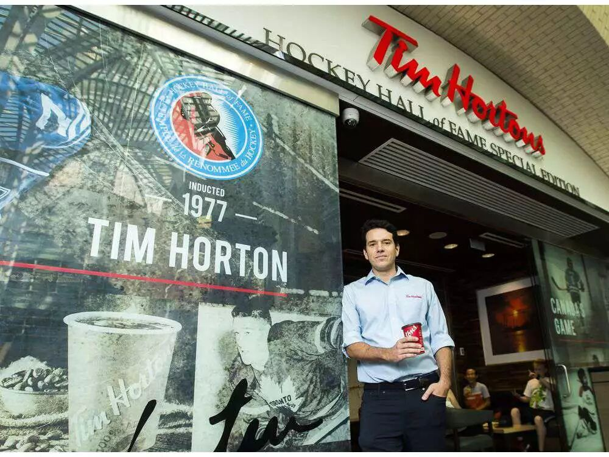
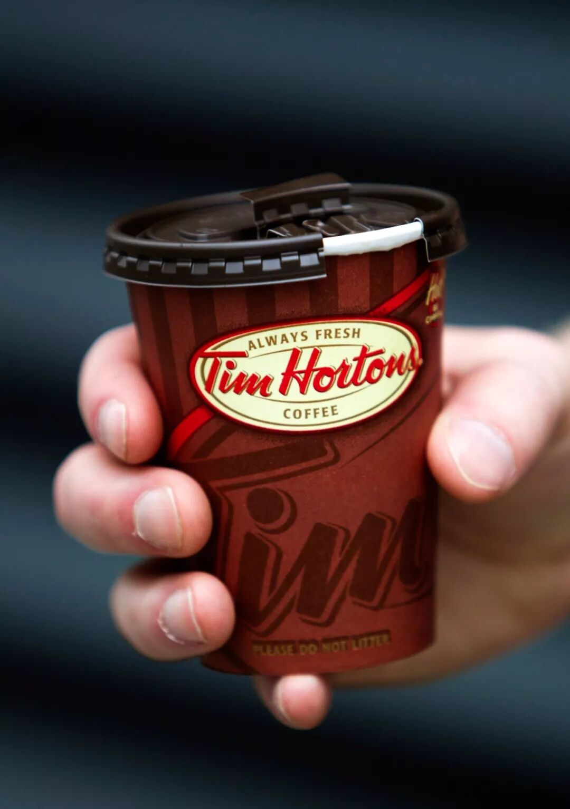
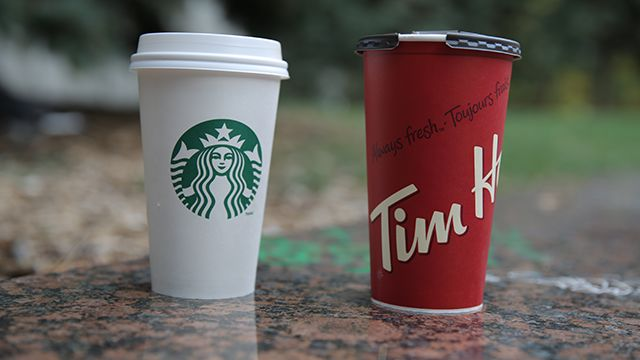

# 无标题

**链接地址:** http://mp.weixin.qq.com/s?__biz=MzI5NDMzNzM3OQ==&mid=2247487760&idx=1&sn=2b6e92bba193994069f970ec8ffd14c4&chksm=ec653f1cdb12b60a6ddca04103be7e1d736cf5f429e703ed00d138cd531f08f78150a2abd353&mpshare=1&scene=2&srcid=0819rLAaRbItiYjkBQBFPPE7#rd
**作者:** 
**获取时间:** 2025/8/28 21:37:38
**图片数量:** 16

---

## 原始HTML内容

<section class="" style="max-width: 100%;color: rgb(51, 51, 51);">&nbsp;<section class="" ng-click="onClick($event)" ng-model="eo.text" ng-style=" {
  'font-size'   : eo.fontSize,
  'font-family' : eo.fontFamily,
  'font-style'  : eo.fontStyle,
  'color'       : (eo.color || theme.majorColor),
} " placeholder="{ 点击编辑 }" stop-propagation="click mousedown mouseup" tn-edit-content="true" tn-page-editable="text0" tn-page-editable-type="ed-type-text" ui-on-drop="block($event)" style="margin-top: 0.7em;margin-left: -0.4em;padding: 1em;max-width: 100%;border-radius: 1em;width: 510.25px;color: inherit;font-family: inherit;font-size: 1em;display: inline-block;background-color: rgb(250, 200, 255);box-sizing: border-box !important;word-wrap: break-word !important;">&nbsp;&nbsp;&nbsp;吃喝玩乐卡尔加里YYC&nbsp;最近要大送豪礼，包括苹果 iPhone X！</section></section>
 
<section class="" style="max-width: 100%;color: rgb(51, 51, 51);"><section class="" ng-click="onClick($event)" ng-model="eo.text" ng-style=" {
  'font-size'   : eo.fontSize,
  'font-family' : eo.fontFamily,
  'font-style'  : eo.fontStyle,
  'color'       : (eo.color || theme.majorColor),
} " placeholder="{ 点击编辑 }" stop-propagation="click mousedown mouseup" tn-edit-content="true" tn-page-editable="text0" tn-page-editable-type="ed-type-text" ui-on-drop="block($event)" style="margin-top: 0.7em;margin-right: -0.4em;padding: 1em;max-width: 100%;border-radius: 1em;width: 510.25px;color: inherit;font-family: inherit;font-size: 1em;display: inline-block;background-color: rgb(188, 227, 249);box-sizing: border-box !important;word-wrap: break-word !important;">没错没错，记得『点击蓝字加关注』哟！机会随时到来！</section>&nbsp;&nbsp;</section><section class="" style="margin-top: 0.8em;margin-bottom: 0.5em;max-width: 100%;color: rgb(51, 51, 51);">
 
</section><section style="max-width: 100%;color: rgb(51, 51, 51);">真心实意，为您推荐！</section><section style="max-width: 100%;color: rgb(51, 51, 51);"> </section>

 

Tim Hortons的总裁表示，要想征服中国紧俏的咖啡市场，就需要根据当地饮食习惯和胃口来改造菜单。为此，Tim Hortons即将在经典的双奶双糖咖啡之外，提供米粥和抹茶。

总裁Alex Macedo认为，未来10年内在亚洲开1500家连锁咖啡店的计划，会遇到已占据当地市场的公司的强烈竞争。

“我们已经来晚了，这是肯定的，”Macedo在加通社的采访中说道。

他已多次往返亚洲，观摩即将与Tim Hortons竞争的当地咖啡承办商是如何运作的。这些公司包括：美国的星巴克、麦当劳以及Dunkin Donuts；北京的创业公司Luckin Coffee和英国的Costa Coffee连锁咖啡厅。

“他们营造了一种几乎是即进即出的氛围，节奏非常快，”他说，而在美国和加拿大，顾客买到咖啡后通常还会在店里坐坐。

中国咖啡厅的氛围，与Macedo想要创造的“家庭式”氛围不同。Macedo希望鼓励顾客在咖啡厅内相待多久就待多久，就像加拿大本地的Tims常客一样。

“我们希望团队成员是中国最好客的职员，”Macedo说，“如果客户想在咖啡厅坐上10个小时，就坐10个小时；想只点一杯咖啡就只点一杯咖啡；如果不想点咖啡也没关系。”

回国的小伙伴们没事去Tim Hortons店里品品咖啡、喝喝茶，回想一下在加拿大的时光吧~

此外，Tim Hortons还宣布了一个改革！

<strong style="max-width: 100%;box-sizing: border-box !important;word-wrap: break-word !important;">你有没有被Tim Hortons杯盖坑过？？</strong>

 

以撕裂的方式打开，放车上稍微一个转弯就哗哗直洒！

 

<strong style="max-width: 100%;box-sizing: border-box !important;word-wrap: break-word !important;"> </strong>

Tim Hortons承认，在产品包装上有不足，将从咖啡杯盖着手，改头换面。

快餐巨臂Tim Hortons的执行人员告诉加通社，公司目前使用的咖啡杯盖已经有20年的历史，有不少客人投诉说杯盖漏水。

公司总裁Alex Macedo表示，正在旗下6家分店内，测试一种对环境更加友好、盖得紧的新杯盖。

和星爸爸家的一对比，也确实寒碜了点昂~

他还表示，公司在杯盖改革上一直进程缓慢，是因为作为业界领导，许多特许经营人认为不值得花精力重新设计杯盖。

不过，希望杯盖换了以后，咖啡不涨价！

除此之外，Macedo还说，公司将进行新的营销计划，该计划基于与Tim Hortons有关的真实故事。

早期广告会包括这样一个故事：一个听觉障碍的女孩，每天都必须把点单写在Tim Hortons起雾的玻璃窗上，后来，有位员工为了和她交流去学习了手语。

（智苏编辑）

文章来源：加拿大都市

 

欢迎大家添加&nbsp;神通广大&nbsp;吃喝玩乐&nbsp;服务微信&nbsp;为好友！

相互照应，十分必要！

扫码即可！

 

 

 

 
<section style="max-width: 100%;color: rgb(51, 51, 51);">真诚为您推荐！</section><section class="" data-style="white-space: normal; text-align: left;font-size: 14px;line-height: 1.5em; color: rgb(12, 12, 12);" style="max-width: 100%;color: rgb(51, 51, 51);"><section style="margin-top: -1.2em;max-width: 100%;box-sizing: border-box;color: rgb(166, 166, 166);text-align: center;border-width: initial;border-style: none;border-color: initial;line-height: 1.4;word-wrap: break-word !important;"> </section><section class="" data-style="white-space: normal; text-align: left;font-size: 14px;line-height: 1.5em; color: rgb(12, 12, 12);" style="padding: 16px 16px 10px;max-width: 100%;box-sizing: border-box;font-size: 1em;line-height: 1.4;word-wrap: break-word !important;">
<strong style="max-width: 100%;color: rgb(62, 62, 62);font-size: 18px;text-align: justify;box-sizing: border-box !important;word-wrap: break-word !important;"><strong style="max-width: 100%;box-sizing: border-box !important;word-wrap: break-word !important;"><strong style="max-width: 100%;box-sizing: border-box !important;word-wrap: break-word !important;"><strong style="max-width: 100%;box-sizing: border-box !important;word-wrap: break-word !important;"></strong></strong></strong></strong>

<strong style="max-width: 100%;font-size: 18px;text-align: justify;box-sizing: border-box !important;word-wrap: break-word !important;"><strong style="max-width: 100%;box-sizing: border-box !important;word-wrap: break-word !important;"><strong style="max-width: 100%;box-sizing: border-box !important;word-wrap: break-word !important;"><strong style="max-width: 100%;box-sizing: border-box !important;word-wrap: break-word !important;"></strong></strong></strong></strong> 

 

<strong style="max-width: 100%;font-size: 18px;text-align: justify;box-sizing: border-box !important;word-wrap: break-word !important;"><strong style="max-width: 100%;box-sizing: border-box !important;word-wrap: break-word !important;"><strong style="max-width: 100%;box-sizing: border-box !important;word-wrap: break-word !important;"><strong style="max-width: 100%;box-sizing: border-box !important;word-wrap: break-word !important;"></strong></strong></strong></strong>

<strong style="max-width: 100%;font-size: 18px;text-align: justify;box-sizing: border-box !important;word-wrap: break-word !important;"><strong style="max-width: 100%;box-sizing: border-box !important;word-wrap: break-word !important;"><strong style="max-width: 100%;box-sizing: border-box !important;word-wrap: break-word !important;"><strong style="max-width: 100%;box-sizing: border-box !important;word-wrap: break-word !important;"></strong></strong></strong></strong> 

 

</section></section>
 

---

## 纯文本内容

吃喝玩乐卡尔加里YYC 最近要大送豪礼，包括苹果 iPhone X！没错没错，记得『点击蓝字加关注』哟！机会随时到来！  真心实意，为您推荐！Tim Hortons的总裁表示，要想征服中国紧俏的咖啡市场，就需要根据当地饮食习惯和胃口来改造菜单。为此，Tim Hortons即将在经典的双奶双糖咖啡之外，提供米粥和抹茶。总裁Alex Macedo认为，未来10年内在亚洲开1500家连锁咖啡店的计划，会遇到已占据当地市场的公司的强烈竞争。“我们已经来晚了，这是肯定的，”Macedo在加通社的采访中说道。他已多次往返亚洲，观摩即将与Tim Hortons竞争的当地咖啡承办商是如何运作的。这些公司包括：美国的星巴克、麦当劳以及Dunkin Donuts；北京的创业公司Luckin Coffee和英国的Costa Coffee连锁咖啡厅。“他们营造了一种几乎是即进即出的氛围，节奏非常快，”他说，而在美国和加拿大，顾客买到咖啡后通常还会在店里坐坐。中国咖啡厅的氛围，与Macedo想要创造的“家庭式”氛围不同。Macedo希望鼓励顾客在咖啡厅内相待多久就待多久，就像加拿大本地的Tims常客一样。“我们希望团队成员是中国最好客的职员，”Macedo说，“如果客户想在咖啡厅坐上10个小时，就坐10个小时；想只点一杯咖啡就只点一杯咖啡；如果不想点咖啡也没关系。”回国的小伙伴们没事去Tim Hortons店里品品咖啡、喝喝茶，回想一下在加拿大的时光吧~此外，Tim Hortons还宣布了一个改革！你有没有被Tim Hortons杯盖坑过？？以撕裂的方式打开，放车上稍微一个转弯就哗哗直洒！Tim Hortons承认，在产品包装上有不足，将从咖啡杯盖着手，改头换面。快餐巨臂Tim Hortons的执行人员告诉加通社，公司目前使用的咖啡杯盖已经有20年的历史，有不少客人投诉说杯盖漏水。公司总裁Alex Macedo表示，正在旗下6家分店内，测试一种对环境更加友好、盖得紧的新杯盖。和星爸爸家的一对比，也确实寒碜了点昂~他还表示，公司在杯盖改革上一直进程缓慢，是因为作为业界领导，许多特许经营人认为不值得花精力重新设计杯盖。不过，希望杯盖换了以后，咖啡不涨价！除此之外，Macedo还说，公司将进行新的营销计划，该计划基于与Tim Hortons有关的真实故事。早期广告会包括这样一个故事：一个听觉障碍的女孩，每天都必须把点单写在Tim Hortons起雾的玻璃窗上，后来，有位员工为了和她交流去学习了手语。（智苏编辑）文章来源：加拿大都市欢迎大家添加 神通广大 吃喝玩乐 服务微信 为好友！相互照应，十分必要！扫码即可！真诚为您推荐！

---

## 图片列表

-  (原始链接: https://mmbiz.qpic.cn/mmbiz/MVPvEL7Qg0EXNGDDXjhn7BQlLVZfE4a72NDhuKJZheaZoX3JcYZ8wicrltbzurnAx8Urww68iaiaaC541u0miaUGqg/640?)
-  (原始链接: https://mmbiz.qpic.cn/mmbiz/MVPvEL7Qg0EXNGDDXjhn7BQlLVZfE4a7eyibPmHcP5XBsBl0KZPM0LQibDWticwHV1SSxz8Ha4rjtk93ZD4sTPSsg/640?)
-  (原始链接: https://mmbiz.qpic.cn/mmbiz_jpg/E5oZzDjj1krUQpM9bj5FdOK0iarqXud4mIKoW6C1kXSpOayiaq1XfqH0dOt23X9s4d8FkYtGk0OqCrx3URk3zXiaQ/640?wx_fmt=jpeg)
-  (原始链接: https://mmbiz.qpic.cn/mmbiz_jpg/E5oZzDjj1krg70S5dqqia8wpBmp0u7ibWvurxxBrwHU6YUHpdrKOPJ2thhiaQAWncywSIyP6RaAFxH9WzMUvUFkbA/640?wx_fmt=jpeg)
-  (原始链接: https://mmbiz.qpic.cn/mmbiz_jpg/E5oZzDjj1koIN1Y38icljFMX6zwK8pw7b53PvUZlk9gXsIh45VRRWgBJXibBqiaeeJJv68NkFKuicodbcqOWCXUHicw/640?wx_fmt=jpeg)
-  (原始链接: https://mmbiz.qpic.cn/mmbiz_png/E5oZzDjj1korznwXHmfQ7aYIaG0UJMDRhykrwCMh7dttU2MfsKwBQ3VbBbfUujjQeR6KFxbyiaUlJDPafL6fcwQ/640?wx_fmt=png)
-  (原始链接: https://mmbiz.qpic.cn/mmbiz_jpg/ydG8L0teC7GNKFLdMY3jsR8PQ5WcpTdrH3NAnDLbhuczNyn8QMJN16sJGHQibTBuWbacqdKz1h9Wl7esQ6TqB7Q/640?wx_fmt=jpeg)
-  (原始链接: https://mmbiz.qpic.cn/mmbiz_jpg/ydG8L0teC7GNKFLdMY3jsR8PQ5WcpTdrYXU6DWmuIF3d9pfpJ2nQo9Tb1JBthhFibweGnolNwzA72NicHWscleOA/640?wx_fmt=jpeg)
-  (原始链接: https://mmbiz.qpic.cn/mmbiz_png/ydG8L0teC7GNKFLdMY3jsR8PQ5WcpTdrdC4TI0NmnpwEvgSzoW4PpHbic4Gnrn7nq88LqTw8dVQesibsObu6ElJA/640?wx_fmt=png)
-  (原始链接: https://mmbiz.qpic.cn/mmbiz_jpg/mZIpZ2dRo6Z5Lg6L4yBuvZf7QibxfKVYiaibWZ0TgYUSaib6Kt9bF0BhOS7r5v3zCAdNJ6PubAKsoohqPxVjIFWX9w/640?wx_fmt=jpeg)
-  (原始链接: https://mmbiz.qpic.cn/mmbiz_jpg/E5oZzDjj1kqmyBd2wXyJpdlTKRQv5yEo8q6MibdN8KaEpc8HasuicnnICaTm5SyBmFzYHh7Ypj7IianbCxEfHk2lg/640?wx_fmt=jpeg)
-  (原始链接: https://mmbiz.qpic.cn/mmbiz_jpg/E5oZzDjj1kqOCLqCN2NbQAMUbagjVS03xgLrw0N6XMoBSZS1ykNxrwfWZiaj5dHXZWqFdCfVurm8R3oSF82FJqQ/640?wx_fmt=jpeg)
-  (原始链接: https://mmbiz.qpic.cn/mmbiz_jpg/E5oZzDjj1koNJW9uUHaESKwdYBXwmKW1qj69v3qOjy7szM8OibukgwicGibjP2x1Xeqic9bKbg2a2f2qRBSzicsX20w/640?wx_fmt=jpeg)
-  (原始链接: https://mmbiz.qpic.cn/mmbiz_jpg/E5oZzDjj1koNJW9uUHaESKwdYBXwmKW1N0JZ1iaAG5IJ84TC3KQzv1rNHdaiaic9ZibfOCBUL1yhIWnK0ScaWEibQ4A/640?wx_fmt=jpeg)
-  (原始链接: https://mmbiz.qpic.cn/mmbiz_jpg/E5oZzDjj1krFNNmqiaVW3RVdTIANicfJ6BibMoyEmfm5Bscqn3NFAArz5lafNH1OTexHamNNp51ibcpFJqJKHjhiahw/640?wx_fmt=jpeg)
-  (原始链接: http://mmbiz.qpic.cn/mmbiz/E5oZzDjj1kqdHwQ2zpsHXPvFpF81yEia17OibFaAfyBwQYD1iakM7T1PlagpPx6bCbw4qeARbPEgmqPsmYtLv46cQ/640?wx_fmt=jpeg)
