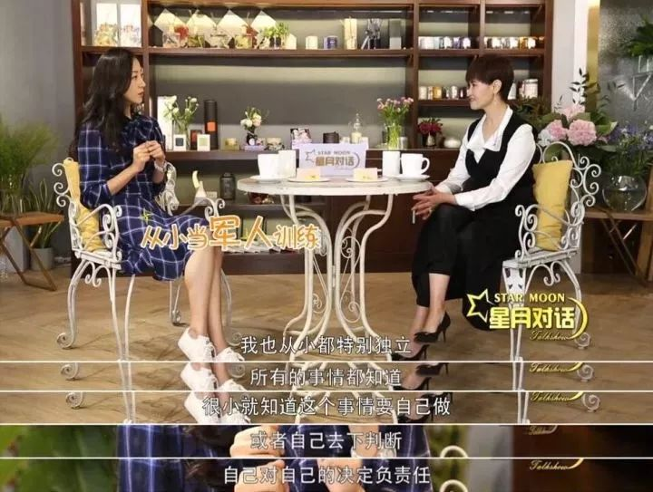
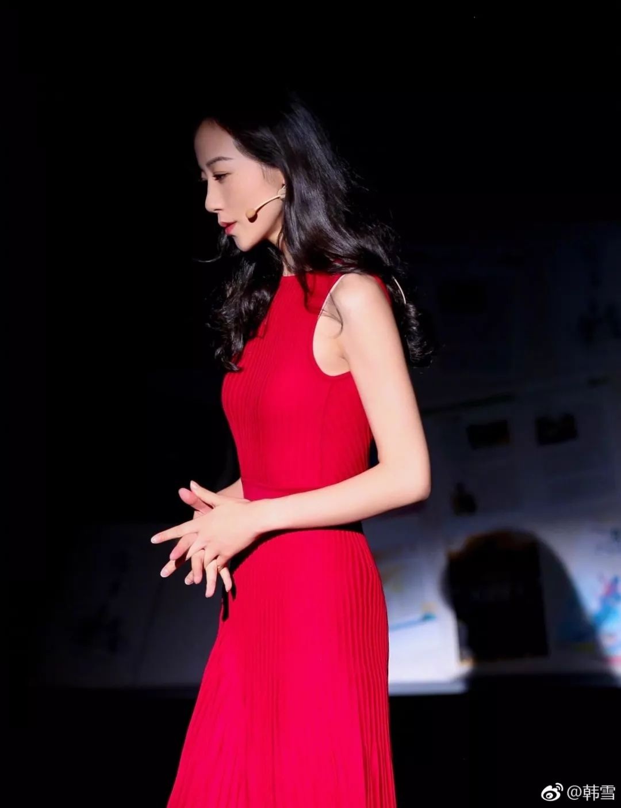
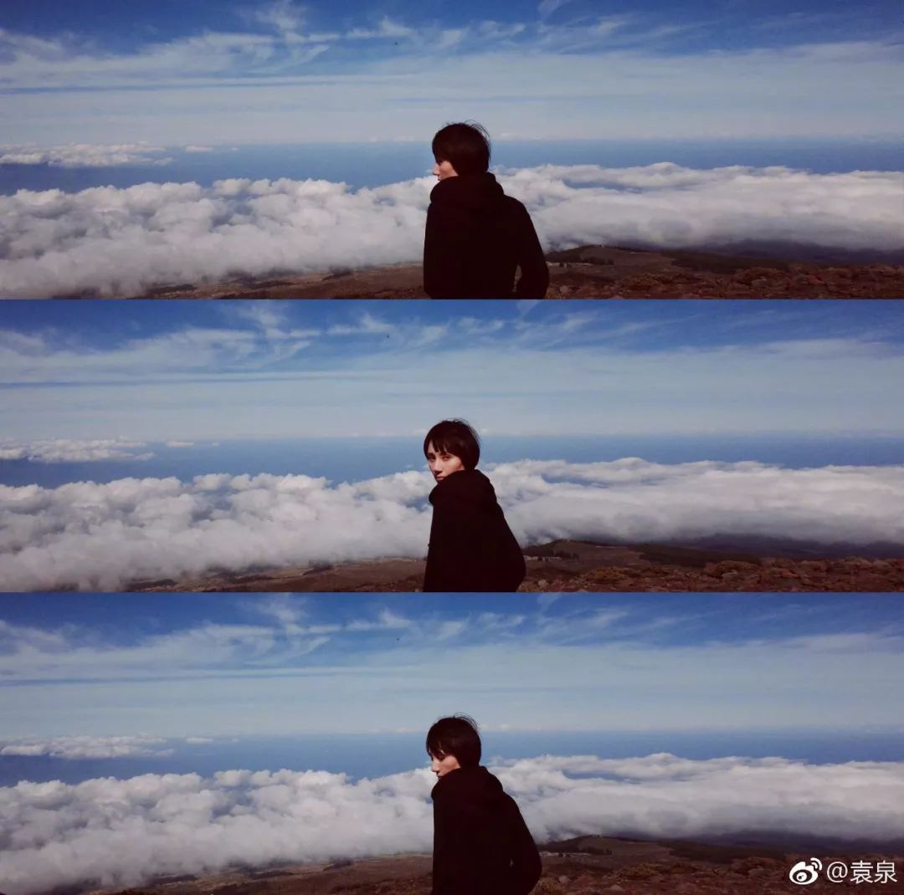
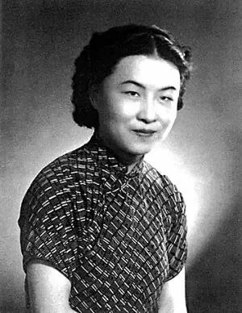

# 无标题

**链接地址:** http://mp.weixin.qq.com/s?__biz=MzIxMjAxMTQzNA==&mid=2654501286&idx=1&sn=59a6689a856ef3314b7432aa124b2aa8&chksm=8c804963bbf7c075dee774a9e301c769130012c0a663e06538f8f4b6204e5cc50122bdbd44b7&mpshare=1&scene=2&srcid=082145gqEFVRFASYOx3i1Phz#rd
**作者:** 为你发现美-
**获取时间:** 2025/8/28 21:37:02
**图片数量:** 12

---

## 原始HTML内容

本文章已由”美物计“微信公众号（ID：huanqiukanke）进行授权

若需转载请联系“美物计”

 

<qqmusic commentid="00111" class="edui-faked-music res_iframe qqmusic_iframe js_editor_qqmusic" singername="undefined" musicid="106510080" mid="002UGgbK3BqygA" albumurl="https://y.gtimg.cn/music/photo_new/T002R68x68M0000032dEmi4FbHRM.jpg" audiourl="http://isure.stream.qqmusic.qq.com/C200002UGgbK3BqygA.m4a?guid=2000001731&amp;vkey=2307C5B37AFEB708A332EBE6995F0539CE2E902EE94A277A61C16A77EB7D48439A86A772513ECA12A817AC1EBE39695FE72A0262EDAB7605&amp;uin=&amp;fromtag=50" music_name="Stardust" singer="undefined" data-tite="undefined" src="/cgi-bin/readtemplate?t=tmpl/qqmusic_tmpl&amp;singer=Mika%20-%20Stardust&amp;music_name=Stardust&amp;albumurl=https%3A%2F%2Fy.gtimg.cn%2Fmusic%2Fphoto_new%2FT002R68x68M0000032dEmi4FbHRM.jpg&amp;musictype=1"></qqmusic>

<strong style="max-width: 100%;box-sizing: border-box !important;word-wrap: break-word !important;">一个女人见过世面是什么样子？</strong>

在节目《女人有话说》里， 

几个女明星聊起来择偶标准， 

有人喜欢帅的，有人喜欢个子高的。

韩雪却说<strong style="max-width: 100%;box-sizing: border-box !important;word-wrap: break-word !important;">：“我喜欢见过世面的男生，</strong>

<strong style="max-width: 100%;box-sizing: border-box !important;word-wrap: break-word !important;">不喜欢对世界还蠢蠢欲动的男生。”</strong>

 

接着她补充道：

<strong style="max-width: 100%;box-sizing: border-box !important;word-wrap: break-word !important;">“</strong><strong style="max-width: 100%;box-sizing: border-box !important;word-wrap: break-word !important;">你只有真的读懂过生活，看过世界，</strong>

<strong style="max-width: 100%;box-sizing: border-box !important;word-wrap: break-word !important;">你才会珍惜眼前所拥有的东西。</strong><strong style="max-width: 100%;box-sizing: border-box !important;word-wrap: break-word !important;">”</strong>

她话音刚落，

节目中有位女作家就点头称赞： 

<strong style="max-width: 100%;box-sizing: border-box !important;word-wrap: break-word !important;">“这就是见过世面的女人的择偶标准。”</strong>

 

 

<strong style="max-width: 100%;box-sizing: border-box !important;word-wrap: break-word !important;">01</strong>

<strong style="max-width: 100%;box-sizing: border-box !important;word-wrap: break-word !important;">见过世面</strong> 

<strong style="max-width: 100%;box-sizing: border-box !important;word-wrap: break-word !important;">才知道自己要什么</strong>

 

韩雪出身军人家庭，

父母都不同意她进娱乐圈，

但她坚持报考上戏。

到大二的时候，因为片约实在太多，

学校让她在课业和事业将做选择，

她又毅然退学了。

她说：“从没后悔过。”

 

 

出道18年的韩雪把生活过得丰盈无比。

参加《声临其境》时，

嘉宾们的台词功底和专业技能都很厉害，

但韩雪却丝毫不怯场，

还想玩点不一样的。

“我一直觉得，如果大家都这么配就不好玩，

我就总想做一点小小的突破。”

于是，她同时给八个角色配音，

一个人就把《头脑特工队》演绎得活灵活现。

 

<strong style="max-width: 100%;box-sizing: border-box !important;word-wrap: break-word !important;">一个见过世面的女人，&nbsp;</strong>

<strong style="max-width: 100%;box-sizing: border-box !important;word-wrap: break-word !important;">知道自己要什么，不要什么，</strong>

<strong style="max-width: 100%;box-sizing: border-box !important;word-wrap: break-word !important;">清楚自己的位置，</strong>

<strong style="max-width: 100%;box-sizing: border-box !important;word-wrap: break-word !important;">拥有独立、成熟的世界观。</strong>

<strong style="max-width: 100%;box-sizing: border-box !important;word-wrap: break-word !important;">所以，她们在爱情中自信、经济上独立、</strong>

<strong style="max-width: 100%;box-sizing: border-box !important;word-wrap: break-word !important;">事业上有目标感。</strong>

<strong style="max-width: 100%;box-sizing: border-box !important;word-wrap: break-word !important;"> </strong>

 

<strong style="max-width: 100%;box-sizing: border-box !important;word-wrap: break-word !important;">&nbsp;02</strong>

<strong style="max-width: 100%;box-sizing: border-box !important;word-wrap: break-word !important;">见过世面</strong>

<strong style="max-width: 100%;box-sizing: border-box !important;word-wrap: break-word !important;">知道世界有多大</strong>

 

眼界决定你能看到的世界有多大，

读过的书，走过的路，决定你的气质。

有个网友曾经在微博上爆料，

她家附近有一所美术培训班，

每周六都能看到袁泉送女儿过来上课。

在等待下课的空闲里，

其他家长都是坐在一起闲聊、玩手机，

<strong style="max-width: 100%;box-sizing: border-box !important;word-wrap: break-word !important;">而袁泉总是拿出随身携带的书，</strong>

<strong style="max-width: 100%;box-sizing: border-box !important;word-wrap: break-word !important;">一个人静静地阅读。</strong>

&nbsp;

袁泉绝对是见过世面的女人，

自信而独立，从容而优雅。

<strong style="max-width: 100%;box-sizing: border-box !important;word-wrap: break-word !important;">是因为看书才让她变得更深刻。</strong>

<strong style="max-width: 100%;line-height: 1.6;box-sizing: border-box !important;word-wrap: break-word !important;">多看几本书，</strong>

<strong style="max-width: 100%;box-sizing: border-box !important;word-wrap: break-word !important;">在书里找到适用自己的哲学，</strong>

<strong style="max-width: 100%;box-sizing: border-box !important;word-wrap: break-word !important;">体验世界的辽阔和宽广。</strong>

 

 

袁泉也保持着对世界好奇，

她不忙着走红毯、抢镁光灯，

有空就去旅行，

山区、乡村、沙漠、海洋……

爱其所爱，行其所行。

<strong style="max-width: 100%;color: rgb(51, 51, 51);font-size: 17px;letter-spacing: 0.544px;line-height: 1.75em;text-align: justify;box-sizing: border-box !important;word-wrap: break-word !important;">是行走让她变得视野开阔。</strong>

<strong style="max-width: 100%;color: rgb(51, 51, 51);font-size: 17px;letter-spacing: 0.544px;line-height: 1.75em;text-align: justify;box-sizing: border-box !important;word-wrap: break-word !important;"> </strong>

<strong style="max-width: 100%;box-sizing: border-box !important;word-wrap: break-word !important;">书能洗心，行能养魂，</strong>

<strong style="max-width: 100%;box-sizing: border-box !important;word-wrap: break-word !important;">一个女孩给自己最好的礼物，</strong>

<strong style="max-width: 100%;box-sizing: border-box !important;word-wrap: break-word !important;">不是买多少衣服，</strong>

<strong style="max-width: 100%;box-sizing: border-box !important;word-wrap: break-word !important;">而是通过各种方式多见见世面。</strong>

<strong style="max-width: 100%;box-sizing: border-box !important;word-wrap: break-word !important;"> </strong>

 

<strong style="max-width: 100%;box-sizing: border-box !important;word-wrap: break-word !important;">03</strong>

<strong style="max-width: 100%;box-sizing: border-box !important;word-wrap: break-word !important;">见过世面</strong>

<strong style="max-width: 100%;box-sizing: border-box !important;word-wrap: break-word !important;">才不会被世界伤害</strong>

 

好友在深夜里哭着打电话过来， 

原来，她无意中发现男友竟然还和前任有联系。

<strong style="max-width: 100%;box-sizing: border-box !important;word-wrap: break-word !important;">“他给前任买了一个名牌包包，还约她出来吃饭。”</strong>

<strong style="max-width: 100%;box-sizing: border-box !important;word-wrap: break-word !important;">“这是脚踩两条船啊，你不打算分手？”</strong>

她犹豫了一会，竟然反问我：

<strong style="max-width: 100%;box-sizing: border-box !important;word-wrap: break-word !important;">“但是他平时对我也很好。过节会给我送礼物，</strong>

<strong style="max-width: 100%;box-sizing: border-box !important;word-wrap: break-word !important;">情人节会给我发红包，出去吃饭也是他主动买单……”</strong>

可是姑娘，这就是所谓的“好”？

你只值这些吗？

 

 

见过世面的姑娘，不会被轻易诱惑。

知乎上有个热门回答：

一个女生去相亲，

饭后，她主动结算了餐费。

两人在商场闲逛时，

男方买了一支口红要送给她，

女生误以为他是在委婉的补上餐费，

就接受了。

没想到他从此就以男朋友自居，

三五不时的打扰她，

女生忍无可忍地挑明了：

“<strong style="max-width: 100%;box-sizing: border-box !important;word-wrap: break-word !important;">我们还没有交往，你这样很不合适。</strong>”

男方却振振有词地说：

“我对你这么好，都给你买口红了，

你还不愿意做我女朋友？”

女生立刻把口红的钱退给他，说：

<strong style="max-width: 100%;box-sizing: border-box !important;word-wrap: break-word !important;">“对不起，我不是一支口红就能打动的女孩。”</strong>

 

见过世面的姑娘， 

不会因为一支口红，一个包包，

或者仅仅是“对我很好”，而喜欢一个男人。

<strong style="max-width: 100%;box-sizing: border-box !important;word-wrap: break-word !important;">见过世面的姑娘，</strong>

<strong style="max-width: 100%;box-sizing: border-box !important;word-wrap: break-word !important;">更珍爱自己，不卑不亢。</strong>

<strong style="max-width: 100%;box-sizing: border-box !important;word-wrap: break-word !important;">在一段爱情里，倘若看走眼， </strong>

<strong style="max-width: 100%;box-sizing: border-box !important;word-wrap: break-word !important;">能够及时止损，勇敢的断开。</strong>

<strong style="max-width: 100%;box-sizing: border-box !important;word-wrap: break-word !important;"><strong style="max-width: 100%;color: rgb(51, 51, 51);box-sizing: border-box !important;word-wrap: break-word !important;">姑娘，你一定要见过世</strong></strong><strong style="max-width: 100%;color: rgb(51, 51, 51);box-sizing: border-box !important;word-wrap: break-word !important;">面，</strong> 

<strong style="max-width: 100%;color: rgb(51, 51, 51);box-sizing: border-box !important;word-wrap: break-word !important;">才不容易被世界所伤害。</strong>

<strong style="max-width: 100%;color: rgb(51, 51, 51);box-sizing: border-box !important;word-wrap: break-word !important;"> </strong>

 

<strong style="max-width: 100%;box-sizing: border-box !important;word-wrap: break-word !important;">04</strong>

<strong style="max-width: 100%;box-sizing: border-box !important;word-wrap: break-word !important;">见过世面</strong>

<strong style="max-width: 100%;box-sizing: border-box !important;word-wrap: break-word !important;">才能大气从容地活着</strong>

 

杨绛先生成长于开明平等的新式家庭，

虽算不上大富大贵，

但也并不比别人低一等。

而钱钟书先生却出身严厉古板的传统家庭，

名门望族，家规繁多。

 

结婚的时候，两家起了冲突。

钱父说：“这婚礼，新娘子必须要穿红衣，

在钱家祖先群像面前、长辈面前跪拜磕头，

才算钱家的媳妇，这个礼不能少！”

杨父斥责道：“这都是前清的废礼，

未免太过于迂腐。”

照理说，受新时代思想影响的杨绛，

也应强烈反对这种旧规。

但是面对二老的面红耳赤，

她只淡淡地说了句“不过礼节而已，不重要”

 

 

结婚当日她遵循规矩，

向钱钟书的父母磕头跪拜。 

这不是牺牲，也不是妥协， 

而恰恰是眼界和格局的开阔，

懂得以平等的姿态处事。

 

<strong style="max-width: 100%;box-sizing: border-box !important;word-wrap: break-word !important;">见过世面， </strong>

<strong style="max-width: 100%;box-sizing: border-box !important;word-wrap: break-word !important;">是见过世界的每一面。</strong>

<strong style="max-width: 100%;box-sizing: border-box !important;word-wrap: break-word !important;">能享受最好的，能承受最坏的</strong>

<strong style="max-width: 100%;box-sizing: border-box !important;word-wrap: break-word !important;">都能以平常心对待。</strong>

<strong style="max-width: 100%;box-sizing: border-box !important;word-wrap: break-word !important;">有傲骨也有慈悲，</strong>

<strong style="max-width: 100%;box-sizing: border-box !important;word-wrap: break-word !important;">世事万象，了然于心，尊卑自如。</strong>

 

 

<strong style="max-width: 100%;box-sizing: border-box !important;word-wrap: break-word !important;">05</strong>

<strong style="max-width: 100%;box-sizing: border-box !important;word-wrap: break-word !important;">什么才算见过世面？</strong>

 

<strong style="max-width: 100%;box-sizing: border-box !important;word-wrap: break-word !important;">· 清楚知道自己是谁。</strong>

 

尽我所能心如明镜知道自己在哪，

自己有多少能力，以及能怎样。

清楚地知道，山外有山，人外有人，而物欲无止境。

无论遭遇什么， 

都不会丢弃内心的高贵和尊严。

你要见的世面，

更是自己内心的勇敢和自信。 

 

<strong style="max-width: 100%;line-height: 1.6;box-sizing: border-box !important;word-wrap: break-word !important;">· 知道世界有多大</strong> 

<strong style="max-width: 100%;box-sizing: border-box !important;word-wrap: break-word !important;"> </strong>

这里的世界之大不是一个人应该有多富有，

认识多少奢侈品，品得出多少红酒的口感，

而是知道世界的宽度与广度，

见过世面，不在于见识过最好和最坏，

而在于我知道这世间有最好和最坏，

知道这世界的轻重，

在这之间，我如何更从容地面对。 

 

<strong style="max-width: 100%;box-sizing: border-box !important;word-wrap: break-word !important;">· 知道怎样以最适合自己的方式活着。</strong>

 

希望所有姑娘都能在这个时代，

活出自己想要的姿态，

最舒服的状态，

有不怕被世俗打倒的底气，

懂得在兵荒马乱的生活中，取悦自己，

能万众瞩目，也能平淡生活。

 

<strong style="color: rgb(62, 62, 62);font-size: 16.3636px;white-space: pre-wrap;widows: 1;background-color: rgb(255, 255, 255);margin: 0px;padding: 0px;max-width: 100%;box-sizing: border-box !important;overflow-wrap: break-word !important;"><em style="margin: 0px;padding: 0px;max-width: 100%;box-sizing: border-box !important;overflow-wrap: break-word !important;">- END -</em></strong>

 

 
<section class="" style="color: inherit;font-family: inherit;font-size: 1em;white-space: normal;text-decoration: inherit;margin: 0px;padding: 0px;max-width: 100%;box-sizing: border-box;widows: 1;line-height: 25px;border-width: 0px;border-style: initial;border-color: initial;clear: both;text-align: justify;background-color: rgb(255, 255, 255);overflow-wrap: break-word !important;"><section class="" style="margin: 0px;padding: 0px;max-width: 100%;box-sizing: border-box;overflow-wrap: break-word !important;">
健身并不是为了向别人炫耀什么

只是为了遇见更好的自己。
</section></section>
 

 

---

## 纯文本内容

本文章已由”美物计“微信公众号（ID：huanqiukanke）进行授权若需转载请联系“美物计”一个女人见过世面是什么样子？在节目《女人有话说》里，几个女明星聊起来择偶标准，有人喜欢帅的，有人喜欢个子高的。韩雪却说：“我喜欢见过世面的男生，不喜欢对世界还蠢蠢欲动的男生。”接着她补充道：“你只有真的读懂过生活，看过世界，你才会珍惜眼前所拥有的东西。”她话音刚落，节目中有位女作家就点头称赞：“这就是见过世面的女人的择偶标准。”01见过世面才知道自己要什么韩雪出身军人家庭，父母都不同意她进娱乐圈，但她坚持报考上戏。到大二的时候，因为片约实在太多，学校让她在课业和事业将做选择，她又毅然退学了。她说：“从没后悔过。”出道18年的韩雪把生活过得丰盈无比。参加《声临其境》时，嘉宾们的台词功底和专业技能都很厉害，但韩雪却丝毫不怯场，还想玩点不一样的。“我一直觉得，如果大家都这么配就不好玩，我就总想做一点小小的突破。”于是，她同时给八个角色配音，一个人就把《头脑特工队》演绎得活灵活现。一个见过世面的女人， 知道自己要什么，不要什么，清楚自己的位置，拥有独立、成熟的世界观。所以，她们在爱情中自信、经济上独立、事业上有目标感。 02见过世面知道世界有多大眼界决定你能看到的世界有多大，读过的书，走过的路，决定你的气质。有个网友曾经在微博上爆料，她家附近有一所美术培训班，每周六都能看到袁泉送女儿过来上课。在等待下课的空闲里，其他家长都是坐在一起闲聊、玩手机，而袁泉总是拿出随身携带的书，一个人静静地阅读。 袁泉绝对是见过世面的女人，自信而独立，从容而优雅。是因为看书才让她变得更深刻。多看几本书，在书里找到适用自己的哲学，体验世界的辽阔和宽广。袁泉也保持着对世界好奇，她不忙着走红毯、抢镁光灯，有空就去旅行，山区、乡村、沙漠、海洋……爱其所爱，行其所行。是行走让她变得视野开阔。书能洗心，行能养魂，一个女孩给自己最好的礼物，不是买多少衣服，而是通过各种方式多见见世面。03见过世面才不会被世界伤害好友在深夜里哭着打电话过来，原来，她无意中发现男友竟然还和前任有联系。“他给前任买了一个名牌包包，还约她出来吃饭。”“这是脚踩两条船啊，你不打算分手？”她犹豫了一会，竟然反问我：“但是他平时对我也很好。过节会给我送礼物，情人节会给我发红包，出去吃饭也是他主动买单……”可是姑娘，这就是所谓的“好”？你只值这些吗？见过世面的姑娘，不会被轻易诱惑。知乎上有个热门回答：一个女生去相亲，饭后，她主动结算了餐费。两人在商场闲逛时，男方买了一支口红要送给她，女生误以为他是在委婉的补上餐费，就接受了。没想到他从此就以男朋友自居，三五不时的打扰她，女生忍无可忍地挑明了：“我们还没有交往，你这样很不合适。”男方却振振有词地说：“我对你这么好，都给你买口红了，你还不愿意做我女朋友？”女生立刻把口红的钱退给他，说：“对不起，我不是一支口红就能打动的女孩。”见过世面的姑娘，不会因为一支口红，一个包包，或者仅仅是“对我很好”，而喜欢一个男人。见过世面的姑娘，更珍爱自己，不卑不亢。在一段爱情里，倘若看走眼，能够及时止损，勇敢的断开。姑娘，你一定要见过世面，才不容易被世界所伤害。04见过世面才能大气从容地活着杨绛先生成长于开明平等的新式家庭，虽算不上大富大贵，但也并不比别人低一等。而钱钟书先生却出身严厉古板的传统家庭，名门望族，家规繁多。结婚的时候，两家起了冲突。钱父说：“这婚礼，新娘子必须要穿红衣，在钱家祖先群像面前、长辈面前跪拜磕头，才算钱家的媳妇，这个礼不能少！”杨父斥责道：“这都是前清的废礼，未免太过于迂腐。”照理说，受新时代思想影响的杨绛，也应强烈反对这种旧规。但是面对二老的面红耳赤，她只淡淡地说了句“不过礼节而已，不重要”结婚当日她遵循规矩，向钱钟书的父母磕头跪拜。这不是牺牲，也不是妥协，而恰恰是眼界和格局的开阔，懂得以平等的姿态处事。见过世面，是见过世界的每一面。能享受最好的，能承受最坏的都能以平常心对待。有傲骨也有慈悲，世事万象，了然于心，尊卑自如。05什么才算见过世面？· 清楚知道自己是谁。尽我所能心如明镜知道自己在哪，自己有多少能力，以及能怎样。清楚地知道，山外有山，人外有人，而物欲无止境。无论遭遇什么，都不会丢弃内心的高贵和尊严。你要见的世面，更是自己内心的勇敢和自信。· 知道世界有多大这里的世界之大不是一个人应该有多富有，认识多少奢侈品，品得出多少红酒的口感，而是知道世界的宽度与广度，见过世面，不在于见识过最好和最坏，而在于我知道这世间有最好和最坏，知道这世界的轻重，在这之间，我如何更从容地面对。· 知道怎样以最适合自己的方式活着。希望所有姑娘都能在这个时代，活出自己想要的姿态，最舒服的状态，有不怕被世俗打倒的底气，懂得在兵荒马乱的生活中，取悦自己，能万众瞩目，也能平淡生活。- END -健身并不是为了向别人炫耀什么只是为了遇见更好的自己。

---

## 图片列表

-  (原始链接: https://mmbiz.qpic.cn/mmbiz_gif/JHSicE0gKzTjQVnCZ14iby7j9SyXaeHnIM8icAlNcibczPCKAVQQKicD4RVVWaN78iayhQrV2FhMC44SOJafxKfgThZg/640?wx_fmt=gif)
-  (原始链接: https://mmbiz.qpic.cn/mmbiz_gif/dGGnZchkFJytPNPCLpRPvAVUdcrQtiaxjvSNTF5I8iambTiay7ic4Le9n2en5tdn0stlaRUkl2bOq7LehZmSYVRFaw/640?wx_fmt=gif)
-  (原始链接: https://mmbiz.qpic.cn/mmbiz_jpg/Cols9XPNc5VLOk52MdYpdsHx45HgYMAhMo0M8DJRU9PXIfqoakq3dlaksDyECku2dZXibVsTj2Qy63MC8Ls8zibw/640?wx_fmt=jpeg)
-  (原始链接: https://mmbiz.qpic.cn/mmbiz_jpg/Cols9XPNc5VLOk52MdYpdsHx45HgYMAhiaTwnWCd6cYxnria7RyH0AVpxuwpyuP0bXnS2g0ia6FShjWQrc9LH4LZg/640?wx_fmt=jpeg)
-  (原始链接: https://mmbiz.qpic.cn/mmbiz_jpg/Cols9XPNc5VLOk52MdYpdsHx45HgYMAhMTEwUM2iaNibEPALkLr1hhm6gIbjY1nu1waVX6ic7FZ6gcduf7J4YwVcw/640?wx_fmt=jpeg)
-  (原始链接: https://mmbiz.qpic.cn/mmbiz_jpg/7CssjkxxFiclTPMpRicia1E7vdMAw3SfIoPyFAmn12qVyFgKicib22GagNLMWBjgzfKdGKJ9wWsU29FakCw6YiaklLCg/640?wx_fmt=jpeg)
-  (原始链接: https://mmbiz.qpic.cn/mmbiz_jpg/Cols9XPNc5VLOk52MdYpdsHx45HgYMAhZw5fdsSt2MMibicyk94s9uyzklib7iaEyHp9umAolTv1oGZdDfGWbibgBOg/640?wx_fmt=jpeg)
-  (原始链接: https://mmbiz.qpic.cn/mmbiz_jpg/Cols9XPNc5VLOk52MdYpdsHx45HgYMAhOyqPxeficdFCzGV9UzAZNqSCXTm8w9ysF2dpO5VBzx40zKqHgID55kA/640?wx_fmt=jpeg)
-  (原始链接: https://mmbiz.qpic.cn/mmbiz_png/Cols9XPNc5VLOk52MdYpdsHx45HgYMAhGRC3iarL9qqRcq8qxejef8OtubQuibe3sU9MrJn0DxBrDIdyz9418Wvg/640?wx_fmt=png)
-  (原始链接: https://mmbiz.qpic.cn/mmbiz_jpg/Cols9XPNc5VLOk52MdYpdsHx45HgYMAhVSbqaslqcLyUNUhsPcENer5mG3ibEqAOUW5nUuEDxribUf2relgziaNCQ/640?wx_fmt=jpeg)
-  (原始链接: https://mmbiz.qpic.cn/mmbiz_jpg/Cols9XPNc5VLOk52MdYpdsHx45HgYMAhbDvFicpRrEJHt6UgOdF5XzFWlxEUWwV3iceyeWSxMfFSbqxmAWBShvPA/640?wx_fmt=jpeg)
-  (原始链接: https://mmbiz.qpic.cn/mmbiz_gif/JHSicE0gKzTgccgUXR7GxCqYBib70Y4XiaCLEzrdhuThLs6w5Xh3mQcDwlA8qlqcuaZaWFIHYpswgr7fcCcTcOKcA/640)
