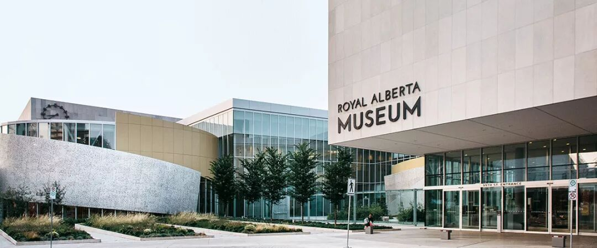
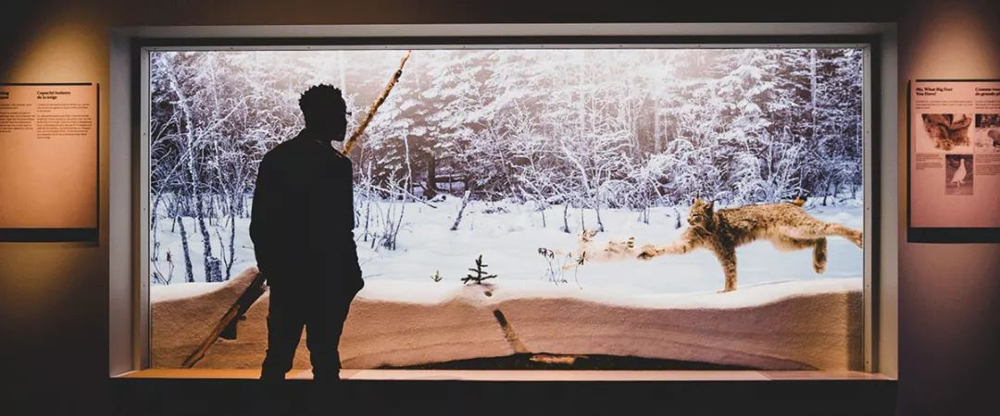
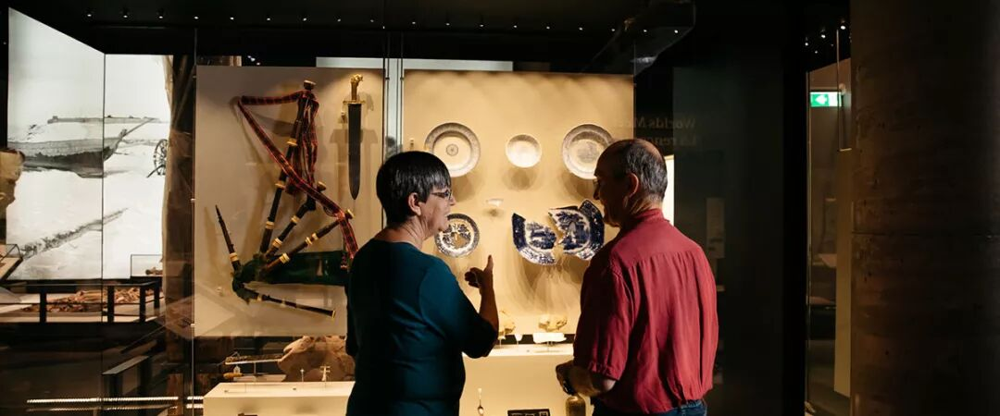
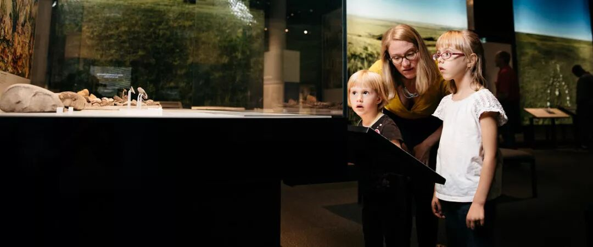
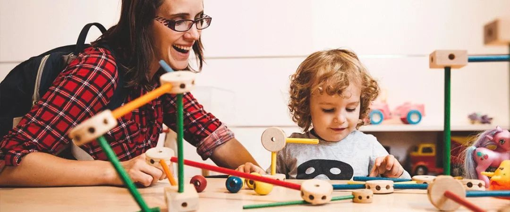
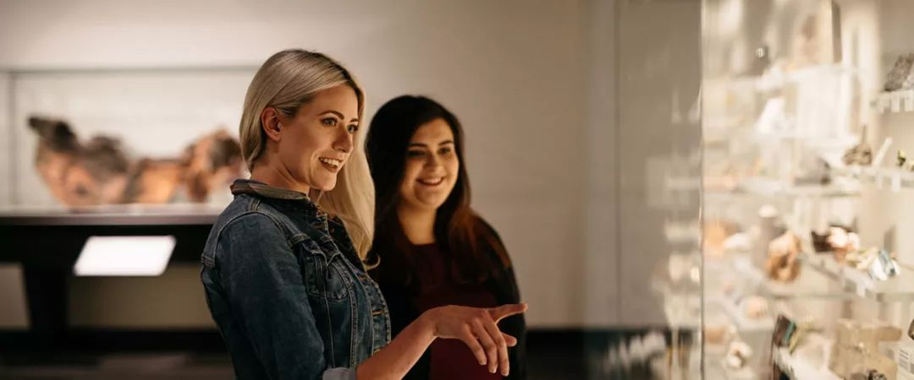
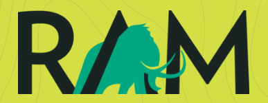
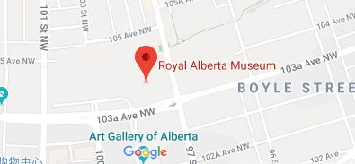

# 无标题

**链接地址:** http://mp.weixin.qq.com/s?__biz=MzI2NTE1ODgwOQ==&mid=2649604962&idx=1&sn=138f560118868e6676dbfb8db5e61398&chksm=f2b8ca94c5cf43829d0c27c6f257d4eade1327b1b5f4ddfafbdcafeb80f6942a8b8ebc68e012&mpshare=1&scene=2&srcid=0915D5Eew8t6dbRjxa9UMItV#rd
**作者:** 想念钱枫
**获取时间:** 2025/8/28 21:30:38
**图片数量:** 19

---

## 原始HTML内容

<section style="box-sizing: border-box;"><section class="V5" style="box-sizing: border-box;" powered-by="xiumi.us"><section style="margin-right: 0%;margin-left: 0%;box-sizing: border-box;"><section style="display: inline-block;vertical-align: middle;width: 80%;box-sizing: border-box;"><section class="V5" style="box-sizing: border-box;" powered-by="xiumi.us"><section style="margin-top: 10px;margin-bottom: 10px;text-align: center;box-sizing: border-box;"><section style="display: inline-block;box-sizing: border-box;"><section style="max-width: 100%;font-size: 0px;padding-bottom: 3px;box-sizing: border-box;"><section style="display: inline-block;vertical-align: middle;box-sizing: border-box;"><section style="width: 5px;height: 1px;background-color: rgb(217, 217, 217);box-sizing: border-box;"></section><section style="width: 1px;height: 5px;margin-top: -3px;margin-right: auto;margin-left: auto;background-color: rgb(217, 217, 217);box-sizing: border-box;"></section></section><section style="margin-top: -1px;margin-right: -5px;margin-left: -5px;width: 100%;display: inline-block;vertical-align: middle;padding-right: 8px;padding-left: 8px;box-sizing: border-box;"><section style="width: 100%;height: 1px;background-color: rgb(217, 217, 217);box-sizing: border-box;"></section></section><section style="display: inline-block;vertical-align: middle;box-sizing: border-box;"><section style="width: 5px;height: 1px;background-color: rgb(217, 217, 217);box-sizing: border-box;"></section><section style="width: 1px;height: 5px;margin-top: -3px;margin-right: auto;margin-left: auto;background-color: rgb(217, 217, 217);box-sizing: border-box;"></section></section></section><section style="padding-left: 15px;padding-right: 15px;color: rgb(161, 161, 161);font-size: 14px;box-sizing: border-box;">
点击上方<strong style="box-sizing: border-box;">蓝字</strong>关注我们哟~
</section><section style="max-width: 100%;font-size: 0px;box-sizing: border-box;"><section style="display: inline-block;vertical-align: middle;box-sizing: border-box;"><section style="width: 5px;height: 1px;background-color: rgb(217, 217, 217);box-sizing: border-box;"></section><section style="width: 1px;height: 5px;margin-top: -3px;margin-right: auto;margin-left: auto;background-color: rgb(217, 217, 217);box-sizing: border-box;"></section></section><section style="margin-top: -1px;margin-right: -5px;margin-left: -5px;width: 100%;display: inline-block;vertical-align: middle;padding-right: 8px;padding-left: 8px;box-sizing: border-box;"><section style="width: 100%;height: 1px;background-color: rgb(217, 217, 217);box-sizing: border-box;"></section></section><section style="display: inline-block;vertical-align: middle;box-sizing: border-box;"><section style="width: 5px;height: 1px;background-color: rgb(217, 217, 217);box-sizing: border-box;"></section><section style="width: 1px;height: 5px;margin-top: -3px;margin-right: auto;margin-left: auto;background-color: rgb(217, 217, 217);box-sizing: border-box;"></section></section></section></section></section></section></section><section style="display: inline-block;vertical-align: middle;width: 20%;box-sizing: border-box;"><section class="V5" style="box-sizing: border-box;" powered-by="xiumi.us"><section style="text-align: center;margin: -10px 0% 10px;box-sizing: border-box;"><section style="max-width: 100%;vertical-align: middle;display: inline-block;width: 100%;box-sizing: border-box;"></section></section></section></section></section></section><section class="V5" style="box-sizing: border-box;" powered-by="xiumi.us"><section style="margin: 10px 0%;box-sizing: border-box;"><section style="display: inline-block;width: 100%;vertical-align: top;box-sizing: border-box;"><section class="V5" style="box-sizing: border-box;" powered-by="xiumi.us"><section style="box-sizing: border-box;"><section style="display: inline-block;vertical-align: bottom;width: 75%;padding-right: 10px;box-sizing: border-box;"><section class="V5" style="box-sizing: border-box;" powered-by="xiumi.us"><section style="margin: 10px 0% 3px;box-sizing: border-box;"><section style="display: inline-block;vertical-align: middle;box-sizing: border-box;"><section style="display: inline-block;vertical-align: bottom;padding-left: 5px;padding-right: 5px;line-height: 1.2em;margin-bottom: 2px;color: rgba(80, 182, 201, 0.72);box-sizing: border-box;">
<strong style="box-sizing: border-box;">仔细看下图，有惊喜！</strong>
</section><section style="max-width: 100%;display: inline-block;vertical-align: bottom;width: 1.6em;box-sizing: border-box;"></section></section></section></section></section><section style="display: inline-block;vertical-align: bottom;width: 25%;box-sizing: border-box;"><section class="V5" style="box-sizing: border-box;" powered-by="xiumi.us"><section style="margin-right: 0%;margin-bottom: 3px;margin-left: 0%;text-align: right;box-sizing: border-box;"><section style="display: inline-block;border-bottom: 0.15em solid rgba(80, 182, 201, 0.72);padding-bottom: 3px;box-sizing: border-box;"><section style="display: inline-block;padding: 3px;border-bottom: 0.15em solid rgba(80, 182, 201, 0.72);font-size: 12px;line-height: 1.4;color: rgb(255, 143, 47);box-sizing: border-box;">
<strong style="box-sizing: border-box;">金主大大</strong>
</section></section></section></section></section></section></section><section class="V5" style="box-sizing: border-box;" powered-by="xiumi.us"><section style="margin-right: 0%;margin-left: 0%;box-sizing: border-box;"><section style="background-color: rgba(80, 182, 201, 0.72);height: 2px;box-sizing: border-box;"></section></section></section></section></section></section><section class="V5" style="box-sizing: border-box;" powered-by="xiumi.us"><section style="box-sizing: border-box;"><section style="box-sizing: border-box;"><section class="" powered-by="xiumi.us" style="max-width: 100%;box-sizing: border-box;color: rgb(51, 51, 51);font-family: -apple-system-font, BlinkMacSystemFont, &quot;Helvetica Neue&quot;, &quot;PingFang SC&quot;, &quot;Hiragino Sans GB&quot;, &quot;Microsoft YaHei UI&quot;, &quot;Microsoft YaHei&quot;, Arial, sans-serif;font-size: 17px;letter-spacing: 0.544px;text-align: justify;white-space: normal;background-color: rgb(255, 255, 255);word-wrap: break-word !important;"><section style="max-width: 100%;box-sizing: border-box;word-wrap: break-word !important;"><section style="max-width: 100%;box-sizing: border-box;word-wrap: break-word !important;"><section class="" powered-by="xiumi.us" style="max-width: 100%;box-sizing: border-box;letter-spacing: 0.544px;word-wrap: break-word !important;"><section style="max-width: 100%;box-sizing: border-box;word-wrap: break-word !important;"><section style="max-width: 100%;box-sizing: border-box;word-wrap: break-word !important;">

</section></section></section></section></section></section></section></section></section><section class="V5" style="box-sizing: border-box;" powered-by="xiumi.us"><section style="text-align: center;margin-top: 10px;margin-bottom: 10px;box-sizing: border-box;"><section style="max-width: 100%;vertical-align: middle;display: inline-block;box-sizing: border-box;"><svg xmlns="http://www.w3.org/2000/svg" x="0px" y="0px" viewBox="0 0 902.1 38.2" style="vertical-align: middle;max-width: 100%;box-sizing: border-box;" width="902.1"><g style="box-sizing: border-box;"><path style="box-sizing: border-box;" d="M18.4,1.4c0.9-1.9,2.4-1.9,3.4,0l3.4,6.9c0.9,1.9,3.4,3.7,5.4,4l7.6,1.1c2.1,0.3,2.5,1.7,1,3.2   l-5.5,5.4c-1.5,1.5-2.4,4.3-2.1,6.4l1.3,7.6c0.4,2.1-0.9,2.9-2.7,2l-6.8-3.6c-1.8-1-4.9-1-6.7,0l-6.8,3.6c-1.9,1-3.1,0.1-2.7-2   l1.3-7.6c0.4-2.1-0.6-4.9-2.1-6.4l-5.5-5.4c-1.5-1.5-1-2.9,1-3.2l7.6-1.1c2.1-0.3,4.5-2.1,5.4-4L18.4,1.4z" fill="rgb(178, 243, 230)"></path><path style="box-sizing: border-box;" d="M90.6,5.4c0.7-1.4,1.9-1.4,2.6,0l2.6,5.3c0.7,1.4,2.6,2.8,4.2,3.1l5.9,0.9c1.6,0.2,2,1.3,0.8,2.5   l-4.2,4.1c-1.2,1.1-1.9,3.3-1.6,4.9l1,5.8c0.3,1.6-0.7,2.3-2.1,1.5l-5.2-2.8c-1.4-0.8-3.8-0.8-5.2,0L84,33.6   c-1.4,0.8-2.4,0.1-2.1-1.5l1-5.8c0.3-1.6-0.5-3.8-1.6-4.9l-4.2-4.1c-1.2-1.1-0.8-2.2,0.8-2.5l5.9-0.9c1.6-0.2,3.5-1.6,4.2-3.1   L90.6,5.4z" fill="rgb(190, 204, 246)"></path><path style="box-sizing: border-box;" d="M162.6,7.5c0.6-1.2,1.6-1.2,2.2,0l2.2,4.5c0.6,1.2,2.2,2.4,3.6,2.6l5,0.7c1.4,0.2,1.7,1.1,0.7,2.1   l-3.6,3.5c-1,1-1.6,2.9-1.4,4.2l0.9,5c0.2,1.4-0.6,1.9-1.8,1.3l-4.5-2.4c-1.2-0.6-3.2-0.6-4.4,0l-4.5,2.4c-1.2,0.6-2,0.1-1.8-1.3   l0.9-5c0.2-1.4-0.4-3.3-1.4-4.2l-3.6-3.5c-1-1-0.7-1.9,0.7-2.1l5-0.7c1.4-0.2,3-1.4,3.6-2.6L162.6,7.5z" fill="rgb(150, 208, 240)"></path><path style="box-sizing: border-box;" d="M60.1,19.1c0,2.3-1.9,4.2-4.2,4.2c-2.3,0-4.2-1.9-4.2-4.2s1.9-4.2,4.2-4.2   C58.3,14.9,60.1,16.8,60.1,19.1z" fill="rgb(218, 240, 224)"></path><path style="box-sizing: border-box;" d="M203.8,19.1c0,2.3-1.9,4.2-4.2,4.2c-2.3,0-4.2-1.9-4.2-4.2s1.9-4.2,4.2-4.2   C201.9,14.9,203.8,16.8,203.8,19.1z" fill="rgb(218, 240, 224)"></path><path style="box-sizing: border-box;" d="M130.9,19.1c0,1.7-1.4,3.1-3.1,3.1c-1.7,0-3.1-1.4-3.1-3.1c0-1.7,1.4-3.1,3.1-3.1   C129.5,16.1,130.9,17.4,130.9,19.1z" fill="rgb(218, 240, 224)"></path><path style="box-sizing: border-box;" d="M233.9,1.4c0.9-1.9,2.4-1.9,3.4,0l3.4,6.9c0.9,1.9,3.4,3.7,5.4,4l7.6,1.1c2.1,0.3,2.5,1.7,1,3.2   l-5.5,5.4c-1.5,1.5-2.4,4.3-2.1,6.4l1.3,7.6c0.4,2.1-0.9,2.9-2.7,2l-6.8-3.6c-1.8-1-4.9-1-6.7,0l-6.8,3.6c-1.9,1-3.1,0.1-2.7-2   l1.3-7.6c0.4-2.1-0.6-4.9-2.1-6.4l-5.5-5.4c-1.5-1.5-1-2.9,1-3.2l7.6-1.1c2.1-0.3,4.5-2.1,5.4-4L233.9,1.4z" fill="rgb(178, 243, 230)"></path><path style="box-sizing: border-box;" d="M306.1,5.4c0.7-1.4,1.9-1.4,2.6,0l2.6,5.3c0.7,1.4,2.6,2.8,4.2,3.1l5.9,0.9c1.6,0.2,2,1.3,0.8,2.5   l-4.2,4.1c-1.2,1.1-1.9,3.3-1.6,4.9l1,5.8c0.3,1.6-0.7,2.3-2.1,1.5l-5.2-2.8c-1.4-0.8-3.8-0.8-5.2,0l-5.2,2.8   c-1.4,0.8-2.4,0.1-2.1-1.5l1-5.8c0.3-1.6-0.4-3.8-1.6-4.9l-4.2-4.1c-1.2-1.1-0.8-2.2,0.8-2.5l5.9-0.9c1.6-0.2,3.5-1.6,4.2-3.1   L306.1,5.4z" fill="rgb(190, 204, 246)"></path><path style="box-sizing: border-box;" d="M378.1,7.5c0.6-1.2,1.6-1.2,2.2,0l2.2,4.5c0.6,1.2,2.2,2.4,3.6,2.6l5,0.7c1.4,0.2,1.7,1.1,0.7,2.1   l-3.6,3.5c-1,1-1.6,2.9-1.4,4.2l0.9,5c0.2,1.4-0.6,1.9-1.8,1.3l-4.5-2.4c-1.2-0.6-3.2-0.6-4.4,0l-4.5,2.4c-1.2,0.6-2,0.1-1.8-1.3   l0.9-5c0.2-1.4-0.4-3.3-1.4-4.2l-3.6-3.5c-1-1-0.7-1.9,0.7-2.1l5-0.7c1.4-0.2,3-1.4,3.6-2.6L378.1,7.5z" fill="rgb(150, 208, 240)"></path><path style="box-sizing: border-box;" d="M275.7,19.1c0,2.3-1.9,4.2-4.2,4.2c-2.3,0-4.2-1.9-4.2-4.2s1.9-4.2,4.2-4.2   C273.8,14.9,275.7,16.8,275.7,19.1z" fill="rgb(218, 240, 224)"></path><path style="box-sizing: border-box;" d="M419.3,19.1c0,2.3-1.9,4.2-4.2,4.2c-2.3,0-4.2-1.9-4.2-4.2s1.9-4.2,4.2-4.2   C417.5,14.9,419.3,16.8,419.3,19.1z" fill="rgb(218, 240, 224)"></path><path style="box-sizing: border-box;" d="M346.4,19.1c0,1.7-1.4,3.1-3.1,3.1c-1.7,0-3.1-1.4-3.1-3.1c0-1.7,1.4-3.1,3.1-3.1   C345,16.1,346.4,17.4,346.4,19.1z" fill="rgb(218, 240, 224)"></path><path style="box-sizing: border-box;" d="M449.4,1.4c0.9-1.9,2.4-1.9,3.4,0l3.4,6.9c0.9,1.9,3.4,3.7,5.4,4l7.6,1.1c2.1,0.3,2.5,1.7,1,3.2   l-5.5,5.4c-1.5,1.5-2.4,4.3-2.1,6.4l1.3,7.6c0.4,2.1-0.9,2.9-2.7,2l-6.8-3.6c-1.8-1-4.9-1-6.7,0l-6.8,3.6c-1.9,1-3.1,0.1-2.7-2   l1.3-7.6c0.4-2.1-0.6-4.9-2.1-6.4l-5.5-5.4c-1.5-1.5-1-2.9,1-3.2l7.6-1.1c2.1-0.3,4.5-2.1,5.4-4L449.4,1.4z" fill="rgb(178, 243, 230)"></path><path style="box-sizing: border-box;" d="M521.6,5.4c0.7-1.4,1.9-1.4,2.6,0l2.6,5.3c0.7,1.4,2.6,2.8,4.2,3.1l5.9,0.9c1.6,0.2,2,1.3,0.8,2.5   l-4.2,4.1c-1.2,1.1-1.9,3.3-1.6,4.9l1,5.8c0.3,1.6-0.7,2.3-2.1,1.5l-5.2-2.8c-1.4-0.8-3.8-0.8-5.2,0l-5.2,2.8   c-1.4,0.8-2.4,0.1-2.1-1.5l1-5.8c0.3-1.6-0.5-3.8-1.6-4.9l-4.2-4.1c-1.2-1.1-0.8-2.2,0.8-2.5l5.9-0.9c1.6-0.2,3.5-1.6,4.2-3.1   L521.6,5.4z" fill="rgb(190, 204, 246)"></path><path style="box-sizing: border-box;" d="M593.6,7.5c0.6-1.2,1.6-1.2,2.2,0l2.2,4.5c0.6,1.2,2.2,2.4,3.6,2.6l5,0.7c1.4,0.2,1.7,1.1,0.7,2.1   l-3.6,3.5c-1,1-1.6,2.9-1.4,4.2l0.9,5c0.2,1.4-0.6,1.9-1.8,1.3l-4.5-2.4c-1.2-0.6-3.2-0.6-4.4,0l-4.5,2.4c-1.2,0.6-2,0.1-1.8-1.3   l0.9-5c0.2-1.4-0.4-3.3-1.4-4.2l-3.6-3.5c-1-1-0.7-1.9,0.7-2.1l5-0.7c1.4-0.2,3-1.4,3.6-2.6L593.6,7.5z" fill="rgb(150, 208, 240)"></path><path style="box-sizing: border-box;" d="M491.2,19.1c0,2.3-1.9,4.2-4.2,4.2c-2.3,0-4.2-1.9-4.2-4.2s1.9-4.2,4.2-4.2   C489.3,14.9,491.2,16.8,491.2,19.1z" fill="rgb(218, 240, 224)"></path><path style="box-sizing: border-box;" d="M634.9,19.1c0,2.3-1.9,4.2-4.2,4.2c-2.3,0-4.2-1.9-4.2-4.2s1.9-4.2,4.2-4.2   C633,14.9,634.9,16.8,634.9,19.1z" fill="rgb(218, 240, 224)"></path><path style="box-sizing: border-box;" d="M561.9,19.1c0,1.7-1.4,3.1-3.1,3.1c-1.7,0-3.1-1.4-3.1-3.1c0-1.7,1.4-3.1,3.1-3.1   C560.5,16.1,561.9,17.4,561.9,19.1z" fill="rgb(218, 240, 224)"></path><path style="box-sizing: border-box;" d="M664.9,1.4c0.9-1.9,2.4-1.9,3.4,0l3.4,6.9c0.9,1.9,3.4,3.7,5.4,4l7.6,1.1c2.1,0.3,2.5,1.7,1,3.2   l-5.5,5.4c-1.5,1.5-2.4,4.3-2.1,6.4l1.3,7.6c0.4,2.1-0.9,2.9-2.7,2l-6.8-3.6c-1.8-1-4.9-1-6.7,0l-6.8,3.6c-1.9,1-3.1,0.1-2.7-2   l1.3-7.6c0.4-2.1-0.6-4.9-2.1-6.4l-5.5-5.4c-1.5-1.5-1-2.9,1-3.2l7.6-1.1c2.1-0.3,4.5-2.1,5.4-4L664.9,1.4z" fill="rgb(178, 243, 230)"></path><path style="box-sizing: border-box;" d="M737.1,5.4c0.7-1.4,1.9-1.4,2.6,0l2.6,5.3c0.7,1.4,2.6,2.8,4.2,3.1l5.9,0.9c1.6,0.2,2,1.3,0.8,2.5   l-4.2,4.1c-1.2,1.1-1.9,3.3-1.6,4.9l1,5.8c0.3,1.6-0.7,2.3-2.1,1.5l-5.2-2.8c-1.4-0.8-3.8-0.8-5.2,0l-5.2,2.8   c-1.4,0.8-2.4,0.1-2.1-1.5l1-5.8c0.3-1.6-0.5-3.8-1.6-4.9l-4.2-4.1c-1.2-1.1-0.8-2.2,0.8-2.5l5.9-0.9c1.6-0.2,3.5-1.6,4.2-3.1   L737.1,5.4z" fill="rgb(190, 204, 246)"></path><path style="box-sizing: border-box;" d="M809.2,7.5c0.6-1.2,1.6-1.2,2.2,0l2.2,4.5c0.6,1.2,2.2,2.4,3.6,2.6l5,0.7c1.4,0.2,1.7,1.1,0.7,2.1   l-3.6,3.5c-1,1-1.6,2.9-1.4,4.2l0.9,5c0.2,1.4-0.6,1.9-1.8,1.3l-4.5-2.4c-1.2-0.6-3.2-0.6-4.4,0l-4.5,2.4c-1.2,0.6-2,0.1-1.8-1.3   l0.9-5c0.2-1.4-0.4-3.3-1.4-4.2l-3.6-3.5c-1-1-0.7-1.9,0.7-2.1l5-0.7c1.4-0.2,3-1.4,3.6-2.6L809.2,7.5z" fill="rgb(150, 208, 240)"></path><path style="box-sizing: border-box;" d="M706.7,19.1c0,2.3-1.9,4.2-4.2,4.2c-2.3,0-4.2-1.9-4.2-4.2s1.9-4.2,4.2-4.2   C704.8,14.9,706.7,16.8,706.7,19.1z" fill="rgb(218, 240, 224)"></path><path style="box-sizing: border-box;" d="M850.4,19.1c0,2.3-1.9,4.2-4.2,4.2c-2.3,0-4.2-1.9-4.2-4.2s1.9-4.2,4.2-4.2   C848.5,14.9,850.4,16.8,850.4,19.1z" fill="rgb(218, 240, 224)"></path><path style="box-sizing: border-box;" d="M777.4,19.1c0,1.7-1.4,3.1-3.1,3.1c-1.7,0-3.1-1.4-3.1-3.1c0-1.7,1.4-3.1,3.1-3.1   C776,16.1,777.4,17.4,777.4,19.1z" fill="rgb(218, 240, 224)"></path><path style="box-sizing: border-box;" d="M880.4,1.4c0.9-1.9,2.4-1.9,3.4,0l3.4,6.9c0.9,1.9,3.4,3.7,5.4,4l7.6,1.1c2.1,0.3,2.5,1.7,1,3.2   l-5.5,5.4c-1.5,1.5-2.4,4.3-2.1,6.4l1.3,7.6c0.4,2.1-0.9,2.9-2.7,2l-6.8-3.6c-1.8-1-4.9-1-6.7,0l-6.8,3.6c-1.8,1-3.1,0.1-2.7-2   l1.3-7.6c0.4-2.1-0.6-4.9-2.1-6.4l-5.5-5.4c-1.5-1.5-1-2.9,1-3.2l7.6-1.1c2.1-0.3,4.5-2.1,5.4-4L880.4,1.4z" fill="rgb(178, 243, 230)"></path></g></svg></section></section></section><section class="V5" style="box-sizing: border-box;" powered-by="xiumi.us"><section style="box-sizing: border-box;"><section style="text-align: center;box-sizing: border-box;">

 

好消息，好消息！被整个阿尔伯塔省人民期待了超过<strong>三年</strong>的皇家阿尔伯塔博物馆近日内终于收拾安排妥当，并宣布于下个月正式对外开放了！

 

而且新馆的开放还附加诚意满满的良心赠票活动！是的，你有机会在开馆的前六天免费参观新的皇家阿尔伯塔博物馆！<strong>开馆前6天！全部免费</strong>——如果你能抢到票的话。

 

如何抢票？！点开这篇文章算你找准了！

 

 

这座价值3.755亿加币的市中心现代豪华建筑群被誉为<strong>加拿大西部最大的博物馆</strong>，目前已举办媒体发布会正式宣布将于<strong>10月3日</strong>中午向公众开放。

 

而且开馆的前六天还向社会<strong>免费</strong>发放近50000张门票！鼓励市民们在第一时间来到博物馆体验阿省无穷无尽的历史科技艺术人文宝藏。

 

头一次感觉，自己这么多年交的税还是有点回报的。

 

 

阿省文化和旅游部长里卡多米兰达在新闻发布会上表示：博物馆最初向社会发放了41,000张免费门票，但开抢后大约6个小时的时间内，通过博物馆在线预订系统提供的所有门票就分分钟“<strong>售罄</strong>”！

 

要知道爱城一共才130多万人啊！<strong>相当于每30个人里就有1个抢到了票！</strong>

 

该博物馆的一位女发言人表示，目前内部工作人员正在加班加点地审查该馆的<strong>游览者接待能力</strong>。希望博物馆可以为蜂拥而至好奇心超强的市民提供尽可能的免费门票——当然是在确保安全和每个游客游览体验的前提下。

 

 

博物馆执行主任克里斯罗宾逊说，博物馆将开放所有的公共空间和展品。其中包括约<strong>5,300件展品</strong>和超过<strong>7,600平方米</strong>的展览空间 —— 是博物馆旧址的<strong>足足两倍</strong>！

 

罗宾逊说，开馆的前六天还将展出艾伯塔省文化团体的一些精彩舞蹈和现场音乐表演。

 

至于展品，该新址将提供旧皇家阿尔伯塔博物馆的最受欢迎的展品，比如活体昆虫展馆，以及从未面世过的新展品。

 

 

客人可以参观人类历史和自然历史的大厅，以及互动儿童展厅。Manitou Stone馆也将提供一个新空间，以用于展览供奉土著人民的神圣物品。

 

该建筑的外部建筑在2016年秋季按时竣工。该省随后宣布预计新的皇家博物馆将于2017年底开放，但最终开放时间却整整<strong>延迟了10个月</strong>以上。

 

 

除了新建筑外，博物馆还对其自1967年以来一直在使用的羊毛猛犸标志进行了现代化改造。

 

 

新场馆地址：9810 103a Avenue

 

 

前六天的开放时间如下：

 

•10月3日星期三：中午至下午5点

•10月4日星期四：上午10点至晚上8点

•10月5日星期五至10月8日星期一：上午10点至下午5点

 

正常营业时间和门票将于10月9日开始实施。

 

8000张免费门票抢票地址：https://royalalbertamuseum.ca/grand-opening/

<strong>（点击阅读原文链接直接开抢！）</strong>

抢票开启时间：9月15日星期六上午10点整。

 

 

同学们！赶快定好闹钟吧！

8000张门票，真是分分钟就没有了！

以前总觉得爱城人少，但抢票的时候你就不会这样感觉了。

祝愿大家都能抢到！

皇家阿尔伯塔博物馆欢迎你的到来！

 

- END -

 
</section></section></section><section class="V5" style="box-sizing: border-box;" powered-by="xiumi.us"><section style="margin: 10px 0%;box-sizing: border-box;"><section style="display: inline-block;vertical-align: top;width: 50%;box-sizing: border-box;"><section class="V5" style="box-sizing: border-box;" powered-by="xiumi.us"><section style="text-align: right;margin-right: 0%;margin-bottom: -10px;margin-left: 0%;box-sizing: border-box;"><section style="display: inline-block;min-width: 10%;max-width: 100%;vertical-align: top;padding-right: 20px;box-sizing: border-box;"><section class="V5" style="box-sizing: border-box;" powered-by="xiumi.us"><section style="margin-right: 0%;margin-left: 0%;box-sizing: border-box;"><section style="text-align: center;color: rgb(138, 206, 191);box-sizing: border-box;">
<strong style="box-sizing: border-box;">特约</strong> 
</section></section></section></section></section></section><section class="V5" style="box-sizing: border-box;" powered-by="xiumi.us"><section style="margin-top: -10px;margin-right: 0%;margin-left: 0%;text-align: right;transform: translate3d(9px, 0px, 0px);box-sizing: border-box;"><section style="display: inline-block;vertical-align: top;background-color: rgb(255, 255, 255);box-sizing: border-box;"><section style="display: inline-block;vertical-align: bottom;margin-bottom: 11px;width: 5px;border-right: 1px solid rgb(79, 118, 120);border-left: 1px solid rgb(79, 118, 120);height: 8px;transform-origin: center bottom 0px;-webkit-transform-origin: center bottom 0px;-moz-transform-origin: center bottom 0px;-o-transform-origin: center bottom 0px;transform: skew(-30deg);-webkit-transform: skew(-30deg);-moz-transform: skew(-30deg);-o-transform: skew(-30deg);border-top-color: rgb(79, 118, 120);border-bottom-color: rgb(79, 118, 120);box-sizing: border-box;"></section><section style="display: inline-block;vertical-align: top;padding-left: 10px;box-sizing: border-box;">
 
</section></section><section style="height: 12px;margin-top: -12px;border-top: 1px solid rgb(79, 118, 120);box-sizing: border-box;"></section></section></section></section><section style="display: inline-block;vertical-align: top;width: 50%;box-sizing: border-box;"><section class="V5" style="box-sizing: border-box;" powered-by="xiumi.us"><section style="margin-right: 0%;margin-left: 0%;box-sizing: border-box;"><section style="display: inline-block;vertical-align: top;background-color: rgb(255, 255, 255);box-sizing: border-box;"><section style="display: inline-block;vertical-align: top;padding-right: 5px;box-sizing: border-box;">
 
</section><section style="margin-right: 4px;margin-bottom: 4px;display: inline-block;vertical-align: bottom;width: 5px;border-right: 1px solid rgb(79, 118, 120);border-left: 1px solid rgb(79, 118, 120);height: 8px;transform-origin: center bottom 0px;-webkit-transform-origin: center bottom 0px;-moz-transform-origin: center bottom 0px;-o-transform-origin: center bottom 0px;transform: skew(-30deg);-webkit-transform: skew(-30deg);-moz-transform: skew(-30deg);-o-transform: skew(-30deg);border-top-color: rgb(79, 118, 120);border-bottom-color: rgb(79, 118, 120);box-sizing: border-box;"></section></section><section style="height: 12px;margin-top: -12px;border-top: 1px solid rgb(79, 118, 120);box-sizing: border-box;"></section></section></section><section class="V5" style="box-sizing: border-box;" powered-by="xiumi.us"><section style="margin-top: -10px;margin-right: 0%;margin-left: 0%;box-sizing: border-box;"><section style="display: inline-block;min-width: 10%;max-width: 100%;vertical-align: top;padding-left: 20px;box-sizing: border-box;"><section class="V5" style="box-sizing: border-box;" powered-by="xiumi.us"><section style="box-sizing: border-box;"><section style="color: rgb(138, 206, 191);box-sizing: border-box;">
<strong style="box-sizing: border-box;">赞助</strong>
</section></section></section></section></section></section></section></section></section><section class="V5" style="box-sizing: border-box;" powered-by="xiumi.us"><section style="box-sizing: border-box;"><section style="box-sizing: border-box;">

</section></section></section><section class="V5" style="box-sizing: border-box;" powered-by="xiumi.us"><section style="margin-top: 0.5em;margin-bottom: 0.5em;box-sizing: border-box;"> <section style="display: inline-block;height: 1px;width: 75%;margin-top: 15px;vertical-align: top;background: url(&quot;https://mmbiz.qpic.cn/mmbiz_png/D1nJqnhkPyLjVQqvvbZS60oqQ7UicAc3rP2j1yApSX7q6PvjxeXicXzbsMVW4icEFVzeJQXnOPLX6JiapwURMlqojw/640?wx_fmt=png&quot;) repeat-x rgba(80, 182, 201, 0.72);box-sizing: border-box;"></section></section></section><section class="V5" style="box-sizing: border-box;" powered-by="xiumi.us"><section style="box-sizing: border-box;"><section style="box-sizing: border-box;">
 
</section></section></section><section class="V5" style="box-sizing: border-box;" powered-by="xiumi.us"><section style="margin: 40px 0% 10px;text-align: center;box-sizing: border-box;"><section style="display: inline-block;width: 90%;border-width: 1px;border-style: dotted;border-color: rgba(80, 182, 201, 0.72);padding: 10px;border-radius: 0px;box-sizing: border-box;"><section class="V5" style="box-sizing: border-box;" powered-by="xiumi.us"><section style="transform: translate3d(20px, 0px, 0px);text-align: left;font-size: 11px;margin-top: -55px;margin-right: 0%;margin-left: 0%;box-sizing: border-box;"><section style="box-sizing: border-box;width: 7em;height: 7em;display: inline-block;vertical-align: bottom;border-radius: 100%;border-width: 5px;border-style: none;border-color: rgba(80, 182, 201, 0.72);background-position: center center;background-repeat: no-repeat;background-size: cover;background-image: url(&quot;https://mmbiz.qpic.cn/mmbiz_jpg/D1nJqnhkPyLjVQqvvbZS60oqQ7UicAc3rldcTQzeD3cnt4ryM3fak6LQqQmekamSSpVDGBFV0tsHQ8ibuvpjrvng/640?wx_fmt=jpeg&quot;);"><section style="width: 100%;height: 100%;overflow: hidden;box-sizing: border-box;"></section></section></section></section><section class="V5" style="box-sizing: border-box;" powered-by="xiumi.us"><section style="box-sizing: border-box;"><section class="group-empty" style="display: inline-block;vertical-align: top;width: 38.2%;box-sizing: border-box;"></section><section style="display: inline-block;vertical-align: top;width: 61.8%;box-sizing: border-box;"><section class="V5" style="box-sizing: border-box;" powered-by="xiumi.us"><section style="margin-right: 0%;margin-left: 0%;box-sizing: border-box;"><section style="font-size: 18px;color: rgb(67, 103, 117);line-height: 1.6;letter-spacing: 1px;box-sizing: border-box;">
<strong style="box-sizing: border-box;">埃德蒙顿微生活</strong>
</section></section></section><section class="V5" style="box-sizing: border-box;" powered-by="xiumi.us"><section style="margin-top: 0.5em;margin-bottom: 0.5em;box-sizing: border-box;"><section style="background-color: rgba(80, 182, 201, 0.72);height: 1px;box-sizing: border-box;"></section></section></section></section></section></section><section class="V5" style="box-sizing: border-box;" powered-by="xiumi.us"><section style="box-sizing: border-box;"><section style="text-align: justify;font-size: 14px;color: rgba(62, 62, 62, 0.72);letter-spacing: 2px;box-sizing: border-box;">
<strong style="box-sizing: border-box;">关心埃德蒙顿民生，</strong>

<strong style="box-sizing: border-box;">关注埃德蒙顿的发展。</strong>

 

埃德蒙顿微生活是“吃喝玩乐埃德蒙顿”旗下，为埃德蒙顿地区的居民提供每日最新的吃喝玩乐、工作学习、商业投资的媒体平台 。
</section></section></section><section class="V5" style="box-sizing: border-box;" powered-by="xiumi.us"><section style="box-sizing: border-box;"><section style="text-align: left;box-sizing: border-box;">
 
</section></section></section><section class="V5" style="box-sizing: border-box;" powered-by="xiumi.us"><section style="box-sizing: border-box;"><section style="display: inline-block;vertical-align: middle;width: 61.8%;box-sizing: border-box;"><section class="V5" style="box-sizing: border-box;" powered-by="xiumi.us"><section style="box-sizing: border-box;"><section style="text-align: justify;font-size: 12px;color: rgba(62, 62, 62, 0.37);line-height: 1.9;letter-spacing: 0px;box-sizing: border-box;">
我们的目标是以最新、最快、最及时的方式 报道埃德蒙顿的新鲜事 。 
</section></section></section></section><section style="display: inline-block;vertical-align: middle;width: 38.2%;box-sizing: border-box;"><section class="V5" style="box-sizing: border-box;" powered-by="xiumi.us"><section style="margin-right: 0%;margin-left: 0%;box-sizing: border-box;"><section style="max-width: 100%;vertical-align: middle;display: inline-block;width: 70%;box-sizing: border-box;"></section></section></section></section></section></section></section></section></section></section>
 

---

## 纯文本内容

点击上方蓝字关注我们哟~仔细看下图，有惊喜！金主大大好消息，好消息！被整个阿尔伯塔省人民期待了超过三年的皇家阿尔伯塔博物馆近日内终于收拾安排妥当，并宣布于下个月正式对外开放了！而且新馆的开放还附加诚意满满的良心赠票活动！是的，你有机会在开馆的前六天免费参观新的皇家阿尔伯塔博物馆！开馆前6天！全部免费——如果你能抢到票的话。如何抢票？！点开这篇文章算你找准了！这座价值3.755亿加币的市中心现代豪华建筑群被誉为加拿大西部最大的博物馆，目前已举办媒体发布会正式宣布将于10月3日中午向公众开放。而且开馆的前六天还向社会免费发放近50000张门票！鼓励市民们在第一时间来到博物馆体验阿省无穷无尽的历史科技艺术人文宝藏。头一次感觉，自己这么多年交的税还是有点回报的。阿省文化和旅游部长里卡多米兰达在新闻发布会上表示：博物馆最初向社会发放了41,000张免费门票，但开抢后大约6个小时的时间内，通过博物馆在线预订系统提供的所有门票就分分钟“售罄”！要知道爱城一共才130多万人啊！相当于每30个人里就有1个抢到了票！该博物馆的一位女发言人表示，目前内部工作人员正在加班加点地审查该馆的游览者接待能力。希望博物馆可以为蜂拥而至好奇心超强的市民提供尽可能的免费门票——当然是在确保安全和每个游客游览体验的前提下。博物馆执行主任克里斯罗宾逊说，博物馆将开放所有的公共空间和展品。其中包括约5,300件展品和超过7,600平方米的展览空间 —— 是博物馆旧址的足足两倍！罗宾逊说，开馆的前六天还将展出艾伯塔省文化团体的一些精彩舞蹈和现场音乐表演。至于展品，该新址将提供旧皇家阿尔伯塔博物馆的最受欢迎的展品，比如活体昆虫展馆，以及从未面世过的新展品。客人可以参观人类历史和自然历史的大厅，以及互动儿童展厅。Manitou Stone馆也将提供一个新空间，以用于展览供奉土著人民的神圣物品。该建筑的外部建筑在2016年秋季按时竣工。该省随后宣布预计新的皇家博物馆将于2017年底开放，但最终开放时间却整整延迟了10个月以上。除了新建筑外，博物馆还对其自1967年以来一直在使用的羊毛猛犸标志进行了现代化改造。新场馆地址：9810 103a Avenue前六天的开放时间如下：•10月3日星期三：中午至下午5点•10月4日星期四：上午10点至晚上8点•10月5日星期五至10月8日星期一：上午10点至下午5点正常营业时间和门票将于10月9日开始实施。8000张免费门票抢票地址：https://royalalbertamuseum.ca/grand-opening/（点击阅读原文链接直接开抢！）抢票开启时间：9月15日星期六上午10点整。同学们！赶快定好闹钟吧！8000张门票，真是分分钟就没有了！以前总觉得爱城人少，但抢票的时候你就不会这样感觉了。祝愿大家都能抢到！皇家阿尔伯塔博物馆欢迎你的到来！- END -特约赞助 埃德蒙顿微生活关心埃德蒙顿民生，关注埃德蒙顿的发展。埃德蒙顿微生活是“吃喝玩乐埃德蒙顿”旗下，为埃德蒙顿地区的居民提供每日最新的吃喝玩乐、工作学习、商业投资的媒体平台 。我们的目标是以最新、最快、最及时的方式 报道埃德蒙顿的新鲜事 。

---

## 图片列表

-  (原始链接: https://mmbiz.qpic.cn/mmbiz_gif/D1nJqnhkPyLjVQqvvbZS60oqQ7UicAc3r6iaZ3zJFw35aY3xl1FQ8wfWetfW9Ry25IVicnY2HUG1d4ZK1sruvB1hg/640?wx_fmt=gif)
-  (原始链接: https://mmbiz.qpic.cn/mmbiz_gif/D1nJqnhkPyLjVQqvvbZS60oqQ7UicAc3rnDH88dgx04IBic17bA03nAYK60qwBxvqG1ZeJGbKyKyD7f4pgNCN46g/640?wx_fmt=gif)
-  (原始链接: https://mmbiz.qpic.cn/mmbiz_jpg/mZIpZ2dRo6ZVoJhUecmkegkWqzRmL9rPG0o5dC4A2b2rmKExo9cF7qY7zZ8iapWicrE102u46qXAgBN661mHscUQ/640?wx_fmt=jpeg)
-  (原始链接: https://mmbiz.qpic.cn/mmbiz_jpg/D1nJqnhkPyJT4U32Y548Hw5aBlviccaDpkfNVYF9uRyc8DkjQYVxHibVjQqeC0eFuWFl7ndQqvSrQu6yx3XXefhg/640?wx_fmt=jpeg)
-  (原始链接: https://mmbiz.qpic.cn/mmbiz_jpg/D1nJqnhkPyJMnbYWl1jibuWOJhwEH9ALftJic1p4AOTYRM288ia0RibgNzECAWsU2VghE4oe7ibX1P86O43YhlJ9BZg/640?wx_fmt=jpeg)
-  (原始链接: https://mmbiz.qpic.cn/mmbiz_jpg/mZIpZ2dRo6bEGJj3ZeL7Xib1XedXSCvicUVee9QebibGnDy0Y1boHullFBNgiav980nlGWyCuuaZ6lSlcxQEnuXm5A/640?wx_fmt=jpeg)
-  (原始链接: https://mmbiz.qpic.cn/mmbiz_jpg/D1nJqnhkPyLjVQqvvbZS60oqQ7UicAc3rT8efCAA00h9Nc2fudHI2sXMQP6uC9x435aU1vNtgWK2Q2DWW5TyCfw/640?wx_fmt=jpeg)
-  (原始链接: https://mmbiz.qpic.cn/mmbiz_jpg/D1nJqnhkPyLjVQqvvbZS60oqQ7UicAc3rTcjXKJjnEFA4ZpCiavNIUwGLVZyw2KHLAicbt1ogvp4JZGFWxs6iaJoqA/640?wx_fmt=jpeg)
-  (原始链接: https://mmbiz.qpic.cn/mmbiz_jpg/D1nJqnhkPyLjVQqvvbZS60oqQ7UicAc3rHGHFSwLWxCjKXGKZwgftjhjMicXgXIInkjJzxB8ibibYZFNuPTibx34hgQ/640?wx_fmt=jpeg)
-  (原始链接: https://mmbiz.qpic.cn/mmbiz_jpg/D1nJqnhkPyLjVQqvvbZS60oqQ7UicAc3r2NuPuvpaaf910TzKbd3SVbJMkqRRDuJPFOEpduOLQZkcGclKrA31bg/640?wx_fmt=jpeg)
-  (原始链接: https://mmbiz.qpic.cn/mmbiz_jpg/D1nJqnhkPyLjVQqvvbZS60oqQ7UicAc3r6JrM5KicSvicpGAPlicbA2ZncdzERu0ics3uaekPibFv8JiaDeRJWVwzmtDA/640?wx_fmt=jpeg)
-  (原始链接: https://mmbiz.qpic.cn/mmbiz_jpg/D1nJqnhkPyLjVQqvvbZS60oqQ7UicAc3rtAsXWdNrBOFxIrTUmR9VQuW8gw7vpHxJ5cFjFkb66411WkKicVN9pCA/640?wx_fmt=jpeg)
-  (原始链接: https://mmbiz.qpic.cn/mmbiz_png/D1nJqnhkPyLjVQqvvbZS60oqQ7UicAc3ric77XXcXxmaAgdHuC3TUjHCc1NmNhLkCvzhGn8d6C6icq11llJXhzHGw/640?wx_fmt=png)
-  (原始链接: https://mmbiz.qpic.cn/mmbiz_png/D1nJqnhkPyLjVQqvvbZS60oqQ7UicAc3rsXS0WMk7lo2S8M2rNtnicmuumztTPcesMicgUbiaKgWDmJ36vyLAyyIRQ/640?wx_fmt=png)
-  (原始链接: https://mmbiz.qpic.cn/mmbiz_png/D1nJqnhkPyLjVQqvvbZS60oqQ7UicAc3r84QQ6clCkGqy0DherUp9W0OicBXiahsUMnaHTnicgkFeo4L7C4u8ox0LQ/640?wx_fmt=png)
-  (原始链接: https://mmbiz.qpic.cn/mmbiz_jpg/D1nJqnhkPyLo3L0iawegpPefdoialIOMJsLYAWDKWZibActHTInqxOYIqm69LVFG0zLVDT3SI3PON4Sz2gvhHH80g/640?wx_fmt=jpeg)
-  (原始链接: https://mmbiz.qpic.cn/mmbiz_png/D1nJqnhkPyLjVQqvvbZS60oqQ7UicAc3rG0LtiaPRqyvhHh11nMdI1XpvOosuxIPGpDOnIgqV0DsxjjedTz3uhNg/640?wx_fmt=png)
-  (原始链接: https://mmbiz.qpic.cn/mmbiz_jpg/D1nJqnhkPyLjVQqvvbZS60oqQ7UicAc3rldcTQzeD3cnt4ryM3fak6LQqQmekamSSpVDGBFV0tsHQ8ibuvpjrvng/640?wx_fmt=jpeg)
-  (原始链接: https://mmbiz.qpic.cn/mmbiz_jpg/D1nJqnhkPyLjVQqvvbZS60oqQ7UicAc3rgompgF3kpicpHjicuCIF1ErveCPTdd8cNy94gHOzic3lM7PQmwNvLX4Uw/640?wx_fmt=jpeg)
