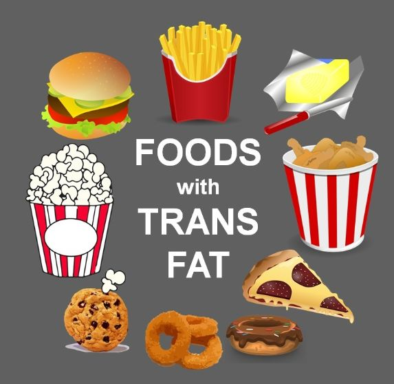
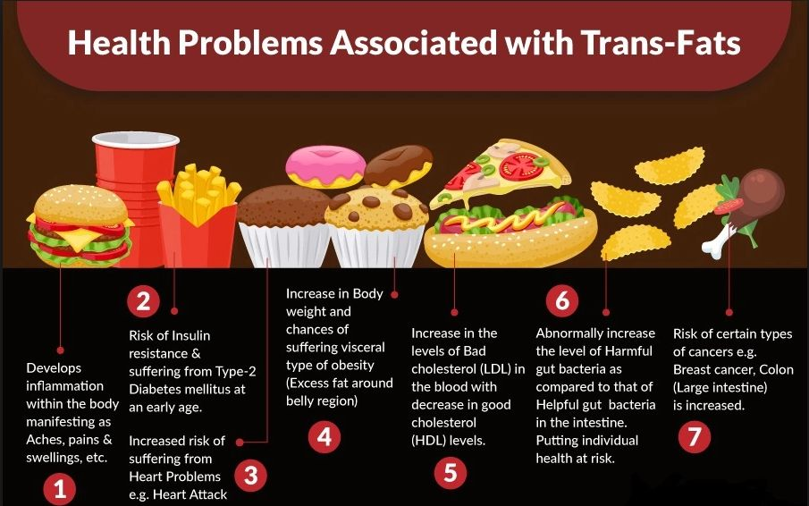
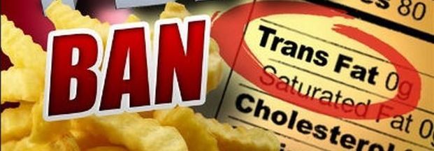

# 无标题

**链接地址:** http://mp.weixin.qq.com/s?__biz=MzI2NTE1ODgwOQ==&mid=2649604998&idx=1&sn=27e1272973e8c0465f9de91ad0648e54&chksm=f2b8ca70c5cf436626ffa414e31453bb4eb4cad80dcbe5647f4869af6a42aa041e6f4a212049&mpshare=1&scene=2&srcid=0917k7qVgHOXlNY5gyayqh9Y#rd
**作者:** 钱枫啊钱枫
**获取时间:** 2025/8/28 21:30:05
**图片数量:** 17

---

## 原始HTML内容

<section style="box-sizing: border-box;"><section class="V5" style="box-sizing: border-box;" powered-by="xiumi.us"><section style="margin-right: 0%;margin-left: 0%;box-sizing: border-box;"><section style="display: inline-block;vertical-align: middle;width: 80%;box-sizing: border-box;"><section class="V5" style="box-sizing: border-box;" powered-by="xiumi.us"><section style="margin-top: 10px;margin-bottom: 10px;text-align: center;box-sizing: border-box;"><section style="display: inline-block;box-sizing: border-box;"><section style="max-width: 100%;font-size: 0px;padding-bottom: 3px;box-sizing: border-box;"><section style="display: inline-block;vertical-align: middle;box-sizing: border-box;"><section style="width: 5px;height: 1px;background-color: rgb(217, 217, 217);box-sizing: border-box;"></section><section style="width: 1px;height: 5px;margin-top: -3px;margin-right: auto;margin-left: auto;background-color: rgb(217, 217, 217);box-sizing: border-box;"></section></section><section style="margin-top: -1px;margin-right: -5px;margin-left: -5px;width: 100%;display: inline-block;vertical-align: middle;padding-right: 8px;padding-left: 8px;box-sizing: border-box;"><section style="width: 100%;height: 1px;background-color: rgb(217, 217, 217);box-sizing: border-box;"></section></section><section style="display: inline-block;vertical-align: middle;box-sizing: border-box;"><section style="width: 5px;height: 1px;background-color: rgb(217, 217, 217);box-sizing: border-box;"></section><section style="width: 1px;height: 5px;margin-top: -3px;margin-right: auto;margin-left: auto;background-color: rgb(217, 217, 217);box-sizing: border-box;"></section></section></section><section style="padding-left: 15px;padding-right: 15px;color: rgb(161, 161, 161);font-size: 14px;box-sizing: border-box;">
点击上方<strong style="box-sizing: border-box;">蓝字</strong>关注我们哟~
</section><section style="max-width: 100%;font-size: 0px;box-sizing: border-box;"><section style="display: inline-block;vertical-align: middle;box-sizing: border-box;"><section style="width: 5px;height: 1px;background-color: rgb(217, 217, 217);box-sizing: border-box;"></section><section style="width: 1px;height: 5px;margin-top: -3px;margin-right: auto;margin-left: auto;background-color: rgb(217, 217, 217);box-sizing: border-box;"></section></section><section style="margin-top: -1px;margin-right: -5px;margin-left: -5px;width: 100%;display: inline-block;vertical-align: middle;padding-right: 8px;padding-left: 8px;box-sizing: border-box;"><section style="width: 100%;height: 1px;background-color: rgb(217, 217, 217);box-sizing: border-box;"></section></section><section style="display: inline-block;vertical-align: middle;box-sizing: border-box;"><section style="width: 5px;height: 1px;background-color: rgb(217, 217, 217);box-sizing: border-box;"></section><section style="width: 1px;height: 5px;margin-top: -3px;margin-right: auto;margin-left: auto;background-color: rgb(217, 217, 217);box-sizing: border-box;"></section></section></section></section></section></section></section><section style="display: inline-block;vertical-align: middle;width: 20%;box-sizing: border-box;"><section class="V5" style="box-sizing: border-box;" powered-by="xiumi.us"><section style="text-align: center;margin: -10px 0% 10px;box-sizing: border-box;"><section style="max-width: 100%;vertical-align: middle;display: inline-block;width: 100%;box-sizing: border-box;"></section></section></section></section></section></section><section class="V5" style="box-sizing: border-box;" powered-by="xiumi.us"><section style="margin: 10px 0%;box-sizing: border-box;"><section style="display: inline-block;width: 100%;vertical-align: top;box-sizing: border-box;"><section class="V5" style="box-sizing: border-box;" powered-by="xiumi.us"><section style="box-sizing: border-box;"><section style="display: inline-block;vertical-align: bottom;width: 75%;padding-right: 10px;box-sizing: border-box;"><section class="V5" style="box-sizing: border-box;" powered-by="xiumi.us"><section style="margin: 10px 0% 3px;box-sizing: border-box;"><section style="display: inline-block;vertical-align: middle;box-sizing: border-box;"><section style="display: inline-block;vertical-align: bottom;padding-left: 5px;padding-right: 5px;line-height: 1.2em;margin-bottom: 2px;color: rgba(80, 182, 201, 0.72);box-sizing: border-box;">
<strong style="box-sizing: border-box;">仔细看下图，有惊喜！</strong>
</section><section style="max-width: 100%;display: inline-block;vertical-align: bottom;width: 1.6em;box-sizing: border-box;"></section></section></section></section></section><section style="display: inline-block;vertical-align: bottom;width: 25%;box-sizing: border-box;"><section class="V5" style="box-sizing: border-box;" powered-by="xiumi.us"><section style="margin-right: 0%;margin-bottom: 3px;margin-left: 0%;text-align: right;box-sizing: border-box;"><section style="display: inline-block;border-bottom: 0.15em solid rgba(80, 182, 201, 0.72);padding-bottom: 3px;box-sizing: border-box;"><section style="display: inline-block;padding: 3px;border-bottom: 0.15em solid rgba(80, 182, 201, 0.72);font-size: 12px;line-height: 1.4;color: rgb(255, 143, 47);box-sizing: border-box;">
<strong style="box-sizing: border-box;">金主大大</strong>
</section></section></section></section></section></section></section><section class="V5" style="box-sizing: border-box;" powered-by="xiumi.us"><section style="margin-right: 0%;margin-left: 0%;box-sizing: border-box;"><section style="background-color: rgba(80, 182, 201, 0.72);height: 2px;box-sizing: border-box;"></section></section></section></section></section></section><section class="V5" style="box-sizing: border-box;" powered-by="xiumi.us"><section style="box-sizing: border-box;"><section style="box-sizing: border-box;">

</section></section></section><section class="V5" style="box-sizing: border-box;" powered-by="xiumi.us"><section style="text-align: center;margin-top: 10px;margin-bottom: 10px;box-sizing: border-box;"><section style="max-width: 100%;vertical-align: middle;display: inline-block;box-sizing: border-box;"><svg xmlns="http://www.w3.org/2000/svg" x="0px" y="0px" viewBox="0 0 902.1 38.2" style="vertical-align: middle;max-width: 100%;box-sizing: border-box;" width="902.1"><g style="box-sizing: border-box;"><path style="box-sizing: border-box;" d="M18.4,1.4c0.9-1.9,2.4-1.9,3.4,0l3.4,6.9c0.9,1.9,3.4,3.7,5.4,4l7.6,1.1c2.1,0.3,2.5,1.7,1,3.2   l-5.5,5.4c-1.5,1.5-2.4,4.3-2.1,6.4l1.3,7.6c0.4,2.1-0.9,2.9-2.7,2l-6.8-3.6c-1.8-1-4.9-1-6.7,0l-6.8,3.6c-1.9,1-3.1,0.1-2.7-2   l1.3-7.6c0.4-2.1-0.6-4.9-2.1-6.4l-5.5-5.4c-1.5-1.5-1-2.9,1-3.2l7.6-1.1c2.1-0.3,4.5-2.1,5.4-4L18.4,1.4z" fill="rgb(178, 243, 230)"></path><path style="box-sizing: border-box;" d="M90.6,5.4c0.7-1.4,1.9-1.4,2.6,0l2.6,5.3c0.7,1.4,2.6,2.8,4.2,3.1l5.9,0.9c1.6,0.2,2,1.3,0.8,2.5   l-4.2,4.1c-1.2,1.1-1.9,3.3-1.6,4.9l1,5.8c0.3,1.6-0.7,2.3-2.1,1.5l-5.2-2.8c-1.4-0.8-3.8-0.8-5.2,0L84,33.6   c-1.4,0.8-2.4,0.1-2.1-1.5l1-5.8c0.3-1.6-0.5-3.8-1.6-4.9l-4.2-4.1c-1.2-1.1-0.8-2.2,0.8-2.5l5.9-0.9c1.6-0.2,3.5-1.6,4.2-3.1   L90.6,5.4z" fill="rgb(190, 204, 246)"></path><path style="box-sizing: border-box;" d="M162.6,7.5c0.6-1.2,1.6-1.2,2.2,0l2.2,4.5c0.6,1.2,2.2,2.4,3.6,2.6l5,0.7c1.4,0.2,1.7,1.1,0.7,2.1   l-3.6,3.5c-1,1-1.6,2.9-1.4,4.2l0.9,5c0.2,1.4-0.6,1.9-1.8,1.3l-4.5-2.4c-1.2-0.6-3.2-0.6-4.4,0l-4.5,2.4c-1.2,0.6-2,0.1-1.8-1.3   l0.9-5c0.2-1.4-0.4-3.3-1.4-4.2l-3.6-3.5c-1-1-0.7-1.9,0.7-2.1l5-0.7c1.4-0.2,3-1.4,3.6-2.6L162.6,7.5z" fill="rgb(150, 208, 240)"></path><path style="box-sizing: border-box;" d="M60.1,19.1c0,2.3-1.9,4.2-4.2,4.2c-2.3,0-4.2-1.9-4.2-4.2s1.9-4.2,4.2-4.2   C58.3,14.9,60.1,16.8,60.1,19.1z" fill="rgb(218, 240, 224)"></path><path style="box-sizing: border-box;" d="M203.8,19.1c0,2.3-1.9,4.2-4.2,4.2c-2.3,0-4.2-1.9-4.2-4.2s1.9-4.2,4.2-4.2   C201.9,14.9,203.8,16.8,203.8,19.1z" fill="rgb(218, 240, 224)"></path><path style="box-sizing: border-box;" d="M130.9,19.1c0,1.7-1.4,3.1-3.1,3.1c-1.7,0-3.1-1.4-3.1-3.1c0-1.7,1.4-3.1,3.1-3.1   C129.5,16.1,130.9,17.4,130.9,19.1z" fill="rgb(218, 240, 224)"></path><path style="box-sizing: border-box;" d="M233.9,1.4c0.9-1.9,2.4-1.9,3.4,0l3.4,6.9c0.9,1.9,3.4,3.7,5.4,4l7.6,1.1c2.1,0.3,2.5,1.7,1,3.2   l-5.5,5.4c-1.5,1.5-2.4,4.3-2.1,6.4l1.3,7.6c0.4,2.1-0.9,2.9-2.7,2l-6.8-3.6c-1.8-1-4.9-1-6.7,0l-6.8,3.6c-1.9,1-3.1,0.1-2.7-2   l1.3-7.6c0.4-2.1-0.6-4.9-2.1-6.4l-5.5-5.4c-1.5-1.5-1-2.9,1-3.2l7.6-1.1c2.1-0.3,4.5-2.1,5.4-4L233.9,1.4z" fill="rgb(178, 243, 230)"></path><path style="box-sizing: border-box;" d="M306.1,5.4c0.7-1.4,1.9-1.4,2.6,0l2.6,5.3c0.7,1.4,2.6,2.8,4.2,3.1l5.9,0.9c1.6,0.2,2,1.3,0.8,2.5   l-4.2,4.1c-1.2,1.1-1.9,3.3-1.6,4.9l1,5.8c0.3,1.6-0.7,2.3-2.1,1.5l-5.2-2.8c-1.4-0.8-3.8-0.8-5.2,0l-5.2,2.8   c-1.4,0.8-2.4,0.1-2.1-1.5l1-5.8c0.3-1.6-0.4-3.8-1.6-4.9l-4.2-4.1c-1.2-1.1-0.8-2.2,0.8-2.5l5.9-0.9c1.6-0.2,3.5-1.6,4.2-3.1   L306.1,5.4z" fill="rgb(190, 204, 246)"></path><path style="box-sizing: border-box;" d="M378.1,7.5c0.6-1.2,1.6-1.2,2.2,0l2.2,4.5c0.6,1.2,2.2,2.4,3.6,2.6l5,0.7c1.4,0.2,1.7,1.1,0.7,2.1   l-3.6,3.5c-1,1-1.6,2.9-1.4,4.2l0.9,5c0.2,1.4-0.6,1.9-1.8,1.3l-4.5-2.4c-1.2-0.6-3.2-0.6-4.4,0l-4.5,2.4c-1.2,0.6-2,0.1-1.8-1.3   l0.9-5c0.2-1.4-0.4-3.3-1.4-4.2l-3.6-3.5c-1-1-0.7-1.9,0.7-2.1l5-0.7c1.4-0.2,3-1.4,3.6-2.6L378.1,7.5z" fill="rgb(150, 208, 240)"></path><path style="box-sizing: border-box;" d="M275.7,19.1c0,2.3-1.9,4.2-4.2,4.2c-2.3,0-4.2-1.9-4.2-4.2s1.9-4.2,4.2-4.2   C273.8,14.9,275.7,16.8,275.7,19.1z" fill="rgb(218, 240, 224)"></path><path style="box-sizing: border-box;" d="M419.3,19.1c0,2.3-1.9,4.2-4.2,4.2c-2.3,0-4.2-1.9-4.2-4.2s1.9-4.2,4.2-4.2   C417.5,14.9,419.3,16.8,419.3,19.1z" fill="rgb(218, 240, 224)"></path><path style="box-sizing: border-box;" d="M346.4,19.1c0,1.7-1.4,3.1-3.1,3.1c-1.7,0-3.1-1.4-3.1-3.1c0-1.7,1.4-3.1,3.1-3.1   C345,16.1,346.4,17.4,346.4,19.1z" fill="rgb(218, 240, 224)"></path><path style="box-sizing: border-box;" d="M449.4,1.4c0.9-1.9,2.4-1.9,3.4,0l3.4,6.9c0.9,1.9,3.4,3.7,5.4,4l7.6,1.1c2.1,0.3,2.5,1.7,1,3.2   l-5.5,5.4c-1.5,1.5-2.4,4.3-2.1,6.4l1.3,7.6c0.4,2.1-0.9,2.9-2.7,2l-6.8-3.6c-1.8-1-4.9-1-6.7,0l-6.8,3.6c-1.9,1-3.1,0.1-2.7-2   l1.3-7.6c0.4-2.1-0.6-4.9-2.1-6.4l-5.5-5.4c-1.5-1.5-1-2.9,1-3.2l7.6-1.1c2.1-0.3,4.5-2.1,5.4-4L449.4,1.4z" fill="rgb(178, 243, 230)"></path><path style="box-sizing: border-box;" d="M521.6,5.4c0.7-1.4,1.9-1.4,2.6,0l2.6,5.3c0.7,1.4,2.6,2.8,4.2,3.1l5.9,0.9c1.6,0.2,2,1.3,0.8,2.5   l-4.2,4.1c-1.2,1.1-1.9,3.3-1.6,4.9l1,5.8c0.3,1.6-0.7,2.3-2.1,1.5l-5.2-2.8c-1.4-0.8-3.8-0.8-5.2,0l-5.2,2.8   c-1.4,0.8-2.4,0.1-2.1-1.5l1-5.8c0.3-1.6-0.5-3.8-1.6-4.9l-4.2-4.1c-1.2-1.1-0.8-2.2,0.8-2.5l5.9-0.9c1.6-0.2,3.5-1.6,4.2-3.1   L521.6,5.4z" fill="rgb(190, 204, 246)"></path><path style="box-sizing: border-box;" d="M593.6,7.5c0.6-1.2,1.6-1.2,2.2,0l2.2,4.5c0.6,1.2,2.2,2.4,3.6,2.6l5,0.7c1.4,0.2,1.7,1.1,0.7,2.1   l-3.6,3.5c-1,1-1.6,2.9-1.4,4.2l0.9,5c0.2,1.4-0.6,1.9-1.8,1.3l-4.5-2.4c-1.2-0.6-3.2-0.6-4.4,0l-4.5,2.4c-1.2,0.6-2,0.1-1.8-1.3   l0.9-5c0.2-1.4-0.4-3.3-1.4-4.2l-3.6-3.5c-1-1-0.7-1.9,0.7-2.1l5-0.7c1.4-0.2,3-1.4,3.6-2.6L593.6,7.5z" fill="rgb(150, 208, 240)"></path><path style="box-sizing: border-box;" d="M491.2,19.1c0,2.3-1.9,4.2-4.2,4.2c-2.3,0-4.2-1.9-4.2-4.2s1.9-4.2,4.2-4.2   C489.3,14.9,491.2,16.8,491.2,19.1z" fill="rgb(218, 240, 224)"></path><path style="box-sizing: border-box;" d="M634.9,19.1c0,2.3-1.9,4.2-4.2,4.2c-2.3,0-4.2-1.9-4.2-4.2s1.9-4.2,4.2-4.2   C633,14.9,634.9,16.8,634.9,19.1z" fill="rgb(218, 240, 224)"></path><path style="box-sizing: border-box;" d="M561.9,19.1c0,1.7-1.4,3.1-3.1,3.1c-1.7,0-3.1-1.4-3.1-3.1c0-1.7,1.4-3.1,3.1-3.1   C560.5,16.1,561.9,17.4,561.9,19.1z" fill="rgb(218, 240, 224)"></path><path style="box-sizing: border-box;" d="M664.9,1.4c0.9-1.9,2.4-1.9,3.4,0l3.4,6.9c0.9,1.9,3.4,3.7,5.4,4l7.6,1.1c2.1,0.3,2.5,1.7,1,3.2   l-5.5,5.4c-1.5,1.5-2.4,4.3-2.1,6.4l1.3,7.6c0.4,2.1-0.9,2.9-2.7,2l-6.8-3.6c-1.8-1-4.9-1-6.7,0l-6.8,3.6c-1.9,1-3.1,0.1-2.7-2   l1.3-7.6c0.4-2.1-0.6-4.9-2.1-6.4l-5.5-5.4c-1.5-1.5-1-2.9,1-3.2l7.6-1.1c2.1-0.3,4.5-2.1,5.4-4L664.9,1.4z" fill="rgb(178, 243, 230)"></path><path style="box-sizing: border-box;" d="M737.1,5.4c0.7-1.4,1.9-1.4,2.6,0l2.6,5.3c0.7,1.4,2.6,2.8,4.2,3.1l5.9,0.9c1.6,0.2,2,1.3,0.8,2.5   l-4.2,4.1c-1.2,1.1-1.9,3.3-1.6,4.9l1,5.8c0.3,1.6-0.7,2.3-2.1,1.5l-5.2-2.8c-1.4-0.8-3.8-0.8-5.2,0l-5.2,2.8   c-1.4,0.8-2.4,0.1-2.1-1.5l1-5.8c0.3-1.6-0.5-3.8-1.6-4.9l-4.2-4.1c-1.2-1.1-0.8-2.2,0.8-2.5l5.9-0.9c1.6-0.2,3.5-1.6,4.2-3.1   L737.1,5.4z" fill="rgb(190, 204, 246)"></path><path style="box-sizing: border-box;" d="M809.2,7.5c0.6-1.2,1.6-1.2,2.2,0l2.2,4.5c0.6,1.2,2.2,2.4,3.6,2.6l5,0.7c1.4,0.2,1.7,1.1,0.7,2.1   l-3.6,3.5c-1,1-1.6,2.9-1.4,4.2l0.9,5c0.2,1.4-0.6,1.9-1.8,1.3l-4.5-2.4c-1.2-0.6-3.2-0.6-4.4,0l-4.5,2.4c-1.2,0.6-2,0.1-1.8-1.3   l0.9-5c0.2-1.4-0.4-3.3-1.4-4.2l-3.6-3.5c-1-1-0.7-1.9,0.7-2.1l5-0.7c1.4-0.2,3-1.4,3.6-2.6L809.2,7.5z" fill="rgb(150, 208, 240)"></path><path style="box-sizing: border-box;" d="M706.7,19.1c0,2.3-1.9,4.2-4.2,4.2c-2.3,0-4.2-1.9-4.2-4.2s1.9-4.2,4.2-4.2   C704.8,14.9,706.7,16.8,706.7,19.1z" fill="rgb(218, 240, 224)"></path><path style="box-sizing: border-box;" d="M850.4,19.1c0,2.3-1.9,4.2-4.2,4.2c-2.3,0-4.2-1.9-4.2-4.2s1.9-4.2,4.2-4.2   C848.5,14.9,850.4,16.8,850.4,19.1z" fill="rgb(218, 240, 224)"></path><path style="box-sizing: border-box;" d="M777.4,19.1c0,1.7-1.4,3.1-3.1,3.1c-1.7,0-3.1-1.4-3.1-3.1c0-1.7,1.4-3.1,3.1-3.1   C776,16.1,777.4,17.4,777.4,19.1z" fill="rgb(218, 240, 224)"></path><path style="box-sizing: border-box;" d="M880.4,1.4c0.9-1.9,2.4-1.9,3.4,0l3.4,6.9c0.9,1.9,3.4,3.7,5.4,4l7.6,1.1c2.1,0.3,2.5,1.7,1,3.2   l-5.5,5.4c-1.5,1.5-2.4,4.3-2.1,6.4l1.3,7.6c0.4,2.1-0.9,2.9-2.7,2l-6.8-3.6c-1.8-1-4.9-1-6.7,0l-6.8,3.6c-1.8,1-3.1,0.1-2.7-2   l1.3-7.6c0.4-2.1-0.6-4.9-2.1-6.4l-5.5-5.4c-1.5-1.5-1-2.9,1-3.2l7.6-1.1c2.1-0.3,4.5-2.1,5.4-4L880.4,1.4z" fill="rgb(178, 243, 230)"></path></g></svg></section></section></section><section class="V5" style="box-sizing: border-box;" powered-by="xiumi.us"><section style="box-sizing: border-box;"><section style="text-align: center;box-sizing: border-box;">

 

根据CTV News 2018年9月16日的新闻报道，加拿大对<strong>人造反式脂肪</strong>（artificial trans fats）的禁令于本周生效。

 

该禁令明确禁止将<strong>部分</strong><strong>氢化油</strong>或<strong>PHO</strong>添加到餐馆制作和销售的食品中。

 

据悉这段时间正好是联邦政府宣布结束使用动脉堵塞脂肪（artery-clogging fats）后的一年。

 

 

多年来，这些油被用于制作烘焙食品，因为它们可以<strong>延长产品的保质期</strong>。它们还被用作炸薯条等食品的煎炸油。

 

但研究一再表明，脂肪可以提高血液中的坏胆固醇水平，降低好胆固醇水平。

 

根据心脏和中风基金会的说法，反式脂肪的高消耗量被认定为是加拿大每年导致数千例心脏病患者死亡的最大也是最<strong>直接</strong>的原因。

 

 

该基金会的注册营养师Carol Dombrow周日接受CTV新闻频道采访时表示：反式脂肪可以增加坏胆固醇（LDL&nbsp;胆固醇）水平和降低好胆固醇水平（HDL&nbsp;胆固醇）。

 

坚持这样饮食的长期结果是这些LDL胆固醇会<strong>堵塞你的血管</strong>，增加患心脏病和心脏病的风险，

 

随着反式脂肪的禁令，该基金会预计将在未来20年内拯救<strong>12,000名</strong>心脏病患者。

 

 

糕点和烘焙食品以及商业生产的炸薯条，人造乳制品和奶精——这些食品都含有大量的反式脂肪。不过<strong>自然存在</strong>在食物中的反式脂肪<strong>不会</strong>导致血管中出现堵塞问题。

 

“这将对加拿大人的健康产生重大影响，”她说。

 

加拿大心脏和中风疾病监控中心一直与加拿大卫生部合作，并在2006年成立了“<strong>反式脂肪特遣部队</strong>”（Trans-fats Task Force）以尽可能督察食品行业在反式脂肪的运用上是履行了加拿大的法律条约。

 

 

加拿大的食品行业多年来一直在逐步淘汰部分氢化油，但于此之前联邦政府<strong>从未</strong>实施禁令。

 

相反，联邦政府引入了<strong>强制性反式脂肪标签</strong>，并建立了一个监测计划来衡量行业在降低反式脂肪运用方面的进展。

 

去年，在健康倡导者多次呼吁全面禁止反式脂肪之后，加拿大卫生部终于宣布他们正在给食品行业一年的“<strong>缓冲期</strong>”来完全淘汰这些含有或会造成反式脂肪的油类。

 

 

<strong>该禁令适用于加拿大生产的所有生产包装的食品，以及进口产品和食品服务机构提供的食品。</strong>

 

那些在某些动物产品中天然存在的反式脂肪不属于禁令的一部分。

 

该条例已于2018年9月15日开始正式实施。但零售商将获得长达<strong>三年</strong>的宽限期，以清理商店货架上的库存。

 

 

消费者可能仍然会在货架上发现一些含有反式脂肪的产品，这些产品的生产日期是该禁令生效之前。根据加拿大卫生部估计，<strong>三年后</strong>，货架上将不会再出现任何添加人工反式脂肪的产品。

 

但是不再人为添加反式脂肪的食品在<strong>口味口感</strong>上会和添加了反式脂肪的食品有多大<strong>差异</strong>呢？而如今快餐甜品类食品的市场<strong>售价</strong>会因为该条例的实施而陡然升高吗？不再添加反式脂肪的食品就一定会<strong>更健康</strong>吗？

 

这些现在难以回答问题值得作为消费者的我们慢慢探寻。

 

文章信息来源：CTV News，CBC News。
</section></section></section><section class="V5" style="box-sizing: border-box;" powered-by="xiumi.us"><section style="margin: 10px 0%;box-sizing: border-box;"><section style="display: inline-block;vertical-align: top;width: 50%;box-sizing: border-box;"><section class="V5" style="box-sizing: border-box;" powered-by="xiumi.us"><section style="text-align: right;margin-right: 0%;margin-bottom: -10px;margin-left: 0%;box-sizing: border-box;"><section style="display: inline-block;min-width: 10%;max-width: 100%;vertical-align: top;padding-right: 20px;box-sizing: border-box;"><section class="V5" style="box-sizing: border-box;" powered-by="xiumi.us"><section style="margin-right: 0%;margin-left: 0%;box-sizing: border-box;"><section style="text-align: center;color: rgb(138, 206, 191);box-sizing: border-box;">
<strong style="box-sizing: border-box;">特约</strong> 
</section></section></section></section></section></section><section class="V5" style="box-sizing: border-box;" powered-by="xiumi.us"><section style="margin-top: -10px;margin-right: 0%;margin-left: 0%;text-align: right;transform: translate3d(9px, 0px, 0px);box-sizing: border-box;"><section style="display: inline-block;vertical-align: top;background-color: rgb(255, 255, 255);box-sizing: border-box;"><section style="display: inline-block;vertical-align: bottom;margin-bottom: 11px;width: 5px;border-right: 1px solid rgb(79, 118, 120);border-left: 1px solid rgb(79, 118, 120);height: 8px;transform-origin: center bottom 0px;-webkit-transform-origin: center bottom 0px;-moz-transform-origin: center bottom 0px;-o-transform-origin: center bottom 0px;transform: skew(-30deg);-webkit-transform: skew(-30deg);-moz-transform: skew(-30deg);-o-transform: skew(-30deg);border-top-color: rgb(79, 118, 120);border-bottom-color: rgb(79, 118, 120);box-sizing: border-box;"></section><section style="display: inline-block;vertical-align: top;padding-left: 10px;box-sizing: border-box;">
 
</section></section><section style="height: 12px;margin-top: -12px;border-top: 1px solid rgb(79, 118, 120);box-sizing: border-box;"></section></section></section></section><section style="display: inline-block;vertical-align: top;width: 50%;box-sizing: border-box;"><section class="V5" style="box-sizing: border-box;" powered-by="xiumi.us"><section style="margin-right: 0%;margin-left: 0%;box-sizing: border-box;"><section style="display: inline-block;vertical-align: top;background-color: rgb(255, 255, 255);box-sizing: border-box;"><section style="display: inline-block;vertical-align: top;padding-right: 5px;box-sizing: border-box;">
 
</section><section style="margin-right: 4px;margin-bottom: 4px;display: inline-block;vertical-align: bottom;width: 5px;border-right: 1px solid rgb(79, 118, 120);border-left: 1px solid rgb(79, 118, 120);height: 8px;transform-origin: center bottom 0px;-webkit-transform-origin: center bottom 0px;-moz-transform-origin: center bottom 0px;-o-transform-origin: center bottom 0px;transform: skew(-30deg);-webkit-transform: skew(-30deg);-moz-transform: skew(-30deg);-o-transform: skew(-30deg);border-top-color: rgb(79, 118, 120);border-bottom-color: rgb(79, 118, 120);box-sizing: border-box;"></section></section><section style="height: 12px;margin-top: -12px;border-top: 1px solid rgb(79, 118, 120);box-sizing: border-box;"></section></section></section><section class="V5" style="box-sizing: border-box;" powered-by="xiumi.us"><section style="margin-top: -10px;margin-right: 0%;margin-left: 0%;box-sizing: border-box;"><section style="display: inline-block;min-width: 10%;max-width: 100%;vertical-align: top;padding-left: 20px;box-sizing: border-box;"><section class="V5" style="box-sizing: border-box;" powered-by="xiumi.us"><section style="box-sizing: border-box;"><section style="color: rgb(138, 206, 191);box-sizing: border-box;">
<strong style="box-sizing: border-box;">赞助</strong>
</section></section></section></section></section></section></section></section></section><section class="V5" style="box-sizing: border-box;" powered-by="xiumi.us"><section style="box-sizing: border-box;"><section style="box-sizing: border-box;">

</section></section></section><section class="V5" style="box-sizing: border-box;" powered-by="xiumi.us"><section style="margin-top: 0.5em;margin-bottom: 0.5em;box-sizing: border-box;"> <section style="display: inline-block;height: 1px;width: 75%;margin-top: 15px;vertical-align: top;background: url(&quot;https://mmbiz.qpic.cn/mmbiz_png/D1nJqnhkPyIjaHpSXg6wVffoagWxnTpYzwJF1d5mW0CsicQkxWsvapZpotqmLp2KrcIpUmFnwDjFN1wJoyxtaiag/640?wx_fmt=png&quot;) repeat-x rgba(80, 182, 201, 0.72);box-sizing: border-box;"></section></section></section><section class="V5" style="box-sizing: border-box;" powered-by="xiumi.us"><section style="box-sizing: border-box;"><section style="box-sizing: border-box;">
 
</section></section></section><section class="V5" style="box-sizing: border-box;" powered-by="xiumi.us"><section style="margin: 40px 0% 10px;text-align: center;box-sizing: border-box;"><section style="display: inline-block;width: 90%;border-width: 1px;border-style: dotted;border-color: rgba(80, 182, 201, 0.72);padding: 10px;border-radius: 0px;box-sizing: border-box;"><section class="V5" style="box-sizing: border-box;" powered-by="xiumi.us"><section style="transform: translate3d(20px, 0px, 0px);text-align: left;font-size: 11px;margin-top: -55px;margin-right: 0%;margin-left: 0%;box-sizing: border-box;"><section style="box-sizing: border-box;width: 7em;height: 7em;display: inline-block;vertical-align: bottom;border-radius: 100%;border-width: 5px;border-style: none;border-color: rgba(80, 182, 201, 0.72);background-position: center center;background-repeat: no-repeat;background-size: cover;background-image: url(&quot;https://mmbiz.qpic.cn/mmbiz_jpg/D1nJqnhkPyIjaHpSXg6wVffoagWxnTpYzlBMFEUAKg8quKTDOZHHpOeFI7Yv9cU2GhqyK1AzBgnMcmqRqkAH8g/640?wx_fmt=jpeg&quot;);"><section style="width: 100%;height: 100%;overflow: hidden;box-sizing: border-box;"></section></section></section></section><section class="V5" style="box-sizing: border-box;" powered-by="xiumi.us"><section style="box-sizing: border-box;"><section class="group-empty" style="display: inline-block;vertical-align: top;width: 38.2%;box-sizing: border-box;"></section><section style="display: inline-block;vertical-align: top;width: 61.8%;box-sizing: border-box;"><section class="V5" style="box-sizing: border-box;" powered-by="xiumi.us"><section style="margin-right: 0%;margin-left: 0%;box-sizing: border-box;"><section style="font-size: 18px;color: rgb(67, 103, 117);line-height: 1.6;letter-spacing: 1px;box-sizing: border-box;">
<strong style="box-sizing: border-box;">埃德蒙顿微生活</strong>
</section></section></section><section class="V5" style="box-sizing: border-box;" powered-by="xiumi.us"><section style="margin-top: 0.5em;margin-bottom: 0.5em;box-sizing: border-box;"><section style="background-color: rgba(80, 182, 201, 0.72);height: 1px;box-sizing: border-box;"></section></section></section></section></section></section><section class="V5" style="box-sizing: border-box;" powered-by="xiumi.us"><section style="box-sizing: border-box;"><section style="text-align: justify;font-size: 14px;color: rgba(62, 62, 62, 0.72);letter-spacing: 2px;box-sizing: border-box;">
<strong style="box-sizing: border-box;">关心埃德蒙顿民生，</strong>

<strong style="box-sizing: border-box;">关注埃德蒙顿的发展。</strong>

 

埃德蒙顿微生活是“吃喝玩乐埃德蒙顿”旗下，为埃德蒙顿地区的居民提供每日最新的吃喝玩乐、工作学习、商业投资的媒体平台 。
</section></section></section><section class="V5" style="box-sizing: border-box;" powered-by="xiumi.us"><section style="box-sizing: border-box;"><section style="text-align: left;box-sizing: border-box;">
 
</section></section></section><section class="V5" style="box-sizing: border-box;" powered-by="xiumi.us"><section style="box-sizing: border-box;"><section style="display: inline-block;vertical-align: middle;width: 61.8%;box-sizing: border-box;"><section class="V5" style="box-sizing: border-box;" powered-by="xiumi.us"><section style="box-sizing: border-box;"><section style="text-align: justify;font-size: 12px;color: rgba(62, 62, 62, 0.37);line-height: 1.9;letter-spacing: 0px;box-sizing: border-box;">
我们的目标是以最新、最快、最及时的方式 报道埃德蒙顿的新鲜事 。 
</section></section></section></section><section style="display: inline-block;vertical-align: middle;width: 38.2%;box-sizing: border-box;"><section class="V5" style="box-sizing: border-box;" powered-by="xiumi.us"><section style="margin-right: 0%;margin-left: 0%;box-sizing: border-box;"><section style="max-width: 100%;vertical-align: middle;display: inline-block;width: 70%;box-sizing: border-box;"></section></section></section></section></section></section></section></section></section></section>
 

---

## 纯文本内容

点击上方蓝字关注我们哟~仔细看下图，有惊喜！金主大大根据CTV News 2018年9月16日的新闻报道，加拿大对人造反式脂肪（artificial trans fats）的禁令于本周生效。该禁令明确禁止将部分氢化油或PHO添加到餐馆制作和销售的食品中。据悉这段时间正好是联邦政府宣布结束使用动脉堵塞脂肪（artery-clogging fats）后的一年。多年来，这些油被用于制作烘焙食品，因为它们可以延长产品的保质期。它们还被用作炸薯条等食品的煎炸油。但研究一再表明，脂肪可以提高血液中的坏胆固醇水平，降低好胆固醇水平。根据心脏和中风基金会的说法，反式脂肪的高消耗量被认定为是加拿大每年导致数千例心脏病患者死亡的最大也是最直接的原因。该基金会的注册营养师Carol Dombrow周日接受CTV新闻频道采访时表示：反式脂肪可以增加坏胆固醇（LDL 胆固醇）水平和降低好胆固醇水平（HDL 胆固醇）。坚持这样饮食的长期结果是这些LDL胆固醇会堵塞你的血管，增加患心脏病和心脏病的风险，随着反式脂肪的禁令，该基金会预计将在未来20年内拯救12,000名心脏病患者。糕点和烘焙食品以及商业生产的炸薯条，人造乳制品和奶精——这些食品都含有大量的反式脂肪。不过自然存在在食物中的反式脂肪不会导致血管中出现堵塞问题。“这将对加拿大人的健康产生重大影响，”她说。加拿大心脏和中风疾病监控中心一直与加拿大卫生部合作，并在2006年成立了“反式脂肪特遣部队”（Trans-fats Task Force）以尽可能督察食品行业在反式脂肪的运用上是履行了加拿大的法律条约。加拿大的食品行业多年来一直在逐步淘汰部分氢化油，但于此之前联邦政府从未实施禁令。相反，联邦政府引入了强制性反式脂肪标签，并建立了一个监测计划来衡量行业在降低反式脂肪运用方面的进展。去年，在健康倡导者多次呼吁全面禁止反式脂肪之后，加拿大卫生部终于宣布他们正在给食品行业一年的“缓冲期”来完全淘汰这些含有或会造成反式脂肪的油类。该禁令适用于加拿大生产的所有生产包装的食品，以及进口产品和食品服务机构提供的食品。那些在某些动物产品中天然存在的反式脂肪不属于禁令的一部分。该条例已于2018年9月15日开始正式实施。但零售商将获得长达三年的宽限期，以清理商店货架上的库存。消费者可能仍然会在货架上发现一些含有反式脂肪的产品，这些产品的生产日期是该禁令生效之前。根据加拿大卫生部估计，三年后，货架上将不会再出现任何添加人工反式脂肪的产品。但是不再人为添加反式脂肪的食品在口味口感上会和添加了反式脂肪的食品有多大差异呢？而如今快餐甜品类食品的市场售价会因为该条例的实施而陡然升高吗？不再添加反式脂肪的食品就一定会更健康吗？这些现在难以回答问题值得作为消费者的我们慢慢探寻。文章信息来源：CTV News，CBC News。特约赞助 埃德蒙顿微生活关心埃德蒙顿民生，关注埃德蒙顿的发展。埃德蒙顿微生活是“吃喝玩乐埃德蒙顿”旗下，为埃德蒙顿地区的居民提供每日最新的吃喝玩乐、工作学习、商业投资的媒体平台 。我们的目标是以最新、最快、最及时的方式 报道埃德蒙顿的新鲜事 。

---

## 图片列表

-  (原始链接: https://mmbiz.qpic.cn/mmbiz_gif/D1nJqnhkPyIjaHpSXg6wVffoagWxnTpYdk7RXnPeVMMD0kzrTBMz2ria4zqcicW6fnn71HDDO2ict5T8JC3r3JFxg/640?wx_fmt=gif)
-  (原始链接: https://mmbiz.qpic.cn/mmbiz_gif/D1nJqnhkPyIjaHpSXg6wVffoagWxnTpYIFO8lzVnNPTLzibYFZuMBU9uAibgr1CPp8HzUyEPtnM03V2YyNwcPESw/640?wx_fmt=gif)
-  (原始链接: https://mmbiz.qpic.cn/mmbiz_jpg/mZIpZ2dRo6ZVoJhUecmkegkWqzRmL9rPG0o5dC4A2b2rmKExo9cF7qY7zZ8iapWicrE102u46qXAgBN661mHscUQ/640?wx_fmt=jpeg)
-  (原始链接: https://mmbiz.qpic.cn/mmbiz_jpg/D1nJqnhkPyJT4U32Y548Hw5aBlviccaDpkfNVYF9uRyc8DkjQYVxHibVjQqeC0eFuWFl7ndQqvSrQu6yx3XXefhg/640?wx_fmt=jpeg)
-  (原始链接: https://mmbiz.qpic.cn/mmbiz_jpg/D1nJqnhkPyJMnbYWl1jibuWOJhwEH9ALftJic1p4AOTYRM288ia0RibgNzECAWsU2VghE4oe7ibX1P86O43YhlJ9BZg/640?wx_fmt=jpeg)
-  (原始链接: https://mmbiz.qpic.cn/mmbiz_jpg/mZIpZ2dRo6bEGJj3ZeL7Xib1XedXSCvicUVee9QebibGnDy0Y1boHullFBNgiav980nlGWyCuuaZ6lSlcxQEnuXm5A/640?wx_fmt=jpeg)
-  (原始链接: https://mmbiz.qpic.cn/mmbiz_png/D1nJqnhkPyIjaHpSXg6wVffoagWxnTpY7hOia1ketLLgNOKN0Tx56iapJflQPtOteKav35yIKrgoZGu6bB52qfjw/640?wx_fmt=png)
-  (原始链接: https://mmbiz.qpic.cn/mmbiz_png/D1nJqnhkPyIjaHpSXg6wVffoagWxnTpYEc1VqFTb3pNbpguHuoh4oia9xwsy5vyNOemNvYwxgDg7icITU7f56OFw/640?wx_fmt=png)
-  (原始链接: https://mmbiz.qpic.cn/mmbiz_png/D1nJqnhkPyIjaHpSXg6wVffoagWxnTpYJIIzmny4Z49gG2Upqk8xO5cOTicQ6Ms6ya1ycI6icJhib4cVstB6icDn5Q/640?wx_fmt=png)
-  (原始链接: https://mmbiz.qpic.cn/mmbiz_png/D1nJqnhkPyIjaHpSXg6wVffoagWxnTpYZ3aehicvHxzD3ZyiaxGEicibFv2V6GN1lpl6zHsiax5lYtaNLENGAaMrwNA/640?wx_fmt=png)
-  (原始链接: https://mmbiz.qpic.cn/mmbiz_png/D1nJqnhkPyIjaHpSXg6wVffoagWxnTpYUeTMR2K2agOELJGzKdibHW4Sab920VETCMtMSBLATb5FykHOYnMS7YA/640?wx_fmt=png)
-  (原始链接: https://mmbiz.qpic.cn/mmbiz_png/D1nJqnhkPyIjaHpSXg6wVffoagWxnTpYcc3yovGptF7ZOLIOyCLgIiaDBQzv1qqUF6Wq9n2NAdhhZYL7fCcjchQ/640?wx_fmt=png)
-  (原始链接: https://mmbiz.qpic.cn/mmbiz_png/D1nJqnhkPyIjaHpSXg6wVffoagWxnTpYSJ7sADdrStic2yeU7guaWnicCo2dEu2JcAPia6UJ7PZGvkn6IRqSkibH4A/640?wx_fmt=png)
-  (原始链接: https://mmbiz.qpic.cn/mmbiz_jpg/D1nJqnhkPyLo3L0iawegpPefdoialIOMJsLYAWDKWZibActHTInqxOYIqm69LVFG0zLVDT3SI3PON4Sz2gvhHH80g/640?wx_fmt=jpeg)
-  (原始链接: https://mmbiz.qpic.cn/mmbiz_png/D1nJqnhkPyIjaHpSXg6wVffoagWxnTpYoJs7tnvxcLYIoUn1iau1z4kAHMY9h2nwuROwJ4tiakMgFQpp2WGicMrKA/640?wx_fmt=png)
-  (原始链接: https://mmbiz.qpic.cn/mmbiz_jpg/D1nJqnhkPyIjaHpSXg6wVffoagWxnTpYzlBMFEUAKg8quKTDOZHHpOeFI7Yv9cU2GhqyK1AzBgnMcmqRqkAH8g/640?wx_fmt=jpeg)
-  (原始链接: https://mmbiz.qpic.cn/mmbiz_jpg/D1nJqnhkPyIjaHpSXg6wVffoagWxnTpYDXA776Ve4IlyDsI6O9ficoF9gjKiaxgicEP3gXpZI3guoIyFs2HJ6icXBQ/640?wx_fmt=jpeg)
