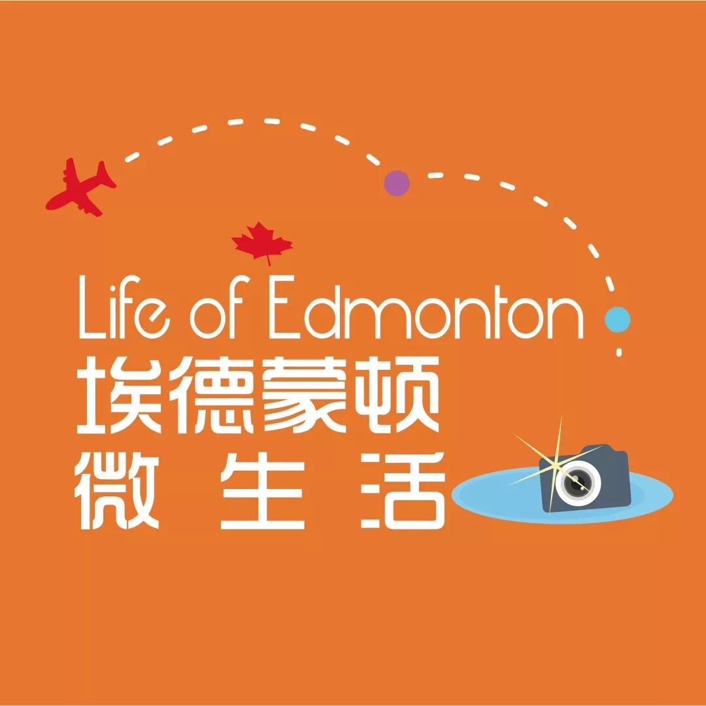

# 无标题

**链接地址:** http://mp.weixin.qq.com/s?__biz=MzI2NTE1ODgwOQ==&mid=2649605011&idx=2&sn=862f931f2153362a230ed00ebaeaabc7&chksm=f2b8ca65c5cf43731dce16b84a3164f9ca135a8fe5a2277b0fa4d083b4e4a8ac2e8e55b80546&mpshare=1&scene=2&srcid=0918NNH80woIm1C6rSinCgiV#rd
**作者:** 雪糊
**获取时间:** 2025/8/28 21:29:41
**图片数量:** 4

---

## 原始HTML内容

 

 

 
<section style="white-space: normal;box-sizing: border-box;"><section class="V5" powered-by="xiumi.us" style="box-sizing: border-box;"><section style="margin-top: 0.5em;margin-bottom: 0.5em;box-sizing: border-box;">&nbsp;<section style="margin-top: 15px;display: inline-block;height: 1px;width: 418.8px;vertical-align: top;background: url(&quot;https://mmbiz.qpic.cn/mmbiz_png/D1nJqnhkPyL6TdDwCnDSzT5Kr3G5T2APf6qFNK2vJ4ZZcXDJWt1ORfFeZw6K1rBNicANKWiaZWkGwic3OIEbkDeuQ/640?wx_fmt=png&quot;) repeat-x rgba(80, 182, 201, 0.72);box-sizing: border-box;"></section></section></section><section class="V5" powered-by="xiumi.us" style="box-sizing: border-box;"><section style="box-sizing: border-box;"><section style="box-sizing: border-box;">
 
</section></section></section><section class="V5" powered-by="xiumi.us" style="box-sizing: border-box;"><section style="margin-top: 40px;margin-bottom: 10px;text-align: center;box-sizing: border-box;"><section style="padding: 10px;display: inline-block;width: 502.55px;border-width: 1px;border-style: dotted;border-color: rgba(80, 182, 201, 0.72);border-radius: 0px;box-sizing: border-box;"><section class="V5" powered-by="xiumi.us" style="box-sizing: border-box;"><section style="margin-top: -55px;transform: translate3d(20px, 0px, 0px);text-align: left;font-size: 11px;box-sizing: border-box;"><section style="box-sizing: border-box;width: 7em;height: 7em;display: inline-block;vertical-align: bottom;border-radius: 100%;border-width: 5px;border-style: none;border-color: rgba(80, 182, 201, 0.72);background-position: center center;background-repeat: no-repeat;background-size: cover;background-image: url(&quot;https://mmbiz.qpic.cn/mmbiz_jpg/D1nJqnhkPyL6TdDwCnDSzT5Kr3G5T2APgewuPnsx145nxsL7OobxdePUv7DacXpiaFSKNrhQ9Qdn09mZvFh62Kg/640?wx_fmt=jpeg&quot;);"><section style="width: 77px;height: 77px;overflow: hidden;box-sizing: border-box;"></section></section></section></section><section class="V5" powered-by="xiumi.us" style="box-sizing: border-box;"><section style="box-sizing: border-box;"><section class="group-empty" style="display: inline-block;vertical-align: top;width: 183.563px;box-sizing: border-box;"></section><section style="display: inline-block;vertical-align: top;width: 296.975px;box-sizing: border-box;"><section class="V5" powered-by="xiumi.us" style="box-sizing: border-box;"><section style="box-sizing: border-box;"><section style="font-size: 18px;color: rgb(67, 103, 117);line-height: 1.6;letter-spacing: 1px;box-sizing: border-box;">
<strong style="box-sizing: border-box;">埃德蒙顿微生活</strong>
</section></section></section><section class="V5" powered-by="xiumi.us" style="box-sizing: border-box;"><section style="margin-top: 0.5em;margin-bottom: 0.5em;box-sizing: border-box;"><section style="background-color: rgba(80, 182, 201, 0.72);height: 1px;box-sizing: border-box;"></section></section></section></section></section></section><section class="V5" powered-by="xiumi.us" style="box-sizing: border-box;"><section style="box-sizing: border-box;"><section style="text-align: justify;font-size: 14px;color: rgba(62, 62, 62, 0.72);letter-spacing: 2px;box-sizing: border-box;">
<strong style="box-sizing: border-box;">关心埃德蒙顿民生，</strong>

<strong style="box-sizing: border-box;">关注埃德蒙顿的发展。</strong>

 

埃德蒙顿微生活是“吃喝玩乐埃德蒙顿”旗下，为埃德蒙顿地区的居民提供每日最新的吃喝玩乐、工作学习、商业投资的媒体平台 。
</section></section></section><section class="V5" powered-by="xiumi.us" style="box-sizing: border-box;"><section style="box-sizing: border-box;"><section style="text-align: left;box-sizing: border-box;">
 
</section></section></section><section class="V5" powered-by="xiumi.us" style="box-sizing: border-box;"><section style="box-sizing: border-box;"><section style="display: inline-block;vertical-align: middle;width: 296.975px;box-sizing: border-box;"><section class="V5" powered-by="xiumi.us" style="box-sizing: border-box;"><section style="box-sizing: border-box;"><section style="text-align: justify;font-size: 12px;color: rgba(62, 62, 62, 0.37);line-height: 1.9;letter-spacing: 0px;box-sizing: border-box;">
我们的目标是以最新、最快、最及时的方式 报道埃德蒙顿的新鲜事 。 
</section></section></section></section><section style="display: inline-block;vertical-align: middle;width: 183.563px;box-sizing: border-box;"><section class="V5" powered-by="xiumi.us" style="box-sizing: border-box;"><section style="box-sizing: border-box;"><section style="max-width: 100%;vertical-align: middle;display: inline-block;width: 128.488px;box-sizing: border-box;"></section></section>
 
<section style="max-width: 100%;vertical-align: middle;display: inline-block;width: 128.488px;box-sizing: border-box;"> </section>
 
</section></section></section></section></section></section></section></section>
 

---

## 纯文本内容

埃德蒙顿微生活关心埃德蒙顿民生，关注埃德蒙顿的发展。埃德蒙顿微生活是“吃喝玩乐埃德蒙顿”旗下，为埃德蒙顿地区的居民提供每日最新的吃喝玩乐、工作学习、商业投资的媒体平台 。我们的目标是以最新、最快、最及时的方式 报道埃德蒙顿的新鲜事 。

---

## 图片列表

-  (原始链接: https://mmbiz.qpic.cn/mmbiz_gif/D1nJqnhkPyL6TdDwCnDSzT5Kr3G5T2APqpnk6OibaplzcFSwtt0pan9w4wKr4IkrFrB6sn3jiaAYOrsuJgDs5PfQ/640?wx_fmt=gif)
-  (原始链接: https://mmbiz.qpic.cn/mmbiz_png/D1nJqnhkPyL6TdDwCnDSzT5Kr3G5T2APT12rCKK6icJk5uNaRPkpuGZ2Tra7GMuN3E9rfXMMradgD9gyeurU1Fg/640?wx_fmt=png)
-  (原始链接: https://mmbiz.qpic.cn/mmbiz_jpg/D1nJqnhkPyL6TdDwCnDSzT5Kr3G5T2APgewuPnsx145nxsL7OobxdePUv7DacXpiaFSKNrhQ9Qdn09mZvFh62Kg/640?wx_fmt=jpeg)
-  (原始链接: https://mmbiz.qpic.cn/mmbiz_jpg/D1nJqnhkPyL6TdDwCnDSzT5Kr3G5T2APx7y5mqDWMuqXjscf8oicELlU0prhA5FJmiab4WVH6zsNkzjE5aIL6viag/640?wx_fmt=jpeg)
