# 无标题

**链接地址:** http://mp.weixin.qq.com/s?__biz=MzI2NTE1ODgwOQ==&mid=2649605057&idx=1&sn=04fb5022b2c8b42e51e4e21eb6a02713&chksm=f2b8ca37c5cf432142eb99a7a47d7df9a4c55ef42f3174a0e6158924affa2eb459963e4d6b4c&mpshare=1&scene=2&srcid=09275rS3q4uEFmBO1L39GjXx#rd
**作者:** 
**获取时间:** 2025/8/28 21:27:27
**图片数量:** 37

---

## 原始HTML内容

<section style="box-sizing: border-box;"><section class="V5" style="box-sizing: border-box;" powered-by="xiumi.us"><section style="margin-right: 0%;margin-left: 0%;box-sizing: border-box;"><section style="display: inline-block;vertical-align: middle;width: 80%;box-sizing: border-box;"><section class="V5" style="box-sizing: border-box;" powered-by="xiumi.us"><section style="margin-top: 10px;margin-bottom: 10px;text-align: center;box-sizing: border-box;"><section style="display: inline-block;box-sizing: border-box;"><section style="max-width: 100%;font-size: 0px;padding-bottom: 3px;box-sizing: border-box;"><section style="display: inline-block;vertical-align: middle;box-sizing: border-box;"><section style="width: 5px;height: 1px;background-color: rgb(217, 217, 217);box-sizing: border-box;"></section><section style="width: 1px;height: 5px;margin-top: -3px;margin-right: auto;margin-left: auto;background-color: rgb(217, 217, 217);box-sizing: border-box;"></section></section><section style="margin-top: -1px;margin-right: -5px;margin-left: -5px;width: 100%;display: inline-block;vertical-align: middle;padding-right: 8px;padding-left: 8px;box-sizing: border-box;"><section style="width: 100%;height: 1px;background-color: rgb(217, 217, 217);box-sizing: border-box;"></section></section><section style="display: inline-block;vertical-align: middle;box-sizing: border-box;"><section style="width: 5px;height: 1px;background-color: rgb(217, 217, 217);box-sizing: border-box;"></section><section style="width: 1px;height: 5px;margin-top: -3px;margin-right: auto;margin-left: auto;background-color: rgb(217, 217, 217);box-sizing: border-box;"></section></section></section><section style="padding-left: 15px;padding-right: 15px;color: rgb(161, 161, 161);font-size: 14px;box-sizing: border-box;">
点击上方<strong style="box-sizing: border-box;">蓝字</strong>关注我们哟~
</section><section style="max-width: 100%;font-size: 0px;box-sizing: border-box;"><section style="display: inline-block;vertical-align: middle;box-sizing: border-box;"><section style="width: 5px;height: 1px;background-color: rgb(217, 217, 217);box-sizing: border-box;"></section><section style="width: 1px;height: 5px;margin-top: -3px;margin-right: auto;margin-left: auto;background-color: rgb(217, 217, 217);box-sizing: border-box;"></section></section><section style="margin-top: -1px;margin-right: -5px;margin-left: -5px;width: 100%;display: inline-block;vertical-align: middle;padding-right: 8px;padding-left: 8px;box-sizing: border-box;"><section style="width: 100%;height: 1px;background-color: rgb(217, 217, 217);box-sizing: border-box;"></section></section><section style="display: inline-block;vertical-align: middle;box-sizing: border-box;"><section style="width: 5px;height: 1px;background-color: rgb(217, 217, 217);box-sizing: border-box;"></section><section style="width: 1px;height: 5px;margin-top: -3px;margin-right: auto;margin-left: auto;background-color: rgb(217, 217, 217);box-sizing: border-box;"></section></section></section></section></section></section></section><section style="display: inline-block;vertical-align: middle;width: 20%;box-sizing: border-box;"><section class="V5" style="box-sizing: border-box;" powered-by="xiumi.us"><section style="text-align: center;margin: -10px 0% 10px;box-sizing: border-box;"><section style="max-width: 100%;vertical-align: middle;display: inline-block;width: 100%;box-sizing: border-box;"></section></section></section></section></section></section><section class="V5" style="box-sizing: border-box;" powered-by="xiumi.us"><section style="margin: 10px 0%;box-sizing: border-box;"><section style="display: inline-block;width: 100%;vertical-align: top;box-sizing: border-box;"><section class="V5" style="box-sizing: border-box;" powered-by="xiumi.us"><section style="box-sizing: border-box;"><section style="display: inline-block;vertical-align: bottom;width: 75%;padding-right: 10px;box-sizing: border-box;"><section class="V5" style="box-sizing: border-box;" powered-by="xiumi.us"><section style="margin: 10px 0% 3px;box-sizing: border-box;"><section style="display: inline-block;vertical-align: middle;box-sizing: border-box;"><section style="display: inline-block;vertical-align: bottom;padding-left: 5px;padding-right: 5px;line-height: 1.2em;margin-bottom: 2px;color: rgba(80, 182, 201, 0.72);box-sizing: border-box;">
 
</section></section></section></section></section></section></section></section></section></section><section class="V5" style="box-sizing: border-box;" powered-by="xiumi.us"><section style="font-size: 15px;box-sizing: border-box;"><section class="V5" style="box-sizing: border-box;" powered-by="xiumi.us"><section style="font-size: 15px;box-sizing: border-box;"><section class="V5" style="box-sizing: border-box;" powered-by="xiumi.us"><section style="text-align: center;margin-top: 10px;margin-bottom: 10px;box-sizing: border-box;"><section style="max-width: 100%;vertical-align: middle;display: inline-block;box-sizing: border-box;"></section></section></section><section class="V5" style="box-sizing: border-box;" powered-by="xiumi.us"><section style="box-sizing: border-box;"><section style="color: rgb(19, 18, 18);font-size: 14px;box-sizing: border-box;">
 
</section></section></section><section class="V5" style="box-sizing: border-box;" powered-by="xiumi.us"><section style="box-sizing: border-box;"><section style="color: rgb(19, 18, 18);box-sizing: border-box;">
说起文章，大家的印象是这样的： 

 
</section></section></section><section class="V5" style="box-sizing: border-box;" powered-by="xiumi.us"><section style="margin: 10px 0%;text-align: center;box-sizing: border-box;"><section style="width: 2.25em;height: 2.25em;margin-left: auto;border-top: 5px solid rgb(243, 191, 30);border-right: 5px solid rgb(243, 191, 30);transform: rotate(0deg);-webkit-transform: rotate(0deg);-moz-transform: rotate(0deg);-o-transform: rotate(0deg);box-sizing: border-box;"></section><section style="margin-top: -2.25em;box-sizing: border-box;"><section style="padding: 10px;background-color: rgb(255, 255, 255);border-style: solid;border-width: 5px;border-radius: 0px;border-color: rgb(245, 124, 0);box-sizing: border-box;"><section class="V5" style="box-sizing: border-box;" powered-by="xiumi.us"><section style="margin-top: 10px;margin-bottom: 10px;box-sizing: border-box;"><section style="max-width: 100%;vertical-align: middle;display: inline-block;box-sizing: border-box;"></section></section></section></section></section></section></section><section class="V5" style="box-sizing: border-box;" powered-by="xiumi.us"><section style="box-sizing: border-box;"><section style="color: rgb(19, 18, 18);box-sizing: border-box;">
 

他是《雪豹》的周卫国，也是《失恋33天》的王小贱，还是《西游·降魔篇》的玄奘……

 

说起包贝尔，大家的印象是这样的：

 
</section></section></section><section class="V5" style="box-sizing: border-box;" powered-by="xiumi.us"><section style="margin: 10px 0%;text-align: center;box-sizing: border-box;"><section style="width: 2.25em;height: 2.25em;margin-left: auto;border-top: 5px solid rgb(243, 191, 30);border-right: 5px solid rgb(243, 191, 30);transform: rotate(0deg);-webkit-transform: rotate(0deg);-moz-transform: rotate(0deg);-o-transform: rotate(0deg);box-sizing: border-box;"></section><section style="margin-top: -2.25em;box-sizing: border-box;"><section style="padding: 10px;background-color: rgb(255, 255, 255);border-style: solid;border-width: 5px;border-radius: 0px;border-color: rgb(245, 124, 0);box-sizing: border-box;"><section class="V5" style="box-sizing: border-box;" powered-by="xiumi.us"><section style="margin-top: 10px;margin-bottom: 10px;box-sizing: border-box;"><section style="max-width: 100%;vertical-align: middle;display: inline-block;box-sizing: border-box;"></section></section></section></section></section></section></section><section class="V5" style="box-sizing: border-box;" powered-by="xiumi.us"><section style="box-sizing: border-box;"><section style="text-align: center;color: rgb(19, 18, 18);box-sizing: border-box;">
 

他是《港囧》里的“小舅子”蔡拉拉，也是《陆垚知马俐》的陆垚，还加盟了国民综艺《奔跑吧兄弟》第二季……

 

说起郭京飞，大家的印象是这样的：

 
</section></section></section><section class="V5" style="box-sizing: border-box;" powered-by="xiumi.us"><section style="margin: 10px 0%;text-align: center;box-sizing: border-box;"><section style="width: 2.25em;height: 2.25em;margin-left: auto;border-top: 5px solid rgb(243, 191, 30);border-right: 5px solid rgb(243, 191, 30);transform: rotate(0deg);-webkit-transform: rotate(0deg);-moz-transform: rotate(0deg);-o-transform: rotate(0deg);box-sizing: border-box;"></section><section style="margin-top: -2.25em;box-sizing: border-box;"><section style="padding: 10px;background-color: rgb(255, 255, 255);border-style: solid;border-width: 5px;border-radius: 0px;border-color: rgb(245, 124, 0);box-sizing: border-box;"><section class="V5" style="box-sizing: border-box;" powered-by="xiumi.us"><section style="margin-top: 10px;margin-bottom: 10px;box-sizing: border-box;"><section style="max-width: 100%;vertical-align: middle;display: inline-block;box-sizing: border-box;"></section></section></section></section></section></section></section><section class="V5" style="box-sizing: border-box;" powered-by="xiumi.us"><section style="box-sizing: border-box;"><section style="text-align: center;color: rgb(19, 18, 18);box-sizing: border-box;">
 

他是追踪“暗黑者”的罗飞，是《龙门镖局》的少当家陆三金，还和小仙女迪丽热巴搭档主演了爱情喜剧《21克拉》…… 

 

万！万！没！想！到！来了<strong style="box-sizing: border-box;">加拿大</strong>之后——

 

 

 

 

 

 

 

 

 

 

 

 

 

 

 

 

 

 

 

 

 

 

 

 

 

 

 

 

 

 

 

 

 

 

 

 

 

 

 

 

 

 

 

 

 

文章变成了这样：

 
</section></section></section><section class="V5" style="box-sizing: border-box;" powered-by="xiumi.us"><section style="text-align: center;margin-top: 10px;margin-bottom: 10px;box-sizing: border-box;"><section style="max-width: 100%;vertical-align: middle;display: inline-block;width: 100%;box-sizing: border-box;"></section></section></section><section class="V5" style="box-sizing: border-box;" powered-by="xiumi.us"><section style="box-sizing: border-box;"><section style="text-align: center;color: rgb(19, 18, 18);box-sizing: border-box;">
 

包贝尔变成了这样：

 
</section></section></section><section class="V5" style="box-sizing: border-box;" powered-by="xiumi.us"><section style="text-align: center;margin-top: 10px;margin-bottom: 10px;box-sizing: border-box;"><section style="max-width: 100%;vertical-align: middle;display: inline-block;width: 100%;box-sizing: border-box;"></section></section></section><section class="V5" style="box-sizing: border-box;" powered-by="xiumi.us"><section style="box-sizing: border-box;"><section style="text-align: center;color: rgb(19, 18, 18);box-sizing: border-box;">
 

郭京飞……

 
</section></section></section><section class="V5" style="box-sizing: border-box;" powered-by="xiumi.us"><section style="text-align: center;margin-top: 10px;margin-bottom: 10px;box-sizing: border-box;"><section style="max-width: 100%;vertical-align: middle;display: inline-block;width: 100%;box-sizing: border-box;"></section></section></section><section class="V5" style="box-sizing: border-box;" powered-by="xiumi.us"><section style="box-sizing: border-box;"><section style="text-align: center;color: rgb(19, 18, 18);box-sizing: border-box;">
 

好吧你开心就好。

 

 

而说起<strong style="box-sizing: border-box;">特工电影</strong>，

大家脑海中的画面一般都是这样的：

 
</section></section></section><section class="V5" style="box-sizing: border-box;" powered-by="xiumi.us"><section style="text-align: center;margin-top: 10px;margin-bottom: 10px;box-sizing: border-box;"><section style="max-width: 100%;vertical-align: middle;display: inline-block;width: 70%;box-sizing: border-box;"></section></section></section><section class="V5" style="box-sizing: border-box;" powered-by="xiumi.us"><section style="box-sizing: border-box;"><section style="text-align: center;color: rgb(19, 18, 18);box-sizing: border-box;">
 

万！万！没！想！到！来加拿大之后——

 

 

 

 

 

 

 

 

 

 

 

 

 

 

 

 

 

 

 

 

 

 

 

 

 

 

 

 

 

特工电影还能变成这样一股<strong style="box-sizing: border-box;">“泥！石！流”！</strong>

 
</section></section></section><section class="V5" style="box-sizing: border-box;" powered-by="xiumi.us"><section style="text-align: center;margin-top: 10px;margin-bottom: 10px;box-sizing: border-box;"><section style="max-width: 100%;vertical-align: middle;display: inline-block;box-sizing: border-box;"></section></section></section><section class="V5" style="box-sizing: border-box;" powered-by="xiumi.us"><section style="box-sizing: border-box;"><section style="text-align: center;color: rgb(19, 18, 18);box-sizing: border-box;">
 
</section></section></section><section class="V5" style="box-sizing: border-box;" powered-by="xiumi.us"><section style="text-align: center;margin-top: 10px;margin-bottom: 10px;box-sizing: border-box;"><section style="max-width: 100%;vertical-align: middle;display: inline-block;box-sizing: border-box;"></section></section></section><section class="V5" style="box-sizing: border-box;" powered-by="xiumi.us"><section style="text-align: center;margin: 10px 0% -50px;transform: translate3d(-40px, 0px, 0px);-webkit-transform: translate3d(-40px, 0px, 0px);-moz-transform: translate3d(-40px, 0px, 0px);-o-transform: translate3d(-40px, 0px, 0px);box-sizing: border-box;"><section style="max-width: 100%;vertical-align: middle;display: inline-block;width: 17%;box-sizing: border-box;"></section></section></section><section class="V5" style="box-sizing: border-box;" powered-by="xiumi.us"><section style="box-sizing: border-box;"><section style="color: rgb(19, 18, 18);box-sizing: border-box;">
 

10月5日，《胖子行动队》将登陆加拿大，在九大城市：<strong style="box-sizing: border-box;">温哥华，多伦多，温尼伯， 卡尔加里，埃德蒙顿，萨斯卡通, 里贾纳，蒙特利尔和哈利法克斯。</strong>

 
</section></section></section><section class="V5" style="box-sizing: border-box;" powered-by="xiumi.us"><section style="text-align: center;margin-top: 10px;margin-bottom: 10px;box-sizing: border-box;"><section style="max-width: 100%;vertical-align: middle;display: inline-block;box-sizing: border-box;"></section></section></section><section class="V5" style="box-sizing: border-box;" powered-by="xiumi.us"><section style="box-sizing: border-box;"><section style="color: rgb(19, 18, 18);box-sizing: border-box;">
 

更多电影相关资讯，请大家关注加拿大华语院线公众号，我们将会为大家持续更新～

 
</section></section></section><section class="V5" style="box-sizing: border-box;" powered-by="xiumi.us"><section style="text-align: center;margin-top: 10px;margin-bottom: 10px;box-sizing: border-box;"><section style="max-width: 100%;vertical-align: middle;display: inline-block;box-sizing: border-box;"></section></section></section><section class="V5" style="box-sizing: border-box;" powered-by="xiumi.us"><section style="box-sizing: border-box;"><section style="box-sizing: border-box;">
 
</section></section></section><section class="V5" style="box-sizing: border-box;" powered-by="xiumi.us"><section style="text-align: center;margin-top: 10px;margin-bottom: 10px;box-sizing: border-box;"><section style="max-width: 100%;vertical-align: middle;display: inline-block;box-sizing: border-box;"></section></section></section><section class="V5" style="box-sizing: border-box;" powered-by="xiumi.us"><section style="text-align: center;margin: 10px 0% -50px;transform: translate3d(-40px, 0px, 0px);-webkit-transform: translate3d(-40px, 0px, 0px);-moz-transform: translate3d(-40px, 0px, 0px);-o-transform: translate3d(-40px, 0px, 0px);box-sizing: border-box;"><section style="max-width: 100%;vertical-align: middle;display: inline-block;width: 17%;box-sizing: border-box;"></section></section></section><section class="V5" style="box-sizing: border-box;" powered-by="xiumi.us"><section style="box-sizing: border-box;"><section style="color: rgb(19, 18, 18);box-sizing: border-box;">
 

讲道理，你能看出来这妆化成亲妈都认不出来的两个300斤的胖子是包贝尔和文章？莫不是传说中的“相见不相识，笑问客从何处来”？

 
</section></section></section><section class="V5" style="box-sizing: border-box;" powered-by="xiumi.us"><section style="text-align: center;margin-top: 10px;margin-bottom: 10px;box-sizing: border-box;"><section style="max-width: 100%;vertical-align: middle;display: inline-block;box-sizing: border-box;"></section></section></section><section class="V5" style="box-sizing: border-box;" powered-by="xiumi.us"><section style="box-sizing: border-box;"><section style="color: rgb(19, 18, 18);box-sizing: border-box;">
 

电影中，两个300斤左右的胖子阴错阳差组成了低配特别行动队，介入一起贩毒案件中，上演了一场<strong style="box-sizing: border-box;">反传统反套路</strong>的特工之旅。 

 
</section></section></section><section class="V5" style="box-sizing: border-box;" powered-by="xiumi.us"><section style="text-align: center;margin-top: 10px;margin-bottom: 10px;box-sizing: border-box;"><section style="max-width: 100%;vertical-align: middle;display: inline-block;width: 100%;box-sizing: border-box;"></section></section></section><section class="V5" style="box-sizing: border-box;" powered-by="xiumi.us"><section style="box-sizing: border-box;"><section style="color: rgb(19, 18, 18);box-sizing: border-box;">
 

没有007系列中邦德的绅士气质，也没有谍影重重系列中杰森·伯恩的悬系色彩。这一次的《胖子行动队》<strong style="box-sizing: border-box;">不同于我们一般认知概念</strong>上的特工片。

 
</section></section></section><section class="V5" style="box-sizing: border-box;" powered-by="xiumi.us"><section style="text-align: center;margin-top: 10px;margin-bottom: 10px;box-sizing: border-box;"><section style="max-width: 100%;vertical-align: middle;display: inline-block;width: 100%;box-sizing: border-box;"></section></section></section><section class="V5" style="box-sizing: border-box;" powered-by="xiumi.us"><section style="box-sizing: border-box;"><section style="color: rgb(19, 18, 18);box-sizing: border-box;">
 

飞车枪战高手肉搏、颜值身材荷尔蒙喷射等劲爆桥段，这里<strong style="box-sizing: border-box;">全部都有！</strong>尤其是“肉搏”，因为这里最不缺的就是肉！

 
</section></section></section><section class="V5" style="box-sizing: border-box;" powered-by="xiumi.us"><section style="text-align: center;margin-top: 10px;margin-bottom: 10px;box-sizing: border-box;"><section style="max-width: 100%;vertical-align: middle;display: inline-block;width: 100%;box-sizing: border-box;"></section></section></section><section class="V5" style="box-sizing: border-box;" powered-by="xiumi.us"><section style="box-sizing: border-box;"><section style="color: rgb(19, 18, 18);box-sizing: border-box;">
 

300斤的胖子的形象区别于一般特工的身手矫捷，让人物形象看上去显得<strong style="box-sizing: border-box;">非职业化、笨拙</strong>，而正是这个“亮点”，让剧情自然产生笑料，也让角色更加接地气。 

 
</section></section></section><section class="V5" style="box-sizing: border-box;" powered-by="xiumi.us"><section style="text-align: center;margin-top: 10px;margin-bottom: 10px;box-sizing: border-box;"><section style="max-width: 100%;vertical-align: middle;display: inline-block;width: 100%;box-sizing: border-box;"></section></section></section><section class="V5" style="box-sizing: border-box;" powered-by="xiumi.us"><section style="box-sizing: border-box;"><section style="color: rgb(19, 18, 18);box-sizing: border-box;">
 
</section></section></section><section class="V5" style="box-sizing: border-box;" powered-by="xiumi.us"><section style="text-align: center;margin-top: 10px;margin-bottom: 10px;box-sizing: border-box;"><section style="max-width: 100%;vertical-align: middle;display: inline-block;box-sizing: border-box;"></section></section></section><section class="V5" style="box-sizing: border-box;" powered-by="xiumi.us"><section style="text-align: center;margin: 10px 0% -50px;transform: translate3d(-40px, 0px, 0px);-webkit-transform: translate3d(-40px, 0px, 0px);-moz-transform: translate3d(-40px, 0px, 0px);-o-transform: translate3d(-40px, 0px, 0px);box-sizing: border-box;"><section style="max-width: 100%;vertical-align: middle;display: inline-block;width: 17%;box-sizing: border-box;"></section></section></section><section class="V5" style="box-sizing: border-box;" powered-by="xiumi.us"><section style="box-sizing: border-box;"><section style="box-sizing: border-box;">
 
</section></section></section><section class="V5" style="box-sizing: border-box;" powered-by="xiumi.us"><section style="box-sizing: border-box;"><section style="color: rgb(19, 18, 18);box-sizing: border-box;">
这次作为包贝尔导演的男主角，包贝尔口中的“王炸” ——文章也鼎力相助！为了兄弟的银幕处女作，<strong style="box-sizing: border-box;">文章拼了</strong>！ 

 
</section></section></section><section class="V5" style="box-sizing: border-box;" powered-by="xiumi.us"><section style="text-align: center;margin-top: 10px;margin-bottom: 10px;box-sizing: border-box;"><section style="max-width: 100%;vertical-align: middle;display: inline-block;width: 100%;box-sizing: border-box;"></section></section></section><section class="V5" style="box-sizing: border-box;" powered-by="xiumi.us"><section style="box-sizing: border-box;"><section style="color: rgb(19, 18, 18);box-sizing: border-box;">
 

而除了文章，《胖子行动队》还有《情圣》里的韩国女神李成敏（克拉拉）的倾情加盟哦～对，就是那个酥胸细腰大长腿的红衣梦露哟！<strong style="box-sizing: border-box;">挑战中日台词</strong>没在怕的！

 
</section></section></section><section class="V5" style="box-sizing: border-box;" powered-by="xiumi.us"><section style="box-sizing: border-box;"><section style="color: rgb(14, 13, 13);box-sizing: border-box;">
 

《龙门镖局》中的少当家、《琅琊榜之风起长林》中的上师——<strong style="box-sizing: border-box;">郭京飞作为反派大BOSS</strong>也闪亮登场。

 

此前因《琅琊榜2》被网友戏称<strong style="box-sizing: border-box;">“大梁第一美妆博主”</strong>的他再次深陷美颜风波，为观众带来一波笑料，拥有精湛演技的郭京飞在电影中究竟会给观众带来哪些意外惊喜呢？让我们拭目以待吧！

 

 
</section></section></section><section class="V5" style="box-sizing: border-box;" powered-by="xiumi.us"><section style="box-sizing: border-box;"><section style="color: rgb(9, 9, 9);box-sizing: border-box;">
但最大的惊喜，莫过于<strong style="box-sizing: border-box;">辣目洋子</strong>这位小姐姐：

 
</section></section></section><section class="V5" style="box-sizing: border-box;" powered-by="xiumi.us"><section style="text-align: center;margin-top: 10px;margin-bottom: 10px;box-sizing: border-box;"><section style="max-width: 100%;vertical-align: middle;display: inline-block;box-sizing: border-box;"></section></section></section><section class="V5" style="box-sizing: border-box;" powered-by="xiumi.us"><section style="box-sizing: border-box;"><section style="color: rgb(9, 9, 9);box-sizing: border-box;">
辣目洋子剧照

 

凭借搞笑小视频系列《<strong style="box-sizing: border-box;">辣目视频</strong>》在微博走红的她，<strong style="box-sizing: border-box;">幽默丧萌</strong>的风格和<strong style="box-sizing: border-box;">一贯生无可恋的冷漠脸</strong>和这部电影非常契合，想必一定会给《胖子特工队》添加意想不到的调味剂。
</section></section></section><section class="V5" style="box-sizing: border-box;" powered-by="xiumi.us"><section style="box-sizing: border-box;"><section style="box-sizing: border-box;">
 
</section></section></section><section class="V5" style="box-sizing: border-box;" powered-by="xiumi.us"><section style="text-align: center;margin-top: 10px;margin-bottom: 10px;box-sizing: border-box;"><section style="max-width: 100%;vertical-align: middle;display: inline-block;width: 100%;box-sizing: border-box;"></section></section></section><section class="V5" style="box-sizing: border-box;" powered-by="xiumi.us"><section style="box-sizing: border-box;"><section style="color: rgb(19, 18, 18);box-sizing: border-box;">
 
</section></section></section><section class="V5" style="box-sizing: border-box;" powered-by="xiumi.us"><section style="text-align: center;margin-top: 10px;margin-bottom: 10px;box-sizing: border-box;"><section style="max-width: 100%;vertical-align: middle;display: inline-block;box-sizing: border-box;"></section></section></section><section class="V5" style="box-sizing: border-box;" powered-by="xiumi.us"><section style="text-align: center;margin: 10px 0% -50px;transform: translate3d(-40px, 0px, 0px);-webkit-transform: translate3d(-40px, 0px, 0px);-moz-transform: translate3d(-40px, 0px, 0px);-o-transform: translate3d(-40px, 0px, 0px);box-sizing: border-box;"><section style="max-width: 100%;vertical-align: middle;display: inline-block;width: 17%;box-sizing: border-box;"></section></section></section><section class="V5" style="box-sizing: border-box;" powered-by="xiumi.us"><section style="box-sizing: border-box;"><section style="box-sizing: border-box;">
 
</section></section></section><section class="V5" style="box-sizing: border-box;" powered-by="xiumi.us"><section style="margin: 10px 0%;box-sizing: border-box;"><section style="display: inline-block;width: 100%;vertical-align: top;background-position: 0% 41.8061%;background-repeat: repeat;background-size: 100.299%;background-attachment: scroll;padding: 20px;box-shadow: rgb(0, 0, 0) 0px 0px 0px;background-image: url(&quot;https://mmbiz.qpic.cn/mmbiz_jpg/D1nJqnhkPyKB2ibicC3WDJicM05hRAQo07k7jW2t9BYoboo73dzictSRe2xLKJM5a3iaaYQr7omeGGtqNwbtjPR0Q2g/640?wx_fmt=jpeg&quot;);box-sizing: border-box;"><section class="V5" style="box-sizing: border-box;" powered-by="xiumi.us"><section style="margin-right: 0%;margin-left: 0%;box-sizing: border-box;"><section style="display: inline-block;width: 100%;vertical-align: top;background-color: rgba(0, 0, 0, 0.85);padding: 10px;box-shadow: rgb(161, 161, 161) 0px 0px 10px;border-color: rgb(255, 255, 255);border-width: 5px;border-radius: 0px;border-style: solid;box-sizing: border-box;"><section class="V5" style="box-sizing: border-box;" powered-by="xiumi.us"><section style="margin: 10px 0%;box-sizing: border-box;"><section style="display: inline-block;vertical-align: middle;width: 24%;box-sizing: border-box;"><section class="V5" style="box-sizing: border-box;" powered-by="xiumi.us"><section style="margin-top: 0.5em;margin-bottom: 0.5em;box-sizing: border-box;"><section style="background-color: rgb(255, 255, 255);height: 1px;box-sizing: border-box;"></section></section></section><section class="V5" style="box-sizing: border-box;" powered-by="xiumi.us"><section style="text-align: center;margin-top: 10px;margin-bottom: 10px;box-sizing: border-box;"><section style="max-width: 100%;vertical-align: middle;display: inline-block;width: 50%;box-sizing: border-box;"></section></section></section></section><section style="display: inline-block;vertical-align: middle;width: 52%;box-sizing: border-box;"><section class="V5" style="box-sizing: border-box;" powered-by="xiumi.us"><section style="text-align: center;margin-top: 10px;margin-bottom: 10px;box-sizing: border-box;"><section style="max-width: 100%;vertical-align: middle;display: inline-block;width: 20%;box-sizing: border-box;"><svg xmlns="http://www.w3.org/2000/svg" x="0px" y="0px" viewBox="0 0 79.9 59.6" style="vertical-align: middle;max-width: 100%;box-sizing: border-box;" width="100%"><g style="box-sizing: border-box;"><g style="box-sizing: border-box;"><path d="M78.6,59.6H1.3C0.6,59.6,0,59,0,58.3V1.3c0-0.5,0.3-1,0.8-1.2C1.4-0.1,1.9,0,2.3,0.4l20.5,23.2l16-23.1    c0.5-0.7,1.7-0.7,2.2,0l16,23.1L77.6,0.4C77.9,0,78.5-0.1,79,0.1c0.5,0.2,0.8,0.7,0.8,1.2v56.9C79.9,59,79.3,59.6,78.6,59.6z     M2.6,56.9h74.6V4.8L57.9,26.6c-0.3,0.3-0.7,0.5-1.1,0.4c-0.4,0-0.8-0.2-1-0.6L39.9,3.6L24,26.5c-0.2,0.3-0.6,0.5-1,0.6    c-0.4,0-0.8-0.1-1.1-0.4L2.6,4.8V56.9z" fill="#ffffff" style="box-sizing: border-box;"></path></g></g></svg></section></section></section><section class="V5" style="box-sizing: border-box;" powered-by="xiumi.us"><section style="box-sizing: border-box;"><section style="text-align: center;font-size: 17px;color: rgb(255, 255, 255);box-sizing: border-box;">
<strong style="box-sizing: border-box;">10月5日</strong>

<strong style="box-sizing: border-box;">《胖子行动队》</strong>

将登陆加拿大九大城市：

<strong style="box-sizing: border-box;">温哥华，多伦多，温尼伯， 卡尔加里，埃德蒙顿，萨斯卡通, 里贾纳，蒙特利尔和哈利法克斯。</strong>

 
</section></section></section></section><section style="display: inline-block;vertical-align: middle;width: 24%;box-sizing: border-box;"><section class="V5" style="box-sizing: border-box;" powered-by="xiumi.us"><section style="text-align: center;margin-top: 10px;margin-bottom: 10px;box-sizing: border-box;"><section style="max-width: 100%;vertical-align: middle;display: inline-block;width: 50%;box-sizing: border-box;"></section></section></section><section class="V5" style="box-sizing: border-box;" powered-by="xiumi.us"><section style="margin-top: 0.5em;margin-bottom: 0.5em;box-sizing: border-box;"><section style="background-color: rgb(255, 255, 255);height: 1px;box-sizing: border-box;"></section></section></section></section></section></section></section></section></section></section></section></section><section class="V5" style="box-sizing: border-box;" powered-by="xiumi.us"><section style="box-sizing: border-box;"><section style="color: rgb(19, 18, 18);box-sizing: border-box;">
 
</section></section></section><section class="V5" style="box-sizing: border-box;" powered-by="xiumi.us"><section style="text-align: center;margin-top: 10px;margin-bottom: 10px;box-sizing: border-box;"><section style="max-width: 100%;vertical-align: middle;display: inline-block;box-sizing: border-box;"></section></section></section><section class="V5" style="box-sizing: border-box;" powered-by="xiumi.us"><section style="box-sizing: border-box;"><section style="color: rgb(19, 18, 18);box-sizing: border-box;">
 

看两个300斤左右的胖子兄弟同心600+斤，与你一起爆笑掀翻世界，与郭京飞一起<strong style="box-sizing: border-box;">关！掉！美！颜！</strong>

 
</section></section></section><section class="V5" style="box-sizing: border-box;" powered-by="xiumi.us"><section style="text-align: center;margin-top: 10px;margin-bottom: 10px;box-sizing: border-box;"><section style="max-width: 100%;vertical-align: middle;display: inline-block;box-sizing: border-box;"></section></section></section><section class="V5" style="box-sizing: border-box;" powered-by="xiumi.us"><section style="box-sizing: border-box;"><section style="color: rgb(19, 18, 18);box-sizing: border-box;">
 
</section></section></section><section class="V5" style="box-sizing: border-box;" powered-by="xiumi.us"><section style="box-sizing: border-box;"><section style="text-align: right;box-sizing: border-box;">
转载需声明：加拿大华语院线 

版权保护 违者必究
</section></section></section></section><section style="text-align: center;margin-top: 10px;margin-bottom: 10px;box-sizing: border-box;"> </section></section></section><section style="margin-top: 0.5em;margin-bottom: 0.5em;box-sizing: border-box;"> <section style="display: inline-block;height: 1px;width: 75%;margin-top: 15px;vertical-align: top;background: url(&quot;https://mmbiz.qpic.cn/mmbiz_png/D1nJqnhkPyKB2ibicC3WDJicM05hRAQo07k2232EFrkjA9o2HZYKwUYvCT0ibb21ibezRosnGlm2ZTs36J6yu8yvezw/640?wx_fmt=png&quot;) repeat-x rgba(80, 182, 201, 0.72);box-sizing: border-box;"></section></section></section><section class="V5" style="box-sizing: border-box;" powered-by="xiumi.us"><section style="box-sizing: border-box;"><section style="box-sizing: border-box;">
 
</section></section></section><section class="V5" style="box-sizing: border-box;" powered-by="xiumi.us"><section style="box-sizing: border-box;"><section style="box-sizing: border-box;">
 
</section></section></section><section class="V5" style="box-sizing: border-box;" powered-by="xiumi.us"><section style="margin: 40px 0% 10px;text-align: center;box-sizing: border-box;"><section style="display: inline-block;width: 90%;border-width: 1px;border-style: dotted;border-color: rgba(80, 182, 201, 0.72);padding: 10px;border-radius: 0px;box-sizing: border-box;"><section class="V5" style="box-sizing: border-box;" powered-by="xiumi.us"><section style="transform: translate3d(20px, 0px, 0px);text-align: left;font-size: 11px;margin-top: -55px;margin-right: 0%;margin-left: 0%;box-sizing: border-box;"><section style="box-sizing: border-box;width: 7em;height: 7em;display: inline-block;vertical-align: bottom;border-radius: 100%;border-width: 5px;border-style: none;border-color: rgba(80, 182, 201, 0.72);background-position: center center;background-repeat: no-repeat;background-size: cover;background-image: url(&quot;https://mmbiz.qpic.cn/mmbiz_jpg/D1nJqnhkPyKB2ibicC3WDJicM05hRAQo07kC6x54qsglD9ADKo6JVa8784UJxiaWflY8plhatIhjCTw0atom7dj1ibQ/640?wx_fmt=jpeg&quot;);"><section style="width: 100%;height: 100%;overflow: hidden;box-sizing: border-box;"></section></section></section></section><section class="V5" style="box-sizing: border-box;" powered-by="xiumi.us"><section style="box-sizing: border-box;"><section class="group-empty" style="display: inline-block;vertical-align: top;width: 38.2%;box-sizing: border-box;"></section><section style="display: inline-block;vertical-align: top;width: 61.8%;box-sizing: border-box;"><section class="V5" style="box-sizing: border-box;" powered-by="xiumi.us"><section style="margin-right: 0%;margin-left: 0%;box-sizing: border-box;"><section style="font-size: 18px;color: rgb(67, 103, 117);line-height: 1.6;letter-spacing: 1px;box-sizing: border-box;">
<strong style="box-sizing: border-box;">埃德蒙顿微生活</strong>
</section></section></section><section class="V5" style="box-sizing: border-box;" powered-by="xiumi.us"><section style="margin-top: 0.5em;margin-bottom: 0.5em;box-sizing: border-box;"><section style="background-color: rgba(80, 182, 201, 0.72);height: 1px;box-sizing: border-box;"></section></section></section></section></section></section><section class="V5" style="box-sizing: border-box;" powered-by="xiumi.us"><section style="box-sizing: border-box;"><section style="text-align: justify;font-size: 14px;color: rgba(62, 62, 62, 0.72);letter-spacing: 2px;box-sizing: border-box;">
<strong style="box-sizing: border-box;">关心埃德蒙顿民生，</strong>

<strong style="box-sizing: border-box;">关注埃德蒙顿的发展。</strong>

 

埃德蒙顿微生活是“吃喝玩乐埃德蒙顿”旗下，为埃德蒙顿地区的居民提供每日最新的吃喝玩乐、工作学习、商业投资的媒体平台 。
</section></section></section><section class="V5" style="box-sizing: border-box;" powered-by="xiumi.us"><section style="box-sizing: border-box;"><section style="text-align: left;box-sizing: border-box;">
 
</section></section></section><section class="V5" style="box-sizing: border-box;" powered-by="xiumi.us"><section style="box-sizing: border-box;"><section style="display: inline-block;vertical-align: middle;width: 61.8%;box-sizing: border-box;"><section class="V5" style="box-sizing: border-box;" powered-by="xiumi.us"><section style="box-sizing: border-box;"><section style="text-align: justify;font-size: 12px;color: rgba(62, 62, 62, 0.37);line-height: 1.9;letter-spacing: 0px;box-sizing: border-box;">
我们的目标是以最新、最快、最及时的方式 报道埃德蒙顿的新鲜事 。 
</section></section></section></section><section style="display: inline-block;vertical-align: middle;width: 38.2%;box-sizing: border-box;"><section class="V5" style="box-sizing: border-box;" powered-by="xiumi.us"><section style="margin-right: 0%;margin-left: 0%;box-sizing: border-box;"><section style="max-width: 100%;vertical-align: middle;display: inline-block;width: 70%;box-sizing: border-box;"></section></section></section></section></section></section></section></section></section></section>
 

---

## 纯文本内容

点击上方蓝字关注我们哟~说起文章，大家的印象是这样的：他是《雪豹》的周卫国，也是《失恋33天》的王小贱，还是《西游·降魔篇》的玄奘……说起包贝尔，大家的印象是这样的：他是《港囧》里的“小舅子”蔡拉拉，也是《陆垚知马俐》的陆垚，还加盟了国民综艺《奔跑吧兄弟》第二季……说起郭京飞，大家的印象是这样的：他是追踪“暗黑者”的罗飞，是《龙门镖局》的少当家陆三金，还和小仙女迪丽热巴搭档主演了爱情喜剧《21克拉》……万！万！没！想！到！来了加拿大之后——文章变成了这样：包贝尔变成了这样：郭京飞……好吧你开心就好。而说起特工电影，大家脑海中的画面一般都是这样的：万！万！没！想！到！来加拿大之后——特工电影还能变成这样一股“泥！石！流”！10月5日，《胖子行动队》将登陆加拿大，在九大城市：温哥华，多伦多，温尼伯， 卡尔加里，埃德蒙顿，萨斯卡通, 里贾纳，蒙特利尔和哈利法克斯。更多电影相关资讯，请大家关注加拿大华语院线公众号，我们将会为大家持续更新～讲道理，你能看出来这妆化成亲妈都认不出来的两个300斤的胖子是包贝尔和文章？莫不是传说中的“相见不相识，笑问客从何处来”？电影中，两个300斤左右的胖子阴错阳差组成了低配特别行动队，介入一起贩毒案件中，上演了一场反传统反套路的特工之旅。没有007系列中邦德的绅士气质，也没有谍影重重系列中杰森·伯恩的悬系色彩。这一次的《胖子行动队》不同于我们一般认知概念上的特工片。飞车枪战高手肉搏、颜值身材荷尔蒙喷射等劲爆桥段，这里全部都有！尤其是“肉搏”，因为这里最不缺的就是肉！300斤的胖子的形象区别于一般特工的身手矫捷，让人物形象看上去显得非职业化、笨拙，而正是这个“亮点”，让剧情自然产生笑料，也让角色更加接地气。这次作为包贝尔导演的男主角，包贝尔口中的“王炸” ——文章也鼎力相助！为了兄弟的银幕处女作，文章拼了！而除了文章，《胖子行动队》还有《情圣》里的韩国女神李成敏（克拉拉）的倾情加盟哦～对，就是那个酥胸细腰大长腿的红衣梦露哟！挑战中日台词没在怕的！《龙门镖局》中的少当家、《琅琊榜之风起长林》中的上师——郭京飞作为反派大BOSS也闪亮登场。此前因《琅琊榜2》被网友戏称“大梁第一美妆博主”的他再次深陷美颜风波，为观众带来一波笑料，拥有精湛演技的郭京飞在电影中究竟会给观众带来哪些意外惊喜呢？让我们拭目以待吧！但最大的惊喜，莫过于辣目洋子这位小姐姐：辣目洋子剧照凭借搞笑小视频系列《辣目视频》在微博走红的她，幽默丧萌的风格和一贯生无可恋的冷漠脸和这部电影非常契合，想必一定会给《胖子特工队》添加意想不到的调味剂。10月5日《胖子行动队》将登陆加拿大九大城市：温哥华，多伦多，温尼伯， 卡尔加里，埃德蒙顿，萨斯卡通, 里贾纳，蒙特利尔和哈利法克斯。看两个300斤左右的胖子兄弟同心600+斤，与你一起爆笑掀翻世界，与郭京飞一起关！掉！美！颜！转载需声明：加拿大华语院线版权保护 违者必究 埃德蒙顿微生活关心埃德蒙顿民生，关注埃德蒙顿的发展。埃德蒙顿微生活是“吃喝玩乐埃德蒙顿”旗下，为埃德蒙顿地区的居民提供每日最新的吃喝玩乐、工作学习、商业投资的媒体平台 。我们的目标是以最新、最快、最及时的方式 报道埃德蒙顿的新鲜事 。

---

## 图片列表

-  (原始链接: https://mmbiz.qpic.cn/mmbiz_gif/D1nJqnhkPyKB2ibicC3WDJicM05hRAQo07kJJWQkgIHFa9ZUwIb38d51Luqrd6ibplNlPOUtia3HOPonutJoqibwBAEg/640?wx_fmt=gif)
-  (原始链接: https://mmbiz.qpic.cn/mmbiz_jpg/D1nJqnhkPyKB2ibicC3WDJicM05hRAQo07kH8qT2AwxicwHLYic8h3AmicbkibRWQgGTDgYVzWSC965bfwzqLLXT8b4cw/640?wx_fmt=jpeg)
-  (原始链接: https://mmbiz.qpic.cn/mmbiz_jpg/D1nJqnhkPyKB2ibicC3WDJicM05hRAQo07ktcBbB6iaicYcfyibGMlpH0cECR0ic9Kxabib3n5bIMsSRUSox5mMyqvU4Tw/640?wx_fmt=jpeg)
-  (原始链接: https://mmbiz.qpic.cn/mmbiz_jpg/D1nJqnhkPyKB2ibicC3WDJicM05hRAQo07ktT2ndXjslE7ibK7ujicoOicPaqOBpibTDlpk7j1WaE9favwhn9lhpRx1HA/640?wx_fmt=jpeg)
-  (原始链接: https://mmbiz.qpic.cn/mmbiz_jpg/D1nJqnhkPyKB2ibicC3WDJicM05hRAQo07koHp9EL9uSiaDIkIzeWlgqYFg34hcIkWgpTh8X6W1dfAHiaLsVZepIiceQ/640?wx_fmt=jpeg)
- 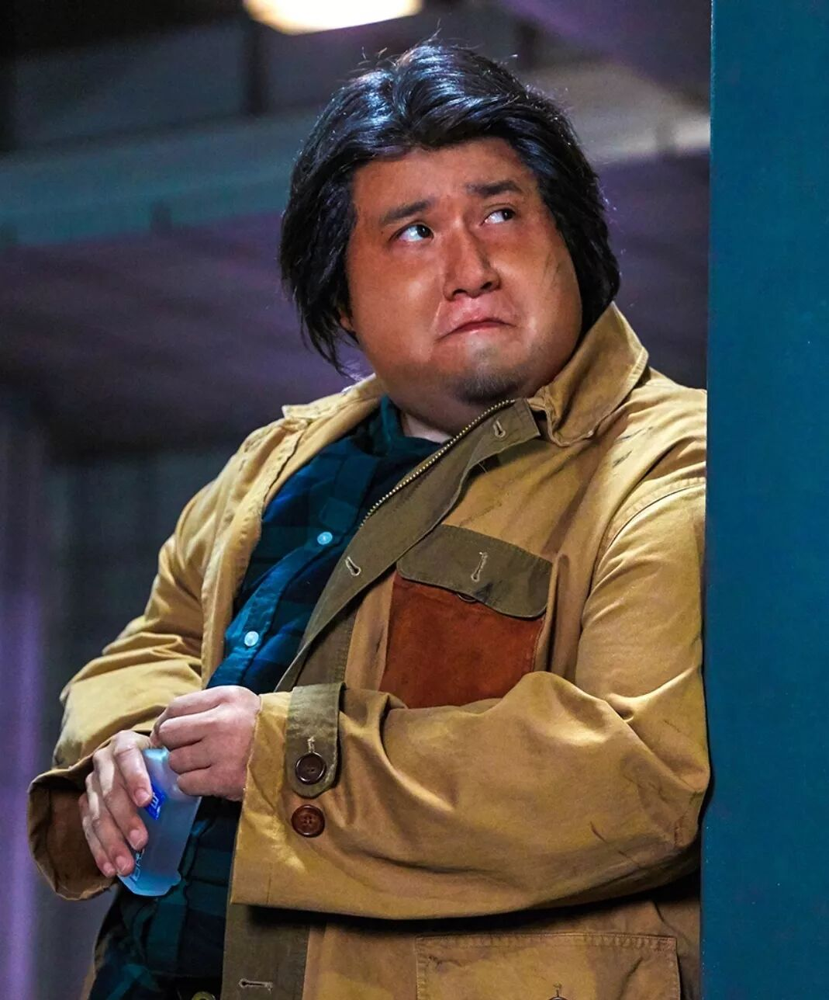 (原始链接: https://mmbiz.qpic.cn/mmbiz_jpg/D1nJqnhkPyKB2ibicC3WDJicM05hRAQo07kGkTDasaP18YNsEaIKK45ZObPNzic6GBT0btYtiayLQ9TMYecFOw0cszA/640?wx_fmt=jpeg)
-  (原始链接: https://mmbiz.qpic.cn/mmbiz_jpg/D1nJqnhkPyKB2ibicC3WDJicM05hRAQo07k4SYkMibREpL9LFyrJ8ibOUhyhjyvyCwBWdXHnUAHh3k57icibhAI4BUicfw/640?wx_fmt=jpeg)
-  (原始链接: https://mmbiz.qpic.cn/mmbiz_png/D1nJqnhkPyKB2ibicC3WDJicM05hRAQo07kHy3kxCGKQtLkiaLD50ROdZqboeMruI8tW06vYsQtuwTnaXanyoPBDibA/640?wx_fmt=png)
-  (原始链接: https://mmbiz.qpic.cn/mmbiz_jpg/D1nJqnhkPyKB2ibicC3WDJicM05hRAQo07kIboibqhBkRibb2JibicDbeEQlDXo7abQiaLGBdPXmwJJMflIF2FCLbVCuPg/640?wx_fmt=jpeg)
-  (原始链接: https://mmbiz.qpic.cn/mmbiz_jpg/D1nJqnhkPyKB2ibicC3WDJicM05hRAQo07k4du4Yia0XW7zF9GULuXTU2evcsRibuvh3ZoIKUbtEiay99UIRgL6hbUdg/640?wx_fmt=jpeg)
- 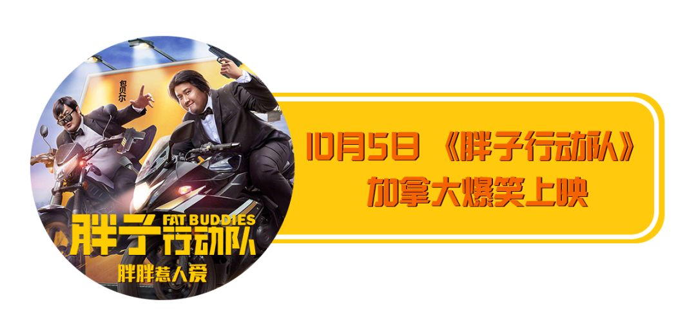 (原始链接: https://mmbiz.qpic.cn/mmbiz_png/D1nJqnhkPyKB2ibicC3WDJicM05hRAQo07kjRlDOsJq8lrTJ7cRcJlNuWwfBuqe4KXOGjNDo2bmSds1zWKic5llmAQ/640?wx_fmt=png)
-  (原始链接: https://mmbiz.qpic.cn/mmbiz_png/D1nJqnhkPyKB2ibicC3WDJicM05hRAQo07k9gRrIOf409X4llpubFLFup50IfwUQCIGT0I1JMh7S25bVjNZbx91cQ/640?wx_fmt=png)
- 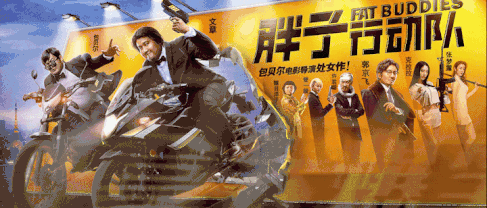 (原始链接: https://mmbiz.qpic.cn/mmbiz_gif/D1nJqnhkPyKB2ibicC3WDJicM05hRAQo07kz57breIu7FbwUpEyjRSV4LiaRcGzSiakjpEulZDsRaM0fpJxekPq9x6Q/640?wx_fmt=gif)
-  (原始链接: https://mmbiz.qpic.cn/mmbiz_jpg/D1nJqnhkPyKB2ibicC3WDJicM05hRAQo07kRdnc1VMDZsWDYGDQ1m33lnEbjkh16IaMkRicO6Ow0nm4e3Hm7S0NrxQ/640?wx_fmt=jpeg)
- 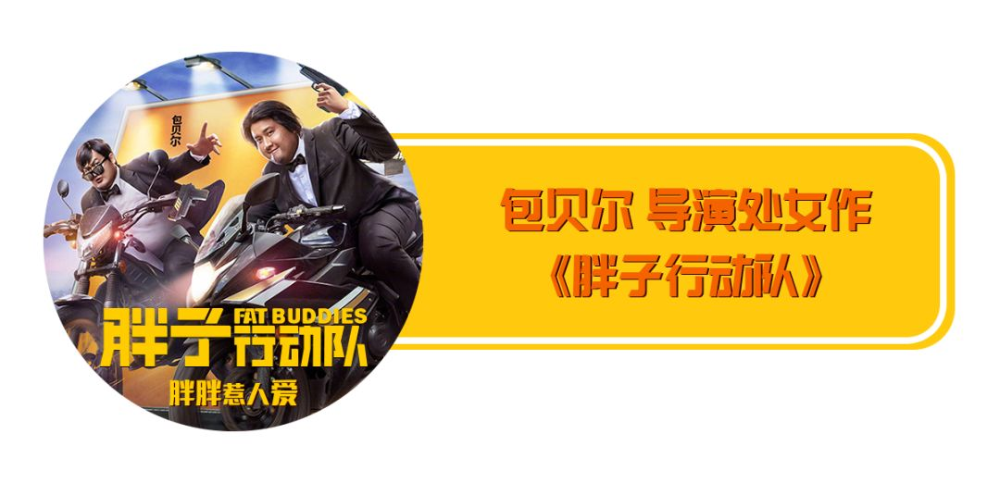 (原始链接: https://mmbiz.qpic.cn/mmbiz_png/D1nJqnhkPyKB2ibicC3WDJicM05hRAQo07kURE2nDgtveOwcEgQ5iavyD1lQ5CGUhcOnb4EuIIHlZvzsLG1T61s5nA/640?wx_fmt=png)
-  (原始链接: https://mmbiz.qpic.cn/mmbiz_png/D1nJqnhkPyKB2ibicC3WDJicM05hRAQo07k9gRrIOf409X4llpubFLFup50IfwUQCIGT0I1JMh7S25bVjNZbx91cQ/640?wx_fmt=png)
-  (原始链接: https://mmbiz.qpic.cn/mmbiz_jpg/D1nJqnhkPyKB2ibicC3WDJicM05hRAQo07kvib6tJXOcfY1lMx8cGYh5ibx5GH5JEeCk1FmsPOgU6CJMc7awA92nYiaQ/640?wx_fmt=jpeg)
- 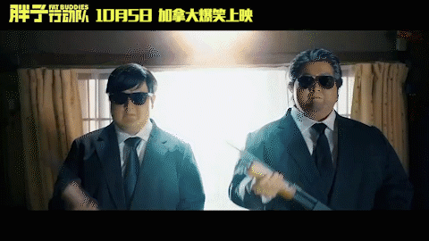 (原始链接: https://mmbiz.qpic.cn/mmbiz_gif/D1nJqnhkPyKB2ibicC3WDJicM05hRAQo07kso0aKawNsmOZCIpQ61MibcAyq67Ny4xPG8edE5EwNkhMTHqRGHj2tSg/640?wx_fmt=gif)
- 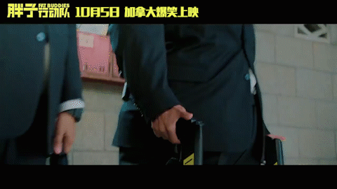 (原始链接: https://mmbiz.qpic.cn/mmbiz_gif/D1nJqnhkPyKB2ibicC3WDJicM05hRAQo07k3qyBwVKlAubia60sutwGDT6hVqgeqMyu6PNQBKYFHbl7nxPJRicxU6ibA/640?wx_fmt=gif)
- 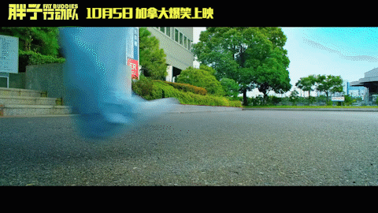 (原始链接: https://mmbiz.qpic.cn/mmbiz_gif/D1nJqnhkPyKB2ibicC3WDJicM05hRAQo07kPTpLRQy1Jibgd25UjwJDfpiciaNsWtVaV2BkFyokZfu7icLMot7kGMuPZA/640?wx_fmt=gif)
-  (原始链接: https://mmbiz.qpic.cn/mmbiz_gif/D1nJqnhkPyKB2ibicC3WDJicM05hRAQo07kjyNOTV7QE8jZ3N4uTaTb9AuZmhY7gXV0xvXsMPVeSzDVppAwXBGYLQ/640?wx_fmt=gif)
- 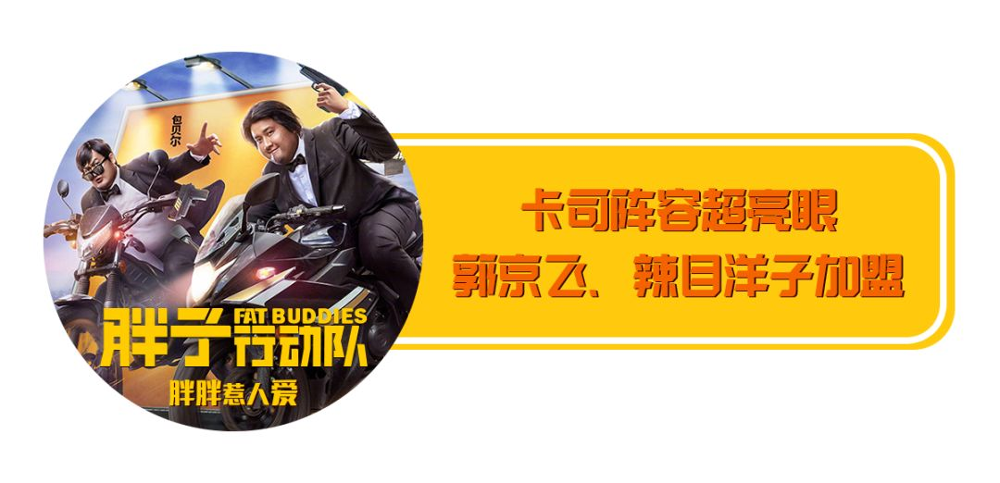 (原始链接: https://mmbiz.qpic.cn/mmbiz_png/D1nJqnhkPyKB2ibicC3WDJicM05hRAQo07kDq9HwgjYFo7V6a8ic8Lrkv5jcZFK977Zt8iafyPKCnNsOwBdZT32yictg/640?wx_fmt=png)
-  (原始链接: https://mmbiz.qpic.cn/mmbiz_png/D1nJqnhkPyKB2ibicC3WDJicM05hRAQo07k9gRrIOf409X4llpubFLFup50IfwUQCIGT0I1JMh7S25bVjNZbx91cQ/640?wx_fmt=png)
- 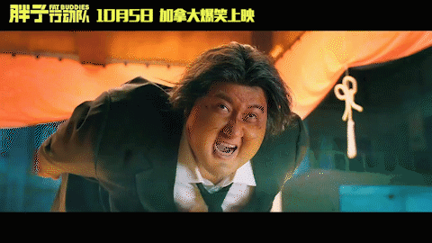 (原始链接: https://mmbiz.qpic.cn/mmbiz_gif/D1nJqnhkPyKB2ibicC3WDJicM05hRAQo07kwDnkQrD8dN4r12F6O8BgOWFJGspNbFU9icJicjNR1xKRnSNZY7dzksfg/640?wx_fmt=gif)
- 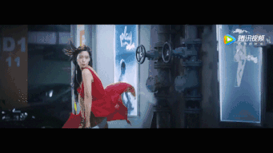 (原始链接: https://mmbiz.qpic.cn/mmbiz_gif/D1nJqnhkPyKB2ibicC3WDJicM05hRAQo07knUicZBQnCoydpEjYUj94HdubxjuO4ibZStbjAGFYJRjcktZAf6nkdrsQ/640?wx_fmt=gif)
-  (原始链接: https://mmbiz.qpic.cn/mmbiz_gif/D1nJqnhkPyKB2ibicC3WDJicM05hRAQo07kPM1vxicf3BXnk8LKZxMPS5ePSqIu4tAqsAzSc1YPckGZ2sWylrBTacg/640?wx_fmt=gif)
- 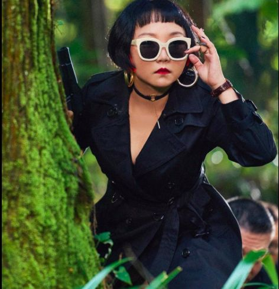 (原始链接: https://mmbiz.qpic.cn/mmbiz_png/D1nJqnhkPyKB2ibicC3WDJicM05hRAQo07kxENQ3lnicowuIzSXoOicqJrWzIqM08cx1KmXZvce6o8GcuOtI2x4frCQ/640?wx_fmt=png)
- 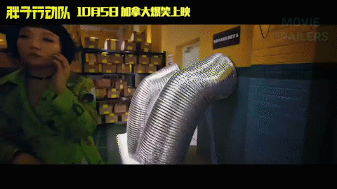 (原始链接: https://mmbiz.qpic.cn/mmbiz_gif/D1nJqnhkPyKB2ibicC3WDJicM05hRAQo07kW3tYOHcoicoaoXJQpcQ74EdFy0dRv0gnsRFY7GsufXtLuvicdwGGcvIA/640?wx_fmt=gif)
-  (原始链接: https://mmbiz.qpic.cn/mmbiz_png/D1nJqnhkPyKB2ibicC3WDJicM05hRAQo07kH1GMV77ibuvyO91X0UvhVRTSra1eK6LOLHlXLJiaqLfszxB4BC60njiaw/640?wx_fmt=png)
-  (原始链接: https://mmbiz.qpic.cn/mmbiz_png/D1nJqnhkPyKB2ibicC3WDJicM05hRAQo07k9gRrIOf409X4llpubFLFup50IfwUQCIGT0I1JMh7S25bVjNZbx91cQ/640?wx_fmt=png)
-  (原始链接: https://mmbiz.qpic.cn/mmbiz_png/D1nJqnhkPyKB2ibicC3WDJicM05hRAQo07kQhz0sFWPx9SLvG93v2JG1oDBicj5jFtqArEuyvs7mbzwicrEncmoYPicQ/640?wx_fmt=png)
-  (原始链接: https://mmbiz.qpic.cn/mmbiz_png/D1nJqnhkPyKB2ibicC3WDJicM05hRAQo07kECBiao2myfeFnXAf4IS93icyU289E0gNLwSnwEZCCS8wGCh12ufEqKEw/640?wx_fmt=png)
- 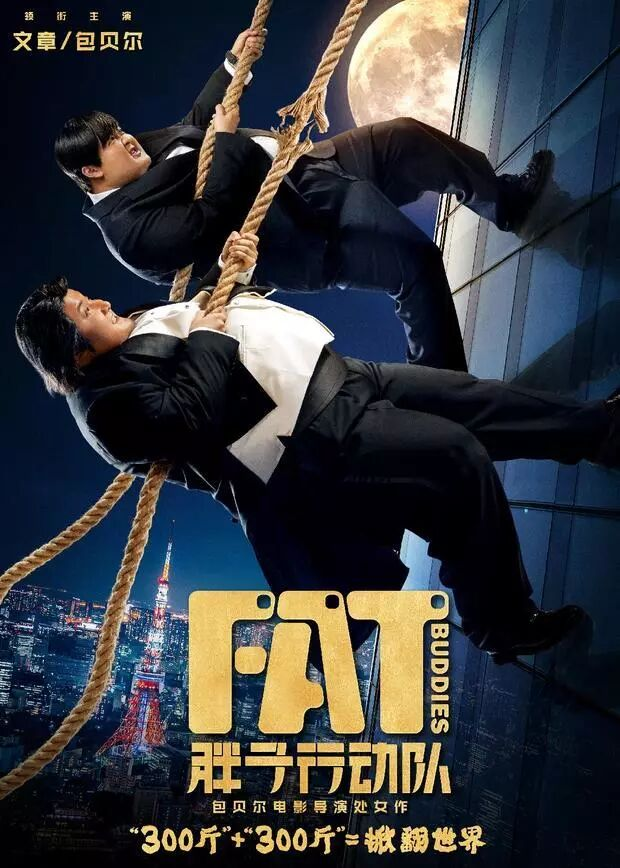 (原始链接: https://mmbiz.qpic.cn/mmbiz_jpg/D1nJqnhkPyKB2ibicC3WDJicM05hRAQo07k7cxOIE9ELWD6W6psP79bbRhSudZvSkVYM0XnbR0icB9Y8KicVIGGfD3w/640?wx_fmt=jpeg)
- 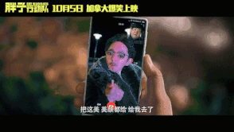 (原始链接: https://mmbiz.qpic.cn/mmbiz_gif/D1nJqnhkPyKB2ibicC3WDJicM05hRAQo07kiaF7DaBOT7xCuppMyvIQIWFT0OWz1xz3YK8cjjnjTpTiawjkFnopFyAw/640?wx_fmt=gif)
-  (原始链接: https://mmbiz.qpic.cn/mmbiz_png/D1nJqnhkPyKB2ibicC3WDJicM05hRAQo07kiayzY3sYFwpUqNSCkUCROLfCcgcnMhg6PxL1NdGYk9X2K1aAHD4CqSw/640?wx_fmt=png)
-  (原始链接: https://mmbiz.qpic.cn/mmbiz_jpg/D1nJqnhkPyKB2ibicC3WDJicM05hRAQo07kC6x54qsglD9ADKo6JVa8784UJxiaWflY8plhatIhjCTw0atom7dj1ibQ/640?wx_fmt=jpeg)
-  (原始链接: https://mmbiz.qpic.cn/mmbiz_jpg/D1nJqnhkPyKB2ibicC3WDJicM05hRAQo07kQzfJAku7enmhatyRicTnlCt965K3hmvTo5vG6bLDDaXDU0SEyQfuwvQ/640?wx_fmt=jpeg)
