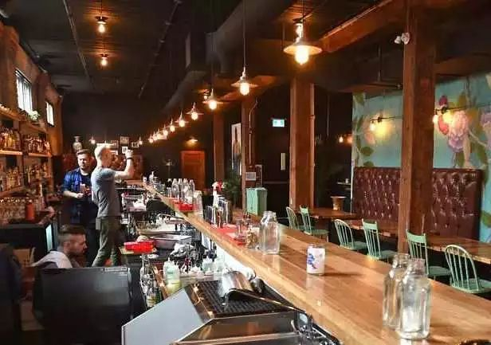
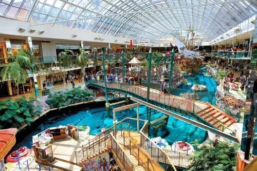
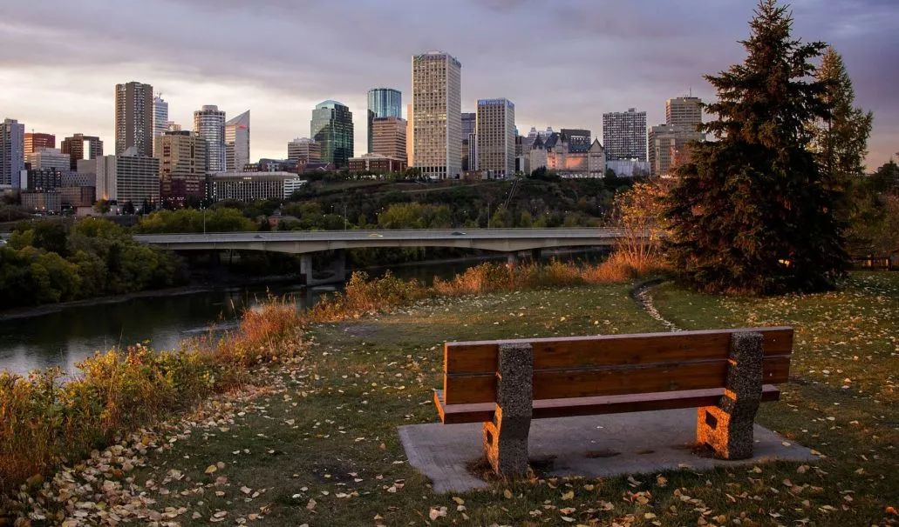
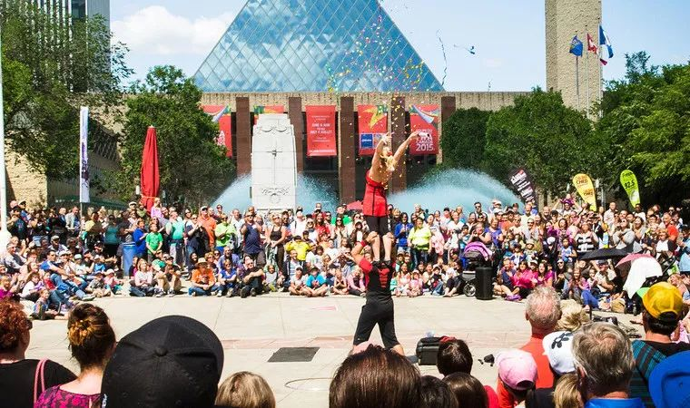
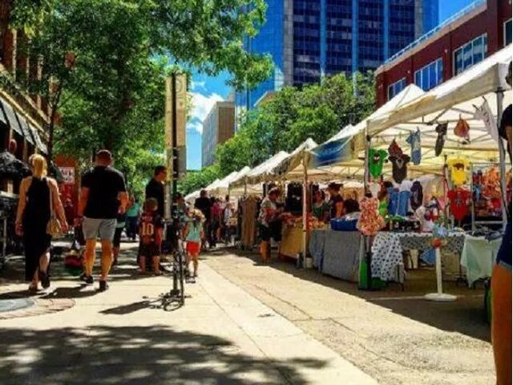
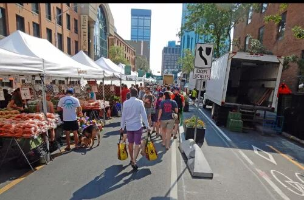
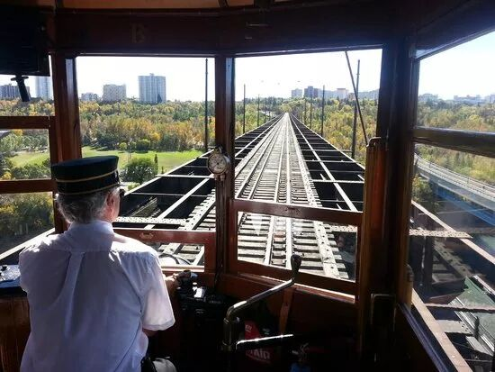
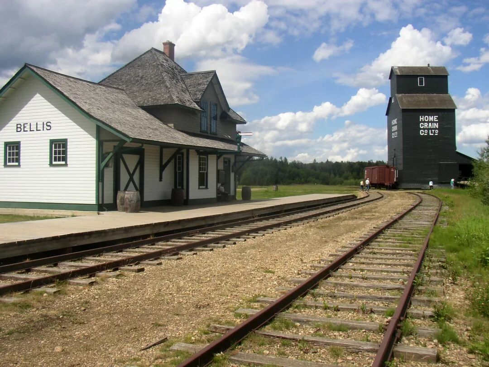
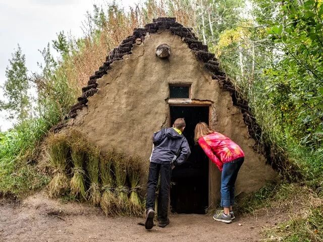
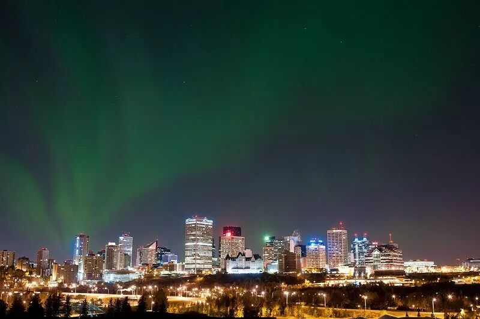

# 无标题

**链接地址:** http://mp.weixin.qq.com/s?__biz=MzI2NTE1ODgwOQ==&mid=2649605095&idx=1&sn=37ebcc3ec709e393d3ee7930df6f94c8&chksm=f2b8ca11c5cf43071eaccb2033f8fae0c11d6ae23b5f745c288f97d2d965cedcc023d1c3a789&mpshare=1&scene=2&srcid=1003gjqw8tEpBSfNZEzjq4Ua#rd
**作者:** 雪糊
**获取时间:** 2025/8/28 21:24:16
**图片数量:** 38

---

## 原始HTML内容

<section style="box-sizing: border-box;"><section class="V5" style="box-sizing: border-box;" powered-by="xiumi.us"><section style="margin-right: 0%;margin-left: 0%;box-sizing: border-box;"><section style="display: inline-block;vertical-align: middle;width: 80%;box-sizing: border-box;"><section class="V5" style="box-sizing: border-box;" powered-by="xiumi.us"><section style="margin-top: 10px;margin-bottom: 10px;text-align: center;box-sizing: border-box;"><section style="display: inline-block;box-sizing: border-box;"><section style="max-width: 100%;font-size: 0px;padding-bottom: 3px;box-sizing: border-box;"><section style="display: inline-block;vertical-align: middle;box-sizing: border-box;"><section style="width: 5px;height: 1px;background-color: rgb(217, 217, 217);box-sizing: border-box;"></section><section style="width: 1px;height: 5px;margin-top: -3px;margin-right: auto;margin-left: auto;background-color: rgb(217, 217, 217);box-sizing: border-box;"></section></section><section style="margin-top: -1px;margin-right: -5px;margin-left: -5px;width: 100%;display: inline-block;vertical-align: middle;padding-right: 8px;padding-left: 8px;box-sizing: border-box;"><section style="width: 100%;height: 1px;background-color: rgb(217, 217, 217);box-sizing: border-box;"></section></section><section style="display: inline-block;vertical-align: middle;box-sizing: border-box;"><section style="width: 5px;height: 1px;background-color: rgb(217, 217, 217);box-sizing: border-box;"></section><section style="width: 1px;height: 5px;margin-top: -3px;margin-right: auto;margin-left: auto;background-color: rgb(217, 217, 217);box-sizing: border-box;"></section></section></section><section style="padding-left: 15px;padding-right: 15px;color: rgb(161, 161, 161);font-size: 14px;box-sizing: border-box;">
点击上方<strong style="box-sizing: border-box;">蓝字</strong>关注我们哟~
</section><section style="max-width: 100%;font-size: 0px;box-sizing: border-box;"><section style="display: inline-block;vertical-align: middle;box-sizing: border-box;"><section style="width: 5px;height: 1px;background-color: rgb(217, 217, 217);box-sizing: border-box;"></section><section style="width: 1px;height: 5px;margin-top: -3px;margin-right: auto;margin-left: auto;background-color: rgb(217, 217, 217);box-sizing: border-box;"></section></section><section style="margin-top: -1px;margin-right: -5px;margin-left: -5px;width: 100%;display: inline-block;vertical-align: middle;padding-right: 8px;padding-left: 8px;box-sizing: border-box;"><section style="width: 100%;height: 1px;background-color: rgb(217, 217, 217);box-sizing: border-box;"></section></section><section style="display: inline-block;vertical-align: middle;box-sizing: border-box;"><section style="width: 5px;height: 1px;background-color: rgb(217, 217, 217);box-sizing: border-box;"></section><section style="width: 1px;height: 5px;margin-top: -3px;margin-right: auto;margin-left: auto;background-color: rgb(217, 217, 217);box-sizing: border-box;"></section></section></section></section></section></section></section><section style="display: inline-block;vertical-align: middle;width: 20%;box-sizing: border-box;"><section class="V5" style="box-sizing: border-box;" powered-by="xiumi.us"><section style="text-align: center;margin: -10px 0% 10px;box-sizing: border-box;"><section style="max-width: 100%;vertical-align: middle;display: inline-block;width: 100%;box-sizing: border-box;"></section></section></section></section></section></section><section class="V5" style="box-sizing: border-box;" powered-by="xiumi.us"><section style="margin: 10px 0%;box-sizing: border-box;"><section style="display: inline-block;width: 100%;vertical-align: top;box-sizing: border-box;"><section class="V5" style="box-sizing: border-box;" powered-by="xiumi.us"><section style="box-sizing: border-box;"><section style="display: inline-block;vertical-align: bottom;width: 75%;padding-right: 10px;box-sizing: border-box;"><section class="V5" style="box-sizing: border-box;" powered-by="xiumi.us"><section style="margin: 10px 0% 3px;box-sizing: border-box;"><section style="display: inline-block;vertical-align: middle;box-sizing: border-box;"><section style="display: inline-block;vertical-align: bottom;padding-left: 5px;padding-right: 5px;line-height: 1.2em;margin-bottom: 2px;color: rgba(80, 182, 201, 0.72);box-sizing: border-box;">
<strong style="box-sizing: border-box;">仔细看下图，有惊喜！</strong>
</section><section style="max-width: 100%;display: inline-block;vertical-align: bottom;width: 1.6em;box-sizing: border-box;"></section></section></section></section></section><section style="display: inline-block;vertical-align: bottom;width: 25%;box-sizing: border-box;"><section class="V5" style="box-sizing: border-box;" powered-by="xiumi.us"><section style="margin-right: 0%;margin-bottom: 3px;margin-left: 0%;text-align: right;box-sizing: border-box;"><section style="display: inline-block;border-bottom: 0.15em solid rgba(80, 182, 201, 0.72);padding-bottom: 3px;box-sizing: border-box;"><section style="display: inline-block;padding: 3px;border-bottom: 0.15em solid rgba(80, 182, 201, 0.72);font-size: 12px;line-height: 1.4;color: rgb(255, 143, 47);box-sizing: border-box;">
<strong style="box-sizing: border-box;">金主大大</strong>
</section></section></section></section></section></section></section><section class="V5" style="box-sizing: border-box;" powered-by="xiumi.us"><section style="margin-right: 0%;margin-left: 0%;box-sizing: border-box;"><section style="background-color: rgba(80, 182, 201, 0.72);height: 2px;box-sizing: border-box;"></section></section></section></section></section></section><section class="V5" style="box-sizing: border-box;" powered-by="xiumi.us"><section style="box-sizing: border-box;"><section style="box-sizing: border-box;">

</section></section></section><section class="V5" style="box-sizing: border-box;" powered-by="xiumi.us"><section style="text-align: center;margin-top: 10px;margin-bottom: 10px;box-sizing: border-box;"><section style="max-width: 100%;vertical-align: middle;display: inline-block;box-sizing: border-box;"><svg xmlns="http://www.w3.org/2000/svg" x="0px" y="0px" viewBox="0 0 902.1 38.2" style="vertical-align: middle;max-width: 100%;box-sizing: border-box;" width="902.1"><g style="box-sizing: border-box;"><path style="box-sizing: border-box;" d="M18.4,1.4c0.9-1.9,2.4-1.9,3.4,0l3.4,6.9c0.9,1.9,3.4,3.7,5.4,4l7.6,1.1c2.1,0.3,2.5,1.7,1,3.2   l-5.5,5.4c-1.5,1.5-2.4,4.3-2.1,6.4l1.3,7.6c0.4,2.1-0.9,2.9-2.7,2l-6.8-3.6c-1.8-1-4.9-1-6.7,0l-6.8,3.6c-1.9,1-3.1,0.1-2.7-2   l1.3-7.6c0.4-2.1-0.6-4.9-2.1-6.4l-5.5-5.4c-1.5-1.5-1-2.9,1-3.2l7.6-1.1c2.1-0.3,4.5-2.1,5.4-4L18.4,1.4z" fill="rgb(178, 243, 230)"></path><path style="box-sizing: border-box;" d="M90.6,5.4c0.7-1.4,1.9-1.4,2.6,0l2.6,5.3c0.7,1.4,2.6,2.8,4.2,3.1l5.9,0.9c1.6,0.2,2,1.3,0.8,2.5   l-4.2,4.1c-1.2,1.1-1.9,3.3-1.6,4.9l1,5.8c0.3,1.6-0.7,2.3-2.1,1.5l-5.2-2.8c-1.4-0.8-3.8-0.8-5.2,0L84,33.6   c-1.4,0.8-2.4,0.1-2.1-1.5l1-5.8c0.3-1.6-0.5-3.8-1.6-4.9l-4.2-4.1c-1.2-1.1-0.8-2.2,0.8-2.5l5.9-0.9c1.6-0.2,3.5-1.6,4.2-3.1   L90.6,5.4z" fill="rgb(190, 204, 246)"></path><path style="box-sizing: border-box;" d="M162.6,7.5c0.6-1.2,1.6-1.2,2.2,0l2.2,4.5c0.6,1.2,2.2,2.4,3.6,2.6l5,0.7c1.4,0.2,1.7,1.1,0.7,2.1   l-3.6,3.5c-1,1-1.6,2.9-1.4,4.2l0.9,5c0.2,1.4-0.6,1.9-1.8,1.3l-4.5-2.4c-1.2-0.6-3.2-0.6-4.4,0l-4.5,2.4c-1.2,0.6-2,0.1-1.8-1.3   l0.9-5c0.2-1.4-0.4-3.3-1.4-4.2l-3.6-3.5c-1-1-0.7-1.9,0.7-2.1l5-0.7c1.4-0.2,3-1.4,3.6-2.6L162.6,7.5z" fill="rgb(150, 208, 240)"></path><path style="box-sizing: border-box;" d="M60.1,19.1c0,2.3-1.9,4.2-4.2,4.2c-2.3,0-4.2-1.9-4.2-4.2s1.9-4.2,4.2-4.2   C58.3,14.9,60.1,16.8,60.1,19.1z" fill="rgb(218, 240, 224)"></path><path style="box-sizing: border-box;" d="M203.8,19.1c0,2.3-1.9,4.2-4.2,4.2c-2.3,0-4.2-1.9-4.2-4.2s1.9-4.2,4.2-4.2   C201.9,14.9,203.8,16.8,203.8,19.1z" fill="rgb(218, 240, 224)"></path><path style="box-sizing: border-box;" d="M130.9,19.1c0,1.7-1.4,3.1-3.1,3.1c-1.7,0-3.1-1.4-3.1-3.1c0-1.7,1.4-3.1,3.1-3.1   C129.5,16.1,130.9,17.4,130.9,19.1z" fill="rgb(218, 240, 224)"></path><path style="box-sizing: border-box;" d="M233.9,1.4c0.9-1.9,2.4-1.9,3.4,0l3.4,6.9c0.9,1.9,3.4,3.7,5.4,4l7.6,1.1c2.1,0.3,2.5,1.7,1,3.2   l-5.5,5.4c-1.5,1.5-2.4,4.3-2.1,6.4l1.3,7.6c0.4,2.1-0.9,2.9-2.7,2l-6.8-3.6c-1.8-1-4.9-1-6.7,0l-6.8,3.6c-1.9,1-3.1,0.1-2.7-2   l1.3-7.6c0.4-2.1-0.6-4.9-2.1-6.4l-5.5-5.4c-1.5-1.5-1-2.9,1-3.2l7.6-1.1c2.1-0.3,4.5-2.1,5.4-4L233.9,1.4z" fill="rgb(178, 243, 230)"></path><path style="box-sizing: border-box;" d="M306.1,5.4c0.7-1.4,1.9-1.4,2.6,0l2.6,5.3c0.7,1.4,2.6,2.8,4.2,3.1l5.9,0.9c1.6,0.2,2,1.3,0.8,2.5   l-4.2,4.1c-1.2,1.1-1.9,3.3-1.6,4.9l1,5.8c0.3,1.6-0.7,2.3-2.1,1.5l-5.2-2.8c-1.4-0.8-3.8-0.8-5.2,0l-5.2,2.8   c-1.4,0.8-2.4,0.1-2.1-1.5l1-5.8c0.3-1.6-0.4-3.8-1.6-4.9l-4.2-4.1c-1.2-1.1-0.8-2.2,0.8-2.5l5.9-0.9c1.6-0.2,3.5-1.6,4.2-3.1   L306.1,5.4z" fill="rgb(190, 204, 246)"></path><path style="box-sizing: border-box;" d="M378.1,7.5c0.6-1.2,1.6-1.2,2.2,0l2.2,4.5c0.6,1.2,2.2,2.4,3.6,2.6l5,0.7c1.4,0.2,1.7,1.1,0.7,2.1   l-3.6,3.5c-1,1-1.6,2.9-1.4,4.2l0.9,5c0.2,1.4-0.6,1.9-1.8,1.3l-4.5-2.4c-1.2-0.6-3.2-0.6-4.4,0l-4.5,2.4c-1.2,0.6-2,0.1-1.8-1.3   l0.9-5c0.2-1.4-0.4-3.3-1.4-4.2l-3.6-3.5c-1-1-0.7-1.9,0.7-2.1l5-0.7c1.4-0.2,3-1.4,3.6-2.6L378.1,7.5z" fill="rgb(150, 208, 240)"></path><path style="box-sizing: border-box;" d="M275.7,19.1c0,2.3-1.9,4.2-4.2,4.2c-2.3,0-4.2-1.9-4.2-4.2s1.9-4.2,4.2-4.2   C273.8,14.9,275.7,16.8,275.7,19.1z" fill="rgb(218, 240, 224)"></path><path style="box-sizing: border-box;" d="M419.3,19.1c0,2.3-1.9,4.2-4.2,4.2c-2.3,0-4.2-1.9-4.2-4.2s1.9-4.2,4.2-4.2   C417.5,14.9,419.3,16.8,419.3,19.1z" fill="rgb(218, 240, 224)"></path><path style="box-sizing: border-box;" d="M346.4,19.1c0,1.7-1.4,3.1-3.1,3.1c-1.7,0-3.1-1.4-3.1-3.1c0-1.7,1.4-3.1,3.1-3.1   C345,16.1,346.4,17.4,346.4,19.1z" fill="rgb(218, 240, 224)"></path><path style="box-sizing: border-box;" d="M449.4,1.4c0.9-1.9,2.4-1.9,3.4,0l3.4,6.9c0.9,1.9,3.4,3.7,5.4,4l7.6,1.1c2.1,0.3,2.5,1.7,1,3.2   l-5.5,5.4c-1.5,1.5-2.4,4.3-2.1,6.4l1.3,7.6c0.4,2.1-0.9,2.9-2.7,2l-6.8-3.6c-1.8-1-4.9-1-6.7,0l-6.8,3.6c-1.9,1-3.1,0.1-2.7-2   l1.3-7.6c0.4-2.1-0.6-4.9-2.1-6.4l-5.5-5.4c-1.5-1.5-1-2.9,1-3.2l7.6-1.1c2.1-0.3,4.5-2.1,5.4-4L449.4,1.4z" fill="rgb(178, 243, 230)"></path><path style="box-sizing: border-box;" d="M521.6,5.4c0.7-1.4,1.9-1.4,2.6,0l2.6,5.3c0.7,1.4,2.6,2.8,4.2,3.1l5.9,0.9c1.6,0.2,2,1.3,0.8,2.5   l-4.2,4.1c-1.2,1.1-1.9,3.3-1.6,4.9l1,5.8c0.3,1.6-0.7,2.3-2.1,1.5l-5.2-2.8c-1.4-0.8-3.8-0.8-5.2,0l-5.2,2.8   c-1.4,0.8-2.4,0.1-2.1-1.5l1-5.8c0.3-1.6-0.5-3.8-1.6-4.9l-4.2-4.1c-1.2-1.1-0.8-2.2,0.8-2.5l5.9-0.9c1.6-0.2,3.5-1.6,4.2-3.1   L521.6,5.4z" fill="rgb(190, 204, 246)"></path><path style="box-sizing: border-box;" d="M593.6,7.5c0.6-1.2,1.6-1.2,2.2,0l2.2,4.5c0.6,1.2,2.2,2.4,3.6,2.6l5,0.7c1.4,0.2,1.7,1.1,0.7,2.1   l-3.6,3.5c-1,1-1.6,2.9-1.4,4.2l0.9,5c0.2,1.4-0.6,1.9-1.8,1.3l-4.5-2.4c-1.2-0.6-3.2-0.6-4.4,0l-4.5,2.4c-1.2,0.6-2,0.1-1.8-1.3   l0.9-5c0.2-1.4-0.4-3.3-1.4-4.2l-3.6-3.5c-1-1-0.7-1.9,0.7-2.1l5-0.7c1.4-0.2,3-1.4,3.6-2.6L593.6,7.5z" fill="rgb(150, 208, 240)"></path><path style="box-sizing: border-box;" d="M491.2,19.1c0,2.3-1.9,4.2-4.2,4.2c-2.3,0-4.2-1.9-4.2-4.2s1.9-4.2,4.2-4.2   C489.3,14.9,491.2,16.8,491.2,19.1z" fill="rgb(218, 240, 224)"></path><path style="box-sizing: border-box;" d="M634.9,19.1c0,2.3-1.9,4.2-4.2,4.2c-2.3,0-4.2-1.9-4.2-4.2s1.9-4.2,4.2-4.2   C633,14.9,634.9,16.8,634.9,19.1z" fill="rgb(218, 240, 224)"></path><path style="box-sizing: border-box;" d="M561.9,19.1c0,1.7-1.4,3.1-3.1,3.1c-1.7,0-3.1-1.4-3.1-3.1c0-1.7,1.4-3.1,3.1-3.1   C560.5,16.1,561.9,17.4,561.9,19.1z" fill="rgb(218, 240, 224)"></path><path style="box-sizing: border-box;" d="M664.9,1.4c0.9-1.9,2.4-1.9,3.4,0l3.4,6.9c0.9,1.9,3.4,3.7,5.4,4l7.6,1.1c2.1,0.3,2.5,1.7,1,3.2   l-5.5,5.4c-1.5,1.5-2.4,4.3-2.1,6.4l1.3,7.6c0.4,2.1-0.9,2.9-2.7,2l-6.8-3.6c-1.8-1-4.9-1-6.7,0l-6.8,3.6c-1.9,1-3.1,0.1-2.7-2   l1.3-7.6c0.4-2.1-0.6-4.9-2.1-6.4l-5.5-5.4c-1.5-1.5-1-2.9,1-3.2l7.6-1.1c2.1-0.3,4.5-2.1,5.4-4L664.9,1.4z" fill="rgb(178, 243, 230)"></path><path style="box-sizing: border-box;" d="M737.1,5.4c0.7-1.4,1.9-1.4,2.6,0l2.6,5.3c0.7,1.4,2.6,2.8,4.2,3.1l5.9,0.9c1.6,0.2,2,1.3,0.8,2.5   l-4.2,4.1c-1.2,1.1-1.9,3.3-1.6,4.9l1,5.8c0.3,1.6-0.7,2.3-2.1,1.5l-5.2-2.8c-1.4-0.8-3.8-0.8-5.2,0l-5.2,2.8   c-1.4,0.8-2.4,0.1-2.1-1.5l1-5.8c0.3-1.6-0.5-3.8-1.6-4.9l-4.2-4.1c-1.2-1.1-0.8-2.2,0.8-2.5l5.9-0.9c1.6-0.2,3.5-1.6,4.2-3.1   L737.1,5.4z" fill="rgb(190, 204, 246)"></path><path style="box-sizing: border-box;" d="M809.2,7.5c0.6-1.2,1.6-1.2,2.2,0l2.2,4.5c0.6,1.2,2.2,2.4,3.6,2.6l5,0.7c1.4,0.2,1.7,1.1,0.7,2.1   l-3.6,3.5c-1,1-1.6,2.9-1.4,4.2l0.9,5c0.2,1.4-0.6,1.9-1.8,1.3l-4.5-2.4c-1.2-0.6-3.2-0.6-4.4,0l-4.5,2.4c-1.2,0.6-2,0.1-1.8-1.3   l0.9-5c0.2-1.4-0.4-3.3-1.4-4.2l-3.6-3.5c-1-1-0.7-1.9,0.7-2.1l5-0.7c1.4-0.2,3-1.4,3.6-2.6L809.2,7.5z" fill="rgb(150, 208, 240)"></path><path style="box-sizing: border-box;" d="M706.7,19.1c0,2.3-1.9,4.2-4.2,4.2c-2.3,0-4.2-1.9-4.2-4.2s1.9-4.2,4.2-4.2   C704.8,14.9,706.7,16.8,706.7,19.1z" fill="rgb(218, 240, 224)"></path><path style="box-sizing: border-box;" d="M850.4,19.1c0,2.3-1.9,4.2-4.2,4.2c-2.3,0-4.2-1.9-4.2-4.2s1.9-4.2,4.2-4.2   C848.5,14.9,850.4,16.8,850.4,19.1z" fill="rgb(218, 240, 224)"></path><path style="box-sizing: border-box;" d="M777.4,19.1c0,1.7-1.4,3.1-3.1,3.1c-1.7,0-3.1-1.4-3.1-3.1c0-1.7,1.4-3.1,3.1-3.1   C776,16.1,777.4,17.4,777.4,19.1z" fill="rgb(218, 240, 224)"></path><path style="box-sizing: border-box;" d="M880.4,1.4c0.9-1.9,2.4-1.9,3.4,0l3.4,6.9c0.9,1.9,3.4,3.7,5.4,4l7.6,1.1c2.1,0.3,2.5,1.7,1,3.2   l-5.5,5.4c-1.5,1.5-2.4,4.3-2.1,6.4l1.3,7.6c0.4,2.1-0.9,2.9-2.7,2l-6.8-3.6c-1.8-1-4.9-1-6.7,0l-6.8,3.6c-1.8,1-3.1,0.1-2.7-2   l1.3-7.6c0.4-2.1-0.6-4.9-2.1-6.4l-5.5-5.4c-1.5-1.5-1-2.9,1-3.2l7.6-1.1c2.1-0.3,4.5-2.1,5.4-4L880.4,1.4z" fill="rgb(178, 243, 230)"></path></g></svg></section></section></section><section class="V5" style="box-sizing: border-box;" powered-by="xiumi.us"><section style="box-sizing: border-box;"><section style="text-align: center;box-sizing: border-box;"><section style="box-sizing: border-box;"><section class="V5" style="box-sizing: border-box;" powered-by="xiumi.us"><section style="text-align: center;margin: 15px 0%;box-sizing: border-box;"><section style="display: inline-block;width: 98%;vertical-align: top;border-style: solid;border-width: 1px;border-radius: 0px;border-color: rgb(189, 189, 189);box-sizing: border-box;"><section class="V5" style="box-sizing: border-box;" powered-by="xiumi.us"><section style="box-sizing: border-box;"><section style="display: inline-block;vertical-align: top;width: 80%;padding-right: 10px;padding-left: 10px;box-shadow: rgb(0, 0, 0) 0px 0px 0px;box-sizing: border-box;"><section class="V5" style="box-sizing: border-box;" powered-by="xiumi.us"><section style="margin-top: 8px;margin-right: 0%;margin-left: 0%;box-sizing: border-box;"><section style="text-align: left;color: rgb(231, 135, 48);font-size: 14px;letter-spacing: 2px;box-sizing: border-box;">
玩转埃德蒙顿之十件必须要做的事
</section></section></section><section class="V5" style="box-sizing: border-box;" powered-by="xiumi.us"><section style="margin-top: 5px;margin-right: 0%;margin-left: 0%;box-sizing: border-box;"><section style="background-color: rgb(231, 135, 48);height: 2px;box-sizing: border-box;"></section></section></section></section><section style="display: inline-block;vertical-align: top;width: 20%;box-sizing: border-box;"><section class="V5" style="box-sizing: border-box;" powered-by="xiumi.us"><section style="text-align: right;margin-top: -11px;margin-right: 0%;margin-left: 0%;transform: translate3d(1px, 0px, 0px);box-sizing: border-box;"><section style="display: inline-block;width: 40px;height: 50px;vertical-align: top;overflow: hidden;background-color: rgb(255, 255, 255);padding-top: 10px;box-sizing: border-box;"><section class="V5" style="box-sizing: border-box;" powered-by="xiumi.us"><section style="text-align: center;margin-right: 0%;margin-left: 0%;box-sizing: border-box;"><section style="max-width: 100%;vertical-align: middle;display: inline-block;box-sizing: border-box;"></section></section></section></section></section></section></section></section></section><section class="V5" style="box-sizing: border-box;" powered-by="xiumi.us"><section style="text-align: left;margin: 10px 0% -45px;transform: translate3d(10px, 0px, 0px);-webkit-transform: translate3d(10px, 0px, 0px);-moz-transform: translate3d(10px, 0px, 0px);-o-transform: translate3d(10px, 0px, 0px);box-sizing: border-box;"><section style="max-width: 100%;vertical-align: middle;display: inline-block;width: 20%;box-shadow: rgb(0, 0, 0) 0px 0px 0px;box-sizing: border-box;"></section></section></section><section class="V5" style="box-sizing: border-box;" powered-by="xiumi.us"><section style="margin: 8px 0% 18px;padding-left: 0.5em;padding-right: 0.5em;box-sizing: border-box;"><section style="box-sizing: border-box;width: 100%;border-width: 4px;border-style: solid;border-color: white;box-shadow: rgb(102, 102, 102) 3.53553px 3.53553px 8px;display: inline-block;height: auto !important;"></section></section></section><section class="V5" style="box-sizing: border-box;" powered-by="xiumi.us"><section style="box-sizing: border-box;"><section style="display: inline-block;width: 100%;vertical-align: top;padding: 20px 10px;box-sizing: border-box;"><section class="V5" style="box-sizing: border-box;" powered-by="xiumi.us"><section style="box-sizing: border-box;"><section style="text-align: justify;font-size: 14px;line-height: 1.8;color: rgba(62, 62, 62, 0.72);letter-spacing: 2px;box-sizing: border-box;">
埃德蒙顿是加拿大<strong style="box-sizing: border-box;">发展最快</strong>的城市之一。截至到今年，埃德蒙顿已经拥有超过<strong style="box-sizing: border-box;">一百万</strong>居民，是加拿大阳光最充足的城市，也是加拿大的节日之都。埃德蒙顿位于阿尔伯塔省，是一片从肥沃土地上成长起来的现代化大城市。

 

埃德蒙顿是阿尔伯塔省的<strong style="box-sizing: border-box;">省会</strong>，同时也是该省的文化、政府和教育中心，城市拥有轻轨运输（LRT），并有北美最大的室内购物中心西埃德蒙顿购物中心和加拿大最大的历史公园埃德蒙顿堡垒公园。

 

雪糊作为一个在埃德蒙顿居住了超过十年的老屯民，心中还是默默珍藏了许多在埃德蒙顿必须要去打卡的事情。今天就精挑细选出了<strong style="box-sizing: border-box;">8件在埃德蒙顿必须要做的娱乐项目</strong>去丰富你在埃德蒙顿的生活！
</section></section></section></section></section></section></section></section></section><section class="V5" style="box-sizing: border-box;" powered-by="xiumi.us"><section style="text-align: center;margin-top: 10px;margin-bottom: 10px;box-sizing: border-box;"><section style="max-width: 100%;vertical-align: middle;display: inline-block;box-sizing: border-box;"></section></section></section><section class="V5" style="box-sizing: border-box;" powered-by="xiumi.us"><section style="box-sizing: border-box;"><section style="box-sizing: border-box;">
 
</section></section></section><section class="V5" style="box-sizing: border-box;" powered-by="xiumi.us"><section style="text-align: center;margin: 20px 0% 10px;box-sizing: border-box;"><section style="display: inline-block;background-position: 0% 0%;background-repeat: repeat;background-size: auto;background-attachment: scroll;border-style: solid;border-width: 1px;border-radius: 0px;border-color: rgb(62, 62, 62);background-image: url(&quot;https://mmbiz.qpic.cn/mmbiz_png/D1nJqnhkPyKIaBWcm3EKEDhhwTVIrMAtJkEwLBWXdq2ZT4GK5Niaic7yxGrib3IaVctxjGNADR3xMAA14tNp2E4jw/640?wx_fmt=png&quot;);box-sizing: border-box;"><section class="V5" style="box-sizing: border-box;" powered-by="xiumi.us"><section style="margin: -10px 0% 5px;transform: translate3d(-5px, 0px, 0px);-webkit-transform: translate3d(-5px, 0px, 0px);-moz-transform: translate3d(-5px, 0px, 0px);-o-transform: translate3d(-5px, 0px, 0px);box-sizing: border-box;"><section style="display: inline-block;background-color: rgb(255, 255, 255);padding: 5px;border-style: solid;border-width: 1px;border-radius: 0px;border-color: rgb(62, 62, 62);box-sizing: border-box;"><section class="V5" style="box-sizing: border-box;" powered-by="xiumi.us"><section style="box-sizing: border-box;"><section style="text-align: left;font-size: 14px;padding-right: 5px;padding-left: 5px;box-sizing: border-box;">
1. 在当烫的小酒吧里进餐
</section></section></section></section></section></section></section></section></section><section class="V5" style="box-sizing: border-box;" powered-by="xiumi.us"><section style="margin: 20px 0%;text-align: center;box-sizing: border-box;"><section style="display: inline-block;width: 95%;vertical-align: top;box-shadow: rgb(158, 158, 158) 0px 0px 4px;box-sizing: border-box;"><section class="V5" style="box-sizing: border-box;" powered-by="xiumi.us"><section style="margin-right: 0%;margin-bottom: -7px;margin-left: 0%;box-sizing: border-box;"><section style="max-width: 100%;vertical-align: middle;display: inline-block;box-shadow: rgb(0, 0, 0) 0px 0px 0px;box-sizing: border-box;"></section></section></section><section class="V5" style="box-sizing: border-box;" powered-by="xiumi.us"><section style="margin: 12px 0% 8px;box-sizing: border-box;"><section style="text-align: left;font-size: 14px;color: rgba(62, 62, 62, 0.72);padding-right: 10px;padding-left: 10px;box-sizing: border-box;">
酒吧林立的Mercer街区傍晚十分是埃德蒙顿的热点
</section></section></section></section></section></section><section class="V5" style="box-sizing: border-box;" powered-by="xiumi.us"><section style="box-sizing: border-box;"><section style="display: inline-block;width: 100%;vertical-align: top;padding: 20px 10px;box-sizing: border-box;"><section class="V5" style="box-sizing: border-box;" powered-by="xiumi.us"><section style="box-sizing: border-box;"><section style="text-align: justify;font-size: 14px;line-height: 1.8;color: rgba(62, 62, 62, 0.72);letter-spacing: 2px;box-sizing: border-box;">
随着Rogers Arena的建立，埃德蒙顿市区该地区周边的餐饮业逐渐红火起来。

 

从前这片市区边沿的<strong style="box-sizing: border-box;">老旧仓库</strong>一跃成为目前年轻人聚集的最具开发价值的<strong style="box-sizing: border-box;">中心地带</strong>。其中尤属Mercer District这个年逾百年的古建筑物散发出最潮流的气息。

 

装载着餐饮新贵Baijiu，Rostizado和Mercer Tarven这样炙手可热的<strong style="box-sizing: border-box;">酒馆夜店</strong>，让这里一到夜晚就变成年轻人劲歌热舞寻欢作乐的天堂。

 

想要跟上埃德蒙顿<strong style="box-sizing: border-box;">最潮流的节奏</strong>？来这里准时不错的选择。
</section></section></section></section></section></section><section class="V5" style="box-sizing: border-box;" powered-by="xiumi.us"><section style="margin: 20px 0%;text-align: center;box-sizing: border-box;"><section style="display: inline-block;width: 95%;vertical-align: top;box-shadow: rgb(158, 158, 158) 0px 0px 4px;box-sizing: border-box;"><section class="V5" style="box-sizing: border-box;" powered-by="xiumi.us"><section style="margin-right: 0%;margin-bottom: -7px;margin-left: 0%;box-sizing: border-box;"><section style="max-width: 100%;vertical-align: middle;display: inline-block;box-shadow: rgb(0, 0, 0) 0px 0px 0px;box-sizing: border-box;"></section></section></section><section class="V5" style="box-sizing: border-box;" powered-by="xiumi.us"><section style="margin: 12px 0% 8px;box-sizing: border-box;"><section style="font-size: 14px;color: rgba(62, 62, 62, 0.72);padding-right: 10px;padding-left: 10px;box-sizing: border-box;">
融合中国和加拿大风格的Baijiu是目前最火的酒吧
</section></section></section></section></section></section><section class="V5" style="box-sizing: border-box;" powered-by="xiumi.us"><section style="box-sizing: border-box;"><section style="box-sizing: border-box;">
 
</section></section></section><section class="V5" style="box-sizing: border-box;" powered-by="xiumi.us"><section style="text-align: center;margin-top: 10px;margin-bottom: 10px;box-sizing: border-box;"><section style="max-width: 100%;vertical-align: middle;display: inline-block;box-sizing: border-box;"></section></section></section><section class="V5" style="box-sizing: border-box;" powered-by="xiumi.us"><section style="text-align: center;margin: 20px 0% 10px;box-sizing: border-box;"><section style="display: inline-block;background-position: 0% 0%;background-repeat: repeat;background-size: auto;background-attachment: scroll;border-style: solid;border-width: 1px;border-radius: 0px;border-color: rgb(62, 62, 62);background-image: url(&quot;https://mmbiz.qpic.cn/mmbiz_png/D1nJqnhkPyKIaBWcm3EKEDhhwTVIrMAtJkEwLBWXdq2ZT4GK5Niaic7yxGrib3IaVctxjGNADR3xMAA14tNp2E4jw/640?wx_fmt=png&quot;);box-sizing: border-box;"><section class="V5" style="box-sizing: border-box;" powered-by="xiumi.us"><section style="margin: -10px 0% 5px;transform: translate3d(-5px, 0px, 0px);-webkit-transform: translate3d(-5px, 0px, 0px);-moz-transform: translate3d(-5px, 0px, 0px);-o-transform: translate3d(-5px, 0px, 0px);box-sizing: border-box;"><section style="display: inline-block;background-color: rgb(255, 255, 255);padding: 5px;border-style: solid;border-width: 1px;border-radius: 0px;border-color: rgb(62, 62, 62);box-sizing: border-box;"><section class="V5" style="box-sizing: border-box;" powered-by="xiumi.us"><section style="box-sizing: border-box;"><section style="text-align: left;font-size: 14px;padding-right: 5px;padding-left: 5px;box-sizing: border-box;">
2. 在北美最大的商场购物
</section></section></section></section></section></section></section></section></section><section class="V5" style="box-sizing: border-box;" powered-by="xiumi.us"><section style="margin: 20px 0%;text-align: center;box-sizing: border-box;"><section style="display: inline-block;width: 95%;vertical-align: top;box-shadow: rgb(158, 158, 158) 0px 0px 4px;box-sizing: border-box;"><section class="V5" style="box-sizing: border-box;" powered-by="xiumi.us"><section style="margin-right: 0%;margin-bottom: -7px;margin-left: 0%;box-sizing: border-box;"><section style="max-width: 100%;vertical-align: middle;display: inline-block;box-shadow: rgb(0, 0, 0) 0px 0px 0px;box-sizing: border-box;"></section></section></section><section class="V5" style="box-sizing: border-box;" powered-by="xiumi.us"><section style="margin: 12px 0% 8px;box-sizing: border-box;"><section style="text-align: left;font-size: 14px;color: rgba(62, 62, 62, 0.72);padding-right: 10px;padding-left: 10px;box-sizing: border-box;">
来埃德蒙顿不来WEM，我看你也是白来了。
</section></section></section></section></section></section><section class="V5" style="box-sizing: border-box;" powered-by="xiumi.us"><section style="box-sizing: border-box;"><section style="display: inline-block;width: 100%;vertical-align: top;padding: 20px 10px;box-sizing: border-box;"><section class="V5" style="box-sizing: border-box;" powered-by="xiumi.us"><section style="box-sizing: border-box;"><section style="text-align: justify;font-size: 14px;line-height: 1.8;color: rgba(62, 62, 62, 0.72);letter-spacing: 2px;box-sizing: border-box;">
说到许多人来埃德蒙顿的理由，<strong style="box-sizing: border-box;">West Edmonton Mall</strong>可能是其中极具吸引力的一项。毕竟在这个冬天寒冷又漫长的城市，冬天除了WEM，哪里也去不了。

 

WEM曾经是世界上最大的购物中心，直到2004年。现在也是<strong style="box-sizing: border-box;">北美最大的购物中心</strong>。在这个商场里，你可以找到任何你需要想要的东西！

 

商店，水上乐园，电影院，室内高尔夫球场，溜冰场和世界上最大的室内游乐园……这里就如同一个<strong style="box-sizing: border-box;">微缩城镇</strong>，满足你购物需求的同时，带给你吃喝玩乐一条龙的极佳休闲体验。

 

请准备好整整一天的时间泡在这里吧！
</section></section></section></section></section></section><section class="V5" style="box-sizing: border-box;" powered-by="xiumi.us"><section style="margin: 20px 0%;text-align: center;box-sizing: border-box;"><section style="display: inline-block;width: 95%;vertical-align: top;box-shadow: rgb(158, 158, 158) 0px 0px 4px;box-sizing: border-box;"><section class="V5" style="box-sizing: border-box;" powered-by="xiumi.us"><section style="margin-right: 0%;margin-bottom: -7px;margin-left: 0%;box-sizing: border-box;"><section style="max-width: 100%;vertical-align: middle;display: inline-block;box-shadow: rgb(0, 0, 0) 0px 0px 0px;box-sizing: border-box;"></section></section></section><section class="V5" style="box-sizing: border-box;" powered-by="xiumi.us"><section style="margin: 12px 0% 8px;box-sizing: border-box;"><section style="text-align: left;font-size: 14px;color: rgba(62, 62, 62, 0.72);padding-right: 10px;padding-left: 10px;box-sizing: border-box;">
溜冰场，水上乐园，游乐场…统统都是室内的！
</section></section></section></section></section></section><section class="V5" style="box-sizing: border-box;" powered-by="xiumi.us"><section style="box-sizing: border-box;"><section style="box-sizing: border-box;">
 
</section></section></section><section class="V5" style="box-sizing: border-box;" powered-by="xiumi.us"><section style="text-align: center;margin-top: 10px;margin-bottom: 10px;box-sizing: border-box;"><section style="max-width: 100%;vertical-align: middle;display: inline-block;box-sizing: border-box;"></section></section></section><section class="V5" style="box-sizing: border-box;" powered-by="xiumi.us"><section style="text-align: center;margin: 20px 0% 10px;box-sizing: border-box;"><section style="display: inline-block;background-position: 0% 0%;background-repeat: repeat;background-size: auto;background-attachment: scroll;border-style: solid;border-width: 1px;border-radius: 0px;border-color: rgb(62, 62, 62);background-image: url(&quot;https://mmbiz.qpic.cn/mmbiz_png/D1nJqnhkPyKIaBWcm3EKEDhhwTVIrMAtJkEwLBWXdq2ZT4GK5Niaic7yxGrib3IaVctxjGNADR3xMAA14tNp2E4jw/640?wx_fmt=png&quot;);box-sizing: border-box;"><section class="V5" style="box-sizing: border-box;" powered-by="xiumi.us"><section style="margin: -10px 0% 5px;transform: translate3d(-5px, 0px, 0px);-webkit-transform: translate3d(-5px, 0px, 0px);-moz-transform: translate3d(-5px, 0px, 0px);-o-transform: translate3d(-5px, 0px, 0px);box-sizing: border-box;"><section style="display: inline-block;background-color: rgb(255, 255, 255);padding: 5px;border-style: solid;border-width: 1px;border-radius: 0px;border-color: rgb(62, 62, 62);box-sizing: border-box;"><section class="V5" style="box-sizing: border-box;" powered-by="xiumi.us"><section style="box-sizing: border-box;"><section style="text-align: left;font-size: 14px;padding-right: 5px;padding-left: 5px;box-sizing: border-box;">
3. 在河谷栈道上欣赏秋天的市景
</section></section></section></section></section></section></section></section></section><section class="V5" style="box-sizing: border-box;" powered-by="xiumi.us"><section style="margin: 20px 0%;text-align: center;box-sizing: border-box;"><section style="display: inline-block;width: 95%;vertical-align: top;box-shadow: rgb(158, 158, 158) 0px 0px 4px;box-sizing: border-box;"><section class="V5" style="box-sizing: border-box;" powered-by="xiumi.us"><section style="margin-right: 0%;margin-bottom: -7px;margin-left: 0%;box-sizing: border-box;"><section style="max-width: 100%;vertical-align: middle;display: inline-block;box-shadow: rgb(0, 0, 0) 0px 0px 0px;box-sizing: border-box;"></section></section></section><section class="V5" style="box-sizing: border-box;" powered-by="xiumi.us"><section style="margin: 12px 0% 8px;box-sizing: border-box;"><section style="text-align: left;font-size: 14px;color: rgba(62, 62, 62, 0.72);padding-right: 10px;padding-left: 10px;box-sizing: border-box;">
夕阳西下的河谷让你沉醉在这个城市轻快舒适的氛围里
</section></section></section></section></section></section><section class="V5" style="box-sizing: border-box;" powered-by="xiumi.us"><section style="box-sizing: border-box;"><section style="display: inline-block;width: 100%;vertical-align: top;padding: 20px 10px;box-sizing: border-box;"><section class="V5" style="box-sizing: border-box;" powered-by="xiumi.us"><section style="box-sizing: border-box;"><section style="text-align: justify;font-size: 14px;line-height: 1.8;color: rgba(62, 62, 62, 0.72);letter-spacing: 2px;box-sizing: border-box;">
埃德蒙顿是围绕着<strong style="box-sizing: border-box;">北萨斯喀切温河谷</strong>建造起来的城市，而河谷却像一道温柔的屏障，巧妙地划分了两边喧嚣嘈杂，给城市的中心地带带来些许的<strong style="box-sizing: border-box;">宁静</strong>。

 

河谷边被郁郁葱葱地原始森林覆盖，只有一些木制的楼梯将城市中一抹新鲜的翠绿链接。坐在板凳上望着城市的地平线发呆也是一种<strong style="box-sizing: border-box;">放松</strong>。

 

公园野炊，慢跑徒步，这里的宁静让你<strong style="box-sizing: border-box;">忘却生活的压力和烦恼</strong>。清晨的曙光和夕阳下的暮色是这个城市每天中最惬意的时刻。

 

与其说这是城市会呼吸的肺，不如说这里才是城市最<strong style="box-sizing: border-box;">生机盎然的脉搏</strong>。
</section></section></section></section></section></section><section class="V5" style="box-sizing: border-box;" powered-by="xiumi.us"><section style="margin: 20px 0%;text-align: center;box-sizing: border-box;"><section style="display: inline-block;width: 95%;vertical-align: top;box-shadow: rgb(158, 158, 158) 0px 0px 4px;box-sizing: border-box;"><section class="V5" style="box-sizing: border-box;" powered-by="xiumi.us"><section style="margin-right: 0%;margin-bottom: -7px;margin-left: 0%;box-sizing: border-box;"><section style="max-width: 100%;vertical-align: middle;display: inline-block;box-shadow: rgb(0, 0, 0) 0px 0px 0px;box-sizing: border-box;"></section></section></section><section class="V5" style="box-sizing: border-box;" powered-by="xiumi.us"><section style="margin: 12px 0% 8px;box-sizing: border-box;"><section style="text-align: left;font-size: 14px;color: rgba(62, 62, 62, 0.72);padding-right: 10px;padding-left: 10px;box-sizing: border-box;">
在维多利亚公园眺望高低桥和对岸的风景
</section></section></section></section></section></section><section class="V5" style="box-sizing: border-box;" powered-by="xiumi.us"><section style="box-sizing: border-box;"><section style="box-sizing: border-box;">
 
</section></section></section><section class="V5" style="box-sizing: border-box;" powered-by="xiumi.us"><section style="text-align: center;margin-top: 10px;margin-bottom: 10px;box-sizing: border-box;"><section style="max-width: 100%;vertical-align: middle;display: inline-block;box-sizing: border-box;"></section></section></section><section class="V5" style="box-sizing: border-box;" powered-by="xiumi.us"><section style="text-align: center;margin: 20px 0% 10px;box-sizing: border-box;"><section style="display: inline-block;background-position: 0% 0%;background-repeat: repeat;background-size: auto;background-attachment: scroll;border-style: solid;border-width: 1px;border-radius: 0px;border-color: rgb(62, 62, 62);background-image: url(&quot;https://mmbiz.qpic.cn/mmbiz_png/D1nJqnhkPyKIaBWcm3EKEDhhwTVIrMAtJkEwLBWXdq2ZT4GK5Niaic7yxGrib3IaVctxjGNADR3xMAA14tNp2E4jw/640?wx_fmt=png&quot;);box-sizing: border-box;"><section class="V5" style="box-sizing: border-box;" powered-by="xiumi.us"><section style="margin: -10px 0% 5px;transform: translate3d(-5px, 0px, 0px);-webkit-transform: translate3d(-5px, 0px, 0px);-moz-transform: translate3d(-5px, 0px, 0px);-o-transform: translate3d(-5px, 0px, 0px);box-sizing: border-box;"><section style="display: inline-block;background-color: rgb(255, 255, 255);padding: 5px;border-style: solid;border-width: 1px;border-radius: 0px;border-color: rgb(62, 62, 62);box-sizing: border-box;"><section class="V5" style="box-sizing: border-box;" powered-by="xiumi.us"><section style="box-sizing: border-box;"><section style="text-align: left;font-size: 14px;padding-right: 5px;padding-left: 5px;box-sizing: border-box;">
4. 在公园广场欢庆节日活动
</section></section></section></section></section></section></section></section></section><section class="V5" style="box-sizing: border-box;" powered-by="xiumi.us"><section style="margin: 20px 0%;text-align: center;box-sizing: border-box;"><section style="display: inline-block;width: 95%;vertical-align: top;box-shadow: rgb(158, 158, 158) 0px 0px 4px;box-sizing: border-box;"><section class="V5" style="box-sizing: border-box;" powered-by="xiumi.us"><section style="margin-right: 0%;margin-bottom: -7px;margin-left: 0%;box-sizing: border-box;"><section style="max-width: 100%;vertical-align: middle;display: inline-block;box-shadow: rgb(0, 0, 0) 0px 0px 0px;box-sizing: border-box;"></section></section></section><section class="V5" style="box-sizing: border-box;" powered-by="xiumi.us"><section style="margin: 12px 0% 8px;box-sizing: border-box;"><section style="text-align: left;font-size: 14px;color: rgba(62, 62, 62, 0.72);padding-right: 10px;padding-left: 10px;box-sizing: border-box;">
在丘吉尔广场的街头艺术节观看艺术表演
</section></section></section></section></section></section><section class="V5" style="box-sizing: border-box;" powered-by="xiumi.us"><section style="box-sizing: border-box;"><section style="display: inline-block;width: 100%;vertical-align: top;padding: 20px 10px;box-sizing: border-box;"><section class="V5" style="box-sizing: border-box;" powered-by="xiumi.us"><section style="box-sizing: border-box;"><section style="text-align: justify;font-size: 14px;line-height: 1.8;color: rgba(62, 62, 62, 0.72);letter-spacing: 2px;box-sizing: border-box;">
埃德蒙顿被誉为加拿大的“<strong style="box-sizing: border-box;">节日之都</strong>”。正是由于一年中天气晴好温度时宜的时间太过短暂，每年的夏季让人眼花缭乱的<strong style="box-sizing: border-box;">节庆活动</strong>就如同雨后春笋般爆发出来。

 

品味埃德蒙顿美食节，埃德蒙顿遗产日民俗节，埃德蒙顿首都节（嘉年华），埃德蒙顿爵士音乐节，埃德蒙顿国际艺穂节，埃德蒙顿国际街头艺人狂欢节…丰富多彩的活动在这里<strong style="box-sizing: border-box;">争奇斗艳</strong>。

 

就算你是一个宅在家里怎样都不愿意出门的人，嘉年华中惊险刺激的云霄飞车，美食节上让人垂涎欲滴的特色餐点，还有艺术节中惹人捧腹大笑的小丑…总会有提起你兴趣的活动！
</section></section></section></section></section></section><section class="V5" style="box-sizing: border-box;" powered-by="xiumi.us"><section style="text-align: center;margin-top: 10px;margin-bottom: 10px;box-sizing: border-box;"><section style="max-width: 100%;vertical-align: middle;display: inline-block;box-sizing: border-box;"></section></section></section><section class="V5" style="box-sizing: border-box;" powered-by="xiumi.us"><section style="box-sizing: border-box;"><section style="box-sizing: border-box;">
 
</section></section></section><section class="V5" style="box-sizing: border-box;" powered-by="xiumi.us"><section style="text-align: center;margin: 20px 0% 10px;box-sizing: border-box;"><section style="display: inline-block;background-position: 0% 0%;background-repeat: repeat;background-size: auto;background-attachment: scroll;border-style: solid;border-width: 1px;border-radius: 0px;border-color: rgb(62, 62, 62);background-image: url(&quot;https://mmbiz.qpic.cn/mmbiz_png/D1nJqnhkPyKIaBWcm3EKEDhhwTVIrMAtJkEwLBWXdq2ZT4GK5Niaic7yxGrib3IaVctxjGNADR3xMAA14tNp2E4jw/640?wx_fmt=png&quot;);box-sizing: border-box;"><section class="V5" style="box-sizing: border-box;" powered-by="xiumi.us"><section style="margin: -10px 0% 5px;transform: translate3d(-5px, 0px, 0px);-webkit-transform: translate3d(-5px, 0px, 0px);-moz-transform: translate3d(-5px, 0px, 0px);-o-transform: translate3d(-5px, 0px, 0px);box-sizing: border-box;"><section style="display: inline-block;background-color: rgb(255, 255, 255);padding: 5px;border-style: solid;border-width: 1px;border-radius: 0px;border-color: rgb(62, 62, 62);box-sizing: border-box;"><section class="V5" style="box-sizing: border-box;" powered-by="xiumi.us"><section style="box-sizing: border-box;"><section style="text-align: left;font-size: 14px;padding-right: 5px;padding-left: 5px;box-sizing: border-box;">
5. 在农夫市场购买新鲜的农副产品
</section></section></section></section></section></section></section></section></section><section class="V5" style="box-sizing: border-box;" powered-by="xiumi.us"><section style="margin: 20px 0%;text-align: center;box-sizing: border-box;"><section style="display: inline-block;width: 95%;vertical-align: top;box-shadow: rgb(158, 158, 158) 0px 0px 4px;box-sizing: border-box;"><section class="V5" style="box-sizing: border-box;" powered-by="xiumi.us"><section style="margin-right: 0%;margin-bottom: -7px;margin-left: 0%;box-sizing: border-box;"><section style="max-width: 100%;vertical-align: middle;display: inline-block;box-shadow: rgb(0, 0, 0) 0px 0px 0px;box-sizing: border-box;"></section></section></section><section class="V5" style="box-sizing: border-box;" powered-by="xiumi.us"><section style="margin: 12px 0% 8px;box-sizing: border-box;"><section style="text-align: left;font-size: 14px;color: rgba(62, 62, 62, 0.72);padding-right: 10px;padding-left: 10px;box-sizing: border-box;">
每到周六，市中心农夫市场里挤满了购物的人群
</section></section></section></section></section></section><section class="V5" style="box-sizing: border-box;" powered-by="xiumi.us"><section style="box-sizing: border-box;"><section style="display: inline-block;width: 100%;vertical-align: top;padding: 20px 10px;box-sizing: border-box;"><section class="V5" style="box-sizing: border-box;" powered-by="xiumi.us"><section style="box-sizing: border-box;"><section style="text-align: justify;font-size: 14px;line-height: 1.8;color: rgba(62, 62, 62, 0.72);letter-spacing: 2px;box-sizing: border-box;">
由于爱城的冬天十分漫长，农作物成熟的周期也长，所以这个市集只在<strong style="box-sizing: border-box;">每周六开放</strong>。但是一周一次的赶集却成为本地市集爱好者每周的例行聚会。每到盛夏蛰伏了一个冬天的活力一并迸放。

 

周末农户们如期带来<strong style="box-sizing: border-box;">新鲜货品</strong>，自豪地相互调侃吹嘘着近日的收成。酸奶肉肠，泡菜果酱。这些农户用自己勤劳双手为这些看似平凡的食物注入了一味“<strong style="box-sizing: border-box;">人情的温暖</strong>”，比超市中大规模批量制造的产品多了一丝憨厚可爱。

 

爱城人民都是天生的乐天派。无论走过哪个摊位，店家总是会善意地拉着你聊得眉飞色舞，然后塞给你一堆吃都吃不完的samples。一圈儿逛下来正经商品没买几个，但胃已经被<strong style="box-sizing: border-box;">填了个饱</strong>。
</section></section></section></section></section></section><section class="V5" style="box-sizing: border-box;" powered-by="xiumi.us"><section style="margin: 20px 0%;text-align: center;box-sizing: border-box;"><section style="display: inline-block;width: 95%;vertical-align: top;box-shadow: rgb(158, 158, 158) 0px 0px 4px;box-sizing: border-box;"><section class="V5" style="box-sizing: border-box;" powered-by="xiumi.us"><section style="margin-right: 0%;margin-bottom: -7px;margin-left: 0%;box-sizing: border-box;"><section style="max-width: 100%;vertical-align: middle;display: inline-block;box-shadow: rgb(0, 0, 0) 0px 0px 0px;box-sizing: border-box;"></section></section></section><section class="V5" style="box-sizing: border-box;" powered-by="xiumi.us"><section style="margin: 12px 0% 8px;box-sizing: border-box;"><section style="text-align: left;font-size: 14px;color: rgba(62, 62, 62, 0.72);padding-right: 10px;padding-left: 10px;box-sizing: border-box;">
这里拥有最新鲜丰富的农产品和手工艺品
</section></section></section></section></section></section><section class="V5" style="box-sizing: border-box;" powered-by="xiumi.us"><section style="text-align: center;margin-top: 10px;margin-bottom: 10px;box-sizing: border-box;"><section style="max-width: 100%;vertical-align: middle;display: inline-block;box-sizing: border-box;"></section></section></section><section class="V5" style="box-sizing: border-box;" powered-by="xiumi.us"><section style="box-sizing: border-box;"><section style="box-sizing: border-box;">
 
</section></section></section><section class="V5" style="box-sizing: border-box;" powered-by="xiumi.us"><section style="text-align: center;margin: 20px 0% 10px;box-sizing: border-box;"><section style="display: inline-block;background-position: 0% 0%;background-repeat: repeat;background-size: auto;background-attachment: scroll;border-style: solid;border-width: 1px;border-radius: 0px;border-color: rgb(62, 62, 62);background-image: url(&quot;https://mmbiz.qpic.cn/mmbiz_png/D1nJqnhkPyKIaBWcm3EKEDhhwTVIrMAtJkEwLBWXdq2ZT4GK5Niaic7yxGrib3IaVctxjGNADR3xMAA14tNp2E4jw/640?wx_fmt=png&quot;);box-sizing: border-box;"><section class="V5" style="box-sizing: border-box;" powered-by="xiumi.us"><section style="margin: -10px 0% 5px;transform: translate3d(-5px, 0px, 0px);-webkit-transform: translate3d(-5px, 0px, 0px);-moz-transform: translate3d(-5px, 0px, 0px);-o-transform: translate3d(-5px, 0px, 0px);box-sizing: border-box;"><section style="display: inline-block;background-color: rgb(255, 255, 255);padding: 5px;border-style: solid;border-width: 1px;border-radius: 0px;border-color: rgb(62, 62, 62);box-sizing: border-box;"><section class="V5" style="box-sizing: border-box;" powered-by="xiumi.us"><section style="box-sizing: border-box;"><section style="text-align: left;font-size: 14px;padding-right: 5px;padding-left: 5px;box-sizing: border-box;">
6. 坐上呜呜的小火车观光
</section></section></section></section></section></section></section></section></section><section class="V5" style="box-sizing: border-box;" powered-by="xiumi.us"><section style="margin: 20px 0%;text-align: center;box-sizing: border-box;"><section style="display: inline-block;width: 95%;vertical-align: top;box-shadow: rgb(158, 158, 158) 0px 0px 4px;box-sizing: border-box;"><section class="V5" style="box-sizing: border-box;" powered-by="xiumi.us"><section style="margin-right: 0%;margin-bottom: -7px;margin-left: 0%;box-sizing: border-box;"><section style="max-width: 100%;vertical-align: middle;display: inline-block;box-shadow: rgb(0, 0, 0) 0px 0px 0px;box-sizing: border-box;"></section></section></section><section class="V5" style="box-sizing: border-box;" powered-by="xiumi.us"><section style="margin: 12px 0% 8px;box-sizing: border-box;"><section style="text-align: left;font-size: 14px;color: rgba(62, 62, 62, 0.72);padding-right: 10px;padding-left: 10px;box-sizing: border-box;">
链接爱屯熙熙攘攘市区和商业区的惬意小火车
</section></section></section></section></section></section><section class="V5" style="box-sizing: border-box;" powered-by="xiumi.us"><section style="box-sizing: border-box;"><section style="display: inline-block;width: 100%;vertical-align: top;padding: 20px 10px;box-sizing: border-box;"><section class="V5" style="box-sizing: border-box;" powered-by="xiumi.us"><section style="box-sizing: border-box;"><section style="text-align: justify;font-size: 14px;line-height: 1.8;color: rgba(62, 62, 62, 0.72);letter-spacing: 2px;box-sizing: border-box;">
如果您想要穿过市中心和Old Strathcona之间的桥梁，为什么不采用更<strong style="box-sizing: border-box;">缓慢悠闲</strong>的方式，在河边欣赏美丽的河景呢？

 

这是一趟大约<strong style="box-sizing: border-box;">20分钟</strong>的短途旅程，但它让你体验到和现代车交通截然不同的一种旅行方式。这辆已经拥有<strong style="box-sizing: border-box;">近百年历史</strong>的世界上和河面距离最高的小火车，其实是埃德蒙顿慢生活文化最真实的代表。

 

小火车从<strong style="box-sizing: border-box;">每年5月到9月</strong>开放。吹着夏天的微风坐在车上欣赏沿河的风景是何等的惬意。感受几十年前没有地铁而汽车也没有大量普及时埃德蒙顿人民跨河的交通，从汽笛中聆听这个城市最古老质朴的<strong style="box-sizing: border-box;">回忆</strong>。
</section></section></section></section></section></section><section class="V5" style="box-sizing: border-box;" powered-by="xiumi.us"><section style="margin: 20px 0%;text-align: center;box-sizing: border-box;"><section style="display: inline-block;width: 95%;vertical-align: top;box-shadow: rgb(158, 158, 158) 0px 0px 4px;box-sizing: border-box;"><section class="V5" style="box-sizing: border-box;" powered-by="xiumi.us"><section style="margin-right: 0%;margin-bottom: -7px;margin-left: 0%;box-sizing: border-box;"><section style="max-width: 100%;vertical-align: middle;display: inline-block;box-shadow: rgb(0, 0, 0) 0px 0px 0px;box-sizing: border-box;"></section></section></section><section class="V5" style="box-sizing: border-box;" powered-by="xiumi.us"><section style="margin: 12px 0% 8px;box-sizing: border-box;"><section style="text-align: left;font-size: 14px;color: rgba(62, 62, 62, 0.72);padding-right: 10px;padding-left: 10px;box-sizing: border-box;">
小小的车厢只有一截，一次只能容纳二十几位乘客。
</section></section></section></section></section></section><section class="V5" style="box-sizing: border-box;" powered-by="xiumi.us"><section style="box-sizing: border-box;"><section style="box-sizing: border-box;">
 
</section></section></section><section class="V5" style="box-sizing: border-box;" powered-by="xiumi.us"><section style="text-align: center;margin-top: 10px;margin-bottom: 10px;box-sizing: border-box;"><section style="max-width: 100%;vertical-align: middle;display: inline-block;box-sizing: border-box;"></section></section></section><section class="V5" style="box-sizing: border-box;" powered-by="xiumi.us"><section style="text-align: center;margin: 20px 0% 10px;box-sizing: border-box;"><section style="display: inline-block;background-position: 0% 0%;background-repeat: repeat;background-size: auto;background-attachment: scroll;border-style: solid;border-width: 1px;border-radius: 0px;border-color: rgb(62, 62, 62);background-image: url(&quot;https://mmbiz.qpic.cn/mmbiz_png/D1nJqnhkPyKIaBWcm3EKEDhhwTVIrMAtJkEwLBWXdq2ZT4GK5Niaic7yxGrib3IaVctxjGNADR3xMAA14tNp2E4jw/640?wx_fmt=png&quot;);box-sizing: border-box;"><section class="V5" style="box-sizing: border-box;" powered-by="xiumi.us"><section style="margin: -10px 0% 5px;transform: translate3d(-5px, 0px, 0px);-webkit-transform: translate3d(-5px, 0px, 0px);-moz-transform: translate3d(-5px, 0px, 0px);-o-transform: translate3d(-5px, 0px, 0px);box-sizing: border-box;"><section style="display: inline-block;background-color: rgb(255, 255, 255);padding: 5px;border-style: solid;border-width: 1px;border-radius: 0px;border-color: rgb(62, 62, 62);box-sizing: border-box;"><section class="V5" style="box-sizing: border-box;" powered-by="xiumi.us"><section style="box-sizing: border-box;"><section style="text-align: left;font-size: 14px;padding-right: 5px;padding-left: 5px;box-sizing: border-box;">
7. 乌克兰文化遗产探寻
</section></section></section></section></section></section></section></section></section><section class="V5" style="box-sizing: border-box;" powered-by="xiumi.us"><section style="margin: 20px 0%;text-align: center;box-sizing: border-box;"><section style="display: inline-block;width: 95%;vertical-align: top;box-shadow: rgb(158, 158, 158) 0px 0px 4px;box-sizing: border-box;"><section class="V5" style="box-sizing: border-box;" powered-by="xiumi.us"><section style="margin-right: 0%;margin-bottom: -7px;margin-left: 0%;box-sizing: border-box;"><section style="max-width: 100%;vertical-align: middle;display: inline-block;box-shadow: rgb(0, 0, 0) 0px 0px 0px;box-sizing: border-box;"></section></section></section><section class="V5" style="box-sizing: border-box;" powered-by="xiumi.us"><section style="margin: 12px 0% 8px;box-sizing: border-box;"><section style="text-align: left;font-size: 14px;color: rgba(62, 62, 62, 0.72);padding-right: 10px;padding-left: 10px;box-sizing: border-box;">
古老的火车道和颇具年代感的老式建筑
</section></section></section></section></section></section><section class="V5" style="box-sizing: border-box;" powered-by="xiumi.us"><section style="box-sizing: border-box;"><section style="display: inline-block;width: 100%;vertical-align: top;padding: 20px 10px;box-sizing: border-box;"><section class="V5" style="box-sizing: border-box;" powered-by="xiumi.us"><section style="box-sizing: border-box;"><section style="text-align: justify;font-size: 14px;line-height: 1.8;color: rgba(62, 62, 62, 0.72);letter-spacing: 2px;box-sizing: border-box;">
埃德蒙顿是一个世界名族充分融合发展的<strong style="box-sizing: border-box;">新移民型城市</strong>。大量的乌克兰族裔的人民因复杂的历史原因聚焦在这里，在埃德蒙顿这篇土地上绽放出独特又耀眼的文化体系。

 

<strong style="box-sizing: border-box;">乌克兰文化遗产村</strong>（Ukrainian Cultural Heritage Village）坐落在落在Elk Island国家公园以东4公里处，是加拿大最大的体验乌克兰早期移民历史文化的原始村落。

 

在这里游客可以进行<strong style="box-sizing: border-box;">角色扮演</strong>，穿越到1892-1930年乌克兰人的早期生活状态，聆听当时加拿大最大的居住人群乌克兰人因战争产生的困苦和艰辛获得胜利的故事。
</section></section></section></section></section></section><section class="V5" style="box-sizing: border-box;" powered-by="xiumi.us"><section style="margin: 20px 0%;text-align: center;box-sizing: border-box;"><section style="display: inline-block;width: 95%;vertical-align: top;box-shadow: rgb(158, 158, 158) 0px 0px 4px;box-sizing: border-box;"><section class="V5" style="box-sizing: border-box;" powered-by="xiumi.us"><section style="margin-right: 0%;margin-bottom: -7px;margin-left: 0%;box-sizing: border-box;"><section style="max-width: 100%;vertical-align: middle;display: inline-block;box-shadow: rgb(0, 0, 0) 0px 0px 0px;box-sizing: border-box;"></section></section></section><section class="V5" style="box-sizing: border-box;" powered-by="xiumi.us"><section style="margin: 12px 0% 8px;box-sizing: border-box;"><section style="text-align: left;font-size: 14px;color: rgba(62, 62, 62, 0.72);padding-right: 10px;padding-left: 10px;box-sizing: border-box;">
敲敲门，看看这栋古老乌克兰式民居里住着谁？
</section></section></section></section></section></section><section class="V5" style="box-sizing: border-box;" powered-by="xiumi.us"><section style="text-align: center;margin-top: 10px;margin-bottom: 10px;box-sizing: border-box;"><section style="max-width: 100%;vertical-align: middle;display: inline-block;box-sizing: border-box;"></section></section></section><section class="V5" style="box-sizing: border-box;" powered-by="xiumi.us"><section style="box-sizing: border-box;"><section style="box-sizing: border-box;">
 
</section></section></section><section class="V5" style="box-sizing: border-box;" powered-by="xiumi.us"><section style="text-align: center;margin: 20px 0% 10px;box-sizing: border-box;"><section style="display: inline-block;background-position: 0% 0%;background-repeat: repeat;background-size: auto;background-attachment: scroll;border-style: solid;border-width: 1px;border-radius: 0px;border-color: rgb(62, 62, 62);background-image: url(&quot;https://mmbiz.qpic.cn/mmbiz_png/D1nJqnhkPyKIaBWcm3EKEDhhwTVIrMAtJkEwLBWXdq2ZT4GK5Niaic7yxGrib3IaVctxjGNADR3xMAA14tNp2E4jw/640?wx_fmt=png&quot;);box-sizing: border-box;"><section class="V5" style="box-sizing: border-box;" powered-by="xiumi.us"><section style="margin: -10px 0% 5px;transform: translate3d(-5px, 0px, 0px);-webkit-transform: translate3d(-5px, 0px, 0px);-moz-transform: translate3d(-5px, 0px, 0px);-o-transform: translate3d(-5px, 0px, 0px);box-sizing: border-box;"><section style="display: inline-block;background-color: rgb(255, 255, 255);padding: 5px;border-style: solid;border-width: 1px;border-radius: 0px;border-color: rgb(62, 62, 62);box-sizing: border-box;"><section class="V5" style="box-sizing: border-box;" powered-by="xiumi.us"><section style="box-sizing: border-box;"><section style="text-align: left;font-size: 14px;padding-right: 5px;padding-left: 5px;box-sizing: border-box;">
8. 极光，就在你的头顶！
</section></section></section></section></section></section></section></section></section><section class="V5" style="box-sizing: border-box;" powered-by="xiumi.us"><section style="margin: 20px 0%;text-align: center;box-sizing: border-box;"><section style="display: inline-block;width: 95%;vertical-align: top;box-shadow: rgb(158, 158, 158) 0px 0px 4px;box-sizing: border-box;"><section class="V5" style="box-sizing: border-box;" powered-by="xiumi.us"><section style="margin-right: 0%;margin-bottom: -7px;margin-left: 0%;box-sizing: border-box;"><section style="max-width: 100%;vertical-align: middle;display: inline-block;box-shadow: rgb(0, 0, 0) 0px 0px 0px;box-sizing: border-box;"></section></section></section><section class="V5" style="box-sizing: border-box;" powered-by="xiumi.us"><section style="margin: 12px 0% 8px;box-sizing: border-box;"><section style="text-align: left;font-size: 14px;color: rgba(62, 62, 62, 0.72);padding-right: 10px;padding-left: 10px;box-sizing: border-box;">
市中心上空的极光瑰丽鲜艳，引入注目。
</section></section></section></section></section></section><section class="V5" style="box-sizing: border-box;" powered-by="xiumi.us"><section style="box-sizing: border-box;"><section style="display: inline-block;width: 100%;vertical-align: top;padding: 20px 10px;box-sizing: border-box;"><section class="V5" style="box-sizing: border-box;" powered-by="xiumi.us"><section style="box-sizing: border-box;"><section style="text-align: justify;font-size: 14px;line-height: 1.8;color: rgba(62, 62, 62, 0.72);letter-spacing: 2px;box-sizing: border-box;">
北极圈可以看见<strong style="box-sizing: border-box;">北极光</strong>众所皆知，但许多人不知道的是，其实在靠近北极圈的埃德蒙顿，天空晴朗的夜晚也是有很大概率可以看见极光的。

 

即使是在市区这样灯光闪耀的地方，极光的踪迹依然非常明显。夏日的夜晚抬头<strong style="box-sizing: border-box;">望向北方</strong>，头顶那道时常变换形状的绿色神秘的光谱就是极光。如若是在城市郊区灯光暗淡的地方，极光的形状和颜色将更为明显。

 

极光的<strong style="box-sizing: border-box;">绚丽神秘</strong>难以用语言描述。其壮阔美丽也难以用图片来形容。而这大自然的震撼神奇务必要亲自站在极光下来感受。
</section></section></section></section></section></section></section>
‍‍‍‍- END -

更多精彩，敬请关注。‍‍‍‍
</section></section></section><section class="V5" style="box-sizing: border-box;" powered-by="xiumi.us"><section style="margin: 10px 0%;box-sizing: border-box;"><section style="display: inline-block;vertical-align: top;width: 50%;box-sizing: border-box;"><section class="V5" style="box-sizing: border-box;" powered-by="xiumi.us"><section style="text-align: right;margin-right: 0%;margin-bottom: -10px;margin-left: 0%;box-sizing: border-box;"><section style="display: inline-block;min-width: 10%;max-width: 100%;vertical-align: top;padding-right: 20px;box-sizing: border-box;"><section class="V5" style="box-sizing: border-box;" powered-by="xiumi.us"><section style="margin-right: 0%;margin-left: 0%;box-sizing: border-box;"><section style="text-align: center;color: rgb(138, 206, 191);box-sizing: border-box;">
<strong style="box-sizing: border-box;">特约</strong> 
</section></section></section></section></section></section><section class="V5" style="box-sizing: border-box;" powered-by="xiumi.us"><section style="margin-top: -10px;margin-right: 0%;margin-left: 0%;text-align: right;transform: translate3d(9px, 0px, 0px);box-sizing: border-box;"><section style="display: inline-block;vertical-align: top;background-color: rgb(255, 255, 255);box-sizing: border-box;"><section style="display: inline-block;vertical-align: bottom;margin-bottom: 11px;width: 5px;border-right: 1px solid rgb(79, 118, 120);border-left: 1px solid rgb(79, 118, 120);height: 8px;transform-origin: center bottom 0px;-webkit-transform-origin: center bottom 0px;-moz-transform-origin: center bottom 0px;-o-transform-origin: center bottom 0px;transform: skew(-30deg);-webkit-transform: skew(-30deg);-moz-transform: skew(-30deg);-o-transform: skew(-30deg);border-top-color: rgb(79, 118, 120);border-bottom-color: rgb(79, 118, 120);box-sizing: border-box;"></section><section style="display: inline-block;vertical-align: top;padding-left: 10px;box-sizing: border-box;">
 
</section></section><section style="height: 12px;margin-top: -12px;border-top: 1px solid rgb(79, 118, 120);box-sizing: border-box;"></section></section></section></section><section style="display: inline-block;vertical-align: top;width: 50%;box-sizing: border-box;"><section class="V5" style="box-sizing: border-box;" powered-by="xiumi.us"><section style="margin-right: 0%;margin-left: 0%;box-sizing: border-box;"><section style="display: inline-block;vertical-align: top;background-color: rgb(255, 255, 255);box-sizing: border-box;"><section style="display: inline-block;vertical-align: top;padding-right: 5px;box-sizing: border-box;">
 
</section><section style="margin-right: 4px;margin-bottom: 4px;display: inline-block;vertical-align: bottom;width: 5px;border-right: 1px solid rgb(79, 118, 120);border-left: 1px solid rgb(79, 118, 120);height: 8px;transform-origin: center bottom 0px;-webkit-transform-origin: center bottom 0px;-moz-transform-origin: center bottom 0px;-o-transform-origin: center bottom 0px;transform: skew(-30deg);-webkit-transform: skew(-30deg);-moz-transform: skew(-30deg);-o-transform: skew(-30deg);border-top-color: rgb(79, 118, 120);border-bottom-color: rgb(79, 118, 120);box-sizing: border-box;"></section></section><section style="height: 12px;margin-top: -12px;border-top: 1px solid rgb(79, 118, 120);box-sizing: border-box;"></section></section></section><section class="V5" style="box-sizing: border-box;" powered-by="xiumi.us"><section style="margin-top: -10px;margin-right: 0%;margin-left: 0%;box-sizing: border-box;"><section style="display: inline-block;min-width: 10%;max-width: 100%;vertical-align: top;padding-left: 20px;box-sizing: border-box;"><section class="V5" style="box-sizing: border-box;" powered-by="xiumi.us"><section style="box-sizing: border-box;"><section style="color: rgb(138, 206, 191);box-sizing: border-box;">
<strong style="box-sizing: border-box;">赞助</strong>
</section></section></section></section></section></section></section></section></section><section class="V5" style="box-sizing: border-box;" powered-by="xiumi.us"><section style="box-sizing: border-box;"><section style="box-sizing: border-box;">

</section></section></section><section class="V5" style="box-sizing: border-box;" powered-by="xiumi.us"><section style="margin-top: 0.5em;margin-bottom: 0.5em;box-sizing: border-box;"> <section style="display: inline-block;height: 1px;width: 75%;margin-top: 15px;vertical-align: top;background: url(&quot;https://mmbiz.qpic.cn/mmbiz_png/D1nJqnhkPyKIaBWcm3EKEDhhwTVIrMAtHIoflxAvSfuOEcwJ1LicqjOsnL4lhiczNVb8N9jibhMb5LWsrcAzcNU3Q/640?wx_fmt=png&quot;) repeat-x rgba(80, 182, 201, 0.72);box-sizing: border-box;"></section></section></section><section class="V5" style="box-sizing: border-box;" powered-by="xiumi.us"><section style="box-sizing: border-box;"><section style="box-sizing: border-box;">
 
</section></section></section><section class="V5" style="box-sizing: border-box;" powered-by="xiumi.us"><section style="text-align: center;box-sizing: border-box;"><section style="max-width: 100%;display: inline-block;width: 100%;box-shadow: rgb(0, 0, 0) 0px 0px 0px;box-sizing: border-box;"></section></section></section><section class="V5" style="box-sizing: border-box;" powered-by="xiumi.us"><section style="margin-top: 8px;margin-right: 0%;margin-left: 0%;box-sizing: border-box;"><section style="display: inline-block;vertical-align: middle;width: 36%;padding-right: 10px;border-right: 0px solid rgb(62, 62, 62);border-top-right-radius: 0px;box-shadow: rgb(0, 0, 0) 0px 0px 0px;box-sizing: border-box;"><section class="V5" style="box-sizing: border-box;" powered-by="xiumi.us"><section style="text-align: right;font-size: 24px;box-sizing: border-box;"><section style="box-sizing: border-box;display: inline-block;vertical-align: bottom;margin-right: auto;margin-bottom: 0.2em;margin-left: auto;width: 3em;height: 3em;border-radius: 100%;background-position: 0% 0%;background-repeat: no-repeat;background-size: 115.517%;box-shadow: rgb(102, 102, 102) 3.53553px 3.53553px 5px;background-image: url(&quot;https://mmbiz.qpic.cn/mmbiz_jpg/D1nJqnhkPyKIaBWcm3EKEDhhwTVIrMAtpZkVVfnQAnwK9YbibbYjc4n3YibFPWoAgx1ibibM8j9rFWbSwc5Tq2eH6A/640?wx_fmt=jpeg&quot;);"><section style="width: 100%;height: 100%;overflow: hidden;box-sizing: border-box;"></section></section></section></section></section><section style="display: inline-block;vertical-align: middle;width: 50%;padding-left: 10px;border-left: 1px solid rgb(100, 124, 107);border-bottom-left-radius: 0px;box-sizing: border-box;"><section class="V5" style="box-sizing: border-box;" powered-by="xiumi.us"><section style="box-sizing: border-box;"><section style="font-size: 14px;color: rgba(62, 62, 62, 0.72);box-sizing: border-box;">
<strong style="box-sizing: border-box;">作者：Nina Chen</strong>

商业合作/广告投放

微信号: haoxue_nina
</section></section></section></section></section></section><section class="V5" style="box-sizing: border-box;" powered-by="xiumi.us"><section style="text-align: center;box-sizing: border-box;"><section style="max-width: 100%;display: inline-block;width: 100%;box-sizing: border-box;"></section></section></section><section class="V5" style="box-sizing: border-box;" powered-by="xiumi.us"><section style="box-sizing: border-box;"><section style="box-sizing: border-box;">
 
</section></section></section><section class="V5" style="box-sizing: border-box;" powered-by="xiumi.us"><section style="box-sizing: border-box;"><section style="box-sizing: border-box;">
 
</section></section></section><section class="V5" style="box-sizing: border-box;" powered-by="xiumi.us"><section style="margin: 40px 0% 10px;text-align: center;box-sizing: border-box;"><section style="display: inline-block;width: 90%;border-width: 1px;border-style: dotted;border-color: rgba(80, 182, 201, 0.72);padding: 10px;border-radius: 0px;box-sizing: border-box;"><section class="V5" style="box-sizing: border-box;" powered-by="xiumi.us"><section style="transform: translate3d(20px, 0px, 0px);text-align: left;font-size: 11px;margin-top: -55px;margin-right: 0%;margin-left: 0%;box-sizing: border-box;"><section style="box-sizing: border-box;width: 7em;height: 7em;display: inline-block;vertical-align: bottom;border-radius: 100%;border-width: 5px;border-style: none;border-color: rgba(80, 182, 201, 0.72);background-position: center center;background-repeat: no-repeat;background-size: cover;background-image: url(&quot;https://mmbiz.qpic.cn/mmbiz_jpg/D1nJqnhkPyKIaBWcm3EKEDhhwTVIrMAtsF2yIqL9v71gVBqC5nAKFLokTWw2QDJvq2rHBN5G5MZH1GmlhN3s6g/640?wx_fmt=jpeg&quot;);"><section style="width: 100%;height: 100%;overflow: hidden;box-sizing: border-box;"></section></section></section></section><section class="V5" style="box-sizing: border-box;" powered-by="xiumi.us"><section style="box-sizing: border-box;"><section class="group-empty" style="display: inline-block;vertical-align: top;width: 38.2%;box-sizing: border-box;"></section><section style="display: inline-block;vertical-align: top;width: 61.8%;box-sizing: border-box;"><section class="V5" style="box-sizing: border-box;" powered-by="xiumi.us"><section style="margin-right: 0%;margin-left: 0%;box-sizing: border-box;"><section style="font-size: 18px;color: rgb(67, 103, 117);line-height: 1.6;letter-spacing: 1px;box-sizing: border-box;">
<strong style="box-sizing: border-box;">埃德蒙顿微生活</strong>
</section></section></section><section class="V5" style="box-sizing: border-box;" powered-by="xiumi.us"><section style="margin-top: 0.5em;margin-bottom: 0.5em;box-sizing: border-box;"><section style="background-color: rgba(80, 182, 201, 0.72);height: 1px;box-sizing: border-box;"></section></section></section></section></section></section><section class="V5" style="box-sizing: border-box;" powered-by="xiumi.us"><section style="box-sizing: border-box;"><section style="text-align: justify;font-size: 14px;color: rgba(62, 62, 62, 0.72);letter-spacing: 2px;box-sizing: border-box;">
<strong style="box-sizing: border-box;">关心埃德蒙顿民生，</strong>

<strong style="box-sizing: border-box;">关注埃德蒙顿的发展。</strong>

 

埃德蒙顿微生活是“吃喝玩乐埃德蒙顿”旗下，为埃德蒙顿地区的居民提供每日最新的吃喝玩乐、工作学习、商业投资的媒体平台 。
</section></section></section><section class="V5" style="box-sizing: border-box;" powered-by="xiumi.us"><section style="box-sizing: border-box;"><section style="text-align: left;box-sizing: border-box;">
 
</section></section></section><section class="V5" style="box-sizing: border-box;" powered-by="xiumi.us"><section style="box-sizing: border-box;"><section style="display: inline-block;vertical-align: middle;width: 61.8%;box-sizing: border-box;"><section class="V5" style="box-sizing: border-box;" powered-by="xiumi.us"><section style="box-sizing: border-box;"><section style="text-align: justify;font-size: 12px;color: rgba(62, 62, 62, 0.37);line-height: 1.9;letter-spacing: 0px;box-sizing: border-box;">
我们的目标是以最新、最快、最及时的方式 报道埃德蒙顿的新鲜事 。 
</section></section></section></section><section style="display: inline-block;vertical-align: middle;width: 38.2%;box-sizing: border-box;"><section class="V5" style="box-sizing: border-box;" powered-by="xiumi.us"><section style="margin-right: 0%;margin-left: 0%;box-sizing: border-box;"><section style="max-width: 100%;vertical-align: middle;display: inline-block;width: 70%;box-sizing: border-box;"></section></section></section></section></section></section></section></section></section></section>
 

---

## 纯文本内容

点击上方蓝字关注我们哟~仔细看下图，有惊喜！金主大大玩转埃德蒙顿之十件必须要做的事埃德蒙顿是加拿大发展最快的城市之一。截至到今年，埃德蒙顿已经拥有超过一百万居民，是加拿大阳光最充足的城市，也是加拿大的节日之都。埃德蒙顿位于阿尔伯塔省，是一片从肥沃土地上成长起来的现代化大城市。埃德蒙顿是阿尔伯塔省的省会，同时也是该省的文化、政府和教育中心，城市拥有轻轨运输（LRT），并有北美最大的室内购物中心西埃德蒙顿购物中心和加拿大最大的历史公园埃德蒙顿堡垒公园。雪糊作为一个在埃德蒙顿居住了超过十年的老屯民，心中还是默默珍藏了许多在埃德蒙顿必须要去打卡的事情。今天就精挑细选出了8件在埃德蒙顿必须要做的娱乐项目去丰富你在埃德蒙顿的生活！1. 在当烫的小酒吧里进餐酒吧林立的Mercer街区傍晚十分是埃德蒙顿的热点随着Rogers Arena的建立，埃德蒙顿市区该地区周边的餐饮业逐渐红火起来。从前这片市区边沿的老旧仓库一跃成为目前年轻人聚集的最具开发价值的中心地带。其中尤属Mercer District这个年逾百年的古建筑物散发出最潮流的气息。装载着餐饮新贵Baijiu，Rostizado和Mercer Tarven这样炙手可热的酒馆夜店，让这里一到夜晚就变成年轻人劲歌热舞寻欢作乐的天堂。想要跟上埃德蒙顿最潮流的节奏？来这里准时不错的选择。融合中国和加拿大风格的Baijiu是目前最火的酒吧2. 在北美最大的商场购物来埃德蒙顿不来WEM，我看你也是白来了。说到许多人来埃德蒙顿的理由，West Edmonton Mall可能是其中极具吸引力的一项。毕竟在这个冬天寒冷又漫长的城市，冬天除了WEM，哪里也去不了。WEM曾经是世界上最大的购物中心，直到2004年。现在也是北美最大的购物中心。在这个商场里，你可以找到任何你需要想要的东西！商店，水上乐园，电影院，室内高尔夫球场，溜冰场和世界上最大的室内游乐园……这里就如同一个微缩城镇，满足你购物需求的同时，带给你吃喝玩乐一条龙的极佳休闲体验。请准备好整整一天的时间泡在这里吧！溜冰场，水上乐园，游乐场…统统都是室内的！3. 在河谷栈道上欣赏秋天的市景夕阳西下的河谷让你沉醉在这个城市轻快舒适的氛围里埃德蒙顿是围绕着北萨斯喀切温河谷建造起来的城市，而河谷却像一道温柔的屏障，巧妙地划分了两边喧嚣嘈杂，给城市的中心地带带来些许的宁静。河谷边被郁郁葱葱地原始森林覆盖，只有一些木制的楼梯将城市中一抹新鲜的翠绿链接。坐在板凳上望着城市的地平线发呆也是一种放松。公园野炊，慢跑徒步，这里的宁静让你忘却生活的压力和烦恼。清晨的曙光和夕阳下的暮色是这个城市每天中最惬意的时刻。与其说这是城市会呼吸的肺，不如说这里才是城市最生机盎然的脉搏。在维多利亚公园眺望高低桥和对岸的风景4. 在公园广场欢庆节日活动在丘吉尔广场的街头艺术节观看艺术表演埃德蒙顿被誉为加拿大的“节日之都”。正是由于一年中天气晴好温度时宜的时间太过短暂，每年的夏季让人眼花缭乱的节庆活动就如同雨后春笋般爆发出来。品味埃德蒙顿美食节，埃德蒙顿遗产日民俗节，埃德蒙顿首都节（嘉年华），埃德蒙顿爵士音乐节，埃德蒙顿国际艺穂节，埃德蒙顿国际街头艺人狂欢节…丰富多彩的活动在这里争奇斗艳。就算你是一个宅在家里怎样都不愿意出门的人，嘉年华中惊险刺激的云霄飞车，美食节上让人垂涎欲滴的特色餐点，还有艺术节中惹人捧腹大笑的小丑…总会有提起你兴趣的活动！5. 在农夫市场购买新鲜的农副产品每到周六，市中心农夫市场里挤满了购物的人群由于爱城的冬天十分漫长，农作物成熟的周期也长，所以这个市集只在每周六开放。但是一周一次的赶集却成为本地市集爱好者每周的例行聚会。每到盛夏蛰伏了一个冬天的活力一并迸放。周末农户们如期带来新鲜货品，自豪地相互调侃吹嘘着近日的收成。酸奶肉肠，泡菜果酱。这些农户用自己勤劳双手为这些看似平凡的食物注入了一味“人情的温暖”，比超市中大规模批量制造的产品多了一丝憨厚可爱。爱城人民都是天生的乐天派。无论走过哪个摊位，店家总是会善意地拉着你聊得眉飞色舞，然后塞给你一堆吃都吃不完的samples。一圈儿逛下来正经商品没买几个，但胃已经被填了个饱。这里拥有最新鲜丰富的农产品和手工艺品6. 坐上呜呜的小火车观光链接爱屯熙熙攘攘市区和商业区的惬意小火车如果您想要穿过市中心和Old Strathcona之间的桥梁，为什么不采用更缓慢悠闲的方式，在河边欣赏美丽的河景呢？这是一趟大约20分钟的短途旅程，但它让你体验到和现代车交通截然不同的一种旅行方式。这辆已经拥有近百年历史的世界上和河面距离最高的小火车，其实是埃德蒙顿慢生活文化最真实的代表。小火车从每年5月到9月开放。吹着夏天的微风坐在车上欣赏沿河的风景是何等的惬意。感受几十年前没有地铁而汽车也没有大量普及时埃德蒙顿人民跨河的交通，从汽笛中聆听这个城市最古老质朴的回忆。小小的车厢只有一截，一次只能容纳二十几位乘客。7. 乌克兰文化遗产探寻古老的火车道和颇具年代感的老式建筑埃德蒙顿是一个世界名族充分融合发展的新移民型城市。大量的乌克兰族裔的人民因复杂的历史原因聚焦在这里，在埃德蒙顿这篇土地上绽放出独特又耀眼的文化体系。乌克兰文化遗产村（Ukrainian Cultural Heritage Village）坐落在落在Elk Island国家公园以东4公里处，是加拿大最大的体验乌克兰早期移民历史文化的原始村落。在这里游客可以进行角色扮演，穿越到1892-1930年乌克兰人的早期生活状态，聆听当时加拿大最大的居住人群乌克兰人因战争产生的困苦和艰辛获得胜利的故事。敲敲门，看看这栋古老乌克兰式民居里住着谁？8. 极光，就在你的头顶！市中心上空的极光瑰丽鲜艳，引入注目。北极圈可以看见北极光众所皆知，但许多人不知道的是，其实在靠近北极圈的埃德蒙顿，天空晴朗的夜晚也是有很大概率可以看见极光的。即使是在市区这样灯光闪耀的地方，极光的踪迹依然非常明显。夏日的夜晚抬头望向北方，头顶那道时常变换形状的绿色神秘的光谱就是极光。如若是在城市郊区灯光暗淡的地方，极光的形状和颜色将更为明显。极光的绚丽神秘难以用语言描述。其壮阔美丽也难以用图片来形容。而这大自然的震撼神奇务必要亲自站在极光下来感受。‍‍‍‍- END -更多精彩，敬请关注。‍‍‍‍特约赞助 作者：Nina Chen商业合作/广告投放微信号: haoxue_nina埃德蒙顿微生活关心埃德蒙顿民生，关注埃德蒙顿的发展。埃德蒙顿微生活是“吃喝玩乐埃德蒙顿”旗下，为埃德蒙顿地区的居民提供每日最新的吃喝玩乐、工作学习、商业投资的媒体平台 。我们的目标是以最新、最快、最及时的方式 报道埃德蒙顿的新鲜事 。

---

## 图片列表

-  (原始链接: https://mmbiz.qpic.cn/mmbiz_gif/D1nJqnhkPyKIaBWcm3EKEDhhwTVIrMAtR58lhwTOeGjPZhxNW4YEKwNTk2Q7BfAhoiaBic0gLnxe65qS8m7o6dnw/640?wx_fmt=gif)
-  (原始链接: https://mmbiz.qpic.cn/mmbiz_gif/D1nJqnhkPyKIaBWcm3EKEDhhwTVIrMAtzGzgBWBibJk5g0T8Hy9IWiafAJhvibnhU3x8cM898qcx10ZCvcbmtv86Q/640?wx_fmt=gif)
-  (原始链接: https://mmbiz.qpic.cn/mmbiz_jpg/mZIpZ2dRo6ZVoJhUecmkegkWqzRmL9rPG0o5dC4A2b2rmKExo9cF7qY7zZ8iapWicrE102u46qXAgBN661mHscUQ/640?wx_fmt=jpeg)
-  (原始链接: https://mmbiz.qpic.cn/mmbiz_jpg/D1nJqnhkPyJT4U32Y548Hw5aBlviccaDpkfNVYF9uRyc8DkjQYVxHibVjQqeC0eFuWFl7ndQqvSrQu6yx3XXefhg/640?wx_fmt=jpeg)
-  (原始链接: https://mmbiz.qpic.cn/mmbiz_jpg/D1nJqnhkPyJMnbYWl1jibuWOJhwEH9ALftJic1p4AOTYRM288ia0RibgNzECAWsU2VghE4oe7ibX1P86O43YhlJ9BZg/640?wx_fmt=jpeg)
-  (原始链接: https://mmbiz.qpic.cn/mmbiz_jpg/mZIpZ2dRo6bEGJj3ZeL7Xib1XedXSCvicUVee9QebibGnDy0Y1boHullFBNgiav980nlGWyCuuaZ6lSlcxQEnuXm5A/640?wx_fmt=jpeg)
-  (原始链接: https://mmbiz.qpic.cn/mmbiz_png/D1nJqnhkPyKIaBWcm3EKEDhhwTVIrMAtQMcaticy9fZjMrNgR1hS8XkGNFM47LTp9m8V9RHs7oUebs6iasmpLXHA/640?wx_fmt=png)
-  (原始链接: https://mmbiz.qpic.cn/mmbiz_png/D1nJqnhkPyKIaBWcm3EKEDhhwTVIrMAtLG6IzHKOQVJw9C5MDolBW5CpbSz27H52ibqnacFAf1nIiaQ8cRGCH8RQ/640?wx_fmt=png)
-  (原始链接: https://mmbiz.qpic.cn/mmbiz_jpg/D1nJqnhkPyKIaBWcm3EKEDhhwTVIrMAt9eVtD9wDiaMiaB83iaSImibO85EuH9V1wg6Ekh9jqEwFWPmfjbX9bC3SAQ/640?wx_fmt=jpeg)
-  (原始链接: https://mmbiz.qpic.cn/mmbiz_png/D1nJqnhkPyKIaBWcm3EKEDhhwTVIrMAt2vK25LjKhib7NErbMtYiasGy2Q7mPz8Dgx90S4JXIZElZehh09QEIzag/640?wx_fmt=png)
-  (原始链接: https://mmbiz.qpic.cn/mmbiz_jpg/D1nJqnhkPyKIaBWcm3EKEDhhwTVIrMAtSibUfS3fZicoO8RKZjU6E2MCadwdeVPqVm4LEwm08cP6kiaO0zksdu9Nw/640?wx_fmt=jpeg)
-  (原始链接: https://mmbiz.qpic.cn/mmbiz_jpg/D1nJqnhkPyKIaBWcm3EKEDhhwTVIrMAtmhqVEdqozic1zyLx15zohIbDFsPiaBibOcxe6EO4NIKZEy4aedI7LqicOw/640?wx_fmt=jpeg)
-  (原始链接: https://mmbiz.qpic.cn/mmbiz_png/D1nJqnhkPyKIaBWcm3EKEDhhwTVIrMAt2vK25LjKhib7NErbMtYiasGy2Q7mPz8Dgx90S4JXIZElZehh09QEIzag/640?wx_fmt=png)
-  (原始链接: https://mmbiz.qpic.cn/mmbiz_jpg/D1nJqnhkPyKIaBWcm3EKEDhhwTVIrMAtym0naLJicKmAR0icFeWsPqUNia5flsNqvG0w5Nvfl6Cod1etT0yWy5sFw/640?wx_fmt=jpeg)
-  (原始链接: https://mmbiz.qpic.cn/mmbiz_jpg/D1nJqnhkPyKIaBWcm3EKEDhhwTVIrMAtQw2XHPpuycCWkX7sdfeDrJpDRSVU1R3ZXAT3Njf9oKh2pwictNT81kg/640?wx_fmt=jpeg)
-  (原始链接: https://mmbiz.qpic.cn/mmbiz_png/D1nJqnhkPyKIaBWcm3EKEDhhwTVIrMAt2vK25LjKhib7NErbMtYiasGy2Q7mPz8Dgx90S4JXIZElZehh09QEIzag/640?wx_fmt=png)
-  (原始链接: https://mmbiz.qpic.cn/mmbiz_jpg/D1nJqnhkPyKIaBWcm3EKEDhhwTVIrMAtZZkIaVk3vB57ZSm0a1fkQtibVeyXe1Iq0vaZQN7l8nYsouVQjvhiaXkQ/640?wx_fmt=jpeg)
-  (原始链接: https://mmbiz.qpic.cn/mmbiz_png/D1nJqnhkPyKIaBWcm3EKEDhhwTVIrMAtS9cicgZnAs9Za6qGB11fh7FdGAUbJViaJykCcpSXRJn1QZ78YjoABybw/640?wx_fmt=png)
-  (原始链接: https://mmbiz.qpic.cn/mmbiz_png/D1nJqnhkPyKIaBWcm3EKEDhhwTVIrMAt2vK25LjKhib7NErbMtYiasGy2Q7mPz8Dgx90S4JXIZElZehh09QEIzag/640?wx_fmt=png)
-  (原始链接: https://mmbiz.qpic.cn/mmbiz_jpg/D1nJqnhkPyKIaBWcm3EKEDhhwTVIrMAtCNe7FiaALJyO1zicWUJ8bnQk5Sc1rgOdychico1wKWU8PdO2XMv95acXw/640?wx_fmt=jpeg)
-  (原始链接: https://mmbiz.qpic.cn/mmbiz_png/D1nJqnhkPyKIaBWcm3EKEDhhwTVIrMAt2vK25LjKhib7NErbMtYiasGy2Q7mPz8Dgx90S4JXIZElZehh09QEIzag/640?wx_fmt=png)
-  (原始链接: https://mmbiz.qpic.cn/mmbiz_jpg/D1nJqnhkPyKIaBWcm3EKEDhhwTVIrMAtGUuc1ySYHz6iaAicLaN3e6iaKr6vwrI7EVzNnRkicMwprMMsGqPHHibj8uw/640?wx_fmt=jpeg)
-  (原始链接: https://mmbiz.qpic.cn/mmbiz_jpg/D1nJqnhkPyKIaBWcm3EKEDhhwTVIrMAtJRPuVfcyn7GoP2iaSVCtQnAQYhuFcBBs4TnDt5EY2XZc8NA3ljSLvuQ/640?wx_fmt=jpeg)
-  (原始链接: https://mmbiz.qpic.cn/mmbiz_png/D1nJqnhkPyKIaBWcm3EKEDhhwTVIrMAt2vK25LjKhib7NErbMtYiasGy2Q7mPz8Dgx90S4JXIZElZehh09QEIzag/640?wx_fmt=png)
-  (原始链接: https://mmbiz.qpic.cn/mmbiz_jpg/D1nJqnhkPyKIaBWcm3EKEDhhwTVIrMAtkPp0VP4PYHsziaF1goOCQ3Qg3rckibqYe32r2lVXm8gp1TrVbVWwKCvQ/640?wx_fmt=jpeg)
-  (原始链接: https://mmbiz.qpic.cn/mmbiz_jpg/D1nJqnhkPyKIaBWcm3EKEDhhwTVIrMAt6FcichXjqY8zbcicYgZxB76ZstzatGYJFLIVQCI5CZ4xTGttdg05dS5A/640?wx_fmt=jpeg)
-  (原始链接: https://mmbiz.qpic.cn/mmbiz_png/D1nJqnhkPyKIaBWcm3EKEDhhwTVIrMAt2vK25LjKhib7NErbMtYiasGy2Q7mPz8Dgx90S4JXIZElZehh09QEIzag/640?wx_fmt=png)
-  (原始链接: https://mmbiz.qpic.cn/mmbiz_jpg/D1nJqnhkPyKIaBWcm3EKEDhhwTVIrMAtA84P4WPOfeGAXBc0UGCJOib090wvAySAd0Uaicgwg5wTicibllWU5DmWRw/640?wx_fmt=jpeg)
-  (原始链接: https://mmbiz.qpic.cn/mmbiz_jpg/D1nJqnhkPyKIaBWcm3EKEDhhwTVIrMAtlqNxPG8gIOhWKKAGU4M5Qoqgaqs9FmflRHyB0NXqIsmgI5uNdKXZ5Q/640?wx_fmt=jpeg)
-  (原始链接: https://mmbiz.qpic.cn/mmbiz_png/D1nJqnhkPyKIaBWcm3EKEDhhwTVIrMAt2vK25LjKhib7NErbMtYiasGy2Q7mPz8Dgx90S4JXIZElZehh09QEIzag/640?wx_fmt=png)
-  (原始链接: https://mmbiz.qpic.cn/mmbiz_jpg/D1nJqnhkPyKIaBWcm3EKEDhhwTVIrMAtrmcbzbkq9YErmX4KavCQjEamRz8Xn2k5ZmcArHs5sfKdicWhI6qXAPw/640?wx_fmt=jpeg)
-  (原始链接: https://mmbiz.qpic.cn/mmbiz_jpg/D1nJqnhkPyLo3L0iawegpPefdoialIOMJsLYAWDKWZibActHTInqxOYIqm69LVFG0zLVDT3SI3PON4Sz2gvhHH80g/640?wx_fmt=jpeg)
-  (原始链接: https://mmbiz.qpic.cn/mmbiz_png/D1nJqnhkPyKIaBWcm3EKEDhhwTVIrMAtJPLxtGcrENjlUqRoG3KJlLoSYsGU9ia4wbUebMGOiac5v02hxStq0OyQ/640?wx_fmt=png)
-  (原始链接: https://mmbiz.qpic.cn/mmbiz_jpg/D1nJqnhkPyKIaBWcm3EKEDhhwTVIrMAtviaYgGQMlZVFK7KXMPCqR9GOHxQlQX1B3g5Yn6vvcn3MhtQ0QKmHIpQ/640?wx_fmt=jpeg)
-  (原始链接: https://mmbiz.qpic.cn/mmbiz_jpg/D1nJqnhkPyKIaBWcm3EKEDhhwTVIrMAtpZkVVfnQAnwK9YbibbYjc4n3YibFPWoAgx1ibibM8j9rFWbSwc5Tq2eH6A/640?wx_fmt=jpeg)
-  (原始链接: https://mmbiz.qpic.cn/mmbiz_jpg/D1nJqnhkPyKIaBWcm3EKEDhhwTVIrMAtviaYgGQMlZVFK7KXMPCqR9GOHxQlQX1B3g5Yn6vvcn3MhtQ0QKmHIpQ/640?wx_fmt=jpeg)
-  (原始链接: https://mmbiz.qpic.cn/mmbiz_jpg/D1nJqnhkPyKIaBWcm3EKEDhhwTVIrMAtsF2yIqL9v71gVBqC5nAKFLokTWw2QDJvq2rHBN5G5MZH1GmlhN3s6g/640?wx_fmt=jpeg)
-  (原始链接: https://mmbiz.qpic.cn/mmbiz_jpg/D1nJqnhkPyKIaBWcm3EKEDhhwTVIrMAtwJibtfpCLYlE4WuXG5BSk4yzic8PxRCia3ltlf24l0Y1kLZ4NQGiaich37Q/640?wx_fmt=jpeg)
